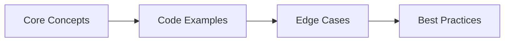

# Java Core Interview Q&A

> **Previous:** [Observability](./55-observability.md) | **Next:** [Spring Framework Interview Q&amp;A](./57-interview-spring.md)

This chapter covers 40+ essential Java Core interview questions ranging from OOP fundamentals to advanced concurrency, JVM internals, and Java 8+ features. Each answer includes complete, compilable code examples. These questions target senior and staff-level Java backend roles.


## Chapter at a Glance

| Topic | Key Focus | Key Questions |
|-------|----------|--------------|
| Core Concepts | Foundational understanding | Definitions, contrasts, trade-offs |
| Code Examples | Compilable, runnable solutions | Real interview scenarios |
| Best Practices | Production-ready patterns | Pitfalls to avoid |

## Chapter Roadmap



### Q1: How does Java implement polymorphism?

> **Pro Tip:** In interviews, always start with the "why" before the "how." Explaining the reasoning behind a design choice is more valuable than reciting syntax.

> **Remember:** Code readability matters in interviews. Write clean, well-structured code with meaningful variable names.


**Answer:** Polymorphism means "many forms." Java supports compile-time (method overloading) and runtime (method overriding via dynamic method dispatch).

```java
public class PolymorphismExample {
    static class Calculator {
        public int add(int a, int b) { return a + b; }
        public int add(int a, int b, int c) { return a + b + c; }
        public double add(double a, double b) { return a + b; }
    }
    static abstract class Animal {
        public abstract String speak();
    }
    static class Dog extends Animal {
        @Override public String speak() { return "Woof!"; }
    }
    static class Cat extends Animal {
        @Override public String speak() { return "Meow!"; }
    }
    public static void main(String[] args) {
        Calculator calc = new Calculator();
        System.out.println(calc.add(2, 3));
        System.out.println(calc.add(2, 3, 4));
        System.out.println(calc.add(2.5, 3.7));
        Animal myDog = new Dog();
        Animal myCat = new Cat();
        System.out.println(myDog.speak());
        System.out.println(myCat.speak());
    }
}
```

The JVM uses a vtable per class. At runtime, it looks up the method in the actual object's class. Static/private/final methods and fields are not polymorphic.

### Q2: Inheritance vs Composition → when to use which?

**Answer:** Inheritance models is-a (Dog extends Animal). Composition models has-a (Car has Engine). Favor composition over inheritance because inheritance breaks encapsulation.

```java
import java.util.*;

class InstrumentedHashSetInheritance<E> extends HashSet<E> {
    private int addCount = 0;
    @Override public boolean add(E e) { addCount++; return super.add(e); }
    @Override public boolean addAll(Collection<? extends E> c) {
        addCount += c.size(); return super.addAll(c);
    }
    public int getAddCount() { return addCount; }
}

class InstrumentedHashSetComposition<E> {
    private final Set<E> set;
    private int addCount = 0;
    public InstrumentedHashSetComposition(Set<E> set) { this.set = Objects.requireNonNull(set); }
    public boolean add(E e) { addCount++; return set.add(e); }
    public boolean addAll(Collection<? extends E> c) { addCount += c.size(); return set.addAll(c); }
    public int getAddCount() { return addCount; }
}

public class InheritanceVsComposition {
    public static void main(String[] args) {
        InstrumentedHashSetInheritance<String> bad = new InstrumentedHashSetInheritance<>();
        bad.addAll(List.of("a", "b", "c"));
        System.out.println("Inheritance: " + bad.getAddCount());

        InstrumentedHashSetComposition<String> good = new InstrumentedHashSetComposition<>(new HashSet<>());
        good.addAll(List.of("a", "b", "c"));
        System.out.println("Composition: " + good.getAddCount());
    }
}
```

Use inheritance for true is-a with Liskov substitution. Use composition for has-a, runtime swap behavior, or extending classes not designed for inheritance.

### Q3: SOLID principles.

**Answer:** SOLID is five design principles by Robert C. Martin.

**SRP:** One reason to change.
```java
class InvoiceCalculator { public BigDecimal calculateTotal(List<LineItem> items) { return BigDecimal.ZERO; } }
class InvoiceRepository { public void save(Invoice invoice) { } }
class NotificationService { public void sendInvoiceEmail(Invoice invoice, String email) { } }
```

**OCP:** Open for extension, closed for modification.
```java
interface Shape { double area(); }
record Circle(double r) implements Shape { public double area() { return Math.PI * r * r; } }
record Rectangle(double w, double h) implements Shape { public double area() { return w * h; } }
```

**LSP:** Subtypes substitutable for base types.
```java
// Bad: Square extends Rectangle, breaks width/height independence
interface Shape2 { int area(); }
class GoodRect implements Shape2 { private final int w,h; GoodRect(int w,int h){this.w=w;this.h=h;} public int area(){return w*h;} }
class GoodSquare implements Shape2 { private final int s; GoodSquare(int s){this.s=s;} public int area(){return s*s;} }
```

**ISP:** Don't depend on interfaces you don't use.
```java
interface Workable { void work(); }
interface Eatable { void eat(); }
class Robot implements Workable { public void work() { } }
```

**DIP:** Depend on abstractions, not concretions.
```java
interface UserRepository { void save(User u); }
class MySqlRepo implements UserRepository { public void save(User u) { } }
class UserService { private final UserRepository r; UserService(UserRepository r){this.r=r;} }
```

### Q4: HashMap internals.

**Answer:** HashMap stores entries in a Node array. Uses hashCode() for bucket, equals() for entry within bucket. Default capacity 16, load factor 0.75, threshold 12.

```java
public class HashMapInternals {
    static class Node<K,V> {
        final int hash; final K key; V value; Node<K,V> next;
        Node(int h, K k, V v, Node<K,V> n) { hash=h; key=k; value=v; next=n; }
    }
    public static void main(String[] args) {
        Map<String,Integer> map = new HashMap<>(4, 0.75f);
        map.put("Aa",1); map.put("BB",2);
        map.put(null,100);
        System.out.println("Null: "+map.get(null));
        // hash = key.hashCode() ^ (h >>> 16)
        // index = (n - 1) & hash  (power-of-2 optimization)
        // If collision: linked list or tree (>=8 entries, TREEIFY_THRESHOLD)
        // resize at size > threshold, capacity * 2
    }
}
```

put(): hash spread -> index -> if empty, place; else traverse list/tree -> replace or append. After insert, check resize. Java 8+ uses trees for >=8 entries in a bucket (O(log n)). Load factor 0.75 balances space and time.

### Q5: ConcurrentHashMap thread-safety.

**Answer:** Java 8+ CHM uses CAS on individual nodes, synchronized only for tree ops, volatile reads. Java 7 used 16 segments with separate locks.

```java
import java.util.concurrent.ConcurrentHashMap;

public class CHMDeepDive {
    public static void main(String[] args) {
        ConcurrentHashMap<String,Integer> map = new ConcurrentHashMap<>();
        map.putIfAbsent("counter",0);
        map.compute("counter",(k,v)->v+1);
        String r = map.computeIfAbsent("key", k -> { System.out.println("Computing"); return "value"; });
        System.out.println("Cached: "+r);

        map.put("a",1); map.put("b",2);
        int sum = map.reduceValues(1L, Integer::intValue, Integer::sum);
        System.out.println("Sum: "+sum);
    }
}
```

Key ops: putIfAbsent, compute, computeIfAbsent, merge. Reads lock-free. Iterators weakly consistent. Null keys/values not allowed. Size uses LongAdder-style counters.

### Q6: TreeMap vs HashMap vs LinkedHashMap.

**Answer:** All implement Map but differ in ordering, performance, and memory.

```java
import java.util.*;

public class MapComparison {
    public static void main(String[] args) {
        Map<String,Integer> hm = new HashMap<>();
        hm.put("z",1); hm.put("a",2); hm.put("m",3);
        System.out.println("HashMap: "+hm);

        Map<String,Integer> lm = new LinkedHashMap<>(16,0.75f,true);
        lm.put("z",1); lm.put("a",2); lm.put("m",3);
        lm.get("z");
        System.out.println("LinkedHashMap (access): "+lm);

        TreeMap<String,Integer> tm = new TreeMap<>();
        tm.put("z",1); tm.put("a",2); tm.put("m",3);
        System.out.println("TreeMap: "+tm);
        System.out.println("SubMap: "+tm.subMap("a","n"));
    }
}
```

HashMap O(1), no order, allows null. LinkedHashMap O(1), insertion/access order, LRU cache via removeEldestEntry. TreeMap O(log n), sorted, range queries, no null. EnumMap is most performant (array by ordinal).

### Q7: Fail-fast vs fail-safe iterators.

**Answer:** Fail-fast: throw ConcurrentModificationException on structural mod after iterator creation. Fail-safe: tolerant of concurrent mods.

```java
import java.util.*;
import java.util.concurrent.CopyOnWriteArrayList;

public class FailFastFailSafe {
    public static void main(String[] args) {
        List<String> l = new ArrayList<>(List.of("a","b","c"));
        Iterator<String> it = l.iterator();
        l.remove("a");
        try { it.next(); } catch (ConcurrentModificationException e) { System.out.println("Fail-fast"); }

        List<String> cow = new CopyOnWriteArrayList<>(List.of("a","b","c"));
        Iterator<String> cit = cow.iterator();
        cow.add("d");
        System.out.println("COW iterator: "+cit.next()+" list: "+cow);
    }
}
```

ArrayList checks modCount on next()/remove(). CopyOnWriteArrayList snapshots array at creation. ConcurrentHashMap weakly consistent.

### Q8: Comparable vs Comparator.

**Answer:** Comparable defines natural order (a.compareTo(b)). Comparator defines external order. A class has one Comparable but many Comparators.

```java
import java.util.*;

record Person(String name, int age) implements Comparable<Person> {
    public int compareTo(Person o) {
        int c = name.compareTo(o.name);
        return c != 0 ? c : Integer.compare(age, o.age);
    }
}

public class CompDemo {
    public static void main(String[] args) {
        var people = List.of(new Person("Alice",30), new Person("Bob",25), new Person("Alice",20));
        var list = new ArrayList<>(people);
        Collections.sort(list);
        System.out.println("Natural: "+list);

        list.sort(Comparator.comparing(Person::name).thenComparingInt(Person::age).reversed());
        System.out.println("Custom: "+list);

        List<String> n = new ArrayList<>(Arrays.asList("b",null,"a"));
        n.sort(Comparator.nullsLast(String::compareTo));
        System.out.println("Nulls last: "+n);
    }
}
```

If compareTo() inconsistent with equals(), TreeSet/TreeMap use compareTo() for uniqueness. Objects equal by equals() but compareTo() != 0 both stored.

### Q9: Thread lifecycle states.

**Answer:** NEW, RUNNABLE, BLOCKED, WAITING, TIMED_WAITING, TERMINATED.

```java
public class ThreadLifecycle {
    public static void main(String[] args) throws Exception {
        Object lock = new Object();
        Thread t = new Thread(() -> {
            synchronized(lock) { try { lock.wait(); } catch(InterruptedException e) {} }
        });
        System.out.println("NEW: "+t.getState());
        t.start();
        System.out.println("RUNNABLE: "+t.getState());
        synchronized(lock) {
            System.out.println("WAITING: "+t.getState());
            lock.notify();
        }
        t.join();
        System.out.println("TERMINATED: "+t.getState());
    }
}
```

BLOCKED = waiting for monitor. WAITING = wait/park/join without timeout. TIMED_WAITING = sleep/wait(timeout). InterruptedException: always restore interrupt flag.

### Q10: synchronized keyword.

**Answer:** synchronized provides mutual exclusion and happens-before visibility. Instance methods lock on this. Static methods lock on Class object.

```java
public class SyncDemo {
    static class Counter {
        private int count = 0;
        public synchronized void inc() { count++; }
        public synchronized int get() { return count; }
    }
    static class Reentrant { public synchronized void a() { b(); } public synchronized void b() {} }

    public static void main(String[] args) throws Exception {
        Counter c = new Counter();
        Thread[] ts = new Thread[10];
        for(int t=0;t<10;t++) { ts[t]=new Thread(()->{for(int i=0;i<10000;i++)c.inc();}); ts[t].start(); }
        for(Thread t:ts) t.join();
        System.out.println("Expected 100000 Got: "+c.get());
        new Reentrant().a();
    }
}
```

Object header lock states: biased -> lightweight -> heavyweight (one-way escalation). synchronized is reentrant (same thread can re-acquire). Lock on mutable fields/String literals is dangerous.

### Q11: volatile keyword.

**Answer:** volatile guarantees visibility across threads. Write happens-before subsequent read. Does NOT provide atomicity.

```java
import java.util.concurrent.atomic.AtomicInteger;

public class VolatileDemo {
    private static volatile boolean running = true;
    public static void main(String[] args) throws Exception {
        Thread w = new Thread(()->{ while(running) {} System.out.println("Stopped"); });
        w.start();
        Thread.sleep(1000);
        running = false;
        w.join();
    }
}

class VolatileNotAtomic {
    private volatile int count = 0;
    public void inc() { count++; } // broken: read-inc-write
    private final AtomicInteger safe = new AtomicInteger(0);
    public void safeInc() { safe.incrementAndGet(); }
}
```

Prevents reordering (memory barriers). Acquire semantics on read. Release semantics on write. Double-checked locking requires volatile.

### Q12: Lock vs synchronized.

**Answer:** Lock provides try-lock with timeout, interruptible locking, fairness, multiple Conditions. synchronized is simpler and JVM-optimized.

```java
import java.util.concurrent.locks.*;
import java.util.concurrent.TimeUnit;

public class LockVsSync {
    static class BoundedBuffer<T> {
        final ReentrantLock lock = new ReentrantLock();
        final Condition notFull = lock.newCondition();
        final Condition notEmpty = lock.newCondition();
        final T[] items;
        int putIdx, takeIdx, count;

        @SuppressWarnings("unchecked")
        BoundedBuffer(int cap) { items = (T[])new Object[cap]; }

        public void put(T item) throws InterruptedException {
            lock.lock();
            try {
                while(count == items.length) notFull.await();
                items[putIdx]=item; if(++putIdx==items.length) putIdx=0;
                count++; notEmpty.signal();
            } finally { lock.unlock(); }
        }

        public T take() throws InterruptedException {
            lock.lock();
            try {
                while(count == 0) notEmpty.await();
                T item = items[takeIdx]; items[takeIdx]=null;
                if(++takeIdx==items.length) takeIdx=0;
                count--; notFull.signal();
                return item;
            } finally { lock.unlock(); }
        }
    }

    public static void main(String[] args) throws Exception {
        BoundedBuffer<String> buf = new BoundedBuffer<>(3);
        Thread p = new Thread(()->{ try { for(char c='A';c<='F';c++) buf.put(String.valueOf(c)); } catch(Exception e){} });
        Thread c = new Thread(()->{ try { Thread.sleep(500); for(int i=0;i<6;i++) buf.take(); } catch(Exception e){} });
        p.start(); c.start(); p.join(); c.join();
    }
}
```

Use synchronized for simple mutex with short critical sections. Use ReentrantLock for timeout, interruptible locking, fairness, multiple Conditions. ReentrantLock builds on AQS (AbstractQueuedSynchronizer).

### Q13: ReentrantLock features.

**Answer:** Reentrancy, fairness, Conditions, tryLock with timeout, lock introspection.

```java
import java.util.concurrent.TimeUnit;
import java.util.concurrent.locks.ReentrantLock;

public class ReentrantLockFeatures {
    private final ReentrantLock lock = new ReentrantLock(true);

    public void work() {
        lock.lock();
        try {
            System.out.println(Thread.currentThread().getName()+" locked. Hold: "+lock.getHoldCount());
            Thread.sleep(50);
        } catch(InterruptedException e) { Thread.currentThread().interrupt(); }
        finally { lock.unlock(); }
    }

    public boolean tryAcquire(long timeout, TimeUnit unit) throws InterruptedException {
        return lock.tryLock(timeout, unit);
    }

    public static void main(String[] args) {
        var demo = new ReentrantLockFeatures();
        for(int i=0;i<5;i++) new Thread(demo::work).start();
    }
}
```

getHoldCount(), isHeldByCurrentThread(), isLocked(), getQueueLength(). Condition.await() releases lock atomically, re-acquires on signal. Fair lock: FIFO. Unfair: barging (better throughput).

### Q14: CountDownLatch vs CyclicBarrier vs Semaphore.

**Answer:** All AQS-based with different use cases.

```java
import java.util.concurrent.*;

public class SyncCompare {
    public static void main(String[] args) throws Exception {
        // CountDownLatch: one-shot, await count=0
        CountDownLatch latch = new CountDownLatch(3);
        for(int i=0;i<3;i++) { int id=i; new Thread(()->{ try{Thread.sleep(200);}catch(Exception e){} latch.countDown(); }).start(); }
        latch.await();
        System.out.println("Latch done");

        // CyclicBarrier: reusable barrier
        CyclicBarrier bar = new CyclicBarrier(3, ()->System.out.println("Barrier tripped"));
        for(int i=0;i<3;i++) { int id=i; new Thread(()->{
            try{ System.out.println("Phase1:"+id); bar.await(); System.out.println("Phase2:"+id); bar.await(); }
            catch(Exception e){}
        }).start(); }
        Thread.sleep(500);

        // Semaphore: permits
        Semaphore sem = new Semaphore(2);
        for(int i=0;i<6;i++) { int id=i; new Thread(()->{
            try{ sem.acquire(); System.out.println("Permit:"+id); Thread.sleep(200); sem.release(); }
            catch(Exception e){}
        }).start(); }
    }
}
```

Latch: one-shot, cannot reset. Barrier: reusable, BrokenBarrierException on failure. Semaphore: acquire/release, supports multiple permits, binary (count=1) acts as mutex without ownership.

### Q15: ExecutorService thread pools.

**Answer:** ExecutorService decouples task submission from execution. Five pool types via Executors.

```java
import java.util.concurrent.*;
import java.util.*;

public class ExecutorServiceDemo {
    public static void main(String[] args) {
        ExecutorService fixed = Executors.newFixedThreadPool(4);
        ExecutorService cached = Executors.newCachedThreadPool();
        ExecutorService single = Executors.newSingleThreadExecutor();
        ScheduledExecutorService sched = Executors.newScheduledThreadPool(4);
        ExecutorService stealing = Executors.newWorkStealingPool(4);

        ThreadPoolExecutor custom = new ThreadPoolExecutor(
            4, 8, 60L, TimeUnit.SECONDS,
            new ArrayBlockingQueue<>(100),
            new ThreadPoolExecutor.CallerRunsPolicy());

        List<Future<Integer>> futures = new ArrayList<>();
        for(int i=0;i<10;i++) { int id=i; futures.add(fixed.submit(()->{ Thread.sleep(200); return id*2; })); }
        int total = futures.stream().mapToInt(f->{ try{return f.get();}catch(Exception e){throw new RuntimeException(e);} }).sum();
        System.out.println("Total: "+total);

        fixed.shutdown();
        try { if(!fixed.awaitTermination(5,TimeUnit.SECONDS)) fixed.shutdownNow(); }
        catch(InterruptedException e) { fixed.shutdownNow(); }
    }
}
```

CPU-bound: cores+1. I/O-bound: cores*(1+wait/compute). Rejection: AbortPolicy, CallerRunsPolicy, DiscardPolicy, DiscardOldestPolicy. Thread starvation deadlock: task submits to same pool and blocks on get().
### Q16: ForkJoinPool and work-stealing.

**Answer:** ForkJoinPool implements work-stealing for divide-and-conquer parallelism. Each worker has a deque. Owner pushes/pops one end (LIFO/cache locality). Idle threads steal from the other end (FIFO/minimizes contention).

```java
import java.util.concurrent.*;

public class ForkJoinDemo {
    static class Fib extends RecursiveTask<Long> {
        final long n;
        Fib(long n) { this.n = n; }
        protected Long compute() {
            if(n <= 20) return fibDirect(n);
            Fib f1 = new Fib(n-1); f1.fork();
            return new Fib(n-2).compute() + f1.join();
        }
        long fibDirect(long x) {
            if(x<=1) return x;
            long a=0,b=1;
            for(long i=2;i<=x;i++){long t=a+b;a=b;b=t;}
            return b;
        }
    }

    public static void main(String[] args) {
        ForkJoinPool pool = new ForkJoinPool(4);
        long r = pool.invoke(new Fib(40));
        System.out.println("Fib(40)="+r+" steals:"+pool.getStealCount());
        System.out.println("Common pool:"+ForkJoinPool.commonPool().getParallelism());
        pool.shutdown();
    }
}
```

invokeAll() is optimized: forks tasks, runs current thread's task while waiting (stealing). ManagedBlocker handles blocking tasks within FJP. ForkJoinPool.commonPool() is default for parallel streams and CompletableFuture.

### Q17: CompletableFuture → chaining, composition, error handling.

**Answer:** CompletableFuture enables declarative non-blocking async composition with transformation, combination, and error recovery.

```java
import java.util.concurrent.*;
import java.util.*;

public class CFDemo {
    static ExecutorService pool = Executors.newFixedThreadPool(8);

    public static void main(String[] args) {
        // thenApply: transform
        CompletableFuture.supplyAsync(() -> "42")
            .thenApply(Integer::parseInt).thenApply(n->n*2)
            .thenAccept(r->System.out.println("thenApply: "+r));

        // thenCompose: flatten
        CompletableFuture.supplyAsync(() -> "user:1")
            .thenCompose(id -> CompletableFuture.supplyAsync(() -> "Profile:"+id))
            .thenAccept(p->System.out.println("compose: "+p));

        // thenCombine: parallel independent
        CompletableFuture<String> f1 = CompletableFuture.supplyAsync(()->{ sleep(200); return "Hello"; });
        CompletableFuture<String> f2 = CompletableFuture.supplyAsync(()->{ sleep(300); return "World"; });
        f1.thenCombine(f2, (a,b)->a+" "+b).thenAccept(r->System.out.println("combine: "+r));

        // allOf
        List<CompletableFuture<String>> futures = new ArrayList<>();
        for(int i=0;i<5;i++) { int id=i;
            futures.add(CompletableFuture.supplyAsync(()->{ sleep(200); return "T"+id; })); }
        CompletableFuture.allOf(futures.toArray(new CompletableFuture[0]))
            .thenApply(v->futures.stream().map(CompletableFuture::join).toList())
            .thenAccept(r->System.out.println("allOf: "+r));

        // exceptionally: recover
        CompletableFuture.supplyAsync(()->{ throw new RuntimeException("fail"); })
            .exceptionally(ex->"recovered: "+ex.getMessage())
            .thenAccept(r->System.out.println("exceptionally: "+r));

        // handle: both success and failure
        CompletableFuture.supplyAsync(()->"ok")
            .handle((r,ex)->ex!=null?"fail":"success: "+r)
            .thenAccept(r->System.out.println("handle: "+r));

        pool.shutdown();
    }
    static void sleep(long ms) { try{Thread.sleep(ms);}catch(Exception e){} }
}
```

thenApply vs thenApplyAsync: thenApply runs on completing thread; thenApplyAsync on pool. Custom executor avoids bottlenecking on common pool. Never block in threads also serving common pool.

### Q18: Virtual Threads (Project Loom).

**Answer:** Virtual threads (Java 21+) are lightweight JVM-managed threads. No 1:1 OS mapping → millions on one platform thread. Blocking yields the carrier.

```java
import java.util.concurrent.*;
import java.util.stream.*;

public class VTDeepDive {
    public static void main(String[] args) throws Exception {
        // Create
        Thread vt = Thread.ofVirtual().name("vt-1").start(()->System.out.println(Thread.currentThread()));
        vt.join();

        // Executor per task
        try(var exec = Executors.newVirtualThreadPerTaskExecutor()) {
            exec.submit(()->System.out.println("VT exec"));
        }

        // Scale: 100k with sleep
        CountDownLatch latch = new CountDownLatch(100_000);
        long start = System.nanoTime();
        for(int i=0;i<100_000;i++) Thread.ofVirtual().start(()->{
            try{Thread.sleep(100);}catch(Exception e){} latch.countDown();
        });
        latch.await();
        System.out.println("100k VT sleep(100): "+(System.nanoTime()-start)/1_000_000+"ms");

        // Structured concurrency
        try(var scope = new StructuredTaskScope.ShutdownOnFailure()) {
            Future<String> u = scope.fork(()->"Alice");
            Future<Integer> a = scope.fork(()->30);
            scope.join(); scope.throwIfFailed();
            System.out.println(u.resultNow()+", "+a.resultNow());
        }
    }
}
```

Pinning: when VT can't unmount (synchronized block, native method). Use ReentrantLock instead. ScopedValue (Java 21+) is safer than ThreadLocal - immutable per scope. Not for CPU-bound tasks (no blocking = no benefit).

### Q19: JVM memory model.

**Answer:** Per-thread: PC register and stack. Shared: heap and metaspace.

```java
import java.lang.management.*;

public class JVMMemoryDemo {
    public static void main(String[] args) {
        MemoryMXBean mem = ManagementFactory.getMemoryMXBean();
        System.out.println("Heap init: "+mem.getHeapMemoryUsage().getInit()/1024/1024+"MB");
        System.out.println("Heap used: "+mem.getHeapMemoryUsage().getUsed()/1024/1024+"MB");
        System.out.println("Metaspace: "+mem.getNonHeapMemoryUsage().getUsed()/1024/1024+"MB");

        // Stack: per-thread, frames with locals + operand stack
        // -Xss (default ~1MB). Deep recursion -> StackOverflowError
        // Heap: Young Gen (Eden+S0+S1) + Old Gen
        // Metaspace (Java 8+): native memory, class metadata. Replaces PermGen.
        // -Xms, -Xmx, -Xmn, -XX:MetaspaceSize, -XX:MaxMetaspaceSize
    }
}
```

Stack stores primitives and object references. Heap stores objects. Metaspace stores class metadata in native memory. String pool moved from PermGen to heap in Java 7. -XX:StringTableSize (default 60013).

### Q20: GC algorithms.

**Answer:** Serial (single-threaded), Parallel (throughput), G1 (low-pause, default), ZGC (sub-ms), Shenandoah (concurrent compaction).

```java
import java.lang.management.*;
import java.util.*;

public class GCDemo {
    public static void main(String[] args) {
        System.out.println("GC collectors:");
        for(var bean : ManagementFactory.getGarbageCollectorMXBeans())
            System.out.println("  "+bean.getName()+": "+bean.getCollectionCount()+" collections "+bean.getCollectionTime()+"ms");

        List<byte[]> g = new ArrayList<>();
        for(int i=0;i<100;i++) g.add(new byte[1024*1024]);
        g.clear(); System.gc();

        System.out.println("G1: region-based, ~200ms pause target");
        System.out.println("ZGC: colored pointers, <1ms pauses, multi-TB heap");
        System.out.println("Shenandoah: forwarding pointers, concurrent compaction");
        System.out.println("Parallel: throughput-oriented, STW for both young+old");
        System.out.println("Serial: single-thread, small heaps <100MB");
    }
}
```

Throughput -> ParallelGC. Latency -> ZGC/Shenandoah. Footprint limited -> SerialGC. G1 balances both. ZGC requires 64-bit OS, higher CPU overhead for load barriers.

### Q21: Class loading mechanism.

**Answer:** Bootstrap -> Platform -> Application. Parent delegation model.

```java
public class ClassLoaderDemo {
    public static void main(String[] args) throws Exception {
        ClassLoader cl = ClassLoaderDemo.class.getClassLoader();
        System.out.println("App: "+cl);
        System.out.println("Platform: "+cl.getParent());
        System.out.println("Bootstrap: "+cl.getParent().getParent());
        System.out.println("String: "+String.class.getClassLoader());

        Class<?> c = Class.forName("java.util.ArrayList");
        System.out.println("Loaded: "+c.getName());
    }
}
```

Delegation: child delegates to parent first. Only if parent can't load does child try. Linking: verification -> preparation -> resolution. Initialization: static blocks. Custom CLs can break delegation (security risk).

### Q22: String pool and interning.

**Answer:** String literals are interned in the pool (heap since Java 7). String.intern() adds heap strings to pool.

```java
public class StringPoolDemo {
    public static void main(String[] args) {
        String s1 = "hello";
        String s2 = "hello";
        String s3 = new String("hello");
        String s4 = s3.intern();
        System.out.println("s1==s2: "+(s1==s2));
        System.out.println("s1==s3: "+(s1==s3));
        System.out.println("s1==s4: "+(s1==s4));

        String concat = "he"+"llo";
        System.out.println("s1==concat: "+(s1==concat));

        String a = "he";
        String b = a+"llo";
        System.out.println("s1==b: "+(s1==b));
        System.out.println("s1.equals(b): "+s1.equals(b));
    }
}
```

Compile-time constants interned. Runtime concat creates new String. Always use equals() for comparison unless you control interning.

### Q23: Lambda expressions and functional interfaces.

**Answer:** Lambdas implement SAM (Single Abstract Method) interfaces. Compiled to invokedynamic, not anonymous inner classes.

```java
import java.util.*;
import java.util.function.*;

public class LambdaDemo {
    @FunctionalInterface interface Processor { String process(String s); }

    public static void main(String[] args) {
        Processor upper = s -> s.toUpperCase();
        Processor reverse = s -> new StringBuilder(s).reverse().toString();
        System.out.println(upper.process("hello"));

        // Built-in functional interfaces
        Predicate<String> isEmpty = String::isEmpty;
        Function<String,Integer> length = String::length;
        Supplier<Long> time = System::currentTimeMillis;
        Consumer<String> print = System.out::println;
        UnaryOperator<Integer> square = x->x*x;
        BinaryOperator<Integer> sum = Integer::sum;

        // Capture must be effectively final
        String prefix = "User: ";
        Function<String,String> addP = name -> prefix+name;
    }
}
```

Lambdas compile to invokedynamic with LambdaMetafactory. Runtime generates implementation once. No anonymous class overhead per call site.

### Q24: Streams API.

**Answer:** Streams process sequences with functional operations. Intermediate ops are lazy. Terminal ops are eager.

```java
import java.util.*;
import java.util.stream.*;

public class StreamsDemo {
    record Emp(String name, String dept, double salary) {}

    public static void main(String[] args) {
        List<Emp> emps = List.of(
            new Emp("Alice","Eng",120000), new Emp("Bob","Eng",95000),
            new Emp("Charlie","Mkt",80000), new Emp("Diana","Mkt",110000));

        List<String> high = emps.stream()
            .filter(e -> e.salary() > 100000)
            .sorted(Comparator.comparingDouble(Emp::salary).reversed())
            .map(Emp::name)
            .collect(Collectors.toList());
        System.out.println("High: "+high);

        Map<String,List<Emp>> byDept = emps.stream()
            .collect(Collectors.groupingBy(Emp::dept));
        System.out.println("By dept: "+byDept);

        DoubleSummaryStatistics stats = emps.stream()
            .collect(Collectors.summarizingDouble(Emp::salary));
        System.out.println("Stats: "+stats);

        // flatMap
        List<List<Integer>> nested = List.of(List.of(1,2), List.of(3,4));
        List<Integer> flat = nested.stream().flatMap(Collection::stream).collect(Collectors.toList());
        System.out.println("Flat: "+flat);

        // Parallel
        long sum = LongStream.rangeClosed(1,10_000_000).parallel().sum();
        System.out.println("Parallel sum: "+sum);
    }
}
```

Stream pipeline: source -> intermediate ops (filter, map, sorted, distinct, limit) -> terminal op (collect, forEach, reduce, count, anyMatch, findFirst). findAny vs findFirst in parallel: findAny is non-deterministic for parallelism.

### Q25: Optional best practices.

**Answer:** Optional is a return type container for nullable values. Never as field, parameter, or in collections.

```java
import java.util.*;

public class OptionalDemo {
    record User(String name, String email) {}

    static Optional<User> findUser(String id) {
        if("exists".equals(id)) return Optional.of(new User("Alice","a@x.com"));
        return Optional.empty();
    }

    public static void main(String[] args) {
        User u1 = findUser("exists").orElse(new User("d","d@x.com"));
        User u2 = findUser("missing").orElseGet(()->new User("d","d@x.com"));
        User u3 = findUser("missing").orElseThrow(()->new NoSuchElementException("not found"));

        // orElse vs orElseGet: orElse evaluates even if present
        Optional<String> p = Optional.of("hello");
        String r1 = p.orElse(expensive());  // runs!
        String r2 = p.orElseGet(()->expensive()); // lazy

        Optional<String> email = findUser("exists").map(User::email);
        System.out.println("Email: "+email);

        Optional<User> filtered = findUser("exists").filter(u->u.name().startsWith("A"));
        System.out.println("Filtered: "+filtered);
    }
    static String expensive() { System.out.println("expensive"); return "d"; }
}
```

Never use Optional.get() without isPresent(). Not serializable. orElse vs orElseGet: orElse always evaluates. Use orElseGet for expensive defaults.

### Q26: Method references.

**Answer:** Four types: static method, instance of particular object, instance of arbitrary object of a type, constructor.

```java
import java.util.*;
import java.util.function.*;

public class MethodRefDemo {
    record Person(String name) {}

    public static void main(String[] args) {
        // Static method: Class::staticMethod
        Comparator<Person> byName = Comparator.comparing(Person::name);

        // Instance of particular object: instance::method
        String prefix = "P: ";
        Function<Person,String> label = prefix::concat;

        // Instance of arbitrary object: Class::instanceMethod
        List.of("b","a").stream().sorted(String::compareTo).forEach(System.out::println);

        // Constructor: Class::new
        Supplier<Person> factory = () -> new Person("default");
        Function<String,Person> named = Person::new;
        Function<Integer,Person[]> array = Person[]::new;
    }
}
```

Method references require compatible functional interface. Constructor refs work with any matching functional interface. Array constructor ref: Type[]::new.

### Q27: Generics → type erasure.

**Answer:** Java generics use erasure → type info only at compile time. Erased to bounds (or Object) in bytecode. Compiler inserts casts.

```java
import java.util.*;
import java.lang.reflect.*;

public class ErasureDemo {
    public static void main(String[] args) {
        List<String> s = new ArrayList<>();
        List<Integer> i = new ArrayList<>();
        System.out.println("Same class: "+s.getClass().equals(i.getClass()));

        // Cannot: instanceof with parameterized type
        // Cannot: arrays of parameterized type
        // Cannot: primitive type arguments

        class Holder<T> { T v; Holder(T v){this.v=v;} }
        Holder<String> h = new Holder<>("test");
        String v = h.v; // compiler inserts (String)
    }
}
```

No generic type at runtime. Bridge methods generated for parameterized subtypes. Cannot use instanceof, arrays, or primitives with generics.

### Q28: Wildcards and PECS.

**Answer:** PECS: Producer Extends, Consumer Super. ? extends T for reading (covariant). ? super T for writing (contravariant).

```java
import java.util.*;

public class WildcardDemo {
    static double sum(Collection<? extends Number> nums) {
        double s=0; for(Number n:nums) s+=n.doubleValue(); return s;
    }

    static void fill(Collection<? super Integer> sink) {
        sink.add(1); sink.add(2); sink.add(3);
    }

    static <T> void copy(List<? extends T> src, List<? super T> dest) {
        for(T item:src) dest.add(item);
    }

    public static void main(String[] args) {
        double s = sum(List.of(1,2,3));
        System.out.println("Sum: "+s);

        List<Number> nums = new ArrayList<>();
        fill(nums);

        List<Integer> src = List.of(1,2,3);
        List<Object> dest = new ArrayList<>();
        copy(src, dest);
        System.out.println("Copied: "+dest);
    }
}
```

Read-only: ? extends T. Write-only: ? super T. Both read+write: T. Unbounded ?: any type. Wildcard capture: method can capture ? as T.

### Q29: Checked vs unchecked exceptions.

**Answer:** Checked (extends Exception) must be handled/declared. Unchecked (RuntimeException) do not. Checked for recoverable, unchecked for bugs.

```java
import java.io.*;

public class CheckedVsUnchecked {
    // Checked: must handle or declare
    static void readFile(String path) throws IOException {
        try(BufferedReader br = new BufferedReader(new FileReader(path))) {
            System.out.println(br.readLine());
        }
    }

    // Unchecked: no declaration needed
    static void validate(int age) {
        if(age < 0) throw new IllegalArgumentException("Negative: "+age);
    }

    static class InsufficientFundsException extends Exception {
        InsufficientFundsException(double bal, double amt) {
            super("Need "+amt+", have "+bal);
        }
    }

    public static void main(String[] args) {
        try { readFile("test.txt"); }
        catch(IOException e) { System.out.println("Handled: "+e.getMessage()); }

        try { validate(-5); }
        catch(IllegalArgumentException e) { System.out.println("Caught: "+e.getMessage()); }
    }
}
```

Checked for recoverable (caller retries). Unchecked for programming errors. Never swallow exceptions in empty catch. Always log or rethrow with context.

### Q30: Try-with-resources.

**Answer:** Auto-closes AutoCloseable resources in reverse order. Suppressed exceptions attached if both try and close throw.

```java
import java.io.*;

public class TwrDemo {
    static class Res implements AutoCloseable {
        final String name;
        Res(String n) { name=n; }
        public void close() { System.out.println("Close: "+name); }
    }

    static class FailRes implements AutoCloseable {
        final boolean fail;
        FailRes(boolean f) { fail=f; }
        public void close() throws IOException {
            if(fail) throw new IOException("close failed");
        }
    }

    public static void main(String[] args) {
        try(Res a=new Res("A"); Res b=new Res("B")) {
            System.out.println("Work");
        } // closes B, A

        try {
            try(FailRes r = new FailRes(true)) {
                throw new RuntimeException("primary");
            }
        } catch(RuntimeException e) {
            System.out.println("Primary: "+e.getMessage());
            for(Throwable t : e.getSuppressed())
                System.out.println("Suppressed: "+t.getMessage());
        }

        // Java 9+: effectively final variable
        Res r = new Res("ef");
        try(r) { System.out.println("EF"); }
    }
}
```

Before Java 7: finally blocks with null checks. try-with-resources eliminates boilerplate. Suppressed exceptions: call getSuppressed().
### Q31: Exception handling best practices.

**Answer:** Design for recoverability, clarity, and diagnostic value.

```java
import java.util.*;
import java.util.logging.*;

public class ExceptionBestPractices {
    private static final Logger log = Logger.getLogger(ExceptionBestPractices.class.getName());

    // BAD: empty catch
    void bad() { try { risky(); } catch(Exception e) {} }

    // GOOD: log and rethrow
    void good() {
        try { risky(); }
        catch(IOException e) {
            log.log(Level.SEVERE, "failed", e);
            throw new BusinessException("Can't complete", e);
        }
    }

    // GOOD: top-level handler
    void handle() {
        try { bizLogic(); }
        catch(BusinessException e) { log.warning(e.getMessage()); notifyUser(e); }
        catch(SystemException e) { log.severe("system failure"); notifyAdmin(e); }
    }

    // Exception translation
    User find(String id) {
        try { return repo.findById(id); }
        catch(EntityNotFoundException e) { throw new UserNotFound(id, e); }
    }

    void risky() throws IOException {}
    void bizLogic() {}
    void notifyUser(Exception e) {}
    void notifyAdmin(Exception e) {}

    static class BusinessException extends RuntimeException {
        BusinessException(String m, Throwable c) { super(m,c); }
    }
    static class SystemException extends RuntimeException {
        SystemException(String m, Throwable c) { super(m,c); }
    }
    static class UserNotFound extends RuntimeException {
        UserNotFound(String id, Throwable c) { super("User: "+id, c); }
    }
    static class UserRepository { User findById(String id) { throw new EntityNotFoundException(); } }
    static class EntityNotFoundException extends RuntimeException {}
    static class User {}
}
```

Catch specific exceptions. Never swallow. Log full exception with stack trace. Exception translation wraps low-level in high-level. Prefer unchecked for most apps.

### Q32: Performance profiling.

**Answer:** Profile CPU, memory, I/O, lock contention. Tools: jstack, jmap, jstat, async-profiler, JFR, VisualVM.

```java
import java.util.*;
import java.util.stream.*;

public class ProfilingDemo {
    static class Leak {
        static final Map<String,byte[]> cache = new HashMap<>(); // never evicted
        static void add(String k, byte[] d) { cache.put(k,d); }
    }

    public static void main(String[] args) {
        // Warmup JIT
        for(int i=0;i<10000;i++) Math.sqrt(i);

        long start = System.nanoTime();
        int sum = IntStream.range(0,1_000_000).parallel().map(i->i*2).sum();
        long t = (System.nanoTime()-start)/1_000_000;
        System.out.println("Time: "+t+"ms");

        System.out.println("Profile: CPU, heap alloc rate, GC, lock contention, I/O");
        System.out.println("Tools: async-profiler, JFR, VisualVM, JMC");
        System.out.println("jstack for deadlocks, jmap for heap dumps");
    }
}
```

Workflow: baseline -> identify bottleneck -> hypothesis -> measure -> validate. Focus on P99 latency, not average. async-profiler for CPU/alloc (production-safe). JFR for comprehensive. -XX:+HeapDumpOnOutOfMemoryError in production.

### Q33: JIT compilation.

**Answer:** JIT compiles hot methods to native code. Tiered compilation: 0 (interpreted) -> 1-3 (C1 profiling) -> 4 (C2 fully optimized).

```java
public class JITDemo {
    static double compute(int iters) {
        double r = 0;
        for(int i=0;i<iters;i++) r += Math.sin(i)*Math.cos(i);
        return r;
    }

    public static void main(String[] args) {
        // Warmup for JIT
        for(int i=0;i<15000;i++) compute(100);

        long start = System.nanoTime();
        double r = compute(10000);
        long t = System.nanoTime()-start;
        System.out.println("Result: "+r+" time: "+t+"ns");

        System.out.println("JIT opts: inlining, loop unrolling, lock coarsening");
        System.out.println("escape analysis, dead code elimination, vectorization");
    }
}
```

-XX:+PrintCompilation shows compilation. -XX:CompileThreshold (default 10000). C2 is most aggressive. Tiered compilation default since Java 8.

### Q34: Escape analysis and stack allocation.

**Answer:** If object reference doesn't escape method/thread, JIT can stack-allocate or scalar-replace, eliminating GC pressure.

```java
public class EscapeAnalysisDemo {
    static class Point { double x,y; Point(double x,double y){this.x=x;this.y=y;} double dist(){return Math.sqrt(x*x+y*y);} }

    // No escape: can be stack-allocated or scalar replaced
    static double compute(double x, double y) {
        Point p = new Point(x, y); // doesn't escape
        return p.dist();
    }

    // Escapes via return
    static Point create(double x, double y) { return new Point(x, y); }

    // Escapes via global
    static final Point[] pts = new Point[10];
    static void store(int i, double x, double y) { pts[i] = new Point(x, y); }

    public static void main(String[] args) {
        for(int i=0;i<10000;i++) compute(i,i+1);

        long start = System.nanoTime();
        double sum = 0;
        for(int i=0;i<10_000_000;i++) sum += compute(i, i+1);
        long t = (System.nanoTime()-start)/1_000_000;
        System.out.println("EA time: "+t+"ms");
    }
}
```

Enabled by default in C2. -XX:+DoEscapeAnalysis. Stack allocation eliminates GC. Scalar replacement: fields replaced with locals/registers. Lock coarsening: non-escaping sync ops eliminated.

### Q35: Record classes (Java 14+).

**Answer:** Records are transparent immutable data carriers. Auto-generate constructor, accessors, equals, hashCode, toString.

```java
import java.util.*;

public class RecordDemo {
    record Point(int x, int y) {}

    record Person(String name, int age) {
        Person { // compact constructor
            Objects.requireNonNull(name);
            if(age < 0) throw new IllegalArgumentException("age: "+age);
        }
        boolean isAdult() { return age >= 18; }
    }

    record Pair<A,B>(A first, B second) {}

    record Color(int r, int g, int b) {
        static final Color BLACK = new Color(0,0,0);
        String toHex() { return String.format("#%02x%02x%02x", r,g,b); }
    }

    static List<String> process(List<Person> people) {
        record AgeGroup(String label, int min, int max) {
            boolean matches(Person p) { return p.age()>=min && p.age()<=max; }
        }
        var young = new AgeGroup("Young",0,17);
        var adult = new AgeGroup("Adult",18,64);
        List<String> res = new ArrayList<>();
        for(Person p : people) {
            if(young.matches(p)) res.add(p.name()+" is "+young.label());
            else if(adult.matches(p)) res.add(p.name()+" is "+adult.label());
        }
        return res;
    }

    public static void main(String[] args) {
        Point p1 = new Point(3,4);
        Point p2 = new Point(3,4);
        System.out.println("p1: "+p1+" equals: "+p1.equals(p2));
    }
}
```

Records are final. Cannot extend other classes. Can implement interfaces. Accessor: name() not getName(). Local records reduce boilerplate for intermediate data. Compact constructor for validation.

### Q36: Sealed classes (Java 17+).

**Answer:** Sealed classes restrict which classes can extend/implement them. Permitted subclasses declared at definition.

```java
import java.util.*;

public class SealedDemo {
    sealed interface Shape permits Circle, Rectangle, Triangle {}
    record Circle(double r) implements Shape {}
    record Rectangle(double w, double h) implements Shape {}
    record Triangle(double a, double b, double c) implements Shape {}

    static double area(Shape s) {
        return switch(s) {
            case Circle c -> Math.PI*c.r()*c.r();
            case Rectangle r -> r.w()*r.h();
            case Triangle t -> { double s2=(t.a()+t.b()+t.c())/2; yield Math.sqrt(s2*(s2-t.a())*(s2-t.b())*(s2-t.c())); }
        };
    }

    public static void main(String[] args) {
        Shape c = new Circle(5);
        Shape r = new Rectangle(3,4);
        System.out.println("Circle: "+area(c));
        System.out.println("Rect: "+area(r));
    }
}
```

Permitted subclasses: final, sealed, or non-sealed. Enables exhaustive pattern matching without default. Compiler confirms all permits are covered.

### Q37: Pattern matching (Java 16+).

**Answer:** Eliminates type check + cast boilerplate. Pattern variable scoped to applicable block.

```java
import java.util.*;

public class PatternMatching {
    static int length(Object o) {
        if(o instanceof String s) return s.length();
        if(o instanceof List<?> l) return l.size();
        return 0;
    }

    static String describe(Object o) {
        return switch(o) {
            case String s when s.length()>10 -> "Long: "+s;
            case String s -> "Short: "+s;
            case Integer i when i<0 -> "Neg: "+i;
            case Integer i -> "Pos: "+i;
            case null -> "null";
            default -> o.getClass().getSimpleName();
        };
    }

    record Point(int x, int y) {}
    record Line(Point s, Point e) {}

    static int lineLen(Object o) {
        return switch(o) {
            case Line(Point(var x1,var y1), Point(var x2,var y2)) ->
                (int)Math.sqrt(Math.pow(x2-x1,2)+Math.pow(y2-y1,2));
            default -> 0;
        };
    }

    public static void main(String[] args) {
        System.out.println(describe("hello world"));
        System.out.println(describe(42));
        System.out.println(describe(null));
        System.out.println(lineLen(new Line(new Point(0,0),new Point(3,4))));
    }
}
```

Pattern variables in scope when pattern matches AND condition passes. Switch evaluated top-to-bottom. null requires explicit handling.

### Q38: Switch expressions (Java 14+).

**Answer:** Switch expressions return a value, are exhaustive, eliminate fall-through. Arrow syntax or yield for blocks.

```java
public class SwitchExprDemo {
    enum Day { MON,TUE,WED,THU,FRI,SAT,SUN }

    static String type(Day d) {
        return switch(d) {
            case MON,TUE,WED,THU,FRI -> "Weekday";
            case SAT,SUN -> "Weekend";
        };
    }

    static int daysUntilFri(Day d) {
        return switch(d) {
            case SAT -> 6; case SUN -> 5; case MON -> 4;
            case TUE -> 3; case WED -> 2; case THU -> 1;
            case FRI -> { System.out.println("Friday!"); yield 0; }
        };
    }

    static String classify(Number n) {
        return switch(n) {
            case Integer i when i>0 -> "Pos int: "+i;
            case Integer i -> "Non-pos int: "+i;
            case Double d when d==0 -> "Zero";
            case Double d -> "Double: "+d;
            case null -> "null";
            default -> "Other: "+n.getClass().getSimpleName();
        };
    }

    public static void main(String[] args) {
        System.out.println(type(Day.MON));
        System.out.println(daysUntilFri(Day.WED));
        System.out.println(classify(42));
    }
}
```

Arrow (->) no fall-through. yield returns from block case. Must be exhaustive: all enum values, sealed types, or default.

### Q39: Text blocks (Java 15+).

**Answer:** Multi-line string literals with automatic indentation stripping. Delimited by triple quotes.

```java
public class TextBlockDemo {
    public static void main(String[] args) {
        String json = """
            {
              "name": "Alice",
              "age": 30,
              "city": "NYC"
            }
            """;
        System.out.println(json);

        String html = """
            <html>
              <body>
                <h1>Hello, %s</h1>
              </body>
            </html>
            """.formatted("Alice");
        System.out.println(html);

        String single = """
            This is a \
            single logical line.
            """;
        System.out.println(single);

        String sql = """
            SELECT u.name, o.total
            FROM users u
            JOIN orders o ON o.user_id = u.id
            WHERE o.status = 'ACTIVE'
            ORDER BY o.total DESC
            """;
        System.out.println(sql);
    }
}
```

Common whitespace stripped based on closing delimiter position. Trailing whitespace stripped (use \s to preserve). \ at end suppresses newline (continuation). formatted() for interpolation. No escape needed for double quotes inside.

### Q40: Memory leak detection.

**Answer:** Memory leaks occur when objects are unintentionally reachable from GC roots. Common causes: static collections, ThreadLocal, unclosed resources, inner class refs, class loader leaks.

```java
import java.util.*;
import java.lang.ref.*;

public class MemoryLeakDemo {
    // 1. Static collection - never cleared
    static final List<byte[]> cache = new ArrayList<>();
    static void add(byte[] d) { cache.add(d); }

    // 2. ThreadLocal in thread pool
    static final ThreadLocal<byte[]> tl = new ThreadLocal<>();
    static void process() {
        tl.set(new byte[1024*1024]);
        // Always tl.remove() in finally
    }

    // 3. Inner class holds outer reference
    static class Outer {
        byte[] data = new byte[1024*1024];
        class Inner { void work() {} } // holds Outer.this
    }

    public static void main(String[] args) {
        Runtime rt = Runtime.getRuntime();
        for(int i=0;i<50;i++) {
            add(new byte[1024*1024]);
            long used = (rt.totalMemory()-rt.freeMemory())/1024/1024;
            System.out.println("Iter "+i+": "+used+"MB");
        }

        System.out.println("Tools: jmap -dump:format=b,file=heap.hprof <pid>");
        System.out.println("MAT: dominator tree, GC root paths");
        System.out.println("-XX:+HeapDumpOnOutOfMemoryError");
    }
}

class LeakPrevention {
    static class WeakCache<K,V> {
        final Map<K,WeakReference<V>> cache = new HashMap<>();
        void put(K k, V v) { cache.put(k, new WeakReference<>(v)); }
        V get(K k) { var ref = cache.get(k); return ref != null ? ref.get() : null; }
    }

    static class SafeTL {
        static final ThreadLocal<String> ctx = new ThreadLocal<>();
        void work() {
            try { ctx.set("val"); }
            finally { ctx.remove(); }
        }
    }
}
```

Detection: jmap heap dump, Eclipse MAT dominator tree, VisualVM. Enable HeapDumpOnOutOfMemoryError. Common leaks: JDBC connections not returned, IO streams not closed, unregistered listeners, custom class loaders.

### Q41: Concurrent collections beyond ConcurrentHashMap.

**Answer:** java.util.concurrent provides CopyOnWriteArrayList, CopyOnWriteArraySet, ConcurrentLinkedQueue, ConcurrentLinkedDeque, BlockingQueue implementations.

```java
import java.util.concurrent.*;
import java.util.*;

public class ConcurrentCollections {
    public static void main(String[] args) {
        // CopyOnWriteArrayList: snapshot iterator, thread-safe, writes create new array
        CopyOnWriteArrayList<String> cow = new CopyOnWriteArrayList<>();
        cow.add("a"); cow.add("b");
        // Best for: read > write, small collections, listener lists

        // ConcurrentLinkedQueue: lock-free, CAS-based, unbounded
        ConcurrentLinkedQueue<String> clq = new ConcurrentLinkedQueue<>();
        clq.offer("a"); clq.offer("b");
        String val = clq.poll(); // non-blocking

        // BlockingQueue: bounded, blocks on empty/full
        BlockingQueue<String> bq = new ArrayBlockingQueue<>(10);
        bq.put("a");    // blocks if full
        String v = bq.take(); // blocks if empty

        // DelayQueue: elements available after delay
        // LinkedTransferQueue: transfer() waits for consumer
        // SynchronousQueue: each put waits for take (handoff)

        // ConcurrentSkipListMap: sorted concurrent map (TreeMap equivalent)
        ConcurrentSkipListMap<String,Integer> sorted = new ConcurrentSkipListMap<>();
        sorted.put("b",1); sorted.put("a",2);
        System.out.println("Sorted: "+sorted); // {a=2, b=1}
        System.out.println("Ceiling: "+sorted.ceilingKey("a"));
    }
}
```

CopyOnWriteArrayList: iterator reflects snapshots at creation, write O(n) copies array. ConcurrentLinkedQueue: CAS-based, unbounded, no blocking. BlockingQueue: bounded, blocking put/take. ConcurrentSkipListMap: O(log n), sorted, concurrent, range queries.

### Q42: Atomic classes and CAS.

**Answer:** Atomic classes (AtomicInteger, AtomicReference, LongAdder, etc.) provide lock-free thread-safe operations using Compare-And-Swap CPU instructions.

```java
import java.util.concurrent.atomic.*;
import java.util.concurrent.*;
import java.util.function.*;

public class AtomicDemo {
    static class Counter {
        private final AtomicInteger count = new AtomicInteger(0);
        void inc() { count.incrementAndGet(); }
        int get() { return count.get(); }
    }

    static class Stack<T> {
        private final AtomicReference<Node<T>> top = new AtomicReference<>();
        record Node<T>(T value, Node<T> next) {}

        void push(T value) {
            Node<T> newTop, oldTop;
            do {
                oldTop = top.get();
                newTop = new Node<>(value, oldTop);
            } while(!top.compareAndSet(oldTop, newTop)); // CAS retry loop
        }

        T pop() {
            Node<T> oldTop, newTop;
            do {
                oldTop = top.get();
                if(oldTop == null) return null;
                newTop = oldTop.next();
            } while(!top.compareAndSet(oldTop, newTop));
            return oldTop.value();
        }
    }

    public static void main(String[] args) throws Exception {
        // AtomicInteger: incrementAndGet, addAndGet, compareAndSet, updateAndGet
        AtomicInteger ai = new AtomicInteger(10);
        ai.updateAndGet(x -> x * 2);
        System.out.println("Update: "+ai.get());

        // LongAdder: higher throughput under contention (striped counters)
        LongAdder adder = new LongAdder();
        ExecutorService pool = Executors.newFixedThreadPool(8);
        for(int t=0;t<8;t++) pool.submit(()->{ for(int i=0;i<100000;i++) adder.increment(); });
        pool.shutdown(); pool.awaitTermination(5,TimeUnit.SECONDS);
        System.out.println("LongAdder: "+adder.sum());

        // AtomicReference: CAS on object references
        Stack<String> stack = new Stack<>();
        stack.push("a"); stack.push("b");
        System.out.println("Pop: "+stack.pop());
    }
}
```

CAS: CPU instruction (CMPXCHG on x86). Three operands: memory location, expected value, new value. If current == expected, replace; else fail. ABA problem: AtomicStampedReference solves with version. LongAdder uses striping for high-contention counters.

### Q43: String, StringBuilder, StringBuffer.

**Answer:** String is immutable. StringBuilder is mutable, not thread-safe. StringBuffer is mutable, thread-safe (synchronized). StringBuilder is 2-3x faster than StringBuffer.

```java
public class StringPerf {
    public static void main(String[] args) {
        // String concatenation in loop → O(n^2)
        long start = System.nanoTime();
        String s = "";
        for(int i=0;i<10000;i++) s += i;
        System.out.println("String +=: "+(System.nanoTime()-start)/1_000_000+"ms");

        // StringBuilder → O(n)
        start = System.nanoTime();
        StringBuilder sb = new StringBuilder(50000);
        for(int i=0;i<10000;i++) sb.append(i);
        System.out.println("StringBuilder: "+(System.nanoTime()-start)/1_000_000+"ms");

        // StringBuffer (synchronized, slower)
        start = System.nanoTime();
        StringBuffer buf = new StringBuffer(50000);
        for(int i=0;i<10000;i++) buf.append(i);
        System.out.println("StringBuffer: "+(System.nanoTime()-start)/1_000_000+"ms");

        // Compiler optimization: String + is StringBuilder under the hood
        // Only for single expression: "a"+i+"b" compiles to new StringBuilder().append("a").append(i).append("b")
        // In loops: compiles creates new StringBuilder per iteration → terrible
    }
}
```

String immutability enables string pool, safe HashMap keys, thread-safety. StringBuilder: default capacity 16, grows when needed (newCapacity = old*2+2). Pre-size StringBuilder when possible (50000 in example avoids resizes).

### Q44: equals() and hashCode() contract.

**Answer:** If equals() returns true for two objects, hashCode() MUST return the same value. If equals() returns false, hashCode() SHOULD (but not required) return different values.

```java
import java.util.*;

public class EqualsHashCode {
    // Correct implementation
    static class User {
        final String email;
        final String name;
        User(String email, String name) { this.email=email; this.name=name; }

        @Override
        public boolean equals(Object o) {
            if(this == o) return true;
            if(!(o instanceof User other)) return false;
            return Objects.equals(email, other.email)
                && Objects.equals(name, other.name);
        }

        @Override
        public int hashCode() {
            return Objects.hash(email, name);
        }
    }

    // Broken: no hashCode → HashMap lookup fails
    static class BadUser {
        String id;
        BadUser(String id) { this.id=id; }
        @Override public boolean equals(Object o) {
            if(!(o instanceof BadUser other)) return false;
            return Objects.equals(id, other.id);
        }
        // No hashCode → uses Object.hashCode() (identity)
    }

    public static void main(String[] args) {
        // Correct works
        Map<User,String> good = new HashMap<>();
        User u1 = new User("a@x.com","Alice");
        User u2 = new User("a@x.com","Alice");
        good.put(u1, "found");
        System.out.println("Good: "+good.get(u2));

        // Broken: HashMap uses hashCode() for bucket, equals() for match
        Map<BadUser,String> bad = new HashMap<>();
        BadUser b1 = new BadUser("1");
        BadUser b2 = new BadUser("1");
        bad.put(b1, "found");
        System.out.println("Bad: "+bad.get(b2)); // null!

        // Records have correct equals/hashCode automatically
        record Point(int x, int y) {}
        Map<Point,String> rec = new HashMap<>();
        rec.put(new Point(1,2), "found");
        System.out.println("Record: "+rec.get(new Point(1,2)));
    }
}
```

Always override both equals() AND hashCode(). Use Objects.equals() and Objects.hash(). Records generate both correctly. If hashCode() depends on mutable fields, never use as HashMap key.

### Q45: NIO and NIO.2 (Java 7+).

**Answer:** java.nio.file provides modern file I/O with Path, Files, Paths, FileVisitor, WatchService. Non-blocking NIO channels for networking.

```java
import java.nio.file.*;
import java.nio.charset.*;
import java.io.*;
import java.util.stream.*;

public class NIO2Demo {
    public static void main(String[] args) throws IOException {
        // Path and Files
        Path p = Path.of("test.txt");
        Files.writeString(p, "Hello NIO.2\nLine 2", StandardOpenOption.CREATE, StandardOpenOption.WRITE);
        String content = Files.readString(p);
        System.out.println("Read: "+content);

        // Stream operations
        try(var lines = Files.lines(p)) {
            lines.forEach(System.out::println);
        }

        // Walk directory tree
        try(var walk = Files.walk(Path.of("."), 2)) {
            walk.filter(Files::isRegularFile)
                .limit(10)
                .forEach(System.out::println);
        }

        // Watch service for file changes
        WatchService watcher = FileSystems.getDefault().newWatchService();
        p.getParent().register(watcher,
            StandardWatchEventKinds.ENTRY_MODIFY,
            StandardWatchEventKinds.ENTRY_CREATE);

        // Channel-based file copy (zero-copy)
        try(var src = new FileInputStream("source.txt").getChannel();
            var dest = new FileOutputStream("dest.txt").getChannel()) {
            dest.transferFrom(src, 0, src.size()); // OS-level zero-copy
        }

        // MappedByteBuffer: memory-mapped file
        try(var ch = new RandomAccessFile("large.dat","rw").getChannel()) {
            var buf = ch.map(FileChannel.MapMode.READ_WRITE, 0, 1024);
            buf.putInt(0, 42);
            System.out.println("Mapped int: "+buf.getInt(0));
        }

        Files.deleteIfExists(p);
    }
}
```

Path.of() / Paths.get(). Files.readString/writeString (Java 11+). Files.walk for directory tree traversal. WatchService monitors directory changes. FileChannel.transferTo/transferFrom for zero-copy (OS-level, no user-space buffering). MappedByteBuffer for memory-mapped files.

### Q46: Reflection API → use cases and performance implications.

**Answer:** Reflection enables runtime inspection and invocation of classes, methods, fields, and constructors. Used by frameworks (Spring, Hibernate, Jackson), serialization, and dependency injection. Performance is slower due to JIT deoptimization, bounds checks, and boxing.

```java
import java.lang.reflect.*;
import java.util.*;

public class ReflectionDemo {
    static class User {
        private String name;
        public User() {}
        public User(String name) { this.name = name; }
        public String getName() { return name; }
        public void setName(String n) { this.name = n; }
        private String secret() { return "classified"; }
    }

    public static void main(String[] args) throws Exception {
        Class<?> clazz = Class.forName("ReflectionDemo$User");

        // Constructor invocation
        Constructor<?> ctor = clazz.getDeclaredConstructor();
        Object user = ctor.newInstance();

        // Field access
        Field field = clazz.getDeclaredField("name");
        field.setAccessible(true);
        field.set(user, "Alice");
        System.out.println("Field: " + field.get(user));

        // Method invocation
        Method getter = clazz.getMethod("getName");
        System.out.println("Getter: " + getter.invoke(user));

        // Private method
        Method secret = clazz.getDeclaredMethod("secret");
        secret.setAccessible(true);
        System.out.println("Private: " + secret.invoke(user));

        // Performance benchmark
        User direct = new User("Bob");
        long start = System.nanoTime();
        for(int i=0;i<1_000_000;i++) direct.getName();
        System.out.println("Direct: "+(System.nanoTime()-start)/1_000_000+"ms");

        Method refGet = clazz.getMethod("getName");
        start = System.nanoTime();
        for(int i=0;i<1_000_000;i++) refGet.invoke(user);
        System.out.println("Reflection: "+(System.nanoTime()-start)/1_000_000+"ms");

        // MethodHandle: faster alternative
        MethodHandles.Lookup lookup = MethodHandles.lookup();
        MethodHandle mh = lookup.findVirtual(User.class, "getName", MethodType.methodType(String.class));
        start = System.nanoTime();
        for(int i=0;i<1_000_000;i++) mh.invoke(user);
        System.out.println("MethodHandle: "+(System.nanoTime()-start)/1_000_000+"ms");
    }
}
```

Use reflection for framework code only. Cache Method/Field/Constructor lookups (reuse, don't reacquire each call). MethodHandle is faster than core reflection. setAccessible has module restrictions (Java 16+). --add-opens for deep reflection across module boundaries.

### Q47: WeakReference, SoftReference, PhantomReference.

**Answer:** Reference types allow interaction with GC. SoftReference: cleared only under memory pressure (cache). WeakReference: cleared at next GC (canonical mappings, WeakHashMap). PhantomReference: post-mortem cleanup before finalization, must be polled via ReferenceQueue.

```java
import java.lang.ref.*;
import java.util.*;

public class ReferenceTypes {
    public static void main(String[] args) {
        Object strong = new Object();
        System.gc(); // strong not collected

        // SoftReference: cleared before OOM
        SoftReference<byte[]> soft = new SoftReference<>(new byte[1024*1024]);
        System.out.println("Soft before GC: " + soft.get());
        System.gc();
        System.out.println("Soft after GC: " + soft.get()); // may survive

        // WeakReference: cleared eagerly on GC
        WeakReference<Object> weak = new WeakReference<>(new Object());
        System.out.println("Weak before GC: " + weak.get());
        System.gc();
        System.out.println("Weak after GC: " + weak.get()); // null

        // WeakHashMap: keys held weakly, auto-evicted on GC
        WeakHashMap<Object,String> map = new WeakHashMap<>();
        Object key = new Object();
        map.put(key, "value");
        System.out.println("Map before: " + map.size());
        key = null;
        System.gc();
        System.out.println("Map after: " + map.size()); // 0

        // PhantomReference: must use ReferenceQueue
        ReferenceQueue<Object> queue = new ReferenceQueue<>();
        PhantomReference<Object> phantom = new PhantomReference<>(new Object(), queue);
        System.gc();
        Reference<?> ref = queue.poll();
        System.out.println("Phantom enqueued: " + (ref != null)); // true
        System.out.println("Phantom get: " + phantom.get()); // always null
    }

    static class FinalizeGuardian {
        private final Object finalizerGuardian = new Object() {
            @Override protected void finalize() {
                System.out.println("Cleanup: release native resource");
            }
        };
    }
}
```

SoftReference: memory-sensitive caches (e.g., image cache evicted before OOM). WeakReference: WeakHashMap, canonical mappings (class Metadata -> ClassLoader). PhantomReference: deterministic cleanup of native resources (vs unreliable finalize()). ReferenceQueue: allows polling or blocking wait for cleared references.

### Q48: Garbage collection deep dive → G1, ZGC, Shenandoah.

**Answer:** G1 (default): region-based, concurrent marking, compaction. ZGC: colored pointers, load barriers, multi-TB heaps, sub-1ms pauses. Shenandoah: forwarding pointers, concurrent compaction, no stop-the-world evacuation.

```java
import java.lang.management.*;
import java.util.*;

public class GCDeepDive {
    static final List<byte[]> holder = new ArrayList<>();

    // G1 flags:
    // -XX:+UseG1GC (default), -XX:MaxGCPauseMillis=200
    // -XX:G1HeapRegionSize=4m, -XX:G1NewSizePercent=5
    // -XX:+G1HeapWastePercent=5, -XX:G1MixedGCLiveThresholdPercent=85
    // -XX:G1ReservePercent=10

    // ZGC flags:
    // -XX:+UseZGC, -XX:ZAllocationSpikeTolerance=2.0
    // -XX:SoftMaxHeapSize=4g, -XX:ZCollectionInterval=300

    // Shenandoah flags:
    // -XX:+UseShenandoahGC, -XX:ShenandoahGCMode=iu (aggressive)
    // -XX:ShenandoahAllocationThreshold=50, -XX:ShenandoahUncommitDelay=300000

    public static void main(String[] args) {
        System.out.println("Available collectors:");
        for(var bean : ManagementFactory.getGarbageCollectorMXBeans())
            System.out.println("  " + bean.getName());

        // Simulate allocation pressure
        Random rnd = new Random();
        for(int i=0;i<100;i++) {
            holder.add(new byte[rnd.nextInt(1024*1024)]);
            if(holder.size() > 80) holder.subList(0, 40).clear();
        }

        System.out.println("--- GC Comparison ---");
        System.out.println("G1: region-based young/old, concurrent marking, 200ms pause target");
        System.out.println("    RSet (Remembered Set) tracks cross-region refs");
        System.out.println("    Mixed GC cleans old gen incrementally");
        System.out.println("ZGC: colored pointers (42-bit heap, 22-bit offset)");
        System.out.println("     Concurrent every phase (mark, reference processing, relocation)");
        System.out.println("     Load barriers instead of write barriers");
        System.out.println("     Multi-TB heap, sub-1ms pause, ~15% CPU overhead");
        System.out.println("Shenandoah: Brooks forwarding pointers");
        System.out.println("     Concurrent compaction (no STW evacuation)");
        System.out.println("     Controllable GC cycle via allocation threshold");
        System.out.println("     Lower CPU overhead than ZGC, similar pause profile");

        System.out.println("--- Phase breakdown ---");
        System.out.println("Young GC: Eden -> Survivor, promoted to Old after tenure");
        System.out.println("Old GC: concurrent marking -> remark -> (G1: mixed) -> compact");
        System.out.println("Full GC: Serial fallback (G1), none (ZGC/Shenandoah)");
    }
}
```

G1: default since Java 9, best balance. ZGC: max throughput with latency, requires 64-bit, large heaps (4TB+). Shenandoah: concurrent compaction with lower CPU cost than ZGC. Tuning: -Xlog:gc* for diagnostics, G1HeapRegionSize=4m (default 2048 regions). ZGC unsupported on 32-bit.

### Q49: Java Module System (JPMS).

**Answer:** JPMS (Java 9+) provides module descriptors (module-info.java) with requires, exports, opens, provides, uses. Encapsulates packages, enforces dependency contracts, eliminates classpath hell.

```java
// module-info.java (in module 'com.example.app')
// module com.example.app {
//     requires java.sql;
//     requires transitive com.example.lib;
//     exports com.example.api;
//     exports com.example.dto to com.example.client;
//     opens com.example.internal to com.fasterxml.jackson.databind;
//     provides com.example.spi.Plugin with com.example.plugins.DefaultPlugin;
//     uses com.example.spi.Plugin;
// }

// module-info for library
// module com.example.lib {
//     exports com.example.lib.api;
// }

import java.lang.module.*;
import java.util.*;

public class JPMSDemo {
    public static void main(String[] args) {
        // List available module layers
        ModuleLayer boot = ModuleLayer.boot();
        System.out.println("Boot layer modules: " + boot.modules().size());

        Module ourModule = JPMSDemo.class.getModule();
        System.out.println("Our module: " + ourModule.getName());
        System.out.println("Is named: " + ourModule.isNamed());
        System.out.println("Packages: " + ourModule.getPackages());

        // Module descriptor info
        ourModule.getDescriptor().ifPresentOrElse(
            desc -> {
                System.out.println("Requires: " + desc.requires());
                System.out.println("Exports: " + desc.exports());
                desc.opens().forEach(o -> System.out.println("Opens: " + o));
            },
            () -> System.out.println("Unnamed module")
        );

        // --add-exports: command line workaround for reflective access
        // --add-opens: for deep reflection (setAccessible)
        // --add-reads: add module dependency at runtime
        System.out.println("--- JPMS properties ---");
        System.out.println("Explicit dependencies: no transitive surprises");
        System.out.println("Strong encapsulation: internal packages not accessible");
        System.out.println("Service loading: provides/uses replaces META-INF/services");
    }
}

/* Example module-info.java for a service provider:
module com.example.db {
    requires java.sql;
    exports com.example.db.api;
    provides java.sql.Driver with com.example.db.DriverImpl;
}
*/
```

Named modules (module-info.java) vs unnamed module (classpath). Automatic module: JAR on module path with name from MANIFEST.MF. --add-exports, --add-opens for migration. jlink creates custom runtime with only needed modules. Migration: unnamed -> automatic -> named.

### Q50: java.time API (JSR-310).

**Answer:** Modern date/time library replacing java.util.Date and Calendar. Core classes: LocalDate, LocalTime, LocalDateTime, ZonedDateTime, Instant, Duration, Period. All immutable and thread-safe.

```java
import java.time.*;
import java.time.format.*;
import java.time.temporal.*;
import java.util.*;

public class JavaTimeAPI {
    public static void main(String[] args) {
        // LocalDate, LocalTime, LocalDateTime
        LocalDate today = LocalDate.now();
        LocalDate independenceDay = LocalDate.of(2026, Month.JULY, 4);
        System.out.println("Days until July 4: " + today.until(independenceDay, ChronoUnit.DAYS));

        LocalTime now = LocalTime.now();
        LocalTime lunch = LocalTime.of(12, 30);
        System.out.println("Minutes to lunch: " + now.until(lunch, ChronoUnit.MINUTES));

        LocalDateTime meeting = LocalDateTime.of(2026, 6, 15, 14, 30);
        System.out.println("Meeting: " + meeting.format(DateTimeFormatter.ofPattern("EEEE, MMM d 'at' HH:mm")));

        // ZonedDateTime and offsets
        ZonedDateTime nyTime = ZonedDateTime.now(ZoneId.of("America/New_York"));
        ZonedDateTime londonTime = nyTime.withZoneSameInstant(ZoneId.of("Europe/London"));
        System.out.println("NY: " + nyTime + " London: " + londonTime);

        // Instant: machine timestamp
        Instant epoch = Instant.EPOCH;
        Instant now2 = Instant.now();
        System.out.println("Epoch ms: " + now2.toEpochMilli());
        System.out.println("Seconds since epoch: " + now2.getEpochSecond());

        // Duration: seconds/nanos based time amount
        Duration taskTime = Duration.ofMinutes(90);
        System.out.println("Task: " + taskTime.toHours() + "h " + taskTime.toMinutesPart() + "m");

        // Period: date-based amount
        Period tenure = Period.between(LocalDate.of(2020, 1, 1), today);
        System.out.println("Tenure: " + tenure.getYears() + "y " + tenure.getMonths() + "m " + tenure.getDays() + "d");

        // Parsing and formatting
        LocalDate parsed = LocalDate.parse("2026-12-25");
        System.out.println("Parsed: " + parsed);

        DateTimeFormatter fmt = DateTimeFormatter.ofPattern("yyyy/MM/dd");
        System.out.println("Formatted: " + today.format(fmt));

        // TemporalAdjusters
        LocalDate nextMonday = today.with(TemporalAdjusters.next(DayOfWeek.MONDAY));
        LocalDate lastDay = today.with(TemporalAdjusters.lastDayOfMonth());
        System.out.println("Next Mon: " + nextMonday + " Last day: " + lastDay);
    }
}
```

All java.time classes are immutable and thread-safe. Duration = seconds/nanos, Period = years/months/days. Parsing is strict by default (DateTimeFormatter.ofPattern for lenient). ZoneOffset for fixed offsets, ZoneId for full rules (DST aware). Instant for timestamps, ZonedDateTime for human display.

### Q51: Local variable type inference (var).

**Answer:** var (Java 10+) infers type from initializer on local variables, enhanced for loops, and lambda parameters. Improves readability by eliminating redundant type declarations. Not for fields, method params, or return types.

```java
import java.util.*;
import java.util.stream.*;
import java.net.*;

public class VarDemo {
    // NOT allowed: fields, method params, return types
    // var field = "bad";

    public static void main(String[] args) {
        // Replaces explicit type
        var list = new ArrayList<String>();
        list.add("hello");

        // Complex generic types are more readable
        var stream = list.stream()
            .filter(s -> s.length() > 2)
            .map(String::toUpperCase);
        System.out.println(stream.collect(Collectors.toList()));

        // Diamond + var
        var map = new HashMap<String, List<Integer>>();
        map.put("a", List.of(1, 2, 3));

        // For-each with var
        for(var entry : map.entrySet()) {
            System.out.println(entry.getKey() + ": " + entry.getValue());
        }

        // With anonymous class (inferred type includes extra method)
        var obj = new Object() { String greet() { return "hi"; } };
        System.out.println(obj.greet());

        // Lambda parameter type inference
        Function<String, Integer> len = (var s) -> s.length();

        // Pitfalls
        var count = 0;           // int, not long
        var items = new byte[0]; // byte[]
        // var x;                // ERROR: must have initializer
        // var n = null;         // ERROR: can't infer null
        // var p = (String)null; // OK with cast
    }

    // OK in lambda expressions
    interface Processor {
        void process(var input); // Not allowed → lambda params only!
    }

    // OK with anonymous class
    static void example() {
        // var in try-with-resources
        try(var scanner = new java.util.Scanner(System.in)) {
        }
    }
}
```

var requires initializer on same line. Cannot infer to null, cannot use without assignment. Diamond operator with var: var list = new ArrayList&lt;>() infers ArrayList<Object&gt;. Use var when it improves readability, not for primitive-like types (int, long) where reader needs to see exact type. Good for complex generics, streams, anonymous classes.

### Q52: Annotations → retention policies, processing, and runtime access.

**Answer:** Annotations provide metadata for code. Retention: SOURCE (compile only, @Override), CLASS (in bytecode but not runtime, @NonNull), RUNTIME (accessible via reflection, @RequestMapping). Processed by annotation processors (compile-time) or reflection (runtime).

```java
import java.lang.annotation.*;
import java.lang.reflect.*;
import java.util.*;

public class AnnotationDemo {
    // Custom annotation definitions
    @Retention(RetentionPolicy.RUNTIME)
    @Target({ElementType.FIELD, ElementType.METHOD})
    @interface JsonField {
        String name() default "";
        boolean required() default false;
    }

    @Retention(RetentionPolicy.RUNTIME)
    @Target(ElementType.TYPE)
    @interface ApiVersion {
        int major() default 1;
        int minor() default 0;
    }

    @Retention(RetentionPolicy.SOURCE)
    @interface Builder {} // compile-time only, not in bytecode

    @Retention(RetentionPolicy.CLASS)
    @interface NotNull {} // in bytecode, not reflectable

    // Usage
    @ApiVersion(major = 2)
    static class UserDto {
        @JsonField(required = true)
        private String email;

        @JsonField(name = "full_name")
        private String name;

        public UserDto(String email, String name) {
            this.email = email;
            this.name = name;
        }

        @JsonField
        public String getEmail() { return email; }
    }

    // Runtime annotation reader
    static Map<String, Object> serialize(Object obj) throws Exception {
        Map<String, Object> result = new LinkedHashMap<>();
        Class<?> clazz = obj.getClass();

        // Class-level annotation
        ApiVersion ver = clazz.getAnnotation(ApiVersion.class);
        if(ver != null) {
            result.put("@apiVersion", ver.major() + "." + ver.minor());
        }

        // Field-level annotations
        for(Field field : clazz.getDeclaredFields()) {
            JsonField jf = field.getAnnotation(JsonField.class);
            if(jf != null) {
                field.setAccessible(true);
                String key = jf.name().isEmpty() ? field.getName() : jf.name();
                result.put(key, field.get(obj));
            }
        }
        return result;
    }

    public static void main(String[] args) throws Exception {
        UserDto user = new UserDto("a@x.com", "Alice");
        System.out.println("Serialized: " + serialize(user));

        // Repeatable annotations (Java 8+)
        @Repeatable(Schedules.class)
        @interface Schedule { String day(); }
        @interface Schedules { Schedule[] value(); }

        @Schedule(day="MON") @Schedule(day="WED")
        static class Task {}

        Schedule[] scheds = Task.class.getAnnotationsByType(Schedule.class);
        System.out.println("Schedules: " + Arrays.toString(scheds));
    }
}
```

RetentionPolicy.SOURCE: @Override, @SuppressWarnings → discarded after compile. CLASS: bytecode only, no reflection (lombok @Getter, @Setter). RUNTIME: retained for reflection (Spring, JPA, Jackson). @Target: TYPE, FIELD, METHOD, PARAMETER, CONSTRUCTOR, ANNOTATION_TYPE, PACKAGE. Annotation processor (AbstractProcessor) generates code at compile time → used by lombok, MapStruct, Dagger.

## Concept Comparison Table

| Concept | Definition | Key Distinction | Use Case |
|---------|-----------|-----------------|----------|
| Interface | Contract without state | Multiple inheritance of type | API contracts |
| Abstract Class | Partial implementation | Single inheritance, shared state | Template method pattern |
| Record | Transparent data carrier | Auto-generated methods | DTOs, value objects |

## Quick Reference

| Topic | Key Points | Interview Frequency |
|-------|-----------|-------------------|
| **OOP** | Encapsulation, Inheritance, Polymorphism, Abstraction | Every interview |
| **Collections** | List, Set, Map, Queue, Deque | 9/10 interviews |
| **Concurrency** | synchronized, volatile, Locks, CompletableFuture | 7/10 senior interviews |
| **Java 8+** | Lambdas, Streams, Optional, CompletableFuture | 8/10 interviews |

## Cross-Application Matrix

| Skill | Junior (0-2yr) | Mid (3-5yr) | Senior (6-9yr) | Staff (10+) |
|-------|---------------|-------------|----------------|-------------|
| OOP & Design Patterns | Define and identify | Apply and combine | Evaluate and refactor | Create and teach |
| Collections | Basic usage | Performance trade-offs | Concurrent collections | Custom implementations |
| Concurrency | Syntax knowledge | Write thread-safe code | Debug deadlocks | Design concurrent systems |

## Chapter Quiz

1. What is the difference between equals() and == in Java?
   - A) They are identical
   - B) equals() compares values, == compares references
   - C) == compares values, equals() compares references
   - D) equals() is for primitives, == is for objects

<details>
<summary>Answer&lt;/summary&gt;
**B) equals() compares logical equality (overridable), == compares reference equality.**
</details>

2. Which collection guarantees insertion order?
   - A) HashMap
   - B) TreeMap
   - C) LinkedHashMap
   - D) HashSet

<details>
<summary>Answer&lt;/summary&gt;
**C) LinkedHashMap.** LinkedHashMap maintains a doubly-linked list of entries to preserve insertion order.
</details>

3. What keyword prevents a method from being overridden?
   - A) static
   - B) final
   - C) private
   - D) abstract

<details>
<summary>Answer&lt;/summary&gt;
**B) final.** A final method cannot be overridden by subclasses.
</details>
