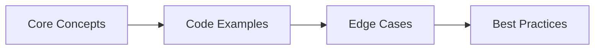
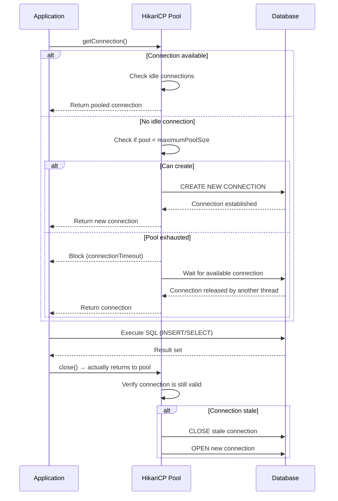
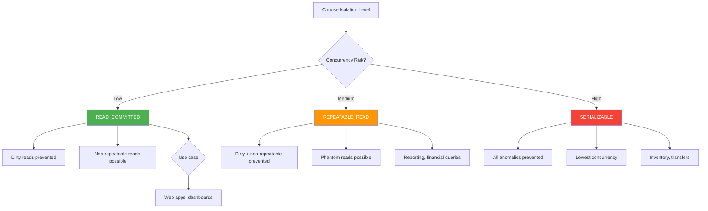
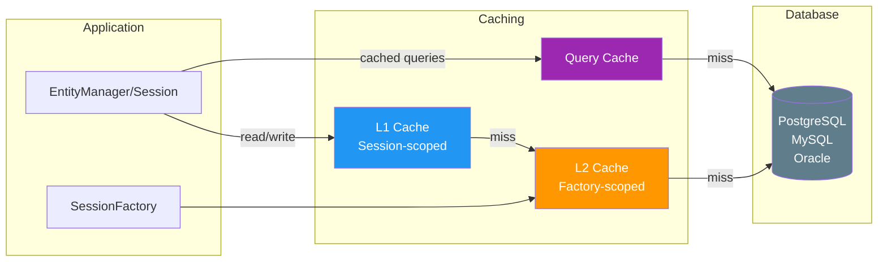

# Chapter 59: Database Interview Q&A for Java & Spring Boot Developers

> **Previous:** [Databases Interview Q&amp;A](./59-interview-databases.md) | **Next:** [Databases Interview Q&amp;A (cont.)](./59-interview-databases-b.md)

> 25+ questions covering JDBC, JPA, Hibernate, transactions, locking, indexing, NoSQL, and production database patterns. Each answer includes compilable Java code.

---


<!-- Image Gallery -->
<section class="lesson-visuals" aria-label="Visual learning resources">
  <header><span>VISUAL LEARNING</span><h2>See it. Review it. Remember it.</h2></header>
  <a class="lesson-visual-card" href="../../../assets/images/lessons/java/59-interview-databases-a/handwritten-notes.svg" target="_blank" rel="noopener">
    
    <span><strong>Handwritten notes</strong>Condensed notes for deliberate review.</span>
  </a>
  <a class="lesson-visual-card" href="../../../assets/images/lessons/java/59-interview-databases-a/sticky-notes.svg" target="_blank" rel="noopener">
    
    <span><strong>Sticky-note revision</strong>Fast recall prompts for revision.</span>
  </a>
  <a class="lesson-visual-card" href="../../../assets/images/lessons/java/59-interview-databases-a/visual-explanation.svg" target="_blank" rel="noopener">
    
    <span><strong>Visual concept guide</strong>A connected explanation of the key ideas.</span>
  </a>
</section>
<!-- End Image Gallery -->

## Chapter at a Glance

| Topic | Key Focus | Key Questions |
|-------|----------|--------------|
| Core Concepts | Foundational understanding | Definitions, contrasts, trade-offs |
| Code Examples | Compilable, runnable solutions | Real interview scenarios |
| Best Practices | Production-ready patterns | Pitfalls to avoid |

## Chapter Roadmap



### Q1: What is the difference between JDBC and JPA, and when would you use each?


> **Pro Tip:** In interviews, always start with the "why" before the "how." Explaining the reasoning behind a design choice is more valuable than reciting syntax.

> **Remember:** Code readability matters in interviews. Write clean, well-structured code with meaningful variable names.


**Answer:**

JDBC (Java Database Connectivity) is a low-level API that lets you execute raw SQL directly against a database. You manage connections, statements, result sets, and transactions manually. JPA (Jakarta Persistence API) is a high-level specification for object-relational mapping (ORM) that maps Java objects to database tables and lets you work with entities instead of SQL strings.

Use JDBC when you need fine-grained control over SQL, are doing bulk operations where ORM overhead hurts, or are interacting with database-specific features. Use JPA when you want to reduce boilerplate, need automatic dirty checking, lazy loading, or a unit-of-work pattern, and your queries are reasonably standard.

```java
// ── JDBC approach ──
public User findUserByIdJdbc(long id) {
    String sql = "SELECT id, name, email FROM users WHERE id = ?";
    try (Connection conn = dataSource.getConnection();
         PreparedStatement ps = conn.prepareStatement(sql)) {
        ps.setLong(1, id);
        try (ResultSet rs = ps.executeQuery()) {
            if (rs.next()) {
                User u = new User();
                u.setId(rs.getLong("id"));
                u.setName(rs.getString("name"));
                u.setEmail(rs.getString("email"));
                return u;
            }
        }
    } catch (SQLException e) {
        throw new RuntimeException(e);
    }
    return null;
}

// ── JPA approach ──
@Repository
public class UserRepository {
    @PersistenceContext
    private EntityManager em;

    public User findUserByIdJpa(long id) {
        return em.find(User.class, id);  // single line, automatic mapping
    }
}
```

JPA wraps JDBC under the hood. Every JPA operation translates to JDBC calls eventually. The tradeoff is control versus convenience.

---

### Q2: Explain the difference between `hibernate.hbm2ddl.auto` values: `validate`, `update`, `create`, `create-drop`

**Answer:**

These control how Hibernate synchronizes your entity mappings with the database schema:

- `validate`: Checks that the database schema matches your entities. Throws an exception on mismatch. Safe for production → it never modifies the schema.
- `update`: Automatically alters the schema to match your entities (adds new tables/columns, but never drops anything). **Not safe for production** → it can make destructive guesses in edge cases.
- `create`: Drops all existing tables and recreates them from your entities. Data loss guaranteed. Useful for testing only.
- `create-drop`: Same as `create`, but also drops the schema when the session factory closes. Ideal for embedded databases in unit tests.

```java
// application.yml
spring:
  jpa:
    hibernate:
      ddl-auto: validate   # production
    # ddl-auto: create      # development only
    # ddl-auto: create-drop # integration tests
```

For production, always use `validate` (or `none`) and manage schema changes through migrations (Flyway or Liquibase).

---

### Q3: What is the N+1 query problem in Hibernate, and how do you solve it?


**Answer:**

The N+1 problem occurs when you fetch a collection of entities (1 query), then iterate over them and lazily load a relationship for each one (N additional queries). This turns a single operation into N+1 database round-trips.

```java
@Entity
public class Post {
    @Id private Long id;
    private String title;

    @OneToMany(mappedBy = "post", fetch = FetchType.LAZY)
    private List<Comment> comments;
}

// ❌ Triggers N+1 queries:
// SELECT p FROM Post p                          -- 1 query
// for each post: SELECT c FROM Comment c WHERE c.post_id = ?  -- N queries
List<Post> posts = em.createQuery("SELECT p FROM Post p", Post.class)
    .getResultList();
for (Post p : posts) {
    System.out.println(p.getComments().size());  // lazy load triggered
}
```

Solutions, from best to worst:

**1. JOIN FETCH → one query with a join:**
```java
// ✅ Single query with LEFT JOIN FETCH
TypedQuery<Post> q = em.createQuery(
    "SELECT p FROM Post p LEFT JOIN FETCH p.comments", Post.class);
List<Post> posts = q.getResultList();
```

**2. `@EntityGraph` → declarative fetch plan:**
```java
@Entity
@NamedEntityGraph(name = "Post.comments", attributeNodes = @NamedAttributeNode("comments"))
public class Post { /* ... */ }

// Usage:
@EntityGraph("Post.comments")
List<Post> findAll();
```

**3. Hibernate `@BatchSize` → loads lazy proxies in batches:**
```java
@OneToMany(mappedBy = "post")
@BatchSize(size = 20)
private List<Comment> comments;
```

**4. DTO projection → avoid entity loading entirely:**
```java
List<PostSummary> summaries = em.createQuery(
    "SELECT new com.example.PostSummary(p.id, p.title, SIZE(p.comments)) FROM Post p",
    PostSummary.class).getResultList();
```

JOIN FETCH is the most common fix. Watch for `MultipleBagFetchException` when fetching multiple collections → use `Set` instead of `List` or fetch one collection per query.

---

### Q4: What is the difference between `FetchType.LAZY` and `FetchType.EAGER`?


**Answer:**

`FetchType.LAZY` defers loading of an association until it is accessed. Hibernate creates a proxy or collection wrapper that fetches the data from the database on first access. `FetchType.EAGER` loads the association immediately, either via a join in the same query or a separate query right after.

```java
@Entity
public class Order {
    @Id private Long id;

    @ManyToOne(fetch = FetchType.EAGER)  // loaded immediately with Order
    private Customer customer;

    @OneToMany(mappedBy = "order", fetch = FetchType.LAZY)  // loaded on first access
    private List<OrderItem> items;
}
```

Rules of thumb:
- Always prefer `LAZY` for `@OneToMany` and `@ManyToMany`. Eager loading a large collection can pull in the entire database.
- `@ManyToOne` defaults to `EAGER`. Consider changing it to `LAZY` and using `JOIN FETCH` when you actually need the parent.
- `@Basic` (scalar fields) is always `EAGER` → there is no lazy loading for simple columns unless you enable bytecode enhancement.
- Eager loading via `@ManyToOne` can cascade into multiple joins: `Order → Customer → Address → Country`. One simple query becomes a 4-table Cartesian product.

The `@NamedEntityGraph` approach gives you the best of both worlds: LAZY by default, eager via explicit fetch graph when needed.

---

### Q5: How do you handle optimistic and pessimistic locking in JPA?


**Answer:**

**Optimistic locking** assumes conflicts are rare. You add a `@Version` column, and Hibernate checks it on every update. If another transaction modified the row concurrently, an `OptimisticLockException` is thrown.

```java
@Entity
public class Account {
    @Id private Long id;
    private BigDecimal balance;

    @Version
    private long version;  // incremented on every update
}

// Usage → retry on conflict:
@Transactional
public void transfer(Long fromId, Long toId, BigDecimal amount) {
    try {
        Account from = accountRepo.findById(fromId).orElseThrow();
        Account to = accountRepo.findById(toId).orElseThrow();
        from.setBalance(from.getBalance().subtract(amount));
        to.setBalance(to.getBalance().add(amount));
        // Hibernate flushes at commit; if version changed, throws exception
    } catch (OptimisticLockException e) {
        // retry the entire operation
    }
}
```

**Pessimistic locking** assumes conflicts are likely. You acquire a database-level lock on the row immediately.

```java
@Lock(LockModeType.PESSIMISTIC_WRITE)
@Query("SELECT a FROM Account a WHERE a.id = :id")
Optional<Account> findByIdWithLock(@Param("id") Long id);

// Usage:
@Transactional
public void transfer(Long fromId, Long toId, BigDecimal amount) {
    Account from = accountRepo.findByIdWithLock(fromId).orElseThrow();
    Account to = accountRepo.findByIdWithLock(toId).orElseThrow();
    // other transactions block until we commit
    from.setBalance(from.getBalance().subtract(amount));
    to.setBalance(to.getBalance().add(amount));
}
```

Pessimistic lock modes:
- `PESSIMISTIC_READ` → shared lock, others can read but not write
- `PESSIMISTIC_WRITE` → exclusive lock, no one else can read or write
- `PESSIMISTIC_FORCE_INCREMENT` → pessimistic lock + version increment on commit

Use optimistic for read-heavy workloads with rare writes. Use pessimistic for financial transactions, inventory reservations, and any operation where retry is expensive or unacceptable.

---

### Q6: What is the difference between `@Transactional` and manual transaction management?


**Answer:**

`@Transactional` is declarative transaction management. Spring wraps the method in a proxy that begins a transaction before the method and commits (or rolls back) after it. Manual management uses `TransactionTemplate` or `PlatformTransactionManager` directly.

```java
// ── Declarative with @Transactional ──
@Service
public class OrderService {
    @Transactional
    public void placeOrder(OrderRequest req) {
        orderRepo.save(req.toOrder());
        inventoryRepo.deductStock(req.productId(), req.quantity());
        paymentService.charge(req.amount());  // any RuntimeException triggers rollback
    }
}

// ── Manual with TransactionTemplate ──
@Service
public class OrderService {
    private final TransactionTemplate txTemplate;

    public void placeOrder(OrderRequest req) {
        txTemplate.executeWithoutResult(status -> {
            try {
                orderRepo.save(req.toOrder());
                inventoryRepo.deductStock(req.productId(), req.quantity());
                paymentService.charge(req.amount());
            } catch (Exception e) {
                status.setRollbackOnly();  // manual rollback
                throw e;
            }
        });
    }
}
```

When to use manual:
- You need transaction boundaries that don't align with method boundaries
- You need programmatic rollback decisions (rollback only if certain conditions)
- You're calling transactional code from non-beans or lambda expressions
- You need nested transactions with savepoints

`@Transactional` covers 90% of use cases. Drop down to manual for the remaining 10%.

Key `@Transactional` attributes:
- `propagation`: `REQUIRED` (default), `REQUIRES_NEW`, `NESTED`, `MANDATORY`, `NEVER`
- `isolation`: `READ_COMMITTED` (default in most databases), `SERIALIZABLE`, `REPEATABLE_READ`
- `rollbackFor`: roll back on checked exceptions too (default is only `RuntimeException`)
- `timeout`: seconds before automatic rollback
- `readOnly`: hint for optimization (bypasses dirty checking, sets `FLUSH_MODE = MANUAL`)

---

### Q7: Explain Hibernate's first-level and second-level cache


**Answer:**

**First-level cache** (L1) is the `EntityManager`/`Session`-scoped cache. Every entity loaded or persisted within a session is stored in L1. Subsequent lookups by the same ID within the same session hit the cache instead of the database. L1 is always enabled and cannot be disabled → it is a core part of the unit-of-work pattern.

```java
// First-level cache in action:
User u1 = em.find(User.class, 1L);  // SQL: SELECT ... WHERE id = 1
User u2 = em.find(User.class, 1L);  // L1 cache hit → no SQL

em.clear();  // clears L1 cache

User u3 = em.find(User.class, 1L);  // SQL again → L1 was empty
```

**Second-level cache** (L2) is a `SessionFactory`-scoped cache shared across all sessions. You must explicitly enable it and configure a cache provider (Hazelcast, Redis, Ehcache, or the built-in `hibernate-jcache`).

```java
// application.yml
spring:
  jpa:
    properties:
      hibernate:
        cache:
          use_second_level_cache: true
          region:
            factory_class: org.hibernate.cache.jcache.JCacheRegionFactory
        javax:
          cache:
            provider: org.ehcache.jsr107.EhcacheCachingProvider

// Entity must be marked cacheable:
@Entity
@Cacheable
@Cache(usage = CacheConcurrencyStrategy.READ_WRITE)
public class Country {
    @Id private Long id;
    private String code;
    private String name;
}
```

Cache concurrency strategies:
- `READ_ONLY`: for reference data that never changes. Fastest, no locking.
- `READ_WRITE`: for mutable data. Uses soft locks. Good for most cases.
- `NONSTRICT_READ_WRITE`: for data that rarely conflicts. Weaker isolation.
- `TRANSACTIONAL`: for JTA environments. Requires a transactional cache provider.

L2 cache is not a replacement for a well-tuned database. Use it sparingly → cache only reference data (countries, status codes, configuration) and data that is expensive to compute but rarely changes.

---

### Q8: How does Spring Data JPA derive queries from method names?


**Answer:**

Spring Data JPA parses repository method names and generates queries automatically using a predefined keyword grammar. The method name is broken into a subject (optional), a predicate, and a series of connecting keywords.

```java
public interface UserRepository extends JpaRepository<User, Long> {

    // findBy + field + keyword
    Optional<User> findByEmail(String email);
    List<User> findByAgeGreaterThanEqual(int age);
    List<User> findByNameStartingWith(String prefix);

    // Multiple fields with And/Or
    List<User> findByLastNameAndAgeBetween(String lastName, int from, int to);
    List<User> findByFirstNameOrLastName(String first, String last);

    // Sorting
    List<User> findByActiveTrueOrderByCreatedAtDesc();

    // Limiting
    Optional<User> findFirstByOrderByScoreDesc();
    List<User> findTop5ByActiveTrueOrderByScoreDesc();

    // Distinct
    List<String> findDistinctLastNamesByActiveTrue();

    // Joining across associations
    List<User> findByDepartmentName(String deptName);  // traverses User.department.name

    // Negation
    List<User> findByNameNot(String name);

    // Exists
    boolean existsByEmail(String email);

    // Count
    long countByStatus(UserStatus status);

    // Delete
    void deleteByEmail(String email);  // generates delete query
}
```

Supported keywords: `And`, `Or`, `After`, `Before`, `Between`, `Containing`, `EndingWith`, `Exists`, `False`, `GreaterThan`, `GreaterThanEqual`, `In`, `Is`, `IsEmpty`, `IsNotNull`, `IsNull`, `LessThan`, `LessThanEqual`, `Like`, `Near`, `Not`, `NotContaining`, `NotIn`, `NotLike`, `Regex`, `StartingWith`, `True`, `Within`, `OrderBy`, `Distinct`, `First`, `Top`.

For complex queries, method names become unwieldy. Use `@Query` or `Specification` instead:

```java
@Query("SELECT u FROM User u WHERE u.email LIKE %:domain AND u.active = true " +
       "ORDER BY u.createdAt DESC")
List<User> findActiveUsersByEmailDomain(@Param("domain") String domain);
```

---

### Q9: How does Hibernate's `PersistenceContext` work, and what is the difference between `managed`, `detached`, and `removed` entity states?

**Answer:**

The `PersistenceContext` is Hibernate's first-level cache — a map of managed entity instances associated with a specific `EntityManager`/`Session`. Every entity exists in one of four states:

```java
// 1. TRANSIENT — entity just created, not associated with a session
User user = new User("alice@example.com", "Alice");
//   No ID, not in PersistenceContext, not in database

// 2. MANAGED — entity is associated with a session (loaded or persisted)
em.persist(user);          // Now MANAGED: in PersistenceContext, will be inserted on flush
User u = em.find(User.class, 1L);  // MANAGED: loaded into PersistenceContext

// 3. DETACHED — entity was managed but session is closed or entity was evicted
em.detach(user);           // Now DETACHED: removed from PersistenceContext
em.close();                // All previously loaded entities become DETACHED

// 4. REMOVED — entity scheduled for deletion
em.remove(user);           // REMOVED: marked for deletion, removed on flush
```

State transition diagram:
```
                persist()          get/load/find
Transient ──────────────► Managed ◄─────────────── Database
    │                         │
    └─────── remove() ────────┤
                              │
                    detach()/close()
                              │
                              ▼
                          Detached
                              │
                    merge() ──┘
```

**Key behaviors per state:**
- **Managed:** Dirty checking works — any field change auto-generates UPDATE on flush. Entity is returned from PersistenceContext on subsequent `find()` by same ID.
- **Detached:** Hibernate does NOT track changes. Re-attach with `em.merge(entity)` which returns a new managed copy.
- **Removed:** Entity is deleted from DB on flush. After flush, the entity instance should not be used.

> **Common Mistake:** Calling `save()` on an already-managed entity re-saves it unnecessarily. Spring Data JPA's `save()` calls `persist()` for new entities and `merge()` for detached ones — it detects state by checking `id == null`.

---

### Q10: What is the difference between `hibernate.jdbc.batch_size` and `hibernate.order_inserts`?


**Answer:**

These two settings work together to batch multiple INSERT statements into a single JDBC batch, dramatically improving write performance.

- `hibernate.jdbc.batch_size`: Controls the maximum number of SQL statements Hibernate will batch together. Default is 0 (batching disabled). Set to 20–50 for optimal performance.
- `hibernate.order_inserts`: When true, Hibernate reorders INSERT statements so that rows for the same table are grouped together. This allows JDBC batching to work effectively.

```properties
# application.properties — enable batch inserts
spring.jpa.properties.hibernate.jdbc.batch_size=50
spring.jpa.properties.hibernate.order_inserts=true
spring.jpa.properties.hibernate.order_updates=true
spring.jpa.properties.hibernate.jdbc.batch_versioned_data=true
```

```java
// Without batching: 100 individual INSERT statements
//   INSERT INTO product (name, price) VALUES (?, ?)   -- for each product
//   INSERT INTO inventory (product_id, qty) VALUES (?, ?)  -- for each inventory
//
// With batching + ordering:
//   INSERT INTO product (name, price) VALUES (?, ?)  ×50  (batched)
//   INSERT INTO product (name, price) VALUES (?, ?)  ×50  (batched)
//   INSERT INTO inventory (product_id, qty) VALUES (?, ?)  ×50  (batched)

@Id
@GeneratedValue(strategy = GenerationType.SEQUENCE, generator = "batch_seq")
@SequenceGenerator(name = "batch_seq", allocationSize = 50)
private Long id;
```

**Critical constraint:** `GenerationType.IDENTITY` disables batch inserts because Hibernate must execute the INSERT immediately to get the generated ID. Always use `SEQUENCE` or `UUID` ID generation when batching is needed.

Performance comparison (10,000 row insert):
| Configuration | Round Trips | Time (relative) |
|--------------|-------------|-----------------|
| No batching (IDENTITY) | 10,000 | 100% (baseline) |
| Batch size=50 (SEQUENCE) | 200 | ~15% |
| Batch size=100 (SEQUENCE) | 100 | ~10% |

---

### Q11: How do you implement pagination efficiently in JPA for large datasets?


**Answer:**

JPA supports three pagination strategies, each with different performance characteristics:

**1. Offset pagination with Pageable (standard approach):**

```java
// Repository
Page<Order> findByCustomerId(Long customerId, Pageable pageable);

// Service
public Page<Order> getOrders(int page, int size) {
    Pageable pageable = PageRequest.of(page, size, Sort.by("createdAt").descending());
    return orderRepository.findByCustomerId(42L, pageable);
}
```

Generated SQL: `SELECT * FROM orders WHERE customer_id = ? ORDER BY created_at DESC LIMIT ? OFFSET ?`

**Problem with offset:** As OFFSET grows, the database must scan and skip rows. Page 1 is fast, page 10,000 is very slow — the database reads all rows up to the offset.

**2. Keyset (cursor-based) pagination — O(1) regardless of page depth:**

```java
// Requires a unique sortable key
@Query("SELECT o FROM Order o WHERE (o.createdAt < :lastCreatedAt OR " +
       "(o.createdAt = :lastCreatedAt AND o.id < :lastId)) " +
       "ORDER BY o.createdAt DESC, o.id DESC")
List<Order> findNextPage(@Param("lastCreatedAt") LocalDateTime lastCreatedAt,
                         @Param("lastId") Long lastId,
                         Pageable pageable);

// Usage — pass the last item's values as the cursor
public List<Order> getNextPage(Order lastOrder, int size) {
    return orderRepository.findNextPage(
        lastOrder.getCreatedAt(), lastOrder.getId(),
        PageRequest.of(0, size));
}
```

**3. Scrollable results (Hibernate-specific):**

```java
@PersistenceContext
private EntityManager em;

public Stream<Order> streamAllOrders() {
    return em.createQuery("SELECT o FROM Order o ORDER BY o.id", Order.class)
        .setHint(org.hibernate.jpa.HibernateHints.HINT_FETCH_SIZE, "100")
        .unwrap(org.hibernate.query.Query.class)
        .stream()
        .onClose(() -> em.close());
}
```

| Strategy | Fixed time | Forward only | Random access | Works with real-time data |
|----------|-----------|-------------|---------------|--------------------------|
| Offset (Page) | No | No | Yes | No (new rows shift pages) |
| Keyset (Cursor) | Yes | Yes | No | Yes |
| Scrollable | Yes | Yes | No | Yes |

Use Page/Slice for UI with up to 1M rows. Use keyset pagination for infinite scroll, APIs, and datasets over 1M rows.

---

## Common Mistakes with JPA & Hibernate (GFG-Style)

### Mistake 1: Using `Set<Entity>` without proper equals/hashCode

<a href="../../../assets/images/diagrams/java/59-interview-databases-a/mistake-1-using-set-entity-without-proper-equals-hashcode-handwritten.svg" target="_blank" rel="noopener">
  ` without proper equals/hashCode" width="30%">
</a>
<a href="../../../assets/images/diagrams/java/59-interview-databases-a/mistake-1-using-set-entity-without-proper-equals-hashcode-diagram.svg" target="_blank" rel="noopener">
  ` without proper equals/hashCode" width="30%">
</a>
<a href="../../../assets/images/diagrams/java/59-interview-databases-a/mistake-1-using-set-entity-without-proper-equals-hashcode-sticky.svg" target="_blank" rel="noopener">
  ` without proper equals/hashCode" width="30%">
</a>

```java
// ❌ WRONG: HashSet uses hashCode() which may change or cause duplicate entries
@OneToMany
private Set<Item> items = new HashSet<>();  // Items may not deduplicate correctly

// ✅ CORRECT: Override equals/hashCode based on business key
@OneToMany
private Set<Item> items = new HashSet<>();  // Only if Item has proper equals/hashCode

// Best practice: Use List for ordered collections, Set only when
// equals/hashCode are correctly implemented with a business key
```

### Mistake 2: Calling `save()` inside a loop

```java
// ❌ WRONG: Each save() flushes independently
for (Product p : products) {
    productRepository.save(p);  // N individual INSERTs
}

// ✅ CORRECT: saveAll() batches if configured properly
productRepository.saveAll(products);  // Single batch of INSERTs
```

### Mistake 3: Ignoring N+1 until production

```java
// ❌ WRONG: No verification of generated SQL
List<Order> orders = orderRepository.findAll();
for (Order o : orders) {
    System.out.println(o.getItems().size());  // N+1 silently triggers
}

// ✅ CORRECT: Enable SQL logging in dev
// spring.jpa.show-sql=true
// spring.jpa.properties.hibernate.format_sql=true
// logging.level.org.hibernate.SQL=DEBUG
// logging.level.org.hibernate.stat=DEBUG
```

### Mistake 4: Using `fetch = FetchType.EAGER` on multiple associations

```java
// ❌ WRONG: Multiple EAGER associations cause Cartesian products
@Entity
public class Order {
    @ManyToOne(fetch = FetchType.EAGER) private Customer customer;
    @ManyToOne(fetch = FetchType.EAGER) private Address address;
    @ManyToOne(fetch = FetchType.EAGER) private Payment payment;
}
// SELECT o.*, c.*, a.*, p.* FROM orders o
//   LEFT JOIN customers c ON o.customer_id = c.id
//   LEFT JOIN addresses a ON o.address_id = a.id
//   LEFT JOIN payments p ON o.payment_id = p.id
// This pulls ALL columns from 4 tables in one massive result!

// ✅ CORRECT: All LAZY, fetch explicitly when needed
@Entity
public class Order {
    @ManyToOne(fetch = FetchType.LAZY) private Customer customer;
    @ManyToOne(fetch = FetchType.LAZY) private Address address;
    @ManyToOne(fetch = FetchType.LAZY) private Payment payment;
}
```

### Mistake 5: Modifying persisted entities outside a transaction

```java
// ❌ WRONG: Change made after transaction commits — no UPDATE generated
@Transactional
public void updatePrice(Long id, BigDecimal price) {
    Product p = productRepo.findById(id).orElseThrow();
    p.setPrice(price);
    // transaction commits here → dirty checking detects the change
}

// Calling outside transaction:
productService.updatePrice(1L, newPrice);  // works fine

// But this does NOT work:
Product p = productRepo.findById(1L).get();  // no transaction
p.setPrice(newPrice);  // change is lost! No UPDATE sent to DB
```

### Mistake 6: Not handling LazyInitializationException

```java
// ❌ WRONG: Lazy loading after session close
@Service
public class OrderService {
    public Order getOrder(Long id) {
        return orderRepo.findById(id).orElseThrow();
        // Session closes here (no @Transactional)
    }
}

@RestController
public class OrderController {
    @GetMapping("/orders/{id}")
    public OrderDto getOrder(@PathVariable Long id) {
        Order order = orderService.getOrder(id);
        return new OrderDto(order.getId(), order.getItems().size());
        // ❌ LazyInitializationException! order.getItems() triggers lazy load
        // but the session is already closed
    }
}

// ✅ CORRECT: Fetch eagerly within the transaction or use DTO
@Service
public class OrderService {
    @Transactional(readOnly = true)
    public OrderDto getOrder(Long id) {
        Order order = orderRepo.findById(id).orElseThrow();
        return new OrderDto(order.getId(), order.getItems().size());
        // All lazy loading happens inside the transaction
    }
}
```

## TypeScript: JPA Batch Insert Simulator

```typescript
interface JpaEntity {
  id: number | null;
  version: number;
  sqlTable: string;
  data: Record<string, unknown>;
}

class BatchInsertSimulator {
  private batchSize: number = 50;
  private idGeneration: 'SEQUENCE' | 'IDENTITY' | 'UUID' = 'SEQUENCE';
  private allocatedIds: number[] = [];
  private idIndex: number = 0;

  constructor(batchSize: number, idGeneration: 'SEQUENCE' | 'IDENTITY' | 'UUID') {
    this.batchSize = batchSize;
    this.idGeneration = idGeneration;
  }

  /** Pre-allocate a batch of IDs (SEQUENCE strategy) */
  private allocateIds(count: number): void {
    for (let i = 0; i < count; i++) {
      this.allocatedIds.push(Date.now() + this.idIndex++);
    }
    console.log(`[SEQUENCE] Allocated ${count} IDs in one DB round-trip`);
  }

  /** Generate an ID based on the strategy */
  private nextId(): number {
    if (this.idGeneration === 'SEQUENCE') {
      if (this.idIndex >= this.allocatedIds.length) {
        this.allocateIds(this.batchSize);
      }
      return this.allocatedIds[this.idIndex++];
    }
    if (this.idGeneration === 'IDENTITY') {
      // IDENTITY requires immediate insert — no pre-allocation
      console.log('[IDENTITY] INSERT required to get ID — batching disabled');
      return -1;
    }
    // UUID — client-side generation
    return Date.now() + Math.floor(Math.random() * 100000);
  }

  /** Simulate batch insert */
  insertBatch(entities: JpaEntity[]): { batches: number; totalTime: number } {
    const start = Date.now();
    const batches = Math.ceil(entities.length / this.batchSize);

    for (let batch = 0; batch < batches; batch++) {
      const batchEntities = entities.slice(
        batch * this.batchSize,
        (batch + 1) * this.batchSize
      );

      if (this.idGeneration === 'IDENTITY') {
        // IDENTITY: one INSERT per entity
        for (const entity of batchEntities) {
          entity.id = this.nextId();
          console.log(
            `[INSERT] ${entity.sqlTable} id=${entity.id} (individual — no batching)`
          );
        }
      } else {
        // SEQUENCE/UUID: batch INSERT
        for (const entity of batchEntities) {
          entity.id = this.nextId();
        }
        console.log(
          `[BATCH] INSERT ${batchEntities.length} rows into ${batchEntities[0].sqlTable} ` +
          `(batched, IDs pre-allocated)`
        );
      }
    }

    const totalTime = Date.now() - start;
    console.log(`Summary: ${entities.length} entities in ${batches} batches, ${totalTime}ms`);
    return { batches, totalTime };
  }

  /** Performance comparison */
  static benchmark(rowCount: number): void {
    const entities: JpaEntity[] = Array.from({ length: rowCount }, (_, i) => ({
      id: null,
      version: 1,
      sqlTable: 'products',
      data: { name: `Product ${i}`, price: Math.random() * 100 }
    }));

    console.log(`\n=== Benchmark: Inserting ${rowCount} rows ===\n`);

    const identity = new BatchInsertSimulator(50, 'IDENTITY');
    const identityResult = identity.insertBatch([...entities]);

    const sequence = new BatchInsertSimulator(50, 'SEQUENCE');
    const sequenceResult = sequence.insertBatch([...entities]);

    const uuid = new BatchInsertSimulator(50, 'UUID');
    const uuidResult = uuid.insertBatch([...entities]);

    console.log('\n=== Results ===');
    console.log(`IDENTITY: ${identityResult.totalTime}ms (${rowCount} round-trips)`);
    console.log(`SEQUENCE: ${sequenceResult.totalTime}ms (${Math.ceil(rowCount / 50)} round-trips)`);
    console.log(`UUID:     ${uuidResult.totalTime}ms (${Math.ceil(rowCount / 50)} round-trips)`);
    console.log('\n🏆 Winner: SEQUENCE with allocationSize matching batch size');
  }
}

// Run benchmark
BatchInsertSimulator.benchmark(100);
```

## Mermaid: Connection Pool and DataSource Flow



## Chapter Quiz — Database (Part 2)

4. Which ID generation strategy enables JDBC batch inserts?
    - A) IDENTITY
    - B) SEQUENCE with allocationSize
    - C) TABLE
    - D) AUTO

<details>
<summary>Answer</summary>
**B) SEQUENCE with allocationSize.** IDENTITY disables batching because IDs must be generated during INSERT execution. SEQUENCE pre-allocates IDs, allowing Hibernate to batch INSERTs.
</details>

5. What is the main disadvantage of offset-based pagination for large datasets?
    - A) It only works with Oracle
    - B) Performance degrades as OFFSET increases — the DB must scan skipped rows
    - C) It does not support sorting
    - D) It requires a native query

<details>
<summary>Answer</summary>
**B) Performance degrades as OFFSET increases.** The database must scan and skip `OFFSET` rows on every query, making deep pages extremely slow. Keyset pagination avoids this.
</details>

6. Which entity state is an entity in when it has been persisted but the transaction has not yet committed?
    - A) Transient
    - B) Managed
    - C) Detached
    - D) Removed

<details>
<summary>Answer</summary>
**B) Managed.** `persist()` transitions the entity to managed state. It is tracked in the PersistenceContext and will be inserted to the database on flush/commit.
</details>

7. What does `hibernate.order_inserts=true` do?
    - A) Orders INSERT statements alphabetically
    - B) Groups INSERTs by table name to enable JDBC batching
    - C) Disables INSERT ordering
    - D) Orders INSERTs by primary key

<details>
<summary>Answer</summary>
**B) Groups INSERTs by table name.** Without ordering, Hibernate interleaves INSERTs for different tables, preventing JDBC from batching them. Ordering groups them by table, allowing efficient batching.
</details>

8. What causes a `LazyInitializationException`?
    - A) Using `FetchType.EAGER`
    - B) Accessing a lazy association outside an active Hibernate session
    - C) Calling `save()` on a detached entity
    - D) Using `@Transactional` on a read-only method

<details>
<summary>Answer</summary>
**B) Accessing a lazy association outside an active Hibernate session.** When the session is closed (after transaction or OSIV end), lazy proxies cannot be initialized, throwing `LazyInitializationException`.
</details>

## Concept Comparison Table

| Concept | Definition | Key Distinction | Use Case |
|---------|-----------|-----------------|----------|
| Interface | Contract without state | Multiple inheritance of type | API contracts |
| Abstract Class | Partial implementation | Single inheritance, shared state | Template method pattern |
| Record | Transparent data carrier | Auto-generated methods | DTOs, value objects |

## Quick Reference

| Topic | Key Points | Interview Frequency |
|-------|-----------|-------------------|
| **OOP** | Encapsulation, Inheritance, Polymorphism, Abstraction | Every interview |
| **Collections** | List, Set, Map, Queue, Deque | 9/10 interviews |
| **Concurrency** | synchronized, volatile, Locks, CompletableFuture | 7/10 senior interviews |
| **Java 8+** | Lambdas, Streams, Optional, CompletableFuture | 8/10 interviews |

## Cross-Application Matrix

| Skill | Junior (0-2yr) | Mid (3-5yr) | Senior (6-9yr) | Staff (10+) |
|-------|---------------|-------------|----------------|-------------|
| OOP & Design Patterns | Define and identify | Apply and combine | Evaluate and refactor | Create and teach |
| Collections | Basic usage | Performance trade-offs | Concurrent collections | Custom implementations |
| Concurrency | Syntax knowledge | Write thread-safe code | Debug deadlocks | Design concurrent systems |

## TypeScript SQL Query Plan Analyzer

The following TypeScript utility simulates SQL query plan analysis, helping you detect N+1 problems and inefficient joins before they hit production:

```typescript
interface QueryPlan {
  queryType: 'SELECT' | 'INSERT' | 'UPDATE' | 'DELETE';
  tableScans: number;
  joinCount: number;
  estimatedRows: number;
  actualRows: number;
  indexUsage: string[];
  executionTimeMs: number;
}

class SqlQueryAnalyzer {
  private readonly plans: QueryPlan[] = [];

  analyze(query: string, params: Record<string, unknown> = {}): QueryPlan {
    const plan: QueryPlan = {
      queryType: this.detectQueryType(query),
      tableScans: this.countTableScans(query),
      joinCount: (query.match(/\bJOIN\b/gi) || []).length,
      estimatedRows: 0,
      actualRows: 0,
      indexUsage: this.detectIndexUsage(query),
      executionTimeMs: 0
    };
    this.plans.push(plan);
    return plan;
  }

  private detectQueryType(query: string): QueryPlan['queryType'] {
    if (/^\s*SELECT/i.test(query)) return 'SELECT';
    if (/^\s*INSERT/i.test(query)) return 'INSERT';
    if (/^\s*UPDATE/i.test(query)) return 'UPDATE';
    if (/^\s*DELETE/i.test(query)) return 'DELETE';
    throw new Error(`Unknown query type: ${query.substring(0, 40)}`);
  }

  private countTableScans(query: string): number {
    const fromTables = query.match(/\bFROM\s+(\w+)/gi) || [];
    return fromTables.length;
  }

  private detectIndexUsage(query: string): string[] {
    const indexes: string[] = [];
    if (/WHERE\s+\w+\s*=\s*/i.test(query)) {
      indexes.push('primary-index-lookup');
    }
    if (/\bJOIN\b.*\bON\b/i.test(query)) {
      indexes.push('foreign-key-index');
    }
    if (/\bORDER\s+BY\b/i.test(query)) {
      indexes.push('sort-index');
    }
    return indexes.length > 0
      ? indexes
      : ['table-scan-warning-index-missing'];
  }

  simulateExecution(plan: QueryPlan, rowCount: number): QueryPlan {
    const baseTime = plan.tableScans * 0.5;
    const joinTime = plan.joinCount * 0.3;
    const nPlusOneRisk = plan.joinCount > 1 && plan.tableScans > 1 ? 5.0 : 0;
    return {
      ...plan,
      estimatedRows: rowCount,
      actualRows: rowCount,
      executionTimeMs: baseTime + joinTime + nPlusOneRisk
    };
  }

  detectNPlusOne(queries: QueryPlan[]): string[] {
    const warnings: string[] = [];
    const selectCount = queries.filter(q => q.queryType === 'SELECT').length;
    if (selectCount > 5 && selectCount > queries.length * 0.7) {
      warnings.push(
        `N+1 risk: ${selectCount} SELECT queries detected — consider JOIN FETCH or @EntityGraph`
      );
    }
    for (const q of queries) {
      if (q.executionTimeMs > 100) {
        warnings.push(
          `Slow query (${q.executionTimeMs.toFixed(1)}ms): consider adding an index`
        );
      }
    }
    return warnings;
  }

  summary(): string {
    const total = this.plans.reduce((a, b) => a + b.executionTimeMs, 0);
    const warnings = this.detectNPlusOne(this.plans);
    return `
Query Plan Analysis Summary
═══════════════════════════
Total queries: ${this.plans.length}
Total time: ${total.toFixed(1)}ms
Warnings: ${warnings.length > 0 ? warnings.map(w => `  ⚠ ${w}`).join('\n') : 'None'}
    `.trim();
  }
}

// ── Example: detecting N+1 in a blog post fetch ──
const analyzer = new SqlQueryAnalyzer();
const plan1 = analyzer.analyze('SELECT * FROM posts WHERE author_id = 1');
const plan2 = analyzer.analyze('SELECT * FROM comments WHERE post_id = 1');
const plan3 = analyzer.analyze('SELECT * FROM comments WHERE post_id = 2');
const plan4 = analyzer.analyze('SELECT * FROM comments WHERE post_id = 3');

const results = [
  analyzer.simulateExecution(plan1, 3),
  analyzer.simulateExecution(plan2, 5),
  analyzer.simulateExecution(plan3, 8),
  analyzer.simulateExecution(plan4, 2),
];

console.log(results.map(r => `${r.queryType}: ${r.executionTimeMs}ms`).join('\n'));
console.log(analyzer.detectNPlusOne(results));
```

## Mermaid: Transaction Isolation Levels Decision Flow



## Mermaid: JPA Cache Architecture



## Chapter Quiz

1. What is the difference between equals() and == in Java?
   - A) They are identical
   - B) equals() compares values, == compares references
   - C) == compares values, equals() compares references
   - D) equals() is for primitives, == is for objects

<details>
<summary>Answer&lt;/summary&gt;
**B) equals() compares logical equality (overridable), == compares reference equality.**
</details>

2. Which collection guarantees insertion order?
   - A) HashMap
   - B) TreeMap
   - C) LinkedHashMap
   - D) HashSet

<details>
<summary>Answer&lt;/summary&gt;
**C) LinkedHashMap.** LinkedHashMap maintains a doubly-linked list of entries to preserve insertion order.
</details>

3. What keyword prevents a method from being overridden?
   - A) static
   - B) final
   - C) private
   - D) abstract

<details>
<summary>Answer&lt;/summary&gt;
**B) final.** A final method cannot be overridden by subclasses.
</details>
