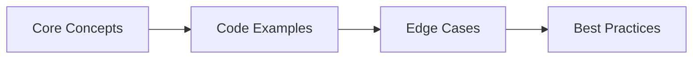
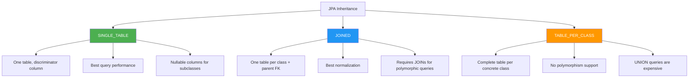
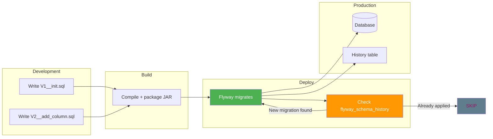
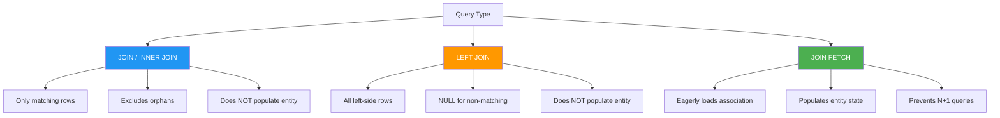

## Chapter at a Glance

| Topic | Key Focus | Key Questions |
|-------|----------|--------------|
| Core Concepts | Foundational understanding | Definitions, contrasts, trade-offs |
| Code Examples | Compilable, runnable solutions | Real interview scenarios |
| Best Practices | Production-ready patterns | Pitfalls to avoid |

## Chapter Roadmap



### Q9: What is the difference between `@ManyToMany` and `@OneToMany` with a join entity?
> **Pro Tip:** In interviews, always start with the "why" before the "how." Explaining the reasoning behind a design choice is more valuable than reciting syntax.

> **Remember:** Code readability matters in interviews. Write clean, well-structured code with meaningful variable names.


**Answer:**

`@ManyToMany` creates an implicit join table with only two columns (the foreign keys). You cannot add attributes to the relationship (like `createdAt`, `role`, `quantity`). A join entity (also called an association entity) creates an explicit third entity mapped to the join table, allowing you to add columns to the relationship itself.

```java
// ── @ManyToMany (simple, no extra columns) ──
@Entity
public class Student {
    @Id private Long id;

    @ManyToMany
    @JoinTable(name = "student_course",
        joinColumns = @JoinColumn(name = "student_id"),
        inverseJoinColumns = @JoinColumn(name = "course_id"))
    private Set<Course> courses;
}

@Entity
public class Course {
    @Id private Long id;

    @ManyToMany(mappedBy = "courses")
    private Set<Student> students;
}

// ── Join entity (extra columns possible) ──
@Entity
public class Enrollment {
    @Id private Long id;

    @ManyToOne
    private Student student;

    @ManyToOne
    private Course course;

    private LocalDateTime enrolledAt;
    private String grade;
}

@Entity
public class Student {
    @OneToMany(mappedBy = "student")
    private List<Enrollment> enrollments;
}
```

Rules:
- Use `@ManyToMany` only when the relationship truly has no attributes — tags, categories, simple many-to-many labels
- Use a join entity whenever the relationship carries metadata (timestamps, roles, quantities, status)
- A join entity also makes it easier to query the relationship itself: `SELECT e FROM Enrollment e WHERE e.grade = 'A'`

---

### Q10: How do you map inheritance hierarchies in JPA?

**Answer:**

JPA provides three inheritance strategies, each mapped via `@Inheritance`:

**1. SINGLE_TABLE** (default) — one table for the entire hierarchy, with a discriminator column:
```java
@Entity
@Inheritance(strategy = InheritanceType.SINGLE_TABLE)
@DiscriminatorColumn(name = "vehicle_type", discriminatorType = DiscriminatorType.STRING)
public abstract class Vehicle {
    @Id @GeneratedValue private Long id;
    private String manufacturer;
}

@Entity
@DiscriminatorValue("CAR")
public class Car extends Vehicle {
    private int doors;
}

@Entity
@DiscriminatorValue("TRUCK")
public class Truck extends Vehicle {
    private double payloadCapacity;
}

// Result: single "vehicle" table with columns: id, manufacturer, doors, payload_capacity, vehicle_type
```

**2. JOINED** — one table per class, with foreign keys to the parent:
```java
@Entity
@Inheritance(strategy = InheritanceType.JOINED)
public abstract class Payment {
    @Id @GeneratedValue private Long id;
    private BigDecimal amount;
}

@Entity
public class CreditCardPayment extends Payment {
    private String cardNumber;
    private String cardHolder;
}

// Result: payment(id, amount), credit_card_payment(id, card_number, card_holder)
```

**3. TABLE_PER_CLASS** — one complete table per concrete class:
```java
@Entity
@Inheritance(strategy = InheritanceType.TABLE_PER_CLASS)
public abstract class Animal {
    @Id @GeneratedValue private Long id;
    private String name;
}

@Entity
public class Dog extends Animal {
    private String breed;
}

// Result: dog(id, name, breed), cat(id, name, ...)
```

| Strategy | Query efficiency | Schema normalization | Constraint support |
|----------|-----------------|---------------------|--------------------|
| SINGLE_TABLE | Best (no joins) | Worst (nullable columns) | Simple |
| JOINED | Polymorphic queries need joins | Best (normalized) | Full FK support |
| TABLE_PER_CLASS | Worst (UNION queries) | Moderate | No polymorphic FK |

Use SINGLE_TABLE for simple hierarchies with few subclasses. Use JOINED when subclasses have many distinct columns. Avoid TABLE_PER_CLASS unless you have specific reasons — most databases struggle with polymorphic UNION queries at scale.

---

### Q11: What is a projection in Spring Data JPA, and why use DTO projections over entities?

**Answer:**

A projection is a subset of entity fields fetched instead of the full entity. DTO projections fetch only the columns you need, avoiding the overhead of loading large columns (BLOBs, TEXT) or eagerly-fetched associations.

```java
// ── Interface-based projection ──
public interface UserSummary {
    String getName();
    String getEmail();
}

@Query("SELECT u.name AS name, u.email AS email FROM User u WHERE u.active = true")
List<UserSummary> findActiveUserSummaries();

// ── Class-based DTO projection ──
public record UserDto(String name, String email, int orderCount) {}

@Query("SELECT new com.example.UserDto(u.name, u.email, SIZE(u.orders)) " +
       "FROM User u WHERE u.active = true")
List<UserDto> findActiveUserDtos();
```

Why use projections over entities:
1. **Performance**: Select only needed columns — avoids fetching large TEXT/BLOB columns
2. **Read-only**: No dirty checking overhead — Hibernate tracks changes only on managed entities
3. **Join efficiency**: DTOs can aggregate data from multiple entities without loading them
4. **Safety**: No lazy-loading exceptions outside transactions — DTOs are plain objects
5. **API boundary**: Expose only intended fields to REST clients — never accidentally serialize lazy proxies

EntityGraph can help with partial entity loading, but DTO projections give you the most control and the least overhead.

---

### Q12: How do you implement database migrations with Flyway in Spring Boot?

**Answer:**

Flyway manages schema changes as versioned SQL scripts. Spring Boot auto-configures Flyway when it finds `flyway-core` on the classpath.

Step 1 — Add dependency:
```xml
<dependency>
    <groupId>org.flywaydb</groupId>
    <artifactId>flyway-core</artifactId>
</dependency>
```

Step 2 — Create migration scripts in `src/main/resources/db/migration/`:
```sql
-- V1__create_users_table.sql
CREATE TABLE users (
    id BIGSERIAL PRIMARY KEY,
    name VARCHAR(255) NOT NULL,
    email VARCHAR(255) UNIQUE NOT NULL,
    created_at TIMESTAMP DEFAULT CURRENT_TIMESTAMP
);

-- V2__add_active_column.sql
ALTER TABLE users ADD COLUMN active BOOLEAN DEFAULT TRUE;

-- V3__create_orders_table.sql
CREATE TABLE orders (
    id BIGSERIAL PRIMARY KEY,
    user_id BIGINT NOT NULL REFERENCES users(id),
    total DECIMAL(10,2) NOT NULL,
    status VARCHAR(20) DEFAULT 'PENDING',
    created_at TIMESTAMP DEFAULT CURRENT_TIMESTAMP
);

-- V3_1__add_index_on_orders_user_id.sql
CREATE INDEX idx_orders_user_id ON orders(user_id);
```

Step 3 — Configure (minimal — Spring Boot auto-configures):
```yaml
spring:
  flyway:
    enabled: true
    locations: classpath:db/migration
    baseline-on-migrate: true  # for existing databases
```

Naming convention: `V{version}__{description}.sql`
- Underscore separates version from description
- Double underscore before the description
- Versions can be integers (V1) or dotted (V1_2_3)
- Repeatable migrations: `R__{description}.sql` (re-run if checksum changes)

Flyway tracks applied migrations in a `flyway_schema_history` table. Never modify an already-applied migration — create a new one instead.

---

### Q13: How do you handle concurrent updates to the same row without data loss?

**Answer:**

Use optimistic locking with `@Version`. When two transactions read the same row and both try to update it, the second one to commit gets an `OptimisticLockException` because the version has changed.

```java
@Entity
public class InventoryItem {
    @Id private Long id;
    private int quantity;

    @Version
    private long version;
}

@Service
public class InventoryService {
    @Transactional
    public void deductStock(Long itemId, int quantity) {
        InventoryItem item = repo.findById(itemId).orElseThrow();
        if (item.getQuantity() < quantity) {
            throw new InsufficientStockException();
        }
        item.setQuantity(item.getQuantity() - quantity);
        // Hibernate increments version on flush/commit
        // If another transaction modified the row, version mismatch → OptimisticLockException
    }
}
```

For high-contention scenarios, use pessimistic locking:

```java
@Lock(LockModeType.PESSIMISTIC_WRITE)
@Query("SELECT i FROM InventoryItem i WHERE i.id = :id")
Optional<InventoryItem> findByIdForUpdate(@Param("id") Long id);

@Transactional
public void deductStockPessimistic(Long itemId, int quantity) {
    InventoryItem item = repo.findByIdForUpdate(itemId).orElseThrow();
    // Database row is locked — other transactions wait
    item.setQuantity(item.getQuantity() - quantity);
}
```

For counters and atomic updates, use a single UPDATE statement to avoid the read-then-write race entirely:

```java
@Modifying
@Query("UPDATE InventoryItem i SET i.quantity = i.quantity - :qty WHERE i.id = :id AND i.quantity >= :qty")
int deductStockAtomic(@Param("id") Long id, @Param("qty") int qty);

// Returns 0 if row didn't exist or quantity was insufficient — no race condition
```

The single-UPDATE approach is the most performant for high-contention counters because it avoids the round-trip for reading.

---

### Q14: How do you test database code with TestContainers?

**Answer:**

TestContainers spins up real database instances in Docker containers for integration tests. It is the industry standard for testing JPA repositories, native queries, and Flyway migrations against the actual database instead of H2 or HSQLDB.

```java
@SpringBootTest
@Testcontainers
class UserRepositoryTest {

    @Container
    static PostgreSQLContainer<?> postgres = new PostgreSQLContainer<>("postgres:16")
        .withDatabaseName("testdb")
        .withUsername("test")
        .withPassword("test");

    @DynamicPropertySource
    static void configureProperties(DynamicPropertyRegistry reg) {
        reg.add("spring.datasource.url", postgres::getJdbcUrl);
        reg.add("spring.datasource.username", postgres::getUsername);
        reg.add("spring.datasource.password", postgres::getPassword);
    }

    @Autowired
    private UserRepository userRepo;

    @Test
    void shouldSaveAndFindUser() {
        User u = new User("alice@example.com", "Alice");
        userRepo.save(u);

        Optional<User> found = userRepo.findByEmail("alice@example.com");
        assertThat(found).isPresent();
        assertThat(found.get().getName()).isEqualTo("Alice");
    }

    @Test
    void shouldEnforceUniqueEmail() {
        userRepo.save(new User("same@example.com", "First"));
        assertThrows(DataIntegrityViolationException.class, () -> {
            userRepo.save(new User("same@example.com", "Second"));
            userRepo.flush();
        });
    }
}
```

Key benefits over H2:
- Same database dialect, same SQL features, same locking behavior
- Triggers, stored procedures, and database-specific types work correctly
- Flyway migrations are validated against the real schema
- Catches dialect-specific bugs before production

Add `@Testcontainers` + static `@Container` for a shared container across tests (fastest), or instance `@Container` for per-test isolation.

---

### Q15: What is the difference between `JOIN`, `LEFT JOIN`, and `JOIN FETCH` in JPA?

**Answer:**

- `JOIN` (inner join): Returns only entities that have matching associated entities. Excludes orphans.
- `LEFT JOIN`: Returns all entities from the left side, with nulls for missing associations.
- `JOIN FETCH`: A JPA-specific directive that tells Hibernate to **eagerly load** the association in the same query. Unlike plain `JOIN`, it populates the entity's persistence state so that lazy loading is not triggered later.

```java
// INNER JOIN — only posts with at least one comment
// Result: List<Object[]> — [Post, Comment] pairs
@Query("SELECT p, c FROM Post p JOIN p.comments c")
List<Object[]> findPostsWithComments();

// LEFT JOIN — all posts, comments may be null
@Query("SELECT p, c FROM Post p LEFT JOIN p.comments c")
List<Object[]> findAllPostsAndComments();

// JOIN FETCH — eagerly loads comments, returns Post entities with comments populated
@Query("SELECT p FROM Post p LEFT JOIN FETCH p.comments")
List<Post> findAllPostsWithComments();
```

The critical difference: plain `JOIN` adds a WHERE/HAVING filter — it doesn't change how the entity is loaded. `JOIN FETCH` actually populates the entity's collection field, preventing N+1 queries for that association.

```java
// ❌ Plain LEFT JOIN — comments are still lazy
@Query("SELECT p FROM Post p LEFT JOIN p.comments c WHERE c.approved = true")
List<Post> findApprovedCommentPosts(); // p.getComments() will still trigger lazy load!

// ✅ JOIN FETCH — comments are loaded
@Query("SELECT p FROM Post p LEFT JOIN FETCH p.comments")
List<Post> findAllPostsWithComments(); // p.getComments() is already populated
```

**Caveat:** Multiple JOIN FETCHs on multiple collections create a Cartesian product. Fetch one collection per query, or use `@BatchSize`.

## Concept Comparison Table

| Concept | Definition | Key Distinction | Use Case |
|---------|-----------|-----------------|----------|
| Interface | Contract without state | Multiple inheritance of type | API contracts |
| Abstract Class | Partial implementation | Single inheritance, shared state | Template method pattern |
| Record | Transparent data carrier | Auto-generated methods | DTOs, value objects |

## Quick Reference

| Topic | Key Points | Interview Frequency |
|-------|-----------|-------------------|
| **OOP** | Encapsulation, Inheritance, Polymorphism, Abstraction | Every interview |
| **Collections** | List, Set, Map, Queue, Deque | 9/10 interviews |
| **Concurrency** | synchronized, volatile, Locks, CompletableFuture | 7/10 senior interviews |
| **Java 8+** | Lambdas, Streams, Optional, CompletableFuture | 8/10 interviews |

## Cross-Application Matrix

| Skill | Junior (0-2yr) | Mid (3-5yr) | Senior (6-9yr) | Staff (10+) |
|-------|---------------|-------------|----------------|-------------|
| OOP & Design Patterns | Define and identify | Apply and combine | Evaluate and refactor | Create and teach |
| Collections | Basic usage | Performance trade-offs | Concurrent collections | Custom implementations |
| Concurrency | Syntax knowledge | Write thread-safe code | Debug deadlocks | Design concurrent systems |

## TypeScript Optimistic Locking Retry Simulator

The following TypeScript code simulates optimistic locking retry logic and migration validation patterns used in Spring Boot database applications:

```typescript
interface VersionedEntity {
  id: number;
  version: number;
  data: Record<string, unknown>;
}

interface MigrationScript {
  version: string;
  description: string;
  sql: string;
  checksum: string;
  appliedAt: Date | null;
}

class OptimisticLockSimulator {
  private store = new Map<number, VersionedEntity>();

  constructor() {
    this.store.set(1, { id: 1, version: 1, data: { balance: 1000 } });
    this.store.set(2, { id: 2, version: 1, data: { balance: 500 } });
  }

  read(id: number): VersionedEntity {
    const entity = this.store.get(id);
    if (!entity) throw new Error(`Entity ${id} not found`);
    return { ...entity };
  }

  write(id: number, newData: Record<string, unknown>, expectedVersion: number): boolean {
    const current = this.store.get(id);
    if (!current) throw new Error(`Entity ${id} not found`);
    if (current.version !== expectedVersion) {
      console.log(
        `[CONFLICT] Entity ${id}: expected v${expectedVersion}, actual v${current.version}`
      );
      return false;
    }
    this.store.set(id, {
      ...current,
      data: newData,
      version: current.version + 1,
    });
    console.log(
      `[COMMIT] Entity ${id} updated to v${current.version + 1}, balance=${newData['balance']}`
    );
    return true;
  }

  transfer(fromId: number, toId: number, amount: number, maxRetries = 3): boolean {
    for (let attempt = 1; attempt <= maxRetries; attempt++) {
      console.log(`\n[ATTEMPT ${attempt}/${maxRetries}] Transfer $${amount} from ${fromId} to ${toId}`);

      const from = this.read(fromId);
      const to = this.read(toId);

      const fromBalance = from.data['balance'] as number;
      const toBalance = to.data['balance'] as number;

      if (fromBalance < amount) {
        console.log(`[FAIL] Insufficient balance in account ${fromId}: $${fromBalance}`);
        return false;
      }

      const fromOk = this.write(fromId, { balance: fromBalance - amount }, from.version);
      if (!fromOk) {
        console.log(`[RETRY] Conflict on debit — retrying...`);
        continue;
      }

      const toOk = this.write(toId, { balance: toBalance + amount }, to.version);
      if (!toOk) {
        console.log(`[RETRY] Conflict on credit — rolling back debit...`);
        this.write(fromId, { balance: fromBalance }, from.version + 1);
        continue;
      }

      console.log(`[SUCCESS] Transfer complete. From: $${fromBalance - amount}, To: $${toBalance + amount}`);
      return true;
    }
    console.log(`[FAIL] Transfer failed after ${maxRetries} attempts`);
    return false;
  }
}

// ── Concurrent transfer simulation ──
const sim = new OptimisticLockSimulator();
console.log('=== OPTIMISTIC LOCKING RETRY SIMULATION ===\n');
sim.transfer(1, 2, 200);
sim.transfer(2, 1, 100);

// ── Migration validator ──
class MigrationValidator {
  private migrations: MigrationScript[] = [];

  register(version: string, description: string, sql: string): void {
    this.migrations.push({
      version,
      description,
      sql,
      checksum: this.hash(sql),
      appliedAt: null,
    });
  }

  private hash(input: string): string {
    let hash = 0;
    for (let i = 0; i < input.length; i++) {
      const char = input.charCodeAt(i);
      hash = ((hash << 5) - hash) + char;
      hash |= 0;
    }
    return Math.abs(hash).toString(16);
  }

  validate(): string[] {
    const errors: string[] = [];
    const versions = this.migrations.map(m => m.version);

    for (let i = 0; i < versions.length - 1; i++) {
      const current = this.migrations[i];
      const next = this.migrations[i + 1];
      if (this.compareVersions(current.version, next.version) >= 0) {
        errors.push(`Version order error: v${current.version} → v${next.version} must be ascending`);
      }
      if (current.sql.toLowerCase().includes('drop column') && !current.sql.toLowerCase().includes('if exists')) {
        errors.push(`Safety: v${current.version} DROP COLUMN without IF EXISTS`);
      }
    }
    return errors;
  }

  private compareVersions(a: string, b: string): number {
    const partsA = a.split('_').map(Number);
    const partsB = b.split('_').map(Number);
    for (let i = 0; i < Math.max(partsA.length, partsB.length); i++) {
      const diff = (partsA[i] || 0) - (partsB[i] || 0);
      if (diff !== 0) return diff;
    }
    return 0;
  }

  applyAll(): void {
    const errors = this.validate();
    if (errors.length > 0) {
      console.log('\nMigration validation FAILED:');
      errors.forEach(e => console.log(`  ✗ ${e}`));
      return;
    }
    for (const m of this.migrations) {
      m.appliedAt = new Date();
      console.log(`[APPLIED] v${m.version}: ${m.description} (${m.checksum})`);
    }
  }
}

console.log('\n=== MIGRATION VALIDATOR ===\n');
const validator = new MigrationValidator();
validator.register('1', 'create_users_table', 'CREATE TABLE users (id BIGSERIAL PRIMARY KEY, name TEXT);');
validator.register('2', 'add_email_column', 'ALTER TABLE users ADD COLUMN email VARCHAR(255);');
validator.register('3', 'add_active_flag', 'ALTER TABLE users ADD COLUMN active BOOLEAN DEFAULT TRUE;');
validator.applyAll();
```

## Mermaid: JPA Inheritance Strategy Comparison



## Mermaid: Flyway Migration Lifecycle



## Mermaid: JOIN vs LEFT JOIN vs JOIN FETCH



## Chapter Quiz

1. What is the difference between equals() and == in Java?
   - A) They are identical
   - B) equals() compares values, == compares references
   - C) == compares values, equals() compares references
   - D) equals() is for primitives, == is for objects

<details>
<summary>Answer</summary>
**B) equals() compares logical equality (overridable), == compares reference equality.**
</details>

2. Which collection guarantees insertion order?
   - A) HashMap
   - B) TreeMap
   - C) LinkedHashMap
   - D) HashSet

<details>
<summary>Answer</summary>
**C) LinkedHashMap.** LinkedHashMap maintains a doubly-linked list of entries to preserve insertion order.
</details>

3. What keyword prevents a method from being overridden?
   - A) static
   - B) final
   - C) private
   - D) abstract

<details>
<summary>Answer</summary>
**B) final.** A final method cannot be overridden by subclasses.
</details>
