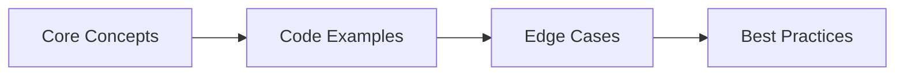

## Chapter at a Glance

| Topic | Key Focus | Key Questions |
|-------|----------|--------------|
| Core Concepts | Foundational understanding | Definitions, contrasts, trade-offs |
| Code Examples | Compilable, runnable solutions | Real interview scenarios |
| Best Practices | Production-ready patterns | Pitfalls to avoid |

## Chapter Roadmap



### Q16: How do you implement auditing (created_at, updated_at) in JPA?
> **Pro Tip:** In interviews, always start with the "why" before the "how." Explaining the reasoning behind a design choice is more valuable than reciting syntax.

> **Remember:** Code readability matters in interviews. Write clean, well-structured code with meaningful variable names.


**Answer:**

Spring Data JPA provides `@CreatedDate`, `@LastModifiedDate`, `@CreatedBy`, and `@LastModifiedBy` annotations. Enable auditing with `@EnableJpaAuditing` and an `AuditorAware` bean.

```java
// ── Enable auditing ──
@Configuration
@EnableJpaAuditing(auditorAwareRef = "auditorProvider")
public class JpaConfig {

    @Bean
    public AuditorAware<String> auditorProvider() {
        return () -> Optional.ofNullable(SecurityContextHolder.getContext())
            .map(ctx -> ctx.getAuthentication())
            .map(Authentication::getName)
            .orElse("system");
    }
}

// ── Base entity ──
@MappedSuperclass
@EntityListeners(AuditingEntityListener.class)
public abstract class BaseEntity {

    @CreatedDate
    @Column(updatable = false)
    private LocalDateTime createdAt;

    @LastModifiedDate
    private LocalDateTime updatedAt;

    @CreatedBy
    @Column(updatable = false)
    private String createdBy;

    @LastModifiedBy
    private String lastModifiedBy;
}

// ── Usage ──
@Entity
public class Product extends BaseEntity {
    @Id @GeneratedValue private Long id;
    private String name;
    private BigDecimal price;
}

// Persisting a Product automatically sets createdAt, updatedAt, createdBy, lastModifiedBy
```

The `@EntityListeners(AuditingEntityListener.class)` hooks into JPA lifecycle events (`@PrePersist`, `@PreUpdate`) to populate the fields. No manual `setCreatedAt()` calls needed.

For UUID-based IDs with automatic generation:

```java
@Entity
public class Document {
    @Id
    @GeneratedValue(strategy = GenerationType.UUID)
    private UUID id;
    // ...
}
```

---

### Q17: What is the Open Session In View (OSIV) anti-pattern, and why avoid it?

**Answer:**

OSIV keeps the Hibernate session open throughout the entire HTTP request, including during view rendering. This means lazy loading works in your templates → which sounds convenient → but it causes serious production problems.

```yaml
# Spring Boot default (enabled) → causes the anti-pattern:

> **Previous:** [Databases Interview Q&amp;A (cont.)](./59-interview-databases-b.md) | **Next:** [Databases Interview Q&amp;A (cont.)](./59-interview-databases-d.md)
spring:
  jpa:
    open-in-view: true   # default is true → BAD for production
```

Problems with OSIV:
1. **Connection pool exhaustion**: The database connection is held for the entire request, including slow view rendering or network I/O. Each connection is unavailable for other requests.
2. **Lazy loading in unexpected places**: Templates trigger N+1 queries silently → developers don't notice until production load.
3. **Transaction boundary confusion**: Developers think a transaction is open because entities are still accessible, but the transaction may have already committed.
4. **Hard-to-debug performance issues**: A page that renders fine locally with 10 entities triggers 100 queries in production with real data.

Fix: Disable OSIV and load everything you need in the service layer:

```yaml
spring:
  jpa:
    open-in-view: false
```

Then use `JOIN FETCH`, `@EntityGraph`, or DTO projections to ensure all required data is loaded within the transaction:

```java
@Service
public class OrderService {
    @Transactional(readOnly = true)
    public OrderDto getOrderWithDetails(Long orderId) {
        Order order = orderRepo.findByIdWithItemsAndCustomer(orderId);
        // All lazy associations are loaded inside the transaction
        // After this method returns, the session is closed
        return OrderDto.from(order);  // DTO → no lazy loading during serialization
    }
}
```

---

### Q18: How do you implement pagination and sorting in Spring Data JPA?

**Answer:**

Spring Data JPA provides `Pageable` for pagination and `Sort` for sorting. The repository method accepts a `Pageable` parameter and returns a `Page` object with metadata.

```java
public interface ProductRepository extends JpaRepository<Product, Long> {
    Page<Product> findByCategory(String category, Pageable pageable);
    Slice<Product> findByNameContaining(String name, Pageable pageable);
    List<Product> findByActiveTrue(Sort sort);
}

// ── Usage in service ──
@Service
public class ProductService {
    public Page<ProductDto> getProductsByCategory(String category, int page, int size) {
        Pageable pageable = PageRequest.of(page, size,
            Sort.by("price").ascending().and(Sort.by("name")));

        Page<Product> productPage = productRepo.findByCategory(category, pageable);

        // Page contains: content, totalElements, totalPages, number, size, first, last, etc.
        return productPage.map(ProductDto::from);
    }
}

// ── REST controller with Spring MVC pagination ──
@GetMapping("/products")
public ResponseEntity<Page<ProductDto>> getProducts(
        @RequestParam(defaultValue = "0") int page,
        @RequestParam(defaultValue = "20") int size,
        @RequestParam(defaultValue = "name,asc") String[] sort) {

    Sort sortObj = Sort.by(
        Arrays.stream(sort)
            .map(s -> s.contains(",")
                ? new Sort.Order(Sort.Direction.fromString(s.split(",")[1]), s.split(",")[0])
                : new Sort.Order(Sort.Direction.ASC, s))
            .collect(Collectors.toList()));

    Pageable pageable = PageRequest.of(page, size, sortObj);
    return ResponseEntity.ok(productService.getProducts(pageable));
}
```

Key differences:
- `Page`: Includes total element count (requires a `COUNT` query). Use for UIs that need total page numbers.
- `Slice`: Only knows if there's a next slice (no count query). More efficient for infinite scroll.
- `List` with `Sort`: No pagination header. Use for small result sets.

Always set a maximum page size to prevent abuse: `@PageableDefault(size = 20, maxSize = 100)`.

---

### Q19: How do you use Spring Data JPA Specifications for dynamic queries?

**Answer:**

Specifications let you build dynamic, type-safe queries programmatically by composing `Specification` objects with logical operators. They are the JPA equivalent of the Query Object pattern.

```java
// ── Step 1: Have your repository extend JpaSpecificationExecutor ──
public interface UserRepository extends JpaRepository<User, Long>,
        JpaSpecificationExecutor<User> {
}

// ── Step 2: Create specification factory methods ──
public class UserSpecifications {

    public static Specification<User> hasName(String name) {
        return (root, query, cb) ->
            name == null ? null : cb.like(root.get("name"), "%" + name + "%");
    }

    public static Specification<User> hasEmailDomain(String domain) {
        return (root, query, cb) ->
            root.get("email").as(String.class).in(
                cb.literal("%@" + domain)
            );
    }

    public static Specification<User> isActive() {
        return (root, query, cb) -> cb.isTrue(root.get("active"));
    }

    public static Specification<User> createdAfter(LocalDateTime date) {
        return (root, query, cb) ->
            date == null ? null : cb.greaterThan(root.get("createdAt"), date);
    }

    public static Specification<User> hasRole(String role) {
        return (root, query, cb) -> {
            Join<User, Role> roles = root.join("roles");
            return cb.equal(roles.get("name"), role);
        };
    }
}

// ── Step 3: Compose specifications ──
@Service
public class UserSearchService {

    private final UserRepository userRepo;

    public List<User> search(String name, String domain, String role,
                             LocalDateTime after, Boolean active) {
        Specification<User> spec = Specification.where(null);

        if (name != null)     spec = spec.and(UserSpecifications.hasName(name));
        if (domain != null)   spec = spec.and(UserSpecifications.hasEmailDomain(domain));
        if (role != null)     spec = spec.and(UserSpecifications.hasRole(role));
        if (after != null)    spec = spec.and(UserSpecifications.createdAfter(after));
        if (Boolean.TRUE.equals(active)) spec = spec.and(UserSpecifications.isActive());

        return userRepo.findAll(spec, Sort.by("name"));
    }
}
```

Use Specifications over `@Query` when:
- The number of filter combinations grows combinatorially
- Filters are optional and the WHERE clause changes per request
- You want to reuse predicates across different queries

---

### Q20: How do you implement multi-tenancy in Spring Boot with Hibernate?

**Answer:**

Multi-tenancy separates data across tenants (customers/organizations). Three approaches:

**1. Separate Database** → each tenant has its own database:
```yaml
# application.yml

> **Previous:** [Databases Interview Q&amp;A (cont.)](./59-interview-databases-b.md) | **Next:** [Databases Interview Q&amp;A (cont.)](./59-interview-databases-d.md)
spring:
  datasource:
    url: jdbc:postgresql://localhost:5432/
  jpa:
    properties:
      hibernate:
        multi_tenant_connection_provider: com.example.TenantConnectionProvider
```

```java
public class TenantConnectionProvider
        implements MultiTenantConnectionProvider {
    private final Map<String, DataSource> tenantDataSources = Map.of(
        "tenant_a", createDataSource("jdbc:postgresql://localhost:5432/tenant_a"),
        "tenant_b", createDataSource("jdbc:postgresql://localhost:5432/tenant_b")
    );

    @Override
    public Connection getConnection(String tenantId) throws SQLException {
        return tenantDataSources.get(tenantId).getConnection();
    }
}
```

**2. Separate Schema** → same database, different schemas per tenant:
```java
public class TenantSchemaResolver implements CurrentTenantIdentifierResolver {
    @Override
    public String resolveCurrentTenantIdentifier() {
        return RequestContextHolder.getRequestAttributes() != null
            ? TenantContext.getTenantId()  // from HTTP header or JWT claim
            : "public";
    }
}
```

**3. Discriminator Column** → same table, a `tenant_id` column on every row:
```java
@Entity
@Where(clause = "tenant_id = current_tenant_id()")
@FilterDef(name = "tenantFilter", parameters = @ParamDef(name = "tenantId", type = Long.class))
@Filter(name = "tenantFilter", condition = "tenant_id = :tenantId")
public class Document {
    @Id private Long id;
    private Long tenantId;
    private String title;
}

// In service:
@Transactional
public List<Document> getDocuments() {
    Session session = em.unwrap(Session.class);
    session.enableFilter("tenantFilter")
        .setParameter("tenantId", TenantContext.getTenantId());
    return repo.findAll();
}
```

Separate database is strongest isolation (best for compliance). Schema per tenant is a good middle ground. Discriminator column is simplest but riskiest → one bug can leak data between tenants. Never use discriminator-column tenancy for regulated data (HIPAA, GDPR financial).

---

### Q21: What is the difference between `NativeQuery`, `JPQL`, and `CriteriaQuery`?

**Answer:**

| Aspect | NativeQuery | JPQL | CriteriaQuery |
|--------|-------------|------|---------------|
| Language | Raw SQL | Entity-based SQL-like | Java API (no string) |
| Portability | Database-specific | Portable across DBs | Portable |
| Type safety | None (Object[]) | Partial (TypedQuery) | Full (typed generics) |
| Dynamic query building | String concatenation | String concatenation | Programmatic |
| Performance | Best (direct SQL) | Same as Native | Slight overhead |
| Complexity | Simple | Moderate | Higher |

```java
// ── NativeQuery: raw SQL, returns Object[] ──
@Query(value = "SELECT id, name, COUNT(*) OVER() as total " +
       "FROM users WHERE name ILIKE %:query% ORDER BY name " +
       "OFFSET :offset LIMIT :limit", nativeQuery = true)
List<Object[]> searchNative(@Param("query") String q,
                            @Param("offset") int offset,
                            @Param("limit") int limit);

// ── JPQL: entity-based ──
@Query("SELECT u FROM User u WHERE u.name LIKE %:query% ORDER BY u.name")
List<User> searchJpql(@Param("query") String q, Pageable pageable);

// ── CriteriaQuery: programmatic, type-safe ──
public List<User> searchCriteria(String name, String email, Boolean active) {
    CriteriaBuilder cb = em.getCriteriaBuilder();
    CriteriaQuery<User> cq = cb.createQuery(User.class);
    Root<User> root = cq.from(User.class);

    List<Predicate> predicates = new ArrayList<>();
    if (name != null)   predicates.add(cb.like(root.get("name"), "%" + name + "%"));
    if (email != null)  predicates.add(cb.equal(root.get("email"), email));
    if (active != null) predicates.add(cb.equal(root.get("active"), active));

    cq.where(cb.and(predicates.toArray(new Predicate[0])));
    cq.orderBy(cb.asc(root.get("name")));

    return em.createQuery(cq).getResultList();
}
```

Use NativeQuery for database-specific features (window functions, `ILike`, full-text search). Use JPQL for 80% of queries → it is expressive and portable. Use CriteriaQuery only when building dynamic queries with a combinatorial number of optional filters (but even then, Specifications are usually cleaner).

---

### Q22: How do you use MongoDB with Spring Data?

**Answer:**

Spring Data MongoDB follows the same repository pattern as JPA but maps documents instead of relational rows.

```xml
<dependency>
    <groupId>org.springframework.boot</groupId>
    <artifactId>spring-boot-starter-data-mongodb</artifactId>
</dependency>
```

```java
// ── Document mapping ──
@Document(collection = "orders")
public class Order {
    @Id private String id;
    private String customerId;
    private LocalDateTime orderDate;
    private String status;
    private List<OrderItem> items;
    private Address shippingAddress;
}

// ── Repository ──
public interface OrderRepository extends MongoRepository<Order, String> {
    List<Order> findByCustomerId(String customerId);
    List<Order> findByStatusOrderByOrderDateDesc(String status);

    // JSON-like query with @Query
    @Query("{ 'status': ?0, 'items.price': { $gt: ?1 } }")
    List<Order> findHighValueOrders(String status, double minPrice);

    // Aggregation pipeline
    @Aggregation(pipeline = {
        "{ $match: { status: 'COMPLETED' } }",
        "{ $group: { _id: '$customerId', total: { $sum: '$total' } } }",
        "{ $sort: { total: -1 } }",
        "{ $limit: 10 }"
    })
    List<CustomerSpending> findTopCustomers();
}
```

Key differences from JPA:
- No joins → embed related data or reference by ID
- No schema enforcement (unless you use schema validation)
- Atomic operations on single documents only → no cross-document transactions (unless using replica sets)
- Indexes defined via `@Indexed`, `@CompoundIndex`, or programmatically

```java
@Document
@CompoundIndex(def = "{'customerId': 1, 'status': 1}")
public class Order {
    @Id private String id;

    @Indexed
    private String customerId;

    @Indexed(expireAfterSeconds = 7776000)  // TTL index → auto-delete after 90 days
    private LocalDateTime createdAt;
}
```

Use MongoDB when your data is document-shaped (JSON-like, nested, varying schema) and you don't need complex joins or ACID transactions across multiple entities.

---

### Q23: What is connection pooling, and how do you configure HikariCP?

**Answer:**

Connection pooling reuses database connections instead of creating a new TCP connection for every request. Creating a connection is expensive (TCP handshake, SSL negotiation, authentication takes 10-100 ms). A pool maintains a set of open connections that are borrowed and returned.

Spring Boot uses HikariCP by default → the fastest connection pool in the Java ecosystem.

```yaml
spring:
  datasource:
    url: jdbc:postgresql://localhost:5432/mydb
    username: app
    password: secret
    hikari:
      maximum-pool-size: 20       # max connections in the pool
      minimum-idle: 5              # connections to keep alive when idle
      idle-timeout: 300000         # 5 min before an idle connection is evicted
      connection-timeout: 5000     # 5 second wait for a connection before timeout
      max-lifetime: 1800000        # 30 min max lifetime per connection
      pool-name: MyAppPool
      connection-test-query: SELECT 1
      leak-detection-threshold: 60000  # log warning if connection held >60s
```

Picking `maximum-pool-size`:
- Formula: `(core_count * 2) + effective_spindle_count`
- For a typical 8-core server: `(8 * 2) + 1 = 17`, rounded to 20
- More connections do not mean more throughput → PostgreSQL (and most databases) scales poorly beyond 50-100 connections
- Monitor `pool.Wait` time → if connections are waiting, increase the pool size gradually

```java
// Programmatic configuration (if needed):
@Configuration
public class DataSourceConfig {
    @Bean
    public HikariDataSource dataSource() {
        HikariConfig config = new HikariConfig();
        config.setJdbcUrl("jdbc:postgresql://localhost:5432/mydb");
        config.setUsername("app");
        config.setPassword("secret");
        config.setMaximumPoolSize(20);
        config.setConnectionTimeout(5000);
        config.setLeakDetectionThreshold(60000);
        return new HikariDataSource(config);
    }
}
```

Always set `leak-detection-threshold` in development to catch connection leaks (forgotten `finally` blocks, unreleased streams).

---

### Q24: How do you use Redis with Spring Boot for caching?

**Answer:**

Spring Boot's caching abstraction works with Redis as the backing store. Configure Redis cache, then annotate methods with `@Cacheable`, `@CacheEvict`, and `@CachePut`.

```xml
<dependency>
    <groupId>org.springframework.boot</groupId>
    <artifactId>spring-boot-starter-data-redis</artifactId>
</dependency>
<dependency>
    <groupId>org.springframework.boot</groupId>
    <artifactId>spring-boot-starter-cache</artifactId>
</dependency>
```

```java
// ── Configuration ──
@Configuration
@EnableCaching
public class CacheConfig {

    @Bean
    public RedisCacheConfiguration cacheConfiguration() {
        return RedisCacheConfiguration.defaultCacheConfig()
            .entryTtl(Duration.ofMinutes(10))
            .disableCachingNullValues()
            .serializeKeysWith(
                RedisSerializationContext.SerializationPair
                    .fromSerializer(new StringRedisSerializer()))
            .serializeValuesWith(
                RedisSerializationContext.SerializationPair
                    .fromSerializer(new GenericJackson2JsonRedisSerializer()));
    }
}

// ── Usage ──
@Service
public class ProductService {

    @Cacheable(value = "products", key = "#id")
    public Product getProduct(Long id) {
        return productRepo.findById(id)
            .orElseThrow(() -> new ProductNotFoundException(id));
        // Result cached in Redis for 10 minutes
    }

    @CachePut(value = "products", key = "#product.id")
    public Product updateProduct(Product product) {
        return productRepo.save(product);
        // Updates the cache → next read gets fresh data
    }

    @CacheEvict(value = "products", key = "#id")
    public void deleteProduct(Long id) {
        productRepo.deleteById(id);
        // Removes from cache
    }

    @CacheEvict(value = "products", allEntries = true)
    public void clearCache() {
        // Clears entire products cache
    }

    @Cacheable(value = "searchResults", key = "#query + '-' + #page")
    public List<Product> searchProducts(String query, int page, Pageable p) {
        return productRepo.search(query, p).getContent();
    }
}
```

```yaml
spring:
  cache:
    type: redis
  redis:
    host: localhost
    port: 6379
    timeout: 2000ms
    lettuce:
      pool:
        max-active: 16
        max-idle: 8
        min-idle: 4
```

Use caching for:
- Reference data (country lists, category trees)
- Expensive computations (report aggregations)
- External API responses (rate-limited or slow)
- User sessions (if using Redis for session store)

Never cache mutable data without TTL or eviction. Stale data is worse than slow data.

---

### Q25: How do you troubleshoot slow queries in a Spring Boot + Hibernate application?

**Answer:**

A systematic approach from outermost to innermost:

**1. Enable SQL logging:**
```yaml
logging:
  level:
    org.hibernate.SQL: DEBUG
    org.hibernate.type.descriptor.sql.BasicBinder: TRACE
# OR for formatted output:

> **Previous:** [Databases Interview Q&amp;A (cont.)](./59-interview-databases-b.md) | **Next:** [Databases Interview Q&amp;A (cont.)](./59-interview-databases-d.md)
spring:
  jpa:
    show-sql: true
    properties:
      hibernate:
        format_sql: true
        use_sql_comments: true  # shows which code triggered each query
```

**2. Enable slow query logging in Hibernate:**
```yaml
spring:
  jpa:
    properties:
      hibernate:
        session:
          events:
            log:
              LOG_QUERIES_SLOWER_THAN_MS: 200
```

**3. Use Spring Boot Actuator metrics:**
```yaml
management:
  endpoints:
    web:
      exposure:
        include: metrics
  metrics:
    tags:
      application: my-app
    export:
      datasource: hikaricp
      hibernate: true
```

Then check `/actuator/metrics/hibernate.query.executions` and `/actuator/metrics/hikaricp.connections.timeout`.

**4. Enable P6Spy or datasource-proxy for query analysis:**
```xml
<dependency>
    <groupId>com.github.gavlyukovskiy</groupId>
    <artifactId>p6spy-spring-boot-starter</artifactId>
    <version>1.9.1</version>
</dependency>
```
```yaml
spring:
  datasource:
    url: jdbc:p6spy:postgresql://localhost:5432/mydb
  p6spy:
    log-format: "[%SQL] %TIMESTAMP | %CONNECTION | took %ELAPSED ms | %SQL"
    execution-threshold: 200  # log queries slower than 200ms
```

**5. Database-level slow query log (PostgreSQL example):**
```sql
-- Enable pg_stat_statements extension
CREATE EXTENSION IF NOT EXISTS pg_stat_statements;

-- Find the worst queries:
SELECT query, calls, total_exec_time / calls AS avg_ms,
       rows / calls AS avg_rows, shared_blks_hit
FROM pg_stat_statements
ORDER BY total_exec_time DESC
LIMIT 10;
```

Common fixes by symptom:
| Symptom | Likely cause | Fix |
|---------|-------------|-----|
| N+1 queries | Lazy loading in loop | JOIN FETCH or @BatchSize |
| Slow COUNT query | Pagination on complex query | Use Slice instead of Page |
| Missing index | Full table scan on filter/join | Add database index |
| Large result set | No pagination | Add Pageable with max size |
| Hanging connection | OSIV enabled | Set open-in-view: false |
| Query runs slow only under load | Connection pool contention | Tune HikariCP pool size |
| Same query in logs 100x | No query plan cache | Enable Hibernate query cache |

The most impactful single change: **enable slow query logging in both Hibernate and the database**, correlate the logs, and fix the top 5 queries. That typically resolves 80% of database performance issues.

## Concept Comparison Table

| Concept | Definition | Key Distinction | Use Case |
|---------|-----------|-----------------|----------|
| Interface | Contract without state | Multiple inheritance of type | API contracts |
| Abstract Class | Partial implementation | Single inheritance, shared state | Template method pattern |
| Record | Transparent data carrier | Auto-generated methods | DTOs, value objects |

## Quick Reference

| Topic | Key Points | Interview Frequency |
|-------|-----------|-------------------|
| **OOP** | Encapsulation, Inheritance, Polymorphism, Abstraction | Every interview |
| **Collections** | List, Set, Map, Queue, Deque | 9/10 interviews |
| **Concurrency** | synchronized, volatile, Locks, CompletableFuture | 7/10 senior interviews |
| **Java 8+** | Lambdas, Streams, Optional, CompletableFuture | 8/10 interviews |

## Cross-Application Matrix

| Skill | Junior (0-2yr) | Mid (3-5yr) | Senior (6-9yr) | Staff (10+) |
|-------|---------------|-------------|----------------|-------------|
| OOP & Design Patterns | Define and identify | Apply and combine | Evaluate and refactor | Create and teach |
| Collections | Basic usage | Performance trade-offs | Concurrent collections | Custom implementations |
| Concurrency | Syntax knowledge | Write thread-safe code | Debug deadlocks | Design concurrent systems |

## Chapter Quiz

1. What is the difference between equals() and == in Java?
   - A) They are identical
   - B) equals() compares values, == compares references
   - C) == compares values, equals() compares references
   - D) equals() is for primitives, == is for objects

<details>
<summary>Answer</summary>
**B) equals() compares logical equality (overridable), == compares reference equality.**
</details>

2. Which collection guarantees insertion order?
   - A) HashMap
   - B) TreeMap
   - C) LinkedHashMap
   - D) HashSet

<details>
<summary>Answer</summary>
**C) LinkedHashMap.** LinkedHashMap maintains a doubly-linked list of entries to preserve insertion order.
</details>

3. What keyword prevents a method from being overridden?
   - A) static
   - B) final
   - C) private
   - D) abstract

<details>
<summary>Answer</summary>
**B) final.** A final method cannot be overridden by subclasses.
</details>
