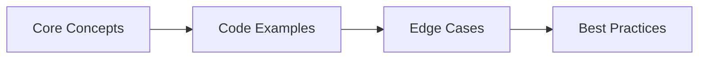
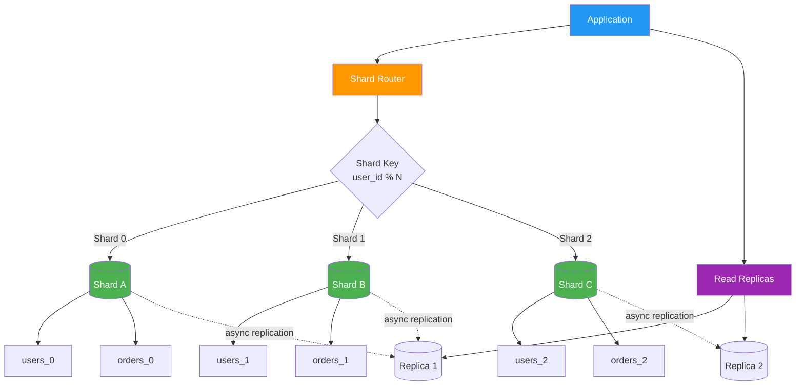

## Chapter at a Glance

| Topic | Key Focus | Key Questions |
|-------|----------|--------------|
| Core Concepts | Foundational understanding | Definitions, contrasts, trade-offs |
| Code Examples | Compilable, runnable solutions | Real interview scenarios |
| Best Practices | Production-ready patterns | Pitfalls to avoid |

## Chapter Roadmap



### Q26: What is database sharding, and how do you implement it?
> **Pro Tip:** In interviews, always start with the "why" before the "how." Explaining the reasoning behind a design choice is more valuable than reciting syntax.

> **Remember:** Code readability matters in interviews. Write clean, well-structured code with meaningful variable names.


**Answer:**

Sharding (horizontal partitioning) splits a table across multiple database instances. Each shard holds a subset of rows based on a shard key. The application routes queries to the correct shard.

```java
// ── Shard key routing with AbstractRoutingDataSource ──
public class ShardRouter {
    private final Map<String, DataSource> shards = Map.of(
        "shard-0", createDataSource("jdbc:postgresql://shard0.example.com:5432/db"),
        "shard-1", createDataSource("jdbc:postgresql://shard1.example.com:5432/db"),
        "shard-2", createDataSource("jdbc:postgresql://shard2.example.com:5432/db")
    );

    public DataSource getShard(long tenantId) {
        int shardIndex = (int) (tenantId % shards.size());
        return shards.get("shard-" + shardIndex);
    }
}

// ── Spring AbstractRoutingDataSource ──
public class TenantAwareRoutingSource extends AbstractRoutingDataSource {
    @Override
    protected Object determineCurrentLookupKey() {
        return "shard-" + (TenantContext.getTenantId() % 3);
    }
}
```

Key considerations:
- Choose a shard key that evenly distributes data (user_id, tenant_id, region)
- Cross-shard queries (JOINs across shards) are expensive or impossible → design aggregates per shard
- Adding shards requires rebalancing or consistent hashing
- Transactions cannot span shards (no distributed ACID without coordinator)
- PostgreSQL Citus, MySQL Cluster, and Vitess provide automated sharding at the database layer

Sharding is the most complex scaling strategy. Exhaust read replicas, vertical scaling, and connection pooling before considering it.

---

### Q27: How do you configure read replicas with Spring Boot?

**Answer:**

Use `@Transactional(readOnly = true)` to route read operations to a replica datasource. Implement this with `AbstractRoutingDataSource` and a `@Transactional` interceptor.

```java
// ── Multi-datasource configuration ──
@Configuration
public class DataSourceConfig {

    @Bean
    @ConfigurationProperties("spring.datasource.primary")
    public DataSource primaryDataSource() {
        return DataSourceBuilder.create().build();
    }

    @Bean
    @ConfigurationProperties("spring.datasource.replica")
    public DataSource replicaDataSource() {
        return DataSourceBuilder.create().build();
    }

    @Bean
    public DataSource routingDataSource() {
        RoutingDataSource router = new RoutingDataSource();
        Map<Object, Object> targets = new HashMap<>();
        targets.put("PRIMARY", primaryDataSource());
        targets.put("REPLICA", replicaDataSource());
        router.setDefaultTargetDataSource(primaryDataSource());
        router.setTargetDataSources(targets);
        return router;
    }
}

// ── Routing datasource ──
public class RoutingDataSource extends AbstractRoutingDataSource {
    @Override
    protected Object determineCurrentLookupKey() {
        return TransactionSynchronizationManager
            .isCurrentTransactionReadOnly() ? "REPLICA" : "PRIMARY";
    }
}

// ── Usage ──
@Service
public class UserService {
    @Transactional(readOnly = true)  // routes to REPLICA
    public List<User> findAll() { return repo.findAll(); }

    @Transactional  // routes to PRIMARY
    public User save(User u) { return repo.save(u); }
}
```

Caveats:
- Replica lag means read-after-write consistency is not guaranteed → a user may not see their own saved data immediately
- Use `@Transactional(readOnly = true)` only on queries where stale data is acceptable
- For read-your-writes consistency, use the primary datasource within the same transaction
- Connection pooling needs separate pools for primary and replica

---

### Q28: Explain Hibernate cascade types with examples

**Answer:**

Cascade types dictate how operations on a parent entity propagate to its children.

```java
@Entity
public class Author {
    @Id @GeneratedValue private Long id;
    private String name;

    // ── ALL: persist, merge, remove, refresh, detach ──
    @OneToMany(mappedBy = "author", cascade = CascadeType.ALL)
    private List<Book> books;

    // ── PERSIST: saving Author saves Books ──
    @OneToMany(mappedBy = "author", cascade = CascadeType.PERSIST)
    private List<Article> articles;

    // ── MERGE: updating Author updates Books ──
    @OneToMany(mappedBy = "author", cascade = CascadeType.MERGE)
    private List<Book> editedBooks;

    // ── REMOVE: deleting Author deletes Books ──
    @OneToMany(mappedBy = "author", cascade = CascadeType.REMOVE)
    private List<Book> coAuthoredBooks;

    // ── DETACH: detaching Author detaches Books ──
    @OneToMany(mappedBy = "author", cascade = CascadeType.DETACH)
    private List<Book> reviewedBooks;

    // ── REFRESH: refreshing Author refreshes Books ──
    @OneToMany(mappedBy = "author", cascade = CascadeType.REFRESH)
    private List<Book> proofreadBooks;
}

@Service
public class AuthorService {
    @Transactional
    public void createAuthorWithBooks() {
        Author a = new Author();
        a.setName("Raushan");
        a.setBooks(List.of(
            new Book("AI Engineering 101", a),
            new Book("Spring Boot in Practice", a)
        ));
        repo.save(a);  // cascade = ALL saves both books automatically
    }
}
```

```sql
-- Generated SQL for the above:
INSERT INTO author (name) VALUES ('Raushan');
INSERT INTO book (title, author_id) VALUES ('AI Engineering 101', 1);
INSERT INTO book (title, author_id) VALUES ('Spring Boot in Practice', 1);
```

Use `CascadeType.ALL` only when the child entity has no independent lifecycle. Never cascade `ALL` on `@ManyToMany` → it can delete entities that belong to other owners. Use `PERSIST` + `MERGE` for most `@OneToMany` relationships.

---

### Q29: What is the difference between `@Embedded` and `@OneToOne`?

**Answer:**

`@Embedded` maps the fields of an embeddable class directly into the parent table (flat schema). `@OneToOne` creates a separate table with a foreign key relationship.

```java
// ── @Embedded → fields in the same table ──
@Embeddable
public class Address {
    private String street;
    private String city;
    private String zipCode;
    private String country;
}

@Entity
public class User {
    @Id private Long id;
    private String name;

    @Embedded
    private Address address;  // columns: street, city, zip_code, country → in the users table
}

// Result: single table "users" with columns: id, name, street, city, zip_code, country

// ── @OneToOne → separate table with FK ──
@Entity
public class Profile {
    @Id private Long id;
    private String bio;
    private String avatarUrl;
}

@Entity
public class User {
    @Id private Long id;
    private String name;

    @OneToOne(cascade = CascadeType.ALL)
    @JoinColumn(name = "profile_id")
    private Profile profile;  // FK to separate profiles table
}

// Result: users(id, name, profile_id), profiles(id, bio, avatar_url)
```

When to use each:
- `@Embedded`: The embedded fields are tightly coupled to the parent, never queried independently, and the relationship is strictly one-to-one. Address, contact info, monetary amount (value + currency).
- `@OneToOne`: The associated entity has its own lifecycle, is queried independently, may be shared (rare), or would create too many nullable columns in the parent table.

Embeddables support nesting and overriding column names:
```java
@Embedded
@AttributeOverrides({
    @AttributeOverride(name = "street", column = @Column(name = "home_street")),
    @AttributeOverride(name = "city", column = @Column(name = "home_city"))
})
private Address homeAddress;
```

---

### Q30: How do you implement batch processing with JPA and Hibernate?

**Answer:**

Batch processing inserts or updates thousands of rows efficiently by batching JDBC statements and flushing periodically.

```java
// ── Configuration ──
spring:
  jpa:
    properties:
      hibernate:
        jdbc:
          batch_size: 50
        order_inserts: true
        order_updates: true
        batch_versioned_data: true

// ── Batch insert service ──
@Service
public class BatchImportService {

    @PersistenceContext
    private EntityManager em;

    @Transactional
    public void importUsers(List<UserCsvRow> rows) {
        int batchSize = 50;
        for (int i = 0; i < rows.size(); i++) {
            User u = new User();
            u.setName(rows.get(i).name());
            u.setEmail(rows.get(i).email());
            em.persist(u);

            if (i > 0 && i % batchSize == 0) {
                em.flush();
                em.clear();  // detaches all managed entities → frees memory
            }
        }
        em.flush();
        em.clear();
    }
}
```

Without `order_inserts=true`, Hibernate sends individual INSERT statements for unrelated entities. With batching and ordering:

```sql
-- Generated SQL (batched):
INSERT INTO users (name, email) VALUES ('Alice', 'a@x.com'), ('Bob', 'b@x.com'), ...;  -- 50 rows
```

For updates, `order_updates=true` groups statements by entity type:

```java
@Transactional
public void bulkStatusUpdate(List<Long> ids, String newStatus) {
    // ❌ Without batching: N separate UPDATEs (one per entity)
    // ✅ With order_updates: batched UPDATE ... WHERE id IN (...)

    for (Long id : ids) {
        User u = em.find(User.class, id);
        u.setStatus(newStatus);  // dirty checking queues UPDATE
    }
    em.flush();
}
```

For truly large datasets (100K+ rows), use JDBC batch updates directly or a bulk operation:

```java
@Modifying
@Query("UPDATE User u SET u.status = :status WHERE u.id IN :ids")
int bulkUpdateStatus(@Param("ids") List<Long> ids, @Param("status") String status);

// Returns the number of updated rows → no entity loading needed
```

---

### Q31: Explain database indexing strategies for common query patterns

**Answer:**

Indexes are the single most impactful performance optimization. Choosing the right index type depends on your query pattern.

**B-tree index** (default, works for most queries):
```sql
CREATE INDEX idx_users_email ON users(email);
-- Supports: =, >, <, >=, <=, BETWEEN, LIKE 'prefix%', IN
-- Does NOT support: LIKE '%suffix', LIKE '%middle%', function(column)
```

**Composite index** (for queries filtering/sorting by multiple columns):
```sql
CREATE INDEX idx_orders_user_status ON orders(user_id, status);
-- Supports: WHERE user_id = ?  (uses first column)
-- Supports: WHERE user_id = ? AND status = ?  (full index)
-- Does NOT support: WHERE status = ?  (cannot use index → status is second column)

-- Column order matters: put equality filters first, range filters last
CREATE INDEX idx_orders_date_status ON orders(order_date, status);
-- WHERE order_date > '2024-01-01' AND status = 'ACTIVE'  → partial index usage (date column only)
-- Better: put the equality column first
CREATE INDEX idx_orders_status_date ON orders(status, order_date);
```

**Partial index** (index only a subset of rows → smaller, faster):
```sql
CREATE INDEX idx_active_users ON users(email) WHERE active = true;
-- Only indexes active users → 70% smaller if 30% of users are active
```

**Covering index** (includes all needed columns → no table lookup):
```sql
CREATE INDEX idx_orders_covering ON orders(user_id, status, total, created_at);
-- SELECT status, total FROM orders WHERE user_id = 123 ORDER BY created_at DESC
-- Entire query satisfied from index → zero table page reads
```

**GIN index** (for JSONB, full-text search, arrays):
```sql
CREATE INDEX idx_metadata ON products USING GIN (metadata jsonb_path_ops);
-- SELECT * FROM products WHERE metadata @> '{"color": "red"}'  → fast JSON containment search
```

**Indexing checklist per query:**
1. Run `EXPLAIN ANALYZE` on the slow query
2. Identify the table scan (`Seq Scan`) or filter condition
3. Create the smallest viable index that covers the WHERE clause
4. Add the ORDER BY columns if they aren't in the index
5. Include SELECT columns in the index if the table is read-heavy (covering index)
6. `VACUUM ANALYZE` and re-test

Most applications need fewer than 20 indexes per table. Too many indexes slow down writes (each INSERT/UPDATE must update every index).

---

### Q32: How does Hibernate's first-level cache interact with `@Transactional`?

**Answer:**

The first-level cache (persistence context) is scoped to the Hibernate `Session`, which is bound to a Spring transaction. Within a `@Transactional` method, all entity operations share the same persistence context.

```java
@Service
public class UserService {
    @Transactional
    public User updateUser(Long id, String newName, String newEmail) {
        // Both calls to findById hit the same persistence context
        User u1 = userRepo.findById(id).orElseThrow();
        u1.setName(newName);

        User u2 = userRepo.findById(id).orElseThrow();  // L1 cache hit → no SQL
        System.out.println(u1 == u2);  // true → same Java object

        u2.setEmail(newEmail);

        // At commit: Hibernate detects dirty fields (name AND email changed)
        // generates: UPDATE users SET name = ?, email = ? WHERE id = ? AND version = ?
        return u2;
    }
}
```

Implications:
1. **Write-behind**: Changes are queued in the persistence context until flush. The database is not touched until `em.flush()` or `@Transactional` commit.
2. **Dirty checking**: On flush, Hibernate compares every managed entity's current state with its snapshot. Changed fields generate UPDATE statements.
3. **Read-after-write consistency**: Within the same transaction, you always see your own writes because the L1 cache serves the entity.

Common mistake → calling `save()` is unnecessary for managed entities:
```java
@Transactional
public void updateName(Long id, String name) {
    User u = userRepo.findById(id).orElseThrow();  // managed
    u.setName(name);  // no save() needed → Hibernate auto-detects the change on flush
    // Hibernate generates: UPDATE users SET name = ? WHERE id = ?
}
```

---

### Q33: What are database migration rollback strategies in production?

**Answer:**

Database rollbacks are more complex than code rollbacks because the schema change is irreversible once applied. Three strategies:

**1. Forward-only with compensating migration (recommended):**
Every migration must have a corresponding "down" migration that reverses the change.

```java
// ── Flyway with callback for rollback support ──
public class FlywayRollbackService {
    public void undoLastMigration() {
        Flyway flyway = Flyway.configure()
            .dataSource(dataSource)
            .load();

        // Get the last applied migration
        var applied = flyway.info().applied();
        MigrationInfo last = applied[applied.length - 1];

        // Execute the undo script (V{version}__{description}.sql → V{version}__{description}__undo.sql)
        String undoScript = "db/undomigrations/" + last.getVersion() + "__undo.sql";
        Resource undo = new ClassPathResource(undoScript);
        if (undo.exists()) {
            executeSql(new String(undo.getInputStream().readAllBytes()));
        }
    }
}

-- Example down migration: V2__add_active_column__undo.sql
ALTER TABLE users DROP COLUMN active;
DELETE FROM flyway_schema_history WHERE version = '2';
```

**2. Expand-contract pattern (zero-downtime):**
Phase 1 → expand: Add the new column/table. Both old and new code can run simultaneously.
Phase 2 → migrate: Backfill data. Deploy new code that uses the new schema.
Phase 3 → contract: Remove the old column/table after confirming the new code works.

```sql
-- Phase 1 (expand): Add nullable column
ALTER TABLE users ADD COLUMN email_v2 VARCHAR(255);

-- Application writes to both email and email_v2 during migration

-- Phase 2 (migrate): Backfill
UPDATE users SET email_v2 = email WHERE email_v2 IS NULL;

-- Deploy code that reads from email_v2 instead of email

-- Phase 3 (contract): Remove old column
ALTER TABLE users DROP COLUMN email;
```

**3. Feature flags with backward-compatible schema:**
New schema changes are rolled out behind a feature flag. If the deployment fails, disable the flag. The schema change remains but is unused until re-enabled.

```java
@Value("${features.use-new-email-column:false}")
private boolean useNewEmail;

public String getEmail(User u) {
    return useNewEmail ? u.getEmailV2() : u.getEmail();
}
```

Never rename or drop columns without a multi-phase migration. Never make columns NOT NULL without backfilling data first. Test rollbacks on a staging database that mirrors production volume.

## Concept Comparison Table

| Concept | Definition | Key Distinction | Use Case |
|---------|-----------|-----------------|----------|
| Interface | Contract without state | Multiple inheritance of type | API contracts |
| Abstract Class | Partial implementation | Single inheritance, shared state | Template method pattern |
| Record | Transparent data carrier | Auto-generated methods | DTOs, value objects |

## Quick Reference

| Topic | Key Points | Interview Frequency |
|-------|-----------|-------------------|
| **OOP** | Encapsulation, Inheritance, Polymorphism, Abstraction | Every interview |
| **Collections** | List, Set, Map, Queue, Deque | 9/10 interviews |
| **Concurrency** | synchronized, volatile, Locks, CompletableFuture | 7/10 senior interviews |
| **Java 8+** | Lambdas, Streams, Optional, CompletableFuture | 8/10 interviews |

## Cross-Application Matrix

| Skill | Junior (0-2yr) | Mid (3-5yr) | Senior (6-9yr) | Staff (10+) |
|-------|---------------|-------------|----------------|-------------|
| OOP & Design Patterns | Define and identify | Apply and combine | Evaluate and refactor | Create and teach |
| Collections | Basic usage | Performance trade-offs | Concurrent collections | Custom implementations |
| Concurrency | Syntax knowledge | Write thread-safe code | Debug deadlocks | Design concurrent systems |

## TypeScript Indexing Strategy Validator

The following TypeScript code validates database indexing strategies, simulates shard key routing, and demonstrates batch processing patterns:

```typescript
interface ColumnDef {
  name: string;
  type: string;
  nullable: boolean;
  isPrimaryKey: boolean;
}

interface IndexDef {
  name: string;
  columns: string[];
  unique: boolean;
  partial: string | null;
  type: 'btree' | 'gin' | 'gist' | 'hash' | 'brin';
}

class IndexingStrategyValidator {
  analyze(query: string): string[] {
    const recommendations: string[] = [];
    const whereColumns = this.extractWhereColumns(query);
    const orderByColumns = this.extractOrderByColumns(query);
    const joinColumns = this.extractJoinColumns(query);

    if (whereColumns.length === 0 && orderByColumns.length === 0) {
      return ['Query has no WHERE or ORDER BY — no index needed'];
    }

    const allColumns = [...new Set([...whereColumns, ...orderByColumns, ...joinColumns])];

    if (allColumns.length === 1) {
      recommendations.push(`Single-column B-tree index on ${allColumns[0]}`);
    } else if (allColumns.length > 1) {
      const eqColumns = whereColumns.filter(c => !c.includes('>') && !c.includes('<') && !c.includes('LIKE'));
      const rangeColumns = whereColumns.filter(c => c.includes('>') || c.includes('<'));
      const compositeCols = [...eqColumns, ...rangeColumns, ...orderByColumns.filter(c => !whereColumns.includes(c))];
      recommendations.push(
        `Composite B-tree index on (${compositeCols.join(', ')}) — equality columns first, range/sort last`
      );
    }

    if (query.includes('ORDER BY') && !whereColumns.some(c => orderByColumns.includes(c))) {
      recommendations.push('ORDER BY columns differ from WHERE — consider a covering index');

      const coveringIndex = [...new Set([...allColumns, ...this.extractSelectColumns(query)])];
      recommendations.push(
        `Covering index suggestion: (${coveringIndex.join(', ')}) to avoid table lookups`
      );
    }

    if (query.includes('LIKE')) {
      const likeCols = whereColumns.filter(c => c.includes('LIKE'));
      if (likeCols.length > 0) {
        recommendations.push(`Consider GIN with pg_trgm for ${likeCols[0]} if using prefix/suffix LIKE`);
      }
    }

    if (query.includes('jsonb') || query.includes('JSONB') || query.includes('@>')) {
      recommendations.push('JSONB containment query detected — use GIN index with jsonb_path_ops');
    }

    return recommendations;
  }

  private extractWhereColumns(query: string): string[] {
    const whereMatch = query.match(/WHERE\s+(.+?)(?:ORDER\s+BY|GROUP\s+BY|HAVING|LIMIT|$)/i);
    if (!whereMatch) return [];
    return whereMatch[1]
      .split(/\s+(?:AND|OR)\s+/i)
      .map(clause => {
        const colMatch = clause.match(/^\s*(\w+)\.?(\w+)?\s*(=|>|<|>=|<=|!=|LIKE|IN|BETWEEN)/i);
        return colMatch ? (colMatch[2] || colMatch[1]) : null;
      })
      .filter((c): c is string => c !== null);
  }

  private extractOrderByColumns(query: string): string[] {
    const orderMatch = query.match(/ORDER\s+BY\s+(.+?)(?:LIMIT|OFFSET|$)/i);
    if (!orderMatch) return [];
    return orderMatch[1]
      .split(',')
      .map(c => c.trim().split(/\s+/)[0]);
  }

  private extractJoinColumns(query: string): string[] {
    const joinMatches = query.matchAll(/JOIN\s+\w+\s+\w+\s+ON\s+\w+\.(\w+)\s*=\s*\w+\.(\w+)/gi);
    const columns: string[] = [];
    for (const match of joinMatches) {
      columns.push(match[1], match[2]);
    }
    return columns;
  }

  private extractSelectColumns(query: string): string[] {
    const selectMatch = query.match(/SELECT\s+(.+?)\s+FROM/i);
    if (!selectMatch) return [];
    return selectMatch[1]
      .split(',')
      .map(c => c.trim().replace(/.*\./, ''));
  }

  costEstimate(query: string, rowCount: number): { sequential: number; indexed: number } {
    const sequential = rowCount * 0.1;
    const hasIndex = this.extractWhereColumns(query).length > 1;
    const indexed = hasIndex ? Math.log2(rowCount) * 0.05 : sequential;
    return {
      sequential: Number(sequential.toFixed(2)),
      indexed: Number(indexed.toFixed(2)),
    };
  }
}

// ── Example usage ──
const idxValidator = new IndexingStrategyValidator();

const queries = [
  'SELECT * FROM orders WHERE user_id = 123',
  'SELECT * FROM orders WHERE user_id = 123 AND status = \'ACTIVE\' ORDER BY created_at DESC',
  'SELECT * FROM orders WHERE total > 1000',
  'SELECT * FROM products WHERE metadata @> \'{"color": "red"}\'',
  'SELECT o.*, u.name FROM orders o JOIN users u ON o.user_id = u.id WHERE o.status = \'PENDING\'',
];

console.log('=== INDEXING STRATEGY VALIDATOR ===\n');
for (const q of queries) {
  console.log(`Query: ${q.substring(0, 60)}...`);
  const recs = idxValidator.analyze(q);
  recs.forEach(r => console.log(`  → ${r}`));
  const cost = idxValidator.costEstimate(q, 100000);
  console.log(`  Cost: sequential=${cost.sequential}ms, indexed=${cost.indexed}ms`);
  console.log();
}

// ── Shard key router ──
class ConsistentHashRouter {
  private ring: number[] = [];
  private nodes: Map<number, string> = new Map();
  private readonly virtualNodes = 100;

  constructor(shards: string[]) {
    for (const shard of shards) {
      for (let i = 0; i < this.virtualNodes; i++) {
        const hash = this.hash(`${shard}:${i}`);
        this.ring.push(hash);
        this.nodes.set(hash, shard);
      }
    }
    this.ring.sort((a, b) => a - b);
  }

  private hash(key: string): number {
    let hash = 0;
    for (let i = 0; i < key.length; i++) {
      hash = ((hash << 5) - hash) + key.charCodeAt(i);
      hash |= 0;
    }
    return Math.abs(hash);
  }

  getShard(key: string): string {
    if (this.ring.length === 0) throw new Error('No shards available');
    const hash = this.hash(key);
    for (const ringHash of this.ring) {
      if (hash <= ringHash) {
        return this.nodes.get(ringHash)!;
      }
    }
    return this.nodes.get(this.ring[0])!;
  }

  addShard(shard: string): void {
    for (let i = 0; i < this.virtualNodes; i++) {
      const hash = this.hash(`${shard}:${i}`);
      this.ring.push(hash);
      this.nodes.set(hash, shard);
    }
    this.ring.sort((a, b) => a - b);
  }
}

console.log('=== CONSISTENT HASH SHARD ROUTER ===\n');
const router = new ConsistentHashRouter(['shard-a', 'shard-b', 'shard-c']);
const userIds = [101, 202, 303, 404, 505, 606];
for (const uid of userIds) {
  console.log(`User ${uid} → ${router.getShard(`user:${uid}`)}`);
}
```

## Mermaid: Database Sharding Architecture



## Mermaid: Batch Processing Flow

```mermaid
flowchart LR
    A[Read CSV/XLSX] --> B[Parse rows]
    B --> C[Create entities]
    C --> D{Batch full?}
    D -->|No| C
    D -->|Yes, batch_size=50| E[em.flush()]
    E --> F[em.clear()]
    F --> G{More rows?}
    G -->|Yes| C
    G -->|No| H[Final flush]
    H --> I[Commit transaction]

    subgraph Hibernate Internals
        J[Persist context queue]
        K[SQL statement batching]
        L[JDBC batch execution]
    end

    E --> J
    J --> K
    K --> L

    style E fill:#4caf50,color:#fff
    style F fill:#ff9800,color:#fff
    style H fill:#2196f3,color:#fff
    style I fill:#9c27b0,color:#fff
```

## Mermaid: Cascade Type Decision Tree

```mermaid
flowchart TD
    A[Choose Cascade Type] --> B{Child has<br/>independent lifecycle?}
    B -->|Yes| C[Use PERSIST + MERGE only]
    B -->|No| D{Relationship type?}

    D -->|@OneToMany| E[CascadeType.ALL]
    D -->|@ManyToMany| F[PERSIST + MERGE<br/>NEVER ALL]
    D -->|@OneToOne| G[CascadeType.ALL]

    C --> H[Parent saves -> child saved]
    C --> I[Parent merges -> child merged]
    C --> J[Parent delete -> NOT cascaded]

    E --> K[All operations cascade]
    F --> L[Only persist/merge propagate]
    G --> M[Full lifecycle sync]

    style C fill:#ff9800,color:#fff
    style E fill:#4caf50,color:#fff
    style F fill:#f44336,color:#fff
    style G fill:#2196f3,color:#fff
```

## Chapter Quiz

1. What is the difference between equals() and == in Java?
   - A) They are identical
   - B) equals() compares values, == compares references
   - C) == compares values, equals() compares references
   - D) equals() is for primitives, == is for objects

<details>
<summary>Answer</summary>
**B) equals() compares logical equality (overridable), == compares reference equality.**
</details>

2. Which collection guarantees insertion order?
   - A) HashMap
   - B) TreeMap
   - C) LinkedHashMap
   - D) HashSet

<details>
<summary>Answer</summary>
**C) LinkedHashMap.** LinkedHashMap maintains a doubly-linked list of entries to preserve insertion order.
</details>

3. What keyword prevents a method from being overridden?
   - A) static
   - B) final
   - C) private
   - D) abstract

<details>
<summary>Answer</summary>
**B) final.** A final method cannot be overridden by subclasses.
</details>
