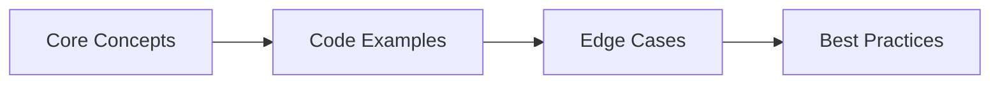

# Chapter 59: Database Interview Q&A for Java & Spring Boot Developers

> **Previous:** [REST API Interview Q&amp;A](./58-interview-rest-api.md) | **Next:** [Databases Interview Q&amp;A (cont.)](./59-interview-databases-a.md)

> 25+ questions covering JDBC, JPA, Hibernate, transactions, locking, indexing, NoSQL, and production database patterns. Each answer includes compilable Java code.

---


## Chapter at a Glance

| Topic | Key Focus | Key Questions |
|-------|----------|--------------|
| Core Concepts | Foundational understanding | Definitions, contrasts, trade-offs |
| Code Examples | Compilable, runnable solutions | Real interview scenarios |
| Best Practices | Production-ready patterns | Pitfalls to avoid |

## Chapter Roadmap



### Q1: What is the difference between JDBC and JPA, and when would you use each?
> **Pro Tip:** In interviews, always start with the "why" before the "how." Explaining the reasoning behind a design choice is more valuable than reciting syntax.

> **Remember:** Code readability matters in interviews. Write clean, well-structured code with meaningful variable names.


**Answer:**

JDBC (Java Database Connectivity) is a low-level API that lets you execute raw SQL directly against a database. You manage connections, statements, result sets, and transactions manually. JPA (Jakarta Persistence API) is a high-level specification for object-relational mapping (ORM) that maps Java objects to database tables and lets you work with entities instead of SQL strings.

Use JDBC when you need fine-grained control over SQL, are doing bulk operations where ORM overhead hurts, or are interacting with database-specific features. Use JPA when you want to reduce boilerplate, need automatic dirty checking, lazy loading, or a unit-of-work pattern, and your queries are reasonably standard.

```java
// ── JDBC approach ──
public User findUserByIdJdbc(long id) {
    String sql = "SELECT id, name, email FROM users WHERE id = ?";
    try (Connection conn = dataSource.getConnection();
         PreparedStatement ps = conn.prepareStatement(sql)) {
        ps.setLong(1, id);
        try (ResultSet rs = ps.executeQuery()) {
            if (rs.next()) {
                User u = new User();
                u.setId(rs.getLong("id"));
                u.setName(rs.getString("name"));
                u.setEmail(rs.getString("email"));
                return u;
            }
        }
    } catch (SQLException e) {
        throw new RuntimeException(e);
    }
    return null;
}

// ── JPA approach ──
@Repository
public class UserRepository {
    @PersistenceContext
    private EntityManager em;

    public User findUserByIdJpa(long id) {
        return em.find(User.class, id);  // single line, automatic mapping
    }
}
```

JPA wraps JDBC under the hood. Every JPA operation translates to JDBC calls eventually. The tradeoff is control versus convenience.

---

### Q2: Explain the difference between `hibernate.hbm2ddl.auto` values: `validate`, `update`, `create`, `create-drop`

**Answer:**

These control how Hibernate synchronizes your entity mappings with the database schema:

- `validate`: Checks that the database schema matches your entities. Throws an exception on mismatch. Safe for production → it never modifies the schema.
- `update`: Automatically alters the schema to match your entities (adds new tables/columns, but never drops anything). **Not safe for production** → it can make destructive guesses in edge cases.
- `create`: Drops all existing tables and recreates them from your entities. Data loss guaranteed. Useful for testing only.
- `create-drop`: Same as `create`, but also drops the schema when the session factory closes. Ideal for embedded databases in unit tests.

```java
// application.yml
spring:
  jpa:
    hibernate:
      ddl-auto: validate   # production
    # ddl-auto: create      # development only
    # ddl-auto: create-drop # integration tests
```

For production, always use `validate` (or `none`) and manage schema changes through migrations (Flyway or Liquibase).

---

### Q3: What is the N+1 query problem in Hibernate, and how do you solve it?

**Answer:**

The N+1 problem occurs when you fetch a collection of entities (1 query), then iterate over them and lazily load a relationship for each one (N additional queries). This turns a single operation into N+1 database round-trips.

```java
@Entity
public class Post {
    @Id private Long id;
    private String title;

    @OneToMany(mappedBy = "post", fetch = FetchType.LAZY)
    private List<Comment> comments;
}

// ❌ Triggers N+1 queries:
// SELECT p FROM Post p                          -- 1 query
// for each post: SELECT c FROM Comment c WHERE c.post_id = ?  -- N queries
List<Post> posts = em.createQuery("SELECT p FROM Post p", Post.class)
    .getResultList();
for (Post p : posts) {
    System.out.println(p.getComments().size());  // lazy load triggered
}
```

Solutions, from best to worst:

**1. JOIN FETCH → one query with a join:**
```java
// ✅ Single query with LEFT JOIN FETCH
TypedQuery<Post> q = em.createQuery(
    "SELECT p FROM Post p LEFT JOIN FETCH p.comments", Post.class);
List<Post> posts = q.getResultList();
```

**2. `@EntityGraph` → declarative fetch plan:**
```java
@Entity
@NamedEntityGraph(name = "Post.comments", attributeNodes = @NamedAttributeNode("comments"))
public class Post { /* ... */ }

// Usage:
@EntityGraph("Post.comments")
List<Post> findAll();
```

**3. Hibernate `@BatchSize` → loads lazy proxies in batches:**
```java
@OneToMany(mappedBy = "post")
@BatchSize(size = 20)
private List<Comment> comments;
```

**4. DTO projection → avoid entity loading entirely:**
```java
List<PostSummary> summaries = em.createQuery(
    "SELECT new com.example.PostSummary(p.id, p.title, SIZE(p.comments)) FROM Post p",
    PostSummary.class).getResultList();
```

JOIN FETCH is the most common fix. Watch for `MultipleBagFetchException` when fetching multiple collections → use `Set` instead of `List` or fetch one collection per query.

---

### Q4: What is the difference between `FetchType.LAZY` and `FetchType.EAGER`?

**Answer:**

`FetchType.LAZY` defers loading of an association until it is accessed. Hibernate creates a proxy or collection wrapper that fetches the data from the database on first access. `FetchType.EAGER` loads the association immediately, either via a join in the same query or a separate query right after.

```java
@Entity
public class Order {
    @Id private Long id;

    @ManyToOne(fetch = FetchType.EAGER)  // loaded immediately with Order
    private Customer customer;

    @OneToMany(mappedBy = "order", fetch = FetchType.LAZY)  // loaded on first access
    private List<OrderItem> items;
}
```

Rules of thumb:
- Always prefer `LAZY` for `@OneToMany` and `@ManyToMany`. Eager loading a large collection can pull in the entire database.
- `@ManyToOne` defaults to `EAGER`. Consider changing it to `LAZY` and using `JOIN FETCH` when you actually need the parent.
- `@Basic` (scalar fields) is always `EAGER` → there is no lazy loading for simple columns unless you enable bytecode enhancement.
- Eager loading via `@ManyToOne` can cascade into multiple joins: `Order → Customer → Address → Country`. One simple query becomes a 4-table Cartesian product.

The `@NamedEntityGraph` approach gives you the best of both worlds: LAZY by default, eager via explicit fetch graph when needed.

---

### Q5: How do you handle optimistic and pessimistic locking in JPA?

**Answer:**

**Optimistic locking** assumes conflicts are rare. You add a `@Version` column, and Hibernate checks it on every update. If another transaction modified the row concurrently, an `OptimisticLockException` is thrown.

```java
@Entity
public class Account {
    @Id private Long id;
    private BigDecimal balance;

    @Version
    private long version;  // incremented on every update
}

// Usage → retry on conflict:
@Transactional
public void transfer(Long fromId, Long toId, BigDecimal amount) {
    try {
        Account from = accountRepo.findById(fromId).orElseThrow();
        Account to = accountRepo.findById(toId).orElseThrow();
        from.setBalance(from.getBalance().subtract(amount));
        to.setBalance(to.getBalance().add(amount));
        // Hibernate flushes at commit; if version changed, throws exception
    } catch (OptimisticLockException e) {
        // retry the entire operation
    }
}
```

**Pessimistic locking** assumes conflicts are likely. You acquire a database-level lock on the row immediately.

```java
@Lock(LockModeType.PESSIMISTIC_WRITE)
@Query("SELECT a FROM Account a WHERE a.id = :id")
Optional<Account> findByIdWithLock(@Param("id") Long id);

// Usage:
@Transactional
public void transfer(Long fromId, Long toId, BigDecimal amount) {
    Account from = accountRepo.findByIdWithLock(fromId).orElseThrow();
    Account to = accountRepo.findByIdWithLock(toId).orElseThrow();
    // other transactions block until we commit
    from.setBalance(from.getBalance().subtract(amount));
    to.setBalance(to.getBalance().add(amount));
}
```

Pessimistic lock modes:
- `PESSIMISTIC_READ` → shared lock, others can read but not write
- `PESSIMISTIC_WRITE` → exclusive lock, no one else can read or write
- `PESSIMISTIC_FORCE_INCREMENT` → pessimistic lock + version increment on commit

Use optimistic for read-heavy workloads with rare writes. Use pessimistic for financial transactions, inventory reservations, and any operation where retry is expensive or unacceptable.

---

### Q6: What is the difference between `@Transactional` and manual transaction management?

**Answer:**

`@Transactional` is declarative transaction management. Spring wraps the method in a proxy that begins a transaction before the method and commits (or rolls back) after it. Manual management uses `TransactionTemplate` or `PlatformTransactionManager` directly.

```java
// ── Declarative with @Transactional ──
@Service
public class OrderService {
    @Transactional
    public void placeOrder(OrderRequest req) {
        orderRepo.save(req.toOrder());
        inventoryRepo.deductStock(req.productId(), req.quantity());
        paymentService.charge(req.amount());  // any RuntimeException triggers rollback
    }
}

// ── Manual with TransactionTemplate ──
@Service
public class OrderService {
    private final TransactionTemplate txTemplate;

    public void placeOrder(OrderRequest req) {
        txTemplate.executeWithoutResult(status -> {
            try {
                orderRepo.save(req.toOrder());
                inventoryRepo.deductStock(req.productId(), req.quantity());
                paymentService.charge(req.amount());
            } catch (Exception e) {
                status.setRollbackOnly();  // manual rollback
                throw e;
            }
        });
    }
}
```

When to use manual:
- You need transaction boundaries that don't align with method boundaries
- You need programmatic rollback decisions (rollback only if certain conditions)
- You're calling transactional code from non-beans or lambda expressions
- You need nested transactions with savepoints

`@Transactional` covers 90% of use cases. Drop down to manual for the remaining 10%.

Key `@Transactional` attributes:
- `propagation`: `REQUIRED` (default), `REQUIRES_NEW`, `NESTED`, `MANDATORY`, `NEVER`
- `isolation`: `READ_COMMITTED` (default in most databases), `SERIALIZABLE`, `REPEATABLE_READ`
- `rollbackFor`: roll back on checked exceptions too (default is only `RuntimeException`)
- `timeout`: seconds before automatic rollback
- `readOnly`: hint for optimization (bypasses dirty checking, sets `FLUSH_MODE = MANUAL`)

---

### Q7: Explain Hibernate's first-level and second-level cache

**Answer:**

**First-level cache** (L1) is the `EntityManager`/`Session`-scoped cache. Every entity loaded or persisted within a session is stored in L1. Subsequent lookups by the same ID within the same session hit the cache instead of the database. L1 is always enabled and cannot be disabled → it is a core part of the unit-of-work pattern.

```java
// First-level cache in action:
User u1 = em.find(User.class, 1L);  // SQL: SELECT ... WHERE id = 1
User u2 = em.find(User.class, 1L);  // L1 cache hit → no SQL

em.clear();  // clears L1 cache

User u3 = em.find(User.class, 1L);  // SQL again → L1 was empty
```

**Second-level cache** (L2) is a `SessionFactory`-scoped cache shared across all sessions. You must explicitly enable it and configure a cache provider (Hazelcast, Redis, Ehcache, or the built-in `hibernate-jcache`).

```java
// application.yml
spring:
  jpa:
    properties:
      hibernate:
        cache:
          use_second_level_cache: true
          region:
            factory_class: org.hibernate.cache.jcache.JCacheRegionFactory
        javax:
          cache:
            provider: org.ehcache.jsr107.EhcacheCachingProvider

// Entity must be marked cacheable:
@Entity
@Cacheable
@Cache(usage = CacheConcurrencyStrategy.READ_WRITE)
public class Country {
    @Id private Long id;
    private String code;
    private String name;
}
```

Cache concurrency strategies:
- `READ_ONLY`: for reference data that never changes. Fastest, no locking.
- `READ_WRITE`: for mutable data. Uses soft locks. Good for most cases.
- `NONSTRICT_READ_WRITE`: for data that rarely conflicts. Weaker isolation.
- `TRANSACTIONAL`: for JTA environments. Requires a transactional cache provider.

L2 cache is not a replacement for a well-tuned database. Use it sparingly → cache only reference data (countries, status codes, configuration) and data that is expensive to compute but rarely changes.

---

### Q8: How does Spring Data JPA derive queries from method names?

**Answer:**

Spring Data JPA parses repository method names and generates queries automatically using a predefined keyword grammar. The method name is broken into a subject (optional), a predicate, and a series of connecting keywords.

```java
public interface UserRepository extends JpaRepository<User, Long> {

    // findBy + field + keyword
    Optional<User> findByEmail(String email);
    List<User> findByAgeGreaterThanEqual(int age);
    List<User> findByNameStartingWith(String prefix);

    // Multiple fields with And/Or
    List<User> findByLastNameAndAgeBetween(String lastName, int from, int to);
    List<User> findByFirstNameOrLastName(String first, String last);

    // Sorting
    List<User> findByActiveTrueOrderByCreatedAtDesc();

    // Limiting
    Optional<User> findFirstByOrderByScoreDesc();
    List<User> findTop5ByActiveTrueOrderByScoreDesc();

    // Distinct
    List<String> findDistinctLastNamesByActiveTrue();

    // Joining across associations
    List<User> findByDepartmentName(String deptName);  // traverses User.department.name

    // Negation
    List<User> findByNameNot(String name);

    // Exists
    boolean existsByEmail(String email);

    // Count
    long countByStatus(UserStatus status);

    // Delete
    void deleteByEmail(String email);  // generates delete query
}
```

Supported keywords: `And`, `Or`, `After`, `Before`, `Between`, `Containing`, `EndingWith`, `Exists`, `False`, `GreaterThan`, `GreaterThanEqual`, `In`, `Is`, `IsEmpty`, `IsNotNull`, `IsNull`, `LessThan`, `LessThanEqual`, `Like`, `Near`, `Not`, `NotContaining`, `NotIn`, `NotLike`, `Regex`, `StartingWith`, `True`, `Within`, `OrderBy`, `Distinct`, `First`, `Top`.

For complex queries, method names become unwieldy. Use `@Query` or `Specification` instead:

```java
@Query("SELECT u FROM User u WHERE u.email LIKE %:domain AND u.active = true " +
       "ORDER BY u.createdAt DESC")
List<User> findActiveUsersByEmailDomain(@Param("domain") String domain);
```


### Q9: What is the difference between `@ManyToMany` and `@OneToMany` with a join entity?

**Answer:**

`@ManyToMany` creates an implicit join table with only two columns (the foreign keys). You cannot add attributes to the relationship (like `createdAt`, `role`, `quantity`). A join entity (also called an association entity) creates an explicit third entity mapped to the join table, allowing you to add columns to the relationship itself.

```java
// ── @ManyToMany (simple, no extra columns) ──
@Entity
public class Student {
    @Id private Long id;

    @ManyToMany
    @JoinTable(name = "student_course",
        joinColumns = @JoinColumn(name = "student_id"),
        inverseJoinColumns = @JoinColumn(name = "course_id"))
    private Set<Course> courses;
}

@Entity
public class Course {
    @Id private Long id;

    @ManyToMany(mappedBy = "courses")
    private Set<Student> students;
}

// ── Join entity (extra columns possible) ──
@Entity
public class Enrollment {
    @Id private Long id;

    @ManyToOne
    private Student student;

    @ManyToOne
    private Course course;

    private LocalDateTime enrolledAt;
    private String grade;
}

@Entity
public class Student {
    @OneToMany(mappedBy = "student")
    private List<Enrollment> enrollments;
}
```

Rules:
- Use `@ManyToMany` only when the relationship truly has no attributes → tags, categories, simple many-to-many labels
- Use a join entity whenever the relationship carries metadata (timestamps, roles, quantities, status)
- A join entity also makes it easier to query the relationship itself: `SELECT e FROM Enrollment e WHERE e.grade = 'A'`

---

### Q10: How do you map inheritance hierarchies in JPA?

**Answer:**

JPA provides three inheritance strategies, each mapped via `@Inheritance`:

**1. SINGLE_TABLE** (default) → one table for the entire hierarchy, with a discriminator column:
```java
@Entity
@Inheritance(strategy = InheritanceType.SINGLE_TABLE)
@DiscriminatorColumn(name = "vehicle_type", discriminatorType = DiscriminatorType.STRING)
public abstract class Vehicle {
    @Id @GeneratedValue private Long id;
    private String manufacturer;
}

@Entity
@DiscriminatorValue("CAR")
public class Car extends Vehicle {
    private int doors;
}

@Entity
@DiscriminatorValue("TRUCK")
public class Truck extends Vehicle {
    private double payloadCapacity;
}

// Result: single "vehicle" table with columns: id, manufacturer, doors, payload_capacity, vehicle_type
```

**2. JOINED** → one table per class, with foreign keys to the parent:
```java
@Entity
@Inheritance(strategy = InheritanceType.JOINED)
public abstract class Payment {
    @Id @GeneratedValue private Long id;
    private BigDecimal amount;
}

@Entity
public class CreditCardPayment extends Payment {
    private String cardNumber;
    private String cardHolder;
}

// Result: payment(id, amount), credit_card_payment(id, card_number, card_holder)
```

**3. TABLE_PER_CLASS** → one complete table per concrete class:
```java
@Entity
@Inheritance(strategy = InheritanceType.TABLE_PER_CLASS)
public abstract class Animal {
    @Id @GeneratedValue private Long id;
    private String name;
}

@Entity
public class Dog extends Animal {
    private String breed;
}

// Result: dog(id, name, breed), cat(id, name, ...)
```

| Strategy | Query efficiency | Schema normalization | Constraint support |
|----------|-----------------|---------------------|--------------------|
| SINGLE_TABLE | Best (no joins) | Worst (nullable columns) | Simple |
| JOINED | Polymorphic queries need joins | Best (normalized) | Full FK support |
| TABLE_PER_CLASS | Worst (UNION queries) | Moderate | No polymorphic FK |

Use SINGLE_TABLE for simple hierarchies with few subclasses. Use JOINED when subclasses have many distinct columns. Avoid TABLE_PER_CLASS unless you have specific reasons → most databases struggle with polymorphic UNION queries at scale.

---

### Q11: What is a projection in Spring Data JPA, and why use DTO projections over entities?

**Answer:**

A projection is a subset of entity fields fetched instead of the full entity. DTO projections fetch only the columns you need, avoiding the overhead of loading large columns (BLOBs, TEXT) or eagerly-fetched associations.

```java
// ── Interface-based projection ──
public interface UserSummary {
    String getName();
    String getEmail();
}

@Query("SELECT u.name AS name, u.email AS email FROM User u WHERE u.active = true")
List<UserSummary> findActiveUserSummaries();

// ── Class-based DTO projection ──
public record UserDto(String name, String email, int orderCount) {}

@Query("SELECT new com.example.UserDto(u.name, u.email, SIZE(u.orders)) " +
       "FROM User u WHERE u.active = true")
List<UserDto> findActiveUserDtos();
```

Why use projections over entities:
1. **Performance**: Select only needed columns → avoids fetching large TEXT/BLOB columns
2. **Read-only**: No dirty checking overhead → Hibernate tracks changes only on managed entities
3. **Join efficiency**: DTOs can aggregate data from multiple entities without loading them
4. **Safety**: No lazy-loading exceptions outside transactions → DTOs are plain objects
5. **API boundary**: Expose only intended fields to REST clients → never accidentally serialize lazy proxies

EntityGraph can help with partial entity loading, but DTO projections give you the most control and the least overhead.

---

### Q12: How do you implement database migrations with Flyway in Spring Boot?

**Answer:**

Flyway manages schema changes as versioned SQL scripts. Spring Boot auto-configures Flyway when it finds `flyway-core` on the classpath.

Step 1 → Add dependency:
```xml
<dependency>
    <groupId>org.flywaydb</groupId>
    <artifactId>flyway-core</artifactId>
</dependency>
```

Step 2 → Create migration scripts in `src/main/resources/db/migration/`:
```sql
-- V1__create_users_table.sql
CREATE TABLE users (
    id BIGSERIAL PRIMARY KEY,
    name VARCHAR(255) NOT NULL,
    email VARCHAR(255) UNIQUE NOT NULL,
    created_at TIMESTAMP DEFAULT CURRENT_TIMESTAMP
);

-- V2__add_active_column.sql
ALTER TABLE users ADD COLUMN active BOOLEAN DEFAULT TRUE;

-- V3__create_orders_table.sql
CREATE TABLE orders (
    id BIGSERIAL PRIMARY KEY,
    user_id BIGINT NOT NULL REFERENCES users(id),
    total DECIMAL(10,2) NOT NULL,
    status VARCHAR(20) DEFAULT 'PENDING',
    created_at TIMESTAMP DEFAULT CURRENT_TIMESTAMP
);

-- V3_1__add_index_on_orders_user_id.sql
CREATE INDEX idx_orders_user_id ON orders(user_id);
```

Step 3 → Configure (minimal → Spring Boot auto-configures):
```yaml
spring:
  flyway:
    enabled: true
    locations: classpath:db/migration
    baseline-on-migrate: true  # for existing databases
```

Naming convention: `V{version}__{description}.sql`
- Underscore separates version from description
- Double underscore before the description
- Versions can be integers (V1) or dotted (V1_2_3)
- Repeatable migrations: `R__{description}.sql` (re-run if checksum changes)

Flyway tracks applied migrations in a `flyway_schema_history` table. Never modify an already-applied migration → create a new one instead.

---

### Q13: How do you handle concurrent updates to the same row without data loss?

**Answer:**

Use optimistic locking with `@Version`. When two transactions read the same row and both try to update it, the second one to commit gets an `OptimisticLockException` because the version has changed.

```java
@Entity
public class InventoryItem {
    @Id private Long id;
    private int quantity;

    @Version
    private long version;
}

@Service
public class InventoryService {
    @Transactional
    public void deductStock(Long itemId, int quantity) {
        InventoryItem item = repo.findById(itemId).orElseThrow();
        if (item.getQuantity() < quantity) {
            throw new InsufficientStockException();
        }
        item.setQuantity(item.getQuantity() - quantity);
        // Hibernate increments version on flush/commit
        // If another transaction modified the row, version mismatch → OptimisticLockException
    }
}
```

For high-contention scenarios, use pessimistic locking:

```java
@Lock(LockModeType.PESSIMISTIC_WRITE)
@Query("SELECT i FROM InventoryItem i WHERE i.id = :id")
Optional<InventoryItem> findByIdForUpdate(@Param("id") Long id);

@Transactional
public void deductStockPessimistic(Long itemId, int quantity) {
    InventoryItem item = repo.findByIdForUpdate(itemId).orElseThrow();
    // Database row is locked → other transactions wait
    item.setQuantity(item.getQuantity() - quantity);
}
```

For counters and atomic updates, use a single UPDATE statement to avoid the read-then-write race entirely:

```java
@Modifying
@Query("UPDATE InventoryItem i SET i.quantity = i.quantity - :qty WHERE i.id = :id AND i.quantity >= :qty")
int deductStockAtomic(@Param("id") Long id, @Param("qty") int qty);

// Returns 0 if row didn't exist or quantity was insufficient → no race condition
```

The single-UPDATE approach is the most performant for high-contention counters because it avoids the round-trip for reading.

---

### Q14: How do you test database code with TestContainers?

**Answer:**

TestContainers spins up real database instances in Docker containers for integration tests. It is the industry standard for testing JPA repositories, native queries, and Flyway migrations against the actual database instead of H2 or HSQLDB.

```java
@SpringBootTest
@Testcontainers
class UserRepositoryTest {

    @Container
    static PostgreSQLContainer<?> postgres = new PostgreSQLContainer<>("postgres:16")
        .withDatabaseName("testdb")
        .withUsername("test")
        .withPassword("test");

    @DynamicPropertySource
    static void configureProperties(DynamicPropertyRegistry reg) {
        reg.add("spring.datasource.url", postgres::getJdbcUrl);
        reg.add("spring.datasource.username", postgres::getUsername);
        reg.add("spring.datasource.password", postgres::getPassword);
    }

    @Autowired
    private UserRepository userRepo;

    @Test
    void shouldSaveAndFindUser() {
        User u = new User("alice@example.com", "Alice");
        userRepo.save(u);

        Optional<User> found = userRepo.findByEmail("alice@example.com");
        assertThat(found).isPresent();
        assertThat(found.get().getName()).isEqualTo("Alice");
    }

    @Test
    void shouldEnforceUniqueEmail() {
        userRepo.save(new User("same@example.com", "First"));
        assertThrows(DataIntegrityViolationException.class, () -> {
            userRepo.save(new User("same@example.com", "Second"));
            userRepo.flush();
        });
    }
}
```

Key benefits over H2:
- Same database dialect, same SQL features, same locking behavior
- Triggers, stored procedures, and database-specific types work correctly
- Flyway migrations are validated against the real schema
- Catches dialect-specific bugs before production

Add `@Testcontainers` + static `@Container` for a shared container across tests (fastest), or instance `@Container` for per-test isolation.

---

### Q15: What is the difference between `JOIN`, `LEFT JOIN`, and `JOIN FETCH` in JPA?

**Answer:**

- `JOIN` (inner join): Returns only entities that have matching associated entities. Excludes orphans.
- `LEFT JOIN`: Returns all entities from the left side, with nulls for missing associations.
- `JOIN FETCH`: A JPA-specific directive that tells Hibernate to **eagerly load** the association in the same query. Unlike plain `JOIN`, it populates the entity's persistence state so that lazy loading is not triggered later.

```java
// INNER JOIN → only posts with at least one comment
// Result: List<Object[]> → [Post, Comment] pairs
@Query("SELECT p, c FROM Post p JOIN p.comments c")
List<Object[]> findPostsWithComments();

// LEFT JOIN → all posts, comments may be null
@Query("SELECT p, c FROM Post p LEFT JOIN p.comments c")
List<Object[]> findAllPostsAndComments();

// JOIN FETCH → eagerly loads comments, returns Post entities with comments populated
@Query("SELECT p FROM Post p LEFT JOIN FETCH p.comments")
List<Post> findAllPostsWithComments();
```

The critical difference: plain `JOIN` adds a WHERE/HAVING filter → it doesn't change how the entity is loaded. `JOIN FETCH` actually populates the entity's collection field, preventing N+1 queries for that association.

```java
// ❌ Plain LEFT JOIN → comments are still lazy
@Query("SELECT p FROM Post p LEFT JOIN p.comments c WHERE c.approved = true")
List<Post> findApprovedCommentPosts(); // p.getComments() will still trigger lazy load!

// ✅ JOIN FETCH → comments are loaded
@Query("SELECT p FROM Post p LEFT JOIN FETCH p.comments")
List<Post> findAllPostsWithComments(); // p.getComments() is already populated
```

**Caveat:** Multiple JOIN FETCHs on multiple collections create a Cartesian product. Fetch one collection per query, or use `@BatchSize`.


### Q16: How do you implement auditing (created_at, updated_at) in JPA?

**Answer:**

Spring Data JPA provides `@CreatedDate`, `@LastModifiedDate`, `@CreatedBy`, and `@LastModifiedBy` annotations. Enable auditing with `@EnableJpaAuditing` and an `AuditorAware` bean.

```java
// ── Enable auditing ──
@Configuration
@EnableJpaAuditing(auditorAwareRef = "auditorProvider")
public class JpaConfig {

    @Bean
    public AuditorAware<String> auditorProvider() {
        return () -> Optional.ofNullable(SecurityContextHolder.getContext())
            .map(ctx -> ctx.getAuthentication())
            .map(Authentication::getName)
            .orElse("system");
    }
}

// ── Base entity ──
@MappedSuperclass
@EntityListeners(AuditingEntityListener.class)
public abstract class BaseEntity {

    @CreatedDate
    @Column(updatable = false)
    private LocalDateTime createdAt;

    @LastModifiedDate
    private LocalDateTime updatedAt;

    @CreatedBy
    @Column(updatable = false)
    private String createdBy;

    @LastModifiedBy
    private String lastModifiedBy;
}

// ── Usage ──
@Entity
public class Product extends BaseEntity {
    @Id @GeneratedValue private Long id;
    private String name;
    private BigDecimal price;
}

// Persisting a Product automatically sets createdAt, updatedAt, createdBy, lastModifiedBy
```

The `@EntityListeners(AuditingEntityListener.class)` hooks into JPA lifecycle events (`@PrePersist`, `@PreUpdate`) to populate the fields. No manual `setCreatedAt()` calls needed.

For UUID-based IDs with automatic generation:

```java
@Entity
public class Document {
    @Id
    @GeneratedValue(strategy = GenerationType.UUID)
    private UUID id;
    // ...
}
```

---

### Q17: What is the Open Session In View (OSIV) anti-pattern, and why avoid it?

**Answer:**

OSIV keeps the Hibernate session open throughout the entire HTTP request, including during view rendering. This means lazy loading works in your templates → which sounds convenient → but it causes serious production problems.

```yaml
# Spring Boot default (enabled) → causes the anti-pattern:

> **Previous:** [REST API Interview Q&amp;A](./58-interview-rest-api.md) | **Next:** [Databases Interview Q&amp;A (cont.)](./59-interview-databases-a.md)
spring:
  jpa:
    open-in-view: true   # default is true → BAD for production
```

Problems with OSIV:
1. **Connection pool exhaustion**: The database connection is held for the entire request, including slow view rendering or network I/O. Each connection is unavailable for other requests.
2. **Lazy loading in unexpected places**: Templates trigger N+1 queries silently → developers don't notice until production load.
3. **Transaction boundary confusion**: Developers think a transaction is open because entities are still accessible, but the transaction may have already committed.
4. **Hard-to-debug performance issues**: A page that renders fine locally with 10 entities triggers 100 queries in production with real data.

Fix: Disable OSIV and load everything you need in the service layer:

```yaml
spring:
  jpa:
    open-in-view: false
```

Then use `JOIN FETCH`, `@EntityGraph`, or DTO projections to ensure all required data is loaded within the transaction:

```java
@Service
public class OrderService {
    @Transactional(readOnly = true)
    public OrderDto getOrderWithDetails(Long orderId) {
        Order order = orderRepo.findByIdWithItemsAndCustomer(orderId);
        // All lazy associations are loaded inside the transaction
        // After this method returns, the session is closed
        return OrderDto.from(order);  // DTO → no lazy loading during serialization
    }
}
```

---

### Q18: How do you implement pagination and sorting in Spring Data JPA?

**Answer:**

Spring Data JPA provides `Pageable` for pagination and `Sort` for sorting. The repository method accepts a `Pageable` parameter and returns a `Page` object with metadata.

```java
public interface ProductRepository extends JpaRepository<Product, Long> {
    Page<Product> findByCategory(String category, Pageable pageable);
    Slice<Product> findByNameContaining(String name, Pageable pageable);
    List<Product> findByActiveTrue(Sort sort);
}

// ── Usage in service ──
@Service
public class ProductService {
    public Page<ProductDto> getProductsByCategory(String category, int page, int size) {
        Pageable pageable = PageRequest.of(page, size,
            Sort.by("price").ascending().and(Sort.by("name")));

        Page<Product> productPage = productRepo.findByCategory(category, pageable);

        // Page contains: content, totalElements, totalPages, number, size, first, last, etc.
        return productPage.map(ProductDto::from);
    }
}

// ── REST controller with Spring MVC pagination ──
@GetMapping("/products")
public ResponseEntity<Page<ProductDto>> getProducts(
        @RequestParam(defaultValue = "0") int page,
        @RequestParam(defaultValue = "20") int size,
        @RequestParam(defaultValue = "name,asc") String[] sort) {

    Sort sortObj = Sort.by(
        Arrays.stream(sort)
            .map(s -> s.contains(",")
                ? new Sort.Order(Sort.Direction.fromString(s.split(",")[1]), s.split(",")[0])
                : new Sort.Order(Sort.Direction.ASC, s))
            .collect(Collectors.toList()));

    Pageable pageable = PageRequest.of(page, size, sortObj);
    return ResponseEntity.ok(productService.getProducts(pageable));
}
```

Key differences:
- `Page`: Includes total element count (requires a `COUNT` query). Use for UIs that need total page numbers.
- `Slice`: Only knows if there's a next slice (no count query). More efficient for infinite scroll.
- `List` with `Sort`: No pagination header. Use for small result sets.

Always set a maximum page size to prevent abuse: `@PageableDefault(size = 20, maxSize = 100)`.

---

### Q19: How do you use Spring Data JPA Specifications for dynamic queries?

**Answer:**

Specifications let you build dynamic, type-safe queries programmatically by composing `Specification` objects with logical operators. They are the JPA equivalent of the Query Object pattern.

```java
// ── Step 1: Have your repository extend JpaSpecificationExecutor ──
public interface UserRepository extends JpaRepository<User, Long>,
        JpaSpecificationExecutor<User> {
}

// ── Step 2: Create specification factory methods ──
public class UserSpecifications {

    public static Specification<User> hasName(String name) {
        return (root, query, cb) ->
            name == null ? null : cb.like(root.get("name"), "%" + name + "%");
    }

    public static Specification<User> hasEmailDomain(String domain) {
        return (root, query, cb) ->
            root.get("email").as(String.class).in(
                cb.literal("%@" + domain)
            );
    }

    public static Specification<User> isActive() {
        return (root, query, cb) -> cb.isTrue(root.get("active"));
    }

    public static Specification<User> createdAfter(LocalDateTime date) {
        return (root, query, cb) ->
            date == null ? null : cb.greaterThan(root.get("createdAt"), date);
    }

    public static Specification<User> hasRole(String role) {
        return (root, query, cb) -> {
            Join<User, Role> roles = root.join("roles");
            return cb.equal(roles.get("name"), role);
        };
    }
}

// ── Step 3: Compose specifications ──
@Service
public class UserSearchService {

    private final UserRepository userRepo;

    public List<User> search(String name, String domain, String role,
                             LocalDateTime after, Boolean active) {
        Specification<User> spec = Specification.where(null);

        if (name != null)     spec = spec.and(UserSpecifications.hasName(name));
        if (domain != null)   spec = spec.and(UserSpecifications.hasEmailDomain(domain));
        if (role != null)     spec = spec.and(UserSpecifications.hasRole(role));
        if (after != null)    spec = spec.and(UserSpecifications.createdAfter(after));
        if (Boolean.TRUE.equals(active)) spec = spec.and(UserSpecifications.isActive());

        return userRepo.findAll(spec, Sort.by("name"));
    }
}
```

Use Specifications over `@Query` when:
- The number of filter combinations grows combinatorially
- Filters are optional and the WHERE clause changes per request
- You want to reuse predicates across different queries

---

### Q20: How do you implement multi-tenancy in Spring Boot with Hibernate?

**Answer:**

Multi-tenancy separates data across tenants (customers/organizations). Three approaches:

**1. Separate Database** → each tenant has its own database:
```yaml
# application.yml

> **Previous:** [REST API Interview Q&amp;A](./58-interview-rest-api.md) | **Next:** [Databases Interview Q&amp;A (cont.)](./59-interview-databases-a.md)
spring:
  datasource:
    url: jdbc:postgresql://localhost:5432/
  jpa:
    properties:
      hibernate:
        multi_tenant_connection_provider: com.example.TenantConnectionProvider
```

```java
public class TenantConnectionProvider
        implements MultiTenantConnectionProvider {
    private final Map<String, DataSource> tenantDataSources = Map.of(
        "tenant_a", createDataSource("jdbc:postgresql://localhost:5432/tenant_a"),
        "tenant_b", createDataSource("jdbc:postgresql://localhost:5432/tenant_b")
    );

    @Override
    public Connection getConnection(String tenantId) throws SQLException {
        return tenantDataSources.get(tenantId).getConnection();
    }
}
```

**2. Separate Schema** → same database, different schemas per tenant:
```java
public class TenantSchemaResolver implements CurrentTenantIdentifierResolver {
    @Override
    public String resolveCurrentTenantIdentifier() {
        return RequestContextHolder.getRequestAttributes() != null
            ? TenantContext.getTenantId()  // from HTTP header or JWT claim
            : "public";
    }
}
```

**3. Discriminator Column** → same table, a `tenant_id` column on every row:
```java
@Entity
@Where(clause = "tenant_id = current_tenant_id()")
@FilterDef(name = "tenantFilter", parameters = @ParamDef(name = "tenantId", type = Long.class))
@Filter(name = "tenantFilter", condition = "tenant_id = :tenantId")
public class Document {
    @Id private Long id;
    private Long tenantId;
    private String title;
}

// In service:
@Transactional
public List<Document> getDocuments() {
    Session session = em.unwrap(Session.class);
    session.enableFilter("tenantFilter")
        .setParameter("tenantId", TenantContext.getTenantId());
    return repo.findAll();
}
```

Separate database is strongest isolation (best for compliance). Schema per tenant is a good middle ground. Discriminator column is simplest but riskiest → one bug can leak data between tenants. Never use discriminator-column tenancy for regulated data (HIPAA, GDPR financial).

---

### Q21: What is the difference between `NativeQuery`, `JPQL`, and `CriteriaQuery`?

**Answer:**

| Aspect | NativeQuery | JPQL | CriteriaQuery |
|--------|-------------|------|---------------|
| Language | Raw SQL | Entity-based SQL-like | Java API (no string) |
| Portability | Database-specific | Portable across DBs | Portable |
| Type safety | None (Object[]) | Partial (TypedQuery) | Full (typed generics) |
| Dynamic query building | String concatenation | String concatenation | Programmatic |
| Performance | Best (direct SQL) | Same as Native | Slight overhead |
| Complexity | Simple | Moderate | Higher |

```java
// ── NativeQuery: raw SQL, returns Object[] ──
@Query(value = "SELECT id, name, COUNT(*) OVER() as total " +
       "FROM users WHERE name ILIKE %:query% ORDER BY name " +
       "OFFSET :offset LIMIT :limit", nativeQuery = true)
List<Object[]> searchNative(@Param("query") String q,
                            @Param("offset") int offset,
                            @Param("limit") int limit);

// ── JPQL: entity-based ──
@Query("SELECT u FROM User u WHERE u.name LIKE %:query% ORDER BY u.name")
List<User> searchJpql(@Param("query") String q, Pageable pageable);

// ── CriteriaQuery: programmatic, type-safe ──
public List<User> searchCriteria(String name, String email, Boolean active) {
    CriteriaBuilder cb = em.getCriteriaBuilder();
    CriteriaQuery<User> cq = cb.createQuery(User.class);
    Root<User> root = cq.from(User.class);

    List<Predicate> predicates = new ArrayList<>();
    if (name != null)   predicates.add(cb.like(root.get("name"), "%" + name + "%"));
    if (email != null)  predicates.add(cb.equal(root.get("email"), email));
    if (active != null) predicates.add(cb.equal(root.get("active"), active));

    cq.where(cb.and(predicates.toArray(new Predicate[0])));
    cq.orderBy(cb.asc(root.get("name")));

    return em.createQuery(cq).getResultList();
}
```

Use NativeQuery for database-specific features (window functions, `ILike`, full-text search). Use JPQL for 80% of queries → it is expressive and portable. Use CriteriaQuery only when building dynamic queries with a combinatorial number of optional filters (but even then, Specifications are usually cleaner).

---

### Q22: How do you use MongoDB with Spring Data?

**Answer:**

Spring Data MongoDB follows the same repository pattern as JPA but maps documents instead of relational rows.

```xml
<dependency>
    <groupId>org.springframework.boot</groupId>
    <artifactId>spring-boot-starter-data-mongodb</artifactId>
</dependency>
```

```java
// ── Document mapping ──
@Document(collection = "orders")
public class Order {
    @Id private String id;
    private String customerId;
    private LocalDateTime orderDate;
    private String status;
    private List<OrderItem> items;
    private Address shippingAddress;
}

// ── Repository ──
public interface OrderRepository extends MongoRepository<Order, String> {
    List<Order> findByCustomerId(String customerId);
    List<Order> findByStatusOrderByOrderDateDesc(String status);

    // JSON-like query with @Query
    @Query("{ 'status': ?0, 'items.price': { $gt: ?1 } }")
    List<Order> findHighValueOrders(String status, double minPrice);

    // Aggregation pipeline
    @Aggregation(pipeline = {
        "{ $match: { status: 'COMPLETED' } }",
        "{ $group: { _id: '$customerId', total: { $sum: '$total' } } }",
        "{ $sort: { total: -1 } }",
        "{ $limit: 10 }"
    })
    List<CustomerSpending> findTopCustomers();
}
```

Key differences from JPA:
- No joins → embed related data or reference by ID
- No schema enforcement (unless you use schema validation)
- Atomic operations on single documents only → no cross-document transactions (unless using replica sets)
- Indexes defined via `@Indexed`, `@CompoundIndex`, or programmatically

```java
@Document
@CompoundIndex(def = "{'customerId': 1, 'status': 1}")
public class Order {
    @Id private String id;

    @Indexed
    private String customerId;

    @Indexed(expireAfterSeconds = 7776000)  // TTL index → auto-delete after 90 days
    private LocalDateTime createdAt;
}
```

Use MongoDB when your data is document-shaped (JSON-like, nested, varying schema) and you don't need complex joins or ACID transactions across multiple entities.

---

### Q23: What is connection pooling, and how do you configure HikariCP?

**Answer:**

Connection pooling reuses database connections instead of creating a new TCP connection for every request. Creating a connection is expensive (TCP handshake, SSL negotiation, authentication takes 10-100 ms). A pool maintains a set of open connections that are borrowed and returned.

Spring Boot uses HikariCP by default → the fastest connection pool in the Java ecosystem.

```yaml
spring:
  datasource:
    url: jdbc:postgresql://localhost:5432/mydb
    username: app
    password: secret
    hikari:
      maximum-pool-size: 20       # max connections in the pool
      minimum-idle: 5              # connections to keep alive when idle
      idle-timeout: 300000         # 5 min before an idle connection is evicted
      connection-timeout: 5000     # 5 second wait for a connection before timeout
      max-lifetime: 1800000        # 30 min max lifetime per connection
      pool-name: MyAppPool
      connection-test-query: SELECT 1
      leak-detection-threshold: 60000  # log warning if connection held >60s
```

Picking `maximum-pool-size`:
- Formula: `(core_count * 2) + effective_spindle_count`
- For a typical 8-core server: `(8 * 2) + 1 = 17`, rounded to 20
- More connections do not mean more throughput → PostgreSQL (and most databases) scales poorly beyond 50-100 connections
- Monitor `pool.Wait` time → if connections are waiting, increase the pool size gradually

```java
// Programmatic configuration (if needed):
@Configuration
public class DataSourceConfig {
    @Bean
    public HikariDataSource dataSource() {
        HikariConfig config = new HikariConfig();
        config.setJdbcUrl("jdbc:postgresql://localhost:5432/mydb");
        config.setUsername("app");
        config.setPassword("secret");
        config.setMaximumPoolSize(20);
        config.setConnectionTimeout(5000);
        config.setLeakDetectionThreshold(60000);
        return new HikariDataSource(config);
    }
}
```

Always set `leak-detection-threshold` in development to catch connection leaks (forgotten `finally` blocks, unreleased streams).

---

### Q24: How do you use Redis with Spring Boot for caching?

**Answer:**

Spring Boot's caching abstraction works with Redis as the backing store. Configure Redis cache, then annotate methods with `@Cacheable`, `@CacheEvict`, and `@CachePut`.

```xml
<dependency>
    <groupId>org.springframework.boot</groupId>
    <artifactId>spring-boot-starter-data-redis</artifactId>
</dependency>
<dependency>
    <groupId>org.springframework.boot</groupId>
    <artifactId>spring-boot-starter-cache</artifactId>
</dependency>
```

```java
// ── Configuration ──
@Configuration
@EnableCaching
public class CacheConfig {

    @Bean
    public RedisCacheConfiguration cacheConfiguration() {
        return RedisCacheConfiguration.defaultCacheConfig()
            .entryTtl(Duration.ofMinutes(10))
            .disableCachingNullValues()
            .serializeKeysWith(
                RedisSerializationContext.SerializationPair
                    .fromSerializer(new StringRedisSerializer()))
            .serializeValuesWith(
                RedisSerializationContext.SerializationPair
                    .fromSerializer(new GenericJackson2JsonRedisSerializer()));
    }
}

// ── Usage ──
@Service
public class ProductService {

    @Cacheable(value = "products", key = "#id")
    public Product getProduct(Long id) {
        return productRepo.findById(id)
            .orElseThrow(() -> new ProductNotFoundException(id));
        // Result cached in Redis for 10 minutes
    }

    @CachePut(value = "products", key = "#product.id")
    public Product updateProduct(Product product) {
        return productRepo.save(product);
        // Updates the cache → next read gets fresh data
    }

    @CacheEvict(value = "products", key = "#id")
    public void deleteProduct(Long id) {
        productRepo.deleteById(id);
        // Removes from cache
    }

    @CacheEvict(value = "products", allEntries = true)
    public void clearCache() {
        // Clears entire products cache
    }

    @Cacheable(value = "searchResults", key = "#query + '-' + #page")
    public List<Product> searchProducts(String query, int page, Pageable p) {
        return productRepo.search(query, p).getContent();
    }
}
```

```yaml
spring:
  cache:
    type: redis
  redis:
    host: localhost
    port: 6379
    timeout: 2000ms
    lettuce:
      pool:
        max-active: 16
        max-idle: 8
        min-idle: 4
```

Use caching for:
- Reference data (country lists, category trees)
- Expensive computations (report aggregations)
- External API responses (rate-limited or slow)
- User sessions (if using Redis for session store)

Never cache mutable data without TTL or eviction. Stale data is worse than slow data.

---

### Q25: How do you troubleshoot slow queries in a Spring Boot + Hibernate application?

**Answer:**

A systematic approach from outermost to innermost:

**1. Enable SQL logging:**
```yaml
logging:
  level:
    org.hibernate.SQL: DEBUG
    org.hibernate.type.descriptor.sql.BasicBinder: TRACE
# OR for formatted output:

> **Previous:** [REST API Interview Q&amp;A](./58-interview-rest-api.md) | **Next:** [Databases Interview Q&amp;A (cont.)](./59-interview-databases-a.md)
spring:
  jpa:
    show-sql: true
    properties:
      hibernate:
        format_sql: true
        use_sql_comments: true  # shows which code triggered each query
```

**2. Enable slow query logging in Hibernate:**
```yaml
spring:
  jpa:
    properties:
      hibernate:
        session:
          events:
            log:
              LOG_QUERIES_SLOWER_THAN_MS: 200
```

**3. Use Spring Boot Actuator metrics:**
```yaml
management:
  endpoints:
    web:
      exposure:
        include: metrics
  metrics:
    tags:
      application: my-app
    export:
      datasource: hikaricp
      hibernate: true
```

Then check `/actuator/metrics/hibernate.query.executions` and `/actuator/metrics/hikaricp.connections.timeout`.

**4. Enable P6Spy or datasource-proxy for query analysis:**
```xml
<dependency>
    <groupId>com.github.gavlyukovskiy</groupId>
    <artifactId>p6spy-spring-boot-starter</artifactId>
    <version>1.9.1</version>
</dependency>
```
```yaml
spring:
  datasource:
    url: jdbc:p6spy:postgresql://localhost:5432/mydb
  p6spy:
    log-format: "[%SQL] %TIMESTAMP | %CONNECTION | took %ELAPSED ms | %SQL"
    execution-threshold: 200  # log queries slower than 200ms
```

**5. Database-level slow query log (PostgreSQL example):**
```sql
-- Enable pg_stat_statements extension
CREATE EXTENSION IF NOT EXISTS pg_stat_statements;

-- Find the worst queries:
SELECT query, calls, total_exec_time / calls AS avg_ms,
       rows / calls AS avg_rows, shared_blks_hit
FROM pg_stat_statements
ORDER BY total_exec_time DESC
LIMIT 10;
```

Common fixes by symptom:
| Symptom | Likely cause | Fix |
|---------|-------------|-----|
| N+1 queries | Lazy loading in loop | JOIN FETCH or @BatchSize |
| Slow COUNT query | Pagination on complex query | Use Slice instead of Page |
| Missing index | Full table scan on filter/join | Add database index |
| Large result set | No pagination | Add Pageable with max size |
| Hanging connection | OSIV enabled | Set open-in-view: false |
| Query runs slow only under load | Connection pool contention | Tune HikariCP pool size |
| Same query in logs 100x | No query plan cache | Enable Hibernate query cache |

The most impactful single change: **enable slow query logging in both Hibernate and the database**, correlate the logs, and fix the top 5 queries. That typically resolves 80% of database performance issues.


### Q26: What is database sharding, and how do you implement it?

**Answer:**

Sharding (horizontal partitioning) splits a table across multiple database instances. Each shard holds a subset of rows based on a shard key. The application routes queries to the correct shard.

```java
// ── Shard key routing with AbstractRoutingDataSource ──
public class ShardRouter {
    private final Map<String, DataSource> shards = Map.of(
        "shard-0", createDataSource("jdbc:postgresql://shard0.example.com:5432/db"),
        "shard-1", createDataSource("jdbc:postgresql://shard1.example.com:5432/db"),
        "shard-2", createDataSource("jdbc:postgresql://shard2.example.com:5432/db")
    );

    public DataSource getShard(long tenantId) {
        int shardIndex = (int) (tenantId % shards.size());
        return shards.get("shard-" + shardIndex);
    }
}

// ── Spring AbstractRoutingDataSource ──
public class TenantAwareRoutingSource extends AbstractRoutingDataSource {
    @Override
    protected Object determineCurrentLookupKey() {
        return "shard-" + (TenantContext.getTenantId() % 3);
    }
}
```

Key considerations:
- Choose a shard key that evenly distributes data (user_id, tenant_id, region)
- Cross-shard queries (JOINs across shards) are expensive or impossible → design aggregates per shard
- Adding shards requires rebalancing or consistent hashing
- Transactions cannot span shards (no distributed ACID without coordinator)
- PostgreSQL Citus, MySQL Cluster, and Vitess provide automated sharding at the database layer

Sharding is the most complex scaling strategy. Exhaust read replicas, vertical scaling, and connection pooling before considering it.

---

### Q27: How do you configure read replicas with Spring Boot?

**Answer:**

Use `@Transactional(readOnly = true)` to route read operations to a replica datasource. Implement this with `AbstractRoutingDataSource` and a `@Transactional` interceptor.

```java
// ── Multi-datasource configuration ──
@Configuration
public class DataSourceConfig {

    @Bean
    @ConfigurationProperties("spring.datasource.primary")
    public DataSource primaryDataSource() {
        return DataSourceBuilder.create().build();
    }

    @Bean
    @ConfigurationProperties("spring.datasource.replica")
    public DataSource replicaDataSource() {
        return DataSourceBuilder.create().build();
    }

    @Bean
    public DataSource routingDataSource() {
        RoutingDataSource router = new RoutingDataSource();
        Map<Object, Object> targets = new HashMap<>();
        targets.put("PRIMARY", primaryDataSource());
        targets.put("REPLICA", replicaDataSource());
        router.setDefaultTargetDataSource(primaryDataSource());
        router.setTargetDataSources(targets);
        return router;
    }
}

// ── Routing datasource ──
public class RoutingDataSource extends AbstractRoutingDataSource {
    @Override
    protected Object determineCurrentLookupKey() {
        return TransactionSynchronizationManager
            .isCurrentTransactionReadOnly() ? "REPLICA" : "PRIMARY";
    }
}

// ── Usage ──
@Service
public class UserService {
    @Transactional(readOnly = true)  // routes to REPLICA
    public List<User> findAll() { return repo.findAll(); }

    @Transactional  // routes to PRIMARY
    public User save(User u) { return repo.save(u); }
}
```

Caveats:
- Replica lag means read-after-write consistency is not guaranteed → a user may not see their own saved data immediately
- Use `@Transactional(readOnly = true)` only on queries where stale data is acceptable
- For read-your-writes consistency, use the primary datasource within the same transaction
- Connection pooling needs separate pools for primary and replica

---

### Q28: Explain Hibernate cascade types with examples

**Answer:**

Cascade types dictate how operations on a parent entity propagate to its children.

```java
@Entity
public class Author {
    @Id @GeneratedValue private Long id;
    private String name;

    // ── ALL: persist, merge, remove, refresh, detach ──
    @OneToMany(mappedBy = "author", cascade = CascadeType.ALL)
    private List<Book> books;

    // ── PERSIST: saving Author saves Books ──
    @OneToMany(mappedBy = "author", cascade = CascadeType.PERSIST)
    private List<Article> articles;

    // ── MERGE: updating Author updates Books ──
    @OneToMany(mappedBy = "author", cascade = CascadeType.MERGE)
    private List<Book> editedBooks;

    // ── REMOVE: deleting Author deletes Books ──
    @OneToMany(mappedBy = "author", cascade = CascadeType.REMOVE)
    private List<Book> coAuthoredBooks;

    // ── DETACH: detaching Author detaches Books ──
    @OneToMany(mappedBy = "author", cascade = CascadeType.DETACH)
    private List<Book> reviewedBooks;

    // ── REFRESH: refreshing Author refreshes Books ──
    @OneToMany(mappedBy = "author", cascade = CascadeType.REFRESH)
    private List<Book> proofreadBooks;
}

@Service
public class AuthorService {
    @Transactional
    public void createAuthorWithBooks() {
        Author a = new Author();
        a.setName("Raushan");
        a.setBooks(List.of(
            new Book("AI Engineering 101", a),
            new Book("Spring Boot in Practice", a)
        ));
        repo.save(a);  // cascade = ALL saves both books automatically
    }
}
```

```sql
-- Generated SQL for the above:
INSERT INTO author (name) VALUES ('Raushan');
INSERT INTO book (title, author_id) VALUES ('AI Engineering 101', 1);
INSERT INTO book (title, author_id) VALUES ('Spring Boot in Practice', 1);
```

Use `CascadeType.ALL` only when the child entity has no independent lifecycle. Never cascade `ALL` on `@ManyToMany` → it can delete entities that belong to other owners. Use `PERSIST` + `MERGE` for most `@OneToMany` relationships.

---

### Q29: What is the difference between `@Embedded` and `@OneToOne`?

**Answer:**

`@Embedded` maps the fields of an embeddable class directly into the parent table (flat schema). `@OneToOne` creates a separate table with a foreign key relationship.

```java
// ── @Embedded → fields in the same table ──
@Embeddable
public class Address {
    private String street;
    private String city;
    private String zipCode;
    private String country;
}

@Entity
public class User {
    @Id private Long id;
    private String name;

    @Embedded
    private Address address;  // columns: street, city, zip_code, country → in the users table
}

// Result: single table "users" with columns: id, name, street, city, zip_code, country

// ── @OneToOne → separate table with FK ──
@Entity
public class Profile {
    @Id private Long id;
    private String bio;
    private String avatarUrl;
}

@Entity
public class User {
    @Id private Long id;
    private String name;

    @OneToOne(cascade = CascadeType.ALL)
    @JoinColumn(name = "profile_id")
    private Profile profile;  // FK to separate profiles table
}

// Result: users(id, name, profile_id), profiles(id, bio, avatar_url)
```

When to use each:
- `@Embedded`: The embedded fields are tightly coupled to the parent, never queried independently, and the relationship is strictly one-to-one. Address, contact info, monetary amount (value + currency).
- `@OneToOne`: The associated entity has its own lifecycle, is queried independently, may be shared (rare), or would create too many nullable columns in the parent table.

Embeddables support nesting and overriding column names:
```java
@Embedded
@AttributeOverrides({
    @AttributeOverride(name = "street", column = @Column(name = "home_street")),
    @AttributeOverride(name = "city", column = @Column(name = "home_city"))
})
private Address homeAddress;
```

---

### Q30: How do you implement batch processing with JPA and Hibernate?

**Answer:**

Batch processing inserts or updates thousands of rows efficiently by batching JDBC statements and flushing periodically.

```java
// ── Configuration ──
spring:
  jpa:
    properties:
      hibernate:
        jdbc:
          batch_size: 50
        order_inserts: true
        order_updates: true
        batch_versioned_data: true

// ── Batch insert service ──
@Service
public class BatchImportService {

    @PersistenceContext
    private EntityManager em;

    @Transactional
    public void importUsers(List<UserCsvRow> rows) {
        int batchSize = 50;
        for (int i = 0; i < rows.size(); i++) {
            User u = new User();
            u.setName(rows.get(i).name());
            u.setEmail(rows.get(i).email());
            em.persist(u);

            if (i > 0 && i % batchSize == 0) {
                em.flush();
                em.clear();  // detaches all managed entities → frees memory
            }
        }
        em.flush();
        em.clear();
    }
}
```

Without `order_inserts=true`, Hibernate sends individual INSERT statements for unrelated entities. With batching and ordering:

```sql
-- Generated SQL (batched):
INSERT INTO users (name, email) VALUES ('Alice', 'a@x.com'), ('Bob', 'b@x.com'), ...;  -- 50 rows
```

For updates, `order_updates=true` groups statements by entity type:

```java
@Transactional
public void bulkStatusUpdate(List<Long> ids, String newStatus) {
    // ❌ Without batching: N separate UPDATEs (one per entity)
    // ✅ With order_updates: batched UPDATE ... WHERE id IN (...)

    for (Long id : ids) {
        User u = em.find(User.class, id);
        u.setStatus(newStatus);  // dirty checking queues UPDATE
    }
    em.flush();
}
```

For truly large datasets (100K+ rows), use JDBC batch updates directly or a bulk operation:

```java
@Modifying
@Query("UPDATE User u SET u.status = :status WHERE u.id IN :ids")
int bulkUpdateStatus(@Param("ids") List<Long> ids, @Param("status") String status);

// Returns the number of updated rows → no entity loading needed
```

---

### Q31: Explain database indexing strategies for common query patterns

**Answer:**

Indexes are the single most impactful performance optimization. Choosing the right index type depends on your query pattern.

**B-tree index** (default, works for most queries):
```sql
CREATE INDEX idx_users_email ON users(email);
-- Supports: =, >, <, >=, <=, BETWEEN, LIKE 'prefix%', IN
-- Does NOT support: LIKE '%suffix', LIKE '%middle%', function(column)
```

**Composite index** (for queries filtering/sorting by multiple columns):
```sql
CREATE INDEX idx_orders_user_status ON orders(user_id, status);
-- Supports: WHERE user_id = ?  (uses first column)
-- Supports: WHERE user_id = ? AND status = ?  (full index)
-- Does NOT support: WHERE status = ?  (cannot use index → status is second column)

-- Column order matters: put equality filters first, range filters last
CREATE INDEX idx_orders_date_status ON orders(order_date, status);
-- WHERE order_date > '2024-01-01' AND status = 'ACTIVE'  → partial index usage (date column only)
-- Better: put the equality column first
CREATE INDEX idx_orders_status_date ON orders(status, order_date);
```

**Partial index** (index only a subset of rows → smaller, faster):
```sql
CREATE INDEX idx_active_users ON users(email) WHERE active = true;
-- Only indexes active users → 70% smaller if 30% of users are active
```

**Covering index** (includes all needed columns → no table lookup):
```sql
CREATE INDEX idx_orders_covering ON orders(user_id, status, total, created_at);
-- SELECT status, total FROM orders WHERE user_id = 123 ORDER BY created_at DESC
-- Entire query satisfied from index → zero table page reads
```

**GIN index** (for JSONB, full-text search, arrays):
```sql
CREATE INDEX idx_metadata ON products USING GIN (metadata jsonb_path_ops);
-- SELECT * FROM products WHERE metadata @> '{"color": "red"}'  → fast JSON containment search
```

**Indexing checklist per query:**
1. Run `EXPLAIN ANALYZE` on the slow query
2. Identify the table scan (`Seq Scan`) or filter condition
3. Create the smallest viable index that covers the WHERE clause
4. Add the ORDER BY columns if they aren't in the index
5. Include SELECT columns in the index if the table is read-heavy (covering index)
6. `VACUUM ANALYZE` and re-test

Most applications need fewer than 20 indexes per table. Too many indexes slow down writes (each INSERT/UPDATE must update every index).

---

### Q32: How does Hibernate's first-level cache interact with `@Transactional`?

**Answer:**

The first-level cache (persistence context) is scoped to the Hibernate `Session`, which is bound to a Spring transaction. Within a `@Transactional` method, all entity operations share the same persistence context.

```java
@Service
public class UserService {
    @Transactional
    public User updateUser(Long id, String newName, String newEmail) {
        // Both calls to findById hit the same persistence context
        User u1 = userRepo.findById(id).orElseThrow();
        u1.setName(newName);

        User u2 = userRepo.findById(id).orElseThrow();  // L1 cache hit → no SQL
        System.out.println(u1 == u2);  // true → same Java object

        u2.setEmail(newEmail);

        // At commit: Hibernate detects dirty fields (name AND email changed)
        // generates: UPDATE users SET name = ?, email = ? WHERE id = ? AND version = ?
        return u2;
    }
}
```

Implications:
1. **Write-behind**: Changes are queued in the persistence context until flush. The database is not touched until `em.flush()` or `@Transactional` commit.
2. **Dirty checking**: On flush, Hibernate compares every managed entity's current state with its snapshot. Changed fields generate UPDATE statements.
3. **Read-after-write consistency**: Within the same transaction, you always see your own writes because the L1 cache serves the entity.

Common mistake → calling `save()` is unnecessary for managed entities:
```java
@Transactional
public void updateName(Long id, String name) {
    User u = userRepo.findById(id).orElseThrow();  // managed
    u.setName(name);  // no save() needed → Hibernate auto-detects the change on flush
    // Hibernate generates: UPDATE users SET name = ? WHERE id = ?
}
```

---

### Q33: What are database migration rollback strategies in production?

**Answer:**

Database rollbacks are more complex than code rollbacks because the schema change is irreversible once applied. Three strategies:

**1. Forward-only with compensating migration (recommended):**
Every migration must have a corresponding "down" migration that reverses the change.

```java
// ── Flyway with callback for rollback support ──
public class FlywayRollbackService {
    public void undoLastMigration() {
        Flyway flyway = Flyway.configure()
            .dataSource(dataSource)
            .load();

        // Get the last applied migration
        var applied = flyway.info().applied();
        MigrationInfo last = applied[applied.length - 1];

        // Execute the undo script (V{version}__{description}.sql → V{version}__{description}__undo.sql)
        String undoScript = "db/undomigrations/" + last.getVersion() + "__undo.sql";
        Resource undo = new ClassPathResource(undoScript);
        if (undo.exists()) {
            executeSql(new String(undo.getInputStream().readAllBytes()));
        }
    }
}

-- Example down migration: V2__add_active_column__undo.sql
ALTER TABLE users DROP COLUMN active;
DELETE FROM flyway_schema_history WHERE version = '2';
```

**2. Expand-contract pattern (zero-downtime):**
Phase 1 → expand: Add the new column/table. Both old and new code can run simultaneously.
Phase 2 → migrate: Backfill data. Deploy new code that uses the new schema.
Phase 3 → contract: Remove the old column/table after confirming the new code works.

```sql
-- Phase 1 (expand): Add nullable column
ALTER TABLE users ADD COLUMN email_v2 VARCHAR(255);

-- Application writes to both email and email_v2 during migration

-- Phase 2 (migrate): Backfill
UPDATE users SET email_v2 = email WHERE email_v2 IS NULL;

-- Deploy code that reads from email_v2 instead of email

-- Phase 3 (contract): Remove old column
ALTER TABLE users DROP COLUMN email;
```

**3. Feature flags with backward-compatible schema:**
New schema changes are rolled out behind a feature flag. If the deployment fails, disable the flag. The schema change remains but is unused until re-enabled.

```java
@Value("${features.use-new-email-column:false}")
private boolean useNewEmail;

public String getEmail(User u) {
    return useNewEmail ? u.getEmailV2() : u.getEmail();
}
```

Never rename or drop columns without a multi-phase migration. Never make columns NOT NULL without backfilling data first. Test rollbacks on a staging database that mirrors production volume.

## Concept Comparison Table

| Concept | Definition | Key Distinction | Use Case |
|---------|-----------|-----------------|----------|
| Interface | Contract without state | Multiple inheritance of type | API contracts |
| Abstract Class | Partial implementation | Single inheritance, shared state | Template method pattern |
| Record | Transparent data carrier | Auto-generated methods | DTOs, value objects |

## Quick Reference

| Topic | Key Points | Interview Frequency |
|-------|-----------|-------------------|
| **OOP** | Encapsulation, Inheritance, Polymorphism, Abstraction | Every interview |
| **Collections** | List, Set, Map, Queue, Deque | 9/10 interviews |
| **Concurrency** | synchronized, volatile, Locks, CompletableFuture | 7/10 senior interviews |
| **Java 8+** | Lambdas, Streams, Optional, CompletableFuture | 8/10 interviews |

## Cross-Application Matrix

| Skill | Junior (0-2yr) | Mid (3-5yr) | Senior (6-9yr) | Staff (10+) |
|-------|---------------|-------------|----------------|-------------|
| OOP & Design Patterns | Define and identify | Apply and combine | Evaluate and refactor | Create and teach |
| Collections | Basic usage | Performance trade-offs | Concurrent collections | Custom implementations |
| Concurrency | Syntax knowledge | Write thread-safe code | Debug deadlocks | Design concurrent systems |

## Chapter Quiz

1. What is the difference between equals() and == in Java?
   - A) They are identical
   - B) equals() compares values, == compares references
   - C) == compares values, equals() compares references
   - D) equals() is for primitives, == is for objects

<details>
<summary>Answer</summary>
**B) equals() compares logical equality (overridable), == compares reference equality.**
</details>

2. Which collection guarantees insertion order?
   - A) HashMap
   - B) TreeMap
   - C) LinkedHashMap
   - D) HashSet

<details>
<summary>Answer</summary>
**C) LinkedHashMap.** LinkedHashMap maintains a doubly-linked list of entries to preserve insertion order.
</details>

3. What keyword prevents a method from being overridden?
   - A) static
   - B) final
   - C) private
   - D) abstract

<details>
<summary>Answer</summary>
**B) final.** A final method cannot be overridden by subclasses.
</details>
