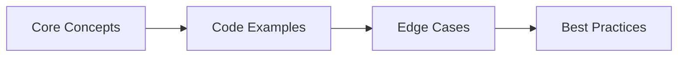
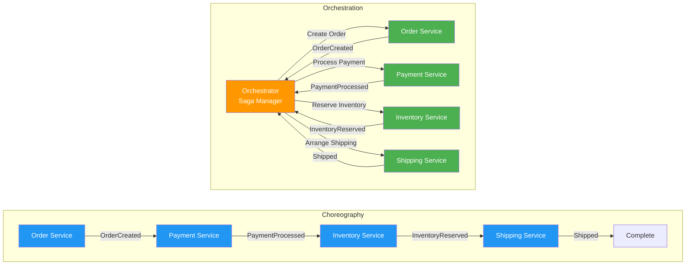

# Chapter 60: Microservices Interview Q&A (Part A → Q1–Q8)

> **Previous:** [Microservices Interview Q&A](./60-interview-microservices.md) | **Next:** [Microservices Interview Q&A (cont.)](./60-interview-microservices-b.md)


## Chapter at a Glance

| Topic | Key Focus | Key Questions |
|-------|----------|--------------|
| Core Concepts | Foundational understanding | Definitions, contrasts, trade-offs |
| Code Examples | Compilable, runnable solutions | Real interview scenarios |
| Best Practices | Production-ready patterns | Pitfalls to avoid |

## Chapter Roadmap



### Q1: What is microservice architecture and how does it differ from monolithic architecture?

> **Pro Tip:** In interviews, always start with the "why" before the "how." Explaining the reasoning behind a design choice is more valuable than reciting syntax.

> **Remember:** Code readability matters in interviews. Write clean, well-structured code with meaningful variable names.


**Answer:**

Microservice architecture decomposes an application into small, independently deployable services that each own a specific business capability. A monolithic architecture packages all functionality into a single deployable unit.

```java
// ── Monolithic: everything in one service ──
@RestController
@RequestMapping("/api")
public class MonolithController {
    @Autowired private UserService userService;
    @Autowired private OrderService orderService;
    @Autowired private PaymentService paymentService;
    @Autowired private NotificationService notificationService;
}

// ── Microservice: separate services, each with its own API ──
// Service 1: user-service
@SpringBootApplication
@EnableEurekaClient
public class UserServiceApplication {
    @RestController
    @RequestMapping("/users")
    class UserController {
        @GetMapping("/{id}") public User getUser(@PathVariable Long id) { /* ... */ }
    }
}

// Service 2: order-service
@SpringBootApplication
@EnableEurekaClient
public class OrderServiceApplication {
    @RestController
    @RequestMapping("/orders")
    class OrderController {
        @PostMapping
        public Order createOrder(@RequestBody OrderRequest req) {
            // Calls payment-service and notification-service via HTTP/async
        }
    }
}

// Service 3: payment-service
@SpringBootApplication
@EnableEurekaClient
public class PaymentServiceApplication { /* ... */ }
```

Key differences:
- **Deployment**: Monolith deploys as one WAR/JAR. Microservices deploy independently.
- **Scaling**: Monolith scales the entire application. Microservices scale only the services under load.
- **Database**: Monolith typically uses one shared database. Microservices own their data (database-per-service).
- **Team structure**: Monolith works for small teams. Microservices align with cross-functional teams owning one service each.
- **Communication**: Monolith uses in-process method calls. Microservices use network calls (HTTP/gRPC/messaging).
- **Failure isolation**: Monolith failure takes down everything. Microservices fail independently (with circuit breakers).

Start monolithic. Split into microservices only when you need independent scaling, deployment velocity, or team independence. Premature microservices add complexity without benefit.

---

### Q2: How do you decompose a monolith into microservices?

**Answer:**

Decomposition follows Domain-Driven Design → identify bounded contexts and aggregate boundaries. Use the Strangler Fig pattern to migrate incrementally.

```java
// ── Phase 1: Identify bounded contexts through domain analysis ──
// Original monolith entities often blur domain boundaries:
@Entity
public class User {
    private Long id;
    private String name;
    private String email;
    private String shippingAddress;     // belongs to shipping context
    private String preferredPayment;    // belongs to payment context
    private List<Order> orders;         // belongs to order context
}

// ── Phase 2: Extract the first bounded context ──
// New user-service keeps only user data
@Entity
@Table(name = "users")
public class User {
    @Id @GeneratedValue private Long id;
    private String name;
    private String email;
}

// ── Phase 3: Create API contract between services ──
// user-service exposes what order-service needs via a client
@FeignClient(name = "user-service")
public interface UserServiceClient {
    @GetMapping("/users/{id}")
    UserDto getUser(@PathVariable Long id);
}

// order-service stores only the reference (user_id), not embedded user data
@Entity
@Table(name = "orders")
public class Order {
    @Id @GeneratedValue private Long id;
    private Long userId;                // FK reference → no User entity
    private BigDecimal total;
    private String status;
}

// ── Phase 4: Strangler Fig → route traffic gradually ──
// API gateway routes /users/* to user-service, /orders/* to order-service
// Both services can still share the old database during migration
@Bean
public RouteLocator gatewayRoutes(RouteLocatorBuilder builder) {
    return builder.routes()
        .route("users", r -> r.path("/api/users/**")
            .uri("lb://user-service"))
        .route("orders", r -> r.path("/api/orders/**")
            .uri("lb://order-service"))
        .build();
}
```

Extraction order: start with the bounded context that changes most frequently, has the simplest data, or requires independent scaling. Never extract services that share a database transaction → they belong in the same service.

---

### Q3: Compare synchronous and asynchronous communication between microservices

**Answer:**

Synchronous (HTTP/gRPC) gives immediate responses but couples services in time. Asynchronous (messaging) decouples services but adds eventual consistency and complexity.

```java
// ── Synchronous: HTTP via Feign Client ──
@Service
public class OrderService {
    @Autowired private UserServiceClient userClient;
    @Autowired private InventoryServiceClient inventoryClient;

    @Transactional
    public Order createOrderSync(OrderRequest request) {
        // Blocks until user-service responds
        UserDto user = userClient.getUser(request.userId());
        // Blocks until inventory-service responds
        InventoryStatus stock = inventoryClient.checkStock(request.productId());

        if (!stock.available()) throw new InsufficientStockException();
        Order order = orderRepo.save(new Order(request));
        inventoryClient.reserveStock(request.productId(), request.quantity());
        return order;
    }
}

// ── Asynchronous: Event-driven via Kafka ──
@Service
public class OrderEventProducer {
    @Autowired private KafkaTemplate<String, OrderEvent> kafka;

    public void createOrderAsync(OrderRequest request) {
        Order order = orderRepo.save(new Order(request));
        // Fire-and-forget event → inventory-service consumes asynchronously
        kafka.send("order.created", new OrderCreatedEvent(order.getId(), request));
    }
}

// inventory-service consumes the event independently
@Component
public class InventoryEventConsumer {
    @KafkaListener(topics = "order.created")
    public void handleOrderCreated(OrderCreatedEvent event) {
        // Deduct stock in its own transaction
        inventoryService.deductStock(event.productId(), event.quantity());
        // Emits inventory.reserved or inventory.failed event
        kafkaTemplate.send("inventory.reserved", new InventoryReservedEvent(event.orderId()));
    }
}

// order-service handles the callback event
@Component
public class OrderEventConsumer {
    @KafkaListener(topics = "inventory.reserved")
    public void handleInventoryReserved(InventoryReservedEvent event) {
        orderService.updateStatus(event.orderId(), "CONFIRMED");
    }
}
```

| Aspect | Synchronous | Asynchronous |
|--------|-----------|-------------|
| Latency | Higher (blocking) | Lower from caller's perspective |
| Coupling | Tight (service must be up) | Loose (offline consumer tolerated) |
| Consistency | Strong (within transaction) | Eventual |
| Complexity | Lower | Higher (dead letter queues, retries) |
| Debugging | Easier (single flow) | Harder (scattered across consumers) |
| Backpressure | Tricky | Natural (queues buffer) |

Use synchronous for reads and commands where immediate response is required. Use asynchronous for cross-service workflows where the caller doesn't need an immediate answer.

---

### Q4: How do you implement an API Gateway with Spring Cloud Gateway?

**Answer:**

Spring Cloud Gateway provides routing, filtering, rate limiting, and cross-cutting concerns at a single entry point.

```java
// ── Main application ──
@SpringBootApplication
public class ApiGatewayApplication {
    public static void main(String[] args) {
        SpringApplication.run(ApiGatewayApplication.class, args);
    }
}

// ── Route configuration with filters ──
@Configuration
public class GatewayConfig {

    @Bean
    public RouteLocator customRoutes(RouteLocatorBuilder builder) {
        return builder.routes()
            // Route 1: user-service with header stripping
            .route("user-service", r -> r.path("/api/users/**")
                .filters(f -> f
                    .stripPrefix(1)
                    .addRequestHeader("X-Gateway", "spring-cloud-gateway")
                    .retry(3)
                    .circuitBreaker(config -> config
                        .setName("userServiceCB")
                        .setFallbackUri("forward:/fallback/users")))
                .uri("lb://user-service"))

            // Route 2: order-service with rate limiting
            .route("order-service", r -> r.path("/api/orders/**")
                .filters(f -> f
                    .stripPrefix(1)
                    .requestRateLimiter(config -> config
                        .setRateLimiter(redisRateLimiter())))
                .uri("lb://order-service"))

            .build();
    }

    // ── Redis-based rate limiter ──
    @Bean
    public RedisRateLimiter redisRateLimiter() {
        return new RedisRateLimiter(10, 20, 1);  // 10 requests/sec, burst 20
    }
}

// ── Global filters (applied to every route) ──
@Component
public class GlobalLoggingFilter implements GlobalFilter, Ordered {
    @Override
    public Mono<Void> filter(ServerWebExchange exchange, GatewayFilterChain chain) {
        long start = System.currentTimeMillis();
        return chain.filter(exchange).then(Mono.fromRunnable(() -> {
            log.info("{} {} -> {} ({}ms)",
                exchange.getRequest().getMethod(),
                exchange.getRequest().getPath(),
                exchange.getResponse().getStatusCode(),
                System.currentTimeMillis() - start);
        }));
    }
}

// ── Security: validate JWT at the gateway ──
@Component
public class JwtAuthFilter implements GatewayFilterFactory<Object> {
    @Override
    public GatewayFilter apply(Object config) {
        return (exchange, chain) -> {
            String auth = exchange.getRequest().getHeaders()
                .getFirst(HttpHeaders.AUTHORIZATION);
            if (auth == null || !auth.startsWith("Bearer ")) {
                exchange.getResponse().setStatusCode(HttpStatus.UNAUTHORIZED);
                return exchange.getResponse().setComplete();
            }
            Jwt jwt = jwtDecoder.decode(auth.substring(7));
            // Add user info to downstream headers
            exchange.getRequest().mutate()
                .header("X-User-Id", jwt.getSubject());
            return chain.filter(exchange);
        };
    }
}
```

API Gateway responsibilities: routing, authentication, rate limiting, request/response transformation, circuit breaking, logging, and aggregation. Do NOT put business logic in the gateway → it's a routing layer, not an orchestration layer.

---

### Q5: How does service discovery work with Eureka?

**Answer:**

Service discovery lets services find each other without hardcoded URLs. Each service registers itself with Eureka on startup and sends heartbeats to maintain its lease.

```java
// ── Eureka Server (the registry) ──
@SpringBootApplication
@EnableEurekaServer
public class EurekaServerApplication {
    public static void main(String[] args) {
        SpringApplication.run(EurekaServerApplication.class, args);
    }
}

// application.yml for Eureka server:
// server.port: 8761
// eureka.client.register-with-eureka: false
// eureka.client.fetch-registry: false

// ── Eureka Client (every microservice) ──
@SpringBootApplication
@EnableEurekaClient
public class OrderServiceApplication {
    public static void main(String[] args) {
        SpringApplication.run(OrderServiceApplication.class, args);
    }
}

// application.yml for clients:
// spring.application.name: order-service
// eureka.client.service-url.defaultZone: http://localhost:8761/eureka/
// eureka.instance.prefer-ip-address: true
// eureka.instance.lease-renewal-interval-in-seconds: 10
// eureka.instance.lease-expiration-duration-in-seconds: 30

// ── Using discovery to call another service ──
@Service
public class OrderService {

    @Autowired
    private DiscoveryClient discoveryClient;

    public String getUserEmail(Long userId) {
        // Look up user-service instances dynamically
        List<ServiceInstance> instances = discoveryClient
            .getInstances("user-service");

        if (instances.isEmpty()) {
            throw new ServiceUnavailableException("user-service not found");
        }

        ServiceInstance instance = instances.get(0);
        URI uri = instance.getUri();
        String url = uri + "/users/" + userId + "/email";

        // Use RestTemplate or WebClient to call the discovered URL
        return restTemplate.getForObject(url, String.class);
    }
}

// ── Load-balanced with @LoadBalanced ──
@Configuration
public class ClientConfig {
    @Bean
    @LoadBalanced
    public RestTemplate restTemplate() {
        return new RestTemplate();
    }
}

@Service
public class OrderService {
    @Autowired
    private RestTemplate restTemplate;  // automatically load-balanced via Eureka

    public String getUserEmail(Long userId) {
        // Just use the service name → Ribbon/Ribbon resolves via Eureka
        return restTemplate.getForObject(
            "http://user-service/users/" + userId + "/email",
            String.class);
    }
}
```

Eureka provides client-side load balancing. Each client maintains a local registry of available instances and rotates through them (round-robin by default). If a service instance fails to send a heartbeat within 3 lease periods, Eureka evicts it.

For production, run at least 2 Eureka servers in a multi-DC setup. Eureka is AP (availability + partition tolerance) → sacrifices consistency, which is fine for service discovery.

---

### Q6: How do you externalize configuration with Spring Cloud Config?

**Answer:**

Spring Cloud Config Server serves configuration from a Git backend. Config clients fetch their configuration on startup and can refresh it at runtime.

```java
// ── Config Server ──
@SpringBootApplication
@EnableConfigServer
public class ConfigServerApplication {
    public static void main(String[] args) {
        SpringApplication.run(ConfigServerApplication.class, args);
    }
}

// application.yml:
// server.port: 8888
// spring.cloud.config.server.git.uri: https://github.com/raushan666/config-repo
// spring.cloud.config.server.git.searchPaths: '{application}'
// spring.cloud.config.server.git.default-label: main

// ── Git-backed config repository structure ──
// config-repo/
//   order-service.yml          (shared for all profiles)
//   order-service-dev.yml      (dev profile)
//   order-service-prod.yml     (prod profile)
//   application.yml            (shared across all services)

// order-service.yml in Git:
// server:
//   port: 8081
// spring:
//   datasource:
//     url: ${DB_URL}
//     username: ${DB_USER}
//     password: ${DB_PASS}
// order-service:
//   order-timeout: 30s
//   max-batch-size: 100

// ── Config Client ──
@SpringBootApplication
public class OrderServiceApplication {
    public static void main(String[] args) {
        SpringApplication.run(OrderServiceApplication.class, args);
    }
}

// bootstrap.yml (loaded before application.yml):
// spring.application.name: order-service
// spring.cloud.config.uri: http://localhost:8888
// spring.cloud.config.fail-fast: true
// spring.cloud.config.retry.initial-interval: 1000
// spring.cloud.config.retry.max-attempts: 5

// ── Using config values ──
@RestController
@RequestMapping("/orders")
public class OrderController {

    @Value("${order-service.order-timeout:30s}")
    private Duration orderTimeout;

    @Value("${order-service.max-batch-size:100}")
    private int maxBatchSize;

    @RefreshScope  // Enables runtime refresh without restart
    @Component
    public class OrderConfig {
        @Value("${order-service.discount-rate:0}")
        private double discountRate;
    }
}

// ── Trigger refresh ──
@RestController
public class ConfigRefreshController {
    @Autowired
    private RefreshEndpoint refreshEndpoint;

    @PostMapping("/actuator/refresh")
    public Set<String> refresh() {
        return refreshEndpoint.refresh();  // Returns changed property keys
    }
}
// POST http://order-service/actuator/refresh
// Response: ["order-service.discount-rate"]

// ── For automatic broadcast, use Spring Cloud Bus ──
// POST http://config-server/actuator/busrefresh/order-service:**
// Broadcasts refresh to all instances of order-service via RabbitMQ
```

Config server enables centralized management, version history (through Git), and environment-specific overrides. Never store secrets in plain text → use `{cipher}` encrypted values with a symmetric key or Vault backend.

---

### Q7: How do you implement distributed tracing with Micrometer and Zipkin?

**Answer:**

Distributed tracing traces a request across multiple microservices using trace IDs and span IDs. Spring Cloud Sleuth (now Micrometer Tracing) integrates with Zipkin for visualization.

```java
// ── Dependencies (Spring Boot 3.x) ──
// implementation 'io.micrometer:micrometer-tracing-bridge-brave'
// implementation 'io.zipkin.reporter2:zipkin-reporter-brave'
// implementation 'io.micrometer:micrometer-tracing'

// ── Application configuration ──
@SpringBootApplication
public class OrderServiceApplication {
    public static void main(String[] args) {
        SpringApplication.run(OrderServiceApplication.class, args);
    }
}

// application.yml:
// management.tracing.sampling.probability: 1.0   (1.0 = trace all requests)
// spring.sleuth.reporter.zipkin.enabled: true    (for Sleuth 2.x, pre-micrometer)
// Actually with Micrometer Tracing:
// management.zipkin.tracing.endpoint: http://localhost:9411/api/v2/spans

// ── Manual tracing in code ──
@Service
public class OrderService {

    @Autowired
    private Tracer tracer;  // Micrometer Tracing Tracer

    @Autowired
    private UserServiceClient userClient;

    public Order createOrder(OrderRequest request) {
        // Create a custom span for business logic
        Span span = tracer.nextSpan().name("create-order").start();
        try (Tracer.SpanInScope ws = tracer.withSpan(span)) {
            span.tag("user.id", String.valueOf(request.userId()));
            span.tag("order.total", request.total().toString());

            // This HTTP call automatically propagates the trace ID
            UserDto user = userClient.getUser(request.userId());

            Order order = orderRepo.save(new Order(request));

            span.tag("order.id", String.valueOf(order.getId()));
            return order;
        } finally {
            span.end();
        }
    }
}

// ── Trace propagation via RestTemplate ──
@Configuration
public class TracingConfig {
    @Bean
    @LoadBalanced
    public RestTemplate restTemplate() {
        return new RestTemplate();
    }

    // Micrometer automatically instruments RestTemplate, WebClient, Kafka, etc.
    // No manual header propagation needed with brave instrumentation
}

// ── View traces in Zipkin ──
// docker run -d -p 9411:9411 openzipkin/zipkin
// Then visit http://localhost:9411 → search by trace ID or service

// ── Tag annotation with @SpanTag ──
@Component
public class PaymentProcessor {
    @NewSpan(name = "process-payment")
    public PaymentResult process(
            @SpanTag("payment.amount") BigDecimal amount,
            @SpanTag("payment.method") String method) {
        // Method arguments are automatically captured as span tags
    }
}
```

Each trace has a unique trace ID (propagated across services via HTTP headers). Each service creates spans within that trace. Zipkin collects spans and shows them in a waterfall view, revealing which service caused the latency.

With 100% sampling in dev (1.0) and 1-10% in prod, tracing adds negligible overhead. Pair traces with logs by including the trace ID in log output (`%X{traceId}`).

---

### Q8: Explain the Saga pattern with a code example

**Answer:**

The Saga pattern manages distributed transactions across microservices by breaking them into a sequence of local transactions with compensating actions for rollback. Two implementations: choreography (each service emits/reacts to events) and orchestration (a coordinator drives the flow).

```java
// ═══════════════════════════════════════════════════════════════
// CHOREOGRAPHY SAGA → services react to each other's events
// ═══════════════════════════════════════════════════════════════

// Step 1: Order Service creates order and emits event
@Service
public class OrderSagaService {
    @Autowired private OrderRepository orderRepo;
    @Autowired private KafkaTemplate<String, Object> kafka;

    @Transactional
    public Order createOrder(OrderRequest req) {
        Order order = new Order(req.userId(), req.productId(), req.quantity(), req.total());
        order.setStatus("PENDING");
        order = orderRepo.save(order);

        // Emit event → inventory service consumes this
        kafka.send("saga.order-created", new OrderCreatedEvent(order.getId(), req));
        return order;
    }

    // Compensating handler: if inventory fails, cancel the order
    @KafkaListener(topics = "saga.inventory-failed")
    public void handleInventoryFailed(InventoryFailedEvent event) {
        Order order = orderRepo.findById(event.orderId()).orElseThrow();
        order.setStatus("CANCELLED");
        order.setFailureReason(event.reason());
        orderRepo.save(order);
    }
}

// Step 2: Inventory Service reserves stock
@Service
public class InventorySagaService {
    @Autowired private InventoryRepository invRepo;
    @Autowired private KafkaTemplate<String, Object> kafka;

    @KafkaListener(topics = "saga.order-created")
    public void handleOrderCreated(OrderCreatedEvent event) {
        try {
            ProductInventory inv = invRepo.findByProductId(event.productId());
            inv.reserve(event.quantity());
            invRepo.save(inv);
            kafka.send("saga.inventory-reserved",
                new InventoryReservedEvent(event.orderId()));
        } catch (Exception e) {
            kafka.send("saga.inventory-failed",
                new InventoryFailedEvent(event.orderId(), e.getMessage()));
        }
    }
}

// Step 3: Payment Service processes payment
@Service
public class PaymentSagaService {
    @KafkaListener(topics = "saga.inventory-reserved")
    public void handleInventoryReserved(InventoryReservedEvent event) {
        try {
            paymentService.charge(event.orderId(), event.total());
            kafka.send("saga.payment-completed",
                new PaymentCompletedEvent(event.orderId()));
        } catch (Exception e) {
            // Compensating: release inventory
            kafka.send("saga.payment-failed",
                new PaymentFailedEvent(event.orderId()));
        }
    }

    // Compensating: refund if downstream fails
    @KafkaListener(topics = "saga.refund-requested")
    public void handleRefundRequested(RefundRequestedEvent event) {
        paymentService.refund(event.orderId());
    }
}

// ═══════════════════════════════════════════════════════════════
// ORCHESTRATION SAGA → a coordinator manages the flow
// ═══════════════════════════════════════════════════════════════

// Saga Orchestrator
@Component
public class OrderSagaOrchestrator {
    @Autowired private KafkaTemplate<String, Object> kafka;
    @Autowired private SagaStateRepository sagaStateRepo;

    @Transactional
    public void startSaga(CreateOrderCommand cmd) {
        SagaState state = new SagaState(cmd.orderId(), "ORDER_CREATED");
        sagaStateRepo.save(state);
        kafka.send("saga.commands", new ReserveInventoryCmd(cmd.orderId(), cmd.productId(), cmd.quantity()));
    }

    @KafkaListener(topics = "saga.events")
    public void handleEvent(SagaEvent event) {
        SagaState state = sagaStateRepo.findById(event.sagaId()).orElseThrow();

        switch (state.currentStep()) {
            case "ORDER_CREATED" -> {
                if (event instanceof InventoryReservedEvent) {
                    state.advanceTo("INVENTORY_RESERVED");
                    kafka.send("saga.commands", new ProcessPaymentCmd(event.orderId()));
                } else if (event instanceof InventoryFailedEvent) {
                    state.fail(event.reason());
                    // Saga complete → order already marked PENDING, no action needed
                }
            }
            case "INVENTORY_RESERVED" -> {
                if (event instanceof PaymentCompletedEvent) {
                    state.advanceTo("PAYMENT_COMPLETED");
                    kafka.send("saga.commands", new ConfirmOrderCmd(event.orderId()));
                } else if (event instanceof PaymentFailedEvent) {
                    // Compensate: release inventory
                    kafka.send("saga.commands", new ReleaseInventoryCmd(event.orderId()));
                    state.compensate();
                }
            }
            default -> state.fail("Unknown step: " + state.currentStep());
        }
        sagaStateRepo.save(state);
    }
}
```

Saga handles long-running transactions without locking resources. Choreography works when the flow is simple (3-4 services). Orchestration is better for complex workflows with branching and compensations. Never use XA/2PC transactions across services → that defeats the purpose of microservices.

---

### Q6: What is the Strangler Fig pattern and when should you use it?

**Answer:**

The Strangler Fig pattern incrementally replaces a monolithic system with microservices by gradually routing functionality to new services while the old system remains operational. Named after fig trees that grow around and eventually replace their host tree.

```java
// ── Step 1: Introduce a proxy/routing layer ──
@Component
public class MonolithRoutingFilter implements Filter {

    private static final Set<String> MIGRATED_PATHS = Set.of(
        "/api/v2/products",    // New microservice handles products
        "/api/v2/search"       // New microservice handles search
    );

    @Override
    public void doFilter(ServletRequest request, ServletResponse response,
                         FilterChain chain) {
        HttpServletRequest httpRequest = (HttpServletRequest) request;
        String path = httpRequest.getRequestURI();

        if (MIGRATED_PATHS.contains(path)) {
            // Route to new microservice
            forwardToMicroservice(httpRequest, response);
        } else {
            // Route to old monolith
            chain.doFilter(request, response);
        }
    }
}

// ── Step 2: Gradually expand migrated paths ──
// Step 3: When all paths are migrated → decommission the monolith
```

**Migration phases:**
1. **Coexist:** New features built as microservices. Monolith handles old features.
2. **Strangle:** Routes for old features are gradually redirected to new services.
3. **Decommission:** Once all routes point to microservices, the monolith is shut down.

**Key principles:**
- Never big-bang rewrite — strangulation reduces risk
- Each migrated feature must be independently deployable
- Maintain backward compatibility during transition
- Use feature flags to toggle between old and new implementations
- Monitor both systems in parallel until migration is complete

---

### Q7: How do you handle distributed caching in microservices?

**Answer:**

Distributed caching in microservices requires coordinating cache state across service instances. The most common approach is a shared Redis cluster with cache-aside pattern.

**Cache-aside (lazy population) — the standard pattern:**

```java
@Service
public class ProductService {

    private final RedisTemplate<String, ProductDto> redis;
    private final ProductRepository productRepo;
    private static final Duration CACHE_TTL = Duration.ofMinutes(30);

    public ProductDto getProduct(Long id) {
        String key = "product:" + id;

        // 1. Try cache
        ProductDto cached = redis.opsForValue().get(key);
        if (cached != null) return cached;

        // 2. Cache miss — load from DB
        Product product = productRepo.findById(id)
            .orElseThrow(() -> new ProductNotFoundException(id));
        ProductDto dto = ProductDto.from(product);

        // 3. Populate cache
        redis.opsForValue().set(key, dto, CACHE_TTL);
        return dto;
    }

    @Transactional
    public ProductDto updateProduct(Long id, UpdateProductRequest req) {
        // 1. Update DB
        Product product = productRepo.findById(id).orElseThrow();
        product.setName(req.name());
        product.setPrice(req.price());
        productRepo.save(product);

        // 2. Invalidate cache (or update it)
        String key = "product:" + id;
        redis.delete(key);  // Next read will repopulate

        return ProductDto.from(product);
    }
}
```

**Cache invalidation strategies:**
- **TTL-based:** Simplest — entries expire after a fixed duration. Accept some staleness.
- **Write-through:** Update cache on every write. Consistent but slower writes.
- **Write-behind:** Async cache update. Fast writes but risk of data loss.
- **Event-based invalidation:** Publish cache invalidation events when data changes.

```java
// Cache invalidation via event
@Service
public class ProductEventConsumer {

    @KafkaListener(topics = "product-events")
    public void onProductUpdated(ProductUpdatedEvent event) {
        String key = "product:" + event.productId();
        redis.delete(key);
        System.out.println("Cache invalidated: " + key);
    }
}
```

**Cache stampede prevention:** See Q24 in the previous chapter for distributed locking patterns.

---

## Common Mistakes in Saga Pattern (GFG-Style)

### Mistake 1: Not implementing compensating transactions
```java
// ❌ WRONG: Saga only has forward steps, no rollback
// If payment succeeds but inventory fails → money is lost!

// ✅ CORRECT: Every forward action has a compensating action
@Component
public class OrderSagaOrchestrator {
    // Forward actions (as defined above)
    public void process(Order order) {
        createOrder(order);
        reserveInventory(order);
        processPayment(order);
    }

    // Compensating actions (for each forward step)
    public void compensate(Order order) {
        refundPayment(order);        // Reverse payment
        releaseInventory(order);     // Release reserved stock
        cancelOrder(order);          // Mark order as failed
    }
}
```

### Mistake 2: Using synchronous communication for saga steps
```java
// ❌ WRONG: Sequential synchronous calls → tight coupling, cascading failures
// Order → Payment (REST) → wait → Inventory (REST) → wait → Notification (REST)

// ✅ CORRECT: Event-driven saga steps
// Order → publish OrderCreated → Payment consumes, publishes PaymentProcessed →
// Inventory consumes, publishes InventoryReserved → etc.
```

### Mistake 3: Not handling duplicate saga events
```java
// ❌ WRONG: No idempotency check → duplicate events double-process
// If Kafka re-delivers a PaymentProcessed event, inventory is deducted twice

// ✅ CORRECT: Check idempotency before each saga step
public void handlePaymentProcessed(PaymentProcessedEvent event) {
    if (sagaStateRepo.existsBySagaIdAndStep(event.sagaId(), "PAYMENT")) {
        return;  // Already processed this step
    }
    // Process the step
}
```

---

## Choreography vs Orchestration Saga Comparison

| Aspect | Choreography (Event-driven) | Orchestration (Command-driven) |
|--------|---------------------------|-------------------------------|
| Coordination | Decentralized — each service reacts to events | Centralized — orchestrator tells services what to do |
| Coupling | Loose — services only know their events | Tighter — services depend on orchestrator |
| Complexity | Low for simple flows (3-4 steps) | Manageable for complex flows |
| Debugging | Hard — no central coordinator to inspect | Easier — orchestrator logs each step |
| Flow visibility | Requires event tracing (distributed) | Centralized state in orchestrator |
| Failure handling | Each service emits failure events | Orchestrator triggers compensating actions |
| Testing | Complex — need to run multiple services | Simpler — mock orchestrator to drive tests |
| Best for | Simple linear pipelines | Complex branching workflows |

**Rule of thumb:** If your saga has more than 5 steps or requires branching/conditional logic, use orchestration. Otherwise, choreography is simpler.

## Mermaid: Saga Patterns Comparison



## Chapter Quiz — Microservices Patterns

4. What is the Strangler Fig pattern used for?
    - A) Improving database performance
    - B) Incrementally migrating a monolith to microservices
    - C) Implementing service discovery
    - D) Handling distributed transactions

<details>
<summary>Answer</summary>
**B) Incrementally migrating a monolith to microservices.** The Strangler Fig pattern routes traffic to new services gradually while the monolith stays operational, reducing risk compared to a big-bang rewrite.
</details>

5. In the cache-aside pattern, what happens on a cache miss?
    - A) An error is returned to the client
    - B) The data is loaded from the database and the cache is populated
    - C) The cache is bypassed permanently
    - D) A new cache node is created

<details>
<summary>Answer</summary>
**B) The data is loaded from the database and the cache is populated.** On cache miss, the application loads data from the database, stores it in the cache with a TTL, and returns the result. Subsequent reads for the same key hit the cache.
</details>

6. What is the key difference between choreography and orchestration sagas?
    - A) Choreography is faster
    - B) Choreography has no central coordinator; orchestration has a central saga manager
    - C) Orchestration requires Kafka
    - D) Choreography is only for REST APIs

<details>
<summary>Answer</summary>
**B) Choreography has no central coordinator.** In choreography, each service emits events that other services react to. In orchestration, a central orchestrator tells each service what to do and tracks the overall state.
</details>

## Concept Comparison Table

| Topic | Key Points | Interview Frequency |
|-------|-----------|-------------------|
| **OOP** | Encapsulation, Inheritance, Polymorphism, Abstraction | Every interview |
| **Collections** | List, Set, Map, Queue, Deque | 9/10 interviews |
| **Concurrency** | synchronized, volatile, Locks, CompletableFuture | 7/10 senior interviews |
| **Java 8+** | Lambdas, Streams, Optional, CompletableFuture | 8/10 interviews |

## Cross-Application Matrix

| Skill | Junior (0-2yr) | Mid (3-5yr) | Senior (6-9yr) | Staff (10+) |
|-------|---------------|-------------|----------------|-------------|
| OOP & Design Patterns | Define and identify | Apply and combine | Evaluate and refactor | Create and teach |
| Collections | Basic usage | Performance trade-offs | Concurrent collections | Custom implementations |
| Concurrency | Syntax knowledge | Write thread-safe code | Debug deadlocks | Design concurrent systems |

## Chapter Quiz

1. What is the difference between equals() and == in Java?
   - A) They are identical
   - B) equals() compares values, == compares references
   - C) == compares values, equals() compares references
   - D) equals() is for primitives, == is for objects

<details>
<summary>Answer&lt;/summary&gt;
**B) equals() compares logical equality (overridable), == compares reference equality.**
</details>

2. Which collection guarantees insertion order?
   - A) HashMap
   - B) TreeMap
   - C) LinkedHashMap
   - D) HashSet

<details>
<summary>Answer&lt;/summary&gt;
**C) LinkedHashMap.** LinkedHashMap maintains a doubly-linked list of entries to preserve insertion order.
</details>

3. What keyword prevents a method from being overridden?
   - A) static
   - B) final
   - C) private
   - D) abstract

<details>
<summary>Answer&lt;/summary&gt;
**B) final.** A final method cannot be overridden by subclasses.
</details>
