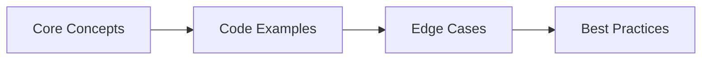

## Chapter at a Glance

| Topic | Key Focus | Key Questions |
|-------|----------|--------------|
| Core Concepts | Foundational understanding | Definitions, contrasts, trade-offs |
| Code Examples | Compilable, runnable solutions | Real interview scenarios |
| Best Practices | Production-ready patterns | Pitfalls to avoid |

## Chapter Roadmap



### Q9: What is CQRS and how do you implement it?
> **Pro Tip:** In interviews, always start with the "why" before the "how." Explaining the reasoning behind a design choice is more valuable than reciting syntax.

> **Remember:** Code readability matters in interviews. Write clean, well-structured code with meaningful variable names.


**Answer:**

CQRS (Command Query Responsibility Segregation) separates write models (commands) from read models (queries). Each model has its own database schema, optimized for its operation.

```java
// ── Command side: focused on writes ──
@RestController
@RequestMapping("/orders/commands")
public class OrderCommandController {
    @Autowired private OrderCommandService commandService;

    @PostMapping
    public CompletableFuture<UUID> createOrder(@RequestBody CreateOrderCommand cmd) {
        return commandService.handle(cmd);  // Returns order ID immediately
    }

    @PostMapping("/{id}/cancel")
    public void cancelOrder(@PathVariable UUID id) {
        commandService.handle(new CancelOrderCommand(id));
    }
}

@Service
public class OrderCommandService {
    @Autowired private OrderCommandRepository cmdRepo;
    @Autowired private EventPublisher eventPublisher;

    @Transactional
    public CompletableFuture<UUID> handle(CreateOrderCommand cmd) {
        OrderWriteModel order = new OrderWriteModel(
            cmd.userId(), cmd.productId(), cmd.quantity(), cmd.total()
        );
        order = cmdRepo.save(order);

        // Publish event for the query side to consume
        eventPublisher.publish(new OrderCreatedEvent(
            order.getId(), cmd.userId(), cmd.productId(),
            cmd.quantity(), cmd.total()
        ));
        return CompletableFuture.completedFuture(order.getId());
    }
}

// Write-side repository (simple, no complex joins needed)
@Repository
public interface OrderCommandRepository extends JpaRepository<OrderWriteModel, UUID> {}

// ── Query side: optimized for reads ──
@RestController
@RequestMapping("/orders/queries")
public class OrderQueryController {
    @Autowired private OrderQueryService queryService;

    @GetMapping("/{id}")
    public OrderReadModel getOrder(@PathVariable UUID id) {
        return queryService.findById(id);
    }

    @GetMapping
    public Page<OrderReadModel> listOrders(
            @RequestParam UUID userId,
            @PageableDefault(size = 20) Pageable pageable) {
        return queryService.findByUserId(userId, pageable);
    }
}

// Query-side uses a denormalized read model
@Entity
@Table(name = "order_read_model")
public class OrderReadModel {
    @Id private UUID id;
    private Long userId;
    private String userName;        // denormalized from user-service
    private String productName;     // denormalized from product-service
    private int quantity;
    private BigDecimal total;
    private String status;
    private Instant createdAt;
    private Instant updatedAt;
}

// Query-side event consumer keeps the read model in sync
@Component
public class OrderEventConsumer {
    @Autowired private OrderQueryRepository queryRepo;

    @Transactional
    @KafkaListener(topics = "order.events")
    public void handleOrderEvent(OrderEvent event) {
        if (event instanceof OrderCreatedEvent e) {
            OrderReadModel model = new OrderReadModel();
            model.setId(e.orderId());
            model.setUserId(e.userId());
            model.setProductName(productService.getName(e.productId()));  // denormalize
            model.setQuantity(e.quantity());
            model.setTotal(e.total());
            model.setStatus("PENDING");
            model.setCreatedAt(Instant.now());
            queryRepo.save(model);
        } else if (event instanceof OrderStatusChangedEvent e) {
            queryRepo.findById(e.orderId()).ifPresent(model -> {
                model.setStatus(e.newStatus());
                model.setUpdatedAt(Instant.now());
            });
        }
    }
}
```

CQRS adds significant complexity (eventual consistency, duplicate data, two models to maintain). Use it only when reads and writes have fundamentally different shapes → for example, writes are simple INSERT/UPDATE but reads need complex aggregations, joins, or full-text search.

Apply CQRS to individual bounded contexts, not the entire system. Most services do not need CQRS → a well-designed JPA model with DTO projections is sufficient.

---

### Q10: How do you implement a circuit breaker with Resilience4j?

**Answer:**

Resilience4j provides circuit breakers, retries, rate limiters, bulkheads, and time limiters. The circuit breaker prevents cascading failures by failing fast when a downstream service is unhealthy.

```java
// ── Configuration ──
// application.yml:
// resilience4j.circuitbreaker:
//   instances:
//     userService:
//       sliding-window-size: 10
//       sliding-window-type: COUNT_BASED
//       minimum-number-of-calls: 5
//       failure-rate-threshold: 50
//       wait-duration-in-open-state: 30s
//       permitted-number-of-calls-in-half-open-state: 3
//       record-exceptions:
//         - java.io.IOException
//         - org.springframework.web.client.HttpServerErrorException
//       ignore-exceptions:
//         - org.springframework.web.client.HttpClientErrorException  (4xx → not a circuit failure)

// ── Registration ──
@Configuration
public class Resilience4jConfig {
    @Bean
    public Customizer<Resilience4JCircuitBreakerFactory> defaultConfig() {
        return factory -> factory.configureDefault(id -> new Resilience4JConfigBuilder(id)
            .circuitBreakerConfig(CircuitBreakerConfig.custom()
                .slidingWindowSize(10)
                .failureRateThreshold(50)
                .waitDurationInOpenState(Duration.ofSeconds(30))
                .permittedNumberOfCallsInHalfOpenState(3)
                .build())
            .timeLimiterConfig(TimeLimiterConfig.custom()
                .timeoutDuration(Duration.ofSeconds(4))
                .build())
            .build());
    }
}

// ── Usage with @CircuitBreaker annotation ──
@Service
public class OrderService {
    @Autowired private UserServiceClient userClient;

    @CircuitBreaker(name = "userService", fallbackMethod = "getUserFallback")
    @TimeLimiter(name = "userService")
    public CompletableFuture<UserDto> getUser(Long userId) {
        return CompletableFuture.supplyAsync(() ->
            userClient.getUser(userId));
    }

    // Fallback must match the return type and parameters
    public CompletableFuture<UserDto> getUserFallback(Long userId, Throwable t) {
        log.warn("user-service unavailable, returning cached user: {}", t.getMessage());
        return CompletableFuture.completedFuture(
            new UserDto(userId, "Cached User", "cached@example.com"));
    }
}

// ── Manual circuit breaker usage ──
@Service
public class PaymentService {
    private final CircuitBreaker circuitBreaker;

    public PaymentService(CircuitBreakerRegistry registry) {
        this.circuitBreaker = registry.circuitBreaker("paymentService");
    }

    public PaymentResult processPayment(PaymentRequest req) {
        // Decorate supplier with circuit breaker
        Supplier<PaymentResult> decorated = CircuitBreaker
            .decorateSupplier(circuitBreaker, () -> callPaymentProvider(req));

        // Also add retry
        Retry retry = Retry.ofDefaults("paymentRetry");
        Supplier<PaymentResult> retryAndCircuit = Retry
            .decorateSupplier(retry, decorated);

        // Try with fallback
        Try<PaymentResult> result = Try.ofSupplier(retryAndCircuit)
            .recover(throwable -> PaymentResult.failed("Payment unavailable"));

        return result.get();
    }
}

// ── Monitoring circuit breaker state ──
@Component
public class CircuitBreakerMonitor {
    public CircuitBreakerMonitor(CircuitBreakerRegistry registry) {
        // Log every state transition
        registry.getAllCircuitBreakers().forEach(cb -> {
            cb.getEventPublisher()
                .onStateTransition(event ->
                    log.info("CircuitBreaker {}: {} -> {}",
                        event.getCircuitBreakerName(),
                        event.getOldState(),
                        event.getNewState()));
        });
    }
}
```

Circuit breaker states: CLOSED (normal, pass through) → OPEN (fail fast, no calls) → HALF_OPEN (allow limited probe calls) → back to CLOSED or OPEN. Use it on every cross-service call. Without circuit breakers, a cascading failure in one service can take down the entire system.

---

### Q11: How do you handle service-to-service authentication with OAuth2 and JWT?

**Answer:**

OAuth2 with JWT provides token-based authentication. The client credentials grant is the standard pattern for service-to-service communication.

```java
// ── Authorization Server config (Spring Authorization Server) ──
@Configuration
@EnableAuthorizationServer
public class AuthServerConfig {
    @Bean
    public RegisteredClientRepository registeredClientRepository() {
        RegisteredClient orderService = RegisteredClient.withId(UUID.randomUUID().toString())
            .clientId("order-service")
            .clientSecret("{noop}order-secret")  // noop = plain text → use BCrypt in prod
            .authorizationGrantType(ClientCredentialsGrant.INSTANCE)
            .scope("order:read")
            .scope("order:write")
            .build();
        return new InMemoryRegisteredClientRepository(orderService);
    }
}

// ── Resource Server config (each microservice validates tokens) ──
// application.yml:
// spring.security.oauth2.resourceserver.jwt:
//   issuer-uri: http://localhost:9000
//   jwk-set-uri: http://localhost:9000/.well-known/jwks.json

@Configuration
@EnableWebSecurity
public class ResourceServerConfig {
    @Bean
    public SecurityFilterChain filterChain(HttpSecurity http) throws Exception {
        http
            .authorizeHttpRequests(auth -> auth
                .requestMatchers("/public/**").permitAll()
                .requestMatchers(HttpMethod.GET, "/orders/**").hasAuthority("SCOPE_order:read")
                .requestMatchers(HttpMethod.POST, "/orders/**").hasAuthority("SCOPE_order:write")
                .anyRequest().authenticated()
            )
            .oauth2ResourceServer(OAuth2ResourceServerConfigurer::jwt);
        return http.build();
    }
}

// ── Client credentials flow (service calls another service) ──
@Service
public class ServiceClient {
    @Autowired
    private WebClient webClient;

    @Autowired
    private ClientRegistrationRepository registrations;

    public String callService(String targetClientId, String path) {
        // Get the client credentials grant for the calling service
        OAuth2AuthorizedClient client = authorizeClient(targetClientId);

        return webClient.get()
            .uri("http://target-service" + path)
            .headers(h -> h.setBearerAuth(client.getAccessToken().getTokenValue()))
            .retrieve()
            .bodyToMono(String.class)
            .block();
    }

    private OAuth2AuthorizedClient authorizeClient(String targetClientId) {
        // Use OAuth2AuthorizedClientManager to get/refresh tokens
        ClientRegistration reg = registrations.findByRegistrationId(targetClientId);
        OAuth2ClientCredentialsGrantRequest request =
            new OAuth2ClientCredentialsGrantRequest(reg);
        OAuth2AccessTokenResponse response = restTemplate.postForObject(
            reg.getProviderDetails().getTokenUri(),
            request, OAuth2AccessTokenResponse.class);
        return new OAuth2AuthorizedClient(reg, reg.getClientId(),
            response.getAccessToken());
    }
}

// ── Extract user context from JWT ──
@RestController
@RequestMapping("/orders")
public class OrderController {
    @GetMapping("/current")
    public String getCurrentUser(@AuthenticationPrincipal Jwt jwt) {
        // JWT contains: sub (user ID), claims (roles, scopes)
        String userId = jwt.getSubject();
        String email = jwt.getClaimAsString("email");
        List<String> roles = jwt.getClaimAsStringList("roles");
        return "User: " + userId + ", Email: " + email + ", Roles: " + roles;
    }
}
```

JWT is stateless → the resource server only needs the public key (JWKS) to verify tokens, no database call. Token expiry is short (15-30 minutes for access tokens). Use refresh tokens for user-facing flows; client credentials flow generates new tokens directly.

Never embed sensitive data in JWT claims (they are base64-encoded, not encrypted). For fine-grained authorization, use OAuth2 scopes combined with custom claims or a dedicated authorization service.

---

### Q12: How do you implement event-driven microservices with Kafka?

**Answer:**

Apache Kafka provides a distributed commit log for asynchronous event streaming between services. Each service publishes events to topics; other services consume from those topics independently.

```java
// ── Producer configuration ──
@Configuration
public class KafkaProducerConfig {
    @Bean
    public ProducerFactory<String, Object> producerFactory() {
        Map<String, Object> props = new HashMap<>();
        props.put(ProducerConfig.BOOTSTRAP_SERVERS_CONFIG, "localhost:9092");
        props.put(ProducerConfig.KEY_SERIALIZER_CLASS_CONFIG,
            StringSerializer.class);
        props.put(ProducerConfig.VALUE_SERIALIZER_CLASS_CONFIG,
            JsonSerializer.class);
        props.put(ProducerConfig.ACKS_CONFIG, "all");          // wait for all replicas
        props.put(ProducerConfig.RETRIES_CONFIG, 3);
        props.put(ProducerConfig.ENABLE_IDEMPOTENCE_CONFIG, true);  // exactly-once semantics
        return new DefaultKafkaProducerFactory<>(props);
    }

    @Bean
    public KafkaTemplate<String, Object> kafkaTemplate() {
        return new KafkaTemplate<>(producerFactory());
    }
}

// ── Event publisher ──
@Service
public class OrderEventPublisher {
    @Autowired
    private KafkaTemplate<String, Object> kafka;

    @Transactional
    public void orderCreated(Order order) {
        // Send event and wait for acknowledgment
        ListenableFuture<SendResult<String, Object>> future =
            kafka.send("order.created", order.getId().toString(),
                new OrderCreatedEvent(order.getId(), order.getUserId(),
                    order.getTotal()));

        future.addCallback(
            result -> log.info("Event sent: {}", result.getRecordMetadata().offset()),
            ex -> log.error("Failed to send event", ex)
        );
    }

    // ── Transactional outbox pattern ──
    @Transactional
    public void createOrderAndPublishEvent(OrderRequest request) {
        // 1. Save order in the database
        Order order = orderRepository.save(new Order(request));

        // 2. Also save the event in an outbox table (same transaction!)
        OutboxEvent outbox = new OutboxEvent(
            null, "order.created", order.getId().toString(),
            new ObjectMapper().writeValueAsString(
                new OrderCreatedEvent(order.getId(), order.getUserId(), order.getTotal()))
        );
        outboxRepository.save(outbox);
        // A separate poller reads OutboxEvent and publishes to Kafka
        // This ensures at-least-once delivery without distributed transactions
    }
}

// ── Consumer configuration ──
@Configuration
public class KafkaConsumerConfig {
    @Bean
    public ConsumerFactory<String, Object> consumerFactory() {
        Map<String, Object> props = new HashMap<>();
        props.put(ConsumerConfig.BOOTSTRAP_SERVERS_CONFIG, "localhost:9092");
        props.put(ConsumerConfig.GROUP_ID_CONFIG, "inventory-service-group");
        props.put(ConsumerConfig.KEY_DESERIALIZER_CLASS_CONFIG,
            StringDeserializer.class);
        props.put(ConsumerConfig.VALUE_DESERIALIZER_CLASS_CONFIG,
            JsonDeserializer.class);
        props.put(JsonDeserializer.TRUSTED_PACKAGES,
            "com.company.*");  // security: whitelist packages
        props.put(ConsumerConfig.AUTO_OFFSET_RESET_CONFIG, "earliest");
        props.put(ConsumerConfig.ENABLE_AUTO_COMMIT_CONFIG, false);  // manual commit
        return new DefaultKafkaConsumerFactory<>(props);
    }
}

// ── Event consumer ──
@Component
public class InventoryEventConsumer {
    @Autowired
    private InventoryService inventoryService;

    @KafkaListener(topics = "order.created",
        groupId = "inventory-service-group",
        containerFactory = "kafkaListenerContainerFactory")
    @Transactional
    public void handleOrderCreated(
            @Payload OrderCreatedEvent event,
            @Header(KafkaHeaders.OFFSET) long offset,
            Acknowledgment acknowledgment) {

        try {
            inventoryService.reserveStock(event.productId(), event.quantity());
            // Manual commit after processing
            acknowledgment.acknowledge();
        } catch (InsufficientStockException e) {
            // Publish a failure event and commit the offset (skip this message)
            kafkaTemplate.send("inventory.failed",
                new InventoryFailedEvent(event.orderId(), e.getMessage()));
            acknowledgment.acknowledge();
        } catch (Exception e) {
            // Do not commit → message will be re-delivered
            log.error("Failed to process order {}, will retry", event.orderId(), e);
            throw new RetryableException("Retry later");
        }
    }
}

// ── Idempotent consumer (same event may be delivered twice) ──
@Service
public class IdempotentConsumerService {
    @Autowired
    private ProcessedEventRepository processedEventRepo;

    @Transactional
    public void handleEvent(OrderCreatedEvent event) {
        // Check if we already processed this event
        if (processedEventRepo.existsByEventId(event.getEventId())) {
            log.info("Duplicate event: {}, skipping", event.getEventId());
            return;
        }

        // Process the event
        inventoryService.reserveStock(event.productId(), event.quantity());

        // Record the event ID to prevent duplicate processing
        processedEventRepo.save(new ProcessedEvent(event.getEventId()));
    }
}
```

Kafka provides at-least-once delivery by default. Consumers must be idempotent. The transactional outbox pattern prevents dual-write problems (saving to DB and sending Kafka event atomically).

Use one topic per event type or per bounded context. Partition count should be equal to the maximum expected consumer parallelism. Replication factor 3 in production.

---

### Q13: How do you handle containerization for microservices with Docker?

**Answer:**

Each microservice gets a Docker image with multi-stage builds for minimal size. Spring Boot 3.x provides layered JARs for efficient Docker builds.

```dockerfile
# ── Multi-stage Dockerfile for a Spring Boot microservice ──

> **Previous:** [Microservices Interview Q&amp;A (cont.)](./60-interview-microservices-a.md) | **Next:** [Microservices Interview Q&amp;A (cont.)](./60-interview-microservices-c.md)

# Stage 1: Build the application

> **Previous:** [Microservices Interview Q&amp;A (cont.)](./60-interview-microservices-a.md) | **Next:** [Microservices Interview Q&amp;A (cont.)](./60-interview-microservices-c.md)
FROM eclipse-temurin:21-jdk AS builder
WORKDIR /build

# Copy Maven wrapper and pom.xml first (cache layer)

> **Previous:** [Microservices Interview Q&amp;A (cont.)](./60-interview-microservices-a.md) | **Next:** [Microservices Interview Q&amp;A (cont.)](./60-interview-microservices-c.md)
COPY mvnw pom.xml ./
COPY .mvn .mvn
RUN ./mvnw dependency:go-offline -B

# Copy source and build

> **Previous:** [Microservices Interview Q&amp;A (cont.)](./60-interview-microservices-a.md) | **Next:** [Microservices Interview Q&amp;A (cont.)](./60-interview-microservices-c.md)
COPY src src
RUN ./mvnw package -DskipTests -B

# Stage 2: Extract Spring Boot layered JAR

> **Previous:** [Microservices Interview Q&amp;A (cont.)](./60-interview-microservices-a.md) | **Next:** [Microservices Interview Q&amp;A (cont.)](./60-interview-microservices-c.md)
FROM builder AS layers
WORKDIR /layers
RUN java -Djarmode=layertools -jar /build/target/*.jar extract

# Stage 3: Runtime image (minimal)

> **Previous:** [Microservices Interview Q&amp;A (cont.)](./60-interview-microservices-a.md) | **Next:** [Microservices Interview Q&amp;A (cont.)](./60-interview-microservices-c.md)
FROM eclipse-temurin:21-jre-alpine
WORKDIR /app

# Copy each layer separately (Docker caches layers independently)

> **Previous:** [Microservices Interview Q&amp;A (cont.)](./60-interview-microservices-a.md) | **Next:** [Microservices Interview Q&amp;A (cont.)](./60-interview-microservices-c.md)
COPY --from=layers layers/dependencies/ ./
COPY --from=layers layers/spring-boot-loader/ ./
COPY --from=layers layers/snapshot-dependencies/ ./
COPY --from=layers layers/application/ ./

# Non-root user

> **Previous:** [Microservices Interview Q&amp;A (cont.)](./60-interview-microservices-a.md) | **Next:** [Microservices Interview Q&amp;A (cont.)](./60-interview-microservices-c.md)
RUN addgroup -S appgroup && adduser -S appuser -G appgroup
USER appuser

EXPOSE 8080

HEALTHCHECK --interval=30s --timeout=3s --retries=3 \
  CMD wget -qO- http://localhost:8080/actuator/health || exit 1

ENTRYPOINT ["java", "org.springframework.boot.loader.launch.JarLauncher"]
```

```yaml
# ── docker-compose.yml for local development ──

> **Previous:** [Microservices Interview Q&amp;A (cont.)](./60-interview-microservices-a.md) | **Next:** [Microservices Interview Q&amp;A (cont.)](./60-interview-microservices-c.md)
version: '3.8'
services:
  eureka-server:
    build: ./eureka-server
    ports:
      - "8761:8761"

  config-server:
    build: ./config-server
    ports:
      - "8888:8888"
    depends_on:
      - eureka-server

  user-service:
    build: ./user-service
    ports:
      - "8081:8081"
    environment:
      - SPRING_PROFILES_ACTIVE=docker
      - EUREKA_CLIENT_SERVICEURL_DEFAULTZONE=http://eureka-server:8761/eureka/
    depends_on:
      - eureka-server
      - config-server

  order-service:
    build: ./order-service
    ports:
      - "8082:8082"
    environment:
      - SPRING_PROFILES_ACTIVE=docker
      - EUREKA_CLIENT_SERVICEURL_DEFAULTZONE=http://eureka-server:8761/eureka/
    depends_on:
      - eureka-server
      - config-server
      - user-service

  api-gateway:
    build: ./api-gateway
    ports:
      - "8080:8080"
    environment:
      - SPRING_PROFILES_ACTIVE=docker
      - EUREKA_CLIENT_SERVICEURL_DEFAULTZONE=http://eureka-server:8761/eureka/
    depends_on:
      - eureka-server
      - user-service
      - order-service

  kafka:
    image: confluentinc/cp-kafka:7.6.0
    ports:
      - "9092:9092"
    environment:
      KAFKA_ADVERTISED_LISTENERS: PLAINTEXT://localhost:9092
      KAFKA_OFFSETS_TOPIC_REPLICATION_FACTOR: 1

  zipkin:
    image: openzipkin/zipkin
    ports:
      - "9411:9411"
```

Key Docker best practices:
- Multi-stage builds keep images under 200 MB (vs 800+ MB with full JDK)
- `jre-alpine` as base reduces attack surface and size
- Layer ordering: dependencies change rarely, application code changes frequently
- HEALTHCHECK enables orchestration to detect dead instances
- Non-root user prevents container breakout from gaining root access
- docker-compose for local dev, Kubernetes for production

## Concept Comparison Table

| Concept | Definition | Key Distinction | Use Case |
|---------|-----------|-----------------|----------|
| Interface | Contract without state | Multiple inheritance of type | API contracts |
| Abstract Class | Partial implementation | Single inheritance, shared state | Template method pattern |
| Record | Transparent data carrier | Auto-generated methods | DTOs, value objects |

## Quick Reference

| Topic | Key Points | Interview Frequency |
|-------|-----------|-------------------|
| **OOP** | Encapsulation, Inheritance, Polymorphism, Abstraction | Every interview |
| **Collections** | List, Set, Map, Queue, Deque | 9/10 interviews |
| **Concurrency** | synchronized, volatile, Locks, CompletableFuture | 7/10 senior interviews |
| **Java 8+** | Lambdas, Streams, Optional, CompletableFuture | 8/10 interviews |

## Cross-Application Matrix

| Skill | Junior (0-2yr) | Mid (3-5yr) | Senior (6-9yr) | Staff (10+) |
|-------|---------------|-------------|----------------|-------------|
| OOP & Design Patterns | Define and identify | Apply and combine | Evaluate and refactor | Create and teach |
| Collections | Basic usage | Performance trade-offs | Concurrent collections | Custom implementations |
| Concurrency | Syntax knowledge | Write thread-safe code | Debug deadlocks | Design concurrent systems |

## Chapter Quiz

1. What is the difference between equals() and == in Java?
   - A) They are identical
   - B) equals() compares values, == compares references
   - C) == compares values, equals() compares references
   - D) equals() is for primitives, == is for objects

<details>
<summary>Answer</summary>
**B) equals() compares logical equality (overridable), == compares reference equality.**
</details>

2. Which collection guarantees insertion order?
   - A) HashMap
   - B) TreeMap
   - C) LinkedHashMap
   - D) HashSet

<details>
<summary>Answer</summary>
**C) LinkedHashMap.** LinkedHashMap maintains a doubly-linked list of entries to preserve insertion order.
</details>

3. What keyword prevents a method from being overridden?
   - A) static
   - B) final
   - C) private
   - D) abstract

<details>
<summary>Answer</summary>
**B) final.** A final method cannot be overridden by subclasses.
</details>
