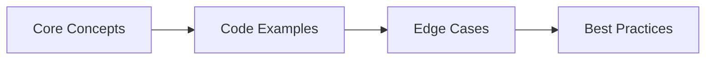

## Chapter at a Glance

| Topic | Key Focus | Key Questions |
|-------|----------|--------------|
| Core Concepts | Foundational understanding | Definitions, contrasts, trade-offs |
| Code Examples | Compilable, runnable solutions | Real interview scenarios |
| Best Practices | Production-ready patterns | Pitfalls to avoid |

## Chapter Roadmap



### Q21: What is a service mesh and when would you use Istio?
> **Pro Tip:** In interviews, always start with the "why" before the "how." Explaining the reasoning behind a design choice is more valuable than reciting syntax.

> **Remember:** Code readability matters in interviews. Write clean, well-structured code with meaningful variable names.


**Answer:**

A service mesh manages service-to-service communication at the infrastructure layer using sidecar proxies. Istio injects an Envoy proxy alongside each pod, handling traffic management, security, and observability without changing application code.

```java
// ── Without service mesh: circuit breaker in application code ──
@Service
public class OrderService {
    @Autowired private UserServiceClient userClient;

    @CircuitBreaker(name = "userService", fallbackMethod = "fallback")
    public UserDto getUser(Long id) {
        return userClient.getUser(id);
    }
}

// ── With Istio: circuit breaker moves to infrastructure ──
// application code is clean → no Resilience4j annotations needed
@Service
public class OrderService {
    @Autowired private UserServiceClient userClient;

    public UserDto getUser(Long id) {
        return userClient.getUser(id);  // No circuit breaker → Istio handles it
    }
}
```

```yaml
# ── Istio DestinationRule (circuit breaker at mesh level) ──

> **Previous:** [Microservices Interview Q&amp;A (cont.)](./60-interview-microservices-c.md) | **Next:** [Security Interview Q&amp;A](./61-interview-security.md)
apiVersion: networking.istio.io/v1beta1
kind: DestinationRule
metadata:
  name: user-service
spec:
  host: user-service
  trafficPolicy:
    connectionPool:
      tcp:
        maxConnections: 100
      http:
        http1MaxPendingRequests: 10
        http2MaxRequests: 100
    outlierDetection:
      consecutive5xxErrors: 5
      interval: 30s
      baseEjectionTime: 30s
      maxEjectionPercent: 50
---
# ── Istio VirtualService (traffic splitting for canary) ──

> **Previous:** [Microservices Interview Q&amp;A (cont.)](./60-interview-microservices-c.md) | **Next:** [Security Interview Q&amp;A](./61-interview-security.md)
apiVersion: networking.istio.io/v1beta1
kind: VirtualService
metadata:
  name: user-service
spec:
  hosts:
    - user-service
  http:
    - route:
        - destination:
            host: user-service
            subset: v1
          weight: 90
        - destination:
            host: user-service
            subset: v2
          weight: 10
    - timeout: 3s
      retries:
        attempts: 3
        perTryTimeout: 1s
---
# ── Istio PeerAuthentication (mTLS between services) ──

> **Previous:** [Microservices Interview Q&amp;A (cont.)](./60-interview-microservices-c.md) | **Next:** [Security Interview Q&amp;A](./61-interview-security.md)
apiVersion: security.istio.io/v1beta1
kind: PeerAuthentication
metadata:
  name: default
  namespace: default
spec:
  mtls:
    mode: STRICT  # All inter-service traffic must use mTLS
---
# ── Istio AuthorizationPolicy ──

> **Previous:** [Microservices Interview Q&amp;A (cont.)](./60-interview-microservices-c.md) | **Next:** [Security Interview Q&amp;A](./61-interview-security.md)
apiVersion: security.istio.io/v1beta1
kind: AuthorizationPolicy
metadata:
  name: order-service-policy
spec:
  selector:
    matchLabels:
      app: order-service
  rules:
    - from:
        - source:
            principals: ["cluster.local/ns/default/sa/api-gateway"]
      to:
        - operation:
            methods: ["GET"]
```

Service mesh provides:
- Traffic management (canary, circuit breaker, retries, timeouts → no code changes)
- Security (mTLS, authorization, authentication at the proxy level)
- Observability (automatic metrics, traces, access logs per request)
- Resilience (timeouts, retries, circuit breaking, outlier detection)

Use a service mesh when you have 10+ services and can't add cross-cutting code to each one. Do not use a service mesh for small deployments (3-5 services) → the complexity of managing sidecars and control plane is not worth it.

---

### Q22: How do you implement structured logging and log aggregation?

**Answer:**

Structured logging outputs JSON with consistent fields (service name, trace ID, level, message, timestamp). ELK or Loki aggregates logs from all services into a searchable store.

```java
// ── Logback configuration for structured JSON logging ──
// resources/logback-spring.xml
<configuration>
    <appender name="JSON" class="ch.qos.logback.core.ConsoleAppender">
        <encoder class="net.logstash.logback.encoder.LogstashEncoder">
            <includeMdc>true</includeMdc>          <!-- Include MDC context -->
            <customFields>{"service":"order-service","environment":"${ENV:-dev}"}</customFields>
        </encoder>
    </appender>

    <root level="INFO">
        <appender-ref ref="JSON"/>
    </root>
</configuration>

// ── Dependencies ──
// implementation 'net.logstash.logback:logstash-logback-encoder:7.4'

// ── Structured logging in application code ──
@Service
public class OrderService {
    private static final Logger log = LoggerFactory.getLogger(OrderService.class);

    @Autowired
    private Tracer tracer;  // Micrometer Tracing

    @Transactional
    public Order createOrder(OrderRequest req) {
        // MDC is automatically populated by Micrometer with traceId and spanId
        MDC.put("user.id", String.valueOf(req.userId()));
        MDC.put("order.total", req.total().toPlainString());

        log.info("Creating order");
        try {
            Order order = orderRepo.save(new Order(req));
            MDC.put("order.id", String.valueOf(order.getId()));
            log.info("Order created successfully");
            return order;
        } catch (Exception e) {
            log.error("Failed to create order", e);
            throw e;
        } finally {
            MDC.remove("user.id");
            MDC.remove("order.total");
            MDC.remove("order.id");
        }
    }
}

// ── JSON output (single log entry) ──
// {
//   "@timestamp": "2026-06-16T12:30:00.000+00:00",
//   "level": "INFO",
//   "service": "order-service",
//   "environment": "prod",
//   "traceId": "abc123def456",
//   "spanId": "span789",
//   "message": "Order created successfully",
//   "mdc": {
//     "user.id": "42",
//     "order.total": "100.00",
//     "order.id": "87"
//   },
//   "logger_name": "com.company.orderservice.OrderService",
//   "thread_name": "http-nio-8080-exec-3"
// }

// ── Loki log query ──
// {service="order-service", level="ERROR"} |= "traceId=abc123def456"
// {service=~"user-service|order-service", level="ERROR"} | json | line_format "{{.message}}"

// ── Logback MDC with auto-cleanup via Filter ──
@Component
public class MdcFilter implements WebFilter {
    @Override
    public Mono<Void> filter(ServerWebExchange exchange, WebFilterChain chain) {
        return chain.filter(exchange)
            .contextWrite(ctx -> {
                MDC.put("request.path", exchange.getRequest().getPath().value());
                MDC.put("request.method", exchange.getRequest().getMethod().name());
                return ctx;
            })
            .doFinally(signalType -> MDC.clear());
    }
}
```

Best practices:
- Every log entry includes `traceId`, `service`, `level`, and `timestamp`
- Structured JSON means no regex parsing → just query fields
- Never log sensitive data (PII, passwords, tokens) → even in structured logs
- Correlation ID (traceId) connects logs across services during a single request flow
- Use Loki + Grafana for Kubernetes-native log aggregation (no Elasticsearch cluster needed)

---

### Q23: How do you handle database migrations across multiple microservices?

**Answer:**

Each microservice manages its own database migrations independently. Migrations are versioned, sequential, and tested in CI.

```java
// ── Each service has its own Flyway configuration ──
// order-service/src/main/resources/application.yml:
// spring:
//   flyway:
//     enabled: true
//     locations: classpath:db/migration/order
//     baseline-on-migrate: true
//     out-of-order: false
//     validate-on-migrate: true

// user-service/src/main/resources/application.yml:
// spring:
//   flyway:
//     locations: classpath:db/migration/user

// ── Migration files are prefixed by version: V{version}__{description}.sql ──
// order-service:
//   db/migration/order/V1__create_orders_table.sql
//   db/migration/order/V2__add_status_column.sql
//   db/migration/order/V3__add_indexes.sql
//
// user-service:
//   db/migration/user/V1__create_users_table.sql
//   db/migration/user/V2__add_email_verification.sql

// ── V3__add_indexes.sql for order-service ──
-- Create indexes for common queries
CREATE INDEX idx_orders_user_id ON orders(user_id);
CREATE INDEX idx_orders_status ON orders(status) WHERE status IN ('PENDING', 'PROCESSING');
CREATE INDEX idx_orders_created_at ON orders(created_at DESC);

-- Backfill existing data if needed
-- UPDATE orders SET status = 'PENDING' WHERE status IS NULL;

// ── Advanced: multi-service migration coordination ──
@Service
public class CoordinatedMigrationService {
    @Autowired private Map<String, DataSource> dataSources;

    @EventListener(ApplicationReadyEvent.class)
    public void runCoordinatedMigrations() {
        dataSources.forEach((serviceName, ds) -> {
            Flyway flyway = Flyway.configure()
                .dataSource(ds)
                .locations("classpath:db/migration/" + serviceName)
                .load();
            flyway.migrate();
            log.info("{} migration complete", serviceName);
        });
    }
}

// ── Backward compatibility: expand-contract for cross-service migrations ──
// Phase 1: Add new column (expand)
-- V1__add_phone_column.sql
ALTER TABLE users ADD COLUMN phone VARCHAR(20);

// Phase 2: Deploy services to write to both old and new fields
// Phase 3: Backfill data
// Phase 4: Migrate readers to new column
// Phase 5: Drop old column (contract)
-- V2__drop_legacy_phone.sql
ALTER TABLE users DROP COLUMN legacy_phone;
```

CI validation:
```bash
# Validate that migrations are reversible (check for down scripts)

> **Previous:** [Microservices Interview Q&amp;A (cont.)](./60-interview-microservices-c.md) | **Next:** [Security Interview Q&amp;A](./61-interview-security.md)
for f in db/migration/*/V*.sql; do
  down="${f/V/__down/V}"
  if [ ! -f "${down}" ]; then
    echo "WARNING: No undo migration for $f"
  fi
done

# Check for SQL syntax errors via dry-run

> **Previous:** [Microservices Interview Q&amp;A (cont.)](./60-interview-microservices-c.md) | **Next:** [Security Interview Q&amp;A](./61-interview-security.md)
flyway migrate -dryRunOutput=dry-run.sql
```

Each service's migration is independent. Never share migration files across services. Backward-compatible migrations (expand phase) allow zero-downtime deployment.

---

### Q24: How do you implement idempotency in microservices?

**Answer:**

Idempotency ensures that processing the same request multiple times produces the same result. For asynchronous processing, this means deduplication at the consumer.

```java
// ── Idempotency key pattern (for REST endpoints) ──
@RestController
@RequestMapping("/orders")
public class OrderController {

    @PostMapping
    public ResponseEntity<Order> createOrder(
            @RequestBody OrderRequest request,
            @RequestHeader("Idempotency-Key") String idempotencyKey) {

        Order order = orderService.createIdempotent(request, idempotencyKey);
        return ResponseEntity.ok(order);
    }
}

@Service
public class OrderService {
    @Autowired private OrderRepository orderRepo;
    @Autowired private IdempotencyRegistry idempotencyRegistry;

    @Transactional
    public Order createIdempotent(OrderRequest request, String idempotencyKey) {
        // Check if this key was already processed
        return idempotencyRegistry.getProcessedResult(idempotencyKey)
            .orElseGet(() -> {
                Order order = orderRepo.save(new Order(request));
                idempotencyRegistry.record(idempotencyKey, order.getId());
                return order;
            });
    }
}

// ── Idempotency registry (using database for persistence) ──
@Entity
@Table(name = "idempotency_keys")
public class IdempotencyRecord {
    @Id
    private String idempotencyKey;

    private Long resultId;  // The ID of the created resource
    private Instant createdAt;

    // TTL: purge old entries after 24 hours
    public boolean isExpired() {
        return createdAt.isBefore(Instant.now().minus(24, ChronoUnit.HOURS));
    }
}

@Repository
public interface IdempotencyRegistry extends JpaRepository<IdempotencyRecord, String> {
    Optional<IdempotencyRecord> findByIdempotencyKey(String key);

    @Modifying
    @Query("DELETE FROM IdempotencyRecord r WHERE r.createdAt < :cutoff")
    void purgeOlderThan(@Param("cutoff") Instant cutoff);
}

// ── Idempotent Kafka consumer ──
@Service
public class IdempotentConsumer {
    @Autowired private ProcessedEventRepository processedRepo;
    @Autowired private OrderRepository orderRepo;

    @Transactional
    @KafkaListener(topics = "payment.completed")
    public void handlePaymentCompleted(PaymentCompletedEvent event) {
        // Deduplicate by event ID
        if (processedRepo.existsByEventId(event.getEventId())) {
            log.info("Duplicate event: {}, skipping", event.getEventId());
            return;
        }

        Order order = orderRepo.findById(event.getOrderId())
            .orElseThrow(() -> new IllegalArgumentException("Order not found"));

        order.setStatus("PAID");
        orderRepo.save(order);

        processedRepo.save(new ProcessedEvent(event.getEventId()));
    }
}

// ── Guarantee: atomic check-then-process with database constraint ──
// PostgreSQL:
// CREATE UNIQUE INDEX idx_idempotency ON idempotency_keys(idempotency_key);
//
// INSERT INTO idempotency_keys(idempotency_key, result_id, created_at)
// VALUES ('key-123', NULL, NOW())
// ON CONFLICT (idempotency_key) DO NOTHING
// RETURNING idempotency_key;
//
// If the INSERT returns the key, this is the first call → process normally.
// If it returns nothing, another request already started processing → return cached result.

```

Idempotency is not optional in microservices → network retries guarantee duplicate requests. Every write endpoint should accept an idempotency key. Every async consumer should deduplicate by event ID.

---

### Q25: What distributed caching strategies work for microservices?

**Answer:**

Distributed caching (Redis) reduces latency and database load. Two primary patterns: cache-aside (read-through) and write-through.

```java
// ── Cache-aside: read from cache, miss -> load from DB -> populate cache ──
@Service
public class ProductService {
    @Autowired private RedisTemplate<String, ProductDto> redis;
    @Autowired private ProductRepository productRepo;

    private static final Duration CACHE_TTL = Duration.ofMinutes(10);

    public ProductDto getProduct(Long id) {
        String key = "product:" + id;

        // Try cache
        ProductDto cached = redis.opsForValue().get(key);
        if (cached != null) {
            return cached;
        }

        // Cache miss → load from database
        Product product = productRepo.findById(id)
            .orElseThrow(() -> new ProductNotFoundException(id));
        ProductDto dto = ProductDto.from(product);

        // Populate cache with TTL
        redis.opsForValue().set(key, dto, CACHE_TTL);
        return dto;
    }

    // ── Invalidate cache on write ──
    @Transactional
    public ProductDto updateProduct(Long id, UpdateProductRequest req) {
        Product product = productRepo.findById(id).orElseThrow();
        product.setName(req.name());
        product.setPrice(req.price());
        product = productRepo.save(product);

        // Invalidate cache (or update it with write-through)
        redis.delete("product:" + id);

        return ProductDto.from(product);
    }
}

// ── Spring Cache abstraction ──
@Service
public class ProductService {
    @Cacheable(value = "products", key = "#id", unless = "#result == null")
    public ProductDto getProduct(Long id) {
        Product product = productRepo.findById(id)
            .orElseThrow(() -> new ProductNotFoundException(id));
        return ProductDto.from(product);
    }

    @CachePut(value = "products", key = "#id")
    @Transactional
    public ProductDto updateProduct(Long id, UpdateProductRequest req) {
        Product product = productRepo.findById(id).orElseThrow();
        product.setName(req.name());
        product.setPrice(req.price());
        product = productRepo.save(product);
        return ProductDto.from(product);
    }

    @CacheEvict(value = "products", key = "#id")
    public void evictProduct(Long id) {
        // Cache eviction triggered externally (e.g., admin action)
    }
}

// ── Redis configuration for distributed caching ──
@Configuration
@EnableCaching
public class CacheConfig {
    @Bean
    public RedisCacheConfiguration cacheConfiguration() {
        return RedisCacheConfiguration.defaultCacheConfig()
            .entryTtl(Duration.ofMinutes(10))
            .disableCachingNullValues()
            .serializeKeysWith(
                RedisSerializationContext.SerializationPair
                    .fromSerializer(new StringRedisSerializer()))
            .serializeValuesWith(
                RedisSerializationContext.SerializationPair
                    .fromSerializer(new GenericJackson2JsonRedisSerializer()));
    }

    @Bean
    public RedisTemplate<String, Object> redisTemplate(
            RedisConnectionFactory factory) {
        RedisTemplate<String, Object> template = new RedisTemplate<>();
        template.setConnectionFactory(factory);
        template.setKeySerializer(new StringRedisSerializer());
        template.setValueSerializer(new GenericJackson2JsonRedisSerializer());
        template.setHashKeySerializer(new StringRedisSerializer());
        template.setHashValueSerializer(new GenericJackson2JsonRedisSerializer());
        return template;
    }
}

// ── Cache stampede prevention ──
@Service
public class ProductService {
    // Without protection: 100 concurrent cache misses all hit the database
    // With Redis lock: only one request hits the DB, others wait

    public ProductDto getProductWithLock(Long id) {
        String key = "product:" + id;
        String lockKey = "lock:" + key;

        // Fast path: try cache
        ProductDto cached = redis.opsForValue().get(key);
        if (cached != null) {
            return cached;
        }

        // Acquire distributed lock
        Boolean locked = redis.opsForValue()
            .setIfAbsent(lockKey, "locked", Duration.ofSeconds(5));
        if (Boolean.TRUE.equals(locked)) {
            try {
                // Double-check cache (another thread may have populated it)
                ProductDto again = redis.opsForValue().get(key);
                if (again != null) {
                    return again;
                }

                // Load from database
                Product product = productRepo.findById(id).orElseThrow();
                ProductDto dto = ProductDto.from(product);
                redis.opsForValue().set(key, dto, CACHE_TTL);
                return dto;
            } finally {
                redis.delete(lockKey);
            }
        }

        // Lock not acquired → wait briefly and retry
        Thread.sleep(100);
        return redis.opsForValue().get(key);  // Should be populated by now
    }
}

// ── Cache strategy comparison ──
// 1. Cache-aside (lazy): Most common. Cache miss = DB hit + cache populate.
//    Pros: Simple, resilient (cache loss just means slower reads).
//    Cons: Cache stampede on first request.

// 2. Write-through: Every write updates both DB and cache.
//    Pros: Cache always consistent with DB. Never stale reads.
//    Cons: Slower writes. Wasted cache writes for infrequently read data.

// 3. Write-behind (write-back): Write to cache, async flush to DB.
//    Pros: Fastest writes. Can batch DB updates.
//    Cons: Data loss if cache goes down before flush. Complex.

// 4. Cache-aside + TTL + invalidation: The sweet spot.
//    Populate on read. Invalidate on write. TTL ensures eventual consistency.
```

Use cache-aside with TTL for most services. Never cache sensitive data (PII, financial details) without explicit TTL and encryption. Always consider the cache-to-DB consistency window and whether stale data is acceptable for the use case.

## Concept Comparison Table

| Concept | Definition | Key Distinction | Use Case |
|---------|-----------|-----------------|----------|
| Interface | Contract without state | Multiple inheritance of type | API contracts |
| Abstract Class | Partial implementation | Single inheritance, shared state | Template method pattern |
| Record | Transparent data carrier | Auto-generated methods | DTOs, value objects |

## Quick Reference

| Topic | Key Points | Interview Frequency |
|-------|-----------|-------------------|
| **OOP** | Encapsulation, Inheritance, Polymorphism, Abstraction | Every interview |
| **Collections** | List, Set, Map, Queue, Deque | 9/10 interviews |
| **Concurrency** | synchronized, volatile, Locks, CompletableFuture | 7/10 senior interviews |
| **Java 8+** | Lambdas, Streams, Optional, CompletableFuture | 8/10 interviews |

## Cross-Application Matrix

| Skill | Junior (0-2yr) | Mid (3-5yr) | Senior (6-9yr) | Staff (10+) |
|-------|---------------|-------------|----------------|-------------|
| OOP & Design Patterns | Define and identify | Apply and combine | Evaluate and refactor | Create and teach |
| Collections | Basic usage | Performance trade-offs | Concurrent collections | Custom implementations |
| Concurrency | Syntax knowledge | Write thread-safe code | Debug deadlocks | Design concurrent systems |

## Chapter Quiz

1. What is the difference between equals() and == in Java?
   - A) They are identical
   - B) equals() compares values, == compares references
   - C) == compares values, equals() compares references
   - D) equals() is for primitives, == is for objects

<details>
<summary>Answer</summary>
**B) equals() compares logical equality (overridable), == compares reference equality.**
</details>

2. Which collection guarantees insertion order?
   - A) HashMap
   - B) TreeMap
   - C) LinkedHashMap
   - D) HashSet

<details>
<summary>Answer</summary>
**C) LinkedHashMap.** LinkedHashMap maintains a doubly-linked list of entries to preserve insertion order.
</details>

3. What keyword prevents a method from being overridden?
   - A) static
   - B) final
   - C) private
   - D) abstract

<details>
<summary>Answer</summary>
**B) final.** A final method cannot be overridden by subclasses.
</details>
