# 63. Tools & DevOps — Interview Q&A

> **Previous:** [Testing Interview Q&amp;A](./62-interview-testing.md) | **Next:** [Design Patterns Interview Q&amp;A](./64-interview-design-patterns.md)

This chapter covers the essential tools and DevOps practices every Java backend developer needs to know: build tools, containers, orchestration, CI/CD, monitoring, logging, version control, code review, and database migrations.

---


## Chapter at a Glance

| Topic | Key Focus | Key Questions |
|-------|----------|--------------|
| Core Concepts | Foundational understanding | Definitions, contrasts, trade-offs |
| Code Examples | Compilable, runnable solutions | Real interview scenarios |
| Best Practices | Production-ready patterns | Pitfalls to avoid |

## Chapter Roadmap

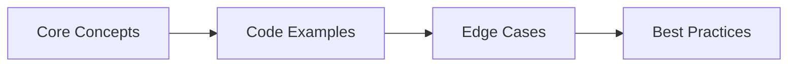
```mermaid
flowchart LR
    A[Core Concepts] --> B[Code Examples]
    B --> C[Edge Cases]
    C --> D[Best Practices]
```

### Q1: What is Maven and what problem does it solve?

<a href="../../assets/images/diagrams/java/63-interview-tools/what-is-maven-and-what-problem-does-it-solve-handwritten.svg" target="_blank" rel="noopener">
  
</a>
<a href="../../assets/images/diagrams/java/63-interview-tools/what-is-maven-and-what-problem-does-it-solve-diagram.svg" target="_blank" rel="noopener">
  
</a>
<a href="../../assets/images/diagrams/java/63-interview-tools/what-is-maven-and-what-problem-does-it-solve-sticky.svg" target="_blank" rel="noopener">
  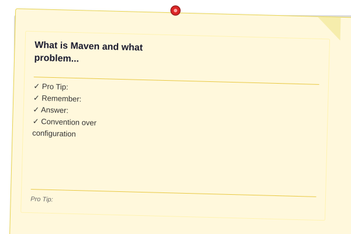
</a>


> **Pro Tip:** In interviews, always start with the "why" before the "how." Explaining the reasoning behind a design choice is more valuable than reciting syntax.

> **Remember:** Code readability matters in interviews. Write clean, well-structured code with meaningful variable names.


**Answer:** Maven is a build automation and dependency management tool for Java projects. Before Maven, Java projects had no standardized build process — developers used Ant with hand-written XML build files that required manually specifying every compile, test, and packaging step. Dependencies were downloaded and stored in `lib/` folders checked into version control, leading to bloated repositories and version conflicts.

Maven introduced two key innovations:
1. **Convention over configuration** — a standard project layout (`src/main/java`, `src/test/java`, etc.) means a Maven project can be built without any custom configuration for standard cases.
2. **Declarative dependency management** — dependencies are declared in `pom.xml` with groupId, artifactId, and version; Maven automatically downloads them from repositories (Maven Central) and manages transitive dependencies.

```xml
<project>
    <modelVersion>4.0.0</modelVersion>
    <groupId>com.example</groupId>
    <artifactId>my-app</artifactId>
    <version>1.0.0</version>
    <dependencies>
        <dependency>
            <groupId>org.springframework.boot</groupId>
            <artifactId>spring-boot-starter-web</artifactId>
            <version>3.2.0</version>
        </dependency>
    </dependencies>
</project>
```

Maven also provides a lifecycle (validate, compile, test, package, verify, install, deploy) that standardizes when plugins execute, and a vast ecosystem of plugins for code coverage, static analysis, and more.

---

### Q2: What are the key differences between Maven and Gradle?

<a href="../../assets/images/diagrams/java/63-interview-tools/what-are-the-key-differences-between-maven-and-gradle-handwritten.svg" target="_blank" rel="noopener">
  
</a>
<a href="../../assets/images/diagrams/java/63-interview-tools/what-are-the-key-differences-between-maven-and-gradle-diagram.svg" target="_blank" rel="noopener">
  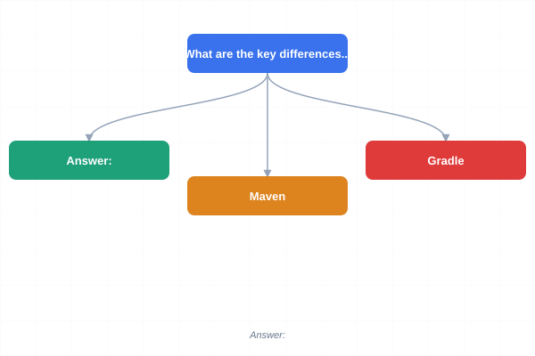
</a>
<a href="../../assets/images/diagrams/java/63-interview-tools/what-are-the-key-differences-between-maven-and-gradle-sticky.svg" target="_blank" rel="noopener">
  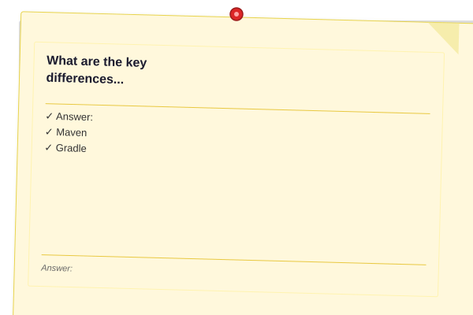
</a>


**Answer:**

| Aspect | Maven | Gradle |
|--------|-------|--------|
| **Build file** | XML (`pom.xml`) | Groovy or Kotlin DSL |
| **Performance** | Slower — sequential phases | Faster — incremental builds, build cache |
| **Flexibility** | Rigid lifecycle — hard to inject custom logic | Highly flexible — tasks with custom dependencies |
| **Dependency mgmt** | `<dependencyManagement>` BOM style | `platform()` and version catalogs |
| **Build script logic** | Plugins only — no imperative logic | Full programming language available |
| **Ecosystem** | Older, more established | Newer, rapidly growing |

Choose **Maven** for teams that value predictability and strict conventions. Choose **Gradle** for large monorepos needing incremental builds or when custom build logic is required.

---

### Q3: What is the Maven lifecycle and what are its phases?

<a href="../../assets/images/diagrams/java/63-interview-tools/what-is-the-maven-lifecycle-and-what-are-its-phases-handwritten.svg" target="_blank" rel="noopener">
  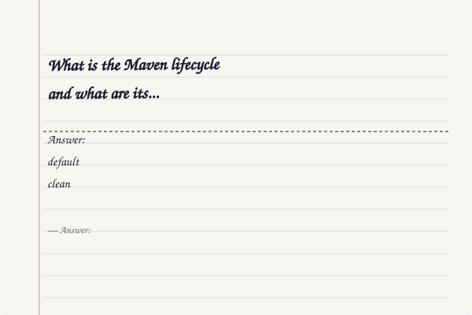
</a>
<a href="../../assets/images/diagrams/java/63-interview-tools/what-is-the-maven-lifecycle-and-what-are-its-phases-diagram.svg" target="_blank" rel="noopener">
  
</a>
<a href="../../assets/images/diagrams/java/63-interview-tools/what-is-the-maven-lifecycle-and-what-are-its-phases-sticky.svg" target="_blank" rel="noopener">
  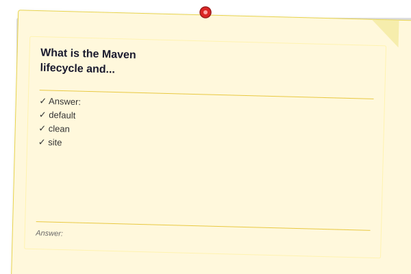
</a>


**Answer:** Maven has three built-in lifecycles: **default** (main build), **clean** (cleanup), and **site** (documentation). The default lifecycle phases in order:

```
validate   → Project is correct and all necessary info is available
compile    → Compiles the source code
test       → Tests using a unit test framework
package    → Packages into JAR/WAR
verify     → Integration tests and quality checks
install    → Installs into local repository for use as dependency
deploy     → Copies to remote repository for sharing
```

Each phase executes sequentially — `mvn package` runs validate, compile, test, and package. Plugins bind goals to lifecycle phases.

---

### Q4: How does Gradle incremental build work?

<a href="../../assets/images/diagrams/java/63-interview-tools/how-does-gradle-incremental-build-work-handwritten.svg" target="_blank" rel="noopener">
  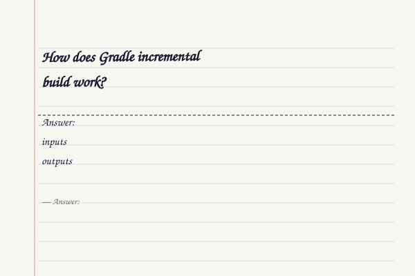
</a>
<a href="../../assets/images/diagrams/java/63-interview-tools/how-does-gradle-incremental-build-work-diagram.svg" target="_blank" rel="noopener">
  
</a>
<a href="../../assets/images/diagrams/java/63-interview-tools/how-does-gradle-incremental-build-work-sticky.svg" target="_blank" rel="noopener">
  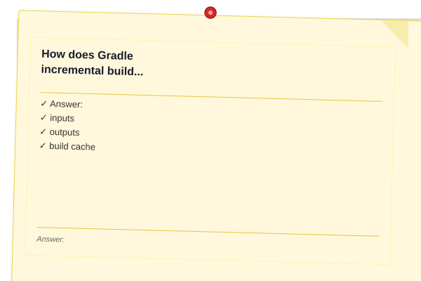
</a>


**Answer:** Gradle tracks **inputs** and **outputs** for every task. If neither inputs nor outputs have changed since the last execution, the task is marked `UP-TO-DATE` and skipped entirely. Inputs include source files, task configuration, and system properties. Outputs include files and directories produced by the task.

The **build cache** extends this across machines — CI can publish cache entries to a shared cache (HTTP or S3), and developer machines pull those entries instead of rebuilding.

---

### Q5: What are Maven BOMs and how do they help manage dependencies?

<a href="../../assets/images/diagrams/java/63-interview-tools/what-are-maven-boms-and-how-do-they-help-manage-dependencies-handwritten.svg" target="_blank" rel="noopener">
  
</a>
<a href="../../assets/images/diagrams/java/63-interview-tools/what-are-maven-boms-and-how-do-they-help-manage-dependencies-diagram.svg" target="_blank" rel="noopener">
  
</a>
<a href="../../assets/images/diagrams/java/63-interview-tools/what-are-maven-boms-and-how-do-they-help-manage-dependencies-sticky.svg" target="_blank" rel="noopener">
  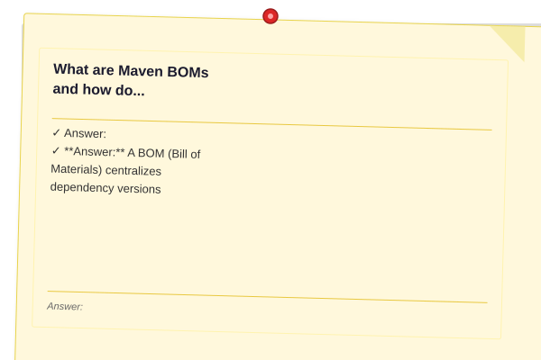
</a>


**Answer:** A BOM (Bill of Materials) centralizes dependency versions. Instead of specifying versions in every module's `pom.xml`, you import a BOM and omit versions in individual dependency declarations.

```xml
<dependencyManagement>
    <dependencies>
        <dependency>
            <groupId>com.fasterxml.jackson</groupId>
            <artifactId>jackson-bom</artifactId>
            <version>2.16.0</version>
            <type>pom</type>
            <scope>import</scope>
        </dependency>
    </dependencies>
</dependencyManagement>
```

Spring Boot provides `spring-boot-dependencies` as a BOM — that's why you don't specify versions for most Spring dependencies when using `spring-boot-starter-parent`.

---

### Q6: What is Docker and why is it important for Java applications?

<a href="../../assets/images/diagrams/java/63-interview-tools/what-is-docker-and-why-is-it-important-for-java-applications-handwritten.svg" target="_blank" rel="noopener">
  
</a>
<a href="../../assets/images/diagrams/java/63-interview-tools/what-is-docker-and-why-is-it-important-for-java-applications-diagram.svg" target="_blank" rel="noopener">
  
</a>
<a href="../../assets/images/diagrams/java/63-interview-tools/what-is-docker-and-why-is-it-important-for-java-applications-sticky.svg" target="_blank" rel="noopener">
  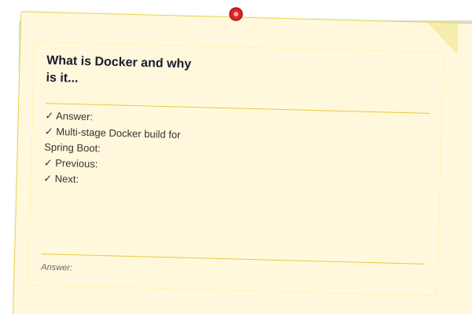
</a>


**Answer:** Docker packages an application and its dependencies into a lightweight, portable container image. For Java, it solves the "works on my machine" problem by ensuring the exact same environment (OS, JDK version, system libraries) runs everywhere.

**Multi-stage Docker build for Spring Boot:**

```dockerfile
# Stage 1: Build with JDK + Maven

> **Previous:** [Testing Interview Q&amp;A](./62-interview-testing.md) | **Next:** [Design Patterns Interview Q&amp;A](./64-interview-design-patterns.md)
FROM eclipse-temurin:17-jdk-alpine AS builder
WORKDIR /app
COPY mvnw pom.xml ./
COPY .mvn .mvn
RUN ./mvnw dependency:go-offline
COPY src src
RUN ./mvnw package -DskipTests

# Stage 2: Runtime with JRE only (much smaller)

> **Previous:** [Testing Interview Q&amp;A](./62-interview-testing.md) | **Next:** [Design Patterns Interview Q&amp;A](./64-interview-design-patterns.md)
FROM eclipse-temurin:17-jre-alpine
WORKDIR /app
COPY --from=builder /app/target/*.jar app.jar
EXPOSE 8080
ENTRYPOINT ["java", "-jar", "app.jar"]
```

---

### Q7: What are best practices for writing Dockerfiles for Java applications?

<a href="../../assets/images/diagrams/java/63-interview-tools/what-are-best-practices-for-writing-dockerfiles-for-java-applications-handwritten.svg" target="_blank" rel="noopener">
  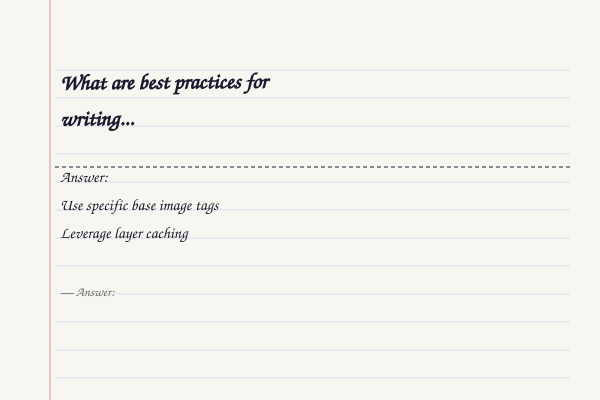
</a>
<a href="../../assets/images/diagrams/java/63-interview-tools/what-are-best-practices-for-writing-dockerfiles-for-java-applications-diagram.svg" target="_blank" rel="noopener">
  
</a>
<a href="../../assets/images/diagrams/java/63-interview-tools/what-are-best-practices-for-writing-dockerfiles-for-java-applications-sticky.svg" target="_blank" rel="noopener">
  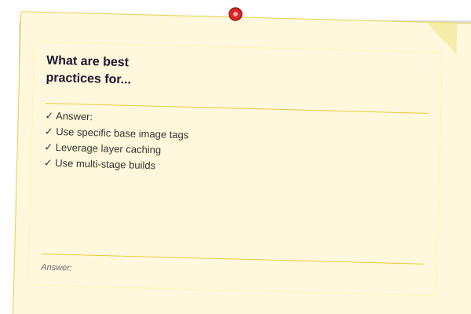
</a>


**Answer:**

1. **Use specific base image tags** — never `:latest`. Pin to specific versions.
2. **Leverage layer caching** — order commands from least to most frequently changing. Copy `pom.xml` and download dependencies before source code.
3. **Use multi-stage builds** — keep JDK and build tools out of runtime images.
4. **Run as non-root user** — create a dedicated user: `RUN addgroup -S appgroup && adduser -S appuser -G appgroup`
5. **Optimize JVM for containers** — `-XX:+UseContainerSupport -XX:MaxRAMPercentage=75.0`
6. **Set memory limits** — `docker run -m 512m my-app`
7. **Use health checks** — `HEALTHCHECK --interval=30s --timeout=3s CMD wget --spider http://localhost:8080/actuator/health`

---

### Q8: What is Docker Compose and when should you use it?

<a href="../../assets/images/diagrams/java/63-interview-tools/what-is-docker-compose-and-when-should-you-use-it-handwritten.svg" target="_blank" rel="noopener">
  
</a>
<a href="../../assets/images/diagrams/java/63-interview-tools/what-is-docker-compose-and-when-should-you-use-it-diagram.svg" target="_blank" rel="noopener">
  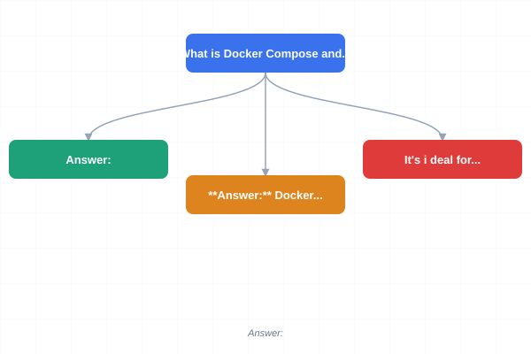
</a>
<a href="../../assets/images/diagrams/java/63-interview-tools/what-is-docker-compose-and-when-should-you-use-it-sticky.svg" target="_blank" rel="noopener">
  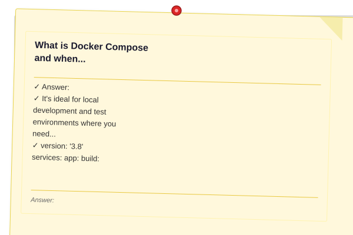
</a>


**Answer:** Docker Compose defines multi-container applications using a YAML file. It's ideal for local development and test environments where you need to run several services together.

```yaml
version: '3.8'
services:
  app:
    build: .
    ports:
      - "8080:8080"
    environment:
      SPRING_DATASOURCE_URL: jdbc:postgresql://db:5432/mydb
      SPRING_DATA_REDIS_HOST: redis
    depends_on:
      - db
      - redis
  db:
    image: postgres:16-alpine
    environment:
      POSTGRES_DB: mydb
      POSTGRES_USER: user
      POSTGRES_PASSWORD: secret
    volumes:
      - pgdata:/var/lib/postgresql/data
  redis:
    image: redis:7-alpine
volumes:
  pgdata:
```

Use for: local development, CI test environments, staging. Not for production — use Kubernetes.

---

### Q9: What is Kubernetes and what problems does it solve for Java microservices?

<a href="../../assets/images/diagrams/java/63-interview-tools/what-is-kubernetes-and-what-problems-does-it-solve-for-java-microservices-handwritten.svg" target="_blank" rel="noopener">
  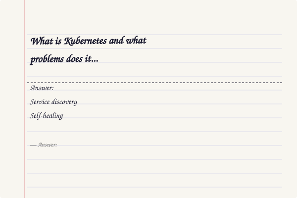
</a>
<a href="../../assets/images/diagrams/java/63-interview-tools/what-is-kubernetes-and-what-problems-does-it-solve-for-java-microservices-diagram.svg" target="_blank" rel="noopener">
  
</a>
<a href="../../assets/images/diagrams/java/63-interview-tools/what-is-kubernetes-and-what-problems-does-it-solve-for-java-microservices-sticky.svg" target="_blank" rel="noopener">
  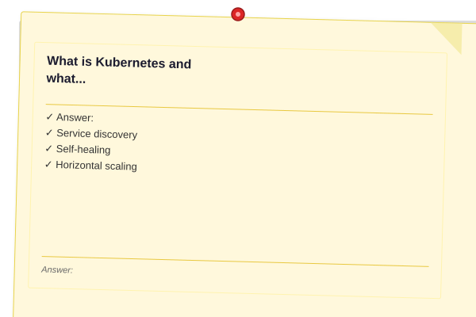
</a>


**Answer:** Kubernetes (K8s) is a container orchestration platform that automates deployment, scaling, and management of containerized applications. For Java microservices, it solves:

1. **Service discovery** — pods get DNS names and find each other via Services
2. **Self-healing** — restarts failed containers, reschedules failed nodes
3. **Horizontal scaling** — auto-scales pods based on CPU/memory or custom metrics
4. **Rolling updates** — deploys new versions without downtime
5. **Configuration management** — ConfigMaps and Secrets inject configuration
6. **Resource management** — CPU/memory requests and limits per pod

```yaml
apiVersion: apps/v1
kind: Deployment
metadata:
  name: order-service
spec:
  replicas: 3
  selector:
    matchLabels:
      app: order-service
  template:
    metadata:
      labels:
        app: order-service
    spec:
      containers:
      - name: order-service
        image: registry.example.com/order-service:1.2.3
        ports:
        - containerPort: 8080
        resources:
          requests:
            memory: "256Mi"
            cpu: "250m"
          limits:
            memory: "512Mi"
            cpu: "500m"
        livenessProbe:
          httpGet:
            path: /actuator/health/liveness
            port: 8080
          initialDelaySeconds: 30
        readinessProbe:
          httpGet:
            path: /actuator/health/readiness
            port: 8080
          initialDelaySeconds: 20
---
apiVersion: v1
kind: Service
metadata:
  name: order-service
spec:
  selector:
    app: order-service
  ports:
  - port: 80
    targetPort: 8080
  type: ClusterIP
```

---

### Q10: How do you configure Spring Boot health probes for Kubernetes?

<a href="../../assets/images/diagrams/java/63-interview-tools/how-do-you-configure-spring-boot-health-probes-for-kubernetes-handwritten.svg" target="_blank" rel="noopener">
  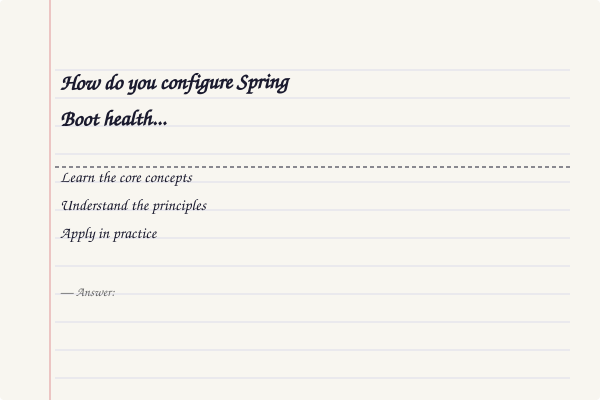
</a>
<a href="../../assets/images/diagrams/java/63-interview-tools/how-do-you-configure-spring-boot-health-probes-for-kubernetes-diagram.svg" target="_blank" rel="noopener">
  
</a>
<a href="../../assets/images/diagrams/java/63-interview-tools/how-do-you-configure-spring-boot-health-probes-for-kubernetes-sticky.svg" target="_blank" rel="noopener">
  
</a>


**Answer:** Spring Boot Actuator provides dedicated endpoints for liveness and readiness checks:

```yaml
management:
  endpoint:
    health:
      probes:
        enabled: true
  health:
    livenessstate:
      enabled: true
    readinessstate:
      enabled: true
```

This exposes `/actuator/health/liveness` (is the app alive? restart if stuck) and `/actuator/health/readiness` (can the app accept traffic? remove from Service if not).

The readiness probe should include database connectivity but the liveness probe should not — a database being down doesn't mean the app should be killed.

---

### Q11: What is a CI/CD pipeline and how do you build one for a Java project?

<a href="../../assets/images/diagrams/java/63-interview-tools/what-is-a-ci-cd-pipeline-and-how-do-you-build-one-for-a-java-project-handwritten.svg" target="_blank" rel="noopener">
  
</a>
<a href="../../assets/images/diagrams/java/63-interview-tools/what-is-a-ci-cd-pipeline-and-how-do-you-build-one-for-a-java-project-diagram.svg" target="_blank" rel="noopener">
  
</a>
<a href="../../assets/images/diagrams/java/63-interview-tools/what-is-a-ci-cd-pipeline-and-how-do-you-build-one-for-a-java-project-sticky.svg" target="_blank" rel="noopener">
  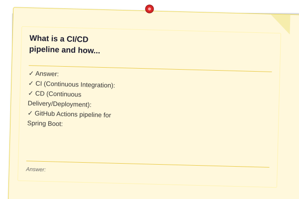
</a>


**Answer:** CI/CD automates the process from code commit to production deployment.

- **CI (Continuous Integration):** Every commit is built and tested automatically
- **CD (Continuous Delivery/Deployment):** Every successful build is deployable (or auto-deployed)

**GitHub Actions pipeline for Spring Boot:**

```yaml
name: CI/CD
on:
  push:
    branches: [main]
jobs:
  build:
    runs-on: ubuntu-latest
    steps:
      - uses: actions/checkout@v4
      - name: Set up JDK 17
        uses: actions/setup-java@v4
        with:
          java-version: '17'
          distribution: 'temurin'
      - name: Build and test
        run: mvn verify -B
  docker:
    needs: build
    runs-on: ubuntu-latest
    steps:
      - name: Build and push Docker image
        uses: docker/build-push-action@v5
        with:
          push: true
          tags: registry.example.com/my-app:${{ github.sha }}
```

Stages: Checkout → Compile → Unit tests → Integration tests → Static analysis → Package → Docker build → Push → Deploy

---

### Q12: What is the difference between blue-green and canary deployment?

<a href="../../assets/images/diagrams/java/63-interview-tools/what-is-the-difference-between-blue-green-and-canary-deployment-handwritten.svg" target="_blank" rel="noopener">
  
</a>
<a href="../../assets/images/diagrams/java/63-interview-tools/what-is-the-difference-between-blue-green-and-canary-deployment-diagram.svg" target="_blank" rel="noopener">
  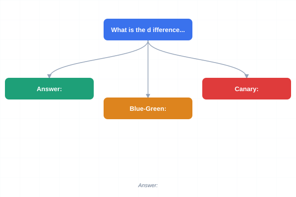
</a>
<a href="../../assets/images/diagrams/java/63-interview-tools/what-is-the-difference-between-blue-green-and-canary-deployment-sticky.svg" target="_blank" rel="noopener">
  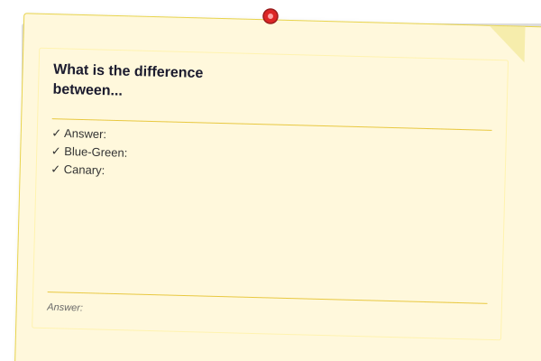
</a>


**Answer:**

**Blue-Green:** Two identical environments (blue = current, green = new). Deploy to green, switch the router to green once verified. Rollback is instant — switch back to blue.

**Canary:** Gradually shift traffic to the new version (1% → 5% → 10% → 50% → 100%). Monitor errors at each step and rollback if needed.

| Aspect | Blue-Green | Canary |
|--------|-----------|--------|
| Rollback | Instant (switch back) | Needs traffic rebalancing |
| Infrastructure cost | Double during deploy | Same as normal |
| Risk validation | Only tested before switch | Real traffic validation |
| Speed | Fast switchover (seconds) | Gradual (minutes to hours) |
| Complexity | Lower | Higher (traffic routing needed) |

---

### Q13: What monitoring metrics are essential for a Java microservice?

<a href="../../assets/images/diagrams/java/63-interview-tools/what-monitoring-metrics-are-essential-for-a-java-microservice-handwritten.svg" target="_blank" rel="noopener">
  
</a>
<a href="../../assets/images/diagrams/java/63-interview-tools/what-monitoring-metrics-are-essential-for-a-java-microservice-diagram.svg" target="_blank" rel="noopener">
  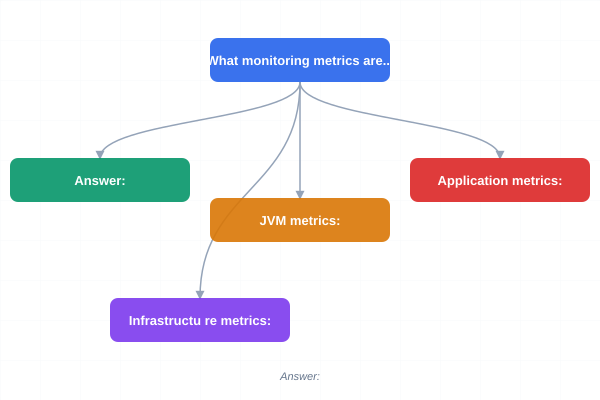
</a>
<a href="../../assets/images/diagrams/java/63-interview-tools/what-monitoring-metrics-are-essential-for-a-java-microservice-sticky.svg" target="_blank" rel="noopener">
  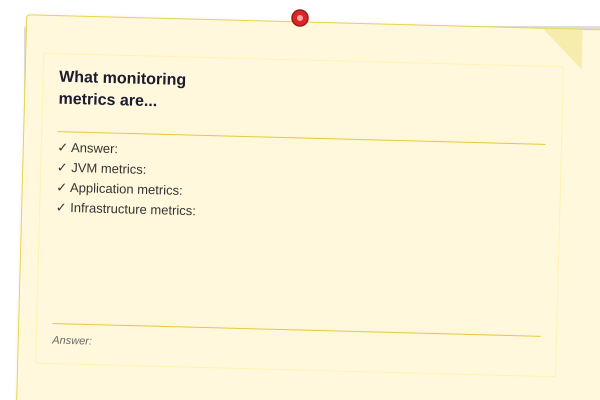
</a>


**Answer:**

**JVM metrics:** Heap memory (used, max, committed), GC pause time and frequency, thread count (active, daemon, blocked), class loading

**Application metrics:** Request rate (req/s), error rate (4xx, 5xx), latency percentiles (p50, p95, p99, p99.9), active DB connections

**Infrastructure metrics:** CPU usage, memory usage (RSS vs heap), disk I/O, network I/O

**Spring Boot + Micrometer + Prometheus:**

```yaml
management:
  endpoints:
    web:
      exposure:
        include: health,metrics,prometheus
  metrics:
    distribution:
      percentiles-histogram:
        http.server.requests: true
```

Custom metrics:

```java
@Service
public class OrderService {
    private final Counter orderCreatedCounter;
    private final Timer orderProcessingTimer;

    public OrderService(MeterRegistry registry) {
        this.orderCreatedCounter = Counter.builder("orders.created")
            .description("Total orders created")
            .register(registry);
        this.orderProcessingTimer = Timer.builder("orders.processing.time")
            .description("Time to process an order")
            .publishPercentiles(0.5, 0.95, 0.99)
            .register(registry);
    }

    public Order createOrder(OrderRequest request) {
        return orderProcessingTimer.record(() -> {
            Order order = doCreateOrder(request);
            orderCreatedCounter.increment();
            return order;
        });
    }
}
```

---

### Q14: How do you implement centralized logging for microservices?

<a href="../../assets/images/diagrams/java/63-interview-tools/how-do-you-implement-centralized-logging-for-microservices-handwritten.svg" target="_blank" rel="noopener">
  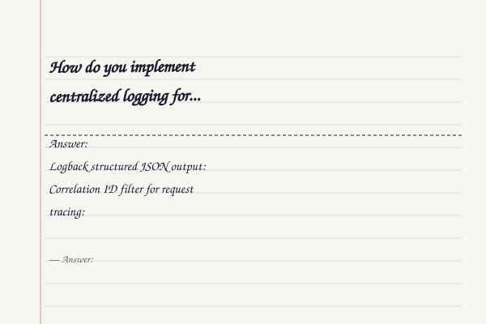
</a>
<a href="../../assets/images/diagrams/java/63-interview-tools/how-do-you-implement-centralized-logging-for-microservices-diagram.svg" target="_blank" rel="noopener">
  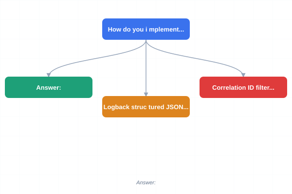
</a>
<a href="../../assets/images/diagrams/java/63-interview-tools/how-do-you-implement-centralized-logging-for-microservices-sticky.svg" target="_blank" rel="noopener">
  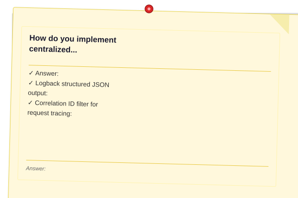
</a>


**Answer:** Use the pattern: structured logging (JSON) + correlation IDs + centralized aggregation.

**Logback structured JSON output:**

```xml
<appender name="JSON" class="ch.qos.logback.core.ConsoleAppender">
    <encoder class="net.logstash.logback.encoder.LogstashEncoder">
        <customFields>{"service":"order-service","environment":"${ENV}"}</customFields>
    </encoder>
</appender>
```

**Correlation ID filter for request tracing:**

```java
@Component
public class CorrelationIdFilter extends OncePerRequestFilter {
    @Override
    protected void doFilterInternal(HttpServletRequest request,
                                     HttpServletResponse response,
                                     FilterChain chain) {
        String correlationId = request.getHeader("X-Correlation-Id");
        if (correlationId == null || correlationId.isEmpty()) {
            correlationId = UUID.randomUUID().toString();
        }
        MDC.put("correlationId", correlationId);
        response.setHeader("X-Correlation-Id", correlationId);
        try {
            chain.doFilter(request, response);
        } finally {
            MDC.remove("correlationId");
        }
    }
}
```

Propagate via RestClient interceptor to downstream services.

---

### Q15: What are health checks and why are they important?

<a href="../../assets/images/diagrams/java/63-interview-tools/what-are-health-checks-and-why-are-they-important-handwritten.svg" target="_blank" rel="noopener">
  
</a>
<a href="../../assets/images/diagrams/java/63-interview-tools/what-are-health-checks-and-why-are-they-important-diagram.svg" target="_blank" rel="noopener">
  
</a>
<a href="../../assets/images/diagrams/java/63-interview-tools/what-are-health-checks-and-why-are-they-important-sticky.svg" target="_blank" rel="noopener">
  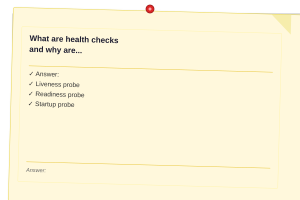
</a>


**Answer:** Health checks expose the operational status of an application so orchestrators, load balancers, and monitoring systems know whether the application can serve traffic.

Three types:
- **Liveness probe** — Is the app running? Restart if stuck (deadlocks, infinite loops).
- **Readiness probe** — Can the app accept traffic? Remove from load balancer if not (DB down, cache warming).
- **Startup probe** — Has the app initialized? Delay liveness checks for slow-starting apps.

**Custom health indicator:**

```java
@Component
public class ExternalApiHealthIndicator implements HealthIndicator {
    @Override
    public Health health() {
        try {
            ResponseEntity<String> response = restTemplate.exchange(
                "https://api.external.com/health",
                HttpMethod.GET, null, String.class
            );
            if (response.getStatusCode().is2xxSuccessful()) {
                return Health.up().build();
            }
            return Health.down()
                .withDetail("statusCode", response.getStatusCode())
                .build();
        } catch (Exception e) {
            return Health.down(e).build();
        }
    }
}
```

---

### Q16: What Git branching strategy works best for microservices?

<a href="../../assets/images/diagrams/java/63-interview-tools/what-git-branching-strategy-works-best-for-microservices-handwritten.svg" target="_blank" rel="noopener">
  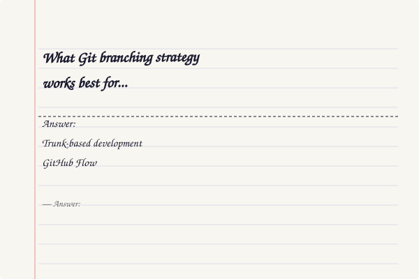
</a>
<a href="../../assets/images/diagrams/java/63-interview-tools/what-git-branching-strategy-works-best-for-microservices-diagram.svg" target="_blank" rel="noopener">
  
</a>
<a href="../../assets/images/diagrams/java/63-interview-tools/what-git-branching-strategy-works-best-for-microservices-sticky.svg" target="_blank" rel="noopener">
  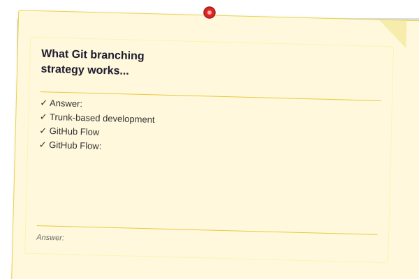
</a>


**Answer:** **Trunk-based development** or **GitHub Flow** work best for microservices. Avoid Git Flow — it's too heavyweight for independently deployable services.

**GitHub Flow:** Feature branches → PR → merge to main → deploy immediately.

**Trunk-based:** Short-lived branches (hours), merged to main via PR. Feature flags control unfinished features:

```java
@Value("${features.new-payment-flow:false}")
private boolean newPaymentFlowEnabled;

public PaymentResult processPayment(PaymentRequest request) {
    if (newPaymentFlowEnabled) {
        return newPaymentFlow(request);
    }
    return oldPaymentFlow(request);
}
```

---

### Q17: What do you look for in a code review?

<a href="../../assets/images/diagrams/java/63-interview-tools/what-do-you-look-for-in-a-code-review-handwritten.svg" target="_blank" rel="noopener">
  
</a>
<a href="../../assets/images/diagrams/java/63-interview-tools/what-do-you-look-for-in-a-code-review-diagram.svg" target="_blank" rel="noopener">
  
</a>
<a href="../../assets/images/diagrams/java/63-interview-tools/what-do-you-look-for-in-a-code-review-sticky.svg" target="_blank" rel="noopener">
  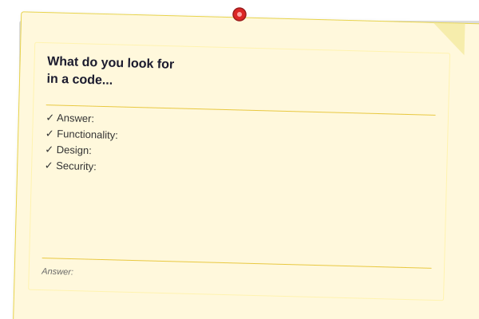
</a>


**Answer:**
- **Functionality:** Correct implementation, edge cases handled, proper error handling
- **Design:** SOLID principles, high cohesion, appropriate abstractions, clean package structure
- **Security:** Input validation, authentication/authorization checks, no hardcoded secrets
- **Performance:** N+1 queries, proper indexing, thread safety, caching strategies
- **Testing:** Happy path + edge cases, integration tests with Testcontainers, error scenarios
- **Style:** Team conventions, meaningful names, no dead code or TODOs

---

### Q18: What is Flyway and how do you use it for database migrations?

<a href="../../assets/images/diagrams/java/63-interview-tools/what-is-flyway-and-how-do-you-use-it-for-database-migrations-handwritten.svg" target="_blank" rel="noopener">
  
</a>
<a href="../../assets/images/diagrams/java/63-interview-tools/what-is-flyway-and-how-do-you-use-it-for-database-migrations-diagram.svg" target="_blank" rel="noopener">
  
</a>
<a href="../../assets/images/diagrams/java/63-interview-tools/what-is-flyway-and-how-do-you-use-it-for-database-migrations-sticky.svg" target="_blank" rel="noopener">
  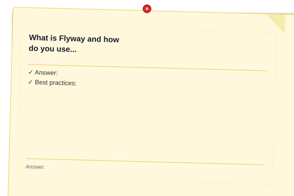
</a>


**Answer:** Flyway applies versioned SQL scripts to a database. It tracks applied scripts in a `flyway_schema_history` table and only runs new ones.

```sql
-- V1__create_users_table.sql
CREATE TABLE users (
    id BIGSERIAL PRIMARY KEY,
    email VARCHAR(255) NOT NULL UNIQUE,
    password_hash VARCHAR(255) NOT NULL,
    created_at TIMESTAMP NOT NULL DEFAULT NOW()
);

-- V2__add_name_to_users.sql
ALTER TABLE users
    ADD COLUMN first_name VARCHAR(100),
    ADD COLUMN last_name VARCHAR(100);
```

```yaml
spring:
  flyway:
    enabled: true
    locations: classpath:db/migration
    baseline-on-migrate: true
```

**Best practices:** Never modify applied migrations, always create new ones. Keep migrations backward-compatible for two versions.

---

### Q19: Flyway vs Liquibase?

<a href="../../assets/images/diagrams/java/63-interview-tools/flyway-vs-liquibase-handwritten.svg" target="_blank" rel="noopener">
  
</a>
<a href="../../assets/images/diagrams/java/63-interview-tools/flyway-vs-liquibase-diagram.svg" target="_blank" rel="noopener">
  
</a>
<a href="../../assets/images/diagrams/java/63-interview-tools/flyway-vs-liquibase-sticky.svg" target="_blank" rel="noopener">
  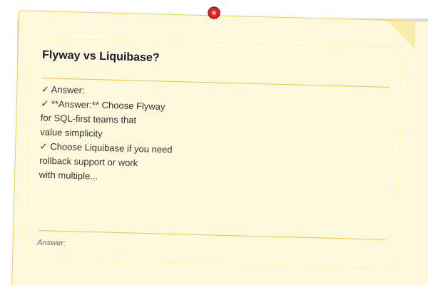
</a>


**Answer:**

| Aspect | Flyway | Liquibase |
|--------|--------|-----------|
| Format | SQL files | XML, YAML, JSON, SQL |
| Learning curve | Low — just write SQL | Medium — must learn changelog syntax |
| Rollback | Paid version or manual scripts | Built-in rollback support |
| Idempotent re-runs | No (checksum mismatch) | Supported with `runAlways` |
| Complexity | Simple, straightforward | More features, more complex |
| Git-friendly | Very (plain SQL) | XML/YAML diff less clean |

Choose Flyway for SQL-first teams that value simplicity. Choose Liquibase if you need rollback support or work with multiple database types.

---

### Q20: How do you ensure database migrations are safe in production?

<a href="../../assets/images/diagrams/java/63-interview-tools/how-do-you-ensure-database-migrations-are-safe-in-production-handwritten.svg" target="_blank" rel="noopener">
  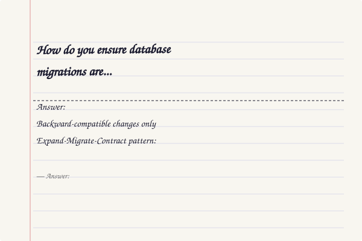
</a>
<a href="../../assets/images/diagrams/java/63-interview-tools/how-do-you-ensure-database-migrations-are-safe-in-production-diagram.svg" target="_blank" rel="noopener">
  
</a>
<a href="../../assets/images/diagrams/java/63-interview-tools/how-do-you-ensure-database-migrations-are-safe-in-production-sticky.svg" target="_blank" rel="noopener">
  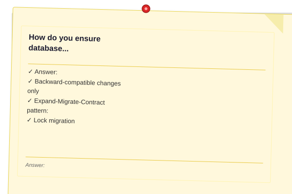
</a>


**Answer:**

1. **Backward-compatible changes only** — add columns with `DEFAULT NULL`, never rename or drop in one deploy
2. **Expand-Migrate-Contract pattern:** Add column → Migrate data → Drop old column (across 3 deploys)
3. **Lock migration** — Spring Boot + Flyway acquires a lock automatically
4. **Test against production-size data** — timing matters (1ms local vs 10min on 50M rows)
5. **Never modify applied migrations** — creates checksum mismatch; always create new migration
6. **Validate in CI** — `mvn flyway:validate`

---

### Q21: What is the Twelve-Factor App methodology?

<a href="../../assets/images/diagrams/java/63-interview-tools/what-is-the-twelve-factor-app-methodology-handwritten.svg" target="_blank" rel="noopener">
  
</a>
<a href="../../assets/images/diagrams/java/63-interview-tools/what-is-the-twelve-factor-app-methodology-diagram.svg" target="_blank" rel="noopener">
  
</a>
<a href="../../assets/images/diagrams/java/63-interview-tools/what-is-the-twelve-factor-app-methodology-sticky.svg" target="_blank" rel="noopener">
  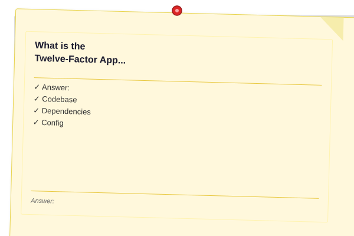
</a>


**Answer:** Twelve-Factor App is a methodology for building SaaS applications. The 12 factors:

1. **Codebase** — One codebase, many deploys
2. **Dependencies** — Explicitly declare and isolate (Maven/Gradle + Docker)
3. **Config** — Store in environment variables, not code
4. **Backing services** — Treat databases, queues, caches as attached resources
5. **Build, release, run** — Strictly separate stages
6. **Processes** — Stateless (no sticky sessions)
7. **Port binding** — Export services via port (embedded Tomcat)
8. **Concurrency** — Scale out via process model
9. **Disposability** — Fast startup and graceful shutdown
10. **Dev/prod parity** — Keep environments similar (Docker)
11. **Logs** — Treat as event streams (stdout)
12. **Admin processes** — Run as one-off tasks (migrations)

---

### Q22: How do you implement graceful shutdown in Spring Boot?

<a href="../../assets/images/diagrams/java/63-interview-tools/how-do-you-implement-graceful-shutdown-in-spring-boot-handwritten.svg" target="_blank" rel="noopener">
  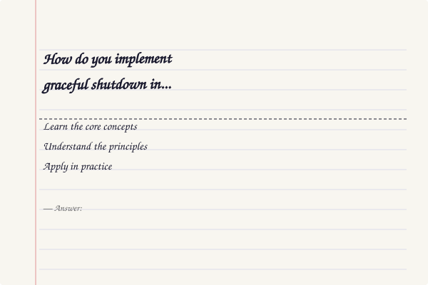
</a>
<a href="../../assets/images/diagrams/java/63-interview-tools/how-do-you-implement-graceful-shutdown-in-spring-boot-diagram.svg" target="_blank" rel="noopener">
  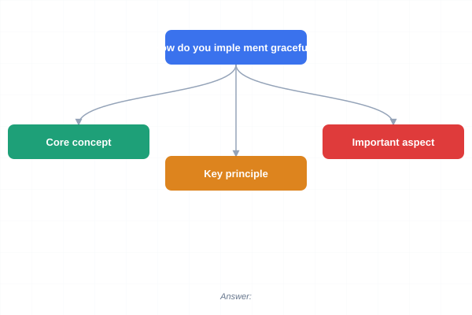
</a>
<a href="../../assets/images/diagrams/java/63-interview-tools/how-do-you-implement-graceful-shutdown-in-spring-boot-sticky.svg" target="_blank" rel="noopener">
  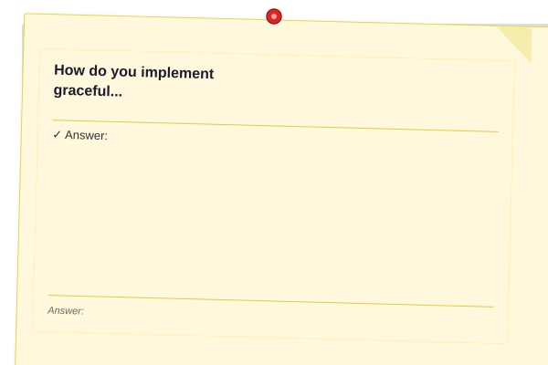
</a>


**Answer:**

```yaml
server:
  shutdown: graceful
spring:
  lifecycle:
    timeout-per-shutdown-phase: 30s
```

When SIGTERM is received: stop accepting new requests, wait for active requests to complete (up to 30s), then close the ApplicationContext and exit.

For Kubernetes, add a preStop hook to give the load balancer time to remove the pod:

```yaml
lifecycle:
  preStop:
    exec:
      command: ["sleep", "5"]
```

---

### Q23: What is SLF4J and why is it the standard logging facade for Java?

<a href="../../assets/images/diagrams/java/63-interview-tools/what-is-slf4j-and-why-is-it-the-standard-logging-facade-for-java-handwritten.svg" target="_blank" rel="noopener">
  
</a>
<a href="../../assets/images/diagrams/java/63-interview-tools/what-is-slf4j-and-why-is-it-the-standard-logging-facade-for-java-diagram.svg" target="_blank" rel="noopener">
  
</a>
<a href="../../assets/images/diagrams/java/63-interview-tools/what-is-slf4j-and-why-is-it-the-standard-logging-facade-for-java-sticky.svg" target="_blank" rel="noopener">
  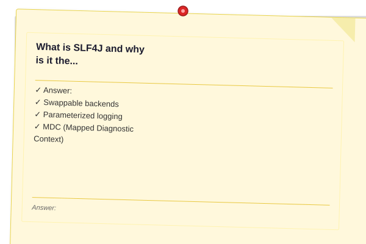
</a>


**Answer:** SLF4J (Simple Logging Facade for Java) decouples application code from the logging implementation. Your code logs via SLF4J API, and at deployment time you choose the backend (Logback, Log4j2, java.util.logging).

Benefits:
- **Swappable backends** — change logging library without touching application code
- **Parameterized logging** — avoids string concatenation: `log.debug("Order {} for user {}", orderId, userId)`
- **MDC (Mapped Diagnostic Context)** — thread-local map for correlation IDs
- **Marker support** — filter or route log events programmatically

---

### Q24: How do you troubleshoot performance issues in production?

<a href="../../assets/images/diagrams/java/63-interview-tools/how-do-you-troubleshoot-performance-issues-in-production-handwritten.svg" target="_blank" rel="noopener">
  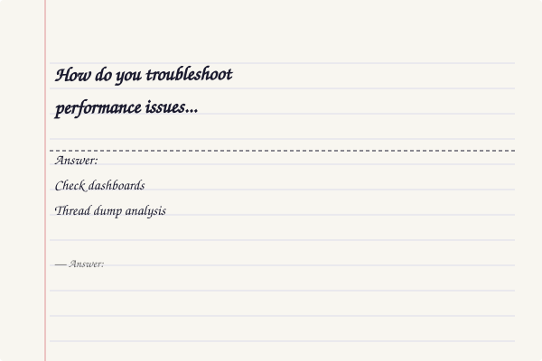
</a>
<a href="../../assets/images/diagrams/java/63-interview-tools/how-do-you-troubleshoot-performance-issues-in-production-diagram.svg" target="_blank" rel="noopener">
  
</a>
<a href="../../assets/images/diagrams/java/63-interview-tools/how-do-you-troubleshoot-performance-issues-in-production-sticky.svg" target="_blank" rel="noopener">
  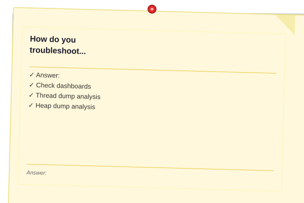
</a>


**Answer:** Use a systematic top-down approach:

1. **Check dashboards** — CPU, memory, latency, error rate, GC activity
2. **Thread dump analysis** (high CPU, thread contention):
   ```
   jstack <pid> > threaddump.txt
   ```
   Look for RUNNABLE threads in unexpected places or BLOCKED threads.
3. **Heap dump analysis** (memory leaks, high GC):
   ```
   -XX:+HeapDumpOnOutOfMemoryError
   jmap -dump:live,format=b,file=heapdump.hprof <pid>
   ```
   Use Eclipse MAT or VisualVM to analyze.
4. **Common issues:**
   - High CPU + RUNNABLE threads → infinite loop or tight polling
   - GC > 20% CPU → too many object allocations
   - OOM → memory leak or too small heap
   - High p99 latency → GC pauses or slow external API calls
   - Connection pool exhaustion → slow queries or connection leaks

---

### Q25: Performance vs load vs stress testing?

<a href="../../assets/images/diagrams/java/63-interview-tools/performance-vs-load-vs-stress-testing-handwritten.svg" target="_blank" rel="noopener">
  
</a>
<a href="../../assets/images/diagrams/java/63-interview-tools/performance-vs-load-vs-stress-testing-diagram.svg" target="_blank" rel="noopener">
  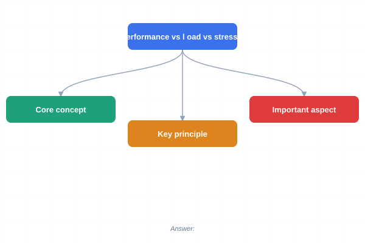
</a>
<a href="../../assets/images/diagrams/java/63-interview-tools/performance-vs-load-vs-stress-testing-sticky.svg" target="_blank" rel="noopener">
  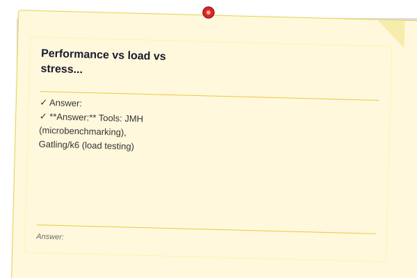
</a>


**Answer:**

| Type | Purpose |
|------|---------|
| Performance | Measure response time and throughput under normal conditions |
| Load | Verify system behavior under expected load |
| Stress | Find the breaking point — when does it fail? |
| Endurance | Stability over extended periods (detect memory leaks) |
| Spike | Behavior with sudden traffic surges |
| Scalability | How adding resources improves performance |

Tools: JMH (microbenchmarking), Gatling/k6 (load testing)

---

### Q26: How do you handle secrets management?

<a href="../../assets/images/diagrams/java/63-interview-tools/how-do-you-handle-secrets-management-handwritten.svg" target="_blank" rel="noopener">
  
</a>
<a href="../../assets/images/diagrams/java/63-interview-tools/how-do-you-handle-secrets-management-diagram.svg" target="_blank" rel="noopener">
  
</a>
<a href="../../assets/images/diagrams/java/63-interview-tools/how-do-you-handle-secrets-management-sticky.svg" target="_blank" rel="noopener">
  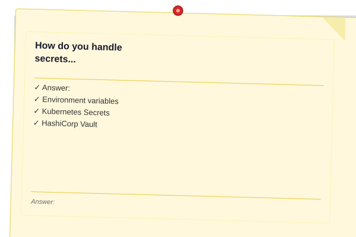
</a>


**Answer:** Never hardcode secrets in source code or configuration files.

1. **Environment variables** — basic, not suitable for production
2. **Kubernetes Secrets** — mounted as environment variables or files
3. **HashiCorp Vault** — dynamic secrets, rotation, audit logging
4. **AWS Secrets Manager / GCP Secret Manager** — cloud-native
5. **External Secrets Operator** — syncs secrets from providers into K8s Secrets

Best practices: rotate regularly, audit access, least privilege, never log secrets.

---

### Q27: What is GitOps?

<a href="../../assets/images/diagrams/java/63-interview-tools/what-is-gitops-handwritten.svg" target="_blank" rel="noopener">
  
</a>
<a href="../../assets/images/diagrams/java/63-interview-tools/what-is-gitops-diagram.svg" target="_blank" rel="noopener">
  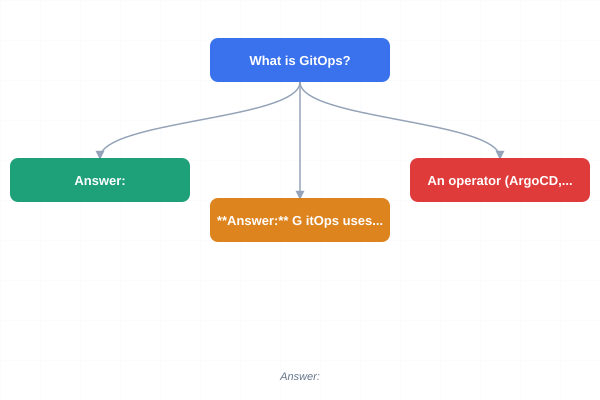
</a>
<a href="../../assets/images/diagrams/java/63-interview-tools/what-is-gitops-sticky.svg" target="_blank" rel="noopener">
  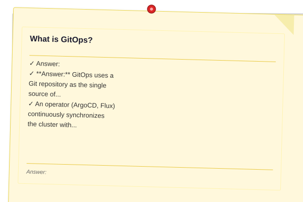
</a>


**Answer:** GitOps uses a Git repository as the single source of truth for cluster state. An operator (ArgoCD, Flux) continuously synchronizes the cluster with what's defined in Git.

Benefits: audit trail (every change is a commit), easy rollback (`git revert`), self-healing (operator fixes configuration drift), pull-based deployment.

```yaml
apiVersion: argoproj.io/v1alpha1
kind: Application
metadata:
  name: order-service
spec:
  destination:
    namespace: production
    server: https://kubernetes.default.svc
  source:
    repoURL: https://github.com/company/k8s-config
    targetRevision: main
    path: services/order-service
  syncPolicy:
    automated:
      prune: true
      selfHeal: true
```

---

### Q28: Helm vs Kustomize?

<a href="../../assets/images/diagrams/java/63-interview-tools/helm-vs-kustomize-handwritten.svg" target="_blank" rel="noopener">
  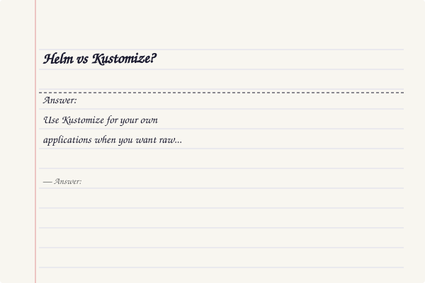
</a>
<a href="../../assets/images/diagrams/java/63-interview-tools/helm-vs-kustomize-diagram.svg" target="_blank" rel="noopener">
  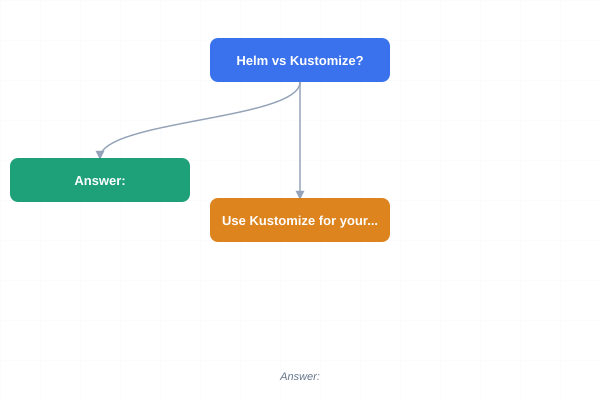
</a>
<a href="../../assets/images/diagrams/java/63-interview-tools/helm-vs-kustomize-sticky.svg" target="_blank" rel="noopener">
  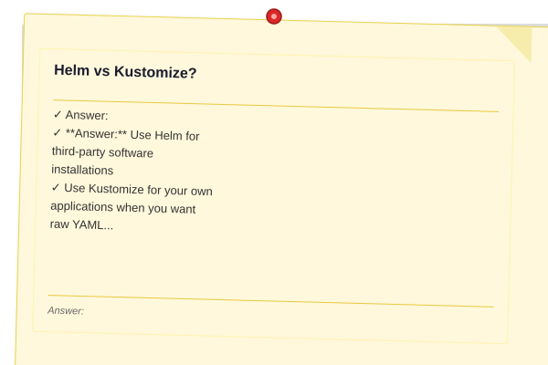
</a>


**Answer:**

| Aspect | Helm | Kustomize |
|--------|------|-----------|
| Type | Package manager for Kubernetes | Native YAML customization |
| Templating | Go templates | YAML patches/overlays |
| Learning curve | Steeper | Gentler (pure YAML) |
| Sharing | Helm Hub/ArtifactHub | Git-based |
| Built-in? | No (separate CLI) | Yes (`kubectl -k`) |

Use Helm for third-party software installations. Use Kustomize for your own applications when you want raw YAML without template syntax.

---

### Q29: What is a service mesh (Istio vs Linkerd)?

<a href="../../assets/images/diagrams/java/63-interview-tools/what-is-a-service-mesh-istio-vs-linkerd-handwritten.svg" target="_blank" rel="noopener">
  
</a>
<a href="../../assets/images/diagrams/java/63-interview-tools/what-is-a-service-mesh-istio-vs-linkerd-diagram.svg" target="_blank" rel="noopener">
  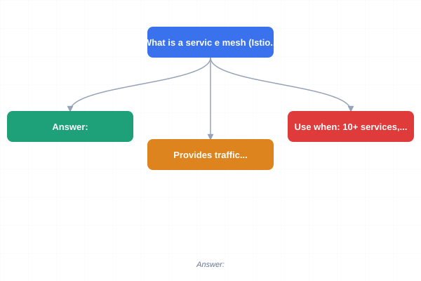
</a>
<a href="../../assets/images/diagrams/java/63-interview-tools/what-is-a-service-mesh-istio-vs-linkerd-sticky.svg" target="_blank" rel="noopener">
  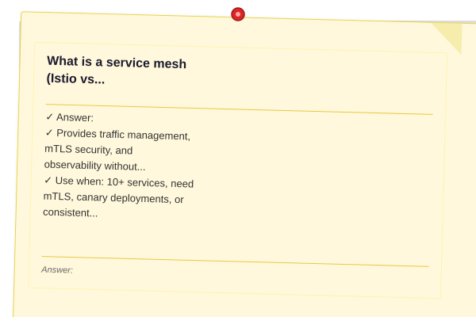
</a>


**Answer:** A service mesh handles service-to-service communication via sidecar proxies. Provides traffic management, mTLS security, and observability without modifying application code.

| Aspect | Istio | Linkerd |
|--------|-------|---------|
| Proxy | Envoy (C++) | Linkerd-proxy (Rust) |
| Resource usage | ~100MB per sidecar | ~10MB per sidecar |
| Features | Very rich | Focused on essentials |
| Complexity | High | Simpler |
| Latency overhead | ~2-5ms | ~1ms |

Use when: 10+ services, need mTLS, canary deployments, or consistent observability. Don't use for small systems or when performance is ultra-critical.

---

### Q30: What are Docker volume types?

<a href="../../assets/images/diagrams/java/63-interview-tools/what-are-docker-volume-types-handwritten.svg" target="_blank" rel="noopener">
  
</a>
<a href="../../assets/images/diagrams/java/63-interview-tools/what-are-docker-volume-types-diagram.svg" target="_blank" rel="noopener">
  
</a>
<a href="../../assets/images/diagrams/java/63-interview-tools/what-are-docker-volume-types-sticky.svg" target="_blank" rel="noopener">
  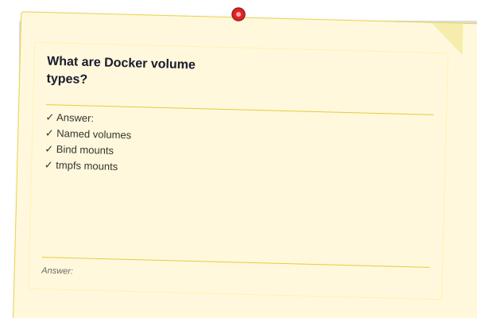
</a>


**Answer:**
1. **Named volumes** — Docker-managed, persisted in `/var/lib/docker/volumes/`. Most portable.
2. **Bind mounts** — host directory mapped into container. Useful for development (hot-reload).
3. **tmpfs mounts** — stored in memory only. Suitable for sensitive temporary data.

Use named volumes for databases, bind mounts for development, tmpfs for secrets.

---

### Q31: How do Docker containers communicate?

<a href="../../assets/images/diagrams/java/63-interview-tools/how-do-docker-containers-communicate-handwritten.svg" target="_blank" rel="noopener">
  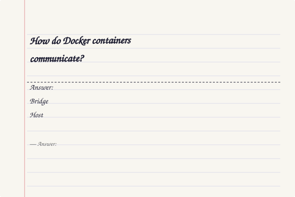
</a>
<a href="../../assets/images/diagrams/java/63-interview-tools/how-do-docker-containers-communicate-diagram.svg" target="_blank" rel="noopener">
  
</a>
<a href="../../assets/images/diagrams/java/63-interview-tools/how-do-docker-containers-communicate-sticky.svg" target="_blank" rel="noopener">
  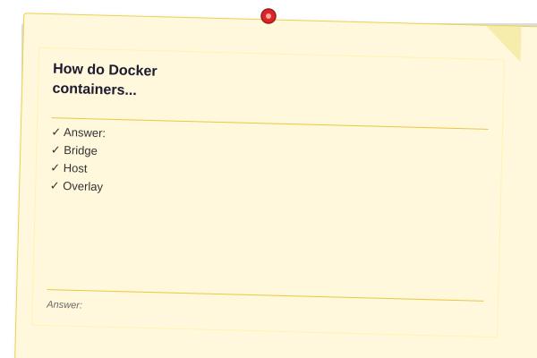
</a>


**Answer:** Through Docker networks:
- **Bridge** (default) — private internal network with DNS-based service discovery
- **Host** — container shares host network stack (no isolation, better performance)
- **Overlay** — multi-host networking (Docker Swarm, Kubernetes)

In Docker Compose, services reach each other by service name (`db:5432`, `redis:6379`).

---

### Q32: What is a container registry?

<a href="../../assets/images/diagrams/java/63-interview-tools/what-is-a-container-registry-handwritten.svg" target="_blank" rel="noopener">
  
</a>
<a href="../../assets/images/diagrams/java/63-interview-tools/what-is-a-container-registry-diagram.svg" target="_blank" rel="noopener">
  
</a>
<a href="../../assets/images/diagrams/java/63-interview-tools/what-is-a-container-registry-sticky.svg" target="_blank" rel="noopener">
  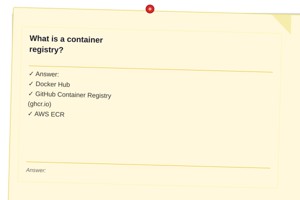
</a>


**Answer:** Stores and distributes Docker images. Common options:
- **Docker Hub** — public, rate-limited for anonymous pulls
- **GitHub Container Registry (ghcr.io)** — integrated with GitHub Actions
- **AWS ECR** — IAM integration, VPC endpoints
- **Azure Container Registry (ACR)** — geo-replication
- **Harbor** — open-source, vulnerability scanning, replication

---

### Q33: Readiness probe vs liveness probe vs startup probe?

<a href="../../assets/images/diagrams/java/63-interview-tools/readiness-probe-vs-liveness-probe-vs-startup-probe-handwritten.svg" target="_blank" rel="noopener">
  
</a>
<a href="../../assets/images/diagrams/java/63-interview-tools/readiness-probe-vs-liveness-probe-vs-startup-probe-diagram.svg" target="_blank" rel="noopener">
  
</a>
<a href="../../assets/images/diagrams/java/63-interview-tools/readiness-probe-vs-liveness-probe-vs-startup-probe-sticky.svg" target="_blank" rel="noopener">
  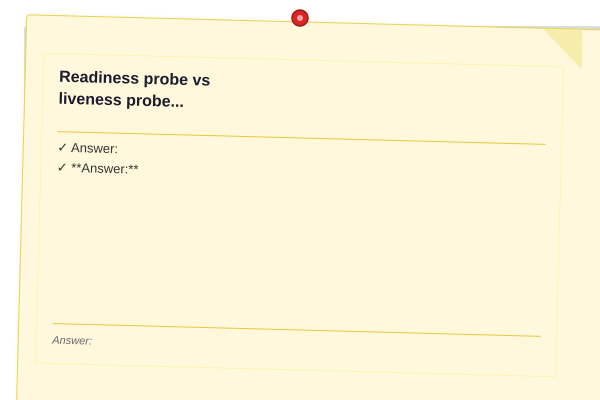
</a>


**Answer:**

| Probe | Purpose | Failure action |
|-------|---------|----------------|
| Liveness | Is the app alive? | Restart container |
| Readiness | Can the app serve traffic? | Remove from Service endpoints |
| Startup | Has the app started? | Delay liveness checks |

---

### Q34: How do you use ConfigMaps with Spring Boot?

<a href="../../assets/images/diagrams/java/63-interview-tools/how-do-you-use-configmaps-with-spring-boot-handwritten.svg" target="_blank" rel="noopener">
  
</a>
<a href="../../assets/images/diagrams/java/63-interview-tools/how-do-you-use-configmaps-with-spring-boot-diagram.svg" target="_blank" rel="noopener">
  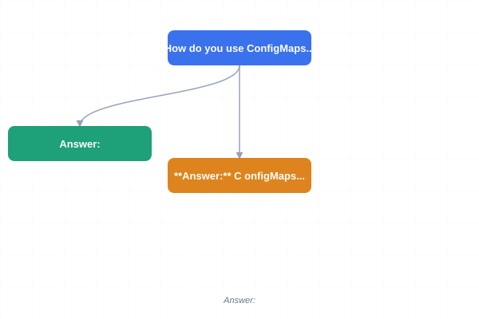
</a>
<a href="../../assets/images/diagrams/java/63-interview-tools/how-do-you-use-configmaps-with-spring-boot-sticky.svg" target="_blank" rel="noopener">
  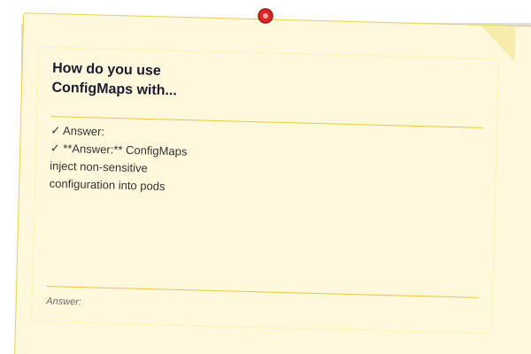
</a>


**Answer:** ConfigMaps inject non-sensitive configuration into pods. Mount as environment variables:

```yaml
envFrom:
  - configMapRef:
      name: app-config
```

Or as files:

```yaml
volumes:
  - name: config
    configMap:
      name: app-config
...
volumeMounts:
  - name: config
    mountPath: /workspace/config
    readOnly: true
```

For Spring Cloud Kubernetes:

```yaml
spring:
  cloud:
    kubernetes:
      config:
        enabled: true
        sources:
          - namespace: production
            name: app-config
      reload:
        enabled: true
        mode: event
```

---

### Q35: What is a Kubernetes Ingress?

<a href="../../assets/images/diagrams/java/63-interview-tools/what-is-a-kubernetes-ingress-handwritten.svg" target="_blank" rel="noopener">
  
</a>
<a href="../../assets/images/diagrams/java/63-interview-tools/what-is-a-kubernetes-ingress-diagram.svg" target="_blank" rel="noopener">
  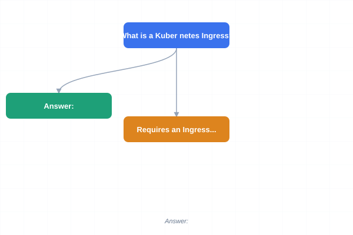
</a>
<a href="../../assets/images/diagrams/java/63-interview-tools/what-is-a-kubernetes-ingress-sticky.svg" target="_blank" rel="noopener">
  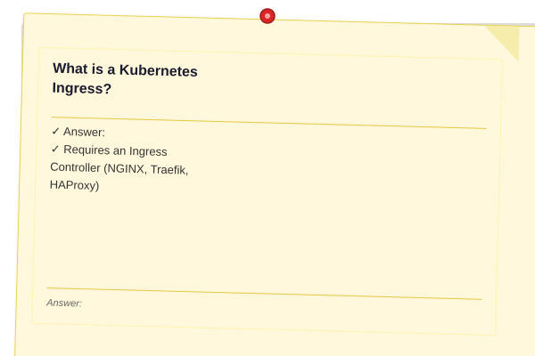
</a>


**Answer:** Ingress exposes HTTP/S routes from outside the cluster to internal Services. Requires an Ingress Controller (NGINX, Traefik, HAProxy).

```yaml
apiVersion: networking.k8s.io/v1
kind: Ingress
metadata:
  name: my-app-ingress
spec:
  ingressClassName: nginx
  rules:
  - host: api.example.com
    http:
      paths:
      - path: /orders
        pathType: Prefix
        backend:
          service:
            name: order-service
            port:
              number: 80
```

Provides path-based routing, host-based routing, TLS termination, and controller-specific annotations.

---

### Q36: Kubernetes Service vs Ingress?

<a href="../../assets/images/diagrams/java/63-interview-tools/kubernetes-service-vs-ingress-handwritten.svg" target="_blank" rel="noopener">
  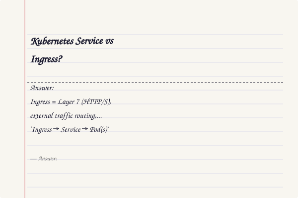
</a>
<a href="../../assets/images/diagrams/java/63-interview-tools/kubernetes-service-vs-ingress-diagram.svg" target="_blank" rel="noopener">
  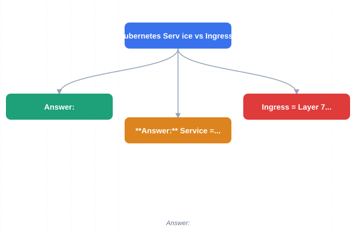
</a>
<a href="../../assets/images/diagrams/java/63-interview-tools/kubernetes-service-vs-ingress-sticky.svg" target="_blank" rel="noopener">
  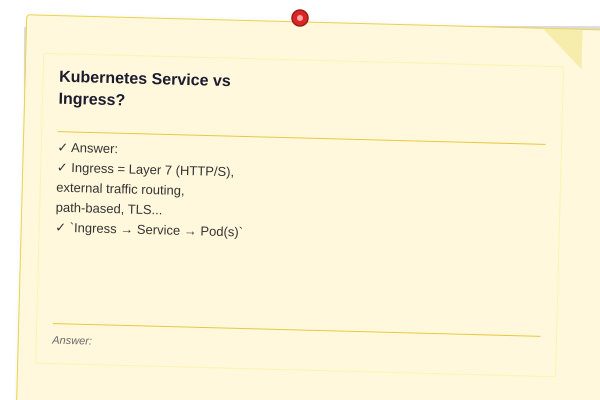
</a>


**Answer:** Service = Layer 4 (TCP/UDP), stable internal endpoint for pods, simple load balancing. Ingress = Layer 7 (HTTP/S), external traffic routing, path-based, TLS termination, rate limiting.

Flow: `Ingress → Service → Pod(s)`

---

### Q37: Kubernetes resource model (Requests vs Limits)?

<a href="../../assets/images/diagrams/java/63-interview-tools/kubernetes-resource-model-requests-vs-limits-handwritten.svg" target="_blank" rel="noopener">
  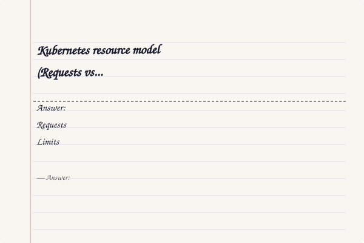
</a>
<a href="../../assets/images/diagrams/java/63-interview-tools/kubernetes-resource-model-requests-vs-limits-diagram.svg" target="_blank" rel="noopener">
  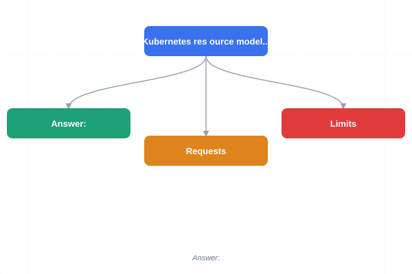
</a>
<a href="../../assets/images/diagrams/java/63-interview-tools/kubernetes-resource-model-requests-vs-limits-sticky.svg" target="_blank" rel="noopener">
  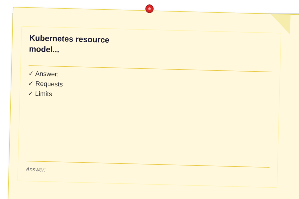
</a>


**Answer:**
- **Requests** — minimum guaranteed resources. Used for scheduling.
- **Limits** — maximum allowed resources. CPU throttles, memory OOMKills.

```yaml
resources:
  requests:
    memory: "256Mi"
    cpu: "250m"
  limits:
    memory: "512Mi"
    cpu: "500m"
```

For Java: `-XX:+UseContainerSupport -XX:MaxRAMPercentage=75.0` so JVM respects container limits.

QoS classes: Guaranteed (request = limit), Burstable (request &lt; limit), BestEffort (no requests/limits).

---

### Q38: How do you achieve zero-downtime deployments in Kubernetes?

<a href="../../assets/images/diagrams/java/63-interview-tools/how-do-you-achieve-zero-downtime-deployments-in-kubernetes-handwritten.svg" target="_blank" rel="noopener">
  
</a>
<a href="../../assets/images/diagrams/java/63-interview-tools/how-do-you-achieve-zero-downtime-deployments-in-kubernetes-diagram.svg" target="_blank" rel="noopener">
  
</a>
<a href="../../assets/images/diagrams/java/63-interview-tools/how-do-you-achieve-zero-downtime-deployments-in-kubernetes-sticky.svg" target="_blank" rel="noopener">
  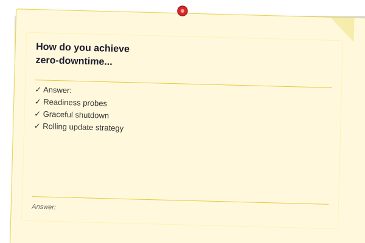
</a>


**Answer:** Combine multiple features:

1. **Readiness probes** — only route traffic to healthy pods
2. **Graceful shutdown** — `server.shutdown: graceful` with 30s timeout
3. **Rolling update strategy** — `maxSurge: 1, maxUnavailable: 0`
4. **preStop hook** — `sleep 5` to let endpoints update before shutdown
5. **PodDisruptionBudget** — `minAvailable: 2` prevents voluntary disruptions
6. **Anti-affinity** — spread pods across nodes

---

### Q39: Reverse proxy vs forward proxy?

<a href="../../assets/images/diagrams/java/63-interview-tools/reverse-proxy-vs-forward-proxy-handwritten.svg" target="_blank" rel="noopener">
  
</a>
<a href="../../assets/images/diagrams/java/63-interview-tools/reverse-proxy-vs-forward-proxy-diagram.svg" target="_blank" rel="noopener">
  
</a>
<a href="../../assets/images/diagrams/java/63-interview-tools/reverse-proxy-vs-forward-proxy-sticky.svg" target="_blank" rel="noopener">
  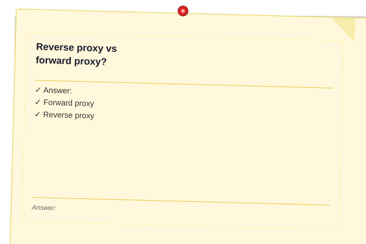
</a>


**Answer:**
- **Forward proxy** — sits between clients and the internet. Hides client IP, used for content filtering and access control. (Corporate proxy, Squid)
- **Reverse proxy** — sits in front of servers. Hides server topology, provides load balancing, SSL termination, caching. (NGINX, Traefik, HAProxy)

---

### Q40: What is the role of a message broker in microservices?

<a href="../../assets/images/diagrams/java/63-interview-tools/what-is-the-role-of-a-message-broker-in-microservices-handwritten.svg" target="_blank" rel="noopener">
  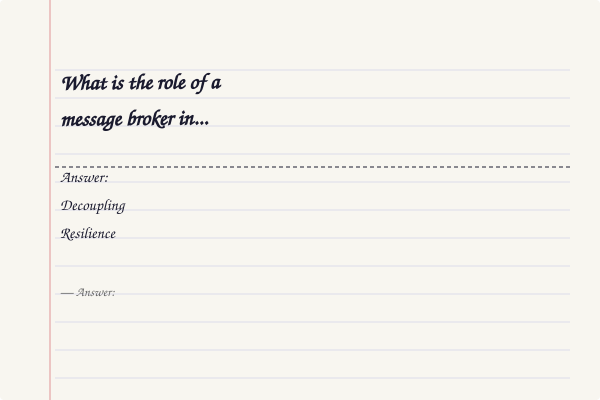
</a>
<a href="../../assets/images/diagrams/java/63-interview-tools/what-is-the-role-of-a-message-broker-in-microservices-diagram.svg" target="_blank" rel="noopener">
  
</a>
<a href="../../assets/images/diagrams/java/63-interview-tools/what-is-the-role-of-a-message-broker-in-microservices-sticky.svg" target="_blank" rel="noopener">
  
</a>


**Answer:** Enables asynchronous communication between services. Benefits:
- **Decoupling** — services don't know each other, only the message format
- **Resilience** — messages persist if consumer is down
- **Buffering** — handle traffic spikes without data loss
- **Fan-out** — one event triggers multiple actions

Common brokers: RabbitMQ (AMQP), Apache Kafka (event streaming, replayable), Amazon SQS/SNS (managed).

---

### Q41: Queue vs topic in messaging?

<a href="../../assets/images/diagrams/java/63-interview-tools/queue-vs-topic-in-messaging-handwritten.svg" target="_blank" rel="noopener">
  
</a>
<a href="../../assets/images/diagrams/java/63-interview-tools/queue-vs-topic-in-messaging-diagram.svg" target="_blank" rel="noopener">
  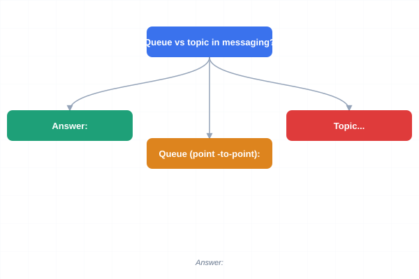
</a>
<a href="../../assets/images/diagrams/java/63-interview-tools/queue-vs-topic-in-messaging-sticky.svg" target="_blank" rel="noopener">
  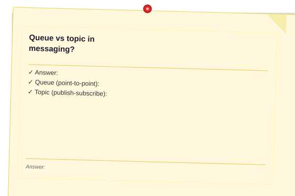
</a>


**Answer:**
- **Queue (point-to-point):** Each message consumed by exactly one consumer. Best for work distribution.
- **Topic (publish-subscribe):** Each message delivered to all subscribers. Best for event broadcasting.

Kafka combines both: consumer groups get every message (topic), partitions distribute within a group (queue).

---

### Q42: What is the Circuit Breaker pattern?

<a href="../../assets/images/diagrams/java/63-interview-tools/what-is-the-circuit-breaker-pattern-handwritten.svg" target="_blank" rel="noopener">
  
</a>
<a href="../../assets/images/diagrams/java/63-interview-tools/what-is-the-circuit-breaker-pattern-diagram.svg" target="_blank" rel="noopener">
  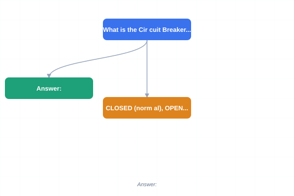
</a>
<a href="../../assets/images/diagrams/java/63-interview-tools/what-is-the-circuit-breaker-pattern-sticky.svg" target="_blank" rel="noopener">
  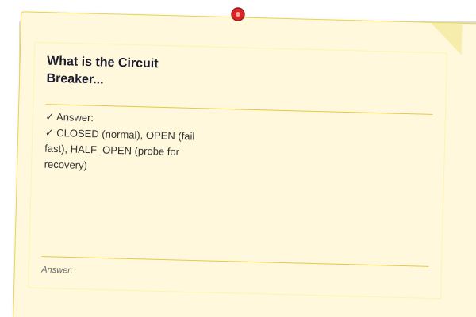
</a>


**Answer:** Prevents cascading failures by stopping calls to a failing service and failing fast. States: CLOSED (normal), OPEN (fail fast), HALF_OPEN (probe for recovery).

```yaml
resilience4j:
  circuitbreaker:
    configs:
      default:
        sliding-window-size: 10
        failure-rate-threshold: 50
        wait-duration-in-open-state: 10s
```

```java
@CircuitBreaker(name = "paymentService", fallbackMethod = "paymentFallback")
public PaymentResult processPayment(Order order) {
    return paymentClient.charge(order.total(), order.currency());
}

public PaymentResult paymentFallback(Order order, Throwable t) {
    return PaymentResult.failed("Payment service temporarily unavailable");
}
```

---

### Q43: Retry vs Circuit Breaker?

<a href="../../assets/images/diagrams/java/63-interview-tools/retry-vs-circuit-breaker-handwritten.svg" target="_blank" rel="noopener">
  
</a>
<a href="../../assets/images/diagrams/java/63-interview-tools/retry-vs-circuit-breaker-diagram.svg" target="_blank" rel="noopener">
  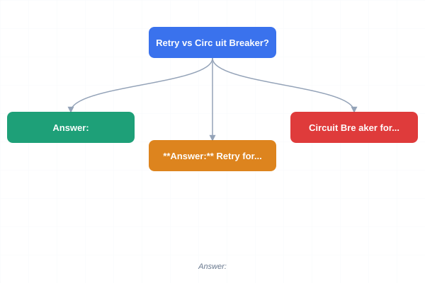
</a>
<a href="../../assets/images/diagrams/java/63-interview-tools/retry-vs-circuit-breaker-sticky.svg" target="_blank" rel="noopener">
  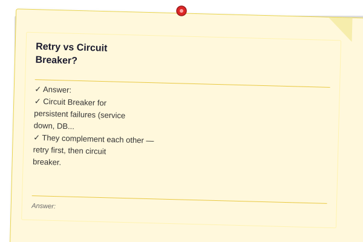
</a>


**Answer:** Retry for transient failures (network hiccup, connection timeout). Circuit Breaker for persistent failures (service down, DB disconnected). They complement each other — retry first, then circuit breaker.

---

### Q44: What is the Bulkhead pattern?

<a href="../../assets/images/diagrams/java/63-interview-tools/what-is-the-bulkhead-pattern-handwritten.svg" target="_blank" rel="noopener">
  
</a>
<a href="../../assets/images/diagrams/java/63-interview-tools/what-is-the-bulkhead-pattern-diagram.svg" target="_blank" rel="noopener">
  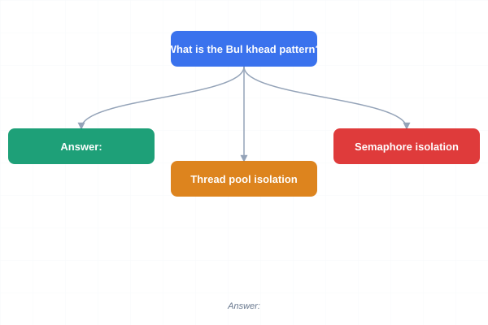
</a>
<a href="../../assets/images/diagrams/java/63-interview-tools/what-is-the-bulkhead-pattern-sticky.svg" target="_blank" rel="noopener">
  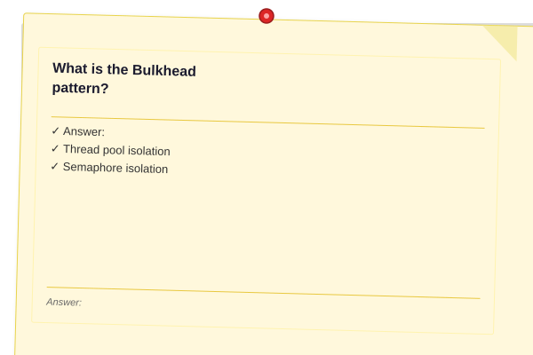
</a>


**Answer:** Isolates resources so a failure in one part doesn't take down others. Two types:
- **Thread pool isolation** — each service gets its own thread pool (max 10 threads for payment, max 20 for orders)
- **Semaphore isolation** — limit concurrent calls without separate thread pools

```java
@Bulkhead(name = "paymentBulkhead", type = Bulkhead.Type.THREADPOOL)
public PaymentResult processPayment(Order order) {
    return paymentClient.charge(order.total());
}
```

---

### Q45: How do you implement observability (logging, metrics, tracing)?

<a href="../../assets/images/diagrams/java/63-interview-tools/how-do-you-implement-observability-logging-metrics-tracing-handwritten.svg" target="_blank" rel="noopener">
  
</a>
<a href="../../assets/images/diagrams/java/63-interview-tools/how-do-you-implement-observability-logging-metrics-tracing-diagram.svg" target="_blank" rel="noopener">
  
</a>
<a href="../../assets/images/diagrams/java/63-interview-tools/how-do-you-implement-observability-logging-metrics-tracing-sticky.svg" target="_blank" rel="noopener">
  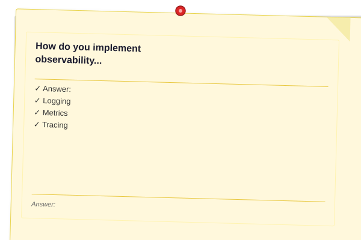
</a>


**Answer:** Three pillars:
1. **Logging** — structured JSON with correlation IDs. Centralized in Elasticsearch/Loki.
2. **Metrics** — Prometheus + Micrometer. Request rates, error rates, latency, JVM stats.
3. **Tracing** — Micrometer Tracing + OpenTelemetry + Jaeger/Tempo. Distributed traces across services.

Spring Boot 3.x setup:

```yaml
management:
  tracing:
    sampling:
      probability: 0.1
  endpoints:
    web:
      exposure:
        include: health,prometheus
  metrics:
    distribution:
      percentiles-histogram:
        http.server.requests: true
```

---

### Q46: What is Prometheus?

<a href="../../assets/images/diagrams/java/63-interview-tools/what-is-prometheus-handwritten.svg" target="_blank" rel="noopener">
  
</a>
<a href="../../assets/images/diagrams/java/63-interview-tools/what-is-prometheus-diagram.svg" target="_blank" rel="noopener">
  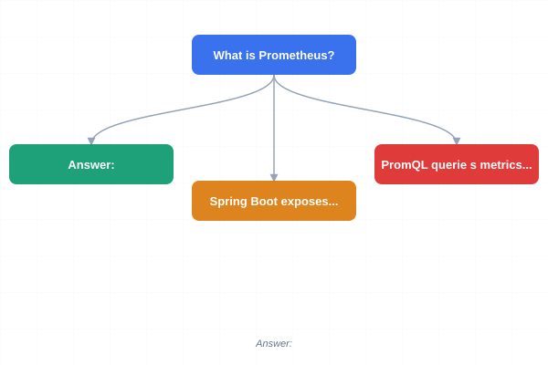
</a>
<a href="../../assets/images/diagrams/java/63-interview-tools/what-is-prometheus-sticky.svg" target="_blank" rel="noopener">
  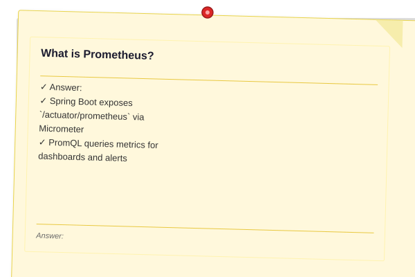
</a>


**Answer:** Prometheus is a time-series monitoring system that scrapes metrics from instrumented applications. Spring Boot exposes `/actuator/prometheus` via Micrometer. PromQL queries metrics for dashboards and alerts.

Workflow: `Spring Boot → /actuator/prometheus → Prometheus (scrape) → Grafana (visualize)`

---

### Q47: What is Grafana?

<a href="../../assets/images/diagrams/java/63-interview-tools/what-is-grafana-handwritten.svg" target="_blank" rel="noopener">
  
</a>
<a href="../../assets/images/diagrams/java/63-interview-tools/what-is-grafana-diagram.svg" target="_blank" rel="noopener">
  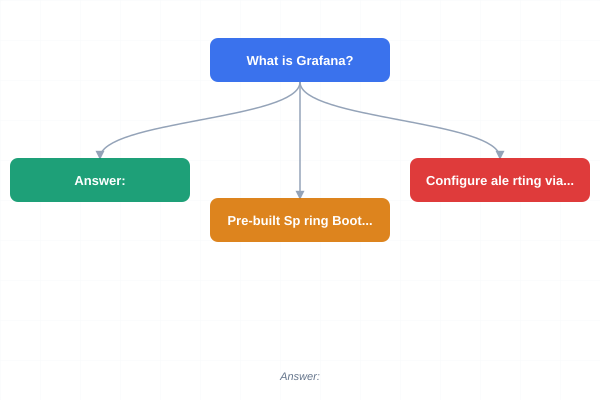
</a>
<a href="../../assets/images/diagrams/java/63-interview-tools/what-is-grafana-sticky.svg" target="_blank" rel="noopener">
  
</a>


**Answer:** Visualization platform connecting to data sources (Prometheus, Elasticsearch) for dashboards. Pre-built Spring Boot dashboards available (ID 10280 for JVM/Micrometer). Configure alerting via Slack, PagerDuty, or webhook.

---

### Q48: APM vs traditional monitoring?

<a href="../../assets/images/diagrams/java/63-interview-tools/apm-vs-traditional-monitoring-handwritten.svg" target="_blank" rel="noopener">
  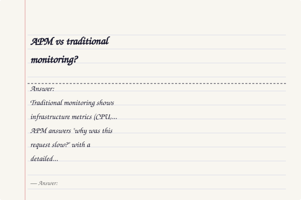
</a>
<a href="../../assets/images/diagrams/java/63-interview-tools/apm-vs-traditional-monitoring-diagram.svg" target="_blank" rel="noopener">
  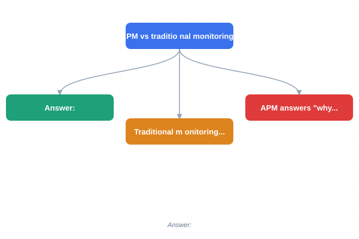
</a>
<a href="../../assets/images/diagrams/java/63-interview-tools/apm-vs-traditional-monitoring-sticky.svg" target="_blank" rel="noopener">
  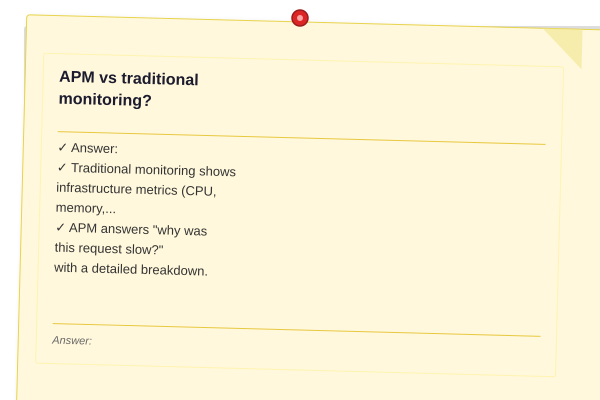
</a>


**Answer:** APM provides code-level visibility — method-level profiling, distributed traces, transaction breakdowns. Traditional monitoring shows infrastructure metrics (CPU, memory, disk). APM answers "why was this request slow?" with a detailed breakdown.

---

### Q49: Structured vs unstructured logging?

<a href="../../assets/images/diagrams/java/63-interview-tools/structured-vs-unstructured-logging-handwritten.svg" target="_blank" rel="noopener">
  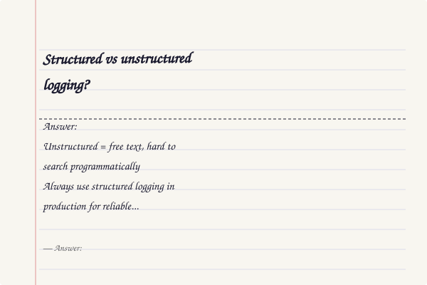
</a>
<a href="../../assets/images/diagrams/java/63-interview-tools/structured-vs-unstructured-logging-diagram.svg" target="_blank" rel="noopener">
  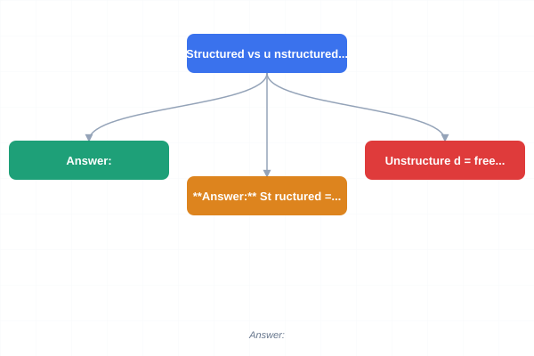
</a>
<a href="../../assets/images/diagrams/java/63-interview-tools/structured-vs-unstructured-logging-sticky.svg" target="_blank" rel="noopener">
  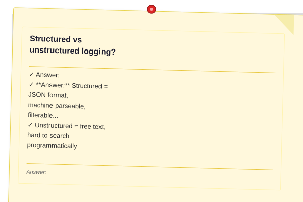
</a>


**Answer:** Structured = JSON format, machine-parseable, filterable by field. Unstructured = free text, hard to search programmatically. Always use structured logging in production for reliable analysis in Kibana/Grafana.

---

### Q50: Best practices for log levels?

<a href="../../assets/images/diagrams/java/63-interview-tools/best-practices-for-log-levels-handwritten.svg" target="_blank" rel="noopener">
  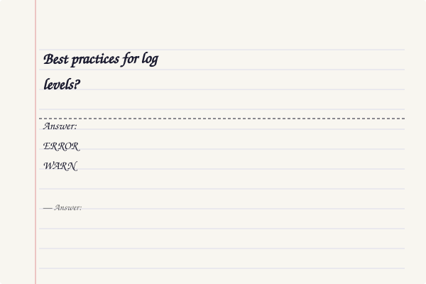
</a>
<a href="../../assets/images/diagrams/java/63-interview-tools/best-practices-for-log-levels-diagram.svg" target="_blank" rel="noopener">
  
</a>
<a href="../../assets/images/diagrams/java/63-interview-tools/best-practices-for-log-levels-sticky.svg" target="_blank" rel="noopener">
  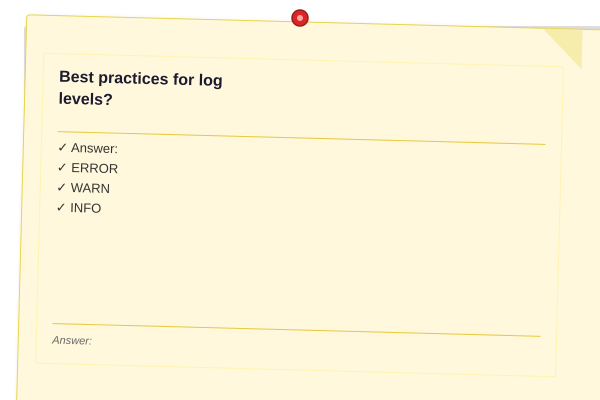
</a>


**Answer:**
- **ERROR** — needs immediate attention (data loss, service unreachable)
- **WARN** — unexpected but recovered gracefully (rate limited, used cache)
- **INFO** — important business events (order created, payment processed)
- **DEBUG** — detailed diagnostics (off in production normally)

Never log sensitive data. Include context (orderId, userId). Use dynamic level changes via Actuator without restart.

---

### Q51: How do you implement health checks for external dependencies?

<a href="../../assets/images/diagrams/java/63-interview-tools/how-do-you-implement-health-checks-for-external-dependencies-handwritten.svg" target="_blank" rel="noopener">
  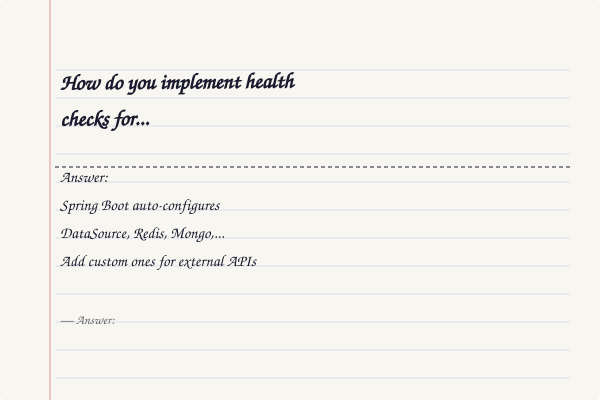
</a>
<a href="../../assets/images/diagrams/java/63-interview-tools/how-do-you-implement-health-checks-for-external-dependencies-diagram.svg" target="_blank" rel="noopener">
  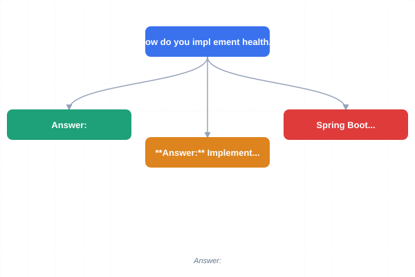
</a>
<a href="../../assets/images/diagrams/java/63-interview-tools/how-do-you-implement-health-checks-for-external-dependencies-sticky.svg" target="_blank" rel="noopener">
  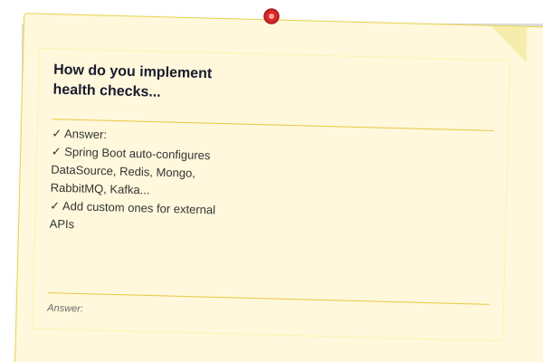
</a>


**Answer:** Implement `HealthIndicator` for each dependency. Spring Boot auto-configures DataSource, Redis, Mongo, RabbitMQ, Kafka health checks. Add custom ones for external APIs.

Group health by purpose — readiness checks include external dependencies, liveness checks should be minimal (just the app process).

---

### Q52: How do you manage database connection pools?

<a href="../../assets/images/diagrams/java/63-interview-tools/how-do-you-manage-database-connection-pools-handwritten.svg" target="_blank" rel="noopener">
  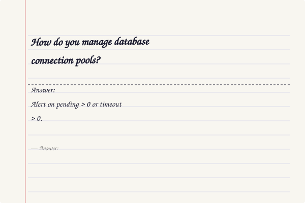
</a>
<a href="../../assets/images/diagrams/java/63-interview-tools/how-do-you-manage-database-connection-pools-diagram.svg" target="_blank" rel="noopener">
  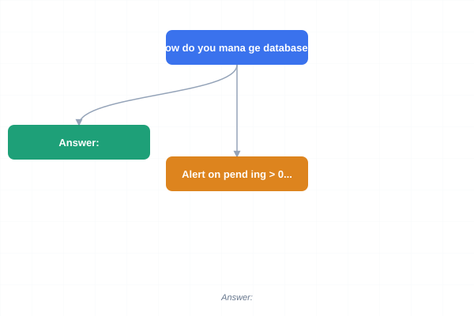
</a>
<a href="../../assets/images/diagrams/java/63-interview-tools/how-do-you-manage-database-connection-pools-sticky.svg" target="_blank" rel="noopener">
  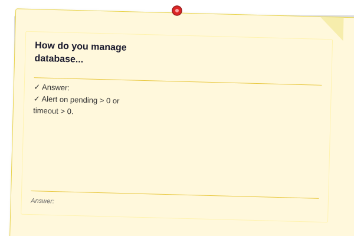
</a>


**Answer:** HikariCP (default in Spring Boot):

```yaml
spring:
  datasource:
    hikari:
      maximum-pool-size: 20
      minimum-idle: 5
      connection-timeout: 3000
      leak-detection-threshold: 60000
```

Monitor: `hikaricp_connections_active`, `hikaricp_connections_pending`, `hikaricp_connections_timeout_total`. Alert on pending > 0 or timeout > 0.

---

### Q53: Monorepo vs multi-repo for microservices?

<a href="../../assets/images/diagrams/java/63-interview-tools/monorepo-vs-multi-repo-for-microservices-handwritten.svg" target="_blank" rel="noopener">
  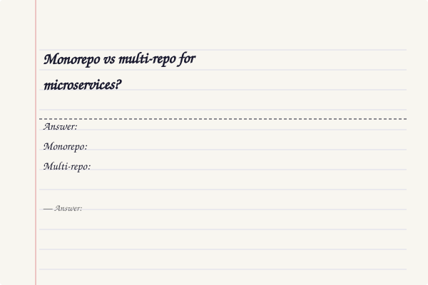
</a>
<a href="../../assets/images/diagrams/java/63-interview-tools/monorepo-vs-multi-repo-for-microservices-diagram.svg" target="_blank" rel="noopener">
  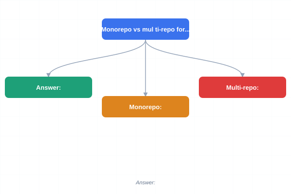
</a>
<a href="../../assets/images/diagrams/java/63-interview-tools/monorepo-vs-multi-repo-for-microservices-sticky.svg" target="_blank" rel="noopener">
  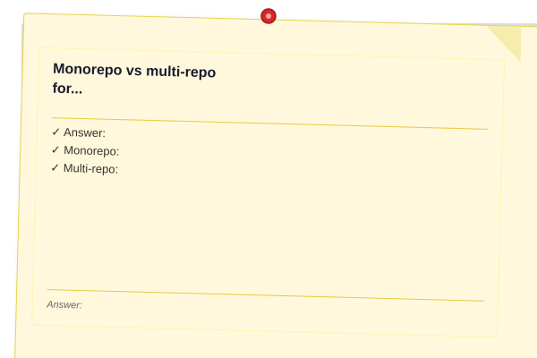
</a>


**Answer:**
- **Monorepo:** All services in one repo. Atomic cross-service changes, easier code sharing, but git scales poorly and CI needs test impact analysis.
- **Multi-repo:** Each service in its own repo. Clean ownership, independent deployments, but coordinated multi-repo changes are hard.

---

### Q54: Semantic versioning for microservices?

<a href="../../assets/images/diagrams/java/63-interview-tools/semantic-versioning-for-microservices-handwritten.svg" target="_blank" rel="noopener">
  
</a>
<a href="../../assets/images/diagrams/java/63-interview-tools/semantic-versioning-for-microservices-diagram.svg" target="_blank" rel="noopener">
  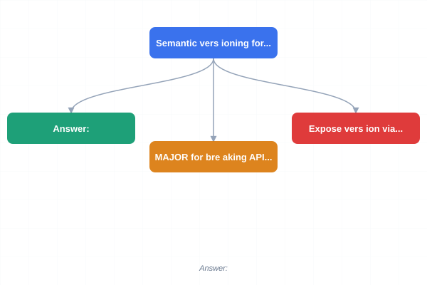
</a>
<a href="../../assets/images/diagrams/java/63-interview-tools/semantic-versioning-for-microservices-sticky.svg" target="_blank" rel="noopener">
  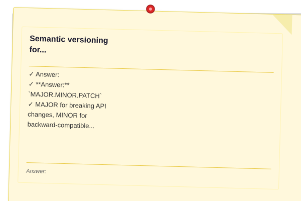
</a>


**Answer:** `MAJOR.MINOR.PATCH`. MAJOR for breaking API changes, MINOR for backward-compatible features, PATCH for bug fixes. Expose version via Actuator's `/actuator/info`. Use git commit SHA as Docker image tag for traceability.

---

### Q55: REST vs gRPC?

<a href="../../assets/images/diagrams/java/63-interview-tools/rest-vs-grpc-handwritten.svg" target="_blank" rel="noopener">
  
</a>
<a href="../../assets/images/diagrams/java/63-interview-tools/rest-vs-grpc-diagram.svg" target="_blank" rel="noopener">
  
</a>
<a href="../../assets/images/diagrams/java/63-interview-tools/rest-vs-grpc-sticky.svg" target="_blank" rel="noopener">
  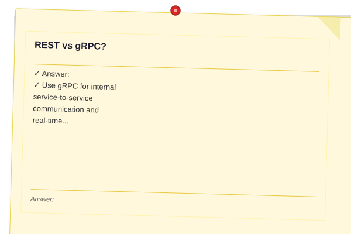
</a>


**Answer:**

| Aspect | REST | gRPC |
|--------|------|------|
| Protocol | HTTP/1.1 | HTTP/2 |
| Data format | JSON (text) | Protocol Buffers (binary) |
| Code generation | Optional | Mandatory |
| Streaming | Limited (chunked) | Bidirectional |
| Performance | Slower (text parsing) | Faster (binary, multiplexed) |
| Browser support | Native | Requires gRPC-web proxy |

Use REST for public APIs and browser clients. Use gRPC for internal service-to-service communication and real-time streaming.

---

### Q56: Database migrations across microservices?

<a href="../../assets/images/diagrams/java/63-interview-tools/database-migrations-across-microservices-handwritten.svg" target="_blank" rel="noopener">
  
</a>
<a href="../../assets/images/diagrams/java/63-interview-tools/database-migrations-across-microservices-diagram.svg" target="_blank" rel="noopener">
  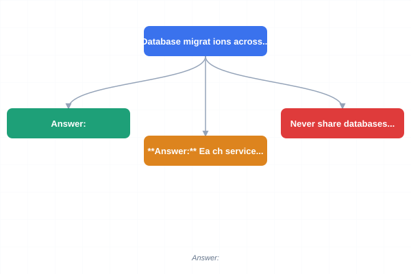
</a>
<a href="../../assets/images/diagrams/java/63-interview-tools/database-migrations-across-microservices-sticky.svg" target="_blank" rel="noopener">
  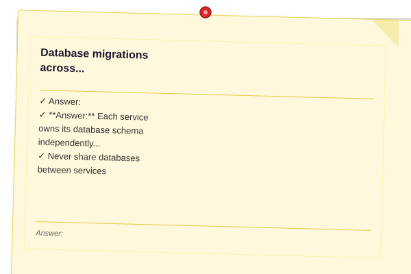
</a>


**Answer:** Each service owns its database schema independently (database-per-service pattern). Never share databases between services. Backward-compatible changes only. Use expand-migrate-contract pattern across multiple deploys.

---

### Q57: Deployment safety in Kubernetes?

<a href="../../assets/images/diagrams/java/63-interview-tools/deployment-safety-in-kubernetes-handwritten.svg" target="_blank" rel="noopener">
  
</a>
<a href="../../assets/images/diagrams/java/63-interview-tools/deployment-safety-in-kubernetes-diagram.svg" target="_blank" rel="noopener">
  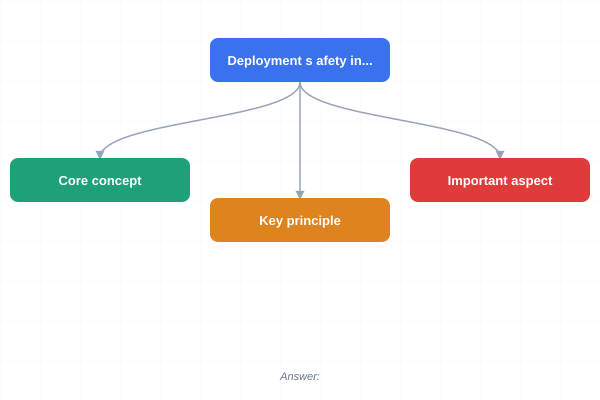
</a>
<a href="../../assets/images/diagrams/java/63-interview-tools/deployment-safety-in-kubernetes-sticky.svg" target="_blank" rel="noopener">
  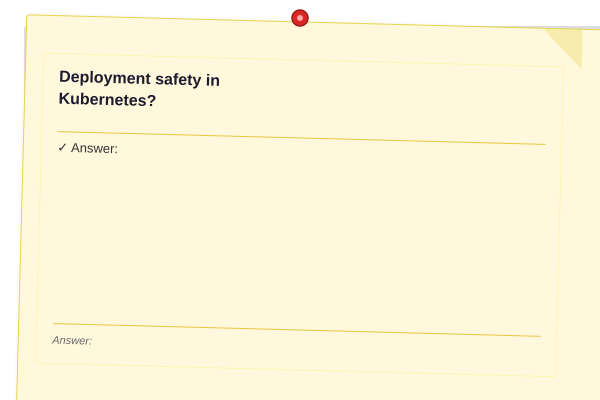
</a>


**Answer:** Combine: probes (liveness/readiness/startup) + rolling update strategy + PodDisruptionBudget + progressive delivery (Argo Rollouts with canary + metric analysis) + automated rollback triggers.

---

### Q58: Horizontal vs vertical scaling?

<a href="../../assets/images/diagrams/java/63-interview-tools/horizontal-vs-vertical-scaling-handwritten.svg" target="_blank" rel="noopener">
  
</a>
<a href="../../assets/images/diagrams/java/63-interview-tools/horizontal-vs-vertical-scaling-diagram.svg" target="_blank" rel="noopener">
  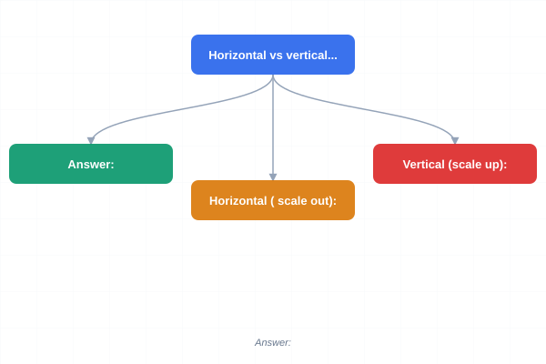
</a>
<a href="../../assets/images/diagrams/java/63-interview-tools/horizontal-vs-vertical-scaling-sticky.svg" target="_blank" rel="noopener">
  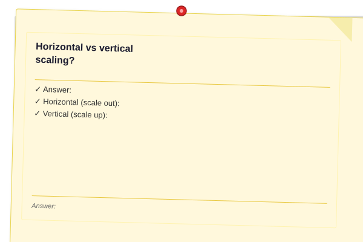
</a>


**Answer:**
- **Horizontal (scale out):** Add more instances. Near-infinite for stateless apps. Better resilience. Use HPA.
- **Vertical (scale up):** Add more resources. Limited by hardware. Easier for stateful apps.

For Java microservices: scale horizontally for stateless services, vertically for databases.

---

### Q59: Stress testing and capacity planning?

<a href="../../assets/images/diagrams/java/63-interview-tools/stress-testing-and-capacity-planning-handwritten.svg" target="_blank" rel="noopener">
  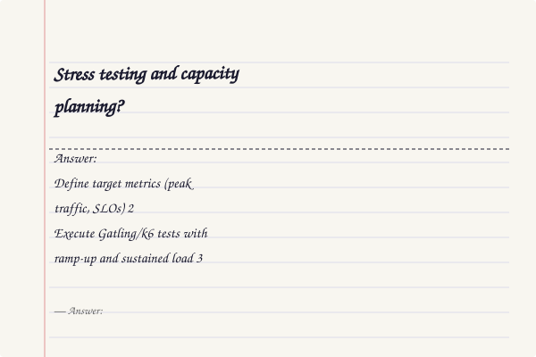
</a>
<a href="../../assets/images/diagrams/java/63-interview-tools/stress-testing-and-capacity-planning-diagram.svg" target="_blank" rel="noopener">
  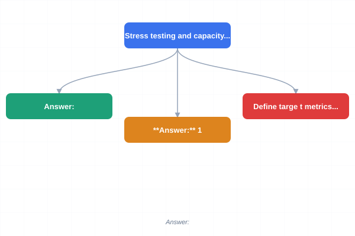
</a>
<a href="../../assets/images/diagrams/java/63-interview-tools/stress-testing-and-capacity-planning-sticky.svg" target="_blank" rel="noopener">
  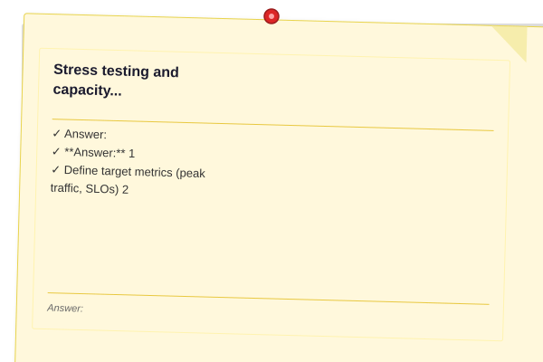
</a>


**Answer:**
1. Define target metrics (peak traffic, SLOs)
2. Execute Gatling/k6 tests with ramp-up and sustained load
3. Monitor all layers (app, DB, infrastructure)
4. Identify bottlenecks (N+1 queries, connection pools, CPU)
5. Calculate instances needed: `Instances = (Peak traffic / Capacity per instance) x Safety margin (2x)`

---

### Q60: What is a Kubernetes Operator?

<a href="../../assets/images/diagrams/java/63-interview-tools/what-is-a-kubernetes-operator-handwritten.svg" target="_blank" rel="noopener">
  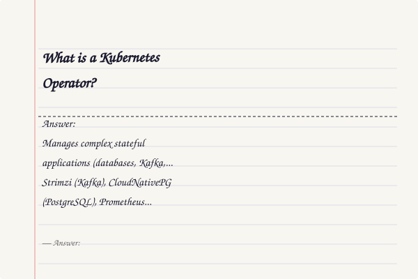
</a>
<a href="../../assets/images/diagrams/java/63-interview-tools/what-is-a-kubernetes-operator-diagram.svg" target="_blank" rel="noopener">
  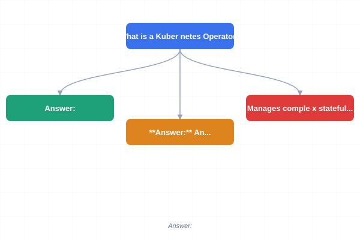
</a>
<a href="../../assets/images/diagrams/java/63-interview-tools/what-is-a-kubernetes-operator-sticky.svg" target="_blank" rel="noopener">
  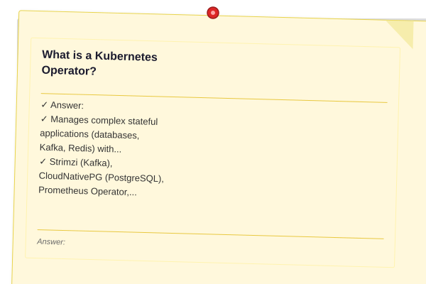
</a>


**Answer:** An application-specific controller that encodes human operational knowledge into software. Manages complex stateful applications (databases, Kafka, Redis) with automated backup, restore, scaling, and upgrades.

Examples: Strimzi (Kafka), CloudNativePG (PostgreSQL), Prometheus Operator, ArgoCD Operator.

---

### Q61: Setting up a development environment for microservices?

<a href="../../assets/images/diagrams/java/63-interview-tools/setting-up-a-development-environment-for-microservices-handwritten.svg" target="_blank" rel="noopener">
  
</a>
<a href="../../assets/images/diagrams/java/63-interview-tools/setting-up-a-development-environment-for-microservices-diagram.svg" target="_blank" rel="noopener">
  
</a>
<a href="../../assets/images/diagrams/java/63-interview-tools/setting-up-a-development-environment-for-microservices-sticky.svg" target="_blank" rel="noopener">
  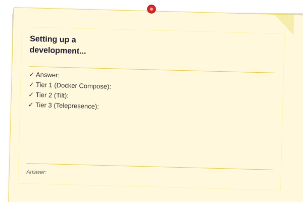
</a>


**Answer:** Three tiers:
- **Tier 1 (Docker Compose):** App + DB + Redis + Kafka + dependencies
- **Tier 2 (Tilt):** Kubernetes-native dev with live reload, resource view
- **Tier 3 (Telepresence):** Run local service connected to remote cluster

Best practices: hot reload (DevTools), realistic DB (PostgreSQL, not H2), mock external APIs (WireMock), profile-based config.

---

### Q62: What is Testcontainers and how does it improve tests?

<a href="../../assets/images/diagrams/java/63-interview-tools/what-is-testcontainers-and-how-does-it-improve-tests-handwritten.svg" target="_blank" rel="noopener">
  
</a>
<a href="../../assets/images/diagrams/java/63-interview-tools/what-is-testcontainers-and-how-does-it-improve-tests-diagram.svg" target="_blank" rel="noopener">
  
</a>
<a href="../../assets/images/diagrams/java/63-interview-tools/what-is-testcontainers-and-how-does-it-improve-tests-sticky.svg" target="_blank" rel="noopener">
  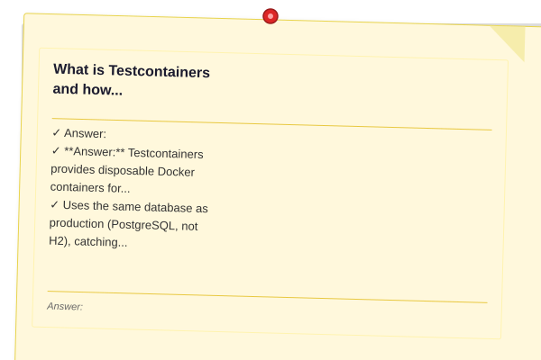
</a>


**Answer:** Testcontainers provides disposable Docker containers for integration testing. Uses the same database as production (PostgreSQL, not H2), catching compatibility issues early.

```java
@SpringBootTest
@Testcontainers
class OrderRepositoryTest {
    @Container
    static PostgreSQLContainer<?> postgres = new PostgreSQLContainer<>("postgres:16-alpine");

    @DynamicPropertySource
    static void properties(DynamicPropertyRegistry registry) {
        registry.add("spring.datasource.url", postgres::getJdbcUrl);
        registry.add("spring.datasource.username", postgres::getUsername);
        registry.add("spring.datasource.password", postgres::getPassword);
    }
}
```

---

### Q63: Testing async code (Kafka, CompletableFuture)?

<a href="../../assets/images/diagrams/java/63-interview-tools/testing-async-code-kafka-completablefuture-handwritten.svg" target="_blank" rel="noopener">
  
</a>
<a href="../../assets/images/diagrams/java/63-interview-tools/testing-async-code-kafka-completablefuture-diagram.svg" target="_blank" rel="noopener">
  
</a>
<a href="../../assets/images/diagrams/java/63-interview-tools/testing-async-code-kafka-completablefuture-sticky.svg" target="_blank" rel="noopener">
  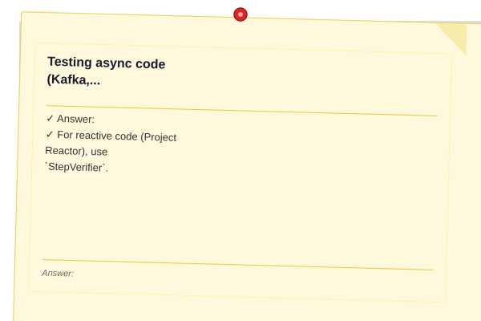
</a>


**Answer:** Use Awaitility for polling assertions:

```java
await().atMost(10, SECONDS)
    .pollInterval(100, MILLISECONDS)
    .untilAsserted(() -> {
        assertThat(receivedEvents).hasSize(1);
    });
```

For CompletableFuture, use `.get(5, SECONDS)` with timeout. For reactive code (Project Reactor), use `StepVerifier`.

---

### Q64: What is contract testing?

<a href="../../assets/images/diagrams/java/63-interview-tools/what-is-contract-testing-handwritten.svg" target="_blank" rel="noopener">
  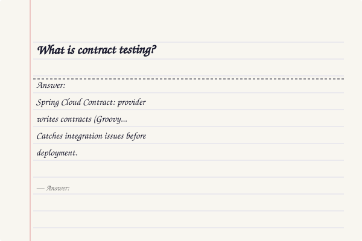
</a>
<a href="../../assets/images/diagrams/java/63-interview-tools/what-is-contract-testing-diagram.svg" target="_blank" rel="noopener">
  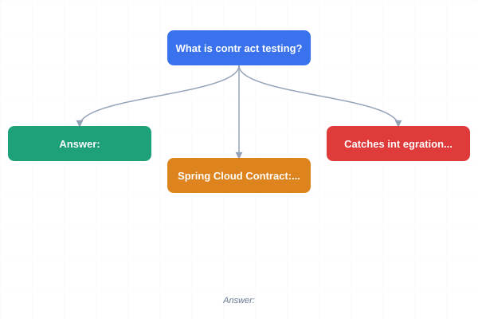
</a>
<a href="../../assets/images/diagrams/java/63-interview-tools/what-is-contract-testing-sticky.svg" target="_blank" rel="noopener">
  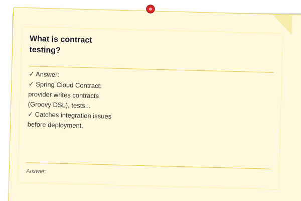
</a>


**Answer:** Contract testing verifies that API provider and consumer agree on the contract. Spring Cloud Contract: provider writes contracts (Groovy DSL), tests verify fulfillment, consumers use generated stubs. Catches integration issues before deployment.

---

### Q65: What is a Docker layer cache and how do you optimize it?

<a href="../../assets/images/diagrams/java/63-interview-tools/what-is-a-docker-layer-cache-and-how-do-you-optimize-it-handwritten.svg" target="_blank" rel="noopener">
  
</a>
<a href="../../assets/images/diagrams/java/63-interview-tools/what-is-a-docker-layer-cache-and-how-do-you-optimize-it-diagram.svg" target="_blank" rel="noopener">
  
</a>
<a href="../../assets/images/diagrams/java/63-interview-tools/what-is-a-docker-layer-cache-and-how-do-you-optimize-it-sticky.svg" target="_blank" rel="noopener">
  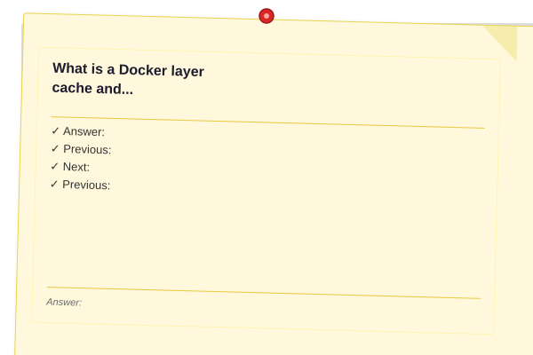
</a>


**Answer:** Docker caches each layer. Order commands from least to most frequently changing:

```dockerfile
# Cached unless pom.xml changes

> **Previous:** [Testing Interview Q&amp;A](./62-interview-testing.md) | **Next:** [Design Patterns Interview Q&amp;A](./64-interview-design-patterns.md)
COPY pom.xml ./
RUN mvn dependency:go-offline

# Only runs when source changes

> **Previous:** [Testing Interview Q&amp;A](./62-interview-testing.md) | **Next:** [Design Patterns Interview Q&amp;A](./64-interview-design-patterns.md)
COPY src src/
RUN mvn package
```

Use `.dockerignore` to exclude unnecessary files (`.git`, `target/`, `node_modules/`).

---

### Q66: How do you handle configuration for multiple environments?

<a href="../../assets/images/diagrams/java/63-interview-tools/how-do-you-handle-configuration-for-multiple-environments-handwritten.svg" target="_blank" rel="noopener">
  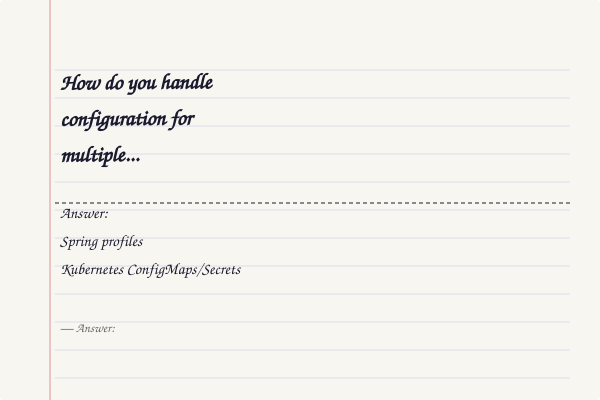
</a>
<a href="../../assets/images/diagrams/java/63-interview-tools/how-do-you-handle-configuration-for-multiple-environments-diagram.svg" target="_blank" rel="noopener">
  
</a>
<a href="../../assets/images/diagrams/java/63-interview-tools/how-do-you-handle-configuration-for-multiple-environments-sticky.svg" target="_blank" rel="noopener">
  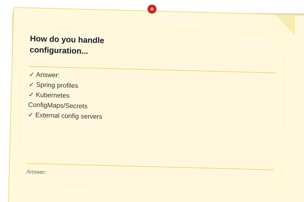
</a>


**Answer:**
1. **Spring profiles** — `application-dev.yml`, `application-prod.yml`
2. **Kubernetes ConfigMaps/Secrets** — per-environment with Kustomize overlays or Helm value files
3. **External config servers** — Spring Cloud Config, Vault
4. **Environment variables** — deployment-specific settings (DB URLs, API keys)

```yaml
# application.yml

> **Previous:** [Testing Interview Q&amp;A](./62-interview-testing.md) | **Next:** [Design Patterns Interview Q&amp;A](./64-interview-design-patterns.md)
server.port: 8080

# application-prod.yml (activated by SPRING_PROFILES_ACTIVE=prod)

> **Previous:** [Testing Interview Q&amp;A](./62-interview-testing.md) | **Next:** [Design Patterns Interview Q&amp;A](./64-interview-design-patterns.md)
server.port: 80
spring.datasource.url: ${DB_URL}
```

---

### Q67: What is the ELK/EFK stack?

<a href="../../assets/images/diagrams/java/63-interview-tools/what-is-the-elk-efk-stack-handwritten.svg" target="_blank" rel="noopener">
  
</a>
<a href="../../assets/images/diagrams/java/63-interview-tools/what-is-the-elk-efk-stack-diagram.svg" target="_blank" rel="noopener">
  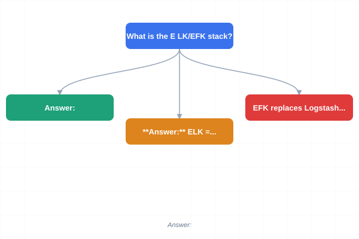
</a>
<a href="../../assets/images/diagrams/java/63-interview-tools/what-is-the-elk-efk-stack-sticky.svg" target="_blank" rel="noopener">
  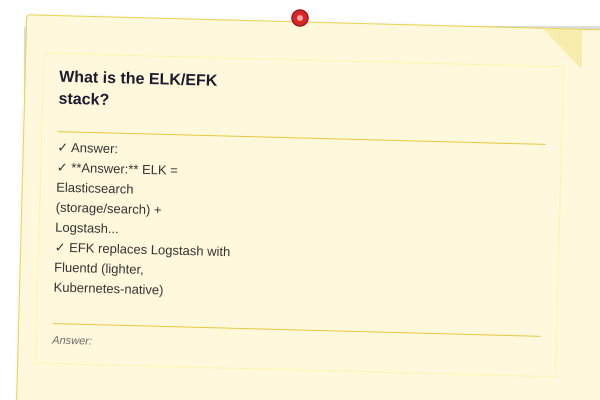
</a>


**Answer:** ELK = Elasticsearch (storage/search) + Logstash (ingestion/transformation) + Kibana (visualization). EFK replaces Logstash with Fluentd (lighter, Kubernetes-native).

Services emit JSON logs to stdout → Fluentd collects → ships to Elasticsearch → Kibana provides search and dashboards.

---

### Q68: Centralized logging vs distributed tracing?

<a href="../../assets/images/diagrams/java/63-interview-tools/centralized-logging-vs-distributed-tracing-handwritten.svg" target="_blank" rel="noopener">
  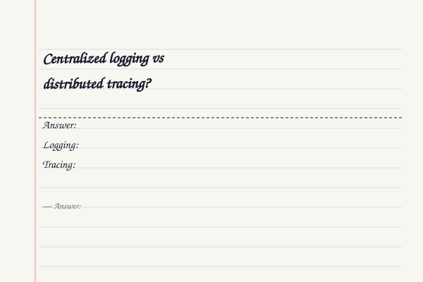
</a>
<a href="../../assets/images/diagrams/java/63-interview-tools/centralized-logging-vs-distributed-tracing-diagram.svg" target="_blank" rel="noopener">
  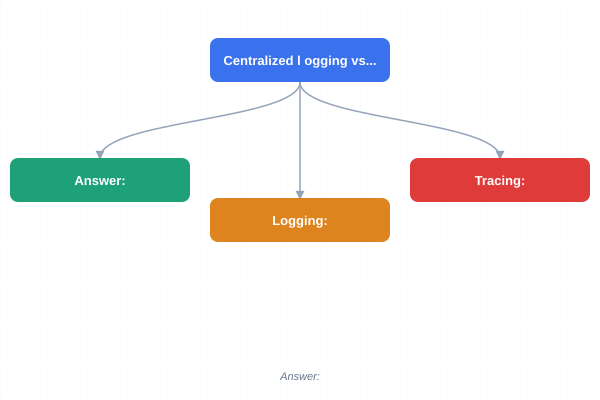
</a>
<a href="../../assets/images/diagrams/java/63-interview-tools/centralized-logging-vs-distributed-tracing-sticky.svg" target="_blank" rel="noopener">
  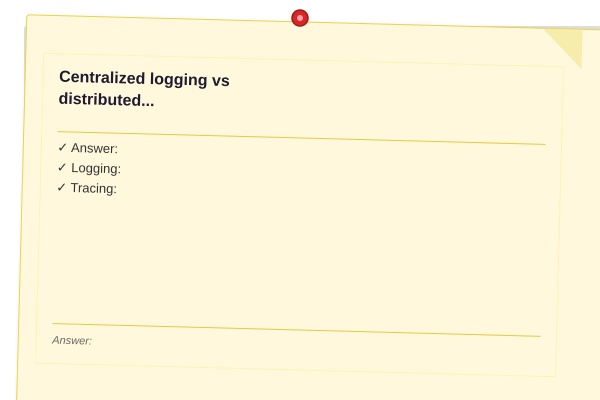
</a>


**Answer:**
- **Logging:** Individual log events, correlated by correlation ID. Tells you what happened.
- **Tracing:** Request spanning multiple services, with trace ID and span IDs. Tells you where in the request flow latency occurred.

Both are essential for observability in microservices.

---

### Q69: How do you handle file uploads in Kubernetes?

<a href="../../assets/images/diagrams/java/63-interview-tools/how-do-you-handle-file-uploads-in-kubernetes-handwritten.svg" target="_blank" rel="noopener">
  
</a>
<a href="../../assets/images/diagrams/java/63-interview-tools/how-do-you-handle-file-uploads-in-kubernetes-diagram.svg" target="_blank" rel="noopener">
  
</a>
<a href="../../assets/images/diagrams/java/63-interview-tools/how-do-you-handle-file-uploads-in-kubernetes-sticky.svg" target="_blank" rel="noopener">
  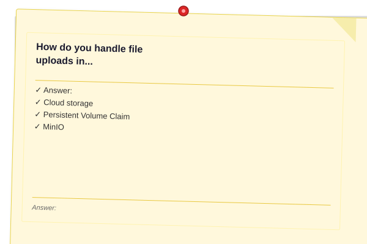
</a>


**Answer:** Don't store on pod filesystem (ephemeral). Options:
1. **Cloud storage** — AWS S3, GCS, Azure Blob (preferred)
2. **Persistent Volume Claim** — shared filesystem with ReadWriteMany access mode
3. **MinIO** — self-hosted S3-compatible object storage

---

### Q70: What is a PodDisruptionBudget?

<a href="../../assets/images/diagrams/java/63-interview-tools/what-is-a-poddisruptionbudget-handwritten.svg" target="_blank" rel="noopener">
  
</a>
<a href="../../assets/images/diagrams/java/63-interview-tools/what-is-a-poddisruptionbudget-diagram.svg" target="_blank" rel="noopener">
  
</a>
<a href="../../assets/images/diagrams/java/63-interview-tools/what-is-a-poddisruptionbudget-sticky.svg" target="_blank" rel="noopener">
  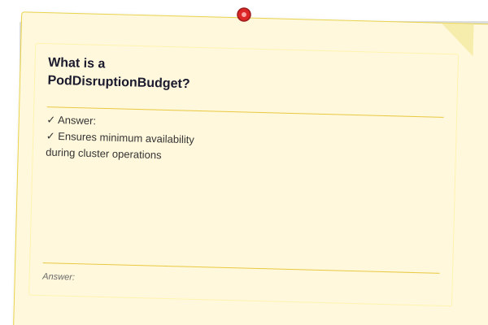
</a>


**Answer:** A PodDisruptionBudget (PDB) limits the number of pods that can be voluntarily disrupted at a time (e.g., during node maintenance). Ensures minimum availability during cluster operations.

```yaml
apiVersion: policy/v1
kind: PodDisruptionBudget
metadata:
  name: order-service-pdb
spec:
  minAvailable: 2
  selector:
    matchLabels:
      app: order-service
```

---

### Q71: Docker Compose advanced features (depends_on conditions, healthchecks, profiles, extends)?

<a href="../../assets/images/diagrams/java/63-interview-tools/docker-compose-advanced-features-depends-on-conditions-healthchecks-profiles-extends-handwritten.svg" target="_blank" rel="noopener">
  
</a>
<a href="../../assets/images/diagrams/java/63-interview-tools/docker-compose-advanced-features-depends-on-conditions-healthchecks-profiles-extends-diagram.svg" target="_blank" rel="noopener">
  
</a>
<a href="../../assets/images/diagrams/java/63-interview-tools/docker-compose-advanced-features-depends-on-conditions-healthchecks-profiles-extends-sticky.svg" target="_blank" rel="noopener">
  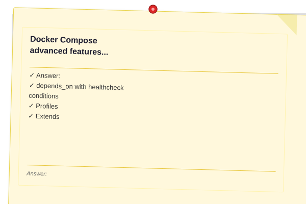
</a>


**Answer:** Beyond basic container orchestration, Docker Compose provides several advanced features for robust multi-container setups.

**depends_on with healthcheck conditions** — wait for a service to be healthy before starting:

```yaml
services:
  app:
    build: .
    depends_on:
      db:
        condition: service_healthy
      redis:
        condition: service_started
  db:
    image: postgres:16-alpine
    healthcheck:
      test: ["CMD-SHELL", "pg_isready -U user -d mydb"]
      interval: 5s
      timeout: 3s
      retries: 5
  redis:
    image: redis:7-alpine
```

**Profiles** — conditionally enable services:

```yaml
services:
  app:
    image: my-app
  db:
    image: postgres:16-alpine
  mailhog:
    image: mailhog/mailhog
    profiles: ["dev", "staging"]
  jaeger:
    image: jaegertracing/all-in-one:1.57
    profiles: ["tracing"]
```

Run with `docker compose --profile dev up` to include only app, db, and mailhog.

**Extends** — share common configuration:

```yaml
# base.yml

> **Previous:** [Testing Interview Q&amp;A](./62-interview-testing.md) | **Next:** [Design Patterns Interview Q&amp;A](./64-interview-design-patterns.md)
services:
  base-app:
    image: eclipse-temurin:17-jre-alpine
    working_dir: /app
    environment:
      SPRING_PROFILES_ACTIVE: ${SPRING_PROFILES_ACTIVE:-dev}
    networks:
      - backend

# docker-compose.yml

> **Previous:** [Testing Interview Q&amp;A](./62-interview-testing.md) | **Next:** [Design Patterns Interview Q&amp;A](./64-interview-design-patterns.md)
services:
  order-service:
    extends:
      file: base.yml
      service: base-app
    ports:
      - "8081:8080"
    environment:
      SERVICE_NAME: order-service
  payment-service:
    extends:
      file: base.yml
      service: base-app
    ports:
      - "8082:8080"
    environment:
      SERVICE_NAME: payment-service

networks:
  backend:
```

**Named networks with custom IPAM:**

```yaml
networks:
  frontend:
    driver: bridge
    ipam:
      config:
        - subnet: 172.20.0.0/16
  backend:
    internal: true
```

---

### Q72: Dockerfile best practices (COPY vs ADD, .dockerignore, cache optimization)?

<a href="../../assets/images/diagrams/java/63-interview-tools/dockerfile-best-practices-copy-vs-add-dockerignore-cache-optimization-handwritten.svg" target="_blank" rel="noopener">
  
</a>
<a href="../../assets/images/diagrams/java/63-interview-tools/dockerfile-best-practices-copy-vs-add-dockerignore-cache-optimization-diagram.svg" target="_blank" rel="noopener">
  
</a>
<a href="../../assets/images/diagrams/java/63-interview-tools/dockerfile-best-practices-copy-vs-add-dockerignore-cache-optimization-sticky.svg" target="_blank" rel="noopener">
  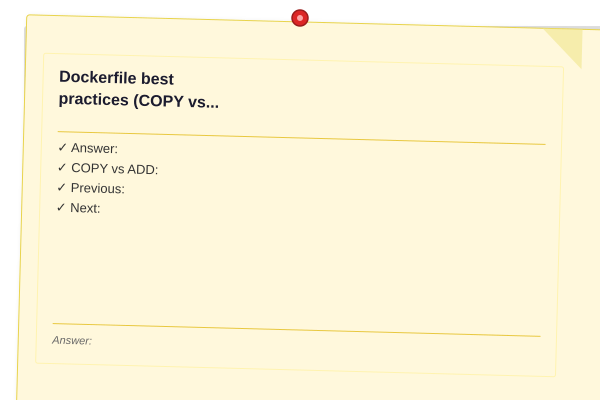
</a>


**Answer:** A well-optimized Dockerfile builds faster, produces smaller images, and is more secure.

**COPY vs ADD:** Prefer COPY — it's explicit about only copying local files. ADD has extra magic (tar auto-extraction, URL download) that can be surprising:

```dockerfile
# COPY — simple, predictable

> **Previous:** [Testing Interview Q&amp;A](./62-interview-testing.md) | **Next:** [Design Patterns Interview Q&amp;A](./64-interview-design-patterns.md)
COPY --from=builder /app/target/*.jar app.jar

# ADD — auto-extracts tar archives

> **Previous:** [Testing Interview Q&amp;A](./62-interview-testing.md) | **Next:** [Design Patterns Interview Q&amp;A](./64-interview-design-patterns.md)
ADD build.tar.gz /app/

# Use ADD only when you need tar extraction

> **Previous:** [Testing Interview Q&amp;A](./62-interview-testing.md) | **Next:** [Design Patterns Interview Q&amp;A](./64-interview-design-patterns.md)
ADD jre.tar.gz /opt/java/
```

**.dockerignore — essential for build context size:**

```
.git
.gitignore
target/
*.md
node_modules/
docker-compose*.yml
.env
.idea/
*.iml
```

**Layer cache ordering — most stable first:**

```dockerfile
# 1. Base image (rarely changes)

> **Previous:** [Testing Interview Q&amp;A](./62-interview-testing.md) | **Next:** [Design Patterns Interview Q&amp;A](./64-interview-design-patterns.md)
FROM eclipse-temurin:17-jre-alpine AS base

# 2. Install system dependencies (stable)

> **Previous:** [Testing Interview Q&amp;A](./62-interview-testing.md) | **Next:** [Design Patterns Interview Q&amp;A](./64-interview-design-patterns.md)
RUN apk add --no-cache curl ca-certificates

# 3. Copy only build descriptor (changes with deps only)

> **Previous:** [Testing Interview Q&amp;A](./62-interview-testing.md) | **Next:** [Design Patterns Interview Q&amp;A](./64-interview-design-patterns.md)
COPY pom.xml ./
COPY src/main/resources/application.yml ./src/main/resources/

# 4. Download dependencies (cached unless pom.xml changes)

> **Previous:** [Testing Interview Q&amp;A](./62-interview-testing.md) | **Next:** [Design Patterns Interview Q&amp;A](./64-interview-design-patterns.md)
RUN mvn dependency:go-offline -q

# 5. Copy source (changes most often — last)

> **Previous:** [Testing Interview Q&amp;A](./62-interview-testing.md) | **Next:** [Design Patterns Interview Q&amp;A](./64-interview-design-patterns.md)
COPY src src/
RUN mvn package -DskipTests
```

**Multi-stage build optimization — slim final image:**

```dockerfile
# Stage 1: full JDK for compilation

> **Previous:** [Testing Interview Q&amp;A](./62-interview-testing.md) | **Next:** [Design Patterns Interview Q&amp;A](./64-interview-design-patterns.md)
FROM eclipse-temurin:17-jdk-alpine AS builder
WORKDIR /build
COPY pom.xml ./
RUN mvn dependency:go-offline
COPY src src/
RUN mvn package -DskipTests

# Stage 2: produce minimal JRE

> **Previous:** [Testing Interview Q&amp;A](./62-interview-testing.md) | **Next:** [Design Patterns Interview Q&amp;A](./64-interview-design-patterns.md)
FROM eclipse-temurin:17-jre-alpine AS jre-builder
RUN jlink --add-modules java.base,java.sql,java.naming,java.management,\
  jdk.unsupported \
  --output /jre \
  --strip-debug --no-man-pages --no-header-files

# Stage 3: final image

> **Previous:** [Testing Interview Q&amp;A](./62-interview-testing.md) | **Next:** [Design Patterns Interview Q&amp;A](./64-interview-design-patterns.md)
FROM alpine:3.19
COPY --from=jre-builder /jre /jre
COPY --from=builder /build/target/*.jar app.jar
RUN addgroup -S app && adduser -S app -G app
USER app
ENTRYPOINT ["/jre/bin/java", "-jar", "/app.jar"]
```

This reduces image size from ~200MB to ~50MB by using only the JVM modules needed.

**Squash layers (advanced):** Use `docker build --squash` in CI to merge all layers into one, reducing final size but losing cache benefits for individual layers.

---

### Q73: Kubernetes Persistent Volumes, PVCs, and StorageClasses?

<a href="../../assets/images/diagrams/java/63-interview-tools/kubernetes-persistent-volumes-pvcs-and-storageclasses-handwritten.svg" target="_blank" rel="noopener">
  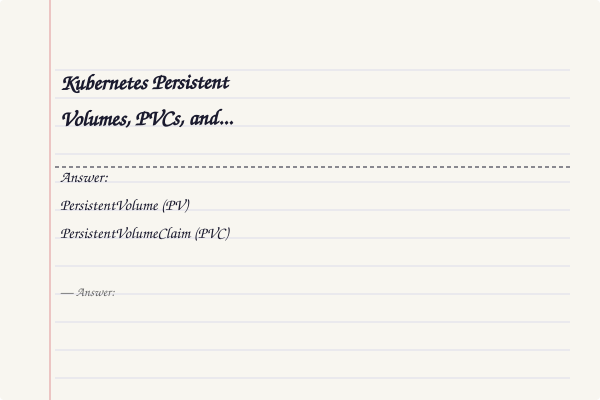
</a>
<a href="../../assets/images/diagrams/java/63-interview-tools/kubernetes-persistent-volumes-pvcs-and-storageclasses-diagram.svg" target="_blank" rel="noopener">
  
</a>
<a href="../../assets/images/diagrams/java/63-interview-tools/kubernetes-persistent-volumes-pvcs-and-storageclasses-sticky.svg" target="_blank" rel="noopener">
  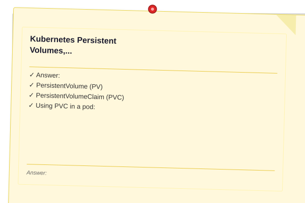
</a>


**Answer:** Kubernetes stateful workloads need persistent storage that survives pod restarts.

**PersistentVolume (PV)** — cluster storage resource provisioned by an admin:

```yaml
apiVersion: v1
kind: PersistentVolume
metadata:
  name: postgres-pv
spec:
  capacity:
    storage: 10Gi
  volumeMode: Filesystem
  accessModes:
    - ReadWriteOnce
  persistentVolumeReclaimPolicy: Retain
  storageClassName: standard
  hostPath:
    path: /mnt/data/postgres
```

**PersistentVolumeClaim (PVC)** — request for storage by a user/pod:

```yaml
apiVersion: v1
kind: PersistentVolumeClaim
metadata:
  name: postgres-pvc
spec:
  accessModes:
    - ReadWriteOnce
  resources:
    requests:
      storage: 10Gi
  storageClassName: standard
```

**Using PVC in a pod:**

```yaml
apiVersion: apps/v1
kind: StatefulSet
metadata:
  name: postgres
spec:
  serviceName: postgres
  replicas: 1
  selector:
    matchLabels:
      app: postgres
  template:
    metadata:
      labels:
        app: postgres
    spec:
      containers:
      - name: postgres
        image: postgres:16-alpine
        volumeMounts:
        - name: data
          mountPath: /var/lib/postgresql/data
      volumes:
      - name: data
        persistentVolumeClaim:
          claimName: postgres-pvc
```

**StorageClasses** — dynamic provisioning. Instead of pre-creating PVs, define a StorageClass and the cluster provisions PVs automatically:

```yaml
apiVersion: storage.k8s.io/v1
kind: StorageClass
metadata:
  name: fast-ssd
provisioner: kubernetes.io/aws-ebs
parameters:
  type: gp3
  fsType: ext4
  iopsPerGB: "10"
reclaimPolicy: Delete
allowVolumeExpansion: true
```

Reference in PVC:

```yaml
apiVersion: v1
kind: PersistentVolumeClaim
metadata:
  name: fast-pvc
spec:
  accessModes:
    - ReadWriteOnce
  resources:
    requests:
      storage: 50Gi
  storageClassName: fast-ssd
```

**Access Modes:**
- `ReadWriteOnce` (RWO) — single node read-write (databases)
- `ReadOnlyMany` (ROX) — many nodes read-only
- `ReadWriteMany` (RWX) — many nodes read-write (shared filesystems, requires NFS/Ceph)

**Reclaim Policies:** Retain (manual cleanup), Delete (auto-delete on PVC removal), Recycle (deprecated).

---

### Q74: Helm (templating, values, hooks, dependencies)?

<a href="../../assets/images/diagrams/java/63-interview-tools/helm-templating-values-hooks-dependencies-handwritten.svg" target="_blank" rel="noopener">
  
</a>
<a href="../../assets/images/diagrams/java/63-interview-tools/helm-templating-values-hooks-dependencies-diagram.svg" target="_blank" rel="noopener">
  
</a>
<a href="../../assets/images/diagrams/java/63-interview-tools/helm-templating-values-hooks-dependencies-sticky.svg" target="_blank" rel="noopener">
  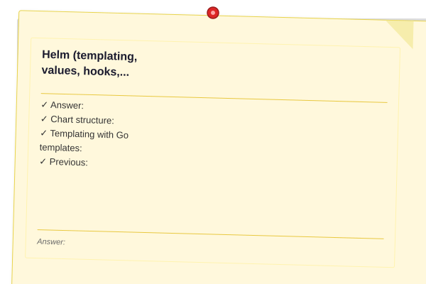
</a>


**Answer:** Helm is the Kubernetes package manager. Charts package YAML templates with parameterized values.

**Chart structure:**

```
order-service/
├── Chart.yaml          # metadata, dependencies
├── values.yaml         # default values
├── templates/
│   ├── deployment.yaml
│   ├── service.yaml
│   ├── ingress.yaml
│   ├── _helpers.tpl    # reusable template snippets
│   └── configmap.yaml
└── charts/             # dependencies (extracted)
```

**Templating with Go templates:**

```yaml
# templates/deployment.yaml

> **Previous:** [Testing Interview Q&amp;A](./62-interview-testing.md) | **Next:** [Design Patterns Interview Q&amp;A](./64-interview-design-patterns.md)
apiVersion: apps/v1
kind: Deployment
metadata:
  name: {{ include "order-service.fullname" . }}
  labels:
    {{- include "order-service.labels" . | nindent 4 }}
spec:
  replicas: {{ .Values.replicaCount }}
  selector:
    matchLabels:
      {{- include "order-service.selectorLabels" . | nindent 6 }}
  template:
    metadata:
      labels:
        {{- include "order-service.selectorLabels" . | nindent 8 }}
    spec:
      containers:
      - name: {{ .Chart.Name }}
        image: "{{ .Values.image.repository }}:{{ .Values.image.tag | default .Chart.AppVersion }}"
        ports:
        - containerPort: {{ .Values.service.port }}
        env:
        {{- range $key, $val := .Values.env }}
        - name: {{ $key }}
          value: {{ $val | quote }}
        {{- end }}
```

```yaml
# values.yaml

> **Previous:** [Testing Interview Q&amp;A](./62-interview-testing.md) | **Next:** [Design Patterns Interview Q&amp;A](./64-interview-design-patterns.md)
replicaCount: 3
image:
  repository: registry.example.com/order-service
  tag: "1.2.3"
service:
  port: 8080
env:
  SPRING_PROFILES_ACTIVE: prod
  DB_URL: jdbc:postgresql://postgres:5432/orders
```

**Template helpers (`_helpers.tpl`):**

```yaml
{{- define "order-service.fullname" -}}
{{- printf "%s-%s" .Release.Name .Chart.Name | trunc 63 | trimSuffix "-" }}
{{- end }}

{{- define "order-service.labels" -}}
app.kubernetes.io/name: {{ .Chart.Name }}
app.kubernetes.io/instance: {{ .Release.Name }}
app.kubernetes.io/version: {{ .Chart.AppVersion }}
{{- end }}
```

**Hooks** — run jobs at specific lifecycle points:

```yaml
# templates/migrate-job.yaml

> **Previous:** [Testing Interview Q&amp;A](./62-interview-testing.md) | **Next:** [Design Patterns Interview Q&amp;A](./64-interview-design-patterns.md)
apiVersion: batch/v1
kind: Job
metadata:
  name: {{ .Release.Name }}-db-migrate
  annotations:
    "helm.sh/hook": pre-upgrade
    "helm.sh/hook-weight": "-5"
    "helm.sh/hook-delete-policy": hook-succeeded
spec:
  template:
    spec:
      restartPolicy: Never
      containers:
      - name: migrate
        image: "{{ .Values.image.repository }}:{{ .Values.image.tag }}"
        command: ["java", "-jar", "app.jar", "--spring.flyway.enabled=true"]
```

Available hooks: `pre-install`, `post-install`, `pre-upgrade`, `post-upgrade`, `pre-delete`, `post-delete`, `pre-rollback`, `post-rollback`.

**Dependencies in Chart.yaml:**

```yaml
apiVersion: v2
name: order-service
version: 1.0.0
dependencies:
  - name: postgresql
    version: "12.1.0"
    repository: "https://charts.bitnami.com/bitnami"
    condition: postgresql.enabled
  - name: redis
    version: "18.1.0"
    repository: "https://charts.bitnami.com/bitnami"
    condition: redis.enabled
```

Run `helm dependency update` to download sub-charts. The `condition` field enables/disabling based on a top-level value.

**Lifecycle management commands:**

```bash
# Install

> **Previous:** [Testing Interview Q&amp;A](./62-interview-testing.md) | **Next:** [Design Patterns Interview Q&amp;A](./64-interview-design-patterns.md)
helm install order-service ./order-service -f prod-values.yaml

# Upgrade with rollback safety

> **Previous:** [Testing Interview Q&amp;A](./62-interview-testing.md) | **Next:** [Design Patterns Interview Q&amp;A](./64-interview-design-patterns.md)
helm upgrade order-service ./order-service -f prod-values.yaml --atomic --timeout 5m

# Rollback

> **Previous:** [Testing Interview Q&amp;A](./62-interview-testing.md) | **Next:** [Design Patterns Interview Q&amp;A](./64-interview-design-patterns.md)
helm rollback order-service 1

# Template rendering (debug)

> **Previous:** [Testing Interview Q&amp;A](./62-interview-testing.md) | **Next:** [Design Patterns Interview Q&amp;A](./64-interview-design-patterns.md)
helm template order-service ./order-service -f prod-values.yaml
```

---

### Q75: Kubernetes RBAC (Roles, RoleBindings, ClusterRoles, ServiceAccounts)?

<a href="../../assets/images/diagrams/java/63-interview-tools/kubernetes-rbac-roles-rolebindings-clusterroles-serviceaccounts-handwritten.svg" target="_blank" rel="noopener">
  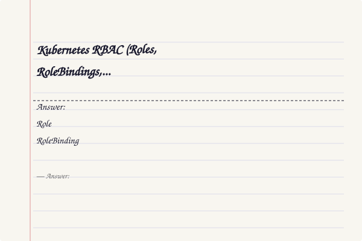
</a>
<a href="../../assets/images/diagrams/java/63-interview-tools/kubernetes-rbac-roles-rolebindings-clusterroles-serviceaccounts-diagram.svg" target="_blank" rel="noopener">
  
</a>
<a href="../../assets/images/diagrams/java/63-interview-tools/kubernetes-rbac-roles-rolebindings-clusterroles-serviceaccounts-sticky.svg" target="_blank" rel="noopener">
  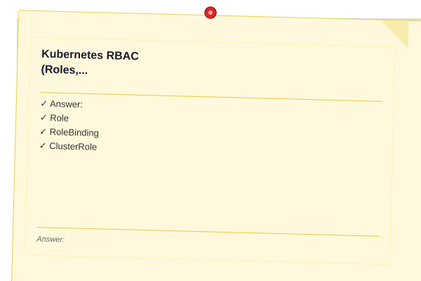
</a>


**Answer:** RBAC controls who can access what Kubernetes resources. It's the primary authorization mechanism.

**Role** — namespace-scoped permissions:

```yaml
apiVersion: rbac.authorization.k8s.io/v1
kind: Role
metadata:
  namespace: production
  name: pod-reader
rules:
- apiGroups: [""]
  resources: ["pods", "pods/log"]
  verbs: ["get", "watch", "list"]
- apiGroups: [""]
  resources: ["pods/exec"]
  verbs: ["create"]
```

**RoleBinding** — binds a Role to users, groups, or ServiceAccounts within the namespace:

```yaml
apiVersion: rbac.authorization.k8s.io/v1
kind: RoleBinding
metadata:
  namespace: production
  name: read-pods
subjects:
- kind: User
  name: "alice@company.com"
  apiGroup: rbac.authorization.k8s.io
- kind: ServiceAccount
  name: monitoring-sa
  namespace: production
roleRef:
  kind: Role
  name: pod-reader
  apiGroup: rbac.authorization.k8s.io
```

**ClusterRole** — cluster-scoped (nodes, PVs, namespaces) or accessible across all namespaces:

```yaml
apiVersion: rbac.authorization.k8s.io/v1
kind: ClusterRole
metadata:
  name: cluster-admin-cr
rules:
- apiGroups: ["*"]
  resources: ["*"]
  verbs: ["*"]
- nonResourceURLs: ["/healthz", "/metrics"]
  verbs: ["get"]
```

**ClusterRoleBinding** — binds ClusterRole across the entire cluster:

```yaml
apiVersion: rbac.authorization.k8s.io/v1
kind: ClusterRoleBinding
metadata:
  name: monitoring-cluster
subjects:
- kind: ServiceAccount
  name: monitoring-sa
  namespace: monitoring
roleRef:
  kind: ClusterRole
  name: cluster-admin-cr
  apiGroup: rbac.authorization.k8s.io
```

**ServiceAccount** — identity for pods to authenticate with the API:

```yaml
apiVersion: v1
kind: ServiceAccount
metadata:
  name: spring-boot-sa
  namespace: production
---
apiVersion: v1
kind: Secret
metadata:
  name: spring-boot-sa-token
  annotations:
    kubernetes.io/service-account.name: spring-boot-sa
type: kubernetes.io/service-account-token
```

Use in pod spec:

```yaml
spec:
  serviceAccountName: spring-boot-sa
  automountServiceAccountToken: true
  containers:
  - name: app
    image: my-app
```

**Aggregated ClusterRoles** — compose permissions from multiple rules:

```yaml
apiVersion: rbac.authorization.k8s.io/v1
kind: ClusterRole
metadata:
  name: aggregate-view
aggregationRule:
  clusterRoleSelectors:
  - matchLabels:
      rbac.authorization.k8s.io/aggregate-to-view: "true"
rules: []
```

**Best practices:**
- Use least privilege — never grant wildcards unless absolutely necessary
- Prefer Roles over ClusterRoles where possible
- Create unique ServiceAccounts per application (don't use `default`)
- Rotate tokens regularly
- Audit permissions with `kubectl auth can-i --list --as=system:serviceaccount:production:my-sa`

---

### Q76: Kubernetes Network Policies and Pod Security Admission?

<a href="../../assets/images/diagrams/java/63-interview-tools/kubernetes-network-policies-and-pod-security-admission-handwritten.svg" target="_blank" rel="noopener">
  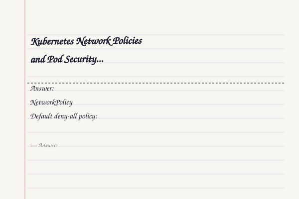
</a>
<a href="../../assets/images/diagrams/java/63-interview-tools/kubernetes-network-policies-and-pod-security-admission-diagram.svg" target="_blank" rel="noopener">
  
</a>
<a href="../../assets/images/diagrams/java/63-interview-tools/kubernetes-network-policies-and-pod-security-admission-sticky.svg" target="_blank" rel="noopener">
  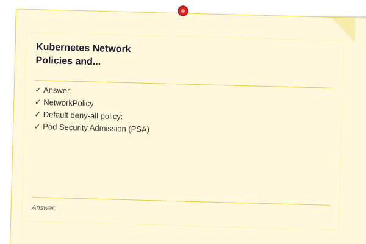
</a>


**Answer:** Network policies control pod-to-pod communication. Pod Security Admission (PSA) restricts pod security contexts.

**NetworkPolicy** — firewall rules for pods, selecting by labels:

```yaml
apiVersion: networking.k8s.io/v1
kind: NetworkPolicy
metadata:
  name: order-service-policy
  namespace: production
spec:
  podSelector:
    matchLabels:
      app: order-service
  policyTypes:
  - Ingress
  - Egress
  ingress:
  - from:
    - podSelector:
        matchLabels:
          app: api-gateway
    - namespaceSelector:
        matchLabels:
          name: monitoring
    ports:
    - port: 8080
      protocol: TCP
  egress:
  - to:
    - podSelector:
        matchLabels:
          app: payment-service
    ports:
    - port: 8080
  - to:
    - namespaceSelector:
        matchLabels:
          name: kube-system
      podSelector:
        matchLabels:
          k8s-app: kube-dns
    ports:
    - port: 53
      protocol: UDP
```

This policy: allows traffic only from api-gateway pods and the monitoring namespace, allows egress only to payment-service and DNS.

**Default deny-all policy:**

```yaml
apiVersion: networking.k8s.io/v1
kind: NetworkPolicy
metadata:
  name: default-deny-all
  namespace: production
spec:
  podSelector: {}
  policyTypes:
  - Ingress
  - Egress
```

**Pod Security Admission (PSA)** — built-in admission controller replacing PodSecurityPolicy (deprecated in 1.25, removed in 1.25):

Three levels:
- **Privileged** — unrestricted (system-critical pods)
- **Baseline** — minimal restrictions (prevent known privilege escalations)
- **Restricted** — hardened (current best practices)

Enforce via namespace labels:

```yaml
apiVersion: v1
kind: Namespace
metadata:
  name: production
  labels:
    pod-security.kubernetes.io/enforce: restricted
    pod-security.kubernetes.io/enforce-version: latest
    pod-security.kubernetes.io/audit: baseline
    pod-security.kubernetes.io/warn: baseline
```

A pod violating the `restricted` policy in this namespace will be rejected. Violations at `audit` level are logged but not blocked.

**Example of a restricted-compliant pod:**

```yaml
apiVersion: v1
kind: Pod
metadata:
  name: restricted-app
spec:
  securityContext:
    runAsNonRoot: true
    seccompProfile:
      type: RuntimeDefault
  containers:
  - name: app
    image: my-app
    securityContext:
      allowPrivilegeEscalation: false
      capabilities:
        drop: ["ALL"]
      readOnlyRootFilesystem: true
      runAsUser: 1000
      runAsGroup: 3000
```

**Network policy requirements:** Network policies are enforced only by CNI plugins that support them (Calico, Cilium, Weave Net). Flannel does not support network policies.

---

### Q77: Kubernetes monitoring with metrics-server, Prometheus operator, kube-state-metrics?

<a href="../../assets/images/diagrams/java/63-interview-tools/kubernetes-monitoring-with-metrics-server-prometheus-operator-kube-state-metrics-handwritten.svg" target="_blank" rel="noopener">
  
</a>
<a href="../../assets/images/diagrams/java/63-interview-tools/kubernetes-monitoring-with-metrics-server-prometheus-operator-kube-state-metrics-diagram.svg" target="_blank" rel="noopener">
  
</a>
<a href="../../assets/images/diagrams/java/63-interview-tools/kubernetes-monitoring-with-metrics-server-prometheus-operator-kube-state-metrics-sticky.svg" target="_blank" rel="noopener">
  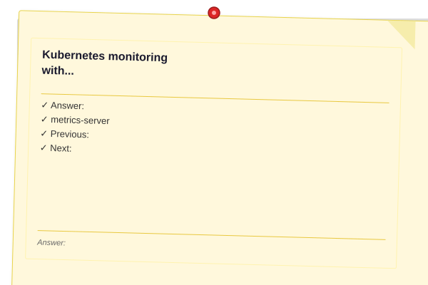
</a>


**Answer:** A production Kubernetes monitoring stack has three layers: resource metrics, cluster state metrics, and application metrics.

**metrics-server** — lightweight cluster-wide resource usage aggregator:

```bash
# Install via kubectl

> **Previous:** [Testing Interview Q&amp;A](./62-interview-testing.md) | **Next:** [Design Patterns Interview Q&amp;A](./64-interview-design-patterns.md)
kubectl apply -f https://github.com/kubernetes-sigs/metrics-server/releases/latest/download/components.yaml

# View pod metrics

> **Previous:** [Testing Interview Q&amp;A](./62-interview-testing.md) | **Next:** [Design Patterns Interview Q&amp;A](./64-interview-design-patterns.md)
kubectl top pods
kubectl top nodes
```

Outputs CPU and memory per pod/node. Required for HorizontalPodAutoscaler (HPA).

**Prometheus operator** — deploys and manages Prometheus instances declaratively:

```yaml
# ServiceMonitor telling Prometheus what to scrape

> **Previous:** [Testing Interview Q&amp;A](./62-interview-testing.md) | **Next:** [Design Patterns Interview Q&amp;A](./64-interview-design-patterns.md)
apiVersion: monitoring.coreos.com/v1
kind: ServiceMonitor
metadata:
  name: order-service-monitor
  namespace: monitoring
spec:
  selector:
    matchLabels:
      app: order-service
  endpoints:
  - port: http
    path: /actuator/prometheus
    interval: 15s
  namespaceSelector:
    matchNames:
    - production
```

```yaml
# Prometheus custom resource

> **Previous:** [Testing Interview Q&amp;A](./62-interview-testing.md) | **Next:** [Design Patterns Interview Q&amp;A](./64-interview-design-patterns.md)
apiVersion: monitoring.coreos.com/v1
kind: Prometheus
metadata:
  name: main
  namespace: monitoring
spec:
  serviceAccountName: prometheus
  serviceMonitorSelector:
    matchLabels: {}
  resources:
    requests:
      memory: 4Gi
  retention: 30d
```

**kube-state-metrics** — exposes cluster state metrics (deployment replicas, pod status, PVC usage):

```yaml
apiVersion: apps/v1
kind: Deployment
metadata:
  name: kube-state-metrics
  namespace: monitoring
spec:
  replicas: 1
  selector:
    matchLabels:
      app: kube-state-metrics
  template:
    metadata:
      labels:
        app: kube-state-metrics
    spec:
      serviceAccountName: kube-state-metrics
      containers:
      - name: kube-state-metrics
        image: registry.k8s.io/kube-state-metrics/kube-state-metrics:v2.13.0
        ports:
        - containerPort: 8080
```

Key metrics exposed:
- `kube_deployment_status_replicas_unavailable`
- `kube_pod_status_phase` (Pending, Running, Failed)
- `kube_node_status_condition`
- `kube_persistentvolumeclaim_resource_requests_storage_bytes`

**node-exporter** — host-level metrics (CPU, memory, disk, network):

```yaml
apiVersion: apps/v1
kind: DaemonSet
metadata:
  name: node-exporter
  namespace: monitoring
spec:
  selector:
    matchLabels:
      app: node-exporter
  template:
    metadata:
      labels:
        app: node-exporter
    spec:
      hostNetwork: true
      hostPID: true
      containers:
      - name: node-exporter
        image: prom/node-exporter:v1.8.0
        ports:
        - containerPort: 9100
        args:
        - --path.procfs=/host/proc
        - --path.sysfs=/host/sys
        volumeMounts:
        - name: proc
          mountPath: /host/proc
          readOnly: true
        - name: sys
          mountPath: /host/sys
          readOnly: true
      volumes:
      - name: proc
        hostPath:
          path: /proc
      - name: sys
        hostPath:
          path: /sys
```

**Grafana dashboards:**
- ID 315 — Kubernetes cluster monitoring (via Prometheus)
- ID 10280 — Spring Boot / JVM (Micrometer)
- ID 1860 — Node Exporter full

**HorizontalPodAutoscaler using resource metrics:**

```yaml
apiVersion: autoscaling/v2
kind: HorizontalPodAutoscaler
metadata:
  name: order-service-hpa
spec:
  scaleTargetRef:
    apiVersion: apps/v1
    kind: Deployment
    name: order-service
  minReplicas: 3
  maxReplicas: 10
  metrics:
  - type: Resource
    resource:
      name: cpu
      target:
        type: Utilization
        averageUtilization: 70
  - type: Resource
    resource:
      name: memory
      target:
        type: Utilization
        averageUtilization: 80
```

---

### Q78: GitHub Actions reusable workflows and composite actions?

<a href="../../assets/images/diagrams/java/63-interview-tools/github-actions-reusable-workflows-and-composite-actions-handwritten.svg" target="_blank" rel="noopener">
  
</a>
<a href="../../assets/images/diagrams/java/63-interview-tools/github-actions-reusable-workflows-and-composite-actions-diagram.svg" target="_blank" rel="noopener">
  
</a>
<a href="../../assets/images/diagrams/java/63-interview-tools/github-actions-reusable-workflows-and-composite-actions-sticky.svg" target="_blank" rel="noopener">
  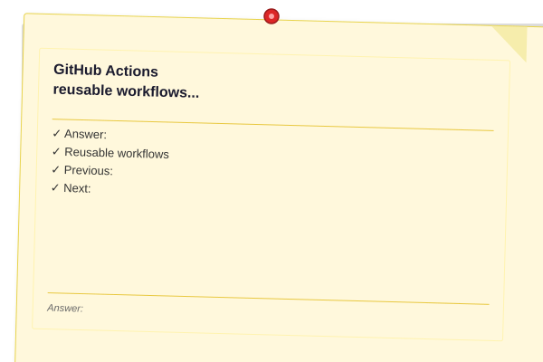
</a>


**Answer:** GitHub Actions provides two mechanisms for sharing workflow logic across repositories or jobs.

**Reusable workflows** — call one workflow from another. Define with `on: workflow_call`:

```yaml
# .github/workflows/build-java.yml (called workflow)

> **Previous:** [Testing Interview Q&amp;A](./62-interview-testing.md) | **Next:** [Design Patterns Interview Q&amp;A](./64-interview-design-patterns.md)
name: Build Java
on:
  workflow_call:
    inputs:
      java-version:
        required: true
        type: string
      maven-goals:
        required: false
        type: string
        default: verify
    secrets:
      REGISTRY_PASSWORD:
        required: false

jobs:
  build:
    runs-on: ubuntu-latest
    steps:
    - uses: actions/checkout@v4
    - uses: actions/setup-java@v4
      with:
        java-version: ${{ inputs.java-version }}
        distribution: temurin
        cache: maven
    - run: mvn ${{ inputs.maven-goals }} -B
    - if: inputs.java-version == '17'
      uses: docker/build-push-action@v5
      with:
        push: true
        tags: registry.example.com/my-app:${{ github.sha }}
        password: ${{ secrets.REGISTRY_PASSWORD }}
```

Calling it:

```yaml
# .github/workflows/ci.yml

> **Previous:** [Testing Interview Q&amp;A](./62-interview-testing.md) | **Next:** [Design Patterns Interview Q&amp;A](./64-interview-design-patterns.md)
name: CI
on: [push]
jobs:
  build-java-17:
    uses: ./.github/workflows/build-java.yml
    with:
      java-version: "17"
      maven-goals: verify
    secrets:
      REGISTRY_PASSWORD: ${{ secrets.DOCKER_PASSWORD }}

  build-java-21:
    uses: ./.github/workflows/build-java.yml
    with:
      java-version: "21"
      maven-goals: compile
```

Reusable workflows can also be called from other repositories:

```yaml
jobs:
  build:
    uses: company/shared-workflows/.github/workflows/build-java.yml@main
    with:
      java-version: "17"
```

**Composite actions** — bundle multiple steps into a single action for reuse within a job:

```yaml
# .github/actions/setup-java-cache/action.yml

> **Previous:** [Testing Interview Q&amp;A](./62-interview-testing.md) | **Next:** [Design Patterns Interview Q&amp;A](./64-interview-design-patterns.md)
name: "Setup Java with Maven Cache"
description: "Configures JDK and restores Maven cache"
inputs:
  java-version:
    description: "JDK version"
    required: false
    default: "17"
outputs:
  cache-hit:
    description: "Whether Maven cache was restored"
    value: ${{ steps.cache.outputs.cache-hit }}
runs:
  using: "composite"
  steps:
  - uses: actions/setup-java@v4
    id: setup
    with:
      java-version: ${{ inputs.java-version }}
      distribution: temurin
  - uses: actions/cache@v4
    id: cache
    with:
      path: ~/.m2/repository
      key: maven-${{ hashFiles('**/pom.xml') }}
      restore-keys: |
        maven-
  - run: echo "JAVA_HOME=${{ steps.setup.outputs.path }}"
    shell: bash
```

Using in a workflow:

```yaml
jobs:
  build:
    runs-on: ubuntu-latest
    steps:
    - uses: actions/checkout@v4
    - uses: ./.github/actions/setup-java-cache
      with:
        java-version: "21"
    - run: mvn verify -B
```

**Environment protection rules** — restrict deployments to specific environments:

```yaml
name: Deploy
on:
  workflow_dispatch:
jobs:
  deploy:
    runs-on: ubuntu-latest
    environment:
      name: production
      url: https://app.example.com
    steps:
    - run: echo "Deploying to production"
```

Configure environment protection in repository Settings → Environments:
- Required reviewers (one or more people must approve)
- Wait timer (delay before deployment)
- Deployment branches (limit to specific branch patterns)
- Custom deployment protection rules (from GitHub Marketplace)

---

### Q79: ArgoCD GitOps (Application, ApplicationSet, sync policy, sync waves)?

<a href="../../assets/images/diagrams/java/63-interview-tools/argocd-gitops-application-applicationset-sync-policy-sync-waves-handwritten.svg" target="_blank" rel="noopener">
  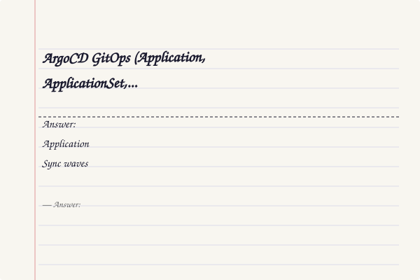
</a>
<a href="../../assets/images/diagrams/java/63-interview-tools/argocd-gitops-application-applicationset-sync-policy-sync-waves-diagram.svg" target="_blank" rel="noopener">
  
</a>
<a href="../../assets/images/diagrams/java/63-interview-tools/argocd-gitops-application-applicationset-sync-policy-sync-waves-sticky.svg" target="_blank" rel="noopener">
  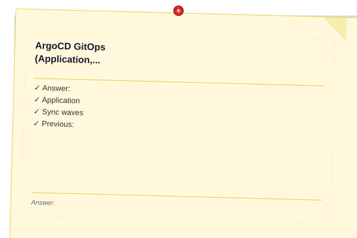
</a>


**Answer:** ArgoCD is a declarative GitOps tool that continuously synchronizes Kubernetes cluster state with manifests stored in Git.

**Application** — the core resource linking a Git repo to a cluster:

```yaml
apiVersion: argoproj.io/v1alpha1
kind: Application
metadata:
  name: order-service
  namespace: argocd
spec:
  project: default
  source:
    repoURL: https://github.com/company/order-service-config
    targetRevision: main
    path: overlays/production
    helm:
      valueFiles:
      - values.yaml
  destination:
    server: https://kubernetes.default.svc
    namespace: production
  syncPolicy:
    automated:
      prune: true
      selfHeal: true
      allowEmpty: false
    syncOptions:
    - Validate=true
    - CreateNamespace=true
    - PrunePropagationPolicy=foreground
    - PruneLast=true
    retry:
      limit: 5
      backoff:
        duration: 5s
        factor: 2
        maxDuration: 3m
```

**Sync waves** — control the order of resource application:

```yaml
# 1. Namespace and ConfigMaps first (wave -5)

> **Previous:** [Testing Interview Q&amp;A](./62-interview-testing.md) | **Next:** [Design Patterns Interview Q&amp;A](./64-interview-design-patterns.md)
apiVersion: v1
kind: Namespace
metadata:
  name: production
  annotations:
    argocd.argoproj.io/sync-wave: "-5"
---
apiVersion: v1
kind: ConfigMap
metadata:
  name: app-config
  namespace: production
  annotations:
    argocd.argoproj.io/sync-wave: "-5"
---
# 2. Database migration job (wave 0)

> **Previous:** [Testing Interview Q&amp;A](./62-interview-testing.md) | **Next:** [Design Patterns Interview Q&amp;A](./64-interview-design-patterns.md)
apiVersion: batch/v1
kind: Job
metadata:
  name: db-migrate
  namespace: production
  annotations:
    argocd.argoproj.io/sync-wave: "0"
    argocd.argoproj.io/hook: PreSync
spec:
  template:
    spec:
      containers:
      - name: migrate
        image: registry.example.com/order-service:1.2.3
        command: ["java", "-jar", "app.jar", "--spring.flyway.enabled=true"]
      restartPolicy: Never
---
# 3. Deployment and Service (wave 1)

> **Previous:** [Testing Interview Q&amp;A](./62-interview-testing.md) | **Next:** [Design Patterns Interview Q&amp;A](./64-interview-design-patterns.md)
apiVersion: apps/v1
kind: Deployment
metadata:
  name: order-service
  namespace: production
  annotations:
    argocd.argoproj.io/sync-wave: "1"
spec:
  replicas: 3
  ...
---
# 4. Ingress last (wave 5)

> **Previous:** [Testing Interview Q&amp;A](./62-interview-testing.md) | **Next:** [Design Patterns Interview Q&amp;A](./64-interview-design-patterns.md)
apiVersion: networking.k8s.io/v1
kind: Ingress
metadata:
  name: order-service
  namespace: production
  annotations:
    argocd.argoproj.io/sync-wave: "5"
```

**ApplicationSet** — generate Applications dynamically from templates:

```yaml
apiVersion: argoproj.io/v1alpha1
kind: ApplicationSet
metadata:
  name: microservices
  namespace: argocd
spec:
  generators:
  - git:
      repoURL: https://github.com/company/microservices-config
      revision: main
      directories:
      - path: services/*
  template:
    metadata:
      name: '{{ path.basename }}'
    spec:
      project: default
      source:
        repoURL: https://github.com/company/microservices-config
        targetRevision: main
        path: '{{ path }}'
      destination:
        server: https://kubernetes.default.svc
        namespace: '{{ path.basename }}'
      syncPolicy:
        automated:
          prune: true
          selfHeal: true
```

Other generators: `list`, `cluster`, `matrix`, `merge`, `pull-request` (ephemeral environments for PRs), `SCMProvider` (auto-discovery by repo label).

**Sync phases and hooks:**

```
◀─── PreSync (db migration, schema validation) ───▶ Sync (apply manifests) ───▶ PostSync (smoke tests, notifications)
```

Hook types: PreSync, Sync, PostSync, Skip, SyncFail.

**Sync options explained:**
- `Prune=true` — delete resources removed from Git
- `SelfHeal=true` — auto-correct manual changes to match Git
- `CreateNamespace=true` — auto-create destination namespace
- `PruneLast=true` — prune only after all sync waves succeed

---

### Q80: Terraform IaC (state, providers, modules, workspaces, remote state)?

<a href="../../assets/images/diagrams/java/63-interview-tools/terraform-iac-state-providers-modules-workspaces-remote-state-handwritten.svg" target="_blank" rel="noopener">
  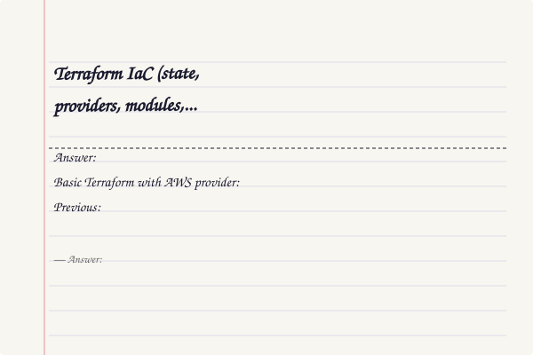
</a>
<a href="../../assets/images/diagrams/java/63-interview-tools/terraform-iac-state-providers-modules-workspaces-remote-state-diagram.svg" target="_blank" rel="noopener">
  
</a>
<a href="../../assets/images/diagrams/java/63-interview-tools/terraform-iac-state-providers-modules-workspaces-remote-state-sticky.svg" target="_blank" rel="noopener">
  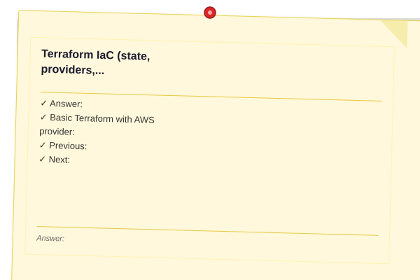
</a>


**Answer:** Terraform manages infrastructure as code — define resources, plan changes, apply to cloud providers.

**Basic Terraform with AWS provider:**

```hcl
# main.tf

> **Previous:** [Testing Interview Q&amp;A](./62-interview-testing.md) | **Next:** [Design Patterns Interview Q&amp;A](./64-interview-design-patterns.md)
terraform {
  required_version = ">= 1.6"
  required_providers {
    aws = {
      source  = "hashicorp/aws"
      version = "~> 5.0"
    }
  }
}

provider "aws" {
  region = var.aws_region
}

resource "aws_db_instance" "postgres" {
  identifier        = "orders-db"
  engine            = "postgres"
  engine_version    = "16.3"
  instance_class    = "db.t3.medium"
  allocated_storage = 100
  db_name           = "orders"
  username          = "admin"
  password          = var.db_password
  skip_final_snapshot = false
  backup_retention_period = 7
  storage_encrypted = true
}
```

```hcl
# variables.tf

> **Previous:** [Testing Interview Q&amp;A](./62-interview-testing.md) | **Next:** [Design Patterns Interview Q&amp;A](./64-interview-design-patterns.md)
variable "aws_region" {
  description = "AWS region"
  type        = string
  default     = "us-east-1"
}

variable "db_password" {
  description = "Database password"
  type        = string
  sensitive   = true
}
```

```hcl
# outputs.tf

> **Previous:** [Testing Interview Q&amp;A](./62-interview-testing.md) | **Next:** [Design Patterns Interview Q&amp;A](./64-interview-design-patterns.md)
output "db_endpoint" {
  value = aws_db_instance.postgres.endpoint
  sensitive = false
}

output "db_arn" {
  value = aws_db_instance.postgres.arn
}
```

**Terraform state** — maps resource declarations to real-world resources:

```bash
# State is stored locally in terraform.tfstate by default

> **Previous:** [Testing Interview Q&amp;A](./62-interview-testing.md) | **Next:** [Design Patterns Interview Q&amp;A](./64-interview-design-patterns.md)
terraform apply
```

**Remote state** — store state in a shared backend for team collaboration:

```hcl
terraform {
  backend "s3" {
    bucket = "company-terraform-state"
    key    = "environments/production/network/terraform.tfstate"
    region = "us-east-1"
    dynamodb_table = "terraform-locks"
    encrypt = true
  }
}
```

The DynamoDB table enables state locking — prevents concurrent applies.

**Modules** — reusable infrastructure components:

```hcl
# modules/rds-postgres/main.tf

> **Previous:** [Testing Interview Q&amp;A](./62-interview-testing.md) | **Next:** [Design Patterns Interview Q&amp;A](./64-interview-design-patterns.md)
resource "aws_db_instance" "this" {
  identifier        = var.identifier
  engine            = "postgres"
  engine_version    = var.engine_version
  instance_class    = var.instance_class
  allocated_storage = var.allocated_storage
  db_name           = var.db_name
  username          = var.username
  password          = var.password
  skip_final_snapshot = var.skip_final_snapshot
  tags = var.tags
}
```

```hcl
# modules/rds-postgres/variables.tf

> **Previous:** [Testing Interview Q&amp;A](./62-interview-testing.md) | **Next:** [Design Patterns Interview Q&amp;A](./64-interview-design-patterns.md)
variable "identifier" { type = string }
variable "engine_version" { type = string; default = "16.3" }
variable "instance_class" { type = string; default = "db.t3.medium" }
variable "allocated_storage" { type = number; default = 100 }
variable "db_name" { type = string }
variable "username" { type = string }
variable "password" { type = string; sensitive = true }
variable "skip_final_snapshot" { type = bool; default = false }
variable "tags" { type = map(string); default = {} }
```

```hcl
# environments/production/main.tf

> **Previous:** [Testing Interview Q&amp;A](./62-interview-testing.md) | **Next:** [Design Patterns Interview Q&amp;A](./64-interview-design-patterns.md)
module "orders_db" {
  source = "../../modules/rds-postgres"
  identifier = "orders-db-prod"
  db_name    = "orders"
  username   = "admin"
  password   = var.db_password
  instance_class = "db.r5.large"
  allocated_storage = 200
  tags = {
    Environment = "production"
    Project     = "order-service"
  }
}
```

**Workspaces** — manage multiple environments with the same configuration:

```bash
# Create workspaces

> **Previous:** [Testing Interview Q&amp;A](./62-interview-testing.md) | **Next:** [Design Patterns Interview Q&amp;A](./64-interview-design-patterns.md)
terraform workspace new dev
terraform workspace new staging
terraform workspace new production

# Switch and apply

> **Previous:** [Testing Interview Q&amp;A](./62-interview-testing.md) | **Next:** [Design Patterns Interview Q&amp;A](./64-interview-design-patterns.md)
terraform workspace select dev
terraform apply -var-file=dev.tfvars

terraform workspace select production
terraform apply -var-file=production.tfvars
```

In code:

```hcl
# Conditionally configure based on workspace

> **Previous:** [Testing Interview Q&amp;A](./62-interview-testing.md) | **Next:** [Design Patterns Interview Q&amp;A](./64-interview-design-patterns.md)
resource "aws_db_instance" "postgres" {
  instance_class = terraform.workspace == "production" ? "db.r5.large" : "db.t3.medium"
  allocated_storage = terraform.workspace == "production" ? 200 : 50
}
```

**Terraform workflow:**

```bash
# Initialize (download providers, modules)

> **Previous:** [Testing Interview Q&amp;A](./62-interview-testing.md) | **Next:** [Design Patterns Interview Q&amp;A](./64-interview-design-patterns.md)
terraform init

# Format and validate

> **Previous:** [Testing Interview Q&amp;A](./62-interview-testing.md) | **Next:** [Design Patterns Interview Q&amp;A](./64-interview-design-patterns.md)
terraform fmt -recursive
terraform validate

# See proposed changes

> **Previous:** [Testing Interview Q&amp;A](./62-interview-testing.md) | **Next:** [Design Patterns Interview Q&amp;A](./64-interview-design-patterns.md)
terraform plan -var-file=production.tfvars -out=tfplan

# Apply

> **Previous:** [Testing Interview Q&amp;A](./62-interview-testing.md) | **Next:** [Design Patterns Interview Q&amp;A](./64-interview-design-patterns.md)
terraform apply tfplan

# Destroy (use carefully!)

> **Previous:** [Testing Interview Q&amp;A](./62-interview-testing.md) | **Next:** [Design Patterns Interview Q&amp;A](./64-interview-design-patterns.md)
terraform destroy -var-file=production.tfvars
```

**Best practices:**
- Use remote state with locking (S3 + DynamoDB or Terraform Cloud)
- Structure with modules, environments, and a clear separation of concerns
- Pin provider versions, use `required_providers`
- Never commit state files to Git (add `*.tfstate` to `.gitignore`)
- Use `prevent_destroy = true` on critical resources (databases, load balancers)
- Run `terraform plan` in CI/CD pipelines, require manual approval for `apply`

---

### Q81: Sentry, DataDog, and NewRelic for Java APM?

<a href="../../assets/images/diagrams/java/63-interview-tools/sentry-datadog-and-newrelic-for-java-apm-handwritten.svg" target="_blank" rel="noopener">
  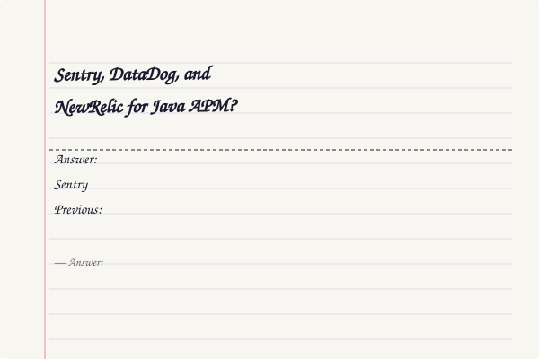
</a>
<a href="../../assets/images/diagrams/java/63-interview-tools/sentry-datadog-and-newrelic-for-java-apm-diagram.svg" target="_blank" rel="noopener">
  
</a>
<a href="../../assets/images/diagrams/java/63-interview-tools/sentry-datadog-and-newrelic-for-java-apm-sticky.svg" target="_blank" rel="noopener">
  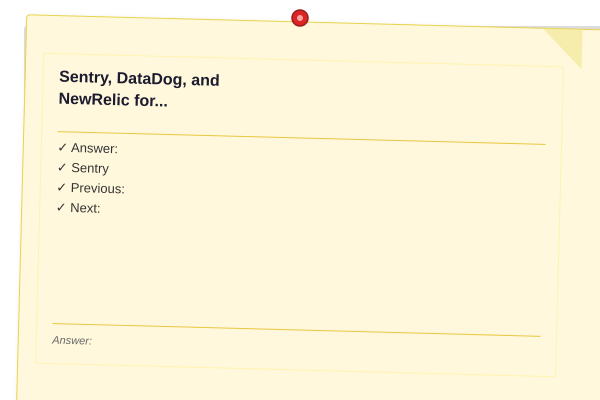
</a>


**Answer:** Application Performance Monitoring (APM) tools provide code-level observability: distributed tracing, error tracking, transaction breakdowns, and profiling.

**Sentry** — focused on error tracking and performance:

```xml
<!-- pom.xml -->
<dependency>
    <groupId>io.sentry</groupId>
    <artifactId>sentry-spring-boot-starter-jakarta</artifactId>
    <version>7.6.0</version>
</dependency>
```

```yaml
# application.yml

> **Previous:** [Testing Interview Q&amp;A](./62-interview-testing.md) | **Next:** [Design Patterns Interview Q&amp;A](./64-interview-design-patterns.md)
sentry:
  dsn: https://key@sentry.io/project
  traces-sample-rate: 0.2
  environment: ${SPRING_PROFILES_ACTIVE}
  attach-stacktrace: true
  max-request-body-size: always
```

```java
// Manual error capture
try {
    riskyOperation();
} catch (Exception e) {
    Sentry.captureException(e);
}

// Performance tracing
ITransaction transaction = Sentry.startTransaction("process-order", "task");
ISpan span = transaction.startChild("db-query");
try {
    orderRepository.findById(orderId);
} finally {
    span.finish();
    transaction.finish();
}
```

Sentry excels at attaching breadcrumbs (user events, HTTP requests, DB queries leading to an error) and grouping similar errors into issues. Performance monitoring includes distributed tracing and profiling.

**DataDog** — full-stack observability platform:

```xml
<dependency>
    <groupId>com.datadoghq</groupId>
    <artifactId>dd-java-agent</artifactId>
    <version>1.30.0</version>
    <scope>runtime</scope>
</dependency>
```

Attach to JVM:

```bash
java -javaagent:dd-java-agent.jar \
     -Ddd.service=order-service \
     -Ddd.env=production \
     -Ddd.version=1.2.3 \
     -Ddd.logs.injection=true \
     -jar app.jar
```

DataDog automatically instruments Spring Boot (controllers, RestTemplate, JDBC, Kafka). Key features:
- **Distributed tracing** with flame graphs and service maps
- **Logs** with automatic correlation to traces (`dd.trace_id`, `dd.span_id` in MDC)
- **Metrics** from Micrometer automatically submitted
- **Profiling** — method-level CPU, memory allocation, and wall-clock profiling
- **Synthetics** — synthetic browser and API tests
- **Watchdog** — ML-based anomaly detection

```yaml
# logback-spring.xml with DataDog trace injection

> **Previous:** [Testing Interview Q&amp;A](./62-interview-testing.md) | **Next:** [Design Patterns Interview Q&amp;A](./64-interview-design-patterns.md)
<configuration>
    <appender name="JSON" class="ch.qos.logback.core.ConsoleAppender">
        <encoder class="ch.qos.logback.classic.encoder.PatternLayoutEncoder">
            <pattern>%d{yyyy-MM-dd HH:mm:ss} [%thread] %-5level %logger{36} - %msg
                dd.trace_id=%X{dd.trace_id} dd.span_id=%X{dd.span_id} %n
            </pattern>
        </encoder>
    </appender>
</configuration>
```

**NewRelic** — agent-based APM with deep transaction insights:

```bash
java -javaagent:newrelic-agent.jar \
     -Dnewrelic.config.app_name=order-service \
     -Dnewrelic.config.license_key=KEY \
     -Dnewrelic.config.log_level=info \
     -jar app.jar
```

```yaml
# newrelic.yml

> **Previous:** [Testing Interview Q&amp;A](./62-interview-testing.md) | **Next:** [Design Patterns Interview Q&amp;A](./64-interview-design-patterns.md)
app_name: order-service
log_level: info
transaction_tracer:
  enabled: true
  transaction_threshold: apdex_f
  record_sql: obfuscated
slow_sql:
  enabled: true
```

NewRelic highlights:
- **Transaction traces** — detailed per-request breakdowns with SQL, external calls, and method timings
- **Apdex** — user satisfaction score based on configurable response time thresholds
- **Distributed tracing** with cross-service correlations
- **Infrastructure monitoring** — server, container, and cloud integration
- **AI monitoring** — LLM prompt/response tracking

**Comparison:**

| Feature | Sentry | DataDog | NewRelic |
|---------|--------|---------|----------|
| Error tracking | Excellent | Good | Good |
| Distributed tracing | Good | Excellent | Excellent |
| Real-user monitoring | Limited | Excellent | Good |
| Infrastructure | No | Yes | Yes |
| Log management | Limited | Yes | Yes |
| Profiling | Yes (performance) | Yes (continuous) | Yes (transaction) |
| Synthetic monitoring | No | Yes | Yes |
| Pricing | Per event | Per host + ingested data | Per host + data |
| Java agent | SDK-based | Java agent | Java agent |
| Ease of setup | Very easy | Moderate | Easy |

**Choosing:**
- Use **Sentry** for error-focused teams, smaller budgets, or when you just need to track and fix exceptions
- Use **DataDog** for full-stack visibility across infrastructure, applications, and logs
- Use **NewRelic** for deep transaction-level insights and when team already uses NewRelic ecosystem

---

### Q82: Database tools (pgAdmin, DBeaver, DataGrip, MySQL Workbench)?

<a href="../../assets/images/diagrams/java/63-interview-tools/database-tools-pgadmin-dbeaver-datagrip-mysql-workbench-handwritten.svg" target="_blank" rel="noopener">
  
</a>
<a href="../../assets/images/diagrams/java/63-interview-tools/database-tools-pgadmin-dbeaver-datagrip-mysql-workbench-diagram.svg" target="_blank" rel="noopener">
  
</a>
<a href="../../assets/images/diagrams/java/63-interview-tools/database-tools-pgadmin-dbeaver-datagrip-mysql-workbench-sticky.svg" target="_blank" rel="noopener">
  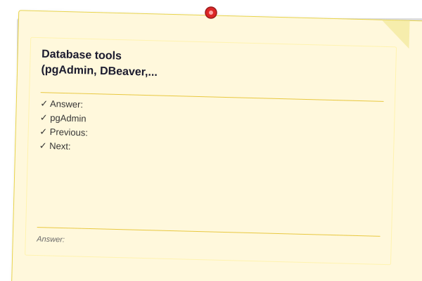
</a>


**Answer:** Database administration and query tools are essential for Java developers working with databases.

**pgAdmin** — open-source PostgreSQL admin:

```bash
# Docker Compose for local pgAdmin + Postgres

> **Previous:** [Testing Interview Q&amp;A](./62-interview-testing.md) | **Next:** [Design Patterns Interview Q&amp;A](./64-interview-design-patterns.md)
version: '3.8'
services:
  pgadmin:
    image: dpage/pgadmin4:latest
    environment:
      PGADMIN_DEFAULT_EMAIL: admin@example.com
      PGADMIN_DEFAULT_PASSWORD: admin
      PGADMIN_CONFIG_SERVER_MODE: 'False'
    ports:
      - "5050:80"
    volumes:
      - pgadmin-data:/var/lib/pgadmin
    depends_on:
      - postgres
  postgres:
    image: postgres:16-alpine
    environment:
      POSTGRES_DB: myapp
      POSTGRES_USER: app
      POSTGRES_PASSWORD: secret
    ports:
      - "5432:5432"
    volumes:
      - pgdata:/var/lib/postgresql/data

volumes:
  pgadmin-data:
  pgdata:
```

pgAdmin features: SQL query editor with syntax highlighting, ERD diagram viewer, server group organization, backup/restore wizard, auto-vacuum monitoring, query plan visualization, and role management.

**DBeaver** — universal database tool (supports 80+ databases):

```
Key features for Java developers:
├── Universal driver management (JDBC-based)
├── Connection profiles (Spring Boot datasource auto-detect)
├── ER diagrams (reverse engineer schema)
├── SQL editor with autocomplete and formatting
├── Data export (CSV, JSON, Excel, SQL insert)
├── SSH tunneling for remote databases
├── Compare (schema diff, data diff)
├── Metadata browser (tables, views, procedures, indexes)
├── Execution plan viewer
└── Version control integration (Git, SVN)
```

DBeaver Community Edition is free. DBeaver Pro adds Redis, MongoDB, Cassandra, and NoSQL support.

**DataGrip** — JetBrains IDE for databases:

```sql
-- Smart code completion
SELECT u.id, u.email, o.total
FROM users u
JOIN orders o ON u.id = o.user_id  -- auto-completes columns
WHERE o.created_at > '2024-01-01'
ORDER BY o.total DESC;

-- Built-in SQL formatter (Ctrl+Alt+L)
-- Refactoring (rename column propagates through queries)
-- Explain plan visualization
-- Test data generator
-- VCS integration (Git blame for queries)
```

DataGrip integrates with IntelliJ IDEA Ultimate, sharing credentials and connection settings. Features: context-aware completion, full-text search across all database objects, diagram visualization, SQL file versioning, SSH/SSL tunneling, and read-only mode for production.

**MySQL Workbench** — official MySQL GUI:

```sql
-- Workbench provides visual schema designer
-- Forward engineer: model → DDL script → database
-- Reverse engineer: database → ER diagram → model

-- Performance dashboard: real-time query monitoring
SHOW FULL PROCESSLIST;
EXPLAIN ANALYZE SELECT * FROM orders WHERE status = 'PENDING';

-- Admin features:
-- User management, privilege editor
-- Server status, variables, logs
-- Data export/import (mysqldump wrapper)
-- Instance configuration editor
```

MySQL Workbench features: visual SQL editor, schema synchronization (compare and push changes), performance dashboards (query throughput, buffer pool stats, connection health), query profiling, backup/restore wizard, and migration wizard (from Oracle, MS SQL, PostgreSQL to MySQL).

**Quick comparison:**

| Tool | Best for | Databases | Platform | Cost |
|------|----------|-----------|----------|------|
| pgAdmin | PostgreSQL specialists | PostgreSQL only | Web, Desktop | Free |
| DBeaver | Multi-DB teams | 80+ (JDBC) | Desktop | Free/Paid |
| DataGrip | JetBrains ecosystem | 30+ | Desktop | Paid |
| MySQL Workbench | MySQL/MariaDB | MySQL/MariaDB | Desktop | Free |

**Spring Boot datasource configs for popular tools:**

```yaml
# application.yml

> **Previous:** [Testing Interview Q&amp;A](./62-interview-testing.md) | **Next:** [Design Patterns Interview Q&amp;A](./64-interview-design-patterns.md)
spring:
  datasource:
    url: jdbc:postgresql://localhost:5432/myapp
    username: app
    password: secret
    hikari:
      schema: public
      connection-test-query: SELECT 1
```

For DataGrip/DBeaver, use the same JDBC URL and credentials. For Docker Compose scenarios, connect clients to `localhost:5432` with the same credentials defined in `docker-compose.yml`.

**Best practices:**
- Never use GUI tools for production schema changes — use Flyway/Liquibase migrations
- Use read-only roles for production access
- Use SSH tunnels for secure remote connections
- Enable connection pooling (HikariCP in application, connection manager in GUI tool)
- Document connection parameters in team wiki, not in code
- Use multiple tabs/sessions for different environments
- Save frequently-used queries as templates or snippets
```

## Concept Comparison Table

| Concept | Definition | Key Distinction | Use Case |
|---------|-----------|-----------------|----------|
| Interface | Contract without state | Multiple inheritance of type | API contracts |
| Abstract Class | Partial implementation | Single inheritance, shared state | Template method pattern |
| Record | Transparent data carrier | Auto-generated methods | DTOs, value objects |

## Quick Reference

| Topic | Key Points | Interview Frequency |
|-------|-----------|-------------------|
| **OOP** | Encapsulation, Inheritance, Polymorphism, Abstraction | Every interview |
| **Collections** | List, Set, Map, Queue, Deque | 9/10 interviews |
| **Concurrency** | synchronized, volatile, Locks, CompletableFuture | 7/10 senior interviews |
| **Java 8+** | Lambdas, Streams, Optional, CompletableFuture | 8/10 interviews |

## Cross-Application Matrix

| Skill | Junior (0-2yr) | Mid (3-5yr) | Senior (6-9yr) | Staff (10+) |
|-------|---------------|-------------|----------------|-------------|
| OOP & Design Patterns | Define and identify | Apply and combine | Evaluate and refactor | Create and teach |
| Collections | Basic usage | Performance trade-offs | Concurrent collections | Custom implementations |
| Concurrency | Syntax knowledge | Write thread-safe code | Debug deadlocks | Design concurrent systems |

## Chapter Quiz

1. What is the difference between equals() and == in Java?
   - A) They are identical
   - B) equals() compares values, == compares references
   - C) == compares values, equals() compares references
   - D) equals() is for primitives, == is for objects

<details>
<summary>Answer</summary>
**B) equals() compares logical equality (overridable), == compares reference equality.**
</details>

2. Which collection guarantees insertion order?
   - A) HashMap
   - B) TreeMap
   - C) LinkedHashMap
   - D) HashSet

<details>
<summary>Answer</summary>
**C) LinkedHashMap.** LinkedHashMap maintains a doubly-linked list of entries to preserve insertion order.
</details>

3. What keyword prevents a method from being overridden?
   - A) static
   - B) final
   - C) private
   - D) abstract

<details>
<summary>Answer</summary>
**B) final.** A final method cannot be overridden by subclasses.
</details>
