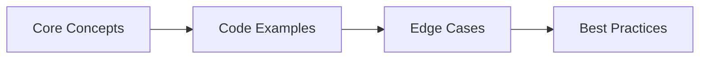

# 64. Design Patterns → Interview Q&A

> **Previous:** [Tools &amp; DevOps Interview Q&amp;A](./63-interview-tools.md) | **Next:** [System Design Interview Q&amp;A](./65-interview-system-design.md)

This chapter covers the most important design patterns for Java backend development: creational, structural, behavioral, enterprise integration, concurrency patterns, and anti-patterns. Each pattern includes a real-world Spring Boot usage example.

---


<!-- Image Gallery -->
<div style="display:flex;flex-wrap:wrap;gap:4px;margin:16px 0;padding:12px;background:#f8fafc;border-radius:8px;border:1px solid #e2e8f0;">
<a href="../../../assets/images/lessons/java/64-interview-design-patterns/hero.svg" target="_blank" rel="noopener">
  
</a>
<a href="../../../assets/images/lessons/java/64-interview-design-patterns/handwritten-notes.svg" target="_blank" rel="noopener">
  
</a>
<a href="../../../assets/images/lessons/java/64-interview-design-patterns/sticky-notes.svg" target="_blank" rel="noopener">
  
</a>
<a href="../../../assets/images/lessons/java/64-interview-design-patterns/visual-explanation.svg" target="_blank" rel="noopener">
  
</a>
<a href="../../../assets/images/lessons/java/64-interview-design-patterns/architecture.svg" target="_blank" rel="noopener">
  
</a>
<a href="../../../assets/images/lessons/java/64-interview-design-patterns/workflow.svg" target="_blank" rel="noopener">
  
</a>
<a href="../../../assets/images/lessons/java/64-interview-design-patterns/mindmap.svg" target="_blank" rel="noopener">
  
</a>
<a href="../../../assets/images/lessons/java/64-interview-design-patterns/comparison.svg" target="_blank" rel="noopener">
  
</a>
<a href="../../../assets/images/lessons/java/64-interview-design-patterns/cheatsheet.svg" target="_blank" rel="noopener">
  
</a>
<a href="../../../assets/images/lessons/java/64-interview-design-patterns/interview-quiz.svg" target="_blank" rel="noopener">
  
</a>
<a href="../../../assets/images/lessons/java/64-interview-design-patterns/social-card.svg" target="_blank" rel="noopener">
  
</a>
</div>
<!-- End Image Gallery -->

## Chapter at a Glance

| Topic | Key Focus | Key Questions |
|-------|----------|--------------|
| Core Concepts | Foundational understanding | Definitions, contrasts, trade-offs |
| Code Examples | Compilable, runnable solutions | Real interview scenarios |
| Best Practices | Production-ready patterns | Pitfalls to avoid |

## Chapter Roadmap



### Q1: What are the three categories of design patterns in the GoF book?

<a href="../../../assets/images/diagrams/java/64-interview-design-patterns/what-are-the-three-categories-of-design-patterns-in-the-gof-book-handwritten.svg" target="_blank" rel="noopener">
  
</a>
<a href="../../../assets/images/diagrams/java/64-interview-design-patterns/what-are-the-three-categories-of-design-patterns-in-the-gof-book-diagram.svg" target="_blank" rel="noopener">
  
</a>
<a href="../../../assets/images/diagrams/java/64-interview-design-patterns/what-are-the-three-categories-of-design-patterns-in-the-gof-book-sticky.svg" target="_blank" rel="noopener">
  
</a>


> **Pro Tip:** In interviews, always start with the "why" before the "how." Explaining the reasoning behind a design choice is more valuable than reciting syntax.

> **Remember:** Code readability matters in interviews. Write clean, well-structured code with meaningful variable names.


**Answer:** The Gang of Four (GoF) book categorizes 23 design patterns into three groups:

1. **Creational patterns** → deal with object creation mechanisms, trying to create objects in a manner suitable to the situation. Examples: Singleton, Factory Method, Abstract Factory, Builder, Prototype.

2. **Structural patterns** → deal with object composition, identifying simple ways to realize relationships between entities. Examples: Adapter, Decorator, Proxy, Facade, Composite, Bridge, Flyweight.

3. **Behavioral patterns** → deal with communication between objects, identifying patterns of communication. Examples: Strategy, Observer, Template Method, Command, Chain of Responsibility, State, Visitor, Mediator, Iterator, Memento, Interpreter.

---

### Q2: What is the Singleton pattern and how do you implement it in Java?

<a href="../../../assets/images/diagrams/java/64-interview-design-patterns/what-is-the-singleton-pattern-and-how-do-you-implement-it-in-java-handwritten.svg" target="_blank" rel="noopener">
  
</a>
<a href="../../../assets/images/diagrams/java/64-interview-design-patterns/what-is-the-singleton-pattern-and-how-do-you-implement-it-in-java-diagram.svg" target="_blank" rel="noopener">
  
</a>
<a href="../../../assets/images/diagrams/java/64-interview-design-patterns/what-is-the-singleton-pattern-and-how-do-you-implement-it-in-java-sticky.svg" target="_blank" rel="noopener">
  
</a>


**Answer:** Singleton ensures a class has only one instance and provides a global access point to it. In Spring, beans are singletons by default (one instance per IoC container).

**Classic thread-safe implementation (bill-pugh / initialization-on-demand holder):**

```java
public class DatabaseConnectionPool {
    private DatabaseConnectionPool() {
        // private constructor
    }

    private static class Holder {
        static final DatabaseConnectionPool INSTANCE = new DatabaseConnectionPool();
    }

    public static DatabaseConnectionPool getInstance() {
        return Holder.INSTANCE;
    }

    public Connection getConnection() {
        // return pooled connection
    }
}
```

**Enum singleton (most robust, prevents reflection attack):**

```java
public enum ConfigManager {
    INSTANCE;

    private Properties properties = new Properties();

    public String get(String key) {
        return properties.getProperty(key);
    }

    public void load(String path) throws IOException {
        try (InputStream is = new FileInputStream(path)) {
            properties.load(is);
        }
    }
}
```

**In Spring Boot, beans are singleton by default:**

```java
@Service  // Singleton scope (default)
public class OrderService {
    // Single instance shared across the application
}
```

Singleton is the default Spring bean scope. Other scopes: prototype, request, session, application, websocket.

---

### Q3: What is the Factory Method pattern?

<a href="../../../assets/images/diagrams/java/64-interview-design-patterns/what-is-the-factory-method-pattern-handwritten.svg" target="_blank" rel="noopener">
  
</a>
<a href="../../../assets/images/diagrams/java/64-interview-design-patterns/what-is-the-factory-method-pattern-diagram.svg" target="_blank" rel="noopener">
  
</a>
<a href="../../../assets/images/diagrams/java/64-interview-design-patterns/what-is-the-factory-method-pattern-sticky.svg" target="_blank" rel="noopener">
  
</a>


**Answer:** Factory Method defines an interface for creating an object, but lets subclasses decide which class to instantiate. It lets a class defer instantiation to subclasses.

```java
// Product interface
public interface PaymentProcessor {
    PaymentResult process(PaymentRequest request);
}

// Concrete products
public class CreditCardProcessor implements PaymentProcessor {
    public PaymentResult process(PaymentRequest request) {
        // process credit card payment
    }
}

public class PayPalProcessor implements PaymentProcessor {
    public PaymentResult process(PaymentRequest request) {
        // process PayPal payment
    }
}

// Factory method in the creator
public abstract class PaymentService {
    public PaymentResult executePayment(PaymentRequest request) {
        PaymentProcessor processor = createProcessor(request.method());
        return processor.process(request);
    }

    // Factory method → subclasses implement this
    protected abstract PaymentProcessor createProcessor(String method);
}

// Concrete creator
@Component
public class StandardPaymentService extends PaymentService {
    @Override
    protected PaymentProcessor createProcessor(String method) {
        return switch (method) {
            case "CREDIT_CARD" -> new CreditCardProcessor();
            case "PAYPAL" -> new PayPalProcessor();
            default -> throw new IllegalArgumentException("Unknown method: " + method);
        };
    }
}
```

**In Spring, Factory Method is commonly seen in `@Bean` methods in `@Configuration` classes:**

```java
@Configuration
public class AppConfig {
    @Bean
    public PaymentProcessor paymentProcessor() {
        return new CreditCardProcessor();  // factory method
    }
}
```

---

### Q4: What is the Abstract Factory pattern?

<a href="../../../assets/images/diagrams/java/64-interview-design-patterns/what-is-the-abstract-factory-pattern-handwritten.svg" target="_blank" rel="noopener">
  
</a>
<a href="../../../assets/images/diagrams/java/64-interview-design-patterns/what-is-the-abstract-factory-pattern-diagram.svg" target="_blank" rel="noopener">
  
</a>
<a href="../../../assets/images/diagrams/java/64-interview-design-patterns/what-is-the-abstract-factory-pattern-sticky.svg" target="_blank" rel="noopener">
  
</a>


**Answer:** Abstract Factory provides an interface for creating families of related or dependent objects without specifying their concrete classes.

```java
// Abstract factory
public interface UIFactory {
    Button createButton();
    TextField createTextField();
    Checkbox createCheckbox();
}

// Concrete factory 1
public class DarkThemeFactory implements UIFactory {
    public Button createButton() { return new DarkButton(); }
    public TextField createTextField() { return new DarkTextField(); }
    public Checkbox createCheckbox() { return new DarkCheckbox(); }
}

// Concrete factory 2
public class LightThemeFactory implements UIFactory {
    public Button createButton() { return new LightButton(); }
    public TextField createTextField() { return new LightTextField(); }
    public Checkbox createCheckbox() { return new LightCheckbox(); }
}

// Client
public class Application {
    private final UIFactory uiFactory;

    public Application(UIFactory uiFactory) {
        this.uiFactory = uiFactory;
    }

    public void render() {
        Button button = uiFactory.createButton();
        TextField field = uiFactory.createTextField();
        // render UI
    }
}
```

**In Spring Boot, Abstract Factory is seen in Spring Cloud's `@EnableDiscoveryClient` which auto-configures families of discovery implementations (Eureka, Consul, ZooKeeper).**

---

### Q5: What is the Builder pattern and when do you use it?

<a href="../../../assets/images/diagrams/java/64-interview-design-patterns/what-is-the-builder-pattern-and-when-do-you-use-it-handwritten.svg" target="_blank" rel="noopener">
  
</a>
<a href="../../../assets/images/diagrams/java/64-interview-design-patterns/what-is-the-builder-pattern-and-when-do-you-use-it-diagram.svg" target="_blank" rel="noopener">
  
</a>
<a href="../../../assets/images/diagrams/java/64-interview-design-patterns/what-is-the-builder-pattern-and-when-do-you-use-it-sticky.svg" target="_blank" rel="noopener">
  
</a>


**Answer:** Builder separates the construction of a complex object from its representation, allowing the same construction process to create different representations. Used when:
- Objects have many optional parameters (telescoping constructor problem)
- Construction involves multiple steps
- Objects should be immutable after construction

```java
public class Order {
    private final String orderId;
    private final String userId;
    private final List<OrderItem> items;
    private final Address shippingAddress;
    private final String couponCode;
    private final boolean giftWrap;
    private final String deliveryInstructions;

    private Order(Builder builder) {
        this.orderId = builder.orderId;
        this.userId = builder.userId;
        this.items = Collections.unmodifiableList(builder.items);
        this.shippingAddress = builder.shippingAddress;
        this.couponCode = builder.couponCode;
        this.giftWrap = builder.giftWrap;
        this.deliveryInstructions = builder.deliveryInstructions;
    }

    // Getters (no setters → immutable)

    public static class Builder {
        private String orderId;
        private String userId;
        private List<OrderItem> items = new ArrayList<>();
        private Address shippingAddress;
        private String couponCode;
        private boolean giftWrap;
        private String deliveryInstructions;

        public Builder(String orderId, String userId) {
            this.orderId = orderId;
            this.userId = userId;
        }

        public Builder items(List<OrderItem> items) {
            this.items = items;
            return this;
        }

        public Builder shippingAddress(Address address) {
            this.shippingAddress = address;
            return this;
        }

        public Builder couponCode(String code) {
            this.couponCode = code;
            return this;
        }

        public Builder giftWrap(boolean giftWrap) {
            this.giftWrap = giftWrap;
            return this;
        }

        public Order build() {
            return new Order(this);
        }
    }
}

// Usage
Order order = new Order.Builder("ord-123", "usr-456")
    .items(List.of(new OrderItem("p1", 2)))
    .shippingAddress(address)
    .couponCode("SAVE10")
    .giftWrap(true)
    .build();
```

**In Spring Boot:** `RestClient.builder()`, `UriComponentsBuilder`, `SecurityFilterChain` with Lambda DSL, `MockMvcRequestBuilders`.

---

### Q6: What is the Prototype pattern?

<a href="../../../assets/images/diagrams/java/64-interview-design-patterns/what-is-the-prototype-pattern-handwritten.svg" target="_blank" rel="noopener">
  
</a>
<a href="../../../assets/images/diagrams/java/64-interview-design-patterns/what-is-the-prototype-pattern-diagram.svg" target="_blank" rel="noopener">
  
</a>
<a href="../../../assets/images/diagrams/java/64-interview-design-patterns/what-is-the-prototype-pattern-sticky.svg" target="_blank" rel="noopener">
  
</a>


**Answer:** Prototype creates new objects by cloning an existing object (prototype) rather than instantiating a new class. Useful when object creation is expensive.

```java
@Component
@Scope("prototype")
public class ReportTemplate implements Cloneable {
    private String header;
    private String footer;
    private String format;
    private Map<String, String> styles = new HashMap<>();

    // setters and configuration...

    @Override
    public ReportTemplate clone() {
        try {
            ReportTemplate cloned = (ReportTemplate) super.clone();
            cloned.styles = new HashMap<>(this.styles);  // deep copy mutable fields
            return cloned;
        } catch (CloneNotSupportedException e) {
            throw new RuntimeException(e);
        }
    }
}
```

**Usage:** Creating multiple HTTP request objects from a template, document generation, test data factories.

---

### Q7: What is the Adapter pattern?

<a href="../../../assets/images/diagrams/java/64-interview-design-patterns/what-is-the-adapter-pattern-handwritten.svg" target="_blank" rel="noopener">
  
</a>
<a href="../../../assets/images/diagrams/java/64-interview-design-patterns/what-is-the-adapter-pattern-diagram.svg" target="_blank" rel="noopener">
  
</a>
<a href="../../../assets/images/diagrams/java/64-interview-design-patterns/what-is-the-adapter-pattern-sticky.svg" target="_blank" rel="noopener">
  
</a>


**Answer:** Adapter allows incompatible interfaces to work together. It converts the interface of a class into another interface that the client expects.

```java
// Target interface (what the client expects)
public interface PaymentGateway {
    PaymentResponse charge(String token, BigDecimal amount);
}

// Adaptee (existing class with different interface)
public class StripeApi {
    public StripeCharge createCharge(Double amount, String sourceId, String currency) {
        // Stripe-specific implementation
    }
}

// Adapter
@Component
public class StripePaymentAdapter implements PaymentGateway {
    private final StripeApi stripeApi;

    public StripePaymentAdapter(StripeApi stripeApi) {
        this.stripeApi = stripeApi;
    }

    @Override
    public PaymentResponse charge(String token, BigDecimal amount) {
        StripeCharge charge = stripeApi.createCharge(
            amount.doubleValue(),
            token,
            "USD"
        );
        return new PaymentResponse(charge.getId(), charge.getStatus());
    }
}
```

**In Spring Boot:** Security filter chains (`SecurityFilterChain` adapts multiple security configurations), `HandlerAdapter` (adapts controllers to the framework).

---

### Q8: What is the Decorator pattern?

<a href="../../../assets/images/diagrams/java/64-interview-design-patterns/what-is-the-decorator-pattern-handwritten.svg" target="_blank" rel="noopener">
  
</a>
<a href="../../../assets/images/diagrams/java/64-interview-design-patterns/what-is-the-decorator-pattern-diagram.svg" target="_blank" rel="noopener">
  
</a>
<a href="../../../assets/images/diagrams/java/64-interview-design-patterns/what-is-the-decorator-pattern-sticky.svg" target="_blank" rel="noopener">
  
</a>


**Answer:** Decorator allows behavior to be added to an individual object dynamically, without affecting other objects of the same class. An alternative to subclassing for extending functionality.

```java
// Component interface
public interface DataSource {
    void writeData(String data);
    String readData();
}

// Concrete component
public class FileDataSource implements DataSource {
    private final String filename;

    public FileDataSource(String filename) {
        this.filename = filename;
    }

    public void writeData(String data) {
        Files.writeString(Path.of(filename), data);
    }

    public String readData() {
        return Files.readString(Path.of(filename));
    }
}

// Base decorator
public abstract class DataSourceDecorator implements DataSource {
    protected DataSource wrappee;

    public DataSourceDecorator(DataSource source) {
        this.wrappee = source;
    }

    public void writeData(String data) {
        wrappee.writeData(data);
    }

    public String readData() {
        return wrappee.readData();
    }
}

// Concrete decorator 1
public class EncryptionDecorator extends DataSourceDecorator {
    public EncryptionDecorator(DataSource source) {
        super(source);
    }

    @Override
    public void writeData(String data) {
        super.writeData(encrypt(data));
    }

    @Override
    public String readData() {
        return decrypt(super.readData());
    }

    private String encrypt(String data) { /* AES encrypt */ }
    private String decrypt(String data) { /* AES decrypt */ }
}

// Concrete decorator 2
public class CompressionDecorator extends DataSourceDecorator {
    public CompressionDecorator(DataSource source) {
        super(source);
    }

    @Override
    public void writeData(String data) {
        super.writeData(compress(data));
    }

    @Override
    public String readData() {
        return decompress(super.readData());
    }
}

// Usage
DataSource source = new FileDataSource("data.txt");
source = new CompressionDecorator(source);
source = new EncryptionDecorator(source);
source.writeData("Hello, World!");  // encrypted + compressed
```

**In Spring Boot:** Servlet filters (`OncePerRequestFilter`), `HandlerInterceptor`, `CacheAspect` (AOP decorates methods).

---

### Q9: What is the Proxy pattern?

<a href="../../../assets/images/diagrams/java/64-interview-design-patterns/what-is-the-proxy-pattern-handwritten.svg" target="_blank" rel="noopener">
  
</a>
<a href="../../../assets/images/diagrams/java/64-interview-design-patterns/what-is-the-proxy-pattern-diagram.svg" target="_blank" rel="noopener">
  
</a>
<a href="../../../assets/images/diagrams/java/64-interview-design-patterns/what-is-the-proxy-pattern-sticky.svg" target="_blank" rel="noopener">
  
</a>


**Answer:** Proxy provides a surrogate or placeholder for another object to control access to it. Types: virtual proxy (lazy loading), protection proxy (access control), remote proxy (RPC).

```java
// Subject interface
public interface InventoryService {
    InventoryCheckResult checkStock(String productId, int quantity);
}

// Real subject
public class RemoteInventoryService implements InventoryService {
    @Override
    public InventoryCheckResult checkStock(String productId, int quantity) {
        // Expensive API call to external warehouse system
    }
}

// Protection proxy
@Component
public class InventoryServiceProxy implements InventoryService {
    private final RemoteInventoryService realService;
    private final CacheManager cacheManager;

    @Override
    public InventoryCheckResult checkStock(String productId, int quantity) {
        // Check cache first (lazy + caching)
        String cacheKey = "stock:" + productId;
        InventoryCheckResult cached = cacheManager.get(cacheKey);
        if (cached != null) {
            return cached;
        }

        // Delegate to real service
        InventoryCheckResult result = realService.checkStock(productId, quantity);

        // Cache for 5 minutes
        cacheManager.put(cacheKey, result, Duration.ofMinutes(5));
        return result;
    }
}
```

**In Spring Boot:** AOP proxies (when you annotate a method with `@Transactional`, `@Cacheable`, `@Async`), `java.lang.reflect.Proxy`, `CGLIB` proxies.

---

### Q10: What is the Facade pattern?

<a href="../../../assets/images/diagrams/java/64-interview-design-patterns/what-is-the-facade-pattern-handwritten.svg" target="_blank" rel="noopener">
  
</a>
<a href="../../../assets/images/diagrams/java/64-interview-design-patterns/what-is-the-facade-pattern-diagram.svg" target="_blank" rel="noopener">
  
</a>
<a href="../../../assets/images/diagrams/java/64-interview-design-patterns/what-is-the-facade-pattern-sticky.svg" target="_blank" rel="noopener">
  
</a>


**Answer:** Facade provides a simplified interface to a complex subsystem. It hides the complexity of multiple interdependent classes behind a single, easy-to-use API.

```java
// Complex subsystem classes
public class OrderValidator { /* validates order */ }
public class PaymentProcessor { /* processes payment */ }
public class InventoryManager { /* updates inventory */ }
public class ShippingService { /* arranges shipment */ }
public class NotificationService { /* sends emails */ }

// Facade
@Service
public class OrderFacade {
    private final OrderValidator validator;
    private final PaymentProcessor paymentProcessor;
    private final InventoryManager inventoryManager;
    private final ShippingService shippingService;
    private final NotificationService notificationService;

    public OrderResult placeOrder(OrderRequest request) {
        // Step 1: Validate
        validator.validate(request);

        // Step 2: Process payment
        PaymentResult payment = paymentProcessor.charge(request.total());

        // Step 3: Update inventory
        inventoryManager.deduct(request.items());

        // Step 4: Arrange shipping
        Shipping shipping = shippingService.schedule(request.address());

        // Step 5: Notify
        notificationService.sendConfirmation(request.userEmail());

        return new OrderResult(request.orderId(), payment, shipping);
    }
}
```

**In Spring Boot:** `JdbcTemplate`, `RestTemplate`, `KafkaTemplate`, `RedisTemplate` → all facades over complex underlying APIs.

---

### Q11: What is the Strategy pattern?

<a href="../../../assets/images/diagrams/java/64-interview-design-patterns/what-is-the-strategy-pattern-handwritten.svg" target="_blank" rel="noopener">
  
</a>
<a href="../../../assets/images/diagrams/java/64-interview-design-patterns/what-is-the-strategy-pattern-diagram.svg" target="_blank" rel="noopener">
  
</a>
<a href="../../../assets/images/diagrams/java/64-interview-design-patterns/what-is-the-strategy-pattern-sticky.svg" target="_blank" rel="noopener">
  
</a>


**Answer:** Strategy defines a family of algorithms, encapsulates each one, and makes them interchangeable. The algorithm can vary independently from the clients that use it.

```java
// Strategy interface
public interface PricingStrategy {
    BigDecimal calculatePrice(BigDecimal basePrice, OrderContext context);
}

// Concrete strategies
public class StandardPricing implements PricingStrategy {
    public BigDecimal calculatePrice(BigDecimal basePrice, OrderContext context) {
        return basePrice;  // no discount
    }
}

public class LoyaltyPricing implements PricingStrategy {
    public BigDecimal calculatePrice(BigDecimal basePrice, OrderContext context) {
        return basePrice.multiply(BigDecimal.valueOf(0.9));  // 10% off
    }
}

public class BulkPricing implements PricingStrategy {
    public BigDecimal calculatePrice(BigDecimal basePrice, OrderContext context) {
        return basePrice.multiply(BigDecimal.valueOf(0.85));  // 15% off for bulk
    }
}

// Context
@Service
public class PricingService {
    private final Map<String, PricingStrategy> strategies;

    public PricingService() {
        this.strategies = new HashMap<>();
        strategies.put("STANDARD", new StandardPricing());
        strategies.put("LOYALTY", new LoyaltyPricing());
        strategies.put("BULK", new BulkPricing());
    }

    public BigDecimal calculatePrice(Order order) {
        PricingStrategy strategy = strategies.get(order.getCustomerTier());
        if (strategy == null) {
            strategy = strategies.get("STANDARD");
        }
        return strategy.calculatePrice(order.getTotal(), order.toContext());
    }
}
```

**In Spring Boot:** `AuthenticationProvider` (different auth strategies), `PasswordEncoder` (different encoding algorithms), `ResourceHandler` in security config.

**With dependency injection:**

```java
@Service
public class PricingService {
    private final Map<String, PricingStrategy> strategies;

    public PricingService(List<PricingStrategy> strategyList) {
        this.strategies = strategyList.stream()
            .collect(Collectors.toMap(
                s -> s.getClass().getAnnotation(Component.class).value(),
                Function.identity()
            ));
    }
}
```

---

### Q12: What is the Observer pattern?

<a href="../../../assets/images/diagrams/java/64-interview-design-patterns/what-is-the-observer-pattern-handwritten.svg" target="_blank" rel="noopener">
  
</a>
<a href="../../../assets/images/diagrams/java/64-interview-design-patterns/what-is-the-observer-pattern-diagram.svg" target="_blank" rel="noopener">
  
</a>
<a href="../../../assets/images/diagrams/java/64-interview-design-patterns/what-is-the-observer-pattern-sticky.svg" target="_blank" rel="noopener">
  
</a>


**Answer:** Observer defines a one-to-many dependency between objects so that when one object changes state, all its dependents are notified and updated automatically.

```java
// Event (the notification object)
public record OrderCreatedEvent(String orderId, String userId, BigDecimal total) {}

// Observable / Subject
@Component
public class EventPublisher {
    private final List<EventListener> listeners = new CopyOnWriteArrayList<>();

    public void subscribe(EventListener listener) {
        listeners.add(listener);
    }

    public void unsubscribe(EventListener listener) {
        listeners.remove(listener);
    }

    public void publish(OrderCreatedEvent event) {
        listeners.forEach(listener -> listener.onEvent(event));
    }
}

// Observer interface
public interface EventListener {
    void onEvent(OrderCreatedEvent event);
}

// Concrete observers
@Component
public class EmailNotificationListener implements EventListener {
    @Override
    public void onEvent(OrderCreatedEvent event) {
        // Send confirmation email
    }
}

@Component
public class InventoryUpdateListener implements EventListener {
    @Override
    public void onEvent(OrderCreatedEvent event) {
        // Update inventory
    }
}
```

**Alternative → Guava EventBus:**

```java
@Component
public class OrderEventBus {
    private final EventBus eventBus = new EventBus();

    public void post(Object event) {
        eventBus.post(event);
    }

    public void register(Object listener) {
        eventBus.register(listener);
    }
}

@Component
public class EmailService {
    @Subscribe
    public void handleOrderCreated(OrderCreatedEvent event) {
        // send email
    }
}
```

**In Spring Boot:** `ApplicationEventPublisher` + `@EventListener` is the canonical Observer implementation:

```java
@Component
public class OrderCreatedPublisher {
    @Autowired
    private ApplicationEventPublisher publisher;

    public void createOrder(OrderRequest request) {
        Order order = doCreate(request);
        publisher.publishEvent(new OrderCreatedEvent(order.getId()));
    }
}

@Component
public class EmailService {
    @EventListener
    public void handle(OrderCreatedEvent event) {
        // send email asynchronously
    }
}
```

---

### Q13: What is the Template Method pattern?

<a href="../../../assets/images/diagrams/java/64-interview-design-patterns/what-is-the-template-method-pattern-handwritten.svg" target="_blank" rel="noopener">
  
</a>
<a href="../../../assets/images/diagrams/java/64-interview-design-patterns/what-is-the-template-method-pattern-diagram.svg" target="_blank" rel="noopener">
  
</a>
<a href="../../../assets/images/diagrams/java/64-interview-design-patterns/what-is-the-template-method-pattern-sticky.svg" target="_blank" rel="noopener">
  
</a>


**Answer:** Template Method defines the skeleton of an algorithm in a method, deferring some steps to subclasses. Subclasses can redefine certain steps without changing the algorithm's structure.

```java
public abstract class DataExporter {
    // Template method → defines the algorithm skeleton
    public final File export(DataRequest request) {
        validate(request);
        List<Data> data = fetchData(request);
        String formattedData = format(data);
        File file = writeToFile(formattedData);
        postProcess(file);
        return file;
    }

    protected void validate(DataRequest request) {
        if (request == null) throw new IllegalArgumentException();
    }

    protected abstract List<Data> fetchData(DataRequest request);
    protected abstract String format(List<Data> data);

    protected File writeToFile(String content) {
        // Common implementation → write to temp file
    }

    protected void postProcess(File file) {
        // Hook method → subclasses can override, default does nothing
    }
}

@Component
public class CsvExporter extends DataExporter {
    @Override
    protected List<Data> fetchData(DataRequest request) {
        return repository.findAllByDateRange(request.startDate(), request.endDate());
    }

    @Override
    protected String format(List<Data> data) {
        StringBuilder sb = new StringBuilder("id,name,amount,date\n");
        data.forEach(d -> sb.append(d.toCsvRow()).append("\n"));
        return sb.toString();
    }
}
```

**In Spring Boot:** `JdbcTemplate` (template methods like `query`, `update`), `RestTemplate` (request execution flow), `WebSocketHandler`, `AbstractAuthenticationProcessingFilter`.

---

### Q14: What is the Command pattern?

<a href="../../../assets/images/diagrams/java/64-interview-design-patterns/what-is-the-command-pattern-handwritten.svg" target="_blank" rel="noopener">
  
</a>
<a href="../../../assets/images/diagrams/java/64-interview-design-patterns/what-is-the-command-pattern-diagram.svg" target="_blank" rel="noopener">
  
</a>
<a href="../../../assets/images/diagrams/java/64-interview-design-patterns/what-is-the-command-pattern-sticky.svg" target="_blank" rel="noopener">
  
</a>


**Answer:** Command encapsulates a request as an object, allowing parameterization of clients with different requests, queuing of requests, and support for undoable operations.

```java
// Command interface
public interface Command {
    void execute();
    void undo();
}

// Concrete commands
public class CreateOrderCommand implements Command {
    private final OrderService orderService;
    private final OrderRequest request;
    private Order createdOrder;

    public CreateOrderCommand(OrderService orderService, OrderRequest request) {
        this.orderService = orderService;
        this.request = request;
    }

    @Override
    public void execute() {
        this.createdOrder = orderService.createOrder(request);
    }

    @Override
    public void undo() {
        if (createdOrder != null) {
            orderService.cancelOrder(createdOrder.getId());
        }
    }
}

// Invoker
public class OrderCommandInvoker {
    private final List<Command> history = new ArrayList<>();

    public void executeCommand(Command command) {
        command.execute();
        history.add(command);
    }

    public void undoLast() {
        if (!history.isEmpty()) {
            Command command = history.remove(history.size() - 1);
            command.undo();
        }
    }
}
```

**In Spring Boot:** `Runnable` and `Callable` (thread pool commands), `MessagePostProcessor` in RabbitMQ/Kafka, `@RequestMapping` handlers (each request is essentially a command execution).

---

### Q15: What is the Chain of Responsibility pattern?

<a href="../../../assets/images/diagrams/java/64-interview-design-patterns/what-is-the-chain-of-responsibility-pattern-handwritten.svg" target="_blank" rel="noopener">
  
</a>
<a href="../../../assets/images/diagrams/java/64-interview-design-patterns/what-is-the-chain-of-responsibility-pattern-diagram.svg" target="_blank" rel="noopener">
  
</a>
<a href="../../../assets/images/diagrams/java/64-interview-design-patterns/what-is-the-chain-of-responsibility-pattern-sticky.svg" target="_blank" rel="noopener">
  
</a>


**Answer:** Chain of Responsibility lets you pass requests along a chain of handlers. Each handler decides either to process the request or pass it to the next handler in the chain.

```java
// Handler interface
public abstract class ValidationHandler {
    protected ValidationHandler next;

    public ValidationHandler linkWith(ValidationHandler next) {
        this.next = next;
        return next;
    }

    public abstract boolean validate(OrderRequest request);

    protected boolean validateNext(OrderRequest request) {
        if (next == null) return true;
        return next.validate(request);
    }
}

// Concrete handlers
public class UserExistsValidator extends ValidationHandler {
    @Override
    public boolean validate(OrderRequest request) {
        if (!userRepository.existsById(request.userId())) {
            throw new ValidationException("User not found");
        }
        return validateNext(request);
    }
}

public class ProductAvailableValidator extends ValidationHandler {
    @Override
    public boolean validate(OrderRequest request) {
        for (OrderItem item : request.items()) {
            if (!inventoryService.isAvailable(item.productId(), item.quantity())) {
                throw new ValidationException("Product not available: " + item.productId());
            }
        }
        return validateNext(request);
    }
}

public class PaymentMethodValidator extends ValidationHandler {
    @Override
    public boolean validate(OrderRequest request) {
        if (!paymentService.isValidMethod(request.paymentMethod())) {
            throw new ValidationException("Invalid payment method");
        }
        return validateNext(request);
    }
}

// Building the chain
ValidationHandler chain = new UserExistsValidator();
chain.linkWith(new ProductAvailableValidator())
     .linkWith(new PaymentMethodValidator());
```

**In Spring Boot:** Spring Security filter chain (`SecurityFilterChain`), servlet filters, HandlerInterceptor with custom ordering, Java `Logger` (log level propagation).

---

### Q16: What is the State pattern?

<a href="../../../assets/images/diagrams/java/64-interview-design-patterns/what-is-the-state-pattern-handwritten.svg" target="_blank" rel="noopener">
  
</a>
<a href="../../../assets/images/diagrams/java/64-interview-design-patterns/what-is-the-state-pattern-diagram.svg" target="_blank" rel="noopener">
  
</a>
<a href="../../../assets/images/diagrams/java/64-interview-design-patterns/what-is-the-state-pattern-sticky.svg" target="_blank" rel="noopener">
  
</a>


**Answer:** State allows an object to alter its behavior when its internal state changes. The object will appear to change its class.

```java
// State interface
public interface OrderState {
    void next(Order order);
    void cancel(Order order);
    String getStatus();
}

// Concrete states
public class PendingState implements OrderState {
    public void next(Order order) {
        order.setState(new ConfirmedState());
    }
    public void cancel(Order order) {
        order.setState(new CancelledState());
    }
    public String getStatus() { return "PENDING"; }
}

public class ConfirmedState implements OrderState {
    public void next(Order order) {
        order.setState(new ShippedState());
    }
    public void cancel(Order order) {
        order.setState(new CancelledState());
    }
    public String getStatus() { return "CONFIRMED"; }
}

public class ShippedState implements OrderState {
    public void next(Order order) {
        order.setState(new DeliveredState());
    }
    public void cancel(Order order) {
        throw new IllegalStateException("Cannot cancel shipped order");
    }
    public String getStatus() { return "SHIPPED"; }
}

// Context
@Entity
public class Order {
    @Id private Long id;
    @Transient
    private OrderState state = new PendingState();

    public void next() { state.next(this); }
    public void cancel() { state.cancel(this); }
    public String getStatus() { return state.getStatus(); }

    public void setState(OrderState state) {
        this.state = state;
    }
}
```

**In Spring Boot:** `Resource` lifecycle management, Spring Security's `SecurityContextHolder` (authentication state), batch job execution states.

---

### Q17: What is the Composite pattern?

<a href="../../../assets/images/diagrams/java/64-interview-design-patterns/what-is-the-composite-pattern-handwritten.svg" target="_blank" rel="noopener">
  
</a>
<a href="../../../assets/images/diagrams/java/64-interview-design-patterns/what-is-the-composite-pattern-diagram.svg" target="_blank" rel="noopener">
  
</a>
<a href="../../../assets/images/diagrams/java/64-interview-design-patterns/what-is-the-composite-pattern-sticky.svg" target="_blank" rel="noopener">
  
</a>


**Answer:** Composite composes objects into tree structures to represent part-whole hierarchies. It lets clients treat individual objects and compositions uniformly.

```java
// Component
public interface MenuItem {
    String getName();
    void render();
    BigDecimal getPrice();
}

// Leaf
public class Dish implements MenuItem {
    private String name;
    private BigDecimal price;

    @Override
    public void render() {
        System.out.println("  " + name + " - $" + price);
    }

    @Override
    public BigDecimal getPrice() { return price; }
}

// Composite
public class MenuCategory implements MenuItem {
    private String name;
    private List<MenuItem> items = new ArrayList<>();

    public void add(MenuItem item) {
        items.add(item);
    }

    public void remove(MenuItem item) {
        items.remove(item);
    }

    @Override
    public void render() {
        System.out.println(name + ":");
        items.forEach(MenuItem::render);
    }

    @Override
    public BigDecimal getPrice() {
        return items.stream()
            .map(MenuItem::getPrice)
            .reduce(BigDecimal.ZERO, BigDecimal::add);
    }
}

// Usage
MenuCategory menu = new MenuCategory("Main Menu");
MenuCategory appetizers = new MenuCategory("Appetizers");
appetizers.add(new Dish("Spring Rolls", BigDecimal.valueOf(5.99)));
appetizers.add(new Dish("Soup", BigDecimal.valueOf(4.99)));

MenuCategory mains = new MenuCategory("Main Courses");
mains.add(new Dish("Steak", BigDecimal.valueOf(24.99)));
mains.add(new Dish("Salmon", BigDecimal.valueOf(18.99)));

menu.add(appetizers);
menu.add(mains);
menu.render();  // Renders entire menu tree
```

**In Spring Boot:** `BeanDefinition` hierarchy, `PropertySource` hierarchy, Spring Security's filter chain structure.

---

### Q18: What is the Flyweight pattern?

<a href="../../../assets/images/diagrams/java/64-interview-design-patterns/what-is-the-flyweight-pattern-handwritten.svg" target="_blank" rel="noopener">
  
</a>
<a href="../../../assets/images/diagrams/java/64-interview-design-patterns/what-is-the-flyweight-pattern-diagram.svg" target="_blank" rel="noopener">
  
</a>
<a href="../../../assets/images/diagrams/java/64-interview-design-patterns/what-is-the-flyweight-pattern-sticky.svg" target="_blank" rel="noopener">
  
</a>


**Answer:** Flyweight minimizes memory usage by sharing as much data as possible with similar objects. It's useful when a large number of nearly identical objects are needed.

```java
// Flyweight → intrinsic state (shared)
public class FontStyle {
    private final String fontFamily;
    private final int fontSize;
    private final boolean bold;
    private final boolean italic;

    // Constructed with intrinsic state only
    public FontStyle(String fontFamily, int fontSize, boolean bold, boolean italic) {
        this.fontFamily = fontFamily;
        this.fontSize = fontSize;
        this.bold = bold;
        this.italic = italic;
    }
}

// Flyweight factory
@Component
public class FontStyleFactory {
    private final Map<String, FontStyle> cache = new HashMap<>();

    public FontStyle getFontStyle(String fontFamily, int fontSize, boolean bold, boolean italic) {
        String key = fontFamily + ":" + fontSize + ":" + bold + ":" + italic;
        return cache.computeIfAbsent(key, k ->
            new FontStyle(fontFamily, fontSize, bold, italic));
    }
}

// Client → extrinsic state (unique per character)
public class Character {
    private final char ch;
    private final int position;
    private final FontStyle fontStyle;  // shared flyweight

    public Character(char ch, int position, FontStyle fontStyle) {
        this.ch = ch;
        this.position = position;
        this.fontStyle = fontStyle;
    }
}
```

**In Spring Boot:** Bean caching (singleton scope), connection pooling (shared database connections), thread pools (shared worker threads).

---

### Q19: What is the Proxy pattern used for in Spring AOP?

<a href="../../../assets/images/diagrams/java/64-interview-design-patterns/what-is-the-proxy-pattern-used-for-in-spring-aop-handwritten.svg" target="_blank" rel="noopener">
  
</a>
<a href="../../../assets/images/diagrams/java/64-interview-design-patterns/what-is-the-proxy-pattern-used-for-in-spring-aop-diagram.svg" target="_blank" rel="noopener">
  
</a>
<a href="../../../assets/images/diagrams/java/64-interview-design-patterns/what-is-the-proxy-pattern-used-for-in-spring-aop-sticky.svg" target="_blank" rel="noopener">
  
</a>


**Answer:** Spring AOP uses proxy objects to implement cross-cutting concerns. When you annotate a bean with `@Transactional`, `@Cacheable`, or `@Async`, Spring creates a proxy that wraps the original bean.

**JDK Dynamic Proxy (for interfaces):**

```java
public interface OrderService {
    Order createOrder(OrderRequest request);
}

// Spring creates a proxy that wraps this bean
@Service
@Transactional
public class OrderServiceImpl implements OrderService {
    public Order createOrder(OrderRequest request) {
        // Business logic
    }
}
```

Spring generates a proxy implementing `OrderService`. The proxy starts a transaction before delegating to the real method, then commits or rolls back after.

**CGLIB Proxy (for concrete classes):**

```java
@Service
@Cacheable("orders")
public class OrderService {
    public Order getOrder(Long id) {
        // If not cached, execute method
    }
}
```

When the class doesn't implement an interface, Spring uses CGLIB to create a subclass proxy.

**Important caveat → self-invocation doesn't work:**

```java
@Service
public class OrderService {
    @Transactional
    public void createOrder(OrderRequest req) {
        saveOrder(req);
        // Direct call → no transactional behavior!
        updateInventory(req.items());
    }

    @Transactional(propagation = Propagation.REQUIRES_NEW)
    public void updateInventory(List<Item> items) {
        // This runs in the SAME transaction, not a new one
    }
}
```

**Solution:** Self-inject the proxy, or restructure the code.

---

### Q20: What is the Mediator pattern?

<a href="../../../assets/images/diagrams/java/64-interview-design-patterns/what-is-the-mediator-pattern-handwritten.svg" target="_blank" rel="noopener">
  
</a>
<a href="../../../assets/images/diagrams/java/64-interview-design-patterns/what-is-the-mediator-pattern-diagram.svg" target="_blank" rel="noopener">
  
</a>
<a href="../../../assets/images/diagrams/java/64-interview-design-patterns/what-is-the-mediator-pattern-sticky.svg" target="_blank" rel="noopener">
  
</a>


**Answer:** Mediator reduces coupling between communicating objects by having them communicate indirectly through a mediator object.

```java
// Mediator interface
public interface ChatMediator {
    void sendMessage(String message, User sender);
    void addUser(User user);
}

// Concrete mediator
public class ChatRoom implements ChatMediator {
    private final List<User> users = new ArrayList<>();

    @Override
    public void addUser(User user) {
        users.add(user);
    }

    @Override
    public void sendMessage(String message, User sender) {
        for (User user : users) {
            if (user != sender) {
                user.receive(message, sender.getName());
            }
        }
    }
}

// Colleague
public class User {
    private String name;
    private ChatMediator mediator;

    public User(String name, ChatMediator mediator) {
        this.name = name;
        this.mediator = mediator;
    }

    public void send(String message) {
        mediator.sendMessage(message, this);
    }

    public void receive(String message, String from) {
        System.out.println(name + " received from " + from + ": " + message);
    }
}
```

**In Spring Boot:** Spring MVC's DispatcherServlet (acts as mediator between controllers, views, and model), message brokers (RabbitMQ/Kafka act as mediators between services).

---

### Q21: What is the Memento pattern?

<a href="../../../assets/images/diagrams/java/64-interview-design-patterns/what-is-the-memento-pattern-handwritten.svg" target="_blank" rel="noopener">
  
</a>
<a href="../../../assets/images/diagrams/java/64-interview-design-patterns/what-is-the-memento-pattern-diagram.svg" target="_blank" rel="noopener">
  
</a>
<a href="../../../assets/images/diagrams/java/64-interview-design-patterns/what-is-the-memento-pattern-sticky.svg" target="_blank" rel="noopener">
  
</a>


**Answer:** Memento captures and externalizes an object's internal state so the object can be restored to this state later, without violating encapsulation.

```java
// Memento
public record OrderMemento(String state, BigDecimal total, List<OrderItem> items) {}

// Originator
@Entity
public class Order {
    private String status;
    private BigDecimal total;
    private List<OrderItem> items;

    public OrderMemento save() {
        return new OrderMemento(status, total, new ArrayList<>(items));
    }

    public void restore(OrderMemento memento) {
        this.status = memento.state();
        this.total = memento.total();
        this.items = new ArrayList<>(memento.items());
    }
}

// Caretaker
@Component
public class OrderHistory {
    private final Map<Long, Stack<OrderMemento>> history = new HashMap<>();

    public void save(Long orderId, Order order) {
        history.computeIfAbsent(orderId, k -> new Stack<>())
               .push(order.save());
    }

    public OrderMemento undo(Long orderId) {
        Stack<OrderMemento> stack = history.get(orderId);
        if (stack != null && !stack.isEmpty()) {
            return stack.pop();
        }
        return null;
    }
}
```

**In Spring Boot:** Optimistic locking with `@Version`, entity versioning for data recovery.

---

### Q22: What is the Interpreter pattern?

<a href="../../../assets/images/diagrams/java/64-interview-design-patterns/what-is-the-interpreter-pattern-handwritten.svg" target="_blank" rel="noopener">
  
</a>
<a href="../../../assets/images/diagrams/java/64-interview-design-patterns/what-is-the-interpreter-pattern-diagram.svg" target="_blank" rel="noopener">
  
</a>
<a href="../../../assets/images/diagrams/java/64-interview-design-patterns/what-is-the-interpreter-pattern-sticky.svg" target="_blank" rel="noopener">
  
</a>


**Answer:** Interpreter defines a grammar for a language and an interpreter that uses the grammar to interpret sentences in the language.

```java
// Expression interface
public interface Expression {
    boolean interpret(String context);
}

// Terminal expressions
public class ContainsExpression implements Expression {
    private String substring;

    public ContainsExpression(String substring) {
        this.substring = substring;
    }

    @Override
    public boolean interpret(String context) {
        return context.contains(substring);
    }
}

// Non-terminal expressions
public class AndExpression implements Expression {
    private Expression expr1;
    private Expression expr2;

    public AndExpression(Expression expr1, Expression expr2) {
        this.expr1 = expr1;
        this.expr2 = expr2;
    }

    @Override
    public boolean interpret(String context) {
        return expr1.interpret(context) && expr2.interpret(context);
    }
}

public class OrExpression implements Expression {
    private Expression expr1;
    private Expression expr2;

    public OrExpression(Expression expr1, Expression expr2) {
        this.expr1 = expr1;
        this.expr2 = expr2;
    }

    @Override
    public boolean interpret(String context) {
        return expr1.interpret(context) || expr2.interpret(context);
    }
}

// Usage
Expression java = new ContainsExpression("Java");
Expression spring = new ContainsExpression("Spring");
Expression javaAndSpring = new AndExpression(java, spring);

boolean matches = javaAndSpring.interpret("Java Spring Boot");  // true
```

**In Spring Boot:** Spring Expression Language (SpEL), `@Value("#{...}")`, `@PreAuthorize` with security expressions, query DSLs.

---

### Q23: What is the Visitor pattern?

<a href="../../../assets/images/diagrams/java/64-interview-design-patterns/what-is-the-visitor-pattern-handwritten.svg" target="_blank" rel="noopener">
  
</a>
<a href="../../../assets/images/diagrams/java/64-interview-design-patterns/what-is-the-visitor-pattern-diagram.svg" target="_blank" rel="noopener">
  
</a>
<a href="../../../assets/images/diagrams/java/64-interview-design-patterns/what-is-the-visitor-pattern-sticky.svg" target="_blank" rel="noopener">
  
</a>


**Answer:** Visitor lets you define a new operation on a set of objects without changing the objects' classes. It separates the algorithm from the objects it operates on.

```java
// Visitor interface
public interface ReportVisitor {
    String visit(User user);
    String visit(Order order);
    String visit(Product product);
}

// Concrete visitor
public class JsonReportVisitor implements ReportVisitor {
    @Override
    public String visit(User user) {
        return String.format("{\"id\":%d,\"name\":\"%s\"}", user.getId(), user.getName());
    }

    @Override
    public String visit(Order order) {
        return String.format("{\"id\":%d,\"total\":%.2f}", order.getId(), order.getTotal());
    }

    @Override
    public String visit(Product product) {
        return String.format("{\"id\":%d,\"price\":%.2f}", product.getId(), product.getPrice());
    }
}

// Visitable interface
public interface Reportable {
    String accept(ReportVisitor visitor);
}

// Concrete elements
public class User implements Reportable {
    private Long id;
    private String name;

    @Override
    public String accept(ReportVisitor visitor) {
        return visitor.visit(this);
    }
}
```

**In Spring Boot:** `BeanPostProcessor` (visits beans after creation), `PropertyEditorSupport`, `Resource` implementations.

---

### Q24: What enterprise integration patterns are most relevant for Spring Boot?

<a href="../../../assets/images/diagrams/java/64-interview-design-patterns/what-enterprise-integration-patterns-are-most-relevant-for-spring-boot-handwritten.svg" target="_blank" rel="noopener">
  
</a>
<a href="../../../assets/images/diagrams/java/64-interview-design-patterns/what-enterprise-integration-patterns-are-most-relevant-for-spring-boot-diagram.svg" target="_blank" rel="noopener">
  
</a>
<a href="../../../assets/images/diagrams/java/64-interview-design-patterns/what-enterprise-integration-patterns-are-most-relevant-for-spring-boot-sticky.svg" target="_blank" rel="noopener">
  
</a>


**Answer:** Enterprise Integration Patterns (EIP) that are commonly used in Spring Boot microservices:

**1. Message Channel / Message Endpoint**

```java
@Service
public class OrderService {
    @Autowired
    private RabbitTemplate rabbitTemplate;

    // Message Endpoint
    public void sendOrder(Order order) {
        rabbitTemplate.convertAndSend("order.exchange", "order.created", order);
    }
}
```

**2. Message Router**

```java
@Component
public class OrderRouter {
    @Bean
    public IntegrationFlow routeOrders() {
        return IntegrationFlows.from("orders.input")
            .<Order, String>route(
                order -> order.total().compareTo(BigDecimal.valueOf(1000)) > 0
                    ? "high-value-orders"
                    : "standard-orders",
                mapping -> mapping
                    .subFlowMapping("high-value-orders", sf -> sf.handle(highValueHandler))
                    .subFlowMapping("standard-orders", sf -> sf.handle(standardHandler))
            )
            .get();
    }
}
```

**3. Aggregator**

```java
@Component
public class OrderAggregator {
    @Bean
    public IntegrationFlow aggregateOrders() {
        return IntegrationFlows.from("order.partial")
            .aggregate(a -> a
                .releaseStrategy(group -> group.size() >= 3)
                .correlationStrategy(m -> m.getHeaders().get("orderGroup"))
            )
            .handle(completeOrderHandler)
            .get();
    }
}
```

**4. Splitter**

```java
@Component
public class BatchOrderSplitter {
    @Bean
    public IntegrationFlow splitOrders() {
        return IntegrationFlows.from("batch.orders")
            .split(BatchOrder.class, BatchOrder::orders)
            .handle(individualOrderHandler)
            .get();
    }
}
```

**5. Dead Letter Channel**

```yaml
spring:
  rabbitmq:
    listener:
      simple:
        retry:
          enabled: true
          max-attempts: 3
    template:
      retry:
        enabled: true
```

Messages that fail after retries are sent to a dead letter queue for manual inspection.

---

### Q25: What is the Saga pattern in distributed transactions?

<a href="../../../assets/images/diagrams/java/64-interview-design-patterns/what-is-the-saga-pattern-in-distributed-transactions-handwritten.svg" target="_blank" rel="noopener">
  
</a>
<a href="../../../assets/images/diagrams/java/64-interview-design-patterns/what-is-the-saga-pattern-in-distributed-transactions-diagram.svg" target="_blank" rel="noopener">
  
</a>
<a href="../../../assets/images/diagrams/java/64-interview-design-patterns/what-is-the-saga-pattern-in-distributed-transactions-sticky.svg" target="_blank" rel="noopener">
  
</a>


**Answer:** Saga is a microservices pattern for managing distributed transactions. Instead of a single ACID transaction across services, a saga is a sequence of local transactions where each step publishes an event to trigger the next step. If a step fails, compensating transactions undo the previous steps.

**Types of Saga:**

**Choreography (event-based):**

```java
// Order Service: step 1
@Service
public class OrderService {
    @EventListener
    public void handle(OrderCreatedEvent event) {
        // Create order
        publisher.publishEvent(new OrderCreatedEvent(event.orderId()));
    }

    @EventListener
    public void handle(OrderFailedEvent event) {
        // Compensate → cancel order
    }
}

// Payment Service: step 2 (triggered by OrderCreatedEvent)
@Service
public class PaymentService {
    @EventListener
    public void handle(OrderCreatedEvent event) {
        try {
            processPayment(event);
            publisher.publishEvent(new PaymentProcessedEvent(event.orderId()));
        } catch (Exception e) {
            publisher.publishEvent(new PaymentFailedEvent(event.orderId()));
        }
    }
}

// Inventory Service: step 3 (compensating if payment fails)
@Service
public class InventoryService {
    @EventListener
    public void handle(PaymentProcessedEvent event) { /* reserve inventory */ }

    @EventListener
    public void handle(PaymentFailedEvent event) { /* release inventory */ }
}
```

**Orchestration (central coordinator):**

```java
@Service
public class OrderSagaOrchestrator {
    public void executeOrderSaga(CreateOrderRequest request) {
        // Step 1: Create order
        Order order = orderService.createOrder(request);

        try {
            // Step 2: Reserve inventory
            inventoryService.reserve(order.items());

            // Step 3: Process payment
            paymentService.charge(order.total());

            // Step 4: Confirm order
            orderService.confirm(order.getId());
        } catch (Exception e) {
            // Compensate in reverse order
            paymentService.refund(order.getId());
            inventoryService.release(order.items());
            orderService.cancel(order.getId());
        }
    }
}
```

---

### Q26: What are the most common anti-patterns in Java/Spring applications?

<a href="../../../assets/images/diagrams/java/64-interview-design-patterns/what-are-the-most-common-anti-patterns-in-java-spring-applications-handwritten.svg" target="_blank" rel="noopener">
  
</a>
<a href="../../../assets/images/diagrams/java/64-interview-design-patterns/what-are-the-most-common-anti-patterns-in-java-spring-applications-diagram.svg" target="_blank" rel="noopener">
  
</a>
<a href="../../../assets/images/diagrams/java/64-interview-design-patterns/what-are-the-most-common-anti-patterns-in-java-spring-applications-sticky.svg" target="_blank" rel="noopener">
  
</a>


**Answer:**

**1. God Class**

```java
// ❌ Anti-pattern: One class does everything
@Service
public class OrderManager {
    public void validate(Order o) { /* ... */ }
    public void processPayment(Order o) { /* ... */ }
    public void sendEmail(Order o) { /* ... */ }
    public void updateInventory(Order o) { /* ... */ }
    public void generateInvoice(Order o) { /* ... */ }
    public void arrangeShipping(Order o) { /* ... */ }
}
```

**Solution:** Split into focused services (OrderValidator, PaymentService, NotificationService, etc.).

**2. Circular Dependencies**

```java
// ❌ Anti-pattern
@Service
public class OrderService {
    @Autowired private InventoryService inventoryService;
}

@Service
public class InventoryService {
    @Autowired private OrderService orderService;  // Circular!
}
```

**Solution:** Extract the shared dependency into a third service, or use events.

**3. Lazy Loading in Transactions**

```java
// ❌ Anti-pattern: N+1 queries in transaction
@Service
@Transactional
public class OrderService {
    public List<Order> getOrders() {
        return orderRepository.findAll();  // N+1: one query for orders, N for items
    }
}
```

**Solution:** Use `JOIN FETCH`, `@EntityGraph`, or `@BatchSize`.

**4. Using Field Injection (prefer constructor injection)**

```java
// ❌ Anti-pattern: Field injection
@Service
public class OrderService {
    @Autowired private OrderRepository orderRepository;  // Can't be final
}

// ✅ Better: Constructor injection
@Service
public class OrderService {
    private final OrderRepository orderRepository;

    public OrderService(OrderRepository orderRepository) {
        this.orderRepository = orderRepository;
    }
}
```

**5. Throwaway Service Layer**

```java
// ❌ Anti-pattern: Service that just delegates
@Service
public class OrderService {
    @Autowired private OrderRepository repo;

    public Order findById(Long id) { return repo.findById(id).orElseThrow(); }
    public List<Order> findAll() { return repo.findAll(); }
    public void delete(Long id) { repo.deleteById(id); }
}
```

**Solution:** Add business logic to the service, or use repository directly in controllers for simple CRUD.

**6. Catch and Ignore**

```java
// ❌ Anti-pattern
try {
    paymentService.charge(order);
} catch (Exception e) {
    // Swallowing the exception → completely silent failure
}

// ✅ Better
try {
    paymentService.charge(order);
} catch (PaymentException e) {
    log.error("Payment failed for order: {}", order.getId(), e);
    throw new OrderProcessingException("Payment failed", e);
}
```

**7. Using exceptions for flow control**

```java
// ❌ Anti-pattern
try {
    userService.findByEmail(email);
    throw new DuplicateEmailException("Email already exists");
} catch (UserNotFoundException e) {
    // Expected: email is available
    userService.create(email, password);
}
```

**Solution:** Return a result object or boolean, or use `Optional`.

---

### Q27: What are concurrency patterns in Java?

<a href="../../../assets/images/diagrams/java/64-interview-design-patterns/what-are-concurrency-patterns-in-java-handwritten.svg" target="_blank" rel="noopener">
  
</a>
<a href="../../../assets/images/diagrams/java/64-interview-design-patterns/what-are-concurrency-patterns-in-java-diagram.svg" target="_blank" rel="noopener">
  
</a>
<a href="../../../assets/images/diagrams/java/64-interview-design-patterns/what-are-concurrency-patterns-in-java-sticky.svg" target="_blank" rel="noopener">
  
</a>


**Answer:**

**1. Thread Pool Pattern**

```java
@Service
public class OrderProcessor {
    private final ExecutorService executor = Executors.newFixedThreadPool(10);

    public CompletableFuture<Order> processAsync(OrderRequest request) {
        return CompletableFuture.supplyAsync(() -> {
            return processOrder(request);
        }, executor);
    }
}
```

**2. Producer-Consumer Pattern**

```java
@Component
public class OrderQueue {
    private final BlockingQueue<Order> queue = new LinkedBlockingQueue<>(1000);

    // Producer
    public void produce(Order order) throws InterruptedException {
        queue.put(order);
    }

    // Consumer
    public Order consume() throws InterruptedException {
        return queue.take();
    }
}
```

**3. Read-Write Lock Pattern**

```java
@Component
public class CacheStore<K, V> {
    private final Map<K, V> cache = new HashMap<>();
    private final ReadWriteLock lock = new ReentrantReadWriteLock();

    public V get(K key) {
        lock.readLock().lock();
        try {
            return cache.get(key);
        } finally {
            lock.readLock().unlock();
        }
    }

    public void put(K key, V value) {
        lock.writeLock().lock();
        try {
            cache.put(key, value);
        } finally {
            lock.writeLock().unlock();
        }
    }
}
```

**4. Future / CompletableFuture Pattern**

```java
@Service
public class AsyncOrderService {
    @Async
    public CompletableFuture<Order> processOrder(OrderRequest request) {
        Order order = doProcess(request);
        return CompletableFuture.completedFuture(order);
    }

    public void processMultiple() {
        CompletableFuture<Order> f1 = processOrder(req1);
        CompletableFuture<Order> f2 = processOrder(req2);

        CompletableFuture<Void> all = CompletableFuture.allOf(f1, f2);
        all.thenRun(() -> log.info("Both orders processed"));
    }
}
```

**5. ThreadLocal Pattern**

```java
@Component
public class RequestContextHolder {
    private static final ThreadLocal<RequestContext> CONTEXT = new ThreadLocal<>();

    public static void setContext(RequestContext ctx) {
        CONTEXT.set(ctx);
    }

    public static RequestContext getContext() {
        return CONTEXT.get();
    }

    public static void clear() {
        CONTEXT.remove();
    }
}
```

---

### Q28: What is the Data Access Object (DAO) pattern?

<a href="../../../assets/images/diagrams/java/64-interview-design-patterns/what-is-the-data-access-object-dao-pattern-handwritten.svg" target="_blank" rel="noopener">
  
</a>
<a href="../../../assets/images/diagrams/java/64-interview-design-patterns/what-is-the-data-access-object-dao-pattern-diagram.svg" target="_blank" rel="noopener">
  
</a>
<a href="../../../assets/images/diagrams/java/64-interview-design-patterns/what-is-the-data-access-object-dao-pattern-sticky.svg" target="_blank" rel="noopener">
  
</a>


**Answer:** DAO abstracts and encapsulates all access to a data source. The DAO manages the connection to the data source and provides CRUD operations without exposing data source details to the caller.

```java
// DAO interface
public interface OrderDao {
    Optional<Order> findById(Long id);
    List<Order> findByUserId(String userId);
    Order save(Order order);
    void deleteById(Long id);
    PaginatedResult<Order> findAll(PageRequest pageRequest);
}

// Implementation (JPA-based)
@Repository
public class JpaOrderDao implements OrderDao {
    @PersistenceContext
    private EntityManager entityManager;

    @Override
    public Order save(Order order) {
        if (order.getId() == null) {
            entityManager.persist(order);
            return order;
        }
        return entityManager.merge(order);
    }

    @Override
    public Optional<Order> findById(Long id) {
        return Optional.ofNullable(entityManager.find(Order.class, id));
    }

    @Override
    public PaginatedResult<Order> findAll(PageRequest pageRequest) {
        // Implement paginated query
    }
}

// Alternative: JDBC-based implementation (switch without changing callers)
@Repository
public class JdbcOrderDao implements OrderDao {
    private final JdbcTemplate jdbcTemplate;

    public JdbcOrderDao(JdbcTemplate jdbcTemplate) {
        this.jdbcTemplate = jdbcTemplate;
    }

    @Override
    public Order save(Order order) {
        // JDBC implementation
    }
}
```

**In Spring Boot:** `JpaRepository` fulfills the DAO role (Spring Data JPA generates the implementation at runtime). The DAO pattern is largely replaced by Spring Data repositories.

---

### Q29: What is the DTO (Data Transfer Object) pattern?

<a href="../../../assets/images/diagrams/java/64-interview-design-patterns/what-is-the-dto-data-transfer-object-pattern-handwritten.svg" target="_blank" rel="noopener">
  
</a>
<a href="../../../assets/images/diagrams/java/64-interview-design-patterns/what-is-the-dto-data-transfer-object-pattern-diagram.svg" target="_blank" rel="noopener">
  
</a>
<a href="../../../assets/images/diagrams/java/64-interview-design-patterns/what-is-the-dto-data-transfer-object-pattern-sticky.svg" target="_blank" rel="noopener">
  
</a>


**Answer:** DTO is an object that carries data between processes (usually between the API layer and the client). It prevents exposing internal entities and allows control over what data is sent over the wire.

```java
// Entity (internal → never expose directly)
@Entity
public class User {
    @Id private Long id;
    private String email;
    private String passwordHash;  // Don't expose!
    private String ssn;            // Don't expose!
    private LocalDateTime createdAt;
    private boolean active;
}

// DTO (what the client sees)
public record UserResponse(
    Long id,
    String email,
    String fullName,
    LocalDateTime createdAt
) {}

// Controller uses DTO
@RestController
public class UserController {
    @GetMapping("/users/{id}")
    public UserResponse getUser(@PathVariable Long id) {
        User user = userService.findById(id);
        return new UserResponse(
            user.getId(),
            user.getEmail(),
            user.getFirstName() + " " + user.getLastName(),
            user.getCreatedAt()
        );
    }
}
```

**Benefits:**
- Security: sensitive fields (password, SSN) are never exposed
- Decoupling: API contract changes independently of the entity
- Performance: only necessary fields are serialized
- Versioning: different DTOs for different API versions

---

### Q30: What are functional programming patterns used in Java 8+?

<a href="../../../assets/images/diagrams/java/64-interview-design-patterns/what-are-functional-programming-patterns-used-in-java-8-handwritten.svg" target="_blank" rel="noopener">
  
</a>
<a href="../../../assets/images/diagrams/java/64-interview-design-patterns/what-are-functional-programming-patterns-used-in-java-8-diagram.svg" target="_blank" rel="noopener">
  
</a>
<a href="../../../assets/images/diagrams/java/64-interview-design-patterns/what-are-functional-programming-patterns-used-in-java-8-sticky.svg" target="_blank" rel="noopener">
  
</a>


**Answer:**

**1. Map-Reduce Pattern**

```java
// Map: transform each element, Reduce: aggregate results
BigDecimal totalRevenue = orders.stream()
    .map(Order::getTotal)
    .reduce(BigDecimal.ZERO, BigDecimal::add);
```

**2. Filter-Map-Collect Pattern**

```java
List<OrderDTO> highValueOrders = orders.stream()
    .filter(o -> o.getTotal().compareTo(BigDecimal.valueOf(1000)) > 0)
    .map(o -> new OrderDTO(o.getId(), o.getTotal()))
    .collect(Collectors.toList());
```

**3. Optional Chain (avoid null checks)**

```java
public BigDecimal getDiscount(String userId) {
    return findUser(userId)
        .flatMap(User::getMembership)
        .map(Membership::getDiscountRate)
        .orElse(BigDecimal.ZERO);
}
```

**4. Function Composition**

```java
Function<Order, Boolean> isValid = order -> order.getItems() != null && !order.getItems().isEmpty();
Function<Order, Boolean> isPaid = order -> order.getPaymentStatus() == PaymentStatus.COMPLETED;

Function<Order, Boolean> isProcessable = isValid.andThen(valid -> valid && isPaid);
```

**5. Supplier Pattern (lazy initialization)**

```java
public class ExpensiveResource {
    private Supplier<Connection> connectionSupplier =
        () -> createConnection();  // Created only on first get()

    public Connection getConnection() {
        return connectionSupplier.get();
    }
}
```

---

### Q31: What design patterns are used in Spring Framework itself?

<a href="../../../assets/images/diagrams/java/64-interview-design-patterns/what-design-patterns-are-used-in-spring-framework-itself-handwritten.svg" target="_blank" rel="noopener">
  
</a>
<a href="../../../assets/images/diagrams/java/64-interview-design-patterns/what-design-patterns-are-used-in-spring-framework-itself-diagram.svg" target="_blank" rel="noopener">
  
</a>
<a href="../../../assets/images/diagrams/java/64-interview-design-patterns/what-design-patterns-are-used-in-spring-framework-itself-sticky.svg" target="_blank" rel="noopener">
  
</a>


**Answer:**

| Pattern | Where Spring Uses It |
|---------|---------------------|
| **Singleton** | Default bean scope → one instance per container |
| **Factory Method** | `@Bean` methods in `@Configuration` classes, `BeanFactory` |
| **Abstract Factory** | `FactoryBean` implementations, `PlatformTransactionManager` |
| **Builder** | `UriComponentsBuilder`, `RestClient.builder()`, `SecurityFilterChain` DSL |
| **Proxy** | AOP proxies for `@Transactional`, `@Cacheable`, `@Async` |
| **Template Method** | `JdbcTemplate`, `RestTemplate`, `JmsTemplate`, `TransactionTemplate` |
| **Strategy** | `AuthenticationProvider`, `PasswordEncoder`, `DataSource` lookup |
| **Observer** | `ApplicationEventPublisher` + `@EventListener` |
| **Chain of Responsibility** | Spring Security filter chain, servlet filters |
| **Adapter** | `HandlerAdapter` (adapts controllers), `HandlerMapping` |
| **Decorator** | `HttpHeaders` wrapper, servlet request/response wrappers |
| **Facade** | `JdbcTemplate` (hides JDBC complexity), `RestTemplate` |
| **Prototype** | `@Scope("prototype")` beans |
| **Bridge** | `ViewResolver` hierarchy, `MessageSource` |
| **Mediator** | `DispatcherServlet` (mediates request processing) |
| **MVC (pattern)** | `Model-View-Controller` in Spring MVC |

---

### Q32: What is the difference between Strategy and State patterns?

<a href="../../../assets/images/diagrams/java/64-interview-design-patterns/what-is-the-difference-between-strategy-and-state-patterns-handwritten.svg" target="_blank" rel="noopener">
  
</a>
<a href="../../../assets/images/diagrams/java/64-interview-design-patterns/what-is-the-difference-between-strategy-and-state-patterns-diagram.svg" target="_blank" rel="noopener">
  
</a>
<a href="../../../assets/images/diagrams/java/64-interview-design-patterns/what-is-the-difference-between-strategy-and-state-patterns-sticky.svg" target="_blank" rel="noopener">
  
</a>


**Answer:**

| Aspect | Strategy | State |
|--------|----------|-------|
| **Purpose** | Encapsulate interchangeable algorithms | Encapsulate state-dependent behavior |
| **Who changes** | Client selects which strategy to use | State transitions are internal |
| **When to use** | Multiple ways to do the same thing | Object behavior changes with internal state |
| **State management** | No state transitions | State transitions are core to the pattern |
| **Example** | Pricing strategies, encryption algorithms | Order status workflow (pending → confirmed → shipped) |

---

### Q33: What is the difference between Factory Method and Abstract Factory?

<a href="../../../assets/images/diagrams/java/64-interview-design-patterns/what-is-the-difference-between-factory-method-and-abstract-factory-handwritten.svg" target="_blank" rel="noopener">
  
</a>
<a href="../../../assets/images/diagrams/java/64-interview-design-patterns/what-is-the-difference-between-factory-method-and-abstract-factory-diagram.svg" target="_blank" rel="noopener">
  
</a>
<a href="../../../assets/images/diagrams/java/64-interview-design-patterns/what-is-the-difference-between-factory-method-and-abstract-factory-sticky.svg" target="_blank" rel="noopener">
  
</a>


**Answer:**

| Aspect | Factory Method | Abstract Factory |
|--------|---------------|------------------|
| **Scope** | Creates one product | Creates families of related products |
| **Method** | Single method in a class | Multiple factory methods in a class |
| **Inheritance** | Subclasses decide which class to instantiate | Composition → factory is injected |
| **Product variety** | One product type | Multiple related product types |
| **Example** | `createPaymentProcessor()` | `createButton()` + `createTextField()` + `createCheckbox()` |

---

### Q34: What is the difference between Proxy and Decorator patterns?

<a href="../../../assets/images/diagrams/java/64-interview-design-patterns/what-is-the-difference-between-proxy-and-decorator-patterns-handwritten.svg" target="_blank" rel="noopener">
  
</a>
<a href="../../../assets/images/diagrams/java/64-interview-design-patterns/what-is-the-difference-between-proxy-and-decorator-patterns-diagram.svg" target="_blank" rel="noopener">
  
</a>
<a href="../../../assets/images/diagrams/java/64-interview-design-patterns/what-is-the-difference-between-proxy-and-decorator-patterns-sticky.svg" target="_blank" rel="noopener">
  
</a>


**Answer:**

| Aspect | Proxy | Decorator |
|--------|-------|-----------|
| **Purpose** | Control access to an object | Add behavior to an object |
| **Ownership** | Proxy creates/manages the real object | Client creates and passes the wrapped object |
| **Interface** | Same as the subject | Same as the component |
| **Typical uses** | Lazy loading, access control, logging | Adding features dynamically (compression, encryption) |
| **Number of wrappers** | Usually one | Multiple decorators in a chain |

---

### Q35: When would you use Template Method vs Strategy?

<a href="../../../assets/images/diagrams/java/64-interview-design-patterns/when-would-you-use-template-method-vs-strategy-handwritten.svg" target="_blank" rel="noopener">
  
</a>
<a href="../../../assets/images/diagrams/java/64-interview-design-patterns/when-would-you-use-template-method-vs-strategy-diagram.svg" target="_blank" rel="noopener">
  
</a>
<a href="../../../assets/images/diagrams/java/64-interview-design-patterns/when-would-you-use-template-method-vs-strategy-sticky.svg" target="_blank" rel="noopener">
  
</a>


**Answer:** Use **Template Method** when you have a fixed algorithm skeleton but want subclasses to override specific steps. Use **Strategy** when you want to completely swap out an algorithm.

**Template Method:** "Here's the recipe → you just choose the toppings."
**Strategy:** "Just give me the cooking algorithm → I don't care how you do it."

Template Method uses inheritance (base class defines algorithm, subclasses implement steps). Strategy uses composition (context delegates to strategy object).

In Spring: `JdbcTemplate` uses Template Method. `PasswordEncoder` uses Strategy.

---

### Q36: What is the difference between Adapter and Facade patterns?

<a href="../../../assets/images/diagrams/java/64-interview-design-patterns/what-is-the-difference-between-adapter-and-facade-patterns-handwritten.svg" target="_blank" rel="noopener">
  
</a>
<a href="../../../assets/images/diagrams/java/64-interview-design-patterns/what-is-the-difference-between-adapter-and-facade-patterns-diagram.svg" target="_blank" rel="noopener">
  
</a>
<a href="../../../assets/images/diagrams/java/64-interview-design-patterns/what-is-the-difference-between-adapter-and-facade-patterns-sticky.svg" target="_blank" rel="noopener">
  
</a>


**Answer:**

| Aspect | Adapter | Facade |
|--------|---------|--------|
| **Purpose** | Make two incompatible interfaces work together | Provide a simplified interface to a complex subsystem |
| **Interface** | Converts one interface to another expected by the client | Provides a new, simpler interface |
| **Number of classes** | Usually two (Adaptee and Target) | Many (entire subsystem) |
| **Use case** | Wrapping a third-party library | Hiding complex internal logic |

**Adapter example:** Converting Stripe API to your `PaymentGateway` interface.
**Facade example:** `OrderFacade.placeOrder()` that handles validation, payment, inventory, shipping, and notifications.

---

### Q37: What is the difference between Command and Strategy patterns?

<a href="../../../assets/images/diagrams/java/64-interview-design-patterns/what-is-the-difference-between-command-and-strategy-patterns-handwritten.svg" target="_blank" rel="noopener">
  
</a>
<a href="../../../assets/images/diagrams/java/64-interview-design-patterns/what-is-the-difference-between-command-and-strategy-patterns-diagram.svg" target="_blank" rel="noopener">
  
</a>
<a href="../../../assets/images/diagrams/java/64-interview-design-patterns/what-is-the-difference-between-command-and-strategy-patterns-sticky.svg" target="_blank" rel="noopener">
  
</a>


**Answer:**

| Aspect | Command | Strategy |
|--------|---------|----------|
| **Purpose** | Encapsulate a request as an object | Encapsulate an algorithm |
| **State** | Has state (parameters of the request) | Typically stateless |
| **Undo support** | Yes → `undo()` method | Not applicable |
| **Queuing** | Can be queued and logged | No queuing |
| **When to use** | Operations with undo, transaction logging | Interchangeable algorithms |

---

### Q38: What is the difference between Composite and Decorator patterns?

<a href="../../../assets/images/diagrams/java/64-interview-design-patterns/what-is-the-difference-between-composite-and-decorator-patterns-handwritten.svg" target="_blank" rel="noopener">
  
</a>
<a href="../../../assets/images/diagrams/java/64-interview-design-patterns/what-is-the-difference-between-composite-and-decorator-patterns-diagram.svg" target="_blank" rel="noopener">
  
</a>
<a href="../../../assets/images/diagrams/java/64-interview-design-patterns/what-is-the-difference-between-composite-and-decorator-patterns-sticky.svg" target="_blank" rel="noopener">
  
</a>


**Answer:** Both use recursive composition, but for different purposes:

| Aspect | Composite | Decorator |
|--------|-----------|-----------|
| **Purpose** | Represent part-whole hierarchies | Add responsibilities dynamically |
| **Focus** | Uniform treatment of leaf and composite objects | Adding features to individual objects |
| **Structure** | Tree-like with children | Linear chain (wrapping) |
| **Components** | Container has children | Wrapper has one wrapped object |

**Composite example:** Menu with categories containing dishes. **Decorator example:** DataSource wrapped with Encryption, then Compression.

---

### Q39: What is the difference between Singleton and Prototype bean scopes in Spring?

<a href="../../../assets/images/diagrams/java/64-interview-design-patterns/what-is-the-difference-between-singleton-and-prototype-bean-scopes-in-spring-handwritten.svg" target="_blank" rel="noopener">
  
</a>
<a href="../../../assets/images/diagrams/java/64-interview-design-patterns/what-is-the-difference-between-singleton-and-prototype-bean-scopes-in-spring-diagram.svg" target="_blank" rel="noopener">
  
</a>
<a href="../../../assets/images/diagrams/java/64-interview-design-patterns/what-is-the-difference-between-singleton-and-prototype-bean-scopes-in-spring-sticky.svg" target="_blank" rel="noopener">
  
</a>


**Answer:**

| Aspect | Singleton | Prototype |
|--------|-----------|-----------|
| **Instances** | One per Spring container | New instance for every injection/get |
| **Lifecycle** | Container manages full lifecycle | Container creates but doesn't manage destruction |
| **Thread safety** | Must be thread-safe (shared state) | No thread-safety concerns (new instance each time) |
| **Default?** | Yes | No |
| **Use case** | Stateless services, repositories, utilities | Stateful beans, user-specific objects |
| **Lazy init** | Optional | Always lazy |

```java
@Component  // singleton (default)
public class OrderService {
    // Thread-safe stateless service
}

@Component
@Scope("prototype")
public class OrderProcessingContext {
    // New instance per injection
    private List<OrderStep> completedSteps = new ArrayList<>();
}
```

**Important: Injecting a prototype into a singleton causes the prototype to be created once and shared.** To get a new prototype every time, use `@Lookup` or `ObjectFactory`:

```java
@Component
@Scope("singleton")
public class OrderService {
    @Autowired
    private ObjectFactory<OrderContext> contextFactory;

    public void processOrder(OrderRequest request) {
        OrderContext context = contextFactory.getObject();  // New instance each time
    }
}
```

---

### Q40: What is the difference between JPA Entity and DTO?

<a href="../../../assets/images/diagrams/java/64-interview-design-patterns/what-is-the-difference-between-jpa-entity-and-dto-handwritten.svg" target="_blank" rel="noopener">
  
</a>
<a href="../../../assets/images/diagrams/java/64-interview-design-patterns/what-is-the-difference-between-jpa-entity-and-dto-diagram.svg" target="_blank" rel="noopener">
  
</a>
<a href="../../../assets/images/diagrams/java/64-interview-design-patterns/what-is-the-difference-between-jpa-entity-and-dto-sticky.svg" target="_blank" rel="noopener">
  
</a>


**Answer:**

| Aspect | Entity | DTO |
|--------|--------|-----|
| **Mapped to** | Database table | API contract |
| **Identity** | Has persistent identity (@Id) | No identity |
| **Mutations** | Mutable (tracked by JPA) | Immutable preferred |
| **Serialization** | May include lazy proxies, circular refs | Clean, predictable JSON |
| **Lifetime** | Managed by EntityManager | Short-lived request/response |
| **Dependencies** | Annotated with JPA-specific annotations | Plain data carrier |

Always use DTOs for API responses. Exposing entities directly risks:
- Lazy loading exceptions
- Circular references (infinite JSON)
- Accidental data exposure (password hashes, internal IDs)

---

### Q41: What is the specification pattern?

<a href="../../../assets/images/diagrams/java/64-interview-design-patterns/what-is-the-specification-pattern-handwritten.svg" target="_blank" rel="noopener">
  
</a>
<a href="../../../assets/images/diagrams/java/64-interview-design-patterns/what-is-the-specification-pattern-diagram.svg" target="_blank" rel="noopener">
  
</a>
<a href="../../../assets/images/diagrams/java/64-interview-design-patterns/what-is-the-specification-pattern-sticky.svg" target="_blank" rel="noopener">
  
</a>


**Answer:** The specification pattern allows business rules to be combined using boolean logic (AND, OR, NOT) in a reusable way.

```java
// Specification interface
public interface OrderSpecification {
    boolean isSatisfiedBy(Order order);
    default OrderSpecification and(OrderSpecification other) {
        return order -> this.isSatisfiedBy(order) && other.isSatisfiedBy(order);
    }
    default OrderSpecification or(OrderSpecification other) {
        return order -> this.isSatisfiedBy(order) || other.isSatisfiedBy(order);
    }
}

// Specifications
public class HighValueSpecification implements OrderSpecification {
    private BigDecimal threshold;
    public boolean isSatisfiedBy(Order order) {
        return order.getTotal().compareTo(threshold) >= 0;
    }
}

public class RecentOrderSpecification implements OrderSpecification {
    private Duration within;
    public boolean isSatisfiedBy(Order order) {
        return order.getCreatedAt().isAfter(LocalDateTime.now().minus(within));
    }
}

// Usage
OrderSpecification spec = new HighValueSpecification(BigDecimal.valueOf(1000))
    .and(new RecentOrderSpecification(Duration.ofDays(7)));

boolean matches = spec.isSatisfiedBy(order);
```

**In Spring Data JPA:** The same concept is implemented via Specifications with JPA Criteria API:

```java
public interface OrderRepository extends JpaRepository<Order, Long>,
    JpaSpecificationExecutor<Order> {}

// Query
List<Order> orders = orderRepository.findAll(
    Specification
        .where(hasTotalAbove(BigDecimal.valueOf(1000)))
        .and(createdWithin(Duration.ofDays(7)))
);
```

---

### Q42: What is the Null Object pattern?

<a href="../../../assets/images/diagrams/java/64-interview-design-patterns/what-is-the-null-object-pattern-handwritten.svg" target="_blank" rel="noopener">
  
</a>
<a href="../../../assets/images/diagrams/java/64-interview-design-patterns/what-is-the-null-object-pattern-diagram.svg" target="_blank" rel="noopener">
  
</a>
<a href="../../../assets/images/diagrams/java/64-interview-design-patterns/what-is-the-null-object-pattern-sticky.svg" target="_blank" rel="noopener">
  
</a>


**Answer:** Null Object provides a surrogate for null by implementing a no-op version of an interface, eliminating null checks.

```java
// Instead of returning null, return a Null Object
public interface DiscountPolicy {
    BigDecimal applyDiscount(BigDecimal amount);
}

// Real implementation
public class PercentageDiscount implements DiscountPolicy {
    private BigDecimal percent;
    public BigDecimal applyDiscount(BigDecimal amount) {
        return amount.multiply(BigDecimal.ONE.subtract(percent));
    }
}

// Null Object → implements the interface with no-op behavior
public class NoDiscount implements DiscountPolicy {
    public BigDecimal applyDiscount(BigDecimal amount) {
        return amount;  // No discount applied
    }
}

// Usage → no null check needed
@Service
public class OrderService {
    public BigDecimal calculateTotal(Order order) {
        DiscountPolicy discount = findDiscountPolicy(order);
        // No null check → NoDiscount handles the "no discount" case
        return discount.applyDiscount(order.getTotal());
    }

    private DiscountPolicy findDiscountPolicy(Order order) {
        return order.hasCoupon()
            ? new PercentageDiscount(order.getCoupon().getDiscountPercent())
            : new NoDiscount();  // Null Object instead of null
    }
}
```

---

### Q43: What is the Builder pattern's relationship with Immutable objects?

<a href="../../../assets/images/diagrams/java/64-interview-design-patterns/what-is-the-builder-pattern-s-relationship-with-immutable-objects-handwritten.svg" target="_blank" rel="noopener">
  
</a>
<a href="../../../assets/images/diagrams/java/64-interview-design-patterns/what-is-the-builder-pattern-s-relationship-with-immutable-objects-diagram.svg" target="_blank" rel="noopener">
  
</a>
<a href="../../../assets/images/diagrams/java/64-interview-design-patterns/what-is-the-builder-pattern-s-relationship-with-immutable-objects-sticky.svg" target="_blank" rel="noopener">
  
</a>


**Answer:** Builder is the standard way to construct immutable objects with many parameters. The object is built through a mutable Builder and then the final `build()` method creates the immutable object. The immutability is enforced by:

1. All fields `final`
2. No setters
3. Collections defensively copied or wrapped with `Collections.unmodifiableList()`
4. Constructor is private (only accessible through Builder)

```java
public final class OrderRequest {
    private final String userId;
    private final List<OrderItem> items;
    private final Address shippingAddress;

    private OrderRequest(Builder builder) {
        this.userId = builder.userId;
        this.items = Collections.unmodifiableList(new ArrayList<>(builder.items));
        this.shippingAddress = builder.shippingAddress;
    }

    // Getters only → no setters
}
```

---

### Q44: What is the difference between Service Layer and Repository pattern?

<a href="../../../assets/images/diagrams/java/64-interview-design-patterns/what-is-the-difference-between-service-layer-and-repository-pattern-handwritten.svg" target="_blank" rel="noopener">
  
</a>
<a href="../../../assets/images/diagrams/java/64-interview-design-patterns/what-is-the-difference-between-service-layer-and-repository-pattern-diagram.svg" target="_blank" rel="noopener">
  
</a>
<a href="../../../assets/images/diagrams/java/64-interview-design-patterns/what-is-the-difference-between-service-layer-and-repository-pattern-sticky.svg" target="_blank" rel="noopener">
  
</a>


**Answer:**

| Aspect | Repository | Service |
|--------|-----------|---------|
| **Responsibility** | Data access and persistence | Business logic and orchestration |
| **Granularity** | Per-entity data operations | Cross-entity business operations |
| **Transaction** | Can manage transactions for single entity | Manages transactions spanning multiple entities |
| **Dependencies** | Depends on data source | Depends on repositories and other services |
| **Examples** | `OrderRepository.save(order)` | `OrderService.placeOrder(request)` (validates, saves, sends email) |

**Service uses Repository, not the other way around:**

```java
@Service
public class OrderService {
    private final OrderRepository orderRepo;
    private final InventoryRepository inventoryRepo;
    private final PaymentGateway paymentGateway;
    private final EmailService emailService;

    @Transactional
    public Order placeOrder(OrderRequest request) {
        // Business logic
        validate(request);
        reserveInventory(request);
        processPayment(request);
        Order order = orderRepo.save(request.toOrder());
        emailService.sendConfirmation(order);
        return order;
    }
}
```

---

### Q45: What is the difference between Inversion of Control and Dependency Injection?

<a href="../../../assets/images/diagrams/java/64-interview-design-patterns/what-is-the-difference-between-inversion-of-control-and-dependency-injection-handwritten.svg" target="_blank" rel="noopener">
  
</a>
<a href="../../../assets/images/diagrams/java/64-interview-design-patterns/what-is-the-difference-between-inversion-of-control-and-dependency-injection-diagram.svg" target="_blank" rel="noopener">
  
</a>
<a href="../../../assets/images/diagrams/java/64-interview-design-patterns/what-is-the-difference-between-inversion-of-control-and-dependency-injection-sticky.svg" target="_blank" rel="noopener">
  
</a>


**Answer:** IoC (Inversion of Control) is a broad principle where the framework controls the flow of the program and calls into your code. DI (Dependency Injection) is a specific implementation of IoC where dependencies are provided to an object rather than the object creating them.

**IoC:** "Don't call us, we'll call you." (The framework calls your code.)
**DI:** "I'll give you what you need." (Dependencies are injected.)

Spring Framework implements IoC through the Container (controls bean lifecycle, calls methods). DI is the mechanism → dependencies are injected via constructor, setter, or field injection.

```java
// Without DI: object creates its own dependencies
@Service
public class OrderService {
    private PaymentGateway paymentGateway = new StripePaymentGateway();
    private EmailService emailService = new SmtpEmailService();
}

// With DI: dependencies are injected
@Service
public class OrderService {
    private final PaymentGateway paymentGateway;
    private final EmailService emailService;

    public OrderService(PaymentGateway paymentGateway, EmailService emailService) {
        this.paymentGateway = paymentGateway;  // Injected → easy to mock, swap
        this.emailService = emailService;
    }
}
```

---

### Q46: What is the Law of Demeter (Principle of Least Knowledge)?

<a href="../../../assets/images/diagrams/java/64-interview-design-patterns/what-is-the-law-of-demeter-principle-of-least-knowledge-handwritten.svg" target="_blank" rel="noopener">
  
</a>
<a href="../../../assets/images/diagrams/java/64-interview-design-patterns/what-is-the-law-of-demeter-principle-of-least-knowledge-diagram.svg" target="_blank" rel="noopener">
  
</a>
<a href="../../../assets/images/diagrams/java/64-interview-design-patterns/what-is-the-law-of-demeter-principle-of-least-knowledge-sticky.svg" target="_blank" rel="noopener">
  
</a>


**Answer:** A design guideline that says an object should only communicate with its immediate collaborators, not with their sub-components. "Only talk to your immediate friends."

```java
// ❌ Violates Law of Demeter
public class OrderService {
    public BigDecimal calculateTotal(Order order) {
        return order.getCustomer()        // friend
            .getAddress()                 // not a friend
            .getCountry()                 // not a friend
            .getTaxRate();               // not a friend
    }
}

// ✅ Follows Law of Demeter
public class OrderService {
    public BigDecimal calculateTotal(Order order) {
        return order.calculateTotalWithTax();
    }
}

// In Order class
public class Order {
    public BigDecimal calculateTotalWithTax() {
        return itemsTotal.add(
            customer.getAddress().getCountry().getTaxRate().apply(itemsTotal)
        );
    }
}
```

Benefits: reduced coupling, easier refactoring, more maintainable code. Costs: more methods on intermediate objects (delegation methods).

---

### Q47: What is the difference between Inheritance and Composition?

<a href="../../../assets/images/diagrams/java/64-interview-design-patterns/what-is-the-difference-between-inheritance-and-composition-handwritten.svg" target="_blank" rel="noopener">
  
</a>
<a href="../../../assets/images/diagrams/java/64-interview-design-patterns/what-is-the-difference-between-inheritance-and-composition-diagram.svg" target="_blank" rel="noopener">
  
</a>
<a href="../../../assets/images/diagrams/java/64-interview-design-patterns/what-is-the-difference-between-inheritance-and-composition-sticky.svg" target="_blank" rel="noopener">
  
</a>


**Answer:**

| Aspect | Inheritance | Composition |
|--------|-------------|-------------|
| **Relationship** | "is-a" (Car extends Vehicle) | "has-a" (Car has Engine) |
| **Coupling** | Tight → child depends on parent implementation | Loose → components are interchangeable |
| **Reuse** | Code is reused via subclassing | Code is reused by delegating to components |
| **Flexibility** | Change impacts subclasses | Components can be swapped at runtime |
| **Override** | Can override parent behavior | Can wrap/extend behavior via delegation |

**Favor composition over inheritance** is a key GoF principle:

```java
// ❌ Inheritance (brittle)
public class OrderService extends BaseService {
    // Can't change behavior without affecting BaseService
}

// ✅ Composition (flexible)
@Component
public class OrderService {
    private final BaseService baseService;  // Injected

    public OrderService(BaseService baseService) {
        this.baseService = baseService;
    }
}
```

---

### Q48: What are marker interfaces in Java?

<a href="../../../assets/images/diagrams/java/64-interview-design-patterns/what-are-marker-interfaces-in-java-handwritten.svg" target="_blank" rel="noopener">
  
</a>
<a href="../../../assets/images/diagrams/java/64-interview-design-patterns/what-are-marker-interfaces-in-java-diagram.svg" target="_blank" rel="noopener">
  
</a>
<a href="../../../assets/images/diagrams/java/64-interview-design-patterns/what-are-marker-interfaces-in-java-sticky.svg" target="_blank" rel="noopener">
  
</a>


**Answer:** A marker interface is an interface with no methods or fields. It serves as metadata for the JVM or compiler to signal that a class has a certain property.

Built-in examples:
- `Serializable` → class can be serialized
- `Cloneable` → class can be cloned via `Object.clone()`
- `RandomAccess` → List supports fast random access

```java
// Custom marker interface
public interface Auditable {
    // No methods → marks entities for audit logging
}

// Usage
@Entity
public class Order implements Auditable {
    @Id private Long id;
    // Fields
}

// AOP aspect checks for the marker
@Aspect
@Component
public class AuditAspect {
    @Before("execution(* save*(..)) && target(auditable)")
    public void auditSave(Auditable auditable) {
        log.info("Saving auditable entity: {}", auditable.getClass().getSimpleName());
    }
}
```

In modern Java, annotations are typically preferred over marker interfaces (e.g., `@Entity` instead of a marker interface).

---

### Q49: What is the difference between checked and unchecked exceptions in Java design?

<a href="../../../assets/images/diagrams/java/64-interview-design-patterns/what-is-the-difference-between-checked-and-unchecked-exceptions-in-java-design-handwritten.svg" target="_blank" rel="noopener">
  
</a>
<a href="../../../assets/images/diagrams/java/64-interview-design-patterns/what-is-the-difference-between-checked-and-unchecked-exceptions-in-java-design-diagram.svg" target="_blank" rel="noopener">
  
</a>
<a href="../../../assets/images/diagrams/java/64-interview-design-patterns/what-is-the-difference-between-checked-and-unchecked-exceptions-in-java-design-sticky.svg" target="_blank" rel="noopener">
  
</a>


**Answer:**

| Aspect | Checked Exception | Unchecked Exception |
|--------|-------------------|---------------------|
| **Extends** | `Exception` (not `RuntimeException`) | `RuntimeException` |
| **Enforcement** | Must be caught or declared | Not enforced |
| **Recovery** | Expected to be recoverable | Usually programming errors |
| **Examples** | `IOException`, `SQLException` | `NullPointerException`, `IllegalArgumentException` |

**Design considerations:**

```java
// ✅ Good: checked exception when caller can reasonably recover
public class InsufficientFundsException extends Exception {
    public InsufficientFundsException(BigDecimal balance, BigDecimal required) {
        super("Balance: " + balance + ", required: " + required);
    }
}

// Caller can recover → offer to use alternative payment method
public void processPayment(Order order) throws InsufficientFundsException {
    // ...
}

// ✅ Good: unchecked exception when caller cannot recover
public class OrderNotFoundException extends RuntimeException {
    public OrderNotFoundException(Long orderId) {
        super("Order not found: " + orderId);
    }
}

// Usually handled by global exception handler, not caller
```

**In Spring Boot:**
- Use `@ResponseStatus` with `RuntimeException` subclasses for HTTP error mapping
- Use checked exceptions for recoverable business errors
- Use unchecked exceptions for programming errors and validation failures

---

### Q50: How do you handle cross-cutting concerns with AOP?

<a href="../../../assets/images/diagrams/java/64-interview-design-patterns/how-do-you-handle-cross-cutting-concerns-with-aop-handwritten.svg" target="_blank" rel="noopener">
  
</a>
<a href="../../../assets/images/diagrams/java/64-interview-design-patterns/how-do-you-handle-cross-cutting-concerns-with-aop-diagram.svg" target="_blank" rel="noopener">
  
</a>
<a href="../../../assets/images/diagrams/java/64-interview-design-patterns/how-do-you-handle-cross-cutting-concerns-with-aop-sticky.svg" target="_blank" rel="noopener">
  
</a>


**Answer:** AOP (Aspect-Oriented Programming) modularizes cross-cutting concerns (logging, security, transactions) into reusable aspects.

```java
// Aspect
@Aspect
@Component
public class LoggingAspect {

    // Before advice
    @Before("execution(* com.example.service.*.*(..))")
    public void logBefore(JoinPoint joinPoint) {
        log.info("Entering: {} with args {}",
            joinPoint.getSignature().toShortString(),
            joinPoint.getArgs());
    }

    // AfterReturning advice
    @AfterReturning(pointcut = "execution(* com.example.service.*.*(..))",
                    returning = "result")
    public void logAfterReturning(JoinPoint joinPoint, Object result) {
        log.info("Exiting: {} with result {}",
            joinPoint.getSignature().toShortString(), result);
    }

    // AfterThrowing advice
    @AfterThrowing(pointcut = "execution(* com.example.service.*.*(..))",
                   throwing = "error")
    public void logAfterThrowing(JoinPoint joinPoint, Throwable error) {
        log.error("Exception in: {} with message: {}",
            joinPoint.getSignature().toShortString(), error.getMessage());
    }

    // Around advice (most powerful)
    @Around("@annotation(TrackExecutionTime)")
    public Object measureExecutionTime(ProceedingJoinPoint joinPoint) throws Throwable {
        long start = System.nanoTime();
        Object result = joinPoint.proceed();
        long duration = System.nanoTime() - start;
        log.info("{} executed in {} ms",
            joinPoint.getSignature().toShortString(),
            TimeUnit.NANOSECONDS.toMillis(duration));
        return result;
    }
}

// Custom annotation for targeted pointcuts
@Target(ElementType.METHOD)
@Retention(RetentionPolicy.RUNTIME)
public @interface TrackExecutionTime {}
```

**Common AOP use cases in Spring:**
- `@Transactional` → transaction management
- `@Cacheable` → caching
- `@Async` → asynchronous execution
- `@Secured` / `@PreAuthorize` → security checks
- Custom: logging, audit, performance monitoring, rate limiting

---

### Q51: What is the difference between a framework and a library?

<a href="../../../assets/images/diagrams/java/64-interview-design-patterns/what-is-the-difference-between-a-framework-and-a-library-handwritten.svg" target="_blank" rel="noopener">
  
</a>
<a href="../../../assets/images/diagrams/java/64-interview-design-patterns/what-is-the-difference-between-a-framework-and-a-library-diagram.svg" target="_blank" rel="noopener">
  
</a>
<a href="../../../assets/images/diagrams/java/64-interview-design-patterns/what-is-the-difference-between-a-framework-and-a-library-sticky.svg" target="_blank" rel="noopener">
  
</a>


**Answer:**

| Aspect | Library | Framework |
|--------|---------|-----------|
| **Control** | You call the library | The framework calls your code (IoC) |
| **Flow** | Your code controls the flow | Framework controls the flow |
| **Integration** | Use what you need, ignore the rest | Must follow framework conventions |
| **Example** | Apache Commons Lang, Guava | Spring Boot, Jakarta EE |
| **Inversion** | No IoC | Inversion of Control |

**Library:** "Here are useful utilities → call them when needed."
**Framework:** "Here's the structure → fill in the blanks."

Spring Boot is a framework: it calls your `@Controller` methods, your `@Service` beans, your `@EventListener` handlers. You don't control the main loop → the framework does.

---

### Q52: What is the difference between Cohesion and Coupling?

<a href="../../../assets/images/diagrams/java/64-interview-design-patterns/what-is-the-difference-between-cohesion-and-coupling-handwritten.svg" target="_blank" rel="noopener">
  
</a>
<a href="../../../assets/images/diagrams/java/64-interview-design-patterns/what-is-the-difference-between-cohesion-and-coupling-diagram.svg" target="_blank" rel="noopener">
  
</a>
<a href="../../../assets/images/diagrams/java/64-interview-design-patterns/what-is-the-difference-between-cohesion-and-coupling-sticky.svg" target="_blank" rel="noopener">
  
</a>


**Answer:**

**Cohesion** measures how related the responsibilities of a single module/class are. **High cohesion** = related things are together.
**Coupling** measures how dependent one module is on another. **Low coupling** = modules are independent.

| | High Cohesion | Low Cohesion |
|---|--------------|--------------|
| **Good** | Class has one clear responsibility | ❌ God class |
| **Example** | `OrderValidator.validate(order)` | `OrderManager.validate() + sendEmail() + processPayment()` |

| | Low Coupling | High Coupling |
|---|-------------|--------------|
| **Good** | Class depends on interfaces | ❌ Class depends on concrete implementations |
| **Example** | `OrderService(PaymentGateway gateway)` | `OrderService(StripePaymentGateway gateway)` |

**Goal: High cohesion + Low coupling.**

```java
// ✅ High cohesion + low coupling
@Service
public class OrderService {
    private final PaymentGateway gateway;  // Interface = low coupling
    private final OrderRepository repo;

    public OrderService(PaymentGateway gateway, OrderRepository repo) {
        this.gateway = gateway;  // Constructor injection
        this.repo = repo;
    }

    // Single responsibility: order processing
    @Transactional
    public Order placeOrder(OrderRequest request) {
        // Business logic only → not data access, not email
    }
}
```

---

### Q53: What is DRY (Don't Repeat Yourself)?

<a href="../../../assets/images/diagrams/java/64-interview-design-patterns/what-is-dry-don-t-repeat-yourself-handwritten.svg" target="_blank" rel="noopener">
  
</a>
<a href="../../../assets/images/diagrams/java/64-interview-design-patterns/what-is-dry-don-t-repeat-yourself-diagram.svg" target="_blank" rel="noopener">
  
</a>
<a href="../../../assets/images/diagrams/java/64-interview-design-patterns/what-is-dry-don-t-repeat-yourself-sticky.svg" target="_blank" rel="noopener">
  
</a>


**Answer:** DRY states that every piece of knowledge must have a single, unambiguous representation within a system. Avoid duplication in code through abstraction, but don't force premature abstraction.

```java
// ❌ Violates DRY → repeated validation logic
@PostMapping("/orders")
public ResponseEntity<Order> createOrder(@RequestBody @Valid OrderRequest request) {
    if (request.getUserId() == null) {
        throw new IllegalArgumentException("User ID required");
    }
    // ...
}

@PostMapping("/drafts")
public ResponseEntity<Draft> saveDraft(@RequestBody @Valid OrderRequest request) {
    if (request.getUserId() == null) {
        throw new IllegalArgumentException("User ID required");
    }
    // ...
}

// ✅ DRY → extract validation
public class OrderValidator {
    public void validate(OrderRequest request) {
        if (request.getUserId() == null) {
            throw new IllegalArgumentException("User ID required");
        }
        // Other validations
    }
}
```

**Caveat:** A little duplication is better than a wrong abstraction. The "Rule of Three" suggests waiting until code is duplicated three times before abstracting.

---

### Q54: What is YAGNI (You Aren't Gonna Need It)?

<a href="../../../assets/images/diagrams/java/64-interview-design-patterns/what-is-yagni-you-aren-t-gonna-need-it-handwritten.svg" target="_blank" rel="noopener">
  
</a>
<a href="../../../assets/images/diagrams/java/64-interview-design-patterns/what-is-yagni-you-aren-t-gonna-need-it-diagram.svg" target="_blank" rel="noopener">
  
</a>
<a href="../../../assets/images/diagrams/java/64-interview-design-patterns/what-is-yagni-you-aren-t-gonna-need-it-sticky.svg" target="_blank" rel="noopener">
  
</a>


**Answer:** YAGNI states that you should not add functionality until it's actually needed. Premature abstraction and over-engineering are wastes of time.

```java
// ❌ YAGNI violation → building for hypothetical future needs
public interface OrderRepository extends
    JpaRepository<Order, Long>,
    JpaSpecificationExecutor<Order>,
    QuerydslPredicateExecutor<Order>,
    RevisionRepository<Order, Long, Integer> {
    // User only needs save() and findById() today
}

// ✅ Build what's needed now
public interface OrderRepository extends JpaRepository<Order, Long> {
    // Add specification support only when actually needed
}
```

---

### Q55: How do you refactor a God Class?

<a href="../../../assets/images/diagrams/java/64-interview-design-patterns/how-do-you-refactor-a-god-class-handwritten.svg" target="_blank" rel="noopener">
  
</a>
<a href="../../../assets/images/diagrams/java/64-interview-design-patterns/how-do-you-refactor-a-god-class-diagram.svg" target="_blank" rel="noopener">
  
</a>
<a href="../../../assets/images/diagrams/java/64-interview-design-patterns/how-do-you-refactor-a-god-class-sticky.svg" target="_blank" rel="noopener">
  
</a>


**Answer:** A God Class is a class that has too many responsibilities. Refactoring steps:

1. **Identify responsibilities** → list everything the class does
2. **Extract classes** → create focused classes for each responsibility
3. **Use Facade** → optionally keep the original class as a facade delegating to smaller classes
4. **Remove dependencies** → each new class should have minimal dependencies

```java
// ❌ Before: God Class
@Service
public class OrderManager {
    public void validate(Order o) { /* ... */ }
    public void processPayment(Order o) { /* ... */ }
    public void sendEmail(Order o) { /* ... */ }
    public void updateInventory(Order o) { /* ... */ }
    public void generateInvoice(Order o) { /* ... */ }
    public void arrangeShipping(Order o) { /* ... */ }
}

// ✅ After: Separated responsibilities
@Service
public class OrderService {
    private final OrderValidator validator;
    private final PaymentService paymentService;
    private final NotificationService notificationService;
    private final InventoryService inventoryService;

    public Order placeOrder(OrderRequest request) {
        validator.validate(request);
        paymentService.charge(request.getPaymentInfo());
        inventoryService.reserve(request.getItems());
        Order order = save(request);
        notificationService.sendConfirmation(order);
        return order;
    }
}
```

---

### Q56: What patterns help with writing testable code?

<a href="../../../assets/images/diagrams/java/64-interview-design-patterns/what-patterns-help-with-writing-testable-code-handwritten.svg" target="_blank" rel="noopener">
  
</a>
<a href="../../../assets/images/diagrams/java/64-interview-design-patterns/what-patterns-help-with-writing-testable-code-diagram.svg" target="_blank" rel="noopener">
  
</a>
<a href="../../../assets/images/diagrams/java/64-interview-design-patterns/what-patterns-help-with-writing-testable-code-sticky.svg" target="_blank" rel="noopener">
  
</a>


**Answer:**

**1. Dependency Injection (DI)**

```java
// ✅ Testable: dependencies are injected, can be mocked
@Service
public class OrderService {
    private final PaymentGateway gateway;
    public OrderService(PaymentGateway gateway) { this.gateway = gateway; }
}

// Test
@ExtendWith(MockitoExtension.class)
class OrderServiceTest {
    @Mock PaymentGateway gateway;
    @InjectMocks OrderService service;
}
```

**2. Repository Pattern**

Data access is abstracted behind interfaces → easily mockable in tests.

**3. Strategy Pattern**

Algorithms can be swapped for test implementations.

**4. Factory Method**

Allows creating test doubles instead of real objects.

**5. Observer/Event-Driven**

Decoupled components can be tested independently.

**6. Null Object Pattern**

Eliminates null checks and special cases in tests.

**7. Anti-corruption Layer**

Isolates your domain from external dependencies (third-party APIs, legacy systems), making them mockable.

---

### Q57: What patterns are used in event-driven architectures?

<a href="../../../assets/images/diagrams/java/64-interview-design-patterns/what-patterns-are-used-in-event-driven-architectures-handwritten.svg" target="_blank" rel="noopener">
  
</a>
<a href="../../../assets/images/diagrams/java/64-interview-design-patterns/what-patterns-are-used-in-event-driven-architectures-diagram.svg" target="_blank" rel="noopener">
  
</a>
<a href="../../../assets/images/diagrams/java/64-interview-design-patterns/what-patterns-are-used-in-event-driven-architectures-sticky.svg" target="_blank" rel="noopener">
  
</a>


**Answer:**

**1. Event Sourcing** → Store state changes as a sequence of events. The current state is derived by replaying events.

```java
public class OrderEventSourcing {
    private final List<DomainEvent> events = new ArrayList<>();

    public void apply(DomainEvent event) {
        events.add(event);
        when(event);
    }

    public OrderStatus getCurrentStatus() {
        OrderStatus status = new OrderStatus();
        events.forEach(event -> when(event));  // replay all events
        return status;
    }

    private void when(DomainEvent event) {
        if (event instanceof OrderCreatedEvent e) { /* set status to PENDING */ }
        if (event instanceof PaymentReceivedEvent e) { /* set status to PAID */ }
        if (event instanceof OrderShippedEvent e) { /* set status to SHIPPED */ }
    }
}
```

**2. CQRS (Command Query Responsibility Segregation)** → Separate read models from write models. Commands change state, queries read state.

```java
// Command side (write)
public interface OrderCommand {
    void execute();
}

public class CreateOrderCommand implements OrderCommand {
    // Full validation, business logic
}

// Query side (read → separate optimized data model)
@RestController
public class OrderQueryController {
    @GetMapping("/orders/{id}")
    public OrderSummary getOrder(@PathVariable Long id) {
        // Read from optimized read model, not from domain entities
    }
}
```

**3. Event-Driven Consumer**

```java
@Service
public class OrderConsumer {
    @EventListener
    @Async
    public void on(OrderCreatedEvent event) {
        // Process asynchronously
    }
}
```

**4. SAGA Pattern** → Distributed transaction management via events (covered in Q25).

---

### Q58: What are the most common architectural patterns for microservices?

<a href="../../../assets/images/diagrams/java/64-interview-design-patterns/what-are-the-most-common-architectural-patterns-for-microservices-handwritten.svg" target="_blank" rel="noopener">
  
</a>
<a href="../../../assets/images/diagrams/java/64-interview-design-patterns/what-are-the-most-common-architectural-patterns-for-microservices-diagram.svg" target="_blank" rel="noopener">
  
</a>
<a href="../../../assets/images/diagrams/java/64-interview-design-patterns/what-are-the-most-common-architectural-patterns-for-microservices-sticky.svg" target="_blank" rel="noopener">
  
</a>


**Answer:**

**1. Strangler Fig Pattern** → Gradually replace a monolithic system by creating new microservices alongside it, routing traffic to the new services incrementally.

```java
@Configuration
public class RoutingConfig {
    @Bean
    public RouterFunction<ServerResponse> route() {
        return RouterFunctions.route()
            .path("/api/v2/**", route -> route
                .GET("/orders", request -> forwardTo("http://order-service"))
                .POST("/orders", request -> forwardTo("http://order-service")))
            .path("/api/v1/**", route -> route
                .GET("/orders", request -> forwardTo("http://monolith")))
            .build();
    }
}
```

**2. API Gateway Pattern** → Single entry point for all services, handling routing, aggregation, authentication, rate limiting.

**3. Backend for Frontend (BFF)** → Dedicated backend per client type (mobile, web, third-party).

**4. Database per Service** → Each service owns its data. No shared databases.

**5. Saga Pattern** → Distributed transactions via events (Q25).

**6. CQRS** → Separate read and write models (Q57).

**7. Event Sourcing** → State as event stream (Q57).

**8. Sidecar Pattern** → Deploy helper components (logging agent, proxy) alongside the main service.

**9. Circuit Breaker** → Prevents cascading failures (Q42 in chapter 63).

**10. Bulkhead** → Isolates resources per service (Q44).

---

### Q59: What is the difference between a monolith and a modular monolith?

<a href="../../../assets/images/diagrams/java/64-interview-design-patterns/what-is-the-difference-between-a-monolith-and-a-modular-monolith-handwritten.svg" target="_blank" rel="noopener">
  
</a>
<a href="../../../assets/images/diagrams/java/64-interview-design-patterns/what-is-the-difference-between-a-monolith-and-a-modular-monolith-diagram.svg" target="_blank" rel="noopener">
  
</a>
<a href="../../../assets/images/diagrams/java/64-interview-design-patterns/what-is-the-difference-between-a-monolith-and-a-modular-monolith-sticky.svg" target="_blank" rel="noopener">
  
</a>


**Answer:**

**Monolith:** All code in a single deployable unit with no module boundaries.

**Modular Monolith:** All code in a single deployable unit, but with strict module boundaries enforced at compile time and runtime. Modules communicate through well-defined interfaces.

```java
// Modular monolith with Java modules (JPMS) or package boundaries
// Modules: order-management, payment-processing, inventory

// Module 1: order-management (exports API, hides implementation)
module order.management {
    exports com.example.order.api;
    requires payment.processing.api;
}

// Module 2: payment-processing (exports API, hides implementation)
module payment.processing {
    exports com.example.payment.api;
}

// Module 3: inventory (all internal)
module inventory {
    // Only accessed through order-management
}
```

**Benefits over microservices:**
- Simpler deployment (one artifact)
- No network calls between modules
- Easier refactoring (can rebreak later)
- Strong typing across module boundaries

**Benefits over monolithic:**
- Enforced boundaries prevent tight coupling
- Easier to extract microservices later
- Modules can be developed independently

---

### Q60: What is a hexagonal architecture (Ports and Adapters)?

<a href="../../../assets/images/diagrams/java/64-interview-design-patterns/what-is-a-hexagonal-architecture-ports-and-adapters-handwritten.svg" target="_blank" rel="noopener">
  
</a>
<a href="../../../assets/images/diagrams/java/64-interview-design-patterns/what-is-a-hexagonal-architecture-ports-and-adapters-diagram.svg" target="_blank" rel="noopener">
  
</a>
<a href="../../../assets/images/diagrams/java/64-interview-design-patterns/what-is-a-hexagonal-architecture-ports-and-adapters-sticky.svg" target="_blank" rel="noopener">
  
</a>


**Answer:** Hexagonal architecture (Alistair Cockburn) isolates the core business logic from external concerns (database, web, messaging). The core communicates through **ports** (interfaces) and **adapters** (implementations).

```java
// Core domain → no external dependencies
public class Order {
    private String id;
    private List<OrderItem> items;
    private OrderStatus status;

    public void confirm() {
        if (status != OrderStatus.PENDING) {
            throw new IllegalStateException("Only pending orders can be confirmed");
        }
        this.status = OrderStatus.CONFIRMED;
    }
}

// Port (interface in core domain package)
public interface OrderRepository {
    void save(Order order);
    Optional<Order> findById(String id);
}

// Port (interface in core domain package)
public interface PaymentGateway {
    PaymentResult charge(String token, Money amount);
}

// Adapter (in infrastructure package) → implements port
@Repository
public class JpaOrderRepository implements OrderRepository {
    // JPA-specific implementation
}

// Adapter (in infrastructure package)
@Component
public class StripePaymentAdapter implements PaymentGateway {
    // Stripe-specific implementation
}

// Core service (uses ports, doesn't know about adapters)
@Service
public class OrderService {
    private final OrderRepository orderRepo;
    private final PaymentGateway paymentGateway;

    public OrderService(OrderRepository orderRepo, PaymentGateway paymentGateway) {
        this.orderRepo = orderRepo;
        this.paymentGateway = paymentGateway;
    }

    public Order createOrder(CreateOrderRequest request) {
        // Pure business logic → no infrastructure concern
    }
}
```

**Benefits:**
- Business logic is testable without infrastructure
- Swap databases, payment gateways, or UI without changing core logic
- Framework-agnostic core (Spring Boot is an adapter)
- Clear separation of concerns

---

### Q61: What is the difference between Domain-Driven Design (DDD) and traditional entity/service architecture?

**Answer:**

| Aspect | Traditional (Anemic Domain) | DDD (Rich Domain) |
|--------|----------------------------|-------------------|
| **Domain objects** | Just data (getters/setters) | Data + behavior |
| **Business logic** | In services | In domain entities |
| **Aggregates** | No concept | Consistency boundaries |
| **Ubiquitous language** | Database-driven names | Business-driven names |
| **Repositories** | Per table | Per aggregate |

**Anemic domain model (anti-pattern):**

```java
// Just data → no behavior
@Entity
public class Order {
    private Long id;
    private BigDecimal total;
    private OrderStatus status;

    // Only getters and setters
    public void setStatus(OrderStatus status) {
        this.status = status;
    }
}

// All logic in service
@Service
public class OrderService {
    @Transactional
    public void confirmOrder(Long orderId) {
        Order order = orderRepo.findById(orderId).orElseThrow();
        if (order.getStatus() != OrderStatus.PENDING) {
            throw new IllegalStateException("...");
        }
        order.setStatus(OrderStatus.CONFIRMED);
        // Business rules scattered across services
    }
}
```

**Rich domain model (DDD):**

```java
@Entity
public class Order {
    @Id private Long id;
    @Embedded private Money total;
    private OrderStatus status;
    @Embedded private List<OrderItem> items;

    // Behavior is on the entity
    public void confirm() {
        if (status != OrderStatus.PENDING) {
            throw new OrderAlreadyConfirmedException(id);
        }
        if (items.isEmpty()) {
            throw new EmptyOrderException(id);
        }
        this.status = OrderStatus.CONFIRMED;
    }

    public void cancel() {
        if (status == OrderStatus.SHIPPED) {
            throw new CannotCancelShippedOrderException(id);
        }
        this.status = OrderStatus.CANCELLED;
    }
}

// Service coordinates but doesn't contain business logic
@Service
public class OrderApplicationService {
    @Transactional
    public void confirmOrder(Long orderId) {
        Order order = orderRepo.findById(orderId).orElseThrow();
        order.confirm();  // Business logic in the entity
        orderRepo.save(order);
        eventPublisher.publish(new OrderConfirmedEvent(orderId));
    }
}
```

---

### Q62: What is the difference between an Aggregate and an Aggregate Root in DDD?

<a href="../../../assets/images/diagrams/java/64-interview-design-patterns/what-is-the-difference-between-an-aggregate-and-an-aggregate-root-in-ddd-handwritten.svg" target="_blank" rel="noopener">
  
</a>
<a href="../../../assets/images/diagrams/java/64-interview-design-patterns/what-is-the-difference-between-an-aggregate-and-an-aggregate-root-in-ddd-diagram.svg" target="_blank" rel="noopener">
  
</a>
<a href="../../../assets/images/diagrams/java/64-interview-design-patterns/what-is-the-difference-between-an-aggregate-and-an-aggregate-root-in-ddd-sticky.svg" target="_blank" rel="noopener">
  
</a>


**Answer:** An **Aggregate** is a cluster of domain objects that can be treated as a single unit. An **Aggregate Root** is the root entity within an aggregate → the only object accessible from outside.

```java
// Aggregate Root → Order is the only entry point to this aggregate
@Entity
public class Order {
    @Id private Long id;
    private String customerId;

    // OrderItems are part of the aggregate but NOT aggregate roots
    @OneToMany(mappedBy = "order", cascade = CascadeType.ALL)
    private List<OrderItem> items;

    // External code can only interact through the root
    public void addItem(Product product, int quantity) {
        this.items.add(new OrderItem(this, product, quantity));
    }

    public Money calculateTotal() {
        return items.stream()
            .map(OrderItem::getSubtotal)
            .reduce(Money.ZERO, Money::add);
    }
}

// Part of the aggregate → not accessible from outside
@Embeddable
public class OrderItem {
    private String productId;
    private int quantity;
    private Money price;

    // package-private constructor → only the aggregate root creates these
    OrderItem(Order order, Product product, int quantity) {
        this.productId = product.getId();
        this.quantity = quantity;
        this.price = product.getPrice();
    }
}

// Repository only for the aggregate root, not for OrderItem
public interface OrderRepository extends JpaRepository<Order, Long> {
    // No OrderItemRepository → items are accessed through Order
}
```

**Rules:**
1. Only aggregate roots can have repositories
2. External objects can only reference the aggregate root (by ID)
3. Transactions must not span aggregates within the same transaction (eventual consistency)
4. Changes to an aggregate are applied atomically

---

### Q63: What is an anti-corruption layer?

<a href="../../../assets/images/diagrams/java/64-interview-design-patterns/what-is-an-anti-corruption-layer-handwritten.svg" target="_blank" rel="noopener">
  
</a>
<a href="../../../assets/images/diagrams/java/64-interview-design-patterns/what-is-an-anti-corruption-layer-diagram.svg" target="_blank" rel="noopener">
  
</a>
<a href="../../../assets/images/diagrams/java/64-interview-design-patterns/what-is-an-anti-corruption-layer-sticky.svg" target="_blank" rel="noopener">
  
</a>


**Answer:** An anti-corruption layer (ACL) protects your domain from external systems. It translates between the external system's model and your domain model, preventing external concepts from leaking into your core business logic.

```java
// External system's model (must not leak into our domain)
public class ExternalPaymentResponse {
    private String transactionId;
    private int code;  // External codes
    private String rawResponse;
    private String errorMessage;
}

// Our domain model
public class PaymentResult {
    private String transactionId;
    private PaymentStatus status;  // Clean domain enum
    private Money amount;
}

// Anti-corruption layer
@Component
public class PaymentAcl {
    private final ExternalPaymentClient externalClient;

    public PaymentResult processPayment(Money amount, PaymentMethod method) {
        // Translate domain request to external format
        ExternalPaymentRequest externalRequest = toExternalRequest(amount, method);

        // Call external system
        ExternalPaymentResponse externalResponse = externalClient.charge(externalRequest);

        // Translate external response back to domain format
        return toDomainResult(externalResponse);
    }

    private ExternalPaymentRequest toExternalRequest(Money amount, PaymentMethod method) {
        // Domain → external translation
    }

    private PaymentResult toDomainResult(ExternalPaymentResponse response) {
        // External → domain translation
        return new PaymentResult(
            response.getTransactionId(),
            switch (response.getCode()) {
                case 0 -> PaymentStatus.SUCCESS;
                case 1 -> PaymentStatus.FAILED;
                case 2 -> PaymentStatus.PENDING;
                default -> PaymentStatus.UNKNOWN;
            },
            Money.parse(response.getRawResponse())  // Protect domain
        );
    }
}
```

---

### Q64: What is a domain event?

<a href="../../../assets/images/diagrams/java/64-interview-design-patterns/what-is-a-domain-event-handwritten.svg" target="_blank" rel="noopener">
  
</a>
<a href="../../../assets/images/diagrams/java/64-interview-design-patterns/what-is-a-domain-event-diagram.svg" target="_blank" rel="noopener">
  
</a>
<a href="../../../assets/images/diagrams/java/64-interview-design-patterns/what-is-a-domain-event-sticky.svg" target="_blank" rel="noopener">
  
</a>


**Answer:** A domain event is a record of something that happened in the domain that domain experts care about. It's immutable, named in past tense, and carries relevant data.

```java
// Domain event
public record OrderConfirmedEvent(
    String orderId,
    String customerId,
    Money total,
    Instant occurredOn
) {
    public OrderConfirmedEvent {
        // Compact constructor for validation
        Objects.requireNonNull(orderId);
        Objects.requireNonNull(customerId);
    }

    // Factory method with clear intent
    public static OrderConfirmedEvent of(Order order) {
        return new OrderConfirmedEvent(
            order.getId(),
            order.getCustomerId(),
            order.getTotal(),
            Instant.now()
        );
    }
}

// Publishing in domain entity
@Entity
public class Order {
    @Transient
    private final List<DomainEvent> events = new ArrayList<>();

    public void confirm() {
        // ... business logic ...
        events.add(OrderConfirmedEvent.of(this));
    }

    public List<DomainEvent> getEvents() {
        return List.copyOf(events);  // Defensive copy
    }
}

// Service publishes after saving
@Service
public class OrderService {
    private final ApplicationEventPublisher publisher;

    @Transactional
    public void confirmOrder(Long id) {
        Order order = orderRepo.findById(id).orElseThrow();
        order.confirm();
        orderRepo.save(order);

        // Publish events after successful save
        order.getEvents().forEach(publisher::publishEvent);
    }
}
```

---

### Q65: What is a value object?

<a href="../../../assets/images/diagrams/java/64-interview-design-patterns/what-is-a-value-object-handwritten.svg" target="_blank" rel="noopener">
  
</a>
<a href="../../../assets/images/diagrams/java/64-interview-design-patterns/what-is-a-value-object-diagram.svg" target="_blank" rel="noopener">
  
</a>
<a href="../../../assets/images/diagrams/java/64-interview-design-patterns/what-is-a-value-object-sticky.svg" target="_blank" rel="noopener">
  
</a>


**Answer:** A value object is an immutable object defined by its attributes, not its identity. Two value objects with the same attributes are considered equal.

```java
// Value object → immutable, no identity
@Embeddable
public record Money(BigDecimal amount, Currency currency) {

    public Money {
        if (amount.compareTo(BigDecimal.ZERO) < 0) {
            throw new IllegalArgumentException("Amount must be non-negative");
        }
        Objects.requireNonNull(currency);
    }

    public Money add(Money other) {
        if (!this.currency.equals(other.currency)) {
            throw new CurrencyMismatchException(this.currency, other.currency);
        }
        return new Money(this.amount.add(other.amount), this.currency);
    }

    public Money multiply(BigDecimal multiplier) {
        return new Money(this.amount.multiply(multiplier), this.currency);
    }

    public static Money zero(Currency currency) {
        return new Money(BigDecimal.ZERO, currency);
    }
}

// Usage in entity
@Entity
public class Order {
    @Id private Long id;

    @Embedded
    @AttributeOverrides({
        @AttributeOverride(name = "amount", column = @Column(name = "total_amount")),
        @AttributeOverride(name = "currency", column = @Column(name = "total_currency"))
    })
    private Money total;

    public Money getTotal() {
        return total;  // Value objects can be safely shared (immutable)
    }
}
```

**Value object characteristics:**
- Immutable (all fields final)
- Equality based on all attributes (implement `equals` and `hashCode`)
- No identity (no `@Id`)
- Self-validating (constructor validates invariants)
- Contains behavior (business methods that return new instances)

---

### Q66: What are the most common Java EE / Jakarta EE patterns?

<a href="../../../assets/images/diagrams/java/64-interview-design-patterns/what-are-the-most-common-java-ee-jakarta-ee-patterns-handwritten.svg" target="_blank" rel="noopener">
  
</a>
<a href="../../../assets/images/diagrams/java/64-interview-design-patterns/what-are-the-most-common-java-ee-jakarta-ee-patterns-diagram.svg" target="_blank" rel="noopener">
  
</a>
<a href="../../../assets/images/diagrams/java/64-interview-design-patterns/what-are-the-most-common-java-ee-jakarta-ee-patterns-sticky.svg" target="_blank" rel="noopener">
  
</a>


**Answer:**

**1. Service Locator Pattern** (largely replaced by DI in Spring)

```java
// Traditional Service Locator
public class ServiceLocator {
    private static final InitialContext context = new InitialContext();

    @SuppressWarnings("unchecked")
    public static <T> T lookup(String jndiName) {
        return (T) context.lookup(jndiName);
    }
}
```

**2. Front Controller Pattern** (Spring's `DispatcherServlet`)

```java
// Spring's Front Controller
@WebServlet("/")
public class DispatcherServlet extends HttpServlet {
    protected void doGet(HttpServletRequest req, HttpServletResponse resp) {
        HandlerExecutionChain handler = getHandler(req);
        HandlerAdapter adapter = getHandlerAdapter(handler);
        ModelAndView mv = adapter.handle(req, resp, handler.getHandler());
        // Render view
    }
}
```

**3. Transfer Object Assembler** → Combines data from multiple sources into a single DTO.

**4. Business Delegate** → Reduces coupling between presentation and business tiers.

**5. Session Facade** → Wraps business-tier components in a coarse-grained facade.

**6. Context Object Pattern** → `RequestContextHolder`, `SecurityContextHolder`.

```java
@Component
public class RequestContextFilter implements Filter {
    @Override
    public void doFilter(ServletRequest request, ServletResponse response, FilterChain chain) {
        try {
            RequestContext context = new RequestContext(
                request.getAttribute("correlationId"),
                request.getAttribute("userId")
            );
            RequestContextHolder.setContext(context);
            chain.doFilter(request, response);
        } finally {
            RequestContextHolder.clear();
        }
    }
}
```

---

### Q67: What is the difference between a framework pattern and an application pattern?

<a href="../../../assets/images/diagrams/java/64-interview-design-patterns/what-is-the-difference-between-a-framework-pattern-and-an-application-pattern-handwritten.svg" target="_blank" rel="noopener">
  
</a>
<a href="../../../assets/images/diagrams/java/64-interview-design-patterns/what-is-the-difference-between-a-framework-pattern-and-an-application-pattern-diagram.svg" target="_blank" rel="noopener">
  
</a>
<a href="../../../assets/images/diagrams/java/64-interview-design-patterns/what-is-the-difference-between-a-framework-pattern-and-an-application-pattern-sticky.svg" target="_blank" rel="noopener">
  
</a>


**Answer:**

**Framework patterns** are built into the framework and you use them by following conventions (Singleton beans, Template Method in JdbcTemplate, Observer via ApplicationEventPublisher).

**Application patterns** are design choices you make in your code (Repository, Service Layer, DTO, Strategy for business rules).

Framework patterns are usually invisible → you benefit from them without implementing them. Application patterns are structural decisions that shape your codebase.

---

### Q68: What is the difference between a pattern and an anti-pattern?

<a href="../../../assets/images/diagrams/java/64-interview-design-patterns/what-is-the-difference-between-a-pattern-and-an-anti-pattern-handwritten.svg" target="_blank" rel="noopener">
  
</a>
<a href="../../../assets/images/diagrams/java/64-interview-design-patterns/what-is-the-difference-between-a-pattern-and-an-anti-pattern-diagram.svg" target="_blank" rel="noopener">
  
</a>
<a href="../../../assets/images/diagrams/java/64-interview-design-patterns/what-is-the-difference-between-a-pattern-and-an-anti-pattern-sticky.svg" target="_blank" rel="noopener">
  
</a>


**Answer:**

A **pattern** is a proven solution to a recurring problem in a context. It's reusable, well-documented, and has known trade-offs.

An **anti-pattern** is a commonly used but ineffective solution that creates more problems than it solves. Anti-patterns often start as patterns applied in the wrong context.

| Pattern | Opposite Anti-pattern |
|---------|----------------------|
| Singleton | God Class |
| Service Layer | Anemic Domain Model |
| Dependency Injection | Service Locator overuse |
| Factory Method | Switch statement duplication |
| Strategy | Massive if-else chains |
| Template Method | Copy-paste code variation |
| Observer | Tight event coupling |
| Facade | Leaky abstraction |
| Builder | Telescoping constructor |
| Composite | Copy-paste tree traversal |

---

### Q69: What patterns help with performance optimization?

<a href="../../../assets/images/diagrams/java/64-interview-design-patterns/what-patterns-help-with-performance-optimization-handwritten.svg" target="_blank" rel="noopener">
  
</a>
<a href="../../../assets/images/diagrams/java/64-interview-design-patterns/what-patterns-help-with-performance-optimization-diagram.svg" target="_blank" rel="noopener">
  
</a>
<a href="../../../assets/images/diagrams/java/64-interview-design-patterns/what-patterns-help-with-performance-optimization-sticky.svg" target="_blank" rel="noopener">
  
</a>


**Answer:**

**1. Flyweight Pattern** → Share common objects to reduce memory.

**2. Proxy Pattern (Lazy Loading)** → Delay expensive object creation.

```java
@Component
@Lazy
public class ExpensiveService {
    // Created only when first used
}
```

**3. Object Pool Pattern** → Reuse expensive objects (database connections, threads).

**4. Cache-Aside Pattern**

```java
@Cacheable("orders")
public Order getOrder(Long id) {
    return repository.findById(id)
        .orElseThrow(() -> new OrderNotFoundException(id));
}
```

**5. Read-Write Lock Pattern** → Allow concurrent reads with exclusive writes.

**6. Batch Processing Pattern**

```java
@Transactional
public void processOrders(List<Order> orders) {
    // Process in batches of 1000
    for (List<Order> batch : Lists.partition(orders, 1000)) {
        repository.saveAll(batch);
        entityManager.flush();
        entityManager.clear();
    }
}
```

**7. Pagination Pattern**

```java
Page<Order> page = repository.findAll(PageRequest.of(0, 20, Sort.by("createdAt").descending()));
```

**8. Write-Behind / Write-Through Cache** → Defer or batch database writes.

---

### Q70: How do patterns relate to software architecture?

<a href="../../../assets/images/diagrams/java/64-interview-design-patterns/how-do-patterns-relate-to-software-architecture-handwritten.svg" target="_blank" rel="noopener">
  
</a>
<a href="../../../assets/images/diagrams/java/64-interview-design-patterns/how-do-patterns-relate-to-software-architecture-diagram.svg" target="_blank" rel="noopener">
  
</a>
<a href="../../../assets/images/diagrams/java/64-interview-design-patterns/how-do-patterns-relate-to-software-architecture-sticky.svg" target="_blank" rel="noopener">
  
</a>


**Answer:** Patterns exist at different levels of abstraction:

| Level | Scope | Examples |
|-------|-------|----------|
| **Architectural patterns** | System-wide structure | Microservices, Layered, Hexagonal, CQRS, Event Sourcing |
| **Design patterns (GoF)** | Class/object relationships | Singleton, Factory, Strategy, Observer |
| **Integration patterns** | Service communication | Message Router, Aggregator, Saga, Circuit Breaker |
| **Idioms** | Language-specific conventions | JavaBeans conventions, try-with-resources |

A well-architected system uses patterns at multiple levels. The architectural patterns define the overall structure, design patterns solve specific problems within that structure, and idioms ensure consistent code at the implementation level.

The key insight: patterns are tools, not goals. Using patterns for their own sake (pattern fever) is itself an anti-pattern. Every pattern introduction should solve a concrete problem.

## Concept Comparison Table

| Concept | Definition | Key Distinction | Use Case |
|---------|-----------|-----------------|----------|
| Interface | Contract without state | Multiple inheritance of type | API contracts |
| Abstract Class | Partial implementation | Single inheritance, shared state | Template method pattern |
| Record | Transparent data carrier | Auto-generated methods | DTOs, value objects |

## Quick Reference

| Topic | Key Points | Interview Frequency |
|-------|-----------|-------------------|
| **OOP** | Encapsulation, Inheritance, Polymorphism, Abstraction | Every interview |
| **Collections** | List, Set, Map, Queue, Deque | 9/10 interviews |
| **Concurrency** | synchronized, volatile, Locks, CompletableFuture | 7/10 senior interviews |
| **Java 8+** | Lambdas, Streams, Optional, CompletableFuture | 8/10 interviews |

## Cross-Application Matrix

| Skill | Junior (0-2yr) | Mid (3-5yr) | Senior (6-9yr) | Staff (10+) |
|-------|---------------|-------------|----------------|-------------|
| OOP & Design Patterns | Define and identify | Apply and combine | Evaluate and refactor | Create and teach |
| Collections | Basic usage | Performance trade-offs | Concurrent collections | Custom implementations |
| Concurrency | Syntax knowledge | Write thread-safe code | Debug deadlocks | Design concurrent systems |

## Chapter Quiz

1. What is the difference between equals() and == in Java?
   - A) They are identical
   - B) equals() compares values, == compares references
   - C) == compares values, equals() compares references
   - D) equals() is for primitives, == is for objects

<details>
<summary>Answer&lt;/summary&gt;
**B) equals() compares logical equality (overridable), == compares reference equality.**
</details>

2. Which collection guarantees insertion order?
   - A) HashMap
   - B) TreeMap
   - C) LinkedHashMap
   - D) HashSet

<details>
<summary>Answer&lt;/summary&gt;
**C) LinkedHashMap.** LinkedHashMap maintains a doubly-linked list of entries to preserve insertion order.
</details>

3. What keyword prevents a method from being overridden?
   - A) static
   - B) final
   - C) private
   - D) abstract

<details>
<summary>Answer&lt;/summary&gt;
**B) final.** A final method cannot be overridden by subclasses.
</details>
