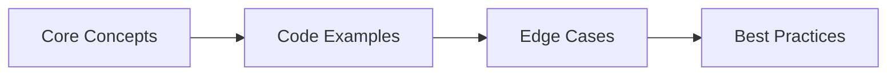

# 65. System Design → Interview Q&A

> **Previous:** [Design Patterns Interview Q&amp;A](./64-interview-design-patterns.md) | **Next:** [Behavioral Interview Q&amp;A](./66-interview-behavioral.md)

This chapter covers system design concepts essential for senior Java backend interviews: designing scalable, reliable, and maintainable distributed systems with practical Spring Boot implementations.

---


<!-- Image Gallery -->
<section class="lesson-visuals" aria-label="Visual learning resources">
  <header><span>VISUAL LEARNING</span><h2>See it. Review it. Remember it.</h2></header>
  <a class="lesson-visual-card" href="../../../assets/images/lessons/java/65-interview-system-design/handwritten-notes.svg" target="_blank" rel="noopener">
    
    <span><strong>Handwritten notes</strong>Condensed notes for deliberate review.</span>
  </a>
  <a class="lesson-visual-card" href="../../../assets/images/lessons/java/65-interview-system-design/sticky-notes.svg" target="_blank" rel="noopener">
    
    <span><strong>Sticky-note revision</strong>Fast recall prompts for revision.</span>
  </a>
  <a class="lesson-visual-card" href="../../../assets/images/lessons/java/65-interview-system-design/visual-explanation.svg" target="_blank" rel="noopener">
    
    <span><strong>Visual concept guide</strong>A connected explanation of the key ideas.</span>
  </a>
</section>
<!-- End Image Gallery -->

## Chapter at a Glance

| Topic | Key Focus | Key Questions |
|-------|----------|--------------|
| Core Concepts | Foundational understanding | Definitions, contrasts, trade-offs |
| Code Examples | Compilable, runnable solutions | Real interview scenarios |
| Best Practices | Production-ready patterns | Pitfalls to avoid |

## Chapter Roadmap



### Q1: How would you design a URL shortener like TinyURL?


> **Pro Tip:** In interviews, always start with the "why" before the "how." Explaining the reasoning behind a design choice is more valuable than reciting syntax.

> **Remember:** Code readability matters in interviews. Write clean, well-structured code with meaningful variable names.


**Answer:**

**Requirements:**
- **Functional:** Shorten long URLs, redirect to original URL, optional custom aliases, analytics
- **Non-functional:** Highly available, low latency redirect ( < 10ms), scalable (100M+ URLs), durable

**Key design decisions:**

**1. Encoding Strategy:**
- Generate a unique ID (base 62 encoded: 0-9, a-z, A-Z) for each URL
- 7 characters = 62^7 ≈ 3.5 trillion combinations

```java
public class UrlEncoder {
    private static final String BASE62 = "0123456789abcdefghijklmnopqrstuvwxyzABCDEFGHIJKLMNOPQRSTUVWXYZ";

    public static String encode(long id) {
        StringBuilder sb = new StringBuilder();
        while (id > 0) {
            sb.append(BASE62.charAt((int) (id % 62)));
            id /= 62;
        }
        while (sb.length() < 7) {
            sb.append('0');
        }
        return sb.reverse().toString();
    }
}
```

**2. ID Generation:**
- **Snowflake ID** (Twitter's distributed ID generator):
  - Timestamp (41 bits) + Worker ID (10 bits) + Sequence (12 bits)
  - Generates ~4M unique IDs per second per worker

```java
public class SnowflakeIdGenerator {
    private final long workerId;
    private final long epoch = 1700000000000L;
    private long lastTimestamp = -1L;
    private long sequence = 0L;

    public synchronized long nextId() {
        long timestamp = System.currentTimeMillis();
        if (timestamp < lastTimestamp) {
            throw new RuntimeException("Clock moved backwards");
        }
        if (timestamp == lastTimestamp) {
            sequence = (sequence + 1) & 4095;
            if (sequence == 0) timestamp = waitNextMillis();
        } else {
            sequence = 0;
        }
        lastTimestamp = timestamp;
        return ((timestamp - epoch) << 22) | (workerId << 12) | sequence;
    }
}
```

**3. Data Model:**

```sql
CREATE TABLE urls (
    id BIGINT PRIMARY KEY,
    short_code VARCHAR(7) UNIQUE NOT NULL,
    original_url TEXT NOT NULL,
    user_id BIGINT,
    created_at TIMESTAMP NOT NULL DEFAULT NOW(),
    expires_at TIMESTAMP,
    clicks BIGINT DEFAULT 0
);

CREATE INDEX idx_short_code ON urls(short_code);
```

**4. Caching with Redis:**

```java
@Service
public class UrlService {
    private final StringRedisTemplate redis;
    private final UrlRepository repository;

    @Cacheable(value = "urls", key = "#shortCode", unless = "#result == null")
    public String getOriginalUrl(String shortCode) {
        // Cache-aside: check cache first, then DB
        return repository.findByShortCode(shortCode)
            .map(Url::getOriginalUrl)
            .orElseThrow(() -> new UrlNotFoundException(shortCode));
    }
}
```

**5. API:**

```java
@RestController
@RequestMapping("/api/v1")
public class UrlController {
    @PostMapping("/shorten")
    public ShortenResponse shorten(@RequestBody @Valid ShortenRequest request) {
        String shortCode = urlService.createShortUrl(request.url(), request.customAlias());
        return new ShortenResponse("https://short.url/" + shortCode);
    }

    @GetMapping("/{shortCode}")
    public ResponseEntity<Void> redirect(@PathVariable String shortCode) {
        String originalUrl = urlService.getOriginalUrl(shortCode);
        urlService.incrementClicks(shortCode);
        return ResponseEntity.status(HttpStatus.FOUND)
            .location(URI.create(originalUrl))
            .build();
    }
}
```

**6. Scaling considerations:**
- **Redirects** are read-heavy (100:1 read-to-write ratio). Use Redis cache to reduce DB load.
- **Rate limiting** on shorten endpoint to prevent abuse.
- **Database sharding** by shortCode hash if needed.
- **CDN** for redirects (static-like response with 301 redirect).
- **Async click tracking** via Kafka to avoid slowing down redirects.

---

### Q2: How would you design a chat system (like WhatsApp)?


**Answer:**

**Requirements:**
- **Functional:** One-on-one and group messaging, message delivery status (sent/delivered/read), media sharing, online status
- **Non-functional:** Low latency delivery, high availability, ordered messages, offline messages

**Architecture:**

```
Client (WebSocket) → Load Balancer → Chat Service (WebSocket handler)
                                          ↓
                                Message Queue (Kafka)
                                          ↓
                                Message Store (Cassandra)
```

**Key design decisions:**

**1. WebSocket for real-time communication:**

```java
@Configuration
public class WebSocketConfig implements WebSocketMessageBrokerConfigurer {
    @Override
    public void configureMessageBroker(MessageBrokerRegistry config) {
        config.enableSimpleBroker("/topic", "/queue");
        config.setApplicationDestinationPrefixes("/app");
    }

    @Override
    public void registerStompEndpoints(StompEndpointRegistry registry) {
        registry.addEndpoint("/ws-chat")
            .setAllowedOrigins("*");
    }
}
```

**2. Message model:**

```java
public record ChatMessage(
    String messageId,
    String senderId,
    String receiverId,
    String content,
    MessageType type,  // TEXT, IMAGE, VIDEO, FILE
    long timestamp,
    String conversationId
) {}
```

**3. Conversation management:**

```java
@Service
public class ChatService {
    private final SimpMessagingTemplate messagingTemplate;

    public void sendMessage(ChatMessage message) {
        // 1. Save to database
        messageStore.save(message);

        // 2. Send via WebSocket if user is connected
        String destination = "/queue/messages/" + message.receiverId();
        messagingTemplate.convertAndSend(destination, message);

        // 3. If offline, message is retrieved on next connection (sync)
    }
}
```

**4. Read/unread tracking:**

```sql
CREATE TABLE message_status (
    message_id VARCHAR(64),
    user_id VARCHAR(64),
    status ENUM('SENT', 'DELIVERED', 'READ'),
    updated_at TIMESTAMP,
    PRIMARY KEY (message_id, user_id)
);
```

**5. Offline message sync:**

```java
@RestController
public class SyncController {
    @GetMapping("/sync")
    public List<ChatMessage> sync(@RequestParam String userId,
                                   @RequestParam long lastSyncTimestamp) {
        return messageStore.findByReceiverAndTimestampAfter(userId, lastSyncTimestamp);
    }
}
```

**6. Scaling:**
- **WebSocket servers** are stateful. Use sticky sessions or a distributed session store (Redis).
- **Kafka** partitions messages by conversationId for ordering guarantees.
- **Cassandra** for message store (high write throughput, no joins needed).
- **CDN** for media files (images, videos).

---

### Q3: How would you design an e-commerce system?


**Answer:**

**Requirements:**
- **Functional:** Product catalog, shopping cart, checkout, payment, order tracking, inventory management
- **Non-functional:** Handle flash sales, 99.9% uptime, stale inventory prevention

**Architecture:**

```
Client → API Gateway → Product Service
                     → Cart Service
                     → Order Service → Saga Orchestrator
                     → Payment Service
                     → Inventory Service
                     → Notification Service
```

**Key design decisions:**

**1. Product Catalog:**

```java
@Entity
public class Product {
    @Id private String id;
    private String name;
    private String description;
    @Embedded private Money price;
    private String categoryId;
    private List<String> imageUrls;
    private ProductStatus status;
}

// Search with Elasticsearch
@Service
public class ProductSearchService {
    private final ElasticsearchRestTemplate elasticsearch;

    public Page<ProductDocument> search(String query, Pageable pageable) {
        NativeSearchQuery searchQuery = new NativeSearchQueryBuilder()
            .withQuery(QueryBuilders.multiMatchQuery(query, "name", "description"))
            .withPageable(pageable)
            .build();
        return elasticsearch.search(searchQuery, ProductDocument.class);
    }
}
```

**2. Shopping Cart with Redis:**

```java
@RedisHash("cart")
public class Cart {
    @Id private String userId;
    private Map<String, Integer> items;  // productId → quantity
    private LocalDateTime lastUpdated;
}

@Service
public class CartService {
    private final CartRepository cartRepository;
    private final ProductServiceClient productClient;

    @Transactional
    public void addItem(String userId, String productId, int quantity) {
        Cart cart = cartRepository.findById(userId)
            .orElse(new Cart(userId, new HashMap<>()));

        // Check inventory before adding
        int currentQty = cart.items().getOrDefault(productId, 0);
        if (!productClient.checkAvailability(productId, currentQty + quantity)) {
            throw new InsufficientInventoryException(productId);
        }

        cart.items().merge(productId, quantity, Integer::sum);
        cartRepository.save(cart);
    }
}
```

**3. Order processing with Saga pattern:**

```java
@Service
public class OrderSagaOrchestrator {
    @Transactional
    public Order placeOrder(CheckoutRequest request) {
        // Step 1: Create pending order
        Order order = orderService.createOrder(request);

        try {
            // Step 2: Reserve inventory
            inventoryService.reserve(order.getItems());

            // Step 3: Process payment
            paymentService.charge(order.getId(), order.getTotal());

            // Step 4: Confirm order
            order.confirm();
            orderService.save(order);

            // Step 5: Send notification (async)
            notificationService.sendOrderConfirmation(order);

            return order;
        } catch (InventoryReservationException e) {
            // Compensate: cancel order
            order.cancel();
            orderService.save(order);
            throw new OrderPlacementException("Insufficient inventory", e);
        } catch (PaymentException e) {
            // Compensate: release inventory + cancel order
            inventoryService.release(order.getItems());
            order.cancel();
            orderService.save(order);
            throw new OrderPlacementException("Payment failed", e);
        }
    }
}
```

**4. Inventory management with optimistic locking:**

```java
@Service
public class InventoryService {
    @Transactional
    public void reserve(List<OrderItem> items) {
        for (OrderItem item : items) {
            Inventory inventory = inventoryRepository.findByProductId(item.productId());
            inventory.reserve(item.quantity());  // Throws if insufficient
            inventoryRepository.save(inventory);
        }
    }
}

@Entity
public class Inventory {
    @Version private Long version;  // Optimistic lock
    private int availableQuantity;

    public void reserve(int quantity) {
        if (availableQuantity < quantity) {
            throw new InsufficientInventoryException("Only " + availableQuantity + " available");
        }
        this.availableQuantity -= quantity;
    }
}
```

---

### Q4: How would you design a notification system?


**Answer:**

**Requirements:**
- **Functional:** Multiple channels (email, SMS, push, in-app), templates, rate limiting, delivery tracking
- **Non-functional:** High throughput (millions/day), reliable delivery, scalable

**Architecture:**

```
Service → Notification API → Message Queue (Kafka)
                                  ↓
       ┌──────────────────────────┼──────────────────────────┐
       ↓                          ↓                          ↓
 Email Worker              SMS Worker                 Push Worker
       ↓                          ↓                          ↓
 SendGrid/Twilio           Twilio/SNS                  Firebase/APNs
```

**Key design decisions:**

**1. Notification model:**

```java
public record Notification(
    String notificationId,
    String userId,
    NotificationChannel channel,  // EMAIL, SMS, PUSH, IN_APP
    NotificationTemplate template,
    Map<String, Object> parameters,
    NotificationPriority priority,  // HIGH, MEDIUM, LOW
    LocalDateTime scheduledAt
) {}
```

**2. Template engine:**

```java
@Service
public class TemplateService {
    public String render(String templateName, Map<String, Object> params) {
        // Use Thymeleaf or Handlebars for template rendering
        Template template = templateRepository.findByName(templateName);
        return templateEngine.process(template.getContent(), new Context(null, params));
    }
}
```

**3. Rate limiting (per user, per channel):**

```java
@Component
public class NotificationRateLimiter {
    private final RedisTemplate<String, String> redis;

    public boolean isAllowed(String userId, NotificationChannel channel, int maxPerMinute) {
        String key = "ratelimit:" + userId + ":" + channel.name();
        Long count = redis.opsForValue().increment(key);
        if (count == 1) {
            redis.expire(key, 1, TimeUnit.MINUTES);
        }
        return count <= maxPerMinute;
    }
}
```

**4. Delivery status tracking:**

```java
@RestController
public class WebhookController {
    @PostMapping("/webhooks/email")
    public ResponseEntity<Void> handleEmailWebhook(@RequestBody EmailEvent event) {
        notificationService.updateDeliveryStatus(
            event.notificationId(),
            switch (event.event()) {
                case "delivered" -> DeliveryStatus.DELIVERED;
                case "bounced", "dropped" -> DeliveryStatus.FAILED;
                case "opened" -> DeliveryStatus.READ;
                default -> DeliveryStatus.SENT;
            }
        );
        return ResponseEntity.ok().build();
    }
}
```

**5. Support for multiple priority levels:**
- **HIGH:** Retry immediately, alert on-call if failed
- **MEDIUM:** Retry with exponential backoff (3 attempts)
- **LOW:** Best-effort delivery, no retry

```yaml
notifications:
  retry:
    high:
      max-attempts: 5
      backoff: 1s, 2s, 4s, 8s, 16s
    medium:
      max-attempts: 3
      backoff: 5s, 30s, 120s
    low:
      max-attempts: 1
```

---

### Q5: How would you design a rate limiter?


**Answer:**

**Requirements:**
- **Functional:** Limit requests per user/IP within a time window, support different limits per API, return 429 with retry-after header
- **Non-functional:** Low latency, distributed (works across service instances)

**Algorithms:**

**1. Token Bucket (most common):**

```java
@Component
public class TokenBucketRateLimiter {
    private final RedisTemplate<String, String> redis;

    public boolean isAllowed(String key, int capacity, int refillRate, int refillPeriod) {
        String script = """
            local key = KEYS[1]
            local now = tonumber(ARGV[1])
            local capacity = tonumber(ARGV[2])
            local refillRate = tonumber(ARGV[3])
            local refillPeriod = tonumber(ARGV[4])

            local bucket = redis.call('HMGET', key, 'tokens', 'lastRefill')
            local tokens = tonumber(bucket[1]) or capacity
            local lastRefill = tonumber(bucket[2]) or now

            local elapsed = now - lastRefill
            local newTokens = math.floor(elapsed / refillPeriod) * refillRate
            if newTokens > 0 then
                tokens = math.min(capacity, tokens + newTokens)
                lastRefill = now
            end

            if tokens >= 1 then
                redis.call('HMSET', key, 'tokens', tokens - 1, 'lastRefill', lastRefill)
                redis.call('EXPIRE', key, math.ceil(refillPeriod * capacity / refillRate))
                return 1
            else
                redis.call('HMSET', key, 'tokens', tokens, 'lastRefill', lastRefill)
                return 0
            end
        """;

        RedisScript<Long> redisScript = new DefaultRedisScript<>(script, Long.class);
        Long result = redis.execute(redisScript, List.of(key),
            String.valueOf(System.currentTimeMillis() / 1000),
            String.valueOf(capacity), String.valueOf(refillRate),
            String.valueOf(refillPeriod));

        return result == 1;
    }
}
```

**2. Sliding Window Log:**

```java
@Component
public class SlidingWindowRateLimiter {
    private final RedisTemplate<String, String> redis;

    public boolean isAllowed(String key, int maxRequests, long windowMs) {
        long now = System.currentTimeMillis();
        long windowStart = now - windowMs;

        // Remove timestamps outside the window
        redis.opsForZSet().removeRangeByScore(key, 0, windowStart);

        // Count requests in current window
        Long count = redis.opsForZSet().count(key, windowStart, now);

        if (count >= maxRequests) {
            return false;
        }

        // Add current request
        redis.opsForZSet().add(key, String.valueOf(now), now);
        redis.expire(key, windowMs, TimeUnit.MILLISECONDS);
        return true;
    }
}
```

**3. Spring Boot interceptor:**

```java
@Component
public class RateLimitInterceptor implements HandlerInterceptor {
    private final RateLimiter rateLimiter;

    @Override
    public boolean preHandle(HttpServletRequest request, HttpServletResponse response, Object handler) {
        String clientId = request.getRemoteAddr();  // or API key, user ID
        String endpoint = request.getRequestURI();

        if (!rateLimiter.isAllowed(clientId + ":" + endpoint, 100, 60)) {
            response.setStatus(429);
            response.setHeader("Retry-After", "60");
            response.setContentType("application/json");
            response.getWriter().write("{\"error\":\"Rate limit exceeded\"}");
            return false;
        }
        return true;
    }
}
```

---

### Q6: How would you design a distributed cache?


**Answer:**

**Requirements:**
- **Functional:** Fast key-value access, TTL support, eviction policies, high availability
- **Non-functional:** Low latency (<1ms), high throughput, distributed consistency

**Architecture patterns:**

**1. Cache-Aside (most common):**

```java
@Service
public class CacheAsideService {
    private final RedisTemplate<String, Object> redis;
    private final DatabaseRepository repository;

    public Object get(String key) {
        // 1. Try cache
        Object cached = redis.opsForValue().get(key);
        if (cached != null) {
            return cached;
        }

        // 2. Cache miss → load from DB
        Object value = repository.findById(key);

        // 3. Populate cache
        if (value != null) {
            redis.opsForValue().set(key, value, 5, TimeUnit.MINUTES);
        }
        return value;
    }

    public void update(String key, Object value) {
        // 4. Update DB first, then invalidate cache
        repository.save(key, value);
        redis.delete(key);  // Invalidate, don't update (lazy population)
    }
}
```

**2. Read-Through:**

```java
@Component
public class ReadThroughCache {
    private final RedisCacheManager cacheManager;

    @Cacheable(value = "products", key = "#productId", cacheManager = "redisCacheManager")
    public Product getProduct(String productId) {
        // Cache manager implements the read-through logic
        return productRepository.findById(productId)
            .orElseThrow(() -> new ProductNotFoundException(productId));
    }
}
```

**3. Write-Through / Write-Behind:**

```java
@Service
public class WriteThroughCache {
    @CachePut(value = "products", key = "#product.id")
    public Product saveProduct(Product product) {
        return productRepository.save(product);  // Write to DB first
    }
}
```

**4. Cache eviction strategies:**
- **TTL-based:** Expire after fixed time (most common)
- **LRU (Least Recently Used):** Evict oldest accessed items (Redis `allkeys-lru`)
- **LFU (Least Frequently Used):** Evict least accessed items
- **Manual invalidation:** Explicit delete on data change

**5. Distributed cache with Redis Cluster:**

```yaml
spring:
  data:
    redis:
      cluster:
        nodes:
          - redis-node1:6379
          - redis-node2:6379
          - redis-node3:6379
      timeout: 2000ms
      lettuce:
        pool:
          max-active: 16
          max-idle: 8
```

**6. Cache stampede prevention:**

```java
@Service
public class StampedePreventionService {
    private final RedisTemplate<String, Object> redis;

    public Object getWithMutex(String key, int ttlSeconds, Supplier<Object> loader) {
        // Try cache first
        Object cached = redis.opsForValue().get(key);
        if (cached != null) {
            return cached;
        }

        // Try to acquire a lock
        String lockKey = "lock:" + key;
        Boolean locked = redis.opsForValue().setIfAbsent(lockKey, "1", 5, TimeUnit.SECONDS);

        if (Boolean.TRUE.equals(locked)) {
            try {
                // Double-check cache
                Object retryCached = redis.opsForValue().get(key);
                if (retryCached != null) {
                    return retryCached;
                }
                // Load from source
                Object value = loader.get();
                redis.opsForValue().set(key, value, ttlSeconds, TimeUnit.SECONDS);
                return value;
            } finally {
                redis.delete(lockKey);
            }
        }

        // Another thread is loading → wait briefly and retry
        try { Thread.sleep(50); } catch (InterruptedException e) {}
        return redis.opsForValue().get(key);  // Might still be null → retry in client
    }
}
```

---

### Q7: How would you design a distributed ID generator?


**Answer:**

**Requirements:**
- **Functional:** Globally unique, monotonically increasing (for indexing), time-ordered
- **Non-functional:** High availability, 10K+ IDs per second, works across data centers

**Approaches:**

**1. Snowflake ID (Twitter):**

```
| 1 bit (sign) | 41 bits (timestamp) | 10 bits (worker) | 12 bits (sequence) |
|--------------|---------------------|------------------|--------------------|
       0          ms since epoch           worker ID         per-millis counter
```

```java
public class SnowflakeIdGenerator {
    private final long workerId;
    private final long datacenterId;
    private final long epoch = 1700000000000L;

    private long sequence = 0L;
    private long lastTimestamp = -1L;

    public synchronized long nextId() {
        long timestamp = System.currentTimeMillis();

        if (timestamp < lastTimestamp) {
            throw new RuntimeException("Clock moved backwards");
        }

        if (timestamp == lastTimestamp) {
            sequence = (sequence + 1) & 0xFFF;  // 12 bits max
            if (sequence == 0) {
                timestamp = tilNextMillis(lastTimestamp);
            }
        } else {
            sequence = 0;
        }

        lastTimestamp = timestamp;

        return ((timestamp - epoch) << 22)
             | (datacenterId << 17)
             | (workerId << 12)
             | sequence;
    }

    private long tilNextMillis(long lastTimestamp) {
        long timestamp = System.currentTimeMillis();
        while (timestamp <= lastTimestamp) {
            timestamp = System.currentTimeMillis();
        }
        return timestamp;
    }
}
```

**2. Database Sequence Batch:**

```java
@Service
public class BatchIdGenerator {
    private final JdbcTemplate jdbcTemplate;
    private long currentId;
    private long maxId;

    public synchronized long nextId() {
        if (currentId >= maxId) {
            allocateBatch();
        }
        return currentId++;
    }

    private void allocateBatch() {
        // Atomically reserve a batch
        jdbcTemplate.update("UPDATE id_sequence SET next_id = next_id + 1000 WHERE name = 'default'");
        Long nextId = jdbcTemplate.queryForObject(
            "SELECT next_id - 1000 FROM id_sequence WHERE name = 'default'", Long.class);
        this.currentId = nextId;
        this.maxId = nextId + 1000;
    }
}
```

**3. UUID-based:**

```java
// Time-based UUID (v7) → ordered, indexed-friendly
public String generateId() {
    return UUID.randomUUID().toString();  // v4 → not ordered
    // Use UUIDv7 for ordered IDs:
    // https://github.com/f4b6a3/uuid-creator
}
```

---

### Q8: What is CAP theorem and how does it apply to system design?


**Answer:** CAP theorem states that a distributed system can provide at most two of three guarantees:

- **Consistency (C)** → Every read receives the most recent write or an error
- **Availability (A)** → Every request receives a response (without guarantee it contains the latest write)
- **Partition Tolerance (P)** → The system continues to operate despite network partitions

**Trade-offs in practice:**

**CP (Consistency + Partition Tolerance):** Bank transactions, inventory systems
- Use: ZooKeeper, etcd, HBase, MongoDB (with write concern majority)
- Risk: Unavailable during network partition

**AP (Availability + Partition Tolerance):** Social media feeds, DNS
- Use: Cassandra, Amazon DynamoDB, CouchDB
- Risk: Stale reads during partition

**The reality:** In distributed systems, partitions are unavoidable. So you choose between CP and AP.

**In practice with databases:**

```java
// CP: Traditional RDBMS with strong consistency
@Transactional
public void transferMoney(Long fromAccount, Long toAccount, BigDecimal amount) {
    Account from = accountRepo.findByIdWithLock(fromAccount);  // SELECT FOR UPDATE
    Account to = accountRepo.findById(toAccount);
    from.withdraw(amount);
    to.deposit(amount);
    accountRepo.save(from);
    accountRepo.save(to);
}

// AP: Eventually consistent with Cassandra
@Service
public class EventualConsistencyService {
    public void updateUserProfile(UserProfile profile) {
        // Cassandra write with hinted handoff
        // Read repair on next read
        profileRepository.save(profile);
    }
}
```

**Application-level compromise (CRDTs / conflict resolution):**

```java
@Service
public class ShoppingCartService {
    // Use CRDT (Conflict-Free Replicated Data Type) for shopping cart
    private Map<String, Long> mergeCarts(Map<String, Long> local, Map<String, Long> remote) {
        // Last-writer-wins with timestamp, or merge-add strategy
        Map<String, Long> merged = new HashMap<>(local);
        remote.forEach((key, value) -> merged.merge(key, value, Math::max));  // Max quantity wins
        return merged;
    }
}
```

---

### Q9: How would you design a search system (like Elasticsearch)?


**Answer:**

**Requirements:**
- **Functional:** Full-text search, faceted search, typo tolerance, sorting, pagination
- **Non-functional:** Sub-second search latency, index millions of documents, high availability

**Core concepts:**

**1. Inverted index → the heart of search:**

```
Document 1: "The quick brown fox"
Document 2: "The lazy brown dog"

Inverted index:
"brown" → Document 1, Document 2
"quick" → Document 1
"fox"   → Document 1
"lazy"  → Document 2
"dog"   → Document 2
"the"   → Document 1, Document 2 (stop word, often excluded)
```

**2. Indexing pipeline:**

```java
@Service
public class IndexingService {
    private final ElasticsearchRestTemplate elasticsearch;

    @Scheduled(fixedDelay = 60000)
    public void indexNewProducts() {
        List<Product> products = productRepository.findByIndexedFalse();
        List<IndexedProduct> docs = products.stream()
            .map(this::toDocument)
            .collect(Collectors.toList());

        elasticsearch.save(docs);
        productRepository.markAsIndexed(products);
    }

    private IndexedProduct toDocument(Product product) {
        return new IndexedProduct(
            product.getId(),
            product.getName(),
            product.getDescription(),
            product.getCategory(),
            product.getPrice().amount(),
            product.getTags()
        );
    }
}
```

**3. Search API:**

```java
@Service
public class SearchService {
    private final ElasticsearchRestTemplate elasticsearch;

    public SearchResult<Product> search(SearchRequest request) {
        NativeSearchQuery query = new NativeSearchQueryBuilder()
            .withQuery(QueryBuilders.boolQuery()
                .must(QueryBuilders.multiMatchQuery(request.query())
                    .field("name", 3.0f)    // Boost name matches
                    .field("description")
                    .field("tags"))
                .filter(QueryBuilders.termQuery("category", request.category()))
                .filter(QueryBuilders.rangeQuery("price")
                    .gte(request.minPrice())
                    .lte(request.maxPrice())))
            .withPageable(PageRequest.of(request.page(), request.size()))
            .withSort(Sort.by(request.sortBy()).descending())
            .build();

        SearchHits<Product> hits = elasticsearch.search(query, Product.class);
        return new SearchResult<>(
            hits.getSearchHits().stream()
                .map(h -> h.getContent())
                .collect(Collectors.toList()),
            hits.getTotalHits()
        );
    }
}
```

**4. Faceted search:**

```java
public SearchResult<Product> searchWithFacets(SearchRequest request) {
    NativeSearchQuery query = new NativeSearchQueryBuilder()
        .withQuery(QueryBuilders.matchQuery("name", request.query()))
        .addAggregation(AggregationBuilders.terms("by_category").field("category"))
        .addAggregation(AggregationBuilders.range("by_price")
            .field("price")
            .addRange(0, 50).addRange(50, 100).addRange(100, 500))
        .build();

    SearchHits<Product> hits = elasticsearch.search(query, Product.class);

    // Extract aggregations
    Aggregations aggregations = hits.getAggregations();
    Terms categoryAgg = aggregations.get("by_category");
    Range priceAgg = aggregations.get("by_price");

    return new SearchResult<>(products, facets);
}
```

**5. Autocomplete / suggestions:**

```java
@GetMapping("/suggest")
public List<String> suggest(@RequestParam String prefix) {
    CompletionSuggestionBuilder suggestion = SuggestBuilders.completionSuggestion("suggest")
        .prefix(prefix)
        .size(5);

    SuggestBuilder suggestBuilder = new SuggestBuilder()
        .addSuggestion("product-suggest", suggestion);

    SearchRequest request = new SearchRequest("products");
    request.suggest(suggestBuilder);

    // Return suggestions
}
```

---

### Q10: How would you design a distributed logging system?


**Answer:**

**Architecture:**

```
Application (stdout JSON logs) → Fluentd/Logstash (agent)
                                       ↓
                               Kafka (buffer)
                                       ↓
                           ┌───────────┴───────────┐
                           ↓                       ↓
                      Elasticsearch             S3 (archive)
                           ↓
                       Kibana/Grafana
```

**Key decisions:**

**1. Structured logging format:**

```java
public class StructuredLogging {
    private static final Logger log = LoggerFactory.getLogger(StructuredLogging.class);

    public void processOrder(Order order) {
        MDC.put("correlationId", order.getCorrelationId());
        MDC.put("orderId", order.getId());
        MDC.put("userId", order.getUserId());

        log.info("Processing order");

        // Structure extra context in the message object
        log.info("Order total calculated", order.getTotal());

        MDC.clear();
    }
}
```

**2. Agent-based collection with Fluentd configuration:**

```xml
<source>
  @type tail
  path /var/log/app/*.log
  pos_file /var/log/fluentd.pos
  tag app.logs
  <parse>
    @type json
    time_key @timestamp
  </parse>
</source>

<match app.logs>
  @type kafka2
  brokers kafka:9092
  topic_name app-logs
</match>
```

**3. Multi-tenancy (different services, different indices):**

```java
public class LogIndexRouter {
    public String determineIndex(LogEvent event) {
        String service = event.getService();
        String date = LocalDate.now().toString();
        return "logs-" + service + "-" + date;
    }
}
```

**4. Hot/warm architecture:**
- **Hot tier:** Recent logs (7 days) on fast SSDs → Elasticsearch
- **Warm tier:** Older logs (30 days) on HDDs with replica
- **Cold tier:** Archived logs (1+ year) in S3, queryable via Elasticsearch (frozen indices)

**5. Log levels and sampling:**
- ERROR logs: always collected
- WARN logs: always collected
- INFO logs: sampled at 10% (too many at high throughput)
- DEBUG/TRACE: only enabled per-request (correlation ID filtered)

---

### Q11: How would you design a payment system?


**Answer:**

**Requirements:**
- **Functional:** Multiple payment methods, refunds, idempotency, receipts
- **Non-functional:** Exactly-once processing, audit trail, high availability

**Key patterns:**

**1. Idempotency (preventing double charges):**

```java
@Service
public class PaymentService {
    private final IdempotencyRepository idempotencyRepo;

    @Transactional
    public PaymentResult processPayment(PaymentRequest request) {
        // Check idempotency key
        String idempotencyKey = request.idempotencyKey();
        if (idempotencyKey != null) {
            PaymentResult existing = idempotencyRepo.findByIdempotencyKey(idempotencyKey);
            if (existing != null) {
                return existing;  // Return previous result (same charge)
            }
        }

        // Process payment with payment gateway
        PaymentResult result = paymentGateway.charge(request);

        // Store with idempotency key
        if (idempotencyKey != null) {
            idempotencyRepo.save(idempotencyKey, result);
        }

        return result;
    }
}
```

**2. Transactional outbox (safely publish events after DB write):**

```java
@Service
public class PaymentOrchestrator {
    @Transactional
    public PaymentResult processPayment(PaymentRequest request) {
        // 1. Save payment to database
        Payment payment = paymentRepository.save(new Payment(request));

        // 2. Write event to outbox (same transaction!)
        outboxRepository.save(new OutboxEvent(
            EventType.PAYMENT_PROCESSED,
            payment.getId(),
            objectMapper.writeValueAsString(payment)
        ));

        return new PaymentResult(payment.getId(), PaymentStatus.PROCESSING);
    }
}

// Outbox publisher (separate component)
@Component
public class OutboxPublisher {
    @Scheduled(fixedRate = 1000)
    @Transactional
    public void publishPendingEvents() {
        List<OutboxEvent> events = outboxRepository.findTop100ByPublishedFalseOrderByCreatedAt();
        for (OutboxEvent event : events) {
            try {
                kafkaTemplate.send("payment-events", event.getPayload());
                event.markPublished();
                outboxRepository.save(event);
            } catch (Exception e) {
                log.error("Failed to publish event: {}", event.getId(), e);
            }
        }
    }
}
```

**3. Payment reconciliation:**
- Match internal transaction records with payment gateway reports daily
- Flag unmatched transactions for manual review
- Reverse double-charged transactions

**4. Refund handling:**

```java
@Service
public class RefundService {
    @Transactional
    public RefundResult processRefund(String paymentId, BigDecimal amount, String reason) {
        Payment payment = paymentRepository.findById(paymentId)
            .orElseThrow(() -> new PaymentNotFoundException(paymentId));

        // Validate refund amount
        BigDecimal refundedSoFar = payment.getRefunds().stream()
            .map(Refund::getAmount)
            .reduce(BigDecimal.ZERO, BigDecimal::add);

        if (refundedSoFar.add(amount).compareTo(payment.getAmount()) > 0) {
            throw new RefundExceedsAmountException();
        }

        // Process via gateway
        GatewayRefundResult result = paymentGateway.refund(payment.getGatewayId(), amount);

        // Save refund record
        Refund refund = refundRepository.save(new Refund(payment, amount, reason, result.id()));

        return new RefundResult(refund.getId(), RefundStatus.PROCESSED);
    }
}
```

---

### Q12: How would you design a recommendation system?


**Answer:**

**Requirements:**
- **Functional:** Personalized recommendations (products, content), trending items, "users who bought X also bought Y"
- **Non-functional:** Low latency (<50ms), updates within minutes of new data

**Approaches:**

**1. Collaborative Filtering:**

```java
@Service
public class CollaborativeFiltering {
    private final RedisTemplate<String, String> redis;

    // "Users who bought this also bought..."
    public List<String> getAlsoBought(String productId, int limit) {
        String key = "also_bought:" + productId;
        return redis.opsForZSet().reverseRange(key, 0, limit - 1)
            .stream()
            .collect(Collectors.toList());
    }

    // Update co-occurrence matrix (batch job)
    @Scheduled(fixedRate = 300000)  // Every 5 minutes
    public void updateCoOccurrence() {
        List<Order> recentOrders = orderRepository.findRecentOrders(Duration.ofHours(1));
        for (Order order : recentOrders) {
            List<String> productIds = order.getItems().stream()
                .map(OrderItem::getProductId)
                .distinct()
                .collect(Collectors.toList());

            // Increment co-occurrence for each pair
            for (int i = 0; i < productIds.size(); i++) {
                for (int j = i + 1; j < productIds.size(); j++) {
                    redis.opsForZSet().incrementScore(
                        "also_bought:" + productIds.get(i),
                        productIds.get(j), 1);
                    redis.opsForZSet().incrementScore(
                        "also_bought:" + productIds.get(j),
                        productIds.get(i), 1);
                }
            }
        }
    }
}
```

**2. Content-Based Filtering:**

```java
@Service
public class ContentBasedRecommender {
    private final ElasticsearchRestTemplate elasticsearch;

    public List<Product> recommendSimilar(Product viewed, int limit) {
        NativeSearchQuery query = new NativeSearchQueryBuilder()
            .withQuery(QueryBuilders.moreLikeThisQuery()
                .like(new Like(viewed.getId()))
                .fields("name", "description", "category", "tags")
                .minTermFreq(1)
                .minDocFreq(1))
            .withPageable(PageRequest.of(0, limit))
            .build();

        return elasticsearch.search(query, Product.class)
            .getSearchHits().stream()
            .map(SearchHit::getContent)
            .collect(Collectors.toList());
    }
}
```

**3. Trending / Popularity:**

```java
@Service
public class TrendingService {
    private final RedisTemplate<String, String> redis;

    public void recordView(String productId) {
        // Track view counts, weighted by recency
        String key = "trending:" + LocalDate.now();
        redis.opsForZSet().incrementScore(key, productId, 1);
        redis.expire(key, 7, TimeUnit.DAYS);
    }

    public List<String> getTrending(int limit) {
        // Decay older days (day 7 weight: 1.0, day 1 weight: ~0.14)
        Map<String, Double> scores = new HashMap<>();
        for (int i = 0; i < 7; i++) {
            String key = "trending:" + LocalDate.now().minusDays(i);
            double decay = Math.pow(0.75, i);  // Exponential decay

            Map<String, Double> dayViews = redis.opsForZSet()
                .reverseRangeWithScores(key, 0, 99)
                .stream()
                .collect(Collectors.toMap(
                    TypedTuple::getValue,
                    t -> t.getScore() * decay,
                    Double::sum
                ));
            dayViews.forEach((k, v) -> scores.merge(k, v, Double::sum));
        }

        return scores.entrySet().stream()
            .sorted(Map.Entry.<String, Double>comparingByValue().reversed())
            .limit(limit)
            .map(Map.Entry::getKey)
            .collect(Collectors.toList());
    }
}
```

---

### Q13: How would you design a data pipeline (ETL)?


**Answer:**

**Requirements:**
- **Functional:** Extract from source (DB, API, files), transform, load to destination
- **Non-functional:** Fault tolerance, exactly-once processing, monitoring

**Architecture with Kafka + Spring Batch:**

**1. Extract:**

```java
@Component
public class DatabaseExtractor {
    private final JdbcTemplate jdbcTemplate;

    @Scheduled(cron = "0 0 */1 * * *")  // Hourly
    public void extractOrders() {
        LocalDateTime lastRun = getLastExtractTime();

        List<Order> newOrders = jdbcTemplate.query(
            "SELECT * FROM orders WHERE updated_at > ?",
            new Object[]{Timestamp.valueOf(lastRun)},
            new OrderRowMapper()
        );

        // Publish to Kafka
        for (Order order : newOrders) {
            kafkaTemplate.send("raw-orders", order.getId().toString(), order);
        }

        updateLastExtractTime(LocalDateTime.now());
    }
}
```

**2. Transform (stream processing):**

```java
@Component
public class OrderTransformer {
    @KafkaListener(topics = "raw-orders")
    public void transform(ConsumerRecord<String, String> record) {
        RawOrder rawOrder = objectMapper.readValue(record.value(), RawOrder.class);

        // Transform
        EnrichedOrder enriched = new EnrichedOrder(
            rawOrder.getId(),
            enrichCustomerData(rawOrder.getCustomerId()),
            calculateGeography(rawOrder.getIpAddress()),
            normalizeCurrency(rawOrder.getAmount(), rawOrder.getCurrency()),
            rawOrder.getCreatedAt()
        );

        // Publish enriched
        kafkaTemplate.send("enriched-orders", enriched.id(), objectMapper.writeValueAsString(enriched));
    }
}
```

**3. Load (batch):**

```java
@Component
public class DataLoader {
    @KafkaListener(topics = "enriched-orders")
    public void load(String message) {
        EnrichedOrder order = objectMapper.readValue(message, EnrichedOrder.class);
        dataWarehouseRepository.save(order);
    }
}
```

**4. Full ETL with Spring Batch:**

```java
@Configuration
public class OrderEtlJobConfig {
    @Bean
    public Job orderEtlJob(JobRepository jobRepository,
                           Step extractStep, Step transformStep, Step loadStep) {
        return new JobBuilder("orderEtlJob", jobRepository)
            .start(extractStep)
            .next(transformStep)
            .next(loadStep)
            .build();
    }

    @Bean
    public Step extractStep(JobRepository jobRepository,
                            PlatformTransactionManager txManager) {
        return new StepBuilder("extract", jobRepository)
            .<Order, Order>chunk(1000, txManager)
            .reader(orderJdbcReader())
            .writer(orderKafkaWriter())
            .build();
    }
}
```

---

### Q14: How would you design a task queue (like Celery)?


**Answer:**

**Requirements:**
- **Functional:** Schedule and execute background tasks with retries, delayed execution, task status tracking
- **Non-functional:** Reliable delivery, at-least-once execution, scalable workers

**Architecture:**

```
API → Redis Queue → Worker Pods
        ↓
   Redis (status)
```

**Implementation:**

```java
// Task definition
public record Task(
    String taskId,
    String type,
    String payload,
    TaskPriority priority,
    LocalDateTime scheduledAt,
    int maxRetries,
    int retryCount
) {
    public boolean isRetryable() {
        return retryCount < maxRetries;
    }
}

// Task producer
@Service
public class TaskProducer {
    private final RedisTemplate<String, String> redis;

    public String enqueue(String taskType, Object payload) {
        String taskId = UUID.randomUUID().toString();
        Task task = new Task(
            taskId,
            taskType,
            objectMapper.writeValueAsString(payload),
            TaskPriority.NORMAL,
            LocalDateTime.now(),
            3,
            0
        );

        // Add to the queue
        redis.opsForList().rightPush("task:queue", objectMapper.writeValueAsString(task));
        return taskId;
    }

    public String enqueueDelayed(String taskType, Object payload, Duration delay) {
        String taskId = UUID.randomUUID().toString();
        Task task = new Task(/* ... scheduledAt: LocalDateTime.now().plus(delay) */);

        // Use a sorted set for delayed tasks
        redis.opsForZSet().add("task:delayed", objectMapper.writeValueAsString(task),
            Instant.now().plus(delay).toEpochMilli());
        return taskId;
    }
}

// Task consumer (worker)
@Component
public class TaskWorker {
    private final RedisTemplate<String, String> redis;
    private final Map<String, TaskHandler> handlers;
    private volatile boolean running = true;

    @PostConstruct
    public void start() {
        Executors.newSingleThreadExecutor().submit(() -> {
            while (running) {
                // 1. Move delayed tasks that are due
                moveDelayedTasks();

                // 2. Poll for immediate tasks
                String taskJson = redis.opsForList().leftPop("task:queue", 1, TimeUnit.SECONDS);
                if (taskJson != null) {
                    processTask(objectMapper.readValue(taskJson, Task.class));
                }
            }
        });
    }

    private void processTask(Task task) {
        try {
            TaskHandler handler = handlers.get(task.type());
            if (handler == null) {
                log.warn("No handler for task type: {}", task.type());
                return;
            }

            // Update status
            redis.opsForValue().set("task:status:" + task.taskId(), "RUNNING");

            handler.handle(task);

            redis.opsForValue().set("task:status:" + task.taskId(), "COMPLETED");
        } catch (Exception e) {
            log.error("Task failed: {}", task.taskId(), e);

            if (task.isRetryable()) {
                Task retryTask = new Task(
                    task.taskId(), task.type(), task.payload(),
                    task.priority(), LocalDateTime.now().plusSeconds(30),
                    task.maxRetries(), task.retryCount() + 1
                );
                redis.opsForList().rightPush("task:queue", objectMapper.writeValueAsString(retryTask));
            } else {
                redis.opsForValue().set("task:status:" + task.taskId(), "FAILED");
            }
        }
    }
}
```

---

### Q15: How would you design a distributed job scheduler?


**Answer:**

**Requirements:**
- **Functional:** Schedule recurring jobs (hourly cleanup, daily report), manual trigger, prevent double execution
- **Non-functional:** Exactly-once execution across nodes, cron-like flexibility, monitoring

**Approaches:**

**1. Database-based distributed lock:**

```java
@Component
public class DatabaseJobScheduler {
    private final JdbcTemplate jdbcTemplate;

    @Scheduled(cron = "0 0 * * * *")  // Every hour
    @Transactional
    public void runHourlyCleanup() {
        // Try to acquire a lock (database row-level lock)
        int updated = jdbcTemplate.update(
            "UPDATE job_locks SET locked_at = NOW(), locked_by = ? " +
            "WHERE job_name = 'hourly_cleanup' AND " +
            "(locked_at IS NULL OR locked_at < NOW() - INTERVAL '59 minutes')",
            getInstanceId()
        );

        if (updated == 0) {
            log.info("Another instance is running hourly cleanup, skipping");
            return;
        }

        try {
            // Execute the job
            cleanupService.runHourlyCleanup();
        } finally {
            jdbcTemplate.update(
                "UPDATE job_locks SET locked_at = NULL, locked_by = NULL " +
                "WHERE job_name = 'hourly_cleanup' AND locked_by = ?",
                getInstanceId()
            );
        }
    }
}
```

**2. Redis-based distributed lock:**

```java
@Component
public class RedisJobScheduler {
    private final RedisTemplate<String, String> redis;

    @Scheduled(cron = "0 0 2 * * *")  // Every day at 2 AM
    public void runDailyReport() {
        String lockKey = "job:lock:daily_report";
        String lockValue = UUID.randomUUID().toString();

        Boolean acquired = redis.opsForValue()
            .setIfAbsent(lockKey, lockValue, Duration.ofHours(2));

        if (Boolean.FALSE.equals(acquired)) {
            log.info("Daily report already running on another instance");
            return;
        }

        try {
            reportService.generateDailyReport();
        } finally {
            // Release lock (only if we still hold it)
            String storedValue = redis.opsForValue().get(lockKey);
            if (lockValue.equals(storedValue)) {
                redis.delete(lockKey);
            }
        }
    }
}
```

**3. Quartz Scheduler (distributed, persistent):**

```java
@Configuration
public class QuartzConfig {
    @Bean
    public SchedulerFactoryBean schedulerFactoryBean(DataSource dataSource) {
        SchedulerFactoryBean factory = new SchedulerFactoryBean();
        factory.setDataSource(dataSource);
        factory.setQuartzProperties(properties());
        return factory;
    }

    private Properties properties() {
        Properties props = new Properties();
        props.setProperty("org.quartz.scheduler.instanceName", "MyScheduler");
        props.setProperty("org.quartz.scheduler.instanceId", "AUTO");
        props.setProperty("org.quartz.jobStore.class", "org.quartz.impl.jdbcjobstore.JobStoreTX");
        props.setProperty("org.quartz.jobStore.isClustered", "true");
        return props;
    }
}

public class DailyReportJob implements Job {
    public void execute(JobExecutionContext context) {
        reportService.generateDailyReport();
    }
}

// Schedule the job
@Service
public class JobInitializer {
    @PostConstruct
    public void scheduleJobs() throws SchedulerException {
        JobDetail job = JobBuilder.newJob(DailyReportJob.class)
            .withIdentity("dailyReport")
            .build();

        Trigger trigger = TriggerBuilder.newTrigger()
            .withSchedule(CronScheduleBuilder.dailyAtHourAndMinute(2, 0))
            .build();

        scheduler.scheduleJob(job, trigger);
    }
}
```

---

### Q16: How would you design a distributed file storage system?


**Answer:**

**Requirements:**
- **Functional:** Upload/download files, metadata management, access control, thumbnails (images)
- **Non-functional:** High durability (multiple copies), low latency reads, scalable storage

**Architecture:**

```
Client → API Gateway → File Service → Metadata DB (PostgreSQL)
                                     → Object Storage (S3/MinIO)
                                     → CDN for reads
```

**Implementation:**

```java
@Entity
public class FileMetadata {
    @Id private String fileId;
    private String fileName;
    private long fileSize;
    private String mimeType;
    private String storageKey;     // S3 key
    private String storageBucket;  // S3 bucket
    private String checksum;       // SHA-256 for integrity
    private FileStatus status;     // UPLOADING, AVAILABLE, DELETED
    private LocalDateTime createdAt;
}

@Service
public class FileService {
    private final AmazonS3 s3Client;
    private final FileMetadataRepository metadataRepo;

    public FileUploadResponse initiateUpload(String fileName, long fileSize, String mimeType) {
        // Generate pre-signed URL for direct upload to S3
        String fileId = UUID.randomUUID().toString();
        String storageKey = generateStorageKey(fileId, fileName);

        Date expiration = new Date(System.currentTimeMillis() + 3600_000);  // 1 hour
        GeneratePresignedUrlRequest request = new GeneratePresignedUrlRequest(bucket, storageKey)
            .withMethod(HttpMethod.PUT)
            .withExpiration(expiration);

        URL uploadUrl = s3Client.generatePresignedUrl(request);

        // Save metadata
        metadataRepo.save(new FileMetadata(fileId, fileName, fileSize, mimeType, storageKey));

        return new FileUploadResponse(fileId, uploadUrl.toString());
    }

    public FileDownloadResponse getDownloadUrl(String fileId) {
        FileMetadata metadata = metadataRepo.findById(fileId)
            .orElseThrow(() -> new FileNotFoundException(fileId));

        // Generate temporary download URL (with CDN if configured)
        Date expiration = new Date(System.currentTimeMillis() + 3600_000);
        GeneratePresignedUrlRequest request = new GeneratePresignedUrlRequest(
                metadata.getStorageBucket(), metadata.getStorageKey())
            .withMethod(HttpMethod.GET)
            .withExpiration(expiration);

        URL downloadUrl = s3Client.generatePresignedUrl(request);
        return new FileDownloadResponse(downloadUrl.toString(), metadata);
    }
}
```

**Chunked upload for large files:**

```java
@Service
public class ChunkedUploadService {
    private final AmazonS3 s3Client;

    public String initiateMultipartUpload(String fileName) {
        InitiateMultipartUploadRequest request = new InitiateMultipartUploadRequest(bucket, fileName);
        InitiateMultipartUploadResult result = s3Client.initiateMultipartUpload(request);
        return result.getUploadId();
    }

    public UploadPartResponse uploadPart(String uploadId, String fileName,
                                          int partNumber, InputStream data) {
        UploadPartRequest request = new UploadPartRequest()
            .withBucketName(bucket)
            .withKey(fileName)
            .withUploadId(uploadId)
            .withPartNumber(partNumber)
            .withInputStream(data)
            .withPartSize(data.available());

        UploadPartResult result = s3Client.uploadPart(request);
        return new UploadPartResponse(partNumber, result.getPartETag());
    }

    public void completeMultipartUpload(String uploadId, String fileName,
                                         List<UploadPartResponse> parts) {
        CompleteMultipartUploadRequest request = new CompleteMultipartUploadRequest(
            bucket, fileName, uploadId,
            parts.stream()
                .map(p -> new PartETag(p.partNumber(), p.eTag()))
                .collect(Collectors.toList())
        );
        s3Client.completeMultipartUpload(request);
    }
}
```

---

### Q17: How would you design a leader election system?


**Answer:**

**Requirements:**
- **Functional:** One node acts as leader, monitors health, auto-failover
- **Non-functional:** Avoid split-brain, fast failover (<5s)

**Approaches:**

**1. ZooKeeper-based leader election:**

```java
@Component
public class ZookeeperLeaderElection implements LeaderElection {
    private final CuratorFramework client;
    private LeaderLatch leaderLatch;
    private volatile boolean isLeader = false;

    @PostConstruct
    public void start() throws Exception {
        leaderLatch = new LeaderLatch(client, "/election/node");
        leaderLatch.addListener(this::onLeadershipChange);
        leaderLatch.start();
    }

    private void onLeadershipChange(LeaderLatchListener listener) {
        isLeader = leaderLatch.hasLeadership();
        if (isLeader) {
            log.info("This instance is now the leader");
            startLeaderTasks();
        } else {
            log.info("This instance is now a follower");
            stopLeaderTasks();
        }
    }

    @Override
    public boolean isLeader() {
        return isLeader;
    }
}
```

**2. Database-based election (simpler but less robust):**

```java
@Component
public class DatabaseLeaderElection {
    private final JdbcTemplate jdbcTemplate;
    private volatile boolean isLeader = false;

    @Scheduled(fixedRate = 5000)
    @Transactional
    public void heartbeat() {
        // Renew our lease
        jdbcTemplate.update(
            "INSERT INTO leader_election (instance_id, last_heartbeat) VALUES (?, NOW()) " +
            "ON CONFLICT (id) DO UPDATE SET last_heartbeat = NOW() WHERE id = 1",
            getInstanceId()
        );

        // Check if we are the leader
        String leaderId = jdbcTemplate.queryForObject(
            "SELECT instance_id FROM leader_election WHERE id = 1 " +
            "AND last_heartbeat > NOW() - INTERVAL '10 seconds'",
            String.class
        );

        boolean wasLeader = isLeader;
        isLeader = getInstanceId().equals(leaderId);

        if (isLeader && !wasLeader) {
            log.info("Became leader");
            startLeaderTasks();
        } else if (!isLeader && wasLeader) {
            log.info("Lost leadership");
            stopLeaderTasks();
        }
    }
}
```

**3. Redis-based election:**

```java
@Component
public class RedisLeaderElection {
    private final RedisTemplate<String, String> redis;
    private final String instanceId = UUID.randomUUID().toString();

    @Scheduled(fixedRate = 3000)
    public void heartbeat() {
        // Try to become leader
        Boolean acquired = redis.opsForValue()
            .setIfAbsent("leader", instanceId, Duration.ofSeconds(10));

        if (Boolean.TRUE.equals(acquired)) {
            onLeadershipGained();
            return;
        }

        // Check if we are the leader (renew lease)
        String currentLeader = redis.opsForValue().get("leader");
        if (instanceId.equals(currentLeader)) {
            redis.expire("leader", 10, TimeUnit.SECONDS);
        } else {
            onLeadershipLost();
        }
    }
}
```

---

### Q18: How would you design a content delivery network (CDN)?


**Answer:**

**Key concepts:**
- **Origin server:** Source of truth for content
- **Edge servers:** Cache content at geographically distributed locations
- **Pull CDN:** Cache fills when user requests content
- **Push CDN:** Content is preloaded onto edges

**Design for image/video serving:**

```java
// Image processing on upload
@Service
public class ImageProcessingService {
    public void processImage(String fileId, InputStream imageData) {
        // Create multiple resolutions
        Map<String, byte[]> variants = Map.of(
            "thumbnail", resize(imageData, 150, 150),
            "medium", resize(imageData, 600, 600),
            "large", resize(imageData, 1200, 1200),
            "original", toBytes(imageData)
        );

        // Store each variant with CDN-friendly naming
        for (var entry : variants.entrySet()) {
            String s3Key = String.format("images/%s/%s.webp", fileId, entry.getKey());
            s3Client.putObject(bucket, s3Key, entry.getValue());
        }

        // Invalidate CDN cache for this file
        cdnService.purge("images/" + fileId + "/*");
    }
}

// Serve the appropriate resolution
@RestController
public class ImageController {
    @GetMapping("/images/{fileId}")
    public ResponseEntity<Resource> getImage(
            @PathVariable String fileId,
            @RequestParam(defaultValue = "medium") String size) {
        // This is behind a CDN → CDN caches the response
        String s3Key = String.format("images/%s/%s.webp", fileId, size);
        S3Object object = s3Client.getObject(bucket, s3Key);

        return ResponseEntity.ok()
            .cacheControl(CacheControl.maxAge(365, TimeUnit.DAYS).cachePublic())
            .contentType(MediaType.valueOf("image/webp"))
            .body(new InputStreamResource(object.getObjectContent()));
    }
}
```

**Cache headers (critical for CDN effectiveness):**

```java
@GetMapping("/api/products")
public ResponseEntity<List<Product>> getProducts() {
    List<Product> products = productService.findAll();

    return ResponseEntity.ok()
        // CDN will cache this for 5 minutes
        .cacheControl(CacheControl.maxAge(5, TimeUnit.MINUTES))
        // Browser can use cached version for 30 seconds
        .header("Cache-Control", "public, max-age=300, s-maxage=60")
        // CDN serves stale content while revalidating
        .header("Cache-Control", "stale-while-revalidate=120")
        .body(products);
}
```

---

### Q19: How would you design an API gateway?


**Answer:**

**Requirements:**
- **Functional:** Route requests to appropriate microservices, authentication, rate limiting, request/response transformation, API composition
- **Non-functional:** Low latency (<5ms added), high throughput, failure isolation

**Spring Cloud Gateway implementation:**

```yaml
spring:
  cloud:
    gateway:
      routes:
        - id: order-service
          uri: lb://order-service
          predicates:
            - Path=/api/orders/**
          filters:
            - name: CircuitBreaker
              args:
                name: orderServiceCircuitBreaker
                fallbackUri: forward:/fallback/orders
            - name: RequestRateLimiter
              args:
                redis-rate-limiter.replenishRate: 100
                redis-rate-limiter.burstCapacity: 200

        - id: product-service
          uri: lb://product-service
          predicates:
            - Path=/api/products/**
          filters:
            - StripPrefix=1

        - id: auth-service
          uri: lb://auth-service
          predicates:
            - Path=/api/auth/**
```

**Custom filters:**

```java
@Component
public class AuthenticationFilter implements GlobalFilter, Ordered {
    private final JwtTokenProvider tokenProvider;

    @Override
    public Mono<Void> filter(ServerWebExchange exchange, GatewayFilterChain chain) {
        // Skip auth for public endpoints
        if (isPublicEndpoint(exchange.getRequest().getPath().toString())) {
            return chain.filter(exchange);
        }

        String token = extractToken(exchange.getRequest());
        if (token == null || !tokenProvider.validateToken(token)) {
            exchange.getResponse().setStatusCode(HttpStatus.UNAUTHORIZED);
            return exchange.getResponse().setComplete();
        }

        // Add user info to headers for downstream services
        Claims claims = tokenProvider.getClaims(token);
        exchange.getRequest().mutate()
            .header("X-User-Id", claims.getSubject())
            .header("X-User-Roles", String.join(",", claims.get("roles", List.class)));

        return chain.filter(exchange);
    }
}

// API composition (aggregate data from multiple services)
@Component
public class ProductDetailsAggregator {
    public Mono<ProductDetails> getProductDetails(String productId) {
        return Mono.zip(
            productClient.getProduct(productId),
            inventoryClient.getStock(productId),
            reviewClient.getReviews(productId, PageRequest.of(0, 5)),
            priceClient.getPrice(productId)
        ).map(tuple -> new ProductDetails(
            tuple.getT1(),
            tuple.getT2(),
            tuple.getT3(),
            tuple.getT4()
        ));
    }
}
```

---

### Q20: How would you design a distributed configuration system?


**Answer:**

**Requirements:**
- **Functional:** Centralized config management, dynamic updates (no restart), environment-specific configs, secrets management
- **Non-functional:** High availability, low latency reads, audit trail

**Spring Cloud Config with Git backend:**

**1. Config Server:**

```java
@EnableConfigServer
@SpringBootApplication
public class ConfigServerApplication {
    public static void main(String[] args) {
        SpringApplication.run(ConfigServerApplication.class, args);
    }
}
```

```yaml
# application.yml (config server)

> **Previous:** [Design Patterns Interview Q&amp;A](./64-interview-design-patterns.md) | **Next:** [Behavioral Interview Q&amp;A](./66-interview-behavioral.md)
spring:
  cloud:
    config:
      server:
        git:
          uri: https://github.com/company/config-repo
          search-paths: '{application}'
          default-label: main
  security:
    user:
      name: config-client
      password: ${CONFIG_SERVER_PASSWORD}
```

**2. Repository structure:**

```
config-repo/
├── order-service.yml          (shared config)
├── order-service-dev.yml      (dev overrides)
├── order-service-prod.yml     (prod overrides)
├── product-service.yml
└── application.yml            (shared across all services)
```

**3. Config Client:**

```yaml
spring:
  application:
    name: order-service
  cloud:
    config:
      uri: http://config-server:8888
      fail-fast: true
      retry:
        initial-interval: 1000
        multiplier: 1.5
        max-attempts: 5
```

**4. Dynamic refresh without restart:**

```java
@RestController
@RefreshScope  // Bean is recreated when /actuator/refresh is called
public class FeatureController {
    @Value("${features.new-checkout-flow:false}")
    private boolean newCheckoutFlow;

    @GetMapping("/features/checkout")
    public boolean isNewCheckoutEnabled() {
        return newCheckoutFlow;
    }
}
```

```bash
# Trigger refresh across all instances

> **Previous:** [Design Patterns Interview Q&amp;A](./64-interview-design-patterns.md) | **Next:** [Behavioral Interview Q&amp;A](./66-interview-behavioral.md)
curl -X POST http://order-service:8080/actuator/refresh

# Or use Spring Cloud Bus for broadcast to all instances

> **Previous:** [Design Patterns Interview Q&amp;A](./64-interview-design-patterns.md) | **Next:** [Behavioral Interview Q&amp;A](./66-interview-behavioral.md)
curl -X POST http://order-service:8080/actuator/busrefresh
```

---

### Q21: How would you design a service discovery system?


**Answer:**

**Requirements:**
- **Functional:** Services register themselves, clients discover service instances, health checks
- **Non-functional:** Fast failure detection (<15s), eventual consistency, no single point of failure

**Two patterns:**

**1. Client-side discovery (Eureka):**

```yaml
# Eureka server

> **Previous:** [Design Patterns Interview Q&amp;A](./64-interview-design-patterns.md) | **Next:** [Behavioral Interview Q&amp;A](./66-interview-behavioral.md)
server:
  port: 8761
eureka:
  client:
    register-with-eureka: false
    fetch-registry: false
```

```yaml
# Eureka client (each microservice)

> **Previous:** [Design Patterns Interview Q&amp;A](./64-interview-design-patterns.md) | **Next:** [Behavioral Interview Q&amp;A](./66-interview-behavioral.md)
eureka:
  client:
    service-url:
      defaultZone: http://eureka1:8761/eureka/,http://eureka2:8762/eureka/
  instance:
    lease-renewal-interval-in-seconds: 10   # Heartbeat every 10s
    lease-expiration-duration-in-seconds: 30 # Evict after 30s of no heartbeat
```

**2. Server-side discovery (Kubernetes):**

```java
// In Kubernetes, Service discovery is built-in via DNS
// A service named "order-service" is resolvable as:
//   order-service (same namespace)
//   order-service.default.svc.cluster.local (full DNS)

@Bean
@LoadBalanced
public RestClient.Builder restClientBuilder() {
    return RestClient.builder();
}

// Usage → just use the service name
@Service
public class OrderClient {
    private final RestClient restClient;

    public OrderClient(RestClient.Builder builder) {
        this.restClient = builder.baseUrl("http://order-service").build();
    }

    public Order getOrder(Long id) {
        return restClient.get()
            .uri("/api/orders/{id}", id)
            .retrieve()
            .body(Order.class);
    }
}
```

---

### Q22: How would you design a distributed tracing system?


**Answer:**

**Requirements:**
- **Functional:** Trace a request across microservices, visualize bottlenecks, drill into spans
- **Non-functional:** Minimal overhead ( < 1% CPU), sampling for high-throughput services

**OpenTelemetry + Micrometer Tracing:**

```yaml
management:
  tracing:
    sampling:
      probability: 0.0
      probability: 0.1  # Sample 10% of requests
  zipkin:
    tracing:
      endpoint: http://tempo:9411/api/v2/spans
```

**Manual tracing:**

```java
@Service
public class OrderService {
    private final Tracer tracer;
    private final RestClient inventoryClient;

    @Autowired
    public OrderService(Tracer tracer, @LoadBalanced RestClient.Builder builder) {
        this.tracer = tracer;
        this.inventoryClient = builder.baseUrl("http://inventory-service").build();
    }

    @Transactional
    public Order placeOrder(OrderRequest request) {
        // Automatic trace from HTTP request

        // Create a custom span for a specific operation
        Span checkSpan = tracer.spanBuilder("check-inventory")
            .setAttribute("order.id", request.orderId())
            .setAttribute("items.count", request.items().size())
            .startSpan();

        try (Scope scope = checkSpan.makeCurrent()) {
            // This HTTP call will be a child span of check-inventory
            InventoryStatus status = inventoryClient.get()
                .uri("/api/inventory/check")
                .body(request.items())
                .retrieve()
                .body(InventoryStatus.class);

            checkSpan.setAttribute("inventory.available", status.available());
        } catch (Exception e) {
            checkSpan.recordException(e);
            throw e;
        } finally {
            checkSpan.end();  // Close the span
        }

        return saveOrder(request);
    }
}
```

---

### Q23: How would you design a content management system (CMS)?


**Answer:**

**Key components:**
- **Content model:** Flexible schemas (pages, blog posts, products)
- **Content API:** CRUD operations, versioning, publishing workflow
- **Delivery API:** High-performance read-only API for frontend
- **Media management:** Image upload, optimization, CDN integration

**Flexible content model:**

```java
@Entity
public class ContentType {
    @Id private String id;  // "article", "page", "product"
    private String name;
    private String schema;  // JSON schema defining fields
}

@Entity
public class ContentEntry {
    @Id private String id;
    private String contentTypeId;
    private String title;
    private String slug;
    private String status;  // DRAFT, PUBLISHED, ARCHIVED
    private int version;

    @Column(columnDefinition = "jsonb")
    private String fields;  // JSON field values according to schema

    private String createdBy;
    private LocalDateTime publishedAt;
    private LocalDateTime createdAt;
    private LocalDateTime updatedAt;
}
```

**Versioning:**

```java
@Service
public class ContentService {
    @Transactional
    public ContentEntry publish(String entryId) {
        ContentEntry entry = repository.findById(entryId)
            .orElseThrow(() -> new NotFoundException(entryId));

        // Snapshot current version
        ContentVersion version = new ContentVersion(
            entry.getId(), entry.getVersion(), entry.getFields()
        );
        versionRepository.save(version);

        // Increment version and publish
        entry.setVersion(entry.getVersion() + 1);
        entry.setStatus("PUBLISHED");
        entry.setPublishedAt(LocalDateTime.now());

        // Invalidate CDN cache for this slug
        cdnService.purge("content/" + entry.getSlug());

        return repository.save(entry);
    }

    public ContentEntry rollback(String entryId, int targetVersion) {
        ContentVersion version = versionRepository
            .findByEntryIdAndVersion(entryId, targetVersion);
        // Restore fields from version snapshot
    }
}
```

---

### Q24: How would you design a social media feed?


**Answer:**

**Requirements:**
- **Functional:** Infinite scroll feed, chronological or algorithmic, like/share/comment, notifications
- **Non-functional:** Low latency load (<1s), handle millions of users, push vs pull

**Approaches:**

**1. Pull-based feed (for non-real-time):**

```java
@RestController
@RequestMapping("/api/feed")
public class FeedController {
    @GetMapping
    public FeedResponse getFeed(@RequestParam String userId,
                                 @RequestParam(required = false) String cursor,
                                 @RequestParam(defaultValue = "20") int limit) {
        // Get posts from followed users, ordered by time
        List<Post> posts = feedService.getFeed(userId, cursor, limit);
        return new FeedResponse(posts, posts.get(posts.size() - 1).getId());
    }
}

@Service
public class FeedService {
    public List<Post> getFeed(String userId, String cursor, int limit) {
        List<String> followedUserIds = followRepository.findFollowedIds(userId);
        followedUserIds.add(userId);  // Include own posts

        return postRepository.findByUserIdInAndIdLessThanOrderByIdDesc(
            followedUserIds,
            cursor != null ? Long.parseLong(cursor) : Long.MAX_VALUE,
            PageRequest.of(0, limit)
        );
    }
}
```

**2. Push-based feed (fanout on write):**

```java
@Service
public class FeedFanoutService {
    private final RedisTemplate<String, String> redis;

    @Async
    public void fanoutPost(Post post, List<String> followerIds) {
        // Only fanout to active users (recently seen)
        List<String> activeFollowers = followerIds.stream()
            .filter(id -> isRecentlyActive(id))
            .collect(Collectors.toList());

        // Push post to each follower's feed list
        for (String followerId : activeFollowers) {
            String feedKey = "feed:" + followerId;
            redis.opsForList().leftPush(feedKey, post.getId().toString());
            redis.lTrim(feedKey, 0, 999);  // Keep only 1000 most recent posts
        }
    }

    @GetMapping
    public FeedResponse getFeed(String userId, int page, int size) {
        String feedKey = "feed:" + userId;
        long start = (long) page * size;
        long end = start + size - 1;

        List<String> postIds = redis.opsForList().range(feedKey, start, end);
        List<Post> posts = postRepository.findAllById(
            postIds.stream().map(Long::parseLong).collect(Collectors.toList())
        );
        return new FeedResponse(posts);
    }
}
```

---

### Q25: How would you design a ticket booking system?


**Answer:**

**Requirements:**
- **Functional:** Search events, select seats, book tickets, prevent double booking
- **Non-functional:** Handle flash sales, prevent overselling, strong consistency for seat inventory

**Key challenges and solutions:**

**1. Seat locking with Redis + DB:**

```java
@Service
public class TicketBookingService {
    private final RedisTemplate<String, String> redis;
    private final TicketRepository ticketRepo;

    @Transactional
    public BookingResult bookSeats(String eventId, List<String> seatIds, String userId) {
        // 1. Lock all seats in Redis
        List<String> lockedSeats = new ArrayList<>();
        try {
            for (String seatId : seatIds) {
                String lockKey = "seat:lock:" + eventId + ":" + seatId;
                Boolean locked = redis.opsForValue()
                    .setIfAbsent(lockKey, userId, Duration.ofMinutes(10));

                if (Boolean.FALSE.equals(locked)) {
                    // Seat already locked → fail the whole booking
                    return BookingResult.failed("Seat " + seatId + " is not available");
                }
                lockedSeats.add(seatId);
            }

            // 2. Double-check in database (optimistic locking)
            int updated = ticketRepo.reserveSeats(eventId, seatIds, userId);
            if (updated != seatIds.size()) {
                throw new SeatNotAvailableException();
            }

            // 3. Confirm booking
            Booking booking = bookingRepo.save(new Booking(eventId, userId, seatIds));
            return BookingResult.success(booking);
        } finally {
            // Release Redis locks
            for (String seatId : lockedSeats) {
                String lockKey = "seat:lock:" + eventId + ":" + seatId;
                redis.delete(lockKey);
            }
        }
    }
}

// Atomic seat reservation with optimistic lock
@Entity
public class Ticket {
    @Id private Long id;
    private String eventId;
    private String seatId;
    private String status;  // AVAILABLE, RESERVED, BOOKED
    @Version private Long version;

    public boolean reserve(String userId) {
        if (!"AVAILABLE".equals(this.status)) {
            return false;
        }
        this.status = "RESERVED";
        return true;
    }
}
```

**2. Queue system for flash sales:**

```java
@Component
public class FlashSaleQueue {
    private final RedisTemplate<String, String> redis;

    public String enqueue(String eventId, String userId) {
        // Add user to queue
        String queueKey = "flash:sale:" + eventId;
        String queueId = UUID.randomUUID().toString();

        redis.opsForZSet().add(queueKey, userId + ":" + queueId, System.currentTimeMillis());

        // Get position
        Long position = redis.opsForZSet().rank(queueKey, userId + ":" + queueId);
        return queueId;
    }

    public Long getPosition(String eventId, String queueId) {
        String queueKey = "flash:sale:" + eventId;
        return redis.opsForZSet().rank(queueKey, "*:" + queueId);
    }
}
```

---

### Q26: What is the difference between SQL and NoSQL databases in system design?


**Answer:**

| Aspect | SQL (PostgreSQL, MySQL) | NoSQL (MongoDB, Cassandra) |
|--------|------------------------|----------------------------|
| **Schema** | Fixed, enforced | Flexible, dynamic |
| **Relations** | JOINs, foreign keys, normalized | Denormalized, embedded docs |
| **Consistency** | Strong ACID | Eventual (or tunable) |
| **Scaling** | Vertical (with read replicas) | Horizontal (sharding) |
| **Indexing** | B-tree, advanced (GIN, GiST) | Varies (B-tree, LSM tree) |
| **Query language** | SQL (standardized) | Proprietary (MongoDB query, CQL) |
| **Transactions** | Full ACID | Limited (document-level) |
| **Use cases** | Financial, ERP, structured data | User profiles, activity feeds, IoT |

**Choosing patterns:**

```java
// SQL: Strong consistency for transactions
@Transactional
public void transferMoney(Long fromId, Long toId, BigDecimal amount) {
    Account from = accountRepo.findByIdWithLock(fromId);  // SELECT FOR UPDATE
    Account to = accountRepo.findById(toId);
    from.withdraw(amount);
    to.deposit(amount);
}

// NoSQL: High write throughput, eventual consistency OK
@Service
public class UserActivityService {
    public void recordActivity(String userId, Activity activity) {
        // Cassandra → high write throughput
        activityRepository.save(new UserActivity(userId, activity, Instant.now()));
    }
}
```

---

### Q27: How would you design a database sharding strategy?


**Answer:**

**Sharding splits data across multiple databases horizontally based on a shard key.**

**1. Hash-based sharding:**

```java
@Component
public class HashShardRouter {
    private static final int SHARD_COUNT = 16;

    public String getShardKey(Long userId) {
        return "shard_" + (userId % SHARD_COUNT);
    }

    public DataSource getDataSource(Long userId) {
        int shard = (userId.hashCode() & Integer.MAX_VALUE) % SHARD_COUNT;
        return dataSourceMap.get("shard_" + shard);
    }
}
```

**2. Range-based sharding**

```java
// Shard 1: users 1-1,000,000
// Shard 2: users 1,000,001-2,000,000
// Shard 3: users 2,000,001+
```

**3. Directory-based sharding:**

```java
@Component
public class DirectoryShardRouter {
    private final Map<String, String> shardLookup = new ConcurrentHashMap<>();

    public String getShardForKey(String key) {
        return shardLookup.computeIfAbsent(key, k -> assignShard(k));
    }

    private String assignShard(String key) {
        // Look up or determine shard assignment
        // Store mapping in ZooKeeper / etcd
    }
}
```

**Common challenges:**
- **Resharding:** Moving data when adding shards. Use consistent hashing to minimize data movement
- **Cross-shard queries:** Avoid JOINs across shards → denormalize or use application-level aggregation
- **Shard key selection:** Choose a key that distributes data evenly and matches query patterns

---

### Q28: How would you design a database replication strategy?


**Answer:**

**1. Single Leader (Master-Slave):**

```java
// Read from replica, write to master
@Service
public class ReplicationService {
    @Autowired
    @Qualifier("masterDataSource")
    private DataSource master;

    @Autowired
    @Qualifier("replicaDataSource")
    private DataSource replica;

    @Transactional(readOnly = true)
    public Order getOrder(Long id) {
        // Read from replica (eventually consistent)
        return new JdbcTemplate(replica)
            .queryForObject("SELECT * FROM orders WHERE id = ?", orderMapper, id);
    }

    @Transactional
    public Order saveOrder(Order order) {
        // Write to master
        return orderRepository.save(order);  // Uses master datasource
    }
}
```

**2. Multi-Leader:** Each data center has a writable leader that replicates to other data centers.

**3. Leaderless (Cassandra):** Any node can accept writes. Read repair ensures eventual consistency.

**Replication lag handling:**

```java
// Read-after-write consistency
@Service
public class ConsistentReadService {
    @Transactional
    public Order createAndReadOrder(Order order) {
        // Write
        Order saved = orderRepository.save(order);

        // Read from master (bypass replica lag)
        return orderRepository.findByIdFromMaster(saved.getId());
    }
}
```

---

### Q29: How would you design a monitoring and alerting system?


**Answer:**

**Architecture:**

```
Application → Prometheus (scrape metrics) → AlertManager → Slack/PagerDuty
                                              ↓
                                          Grafana (dashboards)
```

**1. Metric collection (Prometheus exporters):**

```java
@Component
public class CustomMetrics {
    private final MeterRegistry registry;
    private final Counter errorCounter;
    private final Gauge activeUsers;

    public CustomMetrics(MeterRegistry registry) {
        this.registry = registry;

        // Counter
        this.errorCounter = Counter.builder("api.errors")
            .tag("service", "order-service")
            .register(registry);

        // Gauge
        this.activeUsers = Gauge.builder("app.active_users", this, CustomMetrics::getActiveUsers)
            .register(registry);
    }

    // Timer
    public <T> T measureOrderCreation(Supplier<T> action) {
        return Timer.builder("order.creation.time")
            .publishPercentiles(0.95, 0.99)
            .register(registry)
            .record(action);
    }
}
```

**2. Alerting rules:**

```yaml
groups:
  - name: service-alerts
    rules:
      - alert: HighErrorRate
        expr: |
          rate(http_server_requests_seconds_count{status=~"5.."}[5m])
          / rate(http_server_requests_seconds_count[5m]) > 0.05
        for: 5m
        labels:
          severity: critical
        annotations:
          summary: "Error rate above 5%"
          description: "Service {{ $labels.service }} has error rate {{ $value | humanizePercentage }}"

      - alert: HighLatency
        expr: |
          histogram_quantile(0.99, rate(http_server_requests_seconds_bucket[5m])) > 2
        for: 10m
        labels:
          severity: warning
        annotations:
          summary: "p99 latency above 2 seconds"

      - alert: InstanceDown
        expr: up{job="order-service"} == 0
        for: 1m
        labels:
          severity: critical
        annotations:
          summary: "Instance {{ $labels.instance }} is down"
```

---

### Q30: What are the trade-offs between REST, GraphQL, and gRPC?


**Answer:**

| Aspect | REST | GraphQL | gRPC |
|--------|------|---------|------|
| **Data fetching** | Fixed response structure | Client specifies fields | Fixed structure (Proto) |
| **Over-fetching** | Common | Eliminated | Minimal (binary) |
| **Under-fetching** | Common (N+1 requests) | Eliminated (single query) | Possible |
| **Type safety** | OpenAPI spec | Schema-first | .proto required |
| **Versioning** | URL or header | Evolve schema, deprecate fields | Must update .proto |
| **Caching** | HTTP caching (natural) | Manual (field-level) | Not built-in |
| **Streaming** | Limited (SSE, chunked) | Subscriptions | Built-in (bidirectional) |
| **Performance** | JSON parsing overhead | Complex query parsing | Fast (binary, HTTP/2) |
| **Tooling** | Excellent (curl, browser) | Good (GraphiQL, Apollo) | Moderate (grpcurl) |

**When to use each:**

- **REST:** Public APIs, simple CRUD, when HTTP caching matters
- **GraphQL:** Complex UIs with varying data needs, mobile apps (minimize payload), when frontend drives API design
- **gRPC:** Internal microservice communication, real-time streaming, polyglot environments

**In practice for a Java microservice system:**

```java
// REST for public API
@RestController
@RequestMapping("/api/v1/orders")
public class OrderController {
    @GetMapping("/{id}")
    public OrderResponse getOrder(@PathVariable Long id) {
        return orderService.getOrder(id);
    }
}

// GraphQL for flexible client queries
@Controller
public class OrderGraphQLController {
    @QueryMapping
    public Order order(@Argument Long id) {
        return orderService.getOrder(id);
    }

    @MutationMapping
    public Order createOrder(@Argument CreateOrderInput input) {
        return orderService.createOrder(input);
    }
}

// gRPC for service-to-service communication
@GrpcService
public class OrderGrpcService extends OrderServiceGrpc.OrderServiceImplBase {
    @Override
    public void getOrder(GetOrderRequest request,
                         StreamObserver<OrderResponse> observer) {
        Order order = orderService.getOrder(request.getOrderId());
        observer.onNext(toProto(order));
        observer.onCompleted();
    }
}
```

## Concept Comparison Table

| Concept | Definition | Key Distinction | Use Case |
|---------|-----------|-----------------|----------|
| Interface | Contract without state | Multiple inheritance of type | API contracts |
| Abstract Class | Partial implementation | Single inheritance, shared state | Template method pattern |
| Record | Transparent data carrier | Auto-generated methods | DTOs, value objects |

## Quick Reference

| Topic | Key Points | Interview Frequency |
|-------|-----------|-------------------|
| **OOP** | Encapsulation, Inheritance, Polymorphism, Abstraction | Every interview |
| **Collections** | List, Set, Map, Queue, Deque | 9/10 interviews |
| **Concurrency** | synchronized, volatile, Locks, CompletableFuture | 7/10 senior interviews |
| **Java 8+** | Lambdas, Streams, Optional, CompletableFuture | 8/10 interviews |

## Cross-Application Matrix

| Skill | Junior (0-2yr) | Mid (3-5yr) | Senior (6-9yr) | Staff (10+) |
|-------|---------------|-------------|----------------|-------------|
| OOP & Design Patterns | Define and identify | Apply and combine | Evaluate and refactor | Create and teach |
| Collections | Basic usage | Performance trade-offs | Concurrent collections | Custom implementations |
| Concurrency | Syntax knowledge | Write thread-safe code | Debug deadlocks | Design concurrent systems |

## Chapter Quiz

1. What is the difference between equals() and == in Java?
   - A) They are identical
   - B) equals() compares values, == compares references
   - C) == compares values, equals() compares references
   - D) equals() is for primitives, == is for objects

<details>
<summary>Answer&lt;/summary&gt;
**B) equals() compares logical equality (overridable), == compares reference equality.**
</details>

2. Which collection guarantees insertion order?
   - A) HashMap
   - B) TreeMap
   - C) LinkedHashMap
   - D) HashSet

<details>
<summary>Answer&lt;/summary&gt;
**C) LinkedHashMap.** LinkedHashMap maintains a doubly-linked list of entries to preserve insertion order.
</details>

3. What keyword prevents a method from being overridden?
   - A) static
   - B) final
   - C) private
   - D) abstract

<details>
<summary>Answer&lt;/summary&gt;
**B) final.** A final method cannot be overridden by subclasses.
</details>
