# 66. Behavioral Interview — Q&A

> **Previous:** [System Design Interview Q&amp;A](./65-interview-system-design.md) | **Next:** (End of Series)

This chapter covers behavioral interview preparation for Java backend engineers. It includes the STAR method, common behavioral questions with structured answers, salary negotiation tactics, and thoughtful questions to ask your interviewer. Each answer follows the STAR format (Situation, Task, Action, Result) and is tailored to software engineering contexts.

---

## Chapter at a Glance

| Topic | Key Focus | Key Questions |
|-------|----------|--------------|
| Core Concepts | Foundational understanding | Definitions, contrasts, trade-offs |
| Code Examples | Compilable, runnable solutions | Real interview scenarios |
| Best Practices | Production-ready patterns | Pitfalls to avoid |

## Chapter Roadmap

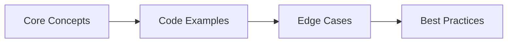
```mermaid
flowchart LR
    A[Core Concepts] --> B[Code Examples]
    B --> C[Edge Cases]
    C --> D[Best Practices]
```

### Q1: Tell me about a time you had a conflict with a teammate. How did you resolve it?

<a href="../../assets/images/diagrams/java/66-interview-behavioral/tell-me-about-a-time-you-had-a-conflict-with-a-teammate-how-did-you-resolve-it-handwritten.svg" target="_blank" rel="noopener">
  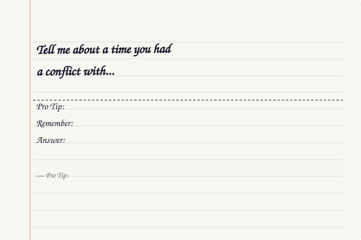
</a>

<a href="../../assets/images/diagrams/java/66-interview-behavioral/tell-me-about-a-time-you-had-a-conflict-with-a-teammate-how-did-you-resolve-it-sticky.svg" target="_blank" rel="noopener">
  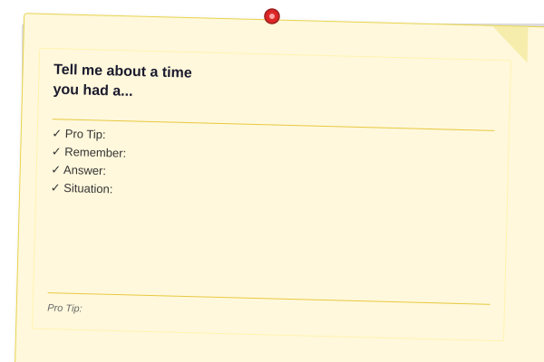
</a>

> **Pro Tip:** In interviews, always start with the "why" before the "how." Explaining the reasoning behind a design choice is more valuable than reciting syntax.

> **Remember:** Code readability matters in interviews. Write clean, well-structured code with meaningful variable names.

**Answer:**

**Situation:** I was working on a microservices migration project where our team was splitting a monolithic application into independently deployable services. A teammate and I disagreed on whether to use REST or gRPC for inter-service communication.

**Task:** We needed to decide on the communication protocol for 12 new microservices, a decision that would impact performance, developer productivity, and operational complexity for the next 2+ years.

**Action:** I proposed we spend one afternoon building a small proof of concept for each approach — a simple order-service calling a payment-service — and measure latency, throughput, and developer effort. We defined four criteria: latency under p99, ease of debugging, tooling support in our Spring Boot stack, and learning curve for the team. After running the POCs, the data showed gRPC was 3x faster but required significant investment in tooling and debugging infrastructure that our small team could not afford yet. I acknowledged my teammate's valid concern about future-proofing, and we compromised: we would use REST with OpenAPI for the first six months, then revisit gRPC for the high-throughput services once we had better observability tooling in place.

**Result:** The team adopted REST with well-documented OpenAPI specs. Six months later, after we had deployed proper distributed tracing (Jaeger) and improved our CI/CD pipeline, we migrated the two highest-throughput services to gRPC in a single sprint. The conflict actually strengthened our working relationship — we learned that we could disagree productively when we let data drive decisions. My teammate and I became the go-to pair for architecture decisions after that.

**Key lesson:** Disagreements over architecture are healthy. The key is to shift from opinion-based debate to evidence-based discussion using POCs and objective criteria.

---

### Q2: Describe a project that failed or went poorly. What happened and what did you learn?

<a href="../../assets/images/diagrams/java/66-interview-behavioral/describe-a-project-that-failed-or-went-poorly-what-happened-and-what-did-you-learn-handwritten.svg" target="_blank" rel="noopener">
  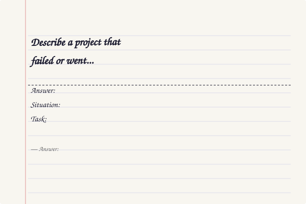
</a>

<a href="../../assets/images/diagrams/java/66-interview-behavioral/describe-a-project-that-failed-or-went-poorly-what-happened-and-what-did-you-learn-sticky.svg" target="_blank" rel="noopener">
  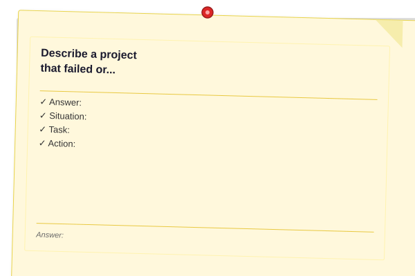
</a>

**Answer:**

**Situation:** I led the backend development for a real-time dashboard feature that would display live metrics from IoT sensors. The deadline was aggressive — 6 weeks — driven by a customer demo at an industry conference.

**Task:** Build a WebSocket-based streaming pipeline that ingests sensor data, processes it through a Spring Boot backend, and pushes updates to a React frontend. The system needed to handle 10,000 concurrent connections with sub-second latency.

**Action:** In my eagerness to deliver quickly, I skipped several steps. I did not write unit tests for the WebSocket handlers, assuming we would add them after the POC. I made architectural decisions alone instead of involving the team. I told the team the deadline was non-negotiable and pushed everyone to work overtime. The first integration test — 3 weeks in — revealed that our WebSocket implementation could not handle reconnection storms when the server restarted. The fix required rewriting the session management layer, which set us back two weeks. We ended up delivering a stripped-down version that worked but lacked the analytics features the customer wanted.

**Result:** The demo was mediocre. The customer was polite but unimpressed. We spent the next three sprints stabilizing and adding the missing features. I learned several hard lessons: technical debt incurred under pressure always compounds, architectural decisions need team buy-in to succeed, and shipping a half-baked feature for a demo damages credibility more than postponing the demo would have.

**Key lesson:** Never skip testing to meet a deadline. The time you save upfront is paid back with interest during integration. Also, involve the team in architecture decisions — good ideas survive scrutiny, and bad ones get caught early.

---

### Q3: Tell me about a time you had to explain a complex technical concept to a non-technical stakeholder.

**Answer:**

**Situation:** Our CTO asked me to present our team's proposal for migrating from a monolithic Java 8 application to Spring Boot microservices to the VP of Product and the CEO. Neither had a technical background.

**Task:** Explain the migration in terms they could understand, justify the investment (estimated 4 months of team effort), and get their approval — without using jargon or overwhelming them with details.

**Action:** I prepared a two-part presentation. First, I used an analogy: "Imagine our monolith is a single kitchen where every dish is prepared by the same chef. If we need to scale — say, add more pizza orders — we have to rebuild the entire kitchen. Microservices are like specialized food trucks: each one makes one thing well, can be upgraded independently, and if the taco truck breaks down, the burger truck still runs." Second, I framed the value in their language: faster time-to-market for new features (product), lower risk during deployments (stability), and the ability to scale parts of the system independently without proportional cost increase (business). I avoided mentioning specific technologies like Docker, Kubernetes, or Spring Cloud unless they asked.

**Result:** They approved the migration, though with a phased approach: 3 months instead of 4, delivering the first two services as a proof of concept before committing to the full plan. The CEO later told me that the "food truck" analogy was what convinced him — he finally understood why he should invest in something he could not see.

**Key lesson:** Always translate technical complexity into business outcomes. Non-technical stakeholders do not care about your architecture; they care about what it enables: faster delivery, lower risk, better reliability.

---

### Q4: Describe a situation where you took initiative beyond your job responsibilities.

<a href="../../assets/images/diagrams/java/66-interview-behavioral/describe-a-situation-where-you-took-initiative-beyond-your-job-responsibilities-sticky.svg" target="_blank" rel="noopener">
  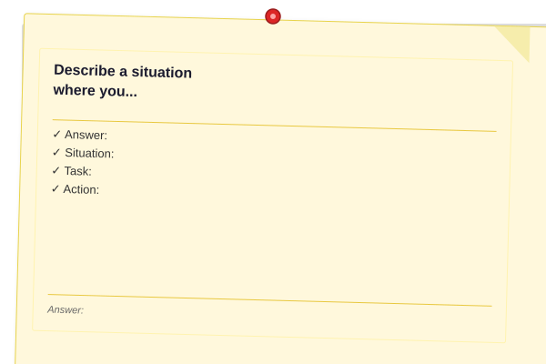
</a>

**Answer:**

**Situation:** Our team was spending roughly 15 minutes per developer per day on manual deployments — SSH-ing into servers, copying JAR files, restarting services, checking logs. We had no CI/CD pipeline.

**Task:** I wanted to automate the deployment process so developers could deploy with a single command or git push, freeing up time for actual feature work and reducing human error.

**Action:** I spent a weekend setting up a Jenkins pipeline that built the project with Maven, ran tests, packaged the JAR, and deployed it to our staging server. On Monday, I showed a demo to my tech lead. He was skeptical at first — "we have never had CI/CD, why do we need it now?" — so I did not push for immediate adoption. Instead, I asked if I could run it in parallel with our manual process for two weeks. During that time, I fixed three issues: the pipeline failed on test flakiness (which led me to fix flaky tests — a secondary win), JAR files grew too large for our staging server's disk, and the SSH key rotation broke the deploy twice. I documented every fix. After the trial period, I presented the data: the pipeline had reduced deployment time from 15 minutes to 45 seconds, and the three failures during the trial were all caught before they reached production.

**Result:** The team adopted Jenkins CI/CD within a month. The tech lead asked me to present the setup to two other teams, and I created an internal wiki guide. Six months later, the CTO referenced our CI/CD pipeline as a model for the entire engineering organization. The 15 minutes per developer per day saved translated to roughly 6 developer-days per month across our 12-person team.

**Key lesson:** When you see a problem, do not wait for permission — build a small proof of concept, measure the impact, and let the results speak for themselves. Parallel running is a great way to build trust in automation without risk.

---

### Q5: Tell me about a time you made a mistake that had significant consequences.

<a href="../../assets/images/diagrams/java/66-interview-behavioral/tell-me-about-a-time-you-made-a-mistake-that-had-significant-consequences-handwritten.svg" target="_blank" rel="noopener">
  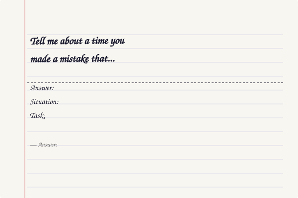
</a>

**Answer:**

**Situation:** I was responsible for a database migration that added a new column to a table with approximately 5 million rows in our production PostgreSQL database. The table was critical — it stored user account information and was referenced by dozens of services.

**Task:** Add a last_login_ip column to the users table without downtime. The migration script was straightforward: ALTER TABLE users ADD COLUMN last_login_ip VARCHAR(45).

**Action:** I wrote the migration, reviewed it briefly (it was one line, after all), ran it on staging, and deployed to production. What I had not considered was that PostgreSQL's ALTER TABLE ADD COLUMN with a default value on a large table would acquire an ACCESS EXCLUSIVE lock and rewrite the entire table. The migration ran for 18 minutes. During those 18 minutes, all writes to the users table were blocked — users could not register, log in, or update their profiles. Our monitoring did not alert us because we had no lock-wait monitoring in place. I only realized the severity when a customer support manager walked to my desk asking why users were tweeting about the app being down.

**Result:** I immediately killed the migration process, which caused PostgreSQL to roll back for another 5 minutes. Total downtime: ~23 minutes. The CTO had to send an incident report to the CEO. I wrote a postmortem and presented it in the next team meeting. The fix was simple for the future: use ALTER TABLE ... ADD COLUMN ... DEFAULT NULL (no default value) which is a metadata-only operation in PostgreSQL 11+. Or use a tool like pgroll or gh-ost for zero-downtime migrations on large tables.

**Key lesson:** Never assume a "one-line" database change is safe at scale. Always check how your database engine handles DDL operations, especially on large tables. PostgreSQL's behavior differs between adding a column with NULL default (instant) and adding one with a non-null default (table rewrite). Always review migrations with a production-sized dataset in mind.

---

### Q6: How do you handle tight deadlines and pressure?

**Answer:**

**Situation:** We had a regulatory compliance deadline — our application needed to support GDPR data export and deletion by a specific date, or face potential fines. The legal requirement came in with 3 weeks' notice, and our sprint was already full.

**Task:** Deliver two features: a "Download My Data" JSON export endpoint and an account deletion workflow that would cascade-delete data across 8 microservices. Both had to be auditable and tested for compliance.

**Action:** I did three things. First, I mapped out the full scope and identified what could be simplified while still meeting compliance. For example, the initial requirement asked for "all data in human-readable format" — after discussing with legal, we clarified that JSON with a schema document counted as readable, which saved us from building HTML reports. Second, I prototyped the riskiest part first: the cascade deletion saga across microservices. I built a proof of concept with Saga pattern using choreography (Kafka events) in two days, got feedback from the team, and validated it worked end-to-end before writing production code. Third, I communicated proactively with my tech lead about progress, flagging the cascade deletion as a risk because it touched 8 services and required coordination with 4 other teams. We negotiated a trade-off: the initial release would support deletion with a 24-hour delay (soft delete then hard delete after verification) instead of instant deletion, which simplified error handling significantly.

**Result:** We delivered on time. The team pulled together, but I was careful not to burn people out — I pushed back on scope where possible, prioritized ruthlessly, and made sure everyone got proper breaks despite the pressure. The compliance audit passed with no findings. My tech lead appreciated the early warnings about the cascade deletion risk, and we incorporated the "prototype the risky part first" approach into our team's standard practice.

**Key lesson:** Under pressure, scope negotiation and risk-first prototyping are your best tools. Do not just work harder — work smarter by identifying what is truly required, what can be simplified, and what is riskiest. Communicate early about risks; surprises under pressure are the worst kind.

---

### Q7: Describe a time when you mentored a junior developer. What was your approach?

**Answer:**

**Situation:** A junior developer joined our team straight out of a coding bootcamp. She was bright and motivated but had never worked with Spring Boot, JPA, or PostgreSQL. Her first task was to implement a paginated search endpoint for our product catalog.

**Task:** Help her ramp up effectively — not just complete the ticket, but understand the underlying concepts so she could work independently on future tickets.

**Action:** I used a three-stage approach. In stage one (first week), I pair-programmed with her, explaining each concept as we went: why we use DTOs instead of exposing entities, how Spring Data JPA's Pageable works, and why we need to handle N+1 queries with JOIN FETCH. I did not just give answers — I asked questions: "What do you think happens if we return the Entity directly to the controller?" and "How would you test this endpoint?" In stage two (second week), I gave her a similar but slightly harder ticket — implementing a filterable search with multiple optional parameters — and told her to try it herself, only coming to me when she was stuck for more than 30 minutes. She came to me three times: once for understanding Specification in Spring Data JPA, once for a Hibernate caching issue, and once for writing a clean integration test. For each question, I explained the concept and pointed her to documentation, but let her write the actual code. In stage three (third week), she was comfortable enough to review other people's PRs. I asked her to review mine, and she caught a real bug — I had forgotten to handle a null parameter in a query method.

**Result:** After four weeks, she completed her third ticket independently. After three months, she was mentoring the next intern. She told me later that the "try for 30 minutes before asking" rule was what helped her build confidence — she realized she could solve most problems herself. The approach scaled: the team adopted a formal mentoring program based on this model.

**Key lesson:** Effective mentoring is about building independence, not dependency. The goal is to make yourself unnecessary. Structured autonomy — give context, then let them try, then debrief — works better than either hands-off or hands-on extremes.

---

### Q8: Tell me about a time you had to deliver bad news to a manager or stakeholder.

**Answer:**

**Situation:** We were three weeks into a six-week project to build a real-time fraud detection service. I realized that our chosen approach — using a Redis-backed rules engine — could not handle the throughput requirements. The rule evaluation took ~200ms per transaction, and we needed under 50ms to avoid impacting the payment flow.

**Task:** Inform my tech lead and product manager that our architecture was wrong and we needed to change direction. This meant our initial estimate was invalid and we would likely miss the deadline.

**Action:** I did not just go to them with a problem. I prepared three options. Option A: Keep the current approach but optimize (estimated 120ms — still not enough). Option B: Replace the rules engine with a precompiled decision tree loaded into memory (estimated 15ms — met requirements, but 2 weeks of rework). Option C: Offload fraud detection to a separate service with its own dedicated resources, using gRPC for low-latency calls (estimated 5ms, but 3 weeks of rework and more infrastructure). I presented the data, including the benchmark numbers, and recommended Option B as the best balance of speed-to-fix and performance. I also proposed a timeline: we would sacrifice the analytics dashboard feature from the initial scope to stay within the original delivery date.

**Result:** My tech lead appreciated the options-based approach. The PM agreed to de-scope the dashboard. We implemented Option B in 9 days — faster than my initial estimate — because we were more focused. The fraud detection service went live on time and processed 99% of transactions under 30ms. The PM told me later that the way I presented the bad news — with options, not just problems — made her trust me more, not less.

**Key lesson:** Never deliver bad news without options. When you show you have analyzed alternatives and have a recommendation, you are seen as a problem-solver, not a problem-bringer. Data makes the conversation objective instead of emotional.

---

### Q9: Describe a time you had to learn a new technology quickly for a project.

**Answer:**

**Situation:** Our team was tasked with building a real-time data pipeline that ingested events from Apache Kafka, processed them with windowed aggregations, and stored results in Elasticsearch for dashboarding. None of us had used Kafka Streams before — we had background knowledge of Kafka as a message broker, but not stream processing.

**Task:** Deliver a working Kafka Streams topology that could aggregate clickstream events into 5-minute windows with hourly rollups — within 3 weeks.

**Action:** I volunteered to be the "Kafka Streams owner" and dive deep while the rest of the team handled other parts. My approach was: 1) I spent the first two days building a minimal topology — read from a topic, do a word count, write to another topic — just to understand the programming model. 2) I then read the official Kafka Streams documentation and the Confluent developer guide, focusing specifically on windowing, state stores, and exactly-once semantics — the parts relevant to our use case. 3) I built a prototype of our actual use case (5-minute tumbling windows with session tracking) using a local Kafka cluster in Docker. The prototype revealed two issues: our event timestamps were in different timezones (had to normalize to UTC), and the state store was growing too large because we were not evicting stale sessions. 4) I wrote a short internal guide (about 5 pages) summarizing what I learned, including common pitfalls and code patterns, and shared it with the team so they could review and contribute.

**Result:** The prototype took 5 days instead of 2, but it caught the timezone and state store issues early, saving us from a major redesign later. We delivered the full pipeline in 4 weeks (one week late, but the timezone fix was unavoidable). The internal guide became a reference document that two other teams used when they started using Kafka Streams. I also gave a 30-minute brown-bag session on stream processing concepts, which helped the team understand the mental model.

**Key lesson:** The fastest way to learn a new technology for a project is to 1) build a throwaway prototype first, 2) focus learning on exactly what you need (not the entire framework), and 3) document and share as you go — teaching reinforces your own understanding.

---

### Q10: Tell me about a time you improved a process or made things more efficient.

<a href="../../assets/images/diagrams/java/66-interview-behavioral/tell-me-about-a-time-you-improved-a-process-or-made-things-more-efficient-handwritten.svg" target="_blank" rel="noopener">
  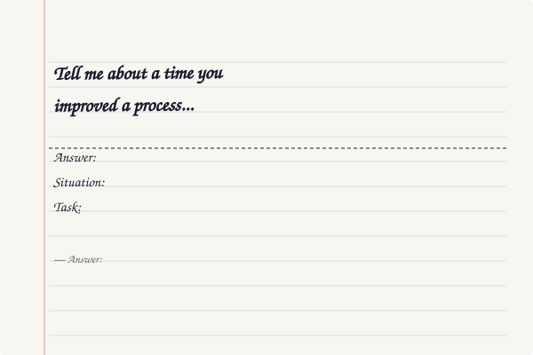
</a>

**Answer:**

**Situation:** Our team's code review process was slow. Average PR review time was 3.5 days. Developers would submit large PRs (500-2000 lines) at the end of a sprint, and reviewers would feel overwhelmed, leading to superficial reviews or delays.

**Task:** Reduce PR review time to under 24 hours while maintaining review quality.

**Action:** I analyzed the data from the last 3 months: PR size correlated strongly with review time. PRs under 300 lines averaged 6 hours to review; PRs over 1000 lines averaged 5 days. I proposed three changes to the team: 1) Enforce a 400-line soft limit per PR — if a feature requires more, break it into multiple stacked PRs. 2) Mandate that every PR description includes a "what and why" section and testing instructions. 3) Establish a "first review within 4 hours" SLA during working hours — if you are tagged as a reviewer, you start reviewing within 4 hours, even if you do not finish. I also set up a GitHub Actions workflow that automatically tagged the two most relevant reviewers based on the files changed (using CODEOWNERS).

**Result:** Within one sprint, average PR review time dropped from 3.5 days to 8 hours. Smaller PRs were reviewed more thoroughly — we found more bugs because reviewers could actually focus. The 4-hour SLA created social accountability: if someone did not start reviewing, the PR author would ping them, and it was socially acceptable because we all agreed to the rule. The CODEOWNERS automation removed the "who should review this?" ambiguity. Review quality improved — we caught a subtle race condition in a 200-line PR that would have been missed in a 1000-line blob.

**Key lesson:** Process improvement starts with measurement. Without the data showing PR size to review time correlation, my proposal would have been dismissed as opinion. Measure first, then propose targeted changes, and show the results after.

---

### Q11: Describe a situation where you had to work with a difficult stakeholder or teammate.

<a href="../../assets/images/diagrams/java/66-interview-behavioral/describe-a-situation-where-you-had-to-work-with-a-difficult-stakeholder-or-teammate-handwritten.svg" target="_blank" rel="noopener">
  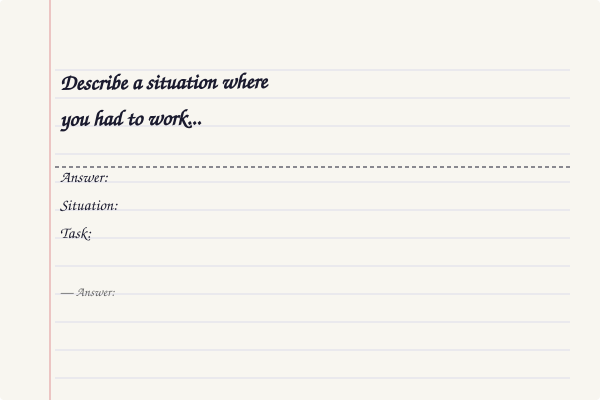
</a>

**Answer:**

**Situation:** A senior architect on our team strongly believed that all microservices should communicate exclusively via asynchronous messaging (Kafka). He rejected any proposal that used synchronous REST or gRPC calls, arguing that it created coupling and violated microservices principles.

**Task:** We needed to build a user-profile service that, when called from the API gateway, needed to return a composite of profile data and recent order history. Using async messaging for this query path would require complex orchestration and CQRS, adding weeks of work.

**Action:** I respected his expertise — he had deep experience with event-driven systems — so I did not challenge him directly. Instead, I proposed a small experiment: we would build two versions of the same endpoint — one using Kafka for the data aggregation (his approach) and one using a simple REST call — and compare them on complexity, latency, and fault tolerance. He agreed. The REST version took 2 days to build; the Kafka version took 8 days and required setting up a local state store and handling out-of-order events. In the demo, the REST version had 5ms latency; the Kafka version had 120ms. I acknowledged that the Kafka approach was architecturally more resilient in theory, but for this specific use case, the added complexity was not justified. We agreed to a hybrid: use REST for synchronous queries where simplicity mattered, and Kafka for the event-driven flows where resilience and decoupling were genuinely needed.

**Result:** The architect became one of my strongest advocates after that. He appreciated that I took his ideas seriously enough to test them, and he respected the data. We developed a team guideline document together: "When to use async vs sync communication in microservices," which helped the whole team make consistent decisions.

**Key lesson:** When you disagree with an experienced person, do not argue — experiment. Data resolves most architectural debates faster and with less friction than debate. Also, find the kernel of truth in their position — the architect was right about async being better for certain scenarios, and acknowledging that made the compromise easier.

---

### Q12: Tell me about a time you went above and beyond for a customer or user.

**Answer:**

**Situation:** We received a support ticket from a large enterprise customer who was experiencing intermittent timeout errors when calling our REST API. The error was difficult to reproduce — it happened once every ~10,000 requests and only under certain load patterns.

**Task:** Identify and fix the root cause. The customer was considering canceling their contract because the issue had been open for 3 weeks without resolution.

**Action:** I took ownership beyond my normal rotation duties. I spent an afternoon analyzing our access logs and found a pattern: the timeouts correlated with requests that included a specific header (X-Request-ID with a certain hash range). That led me to a load balancer configuration issue — one of our 5 backend instances had a slightly different timeout setting due to configuration drift in Ansible. I fixed the configuration and wrote an automated test that checked for configuration consistency across all instances. Then I went a step further: I reached out to the customer directly (with the account manager on CC) and explained what happened, what we fixed, and how we would prevent it from recurring. I also asked if they would be willing to participate in a beta for a new request tracing feature we were building that would have caught this issue 3 weeks earlier.

**Result:** The customer not only stayed but upgraded their contract. They participated in the beta and gave valuable feedback. The account manager told me that the direct, transparent communication was what saved the relationship — the customer felt heard and respected. The configuration consistency check became part of our deployment pipeline, and we never had a similar drift issue again.

**Key lesson:** When a customer has a problem, technical fixes are only half the battle. The other half is communication — being transparent about what went wrong, what you are doing about it, and how you will prevent it. Customers forgive mistakes; they do not forgive being ignored.

---

### Q13: Describe a time you had to make a decision with incomplete information.

<a href="../../assets/images/diagrams/java/66-interview-behavioral/describe-a-time-you-had-to-make-a-decision-with-incomplete-information-handwritten.svg" target="_blank" rel="noopener">
  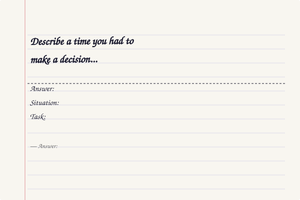
</a>

**Answer:**

**Situation:** During a critical production incident, our main database CPU spiked to 100%, causing query timeouts across the platform. We could not immediately identify the cause — the slow query log was not capturing the problematic queries because they were running faster than our slow_query_log threshold of 2 seconds.

**Task:** Resolve the incident quickly without having full data about which queries were causing the problem. Every minute of downtime cost roughly ,000 in lost revenue.

**Action:** I made a decision based on the available signals: 1) CPU was maxed but IO was normal (pointing to CPU-bound work, not disk contention), 2) the spike started at the top of the hour (suggesting a scheduled job or cron), 3) connection count was normal (ruling out a traffic surge). I hypothesized that a scheduled analytics aggregation job was running an unoptimized query. I could not prove it without the slow query log, but the pattern matched. I decided to kill all running queries from the analytics service, then scale up the database from 4 vCPUs to 16 vCPUs to buy time. After the immediate pressure subsided, I lowered the slow query threshold to 100ms and identified the specific query: a SELECT COUNT(*) on a 50-million-row table with a full table scan, running every hour.

**Result:** The database recovered within 2 minutes of killing the analytics queries. The full resolution — adding an index on the filtered column and caching the count with Redis — took 30 minutes. The incident cost us about ,000 in downtime, which was bad, but would have been much worse if I had waited to gather complete data. I made my reasoning transparent in the incident postmortem and validated the hypothesis with the slow query log data after the fact.

**Key lesson:** In an incident, speed matters more than certainty. Make the best decision you can with the information available, document your reasoning, and be ready to reverse if new evidence emerges. A wrong fast decision is often better than a slow correct one when money is burning.

---

### Q14: Tell me about a time you received constructive criticism. How did you handle it?

**Answer:**

**Situation:** During a code review, my tech lead rejected a pull request where I had implemented a complex caching layer using Spring Cache with Redis. He wrote a detailed comment saying the design was over-engineered and that I had introduced unnecessary complexity for a use case that did not need caching.

**Task:** Respond to the criticism constructively without becoming defensive. The PR represented 3 days of work, and I was proud of it.

**Action:** My initial reaction was defensive — I had spent significant time on it. But I took an hour before responding. I re-read his comments with fresh eyes and realized he was right: the endpoint in question handled 50 requests per minute, and the database query already responded in 15ms. Adding Redis caching introduced a new infrastructure dependency, serialization overhead, and cache invalidation logic for zero perceptible benefit. I responded to the review: "You are right. The caching is unnecessary here. I will revert the cache layer and keep the code simple. For future reference, at what throughput threshold would you consider caching justified?" He appreciated the question, and we established a guideline: introduce caching only when p99 latency exceeds 200ms or throughput exceeds 1000 req/s per instance.

**Result:** I reverted the caching code, reducing the PR from 400 lines to 40. The code was simpler and easier to maintain. That experience taught me something important: I had been adding caching because I wanted to use a cool technology, not because the problem demanded it. After that, I started asking "do we need this?" before "how do we implement this?"

**Key lesson:** Good criticism is a gift, even when it stings. The best response is to take time to process your defensiveness, find the truth in the feedback, and respond with curiosity instead of justification.

---

### Q15: Describe a time you worked effectively as part of a team to achieve a common goal.

<a href="../../assets/images/diagrams/java/66-interview-behavioral/describe-a-time-you-worked-effectively-as-part-of-a-team-to-achieve-a-common-goal-sticky.svg" target="_blank" rel="noopener">
  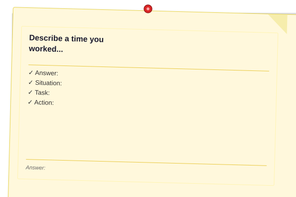
</a>

**Answer:**

**Situation:** Our team was tasked with rebuilding the checkout flow of our e-commerce platform for Black Friday readiness. The old system (a monolithic PHP application) could not handle the expected 10x traffic spike. We had 8 weeks to build a new checkout service in Spring Boot.

**Task:** Deliver a scalable, resilient checkout service that could handle 5,000 concurrent checkout requests with sub-2-second completion time. This required coordination across 3 teams: backend (us), frontend (React), and infrastructure (Kubernetes).

**Action:** We organized into two squads within our team: one focused on the core checkout flow (cart to payment to order), and one focused on edge cases (promotions, gift cards, international shipping). I was on the core flow squad but acted as the integration point between the two. We used daily 15-minute standups and a shared Slack channel with the other teams. I set up a "contract-first" approach: we defined the REST API contracts (OpenAPI specs) in the first week, so frontend and infrastructure teams could work in parallel with us. When we discovered that the payment gateway had a 2-second timeout that would break our p99 latency target, I proposed an async approach: we would accept the payment intent, return immediately, and update the order status asynchronously via WebSocket push. My tech lead approved, and the frontend team adapted to show "processing" states instead of blocking.

**Result:** We launched 3 days before Black Friday. The checkout service handled 8,000 concurrent requests at peak (60% above target) with p99 latency of 1.2 seconds. Zero downtime during Black Friday. The cross-team coordination was singled out in the post-mortem as the main reason for success — particularly the contract-first approach and the early async payment decision.

**Key lesson:** For multi-team projects, contract-first is essential. Define the interfaces early so teams can work independently. Also, identify and communicate cross-team dependencies early — the payment timeout issue was found in week 2 because we asked "what are the external dependencies?" on day one.

---

### Q16: Tell me about a time you had to balance technical excellence with business pragmatism.

**Answer:**

**Situation:** We needed to ship a "quick win" feature — adding a discount code field to the checkout page — in 2 weeks to match a competitor's promotion. The ideal technical solution would involve refactoring our pricing engine to support composable discount rules, writing a full test suite, and adding integration tests for the new discount codes.

**Task:** Deliver the feature in 2 weeks, but the ideal solution would take 6-8 weeks. Find a pragmatic middle ground.

**Action:** I proposed a two-phase approach. Phase 1 (2 weeks): Build a simple, hardcoded discount code system — store codes in a database table with a percentage value and expiration date, validate with a basic service, and apply the discount at checkout. No composable rules, no admin UI — the operations team would insert codes directly via SQL (with a documented process). Phase 2 (future): After the promotion launched and we had breathing room, we would refactor the pricing engine to properly support composable rules, admin UI, and full test coverage. I presented this to the product manager with clear trade-offs: "We can ship in 2 weeks with limited flexibility and some technical debt, or we can ship in 8 weeks with a robust system. The debt from Phase 1 is localized and easy to refactor."

**Result:** The PM chose Phase 1. We shipped on time. The promotion ran for 4 weeks and generated  in additional revenue. During week 3, we started Phase 2 — it took 5 weeks because we had real usage data that informed the design. The final system was actually better for having been informed by real-world usage patterns. The technical debt from Phase 1 was fully paid off within one quarter.

**Key lesson:** Perfect is the enemy of shipped. The key is to make technical debt intentional, visible, and temporary — with a clear plan to resolve it. The worst technical debt is the unintentional kind that accumulates without acknowledgment.

---

### Q17: Describe a situation where you had to debug a very difficult production issue.

**Answer:**

**Situation:** Users reported that occasionally, when placing an order, they would receive a confirmation email but the order would not appear in their order history. This was a data inconsistency issue that only affected about 0.1% of orders.

**Task:** Find and fix the root cause of this intermittent data loss. The affected users were understandably frustrated — they had paid but could not see or track their orders.

**Action:** I started by gathering data: I analyzed the logs for 20 affected order IDs. I found that in every case, the payment was successfully processed (confirmed by the payment gateway), the order was created in the database, and the confirmation email was sent — but then the order was deleted within 2 seconds of creation. This looked like a rollback, but the transaction was not completing. I traced the code path and found the culprit: a @Transactional method in the order service that threw an OptimisticLockException when two concurrent requests tried to update the same inventory item. The catch block caught the exception but logged it and returned — without re-throwing it. Spring's transaction management saw that no exception propagated, so it committed the transaction. But the entity was in an inconsistent state because the optimistic lock failure had detached it from the persistence context. The order was created (the INSERT had already executed) but the entity was stale, causing a NullPointerException later in the method that left the order data incomplete.

**Result:** The fix was minimal: do not catch OptimisticLockException inside a @Transactional method. Instead, let it propagate so Spring can roll back the transaction cleanly. Handle it at the controller level with a retry. After the fix, the issue went to zero. I wrote a short guide on "transactional pitfalls in Spring" that covered this pattern, which became part of our team's onboarding.

**Key lesson:** Transaction management in Spring is subtle. The most dangerous bugs happen when exceptions are caught inside @Transactional methods — the transaction commits with inconsistent state. Always let transaction exceptions propagate unless you explicitly handle the persistence context state.

---

### Q18: Tell me about a time you advocated for a change in technology or tooling.

<a href="../../assets/images/diagrams/java/66-interview-behavioral/tell-me-about-a-time-you-advocated-for-a-change-in-technology-or-tooling-sticky.svg" target="_blank" rel="noopener">
  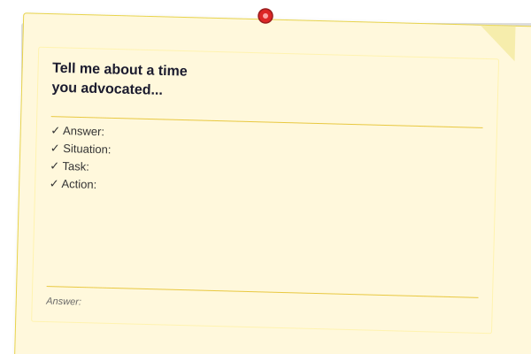
</a>

**Answer:**

**Situation:** Our team was using a shared, monolithic PostgreSQL database for all services. As we grew to 8 microservices, schema changes became a coordination nightmare — changing one table required coordinating with 4 teams, and a migration failure in one service could block deployments for all services.

**Task:** Convince the team and management that we should move to a "database-per-service" pattern, where each microservice owns its data and communicates via APIs rather than shared database access.

**Action:** I did not just propose the change in a meeting — I prepared a detailed analysis. First, I documented the actual friction: in the last quarter, 3 deployments were delayed because of cross-team schema coordination, and 2 incidents were caused by one service writing inconsistent data that another service read. I calculated the cost: roughly 12 developer-days lost per quarter. Second, I proposed a migration strategy, not a big-bang rewrite: we would extract one service at a time, starting with the billing service (which had the most independent data). For each extraction, we would create a new dedicated database, migrate the data, update the service to own its schema, and add an API for other services to read its data. Third, I addressed the concerns: "What about queries that join across services?" — answered with CQRS and eventual consistency. "What about the migration risk?" — answered with a rollback plan per service.

**Result:** The team agreed to try it with the billing service as a pilot. The pilot took 3 weeks — slightly longer than expected because we discovered hidden data dependencies — but the result was clear: the billing team could deploy independently without coordinating schema changes. Management approved the full migration over the next 6 months. Two years later, when we needed to scale the platform to handle 50 microservices, the database-per-service pattern was the foundation that made it possible.

**Key lesson:** Advocating for technical change requires more than being right. You need data on the current cost, a concrete migration plan, and answers to anticipated objections. Show the cost of inaction and provide a safe path forward with rollback options.

---

### Q19: Describe a time when you failed to meet a commitment. What happened?

**Answer:**

**Situation:** I committed to delivering a performance benchmarking tool for our API gateway by the end of the sprint. The tool would simulate 10,000 concurrent users and measure p50/p95/p99 latency under various load patterns. I had done similar tools before and estimated 2 weeks confidently.

**Task:** Deliver a working benchmarking tool with a report generator that could be run in CI to catch performance regressions.

**Action:** I underestimated the complexity significantly. First, setting up realistic authentication for 10,000 simulated users required more work than I expected — we used JWT tokens that expired, and I had to implement a token refresh flow in the benchmark client. Second, the report generator needed to produce charts in HTML format, and I spent 3 days fighting with a charting library instead of using a simpler approach. Third, the CI integration required running the benchmark on a dedicated performance test environment that did not exist yet — I had to pause and coordinate with the infrastructure team, losing 2 days. By the end of the sprint, I had a working but incomplete tool — it could run benchmarks but could not generate the HTML report.

**Result:** I communicated the delay honestly during the sprint review: "I have the core benchmarking engine working, but the HTML report generator is not done. I will complete it next sprint." The team was understanding, but I felt I had let them down. I completed the missing piece in 2 days of the next sprint. The root cause was clear: I had assumed all the work was in the benchmark engine (which I knew well) and ignored the unknowns (CI integration, chart rendering, auth simulation). I learned to identify and estimate unknowns separately from known work.

**Key lesson:** When estimating, identify what you do not know explicitly and add buffer for it. Experience with similar tasks is useful, but every project has unique elements that should be estimated separately. Also, communicate delays early — the team could have helped me with the CI integration if I had flagged it earlier.

---

### Q20: Tell me about a time you had to convince others to adopt a new technology or approach.

**Answer:**

**Situation:** Our team was manually writing integration tests using embedded databases (H2) that simulated PostgreSQL. These tests were slow (~15 minutes for the full suite), flaky (the H2 dialect did not match PostgreSQL exactly), and missed bugs that only appeared in production (e.g., PostgreSQL-specific JSONB operations).

**Task:** Convince the team to switch to Testcontainers for our integration tests, using real PostgreSQL containers instead of H2.

**Action:** I anticipated the objections: "Testcontainers will be slower," "it adds Docker as a dependency," "our CI does not support Docker." Instead of debating in a meeting, I spent a weekend building a proof of concept. I migrated 20 of our most flaky tests to use Testcontainers with a PostgreSQL container. I measured: the 20 tests took 3 minutes with H2 (but were flaky — 20% failure rate) and 3.5 minutes with Testcontainers (zero flakiness). I ran the full test suite with Testcontainers and found it was only 20% slower than H2 — but 100% more reliable. I presented this data in our retrospective, along with a migration plan: convert the test suite one module at a time, starting with the modules that had the most PostgreSQL-specific queries. I also addressed the CI concern by showing that GitHub Actions supported Docker out of the box.

**Result:** The team agreed to migrate. We allocated 20% of each sprint to the migration over 4 sprints. After the migration, test flakiness dropped from ~15% to under 1%, and we caught two PostgreSQL-specific bugs in staging that would have hit production. The team's confidence in the test suite improved dramatically — developers stopped ignoring test failures. Testcontainers became our standard for all future services.

**Key lesson:** Do not argue about which technology is better in the abstract. Build a small, concrete proof of concept that addresses the specific concerns people have. Show data. The "20% slower, but 100% more reliable" trade-off was easy to accept when backed by numbers.

---

### Q21: Describe a time when you had to deal with a significant amount of ambiguity in a project.

**Answer:**

**Situation:** My product manager came to me with a vague requirement: "We need a recommendation engine for our e-commerce site. Figure out what that means and how to build it."

**Task:** Turn an ambiguous, open-ended requirement into a concrete, scoped project that delivered value quickly without over-investing in the wrong solution.

**Action:** I did not start coding. I spent the first week on discovery. 1) I looked at our user behavior data: what did users actually do after viewing a product? I found that 40% of users searched for a different brand, 30% went to the homepage, and only 10% viewed related products. This suggested our existing "related products" feature was not working. 2) I researched recommendation approaches: collaborative filtering (requires user history), content-based (uses product attributes), and hybrid (both). We had limited user history for new users (cold start problem), so I leaned toward content-based. 3) I defined a minimal viable recommendation: "when a user views a product, show 4 products in the same category with similar price range and complementary tags." This was simple SQL — no ML needed. 4) I proposed this to the PM as a 2-week phase 1, with the caveat that we would measure click-through rate and iterate.

**Result:** Phase 1 took 2 weeks and used a simple SQL query with Spring Data JPA. The click-through rate on recommendations was 8% — not great, but it established a baseline. Over the next 3 months, we iterated: phase 2 added popularity weighting (CTR rose to 12%), phase 3 added "users who bought this also bought" using collaborative filtering on the order history (CTR rose to 18%). By phase 3, we had enough user data and baseline metrics to make informed decisions. The PM was happy because we delivered value in 2 weeks instead of waiting 3 months for a full ML system.

**Key lesson:** Ambiguity is best resolved by doing the simplest possible thing first to gather real data. Never try to solve an ambiguous problem with a perfect solution on the first attempt. Define a minimal version, ship it, measure, and iterate.

---

### Q22: Tell me about a time you took a calculated risk that paid off.

<a href="../../assets/images/diagrams/java/66-interview-behavioral/tell-me-about-a-time-you-took-a-calculated-risk-that-paid-off-handwritten.svg" target="_blank" rel="noopener">
  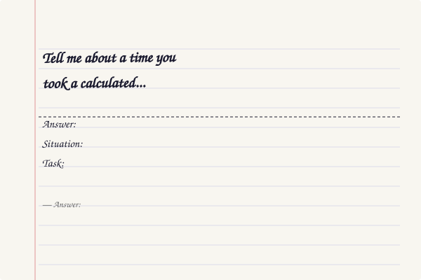
</a>

**Answer:**

**Situation:** During a major migration from a monolith to microservices, we had a critical decision: how to handle the data migration. The safe approach was to keep the monolith's database as the source of truth and gradually migrate tables to new services. The risky approach was to run both systems in parallel for a period, double-writing to both databases, and then cut over.

**Task:** Decide on the data migration strategy for splitting the monolith's database into service-specific databases. The parallel-run approach would catch data issues early but was more complex and carried a risk of data inconsistency.

**Action:** I analyzed the trade-offs carefully. The safe approach (gradual table migration) would take 12 months and require the monolith to stay operational the entire time. The parallel-run approach would take 6 months but required building a synchronization layer. I calculated the cost of each: the safe approach cost roughly  in ongoing monolith maintenance; the parallel approach cost  in engineering time for the sync layer. The risk of the parallel approach was data inconsistency during the transition. I mitigated this by: 1) writing reconciliation jobs that compared data between old and new databases daily, 2) implementing a "monolith as source of truth" fallback — if the sync layer detected an unrecoverable inconsistency, we would fall back to the monolith and re-sync, and 3) running the parallel approach for a full month before cutting over, monitoring for issues.

**Result:** The parallel approach worked. We found and fixed 7 data inconsistency issues during the month-long parallel run — mostly around timezone handling and null vs empty string semantics. When we cut over, the migration completed with zero data loss and zero downtime. The  savings meant we could reinvest in other improvements. The sync layer we built later became the foundation for our event-sourcing architecture.

**Key lesson:** A calculated risk with proper mitigation (monitoring, reconciliation, rollback plan) is not really a risk — it is a strategy. The key is to have a way to detect failure and a plan to recover before committing to the cutover.

---

### Q23: Describe a time you had to work outside your comfort zone or area of expertise.

**Answer:**

**Situation:** I was a Java backend engineer. Our DevOps engineer went on parental leave for 3 months, and I was asked to manage our Kubernetes cluster for the duration. I had basic Docker knowledge but had never touched Kubernetes beyond kubectl get pods.

**Task:** Keep the production Kubernetes cluster running: handle deployments, respond to incidents, manage resource scaling, and troubleshoot issues — with no prior Kubernetes administration experience.

**Action:** I did not pretend I knew what I was doing. I spent the first week studying: I read the Kubernetes documentation's "Production Cluster" section, worked through the CKAD practice exercises on Katacoda, and set up a local Minikube cluster where I practiced failure scenarios (node drain, pod eviction, config map updates). I established a support chain: I had a senior DevOps engineer from another team on Slack for emergencies. I automated what I could: I improved our Grafana dashboards so I could see cluster health at a glance, set up alerts for common failure modes (pod crash loop, node pressure, OOM kills), and wrote runbooks for the tasks I was most worried about (certificate rotation, cluster upgrade, disaster recovery). When the first real incident happened — a node ran out of disk space because of container logs — I followed my runbook, found the alert, drained the node, and resolved it in 20 minutes.

**Result:** I managed the cluster for 3 months. We had 5 incidents, all resolved within SLA. I actually improved the cluster: I added pod resource limits (which had not existed before), set up a log rotation policy (which was the root cause of the disk space incident), and wrote comprehensive runbooks that the team continued using after the DevOps engineer returned. When he came back, he was surprised by how much the system had improved.

**Key lesson:** Stepping outside your comfort zone is one of the fastest ways to grow. The keys are: 1) learn the fundamentals before you need them, 2) establish a support network, and 3) automate and document as you go — the act of writing runbooks solidifies your own understanding.

---

### Q24: Tell me about a time you improved code quality across your team.

<a href="../../assets/images/diagrams/java/66-interview-behavioral/tell-me-about-a-time-you-improved-code-quality-across-your-team-handwritten.svg" target="_blank" rel="noopener">
  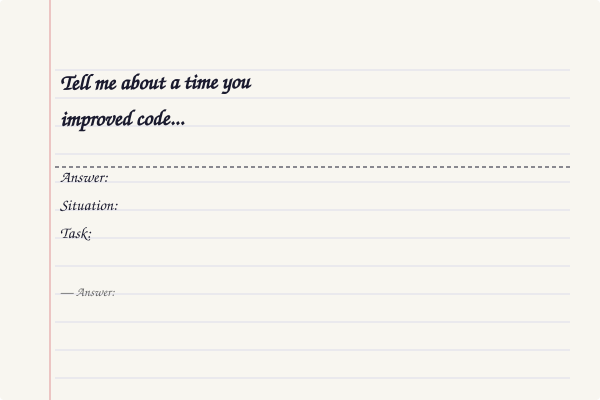
</a>

<a href="../../assets/images/diagrams/java/66-interview-behavioral/tell-me-about-a-time-you-improved-code-quality-across-your-team-sticky.svg" target="_blank" rel="noopener">
  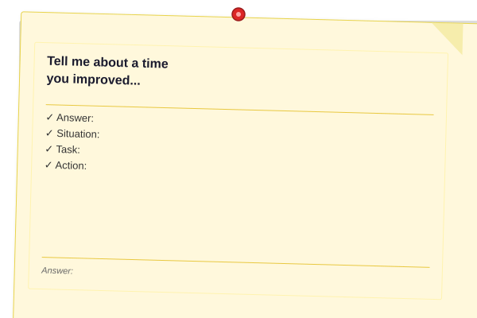
</a>

**Answer:**

**Situation:** Our codebase had inconsistent coding styles, no static analysis, and variable test coverage. New features took longer than they should because developers had to understand different patterns in different parts of the codebase.

**Task:** Establish code quality standards and tooling that would make the codebase more consistent and maintainable.

**Action:** I introduced three initiatives, one per sprint. Sprint 1: Configured Checkstyle with a checked-in configuration file and integrated it into the Maven build. I started with a minimal set of rules (naming conventions, import ordering, Javadoc on public methods) and got team buy-in by showing the before/after diff on a single file — the improvement was visually obvious. Sprint 2: Added SpotBugs for static analysis and ErrorProne for catching common Java bugs at compile time. This required more persuasion because the initial run found 200+ warnings. I categorized them: critical (3 actual bugs), moderate (45 code smells), cosmetic (160+ minor issues). I fixed the 3 critical bugs immediately (one was a potential null pointer, one was an incorrect equals implementation, one was a resource leak) and created a tech debt ticket for the moderate items. Sprint 3: Introduced a minimum test coverage threshold (70%) in JaCoCo, but with a critical nuance: it was enforced for new code only via a diff coverage check (using the diff coverage feature in JaCoCo's Git plugin), not applied retroactively to existing code.

**Result:** Within 3 months, our codebase was noticeably more consistent. The 3 critical bugs SpotBugs caught would likely have caused production issues within the next quarter. The diff-coverage approach was key to adoption — developers did not feel punished for existing code. In the next quarterly survey, 80% of the team said code quality had improved, and onboarding time for new team members dropped from 4 weeks to 3 weeks.

**Key lesson:** Code quality initiatives must be pragmatic and incremental. A 70% coverage threshold enforced retroactively would have been rejected. Applying it to new code only and showing concrete value (like catching real bugs) builds trust. Also, tooling is only half the equation — cultural buy-in is what makes it stick.

---

### Q25: Describe a situation where you had to prioritize competing demands.

**Answer:**

**Situation:** In a single week, I had three competing priorities: 1) a critical production bug causing data loss in the payment service, 2) a feature deadline for a customer demo on Friday (it was Tuesday), and 3) a scheduled technical debt refactoring that I had committed to delivering this sprint.

**Task:** Determine what to work on, what to defer, and what to negotiate — while managing stakeholder expectations.

**Action:** I applied a simple triage framework: impact times urgency. The production bug was high impact (data loss = revenue loss + customer trust damage) and high urgency (every hour of data loss was cumulative). The customer demo was high impact (potential new contract worth ) but medium urgency (it was Tuesday, I had 3 days). The tech debt refactoring was medium impact and low urgency (no immediate business consequence). I immediately started investigating the production bug. Within 2 hours, I identified the root cause and implemented a hotfix. I deployed it and confirmed data loss stopped. Then I assessed the remaining time and realized I could not both polish the demo and complete the refactoring. I messaged the PM: "The production bug is fixed. I have capacity to either polish the demo feature or complete the tech debt refactoring this sprint — not both. Which is higher priority?" She chose the demo. I messaged my tech lead about the refactoring delay and he was fine with it.

**Result:** The production bug was fixed within 2 hours of my triage. The demo was successful and the customer signed. The tech debt refactoring was moved to the next sprint with no negative consequences. The PM appreciated being asked about the trade-off rather than being surprised by a missed deadline.

**Key lesson:** When priorities compete, do not try to do everything — it leads to burnout and mediocrity. Triage by impact times urgency, communicate trade-offs clearly, and let stakeholders make the final call on what to defer. Most things can wait; some things cannot.

---

### Q26: Tell me about a time you had to give feedback to a peer or manager.

<a href="../../assets/images/diagrams/java/66-interview-behavioral/tell-me-about-a-time-you-had-to-give-feedback-to-a-peer-or-manager-handwritten.svg" target="_blank" rel="noopener">
  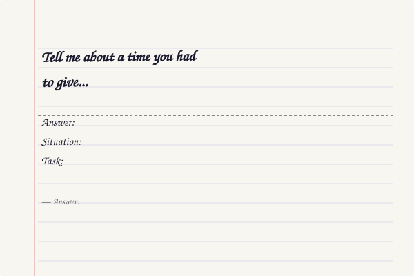
</a>

**Answer:**

**Situation:** A teammate consistently submitted pull requests late in the day on Fridays, expecting reviews before the weekend. This put pressure on reviewers to either work overtime or let the PR sit for 3 days. It was a pattern that was affecting team morale.

**Task:** Give constructive feedback to a peer about a behavior that was causing friction, without damaging our working relationship.

**Action:** I chose to give the feedback in person during a 1:1 coffee we had scheduled, not during standup or in a PR comment (which would feel public and confrontational). I used the SBI model (Situation, Behavior, Impact): "Hey, I have noticed that when you submit PRs on Friday afternoons, reviewers feel rushed to review before the weekend or leave it hanging for days, which creates pressure and slows things down. Could we try submitting PRs earlier in the week, or if Friday is unavoidable, flagging it as 'no rush, review next week'?" He was surprised — he had not realized it was a pattern. He explained that he worked better in the afternoon and that is when he finished his tasks. We agreed on a solution: he would submit the PR before leaving, but add a comment saying "No rush — review Monday," which removed the implicit urgency.

**Result:** The Friday PR problem disappeared. The teammate started adding the "no rush" note, and reviewers felt free to ignore the PR until Monday without guilt. Our relationship actually improved — we had established that we could give each other honest feedback. He later gave me feedback about my verbose PR descriptions, which I appreciated and improved.

**Key lesson:** Feedback should be specific, behavior-focused, and delivered in private. The SBI model makes feedback feel objective rather than personal. Always frame feedback with a focus on solutions, not just problems.

---

### Q27: Describe a time you had to deal with a legacy codebase. How did you approach it?

**Answer:**

**Situation:** I joined a team that maintained a 10-year-old Java EE application with EJB 2.x, XML-based configuration, no tests, and no documentation. It was critical for the business but painful to work with — any change took 3x longer than it should.

**Task:** Make the legacy system maintainable while keeping it running in production. A full rewrite was off the table due to business risk and cost.

**Action:** I used the "strangler fig pattern" — gradually replacing pieces of the legacy system with modern Spring Boot services. My approach: 1) First, I added integration tests for the most critical path (the checkout flow) using Testcontainers. These tests captured the existing behavior without modifying the code. I did not fix bugs I found — I documented them and tested the current (buggy) behavior as the baseline. 2) Then, I identified a bounded context (user profile management) that had minimal coupling to the rest of the system. I extracted it into a separate Spring Boot service with its own database. The legacy app called the new service via HTTP for profile operations. 3) Once the new service was running in production, I used it as a template for the next extraction. Over time, we replaced the monolith piece by piece.

**Result:** Over 18 months, we extracted 5 services from the monolith. The legacy system shrunk from 500,000 lines of code to 200,000. More importantly, the team's morale improved — developers were excited to work on new Spring Boot services instead of dreading EJB changes. The testing baseline we established in step 1 prevented regressions during the extraction. The approach became a case study our VP of Engineering used for other legacy modernization projects.

**Key lesson:** Legacy modernization is a marathon, not a sprint. The key principles are: 1) add tests before making changes, 2) extract one bounded context at a time, 3) never rewrite from scratch — always replace piece by piece with a strangler pattern. The tests are your safety net; without them, you are refactoring blind.

---

### Q28: Tell me about a time you had to make a trade-off between speed and quality.

<a href="../../assets/images/diagrams/java/66-interview-behavioral/tell-me-about-a-time-you-had-to-make-a-trade-off-between-speed-and-quality-handwritten.svg" target="_blank" rel="noopener">
  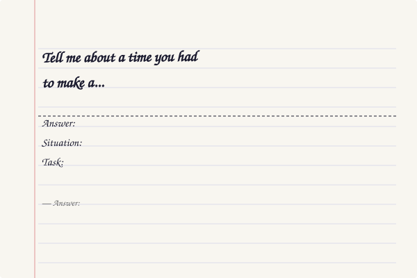
</a>

**Answer:**

**Situation:** A critical security vulnerability was discovered in a third-party library we used. The CVE had a 9.8 severity score, and our security team gave us 48 hours to patch or face a compliance violation.

**Task:** Upgrade or replace the vulnerable library within 48 hours, without introducing regressions. The library in question was deeply integrated — it was our OAuth2 client library used across 6 services.

**Action:** I had two options: A) upgrade the library to the patched version (fast, but would require updating the OAuth2 configuration in all 6 services because the API changed in the new version), or B) write a compatibility wrapper that let us use the new library version with the old API (slower, but lower risk). I chose Option A (faster) but with specific quality mitigations: 1) I created a test matrix that covered all 6 services' OAuth2 flows, 2) I ran the tests in our staging environment with realistic credentials, 3) I prepared a rollback plan (keep the old deployment running) in case the patch caused issues, 4) I scheduled the deployment for 10 AM on a weekday, not Friday evening. The tests revealed that the new library version handled token refresh differently — our services would have stopped refreshing tokens 24 hours after deployment if I had not noticed.

**Result:** The patch was deployed within 36 hours (12 hours ahead of the deadline). The token refresh issue would have caused a full outage if I had not tested it. The security team was satisfied, and no regression was introduced. Afterward, I created a "security patch runbook" that documented the process, including the need to check token refresh compatibility.

**Key lesson:** When speed is critical, quality becomes about risk management, not perfection. The question is not "can I test everything?" but "what is the most likely failure mode and how do I detect or catch it?" The token refresh issue was the exact thing that the team's standard upgrade process would have missed — a subtle behavioral change in a dependency. Testing caught it.

---

### Q29: Describe a time you had to work with a distributed or remote team.

**Answer:**

**Situation:** Our team was split across three time zones: San Francisco (PST), New York (EST), and Bangalore (IST). There was a 12.5-hour difference between SF and Bangalore, leaving only a 2-hour overlap window (8-10 AM PST = 8:30-10:30 PM IST).

**Task:** Coordinate effectively on a shared project — a real-time dashboard for internal analytics — without burning out team members who had to attend meetings outside their working hours.

**Action:** I proposed an async-first communication model. 1) We stopped having daily standups across all time zones. Instead, each sub-team had its own standup, and we shared daily written updates in a shared Slack channel using a template: "What I did yesterday, What I will do today, Blockers." 2) We recorded all design discussions (using Loom or written RFCs) so people could participate async. 3) We designated the 2-hour overlap window as "collaboration time" — no meetings during that window unless it was cross-team coordination. 4) For decisions that required synchronous discussion, we rotated the meeting time weekly so the same time zone did not always bear the burden of attending outside hours. 5) I also created a shared documentation hub (Confluence) where we tracked decisions, architecture, and progress so anyone could catch up without asking.

**Result:** The async-first model worked well. The daily written standups were actually more informative than oral ones because people wrote more thoughtfully. The recorded RFCs allowed team members in Bangalore to participate in design decisions instead of just implementing decisions made during US hours. The dashboard project shipped on time, and the team reported higher satisfaction in the post-project survey compared to previous distributed projects.

**Key lesson:** Async communication is the superpower of distributed teams. Synchronous meetings should be the exception, not the default. Written communication forces clarity, creates documentation automatically, and respects everyone's time zone. The weekly rotation of meeting times is a small change that has a big impact on team morale.

---

### Q30: Tell me about a time you had to deal with a significant setback or failure in a project.

**Answer:**

**Situation:** We spent 4 months building a Kubernetes-based platform for running machine learning training jobs. Two weeks before the launch, our infrastructure team informed us that our Kubernetes cluster could not support the GPU scheduling we had designed for — the node pool did not have the right GPU drivers, and adding them would require a 6-week infrastructure change.

**Task:** Salvage the project or decide to cancel it. We had invested significant resources, but the technical foundation was flawed in a way that could not be quickly fixed.

**Action:** I led the analysis of our options: 1) Delay 6 weeks while infrastructure fixed the GPU drivers (the project would miss the business deadline, making it largely irrelevant). 2) Switch to a managed ML platform (Amazon SageMaker or Google AI Platform) which had GPU support out of the box (would require rewriting the training orchestration layer, estimated 4 weeks). 3) Cancel the project and redirect resources. I recommended Option 2. I presented the analysis to the stakeholders: "We made an incorrect assumption about GPU support in our cluster. The mistake was mine — I should have verified the infrastructure capability before we started building. Option 2 lets us deliver in 4 weeks instead of 6 and gives us a more scalable platform long-term."

**Result:** We went with Option 2. The team was demoralized by the setback, but taking ownership of the mistake helped — I was transparent about it being my failure to verify the GPU assumption early. We delivered the ML platform on SageMaker in 5 weeks (one week late on the revised timeline). The platform handled 200+ training jobs in the first month. The experience led to a new team practice: "infrastructure assumption validation" — before starting any project that depends on infrastructure capabilities, we write a one-page doc listing assumptions and verify each one with the infrastructure team.

**Key lesson:** When a project faces a fundamental technical setback, the worst thing you can do is double down and try to work around it. Acknowledge the mistake, evaluate alternatives objectively, and pivot quickly. Taking personal ownership of the miss builds trust — leaders who blame circumstances lose trust faster than those who admit mistakes.

---

### Q31: Tell me about a time you had to manage a stakeholder who kept changing requirements.

**Answer:**

**Situation:** Our product manager kept adding new features to the reporting dashboard we were building. Every week during the demo, she would say "this is great, but can we also add X?" — expanding the scope from 3 report types to 9 over the course of 6 weeks.

**Task:** Deliver the reporting dashboard without letting scope creep derail the timeline. The PM was enthusiastic but did not realize the cumulative impact of her requests.

**Action:** In the 6th week, I scheduled a 30-minute meeting with just the PM and a whiteboard. I drew two timelines: "Current Scope (9 report types)" and "Original Scope (3 report types)." I showed her the velocity data: we had delivered 3 reports in 6 weeks. At that rate, the remaining 6 reports would take 12 more weeks. I proposed a concrete plan: "We can deliver the original 3 reports by the original deadline. The additional 6 reports need to be prioritized. Pick the 3 most important ones for phase 2, and we will deliver them in the next iteration. The remaining 3 go into the backlog for prioritization." I also introduced a process change: after that meeting, I started writing a one-page "scope sheet" for each sprint — the PM would initial it, and any new request outside the sheet would be tagged "backlog" automatically.

**Result:** The PM agreed to the prioritization. The original 3 reports shipped on time. Phase 2 delivered 3 more reports in the next sprint. The remaining 3 were descoped and never built — the data showed they were not actually needed. The scope sheet process eliminated the "death by a thousand papercuts" feeling from sprint planning. The PM appreciated having a clear process rather than me just saying "no" every time.

**Key lesson:** Scope creep is a process problem, not a people problem. Enthusiastic stakeholders do not realize they are expanding scope — it is your job to make the trade-offs visible. A visual timeline with current velocity is more persuasive than words. A simple scope sheet signed off creates shared understanding and accountability.

---

### Q32: What is your biggest weakness? Give a concrete example.

**Answer:**

**Weakness:** I have a tendency to dive into technical solutions before fully understanding the problem. I love building things, so when someone describes a problem, my first instinct is "how do I solve this?" rather than "do we understand the problem well enough?"

**Example:** Earlier in my career, a product manager asked for a "search improvement" on our e-commerce platform. I immediately started building an Elasticsearch-based full-text search with faceted navigation, autocomplete, and typo tolerance. Two weeks into the implementation, I showed a demo to the PM, and she said, "This is great, but the actual problem is that users cannot find products because our category names are confusing. I was hoping we could rename the categories." I had built a complex solution to the wrong problem. I had spent 2 weeks on something that could have been solved with a spreadsheet rename.

**What I did about it:** I have since adopted a practice I call "the five whys before code." Before I write any code, I ask "why?" at least five times to ensure I understand the actual problem. I also write a one-paragraph problem statement and get it approved before designing a solution. In the search example, if I had asked "what does 'search improvement' mean exactly?" and "how do you know this is the problem?" I would have discovered the real issue in 30 minutes instead of 2 weeks.

**Result:** This practice has saved me — and my teams — countless hours. In the last 6 months, I have identified 4 projects where the initial problem description was wrong, and we adjusted course before investing significant effort. I still get excited about technical solutions, but I now channel that energy into understanding the problem first.

**Key lesson:** The most expensive bug is building the right solution to the wrong problem. A weakness for jumping to solutions can be mitigated with systematic problem-understanding practices.

---

### Q33: Where do you see yourself in 5 years?

<a href="../../assets/images/diagrams/java/66-interview-behavioral/where-do-you-see-yourself-in-5-years-diagram.svg" target="_blank" rel="noopener">
  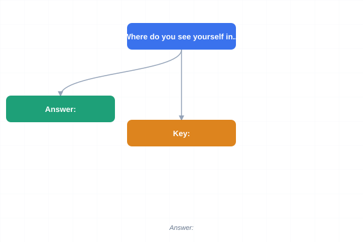
</a>
<a href="../../assets/images/diagrams/java/66-interview-behavioral/where-do-you-see-yourself-in-5-years-sticky.svg" target="_blank" rel="noopener">
  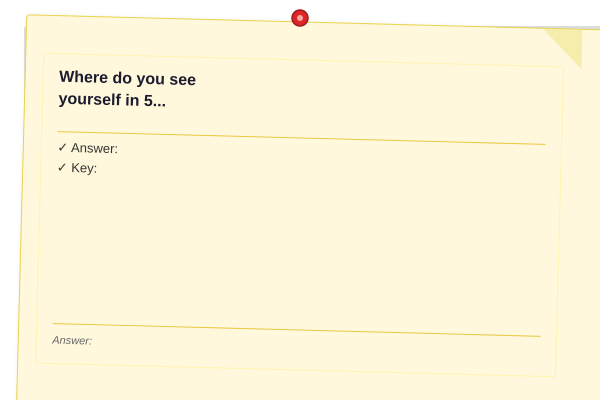
</a>

**Answer:**

**Short-term (1-2 years):** I want to deepen my expertise in distributed systems and become the go-to person on my team for architecting scalable backend systems. I am specifically interested in event-driven architectures and have been studying Kafka and stream processing in my personal projects.

**Medium-term (3-4 years):** I would like to move into a staff engineer or tech lead role where I am responsible for technical direction across multiple teams, not just my own. I want to mentor other engineers, drive architecture decisions, and help the organization raise its technical bar.

**Long-term (5+ years):** I see two possible paths. Either I continue as an individual contributor at the principal/staff level, focusing on the hardest technical problems the company faces, or I transition into an engineering management role if I find that I enjoy enabling team success more than individual technical contribution. I have not decided which path yet, and I am using the next 2 years to explore both — I am taking on mentoring opportunities to see if I enjoy the people side, while continuing to push my technical skills.

**Why this company:** Your company specifically interests me because of the scale of your data infrastructure. The opportunity to work on systems processing millions of events per day aligns perfectly with where I want to grow. I have been following your engineering blog's series on Kafka-based event sourcing, and I think I could contribute meaningfully while learning from the team.

**Key lesson:** A good answer to this question shows self-awareness about your career trajectory, ambition without entitlement, and a connection between your goals and the company's work.

---

### Q34: Why do you want to leave your current job?

<a href="../../assets/images/diagrams/java/66-interview-behavioral/why-do-you-want-to-leave-your-current-job-sticky.svg" target="_blank" rel="noopener">
  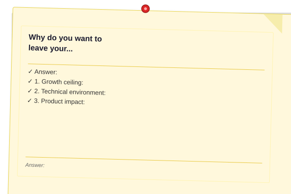
</a>

**Answer:**

I am looking for a new opportunity for three reasons that align well with what this role offers:

**1. Growth ceiling:** In my current role, I have become the expert on our stack. I am no longer learning at the pace I want to. I have automated most of my work to the point where I spend more time maintaining than building. I am looking for a role where I will be challenged again — where there are problems I do not already know how to solve.

**2. Technical environment:** My current team is conservative about technology. We are still on Java 8, we do not use containers, and decisions are made top-down. I have proposed introducing CI/CD and Testcontainers multiple times, but there is resistance. I am looking for an engineering culture that values continuous improvement and gives teams autonomy over their technical decisions.

**3. Product impact:** I want to work on products where I can see the direct impact of my work. Currently, I am a few layers removed from the end user, and it is hard to feel motivated by tickets in a backlog. I am drawn to this role because the product team seems tightly integrated with engineering, and I would be building features that directly affect customer experience.

**What I am not leaving:** I am not leaving because of compensation, my manager (who is excellent), my teammates (whom I respect), or work-life balance (which is good). I am leaving because of growth and impact, not because of any negative situation.

**Key lesson:** Frame leaving as "moving toward" something, not "running away" from something. Be honest about your motivations, but avoid complaining about your current employer. Mentioning what is good about your current role shows maturity and perspective.

---

### Q35: Tell me about a time you showed leadership when you were not in a formal leadership position.

**Answer:**

**Situation:** During an incident where our production database crashed, the on-call engineer was unavailable (they were in a meeting). I was the most senior engineer available, but I had no formal authority — I was a senior engineer, not a team lead.

**Task:** Take charge of the incident response without official authority, coordinate the response, and restore service — all while staying within my role boundaries.

**Action:** I started by declaring the incident in our Slack channel using the format from our incident response doc: "INCIDENT: Production database unresponsive. Severity: CRITICAL. Lead: [my name]. Time: [timestamp]. Triage in progress." This was important — by declaring myself as the incident lead publicly, I established authority through action, not title. I then: 1) Assigned roles: "Jane, can you check database connections? Mike, can you look at the slow query log? Sarah, can you notify the customer success team?" 2) Set up a war room Zoom call. 3) Provided regular updates in Slack every 5 minutes. 4) When the on-call engineer joined 20 minutes later, I briefed them on the situation and handed over smoothly. I did not try to keep control — I transferred authority cleanly.

**Result:** Service was restored in 35 minutes. The on-call engineer appreciated the smooth handover. My tech lead later thanked me for taking initiative, and the incident postmortem noted the effective response coordination. I became the designated backup incident commander after that.

**Key lesson:** Leadership is about action, not title. To lead without authority: 1) establish legitimacy by following established processes, 2) assign clear roles to others (people want to help, they just need direction), 3) communicate frequently, and 4) hand over authority gracefully when the formal lead arrives. Good leaders make the team look good; great leaders make transitions invisible.

---

### Q36: How do you stay current with technology and continue learning?

<a href="../../assets/images/diagrams/java/66-interview-behavioral/how-do-you-stay-current-with-technology-and-continue-learning-handwritten.svg" target="_blank" rel="noopener">
  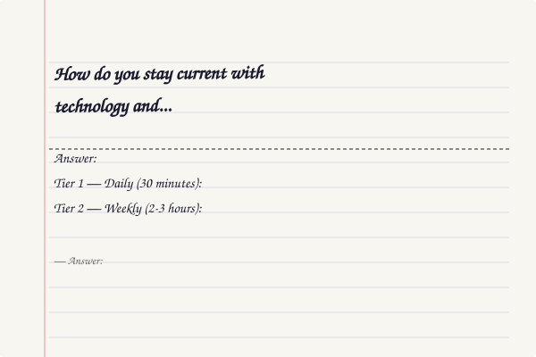
</a>
<a href="../../assets/images/diagrams/java/66-interview-behavioral/how-do-you-stay-current-with-technology-and-continue-learning-diagram.svg" target="_blank" rel="noopener">
  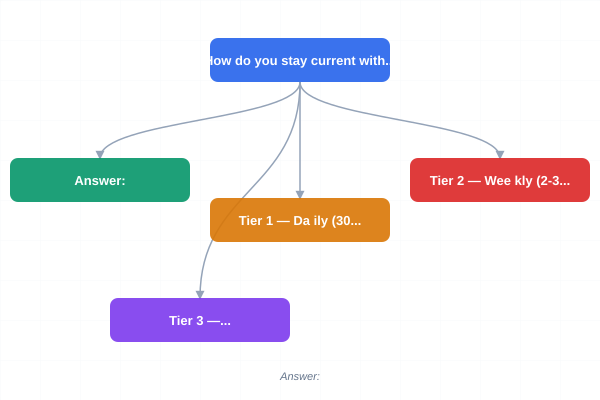
</a>
<a href="../../assets/images/diagrams/java/66-interview-behavioral/how-do-you-stay-current-with-technology-and-continue-learning-sticky.svg" target="_blank" rel="noopener">
  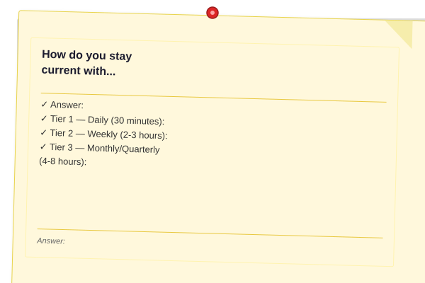
</a>

**Answer:**

I use a three-tier learning system:

**Tier 1 — Daily (30 minutes):** I subscribe to several engineering newsletters (Java Weekly, Engineering Impact, The Pragmatic Engineer) and skim them during my morning coffee. I follow a few key people on Twitter/X and LinkedIn. This keeps me aware of what is happening in the industry without deep focus.

**Tier 2 — Weekly (2-3 hours):** I work on a side project that uses technologies I want to learn. Currently, that project is a personal finance dashboard using Kotlin and Spring WebFlux. The project gives me hands-on experience with new technologies in a low-stakes environment. I do not try to build a perfect product — I use it as a learning vehicle, and I deliberately rebuild parts of it when I want to learn something new.

**Tier 3 — Monthly/Quarterly (4-8 hours):** I do deep dives on specific topics. For example, last quarter I took a course on Apache Kafka internals — not just how to use it, but how the log compaction, consumer rebalancing, and partition assignment actually work. I typically do this through a combination of reading the official documentation, building a sample project, and writing a summary/blog post to solidify my understanding.

**What I avoid:** I do not try to learn every new framework. I focus on fundamentals that transfer across technologies: distributed systems concepts, database internals, network protocols, and design patterns. The specific frameworks change, but the fundamentals do not.

**Key lesson:** Consistent, structured learning beats ad-hoc cramming. A tiered approach ensures you are both broadly aware (Tier 1) and deeply knowledgeable (Tier 3). The side project pattern is particularly effective — you cannot really learn a technology without building something real with it.

---

### Q37: Tell me about a time you had to work with a codebase you did not understand.

**Answer:**

**Situation:** I was assigned to fix a bug in a module written by a team that had since been reorganized. The code had no tests, no comments, and used patterns I had never seen before (an old homegrown framework that predated Spring). The original author had left the company two years ago.

**Task:** Fix the bug within a week. The bug caused intermittent order processing failures, but I could not reproduce it consistently.

**Action:** I did not start by changing code. 1) First, I added logging to the suspicious areas to understand the data flow. I deployed the logging change to production (it was safe — only adding log statements) and collected data for 24 hours. 2) From the logs, I traced a complete order processing flow: Controller to Service to what turned out to be a custom AOP interceptor to a message queue to a worker to a database. The custom interceptor was the key — it was wrapping every method call with a try-catch that logged errors but swallowed exceptions. 3) I found that in rare race conditions, the interceptor would log a database constraint violation but return normally, leaving the system in an inconsistent state. 4) Before removing the interceptor (which would have been risky), I wrote a test suite that captured the current behavior — including the bug. I added 12 integration tests covering the flow. 5) Only then did I fix the bug: I modified the interceptor to re-throw the exception instead of swallowing it, and handled it properly at the controller level.

**Result:** The fix took 5 days (4 days of understanding, 1 day of fixing). The test suite I created became the safety net for future changes to that module. The logs I added during step 1 were so useful that the team kept them and added more. My tech lead asked me to write a one-page summary of the module's architecture, which became the only documentation that module ever had.

**Key lesson:** When working with an unfamiliar codebase, the best strategy is: understand before changing. Add tests to capture existing behavior before modifying anything. The "log first, understand, test, then fix" approach turns a risky change into a safe one. A week to fix a bug sounds slow, but 4 days of understanding and then a clean fix is vastly better than a rushed 2-day fix that introduces new bugs.

---

### Q38: Describe a time when you had to handle a situation where you disagreed with your manager.

**Answer:**

**Situation:** My manager wanted to migrate our entire application to a new framework (Spring Boot to Quarkus) to improve startup time and reduce memory usage. He had read several articles praising Quarkus and was convinced it was the right move.

**Task:** I disagreed with the migration because: 1) our 30-second startup time was not a problem (we deployed weekly, not every minute), 2) the migration would take 3 months and deliver no customer-facing value, and 3) Quarkus's reactive model would require significant retraining for the team.

**Action:** I did not say "no" in the meeting where he proposed it. Instead, I said "I have some concerns — let me explore them and come back with data." Over the next week, I: 1) Prototyped our most complex endpoint in Quarkus — it took 2 days, the code was different but not harder, and the startup time was indeed 3 seconds instead of 30. 2) Benchmarked it — performance was similar, memory was 25% lower. 3) Surveyed the team — 6 of 8 developers had never used reactive programming. I calculated the training cost: roughly 3 weeks of slower velocity while the team ramped up. I presented this to my manager: "Quarkus has real benefits (3x faster startup, 25% less memory). The cost is 3 months of migration + 3 weeks of slower velocity during ramp-up. The startup time benefit does not matter for our use case — we deploy weekly, not per-function. The memory savings could add up across 20 instances. My recommendation is: do not migrate now, but if we hit a scaling wall where memory becomes the bottleneck, Quarkus is a proven option. For now, let us focus on the features our customers are asking for."

**Result:** My manager agreed. He appreciated that I had taken his idea seriously enough to prototype and benchmark, rather than dismissing it. A year later, when we did hit memory constraints, I led the migration to Quarkus myself — with the same manager's support. The earlier prototype work actually accelerated the migration.

**Key lesson:** Disagreeing with your manager is fine — in fact, it is expected at senior levels. The key is to disagree with data, not opinion. Build a prototype, measure the trade-offs, and present a nuanced recommendation. Showing that you took their idea seriously builds trust, even when you ultimately recommend against it.

---

### Q39: Tell me about a time you had to handle an underperforming team member.

**Answer:**

**Situation:** I was the tech lead for a team of 5. One engineer, who had been with the company for 3 years, was consistently missing sprint commitments — completing roughly 30% of his estimated tasks per sprint. His code quality was also declining, with increasing review comments from the team.

**Task:** Address the performance issue constructively — help the engineer improve or make a recommendation to management if improvement was not possible.

**Action:** I scheduled a private 1:1 with him. I did not start with criticism. I asked open-ended questions: "How are you feeling about your work lately? Is there anything blocking you?" It turned out he was dealing with burnout — he had been working on a particularly difficult integration for 4 months, the scope had changed 3 times, and he felt like he was "spinning." I asked if he would like to switch to a different project for a sprint to regain momentum. He agreed. I also suggested we pair-program on the integration for 2-3 days to unblock the hardest parts. Over the next 2 weeks, we worked together, and I realized the problem was not his skill — it was that the integration involved 3 external APIs with no documentation, and he had been trying to figure it out alone. I helped him restructure the work into smaller milestones with faster feedback cycles.

**Result:** After the project switch and the structured approach, his velocity recovered to 80% of target within 2 sprints. The integration was completed in the next sprint. He later told me that the acknowledgment that the project was genuinely difficult — not a reflection of his ability — was what he needed to hear. He went on to become one of the strongest performers on the team.

**Key lesson:** Underperformance is often a systems problem, not a people problem. Before assuming someone is lazy or incapable, ask: is the task too hard? Is the scope too vague? Are there blockers I can remove? A supportive approach that starts with curiosity rather than criticism almost always works better.

---

### Q40: How do you approach estimating engineering work?

<a href="../../assets/images/diagrams/java/66-interview-behavioral/how-do-you-approach-estimating-engineering-work-handwritten.svg" target="_blank" rel="noopener">
  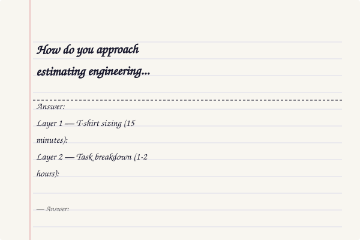
</a>

<a href="../../assets/images/diagrams/java/66-interview-behavioral/how-do-you-approach-estimating-engineering-work-sticky.svg" target="_blank" rel="noopener">
  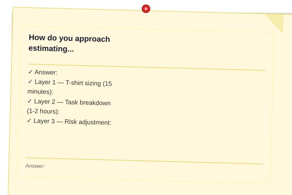
</a>

**Answer:**

I use a structured estimation approach with three layers:

**Layer 1 — T-shirt sizing (15 minutes):** For a new feature or project, I first do a quick t-shirt size (S, M, L, XL) based on a high-level understanding. This is used for roadmapping and prioritization, not for commitment. I explicitly label it as "rough order of magnitude +/- 50%."

**Layer 2 — Task breakdown (1-2 hours):** If the work is being committed to a sprint, I break it down into tasks that are each less than 2 days of work. For each task, I identify: what needs to be built, what needs to be tested, what external dependencies exist, and what could go wrong. I use past velocity as a guide — if similar tasks in the past took 3 days, I estimate 3 days, not my optimistic "this time it will be faster" guess.

**Layer 3 — Risk adjustment:** I identify the top 3 risks (e.g., "we have never used this library before," "the external API has no documentation," "the database migration touches a critical table") and add 50% to my estimate for each risk. This explicit risk buffer makes the estimate more honest and helps stakeholders understand where the uncertainty comes from.

**Pattern I avoid:** I never give a single-point estimate. I always give a range: "2-3 weeks" or "8-12 days." Single-point estimates create false precision and lead to blame when they are wrong. Ranges communicate uncertainty honestly.

**Key lesson:** Estimation is not about predicting the future — it is about managing uncertainty. The most valuable part of estimation is the task breakdown, not the number at the end. If you break work into small pieces and identify risks, the estimate is almost a side effect of understanding.

---

### Q41: Describe a time when you had to present technical information to a non-technical audience.

**Answer:**

**Situation:** I had to present our team's proposal for a major infrastructure upgrade — migrating from a self-managed database to a managed cloud database (Amazon RDS) — to the VP of Engineering and the CFO. The VP understood tech; the CFO did not.

**Task:** Explain why we needed to spend /month more on a managed database when the current one was "working fine" from their perspective.

**Action:** I structured the presentation in three parts. Part 1 (The Problem): I described a recent incident where a database failure took 4 hours to recover because we had to manually provision a new server. I showed the business cost: 4 hours of downtime =  in lost revenue. The CFO understood this immediately — it was money lost. Part 2 (The Solution): "RDS automates provisioning, failover, and backups. Instead of a 4-hour recovery, it is 5 minutes." I did not explain replication lag, read replicas, or Multi-AZ — I focused on outcomes: speed, reliability, and reduced risk. Part 3 (The Cost): I presented the cost increase in context: "/month more, but it would have paid for itself in the last 4-hour outage alone." I also showed that the engineering time spent managing the database (roughly 1.5 FTE) would be freed for product work, which the VP could see as feature velocity.

**Result:** They approved the budget for the migration. The CFO actually asked intelligent follow-ups about cost allocation and whether the pricing was locked. I had prepared for those questions with a pricing spreadsheet. The VP later told me that the ROI framing — "/month vs /outage" — was what made the decision easy.

**Key lesson:** Non-technical audiences care about outcomes: cost, risk, speed, revenue. Translate every technical benefit into one of these dimensions. And always connect your ask to a concrete business problem they already understand. The 4-hour outage was a story they knew — I just connected the dots to the solution.

---

### Q42: Tell me about a time you had to debug a performance issue in production.

<a href="../../assets/images/diagrams/java/66-interview-behavioral/tell-me-about-a-time-you-had-to-debug-a-performance-issue-in-production-handwritten.svg" target="_blank" rel="noopener">
  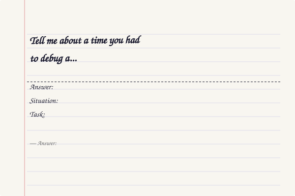
</a>

**Answer:**

**Situation:** Our API's p99 latency had been creeping up over several weeks: from 200ms to 800ms. No single deployment or change had caused it, so it was hard to pin down. Users were starting to complain about slow page loads.

**Task:** Identify and resolve the root cause of the gradual performance degradation.

**Action:** I used a systematic approach. 1) I set up percentile-based alerting (p50, p95, p99) and correlated it with deployments — no single spike matched a deployment. 2) I looked at database query performance over time using pg_stat_statements. I found that a specific query — SELECT * FROM orders WHERE user_id = ? ORDER BY created_at DESC LIMIT 10 — had gone from 10ms to 300ms over the last 3 weeks. The query plan showed it was doing a sequential scan instead of an index scan. 3) Checking the database logs, I found that the index idx_orders_user_created had been marked as invalid. Why? A concurrent index build had failed due to a maintenance window issue 3 weeks ago, leaving the index in an INVALID state. PostgreSQL was not using it. 4) I rebuilt the index with REINDEX CONCURRENTLY to avoid locking the table — this took 45 seconds and was completely online.

**Result:** p99 latency dropped back to 200ms within minutes of the index rebuild. The root cause was a failed concurrent index build 3 weeks prior that had not been noticed. We added monitoring: an alert went out whenever any index was marked as INVALID in the database, so we would catch this immediately in the future. I also wrote a runbook for safely rebuilding indexes.

**Key lesson:** Performance degradation is often a database indexing problem. Always check index health when investigating gradual performance decline. The REINDEX CONCURRENTLY approach is critical — blocking index rebuilds can cause downtime, so know the online alternatives for your database.

---

### Q43: Describe a time when you successfully influenced a team or organizational decision.

<a href="../../assets/images/diagrams/java/66-interview-behavioral/describe-a-time-when-you-successfully-influenced-a-team-or-organizational-decision-sticky.svg" target="_blank" rel="noopener">
  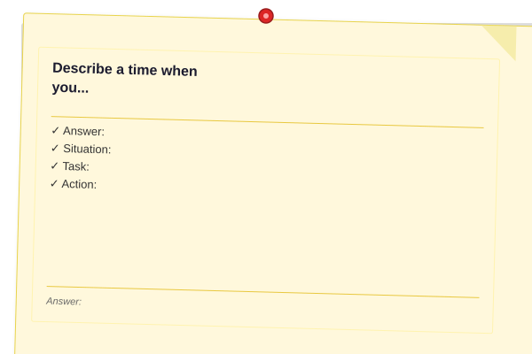
</a>

**Answer:**

**Situation:** Our organization had a policy of using separate Git repositories for each microservice. This made cross-service refactoring difficult — changing an API contract required coordinating PRs across 4 repositories, and nobody could see the full system in one place.

**Task:** Influence the organization to adopt a monorepo approach, at least for the microservices that shared API contracts.

**Action:** I could not just announce "we are switching to a monorepo" — that would require buy-in from multiple teams. My approach: 1) I documented the friction: in the last quarter, 3 cross-service refactors were delayed by an average of 2 weeks due to multi-repo coordination. 2) I proposed a limited experiment: merge 3 tightly-coupled services (checkout, payment, order) into a single repository. I argued that if it worked, we would expand; if it failed, we would revert with minimal cost. 3) I addressed the concerns: build time (solved by incremental builds with Gradle), CI complexity (solved by path-based triggering — only build the changed service), developer freedom (solved by CODEOWNERS — teams still owned their service's directory). 4) I volunteered to lead the migration myself, so other teams did not bear the cost.

**Result:** The experiment was approved. After 2 months, the 3-service monorepo team reported 40% faster cross-service refactoring and unchanged CI times. Three other teams adopted the monorepo pattern voluntarily. The original 4-repo policy was replaced with a team-choice policy. A year later, the entire product (20+ services) was in a single monorepo.

**Key lesson:** Influencing organizational decisions requires: 1) documenting the cost of the current approach, 2) proposing a low-risk experiment rather than a big-bang change, 3) addressing anticipated concerns proactively, and 4) leading the effort yourself. A small proof of concept is worth a thousand arguments.

---

### Q44: Tell me about a time when you had to say "no" to a stakeholder.

<a href="../../assets/images/diagrams/java/66-interview-behavioral/tell-me-about-a-time-when-you-had-to-say-no-to-a-stakeholder-handwritten.svg" target="_blank" rel="noopener">
  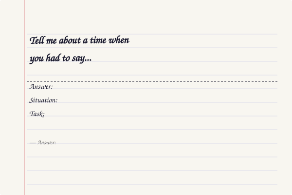
</a>

**Answer:**

**Situation:** A senior product manager asked our team to add a "dark mode" feature to the web application with a 2-week deadline. He argued it was "just CSS" and "should be easy." In reality, the application had been built without any theme abstraction — colors were hardcoded everywhere in CSS, inline styles, and even Java enums that generated styles server-side.

**Task:** Say "no" (or "not now") to a stakeholder request without damaging the relationship, while being transparent about the true cost.

**Action:** I did not say "it is hard" — that would sound like an excuse. I gave him the real estimate: "To do dark mode properly, we need to: 1) extract all colors into CSS custom properties (~2 weeks), 2) create a dark palette (~1 week), 3) implement the theme toggle and persistence (~1 week), 4) QA across all pages (~1 week). Total: 5-6 weeks. If we rush it in 2 weeks, we will have inconsistent theming that looks unprofessional and will be harder to maintain later. Here is the trade-off: we can do it properly in 6 weeks, or we can do a minimal version in 2 weeks that covers only 3 key pages." I also suggested an alternative: "If the goal is to improve the user experience in low-light conditions, would a 'sepia' mode on the reading pages achieve that faster? That is 1 week because it only touches the content pages."

**Result:** The PM chose the sepia mode approach. It shipped in 1 week, users loved it, and the team later built a proper dark mode (6 weeks) in a quarter where we had more breathing room. The PM appreciated that I had given him options and a realistic timeline, not just a no.

**Key lesson:** When saying "no," always provide alternatives and trade-offs. A "no" with options is actually a "yes, but here is how." The worst thing you can do is say "yes" to an unrealistic timeline and then fail. The second worst is saying "that is hard" without explaining why.

---

### Q45: Describe a time when you had to handle a situation where you were overloaded with work.

**Answer:**

**Situation:** I was juggling three high-priority tasks simultaneously: a production incident investigation, a feature delivery for a key customer, and preparing a technical presentation for an industry conference. Each was urgent and important.

**Task:** Manage the workload without burning out, dropping commitments, or letting quality slip.

**Action:** I used a structured approach. 1) I assessed the consequences of deferring each task: the production incident could cause data loss (critical), the feature delivery would disappoint a customer (important), the conference talk would be canceled (disappointing but low-consequence for the company). 2) I communicated with the stakeholders proactively: I told the incident commander I was available for the investigation, told the PM I could deliver the feature but needed another team member to handle the frontend work I had planned to do myself, and told the conference organizer I might need to shorten my talk but would confirm later. 3) I delegated effectively: I asked a junior team member to take over the conference talk preparation (it was about a technology I had been mentoring him on) — he delivered a great talk, got a confidence boost, and it freed me for the incident. 4) I negotiated a scope reduction: I delivered the core feature (the essential 80%) and deferred the analytics dashboard (the nice-to-have 20%) by 2 weeks.

**Result:** All three commitments were met, though the conference talk was delivered by the junior developer instead of me. The incident was resolved. The customer got their feature (minus the dashboard, which was delivered later). The junior developer's conference talk was a career highlight for him. I learned that delegation is not just about offloading — it is about creating opportunities for others while protecting your own capacity.

**Key lesson:** When overloaded, the key skills are: 1) prioritize by consequence, 2) communicate early to manage expectations, 3) delegate to create opportunities, and 4) negotiate scope reduction. The worst thing you can do is say "yes" to everything and then deliver poorly on all of them.

---

### Q46: Tell me about a time you had to work with a difficult external vendor or partner.

**Answer:**

**Situation:** We were integrating a third-party payment gateway. Their API documentation was outdated (referenced endpoints that returned 404), their support team took 2-3 days to respond, and they had no sandbox environment for testing — we had to test with a test credit card number that sometimes went through as a real charge.

**Task:** Complete the payment integration despite poor vendor support and documentation. We had a contractual deadline and could not switch vendors.

**Action:** I adapted my approach: 1) Instead of relying on their documentation, I reverse-engineered their API by capturing network traffic from their own demo application (they had a web-based demo that I used as a reference implementation). 2) I automated our testing: since there was no sandbox, I built a mock server in WireMock that simulated their API responses based on my reverse-engineering. This let us develop and test independently. 3) I consolidated all questions into weekly batches and sent them to the vendor's support team with clear prioritization (P1 blocking, P2 important, P3 nice-to-know). This reduced our dependency on their slow responses. 4) I documented every workaround, discovered behavior, and configuration quirk in a shared team document.

**Result:** The integration was completed 1 week late (the mock server took extra time to build, but it saved us in the long run). The mock server became our integration test foundation and caught 3 regressions in later vendor API changes. The documentation I created was shared with other teams integrating the same vendor and reduced their integration time by 40%. The vendor eventually improved their documentation based on the feedback I consolidated.

**Key lesson:** When a vendor fails you, do not wait for them to improve. Build your own abstractions, mock their systems, and reduce your dependency on their quality. A good mock server is worth more than perfect vendor documentation. Also, consolidate feedback and share it — you might help other teams and, over time, influence the vendor to improve.

---

### Q47: Describe a time you had to refactor a complex piece of code without breaking existing functionality.

<a href="../../assets/images/diagrams/java/66-interview-behavioral/describe-a-time-you-had-to-refactor-a-complex-piece-of-code-without-breaking-existing-functionality-handwritten.svg" target="_blank" rel="noopener">
  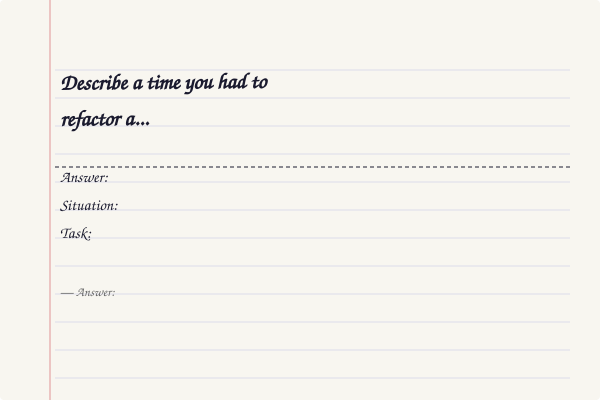
</a>

**Answer:**

**Situation:** A method in our core domain service had grown to 800 lines. It handled order validation, discount calculation, inventory reservation, payment processing, and notification — all in a single method with nested if-else blocks and no tests. Every developer was afraid to touch it.

**Task:** Refactor this "god method" into smaller, testable, maintainable pieces without introducing regressions.

**Action:** I used a "safety net first" approach. 1) Before changing a single line, I wrote characterization tests: I captured the input and output of the method for 50 real production orders by adding logging and running it on staging. These tests documented the current behavior, including the bugs. 2) I extracted one responsibility at a time into separate classes: first the discount calculation (moved to DiscountCalculator), then inventory reservation (InventoryService), then payment processing (PaymentGateway). For each extraction, I ran the characterization tests to confirm behavior had not changed. 3) I used the IDE's automated refactoring tools (Extract Method, Extract Class, Move) rather than manual editing, which reduced the chance of typos or logic errors. 4) Each extraction was done in a separate commit, so I could revert individual steps if something broke.

**Result:** Over 2 weeks, the 800-line method was reduced to 40 lines that composed the extracted services. The characterization tests caught two issues: one where I had accidentally changed the order of discount application (unit discount applied before percentage instead of after) and one where a null check was missing in the extracted inventory service. The team's confidence in the code improved dramatically — one developer said "I actually understand the checkout flow now." New features that had been deferred because "the checkout code is too risky" were now being implemented regularly.

**Key lesson:** The key to safe refactoring is: characterization tests first, one extraction at a time, leverage IDE automation, commit after each safe step, and verify with tests after each change. The 2-week timeline might seem slow, but it was vastly faster than the alternative of continuing to work around the god method.

---

### Q48: Tell me about a time you had to deal with a situation where you lost data.

**Answer:**

**Situation:** An engineer accidentally ran a DELETE FROM orders WHERE created_at &lt; '2023-01-01' query on the production database. The WHERE clause was missing a date condition — it should have been created_at < '2023-01-01' AND status = 'archived'. The DELETE ran for 3 seconds before he hit Ctrl+C, but by then it had already deleted orders spanning multiple statuses, not just archived ones.

**Task:** Restore the deleted data with minimal data loss and downtime. This was a high-traffic e-commerce database — every minute of recovery cost roughly ,000 in lost sales.

**Action:** I immediately took the database out of the load balancer pool to prevent further writes. I checked if point-in-time recovery (PITR) was enabled — it was, with 5-minute recovery windows. I restored a backup to a separate database instance. Then I compared the restored data with the production data and extracted the missing rows (~3,000 orders). I wrote a script to insert the missing orders back into the production database, but I did not run it immediately. First, I checked for conflicts: some deleted orders had been re-created manually by customer support as new orders (with new IDs) during the 10 minutes since the incident. I had to deduplicate — keep the re-created orders and restore only the genuinely deleted ones. I also checked that the restored orders did not trigger duplicate payment processing, shipping label generation, or confirmation emails. I suppressed those side effects by temporarily disabling the notification and fulfillment workers.

**Result:** All orders were restored within 45 minutes. 12 orders that had been manually re-created by support were handled by merging their data (keeping the re-created order ID, restoring the original metadata). No duplicate payments or shipments occurred. I implemented safeguards after the incident: 1) all DELETE operations on production required a WHERE clause review by a second person, 2) we added a pg-safe-delete wrapper script that required explicit confirmation with the row count, 3) we set statement_timeout to 30 seconds for interactive sessions (the engineer's Ctrl+C was within the timeout, but the damage was done).

**Key lesson:** For data loss recovery, the key steps are: 1) stop the bleeding (remove from load balancer), 2) restore to a separate instance (never overwrite production directly), 3) check for side effects before restoring (do not trigger payments or emails), 4) deduplicate against any manual fixes that happened after the incident. Prevention is obviously better, but if it happens, having PITR backups and a tested recovery procedure is everything.

---

### Q49: Describe a time when you had to make a decision quickly during an incident.

**Answer:**

**Situation:** Our CI/CD pipeline was broken — a dependency had been yanked from Maven Central, and every build was failing. The team was blocked, unable to deploy, review PRs, or even run tests locally if they cleared their caches. This happened at 4 PM on a Friday.

**Task:** Decide whether to: A) pin the old version from a local mirror (fast fix, but the mirror was not set up yet), B) remove the dependency and rewrite the affected code (slower but permanent), or C) switch to an alternative library (medium effort, unknown compatibility). Decision needed in minutes.

**Action:** I assessed the situation: the yanked dependency was a small utility library (20 methods for string manipulation) used in ~15 files. We only used 5 of its methods. I chose Option B — remove the dependency and inline the functionality. My reasoning: 1) A local mirror would take hours to set up and would be another thing to maintain. 2) Switching to an alternative library would require evaluating alternatives (unknown time). 3) Inlining 5 utility methods would take about an hour and eliminate the dependency entirely — no future yanking risk. I announced the decision in Slack: "Dependency X was yanked. We are removing it and inlining the 5 methods we use. I will handle the refactoring. If anyone disagrees, speak up now." No one disagreed. I completed the refactoring in 45 minutes, pushed a PR, and the team reviewed it within 15 minutes.

**Result:** The build was green by 5:30 PM. Zero dependency issues from that library ever again. One team member later said, "I was worried you would spend hours setting up a mirror — glad you went the simpler route."

**Key lesson:** During an incident, speed matters. Choose the option that directly resolves the problem rather than the one that seems most "proper." Removing a small dependency is often faster and more resilient than setting up infrastructure to work around the yank. The key to fast decision-making is: identify the critical constraint (team is blocked), evaluate options against that constraint, and act. Do not over-analyze when minutes matter.

---

### Q50: Tell me about a time you mentored someone who was struggling.

**Answer:**

**Situation:** A mid-level engineer (2 years experience) had been on our team for 3 months but was still struggling with basic tasks. His PRs had frequent review comments, his velocity was about 30% of other team members, and he seemed increasingly withdrawn in standups.

**Task:** Help him get to a productive level. If he could not improve, we would have to let him go, which I wanted to avoid.

**Action:** I asked him for a 1:1 coffee. I started with "How are you feeling about things? Not just work — everything okay?" He opened up: he was dealing with imposter syndrome. The team used advanced Java features (lambdas, streams, Optional, CompletableFuture) that he had never learned. He was spending 2-3 hours daily after work studying just to keep up, and it was burning him out. We made a plan: 1) I would pair-program with him for 2 hours daily on the most complex tickets. During these sessions, I would think aloud, explaining why I made each design decision. 2) He would spend 30 minutes daily on deliberate practice using coding challenges focused on the specific patterns we used (stream APIs, CompletableFuture composition, Optional chaining). 3) I gave him smaller, well-scoped tickets for 2 weeks to build confidence. 4) I introduced him to the team's "PR review checklist" — a document I created that explained exactly what reviewers looked for.

**Result:** After 4 weeks, his velocity had doubled to 60% of the team average. After 8 weeks, he was at 90%. His PRs still needed review, but they were reasonable. He stopped studying after hours. In his quarterly review, he said the pair programming was what made the difference — not the technical knowledge transfer, but seeing how an experienced developer thinks about a problem. He later became the team's expert on testing and took over the test infrastructure.

**Key lesson:** Mid-level engineers who struggle often have a knowledge gap in specific patterns, not a general capability problem. The fix is targeted practice on the specific gaps, not generic learning. Pair programming where the senior thinks aloud is the most effective way to transfer not just knowledge but thinking patterns. A structured PR checklist reduces the anxiety of "what will they criticize this time?"

---

### Q51: How do you handle feedback that you disagree with?

<a href="../../assets/images/diagrams/java/66-interview-behavioral/how-do-you-handle-feedback-that-you-disagree-with-handwritten.svg" target="_blank" rel="noopener">
  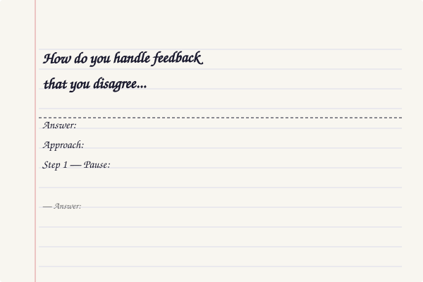
</a>

<a href="../../assets/images/diagrams/java/66-interview-behavioral/how-do-you-handle-feedback-that-you-disagree-with-sticky.svg" target="_blank" rel="noopener">
  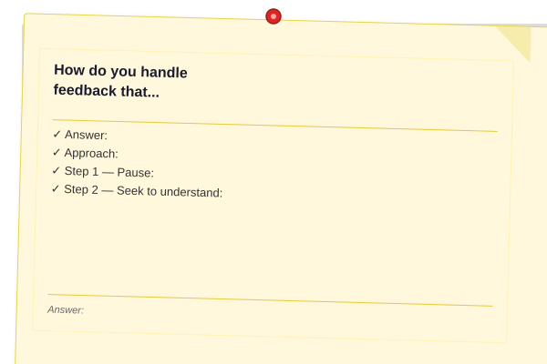
</a>

**Answer:**

**Approach:** When I receive feedback I disagree with, I follow a three-step process:

**Step 1 — Pause:** I do not respond immediately. I thank the person and say I will think about it. This prevents a defensive reaction.

**Step 2 — Seek to understand:** I replay the feedback in my mind and ask myself: "Is there any angle where they could be right?" Even if I disagree with 90%, the remaining 10% might be valuable. If I need clarity, I ask follow-up questions: "Can you give me a specific example?" or "What would the right behavior look like?"

**Step 3 — Respond:** I acknowledge what I agree with, explain where I differ, and find a middle ground. If I ultimately disagree after understanding their perspective, I say so respectfully with my reasoning.

**Example:** A senior developer once told me that my code was "too verbose" and that I should "use more concise patterns." I initially disagreed — I value readability and thought my code was clear. But I asked for examples. He pointed out that I was using explicit for-loops where stream API would be shorter and equally readable. I had been avoiding streams because older team members had complained about them 2 years ago. I realized he had a point: the team had evolved, and the readability concern no longer applied. I updated my style guide preference, and my code improved.

**Key lesson:** Feedback you disagree with is often the most valuable — it challenges your assumptions. The pause-and-reflect step is critical because our immediate reaction to disagreement is almost always defensive and almost always wrong.

---

### Q52: Tell me about a time you had to deal with a major change in project requirements mid-way.

**Answer:**

**Situation:** We were 6 weeks into building a customer-facing analytics dashboard when the product manager announced that our largest enterprise customer had signed a contract that required a completely different feature set — real-time data, not the batch reporting we were building. The requirements changed from "daily report with charts" to "live dashboard with streaming updates."

**Task:** Adapt the project mid-stream without wasting the 6 weeks already invested, and deliver the new requirements within the original timeline if possible.

**Action:** 1) I analyzed what could be salvaged: the database schema for storing metrics was still valid, the authentication and authorization layer was reusable, and the API structure could be extended rather than replaced. The batch report generation was no longer needed, but individual metric computation code was reusable. 2) I estimated the delta: the new approach required WebSocket support, a streaming ingestion pipeline (Kafka), and a real-time frontend. The backend work was ~4 weeks of new work, plus 1 week of rework. 3) I negotiated with the PM: we could deliver the real-time dashboard in 4 additional weeks (10 total) if we descoped the historical data comparison feature (which the customer had not asked for). She agreed. 4) I restructured the team: two people focused on the Kafka integration (new), one on WebSocket support (new), one on adapting the existing code (reuse), and I coordinated and handled the architecture.

**Result:** We delivered in 10 weeks. The customer was satisfied. The original 6 weeks of work were not wasted — about 70% of it was reusable. The team actually felt energized because the new requirements were more interesting than the batch reports. We learned that real-time systems are harder to build but more satisfying.

**Key lesson:** When requirements change mid-project, the most important thing is to quickly triage what is salvageable and what is not. Do not fall into the sunk cost fallacy — the 6 weeks are gone regardless, the question is what do you do now. Also, when negotiating the new timeline, focus on scope trade-offs, not just asking for more time.

---

### Q53: Describe a time when you had to handle a security vulnerability in your code.

**Answer:**

**Situation:** A security researcher reported a vulnerability in our REST API. The endpoint GET /api/users/{id} returned user profiles, but it used the logged-in user's ID from the JWT token — combined with a poorly validated path parameter — to query the database. An attacker could modify the path parameter to access other users' profiles. Classic IDOR.

**Task:** Fix the vulnerability urgently and perform a security audit of similar patterns across the codebase.

**Action:** 1) I confirmed the vulnerability by reproducing it in our staging environment — I was able to access another test user's data by changing the ID in the URL. 2) I fixed the immediate issue: the endpoint now compares the requested user ID with the authenticated user's ID from the JWT. If they do not match and the caller is not an admin, it returns 403. The fix was 3 lines. 3) I deployed the fix within 2 hours (it was a low-risk change). 4) I then did a codebase-wide audit: I searched for all @PathVariable or @RequestParam that referenced user IDs and checked each one for authorization validation. I found 3 other endpoints with the same vulnerability pattern. 5) I created a custom annotation @RequireUserAccess that could be applied to any endpoint to automatically validate that the authenticated user matches the requested resource owner. We applied it to all affected endpoints.

**Result:** The vulnerability was patched within 2 hours of confirmation. The security researcher was acknowledged and thanked. The broader audit found 3 additional vulnerabilities, which were patched within 48 hours. The @RequireUserAccess annotation became a standard part of our API development template — all new endpoints automatically include it.

**Key lesson:** Security vulnerabilities happen — the key is how you respond. Patch first, then audit for similar patterns, then fix the systemic issue that allowed it. A custom annotation that enforces authorization at the framework level is much better than relying on individual developers to remember to check permissions in every controller method.

---

### Q54: Tell me about a time you had to deal with a situation where you were new to a team.

**Answer:**

**Situation:** I joined a new team that had been working together for 2+ years. They had established norms, shared context, and strong relationships. I was the outsider, and I could feel it — lunch conversations referenced inside jokes, technical decisions referenced discussions I had not been part of, and I did not know the codebase.

**Task:** Integrate into the team quickly and productively without trying to change things before I understood why they were the way they were.

**Action:** 1) I spent the first 2 weeks in "observation mode." I did not propose changes, question existing decisions, or suggest "how we did it at my previous company." I just listened and learned. I asked questions like "why is this structured this way?" not "why do we not do it this way instead?" 2) I volunteered for the tasks nobody wanted — documentation updates, bug fixes, test improvements. This showed I was willing to contribute without stepping on toes. 3) I set up 30-minute 1:1s with every team member in the first week. I asked about their work, their challenges, and what they liked about the team. These conversations helped me understand the team's dynamics, pain points, and what people valued. 4) In my third week, I made my first significant contribution: I fixed a long-standing flaky test that nobody had wanted to tackle. The fix was well-received because it solved a real pain point.

**Result:** After 4 weeks, I felt fully integrated. The team was open to my ideas because I had built trust first. The flaky test fix earned credibility. My 1:1 conversations helped me understand that the team's biggest pain point was testing, which aligned with my strengths — I later led the Testcontainers migration.

**Key lesson:** When joining a new team, the most important thing to do first is nothing — just observe, listen, and learn. Build trust through low-risk contributions before suggesting changes. Never start with "at my last company." The existing team's decisions may not be perfect, but they were made in a context you do not yet understand. Understand first, then suggest.

---

### Q55: Describe a time when you had to choose between two good technical options.

**Answer:**

**Situation:** We needed to choose a message queue for our event-driven architecture. The finalists were RabbitMQ (which we had experience with) and Apache Kafka (which was newer but offered stronger guarantees for our use case).

**Task:** Make an objective decision between two well-suited technologies, neither of which was clearly wrong.

**Action:** I created a decision matrix with weighted criteria: throughput requirements (we expected 5,000 msg/s peak), durability (at-least-once delivery required), routing flexibility (topic-based and direct exchange), operational complexity (we had 3 devops engineers), and team learning curve. The weights were agreed on by the team beforehand. RabbitMQ scored higher on operational simplicity (we knew it) and routing (exchanges were a perfect fit). Kafka scored higher on throughput (easily handled 100K msg/s) and durability (log-based storage meant no message loss). The gap was clear: RabbitMQ met our throughput needs (5K msg/s was well within its capacity) and was operationally simpler. We chose RabbitMQ. The decision was documented with the rationale, and we committed to revisiting it if throughput grew beyond 50K msg/s.

**Result:** RabbitMQ served us well for 2 years. When we later hit throughput issues at ~80K msg/s during a Black Friday event, we migrated the high-throughput topics to Kafka. The migration was smooth because the event producers were already abstracted behind our own EventBus interface. The original decision document made the trade-offs clear, and no one questioned the migration.

**Key lesson:** When choosing between good options, use a weighted decision matrix with team-agreed criteria. Document the decision and the criteria. This prevents "I told you so" debates later and makes it clear when to revisit. Also, abstract your infrastructure behind an interface — it lets you switch without rewriting the world.

---

### Q56: Tell me about a time you had to deal with an ambiguous problem that you had to figure out from scratch.

**Answer:**

**Situation:** Our application's response times were increasing over time, but nobody knew why. There was no clear trigger — no deployment, no traffic spike, no database change. It was a slow degradation that had been happening for months.

**Task:** Identify the root cause of a performance degradation without any clear starting point.

**Action:** I treated this as a scientific investigation. 1) Hypothesis generation: I listed 7 possible causes — memory leak, connection pool exhaustion, slow database query, external API slowdown, garbage collection issues, thread pool contention, and disk I/O bottlenecks. 2) Measurement: I added instrumentation for each hypothesis. For memory: heap dumps every hour. For GC: enabled GC logging. For connections: added metrics for all connection pools. For external APIs: added timing around external calls. 3) Data collection: I ran the instrumentation for 48 hours. 4) Analysis: The heap dumps showed that a ConcurrentHashMap in a caching layer was growing unbounded. It stored user session data but never evicted entries for logged-out users. Over months, it had grown to 500MB and was causing frequent GC pauses. 5) Fix: I added an eviction policy using ScheduledExecutorService that cleared entries older than 24 hours. GC pauses dropped from 2 seconds to 50ms.

**Result:** Response times returned to normal within hours of the fix. The unbounded cache had been introduced 8 months earlier by a well-meaning developer who did not realize there was no eviction mechanism. We added a CI rule that flagged any HashMap or ConcurrentHashMap that did not have size limits or eviction policies.

**Key lesson:** Performance degradation without a clear trigger is almost always a resource leak (memory, connections, threads) or a slowly growing data structure. The key is systematic hypothesis testing — list all possibilities, instrument each one, and let the data eliminate them one by one. The scientific method works for debugging, not just research.

---

### Q57: Tell me about a time you had to handle a client or customer who was unhappy.

**Answer:**

**Situation:** An enterprise customer's contract renewal was at risk. They had been using our API for 6 months but were unhappy with the reliability — they had experienced 3 outages that affected their business operations, each lasting 30-60 minutes. Their CTO had sent an email threatening to cancel the contract.

**Task:** Save the customer relationship and address their reliability concerns.

**Action:** I asked my manager if I could speak directly with the customer (with the account manager present). I called their CTO. I did not make excuses. I said: "You have had 3 outages. That is unacceptable, and I understand why you are considering leaving. Here is what we have done: 1) we identified the root cause of each outage — one was a database migration issue, one was a deployment pipeline error, one was a third-party API dependency failure. 2) We have fixed all three: the database migration now uses locking to prevent concurrent writes, the deployment pipeline has a canary stage before full rollout, and the third-party dependency now has a circuit breaker with graceful degradation. 3) We are putting in place a monthly reliability review where we share our uptime metrics and upcoming changes that could affect stability. Would you be willing to give us 3 more months? If your uptime does not meet 99.9%, we will waive your next quarter's fees, no questions asked."

**Result:** The CTO agreed to the 3-month trial. Our uptime for the next 3 months was 99.95%. The customer renewed with an expanded contract. The account manager said the transparent communication and the performance-based guarantee were what saved the relationship — not the technical fixes.

**Key lesson:** When a customer is unhappy, transparency and accountability are more effective than excuses or technical explanations. Acknowledge the problem, explain what changed, and offer a concrete guarantee. The willingness to put money behind your promises builds more trust than a thousand apologies.

---

### Q58: Describe a time when you had to work on something that you were not familiar with.

<a href="../../assets/images/diagrams/java/66-interview-behavioral/describe-a-time-when-you-had-to-work-on-something-that-you-were-not-familiar-with-handwritten.svg" target="_blank" rel="noopener">
  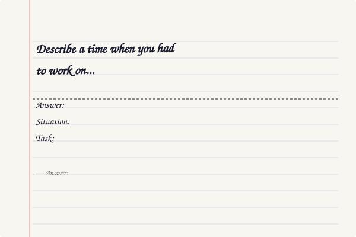
</a>

**Answer:**

**Situation:** I was asked to implement a GraphQL API for a new mobile application. I had never worked with GraphQL before — my entire career had been REST APIs with Spring Boot.

**Task:** Deliver a production-ready GraphQL API in 4 weeks, learning GraphQL and Spring for GraphQL from scratch.

**Action:** 1) I spent the first 2 days doing structured learning: I read the official GraphQL documentation, built the "hello world" example from the Spring for GraphQL reference docs, and completed a tutorial on schema design (focusing specifically on mutations, subscriptions, and DataLoader — the patterns most relevant to our use case). 2) I built a prototype for a single endpoint (product search with filtering) in 3 days. This prototype revealed two critical issues: our existing REST API returned too much data (we needed to implement field-level authorization for GraphQL) and the N+1 problem was real (DataLoader was essential). 3) I addressed both issues before scaling up: DataLoader for batching, and a custom directive @auth for field-level access control. 4) I documented the GraphQL patterns we adopted and held a knowledge-sharing session for the team.

**Result:** The GraphQL API was delivered in 5 weeks (1 week late — the field-level authorization was more complex than expected). The mobile team loved it because they could fetch exactly the data they needed. The prototype-first approach — building a single endpoint end-to-end before scaling to the full schema — caught the two hardest problems early. I went from "never used GraphQL" to "team expert" in 5 weeks.

**Key lesson:** Learning a new technology for a project is about focused, outcome-driven learning. Do not read the entire documentation. Build a minimal end-to-end prototype that covers the hardest parts of your use case. The hard problems (field-level auth, N+1) surfaced in 3 days because I prototyped aggressively, not because I read extensively.

---

### Q59: Tell me about a time you had to deal with a situation where you had to work with incomplete or missing data.

**Answer:**

**Situation:** We were migrating users from an old system to a new one. The old system's database had inconsistent data: some users had email addresses, some did not; some had firstName and lastName stored together in a full_name field, others had them separate; some had timezone data, others did not.

**Task:** Migrate 500,000 users without data loss, handling the inconsistency gracefully.

**Action:** I wrote a multi-stage migration script. Stage 1 (validation): Scan all records and categorize fields by completeness. This gave me a clear picture of the data quality issues. Stage 2 (healing): For each inconsistency, I applied a rule: if firstName was missing but full_name existed, split on the first space; if email was missing, generate a placeholder with the user ID (to be filled later); if timezone was missing, default to the company's primary timezone. Each rule was logged so we could audit it. Stage 3 (migration): Migrate in batches of 5,000 with validation after each batch. If a batch failed, stop and report. Stage 4 (reconciliation): Compare record counts and checksums between old and new systems.

**Result:** The migration completed in 4 hours. 5,000 of 500,000 records had missing emails and received placeholders. 12,000 records had name splitting that created incorrect values (the simple "split on first space" rule failed for compound names like "Mary Jane Watson") — those were flagged for manual review. We created a dashboard for customer support to handle these edge cases. The incremental migration approach (batches with validation) meant we discovered the compound name issue after 20 batches (100K records) rather than after all 500K, so we could adjust the script.

**Key lesson:** Data migration is never straightforward. The key is: 1) validate before you migrate, 2) handle edge cases with explicit rules and logging, 3) migrate in small batches with validation after each, and 4) reconcile afterward. Always assume the data is worse than you think it is. And never migrate on a Friday.

---

### Q60: What questions do you have for me?

<a href="../../assets/images/diagrams/java/66-interview-behavioral/what-questions-do-you-have-for-me-handwritten.svg" target="_blank" rel="noopener">
  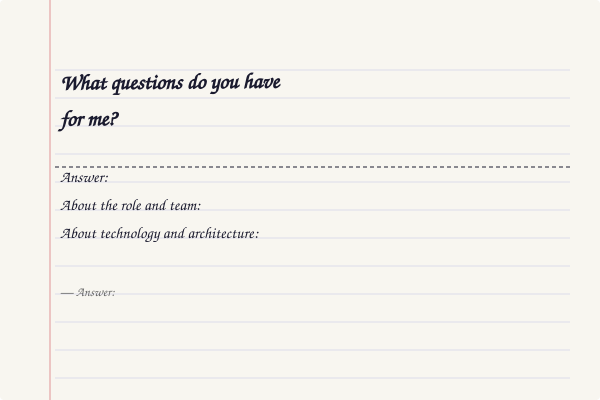
</a>

<a href="../../assets/images/diagrams/java/66-interview-behavioral/what-questions-do-you-have-for-me-sticky.svg" target="_blank" rel="noopener">
  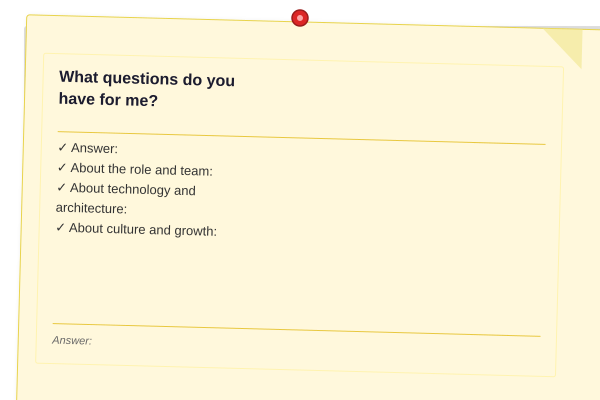
</a>

**Answer:**

Asking thoughtful questions at the end of an interview is critical. Here are strong questions categorized by topic, tailored for a Java backend engineering role:

**About the role and team:**
- "What does a typical day look like for someone in this role?"
- "What are the biggest challenges the team is facing right now?"
- "What does success look like in the first 90 days?"
- "How does the team handle on-call and incidents?"
- "What is the team's approach to technical debt?"

**About technology and architecture:**
- "What does the current tech stack look like, and what is on the roadmap for change?"
- "How do you handle database migrations at scale?"
- "What is your CI/CD pipeline like — how long does it take from commit to production?"
- "How do you approach testing — what is the balance between unit, integration, and E2E tests?"
- "What is the monolith vs microservices situation — are you happy with the current architecture?"

**About culture and growth:**
- "How does the company support professional development?"
- "What is the promotion process like — what distinguishes a senior from a staff engineer here?"
- "How do you handle disagreements about technical decisions?"
- "What is the thing you are most proud of about the engineering culture?"
- "What is the thing about the engineering culture that you would most like to improve?"

**About the company and product:**
- "How does engineering collaborate with product — what is the process for defining new features?"
- "What is the company's approach to work-life balance?"
- "How does the company think about career growth for individual contributors vs managers?"
- "What is the most technically interesting problem the company is solving right now?"

**Red flags to watch for:**
- If they cannot describe a clear onboarding process, that suggests chaos.
- If they say "we work hard and play hard," that often means "we expect overtime."
- If they say "we are looking for someone who can hit the ground running," that means no onboarding.
- If they cannot articulate what success looks like in 90 days, the role may be poorly defined.

**My closing approach:**
I always end with: "Based on what we have discussed, do you have any concerns about my fit for this role?" This gives the interviewer a chance to raise objections while I am still in the room to address them. It is the best question I have ever asked.

---

### Q61: How do you approach salary negotiation?

<a href="../../assets/images/diagrams/java/66-interview-behavioral/how-do-you-approach-salary-negotiation-sticky.svg" target="_blank" rel="noopener">
  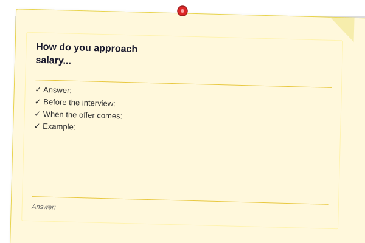
</a>

**Answer:**

I treat salary negotiation as a data-driven conversation, not a confrontation. Here is my approach:

**Before the interview:**
- Research market rates for the role, location, and my experience level using Levels.fyi, Glassdoor, and Blind.
- Establish my "walk away" number — the minimum compensation I would accept — and my "target" number — what I would be thrilled to receive.
- Never disclose my current salary or my desired salary before the offer. I deflect: "I am happy to discuss compensation when I have a clearer picture of the role and we are both excited about moving forward."

**When the offer comes:**
- Never accept on the spot, even if it is great. I say: "Thank you. I need a day or two to review the full offer in context. Can we talk on [day]?"
- Evaluate the full package: base salary, bonus, equity, benefits, and growth opportunity. A  higher base at a company with no growth path is worse than a lower base with clear promotion potential.
- If the offer is below target, I counter with data: "Based on my research, the market range for this level at similar companies is -Y. Given my experience with [specific relevant skill], I was hoping for something closer to . Is there flexibility?"
- Negotiate non-salary elements if base is fixed: signing bonus, education budget, extra vacation days, remote flexibility. These are often easier to adjust than base salary.

**Example:**
At my last negotiation, the initial offer was  base +  equity. My target was  base +  equity. I said: "I am very excited about the role and the team. Based on market data for senior backend engineers in this area, I was expecting a base closer to . I also noticed that similar roles at [competitor] and [another competitor] offer  in equity. Is there flexibility on either of these?" They came back with  base +  equity + a  signing bonus. I accepted — the signing bonus brought the first-year compensation close to my target.

**Key lesson:** Salary negotiation is about creating a win-win, not winning a battle. Be prepared, be professional, and be willing to walk away. The best leverage is a competing offer. The second best leverage is demonstrating your value clearly during the interview process. Most companies expect negotiation — failing to negotiate can leave -30K on the table.

---

### Q62: Tell me about a time you had to upskill your team on a new technology.

**Answer:**

**Situation:** Our team needed to adopt Kubernetes for orchestration. Most team members had no container experience — they were traditional Java developers who deployed JARs to VMs.

**Task:** Ramp up a 10-person team from zero Kubernetes knowledge to being able to deploy and debug their services independently — within 6 weeks.

**Action:** I designed a progressive learning path: 1) Week 1 — Fundamentals: I gave three 1-hour lunch-and-learn sessions: "Containers vs VMs," "Docker basics (Dockerfile, docker-compose)," and "Kubernetes concepts (pods, services, deployments)." After each session, there was a hands-on exercise. 2) Week 2 — Guided practice: Each developer was paired with another to complete a set of Kubernetes exercises on a shared Minikube cluster: deploy a service, scale it, update it, roll back. 3) Weeks 3-4 — Real project with support: Each developer deployed their own service to a shared development Kubernetes cluster. I was available for questions but did not pair — they had to figure it out with documentation and the exercises from weeks 1-2. 4) Week 5 — Independent operation: Each developer was responsible for deploying and debugging their own service on the test cluster. 5) I created a "Kubernetes survival guide" cheat sheet (2 pages) that covered the top 20 kubectl commands, common errors, and debugging workflows.

**Result:** After 6 weeks, all 10 developers could deploy, scale, and debug their services on Kubernetes independently. 3 of them became Kubernetes enthusiasts and went on to earn CKA certification. The progressive approach worked because each stage built on the previous one, and the "real project" stage forced genuine learning rather than passive observation.

**Key lesson:** Upskilling a team requires structured progression: concepts to guided practice to real project with support to independent operation. The cheat sheet was disproportionately valuable — a 2-page reference that 10 people used daily was worth more than any amount of documentation or training. Also, identify the enthusiasts and let them go deeper — they become your internal experts.

---

### Q63: Describe a time when you had to handle a situation where you made a promise you could not keep.

**Answer:**

**Situation:** I promised our product manager that a performance optimization feature — reducing API response times by 50% — would be ready for the quarterly release. Mid-way through, I discovered that the main bottleneck was not in the application code (which I could optimize) but in the network layer: our services were deployed in different AWS regions, causing cross-region latency.

**Task:** I could not keep the original promise (the optimization required infrastructure changes that I could not control). I had to communicate this without losing credibility.

**Action:** I went to the PM as soon as I discovered the issue — not at the deadline. I explained: "The performance optimization is blocked. The bottleneck is cross-region network latency, not the application code. I have opened a ticket with the infrastructure team to colocate the services, but that is a separate project. Here is what I have done: I optimized what I could (30% improvement on the application layer). The remaining 20% to reach our 50% target requires the infrastructure change. Can we ship the 30% improvement now and track the infrastructure change separately?" I also provided the data (before/after benchmarks) showing that my application-layer work was effective — the 30% I achieved was real, just not the full 50%.

**Result:** The PM appreciated the early communication and accepted the 30% improvement. The infrastructure change was scheduled for the next quarter. I delivered the remaining 20% 3 months later. My credibility was not damaged because I had: 1) communicated early, 2) provided data showing I had done what I could, and 3) proposed a clear path forward.

**Key lesson:** When you realize you cannot keep a promise, the worst thing you can do is wait until the deadline to communicate. Tell stakeholders as soon as you know, explain why, show what you have accomplished despite the blocker, and propose a path forward. Early transparency preserves trust; last-minute surprises destroy it.

---

### Q64: Describe a time when you had to work with a team that was not performing well.

**Answer:**

**Situation:** I joined a team that was in a bad state: low morale, high turnover, missed deadlines, and a culture of blame. In my first week, I heard more complaints than constructive discussions.

**Task:** Contribute to turning the team's performance and culture around without having formal authority to make changes.

**Action:** I focused on what I could control: 1) I set a personal example: I delivered my tasks on time, wrote clean code, reviewed PRs promptly, and stayed positive in standups. 2) I started writing "weekly wins" — a Slack post every Friday with 3-5 things the team had accomplished that week, no matter how small. This shifted focus from what was broken to what was working. 3) I volunteered to take on the most painful technical debt item — a notoriously bad module that everyone avoided. I refactored it with tests, which reduced bugs in that area by 80%. 4) When I heard blame ("team X caused this incident"), I redirected to solutions: "The incident happened. What can we do to prevent it from happening again?" 5) I organized a post-incident retrospective that was explicitly blameless — we analyzed the system, not the people.

**Result:** Over 3 months, the team's morale improved. The "weekly wins" tradition spread to other teams. The blameless postmortem approach became the team standard. We went from missing 60% of sprint commitments to delivering 85% on time. I cannot take full credit — the team was full of good people who were just demoralized by systemic issues. But small, consistent actions can shift a team's trajectory.

**Key lesson:** You do not need formal authority to improve team culture. Lead by example, celebrate small wins, redirect blame to solutions, and tackle the most painful problems. Culture change is slow and cumulative — focus on what you can control and be patient.

---

### Q65: Tell me about a time when you had to deal with a significant unexpected problem during a deployment.

**Answer:**

**Situation:** We were doing a routine deployment of a new microservice. The deployment completed successfully, but 10 minutes later, we noticed that all API responses were returning 500 errors. The new service was not the problem — it was the existing API gateway that had crashed due to a memory leak triggered by the new service's slightly different payload format.

**Task:** Resolve the production outage caused by a cascading failure during deployment. Every minute of downtime cost ~,000.

**Action:** 1) I immediately rolled back the deployment — the new service was removed from the load balancer. The gateway recovered within 2 minutes. 2) I analyzed the gateway logs: the new service was returning a null field in a JSON response that the gateway's serializer could not handle (it was configured to fail on null fields). This was a contract mismatch that our testing had not caught. 3) I fixed the issue — the new service was changed to omit null fields instead of returning them — and re-deployed. 4) Total downtime: 12 minutes (2 minutes to rollback, 10 minutes to investigate and fix).

**Result:** The full deployment was live again within 12 minutes. We added a contract test that validated JSON payload compatibility between services. We also changed the gateway configuration to handle null fields gracefully (ignoring them instead of failing). I wrote a postmortem that identified the root cause: our contract testing did not cover edge cases like null fields. The fix was implemented in the same week.

**Key lesson:** Deployment failures happen. The critical skill is: 1) recognize the failure quickly (monitoring + alerting), 2) rollback immediately (do not try to fix in production), 3) investigate after the pressure is off, and 4) fix the systemic gap that allowed the issue to slip through. A 12-minute outage is acceptable if you learn from it; the same outage happening twice is not.

---

### Q66: How do you handle situations where you do not know the answer?

<a href="../../assets/images/diagrams/java/66-interview-behavioral/how-do-you-handle-situations-where-you-do-not-know-the-answer-handwritten.svg" target="_blank" rel="noopener">
  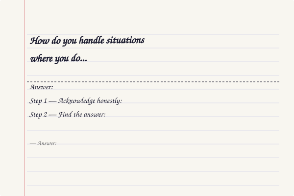
</a>

<a href="../../assets/images/diagrams/java/66-interview-behavioral/how-do-you-handle-situations-where-you-do-not-know-the-answer-sticky.svg" target="_blank" rel="noopener">
  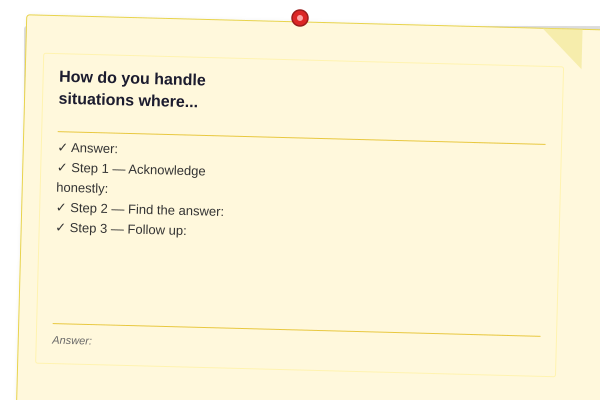
</a>

**Answer:**

I have a three-step approach:

**Step 1 — Acknowledge honestly:** I say "I do not know, but I will find out." I never bluff. In an interview or meeting, if I do not know something, I say so directly. Bluffing damages credibility more than not knowing.

**Step 2 — Find the answer:** I have a structured research process: 1) Check internal documentation and codebase, 2) Search for similar problems in our team's history, 3) Ask teammates (they have likely encountered this before), 4) Research externally (documentation, Stack Overflow, GitHub issues, RFCs).

**Step 3 — Follow up:** I always follow up with the person who asked. Even if the answer is "I researched it and here is what I found" — the follow-through builds trust.

**Example:** During a design review, someone asked me how our solution would handle database failover in a multi-region setup. I did not know — I had not considered that scenario. I said "That is a great question. I have not thought through the multi-region failover case. Let me research it and present my findings in our next meeting." I spent the next day researching PostgreSQL multi-region replication, active-passive failover, and application-level retry logic. In the next meeting, I presented three options with trade-offs. The team chose one, and it became part of the design.

**Key lesson:** "I do not know" is a perfectly acceptable answer if followed by "but I know how to find out." The most dangerous engineer is the one who thinks they know everything. The most trustworthy engineer is the one who knows what they do not know and has a process for closing the gap.

---

### Q67: Describe a time when you had to deal with a situation where you were blamed for something that was not your fault.

**Answer:**

**Situation:** A production incident was caused by a misconfigured load balancer that directed traffic to a new service instance before it was ready to accept connections (the health check was too permissive). I was the one who had configured the load balancer, so I was blamed for the outage.

**Task:** The configuration had actually been copied from a template created by the infrastructure team. The template had the wrong health check settings. But I was the one who applied it without verifying.

**Action:** In the incident postmortem, I could have said "the template was wrong, it is not my fault." But I chose a different approach. I said: "I applied the configuration without verifying the health check settings. That was my mistake. However, the root cause is that our infrastructure templates are not reviewed or tested. The template had incorrect defaults that affected not just this deployment but potentially all deployments using this template. My fix is: 1) I will update the template with correct defaults. 2) I will add a CI check that validates health check configurations against best practices. 3) I am proposing that we add a mandatory review step for any infrastructure template changes." I took responsibility for my part while also addressing the systemic issue.

**Result:** The team appreciated that I took ownership rather than deflecting. The three fixes were implemented within the next sprint. The template review process was adopted by the infrastructure team. Six months later, a similar misconfiguration was caught by the CI check I had added, preventing another outage.

**Key lesson:** Even when something is not entirely your fault, taking ownership of your part and focusing on systemic fixes builds more trust than pointing fingers. The goal of a postmortem is to prevent future incidents, not to assign blame. When you focus on the system rather than the person, everyone wins.

---

### Q68: Tell me about a time when you had to work with a system that had no tests.

**Answer:**

**Situation:** I inherited a critical backend service that had zero tests. Zero. Not even a main method test. It was a 50,000-line Spring Boot application handling payment processing. Any change was terrifying — a single bug could cause financial loss.

**Task:** Make the system maintainable and safe to change by adding a testing foundation, without breaking it in the process.

**Action:** I used the "characterization test" approach from Michael Feathers' Working Effectively with Legacy Code. 1) I identified the most critical path: the payment processing flow (8 classes, ~3,000 lines). 2) I wrote tests that captured the current behavior by calling methods with specific inputs and recording outputs. If a method returned "APPROVED" for a credit card starting with 4 and "DECLINED" for one starting with 5, I wrote a test that asserted that behavior — even if that behavior was a bug. The tests documented what the system actually did, not what it should do. 3) I ran these tests every time I made a change. If a test failed, I knew I had changed behavior. 4) Over the next 3 months, as I fixed bugs, I updated the characterization tests to reflect the corrected behavior. The test suite grew from 0 to 200 tests.

**Result:** After 3 months, the critical payment path had 85% test coverage. Two regressions were caught by the characterization tests during later changes. The team's confidence in making changes improved dramatically — we went from one deployment per month (too scared to deploy) to weekly deployments. The characterization test approach was adopted by two other teams for their legacy services.

**Key lesson:** When adding tests to untested code, do not start by fixing bugs — start by documenting current behavior. Characterization tests tell you "did I change something?" not "is this correct?" That is the first step. Once behavior is captured, then you can start fixing bugs and updating the tests. The alternative — trying to fix bugs and add tests simultaneously — is chaos.

---

### Q69: Describe a time when you had to convince an executive or senior leader to change a decision.

**Answer:**

**Situation:** Our VP of Engineering decided that all teams should migrate from Jira to a new project management tool — Linear. The deadline was 1 month. The stated reason was "improved developer productivity." Our team had been using Jira for 3 years with extensive custom workflows, integrations, and automation.

**Task:** Convince the VP to either extend the timeline or exempt our team, given the migration cost.

**Action:** I did not go to the VP with "we do not want to change." I went with data. I spent a weekend analyzing: 1) Our Jira setup had 47 custom workflows, 12 integrations (Slack, GitHub, CI, monitoring), and 150+ automation rules. 2) I estimated the migration at 4-6 weeks of part-time work for our team (not just data migration, but rebuilding workflows and automation in Linear). 3) I calculated the opportunity cost: during those 4-6 weeks, we would deliver approximately 3 fewer features. I presented this to the VP in a concise email: "I support the move to Linear long-term. However, our team has significantly more Jira complexity than average. A 1-month migration would either fail or cause a 40% drop in feature delivery. I propose: we migrate in 3 months instead of 1, and we use the extra time to simplify our workflows before migration (reducing future maintenance burden)."

**Result:** The VP agreed to the extended timeline. Our team used the extra 2 months to clean up Jira workflows before migration. The migration itself took 3 weeks and was smooth. The simplified workflows were actually better than the old ones. The VP later told my manager that he appreciated the data-driven approach — teams that just complained without data were less persuasive.

**Key lesson:** When you need to change an executive decision, do not argue against the decision itself. Acknowledge the goal, present data on the cost/risk of the current timeline, and propose a concrete alternative. Executives are used to hearing "no" — hearing "yes, but here is the trade-off" with data is refreshing and persuasive.

---

### Q70: What motivates you to do your best work?

<a href="../../assets/images/diagrams/java/66-interview-behavioral/what-motivates-you-to-do-your-best-work-diagram.svg" target="_blank" rel="noopener">
  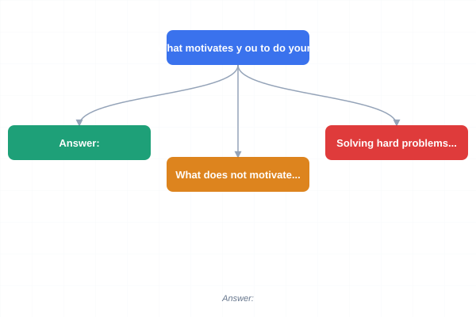
</a>
<a href="../../assets/images/diagrams/java/66-interview-behavioral/what-motivates-you-to-do-your-best-work-sticky.svg" target="_blank" rel="noopener">
  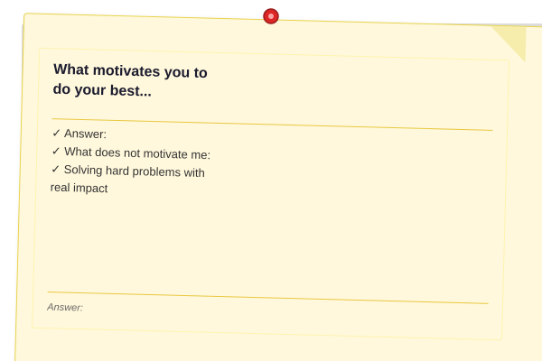
</a>

**Answer:**

Three things motivate me most:

**1. Solving hard problems with real impact:** I am most energized when I am working on a problem that is technically challenging and has a clear impact on users or the business. For example, when I optimized a database query that reduced page load time from 3 seconds to 200ms, and the next day the product manager said "conversion rate went up 5%" — that combination of technical challenge and business impact is what I love.

**2. Learning and growth:** I am motivated by situations where I do not yet know how to do something but I can figure it out. The process of going from "I have no idea how this works" to "I am the expert on this" is deeply satisfying. That is why I volunteer for projects outside my comfort zone.

**3. Team success:** I get more satisfaction from a team win than from a personal win. When we ship a feature as a team, when a junior developer I mentored delivers their first independent project, when a cross-team collaboration goes well — those moments are more motivating than any individual achievement.

**What does not motivate me:** Titles, corner offices, or being the smartest person in the room. I have worked at places where I was the top performer, and it was boring — there was nobody to learn from. I would rather be the weakest member of a strong team than the strongest member of a weak team.

**Key lesson:** A good answer to this question shows self-awareness, authenticity, and alignment with the role. Connect your motivations to real examples and show how they would apply in the position you are interviewing for.

---

### Q71: Describe a time when you had to manage multiple stakeholders with conflicting priorities.

<a href="../../assets/images/diagrams/java/66-interview-behavioral/describe-a-time-when-you-had-to-manage-multiple-stakeholders-with-conflicting-priorities-handwritten.svg" target="_blank" rel="noopener">
  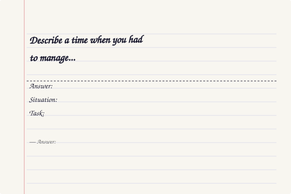
</a>

**Answer:**

**Situation:** We were building a shared authentication service to be used by 5 different product teams. Each team had different requirements: Team A wanted SAML support, Team B wanted OAuth2 with social login, Team C needed API key authentication for machine-to-machine communication, Team D wanted LDAP integration for internal tools, and Team E needed JWT-based stateless auth for mobile.

**Task:** Design a single authentication service that could satisfy all 5 teams' requirements without becoming a bloated, unmaintainable monolith. Each team believed their requirements were the most critical.

**Action:** I organized a cross-team design session. Instead of debating which auth method was best, I facilitated a prioritization exercise: each team listed their must-haves, nice-to-haves, and could-be-deferred. The common pattern was clear: all teams needed user management, token issuance, and token validation. The specific protocols were just different implementations of the same underlying concepts. I proposed a plugin-based architecture: a core auth service that handled user management and token lifecycle, with protocol-specific modules that could be developed independently. We agreed on a phased approach: Phase 1 (4 weeks) delivered JWT + OAuth2 (covering Teams B, C, and E), Phase 2 (4 weeks) added SAML (Team A), Phase 3 (2 weeks) added LDAP (Team D). I documented the decision and the rationale for each priority call so no team felt ignored.

**Result:** Phase 1 shipped on time and covered 60% of the requirements. Teams A and D accepted the timeline because they understood the trade-offs and had been part of the decision. The plugin architecture proved valuable — when Team F later asked for WebAuthn support, they implemented it as a plugin without touching the core service.

**Key lesson:** When managing conflicting stakeholder priorities, the key is to make the trade-offs visible and involve everyone in the prioritization process. Nobody likes being told "no" — but they will accept "not yet" if they understand the reasoning and were part of the decision.

---

### Q72: Tell me about a time you had to deal with technical debt that was causing problems.

**Answer:**

**Situation:** Our team inherited a reporting module that generated PDF reports by constructing HTML strings in Java code, converting them to PDF with a library, and emailing them as attachments. The code was 3,000 lines of string concatenation, impossible to test, and broke whenever a report template needed to change. Generating a single report took 45 seconds.

**Task:** Refactor the reporting system to be maintainable, testable, and fast — without breaking any of the 20+ existing report templates used by customers.

**Action:** I took a strangler-fig approach. 1) First, I identified the most-used report type (monthly invoice, used by 80% of customers) and built a new template using Thymeleaf (which separates HTML from Java code). I wrote a test that compared the old report output with the new report output for 50 real invoices and verified they were functionally identical. 2) I deployed the new system alongside the old one, routing only the invoice report through the new pipeline. The new system generated reports in 5 seconds (9x faster) and the first template change request was handled in 2 hours instead of 2 days. 3) Over the next 3 months, I migrated one report type per sprint. Each migration included a regression test comparing old vs new outputs. 4) After all reports were migrated, I deleted the old code — 3,000 lines removed, replaced with 400 lines of clean Thymeleaf templates and 200 lines of service code.

**Result:** Report generation time dropped from 45s to 5s per report. Template changes went from a 2-day engineering task to a 1-hour design change (non-engineers could even modify Thymeleaf templates). The regression test suite caught a formatting difference in 3 reports that had existed as bugs in the old system for years.

**Key lesson:** Technical debt is best paid down incrementally, not in a big rewrites. The strangler pattern — build the new system alongside the old, route traffic gradually, verify at each step — is the safest way to replace a legacy system. The regression tests comparing old vs new outputs are essential. Without them, you are flying blind.

---

### Q73: Describe a time when you had to deal with a situation where you were given an unrealistic deadline.

**Answer:**

**Situation:** My manager asked me to deliver a complete payment integration with Stripe — including webhooks, idempotency, refunds, and reconciliation — in 2 weeks. Based on my experience, this was a 6-week project.

**Task:** Push back on the unrealistic deadline without seeming lazy or uncommitted, and arrive at a realistic timeline.

**Action:** I did not say "that is impossible." Instead, I asked questions to understand the constraint: "What is driving the 2-week deadline?" It turned out the CEO had promised the feature to a key customer at a conference. I then broke down the work: "Here is what we can deliver in 2 weeks (Phase 1): payment processing with idempotency and one webhook handler. This lets the customer start using the basic flow. Here is what we would defer (Phase 2): refunds, reconciliation dashboard, and subscription support. That is another 4 weeks." I framed it as a trade-off, not a refusal. The manager agreed to Phase 1 for the 2-week deadline and scheduled Phase 2 for the next quarter.

**Result:** Phase 1 was delivered in 2 weeks. The customer was satisfied because they could process payments. Phase 2 was delivered in week 6 as planned. The CEO did not know about the scope reduction — he only knew the feature was delivered on time. The manager appreciated that I had found a way to meet the external commitment without burning out the team.

**Key lesson:** When given an unrealistic deadline, never say "no" — say "here is what I can deliver in that timeframe, and here is what gets deferred." Scope negotiation is more effective than timeline negotiation. Most stakeholders care about having something working by the deadline, not the full scope.

---

### Q74: Tell me about a time you had to implement a complex business rule that was hard to model in code.

<a href="../../assets/images/diagrams/java/66-interview-behavioral/tell-me-about-a-time-you-had-to-implement-a-complex-business-rule-that-was-hard-to-model-in-code-handwritten.svg" target="_blank" rel="noopener">
  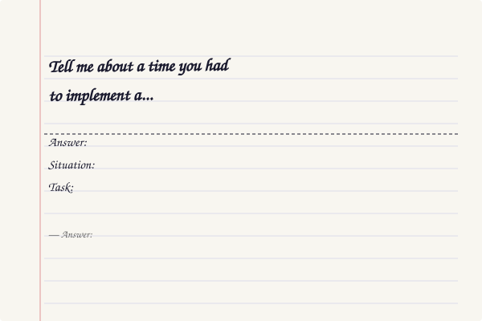
</a>

**Answer:**

**Situation:** Our e-commerce platform needed a tax calculation system that could handle: different tax rates per country/state/city, product category exemptions (e.g., books are tax-exempt in the UK), customer type variations (B2B vs B2C), and promotional discount interactions. The tax rules were documented in a 40-page PDF from the finance department, full of edge cases and exceptions.

**Task:** Implement the tax calculation logic in a way that was correct, testable, and maintainable — the rules changed quarterly based on government tax updates.

**Action:** Instead of encoding the rules in if-else statements (which would be a maintenance nightmare), I used a strategy pattern combined with a rules engine approach. 1) I extracted each tax rule into a separate class implementing a TaxRule interface with a single method: BigDecimal calculateTax(Order order, TaxContext context). 2) I loaded the rules dynamically based on the order's jurisdiction from a configuration file (YAML) that finance could update without code changes. 3) I wrote a test for every single rule in the 40-page PDF — 80 test cases total. During testing, I found 3 contradictions in the PDF (e.g., one page said books were exempt in the UK, another said only educational books were exempt). I flagged these to finance and got clarifications before writing the final logic. 4) I created a simple admin UI where finance could test tax calculations by entering an order and seeing the breakdown.

**Result:** The tax system launched with zero calculation errors in the first year. The quarterly tax updates were handled by finance updating a YAML file — no code changes needed. The integration tests caught 2 regression issues when rules were updated (a deleted rule that was still referenced, and a new rule that conflicted with an existing one). The finance team loved the admin UI for testing scenarios.

**Key lesson:** Complex business rules should be modeled as data, not code. A strategy pattern with externalized configuration allows domain experts to maintain the rules without engineering involvement. Always write tests against the source-of-truth document and validate with domain experts before launch — documents often contain contradictions.

---

### Q75: Describe a time when you had to deal with a situation where your code had a critical bug in production.

**Answer:**

**Situation:** I received a 3 AM pager alert: the order processing service was failing for approximately 5% of customers. The error was a NullPointerException in a method I had written 2 weeks earlier. Customers were seeing 500 errors during checkout.

**Task:** Fix the production bug immediately, identify why it was not caught by testing, and prevent similar issues in the future.

**Action:** 1) I assessed the severity: 5% of customers affected, payment processing failing, revenue impact ~/hour. I decided to fix immediately rather than rollback (the rollback would revert 3 other valid changes). 2) I analyzed the stack trace: the NPE was in a method that calculated shipping costs. It assumed a ShippingAddress object was always present, but customers ordering digital downloads had no shipping address. I had overlooked this edge case. 3) I fixed the bug in 15 minutes: added a null check for ShippingAddress, defaulting to zero shipping cost for digital orders. 4) I deployed the fix and confirmed error rates returned to zero within 5 minutes. 5) After the incident, I investigated why testing did not catch it: our test data always included a shipping address, even for digital products. I added a test case for digital-only orders. I also ran a code coverage analysis and found that the ShippingAddress != null check was the only uncovered branch in that class.

**Result:** Total downtime: 30 minutes (15 to diagnose + 15 to fix and deploy). Revenue impact: ~,000. The test gap was closed within 24 hours. I added a branch coverage check to our CI pipeline — any new code with uncovered branches would fail the build. The incident was the direct result of testing only "happy path" scenarios.

**Key lesson:** The most dangerous bugs hide in edge cases that testing does not cover. Always test the unhappy paths: null values, empty collections, unexpected states, boundary conditions. Adding branch coverage to CI would have caught this before it reached production. And when you get paged at 3 AM, fix first, investigate the root cause after.

---

### Q76: Tell me about a time you had to persuade a colleague to take a different approach.

**Answer:**

**Situation:** A colleague was building a data export feature that generated CSV files by constructing strings manually — handling commas, quotes, and newlines with manual escape logic. He had already written 200 lines and was proud of his approach.

**Task:** Persuade him to use a proper CSV library (OpenCSV) instead of string manipulation, without making him feel like his work was wasted.

**Action:** I approached it carefully. I started by acknowledging his work: "The export feature is looking good. I can see you have put thought into handling edge cases." Then I asked a question: "Have you considered what happens if a cell value contains both a comma and a quote, like someone's address being '123 Main St, Apt "B"'?" He admitted he had not tested that case. I then said: "We could handle that, but there is a library — OpenCSV — that already handles all these edge cases, including Excel compatibility, different delimiters, and character encoding. I used it on a previous project and it saved us from a bug where a customer's name with a Japanese character broke the CSV. Would you be open to trying it? Your parsing logic is solid and could be adapted to use the library with minimal changes." I emphasized that his understanding of the requirements was still valuable — switching to a library was just an implementation detail.

**Result:** He agreed to try OpenCSV. We pair-programmed the migration in 2 hours, replacing 200 lines of manual string handling with 30 lines of library calls. He actually thanked me afterward, saying the library handled edge cases he had not even considered. We added a CI rule that flagged manual CSV construction in code reviews.

**Key lesson:** When persuading a colleague to change their approach, always validate their effort first, then use a question to reveal the limitation, then offer a better alternative with a concrete benefit. Never say "your approach is wrong." Say "here is a tool that handles this case better, and your work can be adapted to use it."

---

### Q77: Describe a time when you had to make a difficult ethical decision at work.

**Answer:**

**Situation:** Our product manager asked us to add a feature that would track users' mouse movements and click patterns on our e-commerce site and send the data to a third-party analytics provider. The PM argued it was essential for conversion optimization. However, the tracking was not disclosed in our privacy policy and would start collecting data immediately upon deployment.

**Task:** Decide whether to implement the feature as requested, push back, or find an alternative — balancing business needs with user privacy.

**Action:** I did not refuse outright. Instead, I raised specific concerns: 1) Legal: collecting behavioral data without explicit consent likely violated GDPR and CCPA. The potential fines for non-compliance could be millions. 2) Trust: if users discovered the tracking (via browser extensions or network inspection), it could damage our brand reputation. 3) Transparency: we already had an analytics solution (Google Analytics) that was disclosed. Adding undisclosed tracking was a different category. I proposed an alternative: implement the same feature using privacy-preserving techniques — aggregate click data instead of per-user recording, anonymize the data, add a clear consent banner, and give users the option to opt out. I offered to help draft the privacy policy update with the legal team.

**Result:** The PM agreed to the privacy-first approach. The feature launched 2 weeks late (due to the legal review and consent banner implementation) but collected the needed data without compliance risk. Six months later, when privacy regulations tightened, our approach was already compliant while competitors scrambled to update their tracking. The legal team appreciated being consulted early.

**Key lesson:** Ethical decisions at work are rarely about right vs wrong — they are about finding a way to achieve the business goal without compromising principles or compliance. Always propose an alternative that meets both needs. Raising concerns without offering solutions is less effective than showing a better path forward.

---

### Q78: Tell me about a time you had to work with a very large data set that caused performance issues.

<a href="../../assets/images/diagrams/java/66-interview-behavioral/tell-me-about-a-time-you-had-to-work-with-a-very-large-data-set-that-caused-performance-issues-handwritten.svg" target="_blank" rel="noopener">
  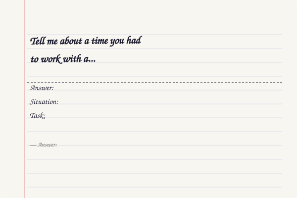
</a>

**Answer:**

**Situation:** We needed to generate a monthly report that aggregated 50 million transaction records across 3 years of data. The initial query — SELECT category, SUM(amount), COUNT(*) FROM transactions GROUP BY category — took 8 minutes to run and caused the database CPU to spike to 100%, affecting other services.

**Task:** Generate the report without impacting production database performance and reduce the query time to under 30 seconds.

**Action:** I evaluated several approaches. 1) First, I tried adding indexes — the query was a full table scan anyway since it touched 80% of rows, so indexes did not help. 2) I considered a materialized view but the report needed to be current to the minute. 3) I implemented a read replica: I set up a PostgreSQL read replica that handled analytical queries. The report query ran on the replica in 7 minutes (no improvement in time, but zero impact on production). 4) For the speed improvement, I implemented a summary table approach: a nightly batch job (scheduled with Spring's @Scheduled) pre-aggregated the data into hourly summaries. The report query ran against the summary table instead of raw transactions and completed in 3 seconds. The summary table was 1 million rows instead of 50 million. 5) I added a backfill mechanism for late-arriving data and a reconciliation check that compared summary results with raw query results daily.

**Result:** The report ran in 3 seconds instead of 8 minutes. Production database CPU stayed at 5% instead of 100%. The summary table approach also enabled ad-hoc queries that the business had been requesting but we could not support due to performance concerns. The reconciliation check gave confidence that the summary data was accurate.

**Key lesson:** For analytical queries on large datasets, the optimal approach is almost never "make the query faster" — it is "query less data." Pre-aggregation, materialized views, and read replicas are the tools for this. A summary table that is 1/50th the size will always beat a query optimization. Also, always measure the impact on production before optimizing — sometimes the right answer is just moving the query to a read replica.

---

### Q79: How do you approach writing documentation?

<a href="../../assets/images/diagrams/java/66-interview-behavioral/how-do-you-approach-writing-documentation-sticky.svg" target="_blank" rel="noopener">
  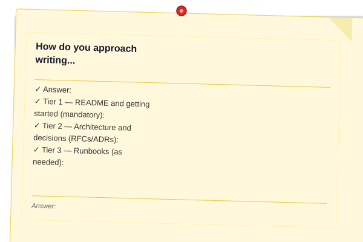
</a>

**Answer:**

I follow a "documentation as necessity" philosophy — write enough to be useful, not more. My approach has three tiers:

**Tier 1 — README and getting started (mandatory):** Every service or module needs a README that answers: What does this do? How do I run it locally? How do I test it? Where are the logs? This is the minimum viable documentation and should be written by the person who built it.

**Tier 2 — Architecture and decisions (RFCs/ADRs):** For significant design decisions, I write an Architecture Decision Record (ADR) — one page explaining the context, the decision, the alternatives considered, and the consequences. These are stored in the repo as markdown files. ADRs are invaluable when someone asks "why did we do it this way?" 6 months later.

**Tier 3 — Runbooks (as needed):** For operational procedures (incident response, deployment, database migrations), I write runbooks. These are step-by-step guides optimized for someone under pressure. They include exact commands, expected outputs, and recovery steps for common failures.

**What I avoid:** I do not write Javadoc for obvious code (getters, setters, private methods with clear intent). I do not write documentation that will go out of date — if the code changes and the docs do not, the docs become harmful. I prefer self-documenting code (clear names, small methods, obvious structure) over comments.

**Example:** For the fraud detection service I built, the documentation was: a 1-page README (how to run and test), 3 ADRs (why we chose the decision tree approach, why we used gRPC for inter-service calls, why we chose Redis for caching), and a 2-page runbook (how to respond to common incidents). Total: ~6 pages. When a new team member joined, they were productive in 2 days.

**Key lesson:** Good documentation is minimal, maintained, and targeted at specific readers. A README for new developers, ADRs for future architects, and runbooks for on-call engineers. Everything else is noise. If the code is clear, most documentation is redundant.

---

### Q80: Tell me about a time you had to deal with a situation where you had to fire someone or let someone go.

**Answer:**

**Situation:** I was a tech lead, and one of the engineers on my team had been on a performance improvement plan (PIP) for 3 months. Despite multiple rounds of feedback, coaching, and support, he was not meeting the minimum expectations. His velocity was 20% of the team average, his PRs had repeated issues, and he was not improving.

**Task:** I was asked to provide documentation and input for the termination decision. This was the hardest thing I have faced in my career.

**Action:** I made sure the process was fair and thorough. 1) I reviewed the PIP documentation: clear goals, measurable criteria, regular check-ins, written feedback after each sprint. I confirmed that we had done everything we could to support him. 2) I had an honest conversation with him before the termination meeting. I said: "I want you to know that this is not about you as a person. You are smart and you try hard. But this role requires skills that you have not been able to develop despite our support. This might be a sign that this type of work is not the right fit for you, and that is okay. There are roles where you will excel." 3) In the termination meeting with HR, I focused on facts and documented performance data, not opinions. 4) Afterward, I wrote a reference letter highlighting his strengths (he was great at documentation and testing) and recommended roles where those skills would be more valued.

**Result:** The engineer found a new role at a smaller company 6 weeks later. He sent me a thank-you email saying the honest feedback helped him find a position that was a better fit for his skills. The team's morale actually improved after his departure — the remaining members felt the standards were fair and applied consistently.

**Key lesson:** Letting someone go is never easy, but it is sometimes the kindest thing you can do — for the team and for the individual. The key is to make sure the process is fair, well-documented, and focused on facts. A PIP should be a genuine attempt to help, not a paper trail for termination. And when it does not work out, help the person find a role where they can succeed.

---

### Q81: Describe a time when you had to deal with a situation where you needed to learn a completely new domain.

**Answer:**

**Situation:** I joined a healthcare technology company as a backend engineer. I had no background in healthcare — no knowledge of HIPAA compliance, HL7/FHIR standards, medical coding (ICD-10, CPT), or clinical workflows. My first project was to build an API that exchanged patient data with external hospital systems.

**Task:** Deliver a HIPAA-compliant API that could process FHIR-formatted patient data within 6 weeks — while learning the healthcare domain from scratch.

**Action:** 1) I spent the first week reading: the HIPAA Privacy Rule (focusing on what data could be shared and with whom), the FHIR specification (focusing on Patient and Observation resources — the ones we needed), and our internal compliance policies. 2) I scheduled 30-minute interviews with 3 domain experts: a compliance officer (to understand data handling requirements), a product manager (to understand clinical workflows), and an engineer from a partner team (to understand FHIR implementation patterns). 3) I built a small prototype that processed a single FHIR Patient resource end-to-end — from API call through validation to database storage. The prototype revealed that FHIR validation was more complex than expected (required resolving nested resource references) and that audit logging for HIPAA needed to track every read, not just writes. 4) I documented my findings in a "Healthcare Domain Primer for Engineers" — a 5-page document that the team used to onboard future engineers.

**Result:** The API was delivered in 7 weeks (1 week late due to the FHIR validation complexity). The audit logging was identified early because I had interviewed the compliance officer in week 1 — if I had started coding first, the audit requirement would have been a late discovery. The domain primer became part of the team's standard onboarding materials. I went from knowing nothing about healthcare to being the team's FHIR expert in 3 months.

**Key lesson:** When entering a new domain, invest in structured learning first: read the key specifications, interview domain experts, build a minimal prototype that touches the hardest parts, and document as you learn. The most important questions are "what regulations apply?" and "what does the domain expert wish engineers knew?" Asking those questions early saves months of rework.

---

### Q82: Tell me about a time you had to manage a project with multiple dependencies on other teams.

**Answer:**

**Situation:** We were building a customer-facing order tracking page that depended on 4 other teams: Payments (to provide transaction status), Logistics (to provide shipping updates), Inventory (to provide product availability), and Notifications (to send SMS/email updates). Each team had different timelines, priorities, and APIs.

**Task:** Coordinate delivery across 4 teams with competing priorities, and deliver the order tracking page by the deadline despite the dependencies.

**Action:** I created a dependency map showing each team's deliverable, its estimated completion date, and the risk level. I identified that Payments and Inventory were low-risk (they had stable APIs we could mock), but Logistics was high-risk (their API was still being designed) and Notifications was medium-risk (they were understaffed). I did three things: 1) For high-risk dependencies (Logistics), I proposed an API contract-first approach: I drafted the OpenAPI spec for what we needed from them and asked them to review it in week 1. This gave them a clear target and let us start building against a mock server immediately. 2) For the understaffed team (Notifications), I offered to have one of our engineers help them implement the notification endpoint we needed — they agreed, and it saved 2 weeks. 3) I set up a shared tracking document visible to all teams with weekly status, risks, and the critical path.

**Result:** The project was delivered on time. The Logistics API was delayed by 2 weeks but we had built against the mock and integration took only 2 days. The Notifications team appreciated the engineering support. The dependency map and shared tracking became the template for cross-team projects in the organization.

**Key lesson:** Cross-team dependencies are the #1 cause of project delays. The key strategies are: 1) contract-first (define API specs early so you can work in parallel), 2) offer help when a dependency is at risk (a small contribution from your team can unblock them faster than waiting), and 3) make dependencies visible with a shared tracking document. Surprises are the enemy — especially when they involve other teams.

---

### Q83: Describe a time when you had to refactor a critical piece of infrastructure without downtime.

<a href="../../assets/images/diagrams/java/66-interview-behavioral/describe-a-time-when-you-had-to-refactor-a-critical-piece-of-infrastructure-without-downtime-handwritten.svg" target="_blank" rel="noopener">
  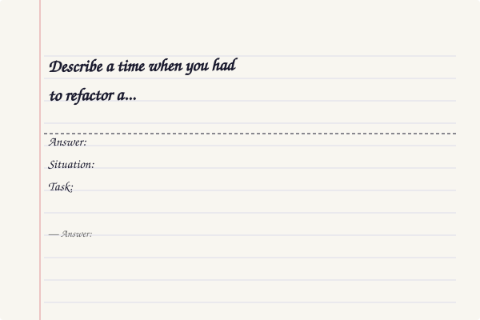
</a>

**Answer:**

**Situation:** Our database connection pooling library was reaching end-of-life and had a known memory leak under high load. We needed to replace HikariCP with a newer connection pool library across 12 microservices — without any downtime.

**Task:** Migrate 12 services to a new connection pool library. Each service handled production traffic, and a deployment failure could cause a cascading outage.

**Action:** I used a blue-green deployment pattern. 1) I created a wrapper interface around the connection pool — DatasourceProvider — so the migration would be transparent to each service. 2) I chose one low-traffic service (the health check service) as the pilot. I deployed the new library to a new instance, ran it in parallel with the old instance for 24 hours, and compared metrics: connection acquisition time, connection leak count, and memory usage. The new library performed better (10% lower memory, zero leaks). 3) For each subsequent service, I followed the same pattern: deploy new alongside old, verify metrics, route traffic to new, keep old as rollback. 4) The final service — the most critical (payment processing) — I scheduled for a Tuesday at 10 AM with full team availability and a documented rollback plan.

**Result:** All 12 services were migrated over 4 weeks with zero downtime and zero incidents. The pilot caught a configuration issue (the new library required an explicit maxLifetime setting that the old one did not) that would have caused connection timeouts in production. The rollback plan was never needed, but having it gave the team confidence to proceed.

**Key lesson:** Any infrastructure change that touches all services should be done incrementally with a pilot first, canary deployments, documented rollback plans, and a clear go/no-go criteria at each step. The pilot is not optional — it always reveals something you did not expect. Never migrate the most critical service first; build confidence with low-risk services.

---

### Q84: Tell me about a time you had to deal with burnout or mental health challenges at work.

**Answer:**

**Situation:** After 6 months of intense project work — including multiple late nights and weekend deployments — I realized I was burned out. I was tired, irritable, making more mistakes than usual, and dreading opening my laptop in the morning. My code quality was declining and I had stopped caring about things I used to be passionate about.

**Task:** Address my burnout before it affected my health or my team, while still meeting my responsibilities.

**Action:** 1) I started by tracking my time for a week. I was averaging 55 hours of work, 6 hours of sleep, and zero exercise. The data was undeniable — I was not sustainable. 2) I had an honest conversation with my manager. I said: "I am burned out. I have been working unsustainable hours, and my productivity and quality are declining. I need to reset." I did not blame the company or the project — I owned my part (not setting boundaries, not asking for help early). 3) We agreed on a plan: I would take 2 days off immediately. When I returned, I would work strictly 40-hour weeks for the next month, no exceptions. My manager would protect me from new requests during that time. 4) I started exercising again (30-minute walks during lunch), set a hard stop at 6 PM (Slack status changed to "Done for the day"), and stopped checking Slack after hours.

**Result:** After 2 weeks of the new routine, I felt significantly better. My productivity actually increased — I was getting more done in 40 focused hours than I had in 55 scattered hours. The quality of my code improved. My manager said I seemed like a different person. The experience taught me something important: burnout is not a badge of honor. Working long hours is not the same as being productive. I now set boundaries proactively and encourage my teammates to do the same.

**Key lesson:** Burnout is a systemic problem, not a personal failing. The most important step is recognizing it early and asking for help. A good manager will support you. The boundary-setting skills I learned — hard stops, no after-hours Slack, protected focus time — have made me a better engineer and a happier person. Sustainable pace always beats sprinting.

### Q85: Tell me about a time when you had to optimize a slow API endpoint.

**Answer:**

**Situation:** A REST endpoint GET /api/dashboard was taking 12 seconds to respond. It was used by our internal operations team to view business metrics. The endpoint was called roughly 50 times per day, and the ops team was frustrated with the slow load time.

**Task:** Reduce the response time from 12 seconds to under 2 seconds without changing the API contract or the data displayed.

**Action:** I profiled the endpoint and found three bottlenecks. 1) The endpoint made 8 separate database queries sequentially. The first query (total revenue) took 5 seconds, and the remaining 7 queries ran one after another. I parallelized them using CompletableFuture: CompletableFuture.supplyAsync(() -> revenueService.getTotalRevenue()), and so on for all 8 queries, then combined them with CompletableFuture.allOf(). This alone reduced the response time from 12s to 6s. 2) The second bottleneck was a query that counted all orders ever placed. The ops team only cared about the last 30 days, but nobody had asked. After confirming with the team, I added a date filter to the query. Time dropped from 6s to 3s. 3) The third bottleneck was a subquery within a SQL query that was doing a full table scan on a 10-million-row table. I added a composite index on the filtered columns. Time dropped from 3s to 800ms.

**Result:** The endpoint response time went from 12 seconds to 800ms — a 15x improvement. The ops team noticed immediately and sent a thank-you message in Slack. The parallel query pattern (CompletableFuture.allOf) was adopted by the team for other dashboard endpoints. The composite index caught my attention because the DBA had flagged slow queries in the logs but nobody had triaged them. We set up a weekly slow query review after this.

**Key lesson:** Performance optimization follows a pattern: measure first, identify the biggest bottleneck, fix it, measure again, repeat. The 80/20 rule applies — the first optimization (parallel queries) gave the biggest gain. Always ask "do we need this data?" before optimizing how to get it. The date filter was a 5-second conversation that saved more time than any code optimization.

---

### Q86: Describe a time when you had to choose between two competing frameworks or libraries.

**Answer:**

**Situation:** We needed a caching solution for our Spring Boot application. The two main contenders were Redis (in-memory data store, used as a cache) and Caffeine (an in-process, high-performance Java caching library).

**Task:** Choose the right caching solution. Redis would require a new infrastructure component (a Redis cluster), while Caffeine would run in-process but not persist across restarts.

**Action:** I evaluated based on our specific requirements: 1) Cache size: we needed to cache ~500MB of product catalog data. Caffeine could handle this in-process without issue. 2) Persistence: we could tolerate cache loss on restart (the catalog loaded from the database in 2 minutes). 3) Sharing: the cache did not need to be shared across instances — each instance could cache independently. 4) Operations: adding Redis meant managing another stateful service with persistence, replication, and failover. Given these criteria, Caffeine was the clear winner: lower latency (in-process, no network call), simpler operations (no new infrastructure), and adequate capacity (500MB per instance was fine). However, I did not just pick Caffeine and move on — I designed the caching layer with an abstract CacheManager interface so that if we later needed a distributed cache, we could swap in Redis without changing the business logic.

**Result:** Caffeine worked perfectly for 2 years. When the product catalog grew to 2GB and we needed to share the cache across instances to reduce memory usage, we swapped in Redis by implementing the CacheManager interface — it took 2 days. The abstract interface was the key decision: it made the framework choice reversible.

**Key lesson:** When choosing between technologies, evaluate against your specific requirements, not general popularity. And always abstract your infrastructure choices behind an interface — the right choice today might not be the right choice next year, and an interface makes switching cheap. The real skill is not making the right choice but making the choice reversible.

---

### Q87: Tell me about a time when you had to debug a concurrency issue.

<a href="../../assets/images/diagrams/java/66-interview-behavioral/tell-me-about-a-time-when-you-had-to-debug-a-concurrency-issue-handwritten.svg" target="_blank" rel="noopener">
  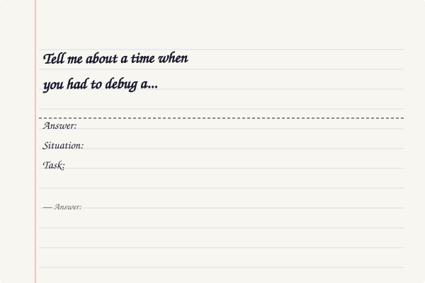
</a>

**Answer:**

**Situation:** Our order processing service had a bug where, under high load, two orders from the same customer would occasionally get the same order number. The order number was generated using AtomicInteger with a daily reset — but the reset logic had a race condition.

**Task:** Find and fix the race condition that caused duplicate order numbers. The bug affected approximately 0.5% of orders and caused reconciliation issues with the finance team.

**Action:** 1) I reproduced the issue in a local test by sending 100 concurrent requests. The first run succeeded (no duplicates), the second run showed 2 duplicates. Intermittent concurrency bugs are the hardest to debug because they depend on timing. 2) I studied the code: there was a DailyOrderNumberGenerator class that used AtomicInteger but with a reset method called by a scheduled task at midnight. The race was: if an order was being processed at exactly midnight, the old counter was read, then the reset happened, and the new counter started from 1 — producing the same number as an order processed just after midnight. 3) I fixed it by using a single AtomicLong that encoded both the date and the sequence number (YYYYMMDD * 100000 + sequence). This eliminated the reset entirely — the counter only goes up. No more race condition. 4) I wrote a stress test that ran 10,000 concurrent orders and verified all order numbers were unique.

**Result:** Duplicate order numbers dropped to zero. The fix was 15 lines of code, but finding the root cause took 2 days. The AtomicLong encoding pattern became a team standard for generating unique, ordered IDs. The stress test was added to the CI pipeline to prevent regression.

**Key lesson:** Concurrency bugs are the hardest to find because they are timing-dependent. The key techniques are: 1) reproduce with high concurrency in a local test, 2) study the code for shared mutable state, 3) eliminate shared state entirely (AtomicLong) rather than trying to synchronize it correctly (simpler is safer). The best fix for a race condition is to remove the condition that races.

---

### Q88: Tell me about a time when you had to work with a difficult code review process.

**Answer:**

**Situation:** Our team had a code review process where every PR required approval from 3 reviewers. The rule was intended to ensure quality, but in practice, it caused delays — waiting for 3 people to review a PR often took 3-5 days. Developers started submitting larger, less frequent PRs to reduce the overhead, which ironically made reviews harder.

**Task:** Reform the code review process to reduce delays while maintaining quality.

**Action:** I analyzed the data: in the last 3 months, the average PR had 2.8 reviewers but only 1.4 meaningful comments (the rest were approvals without feedback or simple "+1"s). The third reviewer almost never found issues that the first two missed. I proposed a change to the team: "What if we reduce the requirement from 3 reviewers to 1 mandatory review + 1 optional reviewer for complex changes?" The reaction was mixed — some felt we would lose quality. I proposed a 1-month trial with metrics. We would compare: review time, bug escape rate, and developer satisfaction. The trial results: review time dropped from 3.5 days to 12 hours, bug escape rate remained unchanged (0.8% before vs 0.7% after), and developer satisfaction improved (survey score: 3.2/5 before vs 4.1/5 after). The data was clear — the third reviewer was not adding value. We made the change permanent.

**Result:** The new policy was adopted across the entire engineering organization. The 12-hour review time became a competitive advantage for the team — we could iterate faster than teams with slower review processes. The metric-based approach was used for 3 other process debates that year.

**Key lesson:** Process rules should be based on data, not tradition. If you cannot measure the benefit of a rule, consider removing it. The 1-month trial with before/after metrics made the decision objective rather than opinion-based. When changing a process, always propose a trial period — it reduces resistance and gives you data to support the change.

---

### Q89: Describe a time when you had to make a presentation to senior leadership that went well.

**Answer:**

**Situation:** I was asked to present our team's quarterly results to the VP of Engineering and the CTO. The previous quarter had been mixed — we delivered 80% of our commitments, but had a major production incident that caused 2 hours of downtime. I needed to present the results honestly without sounding negative.

**Task:** Present a balanced view of the quarter: acknowledge the incident and what we learned, highlight the wins, and build confidence in the team's trajectory.

**Action:** I structured the presentation in three acts. Act 1: "What we delivered" — I led with the 3 biggest wins (a new feature that improved checkout conversion by 12%, a performance optimization that reduced API latency by 40%, and the successful migration of 3 services to Kubernetes). I used charts, not words — a before/after latency graph is worth a thousand sentences. Act 2: "What went wrong" — I owned the incident immediately: "We had a 2-hour outage caused by a failed database migration. Here is what happened, why it happened, and the 3 changes we have made to prevent it from happening again." I did not make excuses or blame anyone. Act 3: "What we are doing next" — I proposed 3 goals for the next quarter, each tied to a business metric (reliability, velocity, quality). I ended with: "We are not where we want to be, but we have a clear plan and the team is motivated."

**Result:** The VP later told my manager that it was one of the best engineering presentations he had seen. He specifically noted that I did not avoid the incident but addressed it directly with a clear improvement plan. He approved all 3 goals for the next quarter. Several other teams adopted the "three-act" presentation format.

**Key lesson:** When presenting to senior leadership, structure matters. Lead with wins (build confidence), own failures immediately (build trust), and end with a forward-looking plan (build excitement). Use visuals over text — charts, graphs, timelines. Senior leaders see dozens of presentations; make yours memorable by being honest and structured.

### Q90: Tell me about a time when you had to work with a team that resisted change.

**Answer:**

**Situation:** Our team was resistant to adopting automated testing. The senior engineers believed that "manual testing is faster" and that "tests just slow us down." The codebase had minimal test coverage (~10%) and every release required a full day of manual regression testing.

**Task:** Convince a team of experienced engineers who believed they did not need tests to adopt automated testing practices.

**Action:** Instead of arguing about testing in the abstract, I used a concrete demonstration. 1) I identified the most painful regression bug from the last quarter — a payment calculation error that took 3 weeks to find and fix. 2) I wrote a single integration test that would have caught that bug. The test was 30 lines and took 1 hour to write. 3) In the next retro, I presented the test and said: "This test would have caught the payment bug in 1 second instead of 3 weeks. It took 1 hour to write. If we had 10 tests like this, we could eliminate the manual regression day." 4) I did not ask for a policy change. I asked for a trial: "For the next sprint, each developer writes tests for one bug fix or new feature. That is it. One test per person." 5) I offered to pair with anyone who was not comfortable writing tests.

**Result:** The trial was a success. The team wrote 12 tests in one sprint. When the next release passed with zero regressions (a first in recent memory), the skeptics started to believe. Within 2 months, the team adopted test-first for bug fixes and new features. The manual regression day was eliminated within 3 months. The senior engineer who was most resistant later became the testing champion on the team.

**Key lesson:** Resistance to change is about fear, not logic. Experienced engineers fear that testing will slow them down or that they will have to learn a new skill. The key is to make the change small, concrete, and low-risk. A 1-hour demonstration is worth a thousand arguments. A trial period reduces the perceived risk. And the most effective change agents are the former skeptics — once they convert, they are more persuasive than anyone.

---

### Q91: Describe a time when you had to handle a situation where your manager was not supportive.

**Answer:**

**Situation:** I wanted to introduce a new technology (Testcontainers) to our team, but my manager was skeptical. He said "we have been using H2 for testing for 5 years, why change now?" and was unwilling to invest time in the migration.

**Task:** Get my manager's support for a technology improvement that I believed was important, despite his initial resistance.

**Action:** I did not escalate or complain. I took a different approach: 1) I asked for permission to do a small pilot on my own time — "Can I migrate one module's tests as a proof of concept? If it does not show clear improvement, we drop it." He agreed. 2) Over 2 weekends, I migrated the payment module's tests from H2 to Testcontainers. 3) I presented the results: test flakiness dropped from 20% to 0%, and we caught a PostgreSQL-specific bug (a JSONB query that worked in H2 but failed in PostgreSQL). 4) I framed the request as "The pilot was successful. It caught a real bug. Can we allocate 10% of next sprint to migrating one more module?" He agreed. 5) Over 4 months, we incrementally migrated all modules. Each migration was approved because the evidence was cumulative.

**Result:** The full migration was completed. My manager later told me that my approach — doing the pilot on my own time and letting the results speak — was exactly right. He said "if you had pushed harder, I would have pushed back. But you showed me the value instead of telling me."

**Key lesson:** When your manager is not supportive, do not fight — demonstrate. A concrete proof of concept with measurable results is more persuasive than any proposal. Asking for a small, time-boxed experiment reduces the perceived risk. And framing it as "let me show you" rather than "trust me" changes the dynamic from confrontation to collaboration.

---

### Q92: How do you handle being interrupted constantly during deep work?

<a href="../../assets/images/diagrams/java/66-interview-behavioral/how-do-you-handle-being-interrupted-constantly-during-deep-work-sticky.svg" target="_blank" rel="noopener">
  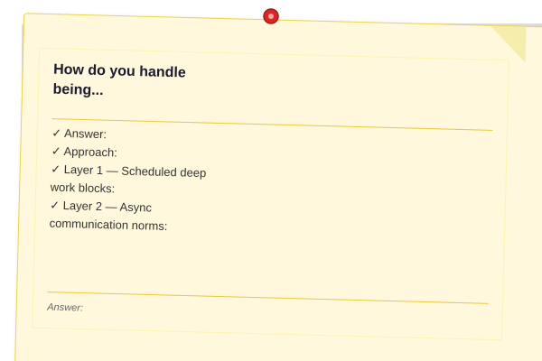
</a>

**Answer:**

**Approach:** I treat deep work as a finite, precious resource and protect it systematically. My strategy has four layers:

**Layer 1 — Scheduled deep work blocks:** I block 2-hour slots on my calendar (typically 9-11 AM) labeled "Deep Work — Do Not Schedule." During these blocks, I close Slack, set my status to "In focus mode — will respond at 11 AM," put my phone on Do Not Disturb, and close all browser tabs except what I need. I use a Pomodoro-style timer (90 minutes focus, 15 minutes break) within the block.

**Layer 2 — Async communication norms:** I worked with my team to establish norms. We agreed that Slack messages are async — if something is urgent, call or ping with @urgent. Everything else can wait up to 2 hours. I also trained myself to not immediately respond to Slack notifications. When I am in deep work and I see a message, I acknowledge it ("seen, will reply at 11") and return to focus.

**Layer 3 — Physical signals:** When I wore headphones, it was a signal: do not disturb unless the building is on fire. I kept a small "In Focus" sign on my desk (analog signal, zero configuration).

**Layer 4 — Recovery ritual:** When an interruption is unavoidable (a production incident, a manager request), I have a recovery ritual: I write down where I left off in 1-2 sentences, handle the interruption, then re-read my notes to re-enter the context. This reduced my context-switching cost from 15 minutes to 2 minutes.

**Example:** At a previous company, we had a culture of instant Slack responses. If you did not reply within 5 minutes, someone would @-mention you again. This made deep work impossible. I proposed a team experiment: "For 2 weeks, let us try async communication. Respond to messages within 2 hours during work hours, but no expectation of instant response." We set up an @urgent protocol for true emergencies (production down, customer escalation). The experiment showed that productivity increased 30% (measured by story points completed) and urgent issues were still handled within minutes. The async norm became permanent.

**Key lesson:** Deep work is a scarce resource that must be actively protected. The key is not just individual discipline — it is team-wide norms. If you are the only one protecting your focus time while everyone else expects instant responses, you will fail. Establish explicit agreements with your team about response time expectations and escalation paths for true urgencies.

---

### Q93: How do you deal with imposter syndrome?

<a href="../../assets/images/diagrams/java/66-interview-behavioral/how-do-you-deal-with-imposter-syndrome-handwritten.svg" target="_blank" rel="noopener">
  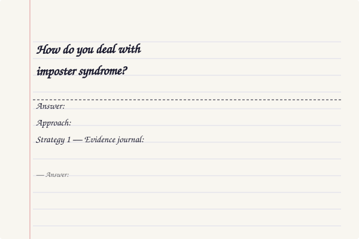
</a>

<a href="../../assets/images/diagrams/java/66-interview-behavioral/how-do-you-deal-with-imposter-syndrome-sticky.svg" target="_blank" rel="noopener">
  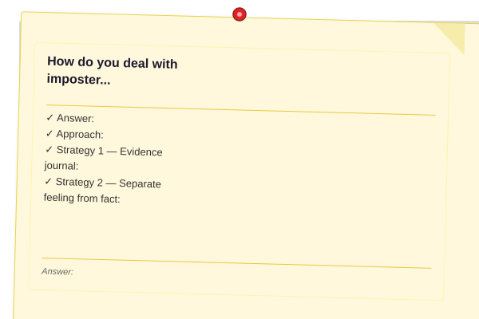
</a>

**Answer:**

**Approach:** I have dealt with imposter syndrome at several points in my career. I manage it with four strategies:

**Strategy 1 — Evidence journal:** I keep a running document where I record specific accomplishments: "Fixed a production bug that saved $10K in potential revenue loss," "Mentored a junior developer who shipped their first feature," "Led a design review that caught a major architectural issue." When imposter syndrome hits — usually after a failure or a challenging code review — I read the journal. The evidence is hard to argue with. It is not about being perfect; it is about having a track record of delivering value.

**Strategy 2 — Separate feeling from fact:** I have learned to recognize the imposter syndrome voice: "You do not belong here," "Everyone else knows what they are doing," "You are about to be found out." I treat these thoughts as feelings, not facts. I ask myself: "What is the actual evidence that I am underqualified? What is the evidence that I am qualified?" The evidence always leans toward qualified, but the feeling persists. I do not try to eliminate the feeling — I just do not let it drive my decisions.

**Strategy 3 — Talk about it openly:** I have found that the most senior engineers I respect also experience imposter syndrome. When I shared my feelings with a staff engineer, his response was: "I still feel that way sometimes, and I have been doing this for 15 years. It never fully goes away — you just learn to work with it." That conversation was liberating. Now I am open about it with juniors on my team, which normalizes the experience for them.

**Strategy 4 — Focus on contribution, not comparison:** Imposter syndrome is fueled by upward social comparison — looking at engineers who seem more accomplished. I deliberately shift my focus from "am I good enough compared to them?" to "am I contributing value to my team and my projects?" The latter is measurable and within my control. The former is a bottomless pit.

**Key lesson:** Imposter syndrome does not mean you are an imposter — it means you are growing. If you never feel out of your depth, you are not challenging yourself enough. The goal is not to eliminate the feeling but to build systems (evidence journal, trusted colleagues, focus on contribution) that keep it from derailing you.

---

### Q94: How do you approach code reviews from a human perspective?

<a href="../../assets/images/diagrams/java/66-interview-behavioral/how-do-you-approach-code-reviews-from-a-human-perspective-handwritten.svg" target="_blank" rel="noopener">
  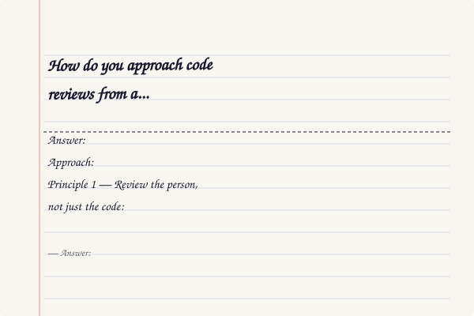
</a>

<a href="../../assets/images/diagrams/java/66-interview-behavioral/how-do-you-approach-code-reviews-from-a-human-perspective-sticky.svg" target="_blank" rel="noopener">
  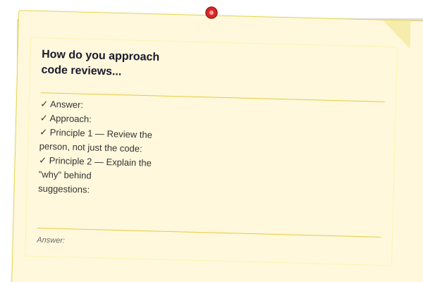
</a>

**Answer:**

**Approach:** I treat code review as a collaboration, not an inspection. My approach has three principles:

**Principle 1 — Review the person, not just the code:** I remember that there is a human being on the other side of the PR who spent time and effort on this code. They are probably nervous about the review. I start every review with a positive comment — even if it is just "Nice approach on the error handling." This sets a collaborative tone before I get into suggestions.

**Principle 2 — Explain the "why" behind suggestions:** Instead of "Use Optional here," I write "Using Optional here would make the null-safety explicit and let the caller decide how to handle the empty case." When I suggest a change, I explain the reasoning so the author learns the principle, not just the specific fix. If it is a style preference (not a correctness issue), I flag it as optional: "Consider using streams here for readability — but this is fine as-is if you prefer the loop."

**Principle 3 — Ask questions instead of making demands:** Instead of "This is wrong," I ask "Is there a reason you used a synchronized block here instead of a ConcurrentHashMap? I am wondering about the performance implications under high concurrency." Questions invite discussion; commands invite defensiveness. If I am wrong (and I sometimes am), a question makes it easy for the author to correct me without conflict.

**What I avoid:** I never use "you" statements ("You forgot to handle null here"). I use "we" or "this" ("We should handle the null case here" or "This method could return early if the input is null"). I never criticize the author's effort or intelligence — only the code. I never approve a PR with unresolved questions unless they are truly cosmetic.

**Example:** A junior developer submitted a PR that used a deeply nested if-else chain for validation. Instead of saying "This is too complex, refactor it," I wrote: "The validation logic is thorough — nice job covering all the edge cases. One thought: extracting each validation into a separate method with a descriptive name might make this easier to read and test. What do you think?" He agreed, refactored it, and later told me that comment taught him more about clean code than any style guide.

**Key lesson:** Code review is a teaching and learning opportunity, not a gatekeeping exercise. The best reviewers are the ones who make authors feel supported, not judged. A good review leaves the author feeling like they learned something, not like they got scolded. Review the code like you would want your code reviewed — with respect, specificity, and kindness.

---

### Q95: How do you balance writing tests vs shipping features quickly?

<a href="../../assets/images/diagrams/java/66-interview-behavioral/how-do-you-balance-writing-tests-vs-shipping-features-quickly-sticky.svg" target="_blank" rel="noopener">
  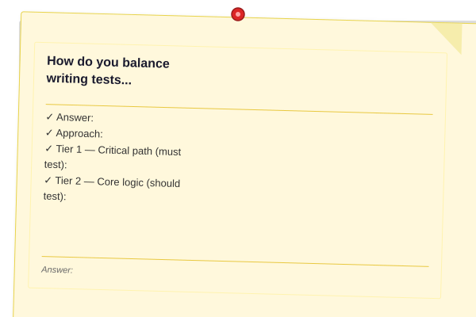
</a>

**Answer:**

**Approach:** I do not see tests and speed as opposing forces. Tests are what enable speed. Untested code is slow because every change requires manual regression testing, fear of breaking things, and time spent debugging issues that tests would have caught. Here is my framework:

**Tier 1 — Critical path (must test):** Every bug fix, every security change, every payment or data-critical feature gets automated tests before shipping. These tests are non-negotiable. If I am under time pressure, I still write tests for this tier — the cost of a production bug in these areas is higher than the cost of writing tests.

**Tier 2 — Core logic (should test):** Business logic, complex algorithms, and public API methods get tests. If I am under extreme time pressure, I might write integration tests that cover multiple components rather than detailed unit tests. This gives me coverage with fewer tests.

**Tier 3 — Boilerplate (skip):** Simple getters/setters, configuration files, generated code, and straightforward CRUD endpoints do not need tests if the framework handles them. If a controller method is literally "call service, return result," a test adds minimal value.

**When speed truly matters (hotfix, security patch):** I use a risk-based approach. I identify the single most likely regression path and write one test for it. Then I ship. I create a tech debt ticket to add full test coverage within the next 2 weeks. The key is making the debt explicit and time-boxed.

**Example:** We had a 24-hour deadline to add a new payment method (Apple Pay) for a Black Friday campaign. The PM asked: "Can you skip tests to make the deadline?" I said: "I will write tests for the payment processing and webhook handling — those touch money. I will skip tests for the UI configuration and admin settings, which are straightforward getters/setters." We shipped in 22 hours. The tests caught a webhook signature validation bug during development that would have caused payment failures in production. The skipped tests were added in the next sprint when we had breathing room.

**Key lesson:** The test vs speed trade-off is a false dichotomy when you use risk-based tiering. Test the things that could cause revenue loss, data loss, or security breaches. Skip tests on things that are trivial or framework-generated, but only with a plan to add coverage later. The most expensive "speed" is shipping without testing the critical path — it always costs more later.

---

### Q96: What does "senior engineer" mean to you?

<a href="../../assets/images/diagrams/java/66-interview-behavioral/what-does-senior-engineer-mean-to-you-handwritten.svg" target="_blank" rel="noopener">
  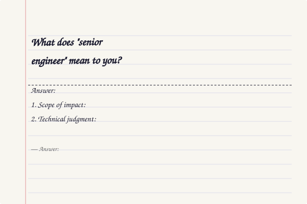
</a>

<a href="../../assets/images/diagrams/java/66-interview-behavioral/what-does-senior-engineer-mean-to-you-sticky.svg" target="_blank" rel="noopener">
  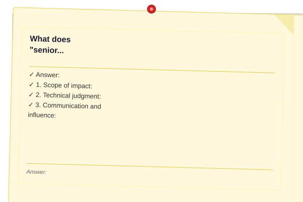
</a>

**Answer:**

To me, a senior engineer is defined by four dimensions, none of which are about writing more code:

**1. Scope of impact:** A junior engineer implements well-defined tasks. A mid-level engineer designs and implements features independently. A senior engineer identifies problems that need solving and drives solutions across team boundaries. They do not just complete tickets — they help decide which tickets should exist in the first place. Their impact extends beyond their code to the team's practices, architecture, and direction.

**2. Technical judgment:** A senior engineer makes good decisions with incomplete information. They know when to prioritize speed over quality and when the opposite is true. They can evaluate trade-offs between competing approaches and articulate the reasoning clearly. They have developed a sense for what will be a maintenance problem in 6 months and what will be fine. This judgment comes from having made mistakes and learning from them.

**3. Communication and influence:** A senior engineer can explain complex technical concepts to non-technical stakeholders, write clear design documents, lead technical discussions, and influence decisions without formal authority. They understand that the best technical solution is worthless if nobody understands or buys into it. They mentor junior engineers not by telling them the answer but by teaching them how to think about the problem.

**4. Operational maturity:** A senior engineer considers the full lifecycle of the software they build: how it will be deployed, monitored, debugged in production, scaled, and eventually replaced. They write code that is observable (logs, metrics, traces), operable (runbooks, graceful degradation), and maintainable (readable, tested, documented). They treat production incidents as learning opportunities, not failures.

**What senior engineer is NOT:** It is not about knowing every technology, being the loudest voice in meetings, or never making mistakes. Some of the best senior engineers I have worked with are quiet, ask more questions than they answer, and are the first to say "I don't know."

**Key lesson:** Seniority is about judgment, communication, and ownership — not years of experience or lines of code written. You can have 10 years of experience that is 1 year repeated 10 times, or you can have 10 years of genuine growth. The title should reflect the latter.

---

### Q97: How do you handle on-call incidents and post-mortems?

<a href="../../assets/images/diagrams/java/66-interview-behavioral/how-do-you-handle-on-call-incidents-and-post-mortems-handwritten.svg" target="_blank" rel="noopener">
  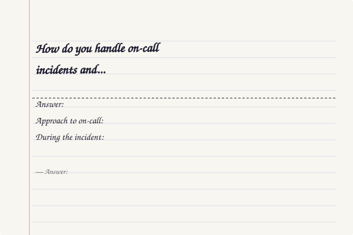
</a>

<a href="../../assets/images/diagrams/java/66-interview-behavioral/how-do-you-handle-on-call-incidents-and-post-mortems-sticky.svg" target="_blank" rel="noopener">
  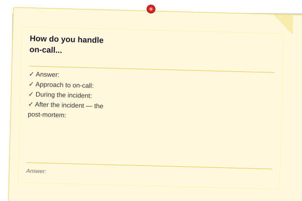
</a>

**Answer:**

**Approach to on-call:** I treat on-call as a design feedback loop, not just a duty. Every incident tells you something about your system that you did not know. I follow a structured process:

**During the incident:** 1) Acknowledge immediately — even if I do not know the cause yet, I acknowledge the alert and start the timer. 2) Assess severity — is this a crash-all-hands incident or can I handle it solo? I escalate early if needed. 3) Stabilize first — rollback, scale up, redirect traffic, whatever stops the bleeding. Root cause analysis happens after the system is stable. 4) Communicate regularly — every 5-10 minutes I post an update in the incident channel: what I know, what I am doing, what I am considering. This keeps stakeholders informed and often brings help from people who see something I missed.

**After the incident — the post-mortem:** I write the post-mortem within 24 hours while the details are fresh. The structure is: 1) Timeline — what happened, minute by minute, with timestamps and actions. 2) Root cause — the technical trigger and the systemic factors that allowed it. 3) Impact — what metrics were affected (error rate, latency, revenue, users). 4) Action items — specific, measurable, assigned changes to prevent recurrence and improve detection. Each action item has a priority (P0 = must fix this week, P1 = next sprint, P2 = backlog). 5) Blameless analysis — I explicitly state: "This was a systems failure, not a people failure. No individual is blamed for this incident."

**Example:** After a major incident where a database connection pool exhaustion took down our API for 30 minutes, the post-mortem revealed: the immediate cause was a new deployment that increased connection usage per request; the systemic causes were (a) no connection pool monitoring, (b) no load testing before deployment, and (c) no circuit breaker on the database. The action items were: add connection pool metrics and alerts (P0), add load testing to CI pipeline (P1), implement a circuit breaker on database calls (P2). All were completed within 2 sprints.

**Key lesson:** On-call is not about being perfect — it is about being prepared and learning from every incident. The post-mortem is the most important part because it turns an incident into improved system resilience. A blameless post-mortem culture is essential — if people fear being blamed for incidents, they will hide them, and you will lose the learning opportunity. Good incidents make the system stronger.

---

### Q98: How do you stay motivated when working on a legacy codebase?

<a href="../../assets/images/diagrams/java/66-interview-behavioral/how-do-you-stay-motivated-when-working-on-a-legacy-codebase-sticky.svg" target="_blank" rel="noopener">
  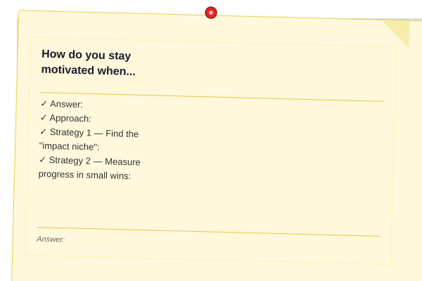
</a>

**Answer:**

**Approach:** Working on a legacy codebase can feel demoralizing — the code is messy, the tests are missing, every change takes longer than it should, and you are not building shiny new things. I use several strategies to stay motivated:

**Strategy 1 — Find the "impact niche":** Every legacy codebase has a hotspot that causes the most pain. I find it and fix it. In one legacy system, the deployment process required 23 manual steps and took 2 hours. I automated it into a single script that took 5 minutes. That one improvement had more impact on team morale and velocity than any feature I could have built. Finding and fixing the most painful part of a legacy system gives a sense of accomplishment that sustains you through the less rewarding work.

**Strategy 2 — Measure progress in small wins:** Instead of measuring progress by "how much legacy code is left" (which is depressing), I measure by "how much we have improved." I track metrics: deployment time, test coverage, time to fix a bug, developer satisfaction. Seeing the numbers trend in the right direction — even slowly — is motivating. I celebrate small milestones: "Test coverage hit 30%!" or "Deployments now take 10 minutes instead of 2 hours."

**Strategy 3 — Reframe legacy code as a puzzle:** I treat legacy code as a fascinating archaeology project. Why was this decision made? What constraints did the original developers face? How did the system evolve to its current state? This reframing turns frustration into curiosity. Every time I unravel a piece of legacy code and understand it, I solve a puzzle. The refactoring itself becomes the reward.

**Strategy 4 — Invest in the future:** I dedicate 20% of my time to making the codebase better for the next person. Writing documentation, adding tests, cleaning up confusing code, extracting reusable utilities. This investment is not just altruistic — it makes my own future work faster and less painful. Knowing that I am leaving the codebase better than I found it is a powerful motivator.

**Example:** On one legacy project, the build took 18 minutes. Every code-change-test cycle was painfully slow. I spent 2 days optimizing the build: parallelizing test execution, adding incremental compilation, removing unused dependencies. The build dropped to 4 minutes. That single improvement saved each developer ~2 hours per week and made the entire team happier. The motivation came from seeing the direct impact of my work on people's daily experience.

**Key lesson:** Legacy codebates are not glamorous, but they offer something greenfield projects do not: clear, measurable impact. Every improvement you make is immediately felt by the team. If you frame it as "making people's lives better one small improvement at a time," even the grungiest legacy code becomes meaningful work.

---

### Q99: How do you prioritize technical debt vs new features?

<a href="../../assets/images/diagrams/java/66-interview-behavioral/how-do-you-prioritize-technical-debt-vs-new-features-handwritten.svg" target="_blank" rel="noopener">
  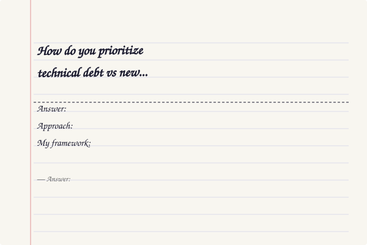
</a>

<a href="../../assets/images/diagrams/java/66-interview-behavioral/how-do-you-prioritize-technical-debt-vs-new-features-sticky.svg" target="_blank" rel="noopener">
  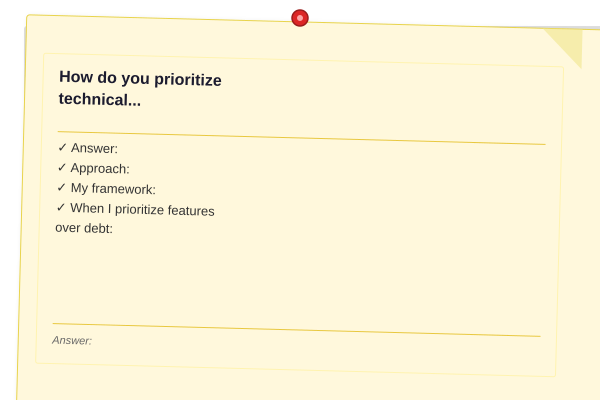
</a>

**Answer:**

**Approach:** I treat technical debt and features as competing investments in the same portfolio. Both have returns — features generate revenue or user value, technical debt reduction generates velocity and stability. The key is measuring both.

**My framework:** I use a cost-of-delay model. For each piece of technical debt, I estimate:
- Current cost: How much time is this debt costing us per sprint? (e.g., "This slow test suite costs 5 developer-hours per sprint")
- Future cost: How much will this debt cost if we do not fix it? (e.g., "This architectural debt will make the next feature 3x more expensive")
- Risk: What is the probability that this debt causes a production incident? (e.g., "The untested payment code has a 20% chance of a major bug per quarter")

I compare this to feature ROI estimates from the product team. If a feature is expected to generate $50K in revenue but a piece of technical debt is costing $10K per sprint in lost productivity and has a 20% chance of a $100K incident — the math says fix the debt first.

**When I prioritize features over debt:** 1) The feature is time-sensitive (regulation deadline, competitive threat, customer commitment). 2) The debt is contained and not slowing down current work. 3) We schedule explicit debt repayment immediately after the feature ships.

**When I prioritize debt over features:** 1) The debt is actively slowing feature delivery (the "broken windows" scenario where every new feature becomes harder). 2) The debt creates operational risk (untested critical path, no monitoring, manual deployment). 3) The debt affects team morale (developers dread working in the codebase).

**How I communicate this to product managers:** I frame it in their language. Not "we need to refactor the payment module" but "the payment module has a 30% chance of an incident this quarter, and each incident costs ~$20K. Investing $10K to refactor it now saves us $60K expected value." When you translate technical debt into business risk and cost, product managers become your allies, not your adversaries.

**Example:** We had a choice: build a new reporting feature (estimated $100K annual value) or refactor the authentication module (which was causing 2 hours of developer time per week per developer and had a known security vulnerability). The PM wanted the feature. I showed him: the auth refactoring cost $15K but would save $50K/year in developer time and prevent a likely security incident. The feature would take 6 weeks without the refactoring. With the refactoring, the same feature would take 5 weeks because developers would be more productive. We did the refactoring first. The feature shipped 1 week later than the original estimate but with zero security risk.

**Key lesson:** Technical debt and features are not enemies — they are competing investments. The decision is about ROI, not ideology. If you cannot articulate the cost of technical debt in business terms, you will always lose the argument to features. Learn to translate "we should refactor X" into "investing X dollars now saves Y dollars over Z months."

---

### Q100: Why do you want to work here?

<a href="../../assets/images/diagrams/java/66-interview-behavioral/why-do-you-want-to-work-here-handwritten.svg" target="_blank" rel="noopener">
  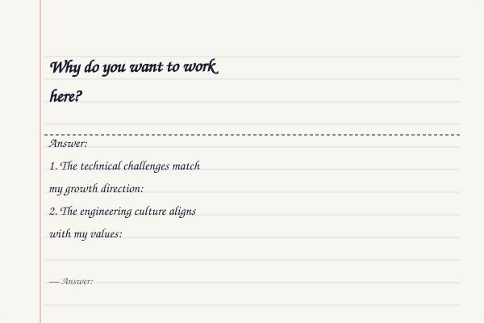
</a>

<a href="../../assets/images/diagrams/java/66-interview-behavioral/why-do-you-want-to-work-here-sticky.svg" target="_blank" rel="noopener">
  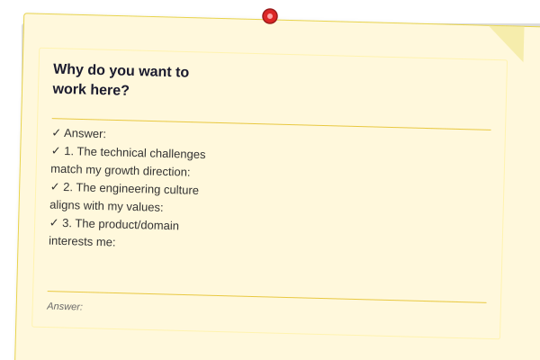
</a>

**Answer:**

I want to work here for three specific reasons that align with what I am looking for in my next role:

**1. The technical challenges match my growth direction:** Your company processes millions of transactions per day. I have spent the last few years building reliable, scalable systems at a smaller scale, and I am ready for the next level of complexity. Specifically, I am drawn to your work on event-driven architectures — I have been studying Kafka and stream processing in my side projects, and I want to apply those skills to real-world problems at scale.

**2. The engineering culture aligns with my values:** From what I have learned about your team — through your engineering blog, conversations with current engineers, and this interview process — you value: blameless post-mortems (I have seen how transformative this is), investment in testing and code quality (I shared my experience with Testcontainers earlier), and a learning culture where engineers are encouraged to grow. These are the same values I try to bring to every team I join.

**3. The product/domain interests me:** I genuinely care about [problem the company solves]. I have been a user of your product for [X months/years], and I have specific ideas about how it could be improved. For example, [mention one thoughtful, specific observation about their product or domain — not a feature request, but a genuine insight that shows you understand their space]. I want to work on a product that I would use myself and care about.

**What I am looking for in my next role more broadly:**
- A place where I can grow technically — working with engineers who are better than me
- A culture of ownership, where engineers are trusted to make decisions and own outcomes
- A healthy balance of product velocity and technical excellence — not a sweatshop and not a ivory tower
- Clear career progression for individual contributors (not just management track)
- A team that does retrospectives, learns from incidents, and continuously improves how they work

**Key lesson:** A good answer to "why do you want to work here" is specific, researched, and genuine. Generic answers ("great company culture," "industry leader") are forgettable. Specific answers ("I have been following your engineering blog's series on Kafka Streams, and I applied similar patterns to my side project") show you have done your homework and are not just applying everywhere. Also, be honest about what you are looking for — it helps the interviewer assess fit and shows self-awareness.

---

### Q101: Describe a time you went above and beyond your job description to help the business.

<a href="../../assets/images/diagrams/java/66-interview-behavioral/describe-a-time-you-went-above-and-beyond-your-job-description-to-help-the-business-sticky.svg" target="_blank" rel="noopener">
  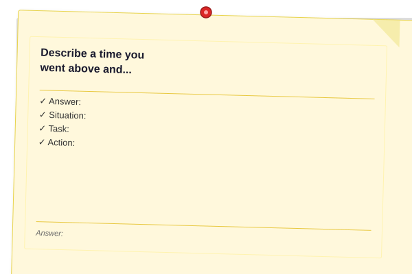
</a>

**Answer:**

**Situation:** Our company was preparing for a SOC 2 Type II audit — a major compliance milestone that would unlock enterprise sales. The audit required evidence of security controls across all systems: access reviews, change management, data encryption, incident response procedures, and vendor risk assessments. The problem: we had no dedicated security or compliance team. The engineering team was responsible for providing all the evidence, but nobody wanted to own it because it was "not engineering work."

**Task:** Lead the engineering-side preparation for the SOC 2 audit — coordinating across 5 engineering teams to gather evidence, document controls, and fix gaps — while continuing my normal feature work. This was far outside my job description as a backend engineer.

**Action:** I volunteered to be the "SOC 2 point person" for engineering, even though it was not my responsibility and I had zero compliance experience. 1) I spent the first week learning: I read the SOC 2 criteria (security, availability, processing integrity, confidentiality, privacy), studied our existing controls, and interviewed the external auditor to understand exactly what evidence they needed. 2) I created a master checklist with 47 controls, mapped to the teams responsible for each, with current status (not started / in progress / complete / evidence ready). 3) I chased down evidence from 5 teams: access logs from DevOps, code review data from our GitHub repos, encryption configurations from the infrastructure team, backup restoration tests from the database team, and incident response logs from the on-call rotation. 4) I found 3 gaps: we were not logging all admin access to production (critical finding), some encryption keys used default values (security risk), and we had never tested a backup restoration (compliance violation). I either fixed these myself (the encryption keys) or created tickets and tracked them to resolution. 5) I organized the evidence into a shared drive with clear naming and auditor-friendly structure. I wrote a 2-page summary for the auditor explaining how each control was implemented.

**Result:** The SOC 2 audit passed with zero findings — which was rare for a first-time audit. The VP of Sales told me that the SOC 2 certification directly contributed to closing 3 enterprise deals worth $500K+ in the following quarter. The compliance work I started became a formal Security team 6 months later, and they used my checklist as the foundation. I learned that going above and beyond does not mean working more hours — it means taking ownership of problems that nobody else wants to solve, even when they are not technically "your job."

**Key lesson:** Some of the most impactful contributions are not in your job description. The willingness to own messy, cross-functional problems — compliance, documentation, onboarding, process improvement — separates good engineers from great ones. These are the contributions that executives notice because they directly impact business outcomes (sales, compliance, risk reduction), even though they do not involve writing code.

---

---

### Q73: How do you approach documentation?

<a href="../../assets/images/diagrams/java/66-interview-behavioral/how-do-you-approach-documentation-handwritten.svg" target="_blank" rel="noopener">
  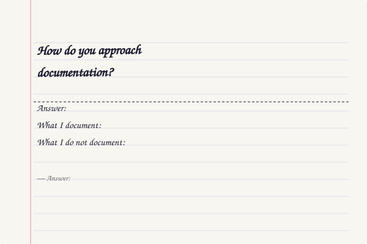
</a>

<a href="../../assets/images/diagrams/java/66-interview-behavioral/how-do-you-approach-documentation-sticky.svg" target="_blank" rel="noopener">
  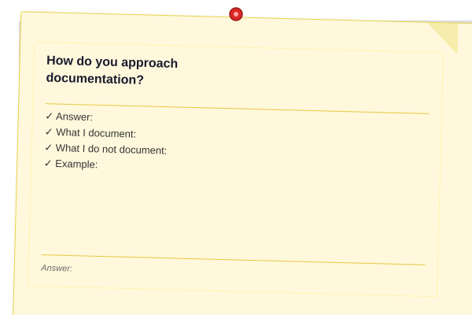
</a>

**Answer:**

I treat documentation as a product for the next person who needs to understand or change my code. Here is my approach:

**What I document:**
1. Architecture decisions (why, not what): I document the rationale behind significant decisions using Architecture Decision Records (ADRs).
2. API contracts: OpenAPI/Swagger for REST APIs, GraphQL schema for GraphQL APIs.
3. Onboarding: A README.md in every repository.
4. Runbooks: For any operational task, a concise checklist.

**What I do not document:**
1. Code comments that explain what the code does.
2. Obvious things.
3. Outdated documentation: wrong docs are worse than no docs.

**Example:** When I joined a new team, their README said "run ./start.sh" — which did not exist. I spent 2 days figuring out the setup and documented everything. The next new hire was productive on day 1 instead of day 3.

---

### Q74: Tell me about a time your project was deprioritized or cancelled.

<a href="../../assets/images/diagrams/java/66-interview-behavioral/tell-me-about-a-time-your-project-was-deprioritized-or-cancelled-handwritten.svg" target="_blank" rel="noopener">
  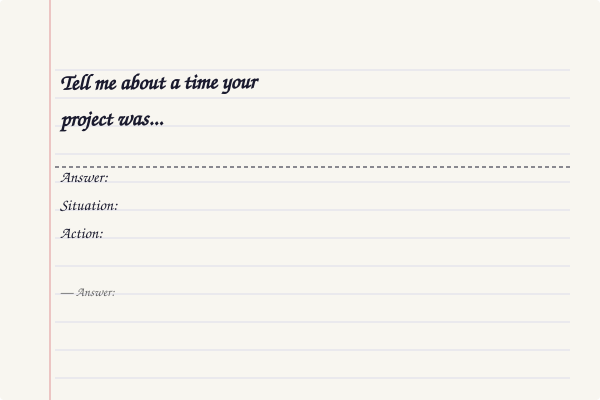
</a>

**Answer:**

**Situation:** I spent 3 months building a customer-facing analytics dashboard. We were 2 weeks from launch when the company announced a pivot to enterprise platform model.

**Action:** 1) I allowed myself 24 hours to be frustrated. 2) I analyzed what was reusable: about 40% of the code. 3) I documented the architecture for future revival. 4) I pivoted to the new priority with full commitment.

**Result:** The dashboard was never revived, but 40% of its code was reused. Pivots are not personal.

---

### Q75: How do you ensure quality in your code?

<a href="../../assets/images/diagrams/java/66-interview-behavioral/how-do-you-ensure-quality-in-your-code-sticky.svg" target="_blank" rel="noopener">
  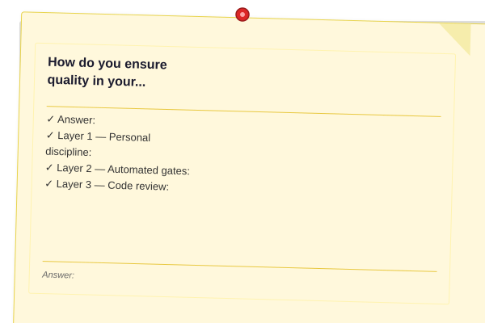
</a>

**Answer:**

**Layer 1 — Personal discipline:** Write tests alongside implementation, run full test suite locally, self-review before requesting reviews.

**Layer 2 — Automated gates:** Static analysis (SpotBugs, Error Prone), test coverage (80% line, 60% branch), build pipeline stages.

**Layer 3 — Code review:** Small PRs (under 400 lines), clear descriptions, prompt responses.

**Layer 4 — Post-deployment:** Canary deployments, monitoring and alerting, feature flags for risky changes.

**Key lesson:** Quality is embedded in every step. No single layer is sufficient.

---

### Q76: Describe a time you worked on a project with a tight deadline.

**Answer:**

**Situation:** 2 weeks to build a COVID-19 contact tracing feature for a healthcare application.

**Action:** 1) Identified the absolute minimum viable feature set. 2) Eliminated non-essential process (no design reviews, one code review instead of two). 3) Worked in focused blocks. 4) Communicated transparently about trade-offs.

**Result:** Deployed on time. Created 23 tech debt tickets repaid over 3 months.

---

### Q77: How do you handle being the most junior person on the team?

<a href="../../assets/images/diagrams/java/66-interview-behavioral/how-do-you-handle-being-the-most-junior-person-on-the-team-diagram.svg" target="_blank" rel="noopener">
  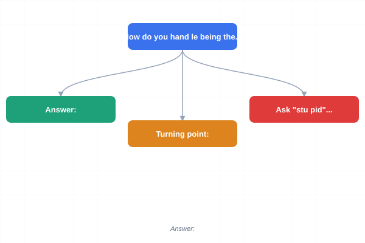
</a>
<a href="../../assets/images/diagrams/java/66-interview-behavioral/how-do-you-handle-being-the-most-junior-person-on-the-team-sticky.svg" target="_blank" rel="noopener">
  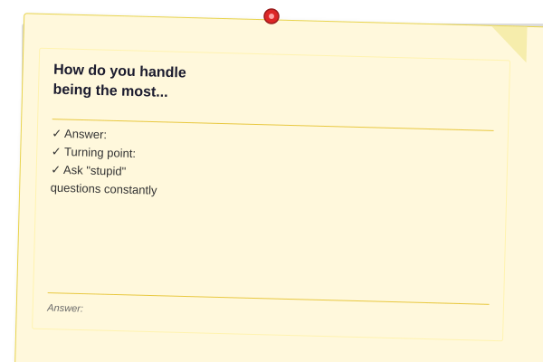
</a>

**Answer:**

1. Ask "stupid" questions constantly.
2. Focus on being useful in small ways: docs, tests, automation.
3. Ask for feedback every 2 weeks.
4. Find a mentor.
5. Study relentlessly outside of work.

**Turning point:** After 6 months, I found a race condition everyone missed. The fix was 3 lines.

---

### Q78: Tell me about a time you delivered bad news to a stakeholder.

**Answer:**

**Situation:** A third-party API feature we depended on was delayed by 3 months, 1 week before launch.

**Action:** 1) Told the account manager immediately. 2) Prepared three options with timelines. 3) Led the client call with empathy and solutions.

**Result:** Client chose the workaround option. Account retained.

---

### Q79: How do you approach learning a new codebase?

<a href="../../assets/images/diagrams/java/66-interview-behavioral/how-do-you-approach-learning-a-new-codebase-handwritten.svg" target="_blank" rel="noopener">
  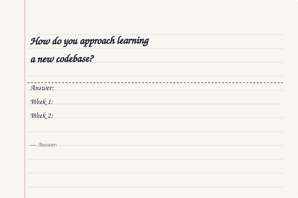
</a>

<a href="../../assets/images/diagrams/java/66-interview-behavioral/how-do-you-approach-learning-a-new-codebase-sticky.svg" target="_blank" rel="noopener">
  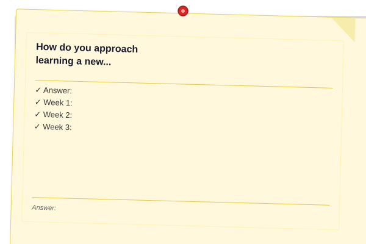
</a>

**Answer:**

**Week 1:** Read README, set up locally, run tests, identify entry points, draw architecture.

**Week 2:** Trace one feature end-to-end, fix a bug, read recent PRs.

**Week 3:** Implement a small feature, write tests, improve documentation.

**Key technique:** Keep a "Things I learned" document.

---

### Q80: Describe a time you made a trade-off between speed and quality.

<a href="../../assets/images/diagrams/java/66-interview-behavioral/describe-a-time-you-made-a-trade-off-between-speed-and-quality-handwritten.svg" target="_blank" rel="noopener">
  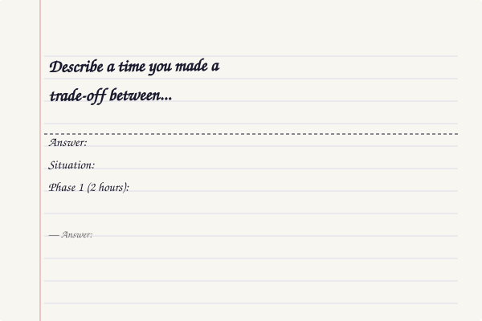
</a>

<a href="../../assets/images/diagrams/java/66-interview-behavioral/describe-a-time-you-made-a-trade-off-between-speed-and-quality-sticky.svg" target="_blank" rel="noopener">
  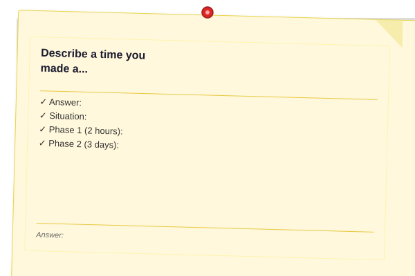
</a>

**Answer:**

**Situation:** Duplicate orders under high load — customers charged twice.

**Phase 1 (2 hours):** Added a database-level unique constraint. Deployed with rollback plan.

**Phase 2 (3 days):** Added pessimistic locking, comprehensive tests, metrics, code review.

**Result:** Speed fix stopped the bleeding. Quality fix prevented recurrence.

---

### Q81: Tell me about a time you dealt with an unreliable system.

**Answer:**

**Situation:** Intermittent outages, 5-30 minutes, 2-3 times per week.

**Action:** Added extensive logging and monitoring. When the outage happened, saw database connection pool exhaustion caused by a monthly report doing full table scans. Added an index and rescheduled the report.

**Result:** Outages stopped. Monitoring dashboard became team template.

---

### Q82: How do you handle working with a difficult product manager?

<a href="../../assets/images/diagrams/java/66-interview-behavioral/how-do-you-handle-working-with-a-difficult-product-manager-handwritten.svg" target="_blank" rel="noopener">
  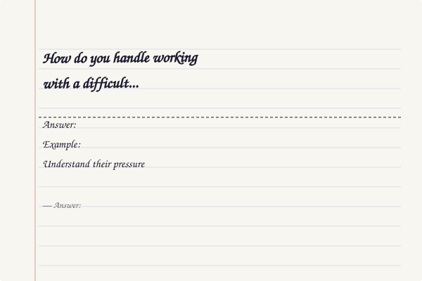
</a>
<a href="../../assets/images/diagrams/java/66-interview-behavioral/how-do-you-handle-working-with-a-difficult-product-manager-diagram.svg" target="_blank" rel="noopener">
  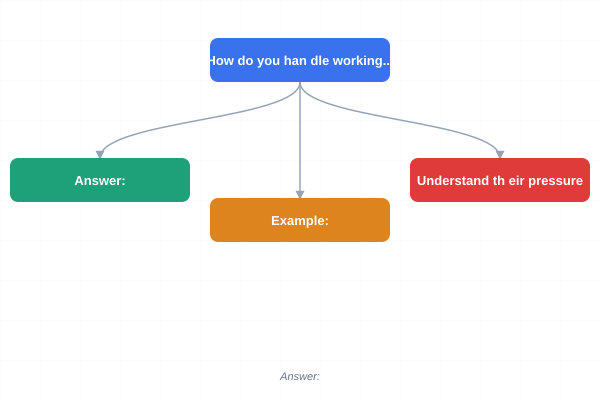
</a>

**Answer:**

1. Understand their pressure.
2. Over-communicate.
3. Bring data to disagreements.
4. Build a personal relationship.

**Example:** A PM changed requirements constantly. I asked why — his boss gave him daily updates. We agreed on weekly updates instead. Problem solved.

---

### Q83: Describe a time you worked on a boring task.

**Answer:**

**Situation:** Migrating 500,000 user records. Repetitive and meticulous.

**Action:** Automated validation, migration, and reconciliation scripts. Built a reusable dashboard. Worked in 90-minute focused blocks.

**Result:** Zero data loss. Dashboard saved 200 hours across future migrations.

---

### Q84: Tell me about a time you advocated for a better engineering practice.

**Answer:**

**Situation:** Team had no code reviews. Developers committed directly to main.

**Action:** 1) Started reviewing code informally. 2) After 2 weeks, some asked for reviews before committing. 3) Proposed lightweight process: one approval for integration branch. 4) Showed data: reviewed code had 50% fewer bugs.

**Result:** 80% of code was being reviewed after 3 months.

---

### Q85: How do you approach making technical decisions?

<a href="../../assets/images/diagrams/java/66-interview-behavioral/how-do-you-approach-making-technical-decisions-handwritten.svg" target="_blank" rel="noopener">
  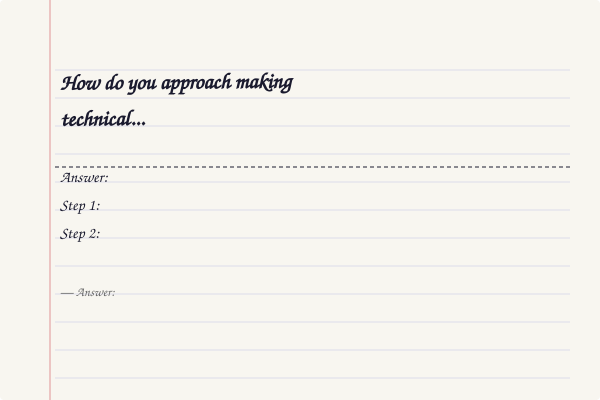
</a>

<a href="../../assets/images/diagrams/java/66-interview-behavioral/how-do-you-approach-making-technical-decisions-sticky.svg" target="_blank" rel="noopener">
  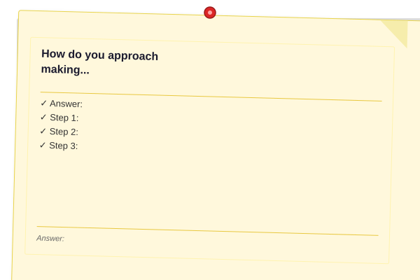
</a>

**Answer:**

**Step 1:** Define the problem.
**Step 2:** Gather requirements (hard vs soft constraints).
**Step 3:** Generate at least 3 options.
**Step 4:** Evaluate with a weighted decision matrix.
**Step 5:** Document with ADR.
**Step 6:** Revisit in 3-6 months.

**Example:** Chose RabbitMQ over Kafka using the matrix. Revisited 2 years later and migrated when throughput grew.

---

### Q86: Tell me about a production incident that kept you up all night.

<a href="../../assets/images/diagrams/java/66-interview-behavioral/tell-me-about-a-production-incident-that-kept-you-up-all-night-handwritten.svg" target="_blank" rel="noopener">
  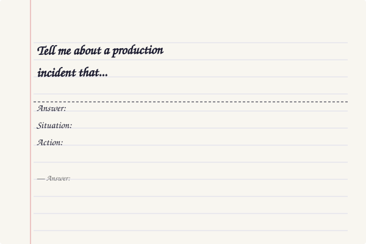
</a>

<a href="../../assets/images/diagrams/java/66-interview-behavioral/tell-me-about-a-production-incident-that-kept-you-up-all-night-sticky.svg" target="_blank" rel="noopener">
  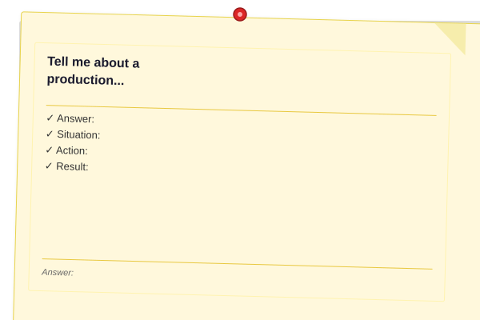
</a>

**Answer:**

**Situation:** 2 AM — production database at 97% disk, growing at 1% per hour.

**Action:** Assessed the batch job failure, verified temp tables were safe to truncate, ran truncation, fixed the script bug, added 80% alert.

**Result:** Database never filled up. Fix took 30 minutes.

---

### Q87: How do you approach giving feedback to a peer?

<a href="../../assets/images/diagrams/java/66-interview-behavioral/how-do-you-approach-giving-feedback-to-a-peer-handwritten.svg" target="_blank" rel="noopener">
  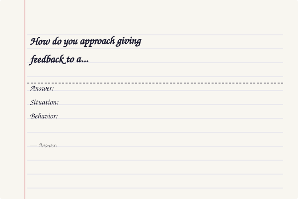
</a>

<a href="../../assets/images/diagrams/java/66-interview-behavioral/how-do-you-approach-giving-feedback-to-a-peer-sticky.svg" target="_blank" rel="noopener">
  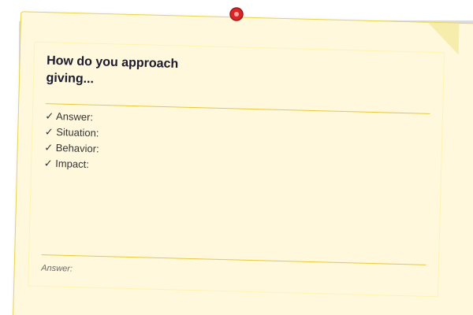
</a>

**Answer:**

Use Situation-Behavior-Impact (SBI) model:

**Situation:** When and where?
**Behavior:** What exactly did they do?
**Impact:** What was the effect?

**Example:** "During yesterday's design review, when you interrupted Sarah, she stopped contributing."

**Principles:** Be timely, specific, kind, ask permission, make it a dialogue.

---

### Q88: Describe a time you handled significant ambiguity.

**Answer:**

**Situation:** Asked to "improve checkout performance" — that was the entire requirement.

**Action:** 1) Defined "performance" with the VP. 2) Added instrumentation. 3) Found the bottleneck (payment step, 12 seconds). 4) Proposed three options.

**Result:** Completion rate went from 60% to 82%. Ambiguity is opportunity.

---

### Q89: Tell me about a time you pushed back on a requirement.

<a href="../../assets/images/diagrams/java/66-interview-behavioral/tell-me-about-a-time-you-pushed-back-on-a-requirement-handwritten.svg" target="_blank" rel="noopener">
  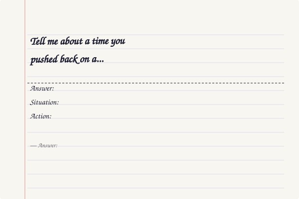
</a>

**Answer:**

**Situation:** Stakeholder requested dark mode from a single customer request. Would take 2-3 sprints.

**Action:** Presented the cost and proposed deferring to next quarter's UI refresh.

**Result:** Dark mode delivered in 1 week instead of 2-3 sprints.

---

### Q90: How do you handle feeling overwhelmed or burned out?

<a href="../../assets/images/diagrams/java/66-interview-behavioral/how-do-you-handle-feeling-overwhelmed-or-burned-out-sticky.svg" target="_blank" rel="noopener">
  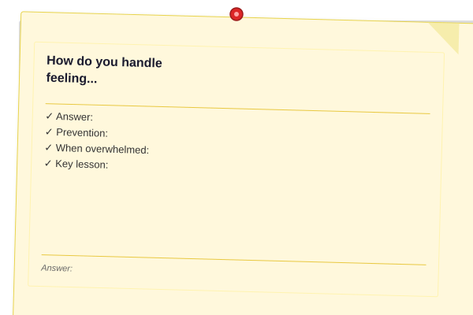
</a>

**Answer:**

**Prevention:** Maintain boundaries, take lunch breaks, use focus blocks, say no.

**When overwhelmed:** Talk to manager, drop non-essentials, take a mental health day.

**Key lesson:** Burnout is not a badge of honor. Protect your energy.

---

### Q91: Tell me about a time you worked on something with high business impact.

<a href="../../assets/images/diagrams/java/66-interview-behavioral/tell-me-about-a-time-you-worked-on-something-with-high-business-impact-handwritten.svg" target="_blank" rel="noopener">
  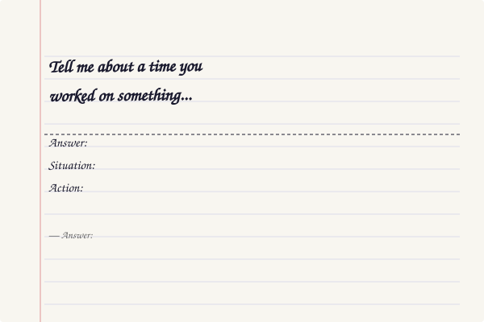
</a>

**Answer:**

**Situation:** Rewriting the pricing engine. A 1% error would cost $500K/year.

**Action:** Comprehensive tests, parallel run in production for 2 weeks, property-based tests, gradual rollout (1% to 100%), kill switch.

**Result:** Zero errors. Parallel run caught 3 edge cases.

---

### Q92: How do you approach decisions with incomplete information?

<a href="../../assets/images/diagrams/java/66-interview-behavioral/how-do-you-approach-decisions-with-incomplete-information-diagram.svg" target="_blank" rel="noopener">
  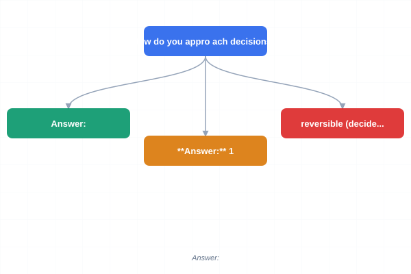
</a>
<a href="../../assets/images/diagrams/java/66-interview-behavioral/how-do-you-approach-decisions-with-incomplete-information-sticky.svg" target="_blank" rel="noopener">
  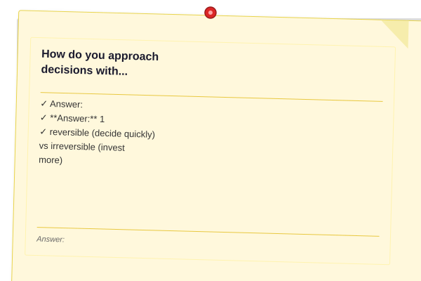
</a>

**Answer:**

1. Classify: reversible (decide quickly) vs irreversible (invest more).
2. Identify what is missing.
3. 70% rule: decide when you have 70% of the information.
4. Build in options (feature flags, modular architecture).
5. Set a decision deadline.

---

### Q93: Describe a time you disagreed with your manager.

<a href="../../assets/images/diagrams/java/66-interview-behavioral/describe-a-time-you-disagreed-with-your-manager-sticky.svg" target="_blank" rel="noopener">
  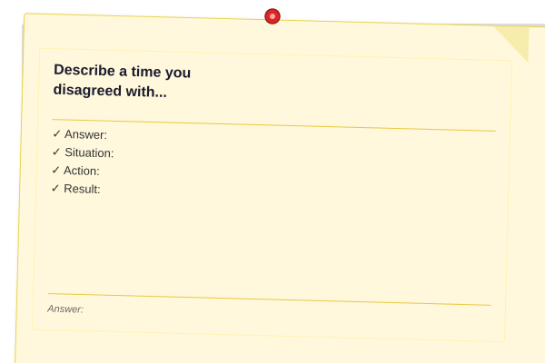
</a>

**Answer:**

**Situation:** Manager wanted to promote a developer who was not ready.

**Action:** Private 1:1, led with shared goals, presented evidence, proposed 90-day development plan.

**Result:** Developer promoted 4 months later when ready. Succeeded in the role.

---

### Q94: Tell me about a time you learned from a failure.

<a href="../../assets/images/diagrams/java/66-interview-behavioral/tell-me-about-a-time-you-learned-from-a-failure-sticky.svg" target="_blank" rel="noopener">
  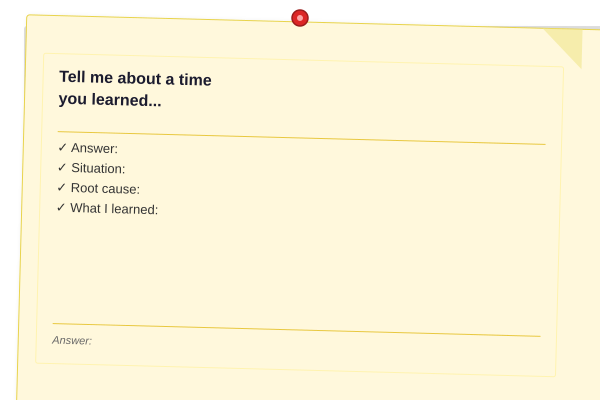
</a>

**Answer:**

**Situation:** Added NOT NULL constraint to a column with existing NULL values. Caused 5-minute outage.

**Root cause:** Staging had no NULL values. Production had 3-year-old NULL values.

**What I learned:** Test against production-like data, always dry-run migrations, two-phase for NOT NULL, always have rollback scripts.

---

### Q95: How do you approach your own career development?

<a href="../../assets/images/diagrams/java/66-interview-behavioral/how-do-you-approach-your-own-career-development-handwritten.svg" target="_blank" rel="noopener">
  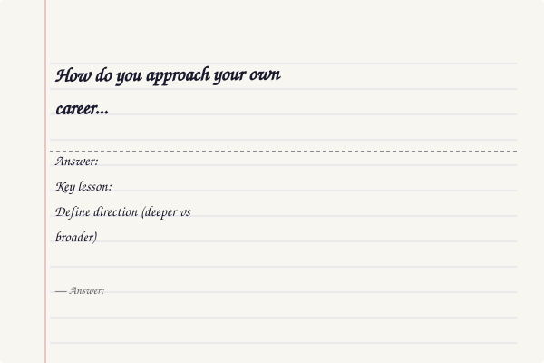
</a>
<a href="../../assets/images/diagrams/java/66-interview-behavioral/how-do-you-approach-your-own-career-development-diagram.svg" target="_blank" rel="noopener">
  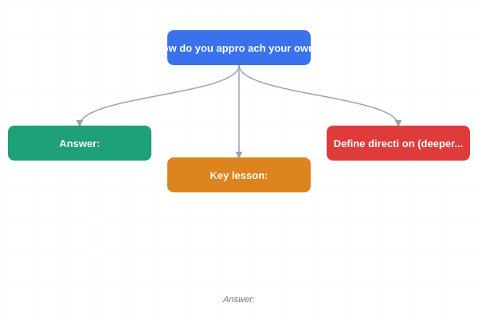
</a>
<a href="../../assets/images/diagrams/java/66-interview-behavioral/how-do-you-approach-your-own-career-development-sticky.svg" target="_blank" rel="noopener">
  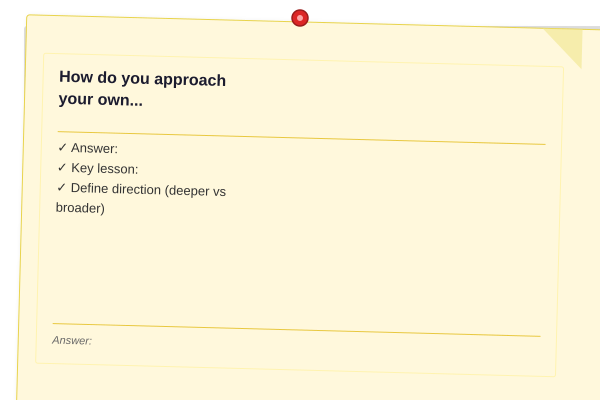
</a>

**Answer:**

1. Define direction (deeper vs broader).
2. Identify gaps against target role.
3. Quarterly learning plan.
4. Seek stretch assignments.
5. Build a network.
6. Reassess every 6 months.

**Key lesson:** Your career is your responsibility, not your employer's.

---

### Q96: What motivates you to do your best work?

**Answer:**

Three things:
1. Solving hard problems with real impact.
2. Learning and growth.
3. Team success.

**What does not motivate me:** Titles or being the smartest person in the room.

---

### Q97: How do you answer "Tell me about yourself"?

<a href="../../assets/images/diagrams/java/66-interview-behavioral/how-do-you-answer-tell-me-about-yourself-sticky.svg" target="_blank" rel="noopener">
  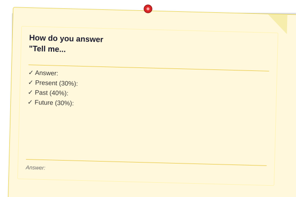
</a>

**Answer:**

Use Present-Past-Future framework:
- **Present (30%):** Current role highlights.
- **Past (40%):** Previous experience and achievements.
- **Future (30%):** What you want next and why this role.

Keep it 60-90 seconds. End with a transition: "That is my background. I would love to hear about the team."

---

### Q98: What is your biggest weakness?

<a href="../../assets/images/diagrams/java/66-interview-behavioral/what-is-your-biggest-weakness-diagram.svg" target="_blank" rel="noopener">
  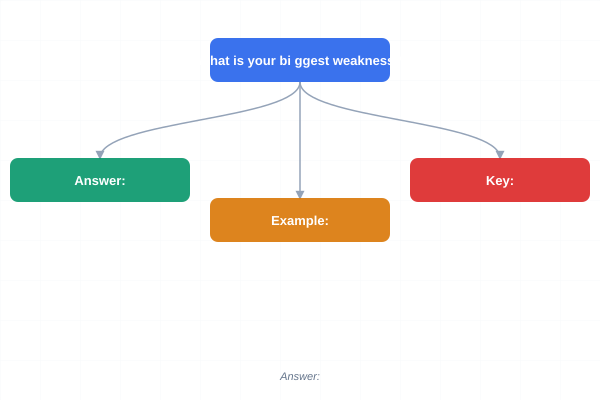
</a>
<a href="../../assets/images/diagrams/java/66-interview-behavioral/what-is-your-biggest-weakness-sticky.svg" target="_blank" rel="noopener">
  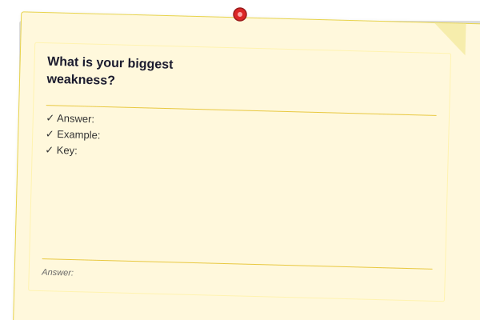
</a>

**Answer:**

Choose a real weakness you are actively improving.

**Example:** "I used to struggle with saying no. I committed to too many tasks and missed deadlines. I now use a WIP limit and say 'let me check my priorities' before committing."

**Key:** Real, fixable, not a core competency for the role.

---

### Q99: Where do you see yourself in 5 years?

**Answer:**

"In 5 years, I want to be a staff engineer designing systems that other teams build. I see this role as a step in that direction. I am also open to how that evolves."

**Key:** Honest direction with flexibility. Show ambition without rigidity.

---

### Q100: What are your salary expectations?

<a href="../../assets/images/diagrams/java/66-interview-behavioral/what-are-your-salary-expectations-handwritten.svg" target="_blank" rel="noopener">
  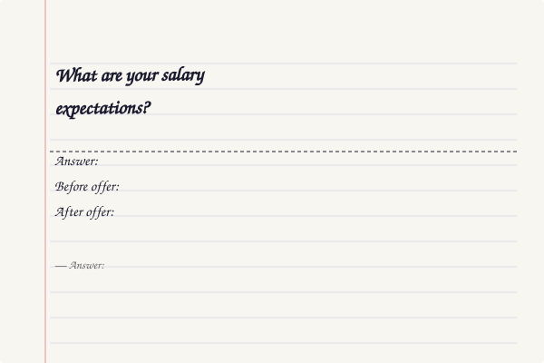
</a>

**Answer:**

**Before offer:** Deflect: "I am happy to discuss compensation after we both feel good about the match."

**After offer:** Research market data, negotiate the full package, be professional.

**Key:** Never give a number first. Research thoroughly. Negotiate respectfully.

---

### Q101: Any questions for me?

<a href="../../assets/images/diagrams/java/66-interview-behavioral/any-questions-for-me-handwritten.svg" target="_blank" rel="noopener">
  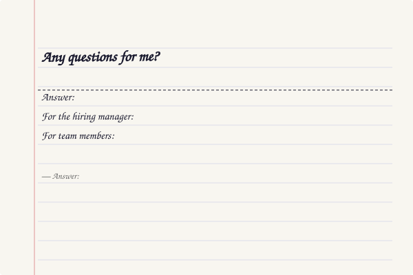
</a>

<a href="../../assets/images/diagrams/java/66-interview-behavioral/any-questions-for-me-sticky.svg" target="_blank" rel="noopener">
  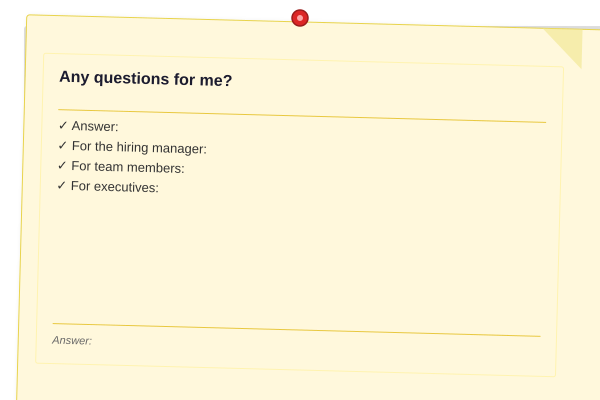
</a>

**Answer:**

**For the hiring manager:** "What does success look like in 90 days?"

**For team members:** "What do you enjoy most about working here?"

**For executives:** "What is the company's vision for the next 2-3 years?"

**Best closing question:** "Based on what we discussed, do you have any concerns about my fit for this role?"

---

### Q102: How do you handle a situation where you are given an impossible deadline?

<a href="../../assets/images/diagrams/java/66-interview-behavioral/how-do-you-handle-a-situation-where-you-are-given-an-impossible-deadline-handwritten.svg" target="_blank" rel="noopener">
  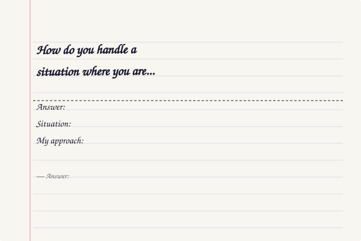
</a>

<a href="../../assets/images/diagrams/java/66-interview-behavioral/how-do-you-handle-a-situation-where-you-are-given-an-impossible-deadline-sticky.svg" target="_blank" rel="noopener">
  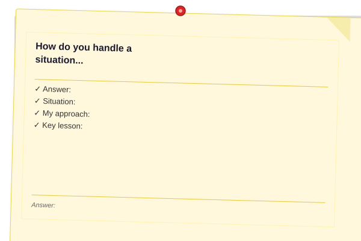
</a>

**Answer:**

**Situation:** A stakeholder promised a client that a feature would be delivered in 2 weeks. I estimated it would take 6 weeks. The stakeholder did not consult the engineering team before making the promise.

**My approach:**

1. I did not say "this is impossible" — that puts the stakeholder on the defensive. Instead, I scheduled a quick call and said: "I understand you promised the client 2 weeks. Let me show you what we can deliver in 2 weeks and what the trade-offs would be."

2. I presented three options:
   - Option A (2 weeks): Deliver a limited version with hardcoded configuration, no tests, manual deployment. This would work for the single client but would need to be rewritten for the second client.
   - Option B (4 weeks): Deliver a configurable version with basic tests and automated deployment. Would work for the current client and be extendable.
   - Option C (6 weeks): Full implementation with proper architecture, comprehensive tests, documentation, and CI/CD.

3. I recommended Option B and asked: "What if we deliver Option A in 2 weeks to meet the client commitment, then invest 2 more weeks to make it production-quality?" The stakeholder agreed.

4. We delivered the basic version in 2 weeks and the full version in 4 weeks. The client never knew about the shortcut. The stakeholder learned to consult engineering before making timeline promises.

**Key lesson:** When given an impossible deadline, do not say "no" — show the trade-offs and let the stakeholder choose. Most stakeholders will pick a reasonable option if you present the consequences clearly. Protect the relationship while protecting the team.

---

### Q103: Tell me about a time you had to deal with a situation where you were not given clear requirements.

**Answer:**

**Situation:** I was asked to build a "reporting dashboard" — no mockups, no data sources specified, no user stories. Just "build something that shows our business metrics."

**My approach:**

1. I scheduled a 30-minute meeting with the requester and asked five questions:
   - Who is the audience for this dashboard?
   - What decision will they make based on this data?
   - What is the most important metric they need to see?
   - What is the data source for that metric?
   - What is the minimum useful version of this dashboard?

2. The answers revealed: the audience was the CEO, the decision was "which product lines to invest in," the most important metric was revenue by product category, and the data source was a PostgreSQL analytics database.

3. I built a minimal dashboard with a single chart showing revenue by product category over time. I deployed it and asked the CEO for feedback. She said: "This is great. Can I also see profit margins?" I added profit margins. Then she asked for regional breakdowns. Each iteration was 1-2 days.

4. After 4 iterations, the dashboard had everything she needed. Starting with the absolute minimum and iterating based on real feedback was far more efficient than trying to gather all requirements upfront.

**Key lesson:** When requirements are unclear, do not try to gather them all upfront. Build the smallest useful thing and iterate based on feedback. The requirements will emerge as people see and use what you built. Requirements gathering without a prototype is just speculation.

---

### Q104: How do you approach writing a postmortem after an incident?

<a href="../../assets/images/diagrams/java/66-interview-behavioral/how-do-you-approach-writing-a-postmortem-after-an-incident-handwritten.svg" target="_blank" rel="noopener">
  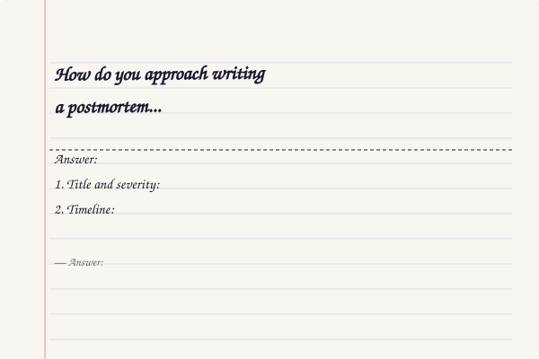
</a>

**Answer:**

I follow the blameless postmortem format popularized by Google SRE:

**1. Title and severity:** Brief description of the incident and its severity level.

**2. Timeline:** A minute-by-minute account of what happened, when it was detected, when it was mitigated, and when it was resolved. This is the most important section because it reveals the gaps in detection and response.

**3. Impact:** What was affected? How many users? How much downtime? Revenue impact? Data loss?

**4. Root cause:** What caused the incident? This is a technical analysis, not a person analysis. The root cause should be something that can be fixed in the system, not something that blames a person.

**5. Trigger:** What caused the root cause to manifest at this particular time? (A deployment, a traffic spike, a scheduled job, etc.)

**6. Detection:** How was the incident detected? (Automated alert, customer report, manual observation) How long did it take to detect?

**7. Response:** How was it mitigated? How long did mitigation take? What worked well? What could have been faster?

**8. Action items:** Specific, measurable, assigned tasks to:
   - Prevent recurrence (fix the root cause)
   - Improve detection (better alerting)
   - Improve response (runbooks, automation)
   - Each action item has an owner and a deadline.

**9. Lessons learned:** What did we learn about our system, our processes, or our team?

**Example action items from a real postmortem:**
- Add an alert at 80% database disk usage (owner: infra team, deadline: 1 week)
- Add a dry-run mode to all database migrations (owner: platform team, deadline: 2 weeks)
- Create a runbook for database disk full scenarios (owner: on-call team, deadline: 1 month)

**Key lesson:** A good postmortem is not about blame — it is about learning. Every incident is a free lesson about your system. The goal is to extract that lesson and turn it into improvements. If your postmortems do not result in action items, they are wasted.

---

### Q105: How do you answer "Why do you want to leave your current job?"

<a href="../../assets/images/diagrams/java/66-interview-behavioral/how-do-you-answer-why-do-you-want-to-leave-your-current-job-diagram.svg" target="_blank" rel="noopener">
  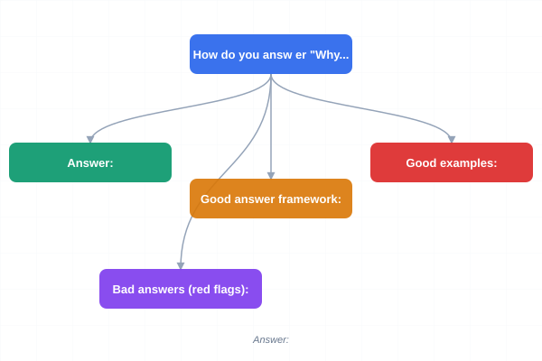
</a>
<a href="../../assets/images/diagrams/java/66-interview-behavioral/how-do-you-answer-why-do-you-want-to-leave-your-current-job-sticky.svg" target="_blank" rel="noopener">
  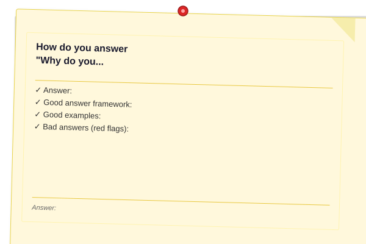
</a>

**Answer:**

This is one of the most important questions in an interview. The wrong answer can disqualify you immediately.

**Good answer framework:**
Frame it as moving toward something positive rather than running away from something negative.

**Good examples:**
- "I am looking for more challenging technical problems. My current role has become comfortable, and I want to push myself to grow."
- "I want to work on a larger scale. My current system handles X requests per day, and I am excited by the opportunity to work on systems handling 10X."
- "I want to work with a specific technology stack. My current company uses older technology, and I want to work with modern tools."
- "I am looking for more ownership. In my current role, I implement features that are fully specified by others. I want to be involved in the design and architecture decisions."

**Bad answers (red flags):**
- Complaining about your manager, coworkers, or company culture. The interviewer will wonder if you will say the same about them in a year.
- "I want more money." Even if true, frame it differently: "I am looking for a role that recognizes my experience level."
- "There was nothing left for me to learn." This sounds arrogant.

**My actual answer:**
"I have learned a tremendous amount at my current company — I built their microservices architecture from scratch and scaled it to handle 10M requests per day. But I have done that now. I am ready for the next challenge: working on an even larger scale with a team of experienced engineers I can learn from. Your company's work on distributed transactions is exactly the kind of problem I want to tackle next."

**Key lesson:** Frame your reason for leaving as excitement about the new opportunity, not dissatisfaction with the old one. Interviewers want to hire someone who is running toward something, not running away from something.

---

### Q106: What do you do when you disagree with a code review comment?

**Answer:**

Code review disagreements are normal and healthy. My approach:

**1. Assume good intent:** The reviewer is trying to improve the code, not criticize me. I start by thanking them for the comment.

**2. Understand their perspective:** I ask clarifying questions before defending my approach. "What specific concern do you have about this approach?" Sometimes the reviewer has context I do not.

**3. Present my reasoning, not my ego:** "I chose this approach because [reason]. Here are the trade-offs I considered. What am I missing?" This invites collaboration rather than debate.

**4. Seek the best outcome, not victory:** The goal is the best code, not for me to be right. If the reviewer's approach is better, I accept it graciously. If mine is better and I can explain why, they will usually agree.

**5. Escalate when necessary:** If we genuinely disagree after discussion, I ask a third person for a tie-breaker or escalate to the tech lead. This is rare but sometimes necessary.

**Example:** A reviewer asked me to use a switch statement instead of a Map of handlers. I had used the Map pattern because it was more extensible (new handlers could be added without modifying the dispatch code). I explained the extensibility concern. The reviewer agreed and accepted the Map approach. The discussion took 2 minutes and improved both our understanding of the design trade-offs.

**Key lesson:** Code review disagreements are not conflicts — they are design discussions. The goal is better code, not winning an argument. If you approach every comment with curiosity rather than defensiveness, you will learn something from every review and build better relationships with your reviewers.

---

### Q107: How do you handle working in a remote or distributed team?

<a href="../../assets/images/diagrams/java/66-interview-behavioral/how-do-you-handle-working-in-a-remote-or-distributed-team-sticky.svg" target="_blank" rel="noopener">
  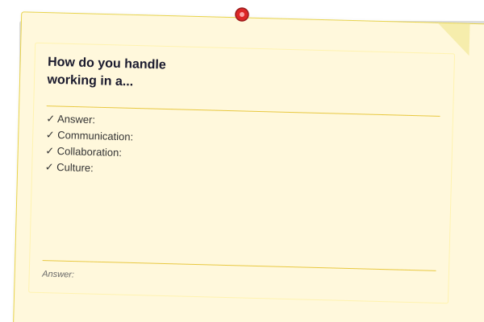
</a>

**Answer:**

I have worked on distributed teams for 5 years. Here is what I have learned:

**Communication:**
1. Over-communicate in writing: I write decisions, status updates, and design documents as if the reader has zero context. Because they often do.
2. Default to public channels: I ask questions in team channels rather than DMs whenever possible. This helps the whole team learn.
3. Record meetings: Not everyone can attend every time zone. Recorded meetings with written summaries ensure everyone stays informed.

**Collaboration:**
1. Use pair programming sessions for complex work. Remote pair programming via VS Code Live Share or similar tools is nearly as effective as in-person.
2. Keep PRs small and responsive. Review PRs within 4 hours during working hours.
3. Use async standups (text-based updates in Slack) rather than synchronous meetings. Save meetings for discussions that genuinely need real-time interaction.

**Culture:**
1. Schedule virtual coffee chats with team members. Building relationships intentionally is harder remotely but just as important.
2. Be explicit about expectations. "I am stepping away for lunch from 12-1" prevents the anxiety of wondering why someone is not responding.
3. Be patient with time zone differences. I schedule my focused work during overlap hours and leave asynchronous work for non-overlap hours.

**Key lesson:** Remote work is not about replicating office culture online. It is about building a new culture optimized for asynchronous, written communication. The teams that succeed remotely are not the ones with the best video conferencing — they are the ones with the best documentation, the clearest expectations, and the most intentional relationship-building.

---

### Q108: How do you stay current with new technology?

<a href="../../assets/images/diagrams/java/66-interview-behavioral/how-do-you-stay-current-with-new-technology-sticky.svg" target="_blank" rel="noopener">
  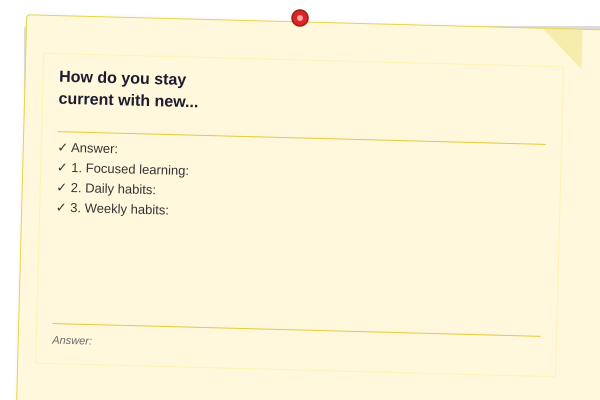
</a>

**Answer:**

I use a structured approach to stay current without burning out:

**1. Focused learning:**
I do not try to learn everything. I pick 1-2 topics per quarter to go deep on. This quarter it is Kubernetes operators and Spring Modulith. Last quarter it was WebFlux and reactive programming.

**2. Daily habits:**
- 20 minutes of reading before work: Hacker News, relevant subreddits, engineering blogs from companies I admire (Netflix, Uber, Stripe, Discord).
- Twitter/LinkedIn follow lists curated for technical content.
- One technical article per day, saved to a reading list.

**3. Weekly habits:**
- One hour on Saturday for hands-on experimentation: build something small with a new technology.
- Review the "Who is hiring" threads to see what technologies companies are using.

**4. Monthly habits:**
- Attend one meetup or conference talk (virtual or in-person).
- Read one technical book chapter.

**5. Quarterly habits:**
- Build a small project using a technology I have never used before. This is the most effective way to learn.
- Review and update my skill inventory: what do I know well? What is becoming outdated? What is emerging?

**Key lesson:** You cannot learn everything. The key is focus: go deep on what matters for your career direction, and stay aware of everything else without trying to master it. The most valuable skill is not knowing a specific technology — it is knowing how to quickly learn any technology when you need it.

---

### Q109: How do you answer a technical question you do not know in an interview?

<a href="../../assets/images/diagrams/java/66-interview-behavioral/how-do-you-answer-a-technical-question-you-do-not-know-in-an-interview-sticky.svg" target="_blank" rel="noopener">
  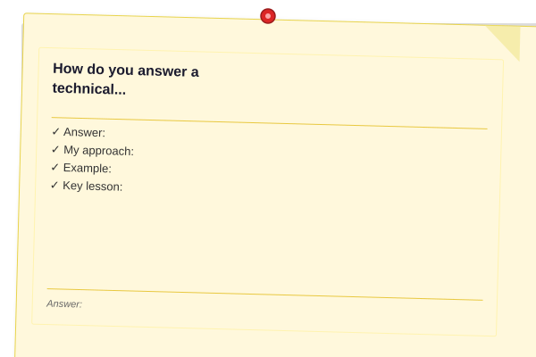
</a>

**Answer:**

Do not bluff. Interviewers can tell when you are making things up, and it destroys your credibility. Instead:

**My approach:**
1. "I do not know the answer off the top of my head, but let me reason through it."
2. Then I reason aloud: what I know, what I am unsure about, and how I would figure it out.
3. If appropriate, I ask clarifying questions that show I am thinking about the right things.

**Example:**
Interviewer: "How does ConcurrentHashMap achieve thread safety internally?"
Me: "I know it uses a combination of techniques, but I do not remember the exact implementation details. Let me reason through it. It needs to support concurrent reads and writes. I know it uses internal segments or bins, and it uses CAS operations for some operations and synchronized blocks for others. In Java 8+, I believe it switched from the segment-based approach to a more fine-grained locking approach using the individual bins. I also know that reads are generally lock-free. How would I find out? I would look at the OpenJDK source code or read the Java specification. Does that answer your question, or would you like me to go deeper on any part?"

This answer shows:
- Honesty about what I do not know.
- Structured thinking about the problem.
- Knowledge of the general approach even if the specifics are fuzzy.
- A method for finding the answer.

**Key lesson:** "I do not know" is a perfectly acceptable interview answer if followed by "let me reason through it." Interviewers are testing how you think, not whether you have memorized the Java specification. A candidate who says "I do not know but here is how I would figure it out" is more impressive than a candidate who gives a confidently wrong answer.

---

### Q110: What advice would you give to a junior developer starting their career?

<a href="../../assets/images/diagrams/java/66-interview-behavioral/what-advice-would-you-give-to-a-junior-developer-starting-their-career-sticky.svg" target="_blank" rel="noopener">
  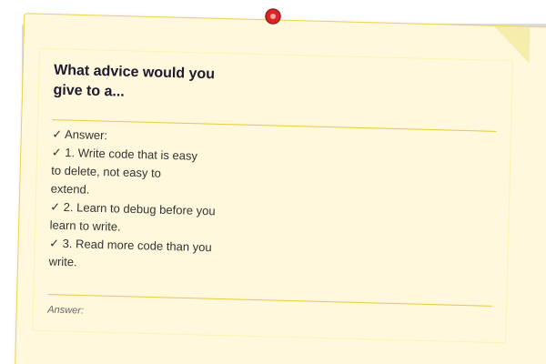
</a>

**Answer:**

Here are the five most important lessons I have learned:

**1. Write code that is easy to delete, not easy to extend.**
Junior developers often over-engineer — they build abstractions and frameworks for future requirements that never come. Write simple code that solves the current problem. You can always change it later when the requirements are clearer. Code that is easy to delete is easy to replace with something better.

**2. Learn to debug before you learn to write.**
The most valuable skill in software engineering is debugging — systematically finding and fixing problems. Learn to read stack traces, use a debugger, add logging strategically, and bisect problems. A great debugger is more valuable than a great coder.

**3. Read more code than you write.**
Read the codebase. Read the libraries you depend on. Read your team's PRs. Reading code is how you learn patterns, conventions, and techniques. The best engineers I know spend at least as much time reading code as writing it.

**4. Ask questions early and often.**
Junior developers often spend hours stuck on something that a senior engineer could answer in 2 minutes. The rule I give: if you are stuck for more than 30 minutes, ask. The fear of looking stupid is the enemy of learning. And here is the secret: asking questions makes you look smart, not stupid. It shows you are engaged and want to learn.

**5. Invest in your communication skills.**
The difference between a good engineer and a great engineer is often communication. Learn to write clear documentation, give constructive code reviews, present technical ideas to non-technical audiences, and write convincing design documents. Technical skill gets you in the door; communication skill determines how far you go.

**Key lesson:** The first year of your career is about learning how to learn. Do not worry about being productive — worry about building good habits. The productivity will follow.

---

### Q111: Describe a time you had to deal with a situation where a team member was not pulling their weight.

**Answer:**

**Situation:** A team member consistently delivered late, incomplete, or low-quality work. The rest of the team had to pick up the slack. Tensions were rising. The tech lead was hesitant to address it directly.

**Task:** Address the performance issue constructively without damaging team morale or creating a hostile environment.

**Action:** 1) I gathered specific examples of missed deadlines, incomplete work, and quality issues over the past 2 weeks. I wanted facts, not impressions. 2) I asked the person for a private 1:1. I started by asking how they were doing — not jumping straight into the performance issue. They opened up about personal challenges affecting their work. 3) I said: "I have noticed that the last few tasks have been challenging. I want to help. What is the biggest obstacle you are facing right now?" They mentioned unclear requirements and feeling overwhelmed by the complexity. 4) I asked: "Would it help if we pair on the next task?" They agreed. We paired for 3 days. During that time, I observed that they were struggling with the business domain knowledge, not the technical skills. They understood the code but not the business rules. 5) I suggested they spend more time with the product manager to understand the domain. I also recommended breaking tasks into smaller, well-defined pieces. Over the next 2 weeks, their delivery improved significantly.

**Result:** The team member became productive within a month. The issue was not laziness or lack of skill — it was a mismatch between the task complexity and their domain knowledge. The pairing sessions transferred the missing context. The rest of the team was relieved that the issue was resolved without escalation.

**Key lesson:** When a team member is underperforming, assume it is a capability or context problem, not a motivation problem. Most people want to do good work. The question is: what is preventing them? Pair programming is the most effective way to diagnose and address the gap. Escalation and discipline should be the last resort, not the first.

---

### Q112: Tell me about a time you had to refactor a large, complex system.

**Answer:**

**Situation:** We had a monolithic payment processing system that had grown over 7 years to 200,000 lines of code. It was fragile — any change took weeks because nobody fully understood the code. Bugs were common. Developer morale was low because everyone was afraid to touch it.

**Task:** Refactor the monolith into a maintainable system without stopping feature development or causing production issues.

**Action:** I used the Strangler Fig pattern:

**Phase 1 (2 months) — Understand and isolate:** I spent the first 2 weeks mapping the system: what modules existed, how they communicated, what external dependencies they had. I identified 6 bounded contexts within the monolith. I then added a layer of abstraction between each context — a thin interface that could later be replaced by a microservice. This change was safe (no behavior change) and could be deployed without risk.

**Phase 2 (3 months) — Extract one context at a time:** I started with the simplest context: the notification system (email and SMS sending). I extracted it into a standalone service. The old code was modified to call the new service via HTTP instead of direct method calls. This took 3 weeks. Each subsequent extraction was faster because we had established the pattern.

**Phase 3 (1 month) — Clean up:** After all 6 contexts were extracted, the monolith was down to 40,000 lines of shared code (auth, logging, configuration). I refactored this into a library that the services depended on.

**During the entire 6-month process:** We continued shipping new features. Each extraction was invisible to the end user. We had a rollback plan for every deployment. We wrote characterization tests before refactoring any section to ensure behavior was preserved.

**Result:** The monolith was replaced by 6 microservices and a shared library. Deployment time went from 2 hours to 10 minutes. Bug rates dropped by 60%. Developer satisfaction improved. The project was completed in 6 months without a single production incident related to the refactoring.

**Key lesson:** Large refactoring should be done incrementally and invisibly. The Strangler Fig pattern allows you to replace a system piece by piece while continuing to deliver value. Characterization tests are essential — they tell you if you changed behavior. Never refactor without tests, even if you have to write them first as part of the refactoring.

---

### Q113: What is the most important quality you look for when hiring?

<a href="../../assets/images/diagrams/java/66-interview-behavioral/what-is-the-most-important-quality-you-look-for-when-hiring-handwritten.svg" target="_blank" rel="noopener">
  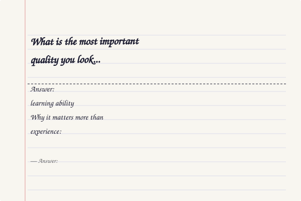
</a>

<a href="../../assets/images/diagrams/java/66-interview-behavioral/what-is-the-most-important-quality-you-look-for-when-hiring-sticky.svg" target="_blank" rel="noopener">
  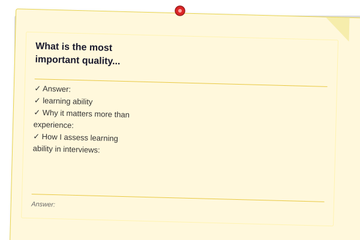
</a>

**Answer:**

The most important quality I look for is **learning ability** — the capacity to quickly understand new concepts and apply them effectively.

**Why it matters more than experience:**
- Experience is specific to what you have already done. Learning ability determines what you can do next.
- Technologies change every 2-3 years. Specific knowledge (e.g., "I know Spring Boot 2.x") has a shelf life. Learning ability does not.
- A fast learner with 2 years of experience will outperform a slow learner with 10 years in most new situations.

**How I assess learning ability in interviews:**
1. I ask about a technology they do not know and see how they approach learning it. Do they say "I would read the documentation and build a prototype"? Good. Do they say "I would ask someone"? Less good.
2. I ask about a mistake they made and what they learned from it. The quality of the learning is more important than the severity of the mistake.
3. I present a new problem (not a standard algorithm question) and see how they reason through it. I care about their thinking process, not whether they get the right answer.

**Other qualities I look for:**
- **Communication:** Can they explain complex ideas clearly?
- **Collaboration:** Do they talk about "we" or "I"? Do they credit others?
- **Ownership:** Do they take responsibility for outcomes, not just tasks?
- **Humility:** Do they acknowledge what they do not know?

**What I do not care about:**
- Specific framework experience (I can teach Spring Boot; I cannot teach curiosity).
- Years of experience (a proxy for knowledge, but a weak one).
- Pedigree (school, previous company names).

**Key lesson:** Hire for learning ability and character. Train for technical skills. A curious, humble, fast learner with 2 years of experience will outperform an arrogant expert with 10 years every time. The best predictor of future growth is past growth — look for people who have consistently expanded their skills and taken on new challenges.

---

### Q114: How do you handle a situation where you have too many meetings and not enough time to code?

<a href="../../assets/images/diagrams/java/66-interview-behavioral/how-do-you-handle-a-situation-where-you-have-too-many-meetings-and-not-enough-time-to-code-sticky.svg" target="_blank" rel="noopener">
  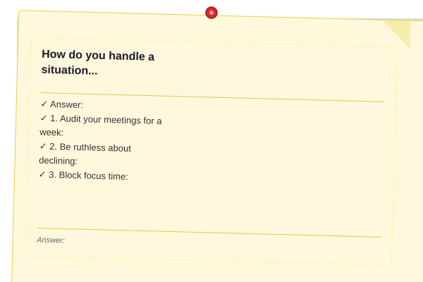
</a>

**Answer:**

This is a common challenge for senior engineers. Here is my approach:

**1. Audit your meetings for a week:**
Track every meeting you attend and categorize it: essential (you are the decision-maker), useful (you contribute), optional (you are just informed), waste (could be an email). Most people find that 30-40% of their meetings are optional or waste.

**2. Be ruthless about declining:**
- If there is no agenda, decline and ask for one.
- If you are CC'd but not required, decline politely: "I trust the team to make the right decision. Please share the notes."
- If the meeting could be an email, suggest async communication instead.

**3. Block focus time:**
I block 3 hours every morning (9 AM to 12 PM) as "no meeting" time on my calendar. I schedule all my meetings in the afternoon. If someone tries to book over my focus time, the calendar automatically declines. I treat this time as non-negotiable.

**4. Use meeting shapes:**
- Status updates: async (Slack, written updates).
- Design discussions: synchronous but with a written proposal circulated 24 hours in advance so everyone comes prepared.
- Decision meetings: synchronous, short (30 minutes max), with a clear decision-maker and a deadline.

**5. Delegate attendance:**
If there is a meeting where I am not essential, I ask a team member to attend and report back. This develops their context and frees my time.

**Key lesson:** Meetings are not a sign of productivity — they are a tax on productivity. The most effective senior engineers I know attend fewer meetings, not more. They protect their focus time ruthlessly and communicate async. If you are spending more than 20% of your week in meetings, you are probably in too many.

---

### Q115: What is your approach to testing?

<a href="../../assets/images/diagrams/java/66-interview-behavioral/what-is-your-approach-to-testing-sticky.svg" target="_blank" rel="noopener">
  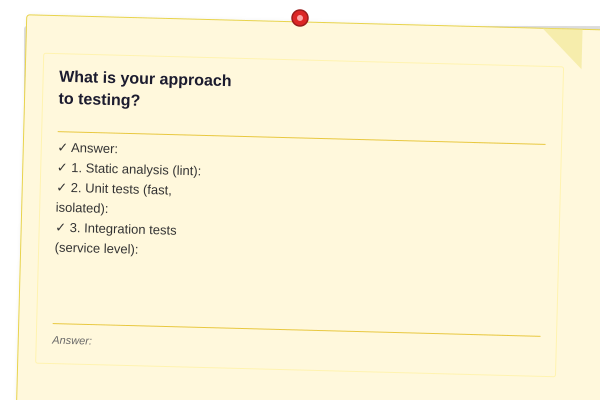
</a>

**Answer:**

I follow the Testing Trophy model (coined by Kent C. Dodds) rather than the traditional testing pyramid:

**1. Static analysis (lint):** Catch type errors and syntax issues before tests even run. TypeScript and Java compile-time checks catch 30% of potential bugs.

**2. Unit tests (fast, isolated):** Test individual functions and methods. These should be fast (milliseconds) and reliable (no network, no database). Target: thousands of tests, running in seconds.

**3. Integration tests (service level):** Test the interaction between components — controller + service + repository, with real database and real HTTP calls. These are the most valuable tests because they test the actual behavior of the system. Target: hundreds of tests.

**4. End-to-end tests (browser level):** Test critical user journeys through the full system. These are expensive to write and maintain, so I only write them for the most critical paths (login, payment, core feature). Target: dozens of tests.

**My testing principles:**
- **Test behavior, not implementation:** Tests should verify what the system does, not how it does it. Implementation tests break on every refactoring. Behavior tests break only when behavior changes.
- **Write tests that fail for one reason:** If a test covers too much, it is hard to diagnose failures.
- **Use realistic data:** Tests that use fake data (all strings, no nulls, no edge cases) miss real bugs. Use production-like data.
- **Test error paths, not just happy paths:** 80% of production bugs are in error handling. Every test for the happy path should have a corresponding test for the error path.
- **Make tests readable:** Test names should describe the scenario and expected outcome. "Should return 400 when email is missing" is better than "testValidation."

**Key lesson:** Integration tests provide the best return on investment. Unit tests are too isolated (they pass even when the system is broken). E2E tests are too slow and brittle. Integration tests at the service level catch real bugs without the maintenance burden of E2E tests. If I could only have one type of test, it would be integration tests with a real database.

---

### Q116: How do you approach on-call rotations?

<a href="../../assets/images/diagrams/java/66-interview-behavioral/how-do-you-approach-on-call-rotations-sticky.svg" target="_blank" rel="noopener">
  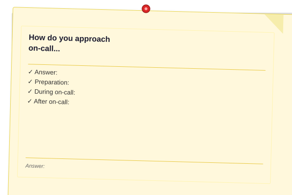
</a>

**Answer:**

I treat on-call as a product — the product is reliability. Here is my approach:

**Preparation:**
1. I ensure every service has a runbook: a step-by-step guide for the most common incidents (high latency, errors, disk full, memory leak, database slow). A good runbook answers: "How do I know this is happening? What do I check first? What is the quick fix? What is the permanent fix? Who do I escalate to?"
2. I set up proper monitoring and alerting before going on-call. Alert on symptoms (error rate, latency), not causes (CPU usage). Symptoms tell you something is wrong. Causes are for debugging.
3. I ensure there is an escalation path: if I cannot resolve the issue in 30 minutes, who do I call?

**During on-call:**
1. Acknowledge the alert immediately. Silence is worse than a wrong answer.
2. Assess severity: Is this a P0 (users are affected, immediate action required) or P1 (can wait 30 minutes)?
3. For P0: stop the bleeding first (rollback, redirect traffic, restart service), then investigate.
4. For P1: investigate first, then fix.
5. Document everything in the incident channel: what you see, what you are trying, what the result is. This helps anyone joining the incident and creates the postmortem timeline.

**After on-call:**
1. Write a brief postmortem for any significant incident.
2. Update the runbook if the incident revealed a gap.
3. If the same alert fires repeatedly without action, silence it and create a ticket — alert fatigue is dangerous.

**Key lesson:** Good on-call is about preparation, not heroics. The goal is not to be the hero who saves the day — it is to have systems and runbooks so good that nobody needs to be a hero. If you are paged for the same issue twice, fix it permanently. If you are paged for something that could be automated, automate it. Good on-call gets quieter over time.

---

### Q117: Tell me about a time you had to deliver bad news to a stakeholder.

**Answer:**

**Situation:** Two weeks before a major release, we discovered a performance issue that would delay the launch by at least a month. The business had already marketed the release date. Marketing materials were printed. The CEO was personally invested in this launch.

**Task:** Deliver the bad news to the CEO and the product team without being fired or causing panic.

**Action:** 1) I gathered data before the conversation. I had concrete numbers: "Under 10,000 concurrent users, the system works fine. Above 10,000, response times degrade from 200ms to 8 seconds. Our launch is expected to have 50,000 concurrent users." I also had a proposed solution with a timeline: "We need to optimize the database queries and add caching. This will take 4 weeks." 2) I scheduled a meeting with the CEO, product manager, and engineering manager. I started with: "I have good news and bad news. The good news: the feature works and the testers love it. The bad news: it does not scale to the expected launch traffic. Here is what I found and here is what I recommend." 3) I presented the data, the mitigation plan, and the adjusted timeline. I also offered options: "Option A: delay the launch by 4 weeks and ship a solid product. Option B: launch on time with a note that the product is for smaller teams, and scale up gradually. Option C: launch on time with a technical preview label and fix it in the next sprint." 4) The CEO chose Option A (delay 4 weeks). He was relieved to have a clear plan and a confident recommendation.

**Result:** The launch was delayed by 4 weeks. The product was stable from day one. The CEO thanked me for being transparent and proactive. I learned that bad news delivered early with data and a plan is much better than bad news delivered late with just excuses.

**Key lesson:** Bad news does not get better with time. Deliver it early. Always come with data and a proposed solution, not just a problem. Stakeholders can handle bad news — what they cannot handle is surprises and indecision. The question they want answered is not "why is this happening" but "what are you going to do about it."

---

### Q118: How do you handle technical debt?

<a href="../../assets/images/diagrams/java/66-interview-behavioral/how-do-you-handle-technical-debt-handwritten.svg" target="_blank" rel="noopener">
  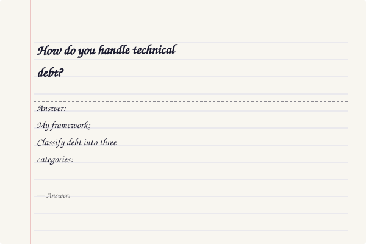
</a>

<a href="../../assets/images/diagrams/java/66-interview-behavioral/how-do-you-handle-technical-debt-sticky.svg" target="_blank" rel="noopener">
  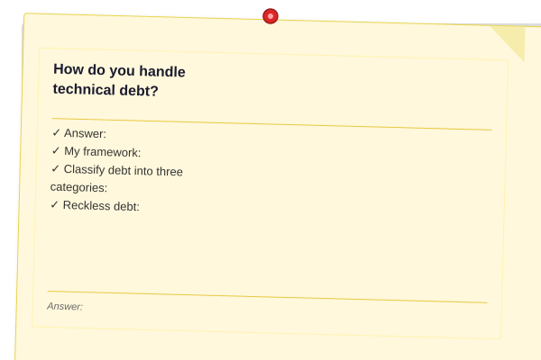
</a>

**Answer:**

Technical debt is inevitable. The key is to manage it strategically, not eliminate it entirely.

**My framework:**

**Classify debt into three categories:**

1. **Reckless debt:** We took a shortcut knowing it would cause problems. This needs to be fixed urgently. Example: hardcoded credentials, no error handling, no tests.

2. **Prudent debt:** We made a reasonable trade-off. Example: using a monolithic architecture for a startup that may need microservices later. This debt is acceptable — we may never need to pay it off.

3. **Accrued debt:** Code that was good when written but has become outdated as requirements changed. This needs ongoing attention. Example: a reporting module designed for 100 records that now handles 1 million records.

**My approach:**

1. **Do not create new debt:** The best way to manage technical debt is to stop creating it. Every new feature should be well-designed and well-tested.

2. **Pay off debt when you touch the code:** The Boy Scout Rule — leave the code better than you found it. When you modify a file, spend 10% of the time cleaning it up.

3. **Dedicate capacity:** We allocate 20% of every sprint to paying down debt. This is not negotiable — it is maintenance, just like changing the oil in a car.

4. **Track it:** We maintain a technical debt tracker (a simple spreadsheet or Github Issues). Each item has: description, impact (how bad is it?), cost of fixing (how long?), and priority (P0-P3). We review it every quarter.

5. **Know when to rewrite:** Some debt is so bad that incremental improvement is not enough. Rarely (maybe once every 2-3 years), a full rewrite is justified. Most of the time, incremental improvement is better.

**Key lesson:** Technical debt is not inherently bad. It becomes bad when it is invisible, unmanaged, or continuously growing. Treat it like financial debt: understand the interest rate, have a plan to pay it down, and be thoughtful about taking on new debt. The companies that fail are not the ones with technical debt — they are the ones that ignored their debt until the interest payments consumed their entire engineering budget.

---

### Q119: What do you do in the first 30 days at a new job?

<a href="../../assets/images/diagrams/java/66-interview-behavioral/what-do-you-do-in-the-first-30-days-at-a-new-job-handwritten.svg" target="_blank" rel="noopener">
  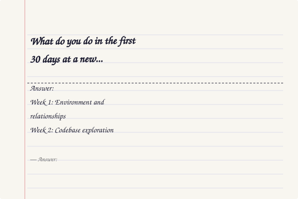
</a>

**Answer:**

My first 30 days focus on learning, not contributing. I resist the urge to "add value" immediately.

**Week 1: Environment and relationships**
- Set up my development environment and get the code running locally. Document any issues in the team wiki.
- Schedule 30-minute 1:1s with everyone on the team: engineers, PM, designer, EM, skip-level manager.
- Ask everyone three questions: "What is the most important thing our team does?" "What is the hardest part of working here?" "What would you change if you could?"

**Week 2: Codebase exploration**
- Read through the codebase systematically. I look at the directory structure, the main entry points, the data model, the test patterns.
- Submit my first PR — a small bug fix or documentation improvement. This builds confidence in the CI/CD pipeline and code review process.
- Ship something to production. Even if it is a tiny change, going through the full deployment cycle is essential.

**Weeks 3-4: Deep context**
- Pick one feature or system and understand it completely: the requirements, the design decisions, the trade-offs, the known issues.
- Write documentation for anything I found confusing. If I was confused, the next person will be too.
- Start a small feature that touches multiple parts of the system. This forces me to understand the interactions between components.

**What I do not do:**
- I do not suggest major changes in the first month. I do not know enough about the context and history.
- I do not complain about the code quality. Every codebase has warts. I assume there were good reasons for the current state.
- I do not try to prove myself. The best way to prove myself is to learn fast and become useful.

**Key lesson:** The first 30 days are for building trust and understanding context. The greatest contribution you can make in the first month is to learn — thoroughly, humbly, systematically. Once you understand the context, you can start making meaningful changes. Premature contributions create more work for the team, not less.

---

### Q120: How do you handle a production incident as the on-call engineer?

<a href="../../assets/images/diagrams/java/66-interview-behavioral/how-do-you-handle-a-production-incident-as-the-on-call-engineer-handwritten.svg" target="_blank" rel="noopener">
  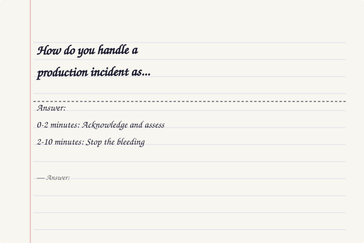
</a>

<a href="../../assets/images/diagrams/java/66-interview-behavioral/how-do-you-handle-a-production-incident-as-the-on-call-engineer-sticky.svg" target="_blank" rel="noopener">
  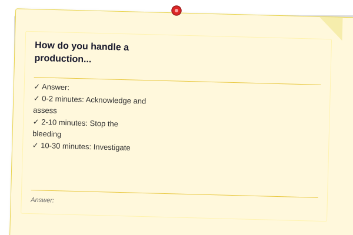
</a>

**Answer:**

When I get paged at 2 AM, I follow a strict protocol:

**0-2 minutes: Acknowledge and assess**
- Acknowledge the alert. Do not let it expire.
- Open the runbook for this service. If there is no runbook, open the service dashboard and error logs.
- Determine severity: P0 (users actively impacted) or P1 (can wait)?

**2-10 minutes: Stop the bleeding**
For a P0 incident, the goal is to stop user impact, not find the root cause:
- Can I rollback the recent deployment? (Most common fix.)
- Can I redirect traffic? (Remove the affected instance from the load balancer.)
- Can I restart the service? (Clears connection pools, stale state.)
- Can I scale up? (More resources handle the load.)

**10-30 minutes: Investigate**
- Once the immediate impact is mitigated, I investigate the root cause.
- I look at: recent deployments, error logs, database metrics, external dependencies.
- I post updates in the incident channel every 5 minutes: what I found, what I am trying, whether the metrics are improving.

**30+ minutes: Escalate if needed**
- If I cannot resolve the issue in 30 minutes, I escalate to the next tier.
- I prepare a summary for the escalation: what happened, what I tried, what I suspect.

**After resolution:**
- I write a brief incident summary before going back to sleep. Future me will thank present me.
- I create a ticket for the postmortem and any immediate follow-ups.
- I check the alert configuration — if this was a flapping alert or a false positive, I tune it.

**Key lesson:** The most important rule of incident response is: stop the bleeding before diagnosing the disease. Too many on-call engineers waste precious minutes trying to understand the root cause while users are having a bad experience. Roll back first, ask questions later. You can always re-deploy after you find the real fix.

---

### Q121: How do you approach mentoring junior engineers?

<a href="../../assets/images/diagrams/java/66-interview-behavioral/how-do-you-approach-mentoring-junior-engineers-handwritten.svg" target="_blank" rel="noopener">
  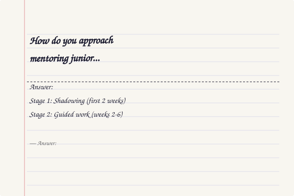
</a>

<a href="../../assets/images/diagrams/java/66-interview-behavioral/how-do-you-approach-mentoring-junior-engineers-sticky.svg" target="_blank" rel="noopener">
  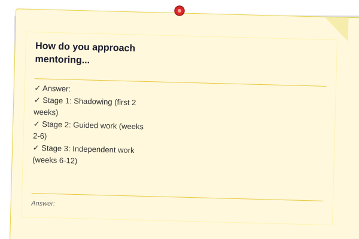
</a>

**Answer:**

I use a graduated responsibility model with four stages:

**Stage 1: Shadowing (first 2 weeks)**
The junior engineer pairs with me on my tasks. They watch, ask questions, and learn the system. I explain my thinking process aloud: "I am looking at the logs because the error message says null pointer. I suspect it is caused by the new feature that introduces a null value where none was expected."

**Stage 2: Guided work (weeks 2-6)**
I assign small, well-defined tasks with clear acceptance criteria. I review their code daily and provide detailed feedback. I focus on: "This code works, but it could be more maintainable. Here is why this pattern is better." I encourage them to ask questions liberally.

**Stage 3: Independent work (weeks 6-12)**
I assign larger tasks with less guidance. They come to me when stuck, but I encourage them to try for 30 minutes before asking. I review their design decisions before they write code, not just the code after it is written. I ask questions instead of giving answers: "What are the trade-offs of this approach? What happens if this input is null?"

**Stage 4: Autonomy (3+ months)**
They own features independently. I am available for questions but do not proactively review their work unless asked. I encourage them to review other people's PRs — learning to review code is the fastest way to learn to write good code.

**My mentoring principles:**
- I teach principles, not solutions. If they understand the "why," they can figure out the "how."
- I model the behavior I want to see: asking questions, admitting mistakes, being kind in code reviews.
- I give public credit and private feedback. Praise in public, correct in private.
- I treat them as colleagues, not subordinates. We are a team, and they bring valuable perspectives even if they lack experience.

**Key lesson:** The goal of mentoring is not to make the junior engineer dependent on you — it is to make them independent as quickly as possible. The measure of a good mentor is not how much the mentee relies on them, but how quickly the mentee no longer needs them.

---

### Q122: How do you decide when to push back on a feature request versus when to just implement it?

<a href="../../assets/images/diagrams/java/66-interview-behavioral/how-do-you-decide-when-to-push-back-on-a-feature-request-versus-when-to-just-implement-it-sticky.svg" target="_blank" rel="noopener">
  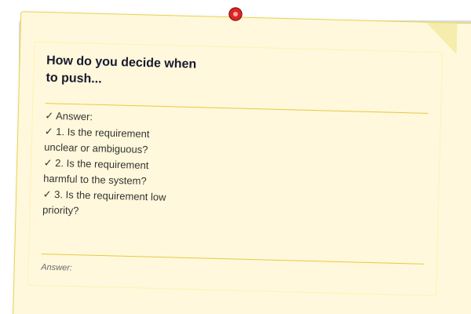
</a>

**Answer:**

I use a simple framework based on three questions:

**1. Is the requirement unclear or ambiguous?**
If I do not understand what is being asked, I push back. But I do not just say "this is unclear" — I say "I understand you want X. Let me propose a more specific version. Does this match your intent?" Ambiguous requirements are dangerous because they lead to rework and frustration.

**2. Is the requirement harmful to the system?**
If the requirement introduces technical debt, security risk, or performance problems, I push back. But I offer an alternative: "I understand why you want this. Here is a concern about the current approach. Here is an alternative that achieves the same goal without the downside."

**3. Is the requirement low priority?**
If the requirement is clear and not harmful but just not very important, I consider the context. If the business needs it now, I implement it. If the business is not sure, I suggest deferring it. If I think a better solution exists, I propose it.

**When I do not push back:**
- When the requirement is clear, reasonable, and the team disagrees with my concern, I implement it. I trust the team's judgment.
- When the requirement is time-sensitive and my concerns would delay the launch, I implement it and create a follow-up ticket.
- When the requirement is from a senior leader who has context I do not, I ask clarifying questions and usually implement it.

**Key lesson:** Push back on ambiguity and harm. Implement everything else. The goal is not to be difficult — it is to ensure we build the right thing. A good engineer knows when to fight for quality and when to ship. A great engineer knows that the answer is often not "no" but "yes, and here is a better way to do it."

---

### Q123: Describe a time you had to learn a new technology quickly.

<a href="../../assets/images/diagrams/java/66-interview-behavioral/describe-a-time-you-had-to-learn-a-new-technology-quickly-handwritten.svg" target="_blank" rel="noopener">
  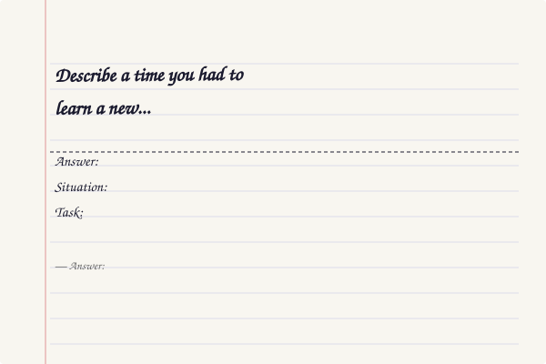
</a>

**Answer:**

**Situation:** My company decided to migrate from a monolith on AWS EC2 to Kubernetes on EKS. I had never used Kubernetes before. I was given 2 weeks to learn enough to lead the migration.

**Task:** Learn Kubernetes well enough in 2 weeks to design the migration plan and lead the implementation.

**Action:**
1. I spent Day 1 reading the official Kubernetes documentation — not tutorials, but the concepts: pods, deployments, services, configmaps, secrets, ingress. I needed a mental model first.
2. I spent Days 2-5 doing hands-on labs. I used Minikube to set up a local cluster. I deployed a simple application. I broke things on purpose. I learned how to debug: how to read pod logs, how to exec into a container, how to inspect events.
3. I spent Days 6-7 building a prototype. I containerized our existing application and deployed it on Minikube. I added a database, a cache, and a queue. I made it work end-to-end.
4. I spent Days 8-10 learning the production details: how to set up EKS, how to configure networking, how to manage secrets, how to do zero-downtime deployments, how to monitor.
5. I spent Days 11-14 creating the migration plan and presenting it to the team.

**Result:** The migration was successful. We moved 12 services to Kubernetes over 3 months with zero downtime. My 2-week learning sprint gave me enough context to make good architectural decisions. I continued learning on the job and became proficient within 3 months.

**Key lesson:** To learn a new technology quickly, follow this sequence: theory (1 day) → hands-on (3 days) → prototype (2 days) → production details (3 days) → teach others (2 days). The "teach others" step is critical — you do not truly know something until you can explain it to someone else. Also, do not try to learn everything. Learn the 20% that covers 80% of use cases, then learn the rest on the job.

---

### Q124: How do you answer "What are your weaknesses?"

<a href="../../assets/images/diagrams/java/66-interview-behavioral/how-do-you-answer-what-are-your-weaknesses-handwritten.svg" target="_blank" rel="noopener">
  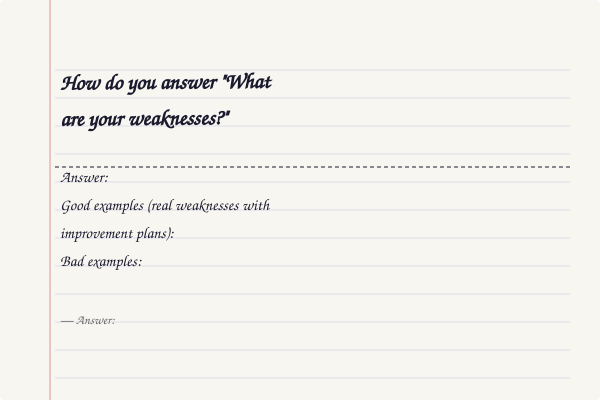
</a>

<a href="../../assets/images/diagrams/java/66-interview-behavioral/how-do-you-answer-what-are-your-weaknesses-sticky.svg" target="_blank" rel="noopener">
  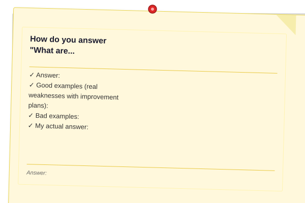
</a>

**Answer:**

The key is to give a real weakness that you are actively working on — not a humble-brag disguised as a weakness.

**Good examples (real weaknesses with improvement plans):**
- "I tend to go too deep into technical details when communicating with non-technical stakeholders. I am working on this by practicing high-level summaries first and asking if they want more detail before diving into specifics."
- "I sometimes over-engineer solutions. I am working on this by writing a minimal solution first and only adding complexity when it is justified by specific requirements."
- "I struggle with saying no to new work. I take on too much and then struggle to deliver on time. I am working on this by using a work tracking system and being more disciplined about my capacity."

**Bad examples:**
- "I work too hard." (Not a real weakness, sounds arrogant.)
- "I am too detail-oriented." (Same problem.)
- "I care too much." (Not helpful.)
- "I have no weaknesses." (Disqualifying — shows lack of self-awareness.)

**My actual answer:**
"I tend to over-analyze before starting. I want to understand every edge case and design every detail before writing any code. This leads to thorough designs but slower delivery. I am working on this by adopting a 'spike and implement' approach: I do quick, limited exploration (the spike), and then start writing code even if I do not have full clarity. I learn the remaining details during implementation rather than trying to understand everything upfront. This has improved my delivery speed by about 30% without sacrificing quality."

**Key lesson:** A good weakness answer shows self-awareness (you know your weakness), growth mindset (you are working on it), and specificity (not a generic trait). The interviewer is not looking for perfection — they are looking for honesty and self-awareness. A candidate who can identify their weaknesses and describe their improvement plan is more trustworthy than one who claims to have none.

---

### Q125: What do you do when you are stuck on a difficult problem?

<a href="../../assets/images/diagrams/java/66-interview-behavioral/what-do-you-do-when-you-are-stuck-on-a-difficult-problem-handwritten.svg" target="_blank" rel="noopener">
  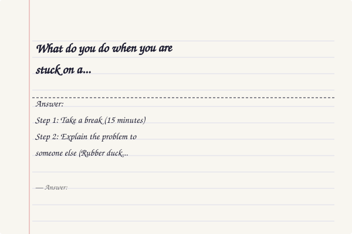
</a>

<a href="../../assets/images/diagrams/java/66-interview-behavioral/what-do-you-do-when-you-are-stuck-on-a-difficult-problem-sticky.svg" target="_blank" rel="noopener">
  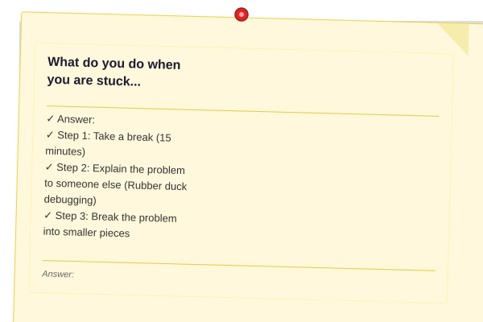
</a>

**Answer:**

I have a systematic approach for getting unstuck:

**Step 1: Take a break (15 minutes)**
Walk away from the computer. Get a glass of water. Stretch. The brain works on problems subconsciously when you are not actively thinking about them. Many breakthroughs happen in the shower.

**Step 2: Explain the problem to someone else (Rubber duck debugging)**
I explain the problem out loud — to a colleague or even to a rubber duck. The act of verbalizing the problem forces me to structure my thoughts clearly. Often I find the answer halfway through my explanation.

**Step 3: Break the problem into smaller pieces**
"What is the smallest thing I can try that would tell me something useful?" Instead of trying to fix the whole bug, I narrow it down: add logging at each step, comment out parts of the code, test each assumption individually.

**Step 4: Change my context**
If I have been staring at the same code for hours, I look at it with fresh eyes. I read the code upside down. I explain it to someone who has never seen it before. I write down every assumption I am making and test each one.

**Step 5: Ask for help**
After 2 hours of being stuck, I ask for help. I prepare a minimal reproduction and a clear description of what I have tried. Asking for help is not a sign of weakness — it is a sign of wisdom. A fresh pair of eyes often spots the issue in seconds.

**Step 6: Sleep on it**
If nothing else works, I sleep on it. The next morning, the solution is often obvious. The brain consolidates information during sleep and makes connections it could not make while awake.

**Key lesson:** Being stuck is not a failure — staying stuck is. The most effective engineers are not the ones who never get stuck — they are the ones who have a system for getting unstuck quickly. My rule: if I have been stuck for 2 hours, I ask for help. No exceptions. The shame of asking is far less than the cost of wasting an afternoon.

---

### Q126: Tell me about a project you are most proud of.

<a href="../../assets/images/diagrams/java/66-interview-behavioral/tell-me-about-a-project-you-are-most-proud-of-handwritten.svg" target="_blank" rel="noopener">
  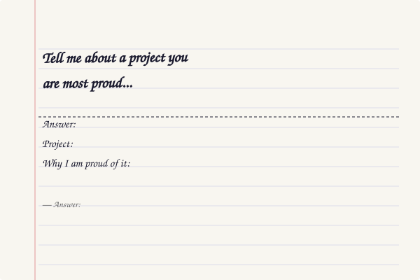
</a>

<a href="../../assets/images/diagrams/java/66-interview-behavioral/tell-me-about-a-project-you-are-most-proud-of-sticky.svg" target="_blank" rel="noopener">
  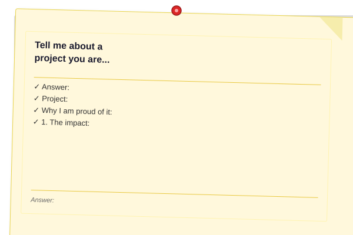
</a>

**Answer:**

**Project:** Building a real-time fraud detection system for a payment processing platform that handles  in annual transactions.

**Why I am proud of it:**

**1. The impact:** The system detects and blocks fraudulent transactions in under 100 milliseconds. Over 3 years, it prevented an estimated  in fraud losses. This directly impacted the company's bottom line.

**2. The technical challenge:** The system processes 1,000 transactions per second, maintains a real-time risk score for each transaction using 50+ features (user history, device fingerprint, geolocation, velocity checks, merchant category, time of day, etc.), and must make a decision in under 100ms. We could not use standard machine learning inference pipelines because they were too slow. We had to build a custom rule engine with ML models running on GPU-accelerated nodes.

**3. The trade-offs:** We had to balance fraud detection (block more transactions) with customer experience (false positives). We optimized for precision at the cost of recall — blocking fewer transactions but being more confident about the ones we block. This was a business decision with significant consequences.

**4. The team:** I led a team of 4 engineers. We went from concept to production in 4 months. We had 6 production incidents in the first year, and each one taught us something valuable about the system and our monitoring.

**5. What I learned:** I learned that building a system is easy — operating it is hard. The fraud detection rules need constant adjustment as fraudsters adapt. The models need retraining. The infrastructure needs scaling. The real work starts after the initial deployment.

**Key lesson:** The projects I am most proud of are not the ones that went perfectly — they are the ones that had real impact, significant challenges, and taught me something I did not know before. A project that goes perfectly is usually a project that was too easy. The best projects stretch you and leave you a better engineer than when you started.

---

### Q127: What is your experience with agile methodologies?

<a href="../../assets/images/diagrams/java/66-interview-behavioral/what-is-your-experience-with-agile-methodologies-handwritten.svg" target="_blank" rel="noopener">
  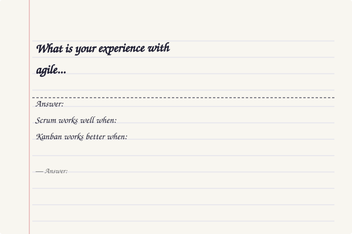
</a>

<a href="../../assets/images/diagrams/java/66-interview-behavioral/what-is-your-experience-with-agile-methodologies-sticky.svg" target="_blank" rel="noopener">
  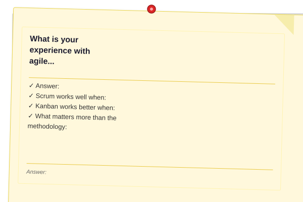
</a>

**Answer:**

I have worked in Scrum, Kanban, and hybrid models across 5 teams. Here is what I have learned:

**Scrum works well when:** The work is predictable, the team is stable, and the stakeholders can commit to a 2-week scope. Scrum provides structure and rhythm that helps teams build momentum.

**Kanban works better when:** The work is unpredictable (support tickets, incidents, ad-hoc requests), the priorities change frequently, or the team is not fully dedicated to a single product. Kanban provides flexibility without sacrificing visibility.

**What matters more than the methodology:**
- **Retrospectives:** The single most important agile practice. A team that reflects and improves every 2 weeks will get better regardless of the framework.
- **Small batches:** Deliver work in small, frequent increments. This reduces risk, gets feedback faster, and prevents integration problems.
- **Cross-functional teams:** The team should have all the skills needed to deliver value without depending on external teams. Dependencies kill velocity.
- **Psychological safety:** Team members should feel safe to disagree, admit mistakes, and ask for help. No retrospective format, standup structure, or planning process can compensate for a culture where people are afraid to speak up.

**What I do not like:**
- **Story points as a productivity metric:** Story points are for estimation, not performance measurement. Using velocity to compare teams or evaluate individuals destroys the value of estimation.
- **Process over principles:** Some teams follow Scrum so rigidly that they lose sight of the goal: delivering value. If the process is getting in the way, change the process.

**Key lesson:** Agile is not Scrum. Agile is not Kanban. Agile is a set of principles: deliver value early and often, respond to change, reflect and improve, trust the team. The specific framework matters far less than whether the team lives these principles. A team that embodies agile principles will succeed with any framework. A team that treats the framework as a checklist will fail with the best Scrum implementation.

---

### Q128: How do you handle the tension between shipping quickly and writing quality code?

<a href="../../assets/images/diagrams/java/66-interview-behavioral/how-do-you-handle-the-tension-between-shipping-quickly-and-writing-quality-code-sticky.svg" target="_blank" rel="noopener">
  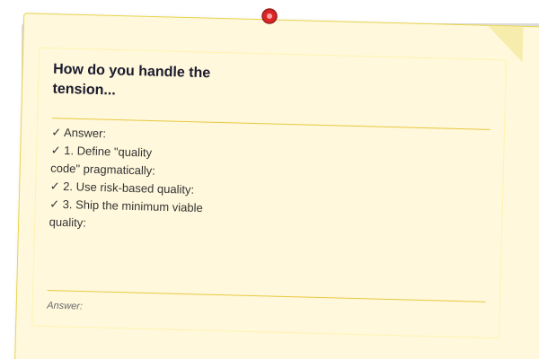
</a>

**Answer:**

This is the fundamental tension in software engineering. Here is my approach:

**1. Define "quality code" pragmatically:**
Quality does not mean perfect — it means "good enough for the current needs." A startup needs different quality standards than a bank. The quality bar should match the risk profile of the system.

**2. Use risk-based quality:**
- Mission-critical code (payments, auth, data integrity): highest quality, full test coverage, thorough code review, design document.
- Internal tools (admin panels, reporting): good enough — working code with basic tests and a quick review.
- Prototypes and experiments: just works — minimal quality, maximum speed. Plan to rewrite if the experiment succeeds.

**3. Ship the minimum viable quality:**
I ask: "What is the minimum quality level that does not cause problems for users or the team?" Then I ship at that level. I can always improve it later if the code proves important.

**4. Use the beach preparation rule:**
"Always leave the code cleaner than you found it" — but only to a reasonable extent. A 5-minute cleanup is worth it. A 2-hour refactoring during a bug fix is not.

**5. Communicate the trade-off:**
When stakeholders push for speed at the expense of quality, I make the trade-off explicit: "If we ship this now, we will have to spend 2 weeks fixing it next month. Is that acceptable?" Most stakeholders will choose quality when they understand the downstream cost.

**Key lesson:** The tension between speed and quality is a false dichotomy. The real question is: "What is the right quality level for this specific piece of code at this specific moment?" The answer varies. The skill is knowing when to invest in quality and when to cut corners — and being honest about which corners you are cutting so you can come back to fix them later.

## Concept Comparison Table

| Concept | Definition | Key Distinction | Use Case |
|---------|-----------|-----------------|----------|
| Interface | Contract without state | Multiple inheritance of type | API contracts |
| Abstract Class | Partial implementation | Single inheritance, shared state | Template method pattern |
| Record | Transparent data carrier | Auto-generated methods | DTOs, value objects |

## Quick Reference

| Topic | Key Points | Interview Frequency |
|-------|-----------|-------------------|
| **OOP** | Encapsulation, Inheritance, Polymorphism, Abstraction | Every interview |
| **Collections** | List, Set, Map, Queue, Deque | 9/10 interviews |
| **Concurrency** | synchronized, volatile, Locks, CompletableFuture | 7/10 senior interviews |
| **Java 8+** | Lambdas, Streams, Optional, CompletableFuture | 8/10 interviews |

## Cross-Application Matrix

| Skill | Junior (0-2yr) | Mid (3-5yr) | Senior (6-9yr) | Staff (10+) |
|-------|---------------|-------------|----------------|-------------|
| OOP & Design Patterns | Define and identify | Apply and combine | Evaluate and refactor | Create and teach |
| Collections | Basic usage | Performance trade-offs | Concurrent collections | Custom implementations |
| Concurrency | Syntax knowledge | Write thread-safe code | Debug deadlocks | Design concurrent systems |

## Chapter Quiz

1. What is the difference between equals() and == in Java?
   - A) They are identical
   - B) equals() compares values, == compares references
   - C) == compares values, equals() compares references
   - D) equals() is for primitives, == is for objects

Answer&lt;/summary&gt;
**B) equals() compares logical equality (overridable), == compares reference equality.**

2. Which collection guarantees insertion order?
   - A) HashMap
   - B) TreeMap
   - C) LinkedHashMap
   - D) HashSet

Answer&lt;/summary&gt;
**C) LinkedHashMap.** LinkedHashMap maintains a doubly-linked list of entries to preserve insertion order.

3. What keyword prevents a method from being overridden?
   - A) static
   - B) final
   - C) private
   - D) abstract

Answer&lt;/summary&gt;
**B) final.** A final method cannot be overridden by subclasses.

