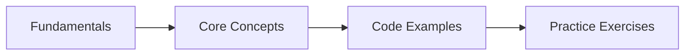

# Object-Oriented Programming in Java

## Learning Objectives

<!-- Image Gallery -->
<div style="display:flex;flex-wrap:wrap;gap:4px;margin:16px 0;padding:12px;background:#f8fafc;border-radius:8px;border:1px solid #e2e8f0;">
<a href="../../../assets/images/lessons/java/p2-java-oop/hero.svg" target="_blank" rel="noopener">
  
</a>
<a href="../../../assets/images/lessons/java/p2-java-oop/handwritten-notes.svg" target="_blank" rel="noopener">
  
</a>
<a href="../../../assets/images/lessons/java/p2-java-oop/sticky-notes.svg" target="_blank" rel="noopener">
  
</a>
<a href="../../../assets/images/lessons/java/p2-java-oop/visual-explanation.svg" target="_blank" rel="noopener">
  
</a>
<a href="../../../assets/images/lessons/java/p2-java-oop/architecture.svg" target="_blank" rel="noopener">
  
</a>
<a href="../../../assets/images/lessons/java/p2-java-oop/workflow.svg" target="_blank" rel="noopener">
  
</a>
<a href="../../../assets/images/lessons/java/p2-java-oop/mindmap.svg" target="_blank" rel="noopener">
  
</a>
<a href="../../../assets/images/lessons/java/p2-java-oop/comparison.svg" target="_blank" rel="noopener">
  
</a>
<a href="../../../assets/images/lessons/java/p2-java-oop/cheatsheet.svg" target="_blank" rel="noopener">
  
</a>
<a href="../../../assets/images/lessons/java/p2-java-oop/interview-quiz.svg" target="_blank" rel="noopener">
  
</a>
<a href="../../../assets/images/lessons/java/p2-java-oop/social-card.svg" target="_blank" rel="noopener">
  
</a>
</div>
<!-- End Image Gallery -->

## Chapter at a Glance

| Topic | Key Insight | Practical Takeaway |
|-------|-------------|--------------------|
| Core Concepts | Foundational understanding for Java development | Master these before Spring |
| Code Examples | Runnable, compilable examples | Type, compile, run, refactor |
| Practice Exercises | Hands-on skill building | Apply what you learn |

## Chapter Roadmap




By the end of this chapter, you will be able to:

- Define classes and instantiate objects with fields, methods, and constructors
- Apply encapsulation using access modifiers and the JavaBeans naming convention
- Build inheritance hierarchies using `extends`, `super`, and method overriding
- Distinguish compile-time polymorphism (overloading) from runtime polymorphism (overriding)
- Design abstract base classes and decide when to use abstract classes versus interfaces
- Leverage interfaces with default, static, and private methods for multiple inheritance of type
- Restrict inheritance hierarchies with sealed classes and pattern-match exhaustively
- Declare transparent data carriers with records and customize their behavior
- Model fixed sets of constants with enums, including fields, methods, and specialized bodies
- Use built-in and custom annotations to decorate code with metadata
- Choose among static nested, inner, local, and anonymous classes, and compare with lambdas
- Fulfill the `equals`/`hashCode` contract, implement `toString`, and understand `clone`

---

## 1. Classes and Objects


Java is an object-oriented language: every piece of data except primitive types belongs to a **class**, and every class can produce **objects** (instances). A class is a blueprint; an object is the concrete thing you create from that blueprint.

### 1.1 Defining a Class

<a href="../../../assets/images/diagrams/java/p2-java-oop/1-1-defining-a-class-handwritten.svg" target="_blank" rel="noopener">
  
</a>
<a href="../../../assets/images/diagrams/java/p2-java-oop/1-1-defining-a-class-diagram.svg" target="_blank" rel="noopener">
  
</a>
<a href="../../../assets/images/diagrams/java/p2-java-oop/1-1-defining-a-class-sticky.svg" target="_blank" rel="noopener">
  
</a>


A class bundles **fields** (state) and **methods** (behavior) into a single unit.

```java
public class Student {
    String name;
    int age;
    String studentId;

    void study(String subject) {
        System.out.println(name + " is studying " + subject);
    }

    String getStudentInfo() {
        return studentId + ": " + name + " (" + age + ")";
    }
}
```

Fields `name`, `age`, and `studentId` hold the state of each `Student` object. Methods `study` and `getStudentInfo` define its behavior.

### 1.2 Creating Objects

<a href="../../../assets/images/diagrams/java/p2-java-oop/1-2-creating-objects-handwritten.svg" target="_blank" rel="noopener">
  
</a>
<a href="../../../assets/images/diagrams/java/p2-java-oop/1-2-creating-objects-diagram.svg" target="_blank" rel="noopener">
  
</a>
<a href="../../../assets/images/diagrams/java/p2-java-oop/1-2-creating-objects-sticky.svg" target="_blank" rel="noopener">
  
</a>


Use the `new` keyword to instantiate a class. The object lives on the heap; the variable holds a reference to it.

```java
public class Main {
    public static void main(String[] args) {
        Student alice = new Student();
        alice.name = "Alice";
        alice.age = 20;
        alice.studentId = "S1001";

        alice.study("Mathematics");
        System.out.println(alice.getStudentInfo());
    }
}
```

Output:

```
Alice is studying Mathematics
S1001: Alice (20)
```

### 1.3 Constructors

<a href="../../../assets/images/diagrams/java/p2-java-oop/1-3-constructors-handwritten.svg" target="_blank" rel="noopener">
  
</a>
<a href="../../../assets/images/diagrams/java/p2-java-oop/1-3-constructors-diagram.svg" target="_blank" rel="noopener">
  
</a>
<a href="../../../assets/images/diagrams/java/p2-java-oop/1-3-constructors-sticky.svg" target="_blank" rel="noopener">
  
</a>


A **constructor** initializes a newly created object. It has the same name as the class and no return type.

```java
public class Student {
    String name;
    int age;
    String studentId;

    // Default constructor (provided automatically if no other constructor exists)
    public Student() {
    }

    // Parameterized constructor
    public Student(String name, int age, String studentId) {
        this.name = name;
        this.age = age;
        this.studentId = studentId;
    }

    void study(String subject) {
        System.out.println(name + " is studying " + subject);
    }
}
```

### 1.4 The `this` Keyword

<a href="../../../assets/images/diagrams/java/p2-java-oop/1-4-the-this-keyword-handwritten.svg" target="_blank" rel="noopener">
  
</a>
<a href="../../../assets/images/diagrams/java/p2-java-oop/1-4-the-this-keyword-diagram.svg" target="_blank" rel="noopener">
  
</a>
<a href="../../../assets/images/diagrams/java/p2-java-oop/1-4-the-this-keyword-sticky.svg" target="_blank" rel="noopener">
  
</a>


Inside an instance method or constructor, `this` refers to the current object. It is used to:

- Disambiguate instance fields from parameters with the same name
- Call another constructor in the same class (constructor chaining)

```java
public class Rectangle {
    private double width;
    private double height;

    public Rectangle(double width, double height) {
        this.width = width;          // disambiguates field from parameter
        this.height = height;
    }

    // Constructor chaining: no-arg constructor delegates to parameterized
    public Rectangle() {
        this(1.0, 1.0);              // calls Rectangle(double, double)
    }

    public double area() {
        return this.width * this.height;
    }
}
```

The first statement in a constructor can call `this(...)` to invoke a sibling constructor. This avoids code duplication in initialization logic.

### 1.5 Method Overloading

<a href="../../../assets/images/diagrams/java/p2-java-oop/1-5-method-overloading-handwritten.svg" target="_blank" rel="noopener">
  
</a>
<a href="../../../assets/images/diagrams/java/p2-java-oop/1-5-method-overloading-diagram.svg" target="_blank" rel="noopener">
  
</a>
<a href="../../../assets/images/diagrams/java/p2-java-oop/1-5-method-overloading-sticky.svg" target="_blank" rel="noopener">
  
</a>


A class can have multiple methods with the **same name** but **different parameter lists**. This is called overloading. The compiler selects the correct version based on the arguments at compile time.

```java
public class Calculator {

    public int add(int a, int b) {
        return a + b;
    }

    public int add(int a, int b, int c) {
        return a + b + c;
    }

    public double add(double a, double b) {
        return a + b;
    }

    public String add(String a, String b) {
        return a + b;
    }
}
```

```java
public class CalculatorDemo {
    public static void main(String[] args) {
        Calculator calc = new Calculator();
        System.out.println(calc.add(3, 5));          // 8
        System.out.println(calc.add(3, 5, 2));        // 10
        System.out.println(calc.add(2.5, 3.7));       // 6.2
        System.out.println(calc.add("Hello, ", "World!")); // Hello, World!
    }
}
```

Overloading rules: methods must differ in the **number**, **type**, or **order** of parameters. The return type alone is not sufficient to distinguish overloaded methods.

### 1.6 Varargs

<a href="../../../assets/images/diagrams/java/p2-java-oop/1-6-varargs-handwritten.svg" target="_blank" rel="noopener">
  
</a>
<a href="../../../assets/images/diagrams/java/p2-java-oop/1-6-varargs-diagram.svg" target="_blank" rel="noopener">
  
</a>
<a href="../../../assets/images/diagrams/java/p2-java-oop/1-6-varargs-sticky.svg" target="_blank" rel="noopener">
  
</a>


Java 5 introduced **variable arity parameters** (varargs), denoted by `Type...`. A varargs parameter accepts zero or more arguments of the specified type and is treated as an array inside the method.

```java
public class Printer {

    public static void printAll(String... items) {
        for (String item : items) {
            System.out.println(item);
        }
    }

    public static <T> void printArray(T... elements) {
        for (T elem : elements) {
            System.out.print(elem + " ");
        }
        System.out.println();
    }
}
```

```java
public class VarargsDemo {
    public static void main(String[] args) {
        Printer.printAll("apple", "banana", "cherry");
        Printer.printAll();                          // zero arguments is valid

        Printer.printArray(1, 2, 3, 4, 5);
        Printer.printArray("a", "b", "c");
    }
}
```

Rules:

- A method can have at most one varargs parameter.
- The varargs parameter must be the **last** parameter.
- The caller can pass an array directly or list the elements.

---

## 2. Encapsulation

Encapsulation hides internal state and requires all interaction to happen through public methods. This protects the integrity of an object and allows the implementation to evolve without affecting callers.

### 2.1 Access Modifiers

<a href="../../../assets/images/diagrams/java/p2-java-oop/2-1-access-modifiers-handwritten.svg" target="_blank" rel="noopener">
  
</a>
<a href="../../../assets/images/diagrams/java/p2-java-oop/2-1-access-modifiers-diagram.svg" target="_blank" rel="noopener">
  
</a>
<a href="../../../assets/images/diagrams/java/p2-java-oop/2-1-access-modifiers-sticky.svg" target="_blank" rel="noopener">
  
</a>


Java provides four access levels:

| Modifier | Class | Package | Subclass | World |
|----------|-------|---------|----------|-------|
| `private` | ✓ | ✗ | ✗ | ✗ |
| *default* (package-private) | ✓ | ✓ | ✗ | ✗ |
| `protected` | ✓ | ✓ | ✓ | ✗ |
| `public` | ✓ | ✓ | ✓ | ✓ |

```java
package com.example.bank;

public class BankAccount {
    private String accountNumber;     // accessible only within this class
    private double balance;           // accessible only within this class
    String branchCode;                // default (package-private)
    protected String ownerName;       // accessible in subclasses
    public String bankName;           // accessible everywhere

    public BankAccount(String accountNumber, double initialBalance) {
        this.accountNumber = accountNumber;
        this.balance = initialBalance;
    }

    private boolean validateSufficientFunds(double amount) {
        return balance >= amount;
    }

    public void deposit(double amount) {
        if (amount > 0) {
            balance += amount;
        }
    }

    public boolean withdraw(double amount) {
        if (amount > 0 && validateSufficientFunds(amount)) {
            balance -= amount;
            return true;
        }
        return false;
    }

    public double getBalance() {
        return balance;
    }
}
```

```java
package com.example.bank;

public class EncapsulationDemo {
    public static void main(String[] args) {
        BankAccount account = new BankAccount("ACC-12345", 1000.0);

        account.deposit(500.0);                      // public method
        account.withdraw(200.0);                     // public method

        // account.balance = 999999;                 // COMPILE ERROR: private
        // account.validateSufficientFunds(100);     // COMPILE ERROR: private

        System.out.println("Balance: " + account.getBalance());
    }
}
```

### 2.2 Getters and Setters

<a href="../../../assets/images/diagrams/java/p2-java-oop/2-2-getters-and-setters-handwritten.svg" target="_blank" rel="noopener">
  
</a>
<a href="../../../assets/images/diagrams/java/p2-java-oop/2-2-getters-and-setters-diagram.svg" target="_blank" rel="noopener">
  
</a>
<a href="../../../assets/images/diagrams/java/p2-java-oop/2-2-getters-and-setters-sticky.svg" target="_blank" rel="noopener">
  
</a>


The standard pattern exposes private fields through public **accessor** (getter) and **mutator** (setter) methods. This allows validation, lazy initialization, and computed values.

```java
public class Person {
    private String name;
    private int age;
    private String email;

    public Person() {
    }

    // Getters
    public String getName() {
        return name;
    }

    public int getAge() {
        return age;
    }

    public String getEmail() {
        return email;
    }

    // Setters with validation
    public void setName(String name) {
        if (name == null || name.isBlank()) {
            throw new IllegalArgumentException("Name must not be blank");
        }
        this.name = name;
    }

    public void setAge(int age) {
        if (age < 0 || age > 150) {
            throw new IllegalArgumentException("Age must be between 0 and 150");
        }
        this.age = age;
    }

    public void setEmail(String email) {
        if (email != null && !email.contains("@")) {
            throw new IllegalArgumentException("Invalid email format");
        }
        this.email = email;
    }
}
```

### 2.3 JavaBeans Convention

<a href="../../../assets/images/diagrams/java/p2-java-oop/2-3-javabeans-convention-handwritten.svg" target="_blank" rel="noopener">
  
</a>
<a href="../../../assets/images/diagrams/java/p2-java-oop/2-3-javabeans-convention-diagram.svg" target="_blank" rel="noopener">
  
</a>
<a href="../../../assets/images/diagrams/java/p2-java-oop/2-3-javabeans-convention-sticky.svg" target="_blank" rel="noopener">
  
</a>


A JavaBean is a reusable software component that follows these conventions:

1. The class is `public` and has a **no-argument constructor**.
2. Properties are accessed through `getXxx()` / `setXxx()` methods (or `isXxx()` for `boolean`).
3. The class implements `java.io.Serializable`.

```java
import java.io.Serializable;
import java.util.Objects;

public class ProductBean implements Serializable {
    private static final long serialVersionUID = 1L;

    private Long id;
    private String name;
    private double price;
    private boolean active;

    public ProductBean() {
    }

    public Long getId() {
        return id;
    }

    public void setId(Long id) {
        this.id = id;
    }

    public String getName() {
        return name;
    }

    public void setName(String name) {
        this.name = name;
    }

    public double getPrice() {
        return price;
    }

    public void setPrice(double price) {
        this.price = price;
    }

    // Boolean getter uses "is" prefix
    public boolean isActive() {
        return active;
    }

    public void setActive(boolean active) {
        this.active = active;
    }

    @Override
    public boolean equals(Object o) {
        if (this == o) return true;
        if (!(o instanceof ProductBean that)) return false;
        return Double.compare(price, that.price) == 0
            && active == that.active
            && Objects.equals(id, that.id)
            && Objects.equals(name, that.name);
    }

    @Override
    public int hashCode() {
        return Objects.hash(id, name, price, active);
    }

    @Override
    public String toString() {
        return "ProductBean{id=" + id + ", name='" + name + "', price=" + price + "}";
    }
}
```

Spring Boot relies heavily on the JavaBeans convention for property binding, configuration classes, and dependency injection.

---

## 3. Inheritance

Inheritance models an **is-a** relationship. A subclass inherits fields and methods from its superclass and can add or override behavior.

### 3.1 The `extends` Keyword

<a href="../../../assets/images/diagrams/java/p2-java-oop/3-1-the-extends-keyword-handwritten.svg" target="_blank" rel="noopener">
  
</a>
<a href="../../../assets/images/diagrams/java/p2-java-oop/3-1-the-extends-keyword-diagram.svg" target="_blank" rel="noopener">
  
</a>
<a href="../../../assets/images/diagrams/java/p2-java-oop/3-1-the-extends-keyword-sticky.svg" target="_blank" rel="noopener">
  
</a>


```java
public class Animal {
    protected String species;
    protected int age;

    public Animal(String species, int age) {
        this.species = species;
        this.age = age;
    }

    public void eat() {
        System.out.println(species + " is eating");
    }

    public void sleep() {
        System.out.println(species + " is sleeping");
    }
}
```

```java
public class Dog extends Animal {
    private String breed;

    public Dog(String breed, int age) {
        super("Canis familiaris", age);   // calls Animal(String, int)
        this.breed = breed;
    }

    public void bark() {
        System.out.println(breed + " dog says: Woof!");
    }
}
```

```java
public class InheritanceDemo {
    public static void main(String[] args) {
        Dog dog = new Dog("Labrador", 3);
        dog.eat();          // inherited from Animal
        dog.sleep();        // inherited from Animal
        dog.bark();         // defined in Dog
    }
}
```

### 3.2 The `super` Keyword

<a href="../../../assets/images/diagrams/java/p2-java-oop/3-2-the-super-keyword-handwritten.svg" target="_blank" rel="noopener">
  
</a>
<a href="../../../assets/images/diagrams/java/p2-java-oop/3-2-the-super-keyword-diagram.svg" target="_blank" rel="noopener">
  
</a>
<a href="../../../assets/images/diagrams/java/p2-java-oop/3-2-the-super-keyword-sticky.svg" target="_blank" rel="noopener">
  
</a>


`super` refers to the immediate parent class. Use it to:

- Call a parent constructor (`super(...)`)
- Access a parent field or method that has been overridden

```java
public class Cat extends Animal {
    private boolean isIndoor;

    public Cat(boolean isIndoor, int age) {
        super("Felis catus", age);    // must be first statement
        this.isIndoor = isIndoor;
    }

    @Override
    public void eat() {
        super.eat();                   // calls Animal's eat() first
        System.out.println("...and purrs contentedly");
    }
}
```

### 3.3 Method Overriding

<a href="../../../assets/images/diagrams/java/p2-java-oop/3-3-method-overriding-handwritten.svg" target="_blank" rel="noopener">
  
</a>
<a href="../../../assets/images/diagrams/java/p2-java-oop/3-3-method-overriding-diagram.svg" target="_blank" rel="noopener">
  
</a>
<a href="../../../assets/images/diagrams/java/p2-java-oop/3-3-method-overriding-sticky.svg" target="_blank" rel="noopener">
  
</a>


A subclass can **override** a method from its superclass to provide a specialized implementation. The overriding method must have the same signature and a return type that is a subtype of the original (covariant return).

```java
public class Vehicle {
    protected String brand;
    protected int year;

    public Vehicle(String brand, int year) {
        this.brand = brand;
        this.year = year;
    }

    public String getInfo() {
        return year + " " + brand;
    }

    public void start() {
        System.out.println("Vehicle is starting...");
    }
}
```

```java
public class Car extends Vehicle {
    private int doors;

    public Car(String brand, int year, int doors) {
        super(brand, year);
        this.doors = doors;
    }

    @Override
    public String getInfo() {
        return super.getInfo() + " (" + doors + "-door)";
    }

    @Override
    public void start() {
        System.out.println("Insert key and turn ignition...");
        System.out.println("Engine started!");
    }
}
```

### 3.4 The `@Override` Annotation

<a href="../../../assets/images/diagrams/java/p2-java-oop/3-4-the-override-annotation-handwritten.svg" target="_blank" rel="noopener">
  
</a>
<a href="../../../assets/images/diagrams/java/p2-java-oop/3-4-the-override-annotation-diagram.svg" target="_blank" rel="noopener">
  
</a>
<a href="../../../assets/images/diagrams/java/p2-java-oop/3-4-the-override-annotation-sticky.svg" target="_blank" rel="noopener">
  
</a>


`@Override` tells the compiler that the annotated method is meant to override a superclass method. The compiler will produce an error if no such method exists in the parent, catching typos and signature mismatches early.

```java
public class Motorcycle extends Vehicle {
    public Motorcycle(String brand, int year) {
        super(brand, year);
    }

    // Compiler error: no such method in Vehicle
    // @Override
    // public void startEngine() { ... }

    @Override
    public void start() {
        System.out.println("Kick-start the engine...");
    }
}
```

### 3.5 `final` Classes and Methods

<a href="../../../assets/images/diagrams/java/p2-java-oop/3-5-final-classes-and-methods-handwritten.svg" target="_blank" rel="noopener">
  
</a>
<a href="../../../assets/images/diagrams/java/p2-java-oop/3-5-final-classes-and-methods-diagram.svg" target="_blank" rel="noopener">
  
</a>
<a href="../../../assets/images/diagrams/java/p2-java-oop/3-5-final-classes-and-methods-sticky.svg" target="_blank" rel="noopener">
  
</a>


The `final` keyword prevents further inheritance or overriding.

- `final class` cannot be subclassed.
- `final method` cannot be overridden.

```java
public final class MathConstants {
    public static final double PI = 3.141592653589793;

    private MathConstants() {
    }
}

// Compile error: cannot inherit from final class
// class ExtendedMath extends MathConstants { }
```

```java
public class Parent {
    public final void cannotOverride() {
        System.out.println("This method is final");
    }

    public void canOverride() {
        System.out.println("This method can be overridden");
    }
}

public class Child extends Parent {
    // @Override
    // public void cannotOverride() { }      // COMPILE ERROR

    @Override
    public void canOverride() {
        System.out.println("Child provides its own version");
    }
}
```

### 3.6 `protected` Access in Practice

<a href="../../../assets/images/diagrams/java/p2-java-oop/3-6-protected-access-in-practice-handwritten.svg" target="_blank" rel="noopener">
  
</a>
<a href="../../../assets/images/diagrams/java/p2-java-oop/3-6-protected-access-in-practice-diagram.svg" target="_blank" rel="noopener">
  
</a>
<a href="../../../assets/images/diagrams/java/p2-java-oop/3-6-protected-access-in-practice-sticky.svg" target="_blank" rel="noopener">
  
</a>


The `protected` modifier gives access to subclasses and same-package classes. This is the sweet spot for fields and helper methods that subclasses need but external callers should not see.

```java
package com.example.shapes;

public class Shape {
    protected String color;
    protected double area;

    protected void calculateArea() {
        // subclasses will override
    }

    public void displayInfo() {
        System.out.println("Color: " + color + ", Area: " + area);
    }
}
```

```java
package com.example.shapes;

public class Circle extends Shape {
    private double radius;

    public Circle(String color, double radius) {
        this.color = color;           // protected field is accessible
        this.radius = radius;
        calculateArea();              // protected method is accessible
    }

    @Override
    protected void calculateArea() {
        this.area = Math.PI * radius * radius;
    }
}
```

```java
package com.example.app;

import com.example.shapes.Shape;

//    Different package, not a subclass
//    Shape s = new Shape();
//    s.color = "red";                // COMPILE ERROR: protected not visible

public class ShapeUser {
    public static void main(String[] args) {
        Shape shape = new Circle("blue", 5.0);
        shape.displayInfo();           // public method works
    }
}
```

---

## 4. Polymorphism

Polymorphism means "many forms." Java supports two kinds: **compile-time** (method overloading) and **runtime** (method overriding).

### 4.1 Compile-Time Polymorphism (Overloading)

<a href="../../../assets/images/diagrams/java/p2-java-oop/4-1-compile-time-polymorphism-overloading-handwritten.svg" target="_blank" rel="noopener">
  
</a>
<a href="../../../assets/images/diagrams/java/p2-java-oop/4-1-compile-time-polymorphism-overloading-diagram.svg" target="_blank" rel="noopener">
  
</a>
<a href="../../../assets/images/diagrams/java/p2-java-oop/4-1-compile-time-polymorphism-overloading-sticky.svg" target="_blank" rel="noopener">
  
</a>


The compiler decides which overloaded method to call based on the argument types at compile time.

```java
public class MathUtils {

    public static int square(int value) {
        System.out.println("int version");
        return value * value;
    }

    public static double square(double value) {
        System.out.println("double version");
        return value * value;
    }

    public static long square(long value) {
        System.out.println("long version");
        return value * value;
    }
}
```

```java
public class OverloadingDemo {
    public static void main(String[] args) {
        System.out.println(MathUtils.square(5));        // int version -> 25
        System.out.println(MathUtils.square(5.0));      // double version -> 25.0
        System.out.println(MathUtils.square(5L));       // long version -> 25
    }
}
```

Overloading resolution follows a precise order: exact match → widening primitive conversion → autoboxing → varargs.

```java
public class OverloadResolution {
    public void print(int a) {
        System.out.println("int: " + a);
    }

    public void print(long a) {
        System.out.println("long: " + a);
    }

    public void print(Integer a) {
        System.out.println("Integer: " + a);
    }

    public void print(int... a) {
        System.out.println("varargs: " + Arrays.toString(a));
    }

    public static void main(String[] args) {
        OverloadResolution demo = new OverloadResolution();

        demo.print(42);             // exact match -> "int: 42"
        // demo.print(42L);         // exact match -> "long: 42"
        // demo.print((Integer) 42); // exact match -> "Integer: 42"
    }
}
```

### 4.2 Runtime Polymorphism (Overriding)

<a href="../../../assets/images/diagrams/java/p2-java-oop/4-2-runtime-polymorphism-overriding-handwritten.svg" target="_blank" rel="noopener">
  
</a>
<a href="../../../assets/images/diagrams/java/p2-java-oop/4-2-runtime-polymorphism-overriding-diagram.svg" target="_blank" rel="noopener">
  
</a>
<a href="../../../assets/images/diagrams/java/p2-java-oop/4-2-runtime-polymorphism-overriding-sticky.svg" target="_blank" rel="noopener">
  
</a>


The JVM decides which overridden method to call based on the **runtime type** of the object, not the compile-time type of the reference variable.

```java
public class Payment {
    public void processPayment(double amount) {
        System.out.println("Processing generic payment of $" + amount);
    }
}
```

```java
public class CreditCardPayment extends Payment {
    @Override
    public void processPayment(double amount) {
        System.out.println("Processing credit card payment of $" + amount);
    }
}
```

```java
public class PayPalPayment extends Payment {
    @Override
    public void processPayment(double amount) {
        System.out.println("Processing PayPal payment of $" + amount);
    }
}
```

```java
public class PolymorphismDemo {
    public static void main(String[] args) {
        Payment[] payments = {
            new CreditCardPayment(),
            new PayPalPayment(),
            new Payment()
        };

        for (Payment p : payments) {
            p.processPayment(100.0);           // runtime dispatch
        }
    }
}
```

Output:

```
Processing credit card payment of $100.0
Processing PayPal payment of $100.0
Processing generic payment of $100.0
```

Despite all three references being of type `Payment[]`, the JVM calls the actual object's `processPayment` method at runtime.

### 4.3 Covariant Return Types

<a href="../../../assets/images/diagrams/java/p2-java-oop/4-3-covariant-return-types-handwritten.svg" target="_blank" rel="noopener">
  
</a>
<a href="../../../assets/images/diagrams/java/p2-java-oop/4-3-covariant-return-types-diagram.svg" target="_blank" rel="noopener">
  
</a>
<a href="../../../assets/images/diagrams/java/p2-java-oop/4-3-covariant-return-types-sticky.svg" target="_blank" rel="noopener">
  
</a>


Java 5 introduced covariant return types: an overriding method may return a **subtype** of the original return type.

```java
public class Animal {
    public Animal reproduce() {
        System.out.println("Animal reproduces");
        return new Animal();
    }
}
```

```java
public class Dog extends Animal {
    @Override
    public Dog reproduce() {            // covariant: Dog is a subtype of Animal
        System.out.println("Dog has puppies");
        return new Dog();
    }
}
```

```java
public class CovariantDemo {
    public static void main(String[] args) {
        Animal animal = new Dog();
        Dog puppy = (Dog) animal.reproduce();   // no cast needed in Java 5+? Actually still need here
        // Actually with covariant return types:
        Animal a = new Dog();
        Dog d = a.reproduce();                  // ERROR: compile-time type is Animal
        // Correct:
        Animal result = a.reproduce();          // returns Dog at runtime
        System.out.println(result.getClass().getSimpleName()); // Dog
    }
}
```

Covariant return types eliminate the need for explicit casting in the caller when the reference type matches the more specific return type.

```java
public class CloneableExample implements Cloneable {
    // Covariant return: narrow the return type
    @Override
    public CloneableExample clone() {
        try {
            return (CloneableExample) super.clone();
        } catch (CloneNotSupportedException e) {
            throw new AssertionError(e);
        }
    }
}
```

---

## 5. Abstract Classes

An **abstract class** is a class declared with the `abstract` modifier. It may contain abstract methods (without a body) and concrete methods. Abstract classes cannot be instantiated directly.

### 5.1 Abstract Methods and Base Implementation

<a href="../../../assets/images/diagrams/java/p2-java-oop/5-1-abstract-methods-and-base-implementation-handwritten.svg" target="_blank" rel="noopener">
  
</a>
<a href="../../../assets/images/diagrams/java/p2-java-oop/5-1-abstract-methods-and-base-implementation-diagram.svg" target="_blank" rel="noopener">
  
</a>
<a href="../../../assets/images/diagrams/java/p2-java-oop/5-1-abstract-methods-and-base-implementation-sticky.svg" target="_blank" rel="noopener">
  
</a>


Abstract classes are ideal when related classes share a common base but differ in specific behaviors.

```java
public abstract class Employee {
    protected String name;
    protected int id;

    public Employee(String name, int id) {
        this.name = name;
        this.id = id;
    }

    // Concrete method: shared behavior
    public void clockIn() {
        System.out.println(name + " clocked in at " + java.time.LocalTime.now());
    }

    // Abstract method: subclasses must implement
    public abstract double calculatePay();

    // Concrete method with template pattern
    public void printPayStub() {
        System.out.println("=== Pay Stub ===");
        System.out.println("Employee: " + name);
        System.out.println("Pay: $" + String.format("%.2f", calculatePay()));
        System.out.println("================");
    }
}
```

```java
public class SalariedEmployee extends Employee {
    private double annualSalary;

    public SalariedEmployee(String name, int id, double annualSalary) {
        super(name, id);
        this.annualSalary = annualSalary;
    }

    @Override
    public double calculatePay() {
        return annualSalary / 26.0;      // bi-weekly pay
    }
}
```

```java
public class HourlyEmployee extends Employee {
    private double hourlyRate;
    private double hoursWorked;

    public HourlyEmployee(String name, int id, double hourlyRate) {
        super(name, id);
        this.hourlyRate = hourlyRate;
    }

    public void setHoursWorked(double hoursWorked) {
        this.hoursWorked = hoursWorked;
    }

    @Override
    public double calculatePay() {
        return hourlyRate * hoursWorked;
    }
}
```

```java
public class AbstractDemo {
    public static void main(String[] args) {
        // Employee e = new Employee("Test", 0);    // COMPILE ERROR: abstract

        SalariedEmployee salaried = new SalariedEmployee("Alice", 101, 78000);
        HourlyEmployee hourly = new HourlyEmployee("Bob", 102, 35.0);
        hourly.setHoursWorked(80.0);

        salaried.printPayStub();
        hourly.printPayStub();
    }
}
```

### 5.2 Abstract Classes vs. Interfaces

<a href="../../../assets/images/diagrams/java/p2-java-oop/5-2-abstract-classes-vs-interfaces-handwritten.svg" target="_blank" rel="noopener">
  
</a>
<a href="../../../assets/images/diagrams/java/p2-java-oop/5-2-abstract-classes-vs-interfaces-diagram.svg" target="_blank" rel="noopener">
  
</a>
<a href="../../../assets/images/diagrams/java/p2-java-oop/5-2-abstract-classes-vs-interfaces-sticky.svg" target="_blank" rel="noopener">
  
</a>


| Aspect | Abstract Class | Interface |
|--------|---------------|-----------|
| Instantiation | Cannot be instantiated | Cannot be instantiated |
| Abstract methods | `abstract` keyword required | Implicitly abstract (pre-Java 8) |
| Concrete methods | Can have any concrete methods | `default` and `static` methods (Java 8+) |
| Fields | Instance fields, any modifier | Only `public static final` constants |
| Constructors | Can have constructors | No constructors |
| Multiple inheritance | Single inheritance only | Multiple inheritance of type |
| State | Can hold state (fields) | Cannot hold state |
| `final` methods | Can have final methods | Cannot have final methods |

Choose an **abstract class** when classes share a common state or implementation. Choose an **interface** when you want to define a capability that many unrelated classes can implement.

```java
// Abstract class: shared state + behavior
public abstract class DatabaseRepository {
    protected String connectionString;

    public DatabaseRepository(String connectionString) {
        this.connectionString = connectionString;
    }

    public void connect() {
        System.out.println("Connecting to " + connectionString);
    }

    public abstract void save(Object entity);
    public abstract Object findById(long id);
}
```

```java
// Interface: capability contract
public interface Loggable {
    void log(String message);

    default void logInfo(String message) {
        log("[INFO] " + message);
    }

    default void logError(String message) {
        log("[ERROR] " + message);
    }
}
```

```java
public class UserRepository extends DatabaseRepository implements Loggable {
    public UserRepository(String connectionString) {
        super(connectionString);
    }

    @Override
    public void save(Object entity) {
        logInfo("Saving " + entity);
    }

    @Override
    public Object findById(long id) {
        logInfo("Finding by id: " + id);
        return null;
    }

    @Override
    public void log(String message) {
        System.out.println("LOG: " + message);
    }
}
```

---

## 6. Interfaces

An **interface** is a reference type that defines a contract: a set of abstract method signatures that implementing classes must fulfill. Since Java 8, interfaces can also include `default`, `static`, and `private` methods.

### 6.1 Basic Interface

<a href="../../../assets/images/diagrams/java/p2-java-oop/6-1-basic-interface-handwritten.svg" target="_blank" rel="noopener">
  
</a>
<a href="../../../assets/images/diagrams/java/p2-java-oop/6-1-basic-interface-diagram.svg" target="_blank" rel="noopener">
  
</a>
<a href="../../../assets/images/diagrams/java/p2-java-oop/6-1-basic-interface-sticky.svg" target="_blank" rel="noopener">
  
</a>


```java
public interface Drawable {
    void draw();          // implicitly public abstract

    default void printInfo() {
        System.out.println("This is a drawable object with area: " + calculateArea());
    }

    static String getCanvasType() {
        return "2D Canvas";
    }

    private void log(String msg) {
        System.out.println("[Drawable] " + msg);
    }
}
```

### 6.2 Default Methods

<a href="../../../assets/images/diagrams/java/p2-java-oop/6-2-default-methods-handwritten.svg" target="_blank" rel="noopener">
  
</a>
<a href="../../../assets/images/diagrams/java/p2-java-oop/6-2-default-methods-diagram.svg" target="_blank" rel="noopener">
  
</a>
<a href="../../../assets/images/diagrams/java/p2-java-oop/6-2-default-methods-sticky.svg" target="_blank" rel="noopener">
  
</a>


Default methods provide a **default implementation** that implementing classes can override. They allow interfaces to evolve without breaking existing implementations.

```java
public interface Vehicle {
    void start();
    void stop();

    default void honk() {
        System.out.println("Beep beep!");
    }
}
```

```java
public class Bicycle implements Vehicle {
    @Override
    public void start() {
        System.out.println("Pedaling...");
    }

    @Override
    public void stop() {
        System.out.println("Applying brakes...");
    }

    // honk() inherited with default behavior
}
```

```java
public class Car2 implements Vehicle {
    @Override
    public void start() {
        System.out.println("Engine starting...");
    }

    @Override
    public void stop() {
        System.out.println("Braking...");
    }

    @Override
    public void honk() {
        System.out.println("HOOOONK!");   // overrides default
    }
}
```

### 6.3 Static Methods

<a href="../../../assets/images/diagrams/java/p2-java-oop/6-3-static-methods-handwritten.svg" target="_blank" rel="noopener">
  
</a>
<a href="../../../assets/images/diagrams/java/p2-java-oop/6-3-static-methods-diagram.svg" target="_blank" rel="noopener">
  
</a>
<a href="../../../assets/images/diagrams/java/p2-java-oop/6-3-static-methods-sticky.svg" target="_blank" rel="noopener">
  
</a>


Static methods in interfaces behave like utility methods. They are not inherited by implementing classes.

```java
public interface MathOperations {
    double operate(double a, double b);

    static MathOperations addition() {
        return (a, b) -> a + b;
    }

    static MathOperations multiplication() {
        return (a, b) -> a * b;
    }

    static MathOperations power() {
        return (a, b) -> Math.pow(a, b);
    }
}
```

```java
public class StaticMethodDemo {
    public static void main(String[] args) {
        MathOperations add = MathOperations.addition();
        MathOperations multiply = MathOperations.multiplication();

        System.out.println(add.operate(5, 3));       // 8.0
        System.out.println(multiply.operate(5, 3));  // 15.0
    }
}
```

### 6.4 Private Methods

<a href="../../../assets/images/diagrams/java/p2-java-oop/6-4-private-methods-handwritten.svg" target="_blank" rel="noopener">
  
</a>
<a href="../../../assets/images/diagrams/java/p2-java-oop/6-4-private-methods-diagram.svg" target="_blank" rel="noopener">
  
</a>
<a href="../../../assets/images/diagrams/java/p2-java-oop/6-4-private-methods-sticky.svg" target="_blank" rel="noopener">
  
</a>


Private methods in interfaces (Java 9+) extract shared code used by default methods without exposing it to implementing classes.

```java
public interface DataProcessor {

    default void processJson(String json) {
        validate(json);
        System.out.println("Processing JSON: " + json);
    }

    default void processXml(String xml) {
        validate(xml);
        System.out.println("Processing XML: " + xml);
    }

    private void validate(String data) {
        if (data == null || data.isBlank()) {
            throw new IllegalArgumentException("Data must not be blank");
        }
    }
}
```

### 6.5 Constants in Interfaces

<a href="../../../assets/images/diagrams/java/p2-java-oop/6-5-constants-in-interfaces-handwritten.svg" target="_blank" rel="noopener">
  
</a>
<a href="../../../assets/images/diagrams/java/p2-java-oop/6-5-constants-in-interfaces-diagram.svg" target="_blank" rel="noopener">
  
</a>
<a href="../../../assets/images/diagrams/java/p2-java-oop/6-5-constants-in-interfaces-sticky.svg" target="_blank" rel="noopener">
  
</a>


Every field in an interface is implicitly `public static final`. Interfaces were historically used as constant holders, but this is now considered an anti-pattern→use an enum or a utility class instead.

```java
public interface HttpStatusCodes {
    int OK = 200;
    int CREATED = 201;
    int BAD_REQUEST = 400;
    int UNAUTHORIZED = 401;
    int FORBIDDEN = 403;
    int NOT_FOUND = 404;
    int INTERNAL_SERVER_ERROR = 500;
}
```

```java
public class ConstantsDemo {
    public static void main(String[] args) {
        System.out.println("OK: " + HttpStatusCodes.OK);
        // HttpStatusCodes.OK = 201;     // COMPILE ERROR: final
    }
}
```

### 6.6 Multiple Inheritance of Type

<a href="../../../assets/images/diagrams/java/p2-java-oop/6-6-multiple-inheritance-of-type-handwritten.svg" target="_blank" rel="noopener">
  
</a>
<a href="../../../assets/images/diagrams/java/p2-java-oop/6-6-multiple-inheritance-of-type-diagram.svg" target="_blank" rel="noopener">
  
</a>
<a href="../../../assets/images/diagrams/java/p2-java-oop/6-6-multiple-inheritance-of-type-sticky.svg" target="_blank" rel="noopener">
  
</a>


A class can implement **multiple interfaces**, which enables multiple inheritance of type (but not of state).

```java
public interface Readable {
    String read();
}

public interface Writable {
    void write(String content);
}

public interface Storable {
    void save();
    void load();
}
```

```java
public class Document implements Readable, Writable, Storable {
    private StringBuilder content = new StringBuilder();

    @Override
    public String read() {
        return content.toString();
    }

    @Override
    public void write(String content) {
        this.content.append(content);
    }

    @Override
    public void save() {
        System.out.println("Document saved");
    }

    @Override
    public void load() {
        System.out.println("Document loaded");
    }
}
```

### 6.7 Diamond Problem Resolution

<a href="../../../assets/images/diagrams/java/p2-java-oop/6-7-diamond-problem-resolution-handwritten.svg" target="_blank" rel="noopener">
  
</a>
<a href="../../../assets/images/diagrams/java/p2-java-oop/6-7-diamond-problem-resolution-diagram.svg" target="_blank" rel="noopener">
  
</a>
<a href="../../../assets/images/diagrams/java/p2-java-oop/6-7-diamond-problem-resolution-sticky.svg" target="_blank" rel="noopener">
  
</a>


When two interfaces define default methods with the same signature, the implementing class **must** resolve the conflict.

```java
public interface A {
    default void greet() {
        System.out.println("Hello from A");
    }
}

public interface B {
    default void greet() {
        System.out.println("Hello from B");
    }
}
```

```java
public class C implements A, B {
    @Override
    public void greet() {               // mandatory override to resolve conflict
        A.super.greet();                // can choose which parent to call
        // B.super.greet();
        System.out.println("Hello from C");
    }
}
```

```java
public class DiamondDemo {
    public static void main(String[] args) {
        new C().greet();
    }
}
```

### 6.8 Functional Interfaces and `@FunctionalInterface`

<a href="../../../assets/images/diagrams/java/p2-java-oop/6-8-functional-interfaces-and-functionalinterface-handwritten.svg" target="_blank" rel="noopener">
  
</a>
<a href="../../../assets/images/diagrams/java/p2-java-oop/6-8-functional-interfaces-and-functionalinterface-diagram.svg" target="_blank" rel="noopener">
  
</a>
<a href="../../../assets/images/diagrams/java/p2-java-oop/6-8-functional-interfaces-and-functionalinterface-sticky.svg" target="_blank" rel="noopener">
  
</a>


A **functional interface** has exactly one abstract method. It can serve as the target type for lambda expressions.

```java
@FunctionalInterface
public interface Transformer<T, R> {
    R transform(T input);
}

@FunctionalInterface
public interface StringProcessor {
    String process(String input);

    // default methods are allowed
    default String processAndLog(String input) {
        String result = process(input);
        System.out.println("Processed: " + result);
        return result;
    }

    // static methods are allowed
    static StringProcessor toUpperCase() {
        return String::toUpperCase;
    }
}
```

```java
public class FunctionalInterfaceDemo {
    public static void main(String[] args) {
        // Lambda implementing StringProcessor
        StringProcessor reverser = input -> new StringBuilder(input).reverse().toString();

        System.out.println(reverser.process("hello"));         // olleh
        System.out.println(reverser.processAndLog("world"));   // dlrow (and logged)

        // Method reference
        StringProcessor upper = StringProcessor.toUpperCase();
        System.out.println(upper.process("hello"));            // HELLO

        // Lambda as Transformer
        Transformer<String, Integer> lengthCounter = s -> s.length();
        System.out.println(lengthCounter.transform("Java"));   // 4
    }
}
```

Common built-in functional interfaces in `java.util.function`:

| Interface | Method | Description |
|-----------|--------|-------------|
| `Function<T, R>` | `R apply(T)` | Transforms T to R |
| `Predicate<T>` | `boolean test(T)` | Tests a condition |
| `Consumer<T>` | `void accept(T)` | Consumes a value |
| `Supplier<T>` | `T get()` | Supplies a value |
| `UnaryOperator<T>` | `T apply(T)` | T → T |
| `BinaryOperator<T>` | `T apply(T, T)` | (T, T) → T |

---

## 7. Sealed Classes

**Sealed classes** (Java 17, previewed in 15) give you fine-grained control over inheritance. A sealed class or interface specifies exactly which classes or interfaces may extend or implement it.

### 7.1 Basic Sealed Class

<a href="../../../assets/images/diagrams/java/p2-java-oop/7-1-basic-sealed-class-handwritten.svg" target="_blank" rel="noopener">
  
</a>
<a href="../../../assets/images/diagrams/java/p2-java-oop/7-1-basic-sealed-class-diagram.svg" target="_blank" rel="noopener">
  
</a>
<a href="../../../assets/images/diagrams/java/p2-java-oop/7-1-basic-sealed-class-sticky.svg" target="_blank" rel="noopener">
  
</a>


```java
public abstract sealed class Shape
    permits Circle, Rectangle, Triangle {

    public abstract double area();
}
```

```java
public final class Circle extends Shape {
    private final double radius;

    public Circle(double radius) {
        this.radius = radius;
    }

    @Override
    public double area() {
        return Math.PI * radius * radius;
    }
}
```

```java
public final class Rectangle extends Shape {
    private final double width;
    private final double height;

    public Rectangle(double width, double height) {
        this.width = width;
        this.height = height;
    }

    @Override
    public double area() {
        return width * height;
    }
}
```

```java
public non-sealed class Triangle extends Shape {
    private final double base;
    private final double height;

    public Triangle(double base, double height) {
        this.base = base;
        this.height = height;
    }

    @Override
    public double area() {
        return 0.5 * base * height;
    }
}
```

A permitted subclass must be `final`, `sealed`, or `non-sealed`.

### 7.2 Sealed Interface Hierarchy

<a href="../../../assets/images/diagrams/java/p2-java-oop/7-2-sealed-interface-hierarchy-handwritten.svg" target="_blank" rel="noopener">
  
</a>
<a href="../../../assets/images/diagrams/java/p2-java-oop/7-2-sealed-interface-hierarchy-diagram.svg" target="_blank" rel="noopener">
  
</a>
<a href="../../../assets/images/diagrams/java/p2-java-oop/7-2-sealed-interface-hierarchy-sticky.svg" target="_blank" rel="noopener">
  
</a>


Interfaces can also be sealed.

```java
public sealed interface Command permits CreateUser, DeleteUser, UpdateUser {
    void execute();
}
```

```java
public final class CreateUser implements Command {
    private final String username;

    public CreateUser(String username) {
        this.username = username;
    }

    @Override
    public void execute() {
        System.out.println("Creating user: " + username);
    }
}
```

```java
public final class DeleteUser implements Command {
    private final long userId;

    public DeleteUser(long userId) {
        this.userId = userId;
    }

    @Override
    public void execute() {
        System.out.println("Deleting user: " + userId);
    }
}
```

```java
public final class UpdateUser implements Command {
    private final long userId;
    private final String newName;

    public UpdateUser(long userId, String newName) {
        this.userId = userId;
        this.newName = newName;
    }

    @Override
    public void execute() {
        System.out.println("Updating user " + userId + " to " + newName);
    }
}
```

### 7.3 Exhaustive `switch` with Sealed Classes

<a href="../../../assets/images/diagrams/java/p2-java-oop/7-3-exhaustive-switch-with-sealed-classes-handwritten.svg" target="_blank" rel="noopener">
  
</a>
<a href="../../../assets/images/diagrams/java/p2-java-oop/7-3-exhaustive-switch-with-sealed-classes-diagram.svg" target="_blank" rel="noopener">
  
</a>
<a href="../../../assets/images/diagrams/java/p2-java-oop/7-3-exhaustive-switch-with-sealed-classes-sticky.svg" target="_blank" rel="noopener">
  
</a>


When you switch over a sealed type, the compiler can check that all permitted subtypes are covered.

```java
public class SealedSwitchDemo {
    public static String describeShape(Shape shape) {
        return switch (shape) {
            case Circle c      -> "Circle with radius? Not directly accessible here";
            case Rectangle r   -> "Rectangle " + r.area() + " sq units";
            case Triangle t    -> "Triangle " + t.area() + " sq units";
        };
    }

    public static String describeCommand(Command cmd) {
        return switch (cmd) {
            case CreateUser cu -> "CREATE: " + cu;
            case DeleteUser du -> "DELETE: " + du;
            case UpdateUser uu -> "UPDATE: " + uu;
        };
    }
}
```

Exhaustive switch with sealed types eliminates the need for a `default` branch when all subtypes are covered→the compiler proves totality.

```java
public class SealedTotalDemo {
    public static void main(String[] args) {
        Shape s = new Circle(5.0);
        System.out.println(describeShape(s));

        Command c = new CreateUser("alice");
        System.out.println(describeCommand(c));
    }
}
```

---

## 8. Records

**Records** (Java 16, finalized) are transparent, immutable data carriers. A record automatically generates the constructor, getters, `equals`, `hashCode`, and `toString`.

### 8.1 Basic Record

<a href="../../../assets/images/diagrams/java/p2-java-oop/8-1-basic-record-handwritten.svg" target="_blank" rel="noopener">
  
</a>
<a href="../../../assets/images/diagrams/java/p2-java-oop/8-1-basic-record-diagram.svg" target="_blank" rel="noopener">
  
</a>
<a href="../../../assets/images/diagrams/java/p2-java-oop/8-1-basic-record-sticky.svg" target="_blank" rel="noopener">
  
</a>


```java
public record Point(int x, int y) { }
```

This single line produces:

- A constructor `Point(int x, int y)`
- Accessor methods `x()` and `y()` (not `getX()`/`getY()`)
- `equals(Object)`, `hashCode()`, `toString()`
- All fields are `private final`

```java
public class RecordDemo {
    public static void main(String[] args) {
        Point p1 = new Point(3, 4);
        Point p2 = new Point(3, 4);
        Point p3 = new Point(5, 6);

        System.out.println(p1);              // Point[x=3, y=4]
        System.out.println(p1.x());          // 3
        System.out.println(p1.equals(p2));   // true
        System.out.println(p1.equals(p3));   // false
        System.out.println(p1.hashCode() == p2.hashCode()); // true
    }
}
```

### 8.2 Canonical and Compact Constructors

<a href="../../../assets/images/diagrams/java/p2-java-oop/8-2-canonical-and-compact-constructors-handwritten.svg" target="_blank" rel="noopener">
  
</a>
<a href="../../../assets/images/diagrams/java/p2-java-oop/8-2-canonical-and-compact-constructors-diagram.svg" target="_blank" rel="noopener">
  
</a>
<a href="../../../assets/images/diagrams/java/p2-java-oop/8-2-canonical-and-compact-constructors-sticky.svg" target="_blank" rel="noopener">
  
</a>


The **canonical constructor** has parameters matching all record components. You can also define a **compact constructor** that omits the parameter list, useful for validation or normalization.

```java
public record Person(String name, int age) {

    // Compact constructor: no parameter list needed
    public Person {
        if (age < 0) {
            throw new IllegalArgumentException("Age cannot be negative: " + age);
        }
        if (name == null || name.isBlank()) {
            throw new IllegalArgumentException("Name cannot be blank");
        }
        // The implicit assignment happens after this validation
        // this.name = name;  // NOT needed → the compiler adds it
    }

    // Custom compact constructor logic: normalization
    public record Email(String localPart, String domain) {
        public Email {
            localPart = localPart.toLowerCase().trim();
            domain = domain.toLowerCase().trim();
            if (!domain.contains(".")) {
                throw new IllegalArgumentException("Invalid domain: " + domain);
            }
        }
    }
}
```

### 8.3 Custom Methods

<a href="../../../assets/images/diagrams/java/p2-java-oop/8-3-custom-methods-handwritten.svg" target="_blank" rel="noopener">
  
</a>
<a href="../../../assets/images/diagrams/java/p2-java-oop/8-3-custom-methods-diagram.svg" target="_blank" rel="noopener">
  
</a>
<a href="../../../assets/images/diagrams/java/p2-java-oop/8-3-custom-methods-sticky.svg" target="_blank" rel="noopener">
  
</a>


Records can include instance and static methods.

```java
public record RGBColor(int red, int green, int blue) {

    // validation
    public RGBColor {
        if (red < 0 || red > 255) throw new IllegalArgumentException("red out of range");
        if (green < 0 || green > 255) throw new IllegalArgumentException("green out of range");
        if (blue < 0 || blue > 255) throw new IllegalArgumentException("blue out of range");
    }

    // Custom instance method
    public String toHex() {
        return String.format("#%02X%02X%02X", red, green, blue);
    }

    // Custom instance method
    public RGBColor brighter() {
        int r = Math.min(255, red + 30);
        int g = Math.min(255, green + 30);
        int b = Math.min(255, blue + 30);
        return new RGBColor(r, g, b);
    }

    // Static factory method
    public static RGBColor fromHex(String hex) {
        if (hex == null || hex.length() != 7 || !hex.startsWith("#")) {
            throw new IllegalArgumentException("Invalid hex color: " + hex);
        }
        int r = Integer.parseInt(hex.substring(1, 3), 16);
        int g = Integer.parseInt(hex.substring(3, 5), 16);
        int b = Integer.parseInt(hex.substring(5, 7), 16);
        return new RGBColor(r, g, b);
    }

    // Predefined constants
    public static final RGBColor WHITE = new RGBColor(255, 255, 255);
    public static final RGBColor BLACK = new RGBColor(0, 0, 0);
    public static final RGBColor RED = new RGBColor(255, 0, 0);
}
```

```java
public class RecordMethodsDemo {
    public static void main(String[] args) {
        RGBColor color = new RGBColor(100, 150, 200);
        System.out.println(color.toHex());                    // #6496C8

        RGBColor brighter = color.brighter();
        System.out.println(brighter.toHex());                 // #82BEE6

        RGBColor parsed = RGBColor.fromHex("#FF5733");
        System.out.println(parsed);                           // RGBColor[red=255, green=87, blue=51]

        System.out.println(RGBColor.WHITE.toHex());           // #FFFFFF
    }
}
```

### 8.4 Records with Pattern Matching

<a href="../../../assets/images/diagrams/java/p2-java-oop/8-4-records-with-pattern-matching-handwritten.svg" target="_blank" rel="noopener">
  
</a>
<a href="../../../assets/images/diagrams/java/p2-java-oop/8-4-records-with-pattern-matching-diagram.svg" target="_blank" rel="noopener">
  
</a>
<a href="../../../assets/images/diagrams/java/p2-java-oop/8-4-records-with-pattern-matching-sticky.svg" target="_blank" rel="noopener">
  
</a>


Java 21 enhanced `switch` with **pattern matching for records**, allowing destructuring of record components directly in `case` labels.

```java
public sealed interface Expression permits Constant, Add, Multiply {
    int evaluate();
}
```

```java
public record Constant(int value) implements Expression {
    @Override
    public int evaluate() {
        return value;
    }
}
```

```java
public record Add(Expression left, Expression right) implements Expression {
    @Override
    public int evaluate() {
        return left.evaluate() + right.evaluate();
    }
}
```

```java
public record Multiply(Expression left, Expression right) implements Expression {
    @Override
    public int evaluate() {
        return left.evaluate() * right.evaluate();
    }
}
```

```java
public class PatternMatchingDemo {
    public static void main(String[] args) {
        // Expression: (2 + 3) * (4 + 1)
        Expression expr = new Multiply(
            new Add(new Constant(2), new Constant(3)),
            new Add(new Constant(4), new Constant(1))
        );
        System.out.println("Result: " + expr.evaluate());     // Result: 25
    }

    // Pattern matching with record deconstruction
    public static String describe(Expression e) {
        return switch (e) {
            case Constant(var v)         -> "Constant(" + v + ")";
            case Add(var l, var r)       -> "Add(" + describe(l) + ", " + describe(r) + ")";
            case Multiply(var l, var r)  -> "Multiply(" + describe(l) + ", " + describe(r) + ")";
        };
    }
}
```

---

## 9. Enums

An **enum** (enumeration) defines a fixed set of named constants. Java's `enum` is much more powerful than in most languages→it's a full-fledged class.

### 9.1 Basic Enum

<a href="../../../assets/images/diagrams/java/p2-java-oop/9-1-basic-enum-handwritten.svg" target="_blank" rel="noopener">
  
</a>
<a href="../../../assets/images/diagrams/java/p2-java-oop/9-1-basic-enum-diagram.svg" target="_blank" rel="noopener">
  
</a>
<a href="../../../assets/images/diagrams/java/p2-java-oop/9-1-basic-enum-sticky.svg" target="_blank" rel="noopener">
  
</a>


```java
public enum Day {
    MONDAY, TUESDAY, WEDNESDAY, THURSDAY, FRIDAY, SATURDAY, SUNDAY
}
```

```java
public class EnumBasicDemo {
    public static void main(String[] args) {
        Day today = Day.WEDNESDAY;

        System.out.println(today);                // WEDNESDAY
        System.out.println(today.ordinal());      // 2
        System.out.println(today.name());         // WEDNESDAY

        // Iterate all values
        for (Day day : Day.values()) {
            System.out.println(day + " (" + day.ordinal() + ")");
        }

        // Parse from string
        Day parsed = Day.valueOf("MONDAY");
        System.out.println(parsed);               // MONDAY
    }
}
```

### 9.2 Enum with Fields, Constructors, and Methods

<a href="../../../assets/images/diagrams/java/p2-java-oop/9-2-enum-with-fields-constructors-and-methods-handwritten.svg" target="_blank" rel="noopener">
  
</a>
<a href="../../../assets/images/diagrams/java/p2-java-oop/9-2-enum-with-fields-constructors-and-methods-diagram.svg" target="_blank" rel="noopener">
  
</a>
<a href="../../../assets/images/diagrams/java/p2-java-oop/9-2-enum-with-fields-constructors-and-methods-sticky.svg" target="_blank" rel="noopener">
  
</a>


```java
public enum Planet {
    MERCURY(3.303e23, 2.4397e6),
    VENUS(4.869e24, 6.0518e6),
    EARTH(5.976e24, 6.37814e6),
    MARS(6.421e23, 3.3972e6),
    JUPITER(1.9e27, 7.1492e7),
    SATURN(5.688e26, 6.0268e7),
    URANUS(8.686e25, 2.5559e7),
    NEPTUNE(1.024e26, 2.4746e7);

    private final double mass;       // in kilograms
    private final double radius;     // in meters

    Planet(double mass, double radius) {
        this.mass = mass;
        this.radius = radius;
    }

    public double mass() {
        return mass;
    }

    public double radius() {
        return radius;
    }

    // Universal gravitational constant (m^3 kg^-1 s^-2)
    public static final double G = 6.67430e-11;

    public double surfaceGravity() {
        return G * mass / (radius * radius);
    }

    public double surfaceWeight(double otherMass) {
        return otherMass * surfaceGravity();
    }
}
```

```java
public class EnumPlanetDemo {
    public static void main(String[] args) {
        double earthWeight = 70.0;  // 70 kg on Earth
        double mass = earthWeight / Planet.EARTH.surfaceGravity();

        for (Planet p : Planet.values()) {
            System.out.printf("Weight on %s: %.2f kg%n", p, p.surfaceWeight(mass));
        }
    }
}
```

### 9.3 Enum-Specific Body

<a href="../../../assets/images/diagrams/java/p2-java-oop/9-3-enum-specific-body-handwritten.svg" target="_blank" rel="noopener">
  
</a>
<a href="../../../assets/images/diagrams/java/p2-java-oop/9-3-enum-specific-body-diagram.svg" target="_blank" rel="noopener">
  
</a>
<a href="../../../assets/images/diagrams/java/p2-java-oop/9-3-enum-specific-body-sticky.svg" target="_blank" rel="noopener">
  
</a>


Each enum constant can have its own method implementation.

```java
public enum Operation {
    PLUS {
        @Override
        public double apply(double x, double y) {
            return x + y;
        }
    },
    MINUS {
        @Override
        public double apply(double x, double y) {
            return x - y;
        }
    },
    TIMES {
        @Override
        public double apply(double x, double y) {
            return x * y;
        }
    },
    DIVIDE {
        @Override
        public double apply(double x, double y) {
            if (y == 0) throw new ArithmeticException("Division by zero");
            return x / y;
        }
    };

    public abstract double apply(double x, double y);
}
```

```java
public class EnumOperationDemo {
    public static void main(String[] args) {
        double x = 10.0;
        double y = 3.0;

        for (Operation op : Operation.values()) {
            System.out.printf("%.1f %s %.1f = %.1f%n",
                x, op.name(), y, op.apply(x, y));
        }
    }
}
```

Output:

```
10.0 PLUS 3.0 = 13.0
10.0 MINUS 3.0 = 7.0
10.0 TIMES 3.0 = 30.0
10.0 DIVIDE 3.0 = 3.3
```

### 9.4 EnumMap

<a href="../../../assets/images/diagrams/java/p2-java-oop/9-4-enummap-handwritten.svg" target="_blank" rel="noopener">
  
</a>
<a href="../../../assets/images/diagrams/java/p2-java-oop/9-4-enummap-diagram.svg" target="_blank" rel="noopener">
  
</a>
<a href="../../../assets/images/diagrams/java/p2-java-oop/9-4-enummap-sticky.svg" target="_blank" rel="noopener">
  
</a>


`EnumMap` is a highly efficient `Map` implementation specialized for enum keys. It uses an array internally and performs better than `HashMap` with enum keys.

```java
import java.util.EnumMap;
import java.util.Map;

public class EnumMapDemo {
    public static void main(String[] args) {
        EnumMap<Day, String> schedule = new EnumMap<>(Day.class);

        schedule.put(Day.MONDAY, "Gym at 6 AM");
        schedule.put(Day.WEDNESDAY, "Team standup at 10 AM");
        schedule.put(Day.FRIDAY, "Weekly review at 3 PM");

        for (Map.Entry<Day, String> entry : schedule.entrySet()) {
            System.out.println(entry.getKey() + ": " + entry.getValue());
        }

        // Access
        System.out.println("Wednesday: " + schedule.get(Day.WEDNESDAY));

        // Null check
        System.out.println("Has Saturday? " + schedule.containsKey(Day.SATURDAY));
    }
}
```

### 9.5 EnumSet

<a href="../../../assets/images/diagrams/java/p2-java-oop/9-5-enumset-handwritten.svg" target="_blank" rel="noopener">
  
</a>
<a href="../../../assets/images/diagrams/java/p2-java-oop/9-5-enumset-diagram.svg" target="_blank" rel="noopener">
  
</a>
<a href="../../../assets/images/diagrams/java/p2-java-oop/9-5-enumset-sticky.svg" target="_blank" rel="noopener">
  
</a>


`EnumSet` is a high-performance `Set` implementation for enum elements, backed by bit vectors.

```java
import java.util.EnumSet;

public class EnumSetDemo {
    public static void main(String[] args) {
        // All days
        EnumSet<Day> allDays = EnumSet.allOf(Day.class);
        System.out.println("All days: " + allDays);

        // Weekdays
        EnumSet<Day> weekdays = EnumSet.range(Day.MONDAY, Day.FRIDAY);
        System.out.println("Weekdays: " + weekdays);

        // Weekend
        EnumSet<Day> weekend = EnumSet.of(Day.SATURDAY, Day.SUNDAY);
        System.out.println("Weekend: " + weekend);

        // Complement: weekend from weekdays
        EnumSet<Day> notWeekend = EnumSet.complementOf(weekend);
        System.out.println("Not weekend: " + notWeekend);

        // Operations
        EnumSet<Day> workFromHome = EnumSet.of(Day.MONDAY, Day.FRIDAY);
        EnumSet<Day> officeDays = EnumSet.copyOf(weekdays);
        officeDays.removeAll(workFromHome);
        System.out.println("Office days: " + officeDays);

        // Practical: working days check
        Day today = Day.WEDNESDAY;
        if (weekend.contains(today)) {
            System.out.println("It's the weekend!");
        } else {
            System.out.println("Time to work.");
        }
    }
}
```

---

## 10. Annotations

Annotations provide metadata about code. They can influence compilation, generate code, or be read at runtime via reflection.

### 10.1 Built-In Standard Annotations

<a href="../../../assets/images/diagrams/java/p2-java-oop/10-1-built-in-standard-annotations-handwritten.svg" target="_blank" rel="noopener">
  
</a>
<a href="../../../assets/images/diagrams/java/p2-java-oop/10-1-built-in-standard-annotations-diagram.svg" target="_blank" rel="noopener">
  
</a>
<a href="../../../assets/images/diagrams/java/p2-java-oop/10-1-built-in-standard-annotations-sticky.svg" target="_blank" rel="noopener">
  
</a>


**`@Override`** → ensures a method overrides a superclass or interface method.

```java
public class OverrideExample {
    @Override
    public String toString() {
        return "OverrideExample instance";
    }

    // @Override
    // public boolean equals(Object o) {  // typo: equals -> equals would fail
    //     return true;
    // }
}
```

**`@Deprecated`** → marks an element as obsolete, causing a compiler warning when used.

```java
public class DeprecatedExample {

    /**
     * @deprecated Use {@link #newMethod()} instead
     */
    @Deprecated(since = "2.0", forRemoval = true)
    public void oldMethod() {
        System.out.println("This is deprecated");
    }

    public void newMethod() {
        System.out.println("Use this instead");
    }
}
```

```java
public class DeprecatedUsageDemo {
    public static void main(String[] args) {
        DeprecatedExample ex = new DeprecatedExample();
        // ex.oldMethod();   // Compiler warning: marked as deprecated
        ex.newMethod();
    }
}
```

**`@SuppressWarnings`** → tells the compiler to suppress specific warnings.

```java
import java.util.ArrayList;

public class SuppressWarningsDemo {

    @SuppressWarnings("unchecked")
    public static <T> T unsafeCast(Object obj) {
        return (T) obj;                       // normally a warning
    }

    @SuppressWarnings({"rawtypes", "unchecked"})
    public static void useRawType() {
        ArrayList list = new ArrayList();     // raw type warning suppressed
        list.add("hello");
        list.add(42);

        for (Object item : list) {
            System.out.println(item);
        }
    }
}
```

**`@FunctionalInterface`** → indicates an interface is intended to be functional (one abstract method). The compiler enforces this.

```java
@FunctionalInterface
public interface SimpleAction {
    void execute();

    // boolean equals(Object obj);  // OK: Object methods don't count
    // void doOther();              // COMPILE ERROR: second abstract method
}
```

**`@SafeVarargs`** → suppresses heap pollution warnings on varargs with generic types.

```java
import java.util.Arrays;
import java.util.List;

public class SafeVarargsDemo {

    @SafeVarargs
    public static <T> List<T> flatten(List<? extends T>... lists) {
        // @SafeVarargs asserts the method doesn't do anything unsafe with the varargs
        return Arrays.stream(lists)
                     .flatMap(List::stream)
                     .toList();
    }

    public static void main(String[] args) {
        List<String> a = List.of("a", "b");
        List<String> b = List.of("c", "d");

        List<String> result = flatten(a, b);
        System.out.println(result);   // [a, b, c, d]
    }
}
```

### 10.2 Custom Annotations

<a href="../../../assets/images/diagrams/java/p2-java-oop/10-2-custom-annotations-handwritten.svg" target="_blank" rel="noopener">
  
</a>
<a href="../../../assets/images/diagrams/java/p2-java-oop/10-2-custom-annotations-diagram.svg" target="_blank" rel="noopener">
  
</a>
<a href="../../../assets/images/diagrams/java/p2-java-oop/10-2-custom-annotations-sticky.svg" target="_blank" rel="noopener">
  
</a>


You can define your own annotations using `@interface`.

```java
import java.lang.annotation.*;

@Retention(RetentionPolicy.RUNTIME)
@Target(ElementType.METHOD)
public @interface LogExecution {
    String value() default "INFO";
    boolean includeArgs() default false;
}
```

```java
@Retention(RetentionPolicy.RUNTIME)
@Target(ElementType.TYPE)
public @interface TableName {
    String value();
}
```

```java
@Retention(RetentionPolicy.RUNTIME)
@Target(ElementType.FIELD)
public @interface Column {
    String name();
    boolean primaryKey() default false;
    boolean nullable() default true;
}
```

### 10.3 Processing Annotations at Runtime

<a href="../../../assets/images/diagrams/java/p2-java-oop/10-3-processing-annotations-at-runtime-handwritten.svg" target="_blank" rel="noopener">
  
</a>
<a href="../../../assets/images/diagrams/java/p2-java-oop/10-3-processing-annotations-at-runtime-diagram.svg" target="_blank" rel="noopener">
  
</a>
<a href="../../../assets/images/diagrams/java/p2-java-oop/10-3-processing-annotations-at-runtime-sticky.svg" target="_blank" rel="noopener">
  
</a>


```java
import java.lang.reflect.Field;
import java.lang.reflect.Method;

public class AnnotationProcessor {

    public static void processEntity(Object entity) {
        Class<?> clazz = entity.getClass();

        // Class-level annotation
        TableName table = clazz.getAnnotation(TableName.class);
        if (table != null) {
            System.out.println("Table: " + table.value());
        }

        // Field-level annotations
        for (Field field : clazz.getDeclaredFields()) {
            Column column = field.getAnnotation(Column.class);
            if (column != null) {
                field.setAccessible(true);
                try {
                    Object value = field.get(entity);
                    System.out.printf("  Column: %s (pk=%b, nullable=%b) = %s%n",
                        column.name(), column.primaryKey(), column.nullable(), value);
                } catch (IllegalAccessException e) {
                    System.out.println("  Cannot access field: " + field.getName());
                }
            }
        }

        // Method-level annotations
        for (Method method : clazz.getDeclaredMethods()) {
            LogExecution logExec = method.getAnnotation(LogExecution.class);
            if (logExec != null) {
                System.out.printf("  Method @LogExecution(level=%s, includeArgs=%b)%n",
                    logExec.value(), logExec.includeArgs());
            }
        }
    }
}
```

```java
@TableName("users")
public class UserEntity {

    @Column(name = "user_id", primaryKey = true)
    private Long id;

    @Column(name = "username", nullable = false)
    private String username;

    @Column(name = "email")
    private String email;

    public UserEntity(Long id, String username, String email) {
        this.id = id;
        this.username = username;
        this.email = email;
    }

    @LogExecution(value = "DEBUG", includeArgs = true)
    public void updateEmail(String newEmail) {
        this.email = newEmail;
    }

    @LogExecution("INFO")
    public String getUsername() {
        return username;
    }
}
```

```java
public class AnnotationProcessingDemo {
    public static void main(String[] args) {
        UserEntity user = new UserEntity(1L, "alice", "alice@example.com");
        AnnotationProcessor.processEntity(user);
    }
}
```

Output:

```
Table: users
  Column: user_id (pk=true, nullable=true) = 1
  Column: username (pk=false, nullable=false) = alice
  Column: email (pk=false, nullable=true) = alice@example.com
  Method @LogExecution(level=DEBUG, includeArgs=true)
  Method @LogExecution(level=INFO, includeArgs=false)
```

---

## 11. Nested Classes

A **nested class** is a class defined inside another class. There are four categories: static nested, inner (member), local, and anonymous classes.

### 11.1 Static Nested Class

<a href="../../../assets/images/diagrams/java/p2-java-oop/11-1-static-nested-class-handwritten.svg" target="_blank" rel="noopener">
  
</a>
<a href="../../../assets/images/diagrams/java/p2-java-oop/11-1-static-nested-class-diagram.svg" target="_blank" rel="noopener">
  
</a>
<a href="../../../assets/images/diagrams/java/p2-java-oop/11-1-static-nested-class-sticky.svg" target="_blank" rel="noopener">
  
</a>


A static nested class behaves like a top-level class but is scoped within the enclosing class. It does not have access to instance members of the enclosing class.

```java
public class University {
    private String name;
    private String location;

    public University(String name, String location) {
        this.name = name;
        this.location = location;
    }

    public String getName() {
        return name;
    }

    // Static nested class
    public static class Department {
        private String deptName;
        private String headProfessor;

        public Department(String deptName, String headProfessor) {
            this.deptName = deptName;
            this.headProfessor = headProfessor;
        }

        public String getDeptName() {
            return deptName;
        }

        public String getHeadProfessor() {
            return headProfessor;
        }

        public void display() {
            System.out.println("Department: " + deptName + " (Head: " + headProfessor + ")");
            // System.out.println(name);    // COMPILE ERROR: cannot access enclosing instance
        }
    }
}
```

```java
public class StaticNestedDemo {
    public static void main(String[] args) {
        // Static nested class does not need enclosing instance
        University.Department cs = new University.Department("Computer Science", "Dr. Smith");
        cs.display();

        // Grouping: create department objects without owning a University
        University.Department[] depts = {
            new University.Department("Mathematics", "Dr. Jones"),
            new University.Department("Physics", "Dr. Lee")
        };

        for (University.Department d : depts) {
            d.display();
        }
    }
}
```

### 11.2 Inner Class (Member Class)

<a href="../../../assets/images/diagrams/java/p2-java-oop/11-2-inner-class-member-class-handwritten.svg" target="_blank" rel="noopener">
  
</a>
<a href="../../../assets/images/diagrams/java/p2-java-oop/11-2-inner-class-member-class-diagram.svg" target="_blank" rel="noopener">
  
</a>
<a href="../../../assets/images/diagrams/java/p2-java-oop/11-2-inner-class-member-class-sticky.svg" target="_blank" rel="noopener">
  
</a>


An **inner class** is associated with an instance of the enclosing class. It can access all members (including private) of the enclosing instance.

```java
public class Library {
    private String libraryName;
    private Book[] books;
    private int bookCount;

    public Library(String libraryName, int capacity) {
        this.libraryName = libraryName;
        this.books = new Book[capacity];
        this.bookCount = 0;
    }

    public void addBook(String title, String author, String isbn) {
        if (bookCount < books.length) {
            books[bookCount++] = new Book(title, author, isbn);
        }
    }

    // Inner class: each Book belongs to a Library instance
    public class Book {
        private String title;
        private String author;
        private String isbn;

        public Book(String title, String author, String isbn) {
            this.title = title;
            this.author = author;
            this.isbn = isbn;
        }

        public String getTitle() {
            return title;
        }

        public String getLibraryName() {
            return libraryName;    // accesses enclosing instance field
        }

        public void display() {
            System.out.println(title + " by " + author + " [" + isbn + "]");
            System.out.println("  Located at: " + libraryName + " library");
        }
    }

    public void listBooks() {
        for (int i = 0; i < bookCount; i++) {
            books[i].display();
        }
    }
}
```

```java
public class InnerClassDemo {
    public static void main(String[] args) {
        Library library = new Library("Central Library", 10);
        library.addBook("Effective Java", "Joshua Bloch", "978-0-13-468599-1");
        library.addBook("Clean Code", "Robert C. Martin", "978-0-13-235088-4");

        library.listBooks();

        // Creating an inner class instance from outside
        // Library.Book book = library.new Book("Design Patterns", "Gang of Four", "978-0-201-63361-0");
    }
}
```

### 11.3 Local Class

<a href="../../../assets/images/diagrams/java/p2-java-oop/11-3-local-class-handwritten.svg" target="_blank" rel="noopener">
  
</a>
<a href="../../../assets/images/diagrams/java/p2-java-oop/11-3-local-class-diagram.svg" target="_blank" rel="noopener">
  
</a>
<a href="../../../assets/images/diagrams/java/p2-java-oop/11-3-local-class-sticky.svg" target="_blank" rel="noopener">
  
</a>


A **local class** is defined inside a block (typically a method body). It is scoped to that block.

```java
import java.util.ArrayList;
import java.util.List;

public class LocalClassDemo {

    public static List<String> filterStrings(String[] inputs, String prefix) {
        // Local class inside method
        class StringFilter {
            private final String pfx;

            StringFilter(String pfx) {
                this.pfx = pfx;
            }

            boolean matches(String s) {
                return s != null && s.startsWith(pfx);
            }
        }

        StringFilter filter = new StringFilter(prefix);
        List<String> result = new ArrayList<>();

        for (String s : inputs) {
            if (filter.matches(s)) {
                result.add(s);
            }
        }
        return result;
    }

    public static void main(String[] args) {
        String[] words = {"apple", "banana", "apricot", "cherry", "avocado"};
        List<String> filtered = filterStrings(words, "ap");
        System.out.println(filtered);    // [apple, apricot]
    }
}
```

### 11.4 Anonymous Class

<a href="../../../assets/images/diagrams/java/p2-java-oop/11-4-anonymous-class-handwritten.svg" target="_blank" rel="noopener">
  
</a>
<a href="../../../assets/images/diagrams/java/p2-java-oop/11-4-anonymous-class-diagram.svg" target="_blank" rel="noopener">
  
</a>
<a href="../../../assets/images/diagrams/java/p2-java-oop/11-4-anonymous-class-sticky.svg" target="_blank" rel="noopener">
  
</a>


An **anonymous class** is a class defined and instantiated in a single expression. It is useful for one-off implementations of interfaces or abstract classes.

```java
import java.util.Comparator;

public class AnonymousClassDemo {

    public static void main(String[] args) {
        // Anonymous class implementing an interface
        Runnable task = new Runnable() {
            @Override
            public void run() {
                System.out.println("Running in anonymous class");
            }
        };
        new Thread(task).start();

        // Anonymous class extending a class
        Object customized = new Object() {
            @Override
            public String toString() {
                return "Customized object";
            }
        };
        System.out.println(customized);

        // Anonymous class as a Comparator
        Comparator<String> lengthComparator = new Comparator<>() {
            @Override
            public int compare(String a, String b) {
                return Integer.compare(a.length(), b.length());
            }
        };

        String[] names = {"Alice", "Bob", "Christopher", "Eve"};
        java.util.Arrays.sort(names, lengthComparator);
        System.out.println(java.util.Arrays.toString(names));
        // [Bob, Eve, Alice, Christopher]
    }
}
```

### 11.5 Anonymous Class vs. Lambda

<a href="../../../assets/images/diagrams/java/p2-java-oop/11-5-anonymous-class-vs-lambda-handwritten.svg" target="_blank" rel="noopener">
  
</a>
<a href="../../../assets/images/diagrams/java/p2-java-oop/11-5-anonymous-class-vs-lambda-diagram.svg" target="_blank" rel="noopener">
  
</a>
<a href="../../../assets/images/diagrams/java/p2-java-oop/11-5-anonymous-class-vs-lambda-sticky.svg" target="_blank" rel="noopener">
  
</a>


Functional interfaces can be implemented with either anonymous classes or lambdas. Lambdas are more concise and are not compiled to separate `.class` files.

```java
import java.util.function.Predicate;

public class LambdaVsAnonymous {

    public static void main(String[] args) {
        // Anonymous class
        Predicate<String> anonymousPredicate = new Predicate<>() {
            @Override
            public boolean test(String s) {
                return s != null && s.length() > 5;
            }
        };

        // Lambda (equivalent)
        Predicate<String> lambdaPredicate = s -> s != null && s.length() > 5;

        // Lambda with method reference
        Predicate<String> nonNullPredicate = java.util.Objects::nonNull;

        System.out.println(anonymousPredicate.test("Hello World"));  // true
        System.out.println(lambdaPredicate.test("Hi"));              // false
        System.out.println(nonNullPredicate.test(null));             // false
    }
}
```

Lambda differences from anonymous classes:

- `this` in a lambda refers to the enclosing class, not the lambda itself.
- Lambdas cannot declare new fields or instance variables.
- Lambdas cannot have multiple abstract methods (they are tied to functional interfaces).
- Lambdas capture effectively-final variables; anonymous classes require effectively-final (Java 8+) or explicitly final fields assigned in the constructor.

---

## 12. equals, hashCode, toString, and clone

### 12.1 The `equals`/`hashCode` Contract

<a href="../../../assets/images/diagrams/java/p2-java-oop/12-1-the-equals-hashcode-contract-handwritten.svg" target="_blank" rel="noopener">
  
</a>
<a href="../../../assets/images/diagrams/java/p2-java-oop/12-1-the-equals-hashcode-contract-diagram.svg" target="_blank" rel="noopener">
  
</a>
<a href="../../../assets/images/diagrams/java/p2-java-oop/12-1-the-equals-hashcode-contract-sticky.svg" target="_blank" rel="noopener">
  
</a>


The contract defined by `java.lang.Object`:

- If `a.equals(b)` then `a.hashCode() == b.hashCode()` (consistency).
- If `a.hashCode() == b.hashCode()`, `a.equals(b)` may be true or false (collisions allowed).
- `hashCode` must return the same value across multiple invocations if the object hasn't changed.
- If a class overrides `equals`, it **must** override `hashCode` to maintain the contract.

Violating this contract breaks `HashSet`, `HashMap`, and all hash-based collections.

```java
import java.util.Objects;

public final class Money {
    private final String currency;
    private final long amount;          // in smallest unit (cents)

    public Money(String currency, long amount) {
        this.currency = Objects.requireNonNull(currency);
        this.amount = amount;
    }

    public String currency() {
        return currency;
    }

    public long amount() {
        return amount;
    }

    @Override
    public boolean equals(Object o) {
        if (this == o) return true;
        if (!(o instanceof Money money)) return false;
        return amount == money.amount && currency.equals(money.currency);
    }

    @Override
    public int hashCode() {
        return Objects.hash(currency, amount);
    }

    @Override
    public String toString() {
        return String.format("%s %.2f", currency, amount / 100.0);
    }
}
```

```java
public class EqualsDemo {
    public static void main(String[] args) {
        Money a = new Money("USD", 1000);      // $10.00
        Money b = new Money("USD", 1000);      // $10.00
        Money c = new Money("EUR", 1000);      // EUR 10.00

        System.out.println(a.equals(b));        // true
        System.out.println(a.equals(c));        // false
        System.out.println(a.hashCode() == b.hashCode()); // true

        // Works correctly in hash collections
        java.util.Set<Money> wallet = new java.util.HashSet<>();
        wallet.add(a);
        wallet.add(b);          // duplicate (equals), not added
        wallet.add(c);

        System.out.println(wallet.size());      // 2
    }
}
```

### 12.2 Best Practices for `equals`

<a href="../../../assets/images/diagrams/java/p2-java-oop/12-2-best-practices-for-equals-handwritten.svg" target="_blank" rel="noopener">
  
</a>
<a href="../../../assets/images/diagrams/java/p2-java-oop/12-2-best-practices-for-equals-diagram.svg" target="_blank" rel="noopener">
  
</a>
<a href="../../../assets/images/diagrams/java/p2-java-oop/12-2-best-practices-for-equals-sticky.svg" target="_blank" rel="noopener">
  
</a>


1. Use the `instanceof` pattern (Java 16+) for type check + cast in one step.
2. Check `this == o` for identity optimization.
3. Compare all significant fields.
4. For floating-point, use `Double.compare` / `Float.compare`.
5. For arrays, use `Arrays.equals`.
6. For null-safe comparisons, use `Objects.equals`.

```java
import java.util.Arrays;
import java.util.Objects;

public final class ComplexNumber {
    private final double real;
    private final double imaginary;

    public ComplexNumber(double real, double imaginary) {
        this.real = real;
        this.imaginary = imaginary;
    }

    @Override
    public boolean equals(Object o) {
        if (this == o) return true;
        if (!(o instanceof ComplexNumber that)) return false;
        return Double.compare(real, that.real) == 0
            && Double.compare(imaginary, that.imaginary) == 0;
    }

    @Override
    public int hashCode() {
        return Objects.hash(real, imaginary);
    }

    @Override
    public String toString() {
        return real + " + " + imaginary + "i";
    }
}
```

### 12.3 `toString`

<a href="../../../assets/images/diagrams/java/p2-java-oop/12-3-tostring-handwritten.svg" target="_blank" rel="noopener">
  
</a>
<a href="../../../assets/images/diagrams/java/p2-java-oop/12-3-tostring-diagram.svg" target="_blank" rel="noopener">
  
</a>
<a href="../../../assets/images/diagrams/java/p2-java-oop/12-3-tostring-sticky.svg" target="_blank" rel="noopener">
  
</a>


`toString` should return a concise, informative representation. For value objects, include all significant fields.

```java
import java.util.StringJoiner;

public class Address {
    private String street;
    private String city;
    private String zipCode;
    private String country;

    public Address(String street, String city, String zipCode, String country) {
        this.street = street;
        this.city = city;
        this.zipCode = zipCode;
        this.country = country;
    }

    // Getters omitted for brevity

    @Override
    public String toString() {
        return new StringJoiner(", ", Address.class.getSimpleName() + "[", "]")
            .add("street='" + street + "'")
            .add("city='" + city + "'")
            .add("zipCode='" + zipCode + "'")
            .add("country='" + country + "'")
            .toString();
    }
}
```

Many build tools (Lombok) and IDEs generate `toString` automatically. Records provide it automatically.

### 12.4 `clone`

<a href="../../../assets/images/diagrams/java/p2-java-oop/12-4-clone-handwritten.svg" target="_blank" rel="noopener">
  
</a>
<a href="../../../assets/images/diagrams/java/p2-java-oop/12-4-clone-diagram.svg" target="_blank" rel="noopener">
  
</a>
<a href="../../../assets/images/diagrams/java/p2-java-oop/12-4-clone-sticky.svg" target="_blank" rel="noopener">
  
</a>


`clone` is problematic and rarely used in modern Java. It is protected on `Object`, and to make it public you must implement `Cloneable` and override `clone`.

```java
public class EmployeeRecord implements Cloneable {
    private String name;
    private double salary;
    private String[] skills;

    public EmployeeRecord(String name, double salary, String[] skills) {
        this.name = name;
        this.salary = salary;
        this.skills = skills;
    }

    // Shallow clone → primitive fields are copied, reference fields share references
    @Override
    public EmployeeRecord clone() {
        try {
            return (EmployeeRecord) super.clone();
        } catch (CloneNotSupportedException e) {
            throw new AssertionError(e);  // cannot happen since we implement Cloneable
        }
    }

    // Deep clone → also clone mutable referenced objects
    public EmployeeRecord deepClone() {
        String[] clonedSkills = this.skills.clone();  // array clone
        return new EmployeeRecord(this.name, this.salary, clonedSkills);
    }

    public void setSkill(int index, String skill) {
        if (index >= 0 && index < skills.length) {
            skills[index] = skill;
        }
    }

    public String[] getSkills() {
        return skills;
    }

    @Override
    public String toString() {
        return name + " ($" + salary + ") skills=" + Arrays.toString(skills);
    }
}
```

```java
public class CloneDemo {
    public static void main(String[] args) {
        String[] skills = {"Java", "Spring"};
        EmployeeRecord original = new EmployeeRecord("Alice", 85000, skills);

        // Shallow clone
        EmployeeRecord shallow = original.clone();
        shallow.setSkill(0, "Python");
        System.out.println("Original: " + original);    // skills[0] also changed to Python!
        System.out.println("Shallow:  " + shallow);

        // Deep clone (reset for demo)
        String[] skills2 = {"Java", "Spring"};
        EmployeeRecord original2 = new EmployeeRecord("Bob", 90000, skills2);
        EmployeeRecord deep = original2.deepClone();
        deep.setSkill(0, "Kotlin");
        System.out.println("Original: " + original2);    // still Java
        System.out.println("Deep:     " + deep);          // Kotlin
    }
}
```

**Modern recommendation**: For copy semantics, prefer copy constructors, factory methods, or records. Avoid `Cloneable`/`clone`.

```java
public class Person {
    private final String name;
    private final int age;

    public Person(String name, int age) {
        this.name = name;
        this.age = age;
    }

    // Copy constructor → preferred over clone
    public Person(Person other) {
        this(other.name, other.age);
    }

    // Static factory copy
    public static Person copyOf(Person other) {
        return new Person(other.name, other.age);
    }
}
```

---

## 13. Complete Integration Example

This section ties together all OOP concepts into a single, realistic domain model: a library management system.

```java
import java.time.LocalDate;
import java.time.temporal.ChronoUnit;
import java.util.*;

// ===================== ENUMS =====================

public enum BookStatus {
    AVAILABLE,
    CHECKED_OUT,
    RESERVED,
    DAMAGED,
    LOST;

    public boolean isAvailable() {
        return this == AVAILABLE;
    }
}

public enum MembershipLevel {
    BASIC(5, 14),
    PREMIUM(20, 30),
    VIP(50, 60);

    private final int maxBorrowLimit;
    private final int loanDurationDays;

    MembershipLevel(int maxBorrowLimit, int loanDurationDays) {
        this.maxBorrowLimit = maxBorrowLimit;
        this.loanDurationDays = loanDurationDays;
    }

    public int maxBorrowLimit() {
        return maxBorrowLimit;
    }

    public int loanDurationDays() {
        return loanDurationDays;
    }
}

// ===================== RECORDS =====================

public record ISBN(String value) {
    public ISBN {
        if (value == null || !value.matches("\\d{13}")) {
            throw new IllegalArgumentException("ISBN must be 13 digits: " + value);
        }
    }

    public String formatted() {
        return value.substring(0, 3) + "-" +
               value.substring(3, 4) + "-" +
               value.substring(4, 7) + "-" +
               value.substring(7, 12) + "-" +
               value.substring(12);
    }
}

public record LoanRecord(ISBN isbn, String memberId, LocalDate borrowDate, LocalDate dueDate) {

    public long daysOverdue() {
        LocalDate today = LocalDate.now();
        return today.isAfter(dueDate) ? ChronoUnit.DAYS.between(dueDate, today) : 0;
    }

    public boolean isOverdue() {
        return daysOverdue() > 0;
    }
}

// ===================== ABSTRACT CLASS =====================

public abstract class LibraryEntity {
    protected final String id;
    protected final LocalDate createdDate;
    protected LocalDate lastModifiedDate;

    protected LibraryEntity(String id) {
        this.id = Objects.requireNonNull(id);
        this.createdDate = LocalDate.now();
        this.lastModifiedDate = this.createdDate;
    }

    public String id() {
        return id;
    }

    public LocalDate createdDate() {
        return createdDate;
    }

    public LocalDate lastModifiedDate() {
        return lastModifiedDate;
    }

    public abstract String getDisplayName();

    @Override
    public boolean equals(Object o) {
        if (this == o) return true;
        if (!(o instanceof LibraryEntity that)) return false;
        return id.equals(that.id);
    }

    @Override
    public int hashCode() {
        return Objects.hash(id);
    }

    @Override
    public String toString() {
        return getClass().getSimpleName() + "[id=" + id + "]";
    }
}

// ===================== INTERFACES =====================

public interface Searchable {
    boolean matches(String query);
}

public interface Categorizable {
    String getCategory();
    void setCategory(String category);
}

// ===================== CONCRETE CLASS =====================

public final class Book extends LibraryEntity implements Searchable, Categorizable, Comparable<Book> {
    private String title;
    private String author;
    private ISBN isbn;
    private BookStatus status;
    private String category;
    private final Set<String> tags;

    public Book(String id, String title, String author, ISBN isbn) {
        super(id);
        this.title = Objects.requireNonNull(title);
        this.author = Objects.requireNonNull(author);
        this.isbn = Objects.requireNonNull(isbn);
        this.status = BookStatus.AVAILABLE;
        this.tags = new HashSet<>();
    }

    // ===== Getters/Setters (encapsulation) =====

    public String title() {
        return title;
    }

    public void rename(String title) {
        this.title = Objects.requireNonNull(title);
        this.lastModifiedDate = LocalDate.now();
    }

    public String author() {
        return author;
    }

    public ISBN isbn() {
        return isbn;
    }

    public BookStatus status() {
        return status;
    }

    public void setStatus(BookStatus status) {
        this.status = Objects.requireNonNull(status);
        this.lastModifiedDate = LocalDate.now();
    }

    public Set<String> tags() {
        return Collections.unmodifiableSet(tags);
    }

    public void addTag(String tag) {
        tags.add(Objects.requireNonNull(tag));
    }

    // ===== Interface implementations =====

    @Override
    public String getDisplayName() {
        return title + " by " + author;
    }

    @Override
    public boolean matches(String query) {
        if (query == null || query.isBlank()) return false;
        String q = query.toLowerCase();
        return title.toLowerCase().contains(q)
            || author.toLowerCase().contains(q)
            || isbn.value().contains(q)
            || tags.stream().anyMatch(t -> t.toLowerCase().contains(q));
    }

    @Override
    public String getCategory() {
        return category;
    }

    @Override
    public void setCategory(String category) {
        this.category = category;
        this.lastModifiedDate = LocalDate.now();
    }

    // ===== Comparable =====

    @Override
    public int compareTo(Book other) {
        int titleCmp = this.title.compareToIgnoreCase(other.title);
        return titleCmp != 0 ? titleCmp : this.author.compareToIgnoreCase(other.author);
    }

    @Override
    public String toString() {
        return "Book{" + "id='" + id + "', title='" + title + "', author='" + author
            + "', isbn=" + isbn + ", status=" + status + '}';
    }
}

// ===================== SEALED CLASS HIERARCHY =====================

public sealed abstract class Membership permits BasicMembership, PremiumMembership, VipMembership {

    protected final String memberId;
    protected final MembershipLevel level;

    protected Membership(String memberId, MembershipLevel level) {
        this.memberId = memberId;
        this.level = level;
    }

    public String memberId() {
        return memberId;
    }

    public MembershipLevel level() {
        return level;
    }

    public abstract double calculateLateFee(long daysOverdue);

    public abstract int maxBorrowLimit();

    public int loanDurationDays() {
        return level.loanDurationDays();
    }
}

public final class BasicMembership extends Membership {
    public BasicMembership(String memberId) {
        super(memberId, MembershipLevel.BASIC);
    }

    @Override
    public double calculateLateFee(long daysOverdue) {
        return daysOverdue * 0.50;   // $0.50/day
    }

    @Override
    public int maxBorrowLimit() {
        return MembershipLevel.BASIC.maxBorrowLimit();
    }
}

public final class PremiumMembership extends Membership {
    public PremiumMembership(String memberId) {
        super(memberId, MembershipLevel.PREMIUM);
    }

    @Override
    public double calculateLateFee(long daysOverdue) {
        return Math.max(0, daysOverdue - 3) * 0.25;  // $0.25/day after 3-day grace
    }

    @Override
    public int maxBorrowLimit() {
        return MembershipLevel.PREMIUM.maxBorrowLimit();
    }
}

public final class VipMembership extends Membership {
    public VipMembership(String memberId) {
        super(memberId, MembershipLevel.VIP);
    }

    @Override
    public double calculateLateFee(long daysOverdue) {
        return 0;   // VIPs never pay late fees
    }

    @Override
    public int maxBorrowLimit() {
        return MembershipLevel.VIP.maxBorrowLimit();
    }
}

// ===================== INNER CLASS + ANONYMOUS CLASS =====================

public class LibraryManager {
    private final Map<String, Book> booksByIsbn = new HashMap<>();
    private final Map<String, Membership> members = new HashMap<>();
    private final List<LoanRecord> activeLoans = new ArrayList<>();

    // ===== Inner class: loan transaction =====

    public class LoanTransaction {
        private final Book book;
        private final Membership member;
        private final LocalDate borrowDate;

        private LoanTransaction(Book book, Membership member) {
            this.book = book;
            this.member = member;
            this.borrowDate = LocalDate.now();
        }

        public LoanRecord execute() {
            if (book.status() != BookStatus.AVAILABLE) {
                throw new IllegalStateException("Book is not available: " + book.isbn());
            }

            long activeCount = activeLoans.stream()
                .filter(l -> l.memberId().equals(member.memberId()))
                .count();

            if (activeCount >= member.maxBorrowLimit()) {
                throw new IllegalStateException("Member has reached borrow limit: "
                    + member.maxBorrowLimit());
            }

            book.setStatus(BookStatus.CHECKED_OUT);
            LocalDate dueDate = borrowDate.plusDays(member.loanDurationDays());
            LoanRecord record = new LoanRecord(book.isbn(), member.memberId(), borrowDate, dueDate);
            activeLoans.add(record);
            return record;
        }
    }

    // ===== Public API =====

    public void addBook(Book book) {
        booksByIsbn.put(book.isbn().value(), book);
    }

    public void registerMember(String memberId, Membership membership) {
        members.put(memberId, membership);
    }

    public LoanRecord borrowBook(String isbnValue, String memberId) {
        Book book = booksByIsbn.get(isbnValue);
        Membership member = members.get(memberId);

        if (book == null) throw new IllegalArgumentException("Book not found: " + isbnValue);
        if (member == null) throw new IllegalArgumentException("Member not found: " + memberId);

        return new LoanTransaction(book, member).execute();
    }

    public void returnBook(ISBN isbn) {
        LoanRecord loan = activeLoans.stream()
            .filter(l -> l.isbn().equals(isbn))
            .findFirst()
            .orElseThrow(() -> new IllegalArgumentException("No active loan for: " + isbn));

        activeLoans.remove(loan);
        Book book = booksByIsbn.get(isbn.value());
        if (book != null) {
            book.setStatus(BookStatus.AVAILABLE);
        }

        if (loan.isOverdue()) {
            Membership member = members.get(loan.memberId());
            double fee = member.calculateLateFee(loan.daysOverdue());
            System.out.printf("Late fee for %s: $%.2f%n", loan.memberId(), fee);
        }
    }

    // ===== Polymorphism: runtime dispatch with sealed types =====

    public String getMembershipDescription(String memberId) {
        Membership m = members.get(memberId);
        if (m == null) return "Unknown member";

        return switch (m) {
            case BasicMembership bm -> "Basic → $" + bm.calculateLateFee(5) + " fee for 5 days overdue";
            case PremiumMembership pm -> "Premium → $" + pm.calculateLateFee(10) + " fee for 10 days overdue";
            case VipMembership vm -> "VIP → No late fees ever!";
        };
    }

    // ===== Search with polymorphism =====

    public List<Book> search(String query) {
        return booksByIsbn.values().stream()
            .filter(b -> b.matches(query))
            .sorted()
            .toList();
    }

    // ===== Statistics with EnumMap =====

    public Map<BookStatus, Integer> statusStatistics() {
        EnumMap<BookStatus, Integer> stats = new EnumMap<>(BookStatus.class);
        for (BookStatus s : BookStatus.values()) {
            stats.put(s, 0);
        }
        for (Book b : booksByIsbn.values()) {
            stats.merge(b.status(), 1, Integer::sum);
        }
        return stats;
    }
}

// ===================== DEMO =====================

public class OOPIntegrationDemo {
    public static void main(String[] args) {
        LibraryManager lib = new LibraryManager();

        // Add books
        lib.addBook(new Book("B001", "Effective Java", "Joshua Bloch",
            new ISBN("9780134685991")));
        lib.addBook(new Book("B002", "Clean Code", "Robert C. Martin",
            new ISBN("9780132350884")));
        lib.addBook(new Book("B003", "Design Patterns", "Gang of Four",
            new ISBN("9780201633610")));

        Book javaBook = new Book("B004", "Java Concurrency in Practice",
            "Brian Goetz", new ISBN("9780321349606"));
        javaBook.addTag("multithreading");
        javaBook.addTag("performance");
        javaBook.setCategory("Programming");
        lib.addBook(javaBook);

        // Register members
        lib.registerMember("M001", new BasicMembership("M001"));
        lib.registerMember("M002", new PremiumMembership("M002"));
        lib.registerMember("M003", new VipMembership("M003"));

        // Borrow books (polymorphism in action)
        System.out.println("=== Borrowing Books ===");
        System.out.println(lib.borrowBook("9780134685991", "M001"));
        System.out.println(lib.borrowBook("9780132350884", "M002"));
        System.out.println(lib.borrowBook("9780201633610", "M003"));

        // Search
        System.out.println("\n=== Search for 'Java' ===");
        lib.search("Java").forEach(System.out::println);

        // Return with late fee logic
        System.out.println("\n=== Returning Books ===");
        lib.returnBook(new ISBN("9780134685991"));

        // Membership descriptions via sealed class switch
        System.out.println("\n=== Membership Descriptions ===");
        System.out.println("M001: " + lib.getMembershipDescription("M001"));
        System.out.println("M002: " + lib.getMembershipDescription("M002"));
        System.out.println("M003: " + lib.getMembershipDescription("M003"));

        // Status statistics
        System.out.println("\n=== Status Statistics ===");
        lib.statusStatistics().forEach((status, count) ->
            System.out.println(status + ": " + count));
    }
}
```

---

## Summary

- **Classes and objects**: A class is a blueprint; objects are runtime instances created with `new`. Constructors initialize objects; `this` disambiguates fields and enables chaining. Overloading lets you define multiple methods with the same name. Varargs accept variable-length arguments.
- **Encapsulation**: Access modifiers (`private`, default, `protected`, `public`) control visibility. Getters and setters expose private fields with validation. JavaBeans convention requires a no-arg constructor and property accessors.
- **Inheritance**: `extends` creates a subclass that inherits fields and methods. `super` calls the parent constructor or overridden method. `@Override` catches signature errors. `final` prevents inheritance or overriding. `protected` grants access to subclasses.
- **Polymorphism**: Compile-time polymorphism (overloading) resolves at compile time based on argument types. Runtime polymorphism (overriding) resolves at runtime via dynamic dispatch. Covariant return types allow narrowing the return type in overrides.
- **Abstract classes**: Declared with `abstract`, they can have abstract and concrete methods but cannot be instantiated. Use them for shared state and template method patterns. Choose abstract classes over interfaces when classes share state.
- **Interfaces**: Define contracts with abstract methods. Default methods provide backward-compatible evolution. Static methods serve as utility factories. Private methods share code among default methods. Multiple inheritance of type is achieved through implementing multiple interfaces. `@FunctionalInterface` marks interfaces with a single abstract method.
- **Sealed classes**: Control inheritance by specifying permitted subclasses via `permits`. Subclasses must be `final`, `sealed`, or `non-sealed`. Sealed interfaces enable exhaustive `switch` pattern matching.
- **Records**: Immutable data carriers that automatically generate constructor, accessors, `equals`, `hashCode`, and `toString`. Compact constructors validate and normalize data. Custom methods add behavior. Pattern matching destructures records directly in `case` labels.
- **Enums**: Fixed sets of constants backed by a full class. Fields, constructors, and methods enrich behavior. Enum-specific bodies allow per-constant implementations. `EnumMap` and `EnumSet` provide high-performance specialized collections.
- **Annotations**: `@Override`, `@Deprecated`, `@SuppressWarnings`, `@FunctionalInterface`, and `@SafeVarargs` control compiler behavior. Custom annotations with `@Retention` and `@Target` can be processed at runtime via reflection.
- **Nested classes**: Static nested (no enclosing instance needed), inner (accesses enclosing instance), local (scoped to a block), and anonymous (one-shot implementation). Lambdas are preferred over anonymous classes for functional interfaces.
- **equals/hashCode contract**: If two objects are equal, they must have equal hash codes. Always override both or neither. Records provide both automatically. `toString` should return a concise representation. Prefer copy constructors over `clone`.

---

> **Pro Tip:** Type every code example yourself → muscle memory for Java syntax is built through active practice, not passive reading.

> **Remember:** Understanding the "why" behind Java language features is more important than memorizing syntax.

## Concept Comparison Table

| Concept | Definition | Key Distinction | Use Case |
|---------|-----------|-----------------|----------|
| Primitives | Value types stored on stack | Fixed size, pass by value | Performance-critical code |
| Reference Types | Object instances on heap | Variable size, pass by reference | Complex data structures |
| Immutable | Cannot change after creation | Thread-safe, cacheable | DTOs, keys, configuration |

## Quick Reference

| Category | Key Points | Common Pitfalls |
|----------|-----------|----------------|
| **Syntax** | Java is case-sensitive, class-based, statically typed | Missing semicolons, case errors |
| **Types** | 8 primitives, object wrappers, String | Autoboxing overhead in loops |
| **Control Flow** | if/else, switch (arrow/yield), loops, break/continue | Switch fall-through without break |

## Cross-Application Matrix

| Feature | Web Apps | Microservices | Batch | Mobile |
|---------|----------|---------------|-------|--------|
| Records | DTOs | API contracts | Data pipelines | Data classes |
| Pattern Matching | Type-safe visitors | Request routing | Event classification | State handling |
| Switch Expressions | Request dispatch | Error code mapping | Status transitions | Navigation |

## Chapter Quiz

1. Which is NOT a valid Java primitive type?
   - A) int
   - B) boolean
   - C) string
   - D) char

<details>
<summary>Answer&lt;/summary&gt;
**C) string.** String is a reference type (java.lang.String), not a primitive.
</details>

2. What is the default value of a boolean field in a class?
   - A) true
   - B) false
   - C) null
   - D) undefined

<details>
<summary>Answer&lt;/summary&gt;
**B) false.** Class fields are initialized to default values.
</details>

3. Which keyword prevents a method from being overridden?
   - A) static
   - B) final
   - C) private
   - D) abstract

<details>
<summary>Answer&lt;/summary&gt;
**B) final.** A final method cannot be overridden by subclasses.
</details>

## Exercises

### Review Questions

1. What is the difference between a class and an object? Explain with an example.
2. List the four access modifiers in Java from most restrictive to least restrictive. Where is each appropriate?
3. Why must `hashCode` be overridden whenever `equals` is overridden? What happens if you violate this contract?
4. How does runtime polymorphism differ from compile-time polymorphism? Provide a code example of each.
5. What is the purpose of a sealed class? How does it differ from using `final` on a class?
6. When would you choose an abstract class over an interface? When would you choose an interface over an abstract class?
7. Explain the significance of `@FunctionalInterface`. What restrictions does it impose?
8. What is a record? What methods does it automatically generate? How do you add validation to a record constructor?
9. Compare anonymous classes and lambda expressions. When would you use one over the other?
10. What is the JavaBeans convention? Why is it important for Spring Boot?

### Application Problems

11. **Design a Banking System** → Create an abstract class `Account` with fields `accountNumber`, `balance`, and abstract method `withdraw(double)`. Implement `SavingsAccount` (withdrawal fee) and `CheckingAccount` (overdraft limit). Demonstrate polymorphism by iterating over an `Account[]` and calling `withdraw`.

12. **Implement `enum` Season** → Define `Season` with fields for average temperature range and typical activities. Add a method `getSeasonByMonth(int month)`. Use `EnumMap` to map each season to a list of holidays.

13. **Write a Generic Cache** → Create a `Cache<K, V>` interface with `put`, `get`, `clear`, and `size` methods. Provide a default method `getOrDefault(K key, V defaultValue)`. Implement `InMemoryCache` and `TimedCache` (which expires entries after a configurable duration).

14. **Validate with Records** → Define a `CreditCard` record with fields `number`, `expiryMonth`, `expiryYear`, `cvv`. In the compact constructor, validate using the Luhn algorithm for the card number, ensure expiry is in the future, and check CVV length.

15. **Sealed Expression Evaluator** → Create a sealed interface `Expr` with `eval(): int`. Permitted subclasses: `Const(int value)`, `Add(Expr left, Expr right)`, `Mul(Expr left, Expr right)`, `Neg(Expr operand)`. Implement `eval()` for each and demonstrate with `(3 + 5) * -(2 + 1)`.

### Challenge Problems

16. **Build a Minimal ORM** → Create a custom annotation `@Entity(tableName)` and `@Column(name, primaryKey)`. Write an `EntityManager` class that uses reflection to:
    - Generate `INSERT`, `SELECT`, `UPDATE` SQL statements from annotated classes
    - Map `ResultSet` rows back to objects using the default constructor and setters
    - Support a `findById(Class<T>, Object id)` method
    - Support `save(T entity)` which inserts or updates based on primary key presence
    Test your ORM with a `@Entity`-annotated `Product` class.

17. **Implement a Visitor Pattern with Sealed Classes** → Define a sealed interface `TreeNode` with `permits Leaf, Branch`. `Leaf(int value)` and `Branch(TreeNode left, TreeNode right)`. Implement a `Visitor<R>` interface with methods `visit(Leaf leaf)` and `visit(Branch branch)`. Write concrete visitors for `SumVisitor`, `DepthVisitor`, and `ToStringVisitor`. Use pattern matching in the `accept` method of `TreeNode`.

18. **Design a Thread-Safe Event Bus** → Create an event bus using generics, functional interfaces, and annotations. Define `@Subscribe` annotation. Provide `register(Object listener)`, `unregister(Object listener)`, and `post(Object event)` methods. Use `Method` handles discovered via reflection. Support both synchronous and asynchronous dispatch with `ExecutorService`.

19. **Implement a Custom Stream Collector** → Write a `@SafeVarargs` generic method `mergeAll(Collector<T, A, R>... collectors)` that applies multiple collectors in parallel to a single stream and returns a `Map<String, R>` keyed by collector name. Test it with `Collectors.toList()`, `Collectors.counting()`, and `Collectors.groupingBy(...)`.

20. **Refactor with Records and Sealed Types** → Take the following poorly designed code and refactor it to use records, sealed classes/interfaces, and enums. Add proper `equals`/`hashCode`, `toString`, and validation.

```java
// Poor design → needs refactoring
public class Animal2 {
    String type; // "dog", "cat", "bird"
    String name;
    int age;
    String breed; // only for dogs
    Boolean indoor; // only for cats
    Double wingspan; // only for birds
    String sound;

    public Animal2(String type, String name, int age) {
        this.type = type;
        this.name = name;
        this.age = age;
    }

    public void makeSound() {
        if (type.equals("dog")) System.out.println("Woof");
        else if (type.equals("cat")) System.out.println("Meow");
        else if (type.equals("bird")) System.out.println("Chirp");
    }

    public String getDescription() {
        if (type.equals("dog")) return name + " is a " + breed + " dog";
        else if (type.equals("cat")) return name + " is " + (indoor ? "indoor" : "outdoor") + " cat";
        else if (type.equals("bird")) return name + " has wingspan " + wingspan + "cm";
        else return "Unknown animal";
    }
}
```
