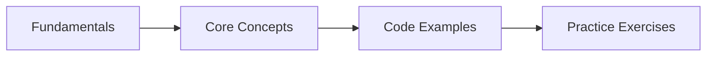

# Java Collections Framework

## Learning Objectives
## Chapter at a Glance

| Topic | Key Insight | Practical Takeaway |
|-------|-------------|--------------------|
| Core Concepts | Foundational understanding for Java development | Master these before Spring |
| Code Examples | Runnable, compilable examples | Type, compile, run, refactor |
| Practice Exercises | Hands-on skill building | Apply what you learn |

## Chapter Roadmap




By the end of this chapter, you will be able to:

- Navigate the Java Collections Framework hierarchy and select the correct interface/implementation for any problem
- Implement and analyze ArrayList, LinkedList, HashSet, TreeSet, HashMap, and TreeMap with full understanding of their internal data structures
- Compare objects using Comparable and Comparator with method-chaining and null-safe comparators
- Apply the Stream API with intermediate and terminal operations to express data transformations declaratively
- Build custom Collectors and use advanced collectors (groupingBy, partitioningBy, teeing) for complex reductions
- Write null-safe code with Optional and understand its monadic operations
- Use parallel streams correctly with awareness of thread safety, the ForkJoinPool, and performance trade-offs
- Choose between synchronized, unmodifiable, and concurrent collections based on thread-safety requirements

---

## 1. Collections Framework Overview


The **Java Collections Framework** (JCF) is a unified architecture for storing, retrieving, and manipulating groups of objects. It was introduced in JDK 1.2 and has been enhanced in every major release since. The framework provides:

- **Interfaces**: Abstract data types representing collections
- **Implementations**: Concrete classes that implement the interfaces
- **Algorithms**: Static methods in `Collections` and `Arrays` that operate on collections

### 1.1 Interface Hierarchy


The framework is built around two top-level interfaces: `Collection` and `Map`.

```
Iterable (java.lang)
  └── Collection (modifiable, optional operations)
        ├── List (ordered, indexed, allows duplicates)
        ├── Set (no duplicates)
        │     └── SortedSet → NavigableSet
        └── Queue (FIFO typically)
              └── Deque (double-ended)

Map (separate hierarchy, not a Collection)
  └── SortedMap → NavigableMap
```

`Iterable<E>` is in `java.lang` and is the root of the entire framework. It provides the enhanced for-each loop:

```java
public interface Iterable<T> {
    Iterator<T> iterator();
    default void forEach(Consumer<? super T> action) { ... }
    default Spliterator<T> spliterator() { ... }
}
```

Every `Collection` is `Iterable`, so every collection can be iterated with `for (var e : collection)`.

### 1.2 The `Collection` Interface


`Collection<E>` is the root interface of the collection hierarchy (excluding Map). Key methods:

```java
public interface Collection<E> extends Iterable<E> {
    int size();
    boolean isEmpty();
    boolean contains(Object o);
    Iterator<E> iterator();
    Object[] toArray();
    <T> T[] toArray(T[] a);

    // Modification (optional operations)
    boolean add(E e);
    boolean remove(Object o);
    boolean addAll(Collection<? extends E> c);
    boolean removeAll(Collection<?> c);
    boolean retainAll(Collection<?> c);  // intersection
    void clear();

    // Bulk + views
    boolean containsAll(Collection<?> c);
    default Stream<E> stream() { return StreamSupport.stream(spliterator(), false); }
    default Stream<E> parallelStream() { return StreamSupport.stream(spliterator(), true); }
}
```

Implementations may throw `UnsupportedOperationException` for optional operations. For example, an unmodifiable collection throws on `add`, `remove`, or `clear`.

### 1.3 The `Collections` Utility Class


`java.util.Collections` provides static algorithms that operate on collections. Every method works with the interfaces, not implementations.

```java
package com.pai.collections.overview;

import java.util.*;

public class CollectionsUtilityDemo {
    public static void main(String[] args) {
        List<Integer> numbers = new ArrayList<>(List.of(3, 1, 4, 1, 5, 9, 2, 6, 5));

        Collections.sort(numbers);
        System.out.println("Sorted: " + numbers);

        int idx = Collections.binarySearch(numbers, 5);
        System.out.println("Index of 5: " + idx);

        Collections.reverse(numbers);
        System.out.println("Reversed: " + numbers);

        Collections.shuffle(numbers);
        System.out.println("Shuffled: " + numbers);

        Integer max = Collections.max(numbers);
        Integer min = Collections.min(numbers);
        System.out.println("Max: " + max + ", Min: " + min);

        int freq = Collections.frequency(numbers, 5);
        System.out.println("Frequency of 5: " + freq);

        // Unmodifiable view → wraps, does not copy
        List<Integer> readOnly = Collections.unmodifiableList(numbers);
        // readOnly.add(42); // throws UnsupportedOperationException

        // Synchronized wrapper for legacy thread safety
        Collection<Integer> sync = Collections.synchronizedCollection(new ArrayList<>(numbers));
        synchronized (sync) {  // must synchronize on wrapper during iteration
            for (var n : sync) System.out.print(n + " ");
        }
        System.out.println();

        // Check for disjoint sets
        List<String> list1 = List.of("A", "B", "C");
        List<String> list2 = List.of("D", "E", "F");
        System.out.println("Disjoint: " + Collections.disjoint(list1, list2));

        // Singleton → optimized single-element set
        Set<String> singleton = Collections.singleton("Java");
        System.out.println("Singleton: " + singleton);
    }
}
```

**Key design principle**: The framework programs to interfaces, not implementations. Your code should accept `Collection`, `List`, `Set`, or `Map` as parameter types, not `ArrayList` or `HashMap`.

---

## 2. List Interface & Implementations

`List<E>` is an ordered collection (sequence). Elements can be accessed by integer index, and duplicates are allowed.

```java
public interface List<E> extends Collection<E> {
    E get(int index);
    E set(int index, E element);  // returns old value
    void add(int index, E element);
    E remove(int index);
    int indexOf(Object o);
    int lastIndexOf(Object o);
    ListIterator<E> listIterator();
    ListIterator<E> listIterator(int index);
    List<E> subList(int fromIndex, int toIndex);  // view, not copy
    default void replaceAll(UnaryOperator<E> operator) { ... }
    default void sort(Comparator<? super E> c) { ... }
}
```

### 2.1 ArrayList


`ArrayList<E>` is a **resizable array** implementation. It is the most commonly used List.

**Internal structure**:
- Backed by an `Object[] elementData` array
- Default initial capacity is 10
- Elements are stored contiguously
- Access by index is O(1)→fast random access
- Insertion/removal at an arbitrary index is O(n)→shifts elements
- Insertion at the end is amortized O(1)

**Growth factor**: When the array is full, `grow()` creates a new array of size `oldCapacity + (oldCapacity >> 1)`→a **1.5x growth factor**. This balances memory waste against insertion cost.

```java
// Internal growth logic (JDK 21+)
private Object[] grow(int minCapacity) {
    int oldCapacity = elementData.length;
    int newCapacity = oldCapacity + (oldCapacity >> 1);  // 1.5x
    if (newCapacity - minCapacity < 0)
        newCapacity = minCapacity;
    if (newCapacity - MAX_ARRAY_SIZE > 0)
        newCapacity = hugeCapacity(minCapacity);
    return elementData = Arrays.copyOf(elementData, newCapacity);
}
```

```java
package com.pai.collections.list;

import java.util.*;

public class ArrayListDemo {
    public static void main(String[] args) {
        // Creation
        List<String> list1 = new ArrayList<>();                    // capacity 10
        List<String> list2 = new ArrayList<>(1_000_000);           // pre-size known
        List<String> list3 = new ArrayList<>(List.of("A", "B"));  // from another collection

        // Demonstrate growth → watch for resizing cost
        List<Integer> growing = new ArrayList<>(2);
        growing.add(1);
        growing.add(2);
        growing.add(3); // triggers grow(): 2 + (2>>1) = 3, now capacity 3
        growing.add(4); // triggers grow(): 3 + (3>>1) = 5, now capacity 5
        System.out.println("Grown list: " + growing);

        // Access vs. modification speed
        List<String> names = new ArrayList<>(List.of("Alice", "Bob", "Charlie", "Diana"));
        System.out.println("Name at [2]: " + names.get(2)); // O(1)

        names.add(1, "Brianna"); // O(n) → shifts Bob, Charlie, Diana right
        System.out.println("After insert: " + names);

        names.remove(0); // O(n) → shifts Brianna, Bob, Charlie, Diana left
        System.out.println("After remove first: " + names);

        // Bulk operations
        names.retainAll(List.of("Bob", "Charlie")); // keep only these
        System.out.println("After retain: " + names);

        // Replace all with unary operator
        names.replaceAll(String::toUpperCase);
        System.out.println("Upper: " + names);

        // SubList → live view
        List<Integer> numbers = new ArrayList<>(
            new java.util.stream.IntStream().rangeClosed(1, 10).boxed().toList()
        );
        List<Integer> sub = numbers.subList(3, 7); // [4,5,6,7]
        System.out.println("SubList: " + sub);
        sub.replaceAll(n -> n * 10);
        System.out.println("After modifying sub (numbers too): " + numbers);

        // Clear sublist's parent first = ConcurrentModificationException
        // numbers.clear();   // uncomment → sub iteration throws ConcurrentModificationException
    }
}
```

**When to use ArrayList**:
- Random access by index is common
- You append far more often than you insert or remove from the middle
- Memory locality matters (contiguous storage is CPU-cache-friendly)

### 2.2 LinkedList


`LinkedList<E>` is a **doubly-linked list** implementation. It also implements `Deque<E>`.

**Internal structure**:
- Each element is a `Node<E>` containing data + prev + next pointers
- Maintains references to `first` and `last` nodes
- Access by index is O(n)→must traverse from head or tail
- Insertion/removal at either end is O(1)
- Insertion/removal in the middle is O(n) to find the position, O(1) to relink

```java
package com.pai.collections.list;

import java.util.*;

public class LinkedListDemo {
    public static void main(String[] args) {
        Deque<String> deque = new LinkedList<>();

        // Use as a queue (FIFO)
        deque.offer("First");
        deque.offer("Second");
        deque.offer("Third");
        System.out.println("Queue poll: " + deque.poll()); // First

        // Use as a stack (LIFO) → better than legacy Stack
        Deque<String> stack = new LinkedList<>();
        stack.push("Bottom");
        stack.push("Middle");
        stack.push("Top");
        System.out.println("Stack pop: " + stack.pop()); // Top

        // List-specific operations
        List<String> list = new LinkedList<>(List.of("A", "B", "C", "D", "E"));
        // getFirst / getLast → O(1)
        System.out.println("First: " + list.getFirst() + ", Last: " + list.getLast());

        // Access by index → O(n), traverses from nearer end
        System.out.println("Element at [2]: " + list.get(2));

        // ListIterator supports reverse traversal
        var it = list.listIterator(list.size());
        while (it.hasPrevious()) {
            System.out.print(it.previous() + " ");
        }
        System.out.println();

        // Memory overhead: each node stores 3 references + padding
        // vs ArrayList's single array + waste from growth
        // LinkedList uses ~24 extra bytes per element on 64-bit JVMs
    }
}
```

**When to use LinkedList**:
- Frequent insertion/removal at both ends (use as Deque)
- You need a queue or stack and want list operations too
- You rarely access elements by index
- **Otherwise prefer ArrayList** → LinkedList has higher memory overhead and worse cache locality

### 2.3 Vector & Stack → Legacy Classes


`Vector` and `Stack` are **legacy** classes from Java 1.0. They were retrofitted to implement `List` in Java 2 but remain synchronized on every operation, which causes unnecessary overhead in single-threaded code.

```java
package com.pai.collections.list;

import java.util.*;

public class LegacyDemo {
    public static void main(String[] args) {
        // Vector → synchronized ArrayList equivalent
        Vector<String> vector = new Vector<>();
        vector.add("A");
        vector.add("B");
        System.out.println("Vector capacity: " + vector.capacity()); // default 10, grows 2x

        // Stack → extends Vector, LIFO
        Stack<Integer> stack = new Stack<>();
        stack.push(1);
        stack.push(2);
        stack.push(3);
        System.out.println("Stack pop: " + stack.pop()); // 3
        System.out.println("Stack peek: " + stack.peek()); // 2
        System.out.println("Stack search(1): " + stack.search(1)); // distance from top, 1-based

        // Prefer these replacements:
        List<String> arrayList = new ArrayList<>();          // instead of Vector
        Deque<Integer> arrayDeque = new ArrayDeque<>();     // instead of Stack
    }
}
```

### 2.4 List.of, List.copyOf, and Unmodifiable Lists


Java 9+ introduced convenient factory methods for creating **unmodifiable lists**.

```java
package com.pai.collections.list;

import java.util.*;

public class UnmodifiableListDemo {
    public static void main(String[] args) {
        // List.of → compact, unmodifiable, null-hostile
        List<String> fruits = List.of("Apple", "Banana", "Cherry");
        System.out.println("List.of: " + fruits);
        // fruits.add("Date"); // throws UnsupportedOperationException
        // List.of("A", null); // throws NullPointerException

        // List.copyOf → copies and wraps as unmodifiable
        List<String> mutable = new ArrayList<>(List.of("X", "Y", "Z"));
        List<String> copy = List.copyOf(mutable);
        System.out.println("List.copyOf: " + copy);
        mutable.set(0, "Modified"); // changes original, NOT the copy
        System.out.println("After modifying original: copy = " + copy);

        // JDK 16+ → toList() on streams returns unmodifiable list
        List<Integer> squares = java.util.stream.Stream.of(1, 2, 3, 4, 5)
            .map(n -> n * n)
            .toList(); // unmodifiable since Java 16
        System.out.println("Stream.toList(): " + squares);

        // Collections.unmodifiableList → wraps any list, still reflects changes
        List<String> backing = new ArrayList<>(List.of("A", "B"));
        List<String> unmod = Collections.unmodifiableList(backing);
        backing.add("C"); // unmod now sees it
        System.out.println("Unmodifiable view after backing change: " + unmod);
    }
}
```

**Key differences**:
- `List.of(...)` → creates a fixed-size list directly
- `List.copyOf(coll)` → copies elements from any collection to an unmodifiable list
- `Collections.unmodifiableList(list)` → provides a view; changes to the backing list are visible
- All three reject `null` elements

---

## 3. Set Interface & Implementations

`Set<E>` is a collection that **cannot contain duplicate elements**. It models the mathematical set abstraction.

```java
public interface Set<E> extends Collection<E> {
    // No additional methods → purely semantic contract
    // Adds are not idempotent; add(e) returns false if e already exists
}
```

### 3.1 HashSet


`HashSet<E>` is backed by a `HashMap<E, Object>` hash table.

**Internal structure**:
- Elements are stored as keys in a HashMap with a shared `PRESENT` sentinel value
- Uses `hashCode()` and `equals()` for element identity
- Add, remove, contains are O(1) average, O(n) worst (hash collisions)

**Load factor**: Default `0.75`. When `size > capacity * loadFactor`, the table is resized (doubled). A lower load factor trades memory for fewer collisions.

```java
package com.pai.collections.set;

import java.util.*;

public class HashSetDemo {
    public static void main(String[] args) {
        // Creation
        Set<String> set1 = new HashSet<>();                    // capacity 16, load 0.75
        Set<String> set2 = new HashSet<>(1_000_000);           // pre-size
        Set<String> set3 = new HashSet<>(1_000_000, 0.8f);     // custom load factor

        Set<String> names = new HashSet<>();
        names.add("Alice");
        names.add("Bob");
        names.add("Alice"); // ignored → duplicate
        System.out.println("HashSet: " + names);  // order is NOT guaranteed

        // Hash code matters → a poor hashCode ruins performance
        Set<BadHash> bad = new HashSet<>();
        for (int i = 0; i < 10000; i++) bad.add(new BadHash(i));
        System.out.println("Contains 5000: " + bad.contains(new BadHash(5000))); // slow!

        // Removing
        names.remove("Bob");
        System.out.println("After remove: " + names);
    }
}

class BadHash {
    int id;
    BadHash(int id) { this.id = id; }
    // int hashCode() { return id; }      // fix: uncomment for O(1)
    public int hashCode() { return 42; }   // every object in same bucket → O(n)
    public boolean equals(Object o) {
        if (!(o instanceof BadHash other)) return false;
        return this.id == other.id;
    }
}
```

**Internal expansion**:
```java
// Simplified view of HashMap's resize logic
final Node<K,V>[] resize() {
    Node<K,V>[] oldTab = table;
    int oldCap = (oldTab == null) ? 0 : oldTab.length;
    int oldThr = threshold;
    int newCap, newThr = 0;
    if (oldCap > 0) {
        if (oldCap >= MAXIMUM_CAPACITY) { threshold = Integer.MAX_VALUE; return oldTab; }
        else if ((newCap = oldCap << 1) <= MAXIMUM_CAPACITY) {
            newThr = oldThr << 1;    // double threshold
        }
    }
    threshold = newThr;
    Node<K,V>[] newTab = (Node<K,V>[])new Node[newCap];
    table = newTab;
    // rehash all existing entries into new table
    return newTab;
}
```

### 3.2 LinkedHashSet


`LinkedHashSet<E>` extends `HashSet<E>` with a **doubly-linked list** running through all entries.

- Maintains **insertion order** (and access order if configured via LinkedHashMap)
- Only slightly slower than HashSet for operations
- Predictable iteration order

```java
package com.pai.collections.set;

import java.util.*;

public class LinkedHashSetDemo {
    public static void main(String[] args) {
        Set<String> ordered = new LinkedHashSet<>();
        ordered.add("Zulu");
        ordered.add("Alpha");
        ordered.add("Bravo");
        ordered.add("Delta");
        System.out.println("LinkedHashSet (insertion order): " + ordered);

        // Re-inserting an element does NOT change its position
        ordered.add("Alpha");
        System.out.println("After re-add Alpha: " + ordered); // Alpha stays at position 1

        // Practical use: dedup while preserving order
        List<Integer> input = List.of(3, 1, 2, 1, 3, 4, 5, 2);
        Set<Integer> deduped = new LinkedHashSet<>(input);
        System.out.println("Deduped preserving order: " + deduped);
    }
}
```

### 3.3 TreeSet


`TreeSet<E>` is a **Red-Black Tree** implementation that stores elements in **sorted order**.

- Elements must implement `Comparable`, or a `Comparator` must be provided
- Add, remove, contains are O(log n)
- Maintains sorted iteration order
- `first()`, `last()`, `headSet(to)`, `tailSet(from)`, `subSet(from, to)` are useful

```java
package com.pai.collections.set;

import java.util.*;

public class TreeSetDemo {
    public static void main(String[] args) {
        // Natural ordering (Comparable)
        NavigableSet<Integer> numbers = new TreeSet<>();
        numbers.addAll(Set.of(5, 3, 7, 1, 9, 4, 6, 8, 2));
        System.out.println("TreeSet: " + numbers); // [1,2,3,4,5,6,7,8,9]

        // Navigation methods
        System.out.println("First: " + numbers.first());      // 1
        System.out.println("Last: " + numbers.last());        // 9
        System.out.println("Lower than 5: " + numbers.lower(5));   // 4 (<5)
        System.out.println("Floor of 5: " + numbers.floor(5));      // 5 (<=5)
        System.out.println("Ceiling of 5: " + numbers.ceiling(5));  // 5 (>=5)
        System.out.println("Higher than 5: " + numbers.higher(5));  // 6 (>5)

        // Descending view
        NavigableSet<Integer> desc = numbers.descendingSet();
        System.out.println("Descending: " + desc);

        // Subsets
        System.out.println("HeadSet (<5): " + numbers.headSet(5));       // [1,2,3,4]
        System.out.println("TailSet (>=5): " + numbers.tailSet(5));      // [5,6,7,8,9]
        System.out.println("SubSet [3,7): " + numbers.subSet(3, 7));     // [3,4,5,6]

        // Custom comparator → reverse order
        NavigableSet<String> reverse = new TreeSet<>(Comparator.reverseOrder());
        reverse.addAll(Set.of("Alpha", "Bravo", "Charlie", "Delta"));
        System.out.println("Reverse TreeSet: " + reverse);

        // With a custom type
        NavigableSet<Person> byAge = new TreeSet<>(Comparator.comparingInt(Person::age));
        byAge.add(new Person("Alice", 30));
        byAge.add(new Person("Bob", 25));
        byAge.add(new Person("Charlie", 35));
        System.out.println("By age: " + byAge);
    }
}

record Person(String name, int age) {}
```

### 3.4 EnumSet


`EnumSet<E extends Enum<E>>` is a **highly optimized** bit-vector implementation for enum types. It is one of the most performant collection types in Java.

**Key characteristics**:
- Backed by a `long[]` (RegularEnumSet uses a single long for &lt;64 values, JumboEnumSet for &gt;64)
- All operations are bitwise → extremely fast
- Iteration order follows enum declaration order
- Cannot have `null` elements

```java
package com.pai.collections.set;

import java.util.*;

enum Day { MONDAY, TUESDAY, WEDNESDAY, THURSDAY, FRIDAY, SATURDAY, SUNDAY }

public class EnumSetDemo {
    public static void main(String[] args) {
        // Factory methods
        EnumSet<Day> weekdays = EnumSet.range(Day.MONDAY, Day.FRIDAY);
        System.out.println("Weekdays: " + weekdays);

        EnumSet<Day> weekend = EnumSet.of(Day.SATURDAY, Day.SUNDAY);
        System.out.println("Weekend: " + weekend);

        EnumSet<Day> all = EnumSet.allOf(Day.class);
        System.out.println("All days: " + all);

        EnumSet<Day> none = EnumSet.noneOf(Day.class);
        System.out.println("None: " + none);

        // Bitwise operations
        EnumSet<Day> midWeek = EnumSet.of(Day.TUESDAY, Day.WEDNESDAY, Day.THURSDAY);
        weekdays.removeAll(midWeek);
        System.out.println("Weekdays without mid-week: " + weekdays);

        // Complement
        EnumSet<Day> complement = EnumSet.complementOf(weekend);
        System.out.println("Complement of weekend: " + complement);

        // Use case: grouping enum values
        Set<Day> workFromHome = EnumSet.of(Day.WEDNESDAY, Day.FRIDAY);
        Map<Day, String> schedule = new EnumMap<>(Day.class);
        for (Day d : Day.values()) {
            schedule.put(d, workFromHome.contains(d) ? "WFH" : "Office");
        }
        System.out.println("Schedule: " + schedule);
    }
}
```

### 3.5 Set.of and Set.copyOf


Like `List`, Java 9+ provides immutable set factories.

```java
package com.pai.collections.set;

import java.util.*;

public class ImmutableSetDemo {
    public static void main(String[] args) {
        // Set.of → compact, unmodifiable, no nulls
        Set<String> colors = Set.of("Red", "Green", "Blue");
        System.out.println("Set.of: " + colors);
        // colors.add("Yellow"); // throws UnsupportedOperationException
        // Set.of("Red", null);   // throws NullPointerException

        // Duplicates at creation time
        // Set.of("A", "A");         // IllegalArgumentException! → duplicate
        // Set<String> dedup = new HashSet<>(List.of("A", "A")); // no exception → deduplicates

        // Set.copyOf → copies to unmodifiable set
        Set<String> mutable = new HashSet<>(Set.of("X", "Y", "Z"));
        Set<String> frozen = Set.copyOf(mutable);
        System.out.println("Set.copyOf: " + frozen);

        // EnumSet is already compact → prefer EnumSet.of for enum types
    }
}
```

---

## 4. Map Interface & Implementations

`Map<K, V>` stores **key-value pairs** with unique keys.

```java
public interface Map<K, V> {
    int size();
    boolean isEmpty();
    boolean containsKey(Object key);
    boolean containsValue(Object value);
    V get(Object key);
    V put(K key, V value);        // returns old value or null
    V remove(Object key);
    void putAll(Map<? extends K, ? extends V> m);
    void clear();

    // Views (all reflect changes to the map)
    Set<K> keySet();
    Collection<V> values();
    Set<Map.Entry<K, V>> entrySet();

    // Default methods (Java 8+)
    V getOrDefault(Object key, V defaultValue);
    V putIfAbsent(K key, V value);
    boolean remove(Object key, Object value);
    boolean replace(K key, V oldValue, V newValue);
    V replace(K key, V value);
    V computeIfAbsent(K key, Function<? super K, ? extends V> mappingFunction);
    V computeIfPresent(K key, BiFunction<? super K, ? super V, ? extends V> remappingFunction);
    V compute(K key, BiFunction<? super K, ? super V, ? extends V> remappingFunction);
    V merge(K key, V value, BiFunction<? super V, ? super V, ? extends V> remappingFunction);
    void forEach(BiConsumer<? super K, ? super V> action);
    void replaceAll(BiFunction<? super K, ? super V, ? extends V> function);
}
```

### 4.1 HashMap


`HashMap<K, V>` is a **hash table** implementation. It is the most commonly used Map.

**Internal structure (JDK 8+)**:

```
Array of buckets:  Node<K,V>[] table

Each bucket is initially a linked list.
When a bucket reaches TREEIFY_THRESHOLD (8), it converts to a red-black tree.
When a bucket shrinks below UNTREEIFY_THRESHOLD (6), it converts back to a list.

Node<K,V> structure:
  int hash     → cached hash code
  K key
  V value
  Node<K,V> next

TreeNode<K,V> structure (red-black):
  TreeNode<K,V> parent, left, right, prev
  boolean red
```

```java
package com.pai.collections.map;

import java.util.*;

public class HashMapInternalDemo {
    public static void main(String[] args) {
        // Initial capacity = 16, load factor = 0.75
        // When size > 16*0.75 = 12, table doubles to 32
        Map<String, Integer> scores = new HashMap<>();

        scores.put("Alice", 95);
        scores.put("Bob", 87);
        scores.put("Charlie", 92);
        scores.put("Diana", 88);

        // Put returns previous value
        Integer prev = scores.put("Alice", 96);
        System.out.println("Previous score for Alice: " + prev); // 95

        // Compute if absent → only computes if key is missing
        scores.computeIfAbsent("Eve", k -> 85);
        scores.computeIfAbsent("Alice", k -> 0); // ignored → already present
        System.out.println("Scores: " + scores);

        // Merge → combines existing value with new one
        Map<String, List<String>> multiMap = new HashMap<>();
        multiMap.computeIfAbsent("fruits", k -> new ArrayList<>()).add("Apple");
        multiMap.computeIfAbsent("fruits", k -> new ArrayList<>()).add("Banana");
        System.out.println("Multi-map: " + multiMap);

        // forEach
        scores.forEach((name, score) ->
            System.out.println(name + ": " + score));

        // Views
        Set<String> keys = scores.keySet();
        for (String k : keys) System.out.print(k + " ");

        Collection<Integer> values = scores.values();

        // Entry views
        for (Map.Entry<String, Integer> entry : scores.entrySet()) {
            if (entry.getValue() >= 90) {
                entry.setValue(entry.getValue() + 5); // bonus
            }
        }
        System.out.println("After bonus: " + scores);
    }
}
```

**Treeification logic (simplified)**:
```java
// In HashMap.putVal:
for (int binCount = 0; ; ++binCount) {
    if ((e = p.next) == null) {
        p.next = newNode(hash, key, value, null);
        if (binCount >= TREEIFY_THRESHOLD - 1)  // -1 for first element
            treeifyBin(tab, hash);  // convert bucket to red-black tree
        break;
    }
    if (e.hash == hash && ((k = e.key) == key || (key != null && key.equals(k))))
        break;
    p = e;
}
// Treeification only occurs if table.length >= MIN_TREEIFY_CAPACITY (64)
// Otherwise, the table is resized instead.
```

### 4.2 LinkedHashMap


`LinkedHashMap<K, V>` extends `HashMap` with a doubly-linked list running through entries.

**Two ordering modes**:
1. **Insertion order** (default) → iteration order matches insertion
2. **Access order** → iteration order matches access pattern (most recently accessed last)

Access-order mode is perfect for implementing **LRU caches** when combined with `removeEldestEntry()`.

```java
package com.pai.collections.map;

import java.util.*;

public class LinkedHashMapDemo {
    public static void main(String[] args) {
        // Insertion order (default)
        LinkedHashMap<String, Integer> insertion = new LinkedHashMap<>();
        insertion.put("Z", 1);
        insertion.put("A", 2);
        insertion.put("M", 3);
        System.out.println("Insertion order: " + insertion);

        // Access order → for LRU cache
        LinkedHashMap<String, Integer> access = new LinkedHashMap<>(16, 0.75f, true);
        access.put("A", 1);
        access.put("B", 2);
        access.put("C", 3);
        access.get("A");          // A is now most recently accessed
        access.put("D", 4);
        System.out.println("Access order: " + access); // B, C, A, D (A moved to end)
    }
}

// LRU Cache example
class LRUCache<K, V> extends LinkedHashMap<K, V> {
    private final int maxCapacity;

    public LRUCache(int maxCapacity) {
        super(16, 0.75f, true);   // access-order = true
        this.maxCapacity = maxCapacity;
    }

    @Override
    protected boolean removeEldestEntry(Map.Entry<K, V> eldest) {
        return size() > maxCapacity;
    }

    public static void main(String[] args) {
        LRUCache<String, String> cache = new LRUCache<>(3);
        cache.put("A", "Alpha");
        cache.put("B", "Beta");
        cache.put("C", "Gamma");
        System.out.println("Cache: " + cache); // A, B, C
        cache.get("A");                         // A accessed → becomes most recent
        cache.put("D", "Delta");                // B is oldest → evicted
        System.out.println("After evict: " + cache); // C, A, D
    }
}
```

### 4.3 TreeMap


`TreeMap<K, V>` is a **Red-Black Tree** implementation. Keys are stored in sorted order.

- O(log n) for `put`, `get`, `containsKey`, `remove`
- Keys must implement `Comparable` or a `Comparator` must be provided
- Navigation methods: `firstKey()`, `lastKey()`, `lowerKey()`, `higherKey()`, `floorKey()`, `ceilingKey()`
- Partial views: `headMap()`, `tailMap()`, `subMap()`

```java
package com.pai.collections.map;

import java.util.*;

public class TreeMapDemo {
    public static void main(String[] args) {
        NavigableMap<String, Integer> population = new TreeMap<>();
        population.put("USA", 331_000_000);
        population.put("India", 1_380_000_000);
        population.put("China", 1_410_000_000);
        population.put("Brazil", 213_000_000);
        population.put("Nigeria", 206_000_000);

        System.out.println("Sorted by key: " + population);

        // Navigation
        System.out.println("First key: " + population.firstKey());
        System.out.println("Last key: " + population.lastKey());
        System.out.println("Lower than Nigeria: " + population.lowerKey("Nigeria"));
        System.out.println("Higher than Nigeria: " + population.higherKey("Nigeria"));

        // Partial views
        System.out.println("Countries before Nigeria: " + population.headMap("Nigeria", false));
        System.out.println("Countries >= India: " + population.tailMap("India"));

        // Descending order
        System.out.println("Descending: " + population.descendingMap());

        // Custom comparator → sort by value descending
        // (requires copying to another TreeMap; TreeMap only sorts by key)
        NavigableMap<Integer, String> byPopulation = new TreeMap<>(Comparator.reverseOrder());
        population.forEach((k, v) -> byPopulation.put(v, k));
        System.out.println("By population descending: " + byPopulation);

        // Polling
        var first = population.pollFirstEntry();
        System.out.println("Removed first: " + first.getKey() + "=" + first.getValue());
        System.out.println("Remaining: " + population);
    }
}
```

### 4.4 EnumMap


`EnumMap<K extends Enum<K>, V>` is a highly optimized map for enum keys.

**Internal structure**:
- Backed by a plain `Object[]` array indexed by `ordinal()`
- No hashing needed → direct array lookup
- Iterates in enum declaration order
- Faster than HashMap for enum keys

```java
package com.pai.collections.map;

import java.util.*;

enum Priority { LOW, MEDIUM, HIGH, CRITICAL }

record Task(String description, Priority priority) {}

public class EnumMapDemo {
    public static void main(String[] args) {
        Map<Priority, List<Task>> taskBoard = new EnumMap<>(Priority.class);
        for (Priority p : Priority.values()) {
            taskBoard.put(p, new ArrayList<>());
        }

        taskBoard.get(Priority.HIGH).add(new Task("Fix login bug", Priority.HIGH));
        taskBoard.get(Priority.CRITICAL).add(new Task("Production outage", Priority.CRITICAL));
        taskBoard.get(Priority.MEDIUM).add(new Task("Refactor service", Priority.MEDIUM));
        taskBoard.get(Priority.LOW).add(new Task("Update docs", Priority.LOW));
        taskBoard.get(Priority.HIGH).add(new Task("Security patch", Priority.HIGH));

        // Iteration follows enum declaration order
        taskBoard.forEach((priority, tasks) -> {
            System.out.println(priority + ": " + tasks.size() + " tasks");
            tasks.forEach(t -> System.out.println("  - " + t.description()));
        });

        // Compact performance → no hash computation
        EnumMap<Priority, String> labels = new EnumMap<>(Priority.class);
        labels.put(Priority.HIGH, "Urgent");
        labels.put(Priority.LOW, "Whenever");
        System.out.println("Labels: " + labels);
    }
}
```

### 4.5 WeakHashMap


`WeakHashMap<K, V>` uses **weak references** for keys. When a key is only weakly reachable (no strong references outside the map), it is eligible for GC and will be removed from the map.

**Use case**: Caches or metadata that should not prevent garbage collection.

```java
package com.pai.collections.map;

import java.util.*;

public class WeakHashMapDemo {
    public static void main(String[] args) {
        WeakHashMap<UniqueKey, String> cache = new WeakHashMap<>();

        UniqueKey key1 = new UniqueKey(1);
        UniqueKey key2 = new UniqueKey(2);

        cache.put(key1, "Value 1");
        cache.put(key2, "Value 2");
        System.out.println("Before GC: " + cache.size()); // 2

        key1 = null; // remove strong reference

        System.gc(); // request GC (not guaranteed, but usually works in this demo)

        // Sleep briefly to allow GC to run
        try { Thread.sleep(100); } catch (InterruptedException e) { Thread.currentThread().interrupt(); }

        System.out.println("After GC: " + cache.size()); // likely 1 (key1 was reclaimed)
        System.out.println("Remaining: " + cache);
    }
}

class UniqueKey {
    private final int id;
    UniqueKey(int id) { this.id = id; }
    public boolean equals(Object o) {
        if (!(o instanceof UniqueKey other)) return false;
        return this.id == other.id;
    }
    public int hashCode() { return Integer.hashCode(id); }
    public String toString() { return "Key-" + id; }
}
```

### 4.6 IdentityHashMap


`IdentityHashMap<K, V>` uses **reference equality** (`==`) instead of `equals()` for key comparisons.

**Internal**: Backed by a linear-probing hash table (not separate chaining like HashMap).

**Use case**: Serialization, graph algorithms, or maintaining per-instance metadata.

```java
package com.pai.collections.map;

import java.util.*;

public class IdentityHashMapDemo {
    public static void main(String[] args) {
        IdentityHashMap<String, Integer> identityMap = new IdentityHashMap<>();

        String s1 = "hello";
        String s2 = new String("hello"); // different object

        identityMap.put(s1, 1);
        identityMap.put(s2, 2);          // different reference, different entry

        System.out.println("IdentityHashMap size: " + identityMap.size()); // 2
        System.out.println("s1 value: " + identityMap.get(s1));
        System.out.println("s2 value: " + identityMap.get(s2));

        // Compare with HashMap → uses .equals()
        Map<String, Integer> hashMap = new HashMap<>();
        hashMap.put(s1, 1);
        hashMap.put(s2, 2);              // same logical key, overwrites
        System.out.println("HashMap size: " + hashMap.size()); // 1
    }
}
```

### 4.7 Map.Entry


The `Map.Entry` interface represents a single key-value pair. It provides methods for accessing and (on modifiable maps) updating entries.

```java
package com.pai.collections.map;

import java.util.*;

public class MapEntryDemo {
    public static void main(String[] args) {
        Map<String, Double> prices = new HashMap<>(Map.of(
            "Laptop", 1299.99,
            "Phone", 799.99,
            "Tablet", 449.99
        ));

        // Iterate with Entry
        for (Map.Entry<String, Double> entry : prices.entrySet()) {
            String key = entry.getKey();
            Double value = entry.getValue();
            System.out.printf("%s: $%.2f%n", key, value);
        }

        // Modify values through entry
        var it = prices.entrySet().iterator();
        while (it.hasNext()) {
            var entry = it.next();
            if (entry.getValue() > 1000) {
                entry.setValue(entry.getValue() * 0.9); // 10% discount
            }
        }
        System.out.println("After discounts: " + prices);

        // Creating a simple entry
        Map.Entry<String, Integer> entry = Map.entry("Key", 42);
        System.out.println("Simple entry: " + entry.getKey() + "=" + entry.getValue());

        // Entry comparators
        prices.entrySet().stream()
            .sorted(Map.Entry.comparingByValue())
            .forEach(e -> System.out.println(e.getKey() + ": " + e.getValue()));

        prices.entrySet().stream()
            .sorted(Map.Entry.<String, Double>comparingByKey().reversed())
            .forEach(e -> System.out.println(e.getKey() + ": " + e.getValue()));
    }
}
```

### 4.8 computeIfAbsent, merge, and Modern Map Methods


Java 8 added functional methods that eliminate the common "check then act" boilerplate.

```java
package com.pai.collections.map;

import java.util.*;

public class ModernMapDemo {
    public static void main(String[] args) {
        // ---- computeIfAbsent ----
        // Before Java 8:
        Map<String, List<Integer>> oldWay = new HashMap<>();
        String key = "scores";
        List<Integer> list = oldWay.get(key);
        if (list == null) {
            list = new ArrayList<>();
            oldWay.put(key, list);
        }
        list.add(42);

        // With computeIfAbsent:
        Map<String, List<Integer>> modern = new HashMap<>();
        modern.computeIfAbsent("scores", k -> new ArrayList<>()).add(42);
        modern.computeIfAbsent("scores", k -> new ArrayList<>()).add(100);
        System.out.println("computeIfAbsent: " + modern);

        // ---- merge ----
        // Word count with merge
        String text = "the quick brown fox jumps over the lazy dog the";
        Map<String, Integer> wordCount = new HashMap<>();
        for (String word : text.split(" ")) {
            wordCount.merge(word, 1, Integer::sum);
        }
        System.out.println("Word count: " + wordCount);

        // Merge for combining maps
        Map<String, String> m1 = new HashMap<>(Map.of("a", "alpha", "b", "beta"));
        Map<String, String> m2 = new HashMap<>(Map.of("b", "bravo", "c", "charlie"));
        m2.forEach((k, v) -> m1.merge(k, v, (oldVal, newVal) -> oldVal + "|" + newVal));
        System.out.println("Merged: " + m1); // a=alpha, b=beta|bravo, c=charlie

        // ---- computeIfPresent ----
        Map<String, Integer> stock = new HashMap<>(Map.of("Apples", 10, "Oranges", 0));
        stock.computeIfPresent("Apples", (k, v) -> v - 3); // deduct
        stock.computeIfPresent("Oranges", (k, v) -> v - 1); // stays 0
        System.out.println("Stock: " + stock);

        // ---- putIfAbsent vs computeIfAbsent ----
        // putIfAbsent inserts the value even if it requires computation (eager)
        // computeIfAbsent only computes if absent (lazy) → use this for expensive computations
    }
}
```

### 4.9 Map.of, Map.copyOf, and Immutable Maps


```java
package com.pai.collections.map;

import java.util.*;

public class ImmutableMapDemo {
    public static void main(String[] args) {
        // Map.of → up to 10 key-value pairs, no nulls
        Map<String, Integer> small = Map.of(
            "Alice", 95,
            "Bob", 87,
            "Charlie", 92
        );
        System.out.println("Map.of: " + small);

        // Map.ofEntries → arbitrary number of entries
        Map<String, Integer> larger = Map.ofEntries(
            Map.entry("A", 1),
            Map.entry("B", 2),
            Map.entry("C", 3),
            Map.entry("D", 4)
            // ... any number
        );
        System.out.println("Map.ofEntries: " + larger);

        // Map.copyOf → unmodifiable copy
        Map<String, Integer> mutable = new HashMap<>();
        mutable.put("X", 10);
        Map<String, Integer> frozen = Map.copyOf(mutable);
        System.out.println("Map.copyOf: " + frozen);
        // frozen.put("Y", 20); // throws UnsupportedOperationException

        // Nested immutability note: the map is shallowly immutable
        // Values that are mutable collections can still be modified
        Map<String, List<Integer>> nestedMutable = Map.of(
            "scores", new ArrayList<>(List.of(1, 2, 3))
        );
        nestedMutable.get("scores").add(4); // allowed! → list is mutable
        System.out.println("Modified nested: " + nestedMutable);
    }
}
```

---

## 5. Queue & Deque

### 5.1 Queue Interface


`Queue<E>` represents a collection for holding elements prior to processing.

**Two groups of methods**:

| Operation | Throws exception | Returns special value |
|-----------|-----------------|----------------------|
| Insert | `add(e)` | `offer(e)` |
| Remove | `remove()` | `poll()` |
| Inspect | `element()` | `peek()` |

```java
public interface Queue<E> extends Collection<E> {
    boolean offer(E e);   // insert
    E poll();             // retrieve and remove (null if empty)
    E peek();             // retrieve without remove (null if empty)
    // Inherited from Collection:
    // boolean add(E e);  // insert (throws IllegalStateException on capacity limit)
    // E remove();        // retrieve and remove (throws NoSuchElementException)
    // E element();       // retrieve without remove (throws NoSuchElementException)
}
```

### 5.2 PriorityQueue


`PriorityQueue<E>` is an **unbounded priority queue** backed by a **binary heap** (min-heap by default).

- O(log n) for `offer` and `poll`
- O(1) for `peek`
- Not thread-safe (use `PriorityBlockingQueue` for concurrent access)
- Iteration order is **not sorted** → you must poll to get elements in priority order

```java
package com.pai.collections.queue;

import java.util.*;

public class PriorityQueueDemo {
    public static void main(String[] args) {
        // Min-heap (default) → natural ordering
        PriorityQueue<Integer> minHeap = new PriorityQueue<>();
        minHeap.offer(5);
        minHeap.offer(1);
        minHeap.offer(9);
        minHeap.offer(3);
        minHeap.offer(7);

        System.out.println("PriorityQueue (polling in order):");
        while (!minHeap.isEmpty()) {
            System.out.print(minHeap.poll() + " "); // 1 3 5 7 9
        }
        System.out.println();

        // Max-heap via Comparator.reverseOrder()
        PriorityQueue<Integer> maxHeap = new PriorityQueue<>(Comparator.reverseOrder());
        maxHeap.offerAll(List.of(5, 1, 9, 3, 7));

        // Custom comparator → shorter jobs first
        record Job(int priority, String name) {}
        PriorityQueue<Job> jobQueue = new PriorityQueue<>(
            Comparator.comparingInt(Job::priority)
        );
        jobQueue.offer(new Job(3, "Low urgency"));
        jobQueue.offer(new Job(1, "Critical fix"));
        jobQueue.offer(new Job(2, "Important feature"));

        while (!jobQueue.isEmpty()) {
            Job j = jobQueue.poll();
            System.out.println("Processing: " + j.name() + " (priority " + j.priority() + ")");
        }

        // Important: iteration order is NOT sorted
        PriorityQueue<Integer> pq = new PriorityQueue<>(List.of(5, 1, 9, 3, 7));
        System.out.println("Iteration order (unsorted): " + pq);
        // Poll to get sorted output
        var temp = new ArrayList<Integer>();
        while (!pq.isEmpty()) temp.add(pq.poll());
        System.out.println("Polled order (sorted): " + temp);
    }
}
```

### 5.3 ArrayDeque


`ArrayDeque<E>` is a **resizable array** implementation of `Deque<E>`. It is faster than `LinkedList` as a queue or stack and has no capacity restrictions.

- O(1) amortized for `addFirst`, `addLast`, `removeFirst`, `removeLast`
- Never backed by a linked list → uses a circular array
- Not thread-safe

```java
package com.pai.collections.queue;

import java.util.*;

public class ArrayDequeDemo {
    public static void main(String[] args) {
        // As a stack → preferred over Stack class
        Deque<String> stack = new ArrayDeque<>();
        stack.push("Bottom");
        stack.push("Middle");
        stack.push("Top");
        System.out.println("Stack:");
        while (!stack.isEmpty()) {
            System.out.println("  " + stack.pop());
        }

        // As a queue (FIFO)
        Deque<String> queue = new ArrayDeque<>();
        queue.offer("First");
        queue.offer("Second");
        queue.offer("Third");
        System.out.println("Queue:");
        while (!queue.isEmpty()) {
            System.out.println("  " + queue.poll());
        }

        // Double-ended operations
        Deque<Integer> deque = new ArrayDeque<>();
        deque.addFirst(1);
        deque.addLast(2);
        deque.addFirst(0);
        deque.addLast(3);
        System.out.println("Deque: " + deque); // [0, 1, 2, 3]

        System.out.println("First: " + deque.getFirst()); // 0
        System.out.println("Last: " + deque.getLast());   // 3
        deque.removeFirst();
        deque.removeLast();
        System.out.println("After remove first/last: " + deque); // [1, 2]

        // Process in a work-stealing pattern
        Deque<Runnable> workQueue = new ArrayDeque<>();
        workQueue.addLast(() -> System.out.println("Task 1"));
        workQueue.addLast(() -> System.out.println("Task 2"));

        // Worker thread takes from head
        Runnable task = workQueue.pollFirst();
        task.run();

        // Internal: circular array
        // Elements stored in Object[] elements
        // head and tail pointers wrap around the array
        // Array doubles when full
    }
}
```

### 5.4 LinkedList as Queue


`LinkedList` implements both `List` and `Deque`, so it can serve as a FIFO queue.

```java
package com.pai.collections.queue;

import java.util.*;

public class LinkedListAsQueueDemo {
    public static void main(String[] args) {
        // Using LinkedList as a queue
        Queue<String> queue = new LinkedList<>();
        queue.offer("A");
        queue.offer("B");
        queue.offer("C");

        System.out.println("Queue peek: " + queue.peek()); // A
        System.out.println("Queue poll: " + queue.poll()); // A
        System.out.println("Queue after poll: " + queue);  // [B, C]

        // Deque methods on LinkedList
        Deque<String> deque = (Deque<String>) queue;
        deque.addFirst("First");
        deque.addLast("Last");
        System.out.println("As Deque: " + deque);

        // Performance note:
        // ArrayDeque outperforms LinkedList as queue/stack in almost all scenarios
        // LinkedList only wins for frequent middle insertion
    }
}
```

### 5.5 BlockingQueue Overview


`BlockingQueue<E>` extends `Queue` with blocking operations:

- `put(e)` → inserts, blocks if full (bounded queues)
- `take()` → retrieves and removes, blocks if empty
- `offer(e, timeout, TimeUnit)` → inserts with timeout
- `poll(timeout, TimeUnit)` → retrieves with timeout

```java
package com.pai.collections.queue;

import java.util.concurrent.*;
import java.util.*;

public class BlockingQueueDemo {
    public static void main(String[] args) throws InterruptedException {
        // ---- ArrayBlockingQueue - bounded, fair or unfair ----
        BlockingQueue<Integer> bounded = new ArrayBlockingQueue<>(2);
        bounded.put(1);
        bounded.put(2);
        // bounded.put(3); // blocks until space is available

        System.out.println("Bounded queue take: " + bounded.take());
        System.out.println("Bounded queue take: " + bounded.take());

        // ---- LinkedBlockingQueue - optionally bounded ----
        BlockingQueue<String> linked = new LinkedBlockingQueue<>();
        linked.put("A");
        linked.put("B");
        System.out.println("LinkedBlockingQueue: " + linked.take());

        // ---- PriorityBlockingQueue - unbounded, heap-based ----
        BlockingQueue<Integer> pqb = new PriorityBlockingQueue<>();
        pqb.put(3);
        pqb.put(1);
        pqb.put(2);
        System.out.println("PriorityBlockingQueue poll: " + pqb.take()); // 1

        // ---- DelayQueue - elements must implement Delayed ----
        BlockingQueue<Delayed> delayQueue = new DelayQueue<>();

        // ---- SynchronousQueue - handoff queue (zero capacity) ----
        SynchronousQueue<String> handoff = new SynchronousQueue<>();

        // Producer in one thread, consumer in another
        // handoff.put("message");  // blocks until another thread calls take()
        // String msg = handoff.take();

        // Producer-consumer example with ExecutorService
        BlockingQueue<Integer> buffer = new LinkedBlockingQueue<>(5);
        Runnable producer = () -> {
            try {
                for (int i = 0; i < 10; i++) {
                    buffer.put(i);
                    System.out.println("Produced: " + i);
                }
            } catch (InterruptedException e) {
                Thread.currentThread().interrupt();
            }
        };
        Runnable consumer = () -> {
            try {
                for (int i = 0; i < 10; i++) {
                    int value = buffer.take();
                    System.out.println("Consumed: " + value);
                }
            } catch (InterruptedException e) {
                Thread.currentThread().interrupt();
            }
        };

        var executor = Executors.newFixedThreadPool(2);
        executor.submit(producer);
        executor.submit(consumer);
        executor.shutdown();
        executor.awaitTermination(1, TimeUnit.SECONDS);
    }
}
```

---

## 6. Comparable vs Comparator

The ability to compare objects is fundamental to sorting and ordering in collections.

### 6.1 Comparable → Natural Ordering


`Comparable<T>` defines the **natural ordering** of a class. A class implements Comparable to indicate its elements have a default sort order.

```java
public interface Comparable<T> {
    int compareTo(T other);
    // Returns:
    //   negative → this < other
    //   zero     → this == other
    //   positive → this > other
}
```

```java
package com.pai.collections.compare;

import java.util.*;

record Employee(int id, String name, double salary) implements Comparable<Employee> {
    // Natural ordering by ID
    @Override
    public int compareTo(Employee other) {
        return Integer.compare(this.id, other.id);
    }
}

public class ComparableDemo {
    public static void main(String[] args) {
        var employees = new ArrayList<>(List.of(
            new Employee(3, "Alice", 95000),
            new Employee(1, "Bob", 85000),
            new Employee(2, "Charlie", 75000)
        ));

        Collections.sort(employees); // uses compareTo
        System.out.println("Sorted by ID: " + employees);

        // TreeSet uses Comparable
        Set<Employee> byId = new TreeSet<>(employees);
        System.out.println("TreeSet by ID: " + byId);

        // Some standard classes that implement Comparable:
        // String (lexicographic), Integer, Double, BigDecimal
        // Date, LocalDate, LocalDateTime, UUID
    }
}
```

### 6.2 Comparator → Custom Ordering


`Comparator<T>` defines **custom comparison logic** outside the compared class. Use it when:

- The natural ordering is inappropriate
- You need multiple sort orders
- The class doesn't implement Comparable

```java
package com.pai.collections.compare;

import java.util.*;

record Product(int id, String name, double price, int quantity) {}

public class ComparatorDemo {
    public static void main(String[] args) {
        var products = new ArrayList<>(List.of(
            new Product(1, "Laptop", 1299.99, 5),
            new Product(2, "Mouse", 29.99, 100),
            new Product(3, "Keyboard", 99.99, 30),
            new Product(4, "Monitor", 399.99, 15)
        ));

        // Sort by price ascending
        products.sort(Comparator.comparingDouble(Product::price));
        System.out.println("By price: " + products);

        // Sort by price descending
        products.sort(Comparator.comparingDouble(Product::price).reversed());
        System.out.println("By price descending: " + products);

        // Sort by name (alphabetical)
        products.sort(Comparator.comparing(Product::name));
        System.out.println("By name: " + products);

        // Sort by quantity, then by price (if equal)
        products.sort(Comparator
            .comparingInt(Product::quantity)
            .thenComparingDouble(Product::price)
        );
        System.out.println("By qty then price: " + products);

        // Sort by name length, then reverse by price
        products.sort(Comparator
            .<Product, Integer>comparing(p -> p.name().length())
            .thenComparing(Comparator.comparingDouble(Product::price).reversed())
        );
        System.out.println("By name length then price desc: " + products);

        // Using a custom comparator for TreeMap
        Map<Product, String> byNameReverse = new TreeMap<>(
            Comparator.comparing(Product::name).reversed()
        );
        for (var p : products) byNameReverse.put(p, p.name());
        System.out.println("TreeMap name reverse: " + byNameReverse);
    }
}
```

### 6.3 Comparator Method Chaining


The `Comparator` interface provides a rich set of static and default methods for building comparators.

```java
package com.pai.collections.compare;

import java.util.*;

record Person(String firstName, String lastName, int age) {}

public class ComparatorChainDemo {
    public static void main(String[] args) {
        var people = new ArrayList<>(List.of(
            new Person("Alice", "Smith", 30),
            new Person("Bob", "Jones", 25),
            new Person("Alice", "Brown", 35),
            new Person("Charlie", "Smith", 25),
            new Person("Alice", "Smith", 25)
        ));

        // Chain: last name, then first name, then age
        Comparator<Person> chain = Comparator
            .comparing(Person::lastName)
            .thenComparing(Person::firstName)
            .thenComparingInt(Person::age);

        people.sort(chain);
        people.forEach(System.out::println);

        // Reverse entire chain
        people.sort(chain.reversed());
        System.out.println("\nReversed chain:");

        // nullsFirst / nullsLast → handle null values
        List<String> names = new ArrayList<>(Arrays.asList("Charlie", null, "Alice", "Bob", null));
        names.sort(Comparator.nullsFirst(Comparator.naturalOrder()));
        System.out.println("nullsFirst: " + names);

        names.sort(Comparator.nullsLast(Comparator.naturalOrder()));
        System.out.println("nullsLast: " + names);

        // null-safe with custom comparator
        Comparator<String> nullSafe = Comparator
            .nullsLast(Comparator.comparingInt(String::length));
        names.sort(nullSafe);
        System.out.println("null-safe by length: " + names);

        // Extracting keys that may be null
        record Item(String category, String name) {}
        List<Item> items = Arrays.asList(
            new Item(null, "Thing"),
            new Item("A", "Alpha"),
            new Item("B", "Beta"),
            new Item(null, "Other")
        );

        items.sort(Comparator
            .nullsLast(Comparator.comparing(Item::category))
            .thenComparing(Item::name)
        );
        System.out.println("Items: " + items);
    }
}
```

### 6.4 Comparator Predefined Helpers


```java
package com.pai.collections.compare;

import java.util.*;

public class ComparatorHelpersDemo {
    public static void main(String[] args) {
        // Natural order and reverse
        Comparator<Integer> natural = Comparator.naturalOrder();
        Comparator<Integer> reversed = Comparator.reverseOrder();

        List<Integer> nums = List.of(3, 1, 4, 1, 5, 9);
        nums.sort(natural);
        System.out.println("Natural: " + nums);
        nums.sort(reversed);
        System.out.println("Reversed: " + nums);

        // comparingInt, comparingLong, comparingDouble
        List<String> strings = List.of("apple", "banana", "cherry", "date");
        strings.sort(Comparator.comparingInt(String::length));
        System.out.println("By length: " + strings);

        // thenComparing with non-Comparable keys
        record Point(int x, int y) {}
        List<Point> points = List.of(new Point(1, 5), new Point(2, 3), new Point(1, 2));
        points.sort(Comparator
            .comparingInt(Point::x)
            .thenComparing(Comparator.comparingInt(Point::y).reversed())
        );
        System.out.println("Points: " + points);

        // Comparing by the result of a function
        Map<String, Integer> scores = new HashMap<>(Map.of("Alice", 95, "Bob", 87, "Charlie", 92));
        List<String> names = new ArrayList<>(scores.keySet());
        names.sort(Comparator.comparing(scores::get).reversed());
        System.out.println("Sorted by score: " + names);
    }
}
```

---

## 7. Collections Utility Methods → Deep Dive

The `java.util.Collections` class contains algorithms that operate on or return collections.

```java
package com.pai.collections.utility;

import java.util.*;

public class CollectionsAlgorithmDemo {
    public static void main(String[] args) {
        var numbers = new ArrayList<>(List.of(5, 3, 1, 4, 2, 6, 8, 7));

        // ---- Sorting ----
        Collections.sort(numbers);
        System.out.println("Sorted: " + numbers);

        // ---- Binary Search (list must be sorted) ----
        int idx = Collections.binarySearch(numbers, 5);
        System.out.println("Binary search for 5: " + idx); // positive = found
        int notFound = Collections.binarySearch(numbers, 9);
        System.out.println("Binary search for 9: " + notFound); // negative = insertion point - 1

        // ---- Reverse ----
        Collections.reverse(numbers);
        System.out.println("Reversed: " + numbers);

        // ---- Shuffle ----
        Collections.shuffle(numbers);
        System.out.println("Shuffled: " + numbers);

        // Shuffle with a controlled random seed for reproducibility
        Random rng = new Random(42);
        Collections.shuffle(numbers, rng);
        System.out.println("Reproducible shuffle: " + numbers);

        // ---- Min / Max ----
        System.out.println("Min: " + Collections.min(numbers));
        System.out.println("Max: " + Collections.max(numbers));

        // ---- Frequency ----
        var withDups = List.of(1, 2, 3, 2, 4, 2, 5);
        System.out.println("Frequency of 2: " + Collections.frequency(withDups, 2));

        // ---- Disjoint (no common elements) ----
        List<String> group1 = List.of("A", "B", "C");
        List<String> group2 = List.of("D", "E", "F");
        List<String> group3 = List.of("C", "D", "E");
        System.out.println("Disjoint (g1, g2): " + Collections.disjoint(group1, group2)); // true
        System.out.println("Disjoint (g1, g3): " + Collections.disjoint(group1, group3)); // false

        // ---- fill ----
        var placeholder = new ArrayList<>(Collections.nCopies(5, 0));
        Collections.fill(placeholder, 42);
        System.out.println("Filled: " + placeholder);

        // ---- copy (source -> dest) ----
        var dest = new ArrayList<>(Collections.nCopies(5, 0));
        var src = List.of(1, 2, 3, 4, 5);
        Collections.copy(dest, src);  // dest must be at least as long as src
        System.out.println("Copied: " + dest);

        // ---- rotate ----
        var rotated = new ArrayList<>(List.of(1, 2, 3, 4, 5));
        Collections.rotate(rotated, 2);
        System.out.println("Rotated by 2: " + rotated); // [4, 5, 1, 2, 3]
        Collections.rotate(rotated, -2);
        System.out.println("Rotated back: " + rotated);

        // ---- replaceAll ----
        var replaceDemo = new ArrayList<>(List.of("A", "B", "A", "C", "A"));
        Collections.replaceAll(replaceDemo, "A", "Z");
        System.out.println("Replaced all A with Z: " + replaceDemo);

        // ---- swap ----
        var swapDemo = new ArrayList<>(List.of(1, 2, 3, 4, 5));
        Collections.swap(swapDemo, 0, 4);
        System.out.println("Swapped first and last: " + swapDemo);

        // ---- indexOfSubList / lastIndexOfSubList ----
        var fullList = List.of(1, 2, 3, 4, 5, 3, 4, 5);
        var subList = List.of(3, 4);
        System.out.println("First occurrence of [3,4]: " + Collections.indexOfSubList(fullList, subList));
        System.out.println("Last occurrence of [3,4]: " + Collections.lastIndexOfSubList(fullList, subList));

        // ---- nCopies (immutable list of repeated value) ----
        List<String> repeated = Collections.nCopies(3, "Repeat");
        System.out.println("nCopies: " + repeated);
        // repeated.add("X"); // UnsupportedOperationException
    }
}
```

### 7.1 Unmodifiable and Synchronized Wrappers


```java
package com.pai.collections.utility;

import java.util.*;

public class WrapperDemo {
    public static void main(String[] args) {
        var original = new ArrayList<>(List.of(1, 2, 3));

        // Unmodifiable view → changes to original are reflected
        List<Integer> unmod = Collections.unmodifiableList(original);
        original.add(4); // unmod now sees it
        System.out.println("Unmodifiable view: " + unmod);
        // unmod.remove(0); // throws UnsupportedOperationException

        // Synchronized wrapper → for safe concurrent access
        List<Integer> syncList = Collections.synchronizedList(new ArrayList<>());

        // Must synchronize on wrapper during iteration!
        synchronized (syncList) {
            for (int n : syncList) {
                System.out.println(n);
            }
        }

        // Wrapping a map key/values set
        var map = new HashMap<>(Map.of("A", 1, "B", 2));
        Set<String> unmodKeys = Collections.unmodifiableSet(map.keySet());
        // map.put("C", 3); // unmodKeys reflects this change (view)

        // Checked collections → type-safe at runtime
        List<String> checked = Collections.checkedList(new ArrayList<>(), String.class);
        checked.add("Safe");
        // checked.add(42); // ClassCastException at runtime (generic info erased otherwise)

        // Empty collections → type-safe, immutable
        List<String> empty = Collections.emptyList();
        Set<Integer> emptySet = Collections.emptySet();
        Map<String, Integer> emptyMap = Collections.emptyMap();
    }
}
```

---

## 8. Stream API

The **Stream API** (Java 8+) provides a functional approach to sequence operations on collections. A stream is a sequence of elements supporting sequential and parallel aggregate operations.

### 8.1 Stream Creation


```java
package com.pai.collections.streams;

import java.util.*;
import java.util.stream.*;

public class StreamCreationDemo {
    public static void main(String[] args) {
        // From a Collection
        List<String> list = List.of("a", "b", "c");
        Stream<String> stream1 = list.stream();
        Stream<String> parallel1 = list.parallelStream();

        // From an array
        String[] array = {"x", "y", "z"};
        Stream<String> stream2 = Arrays.stream(array);
        Stream<String> stream3 = Stream.of(array);

        // Of individual values
        Stream<Integer> ints = Stream.of(1, 2, 3, 4, 5);

        // Generate / iterate (infinite streams)
        Stream<Double> randoms = Stream.generate(Math::random).limit(5);
        Stream<Integer> evens = Stream.iterate(0, n -> n + 2).limit(10);

        // From Java 9+ → iterate with predicate
        Stream<Integer> below100 = Stream.iterate(0, n -> n < 100, n -> n + 1);

        // From Builder
        Stream<String> built = Stream.<String>builder()
            .add("A").add("B").add("C").build();

        // From a range (IntStream)
        IntStream range = IntStream.rangeClosed(1, 10);
        IntStream rangeOpen = IntStream.range(1, 10); // 1..9

        // From a string
        IntStream chars = "hello".chars(); // IntStream of char codes

        // From random
        new Random().ints(5, 0, 100).forEach(n -> System.out.print(n + " "));
        System.out.println();

        // Concatenating streams
        Stream<String> concat = Stream.concat(
            Stream.of("A", "B"),
            Stream.of("C", "D")
        );
    }
}
```

### 8.2 Intermediate Operations


Intermediate operations return a new stream. They are **lazy** → nothing is evaluated until a terminal operation is called.

```java
package com.pai.collections.streams;

import java.util.*;
import java.util.stream.*;

public class IntermediateOpsDemo {
    public static void main(String[] args) {
        List<String> words = List.of(
            "apple", "banana", "cherry", "date", "elderberry",
            "fig", "grape", "apple", "banana"
        );

        // ---- filter ----
        List<String> filtered = words.stream()
            .filter(w -> w.length() > 4)
            .toList();
        System.out.println("Filtered (>4 chars): " + filtered);

        // ---- map ----
        List<Integer> lengths = words.stream()
            .map(String::length)
            .toList();
        System.out.println("Lengths: " + lengths);

        // ---- flatMap ----
        List<List<Integer>> nested = List.of(
            List.of(1, 2), List.of(3, 4, 5), List.of(6)
        );
        List<Integer> flattened = nested.stream()
            .flatMap(Collection::stream)
            .toList();
        System.out.println("FlatMap: " + flattened);

        // flatMap for strings to characters
        List<String> words2 = List.of("hello", "world");
        List<String> chars2 = words2.stream()
            .flatMap(s -> Arrays.stream(s.split("")))
            .distinct()
            .toList();
        System.out.println("Unique chars: " + chars2);

        // ---- distinct ----
        List<String> unique = words.stream()
            .distinct()
            .toList();
        System.out.println("Distinct: " + unique);

        // ---- sorted ----
        List<String> alphaSorted = words.stream()
            .distinct()
            .sorted()
            .toList();
        System.out.println("Sorted: " + alphaSorted);

        // sorted with comparator
        List<String> byLength = words.stream()
            .distinct()
            .sorted(Comparator.comparingInt(String::length))
            .toList();
        System.out.println("Sorted by length: " + byLength);

        // ---- peek (debugging) ----
        long count = words.stream()
            .peek(w -> System.out.println("Processing: " + w))
            .filter(w -> w.startsWith("b"))
            .peek(w -> System.out.println("  -> kept: " + w))
            .count();
        System.out.println("Count starting with 'b': " + count);

        // ---- limit ----
        List<Integer> first3 = Stream.iterate(1, n -> n + 1)
            .limit(3)
            .toList();
        System.out.println("First 3 naturals: " + first3);

        // ---- skip ----
        List<Integer> after5 = Stream.iterate(1, n -> n + 1)
            .skip(5)
            .limit(3)
            .toList();
        System.out.println("After skipping 5: " + after5);

        // ---- takeWhile / dropWhile (Java 9+) ----
        List<Integer> takeWhile = Stream.of(2, 4, 6, 7, 8, 10)
            .takeWhile(n -> n % 2 == 0)
            .toList();
        System.out.println("TakeWhile even: " + takeWhile); // [2, 4, 6]

        List<Integer> dropWhile = Stream.of(2, 4, 6, 7, 8, 10)
            .dropWhile(n -> n % 2 == 0)
            .toList();
        System.out.println("DropWhile even: " + dropWhile); // [7, 8, 10]

        // ---- mapMulti (Java 16+) → flatMap alternative ----
        List<Integer> expanded = Stream.of(1, 2, 3)
            .<Integer>mapMulti((n, consumer) -> {
                consumer.accept(n);
                consumer.accept(n * 10);
            })
            .toList();
        System.out.println("MapMulti: " + expanded); // [1, 10, 2, 20, 3, 30]
    }
}
```

### 8.3 Terminal Operations


Terminal operations produce a result or side-effect. After a terminal operation, the stream is consumed.

```java
package com.pai.collections.streams;

import java.util.*;
import java.util.stream.*;

public class TerminalOpsDemo {
    public static void main(String[] args) {
        var numbers = List.of(1, 2, 3, 4, 5, 6, 7, 8, 9, 10);

        // ---- forEach ----
        System.out.print("forEach: ");
        numbers.stream().forEach(n -> System.out.print(n + " "));
        System.out.println();

        // forEachOrdered → preserves encounter order in parallel streams
        System.out.print("Parallel forEachOrdered: ");
        numbers.parallelStream().forEachOrdered(n -> System.out.print(n + " "));
        System.out.println();

        // ---- collect ----
        List<Integer> collected = numbers.stream()
            .filter(n -> n % 2 == 0)
            .collect(Collectors.toList());
        System.out.println("Collected evens: " + collected);

        // ---- toList (Java 16+, unmodifiable) ----
        List<Integer> toListResult = numbers.stream()
            .map(n -> n * 2)
            .toList(); // unmodifiable
        System.out.println("Stream.toList(): " + toListResult);

        // ---- reduce ----
        // Sum → identity is the initial value
        int sum = numbers.stream().reduce(0, Integer::sum);
        System.out.println("Sum: " + sum);

        // Product
        int product = numbers.stream().reduce(1, (a, b) -> a * b);
        System.out.println("Product of 1-5: " +
            numbers.stream().limit(5).reduce(1, (a, b) -> a * b));

        // Optional reduce (no identity)
        Optional<Integer> maxOpt = numbers.stream().reduce(Integer::max);
        maxOpt.ifPresent(m -> System.out.println("Max: " + m));

        // ---- count ----
        long cnt = numbers.stream().filter(n -> n > 5).count();
        System.out.println("Count >5: " + cnt);

        // ---- anyMatch / allMatch / noneMatch ----
        boolean hasEven = numbers.stream().anyMatch(n -> n % 2 == 0);
        boolean allPositive = numbers.stream().allMatch(n -> n > 0);
        boolean noneNegative = numbers.stream().noneMatch(n -> n < 0);
        System.out.println("Has even: " + hasEven);
        System.out.println("All positive: " + allPositive);
        System.out.println("None negative: " + noneNegative);

        // ---- findFirst / findAny ----
        Optional<Integer> firstEven = numbers.stream()
            .filter(n -> n % 2 == 0)
            .findFirst();
        firstEven.ifPresent(n -> System.out.println("First even: " + n));

        // findAny → non-deterministic in parallel streams, prefer when order not needed
        Optional<Integer> anyEven = numbers.parallelStream()
            .filter(n -> n % 2 == 0)
            .findAny();
        anyEven.ifPresent(n -> System.out.println("Any even: " + n));

        // ---- min / max ----
        Optional<Integer> min = numbers.stream().min(Integer::compareTo);
        Optional<Integer> max = numbers.stream().max(Integer::compareTo);
        System.out.println("Min: " + min.orElseThrow() + ", Max: " + max.orElseThrow());

        // ---- toArray ----
        Integer[] array = numbers.stream()
            .filter(n -> n > 3)
            .toArray(Integer[]::new);
        System.out.println("Array: " + Arrays.toString(array));
    }
}
```

### 8.4 Putting It All Together


```java
package com.pai.collections.streams;

import java.util.*;
import java.util.stream.*;

record Transaction(String id, String category, double amount, boolean completed) {}

public class StreamPipelineDemo {
    public static void main(String[] args) {
        var transactions = List.of(
            new Transaction("T1", "GROCERY", 45.50, true),
            new Transaction("T2", "ELECTRONICS", 1299.99, true),
            new Transaction("T3", "GROCERY", 32.00, false),
            new Transaction("T4", "CLOTHING", 89.95, true),
            new Transaction("T5", "ELECTRONICS", 29.99, true),
            new Transaction("T6", "GROCERY", 150.00, true),
            new Transaction("T7", "CLOTHING", 200.00, false)
        );

        // Pipeline: completed, non-grocery, sorted by amount descending
        List<String> result = transactions.stream()
            .filter(Transaction::completed)
            .filter(t -> !t.category().equals("GROCERY"))
            .sorted(Comparator.comparingDouble(Transaction::amount).reversed())
            .map(t -> t.id() + ": $" + t.amount() + " [" + t.category() + "]")
            .toList();

        System.out.println("Completed non-grocery transactions (by amount):");
        result.forEach(System.out::println);

        // Nested pipelines: group completed by category, count
        Map<String, Long> completedByCategory = transactions.stream()
            .filter(Transaction::completed)
            .collect(Collectors.groupingBy(
                Transaction::category,
                Collectors.counting()
            ));
        System.out.println("\nCompleted by category: " + completedByCategory);

        // Find the most expensive completed transaction
        Optional<Transaction> mostExpensive = transactions.stream()
            .filter(Transaction::completed)
            .max(Comparator.comparingDouble(Transaction::amount));
        mostExpensive.ifPresent(t ->
            System.out.println("\nMost expensive completed: " + t));

        // Total completed amount
        double totalCompleted = transactions.stream()
            .filter(Transaction::completed)
            .mapToDouble(Transaction::amount)
            .sum();
        System.out.printf("Total completed: $%.2f%n", totalCompleted);

        // Any expensive pending?
        boolean hasExpensivePending = transactions.stream()
            .filter(t -> !t.completed())
            .anyMatch(t -> t.amount() > 100);
        System.out.println("Has expensive pending: " + hasExpensivePending);
    }
}
```

---

## 9. Collectors

`Collectors` utility class provides implementations of `Collector` for common reduction operations.

### 9.1 Basic Collectors


```java
package com.pai.collections.collectors;

import java.util.*;
import java.util.stream.*;

record Book(String title, String author, int year, double price) {}

public class BasicCollectorsDemo {
    public static void main(String[] args) {
        var books = List.of(
            new Book("1984", "George Orwell", 1949, 14.99),
            new Book("Brave New World", "Aldous Huxley", 1932, 13.99),
            new Book("Fahrenheit 451", "Ray Bradbury", 1953, 12.99),
            new Book("The Handmaid's Tale", "Margaret Atwood", 1985, 15.99),
            new Book("Animal Farm", "George Orwell", 1945, 9.99),
            new Book("The Road", "Cormac McCarthy", 2006, 11.99)
        );

        // ---- toList ----
        List<String> titles = books.stream()
            .map(Book::title)
            .collect(Collectors.toList());
        System.out.println("Titles: " + titles);

        // ---- toSet ----
        Set<String> authors = books.stream()
            .map(Book::author)
            .collect(Collectors.toSet());
        System.out.println("Authors (set): " + authors);

        // ---- toCollection (specify implementation) ----
        TreeSet<String> sortedAuthors = books.stream()
            .map(Book::author)
            .collect(Collectors.toCollection(TreeSet::new));
        System.out.println("Sorted authors: " + sortedAuthors);

        // ---- joining ----
        String joined = books.stream()
            .map(Book::title)
            .collect(Collectors.joining(", "));
        System.out.println("Joined: " + joined);

        String withPrefixSuffix = books.stream()
            .map(Book::title)
            .collect(Collectors.joining(", ", "[", "]"));
        System.out.println("Joined (decorated): " + withPrefixSuffix);

        // ---- summarizing (statistics) ----
        DoubleSummaryStatistics stats = books.stream()
            .collect(Collectors.summarizingDouble(Book::price));
        System.out.println("Price stats: count=" + stats.getCount() +
            ", avg=$" + String.format("%.2f", stats.getAverage()) +
            ", total=$" + String.format("%.2f", stats.getSum()));

        // ---- mapping ----
        List<Integer> titleLengths = books.stream()
            .collect(Collectors.mapping(
                b -> b.title().length(),
                Collectors.toList()
            ));
        System.out.println("Title lengths: " + titleLengths);

        // ---- filtering (Java 9+) ----
        List<Book> post1950Books = books.stream()
            .collect(Collectors.filtering(
                b -> b.year() > 1950,
                Collectors.toList()
            ));
        System.out.println("Post-1950 books: " +
            post1950Books.stream().map(Book::title).toList());
    }
}
```

### 9.2 toMap → Various Strategies


```java
package com.pai.collections.collectors;

import java.util.*;
import java.util.function.*;
import java.util.stream.*;

record Product(int id, String name, double price, int quantity) {}

public class ToMapDemo {
    public static void main(String[] args) {
        var products = List.of(
            new Product(1, "Laptop", 1299.99, 5),
            new Product(2, "Mouse", 29.99, 100),
            new Product(3, "Keyboard", 99.99, 30)
        );

        // Simple toMap → key mapper, value mapper
        Map<Integer, String> idToName = products.stream()
            .collect(Collectors.toMap(Product::id, Product::name));
        System.out.println("ID to name: " + idToName);

        // Value mapper as the product itself
        Map<Integer, Product> idToProduct = products.stream()
            .collect(Collectors.toMap(Product::id, Function.identity()));
        System.out.println("Product 2: " + idToProduct.get(2));

        // toMap with merge function → handle duplicate keys
        Map<String, Double> highestPriceByName = products.stream()
            .collect(Collectors.toMap(
                Product::name,
                Product::price,
                (existing, incoming) -> Math.max(existing, incoming)
            ));
        System.out.println("Highest prices: " + highestPriceByName);

        // toMap with merge + TreeMap supplier
        TreeMap<String, Double> sortedPrices = products.stream()
            .collect(Collectors.toMap(
                Product::name,
                Product::price,
                (a, b) -> a,
                TreeMap::new
            ));
        System.out.println("Sorted prices: " + sortedPrices);

        // ---- groupingBy ----
        Map<String, List<Product>> byNameFirstChar = products.stream()
            .collect(Collectors.groupingBy(
                p -> p.name().substring(0, 1)
            ));
        System.out.println("Grouped by first letter: " + byNameFirstChar);

        // groupingBy with downstream collector
        Map<String, Long> countByFirstChar = products.stream()
            .collect(Collectors.groupingBy(
                p -> p.name().substring(0, 1),
                Collectors.counting()
            ));
        System.out.println("Count by first letter: " + countByFirstChar);

        // groupingBy with sum
        Map<String, Double> totalValueByName = products.stream()
            .collect(Collectors.groupingBy(
                Product::name,
                Collectors.summingDouble(p -> p.price() * p.quantity())
            ));
        System.out.println("Total value: " + totalValueByName);

        // groupingBy with mapping
        Map<String, List<String>> namesByFirstChar = products.stream()
            .collect(Collectors.groupingBy(
                p -> p.name().substring(0, 1),
                Collectors.mapping(Product::name, Collectors.toList())
            ));
        System.out.println("Names by first char: " + namesByFirstChar);

        // Multi-level grouping
        record Sale(String product, String region, double amount) {}
        var sales = List.of(
            new Sale("Laptop", "US", 1500),
            new Sale("Phone", "US", 800),
            new Sale("Laptop", "EU", 1400),
            new Sale("Phone", "EU", 750),
            new Sale("Laptop", "US", 2000)
        );

        Map<String, Map<String, List<Sale>>> byProductAndRegion = sales.stream()
            .collect(Collectors.groupingBy(
                Sale::product,
                Collectors.groupingBy(Sale::region)
            ));
        System.out.println("\nMulti-level grouping:");
        byProductAndRegion.forEach((product, regionMap) -> {
            System.out.println("  " + product + ": " + regionMap);
        });

        // ---- partitioningBy ----
        Map<Boolean, List<Product>> partitioned = products.stream()
            .collect(Collectors.partitioningBy(p -> p.price() > 100));
        System.out.println("\nPartitioned by price > 100:");
        System.out.println("  Expensive: " + partitioned.get(true));
        System.out.println("  Cheap: " + partitioned.get(false));
    }
}
```

### 9.3 Advanced Collectors


```java
package com.pai.collections.collectors;

import java.util.*;
import java.util.stream.*;

public class AdvancedCollectorsDemo {
    public static void main(String[] args) {
        var numbers = List.of(1, 2, 3, 4, 5, 6, 7, 8, 9, 10);

        // ---- teeing (Java 12+) → two collectors in parallel ----
        record Stats(double sum, double average) {}

        Stats stats = numbers.stream()
            .collect(Collectors.teeing(
                Collectors.summingDouble(n -> n),
                Collectors.averagingDouble(n -> n),
                Stats::new
            ));
        System.out.println("Teeing: sum=" + stats.sum() + ", avg=" + stats.average());

        // teeing → min and max
        record MinMax(Integer min, Integer max) {}
        MinMax minMax = numbers.stream()
            .collect(Collectors.teeing(
                Collectors.minBy(Integer::compareTo),
                Collectors.maxBy(Integer::compareTo),
                (min, max) -> new MinMax(min.orElse(0), max.orElse(0))
            ));
        System.out.println("MinMax: " + minMax);

        // teeing → count and sum simultaneously
        record CountSum(long count, double sum) {}
        CountSum countSum = numbers.stream()
            .collect(Collectors.teeing(
                Collectors.counting(),
                Collectors.summingDouble(n -> n),
                CountSum::new
            ));
        System.out.println("CountSum: " + countSum);

        // ---- collectingAndThen → transform after collect ----
        List<String> words = List.of("apple", "banana", "cherry", "date", "elderberry");

        TreeSet<String> sortedByLength = words.stream()
            .collect(Collectors.collectingAndThen(
                Collectors.toCollection(() -> new TreeSet<>(Comparator.comparingInt(String::length))),
                Collections::unmodifiableNavigableSet
            ));
        System.out.println("Unmodifiable sorted by length: " + sortedByLength);

        // ---- reducing collector → custom reduction ----
        Optional<String> longest = words.stream()
            .collect(Collectors.reducing((a, b) -> a.length() >= b.length() ? a : b));
        longest.ifPresent(w -> System.out.println("Longest word: " + w));

        // Reducing with identity
        String concatenatedReduced = words.stream()
            .collect(Collectors.reducing("", (a, b) -> a + b.toUpperCase()));
        System.out.println("Reduced concat: " + concatenatedReduced);
    }
}
```

### 9.4 Custom Collector


```java
package com.pai.collections.collectors;

import java.util.*;
import java.util.function.*;
import java.util.stream.*;

public class CustomCollectorDemo {
    public static void main(String[] args) {
        var words = List.of("apple", "banana", "cherry", "date", "elderberry",
            "fig", "grape", "kiwi", "lemon", "mango");

        // Custom collector: build a comma-separated string with counter
        Collector<String, ?, String> numberedCollector = Collector.of(
            // Supplier: accumulate in a List
            ArrayList::new,
            // Accumulator: add element
            List::add,
            // Combiner: merge two lists (for parallel)
            (left, right) -> { left.addAll(right); return left; },
            // Finisher: transform list to numbered string
            list -> {
                var sb = new StringBuilder();
                for (int i = 0; i < list.size(); i++) {
                    if (i > 0) sb.append(", ");
                    sb.append(i + 1).append(". ").append(list.get(i));
                }
                return sb.toString();
            },
            // Characteristics
            Collector.Characteristics.CONCURRENT
        );

        String numbered = words.stream().collect(numberedCollector);
        System.out.println("Numbered: " + numbered);

        // Custom collector: Histogram (frequency map)
        Collector<String, ?, Map<Character, Long>> firstCharHistogram = Collector.of(
            HashMap::new,
            (map, word) -> map.merge(word.charAt(0), 1L, Long::sum),
            (m1, m2) -> {
                m2.forEach((k, v) -> m1.merge(k, v, Long::sum));
                return m1;
            }
        );

        Map<Character, Long> histogram = words.stream().collect(firstCharHistogram);
        System.out.println("First char histogram: " + histogram);
    }
}
```

---

## 10. Optional

`Optional<T>` is a **value-based container** that may or may not contain a non-null value. It provides a functional alternative to null checks.

### 10.1 Creation


```java
package com.pai.collections.optional;

import java.util.*;

public class OptionalCreationDemo {
    public static void main(String[] args) {
        // of → wraps non-null value, NPE if null
        Optional<String> present = Optional.of("Hello");
        System.out.println("Optional.of: " + present);

        // ofNullable → wraps possibly-null value
        Optional<String> nullable1 = Optional.ofNullable("World");
        Optional<String> nullable2 = Optional.ofNullable(null);
        System.out.println("ofNullable(non-null): " + nullable1);
        System.out.println("ofNullable(null): " + nullable2);

        // empty → represents absence
        Optional<String> empty = Optional.empty();
        System.out.println("Empty: " + empty);

        // Practical creation from a lookup
        Map<String, Integer> scores = new HashMap<>(Map.of("Alice", 95));
        Optional<Integer> aliceScore = Optional.ofNullable(scores.get("Alice"));
        Optional<Integer> bobScore = Optional.ofNullable(scores.get("Bob"));
        System.out.println("Alice: " + aliceScore + ", Bob: " + bobScore);
    }
}
```

### 10.2 Operations


```java
package com.pai.collections.optional;

import java.util.*;

record Person(String name, String email, Address address) {}
record Address(String city, String zipCode) {}

public class OptionalOperationsDemo {
    public static void main(String[] args) {
        // ---- ifPresent ----
        Optional<String> value = Optional.of("Hello");
        value.ifPresent(s -> System.out.println("Value: " + s));

        // ---- ifPresentOrElse (Java 9+) ----
        Optional<String> empty = Optional.empty();
        empty.ifPresentOrElse(
            s -> System.out.println("Value: " + s),
            () -> System.out.println("No value present")
        );

        // ---- orElse / orElseGet ----
        String result1 = value.orElse("Default");
        String result2 = empty.orElse("Default");
        System.out.println("orElse: " + result1 + ", " + result2);

        // orElseGet → lazy evaluation (prefer over orElse for expensive defaults)
        String result3 = empty.orElseGet(() -> {
            System.out.println("Computing default...");
            return "ComputedDefault";
        });
        System.out.println("orElseGet: " + result3);

        // orElse vs orElseGet → subtle difference:
        // orElse evaluates the argument even if the Optional is present
        String eager = value.orElse(computeExpensiveDefault());   // always called!
        String lazy  = value.orElseGet(() -> computeExpensiveDefault()); // only if empty

        // ---- orElseThrow ----
        String safe = value.orElseThrow();
        // String unsafe = empty.orElseThrow(); // NoSuchElementException
        String custom = empty.orElseThrow(() -> new IllegalArgumentException("Missing value"));

        // ---- map ----
        Optional<Integer> length = value.map(String::length);
        System.out.println("Mapped length: " + length);

        // ---- flatMap → avoid nested Optional ----
        Optional<String> cityFromFlatMap = getPerson()
            .flatMap(Person::email)
            .flatMap(OptionalOperationsDemo::findUserByEmail)
            .map(Person::address)
            .map(Address::city);
        System.out.println("City from flatMap chain: " + cityFromFlatMap);

        // ---- filter ----
        Optional<String> filtered = value.filter(s -> s.length() > 3);
        System.out.println("Filtered (>3 chars): " + filtered);

        Optional<String> filteredOut = value.filter(s -> s.length() > 10);
        System.out.println("Filtered (>10 chars): " + filteredOut);

        // ---- stream (Java 9+) → convert to 0-1 element stream ----
        long streamCount = value.stream().count(); // 1
        long emptyStreamCount = Optional.<String>empty().stream().count(); // 0
        System.out.println("Stream count: " + streamCount + ", " + emptyStreamCount);

        // ---- Chaining example ----
        String result = getPerson()
            .flatMap(p -> Optional.ofNullable(p.address()))
            .map(Address::zipCode)
            .filter(zip -> zip.length() == 5)
            .orElse("UNKNOWN");
        System.out.println("Zip code: " + result);
    }

    static String computeExpensiveDefault() {
        System.out.println("Computing expensive default...");
        return "Expensive";
    }

    static Optional<Person> getPerson() {
        return Optional.of(new Person("Alice", "alice@example.com",
            new Address("Portland", "97201")));
    }

    static Optional<Person> findUserByEmail(String email) {
        return Optional.of(new Person("Alice", email,
            new Address("Portland", "97201")));
    }
}
```

### 10.3 OptionalInt, OptionalLong, OptionalDouble


Primitive-specialized versions avoid boxing overhead.

```java
package com.pai.collections.optional;

import java.util.*;
import java.util.stream.*;

public class PrimitiveOptionalDemo {
    public static void main(String[] args) {
        IntStream stream = IntStream.of(3, 7, 2, 9, 5);

        OptionalInt max = stream.max();
        System.out.println("Max: " + max.orElse(-1));

        // Creation
        OptionalInt present = OptionalInt.of(42);
        OptionalInt empty = OptionalInt.empty();

        // Operations
        System.out.println("Present: " + present.getAsInt());
        System.out.println("orElse: " + empty.orElse(0));
        System.out.println("orElseThrow: " + present.orElseThrow());

        // OptionalLong
        OptionalLong large = OptionalLong.of(1_000_000_000_000L);
        System.out.println("Long: " + large.orElseThrow());

        // OptionalDouble
        OptionalDouble avg = OptionalDouble.of(3.14);
        avg.ifPresent(d -> System.out.printf("Double: %.2f%n", d));

        // Common pattern: reduce returning primitive optional
        OptionalDouble average = IntStream.of(1, 2, 3, 4, 5).average();
        System.out.println("Average: " + average.orElse(0.0));

        // Conversion from Optional to OptionalInt
        Optional<Integer> boxed = Optional.of(42);
        OptionalInt unboxed = boxed.map(OptionalInt::of).orElse(OptionalInt.empty());
        System.out.println("Converted: " + unboxed);
    }
}
```

### 10.4 Optional Best Practices


```java
package com.pai.collections.optional;

import java.util.*;

public class OptionalBestPracticesDemo {
    public static void main(String[] args) {
        // GOOD: Use Optional as a return type from methods
        Optional<String> result = findUser(42);

        // BAD: Optional as a parameter type
        // void setName(Optional<String> name) { ... }  // avoid

        // BAD: Optional as a field type
        // public class Person { Optional<String> middleName; ... } // avoid

        // BAD: Optional in collections
        // List<Optional<String>> names = ...; // avoid → collection of Optional

        // GOOD: Use Optional for terminal operations
        Map<String, Integer> cache = new HashMap<>();
        String key = "test";
        Integer val = Optional.ofNullable(cache.get(key))
            .orElseGet(() -> {
                int computed = computeExpensive(key);
                cache.put(key, computed);
                return computed;
            });
        System.out.println("Cached value: " + val);

        // GOOD: Chaining Optionals
        String env = System.getenv("MY_VAR");
        String resolved = Optional.ofNullable(env)
            .filter(s -> !s.isBlank())
            .orElse("default_value");

        // GOOD: Optional and streams
        List<Optional<Integer>> optionals = List.of(
            Optional.of(1), Optional.empty(), Optional.of(3), Optional.of(5)
        );
        List<Integer> flat = optionals.stream()
            .flatMap(Optional::stream)
            .toList();
        System.out.println("Flat mapped: " + flat);
    }

    static Optional<String> findUser(int id) {
        if (id > 0) {
            return Optional.of("User-" + id);
        }
        return Optional.empty();
    }

    static int computeExpensive(String key) {
        return key.hashCode() * 31;
    }
}
```

---

## 11. Parallel Streams

Parallel streams leverage multiple CPU cores by splitting the workload across threads managed by the **common ForkJoinPool**.

### 11.1 ForkJoinPool Architecture


```java
package com.pai.collections.parallel;

import java.util.concurrent.*;
import java.util.stream.*;

public class ForkJoinPoolDemo {
    public static void main(String[] args) {
        // Default pool size = Runtime.getRuntime().availableProcessors() - 1
        System.out.println("Available processors: " + Runtime.getRuntime().availableProcessors());
        System.out.println("Common pool parallelism: " + ForkJoinPool.getCommonPoolParallelism());

        // Custom pool for specific workloads
        var customPool = new ForkJoinPool(4);
        try {
            long count = customPool.submit(() ->
                LongStream.rangeClosed(1, 10_000_000)
                    .parallel()
                    .filter(n -> n % 2 == 0)
                    .count()
            ).get();
            System.out.println("Even count from custom pool: " + count);
        } catch (Exception e) {
            e.printStackTrace();
        } finally {
            customPool.shutdown();
        }
    }
}
```

### 11.2 Performance Considerations


```java
package com.pai.collections.parallel;

import java.util.*;
import java.util.concurrent.*;
import java.util.stream.*;

public class ParallelPerformanceDemo {
    public static void main(String[] args) {
        var largeList = new Random().ints(10_000_000, 0, 1000)
            .boxed().toList();

        // Warmup
        measure("Sequential", () -> processSequential(largeList));
        measure("Parallel", () -> processParallel(largeList));
        measure("Sequential", () -> processSequential(largeList));
        measure("Parallel", () -> processParallel(largeList));

        // --- When parallel helps ---
        // CPU-intensive work on large datasets
        var numbers = LongStream.rangeClosed(1, 100_000).boxed().toList();

        long seqTime = measure("Sequential prime count", () ->
            numbers.stream()
                .filter(ParallelPerformanceDemo::isPrime)
                .count()
        );

        long parTime = measure("Parallel prime count", () ->
            numbers.parallelStream()
                .filter(ParallelPerformanceDemo::isPrime)
                .count()
        );

        System.out.println("Speedup: " + (seqTime / (double) Math.max(parTime, 1)) + "x");

        // --- When parallel does NOT help ---
        // Small dataset
        var small = List.of(1, 2, 3, 4, 5);
        measure("Small sequential", () -> small.stream().map(n -> n * 2).toList());
        measure("Small parallel", () -> small.parallelStream().map(n -> n * 2).toList());

        // Sequential operations (findFirst)
        measure("findFirst sequential", () ->
            largeList.stream().filter(n -> n > 500).findFirst());
        measure("findFirst parallel", () ->
            largeList.parallelStream().filter(n -> n > 500).findFirst());
    }

    private static long measure(String label, Runnable task) {
        long start = System.nanoTime();
        task.run();
        long elapsed = System.nanoTime() - start;
        System.out.printf("%s: %.2f ms%n", label, elapsed / 1_000_000.0);
        return elapsed;
    }

    private static long measure(String label, java.util.function.LongSupplier task) {
        long start = System.nanoTime();
        long result = task.getAsLong();
        long elapsed = System.nanoTime() - start;
        System.out.printf("%s (%d): %.2f ms%n", label, result, elapsed / 1_000_000.0);
        return elapsed;
    }

    static void processSequential(List<Integer> list) {
        list.stream()
            .map(n -> n * n)
            .filter(n -> n % 2 == 0)
            .sorted()
            .count();
    }

    static void processParallel(List<Integer> list) {
        list.parallelStream()
            .map(n -> n * n)
            .filter(n -> n % 2 == 0)
            .sorted()
            .count();
    }

    static boolean isPrime(long n) {
        if (n < 2) return false;
        if (n == 2) return true;
        if (n % 2 == 0) return false;
        for (long i = 3; i * i <= n; i += 2) {
            if (n % i == 0) return false;
        }
        return true;
    }
}
```

### 11.3 Thread Safety and Shared State


```java
package com.pai.collections.parallel;

import java.util.*;
import java.util.concurrent.*;
import java.util.stream.*;

public class ThreadSafetyDemo {
    public static void main(String[] args) {
        var numbers = IntStream.rangeClosed(1, 10_000).boxed().toList();

        // BAD: shared mutable state in parallel stream
        List<Integer> badResults = new ArrayList<>(); // not thread-safe
        numbers.parallelStream()
            .filter(n -> n % 2 == 0)
            .forEach(badResults::add);  // RACE CONDITION!
        System.out.println("Bad size (may be wrong): " + badResults.size());

        // GOOD: collect into thread-safe container
        List<Integer> goodResults = numbers.parallelStream()
            .filter(n -> n % 2 == 0)
            .collect(Collectors.toList());
        System.out.println("Good size: " + goodResults.size());

        // GOOD: use ConcurrentHashMap
        ConcurrentMap<Integer, List<String>> concurrent = new ConcurrentHashMap<>();
        List.of("apple", "banana", "cherry").parallelStream()
            .forEach(s -> {
                int len = s.length();
                concurrent.computeIfAbsent(len, k -> new CopyOnWriteArrayList<>()).add(s);
            });
        System.out.println("Concurrent result: " + concurrent);

        // BAD: shared state in map operation
        long[] counter = {0};
        IntStream.rangeClosed(1, 1000).parallel()
            .forEach(i -> counter[0]++); // RACE CONDITION
        System.out.println("Counter (should be 1000): " + counter[0]);

        // GOOD: use reduce instead
        long correctCount = IntStream.rangeClosed(1, 1000).parallel()
            .mapToObj(i -> 1L)
            .reduce(0L, Long::sum);
        System.out.println("Reduce count: " + correctCount);
    }
}
```

### 11.4 unordered() for Performance


```java
package com.pai.collections.parallel;

import java.util.*;
import java.util.stream.*;

public class UnorderedDemo {
    public static void main(String[] args) {
        var largeList = new Random().ints(10_000_000, 0, 1000)
            .boxed().toList();

        // distinct() is more expensive on ordered streams
        long start = System.nanoTime();
        long orderedCount = largeList.parallelStream()
            .distinct()
            .count();
        long orderedTime = System.nanoTime() - start;

        start = System.nanoTime();
        long unorderedCount = largeList.parallelStream()
            .unordered()
            .distinct()
            .count();
        long unorderedTime = System.nanoTime() - start;

        System.out.println("Ordered distinct: " + orderedCount + " in " +
            (orderedTime / 1_000_000) + " ms");
        System.out.println("Unordered distinct: " + unorderedCount + " in " +
            (unorderedTime / 1_000_000) + " ms");

        // Also: skip + limit on unordered parallel streams is faster
        start = System.nanoTime();
        List<Integer> ordered = largeList.parallelStream()
            .skip(1_000_000)
            .limit(100)
            .toList();
        long oTime = System.nanoTime() - start;

        start = System.nanoTime();
        List<Integer> unordered = largeList.parallelStream()
            .unordered()
            .skip(1_000_000)
            .limit(100)
            .toList();
        long uTime = System.nanoTime() - start;

        System.out.println("Ordered skip+limit: " + (oTime / 1_000_000) + " ms");
        System.out.println("Unordered skip+limit: " + (uTime / 1_000_000) + " ms");
    }
}
```

### 11.5 Parallel Stream Decision Framework


**Use parallel streams when**:
- Dataset is large (10,000+ elements)
- Operations are CPU-intensive per element
- Stream has no stateful dependencies
- Order is not important (or you use `.unordered()`)
- You need results from a single operation, not repeated small queries

**Avoid parallel streams when**:
- Dataset is small (overhead dominates)
- Operations involve blocking I/O (use CompletableFuture instead)
- You share mutable state between threads
- You rely on deterministic ordering (findFirst, limit with ordered)
- The stream is pipelined into many small intermediate ops
- You are inside a bounded thread pool (like web server request threads)

---

## Summary

The Java Collections Framework provides a cohesive set of interfaces and implementations for managing groups of objects:

1. **Core Interfaces**: Iterable → Collection → List (ordered), Set (unique), Queue (FIFO), Deque (double-ended), Map (key-value pairs). Each interface defines a contract; implementations provide the behavior.

2. **List**: ArrayList (resizable array, 1.5x growth, O(1) get, O(n) insert/remove-middle), LinkedList (doubly-linked, O(1) ends, O(n) index), ArrayDeque (preferred over Stack and LinkedList for queue/stack). Unmodifiable lists via List.of/copyOf.

3. **Set**: HashSet (hash table, O(1), no order), LinkedHashSet (O(1), insertion order), TreeSet (red-black tree, O(log n), sorted). EnumSet is a highly optimized bit-vector for enums.

4. **Map**: HashMap (hash table with treeification at bucket size 8, O(1)), LinkedHashMap (insertion or access order, LRU cache via removeEldestEntry), TreeMap (red-black tree, O(log n)), EnumMap (array index by ordinal, extremely fast). computeIfAbsent and merge eliminate boilerplate. IdentityHashMap uses reference equality; WeakHashMap allows key GC.

5. **Comparable vs Comparator**: Comparable defines natural ordering (compareTo). Comparator defines custom ordering with chaining (thenComparing), null-safe variants (nullsFirst/nullsLast), and primitive helpers (comparingInt/comparingDouble).

6. **Collections Utility**: sort, binarySearch, reverse, shuffle, max/min, frequency, disjoint, nCopies, unmodifiable/synchronized/checked wrappers.

7. **Stream API**: Lazy pipeline of operations. Intermediate ops (filter, map, flatMap, distinct, sorted, peek, limit, skip, takeWhile/dropWhile) are lazy. Terminal ops (collect, toList, forEach, reduce, count, anyMatch/allMatch/noneMatch, findFirst/findAny, min/max) trigger execution.

8. **Collectors**: toList/toSet/toCollection for collection creation; joining for strings; groupingBy/partitioningBy for classification; toMap with merge functions; summarizingDouble for statistics; teeing (Java 12+) for parallel dual reduction; collectingAndThen for post-processing.

9. **Optional**: Container for 0 or 1 value. map, flatMap, filter for transformations; orElse/orElseGet/orElseThrow for fallbacks; ifPresent/ifPresentOrElse for side-effects. OptionalInt/Long/Double avoid boxing.

10. **Parallel Streams**: Common ForkJoinPool, thread safety requirements, unordered optimization, performance trade-offs. Best for CPU-intensive, large datasets with independent element processing.

---

> **Pro Tip:** Type every code example yourself → muscle memory for Java syntax is built through active practice, not passive reading.

> **Remember:** Understanding the "why" behind Java language features is more important than memorizing syntax.

## Concept Comparison Table

| Concept | Definition | Key Distinction | Use Case |
|---------|-----------|-----------------|----------|
| Primitives | Value types stored on stack | Fixed size, pass by value | Performance-critical code |
| Reference Types | Object instances on heap | Variable size, pass by reference | Complex data structures |
| Immutable | Cannot change after creation | Thread-safe, cacheable | DTOs, keys, configuration |

## Quick Reference

| Category | Key Points | Common Pitfalls |
|----------|-----------|----------------|
| **Syntax** | Java is case-sensitive, class-based, statically typed | Missing semicolons, case errors |
| **Types** | 8 primitives, object wrappers, String | Autoboxing overhead in loops |
| **Control Flow** | if/else, switch (arrow/yield), loops, break/continue | Switch fall-through without break |

## Cross-Application Matrix

| Feature | Web Apps | Microservices | Batch | Mobile |
|---------|----------|---------------|-------|--------|
| Records | DTOs | API contracts | Data pipelines | Data classes |
| Pattern Matching | Type-safe visitors | Request routing | Event classification | State handling |
| Switch Expressions | Request dispatch | Error code mapping | Status transitions | Navigation |

## Chapter Quiz

1. Which is NOT a valid Java primitive type?
   - A) int
   - B) boolean
   - C) string
   - D) char

<details>
<summary>Answer&lt;/summary&gt;
**C) string.** String is a reference type (java.lang.String), not a primitive.
</details>

2. What is the default value of a boolean field in a class?
   - A) true
   - B) false
   - C) null
   - D) undefined

<details>
<summary>Answer&lt;/summary&gt;
**B) false.** Class fields are initialized to default values.
</details>

3. Which keyword prevents a method from being overridden?
   - A) static
   - B) final
   - C) private
   - D) abstract

<details>
<summary>Answer&lt;/summary&gt;
**B) final.** A final method cannot be overridden by subclasses.
</details>

## Exercises

### Review Questions

1. **Explain the growth factor of ArrayList. Starting from capacity 10, what are the capacities after adding the 11th, 16th, and 22nd elements?**

2. **What is the time complexity (Big-O) of `get(i)`, `add(e)`, `add(i, e)`, and `remove(i)` for ArrayList vs LinkedList?**

3. **When does HashMap convert a bucket from a linked list to a red-black tree? What is the minimum bucket count for treeification?**

4. **How does LinkedHashMap support LRU caching? Which method must be overridden?**

5. **What is the difference between `List.of(...)`, `List.copyOf(...)`, and `Collections.unmodifiableList(...)` regarding mutation of the backing collection?**

6. **Explain the difference between `Comparable` and `Comparator` with code examples of each.**

7. **What does `Collectors.teeing()` do? Give a realistic use case.**

8. **When should you use `findFirst()` vs `findAny()` in a parallel stream?**

9. **What is the purpose of `Optional`? List three methods for retrieving the value from an Optional and explain when each is appropriate.**

10. **Why can `EnumSet` and `EnumMap` be faster than their hash-based counterparts?**

### Application Problems

**Problem 1: Frequency Counter**

Write a method that takes a `List<String>` and returns a `Map<String, Long>` where each key is a word and the value is its frequency. Use `merge` or `Collectors.groupingBy`.

```java
Map<String, Long> countWords(List<String> words) {
    // Your implementation here
}
```

**Problem 2: Top N by Value**

Given a `Map<String, Integer>` of scores, return the top 3 entries in descending order of value as a `List<Map.Entry<String, Integer>>`.

```java
List<Map.Entry<String, Integer>> topThree(Map<String, Integer> scores) {
    // Your implementation here
}
```

**Problem 3: Intersection of Two Lists**

Write a method that returns the intersection of two `List<Integer>` values using `Set` operations. The result should preserve the order from the first list.

```java
List<Integer> intersection(List<Integer> a, List<Integer> b) {
    // Your implementation here
}
```

**Problem 4: LRU Cache**

Implement a generic LRU cache using `LinkedHashMap` that supports a maximum capacity, `get(key)`, and `put(key, value)`. Test it with capacity 3.

**Problem 5: Group By Category**

Given a list of `Transaction` objects (with `category`, `amount`, and `date` fields), produce a report that groups transactions by category, summing the amounts and sorting categories alphabetically.

```java
record Transaction(String category, double amount, LocalDate date) {}

Map<String, Double> totalByCategory(List<Transaction> transactions) {
    // Your implementation here
}
```

**Problem 6: Custom Comparator Chain**

Given a `List<Person>` with `firstName`, `lastName`, and `age`, sort by:
- Last name ascending
- Then first name descending
- Then age ascending
- Handle nulls for all three fields

**Problem 7: Parallel Stream for Prime Search**

Generate a list of the first 10,000 integers, then use a parallel stream to count how many are prime. Compare the execution time with a sequential stream. Print the timing difference.

**Problem 8: FlatMap for Nested Structures**

Given `List<List<Optional<Integer>>`, write a stream pipeline that produces a `List<Integer>` containing only the present values, flattened.

```java
List<List<Optional<Integer>>> nested = List.of(
    List.of(Optional.of(1), Optional.empty(), Optional.of(3)),
    List.of(Optional.of(4), Optional.of(5)),
    List.of(Optional.empty(), Optional.empty())
);
// Result: [1, 3, 4, 5]
```

**Problem 9: Custom Collector for Median**

Implement a custom `Collector<Integer, ?, Double>` that computes the median value.

**Problem 10: Partitioning by Predicate**

Given a list of strings, partition them into two groups: those that start with a vowel and those that don't. Use `Collectors.partitioningBy`. Print both groups.

### Challenge Problems

**Challenge 1: Multimap from flatMap**

Implement a `Multimap<K, V>` (one key maps to multiple values) using a `Map<K, List<V>>`. Provide `put`, `get`, `remove`, `keys()` methods. Use `computeIfAbsent` in your implementation. Then build a method that takes a `List<String>` and indexes them by their first character:

```java
Multimap<Character, String> indexByFirstChar(List<String> words) {
    // Your implementation here
}
```

**Challenge 2: Stream-Based CSV Parser**

Write a method that parses a CSV string into a `List<Map<String, String>>` using streams. The first row contains headers. Each subsequent row becomes a map from header to value.

```java
List<Map<String, String>> parseCsv(String csv) {
    // Parse using streams; handle quoted values containing commas
}
```

**Challenge 3: Custom TreeMap with Proximity Search**

Implement a `ProximityMap` using `TreeMap` that stores words and their positions. Provide a method `wordsNear(String word, int distance)` that returns all words within the given edit distance (Levenshtein) of the query word, using the TreeMap for efficient prefix/range filtering.

**Challenge 4: Parallel Stream → Matrix Multiplication**

Implement parallel matrix multiplication for large matrices (e.g., 1024x1024). Use parallel streams to split the workload across available processors. Compare performance against sequential multiplication.

```java
double[][] multiply(double[][] a, double[][] b) {
    // Parallel stream implementation
}
```

**Challenge 5: Phased Batch Processor**

Build a system that processes batches of items through three phases: validation, enrichment, and persistence. Each phase uses a different collection type:
- Validation: `LinkedHashSet` (preserves order, deduplicates)
- Enrichment: `HashMap` + `merge` to aggregate enrichments
- Persistence: `TreeMap` sorted by priority
- Use parallel streams for independent enrichment operations
- Use `Optional` to represent potentially absent enrichment data

---

## Key Terms

| Term | Definition |
|------|------------|
| **Load Factor** | Threshold (default 0.75) at which a hash table resizes, trading memory for collision probability |
| **Treeification** | Converting a HashMap bucket from a linked list to a red-black tree when collisions exceed threshold (8) |
| **Fail-Fast Iterator** | Iterator that throws `ConcurrentModificationException` if the collection is structurally modified during iteration |
| **Structural Modification** | Any operation that changes the size of a collection or modifies it in a way that would affect iteration |
| **View** | A collection backed by another; changes to either are reflected in the other |
| **Reduction** | Stream operation that combines all elements into a single result (reduce, collect) |
| **Short-Circuiting** | Terminal operation that can terminate without processing the entire stream (findFirst, anyMatch) |
| **Stateful Operation** | Stream operation that requires processing all elements before it can produce any output (sorted, distinct) |
| **Encounter Order** | The order in which elements appear in a source collection or are generated |
| **Natural Ordering** | The default sort order defined by a class' `compareTo` method (`Comparable` interface) |

---

*This chapter is part of the Java & Spring Boot University Textbook. Next: P4 → Exception Handling & I/O.*
