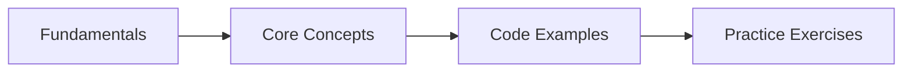

# Exception Handling & I/O

## Learning Objectives
## Chapter at a Glance

| Topic | Key Insight | Practical Takeaway |
|-------|-------------|--------------------|
| Core Concepts | Foundational understanding for Java development | Master these before Spring |
| Code Examples | Runnable, compilable examples | Type, compile, run, refactor |
| Practice Exercises | Hands-on skill building | Apply what you learn |

## Chapter Roadmap




By the end of this chapter, you will be able to:

- Explain the Java exception hierarchy and distinguish checked from unchecked exceptions
- Write robust code using try/catch/finally and try-with-resources
- Create and use custom exception types following industry best practices
- Apply exception-handling best practices including fail-fast, wrapping, and logging
- Use the `java.io` package for byte- and character-oriented stream I/O
- Leverage the `java.nio.file` package for modern filesystem operations
- Implement Java serialization correctly with security considerations
- Use NIO channels, buffers, and memory-mapped files for high-performance I/O
- Handle file compression with GZIP and ZIP formats

---

## 1. The Java Exception Hierarchy


Java exceptions are objects representing abnormal conditions. The root class is `java.lang.Throwable`, with two major branches: `Error` and `Exception`.

### 1.1 Hierarchy Overview


```
Throwable
├── Error         (unchecked → JVM-level failures)
│   ├── OutOfMemoryError
│   ├── StackOverflowError
│   ├── NoClassDefFoundError
│   └── ...
└── Exception     (program-level conditions)
    ├── RuntimeException   (unchecked → programming bugs)
    │   ├── NullPointerException
    │   ├── IllegalArgumentException
    │   ├── IndexOutOfBoundsException
    │   └── ...
    └── (checked exceptions)
        ├── IOException
        ├── SQLException
        ├── ClassNotFoundException
        └── ...
```

**Error** → serious JVM-level problems that applications should not attempt to catch.

**Exception** → conditions a reasonable application may want to catch.

**RuntimeException** → unchecked; indicates a programming mistake (null check, bounds check, etc.).

### 1.2 Checked vs. Unchecked Exceptions


```java
package chapter4;

import java.io.FileInputStream;
import java.io.FileNotFoundException;
import java.io.IOException;

/**
 * Demonstrates the distinction between checked and unchecked exceptions.
 */
public class CheckedVsUnchecked {

    // Checked: the compiler forces you to handle or declare it.
    public static void readFile(String path) throws IOException {
        // FileNotFoundException extends IOException, which is checked.
        FileInputStream fis = new FileInputStream(path);
        int data = fis.read();
        while (data != -1) {
            System.out.print((char) data);
            data = fis.read();
        }
        fis.close();
    }

    // Unchecked: the compiler does not require handling.
    public static int divide(int a, int b) {
        // ArithmeticException extends RuntimeException → unchecked.
        return a / b;
    }

    public static void main(String[] args) {
        // Unchecked → compiler does not force try/catch.
        int result = divide(10, 2);
        System.out.println("Result: " + result);

        // Checked → must handle or declare.
        try {
            readFile("nonexistent.txt");
        } catch (IOException e) {
            System.err.println("Caught checked exception: " + e.getMessage());
        }
    }
}
```

### 1.3 Common Runtime Exceptions


```java
package chapter4;

import java.util.ArrayList;
import java.util.List;

/**
 * Illustrates common unchecked runtime exceptions.
 */
public class CommonRuntimeExceptions {

    public static void main(String[] args) {
        // NullPointerException
        String s = null;
        try {
            s.length();
        } catch (NullPointerException e) {
            System.out.println("NPE caught: " + e.getMessage());
        }

        // IllegalArgumentException
        try {
            setAge(-5);
        } catch (IllegalArgumentException e) {
            System.out.println("Illegal argument: " + e.getMessage());
        }

        // IndexOutOfBoundsException
        List<String> list = new ArrayList<>();
        try {
            list.get(0);
        } catch (IndexOutOfBoundsException e) {
            System.out.println("Index out of bounds: " + e.getMessage());
        }

        // ArithmeticException
        try {
            int x = 1 / 0;
        } catch (ArithmeticException e) {
            System.out.println("Arithmetic: " + e.getMessage());
        }

        // ClassCastException
        try {
            Object obj = "hello";
            Integer num = (Integer) obj;
        } catch (ClassCastException e) {
            System.out.println("Class cast: " + e.getMessage());
        }

        // NumberFormatException
        try {
            int val = Integer.parseInt("not-a-number");
        } catch (NumberFormatException e) {
            System.out.println("Number format: " + e.getMessage());
        }
    }

    public static void setAge(int age) {
        if (age < 0) {
            throw new IllegalArgumentException("Age must be non-negative, got: " + age);
        }
    }
}
```

---

## 2. try/catch/finally

### 2.1 Basic Syntax


```java
package chapter4;

import java.io.BufferedReader;
import java.io.FileReader;
import java.io.IOException;

/**
 * Demonstrates basic try-catch-finally syntax.
 */
public class TryCatchFinallyBasics {

    public static void main(String[] args) {
        BufferedReader reader = null;
        try {
            reader = new BufferedReader(new FileReader("hello.txt"));
            String line = reader.readLine();
            System.out.println("First line: " + line);
        } catch (IOException e) {
            System.err.println("Error reading file: " + e.getMessage());
        } finally {
            // Always executes → used for cleanup.
            if (reader != null) {
                try {
                    reader.close();
                } catch (IOException e) {
                    System.err.println("Error closing reader: " + e.getMessage());
                }
            }
            System.out.println("Finally block executed.");
        }
    }
}
```

### 2.2 Multi-Catch


```java
package chapter4;

import java.io.FileNotFoundException;
import java.io.IOException;
import java.nio.file.Files;
import java.nio.file.Path;
import java.nio.file.Paths;

/**
 * Multi-catch: handle multiple exception types in one block (Java 7+).
 */
public class MultiCatchExample {

    public static void main(String[] args) {
        Path p = Paths.get("data.txt");

        try {
            byte[] bytes = Files.readAllBytes(p);
            System.out.println("Read " + bytes.length + " bytes");
            int result = 100 / 0; // will throw ArithmeticException
            System.out.println(result);
        } catch (FileNotFoundException | ArithmeticException e) {
            // Multi-catch → the variable is implicitly final.
            System.err.println("Caught in multi-catch: " + e.getClass().getSimpleName()
                + " → " + e.getMessage());
        } catch (IOException e) {
            System.err.println("IO error: " + e.getMessage());
        }
    }
}
```

### 2.3 try-with-resources (Java 7+)


Resources that implement `AutoCloseable` are closed automatically at the end of the try block.

```java
package chapter4;

import java.io.BufferedReader;
import java.io.FileReader;
import java.io.FileWriter;
import java.io.IOException;
import java.io.PrintWriter;

/**
 * try-with-resources: automatic resource management.
 */
public class TryWithResourcesExample {

    public static void main(String[] args) {
        // Single resource.
        try (BufferedReader reader = new BufferedReader(new FileReader("input.txt"))) {
            String line;
            while ((line = reader.readLine()) != null) {
                System.out.println(line);
            }
        } catch (IOException e) {
            System.err.println("Error: " + e.getMessage());
        }

        // Multiple resources → closed in reverse order.
        try (BufferedReader reader = new BufferedReader(new FileReader("input.txt"));
             PrintWriter writer = new PrintWriter(new FileWriter("output.txt"))) {
            String line;
            while ((line = reader.readLine()) != null) {
                writer.println(line);
            }
        } catch (IOException e) {
            System.err.println("Error during copy: " + e.getMessage());
        }
    }
}
```

### 2.4 AutoCloseable Interface


```java
package chapter4;

/**
 * A custom resource implementing AutoCloseable.
 */
public class CustomResource implements AutoCloseable {

    private final String name;
    private boolean closed = false;

    public CustomResource(String name) {
        this.name = name;
        System.out.println("Opened resource: " + name);
    }

    public void doWork() {
        if (closed) {
            throw new IllegalStateException("Resource " + name + " is closed");
        }
        System.out.println("Working with: " + name);
    }

    @Override
    public void close() {
        if (!closed) {
            closed = true;
            System.out.println("Closed resource: " + name);
        }
    }

    // --- Demonstration ---
    public static void main(String[] args) {
        // Resources are closed in reverse order of declaration.
        try (CustomResource db = new CustomResource("Database");
             CustomResource file = new CustomResource("FileHandle")) {
            db.doWork();
            file.doWork();
        } catch (Exception e) {
            System.err.println("Error: " + e.getMessage());
        }
        // Output order: Open DB, Open File, Working, Working, Close File, Close DB
    }
}
```

### 2.5 Suppressed Exceptions


When both the try block and the close() method throw exceptions, the close exception is *suppressed*.

```java
package chapter4;

import java.io.IOException;

/**
 * A resource whose close() also throws.
 */
class FlakyResource implements AutoCloseable {
    private final String name;

    FlakyResource(String name) { this.name = name; }

    void use() throws IOException {
        throw new IOException("Failure using " + name);
    }

    @Override
    public void close() throws IOException {
        throw new IOException("Failure closing " + name);
    }
}

/**
 * Demonstrates suppressed exceptions in try-with-resources.
 */
public class SuppressedExceptionDemo {

    public static void main(String[] args) {
        try (FlakyResource r = new FlakyResource("db")) {
            r.use();
        } catch (IOException e) {
            System.out.println("Primary exception: " + e.getMessage());
            Throwable[] suppressed = e.getSuppressed();
            for (Throwable s : suppressed) {
                System.out.println("  Suppressed: " + s.getMessage());
            }
        }

        // Manually adding suppressed exceptions.
        IOException primary = new IOException("Network failure");
        IOException secondary = new IOException("Timeout");
        primary.addSuppressed(secondary);
        System.out.println("Primary: " + primary.getMessage());
        for (Throwable s : primary.getSuppressed()) {
            System.out.println("  Suppressed: " + s.getMessage());
        }
    }
}
```

### 2.6 try-with-resources via Reflection (Java 9+)


With Java 9, you can use a resource variable declared outside the try block as long as it is effectively final.

```java
package chapter4;

import java.io.BufferedReader;
import java.io.FileReader;
import java.io.IOException;

/**
 * Java 9+: using effectively-final variables in try-with-resources.
 */
public class TryWithResourcesJava9 {

    public static void main(String[] args) throws IOException {
        // Effectively final → not reassigned after initialization.
        BufferedReader reader = new BufferedReader(new FileReader("input.txt"));

        // Java 9+: reference the variable directly.
        try (reader) {
            String line;
            while ((line = reader.readLine()) != null) {
                System.out.println(line);
            }
        }
        // reader is closed here.
    }
}
```

---

## 3. Custom Exceptions

### 3.1 Extending Exception (Checked)


```java
package chapter4;

/**
 * Checked custom exception for user-related errors.
 */
public class UserNotFoundException extends Exception {

    // Unique identifier for serialization.
    private static final long serialVersionUID = 1L;

    private final String userId;

    public UserNotFoundException(String userId) {
        super("User not found: " + userId);
        this.userId = userId;
    }

    public UserNotFoundException(String userId, Throwable cause) {
        super("User not found: " + userId, cause);
        this.userId = userId;
    }

    public String getUserId() {
        return userId;
    }
}
```

### 3.2 Extending RuntimeException (Unchecked)


```java
package chapter4;

/**
 * Unchecked custom exception for validation errors.
 */
public class ValidationException extends RuntimeException {

    private static final long serialVersionUID = 1L;

    private final String fieldName;
    private final Object rejectedValue;

    public ValidationException(String fieldName, Object rejectedValue, String message) {
        super(message);
        this.fieldName = fieldName;
        this.rejectedValue = rejectedValue;
    }

    public ValidationException(String fieldName, Object rejectedValue, String message, Throwable cause) {
        super(message, cause);
        this.fieldName = fieldName;
        this.rejectedValue = rejectedValue;
    }

    public String getFieldName() {
        return fieldName;
    }

    public Object getRejectedValue() {
        return rejectedValue;
    }
}
```

### 3.3 Using Custom Exceptions


```java
package chapter4;

import java.util.HashMap;
import java.util.Map;
import java.util.Objects;

/**
 * Service that uses custom exceptions.
 */
class User {
    private final String id;
    private final String email;

    public User(String id, String email) {
        this.id = id;
        this.email = email;
    }

    public String getId() { return id; }
    public String getEmail() { return email; }
}

/**
 * Repository that throws custom exceptions.
 */
class UserRepository {
    private final Map<String, User> store = new HashMap<>();

    public User findById(String id) throws UserNotFoundException {
        User user = store.get(id);
        if (user == null) {
            throw new UserNotFoundException(id);
        }
        return user;
    }

    public void save(User user) {
        Objects.requireNonNull(user, "User must not be null");
        if (user.getId() == null || user.getId().isBlank()) {
            throw new ValidationException("id", user.getId(), "User ID must not be blank");
        }
        if (user.getEmail() == null || !user.getEmail().contains("@")) {
            throw new ValidationException("email", user.getEmail(), "Invalid email address");
        }
        store.put(user.getId(), user);
    }
}

/**
 * Demonstrates custom exceptions in action.
 */
public class CustomExceptionDemo {

    public static void main(String[] args) {
        UserRepository repo = new UserRepository();

        // Unchecked → compiler does not force handling.
        try {
            repo.save(new User("", "bad-email"));
        } catch (ValidationException e) {
            System.err.println("Validation failed on field '" + e.getFieldName()
                + "' with value '" + e.getRejectedValue() + "': " + e.getMessage());
        }

        // Checked → must handle.
        try {
            repo.findById("nonexistent");
        } catch (UserNotFoundException e) {
            System.err.println(e.getMessage() + " (userId=" + e.getUserId() + ")");
        }
    }
}
```

### 3.4 Exception Chaining


```java
package chapter4;

import java.io.IOException;
import java.nio.file.Files;
import java.nio.file.Path;

/**
 * Wraps a low-level IOException into a business-level exception with the cause chain preserved.
 */
class DataAccessException extends RuntimeException {
    private static final long serialVersionUID = 1L;

    public DataAccessException(String message, Throwable cause) {
        super(message, cause);
    }
}

class FileDataStore {
    public String load(String path) {
        try {
            return Files.readString(Path.of(path));
        } catch (IOException e) {
            // Wrap checked IOException into unchecked DataAccessException
            // preserving the original cause for debugging.
            throw new DataAccessException("Failed to load data from " + path, e);
        }
    }
}

/**
 * Demonstrates exception chaining → cause chain is preserved.
 */
public class ExceptionChainingDemo {

    public static void main(String[] args) {
        FileDataStore store = new FileDataStore();
        try {
            String data = store.load("nonexistent.json");
            System.out.println(data);
        } catch (DataAccessException e) {
            System.err.println("Business error: " + e.getMessage());
            System.err.println("Root cause: " + e.getCause().getMessage());
            // Full stack trace still shows the IOException at the root.
            e.printStackTrace();
        }
    }
}
```

---

## 4. Best Practices

### 4.1 Fail-Fast


Validate inputs early and throw exceptions at the point of failure, not later.

```java
package chapter4;

import java.math.BigDecimal;
import java.util.Objects;

/**
 * Demonstrates fail-fast validation.
 */
public class OrderService {

    public void placeOrder(String userId, BigDecimal amount) {
        // Fail-fast: validate immediately.
        Objects.requireNonNull(userId, "userId must not be null");
        if (userId.isBlank()) {
            throw new IllegalArgumentException("userId must not be blank");
        }
        Objects.requireNonNull(amount, "amount must not be null");
        if (amount.compareTo(BigDecimal.ZERO) <= 0) {
            throw new IllegalArgumentException("amount must be positive, got: " + amount);
        }

        // Business logic only runs when inputs are valid.
        System.out.println("Order placed for user " + userId + " amount " + amount);
    }

    public static void main(String[] args) {
        OrderService svc = new OrderService();
        try {
            svc.placeOrder("", BigDecimal.TEN);
        } catch (IllegalArgumentException e) {
            System.err.println("Fail-fast prevented invalid order: " + e.getMessage());
        }
    }
}
```

### 4.2 Exception Wrapping


Wrap low-level exceptions into meaningful higher-level exceptions.

```java
package chapter4;

import java.io.IOException;
import java.nio.file.Files;
import java.nio.file.Path;
import java.util.List;

/**
 * Wraps IOException into a domain-specific exception.
 */
class ConfigurationLoadException extends RuntimeException {
    private static final long serialVersionUID = 1L;
    public ConfigurationLoadException(String message, Throwable cause) {
        super(message, cause);
    }
}

class ConfigService {

    public List<String> loadConfig(String path) {
        try {
            return Files.readAllLines(Path.of(path));
        } catch (IOException e) {
            throw new ConfigurationLoadException(
                "Unable to load configuration from " + path, e);
        }
    }
}
```

### 4.3 Logging Exceptions


Always log exceptions at the appropriate level. Never silently swallow.

```java
package chapter4;

import java.io.IOException;
import java.nio.file.Files;
import java.nio.file.Path;
import java.time.LocalDateTime;
import java.util.logging.Level;
import java.util.logging.Logger;

/**
 * Demonstrates proper exception logging with java.util.logging.
 * In Spring Boot, you would use SLF4J + Logback instead.
 */
public class LoggingExceptions {

    private static final Logger LOG = Logger.getLogger(LoggingExceptions.class.getName());

    public String readImportantFile() {
        try {
            return Files.readString(Path.of("important.dat"));
        } catch (IOException e) {
            LOG.log(Level.SEVERE, "Failed to read important file important.dat", e);
            throw new RuntimeException("Data unavailable", e);
        }
    }

    public void logWarningOnly() {
        try {
            Files.readString(Path.of("optional-cache.txt"));
        } catch (IOException e) {
            // This is acceptable → the cache is optional.
            LOG.log(Level.FINE, "Cache file not found, proceeding without cache", e);
        }
    }

    public static void main(String[] args) {
        LoggingExceptions app = new LoggingExceptions();
        try {
            app.readImportantFile();
        } catch (RuntimeException e) {
            LOG.log(Level.INFO, "Application caught top-level exception", e);
        }
    }

    // --- In Spring Boot, prefer SLF4J ---
    /*
    import org.slf4j.Logger;
    import org.slf4j.LoggerFactory;

    public class SpringStyleService {
        private static final Logger log = LoggerFactory.getLogger(SpringStyleService.class);

        public void doSomething() {
            try {
                riskyOperation();
            } catch (Exception e) {
                log.error("Operation failed for reason={}", e.getMessage(), e);
                throw new ServiceException("Operation failed", e);
            }
        }
    }
    */
}
```

### 4.4 Never Swallow Exceptions


```java
package chapter4;

/**
 * Anti-patterns: what NOT to do with exceptions.
 */
public class ExceptionAntiPatterns {

    // ANTI-PATTERN #1: Empty catch block → swallows the exception entirely.
    public void antiPattern1() {
        try {
            riskyOperation();
        } catch (Exception e) {
            // BAD: nothing here. The error disappears.
        }
    }

    // ANTI-PATTERN #2: Catching and returning null.
    public String antiPattern2() {
        try {
            return riskyOperation();
        } catch (Exception e) {
            return null; // BAD: caller cannot distinguish "not found" from "error".
        }
    }

    // ANTI-PATTERN #3: Catching Throwable.
    public void antiPattern3() {
        try {
            riskyOperation();
        } catch (Throwable t) { // BAD: catches Errors like OutOfMemoryError.
            System.err.println("Something went wrong");
        }
    }

    // ANTI-PATTERN #4: Log and rethrow without context.
    public void antiPattern4() {
        try {
            riskyOperation();
        } catch (Exception e) {
            e.printStackTrace();    // BAD: use a logger instead.
            throw e;                // BAD: rethrows without wrapping.
        }
    }

    // CORRECT approach:
    public String correctPattern() {
        try {
            return riskyOperation();
        } catch (RuntimeException e) {
            // Log with context, wrap in meaningful exception.
            throw new ServiceException("Failed to execute risky operation", e);
        }
    }

    private static String riskyOperation() {
        if (Math.random() > 0.5) {
            throw new RuntimeException("Something broke");
        }
        return "success";
    }
}

/**
 * Custom exception for correct-pattern demonstration.
 */
class ServiceException extends RuntimeException {
    private static final long serialVersionUID = 1L;
    public ServiceException(String message, Throwable cause) {
        super(message, cause);
    }
}
```

### 4.5 API Design with Exceptions


```java
package chapter4;

import java.util.Optional;

/**
 * Guidelines for designing APIs with exceptions.
 */
public class ApiDesignWithExceptions {

    // GOOD: throw specific, meaningful exceptions.
    public User findByIdOrThrow(String id) {
        if (id == null) {
            throw new IllegalArgumentException("id must not be null");
        }
        // ... lookup ...
        throw new UserNotFoundException(id);
    }

    // GOOD: offer Optional alternatives for "expected absence".
    public Optional<User> findByIdOptional(String id) {
        if (id == null) {
            return Optional.empty();
        }
        // ... lookup ...
        return Optional.empty();
    }

    // GOOD: return a result type for expected failures.
    public Result<User> findByIdResult(String id) {
        if (id == null) {
            return Result.failure(new IllegalArgumentException("id must not be null"));
        }
        // ... lookup ...
        return Result.failure(new UserNotFoundException(id));
    }

    public static void main(String[] args) {
        ApiDesignWithExceptions api = new ApiDesignWithExceptions();

        // Optional approach → caller decides.
        Optional<User> user = api.findByIdOptional("nonexistent");
        User resolved = user.orElseThrow(() -> new UserNotFoundException("nonexistent"));

        // Result approach → caller pattern-matches.
        Result<User> result = api.findByIdResult("nonexistent");
        // result.isSuccess() / result.getError() ...
    }
}

// Simple Result type (simplified → real libraries use dedicated types).
class Result<T> {
    private final T value;
    private final Throwable error;

    private Result(T value, Throwable error) {
        this.value = value;
        this.error = error;
    }

    public static <T> Result<T> success(T value) {
        return new Result<>(value, null);
    }

    public static <T> Result<T> failure(Throwable error) {
        return new Result<>(null, error);
    }

    public boolean isSuccess() { return error == null; }
    public Throwable getError() { return error; }
    public T getValue() { return value; }
}
```

---

## 5. The java.io Package

### 5.1 The File Class


```java
package chapter4;

import java.io.File;
import java.io.IOException;
import java.util.Date;

/**
 * Demonstrates the legacy java.io.File class.
 */
public class FileClassDemo {

    public static void main(String[] args) throws IOException {
        // Creating File instances.
        File f1 = new File("example.txt");
        File f2 = new File("docs", "notes.txt");
        File f3 = new File(new File("docs"), "data.csv");

        // File operations.
        if (!f1.exists()) {
            f1.createNewFile();
            System.out.println("Created: " + f1.getAbsolutePath());
        }

        System.out.println("Name: " + f1.getName());
        System.out.println("Path: " + f1.getPath());
        System.out.println("Absolute path: " + f1.getAbsolutePath());
        System.out.println("Parent: " + f1.getParent());
        System.out.println("Is file: " + f1.isFile());
        System.out.println("Is directory: " + f1.isDirectory());
        System.out.println("Can read: " + f1.canRead());
        System.out.println("Can write: " + f1.canWrite());
        System.out.println("Length: " + f1.length() + " bytes");
        System.out.println("Last modified: " + new Date(f1.lastModified()));

        // Directory listing.
        File tmp = new File(System.getProperty("java.io.tmpdir"));
        System.out.println("Temp dir contents (first 5):");
        File[] files = tmp.listFiles();
        if (files != null) {
            for (int i = 0; i < Math.min(5, files.length); i++) {
                System.out.println("  " + (files[i].isDirectory() ? "[DIR] " : "[FILE] ")
                    + files[i].getName());
            }
        }

        // Cleanup.
        f1.delete();
        System.out.println("Deleted: " + f1.getName());
    }
}
```

### 5.2 Byte Streams: FileInputStream / FileOutputStream


```java
package chapter4;

import java.io.FileInputStream;
import java.io.FileOutputStream;
import java.io.IOException;

/**
 * Byte-oriented I/O with FileInputStream and FileOutputStream.
 */
public class ByteStreamDemo {

    public static void main(String[] args) {
        String source = "Hello, Java I/O!";
        String filename = "byte-demo.dat";

        // Write bytes.
        try (FileOutputStream fos = new FileOutputStream(filename)) {
            fos.write(source.getBytes());
            fos.flush();
            System.out.println("Written " + source.length() + " bytes");
        } catch (IOException e) {
            System.err.println("Write error: " + e.getMessage());
        }

        // Read bytes.
        try (FileInputStream fis = new FileInputStream(filename)) {
            int data;
            StringBuilder sb = new StringBuilder();
            while ((data = fis.read()) != -1) {
                sb.append((char) data);
            }
            System.out.println("Read back: " + sb);
        } catch (IOException e) {
            System.err.println("Read error: " + e.getMessage());
        }

        // Efficient buffered copy.
        copyFile("byte-demo.dat", "byte-demo-copy.dat");
    }

    /**
     * Copies a file using byte-array reads for efficiency.
     */
    public static void copyFile(String src, String dst) {
        byte[] buffer = new byte[8192];
        try (FileInputStream fis = new FileInputStream(src);
             FileOutputStream fos = new FileOutputStream(dst)) {
            int bytesRead;
            while ((bytesRead = fis.read(buffer)) != -1) {
                fos.write(buffer, 0, bytesRead);
            }
            System.out.println("Copied " + src + " to " + dst);
        } catch (IOException e) {
            System.err.println("Copy error: " + e.getMessage());
        }
    }
}
```

### 5.3 Buffered Streams


```java
package chapter4;

import java.io.BufferedInputStream;
import java.io.BufferedOutputStream;
import java.io.FileInputStream;
import java.io.FileOutputStream;
import java.io.IOException;

/**
 * Buffered streams reduce system calls by wrapping unbuffered streams.
 */
public class BufferedStreamDemo {

    private static final int MEGA = 1024 * 1024;

    public static void main(String[] args) throws IOException {
        // Generate test data.
        try (FileOutputStream fos = new FileOutputStream("unbuffered.dat")) {
            for (int i = 0; i < 10 * MEGA; i++) {
                fos.write((byte) 'A');
            }
        }

        // Time unbuffered write (re-using same file).
        long t1 = System.nanoTime();
        try (FileOutputStream fos = new FileOutputStream("unbuffered.dat")) {
            for (int i = 0; i < 10 * MEGA; i++) {
                fos.write((byte) 'B');
            }
        }
        long t2 = System.nanoTime();
        System.out.println("Unbuffered write: " + ((t2 - t1) / 1_000_000) + " ms");

        // Time buffered write.
        t1 = System.nanoTime();
        try (BufferedOutputStream bos = new BufferedOutputStream(new FileOutputStream("buffered.dat"))) {
            for (int i = 0; i < 10 * MEGA; i++) {
                bos.write((byte) 'B');
            }
        }
        t2 = System.nanoTime();
        System.out.println("Buffered write:   " + ((t2 - t1) / 1_000_000) + " ms");

        // Buffered read.
        t1 = System.nanoTime();
        try (BufferedInputStream bis = new BufferedInputStream(new FileInputStream("buffered.dat"))) {
            while (bis.read() != -1) {
                // consume
            }
        }
        t2 = System.nanoTime();
        System.out.println("Buffered read:    " + ((t2 - t1) / 1_000_000) + " ms");

        // Cleanup.
        new java.io.File("unbuffered.dat").delete();
        new java.io.File("buffered.dat").delete();
    }
}
```

### 5.4 Character Streams: Reader / Writer


```java
package chapter4;

import java.io.FileReader;
import java.io.FileWriter;
import java.io.IOException;

/**
 * Character-oriented I/O handles Unicode correctly.
 */
public class CharacterStreamDemo {

    public static void main(String[] args) {
        String text = "Hello, 世界! Java I/O handles Unicode.\nLine 2: ñoño.";

        // Write characters.
        try (FileWriter fw = new FileWriter("char-demo.txt")) {
            fw.write(text);
            fw.flush();
            System.out.println("Written " + text.length() + " chars");
        } catch (IOException e) {
            System.err.println("Write error: " + e.getMessage());
        }

        // Read characters.
        try (FileReader fr = new FileReader("char-demo.txt")) {
            int data;
            StringBuilder sb = new StringBuilder();
            while ((data = fr.read()) != -1) {
                sb.append((char) data);
            }
            System.out.println("Read back: " + sb);
        } catch (IOException e) {
            System.err.println("Read error: " + e.getMessage());
        }
    }
}
```

### 5.5 InputStreamReader / OutputStreamWriter (Bridges)


```java
package chapter4;

import java.io.FileInputStream;
import java.io.FileOutputStream;
import java.io.IOException;
import java.io.InputStreamReader;
import java.io.OutputStreamWriter;
import java.nio.charset.StandardCharsets;

/**
 * Bridges between byte streams and character streams with charset control.
 */
public class StreamBridgeDemo {

    public static void main(String[] args) {
        String data = "UTF-8 encoded: 日本へようこそ";

        // Write with explicit charset.
        try (OutputStreamWriter osw = new OutputStreamWriter(
                new FileOutputStream("bridge-utf8.txt"), StandardCharsets.UTF_8)) {
            osw.write(data);
        } catch (IOException e) {
            System.err.println("Write error: " + e.getMessage());
        }

        // Read with explicit charset.
        try (InputStreamReader isr = new InputStreamReader(
                new FileInputStream("bridge-utf8.txt"), StandardCharsets.UTF_8)) {
            int ch;
            StringBuilder sb = new StringBuilder();
            while ((ch = isr.read()) != -1) {
                sb.append((char) ch);
            }
            System.out.println("Read: " + sb);
        } catch (IOException e) {
            System.err.println("Read error: " + e.getMessage());
        }
    }
}
```

### 5.6 BufferedReader / BufferedWriter


```java
package chapter4;

import java.io.BufferedReader;
import java.io.BufferedWriter;
import java.io.FileReader;
import java.io.FileWriter;
import java.io.IOException;
import java.util.ArrayList;
import java.util.List;

/**
 * BufferedReader: readLine() for efficient line-by-line processing.
 * BufferedWriter: newLine() for platform-independent line separators.
 */
public class BufferedReadWriteDemo {

    public static void main(String[] args) {
        String filename = "lines.txt";
        List<String> lines = List.of(
            "First line",
            "Second line with 日本語",
            "Third line: ñoño",
            "Fourth line"
        );

        // Write lines.
        try (BufferedWriter bw = new BufferedWriter(new FileWriter(filename))) {
            for (String line : lines) {
                bw.write(line);
                bw.newLine(); // platform-independent
            }
            System.out.println("Wrote " + lines.size() + " lines");
        } catch (IOException e) {
            System.err.println("Write error: " + e.getMessage());
        }

        // Read lines.
        List<String> readBack = new ArrayList<>();
        try (BufferedReader br = new BufferedReader(new FileReader(filename))) {
            String line;
            while ((line = br.readLine()) != null) {
                readBack.add(line);
            }
        } catch (IOException e) {
            System.err.println("Read error: " + e.getMessage());
        }

        System.out.println("Read " + readBack.size() + " lines back");
        readBack.forEach(l -> System.out.println("  > " + l));
    }
}
```

### 5.7 PrintWriter


```java
package chapter4;

import java.io.FileWriter;
import java.io.IOException;
import java.io.PrintWriter;

/**
 * PrintWriter provides convenient formatting methods: print(), println(), printf().
 */
public class PrintWriterDemo {

    public static void main(String[] args) {
        try (PrintWriter pw = new PrintWriter(new FileWriter("formatted.txt"))) {
            pw.println("=== Invoice ===");
            pw.printf("Item: %-20s Qty: %3d  Price: $%6.2f%n", "Widget A", 5, 12.99);
            pw.printf("Item: %-20s Qty: %3d  Price: $%6.2f%n", "Gadget B", 2, 49.95);
            pw.printf("Item: %-20s Qty: %3d  Price: $%6.2f%n", "Doohickey", 10, 3.49);
            pw.println("----------------------------------------");
            pw.printf("%30s: $%8.2f%n", "Subtotal", 12.99 * 5 + 49.95 * 2 + 3.49 * 10);
            pw.printf("%30s: $%8.2f%n", "Total", 192.20);

            // PrintWriter does NOT throw IOException from these methods.
            // Check error status instead.
            boolean error = pw.checkError();
            System.out.println("No error: " + !error);
        } catch (IOException e) {
            System.err.println("Error: " + e.getMessage());
        }
    }
}
```

### 5.8 DataInputStream / DataOutputStream


```java
package chapter4;

import java.io.DataInputStream;
import java.io.DataOutputStream;
import java.io.FileInputStream;
import java.io.FileOutputStream;
import java.io.IOException;

/**
 * Data streams read/write Java primitives in a portable binary format.
 */
public class DataStreamDemo {

    public static void main(String[] args) {
        String filename = "primitives.dat";

        // Write primitives.
        try (DataOutputStream dos = new DataOutputStream(new FileOutputStream(filename))) {
            dos.writeInt(42);
            dos.writeDouble(3.14159);
            dos.writeBoolean(true);
            dos.writeUTF("Hello, DataStream!"); // modified UTF-8
            dos.writeLong(1_000_000_000_000L);
            System.out.println("Primitives written");
        } catch (IOException e) {
            System.err.println("Write error: " + e.getMessage());
        }

        // Read primitives (MUST read in the same order).
        try (DataInputStream dis = new DataInputStream(new FileInputStream(filename))) {
            int i = dis.readInt();
            double d = dis.readDouble();
            boolean b = dis.readBoolean();
            String s = dis.readUTF();
            long l = dis.readLong();
            System.out.printf("Read: int=%d, double=%.5f, boolean=%b, string=%s, long=%d%n",
                i, d, b, s, l);
        } catch (IOException e) {
            System.err.println("Read error: " + e.getMessage());
        }
    }
}
```

### 5.9 ObjectInputStream / ObjectOutputStream (Serialization)


```java
package chapter4;

import java.io.FileInputStream;
import java.io.FileOutputStream;
import java.io.IOException;
import java.io.ObjectInputStream;
import java.io.ObjectOutputStream;
import java.io.Serializable;
import java.util.Objects;

/**
 * A simple Serializable class.
 */
class Person implements Serializable {
    private static final long serialVersionUID = 20240101L;

    private String name;
    private int age;
    // transient fields are NOT serialized.
    private transient String password;

    public Person(String name, int age, String password) {
        this.name = name;
        this.age = age;
        this.password = password;
    }

    public String getName() { return name; }
    public int getAge() { return age; }

    @Override
    public String toString() {
        return "Person{name='" + name + "', age=" + age + ", password='[REDACTED]'}";
    }
}

/**
 * Serialization and deserialization with ObjectOutputStream/ObjectInputStream.
 */
public class ObjectStreamDemo {

    public static void main(String[] args) {
        String filename = "person.ser";
        Person original = new Person("Alice", 30, "secret123");

        // Serialize.
        try (ObjectOutputStream oos = new ObjectOutputStream(new FileOutputStream(filename))) {
            oos.writeObject(original);
            System.out.println("Serialized: " + original);
        } catch (IOException e) {
            System.err.println("Serialization error: " + e.getMessage());
        }

        // Deserialize.
        try (ObjectInputStream ois = new ObjectInputStream(new FileInputStream(filename))) {
            Person restored = (Person) ois.readObject();
            System.out.println("Deserialized: " + restored);
            System.out.println("Same object? " + (original == restored));
            System.out.println("Equal? " + Objects.equals(original.getName(), restored.getName()));
        } catch (IOException | ClassNotFoundException e) {
            System.err.println("Deserialization error: " + e.getMessage());
        }
    }
}
```

---

## 6. The java.nio.file Package (NIO.2)

### 6.1 Path


```java
package chapter4;

import java.nio.file.Path;
import java.nio.file.Paths;

/**
 * Path is the modern replacement for java.io.File.
 */
public class PathDemo {

    public static void main(String[] args) {
        // Creating paths.
        Path p1 = Path.of("docs", "notes.txt");
        Path p2 = Paths.get("docs/notes.txt");
        Path p3 = Path.of("/absolute/path/to/file.txt");
        Path p4 = Path.of("data", "2024", "report.csv");

        System.out.println("p1: " + p1);
        System.out.println("p2: " + p2);
        System.out.println("p3: " + p3);
        System.out.println("p4: " + p4);

        // Path components.
        System.out.println("\nPath components of " + p4 + ":");
        System.out.println("  File name: " + p4.getFileName());
        System.out.println("  Parent: " + p4.getParent());
        System.out.println("  Root: " + p4.getRoot());
        System.out.println("  Name count: " + p4.getNameCount());
        for (int i = 0; i < p4.getNameCount(); i++) {
            System.out.println("  [" + i + "]: " + p4.getName(i));
        }

        // Path operations.
        Path relative = Path.of("data").resolve("2024").resolve("report.csv");
        System.out.println("\nResolved: " + relative);

        Path base = Path.of("/home/user/project");
        Path target = Path.of("/home/user/project/src/main/Main.java");
        Path relativized = base.relativize(target);
        System.out.println("Relativized: " + relativized);

        Path normalized = Path.of("/home/../home/user/./project/file.txt").normalize();
        System.out.println("Normalized: " + normalized);

        Path absolute = Path.of("relative.txt").toAbsolutePath();
        System.out.println("To absolute: " + absolute);
    }
}
```

### 6.2 The Files Utility Class


```java
package chapter4;

import java.io.IOException;
import java.nio.charset.StandardCharsets;
import java.nio.file.Files;
import java.nio.file.Path;
import java.nio.file.StandardCopyOption;
import java.nio.file.StandardOpenOption;
import java.util.List;

/**
 * Files provides static methods for common file operations.
 */
public class FilesUtilityDemo {

    public static void main(String[] args) throws IOException {
        Path dir = Files.createTempDirectory("nio-demo-");
        Path file = dir.resolve("demo.txt");
        System.out.println("Working in: " + dir);

        // Write a file.
        List<String> lines = List.of("Line 1", "Line 2", "Line 3");
        Files.write(file, lines, StandardCharsets.UTF_8);

        // Read all lines.
        List<String> readBack = Files.readAllLines(file, StandardCharsets.UTF_8);
        System.out.println("Read lines: " + readBack);

        // Read entire file as String.
        String content = Files.readString(file);
        System.out.println("Content: " + content);

        // Write string.
        Files.writeString(file, "Overwritten content\n",
            StandardOpenOption.CREATE, StandardOpenOption.TRUNCATE_EXISTING);

        // Copy.
        Path copy = dir.resolve("copy.txt");
        Files.copy(file, copy, StandardCopyOption.REPLACE_EXISTING);
        System.out.println("Copied to: " + copy);

        // Move.
        Path moved = dir.resolve("moved.txt");
        Files.move(copy, moved, StandardCopyOption.REPLACE_EXISTING);
        System.out.println("Moved to: " + moved);

        // File attributes.
        System.out.println("Size: " + Files.size(file));
        System.out.println("Is regular file: " + Files.isRegularFile(file));
        System.out.println("Is directory: " + Files.isDirectory(file));
        System.out.println("Is readable: " + Files.isReadable(file));
        System.out.println("Is writable: " + Files.isWritable(file));
        System.out.println("Last modified: " + Files.getLastModifiedTime(file));

        // Check existence.
        System.out.println("Exists: " + Files.exists(file));
        System.out.println("Not exists: " + Files.notExists(file));

        // Delete.
        Files.delete(moved);
        System.out.println("Deleted: " + moved);
        Files.deleteIfExists(copy);

        // Create directories.
        Path nested = dir.resolve("a/b/c");
        Files.createDirectories(nested);
        System.out.println("Created directories: " + nested);

        // Cleanup.
        try (var stream = Files.walk(dir)) {
            stream.sorted(java.util.Comparator.reverseOrder())
                .forEach(p -> {
                    try { Files.deleteIfExists(p); } catch (IOException ignored) {}
                });
        }
    }
}
```

### 6.3 Walking the File Tree


```java
package chapter4;

import java.io.IOException;
import java.nio.file.FileVisitResult;
import java.nio.file.FileVisitor;
import java.nio.file.Files;
import java.nio.file.Path;
import java.nio.file.SimpleFileVisitor;
import java.nio.file.attribute.BasicFileAttributes;

/**
 * Two approaches to traversing a file tree: Files.walk() (stream) and Files.walkFileTree() (visitor).
 */
public class FileTreeWalkDemo {

    public static void main(String[] args) throws IOException {
        Path start = Path.of(System.getProperty("java.io.tmpdir"));

        System.out.println("=== Files.walk() stream approach ===");
        Files.walk(start, 2)
            .limit(10)
            .forEach(p -> System.out.println("  " + p));

        System.out.println("\n=== Files.walkFileTree() with FileVisitor ===");
        Files.walkFileTree(start, new SimpleFileVisitor<>() {
            private int depth = 0;

            @Override
            public FileVisitResult preVisitDirectory(Path dir, BasicFileAttributes attrs) {
                if (depth > 2) return FileVisitResult.SKIP_SUBTREE;
                System.out.println("  ".repeat(depth) + "[DIR] " + dir.getFileName());
                depth++;
                return FileVisitResult.CONTINUE;
            }

            @Override
            public FileVisitResult visitFile(Path file, BasicFileAttributes attrs) {
                System.out.println("  ".repeat(depth) + "[FILE] " + file.getFileName()
                    + " (" + attrs.size() + " bytes)");
                return FileVisitResult.CONTINUE;
            }

            @Override
            public FileVisitResult visitFileFailed(Path file, IOException exc) {
                System.err.println("  Error accessing: " + file);
                return FileVisitResult.CONTINUE;
            }

            @Override
            public FileVisitResult postVisitDirectory(Path dir, IOException exc) {
                depth--;
                return FileVisitResult.CONTINUE;
            }
        });

        // Using FileVisitor interface directly (not SimpleFileVisitor).
        System.out.println("\n=== Custom FileVisitor implementation ===");
        Files.walkFileTree(start, new FileVisitor<>() {
            private int depth = 0;

            @Override
            public FileVisitResult preVisitDirectory(Path dir, BasicFileAttributes attrs) {
                if (dir.getFileName() != null
                    && dir.getFileName().toString().startsWith(".")) {
                    return FileVisitResult.SKIP_SUBTREE;
                }
                if (depth <= 1) {
                    System.out.println("  ".repeat(depth) + "D: " + dir.getFileName());
                }
                depth++;
                return FileVisitResult.CONTINUE;
            }

            @Override
            public FileVisitResult visitFile(Path file, BasicFileAttributes attrs) {
                if (depth <= 2) {
                    System.out.println("  ".repeat(depth) + "F: " + file.getFileName());
                }
                return FileVisitResult.CONTINUE;
            }

            @Override
            public FileVisitResult visitFileFailed(Path file, IOException exc) {
                return FileVisitResult.CONTINUE;
            }

            @Override
            public FileVisitResult postVisitDirectory(Path dir, IOException exc) {
                depth--;
                return FileVisitResult.CONTINUE;
            }
        });
    }
}
```

### 6.4 Directory Stream and Find


```java
package chapter4;

import java.io.IOException;
import java.nio.file.DirectoryStream;
import java.nio.file.Files;
import java.nio.file.Path;
import java.nio.file.Paths;

/**
 * DirectoryStream for lightweight directory listing; Files.find() for filtered recursive search.
 */
public class DirectoryStreamDemo {

    public static void main(String[] args) {
        Path tmp = Paths.get(System.getProperty("java.io.tmpdir"));

        // DirectoryStream (globbing).
        System.out.println("=== DirectoryStream (filtered) ===");
        try (DirectoryStream<Path> stream = Files.newDirectoryStream(tmp, "*.{tmp,log}")) {
            int count = 0;
            for (Path entry : stream) {
                System.out.println("  " + entry.getFileName());
                if (++count >= 10) break;
            }
        } catch (IOException e) {
            System.err.println("Error: " + e.getMessage());
        }

        // DirectoryStream with custom filter.
        System.out.println("\n=== DirectoryStream (custom filter, large files) ===");
        try (DirectoryStream<Path> stream = Files.newDirectoryStream(tmp, entry -> {
            try { return Files.size(entry) > 10_000_000; } // >10MB
            catch (IOException e) { return false; }
        })) {
            int count = 0;
            for (Path entry : stream) {
                System.out.println("  " + entry.getFileName());
                if (++count >= 5) break;
            }
        } catch (IOException e) {
            System.err.println("Error: " + e.getMessage());
        }

        // Files.find() → filtered recursive search.
        System.out.println("\n=== Files.find() (recursive .txt files) ===");
        try (var stream = Files.find(tmp, 3,
                (path, attrs) -> path.toString().endsWith(".txt") && attrs.size() > 0)) {
            stream.limit(5).forEach(p ->
                System.out.println("  " + p.getFileName() + " (" + tmp.relativize(p) + ")"));
        } catch (IOException e) {
            System.err.println("Error: " + e.getMessage());
        }
    }
}
```

### 6.5 WatchService → File Change Monitoring


```java
package chapter4;

import java.io.IOException;
import java.nio.file.FileSystems;
import java.nio.file.Path;
import java.nio.file.StandardWatchEventKinds;
import java.nio.file.WatchEvent;
import java.nio.file.WatchKey;
import java.nio.file.WatchService;

/**
 * WatchService monitors a directory for file system events.
 */
public class WatchServiceDemo {

    public static void main(String[] args) throws IOException, InterruptedException {
        Path dir = FilesUtilityDemo.createTempDir(); // A small helper inline below.
        if (dir == null) {
            dir = Files.createTempDirectory("watch-");
        }
        System.out.println("Watching: " + dir);
        System.out.println("Create/modify/delete files in that dir to see events.");
        System.out.println("(Press Ctrl+C to stop)");

        try (WatchService watcher = FileSystems.getDefault().newWatchService()) {
            // Register for events.
            dir.register(watcher,
                StandardWatchEventKinds.ENTRY_CREATE,
                StandardWatchEventKinds.ENTRY_MODIFY,
                StandardWatchEventKinds.ENTRY_DELETE);

            // Event loop.
            WatchKey key;
            while ((key = watcher.take()) != null) {
                for (WatchEvent<?> event : key.pollEvents()) {
                    WatchEvent.Kind<?> kind = event.kind();
                    Path filename = (Path) event.context();
                    long count = event.count();

                    System.out.printf("Event: %s → %s (count=%d)%n",
                        kind.name(), filename, count);
                }
                key.reset();
            }
        }
    }
}
```

### 6.6 FileChannel and Memory-Mapped Files


```java
package chapter4;

import java.io.IOException;
import java.io.RandomAccessFile;
import java.nio.ByteBuffer;
import java.nio.MappedByteBuffer;
import java.nio.channels.FileChannel;
import java.nio.channels.FileChannel.MapMode;
import java.nio.file.Files;
import java.nio.file.Path;
import java.nio.file.StandardOpenOption;

/**
 * FileChannel for high-performance file I/O; MappedByteBuffer for memory-mapped files.
 */
public class FileChannelDemo {

    public static void main(String[] args) throws IOException {
        Path file = Files.createTempFile("channel-", ".dat");
        System.out.println("File: " + file);

        // Write via FileChannel.
        try (FileChannel channel = FileChannel.open(file,
                StandardOpenOption.WRITE, StandardOpenOption.READ,
                StandardOpenOption.CREATE, StandardOpenOption.TRUNCATE_EXISTING)) {
            ByteBuffer buffer = ByteBuffer.allocate(1024);
            buffer.put("Hello from FileChannel!\n".getBytes());
            buffer.put("Second line.\n".getBytes());
            buffer.put("UTF-8 works: 日本語\n".getBytes());
            buffer.flip();
            int written = channel.write(buffer);
            System.out.println("Written " + written + " bytes via FileChannel");
        }

        // Read via FileChannel with explicit position.
        try (FileChannel channel = FileChannel.open(file, StandardOpenOption.READ)) {
            ByteBuffer buffer = ByteBuffer.allocate(512);
            int bytesRead = channel.read(buffer, 0);
            buffer.flip();
            byte[] data = new byte[buffer.remaining()];
            buffer.get(data);
            System.out.println("Read via FileChannel: " + new String(data));
        }

        // Memory-mapped file (zero-copy for large files).
        try (RandomAccessFile raf = new RandomAccessFile(file.toFile(), "rw");
             FileChannel channel = raf.getChannel()) {

            MappedByteBuffer mapped = channel.map(MapMode.READ_WRITE, 0, channel.size());
            // Read from mapped buffer.
            byte[] header = new byte[10];
            mapped.get(header);
            System.out.println("First 10 bytes via MappedByteBuffer: "
                + new String(header));

            // Write through mapped buffer (changes go directly to file).
            mapped.position(0);
            mapped.put("MAPPED   ".getBytes());
            System.out.println("Overwritten via memory-mapped I/O");
        }

        // Verify the overwrite.
        String content = Files.readString(file);
        System.out.println("Final content: " + content);

        Files.deleteIfExists(file);
    }
}
```

### 6.7 Scatter / Gather I/O


```java
package chapter4;

import java.io.IOException;
import java.nio.ByteBuffer;
import java.nio.channels.FileChannel;
import java.nio.file.Files;
import java.nio.file.Path;
import java.nio.file.StandardOpenOption;

/**
 * Scattering read: read into multiple buffers.
 * Gathering write: write from multiple buffers.
 */
public class ScatterGatherDemo {

    public static void main(String[] args) throws IOException {
        Path file = Files.createTempFile("scatter-", ".dat");

        // Gather: write from multiple buffers into one channel.
        ByteBuffer header = ByteBuffer.wrap("HEADER\n".getBytes());
        ByteBuffer body = ByteBuffer.wrap("BODY DATA\n".getBytes());
        ByteBuffer footer = ByteBuffer.wrap("FOOTER\n".getBytes());

        try (FileChannel channel = FileChannel.open(file,
                StandardOpenOption.WRITE, StandardOpenOption.CREATE,
                StandardOpenOption.TRUNCATE_EXISTING)) {
            ByteBuffer[] buffers = {header, body, footer};
            long bytesWritten = channel.write(buffers);
            System.out.println("Gather: wrote " + bytesWritten + " bytes from "
                + buffers.length + " buffers");
        }

        // Scatter: read from one channel into multiple buffers.
        ByteBuffer buf1 = ByteBuffer.allocate(10);
        ByteBuffer buf2 = ByteBuffer.allocate(20);
        ByteBuffer buf3 = ByteBuffer.allocate(10);

        try (FileChannel channel = FileChannel.open(file, StandardOpenOption.READ)) {
            ByteBuffer[] readBuffers = {buf1, buf2, buf3};
            long bytesRead = channel.read(readBuffers);
            System.out.println("Scatter: read " + bytesRead + " bytes into "
                + readBuffers.length + " buffers");

            // Flip all buffers.
            for (ByteBuffer b : readBuffers) {
                b.flip();
                byte[] data = new byte[b.remaining()];
                b.get(data);
                System.out.print("  Buffer content: " + new String(data));
            }
            System.out.println();
        }

        Files.deleteIfExists(file);
    }
}
```

### 6.8 FileChannel Transfer (Zero-Copy)


```java
package chapter4;

import java.io.IOException;
import java.nio.channels.FileChannel;
import java.nio.file.Files;
import java.nio.file.Path;
import java.nio.file.StandardOpenOption;

/**
 * transferTo / transferFrom: zero-copy file transfer (the kernel moves data
 * between file descriptors without copying through userspace).
 */
public class FileTransferDemo {

    public static void main(String[] args) throws IOException {
        Path source = Files.createTempFile("source-", ".dat");
        Path dest = Files.createTempFile("dest-", ".dat");

        // Prepare source.
        Files.writeString(source, "A".repeat(1_000_000));

        // Zero-copy transfer.
        long t1 = System.nanoTime();
        try (FileChannel srcChannel = FileChannel.open(source, StandardOpenOption.READ);
             FileChannel dstChannel = FileChannel.open(dest,
                 StandardOpenOption.WRITE, StandardOpenOption.CREATE,
                 StandardOpenOption.TRUNCATE_EXISTING)) {
            long position = 0;
            long size = srcChannel.size();
            long transferred = srcChannel.transferTo(position, size, dstChannel);
            System.out.println("TransferTo: " + transferred + " bytes");
        }
        long t2 = System.nanoTime();
        System.out.println("Zero-copy took: " + ((t2 - t1) / 1_000_000) + " ms");

        System.out.println("Source size: " + Files.size(source));
        System.out.println("Dest size: " + Files.size(dest));

        Files.deleteIfExists(source);
        Files.deleteIfExists(dest);
    }
}
```

---

## 7. Serialization Deep Dive

### 7.1 Serializable Interface and serialVersionUID


```java
package chapter4;

import java.io.FileInputStream;
import java.io.FileOutputStream;
import java.io.IOException;
import java.io.ObjectInputStream;
import java.io.ObjectOutputStream;
import java.io.Serializable;
import java.util.Objects;

/**
 * Demonstrates serialVersionUID: a version ID used during deserialization
 * to verify that the sender and receiver have compatible classes.
 */
class Employee implements Serializable {
    // MUST be declared: if absent, JVM computes one at runtime (class-specific).
    // Declare explicitly to avoid InvalidClassException after minor changes.
    private static final long serialVersionUID = 20240101L;

    private String name;
    private int id;
    private String department;

    // transient → not serialized.
    private transient String loginToken;

    public Employee(String name, int id, String department, String loginToken) {
        this.name = name;
        this.id = id;
        this.department = department;
        this.loginToken = loginToken;
    }

    @Override
    public String toString() {
        return "Employee{name='" + name + "', id=" + id
            + ", dept='" + department + "', token='[REDACTED]'}";
    }

    @Override
    public boolean equals(Object o) {
        if (this == o) return true;
        if (!(o instanceof Employee e)) return false;
        return id == e.id && Objects.equals(name, e.name);
    }

    @Override
    public int hashCode() { return Objects.hash(name, id); }
}

/**
 * Full serialization roundtrip with serialVersionUID demonstration.
 */
public class SerialVersionUIDDemo {

    public static void main(String[] args) throws Exception {
        Path path = Files.createTempFile(null, null);
        String filename = path.toFile().getAbsolutePath();
        path.toFile().deleteOnExit();

        Employee e1 = new Employee("Alice", 1001, "Engineering", "tok_abc123");

        // Serialize.
        try (ObjectOutputStream oos = new ObjectOutputStream(new FileOutputStream(filename))) {
            oos.writeObject(e1);
            System.out.println("Serialized: " + e1);
        }

        // Deserialize.
        try (ObjectInputStream ois = new ObjectInputStream(new FileInputStream(filename))) {
            Employee restored = (Employee) ois.readObject();
            System.out.println("Deserialized: " + restored);
            System.out.println("Equal: " + e1.equals(restored));
        }
    }
}

// Helper to avoid circular dependency on NIO Path files.
class Files {
    static Path createTempFile(String prefix, String suffix) throws IOException {
        return java.nio.file.Files.createTempFile(
            prefix != null ? prefix : "ser-",
            suffix != null ? suffix : ".ser");
    }
}
```

### 7.2 The transient Keyword


```java
package chapter4;

import java.io.FileInputStream;
import java.io.FileOutputStream;
import java.io.IOException;
import java.io.ObjectInputStream;
import java.io.ObjectOutputStream;
import java.io.Serializable;

/**
 * transient fields are excluded from serialization.
 * Common uses: passwords, secrets, cached data, derived values.
 */
class UserProfile implements Serializable {
    private static final long serialVersionUID = 1L;

    private String username;
    private String email;
    private transient String password;         // NEVER serialize passwords.
    private transient java.util.Date loginTime; // derived/reconstructible.
    private transient StringBuilder cache;     // runtime-only cache.

    public UserProfile(String username, String email, String password) {
        this.username = username;
        this.email = email;
        this.password = password;
        this.loginTime = new java.util.Date();
        this.cache = new StringBuilder();
    }

    @Override
    public String toString() {
        return "UserProfile{user='" + username + "', email='" + email
            + "', password='[PROTECTED]', loginTime=" + loginTime + "}";
    }
}

public class TransientFieldDemo {

    public static void main(String[] args) throws Exception {
        String file = java.nio.file.Files.createTempFile("user-", ".ser").toString();
        java.nio.file.Path.of(file).toFile().deleteOnExit();

        UserProfile original = new UserProfile("jdoe", "jdoe@example.com", "P@ssw0rd");
        System.out.println("Before serialization: " + original);

        try (ObjectOutputStream oos = new ObjectOutputStream(new FileOutputStream(file))) {
            oos.writeObject(original);
        }

        try (ObjectInputStream ois = new ObjectInputStream(new FileInputStream(file))) {
            UserProfile restored = (UserProfile) ois.readObject();
            System.out.println("After deserialization: " + restored);
            // Note: password and loginTime will be null/default after deserialization.
        }
    }
}
```

### 7.3 Custom readObject / writeObject


```java
package chapter4;

import java.io.FileInputStream;
import java.io.FileOutputStream;
import java.io.IOException;
import java.io.ObjectInputStream;
import java.io.ObjectOutputStream;
import java.io.Serializable;

/**
 * Custom serialization methods for validation and encryption.
 */
class SecuredDocument implements Serializable {
    private static final long serialVersionUID = 1L;

    private String title;
    private String content;
    // Store checksum to detect tampering.
    private transient int checksum;

    public SecuredDocument(String title, String content) {
        this.title = title;
        this.content = content;
        this.checksum = computeChecksum();
    }

    /**
     * Custom serialization: called by ObjectOutputStream.
     */
    private void writeObject(ObjectOutputStream out) throws IOException {
        out.defaultWriteObject(); // serialize the normal fields.
        // Write the checksum after the default fields.
        out.writeInt(computeChecksum());
    }

    /**
     * Custom deserialization: called by ObjectInputStream.
     */
    private void readObject(ObjectInputStream in) throws IOException, ClassNotFoundException {
        in.defaultReadObject(); // restore normal fields.
        // Read the checksum and validate.
        this.checksum = in.readInt();
        if (this.checksum != computeChecksum()) {
            throw new IOException("Document checksum mismatch → possible corruption");
        }
    }

    private int computeChecksum() {
        int hash = title != null ? title.hashCode() : 0;
        hash = 31 * hash + (content != null ? content.hashCode() : 0);
        return hash;
    }

    @Override
    public String toString() {
        return "Document{title='" + title + "', content='" + content
            + "', checksum=" + checksum + "}";
    }

    // --- Demonstration ---
    public static void main(String[] args) throws Exception {
        String file = java.nio.file.Files.createTempFile("doc-", ".ser").toString();
        java.nio.file.Path.of(file).toFile().deleteOnExit();

        SecuredDocument doc = new SecuredDocument("Secret Plan", "Launch phase 1");
        System.out.println("Original: " + doc);

        // Serialize.
        try (ObjectOutputStream oos = new ObjectOutputStream(new FileOutputStream(file))) {
            oos.writeObject(doc);
        }

        // Deserialize.
        try (ObjectInputStream ois = new ObjectInputStream(new FileInputStream(file))) {
            SecuredDocument restored = (SecuredDocument) ois.readObject();
            System.out.println("Restored: " + restored);
        }
    }
}
```

### 7.4 Externalizable Interface


```java
package chapter4;

import java.io.Externalizable;
import java.io.FileInputStream;
import java.io.FileOutputStream;
import java.io.IOException;
import java.io.ObjectInput;
import java.io.ObjectOutput;
import java.io.ObjectInputStream;
import java.io.ObjectOutputStream;

/**
 * Externalizable gives complete control over serialization format.
 * Unlike Serializable, you must implement writeExternal/readExternal.
 */
class CompactPoint implements Externalizable {
    // Externalizable classes MUST have a public no-arg constructor.
    public CompactPoint() {}

    private int x;
    private int y;

    public CompactPoint(int x, int y) {
        this.x = x;
        this.y = y;
    }

    @Override
    public void writeExternal(ObjectOutput out) throws IOException {
        // Custom compact format: write both ints in 3 bytes instead of 8.
        // Uses a scheme: first 12 bits = x, next 12 bits = y.
        int packed = (x & 0xFFF) << 12 | (y & 0xFFF);
        out.write((packed >>> 16) & 0xFF);
        out.write((packed >>> 8) & 0xFF);
        out.write(packed & 0xFF);
    }

    @Override
    public void readExternal(ObjectInput in) throws IOException {
        int b1 = in.readUnsignedByte();
        int b2 = in.readUnsignedByte();
        int b3 = in.readUnsignedByte();
        int packed = (b1 << 16) | (b2 << 8) | b3;
        x = (packed >>> 12) & 0xFFF;
        y = packed & 0xFFF;
    }

    @Override
    public String toString() {
        return "CompactPoint{x=" + x + ", y=" + y + "}";
    }

    // --- Demonstration ---
    public static void main(String[] args) throws Exception {
        String file = java.nio.file.Files.createTempFile("ext-", ".ser").toString();
        java.nio.file.Path.of(file).toFile().deleteOnExit();

        CompactPoint pt = new CompactPoint(100, 200);
        System.out.println("Original: " + pt);

        try (ObjectOutputStream oos = new ObjectOutputStream(new FileOutputStream(file))) {
            oos.writeObject(pt);
        }

        try (ObjectInputStream ois = new ObjectInputStream(new FileInputStream(file))) {
            CompactPoint restored = (CompactPoint) ois.readObject();
            System.out.println("Restored: " + restored);
        }

        java.io.File f = new java.io.File(file);
        System.out.println("Serialized size: " + f.length() + " bytes");
        f.delete();
    }
}
```

### 7.5 Serialization Proxy Pattern


```java
package chapter4;

import java.io.FileInputStream;
import java.io.FileOutputStream;
import java.io.IOException;
import java.io.InvalidObjectException;
import java.io.ObjectInputStream;
import java.io.ObjectOutputStream;
import java.io.ObjectStreamException;
import java.io.Serializable;

/**
 * Serialization Proxy Pattern (Joshua Bloch, Effective Java).
 * The proxy is a private inner class that represents the logical state.
 * This provides immunity to attackers who craft malicious byte streams.
 */
final class Period implements Serializable {
    private static final long serialVersionUID = 1L;

    private final java.util.Date start;
    private final java.util.Date end;

    public Period(java.util.Date start, java.util.Date end) {
        // Defensive copies in constructor.
        this.start = new java.util.Date(start.getTime());
        this.end = new java.util.Date(end.getTime());

        if (this.start.after(this.end)) {
            throw new IllegalArgumentException("Start must be before end");
        }
    }

    public java.util.Date getStart() { return new java.util.Date(start.getTime()); }
    public java.util.Date getEnd() { return new java.util.Date(end.getTime()); }

    /**
     * Instead of serializing Period, serialize the proxy.
     */
    private Object writeReplace() {
        return new SerializationProxy(this);
    }

    /**
     * Prevent deserialization of the real Period class.
     */
    private void readObject(ObjectInputStream in) throws InvalidObjectException {
        throw new InvalidObjectException("Proxy required");
    }

    // The proxy → private and static.
    private static class SerializationProxy implements Serializable {
        private static final long serialVersionUID = 1L;

        private final long startMillis;
        private final long endMillis;

        SerializationProxy(Period p) {
            this.startMillis = p.start.getTime();
            this.endMillis = p.end.getTime();
        }

        /**
         * On deserialization of the proxy, reconstruct the real Period.
         * This runs validation, so malicious byte streams are caught.
         */
        private Object readResolve() throws ObjectStreamException {
            java.util.Date start = new java.util.Date(startMillis);
            java.util.Date end = new java.util.Date(endMillis);
            // Validation runs here → same as constructor.
            if (start.after(end)) {
                throw new InvalidObjectException("Start must be before end");
            }
            return new Period(start, end);
        }
    }

    @Override
    public String toString() {
        return "Period[" + start + " -> " + end + "]";
    }

    // --- Demonstration ---
    public static void main(String[] args) throws Exception {
        String file = java.nio.file.Files.createTempFile("period-", ".ser").toString();
        java.nio.file.Path.of(file).toFile().deleteOnExit();

        java.util.Calendar cal = java.util.Calendar.getInstance();
        cal.set(2024, java.util.Calendar.JANUARY, 1);
        java.util.Date start = cal.getTime();
        cal.set(2024, java.util.Calendar.DECEMBER, 31);
        java.util.Date end = cal.getTime();

        Period p = new Period(start, end);
        System.out.println("Original: " + p);

        try (ObjectOutputStream oos = new ObjectOutputStream(new FileOutputStream(file))) {
            oos.writeObject(p);
        }

        try (ObjectInputStream ois = new ObjectInputStream(new FileInputStream(file))) {
            Period restored = (Period) ois.readObject();
            System.out.println("Restored: " + restored);
        }
    }
}
```

---

## 8. NIO Channels and Buffers

### 8.1 ByteBuffer → Heap vs. Direct


```java
package chapter4;

import java.nio.ByteBuffer;
import java.nio.CharBuffer;
import java.nio.charset.StandardCharsets;

/**
 * ByteBuffer fundamentals: allocation, read/write, direct vs heap.
 */
public class ByteBufferDemo {

    public static void main(String[] args) {
        // Heap buffer: allocated on the JVM heap.
        ByteBuffer heapBuf = ByteBuffer.allocate(256);
        System.out.println("Heap buffer: " + heapBuf);
        System.out.println("  isDirect: " + heapBuf.isDirect());
        System.out.println("  hasArray: " + heapBuf.hasArray());

        // Direct buffer: native memory, potentially faster for I/O.
        ByteBuffer directBuf = ByteBuffer.allocateDirect(256);
        System.out.println("Direct buffer: " + directBuf);
        System.out.println("  isDirect: " + directBuf.isDirect());
        System.out.println("  hasArray: " + directBuf.hasArray()); // false for direct

        // Writing to a buffer.
        heapBuf.put((byte) 'H');
        heapBuf.put((byte) 'e');
        heapBuf.put((byte) 'l');
        heapBuf.put((byte) 'l');
        heapBuf.put((byte) 'o');
        heapBuf.put((byte) '!');

        // Bulk put.
        heapBuf.put(" World".getBytes(StandardCharsets.UTF_8));

        System.out.println("\nAfter writing: position=" + heapBuf.position()
            + ", limit=" + heapBuf.limit() + ", capacity=" + heapBuf.capacity());

        // Flip → prepare for reading.
        heapBuf.flip();
        System.out.println("After flip: position=" + heapBuf.position()
            + ", limit=" + heapBuf.limit());

        // Reading.
        byte[] dest = new byte[heapBuf.remaining()];
        heapBuf.get(dest);
        System.out.println("Read: " + new String(dest, StandardCharsets.UTF_8));

        // Compact → move remaining data to front.
        heapBuf.compact();
        System.out.println("After compact: position=" + heapBuf.position()
            + ", limit=" + heapBuf.limit());

        // Wrapping an existing byte array.
        byte[] data = "Hello from wrapped array".getBytes(StandardCharsets.UTF_8);
        ByteBuffer wrapped = ByteBuffer.wrap(data);
        System.out.println("\nWrapped buffer: " + wrapped);
        System.out.println("  backed by array: " + wrapped.array().length + " bytes");

        // CharBuffer view.
        CharBuffer charBuf = StandardCharsets.UTF_8.decode(wrapped);
        System.out.println("Decoded: " + charBuf);

        // Slice → shares data with the original.
        heapBuf.clear();
        heapBuf.put("0123456789".getBytes());
        heapBuf.flip();
        ByteBuffer slice = heapBuf.slice(3, 4); // bytes at index 3-6.
        byte[] sliceData = new byte[slice.remaining()];
        slice.get(sliceData);
        System.out.println("Slice (3,4): " + new String(sliceData));
    }
}
```

### 8.2 SocketChannel and ServerSocketChannel


```java
package chapter4;

import java.io.IOException;
import java.net.InetSocketAddress;
import java.nio.ByteBuffer;
import java.nio.channels.ServerSocketChannel;
import java.nio.channels.SocketChannel;
import java.util.concurrent.ExecutorService;
import java.util.concurrent.Executors;
import java.util.concurrent.TimeUnit;

/**
 * Non-blocking TCP echo server/client using SocketChannel and ServerSocketChannel.
 */
public class SocketChannelDemo {

    private static final int PORT = 9876;
    private static final String HOST = "localhost";

    public static void main(String[] args) throws Exception {
        ExecutorService executor = Executors.newFixedThreadPool(2);

        // Start server.
        executor.submit(() -> {
            try { runServer(); } catch (IOException e) {
                System.err.println("Server error: " + e.getMessage());
            }
        });

        // Give server time to start.
        Thread.sleep(500);

        // Start client.
        executor.submit(() -> {
            try { runClient(); } catch (IOException e) {
                System.err.println("Client error: " + e.getMessage());
            }
        });

        executor.shutdown();
        executor.awaitTermination(5, TimeUnit.SECONDS);
    }

    static void runServer() throws IOException {
        try (ServerSocketChannel serverChannel = ServerSocketChannel.open()) {
            serverChannel.bind(new InetSocketAddress(PORT));
            System.out.println("Server listening on port " + PORT);

            try (SocketChannel clientChannel = serverChannel.accept()) {
                System.out.println("Client connected: " + clientChannel.getRemoteAddress());
                ByteBuffer buffer = ByteBuffer.allocate(512);

                while (clientChannel.read(buffer) > 0) {
                    buffer.flip();
                    // Echo the data back.
                    clientChannel.write(buffer);
                    buffer.clear();
                }
                System.out.println("Server done");
            }
        }
    }

    static void runClient() throws IOException {
        try (SocketChannel channel = SocketChannel.open()) {
            channel.connect(new InetSocketAddress(HOST, PORT));
            System.out.println("Connected to server");

            String message = "Hello from NIO SocketChannel!";
            ByteBuffer buffer = ByteBuffer.wrap(message.getBytes());
            channel.write(buffer);

            // Read echo.
            buffer.clear();
            channel.read(buffer);
            buffer.flip();
            byte[] response = new byte[buffer.remaining()];
            buffer.get(response);
            System.out.println("Received echo: " + new String(response));
        }
    }
}
```

### 8.3 Non-Blocking Mode with Selector


```java
package chapter4;

import java.io.IOException;
import java.net.InetSocketAddress;
import java.nio.ByteBuffer;
import java.nio.channels.SelectionKey;
import java.nio.channels.Selector;
import java.nio.channels.ServerSocketChannel;
import java.nio.channels.SocketChannel;
import java.util.Iterator;
import java.util.Set;

/**
 * Non-blocking I/O with Selector: a single thread manages multiple channels.
 */
public class NonBlockingSelectorDemo {

    public static void main(String[] args) throws IOException {
        int port = 9875;

        try (Selector selector = Selector.open();
             ServerSocketChannel serverChannel = ServerSocketChannel.open()) {

            serverChannel.configureBlocking(false);
            serverChannel.bind(new InetSocketAddress(port));
            serverChannel.register(selector, SelectionKey.OP_ACCEPT);
            System.out.println("Non-blocking server on port " + port + " (runs 5s)");

            long deadline = System.currentTimeMillis() + 5000;

            while (System.currentTimeMillis() < deadline) {
                int readyChannels = selector.select(1000);
                if (readyChannels == 0) continue;

                Set<SelectionKey> selectedKeys = selector.selectedKeys();
                Iterator<SelectionKey> keyIterator = selectedKeys.iterator();

                while (keyIterator.hasNext()) {
                    SelectionKey key = keyIterator.next();

                    if (key.isAcceptable()) {
                        // Accept a new connection.
                        ServerSocketChannel ssc = (ServerSocketChannel) key.channel();
                        SocketChannel client = ssc.accept();
                        client.configureBlocking(false);
                        client.register(selector, SelectionKey.OP_READ);
                        System.out.println("Accepted: " + client.getRemoteAddress());
                    } else if (key.isReadable()) {
                        // Read from a client.
                        SocketChannel client = (SocketChannel) key.channel();
                        ByteBuffer buffer = ByteBuffer.allocate(256);
                        int bytesRead = client.read(buffer);
                        if (bytesRead == -1) {
                            key.cancel();
                            client.close();
                            System.out.println("Client disconnected");
                        } else {
                            buffer.flip();
                            // Echo back.
                            client.write(buffer);
                        }
                    }
                    keyIterator.remove();
                }
            }
            System.out.println("Server stopped");
        }
    }
}
```

---

## 9. File Handling Patterns

### 9.1 Reading Large Files


```java
package chapter4;

import java.io.BufferedReader;
import java.io.IOException;
import java.nio.charset.StandardCharsets;
import java.nio.file.Files;
import java.nio.file.Path;
import java.util.stream.Stream;

/**
 * Strategies for reading large files without OutOfMemoryError.
 */
public class LargeFileReadingDemo {

    public static void main(String[] args) throws IOException {
        // Create a moderately large test file.
        Path largeFile = java.nio.file.Files.createTempFile("large-", ".txt");
        try (var bw = java.nio.file.Files.newBufferedWriter(largeFile, StandardCharsets.UTF_8)) {
            for (int i = 0; i < 100_000; i++) {
                bw.write("Line " + i + ": " + "A".repeat(100));
                bw.newLine();
            }
        }
        System.out.println("Created large file: " + Files.size(largeFile) + " bytes");

        // Strategy 1: Files.lines() → lazy stream (preferred for large files).
        long start = System.currentTimeMillis();
        try (Stream<String> lines = Files.lines(largeFile, StandardCharsets.UTF_8)) {
            long count = lines
                .filter(l -> l.contains("Line 500"))
                .count();
            System.out.println("Strategy 1 (lines()): found " + count + " matches in "
                + (System.currentTimeMillis() - start) + "ms");
        }

        // Strategy 2: BufferedReader → manual line-by-line.
        start = System.currentTimeMillis();
        try (BufferedReader br = Files.newBufferedReader(largeFile, StandardCharsets.UTF_8)) {
            String line;
            long count = 0;
            while ((line = br.readLine()) != null) {
                if (line.contains("Line 500")) count++;
            }
            System.out.println("Strategy 2 (BufferedReader): found " + count + " matches in "
                + (System.currentTimeMillis() - start) + "ms");
        }

        // Strategy 3: Fixed-size buffer for binary data.
        start = System.currentTimeMillis();
        byte[] buffer = new byte[8192];
        try (var is = java.nio.file.Files.newInputStream(largeFile)) {
            int bytesRead;
            long total = 0;
            while ((bytesRead = is.read(buffer)) != -1) {
                total += bytesRead;
            }
            System.out.println("Strategy 3 (buffer): read " + total + " bytes in "
                + (System.currentTimeMillis() - start) + "ms");
        }

        // Strategy 4: FileChannel with ByteBuffer.
        start = System.currentTimeMillis();
        try (var channel = java.nio.channels.FileChannel.open(largeFile,
                java.nio.file.StandardOpenOption.READ)) {
            ByteBuffer buf = ByteBuffer.allocate(8192);
            long total = 0;
            while (channel.read(buf) > 0) {
                total += buf.position();
                buf.clear();
            }
            System.out.println("Strategy 4 (FileChannel): read " + total + " bytes in "
                + (System.currentTimeMillis() - start) + "ms");
        }

        java.nio.file.Files.deleteIfExists(largeFile);
    }
}
```

### 9.2 Temporary Files


```java
package chapter4;

import java.io.IOException;
import java.nio.file.Files;
import java.nio.file.Path;
import java.nio.file.attribute.FileAttribute;
import java.nio.file.attribute.PosixFilePermission;
import java.nio.file.attribute.PosixFilePermissions;
import java.util.Set;

/**
 * Creating and managing temporary files.
 */
public class TempFileDemo {

    public static void main(String[] args) throws IOException {
        // Basic temp file in default temp directory.
        Path tmp1 = Files.createTempFile("app-", ".tmp");
        System.out.println("Temp file 1: " + tmp1);
        Files.writeString(tmp1, "Temporary content");
        System.out.println("  Content: " + Files.readString(tmp1));
        Files.delete(tmp1); // Clean up immediately.

        // Temp file in a specific directory.
        Path customDir = Files.createTempDirectory("myapp-");
        Path tmp2 = Files.createTempFile(customDir, "upload-", ".tmp");
        System.out.println("Temp file 2: " + tmp2);

        // Temp directory.
        Path tmpDir = Files.createTempDirectory("session-");
        System.out.println("Temp dir: " + tmpDir);

        // Register delete-on-exit hook (not transitive for directories).
        tmp2.toFile().deleteOnExit();
        tmpDir.toFile().deleteOnExit();

        // Using deleteOnExit recursively.
        Runtime.getRuntime().addShutdownHook(new Thread(() -> {
            try (var stream = Files.walk(tmpDir)) {
                stream.sorted((a, b) -> b.toString().length() - a.toString().length())
                    .forEach(p -> {
                        try { Files.deleteIfExists(p); } catch (IOException ignored) {}
                    });
            } catch (IOException ignored) {}
            try { Files.deleteIfExists(tmpDir); } catch (IOException ignored) {}
            try { Files.deleteIfExists(customDir); } catch (IOException ignored) {}
        }));

        System.out.println("Cleanup registered. Temp files will be removed on JVM exit.");
    }
}
```

### 9.3 File Attributes


```java
package chapter4;

import java.io.IOException;
import java.nio.file.Files;
import java.nio.file.Path;
import java.nio.file.attribute.BasicFileAttributes;
import java.nio.file.attribute.DosFileAttributes;
import java.nio.file.attribute.FileTime;
import java.nio.file.attribute.PosixFileAttributes;
import java.nio.file.attribute.PosixFilePermission;
import java.nio.file.attribute.PosixFilePermissions;
import java.util.Set;

/**
 * Reading and setting file attributes.
 */
public class FileAttributesDemo {

    public static void main(String[] args) throws IOException {
        Path file = Files.createTempFile("attr-", ".txt");
        Files.writeString(file, "Attributes demo");

        // Basic file attributes (cross-platform).
        BasicFileAttributes basic = Files.readAttributes(file, BasicFileAttributes.class);
        System.out.println("=== Basic Attributes ===");
        System.out.println("Creation time: " + basic.creationTime());
        System.out.println("Last access time: " + basic.lastAccessTime());
        System.out.println("Last modified time: " + basic.lastModifiedTime());
        System.out.println("Size: " + basic.size());
        System.out.println("Is regular file: " + basic.isRegularFile());
        System.out.println("Is directory: " + basic.isDirectory());
        System.out.println("Is symbolic link: " + basic.isSymbolicLink());
        System.out.println("File key: " + basic.fileKey());

        // Setting timestamps.
        FileTime newTime = FileTime.fromMillis(System.currentTimeMillis() - 86400000); // 1 day ago
        Files.setLastModifiedTime(file, newTime);
        System.out.println("\nUpdated last modified: " + Files.getLastModifiedTime(file));

        // Map view of attributes.
        System.out.println("\n=== Attribute Map View ===");
        var attrs = Files.readAttributes(file, "basic:*");
        attrs.forEach((key, val) -> System.out.println("  " + key + " = " + val));

        // DOS attributes (Windows-specific).
        if (System.getProperty("os.name").toLowerCase().contains("win")) {
            DosFileAttributes dos = Files.readAttributes(file, DosFileAttributes.class);
            System.out.println("\n=== DOS Attributes ===");
            System.out.println("Read only: " + dos.isReadOnly());
            System.out.println("Hidden: " + dos.isHidden());
            System.out.println("Archive: " + dos.isArchive());
            System.out.println("System: " + dos.isSystem());
        }

        // POSIX attributes (Unix-specific).
        if (!System.getProperty("os.name").toLowerCase().contains("win")) {
            PosixFileAttributes posix = Files.readAttributes(file, PosixFileAttributes.class);
            System.out.println("\n=== POSIX Attributes ===");
            System.out.println("Owner: " + posix.owner().getName());
            System.out.println("Group: " + posix.group().getName());
            System.out.println("Permissions: " + PosixFilePermissions.toString(posix.permissions()));

            // Set permissions.
            Set<PosixFilePermission> perms = PosixFilePermissions.fromString("rw-r-----");
            Files.setPosixFilePermissions(file, perms);
            System.out.println("Updated permissions: "
                + PosixFilePermissions.toString(Files.getPosixFilePermissions(file)));
        }

        Files.deleteIfExists(file);
    }
}
```

### 9.4 Symbolic Links


```java
package chapter4;

import java.io.IOException;
import java.nio.file.Files;
import java.nio.file.Path;

/**
 * Working with symbolic links (requires appropriate OS permissions).
 */
public class SymbolicLinkDemo {

    public static void main(String[] args) throws IOException {
        Path target = Files.createTempFile("target-", ".txt");
        Files.writeString(target, "This is the target file");

        Path link = target.resolveSibling("link-to-target.txt");

        try {
            Files.createSymbolicLink(link, target);
            System.out.println("Created symbolic link: " + link);
            System.out.println("  -> " + Files.readSymbolicLink(link));

            // isSymbolicLink().
            System.out.println("Is symbolic link: " + Files.isSymbolicLink(link));
            System.out.println("Target is regular file: " + Files.isRegularFile(link));
            System.out.println("Link is regular file: " + Files.isRegularFile(target));

            // Reading through the link.
            String content = Files.readString(link);
            System.out.println("Read through link: " + content);

            // Deleting the link (does NOT delete the target).
            Files.delete(link);
            System.out.println("Link deleted, target still exists: " + Files.exists(target));
        } catch (UnsupportedOperationException | SecurityException e) {
            System.out.println("Symbolic links not supported in this environment: " + e.getMessage());
        }

        Files.deleteIfExists(target);
    }
}
```

---

## 10. Compression

### 10.1 GZIP Compression


```java
package chapter4;

import java.io.BufferedReader;
import java.io.FileInputStream;
import java.io.FileOutputStream;
import java.io.InputStreamReader;
import java.io.OutputStreamWriter;
import java.io.PrintWriter;
import java.nio.charset.StandardCharsets;
import java.util.zip.GZIPInputStream;
import java.util.zip.GZIPOutputStream;

/**
 * GZIP compression for individual files.
 */
public class GzipDemo {

    public static void main(String[] args) throws Exception {
        String original = "hello.txt";
        String compressed = "hello.txt.gz";
        String decompressed = "hello-decompressed.txt";

        // Create test data.
        try (PrintWriter pw = new PrintWriter(original, "UTF-8")) {
            for (int i = 0; i < 1000; i++) {
                pw.println("Line " + i + ": The quick brown fox jumps over the lazy dog.");
            }
        }

        // Compress to GZIP.
        try (GZIPOutputStream gzos = new GZIPOutputStream(new FileOutputStream(compressed));
             FileInputStream fis = new FileInputStream(original)) {
            byte[] buffer = new byte[8192];
            int bytesRead;
            while ((bytesRead = fis.read(buffer)) != -1) {
                gzos.write(buffer, 0, bytesRead);
            }
            gzos.finish();
        }
        System.out.println("Compressed: " + new java.io.File(original).length()
            + " -> " + new java.io.File(compressed).length() + " bytes");

        // Decompress.
        try (GZIPInputStream gzis = new GZIPInputStream(new FileInputStream(compressed));
             FileOutputStream fos = new FileOutputStream(decompressed)) {
            byte[] buffer = new byte[8192];
            int bytesRead;
            while ((bytesRead = gzis.read(buffer)) != -1) {
                fos.write(buffer, 0, bytesRead);
            }
        }
        System.out.println("Decompressed to: " + decompressed);

        // Read GZIP file directly with text reader.
        System.out.println("\nReading GZIP file directly (first 3 lines):");
        try (BufferedReader br = new BufferedReader(
                new InputStreamReader(new GZIPInputStream(new FileInputStream(compressed)),
                    StandardCharsets.UTF_8))) {
            String line;
            int count = 0;
            while ((line = br.readLine()) != null && count < 3) {
                System.out.println("  " + line);
                count++;
            }
        }

        // Cleanup.
        for (String f : new String[]{original, compressed, decompressed}) {
            new java.io.File(f).delete();
        }
    }
}
```

### 10.2 ZIP File Handling


```java
package chapter4;

import java.io.FileInputStream;
import java.io.FileOutputStream;
import java.io.IOException;
import java.nio.file.Files;
import java.nio.file.Path;
import java.util.zip.ZipEntry;
import java.util.zip.ZipInputStream;
import java.util.zip.ZipOutputStream;

/**
 * Creating and reading ZIP archives with multiple entries.
 */
public class ZipFileDemo {

    public static void main(String[] args) throws IOException {
        Path tempDir = Files.createTempDirectory("zip-demo-");
        Path zipFile = tempDir.resolve("archive.zip");
        System.out.println("Working in: " + tempDir);

        // Create some test files.
        Path file1 = tempDir.resolve("document.txt");
        Files.writeString(file1, "This is the content of document.txt");

        Path file2 = tempDir.resolve("data.csv");
        Files.writeString(file2, "id,name,value\n1,Alice,100\n2,Bob,200");

        Path file3 = tempDir.resolve("notes.md");
        Files.writeString(file3, "# Notes\n\nThis is a markdown file.");

        // --- CREATE ZIP ---
        try (ZipOutputStream zos = new ZipOutputStream(new FileOutputStream(zipFile.toFile()))) {
            addToZip(zos, file1, "documents/document.txt");
            addToZip(zos, file2, "data/data.csv");
            addToZip(zos, file3, "notes/notes.md");

            // Add an entry with a comment and custom time.
            ZipEntry extra = new ZipEntry("readme.txt");
            extra.setComment("This is an extra readme file");
            extra.setTime(System.currentTimeMillis());
            zos.putNextEntry(extra);
            zos.write("This file was added programmatically.".getBytes());
            zos.closeEntry();
        }
        System.out.println("Created ZIP: " + Files.size(zipFile) + " bytes");

        // --- READ ZIP ---
        System.out.println("\n=== Reading ZIP ===");
        try (ZipInputStream zis = new ZipInputStream(new FileInputStream(zipFile.toFile()))) {
            ZipEntry entry;
            while ((entry = zis.getNextEntry()) != null) {
                System.out.println("Entry: " + entry.getName());
                System.out.println("  Size: " + entry.getSize() + " bytes");
                System.out.println("  Compressed: " + entry.getCompressedSize() + " bytes");
                System.out.println("  Method: " + (entry.getMethod() == ZipEntry.DEFLATED ?
                    "DEFLATED" : "STORED"));
                System.out.println("  Comment: " + (entry.getComment() != null ?
                    entry.getComment() : "(none)"));

                // Read content.
                byte[] content = zis.readAllBytes();
                System.out.println("  Content (" + content.length + " bytes): "
                    + new String(content, 0, Math.min(80, content.length)) + "...");
                System.out.println();
                zis.closeEntry();
            }
        }

        // Cleanup.
        try (var stream = Files.walk(tempDir)) {
            stream.sorted((a, b) -> b.toString().length() - a.toString().length())
                .forEach(p -> {
                    try { Files.deleteIfExists(p); } catch (IOException ignored) {}
                });
        }
    }

    private static void addToZip(ZipOutputStream zos, Path file, String entryName)
            throws IOException {
        ZipEntry entry = new ZipEntry(entryName);
        entry.setTime(Files.getLastModifiedTime(file).toMillis());
        zos.putNextEntry(entry);
        Files.copy(file, zos);
        zos.closeEntry();
    }
}
```

### 10.3 ZipInputStream with Directories


```java
package chapter4;

import java.io.FileInputStream;
import java.io.FileOutputStream;
import java.io.IOException;
import java.nio.file.Files;
import java.nio.file.Path;
import java.util.zip.ZipEntry;
import java.util.zip.ZipOutputStream;

/**
 * Advanced ZIP handling: directories in ZIP, recursive compression.
 */
public class ZipDirectoryDemo {

    public static void main(String[] args) throws IOException {
        Path tempDir = Files.createTempDirectory("ziptree-");
        Path zipFile = tempDir.resolve("tree.zip");

        // Create a directory tree.
        Path sub1 = Files.createDirectories(tempDir.resolve("a/b"));
        Path sub2 = Files.createDirectories(tempDir.resolve("c"));
        Files.writeString(sub1.resolve("f1.txt"), "File 1 in a/b");
        Files.writeString(sub1.resolve("f2.txt"), "File 2 in a/b");
        Files.writeString(sub2.resolve("f3.txt"), "File 3 in c");

        // Recursively compress.
        try (ZipOutputStream zos = new ZipOutputStream(new FileOutputStream(zipFile.toFile()))) {
            Files.walk(tempDir)
                .filter(p -> !p.equals(tempDir) && !p.equals(zipFile))
                .forEach(p -> {
                    try {
                        if (Files.isDirectory(p)) {
                            // Add directory entry (name ends with /).
                            String entryName = tempDir.relativize(p).toString().replace("\\", "/") + "/";
                            ZipEntry entry = new ZipEntry(entryName);
                            entry.setTime(Files.getLastModifiedTime(p).toMillis());
                            zos.putNextEntry(entry);
                            zos.closeEntry();
                        } else {
                            String entryName = tempDir.relativize(p).toString().replace("\\", "/");
                            ZipEntry entry = new ZipEntry(entryName);
                            entry.setTime(Files.getLastModifiedTime(p).toMillis());
                            entry.setSize(Files.size(p));
                            zos.putNextEntry(entry);
                            Files.copy(p, zos);
                            zos.closeEntry();
                        }
                    } catch (IOException e) {
                        System.err.println("Error adding " + p + ": " + e.getMessage());
                    }
                });
        }
        System.out.println("Created recursive ZIP: " + Files.size(zipFile) + " bytes");

        // Read directory entries.
        System.out.println("\n=== ZIP entries ===");
        try (ZipInputStream zis = new ZipInputStream(new FileInputStream(zipFile.toFile()))) {
            ZipEntry entry;
            while ((entry = zis.getNextEntry()) != null) {
                System.out.println("  " + (entry.isDirectory() ? "[DIR] " : "[FILE] ")
                    + entry.getName() + " (" + entry.getCompressedSize() + " bytes)");
                zis.closeEntry();
            }
        }

        // Cleanup.
        try (var stream = Files.walk(tempDir)) {
            stream.sorted((a, b) -> b.toString().length() - a.toString().length())
                .forEach(p -> {
                    try { Files.deleteIfExists(p); } catch (IOException ignored) {}
                });
        }
    }
}
```

---

## 11. Resource File Reading Patterns

### 11.1 Reading from the Classpath


```java
package chapter4;

import java.io.BufferedReader;
import java.io.IOException;
import java.io.InputStream;
import java.io.InputStreamReader;
import java.nio.charset.StandardCharsets;
import java.util.stream.Collectors;

/**
 * Reading resources from the classpath (inside JAR files or classpath directories).
 * These resources are NOT regular files → use getResourceAsStream().
 */
public class ClasspathResourceDemo {

    /**
     * Reads a resource from the classpath.
     */
    public static String readResource(String resourcePath) {
        // Use the class loader to get an InputStream.
        try (InputStream is = ClasspathResourceDemo.class.getResourceAsStream(resourcePath)) {
            if (is == null) {
                throw new IllegalArgumentException("Resource not found: " + resourcePath);
            }
            try (BufferedReader reader = new BufferedReader(
                    new InputStreamReader(is, StandardCharsets.UTF_8))) {
                return reader.lines().collect(Collectors.joining("\n"));
            }
        } catch (IOException e) {
            throw new RuntimeException("Failed to read resource: " + resourcePath, e);
        }
    }

    public static void main(String[] args) {
        // This reads a resource relative to the classpath root.
        // Place a file at src/main/resources/config.properties (Maven) or classpath root.
        // For this demo, we create a resource in the same package.
        String content = readResource("/chapter4/sample-resource.txt");
        System.out.println("Resource content:\n" + content);
    }

    // Helper: create sample resource for demonstration.
    public static void createSampleResource() throws IOException {
        // In a real build, this file would exist in src/main/resources/.
        // For standalone execution, we create it programmatically.
        var url = ClasspathResourceDemo.class.getResource("/chapter4/");
        if (url == null) {
            System.out.println("Note: Place sample-resource.txt on your classpath to test.");
        }
    }
}
```

### 11.2 Spring Boot ResourceLoader


```java
package chapter4;

// This is a conceptual example showing Spring Boot's ResourceLoader.
// It requires Spring Framework on the classpath.
/*
import org.springframework.core.io.Resource;
import org.springframework.core.io.ResourceLoader;
import org.springframework.stereotype.Service;
import java.io.BufferedReader;
import java.io.InputStreamReader;
import java.nio.charset.StandardCharsets;
import java.util.stream.Collectors;

@Service
public class SpringResourceService {

    private final ResourceLoader resourceLoader;

    public SpringResourceService(ResourceLoader resourceLoader) {
        this.resourceLoader = resourceLoader;
    }

    public String loadClasspathFile(String path) {
        // Supports: classpath:, file:, https: prefixes.
        Resource resource = resourceLoader.getResource("classpath:" + path);
        try (BufferedReader reader = new BufferedReader(
                new InputStreamReader(resource.getInputStream(), StandardCharsets.UTF_8))) {
            return reader.lines().collect(Collectors.joining("\n"));
        } catch (IOException e) {
            throw new RuntimeException("Failed to load resource: " + path, e);
        }
    }

    public String loadFileSystemPath(String absolutePath) {
        Resource resource = resourceLoader.getResource("file:" + absolutePath);
        // ... same pattern
        return "";
    }
}
*/
public class SpringResourceDemo {
    public static void main(String[] args) {
        System.out.println("See the commented Spring Boot example above.");
        System.out.println("In Spring Boot, inject ResourceLoader and use");
        System.out.println("resourceLoader.getResource(\"classpath:data.json\")");
    }
}
```

---

## 12. Error Handling Patterns for I/O

### 12.1 Retry Pattern


```java
package chapter4;

import java.io.IOException;
import java.nio.file.Files;
import java.nio.file.Path;
import java.util.concurrent.ThreadLocalRandom;

/**
 * Retry pattern for transient I/O failures.
 */
public class RetryPatternDemo {

    @FunctionalInterface
    interface IORunnable {
        void run() throws IOException;
    }

    /**
     * Retries an I/O operation with exponential backoff.
     */
    public static void retryIO(IORunnable operation, int maxRetries) throws IOException {
        IOException lastException = null;
        for (int attempt = 1; attempt <= maxRetries; attempt++) {
            try {
                operation.run();
                return; // success
            } catch (IOException e) {
                lastException = e;
                if (attempt == maxRetries) {
                    throw e; // final attempt failed
                }
                long waitMs = (long) Math.pow(2, attempt) * 100
                    + ThreadLocalRandom.current().nextInt(100);
                System.err.println("Attempt " + attempt + " failed, retrying in "
                    + waitMs + "ms: " + e.getMessage());
                try {
                    Thread.sleep(waitMs);
                } catch (InterruptedException ie) {
                    Thread.currentThread().interrupt();
                    throw new IOException("Interrupted during retry", ie);
                }
            }
        }
    }

    public static void main(String[] args) {
        Path tempFile;
        try {
            tempFile = Files.createTempFile("retry-", ".txt");
            Files.writeString(tempFile, "Retry demo");

            // Simulate flaky operation.
            retryIO(() -> {
                if (ThreadLocalRandom.current().nextDouble() < 0.6) {
                    throw new IOException("Simulated transient failure");
                }
                String content = Files.readString(tempFile);
                System.out.println("Successfully read: " + content);
            }, 5);

            Files.deleteIfExists(tempFile);
        } catch (IOException e) {
            System.err.println("Operation failed after retries: " + e.getMessage());
        }
    }
}
```

### 12.2 Fallback Pattern


```java
package chapter4;

import java.io.IOException;
import java.nio.file.Files;
import java.nio.file.Path;
import java.nio.file.Paths;

/**
 * Fallback pattern: try resource A, if unavailable use resource B.
 */
public class FallbackPatternDemo {

    public static String loadConfiguration() {
        // Try primary location.
        Path primary = Paths.get("/etc/app/config.properties");
        try {
            if (Files.exists(primary)) {
                return Files.readString(primary);
            }
        } catch (IOException e) {
            System.err.println("Primary config failed: " + e.getMessage());
        }

        // Fallback to user home.
        Path secondary = Paths.get(System.getProperty("user.home"), ".app", "config.properties");
        try {
            if (Files.exists(secondary)) {
                return Files.readString(secondary);
            }
        } catch (IOException e) {
            System.err.println("Secondary config failed: " + e.getMessage());
        }

        // Final fallback: classpath default.
        try (var is = FallbackPatternDemo.class.getResourceAsStream("/default-config.properties")) {
            if (is != null) {
                return new String(is.readAllBytes());
            }
        } catch (IOException e) {
            throw new RuntimeException("All configuration sources failed", e);
        }

        throw new RuntimeException("No configuration source found");
    }

    public static void main(String[] args) {
        try {
            String config = loadConfiguration();
            System.out.println("Loaded config (" + config.length() + " chars)");
        } catch (RuntimeException e) {
            System.err.println("Config load failed: " + e.getMessage());
        }
    }
}
```

---

## Summary

- **Exception hierarchy**: `Throwable` → `Error` (JVM failures) and `Exception` (program conditions); `RuntimeException` is unchecked; all others are checked.
- **try/catch/finally**: Basic exception handling; finally always runs (for cleanup).
- **Multi-catch**: Catch multiple unrelated exception types in one block (Java 7+).
- **try-with-resources**: Auto-closes `AutoCloseable` resources; resources closed in reverse order; suppressed exceptions for close-time failures.
- **Custom exceptions**: Extend `Exception` for checked, `RuntimeException` for unchecked; include meaningful fields; chain causes properly.
- **Best practices**: Fail fast, wrap low-level exceptions, log at appropriate levels, never swallow, design APIs that communicate error conditions clearly.
- **`java.io`**: Provides stream-based I/O: byte streams (`FileInputStream/OutputStream`), character streams (`FileReader/Writer`), buffered variants, bridges (`InputStreamReader/OutputStreamWriter`), formatted output (`PrintWriter`), primitive data (`DataInputStream/OutputStream`), and object serialization (`ObjectInputStream/OutputStream`).
- **`java.nio.file`**: Modern filesystem API with `Path`, `Files` utility, `FileVisitor`, `WatchService`, `DirectoryStream`, and powerful stream-based operations.
- **Serialization**: `Serializable` with explicit `serialVersionUID`; `transient` for sensitive fields; custom `readObject`/`writeObject` for validation; `Externalizable` for full control; serialization proxy pattern for security.
- **NIO channels & buffers**: `ByteBuffer` (heap/direct), `FileChannel`, `SocketChannel`/`ServerSocketChannel`, scatter/gather, zero-copy `transferTo`, non-blocking I/O with `Selector`.
- **File patterns**: Streaming large files, temporary files, file attributes, symbolic links.
- **Compression**: `GZIPInputStream/OutputStream` for single-file compression; `ZipInputStream/OutputStream` for multi-entry archives.
- **Resource loading**: Classpath resources via `getResourceAsStream()`; Spring Boot `ResourceLoader`.

---

> **Pro Tip:** Type every code example yourself → muscle memory for Java syntax is built through active practice, not passive reading.

> **Remember:** Understanding the "why" behind Java language features is more important than memorizing syntax.

## Concept Comparison Table

| Concept | Definition | Key Distinction | Use Case |
|---------|-----------|-----------------|----------|
| Primitives | Value types stored on stack | Fixed size, pass by value | Performance-critical code |
| Reference Types | Object instances on heap | Variable size, pass by reference | Complex data structures |
| Immutable | Cannot change after creation | Thread-safe, cacheable | DTOs, keys, configuration |

## Quick Reference

| Category | Key Points | Common Pitfalls |
|----------|-----------|----------------|
| **Syntax** | Java is case-sensitive, class-based, statically typed | Missing semicolons, case errors |
| **Types** | 8 primitives, object wrappers, String | Autoboxing overhead in loops |
| **Control Flow** | if/else, switch (arrow/yield), loops, break/continue | Switch fall-through without break |

## Cross-Application Matrix

| Feature | Web Apps | Microservices | Batch | Mobile |
|---------|----------|---------------|-------|--------|
| Records | DTOs | API contracts | Data pipelines | Data classes |
| Pattern Matching | Type-safe visitors | Request routing | Event classification | State handling |
| Switch Expressions | Request dispatch | Error code mapping | Status transitions | Navigation |

## Chapter Quiz

1. Which is NOT a valid Java primitive type?
   - A) int
   - B) boolean
   - C) string
   - D) char

<details>
<summary>Answer&lt;/summary&gt;
**C) string.** String is a reference type (java.lang.String), not a primitive.
</details>

2. What is the default value of a boolean field in a class?
   - A) true
   - B) false
   - C) null
   - D) undefined

<details>
<summary>Answer&lt;/summary&gt;
**B) false.** Class fields are initialized to default values.
</details>

3. Which keyword prevents a method from being overridden?
   - A) static
   - B) final
   - C) private
   - D) abstract

<details>
<summary>Answer&lt;/summary&gt;
**B) final.** A final method cannot be overridden by subclasses.
</details>

## Exercises

### Exercise 1: Exception Handling

Write a program that reads two integers from the user and divides them. Handle `ArithmeticException`, `InputMismatchException`, and any other checked exceptions. Use try-with-resources for `Scanner`. Print appropriate error messages for each exception type.

```java
// Solution outline
package chapter4.exercises;

import java.util.InputMismatchException;
import java.util.Scanner;

public class Exercise1 {
    public static void main(String[] args) {
        // TODO: Implement division with exception handling
        // 1. Use try-with-resources with Scanner(System.in)
        // 2. Read two integers
        // 3. Handle ArithmeticException for division by zero
        // 4. Handle InputMismatchException for non-integer input
        // 5. Print a clear error message for each case
        // 6. If successful, print "Result: X"
    }
}
```

### Exercise 2: Custom Exception

Create a checked exception `InsufficientFundsException` with fields for the account ID, requested amount, and current balance. Write a `BankAccount` class with `withdraw(double amount)` that throws this exception when the balance is insufficient. Demonstrate in `main()`.

### Exercise 3: File Copy with Buffered Streams

Write a program that copies a file using `BufferedInputStream` and `BufferedOutputStream` with an 8192-byte buffer. The program should accept source and destination paths as command-line arguments. Measure and print the time taken. Handle all I/O exceptions.

### Exercise 4: try-with-resources Reflection (Java 9+)

Create a class with two `AutoCloseable` resources. Open them outside the try block using Java 9's effectively-final variable feature. Demonstrate that resources are closed even when an exception occurs in the try block, and verify suppressed exceptions work.

### Exercise 5: Serialization and Deserialization

Create a `Student` class with fields: `name`, `id`, `gpa`, and a transient `password` field. Serialize an instance to a file, then deserialize it. Show that the transient field is `null` after deserialization. Add a custom `writeObject` method that encrypts (simple XOR) the GPA before serialization and a `readObject` that decrypts it.

### Exercise 6: FileVisitor

Write a program that uses `Files.walkFileTree()` with a `SimpleFileVisitor` to find all `.java` files in a directory tree. Print the absolute path and size of each file. Count the total number of `.java` files found.

### Exercise 7: WatchService

Create a directory monitoring tool using `WatchService` that watches a directory for new `.txt` files. When a new `.txt` file appears, read its content and print it to the console. The program should run until the user presses Ctrl+C.

### Exercise 8: Memory-Mapped File

Write a program that creates a 100 MB file and uses a `MappedByteBuffer` to write sequential integers to it. Then read the file back using a second `MappedByteBuffer` and verify the values. Measure the time for both operations.

### Exercise 9: ZIP Archiver

Write a program that:
1. Creates a ZIP file containing at least three entries with different content
2. Lists all entries with their compressed/uncompressed sizes
3. Extracts a specific entry by name and prints its content
4. Adds a comment to one of the entries

### Exercise 10: Serialization Proxy Pattern

Take the `Period` class from Section 7.5 and attempt to "break" it by constructing a malicious byte stream that would create a `Period` with `start > end`. Verify that the serialization proxy pattern prevents this attack.

```java
package chapter4.exercises;

import java.io.*;
import java.util.Date;

public class Exercise10 {
    public static void main(String[] args) throws Exception {
        // TODO: Demonstrate serialization proxy protection
        // 1. Create a byte array with an invalid Period (start after end)
        // 2. Wrap it in ObjectInputStream
        // 3. Verify that readObject() throws InvalidObjectException
        // 4. Show that a valid Period works correctly

        // HINT: Use ByteArrayOutputStream + ObjectOutputStream to
        // serialize a valid Period, then modify the bytes in the
        // stream to swap start and end, then deserialize.
    }
}
```

---

*End of Chapter 4: Exception Handling & I/O*
