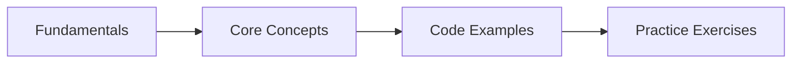

# Lambda Expressions & Functional Programming

## Learning Objectives
## Chapter at a Glance

| Topic | Key Insight | Practical Takeaway |
|-------|-------------|--------------------|
| Core Concepts | Foundational understanding for Java development | Master these before Spring |
| Code Examples | Runnable, compilable examples | Type, compile, run, refactor |
| Practice Exercises | Hands-on skill building | Apply what you learn |

## Chapter Roadmap




By the end of this chapter, you will be able to:

- Define and use the core functional interfaces: `Predicate<T>`, `Function<T,R>`, `Consumer<T>`, `Supplier<T>`, `UnaryOperator<T>`, `BinaryOperator<T>`, and their primitive variants
- Write lambda expressions in all syntactic forms, including single-expression, block-bodied, single-parameter without parentheses, and type-inferred forms
- Understand variable capture rules including the effectively-final constraint and what `this` means inside a lambda
- Replace anonymous classes and method references with lambda equivalents using four method-reference forms: static, bound-instance, unbound-instance, and constructor
- Construct stream pipelines composed of a source, zero or more intermediate operations, and a terminal operation
- Distinguish stateless intermediate operations from stateful ones and understand lazy evaluation semantics including short-circuiting
- Apply `map` for one-to-one element transformation and `flatMap` for one-to-many expansion and flattening of nested or optional structures
- Compose and negate predicates using `Predicate.and()`, `.or()`, and `.negate()` for fine-grained filtering
- Perform reduction with `reduce(T identity, BinaryOperator<T>)`, `Optional<T> reduce(BinaryOperator<T>)`, and mutable reduction with `collect`
- Use `Collectors.groupingBy` for single-level, multi-level, and concurrent grouping with downstream collectors such as `counting`, `summingInt`, `mapping`, and `filtering`
- Compose functions using `andThen` and `compose` and simulate currying through nested lambda returns
- Apply `Optional` patterns including `map` vs `flatMap`, `filter`, `or` (Java 9+), and `flatMap(Optional::stream)` for streams of optionals
- Build asynchronous pipelines with `CompletableFuture` using `supplyAsync`, `thenApply`, `thenCompose`, `thenAccept`, `thenCombine`, `allOf`, `anyOf`, `exceptionally`, `handle`, and `completeOnTimeout`
- Recognize and apply functional programming patterns in Spring Boot including lambda-based route definitions, `RouterFunction`, and `@Bean` factory methods

---

## 1. Functional Interfaces


A functional interface is an interface that contains exactly one abstract method. Java 8 introduced the `@FunctionalInterface` annotation to mark such interfaces; the compiler enforces the single-abstract-method constraint. Functional interfaces are the target type for lambda expressions and method references.

### 1.1 Core Functional Interfaces in `java.util.function`

The JDK provides forty-three functional interfaces in `java.util.function`. The six most fundamental are:

```java
import java.util.function.*;

public class CoreFunctionalInterfaces {

    public static void main(String[] args) {

        // Predicate<T> → boolean test(T t)
        Predicate<String> isEmpty = s -> s.isEmpty();
        System.out.println("Predicate: " + isEmpty.test(""));       // true
        System.out.println("Predicate: " + isEmpty.test("hello"));  // false

        // Function<T,R> → R apply(T t)
        Function<String, Integer> lengthFn = s -> s.length();
        System.out.println("Function: " + lengthFn.apply("lambda")); // 6

        // Consumer<T> → void accept(T t)
        Consumer<String> printer = s -> System.out.println("Consumer: " + s);
        printer.accept("Hello from Consumer!");

        // Supplier<T> → T get()
        Supplier<Double> randomSupplier = () -> Math.random();
        System.out.println("Supplier: " + randomSupplier.get());

        // UnaryOperator<T> extends Function<T,T>
        UnaryOperator<String> shout = s -> s.toUpperCase();
        System.out.println("UnaryOperator: " + shout.apply("quiet"));

        // BinaryOperator<T> extends BiFunction<T,T,T>
        BinaryOperator<Integer> add = (a, b) -> a + b;
        System.out.println("BinaryOperator: " + add.apply(10, 20)); // 30
    }
}
```

### 1.2 Primitive Variants

Autoboxing carries a performance cost. Specialized functional interfaces for `int`, `long`, and `double` eliminate boxing overhead:

```java
import java.util.function.*;
import java.util.stream.IntStream;

public class PrimitiveFunctionalInterfaces {

    public static void main(String[] args) {

        // IntPredicate → avoids boxing int -> Integer
        IntPredicate isEven = n -> n % 2 == 0;
        System.out.println("IntPredicate: " + isEven.test(42));  // true

        // IntFunction<R> → int argument, R result
        IntFunction<String> intToString = i -> "Number: " + i;
        System.out.println(intToString.apply(7));

        // IntConsumer
        IntConsumer printInt = i -> System.out.println("IntConsumer: " + i);
        printInt.accept(99);

        // IntSupplier
        IntSupplier intSupplier = () -> 42;
        System.out.println("IntSupplier: " + intSupplier.getAsInt());

        // IntUnaryOperator → int -> int
        IntUnaryOperator square = n -> n * n;
        System.out.println("IntUnaryOperator: " + square.applyAsInt(12)); // 144

        // IntBinaryOperator → (int, int) -> int
        IntBinaryOperator max = (a, b) -> a > b ? a : b;
        System.out.println("IntBinaryOperator: " + max.applyAsInt(30, 45)); // 45

        // LongPredicate, LongFunction, etc. follow the same pattern
        LongPredicate isPositive = n -> n > 0L;
        System.out.println("LongPredicate: " + isPositive.test(1_000_000L));

        // Double variants
        DoubleFunction<String> doubleFormatter = d -> String.format("%.2f", d);
        System.out.println("DoubleFunction: " + doubleFormatter.apply(3.14159));
    }
}
```

### 1.3 Bi-Argument Variants

When a lambda takes two arguments, use the `Bi`-prefixed versions:

```java
import java.util.function.*;

public class BiFunctionalInterfaces {

    public static void main(String[] args) {

        // BiPredicate<T,U> → boolean test(T t, U u)
        BiPredicate<String, Integer> lengthCheck = (s, len) -> s.length() == len;
        System.out.println("BiPredicate: " + lengthCheck.test("Java", 4)); // true

        // BiFunction<T,U,R> → R apply(T t, U u)
        BiFunction<String, String, String> concat = (a, b) -> a + " " + b;
        System.out.println("BiFunction: " + concat.apply("Hello", "World"));

        // BiConsumer<T,U> → void accept(T t, U u)
        BiConsumer<String, Double> report = (name, score) ->
            System.out.println(name + " scored " + score);
        report.accept("Alice", 95.5);

        // ToIntBiFunction<T,U>, ToLongBiFunction<T,U>, ToDoubleBiFunction<T,U>
        ToIntBiFunction<String, String> sumLengths = (a, b) -> a.length() + b.length();
        System.out.println("ToIntBiFunction: " + sumLengths.applyAsInt("abc", "de")); // 5
    }
}
```

### 1.4 Custom Functional Interfaces

You are not limited to JDK interfaces. Any interface with a single abstract method is a functional interface:

```java
@FunctionalInterface
interface Validator<T> {
    boolean validate(T value);

    // default methods are allowed → they don't count as the SAM
    default Validator<T> and(Validator<T> other) {
        return value -> this.validate(value) && other.validate(value);
    }

    // static methods are allowed
    static <T> Validator<T> alwaysPass() {
        return value -> true;
    }
}

@FunctionalInterface
interface Transformer<T, R> {
    R transform(T input);

    default Transformer<T, R> andThen(Transformer<R, R> after) {
        return input -> after.transform(this.transform(input));
    }
}

public class CustomFunctionalInterfaceDemo {

    public static void main(String[] args) {

        Validator<String> nonEmpty = value -> value != null && !value.isBlank();
        Validator<String> maxLength = value -> value.length() <= 10;

        Validator<String> combined = nonEmpty.and(maxLength);

        System.out.println("Valid 'hello': " + combined.validate("hello"));    // true
        System.out.println("Valid '': " + combined.validate(""));              // false
        System.out.println("Valid null: " + combined.validate(null));          // false
        System.out.println("Valid long: " + combined.validate("too long text")); // false

        Transformer<String, Integer> toLength = input -> input.length();
        Transformer<Integer, String> toString = input -> "Length: " + input;

        Transformer<String, String> pipeline = toLength.andThen(toString);
        System.out.println(pipeline.transform("functional")); // Length: 10
    }
}
```

### 1.5 Operator Interfaces

`UnaryOperator<T>` and `BinaryOperator<T>` are specialized `Function` and `BiFunction` respectively where the argument and result types are identical:

```java
import java.util.function.*;
import java.util.*;

public class OperatorInterfaces {

    public static void main(String[] args) {

        // UnaryOperator<T> → Function<T,T>
        UnaryOperator<String> reverse = s -> new StringBuilder(s).reverse().toString();
        System.out.println(reverse.apply("lambda")); // adbmal

        // BinaryOperator<T> → BiFunction<T,T,T>
        BinaryOperator<Integer> gcd = (a, b) -> {
            while (b != 0) {
                int temp = b;
                b = a % b;
                a = temp;
            }
            return a;
        };
        System.out.println("GCD: " + gcd.apply(48, 18)); // 6

        // BinaryOperator.minBy / maxBy → use a Comparator
        BinaryOperator<String> longest = BinaryOperator.maxBy(
            Comparator.comparingInt(String::length)
        );
        System.out.println(longest.apply("cat", "elephant")); // elephant
    }
}
```

---

## 2. Lambda Syntax

A lambda expression is a concise anonymous function that can be treated as a value. Java's lambda syntax evolved from the _lambda calculus_ and provides five structural variations.

### 2.1 The Five Forms

```java
import java.util.function.*;
import java.util.*;

public class LambdaSyntax {

    public static void main(String[] args) {

        // ---- Form 1: (parameters) -> expression (single expression, no braces) ----
        Function<Integer, String> intToString = (i) -> String.valueOf(i);
        System.out.println(intToString.apply(42));

        // ---- Form 2: (parameters) -> { statements } (block body, requires return) ----
        Function<String, String> capitalize = (s) -> {
            if (s == null || s.isEmpty()) {
                return s;
            }
            return Character.toUpperCase(s.charAt(0)) + s.substring(1);
        };
        System.out.println(capitalize.apply("hello")); // Hello

        // ---- Form 3: single parameter without parentheses ----
        Function<String, Integer> wordCount = s -> s.split("\\s+").length;
        System.out.println(wordCount.apply("one two three")); // 3

        // ---- Form 4: empty parameter ----
        Supplier<Long> currentTime = () -> System.currentTimeMillis();
        System.out.println("Time: " + currentTime.get());

        // ---- Form 5: type inference (parameters may omit types) ----
        BinaryOperator<Integer> multiply = (a, b) -> a * b;
        System.out.println(multiply.apply(6, 7)); // 42
    }
}
```

### 2.2 Explicit Types and Mixed Inference

You *may* declare types explicitly when inference is ambiguous or for readability:

```java
import java.util.function.*;
import java.util.*;

public class ExplicitTyping {

    public static void main(String[] args) {

        // All types declared → rarely necessary but legal
        BinaryOperator<Integer> sum = (Integer a, Integer b) -> a + b;

        // Mixed: type on one, inferred on another → compile error
        // BinaryOperator<Integer> bad = (Integer a, b) -> a + b; // DOES NOT COMPILE

        // When types are explicit, parentheses are always required
        Comparator<String> byLength = (String a, String b) ->
            Integer.compare(a.length(), b.length());

        List<String> words = Arrays.asList("apple", "fig", "banana");
        words.sort(byLength);
        System.out.println(words); // [fig, apple, banana]
    }
}
```

### 2.3 Variable Capture (Effectively Final)

Lambdas can capture variables from the enclosing scope. Captured variables must be **effectively final** → not reassigned after initialization:

```java
import java.util.function.*;
import java.util.*;

public class VariableCapture {

    public static void main(String[] args) {

        // Effectively final variable
        String prefix = "User: ";

        Function<String, String> greet = name -> prefix + name;
        System.out.println(greet.apply("Alice")); // User: Alice

        // The compiler error below demonstrates the effectively-final constraint.
        // Uncomment to see:
        // String changing = "start";
        // Function<String, String> bad = s -> changing + s; // OK here
        // changing = "modified"; // ERROR: changing is no longer effectively final

        // What about object fields? Fields are fair game.
        new VariableCapture().demoFieldCapture();
    }

    private String instanceField = "field-";

    void demoFieldCapture() {
        // instanceField can be reassigned → fields are not subject to
        // effectively-final because they are stored on the heap, not the stack.
        Function<String, String> fn = s -> instanceField + s;
        System.out.println(fn.apply("hello")); // field-hello
        instanceField = "new-";
        System.out.println(fn.apply("hello")); // new-hello (reflects assignment)
    }
}
```

### 2.4 The `this` Reference

Inside a lambda, `this` refers to the enclosing class instance, **not** the lambda itself. This differs from anonymous classes where `this` refers to the anonymous instance:

```java
import java.util.function.*;

public class ThisReferenceDemo {

    private String name = "OuterClass";

    public void demonstrate() {

        // Lambda: 'this' refers to the enclosing ThisReferenceDemo instance
        Supplier<String> fromLambda = () -> {
            return this.name; // refers to ThisReferenceDemo.name
        };
        System.out.println("Lambda this: " + fromLambda.get()); // OuterClass

        // Anonymous class: 'this' refers to the anonymous Supplier instance
        Supplier<String> fromAnonymous = new Supplier<>() {
            private final String name = "Anonymous";
            @Override
            public String get() {
                return this.name; // refers to the anonymous class's name
            }
        };
        System.out.println("Anonymous this: " + fromAnonymous.get()); // Anonymous
    }

    public static void main(String[] args) {
        new ThisReferenceDemo().demonstrate();
    }
}
```

### 2.5 Lambda as Expression, Not Statement

A lambda is an expression → it produces a value. This means you can assign it, pass it as an argument, or return it from a method:

```java
import java.util.function.*;
import java.util.*;

public class LambdaAsValue {

    public static void main(String[] args) {

        // Assign to variable
        UnaryOperator<String> exclaim = s -> s + "!";

        // Pass as argument
        List<String> names = Arrays.asList("Alice", "Bob", "Charlie");
        names.sort((a, b) -> Integer.compare(b.length(), a.length()));
        System.out.println("Sorted by length desc: " + names);

        // Return from method
        Function<Integer, Integer> multiplier = createMultiplier(3);
        System.out.println("3 * 7 = " + multiplier.apply(7));
    }

    static Function<Integer, Integer> createMultiplier(int factor) {
        // Lambda returned from a method
        return x -> x * factor;
    }
}
```

---

## 3. Method References

Method references are shorthand for lambdas that simply call an existing method. There are four kinds.

### 3.1 Static Method Reference (`Class::staticMethod`)

```java
import java.util.function.*;
import java.util.*;

public class StaticMethodRef {

    public static void main(String[] args) {

        // Lambda form
        Function<String, Integer> lambdaForm = s -> Integer.parseInt(s);
        System.out.println(lambdaForm.apply("42"));

        // Method reference form
        Function<String, Integer> refForm = Integer::parseInt;
        System.out.println(refForm.apply("42"));

        // Another example: Comparator.naturalOrder
        List<String> names = Arrays.asList("Charlie", "Alice", "Bob");
        names.sort(Comparator.naturalOrder());
        System.out.println(names); // [Alice, Bob, Charlie]

        // Static method: Collections.max
        Supplier<Long> currentTime = System::currentTimeMillis;
        System.out.println("Millis: " + currentTime.get());
    }

    static boolean isPalindrome(String s) {
        return new StringBuilder(s).reverse().toString().equals(s);
    }

    static void demoWithPredicate() {
        Predicate<String> palindrome = StaticMethodRef::isPalindrome;
        System.out.println(palindrome.test("racecar")); // true
        System.out.println(palindrome.test("hello"));   // false
    }
}
```

### 3.2 Bound Instance Method Reference (`instance::method`)

```java
import java.util.function.*;
import java.util.*;

public class BoundInstanceMethodRef {

    public static void main(String[] args) {

        // Lambda form
        String greeting = "Hello";
        Supplier<String> lambdaForm = () -> greeting.toUpperCase();
        System.out.println(lambdaForm.get());

        // Method reference form → the instance 'greeting' is bound
        Supplier<String> refForm = greeting::toUpperCase;
        System.out.println(refForm.get());

        // Practical example: logging
        Logger logger = new Logger("AppLogger");
        Consumer<String> infoLog = logger::info;
        infoLog.accept("Application started");

        // Predicate with bound instance
        List<String> words = Arrays.asList("apple", "", "banana", "", "cherry");
        String empty = "";
        Predicate<String> isEmpty = empty::equals;
        words.removeIf(isEmpty);
        System.out.println(words); // [apple, banana, cherry]
    }
}

class Logger {
    private final String name;

    Logger(String name) {
        this.name = name;
    }

    void info(String message) {
        System.out.println("[" + name + "] INFO: " + message);
    }
}
```

### 3.3 Unbound Instance Method Reference (`Class::instanceMethod`)

The first argument becomes the target of the method:

```java
import java.util.function.*;
import java.util.*;

public class UnboundInstanceMethodRef {

    public static void main(String[] args) {

        // Lambda form: (String s) -> s.length()
        Function<String, Integer> lambdaForm = s -> s.length();

        // Method reference form: String::length
        Function<String, Integer> refForm = String::length;
        System.out.println(refForm.apply("Hello!")); // 6

        // BiFunction form: (String a, String b) -> a.compareTo(b)
        BiFunction<String, String, Integer> compareFn = String::compareTo;
        System.out.println(compareFn.apply("apple", "banana")); // negative

        // Sorting with unbound reference
        List<String> words = Arrays.asList("dog", "cat", "elephant", "ant");
        words.sort(String::compareToIgnoreCase);
        System.out.println(words); // [ant, cat, dog, elephant]

        // Predicate with unbound instance method: (String s) -> s.isEmpty()
        Predicate<String> isEmpty = String::isEmpty;
        System.out.println(isEmpty.test(""));  // true
        System.out.println(isEmpty.test("a")); // false
    }
}
```

### 3.4 Constructor Reference (`Class::new`)

```java
import java.util.function.*;
import java.util.*;

class Person {
    private final String name;
    private final int age;

    Person() {
        this.name = "Unknown";
        this.age = 0;
    }

    Person(String name) {
        this.name = name;
        this.age = 0;
    }

    Person(String name, int age) {
        this.name = name;
        this.age = age;
    }

    public String getName() { return name; }
    public int getAge() { return age; }

    @Override
    public String toString() {
        return "Person{name='" + name + "', age=" + age + "}";
    }
}

public class ConstructorReference {

    public static void main(String[] args) {

        // No-arg constructor
        Supplier<Person> personFactory = Person::new;
        Person p1 = personFactory.get();
        System.out.println(p1); // Person{name='Unknown', age=0}

        // Single-arg constructor: Function<String, Person>
        Function<String, Person> namedFactory = Person::new;
        Person p2 = namedFactory.apply("Alice");
        System.out.println(p2); // Person{name='Alice', age=0}

        // Two-arg constructor: BiFunction<String, Integer, Person>
        BiFunction<String, Integer, Person> fullFactory = Person::new;
        Person p3 = fullFactory.apply("Bob", 30);
        System.out.println(p3); // Person{name='Bob', age=30}

        // Array constructor reference
        Function<Integer, String[]> arrayFactory = String[]::new;
        String[] arr = arrayFactory.apply(5);
        System.out.println("Array length: " + arr.length); // 5

        // Practical: collect to array using constructor reference
        List<String> names = Arrays.asList("X", "Y", "Z");
        String[] nameArray = names.toArray(String[]::new);
        System.out.println("Collected: " + Arrays.toString(nameArray));
    }
}
```

### 3.5 Summary Table

```java
public class MethodRefSummary {

    public static void main(String[] args) {
        System.out.println("""
            ┌──────────────────────────────┬────────────────────────┬──────────────────────────┐
            │ Kind                         │ Lambda                 │ Method Reference          │
            ├──────────────────────────────┼────────────────────────┼──────────────────────────┤
            │ Static method                │ s -> Integer.parseInt  │ Integer::parseInt         │
            │ Bound instance method        │ () -> greeting.trim()  │ greeting::trim            │
            │ Unbound instance method      │ s -> s.toUpperCase()   │ String::toUpperCase       │
            │ Constructor (no-arg)         │ () -> new Person()     │ Person::new               │
            │ Constructor (one-arg)        │ n -> new Person(n)     │ Person::new               │
            │ Array constructor            │ n -> new String[n]     │ String[]::new             │
            └──────────────────────────────┴────────────────────────┴──────────────────────────┘
        """);
    }
}
```

---

## 4. Stream Pipeline Architecture

A stream pipeline consists of three phases:

1. **Source** → a data source (collection, array, generator function, I/O channel)
2. **Intermediate operations** → transform the stream (lazy, return a new stream)
3. **Terminal operation** → produces a result or side effect (eager, consumes the stream)

### 4.1 Pipeline Structure

```java
import java.util.*;
import java.util.stream.*;

public class PipelineStructure {

    public static void main(String[] args) {

        List<String> words = Arrays.asList(
            "apple", "banana", "avocado", "cherry", "apricot", "blueberry"
        );

        // Pipeline: source -> filter (intermediate) -> map (intermediate) -> collect (terminal)
        long count = words.stream()                       // source
            .filter(w -> w.startsWith("a"))               // intermediate (stateless)
            .map(String::toUpperCase)                     // intermediate (stateless)
            .count();                                     // terminal

        System.out.println("Count: " + count); // 3

        // A pipeline that produces a result
        List<String> result = words.stream()
            .filter(w -> w.length() > 5)
            .sorted()                                     // intermediate (stateful)
            .collect(Collectors.toList());                // terminal

        System.out.println(result); // [avocado, banana, blueberry, cherry]
    }
}
```

### 4.2 Stream Sources

```java
import java.util.*;
import java.util.stream.*;
import java.nio.file.*;
import java.io.IOException;

public class StreamSources {

    public static void main(String[] args) throws IOException {

        // 1. From a Collection
        List<String> list = List.of("a", "b", "c");
        list.stream().forEach(System.out::print);
        System.out.println();

        // 2. From an array
        int[] numbers = {1, 2, 3, 4, 5};
        IntStream intStream = Arrays.stream(numbers);
        System.out.println("Sum: " + intStream.sum());

        // 3. Stream.of (varargs)
        Stream<String> streamOf = Stream.of("x", "y", "z");
        streamOf.map(String::toUpperCase).forEach(System.out::print);
        System.out.println();

        // 4. Stream.iterate (unbounded)
        Stream<Integer> evens = Stream.iterate(0, n -> n + 2);
        evens.limit(5).forEach(n -> System.out.print(n + " ")); // 0 2 4 6 8
        System.out.println();

        // 5. Stream.iterate with hasNext predicate (Java 9+)
        Stream<Integer> bounded = Stream.iterate(
            1, n -> n <= 100, n -> n * 2
        );
        bounded.forEach(n -> System.out.print(n + " ")); // 1 2 4 8 16 32 64
        System.out.println();

        // 6. Stream.generate (Supplier)
        Stream.generate(() -> Math.random())
            .limit(3)
            .forEach(n -> System.out.printf("%.2f ", n));
        System.out.println();

        // 7. IntStream.range / rangeClosed
        IntStream.range(1, 5).forEach(n -> System.out.print(n + " ")); // 1 2 3 4
        System.out.println();
        IntStream.rangeClosed(1, 5).forEach(n -> System.out.print(n + " ")); // 1 2 3 4 5
        System.out.println();

        // 8. Stream.concat
        Stream<String> first = Stream.of("a", "b");
        Stream<String> second = Stream.of("c", "d");
        Stream.concat(first, second).forEach(System.out::print); // abcd
        System.out.println();

        // 9. From a file (lines)
        // Path path = Paths.get("data.txt");
        // try (Stream<String> lines = Files.lines(path)) {
        //     lines.filter(l -> !l.isBlank()).forEach(System.out::println);
        // }

        // 10. From a Pattern
        String sentence = "the quick brown fox";
        Pattern pattern = Pattern.compile(" ");
        pattern.splitAsStream(sentence).forEach(w -> System.out.print(w + ","));
        System.out.println();
    }
}
```

### 4.3 Stateless vs. Stateful Intermediate Operations

Stateless operations (`filter`, `map`, `flatMap`, `peek`) can process each element independently. Stateful operations (`sorted`, `distinct`, `limit`, `skip`) must maintain state across elements:

```java
import java.util.*;
import java.util.stream.*;

public class StatelessVsStateful {

    public static void main(String[] args) {

        List<Integer> data = Arrays.asList(3, 1, 4, 1, 5, 9, 2, 6, 5, 3);

        // Stateless: filter and map → each element processed independently
        List<Integer> processed = data.stream()
            .filter(n -> n % 2 == 0)           // stateless
            .map(n -> n * n)                    // stateless
            .collect(Collectors.toList());
        System.out.println("Stateless pipeline: " + processed);

        // Stateful: sorted and distinct → must buffer elements
        List<Integer> sortedUnique = data.stream()
            .distinct()                         // stateful → needs to remember seen elements
            .sorted()                           // stateful → needs to buffer all elements
            .collect(Collectors.toList());
        System.out.println("With stateful ops: " + sortedUnique);

        // Performance note: stateful ops break parallelism efficiency
        // because they introduce ordering dependencies.
    }
}
```

### 4.4 Lazy Evaluation

Intermediate operations are **lazy** → they do nothing until a terminal operation is invoked. This enables:

- Short-circuiting (stop processing once the result is determined)
- Fusion (combine multiple operations into a single pass)

```java
import java.util.*;
import java.util.stream.*;

public class LazyEvaluation {

    public static void main(String[] args) {

        List<String> names = Arrays.asList("Anna", "Bob", "Charlie", "Diana", "Eve");

        System.out.println("--- Pipeline defined (nothing happens yet) ---");

        Stream<String> stream = names.stream()
            .filter(name -> {
                System.out.println("  filtering: " + name);
                return name.length() >= 4;
            })
            .map(name -> {
                System.out.println("  mapping: " + name);
                return name.toUpperCase();
            });

        System.out.println("--- Terminal operation invoked ---");
        List<String> result = stream.collect(Collectors.toList());
        System.out.println("Result: " + result);

        // Key observation: filtering and mapping are interleaved,
        // not done in two separate passes. Each element passes through
        // filter -> map before the next element is processed.
    }
}
```

### 4.5 Short-Circuiting

Certain operations can terminate without processing the entire stream:

```java
import java.util.*;
import java.util.stream.*;

public class ShortCircuiting {

    public static void main(String[] args) {

        List<Integer> numbers = IntStream.rangeClosed(1, 1_000_000)
            .boxed()
            .collect(Collectors.toList());

        // findFirst → stops at the first match
        Optional<Integer> first = numbers.stream()
            .filter(n -> n > 500_000)
            .findFirst();
        System.out.println("First > 500k: " + first.orElse(-1)); // 500001

        // anyMatch → stops at the first match
        boolean hasPrime = numbers.stream()
            .anyMatch(n -> n > 1 && isPrime(n));
        System.out.println("Has prime: " + hasPrime);

        // limit → truncates the stream
        List<Integer> sample = numbers.stream()
            .limit(5)
            .collect(Collectors.toList());
        System.out.println("First five: " + sample);
    }

    static boolean isPrime(int n) {
        if (n < 2) return false;
        if (n == 2) return true;
        if (n % 2 == 0) return false;
        for (int i = 3; i * i <= n; i += 2) {
            if (n % i == 0) return false;
        }
        return true;
    }
}
```

### 4.6 Common Terminal Operations

```java
import java.util.*;
import java.util.stream.*;

public class TerminalOperations {

    public static void main(String[] args) {

        List<String> words = Arrays.asList("apple", "banana", "cherry", "date");

        // forEach → side effect
        System.out.print("forEach: ");
        words.stream().forEach(w -> System.out.print(w + " "));
        System.out.println();

        // collect → mutable reduction
        Set<String> wordSet = words.stream().collect(Collectors.toSet());
        System.out.println("collect to Set: " + wordSet);

        // toList (Java 16+) → immutable list
        List<String> upper = words.stream()
            .map(String::toUpperCase)
            .toList();
        System.out.println("toList: " + upper);

        // count
        long longWords = words.stream()
            .filter(w -> w.length() > 5)
            .count();
        System.out.println("Words > 5 chars: " + longWords);

        // anyMatch / allMatch / noneMatch
        boolean allLong = words.stream().allMatch(w -> w.length() >= 4);
        System.out.println("All length >= 4: " + allLong);

        // findFirst / findAny
        Optional<String> first = words.stream()
            .filter(w -> w.startsWith("c"))
            .findFirst();
        System.out.println("First starting with c: " + first.orElse("none"));

        // min / max
        Optional<String> shortest = words.stream()
            .min(Comparator.comparingInt(String::length));
        System.out.println("Shortest: " + shortest.orElse("none"));

        // reduce (covered in depth in section 7)
        Optional<String> concatenated = words.stream()
            .reduce((a, b) -> a + "," + b);
        System.out.println("Reduced: " + concatenated.orElse(""));
    }
}
```

---

## 5. Map / FlatMap Patterns

The `map` operation applies a function to each element, producing a new stream of the same cardinality. The `flatMap` operation applies a function that returns a stream for each element, then flattens the results into a single stream.

### 5.1 One-to-One Transformation with `map`

```java
import java.util.*;
import java.util.stream.*;

public class MapPatterns {

    public static void main(String[] args) {

        // Simple type transformation
        List<String> names = List.of("alice", "bob", "charlie");
        List<String> capitalized = names.stream()
            .map(s -> Character.toUpperCase(s.charAt(0)) + s.substring(1))
            .collect(Collectors.toList());
        System.out.println("Capitalized: " + capitalized);

        // Extracting a property
        List<Person> people = List.of(
            new Person("Alice", 30),
            new Person("Bob", 25),
            new Person("Charlie", 35)
        );
        List<String> personNames = people.stream()
            .map(Person::getName)
            .collect(Collectors.toList());
        System.out.println("Names: " + personNames);

        // Primitive stream mapping
        int[] lengths = people.stream()
            .mapToInt(Person::getAge)
            .toArray();
        System.out.println("Ages: " + Arrays.toString(lengths));

        // Map with index using IntStream
        List<String> indexed = IntStream.range(0, names.size())
            .mapToObj(i -> (i + 1) + ". " + names.get(i))
            .toList();
        System.out.println("Indexed: " + indexed);
    }
}
```

### 5.2 One-to-Many with `flatMap`

```java
public class FlatMapOneToMany {

    public static void main(String[] args) {

        // Each word becomes multiple characters
        List<String> words = List.of("hi", "ok");
        List<String> letters = words.stream()
            .flatMap(word -> Arrays.stream(word.split("")))
            .collect(Collectors.toList());
        System.out.println("Letters: " + letters); // [h, i, o, k]

        // Cartesian product
        List<Integer> numbers = List.of(1, 2, 3);
        List<Character> chars = List.of('a', 'b');

        List<String> product = numbers.stream()
            .flatMap(n -> chars.stream().map(c -> n + "" + c))
            .collect(Collectors.toList());
        System.out.println("Cartesian product: " + product);
        // [1a, 1b, 2a, 2b, 3a, 3b]

        // Expanding a collection property
        List<Team> teams = List.of(
            new Team("Dev", List.of("Alice", "Bob")),
            new Team("QA", List.of("Charlie", "Diana"))
        );
        List<String> allMembers = teams.stream()
            .flatMap(team -> team.members().stream())
            .collect(Collectors.toList());
        System.out.println("All members: " + allMembers);
    }
}

record Team(String name, List<String> members) {}
```

### 5.3 Flattening Nested Structures

```java
import java.util.*;
import java.util.stream.*;

public class FlattenNestedStructures {

    public static void main(String[] args) {

        // Nested lists
        List<List<Integer>> matrix = List.of(
            List.of(1, 2, 3),
            List.of(4, 5, 6),
            List.of(7, 8, 9)
        );

        List<Integer> flat = matrix.stream()
            .flatMap(List::stream)
            .collect(Collectors.toList());
        System.out.println("Flattened matrix: " + flat);

        // Deeply nested → requires multiple flatMaps
        List<List<List<String>>> deep = List.of(
            List.of(List.of("a", "b"), List.of("c")),
            List.of(List.of("d", "e"))
        );
        List<String> deepFlat = deep.stream()
            .flatMap(List::stream)
            .flatMap(List::stream)
            .collect(Collectors.toList());
        System.out.println("Deep flatten: " + deepFlat);

        // Tree-like structure
        record Node(String name, List<Node> children) {}

        Node tree = new Node("root", List.of(
            new Node("a", List.of(new Node("a1", List.of()), new Node("a2", List.of()))),
            new Node("b", List.of())
        ));

        List<String> allNames = flattenNames(tree);
        System.out.println("Tree names: " + allNames);
    }

    static List<String> flattenNames(Node node) {
        return Stream.concat(
            Stream.of(node.name()),
            node.children().stream().flatMap(child -> flattenNames(child).stream())
        ).collect(Collectors.toList());
    }

    record Node(String name, List<Node> children) {}
}
```

### 5.4 `Optional` Mapping with `flatMap`

```java
import java.util.*;

public class OptionalFlatMap {

    public static void main(String[] args) {

        // Nested Optional → map produces Optional<Optional<R>>
        Optional<String> outer = Optional.of("hello");
        Optional<Optional<Integer>> mapped = outer.map(s -> Optional.of(s.length()));
        System.out.println("map on Optional: " + mapped);        // Optional[Optional[5]]

        // flatMap flattens: Optional<R>
        Optional<Integer> flat = outer.flatMap(s -> Optional.of(s.length()));
        System.out.println("flatMap on Optional: " + flat);      // Optional[5]

        // Real-world: looking up a value, then looking up based on that value
        Map<String, String> config = new HashMap<>();
        config.put("db.host", "localhost");
        config.put("localhost", "127.0.0.1");

        Optional<String> resolved = Optional.ofNullable(config.get("db.host"))
            .flatMap(host -> Optional.ofNullable(config.get(host)));
        System.out.println("Resolved: " + resolved.orElse("not found"));

        // Avoiding nested optionals in chained lookups
        Map<String, Integer> cityPop = Map.of("NYC", 8_300_000, "Tokyo", 13_900_000);
        Map<String, String> capitals = Map.of("USA", "NYC", "Japan", "Tokyo");

        Optional<Integer> population = Optional.ofNullable(capitals.get("USA"))
            .flatMap(city -> Optional.ofNullable(cityPop.get(city)));
        System.out.println("Population: " + population.orElse(0)); // 8300000
    }
}
```

### 5.5 Stream of Optionals → `flatMap(Optional::stream)` (Java 9+)

```java
import java.util.*;
import java.util.stream.*;

public class StreamOfOptionals {

    public static void main(String[] args) {

        List<Optional<String>> optionals = List.of(
            Optional.of("apple"),
            Optional.empty(),
            Optional.of("banana"),
            Optional.of("cherry"),
            Optional.empty()
        );

        // Before Java 9: filter and map
        List<String> before = optionals.stream()
            .filter(Optional::isPresent)
            .map(Optional::get)
            .collect(Collectors.toList());
        System.out.println("Filter + map: " + before);

        // Java 9+: flatMap(Optional::stream)
        List<String> after = optionals.stream()
            .flatMap(Optional::stream)
            .collect(Collectors.toList());
        System.out.println("flatMap stream: " + after);

        // Another common pattern: mapping that returns Optional
        List<String> raw = List.of("42", "abc", "100", "xyz");
        List<Integer> parsed = raw.stream()
            .map(StreamOfOptionals::tryParseInt)
            .flatMap(Optional::stream)
            .collect(Collectors.toList());
        System.out.println("Parsed ints: " + parsed); // [42, 100]
    }

    static Optional<Integer> tryParseInt(String s) {
        try {
            return Optional.of(Integer.parseInt(s));
        } catch (NumberFormatException e) {
            return Optional.empty();
        }
    }
}
```

---

## 6. Filter / Predicate Patterns

### 6.1 Basic Filtering

```java
import java.util.*;
import java.util.stream.*;

public class BasicFiltering {

    public static void main(String[] args) {

        List<Integer> numbers = IntStream.rangeClosed(1, 20)
            .boxed()
            .collect(Collectors.toList());

        // Simple predicate
        List<Integer> evens = numbers.stream()
            .filter(n -> n % 2 == 0)
            .collect(Collectors.toList());
        System.out.println("Evens: " + evens);

        // Multiple filters
        List<Integer> filtered = numbers.stream()
            .filter(n -> n % 2 == 0)
            .filter(n -> n > 10)
            .collect(Collectors.toList());
        System.out.println("Evens > 10: " + filtered);

        // With method reference
        List<String> words = List.of("", "hello", " ", "world", "");
        List<String> nonBlank = words.stream()
            .filter(s -> !s.isBlank())
            .collect(Collectors.toList());
        System.out.println("Non-blank: " + nonBlank);
    }
}
```

### 6.2 `Predicate.negate()`, `.and()`, `.or()`

```java
import java.util.*;
import java.util.function.*;
import java.util.stream.*;

public class PredicateCombination {

    public static void main(String[] args) {

        List<String> words = List.of("cat", "dog", "elephant", "ant", "bear", "aardvark");

        // Base predicates
        Predicate<String> startsWithA = s -> s.startsWith("a");
        Predicate<String> longerThan3 = s -> s.length() > 3;

        // negate
        List<String> notStartingWithA = words.stream()
            .filter(startsWithA.negate())
            .collect(Collectors.toList());
        System.out.println("Not starting with 'a': " + notStartingWithA);

        // and
        List<String> startsWithAandLong = words.stream()
            .filter(startsWithA.and(longerThan3))
            .collect(Collectors.toList());
        System.out.println("Starts with 'a' AND length > 3: " + startsWithAandLong);

        // or
        Predicate<String> shorterThan4 = s -> s.length() < 4;
        List<String> startsWithAorShort = words.stream()
            .filter(startsWithA.or(shorterThan4))
            .collect(Collectors.toList());
        System.out.println("Starts with 'a' OR length < 4: " + startsWithAorShort);

        // Complex combination
        Predicate<String> complex = startsWithA
            .and(longerThan3)
            .or(s -> s.contains("e"));
        List<String> complexResult = words.stream()
            .filter(complex)
            .collect(Collectors.toList());
        System.out.println("Complex filter: " + complexResult);
    }
}
```

### 6.3 Reusable Predicates with `Predicate.isEqual`

```java
import java.util.*;
import java.util.function.*;
import java.util.stream.*;

public class PredicateIsEqual {

    public static void main(String[] args) {

        // Predicate.isEqual returns a predicate that tests for equality
        Predicate<String> isHello = Predicate.isEqual("hello");

        List<String> greetings = List.of("hello", "world", "hello", "java", "hello");
        long helloCount = greetings.stream()
            .filter(isHello)
            .count();
        System.out.println("'hello' count: " + helloCount); // 3

        // Useful for filtering by a dynamic value
        String target = "filterMe";
        List<String> items = List.of("keep", "filterMe", "alsoKeep", "filterMe");
        items.stream()
            .filter(Predicate.isEqual(target).negate())
            .forEach(s -> System.out.print(s + " "));
        System.out.println();
    }
}
```

### 6.4 Distinct Elements with `distinct`

```java
import java.util.*;
import java.util.stream.*;

public class DistinctFiltering {

    public static void main(String[] args) {

        List<Integer> numbers = List.of(1, 2, 2, 3, 3, 3, 4, 5, 5);

        List<Integer> unique = numbers.stream()
            .distinct()
            .collect(Collectors.toList());
        System.out.println("Unique: " + unique);

        // Distinct by property using a custom collector or map trick
        List<Person> people = List.of(
            new Person("Alice", 30),
            new Person("Bob", 25),
            new Person("Alice", 35), // duplicate name
            new Person("Charlie", 30)
        );

        // Distinct by name → use toMap and collect values
        List<Person> uniqueByName = people.stream()
            .collect(Collectors.toMap(
                Person::getName,
                p -> p,
                (existing, replacement) -> existing // keep first
            ))
            .values()
            .stream()
            .collect(Collectors.toList());
        System.out.println("Unique by name: " + uniqueByName);
    }
}
```

### 6.5 Take-While / Drop-While (Java 9+)

```java
import java.util.*;
import java.util.stream.*;

public class TakeWhileDropWhile {

    public static void main(String[] args) {

        List<Integer> numbers = List.of(2, 4, 6, 7, 8, 10, 11, 12);

        // takeWhile → take elements while the predicate is true, stop when false
        List<Integer> evensThenStop = numbers.stream()
            .takeWhile(n -> n % 2 == 0)
            .collect(Collectors.toList());
        System.out.println("Take evens: " + evensThenStop); // [2, 4, 6]

        // dropWhile → drop elements while the predicate is true, then include the rest
        List<Integer> afterFirstOdd = numbers.stream()
            .dropWhile(n -> n % 2 == 0)
            .collect(Collectors.toList());
        System.out.println("Drop evens: " + afterFirstOdd); // [7, 8, 10, 11, 12]

        // Useful on sorted data → operate on prefix/suffix
        List<String> sorted = List.of("apple", "banana", "cherry", "date");
        List<String> beforeCherry = sorted.stream()
            .takeWhile(s -> !s.equals("cherry"))
            .collect(Collectors.toList());
        System.out.println("Before cherry: " + beforeCherry); // [apple, banana]
    }
}
```

---

## 7. Reduce Operations

Reduction takes a stream of elements and produces a single value.

### 7.1 `T reduce(T identity, BinaryOperator<T>)`

```java
import java.util.*;
import java.util.stream.*;

public class ReduceWithIdentity {

    public static void main(String[] args) {

        List<Integer> numbers = List.of(1, 2, 3, 4, 5);

        // Sum → identity value is 0
        int sum = numbers.stream()
            .reduce(0, (a, b) -> a + b);
        System.out.println("Sum: " + sum); // 15

        // Product → identity value is 1
        int product = numbers.stream()
            .reduce(1, (a, b) -> a * b);
        System.out.println("Product: " + product); // 120

        // String concatenation → identity is ""
        List<String> words = List.of("Hello", " ", "World", "!");
        String combined = words.stream()
            .reduce("", (a, b) -> a + b);
        System.out.println("Combined: " + combined);

        // Max → identity is Integer.MIN_VALUE
        int max = numbers.stream()
            .reduce(Integer.MIN_VALUE, Integer::max);
        System.out.println("Max: " + max); // 5

        // Min → identity is Integer.MAX_VALUE
        int min = numbers.stream()
            .reduce(Integer.MAX_VALUE, Integer::min);
        System.out.println("Min: " + min); // 1
    }
}
```

### 7.2 `Optional<T> reduce(BinaryOperator<T>)`

When there is no identity value (e.g., the stream could be empty), use the variant that returns `Optional`:

```java
import java.util.*;
import java.util.stream.*;

public class ReduceWithoutIdentity {

    public static void main(String[] args) {

        List<Integer> numbers = List.of(3, 7, 2, 9, 1);
        List<Integer> empty = List.of();

        // Max with no identity
        Optional<Integer> max = numbers.stream()
            .reduce(Integer::max);
        System.out.println("Max: " + max.orElse(-1)); // 9

        // Empty stream -> Optional.empty()
        Optional<Integer> maxEmpty = empty.stream()
            .reduce(Integer::max);
        System.out.println("Max of empty: " + maxEmpty.orElse(-1)); // -1

        // Concatenation with comma
        List<String> items = List.of("A", "B", "C");
        Optional<String> csv = items.stream()
            .reduce((a, b) -> a + "," + b);
        System.out.println("CSV: " + csv.orElse(""));
    }
}
```

### 7.3 `reduce(U identity, BiFunction<U,T,U>, BinaryOperator<U>)`

The three-argument reduce changes the result type and is used in parallel:

```java
import java.util.*;
import java.util.stream.*;

public class ReduceThreeArg {

    public static void main(String[] args) {

        List<String> words = List.of("apple", "banana", "cherry");

        // Accumulator type (StringBuilder) differs from element type (String)
        StringBuilder combined = words.stream()
            .reduce(
                new StringBuilder(),                    // identity
                (sb, word) -> sb.append(word).append(" "), // accumulator
                (sb1, sb2) -> sb1.append(sb2)            // combiner (for parallel)
            );
        System.out.println("Reduced: '" + combined + "'");

        // Counting with a different accumulator type
        int totalLength = words.stream()
            .reduce(
                0,                                        // identity
                (len, word) -> len + word.length(),       // accumulator
                Integer::sum                              // combiner
            );
        System.out.println("Total length: " + totalLength); // 17
    }
}
```

### 7.4 Mutable Reduction with `collect`

`collect` is specialized for mutable reduction → accumulating results into a mutable container:

```java
import java.util.*;
import java.util.stream.*;

public class MutableReduction {

    public static void main(String[] args) {

        List<String> words = List.of("apple", "banana", "cherry", "date");

        // collect to List
        List<String> list = words.stream()
            .filter(w -> w.length() > 4)
            .collect(Collectors.toList());
        System.out.println("List: " + list);

        // collect to Set
        Set<Integer> lengths = words.stream()
            .map(String::length)
            .collect(Collectors.toSet());
        System.out.println("Length set: " + lengths);

        // collect to Map
        Map<String, Integer> wordLengthMap = words.stream()
            .collect(Collectors.toMap(
                w -> w,          // key mapper
                String::length   // value mapper
            ));
        System.out.println("Word length map: " + wordLengthMap);

        // collect to specific Collection type
        TreeSet<String> sorted = words.stream()
            .collect(Collectors.toCollection(TreeSet::new));
        System.out.println("TreeSet: " + sorted);

        // collect to unmodifiable collection (Java 16+ toList is immutable)
        List<String> immutable = words.stream()
            .collect(Collectors.toUnmodifiableList());
        System.out.println("Immutable: " + immutable);

        // Joining strings
        String joined = words.stream()
            .collect(Collectors.joining(", ", "[", "]"));
        System.out.println("Joined: " + joined);
    }
}
```

### 7.5 Custom Collector

```java
import java.util.*;
import java.util.function.*;
import java.util.stream.*;

public class CustomCollector {

    public static void main(String[] args) {

        List<String> words = List.of("apple", "banana", "cherry", "date");

        // Collector that joins with a delimiter
        Collector<String, ?, String> commaDelimited =
            Collector.of(
                StringBuilder::new,                     // supplier
                (sb, s) -> { if (!sb.isEmpty()) sb.append(", "); sb.append(s); }, // accumulator
                (sb1, sb2) -> sb1.append(sb2.length() > 0 ? ", " : "").append(sb2), // combiner
                StringBuilder::toString                 // finisher
            );

        String result = words.stream().collect(commaDelimited);
        System.out.println("Custom collect: " + result);

        // Collector for computing summary statistics with custom logic
        Collector<Integer, ?, Map<String, Integer>> statsCollector =
            Collector.of(
                HashMap<String, Integer>::new,
                (map, n) -> {
                    map.merge("sum", n, Integer::sum);
                    map.merge("count", 1, Integer::sum);
                    map.merge("min", n, Math::min);
                    map.merge("max", n, Math::max);
                },
                (m1, m2) -> {
                    m1.merge("sum", m2.getOrDefault("sum", 0), Integer::sum);
                    m1.merge("count", m2.getOrDefault("count", 0), Integer::sum);
                    m1.merge("min", m2.getOrDefault("min", Integer.MAX_VALUE), Math::min);
                    m1.merge("max", m2.getOrDefault("max", Integer.MIN_VALUE), Math::max);
                    return m1;
                }
            );

        Map<String, Integer> stats = IntStream.rangeClosed(1, 10)
            .boxed()
            .collect(statsCollector);
        System.out.println("Custom stats: " + stats);
        // {sum=55, count=10, min=1, max=10}
    }
}
```

---

## 8. GroupingBy

### 8.1 Simple Grouping

```java
import java.util.*;
import java.util.stream.*;

public class SimpleGroupingBy {

    record City(String name, String country, int population) {}

    public static void main(String[] args) {

        List<City> cities = List.of(
            new City("Tokyo", "Japan", 13_900_000),
            new City("Osaka", "Japan", 2_700_000),
            new City("Paris", "France", 2_100_000),
            new City("Lyon", "France", 500_000),
            new City("New York", "USA", 8_300_000),
            new City("Chicago", "USA", 2_700_000)
        );

        // Simple grouping by country
        Map<String, List<City>> byCountry = cities.stream()
            .collect(Collectors.groupingBy(City::country));
        System.out.println("By country:");
        byCountry.forEach((country, cityList) ->
            System.out.println("  " + country + ": " + cityList)
        );

        // Grouping by first letter
        Map<Character, List<City>> byFirstLetter = cities.stream()
            .collect(Collectors.groupingBy(
                city -> city.name().charAt(0)
            ));
        System.out.println("By first letter:");
        byFirstLetter.forEach((letter, cityList) ->
            System.out.println("  " + letter + ": " + cityList)
        );
    }
}
```

### 8.2 Grouping with Downstream Collectors

```java
import java.util.*;
import java.util.stream.*;

public class GroupingDownstream {

    record City(String name, String country, int population) {}

    public static void main(String[] args) {

        List<City> cities = List.of(
            new City("Tokyo", "Japan", 13_900_000),
            new City("Osaka", "Japan", 2_700_000),
            new City("Paris", "France", 2_100_000),
            new City("Lyon", "France", 500_000),
            new City("New York", "USA", 8_300_000),
            new City("Chicago", "USA", 2_700_000)
        );

        // counting → how many per group
        Map<String, Long> cityCount = cities.stream()
            .collect(Collectors.groupingBy(
                City::country,
                Collectors.counting()
            ));
        System.out.println("City count per country: " + cityCount);

        // summingInt → total population per country
        Map<String, Integer> totalPop = cities.stream()
            .collect(Collectors.groupingBy(
                City::country,
                Collectors.summingInt(City::population)
            ));
        System.out.println("Total population: " + totalPop);

        // mapping → extract and collect property per group
        Map<String, List<String>> cityNames = cities.stream()
            .collect(Collectors.groupingBy(
                City::country,
                Collectors.mapping(City::name, Collectors.toList())
            ));
        System.out.println("City names per country: " + cityNames);

        // filtering within groups
        Map<String, List<City>> largeCities = cities.stream()
            .collect(Collectors.groupingBy(
                City::country,
                Collectors.filtering(
                    c -> c.population() > 2_000_000,
                    Collectors.toList()
                )
            ));
        System.out.println("Large cities per country: " + largeCities);
    }
}
```

### 8.3 Multi-Level Grouping

```java
import java.util.*;
import java.util.stream.*;

public class MultiLevelGrouping {

    record Sale(String product, String category, double amount) {}

    public static void main(String[] args) {

        List<Sale> sales = List.of(
            new Sale("Laptop", "Electronics", 1200.00),
            new Sale("Phone", "Electronics", 800.00),
            new Sale("Shirt", "Clothing", 40.00),
            new Sale("Pants", "Clothing", 80.00),
            new Sale("Tablet", "Electronics", 450.00),
            new Sale("Jacket", "Clothing", 150.00)
        );

        // Group by category, then by price tier
        Map<String, Map<String, List<Sale>>> multiLevel = sales.stream()
            .collect(Collectors.groupingBy(
                Sale::category,
                Collectors.groupingBy(sale -> {
                    if (sale.amount() < 100) return "Budget";
                    if (sale.amount() < 1000) return "Mid-range";
                    return "Premium";
                })
            ));

        System.out.println("Multi-level grouping:");
        multiLevel.forEach((category, byTier) -> {
            System.out.println("  " + category + ":");
            byTier.forEach((tier, items) ->
                System.out.println("    " + tier + ": " + items)
            );
        });

        // counting within a category
        Map<String, Map<String, Long>> counted = sales.stream()
            .collect(Collectors.groupingBy(
                Sale::category,
                Collectors.groupingBy(
                    sale -> sale.amount() < 100 ? "Budget" : "Standard",
                    Collectors.counting()
                )
            ));
        System.out.println("Counts: " + counted);
    }
}
```

### 8.4 Grouping with `groupingByConcurrent`

```java
import java.util.*;
import java.util.stream.*;

public class ConcurrentGrouping {

    record Task(String team, String status, int points) {}

    public static void main(String[] args) {

        List<Task> tasks = List.of(
            new Task("Alpha", "Done", 5),
            new Task("Alpha", "In Progress", 3),
            new Task("Beta", "Done", 8),
            new Task("Beta", "In Progress", 2),
            new Task("Gamma", "To Do", 5),
            new Task("Alpha", "To Do", 2)
        );

        // groupingByConcurrent → for parallel streams only, unordered
        Map<String, Map<String, List<Task>>> concurrent = tasks
            .parallelStream()
            .collect(Collectors.groupingByConcurrent(
                Task::team,
                Collectors.groupingByConcurrent(Task::status)
            ));

        System.out.println("Concurrent grouping:");
        concurrent.forEach((team, byStatus) -> {
            System.out.println("  " + team + ":");
            byStatus.forEach((status, taskList) ->
                System.out.println("    " + status + ": " + taskList)
            );
        });

        // PartitioningBy → specialized two-group grouping
        Map<Boolean, List<Task>> partitioned = tasks.stream()
            .collect(Collectors.partitioningBy(
                task -> task.points() > 4
            ));
        System.out.println("High points (>4): " + partitioned.get(true));
        System.out.println("Low points (<=4): " + partitioned.get(false));
    }
}
```

### 8.5 Advanced Collectors

```java
import java.util.*;
import java.util.stream.*;
import java.util.function.*;

public class AdvancedCollectors {

    record Employee(String name, String department, double salary) {}

    public static void main(String[] args) {

        List<Employee> employees = List.of(
            new Employee("Alice", "Engineering", 120_000),
            new Employee("Bob", "Engineering", 100_000),
            new Employee("Charlie", "Sales", 90_000),
            new Employee("Diana", "Sales", 110_000),
            new Employee("Eve", "Engineering", 130_000)
        );

        // averagingDouble
        Map<String, Double> avgSalary = employees.stream()
            .collect(Collectors.groupingBy(
                Employee::department,
                Collectors.averagingDouble(Employee::salary)
            ));
        System.out.println("Average salary: " + avgSalary);

        // summarizingDouble
        Map<String, DoubleSummaryStatistics> stats = employees.stream()
            .collect(Collectors.groupingBy(
                Employee::department,
                Collectors.summarizingDouble(Employee::salary)
            ));
        stats.forEach((dept, s) ->
            System.out.printf("%s: count=%d, avg=%.0f, max=%.0f%n",
                dept, s.getCount(), s.getAverage(), s.getMax())
        );

        // reducing downstream
        Map<String, Optional<Employee>> highestPaid = employees.stream()
            .collect(Collectors.groupingBy(
                Employee::department,
                Collectors.maxBy(Comparator.comparingDouble(Employee::salary))
            ));
        System.out.println("Highest paid: " + highestPaid);

        // collectingAndThen with upstream filtering
        Map<String, String> deptSummary = employees.stream()
            .collect(Collectors.groupingBy(
                Employee::department,
                Collectors.collectingAndThen(
                    Collectors.toList(),
                    list -> {
                        double avg = list.stream()
                            .mapToDouble(Employee::salary)
                            .average()
                            .orElse(0);
                        return "avg=" + String.format("%.0f", avg)
                            + ", count=" + list.size();
                    }
                )
            ));
        System.out.println("Department summaries: " + deptSummary);

        // teeing (Java 12+) → two collectors, one result
        record Stats(double average, double max) {}

        Stats employeeStats = employees.stream()
            .collect(Collectors.teeing(
                Collectors.averagingDouble(Employee::salary),
                Collectors.maxBy(Comparator.comparingDouble(Employee::salary)),
                (avg, maxEmp) -> new Stats(avg, maxEmp.map(Employee::salary).orElse(0.0))
            ));
        System.out.printf("Teeing: avg=%.0f, max=%.0f%n",
            employeeStats.average(), employeeStats.max());
    }
}
```

---

## 9. Function Composition

### 9.1 `andThen` vs `compose`

```java
import java.util.function.*;

public class FunctionComposition {

    public static void main(String[] args) {

        Function<String, String> trim = String::strip;
        Function<String, String> toUpper = String::toUpperCase;
        Function<String, String> exclaim = s -> s + "!";

        // andThen: first this, then after
        Function<String, String> process = trim
            .andThen(toUpper)
            .andThen(exclaim);
        System.out.println("andThen chain: " + process.apply("  hello  "));
        // "  hello  " -> "hello" -> "HELLO" -> "HELLO!"

        // compose: first before, then this (reverse order)
        Function<String, String> processReverse = exclaim
            .compose(toUpper)
            .compose(trim);
        System.out.println("compose chain: " + processReverse.apply("  hello  "));
        // "  hello  " -> "hello" -> "HELLO" -> "HELLO!" (same result, different structure)

        // Practical: pipeline of transformations
        Function<String, Integer> pipeline = trim
            .andThen(toUpper)
            .andThen(s -> s.replace(" ", "_"))
            .andThen(String::length);
        System.out.println("Pipeline result: " + pipeline.apply("  hello world  "));
        // "  hello world  " -> "hello world" -> "HELLO WORLD" -> "HELLO_WORLD" -> 11
    }
}
```

### 9.2 Combining Functions

```java
import java.util.function.*;

public class CombiningFunctions {

    public static void main(String[] args) {

        // Combining predicates
        Predicate<Integer> isEven = n -> n % 2 == 0;
        Predicate<Integer> isPositive = n -> n > 0;
        Predicate<Integer> isEvenAndPositive = isEven.and(isPositive);

        System.out.println("4 is even and positive: " + isEvenAndPositive.test(4));   // true
        System.out.println("-2 is even and positive: " + isEvenAndPositive.test(-2)); // false

        // Combining consumers
        Consumer<String> logToConsole = s -> System.out.println("Console: " + s);
        Consumer<String> logToFile = s -> System.out.println("File: " + s); // simulated
        Consumer<String> combinedLog = logToConsole.andThen(logToFile);
        combinedLog.accept("Test message");

        // Combining comparators
        record Person(String name, int age) {}
        Comparator<Person> byName = Comparator.comparing(Person::name);
        Comparator<Person> byAge = Comparator.comparingInt(Person::age);
        Comparator<Person> byNameThenAge = byName.thenComparing(byAge);

        var people = java.util.List.of(
            new Person("Alice", 30),
            new Person("Bob", 25),
            new Person("Alice", 25)
        );
        java.util.List<Person> sorted = people.stream()
            .sorted(byNameThenAge)
            .collect(java.util.stream.Collectors.toList());
        System.out.println("Sorted: " + sorted);
    }
}
```

### 9.3 Currying Simulation

Currying transforms a function of multiple arguments into a chain of single-argument functions:

```java
import java.util.function.*;

public class CurryingSimulation {

    public static void main(String[] args) {

        // Standard BiFunction
        BiFunction<Integer, Integer, Integer> add = (a, b) -> a + b;
        System.out.println("BiFunction: " + add.apply(3, 4)); // 7

        // Curried form: Function<Integer, Function<Integer, Integer>>
        Function<Integer, Function<Integer, Integer>> curriedAdd =
            a -> b -> a + b;

        Function<Integer, Integer> add5 = curriedAdd.apply(5);
        System.out.println("add5(3) = " + add5.apply(3)); // 8
        System.out.println("add5(10) = " + add5.apply(10)); // 15

        // Three-argument curried function
        Function<String, Function<String, Function<String, String>>> greeter =
            greeting -> name -> punctuation ->
                greeting + " " + name + punctuation;

        String result = greeter
            .apply("Hello")
            .apply("World")
            .apply("!");
        System.out.println("Three-arg curried: " + result);

        // Practical: logger with fixed prefix
        Function<String, Function<String, String>> logFormatter =
            level -> message -> "[" + level + "] " + message;

        Function<String, String> infoLogger = logFormatter.apply("INFO");
        Function<String, String> errorLogger = logFormatter.apply("ERROR");

        System.out.println(infoLogger.apply("System started"));
        System.out.println(errorLogger.apply("Connection failed"));
    }
}
```

### 9.4 Composing with `andThen` on Other Functional Types

```java
import java.util.function.*;

public class ComposingConsumersAndSuppliers {

    public static void main(String[] args) {

        // Composing consumers
        Consumer<StringBuilder> addName = sb -> sb.append("Alice ");
        Consumer<StringBuilder> addAge = sb -> sb.append("(30)");
        Consumer<StringBuilder> fullConsumer = addName.andThen(addAge);

        StringBuilder sb = new StringBuilder();
        fullConsumer.accept(sb);
        System.out.println("Composed consumer: " + sb); // Alice (30)

        // Composing unary operators
        UnaryOperator<String> removeSpaces = s -> s.replace(" ", "");
        UnaryOperator<String> toLower = String::toLowerCase;

        String processed = removeSpaces
            .andThen(toLower)
            .apply("Hello World");
        System.out.println("UnaryOperator chain: " + processed); // helloworld

        // BinaryOperator andThen
        BinaryOperator<Integer> sum = Integer::sum;
        Function<Integer, String> format = n -> "Result: " + n;
        Function<Integer, String> addThenFormat = sum.andThen(format);
        System.out.println(addThenFormat.apply(10, 20)); // Result: 30
    }
}
```

---

## 10. Optional in Depth

### 10.1 Creation and Basic Retrieval

```java
import java.util.*;

public class OptionalBasics {

    public static void main(String[] args) {

        // Creating Optional
        Optional<String> full = Optional.of("value");        // must be non-null
        Optional<String> empty = Optional.empty();
        Optional<String> nullable = Optional.ofNullable(null); // safe for null

        // Check presence
        System.out.println("full.isPresent(): " + full.isPresent());   // true
        System.out.println("empty.isPresent(): " + empty.isPresent()); // false
        System.out.println("nullable.isEmpty(): " + nullable.isEmpty()); // true (Java 11+)

        // Retrieval
        System.out.println("full.get(): " + full.get()); // value → throws if empty

        // Safe retrieval
        String result = empty.orElse("default");
        System.out.println("orElse: " + result); // default

        String fromSupplier = empty.orElseGet(() -> computeDefault());
        System.out.println("orElseGet: " + fromSupplier); // computed default

        // orElseThrow
        String mustExist = full.orElseThrow(() -> new IllegalStateException("Missing"));
        System.out.println("orElseThrow: " + mustExist);

        // ifPresent
        full.ifPresent(s -> System.out.println("Found: " + s));

        // ifPresentOrElse (Java 9+)
        full.ifPresentOrElse(
            s -> System.out.println("Value: " + s),
            () -> System.out.println("No value")
        );
    }

    static String computeDefault() {
        return "computed default";
    }
}
```

### 10.2 `map` vs `flatMap`

```java
import java.util.*;

public class OptionalMapVsFlatMap {

    public static void main(String[] args) {

        // map → wraps result in Optional
        Optional<String> name = Optional.of("Alice");
        Optional<Integer> nameLength = name.map(String::length);
        System.out.println("map result: " + nameLength); // Optional[5]

        // map with method returning Optional → produces nested Optional
        Optional<Optional<String>> nested = name.map(s -> Optional.of(s.toUpperCase()));
        System.out.println("nested: " + nested); // Optional[Optional[ALICE]]

        // flatMap → flattens nested Optional
        Optional<String> flat = name.flatMap(s -> Optional.of(s.toUpperCase()));
        System.out.println("flatMap: " + flat); // Optional[ALICE]

        // Real-world: chaining lookups
        Map<String, String> users = Map.of("alice", "alice@example.com");
        Map<String, String> profiles = Map.of("alice", "Alice Johnson");

        Optional<String> email = Optional.of("alice")
            .flatMap(username -> Optional.ofNullable(users.get(username)));
        System.out.println("Email: " + email); // Optional[alice@example.com]

        // Chaining multiple flatMaps
        Optional<String> profile = Optional.of("alice")
            .flatMap(u -> Optional.ofNullable(users.get(u)))
            .flatMap(e -> Optional.ofNullable(profiles.get("alice")));
        System.out.println("Profile: " + profile); // Optional[Alice Johnson]
    }
}
```

### 10.3 `filter` on Optional

```java
import java.util.*;

public class OptionalFilter {

    public static void main(String[] args) {

        Optional<String> password = Optional.of("securePassword123");

        // filter → keeps value if predicate matches, else empty
        Optional<String> valid = password
            .filter(p -> p.length() >= 8)
            .filter(p -> p.matches(".*\\d.*")); // must contain a digit
        System.out.println("Valid password: " + valid.isPresent()); // true

        Optional<String> weak = Optional.of("short")
            .filter(p -> p.length() >= 8);
        System.out.println("Weak password: " + weak.isPresent()); // false

        // Combining filter with map
        Optional<String> parsed = Optional.of("  hello  ")
            .map(String::strip)
            .filter(s -> !s.isEmpty())
            .map(String::toUpperCase);
        System.out.println("Processed: " + parsed.orElse("EMPTY")); // HELLO
    }
}
```

### 10.4 `or` (Java 9+) → Alternative Optional

```java
import java.util.*;

public class OptionalOr {

    public static void main(String[] args) {

        // or → if this Optional is empty, produce another Optional
        Optional<String> primary = Optional.empty();
        Optional<String> fallback = Optional.of("fallback value");

        Optional<String> result = primary.or(() -> fallback);
        System.out.println("or: " + result.get()); // fallback value

        // Chaining fallbacks
        Optional<String> findFromCache = Optional.empty();
        Optional<String> findFromDb = Optional.of("db value");
        Optional<String> findFromApi = Optional.of("api value");

        Optional<String> found = findFromCache
            .or(() -> findFromDb)
            .or(() -> findFromApi);
        System.out.println("Chain: " + found.get()); // db value

        // Practical: try multiple sources
        Optional<String> config = lookupFromEnv()
            .or(() -> lookupFromProperties())
            .or(() -> Optional.of("default"));
        System.out.println("Config: " + config.get());
    }

    static Optional<String> lookupFromEnv() {
        return Optional.empty(); // simulate missing env var
    }

    static Optional<String> lookupFromProperties() {
        return Optional.of("from-properties");
    }
}
```

### 10.5 `stream()` on Optional (Java 9+)

```java
import java.util.*;
import java.util.stream.*;

public class OptionalStream {

    public static void main(String[] args) {

        List<Optional<Integer>> optionals = List.of(
            Optional.of(10),
            Optional.empty(),
            Optional.of(20),
            Optional.of(30),
            Optional.empty()
        );

        // Traditional approach
        List<Integer> values1 = optionals.stream()
            .filter(Optional::isPresent)
            .map(Optional::get)
            .collect(Collectors.toList());

        // Using Optional::stream
        List<Integer> values2 = optionals.stream()
            .flatMap(Optional::stream)
            .collect(Collectors.toList());

        System.out.println("Values: " + values2); // [10, 20, 30]

        // Practical: parsing strings
        List<String> inputs = List.of("42", "abc", "100", "xyz", "55");
        List<Integer> parsed = inputs.stream()
            .map(OptionalStream::tryParse)
            .flatMap(Optional::stream)
            .collect(Collectors.toList());
        System.out.println("Parsed: " + parsed); // [42, 100, 55]
    }

    static Optional<Integer> tryParse(String s) {
        try {
            return Optional.of(Integer.parseInt(s));
        } catch (NumberFormatException e) {
            return Optional.empty();
        }
    }
}
```

### 10.6 Anti-Patterns and Best Practices

```java
import java.util.*;

public class OptionalBestPractices {

    record Address(String city, String zipCode) {}
    record Person(String name, Address address) {}

    public static void main(String[] args) {

        // BAD: using get() without checking
        // Optional<String> opt = Optional.ofNullable(getValue());
        // String val = opt.get(); // throws if empty

        // GOOD: use orElse/orElseGet
        String val = Optional.ofNullable(getValue()).orElse("default");

        // BAD: nested isPresent + get
        Optional<Person> person = findPerson();
        if (person.isPresent()) {
            Address addr = person.get().address();
            if (addr != null) {
                System.out.println(addr.city());
            }
        }

        // GOOD: fluent flatMap + map
        person.flatMap(p -> Optional.ofNullable(p.address()))
            .map(Address::city)
            .ifPresent(System.out::println);

        // BAD: Optional as method parameter
        // void setConfig(Optional<String> value) { ... }

        // GOOD: method overloads
        // void setConfig(String value) { ... }
        // void setConfig() { ... }

        // BAD: Optional as field type
        // public class User {
        //     private Optional<String> middleName; // DON'T
        // }

        // BAD: returning null instead of Optional
        // public Optional<String> findName() { return null; } // DON'T

        // GOOD: return empty Optional
        // public Optional<String> findName() { return Optional.empty(); }
    }

    static String getValue() { return null; }
    static Optional<Person> findPerson() {
        return Optional.of(new Person("Alice", new Address("NYC", "10001")));
    }
}
```

---

## 11. CompletableFuture

`CompletableFuture<T>` is a future that may be explicitly completed and supports functional composition for asynchronous programming.

### 11.1 Basic Creation

```java
import java.util.concurrent.*;

public class CompletableFutureBasics {

    public static void main(String[] args) throws Exception {

        // supplyAsync → runs on ForkJoinPool.commonPool()
        CompletableFuture<String> future = CompletableFuture.supplyAsync(() -> {
            sleep(100);
            return "Hello from async!";
        });

        // Block and get
        String result = future.get();
        System.out.println("Result: " + result);

        // With custom executor
        ExecutorService executor = Executors.newFixedThreadPool(4);
        CompletableFuture<Integer> customFuture = CompletableFuture.supplyAsync(() -> {
            sleep(50);
            return 42;
        }, executor);

        System.out.println("Custom: " + customFuture.get());
        executor.shutdown();
    }

    static void sleep(long millis) {
        try { Thread.sleep(millis); } catch (InterruptedException e) {
            Thread.currentThread().interrupt();
        }
    }
}
```

### 11.2 Callback Chains

```java
import java.util.concurrent.*;

public class FutureCallbacks {

    public static void main(String[] args) throws Exception {

        ExecutorService executor = Executors.newFixedThreadPool(4);

        // thenApply → transform result (like map)
        CompletableFuture<String> greeting = CompletableFuture
            .supplyAsync(() -> "World", executor)
            .thenApply(name -> "Hello, " + name)
            .thenApply(String::toUpperCase);
        System.out.println("thenApply: " + greeting.get()); // HELLO, WORLD

        // thenAccept → consume result (like forEach, no return)
        CompletableFuture
            .supplyAsync(() -> 42, executor)
            .thenAccept(n -> System.out.println("Answer: " + n))
            .get(); // wait for completion

        // thenRun → run after completion (no result consumed)
        CompletableFuture
            .supplyAsync(() -> "data", executor)
            .thenRun(() -> System.out.println("Operation complete"))
            .get();

        // thenCompose → flatMap for futures (avoid nested CompletableFuture)
        CompletableFuture<String> composed = CompletableFuture
            .supplyAsync(() -> "user/123", executor)
            .thenCompose(path -> fetchUserData(path, executor));
        System.out.println("Composed: " + composed.get());

        executor.shutdown();
    }

    static CompletableFuture<String> fetchUserData(String path, Executor exec) {
        return CompletableFuture.supplyAsync(() -> "Data for " + path, exec);
    }
}
```

### 11.3 Combining Multiple Futures

```java
import java.util.concurrent.*;

public class CombiningFutures {

    public static void main(String[] args) throws Exception {

        ExecutorService exec = Executors.newFixedThreadPool(4);

        // thenCombine → combine results of two independent futures
        CompletableFuture<String> future1 = CompletableFuture.supplyAsync(() -> "Hello", exec);
        CompletableFuture<String> future2 = CompletableFuture.supplyAsync(() -> "World", exec);

        CompletableFuture<String> combined = future1
            .thenCombine(future2, (a, b) -> a + " " + b);
        System.out.println("Combined: " + combined.get()); // Hello World

        // thenAcceptBoth → consume both results
        future1.thenAcceptBoth(future2, (a, b) ->
            System.out.println(a + " and " + b)
        ).get();

        // allOf → wait for all to complete
        CompletableFuture<Integer> f1 = CompletableFuture.supplyAsync(() -> 1, exec);
        CompletableFuture<Integer> f2 = CompletableFuture.supplyAsync(() -> 2, exec);
        CompletableFuture<Integer> f3 = CompletableFuture.supplyAsync(() -> 3, exec);

        CompletableFuture<Void> allDone = CompletableFuture.allOf(f1, f2, f3);
        // allOf returns Void → gather results manually
        CompletableFuture<Integer> sum = allDone.thenApply(v ->
            f1.join() + f2.join() + f3.join()
        );
        System.out.println("Sum: " + sum.get()); // 6

        // anyOf → completes when any completes
        CompletableFuture<Object> first = CompletableFuture.anyOf(f1, f2, f3);
        System.out.println("First completed: " + first.get());

        exec.shutdown();
    }
}
```

### 11.4 Error Handling

```java
import java.util.concurrent.*;

public class FutureErrorHandling {

    public static void main(String[] args) throws Exception {

        ExecutorService exec = Executors.newFixedThreadPool(4);

        // exceptionally → recover from a specific exception
        CompletableFuture<Integer> safe = CompletableFuture
            .supplyAsync(() -> {
                if (Math.random() > 0.5) throw new RuntimeException("Failed");
                return 100;
            }, exec)
            .exceptionally(ex -> {
                System.out.println("Recovering from: " + ex.getMessage());
                return -1; // fallback value
            });
        System.out.println("Safe result: " + safe.get());

        // handle → always invoked (success or failure), can transform
        CompletableFuture<String> handled = CompletableFuture
            .supplyAsync(() -> {
                return "42"; // try changing to throw new RuntimeException("fail");
            }, exec)
            .handle((result, ex) -> {
                if (ex != null) {
                    return "Fallback: " + ex.getMessage();
                }
                return "Processed: " + result;
            });
        System.out.println("Handled: " + handled.get());

        // whenComplete → side effect on completion (doesn't transform result)
        CompletableFuture<String> logged = CompletableFuture
            .supplyAsync(() -> "test data", exec)
            .whenComplete((result, ex) -> {
                if (ex != null) {
                    System.err.println("Error: " + ex.getMessage());
                } else {
                    System.out.println("Completed with: " + result);
                }
            });
        System.out.println("Logged result: " + logged.get());

        exec.shutdown();
    }
}
```

### 11.5 Timeouts and Completing

```java
import java.util.concurrent.*;

public class FutureTimeouts {

    public static void main(String[] args) throws Exception {

        ExecutorService exec = Executors.newFixedThreadPool(4);

        // completeOnTimeout (Java 9+) → fallback value if timeout
        CompletableFuture<String> withTimeout = CompletableFuture
            .supplyAsync(() -> {
                sleep(200);
                return "slow result";
            }, exec)
            .completeOnTimeout("timeout fallback", 100, TimeUnit.MILLISECONDS);
        System.out.println("Timeout test: " + withTimeout.get()); // timeout fallback

        // orTimeout (Java 9+) → throws TimeoutException
        CompletableFuture<String> throwsTimeout = CompletableFuture
            .supplyAsync(() -> {
                sleep(200);
                return "too slow";
            }, exec)
            .orTimeout(50, TimeUnit.MILLISECONDS);

        try {
            throwsTimeout.get();
        } catch (ExecutionException e) {
            System.out.println("Caught: " + e.getCause().getClass().getSimpleName());
            // TimeoutException
        }

        // completeAsync (Java 9+)
        CompletableFuture<String> custom = new CompletableFuture<>();
        custom.completeAsync(() -> "async complete", exec);
        System.out.println("completeAsync: " + custom.get());

        exec.shutdown();
    }

    static void sleep(long millis) {
        try { Thread.sleep(millis); } catch (InterruptedException e) {
            Thread.currentThread().interrupt();
        }
    }
}
```

### 11.6 Real-World Pattern: Parallel API Calls

```java
import java.util.concurrent.*;
import java.util.*;

public class ParallelApiPattern {

    record User(int id, String name) {}
    record Order(int id, double total) {}
    record UserDashboard(User user, List<Order> orders, double totalSpent) {}

    private static final Random RANDOM = new Random();

    public static void main(String[] args) throws Exception {

        ExecutorService exec = Executors.newFixedThreadPool(8);

        // Simulate fetching user and orders in parallel
        CompletableFuture<User> userFuture = CompletableFuture
            .supplyAsync(() -> fetchUser(1), exec);

        CompletableFuture<List<Order>> ordersFuture = CompletableFuture
            .supplyAsync(() -> fetchOrders(1), exec);

        // Combine results into a dashboard
        CompletableFuture<UserDashboard> dashboard = userFuture
            .thenCombine(ordersFuture, (user, orders) -> {
                double total = orders.stream()
                    .mapToDouble(Order::total)
                    .sum();
                return new UserDashboard(user, orders, total);
            });

        UserDashboard result = dashboard.get();
        System.out.println("Dashboard: " + result);

        // Parallel calls with timeout per call
        List<CompletableFuture<Integer>> tasks = List.of(
            CompletableFuture.supplyAsync(() -> callService("A", 100), exec)
                .completeOnTimeout(-1, 150, TimeUnit.MILLISECONDS),
            CompletableFuture.supplyAsync(() -> callService("B", 200), exec)
                .completeOnTimeout(-1, 150, TimeUnit.MILLISECONDS),
            CompletableFuture.supplyAsync(() -> callService("C", 50), exec)
                .completeOnTimeout(-1, 150, TimeUnit.MILLISECONDS)
        );

        List<Integer> results = tasks.stream()
            .map(CompletableFuture::join)
            .collect(ArrayList::new, ArrayList::add, ArrayList::addAll);

        System.out.println("Parallel results: " + results);

        exec.shutdown();
    }

    static User fetchUser(int id) {
        sleep(100);
        return new User(id, "User" + id);
    }

    static List<Order> fetchOrders(int userId) {
        sleep(150);
        return List.of(
            new Order(1, 50.0),
            new Order(2, 75.0),
            new Order(3, 25.0)
        );
    }

    static Integer callService(String name, int delay) {
        sleep(delay);
        return RANDOM.nextInt(100);
    }

    static void sleep(long millis) {
        try { Thread.sleep(millis); } catch (InterruptedException e) {
            Thread.currentThread().interrupt();
        }
    }
}
```

---

## 12. Functional Patterns in Spring Boot

### 12.1 Lambda-Based Route Definitions (Spring Web MVC)

```java
import org.springframework.boot.SpringApplication;
import org.springframework.boot.autoconfigure.SpringBootApplication;
import org.springframework.context.annotation.Bean;
import org.springframework.web.servlet.function.*;
import org.springframework.web.servlet.function.ServerResponse;
import jakarta.servlet.ServletException;
import java.io.IOException;

@SpringBootApplication
public class FunctionalRoutesApplication {

    public static void main(String[] args) {
        SpringApplication.run(FunctionalRoutesApplication.class, args);
    }

    @Bean
    public RouterFunction<ServerResponse> functionalEndpoints() {

        // Define handlers as lambdas
        HandlerFunction<ServerResponse> helloHandler = request ->
            ServerResponse.ok().body("Hello from functional endpoint!");

        HandlerFunction<ServerResponse> greetHandler = request -> {
            String name = request.param("name").orElse("Guest");
            return ServerResponse.ok().body("Hello, " + name + "!");
        };

        HandlerFunction<ServerResponse> jsonHandler = request ->
            ServerResponse.ok()
                .header("Content-Type", "application/json")
                .body("{\"message\": \"JSON response\"}");

        // Compose routes using RouterFunctions
        return RouterFunctions.route()
            .GET("/func/hello", helloHandler)
            .GET("/func/greet", greetHandler)
            .GET("/func/json", jsonHandler)
            .POST("/func/data", request -> {
                String body = request.body(String.class);
                return ServerResponse.ok().body("Received: " + body);
            })
            .build();
    }
}
```

### 12.2 RouterFunction with Predicates and Nested Routes

```java
import org.springframework.context.annotation.Bean;
import org.springframework.context.annotation.Configuration;
import org.springframework.web.servlet.function.*;

import static org.springframework.web.servlet.function.RequestPredicates.*;
import static org.springframework.web.servlet.function.RouterFunctions.route;

@Configuration
public class AdvancedRouterConfiguration {

    @Bean
    public RouterFunction<ServerResponse> advancedRoutes() {

        // Nested routes with common path
        RouterFunction<ServerResponse> userRoutes = route()
            .GET("/users", request -> {
                // Simulated user list
                return ServerResponse.ok().body("[{\"id\":1,\"name\":\"Alice\"}]");
            })
            .GET("/users/{id}", request -> {
                String id = request.pathVariable("id");
                return ServerResponse.ok().body("{\"id\":" + id + ",\"name\":\"User" + id + "\"}");
            })
            .POST("/users", request -> {
                String body = request.body(String.class);
                return ServerResponse.created(java.net.URI.create("/users/3"))
                    .body("Created: " + body);
            })
            .build();

        // Routes with content-type predicates
        RouterFunction<ServerResponse> contentRoutes = route()
            .GET("/api/data", accept("application/json"),
                request -> ServerResponse.ok().body("{\"format\":\"json\"}"))
            .GET("/api/data", accept("application/xml"),
                request -> ServerResponse.ok().body("<data><format>xml</format></data>"))
            .build();

        // Combined routes with error handling
        return route()
            .add(userRoutes)
            .add(contentRoutes)
            .filter((request, next) -> {
                // Logging filter
                System.out.println("Request: " + request.method() + " " + request.path());
                return next.handle(request);
            })
            .build();
    }
}
```

### 12.3 `@Bean` Factory Methods Using Lambdas

```java
import org.springframework.context.annotation.Bean;
import org.springframework.context.annotation.Configuration;
import java.util.function.*;
import java.time.LocalDateTime;
import java.time.format.DateTimeFormatter;
import java.util.*;

@Configuration
public class BeanFactoryFunctions {

    @Bean
    public Supplier<LocalDateTime> currentTimeSupplier() {
        return LocalDateTime::now;
    }

    @Bean
    public Function<String, String> sanitizer() {
        return input -> input == null ? "" : input.strip().toLowerCase();
    }

    @Bean
    public Predicate<String> emailValidator() {
        return email -> email != null && email.matches("^[A-Za-z0-9+_.-]+@(.+)$");
    }

    @Bean
    public Consumer<String> auditLogger() {
        return message ->
            System.out.println("[" + LocalDateTime.now()
                .format(DateTimeFormatter.ISO_LOCAL_DATE_TIME) + "] " + message);
    }

    @Bean
    public UnaryOperator<String> templateEngine() {
        return template -> template.replace("{{date}}", LocalDateTime.now().toString());
    }

    @Bean
    public BinaryOperator<String> wordCombiner() {
        return (word1, word2) -> word1 + "-" + word2;
    }

    @Bean
    public Function<List<String>, Map<Integer, List<String>>> lengthGrouper() {
        return words -> words.stream()
            .collect(java.util.stream.Collectors.groupingBy(String::length));
    }
}
```

### 12.4 Using Functional Beans

```java
import org.springframework.stereotype.Service;
import java.util.function.*;
import java.util.*;

@Service
public class UserService {

    private final Predicate<String> emailValidator;
    private final Function<String, String> sanitizer;
    private final Consumer<String> auditLogger;

    public UserService(
            Predicate<String> emailValidator,
            Function<String, String> sanitizer,
            Consumer<String> auditLogger) {
        this.emailValidator = emailValidator;
        this.sanitizer = sanitizer;
        this.auditLogger = auditLogger;
    }

    private final Map<String, User> users = new HashMap<>();

    public record User(String email, String displayName) {}

    public Optional<User> registerUser(String rawEmail, String displayName) {
        String sanitizedEmail = sanitizer.apply(rawEmail);

        auditLogger.accept("Attempting registration for: " + sanitizedEmail);

        if (!emailValidator.test(sanitizedEmail)) {
            auditLogger.accept("Registration failed: invalid email - " + sanitizedEmail);
            return Optional.empty();
        }

        User user = new User(sanitizedEmail, sanitizer.apply(displayName));
        users.put(sanitizedEmail, user);
        auditLogger.accept("User registered: " + sanitizedEmail);
        return Optional.of(user);
    }

    public Optional<User> findByEmail(String rawEmail) {
        String sanitizedEmail = sanitizer.apply(rawEmail);
        return Optional.ofNullable(users.get(sanitizedEmail));
    }

    public List<String> findInvalidEmails(List<String> emails) {
        return emails.stream()
            .map(sanitizer)
            .filter(emailValidator.negate())
            .toList();
    }
}
```

### 12.5 Stream-Based Repository Pattern

```java
import org.springframework.stereotype.Repository;
import jakarta.annotation.PostConstruct;
import java.util.*;
import java.util.concurrent.CopyOnWriteArrayList;
import java.util.stream.*;

@Repository
public class ProductRepository {

    private final List<Product> products = new CopyOnWriteArrayList<>();

    public record Product(Long id, String name, String category, double price, int stock) {}

    @PostConstruct
    public void init() {
        products.addAll(List.of(
            new Product(1L, "Laptop", "Electronics", 1200.00, 10),
            new Product(2L, "Phone", "Electronics", 800.00, 25),
            new Product(3L, "Shirt", "Clothing", 40.00, 100),
            new Product(4L, "Tablet", "Electronics", 450.00, 15),
            new Product(5L, "Pants", "Clothing", 80.00, 50)
        ));
    }

    public List<Product> findByCategory(String category) {
        return products.stream()
            .filter(p -> p.category().equalsIgnoreCase(category))
            .collect(Collectors.toList());
    }

    public List<Product> findInStock() {
        return products.stream()
            .filter(p -> p.stock() > 0)
            .collect(Collectors.toList());
    }

    public Optional<Product> findByName(String name) {
        return products.stream()
            .filter(p -> p.name().equalsIgnoreCase(name))
            .findFirst();
    }

    public Map<String, List<Product>> groupByCategory() {
        return products.stream()
            .collect(Collectors.groupingBy(Product::category));
    }

    public Map<String, Double> averagePriceByCategory() {
        return products.stream()
            .collect(Collectors.groupingBy(
                Product::category,
                Collectors.averagingDouble(Product::price)
            ));
    }

    public Map<String, Long> stockCountByCategory() {
        return products.stream()
            .collect(Collectors.groupingBy(
                Product::category,
                Collectors.summingLong(Product::stock)
            ));
    }

    public List<Product> search(String query, double maxPrice) {
        return products.stream()
            .filter(p -> p.name().toLowerCase().contains(query.toLowerCase()))
            .filter(p -> p.price() <= maxPrice)
            .sorted(Comparator.comparingDouble(Product::price))
            .collect(Collectors.toList());
    }

    public Optional<Product> cheapest() {
        return products.stream()
            .min(Comparator.comparingDouble(Product::price));
    }

    public List<Product> getPage(int page, int size) {
        return products.stream()
            .skip((long) (page - 1) * size)
            .limit(size)
            .collect(Collectors.toList());
    }
}
```

### 12.6 CompletableFuture in Spring Service

```java
import org.springframework.stereotype.Service;
import org.springframework.scheduling.annotation.Async;
import org.springframework.scheduling.annotation.EnableAsync;
import org.springframework.context.annotation.Configuration;
import java.util.concurrent.*;
import java.util.*;

@EnableAsync
@Configuration
class AsyncConfig {}

@Service
public class DashboardService {

    private final Random random = new Random();

    @Async
    public CompletableFuture<Map<String, Object>> buildDashboard() {
        CompletableFuture<Integer> userCount = fetchUserCount();
        CompletableFuture<Double> revenue = fetchRevenue();
        CompletableFuture<Integer> activeSessions = fetchActiveSessions();

        return CompletableFuture
            .allOf(userCount, revenue, activeSessions)
            .thenApply(v -> {
                Map<String, Object> dashboard = new LinkedHashMap<>();
                dashboard.put("users", userCount.join());
                dashboard.put("revenue", revenue.join());
                dashboard.put("activeSessions", activeSessions.join());
                dashboard.put("generatedAt", System.currentTimeMillis());
                return dashboard;
            })
            .completeOnTimeout(Map.of("error", "timeout"), 5, TimeUnit.SECONDS);
    }

    @Async
    public CompletableFuture<Integer> fetchUserCount() {
        simulateDelay(500);
        return CompletableFuture.completedFuture(random.nextInt(10000));
    }

    @Async
    public CompletableFuture<Double> fetchRevenue() {
        simulateDelay(800);
        return CompletableFuture.completedFuture(random.nextDouble() * 100000);
    }

    @Async
    public CompletableFuture<Integer> fetchActiveSessions() {
        simulateDelay(300);
        return CompletableFuture.completedFuture(random.nextInt(5000));
    }

    private void simulateDelay(long millis) {
        try { Thread.sleep(millis); } catch (InterruptedException e) {
            Thread.currentThread().interrupt();
        }
    }
}
```

---

## 13. Summary

This chapter covered the complete landscape of Java functional programming:

**Functional Interfaces** → The six core interfaces (`Predicate`, `Function`, `Consumer`, `Supplier`, `UnaryOperator`, `BinaryOperator`) and their primitive (`IntPredicate`, `IntFunction`, etc.) and bi-argument variants provide a reusable vocabulary for lambda expressions. Custom functional interfaces annotated with `@FunctionalInterface` let you extend this vocabulary.

**Lambda Syntax** → Five syntactic forms cover every case from single-expression lambdas to multi-statement block bodies. Type inference reduces verbosity while the effectively-final capture rule ensures thread safety. The `this` reference in a lambda refers to the enclosing instance, not the lambda itself → a critical distinction from anonymous classes.

**Method References** → Four kinds (`Class::staticMethod`, `instance::method`, `Class::instanceMethod`, `Class::new`) provide concise alternatives when a lambda merely delegates to an existing method.

**Stream Pipeline** → The three-phase architecture (source, intermediate ops, terminal op) with lazy evaluation enables efficient bulk operations. Stateful operations like `sorted` and `distinct` introduce ordering constraints that affect parallel performance. Short-circuiting operations (`findFirst`, `anyMatch`, `limit`) can terminate early for efficiency.

**Map/FlatMap** → `map` performs one-to-one transformation; `flatMap` performs one-to-many expansion with flattening. Both extend to `Optional` → `map` produces `Optional<Optional<R>>` while `flatMap` eliminates nesting. Java 9's `Optional::stream` bridges the gap between `Optional` and `Stream` of optionals.

**Filter/Predicate** → `Predicate.negate()`, `.and()`, `.or()` enable declarative composition of filtering logic. Java 9's `takeWhile`/`dropWhile` process sorted stream prefixes efficiently.

**Reduce** → Three overloads serve different scenarios: identity + accumulator for safe reduction with a default, no-identity for potentially empty streams (returns `Optional`), and three-argument reduce for parallel-friendly reduction that changes the result type. Mutable reduction with `collect` handles accumulation into mutable containers.

**GroupingBy** → `Collectors.groupingBy` creates maps from streams. Multi-level grouping nests collectors. Downstream collectors (`counting`, `summingInt`, `mapping`, `filtering`, `averagingDouble`) compute per-group aggregates. `groupingByConcurrent` enables parallel-friendly grouping.

**Function Composition** → `andThen` and `compose` chain functions left-to-right and right-to-left respectively. Currying simulation via nested lambda returns enables partial application.

**Optional** → `map` transforms, `flatMap` chains optional-producing operations, `filter` conditionally retains values, `or` (Java 9+) provides alternative optionals, and `stream()` converts an optional into a zero-or-one-element stream. Best practices include preferring `orElseGet` over `orElse` for expensive defaults and avoiding `Optional` as field types or method parameters.

**CompletableFuture** → `supplyAsync` launches async tasks. `thenApply`, `thenAccept`, and `thenRun` chain dependent operations. `thenCompose` avoids nested futures. `thenCombine` merges two independent futures. `allOf` and `anyOf` coordinate multiple futures. `exceptionally` and `handle` provide error recovery. `completeOnTimeout` and `orTimeout` (Java 9+) control timeout behavior.

**Spring Boot Patterns** → `RouterFunction` replaces annotations with lambda-based route definitions. `@Bean` factory methods return functional interface implementations. `@Async` methods returning `CompletableFuture<T>` compose non-blocking service layers.

---

> **Pro Tip:** Type every code example yourself → muscle memory for Java syntax is built through active practice, not passive reading.

> **Remember:** Understanding the "why" behind Java language features is more important than memorizing syntax.

## Concept Comparison Table

| Concept | Definition | Key Distinction | Use Case |
|---------|-----------|-----------------|----------|
| Primitives | Value types stored on stack | Fixed size, pass by value | Performance-critical code |
| Reference Types | Object instances on heap | Variable size, pass by reference | Complex data structures |
| Immutable | Cannot change after creation | Thread-safe, cacheable | DTOs, keys, configuration |

## Quick Reference

| Category | Key Points | Common Pitfalls |
|----------|-----------|----------------|
| **Syntax** | Java is case-sensitive, class-based, statically typed | Missing semicolons, case errors |
| **Types** | 8 primitives, object wrappers, String | Autoboxing overhead in loops |
| **Control Flow** | if/else, switch (arrow/yield), loops, break/continue | Switch fall-through without break |

## Cross-Application Matrix

| Feature | Web Apps | Microservices | Batch | Mobile |
|---------|----------|---------------|-------|--------|
| Records | DTOs | API contracts | Data pipelines | Data classes |
| Pattern Matching | Type-safe visitors | Request routing | Event classification | State handling |
| Switch Expressions | Request dispatch | Error code mapping | Status transitions | Navigation |

## Chapter Quiz

1. Which is NOT a valid Java primitive type?
   - A) int
   - B) boolean
   - C) string
   - D) char

<details>
<summary>Answer</summary>
**C) string.** String is a reference type (java.lang.String), not a primitive.
</details>

2. What is the default value of a boolean field in a class?
   - A) true
   - B) false
   - C) null
   - D) undefined

<details>
<summary>Answer</summary>
**B) false.** Class fields are initialized to default values.
</details>

3. Which keyword prevents a method from being overridden?
   - A) static
   - B) final
   - C) private
   - D) abstract

<details>
<summary>Answer</summary>
**B) final.** A final method cannot be overridden by subclasses.
</details>

## 14. Exercises

### Review Questions

1. What constraint does the `@FunctionalInterface` annotation enforce, and what happens if you compile a class annotated with it that has two abstract methods?

2. Explain the difference in behavior of `this` inside a lambda expression versus an anonymous class. Why does this matter for method calls?

3. What is the "effectively final" rule for variable capture in lambdas? Can a lambda modify a captured local variable? Can it modify a captured field?

4. Describe the three-argument `Stream.reduce(U identity, BiFunction<U,? super T,U> accumulator, BinaryOperator<U> combiner)` → when is the combiner used, and why is it needed?

5. What is lazy evaluation in the context of stream pipelines? How does it enable short-circuiting and operation fusion?

6. Distinguish between `map` and `flatMap` on `Stream` and on `Optional`. Provide a signature comparison.

7. What is the difference between `orTimeout` and `completeOnTimeout` on `CompletableFuture`?

8. How does `groupingByConcurrent` differ from `groupingBy`, and when should you use it?

9. Compare the `Function.compose` and `Function.andThen` methods. Given `f.andThen(g)`, which function executes first?

10. In Spring Boot, what is `RouterFunction` and how does it contrast with `@RequestMapping` annotations?

### Application Problems

11. **Word frequency counter.** Write a method `Map<String, Long> wordFrequency(List<String> lines)` that receives a list of lines of text, splits each line into words (using `\\W+` as delimiter), converts to lowercase, and returns a map of word to count, sorted by count descending.

12. **Prime number pipeline.** Write a method `List<Integer> findPrimes(int limit)` that uses `IntStream.rangeClosed` and a filter with a primality-test predicate to return all primes up to `limit`. Then use `Collectors.groupingBy` to group primes by the number of digits they contain.

13. **User enrichment service.** Given `CompletableFuture<User> findUser(int id)` and `CompletableFuture<List<Order>> findOrders(int userId)`, write a method `CompletableFuture<UserWithOrders> enrich(int id)` that fetches both in parallel and combines them.

14. **Validation pipeline.** Create a `Validator<String>` functional interface with methods `and`, `or`, and `negate` (as default methods). Implement validators for: non-null, non-empty, length <= 100, matches a given regex. Then chain them together to validate a user-input field.

15. **Optional flatMap chaining.** Given these methods:
    ```java
    Optional<Customer> findCustomer(int id);
    Optional<Address> getShippingAddress(Customer c);
    Optional<String> formatAddress(Address a);
    ```
    Write a single fluent expression that retrieves a formatted shipping address for a customer by ID, returning `Optional<String>`.

### Challenge Problems

16. **Custom downstream collector.** Implement a `Collector<Employee, ?, Map<String, DoubleSummaryStatistics>>` that groups employees by department and computes salary statistics per department. Then use `Collectors.groupingBy` with your custom collector.

17. **Fork-join data pipeline.** Build a `CompletableFuture`-based pipeline that:
    1. Fetches a list of product IDs (simulate 1s delay)
    2. For each product ID, fetches product details in parallel (simulate 200ms per product)
    3. Filters products to only those in stock
    4. Groups by category
    5. Computes average price per category
    Return `CompletableFuture<Map<String, Double>>`. All steps must be non-blocking.

18. **Stream-based event log analyzer.** Given a stream of `LogEvent` records with `timestamp`, `severity` (INFO, WARN, ERROR), `source`, and `message`, write a pipeline that:
    - Filters to the last 24 hours
    - Groups by severity
    - For each severity, finds the top 3 most frequent source components
    - Joins their messages into a summary string
    Use `groupingBy`, `counting`, `sorted`, `limit`, and `joining`.

19. **Monadic parser with Optional.** Implement a simple parser that takes a `String` and returns `Optional<ParsedData>`. The parser should internally chain three parsing steps using `flatMap`:
    1. Extract a number from position 0-4 (`"12345abcde"` -> `12345`)
    2. Extract a letter from position 5 (`'a'`)
    3. Extract another number from position 6-9 (`"6789"`)
    If any step fails, the entire parse returns `Optional.empty()`.

20. **Spring Boot functional CRUD.** Implement a complete Spring Boot application using only `RouterFunction` (no `@RestController`). The application should manage a `Todo` resource with `id`, `title`, `completed`, and support GET all, GET by id, POST create, PUT update, DELETE. Store todos in a `CopyOnWriteArrayList`. Test via curl commands in a main-method startup comment.
