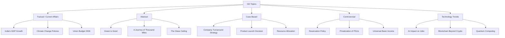
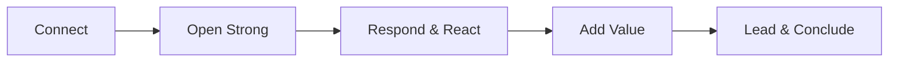
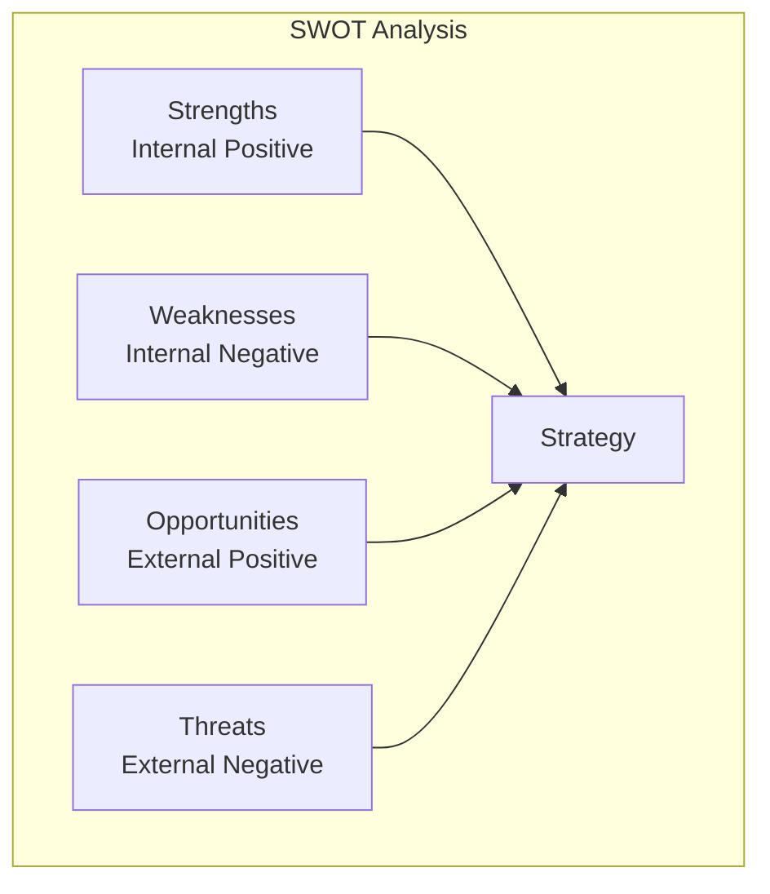
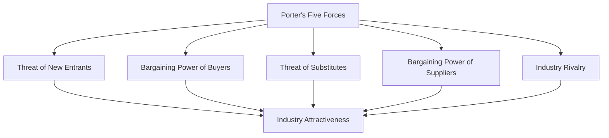
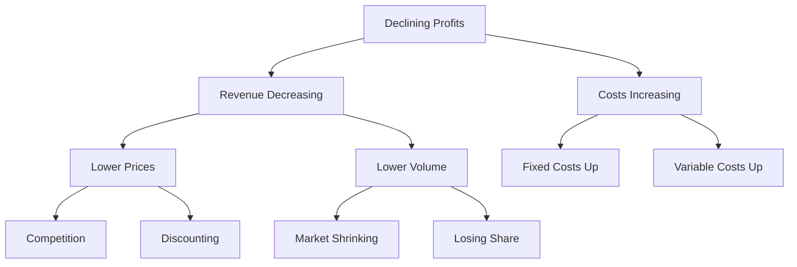
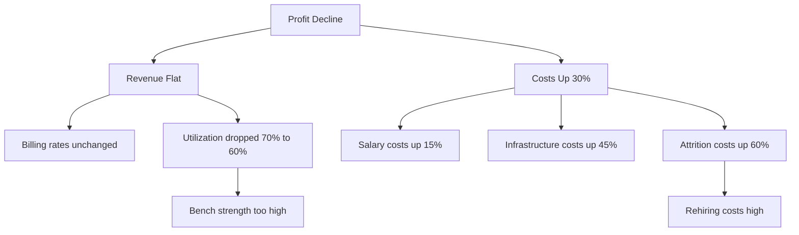

# Group Discussion and Case Study Interview Preparation

## Learning Objectives

By the end of this chapter, you will be able to:

- Participate effectively in group discussions across private sector and government selection processes
- Analyze and present structured arguments on current affairs, technology trends, and ethical dilemmas
- Apply business frameworks (SWOT, Porter's Five Forces, 3Cs, 4Ps) to case study problems
- Solve 20 practice case studies with a structured approach
- Lead group discussions without dominating, and collaborate without being passive
- Master the evaluation criteria used by panelists in GD settings
- Handle stress situations and unexpected topics in GDs
- Transition smoothly between GD and personal interview rounds

## Understanding Group Discussions

### What is a Group Discussion?

<a href="../../../assets/images/diagrams/job-preparation/04-group-discussion-case-study/what-is-a-group-discussion-handwritten.svg" target="_blank" rel="noopener">
  
</a>
<a href="../../../assets/images/diagrams/job-preparation/04-group-discussion-case-study/what-is-a-group-discussion-diagram.svg" target="_blank" rel="noopener">
  
</a>
<a href="../../../assets/images/diagrams/job-preparation/04-group-discussion-case-study/what-is-a-group-discussion-sticky.svg" target="_blank" rel="noopener">
  
</a>


A Group Discussion (GD) is a structured conversation where 8-15 participants discuss a given topic for 15-30 minutes. It tests your communication skills, subject knowledge, leadership potential, and teamwork abilities. GDs are used by:

- **Private IT Companies** (TCS, Infosys, Wipro, Accenture): 15-20 minute discussions
- **PSU Recruitments** (ONGC, IOCL, NTPC via GATE interview): 20-30 minute discussions
- **MBA Admissions** (IIM, XLRI, FMS): 30-45 minute discussions
- **Banking Exams** (SBI, IBPS): GD + Interview combined
- **Civil Services** (UPSC): Personality test includes GD-like elements

### GD Evaluation Criteria

<a href="../../../assets/images/diagrams/job-preparation/04-group-discussion-case-study/gd-evaluation-criteria-handwritten.svg" target="_blank" rel="noopener">
  
</a>
<a href="../../../assets/images/diagrams/job-preparation/04-group-discussion-case-study/gd-evaluation-criteria-diagram.svg" target="_blank" rel="noopener">
  
</a>
<a href="../../../assets/images/diagrams/job-preparation/04-group-discussion-case-study/gd-evaluation-criteria-sticky.svg" target="_blank" rel="noopener">
  
</a>


| Criterion | Weightage | What Panelists Look For |
|-----------|-----------|------------------------|
| Content Knowledge | 25% | Depth of subject knowledge, facts, statistics |
| Structure & Logic | 20% | Clear introduction, logical flow, conclusion |
| Communication | 20% | Clarity, fluency, conciseness, body language |
| Leadership | 15% | Initiating, summarizing, bringing discussion back on track |
| Teamwork | 10% | Listening, responding to others, not interrupting |
| Confidence | 10% | Eye contact, posture, voice modulation |

### Types of GD Topics

<a href="../../../assets/images/diagrams/job-preparation/04-group-discussion-case-study/types-of-gd-topics-handwritten.svg" target="_blank" rel="noopener">
  
</a>
<a href="../../../assets/images/diagrams/job-preparation/04-group-discussion-case-study/types-of-gd-topics-diagram.svg" target="_blank" rel="noopener">
  
</a>
<a href="../../../assets/images/diagrams/job-preparation/04-group-discussion-case-study/types-of-gd-topics-sticky.svg" target="_blank" rel="noopener">
  
</a>




### GD Format Comparison: Private vs Government

<a href="../../../assets/images/diagrams/job-preparation/04-group-discussion-case-study/gd-format-comparison-private-vs-government-handwritten.svg" target="_blank" rel="noopener">
  
</a>
<a href="../../../assets/images/diagrams/job-preparation/04-group-discussion-case-study/gd-format-comparison-private-vs-government-diagram.svg" target="_blank" rel="noopener">
  
</a>
<a href="../../../assets/images/diagrams/job-preparation/04-group-discussion-case-study/gd-format-comparison-private-vs-government-sticky.svg" target="_blank" rel="noopener">
  
</a>


| Aspect | Private Sector GD | Government / PSU GD |
|--------|------------------|---------------------|
| Duration | 15-20 minutes | 20-30 minutes |
| Group Size | 8-12 participants | 10-15 participants |
| Topics | Tech, business, general | Current affairs, social issues, economy |
| Evaluation | Panel observes only | Panel may intervene with questions |
| Language | English only | English + sometimes Hindi |
| Weightage | Moderate (part of selection) | Significant (score-based) |
| Typical Structure | Opening, discussion, conclusion | Discussion only (may skip formal conclusion) |

## Group Discussion Strategies

### The CORAL Framework for GD Success

<a href="../../../assets/images/diagrams/job-preparation/04-group-discussion-case-study/the-coral-framework-for-gd-success-handwritten.svg" target="_blank" rel="noopener">
  
</a>
<a href="../../../assets/images/diagrams/job-preparation/04-group-discussion-case-study/the-coral-framework-for-gd-success-diagram.svg" target="_blank" rel="noopener">
  
</a>
<a href="../../../assets/images/diagrams/job-preparation/04-group-discussion-case-study/the-coral-framework-for-gd-success-sticky.svg" target="_blank" rel="noopener">
  
</a>




**C - Connect**: Establish rapport with participants before starting
**O - Open Strong**: Enter with a clear point, statistic, or question
**R - Respond & React**: Engage with others' points, don't just make your own
**A - Add Value**: Bring new dimensions, data, or perspectives
**L - Lead & Conclude**: Guide direction and summarize effectively

### Opening Strategies

<a href="../../../assets/images/diagrams/job-preparation/04-group-discussion-case-study/opening-strategies-handwritten.svg" target="_blank" rel="noopener">
  
</a>
<a href="../../../assets/images/diagrams/job-preparation/04-group-discussion-case-study/opening-strategies-diagram.svg" target="_blank" rel="noopener">
  
</a>
<a href="../../../assets/images/diagrams/job-preparation/04-group-discussion-case-study/opening-strategies-sticky.svg" target="_blank" rel="noopener">
  
</a>


| Strategy | Example | When to Use |
|----------|---------|-------------|
| Fact/Statistic | "According to NASSCOM, India's IT exports will reach $200B in 2026..." | When you have concrete data |
| Question | "Is AI really a threat to jobs, or is it creating more opportunities?" | To engage the group |
| Definition | "Let's first define what 'sustainable development' means..." | Abstract/ambiguous topics |
| Quote | "As Steve Jobs said, 'Innovation distinguishes between a leader and a follower'..." | Philosophy/leadership topics |
| Anecdote | "Last month, I read about a startup that..." | Technology/business topics |

### Middle Game Strategies

<a href="../../../assets/images/diagrams/job-preparation/04-group-discussion-case-study/middle-game-strategies-handwritten.svg" target="_blank" rel="noopener">
  
</a>
<a href="../../../assets/images/diagrams/job-preparation/04-group-discussion-case-study/middle-game-strategies-diagram.svg" target="_blank" rel="noopener">
  
</a>
<a href="../../../assets/images/diagrams/job-preparation/04-group-discussion-case-study/middle-game-strategies-sticky.svg" target="_blank" rel="noopener">
  
</a>


| Situation | Strategy | Dialogue Example |
|-----------|----------|-----------------|
| Someone dominates | Politely redirect | "That's an interesting point. I'd like to hear what others think about..." |
| Discussion goes off-track | Bring it back | "While that's relevant, let's come back to the core question which was..." |
| Two participants arguing | Mediate | "I see both perspectives. Maybe we can find middle ground by..." |
| Dead silence | Revive discussion | "Another angle we haven't explored is..." |
| Incorrect fact presented | Correct politely | "I believe the actual figure is X, based on Y report. However, your point about Z is valid." |
| New member wants to speak | Include them | "I notice [Name] hasn't spoken yet. I'd love to hear your perspective." |

### Concluding Strategies

<a href="../../../assets/images/diagrams/job-preparation/04-group-discussion-case-study/concluding-strategies-handwritten.svg" target="_blank" rel="noopener">
  
</a>
<a href="../../../assets/images/diagrams/job-preparation/04-group-discussion-case-study/concluding-strategies-diagram.svg" target="_blank" rel="noopener">
  
</a>
<a href="../../../assets/images/diagrams/job-preparation/04-group-discussion-case-study/concluding-strategies-sticky.svg" target="_blank" rel="noopener">
  
</a>


| Technique | Example |
|-----------|---------|
| Summary + Consensus | "To summarize, we all agreed that AI will transform jobs, but the majority felt it will create more than it displaces. The key lies in upskilling." |
| Balanced Conclusion | "While there are strong arguments on both sides, I believe the optimal approach would be a middle path that combines..." |
| Action-Oriented | "Beyond this discussion, the real need is for policy frameworks that..." |
| Question for Future | "This discussion raises an important question for the future: how do we ensure equitable access to these technologies?" |

### Dos and Don'ts

<a href="../../../assets/images/diagrams/job-preparation/04-group-discussion-case-study/dos-and-don-ts-handwritten.svg" target="_blank" rel="noopener">
  
</a>
<a href="../../../assets/images/diagrams/job-preparation/04-group-discussion-case-study/dos-and-don-ts-diagram.svg" target="_blank" rel="noopener">
  
</a>
<a href="../../../assets/images/diagrams/job-preparation/04-group-discussion-case-study/dos-and-don-ts-sticky.svg" target="_blank" rel="noopener">
  
</a>


| Do | Don't |
|----|-------|
| Speak at least 3-4 times | Dominate the discussion |
| Support arguments with data | Make emotional or unsubstantiated claims |
| Listen actively to others | Interrupt or cut people off |
| Use body language effectively | Slouch, avoid eye contact, or fidget |
| Address others by name | Use aggressive or confrontational language |
| Build on others' points | Repeat the same point multiple times |
| Stay on topic | Introduce irrelevant examples |
| Be respectful and polite | Attack individuals, disagree with ideas |
| Show enthusiasm and energy | Be passive or disinterested |
| Summarize effectively at end | End abruptly without closure |

## Current Affairs Topics for GD (2026)

### National Issues

<a href="../../../assets/images/diagrams/job-preparation/04-group-discussion-case-study/national-issues-handwritten.svg" target="_blank" rel="noopener">
  
</a>
<a href="../../../assets/images/diagrams/job-preparation/04-group-discussion-case-study/national-issues-diagram.svg" target="_blank" rel="noopener">
  
</a>
<a href="../../../assets/images/diagrams/job-preparation/04-group-discussion-case-study/national-issues-sticky.svg" target="_blank" rel="noopener">
  
</a>


| Topic | Key Points | Data Points |
|-------|------------|-------------|
| India's Economic Growth | GDP growth, inflation, employment | GDP projected at 7-7.5% in 2026 |
| Digital India Progress | Internet penetration, e-governance | 900M+ internet users |
| New Education Policy 2020 | Implementation status, challenges | 5+3+3+4 structure |
| Jal Jeevan Mission | Tap connections to rural homes | 190M+ households covered |
| Ayushman Bharat | Health coverage, PM-JAY | 500M+ beneficiaries |
| Farm Laws and Agriculture | MSP, farmer protests, reforms | Agriculture GDP share ~18% |
| Women Safety & Empowerment | Laws, implementation, statistics | Female workforce participation ~37% |
| Environmental Challenges | Air pollution, climate change | 42 Indian cities in top 100 polluted |
| Infrastructure Development | Highways, railways, airports | 100+ new airports planned |

### Technology Trends

<a href="../../../assets/images/diagrams/job-preparation/04-group-discussion-case-study/technology-trends-handwritten.svg" target="_blank" rel="noopener">
  
</a>
<a href="../../../assets/images/diagrams/job-preparation/04-group-discussion-case-study/technology-trends-diagram.svg" target="_blank" rel="noopener">
  
</a>
<a href="../../../assets/images/diagrams/job-preparation/04-group-discussion-case-study/technology-trends-sticky.svg" target="_blank" rel="noopener">
  
</a>


| Topic | Key Discussion Points |
|-------|----------------------|
| AI & Job Displacement | Which jobs will be replaced? New job creation? Upskilling needs? |
| 5G/6G Revolution | Impact on IoT, autonomous vehicles, telemedicine |
| Cybersecurity Threats | Data breaches, ransomware, cyber warfare |
| Blockchain & Web3 | Beyond cryptocurrency - land records, supply chain, voting |
| Quantum Computing | Current state, Indian research, applications |
| Semiconductor Manufacturing | India's chip policy, global supply chain |
| Electric Vehicles | Adoption rate, charging infrastructure, battery technology |
| Space Technology | ISRO achievements, private space sector |
| EdTech Evolution | Hybrid learning, AI tutors, digital divide |
| Green Technology | Renewable energy, carbon capture, sustainable computing |

### Social & Ethical Dilemmas

<a href="../../../assets/images/diagrams/job-preparation/04-group-discussion-case-study/social-ethical-dilemmas-handwritten.svg" target="_blank" rel="noopener">
  
</a>
<a href="../../../assets/images/diagrams/job-preparation/04-group-discussion-case-study/social-ethical-dilemmas-diagram.svg" target="_blank" rel="noopener">
  
</a>
<a href="../../../assets/images/diagrams/job-preparation/04-group-discussion-case-study/social-ethical-dilemmas-sticky.svg" target="_blank" rel="noopener">
  
</a>


| Topic | Opposing Views |
|-------|---------------|
| Work from Home vs Office | Productivity vs collaboration |
| Social Media Regulation | Free speech vs misinformation |
| Gig Economy | Flexibility vs job security |
| Genetic Engineering | Medical advances vs ethical concerns |
| Surveillance vs Privacy | National security vs individual privacy |
| Universal Basic Income | Economic security vs work incentive |
| Reservation System | Social justice vs meritocracy |
| Privatization of PSUs | Efficiency vs public sector role |
| Mandatory Military Service | National service vs personal freedom |
| AI in Hiring | Efficiency vs bias |

## Case Study Interview Preparation

### What is a Case Study Interview?

<a href="../../../assets/images/diagrams/job-preparation/04-group-discussion-case-study/what-is-a-case-study-interview-handwritten.svg" target="_blank" rel="noopener">
  
</a>
<a href="../../../assets/images/diagrams/job-preparation/04-group-discussion-case-study/what-is-a-case-study-interview-diagram.svg" target="_blank" rel="noopener">
  
</a>
<a href="../../../assets/images/diagrams/job-preparation/04-group-discussion-case-study/what-is-a-case-study-interview-sticky.svg" target="_blank" rel="noopener">
  
</a>


Case study interviews present a business problem and ask you to analyze it, develop solutions, and present recommendations. They are common in:

- **Consulting firms** (McKinsey, BCG, Bain, Deloitte)
- **Product management roles** (Google, Microsoft, Amazon)
- **PSU management trainee interviews**
- **MBA admissions and placements**
- **Strategy roles in IT companies**

### Case Study Types

<a href="../../../assets/images/diagrams/job-preparation/04-group-discussion-case-study/case-study-types-handwritten.svg" target="_blank" rel="noopener">
  
</a>
<a href="../../../assets/images/diagrams/job-preparation/04-group-discussion-case-study/case-study-types-diagram.svg" target="_blank" rel="noopener">
  
</a>
<a href="../../../assets/images/diagrams/job-preparation/04-group-discussion-case-study/case-study-types-sticky.svg" target="_blank" rel="noopener">
  
</a>


| Type | Example | Key Skill |
|------|---------|-----------|
| Profitability | "A company's profits are declining. Analyze why and recommend solutions." | Profit tree analysis |
| Market Sizing | "How many petrol pumps are there in India?" | Estimation & logic |
| Market Entry | "Should our client enter the Indian EV market?" | Market analysis |
| Pricing Strategy | "How should a SaaS company price its new product?" | Value-based pricing |
| Operations | "How can a factory reduce its production cost by 20%?" | Process optimization |
| Merger/Acquisition | "Should Company A acquire Company B?" | Strategic analysis |
| New Product Launch | "Should we launch this product in the Indian market?" | Go-to-market strategy |
| Growth Strategy | "How can a company double its revenue in 3 years?" | Strategic thinking |

## Case Study Frameworks

### Framework 1: SWOT Analysis

<a href="../../../assets/images/diagrams/job-preparation/04-group-discussion-case-study/framework-1-swot-analysis-handwritten.svg" target="_blank" rel="noopener">
  
</a>
<a href="../../../assets/images/diagrams/job-preparation/04-group-discussion-case-study/framework-1-swot-analysis-diagram.svg" target="_blank" rel="noopener">
  
</a>
<a href="../../../assets/images/diagrams/job-preparation/04-group-discussion-case-study/framework-1-swot-analysis-sticky.svg" target="_blank" rel="noopener">
  
</a>




**Application:**
- **Strengths**: What does the company/organization do well? (brand, technology, talent, patents)
- **Weaknesses**: Where are the gaps? (outdated tech, high attrition, debt)
- **Opportunities**: External factors to leverage? (market growth, policy changes, technology adoption)
- **Threats**: External risks? (competition, regulation, economic downturn)

### Framework 2: Porter's Five Forces

<a href="../../../assets/images/diagrams/job-preparation/04-group-discussion-case-study/framework-2-porter-s-five-forces-handwritten.svg" target="_blank" rel="noopener">
  
</a>
<a href="../../../assets/images/diagrams/job-preparation/04-group-discussion-case-study/framework-2-porter-s-five-forces-diagram.svg" target="_blank" rel="noopener">
  
</a>
<a href="../../../assets/images/diagrams/job-preparation/04-group-discussion-case-study/framework-2-porter-s-five-forces-sticky.svg" target="_blank" rel="noopener">
  
</a>




**Application:**
- **New Entrants**: Barriers to entry (capital, regulation, technology, brand loyalty)
- **Buyer Power**: Do customers have many alternatives? Switching costs?
- **Substitutes**: What alternatives exist? (e.g., video conferencing substitutes for travel)
- **Supplier Power**: Are suppliers concentrated? Are there alternative suppliers?
- **Rivalry**: How competitive is the industry? Price wars? Differentiation?

### Framework 3: 3Cs Framework

<a href="../../../assets/images/diagrams/job-preparation/04-group-discussion-case-study/framework-3-3cs-framework-handwritten.svg" target="_blank" rel="noopener">
  
</a>
<a href="../../../assets/images/diagrams/job-preparation/04-group-discussion-case-study/framework-3-3cs-framework-diagram.svg" target="_blank" rel="noopener">
  
</a>
<a href="../../../assets/images/diagrams/job-preparation/04-group-discussion-case-study/framework-3-3cs-framework-sticky.svg" target="_blank" rel="noopener">
  
</a>


| C | Focus Area | Questions to Ask |
|---|-----------|------------------|
| **Company** | Internal capabilities | What are our strengths? Core competencies? Resources? |
| **Customer** | Market demand | Who are the customers? What do they value? Segments? |
| **Competition** | Market position | Who are competitors? Market share? Differentiators? |

**Application**: Align Company capabilities with Customer needs while differentiating from Competition.

### Framework 4: 4Ps of Marketing

<a href="../../../assets/images/diagrams/job-preparation/04-group-discussion-case-study/framework-4-4ps-of-marketing-handwritten.svg" target="_blank" rel="noopener">
  
</a>
<a href="../../../assets/images/diagrams/job-preparation/04-group-discussion-case-study/framework-4-4ps-of-marketing-diagram.svg" target="_blank" rel="noopener">
  
</a>
<a href="../../../assets/images/diagrams/job-preparation/04-group-discussion-case-study/framework-4-4ps-of-marketing-sticky.svg" target="_blank" rel="noopener">
  
</a>


| P | Description | Case Study Questions |
|---|-------------|---------------------|
| **Product** | What are you selling? | Features, quality, branding, packaging, variants |
| **Price** | How much? | Pricing strategy, discounts, payment terms, value proposition |
| **Place** | Where is it sold? | Distribution channels, inventory, logistics, retail |
| **Promotion** | How is it marketed? | Advertising, PR, social media, sales promotion |

### Framework 5: Profitability Framework

<a href="../../../assets/images/diagrams/job-preparation/04-group-discussion-case-study/framework-5-profitability-framework-handwritten.svg" target="_blank" rel="noopener">
  
</a>
<a href="../../../assets/images/diagrams/job-preparation/04-group-discussion-case-study/framework-5-profitability-framework-diagram.svg" target="_blank" rel="noopener">
  
</a>
<a href="../../../assets/images/diagrams/job-preparation/04-group-discussion-case-study/framework-5-profitability-framework-sticky.svg" target="_blank" rel="noopener">
  
</a>


```
Revenue = Price × Volume
Profit = Revenue - Costs

Costs = Fixed Costs + Variable Costs
     = (Fixed Cost per unit + Variable Cost per unit) × Volume

For declining profit, analyze:
1. Revenue decreasing? → Price issue? Volume issue? Product mix?
2. Costs increasing? → Fixed costs up? Variable costs up?
3. Competition? Economic factors? Internal inefficiencies?
```

### Framework 6: Issue Tree / MECE Principle

<a href="../../../assets/images/diagrams/job-preparation/04-group-discussion-case-study/framework-6-issue-tree-mece-principle-handwritten.svg" target="_blank" rel="noopener">
  
</a>
<a href="../../../assets/images/diagrams/job-preparation/04-group-discussion-case-study/framework-6-issue-tree-mece-principle-diagram.svg" target="_blank" rel="noopener">
  
</a>
<a href="../../../assets/images/diagrams/job-preparation/04-group-discussion-case-study/framework-6-issue-tree-mece-principle-sticky.svg" target="_blank" rel="noopener">
  
</a>


MECE = Mutually Exclusive, Collectively Exhaustive



## 20 Solved Case Studies

### Case Study 1: Declining Profits at a Software Company

<a href="../../../assets/images/diagrams/job-preparation/04-group-discussion-case-study/case-study-1-declining-profits-at-a-software-company-handwritten.svg" target="_blank" rel="noopener">
  
</a>
<a href="../../../assets/images/diagrams/job-preparation/04-group-discussion-case-study/case-study-1-declining-profits-at-a-software-company-diagram.svg" target="_blank" rel="noopener">
  
</a>
<a href="../../../assets/images/diagrams/job-preparation/04-group-discussion-case-study/case-study-1-declining-profits-at-a-software-company-sticky.svg" target="_blank" rel="noopener">
  
</a>


**Problem**: A mid-sized IT services company (500 employees) has seen profits decline 30% year-over-year. Revenue is flat but costs have increased.

**Structured Approach:**



**Analysis:**
1. **Revenue Side**: Billing rates are market-competitive but utilization dropped from 70% to 60%. This means 10% of employee time is unbillable.
2. **Cost Side**: Salary hikes at 15% are normal. Infrastructure costs increased due to cloud migration. Attrition at 25% is causing rehiring costs.
3. **Root Cause**: Low utilization + high attrition are the primary drivers.

**Recommendations:**
1. Increase utilization through better project allocation and training
2. Implement retention programs to reduce attrition below 15%
3. Optimize cloud costs through reserved instances and auto-scaling
4. Rebalance project mix toward higher-margin work

### Case Study 2: Market Entry for an EdTech Platform

<a href="../../../assets/images/diagrams/job-preparation/04-group-discussion-case-study/case-study-2-market-entry-for-an-edtech-platform-handwritten.svg" target="_blank" rel="noopener">
  
</a>
<a href="../../../assets/images/diagrams/job-preparation/04-group-discussion-case-study/case-study-2-market-entry-for-an-edtech-platform-diagram.svg" target="_blank" rel="noopener">
  
</a>
<a href="../../../assets/images/diagrams/job-preparation/04-group-discussion-case-study/case-study-2-market-entry-for-an-edtech-platform-sticky.svg" target="_blank" rel="noopener">
  
</a>


**Problem**: A successful US-based EdTech company wants to enter the Indian market. Should they enter, and if so, how?

**Framework: 3Cs + Porter's Five Forces**

**Analysis:**
1. **Company**: Strong technology platform, content library, $50M funding. But no India presence, no localization.
2. **Customer**: 250M+ K-12 students, rapid digital adoption. Willingness to pay is low (average $5-10/month).
3. **Competition**: BYJU'S, Unacademy, Vedantu dominate. Market is crowded with well-funded players.

**Porter's Analysis:**
- **New Entrants**: Low barrier (content + app), many have tried and failed
- **Buyer Power**: High — many free/cheap alternatives exist
- **Substitutes**: Traditional coaching, YouTube tutorials
- **Rivalry**: Extremely high

**Recommendation**: Enter through a joint venture with a local player rather than going solo. Target tier-2/3 cities with affordable pricing ($3-5/month). Focus on vernacular content and government school partnerships.

### Case Study 3: Pricing Strategy for a SaaS Product

<a href="../../../assets/images/diagrams/job-preparation/04-group-discussion-case-study/case-study-3-pricing-strategy-for-a-saas-product-handwritten.svg" target="_blank" rel="noopener">
  
</a>
<a href="../../../assets/images/diagrams/job-preparation/04-group-discussion-case-study/case-study-3-pricing-strategy-for-a-saas-product-diagram.svg" target="_blank" rel="noopener">
  
</a>
<a href="../../../assets/images/diagrams/job-preparation/04-group-discussion-case-study/case-study-3-pricing-strategy-for-a-saas-product-sticky.svg" target="_blank" rel="noopener">
  
</a>


**Problem**: A startup has built a project management tool. How should they price it?

**Framework: 4Ps + Value-Based Pricing**

**Analysis:**
1. **Customer Segments**: Freelancers (50 users), SMBs (50-200 users), Enterprises (200+ users)
2. **Competitor Pricing**: Asana ($10.99/user/month), Monday.com ($8/user/month), Jira ($7.50/user/month)
3. **Differentiators**: AI-powered task assignment, deep Slack/Teams integration

**Recommendation: Three-tier pricing:**
- **Free**: Up to 5 users, basic features (customer acquisition)
- **Pro**: $9/user/month, all features, 5-50 users (SMB focus)
- **Enterprise**: Custom pricing, SSO, dedicated support (50+ users)

### Case Study 4: Retail Store Profitability

<a href="../../../assets/images/diagrams/job-preparation/04-group-discussion-case-study/case-study-4-retail-store-profitability-handwritten.svg" target="_blank" rel="noopener">
  
</a>
<a href="../../../assets/images/diagrams/job-preparation/04-group-discussion-case-study/case-study-4-retail-store-profitability-diagram.svg" target="_blank" rel="noopener">
  
</a>
<a href="../../../assets/images/diagrams/job-preparation/04-group-discussion-case-study/case-study-4-retail-store-profitability-sticky.svg" target="_blank" rel="noopener">
  
</a>


**Problem**: A chain of 50 electronics stores has 10 stores that are loss-making. Close them or restructure?

**Analysis:**
1. Break down loss-making stores by: revenue, rent, staff costs, inventory turnover
2. Compare with profitable stores: which metrics are different?
3. Cluster analysis: Are loss-making stores in specific locations or formats?

**Findings**: Loss-making stores have 40% lower footfall but similar rent costs (prime locations). Inventory turnover is 60% lower.

**Recommendation:**
- Convert 5 stores to smaller kiosk format (reduce rent)
- Close 3 stores with no path to profitability
- Restructure 2 stores as service centers (earn from repairs, not sales)
- Implement inventory optimization across all stores

### Case Study 5: New Product Launch Decision

<a href="../../../assets/images/diagrams/job-preparation/04-group-discussion-case-study/case-study-5-new-product-launch-decision-handwritten.svg" target="_blank" rel="noopener">
  
</a>
<a href="../../../assets/images/diagrams/job-preparation/04-group-discussion-case-study/case-study-5-new-product-launch-decision-diagram.svg" target="_blank" rel="noopener">
  
</a>
<a href="../../../assets/images/diagrams/job-preparation/04-group-discussion-case-study/case-study-5-new-product-launch-decision-sticky.svg" target="_blank" rel="noopener">
  
</a>


**Problem**: A beverage company has developed a sugar-free health drink. Should they launch it?

**Framework: SWOT**

| Strengths | Weaknesses |
|-----------|------------|
| Strong distribution network (1M+ retailers) | No health drink brand equity |
| Manufacturing capabilities | Higher cost than competitors |
| Trusted brand name | Taste may not appeal to all |

| Opportunities | Threats |
|--------------|---------|
| Growing health consciousness (30% CAGR) | Established players (Pepsi, Coke) |
| Government push against sugar | Price sensitivity in mass market |
| Premium pricing potential | Regulatory challenges |

**Recommendation**: Launch as a premium product in top 10 cities first. Price at Rs. 30/bottle (vs Rs. 10 for regular drinks). Target health-conscious urban millennials through digital marketing.

### Case Study 6: Market Sizing — How Many Petrol Pumps in India?

<a href="../../../assets/images/diagrams/job-preparation/04-group-discussion-case-study/case-study-6-market-sizing-how-many-petrol-pumps-in-india-handwritten.svg" target="_blank" rel="noopener">
  
</a>
<a href="../../../assets/images/diagrams/job-preparation/04-group-discussion-case-study/case-study-6-market-sizing-how-many-petrol-pumps-in-india-diagram.svg" target="_blank" rel="noopener">
  
</a>
<a href="../../../assets/images/diagrams/job-preparation/04-group-discussion-case-study/case-study-6-market-sizing-how-many-petrol-pumps-in-india-sticky.svg" target="_blank" rel="noopener">
  
</a>


**Approach: Top-down estimation**

```
Population of India: 140 crore (1.4B)
Average household size: 4 → 350M households
Vehicle-owning households: ~30% → 105M households
Average vehicles per owning household: 1.5 → 157M vehicles

Assuming each petrol pump serves 5,000 vehicles:
Petrol pumps = 157M / 5,000 = 31,400

Reality check: Official figure is ~67,000 (includes rural pumps,
highway pumps, etc. serving more vehicles per pump)

Answer: Approximately 65,000-70,000 petrol pumps
```

### Case Study 7: Operations Optimization

<a href="../../../assets/images/diagrams/job-preparation/04-group-discussion-case-study/case-study-7-operations-optimization-handwritten.svg" target="_blank" rel="noopener">
  
</a>
<a href="../../../assets/images/diagrams/job-preparation/04-group-discussion-case-study/case-study-7-operations-optimization-diagram.svg" target="_blank" rel="noopener">
  
</a>
<a href="../../../assets/images/diagrams/job-preparation/04-group-discussion-case-study/case-study-7-operations-optimization-sticky.svg" target="_blank" rel="noopener">
  
</a>


**Problem**: An e-commerce warehouse takes 4 hours to process a shipment. Target is 2 hours. How to achieve this?

**Issue Tree Analysis:**

```
Processing time = Pick time + Pack time + Quality check time
                 + System update time

Pick time (45 min): Optimize warehouse layout, implement zone picking
Pack time (90 min): Pre-folding boxes, automated taping machines
Quality check (60 min): Statistical sampling instead of 100% checks
System update (45 min): Integrated barcode scanning, automated updates
```

**Recommendations:**
1. Implement zone-based picking: Reduce pick time by 30% (45 → 32 min)
2. Automation: Auto-taping machines reduce pack time by 40% (90 → 54 min)
3. Sampling: Check 20% of orders instead of 100% (60 → 12 min)
4. Integrated systems: Barcode scanning at each step (45 → 15 min)

**Estimated improvement**: 240 → 113 min (exceeds target of 120 min)

### Case Study 8: Should a Company Acquire a Competitor?

<a href="../../../assets/images/diagrams/job-preparation/04-group-discussion-case-study/case-study-8-should-a-company-acquire-a-competitor-handwritten.svg" target="_blank" rel="noopener">
  
</a>
<a href="../../../assets/images/diagrams/job-preparation/04-group-discussion-case-study/case-study-8-should-a-company-acquire-a-competitor-diagram.svg" target="_blank" rel="noopener">
  
</a>
<a href="../../../assets/images/diagrams/job-preparation/04-group-discussion-case-study/case-study-8-should-a-company-acquire-a-competitor-sticky.svg" target="_blank" rel="noopener">
  
</a>


**Problem**: Company A (revenue Rs. 500Cr) is considering acquiring Company B (revenue Rs. 100Cr) for Rs. 150Cr. Evaluate.

**Framework: Synergy Analysis**

| Factor | Analysis |
|--------|----------|
| Strategic Fit | Both in same market, Company B has AI technology Company A lacks |
| Revenue Synergy | Cross-selling: +Rs. 50Cr/year |
| Cost Synergy | Eliminate duplicate roles: -Rs. 20Cr/year |
| Cultural Fit | Different cultures (startup vs corporate) |
| Integration Risk | 60% of acquisitions fail on integration |
| Valuation | 1.5x revenue for B is reasonable for tech acquisition |

**Recommendation**: Proceed with acquisition but invest heavily in cultural integration. Set up a dedicated integration team for 12 months. Target full integration within 18 months.

### Case Study 9: Growth Strategy for a Telecom Company

<a href="../../../assets/images/diagrams/job-preparation/04-group-discussion-case-study/case-study-9-growth-strategy-for-a-telecom-company-handwritten.svg" target="_blank" rel="noopener">
  
</a>
<a href="../../../assets/images/diagrams/job-preparation/04-group-discussion-case-study/case-study-9-growth-strategy-for-a-telecom-company-diagram.svg" target="_blank" rel="noopener">
  
</a>
<a href="../../../assets/images/diagrams/job-preparation/04-group-discussion-case-study/case-study-9-growth-strategy-for-a-telecom-company-sticky.svg" target="_blank" rel="noopener">
  
</a>


**Problem**: A telecom company has seen revenue decline as voice revenues fall. Data usage is growing but ARPU is flat. How to grow?

**Analysis:**
1. Industry trend: Voice → Data transition
2. ARPU stagnation despite 30% data growth (price per GB falling)
3. New revenue opportunities: digital services, enterprise cloud, IoT

**Recommendations:**
1. **Consumer**: Launch bundled OTT subscriptions (Netflix + data plan)
2. **Enterprise**: Cloud and managed services (higher margin)
3. **IoT**: Smart city contracts, connected vehicles
4. **Fintech**: Mobile payments, micro-insurance through telco channels

**Target**: Increase ARPU from Rs. 150 to Rs. 200 in 18 months

### Case Study 10: SaaS Churn Reduction

<a href="../../../assets/images/diagrams/job-preparation/04-group-discussion-case-study/case-study-10-saas-churn-reduction-handwritten.svg" target="_blank" rel="noopener">
  
</a>
<a href="../../../assets/images/diagrams/job-preparation/04-group-discussion-case-study/case-study-10-saas-churn-reduction-diagram.svg" target="_blank" rel="noopener">
  
</a>
<a href="../../../assets/images/diagrams/job-preparation/04-group-discussion-case-study/case-study-10-saas-churn-reduction-sticky.svg" target="_blank" rel="noopener">
  
</a>


**Problem**: A SaaS company has 20% monthly churn. Industry average is 5-8%. How to reduce it?

**Issue Identification:**
- Churn analysis by segment, tenure, usage patterns
- Customer feedback analysis
- Competitor comparison

**Findings:**
- 60% of churn happens in first 3 months (poor onboarding)
- 25% due to missing features (mostly API/Integration needs)
- 15% due to pricing (small businesses find it expensive)

**Recommendations:**
1. Implement structured 30-60-90 day onboarding program
2. Create self-service API documentation and integration marketplace
3. Introduce a "Starter" plan at half the price with limited features
4. Assign customer success managers to accounts with spending > $500/month
5. Implement early warning system (usage drops below threshold → trigger outreach)

### Case Study 11: Public Sector — Improving Government Service Delivery

<a href="../../../assets/images/diagrams/job-preparation/04-group-discussion-case-study/case-study-11-public-sector-improving-government-service-delivery-handwritten.svg" target="_blank" rel="noopener">
  
</a>
<a href="../../../assets/images/diagrams/job-preparation/04-group-discussion-case-study/case-study-11-public-sector-improving-government-service-delivery-diagram.svg" target="_blank" rel="noopener">
  
</a>
<a href="../../../assets/images/diagrams/job-preparation/04-group-discussion-case-study/case-study-11-public-sector-improving-government-service-delivery-sticky.svg" target="_blank" rel="noopener">
  
</a>


**Problem**: A government department takes 60 days to process passport applications. Target is 7 days.

**Analysis:**
```
Current Process (60 days):
1. Application submission (day 1)
2. Document verification by police (days 1-30)
3. Document verification at regional office (days 30-45)
4. Approval by senior officer (days 45-50)
5. Printing and dispatch (days 50-60)

Bottlenecks: Police verification (30 days - 50% of total time)
```

**Recommendations:**
1. Digitize police verification with app-based real-time updates
2. Implement auto-approval for low-risk applications (clean records)
3. Deploy digital document upload to eliminate physical paperwork
4. SMS/email tracking at each step for transparency
5. Target: 10 days with digitization, 7 days with full automation

### Case Study 12: Hospital Operations Optimization

<a href="../../../assets/images/diagrams/job-preparation/04-group-discussion-case-study/case-study-12-hospital-operations-optimization-handwritten.svg" target="_blank" rel="noopener">
  
</a>
<a href="../../../assets/images/diagrams/job-preparation/04-group-discussion-case-study/case-study-12-hospital-operations-optimization-diagram.svg" target="_blank" rel="noopener">
  
</a>
<a href="../../../assets/images/diagrams/job-preparation/04-group-discussion-case-study/case-study-12-hospital-operations-optimization-sticky.svg" target="_blank" rel="noopener">
  
</a>


**Problem**: A hospital's emergency department has average wait times of 6 hours. Target is 1 hour.

**Root Cause Analysis:**
- Triage takes 30 minutes (should be 10 min)
- Lab results take 2 hours (should be 45 min)
- Specialist availability delays (on-call system issues)
- Bed management inefficiency

**Recommendations:**
1. Implement fast-track triage protocol
2. Point-of-care testing in ED (reduces lab time by 60%)
3. Dedicated ED specialists 24/7 (reduce specialist wait)
4. Real-time bed management dashboard
5. Target: 90-minute average wait time in 6 months

### Case Study 13: E-commerce Logistics Optimization

<a href="../../../assets/images/diagrams/job-preparation/04-group-discussion-case-study/case-study-13-e-commerce-logistics-optimization-handwritten.svg" target="_blank" rel="noopener">
  
</a>
<a href="../../../assets/images/diagrams/job-preparation/04-group-discussion-case-study/case-study-13-e-commerce-logistics-optimization-diagram.svg" target="_blank" rel="noopener">
  
</a>
<a href="../../../assets/images/diagrams/job-preparation/04-group-discussion-case-study/case-study-13-e-commerce-logistics-optimization-sticky.svg" target="_blank" rel="noopener">
  
</a>


**Problem**: An e-commerce company's last-mile delivery costs are 30% of revenue. Industry average is 18-20%.

**Cost Breakdown:**
- Delivery personnel: 45% of logistics cost
- Fuel: 25%
- Vehicle maintenance: 15%
- Management overhead: 15%

**Analysis:**
- Delivery density is low (2 deliveries/km² vs 5 for competition)
- High return rate (25% vs industry 15%)
- Inefficient routing (manual vs algorithm-based)

**Recommendations:**
1. Optimize delivery clusters using route optimization algorithms
2. Implement delivery time windows to reduce failed deliveries
3. Reduce returns through better product descriptions and images
4. Use local pickup points (neighborhood stores) for failed deliveries
5. Target: Reduce to 22% in 12 months

### Case Study 14: PSU Turnaround Strategy

<a href="../../../assets/images/diagrams/job-preparation/04-group-discussion-case-study/case-study-14-psu-turnaround-strategy-handwritten.svg" target="_blank" rel="noopener">
  
</a>
<a href="../../../assets/images/diagrams/job-preparation/04-group-discussion-case-study/case-study-14-psu-turnaround-strategy-diagram.svg" target="_blank" rel="noopener">
  
</a>
<a href="../../../assets/images/diagrams/job-preparation/04-group-discussion-case-study/case-study-14-psu-turnaround-strategy-sticky.svg" target="_blank" rel="noopener">
  
</a>


**Problem**: A state-owned manufacturing PSU has posted losses for 3 consecutive years. Employee costs are 45% of revenue (industry: 25%).

**Challenge**: Cannot easily reduce workforce due to government regulations.

**Framework: SWOT + 3Cs**

| Factor | Analysis |
|--------|----------|
| Product Quality | Good (ISO certified, 30-year track record) |
| Pricing | Non-competitive (25% higher than private competitors) |
| Cost Structure | High due to legacy pension obligations and overstaffing |
| Market Position | Losing share to private players |

**Recommendations:**
1. Voluntary Retirement Scheme (VRS) for surplus staff
2. Automation of manufacturing processes
3. Product diversification into high-margin segments
4. Technology upgrade partnership with private sector
5. Asset monetization (unused land and buildings)

### Case Study 15: Digital Transformation for a Bank

<a href="../../../assets/images/diagrams/job-preparation/04-group-discussion-case-study/case-study-15-digital-transformation-for-a-bank-handwritten.svg" target="_blank" rel="noopener">
  
</a>
<a href="../../../assets/images/diagrams/job-preparation/04-group-discussion-case-study/case-study-15-digital-transformation-for-a-bank-diagram.svg" target="_blank" rel="noopener">
  
</a>
<a href="../../../assets/images/diagrams/job-preparation/04-group-discussion-case-study/case-study-15-digital-transformation-for-a-bank-sticky.svg" target="_blank" rel="noopener">
  
</a>


**Problem**: A traditional bank wants to compete with digital-only banks (Fintech). Their mobile app rating is 2.5 stars.

**Analysis:**
- Legacy core banking system (developed in 1990s)
- Siloed departments with no integrated digital strategy
- 70% of transactions still at branch (target: 40%)

**Recommendations:**
1. Modernize core banking system (phased approach over 3 years)
2. Launch a new digital-only brand targeting millennials
3. Partner with fintechs for specific capabilities (payments, loans)
4. Implement 24/7 customer support via chatbot + human escalation
5. Digital literacy programs for existing customers

### Case Study 16: Product Feature Prioritization

<a href="../../../assets/images/diagrams/job-preparation/04-group-discussion-case-study/case-study-16-product-feature-prioritization-handwritten.svg" target="_blank" rel="noopener">
  
</a>
<a href="../../../assets/images/diagrams/job-preparation/04-group-discussion-case-study/case-study-16-product-feature-prioritization-diagram.svg" target="_blank" rel="noopener">
  
</a>
<a href="../../../assets/images/diagrams/job-preparation/04-group-discussion-case-study/case-study-16-product-feature-prioritization-sticky.svg" target="_blank" rel="noopener">
  
</a>


**Problem**: A product team has 20 feature requests but only capacity for 5 in the next quarter. How to prioritize?

**Framework: RICE Scoring**

| Feature | Reach | Impact | Confidence | Effort | RICE Score |
|---------|-------|--------|------------|--------|------------|
| Dark mode | 50K users | 2 | 80% | 2 weeks | 40,000 |
| API integration | 10K users | 4 | 90% | 6 weeks | 6,000 |
| Mobile app | 100K users | 5 | 70% | 12 weeks | 29,167 |
| Analytics dashboard | 20K users | 3 | 85% | 4 weeks | 12,750 |

**RICE = (Reach × Impact × Confidence) / Effort**

**Top 5 by RICE:**
1. Dark mode (40,000)
2. Mobile app (29,167)
3. Analytics dashboard (12,750)
4. API integration (6,000)
5. (Next highest)

### Case Study 17: Crisis Management — Data Breach

<a href="../../../assets/images/diagrams/job-preparation/04-group-discussion-case-study/case-study-17-crisis-management-data-breach-handwritten.svg" target="_blank" rel="noopener">
  
</a>
<a href="../../../assets/images/diagrams/job-preparation/04-group-discussion-case-study/case-study-17-crisis-management-data-breach-diagram.svg" target="_blank" rel="noopener">
  
</a>
<a href="../../../assets/images/diagrams/job-preparation/04-group-discussion-case-study/case-study-17-crisis-management-data-breach-sticky.svg" target="_blank" rel="noopener">
  
</a>


**Problem**: A company discovers that customer data (names, emails, hashed passwords) has been leaked. How should they respond?

**Immediate Actions (First 24 Hours):**
1. **Contain**: Isolate affected systems, patch vulnerability
2. **Assess**: Determine scope (how many users, what data types)
3. **Legal**: Engage legal counsel, assess regulatory obligations
4. **Notify**: Inform affected customers, be transparent
5. **Regulatory**: Report to CERT-In (Indian cyber incident response)

**Medium-term Actions:**
1. Offer free credit monitoring to affected users
2. Implement additional security (2FA, encryption at rest)
3. Conduct full security audit
4. Publish post-mortem with improvement plan
5. Train employees on security best practices

### Case Study 18: Making a Loss-Making Product Profitable

<a href="../../../assets/images/diagrams/job-preparation/04-group-discussion-case-study/case-study-18-making-a-loss-making-product-profitable-handwritten.svg" target="_blank" rel="noopener">
  
</a>
<a href="../../../assets/images/diagrams/job-preparation/04-group-discussion-case-study/case-study-18-making-a-loss-making-product-profitable-diagram.svg" target="_blank" rel="noopener">
  
</a>
<a href="../../../assets/images/diagrams/job-preparation/04-group-discussion-case-study/case-study-18-making-a-loss-making-product-profitable-sticky.svg" target="_blank" rel="noopener">
  
</a>


**Problem**: A software product has 10,000 users paying $10/month. Revenue: $100K/month. Costs: $150K/month (60% engineering, 25% cloud, 15% support).

**Options Analysis:**
1. **Increase price**: Raise to $15/month → may lose 20% users → Revenue: 8,000 × $15 = $120K (still not profitable)
2. **Reduce costs**: Cloud optimization (25% savings → $112.5K total costs), automation in support
3. **Tiered pricing**: $10 basic, $25 pro (convert 20% to pro) → 8,000 × $10 + 2,000 × $25 = $130K
4. **Enterprise focus**: Higher price, fewer support costs

**Recommendation**: Combined approach: Cloud cost optimization (-$9K/month), introduce tiered pricing with AI-powered self-service support. Path to profitability in 6 months.

### Case Study 19: Market Entry — EV Charging in India

<a href="../../../assets/images/diagrams/job-preparation/04-group-discussion-case-study/case-study-19-market-entry-ev-charging-in-india-handwritten.svg" target="_blank" rel="noopener">
  
</a>
<a href="../../../assets/images/diagrams/job-preparation/04-group-discussion-case-study/case-study-19-market-entry-ev-charging-in-india-diagram.svg" target="_blank" rel="noopener">
  
</a>
<a href="../../../assets/images/diagrams/job-preparation/04-group-discussion-case-study/case-study-19-market-entry-ev-charging-in-india-sticky.svg" target="_blank" rel="noopener">
  
</a>


**Problem**: An energy company is considering entering the EV charging station market in India. Evaluate.

**Market Analysis:**
- EV penetration: 5% currently, projected 30% by 2030
- Current charging stations: ~5,000 for 2M EVs (insufficient)
- Competition: Government entities (EESL), startups (ChargeZone), OMCs (IndianOil, BPCL)
- Business model: Per-unit charging fee + advertising

**Recommendation:**
1. Enter through partnership with mall chains and office complexes
2. Focus on top 10 cities first (80% of EVs concentrated)
3. Battery swapping for 2-wheelers (higher volume, faster ROI)
4. Solar-powered stations to reduce electricity costs
5. Target: 500 stations in 3 years, break-even in 4 years

### Case Study 20: Resource Allocation in a Growing Startup

<a href="../../../assets/images/diagrams/job-preparation/04-group-discussion-case-study/case-study-20-resource-allocation-in-a-growing-startup-handwritten.svg" target="_blank" rel="noopener">
  
</a>
<a href="../../../assets/images/diagrams/job-preparation/04-group-discussion-case-study/case-study-20-resource-allocation-in-a-growing-startup-diagram.svg" target="_blank" rel="noopener">
  
</a>
<a href="../../../assets/images/diagrams/job-preparation/04-group-discussion-case-study/case-study-20-resource-allocation-in-a-growing-startup-sticky.svg" target="_blank" rel="noopener">
  
</a>


**Problem**: A startup has raised $10M Series A. They have 3 departments competing for resources: Product (wants 15 engineers), Sales (wants 10 people), Marketing (wants $2M budget). Total available: $3M/year.

**Framework: ROI-based Resource Allocation**

| Department | Investment Request | Expected ROI | Strategic Priority |
|------------|-------------------|--------------|-------------------|
| Product | $1.8M (15 engineers) | Feature completion → 80% faster development | Critical |
| Sales | $1.2M (10 people) | 3x revenue growth in 12 months | High |
| Marketing | $2M (campaigns + tools) | 2x lead generation | Medium |

**Recommendation:**
1. Fund Product: $1.5M (12 engineers) — product is the core asset
2. Fund Sales: $1.0M (8 people) — revenue generation is next priority
3. Fund Marketing: $0.5M — targeted digital campaigns only
4. Total allocated: $3.0M (within budget)

## TypeScript: Case Study Analysis Tool

```typescript
interface CaseStudy {
  id: string;
  title: string;
  category: string;
  industry: string;
  problemStatement: string;
  frameworks: string[];
  data: Record<string, number>;
  qualitativeFactors: string[];
}

interface AnalysisStep {
  stepNumber: number;
  description: string;
  findings: string[];
}

interface Recommendation {
  priority: 'high' | 'medium' | 'low';
  action: string;
  expectedImpact: string;
  timeline: string;
  risks: string[];
}

interface CaseStudySolution {
  caseStudyId: string;
  problemRestatement: string;
  framework: string;
  issueTree: AnalysisStep[];
  analysis: string[];
  recommendations: Recommendation[];
  conclusion: string;
}

class CaseStudySolver {
  private frameworks: Map<string, string[]> = new Map();

  constructor() {
    this.frameworks.set('swot', [
      'Identify internal strengths',
      'Identify internal weaknesses',
      'Identify external opportunities',
      'Identify external threats',
      'Match strengths with opportunities',
      'Address weaknesses against threats',
    ]);

    this.frameworks.set('porters-five-forces', [
      'Assess threat of new entrants',
      'Assess bargaining power of buyers',
      'Assess threat of substitutes',
      'Assess bargaining power of suppliers',
      'Assess industry rivalry',
      'Determine industry attractiveness',
    ]);

    this.frameworks.set('3cs', [
      'Analyze Company (capabilities, resources, constraints)',
      'Analyze Customer (segments, needs, willingness to pay)',
      'Analyze Competition (market share, positioning, strategy)',
      'Identify strategic alignment',
    ]);

    this.frameworks.set('4ps', [
      'Product analysis (features, quality, branding)',
      'Price analysis (strategy, elasticity, competitor pricing)',
      'Place analysis (distribution, channels, coverage)',
      'Promotion analysis (advertising, PR, digital)',
    ]);

    this.frameworks.set('profitability', [
      'Break down revenue (price × volume)',
      'Break down costs (fixed + variable)',
      'Identify revenue drivers',
      'Identify cost drivers',
      'Find root cause of profit change',
    ]);
  }

  selectFramework(caseStudy: CaseStudy): string {
    const category = caseStudy.category.toLowerCase();

    if (
      category.includes('profit') ||
      category.includes('decline') ||
      category.includes('cost')
    ) {
      return 'profitability';
    }
    if (category.includes('entry') || category.includes('market')) {
      return 'porters-five-forces';
    }
    if (
      category.includes('launch') ||
      category.includes('pricing') ||
      category.includes('marketing')
    ) {
      return '4ps';
    }
    if (
      category.includes('strategy') ||
      category.includes('growth') ||
      category.includes('turnaround')
    ) {
      return 'swot';
    }
    if (
      category.includes('competition') ||
      category.includes('position') ||
      category.includes('acquisition')
    ) {
      return '3cs';
    }

    return 'swot'; // Default
  }

  solve(caseStudy: CaseStudy): CaseStudySolution {
    const framework = this.selectFramework(caseStudy);
    const frameworkSteps = this.frameworks.get(framework) || [];

    const steps: AnalysisStep[] = frameworkSteps.map((step, idx) => ({
      stepNumber: idx + 1,
      description: step,
      findings: [],
    }));

    const problemRestatement = `To analyze: ${caseStudy.problemStatement} in the ${caseStudy.industry} industry using the ${framework} framework.`;

    return {
      caseStudyId: caseStudy.id,
      problemRestatement,
      framework,
      issueTree: steps,
      analysis: [
        `Using ${framework} framework to structure the analysis`,
        `Industry: ${caseStudy.industry}`,
        `Key data points: ${Object.entries(caseStudy.data).map(
          ([k, v]) => `${k}: ${v}`
        ).join(', ')}`,
        `Qualitative factors: ${caseStudy.qualitativeFactors.join(', ')}`,
      ],
      recommendations: [
        {
          priority: 'high',
          action: 'Address the most critical finding first',
          expectedImpact: 'Immediate improvement in key metrics',
          timeline: '0-3 months',
          risks: ['Implementation complexity', 'Resource constraints'],
        },
        {
          priority: 'medium',
          action: 'Implement structural improvements',
          expectedImpact: 'Sustainable long-term benefit',
          timeline: '3-9 months',
          risks: ['Requires organizational change'],
        },
        {
          priority: 'low',
          action: 'Monitor and optimize secondary factors',
          expectedImpact: 'Incremental gains',
          timeline: '6-18 months',
          risks: ['Low priority may get deprioritized'],
        },
      ],
      conclusion: `Based on ${framework} analysis of the ${caseStudy.industry} case, the recommended approach combines immediate tactical actions with strategic long-term initiatives.`,
    };
  }

  calculateProfitability(
    revenue: number,
    fixedCosts: number,
    variableCostPerUnit: number,
    unitsSold: number
  ): {
    profit: number;
    breakEvenUnits: number;
    contributionMargin: number;
    marginPercentage: number;
  } {
    const totalVariableCosts = variableCostPerUnit * unitsSold;
    const totalCosts = fixedCosts + totalVariableCosts;
    const profit = revenue - totalCosts;
    const contributionMargin = (revenue - totalVariableCosts) / unitsSold;
    const unitPrice = unitsSold > 0 ? revenue / unitsSold : 0;
    const breakEvenUnits =
      unitPrice > variableCostPerUnit
        ? Math.ceil(fixedCosts / (unitPrice - variableCostPerUnit))
        : Infinity;
    const marginPercentage = revenue > 0
      ? (profit / revenue) * 100
      : 0;

    return {
      profit,
      breakEvenUnits,
      contributionMargin,
      marginPercentage,
    };
  }

  estimateMarketSize(
    totalPopulation: number,
    targetPercentage: number,
    averageSpend: number,
    penetrationRate: number
  ): { tam: number; sam: number; som: number } {
    const tam = totalPopulation * averageSpend;
    const sam = tam * (targetPercentage / 100);
    const som = sam * (penetrationRate / 100);

    return { tam, sam, som };
  }
}

const solver = new CaseStudySolver();

const sampleCase: CaseStudy = {
  id: 'CS-001',
  title: 'E-commerce Logistics Optimization',
  category: 'Operations Optimization',
  industry: 'E-commerce / Logistics',
  problemStatement:
    'Last-mile delivery costs are 30% of revenue vs industry average of 18%. How to reduce costs?',
  frameworks: ['profitability'],
  data: {
    'current-cost-percent': 30,
    'industry-average': 18,
    'monthly-orders': 100000,
    'average-order-value': 500,
    'delivery-personnel': 500,
    'return-rate': 25,
  },
  qualitativeFactors: [
    'Competition increasing pressure on margins',
    'Customer expectations for faster delivery',
    'Urban congestion affecting delivery times',
    'Seasonal demand fluctuations',
  ],
};

const solution = solver.solve(sampleCase);

console.log('Framework selected:', solution.framework);
console.log('Problem:', solution.problemRestatement);
console.log('Analysis steps:', solution.issueTree.length);
console.log('Recommendations:', solution.recommendations.length);

const profitability = solver.calculateProfitability(
  50000000, // revenue
  10000000, // fixed costs
  100, // variable per unit
  100000 // units
);

console.log('Profitability analysis:');
console.log('Profit:', profitability.profit);
console.log('Break-even units:', profitability.breakEvenUnits);
console.log('Margin:', profitability.marginPercentage.toFixed(2) + '%');

const marketSize = solver.estimateMarketSize(
  1400000000, // India population
  30, // target percentage (online shoppers)
  12000, // avg annual e-commerce spend
  15 // current penetration
);

console.log('Market size estimates:');
console.log('TAM:', marketSize.tam);
console.log('SAM:', marketSize.sam);
console.log('SOM:', marketSize.som);
```

## Vendor-Agnostic GD Evaluation Scorecard

### Self-Assessment Scorecard

<a href="../../../assets/images/diagrams/job-preparation/04-group-discussion-case-study/self-assessment-scorecard-handwritten.svg" target="_blank" rel="noopener">
  
</a>
<a href="../../../assets/images/diagrams/job-preparation/04-group-discussion-case-study/self-assessment-scorecard-diagram.svg" target="_blank" rel="noopener">
  
</a>
<a href="../../../assets/images/diagrams/job-preparation/04-group-discussion-case-study/self-assessment-scorecard-sticky.svg" target="_blank" rel="noopener">
  
</a>


| Parameter | Excellent (5) | Good (4) | Average (3) | Below Avg (2) | Poor (1) |
|-----------|--------------|----------|-------------|---------------|----------|
| Content Relevance | All points relevant | Mostly relevant | Some off-track | Often off-track | Irrelevant |
| Logical Flow | Clear structure | Good transitions | Some structure | Disorganized | No structure |
| Listening Skills | References others | Sometimes references | Occasionally | Rarely | Ignores others |
| Assertiveness | Firm but polite | Good balance | Occasionally aggressive | Either passive or aggressive | Very passive |
| Language | Fluent, varied | Good vocabulary | Adequate | Basic | Poor |
| Body Language | Excellent posture | Good eye contact | Adequate | Nervous | Very nervous |
| Leadership | Guides discussion | Good interventions | Follows mostly | Rarely leads | No contribution |

**Target Score**: 28+ out of 35 for competitive GDs

### Mock GD Practice Plan

<a href="../../../assets/images/diagrams/job-preparation/04-group-discussion-case-study/mock-gd-practice-plan-handwritten.svg" target="_blank" rel="noopener">
  
</a>
<a href="../../../assets/images/diagrams/job-preparation/04-group-discussion-case-study/mock-gd-practice-plan-diagram.svg" target="_blank" rel="noopener">
  
</a>
<a href="../../../assets/images/diagrams/job-preparation/04-group-discussion-case-study/mock-gd-practice-plan-sticky.svg" target="_blank" rel="noopener">
  
</a>


| Week | Focus Area | Activity |
|------|------------|----------|
| 1 | Content building | Read newspaper daily, note 5 key topics |
| 2 | Speaking practice | Record 2-minute speeches on any topic |
| 3 | Group practice | Join 3 mock GD sessions with friends |
| 4 | Framework application | Apply SWOT/3Cs to 5 case studies |
| 5 | Full mock | Simulate complete GD + interview |
| 6 | Feedback & refine | Review recordings, work on weak areas |

## Quick Reference

### GD Topic Bank (100 Topics)

<a href="../../../assets/images/diagrams/job-preparation/04-group-discussion-case-study/gd-topic-bank-100-topics-handwritten.svg" target="_blank" rel="noopener">
  
</a>
<a href="../../../assets/images/diagrams/job-preparation/04-group-discussion-case-study/gd-topic-bank-100-topics-diagram.svg" target="_blank" rel="noopener">
  
</a>
<a href="../../../assets/images/diagrams/job-preparation/04-group-discussion-case-study/gd-topic-bank-100-topics-sticky.svg" target="_blank" rel="noopener">
  
</a>


| Category | Topics |
|----------|--------|
| **Economy** (10) | GDP growth, Inflation, Unemployment, GST, Privatization, Digital Payments, Export/Import, Startups, Make in India, FDI |
| **Technology** (10) | AI & Jobs, 5G, Cybersecurity, Blockchain, Social Media, E-commerce, Cloud Computing, Data Privacy, IoT, Space Tech |
| **Environment** (5) | Climate Change, Air Pollution, Renewable Energy, Electric Vehicles, Plastic Ban |
| **Education** (5) | NEP 2020, Online Learning, Skill Development, Research in India, Brain Drain |
| **Social** (10) | Reservation, Women Safety, Population, Urbanization, Healthcare, Mental Health, Caste System, Religious Harmony, Poverty, Inequality |
| **Politics** (5) | Electoral Reforms, Coalition Politics, Federalism, Local Governance, Youth in Politics |
| **Ethics** (5) | Whistleblowing, Corporate Social Responsibility, Honesty in Public Life, Animal Rights, Genetic Engineering |
| **Abstract** (5) | Blue is Green, The Sky is Not the Limit, A Journey of Thousand Miles, All That Glitters, Silence is Golden |
| **Case Studies** (5) | Business turnaround, Crisis management, New product, Market entry, Resource allocation |

### Key Phrases for GD

<a href="../../../assets/images/diagrams/job-preparation/04-group-discussion-case-study/key-phrases-for-gd-handwritten.svg" target="_blank" rel="noopener">
  
</a>
<a href="../../../assets/images/diagrams/job-preparation/04-group-discussion-case-study/key-phrases-for-gd-diagram.svg" target="_blank" rel="noopener">
  
</a>
<a href="../../../assets/images/diagrams/job-preparation/04-group-discussion-case-study/key-phrases-for-gd-sticky.svg" target="_blank" rel="noopener">
  
</a>


| Purpose | Phrase |
|---------|--------|
| Entering discussion | "I'd like to add a different perspective..." |
| Agreeing | "I completely agree with [Name] and would like to build on that point..." |
| Disagreeing politely | "While I respect [Name]'s viewpoint, I see it differently because..." |
| Bringing focus back | "That's an interesting tangent, but coming back to the core issue..." |
| Summarizing | "Before we move on, let me summarize what we've discussed so far..." |
| Including others | "I notice [Name] hasn't spoken yet. I'd love to hear their thoughts." |
| Concluding | "In conclusion, the consensus seems to be that..." |

### Time Management in GD

<a href="../../../assets/images/diagrams/job-preparation/04-group-discussion-case-study/time-management-in-gd-handwritten.svg" target="_blank" rel="noopener">
  
</a>
<a href="../../../assets/images/diagrams/job-preparation/04-group-discussion-case-study/time-management-in-gd-diagram.svg" target="_blank" rel="noopener">
  
</a>
<a href="../../../assets/images/diagrams/job-preparation/04-group-discussion-case-study/time-management-in-gd-sticky.svg" target="_blank" rel="noopener">
  
</a>


| Phase | Duration (20-min GD) | What to Do |
|-------|---------------------|------------|
| Opening | 0-3 min | Listen to initial perspectives, prepare your opening |
| Early | 3-7 min | Enter with a strong opening point |
| Middle | 7-15 min | Engage actively, respond to 3-4 people, add value |
| Late | 15-18 min | Synthesize, show leadership |
| Conclusion | 18-20 min | Summarize effectively |

### GD Body Language Checklist

<a href="../../../assets/images/diagrams/job-preparation/04-group-discussion-case-study/gd-body-language-checklist-handwritten.svg" target="_blank" rel="noopener">
  
</a>
<a href="../../../assets/images/diagrams/job-preparation/04-group-discussion-case-study/gd-body-language-checklist-diagram.svg" target="_blank" rel="noopener">
  
</a>
<a href="../../../assets/images/diagrams/job-preparation/04-group-discussion-case-study/gd-body-language-checklist-sticky.svg" target="_blank" rel="noopener">
  
</a>


| Positive | Negative |
|----------|----------|
| Upright posture | Slouching or leaning back |
| Steady eye contact | Looking at floor or ceiling |
| Open hand gestures | Crossed arms or pointing |
| Nodding while listening | Shaking head in disagreement |
| Calm, measured tone | Loud or aggressive voice |
| Smiling when appropriate | Stressed/angry expressions |
| Leaning slightly forward | Leaning away from group |

## Summary

Group Discussions and Case Study interviews test your ability to think, communicate, and collaborate under pressure. For private sector roles, focus on structured frameworks (SWOT, Porter's Five Forces, 4Ps, 3Cs, Issue Trees) to solve business problems logically. For government and PSU selections, focus on current affairs depth, balanced perspectives, and respectful engagement. Success in GDs comes from a combination of strong content, structured thinking, active listening, and confident delivery. Practice with mock sessions, record yourself, and continuously refine based on feedback. Remember that the panel evaluates not just what you say, but how you engage with the group.

## Practical Takeaways

1. Read one newspaper editorial daily and summarize it in 60 seconds to build content for GDs
2. Learn 3 frameworks deeply (SWOT, Profitability Tree, 4Ps) rather than memorizing 10 superficially
3. Practice the structured case study approach: Restate → Structure → Analyze → Recommend → Summarize
4. Record 5 mock GD sessions and analyze your speaking time, content quality, and body language
5. Build a personal bank of 20 relevant statistics (GDP, internet users, EV penetration, etc.) to reference
6. In case studies, always start with clarifying questions before jumping to recommendations
7. Never interrupt in a GD — wait for a natural pause and then enter politely
8. Target speaking 3-5 times in a 20-minute GD, with each contribution adding distinct value
9. Prepare 2-minute opening statements for 50 common GD topics in advance
10. For case studies, always end with a clear recommendation and implementation plan
