# Government Job Portal & Notification Tracker

## Learning Objectives

By the end of this chapter, you will be able to:

<!-- Image Gallery -->
<div style="display:flex;flex-wrap:wrap;gap:4px;margin:16px 0;padding:12px;background:#f8fafc;border-radius:8px;border:1px solid #e2e8f0;">
<a href="../../../assets/images/lessons/job-preparation/06-govt-job-portal-notification-tracker/hero.svg" target="_blank" rel="noopener">
  
</a>
<a href="../../../assets/images/lessons/job-preparation/06-govt-job-portal-notification-tracker/handwritten-notes.svg" target="_blank" rel="noopener">
  
</a>
<a href="../../../assets/images/lessons/job-preparation/06-govt-job-portal-notification-tracker/sticky-notes.svg" target="_blank" rel="noopener">
  
</a>
<a href="../../../assets/images/lessons/job-preparation/06-govt-job-portal-notification-tracker/visual-explanation.svg" target="_blank" rel="noopener">
  
</a>
<a href="../../../assets/images/lessons/job-preparation/06-govt-job-portal-notification-tracker/architecture.svg" target="_blank" rel="noopener">
  
</a>
<a href="../../../assets/images/lessons/job-preparation/06-govt-job-portal-notification-tracker/workflow.svg" target="_blank" rel="noopener">
  
</a>
<a href="../../../assets/images/lessons/job-preparation/06-govt-job-portal-notification-tracker/mindmap.svg" target="_blank" rel="noopener">
  
</a>
<a href="../../../assets/images/lessons/job-preparation/06-govt-job-portal-notification-tracker/comparison.svg" target="_blank" rel="noopener">
  
</a>
<a href="../../../assets/images/lessons/job-preparation/06-govt-job-portal-notification-tracker/cheatsheet.svg" target="_blank" rel="noopener">
  
</a>
<a href="../../../assets/images/lessons/job-preparation/06-govt-job-portal-notification-tracker/interview-quiz.svg" target="_blank" rel="noopener">
  
</a>
<a href="../../../assets/images/lessons/job-preparation/06-govt-job-portal-notification-tracker/social-card.svg" target="_blank" rel="noopener">
  
</a>
</div>
<!-- End Image Gallery -->

- Navigate all major government job portals and understand their notification patterns
- Set up a comprehensive notification tracking system to never miss deadlines
- Prepare complete application documentation for each type of government/PSU vacancy
- Manage the complete government exam lifecycle from notification to result
- Create and maintain a personal exam calendar with deadlines and preparation milestones
- Understand the eligibility criteria, age limits, and reservation policies for different exams
- Apply efficiently with error-free applications across multiple platforms
- Track admit cards, results, and follow-up actions systematically

## Government Job Ecosystem Overview

### Types of Government Recruiting Bodies

```mermaid
flowchart TD
    A[Government Recruitment] --> B[Central Government]
    A --> C[State Governments]
    A --> D[PSUs / Public Sector]
    A --> E[Defense &amp; Paramilitary]
    A --> F[Banking &amp; Financial]
    B --> G[SSC - Staff Selection Commission]
    B --> H[UPSC - Union Public Service Commission]
    B --> I[Individual Ministries - NIC, DRDO, ISRO]
    C --> J[State PSCs]
    C --> K[State Level Exams - TET, Police, etc.]
    D --> L[Maharatna - ONGC, IOCL, NTPC]
    D --> M[Navratna - BEL, HAL, HPCL]
    D --> N[Miniratna - BSNL, IRCON]
    E --> O[Army, Navy, Air Force SSC/Tech]
    E --> P[DRDO, ISRO Scientist]
    F --> Q[IBPS - PO, SO, Clerk]
    F --> R[RBI - Grade A, B]
    F --> S[SBI - PO, IT Officer, Clerk]
    F --> T[NABARD, SEBI, IFSCA]
```



### Recruitment Volume (Annual Estimates)

| Organization | Total Vacancies | IT/Tech Specific | Exam Cycle |
|-------------|----------------|-----------------|------------|
| SSC | 20,000+ | 500-800 (IT/CGL) | Annual |
| UPSC | 1,000+ | 100-200 (ESE/IT) | Annual |
| IBPS | 10,000+ | 1,000-1,500 (SO-IT) | Annual |
| SBI | 5,000+ | 500-700 (IT Officer) | Annual |
| RBI | 300+ | 50-100 (Grade B IT) | Annual |
| PSUs (combined) | 15,000+ | 2,000-3,000 | Varies |
| Defense (Tech) | 2,000+ | 500-800 | Varies |
| NIC | 200-300 | 200-300 (Scientist-B) | Annual |
| DRDO | 1,000+ | 300-500 (CEPTAM) | Annual |
| ISRO | 300+ | 100-200 (Scientist) | Annual |
| State PSCs | 50,000+ | 1,000-2,000 (IT) | Annual |
| BSNL | 2,000+ | 500-800 (JTO) | Annual |

## Complete Portal Directory

### Central Government Portals

| Portal | URL | Purpose | Notifications | Application Mode |
|--------|-----|---------|---------------|-----------------|
| SSC Official | ssc.nic.in | Combined Graduate Level, CHSL, JE, etc. | CGLE, CHSLE, JE, Selection Posts | Online |
| UPSC Official | upsc.gov.in | Civil Services, Engineering Services, CAPF | CSE, ESE, CMS, CAPF | Online |
| NIC | nic.in | Scientist-B, Programmer | Recruitment notifications | Online |
| DRDO | drdo.gov.in | Scientist-B through CEPTAM | CEPTAM exam | Online |
| ISRO | isro.gov.in | Scientist/Engineer | ISRO Centralised Recruitment | Online |
| BSNL | bsnl.co.in | JTO, JAE | Management trainee, JTO | Online |
| DOT | dot.gov.in | Department of Telecom | Various technical roles | Online |
| MeitY | meity.gov.in | Ministry of Electronics & IT | IT policy, technical roles | Online |
| DAE | dae.gov.in | Department of Atomic Energy | Scientific Officer | Online |
| NIELIT | nielit.gov.in | Scientist-B, Technical Assistant | Various IT roles | Online |

### Banking Sector Portals

| Portal | URL | Exams Conducted | IT-Specific Posts |
|--------|-----|----------------|-------------------|
| IBPS | ibps.in | PO, SO (IT), Clerk, RRB | Specialist Officer (IT) |
| SBI | sbi.co.in/careers | PO, Clerk, IT Officer, Specialist | Systems Officer, IT Officer |
| RBI | rbi.org.in | Grade A, Grade B (IT) | Assistant Manager (IT) |
| NABARD | nabard.org | Grade A, Grade B | IT Specialist |
| SEBI | sebi.gov.in | Grade A (IT) | Information Technology |
| SIDBI | sidbi.in | Grade A | IT Officer |
| NHB | nhb.org.in | Grade A | IT Specialist |
| IRDAI | irdai.gov.in | Grade A | IT Officer |
| EXIM Bank | eximbankindia.in | Manager | IT Systems |
| IFSCA | ifsca.gov.in | Grade A | Technology Officer |

### PSU Recruitment Portals

| PSU | Website | Career Page | Typical Roles |
|-----|---------|-------------|---------------|
| ONGC | ongcindia.com | ongcindia.com/careers | AEE (IT/Systems) |
| IOCL | iocl.com | iocl.com/careers | Engineer (IT) |
| NTPC | ntpc.co.in | ntpc.co.in/careers | Executive Trainee (IT) |
| BHEL | bhel.com | bhel.com/careers | Engineer Trainee |
| GAIL | gailonline.com | gailonline.com/careers | Officer (IT) |
| HPCL | hindustanpetroleum.com | hindustanpetroleum.com/careers | Engineer (IT) |
| SAIL | sail.co.in | sail.co.in/careers | Management Trainee (IT) |
| Coal India | coalindia.in | coalindia.in/careers | MT (IT) |
| BEL | bel-india.in | bel-india.in/careers | Engineer (IT) |
| HAL | hal-india.co.in | hal-india.co.in/careers | Engineer (IT) |
| NLC India | nlcindia.in | nlcindia.in/careers | Engineer (IT) |
| PGCIL | powermin.nic.in | career.powergrid.in | Engineer Trainee |
| NMDC | nmdc.co.in | nmdc.co.in/careers | MT (IT) |
| RINL | vizagsteel.com | vizagsteel.com/careers | Engineer |
| FACT | fact.co.in | fact.co.in/careers | IT Officer |
| BSF | bsf.nic.in | bsf.nic.in/recruitment | Technical roles |
| ITBP | itbp.gov.in | itbp.gov.in/recruitment | IT specialists |
| Indian Navy | joinindiannavy.gov.in | SSC (IT) | IT Officer |
| Indian Army | joinindianarmy.nic.in | SSC (Tech) | Technical Officer |

### State Government Portals

| State | PSC Portal | Exam Types | IT-Related Posts |
|-------|-----------|------------|-----------------|
| Uttar Pradesh | uppsc.up.nic.in | PCS, Technical | Programmer, IT Officer |
| Maharashtra | mpsc.gov.in | MPSC Rajyaseva | State IT Officer |
| Karnataka | kpsc.kar.nic.in | KAS, Technical | Assistant Programmer |
| Tamil Nadu | tnpsc.gov.in | Group 1, 2, 4 | System Analyst |
| West Bengal | pscwbonline.gov.in | WBCS, Technical | Programmer |
| Gujarat | gpsc.gujarat.gov.in | GPSC Class 1/2 | IT Manager |
| Rajasthan | rpsc.rajasthan.gov.in | RAS, Technical | Programmer, IT Assistant |
| Madhya Pradesh | mppsc.mp.gov.in | MPPSC, State Services | System Analyst |
| Bihar | bpsc.bih.nic.in | BPSC, Technical | IT Specialist |
| Odisha | opsc.gov.in | OAS, Technical | Programmer |
| Kerala | keralapsc.gov.in | Kerala PSC | IT Officer |
| Telangana | tspsc.gov.in | TSPSC Group 1/2 | IT Consultant |
| Andhra Pradesh | psc.ap.gov.in | APPSC | Assistant Programmer |
| Punjab | ppsc.gov.in | PPSC | IT Officer |
| Haryana | hpsc.gov.in | HPSC | System Analyst |

### Aggregator/Notification Sites

| Site | URL | Coverage | Features |
|------|-----|----------|----------|
| Sarkari Result | sarkariresult.com | All central/state govt jobs | Daily updates, exam calendar |
| Free Alerts | freealerts.in | All govt/PSU/aided | State-wise, category-wise filters |
| Exam Race | examrace.com | Govt exams | Study material, discussion |
| Jagran Josh | jagranjosh.com | All govt exams | Current affairs, quizzes |
| Career Power | careerpower.in | Banking, SSC, Railways | Mock tests, study material |
| Testbook | testbook.com | All govt exams | Live tests, courses |
| GradeUp | gradeup.co | Banking, SSC, GATE | Practice, analysis |
| Adda247 | adda247.com | All govt exams | Live classes, test series |
| Youth4Work | youth4work.com | Govt + private | Mock tests, discussions |
| FreshersNow | freshersnow.com | Govt + IT jobs | Daily updates |

## Notification Tracking System

### Why You Need a Tracking System

Government vacancies have strict deadlines, often 2-4 weeks from notification to application close. Missing a deadline means waiting another year for some exams (SSC CGL, UPSC). A systematic tracker ensures:

1. **No missed deadlines** — automated reminders
2. **Eligibility verification** — check eligibility before application
3. **Document readiness** — prepare necessary documents in advance
4. **Fee payment tracking** — track application fee payment status
5. **Admit card download** — never miss admit card release
6. **Results tracking** — know when and where results are published

### Tracking Spreadsheet Structure

Create a master spreadsheet with the following tabs:

#### Tab 1: Master Job Tracker

```
| S.No | Job ID | Exam Name | Organization | Post | Notification Date | Apply Start | Apply End | Exam Date | Category | Eligibility | Age Limit | Fee (Gen) | Fee (SC/ST) | Status | Apply Link | Admit Card | Result | Notes |
|------|--------|-----------|-------------|------|-------------------|-------------|-----------|-----------|----------|-------------|-----------|-----------|-------------|--------|------------|------------|--------|-------|
```

#### Tab 2: Document Status

```
| Document | Has Original | Has Scanned | Self-Attested | Notarized | Expiry Date | Notes |
|----------|-------------|-------------|---------------|-----------|-------------|-------|
| 10th Marksheet | Yes/No | Yes/No | Yes/No | Yes/No | N/A | |
| 12th Marksheet | ... | ... | ... | ... | ... | |
| Graduation All Sem | ... | ... | ... | ... | ... | |
| Degree Certificate | ... | ... | ... | ... | ... | |
| PG Certificate | ... | ... | ... | ... | ... | |
| Category Certificate | ... | ... | ... | ... | Check validity | |
| PwD Certificate | ... | ... | ... | ... | Check validity | |
| Photo ID (Aadhaar) | ... | ... | ... | ... | N/A | |
| PAN Card | ... | ... | ... | ... | N/A | |
| Passport Photos | ... | ... | ... | ... | N/A | 20+ copies |
| Experience Letters | ... | ... | ... | ... | N/A | |
| Salary Slips | ... | ... | ... | ... | N/A | Last 3 months |
| GATE Score Card | ... | ... | ... | ... | 3 year validity | |
| Resume (Govt format) | ... | ... | ... | ... | N/A | |
| Writing Samples | ... | ... | ... | ... | N/A | For UPSC |
```

#### Tab 3: Exam Calendar

```
| Month | Expected Exams | Priority (H/M/L) | Preparation Status |
|-------|---------------|-------------------|-------------------|
| Jan | UPSC notification, various PSU | H | Ready |
| Feb | GATE exam | H | In progress |
| Mar | NIC Scientist, SSC notification | H | Not started |
| Apr | IBPS PO notification | M | Not started |
| May | ISRO SC exam | H | In progress |
| ... | ... | ... | ... |
```

#### Tab 4: Admit Card Tracker

```
| Exam Name | Exam Date | Admit Card Released? | Download Date | Downloaded? | Exam Center | Travel Booked? |
|-----------|-----------|---------------------|---------------|-------------|-------------|---------------|
| SSC CGL 2026 | 15-Jun-2026 | No | - | - | - | - |
```

#### Tab 5: Result Tracker

```
| Exam Name | Exam Date | Result Date | Result Published? | Qualified? | Score | Cutoff | Next Stage | Next Stage Date |
|-----------|-----------|-------------|------------------|------------|-------|--------|------------|----------------|
| SSC CGL 2026 | 15-Jun-2026 | 20-Jul-2026 | No | - | - | - | Tier 2 | 15-Aug-2026 |
```

### TypeScript: Complete Government Job Tracker

```typescript
interface ExamNotification {
  id: string;
  examName: string;
  organization: string;
  postName: string;
  category: 'central_govt' | 'state_govt' | 'psu' | 'banking' | 'defense' | 'teaching';
  notificationDate: Date | null;
  applicationStartDate: Date | null;
  applicationEndDate: Date | null;
  examDate: Date | null;
  resultDate: Date | null;
  interviewDate: Date | null;

  // Eligibility
  minEducation: string;
  ageLimitMin: number;
  ageLimitMax: number;
  ageRelaxationGeneral: number;
  ageRelaxationSCST: number;
  ageRelaxationOBC: number;

  // Fees
  feeGeneral: number;
  feeSCST: number;
  feeOBC: number;
  feePWD: number;
  feeFemale: number;

  // Documents needed
  documentsRequired: string[];

  // Tracking
  status: 'identified' | 'eligibility_checked' | 'applied' | 'admit_downloaded' | 'exam_taken' | 'result_awaited' | 'qualified' | 'interview_taken' | 'selected' | 'rejected';
  applicationUrl: string;
  admitCardUrl: string | null;
  admitCardReleased: boolean;
  resultPublished: boolean;

  // Dates tracked
  appliedDate: Date | null;
  admitCardDownloadDate: Date | null;

  // Notes
  priority: 'high' | 'medium' | 'low';
  notes: string;
}

interface Document {
  name: string;
  hasOriginal: boolean;
  hasScannedCopy: boolean;
  scannedPath: string;
  lastVerifiedDate: Date;
  expiryDate: Date | null;
  notes: string;
}

class GovernmentJobPortal {
  private notifications: ExamNotification[] = [];
  private documents: Map<string, Document> = new Map();
  private examCalendar: Map<string, Date[]> = new Map();
  private reminders: Map<string, { daysBefore: number; message: string }[]> = new Map();

  addNotification(notification: ExamNotification): void {
    this.notifications.push(notification);
  }

  addDocument(doc: Document): void {
    this.documents.set(doc.name, doc);
  }

  getDocumentStatus(): { ready: string[]; missing: string[]; expiring: string[] } {
    const ready: string[] = [];
    const missing: string[] = [];
    const expiring: string[] = [];

    for (const [name, doc] of this.documents) {
      if (doc.hasOriginal && doc.hasScannedCopy) {
        ready.push(name);
        if (doc.expiryDate) {
          const daysUntilExpiry = Math.ceil(
            (doc.expiryDate.getTime() - Date.now()) / (1000 * 60 * 60 * 24)
          );
          if (daysUntilExpiry < 90 && daysUntilExpiry > 0) {
            expiring.push(`${name} (expires in ${daysUntilExpiry} days)`);
          }
        }
      } else {
        missing.push(name);
      }
    }

    return { ready, missing, expiring };
  }

  getUpcomingNotifications(days: number = 30): ExamNotification[] {
    const now = new Date();
    const future = new Date(now.getTime() + days * 24 * 60 * 60 * 1000);

    return this.notifications
      .filter(
        (n) =>
          n.applicationStartDate &&
          n.applicationStartDate >= now &&
          n.applicationStartDate <= future
      )
      .sort(
        (a, b) =>
          (a.applicationStartDate?.getTime() || 0) -
          (b.applicationStartDate?.getTime() || 0)
      );
  }

  getExpiringDeadlines(days: number = 7): ExamNotification[] {
    const now = new Date();
    const future = new Date(now.getTime() + days * 24 * 60 * 60 * 1000);

    return this.notifications
      .filter(
        (n) =>
          n.applicationEndDate &&
          n.applicationEndDate >= now &&
          n.applicationEndDate <= future &&
          n.status === 'identified'
      )
      .sort(
        (a, b) =>
          (a.applicationEndDate?.getTime() || 0) -
          (b.applicationEndDate?.getTime() || 0)
      );
  }

  getExamCalendar(month: number, year: number): ExamNotification[] {
    return this.notifications.filter((n) => {
      if (!n.examDate) return false;
      return (
        n.examDate.getMonth() === month &&
        n.examDate.getFullYear() === year
      );
    });
  }

  getYearlyCalendar(year: number): Map<string, ExamNotification[]> {
    const calendar = new Map<string, ExamNotification[]>();
    const monthNames = [
      'January', 'February', 'March', 'April', 'May', 'June',
      'July', 'August', 'September', 'October', 'November', 'December',
    ];

    for (let m = 0; m < 12; m++) {
      const exams = this.getExamCalendar(m, year);
      if (exams.length > 0) {
        calendar.set(monthNames[m], exams);
      }
    }

    return calendar;
  }

  getStatusSummary(): {
    total: number;
    identified: number;
    applied: number;
    examTaken: number;
    qualified: number;
    selected: number;
    rejected: number;
  } {
    const summary = {
      total: this.notifications.length,
      identified: 0,
      applied: 0,
      examTaken: 0,
      qualified: 0,
      selected: 0,
      rejected: 0,
    };

    for (const n of this.notifications) {
      switch (n.status) {
        case 'identified':
          summary.identified++;
          break;
        case 'applied':
          summary.applied++;
          break;
        case 'exam_taken':
          summary.examTaken++;
          break;
        case 'qualified':
          summary.qualified++;
          break;
        case 'selected':
          summary.selected++;
          break;
        case 'rejected':
          summary.rejected++;
          break;
      }
    }

    return summary;
  }

  applyForExam(notificationId: string): void {
    const exam = this.notifications.find((n) => n.id === notificationId);
    if (exam) {
      exam.status = 'applied';
      exam.appliedDate = new Date();
    }
  }

  downloadAdmitCard(notificationId: string): void {
    const exam = this.notifications.find((n) => n.id === notificationId);
    if (exam) {
      exam.admitCardDownloadDate = new Date();
      exam.admitCardReleased = true;
      exam.status = 'admit_downloaded';
    }
  }

  markExamTaken(notificationId: string): void {
    const exam = this.notifications.find((n) => n.id === notificationId);
    if (exam) {
      exam.status = 'exam_taken';
    }
  }

  updateResult(notificationId: string, qualified: boolean): void {
    const exam = this.notifications.find((n) => n.id === notificationId);
    if (exam) {
      exam.resultPublished = true;
      exam.status = qualified ? 'qualified' : 'rejected';
    }
  }

  getNotificationsByCategory(): Map<string, ExamNotification[]> {
    const grouped = new Map<string, ExamNotification[]>();

    for (const n of this.notifications) {
      const cat = n.category;
      const existing = grouped.get(cat) || [];
      existing.push(n);
      grouped.set(cat, existing);
    }

    return grouped;
  }

  generateMonthlyReport(): string {
    const now = new Date();
    const monthNames = [
      'January', 'February', 'March', 'April', 'May', 'June',
      'July', 'August', 'September', 'October', 'November', 'December',
    ];
    const month = monthNames[now.getMonth()];
    const year = now.getFullYear();

    const upcoming = this.getUpcomingNotifications(30);
    const expiring = this.getExpiringDeadlines(7);
    const status = this.getStatusSummary();
    const thisMonthExams = this.getExamCalendar(now.getMonth(), now.getFullYear());
    const docs = this.getDocumentStatus();

    return `
=== Government Job Tracker Report: ${month} ${year} ===

Status Summary:
Total Notifications Tracked: ${status.total}
Identified (Need to Apply): ${status.identified}
Applied: ${status.applied}
Exams Taken: ${status.examTaken}
Qualified: ${status.qualified}
Selected: ${status.selected}
Rejected: ${status.rejected}

Upcoming Notifications (30 days): ${upcoming.length}
${upcoming.map((n) => `- ${n.examName} (${n.postName}) - Apply from ${n.applicationStartDate?.toLocaleDateString()}`).join('\n')}

Expiring Deadlines (7 days): ${expiring.length}
${expiring.map((n) => `- ${n.examName} - Apply by ${n.applicationEndDate?.toLocaleDateString()}`).join('\n')}

Exams This Month: ${thisMonthExams.length}
${thisMonthExams.map((n) => `- ${n.examName} on ${n.examDate?.toLocaleDateString()}`).join('\n')}

Document Status:
Ready: ${docs.ready.length}
Missing: ${docs.missing.length}
Expiring Soon: ${docs.expiring.length}
${docs.missing.length > 0 ? `\nMISSING DOCUMENTS: ${docs.missing.join(', ')}` : ''}
${docs.expiring.length > 0 ? `\nEXPIRING DOCUMENTS: ${docs.expiring.join(', ')}` : ''}
    `.trim();
  }

  generateApplicationChecklist(notificationId: string): string[] {
    const exam = this.notifications.find((n) => n.id === notificationId);
    if (!exam) return ['Notification not found'];

    const checklist = [
      'Verify eligibility (education, age, category)',
      `Check age relaxation: ${exam.ageRelaxationSCST > 0 ? `SC/ST: ${exam.ageRelaxationSCST} years, ` : ''}${exam.ageRelaxationOBC > 0 ? `OBC: ${exam.ageRelaxationOBC} years` : ''}`,
      `Prepare application fee: General Rs. ${exam.feeGeneral}${exam.feeSCST > 0 ? `, SC/ST Rs. ${exam.feeSCST}` : ' (No fee for SC/ST)'}`,
      'Have scanned photo (passport size, white background)',
      'Have scanned signature (on white paper)',
      'Upload certificates (10th, 12th, Graduation)',
      'Upload category certificate (if applicable)',
      'Upload PwD certificate (if applicable)',
      'Upload experience certificates (if applicable)',
      'Upload GATE score card (if applicable for PSU)',
      'Preview application before final submission',
      'Pay fee and save receipt',
      'Download and save application PDF',
      'Take screenshot of successful submission',
      'Note down registration number and password',
    ];

    return checklist;
  }
}

// Create a sample tracker with common exams
const tracker = new GovernmentJobPortal();

// Add some sample exams
tracker.addNotification({
  id: 'SSC-CGL-2026',
  examName: 'SSC CGL 2026',
  organization: 'Staff Selection Commission',
  postName: 'Assistant Audit Officer / IT Officer',
  category: 'central_govt',
  notificationDate: new Date('2026-03-15'),
  applicationStartDate: new Date('2026-03-20'),
  applicationEndDate: new Date('2026-04-20'),
  examDate: new Date('2026-06-15'),
  resultDate: new Date('2026-07-15'),
  interviewDate: null,
  minEducation: 'Graduate in any discipline',
  ageLimitMin: 18,
  ageLimitMax: 32,
  ageRelaxationGeneral: 0,
  ageRelaxationSCST: 5,
  ageRelaxationOBC: 3,
  feeGeneral: 100,
  feeSCST: 0,
  feeOBC: 0,
  feePWD: 0,
  feeFemale: 0,
  documentsRequired: ['10th Marksheet', '12th Marksheet', 'Graduation Certificate', 'Photo', 'Signature', 'Category Certificate'],
  status: 'identified',
  applicationUrl: 'https://ssc.nic.in',
  admitCardUrl: null,
  admitCardReleased: false,
  resultPublished: false,
  appliedDate: null,
  admitCardDownloadDate: null,
  priority: 'high',
  notes: 'Target for IT Officer post. Prepare quantitative and reasoning.',
});

tracker.addNotification({
  id: 'IBPS-SO-IT-2026',
  examName: 'IBPS SO 2026 (IT)',
  organization: 'IBPS',
  postName: 'Specialist Officer (IT)',
  category: 'banking',
  notificationDate: new Date('2026-08-01'),
  applicationStartDate: new Date('2026-08-05'),
  applicationEndDate: new Date('2026-08-25'),
  examDate: new Date('2026-12-10'),
  resultDate: null,
  interviewDate: new Date('2027-02-15'),
  minEducation: 'B.E./B.Tech in CS/IT/MCA',
  ageLimitMin: 20,
  ageLimitMax: 30,
  ageRelaxationGeneral: 0,
  ageRelaxationSCST: 5,
  ageRelaxationOBC: 3,
  feeGeneral: 850,
  feeSCST: 175,
  feeOBC: 175,
  feePWD: 0,
  feeFemale: 0,
  documentsRequired: ['10th Marksheet', '12th Marksheet', 'Engineering Degree', 'Photo', 'Signature', 'Category Certificate'],
  status: 'identified',
  applicationUrl: 'https://ibps.in',
  admitCardUrl: null,
  admitCardReleased: false,
  resultPublished: false,
  appliedDate: null,
  admitCardDownloadDate: null,
  priority: 'high',
  notes: 'Technical section covers OS, DBMS, Networks, Programming.',
});

tracker.addNotification({
  id: 'NIC-SCIENTIST-2026',
  examName: 'NIC Scientist-B 2026',
  organization: 'National Informatics Centre',
  postName: 'Scientist-B',
  category: 'central_govt',
  notificationDate: new Date('2026-01-15'),
  applicationStartDate: new Date('2026-01-20'),
  applicationEndDate: new Date('2026-02-20'),
  examDate: new Date('2026-04-20'),
  resultDate: null,
  interviewDate: new Date('2026-06-15'),
  minEducation: 'B.E./B.Tech/M.Tech/MCA in CS/IT',
  ageLimitMin: 18,
  ageLimitMax: 30,
  ageRelaxationGeneral: 0,
  ageRelaxationSCST: 5,
  ageRelaxationOBC: 3,
  feeGeneral: 0,
  feeSCST: 0,
  feeOBC: 0,
  feePWD: 0,
  feeFemale: 0,
  documentsRequired: ['10th Marksheet', '12th Marksheet', 'Engineering Degree', 'Photo', 'Signature', 'Category Certificate', 'GATE Score (optional)'],
  status: 'identified',
  applicationUrl: 'https://nic.in',
  admitCardUrl: null,
  admitCardReleased: false,
  resultPublished: false,
  appliedDate: null,
  admitCardDownloadDate: null,
  priority: 'high',
  notes: 'No application fee. Direct recruitment for IT professionals.',
});

// Add some documents
tracker.addDocument({
  name: '10th Marksheet',
  hasOriginal: true,
  hasScannedCopy: true,
  scannedPath: 'D:\\Docs\\10th\\marksheet.pdf',
  lastVerifiedDate: new Date('2025-12-01'),
  expiryDate: null,
  notes: 'Original at home, scanned copy available',
});

tracker.addDocument({
  name: 'Graduation Degree',
  hasOriginal: true,
  hasScannedCopy: true,
  scannedPath: 'D:\\Docs\\Graduation\\degree.pdf',
  lastVerifiedDate: new Date('2025-12-01'),
  expiryDate: null,
  notes: 'All sem marksheets also available',
});

tracker.addDocument({
  name: 'Category Certificate',
  hasOriginal: true,
  hasScannedCopy: true,
  scannedPath: 'D:\\Docs\\Category\\obc.pdf',
  lastVerifiedDate: new Date('2025-12-01'),
  expiryDate: new Date('2027-06-01'),
  notes: 'OBC Non-Creamy Layer, valid till June 2027',
});

tracker.addDocument({
  name: 'Passport Photo',
  hasOriginal: true,
  hasScannedCopy: true,
  scannedPath: 'D:\\Docs\\Photos\\passport_photo.jpg',
  lastVerifiedDate: new Date('2026-01-01'),
  expiryDate: null,
  notes: 'White background, 50KB file',
});

// Generate report
console.log(tracker.generateMonthlyReport());

// Get checklist for a specific exam
console.log('\nApplication Checklist for SSC CGL 2026:');
tracker.generateApplicationChecklist('SSC-CGL-2026').forEach((item, i) => {
  console.log(`${i + 1}. ${item}`);
});
```

## Document Preparation for Government Applications

### Standard Document Checklist

| Document | Format Required | Size Limit | Color/B&W | Self-Attestation |
|----------|----------------|------------|-----------|------------------|
| Passport Photo | JPG/JPEG | 20-50 KB | Color | Not needed |
| Signature | JPG/JPEG | 10-20 KB | Black ink on white | Not needed |
| 10th Marksheet | PDF/JPG | 100-200 KB | Color scan | Yes (for uploaded copy) |
| 12th Marksheet | PDF/JPG | 100-200 KB | Color scan | Yes |
| Graduation Marksheets | PDF (combined) | 200-500 KB | Color scan | Yes |
| Degree Certificate | PDF | 100-200 KB | Color scan | Yes |
| Category Certificate | PDF | 100-300 KB | Color scan | Yes |
| PwD Certificate | PDF | 100-300 KB | Color scan | Yes |
| Experience Certificates | PDF (combined) | 200-500 KB | Color scan | Yes |
| GATE Score Card | PDF | 100-200 KB | Color scan | Yes |
| Photo ID (Aadhaar) | PDF/JPG | 100-200 KB | Color scan | Yes |
| PAN Card | PDF/JPG | 50-100 KB | Color scan | Yes |
| NOC from Employer | PDF | 100-200 KB | Color scan | Yes |
| Medical Certificate | PDF | 100-300 KB | Color scan | Yes |

### Document Preparation Guidelines

| Guideline | Details |
|-----------|---------|
| Scanning resolution | 200-300 DPI is sufficient |
| File naming convention | `DocumentName_YourName_Date.pdf` |
| Photo specifications | White background, 80% face coverage, no shadows |
| Signature specifications | Black ink on white paper, on plain or ruled paper |
| Combined PDFs | Merge related documents into single PDF |
| Size optimization | Use PDF compression tools to stay under limits |
| Color mode | RGB for photos, Grayscale or RGB for documents |
| Self-attestation | Sign across the document, not on a separate sheet |
| Validity check | Category certificates typically valid for 6 months to 1 year |
| Backup storage | Keep copies on cloud (Google Drive) and local drive |
| Printed copies | Keep 10+ sets of printed + attested copies ready |

## Application Process for Major Exams

### Phase 1: Registration

| Step | Details | Common Mistakes |
|------|---------|-----------------|
| 1. Visit official portal | Verify you're on `.gov.in` or `.nic.in` | Fake websites mimicking govt portals |
| 2. New registration | Create account with email/phone | Using shared or temporary email |
| 3. Fill basic details | Name, DOB, father's name, category | Name mismatch with educational certificates |
| 4. Upload photo & signature | Follow exact pixel and size specifications | Uploading non-compliant photo (wrong background, size) |
| 5. Educational details | Enter marks exactly as in certificates | Rounding errors, percentage miscalculation |
| 6. Choose exam center | Select preferred cities | Not selecting backup options |
| 7. Preview application | Review all entered information | Overlooking spelling errors |
| 8. Pay application fee | Online via debit/credit/net banking | Payment not going through, transaction failed |
| 9. Submit application | Final submission | Forgetting to submit after payment |
| 10. Save confirmation | Download PDF, note registration number | Losing registration number for future logins |

### Phase 2: Admit Card

| Action | Timeline | Checklist |
|--------|----------|-----------|
| Check admit card release | 2-3 weeks before exam | Visit portal daily during expected period |
| Download admit card | Immediately upon release | Keep multiple copies (5+ printouts) |
| Verify details | Check name, photo, signature, exam center | Report errors immediately to exam authority |
| Affix photo | Paste recent passport photo (if required) | Use same photo as in application |
| Get signature | Sign in the designated space | Sign in black/blue ink |
| Read instructions | Exam day rules, allowed items | Note prohibited items (electronics, calculators) |
| Plan travel | Book transport, accommodation if needed | Visit exam center a day before if unfamiliar |

### Phase 3: Exam Day

| Item | Allowed? | Notes |
|------|----------|-------|
| Admit card | Required | Multiple printouts + spare |
| Photo ID proof | Required | Original Aadhaar/PAN/Driving License |
| Passport photos | Required (2-3) | Same as application photo |
| Black/blue ballpoint pen | Required | Some exams provide pen |
| Pencil & eraser | For objective papers | Sometimes not allowed |
| Water bottle | Usually allowed | Transparent bottle |
| Watch | Allowed (analog preferred) | Smart watches strictly prohibited |
| Mobile phone | Strictly NOT allowed | Leave at home or in locker |
| Calculator | Usually NOT allowed | Except for specific papers |
| Printed material | Strictly NOT allowed | Notes, books, cheat sheets |

### Phase 4: Result & After

| Stage | Action | Notes |
|-------|--------|-------|
| Preliminary result | Check on official portal | May have cut-off marks |
| Main exam | Prepare for next stage | Topics based on exam pattern |
| Interview | Prepare for personal interview | Dress formally, carry all original documents |
| Document verification | Present original certificates | Attested copies of each |
| Medical examination | Required for certain jobs | Physical fitness standards |
| Final selection | Check merit list | Based on combined scores |
| Joining | Report to designated location | Complete joining formalities |

## Expected Exam Calendar 2026-2027

### Month-Wise Expected Notifications

| Month | Expected Notifications | Typical Application Period | Exam Period |
|-------|----------------------|--------------------------|-------------|
| **January** | UPSC CSE notification, UPSC ESE notification, NIC Scientist | Jan-Feb | Apr-Jun |
| **February** | Various GATE-based PSUs (ONGC, IOCL, GAIL) | Feb-Mar | After GATE results |
| **March** | SSC CGL notification, SSC JE notification, DRDO CEPTAM | Mar-Apr | Jun-Aug |
| **April** | IBPS PO notification, SBI PO notification | Apr-May | Oct-Nov |
| **May** | ISRO SC/Engineer notification, BSNL JTO | May-Jun | Jul-Sep |
| **June** | RBI Grade B notification, SSC selection posts | Jun-Jul | Sep-Nov |
| **July** | IBPS Clerk notification, State PSC notifications | Jul-Aug | Nov-Dec |
| **August** | SBI Clerk notification, IBPS SO notification | Aug-Sep | Dec-Jan |
| **September** | UPSC CSE notification (if not Jan), Various PSU | Sep-Oct | Feb-Mar |
| **October** | SSC CGL Tier 2, Various PSU interviews | Oct-Nov | Nov-Dec |
| **November** | SSC MTS notification, Railway recruitment | Nov-Dec | Mar-Apr |
| **December** | Next year planning, early PSU notifications | Dec-Jan | Throughout next year |

### Priority Timeline — IT Professionals

| Month | High Priority | Medium Priority | Low Priority |
|-------|---------------|-----------------|--------------|
| Jan | NIC Scientist-B preparation | UPSC CSE decision | State PSC |
| Feb | Submit NIC application | GATE exam (for PSU) | General awareness |
| Mar | SSC CGL application | Apply for GATE-based PSUs | Reading newspapers |
| Apr | SSC CGL Tier 1 prep | IBPS PO application | Skill development |
| May | SSC CGL Tier 1 exam | ISRO exam prep | Portfolio building |
| Jun | SSC CGL Tier 2 prep | RBI Grade B application | Certifications |
| Jul | SSC CGL Tier 2 exam | BSNL JTO prep | Online courses |
| Aug | IBPS SO (IT) application | SBI IT Officer prep | Networking |
| Sep | IBPS SO prep | State PSC notifications | Technical reading |
| Oct | IBPS SO exam | Various PSU forms | Volunteer work |
| Nov | Admit card tracking | Next year planning | Application tracking |
| Dec | Result checking | Strategy for next year | Career counseling |

## Application Strategy

### How Many Exams to Target?

| Profile | Recommended Exams to Target | Strategy |
|---------|----------------------------|----------|
| Fresher (No job) | 8-10 | Apply widely, aim for 3-4 strong preparations |
| Working professional (look for switch) | 4-6 | Focus on high-probability, time-efficient exams |
| Only government jobs | 10-15 | Dedicate full time, prepare for overlapping syllabi |
| PSU through GATE only | 3-5 PSUs | Focus on GATE score, apply to all matching PSUs |
| Banking IT | 4-5 (IBPS, SBI, RBI) | Common syllabus, multiple attempts possible |

### Application Volume Strategy

| Strategy | Monthly Applications | Time Investment | Success Rate |
|----------|---------------------|-----------------|--------------|
| Intensive (Focus on 3-4 exams) | 1-2 | 4-6 hours/day | High for targeted exams |
| Moderate (5-8 exams) | 3-5 | 2-4 hours/day | Medium-High |
| Extensive (10+ exams) | 5-10 | 1-2 hours/day | Low for individual exams, high overall |

**Recommended**: Moderate strategy for working professionals (prepare for 5-8 exams, apply for 3-5 per month).

### Application Efficiency Tips

| Tip | Why It Matters |
|-----|----------------|
| Keep a master document with all personal details | Copy-paste reduces errors in repeated applications |
| Standardize photo and signature files | Same photo across applications avoids confusion |
| Save fee receipts in a dedicated folder | Needed for future reference and refunds |
| Note registration numbers immediately | Critical for admit card download and result checking |
| Submit applications on weekdays (morning) | Avoids weekend portal downtime and last-minute rush |
| Use a reliable internet connection | Prevents payment failures and time-out errors |
| Keep multiple browser tabs open | Compare sections while filling long applications |
| Fill application in one sitting | Prevents session timeout and data loss |
| Take screenshots at every step | Provides proof in case of technical issues |
| Double-check before final submit | Most errors cannot be corrected after submission |

## Quick Reference

### Fee Structure by Category (Typical)

| Organization | General | OBC | SC/ST | PwD | Female |
|-------------|---------|-----|-------|-----|--------|
| SSC | Rs. 100 | Rs. 100 | Exempt | Exempt | Exempt |
| UPSC | Rs. 100 | Rs. 100 | Exempt | Exempt | Exempt |
| IBPS (PO/SO) | Rs. 850 | Rs. 850 | Rs. 175 | Exempt | Exempt |
| SBI (PO) | Rs. 750 | Rs. 750 | Exempt | Exempt | Exempt |
| RBI (Grade B) | Rs. 850 | Rs. 850 | Rs. 100 | Exempt | Exempt |
| NIC Scientist | Free | Free | Free | Free | Free |
| DRDO CEPTAM | Free | Free | Free | Free | Free |
| ISRO | Rs. 100 | Rs. 100 | Exempt | Exempt | Exempt |
| BSNL JTO | Rs. 1,000 | Rs. 1,000 | Rs. 500 | Exempt | Exempt |
| PSUs (GATE-based) | Rs. 500-1000 | Rs. 500-1000 | Exempt | Exempt | Exempt |

### Age Relaxation Summary

| Category | Central Govt | State Govt | PSUs | Banking |
|----------|--------------|------------|------|---------|
| General | As notified | As notified | As notified | As notified |
| OBC (Non-Creamy) | +3 years | +3 years | +3 years | +3 years |
| SC/ST | +5 years | +5 years | +5 years | +5 years |
| PwD (General) | +10 years | +10 years | +10 years | +10 years |
| PwD (OBC) | +13 years | +13 years | +13 years | +13 years |
| PwD (SC/ST) | +15 years | +15 years | +15 years | +15 years |
| Ex-Servicemen | +3 years after deduction | +3 years | +3 years | +3 years |
| Govt Employees (Group B/C) | Up to 40 years | Variable | N/A | N/A |

### Important Government Job Portals URLs

| Portal | URL | Save As |
|--------|-----|---------|
| SSC | https://ssc.nic.in | Bookmark + Desktop Shortcut |
| UPSC | https://upsc.gov.in | Bookmark |
| IBPS | https://ibps.in | Bookmark |
| SBI Careers | https://sbi.co.in/careers | Bookmark |
| RBI Careers | https://rbi.org.in/Scripts/BS_ViewRecruitment.aspx | Bookmark |
| NIC | https://www.nic.in/careers/ | Bookmark |
| DRDO | https://www.drdo.gov.in/careers | Bookmark |
| ISRO | https://www.isro.gov.in/Careers.html | Bookmark |
| NIELIT | https://www.nielit.gov.in/careers | Bookmark |
| MeitY | https://www.meity.gov.in/recruitment | Bookmark |
| Sarkari Result | https://www.sarkariresult.com | Bookmark |
| Free Alerts | https://www.freealerts.in | Bookmark |

### Application Status Codes

| Status | Meaning | Action Needed |
|--------|---------|---------------|
| Not Applied | Exam identified, not yet applied | Wait for notification or apply if open |
| Applied | Application submitted | Wait for admit card |
| Admit Downloaded | Exam admit card downloaded | Print and prepare for exam |
| Exam Taken | Exam attended | Wait for result |
| Awaiting Result | Result not yet published | Check portal regularly |
| Qualified | Cleared the exam | Prepare for next stage |
| Interview Scheduled | Interview date fixed | Prepare documents and practice |
| Selected | Final selection made | Complete joining formalities |
| Rejected | Not selected | Analyze gaps, try next exam |
| On Hold | Process paused | No action needed |

## Summary

Government job tracking requires systematic organization. With 50+ recruiting bodies, 100+ exam notifications per year, and overlapping application windows, a structured tracking system is essential for success. Use the TypeScript tracker provided to manage your notifications, documents, deadlines, and exam calendar. Keep all documents ready and self-attested in advance — last-minute document scrambling is the most common reason for application errors. Register on all major notification sites (Sarkari Result, Free Alerts) and set up daily email alerts. Apply early in the application window to avoid server issues on the last day. The key to success in government job applications is not just preparation, but systematic tracking and timely action.

## Practical Takeaways

1. Create your government job tracker spreadsheet (or use the TypeScript tool) before you start applying — this is your single source of truth
2. Set up email alerts on at least 3 notification sites for comprehensive coverage
3. Keep all documents scanned and organized in a single folder named by document type
4. Self-attest at least 10 copies of each document while preparing — do not wait until interview call
5. Apply to at least 3-4 exams in different categories (SSC, Banking, PSU, State) to diversify risk
6. Check notification sites twice daily — morning and evening — during peak notification season (March-July)
7. Download and print admit cards within 24 hours of release to avoid portal crashes near deadline
8. Maintain a separate email account exclusively for government job applications
9. Create WhatsApp/Telegram groups with fellow aspirants for real-time notification sharing
10. Never ignore the age limit, education requirement, and document specification details — mismatches lead to immediate rejection
