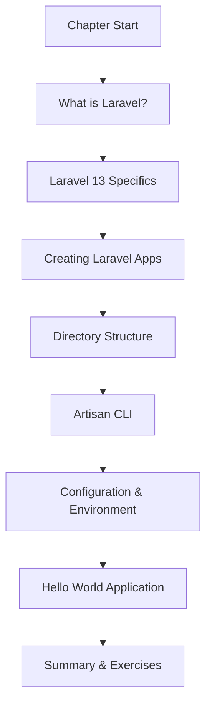
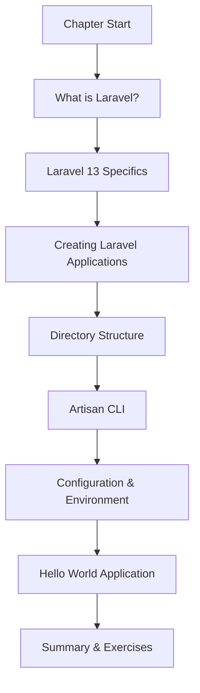

# Chapter 1: Introduction to Laravel 13

**Next:** [Architecture, Routing, Middleware & Controllers](./02-architecture-routing.md)


**Next:** [Architecture, Routing, Middleware & Controllers](./02-architecture-routing.md)


---

## Learning Objectives

- Understand the history and philosophy behind the Laravel framework
- Identify Laravel 13's specific requirements and new capabilities
- Create new Laravel applications using the installer, Herd, Sail, and Composer
- Navigate and explain Laravel's directory structure with confidence
- Use Artisan CLI for common development tasks
- Configure environment settings using `.env` and the `config/` directory
- Build a complete "Hello World" application using routes, controllers, and Blade views

<!-- Image Gallery -->
<div style="display:flex;flex-wrap:wrap;gap:4px;margin:16px 0;padding:12px;background:#f8fafc;border-radius:8px;border:1px solid #e2e8f0;">
<a href="../../../assets/images/lessons/laravel/01-introduction/hero.svg" target="_blank" rel="noopener">
  
</a>
<a href="../../../assets/images/lessons/laravel/01-introduction/handwritten-notes.svg" target="_blank" rel="noopener">
  
</a>
<a href="../../../assets/images/lessons/laravel/01-introduction/sticky-notes.svg" target="_blank" rel="noopener">
  
</a>
<a href="../../../assets/images/lessons/laravel/01-introduction/visual-explanation.svg" target="_blank" rel="noopener">
  
</a>
<a href="../../../assets/images/lessons/laravel/01-introduction/architecture.svg" target="_blank" rel="noopener">
  
</a>
<a href="../../../assets/images/lessons/laravel/01-introduction/workflow.svg" target="_blank" rel="noopener">
  
</a>
<a href="../../../assets/images/lessons/laravel/01-introduction/mindmap.svg" target="_blank" rel="noopener">
  
</a>
<a href="../../../assets/images/lessons/laravel/01-introduction/comparison.svg" target="_blank" rel="noopener">
  
</a>
<a href="../../../assets/images/lessons/laravel/01-introduction/cheatsheet.svg" target="_blank" rel="noopener">
  
</a>
<a href="../../../assets/images/lessons/laravel/01-introduction/interview-quiz.svg" target="_blank" rel="noopener">
  
</a>
<a href="../../../assets/images/lessons/laravel/01-introduction/social-card.svg" target="_blank" rel="noopener">
  
</a>
</div>
<!-- End Image Gallery -->


---


## Chapter at a Glance

| Topic | Key Insight | Practical Takeaway |
|-------|-------------|--------------------|
|Framework Philosophy|Laravel offers elegant syntax, expressive code, and convention over configuration|Use Laravel when you need rapid development with clean, maintainable code|
|Laravel 13 Features|PHP 8.3 minimum, annual release cadence, AI-native workflows, minimal breaking changes|Upgrade planning should start 3 months before each August release|
|Application Setup|Four methods: Installer, Herd, Sail, and Composer|Use Herd for local dev, Sail for team consistency|
|Directory Structure|MVC-based layout with app/, config/, database/, resources/, routes/ as core|Follow Laravel conventions — AI tools find files predictably|
|Artisan CLI|CLI for scaffolding, migrations, and queue commands|Use `php artisan make:` for all scaffolding|
|Environment Config|.env + config/ for environment-specific settings|Store secrets in .env, defaults in config/|


## Chapter Roadmap




## Chapter at a Glance

| Topic | Key Insight | Practical Takeaway |
|-------|-------------|--------------------|
|Framework Philosophy|Laravel offers elegant syntax, expressive code, and convention over configuration|Use Laravel when you need rapid development with clean, maintainable code|
|Laravel 13 Features|PHP 8.3 minimum, annual release cadence, AI-native workflows, minimal breaking changes|Upgrade planning should start 3 months before each August release|
|Application Setup|Four methods: Installer, Herd, Sail (Docker), and Composer create-project|Use Laravel Herd for local dev, Sail for team consistency|
|Directory Structure|MVC-based layout with app/, config/, database/, resources/, routes/ as core directories|Follow Laravel conventions — AI tools and team members will find files predictably|
|Artisan CLI|CLI tool for scaffolding, migrations, queue work, and custom commands|Use `php artisan make:` commands to scaffold controllers, models, migrations, and more|
|Environment Config|.env file + config/ directory for environment-specific settings|Store secrets in .env, configuration defaults in config/ files|


## Chapter Roadmap



## Theory

> **One-Sentence Takeaway:** Laravel combines elegant PHP syntax with powerful defaults to make web development productive and enjoyable

> **One-Sentence Takeaway:** Laravel combines elegant syntax with powerful defaults to make web development productive and enjoyable


### 1.1 What is Laravel?


> **One-Sentence Takeaway:** Laravel's progressive nature lets you start small and scale up by adopting only the features you need

Laravel is an open-source PHP web framework created by Taylor Otwell in June 2011. Otwell, a web developer from Arkansas, had been building applications with CodeIgniter and saw an opportunity to create something better → a framework that combined the best ideas from Ruby on Rails, ASP.NET MVC, and existing PHP frameworks into a cohesive, elegant package. The first beta of Laravel 1.0 was released on GitHub on June 9, 2011, and immediately resonated with developers who were frustrated with PHP's fragmented ecosystem.

At the time, PHP frameworks fell into two camps: lightweight but underpowered (CodeIgniter, CakePHP) or powerful but overly complex (Symfony). Laravel struck a balance. It offered modern features like routing, ORM, authentication, and templating, but wrapped them in what Otwell called "developer ergonomics" → clean syntax, intuitive method names, and sensible defaults.

> **Remember:** Laravel ships with sensible defaults. You do not need to configure a database, view renderer, or mailer before they work.


The core philosophy rests on three pillars:

- **Elegant Syntax**: Laravel code reads like well-written prose. Database queries are expressed fluently. Relationships read naturally. Method chains are predictable. The goal is to minimize the distance between what you think and what you type.
- **Expressive**: Common web development tasks → database queries, email delivery, authentication, caching, file storage → are expressed in as few lines as possible without sacrificing clarity. A simple contact form submission might be five lines of controller code.
- **Convention over Configuration**: Laravel ships with sensible defaults. You do not need to write a configuration file to render a view, connect to a database, or send email. When you need to override conventions, the escape hatch is always there → but you rarely need it.

> **Remember:** Laravel ships with sensible defaults. You do not need to configure a database, view renderer, or mailer before they work.


Laravel also brands itself as a *progressive framework*. You can adopt only the parts you need for your task. Want Eloquent for database queries but not Blade for templating? That is fine. Want the router but not the service container? Also fine. You can start with a single route file and gradually adopt more pieces as your application grows. This makes Laravel equally suitable for a five-route microservice and a multi-tenant SaaS platform.

### 1.2 Laravel 13 Specifics


> **One-Sentence Takeaway:** With PHP 8.3 minimum and AI-native workflows, Laravel 13 is designed for modern, agent-assisted development

Laravel follows an annual major release cadence, shipping each August. Laravel 13 continues this tradition with several defining characteristics:

**PHP 8.3 Minimum**: Laravel 13 requires PHP 8.3 or higher. This gives the framework access to language features like typed class constants, the `json_validate()` function, `mb_str_pad()`, and the `#[Override]` attribute. The framework's core uses these features for better type safety, performance, and self-documentation.

> **Warning:** Verify your PHP version before upgrading. Laravel 13 drops support for PHP 8.2 and below.


> **Warning:** Verify your PHP version before upgrading. Laravel 13 drops support for PHP 8.2 and below — run `php -v` first.


**Annual Release Cadence**: The predictable August release schedule allows teams to plan upgrades. Each major version receives 18 months of bug fixes and two years of security fixes. The upgrade path between consecutive versions is designed to be minimal → Laravel's core team treats breaking changes as a last resort.

**Minimal Breaking Changes Philosophy**: When a breaking change is unavoidable, Laravel provides comprehensive upgrade guides, automation via Laravel Shift (a paid service that rewrites your code for the new version), and deprecation warnings that span multiple versions. Most applications upgrade from N-1 to N in under an hour.

**AI-Native Workflows**: Laravel 13 introduces first-class support for AI-assisted development. The framework's conventions are designed to be predictable for AI coding agents. Method signatures follow consistent naming patterns. Service providers always have `register()` and `boot()`. Middleware always uses `handle()`. This predictability means an AI agent can scaffold an entire feature with near-100% accuracy on file paths and wiring.

### 1.3 Creating Laravel Applications


> **One-Sentence Takeaway:** Laravel Herd provides instant local PHP environments while Sail ensures Docker-consistent team setups

There are four primary ways to bootstrap a new Laravel application.

> **Pro Tip:** Use `laravel new app` via the Laravel Installer for the fastest setup. Herd is ideal for local dev without Docker.


> **Pro Tip:** Use `laravel new app` via the Laravel Installer for the fastest setup. Herd is ideal for local development without Docker overhead.


#### Laravel Installer

The recommended approach. Install the installer globally via Composer, then create applications with a single command:

```bash
composer global require laravel/installer
laravel new my-app
```

This command scaffolds a fresh Laravel 13 skeleton, installs Composer dependencies, and prompts you to select optional starter kits (Laravel Breeze for simple auth scaffolding, Laravel Jetstream for team-based authentication with Livewire or Inertia) and your testing framework (Pest or PHPUnit). The installer is the fastest path to a running application.

#### Laravel Herd

Herd is Laravel's native PHP development environment for macOS and Windows. It bundles PHP 8.3+, Nginx, and a DNS proxy into a single desktop application:

```bash
# Herd is installed from https://herd.laravel.com
# Once installed, creating an app is one command:
herd create my-app
```

Herd automatically serves projects from `~/Herd/` at `{folder}.test` with HTTPS. It provides a GUI for managing PHP versions (you can set different PHP versions per project), controlling services like MySQL and Redis, and accessing logs. No configuration files, no Docker overhead → it just works.

#### Laravel Sail

Sail is a Docker-based development environment that wraps `docker-compose` with a thin CLI:

```bash
# Create with Sail preset
laravel new my-app --with-sail
cd my-app
./vendor/bin/sail up
```

Sail comes pre-configured with PHP, MySQL, Redis, Meilisearch, and Mailpit. All commands run through the `sail` binary:

```bash
./vendor/bin/sail artisan make:model Product -mc
./vendor/bin/sail composer require laravel/cashier
./vendor/bin/sail npm run dev
```

You can customize the `docker-compose.yml` to add services like PostgreSQL, Selenium, or MinIO.

#### Composer Create-Project

The traditional method, useful when you want a specific version or lack the installer:

```bash
composer create-project laravel/laravel my-app
composer create-project laravel/laravel:^13.0 my-app
```

This downloads the latest skeleton, installs dependencies, and copies `.env.example` to `.env`.

### 1.4 Directory Structure


> **One-Sentence Takeaway:** Laravel's predictable directory layout makes every file findable without documentation

A fresh Laravel application follows a consistent, well-documented layout.

#### Root Level

| Directory / File | Purpose |
|---|---|
| `app/` | Core application code → models, controllers, middleware, providers |
| `bootstrap/` | Framework bootstrapping files |
| `config/` | Configuration files, one per system concern |
| `database/` | Migrations, factories, seeders |
| `public/` | Web server document root; `index.php` is the single entry point |
| `resources/` | Blade views, raw CSS/JS assets, language files |
| `routes/` | Route definitions: `web.php`, `api.php`, `console.php` |
| `storage/` | Compiled Blade templates, logs, sessions, cached views |
| `tests/` | Unit and feature tests (Pest or PHPUnit) |
| `vendor/` | Composer dependencies (not committed) |

#### Inside `app/`

| Directory | Purpose |
|---|---|
| `Console/` | Artisan commands and scheduled task definitions |
| `Exceptions/` | Custom exception handler |
| `Http/Controllers/` | Controller classes |
| `Http/Middleware/` | HTTP middleware for request filtering |
| `Http/Requests/` | Form request validation classes |
| `Models/` | Eloquent model classes |
| `Providers/` | Service providers → the bootstrapping logic |

The `app/Models` directory is notable. Models live under `app/Models/` by convention rather than directly in `app/`. This keeps the namespace clean and predictable.

### 1.5 Artisan CLI


> **One-Sentence Takeaway:** Artisan is your Swiss Army knife — from scaffolding to migrations to custom commands, it handles everything

Artisan is Laravel's command-line interface. It is your daily companion for development.

```bash
# List all available commands
php artisan list

# Create a model with migration and controller
php artisan make:model Product -mc

# Start the built-in PHP development server
php artisan serve
# Output: Server running on [http://127.0.0.1:8000]

# Interactive REPL for testing code
php artisan tinker
# In tinker:
# >>> User::count();
# => 42
# >>> User::first()->name;
# => "Alice"

# Create a database migration
php artisan make:migration create_products_table

# View all registered routes with middleware
php artisan route:list

# Clear application caches
php artisan optimize:clear
```

**Scaffold Commands:**

```bash
make:model Product           # Model file
make:controller Product      # Controller
make:middleware LogRequests   # Middleware
make:request StoreProduct    # Form request
make:seeder ProductSeeder    # Database seeder
make:factory ProductFactory  # Model factory
make:migration create_X      # Migration
make:command ProcessReports  # Artisan command
make:event OrderPlaced        # Event class
make:listener SendConfirmation # Listener
make:notification OrderShipped # Notification
make:job ProcessImage        # Queued job
make:mail OrderConfirmation  # Mailable
make:rule ValidCurrency      # Validation rule
make:provider ReportService  # Service provider
```

Each scaffolded file follows the correct namespace, imports framework base classes, and includes PHPDoc stubs. This saves minutes per feature and enforces consistency across the codebase.

### 1.6 Environment Configuration


Laravel separates configuration from code to support different environments without modifying application files.

#### The `.env` File

Located at the project root. It is listed in `.gitignore` and is never committed:

```env
APP_NAME=Laravel
APP_ENV=local
APP_DEBUG=true
APP_URL=http://localhost

DB_CONNECTION=mysql
DB_HOST=127.0.0.1
DB_PORT=3306
DB_DATABASE=my_app
DB_USERNAME=root
DB_PASSWORD=

SESSION_DRIVER=file
LOG_CHANNEL=stack
```

#### The `config/` Directory

Each file in `config/` returns an array and uses the `env()` helper to read from `.env`:

```php
// config/app.php
return [
    'name' => env('APP_NAME', 'Laravel'),
    'env' => env('APP_ENV', 'production'),
    'debug' => (bool) env('APP_DEBUG', false),
    'url' => env('APP_URL', 'http://localhost'),
];
```

The second argument to `env()` is the default value used when the environment variable is not set.

#### Retrieving Configuration at Runtime

```php
// The env() helper should only be used inside config files
$name = env('APP_NAME'); // works but not recommended outside config/

// The config() helper works anywhere
$name = config('app.name');
$dbHost = config('database.connections.mysql.host');
$debug = config('app.debug');

// Set a value at runtime for the current request only
config(['app.debug' => true]);

// Get all configuration
$all = config()->all();
```

#### Environment Detection

```php
$env = app()->environment(); // 'local', 'staging', 'production'

if (app()->environment('local')) {
    // Only in local
}

if (app()->environment('local', 'testing')) {
    // In local or testing
}
```

The golden rule: never hardcode sensitive values. Use `.env` in development and server-level environment variables in production (set via Forge, Vapor, or your deployment platform).

### 1.7 Laravel and AI


Laravel 13 is explicitly designed to work well with AI coding assistants. This influences the framework in concrete ways.

**Predicable Conventions**: An AI agent can reliably predict that `php artisan make:controller ProductController --resource` creates seven methods with specific names and signatures. It knows Eloquent models are in `app/Models/`, form requests in `app/Http/Requests/`, and middleware in `app/Http/Middleware/`. This deterministic structure dramatically reduces ambiguity.

**Consistent Method Signatures**: Controllers always follow the same pattern. Middleware always uses `handle(Request, Closure)`. Service providers always use `register()` and `boot()`. AI agents trained on Laravel code can generate accurate code because the patterns are uniform across the framework.

**Laravel for Agents**: The ecosystem publishes guidelines for AI coding tools. These guidelines recommend using `artisan make` commands over manual file creation, defining routes explicitly rather than relying on magic, and writing tests first. They also document file path conventions, namespace rules, and naming patterns that AI agents should follow.

### 1.8 Hello World → Complete Walkthrough


We will build "Hello World" three ways, each demonstrating a deeper layer.

#### Version 1: Route Closure

In `routes/web.php`:

```php
<?php

use Illuminate\Support\Facades\Route;

Route::get('/', function () {
    return 'Hello, World!';
});
```

Start the server with `php artisan serve` and visit `http://localhost:8000`. The response is a bare string. Laravel wraps it in an `Illuminate\Http\Response` object internally.

#### Version 2: Route to Controller

Create the controller:

```bash
php artisan make:controller HelloController
```

`app/Http/Controllers/HelloController.php`:

```php
<?php

namespace App\Http\Controllers;

use Illuminate\Http\Request;

class HelloController extends Controller
{
    public function index(): string
    {
        return 'Hello from a controller!';
    }
}
```

Register the route:

```php
use App\Http\Controllers\HelloController;

Route::get('/', [HelloController::class, 'index']);
```

This separates routing logic from response logic. The route decides *when* and *with what parameters*; the controller decides *how*.

#### Version 3: Route to Controller to View

Create `resources/views/hello.blade.php`:

```blade
<!DOCTYPE html>
<html lang="en">
<head>
    <meta charset="UTF-8">
    <meta name="viewport" content="width=device-width, initial-scale=1.0">
    <title>Hello World</title>
    <style>
        body {
            font-family: system-ui, sans-serif;
            display: flex;
            justify-content: center;
            align-items: center;
            height: 100vh;
            background: #f5f5f5;
            margin: 0;
        }
        .card {
            background: white;
            padding: 2rem 3rem;
            border-radius: 12px;
            box-shadow: 0 2px 12px rgba(0,0,0,0.1);
            text-align: center;
        }
        h1 { color: #ff2d20; margin-bottom: 0.5rem; }
        p { color: #666; }
    </style>
</head>
<body>
    <div class="card">
        <h1>{{ $greeting }}</h1>
        <p>Welcome to Laravel {{ date('Y') }}.</p>
    </div>
</body>
</html>
```

Update the controller:

```php
<?php

namespace App\Http\Controllers;

use Illuminate\Http\Request;

class HelloController extends Controller
{
    public function index()
    {
        $greeting = 'Hello, World!';
        return view('hello', compact('greeting'));
    }
}
```

The route stays the same. Now visiting `/` renders a styled HTML page. The `$greeting` variable is passed from the controller to the Blade template using the `view()` helper. The view file name (`hello`) resolves to `resources/views/hello.blade.php` by convention.

This is the classic Model-View-Controller pattern in action: the route delegates to the controller, the controller prepares data, and the view renders it.

### 1.9 Package Ecosystem Overview


Laravel's first-party ecosystem is one of its greatest strengths. These packages solve common production concerns:

| Package | Category | Purpose |
|---|---|---|
| **Forge** | Deployment | Server provisioning and management on AWS, DigitalOcean, Linode |
| **Vapor** | Deployment | Serverless deployment on AWS Lambda |
| **Cloud** | Deployment | Managed Laravel platform (successor to Vapor) |
| **Nova** | Admin | Resource management, metrics, dashboards |
| **Horizon** | Monitoring | Redis queue dashboard |
| **Telescope** | Debugging | Request/query/exception inspector |
| **Pulse** | Monitoring | Production health (slow queries, users, queues) |
| **Sanctum** | Auth | API token auth for SPAs and mobile apps |
| **Socialite** | Auth | OAuth → GitHub, Google, Facebook, Twitter |
| **Cashier** | Billing | Subscription management (Stripe, Paddle) |
| **Scout** | Search | Full-text search (Meilisearch, Algolia) |
| **Sail** | Dev | Docker development environment |
| **Pint** | Quality | Opinionated PHP code style fixer |
| **Envoyer** | Deploy | Zero-downtime deployment |
| **Reverb** | Real-time | WebSocket server |
| **Echo** | Real-time | JavaScript WebSocket client |
| **Boost** | Perf | Query caching and optimization |
| **MCP** | AI | Model Context Protocol tools |
| **AI SDK** | AI | OpenAI, Anthropic, and local model SDK |

---


## Concept Comparison

| Concept | Description | Use Case |
|---------|-------------|---------|
|Installer vs Composer|Laravel Installer is faster; Composer create-project is the universal fallback|Use installer day-to-day, Composer in CI/container builds|
|Herd vs Sail|Herd is a native macOS app; Sail is Docker-based cross-platform|Herd for solo dev, Sail for team environments|
|Artisan vs Tinker|Artisan runs CLI commands; Tinker is an interactive REPL|Use Artisan for scaffolding, Tinker for ad-hoc testing|

## Quick Reference

| Task | Command / Method | Notes |
|------|-----------------|-------|
|Create project|laravel new app or composer create-project laravel/laravel app|Laravel Installer is faster|
|Run dev server|php artisan serve|Uses PHP built-in server on port 8000|
|List Artisan commands|php artisan list|Over 200 built-in commands|
|Generate encryption key|php artisan key:generate|Required after fresh install|
|View .env|cat .env or php artisan env|Never commit .env to version control|

## Cross-Application Matrix

| Domain | Application | Key Integration |
|--------|-------------|-----------------|
|Web Development|Any Laravel app|MVC architecture, routing, Blade templating, Eloquent ORM|
|API Development|RESTful APIs|API routes, resource controllers, Sanctum auth|
|CLI Tools|Artisan commands|Custom commands, scheduler, queue worker|
|Real-Time Apps|Broadcasting|WebSockets, events, Laravel Reverb|

## Chapter Quiz

Test your understanding with these questions.

**1.** Who created Laravel?

- A) Taylor Otwell
- B) Rasmus Lerdorf
- C) Fabien Potencier
- D) Taylor Otwell
**Answer:** A

**2.** Which PHP version does Laravel 13 require?

- A) PHP 8.0
- B) PHP 8.2
- C) PHP 8.3
- D) PHP 8.1
**Answer:** C

**3.** What command creates a new Laravel project?

- A) npm init laravel
- B) laravel new
- C) php artisan new
- D) create-laravel
**Answer:** B

**4.** Which directory handles HTTP controllers?

- A) resources/
- B) routes/
- C) app/Http/Controllers
- D) database/
**Answer:** C


## Concept Comparison

| Concept | Description | Use Case |
|---------|-------------|---------|
|Installer vs Composer|Installer: fast; Composer: universal fallback|Use installer day-to-day, Composer in CI|
|Herd vs Sail|Herd: native macOS; Sail: Docker cross-platform|Herd for solo dev, Sail for team|
|Artisan vs Tinker|Artisan: CLI commands; Tinker: interactive REPL|Artisan for scaffolding, Tinker for testing|

## Quick Reference

| Task | Command / Method | Notes |
|------|-----------------|-------|
|Create project|laravel new app|Laravel Installer is faster|
|Run dev server|php artisan serve|Port 8000 by default|
|List commands|php artisan list|200+ built-in commands|
|Generate key|php artisan key:generate|Required after fresh install|
|View env|cat .env|Never commit .env|

## Cross-Application Matrix

| Domain | Application | Key Integration |
|--------|-------------|-----------------|
|Web Apps|Any Laravel app|MVC, routing, Blade, Eloquent|
|APIs|RESTful services|API routes, Sanctum auth|
|CLI Tools|Artisan commands|Custom commands, scheduler|
|Real-Time|Broadcasting|WebSockets, Laravel Reverb|

## Chapter Quiz

Test your understanding with these questions.

**1.** Who created Laravel?

- A) Taylor Otwell
- B) Rasmus Lerdorf
- C) Fabien Potencier
- D) Taylor Otwell
**Answer:** A

**2.** Laravel 13 requires which PHP?

- A) PHP 8.0
- B) PHP 8.2
- C) PHP 8.3
- D) PHP 8.1
**Answer:** C

**3.** What creates a new Laravel project?

- A) npm init laravel
- B) laravel new
- C) php artisan new
- D) create-laravel
**Answer:** B

**4.** Which directory has controllers?

- A) resources/
- B) routes/
- C) app/Http/Controllers
- D) database/
**Answer:** C


## Summary

- Laravel was created by Taylor Otwell in 2011 as a modern, elegant alternative to PHP's existing frameworks
- The philosophy centers on elegant syntax, expressive code, and convention over configuration
- Laravel 13 requires PHP 8.3+ and follows an annual August release cadence
- Breaking changes are minimized with long deprecation periods and automated upgrade tools
- Four installation methods exist: Laravel Installer (recommended), Herd (native), Sail (Docker), and Composer
- The directory structure cleanly separates application code, configuration, routes, views, and storage
- Artisan CLI provides scaffolding commands for models, controllers, migrations, and middleware
- Environment configuration uses `.env` files and a `config/` directory with `env()` and `config()` helpers
- The framework is designed for AI-assisted development with predictable, agent-friendly conventions
- Hello World can be built at three depth levels → closure, controller, or full MVC with Blade
- The first-party ecosystem spans deployment, monitoring, admin, search, billing, real-time, and AI

### 1.10 Development Workflow

A typical Laravel development session follows this rhythm:

1. **Scaffold**: Use `laravel new project` or an existing repository
2. **Configure**: Set `.env` values for your database and services
3. **Model**: Create models with `php artisan make:model Product -m` (the `-m` flag also creates the migration)
4. **Migrate**: Run `php artisan migrate` to create database tables
5. **Route**: Define endpoints in `routes/web.php` or `routes/api.php`
6. **Controller**: Create controllers with `php artisan make:controller ProductController --resource`
7. **View**: Build Blade templates in `resources/views/`
8. **Test**: Write tests with Pest or PHPUnit in the `tests/` directory
9. **Iterate**: Artisan commands, Tinker REPL, and Telescope debugging support rapid iteration

This workflow is intentionally linear and predictable → another reason AI agents excel at Laravel development. Each step has a clear entry point and a known output location.

---

## Exercises

### Review Questions

1. What problem did Taylor Otwell identify in the PHP ecosystem that led him to create Laravel? Explain how Laravel's "convention over configuration" philosophy addresses this.

2. Compare and contrast the four methods of creating a new Laravel application. Under what circumstances would you choose each one?

3. Explain the relationship between the `.env` file and the `config/` directory. Why is it a security risk to commit `.env` to version control, and what is the production alternative?

4. What makes Laravel 13 an "agent-ready" framework? Name three specific design decisions that make the framework predictable for AI coding assistants.

5. Why does `php artisan make:model Product -mc` create three files? What are they and what is the relationship between them?

### Application Problems

1. **Environment Configuration**: Create a configuration file `config/referral.php` that reads the following environment variables with defaults: `REFERRAL_BONUS_AMOUNT` (25.00), `REFERRAL_BONUS_CURRENCY` (USD), `REFERRAL_MAX_PER_MONTH` (10), and `REFERRAL_EXPIRY_DAYS` (30). Then write a code snippet that retrieves each value using the `config()` helper and displays them.

2. **Custom Artisan Command**: Create an Artisan command called `app:status` that displays the application name, environment, debug mode status, and database connection name. Use `php artisan make:command` to scaffold it, then implement the logic using the `config()` helper. Output a formatted table.

3. **Directory Structure Navigation**: Starting from a fresh Laravel installation, trace the full path from an incoming HTTP request entering through `public/index.php` to the point where `routes/web.php` is loaded. List every PHP file that is touched along the way, in order, and explain what each file contributes.

### Challenge Problem

**Multi-Developer Application Setup**: Create a Laravel 13 application configured for a team of five developers with the following requirements:

- Use Laravel Sail with Docker for consistent environments across Windows, macOS, and Linux
- Include MySQL, Redis, and Meilisearch services in the Sail configuration
- Configure `.env` so each developer can use their own database name (e.g., `app_jane`, `app_john`) without editing `docker-compose.yml`
- Create a custom Artisan command `app:doctor` that validates the environment by checking that the database connection works (run a simple `SELECT 1`), Redis responds to a ping, and required environment variables (`APP_KEY`, `DB_DATABASE`, `MAIL_MAILER`) are all set
- The `app:doctor` output must be a color-coded ASCII table with columns for Check, Status (PASS/FAIL/SKIP), and Detail
- Write a Blade view at `resources/views/welcome-custom.blade.php` that displays the application name from `.env`, the current PHP version, and a list of enabled services read from a config file

Implement every piece: the Docker additions, the config file, the complete `app:doctor` command, the Blade view, and the route pointing to a controller that renders the view.