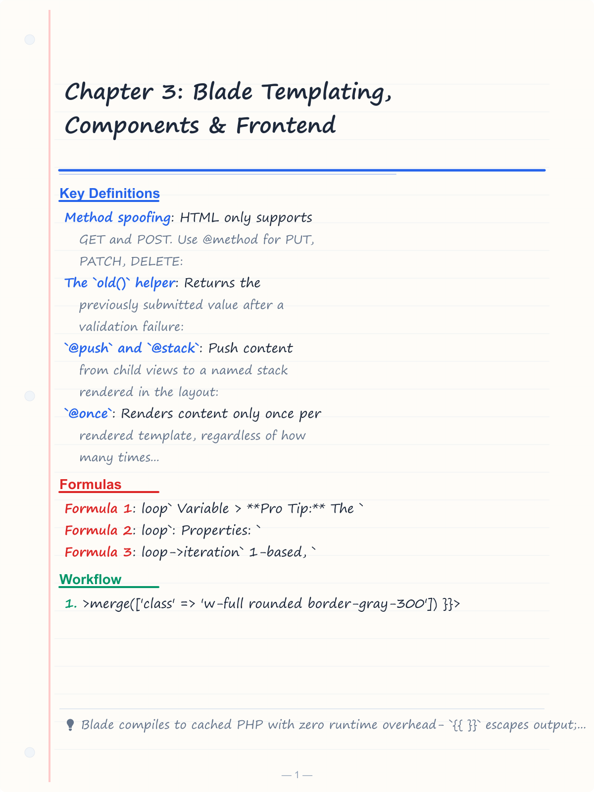
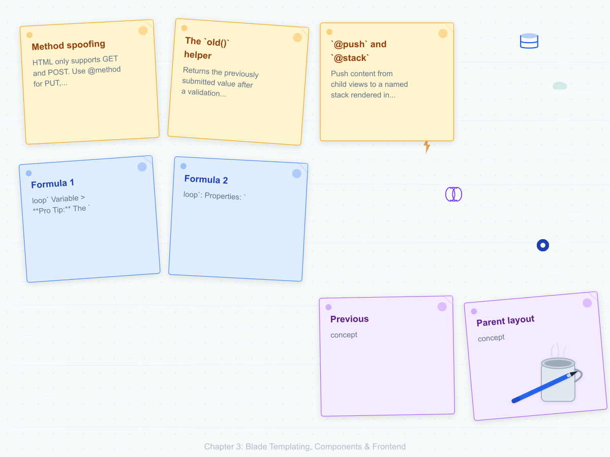
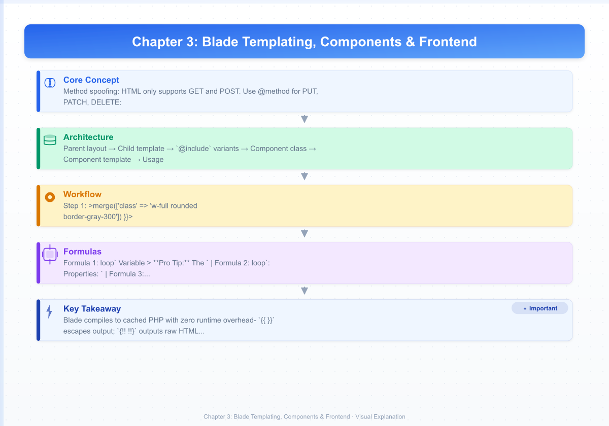
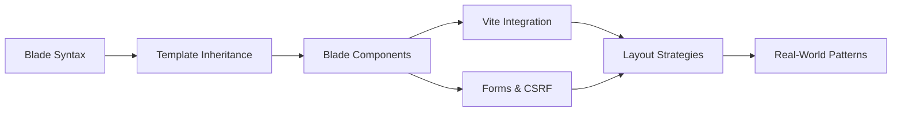

# Chapter 3: Blade Templating, Components & Frontend
> **Previous:** [Architecture & Routing](./02-architecture-routing) | **Next:** [Eloquent ORM, Database & Migrations](./04-eloquent-database)

---

## Learning Objectives

- Write Blade templates using control structures, echo syntax, and raw output
- Implement template inheritance with `@extends`, `@section`, and `@yield`
- Build class-based and anonymous Blade components with slots and attributes
- Integrate Vite with Blade using the `@vite()` directive
- Distinguish layout inheritance from component-based composition
- Create forms with CSRF protection, method spoofing, and validation error display
- Organize reusable partials with `@include`, `@each`, `@push`, and `@stack`

<!-- Image Gallery -->
<section class="lesson-visuals" aria-label="Visual learning resources">
  <header><span>VISUAL LEARNING</span><h2>See it. Review it. Remember it.</h2></header>
  <a class="lesson-visual-card" href="../../assets/images/lessons/laravel/03-blade-frontend/handwritten-notes.png" target="_blank" rel="noopener">
    
    <span><strong>Handwritten notes</strong>Condensed notes for deliberate review.</span>
  </a>
  <a class="lesson-visual-card" href="../../assets/images/lessons/laravel/03-blade-frontend/sticky-notes.png" target="_blank" rel="noopener">
    
    <span><strong>Sticky-note revision</strong>Fast recall prompts for revision.</span>
  </a>
  <a class="lesson-visual-card" href="../../assets/images/lessons/laravel/03-blade-frontend/visual-explanation.png" target="_blank" rel="noopener">
    
    <span><strong>Visual concept guide</strong>A connected explanation of the key ideas.</span>
  </a>
</section>
<!-- End Image Gallery -->

## Chapter at a Glance

| Section | Key Topics |
|---------|-----------|
| Blade Syntax | Echo syntax, conditionals, loops, raw PHP |
| Template Inheritance | @extends, @section, @yield, @parent, @stack |
| Components | Class-based, anonymous, slots, attributes |
| Vite Integration | @vite(), HMR, production builds |
| Forms & CSRF | CSRF protection, method spoofing, old() helper |

## Chapter Roadmap


---

## Theory

> **One-Sentence Takeaway:** Blade compiles to cached PHP and provides expressive template constructs with zero runtime overhead.

### 3.1 Blade Syntax


> **One-Sentence Takeaway:** Blade's echo syntax automatically escapes output, preventing XSS while offering clean conditional and loop constructs.

Blade compiles templates to cached PHP. It adds zero overhead in production.


#### Echo Syntax

```blade
{{-- Escaped by htmlspecialchars --}}
{{ $name }}
{{ $user->email }}
{{ config('app.name') }}
{{ $name ?? 'Guest' }}

{{-- Unescaped (only for trusted HTML) --}}
{!! $pageContent !!}

{{-- Comments (not rendered in HTML) --}}
{{-- This is a Blade comment --}}
```

#### Conditionals

```blade
@if ($score >= 90)
    <span>A</span>
@elseif ($score >= 70)
    <span>B</span>
@else
    <span>F</span>
@endif

@unless ($user->isBanned)
    <p>Welcome back!</p>
@endunless

@isset($settings['maintenance_mode'])
    <div class="alert">Maintenance active.</div>
@endisset

@empty($posts)
    <p>No posts found.</p>
@endempty

@auth <p>Logged in</p> @endauth
@guest <p>Please log in</p> @endguest
@production <script src="{{ mix('js/app.js') }}"></script> @endproduction
```

#### Loops

```blade
@for ($i = 0; $i < 10; $i++)
    {{ $i }}
@endfor

@foreach ($users as $user)
    <p>{{ $user->name }}</p>
@endforeach

@forelse ($posts as $post)
    <article><h2>{{ $post->title }}</h2></article>
@empty
    <p>No posts.</p>
@endforelse
```

#### The `$loop` Variable

> **Pro Tip:** The `$loop->parent` property is invaluable when rendering nested collections — it lets you access the outer loop's iteration count from within an inner loop without passing additional variables.

Inside `@foreach`, `@forelse`, and `@while`, Blade exposes `$loop`:

```blade
@foreach ($users as $user)
    <tr class="{{ $loop->first ? 'font-bold' : '' }}
               {{ $loop->last ? 'border-b-0' : '' }}">
        <td>{{ $loop->iteration }}</td>
        <td>{{ $user->name }}</td>
        <td>{{ $loop->remaining }} remaining</td>
    </tr>
@endforeach
```

Properties: `$loop->index` (0-based), `$loop->iteration` (1-based), `$loop->remaining`, `$loop->count`, `$loop->first`, `$loop->last`, `$loop->even`, `$loop->odd`, `$loop->depth`, `$loop->parent`.

```blade
@foreach ($categories as $category)
    <h2>{{ $category->name }}</h2>
    @foreach ($category->items as $item)
        <p>Cat {{ $loop->parent->iteration }} / Item {{ $loop->iteration }}</p>
    @endforeach
@endforeach
```

#### Raw PHP

```blade
@php
    $total = array_reduce($items, fn($sum, $i) => $sum + $i->price * $i->quantity, 0);
@endphp
```

### 3.2 Template Inheritance


> **One-Sentence Takeaway:** Template inheritance via @extends/@section/@yield provides a clean parent-child layout hierarchy.

**Parent layout** (`resources/views/layouts/app.blade.php`):

```blade
<!DOCTYPE html>
<html>
<head>
    <title>@yield('title', config('app.name'))</title>
    @stack('styles')
</head>
<body>
    <nav>
        <a href="/">Home</a>
        <a href="/about">About</a>
    </nav>
    <main>@yield('content')</main>
    <footer>&copy; {{ date('Y') }}</footer>
    @stack('scripts')
</body>
</html>
```

**Child template**:

```blade
@extends('layouts.app')

@section('title', $post->title)

@section('content')
    <article>
        <h1>{{ $post->title }}</h1>
        <div>{!! $post->body !!}</div>
    </article>
    @include('posts.partials.comments', ['comments' => $post->comments])
@endsection

@push('styles')
    <link href="{{ asset('css/posts.css') }}" rel="stylesheet">
@endpush

@push('scripts')
    <script src="{{ asset('js/comments.js') }}" defer></script>
@endpush
```

Key directives:

| Directive | Purpose |
|---|---|
| `@extends('layouts.app')` | Declares inheritance from a parent layout |
| `@section('name', 'value')` | Short form for simple string content |
| `@section('name')...@endsection` | Block form for multi-line content |
| `@yield('name')` | Renders the child's section content |
| `@parent` | Renders the parent's section content from within a child |
| `@stack('name')` | Renders all pushed content in order |

**`@include` variants**:

```blade
@include('shared.errors')
@includeIf('custom.sidebar')                         // Only if view exists
@includeWhen($user->isAdmin(), 'admin.sidebar')       // Conditional
@includeUnless($user->isBanned(), 'shared.banner')    // Conditional
@each('shared.card', $posts, 'item', 'shared.empty')  // Collection render
```

### 3.3 Components


> **One-Sentence Takeaway:** Blade components offer encapsulated, reusable UI elements with slots and attribute bags, superseding @include for most use cases.

Blade components are the modern, encapsulated alternative to `@include` partials.

#### Creating Components

```bash
php artisan make:component Alert               # Class-based
php artisan make:component forms.input --view  # Anonymous (Blade-only)
```

#### Class-Based Component

**Component class** (`app/View/Components/Alert.php`):

```php
class Alert extends Component
{
    public function __construct(
        public string $type = 'info',
        public ?string $dismissible = null,
    ) {}

    public function render(): View|Closure|string
    {
        return view('components.alert');
    }

    public function typeClass(): string
    {
        return match ($this->type) {
            'success' => 'bg-green-100 border-green-400',
            'danger'  => 'bg-red-100 border-red-400',
            default   => 'bg-blue-100 border-blue-400',
        };
    }
}
```

**Component template** (`resources/views/components/alert.blade.php`):

```blade
<div {{ $attributes->merge(['class' => 'alert p-4 ' . $typeClass()]) }}
     role="alert"
     x-data="{ show: true }"
     x-show="show">
    <div class="flex items-start">
        <div class="flex-1">{{ $slot }}</div>
        @if ($dismissible)
            <button @click="show = false" class="ml-4">&times;</button>
        @endif
    </div>
</div>
```

**Usage**:

```blade
<x-alert type="success" dismissible>
    Profile updated successfully!
</x-alert>

<x-alert type="danger">
    <strong>Error:</strong> Correct the fields below.
</x-alert>
```

#### Anonymous Components

> **Remember:** Anonymous components use `@props()` to declare their attributes instead of a PHP constructor. They are ideal for simple, stateless presentational components like form inputs or buttons.

No PHP class → all logic lives in the template:

`resources/views/components/forms/input.blade.php`:

```blade
@props(['name', 'label' => null, 'type' => 'text', 'value' => null, 'required' => false])

<div class="mb-4">
    @if ($label)
        <label for="{{ $name }}" class="block text-sm font-medium mb-1">
            {{ $label }}@if ($required)<span class="text-red-500">*</span>@endif
        </label>
    @endif
    <input type="{{ $type }}" name="{{ $name }}" id="{{ $name }}"
           value="{{ old($name, $value) }}"
           {{ $required ? 'required' : '' }}
           {{ $attributes->class(['border-red-500' => $errors->has($name)])
                ->merge(['class' => 'w-full rounded border-gray-300']) }}>
    @error($name)
        <p class="text-red-600 text-sm mt-1">{{ $message }}</p>
    @enderror
</div>
```

```blade
<x-forms.input name="email" label="Email" type="email" required />
<x-forms.input name="phone" label="Phone" type="tel" value="+1-555-0123" />
```

#### The `$attributes` Bag

> **Warning:** The `$attributes->merge()` method merges classes, not replaces them. To override a class, provide it after the default — Laravel deduplicates automatically.

```blade
{{-- Merge: original + override --}}
<div {{ $attributes->merge(['class' => 'p-4 bg-white', 'id' => 'default']) }}>
    {{ $slot }}
</div>
{{-- Usage: <x-card class="bg-gray-100" id="custom" /> --}}
{{-- Result: <div class="p-4 bg-white bg-gray-100" id="custom"> --}}

{{-- Filter --}}
<div {{ $attributes->whereDoesntStartWith('wire:') }}></div>

{{-- Check --}}
@if ($attributes->has('class')) @endif
```

#### Named Slots

`resources/views/components/card.blade.php`:

```blade
<div {{ $attributes->merge(['class' => 'card border rounded shadow-sm']) }}>
    @if ($heading)
        <div class="card-header border-b bg-gray-50 px-4 py-3">{{ $heading }}</div>
    @endif
    <div class="card-body px-4 py-4">{{ $slot }}</div>
    @if ($footer)
        <div class="card-footer border-t bg-gray-50 px-4 py-3">{{ $footer }}</div>
    @endif
</div>
```

```blade
<x-card>
    <x-slot:heading><h2 class="text-lg font-semibold">User Profile</h2></x-slot:heading>
    <p><strong>Name:</strong> {{ $user->name }}</p>
    <p><strong>Email:</strong> {{ $user->email }}</p>
    <x-slot:footer>
        <a href="/users/{{ $user->id }}/edit">Edit</a>
    </x-slot:footer>
</x-card>
```

### 3.4 Blade with Vite


> **One-Sentence Takeaway:** Vite integration delivers HMR in development and versioned asset bundles in production through the @vite() directive.

Laravel uses Vite as the default bundler.

**`vite.config.js`**:

```javascript
import { defineConfig } from 'vite';
import laravel from 'laravel-vite-plugin';

export default defineConfig({
    plugins: [
        laravel({
            input: ['resources/css/app.css', 'resources/js/app.js'],
            refresh: true,
        }),
    ],
});
```

**Blade usage**:

```blade
@vite(['resources/css/app.css', 'resources/js/app.js'])
```

In development (`npm run dev`), `@vite()` generates HMR module script tags pointing to `localhost:5173`. Save a file and the browser updates without a full reload. In production (`npm run build`), it generates versioned asset links with content hashes for cache busting.

### 3.5 Layouts: Inheritance vs Components


> **One-Sentence Takeaway:** Use inheritance for single-layout sites and components for multi-layout flexibility.

**Inheritance** (`@extends`/`@section`): Best for single-layout sites. Child views fill pre-defined sections in a parent layout. Simple and explicit.

**Components** (`<x-layout>` / `{{ $slot }}`): Best for multi-layout sites (public, admin, print). Components compose; inheritance extends. Composition is more flexible for nested layouts.

Example component-based layout:

`resources/views/components/layouts/app.blade.php`:

```blade
<!DOCTYPE html>
<html>
<head>
    <title>{{ $title ?? config('app.name') }}</title>
    @vite(['resources/css/app.js'])
    @stack('styles')
</head>
<body class="min-h-screen flex flex-col">
    <x-navigation />
    @isset($header)
        <header class="bg-white shadow">
            <div class="max-w-7xl mx-auto py-6 px-4">{{ $header }}</div>
        </header>
    @endisset
    <main class="flex-1">
        <div class="max-w-7xl mx-auto py-6 px-4">
            @if (session('success'))
                <x-alert type="success" dismissible>{{ session('success') }}</x-alert>
            @endif
            {{ $slot }}
        </div>
    </main>
    <x-footer />
    @vite(['resources/js/app.js'])
    @stack('scripts')
</body>
</html>
```

```blade
<x-layouts.app title="Dashboard">
    <x-slot:header><h1 class="text-2xl font-bold">Dashboard</h1></x-slot:header>
    <div class="grid grid-cols-4 gap-6">
        <x-stat-card label="Users" value="{{ $count }}" />
    </div>
</x-layouts.app>
```

### 3.6 Forms and CSRF


> **One-Sentence Takeaway:** CSRF protection is automatic with @csrf, and method spoofing via @method enables PUT/PATCH/DELETE in HTML forms.

**Basic form**:

```blade
<form method="POST" action="{{ route('posts.store') }}">
    @csrf
    <input type="text" name="title" value="{{ old('title') }}"
           class="@error('title') border-red-500 @enderror">
    @error('title') <p class="text-red-500">{{ $message }}</p> @enderror
    <button type="submit">Create</button>
</form>
```

**Method spoofing**: HTML only supports GET and POST. Use `@method` for PUT, PATCH, DELETE:

```blade
<form method="POST" action="{{ route('posts.update', $post) }}">
    @csrf
    @method('PUT')
    <input type="text" name="title" value="{{ old('title', $post->title) }}">
    <button type="submit">Update</button>
</form>

<form method="POST" action="{{ route('posts.destroy', $post) }}">
    @csrf
    @method('DELETE')
    <button type="submit" onclick="return confirm('Sure?')">Delete</button>
</form>
```

**The `old()` helper**: Returns the previously submitted value after a validation failure:

```blade
<input name="email" value="{{ old('email') }}">
<input name="email" value="{{ old('email', $user->email) }}">
```

### 3.7 Push, Stack, and One-Time Includes


> **One-Sentence Takeaway:** @push and @stack enable deferred injection of scripts and styles from child to parent layouts.

**`@push` and `@stack`**: Push content from child views to a named stack rendered in the layout:

```blade
{{-- Child view --}}
@push('scripts')
    <script src="{{ asset('js/chart.js') }}" defer></script>
@endpush

@prepend('scripts')
    <script>window.App = { csrf: '{{ csrf_token() }}' }</script>
@endprepend

{{-- Layout --}}
<head>@stack('styles')</head>
<body>@stack('scripts')</body>
```

**`@once`**: Renders content only once per rendered template, regardless of how many times the directive appears:

```blade
@foreach ($users as $user)
    @once
        <style>.card { border: 1px solid #ddd; }</style>
    @endonce
    <div class="card">{{ $user->name }}</div>
@endforeach
```

### 3.8 Complete Form with Validation Errors


`resources/views/posts/create.blade.php`:

```blade
<x-layouts.app title="Create Post">
    <x-slot:header><h1 class="text-2xl font-bold">Create Post</h1></x-slot:header>

    @if ($errors->any())
        <x-alert type="danger" class="mb-6">
            <strong>Please fix these errors:</strong>
            <ul class="mt-2 list-disc list-inside">
                @foreach ($errors->all() as $error)
                    <li>{{ $error }}</li>
                @endforeach
            </ul>
        </x-alert>
    @endif

    <form method="POST" action="{{ route('posts.store') }}" enctype="multipart/form-data">
        @csrf
        <x-card>
            <x-slot:heading>Post Details</x-slot:heading>
            <div class="space-y-6">
                <x-forms.input name="title" label="Title" required :value="old('title')" />

                <x-forms.select name="category_id" label="Category" required
                    :options="$categories->pluck('name', 'id')"
                    :selected="old('category_id')" />

                <div class="mb-4">
                    <label for="body" class="block text-sm font-medium mb-1">Content</label>
                    <textarea name="body" id="body" rows="15"
                        class="w-full rounded border @error('body') border-red-500 @else border-gray-300 @enderror">{{ old('body') }}</textarea>
                    @error('body')<p class="text-red-600 text-sm mt-1">{{ $message }}</p>@enderror
                </div>

                <x-forms.file name="featured_image" label="Featured Image" accept="image/*" />
            </div>
            <x-slot:footer>
                <div class="flex justify-end space-x-4">
                    <a href="{{ route('posts.index') }}" class="text-gray-600">Cancel</a>
                    <button type="submit"
                        class="bg-indigo-600 text-white px-6 py-2 rounded hover:bg-indigo-700">
                        Publish
                    </button>
                </div>
            </x-slot:footer>
        </x-card>
    </form>
</x-layouts.app>
```

### 3.9 Form Partials with `@each`


For sub-resources like invoice line items, `@each` with partials keeps forms DRY:

`resources/views/invoices/partials/line-item.blade.php`:

```blade
<div class="line-item flex space-x-4 items-end border-b pb-4 mb-4">
    <div class="flex-1">
        <x-forms.input name="items[{{ $index }}][description]" label="Description"
            value="{{ old("items.{$index}.description", $item['description'] ?? '') }}" />
    </div>
    <div class="w-32">
        <x-forms.input name="items[{{ $index }}][quantity]" label="Qty" type="number" min="1"
            value="{{ old("items.{$index}.quantity", $item['quantity'] ?? 1) }}" />
    </div>
    <div class="w-40">
        <x-forms.input name="items[{{ $index }}][unit_price]" label="Unit Price" type="number" step="0.01"
            value="{{ old("items.{$index}.unit_price", $item['unit_price'] ?? '0.00') }}" />
    </div>
    <div class="w-24 pt-7">
        <button type="button" class="text-red-600 text-sm"
            onclick="this.closest('.line-item').remove()">Remove</button>
    </div>
</div>
```

```blade
<form method="POST" action="{{ route('invoices.store') }}">
    @csrf
    <div id="line-items">
        @each('invoices.partials.line-item', old('items', [['description' => '']]), 'item', 'invoices.partials.line-item-empty')
    </div>
    <button type="button" onclick="addLineItem()" class="text-indigo-600 text-sm">
        + Add Line Item
    </button>
    <button type="submit">Create Invoice</button>
</form>

<script>
let idx = {{ count(old('items', [['description' => '']])) }};
function addLineItem() {
    const tpl = document.querySelector('.line-item-template').innerHTML.replace(/\{\{index\}\}/g, idx++);
    document.getElementById('line-items').insertAdjacentHTML('beforeend', tpl);
}
</script>
```

---


## Concept Comparison

| Feature | Template Inheritance | Blade Components |
|---------|---------------------|-----------------|
| Architecture | Parent-child layout hierarchy | Encapsulated, composable units |
| Best For | Single-layout sites | Multi-layout, complex UIs |
| Content Injection | @section / @yield | Slots (default + named) |
| Attribute Handling | None built-in | $attributes bag with merge, class, filter |
| Reusability | Limited to layout | Highly reusable across views |
| Logic | Controller provides data | Class methods + @props() |

## Quick Reference — Blade Directives

| Directive | Purpose | Example |
|-----------|---------|---------|
| `{{ }}` | Escaped output | `{{ $user->name }}` |
| `{!! !!}` | Raw output | `{!! $html !!}` |
| `@if/@elseif/@else` | Conditionals | `@if ($score > 90) A @endif` |
| `@unless` | Negative conditional | `@unless ($user->banned)` |
| `@forelse` | Loop with empty state | `@forelse ($posts as $p) ... @empty ... @endforelse` |
| `@csrf` | CSRF token field | `@csrf` |
| `@method` | HTTP method spoofing | `@method('PUT')` |
| `@push/@stack` | Deferred injection | `@push('scripts') ... @endpush` |
| `@vite()` | Asset loading | `@vite(['css/app.css'])` |

## Cross-Application Matrix

| Concept | Blog | E-Commerce | SaaS Dashboard |
|---------|------|-----------|---------------|
| @extends/@section | Blog layout with sidebar | Product page with filters | Admin layout with nav |
| Blade Components | Alert, Card, Button | ProductCard, CartItem | DataTable, ChartWidget |
| Named Slots | Card header/footer | Modal with title/body/actions | Panel with toolbar/content |
| Forms + @csrf | Comment form | Checkout form | Settings form |
| @push/@stack | Page-specific scripts | Checkout JS bundle | Chart library per page |
| Vite @vite | Blog CSS/JS | Product gallery | Dashboard bundle |

## Chapter Quiz

**1. Which Blade directive renders escaped output?**
- a) `{!! !!}`
- b) `{{ }}`
- c) `@raw`
- d) `@echo`

**2. How do you declare a named slot in a component template?**
- a) `@slot('name')`
- b) `{{ $name }}`
- c) `{{ $slot->name }}`
- d) `{{ $name ?? $slot }}`

**3. What does `$attributes->merge(['class' => 'p-4'])` do?**
- a) Replaces all existing classes
- b) Appends 'p-4' to any existing classes
- c) Overwrites the class attribute entirely
- d) Throws an error if class exists

**4. Which directive must appear in every HTML form that sends POST requests?**
- a) `@method`
- b) `@csrf`
- c) `@push`
- d) `@vite`

**Answers: 1-b, 2-a, 3-b, 4-b**

## Summary

- Blade compiles to cached PHP with zero runtime overhead
- `{{ }}` escapes output; `{!! !!}` outputs raw HTML (use only with trusted content)
- Control structures (`@if`, `@unless`, `@isset`, `@forelse`) provide clean syntax
- `$loop` exposes iteration metadata including index, depth, and nesting
- Template inheritance uses `@extends`/`@section`/`@yield` for layout hierarchies
- Components offer encapsulated logic with slots and attribute bags
- Named slots support multiple content areas in a single component
- Vite via `@vite()` provides HMR in development and versioned assets in production
- Forms require `@csrf` and `@method()` for PUT/PATCH/DELETE
- `@push`/`@stack` enable deferred script and style injection from child templates
- `old()` retains form input across validation failure redirects

---

## Exercises

### Review Questions

1. Compare `@extends`/`@section` inheritance with `<x-layout>`/`{{ $slot }}` components. When would you choose each?

2. How does the `$attributes` bag work? Explain `merge()`, `class()`, and `whereDoesntStartWith()` with examples.

3. Why does Blade use `{{ }}` instead of `<?= ?>`? What vulnerability does escaping prevent?

4. Explain the purpose of `@push` and `@stack`. How do they differ from placing a `<script>` tag directly in the layout?

5. How does `@vite()` determine whether to load HMR scripts or production build links?

### Application Problems

1. **Component-Based Form Builder**: Create `forms.input`, `forms.select`, and `forms.textarea` anonymous components that share validation error display. Each must accept `name`, `label`, `required`, display old input, show per-field errors, and merge additional attributes.

2. **Dashboard Layout with Named Slots**: Build a `layouts.dashboard` component with `header`, `sidebar`, `content`, and `footer` slots. The sidebar collapses via Alpine.js. Include `@stack('styles')` and `@stack('scripts')`. Create a child view using all four slots.

3. **Dynamic Invoice Form**: Build an invoice creation form with dynamic line items using `@each` and a partial. The partial must handle old input after validation failure and include JavaScript for adding and removing items.

### Challenge Problem

**Complete Blog CMS Templating System**: Build a full Blade templating system for a blog:

- **Layout component** `layouts.app` with named slots for `title`, `header`, `sidebar` (optional), and default content. Include Vite directives, CSRF meta, and `@stack` for styles/scripts. Show flash messages via an `<x-alert>` component.

- **Navigation component** with responsive mobile toggle using Alpine.js `x-data`. Show Home, Blog, Categories. Use `x-nav-link` components with `:active` route detection. Show Login/Register for guests, Dashboard/Logout for auth users.

- **Blog index** `posts.index` using `@each` with a `posts.card` partial (featured image, title, excerpt, author, date) and pagination.

- **Blog show** `posts.show` with full body (`{!! !!}`), author bio sidebar, comments section, comment form, and related posts.

- **Admin create** `posts.create` with validation summary alert plus per-field errors. Include title, slug (auto-generated via JS), category select, body textarea, featured image upload with preview, tags input, and publish checkbox. Use `@csrf`, `@method`, `old()`.

- **Form partial** `posts.partials.form` reusable across create and edit. Accept `$post` (null for create, model for edit) and populate `old()` with model values as fallback.

- **Admin index** `posts.admin-index` with a table, checkboxes for bulk selection, dropdown for bulk actions (delete, publish, unpublish), and individual edit/delete buttons. Use `@push` for a confirmation modal and bulk selection JavaScript.

All views must be fully functional Blade → every `@error`, `@csrf`, `@method`, `@push`, `@stack`, `old()`, and `@each` present with correct syntax.

