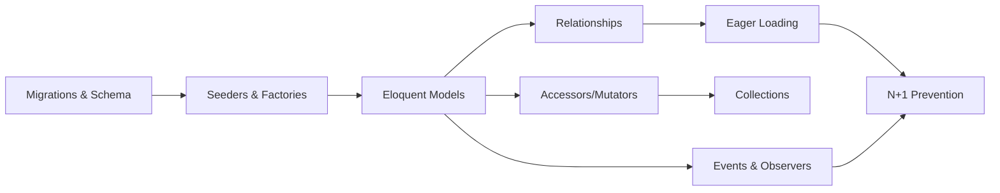

# Chapter 4: Eloquent ORM, Database & Migrations
> **Previous:** [Blade Templating, Components & Frontend](./03-blade-frontend) | **Next:** [Authentication, Authorization & Security](./05-auth-security)

---

## Learning Objectives

- Design and execute database migrations using Laravel's Schema Builder with columns, modifiers, and indexes
- Implement seeders and factories to generate realistic test data with states and sequences
- Build Eloquent models with proper fillable/guarded protection, casts, and soft deletes
- Define and query all Eloquent relationship types including polymorphic variants
- Identify and eliminate the N+1 query problem using eager loading techniques
- Create accessors, mutators, global scopes, and observers to encapsulate model behavior

<!-- Image Gallery -->
<div style="display:flex;flex-wrap:wrap;gap:4px;margin:16px 0;padding:12px;background:#f8fafc;border-radius:8px;border:1px solid #e2e8f0;">
<a href="../../../assets/images/lessons/laravel/04-eloquent-database/hero.svg" target="_blank" rel="noopener">
  
</a>
<a href="../../../assets/images/lessons/laravel/04-eloquent-database/handwritten-notes.svg" target="_blank" rel="noopener">
  
</a>
<a href="../../../assets/images/lessons/laravel/04-eloquent-database/sticky-notes.svg" target="_blank" rel="noopener">
  
</a>
<a href="../../../assets/images/lessons/laravel/04-eloquent-database/visual-explanation.svg" target="_blank" rel="noopener">
  
</a>
<a href="../../../assets/images/lessons/laravel/04-eloquent-database/architecture.svg" target="_blank" rel="noopener">
  
</a>
<a href="../../../assets/images/lessons/laravel/04-eloquent-database/workflow.svg" target="_blank" rel="noopener">
  
</a>
<a href="../../../assets/images/lessons/laravel/04-eloquent-database/mindmap.svg" target="_blank" rel="noopener">
  
</a>
<a href="../../../assets/images/lessons/laravel/04-eloquent-database/comparison.svg" target="_blank" rel="noopener">
  
</a>
<a href="../../../assets/images/lessons/laravel/04-eloquent-database/cheatsheet.svg" target="_blank" rel="noopener">
  
</a>
<a href="../../../assets/images/lessons/laravel/04-eloquent-database/interview-quiz.svg" target="_blank" rel="noopener">
  
</a>
<a href="../../../assets/images/lessons/laravel/04-eloquent-database/social-card.svg" target="_blank" rel="noopener">
  
</a>
</div>
<!-- End Image Gallery -->

## Chapter at a Glance

| Section | Key Topics |
|---------|-----------|
| Migrations | Schema Builder, columns, modifiers, indexes, foreign keys |
| Seeders & Factories | Faker data, factory states, sequences |
| Eloquent Models | Fillable/guarded, casts, soft deletes, global scopes |
| Relationships | One-to-one, one-to-many, many-to-many, polymorphic |
| Eager Loading | N+1 prevention, lazy loading, constrained loads |
| Accessors & Mutators | Attribute transformation, custom casts |
| Collections | Eloquent collection methods, custom collections |
| Events & Observers | Model lifecycle hooks, observer classes |

## Chapter Roadmap


---

## Theory

> **One-Sentence Takeaway:** Laravel's database layer provides version-controlled migrations, expressive schema definitions, and a powerful ORM for data interaction.

### Migration System

<a href="../../../assets/images/diagrams/laravel/04-eloquent-database/migration-system-handwritten.svg" target="_blank" rel="noopener">
  
</a>
<a href="../../../assets/images/diagrams/laravel/04-eloquent-database/migration-system-diagram.svg" target="_blank" rel="noopener">
  
</a>
<a href="../../../assets/images/diagrams/laravel/04-eloquent-database/migration-system-sticky.svg" target="_blank" rel="noopener">
  
</a>


> **One-Sentence Takeaway:** Migrations act as version control for your database schema, with reversible up()/down() methods for deterministic team collaboration.

Migrations are Laravel's version control for your database schema. They allow you to define and share database changes using PHP code rather than raw SQL, making team collaboration deterministic across environments.

#### Creating Migrations

```php
// Create a migration attached to a model
php artisan make:migration create_posts_table

// Create a migration for modifying an existing table
php artisan make:migration add_category_id_to_posts_table

// Create with a specific table target (Laravel auto-detects)
php artisan make:migration create_posts_table --create=posts
php artisan make:migration add_category_id_to_posts_table --table=posts
```

#### Migration Structure

Every migration contains two methods: `up()` (apply the change) and `down()` (reverse the change).

```php
<?php

use Illuminate\Database\Migrations\Migration;
use Illuminate\Database\Schema\Blueprint;
use Illuminate\Support\Facades\Schema;

return new class extends Migration
{
    public function up(): void
    {
        Schema::create('posts', function (Blueprint $table) {
            $table->id();
            $table->foreignId('user_id')->constrained();
            $table->string('title', 255);
            $table->text('content');
            $table->string('status')->default('draft');
            $table->timestamp('published_at')->nullable();
            $table->timestamps();
        });
    }

    public function down(): void
    {
        Schema::dropIfExists('posts');
    }
};
```

#### Running Migrations

```php
php artisan migrate              // Run pending migrations
php artisan migrate:rollback      // Rollback last batch
php artisan migrate:refresh       // Rollback and re-run all
php artisan migrate:fresh         // Drop all tables and re-run
php artisan migrate:status        // Show migration status
```

#### Migration Squashing

For applications with hundreds of migrations, squashing compiles all completed migrations into a single SQL file for faster deployment.

```php
php artisan schema:dump
// Creates database/schema/{connection}-schema.mysql.dump

php artisan schema:dump --prune
// Dumps and prunes all existing migration files

> **Pro Tip:** Use `schema:dump --prune` in CI/CD pipelines to dramatically speed up deployments. Laravel loads the schema dump first, then runs only new individual migrations — this can reduce deployment time from minutes to seconds on large projects.
```

When squashed migrations exist, Laravel loads the schema dump first, then runs any remaining individual migrations.

### Schema Builder

<a href="../../../assets/images/diagrams/laravel/04-eloquent-database/schema-builder-handwritten.svg" target="_blank" rel="noopener">
  
</a>
<a href="../../../assets/images/diagrams/laravel/04-eloquent-database/schema-builder-diagram.svg" target="_blank" rel="noopener">
  
</a>
<a href="../../../assets/images/diagrams/laravel/04-eloquent-database/schema-builder-sticky.svg" target="_blank" rel="noopener">
  
</a>


> **One-Sentence Takeaway:** The Schema Builder offers a fluent interface for defining column types, modifiers, indexes, and foreign key constraints across all supported databases.

The Schema Builder provides a fluent interface for defining database tables and columns.

#### Creating and Modifying Tables

```php
Schema::create('books', function (Blueprint $table) {
    $table->id();
    $table->timestamps();
});

Schema::table('books', function (Blueprint $table) {
    $table->string('isbn', 13)->after('id');
});

Schema::rename('books', 'volumes');

Schema::dropIfExists('volumes');
```

#### Column Types

```php
Schema::create('products', function (Blueprint $table) {
    // Numeric
    $table->id();                              // BIGINT UNSIGNED AUTO_INCREMENT
    $table->bigIncrements('id');               // Explicit bigIncrements
    $table->integer('quantity')->unsigned();   // INT with unsigned
    $table->tinyInteger('rating');             // TINYINT
    $table->float('price', 8, 2);              // FLOAT with precision
    $table->decimal('tax', 10, 2);             // DECIMAL with precision

    // Strings & Text
    $table->string('sku', 50);                 // VARCHAR with length
    $table->char('country_code', 2);           // CHAR
    $table->text('description');               // TEXT
    $table->longText('full_specs');            // LONGTEXT

    // Dates & Times
    $table->date('release_date');              // DATE
    $table->time('opens_at');                  // TIME
    $table->year('manufactured_year');         // YEAR
    $table->timestamp('published_at');         // TIMESTAMP
    $table->timestamps();                      // created_at + updated_at
    $table->softDeletes();                     // deleted_at

    // UUIDs & ULIDs (Laravel 9+)
    $table->uuid('uuid')->unique();            // UUID column
    $table->ulid('ulid')->unique();            // ULID column (shorter, sortable)

    // JSON
    $table->json('metadata');                  // JSON column
    $table->jsonb('settings');                 // JSONB (PostgreSQL only)

    // Enums
    $table->string('status')->default('active');
    // Laravel 11+ native enum support:
    // $table->string('status')->default(ProductStatus::Active);
    $table->enum('size', ['small', 'medium', 'large']);

    // Foreign IDs
    $table->foreignId('user_id')->constrained();
    $table->foreignIdFor(User::class);         // Same as above via model
    $table->foreignUuid('team_uuid');          // UUID foreign key

    // Misc
    $table->boolean('is_active')->default(true);
    $table->ipAddress('visitor_ip');
    $table->macAddress('device_mac');
});
```

#### Column Modifiers

```php
Schema::table('posts', function (Blueprint $table) {
    $table->string('slug')->after('title');                 // Position after column
    $table->string('subtitle')->nullable();                 // Allow NULL
    $table->integer('comment_count')->default(0);           // Default value
    $table->integer('position')->unsigned();                // Unsigned (positive only)
    $table->text('bio')->charset('utf8mb4');                // Custom charset
    $table->string('meta_title')->comment('SEO title');     // Column comment

    // Laravel 11+ modifiers
    $table->string('legacy_field')->virtualAs('concat(title, slug)');
    $table->string('hash')->storedAs('sha2(title, 256)');
});
```

#### Indexes

```php
Schema::table('posts', function (Blueprint $table) {
    // Basic indexes
    $table->index('status');                    // Single column
    $table->index(['status', 'user_id']);       // Composite index
    $table->unique('slug');                     // Unique constraint
    $table->primary('id');                      // Primary key (usually via id())
    $table->fullText('content');                // Full-text index (MySQL/PostgreSQL)

    // Vector index (pgvector on PostgreSQL)
    // $table->vector('embedding', 1536);       // In Laravel 11+ with pgvector
    // $table->index('embedding', 'embedding_idx', 'hnsw');

    // Dropping indexes
    $table->dropIndex(['status']);              // By columns
    $table->dropIndex('posts_status_index');    // By explicit name
    $table->dropUnique(['slug']);
    $table->dropPrimary();
});
```

#### Foreign Key Constraints

```php
Schema::create('comments', function (Blueprint $table) {
    $table->id();

    // Standard foreign key
    $table->foreignId('user_id')
          ->constrained()
          ->onDelete('cascade')
          ->onUpdate('cascade');

    // Custom table and column name
    $table->unsignedBigInteger('author_id');
    $table->foreign('author_id')
          ->references('id')
          ->on('users')
          ->onDelete('set null');

    // Composite foreign key
    $table->foreignId('team_id')->constrained();
    $table->foreign(['team_id', 'user_id'])
          ->references(['id', 'team_id'])
          ->on('team_user');
});

// Dropping foreign keys
Schema::table('comments', function (Blueprint $table) {
    $table->dropForeign(['user_id']);
    $table->dropConstrainedForeignId('user_id'); // drop + foreign drop
});
```

### Seeders & Factories

<a href="../../../assets/images/diagrams/laravel/04-eloquent-database/seeders-factories-handwritten.svg" target="_blank" rel="noopener">
  
</a>
<a href="../../../assets/images/diagrams/laravel/04-eloquent-database/seeders-factories-diagram.svg" target="_blank" rel="noopener">
  
</a>
<a href="../../../assets/images/diagrams/laravel/04-eloquent-database/seeders-factories-sticky.svg" target="_blank" rel="noopener">
  
</a>


> **One-Sentence Takeaway:** Factories with Faker generate realistic test data; states and sequences enable fine-grained variation for comprehensive testing scenarios.

#### Seeders

Seeders populate your database with initial or test data.

```php
// Create a seeder
php artisan make:seeder BookSeeder
```

```php
<?php

namespace Database\Seeders;

use App\Models\Book;
use Illuminate\Database\Seeder;

class BookSeeder extends Seeder
{
    public function run(): void
    {
        Book::create(['title' => 'The Great Gatsby', 'isbn' => '9780743273565']);
        Book::create(['title' => '1984', 'isbn' => '9780451524935']);
        Book::factory(50)->create();
    }
}
```

Calling seeders from `DatabaseSeeder.php`:

```php
<?php

namespace Database\Seeders;

use Illuminate\Database\Seeder;

class DatabaseSeeder extends Seeder
{
    public function run(): void
    {
        $this->call([
            UserSeeder::class,
            BookSeeder::class,
            ReviewSeeder::class,
        ]);

        // Or chain-style (Laravel 10+)
        // $this->call([UserSeeder::class])->call(BookSeeder::class);
    }
}
```

```php
php artisan db:seed                    // Run DatabaseSeeder
php artisan db:seed --class=BookSeeder // Run specific seeder
php artisan migrate:fresh --seed       // Fresh migrate + seed
```

#### Model Factories

Factories generate realistic Eloquent model instances using Faker data.

```php
php artisan make:factory BookFactory --model=Book
```

```php
<?php

namespace Database\Factories;

use App\Models\Book;
use Illuminate\Database\Eloquent\Factories\Factory;

class BookFactory extends Factory
{
    protected $model = Book::class;

    public function definition(): array
    {
        return [
            'title' => fake()->sentence(4),
            'isbn' => fake()->isbn13(),
            'description' => fake()->paragraphs(3, true),
            'price' => fake()->randomFloat(2, 5, 100),
            'published_at' => fake()->dateTimeBetween('-5 years'),
        ];
    }
}
```

#### Factory States

States allow you to apply discrete modifications to the default factory state.

```php
<?php

namespace Database\Factories;

use App\Models\Book;
use Illuminate\Database\Eloquent\Factories\Factory;

class BookFactory extends Factory
{
    public function definition(): array
    {
        return [
            'title' => fake()->sentence(4),
            'price' => fake()->randomFloat(2, 5, 100),
            'status' => 'draft',
        ];
    }

    // Named state
    public function published(): static
    {
        return $this->state(fn (array $attributes) => [
            'status' => 'published',
            'published_at' => now(),
        ]);
    }

    public function premium(): static
    {
        return $this->state(fn (array $attributes) => [
            'price' => fake()->randomFloat(2, 50, 200),
        ]);
    }
}

// Usage
Book::factory()->published()->create();
Book::factory()->published()->premium()->count(5)->create();
```

#### Factory Sequences

Sequences cycle through a set of values, one per created record.

```php
use Illuminate\Database\Eloquent\Factories\Sequence;

Book::factory(5)->state(new Sequence(
    ['status' => 'draft'],
    ['status' => 'review'],
    ['status' => 'published'],
))->create();

// Sequence with callbacks
Book::factory(3)->state(new Sequence(
    fn (Sequence $sequence) => ['position' => $sequence->index],
))->create();
```

#### Using Factories

```php
// Creating models
Book::factory()->create();                  // Persist one
Book::factory(10)->create();                // Persist ten
$book = Book::factory()->make();            // Make without persisting
$book = Book::factory()->make(['title' => 'Custom Title']);

// Relationships via factories
$book = Book::factory()
    ->has(Review::factory(3))               // Create 3 reviews
    ->create();

$user = User::factory()
    ->hasBooks(5)                           // Uses hasBooks method
    ->create();

// Magic factory methods
Book::factory()->count(20)->hasReviews(3)->create();
```

### Eloquent Models

<a href="../../../assets/images/diagrams/laravel/04-eloquent-database/eloquent-models-handwritten.svg" target="_blank" rel="noopener">
  
</a>
<a href="../../../assets/images/diagrams/laravel/04-eloquent-database/eloquent-models-diagram.svg" target="_blank" rel="noopener">
  
</a>
<a href="../../../assets/images/diagrams/laravel/04-eloquent-database/eloquent-models-sticky.svg" target="_blank" rel="noopener">
  
</a>


> **One-Sentence Takeaway:** Eloquent follows convention-over-configuration for table names and primary keys, with fillable/guarded protection against mass-assignment vulnerabilities.

#### Creating Models

```php
php artisan make:model Post                          // Basic model
php artisan make:model Post -m                       // With migration
php artisan make:model Post -mfsc                    // With migration, factory, seeder, controller
php artisan make:model Post --all                    // Everything (-a)
php artisan make:model Post --policy                 // With policy
```

```php
<?php

namespace App\Models;

use Illuminate\Database\Eloquent\Model;

class Post extends Model
{
    // A minimal Eloquent model - convention over configuration
}
```

#### Model Conventions

```php
<?php

namespace App\Models;

use Illuminate\Database\Eloquent\Model;
use Illuminate\Database\Eloquent\Relations\BelongsTo;
use Illuminate\Database\Eloquent\SoftDeletes;

class Post extends Model
{
    // Table name (default: snake_case plural of class name, i.e., 'posts')
    protected $table = 'blog_posts';

    // Primary key (default: 'id')
    protected $primaryKey = 'uuid';

    // If primary key is non-incrementing
    public $incrementing = false;

    // Primary key type (default: 'int')
    protected $keyType = 'string';

    // Timestamps (default: true)
    public $timestamps = true;

    // Connection name (default: default DB connection)
    protected $connection = 'mysql';

    use SoftDeletes; // Adds deleted_at column
}
```

#### Fillable / Guarded

Mass assignment protection prevents unintended column assignment.

```php
class Post extends Model
{
    // Whitelist approach (safer - explicit)
    protected $fillable = [
        'title',
        'content',
        'status',
        'user_id',
    ];

    // Blacklist approach
    // protected $guarded = ['is_admin'];
    // protected $guarded = []; // Allow ALL columns (use with caution)
}
```

```php
// Mass assignment works
Post::create(['title' => 'Hello', 'content' => '...']);

// Individual assignment always works
$post = new Post();
$post->title = 'Hello';

// Protected attributes cannot be mass-assigned
// Post::create(['is_admin' => true]); // Throws MassAssignmentException
```

#### Casts

Casts transform attributes between their database representation and PHP types.

```php
<?php

namespace App\Models;

use Illuminate\Database\Eloquent\Model;

class User extends Model
{
    protected $casts = [
        'is_admin' => 'boolean',                  // PHP bool
        'last_login_at' => 'datetime',            // Carbon instance
        'last_login_at' => 'datetime:Y-m-d',      // Custom format
        'salary' => 'decimal:2',                  // Decimal with precision
        'age' => 'integer',                       // PHP int
        'config' => 'array',                      // JSON to PHP array
        'settings' => 'json',                     // JSON to PHP array (identical)
        'metadata' => 'object',                   // JSON to stdClass
        'encrypted_field' => 'encrypted',         // Auto-encrypt/decrypt
        'crypto_key' => 'encrypted:string',       // Encrypted, cast to string
        'price' => 'float',                       // PHP float
        'display_price' => 'string',              // PHP string
    ];

    // Laravel 10+ native typing
    protected function casts(): array
    {
        return [
            'is_admin' => 'boolean',
            'config' => 'array',
        ];
    }
}

// Usage
$isAdmin = $user->is_admin; // Returns true/false (bool), not 0/1
$config = $user->config;    // Returns array, not JSON string
```

#### Custom Casts

```php
<?php

namespace App\Casts;

use Illuminate\Contracts\Database\Eloquent\CastsAttributes;

class CurrencyCast implements CastsAttributes
{
    public function get(Model $model, string $key, mixed $value, array $attributes): string
    {
        return '$' . number_format($value / 100, 2);
    }

    public function set(Model $model, string $key, mixed $value, array $attributes): int
    {
        return (int) (preg_replace('/[^0-9.]/', '', $value) * 100);
    }
}

// In model
protected $casts = [
    'price' => CurrencyCast::class . ':USD',
];
```

#### Soft Deletes

Soft deletes mark records as deleted without removing them from the database.

```php
use Illuminate\Database\Eloquent\SoftDeletes;

class Post extends Model
{
    use SoftDeletes;

    // deleted_at column is managed automatically
}

// Normal queries exclude soft-deleted records
$posts = Post::all();

// Include soft-deleted records
$posts = Post::withTrashed()->get();

// Only soft-deleted records
$trashed = Post::onlyTrashed()->get();

// Restore a soft-deleted record
$post->restore();

// Force delete (permanent removal)
$post->forceDelete();
```

#### Global Scopes

Global scopes add constraints to every query on a model.

```php
<?php

namespace App\Models\Scopes;

use Illuminate\Database\Eloquent\Builder;
use Illuminate\Database\Eloquent\Model;
use Illuminate\Database\Eloquent\Scope;

class PublishedScope implements Scope
{
    public function apply(Builder $builder, Model $model): void
    {
        $builder->where('status', 'published');
    }
}
```

Applying globally to a model:

```php
use App\Models\Scopes\PublishedScope;
use Illuminate\Database\Eloquent\Attributes\ScopedBy;

#[ScopedBy([PublishedScope::class])] // Laravel 11+ attribute syntax
class Post extends Model
{
    protected static function booted(): void
    {
        static::addGlobalScope(new PublishedScope);
    }
}

// Removing a global scope
Post::withoutGlobalScope(PublishedScope::class)->get();
Post::withoutGlobalScopes()->get(); // Remove all
```

#### Anonymous Global Scopes

```php
protected static function booted(): void
{
    static::addGlobalScope('active', function (Builder $builder) {
        $builder->where('active', true);
    });
}
```

### Relationships

<a href="../../../assets/images/diagrams/laravel/04-eloquent-database/relationships-handwritten.svg" target="_blank" rel="noopener">
  
</a>
<a href="../../../assets/images/diagrams/laravel/04-eloquent-database/relationships-diagram.svg" target="_blank" rel="noopener">
  
</a>
<a href="../../../assets/images/diagrams/laravel/04-eloquent-database/relationships-sticky.svg" target="_blank" rel="noopener">
  
</a>


> **One-Sentence Takeaway:** Laravel supports six relationship types including polymorphic variants, with clean fluent syntax for defining and querying related models.


#### One-to-One

```php
class User extends Model
{
    public function profile(): HasOne
    {
        return $this->hasOne(Profile::class);
        // SELECT * FROM profiles WHERE user_id = ?
    }

    public function profileWithConstraints(): HasOne
    {
        return $this->hasOne(Profile::class)
                    ->where('status', 'active');
    }
}

class Profile extends Model
{
    public function user(): BelongsTo
    {
        return $this->belongsTo(User::class);
        // SELECT * FROM users WHERE id = ?
    }
}

// Usage
$profile = $user->profile;
$user = $profile->user;
```

#### One-to-Many

```php
class User extends Model
{
    public function posts(): HasMany
    {
        return $this->hasMany(Post::class);
        // SELECT * FROM posts WHERE user_id = ?
    }
}

class Post extends Model
{
    public function user(): BelongsTo
    {
        return $this->belongsTo(User::class);
        // SELECT * FROM users WHERE id = ?
    }
}

// Usage
$posts = User::find(1)->posts()->where('status', 'published')->get();
$user = Post::find(1)->user;
```

#### Has-Many-Through

Access distant relations through an intermediate model.

```php
// countries -> users -> posts
class Country extends Model
{
    public function posts(): HasManyThrough
    {
        return $this->hasManyThrough(
            Post::class,
            User::class,
            'country_id',   // Foreign key on users table
            'user_id',      // Foreign key on posts table
            'id',           // Local key on countries table
            'id'            // Local key on users table
        );
    }
}
```

#### Many-to-Many

```php
class User extends Model
{
    public function roles(): BelongsToMany
    {
        return $this->belongsToMany(Role::class)
                    ->withPivot('expires_at', 'granted_by')
                    ->withTimestamps();
    }
}

class Role extends Model
{
    public function users(): BelongsToMany
    {
        return $this->belongsToMany(User::class);
    }
}

// Usage
$user->roles()->attach($roleId, ['expires_at' => now()->addYear()]);
$user->roles()->detach($roleId);
$user->roles()->sync([1, 2, 3]);
$user->roles()->syncWithPivotValues([1, 2], ['granted_by' => Auth::id()]);

// Accessing pivot data
foreach ($user->roles as $role) {
    echo $role->pivot->expires_at;
    echo $role->pivot->granted_by;
}

// Filtering by pivot
$admins = User::whereHas('roles', function ($query) {
    $query->where('role_id', 1);
})->get();

// Aggregating pivot
$roles = User::withCount('roles')->get(); // returns $user->roles_count
```

#### Pivot Table Convention

```php
// For User and Role, the pivot table is 'role_user'
// Columns: user_id, role_id

php artisan make:migration create_role_user_table

Schema::create('role_user', function (Blueprint $table) {
    $table->id();
    $table->foreignId('user_id')->constrained()->cascadeOnDelete();
    $table->foreignId('role_id')->constrained()->cascadeOnDelete();
    $table->timestamp('expires_at')->nullable();
    $table->timestamps();

    $table->unique(['user_id', 'role_id']);

> **Warning:** Always add a unique composite index on pivot tables to prevent duplicate relationships. Without it, `attach()` could create duplicate rows unless you're deliberately allowing multiple same-type relationships.
});
```

#### Polymorphic

A single `Comment` model can belong to both `Post` and `Video`.

```php
Schema::create('comments', function (Blueprint $table) {
    $table->id();
    $table->text('body');
    $table->morphs('commentable'); // commentable_id (BIGINT) + commentable_type (STRING)
    $table->timestamps();
});

class Comment extends Model
{
    public function commentable(): MorphTo
    {
        return $this->morphTo();
    }
}

class Post extends Model
{
    public function comments(): MorphMany
    {
        return $this->morphMany(Comment::class, 'commentable');
    }
}

class Video extends Model
{
    public function comments(): MorphMany
    {
        return $this->morphMany(Comment::class, 'commentable');
    }
}

// Usage
$post->comments()->create(['body' => 'Great post!']);
$video->comments; // All comments on this video
$comment->commentable; // The parent model (Post or Video)
```

#### Many-to-Many Polymorphic

Tags can attach to multiple model types.

```php
Schema::create('taggables', function (Blueprint $table) {
    $table->id();
    $table->foreignId('tag_id')->constrained();
    $table->morphs('taggable'); // taggable_id + taggable_type
    $table->timestamps();
});

class Tag extends Model
{
    public function posts(): MorphToMany
    {
        return $this->morphedByMany(Post::class, 'taggable');
    }

    public function videos(): MorphToMany
    {
        return $this->morphedByMany(Video::class, 'taggable');
    }
}

class Post extends Model
{
    public function tags(): MorphToMany
    {
        return $this->morphToMany(Tag::class, 'taggable');
    }
}

// Usage
$post->tags()->attach($tagId);
$tag->posts; // All posts with this tag
```

### Eager Loading

<a href="../../../assets/images/diagrams/laravel/04-eloquent-database/eager-loading-handwritten.svg" target="_blank" rel="noopener">
  
</a>
<a href="../../../assets/images/diagrams/laravel/04-eloquent-database/eager-loading-diagram.svg" target="_blank" rel="noopener">
  
</a>
<a href="../../../assets/images/diagrams/laravel/04-eloquent-database/eager-loading-sticky.svg" target="_blank" rel="noopener">
  
</a>


> **One-Sentence Takeaway:** Eager loading via with() eliminates the N+1 query problem, reducing database queries from 1+N to just 2 for parent-child relationship loops.

#### Basic Eager Loading

```php
// N+1 problem (BAD):
$posts = Post::all();
foreach ($posts as $post) {
    echo $post->user->name; // Executes N queries!
}

// Eager loaded (GOOD):
$posts = Post::with('user')->get();
foreach ($posts as $post) {
    echo $post->user->name; // Only 2 queries total
}
```

#### Nested Eager Loading

```php
$posts = Post::with(['user', 'comments.user', 'tags'])->get();

// Nested using dot notation
$posts = Post::with('user.profile.address')->get();
```

#### Constraining Eager Loads

```php
$users = User::with(['posts' => function (Builder $query) {
    $query->where('status', 'published')
          ->orderBy('published_at', 'desc')
          ->limit(5);
}])->get();

// Constrain with a condition (Laravel 11+)
$users = User::withWhereHas('posts', function (Builder $query) {
    $query->where('status', 'published');
})->get();
```

#### Lazy Eager Loading

Load relationships after the initial query when needed.

```php
$books = Book::all();

if ($someCondition) {
    $books->load('author.profile');
}

// Conditional loading
$books->loadWhereHas('reviews', fn ($q) => $q->where('rating', '>=', 4));
```

#### Counting Related Models

```php
$users = User::withCount('posts')->get();
echo $users->first()->posts_count;

// Multiple counts
$users = User::withCount(['posts', 'comments'])->get();

// Constrained counts
$users = User::withCount(['posts' => function (Builder $q) {
    $q->where('status', 'published');
}])->get();

// loadCount for lazy loading
$user->loadCount('posts');
```

### N+1 Problem

<a href="../../../assets/images/diagrams/laravel/04-eloquent-database/n-1-problem-handwritten.svg" target="_blank" rel="noopener">
  
</a>
<a href="../../../assets/images/diagrams/laravel/04-eloquent-database/n-1-problem-diagram.svg" target="_blank" rel="noopener">
  
</a>
<a href="../../../assets/images/diagrams/laravel/04-eloquent-database/n-1-problem-sticky.svg" target="_blank" rel="noopener">
  
</a>


The N+1 problem occurs when you fetch a collection of N records, then access a relationship on each one, producing 1 query for the parent collection + N queries for the relationship.

```php
// N+1 in action:
$authors = User::all(); // 1 query: SELECT * FROM users

foreach ($authors as $author) {
    echo $author->books->count(); // N queries: SELECT * FROM books WHERE user_id = ?
}

// Total: 1 + N queries (devastating at scale)

// Fixed with eager loading:
$authors = User::with('books')->get(); // 2 queries total
foreach ($authors as $author) {
    echo $author->books->count();
}
```

#### Detection

Enable the N+1 query detection in `AppServiceProvider`:

```php
// In boot() of AppServiceProvider (development only)
Model::preventLazyLoading(!$this->app->isProduction());
```

Laravel 10+ also supports:

```php
Model::handleLazyLoadingViolationUsing(function ($model, $relation) {

> **Remember:** Enable `Model::preventLazyLoading(!$this->app->isProduction())` in your AppServiceProvider during development. It detects N+1 issues immediately rather than discovering them under production load.
    Log::warning("Lazy loading detected: {$relation} on " . get_class($model));
});
```

### Accessors, Mutators, and Casts

<a href="../../../assets/images/diagrams/laravel/04-eloquent-database/accessors-mutators-and-casts-handwritten.svg" target="_blank" rel="noopener">
  
</a>
<a href="../../../assets/images/diagrams/laravel/04-eloquent-database/accessors-mutators-and-casts-diagram.svg" target="_blank" rel="noopener">
  
</a>
<a href="../../../assets/images/diagrams/laravel/04-eloquent-database/accessors-mutators-and-casts-sticky.svg" target="_blank" rel="noopener">
  
</a>


> **One-Sentence Takeaway:** Modern Laravel uses Attribute::make with explicit get/set closures for transforming attribute values between database and PHP representations.

#### Defining Accessors (Laravel 9+ Style)

```php
<?php

namespace App\Models;

use Illuminate\Database\Eloquent\Casts\Attribute;
use Illuminate\Database\Eloquent\Model;

class User extends Model
{
    // Laravel 9+ preferred syntax
    protected function fullName(): Attribute
    {
        return Attribute::make(
            get: fn (mixed $value, array $attributes) => ucfirst($attributes['first_name']) . ' ' . ucfirst($attributes['last_name']),
        );
    }

    protected function formattedPrice(): Attribute
    {
        return Attribute::make(
            get: fn (mixed $value) => '$' . number_format($this->price, 2),
        );
    }
}

// Usage
echo $user->full_name; // "John Doe"
```

#### Defining Mutators

```php
<?php

namespace App\Models;

use Illuminate\Database\Eloquent\Casts\Attribute;
use Illuminate\Database\Eloquent\Model;

class User extends Model
{
    protected function password(): Attribute
    {
        return Attribute::make(
            set: fn (string $value) => bcrypt($value),
        );
    }

    // Both get and set
    protected function displayName(): Attribute
    {
        return Attribute::make(
            get: fn (mixed $value, array $attributes) => $attributes['name'] ?? $attributes['email'],
            set: fn (string $value) => ['name' => trim($value)],
        );
    }
}
```

#### Legacy Accessor/Mutator Style (Pre-Laravel 9)

```php
// Accessor
public function getNameAttribute($value)
{
    return ucfirst($value);
}

// Mutator
public function setNameAttribute($value)
{
    $this->attributes['name'] = strtolower($value);
}
```

### Eloquent Collections

<a href="../../../assets/images/diagrams/laravel/04-eloquent-database/eloquent-collections-handwritten.svg" target="_blank" rel="noopener">
  
</a>
<a href="../../../assets/images/diagrams/laravel/04-eloquent-database/eloquent-collections-diagram.svg" target="_blank" rel="noopener">
  
</a>
<a href="../../../assets/images/diagrams/laravel/04-eloquent-database/eloquent-collections-sticky.svg" target="_blank" rel="noopener">
  
</a>


Eloquent returns `Illuminate\Database\Eloquent\Collection` instances, which extend Laravel's `Support\Collection` with extra methods.

```php
$users = User::where('active', true)->get();

// Transformation
$names = $users->pluck('name');                        // Extract single column
$pairs = $users->pluck('name', 'id');                  // Key-value pairs
$emails = $users->map(fn ($user) => $user->email);    // Transform each item
$filtered = $users->filter(fn ($user) => $user->age > 18);

// Filtering
$active = $users->where('status', 'active');           // Simple key-value filter
$first = $users->firstWhere('is_admin', true);         // First match
$contains = $users->contains('email', 'john@example.com'); // Check existence

// Aggregation
$grouped = $users->groupBy('role');                    // Group by attribute
$counts = $users->countBy('role');                     // Count per group

// Reduction
$total = $users->reduce(fn ($carry, $user) => $carry + $user->points, 0);

// Sorting
$sorted = $users->sortBy('name');
$sortedDesc = $users->sortByDesc('created_at');

// Retrieval
$first = $users->first();
$last = $users->last();

// Side effects
$users->each(fn ($user) => $user->sendWelcomeEmail());
$users->tap(function ($collection) {
    Log::info('Processing ' . $collection->count() . ' users');
});

// Piping
$result = $users->pipe(fn ($collection) => $collection->sum('salary'));
$through = $users->pipeThrough([
    fn ($c) => $c->where('active', true),
    fn ($c) => $c->sortBy('name'),
    fn ($c) => $c->values(),
]);

// Partition
[$admins, $users] = User::all()->partition(fn ($u) => $u->is_admin);

// Unique
$uniqueCountries = $users->unique('country');

// To array / json
$array = $users->toArray();
$json = $users->toJson();
```

#### Custom Collection Methods

```php
<?php

namespace App\Models;

use Illuminate\Database\Eloquent\Collection;

class UserCollection extends Collection
{
    public function active(): self
    {
        return $this->filter(fn ($user) => $user->is_active);
    }

    public function admins(): self
    {
        return $this->filter(fn ($user) => $user->is_admin);
    }
}

// Register in model
class User extends Model
{
    public function newCollection(array $models = []): UserCollection
    {
        return new UserCollection($models);
    }
}

// Usage
$users->active()->admins();
```

### Local Scopes

<a href="../../../assets/images/diagrams/laravel/04-eloquent-database/local-scopes-handwritten.svg" target="_blank" rel="noopener">
  
</a>
<a href="../../../assets/images/diagrams/laravel/04-eloquent-database/local-scopes-diagram.svg" target="_blank" rel="noopener">
  
</a>
<a href="../../../assets/images/diagrams/laravel/04-eloquent-database/local-scopes-sticky.svg" target="_blank" rel="noopener">
  
</a>


Local scopes allow you to define reusable query constraints.

```php
<?php

namespace App\Models;

use Illuminate\Database\Eloquent\Builder;
use Illuminate\Database\Eloquent\Model;

class Post extends Model
{
    // Scope method must be prefixed with 'scope'
    public function scopePopular(Builder $query, int $minViews = 100): Builder
    {
        return $query->where('views', '>=', $minViews);
    }

    public function scopePublished(Builder $query): Builder
    {
        return $query->whereNotNull('published_at');
    }

    public function scopeOfCategory(Builder $query, string $category): Builder
    {
        return $query->whereHas('category', fn ($q) => $q->where('slug', $category));
    }

    // Dynamic (named) scope
    public function scopeWhereRelation(Builder $query, string $relation, string $column, string $operator, mixed $value): Builder
    {
        return $query->whereHas($relation, fn ($q) => $q->where($column, $operator, $value));
    }
}

// Usage
$popularPosts = Post::popular(500)->published()->get();
$recentPopular = Post::popular()->where('created_at', '>=', now()->subWeek())->get();
```

### Model Events & Observers

<a href="../../../assets/images/diagrams/laravel/04-eloquent-database/model-events-observers-handwritten.svg" target="_blank" rel="noopener">
  
</a>
<a href="../../../assets/images/diagrams/laravel/04-eloquent-database/model-events-observers-diagram.svg" target="_blank" rel="noopener">
  
</a>
<a href="../../../assets/images/diagrams/laravel/04-eloquent-database/model-events-observers-sticky.svg" target="_blank" rel="noopener">
  
</a>


> **One-Sentence Takeaway:** Observers centralize model lifecycle logic into single classes, keeping controllers clean and ensuring consistent behavior across all model interactions.

#### Event Types

Eloquent models fire several events throughout their lifecycle:

- `retrieved`
- `creating` / `created`
- `updating` / `updated`
- `saving` / `saved`
- `deleting` / `deleted`
- `trashed` (soft delete)
- `restoring` / `restored`
- `forceDeleting` / `forceDeleted`

#### Observers

Observers group all event listeners into a single class.

```php
php artisan make:observer PostObserver --model=Post
```

```php
<?php

namespace App\Observers;

use App\Models\Post;

class PostObserver
{
    public function creating(Post $post): void
    {
        // Before create - set defaults
        $post->slug ??= str($post->title)->slug();
    }

    public function created(Post $post): void
    {
        // After create - log, notify, etc.
        Log::info("Post created: {$post->title}");
        ActivityLog::create(['action' => 'post_created', 'post_id' => $post->id]);
    }

    public function updating(Post $post): void
    {
        if ($post->isDirty('content')) {
            $post->edited_at = now();
        }
    }

    public function updated(Post $post): void
    {
        if ($post->wasChanged('status') && $post->status === 'published') {
            Mail::to($post->user)->queue(new PostPublishedMail($post));
        }
    }

    public function saving(Post $post): void
    {
        $post->search_index = strip_tags($post->content);
    }

    public function deleted(Post $post): void
    {
        $post->comments()->delete();
        Cache::forget("post.{$post->id}");
    }

    public function restoring(Post $post): void
    {
        if ($post->user->trashed()) {
            return false; // Cancel the restore
        }
    }

    public function restored(Post $post): void
    {
        $post->comments()->restore();
    }

    public function forceDeleted(Post $post): void
    {
        Storage::delete($post->featured_image);
    }
}
```

#### Registering Observers

```php
<?php

namespace App\Providers;

use App\Models\Post;
use App\Observers\PostObserver;
use Illuminate\Support\ServiceProvider;

class AppServiceProvider extends ServiceProvider
{
    public function boot(): void
    {
        // Register observer
        Post::observe(PostObserver::class);
    }
}

// Or using EventServiceProvider (Laravel 10+)
protected $observers = [
    Post::class => [PostObserver::class],
];
```

#### Events in Closure (Without Observer)

```php
<?php

namespace App\Models;

use Illuminate\Database\Eloquent\Model;

class Post extends Model
{
    protected static function booted(): void
    {
        static::creating(function (Post $post) {
            $post->uuid = (string) str()->uuid();
        });

        static::saved(function (Post $post) {
            Cache::forget("post_stats");
        });
    }
}
```

---


## Concept Comparison

| Feature | Eloquent ORM | Query Builder | Raw SQL |
|---------|-------------|---------------|---------|
| Abstraction | Full ORM with relationships | Fluent query construction | String SQL |
| SQL Injection | Prevented (parameter binding) | Prevented (parameter binding) | Developer responsibility |
| Relationships | Built-in (6 types) | Manual JOINs | Manual JOINs |
| Hydration | Eloquent model instances | StdClass objects | StdClass objects |
| Mass Assignment | Protected via fillable/guarded | Not applicable | Not applicable |
| Best For | Complex domain logic | Simple CRUD, reports | Custom database features |

## Quick Reference — Artisan Commands

| Command | Purpose |
|---------|---------|
| `php artisan make:migration create_posts_table` | Create migration |
| `php artisan migrate` | Run pending migrations |
| `php artisan migrate:fresh --seed` | Drop all tables, migrate, seed |
| `php artisan make:model Post -mfsc` | Model with migration, factory, seeder, controller |
| `php artisan make:factory PostFactory --model=Post` | Create factory |
| `php artisan make:observer PostObserver --model=Post` | Create observer |
| `php artisan schema:dump --prune` | Squash migrations |

## Cross-Application Matrix

| Concept | Blog | E-Commerce | SaaS |
|---------|------|-----------|------|
| Migrations | posts, comments tables | products, orders, inventory | tenants, subscriptions |
| Polymorphic | Comments on posts/videos | Reviews on products/orders | Notifications per entity |
| Eager Loading | Post + author + comments | Order + items + product | Tenant + users + plan |
| Soft Deletes | Archived posts | Cancelled orders | Deactivated tenants |
| Global Scopes | Published only | Active products only | Tenant scoping |

## Chapter Quiz

**1. Which Eloquent relationship type uses a morphs() column pair?**
- a) HasManyThrough
- b) BelongsToMany
- c) MorphMany
- d) HasOne

**2. What is the purpose of the $fillable property on an Eloquent model?**
- a) Define which columns are nullable
- b) Whitelist attributes for mass assignment
- c) Specify the table name
- d) Declare relationship methods

**3. How does eager loading solve the N+1 problem?**
- a) It caches all queries in memory
- b) It loads related data in a single additional query
- c) It limits results to N records
- d) It disables lazy loading globally

**4. What does the SoftDeletes trait add to a model?**
- a) Automatic timestamps
- b) A deleted_at column for soft deletion
- c) Cascade delete behavior
- d) Force delete protection

**Answers: 1-c, 2-b, 3-b, 4-b**

## Summary

- Migrations act as version control for database schemas; the `up()`/`down()` pattern ensures all changes are reversible
- The Schema Builder provides fluent methods for every major column type, modifier, and index across all supported databases
- Factories paired with Faker generate realistic test data; states and sequences enable fine-grained variation
- Eloquent models follow convention-over-configuration for table names, primary keys, and timestamps, with `fillable`/`guarded` preventing mass assignment vulnerabilities
- Laravel supports all major relationship types (one-to-one, one-to-many, many-to-many, has-many-through, polymorphic) with clean fluent syntax
- Eager loading via `with()` eliminates the N+1 query problem, critical for any application displaying related data in loops
- Accessors and mutators encapsulate attribute transformation; Laravel 9+ uses `Attribute::make` with explicit get/set closures
- Global scopes add persistent query constraints; local scopes provide reusable, chainable query methods
- Observers centralize model lifecycle logic, keeping controllers clean and ensuring consistent behavior across all model interactions

---

## Exercises

### Review Questions

1. What is the difference between `fillable` and `guarded` in Eloquent models, and why is mass-assignment protection important?

2. Explain the N+1 query problem. Write an example of code that triggers it and show how to fix it with eager loading.

3. How does a polymorphic relationship differ from a standard one-to-many relationship? Provide a real-world scenario where you would use `morphMany`.

4. What is a pivot table, and when is one needed? How do you access pivot data in a many-to-many relationship?

5. Compare the legacy accessor/mutator convention (`getNameAttribute`) with the modern `Attribute::make` approach. What advantages does the latter provide?

### Application Problems

1. **Build a Migration & Model for an E-Commerce Platform**

   Create the migration and Eloquent model for an `Order` table that includes: an auto-incrementing ID, a foreign key to `users`, a UUID for public reference, a JSON field for line items, a string status with a default of `pending`, monetary fields for subtotal/tax/total stored as integers (cents), timestamps, and soft deletes. Define the `$fillable` array and a cast for the monetary fields.

2. **Factory with States and Relationships**

   Write a factory for a `Course` model that has a `status` field (`draft`, `published`, `archived`). Create states for each status. Generate 10 published courses, each with 3 related `Lesson` models. Use a sequence to assign a unique `position` integer to each lesson within its course.

3. **Observer for Cache Invalidation**

   Implement a `ProductObserver` that clears the cached product list whenever a product is created, updated, or deleted. Use the `saved` and `deleted` events. Show the observer class and its registration in a service provider.

### Challenge Problem

**Build a Multi-Model Tagging System with Scopes**

Design a complete polymorphic many-to-many tagging system where `Post` and `Video` models can be tagged. Implement:

- The `tags` and `taggables` migration schemas
- The `Tag` model with `posts()` and `videos()` relationship methods
- The `Post` model with `tags()` relationship, a local scope `withAllTags(array $tagNames)` that returns posts having all specified tags, and a global scope that excludes posts tagged `archived` unless explicitly requested
- A `TagObserver` that prevents deletion of tags attached to more than 10 models
- An accessor on `Tag` that returns `$tag->usage_count` from a cached query
- Demonstrate the query chain: `Post::withoutGlobalScope('exclude_archived')->withAllTags(['laravel', 'eloquent'])->get()`

