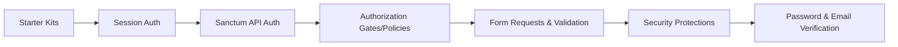

# Chapter 5: Authentication, Authorization & Security
> **Previous:** [Eloquent ORM, Database & Migrations](./04-eloquent-database) | **Next:** [Queues, Jobs, Notifications & Mail](./06-queues-notifications)

---

## Learning Objectives

- Implement session-based authentication and configure guards and providers for different user types
- Issue and validate API tokens using Laravel Sanctum for both SPA and mobile clients
- Define authorization logic using Gates and Policies with proper auto-discovery
- Build custom form requests with validation rules, after-validation hooks, and custom rule objects
- Apply Laravel's security protections against CSRF, XSS, SQL injection, and mass assignment
- Implement password management, email verification, and rate limiting in a production application
## Chapter at a Glance

| Section | Key Topics |
|---------|-----------|
| Starter Kits | Breeze, Jetstream, Bootcamp |
| Session Auth | Login flow, guards, providers, remember-me |
| API Auth | Sanctum tokens, SPA auth, abilities |
| Authorization | Gates, Policies, auto-discovery |
| Form Requests | Validation rules, after hooks, custom rules |
| Security | CSRF, XSS, SQL injection, rate limiting |
| Password Mgmt | Hashing, validation rules, reset flow |
| Email Verification | MustVerifyEmail, signed routes |

## Chapter Roadmap


---

## Theory

> **One-Sentence Takeaway:** Laravel provides comprehensive authentication and authorization tooling from starter kits to fine-grained policy control.

### Authentication Starter Kits

> **One-Sentence Takeaway:** Breeze offers minimal auth scaffolding while Jetstream adds teams, two-factor auth, and API token management.

Laravel provides several starter kits that scaffold a complete authentication system, saving hours of boilerplate.

#### Laravel Breeze

Breeze is the minimal, modern starter kit. It uses Blade with Alpine.js and Tailwind CSS, with an Inertia.js option.

```php
composer require laravel/breeze --dev

// Blade + Alpine + Tailwind
php artisan breeze:install blade

// With Inertia (Vue or React)
php artisan breeze:install inertia --vue
php artisan breeze:install inertia --react

// With Livewire (volt)
php artisan breeze:install livewire --dark

// API-only (no frontend)
php artisan breeze:install api

npm install && npm run dev
php artisan migrate
```

Breeze installs controllers, views, routes, and middleware for:

- Login (`/login`)
- Registration (`/register`)
- Password confirmation (`/user/confirm-password`)
- Password reset (`/forgot-password`, `/reset-password`)
- Email verification (`/verify-email`)
- Profile management (`/user/profile`)

#### Laravel Jetstream

Jetstream is a more feature-rich starter kit with teams, session management, two-factor authentication, and API support.

```php
composer require laravel/jetstream

php artisan jetstream:install livewire
php artisan jetstream:install inertia

npm install && npm run dev
php artisan migrate
```

Jetstream adds:

- Team management with role-based permissions
- Two-factor authentication via TOTP
- Browser sessions management
- API token management (Sanctum)

#### Laravel Bootcamp

The Bootcamp is not a starter kit but an interactive tutorial that walks through building a full application from scratch. It demonstrates the same app using both Blade and Inertia stacks.

#### Legacy: Laravel UI

`laravel/ui` is deprecated in Laravel 11+ but still available for Bootstrap-based scaffolding. It is not recommended for new projects.

### Session-Based Authentication

> **One-Sentence Takeaway:** Auth::attempt() with session regeneration prevents session fixation, and remember-me tokens provide persistent login across sessions.

#### Login Flow

```php
<?php

namespace App\Http\Controllers\Auth;

use Illuminate\Http\Request;
use Illuminate\Support\Facades\Auth;
use Illuminate\Validation\ValidationException;

class LoginController extends Controller
{
    public function store(Request $request)
    {
        $credentials = $request->validate([
            'email' => 'required|email',
            'password' => 'required|string',
        ]);

        // Attempt authentication
        if (! Auth::attempt($credentials, $request->boolean('remember'))) {
            throw ValidationException::withMessages([

> **Remember:** Always call `$request->session()->regenerate()` after successful login. This prevents session fixation attacks where an attacker forces a known session ID on a victim.
                'email' => __('auth.failed'),
            ]);
        }

        // Regenerate session to prevent session fixation
        $request->session()->regenerate();

        return redirect()->intended('/dashboard');
    }

    public function destroy(Request $request)
    {
        Auth::logout();

        $request->session()->invalidate();
        $request->session()->regenerateToken();

        return redirect('/');
    }
}
```

#### Remember-Me Token

When `Auth::attempt($credentials, true)` is called, Laravel generates a remember token (stored as `remember_token` on the user record) and sets an encrypted cookie. On subsequent visits, if the session is expired, Laravel uses this token to re-authenticate the user transparently.

The `remember_token` column must exist on the users table:

```php
Schema::table('users', function (Blueprint $table) {
    $table->rememberToken();
});
```

#### Authentication Guards

Guards define how users are authenticated for each request. Configured in `config/auth.php`:

```php
'guards' => [
    'web' => [
        'driver' => 'session',
        'provider' => 'users',
    ],

    'api' => [
        'driver' => 'sanctum',  // Changed from 'token' in modern Laravel
        'provider' => 'users',
    ],

    // Custom guard for admins
    'admin' => [
        'driver' => 'session',
        'provider' => 'admins',
    ],
],
```

#### Authentication Providers

Providers define how users are retrieved from storage:

```php
'providers' => [
    'users' => [
        'driver' => 'eloquent',
        'model' => App\Models\User::class,
    ],

    'admins' => [
        'driver' => 'eloquent',
        'model' => App\Models\Admin::class,
    ],
],
```

#### Custom Guard Usage

```php
// Using a specific guard
if (Auth::guard('admin')->attempt($credentials)) {
    // Admin authenticated
}

// Helper
auth()->guard('admin')->user();
```

### API Authentication with Sanctum

> **One-Sentence Takeaway:** Sanctum provides both token-based API auth for mobile/third-party clients and cookie-based SPA auth for first-party frontends.

Sanctum provides two authentication modes: token-based (for mobile/SPA) and cookie-based session (for first-party SPA).

#### Installation

```php
php artisan install:api
// Installs Sanctum, publishes config, creates API routes file
```

#### Token-Based Authentication

```php
use App\Models\User;
use Illuminate\Http\Request;
use Illuminate\Support\Facades\Hash;
use Illuminate\Validation\ValidationException;

// Issue token
Route::post('/sanctum/token', function (Request $request) {
    $request->validate([
        'email' => 'required|email',
        'password' => 'required',
        'device_name' => 'required|string',
    ]);

    $user = User::where('email', $request->email)->first();

    if (! $user || ! Hash::check($request->password, $user->password)) {
        throw ValidationException::withMessages([
            'email' => ['The provided credentials are incorrect.'],
        ]);
    }

    return $user->createToken($request->device_name)->plainTextToken;
});
```

#### Managing Tokens

```php
// Create a token with abilities
$token = $user->createToken('mobile-app', ['posts:read', 'posts:write']);

// Retrieve all user tokens
$tokens = $user->tokens();

// Current access token
$token = $request->user()->currentAccessToken();

// Check token abilities
if ($request->user()->tokenCan('posts:write')) {
    // Can write posts
}

// Delete tokens (revoke)
$user->tokens()->delete();          // Revoke all tokens
$user->tokens()->where('id', $id)->delete(); // Revoke specific

// Token expiry (Laravel 11+)
use Laravel\Sanctum\HasApiTokens;

class User extends Authenticatable
{
    use HasApiTokens;

    // Token expires in 7 days
    protected function expiresAt(): ?Carbon
    {
        return now()->addDays(7);
    }
}
```

#### Sanctum SPA Authentication

For SPAs on the same domain, Sanctum uses cookie-based session authentication.

```php
// config/sanctum.php
'stateful' => explode(',', env('SANCTUM_STATEFUL_DOMAINS', 'localhost,localhost:3000')),

// Frontend Axios setup
axios.defaults.withCredentials = true;
axios.defaults.baseURL = 'http://localhost:8000';

// CSRF cookie first
await axios.get('/sanctum/csrf-cookie');

// Then login
await axios.post('/login', {
    email: 'user@example.com',
    password: 'password',
});
```

#### Protecting API Routes

```php
// api.php - Token-authenticated
Route::middleware('auth:sanctum')->group(function () {
    Route::get('/user', fn (Request $r) => $r->user());
    Route::apiResource('posts', PostController::class);
});

// Check abilities on route
Route::post('/posts', function () {
    // ...
})->middleware(['auth:sanctum', 'abilities:posts:write']);

// Check ability in controller
public function store(Request $request)
{
    if (! $request->user()->tokenCan('posts:write')) {
        return response()->json(['message' => 'Forbidden'], 403);
    }
}
```

### Authorization

> **One-Sentence Takeaway:** Gates define simple closures for authorization checks, while Policies organize per-model authorization logic with auto-discovery.

#### Gates

Gates are closures that determine if a user can perform an action.

```php
<?php

namespace App\Providers;

use App\Models\Post;
use App\Models\User;
use Illuminate\Support\Facades\Gate;
use Illuminate\Support\ServiceProvider;

class AuthServiceProvider extends ServiceProvider
{
    public function boot(): void
    {
        // Define a gate
        Gate::define('update-post', function (User $user, Post $post) {
            return $user->id === $post->user_id;
        });

        // Gate with no model (admin check)
        Gate::define('admin', function (User $user) {
            return $user->is_admin;
        });

        // Gate using a callback class
        Gate::define('delete-post', [PostGate::class, 'delete']);

        // Resource gates (index, view, create, update, delete)
        Gate::resource('posts', PostGate::class);
    }
}
```

#### Using Gates

```php
// In controllers
if (Gate::allows('update-post', $post)) {
    // Update the post
}

if (Gate::denies('update-post', $post)) {
    abort(403);
}

// Gate::authorize throws AuthorizationException (returns 403)
Gate::authorize('update-post', $post);

// For non-user contexts (guests)
if (Gate::allows('admin')) { }
if (Gate::check('admin', $post)) { }

// Any / none / all
Gate::any(['update-post', 'delete-post'], $post);
Gate::none(['update-post', 'delete-post'], $post);

// Before hooks (run before any gate check)
Gate::before(function (User $user, string $ability) {
    if ($user->is_super_admin) return true;
});

// After hooks
Gate::after(function (User $user, string $ability, bool|null $result, mixed $arguments) {
    Log::info("Gate check: {$ability} - " . ($result ? 'allowed' : 'denied'));
});
```

#### Policies

Policies are classes that organize authorization logic around a specific model or resource.

```php
php artisan make:policy PostPolicy
php artisan make:policy PostPolicy --model=Post // Auto-generates CRUD methods

> **Pro Tip:** Use `php artisan make:policy PostPolicy --model=Post` to auto-generate CRUD policy methods (viewAny, view, create, update, delete, restore, forceDelete) — this saves significant boilerplate.
```

```php
<?php

namespace App\Policies;

use App\Models\Post;
use App\Models\User;

class PostPolicy
{
    // Optional: before hook takes priority over all methods
    public function before(User $user, string $ability): bool|null
    {
        if ($user->is_super_admin) return true;
        return null; // Null passes control to the specific method
    }

    public function viewAny(User $user): bool
    {
        return true; // Anyone can view the list
    }

    public function view(User $user, Post $post): bool
    {
        return $user->id === $post->user_id || $post->status === 'published';
    }

    public function create(User $user): bool
    {
        return $user->hasVerifiedEmail();
    }

    public function update(User $user, Post $post): bool
    {
        return $user->id === $post->user_id;
    }

    public function delete(User $user, Post $post): bool
    {
        return $user->id === $post->user_id && $post->comments()->count() === 0;
    }

    public function restore(User $user, Post $post): bool
    {
        return $user->id === $post->user_id;
    }

    public function forceDelete(User $user, Post $post): bool
    {
        return $user->is_admin;
    }
}
```

#### Policy Auto-Discovery

Laravel auto-discovers policies when the model and policy follow naming conventions:

| Model | Policy |
|-------|--------|
| `App\Models\Post` | `App\Policies\PostPolicy` |
| `App\Models\User` | `App\Policies\UserPolicy` |

Auto-discovery is configured in `AuthServiceProvider`:

```php
protected $policies = [
    Post::class => PostPolicy::class, // Explicit registration (optional)
];
```

Disable auto-discovery in `AppServiceProvider`:

```php
Gate::guessPolicyNamesUsing(function (string $modelClass) {
    // Return custom policy class name
    return str_replace('Models', 'Policies', $modelClass) . 'Policy';
});
```

#### Authorizing Actions

```php
// Via the User model
$user->can('update', $post);
$user->cannot('delete', $post);

// Via Gate facade
Gate::authorize('update', $post); // Throws AuthorizationException on failure

// Via the controller helper
$this->authorize('update', $post);

// Authorize resource controller
$this->authorizeResource(Post::class, 'post');

// Via middleware
Route::put('/posts/{post}', function (Post $post) {
    // ...
})->middleware('can:update,post');
```

### Blade Authorization

```blade
{{-- @can / @cannot --}}
@can('update', $post)
    <a href="{{ route('posts.edit', $post) }}">Edit</a>
@endcan

@cannot('update', $post)
    <span>Read-only</span>
@endcannot

{{-- @canany (any of the abilities) --}}
@canany(['update', 'delete'], $post)
    <div class="actions">...</div>
@endcanany

{{-- @else --}}
@can('update', $post)
    <a href="#">Edit</a>
@elsecan('delete', $post)
    <a href="#">Delete</a>
@else
    <span>No actions available</span>
@endcan

{{-- With Spatie/laravel-permission (third-party) --}}
@role('admin')
    <span>Admin panel</span>
@endrole

@unlessrole('subscriber')
    <span>Upgrade your plan</span>
@endunlessrole
```

### Form Requests & Validation

> **One-Sentence Takeaway:** Form requests encapsulate validation and authorization into single classes with after-validation hooks and custom rule objects.

#### Creating Form Requests

```php
php artisan make:request StorePostRequest
php artisan make:request UpdatePostRequest
```

```php
<?php

namespace App\Http\Requests;

use App\Models\Post;
use Illuminate\Foundation\Http\FormRequest;
use Illuminate\Validation\Rule;

class StorePostRequest extends FormRequest
{
    // Authorization check within the form request
    public function authorize(): bool
    {
        // Gate check
        return $this->user()->can('create', Post::class);

        // Or simple boolean
        // return true;
    }

    // Validation rules
    public function rules(): array
    {
        return [
            'title' => [
                'required',
                'string',
                'max:255',
                Rule::unique('posts')->where(fn ($q) => $q->where('user_id', $this->user()->id)),
            ],
            'content' => 'required|string|min:100',
            'status' => ['required', Rule::in(['draft', 'published', 'archived'])],
            'category_id' => ['required', Rule::exists('categories', 'id')],
            'tags' => 'nullable|array',
            'tags.*' => 'exists:tags,id',
            'publish_at' => 'nullable|date|after:today',
        ];
    }

    // Custom error messages
    public function messages(): array
    {
        return [
            'title.unique' => 'You already have a post with this title.',
            'content.min' => 'Your post must be at least 100 characters.',
        ];
    }

    // Custom attribute names for error messages
    public function attributes(): array
    {
        return [
            'category_id' => 'category',
            'publish_at' => 'publish date',
        ];
    }

    // Prepare input before validation
    protected function prepareForValidation(): void
    {
        $this->merge([
            'slug' => str($this->title)->slug(),
        ]);
    }

    // After validation hook (Laravel 11+)
    public function after(): array
    {
        return [
            function ($validator) {
                // Business logic validation
                if ($this->user()->posts()->count() >= 10) {
                    $validator->errors()->add(
                        'title',
                        'You have reached the maximum number of posts.'
                    );
                }
            },
        ];
    }
}
```

#### Using Form Requests

```php
// Controller
use App\Http\Requests\StorePostRequest;

public function store(StorePostRequest $request)
{
    // Already validated and authorized
    $post = Post::create($request->validated());

    // Access validated-only data
    $validated = $request->safe()->only(['title', 'content', 'status']);
    $allValidated = $request->safe()->all();

    return redirect()->route('posts.show', $post);
}
```

#### Custom Validation Rules

```php
php artisan make:rule Uppercase
```

```php
<?php

namespace App\Rules;

use Closure;
use Illuminate\Contracts\Validation\ValidationRule;

class Uppercase implements ValidationRule
{
    // Laravel 10+ interface
    public function validate(string $attribute, mixed $value, Closure $fail): void
    {
        if (strtoupper($value) !== $value) {
            $fail('The :attribute must be uppercase.');
        }
    }
}

// Usage
'code' => ['required', new Uppercase, 'string', 'max:10'];
```

#### Common Rule Objects

```php
use Illuminate\Validation\Rule;

// Unique (with ignored ID for updates)
$rules = [
    'email' => [
        'required',
        'email',
        Rule::unique('users', 'email')->ignore($user->id)->where(fn ($q) => $q->whereNull('deleted_at')),
    ],

    // Exists
    'category_id' => [
        'required',
        Rule::exists('categories', 'id')->where('active', true),
    ],

    // In / NotIn
    'status' => Rule::in(['draft', 'published', 'archived']),
    'excluded' => Rule::notIn([1, 2, 3]),

    // RequiredIf / RequiredUnless / RequiredWith / RequiredWithout
    'discount' => Rule::requiredIf(fn () => $this->input('coupon') !== null),
];

// Conditional validation (after construction)
$validator = Validator::make($request->all(), [
    'email' => 'required|email',
]);

$validator->sometimes('reason', 'required|max:500', function ($input) {
    return $input->status === 'rejected';
});
```

#### Validation Error Messages

```php
// Customizing error messages per rule
$request->validate([
    'email' => 'required|email',
], [
    'email.required' => 'We need your email address.',
    'email.email' => 'That does not look like a valid email.',
]);

// Or with form request
public function messages(): array
{
    return [
        'email.required' => 'We need your email address.',
        'email.email' => 'That does not look like a valid email.',
        'tags.*.exists' => 'One or more selected tags do not exist.',
    ];
}
```

### Security

> **One-Sentence Takeaway:** Laravel provides automatic CSRF protection, Blade XSS escaping, parameter-bound SQL queries, and fillable/guarded mass-assignment protection.


#### CSRF Protection

Cross-Site Request Forgery (CSRF) attacks trick authenticated users into executing unwanted actions. Laravel automatically protects every `POST`, `PUT`, `PATCH`, and `DELETE` request with a CSRF token.

```blade
{{-- In every form --}}
<form method="POST" action="/posts">
    @csrf
    <input name="title">
</form>

{{-- For SPA Axios requests --}}
<meta name="csrf-token" content="{{ csrf_token() }}">

<script>
    axios.defaults.headers.common['X-CSRF-TOKEN'] = document.querySelector('meta[name="csrf-token"]').content;
</script>
```

The `VerifyCsrfToken` middleware (now `PreventRequestForgery` in recent Laravel versions) automatically checks the token:

```php
<?php

namespace App\Http\Middleware;

use Illuminate\Foundation\Http\Middleware\PreventRequestsDuringMaintenance;

// Excluding URIs from CSRF protection
class PreventRequestForgery extends Middleware
{
    protected $except = [
        'stripe/*',      // Webhooks (Stripe sends POST without token)
        'api/webhook',
    ];
}
```

#### XSS Prevention

Blade's `{{ }}` syntax automatically escapes output using PHP's `htmlspecialchars`:

```blade
{{-- Safe: All HTML/JS is escaped --}}
{{ $user->bio }}

{{-- DANGEROUS: Raw output -- no escaping --}}
{!! $user->bio !!}

{{-- Only use {!! !!} with trusted content (e.g., Markdown-parsed HTML) --}}
```

Additional XSS prevention patterns:

```php
// Filter input
$clean = strip_tags($request->input('content'), '<p><br><strong><em><a>');

// Or use HTML purifier (spatie/htmlpurifier)
$clean = htmlpurifier($request->input('content'));

// Content-Security-Policy header
public function boot(): void
{
    HeaderPolicy::define('Content-Security-Policy', "default-src 'self'; script-src 'self'");
}
```

#### SQL Injection Prevention

Eloquent's parameter binding prevents SQL injection. Always use the query builder or Eloquent instead of raw queries:

```php
// SAFE: Eloquent
$users = User::where('email', $request->email)->get();

// SAFE: Query builder (parameter binding)
$users = DB::table('users')->where('email', $request->email)->get();

// DANGEROUS: Raw string interpolation
DB::select("SELECT * FROM users WHERE email = '{$request->email}'")

> **Warning:** Never interpolate user input directly into SQL strings. Always use Eloquent, the query builder, or parameterized raw queries. String interpolation is the most common cause of SQL injection vulnerabilities.;

// CONDITIONALLY SAFE: Raw with parameter binding
DB::select('SELECT * FROM users WHERE email = ?', [$request->email]);

// CONDITIONALLY SAFE: whereRaw with binding
User::whereRaw('email = ?', [$request->email])->get();
```

#### Rate Limiting

```php
use Illuminate\Cache\RateLimiting\Limit;
use Illuminate\Http\Request;
use Illuminate\Support\Facades\RateLimiter;

// Define in AppServiceProvider
protected function configureRateLimiting(): void
{
    // API rate limit: 60 requests per minute per user
    RateLimiter::for('api', function (Request $request) {
        return Limit::perMinute(60)->by($request->user()?->id ?: $request->ip());
    });

    // Login rate limit: 5 attempts per minute per IP
    RateLimiter::for('login', function (Request $request) {
        return Limit::perMinute(5)
            ->by($request->input('email') . '|' . $request->ip())
            ->response(function () {
                return response()->json(['message' => 'Too many login attempts.'], 429);
            });
    });

    // Global rate limit
    RateLimiter::for('global', function (Request $request) {
        return Limit::none(); // No limit
    });
}

// Applying to routes
Route::middleware('throttle:api')->group(function () {
    Route::get('/user', ...);
});

Route::middleware('throttle:login')->post('/login', ...);

// Dynamic rate limits
RateLimiter::for('uploads', function (Request $request) {
    return $request->user()->isPremium()
        ? Limit::perHour(100)
        : Limit::perHour(10);
});
```

### Password Management

#### Hashing

```php
use Illuminate\Support\Facades\Hash;

// Hashing a password
$hashed = Hash::make('plain-text-password');

// Using bcrypt helper
$hashed = bcrypt('plain-text-password');

// Verifying against a hash
if (Hash::check('plain-text-password', $hashed)) {
    // Password matches
}

// Checking if rehash is needed
if (Hash::needsRehash($hashed)) {
    $hashed = Hash::make('plain-text-password');
}
```

#### Password Validation Rules

```php
use Illuminate\Validation\Rules\Password;

$request->validate([
    'password' => [
        'required',
        'confirmed', // Must have password_confirmation field
        Password::min(8)
            ->letters()
            ->mixedCase()
            ->numbers()
            ->symbols()
            ->uncompromised(), // Check against known data breaches (haveibeenpwned)
    ],

    // Default password rule (configurable)
    'password' => Password::defaults(),
]);

// Configure defaults in a service provider
public function boot(): void
{
    Password::defaults(function () {
        $rule = Password::min(8);

        return $this->app->isProduction()
            ? $rule->mixedCase()->uncompromised()
            : $rule;
    });
}
```

#### Password Confirmation

Laravel's `password.confirm` middleware prompts users to re-enter their password before accessing sensitive areas:

```php
Route::get('/settings/billing', function () {
    // ...
})->middleware(['auth', 'password.confirm']);
```

#### Password Reset Flow

Laravel provides a complete password reset flow out of the box with Breeze or Jetstream:

```php
use Illuminate\Support\Facades\Password;

// Send reset link
$status = Password::sendResetLink(
    $request->only('email')
);

// Handle response
return $status === Password::RESET_LINK_SENT
    ? back()->with(['status' => __($status)])
    : back()->withErrors(['email' => __($status)]);

// Reset password (via controller)
$status = Password::reset(
    $request->only('email', 'password', 'password_confirmation', 'token'),
    function (User $user, string $password) {
        $user->forceFill([
            'password' => Hash::make($password),
        ])->setRememberToken(Str::random(60));

        $user->save();

        event(new PasswordReset($user));
    }
);
```

### Email Verification

#### MustVerifyEmail Interface

```php
<?php

namespace App\Models;

use Illuminate\Contracts\Auth\MustVerifyEmail;
use Illuminate\Foundation\Auth\User as Authenticatable;
use Illuminate\Notifications\Notifiable;

class User extends Authenticatable implements MustVerifyEmail
{
    use Notifiable;

    // The trait provides:
    // - hasVerifiedEmail()
    // - markEmailAsVerified()
    // - sendEmailVerificationNotification()
}
```

#### Verification Routes

```php
// Breeze/Jetstream registers these automatically:

// GET /email/verify - Show verification notice
// GET /email/verify/{id}/{hash} - Verify email (signed route)
// POST /email/verification-notification - Resend verification link
```

#### Protecting Routes

```php
// Via middleware
Route::get('/dashboard', function () {
    // Only accessible to verified users
})->middleware(['auth', 'verified']);

// With redirect customization
Route::get('/dashboard', function () {
    // ...
})->middleware(['auth', 'verified:admin.verification.notice']);
```

#### Signed Routes

Email verification URLs use signed routes to prevent tampering:

```php
use Illuminate\Support\Facades\URL;

// Generate a signed URL
$url = URL::signedRoute('verification.verify', [
    'id' => $user->id,
    'hash' => sha1($user->getEmailForVerification()),
]);

// Temporary signed URL (expires in 30 minutes)
$url = URL::temporarySignedRoute(
    'verification.verify',
    now()->addMinutes(30),
    ['id' => $user->id, 'hash' => sha1($user->getEmailForVerification())]
);

// Verify signed request
Route::get('/email/verify/{id}/{hash}', function (Request $request) {
    if (! $request->hasValidSignature()) {
        abort(401);
    }

    // ...
})->name('verification.verify');
```

---


## Concept Comparison

| Feature | Gates | Policies |
|---------|-------|----------|
| Scope | General abilities (view, admin) | Per-model CRUD operations |
| Definition | Closure in AuthServiceProvider | Class with method per ability |
| Auto-Discovery | Manual registration | Automatic by naming convention |
| Organization | Grouped by ability | Grouped by model |
| Complexity | Simple checks | Complex, multi-ability logic |
| Best For | Admin checks, feature flags | Model resource authorization |

## Quick Reference — Auth Middleware

| Middleware | Purpose |
|-----------|---------|
| `auth` | Require authenticated user |
| `guest` | Only unauthenticated users |
| `verified` | Require email verification |
| `password.confirm` | Re-prompt password confirmation |
| `can:update,post` | Authorize via policy or gate |
| `throttle:api` | Apply rate limiting |
| `auth:sanctum` | Sanctum API token auth |

## Cross-Application Matrix

| Concept | Blog | E-Commerce | SaaS Admin |
|---------|------|-----------|-----------|
| Auth Guard | web (session) | web + sanctum | web + sanctum + admin |
| Policy | PostPolicy (owner-only edit) | OrderPolicy (buyer/viewer) | TeamPolicy (role-based) |
| Gates | Moderate comments | Approve refunds | Manage billing |
| Rate Limit | Login 5/min | Checkout 3/min | API 100/min |
| 2FA | Optional | Required for payouts | Required for admins |

## Chapter Quiz

**1. Which trait must a User model use for Sanctum API token authentication?**
- a) HasApiTokens
- b) MustVerifyEmail
- c) Notifiable
- d) SoftDeletes

**2. What is the purpose of $request->session()->regenerate() after login?**
- a) Log out old sessions
- b) Prevent session fixation attacks
- c) Speed up the login process
- d) Encrypt session data

**3. How does Policy auto-discovery work?**
- a) By scanning the app directory
- b) Convention: App\Models\Post \u2192 App\Policies\PostPolicy
- c) By listing policies in a config file
- d) By implementing an interface

**4. Which Blade syntax automatically escapes output to prevent XSS?**
- a) `{!! !!}`
- b) `{{ }}`
- c) `@raw`
- d) `@escape`

**Answers: 1-a, 2-b, 3-b, 4-b**

## Summary

- Laravel's authentication starter kits (Breeze, Jetstream) scaffold complete auth systems; Breeze is minimal while Jetstream adds teams and two-factor auth
- Session-based authentication uses `Auth::attempt()`, session regeneration on login, and remember-me tokens for persistent sessions
- Sanctum provides both token-based API authentication (mobile/third-party) and cookie-based SPA authentication with CSRF protection
- Gates define simple authorization closures; Policies organize authorization logic per model with auto-discovery
- Form requests encapsulate validation and authorization into single classes with `rules()`, `authorize()`, and `after()` hooks
- Laravel protects against CSRF (automatic tokens in forms), XSS (Blade auto-escaping), SQL injection (parameter binding), and mass assignment (`fillable`/`guarded`)
- Rate limiting via `RateLimiter::for()` and the `throttle` middleware prevents brute force and abuse
- Password hashing uses bcrypt; password validation rules support mixed case, symbols, and breach checking via `uncompromised()`
- Email verification through `MustVerifyEmail` and signed routes ensures user identities are confirmed before accessing sensitive features

---

## Exercises

### Review Questions

1. What is the difference between Laravel Breeze and Laravel Jetstream? When would you choose one over the other?

2. Explain how Sanctum's SPA authentication differs from its token-based API authentication. What role does the `sanctum/csrf-cookie` endpoint play?

3. How does Laravel's session regeneration in `Auth::attempt()` protect against session fixation attacks?

4. Compare Gates and Policies. When is it appropriate to use a Gate instead of a Policy, and how does auto-discovery work for policies?

5. What are the five primary security protections Laravel provides out of the box? Give a concrete example of each.

### Application Problems

1. **Custom Form Request with Conditional Validation**

   Create a `StoreInvoiceRequest` that authorizes only users with the `billing` role, validates the invoice total (required, numeric, min:0), line items (required array, min 1 item), each line item requires a `product_id` (exists in products) and `quantity` (integer, min:1), and applies an after-validation hook that checks if the user's account balance covers the total, adding a custom error if insufficient.

2. **Policy for a Multi-Tenant Application**

   Write a `ProjectPolicy` for a multi-tenant application where:
   - A user can view any project within their team
   - A user can update a project only if they own it
   - A user can delete a project only if they own it AND the project has no tasks
   - Admins can bypass all checks via a `before` hook
   - Register the policy and demonstrate usage in a controller

3. **Sanctum Token with Abilities**

   Implement an API token system with Sanctum for a reading app. Define three token abilities: `books:read`, `books:write`, and `books:delete`. Create a login endpoint that issues a token with `books:read` and `books:write`. Create a middleware-protected route for deleting books that requires `books:delete`. Show how to revoke all tokens for a user when they change their password.

### Challenge Problem

**Build a Complete Auth + Authorization System for a Blog**

Design a full blog authentication and authorization system that includes:

- A custom form request `StorePostRequest` with: title uniqueness scoped to the user, a slug auto-generated via `prepareForValidation`, a minimum content length of 500 characters for published posts (conditional rule), and an after hook that prevents publishing more than 5 posts per day
- A `PostPolicy` with: `update` requiring ownership, `delete` requiring ownership and no comments, a `publish` ability that checks email verification + admin approval
- Rate limiting configuration: login (5 attempts/minute), API (100 requests/minute for authenticated, 20 for guests), and a custom `publishing` limiter (3 posts/hr per user)
- Sanctum integration for the blogging API: issue tokens with `posts:read` and `posts:write` abilities, a separate `posts:publish` ability for the publish action, and SPA-based auth for the frontend dashboard
- Email verification enforced for all write operations, password confirmation for the publish action
- Blade directives throughout the frontend checking `@can('update', $post)` and `@can('publish', $post)`

