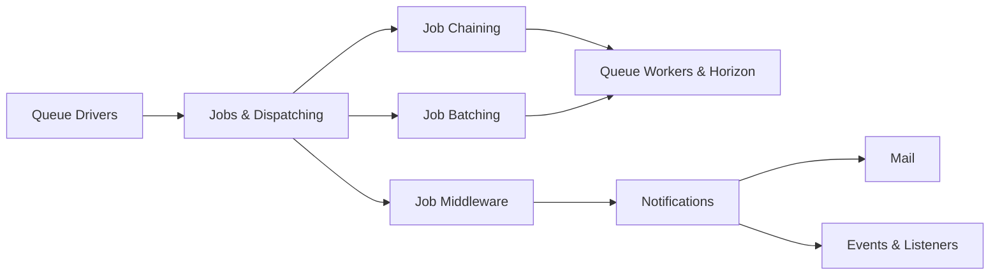

# Chapter 6: Queues, Jobs, Notifications & Mail
> **Previous:** [Authentication, Authorization & Security](./05-auth-security) | **Next:** [API Development & Integration](./07-api-development)

---

## Learning Objectives

- Configure and switch between queue drivers for different environments and scaling needs
- Create and dispatch jobs with chaining, batching, and unique locking
- Control queue worker behavior using PHP attributes and middleware
- Monitor queue performance using Laravel Horizon
- Build multi-channel notifications with mail, database, broadcast, and Slack delivery
- Design event-driven architectures with queued listeners and subscribers

<!-- Image Gallery -->
<section class="lesson-visuals" aria-label="Visual learning resources">
  <header><span>VISUAL LEARNING</span><h2>See it. Review it. Remember it.</h2></header>
  <a class="lesson-visual-card" href="../../../assets/images/lessons/laravel/06-queues-notifications/handwritten-notes.svg" target="_blank" rel="noopener">
    
    <span><strong>Handwritten notes</strong>Condensed notes for deliberate review.</span>
  </a>
  <a class="lesson-visual-card" href="../../../assets/images/lessons/laravel/06-queues-notifications/sticky-notes.svg" target="_blank" rel="noopener">
    
    <span><strong>Sticky-note revision</strong>Fast recall prompts for revision.</span>
  </a>
  <a class="lesson-visual-card" href="../../../assets/images/lessons/laravel/06-queues-notifications/visual-explanation.svg" target="_blank" rel="noopener">
    
    <span><strong>Visual concept guide</strong>A connected explanation of the key ideas.</span>
  </a>
</section>
<!-- End Image Gallery -->

## Chapter at a Glance

| Section | Key Topics |
|---------|-----------|
| Queue Drivers | sync, database, redis, sqs, beanstalkd |
| Jobs | Creating, dispatching, chaining, batching |
| Job Configuration | PHP attributes, middleware, unique jobs |
| Queue Workers | Horizon, supervisor, balancing |
| Notifications | Multi-channel delivery, via() method |
| Mail | Mailables, markdown templates, attachments |
| Events & Listeners | Event system, queued listeners, subscribers |

## Chapter Roadmap


---

## Theory

> **One-Sentence Takeaway:** Laravel's queue system provides a unified API across multiple backends, enabling asynchronous job processing at any scale.


### Queue Drivers


> **One-Sentence Takeaway:** Queue drivers abstract job processing across backends from sync (testing) through redis (production) to sqs (AWS-native scaling).

Laravel's queue system provides a unified API across multiple backends. The `QUEUE_CONNECTION` environment variable selects the active driver.

#### Configuration

```php
// config/queue.php

'default' => env('QUEUE_CONNECTION', 'sync'),

'connections' => [
    'sync' => [
        'driver' => 'sync',
        // Processes jobs synchronously in the same request.
        // Useful for testing; zero configuration.
    ],

    'database' => [
        'driver' => 'database',
        'table' => 'jobs',
        'queue' => 'default',
        'retry_after' => 90,
        // Uses the database as a queue backend.
        // Good for small apps without Redis.
    ],

    'redis' => [
        'driver' => 'redis',
        'connection' => 'default',
        'queue' => 'default',
        'retry_after' => 90,
        'block_for' => null,
        // Fast, production-ready. Works with Horizon.
    ],

    'sqs' => [
        'driver' => 'sqs',
        'key' => env('AWS_ACCESS_KEY_ID'),
        'secret' => env('AWS_SECRET_ACCESS_KEY'),
        'prefix' => env('SQS_PREFIX', 'https://sqs.us-east-1.amazonaws.com/your-account'),
        'queue' => env('SQS_QUEUE', 'default'),
        'suffix' => env('SQS_SUFFIX'),
        'region' => env('AWS_DEFAULT_REGION', 'us-east-1'),
        // Fully managed queue service on AWS.
    ],

    'beanstalkd' => [
        'driver' => 'beanstalkd',
        'host' => 'localhost',
        'queue' => 'default',
        'retry_after' => 90,
        // Legacy driver. Prefer Redis or SQS.
    ],
],
```

#### Database Queue Setup

```php
php artisan queue:table
php artisan migrate

// Creates a `jobs` table with:
// - id (bigIncrements)
// - queue (string)
// - payload (text - serialized job)
// - attempts (tinyInteger)
// - reserved_at (nullable timestamp)
// - available_at (timestamp)
// - created_at (timestamp)
```

### Jobs


> **One-Sentence Takeaway:** Jobs encapsulate discrete tasks that can be dispatched immediately, with delay, chained sequentially, or batched for parallel execution.

Jobs encapsulate tasks you want to run outside the current request lifecycle.

#### Creating a Job

```php
php artisan make:job ProcessPodcast
```

```php
<?php

namespace App\Jobs;

use App\Models\Podcast;
use App\Models\User;
use App\Notifications\PodcastProcessed;
use Illuminate\Contracts\Queue\ShouldQueue;
use Illuminate\Foundation\Bus\Dispatchable;
use Illuminate\Queue\InteractsWithQueue;
use Illuminate\Queue\SerializesModels;

class ProcessPodcast implements ShouldQueue
{
    use Dispatchable, InteractsWithQueue, SerializesModels;

    // Eloquent models are serialized and re-retrieved from the DB
    public function __construct(
        public Podcast $podcast,
        public User $user
    ) {}

    public function handle(): void
    {
        // Process the podcast (transcoding, metadata extraction, etc.)
        $this->podcast->update([
            'status' => 'processing',
        ]);

        // Simulate processing
        $duration = $this->transcode($this->podcast->file_path);

        $this->podcast->update([
            'status' => 'processed',
            'duration' => $duration,
        ]);

        // Notify the user
        $this->user->notify(new PodcastProcessed($this->podcast));
    }

    protected function transcode(string $path): int
    {
        // Actual transcoding logic
        return 1800; // Duration in seconds
    }
}
```

#### Dispatching Jobs

```php
// Using the dispatch helper
dispatch(new ProcessPodcast($podcast, $user));

// Conditional dispatching
dispatch_if($podcast->needsProcessing(), new ProcessPodcast($podcast, $user));
dispatch_unless($podcast->isProcessed(), new ProcessPodcast($podcast, $user));

// Using the Dispatchable trait's static method
ProcessPodcast::dispatch($podcast, $user);

// Dispatch after the response is sent to the browser
ProcessPodcast::dispatchAfterResponse($podcast, $user);

// Synchronous dispatch (bypass queue)
ProcessPodcast::dispatchSync($podcast, $user);

// Delayed dispatch (Laravel 10+)
ProcessPodcast::dispatch($podcast, $user)->delay(now()->addMinutes(10));

// Dispatch on a specific queue
ProcessPodcast::dispatch($podcast, $user)->onQueue('processing');

// Dispatch to a specific connection
ProcessPodcast::dispatch($podcast, $user)->onConnection('sqs');

// Dispatch with a custom ID for unique jobs (Laravel 11+)
ProcessPodcast::dispatch($podcast, $user)->withJobId("podcast-{$podcast->id}");
```

#### Job Chaining

Chaining runs jobs sequentially; if one fails, subsequent jobs do not run.

```php
// Chain using the Bus facade
use Illuminate\Support\Facades\Bus;

Bus::chain([
    new ProcessPodcast($podcast, $user),
    new OptimizePodcast($podcast),
    new NotifySubscribers($podcast),
])->catch(function (Throwable $e) {
    // Handle failure of any job in the chain
    Log::error('Podcast processing chain failed', [
        'podcast_id' => $podcast->id,
        'error' => $e->getMessage(),
    ]);
})->dispatch();

// Chain with onConnection and onQueue
Bus::chain([
    new ProcessPodcast($podcast, $user),
    new OptimizePodcast($podcast),
])->onConnection('redis')->onQueue('processing')->dispatch();
```

#### Job Batching

Batching allows you to execute a group of jobs in parallel and track progress.

```php
use Illuminate\Bus\Batch;
use Illuminate\Support\Facades\Bus;

$batch = Bus::batch([
    new ProcessPodcast($podcast1, $user),
    new ProcessPodcast($podcast2, $user),
    new ProcessPodcast($podcast3, $user),
])->then(function (Batch $batch) {
    // All jobs completed successfully
    Log::info('Batch completed: ' . $batch->id);
})->catch(function (Batch $batch, Throwable $e) {
    // First job failure detected
    Log::error('Batch failed: ' . $e->getMessage());
})->finally(function (Batch $batch) {
    // Always runs (success or failure)
    Cache::forget('processing_batches');
})->dispatch();

// Tracking batch progress
$batchId = $batch->id;

// In a controller
$batch = Bus::findBatch($batchId);
return response()->json([
    'progress' => $batch->progress(),
    'total' => $batch->totalJobs,
    'pending' => $batch->pendingJobs,
    'failed' => $batch->failedJobs,
]);

// Batch with conditions
Bus::batch([
    // Dynamic batch size
    ...collect($videos)->map(fn ($video) => new TranscodeVideo($video)),
])->name('transcode-batch')->dispatch();

// Batch with queue
Bus::batch([...])
    ->onConnection('redis')
    ->onQueue('transcoding')
    ->dispatch();
```

#### Batch Table

```php
php artisan queue:batches-table
php artisan migrate

// Creates job_batches table with:
// - id (string - UUID)
// - name (string)
// - total_jobs (int)
// - pending_jobs (int)
// - failed_jobs (int)
// - failed_job_ids (text - JSON array)
// - options (text - JSON)
// - cancelled_at (nullable timestamp)
// - created_at (timestamp)
// - finished_at (nullable timestamp)
```

#### Unique Jobs

Unique jobs prevent a job from being dispatched if another instance exists on the queue with the same unique key.

```php
<?php

namespace App\Jobs;

use Illuminate\Contracts\Queue\ShouldBeUnique;
use Illuminate\Contracts\Queue\ShouldQueue;
use Illuminate\Foundation\Bus\Dispatchable;
use Illuminate\Queue\InteractsWithQueue;

class ProcessPodcast implements ShouldQueue, ShouldBeUnique
{
    use Dispatchable, InteractsWithQueue;

    // Default: keep unique for 60 seconds
    public $uniqueFor = 120;

    public function __construct(
        public Podcast $podcast,
        public string $action
    ) {}

    // Define the unique key
    public function uniqueId(): string

> **Pro Tip:** Always implement `ShouldBeUnique` for jobs that process the same resource (e.g., transcoding a video, generating a report). Without it, duplicate jobs can flood the queue and waste processing capacity.
    {
        return $this->podcast->id . '-' . $this->action;
    }

    public function handle(): void
    {
        // Only one instance of this job per uniqueId can exist
    }

    // Handle duplicate attempts
    public function uniqueVia(): \Illuminate\Support\Testing\Fakes\QueueFake
    {
        return Cache::driver('redis'); // Use Redis for uniqueness lock
    }
}
```

#### Job Middleware

```php
<?php

namespace App\Jobs\Middleware;

use Illuminate\Support\Facades\Redis;

class RateLimited
{
    public function handle(object $job, \Closure $next): void
    {
        Redis::throttle('key')
            ->block(0)->allow(10)->every(60)
            ->then(function () use ($job, $next) {
                $next($job);
            }, function () use ($job) {
                $job->release(10); // Release back after 10 seconds
            });
    }
}

// Apply middleware in the job
class ProcessPodcast implements ShouldQueue
{
    public function middleware(): array
    {
        return [
            new RateLimited,
            // Built-in middleware:
            new \Illuminate\Queue\Middleware\WithoutOverlapping($this->podcast->id),
            // Prevent overlaps - release after 5 seconds
            new \Illuminate\Queue\Middleware\WithoutOverlapping($this->podcast->id, 5),
            // Throttle exceptions
            new \Illuminate\Queue\Middleware\ThrottlesExceptions(10, 5),
        ];
    }
}
```

#### Rate-Limited Jobs

Beyond middleware, Laravel provides first-class rate limiting for jobs:

```php
// config/queue.php
'rate_limit' => [
    'api' => 100, // 100 jobs per minute
    'email' => 10,
],

// In AppServiceProvider
use Illuminate\Cache\RateLimiting\Limit;
use Illuminate\Support\Facades\RateLimiter;

RateLimiter::for('email', function (object $job) {
    return Limit::perMinute(10)
        ->by(get_class($job)); // Per-job class
});
```

#### Job Events

```php
use Illuminate\Support\Facades\Queue;

// Registered in AppServiceProvider
public function boot(): void
{
    Queue::before(function (\Illuminate\Queue\Events\JobProcessing $event) {
        Log::info('Processing job: ' . $event->job->payload()['displayName']);
    });

    Queue::after(function (\Illuminate\Queue\Events\JobProcessed $event) {
        Log::info('Job processed: ' . $event->job->getJobId());
    });

    Queue::failing(function (\Illuminate\Queue\Events\JobFailed $event) {
        Log::error('Job failed: ' . $event->job->payload()['displayName'], [
            'exception' => $event->exception->getMessage(),
        ]);

        Notification::route('slack', config('services.slack.job_webhook'))
            ->notify(new JobFailedNotification($event));
    });

    Queue::looping(function () {
        // Runs before the worker fetches the next job
        if (Cache::has('maintenance_mode')) {
            die('Maintenance mode active');
        }
    });
}
```

### Queue Routing (Laravel 13)


Laravel 13 introduced centralized queue routing via the `Queue::route()` method, allowing you to define which queue and connection each job class should use, instead of scattering `onQueue`, `onConnection` calls across the codebase.

```php
<?php

namespace App\Providers;

use App\Jobs\ProcessPodcast;
use App\Jobs\SendWelcomeEmail;
use App\Jobs\GenerateReport;
use Illuminate\Queue\QueueManager;
use Illuminate\Support\ServiceProvider;

class AppServiceProvider extends ServiceProvider
{
    public function boot(): void
    {
        Queue::route(function (QueueManager $router) {
            // Route by job class
            $router->route(ProcessPodcast::class, 'processing', 'redis');
            $router->route(SendWelcomeEmail::class, 'email', 'sqs');
            $router->route(GenerateReport::class, 'reports', 'redis');
        });

        // Or use class-based routing with route patterns
        Queue::route(function (QueueManager $router) {
            // All jobs matching a pattern can be routed
            $router->route('/^.*Report$/', 'reports', 'redis');
        });
    }
}
```

This approach centralizes queue topology decisions, making it trivial to re-route jobs without touching individual job classes or dispatch sites.

### PHP Attributes for Jobs


Laravel 11+ supports using PHP 8 attributes directly on job classes to replace traditional `$tries`, `$backoff`, and `$timeout` properties.

```php
<?php

namespace App\Jobs;

use Illuminate\Contracts\Queue\ShouldQueue;
use Illuminate\Foundation\Bus\Dispatchable;
use Illuminate\Queue\Attributes\Backoff;
use Illuminate\Queue\Attributes\FailOnTimeout;
use Illuminate\Queue\Attributes\Timeout;
use Illuminate\Queue\Attributes\Tries;
use Illuminate\Queue\InteractsWithQueue;

#[Tries(3)]
#[Backoff([2, 5, 10])] // Waits: 2s, 5s, then 10s between retries
#[Timeout(120)]         // Max execution time: 120 seconds
#[FailOnTimeout]        // Treat timeout as a failure (do not retry)
class ProcessPodcast implements ShouldQueue
{
    use Dispatchable, InteractsWithQueue;

    // Without attributes (traditional):
    // public $tries = 3;
    // public $backoff = [2, 5, 10];
    // public $timeout = 120;
    // public $failOnTimeout = true;
}
```

### Queue Workers


The queue worker listens for and processes jobs.

```php
// Basic worker
php artisan queue:work

// Listen (new process per job - slower, but avoids memory leaks)
php artisan queue:listen

// Using a specific connection
php artisan queue:work redis

// Using a specific queue
php artisan queue:work redis --queue=processing,default

// Worker options
php artisan queue:work \
    --tries=3 \           // Max attempts before marking as failed
    --backoff=5 \         // Seconds to wait between retries
    --timeout=30 \        // Max seconds per job (PHP max_execution_time is ignored)
    --sleep=3 \           // Seconds to pause if no job is available
    --max-jobs=100 \      // Process 100 jobs then restart
    --max-time=3600 \     // Restart after 1 hour
    --rest=5 \            // Cooldown seconds between jobs
    --stop-when-empty     // Process all available jobs then exit
```

#### Supervisor Configuration

In production, a process monitor keeps the worker running:

```ini
[program:laravel-worker]
process_name=%(program_name)s_%(process_num)02d
command=php /var/www/html/artisan queue:work redis --sleep=3 --tries=3 --max-time=3600
autostart=true
autorestart=true
stopasgroup=true
killasgroup=true
user=forge
numprocs=8
redirect_stderr=true
stdout_logfile=/var/www/html/worker.log
stopwaitsecs=3600
```

```php
// Graceful shutdown (SIGTERM processed after current job)
php artisan queue:restart
// All workers will restart after finishing their current job
```

#### Queue Priority

```php
// Process 'high' queue items first, then 'default'
php artisan queue:work --queue=high,default
```

### Laravel Horizon


> **One-Sentence Takeaway:** Horizon provides a Redis-powered dashboard with auto-balancing, failure monitoring, job tagging, and per-queue configuration.

Horizon provides a beautiful dashboard and Redis-driven configuration for Laravel queues.

#### Installation

```php
composer require laravel/horizon

php artisan horizon:install
// Publishes config/horizon.php and HorizonServiceProvider
```

#### Configuration

```php
// config/horizon.php

'environments' => [
    'production' => [
        'supervisor-1' => [
            'connection' => 'redis',
            'queue' => ['high', 'default'],
            'balance' => 'auto',
            'maxProcesses' => 10,
            'maxTime' => 3600,
            'maxJobs' => 100,
            'memory' => 128,
            'tries' => 3,
            'timeout' => 60,
            'nice' => 0,
        ],
        'supervisor-2' => [
            'connection' => 'redis',
            'queue' => ['reports', 'exports'],
            'balance' => 'auto',
            'maxProcesses' => 5,
            'minProcesses' => 1,
            'tries' => 1, // Different config per queue
        ],
    ],
    'local' => [
        'supervisor-1' => [
            'connection' => 'redis',
            'balance' => 'simple', // Round-robin
            'queue' => ['default'],
            'maxProcesses' => 3,
        ],
    ],
],
```

#### Running Horizon

```php
php artisan horizon           // Start Horizon
php artisan horizon:pause     // Pause processing
php artisan horizon:continue  // Resume processing
php artisan horizon:terminate // Graceful shutdown
php artisan horizon:snapshot  // Manual metrics snapshot
```

#### Horizon Dashboard

Horizon provides a real-time dashboard at `/horizon` with:

- **Job metrics**: processed count, failed count, average runtime per queue
- **Failed jobs**: list of failed jobs with exception details, retry button
- **Tags**: jobs can be tagged for search and filtering
- **Balancing**: auto-balancing adjusts worker distribution across queues

```php
// Tagging jobs
class ProcessPodcast implements ShouldQueue
{
    public function tags(): array
    {
        return ['podcast', 'podcast:' . $this->podcast->id, 'user:' . $this->podcast->user_id];
    }
}
```

#### Balancing Strategies

```php
'balance' => 'auto',      // Default: Horizon adjusts workers based on queue needs
'balance' => 'simple',    // Round-robin across queues
'balance' => false,       // Fixed allocation per supervisor
```

#### Notifications

> **One-Sentence Takeaway:** The notification system delivers messages across mail, database, broadcast, Slack, SMS, and custom channels with a single via() method. for Failed Jobs

```php
php artisan horizon:failed-notify // Send notification about recent failures
```

### Notifications


Laravel's notification system sends messages across multiple channels with a single, unified API.

#### Creating Notifications

```php
php artisan make:notification OrderShipped

> **Remember:** Implement `ShouldQueue` on notification classes that send mail — otherwise the email is sent synchronously during the HTTP request, increasing response time by hundreds of milliseconds.
```

```php
<?php

namespace App\Notifications;

use App\Models\Order;
use Illuminate\Bus\Queueable;
use Illuminate\Contracts\Queue\ShouldQueue;
use Illuminate\Notifications\Messages\MailMessage;
use Illuminate\Notifications\Messages\SlackMessage;
use Illuminate\Notifications\Notification;

class OrderShipped extends Notification implements ShouldQueue
{
    use Queueable;

    public function __construct(
        public Order $order
    ) {}

    // Define which channels the notification will be sent through
    public function via(object $notifiable): array
    {
        $channels = ['mail'];

        if ($notifiable->prefers_database) {
            $channels[] = 'database';
        }

        if ($notifiable->slack_webhook_url) {
            $channels[] = 'slack';
        }

        return $channels;
    }

    // Mail channel
    public function toMail(object $notifiable): MailMessage
    {
        return (new MailMessage)
            ->greeting("Hello {$notifiable->name}!")
            ->subject("Order #{$this->order->id} Shipped")
            ->line('Your order has been shipped!')
            ->line("Tracking: {$this->order->tracking_number}")
            ->action('Track Order', url("/orders/{$this->order->id}"))
            ->line('Thank you for your business!')
            ->attach(public_path('invoices/' . $this->order->invoice_path));
    }

    // Database channel (stored in notifications table)
    public function toDatabase(object $notifiable): array
    {
        return [
            'order_id' => $this->order->id,
            'tracking' => $this->order->tracking_number,
            'type' => 'order_shipped',
        ];
    }

    // Broadcast channel (pushes to Pusher/WebSocket)
    public function toBroadcast(object $notifiable): BroadcastMessage
    {
        return new BroadcastMessage([
            'order_id' => $this->order->id,
            'message' => 'Your order has shipped!',
        ]);
    }

    // Slack channel
    public function toSlack(object $notifiable): SlackMessage
    {
        return (new SlackMessage)
            ->success()
            ->content("Order #{$this->order->id} has been shipped!")
            ->attachment(function ($attachment) {
                $attachment->title('Order Details', url("/orders/{$this->order->id}"))
                    ->fields([
                        'Order' => '#' . $this->order->id,
                        'Total' => $this->order->total,
                        'Tracking' => $this->order->tracking_number,
                    ]);
            });
    }

    // Vonage (SMS) channel
    public function toVonage(object $notifiable): VonageMessage
    {
        return (new VonageMessage)
            ->content("Your order #{$this->order->id} has shipped!")
            ->unicode();
    }

    // Determine if notification should be sent
    public function shouldSend(object $notifiable, string $channel): bool
    {
        return $this->order->status === 'shipped';
    }
}
```

#### Sending Notifications

```php
// Via the Notifiable trait
$user->notify(new OrderShipped($order));

// Via the Notification facade
Notification::send($users, new OrderShipped($order));

// Immediate delivery (without queue)
$user->notifyNow(new OrderShipped($order)); // Useful when ShouldQueue is set

// On-demand notifications (no User model needed)
Notification::route('mail', 'guest@example.com')
    ->route('slack', config('services.slack.webhook'))
    ->notify(new OrderShipped($order));

// Locale override
$user->notify((new OrderShipped($order))->locale('fr'));

// Delay notifications
$user->notify((new OrderShipped($order))->delay([
    'mail' => now()->addMinutes(5),
    'slack' => now()->addMinutes(1),
]));
```

#### Notification Events

```php
use Illuminate\Support\Facades\Notification;

Notification::sending(function (\Illuminate\Notifications\Events\NotificationSending $event) {
    if ($event->notification->order->amount > 1000) {
        Log::warning('Large order notification', ['order' => $event->notification->order->id]);
    }
});

Notification::sent(function (\Illuminate\Notifications\Events\NotificationSent $event) {
    Log::info("Notification sent via {$event->channel}", [
        'notification' => get_class($event->notification),
    ]);
});
```

### Mail


> **One-Sentence Takeaway:** Mailables use Envelope, Content, and Attachment objects with Markdown templates for responsive, branded email delivery.

Laravel provides a clean API over the SwiftMailer (pre-11) or Symfony Mailer (11+) library.

#### Creating Mailables

```php
php artisan make:mail OrderConfirmation --markdown=emails.orders.confirmed
```

```php
<?php

namespace App\Mail;

use App\Models\Order;
use Illuminate\Bus\Queueable;
use Illuminate\Contracts\Queue\ShouldQueue;
use Illuminate\Mail\Mailable;
use Illuminate\Mail\Mailables\Attachment;
use Illuminate\Mail\Mailables\Content;
use Illuminate\Mail\Mailables\Envelope;

class OrderConfirmation extends Mailable implements ShouldQueue
{
    use Queueable;

    public function __construct(
        public Order $order
    ) {}

    // Email envelope (sender, subject)
    public function envelope(): Envelope
    {
        return new Envelope(
            from: new Address(config('mail.from.address'), config('mail.from.name')),
            replyTo: [new Address('support@example.com', 'Support')],
            subject: "Order Confirmation - #{$this->order->id}",
            tags: ['order-confirmation'],
            metadata: ['order_id' => (string) $this->order->id],
        );
    }

    // Email content
    public function content(): Content
    {
        return new Content(
            markdown: 'emails.orders.confirmed',
            with: [
                'order' => $this->order,
                'total' => number_format($this->order->total, 2),
                'items' => $this->order->items,
            ],
        );
    }

    // Attachments
    public function attachments(): array
    {
        return [
            Attachment::fromPath(public_path('invoices/order-' . $this->order->id . '.pdf'))
                ->as('invoice.pdf')
                ->withMime('application/pdf'),

            Attachment::fromStorageDisk('s3', "receipts/{$this->order->id}.pdf"),

            // In-memory attachment
            Attachment::fromData(fn () => $this->generateReceiptPdf(), 'receipt.pdf'),
        ];
    }

    protected function generateReceiptPdf(): string
    {
        // Generate PDF content
        return PDF::loadView('pdf.receipt', ['order' => $this->order])->output();
    }
}
```

#### Markdown Mail Templates

```blade
{{-- resources/views/emails/orders/confirmed.blade.php --}}
<x-mail::message>
# Order Confirmed, {{ $order->user->name }}!

Your order **#{{ $order->id }}** has been confirmed.

<x-mail::panel>
**Order Total:** ${{ $total }}
**Items:** {{ $items->count() }}
</x-mail::panel>

<x-mail::table>
| Product | Quantity | Price |
|:--------|:--------:|------:|
@foreach ($items as $item)
| {{ $item->name }} | {{ $item->quantity }} | ${{ $item->price }} |
@endforeach
</x-mail::table>

<x-mail::button :url="url('/orders/' . $order->id)">
View Order
</x-mail::button>

Thanks,<br>
{{ config('app.name') }}

<x-mail::subcopy>
If you're having trouble clicking the "View Order" button, copy and paste this URL into your browser: {{ url('/orders/' . $order->id) }}
</x-mail::subcopy>
</x-mail::message>
```

#### Sending Mail

```php
use App\Mail\OrderConfirmation;
use Illuminate\Support\Facades\Mail;

// Send
Mail::to($user->email)->send(new OrderConfirmation($order));

// Queue
Mail::to($user->email)->queue(new OrderConfirmation($order));

// Queue with delay
Mail::to($user->email)->later(now()->addMinutes(15), new OrderConfirmation($order));

// CC and BCC
Mail::to($user->email)
    ->cc($manager->email)
    ->bcc('archive@example.com')
    ->queue(new OrderConfirmation($order));

// Send to multiple
Mail::to($users->pluck('email'))->send(new Newsletter($issue));
```

#### Mail Drivers

```php
// config/mail.php
'default' => env('MAIL_MAILER', 'log'),

'mailers' => [
    'smtp' => [
        'transport' => 'smtp',
        'host' => env('MAIL_HOST', 'smtp.mailgun.org'),
        'port' => env('MAIL_PORT', 587),
        'encryption' => env('MAIL_ENCRYPTION', 'tls'),
        'username' => env('MAIL_USERNAME'),
        'password' => env('MAIL_PASSWORD'),
        'timeout' => null,
    ],

    'ses' => [
        'transport' => 'ses',
        // AWS SES - requires AWS SDK
    ],

    'mailgun' => [
        'transport' => 'mailgun',
        'domain' => env('MAILGUN_DOMAIN'),
        'secret' => env('MAILGUN_SECRET'),
    ],

    'postmark' => [
        'transport' => 'postmark',
        'token' => env('POSTMARK_TOKEN'),
    ],

    'log' => [
        'transport' => 'log',
        'channel' => env('MAIL_LOG_CHANNEL'),
        // Writes to log file instead of sending (useful for development)
    ],

    'array' => [
        'transport' => 'array',
        // Stores in memory array (for testing)
    ],

    'failover' => [
        'transport' => 'failover',
        'mailers' => [
            'ses',
            'postmark',
        ],
        // Falls back to Postmark if SES fails
    ],
],
```

#### Mail Preview in Browser

```php
// Register a mail preview route
Route::get('/mail/preview/{order}', function (Order $order) {
    return new App\Mail\OrderConfirmation($order);
});

// Or with artisan (no server needed)
php artisan tmp:mail OrderConfirmation --order=1
// Opens the rendered email in your browser
```

#### Mail Events

```php
use Illuminate\Support\Facades\Mail;

Mail::sending(function (\Illuminate\Mail\Events\MessageSending $event) {
    if ($event->message->getSubject() === 'Password Reset') {
        Log::info('Password reset email sent');
    }
});

Mail::sent(function (\Illuminate\Mail\Events\MessageSent $event) {
    // After email has been sent
});
```

### Events & Listeners


> **One-Sentence Takeaway:** Events decouple business logic; queued listeners via ShouldQueue prevent slow operations from blocking the HTTP response.

Events provide a clean way to decouple various parts of your application.

#### Creating Events and Listeners

```php
php artisan make:event OrderPlaced
php artisan make:listener SendOrderConfirmation --event=OrderPlaced
php artisan make:listener UpdateInventory --event=OrderPlaced
```

```php
<?php

namespace App\Events;

use App\Models\Order;
use Illuminate\Broadcasting\InteractsWithSockets;
use Illuminate\Foundation\Events\Dispatchable;
use Illuminate\Queue\SerializesModels;

class OrderPlaced
{
    use Dispatchable, InteractsWithSockets, SerializesModels;

    public function __construct(
        public Order $order
    ) {}
}
```

```php
<?php

namespace App\Listeners;

use App\Events\OrderPlaced;
use App\Mail\OrderConfirmation;
use App\Notifications\OrderShipped;
use Illuminate\Support\Facades\Mail;

class SendOrderConfirmation
{
    public function handle(OrderPlaced $event): void
    {
        // Send email
        Mail::to($event->order->user->email)
            ->queue(new OrderConfirmation($event->order));

        // Send notification
        $event->order->user->notify(new OrderShipped($event->order));
    }
}
```

#### Event Service Provider Registration

```php
<?php

namespace App\Providers;

use App\Events\OrderPlaced;
use App\Listeners\SendOrderConfirmation;
use App\Listeners\UpdateInventory;
use Illuminate\Foundation\Support\Providers\EventServiceProvider as ServiceProvider;

class EventServiceProvider extends ServiceProvider
{
    protected $listen = [
        OrderPlaced::class => [
            SendOrderConfirmation::class,
            UpdateInventory::class,
        ],
        Registered::class => [
            SendEmailVerificationNotification::class,
        ],
    ];

    // Model observers
    protected $observers = [
        Product::class => [ProductObserver::class],
    ];

    // Discover events automatically (Laravel 10+)
    public function shouldDiscoverEvents(): bool
    {
        return true;
    }
}
```

#### Dispatching Events

```php
// Using the helper
event(new OrderPlaced($order));

// Using the trait
OrderPlaced::dispatch($order);

// Conditional dispatch
Event::dispatchIf(

> **Warning:** When using job batching, ensure your batch callback closures don't capture heavy objects. Only capture IDs and re-query inside the callback to avoid serialization issues.$order->total > 0, new OrderPlaced($order));
Event::dispatchUnless($order->isCancelled(), new OrderPlaced($order));
```

#### Queued Event Listeners

```php
<?php

namespace App\Listeners;

use App\Events\OrderPlaced;
use Illuminate\Contracts\Queue\ShouldQueue;
use Illuminate\Contracts\Queue\ShouldBeUnique;
use Illuminate\Queue\InteractsWithQueue;

class UpdateInventory implements ShouldQueue, ShouldBeUnique
{
    use InteractsWithQueue;

    public $queue = 'inventory'; // Custom queue
    public $tries = 3;

    // Unique until the job finishes
    public function uniqueId(): string
    {
        return 'inventory-update-' . $this->order->id;
    }

    public function handle(OrderPlaced $event): void
    {
        foreach ($event->order->items as $item) {
            $item->product->decrement('stock', $item->quantity);
        }
    }

    public function failed(OrderPlaced $event, \Throwable $e): void
    {
        Log::critical('Inventory update failed', [
            'order' => $event->order->id,
            'error' => $e->getMessage(),
        ]);
    }
}
```

#### Event Subscribers

Subscribers allow you to group multiple event handlers in one class.

```php
<?php

namespace App\Listeners;

class OrderEventSubscriber
{
    public function handleOrderPlaced($event): void
    {
        // Handle order placed
    }

    public function handleOrderCancelled($event): void
    {
        // Handle order cancelled
    }

    public function handleOrderShipped($event): void
    {
        // Handle order shipped
    }

    // Register all event handlers
    public function subscribe(\Illuminate\Events\Dispatcher $events): void
    {
        $events->listen(
            'App\Events\OrderPlaced',
            [self::class, 'handleOrderPlaced']
        );

        $events->listen(
            'App\Events\OrderCancelled',
            [self::class, 'handleOrderCancelled']
        );

        $events->listen(
            'App\Events\OrderShipped',
            [self::class, 'handleOrderShipped']
        );
    }
}

// Registration
protected $subscribe = [
    OrderEventSubscriber::class,
];
```

### Example: Order Processing Pipeline

Below is a realistic order processing pipeline that ties together queues, jobs, notifications, mail, and events.

```php
// 1. Controller dispatches the order
class OrderController extends Controller
{
    public function store(StoreOrderRequest $request)
    {
        $order = DB::transaction(function () use ($request) {
            $order = Order::create($request->validated());
            $order->items()->createMany($request->input('items'));
            return $order;
        });

        // Dispatch the order processing pipeline
        ProcessOrder::dispatch($order)
            ->onQueue('processing')
            ->chain([
                new ChargePayment($order),
                new UpdateInventory($order),
            ]);

        // Dispatch the email notification batch
        Bus::batch([
            new SendOrderConfirmationEmail($order),
            new SendMerchantNotification($order),
            new SendShippingPartnerRequest($order),
        ])->then(function (Batch $batch) use ($order) {
            // Update order status to confirmed after all notifications sent
            $order->update(['status' => 'confirmed', 'confirmed_at' => now()]);
        })->catch(function (Batch $batch, Throwable $e) use ($order) {
            // Escalate to manual review
            dispatch(new EscalateFailedOrder($order));
        })->name("order-{$order->id}-notifications")
          ->onConnection('sqs')
          ->dispatch();

        OrderPlaced::dispatch($order);

        return redirect()->route('orders.show', $order);
    }
}
```

```php
<?php

namespace App\Jobs;

use App\Models\Order;
use Illuminate\Contracts\Queue\ShouldQueue;
use Illuminate\Foundation\Bus\Dispatchable;
use Illuminate\Queue\Attributes\Backoff;
use Illuminate\Queue\Attributes\Tries;
use Illuminate\Queue\InteractsWithQueue;

#[Tries(5)]
#[Backoff([5, 15, 30, 60])]
class ProcessOrder implements ShouldQueue
{
    use Dispatchable, InteractsWithQueue;

    public function __construct(
        public Order $order
    ) {}

    public function handle(): void
    {
        // Validate inventory, reserve items, mark as processing
        $this->order->update(['status' => 'processing']);
    }
}
```

```php
<?php

namespace App\Jobs;

use App\Models\Order;
use Illuminate\Contracts\Queue\ShouldQueue;
use Illuminate\Foundation\Bus\Dispatchable;
use Illuminate\Queue\Attributes\Tries;
use Illuminate\Queue\InteractsWithQueue;

#[Tries(3)]
class ChargePayment implements ShouldQueue
{
    use Dispatchable, InteractsWithQueue;

    public function __construct(
        public Order $order
    ) {}

    public function handle(): void
    {
        // Process payment
        $charge = PaymentGateway::charge(
            $this->order->total,
            $this->order->payment_token
        );

        $this->order->update([
            'payment_id' => $charge->id,
            'status' => 'paid',
        ]);
    }

    public function failed(\Throwable $e): void
    {
        $this->order->update(['status' => 'payment_failed']);
        Notification::route('slack', config('services.slack.billing'))
            ->notify(new PaymentFailed($this->order));
    }
}
```

---


## Concept Comparison

| Feature | Job Chaining | Job Batching |
|---------|-------------|-------------|
| Execution | Sequential (one after another) | Parallel (all at once) |
| Failure Handling | Chain stops on failure | Tracks per-job failure |
| Callbacks | catch() on chain failure | then(), catch(), finally() |
| Use Case | Payment \u2192 Ship \u2192 Notify | Process multiple uploads |
| Ordering | Strict order guaranteed | No ordering guarantee |

## Quick Reference — Queue Artisan Commands

| Command | Purpose |
|---------|---------|
| `php artisan make:job ProcessPodcast` | Create a job class |
| `php artisan queue:work redis --tries=3` | Start a queue worker |
| `php artisan queue:restart` | Gracefully restart all workers |
| `php artisan horizon` | Start Horizon dashboard |
| `php artisan make:notification OrderShipped` | Create notification |
| `php artisan make:mail OrderConfirmation --markdown=emails.orders.confirmed` | Create mailable |

## Cross-Application Matrix

| Concept | Blog | E-Commerce | SaaS |
|---------|------|-----------|------|
| Queue Driver | redis (single) | sqs + redis | redis (multiple queues) |
| High Priority Queue | — | Payment processing | Subscription billing |
| Batched Jobs | Image thumbnailing | Bulk order import | CSV user import |
| Notified Channels | Email + database | Email + SMS + Slack | Email + Slack + Webhook |
| Horizon Supervisors | 1 (default) | 3 (payments, email, default) | 5 per service tier |

## Chapter Quiz

**1. Which interface prevents duplicate instances of the same job on the queue?**
- a) ShouldQueue
- b) ShouldBeUnique
- c) ShouldBeEncrypted
- d) UniqueJob

**2. What does Bus::chain() do?**
- a) Runs all jobs in parallel
- b) Runs jobs sequentially, stopping on failure
- c) Groups jobs for batch tracking
- d) Distributes jobs across workers

**3. Which method on a notification class determines which channels to send through?**
- a) channels()
- b) via()
- c) to()
- d) send()

**4. What is the purpose of Laravel Horizon?**
- a) A debugging toolbar
- b) A Redis queue dashboard with auto-balancing
- c) A testing framework
- d) A mail preview tool

**Answers: 1-b, 2-b, 3-b, 4-b**

## Summary

- Queue drivers abstract job processing across backends; `sync` is for testing, `database` for small apps, `redis` for production with Horizon, and `sqs` for AWS-native scaling
- Jobs encapsulate discrete tasks; they can be dispatched immediately, after the response, with delay, chained sequentially, or batched for parallel execution
- Laravel 13 introduces centralized queue routing via `Queue::route()`, allowing queue topology configuration in one place
- PHP attributes (`#[Tries]`, `#[Backoff]`, `#[Timeout]`, `#[FailOnTimeout]`) replace traditional public properties for job configuration
- Laravel Horizon provides a Redis-powered dashboard with auto-balancing, failure monitoring, and job tagging
- Notifications deliver messages across mail, database, broadcast, Slack, SMS, and custom channels with a single `via()` method
- Mailables use `Envelope`, `Content`, and `Attachment` objects; Markdown mail templates provide responsive, branded emails
- Events and listeners decouple business logic; queued listeners via `ShouldQueue` prevent slow operations from blocking the response
- Job batching with `then`, `catch`, and `finally` callbacks enables complex, observable workflows

---

## Exercises

### Review Questions

1. Compare the `sync`, `database`, and `redis` queue drivers. When would you use each in a production environment?

2. What is the difference between job chaining and job batching? When would you use one over the other?

3. How does Laravel's `ShouldBeUnique` interface prevent duplicate jobs? What role does the `uniqueFor` property play?

4. Explain how Laravel Horizon's auto-balancing strategy works. How does it distribute workers across different queues?

5. What is the purpose of the `via()` method in notifications? How does it enable multi-channel delivery from a single notification class?

### Application Problems

1. **Build a Video Processing Pipeline**

   Create a job chain for video processing that: validates the uploaded file, transcodes the video to three resolutions (720p, 1080p, 4K), generates thumbnails, and updates the video model status through each stage. Include a catch handler that sends a Slack notification if any step fails. Use PHP attributes for try counts and backoff intervals.

2. **Multi-Channel Notification System**

   Implement an `AccountSuspended` notification that sends via email (with a reason and reactivation link), database (for an in-app notification center), and Slack (#compliance channel for amounts > $1000). Use conditional `via()` logic based on user preferences. Demonstrate sending to both a model and an on-demand recipient.

3. **Event-Driven Order Processing with Observability**

   Create an `OrderShipped` event with two listeners: `UpdateShipmentTracking` (queued, updates tracking table) and `NotifyCustomer` (queued, sends multi-channel notification). Add a subscriber class `MetricsSubscriber` that listens to all order lifecycle events (`OrderPlaced`, `OrderShipped`, `OrderDelivered`) and increments corresponding metrics counters. Show the full registration in `EventServiceProvider`.

### Challenge Problem

**Build a Complete E-Commerce Backend with Queues, Notifications, and Events**

Design a production-ready e-commerce order system that implements:

- Three job classes: `ValidateOrder` (inventory checks, fraud scoring), `ProcessPayment` (payment gateway integration with 5 retries, exponential backoff), `FulfillOrder` (warehouse integration, tracking number generation)
- All three jobs chained sequentially; if `ProcessPayment` fails, the chain stops and a `RefundOrder` job is dispatched as a compensating action
- A `OrderCreated` event with listeners: `SendOrderConfirmation` (Mail + Database notification queued), `SendOrderToERP` (dispatched to a separate SQS queue), `UpdateCustomerLifetimeValue` (queued, unique by customer ID)
- A `OrderBatchProcessingCommand` that: takes a CSV of 100+ orders, dispatches each as an individual batch, tracks batch progress via `Bus::findBatch()`, and exposes a `/batches/{id}` endpoint returning `{ progress, total, failed, pending }`
- Horizon configuration for three supervisors: `high` (payments, 8 processes, auto-balance), `default` (fulfillment, 4 processes, auto-balance), `batch` (batch imports, 2 processes, simple balance). All tagged by order ID for dashboard filtering.
- Centralized queue routing via `Queue::route()`: payment jobs route to `high` queue on Redis, ERP jobs route to the SQS connection, email jobs route to `default` queue
- PHP attributes for all jobs: `#[Tries]`, `#[Backoff]`, `#[Timeout]`, `#[FailOnTimeout]`
- A notification after a batch completes with a summary email containing total orders, total revenue, and failure count

