# Chapter 7: API Development & Integration
> **Previous:** [Queues, Jobs, Notifications & Mail](./06-queues-notifications) | **Next:** [Broadcasting, Events & Real-Time Features](./08-broadcasting-realtime)

---

## Learning Objectives

- Design RESTful APIs following resource-oriented conventions and proper HTTP verb usage
- Implement resource controllers and map CRUD operations to standard route methods
- Transform Eloquent models into JSON responses using API Resources and the new JSON:API specification
- Authenticate and authorize API consumers using Laravel Sanctum with token abilities and expiry
- Apply API versioning strategies, rate limiting, response formatting, and error handling
- Integrate GraphQL endpoints using the Lighthouse package
## Chapter at a Glance

| Section | Key Topics |
|---------|-----------|
| RESTful Design | HTTP verbs, status codes, HATEOAS |
| Resource Controllers | apiResource, nested, shallow nesting |
| API Resources | JsonResource, conditional attributes, pagination |
| JSON:API | Native support in Laravel 13 |
| Sanctum Auth | Token creation, abilities, expiry |
| Versioning | URI, header, query parameter strategies |
| Rate Limiting | Limiters, throttle middleware |
| Error Handling | Exception rendering, custom exceptions |
| GraphQL | Lighthouse schema-first integration |

## Chapter Roadmap

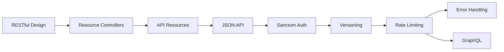
---

## Theory

> **One-Sentence Takeaway:** RESTful APIs treat server data as resources accessed through standard HTTP verbs with consistent status codes.


### RESTful API Design

<a href="../../assets/images/diagrams/laravel/07-api-development/restful-api-design-handwritten.svg" target="_blank" rel="noopener">
  
</a>
<a href="../../assets/images/diagrams/laravel/07-api-development/restful-api-design-diagram.svg" target="_blank" rel="noopener">
  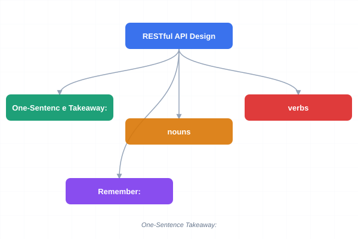
</a>
<a href="../../assets/images/diagrams/laravel/07-api-development/restful-api-design-sticky.svg" target="_blank" rel="noopener">
  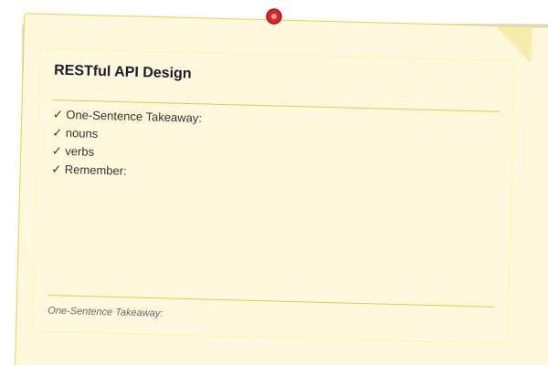
</a>


> **One-Sentence Takeaway:** API endpoints represent nouns (resources) not verbs (actions), with GET/POST/PUT/PATCH/DELETE mapping to CRUD operations.

REST treats server data as resources accessed through a uniform interface. API endpoints represent **nouns** (resources), not **verbs** (actions):

| HTTP Verb | Endpoint       | Action               |
|-----------|----------------|----------------------|
| GET       | `/users`       | List all users       |
| POST      | `/users`       | Create a new user    |
| GET       | `/users/{id}`  | Show a specific user |
| PUT       | `/users/{id}`  | Full user update     |

> **Remember:** PUT replaces the entire resource — missing fields are set to null. PATCH only applies partial modifications. Use PUT sparingly; PATCH is almost always the better choice for update endpoints.
| PATCH     | `/users/{id}`  | Partial user update  |
| DELETE    | `/users/{id}`  | Delete a user        |

**GET** is idempotent and safe. **POST** creates new resources (non-idempotent). **PUT** replaces an entire resource (idempotent). **PATCH** applies partial modifications. **DELETE** removes a resource (idempotent).

Consistent status codes: 200 (OK), 201 (Created), 204 (No Content), 400 (Bad Request), 401 (Unauthorized), 403 (Forbidden), 404 (Not Found), 422 (Validation Error), 429 (Too Many Requests), 500 (Server Error).

**HATEOAS** includes links in responses telling clients what actions are available next:

```json
{
    "data": { "id": 1, "title": "Hello World" },
    "links": {
        "self": "/api/posts/1",
        "comments": "/api/posts/1/comments"
    }
}
```

### Resource Controllers

<a href="../../assets/images/diagrams/laravel/07-api-development/resource-controllers-handwritten.svg" target="_blank" rel="noopener">
  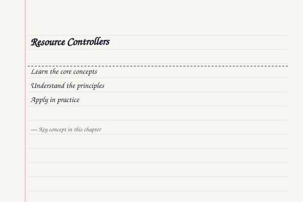
</a>
<a href="../../assets/images/diagrams/laravel/07-api-development/resource-controllers-diagram.svg" target="_blank" rel="noopener">
  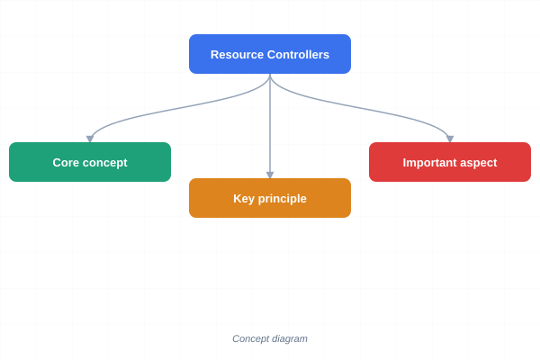
</a>
<a href="../../assets/images/diagrams/laravel/07-api-development/resource-controllers-sticky.svg" target="_blank" rel="noopener">
  
</a>


```bash
php artisan make:controller PhotoController --resource
```

Registers eight routes: `index`, `create`, `store`, `show`, `edit`, `update`, `destroy`. For APIs, use `apiResource` to exclude `create` and `edit`:

```php
Route::apiResource('photos', PhotoController::class);
// Registers: index, store, show, update, destroy
```

Nested resources:

```php
Route::apiResource('photos.comments', PhotoCommentController::class);
```

Shallow nesting prevents deeply nested URIs:

```php
Route::apiResource('photos.comments', CommentController::class)->shallow();
// Produces: /photos/{photo}/comments and /comments/{comment}
```

### API Resources & Collections

<a href="../../assets/images/diagrams/laravel/07-api-development/api-resources-collections-handwritten.svg" target="_blank" rel="noopener">
  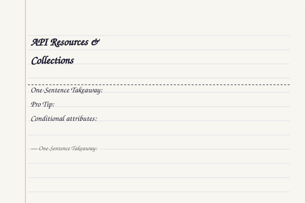
</a>
<a href="../../assets/images/diagrams/laravel/07-api-development/api-resources-collections-diagram.svg" target="_blank" rel="noopener">
  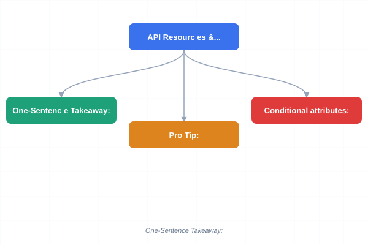
</a>
<a href="../../assets/images/diagrams/laravel/07-api-development/api-resources-collections-sticky.svg" target="_blank" rel="noopener">
  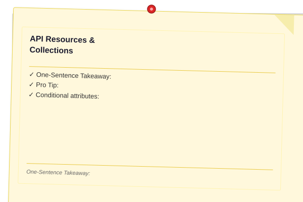
</a>


> **One-Sentence Takeaway:** API Resources transform Eloquent models into JSON with conditional attributes, relationship inclusion, and automatic pagination metadata.

```bash
php artisan make:resource UserResource

> **Pro Tip:** Use `$this->whenLoaded('relation')` in API Resources to conditionally include relationships only when they've been eager loaded. This prevents silent N+1 queries from accidental resource usage.
```

```php
class UserResource extends JsonResource
{
    public function toArray(Request $request): array
    {
        return [
            'id' => $this->id,
            'name' => $this->name,
            'email' => $this->email,
            'joined_at' => $this->created_at->toISOString(),
        ];
    }
}
```

In a controller:

```php
public function index(): ResourceCollection
{
    return UserResource::collection(User::paginate(20));
}
```

**Conditional attributes:**

```php
'is_admin' => $this->when($request->user()?->isAdmin(), $this->is_admin),
'bio' => $this->whenNotNull($this->bio),
'recent_posts' => PostResource::collection($this->whenLoaded('recentPosts')),
'merged' => $this->mergeWhen($this->isSpecial(), ['badge' => true]),
```

Pagination metadata is automatically included in JSON responses with `links` (first, last, prev, next) and `meta` (current_page, per_page, total).

### JSON:API Resources (Laravel 13)

<a href="../../assets/images/diagrams/laravel/07-api-development/json-api-resources-laravel-13-handwritten.svg" target="_blank" rel="noopener">
  
</a>
<a href="../../assets/images/diagrams/laravel/07-api-development/json-api-resources-laravel-13-diagram.svg" target="_blank" rel="noopener">
  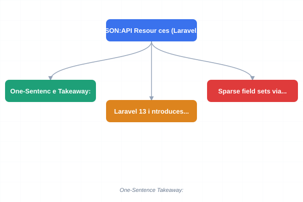
</a>
<a href="../../assets/images/diagrams/laravel/07-api-development/json-api-resources-laravel-13-sticky.svg" target="_blank" rel="noopener">
  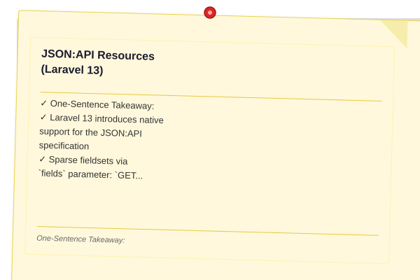
</a>


> **One-Sentence Takeaway:** Laravel 13's native JSON:API support provides structured resources with relationship inclusion (?include) and sparse fieldsets (?fields).

Laravel 13 introduces native support for the JSON:API specification. Generate resources with:

```bash
php artisan make:resource ArticleResource --jsonapi
```

```php
class ArticleResource extends JsonApiResource
{
    public function toAttributes(Request $request): array
    {
        return ['title' => $this->title, 'body' => $this->body];
    }

    public function toRelationships(Request $request): array
    {
        return [
            'author' => fn() => UserResource::make($this->author),
            'comments' => fn() => CommentResource::collection(
                $this->whenLoaded('comments')
            ),
        ];
    }

    public function toLinks(Request $request): array
    {
        return ['self' => route('articles.show', $this)];
    }
}
```

Relationship inclusion via `include` parameter: `GET /api/articles?include=author,comments`. Sparse fieldsets via `fields` parameter: `GET /api/articles?fields[articles]=title,body`. Response headers must include `Content-Type: application/vnd.api+json`.

### Sanctum Token Authentication

<a href="../../assets/images/diagrams/laravel/07-api-development/sanctum-token-authentication-handwritten.svg" target="_blank" rel="noopener">
  
</a>
<a href="../../assets/images/diagrams/laravel/07-api-development/sanctum-token-authentication-diagram.svg" target="_blank" rel="noopener">
  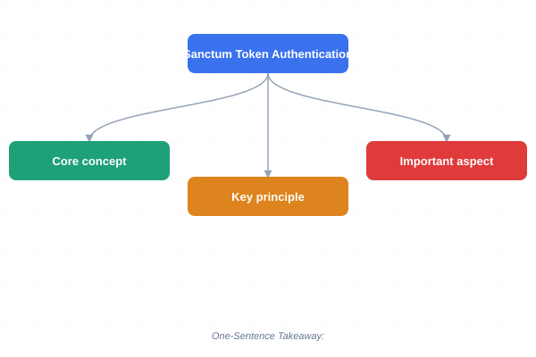
</a>
<a href="../../assets/images/diagrams/laravel/07-api-development/sanctum-token-authentication-sticky.svg" target="_blank" rel="noopener">
  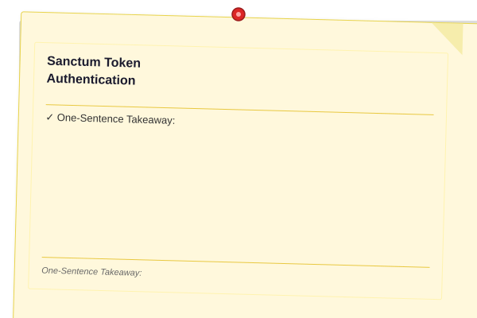
</a>


> **One-Sentence Takeaway:** Sanctum provides token authentication with typed abilities, configurable expiry, and straightforward revocation.

Add `HasApiTokens` trait to User model:

```php
use Laravel\Sanctum\HasApiTokens;

class User extends Authenticatable
{
    use HasApiTokens;
}
```

Token creation:

```php
$token = $user->createToken('api-token', ['posts:read', 'posts:write']);
return $token->plainTextToken;
```

Check abilities:

```php
if ($request->user()->tokenCan('posts:write')) { ... }
```

Token expiry:

```php
$token->accessToken->expires_at = Carbon::now()->addDays(30);
$token->accessToken->save();
```

Revocation:

```php
$user->tokens()->where('id', $tokenId)->delete();
$request->user()->currentAccessToken()->delete();
$user->tokens()->delete(); // Revoke all
```

Protect routes:

```php
Route::middleware('auth:sanctum')->group(function () {
    Route::apiResource('posts', PostController::class);
});
```

### API Versioning

<a href="../../assets/images/diagrams/laravel/07-api-development/api-versioning-handwritten.svg" target="_blank" rel="noopener">
  
</a>
<a href="../../assets/images/diagrams/laravel/07-api-development/api-versioning-diagram.svg" target="_blank" rel="noopener">
  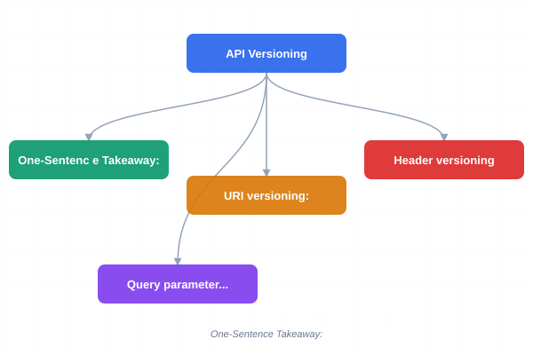
</a>
<a href="../../assets/images/diagrams/laravel/07-api-development/api-versioning-sticky.svg" target="_blank" rel="noopener">
  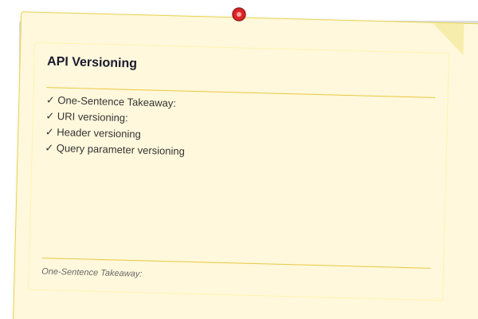
</a>


> **One-Sentence Takeaway:** URI versioning is the simplest approach, while header-based versioning keeps URLs clean but requires more client configuration.

**URI versioning:**

```php
Route::prefix('v1')->group(function () {
    Route::apiResource('users', V1\UserController::class);
});
Route::prefix('v2')->group(function () {
    Route::apiResource('users', V2\UserController::class);
});
```

**Header versioning** inspects the `Accept` header. **Query parameter versioning** uses `?version=2`. URI versioning is the simplest and most common approach.

### Rate Limiting

<a href="../../assets/images/diagrams/laravel/07-api-development/rate-limiting-handwritten.svg" target="_blank" rel="noopener">
  
</a>
<a href="../../assets/images/diagrams/laravel/07-api-development/rate-limiting-diagram.svg" target="_blank" rel="noopener">
  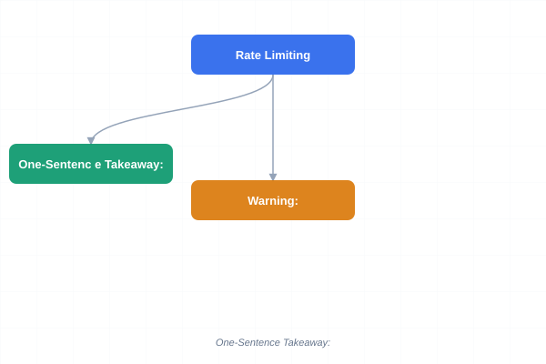
</a>
<a href="../../assets/images/diagrams/laravel/07-api-development/rate-limiting-sticky.svg" target="_blank" rel="noopener">
  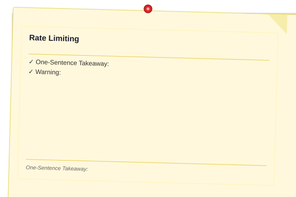
</a>


> **One-Sentence Takeaway:** Rate limiting via RateLimiter::for() and the throttle middleware protects API endpoints from abuse and brute-force attacks.

Define limiters in `AppServiceProvider`:

```php
RateLimiter::for('api', function (Request $request) {

> **Warning:** Always differentiate rate limits between authenticated and unauthenticated users. Authenticated users should get higher limits (e.g., 100/min) than guests (e.g., 30/min) to prevent IP-based shared limits from affecting legitimate users.
    return Limit::perMinute(60)
        ->by($request->user()?->id ?: $request->ip());
});
```

Apply with `throttle` middleware:

```php
Route::middleware('throttle:api')->group(function () { ... });
Route::middleware('throttle:5,1')->post('/upload', ...);
```

RateLimiter methods: `hit($key, $decay)`, `tooManyAttempts($key, $max)`, `availableIn($key)`, `clear($key)`, `attempt($key, $cb)`.

### Response Formatting

<a href="../../assets/images/diagrams/laravel/07-api-development/response-formatting-handwritten.svg" target="_blank" rel="noopener">
  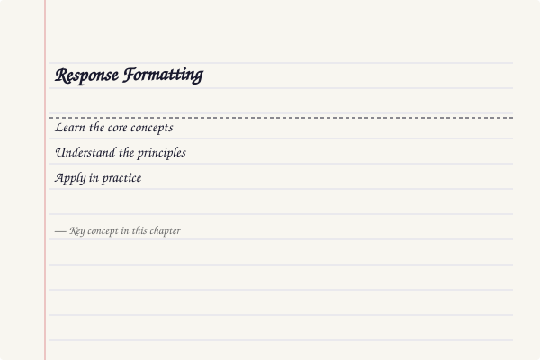
</a>
<a href="../../assets/images/diagrams/laravel/07-api-development/response-formatting-diagram.svg" target="_blank" rel="noopener">
  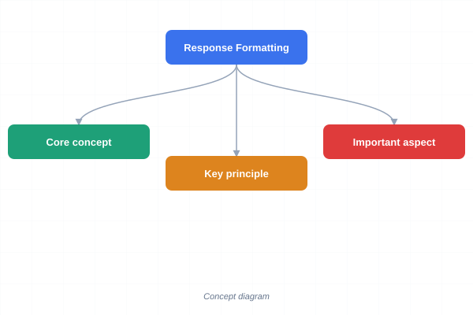
</a>
<a href="../../assets/images/diagrams/laravel/07-api-development/response-formatting-sticky.svg" target="_blank" rel="noopener">
  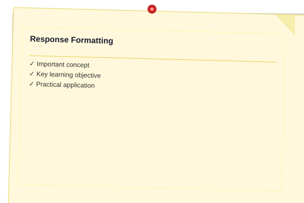
</a>


Define response macros:

```php
Response::macro('api', function (mixed $data, string $message = '', int $status = 200) {
    return response()->json([
        'success' => $status < 400, 'message' => $message, 'data' => $data,
    ], $status);
});
```

### Pagination for APIs

<a href="../../assets/images/diagrams/laravel/07-api-development/pagination-for-apis-handwritten.svg" target="_blank" rel="noopener">
  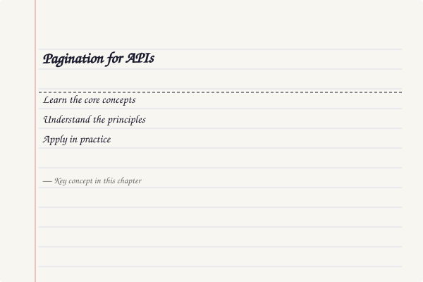
</a>
<a href="../../assets/images/diagrams/laravel/07-api-development/pagination-for-apis-diagram.svg" target="_blank" rel="noopener">
  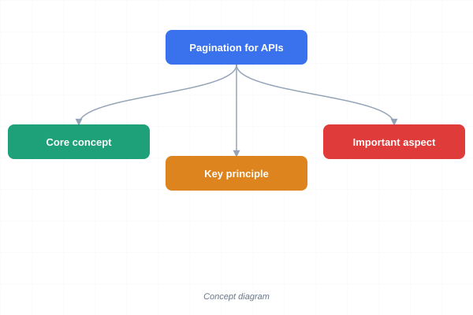
</a>
<a href="../../assets/images/diagrams/laravel/07-api-development/pagination-for-apis-sticky.svg" target="_blank" rel="noopener">
  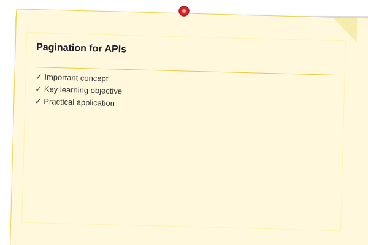
</a>


```php
Post::paginate(20);       // LengthAwarePaginator → knows total pages
Post::simplePaginate(20); // Only "next" and "prev"
Post::cursorPaginate(20); // Cursor-based for large datasets
```

Cursor pagination avoids the COUNT query and is stable with new insertions.

### Error Handling

<a href="../../assets/images/diagrams/laravel/07-api-development/error-handling-handwritten.svg" target="_blank" rel="noopener">
  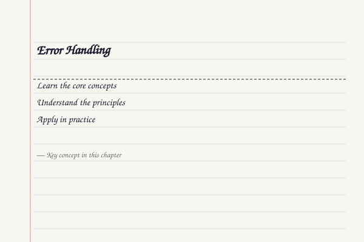
</a>
<a href="../../assets/images/diagrams/laravel/07-api-development/error-handling-diagram.svg" target="_blank" rel="noopener">
  
</a>
<a href="../../assets/images/diagrams/laravel/07-api-development/error-handling-sticky.svg" target="_blank" rel="noopener">
  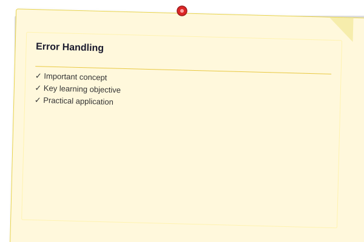
</a>


```php
// bootstrap/app.php
->withExceptions(function (Exceptions $exceptions) {
    $exceptions->render(function (NotFoundHttpException $e, Request $request) {
        if ($request->is('api/*')) {
            return response()->json(['message' => 'Resource not found'], 404);
        }
    });
});
```

Custom exception classes:

```php
class PostCreationException extends Exception
{
    public function render(Request $request): JsonResponse
    {
        return response()->json(['error' => 'PostCreationError', 'message' => $this->getMessage()], 422);
    }
}
```

### GraphQL with Lighthouse

<a href="../../assets/images/diagrams/laravel/07-api-development/graphql-with-lighthouse-handwritten.svg" target="_blank" rel="noopener">
  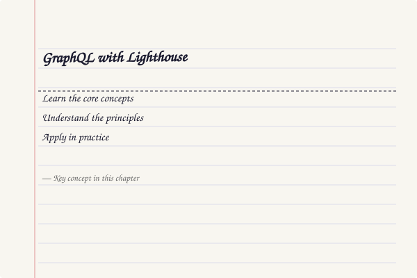
</a>
<a href="../../assets/images/diagrams/laravel/07-api-development/graphql-with-lighthouse-diagram.svg" target="_blank" rel="noopener">
  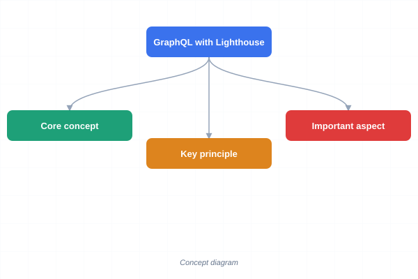
</a>
<a href="../../assets/images/diagrams/laravel/07-api-development/graphql-with-lighthouse-sticky.svg" target="_blank" rel="noopener">
  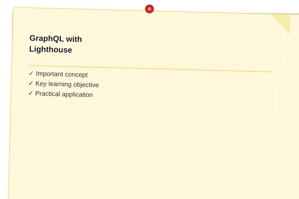
</a>


Install: `composer require nuwave/lighthouse`

Define schema in `graphql/schema.graphql`:

```graphql
type Query {
    posts: [Post!]! @paginate
    post(id: ID! @eq): Post @find
}

type Mutation {
    createPost(title: String!, body: String!): Post! @create
    deletePost(id: ID!): Post @delete @can(ability: "delete", find: "id")
}
```

Key directives: `@paginate`, `@find`, `@create`, `@update`, `@delete`, `@can`, `@rules`, `@hasMany`, `@belongsTo`.

### API Resource Class for the Blog

<a href="../../assets/images/diagrams/laravel/07-api-development/api-resource-class-for-the-blog-handwritten.svg" target="_blank" rel="noopener">
  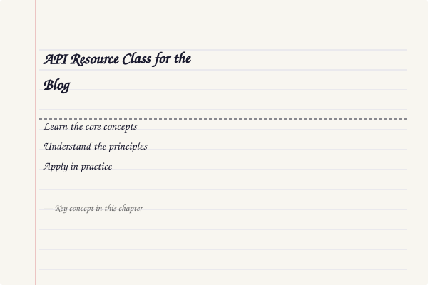
</a>
<a href="../../assets/images/diagrams/laravel/07-api-development/api-resource-class-for-the-blog-diagram.svg" target="_blank" rel="noopener">
  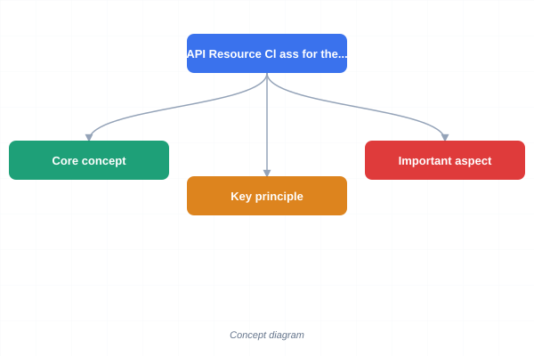
</a>
<a href="../../assets/images/diagrams/laravel/07-api-development/api-resource-class-for-the-blog-sticky.svg" target="_blank" rel="noopener">
  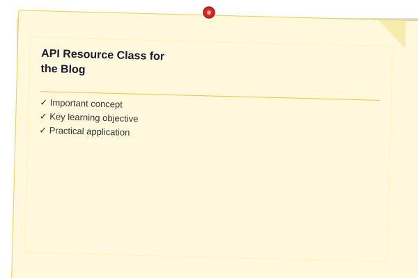
</a>


```php
namespace App\Http\Resources\v1;

use Illuminate\Http\Request;
use Illuminate\Http\Resources\Json\JsonResource;

class PostResource extends JsonResource
{
    public function toArray(Request $request): array
    {
        return [
            'id' => $this->id,
            'title' => $this->title,
            'body' => $this->body,
            'author' => new UserResource($this->whenLoaded('author')),
            'tags' => TagResource::collection($this->whenLoaded('tags')),
            'comments_count' => $this->when($this->comments_count !== null, $this->comments_count),
            'created_at' => $this->created_at->toISOString(),
            'updated_at' => $this->updated_at->toISOString(),
            'links' => [
                'self' => route('api.v1.posts.show', $this),
                'comments' => route('api.v1.posts.comments.index', $this),
            ],
        ];
    }
}
```

### Full Blog Controller

<a href="../../assets/images/diagrams/laravel/07-api-development/full-blog-controller-handwritten.svg" target="_blank" rel="noopener">
  
</a>
<a href="../../assets/images/diagrams/laravel/07-api-development/full-blog-controller-diagram.svg" target="_blank" rel="noopener">
  
</a>
<a href="../../assets/images/diagrams/laravel/07-api-development/full-blog-controller-sticky.svg" target="_blank" rel="noopener">
  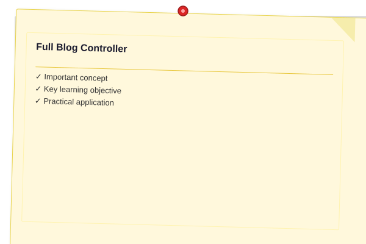
</a>


```php
namespace App\Http\Controllers\Api\v1;

use App\Http\Controllers\Controller;
use App\Http\Resources\v1\PostResource;
use App\Models\Post;
use Illuminate\Http\JsonResponse;
use Illuminate\Http\Request;
use Illuminate\Http\Resources\Json\ResourceCollection;

class PostController extends Controller
{
    public function __construct()
    {
        $this->authorizeResource(Post::class, 'post');
    }

    public function index(Request $request): ResourceCollection
    {
        if (!$request->user()->tokenCan('posts:read')) {
            abort(403, 'Missing ability: posts:read');
        }

        $posts = Post::with(['author', 'tags'])
            ->paginate($request->input('per_page', 15));

        return PostResource::collection($posts);
    }

    public function store(Request $request): JsonResponse
    {
        if (!$request->user()->tokenCan('posts:write')) {
            abort(403, 'Missing ability: posts:write');
        }

        $validated = $request->validate([
            'title' => 'required|max:255',
            'body' => 'required',
            'tags' => 'array',
            'tags.*' => 'exists:tags,id',
        ]);

        $post = $request->user()->posts()->create($validated);

        if (!empty($validated['tags'])) {
            $post->tags()->sync($validated['tags']);
        }

        return response()->json([
            'message' => 'Post created',
            'data' => new PostResource($post->load(['author', 'tags'])),
        ], 201);
    }

    public function show(Post $post): PostResource
    {
        $post->load(['author', 'comments.author', 'tags']);
        return new PostResource($post);
    }

    public function update(Request $request, Post $post): JsonResponse
    {
        $this->authorize('update', $post);

        $validated = $request->validate([
            'title' => 'sometimes|max:255',
            'body' => 'sometimes',
            'tags' => 'sometimes|array',
            'tags.*' => 'exists:tags,id',
        ]);

        $post->update($validated);

        if ($request->has('tags')) {
            $post->tags()->sync($validated['tags'] ?? []);
        }

        return response()->json([
            'message' => 'Post updated',
            'data' => new PostResource($post->fresh(['author', 'tags'])),
        ]);
    }

    public function destroy(Post $post): JsonResponse
    {
        $this->authorize('delete', $post);
        $post->delete();
        return response()->json(null, 204);
    }
}
```

### Rate Limiter Configuration

<a href="../../assets/images/diagrams/laravel/07-api-development/rate-limiter-configuration-handwritten.svg" target="_blank" rel="noopener">
  
</a>
<a href="../../assets/images/diagrams/laravel/07-api-development/rate-limiter-configuration-diagram.svg" target="_blank" rel="noopener">
  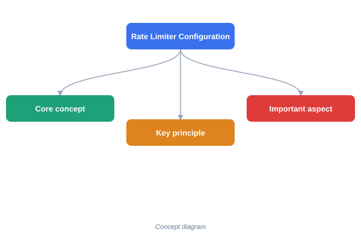
</a>
<a href="../../assets/images/diagrams/laravel/07-api-development/rate-limiter-configuration-sticky.svg" target="_blank" rel="noopener">
  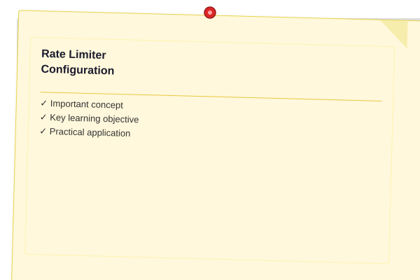
</a>


```php
use Illuminate\Cache\RateLimiting\Limit;
use Illuminate\Support\Facades\RateLimiter;

RateLimiter::for('api', function (Request $request) {
    $userId = $request->user()?->id;

    return $userId
        ? Limit::perMinute(100)->by($userId)
        : Limit::perMinute(30)->by($request->ip());
});

RateLimiter::for('auth', function (Request $request) {
    return Limit::perMinute(5)->by($request->ip());
});
```

### Route Registration

<a href="../../assets/images/diagrams/laravel/07-api-development/route-registration-handwritten.svg" target="_blank" rel="noopener">
  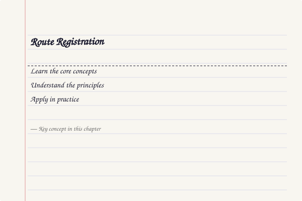
</a>
<a href="../../assets/images/diagrams/laravel/07-api-development/route-registration-diagram.svg" target="_blank" rel="noopener">
  
</a>
<a href="../../assets/images/diagrams/laravel/07-api-development/route-registration-sticky.svg" target="_blank" rel="noopener">
  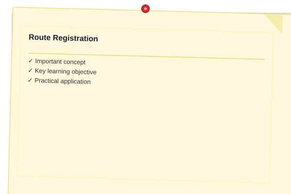
</a>


```php
// routes/api.php
use App\Http\Controllers\Api\v1\AuthController;
use App\Http\Controllers\Api\v1\PostController;
use App\Http\Controllers\Api\v1\CommentController;

Route::prefix('v1')->group(function () {
    Route::middleware('throttle:auth')->group(function () {
        Route::post('/register', [AuthController::class, 'register']);
        Route::post('/login', [AuthController::class, 'login']);
    });

    Route::middleware(['auth:sanctum', 'throttle:api'])->group(function () {
        Route::post('/logout', [AuthController::class, 'logout']);
        Route::apiResource('posts', PostController::class);
        Route::apiResource('posts.comments', CommentController::class)->shallow();
    });
});
```

---


## Concept Comparison

| Feature | REST | GraphQL |
|---------|------|---------|
| Data Fetching | Fixed response structure | Client-specified fields |
| Over-fetching | Common | Eliminated |
| Endpoints | Multiple (one per resource) | Single endpoint |
| Versioning | URI/header required | Schema evolution |
| Caching | HTTP caching (ETag, Last-Modified) | Complex (per-query) |
| Tooling | Swagger/OpenAPI | GraphiQL, Apollo DevTools |

## Quick Reference — HTTP Status Codes

| Code | Meaning | Use Case |
|------|---------|----------|
| 200 | OK | Successful GET, PUT, PATCH |
| 201 | Created | Successful POST (new resource) |
| 204 | No Content | Successful DELETE |
| 400 | Bad Request | Malformed request body |
| 401 | Unauthorized | Missing/invalid authentication |
| 403 | Forbidden | Authenticated but not authorized |
| 404 | Not Found | Resource does not exist |
| 422 | Unprocessable Entity | Validation failure |
| 429 | Too Many Requests | Rate limit exceeded |
| 500 | Internal Server Error | Unexpected server error |

## Cross-Application Matrix

| Concept | Blog API | E-Commerce API | SaaS API |
|---------|---------|---------------|----------|
| Auth | Sanctum tokens | Sanctum + OAuth | Sanctum + API keys |
| Versioning | v1 URI prefix | v1 \u2192 v2 header | v2 URI prefix |
| Pagination | Cursor-based | LengthAware 20/page | Cursor 50/page |
| Rate Limit | 60/min auth, 20/min guest | 100/min auth, 10/min guest | Tiered by plan |
| Error Format | JSON:API errors | Custom error codes | RFC 7807 Problem Details |

## Chapter Quiz

**1. Which artisan command generates the correct routes for an API-only resource?**
- a) Route::resource()
- b) Route::apiResource()
- c) Route::restResource()
- d) Route::jsonResource()

**2. What does Sanctum's tokenCan() method check?**
- a) Token expiration date
- b) Token ability/permission
- c) Token creation time
- d) Token IP restriction

**3. Which pagination method avoids the COUNT query and is stable with new insertions?**
- a) paginate()
- b) simplePaginate()
- c) cursorPaginate()
- d) lengthAwarePaginate()

**4. What is the purpose of $this->whenLoaded() in an API Resource?**
- a) Load a relationship lazily
- b) Conditionally include data when relation is loaded
- c) Eager load a relationship
- d) Filter relationship results

**Answers: 1-b, 2-b, 3-c, 4-b**

## Summary

- RESTful APIs treat server resources as nouns accessed via standard HTTP verbs with consistent status codes
- Resource controllers map directly to CRUD operations; `apiResource` excludes web-only routes
- API Resources transform Eloquent models into JSON with conditional attributes and pagination metadata
- Laravel 13 introduces native JSON:API resources with relationship inclusion and sparse fieldsets
- Sanctum provides token authentication with abilities, expiration, and straightforward revocation
- API versioning strategies include URI prefixes, Accept headers, and query parameters
- Rate limiting via the `RateLimiter` facade and `throttle` middleware protects endpoints from abuse
- GraphQL with Lighthouse offers a schema-first approach with powerful directives

---

## Exercises

### Review Questions

1. Explain the difference between PUT and PATCH in RESTful APIs. When would you use each?
2. What is the purpose of `apiResource()` compared to `resource()`? Which routes does each register?
3. How do JSON:API resources differ from standard API Resources in Laravel 13?
4. What strategies can you use to version an API? Describe the trade-offs of each.
5. Explain how Sanctum token abilities work and how to check them in a controller.

### Application Problems

1. **Build a Product Catalog API**: Create a RESTful API with Sanctum auth, role-based token abilities (`admin`, `manager`, `viewer`), and rate limiting that differentiates authenticated from unauthenticated users.

2. **Implement JSON:API with Sparse Fieldsets**: Build a JSON:API endpoint for an `Order` resource supporting `include` (order items, customer) and `fields` for sparse fieldsets.

3. **Versioned API Migration**: Design a v1-to-v2 migration with URI versioning, nested resources in v2, and `Deprecation` headers on v1 responses.

### Challenge Problem

**Build a Full-Stack Blog Platform API**: Implement a complete API with JSON:API compliance, three user roles with granular Sanctum abilities, URI versioning (v1/v2), per-endpoint rate limiting, a GraphQL endpoint duplicating REST functionality, custom error format with correlation IDs, HATEOAS links on all resources, and cursor-based pagination.

