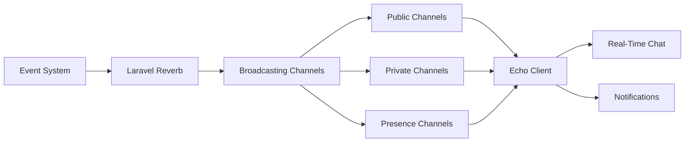

# Chapter 8: Broadcasting, Events & Real-Time Features
> **Previous:** [API Development & Integration](./07-api-development) | **Next:** [Service Container, Facades & Package Development](./09-container-packages)

---

## Learning Objectives

- Design and implement an event-driven architecture using Laravel's event system and contracts
- Deploy and configure Laravel Reverb as a first-party WebSocket server for real-time communication
- Implement public, private, and presence channels with proper authorization
- Integrate the Echo client library to subscribe to channels and listen for broadcast events
- Build real-time notification delivery using the broadcast notification channel
- Construct complex real-time applications including chat systems and live notification feeds

<!-- Image Gallery -->
<section class="lesson-visuals" aria-label="Visual learning resources">
  <header><span>VISUAL LEARNING</span><h2>See it. Review it. Remember it.</h2></header>
  <a class="lesson-visual-card" href="../../../assets/images/lessons/laravel/08-broadcasting-realtime/.png" target="_blank" rel="noopener">
    
    <span><strong>Handwritten notes</strong>Condensed notes for deliberate review.</span>
  </a>
  <a class="lesson-visual-card" href="../../../assets/images/lessons/laravel/08-broadcasting-realtime/.png" target="_blank" rel="noopener">
    
    <span><strong>Sticky-note revision</strong>Fast recall prompts for revision.</span>
  </a>
  <a class="lesson-visual-card" href="../../../assets/images/lessons/laravel/08-broadcasting-realtime/.png" target="_blank" rel="noopener">
    
    <span><strong>Visual concept guide</strong>A connected explanation of the key ideas.</span>
  </a>
</section>
<!-- End Image Gallery -->

## Chapter at a Glance

| Section | Key Topics |
|---------|-----------|
| Event System | Event classes, listeners, contracts |
| Laravel Reverb | First-party WebSocket server, configuration |
| Broadcasting Channels | Public, private, presence, authorization |
| Echo Client | Channel subscription, event listening |
| Presence Channels | Online users, joining/leaving events |
| SSE | Server-Sent Events for unidirectional streaming |
| Notification Events | Broadcast notification channel |

## Chapter Roadmap


---

## Theory

> **One-Sentence Takeaway:** Laravel's event system with broadcasting enables real-time server-to-client communication through WebSockets.


### Event System Deep Dive


> **One-Sentence Takeaway:** Events are lightweight data carriers while listeners contain business logic; ShouldBroadcast pushes events to WebSocket clients.

Laravel's event system provides a clean observer pattern implementation. Events are lightweight data carriers; listeners contain the business logic.

```php
// App\Providers\EventServiceProvider
protected $listen = [
    OrderShipped::class => [SendShipmentNotification::class],
];
```

An event class holds data:

```php
class OrderShipped
{
    use Dispatchable;

    public function __construct(public readonly Order $order) {}
}
```

A listener handles the event:

```php
class SendShipmentNotification
{
    public function handle(OrderShipped $event): void
    {
        Notification::send($event->order->user, new ShipmentConfirmed($event->order));
    }
}
```

**Event contracts:**

| Contract              | Purpose                                      |
|-----------------------|----------------------------------------------|
| `ShouldBroadcast`     | Broadcast the event to WebSocket clients     |
| `ShouldQueue`         | Queue the listener's handle method for async |
| `ShouldQueue` + `ShouldBeUnique` | Prevent duplicate queued listeners |

An event implementing `ShouldBroadcast`:

```php
class MessageSent implements ShouldBroadcast
{
    use Dispatchable, InteractsWithSockets, SerializesModels;

    public function __construct(public readonly Message $message) {}

    public function broadcastOn(): array
    {
        return [new PrivateChannel("chat.{$this->message->chat_id}")];
    }

    public function broadcastAs(): string
    {
        return 'message.sent';
    }
}
```

### Laravel Reverb


> **One-Sentence Takeaway:** Reverb is a first-party Laravel WebSocket server that scales horizontally with Redis, eliminating the need for third-party services like Pusher.

Reverb is a first-party WebSocket server for Laravel.

```bash
composer require laravel/reverb
php artisan vendor:publish --tag=reverb-config
php artisan reverb:generate-keys
php artisan reverb:start
```

Configuration in `config/reverb.php`:

```php
'apps' => [
    [
        'app_id' => env('REVERB_APP_ID'),
        'app_key' => env('REVERB_APP_KEY'),
        'app_secret' => env('REVERB_APP_SECRET'),
        'app_host' => env('REVERB_HOST', 'localhost'),
        'app_port' => env('REVERB_PORT', 8080),
    ],
],
```

For production, use Supervisor:

```ini
[program:reverb]
command=php /var/www/html/artisan reverb:start
numprocs=1
autostart=true
autorestart=true
```

**Scaling** across servers uses Redis:

```php
'scaling' => [
    'enabled' => env('REVERB_SCALING_ENABLED', true),
    'channel' => 'reverb',
];
```

### Broadcasting


> **One-Sentence Takeaway:** Channels come in three types: public (no auth), private (user authorization), and presence (with visible connected member list).

Broadcasting pushes events from server to WebSocket clients.

**Authorization** is defined in `routes/channels.php`:

```php
Broadcast::channel('chat.{chatId}', function (User $user, int $chatId) {
    return $user->chats()->where('chat_id', $chatId)->exists();
});
```

For presence channels, return user metadata:

```php
Broadcast::channel('game.{gameId}', function (User $user, int $gameId) {
    if ($user->games()->where('game_id', $gameId)->exists()) {
        return ['id' => $user->id, 'name' => $user->name];

> **Remember:** Presence channel authorization callbacks must return an associative array of user data (not just true/false). The array is sent to all connected clients so they can display online user information.
    }
});
```

**Channel classes** for complex authorization:

```bash
php artisan make:channel ChatChannel
```

```php
class ChatChannel
{
    public function join(User $user, Chat $chat): array|bool
    {
        if (!$chat->participants()->where('user_id', $user->id)->exists()) {
            return false;
        }
        return ['id' => $user->id, 'name' => $user->name, 'is_moderator' => $chat->moderators()->where('user_id', $user->id)->exists()];
    }
}
```

**Channel types:**

| Type      | Prefix      | Authorization | Visibility             |
|-----------|-------------|---------------|------------------------|
| Public    | (none)      | None          | Any client             |
| Private   | `private-`  | Required      | Authorized users only  |
| Presence  | `presence-` | Required      | Shows connected users  |

```php
new Channel('announcements');          // Public
new PrivateChannel('order.'.$id);      // Private
new PresenceChannel('game.'.$id);      // Presence
```

### Pusher Integration


Configure in `config/broadcasting.php` for the Pusher service:

```php
'pusher' => [
    'driver' => 'pusher',
    'key' => env('PUSHER_APP_KEY'),
    'secret' => env('PUSHER_APP_SECRET'),
    'app_id' => env('PUSHER_APP_ID'),
    'options' => ['cluster' => env('PUSHER_APP_CLUSTER'), 'useTLS' => true],
],
```

### Echo Client Library


> **One-Sentence Takeaway:** Echo subscribes to channels using .listen(), .notification(), .whisper(), and presence methods like .here(), .joining(), .leaving().

```bash
npm install laravel-echo pusher-js
```

**For Reverb:**

```javascript
window.Echo = new Echo({
    broadcaster: 'reverb',
    key: import.meta.env.VITE_REVERB_APP_KEY,
    wsHost: import.meta.env.VITE_REVERB_HOST,
    wsPort: import.meta.env.VITE_REVERB_PORT,
    forceTLS: import.meta.env.VITE_REVERB_SCHEME === 'https',
    enabledTransports: ['ws', 'wss'],
});
```

**For Pusher:**

```javascript
window.Echo = new Echo({
    broadcaster: 'pusher',
    key: import.meta.env.VITE_PUSHER_APP_KEY,
    cluster: import.meta.env.VITE_PUSHER_APP_CLUSTER,
    forceTLS: true,
});
```

**Listening to channels:**

```javascript
Echo.channel('announcements')
    .listen('AnnouncementCreated', (e) => { /* ... */ });

Echo.private('order.1')
    .listen('OrderShipped', (e) => { /* ... */ })
    .notification((notification) => { /* ... */ });

Echo.join('game.1')
    .here((users) => { /* current members */ })
    .joining((user) => { /* user joined */ })
    .leaving((user) => { /* user left */ });
```

**Whisper events** (client-to-client):

```javascript
// Send
Echo.private('chat.1').whisper('typing', { name: user.name });

// Listen
Echo.private('chat.1').listenForWhisper('typing', (e) => { /* ... */ });
```

**Leaving channels:**

```javascript
Echo.leave('chat.1');
Echo.leaveChannel('private-chat.1');
Echo.leaveAll();
```

### Presence Channels


> **One-Sentence Takeaway:** Presence channels expose real-time user awareness — showing who is online, joining, or leaving a specific channel.

Presence channels expose connected users. Backend event:

```php
class PlayerJoined implements ShouldBroadcast
{
    public function broadcastOn(): array
    {
        return [new PresenceChannel('game.'.$this->game->id)];
    }
}
```

Client side:

```javascript
Echo.join('game.1')
    .here((users) => { this.players = users; })
    .joining((user) => { this.players.push(user); })
    .leaving((user) => { this.players = this.players.filter(p => p.id !== user.id); });
```

Access users server-side:

```php
$users = Broadcast::getChannelUsers('presence-game.1');
```

### Server-Sent Events


> **One-Sentence Takeaway:** SSE provides a simpler WebSocket alternative for unidirectional server-to-client streaming over plain HTTP.

SSE provides unidirectional server-to-client real-time communication over standard HTTP:

```php
Route::get('/events/stream', function () {
    return response()->eventStream(function () {
        $notifications = Notification::where('user_id', auth()->id())
            ->whereNull('read_at')->get();

        if ($notifications->isNotEmpty()) {
            yield 'notifications' => $notifications;
        }
        yield 'heartbeat' => ['timestamp' => now()->toISOString()];
    });
});
```

Client side:

```javascript
const source = new EventSource('/stream/notifications');
source.addEventListener('notification', (e) => {
    console.log(JSON.parse(e.data));
});
```

### Notification Events


The broadcast channel sends notifications to connected clients:

```php
class NewComment extends Notification implements ShouldBroadcast
{
    public function via(object $notifiable): array
    {
        return ['broadcast', 'database'];
    }

    public function toBroadcast(object $notifiable): array
    {
        return [
            'message' => "{$this->comment->author->name} commented on your post",
            'post_id' => $this->comment->post_id,
        ];
    }
}
```

Customize the notification route:

```php
public function receivesBroadcastNotificationsOn(): string
{
    return 'user.'.$this->id;
}
```

### Queueing Events


```php
class SendOrderConfirmation implements ShouldQueue
{
    public string $queue = 'notifications';
    public int $delay = 10;
    public int $tries = 3;
    public bool $deleteWhenMissingModels = true;
}
```

Prevent duplicate queued listeners:

```php
class SyncOrderToWarehouse implements ShouldQueue, ShouldBeUnique
{
    public function uniqueId(OrderShipped $event): string
    {
        return 'warehouse-sync:'.$event->order->id;
    }
}
```

### Example: Real-Time Chat Application

**Event:**

```php
class ChatMessageSent implements ShouldBroadcast
{
    public function __construct(public readonly ChatMessage $message) {}

    public function broadcastOn(): array
    {
        return [new PresenceChannel('chat.'.$this->message->chat_id)];
    }

    public function broadcastAs(): string
    {
        return 'message.sent';
    }

    public function broadcastWith(): array
    {
        return [
            'id' => $this->message->id,
            'user' => ['id' => $this->message->user->id, 'name' => $this->message->user->name],
            'body' => $this->message->body,
            'sent_at' => $this->message->created_at->toISOString(),
        ];
    }
}
```

**Controller:**

```php
class ChatMessageController extends Controller
{
    public function store(Request $request, Chat $chat): JsonResponse
    {
        $this->authorize('send', $chat);

        $message = $chat->messages()->create([
            'user_id' => $request->user()->id,
            'body' => $request->validate(['body' => 'required|string|max:5000'])['body'],

> **Pro Tip:** Always use `broadcast(new Event)->toOthers()` when the sending user should not see their own event. This prevents double-rendering in chat applications where the sender already optimistically inserted their message.
        ]);

        $message->load('user');
        broadcast(new ChatMessageSent($message))->toOthers();

        return response()->json(['message' => $message], 201);
    }
}
```

**Channel authorization:**

```php
Broadcast::channel('chat.{chatId}', function (User $user, int $chatId) {
    $chat = Chat::find($chatId);
    if (!$chat || !$chat->participants()->where('user_id', $user->id)->exists()) {
        return false;
    }
    return ['id' => $user->id, 'name' => $user->name];
});
```

**Frontend:**

```javascript
const channel = Echo.join(`chat.${chatId}`);

> **Warning:** Echo channel names must match the backend channel name exactly. For private channels, the JavaScript side must prefix with `private-` (Echo.private() handles this automatically). For presence channels, Echo.join() adds the `presence-` prefix.

channel.here((users) => { this.onlineUsers = users; });
channel.joining((user) => { this.onlineUsers.push(user); });
channel.leaving((user) => { this.onlineUsers = this.onlineUsers.filter(u => u.id !== user.id); });
channel.listen('.message.sent', (e) => { this.messages.push(e); });
channel.listenForWhisper('typing', (e) => { this.showTypingIndicator(e.name); });
```

### Example: Real-Time Notification System

Send notification on comment:

```php
$post->user->notify(new PostCommented($comment));
```

Listen client-side:

```javascript
Echo.private(`App.Models.User.${userId}`)
    .notification((notification) => {
        addToNotificationDropdown(notification);
        updateBadgeCount();
    });
```

---


## Concept Comparison

| Feature | WebSockets (Reverb/Pusher) | Server-Sent Events |
|---------|---------------------------|-------------------|
| Direction | Bidirectional | Server \u2192 Client only |
| Protocol | WebSocket (WS/WSS) | HTTP |
| Browser Support | Universal | Universal (EventSource API) |
| Connection Type | Persistent | Persistent |
| Complexity | Higher (handshake, reconnection) | Lower (simple HTTP stream) |
| Use Case | Chat, collaboration | Notifications, status updates |

## Quick Reference — Broadcasting Artisan Commands

| Command | Purpose |
|---------|---------|
| `composer require laravel/reverb` | Install Reverb |
| `php artisan reverb:start` | Start Reverb server |
| `php artisan make:channel ChatChannel` | Create channel class |
| `npm install laravel-echo pusher-js` | Install Echo client |

## Cross-Application Matrix

| Concept | Chat App | Collaboration | Live Dashboard |
|---------|---------|--------------|---------------|
| Channel Type | Presence | Private (per-document) | Public (announcements) |
| Events per Second | 10-50 | 50-200 (cursor moves) | 1-5 (periodic refresh) |
| Whisper Events | Typing indicators | Cursor positions | — |
| Presence Data | Online users | Editors per document | Active viewers |
| Scaling | Redis for multi-server | Redis for multi-server | Single server sufficient |

## Chapter Quiz

**1. Which interface must an event implement to be broadcast to WebSocket clients?**
- a) ShouldQueue
- b) ShouldBroadcast
- c) ShouldBeUnique
- d) ShouldDispatch

**2. What is the difference between Echo.private() and Echo.join()?**
- a) private() is for authenticated users, join() is for guests
- b) private() subscribes to private channels, join() subscribes to presence channels
- c) join() requires a callback, private() does not
- d) There is no difference

**3. What does broadcastAs() method define on a broadcast event?**
- a) The channel name
- b) The event name for client-side listening
- c) The queue connection
- d) The authorization logic

**4. Which type of channel exposes here(), joining(), and leaving() events?**
- a) Public
- b) Private
- c) Presence
- d) Mixed

**Answers: 1-b, 2-b, 3-b, 4-c**

## Summary

- Laravel's event system provides an observer pattern using `EventServiceProvider`, `ShouldBroadcast`, and `ShouldQueue` contracts
- Laravel Reverb is a first-party WebSocket server that scales horizontally with Redis
- Channels come in three types: public (no auth), private (user authorization), presence (with visible member list)
- Echo subscribes to channels using `.listen()`, `.notification()`, `.whisper()`, and presence methods
- Presence channels expose `here`, `joining`, and `leaving` events for real-time user awareness
- SSE provides a simpler alternative to WebSockets for unidirectional server-to-client data
- The broadcast notification channel pushes notifications to connected clients in real time
- Queued event listeners with `ShouldBeUnique` prevent duplicate jobs

---

## Exercises

### Review Questions

1. Compare Laravel Reverb and Pusher as broadcasting drivers. What are the trade-offs?
2. Explain the difference between public, private, and presence channels with use cases.
3. How does `ShouldBroadcast` transform a standard event into one that pushes to WebSocket clients?
4. What is the Echo `.whisper()` method for, and why use it instead of server-broadcast events?
5. What does `broadcastAs()` do and how does it affect the event name Echo listens for?

### Application Problems

1. **Typing Indicator**: Extend the chat example with a typing indicator that clears after 3 seconds of inactivity using Echo whisper events.

2. **Moderated Chat**: Build a chat where moderators can delete messages in real time. Broadcast a `MessageDeleted` event and remove it from the UI.

3. **Multi-Server Reverb**: Configure Reverb with Redis scaling and demonstrate connections reach all participants across servers.

### Challenge Problem

**Real-Time Collaboration Platform**: Build a real-time document collaboration platform with Reverb + Redis scaling, presence channels per document, cursor position sharing via whisper events, debounced broadcast events for content changes, private notifications for `@username` mentions, SSE fallback for restricted networks, user online/offline status across all presence channels, and `ShouldBeUnique` queueing to prevent duplicate save events.