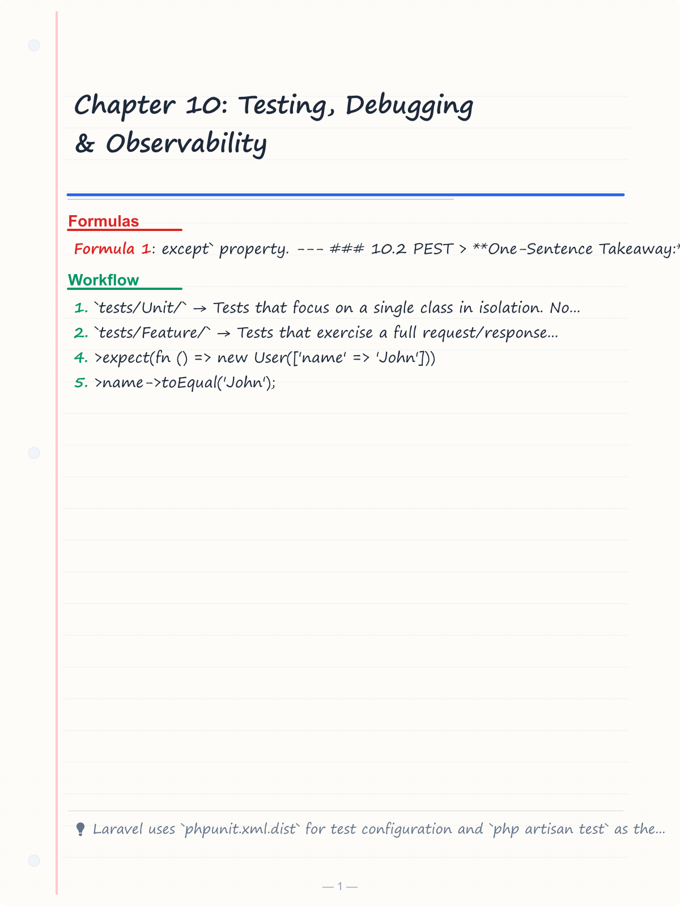
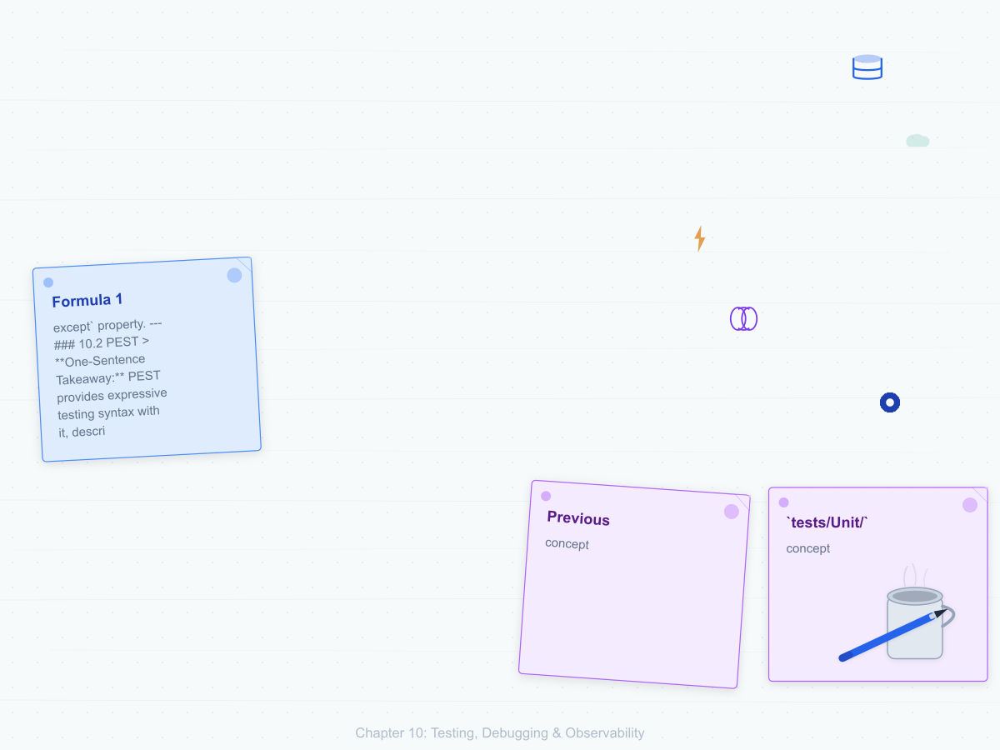
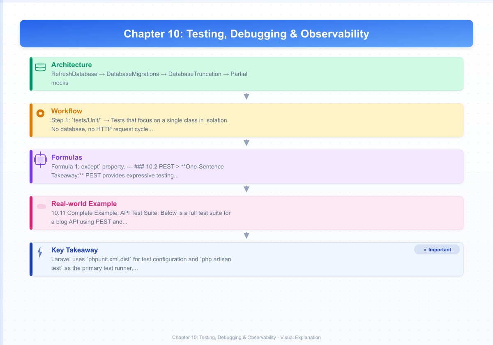
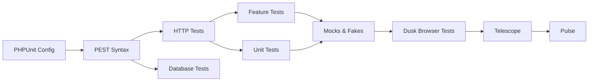

# Chapter 10: Testing, Debugging & Observability
> **Previous:** [Service Container, Facades & Package Development](./09-container-packages) | **Next:** [Caching, Performance & Octane](./11-caching-performance)

---

## Learning Objectives

- Configure PHPUnit and PEST testing frameworks within a Laravel application
- Write and execute HTTP, database, feature, and unit tests using both PHPUnit and PEST syntax
- Implement mock objects, fakes, and stubs to isolate test concerns
- Build browser-level test suites with Laravel Dusk
- Install and configure Laravel Telescope and Pulse for observability
- Debug application issues using Laravel's debugging toolchain

<!-- Image Gallery -->
<section class="lesson-visuals" aria-label="Visual learning resources">
  <header><span>VISUAL LEARNING</span><h2>See it. Review it. Remember it.</h2></header>
  <a class="lesson-visual-card" href="../../assets/images/lessons/laravel/10-testing-observability/handwritten-notes.png" target="_blank" rel="noopener">
    
    <span><strong>Handwritten notes</strong>Condensed notes for deliberate review.</span>
  </a>
  <a class="lesson-visual-card" href="../../assets/images/lessons/laravel/10-testing-observability/sticky-notes.png" target="_blank" rel="noopener">
    
    <span><strong>Sticky-note revision</strong>Fast recall prompts for revision.</span>
  </a>
  <a class="lesson-visual-card" href="../../assets/images/lessons/laravel/10-testing-observability/visual-explanation.png" target="_blank" rel="noopener">
    
    <span><strong>Visual concept guide</strong>A connected explanation of the key ideas.</span>
  </a>
</section>
<!-- End Image Gallery -->

## Chapter at a Glance

| Section | Key Topics |
|---------|-----------|
| PHPUnit | Configuration, test directory structure, artisan test runner |
| PEST | Fluent syntax, expectations, arch tests |
| HTTP Tests | Request simulation, response assertions, auth |
| Database Tests | Factories, states, sequences, assertions |
| Feature vs Unit | Scope, speed, decision guide |
| Mocks & Fakes | Bus, Event, Mail, Notification, Queue, Storage, Http |
| Dusk | Browser testing, page objects, components |
| Telescope | Debug dashboard, filtering, tagging |
| Pulse | Production monitoring, custom cards |
| Debugging Tools | dd(), Ray, Debugbar, Ignition |

## Chapter Roadmap


---

## Theory

> **One-Sentence Takeaway:** Laravel provides a comprehensive testing ecosystem from unit tests through browser tests with deep observability tooling.


### 10.1 PHPUnit in Laravel


> **One-Sentence Takeaway:** Laravel ships with PHPUnit configured via phpunit.xml.dist, supporting parallel testing and multiple database migration traits.

Laravel ships with PHPUnit as its default testing framework. PHPUnit's configuration is managed through either `phpunit.xml` or `phpunit.xml.dist` at the project root. The `.dist` variant is committed to version control as the canonical configuration, while a local `.xml` file (gitignored) can override settings per-environment.

```xml
<?xml version="1.0" encoding="UTF-8"?>
<phpunit xmlns:xsi="http://www.w3.org/2001/XMLSchema-instance"
         xsi:noNamespaceSchemaLocation="vendor/phpunit/phpunit/phpunit.xsd"
         bootstrap="vendor/autoload.php"
         colors="true"
         cacheDirectory=".phpunit.cache"
         displayDetailsOnTestsThatTriggerWarnings="true"
         failOnDeprecation="true"
         failOnPhpDeprecation="true">
    <testsuites>
        <testsuite name="Unit">
            <directory>tests/Unit</directory>
        </testsuite>
        <testsuite name="Feature">
            <directory>tests/Feature</directory>
        </testsuite>
    </testsuites>
    <source>
        <include>
            <directory>app</directory>
        </include>
    </source>
    <php>
        <env name="APP_ENV" value="testing"/>
        <env name="DB_CONNECTION" value="sqlite"/>
        <env name="DB_DATABASE" value=":memory:"/>
        <env name="MAIL_MAILER" value="array"/>
        <env name="QUEUE_CONNECTION" value="sync"/>
        <env name="SESSION_DRIVER" value="array"/>
    </php>
</phpunit>
```

#### Test Directory Structure

The `tests/` directory is organized into:

- **`tests/Unit/`** → Tests that focus on a single class in isolation. No database, no HTTP request cycle. Fast execution.
- **`tests/Feature/`** → Tests that exercise a full request/response cycle. These typically touch the database, middleware, routing, and controllers.

```
tests/
├── Feature/
│   ├── Auth/
│   │   └── AuthenticationTest.php
│   ├── Api/
│   │   └── PostControllerTest.php
│   └── ExampleTest.php
├── Unit/
│   ├── Services/
│   │   └── PaymentGatewayTest.php
│   └── ExampleTest.php
└── TestCase.php
        └── DuskTestCase.php
```

#### The Artisan Test Runner

Use `php artisan test` to run tests. This provides a more colorful, filtered experience than bare `./vendor/bin/phpunit`.

```bash
# Run all tests
php artisan test

# Run only tests in a directory
php artisan test --testsuite=Feature

# Run a specific file
php artisan test tests/Feature/PostControllerTest.php

> **Pro Tip:** Use `php artisan test --parallel` (Laravel 11+) to run tests across multiple worker processes. Combined with `RefreshDatabase`, this can cut CI test suite time by 60-80% with zero configuration.

# Run tests matching a name
php artisan test --filter=can_create_post

# Run tests in parallel (Laravel 11+)
php artisan test --parallel
```

Parallel testing spawns multiple worker processes, each running a subset of test classes. The `RefreshDatabase` trait automatically handles database isolation per worker.

#### setUp / tearDown

The `setUp` method runs before each test method; `tearDown` runs after. Always call `parent::setUp()`.

```php
<?php

namespace Tests\Unit;

use PHPUnit\Framework\TestCase;
use App\Services\Calculator;

class CalculatorTest extends TestCase
{
    protected Calculator $calculator;

    protected function setUp(): void
    {
        parent::setUp();
        $this->calculator = new Calculator();
    }

    public function test_addition(): void
    {
        $this->assertEquals(4, $this->calculator->add(2, 2));
    }

    protected function tearDown(): void
    {
        // cleanup resources
        parent::tearDown();
    }
}
```

#### Database Migration Traits

Laravel provides three traits for managing database state between tests:

**RefreshDatabase** → Migrates the database before the first test and wraps every test in a database transaction that is rolled back after each test. Best for SQLite in-memory and PostgreSQL.

```php
<?php

namespace Tests\Feature;

use Tests\TestCase;
use Illuminate\Foundation\Testing\RefreshDatabase;
use App\Models\User;

class UserControllerTest extends TestCase
{
    use RefreshDatabase;

    public function test_can_list_users(): void
    {
        User::factory()->count(3)->create();

        $response = $this->getJson('/api/users');

        $response->assertOk();
        $response->assertJsonCount(3, 'data');
    }
}
```

**DatabaseMigrations** → Runs `php artisan migrate:fresh` before each test. Slower than `RefreshDatabase` but useful for databases that do not support transactional rollback (some cloud DBAAS setups).

**DatabaseTruncation** → Truncates all tables before each test. Faster than `DatabaseMigrations` but slower than `RefreshDatabase`. Specify tables to exclude via `$except` property.

```php
use Illuminate\Foundation\Testing\DatabaseTruncation;

class TeamControllerTest extends TestCase
{
    use DatabaseTruncation;

    protected array $exceptFromTruncation = ['countries'];

    // ...
}
```

---

### 10.2 PEST


> **One-Sentence Takeaway:** PEST provides expressive testing syntax with it(), describe(), expectations, higher-order tests, and architectural constraint enforcement.

PEST is a test framework built on top of PHPUnit that provides a more expressive, fluent syntax. It ships with Laravel by default. PEST functions replace PHPUnit's class-and-method structure with standalone functions.

#### Basic Structure

```php
<?php

use App\Models\User;
use function Pest\Laravel\get;

// it() → describe what the test does
it('has a welcome page', function () {
    $response = get('/');

    $response->assertStatus(200);
});

// test() → alias for it()
test('guests are redirected to login', function () {
    $response = get('/dashboard');

    $response->assertRedirect('/login');
});

// describe() → groups related tests
describe('authentication', function () {
    it('requires an email', function () {
        // ...
    });

    it('requires a password', function () {
        // ...
    });
});
```

#### PEST Expectations

PEST includes a standalone expectation API (`expect()`):

```php
it('demonstrates expectations', function () {
    expect(true)->toBeTrue();
    expect(false)->toBeFalse();
    expect([1, 2, 3])->toContain(2);
    expect([])->toBeEmpty();
    expect(10)->toEqual(10);
    expect(42)->toBeGreaterThan(10);
    expect([1, 2, 3])->toHaveCount(3);
    expect('hello world')->toContain('world');
    expect($user->name)->toBeString();
    expect($user->age)->toBeInt();
    expect(null)->toBeNull();
    expect($exception)->toThrow(\InvalidArgumentException::class);
});
```

#### Higher-Order Tests

PEST allows chaining methods on test subjects without wrapping them in closures:

```php
it('has a name')
    ->expect(fn () => new User(['name' => 'John']))
    ->name->toEqual('John');
```

#### Arch Tests

PEST arch tests enforce architectural rules across your codebase:

```php
arch('globals')
    ->expect(['dd', 'dump', 'ray', 'var_dump'])
    ->not->toBeUsed();

arch('strict types')
    ->expect('App')
    ->toUseStrictTypes();

arch('services')
    ->expect('App\Services')
    ->toExtendNothing()
    ->toOnlyBeUsedIn(['App\Http\Controllers', 'App\Services']);

arch('controllers')
    ->expect('App\Http\Controllers')
    ->toHaveMethod('__invoke');
```

---

### 10.3 HTTP Tests


> **One-Sentence Takeaway:** HTTP test helpers simulate the full request/response cycle with rich assertion methods for status codes, JSON, sessions, and database state.

HTTP tests simulate full HTTP requests against your application. Use Laravel's built-in test helpers to call routes and assert against responses.

#### Making Requests

```php
<?php

use function Pest\Laravel\get;
use function Pest\Laravel\post;
use function Pest\Laravel\put;
use function Pest\Laravel\patch;
use function Pest\Laravel\delete;

it('fetches all posts', function () {
    get('/api/posts')->assertOk();
});

it('creates a post', function () {
    post('/api/posts', [
        'title' => 'New Post',
        'body' => 'Content here',
    ])->assertCreated();
});

it('updates a post', function () {
    put('/api/posts/1', ['title' => 'Updated'])->assertOk();
});

it('partially updates a post', function () {
    patch('/api/posts/1', ['title' => 'Partially Updated'])->assertOk();
});

it('deletes a post', function () {
    delete('/api/posts/1')->assertNoContent();
});
```

#### Headers, Tokens, Sessions

```php
it('requires an API token', function () {
    get('/api/user')
        ->assertStatus(401);
});

it('accepts requests with a token', function () {
    get('/api/user', [
        'Authorization' => 'Bearer ' . $token,
    ])->assertOk();

    // or using withToken()
    get('/api/user')
        ->withToken($token)
        ->assertOk();
});

it('can set custom headers', function () {
    get('/api/posts')
        ->withHeaders([
            'X-Request-Id' => 'abc-123',
            'Accept-Language' => 'fr',
        ])
        ->assertOk();
});

it('can set session data', function () {
    get('/dashboard')
        ->withSession(['locale' => 'fr'])
        ->assertOk();
});
```

#### Authentication in Tests

```php
it('can access own profile', function () {
    $user = User::factory()->create();

    actingAs($user)->get('/api/user')->assertOk();
});

it('can filter posts by authenticated user', function () {
    $user = User::factory()->create();

    actingAs($user)->getJson('/api/posts?mine=true')
        ->assertOk()
        ->assertJsonCount(0, 'data');
});
```

#### Response Assertions

```php
it('asserts response details', function () {
    $response = get('/posts/1');

    $response
        ->assertStatus(200)
        ->assertOk()
        ->assertCreated()       // 201
        ->assertNoContent()     // 204
        ->assertRedirect('/login')
        ->assertViewHas('post')
        ->assertSee('Post Title');
});
```

#### JSON Assertions

```php
it('asserts json response structure', function () {
    $response = getJson('/api/posts/1');

    $response
        ->assertJson([
            'id' => 1,
            'title' => 'some title',
        ])
        ->assertJsonStructure([
            'id',
            'title',
            'body',
            'author' => ['id', 'name'],
        ])
        ->assertJsonPath('author.name', 'John Doe')
        ->assertJsonFragment(['tag' => 'laravel'])
        ->assertJsonCount(3, 'comments');
});

it('asserts exact json match', function () {
    getJson('/api/posts')
        ->assertExactJson([
            'data' => [
                'id' => 1,
                'title' => 'Exact Title',
            ],
        ]);
});
```

#### Session & Database Assertions

```php
it('stores data in session', function () {
    post('/login', ['email' => 'test@example.com'])
        ->assertSessionHas('status', 'logged-in')
        ->assertSessionHasNoErrors();
});

it('persists records to database', function () {
    post('/posts', ['title' => 'Test Post'])
        ->assertDatabaseHas('posts', ['title' => 'Test Post'])
        ->assertDatabaseMissing('posts', ['title' => 'Nonexistent']);
});
```

---

### 10.4 Database Tests


#### Model Factories

Factories generate test data. Define them in `database/factories/`.

```php
class PostFactory extends Factory
{
    protected $model = Post::class;

    public function definition(): array
    {
        return [
            'title' => fake()->sentence(),
            'body' => fake()->paragraphs(3, true),
            'published_at' => fake()->optional()->dateTime(),
            'user_id' => User::factory(),
        ];
    }
}
```

#### State Modifiers

```php
class PostFactory extends Factory
{
    public function published(): static
    {
        return $this->state(fn (array $attributes) => [
            'published_at' => now(),
        ]);
    }

    public function draft(): static
    {
        return $this->state(fn (array $attributes) => [
            'published_at' => null,
        ]);
    }
}

// Usage
Post::factory()->published()->count(10)->create();
Post::factory()->draft()->count(3)->create();
```

#### Sequences

```php
Post::factory()->count(4)
    ->sequence(
        ['published_at' => now()->subDays(3)],
        ['published_at' => now()->subDays(2)],
        ['published_at' => now()->subDays(1)],
        ['published_at' => now()],
    )
    ->create();
```

#### Faker Locale

```php
// config/app.php
'faker_locale' => 'en_US',

// Or per-factory
public function definition(): array
{
    return [
        'name' => fake('fr_FR')->name(),
        'address' => fake('de_DE')->address(),
    ];
}
```

#### Full Database Test Example

```php
<?php

use App\Models\Post;
use App\Models\User;
use function Pest\Laravel\actingAs;
use function Pest\Laravel\assertDatabaseHas;
use function Pest\Laravel\assertDatabaseMissing;
use function Pest\Laravel\postJson;

uses(\Illuminate\Foundation\Testing\RefreshDatabase::class);

it('creates a post as authenticated user', function () {
    $user = User::factory()->create();

    actingAs($user)
        ->postJson('/api/posts', [
            'title' => 'My First Post',
            'body' => 'This is the body content',
        ])
        ->assertCreated()
        ->assertJsonPath('data.title', 'My First Post');

    assertDatabaseHas('posts', [
        'title' => 'My First Post',
        'user_id' => $user->id,
    ]);
});

it('prevents unauthenticated creation', function () {
    postJson('/api/posts', [
        'title' => 'Hacked Post',
    ])->assertUnauthorized();
});
```

---

### 10.5 Feature vs. Unit Tests


> **One-Sentence Takeaway:** Feature tests exercise the full stack while unit tests isolate single classes; the choice depends on whether you need integration confidence or fast feedback.

| Dimension | Feature Tests | Unit Tests |
|---|---|---|
| Scope | Full request/response cycle, middleware, routing, controller, database | Single class or method in isolation |
| Speed | Slower (boot app, hit database, run middleware) | Fast (milliseconds) |
| Database | Yes, typically with RefreshDatabase | No (mock/stub dependencies) |
| Confidence | High → tests the system as a user would | Moderate → verifies unit logic |
| Typical targets | Controllers, API endpoints, full workflows | Services, helpers, value objects, formatters |

#### Decision Guide

Use **Feature tests** when:
- Testing an HTTP endpoint end-to-end
- Validating authentication, authorization, or middleware behavior
- Verifying database side effects
- Testing API contract and JSON structure

Use **Unit tests** when:
- Testing a pure business logic class (service, calculator, validator)
- The class has no external dependencies, or dependencies are easily mocked
- You need fast feedback during TDD cycles
- You are testing edge cases in algorithmic logic

```php
<?php

// Unit Test → pure logic, no Laravel boot
namespace Tests\Unit;

use PHPUnit\Framework\TestCase;
use App\Services\ShippingCalculator;

class ShippingCalculatorTest extends TestCase
{
    public function test_calculates_standard_shipping(): void
    {
        $calculator = new ShippingCalculator();

        $cost = $calculator->calculate(weight: 2.5, destination: 'US');

        $this->assertEquals(12.99, $cost);
    }

    public function test_negative_weight_throws_exception(): void
    {
        $this->expectException(\InvalidArgumentException::class);

        $calculator = new ShippingCalculator();
        $calculator->calculate(weight: -1, destination: 'US');
    }
}
```

---

### 10.6 Mocks & Fakes


> **One-Sentence Takeaway:** Laravel's system of fakes (Bus, Event, Mail, Notification, Http, Storage, Queue) prevents side effects and enables precise assertions.

#### Mockery

Laravel integrates Mockery for creating mock objects. Call `$this->mock()` or `$this->partialMock()` on the test base class.

```php
<?php

namespace Tests\Feature;

use Tests\TestCase;
use App\Services\PaymentGateway;

class PaymentControllerTest extends TestCase
{
    public function test_processes_payment(): void
    {
        $this->mock(PaymentGateway::class, function ($mock) {
            $mock->shouldReceive('charge')
                ->once()
                ->with(50.00, 'tok_visa')
                ->andReturn(['status' => 'success', 'id' => 'ch_123']);
        });

        $response = $this->postJson('/api/payments', [
            'amount' => 50.00,
            'token' => 'tok_visa',
        ]);

        $response->assertOk();
    }
}
```

**Partial mocks** allow some methods to work normally while others are stubbed:

```php
$this->partialMock(NotificationService::class, function ($mock) {
    $mock->shouldReceive('sendSms')->once();
    // sendEmail() still works normally
});
```

#### Bus Fake

```php
use Illuminate\Support\Facades\Bus;

it('dispatches a job', function () {
    Bus::fake();

    post('/api/import', ['csv' => $csv]);

    Bus::assertDispatched(ImportCsvJob::class);
    Bus::assertNotDispatched(ExportPdfJob::class);
    Bus::assertDispatched(function (ImportCsvJob $job) use ($user) {
        return $job->user->id === $user->id;
    });
    Bus::assertDispatchedTimes(ImportCsvJob::class, 1);
});
```

#### Event Fake

```php
use Illuminate\Support\Facades\Event;

it('fires an event on registration', function () {
    Event::fake();
    Event::fake([UserRegistered::class]);

    post('/register', $validData);

    Event::assertDispatched(UserRegistered::class);
    Event::assertDispatched(function (UserRegistered $event) use ($user) {
        return $event->user->email === 'test@example.com';
    });
    Event::assertNotDispatched(AdminNotification::class);
    Event::assertDispatchedTimes(UserRegistered::class, 1);
});
```

#### Mail Fake

```php
use Illuminate\Support\Facades\Mail;

it('sends welcome email', function () {
    Mail::fake();

    post('/register', $validData);

    Mail::assertSent(WelcomeMail::class);
    Mail::assertSent(WelcomeMail::class, function (WelcomeMail $mail) {
        return $mail->hasTo('test@example.com');
    });
    Mail::assertSentCount(1);
    Mail::assertNotSent(AdminAlertMail::class);
});
```

#### Notification Fake

```php
use Illuminate\Support\Facades\Notification;

it('notifies user on payment', function () {
    Notification::fake();

    post('/payments', $validData);

    Notification::assertSentTo(
        $user,
        PaymentReceivedNotification::class
    );

    Notification::assertSentTo(
        [$user, $admin],
        PaymentReceivedNotification::class
    );

    Notification::assertNotSentTo(
        $user,
        PaymentFailedNotification::class
    );
});
```

#### Queue Fake

```php
use Illuminate\Support\Facades\Queue;

it('pushes a job to the queue', function () {
    Queue::fake();

    post('/api/resize', ['image' => $image]);

    Queue::assertPushed(ResizeImage::class);
    Queue::assertPushedOn('images', ResizeImage::class);
    Queue::assertNotPushed(DeleteImage::class);
    Queue::assertPushedTimes(ResizeImage::class, 1);
});
```

#### Storage Fake

```php
use Illuminate\Support\Facades\Storage;

it('uploads a file', function () {
    Storage::fake('s3');

    post('/api/avatar', ['avatar' => $file]);

    Storage::disk('s3')->assertExists('avatars/' . $file->hashName());
    Storage::disk('s3')->assertMissing('avatars/evil.exe');
});
```

#### Http Fake

```php
use Illuminate\Support\Facades\Http;

it('fetches external weather data', function () {
    Http::fake([
        'api.weather.com/*' => Http::response([
            'temp' => 22.5,
            'unit' => 'celsius',
        ], 200),
    ]);

    $response = getJson('/api/weather?city=London');

    $response->assertJsonPath('temp', 22.5);
});

it('asserts exact requests were sent', function () {
    Http::fake();

    post('/api/weather-report', ['city' => 'Paris']);

    Http::assertSent(function (\Illuminate\Http\Client\Request $request) {
        return $request->url() === 'https://api.weather.com/current' &&
               $request['city'] === 'Paris';
    });

    Http::assertSentCount(1);
    Http::assertNothingSent(); // no unmatched requests
});
```

---

### 10.7 Browser Tests with Dusk


> **One-Sentence Takeaway:** Dusk provides browser-level testing with element interaction, page objects, and component objects driven by a real Chrome instance.

Laravel Dusk provides browser testing using a real Chrome instance. It does not require JDK or Selenium → just Chrome and the ChromeDriver.

#### Installation

```bash
composer require laravel/dusk --dev
php artisan dusk:install
```

This publishes `tests/Browser/DuskTestCase.php` and the `tests/Browser/` directory. The ChromeDriver binary is managed via:

```bash
php artisan dusk:chrome-driver
```

#### Writing Dusk Tests

```php
<?php

namespace Tests\Browser;

use App\Models\User;
use Tests\DuskTestCase;
use Laravel\Dusk\Browser;

class LoginTest extends DuskTestCase
{
    public function test_user_can_login(): void
    {
        $user = User::factory()->create([
            'email' => 'user@example.com',
            'password' => bcrypt('password'),
        ]);

        $this->browse(function (Browser $browser) use ($user) {
            $browser->visit('/login')
                ->type('email', $user->email)
                ->type('password', 'password')
                ->press('Login')
                ->assertPathIs('/dashboard')
                ->assertSee('Welcome back!');
        });
    }
}
```

#### Element Interaction

```php
$browser->click('.selector')

> **Remember:** Dusk tests run in a real Chrome instance. Use `->screenshot('name')` during test development to capture the browser state when tests fail — it's invaluable for debugging failing selectors or assertions.
    ->clickLink('Read More')
    ->click('#submit-btn')
    ->type('input[name="email"]', 'test@example.com')
    ->append('textarea', ' additional text')
    ->clear('input[name="search"]')
    ->select('country', 'US')
    ->check('terms')
    ->uncheck('newsletter')
    ->radio('plan', 'premium')
    ->attach('photo', __DIR__ . '/stubs/photo.jpg')
    ->pause(500)
    ->waitForText('Processing')
    ->waitUntilMissing('.spinner')
    ->waitForLocation('/dashboard')
    ->waitForRoute('dashboard')
    ->waitForReload();
```

#### Dusk Assertions

```php
$browser->assertSee('Welcome')
    ->assertDontSee('Error')
    ->assertSeeIn('.title', 'Post Title')
    ->assertSeeLink('Learn More')
    ->assertAttribute('#submit', 'disabled', 'true')
    ->assertSelected('country', 'US')
    ->assertChecked('terms')
    ->assertNotChecked('marketing')
    ->assertRadioSelected('plan', 'premium')
    ->assertInputValue('email', 'test@example.com')
    ->assertVisible('.nav-bar')
    ->assertMissing('.error-message')
    ->assertVue('user.name', 'John', '@user-profile')
    ->assertPresent('.modal')
    ->assertFocused('#email')
    ->assertUrlIs('https://example.com/login')
    ->assertQueryStringHas('ref', 'homepage');
```

#### Dusk Page Objects

Page objects encapsulate selectors and behavior for a page:

```bash
php artisan dusk:page Login
```

```php
<?php

namespace Tests\Browser\Pages;

use Laravel\Dusk\Browser;

class LoginPage extends Page
{
    public function url(): string
    {
        return '/login';
    }

    public function login(Browser $browser, string $email, string $password): void
    {
        $browser->type('@email', $email)
            ->type('@password', $password)
            ->press('@login-button');
    }

    public function elements(): array
    {
        return [
            '@email' => 'input[name="email"]',
            '@password' => 'input[name="password"]',
            '@login-button' => 'button[type="submit"]',
        ];
    }
}
```

```php
$this->browse(function (Browser $browser) use ($user) {
    $browser->visit(new LoginPage)
        ->login($user->email, 'password')
        ->assertPathIs('/dashboard');
});
```

#### Dusk Component Objects

Components represent reusable UI elements:

```bash
php artisan dusk:component DatePicker
```

```php
<?php

namespace Tests\Browser\Components;

use Laravel\Dusk\Browser;
use Laravel\Dusk\Component;

class DatePicker extends Component
{
    public function selector(): string
    {
        return '.date-picker';
    }

    public function selectDate(Browser $browser, int $day): void
    {
        $browser->click('.date-picker-trigger')
            ->waitFor('.calendar')
            ->click(".calendar-day[data-day='{$day}']");
    }

    public function elements(): array
    {
        return [
            '@trigger' => '.date-picker-trigger',
            '@calendar' => '.calendar',
        ];
    }
}
```

---

### 10.8 Laravel Telescope


> **One-Sentence Takeaway:** Telescope offers deep development-time observability across requests, queries, jobs, mail, and cache with filtering and tagging.

Telescope provides deep insight into every aspect of your application during local development.

#### Installation

```bash
composer require laravel/telescope --dev
php artisan telescope:install
php artisan migrate
```

Access Telescope at `/telescope`.

#### Dashboard Tabs

- **Requests** → Every HTTP request with status, duration, SQL queries, view data
- **Commands** → Artisan commands with arguments, output, timing
- **Scheduled Tasks** → Cron task execution details
- **Jobs** → Queued job lifecycle (dispatched, processing, failed)
- **Exceptions** → Stack traces, request context, user context
- **Logs** → Log channel output, searchable and filterable
- **Dumps** → Captures `dump()` output for later review
- **Queries** → Slow query warnings, N+1 detection, full SQL bindings
- **Models** → Model hydration counts, watched model events
- **Mail** → Rendered mail preview, attachments, headers
- **Notifications** → Notification delivery and content
- **Cache** → Cache hits/misses, keys, TTL
- **Redis** → Redis command monitoring

#### Filtering

```php
use App\Models\User;
use Laravel\Telescope\Telescope;
use Laravel\Telescope\IncomingEntry;

// In App\Providers\TelescopeServiceProvider
protected function gate(): void
{
    Gate::define('viewTelescope', function (?User $user) {

> **Warning:** Never deploy Telescope with the default access gate in production. Always restrict access to admin users only, and consider using Pulse instead for production monitoring — Telescope is designed for local development.
        return $user?->isAdmin() ?? false;
    });
}

Telescope::filter(function (IncomingEntry $entry) {
    if ($this->app->isLocal()) {
        return true;
    }

    return $entry->isReportableException() ||
           $entry->isFailedJob() ||
           $entry->isScheduledTask() ||
           $entry->isSlowRequest();
});
```

#### Tagging

```php
Telescope::tag(function (IncomingEntry $entry) {
    if ($entry->type === 'request') {
        return [
            'status:' . $entry->content['response_status'],
            'method:' . $entry->content['method'],
        ];
    }

    return [];
});
```

#### Customization

Batch entries for performance:

```php
// config/telescope.php
'batch' => env('TELESCOPE_BATCH', 100),

// Storage driver
'storage' => [
    'driver' => env('TELESCOPE_STORAGE', 'database'),
],
```

---

### 10.9 Laravel Pulse


> **One-Sentence Takeaway:** Pulse delivers real-time production monitoring via dashboard cards for servers, slow queries, jobs, exceptions, and cache performance.

Pulse is a real-time application monitoring dashboard for production.

#### Installation

```bash
composer require laravel/pulse
php artisan vendor:publish --provider="Laravel\Pulse\PulseServiceProvider"
php artisan migrate
```

Access Pulse at `/pulse`.

#### Dashboard Cards

- **Servers** → CPU, memory, disk, network usage
- **Application Health** → Application uptime and health check results
- **Slow Queries** → Top queries by execution time
- **Slow Jobs** → Queued jobs exceeding thresholds
- **Slow Requests** → Slowest HTTP requests
- **Usage** → Top users, routes, countries
- **Exceptions** → Exception frequency grouped by class
- **Cache** → Cache hit/miss ratio

#### Custom Cards

```bash
php artisan pulse:card AnalyticsCard
```

```php
<?php

namespace App\Livewire\Pulse;

use Laravel\Pulse\Livewire\Card;

class AnalyticsCard extends Card
{
    public function render()
    {
        return view('livewire.pulse.analytics-card', [
            'users' => User::count(),
        ]);
    }
}
```

Register in `config/pulse.php`:

```php
'cards' => [
    \App\Livewire\Pulse\AnalyticsCard::class,
],
```

#### Recording Entries

```php
use Laravel\Pulse\Facades\Pulse;

Pulse::record('user_signups', $count)
    ->count()
    ->avg()
    ->max();
```

---

### 10.10 Debugging Tools


#### dd() vs dump()

```php
// Dump and die → halts execution
dd($user, $request->all(), 'debug point');

// Dump → continues execution
dump($user);

// Multi-user debugging → only dumps for specific users
dd()->where(auth()->user());
dd()->where(request()->ip() === '192.168.1.1');
```

`dd()->where()` is invaluable in production-like environments where you need to debug a specific user without disrupting others. The condition determines when output appears; all other requests proceed normally.

#### Ray PHP Debugger

```bash
composer require spatie/ray
```

```php
ray($user);
ray()->queries();       // show all SQL queries
ray()->count('items');  // count occurrences in a loop
ray()->measure();       // execution time measurement
ray()->json($data);     // pretty-print JSON
ray()->newScreen();     // clear Ray screen
```

#### Laravel Debugbar

```bash
composer require barryvdh/laravel-debugbar --dev
```

Provides an in-browser toolbar showing:

- Route information and middleware
- All SQL queries with bindings and execution time
- Memory usage and peak memory
- Loaded views and their data
- Session data
- Authentication details
- Logged messages

#### Ignition

Laravel's default error page with:

- Executable code snippets at the error line
- Environment and request context
- Route, controller, and view details
- AI-powered solution suggestions
- Shareable error report URLs
- Custom tabs for Telescope, Log entries

---

### 10.11 Complete Example: API Test Suite


Below is a full test suite for a blog API using PEST and HTTP tests:

```php
<?php

use App\Models\Post;
use App\Models\User;
use App\Models\Comment;
use Illuminate\Support\Str;
use function Pest\Laravel\actingAs;
use function Pest\Laravel\assertDatabaseHas;
use function Pest\Laravel\assertDatabaseMissing;
use function Pest\Laravel\getJson;
use function Pest\Laravel\postJson;
use function Pest\Laravel\putJson;
use function Pest\Laravel\deleteJson;

uses(\Illuminate\Foundation\Testing\RefreshDatabase::class);

// ─── List Posts ───────────────────────────────────────────────

describe('GET /api/posts', function () {
    it('returns paginated posts', function () {
        Post::factory()->count(15)->create();

        $response = getJson('/api/posts');

        $response->assertOk()
            ->assertJsonStructure([
                'data' => [
                    '*' => ['id', 'title', 'body', 'published_at', 'author'],
                ],
                'meta' => ['current_page', 'last_page', 'total'],
            ])
            ->assertJsonCount(10, 'data')
            ->assertJsonPath('meta.total', 15);
    });

    it('only returns published posts by default', function () {
        Post::factory()->published()->count(3)->create();
        Post::factory()->draft()->count(2)->create();

        $response = getJson('/api/posts');

        $response->assertOk()
            ->assertJsonCount(3, 'data');
    });
});

// ─── Create Post ──────────────────────────────────────────────

describe('POST /api/posts', function () {
    it('creates a post when authenticated', function () {
        $user = User::factory()->create();

        $response = actingAs($user)->postJson('/api/posts', [
            'title' => 'My New Post',
            'body' => 'Detailed body content here.',
        ]);

        $response->assertCreated()
            ->assertJsonPath('data.title', 'My New Post')
            ->assertJsonStructure(['data' => ['id', 'title', 'body', 'author']]);

        assertDatabaseHas('posts', [
            'title' => 'My New Post',
            'user_id' => $user->id,
        ]);
    });

    it('rejects unauthenticated requests', function () {
        postJson('/api/posts', [
            'title' => 'Hacked Post',
        ])->assertUnauthorized();
    });

    it('validates required fields', function () {
        $user = User::factory()->create();

        actingAs($user)
            ->postJson('/api/posts', [])
            ->assertUnprocessable()
            ->assertJsonValidationErrors(['title', 'body']);
    });

    it('rejects titles longer than 255 characters', function () {
        $user = User::factory()->create();

        actingAs($user)->postJson('/api/posts', [
            'title' => Str::repeat('A', 256),
            'body' => 'Valid body',
        ])->assertUnprocessable()
            ->assertJsonValidationErrorFor('title');
    });
});

// ─── Show Post ────────────────────────────────────────────────

describe('GET /api/posts/{post}', function () {
    it('returns a single post with comments', function () {
        $post = Post::factory()
            ->published()
            ->has(Comment::factory()->count(3))
            ->create();

        $response = getJson("/api/posts/{$post->id}");

        $response->assertOk()
            ->assertJsonPath('data.id', $post->id)
            ->assertJsonCount(3, 'data.comments');
    });

    it('returns 404 for draft posts', function () {
        $post = Post::factory()->draft()->create();

        getJson("/api/posts/{$post->id}")->assertNotFound();
    });
});

// ─── Update Post ──────────────────────────────────────────────

describe('PUT /api/posts/{post}', function () {
    it('updates own post', function () {
        $user = User::factory()->create();
        $post = Post::factory()->for($user)->create();

        actingAs($user)
            ->putJson("/api/posts/{$post->id}", [
                'title' => 'Updated Title',
            ])
            ->assertOk()
            ->assertJsonPath('data.title', 'Updated Title');

        assertDatabaseHas('posts', [
            'id' => $post->id,
            'title' => 'Updated Title',
        ]);
    });

    it('forbids updating another user post', function () {
        $owner = User::factory()->create();
        $intruder = User::factory()->create();
        $post = Post::factory()->for($owner)->create();

        actingAs($intruder)
            ->putJson("/api/posts/{$post->id}", [
                'title' => 'Hacked',
            ])
            ->assertForbidden();
    });
});

// ─── Delete Post ──────────────────────────────────────────────

describe('DELETE /api/posts/{post}', function () {
    it('deletes own post', function () {
        $user = User::factory()->create();
        $post = Post::factory()->for($user)->create();

        actingAs($user)
            ->deleteJson("/api/posts/{$post->id}")
            ->assertNoContent();

        assertDatabaseMissing('posts', ['id' => $post->id]);
    });

    it('returns 404 for already deleted post', function () {
        $user = User::factory()->create();
        $post = Post::factory()->for($user)->create();

        actingAs($user);
        deleteJson("/api/posts/{$post->id}")->assertNoContent();
        deleteJson("/api/posts/{$post->id}")->assertNotFound();
    });
});

// ─── Arch rules ───────────────────────────────────────────────

arch('debug functions')
    ->expect(['dd', 'dump', 'var_dump', 'ray'])
    ->not->toBeUsed();

arch('controllers')
    ->expect('App\Http\Controllers')
    ->toHaveMethod('__invoke');
```

---


## Concept Comparison

| Feature | Feature Tests | Unit Tests |
|---------|-------------|------------|
| Scope | Full request/response cycle | Single class in isolation |
| Speed | Slower (app boot, DB) | Fast (milliseconds) |
| Database | Yes (RefreshDatabase) | No (mock/stub) |
| Confidence | High (system as user would) | Moderate (unit logic only) |
| Best For | Controllers, API, workflows | Services, helpers, formatters |

## Quick Reference — Test Assertions

| Assertion | Purpose |
|-----------|---------|
| `assertOk()` | Status 200 |
| `assertCreated()` | Status 201 |
| `assertNoContent()` | Status 204 |
| `assertUnauthorized()` | Status 401 |
| `assertForbidden()` | Status 403 |
| `assertNotFound()` | Status 404 |
| `assertJsonPath('key', value)` | Specific JSON value |
| `assertDatabaseHas('table', [...])` | Database record exists |
| `assertSessionHas('key')` | Session has value |

## Cross-Application Matrix

| Concept | Blog | E-Commerce | SaaS |
|---------|------|-----------|------|
| Test Strategy | Feature-heavy | Feature + Unit mix | Unit-heavy + Integration |
| Fakes Used | Mail, Event | Http, Queue, Mail | Http, Notification, Queue |
| Dusk Tests | Comment flow | Checkout flow | Onboarding flow |
| Telescope Focus | Query N+1 | Payment debugging | Tenant scoping |
| Pulse Cards | Popular posts | Sales dashboard | Per-tier usage |

## Chapter Quiz

**1. What is the difference between RefreshDatabase and DatabaseMigrations?**
- a) RefreshDatabase wraps tests in transactions; DatabaseMigrations runs migrate:fresh before each test
- b) RefreshDatabase is for MySQL; DatabaseMigrations is for PostgreSQL
- c) There is no difference
- d) RefreshDatabase is faster; DatabaseMigrations is more reliable

**2. Which PEST feature enforces that dd() and dump() are not used in production code?**
- a) it() blocks
- b) describe() groups
- c) Arch tests
- d) Higher-order tests

**3. What does Bus::fake() do?**
- a) Prevents jobs from being dispatched
- b) Catches dispatched jobs for assertion without executing them
- c) Fakes the queue connection
- d) Creates fake job data

**4. Which tool is designed for production monitoring, not local development?**
- a) Telescope
- b) Debugbar
- c) Pulse
- d) Ray

**Answers: 1-a, 2-c, 3-b, 4-c**

## Summary

- Laravel uses `phpunit.xml.dist` for test configuration and `php artisan test` as the primary test runner, supporting parallel execution across multiple workers.
- PEST provides a more expressive testing syntax with `it()`, `test()`, `describe()`, expectations, higher-order tests, and architectural constraint enforcement.
- HTTP test helpers simulate the full request/response cycle, offering rich assertion methods for status codes, JSON structures, session data, and database state.
- Model factories with state modifiers, sequences, and faker locale support generate realistic test data efficiently.
- Feature tests exercise the full stack; unit tests isolate single classes. The choice depends on whether you need integration confidence or fast, focused feedback.
- Laravel's fake system (`Bus::fake`, `Event::fake`, `Mail::fake`, `Notification::fake`, `Http::fake`, `Storage::fake`, `Queue::fake`) prevents side effects and enables assertion of dispatched jobs, events, mail, and HTTP calls.
- Dusk provides browser-level testing with element interaction, assertions, page objects, and component objects, all driven by a real Chrome instance.
- Telescope offers deep development-time observability across requests, queries, jobs, mail, cache, and more, with filtering and tagging support.
- Pulse delivers real-time production monitoring via dashboard cards for servers, slow queries, slow jobs, exceptions, and cache performance.
- The debugging toolchain includes `dd()` with conditional filtering, Ray, Debugbar, and Ignition error pages for rapid issue diagnosis.

---

## Exercises

### Review Questions

1. What is the difference between `RefreshDatabase`, `DatabaseMigrations`, and `DatabaseTruncation` traits? When would you choose each one?

2. How does a PEST arch test differ from a traditional unit test, and what architectural constraints can arch tests enforce?

3. Explain the relationship between `Bus::fake()`, `Queue::fake()`, and the actual queue worker. What happens if you dispatch a job without faking the bus?

4. When would you use a partial mock over a full mock in Mockery? Provide a concrete scenario.

5. How does Telescope's `Telescope::filter()` method differ from its `Telescope::tag()` method in terms of purpose and API?

### Application Problems

1. **Write a PEST test suite for a team management API.** The API has endpoints:
   - `GET /api/teams` (list teams)
   - `POST /api/teams` (create team)
   - `PUT /api/teams/{team}` (update team)
   - `DELETE /api/teams/{team}` (delete team)
   - `POST /api/teams/{team}/members` (add member)
   
   Teams have a `name` (required, unique), `description` (optional), and `owner_id`. Only the owner can update or delete a team. Use factories, `RefreshDatabase`, and test every validation rule. Include arch tests that forbid `dd()` and `dump()`.

2. **Build a notification test using fakes.** Create a test that:
   - Registers a user via `POST /api/register`
   - Asserts a `WelcomeNotification` was sent to the new user
   - Asserts the notification contains the user's name
   - Asserts an admin was also notified via `NewRegistrationNotification`
   - Uses `Notification::fake()` and `Mail::fake()` simultaneously

3. **Implement a Dusk page object for an order checkout flow.** The flow has three steps: cart review, shipping address, payment. Create a `CheckoutPage` that exposes methods like `reviewCart()`, `enterShipping()`, and `submitPayment()`. Write a test that completes a full purchase with a fake credit card number and asserts the order confirmation page loads.

4. **Configure Telescope filtering for a production-like staging environment.** Write a service provider that:
   - Restricts Telescope access to users with the `admin` role
   - Only records entries with status >= 500, failed jobs, and scheduled task output
   - Tags request entries with the authenticated user's email and the response status code

### Challenge Problem

**Build a complete testing and observability pipeline for a multi-tenant SaaS application.**

Your application serves multiple organizations with shared database (scoped by `tenant_id`). Implement the following:

1. **Test Infrastructure:**
   - Create a `TenantTestCase` base class that sets `tenant_id` on every request via a custom middleware
   - Write a custom PEST helper `asTenantUser()` that creates both a tenant and a user within that tenant
   - Implement a `TenantFactory` state that generates unique subdomains for each tenant
   - Write arch tests ensuring no controller directly accesses `request()->user()` without tenant scoping

2. **Full API Test Suite:**
   - Write PEST tests for `GET /api/{tenant}/invoices`, `POST /api/{tenant}/invoices`, `PUT /api/{tenant}/invoices/{invoice}`
   - Invoices must be scoped to the tenant; users from Tenant A must never see Tenant B's invoices
   - Test that SoftDeletes work correctly across tenant boundaries
   - Use sequences to create invoices with different statuses (draft, sent, paid, overdue)
   - Test reporting endpoint `GET /api/{tenant}/invoices/report` that aggregates totals by status
   - Assert cache entries are tagged by tenant ID

3. **Observability Configuration:**
   - Configure Pulse to show per-tenant cache hit ratios and slow queries
   - Write a Telescope custom watcher that tracks tenant-level authentication failures
   - Implement a Debugbar data collector that shows the current tenant ID and subscription plan
   - Create a custom Pulse card displaying the top 5 tenants by API request volume

4. **Browser Tests:**
   - Write a Dusk test that logs in as Tenant A admin, navigates to the invoice creation page, fills a WYSIWYG editor, attaches a PDF, submits, and asserts the invoice appears in the list
   - Use Dusk page objects for the login flow, invoice form, and invoice list
   - Use Dusk component objects for the date picker and the WYSIWYG editor
   - Assert that switching tenants in the UI correctly renders only that tenant's data

5. **Performance & Stress Testing:**
   - Write a unit test that benchmarks invoice calculation for 10,000 line items (use `withDataFaker` for realistic data)
   - Create a performance test that hits the invoice listing endpoint 100 times in sequence and asserts p95 response time under 200ms
   - Implement a cache warmup strategy in your test bootstrap so that subsequent tests hit cache, not database

6. **Document all test coverage** in a CI-ready format. The test suite must produce a JUnit XML report, an HTML coverage report, and a text summary of slowest tests (top 5 by duration). Use `phpunit.xml.dist` environment variables to toggle between SQLite in-memory for CI and MySQL for local full-stack runs.