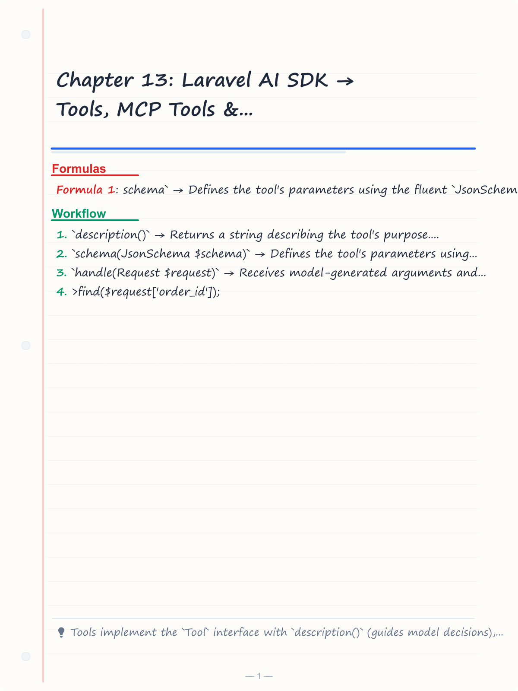
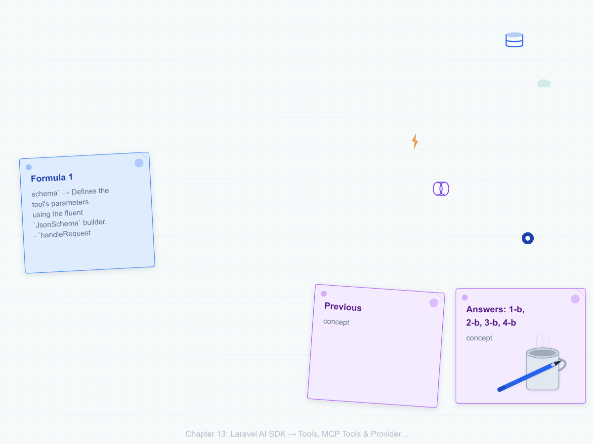
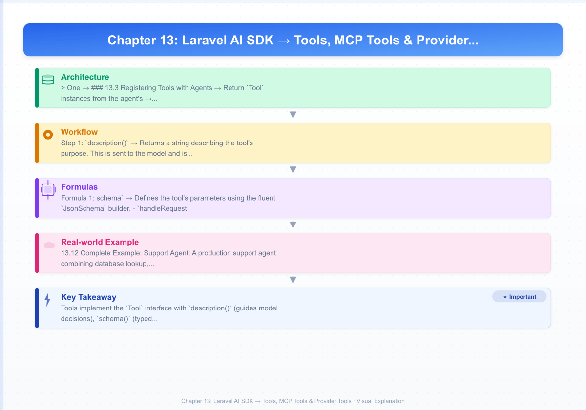
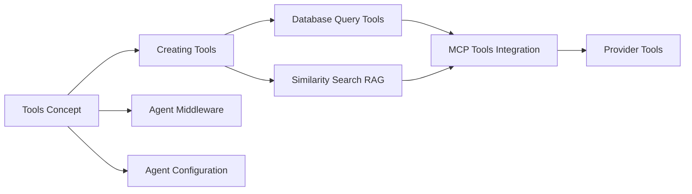

# Chapter 13: Laravel AI SDK → Tools, MCP Tools & Provider Tools
> **Previous:** [Laravel AI SDK -- Agents, Prompting & Structured Output](./12-ai-sdk-agents) | **Next:** [Laravel AI SDK -- Images, Audio, Transcriptions & Embeddings](./14-ai-sdk-media)

---
## Learning Objectives

- Implement custom tools by extending the Tool interface with description, schema, and handle methods
- Register tools with agents and understand how the model invokes them during generation
- Use the SimilaritySearch tool for vector-based knowledge retrieval inside agent prompts
- Integrate Model Context Protocol (MCP) tools from remote and local MCP servers
- Leverage built-in provider tools for web search, web fetching, and file search
- Build a complete support agent combining multiple tools for production use

<!-- Image Gallery -->
<section class="lesson-visuals" aria-label="Visual learning resources">
  <header><span>VISUAL LEARNING</span><h2>See it. Review it. Remember it.</h2></header>
  <a class="lesson-visual-card" href="../../assets/images/lessons/laravel/13-ai-sdk-tools/handwritten-notes.png" target="_blank" rel="noopener">
    
    <span><strong>Handwritten notes</strong>Condensed notes for deliberate review.</span>
  </a>
  <a class="lesson-visual-card" href="../../assets/images/lessons/laravel/13-ai-sdk-tools/sticky-notes.png" target="_blank" rel="noopener">
    
    <span><strong>Sticky-note revision</strong>Fast recall prompts for revision.</span>
  </a>
  <a class="lesson-visual-card" href="../../assets/images/lessons/laravel/13-ai-sdk-tools/visual-explanation.png" target="_blank" rel="noopener">
    
    <span><strong>Visual concept guide</strong>A connected explanation of the key ideas.</span>
  </a>
</section>
<!-- End Image Gallery -->

## Chapter at a Glance

| Section | Key Topics |
|---------|-----------|
| Tools Concept | Tool interface, description/schema/handle |
| Creating Tools | Custom tools, database query tools |
| Similarity Search | RAG via vector search, custom queries |
| MCP Tools | Remote/local MCP servers, spread operator |
| Provider Tools | WebSearch, WebFetch, FileSearch |
| Agent Middleware | before()/after() hooks |
| Configuration | Provider, model, timeout defaults |

## Chapter Roadmap


---
## Theory


### 13.1 The Tools Concept


> **One-Sentence Takeaway:** Tools bridge the gap between language models and external systems by letting agents call your code through a typed schema interface during generation.

Language models are text-in, text-out systems. They cannot access external systems, query databases, browse the web, or compute values at runtime. Tools bridge this gap by giving the agent the ability to call your code during the prompting process.

When an agent is invoked with tools, the SDK sends the tool definitions → names, descriptions, and parameter schemas → to the language model alongside the system prompt and user message. The model can decide to call one or more tools, passing concrete arguments. The SDK intercepts these calls, executes the corresponding `handle()` methods, and returns the results to the model. This loop can repeat multiple times within a single prompt, enabling complex multi-step reasoning.

Every tool must implement the `Tool` interface, which defines three methods:
- `description()` → Returns a string describing the tool's purpose. This is sent to the model and is crucial for correct invocation.
- `schema(JsonSchema $schema)` → Defines the tool's parameters using the fluent `JsonSchema` builder.
- `handle(Request $request)` → Receives model-generated arguments and executes the tool logic. Must return a string or Stringable.

### 13.2 Creating Tools


> **One-Sentence Takeaway:** Every tool implements the Tool interface with description() guiding model decisions, schema() defining typed parameters, and handle() executing logic.

Generate a new tool with `php artisan make:tool RandomNumberGenerator`, which creates a class in `app/Ai/Tools/`:

```php
<?php

namespace App\Ai\Tools;

use Illuminate\Contracts\JsonSchema\JsonSchema;
use Laravel\Ai\Contracts\Tool;
use Laravel\Ai\Tools\Request;
use Stringable;

class RandomNumberGenerator implements Tool
{
    public function description(): Stringable|string

> **Pro Tip:** The description() return value is critical — the language model uses these descriptions to decide which tool to call. A vague description like 'Gets data' causes incorrect tool selection. Be specific about what the tool does and when to use it.
    {
        return 'Generates cryptographically secure random integers within a specified inclusive range. Use this when the user needs a random number, a random selection, or any randomized value.';
    }

    public function handle(Request $request): Stringable|string
    {
        $min = (int) $request['min'];
        $max = (int) $request['max'];

        return (string) random_int($min, $max);
    }

    public function schema(JsonSchema $schema): array
    {
        return [
            'min' => $schema->integer()->min(0)->required()->description('The minimum value of the range, inclusive'),
            'max' => $schema->integer()->required()->description('The maximum value of the range, inclusive'),
        ];
    }
}
```

The `description()` return value is critical → the model uses these descriptions to decide which tool to call. A vague description causes misuse. Always cast or validate incoming values in `handle()`.

### 13.3 Registering Tools with Agents


Return `Tool` instances from the agent's `tools()` method:

```php
<?php

namespace App\Ai\Agents;

use App\Ai\Tools\RandomNumberGenerator;
use Laravel\Ai\Contracts\Agent;
use Laravel\Ai\Promptable;
use Stringable;

class GameMaster implements Agent
{
    use Promptable;

    public function instructions(): Stringable|string
    {
        return 'You are a tabletop RPG game master. Create immersive adventures, generate random encounters, and resolve player actions. Use the random number generator for dice rolls.';
    }

    public function tools(): array
    {
        return [
            new RandomNumberGenerator,
        ];
    }
}
```

When prompted, the model may invoke the tool mid-generation:

```php
<?php

namespace App\Http\Controllers;

use App\Ai\Agents\GameMaster;
use Illuminate\Http\Request;

class GameController extends Controller
{
    public function action(Request $request): array
    {
        $request->validate(['action' => 'required|string']);

        $response = GameMaster::make()->prompt(
            'A player attempts to pick a locked chest. Action: ' . $request->input('action')
        );

        return ['narrative' => $response->text()];
    }
}
```

### 13.4 Database Query Tools


> **One-Sentence Takeaway:** Database query tools are the most common pattern, allowing agents to look up orders, users, or products through controlled, parameterized queries.

The most common tool pattern is querying application data:

```php
<?php

namespace App\Ai\Tools;

use App\Models\Order;
use Illuminate\Contracts\JsonSchema\JsonSchema;
use Laravel\Ai\Contracts\Tool;
use Laravel\Ai\Tools\Request;
use Stringable;

class OrderLookup implements Tool
{
    public function description(): Stringable|string
    {
        return 'Looks up customer orders by order ID or email address. Returns order status, items, total, and shipping information.';
    }

    public function handle(Request $request): Stringable|string
    {
        if (isset($request['order_id'])) {

> **Warning:** Always cast and validate incoming values in handle(). Models send arbitrary types based on their training data. A parameter documented as integer might arrive as a string. Defensive validation prevents runtime errors.
            $order = Order::with(['items', 'shippingAddress'])
                ->find($request['order_id']);

            return $order?->toJson() ?? 'Order not found.';
        }

        if (isset($request['email'])) {
            return Order::with(['items', 'shippingAddress'])
                ->whereHas('user', fn($q) => $q->where('email', $request['email']))
                ->latest()
                ->take(5)
                ->get()
                ->toJson();
        }

        return 'No lookup criteria provided.';
    }

    public function schema(JsonSchema $schema): array
    {
        return [
            'order_id' => $schema->integer()->min(1)->description('The unique order ID to look up'),
            'email' => $schema->string()->description('The email address to find orders for'),
        ];
    }
}
```

### 13.5 Similarity Search Tool


> **One-Sentence Takeaway:** SimilaritySearch provides the foundation for Retrieval-Augmented Generation (RAG) by performing vector search against Eloquent models with embedding columns.

The `SimilaritySearch` tool performs vector similarity search against Eloquent models with an embedding column → the foundation of Retrieval-Augmented Generation (RAG):

```php
<?php

namespace App\Ai\Agents;

use App\Ai\Tools\OrderLookup;
use App\Models\Document;
use Laravel\Ai\Contracts\Agent;
use Laravel\Ai\Promptable;
use Laravel\Ai\Tools\SimilaritySearch;
use Stringable;

class KnowledgeBaseAgent implements Agent
{
    use Promptable;

    public function instructions(): Stringable|string
    {
        return 'You are a support agent with access to product documentation. Answer questions using the documentation. If you cannot find the answer, ask for clarification.';
    }

    public function tools(): array
    {
        return [
            new OrderLookup,
            SimilaritySearch::usingModel(Document::class, 'embedding')

> **Remember:** The minSimilarity threshold directly impacts RAG quality. Start with 0.78 and tune based on your embedding model and use case. Higher values return fewer but more relevant results; lower values increase recall at the cost of noise.
                ->minSimilarity(0.78)
                ->limit(5)
                ->withDescription('Search the product documentation knowledge base for relevant articles.'),
        ];
    }
}
```

For more control, use a custom query closure:

```php
<?php

namespace App\Ai\Agents;

use App\Models\Document;
use Laravel\Ai\Contracts\Agent;
use Laravel\Ai\Promptable;
use Laravel\Ai\Tools\SimilaritySearch;
use Stringable;

class FilteredKnowledgeAgent implements Agent
{
    use Promptable;

    public function instructions(): Stringable|string
    {
        return 'Answer questions using only the documentation provided.';
    }

    public function tools(): array
    {
        return [
            SimilaritySearch::usingModel(Document::class, 'embedding', function ($query, array $embedding): void {
                $query->where('locale', app()->getLocale())
                    ->where('is_published', true)
                    ->whereNull('archived_at');
            })
                ->minSimilarity(0.8)
                ->limit(3),
        ];
    }
}
```

For complete control, omit the column name:

```php
<?php

namespace App\Ai\Agents;

use App\Models\Document;
use Illuminate\Support\Facades\DB;
use Laravel\Ai\Contracts\Agent;
use Laravel\Ai\Promptable;
use Laravel\Ai\Tools\SimilaritySearch;
use Stringable;

class CustomSimilarityAgent implements Agent
{
    use Promptable;

    public function instructions(): Stringable|string
    {
        return 'Answer questions using the internal knowledge base.';
    }

    public function tools(): array
    {
        return [
            SimilaritySearch::usingModel(Document::class, function ($query, array $embedding): void {
                $vector = json_encode($embedding);
                $query->select('*', DB::raw("embedding <=> '{$vector}' as distance"))
                    ->where('tenant_id', auth()->user()->tenant_id)
                    ->having('distance', '<', 0.3)
                    ->orderBy('distance')
                    ->limit(5);
            }),
        ];
    }
}
```

### 13.6 MCP Tools Integration


> **One-Sentence Takeaway:** MCP tools from remote or local servers are spread into agents using the ... operator, combining external capabilities with local tools.

The Model Context Protocol (MCP) is an open standard allowing agents to discover and invoke tools from external servers. Install with `composer require laravel/mcp`. Connect to remote MCP servers and spread their tools using `...`:

```php
<?php

namespace App\Ai\Agents;

use App\Ai\Tools\OrderLookup;
use Laravel\Ai\Contracts\Agent;
use Laravel\Ai\Promptable;
use Laravel\Ai\Tools\SimilaritySearch;
use Laravel\Mcp\Client;
use Stringable;

class EnterpriseSupportAgent implements Agent
{
    use Promptable;

    public function instructions(): Stringable|string
    {
        return 'You are an enterprise support agent with access to customer data, documentation, and internal systems.';
    }

    public function tools(): array
    {
        return [
            new OrderLookup,
            SimilaritySearch::usingModel(Document::class, 'embedding')
                ->minSimilarity(0.78)
                ->limit(5),
            ...Client::web('https://mcp.example.com')
                ->withToken(env('MCP_API_TOKEN'))
                ->tools(),
        ];
    }
}
```

Named MCP clients are configured in `config/mcp.php` and referenced by name:

```php
<?php

namespace App\Ai\Agents;

use Laravel\Ai\Contracts\Agent;
use Laravel\Ai\Promptable;
use Laravel\Ai\Tools\SimilaritySearch;
use Laravel\Mcp\Facades\Mcp;
use Stringable;

class DeveloperAgent implements Agent
{
    use Promptable;

    public function instructions(): Stringable|string
    {
        return 'You are a developer assistant with access to GitHub, PostgreSQL, and Slack.';
    }

    public function tools(): array
    {
        return [
            ...Mcp::client('github')->tools(),
            ...Mcp::client('postgres')->tools(),
            ...Mcp::client('slack')->tools(),
        ];
    }
}
```

Local MCP servers run as subprocesses:

```php
<?php

namespace App\Ai\Agents;

use Laravel\Ai\Contracts\Agent;
use Laravel\Ai\Promptable;
use Laravel\Mcp\Client;
use Stringable;

class LocalMcpAgent implements Agent
{
    use Promptable;

    public function instructions(): Stringable|string
    {
        return 'You have access to internal tools via a local MCP server.';
    }

    public function tools(): array
    {
        return [
            ...Client::local('php', ['artisan', 'mcp:start'])->tools(),
        ];
    }
}
```

### 13.7 Provider Tools


> **One-Sentence Takeaway:** Provider tools like WebSearch, WebFetch, and FileSearch are built-in capabilities configured directly on PendingAgentRequest without custom tool classes.

Provider tools are built-in capabilities offered by AI providers, configured directly on `PendingAgentRequest`.

#### 13.7.1 WebSearch

Supported by Anthropic, OpenAI, and Gemini:

```php
<?php

namespace App\Http\Controllers;

use App\Ai\Agents\GameMaster;
use Illuminate\Http\Request;

class ResearchController extends Controller
{
    public function currentEvents(Request $request): array
    {
        $request->validate(['topic' => 'required|string']);

        $response = GameMaster::make()
            ->withWebSearch(max: 5, allow: ['laravel.com'], location: 'US')
            ->prompt('Research the latest developments in ' . $request->input('topic'));

        return ['summary' => $response->text()];
    }
}
```

#### 13.7.2 WebFetch

Supported by Anthropic and Gemini for reading specific URLs:

```php
<?php

namespace App\Http\Controllers;

use App\Ai\Agents\GameMaster;
use Illuminate\Http\Request;

class UrlController extends Controller
{
    public function fetchUrl(Request $request): array
    {
        $request->validate(['url' => 'required|url']);

        $response = GameMaster::make()
            ->withWebFetch()
            ->prompt('Read the content at ' . $request->input('url') . ' and summarize the key points.');

        return ['summary' => $response->text()];
    }
}
```

#### 13.7.3 FileSearch

Supported by OpenAI and Gemini for searching provider-managed vector stores:

```php
<?php

namespace App\Http\Controllers;

use App\Ai\Agents\GameMaster;
use Illuminate\Http\Request;

class VectorSearchController extends Controller
{
    public function search(Request $request): array
    {
        $request->validate(['query' => 'required|string']);

        $response = GameMaster::make()
            ->withFileSearch(vectorStoreIds: ['vs_abc123', 'vs_def456'])
            ->prompt('Search the knowledge base for: ' . $request->input('query'));

        return ['answer' => $response->text()];
    }
}
```

### 13.8 Anonymous Agents with Tools


Pass tools via `withTools()` on the `Agent` facade:

```php
<?php

namespace App\Http\Controllers;

use App\Ai\Tools\OrderLookup;
use App\Models\Document;
use Illuminate\Http\Request;
use Laravel\Ai\Facades\Agent;
use Laravel\Ai\Tools\SimilaritySearch;

class QuickSupportController extends Controller
{
    public function handle(Request $request): array
    {
        $request->validate(['question' => 'required|string']);

        $response = Agent::make()
            ->instructions('You are a quick support agent. Answer concisely using available tools.')
            ->withTools([
                new OrderLookup,
                SimilaritySearch::usingModel(Document::class, 'embedding')
                    ->minSimilarity(0.78)
                    ->limit(3),
            ])
            ->withWebSearch()
            ->prompt($request->input('question'));

        return ['answer' => $response->text()];
    }
}
```

### 13.9 Agent Middleware


> **One-Sentence Takeaway:** Agent middleware provides before() and after() hooks for cross-cutting concerns like logging, metrics collection, and access control.

Implement the `AgentMiddleware` interface for cross-cutting concerns:

```php
<?php

namespace App\Ai\Middleware;

use Laravel\Ai\Contracts\AgentMiddleware;
use Laravel\Ai\Contracts\PendingAgentRequest;
use Laravel\Ai\Contracts\AgentResponse;
use Illuminate\Support\Facades\Log;

class AuditMiddleware implements AgentMiddleware
{
    public function before(PendingAgentRequest $request): PendingAgentRequest
    {
        Log::info('Agent prompt initiated', [
            'agent' => get_class($request->agent()),
            'timestamp' => now(),
        ]);

        return $request;
    }

    public function after(AgentResponse $response): AgentResponse
    {
        Log::info('Agent response received', [
            'output_tokens' => $response->outputTokens(),
            'input_tokens' => $response->inputTokens(),
        ]);

        return $response;
    }
}
```

Register on an agent via the `middleware()` method:

```php
<?php

namespace App\Ai\Agents;

use App\Ai\Middleware\AuditMiddleware;
use Laravel\Ai\Contracts\Agent;
use Laravel\Ai\Promptable;
use Stringable;

class AuditedAgent implements Agent
{
    use Promptable;

    public function instructions(): Stringable|string
    {
        return 'You are an audited agent. All interactions are logged.';
    }

    public function middleware(): array
    {
        return [new AuditMiddleware];
    }
}
```

### 13.10 Agent Configuration


Configure defaults directly on the agent class:

```php
<?php

namespace App\Ai\Agents;

use Laravel\Ai\Contracts\Agent;
use Laravel\Ai\Promptable;
use Laravel\Ai\Lab;
use Stringable;

class ConfiguredAgent implements Agent
{
    use Promptable;

    public function instructions(): Stringable|string
    {
        return 'You are a configured agent with class-level defaults.';
    }

    public function provider(): Lab
    {
        return Lab::Anthropic;
    }

    public function model(): string
    {
        return 'claude-sonnet-4-20250514';
    }

    public function timeout(): int
    {
        return 60;
    }
}
```

### 13.11 Provider Options


Pass provider-specific options to `prompt()` as a second argument:

```php
<?php

namespace App\Http\Controllers;

use App\Ai\Agents\GameMaster;
use Illuminate\Http\Request;

class OptionsController extends Controller
{
    public function controlled(Request $request): array
    {
        $request->validate(['prompt' => 'required|string']);

        $response = GameMaster::make()
            ->using(Lab::Anthropic)
            ->prompt($request->input('prompt'), [
                'max_tokens' => 2048,
                'stop_sequences' => ["\n\nHuman:", "\n\nAssistant:"],
                'temperature' => 0.7,
                'top_p' => 0.9,
                'metadata' => ['user_id' => $request->user()->id],
            ]);

        return ['response' => $response->text()];
    }
}
```

### 13.12 Complete Example: Support Agent


A production support agent combining database lookup, SimilaritySearch, WebSearch, streaming, and conversation context:

```php
<?php

namespace App\Ai\Agents;

use App\Ai\Tools\OrderLookup;
use App\Models\Document;
use Laravel\Ai\Contracts\Agent;
use Laravel\Ai\Conversational;
use Laravel\Ai\Promptable;
use Laravel\Ai\RemembersConversations;
use Laravel\Ai\Tools\SimilaritySearch;
use Stringable;

class EnterpriseSupportAgent implements Agent, Conversational
{
    use Promptable, RemembersConversations;

    public function instructions(): Stringable|string
    {
        return 'You are a senior enterprise support agent. You have access to:
1. The order lookup system to check customer orders
2. The product documentation knowledge base for troubleshooting
3. Live web search for the latest documentation

Always verify order information before giving status updates. Be polite and thorough.';
    }

    public function tools(): array
    {
        return [
            new OrderLookup,
            SimilaritySearch::usingModel(Document::class, 'embedding')
                ->minSimilarity(0.78)
                ->limit(5)
                ->withDescription('Search the internal product documentation knowledge base.'),
        ];
    }
}
```

Corresponding controller:

```php
<?php

namespace App\Http\Controllers;

use App\Ai\Agents\EnterpriseSupportAgent;
use Illuminate\Http\Request;

class EnterpriseSupportController extends Controller
{
    public function chat(Request $request): array
    {
        $request->validate(['message' => 'required|string']);

        $response = EnterpriseSupportAgent::make()
            ->forUser($request->user())
            ->withWebSearch(max: 3, allow: ['laravel.com', 'github.com', 'php.net'])
            ->prompt($request->input('message'));

        return [
            'reply' => $response->text(),
            'conversation_id' => $response->conversationId(),
            'usage' => [
                'input_tokens' => $response->inputTokens(),
                'output_tokens' => $response->outputTokens(),
            ],
        ];
    }
}
```

---

## Concept Comparison

| Feature | Custom Tools | MCP Tools | Provider Tools |
|---------|-------------|-----------|---------------|
| Definition | PHP Tool class | External server | Provider built-in |
| Hosting | In-app | Remote/local server | Provider-side |
| Schema | JsonSchema in code | Server-defined | Provider-defined |
| Latency | Low (in-process) | Medium (network) | Medium (API call) |
| Use Case | Database queries | GitHub, Slack APIs | Web search, file search |

## Quick Reference — AI SDK Tool Methods

| Method | Purpose |
|--------|---------|
| `php artisan make:tool RandomNumber` | Create tool class |
| `->withTools([...])` | Register tools on anonymous agent |
| `->withWebSearch(max: 5)` | Enable provider web search |
| `->withWebFetch()` | Enable URL fetching |
| `->withFileSearch(vectorStoreIds: [...])` | Enable file search |
| `SimilaritySearch::usingModel()` | Create vector search tool |

## Cross-Application Matrix

| Concept | Support Agent | Developer Agent | Research Agent |
|---------|--------------|----------------|---------------|
| Custom Tools | OrderLookup | GitHubIssueTool | WebScraperTool |
| MCP Tools | CRM server | GitHub + Slack | Database explorer |
| SimilaritySearch | Product docs | Codebase docs | Research papers |
| Provider Tools | WebSearch (docs) | WebFetch (bug reports) | WebSearch (research) |
| Middleware | Audit logging | Rate limiting | Cost tracking |

## Chapter Quiz

**1. What are the three methods every Tool must implement?**
- a) name(), schema(), execute()
- b) description(), schema(), handle()
- c) instructions(), parameters(), run()
- d) title(), input(), output()

**2. How are MCP tools combined with local tools in an agent?**
- a) Through a configuration file
- b) Using the spread (...) operator
- c) Via dependency injection
- d) Through facade registration

**3. What does withWebSearch() enable?**
- a) URL fetching
- b) Internet search capabilities
- c) Vector store search
- d) File system search

**4. What is the purpose of Agent Middleware?**
- a) To validate tool parameters
- b) To provide before/after hooks for logging and metrics
- c) To authenticate API requests
- d) To cache agent responses

**Answers: 1-b, 2-b, 3-b, 4-b**

## Summary

- Tools implement the `Tool` interface with `description()` (guides model decisions), `schema()` (typed parameters via `JsonSchema`), and `handle()` (executes logic, returns string)
- Tools are registered through the agent's `tools()` method as an array of instances
- `SimilaritySearch` enables RAG via vector search against Eloquent models, supporting custom query closures and full-control mode
- MCP tools from `laravel/mcp` connect to remote (`Client::web()`) or local (`Client::local()`) servers, spread into agents via `...`
- Provider tools → `WebSearch`, `WebFetch`, `FileSearch` → are configured on `PendingAgentRequest` without custom classes
- Agent middleware provides `before()` and `after()` hooks for logging, metrics, and access control
---
## Exercises

### Review Questions

1. Describe the three-method contract of the `Tool` interface. Why is `description()` critical for correct model behavior?

2. Explain the model-tool-handoff loop sequence when a model decides to invoke a tool during prompting.

3. Compare `SimilaritySearch` with `FileSearch`. What are the architectural differences between application-side and provider-side vector search?

4. What is MCP and how does the spread operator enable combining MCP tools with local tools?

5. Explain the difference between `withWebSearch()` and `withWebFetch()`. When would you use each?

### Application Problems

1. Create a `WeatherTool` accepting a `city` string parameter that queries a weather API (use `Http::fake()` for testing) and returns temperature and conditions. Register it with a `TravelAgent`.

2. Implement a `ProductInventoryTool` accepting `product_sku` that queries the `products` table for stock and warehouse location. Register it alongside `SimilaritySearch` on a `SalesAgent`.

3. Build an agent combining three tools: a `GitHubIssueTool` (creates issues via API), `SimilaritySearch` (internal docs), and `WebSearch` (live code examples). Make it conversational with audit middleware.

### Challenge Problem

Create a local MCP server via `artisan mcp:start` exposing `DeployStatus` and `RollbackRelease` tools querying a `deployments` table. Build a `DevOpsAgent` using these MCP tools plus `SimilaritySearch` against a `runbooks` table and `WebFetch` for monitoring dashboards. Use structured output returning `service_health` (enum), `recent_incidents` (array), and `recommended_action` (string). Implement middleware logging all rollbacks to an `audit_log` table.