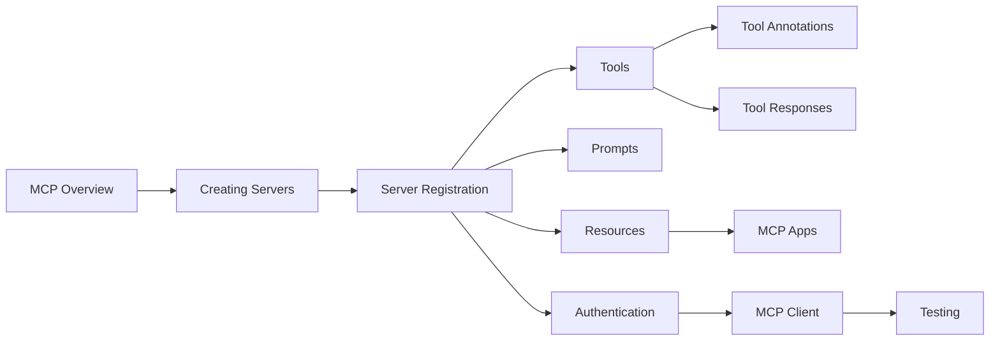

# Chapter 15: Laravel MCP — Model Context Protocol
> **Previous:** [Laravel AI SDK -- Images, Audio, Transcriptions & Embeddings](./14-ai-sdk-media) | **Next:** [Semantic Search, Vector Search & RAG with pgvector](./16-search-rag)

---
## Learning Objectives
- Understand the Model Context Protocol specification and its architecture
- Install and configure Laravel MCP in a Laravel application
- Create MCP servers with tools, resources, and prompts
- Implement tool schemas, annotations, and response types
- Build an MCP Client for agent integration
- Authenticate and test MCP servers
## Chapter at a Glance

| Section | Key Topics |
|---------|-----------|
| MCP Overview | Protocol architecture, primitives |
| Server Creation | Attributes, tools/resources/prompts |
| Server Registration | HTTP and local deployment |
| Tools | inputSchema, handle, outputSchema |
| Tool Annotations | ReadOnly, Destructive, Idempotent, OpenWorld |
| Tool Responses | Text, file, structured, streaming |
| Prompts | Templates, arguments, validation |
| Resources | URI-based data, template parameters |
| MCP Apps | Blade/Livewire interactive UIs |
| Authentication | OAuth 2.1, Sanctum tokens |
| MCP Client | Consuming remote servers |
| Testing | HTTP assertions, unit testing |

## Chapter Roadmap


---

## Theory


### 15.1 MCP Overview

> **One-Sentence Takeaway:** MCP is an open standard defining how AI clients communicate with servers that provide tools, resources, and prompts via JSON-RPC.

The Model Context Protocol (MCP) is an open standard published by Anthropic that defines how AI clients communicate with servers that provide context, tools, and resources. It follows a client-server architecture where the AI model (the client) discovers and invokes capabilities exposed by MCP servers.

The protocol defines three core primitives:

- **Tools**: Actions the AI can invoke (functions with typed schemas)
- **Resources**: Data the AI can read (files, database records, API responses)
- **Prompts**: Pre-written templates the AI can use (structured interactions)

Laravel MCP (`laravel/mcp`) brings this protocol directly into the Laravel ecosystem. Every MCP server you build is a full Laravel class with access to the entire framework — Eloquent, Queues, Events, Caching, and all your application services. This means an AI agent can, through your MCP server, query your database, trigger business logic, read files, and generate reports using the same code paths your human-driven controllers use.

The architecture follows this flow:

```
AI Agent (Claude, Cursor, etc.)
    │
    â–¼
MCP Client (dispatches requests)
    │
    â–¼
MCP Server (Laravel class)
    │
    ├─ Tools ──────────► Command-like actions with JSON schemas
    ├─ Resources ──────► Readable data at URIs
    └─ Prompts ────────► Structured interaction templates
```

A single server class declares its capabilities declaratively via PHP attributes and arrays, then Laravel MCP handles all the JSON-RPC wire protocol automatically.

### 15.2 Installation

Start by requiring the package and publishing the configuration:

```php
composer require laravel/mcp

> **Pro Tip:** Always define server instructions (#[Instructions]) with specific guidance on when to use each tool. This attribute is sent to the AI agent and significantly improves tool selection accuracy.

php artisan vendor:publish --tag=ai-routes
```

The publish command creates a `routes/ai.php` file where you register your MCP servers. This file is loaded by the framework automatically when MCP routes are needed, keeping your server registrations separate from web and API routes.

The package also publishes a `config/mcp.php` configuration file where you can set defaults for authentication, rate limiting, and client registration.

### 15.3 Creating Servers

> **One-Sentence Takeaway:** MCP servers are Laravel classes extending Server with PHP attributes for name, version, and instructions, and arrays for tools, resources, and prompts.

An MCP server is a plain PHP class that extends `Laravel\Mcp\Server`. Use the generator command to scaffold one:

```php
php artisan make:mcp-server WeatherServer
```

This creates `App\Mcp\Servers\WeatherServer.php`. Open it and define the server's identity and capabilities:

```php
<?php

namespace App\Mcp\Servers;

use Laravel\Mcp\Server;
use Laravel\Mcp\Attributes\Name;
use Laravel\Mcp\Attributes\Version;
use Laravel\Mcp\Attributes\Instructions;
use App\Mcp\Tools\CurrentWeatherTool;
use App\Mcp\Tools\ForecastTool;
use App\Mcp\Resources\WeatherAlertResource;
use App\Mcp\Prompts\WeatherSummaryPrompt;

#[Name('weather-server')]
#[Version('1.0.0')]
#[Instructions(
    'Provides current weather data, forecasts, and alerts. ' .
    'Use CurrentWeatherTool for real-time conditions, ' .
    'ForecastTool for 7-day outlook, and ' .
    'WeatherAlertResource for active warnings in an area.'
)]
class WeatherServer extends Server
{
    protected array $tools = [
        CurrentWeatherTool::class,
        ForecastTool::class,
    ];

    protected array $resources = [
        WeatherAlertResource::class,
    ];

    protected array $prompts = [
        WeatherSummaryPrompt::class,
    ];
}
```

The `#[Name]` attribute sets the server identifier used in the MCP protocol. `#[Version]` enables clients to check for updated capabilities. `#[Instructions]` provides a natural-language description that the AI agent reads to understand what this server does and when to invoke its tools.

The `$tools`, `$resources`, and `$prompts` arrays register the server's capabilities. Each entry is a fully-qualified class name that the framework resolves lazily.

### 15.4 Server Registration

Servers are registered in `routes/ai.php`. There are two deployment modes:

**HTTP servers** expose your MCP server as a POST endpoint. The AI agent sends JSON-RPC requests to this URL:

```php
<?php

use Illuminate\Support\Facades\Route;
use Laravel\Mcp\Facades\Mcp;
use App\Mcp\Servers\WeatherServer;

// HTTP server — accessible at /mcp/weather via POST
Mcp::web('/mcp/weather', WeatherServer::class)

> **Warning:** Always add authentication and rate limiting middleware to HTTP MCP servers. An unauthenticated MCP server exposes your application's internal tools and data to anyone who discovers the endpoint.
    ->middleware('throttle:30,1')
    ->middleware('auth:sanctum');

// Multiple HTTP servers on different endpoints
Mcp::web('/mcp/analytics', AnalyticsServer::class);
Mcp::web('/mcp/crm', CrmServer::class);
```

The `web` method returns a route builder, so you can chain middleware just like a normal Laravel route. This is critical for production — you can throttle, authenticate, and authorize access to each server independently.

**Local servers** are registered for CLI usage. They work with Laravel Boost and Artisan commands, never exposing an HTTP endpoint:

```php
Mcp::local('weather', WeatherServer::class);
Mcp::local('analytics', AnalyticsServer::class);
```

Local servers are invoked via `php artisan mcp:call {server} {tool}` and are ideal for AI coding agents that run in the same environment as your application.

### 15.5 Creating Tools

> **One-Sentence Takeaway:** MCP tools define inputSchema for parameters, handle() for execution logic, and outputSchema for response documentation.

Tools are the core of MCP — they are the actions an AI agent can invoke. Generate one with:

```php
php artisan make:mcp-tool CurrentWeatherTool
```

This creates `App\Mcp\Tools\CurrentWeatherTool.php`. A tool class extends `Laravel\Mcp\Server\Tool` and implements a `handle(Request): Response` method:

```php
<?php

namespace App\Mcp\Tools;

use Laravel\Mcp\Server\Tool;
use Laravel\Mcp\Attributes\Name;
use Laravel\Mcp\Attributes\Title;
use Laravel\Mcp\Attributes\Description;
use Laravel\Mcp\Server\Request;
use Laravel\Mcp\Server\Response;
use Laravel\Mcp\Server\JsonSchema;
use Illuminate\Support\Facades\Http;

#[Name('get-current-weather')]
#[Title('Get Current Weather')]
#[Description('Retrieves the current weather conditions for a given city or geographic coordinates. Returns temperature, humidity, wind speed, and conditions.')]
class CurrentWeatherTool extends Tool
{
    public function inputSchema(JsonSchema $schema): void
    {
        $schema->string('city', description: 'City name (e.g., "London", "Tokyo", "New York")')
            ->required();

        $schema->string('units', description: 'Temperature unit')
            ->enum('celsius', 'fahrenheit')
            ->default('celsius');

        $schema->string('country_code', description: 'ISO 3166-1 alpha-2 country code')
            ->default('US');
    }

    public function handle(Request $request): Response
    {
        $data = $request->validate([
            'city' => ['required', 'string', 'max:255'],
            'units' => ['string', 'in:celsius,fahrenheit'],
            'country_code' => ['string', 'size:2'],
        ]);

        $response = Http::get('https://api.weatherapi.com/v1/current.json', [
            'key' => config('services.weatherapi.key'),
            'q' => $data['city'] . ',' . $data['country_code'],
            'aqi' => 'no',
        ]);

        if ($response->failed()) {
            return Response::error(
                message: 'Unable to fetch weather data.',
                data: ['status' => $response->status()],
            );
        }

        $current = $response->json('current');

        $tempField = $data['units'] === 'fahrenheit' ? 'temp_f' : 'temp_c';
        $windField = $data['units'] === 'fahrenheit' ? 'wind_mph' : 'wind_kph';

        return Response::text(json_encode([
            'city' => $response->json('location.name'),
            'region' => $response->json('location.region'),
            'country' => $response->json('location.country'),
            'temperature' => $current[$tempField],
            'units' => $data['units'],
            'condition' => $current['condition']['text'],
            'humidity' => $current['humidity'],
            'wind_speed' => $current[$windField],
            'last_updated' => $current['last_updated'],
        ], JSON_PRETTY_PRINT));
    }

    public function outputSchema(JsonSchema $schema): void
    {
        $schema->string('city', description: 'City name');
        $schema->string('region', description: 'Region or state');
        $schema->string('country', description: 'Country name');
        $schema->number('temperature', description: 'Current temperature');
        $schema->string('units', description: 'Temperature unit used');
        $schema->string('condition', description: 'Weather condition description');
        $schema->number('humidity', description: 'Humidity percentage');
        $schema->number('wind_speed', description: 'Wind speed');
        $schema->string('last_updated', description: 'Last update timestamp');
    }
}
```

The `inputSchema()` method defines the parameters the AI agent must supply. `JsonSchema` provides a fluent builder for each JSON Schema type:

```php
$schema->string(name, description: '...')
    ->minLength(1)
    ->maxLength(255)
    ->required();

$schema->integer(name, description: '...')
    ->minimum(0)
    ->maximum(100)
    ->required();

$schema->number(name, description: '...')
    ->exclusiveMinimum(0);

$schema->boolean(name, description: '...');

$schema->array(name, description: '...')
    ->items($schema->string());

$schema->enum(name, ...values)->default(firstValue);
```

The `outputSchema()` method documents what the response contains. This helps the AI agent understand the structure before it calls the tool, improving reliability.

### 15.6 Tool Annotations

> **One-Sentence Takeaway:** Annotations like IsReadOnly, IsDestructive, IsIdempotent, and IsOpenWorld communicate behavioral metadata to guide AI agent decision-making.

Annotations convey metadata about tool behavior to the AI agent. They help the model make safe decisions about when and how to invoke tools:

```php
<?php

namespace App\Mcp\Tools;

use Laravel\Mcp\Server\Tool;
use Laravel\Mcp\Attributes\Name;
use Laravel\Mcp\Attributes\Description;
use Laravel\Mcp\Attributes\IsReadOnly;
use Laravel\Mcp\Attributes\IsDestructive;
use Laravel\Mcp\Attributes\IsIdempotent;
use Laravel\Mcp\Attributes\IsOpenWorld;
use Laravel\Mcp\Server\Request;
use Laravel\Mcp\Server\Response;

#[Name('archive-invoice')]
#[Description('Archives a paid invoice by moving it from active to archived status. Can be reversed via restore-invoice.')]
#[IsDestructive]
class ArchiveInvoiceTool extends Tool
{
    public function handle(Request $request): Response
    {
        $data = $request->validate([
            'invoice_id' => ['required', 'integer', 'exists:invoices,id'],
        ]);

        $invoice = Invoice::findOrFail($data['invoice_id']);

        if (! $invoice->isPaid()) {
            return Response::error('Only paid invoices can be archived.');
        }

        $invoice->update(['status' => 'archived', 'archived_at' => now()]);

        return Response::text(
            "Invoice #{$invoice->id} has been archived."
        );
    }
}
```

The four annotations are:

- `#[IsReadOnly]` — The tool does not modify any state. Safe to preview or call speculatively
- `#[IsDestructive]` — The tool deletes or permanently modifies data. The AI will exercise extra caution
- `#[IsIdempotent]` — Calling the tool multiple times with the same arguments produces the same result. Safe to retry after a failure
- `#[IsOpenWorld]` — The tool interacts with external systems (APIs, third-party services). Results may change between calls

### 15.7 Tool Responses

> **One-Sentence Takeaway:** Tools return structured responses via Response::text(), Response::fromStorage(), Response::error(), Response::image(), and streaming generators.

Tools return structured responses. Laravel MCP provides several response types for different data shapes:

```php
<?php

namespace App\Mcp\Tools;

use Laravel\Mcp\Server\Tool;
use Laravel\Mcp\Server\Request;
use Laravel\Mcp\Server\Response;
use App\Models\Report;

#[Name('generate-report-pdf')]
#[Title('Generate Report PDF')]
class GenerateReportTool extends Tool
{
    public function handle(Request $request): Response
    {
        $data = $request->validate([
            'report_id' => ['required', 'integer', 'exists:reports,id'],
            'format' => ['string', 'in:pdf,html,csv'],
        ]);

        $report = Report::findOrFail($data['report_id']);

        $pdfContent = $report->generatePdf();

        // Simple text response
        if ($data['format'] === 'csv') {
            return Response::text($report->toCsv());
        }

        // File from storage disk
        if ($data['format'] === 'pdf') {
            return Response::fromStorage(
                path: "reports/report-{$report->id}.pdf",
                disk: 's3',
                mimeType: 'application/pdf',
                filename: "report-{$report->id}.pdf",
            );
        }

        // Multi-content response with metadata and embedded data
        return Response::structured([
            'id' => $report->id,
            'title' => $report->title,
            'generated_at' => now()->toIso8601String(),
            'sections' => $report->sections->map(function ($section) {
                return [
                    'heading' => $section->heading,
                    'word_count' => str_word_count($section->body),
                    'status' => $section->status,
                ];
            })->toArray(),
            'total_word_count' => $report->sections->sum(fn ($s) => str_word_count($s->body)),
        ]);
    }
}
```

Other response methods include:

```php
// Return an error with optional context data
Response::error('Invoice not found.', data: ['invoice_id' => 42]);

// Return an image (base64-encoded or from storage)
Response::image(storage_path('app/photos/photo.jpg'));

// Return audio
Response::audio(
    storage_path('app/recordings/call.mp3'),
    mimeType: 'audio/mpeg'
);

// Multi-content array — multiple pieces of content in one response
Response::multi(
    Response::text(json_encode(['summary' => '...'])),
    Response::fromStorage('files/report.pdf', disk: 'local'),
);
```

**Streaming responses** use PHP generators. The AI agent receives chunks as they are produced:

```php
#[Name('stream-logs')]
#[Title('Stream Application Logs')]
class StreamLogsTool extends Tool
{
    public function handle(Request $request): Response
    {
        $data = $request->validate([
            'lines' => ['integer', 'min:1', 'max:1000'],
        ]);

        return Response::text(function () use ($data) {
            $filePath = storage_path('logs/laravel.log');
            $handle = fopen($filePath, 'r');

            if (! $handle) {
                yield json_encode(['error' => 'Cannot open log file']);
                return;
            }

            $position = filesize($filePath) - ($data['lines'] * 200);
            $position = max(0, $position);
            fseek($handle, $position);
            fgets($handle);

            $lineCount = 0;
            while (($line = fgets($handle)) !== false && $lineCount < $data['lines']) {
                yield json_encode(['line' => trim($line), 'number' => $lineCount + 1]);
                $lineCount++;
            }

            fclose($handle);
        });
    }
}
```

### 15.8 Prompts

Prompts are pre-written templates that guide the AI agent's behavior. They help the model produce consistent, high-quality output for specific tasks:

```php
php artisan make:mcp-prompt WeatherSummaryPrompt
```

```php
<?php

namespace App\Mcp\Prompts;

use Laravel\Mcp\Server\Prompt;
use Laravel\Mcp\Attributes\Name;
use Laravel\Mcp\Attributes\Description;
use Laravel\Mcp\Server\Argument;
use Laravel\Mcp\Server\Request;
use Laravel\Mcp\Server\Response;

#[Name('weather-summary')]
#[Description('Generates a human-readable weather summary from raw data')]
class WeatherSummaryPrompt extends Prompt
{
    public function arguments(): array
    {
        return [
            Argument::make('location', 'The city and country for the weather summary')
                ->required(),

            Argument::make('detail_level', 'How detailed the summary should be')
                ->default('standard'),

            Argument::make('include_recommendation', 'Whether to include activity recommendations')
                ->default('true'),
        ];
    }

    public function handle(Request $request): Response
    {
        $data = $request->validate([
            'location' => ['required', 'string', 'max:255'],
            'detail_level' => ['string', 'in:brief,standard,detailed'],
            'include_recommendation' => ['boolean'],
        ]);

        $prompt = <<<PROMPT
You are a professional meteorologist providing a weather summary.

Location: {$data['location']}
Detail Level: {$data['detail_level']}

Please provide a comprehensive weather summary that includes:

1. Current conditions (temperature, humidity, wind)
2. Forecast for the next 24-48 hours
3. Any weather alerts or warnings

Use the get-current-weather and get-forecast tools to retrieve the data.

Format your response in clear, plain language suitable for a general audience.
PROMPT;

        return Response::text($prompt);
    }
}
```

Arguments use the `Argument::make()` helper which provides optional chaining for validation rules:

```php
Argument::make('name', 'Description')
    ->required()
    ->default('value')
    ->validate(['string', 'max:255']);
```

### 15.9 Resources

Resources expose readable data to the AI agent. They are identified by URIs and have a MIME type:

```php
php artisan make:mcp-resource WeatherAlertResource
```

```php
<?php

namespace App\Mcp\Resources;

use Laravel\Mcp\Server\Resource;
use Laravel\Mcp\Attributes\Name;
use Laravel\Mcp\Attributes\Description;
use Laravel\Mcp\Server\Request;
use Laravel\Mcp\Server\Response;

#[Name('weather-alerts')]
#[Description('Active weather alerts and warnings for a region')]
#[Uri('weather://alerts/{region}')]
#[MimeType('application/json')]
class WeatherAlertResource extends Resource
{
    public function handle(Request $request): Response
    {
        $region = $request->route('region');

        $alerts = $this->fetchAlertsForRegion($region);

        return Response::text(json_encode([
            'region' => $region,
            'timestamp' => now()->toIso8601String(),
            'alerts' => $alerts,
        ], JSON_PRETTY_PRINT));
    }

    private function fetchAlertsForRegion(string $region): array
    {
        $response = Http::get('https://api.weather.gov/alerts/active/area/' . $region, [
            'User-Agent' => config('app.name'),
        ]);

        if ($response->failed()) {
            return [];
        }

        return collect($response->json('features', []))->map(function ($feature) {
            $props = $feature['properties'];
            return [
                'event' => $props['event'],
                'headline' => $props['headline'],
                'severity' => $props['severity'],
                'urgency' => $props['urgency'],
                'effective' => $props['effective'],
                'expires' => $props['expires'],
                'description' => $props['description'],
            ];
        })->toArray();
    }
}
```

Resource URIs can contain template parameters like `{region}`. The framework extracts these from the URI and makes them available via `$request->route()`.

Conditional registration allows you to dynamically control which resources are available:

```php
use App\Models\FeatureFlag;

protected array $resources = [
    WeatherAlertResource::class,
];

public function getResources(): array
{
    $resources = [WeatherAlertResource::class];

    if (FeatureFlag::isEnabled('premium-weather')) {
        $resources[] = PremiumForecastResource::class;
    }

    return $resources;
}
```

### 15.10 MCP Apps

> **One-Sentence Takeaway:** MCP Apps render rich UIs using Blade and Livewire directly within AI agent interfaces, enabling interactive dashboards and forms.

MCP Apps allow you to build rich user interfaces that render directly within the AI agent's interface. They use Laravel's Blade or Livewire to create interactive experiences:

```php
php artisan make:mcp-server DashboardServer
```

```php
<?php

namespace App\Mcp\Servers;

use Laravel\Mcp\Server;
use Laravel\Mcp\Attributes\Name;
use Laravel\Mcp\Attributes\Version;
use Laravel\Mcp\Attributes\Instructions;
use App\Mcp\Tools\RenderDashboardTool;

#[Name('dashboard-server')]
#[Version('1.0.0')]
#[Instructions('Provides interactive dashboards for key business metrics. Use RenderDashboardTool to display a real-time dashboard with charts and KPIs.')]
class DashboardServer extends Server
{
    protected array $tools = [
        RenderDashboardTool::class,
    ];
}
```

A tool that renders an app:

```php
<?php

namespace App\Mcp\Tools;

use Laravel\Mcp\Server\Tool;
use Laravel\Mcp\Server\Request;
use Laravel\Mcp\Server\Response;
use Laravel\Mcp\App;

#[Name('render-sales-dashboard')]
#[Title('Render Sales Dashboard')]
class RenderDashboardTool extends Tool
{
    public function handle(Request $request): Response
    {
        $data = $request->validate([
            'period' => ['string', 'in:7d,30d,90d,ytd'],
        ]);

        return Response::app(
            App::render('mcp.dashboards.sales', [
                'period' => $data['period'],
                'totalRevenue' => Sale::query()->where(...)->sum('amount'),
                'chartData' => Sale::query()
                    ->selectRaw("DATE(created_at) as date, SUM(amount) as total")
                    ->groupBy('date')
                    ->orderBy('date')
                    ->pluck('total', 'date'),
            ])
        );
    }
}
```

The Blade view at `resources/views/mcp/dashboards/sales.blade.php` can use Tailwind CSS, Alpine.js, and Chart.js:

```php
<div class="p-6 bg-white rounded-lg shadow">
    <h2 class="text-2xl font-bold mb-4">Sales Dashboard</h2>
    <p class="text-4xl font-extrabold text-green-600">
        ${{ number_format($totalRevenue, 2) }}
    </p>
    <canvas id="salesChart" class="mt-6"></canvas>
</div>

<script src="https://cdn.jsdelivr.net/npm/chart.js"></script>
<script>
    const ctx = document.getElementById('salesChart').getContext('2d');
    new Chart(ctx, {
        type: 'line',
        data: {
            labels: @json(array_keys($chartData)),
            datasets: [{
                label: 'Revenue',
                data: @json(array_values($chartData)),
                borderColor: '#10b981',
                backgroundColor: 'rgba(16, 185, 129, 0.1)',
                fill: true,
            }]
        },
        options: {
            responsive: true,
            maintainAspectRatio: false,
        }
    });
</script>
```

### 15.11 Authentication

> **One-Sentence Takeaway:** Laravel MCP supports OAuth 2.1 for remote AI agents and Sanctum token-based auth for first-party integrations.

Laravel MCP supports two authentication flows. The **OAuth 2.1** flow is the standard for remote AI agents:

```php
// routes/ai.php
Mcp::web('/mcp/weather', WeatherServer::class)
    ->middleware('mcp.oauth');
```

Configure OAuth in `config/mcp.php`:

```php
return [
    'oauth' => [
        'enabled' => true,
        'scopes' => ['weather:read', 'weather:write'],
        'token_lifetime' => 3600,
        'refresh_token_lifetime' => 604800,
    ],
];
```

**Sanctum token authentication** is simpler for first-party integrations:

```php
use App\Models\User;
use Laravel\Sanctum\PersonalAccessToken;

// routes/ai.php
Mcp::web('/mcp/weather', WeatherServer::class)
    ->middleware('auth:sanctum');
```

Issuing a token for an MCP client:

```php
$token = User::find(1)->createToken('mcp-agent', ['weather:read']);
$plainTextToken = $token->plainTextToken;
```

The AI agent sends the token in the Authorization header:

```
Authorization: Bearer {plainTextToken}
```

### 15.12 MCP Client

> **One-Sentence Takeaway:** The MCP client allows Laravel applications to consume remote MCP servers, listing capabilities and invoking tools programmatically.

The client side allows a Laravel application to consume remote MCP servers. This is useful when you want your application to act as an AI agent or when integrating with external MCP providers:

```php
use Laravel\Mcp\Facades\Mcp;

// Connect to a remote HTTP MCP server
$client = Mcp::client('weather')
    ->connect('https://api.example.com/mcp/weather')
    ->withToken($plainTextToken);

// List available capabilities
$tools = $client->tools();
$resources = $client->resources();
$prompts = $client->prompts();

// Invoke a tool
$result = $client->call('get-current-weather', [
    'city' => 'London',
    'units' => 'celsius',
]);

// Connect to a local server
$localClient = Mcp::client('local-weather')
    ->local('weather')
    ->connect();

$result = $localClient->call('get-current-weather', [
    'city' => 'Tokyo',
]);
```

Named clients are configured in `config/mcp.php`:

```php
return [
    'clients' => [
        'weather' => [
            'url' => env('MCP_WEATHER_URL'),
            'token' => env('MCP_WEATHER_TOKEN'),
            'timeout' => 30,
        ],
        'analytics' => [
            'url' => env('MCP_ANALYTICS_URL'),
            'token' => env('MCP_ANALYTICS_TOKEN'),
        ],
    ],
];
```

### 15.13 Testing MCP Servers

Laravel MCP provides a suite of testing helpers. You can test tools directly with HTTP assertions:

```php
<?php

namespace Tests\Feature\Mcp;

use Tests\TestCase;
use App\Mcp\Servers\WeatherServer;
use Laravel\Mcp\Testing\McpAssertions;

class WeatherServerTest extends TestCase
{
    use McpAssertions;

    public function test_can_list_tools()
    {
        $response = $this->postJson('/mcp/weather', [
            'jsonrpc' => '2.0',
            'method' => 'tools/list',
            'id' => 1,
        ]);

        $response->assertOk();
        $response->assertJsonStructure([
            'jsonrpc',
            'id',
            'result' => [
                'tools' => [
                    '*' => ['name', 'description', 'inputSchema'],
                ],
            ],
        ]);
    }

    public function test_get_current_weather_tool_returns_data()
    {
        $response = $this->postJson('/mcp/weather', [
            'jsonrpc' => '2.0',
            'method' => 'tools/call',
            'params' => [
                'name' => 'get-current-weather',
                'arguments' => [
                    'city' => 'London',
                    'units' => 'celsius',
                ],
            ],
            'id' => 2,
        ]);

        $response->assertOk();
        $response->assertJsonFragment([
            'city' => 'London',
        ]);
    }
}
```

For unit testing tools in isolation:

```php
<?php

namespace Tests\Unit\Mcp;

use Tests\TestCase;
use App\Mcp\Tools\CurrentWeatherTool;
use Laravel\Mcp\Server\Request;

class CurrentWeatherToolTest extends TestCase
{
    private CurrentWeatherTool $tool;

    protected function setUp(): void
    {
        parent::setUp();
        $this->tool = new CurrentWeatherTool();
    }

    public function test_validates_required_city()
    {
        $this->expectException(\Illuminate\Validation\ValidationException::class);

> **Remember:** Test your MCP tools directly using Request::fromArray() for unit tests, and use HTTP JSON-RPC assertions for integration tests. Both approaches are essential for robust MCP server quality.

        $request = Request::fromArray([
            'units' => 'celsius',
        ]);

        $this->tool->handle($request);
    }

    public function test_requires_string_city()
    {
        $request = Request::fromArray([
            'city' => 12345,
        ]);

        $this->expectException(\Illuminate\Validation\ValidationException::class);

        $this->tool->handle($request);
    }
}
```

### 15.14 Complete Example: Weather MCP Server

This example ties together everything into a complete, deployable MCP server with authentication, multiple tools, a resource, and a prompt:

```php
<?php

// File: app/Mcp/Servers/WeatherServer.php

namespace App\Mcp\Servers;

use Laravel\Mcp\Server;
use Laravel\Mcp\Attributes\Name;
use Laravel\Mcp\Attributes\Version;
use Laravel\Mcp\Attributes\Instructions;
use App\Mcp\Tools\CurrentWeatherTool;
use App\Mcp\Tools\ForecastTool;
use App\Mcp\Tools\SearchLocationTool;
use App\Mcp\Resources\WeatherAlertResource;
use App\Mcp\Prompts\TravelWeatherPrompt;

#[Name('weather-server')]
#[Version('2.0.0')]
#[Instructions(
    'Complete weather information server providing current conditions, ' .
    '7-day forecasts, location search, and active weather alerts. ' .
    'Use current-weather for real-time data, forecast for predictions, ' .
    'search-location to find cities, and weather-alerts resource for warnings. ' .
    'All tools accept location name or latitude/longitude coordinates.'
)]
class WeatherServer extends Server
{
    protected array $tools = [
        CurrentWeatherTool::class,
        ForecastTool::class,
        SearchLocationTool::class,
    ];

    protected array $resources = [
        WeatherAlertResource::class,
    ];

    protected array $prompts = [
        TravelWeatherPrompt::class,
    ];
}
```

```php
<?php

// File: app/Mcp/Tools/SearchLocationTool.php

namespace App\Mcp\Tools;

use Laravel\Mcp\Server\Tool;
use Laravel\Mcp\Attributes\Name;
use Laravel\Mcp\Attributes\Title;
use Laravel\Mcp\Attributes\Description;
use Laravel\Mcp\Attributes\IsReadOnly;
use Laravel\Mcp\Attributes\IsOpenWorld;
use Laravel\Mcp\Server\Request;
use Laravel\Mcp\Server\Response;
use Laravel\Mcp\Server\JsonSchema;

#[Name('search-location')]
#[Title('Search Weather Locations')]
#[Description('Search for cities and locations by name. Returns matching locations with their coordinates and country information.')]
#[IsReadOnly]
#[IsOpenWorld]
class SearchLocationTool extends Tool
{
    public function inputSchema(JsonSchema $schema): void
    {
        $schema->string('query', description: 'Location search query (city name, partial name, or "City, Country")')
            ->required()
            ->minLength(2)
            ->maxLength(100);

        $schema->integer('limit', description: 'Maximum number of results to return')
            ->minimum(1)
            ->maximum(20)
            ->default(5);
    }

    public function handle(Request $request): Response
    {
        $data = $request->validate([
            'query' => ['required', 'string', 'min:2', 'max:100'],
            'limit' => ['integer', 'min:1', 'max:20'],
        ]);

        $response = Http::get('https://api.weatherapi.com/v1/search.json', [
            'key' => config('services.weatherapi.key'),
            'q' => $data['query'],
        ]);

        if ($response->failed()) {
            return Response::error('Location search failed.');
        }

        $results = collect($response->json())
            ->take($data['limit'])
            ->map(fn ($loc) => [
                'name' => $loc['name'],
                'region' => $loc['region'],
                'country' => $loc['country'],
                'lat' => $loc['lat'],
                'lon' => $loc['lon'],
                'full_name' => "{$loc['name']}, {$loc['region']}, {$loc['country']}",
            ]);

        return Response::text(
            $results->toJson(JSON_PRETTY_PRINT)
        );
    }

    public function outputSchema(JsonSchema $schema): void
    {
        $schema->string('name', description: 'Location name');
        $schema->string('region', description: 'Region or state');
        $schema->string('country', description: 'Country name');
        $schema->number('lat', description: 'Latitude');
        $schema->number('lon', description: 'Longitude');
    }
}
```

```php
<?php

// File: app/Mcp/Prompts/TravelWeatherPrompt.php

namespace App\Mcp\Prompts;

use Laravel\Mcp\Server\Prompt;
use Laravel\Mcp\Attributes\Name;
use Laravel\Mcp\Attributes\Description;
use Laravel\Mcp\Server\Argument;
use Laravel\Mcp\Server\Request;
use Laravel\Mcp\Server\Response;

#[Name('travel-weather')]
#[Description('Provides a detailed travel weather briefing for trip planning')]
class TravelWeatherPrompt extends Prompt
{
    public function arguments(): array
    {
        return [
            Argument::make('origin', 'Departure city')
                ->required(),

            Argument::make('destination', 'Destination city')
                ->required(),

            Argument::make('departure_date', 'Date of departure (YYYY-MM-DD)')
                ->required(),

            Argument::make('return_date', 'Date of return (YYYY-MM-DD)')
                ->required(),
        ];
    }

    public function handle(Request $request): Response
    {
        $data = $request->validate([
            'origin' => ['required', 'string', 'max:255'],
            'destination' => ['required', 'string', 'max:255'],
            'departure_date' => ['required', 'date_format:Y-m-d', 'after_or_equal:today'],
            'return_date' => ['required', 'date_format:Y-m-d', 'after:departure_date'],
        ]);

        $prompt = <<<PROMPT
You are a travel weather specialist preparing a trip briefing.

Trip Details:
- Origin: {$data['origin']}
- Destination: {$data['destination']}
- Departure: {$data['departure_date']}
- Return: {$data['return_date']}

Please prepare a comprehensive travel weather briefing:

1. Use the search-location tool to find accurate coordinates for both cities
2. Use the get-current-weather tool for current conditions at both locations
3. Use the forecast tool for the 7-day outlook covering the trip dates
4. Check the weather-alerts resource for any active warnings at the destination

Include in your briefing:
- Current and forecast conditions
- Packing recommendations based on weather
- Any travel disruptions due to weather
- Comparison between origin and destination weather

Format as a professional travel advisory.
PROMPT;

        return Response::text($prompt);
    }
}
```

```php
<?php

// File: routes/ai.php

use Illuminate\Support\Facades\Route;
use Laravel\Mcp\Facades\Mcp;
use App\Mcp\Servers\WeatherServer;

Mcp::web('/mcp/weather', WeatherServer::class)
    ->middleware(['throttle:60,1', 'auth:sanctum']);

Mcp::local('weather', WeatherServer::class);
```

---


## Concept Comparison

| Feature | MCP Tools | Provider Tools | Local Tools |
|---------|-----------|---------------|-------------|
| Protocol | JSON-RPC over HTTP | Provider API | In-process |
| Schema | inputSchema + outputSchema | Provider-defined | Tool interface |
| Deployment | Separate server | Provider-managed | Same app |
| Use Case | External API access | Web search, files | Database queries |
| Annotations | IsReadOnly, Destructive | — | — |

## Quick Reference — MCP Artisan Commands

| Command | Purpose |
|---------|---------|
| `composer require laravel/mcp` | Install MCP |
| `php artisan make:mcp-server WeatherServer` | Create server class |
| `php artisan make:mcp-tool CurrentWeatherTool` | Create tool |
| `php artisan make:mcp-prompt WeatherSummaryPrompt` | Create prompt |
| `php artisan make:mcp-resource WeatherAlertResource` | Create resource |

## Cross-Application Matrix

| Concept | Weather Service | CRM System | DevOps Platform |
|---------|---------------|-----------|----------------|
| Server | WeatherServer | CrmServer | DevopsServer |
| Tools | CurrentWeather, Forecast | ContactLookup, CreateTicket | DeployStatus, Rollback |
| Annotations | IsReadOnly, IsOpenWorld | IsDestructive (delete) | IsDestructive (rollback) |
| Auth | Sanctum | OAuth 2.1 | Sanctum + OAuth |
| Deployment | Web + Local | Local only | Local only |

## Chapter Quiz

**1. What are the three core primitives of the MCP protocol?**
- a) Actions, Data, Templates
- b) Tools, Resources, Prompts
- c) Functions, Files, Forms
- d) Commands, Queries, Events

**2. Which annotation tells the AI that a tool modifies or deletes data?**
- a) IsReadOnly
- b) IsDestructive
- c) IsIdempotent
- d) IsOpenWorld

**3. How do you register an HTTP MCP server in routes/ai.php?**
- a) Route::mcp('/endpoint', Server::class)
- b) Mcp::web('/endpoint', Server::class)
- c) Mcp::server('/endpoint', Server::class)
- d) Server::register('/endpoint')

**4. What does inputSchema() define in an MCP tool?**
- a) The response structure
- b) The parameters the AI agent must supply
- c) The server configuration
- d) The error handling logic

**Answers: 1-b, 2-b, 3-b, 4-b**

## Summary
- MCP is an open standard for AI client-to-server communication defining tools, resources, and prompts
- Laravel MCP lets you build MCP servers as first-class Laravel classes with full framework access
- Tools are the core primitive, with typed JSON Schema inputs and multiple response types
- Annotations like `#[IsReadOnly]` and `#[IsDestructive]` guide the AI agent's decision-making
- Resources expose readable data via URIs; prompts provide structured interaction templates
- Servers can be deployed as HTTP endpoints or local CLI servers
- Authentication supports OAuth 2.1 and Sanctum token-based auth
- MCP Apps enable rich UIs using Blade, Livewire, and JavaScript charting
- The MCP Client allows Laravel to consume remote MCP servers
- Testing helpers provide HTTP-based and unit-level testing for all server components

## Exercises

### Review Questions
1. What are the three core primitives of the MCP protocol, and how do they differ from each other?
2. Explain the difference between `Mcp::web()` and `Mcp::local()` server registration. When would you use each?
3. How does the `inputSchema()` method in a tool class relate to JSON Schema, and what validation does `$request->validate()` provide?
4. What is the purpose of the `#[IsDestructive]` annotation, and how does it affect the AI agent's behavior?
5. Describe the two authentication methods supported by Laravel MCP and their appropriate use cases.

### Application Problems
1. Build a `UserLookupTool` that accepts a user ID or email address and returns the user's name, email, and role from the database. Use appropriate annotations and define both input and output schemas.
2. Create a `DatabaseQueryTool` that accepts a SQL SELECT statement, executes it read-only, and returns the results as JSON. Apply the correct annotation to ensure the AI agent knows this tool does not modify data.
3. Implement a multi-content response tool that generates a monthly report, returning both a JSON summary and a link to a stored PDF on the local disk.

### Challenge Problem
Build a complete MCP server called `SupportServer` with:
- A `SearchKnowledgeBaseTool` that uses full-text search on a `knowledge_articles` table
- A `CreateTicketTool` that creates a support ticket (with `#[IsDestructive]`)
- A `TicketStatusResource` that exposes ticket status at `support://tickets/{id}/status`
- A `TicketResponsePrompt` that guides an agent to gather information before creating a ticket
- Sanctum authentication on the HTTP endpoint
- A feature test that verifies the tools list endpoint returns all three tools