# Chapter 17: Laravel Boost — AI-Assisted Development

> **Previous:** [Search & RAG](./16-search-rag.md) | **Next:** [Automation Patterns](./18-automation-patterns.md)

---
## Learning Objectives
- Understand Laravel Boost's architecture and how it bridges AI agents with Laravel
- Install and configure Boost in a Laravel application
- Use Boost's 15+ specialized tools for code generation and diagnostics
- Leverage vectorized documentation and AI guidelines for convention-aware code
- Integrate Boost with Cursor, Claude Code, OpenCode, and GitHub Copilot
- Build custom guidelines for team-specific conventions
---

## Chapter at a Glance

| Topic | Key Insight | Practical Takeaway |
|-------|-------------|-------------------|
| Boost Architecture | Bridges AI agents with Laravel through tools, docs, and guidelines | Install once to get version-aware AI code generation |
| Installation | Interactive installer auto-detects IDE, agent, and Laravel version | Run `composer require laravel/boost --dev && php artisan boost:install` |
| Vectorized Docs | 17,000+ embedded documentation pieces with version targeting | Agents query version-matched docs automatically |
| AI Guidelines | Markdown/Blade files defining framework and project conventions | Place custom `.md` or `.blade.php` files in `.ai/guidelines/` |
| Agent Integration | Works with Cursor, Claude Code, OpenCode, and GitHub Copilot | Each agent has a slightly different integration mechanism |
| Agent-Ready Framework | Laravel's conventions make it uniquely suited for AI assistance | Predict file locations, naming, and patterns with high accuracy |

## Chapter Roadmap

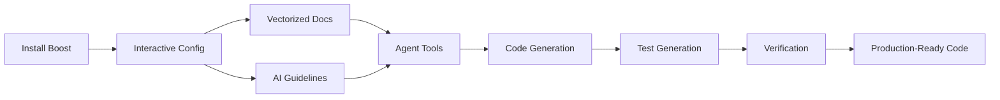

---

## Theory


### 17.1 What Is Laravel Boost?

<a href="../../assets/images/diagrams/laravel/17-boost/17-1-what-is-laravel-boost-handwritten.svg" target="_blank" rel="noopener">
  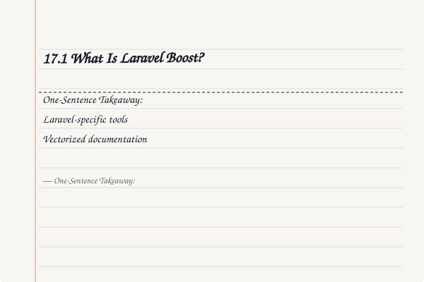
</a>
<a href="../../assets/images/diagrams/laravel/17-boost/17-1-what-is-laravel-boost-diagram.svg" target="_blank" rel="noopener">
  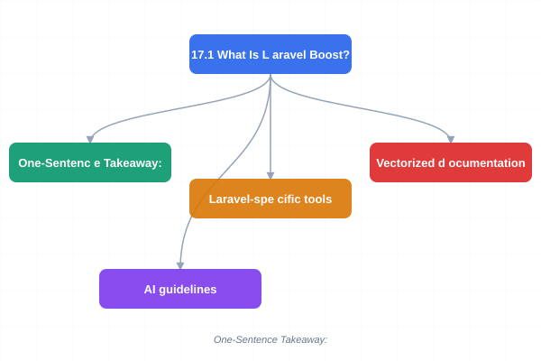
</a>
<a href="../../assets/images/diagrams/laravel/17-boost/17-1-what-is-laravel-boost-sticky.svg" target="_blank" rel="noopener">
  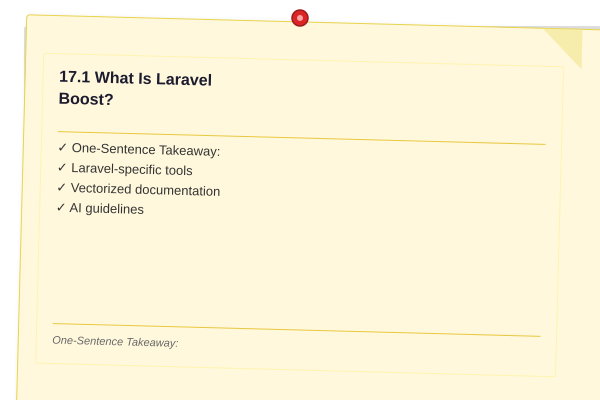
</a>


> **One-Sentence Takeaway:** Boost provides tools, vectorized docs, and AI guidelines to make any AI agent Laravel-aware.

Laravel Boost is a package that acts as a bridge between AI coding agents and your Laravel application. When an AI agent writes Laravel code without Boost, it relies on its training data — which may reference an older version of Laravel, use deprecated patterns, or miss framework-specific conventions. Boost solves this by providing three things:

1. **Laravel-specific tools** — 15+ executable tools that let the agent inspect your actual application
2. **Vectorized documentation** — 17,000+ pieces of Laravel ecosystem documentation embedded for semantic search
3. **AI guidelines** — Laravel-maintained guidance for framework conventions, testing patterns, and pitfalls

The architecture works like this:

```
AI Agent (Cursor, Claude Code, OpenCode, Copilot)
    │
    ├── Reads .ai/guidelines/* ────► Convention rules
    ├── Calls Boost tools ─────────► Live app introspection
    └── Queries docs vectors ──────► Version-matched documentation
    │
    â–¼
Generates code that matches:
    - Correct Laravel version APIs
    - Your app's existing patterns
    - Framework best practices
    - Working test suites
```

Boost supports PHP 8.1+ and Laravel 10 through 13. It auto-detects your installed package versions and targets the correct documentation for each.

### 17.2 Installation

<a href="../../assets/images/diagrams/laravel/17-boost/17-2-installation-handwritten.svg" target="_blank" rel="noopener">
  
</a>
<a href="../../assets/images/diagrams/laravel/17-boost/17-2-installation-diagram.svg" target="_blank" rel="noopener">
  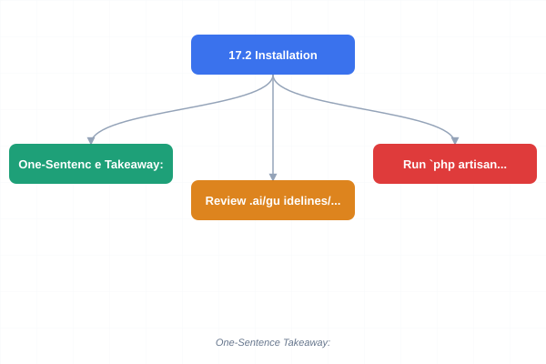
</a>
<a href="../../assets/images/diagrams/laravel/17-boost/17-2-installation-sticky.svg" target="_blank" rel="noopener">
  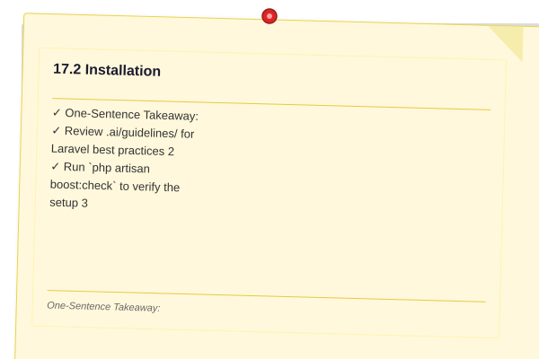
</a>


> **One-Sentence Takeaway:** The interactive installer auto-detects your environment and creates the .ai/ directory structure.

Install Boost as a dev dependency and run its interactive installer:

```php
composer require laravel/boost --dev

php artisan boost:install
```

The installer is interactive. It detects your environment and asks targeted questions:

```php
$ php artisan boost:install

┌ Laravel Boost Installer ──────────────────────────┐
│                                                    │
│   Detected: Laravel 13.x, PHP 8.4                  │
│   Detected IDE: Visual Studio Code                 │
│   Detected OS: Windows                             │
│                                                    │
│   â→‡ Which AI coding agents do you use?             │
│     ■ Cursor                                       │
│     ■ Claude Code                                  │
│     □ OpenCode                                     │
│     □ GitHub Copilot                               │
│                                                    │
│   â→‡ Install example custom guidelines?  [Yes/No]   │
│                                                    │
│   â→‡ Generate Boost configuration?       [Yes/No]   │
│                                                    │
└────────────────────────────────────────────────────┘

✔ Boost installed successfully!

  Next steps:
  1. Review .ai/guidelines/ for Laravel best practices
  2. Run `php artisan boost:check` to verify the setup
  3. Open your AI agent and try: "Create a blog post model with migration"
```

The installer creates the `.ai/` directory structure in your project root:

```
.ai/
├── guidelines/
│   ├── laravel-conventions.md
│   ├── testing-standards.md
│   ├── security-best-practices.md
│   └── elqouent-patterns.md
├── boost.json
└── tools/
    └── ...
```

The `boost.json` configuration file stores your preferences:

```json
{
    "version": "1.0.0",
    "laravel_version": "13.x",
    "agents": ["cursor", "claude-code"],
    "guidelines_path": ".ai/guidelines",
    "tools_enabled": true,
    "docs_auto_query": true,
    "version_targeting": "installed"
}
```

### 17.3 Vectorized Documentation

<a href="../../assets/images/diagrams/laravel/17-boost/17-3-vectorized-documentation-handwritten.svg" target="_blank" rel="noopener">
  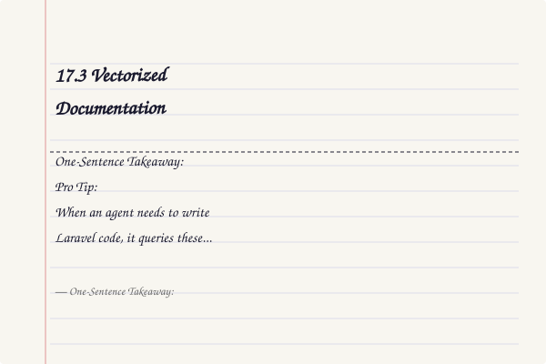
</a>
<a href="../../assets/images/diagrams/laravel/17-boost/17-3-vectorized-documentation-diagram.svg" target="_blank" rel="noopener">
  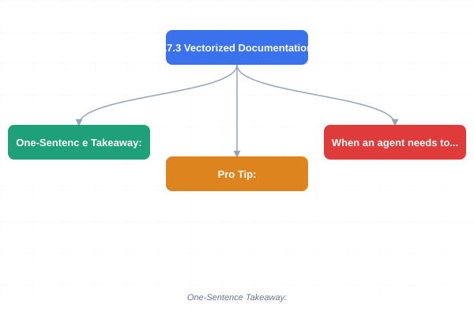
</a>
<a href="../../assets/images/diagrams/laravel/17-boost/17-3-vectorized-documentation-sticky.svg" target="_blank" rel="noopener">
  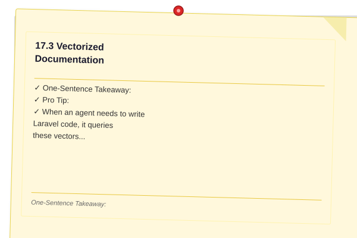
</a>


> **One-Sentence Takeaway:** 17,000+ version-targeted documentation pieces let agents query the exact API docs matching your install.

Boost embeds 17,000+ documentation pages from the Laravel ecosystem using the same pgvector technology from Chapter 16. When an agent needs to write Laravel code, it queries these vectors to find the exact API documentation matching the installed version:

```php
// Inside Boost's internal query engine (simplified)
$results = BoostDocs::search('Laravel broadcasting with Pusher')
    ->version('13.x')
    ->limit(5)
    ->get();

foreach ($results as $doc) {
    echo $doc->title;      // "Broadcasting: Laravel 13.x"
    echo $doc->content;    // Full documentation text
    echo $doc->package;    // "laravel/framework"
    echo $doc->similarity; // 0.91
}
```

The documentation coverage includes:

- Laravel core framework (`laravel/framework`)
- Laravel packages (Cashier, Horizon, Telescope, Passport, Sanctum, etc.)
- First-party tools (Forge, Vapor, Envoyer, Nightwatch)
- Community packages maintained by the Laravel team

Version targeting is automatic. If your `composer.json` requires `laravel/framework: ^13.0`, Boost queries the 13.x documentation bundle. This prevents the agent from using APIs that do not exist in your version:

```php
// Boost's internal version resolver
$installedVersion = Composer::getInstalledVersion('laravel/framework');
$docsBundle = BoostDocs::forVersion($installedVersion);
```


> **Pro Tip:** Run php artisan boost:check after installation to verify that all tools, guidelines, and documentation vectors are properly configured before handing control to your AI agent.

### 17.4 Tools

<a href="../../assets/images/diagrams/laravel/17-boost/17-4-tools-handwritten.svg" target="_blank" rel="noopener">
  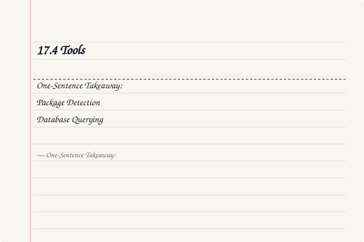
</a>
<a href="../../assets/images/diagrams/laravel/17-boost/17-4-tools-diagram.svg" target="_blank" rel="noopener">
  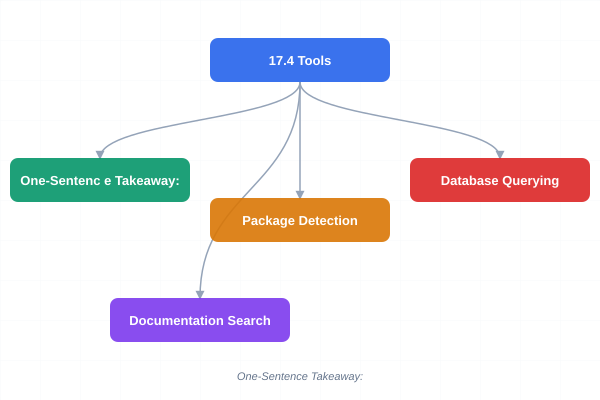
</a>
<a href="../../assets/images/diagrams/laravel/17-boost/17-4-tools-sticky.svg" target="_blank" rel="noopener">
  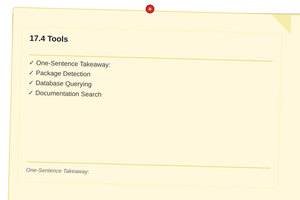
</a>


> **One-Sentence Takeaway:** 15+ specialized tools let agents inspect schemas, search docs, generate tests, and execute code in your app context.

Boost provides over 15 specialized tools that AI agents invoke during development. Here are the most important ones:

**Package Detection**

The agent checks which packages are installed before generating code:

```php
// Tool: detect_packages
// The agent calls this to inspect composer.json

$packages = Boost::tools()->detectPackages();

// Returns:
// [
//     'laravel/framework' => '13.0.0',
//     'laravel/cashier' => '15.0.0',
//     'spatie/laravel-permission' => '6.0.0',
//     'spatie/laravel-medialibrary' => '11.0.0',
// ]
```

**Database Querying**

The agent inspects your database schema to generate accurate migrations and queries:

```php
// Tool: query_database
// The agent inspects table structures before writing queries

$schema = Boost::tools()->getTableSchema('users');

// Returns:
// [
//     'table' => 'users',
//     'columns' => [
//         ['name' => 'id', 'type' => 'bigint unsigned', 'auto_increment' => true],
//         ['name' => 'name', 'type' => 'varchar(255)'],
//         ['name' => 'email', 'type' => 'varchar(255)', 'unique' => true],
//         ['name' => 'email_verified_at', 'type' => 'timestamp', 'nullable' => true],
//         ['name' => 'password', 'type' => 'varchar(255)'],
//         ['name' => 'remember_token', 'type' => 'varchar(100)', 'nullable' => true],
//         ['name' => 'created_at', 'type' => 'timestamp', 'nullable' => true],
//         ['name' => 'updated_at', 'type' => 'timestamp', 'nullable' => true],
//     ],
//     'indexes' => [
//         ['name' => 'users_email_unique', 'columns' => ['email'], 'unique' => true],
//     ],
// ]
```

**Documentation Search**

The agent queries version-matched docs for the specific APIs it needs:

```php
// Tool: search_docs
// The agent searches for relevant documentation before writing code

$docs = Boost::tools()->searchDocs(
    query: 'Rate limiting with RateLimiter facade',
    version: '13.x',
    limit: 3
);
```

**Browser Log Reader**

When debugging frontend issues, the agent reads browser console logs:

```php
// Tool: read_browser_logs
// The agent reads the latest Laravel debugbar or browser logs

$logs = Boost::tools()->readBrowserLogs();
```

**Test Generation**

The agent generates PHPUnit or PEST tests that match your existing test patterns:

```php
// Tool: generate_test
// The agent examines existing tests to match style, then generates new ones

$testCode = Boost::tools()->generateTest([
    'type' => 'feature',
    'target' => 'App\Http\Controllers\PostController@store',
    'style' => 'pest',
]);
```

**Tinker Code Execution**

The agent executes throwaway code in your application context to verify assumptions:

```php
// Tool: tinker_execute
// The agent runs code via Artisan Tinker to test a hypothesis

$result = Boost::tools()->tinker('User::where("email", "test@example.com")->exists()');
// Returns: true
```

All tools are accessed through a unified facade that the AI agent uses automatically during development.

### 17.5 AI Guidelines

<a href="../../assets/images/diagrams/laravel/17-boost/17-5-ai-guidelines-handwritten.svg" target="_blank" rel="noopener">
  
</a>
<a href="../../assets/images/diagrams/laravel/17-boost/17-5-ai-guidelines-diagram.svg" target="_blank" rel="noopener">
  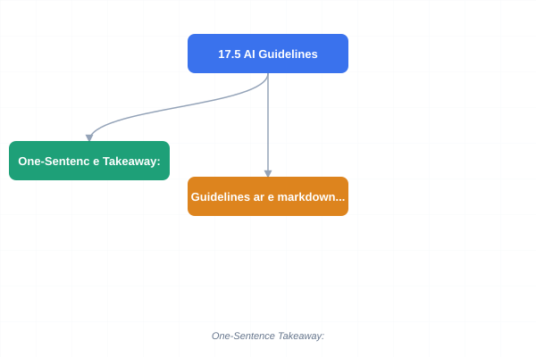
</a>
<a href="../../assets/images/diagrams/laravel/17-boost/17-5-ai-guidelines-sticky.svg" target="_blank" rel="noopener">
  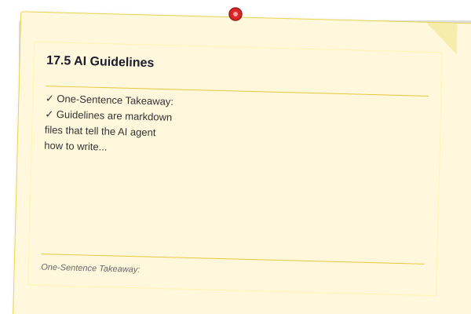
</a>


> **One-Sentence Takeaway:** Markdown and Blade files in .ai/guidelines/ define conventions for routing, Eloquent, testing, and project specifics.

Guidelines are markdown files that tell the AI agent how to write code for your specific project. Laravel ships a default set that covers framework conventions:

```markdown
# .ai/guidelines/laravel-conventions.md

# Laravel Conventions

## Routing

- Use Route Model Binding for all resource routes
- Name routes with dot notation: `posts.show`, `admin.users.index`
- Group related routes with `Route::prefix()` or `Route::middleware()`
- Use `Route::view()` for simple static pages
- Avoid closures in `routes/web.php`; use controller classes

## Eloquent

- Always define `$fillable` or `$guarded` on every model
- Use local scopes for reusable query constraints: `scopeActive()`
- Use eager loading to avoid N+1 queries: `Post::with('comments')->get()`
- Prefer `firstOrCreate()` over manual existence checks
- Use `when()` for conditional query building

## Validation

- Use Form Request classes for complex validation logic
- Keep validation rules in the request, not the controller
- Use rule objects for reusable validation: `new Uppercase()`

## Responses

- Use API Resources for JSON transformation
- Use `tap()` or `higherOrderMessages()` for clean object manipulation
- Return `redirect()->route()` with flash messages for web responses
```

```markdown
# .ai/guidelines/testing-standards.md

# Testing Standards

## Framework

- Use PEST for all new tests
- Name test files with the `.pest.php` extension
- Use descriptive test function names: `it_can_create_a_post_as_authenticated_user()`

## Coverage

- Every controller action must have a feature test
- Every model scope must have a unit test
- Every Form Request must have a validation test
- Every job must have a test for success and failure scenarios

## Factories

- Define model factories for all Eloquent models
- Use factory states for variant data: `User::factory()->unverified()->create()`
- Sequence data when order matters: `User::factory()->count(3)->sequence(...)`

## Assertions

- Prefer `assertDatabaseHas()` over querying the database manually
- Use `assertSessionHas()` for flash message assertions
- Use `assertJsonStructure()` for API response shape validation
- Use `assertStatus()` with explicit HTTP codes
```

Custom guidelines go in the `.ai/guidelines/` directory and can be written as `.blade.php` or `.md` files. Blade files are useful when you need dynamic content in your guidelines:

```php
{{-- .ai/guidelines/deployment-pipeline.blade.php --}}

# Deployment Pipeline

## Branch Strategy

- `main` — production-ready code only
- `develop` — integration branch for feature work
- `feature/{ticket-number}-{kebab-name}` — individual features

## CI Requirements

- All tests must pass before merge
- Code must pass {{ config('app.pint_config') === 'laravel' ? 'Laravel Pint' : 'custom Pint' }} style checks
- No PHPStan errors at level {{ config('app.phpstan_level', 6) }}
- All new code must have {{ config('app.min_test_coverage', 80) }}% coverage

## Deployment

- Deployments happen every {{ config('app.deploy_schedule', 'Tuesday') }} at 10:00 UTC
- Run `php artisan migrate --force` after code deploy
- Clear cache: `php artisan optimize:clear`
- Restart queue: `php artisan queue:restart`
```

### 17.6 Agent Integration


> **One-Sentence Takeaway:** Cursor, Claude Code, OpenCode, and GitHub Copilot each integrate with Boost via slightly different mechanisms.

Boost integrates with four major AI coding agents. Each has a slightly different integration mechanism:

**Cursor**

Cursor reads the `.ai/guidelines/` directory automatically. Boost detects Cursor's `.cursorrules` file during installation and merges guidelines:

```bash
# Boost detects Cursor during install and generates:
# .cursorrules → references .ai/guidelines/*.md
```

**Claude Code**

Claude Code uses `CLAUDE.md` as its project-level instruction file. Boost adds a reference during installation:

```markdown
<!-- CLAUDE.md (added by Boost installer) -->

# Laravel Boost

This project uses Laravel Boost. Always read `.ai/guidelines/` before writing code.

Available tools: package detection, schema inspection, docs search, test generation.
```

**OpenCode**

OpenCode reads guidelines from `.opencode/rules/`. Boost creates symlinks or copies during install:

```bash
# Boost creates .opencode/rules/ with references to .ai/guidelines/
```

**GitHub Copilot**

Copilot reads `./github/copilot-instructions.md`. Boost creates this file during installation:

```markdown
# .github/copilot-instructions.md

This project uses Laravel 13. Follow Laravel conventions:
- Use Eloquent ORM, not raw SQL
- Use Form Requests for validation
- Use PEST for testing
- Use Route Model Binding
- See .ai/guidelines/ for complete conventions
```


> **Warning:** Custom guidelines in .blade.php files have access to Laravel config values. Avoid exposing sensitive credentials or environment variables through dynamic guideline content.

### 17.7 Custom Guidelines


> **One-Sentence Takeaway:** Drop .md or .blade.php files into .ai/guidelines/ — Boost auto-includes them without manual registration.

Adding project-specific guidelines is as simple as placing a file in `.ai/guidelines/`:

```markdown
# .ai/guidelines/billing-patterns.md

# Billing Patterns

This project uses Laravel Cashier v15 with Stripe.

## Subscription Handling

- Always create subscriptions through `$user->newSubscription()`
- Use subscription names matching the plan type: 'default', 'enterprise'
- Call `$subscription->cancel()` for cancellations, never delete subscriptions
- Store Stripe customer IDs in the `stripe_id` column on the users table

## Invoicing

- Generate invoices through Cashier: `$user->invoice()`
- Always set a description when creating invoices
- Use `$user->invoices()` for listing, never query `cashier_invoices` directly

## Webhook Handling

- Route Stripe webhooks through Cashier's built-in controller
- Do not add custom webhook endpoints unless absolutely necessary
- Handle `invoice.payment_succeeded` to update payment status in local DB

## Testing

- Use Cashier's `withStripeCredentials()` test helper
- Mock Stripe API calls with `Http::fake()` targeting `api.stripe.com/*`
- Never call Stripe's production API in tests
```

Boost automatically includes all `.md` and `.blade.php` files in `.ai/guidelines/` during `boost:install`. You do not need to register them manually.

### 17.8 Agentic Development


> **One-Sentence Takeaway:** Laravel's naming, directory, and pattern conventions make it uniquely agent-ready.

Laravel is uniquely suited as an "agent-ready" framework. Its consistent conventions allow AI agents to predict file locations, naming patterns, and architectural choices with high accuracy:

```php
// An AI agent, guided by Boost, can predict:

// File location: app/Models/Post.php
// Based on: naming convention + boost knows Laravel puts models in app/Models
namespace App\Models;

use Illuminate\Database\Eloquent\Model;
use Illuminate\Database\Eloquent\Relations\BelongsTo;
use Illuminate\Database\Eloquent\Relations\HasMany;

class Post extends Model
{
    protected $fillable = [
        'title',
        'slug',
        'body',
        'user_id',
        'published_at',
    ];

    protected function casts(): array
    {
        return [
            'published_at' => 'datetime',
        ];
    }

    public function author(): BelongsTo
    {
        return $this->belongsTo(User::class, 'user_id');
    }

    public function comments(): HasMany
    {
        return $this->hasMany(Comment::class);
    }

    public function scopePublished($query)
    {
        return $query->whereNotNull('published_at');
    }
}
```

The key properties that make Laravel agent-ready:

- **Naming conventions**: Model files are always `StudlyCase` and singular; migration files are always `yyyy_mm_dd_hhmmss_descriptive_name.php`
- **Directory structure**: Controllers in `app/Http/Controllers/`, Models in `app/Models/`, etc.
- **Well-defined patterns**: Resource controllers, Form Requests, API Resources, Job classes
- **Comprehensive documentation**: Every feature documented with examples that match the naming conventions


> **Remember:** Boost auto-detects your Laravel version from composer.json and targets the correct documentation bundle. Always keep dependencies updated so the agent queries accurate APIs.

### 17.9 Complete Example: Boost-Driven Feature Development


> **One-Sentence Takeaway:** A full workflow from Boost install to AI-generated tests demonstrates the complete pipeline.

This example shows the full workflow of setting up Boost and having an AI agent build a feature:

```bash
# Step 1: Install Boost
composer require laravel/boost --dev
php artisan boost:install

# Step 2: Verify the setup
php artisan boost:check

# Output:
# ┌ Laravel Boost Status ────────────────────┐
# │                                          │
# │  Laravel Version:  13.x                  │
# │  PHP Version:      8.4                   │
# │  Guidelines:       4 files loaded        │
# │  Tools:            15 available           │
# │  Docs Vectors:     17,234 pieces          │
# │  Agent:            Cursor (detected)     │
# │  Status:           ✅ All systems go    │
# │                                          │
# └──────────────────────────────────────────┘
```

The AI agent now receives Boost's context. When the developer requests a feature, the agent follows this pipeline:

```php
// Developer: "Create a product review system with ratings"

// Phase 1 — Agent reads guidelines
// Reads: .ai/guidelines/laravel-conventions.md
// Reads: .ai/guidelines/testing-standards.md
// Reads: .ai/guidelines/eloquent-patterns.md

// Phase 2 — Agent inspects existing codebase
$packages = Boost::tools()->detectPackages();
// Laravel 13.x, spatie/laravel-permission, laravel/cashier

$schema = Boost::tools()->getTableSchema('products');
// Already has: id, name, description, price, user_id

// Phase 3 — Agent queries version-matched docs
$docs = Boost::tools()->searchDocs(
    query: 'one-to-many relationship validation',
    version: '13.x'
);

// Phase 4 — Agent generates the feature

// Migration
Schema::create('reviews', function (Blueprint $table) {
    $table->id();
    $table->foreignId('product_id')->constrained()->cascadeOnDelete();
    $table->foreignId('user_id')->constrained()->cascadeOnDelete();
    $table->tinyInteger('rating')->unsigned();
    $table->text('body')->nullable();
    $table->timestamps();

    $table->unique(['product_id', 'user_id']);
});

// Model
class Review extends Model
{
    protected $fillable = ['rating', 'body'];

    protected function casts(): array
    {
        return [
            'rating' => 'integer',
        ];
    }

    public function product(): BelongsTo
    {
        return $this->belongsTo(Product::class);
    }

    public function user(): BelongsTo
    {
        return $this->belongsTo(User::class);
    }
}

// Form Request
class StoreReviewRequest extends FormRequest
{
    public function authorize(): bool
    {
        return auth()->check();
    }

    public function rules(): array
    {
        return [
            'rating' => ['required', 'integer', 'between:1,5'],
            'body' => ['nullable', 'string', 'max:5000'],
        ];
    }
}

// Controller
class ProductReviewController extends Controller
{
    public function store(StoreReviewRequest $request, Product $product): RedirectResponse
    {
        $review = $product->reviews()->create([
            ...$request->validated(),
            'user_id' => $request->user()->id,
        ]);

        return redirect()
            ->route('products.show', $product)
            ->with('success', 'Review added successfully.');
    }
}

// Phase 5 — Agent generates tests (PEST style)
it('authenticated user can review a product', function () {
    $user = User::factory()->create();
    $product = Product::factory()->create();

    $this->actingAs($user)
        ->post(route('reviews.store', $product), [
            'rating' => 5,
            'body' => 'Excellent product!',
        ])
        ->assertRedirect()
        ->assertSessionHas('success');

    $this->assertDatabaseHas('reviews', [
        'product_id' => $product->id,
        'user_id' => $user->id,
        'rating' => 5,
    ]);
});

it('prevents duplicate reviews from the same user', function () {
    $user = User::factory()->create();
    $product = Product::factory()->create();

    Review::factory()->create([
        'product_id' => $product->id,
        'user_id' => $user->id,
    ]);

    $this->actingAs($user)
        ->post(route('reviews.store', $product), [
            'rating' => 3,
            'body' => 'Second review attempt.',
        ])
        ->assertSessionHasErrors('product_id');
});
```

---

## Concept Comparison Table

| Concept | Purpose | Key Benefit | Limitation |
|---------|---------|-------------|------------|
| Vectorized Docs | API documentation for agent context | Version-accurate code generation | Requires initial embedding download |
| AI Guidelines | Convention definitions in Markdown | Team-specific patterns enforced | Must be manually maintained |
| Boost Tools | Live app introspection | Real-time schema/code awareness | Requires running application |
| Agent Integration | IDE/CLI agent connectivity | Works with multiple platforms | Different setup per agent type |

## Quick Reference

| Command | Description |
|---------|-------------|
| `composer require laravel/boost --dev` | Install Boost as a dev dependency |
| `php artisan boost:install` | Run interactive installer |
| `php artisan boost:check` | Verify Boost configuration |
| `Boost::tools()->detectPackages()` | Inspect installed packages |
| `Boost::tools()->getTableSchema('table')` | Inspect database schema |
| `Boost::tools()->searchDocs(...)` | Query version-matched docs |
| `Boost::tools()->generateTest(...)` | Generate PEST/PHPUnit tests |
| `Boost::tools()->tinker(...)` | Execute code in app context |

## Cross-Application Matrix

| Feature | Boost | Manual AI | Without AI |
|---------|-------|-----------|------------|
| Code accuracy | Version-targeted | Training-data dependent | Developer knowledge |
| Schema awareness | Live inspection | None | Manual lookup |
| Test generation | Pattern-matched from existing | Generic templates | Manual writing |
| Doc search | 17K+ vectorized pieces | General web search | Official docs |
| Guideline enforcement | Automatic reading | Manual instruction | Code review |

## Chapter Quiz

Test your understanding of Laravel Boost.

1. What three components does Laravel Boost provide to AI agents?
   - A) Tools, vectorized docs, and AI guidelines
   - B) Routes, controllers, and views
   - C) Cache, sessions, and queues
   - D) Migrations, seeders, and factories
   <details><summary>Answer&lt;/summary&gt;**A)** Tools, vectorized docs, and AI guidelines are the three pillars of Boost.</details>

2. How does Boost ensure version-accurate code generation?
   - A) By reading the Laravel blog
   - B) By querying `composer.json` and targeting the matching documentation bundle
   - C) By asking the developer which version they use
   - D) By always targeting the latest Laravel version
   <details><summary>Answer&lt;/summary&gt;**B)** Boost reads the installed package version from `composer.json` and queries the matching documentation bundle.</details>

3. Which file formats does Boost accept for custom guidelines?
   - A) Only `.md` files
   - B) Only `.json` files
   - C) `.md` and `.blade.php` files
   - D) `.md`, `.blade.php`, and `.php` files
   <details><summary>Answer&lt;/summary&gt;**C)** Boost accepts `.md` and `.blade.php` files in the `.ai/guidelines/` directory.</details>

4. Which AI coding agents does Boost integrate with?
   - A) Only Cursor
   - B) Cursor, Claude Code, OpenCode, and GitHub Copilot
   - C) Only Claude Code
   - D) All available IDE extensions
   <details><summary>Answer&lt;/summary&gt;**B)** Boost supports Cursor, Claude Code, OpenCode, and GitHub Copilot with specific integration mechanisms for each.</details>

5. What command verifies Boost is properly configured?
   - A) `php artisan boost:status`
   - B) `php artisan boost:check`
   - C) `php artisan boost:verify`
   - D) `php artisan boost:inspect`
   <details><summary>Answer&lt;/summary&gt;**B)** `php artisan boost:check` displays the full Boost status including version, tools, guidelines, and docs vectors.</details>


## Summary
- Laravel Boost bridges AI coding agents with Laravel applications through tools, docs, and guidelines
- Installation is interactive and auto-detects IDE, agent, and Laravel version
- 17,000+ vectorized documentation pieces are version-targeted to installed packages
- 15+ specialized tools let agents inspect schemas, search docs, generate tests, and execute code
- AI guidelines in `.ai/guidelines/` define conventions for routing, Eloquent, testing, and more
- Boost integrates with Cursor, Claude Code, OpenCode, and GitHub Copilot
- Custom guidelines can be `.md` or `.blade.php` files and are auto-included
- Laravel's consistent conventions make it naturally "agent-ready" for AI-assisted development
- The `boost:check` command verifies the full setup is working

## Exercises

### Review Questions
1. What three components does Laravel Boost provide to AI agents?
2. How does Boost's version targeting prevent an AI agent from using deprecated or nonexistent APIs?
3. What is the purpose of the `.ai/guidelines/` directory, and what file formats does it accept?
4. List four of Boost's specialized tools and describe what each does.
5. How does Boost integrate with each of the four supported AI coding agents?

### Application Problems
1. Install Laravel Boost in a Laravel 13 application and run the interactive installer for Cursor. Verify the setup with `boost:check`.
2. Write a custom guideline file for API versioning conventions specific to your application, covering URL prefixing, header-based versioning, and deprecation handling.
3. Using Boost's tool system, write a PEST test for a `ProductController@store` action that validates the request and creates a product. Run the test to confirm it passes.

### Challenge Problem
Set up a complete Boost-driven development workflow:
- Install Boost with Claude Code integration
- Write custom guidelines for a team-specific billing pattern involving Cashier and Stripe webhooks
- Instruct the AI agent to build a complete subscription management feature with:
  - A migration for a `subscriptions` table with proper foreign keys
  - A `SubscriptionController` with `store`, `cancel`, and `resume` methods
  - A `SubscriptionPolicy` for authorization
  - PEST tests for each controller action
  - All code must follow the custom billing guidelines
- Verify the generated code passes `php artisan pint --test` and all generated tests pass