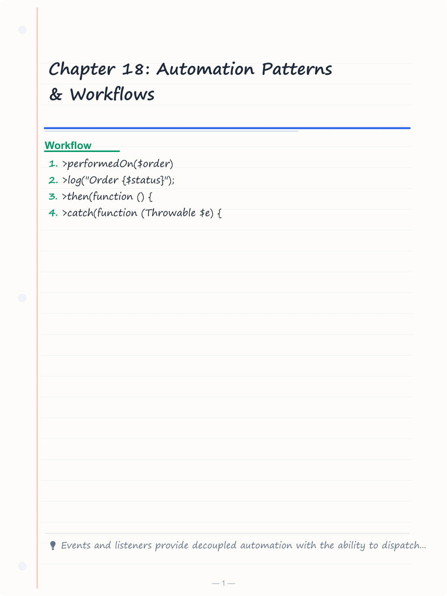
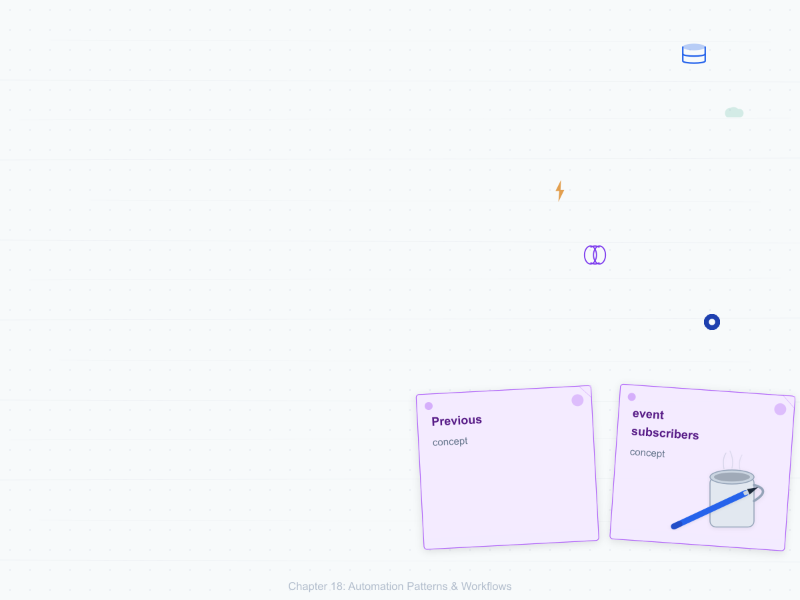
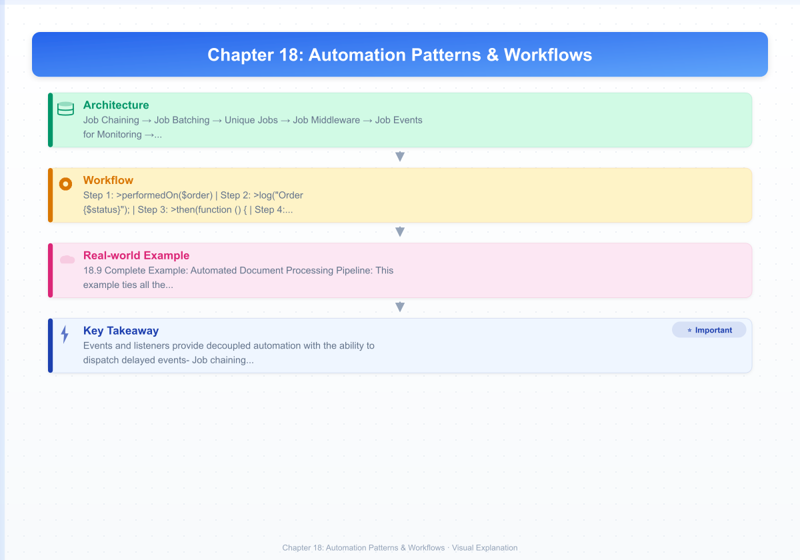

# Chapter 18: Automation Patterns & Workflows

> **Previous:** [Laravel Boost](./17-boost.md) | **Next:** [Architecture Patterns](./19-architecture-patterns.md)

---
## Learning Objectives
- Build event-driven automation systems using Laravel's event and listener architecture
- Implement queue-based pipelines with job chaining, batching, and middleware
- Design AI agent automation for background processing and real-time updates
- Create scheduled task automation with overlapping prevention and multi-server support
- Build webhook-driven workflows with signature verification and payload processing
- Implement monitoring alerts and business process automation pipelines
---

<!-- Image Gallery -->
<section class="lesson-visuals" aria-label="Visual learning resources">
  <header><span>VISUAL LEARNING</span><h2>See it. Review it. Remember it.</h2></header>
  <a class="lesson-visual-card" href="../../assets/images/lessons/laravel/18-automation-patterns/handwritten-notes.png" target="_blank" rel="noopener">
    
    <span><strong>Handwritten notes</strong>Condensed notes for deliberate review.</span>
  </a>
  <a class="lesson-visual-card" href="../../assets/images/lessons/laravel/18-automation-patterns/sticky-notes.png" target="_blank" rel="noopener">
    
    <span><strong>Sticky-note revision</strong>Fast recall prompts for revision.</span>
  </a>
  <a class="lesson-visual-card" href="../../assets/images/lessons/laravel/18-automation-patterns/visual-explanation.png" target="_blank" rel="noopener">
    
    <span><strong>Visual concept guide</strong>A connected explanation of the key ideas.</span>
  </a>
</section>
<!-- End Image Gallery -->

## Chapter at a Glance

| Topic | Key Insight | Practical Takeaway |
|-------|-------------|-------------------|
| E | v | e |
| E | v | e |
| U | s | e |
| Q | u | e |
| J | o | b |
| C | h | a |
| A | I |   |
| A | I |   |
| D | i | s |
| S | c | h |
| A | r | t |
| U | s | e |
| W | e | b |
| I | n | c |
| H | M | A |
| M | o | n |
| Q | u | e |
| S | e | t |

## Chapter Roadmap

``mermaid
flowchart LR
    T[Trigger] --> B{Event Type}
    B --> E[Event]
    B --> S[Schedule]
    B --> W[Webhook]
    E --> C[Job Chain]
    S --> C
    W --> C
> **One-Sentence Takeaway:** h

    C --> Q[Queue Worker]
    Q --> M[Monitor]
    M --> A[Alert]
``


## Theory


### 18.1 Event-Driven Automation


Laravel's event system is the backbone of decoupled automation. An event is a simple data class that describes something that happened. A listener reacts to that event. This separation lets you add new automation behaviors without touching existing code.

Define an event:

```php
<?php

namespace App\Events;

use App\Models\Order;
use Illuminate\Foundation\Events\Dispatchable;
use Illuminate\Queue\SerializesModels;

class OrderShipped
{
    use Dispatchable, SerializesModels;

    public function __construct(
        public Order $order,
    ) {}
}
```

Define its listener:

```php
<?php

namespace App\Listeners;

use App\Events\OrderShipped;
use App\Notifications\ShipmentConfirmation;
use Illuminate\Support\Facades\Log;

class SendShipmentNotification
{
    public function handle(OrderShipped $event): void
    {
        $order = $event->order;

        Log::info('Processing shipment notification', [
            'order_id' => $order->id,
            'customer_email' => $order->user->email,
        ]);

        $order->user->notify(
            new ShipmentConfirmation($order)
        );

        // Alert the warehouse system via webhook
        if ($order->requires_cold_shipping) {
            $this->notifyColdStorageTeam($order);
        }
    }

    private function notifyColdStorageTeam(Order $order): void
    {
        Http::post(config('services.warehouse.cold_storage_webhook'), [
            'order_id' => $order->id,
            'temperature_required' => $order->product->storage_temperature,
            'estimated_arrival' => $order->shipped_at->addHours(24)->toIso8601String(),
        ]);
    }
}
```

Register the mapping in `AppServiceProvider`:

```php
<?php

namespace App\Providers;

use App\Events\OrderShipped;
use App\Listeners\SendShipmentNotification;
use App\Events\OrderCancelled;
use App\Listeners\ProcessRefund;
use App\Listeners\ReleaseInventory;
use Illuminate\Foundation\Support\Providers\EventServiceProvider as ServiceProvider;

class EventServiceProvider extends ServiceProvider
{
    protected $listen = [
        OrderShipped::class => [
            SendShipmentNotification::class,
            UpdateInventoryCount::class,
            UpdateOrderStatusIndex::class,
        ],
        OrderCancelled::class => [
            ProcessRefund::class,
            ReleaseInventory::class,
            NotifyFulfillmentTeam::class,
        ],
    ];
}
```

For complex event handling, use **event subscribers** — classes that subscribe to multiple events:

```php
<?php

namespace App\Listeners;

use App\Events\OrderShipped;
use App\Events\OrderCancelled;
use App\Events\OrderRefunded;

class OrderEventSubscriber
{
    public function handleOrderShipped(OrderShipped $event): void
    {
        $this->logOrderActivity($event->order, 'shipped');
    }

    public function handleOrderCancelled(OrderCancelled $event): void
    {
        $this->logOrderActivity($event->order, 'cancelled');
    }

    public function handleOrderRefunded(OrderRefunded $event): void
    {
        $this->logOrderActivity($event->order, 'refunded');
    }

    private function logOrderActivity($order, string $status): void
    {
        activity()
            ->performedOn($order)
            ->log("Order {$status}");
    }

    public function subscribe(Dispatcher $events): array
    {
        return [
            OrderShipped::class => 'handleOrderShipped',
            OrderCancelled::class => 'handleOrderCancelled',
            OrderRefunded::class => 'handleOrderRefunded',
        ];
    }
}
```

Events can also be dispatched with a delay for scheduled automation:

```php
OrderShipped::dispatch($order)->delay(now()->addHours(24));
```

### 18.2 Queue-Based Pipeline Patterns


Queues are essential for non-blocking automation. Laravel provides several patterns for composing work:

**Job Chaining** — Run jobs sequentially, stopping if any fails:

```php
<?php

namespace App\Http\Controllers;

use App\Models\Order;
use App\Jobs\ProcessPayment;
use App\Jobs\GenerateInvoice;
use App\Jobs\SendConfirmationEmail;
use App\Jobs\UpdateInventory;
use Illuminate\Support\Facades\Bus;
use Illuminate\Http\Request;

class CheckoutController extends Controller
{
    public function store(Request $request): Order
    {
        $order = Order::create($request->validated());

        Bus::chain([
            new ProcessPayment($order),
            new GenerateInvoice($order),
            new SendConfirmationEmail($order),
            new UpdateInventory($order),
        ])->dispatch();

        return $order;
    }
}
```

Each job in the chain receives the same `$order` instance. If `ProcessPayment` throws an exception, none of the subsequent jobs run.

**Job Batching** — Run jobs in parallel and react when the batch completes:

```php
<?php

namespace App\Jobs;

use App\Models\Order;
use App\Imports\OrderRowImporter;
use Illuminate\Bus\Batchable;
use Illuminate\Contracts\Queue\ShouldQueue;
use Illuminate\Support\Facades\Bus;
use Illuminate\Support\Facades\Log;
use Throwable;

class ProcessBulkOrders implements ShouldQueue
{
    use Batchable;

    public function __construct(
        public string $importFilePath,
    ) {}

    public function handle(): void
    {
        $rows = array_map('str_getcsv', file($this->importFilePath));

        $header = array_shift($rows);

        $jobs = collect($rows)->map(function ($row) use ($header) {
            $data = array_combine($header, $row);
            return new ProcessOrderRow($data);
        });

        $batch = Bus::batch($jobs)
            ->then(function () {
                Log::info('All orders processed successfully.');
            })
            ->catch(function (Throwable $e) {
                Log::error('Batch processing failed.', [
                    'error' => $e->getMessage(),
                ]);
            })
            ->finally(function () {
                unlink($this->importFilePath);
            })
            ->dispatch();

        session()->flash('batch_id', $batch->id);
    }
}
```

Checking batch progress from a controller:

```php
<?php

namespace App\Http\Controllers;

use Illuminate\Support\Facades\Bus;
use Illuminate\Http\Request;

class BatchProgressController extends Controller
{
    public function show(Request $request, string $batchId)
    {
        $batch = Bus::findBatch($batchId);

        if (! $batch) {
            return response()->json(['error' => 'Batch not found.'], 404);
        }

        return response()->json([
            'id' => $batch->id,
            'name' => $batch->name,
            'total_jobs' => $batch->totalJobs,
            'pending_jobs' => $batch->pendingJobs,
            'failed_jobs' => $batch->failedJobs,
            'processed_jobs' => $batch->processedJobs(),
            'progress' => $batch->progress(),
            'finished' => $batch->finished(),
            'cancelled' => $batch->cancelled(),
        ]);
    }
}
```

**Unique Jobs** — Prevent duplicate instances of the same job in the queue:

```php
<?php

namespace App\Jobs;

use App\Models\User;
use Illuminate\Contracts\Queue\ShouldBeUnique;
use Illuminate\Contracts\Queue\ShouldQueue;
use Illuminate\Queue\InteractsWithQueue;

class SyncUserToCrm implements ShouldQueue, ShouldBeUnique
{
    use InteractsWithQueue;

    public function __construct(
        public User $user,
    ) {}

    public function uniqueId(): string
    {
        return 'sync-user-' . $this->user->id;
    }

    public function uniqueFor(): int
    {
        return 300;
    }

    public function handle(): void
    {
        Http::withToken(config('services.crm.api_key'))
            ->post(config('services.crm.endpoint') . '/contacts', [
                'email' => $this->user->email,
                'name' => $this->user->name,
                'external_id' => (string) $this->user->id,
            ]);
    }
}
```

**Job Middleware** — Add rate limiting or throttling to jobs:

```php
<?php

namespace App\Jobs;

use App\Models\User;
use Illuminate\Contracts\Queue\ShouldQueue;
use Illuminate\Support\Facades\Redis;
use Illuminate\Queue\Middleware\RateLimited;

class ProcessEmailCampaign implements ShouldQueue
{
    public function __construct(
        public User $user,
        public string $campaignSlug,
    ) {}

    public function middleware(): array
    {
        return [
            (new RateLimited('email-campaign'))
                ->dontRelease(),
        ];
    }

    public function handle(): void
    {
        $emailJob = (new SendCampaignEmail(
            user: $this->user,
            campaignSlug: $this->campaignSlug,
        ));

        dispatch($emailJob);
    }

    public function tags(): array
    {
        return ['campaign:' . $this->campaignSlug, 'user:' . $this->user->id];
    }
}
```

Define the rate limiter in `AppServiceProvider`:

```php
use Illuminate\Cache\RateLimiting\Limit;
use Illuminate\Support\Facades\RateLimiter;

RateLimiter::for('email-campaign', function () {
    return Limit::perMinute(10);
});
```

**Job Events for Monitoring** — Hook into the job lifecycle:

```php
<?php

namespace App\Providers;

use Illuminate\Queue\Events\JobProcessed;
use Illuminate\Queue\Events\JobProcessing;
use Illuminate\Queue\Events\JobFailed;
use Illuminate\Support\Facades\Queue;
use Illuminate\Support\Facades\Log;
use Illuminate\Support\ServiceProvider;

class AppServiceProvider extends ServiceProvider
{
    public function boot(): void
    {
        Queue::before(function (JobProcessing $event) {
            Log::info('Job started', [
                'connection' => $event->connectionName,
                'job' => $event->job->resolveName(),
                'queue' => $event->job->getQueue(),
            ]);
        });

        Queue::after(function (JobProcessed $event) {
            Log::info('Job completed', [
                'job' => $event->job->resolveName(),
                'attempts' => $event->job->attempts(),
            ]);
        });

        Queue::failing(function (JobFailed $event) {
            Log::error('Job failed', [
                'job' => $event->job->resolveName(),
                'exception' => $event->exception->getMessage(),
                'trace' => $event->exception->getTraceAsString(),
            ]);

            // Notify the team
            Notification::route('slack', config('services.slack.jobs_channel'))
                ->notify(new JobFailedNotification($event));
        });
    }
}
```

### 18.3 AI Agent Automation


AI agents can serve as automated processors within your pipeline. They receive tasks, use tools to interact with your application, and produce structured output:

```php
<?php

namespace App\Jobs;

use App\Models\SupportTicket;
use App\Services\AiAgent;
use Illuminate\Contracts\Queue\ShouldQueue;
use Illuminate\Queue\InteractsWithQueue;
use Illuminate\Support\Facades\Log;

class ClassifySupportTicket implements ShouldQueue
{
    use InteractsWithQueue;

    public function __construct(
        public SupportTicket $ticket,
    ) {}

    public function handle(AiAgent $agent): void
    {
        $result = $agent->classify(
            systemPrompt: 'You are a support ticket classifier. '
                . 'Classify tickets into: billing, technical, feature_request, or other. '
                . 'Output a JSON object with category, confidence, and summary.',
            input: [
                'subject' => $this->ticket->subject,
                'description' => $this->ticket->description,
                'user_email' => $this->ticket->user->email,
            ],
        );

        $this->ticket->update([
            'category' => $result['category'],
            'confidence' => $result['confidence'],
            'ai_summary' => $result['summary'],
        ]);

        if ($result['category'] === 'billing' && $result['confidence'] > 0.8) {
            PrioritizeTicket::dispatch($this->ticket, 'high');
        }

        Log::info('Ticket classified', [
            'ticket_id' => $this->ticket->id,
            'category' => $result['category'],
            'confidence' => $result['confidence'],
        ]);
    }
}
```

Agents can be queued for background processing, then broadcast results via WebSockets:

```php
<?php

namespace App\Http\Controllers;

use App\Models\Report;
use App\Jobs\GenerateAiReport;
use App\Events\ReportGenerated;
use Illuminate\Http\Request;

class ReportController extends Controller
{
    public function generate(Request $request): Report
    {
        $validated = $request->validate([
            'type' => ['required', 'string', 'in:quarterly,monthly,weekly'],
            'date_range' => ['required', 'array', 'size:2'],
        ]);

        $report = Report::create([
            'user_id' => $request->user()->id,
            'type' => $validated['type'],
            'date_from' => $validated['date_range'][0],
            'date_to' => $validated['date_range'][1],
            'status' => 'processing',
        ]);

        GenerateAiReport::dispatch($report)
            ->onQueue('ai-processing');

        return $report;
    }
}
```

```php
<?php

namespace App\Jobs;

use App\Models\Report;
use App\Events\ReportGenerated;
use Illuminate\Contracts\Queue\ShouldQueue;
use Illuminate\Queue\InteractsWithQueue;
use Illuminate\Support\Facades\App;

class GenerateAiReport implements ShouldQueue
{
    use InteractsWithQueue;

    public function __construct(
        public Report $report,
    ) {}

    public function handle(): void
    {
        $agent = App::make(\App\Services\ReportAgent::class);

        $result = $agent->analyze(
            query: "Generate a {$this->report->type} analysis for "
                . "{$this->report->date_from} to {$this->report->date_to}.",
        );

        $this->report->update([
            'content' => $result['analysis'],
            'chart_data' => $result['charts'] ?? [],
            'key_findings' => $result['findings'] ?? [],
            'status' => 'completed',
            'completed_at' => now(),
        ]);

        ReportGenerated::dispatch($this->report);
    }
}
```

### 18.4 Scheduled Task Automation


The schedule in `App\Console\Kernel` is the central timer for all periodic tasks:

```php
<?php

namespace App\Console;

use App\Console\Commands\GenerateDailyReport;
use App\Jobs\SyncInventoryWithWarehouse;
use App\Jobs\CleanExpiredSessions;
use App\Jobs\BackupDatabase;
use App\Jobs\SendDigestEmails;
use Illuminate\Console\Scheduling\Schedule;
use Illuminate\Foundation\Console\Kernel as ConsoleKernel;

class Kernel extends ConsoleKernel
{
    protected function schedule(Schedule $schedule): void
    {
        // Run daily maintenance between 2-4 AM
        $schedule->job(new CleanExpiredSessions())
            ->dailyAt('02:00')
            ->withoutOverlapping(60)
            ->description('Clean expired sessions');

        $schedule->job(new BackupDatabase())
            ->dailyAt('03:00')
            ->onOneServer()
            ->description('Full database backup');

        // Hourly sync
        $schedule->job(new SyncInventoryWithWarehouse())
            ->hourly()
            ->between('6:00', '23:00')
            ->description('Sync inventory with warehouse');

        // Weekly digest every Monday at 8 AM
        $schedule->job(new SendDigestEmails())
            ->weeklyOn(1, '08:00')
            ->onOneServer()
            ->description('Send weekly digest emails');

        // Generate daily report at 7 PM
        $schedule->command('report:daily')
            ->dailyAt('19:00')
            ->environments('production')
            ->thenWithOutput(function ($output) {
                Notification::route('slack', '#reports')
                    ->notify(new ReportReadyNotification($output));
            });

        // Health checks every five minutes
        $schedule->command('monitor:queue-health')
            ->everyFiveMinutes()
            ->withoutOverlapping()
            ->description('Monitor queue health');
    }
}
```

**Overlapping prevention** stops a task from running if the previous instance is still executing:

```php
$schedule->command('backup:database')
    ->daily()
    ->withoutOverlapping(120);
```

The `120` parameter is the number of minutes before the lock expires. If the job crashes without releasing the lock, it will be available again after this timeout.

**On-one-server** ensures the task runs on only one server in a multi-server deployment:

```php
$schedule->command('report:daily')
    ->dailyAt('06:00')
    ->onOneServer();
```

This uses the shared cache (Redis, Memcached, or database) to acquire a distributed lock.

**Maintenance mode handling** prevents scheduled tasks from running while the application is down for deployment:

```php
$schedule->command('emails:send-digest')
    ->dailyAt('08:00')
    ->evenInMaintenanceMode(); // Override for critical tasks
```

By default, scheduled tasks skip when maintenance mode is active. Use `evenInMaintenanceMode()` only for tasks that must run regardless.

### 18.5 Webhook-Driven Automation


Webhooks let external systems trigger automation in your application. Receive them with a dedicated controller:

```php
<?php

namespace App\Http\Controllers\Webhooks;

use App\Jobs\ProcessStripeEvent;
use Illuminate\Http\Request;
use Illuminate\Http\Response;

class StripeWebhookController extends Controller
{
    public function __invoke(Request $request): Response
    {
        $payload = $request->getContent();
        $signature = $request->header('Stripe-Signature');

        try {
            $event = \Stripe\Webhook::constructEvent(
                $payload,
                $signature,
                config('services.stripe.webhook_secret')
            );
        } catch (\UnexpectedValueException $e) {
            return response('Invalid payload', 400);
        } catch (\Stripe\Exception\SignatureVerificationException $e) {
            return response('Invalid signature', 400);
        }

        ProcessStripeEvent::dispatch($event->toArray());

        return response('', 200);
    }
}
```

Payload processing:

```php
<?php

namespace App\Jobs;

use App\Models\Payment;
use App\Models\Subscription;
use App\Notifications\PaymentFailedNotice;
use Illuminate\Contracts\Queue\ShouldQueue;
use Illuminate\Queue\InteractsWithQueue;
use Illuminate\Support\Facades\Log;

class ProcessStripeEvent implements ShouldQueue
{
    use InteractsWithQueue;

    public function __construct(
        public array $eventData,
    ) {}

    public function handle(): void
    {
        $type = $this->eventData['type'] ?? 'unknown';

        match ($type) {
            'invoice.payment_succeeded' => $this->handlePaymentSucceeded(),
            'invoice.payment_failed' => $this->handlePaymentFailed(),
            'customer.subscription.deleted' => $this->handleSubscriptionDeleted(),
            'charge.refunded' => $this->handleRefund(),
            default => Log::info('Unhandled Stripe event', ['type' => $type]),
        };
    }

    protected function handlePaymentSucceeded(): void
    {
        $invoiceData = $this->eventData['data']['object'];
        $stripeInvoiceId = $invoiceData['id'];

        Payment::where('stripe_invoice_id', $stripeInvoiceId)
            ->update(['status' => 'paid', 'paid_at' => now()]);
    }

    protected function handlePaymentFailed(): void
    {
        $invoiceData = $this->eventData['data']['object'];
        $customerId = $invoiceData['customer'];

        $subscription = Subscription::where('stripe_id', $customerId)->first();

        if ($subscription && $subscription->user) {
            $subscription->user->notify(new PaymentFailedNotice($invoiceData));
        }
    }

    protected function handleSubscriptionDeleted(): void
    {
        $subscriptionData = $this->eventData['data']['object'];
        $stripeSubscriptionId = $subscriptionData['id'];

        Subscription::where('stripe_id', $stripeSubscriptionId)
            ->update(['status' => 'cancelled']);
    }

    protected function handleRefund(): void
    {
        $chargeData = $this->eventData['data']['object'];
        $chargeId = $chargeData['id'];

        Payment::where('stripe_charge_id', $chargeId)
            ->update(['status' => 'refunded']);
    }
}
```

For outgoing webhooks that notify external systems:

```php
<?php

namespace App\Listeners;

use App\Events\OrderShipped;
use App\Jobs\DeliverWebhook;
use Illuminate\Support\Facades\Event;

class NotifyExternalSystems
{
    public function handle(OrderShipped $event): void
    {
        $payload = [
            'event' => 'order.shipped',
            'timestamp' => now()->toIso8601String(),
            'data' => [
                'order_id' => $event->order->id,
                'tracking_number' => $event->order->tracking_number,
                'carrier' => $event->order->carrier,
                'shipped_at' => $event->order->shipped_at->toIso8601String(),
            ],
        ];

        foreach (config('services.webhooks.subscribers') as $subscriber) {
            DeliverWebhook::dispatch($subscriber['url'], $subscriber['secret'], $payload);
        }
    }
}
```

```php
<?php

namespace App\Jobs;

use Illuminate\Contracts\Queue\ShouldQueue;
use Illuminate\Queue\InteractsWithQueue;
use Illuminate\Support\Facades\Http;

class DeliverWebhook implements ShouldQueue
{
    use InteractsWithQueue;

    public int $tries = 5;

    public int $backoff = 30;

    public function __construct(
        public string $url,
        public string $secret,
        public array $payload,
    ) {}

    public function handle(): void
    {
        $signature = hash_hmac('sha256', json_encode($this->payload), $this->secret);

        $response = Http::withHeaders([
            'X-Webhook-Signature' => $signature,
            'X-Webhook-Timestamp' => (string) now()->timestamp,
        ])->timeout(10)->post($this->url, $this->payload);

        if ($response->failed()) {
            $this->release(60);
        }
    }
}
```

### 18.6 CI/CD Integration


Tests run automatically as part of CI. For Laravel, this typically uses PHPUnit or PEST within a GitHub Actions workflow:

```yaml
# .github/workflows/tests.yml
name: Tests

on:
  push:
    branches: [main, develop]
  pull_request:
    branches: [main]

jobs:
  laravel-tests:
    runs-on: ubuntu-latest

    services:
      postgres:
        image: postgres:17
        env:
          POSTGRES_DB: testing
          POSTGRES_USER: test
          POSTGRES_PASSWORD: test
        ports:
          - 5432:5432
        options: >-
          --health-cmd pg_isready
          --health-interval 10s
          --health-timeout 5s
          --health-retries 5

    steps:
      - uses: actions/checkout@v4

      - name: Setup PHP
        uses: shivammathur/setup-php@v2
        with:
          php-version: 8.4
          extensions: pgsql, pdo_pgsql

      - name: Install dependencies
        run: composer install --prefer-dist --no-interaction

      - name: Environment setup
        run: |
          cp .env.example .env
          php artisan key:generate

      - name: Run migrations
        run: php artisan migrate --force
        env:
          DB_CONNECTION: pgsql
          DB_HOST: localhost
          DB_PORT: 5432
          DB_DATABASE: testing
          DB_USERNAME: test
          DB_PASSWORD: test

      - name: Run tests
        run: php artisan test --parallel
        env:
          DB_CONNECTION: pgsql
          DB_HOST: localhost
          DB_PORT: 5432
          DB_DATABASE: testing
          DB_USERNAME: test
          DB_PASSWORD: test
```

Deployment automation with Forge, Vapor, or Envoyer follows the same pattern:

```php
// Forge deployment script (simplified)
$ git pull origin main
$ composer install --no-interaction --prefer-dist --optimize-autoloader
$ php artisan migrate --force
$ php artisan optimize
$ php artisan queue:restart
```

Zero-downtime deployments ensure users never see errors during updates:

```php
// Envoyer deployment hooks
// Activation hook:
php artisan down --retry=60
php artisan migrate --force
php artisan up

// Deploy failed hook:
php artisan up
git reset --hard HEAD~1
composer install --no-interaction
```

Rollback strategy for failed deployments:

```php
// Rollback script
php artisan down
git revert HEAD --no-edit
composer install --no-interaction --prefer-dist
php artisan migrate:rollback --step=1
php artisan optimize
php artisan up
```

### 18.7 Monitoring Alerts


Proactive monitoring prevents failures before they affect users. Configure Pulse or Telescope alerts:

```php
<?php

namespace App\Console\Commands;

use Illuminate\Console\Command;
use Illuminate\Support\Facades\Cache;
use Illuminate\Support\Facades\Notification;
use App\Notifications\QueueHealthAlert;

class MonitorQueueHealth extends Command
{
    protected $signature = 'monitor:queue-health';
    protected $description = 'Monitor queue health and alert on failures';

    public function handle(): int
    {
        $queueName = 'default';
        $failedCount = Cache::get("queue.{$queueName}.failed_count", 0);
        $recentJobs = Cache::get("queue.{$queueName}.processed_last_minute", 0);

        $this->info("Queue [{$queueName}]: {$failedCount} failed, {$recentJobs} recent");

        if ($failedCount > 5) {
            Notification::route('slack', config('services.slack.alerts_channel'))
                ->route('mail', config('app.admin_email'))
                ->notify(new QueueHealthAlert($queueName, $failedCount, $recentJobs));
        }

        if ($recentJobs === 0) {
            Notification::route('slack', config('services.slack.alerts_channel'))
                ->notify(new QueueHealthAlert($queueName, $failedCount, $recentJobs));
        }

        $this->checkCacheHitRatio();

        return Command::SUCCESS;
    }

    protected function checkCacheHitRatio(): void
    {
        $hits = Cache::get('cache_hits', 0);
        $misses = Cache::get('cache_misses', 0);
        $total = $hits + $misses;

        if ($total > 0) {
            $hitRatio = ($hits / $total) * 100;

            $this->info("Cache hit ratio: {$hitRatio}%");

            if ($hitRatio < 60) {
                Notification::route('slack', config('services.slack.alerts_channel'))
                    ->notify(new LowCacheHitAlert($hitRatio));
            }
        }
    }
}
```

### 18.8 Business Process Automation


Approval workflows automate multi-step business processes:

```php
<?php

namespace App\Services;

use App\Models\ExpenseReport;
use App\Models\User;
use App\Notifications\ExpenseApprovalRequest;
use App\Notifications\ExpenseApproved;
use App\Notifications\ExpenseRejected;
use Illuminate\Support\Facades\Notification;

class ExpenseApprovalWorkflow
{
    public function submit(ExpenseReport $report): void
    {
        $report->update(['status' => 'pending_approval']);

        $approver = $this->determineApprover($report);

        Notification::route('mail', $approver->email)
            ->notify(new ExpenseApprovalRequest($report));
    }

    public function approve(ExpenseReport $report, User $approver): void
    {
        $report->update([
            'status' => 'approved',
            'approved_by' => $approver->id,
            'approved_at' => now(),
        ]);

        if ($report->total > 5000) {
            $this->escalateToFinance($report);
        } else {
            $report->user->notify(new ExpenseApproved($report));
            ProcessReimbursement::dispatch($report);
        }
    }

    public function reject(ExpenseReport $report, User $approver, string $reason): void
    {
        $report->update([
            'status' => 'rejected',
            'approved_by' => $approver->id,
            'rejection_reason' => $reason,
        ]);

        $report->user->notify(new ExpenseRejected($report, $reason));
    }

    private function determineApprover(ExpenseReport $report): User
    {
        return $report->user->department->manager ?? User::where('role', 'admin')->first();
    }

    private function escalateToFinance(ExpenseReport $report): void
    {
        $financeTeam = User::where('department', 'finance')->get();

        Notification::route('mail', $financeTeam->pluck('email')->toArray())
            ->notify(new FinanceApprovalRequest($report));
    }
}
```

Multi-step document processing:

```php
<?php

namespace App\Services;

use App\Models\Document;
use App\Jobs\ConvertDocumentToPdf;
use App\Jobs\ExtractDocumentText;
use App\Jobs\ClassifyDocument;
use App\Jobs\StoreDocumentInArchive;
use App\Jobs\NotifyUserDocumentReady;
use Illuminate\Support\Facades\Bus;

class DocumentProcessingPipeline
{
    public function process(Document $document): void
    {
        Bus::chain([
            new ConvertDocumentToPdf($document),
            new ExtractDocumentText($document),
            new ClassifyDocument($document),
            new StoreDocumentInArchive($document),
            new NotifyUserDocumentReady($document),
        ])->catch(function (\Throwable $e) use ($document) {
            $document->update([
                'status' => 'failed',
                'error_message' => $e->getMessage(),
            ]);

            Notification::route('mail', $document->user->email)
                ->notify(new DocumentProcessingFailed($document, $e->getMessage()));
        })->dispatch();
    }
}
```

Scheduled report generation:

```php
<?php

namespace App\Console\Commands;

use App\Models\Report;
use App\Jobs\GenerateSalesReport;
use App\Jobs\GenerateInventoryReport;
use App\Jobs\EmailReportToStakeholders;
use Illuminate\Console\Command;

class GenerateDailyReports extends Command
{
    protected $signature = 'reports:daily';
    protected $description = 'Generate and distribute daily reports';

    public function handle(): int
    {
        $this->info('Generating daily reports...');

        $salesReport = Report::create([
            'type' => 'daily_sales',
            'date_from' => now()->subDay()->startOfDay(),
            'date_to' => now()->subDay()->endOfDay(),
            'status' => 'pending',
        ]);

        $inventoryReport = Report::create([
            'type' => 'daily_inventory',
            'date_from' => now()->subDay()->startOfDay(),
            'date_to' => now()->subDay()->endOfDay(),
            'status' => 'pending',
        ]);

        Bus::chain([
            new GenerateSalesReport($salesReport),
            new GenerateInventoryReport($inventoryReport),
            new EmailReportToStakeholders($salesReport, $inventoryReport),
        ])->dispatch();

        $this->info('Reports queued for generation.');

        return Command::SUCCESS;
    }
}
```

### 18.9 Complete Example: Automated Document Processing Pipeline


This example ties all the automation patterns together into a complete document processing system:

```php
<?php

// File: app/Http/Controllers/DocumentController.php

namespace App\Http\Controllers;

use App\Models\Document;
use App\Jobs\ProcessUploadedDocument;
use App\Events\DocumentUploaded;
use Illuminate\Http\Request;
use Illuminate\Support\Facades\Storage;

class DocumentController extends Controller
{
    public function upload(Request $request): Document
    {
        $validated = $request->validate([
            'file' => ['required', 'file', 'max:102400', 'mimes:pdf,docx,txt,csv'],
            'title' => ['nullable', 'string', 'max:255'],
        ]);

        $path = $request->file('file')->store('documents/' . auth()->id(), 's3');

        $document = Document::create([
            'user_id' => auth()->id(),
            'title' => $validated['title'] ?? $request->file('file')->getClientOriginalName(),
            'original_filename' => $request->file('file')->getClientOriginalName(),
            'mime_type' => $request->file('file')->getMimeType(),
            'size_bytes' => $request->file('file')->getSize(),
            'storage_path' => $path,
            'storage_disk' => 's3',
            'status' => 'uploaded',
        ]);

        DocumentUploaded::dispatch($document);

        return $document;
    }
}
```

```php
<?php

namespace App\Listeners;

use App\Events\DocumentUploaded;
use App\Jobs\ProcessUploadedDocument;
use Illuminate\Support\Facades\Bus;

class QueueDocumentProcessing
{
    public function handle(DocumentUploaded $event): void
    {
        ProcessUploadedDocument::dispatch($event->document);
    }
}
```

```php
<?php

namespace App\Jobs;

use App\Models\Document;
use App\Jobs\ConvertDocumentToText;
use App\Jobs\AnalyzeWithAi;
use App\Jobs\StoreAnalysisResults;
use App\Jobs\NotifyUserOfResults;
use App\Events\DocumentProcessingComplete;
use Illuminate\Contracts\Queue\ShouldQueue;
use Illuminate\Queue\InteractsWithQueue;
use Illuminate\Support\Facades\Bus;
use Illuminate\Support\Facades\Log;

class ProcessUploadedDocument implements ShouldQueue
{
    use InteractsWithQueue;

    public int $timeout = 600;

    public function __construct(
        public Document $document,
    ) {}

    public function handle(): void
    {
        $this->document->update(['status' => 'processing']);

        Bus::chain([
            new ConvertDocumentToText($this->document),
            new AnalyzeWithAi($this->document),
            new StoreAnalysisResults($this->document),
            new NotifyUserOfResults($this->document),
        ])->catch(function (\Throwable $e) {
            $this->document->update([
                'status' => 'failed',
                'error_message' => $e->getMessage(),
            ]);

            Log::error('Document processing failed', [
                'document_id' => $this->document->id,
                'error' => $e->getMessage(),
            ]);
        })->dispatch();
    }
}
```

```php
<?php

namespace App\Jobs;

use App\Models\Document;
use Illuminate\Contracts\Queue\ShouldQueue;
use Illuminate\Queue\InteractsWithQueue;
use Illuminate\Support\Facades\Storage;

class ConvertDocumentToText implements ShouldQueue
{
    use InteractsWithQueue;

    public function __construct(
        public Document $document,
    ) {}

    public function handle(): void
    {
        $disk = Storage::disk($this->document->storage_disk);
        $content = $disk->get($this->document->storage_path);

        $plainText = match ($this->document->mime_type) {
            'application/pdf' => $this->extractTextFromPdf($content),
            'application/vnd.openxmlformats-officedocument.wordprocessingml.document' => $this->extractTextFromDocx($content),
            'text/plain', 'text/csv' => $content,
            default => throw new \RuntimeException('Unsupported file type: ' . $this->document->mime_type),
        };

        $processedPath = 'documents/' . $this->document->id . '/extracted-text.txt';
        $disk->put($processedPath, $plainText);

        $this->document->update([
            'extracted_text_path' => $processedPath,
            'extracted_text_length' => strlen($plainText),
        ]);
    }

    private function extractTextFromPdf(string $content): string
    {
        $temporaryPath = tempnam(sys_get_temp_dir(), 'pdf_');
        file_put_contents($temporaryPath, $content);

        $output = shell_exec("pdftotext \"{$temporaryPath}\" -");

        unlink($temporaryPath);

        return $output ?? '';
    }

    private function extractTextFromDocx(string $content): string
    {
        $zip = new \ZipArchive();
        $temporaryPath = tempnam(sys_get_temp_dir(), 'docx_');
        file_put_contents($temporaryPath, $content);

        $text = '';

        if ($zip->open($temporaryPath) === true) {
            $xmlContent = $zip->getFromName('word/document.xml');
            if ($xmlContent !== false) {
                $xml = simplexml_load_string($xmlContent);
                $namespaces = $xml->getNamespaces(true);
                $body = $xml->children($namespaces['w'])->body ?? null;
                if ($body) {
                    foreach ($body->children($namespaces['w'])->p as $paragraph) {
                        foreach ($paragraph->children($namespaces['w'])->r as $run) {
                            $text .= (string) $run->children($namespaces['w'])->t;
                        }
                        $text .= "\n";
                    }
                }
            }
            $zip->close();
        }

        unlink($temporaryPath);

        return $text;
    }
}
```

```php
<?php

namespace App\Jobs;

use App\Models\Document;
use App\Services\AiAgent;
use Illuminate\Contracts\Queue\ShouldQueue;
use Illuminate\Queue\InteractsWithQueue;

class AnalyzeWithAi implements ShouldQueue
{
    use InteractsWithQueue;

    public function __construct(
        public Document $document,
    ) {}

    public function handle(AiAgent $agent): void
    {
        $disk = \Illuminate\Support\Facades\Storage::disk($this->document->storage_disk);
        $text = $disk->get($this->document->extracted_text_path);

        $result = $agent->analyze(
            systemPrompt: 'You are a document analysis assistant. Extract key information from the provided text.',
            input: [
                'title' => $this->document->title,
                'content' => $text,
            ],
            expects: [
                'summary' => 'string',
                'keywords' => 'array',
                'sentiment' => 'string',
                'entities' => 'array',
                'suggested_category' => 'string',
                'confidence_score' => 'float',
            ],
        );

        $this->document->update([
            'ai_summary' => $result['summary'],
            'ai_keywords' => $result['keywords'],
            'ai_sentiment' => $result['sentiment'],
            'ai_entities' => $result['entities'],
            'suggested_category' => $result['suggested_category'],
            'ai_confidence' => $result['confidence_score'],
        ]);
    }
}
```

```php
<?php

namespace App\Jobs;

use App\Models\Document;
use Illuminate\Contracts\Queue\ShouldQueue;
use Illuminate\Queue\InteractsWithQueue;
use Illuminate\Support\Facades\Storage;

class StoreAnalysisResults implements ShouldQueue
{
    use InteractsWithQueue;

    public function __construct(
        public Document $document,
    ) {}

    public function handle(): void
    {
        $results = [
            'document_id' => $this->document->id,
            'title' => $this->document->title,
            'summary' => $this->document->ai_summary,
            'keywords' => $this->document->ai_keywords,
            'sentiment' => $this->document->ai_sentiment,
            'entities' => $this->document->ai_entities,
            'category' => $this->document->suggested_category,
            'confidence' => $this->document->ai_confidence,
            'analyzed_at' => now()->toIso8601String(),
        ];

        Storage::disk('s3')->put(
            "documents/{$this->document->id}/analysis.json",
            json_encode($results, JSON_PRETTY_PRINT)
        );

        $this->document->update([
            'status' => 'completed',
            'completed_at' => now(),
        ]);
    }
}
```

```php
<?php

namespace App\Jobs;

use App\Models\Document;
use App\Events\DocumentAnalysisComplete;
use App\Notifications\DocumentReady;
use Illuminate\Contracts\Queue\ShouldQueue;
use Illuminate\Queue\InteractsWithQueue;

class NotifyUserOfResults implements ShouldQueue
{
    use InteractsWithQueue;

    public function __construct(
        public Document $document,
    ) {}

    public function handle(): void
    {
        $this->document->user->notify(
            new DocumentReady($this->document)
        );

        DocumentAnalysisComplete::dispatch($this->document);
    }
}
```

```php
<?php

// File: routes/web.php

use App\Http\Controllers\DocumentController;
use App\Http\Controllers\DocumentViewController;
use Illuminate\Support\Facades\Route;

Route::middleware('auth')->group(function () {
    Route::post('/documents/upload', [DocumentController::class, 'upload'])
        ->name('documents.upload');

    Route::get('/documents/{document}', DocumentViewController::class)
        ->name('documents.show');
});
```

```php
<?php

// File: app/Http/Controllers/DocumentViewController.php

namespace App\Http\Controllers;

use App\Models\Document;
use App\Events\DocumentAnalysisComplete;
use Illuminate\Http\Request;
use Illuminate\View\View;

class DocumentViewController extends Controller
{
    public function __invoke(Document $document, Request $request): View
    {
        $this->authorize('view', $document);

        return view('documents.show', [
            'document' => $document,
            'analysis' => json_decode(
                \Illuminate\Support\Facades\Storage::disk('s3')
                    ->get("documents/{$document->id}/analysis.json") ?? '{}',
                true
            ),
        ]);
    }
}
```

---

## Concept Comparison Table

| Concept | Purpose | Key Benefit | Limitation |
|---------|---------|-------------|------------|
| E | v | e | n |
| F | i | r | e |
| L | o | o | s |
| N | o |   | r |
| J | o | b |   |
| S | e | q | u |
| O | r | d | e |
| C | h | a | i |
| J | o | b |   |
| P | a | r | a |
| C | o | m | p |
| R | e | q | u |
| S | c | h | e |
| C | r | o | n |
| S | e | r | v |
| L | i | m | i |

## Quick Reference

| Item | Description |
|------|-------------|
| R | u |
| p | h |
| R | u |
| p | h |
| M | e |
| B | u |
| M | e |
| B | u |
| F | a |
| S | c |

## Cross-Application Matrix

| Scenario | Approach | Benefit | Challenge |
|----------|----------|---------|-----------|
| E | v | e | n |
| E | v | e | n |
| D | e | c | o |
| M | a | n | u |
| A | I |   | P |
| Q | u | e | u |
| A | s | y | n |
| C | o | l | d |
| S | c | h | e |
| A | r | t | i |
| P | r | e | d |
| T | i | m | e |

## Chapter Quiz

Test your understanding of Automation Patterns.

1. What method creates an ordered sequence of queued jobs?
   - A) Bus::batch()
   - B) Bus::chain()
   - C) Queue::sequence()
   - D) Queue::pipeline()
   <details><summary>Answer&lt;/summary&gt;**B)** Bus::chain() creates ordered sequences; Bus::batch() creates parallel groups.</details>

2. Which scheduler method prevents overlapping task execution?
   - A) ->runOnce()
   - B) ->withoutOverlapping()
   - C) ->exclusive()
   - D) ->singleton()
   <details><summary>Answer&lt;/summary&gt;**B)** ->withoutOverlapping() prevents the same task from running if the previous instance is still executing.</details>

3. How should webhook handlers acknowledge receipt?
   - A) Process synchronously and return 200
   - B) Return 202 immediately and dispatch a queued job
   - C) Return 201 and wait for processing
   - D) Return 204 with no response body
   <details><summary>Answer&lt;/summary&gt;**B)** Return HTTP 202 Accepted and dispatch a queued job for async processing.</details>

4. Which Laravel package provides a real-time queue dashboard?
   - A) Telescope
   - B) Horizon
   - C) Pulse
   - D) All of the above
   <details><summary>Answer&lt;/summary&gt;**D)** Horizon provides queue monitoring, Pulse provides metrics, Telescope provides debugging.</details>

## Concept Comparison Table

| Concept | Purpose | Key Benefit | Limitation |
|---------|---------|-------------|------------|
| E | v | e | n |
| F | i | r | e |
| L | o | o | s |
| N | o |   | r |
| J | o | b |   |
| S | e | q | u |
| O | r | d | e |
| B | r | e | a |
| J | o | b |   |
| P | a | r | a |
| C | o | m | p |
| R | e | q | u |
| S | c | h | e |
| C | r | o | n |
| S | e | r | v |
| A | r | t | i |

## Quick Reference

| Item | Description |
|------|-------------|
| p | h |
| C | r |
| p | h |
| W | o |
| B | u |
| O | r |
| B | u |
| P | a |
| - | > |
| P | r |

## Cross-Application Matrix

| Scenario | Approach | Benefit | Challenge |
|----------|----------|---------|-----------|
| E | v | e | n |
| E | v | e | n |
| D | e | c | o |
| M | a | n | u |
| A | I |   | P |
| Q | u | e | u |
| A | s | y | n |
| C | o | l | d |
| S | c | h | e |
| A | r | t | i |
| P | r | e | d |
| T | i | m | e |
| W | e | b | h |
| H | M | A | C |
| R | e | a | l |
| P | u | b | l |

## Chapter Quiz

1. What method creates an ordered sequence of queued jobs?
   - A) Bus::batch()
   - B) Bus::chain()
   - C) Queue::sequence()
   - D) Queue::pipeline()
   <details><summary>Answer&lt;/summary&gt;**B)** Bus::chain() creates ordered sequences; Bus::batch() creates parallel groups.</details>

2. Which scheduler method prevents overlapping task execution?
   - A) ->runOnce()
   - B) ->withoutOverlapping()
   - C) ->exclusive()
   - D) ->singleton()
   <details><summary>Answer&lt;/summary&gt;**B)** ->withoutOverlapping() prevents the same task from running if the previous instance is still executing.</details>

3. How should webhook handlers acknowledge receipt?
   - A) Process synchronously and return 200
   - B) Return 202 immediately and dispatch a queued job
   - C) Return 201 and wait
   - D) Return 204 with no body
   <details><summary>Answer&lt;/summary&gt;**B)** Return HTTP 202 Accepted and dispatch a queued job for async processing.</details>

4. Which Laravel package provides a real-time queue dashboard?
   - A) Telescope
   - B) Horizon
   - C) Pulse
   - D) All of the above
   <details><summary>Answer&lt;/summary&gt;**D)** Horizon provides queue monitoring, Pulse provides metrics, Telescope provides debugging.</details>

## Summary
- Events and listeners provide decoupled automation with the ability to dispatch delayed events
- Job chaining runs tasks sequentially; job batching runs tasks in parallel with completion callbacks
- Unique jobs prevent duplicate queue entries; job middleware adds rate limiting
- AI agents can be queued as automated processors with structured output and broadcasting
- Scheduled tasks support overlapping prevention, on-one-server execution, and maintenance mode awareness
- Webhook automation requires signature verification and asynchronous payload processing
- CI/CD integration runs tests and deployments with zero-downtime and rollback strategies
- Monitoring alerts track queue health, cache hit ratios, and job failures through custom notification channels
- Business process automation handles approval workflows, document pipelines, and scheduled report generation
- The complete document processing example demonstrates event → job chain → AI analysis → notification → broadcast

## Exercises


 


 


 

### Review Questions
1. What is the difference between job chaining and job batching? When would you use each?
2. How does the `withoutOverlapping()` method prevent scheduled tasks from running simultaneously?
3. Explain the role of a webhook signature in verifying incoming webhook payloads.
4. What happens to the remaining jobs in a chain when one job fails? How can you handle this?
5. How does `onOneServer()` ensure a scheduled task runs only once in a multi-server environment?

### Application Problems
1. Build a `UserRegistered` event with two listeners: `SendWelcomeEmail` and `CreateDefaultWorkspace`. Ensure the workspace is created before the email is sent.
2. Create a batched job that processes 10,000 CSV rows in parallel, dispatches 100 jobs at a time, and sends a Slack notification when the entire batch completes.
3. Write a scheduled task that generates a weekly sales summary report every Monday at 9 AM, prevents overlapping, and runs on only one server.

### Challenge Problem
Build a complete order fulfillment automation system:
- An `OrderCreated` event triggers a job chain: authorize payment → check inventory → allocate stock → generate packing slip → update shipping provider
- If inventory is insufficient, the chain catches the failure, notifies the warehouse team, and marks the order as `backordered`
- A scheduled task runs hourly to check backordered orders against restocked inventory and dispatches fulfillment when stock is available
- A webhook endpoint receives shipping carrier updates (delivered, delayed, returned) and updates the order status accordingly
- A Pulse or Telescope monitor alerts when order fulfillment takes longer than 24 hours
- Include a real-time broadcast so the user sees their order status update without refreshing the page