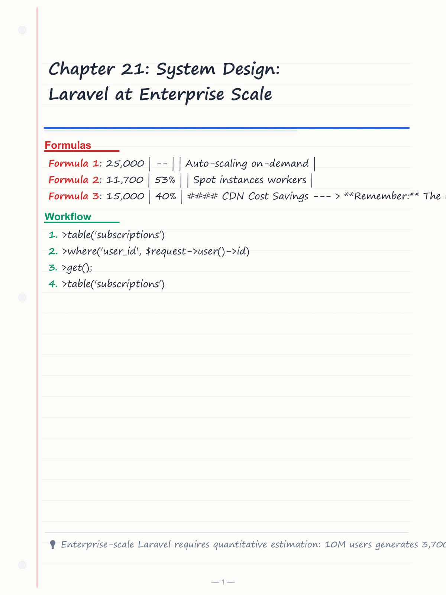
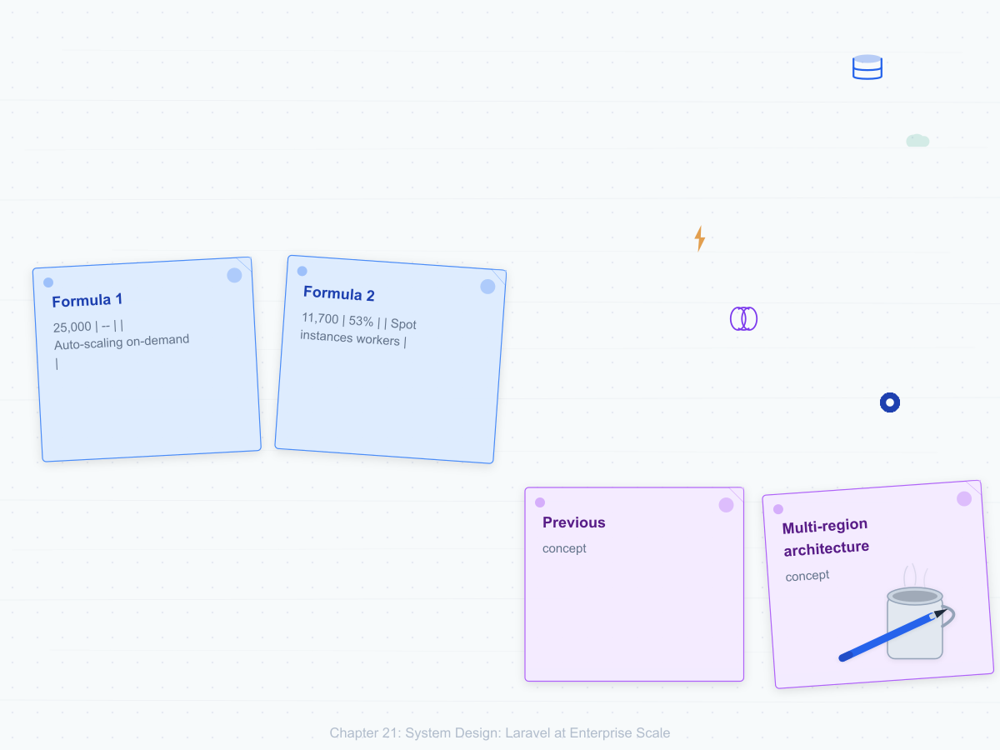
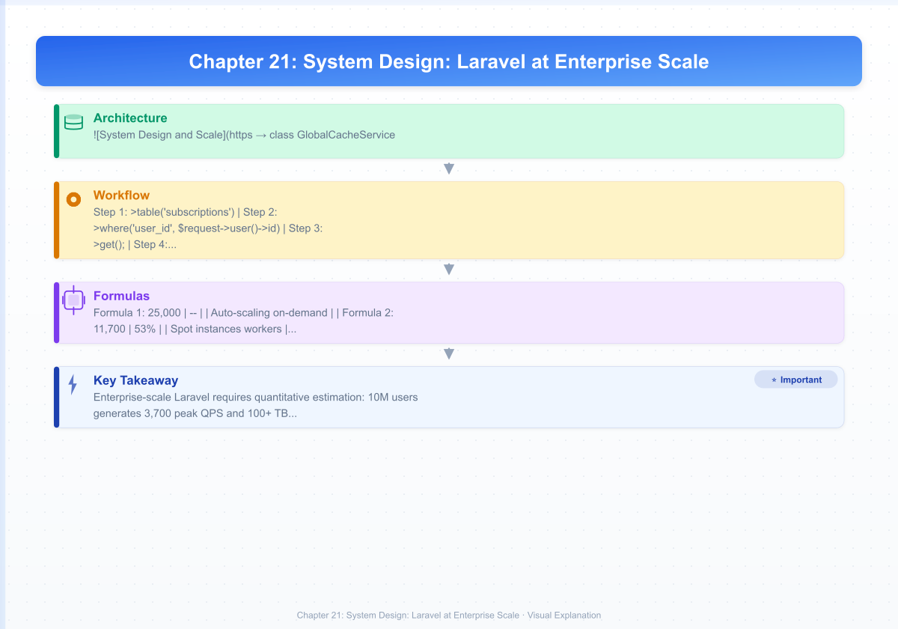

# Chapter 21: System Design: Laravel at Enterprise Scale

> **Previous:** [Scaling Laravel](./20-scaling-laravel.md) | **Next:** [Case Study E-Commerce](./22-case-study-ecommerce.md)

---
## Learning Objectives
- Estimate traffic, storage, memory, and CPU requirements for Laravel applications targeting 10 million or more users
- Design multi-region deployment architectures with active-passive and active-active strategies, cross-region replication, and DNS routing
- Implement global database sharding with shard key selection, routing middleware, scatter-gather queries, and rebalancing strategies
- Optimize read-heavy workloads with multi-level caching cascades, pre-computed views, and read replica offloading
- Optimize write-heavy workloads with queue-backed deferred processing, CQRS separation, batch operations, and eventual consistency
- Architect distributed rate limiting with Redis-backed token buckets, tiered limits, and standard rate limit headers
- Define and measure SLOs, SLIs, and SLAs for latency, availability, and throughput with per-tier commitments
- Design disaster recovery strategies with defined RPO/RTO, multi-region failover, backup automation, and runbook testing
- Model capacity planning with traffic growth projections, peak provisioning, and resource sizing for database connections and Redis memory
- Execute cost optimization across cache, compute, CDN, database, and logging infrastructure
- Plan and execute a monolith-to-services migration using the Strangler Fig pattern, database decomposition, and feature-flag-controlled traffic shifting
---

<!-- Image Gallery -->
<section class="lesson-visuals" aria-label="Visual learning resources">
  <header><span>VISUAL LEARNING</span><h2>See it. Review it. Remember it.</h2></header>
  <a class="lesson-visual-card" href="../../assets/images/lessons/laravel/21-system-design-scale/handwritten-notes.png" target="_blank" rel="noopener">
    
    <span><strong>Handwritten notes</strong>Condensed notes for deliberate review.</span>
  </a>
  <a class="lesson-visual-card" href="../../assets/images/lessons/laravel/21-system-design-scale/sticky-notes.png" target="_blank" rel="noopener">
    
    <span><strong>Sticky-note revision</strong>Fast recall prompts for revision.</span>
  </a>
  <a class="lesson-visual-card" href="../../assets/images/lessons/laravel/21-system-design-scale/visual-explanation.png" target="_blank" rel="noopener">
    
    <span><strong>Visual concept guide</strong>A connected explanation of the key ideas.</span>
  </a>
</section>
<!-- End Image Gallery -->

## Theory


### 1. Design for 10M+ Users


> **One-Sentence Takeaway:** Plan for horizontal scaling, caching, sharding, CDN, async processing, and multi-region from the start.

At 10 million users, every architectural decision must be based on quantitative estimates, not intuition.
Application code writes to primary, reads from local:

```php
class SubscriptionController extends Controller
{
    public function index(Request $request)
    {
        // Read from local replica (low latency)
        $subscriptions = DB::connection('mysql_local')
            ->table('subscriptions')
            ->where('user_id', $request->user()->id)
            ->get();

        return response()->json($subscriptions);
    }

    public function store(Request $request)
    {
        // Write to primary (cross-region)
        $subscription = DB::connection('mysql_primary')
            ->table('subscriptions')
            ->insert([$request->all()]);

        return response()->json($subscription, 201);
    }
}
```

#### DNS Routing (Route53)

```terraform
resource "aws_route53_record" "api" {
  zone_id = var.zone_id
  name    = "api.example.com"
  type    = "A"
  set_identifier = "us-east-1"
  geolocation_routing_policy { continent = "NA" }
  alias {
    name = aws_lb.us_east.dns_name
    zone_id = aws_lb.us_east.zone_id
    evaluate_target_health = true
  }
}
```

#### Cache Replication Across Regions

```php
class GlobalCacheService
{
    public function __construct(
        private $localCache,
        private $globalCache,
    ) {}

    public function get(string $key): mixed
    {
        $value = $this->localCache->get($key);
        if ($value !== null) { return $value; }

        $value = $this->globalCache->get($key);
        if ($value !== null) {
            $this->localCache->put($key, $value, 300);
        }
        return $value;
    }

    public function put(string $key, mixed $value, int $ttl = 300): void
    {
        $this->localCache->put($key, $value, $ttl);
        $this->globalCache->put($key, $value, $ttl * 2);
    }

    public function invalidate(string $key): void
    {
        $this->localCache->forget($key);
        $this->globalCache->forget($key);
        event(new CacheInvalidated($key, region()));
    }
}
```

---
## Chapter at a Glance

| Topic | Key Insight | Practical Takeaway |
|-------|-------------|-------------------|
| Design for 10M+ Users | Architecture decisions for hyper-scale | Plan for sharding, caching, and CDN from day one |
| Global Sharding | Horizontal partition data across databases | Shard by user_id or geographic region |
| Read-Heavy Optimization | Cache aggressively, use read replicas | Redis cache + MySQL read replicas |
| Write-Heavy Optimization | Queue writes, batch inserts | Use queues and bulk insert patterns |
| API Rate Limiting | Throttle API requests per user/token | Use Laravel RateLimiter facade |
| Disaster Recovery | Multi-region failover and backup strategies | Active-passive with automated DNS failover |

## Chapter Roadmap

``mermaid
flowchart LR
    A[User] --> B[CDN]
    B --> C[Load Balancer]
    C --> D[App Servers]
    D --> E[Redis Cache]
    D --> F[DB Shard 1]
    D --> G[DB Shard 2]
    D --> H[DB Shard 3]
    D --> I[Queue Workers]
    D --> J[Search Service]
``


> **Pro Tip:** Design your data model for sharding from the start. Choosing the wrong shard key is one of the hardest things to undo at scale.

### 3. Global Database Sharding


> **One-Sentence Takeaway:** Horizontal sharding partitions data by key such as user_id, distributing load across databases.

Sharding splits data across multiple database instances by a shard key.

#### Shard Key Selection

| Candidate Key | Cardinality | Distribution | Query Pattern | Verdict |
|--------------|-------------|-------------|---------------|---------|
| user_id | Very high | Natural | Bound by user | Best choice |
| tenant_id | Medium | Even | Bound by tenant | Multi-tenant |
| created_at | Temporal | Hot spots | Time-range scans | Hot shard |
| email_hash | Very high | Uniform | Auth lookups | Rare use |
| geo_region | Low | Skewed | Regional queries | Uneven |

#### Shard Routing Middleware

```php
namespace App\Http\Middleware;

use Closure;
use Illuminate\Http\Request;
use Illuminate\Support\Facades\Config;
use Illuminate\Support\Facades\DB;

class ShardRoute
{
    private const SHARD_COUNT = 128;

    public function handle(Request $request, Closure $next)
    {
        $userId = $request->user()?->id
            ?? $request->route('user_id')
            ?? throw new \RuntimeException('No user ID for shard routing');

        $shardId = crc32((string) $userId) % self::SHARD_COUNT;

        Config::set('database.connections.shard', [
            'driver' => 'mysql',
            'host' => env("DB_SHARD_{$shardId}_HOST"),
            'port' => env("DB_SHARD_{$shardId}_PORT", 3306),
            'database' => "shard_{$shardId}",
        ]);

        DB::purge('shard');
        return $next($request);
    }
}
```

#### Scatter-Gather for Cross-Shard Queries

```php
namespace App\Services\Sharding;

use Illuminate\Support\Facades\DB;
use Illuminate\Support\Collection;

class ScatterGather
{
    public function __construct(private array $shardConnections) {}

    public function query(string $query, array $bindings = []): Collection
    {
        $results = collect();
        foreach ($this->shardConnections as $shard => $connection) {
            $shardResults = DB::connection("shard_{$shard}")
                ->select($query, $bindings);
            $results = $results->merge($shardResults);
        }
        return $results;
    }

    public function count(string $table): int
    {
        $total = 0;
        foreach ($this->shardConnections as $shard => $connection) {
            $total += DB::connection("shard_{$shard}")->table($table)->count();
        }
        return $total;
    }
}
```

#### Global Secondary Indexes

```php
Schema::create('global_email_index', function (Blueprint $table) {
    $table->string('email')->primary();
    $table->unsignedBigInteger('user_id');
    $table->unsignedSmallInteger('shard_id');
    $table->timestamps();
});

$index = DB::connection('global_index')
    ->table('global_email_index')->where('email', $email)->first();

if ($index) {
    $host = env("DB_SHARD_{$index->shard_id}_HOST");
    Config::set('database.connections.shard.host', $host);
    $user = DB::connection('shard')->table('users')->find($index->user_id);
}
```

---

### 4. Read-Heavy Optimization


> **One-Sentence Takeaway:** Aggressive caching with Redis and database read replicas serve read-heavy workloads efficiently.

Most Laravel apps are 90%+ reads. Optimize aggressively.

#### Multi-Level Cache Cascade

```
L1: In-memory cache (Octane)   ~0.01ms
L2: Redis (local cluster)      ~1-5ms
L3: Redis (global cross-region) ~50-100ms
L4: Database (read replica)    ~5-50ms
```

```php
class MultiLevelCache
{
    public function __construct(
        private $redis,
        private $globalRedis,
    ) {}

    public function remember(string $key, int $ttl, \Closure $callback): mixed
    {
        $value = \Laravel\Octane\Facades\Octane::get("cache.{$key}");
        if ($value !== null) { return $value; }

        $value = $this->redis->get($key);
        if ($value !== null) {
            \Laravel\Octane\Facades\Octane::set("cache.{$key}", $value);
            return $value;
        }

        $value = $this->globalRedis->get($key);
        if ($value !== null) {
            $this->redis->put($key, $value, $ttl);
            \Laravel\Octane\Facades\Octane::set("cache.{$key}", $value);
            return $value;
        }

        $value = $callback();
        \Laravel\Octane\Facades\Octane::set("cache.{$key}", $value);
        $this->redis->put($key, $value, $ttl);
        $this->globalRedis->put($key, $value, $ttl * 2);

        return $value;
    }
}
```

#### Pre-Computed Views / Materialized Tables

```php
Schema::create('daily_revenue_summary', function (Blueprint $table) {
    $table->id();
    $table->date('date');
    $table->foreignId('plan_id')->constrained();
    $table->unsignedInteger('new_subscriptions');
    $table->unsignedInteger('canceled_subscriptions');
    $table->decimal('revenue', 12, 2);
    $table->unsignedInteger('total_active');
    $table->unique(['date', 'plan_id']);
});
```

```php
class ComputeDailyRevenue implements ShouldQueue
{
    public function __invoke(): void
    {
        $yesterday = now()->subDay()->toDateString();

        DB::table('daily_revenue_summary')->where('date', $yesterday)->delete();

        DB::statement("
            INSERT INTO daily_revenue_summary
                (date, plan_id, new_subscriptions, canceled_subscriptions,
                 revenue, total_active)
            SELECT ?, p.id,
                COUNT(DISTINCT ns.id), COUNT(DISTINCT cs.id),
                COALESCE(SUM(py.amount), 0),
                COUNT(DISTINCT sa.id)
            FROM plans p
            LEFT JOIN subscriptions ns ON p.id = ns.plan_id AND DATE(ns.created_at) = ?
            LEFT JOIN subscriptions cs ON p.id = cs.plan_id AND DATE(cs.canceled_at) = ?
            LEFT JOIN payments py ON p.id = py.plan_id AND DATE(py.created_at) = ?
            LEFT JOIN subscriptions sa ON p.id = sa.plan_id AND sa.status = 'active'
            GROUP BY p.id
        ", [$yesterday, $yesterday, $yesterday, $yesterday]);
    }
}
```

Read queries become instant:

```php
$revenue = DB::connection('mysql_read')
    ->table('daily_revenue_summary')
    ->where('date', now()->subDay())
    ->get();
```

---

### 5. Write-Heavy Optimization


> **One-Sentence Takeaway:** Defer writes to queues, batch inserts, and optimize indexes to handle high write throughput.

When writes exceed capacity, defer and batch.

#### Queue-Backed Writes

```php
class CreateSubscriptionController extends Controller
{
    public function store(CreateSubscriptionRequest $request)
    {
        CreateSubscription::dispatch(
            userId: $request->user()->id,
            planId: $request->input('plan_id'),
        );

        return response()->json([
            'message' => 'Processing subscription',
            'status' => 'pending',
        ], 202);
    }
}

class CreateSubscription implements ShouldQueue
{
    use Dispatchable, InteractsWithQueue, Queueable, SerializesModels;

    public function __construct(
        public int $userId,
        public int $planId,
    ) {}

    public function handle(CreateSubscriptionAction $action): void
    {
        $action(new SubscriptionData(
            userId: $this->userId,
            planId: $this->planId,
        ));
    }
}
```

#### Batch Processing

```php
class AnalyticsWriter
{
    private array $buffer = [];
    private int $bufferSize = 100;

    public function record(string $event, array $data = []): void
    {
        $this->buffer[] = [
            'event' => $event,
            'data' => json_encode($data),
            'occurred_at' => now(),
        ];

        if (count($this->buffer) >= $this->bufferSize) {
            $this->flush();
        }
    }

    public function flush(): void
    {
        if (empty($this->buffer)) { return; }
        DB::table('analytics_events')->insert($this->buffer);
        $this->buffer = [];
    }
}
```

---

### 6. API Rate Limiting at Scale


> **One-Sentence Takeaway:** Laravel RateLimiter facade with Redis backend throttles API requests per user, IP, or token.

#### Distributed Rate Limiting with Redis

```php
// config/cache.php
'rate_limiter' => [
    'driver' => 'redis',
    'connection' => 'rate_limiter',
],
```

```php
namespace App\Http\Middleware;

use Illuminate\Http\Request;
use Illuminate\Support\Facades\RateLimiter;

class TieredRateLimit
{
    public function handle(Request $request, \Closure $next, string $tier = 'free'): mixed
    {
        $key = $request->user()
            ? 'user:' . $request->user()->id
            : 'ip:' . $request->ip();

        $maxAttempts = match ($tier) {
            'enterprise' => 6000,
            'pro' => 600,
            default => 60,
        };

        if (RateLimiter::tooManyAttempts($key, $maxAttempts)) {
            $retryAfter = RateLimiter::availableIn($key);
            return response()->json(['message' => 'Too many requests'], 429)
                ->header('X-RateLimit-Limit', $maxAttempts)
                ->header('X-RateLimit-Remaining', 0)
                ->header('Retry-After', $retryAfter);
        }

        RateLimiter::hit($key, 60);

        return $next($request);
    }
}
```

#### Per-User, Per-IP, Per-API-Key Buckets

```php
// AppServiceProvider
use Illuminate\Cache\RateLimiting\Limit;
use Illuminate\Support\Facades\RateLimiter;

public function boot(): void
{
    RateLimiter::for('api', function (Request $request) {
        $user = $request->user();
        if ($user) {
            $max = match ($user->subscription->tier) {
                'enterprise' => 6000, 'pro' => 600, default => 60,
            };
            return Limit::perMinute($max)->by('user:' . $user->id);
        }
        return Limit::perMinute(10)->by('ip:' . $request->ip());
    });

    RateLimiter::for('auth', function (Request $request) {
        return Limit::perMinute(5)->by('auth:' . $request->ip());
    });
}
```

---

### 7. SLA / SLO / SLI Definitions


> **One-Sentence Takeaway:** SLA is the commitment, SLO is the target, SLI is the actual measured value.

#### Latency SLIs

```php
class LatencySLI
{
    private array $latencies = [];

    public function record(float $ms): void { $this->latencies[] = $ms; }
    public function p50(): float { return $this->percentile(50); }
    public function p95(): float { return $this->percentile(95); }
    public function p99(): float { return $this->percentile(99); }

    private function percentile(int $pct): float
    {
        $sorted = $this->latencies;
        sort($sorted);
        $idx = (int) ceil(($pct / 100) * count($sorted)) - 1;
        return $sorted[max(0, $idx)] ?? 0;
    }
}
```

| SLI | Definition | Window |
|-----|-----------|--------|
| P50 latency | Median response time | 5-min rolling |
| P95 latency | 95th percentile response time | 5-min rolling |
| P99 latency | 99th percentile response time | 5-min rolling |
| Error rate | 5xx / total x 100 | 1-min rolling |
| Availability | 1 - (down mins / total mins) x 100 | Monthly |

#### SLO Targets by Tier

| Tier | P50 | P95 | P99 | Error Rate | Availability |
|------|-----|-----|-----|------------|-------------|
| Free | <500ms | <2000ms | <5000ms | <3% | 99.5% |
| Pro | <200ms | <800ms | <2000ms | <1% | 99.9% |
| Enterprise | <100ms | <300ms | <1000ms | <0.5% | 99.95% |

---

### 8. Disaster Recovery


> **One-Sentence Takeaway:** Active-passive multi-region with automated DNS failover ensures business continuity.

#### RPO/RTO Definitions

| Term | Definition | Target |
|------|-----------|--------|
| RPO | Max acceptable data loss | 1 minute |
| RTO | Max acceptable downtime | 15 minutes |
| MTD | Total downtime causing business failure | 4 hours |

#### Backup Strategy

```php
// config/backup.php
return [
    'backup' => [
        'source' => ['databases' => ['mysql']],
        'destination' => ['disks' => ['s3-backups'], 'compression' => 'gzip'],
    ],
    'notifications' => [
        'notifications' => [
            BackupWasSuccessful::class => ['mail'],
            BackupHasFailed::class => ['mail', 'slack'],
        ],
    ],
    'monitor_backups' => [
        ['name' => 'production', 'disks' => ['s3-backups'],
         'health_checks' => [MaximumAgeInDays::class => 30]],
    ],
];
```

```yaml
# .github/workflows/disaster-recovery-test.yml
on:
  schedule:
    - cron: '0 6 * * 1'
jobs:
  restore-test:
    runs-on: ubuntu-latest
    steps:
      - uses: actions/checkout@v4
      - run: php artisan backup:restore --disk=s3-backups --connection=mysql_test
      - run: php artisan test --testsuite=Smoke
```

#### Multi-Region Failover Runbook

```
# Failover Runbook: us-east-1 -> eu-west-1
## Trigger
- Route53 health checks fail for 3 consecutive checks (30s)
- CloudWatch alarm "RegionDown" fires
## Manual Steps
1. Verify eu-west-1 capacity
2. Promote Aurora replica to primary
3. Update Route53 DNS
4. Verify app health endpoints
5. Notify team
## RTO: 8 minutes | RPO: < 30 seconds
```

---


> **Warning:** DR plans must be tested regularly. An untested DR plan is worse than having no plan at all.

### 9. Capacity Planning


> **One-Sentence Takeaway:** Model traffic growth, project resource needs, and budget for infrastructure scaling in advance.

#### Traffic Growth Modeling

```php
class CapacityModel
{
    public function projectGrowth(int $dau, float $monthlyRate, int $months): array
    {
        $projections = [];
        for ($i = 0; $i <= $months; $i++) {
            $futureDau = (int) ($dau * pow(1 + $monthlyRate, $i));
            $qps = (int) ($futureDau * 20 / 86400 * 4);
            $storage = round($futureDau * 0.05, 1);
            $redis = round($futureDau * 0.025 / 1024, 1);

            $projections[] = [
                'month' => $i,
                'dau' => $futureDau,
                'peak_qps' => $qps,
                'storage_gb' => $storage,
                'redis_gb' => $redis,
                'web_servers' => ceil($qps / 500),
            ];
        }
        return $projections;
    }
}
```

#### Auto-Scaling Thresholds

```yaml
resource "aws_appautoscaling_target" "web_ecs" {
  service_namespace  = "ecs"
  resource_id        = "service/production/web"
  scalable_dimension = "ecs:service:DesiredCount"
  min_capacity       = 4
  max_capacity       = 50
}
resource "aws_appautoscaling_policy" "web_cpu" {
  target_tracking_scaling_policy_configuration {
    predefined_metric_specification {
      predefined_metric_type = "ECSServiceAverageCPUUtilization"
    }
    target_value = 70
  }
}
```

#### Database Connection Pool Sizing

```
10 Octane nodes x 8 workers x 5 connections/worker = 400 connections
Aurora db.r6g.8xlarge max connections: 6,000
RDS Proxy max connections: 10,000
```

---

### 10. Cost Optimization


> **One-Sentence Takeaway:** Right-size instances, use spot instances, enable auto-scaling, and leverage reserved capacity.

#### Cache Hit Rate Analysis

```php
class CacheEfficiencyAnalyzer
{
    public function analyzeHitRates(): array
    {
        $report = [];
        foreach (['subscriptions','users','plans','products'] as $ns) {
            $hits = Cache::store('redis')->get("stats:{$ns}:hits", 0);
            $misses = Cache::store('redis')->get("stats:{$ns}:misses", 1);
            $rate = round($hits / ($hits + $misses) * 100, 2);
            $report[$ns] = ['hit_rate' => $rate,
                'recommendation' => match(true) {
                    $rate > 95 => 'Optimal',
                    $rate > 80 => 'Increase TTL',
                    default => 'Check invalidation logic',
                }];
        }
        return $report;
    }
}
```

#### Cost Comparison Table

| Strategy | Monthly Cost | Savings |
|----------|-------------|---------|
| Single large server | $25,000 | -- |
| Auto-scaling (on-demand) | $18,000 | 28% |
| Reserved instances (1yr) | $11,700 | 53% |
| Spot instances (workers) | $5,400 | 78% |
| Vapor (serverless) | $15,000 | 40% |

#### CDN Cost Savings

```
Without CDN: 10M users x 100 MB/month x $0.09/GB = $90,000/month
With CDN:    10M users x 100 MB/month x $0.02/GB = $20,000/month
Savings:     $70,000/month (78% reduction)
```

---


> **Remember:** The most expensive query is the one you don't cache. Always measure cache hit ratios before adding more database capacity.

### 11. Migration from Monolith to Services


> **One-Sentence Takeaway:** Strangler Fig pattern incrementally replaces monolith components with services.

The Strangler Fig pattern incrementally replaces monolith functionality with services.

#### Service Extraction Order

| Service | Order | Rationale | Difficulty |
|---------|-------|-----------|------------|
| Authentication | 1 | Self-contained, security critical | Low |
| Notifications | 2 | Clear contract, async | Low |
| Billing | 3 | Needs stable auth | Medium |
| Orders | 4 | Depends on billing | High |
| Reporting | 5 | Reads everything, safe to extract last | Medium |

#### Database Decomposition

```
Step 1: Shared database - all tables in one schema
Step 2: Schema separation - own schema per service
Step 3: Database views reference service tables
Step 4: Application-level joins via API
Step 5: Independent databases per service
```

#### Feature Flags for Migration Control

```php
class OrderController extends Controller
{
    public function store(Request $request)
    {
        // Canary test new service with 10% of traffic
        if (Feature::for('extract-order-service', $request->user(), 0.1)) {
            return $this->newOrderService()->create($request);
        }
        return $this->legacyMonolithCreate($request);
    }
}
```

#### API Gateway Routing

```yaml
routes:
  - path: /api/auth/*
    service: auth-service
  - path: /api/orders/*
    service: monolith
  - path: /api/billing/*
    service: billing-service
```

---

## Concept Comparison Table

| Concept | Purpose | Key Benefit | Limitation |
|---------|---------|-------------|------------|
| Sharding | Horizontal DB partitioning | Linear write scaling | Complex joins across shards |
| Rate Limiting | Request throttling | Protects from abuse | Can block legitimate traffic |
| DR | Multi-region failover | Business continuity | High infrastructure cost |
| Migration | Strangler Fig pattern | Risk-free transition | Long migration timeline |

## Quick Reference

| Item | Description |
|------|-------------|
| RateLimiter::for('api', fn...) |Define rate limiter | DB::connection('mysql_read')|Read replica connection |
| Cache::tags(['users'])|Tagged caching for invalidation | Strangler Fig pattern|Incremental service migration |

## Cross-Application Matrix

| Scenario | Approach | Benefit | Challenge |
|----------|----------|---------|-----------|
| Read-heavy | Redis + replicas | Low latency reads | Replica lag |
| Write-heavy | Queues + batching | Async throughput | Eventual consistency |
| Multi-region | Active-passive DR | Disaster resilience | DNS failover delay |
| Migration | Strangler Fig | Incremental replacement | Parallel maintenance |

## Chapter Quiz

1. What is the most important factor when designing database shards?
   - A) Number of servers
   - B) Shard key selection
   - C) Total database size
   - D) Network bandwidth
   <details><summary>Answer&lt;/summary&gt;**B)** The shard key determines data distribution. A poor shard key causes hot spots and uneven load.</details>

2. Which pattern is recommended for migrating from a monolith to services?
   - A) Big-bang rewrite
   - B) Strangler Fig
   - C) Fork and replace
   - D) Lift and shift
   <details><summary>Answer&lt;/summary&gt;**B)** The Strangler Fig pattern incrementally replaces components, reducing risk compared to a full rewrite.</details>

3. What distinguishes SLA, SLO, and SLI?
   - A) They are synonyms
   - B) SLA is commitment, SLO is target, SLI is measurement
   - C) SLA is internal, SLO is external
   - D) SLA is for uptime, SLO is for latency
   <details><summary>Answer&lt;/summary&gt;**B)** SLA is the contractual commitment, SLO is the internal target, SLI is the actual measured value.</details>

4. What is the recommended approach for multi-region disaster recovery?
   - A) Active-active with all regions live
   - B) Active-passive with automated DNS failover
   - C) Single region with daily backups
   - D) Manual failover on incident
   <details><summary>Answer&lt;/summary&gt;**B)** Active-passive with automated DNS failover balances cost and recovery time for most applications.</details>

## Summary
- Enterprise-scale Laravel requires quantitative estimation: 10M users generates 3,700 peak QPS and 100+ TB storage
- Multi-region deployment with Aurora Global Database and Route53 geolocation provides regional fault tolerance with sub-second lag
- Database sharding using user_id as shard key with middleware-based routing enables scaling beyond a single database
- Read-heavy optimization demands multi-level cache cascades and pre-computed materialized views
- Write-heavy workloads require queue-backed deferred processing and batch accumulation
- Distributed rate limiting with Redis enforces per-user, per-IP, per-API-key limits
- SLO/SLA frameworks define measurable P50/P95/P99 latency, error rate, and availability targets
- Disaster recovery must specify RPO (<1 min) and RTO (<15 min) with automated testing
- Capacity planning models growth projections for web servers, database ACUs, and Redis memory
- Cost optimization focuses on cache hit rates, reserved instances, CDN offloading, and Vapor Lambda costs
- Monolith-to-services migration follows the Strangler Fig pattern with feature flags for gradual shifting
---
## Exercises

### Review Questions

1. Calculate peak QPS for 5M DAU generating 25 req/user/day. How many Octane nodes at 500 QPS/node?
2. Compare active-passive vs active-active multi-region. When is the complexity justified?
3. Explain scatter-gather for cross-shard queries. How does latency scale with shard count?
4. Why must both RPO and RTO be specified? What risks arise from a 1-minute RPO with 6-hour backups?
5. Describe the Strangler Fig pattern. Why is it lower risk than a complete rewrite?

### Application Problems

1. **Multi-region architecture**: Design active-active across us-east-1, eu-west-1, ap-southeast-1 with 20% traffic each. Write DB config, Route53 routing, and read-from-local/write-to-primary application code.

2. **Capacity model**: 500K DAU at 8% monthly growth. Project at months 0/3/6/12/24: peak QPS, web servers (500 QPS/node), storage (35 MB/user), Redis (4 KB session + 15 KB cache), DB ACUs (1 per 80 writes/sec), workers (1 per 30 users).

3. **Shard rebalancing**: 32 shards where shard 5 has 3x average size. Design a rebalancing plan adding shards 33-64. Include hash function update, migration pseudocode, and zero-downtime cutover.

### Challenge Problem

Design the complete enterprise architecture for 50 million users across 5 regions with:
- 99.99% availability SLA (4.38 min/month max downtime)
- P99 latency under 500ms globally
- 50,000 requests/second peak traffic
- GDPR data sovereignty per region
- Real-time collaboration with sub-100ms broadcast
- ML inference at 500ms P99
- Disaster recovery with 5-second RPO and 2-minute RTO
- $500K/month infrastructure budget

Provide: region topology, global sharding scheme, 5-region cache hierarchy with invalidation, queue architecture with regional isolation, distributed rate limiting, SLO table with burn-rate alerts, DR architecture with automated failover, cost breakdown within budget, and zero-downtime migration plan from single-region.