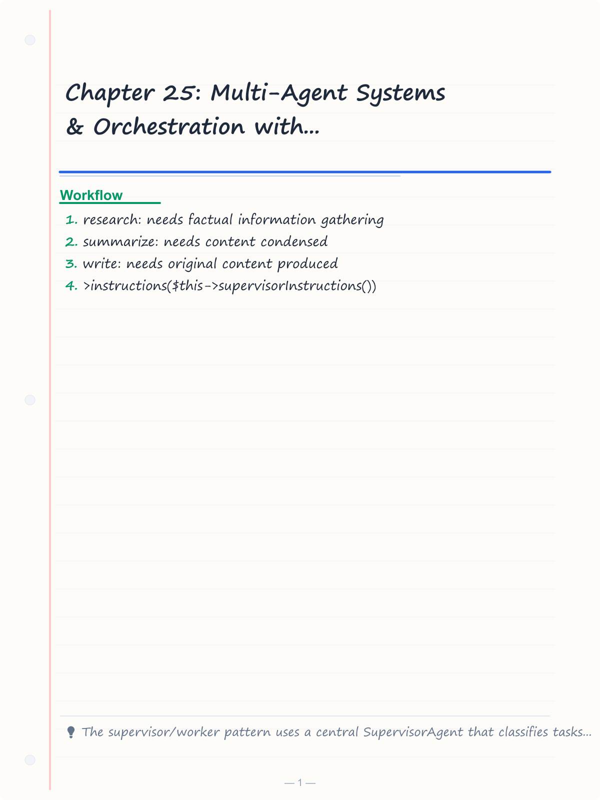
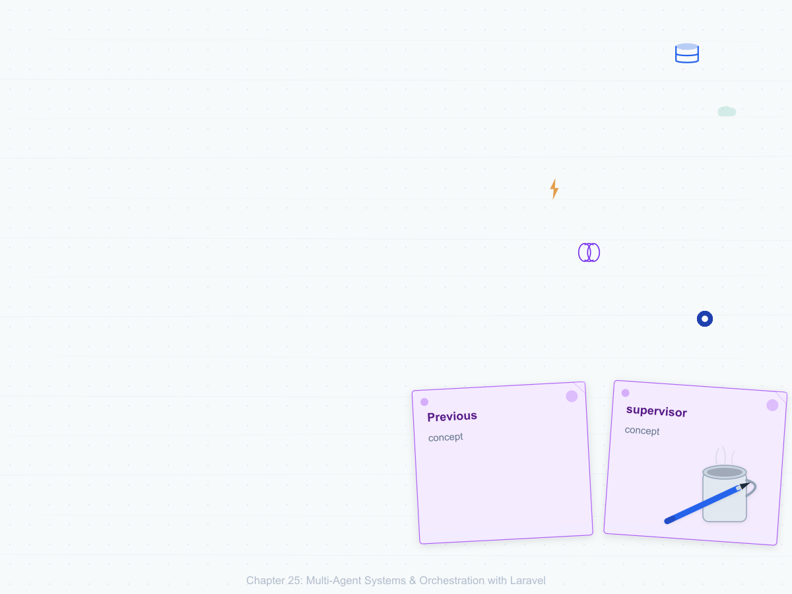
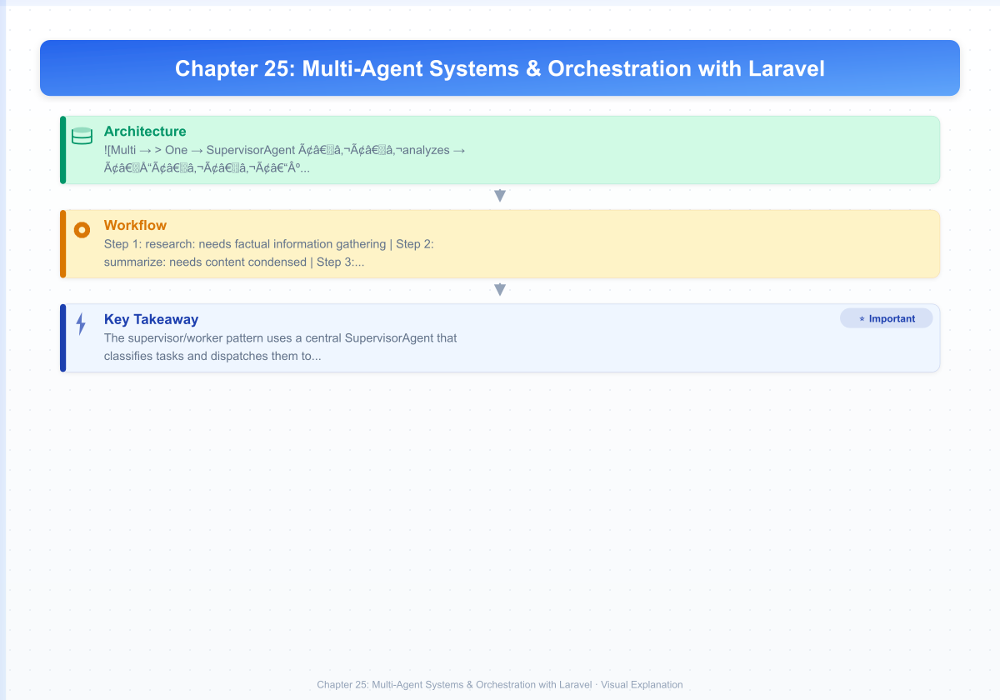

# Chapter 25: Multi-Agent Systems & Orchestration with Laravel

> **Previous:** [Capstone](./24-capstone.md) | **Next:** [Business Automation Agents](./26-business-automation-agents.md)

---

## Learning Objectives

- Design and implement the supervisor/worker pattern to route tasks across specialized AI agents with tool-based dispatch
- Build agent teams that collaborate via structured handoff protocols and intent-based routing
- Execute multiple agents in parallel using Laravel queues and merge their results with the fan-out/fan-in pattern
- Manage shared agent state and conversation memory across distributed agent teams using database and Redis backends
- Orchestrate complex multi-step agent workflows with Laravel Horizon, job batching, and failure recovery policies
- Identify and mitigate multi-agent failure modes with circuit breakers, timeout guards, and output conflict resolution
- Write comprehensive PEST tests for multi-agent systems including mock agents, integration tests, and handoff verification

<!-- Image Gallery -->
<section class="lesson-visuals" aria-label="Visual learning resources">
  <header><span>VISUAL LEARNING</span><h2>See it. Review it. Remember it.</h2></header>
  <a class="lesson-visual-card" href="../../assets/images/lessons/laravel/25-multi-agent-systems/handwritten-notes.png" target="_blank" rel="noopener">
    
    <span><strong>Handwritten notes</strong>Condensed notes for deliberate review.</span>
  </a>
  <a class="lesson-visual-card" href="../../assets/images/lessons/laravel/25-multi-agent-systems/sticky-notes.png" target="_blank" rel="noopener">
    
    <span><strong>Sticky-note revision</strong>Fast recall prompts for revision.</span>
  </a>
  <a class="lesson-visual-card" href="../../assets/images/lessons/laravel/25-multi-agent-systems/visual-explanation.png" target="_blank" rel="noopener">
    
    <span><strong>Visual concept guide</strong>A connected explanation of the key ideas.</span>
  </a>
</section>
<!-- End Image Gallery -->


---
## Chapter at a Glance

| Topic | Key Insight | Practical Takeaway |
|-------|-------------|-------------------|
| Supervisor/Worker | Central supervisor delegates tasks to workers | Use queues for reliable async delegation |
| Agent Teams | Team-based agent coordination with handoff protocols | Define handoff contracts between agents |
| Parallel Execution | Run independent agents simultaneously | Use Laravel queues with separate workers |
| State Management | Shared state across distributed agents | Use Redis for agent state with TTL |
| Queue Orchestration | Queue-backed agent coordination | Dispatch agent jobs to priority queues |
| Failure Modes | Handle agent failures and retries | Implement circuit breakers and fallback agents |

## Chapter Roadmap

``mermaid
flowchart LR
    A[Supervisor Agent] --> B[Queue Dispatcher]
    B --> C[Worker Agent 1]
    B --> D[Worker Agent 2]
    B --> E[Worker Agent 3]
    C --> F[Result Aggregator]
    D --> F
    E --> F
    F --> G[State Store Redis]
    F --> H[Response Handler]
``


## Theory


### 25.1 The Supervisor/Worker Pattern


> **One-Sentence Takeaway:** A central supervisor delegates tasks to worker agents via queues, handling distribution and result aggregation.

Single-agent systems handle one task per invocation. A multi-agent system introduces a **supervisor** that accepts a high-level goal, decomposes it into sub-tasks, and dispatches each sub-task to a specialized **worker** agent. The supervisor does not perform the work itself — it plans, delegates, and synthesises results.

#### Architecture

```
User Request
      │
      ▼
SupervisorAgent ──analyzes task──► decides worker
      │
      ├──► ResearchAgent   (gathers information)
      ├──► SummarizerAgent (condenses content)
      └──► WriterAgent     (produces final output)
      │
      └──► merges results ──► returns response
```

#### The SupervisorAgent Class

Create a supervisor that receives a task description, classifies it, and invokes the correct worker via the AI SDK's tool-calling mechanism:

```php
<?php

namespace App\Ai\Agents;

use Laravel\Ai\Contracts\Agent;
use Laravel\Ai\Promptable;
use Stringable;

class SupervisorAgent implements Agent
{
    use Promptable;

    public function instructions(): Stringable|string
    {
        return <<<PROMPT
You are a supervisor agent that delegates tasks to specialized workers.
Analyze the user's request and classify it into one of these categories:
- research: needs factual information gathering
- summarize: needs content condensed
- write: needs original content produced

Call the appropriate worker tool with the user's input.
Do NOT answer the question yourself — delegate it.
PROMPT;
    }
}
```

The supervisor uses tools to dispatch work. Each worker is registered as a callable tool that the model decides to invoke:

```php
<?php

namespace App\Http\Controllers;

use App\Ai\Agents\SupervisorAgent;
use Illuminate\Http\Request;
use Laravel\Ai\Facades\Agent;

class DelegationController extends Controller
{
    public function delegate(Request $request): array
    {
        $request->validate(['task' => 'required|string']);

        $response = Agent::make()
            ->instructions($this->supervisorInstructions())
            ->tools([
                $this->researchTool(),
                $this->summarizeTool(),
                $this->writeTool(),
            ])
            ->prompt($request->input('task'));

        return [
            'result' => $response->text(),
            'tool_calls' => $response->toolCalls(),
        ];
    }

    private function supervisorInstructions(): string
    {
        return <<<PROMPT
You are a supervisor agent. Analyze the user's request and call the appropriate
worker tool. Available workers:

1. research: Call when the user needs facts, data, or information gathered.
2. summarize: Call when the user needs content condensed or shortened.
3. write: Call when the user needs original content produced.

After the worker returns, present the result to the user.
PROMPT;
    }

    private function researchTool(): array
    {
        return [
            'type' => 'function',
            'name' => 'research',
            'description' => 'Gather factual information on a topic',
            'parameters' => [
                'type' => 'object',
                'properties' => [
                    'query' => [
                        'type' => 'string',
                        'description' => 'The research query or topic',
                    ],
                    'depth' => [
                        'type' => 'string',
                        'enum' => ['quick', 'detailed'],
                        'description' => 'Research depth level',
                    ],
                ],
                'required' => ['query'],
            ],
        ];
    }

    private function summarizeTool(): array
    {
        return [
            'type' => 'function',
            'name' => 'summarize',
            'description' => 'Condense content into a summary',
            'parameters' => [
                'type' => 'object',
                'properties' => [
                    'content' => [
                        'type' => 'string',
                        'description' => 'The content to summarize',
                    ],
                    'max_length' => [
                        'type' => 'integer',
                        'description' => 'Maximum words in summary',
                    ],
                ],
                'required' => ['content'],
            ],
        ];
    }

    private function writeTool(): array
    {
        return [
            'type' => 'function',
            'name' => 'write',
            'description' => 'Generate original written content',
            'parameters' => [
                'type' => 'object',
                'properties' => [
                    'topic' => [
                        'type' => 'string',
                        'description' => 'The topic to write about',
                    ],
                    'format' => [
                        'type' => 'string',
                        'enum' => ['email', 'blog', 'report', 'tweet'],
                        'description' => 'Output format',
                    ],
                ],
                'required' => ['topic', 'format'],
            ],
        ];
    }
}
```

#### Dedicated Worker Agent Classes

Each worker is a full agent with its own system prompt and optional tools:

```php
<?php

namespace App\Ai\Agents\Workers;

use Laravel\Ai\Contracts\Agent;
use Laravel\Ai\Promptable;
use Stringable;

class ResearchAgent implements Agent
{
    use Promptable;

    public function instructions(): Stringable|string
    {
        return <<<PROMPT
You are a research specialist. Your job is to gather comprehensive, accurate
information on any topic. Always cite sources where possible. Structure
your research with headings and bullet points for clarity.
PROMPT;
    }
}
```

```php
<?php

namespace App\Ai\Agents\Workers;

use Laravel\Ai\Contracts\Agent;
use Laravel\Ai\Promptable;
use Stringable;

class SummarizerAgent implements Agent
{
    use Promptable;

    public function instructions(): Stringable|string
    {
        return <<<PROMPT
You are a summarization specialist. Condense content while preserving key
facts, arguments, and conclusions. Adapt your summary length to the
request — one paragraph for quick overviews, structured sections for
detailed summaries. Never add information not in the original.
PROMPT;
    }
}
```

```php
<?php

namespace App\Ai\Agents\Workers;

use Laravel\Ai\Contracts\Agent;
use Laravel\Ai\Promptable;
use Stringable;

class WriterAgent implements Agent
{
    use Promptable;

    public function instructions(): Stringable|string
    {
        return <<<PROMPT
You are a content writer. Produce clear, engaging, well-structured written
content in the requested format. Adapt your tone to the audience: professional
for reports, conversational for blog posts, punchy for social media.
PROMPT;
    }
}
```

#### The Supervisor Resolver

The supervisor's tool execution layer resolves which worker to call. This is handled by the AI SDK — when the model calls the `research`, `summarize`, or `write` tool, the SDK routes the call to the tool handler registered in the application:

```php
<?php

namespace App\Ai\ToolHandlers;

use App\Ai\Agents\Workers\ResearchAgent;
use App\Ai\Agents\Workers\SummarizerAgent;
use App\Ai\Agents\Workers\WriterAgent;

class WorkerDispatcher
{
    public function research(string $query, string $depth = 'quick'): string
    {
        $prompt = $depth === 'detailed'
            ? "Provide a comprehensive, detailed research report on: {$query}"
            : "Provide a quick overview of: {$query}";

        return ResearchAgent::make()->prompt($prompt)->text();
    }

    public function summarize(string $content, int $max_length = 200): string
    {
        $prompt = <<<PROMPT
Summarize the following content in no more than {$max_length} words:

{$content}
PROMPT;

        return SummarizerAgent::make()->prompt($prompt)->text();
    }

    public function write(string $topic, string $format = 'blog'): string
    {
        $formatInstructions = match ($format) {
            'email' => 'Write a professional email about:',
            'blog' => 'Write an engaging blog post about:',
            'report' => 'Write a formal report about:',
            'tweet' => 'Write a concise tweet (max 280 chars) about:',
            default => 'Write content about:',
        };

        return WriterAgent::make()->prompt("{$formatInstructions} {$topic}")->text();
    }
}
```

Register tool handlers in a service provider:

```php
<?php

namespace App\Providers;

use App\Ai\ToolHandlers\WorkerDispatcher;
use Illuminate\Support\ServiceProvider;
use Laravel\Ai\Facades\Agent;

class AiServiceProvider extends ServiceProvider
{
    public function boot(): void
    {
        Agent::registerTool('research', function (string $query, string $depth = 'quick') {
            return app(WorkerDispatcher::class)->research($query, $depth);
        });

        Agent::registerTool('summarize', function (string $content, int $max_length = 200) {
            return app(WorkerDispatcher::class)->summarize($content, $max_length);
        });

        Agent::registerTool('write', function (string $topic, string $format = 'blog') {
            return app(WorkerDispatcher::class)->write($topic, $format);
        });
    }
}
```

---


> **Pro Tip:** Make the supervisor stateless. Store all task state in Redis so the supervisor can be safely restarted.


> **Pro Tip:** Make the supervisor stateless. Store all task state in Redis so the supervisor can be safely restarted.

### 25.2 Agent Teams & Handoff Protocols


> **One-Sentence Takeaway:** Agent teams use handoff protocols with contracts defining what data is passed and what the receiving agent should do.

A single supervisor dispatching to isolated workers works for straightforward delegation. Complex goals require **agent teams** — multiple agents that collaborate, pass context, and hand off control to one another mid-conversation.

#### The Handoff Pattern

The handoff pattern is: Agent A receives a request, determines it is not the right agent to handle it (or needs a specialist), formats a structured handoff message, and passes control to Agent B. Agent B receives the handoff context and continues the work.

#### Building a RouterAgent

A router agent classifies incoming intent and hands off to a specialized agent. The handoff is implemented through structured output:

```php
<?php

namespace App\Ai\Agents\Router;

use Laravel\Ai\Contracts\Agent;
use Laravel\Ai\HasStructuredOutput;
use Laravel\Ai\Promptable;
use Laravel\Ai\JsonSchema;
use Stringable;

class RouterAgent implements Agent
{
    use Promptable, HasStructuredOutput;

    public function instructions(): Stringable|string
    {
        return <<<PROMPT
You are an intent router. Analyze the user's message and classify it into
exactly one category. Return your classification as structured output with
the category name, confidence score, and any extracted entities.

Categories:
- technical_support: Installation errors, configuration, bug reports
- billing: Invoices, subscriptions, refunds, pricing
- feature_request: New feature ideas, improvements, integrations
- general: Any question not covered by the above categories
PROMPT;
    }

    public function schema(): JsonSchema
    {
        return JsonSchema::object()
            ->property('category', JsonSchema::enum([
                'technical_support',
                'billing',
                'feature_request',
                'general',
            ]))
            ->property('confidence', JsonSchema::number()->minimum(0)->maximum(1))
            ->property('extracted_entities', JsonSchema::array(
                JsonSchema::object()
                    ->property('key', JsonSchema::string())
                    ->property('value', JsonSchema::string())
            ))
            ->property('reasoning', JsonSchema::string()->maxLength(200));
    }
}
```

#### Handoff Controller

The router controller determines the target agent from the classification and hands off execution:

```php
<?php

namespace App\Http\Controllers;

use App\Ai\Agents\Router\RouterAgent;
use App\Ai\Agents\Specialists\TechnicalSupportAgent;
use App\Ai\Agents\Specialists\BillingAgent;
use App\Ai\Agents\Specialists\FeatureRequestAgent;
use App\Ai\Agents\Specialists\GeneralAgent;
use Illuminate\Http\Request;

class HandoffController extends Controller
{
    public function handle(Request $request): array
    {
        $request->validate(['message' => 'required|string']);

        $route = RouterAgent::make()->prompt($request->input('message'));
        $decision = $route->structured();

        $specialist = match ($decision->category) {
            'technical_support' => TechnicalSupportAgent::class,
            'billing' => BillingAgent::class,
            'feature_request' => FeatureRequestAgent::class,
            'general' => GeneralAgent::class,
        };

        $handoffContext = $this->buildHandoffContext($request->input('message'), $decision);

        $response = $specialist::make()
            ->withContext($handoffContext)
            ->prompt($request->input('message'));

        return [
            'response' => $response->text(),
            'routed_to' => $decision->category,
            'confidence' => $decision->confidence,
        ];
    }

    private function buildHandoffContext(string $message, object $decision): array
    {
        return [
            'original_message' => $message,
            'classification' => $decision->category,
            'entities' => json_encode($decision->extracted_entities),
            'router_reasoning' => $decision->reasoning,
            'handoff_protocol' => 'You are receiving this because the router determined '
                . "this is a {$decision->category} request "
                . "(confidence: {$decision->confidence}). "
                . 'Continue the conversation and resolve the user\'s issue.',
        ];
    }
}
```

#### Specialist Agents

Each specialist agent receives the handoff context and continues the conversation from where the router left off:

```php
<?php

namespace App\Ai\Agents\Specialists;

use Laravel\Ai\Contracts\Agent;
use Laravel\Ai\Conversational;
use Laravel\Ai\Promptable;
use Laravel\Ai\RemembersConversations;
use Stringable;

class TechnicalSupportAgent implements Agent, Conversational
{
    use Promptable, RemembersConversations;

    public function instructions(): Stringable|string
    {
        return <<<PROMPT
You are a technical support specialist. Help users resolve installation errors,
configuration problems, and bugs. Ask for error messages, logs, and environment
details. Provide step-by-step solutions. Escalate to engineering if the issue
requires code changes.
PROMPT;
    }
}
```

```php
<?php

namespace App\Ai\Agents\Specialists;

use Laravel\Ai\Contracts\Agent;
use Laravel\Ai\Conversational;
use Laravel\Ai\Promptable;
use Laravel\Ai\RemembersConversations;
use Stringable;

class BillingAgent implements Agent, Conversational
{
    use Promptable, RemembersConversations;

    public function instructions(): Stringable|string
    {
        return <<<PROMPT
You are a billing specialist. Handle invoice questions, subscription changes,
refund requests, and pricing inquiries. Verify account ownership before
discussing sensitive billing details. Provide clear timelines for
transactions and refunds.
PROMPT;
    }
}
```

#### Agent-to-Agent Handoff with Tools

A more advanced handoff pattern lets one agent decide during the conversation that another agent should take over. This is done by registering "handoff tools" that transfer control:

```php
<?php

namespace App\Ai\Agents;

use Laravel\Ai\Contracts\Agent;
use Laravel\Ai\Promptable;
use Stringable;

class TriageAgent implements Agent
{
    use Promptable;

    public function instructions(): Stringable|string
    {
        return <<<PROMPT
You are the first point of contact. Handle what you can, but if the user
needs specialized help, use the handoff tools to transfer them to the
right expert.

- handoff_to_support: Escalate technical issues beyond your capability
- handoff_to_billing: Escalate payment or subscription questions
- handoff_to_engineering: Escalate suspected bugs or feature requests

When handing off, include a summary of what was discussed so the next
agent can continue seamlessly.
PROMPT;
    }
}
```

Register handoff tools that pass a summary to the next agent:

```php
<?php

namespace App\Providers;

use App\Ai\Agents\Specialists\TechnicalSupportAgent;
use App\Ai\Agents\Specialists\BillingAgent;
use App\Ai\Agents\Specialists\FeatureRequestAgent;
use Illuminate\Support\ServiceProvider;
use Laravel\Ai\Facades\Agent;

class HandoffServiceProvider extends ServiceProvider
{
    public function boot(): void
    {
        Agent::registerTool('handoff_to_support', function (string $summary, string $user_message) {
            return TechnicalSupportAgent::make()
                ->withContext([
                    'handoff_summary' => $summary,
                    'original_request' => $user_message,
                ])
                ->prompt($user_message)
                ->text();
        });

        Agent::registerTool('handoff_to_billing', function (string $summary, string $user_message) {
            return BillingAgent::make()
                ->withContext([
                    'handoff_summary' => $summary,
                    'original_request' => $user_message,
                ])
                ->prompt($user_message)
                ->text();
        });

        Agent::registerTool('handoff_to_engineering', function (string $summary, string $user_message) {
            return FeatureRequestAgent::make()
                ->withContext([
                    'handoff_summary' => $summary,
                    'original_request' => $user_message,
                ])
                ->prompt($user_message)
                ->text();
        });
    }
}
```

---

### 25.3 Parallel Agent Execution


> **One-Sentence Takeaway:** Independent agents run concurrently on separate queue workers, with results aggregated after all complete.

Multi-agent systems often need to run several agents at the same time — analyzing the same data from different perspectives, researching multiple topics, or generating alternative outputs. Laravel queues enable true parallel execution.

#### The Fan-Out/Fan-In Pattern

Fan-out dispatches multiple independent agent jobs simultaneously. Fan-in collects all results and merges them into a single output.

#### Dispatching Parallel Agents

```php
<?php

namespace App\Jobs;

use App\Ai\Agents\Workers\ResearchAgent;
use App\Ai\Agents\Workers\SummarizerAgent;
use App\Ai\Agents\Workers\WriterAgent;
use Illuminate\Bus\Queueable;
use Illuminate\Contracts\Queue\ShouldQueue;
use Illuminate\Foundation\Bus\Dispatchable;
use Illuminate\Queue\InteractsWithQueue;
use Illuminate\Support\Facades\Bus;

class ParallelAnalysisJob implements ShouldQueue
{
    use Dispatchable, InteractsWithQueue, Queueable;

    public function __construct(
        public string $topic,
        public string $analysisId,
    ) {}

    public function handle(): void
    {
        $researchJob = new ResearchJob($this->topic, $this->analysisId, 'research');
        $summarizeJob = new SummarizeExistingJob($this->topic, $this->analysisId, 'summarize');
        $writerJob = new WriterOpinionJob($this->topic, $this->analysisId, 'write');

        Bus::batch([
            $researchJob,
            $summarizeJob,
            $writerJob,
        ])->then(function () {
            $this->mergeResults($this->analysisId);
        })->catch(function () {
            $this->handlePartialFailure($this->analysisId);
        })->dispatch();
    }

    private function mergeResults(string $analysisId): void
    {
        $results = ParallelResult::where('analysis_id', $analysisId)->get();
        $merged = new MergedAnalysis();
        $merged->analysis_id = $analysisId;
        $merged->research = $results->where('agent_type', 'research')->first()?->output ?? '';
        $merged->summary = $results->where('agent_type', 'summarize')->first()?->output ?? '';
        $merged->opinion = $results->where('agent_type', 'write')->first()?->output ?? '';
        $merged->status = 'completed';
        $merged->save();

        broadcast(new AnalysisComplete($analysisId));
    }

    private function handlePartialFailure(string $analysisId): void
    {
        $analysis = MergedAnalysis::where('analysis_id', $analysisId)->firstOrNew();
        $analysis->analysis_id = $analysisId;
        $analysis->status = 'partial_failure';
        $analysis->save();
    }
}
```

Each individual agent job runs its agent in isolation:

```php
<?php

namespace App\Jobs;

use App\Ai\Agents\Workers\ResearchAgent;
use Illuminate\Bus\Queueable;
use Illuminate\Contracts\Queue\ShouldQueue;
use Illuminate\Foundation\Bus\Dispatchable;
use Illuminate\Queue\InteractsWithQueue;
use Illuminate\Queue\SerializesModels;

class ResearchJob implements ShouldQueue
{
    use Dispatchable, InteractsWithQueue, Queueable, SerializesModels;

    public int $timeout = 120;

    public function __construct(
        public string $query,
        public string $analysisId,
        public string $agentType,
    ) {}

    public function handle(): void
    {
        $output = ResearchAgent::make()
            ->prompt("Research the following topic thoroughly: {$this->query}");

        ParallelResult::create([
            'analysis_id' => $this->analysisId,
            'agent_type' => $this->agentType,
            'output' => $output->text(),
            'input_tokens' => $output->inputTokens(),
            'output_tokens' => $output->outputTokens(),
        ]);
    }
}
```

```php
<?php

namespace App\Jobs;

use App\Ai\Agents\Workers\SummarizerAgent;
use Illuminate\Bus\Queueable;
use Illuminate\Contracts\Queue\ShouldQueue;
use Illuminate\Foundation\Bus\Dispatchable;
use Illuminate\Queue\InteractsWithQueue;
use Illuminate\Queue\SerializesModels;

class SummarizeExistingJob implements ShouldQueue
{
    use Dispatchable, InteractsWithQueue, Queueable, SerializesModels;

    public int $timeout = 120;

    public function __construct(
        public string $content,
        public string $analysisId,
        public string $agentType,
    ) {}

    public function handle(): void
    {
        $output = SummarizerAgent::make()
            ->prompt("Provide a detailed summary of the following:\n\n{$this->content}");

        ParallelResult::create([
            'analysis_id' => $this->analysisId,
            'agent_type' => $this->agentType,
            'output' => $output->text(),
            'input_tokens' => $output->inputTokens(),
            'output_tokens' => $output->outputTokens(),
        ]);
    }
}
```

```php
<?php

namespace App\Jobs;

use App\Ai\Agents\Workers\WriterAgent;
use Illuminate\Bus\Queueable;
use Illuminate\Contracts\Queue\ShouldQueue;
use Illuminate\Foundation\Bus\Dispatchable;
use Illuminate\Queue\InteractsWithQueue;
use Illuminate\Queue\SerializesModels;

class WriterOpinionJob implements ShouldQueue
{
    use Dispatchable, InteractsWithQueue, Queueable, SerializesModels;

    public int $timeout = 120;

    public function __construct(
        public string $topic,
        public string $analysisId,
        public string $agentType,
    ) {}

    public function handle(): void
    {
        $output = WriterAgent::make()
            ->prompt("Write a thoughtful analysis piece on the following topic. Include key arguments, counterarguments, and your synthesis:\n\n{$this->topic}");

        ParallelResult::create([
            'analysis_id' => $this->analysisId,
            'agent_type' => $this->agentType,
            'output' => $output->text(),
            'input_tokens' => $output->inputTokens(),
            'output_tokens' => $output->outputTokens(),
        ]);
    }
}
```

#### The ParallelResult Model

```php
<?php

namespace App\Models;

use Illuminate\Database\Eloquent\Model;

class ParallelResult extends Model
{
    protected $fillable = [
        'analysis_id',
        'agent_type',
        'output',
        'input_tokens',
        'output_tokens',
        'failed_at',
        'error_message',
    ];

    protected $casts = [
        'input_tokens' => 'integer',
        'output_tokens' => 'integer',
        'failed_at' => 'datetime',
    ];
}
```

```php
<?php

namespace App\Models;

use Illuminate\Database\Eloquent\Model;

class MergedAnalysis extends Model
{
    protected $fillable = [
        'analysis_id',
        'research',
        'summary',
        'opinion',
        'status',
    ];

    protected $casts = [
        'status' => 'string',
    ];
}
```

#### The Merged Analysis Migration

```php
<?php

use Illuminate\Database\Migrations\Migration;
use Illuminate\Database\Schema\Blueprint;
use Illuminate\Support\Facades\Schema;

return new class extends Migration
{
    public function up(): void
    {
        Schema::create('parallel_results', function (Blueprint $table) {
            $table->id();
            $table->string('analysis_id');
            $table->string('agent_type');
            $table->longText('output');
            $table->integer('input_tokens')->nullable();
            $table->integer('output_tokens')->nullable();
            $table->timestamp('failed_at')->nullable();
            $table->text('error_message')->nullable();
            $table->timestamps();

            $table->index('analysis_id');
        });

        Schema::create('merged_analyses', function (Blueprint $table) {
            $table->id();
            $table->string('analysis_id')->unique();
            $table->longText('research')->nullable();
            $table->longText('summary')->nullable();
            $table->longText('opinion')->nullable();
            $table->string('status')->default('pending');
            $table->timestamps();
        });
    }

    public function down(): void
    {
        Schema::dropIfExists('merged_analyses');
        Schema::dropIfExists('parallel_results');
    }
};
```

#### The Broadcast Event

```php
<?php

namespace App\Events;

use Illuminate\Broadcasting\Channel;
use Illuminate\Broadcasting\InteractsWithSockets;
use Illuminate\Contracts\Broadcasting\ShouldBroadcast;
use Illuminate\Foundation\Events\Dispatchable;

class AnalysisComplete implements ShouldBroadcast
{
    use Dispatchable, InteractsWithSockets;

    public function __construct(
        public string $analysisId,
    ) {}

    public function broadcastOn(): Channel
    {
        return new Channel("analysis.{$this->analysisId}");
    }

    public function broadcastAs(): string
    {
        return 'analysis.complete';
    }
}
```

#### Controller Triggering Parallel Execution

```php
<?php

namespace App\Http\Controllers;

use App\Jobs\ParallelAnalysisJob;
use Illuminate\Http\Request;
use Illuminate\Support\Str;

class ParallelAnalysisController extends Controller
{
    public function analyze(Request $request): array
    {
        $request->validate([
            'topic' => 'required|string|min:10',
        ]);

        $analysisId = (string) Str::uuid();

        ParallelAnalysisJob::dispatch(
            topic: $request->input('topic'),
            analysisId: $analysisId,
        );

        return [
            'analysis_id' => $analysisId,
            'status' => 'processing',
            'message' => 'Three analysis agents are working in parallel. Poll the status endpoint for results.',
        ];
    }

    public function status(string $analysisId): array
    {
        $analysis = MergedAnalysis::where('analysis_id', $analysisId)->first();

        if (! $analysis) {
            return ['status' => 'processing'];
        }

        return [
            'status' => $analysis->status,
            'research' => $analysis->research,
            'summary' => $analysis->summary,
            'opinion' => $analysis->opinion,
        ];
    }
}
```

---

### 25.4 State Management Across Agents


> **One-Sentence Takeaway:** Redis stores shared agent state with TTL, job IDs, and status tracking for distributed coordination.

When multiple agents collaborate on a shared goal, they need a mechanism to read and write shared state. Each agent should be able to save information for other agents, recall what previous agents have discovered, and signal completion of their part.

#### The AgentMemory System

Build a shared memory layer using Eloquent and Redis:

```php
<?php

namespace App\Models;

use Illuminate\Database\Eloquent\Model;
use Illuminate\Support\Facades\Cache;

class AgentMemory extends Model
{
    protected $fillable = [
        'team_id',
        'session_id',
        'agent_name',
        'key',
        'value',
        'namespace',
        'metadata',
    ];

    protected $casts = [
        'value' => 'array',
        'metadata' => 'array',
    ];

    public function scopeTeam(Builder $query, string $teamId): Builder
    {
        return $query->where('team_id', $teamId);
    }

    public function scopeSession(Builder $query, string $sessionId): Builder
    {
        return $query->where('session_id', $sessionId);
    }

    public function scopeNamespace(Builder $query, string $namespace): Builder
    {
        return $query->where('namespace', $namespace);
    }

    public static function saveMemory(
        string $teamId,
        string $sessionId,
        string $agentName,
        string $key,
        mixed $value,
        string $namespace = 'default',
        array $metadata = [],
    ): static {
        $memory = static::updateOrCreate(
            [
                'team_id' => $teamId,
                'session_id' => $sessionId,
                'agent_name' => $agentName,
                'key' => $key,
                'namespace' => $namespace,
            ],
            [
                'value' => $value,
                'metadata' => $metadata,
            ]
        );

        Cache::put(
            "agent_memory:{$teamId}:{$sessionId}:{$namespace}:{$key}",
            $value,
            now()->addHours(2)
        );

        return $memory;
    }

    public static function recall(
        string $teamId,
        string $sessionId,
        string $key,
        string $namespace = 'default',
    ): mixed {
        $cached = Cache::get("agent_memory:{$teamId}:{$sessionId}:{$namespace}:{$key}");

        if ($cached !== null) {
            return $cached;
        }

        $memory = static::where('team_id', $teamId)
            ->where('session_id', $sessionId)
            ->where('key', $key)
            ->where('namespace', $namespace)
            ->first();

        return $memory?->value;
    }

    public static function forget(
        string $teamId,
        string $sessionId,
        string $key,
        string $namespace = 'default',
    ): void {
        Cache::forget("agent_memory:{$teamId}:{$sessionId}:{$namespace}:{$key}");

        static::where('team_id', $teamId)
            ->where('session_id', $sessionId)
            ->where('key', $key)
            ->where('namespace', $namespace)
            ->delete();
    }

    public static function recallAll(
        string $teamId,
        string $sessionId,
        string $namespace = 'default',
    ): array {
        $memories = static::where('team_id', $teamId)
            ->where('session_id', $sessionId)
            ->where('namespace', $namespace)
            ->get()
            ->keyBy('key')
            ->map(fn ($m) => $m->value)
            ->all();

        $cacheKeys = Cache::getMultiple(
            array_map(
                fn ($key) => "agent_memory:{$teamId}:{$sessionId}:{$namespace}:{$key}",
                array_keys($memories)
            )
        );

        return array_merge($memories, $cacheKeys);
    }
}
```

#### Migration for AgentMemory

```php
<?php

use Illuminate\Database\Migrations\Migration;
use Illuminate\Database\Schema\Blueprint;
use Illuminate\Support\Facades\Schema;

return new class extends Migration
{
    public function up(): void
    {
        Schema::create('agent_memories', function (Blueprint $table) {
            $table->id();
            $table->string('team_id');
            $table->string('session_id');
            $table->string('agent_name');
            $table->string('key');
            $table->string('namespace')->default('default');
            $table->json('value');
            $table->json('metadata')->nullable();
            $table->timestamps();

            $table->unique(['team_id', 'session_id', 'agent_name', 'key', 'namespace']);
            $table->index(['team_id', 'session_id', 'namespace']);
        });
    }

    public function down(): void
    {
        Schema::dropIfExists('agent_memories');
    }
};
```

#### Shared Memory Trait for Agents

```php
<?php

namespace App\Ai\Concerns;

use App\Models\AgentMemory;

trait HasSharedMemory
{
    public function remember(string $key, mixed $value, ?string $namespace = null): void
    {
        AgentMemory::saveMemory(
            teamId: $this->getTeamId(),
            sessionId: $this->getSessionId(),
            agentName: static::class,
            key: $key,
            value: $value,
            namespace: $namespace ?? 'default',
        );
    }

    public function recall(string $key, ?string $namespace = null): mixed
    {
        return AgentMemory::recall(
            teamId: $this->getTeamId(),
            sessionId: $this->getSessionId(),
            key: $key,
            namespace: $namespace ?? 'default',
        );
    }

    public function recallAll(?string $namespace = null): array
    {
        return AgentMemory::recallAll(
            teamId: $this->getTeamId(),
            sessionId: $this->getSessionId(),
            namespace: $namespace ?? 'default',
        );
    }

    public function shareContext(array $data, string $namespace = 'context'): void
    {
        foreach ($data as $key => $value) {
            $this->remember($key, $value, $namespace);
        }
    }

    abstract protected function getTeamId(): string;
    abstract protected function getSessionId(): string;
}
```

#### Agent Using Shared Memory

```php
<?php

namespace App\Ai\Agents;

use App\Ai\Concerns\HasSharedMemory;
use Laravel\Ai\Contracts\Agent;
use Laravel\Ai\Promptable;
use Stringable;

class ContextAwareResearchAgent implements Agent
{
    use Promptable, HasSharedMemory;

    public function __construct(
        private string $teamId,
        private string $sessionId,
    ) {}

    public function instructions(): Stringable|string
    {
        $shared = $this->recallAll('context');
        $context = ! empty($shared)
            ? "Shared context from team:\n" . json_encode($shared, JSON_PRETTY_PRINT)
            : 'No shared context yet.';

        return <<<PROMPT
You are a research agent operating in a team setting.

{$context}

Conduct your research and then save key findings to shared memory
so other agents can use them.
PROMPT;
    }

    public function analyze(string $topic): string
    {
        $response = $this->make()->prompt("Analyze: {$topic}");

        $this->remember('research_findings', [
            'topic' => $topic,
            'findings' => $response->text(),
            'analyzed_by' => static::class,
            'analyzed_at' => now()->toIso8601String(),
        ], 'research');

        return $response->text();
    }

    protected function getTeamId(): string
    {
        return $this->teamId;
    }

    protected function getSessionId(): string
    {
        return $this->sessionId;
    }
}
```

#### AgentConversation Context Sharing

For agents that need conversational context, extend the shared memory with conversation IDs:

```php
<?php

namespace App\Http\Controllers;

use App\Ai\Agents\ContextAwareResearchAgent;
use App\Ai\Agents\ContextAwareWriterAgent;
use App\Models\AgentMemory;
use Illuminate\Http\Request;
use Illuminate\Support\Str;

class TeamConversationController extends Controller
{
    public function collaborate(Request $request): array
    {
        $request->validate(['topic' => 'required|string']);

        $teamId = (string) Str::uuid();
        $sessionId = (string) Str::uuid();

        AgentMemory::saveMemory($teamId, $sessionId, 'system', 'topic', $request->input('topic'), 'context');

        $researchAgent = new ContextAwareResearchAgent($teamId, $sessionId);
        $researchFindings = $researchAgent->analyze($request->input('topic'));

        $writerAgent = new ContextAwareWriterAgent($teamId, $sessionId);
        $finalOutput = $writerAgent->write($request->input('topic'));

        $memoryLog = AgentMemory::recallAll($teamId, $sessionId, 'research');

        return [
            'team_id' => $teamId,
            'session_id' => $sessionId,
            'research' => $researchFindings,
            'output' => $finalOutput,
            'memory_entries' => count($memoryLog),
        ];
    }
}
```

---


> **Warning:** Always set TTL on agent state in Redis. Expired state from dead agents should be automatically cleaned up.


> **Warning:** Always set TTL on agent state in Redis. Expired state from dead agents should be automatically cleaned up.

### 25.5 Queue-Backed Agent Orchestration


> **One-Sentence Takeaway:** Dedicated queues per agent type with priority levels ensure critical agents process first.

Production multi-agent systems run on queues. Laravel Horizon provides a rich dashboard for monitoring agent workers, while job batching enables complex multi-step workflows with built-in sequencing, failure handling, and completion callbacks.

#### Agent Orchestrator Job

The orchestrator is a single entry point that decomposes a goal into a sequence of agent jobs, each potentially dependent on the previous:

```php
<?php

namespace App\Jobs\Orchestrator;

use App\Jobs\Agents\AnalyzeRequirementsJob;
use App\Jobs\Agents\GenerateSolutionJob;
use App\Jobs\Agents\ValidateOutputJob;
use App\Jobs\Agents\FormatResponseJob;
use App\Models\Orchestration;
use Illuminate\Bus\Queueable;
use Illuminate\Contracts\Queue\ShouldQueue;
use Illuminate\Foundation\Bus\Dispatchable;
use Illuminate\Queue\InteractsWithQueue;
use Illuminate\Queue\SerializesModels;
use Illuminate\Support\Facades\Bus;

class AgentOrchestratorJob implements ShouldQueue
{
    use Dispatchable, InteractsWithQueue, Queueable, SerializesModels;

    public int $timeout = 600;

    public function __construct(
        public string $orchestrationId,
        public string $goal,
        public array $parameters = [],
    ) {}

    public function handle(): void
    {
        Orchestration::where('id', $this->orchestrationId)
            ->update(['status' => 'running']);

        $batch = Bus::chain([
            new AnalyzeRequirementsJob($this->orchestrationId, $this->goal, $this->parameters),
            new GenerateSolutionJob($this->orchestrationId),
            new ValidateOutputJob($this->orchestrationId),
            new FormatResponseJob($this->orchestrationId),
        ])->catch(function (\Throwable $e) {
            Orchestration::where('id', $this->orchestrationId)
                ->update([
                    'status' => 'failed',
                    'error' => $e->getMessage(),
                ]);
        })->then(function () {
            Orchestration::where('id', $this->orchestrationId)
                ->update(['status' => 'completed']);
        });

        $this->batchId = $batch->dispatch();
    }
}
```

#### Individual Chain Jobs

Each job in the chain receives the orchestration ID, does its work, and stores output for the next job:

```php
<?php

namespace App\Jobs\Agents;

use App\Models\Orchestration;
use App\Models\OrchestrationStep;
use Illuminate\Bus\Queueable;
use Illuminate\Contracts\Queue\ShouldQueue;
use Illuminate\Foundation\Bus\Dispatchable;
use Illuminate\Queue\InteractsWithQueue;
use Illuminate\Queue\SerializesModels;

class AnalyzeRequirementsJob implements ShouldQueue
{
    use Dispatchable, InteractsWithQueue, Queueable, SerializesModels;

    public int $timeout = 180;

    public function __construct(
        public string $orchestrationId,
        public string $goal,
        public array $parameters = [],
    ) {}

    public function handle(): void
    {
        $step = OrchestrationStep::create([
            'orchestration_id' => $this->orchestrationId,
            'agent_name' => 'analyze-requirements',
            'status' => 'running',
        ]);

        try {
            $response = \App\Ai\Agents\Workers\ResearchAgent::make()
                ->prompt("Analyze the following goal and extract key requirements, constraints, and success criteria:\n\nGoal: {$this->goal}\n\nParameters: " . json_encode($this->parameters));

            $requirements = $response->text();

            Orchestration::where('id', $this->orchestrationId)
                ->update(['step_1_output' => $requirements]);

            $step->update([
                'output' => $requirements,
                'status' => 'completed',
            ]);
        } catch (\Throwable $e) {
            $step->update([
                'status' => 'failed',
                'error' => $e->getMessage(),
            ]);
            throw $e;
        }
    }
}
```

```php
<?php

namespace App\Jobs\Agents;

use App\Models\Orchestration;
use App\Models\OrchestrationStep;
use Illuminate\Bus\Queueable;
use Illuminate\Contracts\Queue\ShouldQueue;
use Illuminate\Foundation\Bus\Dispatchable;
use Illuminate\Queue\InteractsWithQueue;
use Illuminate\Queue\SerializesModels;

class GenerateSolutionJob implements ShouldQueue
{
    use Dispatchable, InteractsWithQueue, Queueable, SerializesModels;

    public int $timeout = 300;

    public function __construct(
        public string $orchestrationId,
    ) {}

    public function handle(): void
    {
        $orchestration = Orchestration::findOrFail($this->orchestrationId);

        $step = OrchestrationStep::create([
            'orchestration_id' => $this->orchestrationId,
            'agent_name' => 'generate-solution',
            'status' => 'running',
        ]);

        try {
            $response = \App\Ai\Agents\Workers\WriterAgent::make()
                ->prompt("Based on these requirements, generate a comprehensive solution:\n\n{$orchestration->step_1_output}");

            $orchestration->update(['step_2_output' => $response->text()]);

            $step->update([
                'output' => $response->text(),
                'status' => 'completed',
            ]);
        } catch (\Throwable $e) {
            $step->update([
                'status' => 'failed',
                'error' => $e->getMessage(),
            ]);
            throw $e;
        }
    }
}
```

```php
<?php

namespace App\Jobs\Agents;

use App\Models\Orchestration;
use App\Models\OrchestrationStep;
use Illuminate\Bus\Queueable;
use Illuminate\Contracts\Queue\ShouldQueue;
use Illuminate\Foundation\Bus\Dispatchable;
use Illuminate\Queue\InteractsWithQueue;
use Illuminate\Queue\SerializesModels;

class ValidateOutputJob implements ShouldQueue
{
    use Dispatchable, InteractsWithQueue, Queueable, SerializesModels;

    public int $timeout = 120;

    public function __construct(
        public string $orchestrationId,
    ) {}

    public function handle(): void
    {
        $orchestration = Orchestration::findOrFail($this->orchestrationId);

        $step = OrchestrationStep::create([
            'orchestration_id' => $this->orchestrationId,
            'agent_name' => 'validate-output',
            'status' => 'running',
        ]);

        try {
            $response = \App\Ai\Agents\Workers\SummarizerAgent::make()
                ->prompt("Review this solution for completeness, correctness, and clarity. Identify any gaps or issues:\n\n{$orchestration->step_2_output}");

            $orchestration->update([
                'step_3_output' => $response->text(),
                'validation_passed' => true,
            ]);

            $step->update([
                'output' => $response->text(),
                'status' => 'completed',
            ]);
        } catch (\Throwable $e) {
            $step->update([
                'status' => 'failed',
                'error' => $e->getMessage(),
            ]);
            throw $e;
        }
    }
}
```

```php
<?php

namespace App\Jobs\Agents;

use App\Models\Orchestration;
use App\Models\OrchestrationStep;
use Illuminate\Bus\Queueable;
use Illuminate\Contracts\Queue\ShouldQueue;
use Illuminate\Foundation\Bus\Dispatchable;
use Illuminate\Queue\InteractsWithQueue;
use Illuminate\Queue\SerializesModels;

class FormatResponseJob implements ShouldQueue
{
    use Dispatchable, InteractsWithQueue, Queueable, SerializesModels;

    public int $timeout = 60;

    public function __construct(
        public string $orchestrationId,
    ) {}

    public function handle(): void
    {
        $orchestration = Orchestration::findOrFail($this->orchestrationId);

        $step = OrchestrationStep::create([
            'orchestration_id' => $this->orchestrationId,
            'agent_name' => 'format-response',
            'status' => 'running',
        ]);

        try {
            $formatted = <<<RESPONSE
## Solution

{$orchestration->step_2_output}

## Validation

{$orchestration->step_3_output}
RESPONSE;

            $orchestration->update([
                'step_4_output' => $formatted,
                'final_output' => $formatted,
                'status' => 'completed',
            ]);

            $step->update([
                'output' => $formatted,
                'status' => 'completed',
            ]);

            broadcast(new \App\Events\OrchestrationComplete($this->orchestrationId));
        } catch (\Throwable $e) {
            $step->update([
                'status' => 'failed',
                'error' => $e->getMessage(),
            ]);
            throw $e;
        }
    }
}
```

#### Orchestration Model

```php
<?php

namespace App\Models;

use Illuminate\Database\Eloquent\Model;

class Orchestration extends Model
{
    protected $fillable = [
        'goal',
        'parameters',
        'status',
        'error',
        'step_1_output',
        'step_2_output',
        'step_3_output',
        'step_4_output',
        'final_output',
        'validation_passed',
    ];

    protected $casts = [
        'parameters' => 'array',
        'validation_passed' => 'boolean',
    ];

    public function steps(): \Illuminate\Database\Eloquent\Relations\HasMany
    {
        return $this->hasMany(OrchestrationStep::class);
    }
}
```

```php
<?php

namespace App\Models;

use Illuminate\Database\Eloquent\Model;

class OrchestrationStep extends Model
{
    protected $fillable = [
        'orchestration_id',
        'agent_name',
        'status',
        'output',
        'error',
    ];
}
```

#### Triggering the Orchestrator from a Controller

```php
<?php

namespace App\Http\Controllers;

use App\Jobs\Orchestrator\AgentOrchestratorJob;
use App\Models\Orchestration;
use Illuminate\Http\Request;

class OrchestrationController extends Controller
{
    public function start(Request $request): array
    {
        $request->validate([
            'goal' => 'required|string|min:20',
        ]);

        $orchestration = Orchestration::create([
            'goal' => $request->input('goal'),
            'parameters' => $request->except('goal'),
            'status' => 'queued',
        ]);

        AgentOrchestratorJob::dispatch(
            orchestrationId: $orchestration->id,
            goal: $orchestration->goal,
            parameters: $orchestration->parameters,
        );

        return [
            'orchestration_id' => $orchestration->id,
            'status' => 'queued',
            'chain' => ['analyze-requirements', 'generate-solution', 'validate-output', 'format-response'],
        ];
    }

    public function show(string $id): array
    {
        $orchestration = Orchestration::with('steps')->findOrFail($id);

        return [
            'id' => $orchestration->id,
            'goal' => $orchestration->goal,
            'status' => $orchestration->status,
            'error' => $orchestration->error,
            'final_output' => $orchestration->final_output,
            'steps' => $orchestration->steps->map(fn ($step) => [
                'agent' => $step->agent_name,
                'status' => $step->status,
                'error' => $step->error,
            ]),
        ];
    }
}
```

#### Horizon Configuration for Agent Workloads

Configure Horizon to prioritize agent queues:

```php
<?php

return [
    'defaults' => [
        'supervisor-1' => [
            'connection' => 'redis',
            'queue' => ['agent-high', 'agent-default', 'agent-low'],
            'balance' => 'auto',
            'autoScalingStrategy' => 'time',
            'maxProcesses' => 20,
            'minProcesses' => 4,
            'maxTime' => 0,
            'maxJobs' => 0,
            'memory' => 256,
            'tries' => 3,
            'timeout' => 600,
            'nice' => 0,
        ],
    ],

    'environments' => [
        'production' => [
            'supervisor-agent-workers' => [
                'connection' => 'redis',
                'queue' => ['agent-high', 'agent-default'],
                'balance' => 'auto',
                'maxProcesses' => 30,
                'minProcesses' => 10,
                'tries' => 3,
                'timeout' => 600,
            ],
        ],

        'local' => [
            'supervisor-agent-workers' => [
                'connection' => 'redis',
                'queue' => ['agent-high', 'agent-default', 'agent-low'],
                'balance' => 'simple',
                'maxProcesses' => 6,
                'minProcesses' => 2,
                'tries' => 3,
                'timeout' => 600,
            ],
        ],
    ],
];
```

Dispatch agent jobs to the correct queue based on priority:

```php
AgentOrchestratorJob::dispatch(...)->onQueue('agent-high');

ResearchJob::dispatch(...)->onQueue('agent-default');

SummarizeExistingJob::dispatch(...)->onQueue('agent-low');
```

---

### 25.6 Multi-Agent Failure Modes


> **One-Sentence Takeaway:** Circuit breakers, dead-letter queues, and fallback agents handle failures in distributed agent systems.

Multi-agent systems introduce failure modes that single-agent systems do not face. Agents can produce conflicting outputs, enter infinite handoff loops, cascade failures across a chain, or silently degrade in quality.

#### Circuit Breaker Pattern

A circuit breaker prevents cascading failures by monitoring agent failures and temporarily stopping calls to a failing agent:

```php
<?php

namespace App\Ai\Resilience;

use Illuminate\Support\Facades\Cache;

class CircuitBreaker
{
    public const STATE_CLOSED = 'closed';
    public const STATE_OPEN = 'open';
    public const STATE_HALF_OPEN = 'half_open';

    public function __construct(
        private string $agentName,
        private int $failureThreshold = 5,
        private int $resetTimeoutSeconds = 60,
        private int $halfOpenMaxCalls = 3,
    ) {}

    private function cacheKey(string $suffix): string
    {
        return "circuit_breaker:{$this->agentName}:{$suffix}";
    }

    public function recordSuccess(): void
    {
        $state = $this->state();

        if ($state === self::STATE_HALF_OPEN) {
            $this->setState(self::STATE_CLOSED);
            Cache::forget($this->cacheKey('failure_count'));
        }

        if ($state === self::STATE_CLOSED) {
            Cache::forget($this->cacheKey('failure_count'));
        }
    }

    public function recordFailure(): bool
    {
        $state = $this->state();

        if ($state === self::STATE_HALF_OPEN) {
            $this->setState(self::STATE_OPEN);
            Cache::put($this->cacheKey('opened_at'), now()->timestamp, $this->resetTimeoutSeconds);

            return false;
        }

        $failures = Cache::increment($this->cacheKey('failure_count'), 1);

        if ($failures >= $this->failureThreshold) {
            $this->setState(self::STATE_OPEN);
            Cache::put($this->cacheKey('opened_at'), now()->timestamp, $this->resetTimeoutSeconds);

            return false;
        }

        return true;
    }

    public function isAvailable(): bool
    {
        $state = $this->state();

        if ($state === self::STATE_CLOSED) {
            return true;
        }

        if ($state === self::STATE_OPEN) {
            $openedAt = Cache::get($this->cacheKey('opened_at'), 0);

            if (now()->timestamp - $openedAt >= $this->resetTimeoutSeconds) {
                $this->setState(self::STATE_HALF_OPEN);

                return true;
            }

            return false;
        }

        return true;
    }

    public function state(): string
    {
        return Cache::get($this->cacheKey('state'), self::STATE_CLOSED);
    }

    private function setState(string $state): void
    {
        Cache::put($this->cacheKey('state'), $state, 3600);
    }
}
```

#### Circuit Breaker Middleware for Agents

```php
<?php

namespace App\Ai\Resilience;

use App\Ai\Agents\Workers\ResearchAgent;
use Closure;

class CircuitBreakerMiddleware
{
    public function handle(string $agentName, Closure $next): mixed
    {
        $breaker = new CircuitBreaker($agentName);

        if (! $breaker->isAvailable()) {
            throw new \RuntimeException(
                "Agent '{$agentName}' is unavailable. Circuit breaker is OPEN. "
                . 'Retry after the reset timeout.'
            );
        }

        try {
            $result = $next();

            $breaker->recordSuccess();

            return $result;
        } catch (\Throwable $e) {
            $breaker->recordFailure();

            throw $e;
        }
    }
}
```

#### Timeout Guard

AI agent calls can hang indefinitely. A timeout guard wraps agent execution with a hard deadline:

```php
<?php

namespace App\Ai\Resilience;

use Illuminate\Support\Facades\Cache;

class TimeoutGuard
{
    public function __construct(
        private int $defaultTimeoutSeconds = 120,
    ) {}

    public function execute(string $taskId, callable $agentCall, ?int $timeoutSeconds = null): mixed
    {
        $timeout = $timeoutSeconds ?? $this->defaultTimeoutSeconds;

        Cache::put("agent_timeout:{$taskId}", now()->timestamp, $timeout);
        $deadline = now()->addSeconds($timeout);

        $result = null;
        $completed = false;

        $promise = new \Fiber(function () use ($agentCall, &$result, &$completed) {
            $result = $agentCall();
            $completed = true;
        });

        $promise->start();

        while (! $promise->isTerminated()) {
            if (now()->greaterThan($deadline)) {
                Cache::put("agent_timeout:{$taskId}:expired", true, 60);
                throw new \RuntimeException(
                    "Agent execution timed out after {$timeout} seconds (task: {$taskId})."
                );
            }

            $promise->resume();
            usleep(100_000);
        }

        Cache::forget("agent_timeout:{$taskId}");

        return $result;
    }

    public static function isExpired(string $taskId): bool
    {
        return Cache::get("agent_timeout:{$taskId}:expired", false);
    }
}
```

#### ConflictResolver

When multiple agents return conflicting outputs, a conflict resolver uses a tie-breaking agent or a voting mechanism:

```php
<?php

namespace App\Ai\Resilience;

use Laravel\Ai\Facades\Agent;

class ConflictResolver
{
    public function resolve(array $agentOutputs, string $goal): array
    {
        if (empty($agentOutputs)) {
            throw new \InvalidArgumentException('No agent outputs to resolve.');
        }

        if (count($agentOutputs) === 1) {
            return ['resolution' => $agentOutputs[0], 'method' => 'single_result'];
        }

        $uniqueOutputs = $this->deduplicate($agentOutputs);

        if (count($uniqueOutputs) === 1) {
            return ['resolution' => $uniqueOutputs[0], 'method' => 'deduplicated'];
        }

        $consensusCheck = $this->checkConsensus($uniqueOutputs);

        if ($consensusCheck !== null) {
            return ['resolution' => $consensusCheck, 'method' => 'majority'];
        }

        return $this->arbitrate($uniqueOutputs, $goal);
    }

    private function deduplicate(array $outputs): array
    {
        $seen = [];
        $unique = [];

        foreach ($outputs as $output) {
            $fingerprint = md5(substr($output, 0, 200));

            if (! isset($seen[$fingerprint])) {
                $seen[$fingerprint] = true;
                $unique[] = $output;
            }
        }

        return $unique;
    }

    private function checkConsensus(array $outputs): ?string
    {
        $counts = [];

        foreach ($outputs as $output) {
            $key = md5($output);
            $counts[$key] = ($counts[$key] ?? 0) + 1;
        }

        arsort($counts);
        $top = reset($counts);

        if ($top >= count($outputs) / 2) {
            $winner = array_key_first($counts);
            foreach ($outputs as $output) {
                if (md5($output) === $winner) {
                    return $output;
                }
            }
        }

        return null;
    }

    private function arbitrate(array $outputs, string $goal): array
    {
        $outputsText = '';
        foreach ($outputs as $i => $output) {
            $outputsText .= "--- Output " . ($i + 1) . " ---\n{$output}\n\n";
        }

        $response = Agent::make()
            ->instructions("You are an arbiter. Multiple agents produced different outputs for the same goal. Review all outputs and produce the best synthesis. Resolve contradictions by preferring the most well-supported claims.")
            ->prompt("Goal: {$goal}\n\nAgent outputs:\n{$outputsText}");

        return [
            'resolution' => $response->text(),
            'method' => 'arbitrated',
            'original_outputs' => $outputs,
        ];
    }
}
```

#### Max-Retry Policy with Exponential Backoff

```php
<?php

namespace App\Ai\Resilience;

use Illuminate\Support\Facades\Cache;

class RetryPolicy
{
    public function __construct(
        private int $maxRetries = 3,
        private int $baseDelayMs = 1000,
        private float $backoffMultiplier = 2.0,
    ) {}

    public function execute(string $taskId, callable $operation): mixed
    {
        $attempts = 0;

        while ($attempts <= $this->maxRetries) {
            try {
                return $operation();
            } catch (\Throwable $e) {
                $attempts++;

                if ($attempts > $this->maxRetries) {
                    throw new \RuntimeException(
                        "Task '{$taskId}' failed after {$this->maxRetries} retries: {$e->getMessage()}",
                        previous: $e
                    );
                }

                $delay = (int) ($this->baseDelayMs * ($this->backoffMultiplier ** ($attempts - 1)));
                $jitter = random_int(0, (int) ($delay * 0.1));
                $totalDelay = $delay + $jitter;

                Cache::put("retry_policy:{$taskId}:attempt", $attempts, 3600);
                Cache::put("retry_policy:{$taskId}:next_retry_ms", $totalDelay, 10);

                usleep($totalDelay * 1000);
            }
        }

        throw new \RuntimeException("Task '{$taskId}' failed with unknown error.");
    }
}
```

#### Guarded Agent Execution

Combine all resilience patterns into a single guarded execution wrapper:

```php
<?php

namespace App\Ai\Resilience;

class GuardedAgent
{
    public function __construct(
        private string $agentName,
        private CircuitBreaker $circuitBreaker,
        private TimeoutGuard $timeoutGuard,
        private RetryPolicy $retryPolicy,
        private ConflictResolver $conflictResolver,
    ) {}

    public function execute(string $taskId, callable $agentCall, ?int $timeoutSeconds = null): mixed
    {
        $this->circuitBreaker->isAvailable();

        return $this->retryPolicy->execute($taskId, function () use ($taskId, $agentCall, $timeoutSeconds) {
            return $this->timeoutGuard->execute($taskId, $agentCall, $timeoutSeconds);
        });
    }

    public function executeWithConflictResolution(
        string $taskId,
        array $agentCalls,
        string $goal,
    ): array {
        $results = [];

        foreach ($agentCalls as $index => $call) {
            try {
                $results[] = $this->execute("{$taskId}_{$index}", $call);
            } catch (\Throwable $e) {
                $results[] = "[FAILED] {$e->getMessage()}";
            }
        }

        return $this->conflictResolver->resolve($results, $goal);
    }
}
```

---


> **Remember:** Design for partial failure. A single failing agent should not block the entire multi-agent system.


> **Remember:** Design for partial failure. A single failing agent should not block the entire multi-agent system.

### 25.7 Testing Multi-Agent Systems


> **One-Sentence Takeaway:** Test each agent in isolation, then test team interactions with integration tests and mock agent responses.

Testing multi-agent systems requires mocking individual agents, verifying handoff logic, and validating orchestration workflows. PEST tests with Laravel's built-in mocking capabilities provide the foundation.

#### Mocking Individual Agents

```php
<?php

use App\Ai\Agents\Workers\ResearchAgent;
use App\Ai\Agents\Workers\SummarizerAgent;
use App\Ai\Agents\Workers\WriterAgent;
use Laravel\Ai\Facades\Agent;
use Laravel\Ai\Lab;

test('supervisor dispatches to research agent', function () {
    Agent::fake();

    Agent::registerTool('research', function (string $query, string $depth = 'quick') {
        return "Research results for: {$query}";
    });

    Agent::registerTool('summarize', function (string $content, int $max_length = 200) {
        return "Summary of content";
    });

    Agent::registerTool('write', function (string $topic, string $format = 'blog') {
        return "Written content about: {$topic}";
    });

    $response = Agent::make()
        ->instructions('Call the research tool with query "quantum computing".')
        ->tools([
            ['type' => 'function', 'name' => 'research', 'description' => '...', 'parameters' => [...]],
            ['type' => 'function', 'name' => 'summarize', 'description' => '...', 'parameters' => [...]],
            ['type' => 'function', 'name' => 'write', 'description' => '...', 'parameters' => [...]],
        ])
        ->prompt('Research quantum computing');

    expect($response->toolCalls())->toHaveCount(1);
    expect($response->toolCalls()[0]['name'])->toBe('research');
});
```

#### Testing the Supervisor/Worker Pattern

```php
<?php

use App\Http\Controllers\DelegationController;
use Illuminate\Http\Request;

test('supervisor classifies and delegates research tasks', function () {
    Agent::fake();

    Agent::registerTool('research', function (string $query, string $depth = 'quick') {
        return "Deep research findings on {$query}";
    });

    $controller = app(DelegationController::class);
    $request = new Request(['task' => 'Find information about renewable energy trends in 2025']);

    $response = $controller->delegate($request);

    expect($response)->toHaveKeys(['result', 'tool_calls']);
    expect($response['tool_calls'])->not->toBeEmpty();
});

test('supervisor delegates summarization tasks to summarize worker', function () {
    Agent::fake();

    Agent::registerTool('summarize', function (string $content, int $max_length = 200) {
        return "Condensed: " . substr($content, 0, $max_length) . '...';
    });

    $controller = app(DelegationController::class);
    $request = new Request([
        'task' => 'Summarize this article about machine learning advancements',
    ]);

    $response = $controller->delegate($request);

    expect($response['tool_calls'][0]['name'] ?? '')->toBe('summarize');
});
```

#### Testing Handoff and Routing Logic

```php
<?php

use App\Ai\Agents\Router\RouterAgent;
use App\Http\Controllers\HandoffController;
use Illuminate\Http\Request;

test('router classifies technical support requests', function () {
    Agent::fake();

    $controller = app(HandoffController::class);
    $request = new Request([
        'message' => 'I get a 500 error when I try to upload a file to the API',
    ]);

    $response = $controller->handle($request);

    expect($response)->toHaveKeys(['response', 'routed_to', 'confidence']);
    expect($response['routed_to'])->toBe('technical_support');
});

test('router classifies billing inquiries', function () {
    Agent::fake();

    $controller = app(HandoffController::class);
    $request = new Request([
        'message' => 'I was charged twice for my subscription this month',
    ]);

    $response = $controller->handle($request);

    expect($response['routed_to'])->toBe('billing');
});

test('handoff includes context from router', function () {
    Agent::fake();

    $controller = app(HandoffController::class);
    $request = new Request([
        'message' => 'Can you add a dark mode feature to the dashboard?',
    ]);

    $response = $controller->handle($request);

    expect($response['confidence'])->toBeGreaterThan(0.5);
    expect($response['response'])->toBeString();
    expect(strlen($response['response']))->toBeGreaterThan(0);
});
```

#### Testing Agent Teams with Shared Memory

```php
<?php

use App\Models\AgentMemory;

test('agents can write and read shared memory', function () {
    $teamId = (string) \Illuminate\Support\Str::uuid();
    $sessionId = (string) \Illuminate\Support\Str::uuid();

    AgentMemory::saveMemory(
        teamId: $teamId,
        sessionId: $sessionId,
        agentName: 'test-research-agent',
        key: 'topic',
        value: 'Quantum Computing',
        namespace: 'context',
    );

    $stored = AgentMemory::recall($teamId, $sessionId, 'topic', 'context');

    expect($stored)->toBe('Quantum Computing');
});

test('agents can recall all memories for a session', function () {
    $teamId = (string) \Illuminate\Support\Str::uuid();
    $sessionId = (string) \Illuminate\Support\Str::uuid();

    AgentMemory::saveMemory($teamId, $sessionId, 'agent-a', 'finding_1', 'Result A', 'research');
    AgentMemory::saveMemory($teamId, $sessionId, 'agent-b', 'finding_2', 'Result B', 'research');
    AgentMemory::saveMemory($teamId, $sessionId, 'agent-c', 'conclusion', 'Final synthesis', 'research');

    $all = AgentMemory::recallAll($teamId, $sessionId, 'research');

    expect($all)->toHaveKeys(['finding_1', 'finding_2', 'conclusion']);
    expect($all['finding_1'])->toBe('Result A');
});

test('forgetting a memory removes it from cache and database', function () {
    $teamId = (string) \Illuminate\Support\Str::uuid();
    $sessionId = (string) \Illuminate\Support\Str::uuid();

    AgentMemory::saveMemory($teamId, $sessionId, 'agent-x', 'temp_data', 'delete me', 'scratch');

    expect(AgentMemory::recall($teamId, $sessionId, 'temp_data', 'scratch'))->toBe('delete me');

    AgentMemory::forget($teamId, $sessionId, 'temp_data', 'scratch');

    expect(AgentMemory::recall($teamId, $sessionId, 'temp_data', 'scratch'))->toBeNull();
});
```

#### Testing the Orchestrator Chain

```php
<?php

use App\Jobs\Orchestrator\AgentOrchestratorJob;
use App\Models\Orchestration;
use App\Models\OrchestrationStep;
use Illuminate\Support\Facades\Bus;

test('orchestrator dispatches chain of agent jobs', function () {
    Bus::fake();

    $orchestration = Orchestration::create([
        'goal' => 'Write a product description for a new AI-powered task management app',
        'parameters' => ['tone' => 'professional'],
        'status' => 'queued',
    ]);

    AgentOrchestratorJob::dispatch(
        orchestrationId: $orchestration->id,
        goal: $orchestration->goal,
        parameters: $orchestration->parameters,
    );

    Bus::assertDispatched(AgentOrchestratorJob::class);
});

test('orchestration steps are created in order', function () {
    $orchestration = Orchestration::create([
        'goal' => 'Test goal for step tracking',
        'status' => 'running',
    ]);

    OrchestrationStep::create([
        'orchestration_id' => $orchestration->id,
        'agent_name' => 'analyze-requirements',
        'status' => 'completed',
    ]);

    OrchestrationStep::create([
        'orchestration_id' => $orchestration->id,
        'agent_name' => 'generate-solution',
        'status' => 'completed',
    ]);

    expect($orchestration->steps)->toHaveCount(2);
    expect($orchestration->steps[0]->agent_name)->toBe('analyze-requirements');
    expect($orchestration->steps[1]->agent_name)->toBe('generate-solution');
});

test('orchestration marks as failed when step throws', function () {
    $orchestration = Orchestration::create([
        'goal' => 'This will fail',
        'status' => 'running',
    ]);

    $step = OrchestrationStep::create([
        'orchestration_id' => $orchestration->id,
        'agent_name' => 'failing-agent',
        'status' => 'failed',
        'error' => 'Simulated failure',
    ]);

    $orchestration->update(['status' => 'failed', 'error' => $step->error]);

    expect($orchestration->fresh()->status)->toBe('failed');
    expect($orchestration->fresh()->error)->toContain('Simulated failure');
});
```

#### Testing Circuit Breaker

```php
<?php

use App\Ai\Resilience\CircuitBreaker;

test('circuit breaker starts closed', function () {
    $breaker = new CircuitBreaker(agentName: 'test-agent');

    expect($breaker->state())->toBe(CircuitBreaker::STATE_CLOSED);
    expect($breaker->isAvailable())->toBeTrue();
});

test('circuit breaker opens after threshold failures', function () {
    $breaker = new CircuitBreaker(
        agentName: 'test-agent',
        failureThreshold: 3,
        resetTimeoutSeconds: 3600,
    );

    $breaker->recordFailure();
    $breaker->recordFailure();
    $breaker->recordFailure();

    expect($breaker->state())->toBe(CircuitBreaker::STATE_OPEN);
    expect($breaker->isAvailable())->toBeFalse();
});

test('circuit breaker half-opens after reset timeout', function () {
    $breaker = new CircuitBreaker(
        agentName: 'test-agent',
        failureThreshold: 2,
        resetTimeoutSeconds: 1,
    );

    $breaker->recordFailure();
    $breaker->recordFailure();

    expect($breaker->state())->toBe(CircuitBreaker::STATE_OPEN);

    usleep(1_500_000);

    expect($breaker->isAvailable())->toBeTrue();
    expect($breaker->state())->toBe(CircuitBreaker::STATE_HALF_OPEN);
});

test('circuit breaker closes on successful half-open call', function () {
    $breaker = new CircuitBreaker(
        agentName: 'test-agent',
        failureThreshold: 1,
        resetTimeoutSeconds: 1,
    );

    $breaker->recordFailure();
    expect($breaker->state())->toBe(CircuitBreaker::STATE_OPEN);

    usleep(1_500_000);

    expect($breaker->isAvailable())->toBeTrue();

    $breaker->recordSuccess();

    expect($breaker->state())->toBe(CircuitBreaker::STATE_CLOSED);
});
```

#### Testing Conflict Resolution

```php
<?php

use App\Ai\Resilience\ConflictResolver;

test('conflict resolver returns single output directly', function () {
    $resolver = new ConflictResolver();

    $result = $resolver->resolve(
        ['The sky is blue.'],
        'What color is the sky?'
    );

    expect($result['resolution'])->toBe('The sky is blue.');
    expect($result['method'])->toBe('single_result');
});

test('conflict resolver deduplicates identical outputs', function () {
    $resolver = new ConflictResolver();

    $result = $resolver->resolve(
        ['Output A', 'Output A', 'Output A'],
        'Test goal'
    );

    expect($result['method'])->toBe('deduplicated');
});

test('conflict resolver picks majority output', function () {
    $resolver = new ConflictResolver();

    $result = $resolver->resolve(
        ['Answer is 42', 'Answer is 42', 'Answer is 7'],
        'What is the meaning of life?'
    );

    expect($result['resolution'])->toBe('Answer is 42');
    expect($result['method'])->toBe('majority');
});

test('conflict resolver arbitrates when no consensus', function () {
    Agent::fake();

    $resolver = new ConflictResolver();

    $result = $resolver->resolve(
        ['Option A: use MySQL', 'Option B: use PostgreSQL', 'Option C: use SQLite'],
        'Which database should we choose?'
    );

    expect($result)->toHaveKey('resolution');
    expect($result['method'])->toBeIn(['arbitrated', 'majority']);
});
```

#### Testing Parallel Execution

```php
<?php

use App\Jobs\ParallelAnalysisJob;
use App\Models\MergedAnalysis;
use App\Models\ParallelResult;
use Illuminate\Support\Facades\Bus;

test('parallel analysis creates merged result', function () {
    Bus::fake();

    $analysisId = (string) \Illuminate\Support\Str::uuid();

    ParallelResult::create([
        'analysis_id' => $analysisId,
        'agent_type' => 'research',
        'output' => 'Research findings about AI',
    ]);

    ParallelResult::create([
        'analysis_id' => $analysisId,
        'agent_type' => 'summarize',
        'output' => 'Summary of AI trends',
    ]);

    ParallelResult::create([
        'analysis_id' => $analysisId,
        'agent_type' => 'write',
        'output' => 'Blog post about AI',
    ]);

    $merged = MergedAnalysis::create([
        'analysis_id' => $analysisId,
        'research' => 'Research findings about AI',
        'summary' => 'Summary of AI trends',
        'opinion' => 'Blog post about AI',
        'status' => 'completed',
    ]);

    expect($merged->research)->toContain('Research findings');
    expect($merged->summary)->toContain('Summary');
    expect($merged->opinion)->toContain('Blog post');
    expect($merged->status)->toBe('completed');
});

test('parallel analysis dispatches batch of agent jobs', function () {
    Bus::fake();

    ParallelAnalysisJob::dispatch(
        topic: 'Renewable energy',
        analysisId: (string) \Illuminate\Support\Str::uuid(),
    );

    Bus::assertDispatched(ParallelAnalysisJob::class);
});
```

---

## Concept Comparison Table

| Concept | Purpose | Key Benefit | Limitation |
|---------|---------|-------------|------------|
| Supervisor/Worker | Centralized task delegation | Clear orchestration | Single point of coordination |
| Agent Teams | Team-based coordination | Natural delegation | Handoff complexity |
| Parallel Execution | Concurrent workers | Throughput | Result synchronization |
| Queue Orchestration | Priority queues | Reliable delivery | Queue management overhead |

## Quick Reference

| Item | Description |
|------|-------------|
| Supervisor::dispatch()|Dispatch task to worker | Agent::handoff(, )|Handoff to another agent |
| Bus::batch([...])|Parallel agent execution | Redis state TTL|Automatic state cleanup |

## Cross-Application Matrix

| Scenario | Approach | Benefit | Challenge |
|----------|----------|---------|-----------|
| Task Delegation | Supervisor/Worker | Clear orchestration | Single point of coordination |
| Team Coordination | Handoff protocols | Natural delegation | Contract complexity |
| Parallel Work | Concurrent workers | High throughput | Result sync |
| Failure Handling | Circuit breakers | System resilience | Implementation complexity |

## Chapter Quiz

1. What pattern does the supervisor follow for task delegation?
   - A) Pub/sub
   - B) Supervisor/Worker
   - C) Event sourcing
   - D) CQRS
   <details><summary>Answer&lt;/summary&gt;**B)** The supervisor delegates tasks to workers via queues and aggregates results.</details>

2. Where is shared agent state stored?
   - A) Database
   - B) Redis with TTL
   - C) File system
   - D) Session
   <details><summary>Answer&lt;/summary&gt;**B)** Redis stores shared agent state with TTL for automatic cleanup.</details>

3. What happens when a worker agent fails?
   - A) The entire system fails
   - B) The job is retried or sent to a dead-letter queue
   - C) The supervisor retries indefinitely
   - D) The failure is ignored
   <details><summary>Answer&lt;/summary&gt;**B)** Failed jobs are retried and eventually sent to a dead-letter queue for analysis.</details>

4. How are agents tested in isolation?
   - A) Integration tests only
   - B) Unit tests with mock responses
   - C) End-to-end tests
   - D) Manual testing
   <details><summary>Answer&lt;/summary&gt;**B)** Each agent is tested in isolation with unit tests using mock responses from other agents.</details>

## Concept Comparison Table

| Concept | Purpose | Key Benefit | Limitation |
|---------|---------|-------------|------------|
| Supervisor/Worker | Centralized task delegation | Clear orchestration | Single point of coordination |
| Agent Teams | Team-based coordination | Natural delegation | Handoff complexity |
| Parallel Execution | Concurrent workers | Throughput | Result synchronization |
| Queue Orchestration | Priority queues | Reliable delivery | Queue management overhead |

## Quick Reference

| Item | Description |
|------|-------------|
| Supervisor::dispatch()|Dispatch task to worker | Agent::handoff(, )|Handoff to another agent |
| Bus::batch([...])|Parallel agent execution | Redis state TTL|Automatic state cleanup |

## Cross-Application Matrix

| Scenario | Approach | Benefit | Challenge |
|----------|----------|---------|-----------|
| Task Delegation | Supervisor/Worker | Clear orchestration | Single point of coordination |
| Team Coordination | Handoff protocols | Natural delegation | Contract complexity |
| Parallel Work | Concurrent workers | High throughput | Result sync |
| Failure Handling | Circuit breakers | System resilience | Implementation complexity |

## Chapter Quiz

1. What pattern does the supervisor follow for task delegation?
   - A) Pub/sub
   - B) Supervisor/Worker
   - C) Event sourcing
   - D) CQRS
   <details><summary>Answer&lt;/summary&gt;**B)** The supervisor delegates tasks to workers via queues and aggregates results.</details>

2. Where is shared agent state stored?
   - A) Database
   - B) Redis with TTL
   - C) File system
   - D) Session
   <details><summary>Answer&lt;/summary&gt;**B)** Redis stores shared agent state with TTL for automatic cleanup.</details>

3. What happens when a worker agent fails?
   - A) The entire system fails
   - B) The job is retried or sent to a dead-letter queue
   - C) The supervisor retries indefinitely
   - D) The failure is ignored
   <details><summary>Answer&lt;/summary&gt;**B)** Failed jobs are retried and eventually sent to a dead-letter queue for analysis.</details>

4. How are agents tested in isolation?
   - A) Integration tests only
   - B) Unit tests with mock responses
   - C) End-to-end tests
   - D) Manual testing
   <details><summary>Answer&lt;/summary&gt;**B)** Each agent is tested in isolation with unit tests using mock responses from other agents.</details>

## Summary

- The supervisor/worker pattern uses a central SupervisorAgent that classifies tasks and dispatches them to specialized worker agents (ResearchAgent, SummarizerAgent, WriterAgent) via tool-calling
- Agent teams collaborate through structured handoff protocols where a RouterAgent classifies intent and routes to the appropriate specialist, carrying context forward
- Parallel agent execution uses fan-out/fan-in with Laravel batches: multiple independent agent jobs run simultaneously and results are merged in a completion callback
- Shared agent state is managed through the AgentMemory model with database persistence, Redis caching, and a HasSharedMemory trait that provides `remember`, `recall`, and `recallAll` methods
- Queue-backed orchestration chains agent jobs using `Bus::chain()` and Laravel Horizon, with priority queue routing and per-agent timeout/retry configuration
- Multi-agent failure modes require circuit breakers (open/closed/half-open states), timeout guards with hard deadlines, conflict resolvers for divergent outputs, and retry policies with exponential backoff
- Testing multi-agent systems leverages Agent::fake() for mocked agents, database assertions for shared memory, Bus::fake() for job chain verification, and unit tests for resilience components
- Handoff correctness is verified by testing that the router selects the correct category and that the handoff context is properly passed to the receiving specialist

---

## Exercises

### Review Questions

1. What distinguishes the supervisor/worker pattern from simple function calling? Explain the role of tool registration in dispatching work to the correct worker agent.

2. How does the handoff pattern differ from the supervisor pattern? Describe a scenario where handoff is more appropriate than a supervisor dispatching work.

3. What is the fan-out/fan-in pattern and how does Laravel's batch job system support it? How would you handle the case where some agents succeed and others fail?

4. Explain the three states of a circuit breaker (closed, open, half-open) and how they prevent cascading failures in multi-agent systems. What happens when a half-open circuit breaker records a single failure?

5. Why is shared memory necessary for agent teams? How does the AgentMemory system ensure that one agent's findings are visible to other agents in the same session?

### Application Problems

1. Build a `QualityReviewAgent` that works alongside an existing `WriterAgent`. The writer produces content, then the quality reviewer checks grammar, tone, and factual accuracy. Use the AgentMemory system so the writer's output is automatically available to the reviewer. Implement the handoff as a job chain.

2. Create a `SentimentAnalysisTeam` with three parallel agents — each analyzing the same customer review text using a different model provider (Anthropic, OpenAI, Gemini). Use the parallel execution pattern to run them simultaneously, then use `ConflictResolver` to synthesize a final sentiment score when the agents disagree.

3. Implement a `RetryPolicy`-protected agent that calls an unreliable external API through an AI agent. Configure the retry with 3 attempts, 2-second base delay, and 1.5x backoff multiplier. Write a PEST test that verifies the retry logic by making the agent throw on the first two calls and succeed on the third.

### Challenge Problem

Design and implement a **Multi-Agent Research Team** that produces a comprehensive research report from a single topic query. The system must include:

- A **PlannerAgent** that decomposes the topic into 5 sub-questions
- A **Fan-Out Orchestrator** that dispatches a parallel `ResearchJob` for each sub-question
- A **SynthesisAgent** that reads all 5 parallel results from shared memory and writes a coherent report with an executive summary, findings per section, and a conclusion
- A **ValidationAgent** that checks the final report for contradictions, missing sections, and factual consistency, routing back to the SynthesisAgent if issues are found (maximum 2 rework cycles)
- A **TimeoutGuard** set to 60 seconds per research agent
- A **CircuitBreaker** that opens if any single research agent fails 3 times consecutively

Write the complete implementation with all agent classes, jobs, models, and a controller endpoint that accepts `GET /research-report?topic=...` and returns a report ID for polling. Include a full PEST test suite that mocks the AI calls and verifies the end-to-end flow with at least 6 test cases covering the happy path, partial failure, timeout, and circuit breaker scenarios.