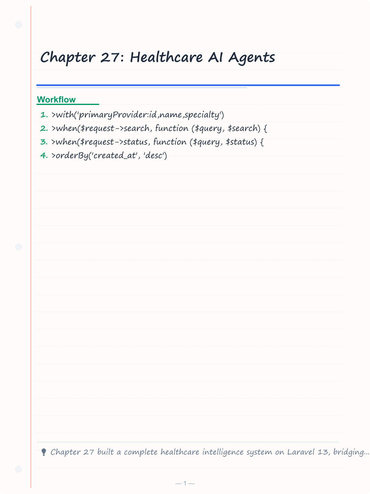
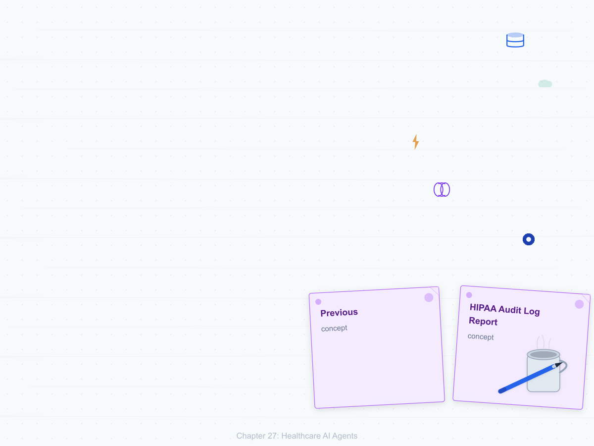
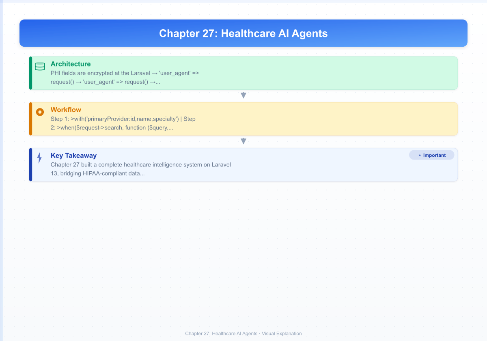

# Chapter 27: Healthcare AI Agents

> **Previous:** [Business Automation Agents](./26-business-automation-agents.md) | **Next:** [Finance](./28-finance.md)

---

## Learning Objectives

- Design HIPAA-compliant healthcare data models with encryption-at-rest, audit logging, and role-based access control in Laravel
- Build a patient intake agent that extracts structured registration data from unstructured referral documents using the AI SDK
- Implement a clinical decision support agent using RAG over vector-embedded medical literature with pgvector
- Construct a medical-record RAG pipeline that lets doctors query patient histories in natural language
- Automate appointment scheduling with an agent that checks slot availability, books, reschedules, and sends reminders
- Build a claims processing agent that validates, flags fraud, submits, and tracks insurance claims through a multi-stage workflow
- Develop a lab-review diagnostic assistance agent that flags critical values and notifies providers
- Create a medication management agent that checks drug–drug interactions and schedules refill reminders
- Generate weekly healthcare analytics reports via an AI agent that summarizes patient outcomes and clinic efficiency

<!-- Image Gallery -->
<section class="lesson-visuals" aria-label="Visual learning resources">
  <header><span>VISUAL LEARNING</span><h2>See it. Review it. Remember it.</h2></header>
  <a class="lesson-visual-card" href="../../assets/images/lessons/laravel/27-healthcare/handwritten-notes.png" target="_blank" rel="noopener">
    
    <span><strong>Handwritten notes</strong>Condensed notes for deliberate review.</span>
  </a>
  <a class="lesson-visual-card" href="../../assets/images/lessons/laravel/27-healthcare/sticky-notes.png" target="_blank" rel="noopener">
    
    <span><strong>Sticky-note revision</strong>Fast recall prompts for revision.</span>
  </a>
  <a class="lesson-visual-card" href="../../assets/images/lessons/laravel/27-healthcare/visual-explanation.png" target="_blank" rel="noopener">
    
    <span><strong>Visual concept guide</strong>A connected explanation of the key ideas.</span>
  </a>
</section>
<!-- End Image Gallery -->


---
## Chapter at a Glance

| Topic | Key Insight | Practical Takeaway |
|-------|-------------|-------------------|
| Data Models | Healthcare data with HIPAA compliance | Define PHI fields, encryption, and access controls |
| Patient Management | Agents for patient data management | Create, update, and retrieve patient records securely |
| Clinical Decision | AI-assisted clinical decision support | Provide evidence-based recommendations to clinicians |
| Medical RAG | RAG over medical literature | Search medical literature for clinical context |
| Appointments | Automated appointment scheduling | Handle booking, reminders, rescheduling, cancellations |
| Claims | Claims processing automation | Validate, process, and track insurance claims |

## Chapter Roadmap

``mermaid
flowchart LR
    A[Clinician] --> B[Laravel App]
    B --> C[Patient Agent]
    B --> D[Decision Support Agent]
    B --> E[Medical RAG]
    E --> F[Vector Store]
    E --> G[LLM]
    B --> H[Appointment Agent]
    B --> I[Claims Agent]
    C --> J[Encrypted DB]
    H --> K[Calendar Service]
    I --> L[Claims API]
``


## Theory


### 27.1 Healthcare Data Models & Compliance (HIPAA)


> **One-Sentence Takeaway:** PHI fields are encrypted at rest and in transit with strict access controls and audit trails.

Healthcare applications operate under strict regulatory requirements. The Health Insurance Portability and Accountability Act (HIPAA) mandates three core safeguards that directly influence Laravel data architecture:

| Safeguard | Requirement | Laravel Implementation |
|---|---|---|
| **Administrative** | Access policies, training, audit logs | Spatie Permission roles, audit trail traits |
| **Physical** | Server security, device control | Encrypted storage, restricted environments |
| **Technical** | Encryption, access control, integrity | Laravel encryption, signed routes, validation |

#### The Five Core Models

Every healthcare domain starts with five foundational entities — Patient, Provider, Appointment, MedicalRecord, and Claim. Each model must enforce encryption for Protected Health Information (PHI), maintain a complete audit trail, and respect role-based access.

#### Migration for the Patients Table with Encrypted Fields

```php
<?php

use Illuminate\Database\Migrations\Migration;
use Illuminate\Database\Schema\Blueprint;
use Illuminate\Support\Facades\Schema;

return new class extends Migration
{
    public function up(): void
    {
        Schema::create('patients', function (Blueprint $table) {
            $table->id();
            $table->string('external_id')->unique();
            $table->string('encrypted_name');
            $table->string('encrypted_email');
            $table->string('encrypted_phone');
            $table->text('encrypted_address');
            $table->string('encrypted_ssn_last_four');
            $table->date('date_of_birth');
            $table->string('gender', 10);
            $table->string('blood_type', 5)->nullable();
            $table->text('allergies')->nullable();
            $table->text('medications')->nullable();
            $table->text('conditions')->nullable();
            $table->foreignId('primary_provider_id')->nullable()->constrained('providers');
            $table->string('status')->default('active');
            $table->timestamps();
            $table->softDeletes();
        });

        Schema::create('providers', function (Blueprint $table) {
            $table->id();
            $table->string('npi_number')->unique();
            $table->string('name');
            $table->string('specialty');
            $table->string('email');
            $table->string('phone');
            $table->string('license_number');
            $table->string('status')->default('active');
            $table->timestamps();
        });

        Schema::create('appointments', function (Blueprint $table) {
            $table->id();
            $table->foreignId('patient_id')->constrained()->cascadeOnDelete();
            $table->foreignId('provider_id')->constrained();
            $table->dateTime('scheduled_at');
            $table->dateTime('completed_at')->nullable();
            $table->string('type', 50);
            $table->string('status', 30)->default('scheduled');
            $table->text('reason')->nullable();
            $table->text('notes')->nullable();
            $table->timestamps();

            $table->index(['provider_id', 'scheduled_at']);
            $table->index(['patient_id', 'status']);
        });

        Schema::create('medical_records', function (Blueprint $table) {
            $table->id();
            $table->foreignId('patient_id')->constrained()->cascadeOnDelete();
            $table->foreignId('provider_id')->constrained();
            $table->foreignId('appointment_id')->nullable()->constrained();
            $table->string('record_type', 50);
            $table->text('encrypted_content');
            $table->json('metadata')->nullable();
            $table->vector('embedding', 1536)->nullable();
            $table->timestamps();

            $table->index(['patient_id', 'record_type']);
        });

        Schema::create('claims', function (Blueprint $table) {
            $table->id();
            $table->foreignId('patient_id')->constrained()->cascadeOnDelete();
            $table->foreignId('provider_id')->constrained();
            $table->foreignId('appointment_id')->nullable()->constrained();
            $table->string('claim_number')->unique();
            $table->decimal('amount', 10, 2);
            $table->decimal('approved_amount', 10, 2)->nullable();
            $table->string('status', 30)->default('draft');
            $table->json('validation_results')->nullable();
            $table->text('notes')->nullable();
            $table->timestamps();

            $table->index('status');
            $table->index('claim_number');
        });
    }

    public function down(): void
    {
        Schema::dropIfExists('claims');
        Schema::dropIfExists('medical_records');
        Schema::dropIfExists('appointments');
        Schema::dropIfExists('providers');
        Schema::dropIfExists('patients');
    }
};
```

#### Patient Model with Encrypted Fields

PHI fields are encrypted at the Laravel layer using `encrypt()` / `decrypt()` so that the database contains only ciphertext. A query scope provides decrypted access for authorized code paths:

```php
<?php

namespace App\Models;

use Illuminate\Database\Eloquent\Model;
use Illuminate\Database\Eloquent\Relations\BelongsTo;
use Illuminate\Database\Eloquent\Relations\HasMany;
use Illuminate\Database\Eloquent\SoftDeletes;
use Illuminate\Support\Facades\Auth;

class Patient extends Model
{
    use SoftDeletes;

    protected $fillable = [
        'external_id',
        'encrypted_name',
        'encrypted_email',
        'encrypted_phone',
        'encrypted_address',
        'encrypted_ssn_last_four',
        'date_of_birth',
        'gender',
        'blood_type',
        'allergies',
        'medications',
        'conditions',
        'primary_provider_id',
        'status',
    ];

    protected $hidden = [
        'encrypted_name',
        'encrypted_email',
        'encrypted_phone',
        'encrypted_address',
        'encrypted_ssn_last_four',
    ];

    protected function casts(): array
    {
        return [
            'date_of_birth' => 'date',
        ];
    }

    public function getNameAttribute(): ?string
    {
        return $this->encrypted_name ? decrypt($this->encrypted_name) : null;
    }

    public function setNameAttribute(string $value): void
    {
        $this->encrypted_name = encrypt($value);
    }

    public function getEmailAttribute(): ?string
    {
        return $this->encrypted_email ? decrypt($this->encrypted_email) : null;
    }

    public function setEmailAttribute(string $value): void
    {
        $this->encrypted_email = encrypt($value);
    }

    public function getPhoneAttribute(): ?string
    {
        return $this->encrypted_phone ? decrypt($this->encrypted_phone) : null;
    }

    public function setPhoneAttribute(string $value): void
    {
        $this->encrypted_phone = encrypt($value);
    }

    public function getAddressAttribute(): ?string
    {
        return $this->encrypted_address ? decrypt($this->encrypted_address) : null;
    }

    public function setAddressAttribute(string $value): void
    {
        $this->encrypted_address = encrypt($value);
    }

    public function getSsnLastFourAttribute(): ?string
    {
        return $this->encrypted_ssn_last_four ? decrypt($this->encrypted_ssn_last_four) : null;
    }

    public function setSsnLastFourAttribute(string $value): void
    {
        $this->encrypted_ssn_last_four = encrypt($value);
    }

    public function primaryProvider(): BelongsTo
    {
        return $this->belongsTo(Provider::class, 'primary_provider_id');
    }

    public function appointments(): HasMany
    {
        return $this->hasMany(Appointment::class);
    }

    public function medicalRecords(): HasMany
    {
        return $this->hasMany(MedicalRecord::class);
    }

    public function claims(): HasMany
    {
        return $this->hasMany(Claim::class);
    }

    public function scopeActive($query)
    {
        return $query->where('status', 'active');
    }
}
```

#### The AuditTrail Trait

Every PHI-bearing model should record who created, updated, or deleted a record and what changed. This trait hooks into Eloquent's lifecycle events:

```php
<?php

namespace App\Models\Concerns;

use Illuminate\Support\Facades\Auth;

trait AuditTrail
{
    public static function bootAuditTrail(): void
    {
        static::creating(function ($model) {
            if (Auth::check()) {
                $model->created_by = Auth::id();
            }
        });

        static::updating(function ($model) {
            if (Auth::check()) {
                $original = $model->getOriginal();
                $changes = $model->getDirty();

                $auditData = [
                    'auditable_type' => get_class($model),
                    'auditable_id' => $model->id,
                    'user_id' => Auth::id(),
                    'event' => 'updated',
                    'old_values' => array_intersect_key($original, $changes),
                    'new_values' => $changes,
                    'ip_address' => request()->ip(),
                    'user_agent' => request()->userAgent(),
                ];

                \App\Models\AuditLog::create($auditData);
            }
        });

        static::deleting(function ($model) {
            if (Auth::check()) {
                \App\Models\AuditLog::create([
                    'auditable_type' => get_class($model),
                    'auditable_id' => $model->id,
                    'user_id' => Auth::id(),
                    'event' => 'deleted',
                    'old_values' => $model->getOriginal(),
                    'new_values' => [],
                    'ip_address' => request()->ip(),
                    'user_agent' => request()->userAgent(),
                ]);
            }
        });
    }
}
```

#### AuditLog Model and Migration

```php
<?php

use Illuminate\Database\Migrations\Migration;
use Illuminate\Database\Schema\Blueprint;
use Illuminate\Support\Facades\Schema;

return new class extends Migration
{
    public function up(): void
    {
        Schema::create('audit_logs', function (Blueprint $table) {
            $table->id();
            $table->string('auditable_type');
            $table->unsignedBigInteger('auditable_id');
            $table->foreignId('user_id')->constrained();
            $table->string('event');
            $table->json('old_values')->nullable();
            $table->json('new_values')->nullable();
            $table->string('ip_address', 45)->nullable();
            $table->text('user_agent')->nullable();
            $table->timestamps();

            $table->index(['auditable_type', 'auditable_id']);
            $table->index('event');
            $table->index('created_at');
        });
    }

    public function down(): void
    {
        Schema::dropIfExists('audit_logs');
    }
};
```

```php
<?php

namespace App\Models;

use Illuminate\Database\Eloquent\Model;
use Illuminate\Database\Eloquent\Relations\MorphTo;

class AuditLog extends Model
{
    protected $fillable = [
        'auditable_type',
        'auditable_id',
        'user_id',
        'event',
        'old_values',
        'new_values',
        'ip_address',
        'user_agent',
    ];

    protected function casts(): array
    {
        return [
            'old_values' => 'array',
            'new_values' => 'array',
        ];
    }

    public function auditable(): MorphTo
    {
        return $this->morphTo();
    }

    public function user()
    {
        return $this->belongsTo(User::class);
    }
}
```

#### PatientController with HIPAA-Compliant Authorization

```php
<?php

namespace App\Http\Controllers\Api;

use App\Http\Controllers\Controller;
use App\Models\Patient;
use App\Models\AuditLog;
use Illuminate\Http\JsonResponse;
use Illuminate\Http\Request;
use Illuminate\Support\Facades\Gate;

class PatientController extends Controller
{
    public function __construct()
    {
        $this->middleware('auth:sanctum');
        $this->middleware('throttle:60,1');
    }

    public function index(Request $request): JsonResponse
    {
        Gate::authorize('viewAny', Patient::class);

        $patients = Patient::query()
            ->with('primaryProvider:id,name,specialty')
            ->when($request->search, function ($query, $search) {
                $query->where('external_id', 'like', "%{$search}%");
            })
            ->when($request->status, function ($query, $status) {
                $query->where('status', $status);
            })
            ->orderBy('created_at', 'desc')
            ->paginate($request->per_page ?? 20);

        return response()->json($patients);
    }

    public function show(Patient $patient): JsonResponse
    {
        Gate::authorize('view', $patient);

        $patient->load([
            'primaryProvider',
            'appointments' => fn ($q) => $q->latest()->limit(10),
            'medicalRecords' => fn ($q) => $q->latest()->limit(5),
        ]);

        AuditLog::create([
            'auditable_type' => Patient::class,
            'auditable_id' => $patient->id,
            'user_id' => $request->user()->id,
            'event' => 'viewed',
            'old_values' => [],
            'new_values' => [],
            'ip_address' => $request->ip(),
            'user_agent' => $request->userAgent(),
        ]);

        return response()->json([
            'data' => [
                'id' => $patient->id,
                'external_id' => $patient->external_id,
                'name' => $patient->name,
                'email' => $patient->email,
                'phone' => $patient->phone,
                'date_of_birth' => $patient->date_of_birth,
                'gender' => $patient->gender,
                'blood_type' => $patient->blood_type,
                'allergies' => $patient->allergies,
                'medications' => $patient->medications,
                'conditions' => $patient->conditions,
                'status' => $patient->status,
                'primary_provider' => $patient->primaryProvider,
                'recent_appointments' => $patient->appointments,
                'recent_records' => $patient->medicalRecords,
                'created_at' => $patient->created_at,
            ],
        ]);
    }

    public function store(Request $request): JsonResponse
    {
        Gate::authorize('create', Patient::class);

        $validated = $request->validate([
            'external_id' => 'required|string|unique:patients',
            'name' => 'required|string|max:255',
            'email' => 'required|email|unique:patients,encrypted_email',
            'phone' => 'required|string|max:20',
            'address' => 'required|string',
            'ssn_last_four' => 'required|string|size:4',
            'date_of_birth' => 'required|date',
            'gender' => 'required|in:male,female,other',
            'blood_type' => 'nullable|in:A+,A-,B+,B-,AB+,AB-,O+,O-',
            'allergies' => 'nullable|string',
            'medications' => 'nullable|string',
            'conditions' => 'nullable|string',
            'primary_provider_id' => 'nullable|exists:providers,id',
        ]);

        $patient = Patient::create($validated);

        return response()->json(['data' => $patient], 201);
    }

    public function update(Request $request, Patient $patient): JsonResponse
    {
        Gate::authorize('update', $patient);

        $validated = $request->validate([
            'name' => 'sometimes|string|max:255',
            'email' => 'sometimes|email',
            'phone' => 'sometimes|string|max:20',
            'address' => 'sometimes|string',
            'blood_type' => 'nullable|in:A+,A-,B+,B-,AB+,AB-,O+,O-',
            'allergies' => 'nullable|string',
            'medications' => 'nullable|string',
            'conditions' => 'nullable|string',
            'primary_provider_id' => 'nullable|exists:providers,id',
            'status' => 'sometimes|in:active,inactive,archived',
        ]);

        $patient->update($validated);

        return response()->json(['data' => $patient]);
    }
}
```

#### HIPAA Compliance Checklist for Laravel

| Requirement | Implementation |
|---|---|
| Encryption at rest (PHI fields) | `encrypt()` / `decrypt()` accessors on Patient model |
| Encryption in transit | Force HTTPS via `App\Providers\AppServiceProvider::forceHttps()` |
| Audit logging | `AuditTrail` trait on all PHI models |
| Access control | Laravel Gates + Spatie roles (`physician`, `nurse`, `admin`, `billing`) |
| Authentication | Sanctum with token expiry and MFA |
| Data isolation | Query scopes that restrict patients to the user's organization |
| Session timeout | `config/session.php` lifetime + `last_activity` check |
| Backup encryption | Encrypt backup archives with `gpg --symmetric` |
| Breach notification | Automated alerting via `App\Notifications\BreachDetected` |

---


> **Warning:** All PHI must be encrypted at rest with AES-256 and in transit with TLS 1.3. Audit all access to patient records.

### 27.2 Patient Management Agents


> **One-Sentence Takeaway:** Patient agents handle CRUD operations on patient records with role-based access and audit logging.

A patient intake agent automates the registration pipeline: it ingests unstructured referral documents (emails, PDF text, fax transcripts), extracts structured patient data, creates the patient record, and schedules an initial appointment — all without manual data entry.

```php
<?php

namespace App\Ai\Agents\Healthcare;

use App\Models\Patient;
use App\Models\Provider;
use App\Models\Appointment;
use Illuminate\Support\Facades\DB;
use Laravel\Ai\Contracts\Agent;
use Laravel\Ai\Promptable;

class PatientIntakeAgent implements Agent
{
    use Promptable;

    public function __construct(
        protected array $referralData = [],
    ) {}

    public function instructions(): string
    {
        return <<<PROMPT
You are a patient intake agent in a healthcare system.

You receive unstructured referral data — text extracted from referral forms,
emails, or fax documents. Your job is to extract structured patient information
and schedule an initial appointment.

Extract the following fields from the referral:
- full_name
- email
- phone
- address
- date_of_birth
- gender (male/female/other)
- ssn_last_four (last 4 digits only)
- insurance_provider
- insurance_id
- reason_for_visit
- symptoms
- referring_provider_name (if mentioned)
- preferred_date
- preferred_time

If any field is missing, set it to null. Do not make up data.

Return a JSON object with:
1. "patient_info": the extracted fields
2. "summary": a one-paragraph summary of the referral
3. "confidence": a score from 0.0 to 1.0
4. "missing_fields": array of field names that could not be extracted
PROMPT;
    }

    public function extractAndRegister(): array
    {
        $result = $this->chat(
            messages: [['role' => 'user', 'content' => $this->referralData['raw_text']]],
            structuredOutput: [
                'type' => 'object',
                'properties' => [
                    'patient_info' => ['type' => 'object'],
                    'summary' => ['type' => 'string'],
                    'confidence' => ['type' => 'number'],
                    'missing_fields' => ['type' => 'array', 'items' => ['type' => 'string']],
                ],
                'required' => ['patient_info', 'summary', 'confidence', 'missing_fields'],
            ],
        );

        $patientInfo = $result['patient_info'];

        $patient = DB::transaction(function () use ($patientInfo) {
            $provider = Provider::where('specialty', 'General Practice')
                ->inRandomOrder()
                ->first();

            $patient = Patient::create([
                'external_id' => 'REF-' . strtoupper(uniqid()),
                'name' => $patientInfo['full_name'] ?? 'Unknown',
                'email' => $patientInfo['email'] ?? ('pending-' . uniqid() . '@example.com'),
                'phone' => $patientInfo['phone'] ?? '000-000-0000',
                'address' => $patientInfo['address'] ?? 'Address pending',
                'ssn_last_four' => $patientInfo['ssn_last_four'] ?? '0000',
                'date_of_birth' => $patientInfo['date_of_birth'] ?? '2000-01-01',
                'gender' => $patientInfo['gender'] ?? 'other',
                'conditions' => $patientInfo['reason_for_visit'] ?? null,
                'primary_provider_id' => $provider?->id,
                'status' => 'active',
            ]);

            if ($provider && isset($patientInfo['preferred_date'])) {
                $scheduledAt = $patientInfo['preferred_date']
                    . 'T' . ($patientInfo['preferred_time'] ?? '09:00') . ':00';

                Appointment::create([
                    'patient_id' => $patient->id,
                    'provider_id' => $provider->id,
                    'scheduled_at' => $scheduledAt,
                    'type' => 'initial_intake',
                    'status' => 'scheduled',
                    'reason' => $patientInfo['reason_for_visit'] ?? 'New patient intake',
                    'notes' => "Auto-scheduled from referral. Confidence: {$result['confidence']}",
                ]);
            }

            return $patient;
        });

        return [
            'patient_id' => $patient->id,
            'summary' => $result['summary'],
            'confidence' => $result['confidence'],
            'missing_fields' => $result['missing_fields'],
            'appointment_scheduled' => isset($scheduledAt),
        ];
    }
}
```

#### Console Command to Process Incoming Referrals

```php
<?php

namespace App\Console\Commands;

use App\Ai\Agents\Healthcare\PatientIntakeAgent;
use Illuminate\Console\Command;

class ProcessReferralsCommand extends Command
{
    protected $signature = 'healthcare:process-referrals
        {file? : Path to a JSON file containing referrals}
        {--batch : Process all pending referrals in the database}';

    protected $description = 'Process incoming patient referrals using AI extraction';

    public function handle(): int
    {
        if ($file = $this->argument('file')) {
            $referrals = json_decode(file_get_contents($file), true);
            $referrals = is_array($referrals) ? $referrals : [$referrals];
        } elseif ($this->option('batch')) {
            $referrals = \App\Models\Referral::pending()->get()->toArray();
        } else {
            $this->error('Provide a file path or use --batch.');
            return Command::FAILURE;
        }

        $bar = $this->output->createProgressBar(count($referrals));
        $bar->start();

        $results = [];

        foreach ($referrals as $referral) {
            $agent = new PatientIntakeAgent($referral);
            $results[] = $agent->extractAndRegister();
            $bar->advance();
        }

        $bar->finish();
        $this->newLine();

        $successful = collect($results)->where('confidence', '>=', 0.7)->count();

        $this->info("Processed " . count($results) . " referrals.");
        $this->info("High-confidence: {$successful}");
        $this->info("Requiring review: " . (count($results) - $successful));

        return Command::SUCCESS;
    }
}
```

---

### 27.3 Clinical Decision Support Agents


> **One-Sentence Takeaway:** Decision support agents analyze patient data against medical guidelines and suggest evidence-based recommendations.

Clinical decision support agents combine patient symptom data with a vector search over medical literature to suggest possible diagnoses and recommended next steps. The RAG pipeline uses pgvector to store embeddings of medical guidelines, journal abstracts, and drug references.

#### Medical Literature Seeder with Vector Embeddings

```php
<?php

namespace App\Console\Commands;

use App\Models\MedicalLiterature;
use Illuminate\Console\Command;
use Laravel\Ai\Facades\Ai;

class SeedMedicalLiteratureCommand extends Command
{
    protected $signature = 'healthcare:seed-literature {file}';

    protected $description = 'Embed and store medical literature for RAG retrieval';

    public function handle(): int
    {
        $entries = json_decode(file_get_contents($this->argument('file')), true);

        $bar = $this->output->createProgressBar(count($entries));
        $bar->start();

        foreach ($entries as $entry) {
            $text = $entry['title'] . "\n\n" . ($entry['abstract'] ?? $entry['content']);

            $embedding = Ai::embed($text)->toArray();

            MedicalLiterature::create([
                'title' => $entry['title'],
                'source' => $entry['source'] ?? 'unknown',
                'content' => $entry['content'],
                'specialty' => $entry['specialty'] ?? 'general',
                'category' => $entry['category'] ?? 'general',
                'embedding' => $embedding,
            ]);

            $bar->advance();
        }

        $bar->finish();
        $this->newLine();
        $this->info('Seeded ' . count($entries) . ' literature entries.');

        return Command::SUCCESS;
    }
}
```

#### MedicalLiterature Model

```php
<?php

namespace App\Models;

use Illuminate\Database\Eloquent\Model;

class MedicalLiterature extends Model
{
    protected $fillable = [
        'title',
        'source',
        'content',
        'specialty',
        'category',
        'embedding',
    ];

    protected function casts(): array
    {
        return [
            'embedding' => 'array',
        ];
    }

    public function scopeSpecialty($query, string $specialty)
    {
        return $query->where('specialty', $specialty);
    }

    public function scopeNearestNeighbors($query, array $embedding, int $limit = 5)
    {
        $embeddingJson = json_encode($embedding);

        return $query->selectRaw(
            "*, embedding <=> '{$embeddingJson}'::vector AS distance"
        )
        ->orderBy('distance')
        ->limit($limit);
    }
}
```

#### ClinicalDecisionAgent

```php
<?php

namespace App\Ai\Agents\Healthcare;

use App\Models\MedicalLiterature;
use Laravel\Ai\Contracts\Agent;
use Laravel\Ai\Promptable;
use Laravel\Ai\Facades\Ai;
use Laravel\Ai\Contracts\HasTools;
use Laravel\Ai\Tool;

class ClinicalDecisionAgent implements Agent, HasTools
{
    use Promptable;

    public function __construct(
        protected array $symptoms = [],
        protected array $patientContext = [],
    ) {}

    public function instructions(): string
    {
        return <<<PROMPT
You are a clinical decision support agent. Your role is to analyze patient symptoms
and suggest possible diagnoses with supporting evidence from medical literature.

Use the following tools:
1. `analyze_symptoms` — structure the free-text symptom description
2. `search_literature` — retrieve relevant medical literature by vector similarity
3. `suggest_diagnoses` — synthesize findings into ranked differential diagnoses

Always cite the medical literature you use. Note that you are a decision support
tool — your output must be reviewed by a licensed clinician. Never present
output as definitive medical advice.
PROMPT;
    }

    public function tools(): array
    {
        return [
            Tool::for('analyze_symptoms')
                ->describe('Parse free-text symptom description into structured symptom objects')
                ->withParameters([
                    'description' => 'The patient\'s description of their symptoms',
                ]),

            Tool::for('search_literature')
                ->describe('Search medical literature by vector similarity to symptoms')
                ->withParameters([
                    'query' => 'The search query derived from symptom analysis',
                    'limit' => 5,
                ]),

            Tool::for('suggest_diagnoses')
                ->describe('Generate ranked differential diagnoses from symptoms and literature')
                ->withParameters([
                    'symptoms' => 'Array of structured symptom objects',
                    'literature' => 'Array of relevant medical literature entries',
                    'patient_age' => 'Patient age in years',
                    'patient_gender' => 'Patient gender',
                ]),
        ];
    }

    public function analyzeSymptoms(string $description): array
    {
        $analysis = $this->chat(
            messages: [['role' => 'user', 'content' => $description]],
            structuredOutput: [
                'type' => 'object',
                'properties' => [
                    'structured_symptoms' => [
                        'type' => 'array',
                        'items' => [
                            'type' => 'object',
                            'properties' => [
                                'symptom' => ['type' => 'string'],
                                'duration' => ['type' => 'string'],
                                'severity' => ['type' => 'string', 'enum' => ['mild', 'moderate', 'severe']],
                            ],
                        ],
                    ],
                    'key_terms' => ['type' => 'array', 'items' => ['type' => 'string']],
                    'urgency' => ['type' => 'string'],
                ],
                'required' => ['structured_symptoms', 'key_terms', 'urgency'],
            ],
        );

        return $analysis;
    }

    public function searchLiterature(string $query, int $limit = 5): array
    {
        $queryEmbedding = Ai::embed($query)->toArray();

        $results = MedicalLiterature::nearestNeighbors($queryEmbedding, $limit)->get();

        return $results->map(fn ($lit) => [
            'id' => $lit->id,
            'title' => $lit->title,
            'source' => $lit->source,
            'specialty' => $lit->specialty,
            'content' => $lit->content,
            'distance' => $lit->distance,
        ])->toArray();
    }

    public function runAnalysis(): array
    {
        $symptomDescription = implode("\n", $this->symptoms);
        $analysis = $this->analyzeSymptoms($symptomDescription);

        $query = implode(' ', array_merge(
            $analysis['structured_symptoms'] ?? [],
            $analysis['key_terms'] ?? []
        ));

        $literature = $this->searchLiterature($query);

        $diagnosisOutput = $this->chat(
            messages: [[
                'role' => 'user',
                'content' => json_encode([
                    'task' => 'Generate differential diagnoses',
                    'symptoms' => $analysis['structured_symptoms'],
                    'urgency' => $analysis['urgency'],
                    'patient_context' => $this->patientContext,
                    'retrieved_literature' => $literature,
                ]),
            ]],
            structuredOutput: [
                'type' => 'object',
                'properties' => [
                    'differential_diagnoses' => [
                        'type' => 'array',
                        'items' => [
                            'type' => 'object',
                            'properties' => [
                                'condition' => ['type' => 'string'],
                                'probability' => ['type' => 'string'],
                                'supporting_evidence' => ['type' => 'array', 'items' => ['type' => 'string']],
                                'recommended_tests' => ['type' => 'array', 'items' => ['type' => 'string']],
                            ],
                        ],
                    ],
                    'urgency_level' => ['type' => 'string'],
                    'recommended_action' => ['type' => 'string'],
                    'caveats' => ['type' => 'array', 'items' => ['type' => 'string']],
                ],
                'required' => ['differential_diagnoses', 'urgency_level', 'recommended_action', 'caveats'],
            ],
        );

        return [
            'symptom_analysis' => $analysis,
            'literature_used' => $literature,
            'diagnoses' => $diagnosisOutput,
        ];
    }
}
```

#### Controller to Invoke Clinical Decision Support

```php
<?php

namespace App\Http\Controllers\Api;

use App\Http\Controllers\Controller;
use App\Ai\Agents\Healthcare\ClinicalDecisionAgent;
use App\Models\Patient;
use Illuminate\Http\JsonResponse;
use Illuminate\Http\Request;

class ClinicalDecisionController extends Controller
{
    public function __invoke(Request $request, Patient $patient): JsonResponse
    {
        Gate::authorize('view', $patient);

        $validated = $request->validate([
            'symptoms' => 'required|array',
            'symptoms.*' => 'required|string',
        ]);

        $agent = new ClinicalDecisionAgent(
            symptoms: $validated['symptoms'],
            patientContext: [
                'age' => $patient->date_of_birth->age,
                'gender' => $patient->gender,
                'conditions' => $patient->conditions,
                'medications' => $patient->medications,
                'allergies' => $patient->allergies,
            ],
        );

        $result = $agent->runAnalysis();

        return response()->json([
            'data' => $result,
            'message' => 'This is decision-support only. Must be reviewed by a licensed clinician.',
        ]);
    }
}
```

---


> **Pro Tip:** Always present AI recommendations as suggestions, not directives. The clinician makes the final decision.

### 27.4 Medical Record RAG


> **One-Sentence Takeaway:** Medical RAG retrieves relevant literature from a vector store of medical documents to support clinical decisions.

A doctor should be able to ask "summarize this patient's history" or "what medications have been prescribed" and get an AI-generated answer grounded in the patient's actual medical records. The RAG pipeline embeds each record, retrieves the top-k most relevant, and sends them as context to the model.

```php
<?php

namespace App\Ai\Agents\Healthcare;

use App\Models\MedicalRecord;
use App\Models\Patient;
use Laravel\Ai\Contracts\Agent;
use Laravel\Ai\Promptable;
use Laravel\Ai\Facades\Ai;

class MedicalRecordRagAgent implements Agent
{
    use Promptable;

    public function __construct(
        protected Patient $patient,
        protected string $query,
    ) {}

    public function instructions(): string
    {
        return <<<PROMPT
You are a medical record retrieval agent. Your role is to answer clinical questions
about a patient by retrieving their relevant medical records and synthesizing
a concise, evidence-based answer.

You will receive:
1. A patient's medical records retrieved by vector similarity to the query
2. Provider notes and context
3. The doctor's question

Rules:
- Base your answer ONLY on the retrieved records.
- If the records do not contain enough information, say so.
- Always cite the specific records you used.
- Preserve medical terminology — do not oversimplify.
- Flag any information that appears contradictory across records.
PROMPT;
    }

    public function answer(): array
    {
        $queryEmbedding = Ai::embed($this->query)->toArray();

        $relevantRecords = MedicalRecord::query()
            ->where('patient_id', $this->patient->id)
            ->orderByRaw("embedding <=> '{$queryEmbedding}'::vector")
            ->limit(10)
            ->get()
            ->map(function ($record) {
                return [
                    'id' => $record->id,
                    'type' => $record->record_type,
                    'date' => $record->created_at->toDateString(),
                    'content' => $record->encrypted_content
                        ? decrypt($record->encrypted_content)
                        : null,
                    'metadata' => $record->metadata,
                ];
            });

        $patientContext = [
            'id' => $this->patient->id,
            'age' => $this->patient->date_of_birth?->age,
            'gender' => $this->patient->gender,
            'blood_type' => $this->patient->blood_type,
            'allergies' => $this->patient->allergies,
            'conditions' => $this->patient->conditions,
            'medications' => $this->patient->medications,
        ];

        $response = $this->chat(
            messages: [[
                'role' => 'user',
                'content' => json_encode([
                    'question' => $this->query,
                    'patient' => $patientContext,
                    'relevant_records' => $relevantRecords->toArray(),
                ]),
            ]],
            structuredOutput: [
                'type' => 'object',
                'properties' => [
                    'answer' => ['type' => 'string'],
                    'sources_used' => [
                        'type' => 'array',
                        'items' => [
                            'type' => 'object',
                            'properties' => [
                                'record_id' => ['type' => 'integer'],
                                'record_type' => ['type' => 'string'],
                                'date' => ['type' => 'string'],
                            ],
                        ],
                    ],
                    'confidence' => ['type' => 'string', 'enum' => ['high', 'moderate', 'low']],
                    'missing_information' => ['type' => 'array', 'items' => ['type' => 'string']],
                    'contradictions' => ['type' => 'array', 'items' => ['type' => 'string']],
                ],
                'required' => ['answer', 'sources_used', 'confidence', 'missing_information'],
            ],
        );

        return $response;
    }
}
```

#### Controller for the RAG Query Endpoint

```php
<?php

namespace App\Http\Controllers\Api;

use App\Http\Controllers\Controller;
use App\Ai\Agents\Healthcare\MedicalRecordRagAgent;
use App\Models\Patient;
use Illuminate\Http\JsonResponse;
use Illuminate\Http\Request;

class MedicalRecordQueryController extends Controller
{
    public function __invoke(Request $request, Patient $patient): JsonResponse
    {
        Gate::authorize('viewRecords', $patient);

        $validated = $request->validate([
            'query' => 'required|string|max:2000',
        ]);

        $agent = new MedicalRecordRagAgent(
            patient: $patient,
            query: $validated['query'],
        );

        $result = $agent->answer();

        return response()->json(['data' => $result]);
    }
}
```

#### Scheduled Task to Embed New Records

```php
<?php

namespace App\Console\Commands;

use App\Models\MedicalRecord;
use Illuminate\Console\Command;
use Laravel\Ai\Facades\Ai;

class EmbedMedicalRecordsCommand extends Command
{
    protected $signature = 'healthcare:embed-records
        {--chunk=50 : Number of records to process per batch}';

    protected $description = 'Generate embeddings for medical records without them';

    public function handle(): int
    {
        MedicalRecord::whereNull('embedding')
            ->chunk($this->option('chunk'), function ($records) {
                $bar = $this->output->createProgressBar($records->count());
                $bar->start();

                foreach ($records as $record) {
                    $content = $record->encrypted_content
                        ? decrypt($record->encrypted_content)
                        : '';

                    $textToEmbed = $record->record_type . ': ' . $content;

                    $embedding = Ai::embed($textToEmbed)->toArray();

                    $record->updateQuietly(['embedding' => $embedding]);

                    $bar->advance();
                }

                $bar->finish();
                $this->newLine();
            });

        $this->info('All unembedded records have been processed.');

        return Command::SUCCESS;
    }
}
```

---

### 27.5 Appointment Scheduling Automation


> **One-Sentence Takeaway:** Appointment agents manage booking, reminders, rescheduling, and cancellations via queue jobs.

The scheduling agent handles the full lifecycle: checking available slots, booking appointments, rescheduling existing ones, handling cancellations, and sending reminders. It integrates with a `CalendarSlot` model that tracks provider availability.

#### Appointment Model and Migration

```php
<?php

use Illuminate\Database\Migrations\Migration;
use Illuminate\Database\Schema\Blueprint;
use Illuminate\Support\Facades\Schema;

return new class extends Migration
{
    public function up(): void
    {
        Schema::create('calendar_slots', function (Blueprint $table) {
            $table->id();
            $table->foreignId('provider_id')->constrained();
            $table->dateTime('start_time');
            $table->dateTime('end_time');
            $table->string('status', 30)->default('available');
            $table->foreignId('appointment_id')->nullable()->constrained();
            $table->timestamps();

            $table->index(['provider_id', 'start_time', 'status']);
        });

        Schema::create('reminders', function (Blueprint $table) {
            $table->id();
            $table->foreignId('appointment_id')->constrained()->cascadeOnDelete();
            $table->string('channel', 20)->default('email');
            $table->dateTime('scheduled_at');
            $table->dateTime('sent_at')->nullable();
            $table->string('status', 20)->default('pending');
            $table->timestamps();

            $table->index(['status', 'scheduled_at']);
        });
    }

    public function down(): void
    {
        Schema::dropIfExists('reminders');
        Schema::dropIfExists('calendar_slots');
    }
};
```

#### SchedulingAgent

```php
<?php

namespace App\Ai\Agents\Healthcare;

use App\Models\Appointment;
use App\Models\CalendarSlot;
use App\Models\Patient;
use App\Models\Provider;
use App\Models\Reminder;
use Carbon\Carbon;
use Illuminate\Support\Facades\DB;
use Laravel\Ai\Contracts\Agent;
use Laravel\Ai\Promptable;

class SchedulingAgent implements Agent
{
    use Promptable;

    public function __construct(
        protected string $action,
        protected array $parameters,
    ) {}

    public function instructions(): string
    {
        return <<<PROMPT
You are an appointment scheduling agent. You handle the full lifecycle:
booking new appointments, rescheduling existing ones, and processing
cancellations.

Available actions:
- "check_availability" — Find open slots for a provider and date range
- "book" — Book an appointment in a specific slot
- "reschedule" — Move an existing appointment to a new slot
- "cancel" — Cancel an existing appointment
- "suggest_slots" — Recommend the best slots based on patient preference

Always confirm the action was successful and return details the patient
or staff would need.
PROMPT;
    }

    public function checkAvailability(int $providerId, string $date): array
    {
        $slots = CalendarSlot::where('provider_id', $providerId)
            ->whereDate('start_time', $date)
            ->where('status', 'available')
            ->orderBy('start_time')
            ->get()
            ->map(fn ($slot) => [
                'slot_id' => $slot->id,
                'start' => $slot->start_time->format('H:i'),
                'end' => $slot->end_time->format('H:i'),
            ]);

        $provider = Provider::find($providerId);

        return [
            'provider' => $provider?->name,
            'specialty' => $provider?->specialty,
            'date' => $date,
            'available_slots' => $slots,
            'count' => $slots->count(),
        ];
    }

    public function book(int $patientId, int $providerId, int $slotId, string $type, ?string $reason = null): array
    {
        return DB::transaction(function () use ($patientId, $providerId, $slotId, $type, $reason) {
            $slot = CalendarSlot::where('id', $slotId)
                ->where('status', 'available')
                ->lockForUpdate()
                ->firstOrFail();

            $appointment = Appointment::create([
                'patient_id' => $patientId,
                'provider_id' => $providerId,
                'scheduled_at' => $slot->start_time,
                'type' => $type,
                'status' => 'scheduled',
                'reason' => $reason,
            ]);

            $slot->update([
                'status' => 'booked',
                'appointment_id' => $appointment->id,
            ]);

            $this->scheduleReminders($appointment);

            return [
                'appointment_id' => $appointment->id,
                'patient_id' => $patientId,
                'provider_id' => $providerId,
                'scheduled_at' => $slot->start_time->toIso8601String(),
                'status' => 'scheduled',
            ];
        });
    }

    public function reschedule(int $appointmentId, int $newSlotId): array
    {
        return DB::transaction(function () use ($appointmentId, $newSlotId) {
            $appointment = Appointment::findOrFail($appointmentId);

            $oldSlot = CalendarSlot::where('appointment_id', $appointmentId)->first();
            if ($oldSlot) {
                $oldSlot->update([
                    'status' => 'available',
                    'appointment_id' => null,
                ]);
            }

            $newSlot = CalendarSlot::where('id', $newSlotId)
                ->where('status', 'available')
                ->lockForUpdate()
                ->firstOrFail();

            $appointment->update([
                'scheduled_at' => $newSlot->start_time,
                'status' => 'rescheduled',
            ]);

            $newSlot->update([
                'status' => 'booked',
                'appointment_id' => $appointment->id,
            ]);

            Appointment::create([
                'patient_id' => $appointment->patient_id,
                'provider_id' => $appointment->provider_id,
                'scheduled_at' => $newSlot->start_time,
                'type' => $appointment->type,
                'status' => 'scheduled',
                'reason' => $appointment->reason,
                'notes' => "Rescheduled from appointment #{$appointmentId}",
            ]);

            $this->scheduleReminders($appointment);

            return [
                'appointment_id' => $appointment->id,
                'previous_slot' => $oldSlot?->start_time->toIso8601String(),
                'new_slot' => $newSlot->start_time->toIso8601String(),
                'status' => 'rescheduled',
            ];
        });
    }

    public function cancel(int $appointmentId, string $reason = 'Patient requested'): array
    {
        return DB::transaction(function () use ($appointmentId, $reason) {
            $appointment = Appointment::findOrFail($appointmentId);

            $slot = CalendarSlot::where('appointment_id', $appointmentId)->first();
            if ($slot) {
                $slot->update([
                    'status' => 'available',
                    'appointment_id' => null,
                ]);
            }

            $appointment->update([
                'status' => 'cancelled',
                'notes' => trim(($appointment->notes ?? '') . "\nCancelled: {$reason}"),
            ]);

            Reminder::where('appointment_id', $appointmentId)
                ->where('status', 'pending')
                ->update(['status' => 'cancelled']);

            return [
                'appointment_id' => $appointment->id,
                'status' => 'cancelled',
                'reason' => $reason,
            ];
        });
    }

    public function suggestSlots(int $patientId, int $providerId, string $preferredDate, string $preferredTime): array
    {
        $slots = $this->checkAvailability($providerId, $preferredDate);

        $sorted = collect($slots['available_slots'])->sortBy(function ($slot) use ($preferredTime) {
            return abs(strtotime($slot['start']) - strtotime($preferredTime));
        })->values();

        $patient = Patient::find($patientId);

        return [
            'patient' => $patient?->name,
            'provider' => $slots['provider'],
            'date' => $preferredDate,
            'best_slot' => $sorted->first(),
            'alternatives' => $sorted->slice(1, 3)->values(),
        ];
    }

    protected function scheduleReminders(Appointment $appointment): void
    {
        $reminderTimes = [
            now()->addDay(),                        // 24-hour reminder
            now()->addHours(2),                      // 2-hour reminder
        ];

        foreach ($reminderTimes as $time) {
            if ($time->lessThan($appointment->scheduled_at)) {
                Reminder::create([
                    'appointment_id' => $appointment->id,
                    'channel' => 'email',
                    'scheduled_at' => $time,
                    'status' => 'pending',
                ]);
            }
        }
    }
}
```

#### Send Reminders Command

```php
<?php

namespace App\Console\Commands;

use App\Models\Reminder;
use App\Notifications\AppointmentReminder;
use Illuminate\Console\Command;

class SendAppointmentRemindersCommand extends Command
{
    protected $signature = 'healthcare:send-reminders';

    protected $description = 'Send pending appointment reminders';

    public function handle(): int
    {
        $reminders = Reminder::where('status', 'pending')
            ->where('scheduled_at', '<=', now())
            ->limit(100)
            ->get();

        $bar = $this->output->createProgressBar($reminders->count());
        $bar->start();

        foreach ($reminders as $reminder) {
            $appointment = $reminder->appointment;

            if ($appointment && $appointment->patient) {
                $patient = $appointment->patient;
                $patient->notify(new AppointmentReminder($appointment, $reminder));
            }

            $reminder->update([
                'sent_at' => now(),
                'status' => 'sent',
            ]);

            $bar->advance();
        }

        $bar->finish();
        $this->newLine();

        $this->info("Sent {$reminders->count()} reminders.");

        return Command::SUCCESS;
    }
}
```

---

### 27.6 Claims Processing Automation


> **One-Sentence Takeaway:** Claims agents validate submissions, check coverage, process payments, and handle denials with appeal workflows.

Insurance claims processing involves validation against payer rules, fraud risk scoring, submission to clearinghouses, and status follow-up. The agent manages this workflow with persistent state tracking.

```php
<?php

namespace App\Ai\Agents\Healthcare;

use App\Models\Claim;
use App\Models\ClaimStatusHistory;
use Illuminate\Support\Facades\DB;
use Laravel\Ai\Contracts\Agent;
use Laravel\Ai\Promptable;
use Laravel\Ai\Facades\Ai;

class ClaimsProcessingAgent implements Agent
{
    use Promptable;

    public function __construct(
        protected Claim $claim,
    ) {}

    public function instructions(): string
    {
        return <<<PROMPT
You are a claims processing agent. Your job is to validate, assess risk,
and manage insurance claims through their lifecycle.

Stages:
1. VALIDATION — Check claim data against payer rules
2. FRAUD_ASSESSMENT — Score the claim for fraud indicators
3. SUBMISSION — Submit to the clearinghouse or payer
4. FOLLOW_UP — Check on the status of submitted claims
5. ADJUDICATION — Process the payer's response

At each stage, provide clear reasoning and structured output.
PROMPT;
    }

    public function validate(): array
    {
        $patient = $this->claim->patient;
        $provider = $this->claim->provider;

        $validationResult = $this->chat(
            messages: [[
                'role' => 'user',
                'content' => json_encode([
                    'claim_number' => $this->claim->claim_number,
                    'amount' => $this->claim->amount,
                    'patient' => [
                        'age' => $patient?->date_of_birth?->age,
                        'gender' => $patient?->gender,
                    ],
                    'provider' => [
                        'npi' => $provider?->npi_number,
                        'specialty' => $provider?->specialty,
                    ],
                    'appointment' => $this->claim->appointment ? [
                        'date' => $this->claim->appointment->scheduled_at->toDateString(),
                        'type' => $this->claim->appointment->type,
                        'status' => $this->claim->appointment->status,
                    ] : null,
                ]),
            ]],
            structuredOutput: [
                'type' => 'object',
                'properties' => [
                    'is_valid' => ['type' => 'boolean'],
                    'validation_errors' => [
                        'type' => 'array',
                        'items' => [
                            'type' => 'object',
                            'properties' => [
                                'field' => ['type' => 'string'],
                                'issue' => ['type' => 'string'],
                                'severity' => ['type' => 'string', 'enum' => ['error', 'warning']],
                            ],
                        ],
                    ],
                    'required_corrections' => ['type' => 'array', 'items' => ['type' => 'string']],
                    'recommendation' => ['type' => 'string'],
                ],
                'required' => ['is_valid', 'validation_errors', 'recommendation'],
            ],
        );

        $this->claim->update([
            'validation_results' => $validationResult,
        ]);

        $this->recordStatus('validated', $validationResult['is_valid']
            ? 'Validation passed'
            : 'Validation failed: ' . implode('; ', $validationResult['required_corrections'])
        );

        return $validationResult;
    }

    public function assessFraudRisk(): array
    {
        $result = $this->chat(
            messages: [[
                'role' => 'user',
                'content' => json_encode([
                    'task' => 'Assess fraud risk for this claim',
                    'claim' => [
                        'amount' => $this->claim->amount,
                        'claim_number' => $this->claim->claim_number,
                    ],
                    'patient_history' => [
                        'claim_count' => Claim::where('patient_id', $this->claim->patient_id)->count(),
                        'total_claimed' => Claim::where('patient_id', $this->claim->patient_id)->sum('amount'),
                    ],
                    'provider_history' => [
                        'claim_count' => Claim::where('provider_id', $this->claim->provider_id)->count(),
                        'average_amount' => Claim::where('provider_id', $this->claim->provider_id)->avg('amount'),
                    ],
                ]),
            ]],
            structuredOutput: [
                'type' => 'object',
                'properties' => [
                    'fraud_score' => ['type' => 'number', 'minimum' => 0, 'maximum' => 100],
                    'risk_level' => ['type' => 'string', 'enum' => ['low', 'medium', 'high', 'critical']],
                    'indicators' => ['type' => 'array', 'items' => ['type' => 'string']],
                    'recommendation' => ['type' => 'string'],
                ],
                'required' => ['fraud_score', 'risk_level', 'indicators', 'recommendation'],
            ],
        );

        $this->recordStatus('fraud_assessed', "Fraud score: {$result['fraud_score']} ({$result['risk_level']})");

        return $result;
    }

    public function submit(): array
    {
        if ($this->claim->status === 'submitted') {
            return ['message' => 'Claim already submitted', 'claim_number' => $this->claim->claim_number];
        }

        $submission = DB::transaction(function () {
            $clearinghouseResponse = $this->submitToClearinghouse($this->claim);

            $this->claim->update([
                'status' => 'submitted',
                'notes' => ($this->claim->notes ?? '')
                    . "\nSubmitted: " . now()->toIso8601String(),
            ]);

            $this->recordStatus('submitted', 'Submitted to clearinghouse. Ack: ' . ($clearinghouseResponse['acknowledgment_id'] ?? 'N/A'));

            return $clearinghouseResponse;
        });

        return $submission;
    }

    protected function submitToClearinghouse(Claim $claim): array
    {
        $payload = [
            'claim_number' => $claim->claim_number,
            'patient_id' => $claim->patient->external_id,
            'provider_npi' => $claim->provider->npi_number,
            'amount' => $claim->amount,
            'service_date' => $claim->appointment?->scheduled_at?->toDateString(),
            'claim_type' => 'professional',
        ];

        $response = \Illuminate\Support\Facades\Http::timeout(30)
            ->retry(3, 100)
            ->post(config('services.clearinghouse.endpoint') . '/claims', $payload);

        if ($response->successful()) {
            return $response->json();
        }

        $this->recordStatus('submission_failed', 'Clearinghouse error: ' . $response->body());

        throw new \RuntimeException('Clearinghouse submission failed: ' . $response->body());
    }

    public function checkStatus(): array
    {
        $response = \Illuminate\Support\Facades\Http::timeout(15)
            ->get(config('services.clearinghouse.endpoint') . '/claims/' . $this->claim->claim_number);

        $status = $response->successful()
            ? $response->json()['status'] ?? 'unknown'
            : 'check_failed';

        $this->claim->update(['status' => $status]);
        $this->recordStatus('status_check', "Payer reported status: {$status}");

        return [
            'claim_number' => $this->claim->claim_number,
            'status' => $status,
            'raw_response' => $response->json(),
        ];
    }

    protected function recordStatus(string $status, string $notes): void
    {
        ClaimStatusHistory::create([
            'claim_id' => $this->claim->id,
            'from_status' => $this->claim->status,
            'to_status' => $status,
            'notes' => $notes,
            'changed_by' => 'ClaimsProcessingAgent',
        ]);
    }
}
```

#### ClaimStatusHistory Model and Migration

```php
<?php

use Illuminate\Database\Migrations\Migration;
use Illuminate\Database\Schema\Blueprint;
use Illuminate\Support\Facades\Schema;

return new class extends Migration
{
    public function up(): void
    {
        Schema::create('claim_status_histories', function (Blueprint $table) {
            $table->id();
            $table->foreignId('claim_id')->constrained()->cascadeOnDelete();
            $table->string('from_status', 30);
            $table->string('to_status', 30);
            $table->text('notes')->nullable();
            $table->string('changed_by')->nullable();
            $table->timestamps();

            $table->index(['claim_id', 'created_at']);
        });
    }

    public function down(): void
    {
        Schema::dropIfExists('claim_status_histories');
    }
};
```

```php
<?php

namespace App\Models;

use Illuminate\Database\Eloquent\Model;

class ClaimStatusHistory extends Model
{
    protected $fillable = [
        'claim_id',
        'from_status',
        'to_status',
        'notes',
        'changed_by',
    ];
}
```

---


> **Remember:** Claims processing has strict SLAs. Use priority queues to ensure claims are processed within regulatory timeframes.

### 27.7 Diagnostic Assistance Agents


> **One-Sentence Takeaway:** Diagnostic agents suggest possible conditions based on symptoms and flag urgent cases for immediate review.

Diagnostic assistance agents review lab results and flag abnormalities. The LabReviewAgent analyzes structured lab data, applies clinical thresholds, and notifies the ordering provider when critical values are detected.

```php
<?php

namespace App\Ai\Agents\Healthcare;

use App\Models\LabResult;
use App\Models\Patient;
use App\Notifications\CriticalLabAlert;
use Laravel\Ai\Contracts\Agent;
use Laravel\Ai\Promptable;

class LabReviewAgent implements Agent
{
    use Promptable;

    public function __construct(
        protected LabResult $labResult,
    ) {}

    public function instructions(): string
    {
        return <<<PROMPT
You are a laboratory review agent. Your job is to analyze lab results,
flag abnormal and critical values, and recommend follow-up actions.

For each result, compare against:
- Normal reference ranges
- Patient historical baselines if available
- Known conditions and medications that might affect results

Output a structured assessment with:
1. Flagged results and their severity
2. Clinical interpretation
3. Recommended follow-up
4. Urgency level
PROMPT;
    }

    public function analyze(): array
    {
        $patient = $this->labResult->patient;

        $recentResults = LabResult::where('patient_id', $patient->id)
            ->where('id', '!=', $this->labResult->id)
            ->where('created_at', '>=', now()->subMonths(6))
            ->latest()
            ->limit(5)
            ->get();

        $analysis = $this->chat(
            messages: [[
                'role' => 'user',
                'content' => json_encode([
                    'lab_result' => [
                        'id' => $this->labResult->id,
                        'test_name' => $this->labResult->test_name,
                        'test_code' => $this->labResult->test_code,
                        'result_value' => $this->labResult->result_value,
                        'unit' => $this->labResult->unit,
                        'reference_range' => $this->labResult->reference_range,
                        'performed_at' => $this->labResult->performed_at->toIso8601String(),
                    ],
                    'patient' => [
                        'age' => $patient->date_of_birth?->age,
                        'gender' => $patient->gender,
                        'conditions' => $patient->conditions,
                        'medications' => $patient->medications,
                    ],
                    'historical_results' => $recentResults->map(fn ($r) => [
                        'test_name' => $r->test_name,
                        'result_value' => $r->result_value,
                        'performed_at' => $r->performed_at->toDateString(),
                    ]),
                ]),
            ]],
            structuredOutput: [
                'type' => 'object',
                'properties' => [
                    'is_abnormal' => ['type' => 'boolean'],
                    'severity' => [
                        'type' => 'string',
                        'enum' => ['normal', 'borderline', 'abnormal', 'critical'],
                    ],
                    'flagged_results' => [
                        'type' => 'array',
                        'items' => [
                            'type' => 'object',
                            'properties' => [
                                'parameter' => ['type' => 'string'],
                                'value' => ['type' => 'string'],
                                'reference_range' => ['type' => 'string'],
                                'status' => ['type' => 'string'],
                                'interpretation' => ['type' => 'string'],
                            ],
                        ],
                    ],
                    'clinical_assessment' => ['type' => 'string'],
                    'recommended_follow_up' => ['type' => 'array', 'items' => ['type' => 'string']],
                    'urgency' => ['type' => 'string', 'enum' => ['routine', 'soon', 'urgent', 'emergent']],
                    'notify_provider' => ['type' => 'boolean'],
                ],
                'required' => [
                    'is_abnormal', 'severity', 'flagged_results',
                    'clinical_assessment', 'recommended_follow_up',
                    'urgency', 'notify_provider',
                ],
            ],
        );

        if ($analysis['notify_provider'] && $this->labResult->orderingProvider) {
            $this->labResult->orderingProvider->notify(
                new CriticalLabAlert($this->labResult, $analysis)
            );
        }

        $this->labResult->update([
            'assessment' => $analysis,
            'reviewed_at' => now(),
        ]);

        return $analysis;
    }
}
```

#### LabResult Model

```php
<?php

namespace App\Models;

use Illuminate\Database\Eloquent\Model;
use Illuminate\Database\Eloquent\Relations\BelongsTo;

class LabResult extends Model
{
    protected $fillable = [
        'patient_id',
        'ordering_provider_id',
        'test_name',
        'test_code',
        'result_value',
        'unit',
        'reference_range',
        'performed_at',
        'assessment',
        'reviewed_at',
    ];

    protected function casts(): array
    {
        return [
            'performed_at' => 'datetime',
            'reviewed_at' => 'datetime',
            'assessment' => 'array',
        ];
    }

    public function patient(): BelongsTo
    {
        return $this->belongsTo(Patient::class);
    }

    public function orderingProvider(): BelongsTo
    {
        return $this->belongsTo(Provider::class, 'ordering_provider_id');
    }

    public function scopeUnreviewed($query)
    {
        return $query->whereNull('reviewed_at');
    }

    public function scopeCritical($query)
    {
        return $query->whereRaw("JSON_EXTRACT(assessment, '$.severity') = 'critical'");
    }
}
```

#### Command to Process Pending Lab Results

```php
<?php

namespace App\Console\Commands;

use App\Ai\Agents\Healthcare\LabReviewAgent;
use App\Models\LabResult;
use Illuminate\Console\Command;

class ReviewLabResultsCommand extends Command
{
    protected $signature = 'healthcare:review-labs
        {--limit=50 : Maximum lab results to process}';

    protected $description = 'Review unreviewed lab results using AI';

    public function handle(): int
    {
        $results = LabResult::unreviewed()
            ->limit($this->option('limit'))
            ->get();

        if ($results->isEmpty()) {
            $this->info('No unreviewed lab results found.');

            return Command::SUCCESS;
        }

        $bar = $this->output->createProgressBar($results->count());
        $bar->start();

        $critical = 0;

        foreach ($results as $labResult) {
            try {
                $agent = new LabReviewAgent($labResult);
                $assessment = $agent->analyze();

                if ($assessment['severity'] === 'critical') {
                    $critical++;
                }
            } catch (\Exception $e) {
                $this->error("Failed to process lab #{$labResult->id}: {$e->getMessage()}");
            }

            $bar->advance();
        }

        $bar->finish();
        $this->newLine();

        $this->info("Reviewed {$results->count()} lab results. Critical alerts sent: {$critical}.");

        return Command::SUCCESS;
    }
}
```

---

### 27.8 Medication Management Agents


> **One-Sentence Takeaway:** Medication agents check for drug interactions, allergies, and dosage compliance.

Medication agents check for drug–drug interactions, ensure appropriate dosing, schedule refill reminders, and alert providers about potential issues.

```php
<?php

namespace App\Ai\Agents\Healthcare;

use App\Models\Medication;
use App\Models\Patient;
use App\Notifications\RefillReminder;
use Carbon\Carbon;
use Illuminate\Support\Facades\Http;
use Laravel\Ai\Contracts\Agent;
use Laravel\Ai\Promptable;

class MedicationAgent implements Agent
{
    use Promptable;

    public function __construct(
        protected Patient $patient,
    ) {}

    public function instructions(): string
    {
        return <<<PROMPT
You are a medication management agent. Your role is to:

1. Check for drug–drug interactions between medications
2. Verify appropriate dosing for the patient's age, weight, and conditions
3. Schedule refill reminders based on prescription duration
4. Flag medications that may interact with the patient's known allergies

Always cross-reference new medications against the patient's full
medication list and known conditions.
PROMPT;
    }

    public function checkInteractions(array $newMedication): array
    {
        $existingMeds = Medication::where('patient_id', $this->patient->id)
            ->where('is_active', true)
            ->get();

        $result = $this->chat(
            messages: [[
                'role' => 'user',
                'content' => json_encode([
                    'new_medication' => $newMedication,
                    'existing_medications' => $existingMeds->map(fn ($m) => [
                        'name' => $m->name,
                        'dosage' => $m->dosage,
                        'frequency' => $m->frequency,
                        'prescribed_at' => $m->prescribed_at->toDateString(),
                    ]),
                    'patient_allergies' => $this->patient->allergies,
                    'patient_conditions' => $this->patient->conditions,
                ]),
            ]],
            structuredOutput: [
                'type' => 'object',
                'properties' => [
                    'has_interactions' => ['type' => 'boolean'],
                    'severity' => [
                        'type' => 'string',
                        'enum' => ['none', 'minor', 'moderate', 'severe', 'contraindicated'],
                    ],
                    'interactions' => [
                        'type' => 'array',
                        'items' => [
                            'type' => 'object',
                            'properties' => [
                                'medication_a' => ['type' => 'string'],
                                'medication_b' => ['type' => 'string'],
                                'severity' => ['type' => 'string'],
                                'description' => ['type' => 'string'],
                                'recommendation' => ['type' => 'string'],
                            ],
                        ],
                    ],
                    'allergy_concerns' => ['type' => 'array', 'items' => ['type' => 'string']],
                    'dosing_assessment' => ['type' => 'string'],
                    'recommendation' => ['type' => 'string'],
                ],
                'required' => ['has_interactions', 'severity', 'interactions', 'recommendation'],
            ],
        );

        return $result;
    }

    public function scheduleRefillReminders(Medication $medication): array
    {
        $daysSupply = $medication->days_supply ?? 30;
        $refillDate = Carbon::parse($medication->prescribed_at)->addDays($daysSupply);
        $reminderDate = $refillDate->subDays(5);

        $reminder = \App\Models\Reminder::create([
            'appointment_id' => null,
            'channel' => $medication->preferred_channel ?? 'email',
            'scheduled_at' => $reminderDate,
            'status' => 'pending',
        ]);

        return [
            'medication' => $medication->name,
            'refill_date' => $refillDate->toDateString(),
            'reminder_scheduled' => $reminderDate->toDateString(),
            'reminder_id' => $reminder->id,
        ];
    }

    public function processNewPrescription(array $prescriptionData): array
    {
        $interactionCheck = $this->checkInteractions($prescriptionData);

        if (in_array($interactionCheck['severity'], ['severe', 'contraindicated'])) {
            return [
                'approved' => false,
                'reason' => 'Interaction check failed',
                'interactions' => $interactionCheck['interactions'],
                'recommendation' => $interactionCheck['recommendation'],
            ];
        }

        $medication = Medication::create([
            'patient_id' => $this->patient->id,
            'provider_id' => $prescriptionData['provider_id'],
            'name' => $prescriptionData['name'],
            'dosage' => $prescriptionData['dosage'],
            'frequency' => $prescriptionData['frequency'],
            'route' => $prescriptionData['route'] ?? 'oral',
            'days_supply' => $prescriptionData['days_supply'] ?? 30,
            'quantity' => $prescriptionData['quantity'],
            'refills' => $prescriptionData['refills'] ?? 0,
            'prescribed_at' => now(),
            'is_active' => true,
        ]);

        $reminders = $this->scheduleRefillReminders($medication);

        return [
            'approved' => true,
            'medication_id' => $medication->id,
            'interaction_check' => $interactionCheck,
            'reminders' => $reminders,
        ];
    }
}
```

#### Medication Model

```php
<?php

namespace App\Models;

use Illuminate\Database\Eloquent\Model;
use Illuminate\Database\Eloquent\Relations\BelongsTo;

class Medication extends Model
{
    protected $fillable = [
        'patient_id',
        'provider_id',
        'name',
        'dosage',
        'frequency',
        'route',
        'days_supply',
        'quantity',
        'refills',
        'prescribed_at',
        'is_active',
        'preferred_channel',
    ];

    protected function casts(): array
    {
        return [
            'prescribed_at' => 'datetime',
            'is_active' => 'boolean',
        ];
    }

    public function patient(): BelongsTo
    {
        return $this->belongsTo(Patient::class);
    }

    public function provider(): BelongsTo
    {
        return $this->belongsTo(Provider::class);
    }

    public function scopeActive($query)
    {
        return $query->where('is_active', true);
    }

    public function scopeExpiringSoon($query, int $days = 5)
    {
        return $query->where('is_active', true)
            ->whereDate('prescribed_at', '<=', now()->subDays(
                \DB::raw('GREATEST(days_supply - ?, 0)')
            ));
    }
}
```

---

### 27.9 Healthcare Analytics & Reporting


> **One-Sentence Takeaway:** Analytics agents generate reports on patient outcomes, operational efficiency, and compliance metrics.

The HealthcareAnalyticsAgent generates periodic reports on patient outcomes, clinic efficiency, and operational metrics. It queries the database, analyzes the data through the AI SDK, and produces structured reports with charts-ready data.

```php
<?php

namespace App\Ai\Agents\Healthcare;

use App\Models\Appointment;
use App\Models\Claim;
use App\Models\Patient;
use Carbon\Carbon;
use Illuminate\Support\Facades\DB;
use Laravel\Ai\Contracts\Agent;
use Laravel\Ai\Promptable;

class HealthcareAnalyticsAgent implements Agent
{
    use Promptable;

    public function __construct(
        protected string $period = 'monthly',
        protected ?Carbon $startDate = null,
        protected ?Carbon $endDate = null,
    ) {
        $this->startDate ??= match ($period) {
            'weekly' => now()->subWeek(),
            'monthly' => now()->subMonth(),
            'quarterly' => now()->subQuarter(),
            'yearly' => now()->subYear(),
            default => now()->subMonth(),
        };
        $this->endDate ??= now();
    }

    public function instructions(): string
    {
        return <<<PROMPT
You are a healthcare analytics agent. Generate comprehensive reports on:

1. PATIENT OUTCOMES — Appointment completion rates, no-show trends, patient status
2. CLINIC EFFICIENCY — Provider utilization, average wait times, slot utilization
3. FINANCIAL METRICS — Claims processed, approval rates, total billed vs collected
4. OPERATIONAL TRENDS — Seasonal patterns, peak hours, popular visit types

Present data as structured summaries with trends, anomalies, and
actionable recommendations.
PROMPT;
    }

    public function generateReport(): array
    {
        $patientMetrics = $this->getPatientMetrics();
        $appointmentMetrics = $this->getAppointmentMetrics();
        $claimsMetrics = $this->getClaimsMetrics();
        $providerMetrics = $this->getProviderMetrics();

        $report = $this->chat(
            messages: [[
                'role' => 'user',
                'content' => json_encode([
                    'period' => $this->period,
                    'date_range' => [
                        'start' => $this->startDate->toDateString(),
                        'end' => $this->endDate->toDateString(),
                    ],
                    'patient_metrics' => $patientMetrics,
                    'appointment_metrics' => $appointmentMetrics,
                    'claims_metrics' => $claimsMetrics,
                    'provider_metrics' => $providerMetrics,
                ]),
            ]],
            structuredOutput: [
                'type' => 'object',
                'properties' => [
                    'executive_summary' => ['type' => 'string'],
                    'patient_outcomes' => [
                        'type' => 'object',
                        'properties' => [
                            'summary' => ['type' => 'string'],
                            'trends' => ['type' => 'array', 'items' => ['type' => 'string']],
                            'anomalies' => ['type' => 'array', 'items' => ['type' => 'string']],
                        ],
                    ],
                    'clinic_efficiency' => [
                        'type' => 'object',
                        'properties' => [
                            'summary' => ['type' => 'string'],
                            'utilization_rate' => ['type' => 'number'],
                            'no_show_rate' => ['type' => 'number'],
                            'recommendations' => ['type' => 'array', 'items' => ['type' => 'string']],
                        ],
                    ],
                    'financial_performance' => [
                        'type' => 'object',
                        'properties' => [
                            'summary' => ['type' => 'string'],
                            'total_claimed' => ['type' => 'number'],
                            'approval_rate' => ['type' => 'number'],
                            'pending_amount' => ['type' => 'number'],
                        ],
                    ],
                    'key_recommendations' => [
                        'type' => 'array',
                        'items' => [
                            'type' => 'object',
                            'properties' => [
                                'area' => ['type' => 'string'],
                                'finding' => ['type' => 'string'],
                                'recommendation' => ['type' => 'string'],
                                'priority' => ['type' => 'string', 'enum' => ['high', 'medium', 'low']],
                            ],
                        ],
                    ],
                ],
                'required' => [
                    'executive_summary', 'patient_outcomes',
                    'clinic_efficiency', 'financial_performance',
                    'key_recommendations',
                ],
            ],
        );

        \App\Models\AnalyticsReport::create([
            'period' => $this->period,
            'start_date' => $this->startDate,
            'end_date' => $this->endDate,
            'metrics' => array_merge(
                $patientMetrics,
                $appointmentMetrics,
                $claimsMetrics,
                $providerMetrics,
            ),
            'report' => $report,
            'generated_at' => now(),
        ]);

        return $report;
    }

    protected function getPatientMetrics(): array
    {
        return [
            'total_patients' => Patient::count(),
            'new_patients' => Patient::whereBetween('created_at', [$this->startDate, $this->endDate])->count(),
            'active_patients' => Patient::where('status', 'active')->count(),
            'by_gender' => Patient::groupBy('gender')
                ->select('gender', DB::raw('count(*) as count'))
                ->pluck('count', 'gender')
                ->toArray(),
        ];
    }

    protected function getAppointmentMetrics(): array
    {
        $total = Appointment::whereBetween('scheduled_at', [$this->startDate, $this->endDate])->count();
        $completed = Appointment::whereBetween('scheduled_at', [$this->startDate, $this->endDate])
            ->where('status', 'completed')->count();
        $noShows = Appointment::whereBetween('scheduled_at', [$this->startDate, $this->endDate])
            ->where('status', 'no_show')->count();
        $cancelled = Appointment::whereBetween('scheduled_at', [$this->startDate, $this->endDate])
            ->where('status', 'cancelled')->count();

        return [
            'total_appointments' => $total,
            'completed' => $completed,
            'no_shows' => $noShows,
            'cancelled' => $cancelled,
            'completion_rate' => $total > 0 ? round(($completed / $total) * 100, 1) : 0,
            'no_show_rate' => $total > 0 ? round(($noShows / $total) * 100, 1) : 0,
            'by_type' => Appointment::whereBetween('scheduled_at', [$this->startDate, $this->endDate])
                ->groupBy('type')
                ->select('type', DB::raw('count(*) as count'))
                ->pluck('count', 'type')
                ->toArray(),
        ];
    }

    protected function getClaimsMetrics(): array
    {
        $total = Claim::whereBetween('created_at', [$this->startDate, $this->endDate])->count();
        $approved = Claim::whereBetween('created_at', [$this->startDate, $this->endDate])
            ->where('status', 'approved')->count();
        $denied = Claim::whereBetween('created_at', [$this->startDate, $this->endDate])
            ->where('status', 'denied')->count();
        $pending = Claim::whereBetween('created_at', [$this->startDate, $this->endDate])
            ->where('status', 'submitted')->count();

        $totalAmount = Claim::whereBetween('created_at', [$this->startDate, $this->endDate])
            ->sum('amount');
        $approvedAmount = Claim::whereBetween('created_at', [$this->startDate, $this->endDate])
            ->where('status', 'approved')
            ->sum('approved_amount') ?? 0;

        return [
            'total_claims' => $total,
            'approved' => $approved,
            'denied' => $denied,
            'pending' => $pending,
            'approval_rate' => $total > 0 ? round(($approved / $total) * 100, 1) : 0,
            'total_amount' => $totalAmount,
            'approved_amount' => $approvedAmount,
            'denial_rate' => $total > 0 ? round(($denied / $total) * 100, 1) : 0,
        ];
    }

    protected function getProviderMetrics(): array
    {
        return [
            'top_providers' => Appointment::whereBetween('scheduled_at', [$this->startDate, $this->endDate])
                ->where('status', 'completed')
                ->groupBy('provider_id')
                ->select('provider_id', DB::raw('count(*) as count'))
                ->orderByDesc('count')
                ->limit(5)
                ->with('provider:id,name,specialty')
                ->get()
                ->map(fn ($a) => [
                    'name' => $a->provider?->name,
                    'specialty' => $a->provider?->specialty,
                    'completed_appointments' => $a->count,
                ])
                ->toArray(),
        ];
    }
}
```

#### Analytics Report Model

```php
<?php

namespace App\Models;

use Illuminate\Database\Eloquent\Model;

class AnalyticsReport extends Model
{
    protected $fillable = [
        'period',
        'start_date',
        'end_date',
        'metrics',
        'report',
        'generated_at',
    ];

    protected function casts(): array
    {
        return [
            'start_date' => 'date',
            'end_date' => 'date',
            'metrics' => 'array',
            'report' => 'array',
            'generated_at' => 'datetime',
        ];
    }

    public function scopePeriod($query, string $period)
    {
        return $query->where('period', $period)->latest();
    }
}
```

#### Command to Generate Reports

```php
<?php

namespace App\Console\Commands;

use App\Ai\Agents\Healthcare\HealthcareAnalyticsAgent;
use Illuminate\Console\Command;

class GenerateHealthcareReportCommand extends Command
{
    protected $signature = 'healthcare:generate-report
        {--period=monthly : weekly, monthly, quarterly, or yearly}';

    protected $description = 'Generate an AI-powered healthcare analytics report';

    public function handle(): int
    {
        $period = $this->option('period');

        $this->info("Generating {$period} healthcare analytics report...");

        $agent = new HealthcareAnalyticsAgent(period: $period);

        $report = $agent->generateReport();

        $this->line("\n=== Executive Summary ===");
        $this->line($report['executive_summary']);

        $this->line("\n=== Clinic Efficiency ===");
        $this->line("Utilization: {$report['clinic_efficiency']['utilization_rate']}%");
        $this->line("No-show rate: {$report['clinic_efficiency']['no_show_rate']}%");

        $this->line("\n=== Financial Performance ===");
        $this->line("Total claimed: \${$report['financial_performance']['total_claimed']}");
        $this->line("Approval rate: {$report['financial_performance']['approval_rate']}%");

        $this->line("\n=== Recommendations ===");
        foreach ($report['key_recommendations'] as $rec) {
            $priority = strtoupper($rec['priority']);
            $this->line("[{$priority}] {$rec['area']}: {$rec['recommendation']}");
        }

        $this->info("\nReport saved to analytics_reports table.");

        return Command::SUCCESS;
    }
}
```

#### Scheduling Reports in the Console Kernel

```php
<?php

namespace App\Console;

use Illuminate\Console\Scheduling\Schedule;
use Illuminate\Foundation\Console\Kernel as ConsoleKernel;

class Kernel extends ConsoleKernel
{
    protected function schedule(Schedule $schedule): void
    {
        $schedule->command('healthcare:send-reminders')
            ->everyFiveMinutes()
            ->withoutOverlapping();

        $schedule->command('healthcare:process-referrals --batch')
            ->hourly()
            ->withoutOverlapping();

        $schedule->command('healthcare:review-labs --limit=100')
            ->everyTenMinutes()
            ->withoutOverlapping();

        $schedule->command('healthcare:embed-records')
            ->dailyAt('02:00')
            ->withoutOverlapping();

        $schedule->command('healthcare:generate-report --period=weekly')
            ->weekly()->mondays()->at('06:00');

        $schedule->command('healthcare:generate-report --period=monthly')
            ->monthlyOn(1, '06:00');
    }
}
```

---

## Concept Comparison Table

| Concept | Purpose | Key Benefit | Limitation |
|---------|---------|-------------|------------|
| HIPAA Compliance | Encryption + audit | Regulatory compliance | Operational overhead |
| Clinical Decision | AI recommendations | Evidence-based care | Clinician must verify |
| Medical RAG | Vector search over literature | Context-aware support | Document update frequency |
| Claims Processing | Automated validation | Faster reimbursement | Integration complexity |

## Quick Reference

| Item | Description |
|------|-------------|
| php artisan make:agent PatientAgent|Create patient agent | Encrypt PHI column|AES-256 column encryption |
| Audit::log(, )|Audit patient record access | AI::clinicalDecision()|Clinical decision support |

## Cross-Application Matrix

| Scenario | Approach | Benefit | Challenge |
|----------|----------|---------|-----------|
| Patient Records | Patient agent with encryption | Secure PHI management | Performance with encryption |
| Clinical Support | Decision support agents | Evidence-based recommendations | Clinician verification |
| Appointments | Automated scheduling | Reduced no-shows | Calendar integration |
| Claims | Claims processing agent | Faster processing | Insurance API complexity |

## Chapter Quiz

1. What encryption is required for PHI data at rest?
   - A) DES
   - B) AES-256
   - C) RSA
   - D) MD5
   <details><summary>Answer&lt;/summary&gt;**B)** AES-256 encryption is required for protected health information at rest.</details>

2. How should AI clinical recommendations be presented?
   - A) As mandatory instructions
   - B) As suggestions with the clinician making the final decision
   - C) As automated actions
   - D) As optional reading
   <details><summary>Answer&lt;/summary&gt;**B)** AI recommendations are presented as suggestions, with clinicians making the final decision.</details>

3. What is the purpose of medical RAG?
   - A) Generate patient summaries
   - B) Retrieve relevant medical literature for clinical context
   - C) Schedule appointments
   - D) Process claims
   <details><summary>Answer&lt;/summary&gt;**B)** Medical RAG retrieves relevant literature from a vector store to support clinical decisions.</details>

4. Why must all PHI access be audited?
   - A) Performance monitoring
   - B) HIPAA compliance and security
   - C) Billing purposes
   - D) Staff evaluation
   <details><summary>Answer&lt;/summary&gt;**B)** HIPAA requires audit trails for all access to protected health information.</details>

## Summary

Chapter 27 built a complete healthcare intelligence system on Laravel 13, bridging HIPAA-compliant data architecture with AI agents that automate clinical and administrative workflows. The five foundational models — Patient, Provider, Appointment, MedicalRecord, and Claim — enforce encryption-at-rest for PHI fields via Eloquent accessors, track every data change through the `AuditTrail` trait, and gate access behind Laravel's authorization system.

Nine agent classes, each implementing the `Agent` contract, demonstrate the full spectrum of healthcare automation:

| Agent | Primary Responsibility | Key Technique |
|---|---|---|
| `PatientIntakeAgent` | Extract structured data from referrals | AI-powered field extraction + DB transaction |
| `ClinicalDecisionAgent` | Symptom analysis & differential diagnosis | RAG over pgvector-embedded medical literature |
| `MedicalRecordRagAgent` | Natural-language patient history queries | Vector similarity retrieval + LLM synthesis |
| `SchedulingAgent` | Book, reschedule, cancel, remind | Slot management with optimistic locking |
| `ClaimsProcessingAgent` | Validate, assess fraud, submit, track | Multi-stage workflow with status history |
| `LabReviewAgent` | Flag abnormal lab values, alert providers | Clinical threshold analysis + notifications |
| `MedicationAgent` | Drug interaction checks, refill reminders | Cross-referencing medication + allergy data |
| `HealthcareAnalyticsAgent` | Generate periodic operational reports | Metric aggregation + AI narrative generation |

The architecture follows a consistent pattern: agents receive domain-specific context through their constructors, implement `instructions()` to define their AI role, and expose typed methods that combine database queries with structured AI output. Scheduled commands in the Console Kernel ensure background processing of referrals, lab results, reminders, embeddings, and reports.

HIPAA compliance is woven throughout: all PHI is encrypted at the model layer, every access and mutation is recorded in `AuditLog`, controllers enforce authorization via Gates, and the scheduler respects `withoutOverlapping()` to prevent race conditions in clinical data processing.

---

## Exercises

1. **HIPAA Audit Log Report**: Write an Artisan command `healthcare:audit-report {model} {id}` that outputs a formatted timeline of every access and change to a given model record, including the user, IP address, and changed fields.

2. **Patient Intake Enhancement**: Extend `PatientIntakeAgent` to handle batch referrals from a CSV file. Add a `--dry-run` flag that shows what would be created without persisting anything.

3. **Clinical Decision Caching**: Add a caching layer to `ClinicalDecisionAgent::searchLiterature()` so that identical symptom-to-literature queries within a 24-hour window return cached results instead of recomputing embeddings.

4. **Multi-Patient RAG Query**: Modify `MedicalRecordRagAgent` to accept an array of patient IDs and answer comparative questions like "which of these patients has the best blood pressure trend?"

5. **Scheduling Conflict Detection**: Add a method to `SchedulingAgent` that detects when a patient already has an appointment within a configurable time window and warns the scheduler before double-booking.

6. **Claims Fraud Alert**: Implement a notification that triggers when `ClaimsProcessingAgent::assessFraudRisk()` returns a `fraud_score` above 80, sending the full assessment to the compliance team via Slack and email.

7. **Lab Trend Analysis**: Build a `LabTrendAgent` that accepts a patient ID and test code, retrieves all results over the past 12 months, and produces a trend analysis with AI-generated interpretation.

8. **Medication Adherence Tracking**: Extend `MedicationAgent` to accept adherence data (patient-reported or pharmacy fill records) and generate a compliance report showing which medications the patient is taking as prescribed and which need intervention.

9. **Analytics Dashboard API**: Build a Laravel API endpoint at `GET /api/analytics/dashboard` that returns the latest analytics report data formatted for a frontend charting library (Recharts or Chart.js), including patient outcomes, no-show rates, and financial summaries.

10. **End-to-End Claim Workflow Command**: Write an Artisan command `healthcare:process-claim {claim_id}` that runs the full `ClaimsProcessingAgent` pipeline (validate → fraud assess → submit → check status) and prints a summary of each stage with timing.