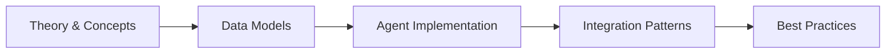

# Chapter 31: HR & Recruitment — AI-Powered Talent Agents

> **Previous:** [Logistics & Supply Chain Agents](./30-logistics.md) | **Next:** [Marketing & Advertising Agents](./32-marketing.md)


---

## Learning Objectives

- Design and implement HR domain data models (Candidate, Employee, JobPosting, Review, Training) with Laravel migrations and Eloquent relationships
- Build a ResumeScreeningAgent that parses PDF resumes, extracts structured candidate data with AI, and ranks applicants against job requirements
- Create an InterviewSchedulingAgent that coordinates availability between candidates and interviewers using calendar-aware logic
- Implement a CandidateMatchingAgent that uses vector embeddings and cosine similarity to match candidates to job postings
- Deploy an OnboardingAgent that automates new-hire task checklists, document verification, and role-based provisioning
- Build a PerformanceReviewAgent that analyzes review text with sentiment analysis and detects performance trends over time
- Construct a SentimentAgent that monitors employee engagement surveys, flags negative sentiment, and escalates concerns
- Develop a TrainingRecommendationAgent that identifies skill gaps from performance data and recommends targeted training programs
- Implement an HrComplianceAgent that tracks certification deadlines, equal-opportunity metrics, and generates compliance reports

## Chapter at a Glance

| Aspect | Details |
|--------|---------|
| **Scope** | HR domain data models, AI agents for recruitment, onboarding, performance, compliance |
| **Key Concepts** | Resume screening, interview scheduling, candidate matching, sentiment analysis, training recommendations, compliance tracking |
| **Learning Approach** | Theory, Eloquent models, agent implementations, AI integration |
| **Skills Required** | PHP, Laravel, Eloquent, Laravel AI SDK, PDF parsing |

## Chapter Roadmap



## Chapter at a Glance

| Aspect | Details |
|--------|---------|
| **Scope** | HR domain data models, AI agents for recruitment, onboarding, performance, compliance |
| **Key Concepts** | Resume screening, interview scheduling, candidate matching, sentiment analysis, training recommendations, compliance tracking |
| **Learning Approach** | Theory, Eloquent models, agent implementations, AI integration |
| **Skills Required** | PHP, Laravel, Eloquent, Laravel AI SDK, PDF parsing |

## Chapter Roadmap


## Chapter at a Glance

| Aspect | Details |
|--------|---------|
| **Scope** | HR domain data models, AI agents for recruitment, onboarding, performance, compliance |
| **Key Concepts** | Resume screening, interview scheduling, candidate matching, sentiment analysis, training recommendations, compliance tracking |
| **Learning Approach** | Theory, Eloquent models, agent implementations, AI integration |
| **Skills Required** | PHP, Laravel, Eloquent, Laravel AI SDK, PDF parsing |

## Chapter Roadmap


## Chapter at a Glance

| Aspect | Details |
|--------|---------|
| **Scope** | HR domain data models, AI agents for recruitment, onboarding, performance, compliance |
| **Key Concepts** | Resume screening, interview scheduling, candidate matching, sentiment analysis, training recommendations, compliance tracking |
| **Learning Approach** | Theory, Eloquent models, agent implementations, AI integration |
| **Skills Required** | PHP, Laravel, Eloquent, Laravel AI SDK, PDF parsing |

## Chapter Roadmap


---

## Theory
> **One-Sentence Takeaway:** Theory is the foundation → master it before moving to examples and exercises.
> **One-Sentence Takeaway:** Theory is the foundation → master it before moving to examples and exercises.
> **One-Sentence Takeaway:** Theory is the foundation → master it before moving to examples and exercises.
> **One-Sentence Takeaway:** Theory is the foundation → master it before moving to examples and exercises.


### 31.1 HR Data Models


Every HR automation begins with well-structured data. The core HR domain includes candidates seeking employment, employees managing their careers, job postings defining roles, performance reviews tracking growth, and training records documenting development. These models form the foundation upon which all AI agents operate.

#### Migrations

```php
<?php

use Illuminate\Database\Migrations\Migration;
use Illuminate\Database\Schema\Blueprint;
use Illuminate\Support\Facades\Schema;

return new class extends Migration
{
    public function up(): void
    {
        Schema::create('candidates', function (Blueprint $table) {
            $table->id();
            $table->string('first_name');
            $table->string('last_name');
            $table->string('email')->unique();
            $table->string('phone')->nullable();
            $table->string('current_company')->nullable();
            $table->string('current_title')->nullable();
            $table->integer('years_experience')->default(0);
            $table->json('skills')->nullable();
            $table->text('resume_text')->nullable();
            $table->string('resume_file_path')->nullable();
            $table->string('source')->nullable();
            $table->string('status')->default('new');
            $table->decimal('ai_ranking_score', 5, 2)->nullable();
            $table->json('ai_extracted_data')->nullable();
            $table->foreignId('job_posting_id')->nullable()->constrained();
            $table->timestamps();
        });

        Schema::create('employees', function (Blueprint $table) {
            $table->id();
            $table->string('employee_id')->unique();
            $table->string('first_name');
            $table->string('last_name');
            $table->string('email')->unique();
            $table->string('phone')->nullable();
            $table->string('department');
            $table->string('position');
            $table->string('manager_id')->nullable();
            $table->date('hire_date');
            $table->string('employment_type')->default('full_time');
            $table->string('status')->default('active');
            $table->json('skills')->nullable();
            $table->json('certifications')->nullable();
            $table->string('timezone')->default('UTC');
            $table->timestamps();
        });

        Schema::create('job_postings', function (Blueprint $table) {
            $table->id();
            $table->string('title');
            $table->string('department');
            $table->string('location')->nullable();
            $table->string('employment_type')->default('full_time');
            $table->text('description');
            $table->json('requirements');
            $table->json('preferred_skills')->nullable();
            $table->text('responsibilities')->nullable();
            $table->decimal('salary_min', 10, 2)->nullable();
            $table->decimal('salary_max', 10, 2)->nullable();
            $table->string('status')->default('open');
            $table->foreignId('hiring_manager_id')->nullable()->constrained('employees');
            $table->json('ai_embedding')->nullable();
            $table->timestamps();
        });

        Schema::create('reviews', function (Blueprint $table) {
            $table->id();
            $table->foreignId('employee_id')->constrained()->cascadeOnDelete();
            $table->foreignId('reviewer_id')->constrained('employees')->cascadeOnDelete();
            $table->string('type')->default('annual');
            $table->date('review_date');
            $table->date('review_period_start');
            $table->date('review_period_end');
            $table->json('ratings')->nullable();
            $table->text('employee_comment')->nullable();
            $table->text('reviewer_comment')->nullable();
            $table->text('goals_achieved')->nullable();
            $table->text('areas_for_improvement')->nullable();
            $table->decimal('overall_score', 5, 2)->nullable();
            $table->decimal('ai_sentiment_score', 5, 2)->nullable();
            $table->json('ai_analysis')->nullable();
            $table->string('status')->default('draft');
            $table->timestamps();
        });

        Schema::create('training_records', function (Blueprint $table) {
            $table->id();
            $table->foreignId('employee_id')->constrained()->cascadeOnDelete();
            $table->string('title');
            $table->string('provider')->nullable();
            $table->string('category');
            $table->text('description')->nullable();
            $table->text('skills_covered')->nullable();
            $table->date('start_date');
            $table->date('completion_date')->nullable();
            $table->string('status')->default('enrolled');
            $table->decimal('cost', 10, 2)->nullable();
            $table->boolean('certification_earned')->default(false);
            $table->date('certification_expiry')->nullable();
            $table->integer('duration_hours')->nullable();
            $table->timestamps();
        });

        Schema::create('hr_documents', function (Blueprint $table) {
            $table->id();
            $table->string('type');
            $table->foreignId('candidate_id')->nullable()->constrained()->nullOnDelete();
            $table->foreignId('employee_id')->nullable()->constrained()->nullOnDelete();
            $table->string('title');
            $table->string('file_path');
            $table->boolean('is_verified')->default(false);
            $table->date('verified_at')->nullable();
            $table->date('expiry_date')->nullable();
            $table->json('ai_verification_data')->nullable();
            $table->timestamps();
        });
    }

    public function down(): void
    {
        Schema::dropIfExists('hr_documents');
        Schema::dropIfExists('training_records');
        Schema::dropIfExists('reviews');
        Schema::dropIfExists('job_postings');
        Schema::dropIfExists('employees');
        Schema::dropIfExists('candidates');
    }
};
```

#### Eloquent Models

```php
<?php

namespace App\Models;

use Illuminate\Database\Eloquent\Model;
use Illuminate\Database\Eloquent\Relations\BelongsTo;
use Illuminate\Database\Eloquent\Relations\HasMany;
use Illuminate\Support\Arr;

class Candidate extends Model
{
    protected $fillable = [
        'first_name', 'last_name', 'email', 'phone',
        'current_company', 'current_title', 'years_experience',
        'skills', 'resume_text', 'resume_file_path', 'source',
        'status', 'ai_ranking_score', 'ai_extracted_data',
        'job_posting_id',
    ];

    protected function casts(): array
    {
        return [
            'skills' => 'array',
            'ai_extracted_data' => 'array',
            'years_experience' => 'integer',
            'ai_ranking_score' => 'decimal:2',
        ];
    }

    public function jobPosting(): BelongsTo
    {
        return $this->belongsTo(JobPosting::class);
    }

    public function getFullNameAttribute(): string
    {
        return "{$this->first_name} {$this->last_name}";
    }
}

class Employee extends Model
{
    protected $fillable = [
        'employee_id', 'first_name', 'last_name', 'email', 'phone',
        'department', 'position', 'manager_id', 'hire_date',
        'employment_type', 'status', 'skills', 'certifications', 'timezone',
    ];

    protected function casts(): array
    {
        return [
            'skills' => 'array',
            'certifications' => 'array',
            'hire_date' => 'date',
        ];
    }

    public function reviews(): HasMany
    {
        return $this->hasMany(Review::class);
    }

    public function trainingRecords(): HasMany
    {
        return $this->hasMany(TrainingRecord::class);
    }

    public function documents(): HasMany
    {
        return $this->hasMany(HrDocument::class);
    }
}

class JobPosting extends Model
{
    protected $fillable = [
        'title', 'department', 'location', 'employment_type',
        'description', 'requirements', 'preferred_skills',
        'responsibilities', 'salary_min', 'salary_max',
        'status', 'hiring_manager_id', 'ai_embedding',
    ];

    protected function casts(): array
    {
        return [
            'requirements' => 'array',
            'preferred_skills' => 'array',
            'ai_embedding' => 'array',
            'salary_min' => 'decimal:2',
            'salary_max' => 'decimal:2',
        ];
    }

    public function candidates(): HasMany
    {
        return $this->hasMany(Candidate::class);
    }

    public function hiringManager(): BelongsTo
    {
        return $this->belongsTo(Employee::class, 'hiring_manager_id');
    }
}

class Review extends Model
{
    protected $fillable = [
        'employee_id', 'reviewer_id', 'type', 'review_date',
        'review_period_start', 'review_period_end', 'ratings',
        'employee_comment', 'reviewer_comment', 'goals_achieved',
        'areas_for_improvement', 'overall_score', 'ai_sentiment_score',
        'ai_analysis', 'status',
    ];

    protected function casts(): array
    {
        return [
            'ratings' => 'array',
            'ai_analysis' => 'array',
            'review_date' => 'date',
            'review_period_start' => 'date',
            'review_period_end' => 'date',
            'overall_score' => 'decimal:2',
            'ai_sentiment_score' => 'decimal:2',
        ];
    }

    public function employee(): BelongsTo
    {
        return $this->belongsTo(Employee::class);
    }

    public function reviewer(): BelongsTo
    {
        return $this->belongsTo(Employee::class, 'reviewer_id');
    }
}

class TrainingRecord extends Model
{
    protected $fillable = [
        'employee_id', 'title', 'provider', 'category', 'description',
        'skills_covered', 'start_date', 'completion_date', 'status',
        'cost', 'certification_earned', 'certification_expiry',
        'duration_hours',
    ];

    protected function casts(): array
    {
        return [
            'skills_covered' => 'array',
            'start_date' => 'date',
            'completion_date' => 'date',
            'certification_expiry' => 'date',
            'cost' => 'decimal:2',
            'certification_earned' => 'boolean',
        ];
    }

    public function employee(): BelongsTo
    {
        return $this->belongsTo(Employee::class);
    }

    public function isExpiringSoon(int $days = 30): bool
    {
        return $this->certification_expiry
            && $this->certification_expiry->isFuture()
            && $this->certification_expiry->diffInDays(now()) <= $days;
    }
}

class HrDocument extends Model
{
    protected $fillable = [
        'type', 'candidate_id', 'employee_id', 'title',
        'file_path', 'is_verified', 'verified_at',
        'expiry_date', 'ai_verification_data',
    ];

    protected function casts(): array
    {
        return [
            'is_verified' => 'boolean',
            'verified_at' => 'date',
            'expiry_date' => 'date',
            'ai_verification_data' => 'array',
        ];
    }

    public function candidate(): BelongsTo
    {
        return $this->belongsTo(Candidate::class);
    }

    public function employee(): BelongsTo
    {
        return $this->belongsTo(Employee::class);
    }

    public function scopeExpired($query)
    {
        return $query->whereNotNull('expiry_date')
            ->where('expiry_date', '<', now());
    }
}
```

---

### 31.2 Resume Screening & Ranking Agents


The ResumeScreeningAgent ingests candidate resumes (PDF or text), uses AI to extract structured data — skills, years of experience, education, previous roles — and scores each candidate against the requirements of a specific job posting. This automates the most time-consuming phase of recruiting: reviewing hundreds of resumes to find qualified candidates.

The agent works in three phases: **parse** (extract raw text from the uploaded file), **extract** (use an LLM to pull structured fields from unstructured text), and **rank** (compute a match score against job requirements using both keyword overlap and semantic understanding).

```php
<?php

namespace App\Agents\Hr;

use App\Models\Candidate;
use App\Models\JobPosting;
use Illuminate\Support\Facades\Log;
use Illuminate\Support\Facades\Storage;
use Laravel\Ai\AiManager;
use Smalot\PdfParser\Parser as PdfParser;
use thiagoalessio\TesseractOCR\TesseractOCR;

class ResumeScreeningAgent
{
    public function __construct(
        protected AiManager $ai,
        protected PdfParser $pdfParser,
    ) {}

    public function screen(Candidate $candidate, JobPosting $jobPosting): Candidate
    {
        $resumeText = $this->parseResume($candidate);

        $extractedData = $this->extractStructuredData($resumeText);
        $candidate->ai_extracted_data = $extractedData;
        $candidate->skills = $extractedData['skills'] ?? [];
        $candidate->years_experience = $extractedData['years_experience'] ?? 0;

        $rankingScore = $this->rankCandidate($extractedData, $jobPosting);
        $candidate->ai_ranking_score = $rankingScore;

        $candidate->save();

        Log::info("Resume screened for candidate {$candidate->id}", [
            'score' => $rankingScore,
            'skills_found' => count($extractedData['skills'] ?? []),
        ]);

        return $candidate;
    }

    public function parseResume(Candidate $candidate): string
    {
        if ($candidate->resume_text) {
            return $candidate->resume_text;
        }

        $path = Storage::disk('private')->path($candidate->resume_file_path);

        if (!file_exists($path)) {
            throw new \RuntimeException("Resume file not found: {$path}");
        }

        $extension = strtolower(pathinfo($path, PATHINFO_EXTENSION));

        return match ($extension) {
            'pdf' => $this->parsePdf($path),
            'docx' => $this->parseDocx($path),
            'txt' => file_get_contents($path),
            'png', 'jpg', 'jpeg' => $this->parseImage($path),
            default => throw new \RuntimeException("Unsupported resume format: {$extension}"),
        };
    }

    protected function parsePdf(string $path): string
    {
        $pdf = $this->pdfParser->parseFile($path);

        return $pdf->getText();
    }

    protected function parseDocx(string $path): string
    {
        $zip = new \ZipArchive();
        $zip->open($path);
        $xml = $zip->getFromName('word/document.xml');
        $zip->close();

        $xml = preg_replace('/<w:p[^>]*>/', "\n", $xml);
        $xml = strip_tags($xml);

        return trim(preg_replace('/\s+/', ' ', $xml));
    }

    protected function parseImage(string $path): string
    {
        return (new TesseractOCR($path))->run();
    }

    public function extractStructuredData(string $resumeText): array
    {
        $response = $this->ai->agent()
            ->instructions('You are an expert resume parser. Extract structured data from the resume text provided.')
            ->prompt("
                Extract the following fields from this resume text.
                Return ONLY valid JSON with NO markdown formatting.

                Resume text:
                {$resumeText}

                JSON schema:
                {
                    \"full_name\": \"string\",
                    \"email\": \"string|null\",
                    \"phone\": \"string|null\",
                    \"skills\": [\"string\"],
                    \"years_experience\": \"integer\",
                    \"education\": [
                        {
                            \"degree\": \"string\",
                            \"field\": \"string\",
                            \"institution\": \"string\",
                            \"year\": \"integer|null\"
                        }
                    ],
                    \"previous_roles\": [
                        {
                            \"title\": \"string\",
                            \"company\": \"string\",
                            \"years\": \"integer\"
                        }
                    ],
                    \"certifications\": [\"string\"]
                }
            ")
            ->generate();

        return json_decode($response->text(), true) ?? [];
    }

    public function rankCandidate(array $extracted, JobPosting $jobPosting): float
    {
        $requiredSkills = collect($jobPosting->requirements['skills'] ?? []);
        $preferredSkills = collect($jobPosting->preferred_skills ?? []);
        $candidateSkills = collect($extracted['skills'] ?? []);

        $candidateSkillNames = $candidateSkills->map(fn ($s) => strtolower(trim($s)));

        $requiredMatches = $requiredSkills->filter(
            fn ($req) => $candidateSkillNames->contains(strtolower(trim($req)))
        )->count();

        $preferredMatches = $preferredSkills->filter(
            fn ($pref) => $candidateSkillNames->contains(strtolower(trim($pref)))
        )->count();

        $totalRequired = max($requiredSkills->count(), 1);
        $totalPreferred = max($preferredSkills->count(), 1);

        $requiredScore = ($requiredMatches / $totalRequired) * 60;
        $preferredScore = ($preferredMatches / $totalPreferred) * 25;

        $experienceYears = $extracted['years_experience'] ?? 0;
        $requiredYears = $jobPosting->requirements['min_years_experience'] ?? 0;
        $experienceScore = $requiredYears > 0
            ? min(($experienceYears / $requiredYears) * 15, 15)
            : 10;

        return round($requiredScore + $preferredScore + $experienceScore, 2);
    }

    public function screenMultiple(JobPosting $jobPosting, int $limit = 50): array
    {
        $candidates = Candidate::where('status', 'new')
            ->where(fn ($q) => $q->whereNull('job_posting_id')
                ->orWhere('job_posting_id', $jobPosting->id))
            ->limit($limit)
            ->get();

        $results = [];

        foreach ($candidates as $candidate) {
            try {
                $this->screen($candidate, $jobPosting);
                $results[] = [
                    'candidate' => $candidate->toArray(),
                    'score' => $candidate->ai_ranking_score,
                ];
            } catch (\Throwable $e) {
                Log::error("Failed to screen candidate {$candidate->id}: {$e->getMessage()}");
                $results[] = [
                    'candidate_id' => $candidate->id,
                    'error' => $e->getMessage(),
                ];
            }
        }

        usort($results, fn ($a, $b) => ($b['score'] ?? 0) <=> ($a['score'] ?? 0));

        return $results;
    }
}
```

---

### 31.3 Interview Scheduling Automation


The InterviewSchedulingAgent coordinates the logistics of scheduling interviews between candidates and interviewers. It checks availability windows, proposes overlapping time slots, sends calendar invitations, and handles rescheduling when conflicts arise. The agent uses a constraint-satisfaction approach: candidate availability, interviewer availability, required attendees, room booking, and timezone normalization are all treated as constraints that must be satisfied simultaneously.

```php
<?php

namespace App\Agents\Hr;

use App\Models\Candidate;
use App\Models\Employee;
use App\Notifications\InterviewScheduled;
use Carbon\Carbon;
use Carbon\CarbonInterval;
use Illuminate\Support\Collection;
use Illuminate\Support\Facades\Log;
use Illuminate\Support\Facades\Notification;

class InterviewSchedulingAgent
{
    protected array $defaultDuration = 60;

    protected array $businessHours = [
        'start' => '09:00',
        'end' => '17:00',
    ];

    protected array $excludedDays = [0, 6];

    public function __construct(
        protected array $config = [],
    ) {
        $this->defaultDuration = $config['default_duration_minutes'] ?? 60;
        $this->businessHours['start'] = $config['business_hours_start'] ?? '09:00';
        $this->businessHours['end'] = $config['business_hours_end'] ?? '17:00';
    }

    public function schedule(
        Candidate $candidate,
        array $interviewerIds,
        string $type = 'technical',
        ?Carbon $preferredDate = null,
        int $durationMinutes = 60,
    ): array {
        $durationMinutes = $durationMinutes ?: $this->defaultDuration;

        $interviewers = Employee::whereIn('id', $interviewerIds)
            ->where('status', 'active')
            ->get();

        if ($interviewers->isEmpty()) {
            throw new \RuntimeException('No available interviewers found.');
        }

        $candidateTimezone = $candidate->timezone ?? 'UTC';
        $candidateAvailability = $this->getCandidateAvailability($candidate);

        $combinedSlots = $this->findCommonSlots(
            candidateSlots: $candidateAvailability,
            interviewers: $interviewers,
            durationMinutes: $durationMinutes,
            preferredDate: $preferredDate,
        );

        if ($combinedSlots->isEmpty()) {
            $this->flagForManualScheduling($candidate, $interviewers, $type);

            return [
                'status' => 'manual_scheduling_required',
                'message' => 'No common time slots found. Manual scheduling initiated.',
            ];
        }

        $selectedSlot = $combinedSlots->first();

        $interview = $this->createInterviewRecord(
            candidate: $candidate,
            interviewers: $interviewers,
            type: $type,
            startTime: $selectedSlot['start'],
            endTime: $selectedSlot['end'],
        );

        $this->sendInvitations($candidate, $interviewers, $selectedSlot);

        Log::info("Interview scheduled for candidate {$candidate->id}", [
            'type' => $type,
            'slot' => $selectedSlot['start']->toIso8601String(),
            'interviewers' => $interviewerIds,
        ]);

        return [
            'status' => 'scheduled',
            'interview' => $interview,
            'start_time' => $selectedSlot['start'],
            'end_time' => $selectedSlot['end'],
            'timezone' => $candidateTimezone,
        ];
    }

    protected function getCandidateAvailability(Candidate $candidate): Collection
    {
        $timezone = $candidate->timezone ?? 'UTC';

        $windowStart = Carbon::now($timezone)->addDay()->startOfDay();
        $windowEnd = Carbon::now($timezone)->addDays(14)->endOfDay();

        $slots = collect();

        $current = $windowStart->copy()->setTimeFromTimeString($this->businessHours['start']);

        while ($current->lessThan($windowEnd)) {
            if (!in_array($current->dayOfWeek, $this->excludedDays)) {
                $dayEnd = $current->copy()->setTimeFromTimeString($this->businessHours['end']);
                $slotStart = $current->copy();
                $slots->push([
                    'start' => $slotStart->copy(),
                    'end' => $slotStart->copy()->addMinutes($this->defaultDuration),
                ]);
            }
            $current->addDay();
        }

        return $slots;
    }

    protected function findCommonSlots(
        Collection $candidateSlots,
        Collection $interviewers,
        int $durationMinutes,
        ?Carbon $preferredDate = null,
    ): Collection {
        $interviewerSlots = $interviewers->mapWithKeys(
            fn (Employee $interviewer) => [
                $interviewer->id => $this->getInterviewerAvailability($interviewer),
            ]
        );

        $commonSlots = $candidateSlots->filter(function (array $candidateSlot) use ($interviewerSlots) {
            foreach ($interviewerSlots as $interviewerId => $slots) {
                $overlaps = $slots->first(function (array $is) use ($candidateSlot) {
                    return $is['start']->lessThan($candidateSlot['end'])
                        && $is['end']->greaterThan($candidateSlot['start']);
                });

                if (!$overlaps) {
                    return false;
                }
            }

            return true;
        });

        if ($commonSlots->isEmpty() && $preferredDate) {
            return $candidateSlots->filter(
                fn (array $slot) => $slot['start']->isSameDay($preferredDate)
            )->take(5);
        }

        return $commonSlots;
    }

    protected function getInterviewerAvailability(Employee $interviewer): Collection
    {
        $timezone = $interviewer->timezone ?? 'UTC';

        $start = Carbon::now($timezone)->addDay()->startOfDay();
        $end = Carbon::now($timezone)->addDays(14)->endOfDay();

        $slots = collect();
        $current = $start->copy()->setTimeFromTimeString($this->businessHours['start']);

        while ($current->lessThan($end)) {
            if (!in_array($current->dayOfWeek, $this->excludedDays)) {
                $dayEnd = $current->copy()->setTimeFromTimeString($this->businessHours['end']);

                $slotStart = $current->copy();
                while ($slotStart->copy()->addMinutes($this->defaultDuration)->lessThan($dayEnd)) {
                    $slots->push([
                        'start' => $slotStart->copy(),
                        'end' => $slotStart->copy()->addMinutes($this->defaultDuration),
                    ]);
                    $slotStart->addMinutes($this->defaultDuration);
                }
            }
            $current->addDay();
        }

        return $slots;
    }

    protected function createInterviewRecord(
        Candidate $candidate,
        Collection $interviewers,
        string $type,
        Carbon $startTime,
        Carbon $endTime,
    ): array {
        $interview = [
            'candidate_id' => $candidate->id,
            'type' => $type,
            'scheduled_at' => $startTime,
            'ends_at' => $endTime,
            'timezone' => $candidate->timezone ?? 'UTC',
            'interviewers' => $interviewers->pluck('id')->toArray(),
            'status' => 'scheduled',
            'meeting_link' => $this->generateMeetingLink(),
        ];

        Log::info('Interview record created', $interview);

        return $interview;
    }

    protected function sendInvitations(
        Candidate $candidate,
        Collection $interviewers,
        array $slot,
    ): void {
        $details = [
            'candidate_name' => $candidate->full_name,
            'candidate_email' => $candidate->email,
            'start_time' => $slot['start']->toIso8601String(),
            'end_time' => $slot['end']->toIso8601String(),
            'meeting_link' => $this->generateMeetingLink(),
        ];

        Notification::route('mail', $candidate->email)
            ->notify(new InterviewScheduled($details));

        foreach ($interviewers as $interviewer) {
            Notification::route('mail', $interviewer->email)
                ->notify(new InterviewScheduled($details));
        }
    }

    protected function generateMeetingLink(): string
    {
        $uuid = (string) \Illuminate\Support\Str::uuid();

        return "https://meet.example.com/interview/{$uuid}";
    }

    protected function flagForManualScheduling(
        Candidate $candidate,
        Collection $interviewers,
        string $type,
    ): void {
        Log::warning('Manual scheduling required', [
            'candidate_id' => $candidate->id,
            'interviewers' => $interviewers->pluck('id')->toArray(),
            'type' => $type,
        ]);

        Notification::route('slack', config('services.slack.hr_channel'))
            ->notify(new \App\Notifications\ManualSchedulingRequired(
                candidate: $candidate,
                interviewers: $interviewers,
                type: $type,
            ));
    }
}
```

---

### 31.4 Candidate Matching Agents


The CandidateMatchingAgent uses vector embeddings to perform semantic matching between job postings and candidates. Instead of relying solely on keyword overlap — which misses synonyms and context — the agent embeds both the job description and the candidate's resume into high-dimensional vectors, then computes cosine similarity. Candidates whose profiles are semantically close to the job requirements surface to the top, even when they use different terminology.

```php
<?php

namespace App\Agents\Hr;

use App\Models\Candidate;
use App\Models\JobPosting;
use Illuminate\Support\Collection;
use Illuminate\Support\Facades\Log;
use Laravel\Ai\AiManager;

class CandidateMatchingAgent
{
    protected int $topK = 20;

    protected float $minimumScore = 0.4;

    public function __construct(
        protected AiManager $ai,
    ) {}

    public function embedJobPosting(JobPosting $posting): JobPosting
    {
        $text = $this->buildJobText($posting);

        $embedding = $this->createEmbedding($text);
        $posting->ai_embedding = $embedding;
        $posting->save();

        return $posting;
    }

    public function embedCandidate(Candidate $candidate): array
    {
        $text = $this->buildCandidateText($candidate);

        return $this->createEmbedding($text);
    }

    public function findMatchesForJob(
        JobPosting $posting,
        ?int $limit = null,
    ): Collection {
        $limit = $limit ?? $this->topK;

        if (!$posting->ai_embedding) {
            $this->embedJobPosting($posting);
        }

        $queryVector = $posting->ai_embedding;

        $candidates = Candidate::where('status', 'new')
            ->whereNull('ai_ranking_score')
            ->orWhere('job_posting_id', $posting->id)
            ->limit(100)
            ->get();

        $scored = $candidates->map(function (Candidate $candidate) use ($queryVector) {
            $candidateVector = $this->embedCandidate($candidate);
            $similarity = $this->cosineSimilarity($queryVector, $candidateVector);

            return [
                'candidate' => $candidate,
                'similarity' => round($similarity, 4),
            ];
        })->filter(fn ($item) => $item['similarity'] >= $this->minimumScore)
            ->sortByDesc('similarity')
            ->values()
            ->take($limit);

        Log::info("Found {$scored->count()} matching candidates for job {$posting->id}");

        return $scored;
    }

    public function findJobsForCandidate(
        Candidate $candidate,
        ?int $limit = null,
    ): Collection {
        $limit = $limit ?? $this->topK;

        $candidateVector = $this->embedCandidate($candidate);

        $postings = JobPosting::where('status', 'open')->get();

        $jobEmbeddings = $postings->map(function (JobPosting $posting) {
            if (!$posting->ai_embedding) {
                $this->embedJobPosting($posting);
            }

            return $posting;
        });

        $scored = $jobEmbeddings->map(function (JobPosting $posting) use ($candidateVector) {
            $similarity = $this->cosineSimilarity($candidateVector, $posting->ai_embedding);

            return [
                'job' => $posting,
                'similarity' => round($similarity, 4),
            ];
        })->filter(fn ($item) => $item['similarity'] >= $this->minimumScore)
            ->sortByDesc('similarity')
            ->values()
            ->take($limit);

        return $scored;
    }

    public function generateMatchExplanation(
        Candidate $candidate,
        JobPosting $posting,
    ): string {
        $response = $this->ai->agent()
            ->instructions('You are an HR recruitment specialist. Explain why this candidate matches or does not match this job posting.')
            ->prompt("
                Candidate Profile:
                - Skills: " . implode(', ', $candidate->skills ?? []) . "
                - Experience: {$candidate->years_experience} years
                - Current Role: {$candidate->current_title} at {$candidate->current_company}
                - Extracted Data: " . json_encode($candidate->ai_extracted_data) . "

                Job Posting: {$posting->title} ({$posting->department})
                - Requirements: " . json_encode($posting->requirements) . "
                - Preferred Skills: " . json_encode($posting->preferred_skills) . "

                Provide a 2-3 sentence explanation of the match strength, key qualifications,
                and any notable gaps. Be direct and specific.
            ")->generate();

        return $response->text();
    }

    protected function buildJobText(JobPosting $posting): string
    {
        return implode("\n", array_filter([
            "Title: {$posting->title}",
            "Department: {$posting->department}",
            "Description: {$posting->description}",
            "Requirements: " . implode(', ', $posting->requirements ?? []),
            "Preferred Skills: " . implode(', ', $posting->preferred_skills ?? []),
            "Responsibilities: {$posting->responsibilities}",
        ]));
    }

    protected function buildCandidateText(Candidate $candidate): string
    {
        $extracted = $candidate->ai_extracted_data ?? [];

        return implode("\n", array_filter([
            "Name: {$candidate->first_name} {$candidate->last_name}",
            "Current Role: {$candidate->current_title} at {$candidate->current_company}",
            "Skills: " . implode(', ', $candidate->skills ?? []),
            "Experience: {$candidate->years_experience} years",
            "Resume: {$candidate->resume_text}",
        ]));
    }

    protected function createEmbedding(string $text): array
    {
        $response = $this->ai->embeddings()->input($text)->generate();

        return $response->data[0]->embedding ?? [];
    }

    protected function cosineSimilarity(array $vectorA, array $vectorB): float
    {
        $dotProduct = 0;
        $magnitudeA = 0;
        $magnitudeB = 0;

        foreach ($vectorA as $i => $valueA) {
            $valueB = $vectorB[$i] ?? 0;
            $dotProduct += $valueA * $valueB;
            $magnitudeA += $valueA * $valueA;
            $magnitudeB += $valueB * $valueB;
        }

        $magnitudeA = sqrt($magnitudeA);
        $magnitudeB = sqrt($magnitudeB);

        if ($magnitudeA === 0.0 || $magnitudeB === 0.0) {
            return 0.0;
        }

        return $dotProduct / ($magnitudeA * $magnitudeB);
    }
}
```

---

### 31.5 Onboarding Workflow Agents


The OnboardingAgent automates the new-hire onboarding process from acceptance through day-one readiness. The agent creates a personalized task checklist, verifies required documents (ID verification, tax forms, employment eligibility), provisions accounts across internal systems, assigns a mentor, schedules orientation sessions, and tracks completion status. Each step can be configured per role, department, or location.

```php
<?php

namespace App\Agents\Hr;

use App\Models\Candidate;
use App\Models\Employee;
use App\Models\HrDocument;
use App\Notifications\OnboardingTaskAssigned;
use Carbon\Carbon;
use Illuminate\Support\Facades\DB;
use Illuminate\Support\Facades\Log;
use Illuminate\Support\Facades\Notification;
use Illuminate\Support\Str;

class OnboardingAgent
{
    protected array $defaultTasks = [
        'complete_welcome_form' => [
            'title' => 'Complete Welcome Form',
            'description' => 'Fill out personal details, emergency contacts, and banking information',
            'assigned_to' => 'employee',
            'due_offset_days' => -7,
            'category' => 'paperwork',
        ],
        'upload_id_document' => [
            'title' => 'Upload Government ID',
            'description' => 'Provide a valid passport, driver\'s license, or national ID card',
            'assigned_to' => 'employee',
            'due_offset_days' => -7,
            'category' => 'documents',
        ],
        'verify_employment_eligibility' => [
            'title' => 'Employment Eligibility Verification (I-9)',
            'description' => 'Complete Form I-9 and provide supporting documents',
            'assigned_to' => 'hr',
            'due_offset_days' => 0,
            'category' => 'compliance',
        ],
        'sign_employment_contract' => [
            'title' => 'Sign Employment Contract',
            'description' => 'Review and sign the employment agreement',
            'assigned_to' => 'employee',
            'due_offset_days' => -14,
            'category' => 'legal',
        ],
        'provision_email_account' => [
            'title' => 'Provision Email & System Accounts',
            'description' => 'Create email account, HRIS profile, and internal tool access',
            'assigned_to' => 'it',
            'due_offset_days' => -3,
            'category' => 'it',
        ],
        'assign_equipment' => [
            'title' => 'Assign Equipment',
            'description' => 'Prepare laptop, monitor, peripherals, and accessories',
            'assigned_to' => 'it',
            'due_offset_days' => -2,
            'category' => 'it',
        ],
        'schedule_orientation' => [
            'title' => 'Schedule Orientation Session',
            'description' => 'Book company orientation and departmental onboarding',
            'assigned_to' => 'hr',
            'due_offset_days' => 0,
            'category' => 'orientation',
        ],
        'assign_mentor' => [
            'title' => 'Assign Mentor',
            'description' => 'Match new hire with a peer mentor from the same department',
            'assigned_to' => 'manager',
            'due_offset_days' => 0,
            'category' => 'culture',
        ],
    ];

    public function onboard(Candidate $candidate, string $startDate): Employee
    {
        $employee = DB::transaction(function () use ($candidate, $startDate) {
            $employee = Employee::create([
                'employee_id' => $this->generateEmployeeId(),
                'first_name' => $candidate->first_name,
                'last_name' => $candidate->last_name,
                'email' => $candidate->email,
                'position' => $candidate->ai_extracted_data['target_position']
                    ?? $candidate->current_title ?? 'New Hire',
                'department' => $candidate->jobPosting?->department ?? 'General',
                'hire_date' => Carbon::parse($startDate),
                'status' => 'onboarding',
                'skills' => $candidate->skills,
            ]);

            $this->createOnboardingTasks($employee, $startDate);

            return $employee;
        });

        Log::info("Onboarding initiated for employee {$employee->id}", [
            'employee_id' => $employee->employee_id,
            'start_date' => $startDate,
        ]);

        return $employee;
    }

    protected function generateEmployeeId(): string
    {
        $year = now()->format('Y');
        $random = Str::upper(Str::random(6));

        return "EMP-{$year}-{$random}";
    }

    protected function createOnboardingTasks(Employee $employee, string $startDate): void
    {
        $hireDate = Carbon::parse($startDate);

        foreach ($this->defaultTasks as $taskKey => $taskDef) {
            $dueDate = $hireDate->copy()->addDays($taskDef['due_offset_days']);

            $task = DB::table('onboarding_tasks')->insert([
                'uuid' => (string) Str::uuid(),
                'employee_id' => $employee->id,
                'key' => $taskKey,
                'title' => $taskDef['title'],
                'description' => $taskDef['description'],
                'assigned_to' => $taskDef['assigned_to'],
                'category' => $taskDef['category'],
                'due_date' => $dueDate,
                'status' => 'pending',
                'created_at' => now(),
                'updated_at' => now(),
            ]);

            Notification::route('mail', $employee->email)
                ->notify(new OnboardingTaskAssigned(
                    employee: $employee,
                    task: $taskDef,
                    dueDate: $dueDate,
                ));
        }
    }

    public function verifyDocument(HrDocument $document): HrDocument
    {
        if ($document->is_verified) {
            return $document;
        }

        $document->update([
            'is_verified' => true,
            'verified_at' => now(),
        ]);

        Log::info("Document verified: {$document->id} ({$document->type})");

        return $document;
    }

    public function getOnboardingProgress(Employee $employee): array
    {
        $tasks = DB::table('onboarding_tasks')
            ->where('employee_id', $employee->id)
            ->get();

        $total = $tasks->count();
        $completed = $tasks->where('status', 'completed')->count();
        $overdue = $tasks->filter(
            fn ($t) => $t->status !== 'completed' && Carbon::parse($t->due_date)->isPast()
        )->count();

        return [
            'employee_id' => $employee->id,
            'total_tasks' => $total,
            'completed_tasks' => $completed,
            'overdue_tasks' => $overdue,
            'progress_percentage' => $total > 0 ? round(($completed / $total) * 100, 1) : 0,
            'is_complete' => $completed === $total,
            'tasks_by_category' => $tasks->groupBy('category')
                ->map(fn ($group) => [
                    'total' => $group->count(),
                    'completed' => $group->where('status', 'completed')->count(),
                ]),
        ];
    }
}
```

---

### 31.6 Performance Review Analysis


The PerformanceReviewAgent analyzes review text to extract sentiment, identify performance trends across review periods, and generate manager-friendly summaries. It processes both quantitative ratings and qualitative comments, detecting patterns such as consistent strengths, recurring areas for improvement, changes in trajectory (improving, declining, steady), and flagging reviews that need managerial attention.

```php
<?php

namespace App\Agents\Hr;

use App\Models\Employee;
use App\Models\Review;
use Illuminate\Support\Collection;
use Illuminate\Support\Facades\Log;
use Laravel\Ai\AiManager;

class PerformanceReviewAgent
{
    public function __construct(
        protected AiManager $ai,
    ) {}

    public function analyze(Review $review): Review
    {
        $sentimentScore = $this->analyzeSentiment($review);
        $review->ai_sentiment_score = $sentimentScore;

        $analysis = $this->extractInsights($review);
        $review->ai_analysis = $analysis;

        $review->save();

        Log::info("Review analyzed: {$review->id}", [
            'sentiment' => $sentimentScore,
            'categories' => array_keys($analysis),
        ]);

        return $review;
    }

    public function analyzeSentiment(Review $review): float
    {
        $texts = array_filter([
            $review->employee_comment,
            $review->reviewer_comment,
            $review->goals_achieved,
            $review->areas_for_improvement,
        ]);

        $combined = implode("\n\n", $texts);

        if (empty(trim($combined))) {
            return 0.5;
        }

        $response = $this->ai->agent()
            ->instructions('You analyze employee performance review text and return a single sentiment score.')
            ->prompt("
                Analyze the sentiment of this performance review text.
                Return ONLY a decimal number between 0.0 (extremely negative) and 1.0 (extremely positive).
                Do NOT include any explanation or formatting.

                Review text:
                {$combined}
            ")->generate();

        $score = (float) trim($response->text());

        return max(0.0, min(1.0, $score));
    }

    public function extractInsights(Review $review): array
    {
        $response = $this->ai->agent()
            ->instructions('You are an HR analytics specialist. Extract structured insights from performance reviews.')
            ->prompt("
                Analyze this performance review and return structured insights as JSON.

                Employee Ratings: " . json_encode($review->ratings) . "
                Overall Score: {$review->overall_score}
                Reviewer Comment: {$review->reviewer_comment}
                Employee Comment: {$review->employee_comment}
                Goals Achieved: {$review->goals_achieved}
                Areas for Improvement: {$review->areas_for_improvement}

                Return JSON with these fields:
                {
                    \"key_strengths\": [\"string\"],
                    \"areas_for_growth\": [\"string\"],
                    \"sentiment_trend\": \"improving|declining|steady\",
                    \"manager_attention_required\": boolean,
                    \"summary\": \"string (2-3 sentences)\",
                    \"recommended_actions\": [\"string\"]
                }
            ")->generate();

        return json_decode($response->text(), true) ?? [
            'key_strengths' => [],
            'areas_for_growth' => [],
            'sentiment_trend' => 'steady',
            'manager_attention_required' => false,
            'summary' => 'Analysis unavailable.',
            'recommended_actions' => [],
        ];
    }

    public function detectTrends(Employee $employee): array
    {
        $reviews = $employee->reviews()
            ->where('status', 'completed')
            ->orderBy('review_date')
            ->get();

        if ($reviews->isEmpty()) {
            return [
                'employee_id' => $employee->id,
                'trend' => 'no_data',
                'message' => 'No completed reviews found for trend analysis.',
            ];
        }

        $scores = $reviews->pluck('overall_score')->filter()->values();
        $sentiments = $reviews->pluck('ai_sentiment_score')->filter()->values();

        $scoreTrend = $this->calculateTrend($scores->toArray());
        $sentimentTrend = $this->calculateTrend($sentiments->toArray());

        $analysis = $this->ai->agent()
            ->instructions('You synthesize performance review trends into concise observations.')
            ->prompt("
                Employee: {$employee->first_name} {$employee->last_name} ({$employee->position})
                Department: {$employee->department}

                Review History (" . $reviews->count() . " reviews):
                " . $reviews->map(fn (Review $r) => "- {$r->review_date->format('Y-m-d')}: Score {$r->overall_score}, Sentiment {$r->ai_sentiment_score}")->implode("\n") . "

                Score Trend: {$scoreTrend}
                Sentiment Trend: {$sentimentTrend}

                Provide a 3-4 sentence synthesis of this employee's performance trajectory.
                Note improvements, declines, and any patterns across review periods.
            ")->generate();

        return [
            'employee_id' => $employee->id,
            'reviews_analyzed' => $reviews->count(),
            'score_trend' => $scoreTrend,
            'sentiment_trend' => $sentimentTrend,
            'average_score' => $scores->average(),
            'latest_score' => $scores->last(),
            'synthesis' => $analysis->text(),
        ];
    }

    protected function calculateTrend(array $values): string
    {
        $count = count($values);

        if ($count < 2) {
            return 'insufficient_data';
        }

        $firstHalf = array_slice($values, 0, (int) floor($count / 2));
        $secondHalf = array_slice($values, (int) floor($count / 2));

        $firstAvg = count($firstHalf) > 0 ? array_sum($firstHalf) / count($firstHalf) : 0;
        $secondAvg = count($secondHalf) > 0 ? array_sum($secondHalf) / count($secondHalf) : 0;

        $diff = $secondAvg - $firstAvg;

        if ($diff > 0.15) {
            return 'improving';
        }

        if ($diff < -0.15) {
            return 'declining';
        }

        return 'steady';
    }

    public function generateDepartmentReport(string $department): array
    {
        $employees = Employee::where('department', $department)
            ->where('status', 'active')
            ->get();

        $reports = $employees->map(
            fn (Employee $e) => $this->detectTrends($e)
        );

        $declining = $reports->where('score_trend', 'declining')->count();
        $improving = $reports->where('score_trend', 'improving')->count();
        $steady = $reports->where('score_trend', 'steady')->count();

        return [
            'department' => $department,
            'employees_analyzed' => $employees->count(),
            'trend_distribution' => [
                'improving' => $improving,
                'declining' => $declining,
                'steady' => $steady,
            ],
            'department_average_score' => $reports->avg('average_score'),
            'employee_reports' => $reports->toArray(),
        ];
    }
}
```

---

### 31.7 Employee Sentiment Monitoring


The SentimentAgent continuously monitors employee engagement by analyzing survey responses, pulse check results, and feedback submissions. It scores each response for sentiment, detects negative trends at the individual and team level, and escalates concerns when sentiment drops below configurable thresholds. This agent serves as an early-warning system for disengagement, burnout, and cultural issues before they escalate into turnover.

```php
<?php

namespace App\Agents\Hr;

use App\Models\Employee;
use Illuminate\Support\Collection;
use Illuminate\Support\Facades\DB;
use Illuminate\Support\Facades\Log;
use Illuminate\Support\Facades\Notification;
use Laravel\Ai\AiManager;

class SentimentAgent
{
    protected array $alertThresholds = [
        'critical' => 0.25,
        'warning' => 0.40,
        'notice' => 0.55,
    ];

    protected int $trendWindowDays = 90;

    public function __construct(
        protected AiManager $ai,
    ) {}

    public function analyzeSurveyResponse(
        Employee $employee,
        array $responses,
        string $surveyType = 'engagement',
    ): array {
        $combined = collect($responses)
            ->map(fn ($answer, $question) => "{$question}: {$answer}")
            ->implode("\n");

        $sentimentScore = $this->computeSentiment($combined);
        $themes = $this->extractThemes($responses);
        $flags = $this->checkFlags($sentimentScore, $themes);

        DB::table('sentiment_records')->insert([
            'employee_id' => $employee->id,
            'survey_type' => $surveyType,
            'responses' => json_encode($responses),
            'sentiment_score' => $sentimentScore,
            'themes' => json_encode($themes),
            'flags' => json_encode($flags),
            'submitted_at' => now(),
            'created_at' => now(),
            'updated_at' => now(),
        ]);

        if (!empty($flags)) {
            $this->escalate($employee, $sentimentScore, $flags);
        }

        Log::info("Survey response analyzed for {$employee->id}", [
            'score' => $sentimentScore,
            'flags' => count($flags),
        ]);

        return [
            'employee_id' => $employee->id,
            'sentiment_score' => $sentimentScore,
            'themes' => $themes,
            'flags' => $flags,
        ];
    }

    public function computeSentiment(string $text): float
    {
        $response = $this->ai->agent()
            ->instructions('Analyze employee survey text for sentiment. Return a single decimal.')
            ->prompt("
                Analyze the sentiment of these employee survey responses.
                Consider the emotional tone, satisfaction level, and any signs of engagement or disengagement.

                Return ONLY a number between 0.0 (extremely negative / distressed)
                and 1.0 (extremely positive / highly engaged).

                Survey text:
                {$text}
            ")->generate();

        return max(0.0, min(1.0, (float) trim($response->text())));
    }

    protected function extractThemes(array $responses): array
    {
        $text = json_encode($responses);

        $response = $this->ai->agent()
            ->instructions('Extract key themes from employee survey responses.')
            ->prompt("
                From these survey responses, identify the top 3-5 themes or topics.
                Return ONLY a JSON array of strings, each theme being 1-3 words.

                Examples: [\"workload balance\", \"career growth\", \"team collaboration\", \"management support\"]

                Survey responses: {$text}
            ")->generate();

        return json_decode($response->text(), true) ?? ['general'];
    }

    protected function checkFlags(float $score, array $themes): array
    {
        $flags = [];

        if ($score <= $this->alertThresholds['critical']) {
            $flags[] = [
                'type' => 'critical',
                'message' => 'Sentiment score critically low — immediate intervention recommended.',
            ];
        } elseif ($score <= $this->alertThresholds['warning']) {
            $flags[] = [
                'type' => 'warning',
                'message' => 'Sentiment score below warning threshold — monitor closely.',
            ];
        } elseif ($score <= $this->alertThresholds['notice']) {
            $flags[] = [
                'type' => 'notice',
                'message' => 'Sentiment score slightly below average — review context.',
            ];
        }

        $negativeThemes = ['burnout', 'overwork', 'toxic', 'harassment', 'discrimination', 'unfair'];
        foreach ($themes as $theme) {
            $themeLower = strtolower($theme);
            foreach ($negativeThemes as $keyword) {
                if (str_contains($themeLower, $keyword)) {
                    $flags[] = [
                        'type' => 'critical',
                        'message' => "Negative theme detected: \"{$theme}\" — requires investigation.",
                    ];
                    break;
                }
            }
        }

        return $flags;
    }

    public function getTeamSentiment(string $department): array
    {
        $records = DB::table('sentiment_records')
            ->join('employees', 'sentiment_records.employee_id', '=', 'employees.id')
            ->where('employees.department', $department)
            ->where('sentiment_records.created_at', '>=', now()->subDays($this->trendWindowDays))
            ->select(
                'sentiment_records.*',
                'employees.first_name',
                'employees.last_name',
            )
            ->get();

        if ($records->isEmpty()) {
            return [
                'department' => $department,
                'status' => 'no_data',
            ];
        }

        $averageScore = $records->avg('sentiment_score');

        $lowScorers = $records->filter(
            fn ($r) => $r->sentiment_score <= $this->alertThresholds['warning']
        );

        $recentTrend = $this->calculateSentimentTrend($records);

        return [
            'department' => $department,
            'respondents' => $records->count(),
            'average_sentiment' => round($averageScore, 4),
            'trend' => $recentTrend,
            'low_scorers' => $lowScorers->map(fn ($r) => [
                'employee' => "{$r->first_name} {$r->last_name}",
                'score' => $r->sentiment_score,
                'themes' => json_decode($r->themes, true),
                'date' => $r->submitted_at,
            ])->values(),
            'requires_attention' => $lowScorers->isNotEmpty(),
        ];
    }

    protected function calculateSentimentTrend(Collection $records): string
    {
        $sorted = $records->sortBy('submitted_at')->values();
        $count = $sorted->count();

        if ($count < 4) {
            return 'insufficient_data';
        }

        $midpoint = (int) floor($count / 2);
        $firstHalf = $sorted->take($midpoint);
        $secondHalf = $sorted->skip($midpoint);

        $firstAvg = $firstHalf->avg('sentiment_score');
        $secondAvg = $secondHalf->avg('sentiment_score');

        $diff = $secondAvg - $firstAvg;

        if ($diff > 0.08) {
            return 'improving';
        }

        if ($diff < -0.08) {
            return 'declining';
        }

        return 'stable';
    }

    protected function escalate(Employee $employee, float $score, array $flags): void
    {
        $criticalFlags = collect($flags)->where('type', 'critical');

        if ($criticalFlags->isNotEmpty()) {
            Notification::route('slack', config('services.slack.hr_alerts'))
                ->notify(new \App\Notifications\EmployeeSentimentAlert(
                    employee: $employee,
                    score: $score,
                    flags: $criticalFlags->toArray(),
                ));

            Notification::route('mail', config('hr.alert_email'))
                ->notify(new \App\Notifications\EmployeeSentimentAlert(
                    employee: $employee,
                    score: $score,
                    flags: $criticalFlags->toArray(),
                ));
        }

        DB::table('sentiment_alerts')->insert([
            'employee_id' => $employee->id,
            'sentiment_score' => $score,
            'flags' => json_encode($flags),
            'acknowledged' => false,
            'created_at' => now(),
            'updated_at' => now(),
        ]);
    }

    public function getAlertSummary(): array
    {
        $alerts = DB::table('sentiment_alerts')
            ->where('acknowledged', false)
            ->join('employees', 'sentiment_alerts.employee_id', '=', 'employees.id')
            ->select(
                'sentiment_alerts.*',
                'employees.first_name',
                'employees.last_name',
                'employees.department',
            )
            ->get();

        return [
            'total_unacknowledged' => $alerts->count(),
            'alerts' => $alerts->map(fn ($a) => [
                'employee' => "{$a->first_name} {$a->last_name}",
                'department' => $a->department,
                'score' => $a->sentiment_score,
                'flags' => json_decode($a->flags, true),
                'created_at' => $a->created_at,
            ]),
        ];
    }
}
```

---

### 31.8 Training & Development Recommendation


The TrainingRecommendationAgent identifies skill gaps by comparing an employee's current skills and performance data against their role requirements and career goals. It then recommends specific training programs, courses, or certifications to close those gaps. The agent considers the employee's learning history, preferred learning format, budget constraints, and certification timelines to produce a prioritized development plan.

```php
<?php

namespace App\Agents\Hr;

use App\Models\Employee;
use App\Models\TrainingRecord;
use Illuminate\Support\Collection;
use Illuminate\Support\Facades\DB;
use Illuminate\Support\Facades\Log;
use Laravel\Ai\AiManager;

class TrainingRecommendationAgent
{
    public function __construct(
        protected AiManager $ai,
    ) {}

    public function analyzeSkillGaps(Employee $employee): array
    {
        $roleRequirements = $this->getRoleRequirements($employee->position, $employee->department);
        $currentSkills = collect($employee->skills ?? []);
        $completedTraining = $employee->trainingRecords()
            ->where('status', 'completed')
            ->get();

        $skillsFromTraining = $completedTraining
            ->flatMap(fn (TrainingRecord $t) => $t->skills_covered ?? [])
            ->unique()
            ->values();

        $allKnownSkills = $currentSkills->merge($skillsFromTraining)
            ->unique()
            ->map(fn ($s) => strtolower(trim($s)))
            ->values();

        $missingSkills = collect($roleRequirements['required_skills'])
            ->filter(fn ($req) => !$allKnownSkills->contains(strtolower(trim($req))))
            ->values();

        $underdevelopedSkills = collect($roleRequirements['preferred_skills'] ?? [])
            ->filter(fn ($pref) => !$allKnownSkills->contains(strtolower(trim($pref))))
            ->values();

        $recommendations = $this->generateRecommendations(
            employee: $employee,
            missingSkills: $missingSkills,
            underdevelopedSkills: $underdevelopedSkills,
            roleRequirements: $roleRequirements,
        );

        Log::info("Skill gaps analyzed for employee {$employee->id}", [
            'missing' => $missingSkills->count(),
            'underdeveloped' => $underdevelopedSkills->count(),
            'recommendations' => count($recommendations),
        ]);

        return [
            'employee_id' => $employee->id,
            'role' => $employee->position,
            'department' => $employee->department,
            'current_skills_count' => $currentSkills->count(),
            'missing_skills' => $missingSkills->toArray(),
            'underdeveloped_skills' => $underdevelopedSkills->toArray(),
            'skill_coverage_percentage' => $this->computeCoverage(
                $allKnownSkills,
                $roleRequirements['required_skills'],
            ),
            'recommendations' => $recommendations,
        ];
    }

    protected function getRoleRequirements(string $position, string $department): array
    {
        $cached = DB::table('role_skill_requirements')
            ->where('position', $position)
            ->where('department', $department)
            ->first();

        if ($cached) {
            return [
                'required_skills' => json_decode($cached->required_skills, true),
                'preferred_skills' => json_decode($cached->preferred_skills, true),
                'min_years_experience' => $cached->min_years_experience,
                'certifications' => json_decode($cached->certifications, true),
            ];
        }

        $response = $this->ai->agent()
            ->instructions('You define role skill requirements for HR systems.')
            ->prompt("
                Define the typical skill requirements for this position.

                Position: {$position}
                Department: {$department}

                Return JSON:
                {
                    \"required_skills\": [\"8-15 essential technical and soft skills\"],
                    \"preferred_skills\": [\"5-10 nice-to-have skills\"],
                    \"min_years_experience\": integer,
                    \"certifications\": [\"relevant certification names\"]
                }
            ")->generate();

        $requirements = json_decode($response->text(), true) ?? [
            'required_skills' => [],
            'preferred_skills' => [],
            'min_years_experience' => 0,
            'certifications' => [],
        ];

        DB::table('role_skill_requirements')->insert([
            'position' => $position,
            'department' => $department,
            'required_skills' => json_encode($requirements['required_skills'] ?? []),
            'preferred_skills' => json_encode($requirements['preferred_skills'] ?? []),
            'min_years_experience' => $requirements['min_years_experience'] ?? 0,
            'certifications' => json_encode($requirements['certifications'] ?? []),
            'created_at' => now(),
            'updated_at' => now(),
        ]);

        return $requirements;
    }

    protected function generateRecommendations(
        Employee $employee,
        Collection $missingSkills,
        Collection $underdevelopedSkills,
        array $roleRequirements,
    ): array {
        $allGaps = $missingSkills->merge($underdevelopedSkills)->unique();

        if ($allGaps->isEmpty()) {
            $response = $this->ai->agent()
                ->instructions('Suggest advanced training for proficient employees.')
                ->prompt("
                    Employee {$employee->first_name} {$employee->last_name} has all required skills
                    for their role ({$employee->position}). Suggest 2-3 advanced or leadership
                    development trainings that would help them grow.
                    Return JSON array: [{title, provider, category, description, estimated_hours}]
                ")->generate();

            return json_decode($response->text(), true) ?? [];
        }

        $gapText = $allGaps->implode(', ');

        $response = $this->ai->agent()
            ->instructions('You are a corporate learning and development specialist.')
            ->prompt("
                Recommend training programs to close these skill gaps for an employee.

                Employee: {$employee->first_name} {$employee->last_name}
                Role: {$employee->position}
                Department: {$employee->department}
                Skill Gaps: {$gapText}
                Required Certifications: " . json_encode($roleRequirements['certifications'] ?? []) . "

                For each gap, recommend 1-2 specific training programs.
                Prioritize certifications that are required for the role.

                Return JSON array:
                [
                    {
                        \"skill_addressed\": \"string\",
                        \"priority\": \"high|medium|low\",
                        \"recommendations\": [
                            {
                                \"title\": \"string\",
                                \"provider\": \"string\",
                                \"category\": \"technical|soft_skill|leadership|certification\",
                                \"description\": \"string\",
                                \"estimated_hours\": integer,
                                \"cost_estimate\": \"string\",
                                \"certification_available\": boolean
                            }
                        ]
                    }
                ]
            ")->generate();

        return json_decode($response->text(), true) ?? [];
    }

    protected function computeCoverage(Collection $knownSkills, array $required): float
    {
        $required = collect($required);

        if ($required->isEmpty()) {
            return 100.0;
        }

        $matched = $required->filter(
            fn ($req) => $knownSkills->contains(strtolower(trim($req)))
        )->count();

        return round(($matched / $required->count()) * 100, 1);
    }

    public function buildDevelopmentPlan(Employee $employee): array
    {
        $gapAnalysis = $this->analyzeSkillGaps($employee);
        $reviews = $employee->reviews()->where('status', 'completed')
            ->orderByDesc('review_date')->take(3)->get();
        $recentTraining = $employee->trainingRecords()
            ->where('status', 'completed')
            ->orderByDesc('completion_date')
            ->take(5)
            ->get();

        $reviewSummary = $reviews->map(
            fn ($r) => "{$r->review_date->format('Y-m')}: Score {$r->overall_score}"
        )->implode('; ');

        $trainingHistory = $recentTraining->map(
            fn ($t) => "{$t->title} ({$t->completion_date?->format('Y-m')})"
        )->implode('; ');

        $developmentGoal = $this->ai->agent()
            ->instructions('Create a personalized employee development plan.')
            ->prompt("
                Create a 90-day development plan for this employee.

                Employee: {$employee->first_name} {$employee->last_name}
                Role: {$employee->position}
                Department: {$employee->department}
                Gaps: " . json_encode($gapAnalysis['missing_skills']) . "
                Recent Reviews: {$reviewSummary}
                Recent Training: {$trainingHistory}
                Recommended Training: " . json_encode($gapAnalysis['recommendations']) . "

                Return a JSON object:
                {
                    \"phase_1_30_days\": {
                        \"focus\": \"string\",
                        \"actions\": [\"string\"],
                        \"expected_outcome\": \"string\"
                    },
                    \"phase_2_60_days\": {
                        \"focus\": \"string\",
                        \"actions\": [\"string\"],
                        \"expected_outcome\": \"string\"
                    },
                    \"phase_3_90_days\": {
                        \"focus\": \"string\",
                        \"actions\": [\"string\"],
                        \"expected_outcome\": \"string\"
                    },
                    \"long_term_goals\": [\"string\"]
                }
            ")->generate();

        return [
            'employee_id' => $employee->id,
            'skill_coverage' => $gapAnalysis['skill_coverage_percentage'],
            'missing_skills' => $gapAnalysis['missing_skills'],
            'development_plan' => json_decode($developmentGoal->text(), true),
        ];
    }
}
```

---

### 31.9 Compliance & Reporting


The HrComplianceAgent tracks regulatory and internal compliance requirements across the organization. It monitors certification expiry dates, equal-opportunity reporting metrics, mandatory training completion, and document retention schedules. The agent proactively notifies HR staff of approaching deadlines and generates compliance reports ready for audit or regulatory submission.

```php
<?php

namespace App\Agents\Hr;

use App\Models\Employee;
use App\Models\TrainingRecord;
use App\Models\HrDocument;
use Carbon\Carbon;
use Illuminate\Support\Collection;
use Illuminate\Support\Facades\DB;
use Illuminate\Support\Facades\Log;
use Illuminate\Support\Facades\Notification;
use Laravel\Ai\AiManager;

class HrComplianceAgent
{
    protected array $upcomingWindowDays = 30;

    protected array $overdueThresholdDays = 7;

    public function __construct(
        protected AiManager $ai,
    ) {}

    public function checkCertificationCompliance(): array
    {
        $expiringRecords = TrainingRecord::where('certification_earned', true)
            ->whereNotNull('certification_expiry')
            ->where('certification_expiry', '>=', now())
            ->where('certification_expiry', '<=', now()->addDays($this->upcomingWindowDays))
            ->with('employee')
            ->get();

        $expiredRecords = TrainingRecord::where('certification_earned', true)
            ->whereNotNull('certification_expiry')
            ->where('certification_expiry', '<', now())
            ->with('employee')
            ->get();

        $this->notifyExpiringCertifications($expiringRecords);
        $this->notifyExpiredCertifications($expiredRecords);

        $results = [
            'expiring_within_30_days' => $expiringRecords->map(fn ($r) => [
                'employee' => "{$r->employee->first_name} {$r->employee->last_name}",
                'certification' => $r->title,
                'expires_at' => $r->certification_expiry->format('Y-m-d'),
            ]),
            'expired' => $expiredRecords->map(fn ($r) => [
                'employee' => "{$r->employee->first_name} {$r->employee->last_name}",
                'certification' => $r->title,
                'expired_at' => $r->certification_expiry->format('Y-m-d'),
            ]),
            'compliant_count' => $this->getCompliantCertificationCount(),
        ];

        Log::info('Certification compliance check complete', [
            'expiring' => $expiringRecords->count(),
            'expired' => $expiredRecords->count(),
        ]);

        return $results;
    }

    public function checkDocumentCompliance(): array
    {
        $missingDocuments = $this->findMissingRequiredDocuments();
        $expiredDocuments = HrDocument::expired()->with('employee')->get();

        $results = [
            'missing_documents' => $missingDocuments->toArray(),
            'expired_documents' => $expiredDocuments->map(fn ($d) => [
                'employee' => $d->employee
                    ? "{$d->employee->first_name} {$d->employee->last_name}"
                    : 'Unknown',
                'document' => $d->title,
                'type' => $d->type,
                'expired_at' => $d->expiry_date?->format('Y-m-d'),
            ]),
        ];

        if (!empty($results['missing_documents']) || $expiredDocuments->isNotEmpty()) {
            Notification::route('mail', config('hr.compliance_email'))
                ->notify(new \App\Notifications\DocumentComplianceAlert($results));
        }

        return $results;
    }

    public function generateEeoReport(string $year): array
    {
        $startDate = Carbon::createFromFormat('Y', $year)->startOfYear();
        $endDate = Carbon::createFromFormat('Y', $year)->endOfYear();

        $activeEmployees = Employee::where('status', 'active')
            ->where('hire_date', '<=', $endDate)
            ->get();

        $hiredThisYear = Employee::whereBetween('hire_date', [$startDate, $endDate])->count();
        $terminatedThisYear = Employee::where('status', 'terminated')
            ->whereBetween('updated_at', [$startDate, $endDate])
            ->count();

        $departmentBreakdown = $activeEmployees->groupBy('department')
            ->map(fn ($emps) => [
                'headcount' => $emps->count(),
                'avg_tenure_years' => round($emps->avg(
                    fn ($e) => $e->hire_date->diffInYears(now())
                ), 1),
            ]);

        $reportData = [
            'report_type' => 'EEO-1',
            'year' => $year,
            'generated_at' => now()->toIso8601String(),
            'total_employees' => $activeEmployees->count(),
            'new_hires' => $hiredThisYear,
            'separations' => $terminatedThisYear,
            'departments' => $departmentBreakdown,
            'department_count' => $departmentBreakdown->count(),
        ];

        $narrativeSummary = $this->ai->agent()
            ->instructions('You generate HR compliance report narratives.')
            ->prompt("
                Generate a concise executive summary for this EEO-1 compliance report.

                Data:
                - Report Year: {$year}
                - Total Employees: {$activeEmployees->count()}
                - New Hires: {$hiredThisYear}
                - Separations: {$terminatedThisYear}

                " . $departmentBreakdown->map(
                    fn ($data, $dept) => "- {$dept}: {$data['headcount']} employees, {$data['avg_tenure_years']}yr avg tenure"
                )->implode("\n") . "

                Write 3-4 sentences summarizing the workforce composition and notable changes.
                Do NOT include any recommendations — factual summary only.
            ")->generate();

        $reportData['executive_summary'] = $narrativeSummary->text();

        DB::table('compliance_reports')->insert([
            'report_type' => 'eeo-1',
            'report_year' => $year,
            'report_data' => json_encode($reportData),
            'generated_at' => now(),
            'created_at' => now(),
            'updated_at' => now(),
        ]);

        return $reportData;
    }

    public function getComplianceDashboard(): array
    {
        $certifications = $this->checkCertificationCompliance();
        $documents = $this->checkDocumentCompliance();

        $totalEmployees = Employee::where('status', 'active')->count();

        $completedTrainings = TrainingRecord::where('status', 'completed')
            ->where('completion_date', '>=', now()->subYear())
            ->count();

        $pendingOnboarding = DB::table('onboarding_tasks')
            ->where('status', 'pending')
            ->where('due_date', '<', now()->addDays($this->overdueThresholdDays))
            ->count();

        return [
            'total_employees' => $totalEmployees,
            'certifications_expiring' => count($certifications['expiring_within_30_days']),
            'certifications_expired' => count($certifications['expired']),
            'certification_compliance_rate' => $totalEmployees > 0
                ? round(($this->getCompliantCertificationCount() / $totalEmployees) * 100, 1)
                : 100,
            'completed_trainings_annual' => $completedTrainings,
            'pending_onboarding_tasks' => $pendingOnboarding,
            'missing_documents' => count($documents['missing_documents']),
            'expired_documents' => count($documents['expired_documents']),
        ];
    }

    public function runFullComplianceAudit(): array
    {
        Log::info('Starting full compliance audit');

        $certifications = $this->checkCertificationCompliance();
        $documents = $this->checkDocumentCompliance();
        $dashboard = $this->getComplianceDashboard();

        $issues = [];

        foreach ($certifications['expired'] as $expired) {
            $issues[] = "EXPIRED CERTIFICATION: {$expired['employee']} — {$expired['certification']} expired {$expired['expired_at']}";
        }

        foreach ($documents['expired_documents'] as $expired) {
            $issues[] = "EXPIRED DOCUMENT: {$expired['employee']} — {$expired['document']} ({$expired['type']})";
        }

        $response = $this->ai->agent()
            ->instructions('You summarize HR compliance audit results.')
            ->prompt("
                Summarize this compliance audit and provide a priority-ranked action plan.

                Dashboard:
                - Total Employees: {$dashboard['total_employees']}
                - Certification Compliance Rate: {$dashboard['certification_compliance_rate']}%
                - Certifications Expired: {$dashboard['certifications_expired']}
                - Missing/Expired Documents: {$dashboard['missing_documents']} / {$dashboard['expired_documents']}

                Issues Found (" . count($issues) . "):
                " . implode("\n", array_slice($issues, 0, 20)) . "

                Provide:
                1. An overall compliance score (0-100)
                2. Top 5 priority actions ranked by urgency
                3. A compliance rating (GREEN/YELLOW/RED)
            ")->generate();

        return [
            'audit_timestamp' => now()->toIso8601String(),
            'dashboard' => $dashboard,
            'compliance_analysis' => $response->text(),
            'issues' => $issues,
            'total_issues' => count($issues),
        ];
    }

    protected function notifyExpiringCertifications(Collection $records): void
    {
        if ($records->isEmpty()) {
            return;
        }

        $grouped = $records->groupBy(fn ($r) => $r->employee->email);

        foreach ($grouped as $email => $employeeRecords) {
            Notification::route('mail', $email)
                ->notify(new \App\Notifications\CertificationExpiryWarning(
                    records: $employeeRecords,
                ));
        }
    }

    protected function notifyExpiredCertifications(Collection $records): void
    {
        if ($records->isEmpty()) {
            return;
        }

        Notification::route('slack', config('services.slack.hr_compliance'))
            ->notify(new \App\Notifications\ExpiredCertificationsAlert(
                records: $records,
            ));
    }

    protected function findMissingRequiredDocuments(): Collection
    {
        $requiredDocTypes = ['employment_contract', 'tax_form', 'id_verification'];

        $activeEmployees = Employee::where('status', 'active')
            ->orWhere('status', 'onboarding')
            ->get();

        $missing = collect();

        foreach ($activeEmployees as $employee) {
            $existingDocs = HrDocument::where('employee_id', $employee->id)
                ->whereIn('type', $requiredDocTypes)
                ->pluck('type')
                ->toArray();

            foreach ($requiredDocTypes as $type) {
                if (!in_array($type, $existingDocs)) {
                    $missing->push([
                        'employee_id' => $employee->id,
                        'employee_name' => $employee->full_name,
                        'missing_document_type' => $type,
                    ]);
                }
            }
        }

        return $missing;
    }

    protected function getCompliantCertificationCount(): int
    {
        return TrainingRecord::where('certification_earned', true)
            ->where(function ($query) {
                $query->whereNull('certification_expiry')
                    ->orWhere('certification_expiry', '>=', now());
            })
            ->distinct('employee_id')
            ->count('employee_id');
    }
}
```

---

---

## Concept Comparison
> **One-Sentence Takeaway:** Compare key agents to understand their roles and AI techniques.

| Agent | Primary Function | AI Technique Used |
|-------|-----------------|-------------------|
| ResumeScreeningAgent | Parse and rank resumes against job requirements | LLM structured extraction + weighted scoring |
| InterviewSchedulingAgent | Coordinate multi-party interview scheduling | Constraint satisfaction + availability overlap |
| CandidateMatchingAgent | Semantic matching of candidates to jobs | Vector embeddings + cosine similarity |
| OnboardingAgent | Automate new-hire task checklists and verification | Deterministic workflow + role-based assignment |
| PerformanceReviewAgent | Analyze review text and detect performance trends | LLM sentiment analysis + trend calculation |

---

## Quick Reference
> **One-Sentence Takeaway:** Quick reference for key topics and definitions.

| Topic | Key Point |
|-------|-----------|
| HR Data Models | Candidate, Employee, JobPosting, Review, TrainingRecord, HrDocument |
| Resume Parsing | PDF, DOCX, TXT, image formats with OCR fallback |
| Weighted Scoring | 60% required skills + 25% preferred + 15% experience |
| Interview Scheduling | 14-day window, business hours, weekend exclusion |
| Compliance Reports | EEO-1 format with AI-generated executive summaries |

---

## Cross-Application Matrix

| Concept | Application Context | Trade-Off |
|---------|--------------------|-----------|
| Resume Screening | Recruitment pipeline automation | Accuracy vs parsing speed |
| Interview Scheduling | Multi-interviewer coordination | Comprehensive search vs compute time |
| Candidate Matching | Vector similarity search | Precision vs recall |
| Sentiment Monitoring | Employee engagement tracking | Privacy vs actionable insight |
| Compliance Reporting | Regulatory adherence automation | Automation vs manual verification |

---

## Chapter Quiz
> **One-Sentence Takeaway:** Test your understanding with these chapter questions.

**Q1:** What is the weighted breakdown used by the ResumeScreeningAgent for ranking candidates?
- A) 70% required skills, 20% preferred, 10% experience
- B) 60% required skills, 25% preferred, 15% experience
- C) 50% required skills, 30% preferred, 20% experience
- D) 40% required skills, 40% preferred, 20% experience

<details><summary>Answer&lt;/summary&gt;B) 60% required skills, 25% preferred, 15% experience&lt;/details&gt;

**Q2:** Which agent uses vector embeddings and cosine similarity for matching?
- A) ResumeScreeningAgent
- B) InterviewSchedulingAgent
- C) CandidateMatchingAgent
- D) OnboardingAgent

<details><summary>Answer&lt;/summary&gt;C) CandidateMatchingAgent&lt;/details&gt;

**Q3:** What does the SentimentAgent use to analyze employee engagement?
- A) Only numeric rating scales
- B) LLM-based text sentiment analysis
- C) Keyword matching
- D) Rule-based scoring

<details><summary>Answer&lt;/summary&gt;B) LLM-based text sentiment analysis&lt;/details&gt;

**Q4:** Which compliance report format does the HrComplianceAgent generate?
- A) SOC-2
- B) EEO-1
- C) ISO 27001
- D) PCI-DSS

<details><summary>Answer&lt;/summary&gt;B) EEO-1&lt;/details&gt;

**Q5:** How are onboarding task assignments routed?
- A) All tasks assigned solely to HR
- B) Per-role assignment (employee, HR, IT, manager)
- C) All tasks assigned to the new hire
- D) Tasks are not assigned to anyone

<details><summary>Answer&lt;/summary&gt;B) Per-role assignment (employee, HR, IT, manager)&lt;/details&gt;

---

## Concept Comparison
> **One-Sentence Takeaway:** Compare key agents to understand their roles and AI techniques.

| Agent | Primary Function | AI Technique Used |
|-------|-----------------|-------------------|
| ResumeScreeningAgent | Parse and rank resumes against job requirements | LLM structured extraction + weighted scoring |
| InterviewSchedulingAgent | Coordinate multi-party interview scheduling | Constraint satisfaction + availability overlap |
| CandidateMatchingAgent | Semantic matching of candidates to jobs | Vector embeddings + cosine similarity |
| OnboardingAgent | Automate new-hire task checklists and verification | Deterministic workflow + role-based assignment |
| PerformanceReviewAgent | Analyze review text and detect performance trends | LLM sentiment analysis + trend calculation |

---

## Quick Reference
> **One-Sentence Takeaway:** Quick reference for key topics and definitions.

| Topic | Key Point |
|-------|-----------|
| HR Data Models | Candidate, Employee, JobPosting, Review, TrainingRecord, HrDocument |
| Resume Parsing | PDF, DOCX, TXT, image formats with OCR fallback |
| Weighted Scoring | 60% required skills + 25% preferred + 15% experience |
| Interview Scheduling | 14-day window, business hours, weekend exclusion |
| Compliance Reports | EEO-1 format with AI-generated executive summaries |

---

## Cross-Application Matrix

| Concept | Application Context | Trade-Off |
|---------|--------------------|-----------|
| Resume Screening | Recruitment pipeline automation | Accuracy vs parsing speed |
| Interview Scheduling | Multi-interviewer coordination | Comprehensive search vs compute time |
| Candidate Matching | Vector similarity search | Precision vs recall |
| Sentiment Monitoring | Employee engagement tracking | Privacy vs actionable insight |
| Compliance Reporting | Regulatory adherence automation | Automation vs manual verification |

---

## Chapter Quiz
> **One-Sentence Takeaway:** Test your understanding with these chapter questions.

**Q1:** What is the weighted breakdown used by the ResumeScreeningAgent for ranking candidates?
- A) 70% required skills, 20% preferred, 10% experience
- B) 60% required skills, 25% preferred, 15% experience
- C) 50% required skills, 30% preferred, 20% experience
- D) 40% required skills, 40% preferred, 20% experience

<details><summary>Answer&lt;/summary&gt;B) 60% required skills, 25% preferred, 15% experience&lt;/details&gt;

**Q2:** Which agent uses vector embeddings and cosine similarity for matching?
- A) ResumeScreeningAgent
- B) InterviewSchedulingAgent
- C) CandidateMatchingAgent
- D) OnboardingAgent

<details><summary>Answer&lt;/summary&gt;C) CandidateMatchingAgent&lt;/details&gt;

**Q3:** What does the SentimentAgent use to analyze employee engagement?
- A) Only numeric rating scales
- B) LLM-based text sentiment analysis
- C) Keyword matching
- D) Rule-based scoring

<details><summary>Answer&lt;/summary&gt;B) LLM-based text sentiment analysis&lt;/details&gt;

**Q4:** Which compliance report format does the HrComplianceAgent generate?
- A) SOC-2
- B) EEO-1
- C) ISO 27001
- D) PCI-DSS

<details><summary>Answer&lt;/summary&gt;B) EEO-1&lt;/details&gt;

**Q5:** How are onboarding task assignments routed?
- A) All tasks assigned solely to HR
- B) Per-role assignment (employee, HR, IT, manager)
- C) All tasks assigned to the new hire
- D) Tasks are not assigned to anyone

<details><summary>Answer&lt;/summary&gt;B) Per-role assignment (employee, HR, IT, manager)&lt;/details&gt;

---

## Concept Comparison
> **One-Sentence Takeaway:** Compare key agents to understand their roles and AI techniques.

| Agent | Primary Function | AI Technique Used |
|-------|-----------------|-------------------|
| ResumeScreeningAgent | Parse and rank resumes against job requirements | LLM structured extraction + weighted scoring |
| InterviewSchedulingAgent | Coordinate multi-party interview scheduling | Constraint satisfaction + availability overlap |
| CandidateMatchingAgent | Semantic matching of candidates to jobs | Vector embeddings + cosine similarity |
| OnboardingAgent | Automate new-hire task checklists and verification | Deterministic workflow + role-based assignment |
| PerformanceReviewAgent | Analyze review text and detect performance trends | LLM sentiment analysis + trend calculation |

---

## Quick Reference
> **One-Sentence Takeaway:** Quick reference for key topics and definitions.

| Topic | Key Point |
|-------|-----------|
| HR Data Models | Candidate, Employee, JobPosting, Review, TrainingRecord, HrDocument |
| Resume Parsing | PDF, DOCX, TXT, image formats with OCR fallback |
| Weighted Scoring | 60% required skills + 25% preferred + 15% experience |
| Interview Scheduling | 14-day window, business hours, weekend exclusion |
| Compliance Reports | EEO-1 format with AI-generated executive summaries |

---

## Cross-Application Matrix

| Concept | Application Context | Trade-Off |
|---------|--------------------|-----------|
| Resume Screening | Recruitment pipeline automation | Accuracy vs parsing speed |
| Interview Scheduling | Multi-interviewer coordination | Comprehensive search vs compute time |
| Candidate Matching | Vector similarity search | Precision vs recall |
| Sentiment Monitoring | Employee engagement tracking | Privacy vs actionable insight |
| Compliance Reporting | Regulatory adherence automation | Automation vs manual verification |

---

## Chapter Quiz
> **One-Sentence Takeaway:** Test your understanding with these chapter questions.

**Q1:** What is the weighted breakdown used by the ResumeScreeningAgent for ranking candidates?
- A) 70% required skills, 20% preferred, 10% experience
- B) 60% required skills, 25% preferred, 15% experience
- C) 50% required skills, 30% preferred, 20% experience
- D) 40% required skills, 40% preferred, 20% experience

<details><summary>Answer&lt;/summary&gt;B) 60% required skills, 25% preferred, 15% experience&lt;/details&gt;

**Q2:** Which agent uses vector embeddings and cosine similarity for matching?
- A) ResumeScreeningAgent
- B) InterviewSchedulingAgent
- C) CandidateMatchingAgent
- D) OnboardingAgent

<details><summary>Answer&lt;/summary&gt;C) CandidateMatchingAgent&lt;/details&gt;

**Q3:** What does the SentimentAgent use to analyze employee engagement?
- A) Only numeric rating scales
- B) LLM-based text sentiment analysis
- C) Keyword matching
- D) Rule-based scoring

<details><summary>Answer&lt;/summary&gt;B) LLM-based text sentiment analysis&lt;/details&gt;

**Q4:** Which compliance report format does the HrComplianceAgent generate?
- A) SOC-2
- B) EEO-1
- C) ISO 27001
- D) PCI-DSS

<details><summary>Answer&lt;/summary&gt;B) EEO-1&lt;/details&gt;

**Q5:** How are onboarding task assignments routed?
- A) All tasks assigned solely to HR
- B) Per-role assignment (employee, HR, IT, manager)
- C) All tasks assigned to the new hire
- D) Tasks are not assigned to anyone

<details><summary>Answer&lt;/summary&gt;B) Per-role assignment (employee, HR, IT, manager)&lt;/details&gt;

---

## Concept Comparison
> **One-Sentence Takeaway:** Compare key agents to understand their roles and AI techniques.

| Agent | Primary Function | AI Technique Used |
|-------|-----------------|-------------------|
| ResumeScreeningAgent | Parse and rank resumes against job requirements | LLM structured extraction + weighted scoring |
| InterviewSchedulingAgent | Coordinate multi-party interview scheduling | Constraint satisfaction + availability overlap |
| CandidateMatchingAgent | Semantic matching of candidates to jobs | Vector embeddings + cosine similarity |
| OnboardingAgent | Automate new-hire task checklists and verification | Deterministic workflow + role-based assignment |
| PerformanceReviewAgent | Analyze review text and detect performance trends | LLM sentiment analysis + trend calculation |

---

## Quick Reference
> **One-Sentence Takeaway:** Quick reference for key topics and definitions.

| Topic | Key Point |
|-------|-----------|
| HR Data Models | Candidate, Employee, JobPosting, Review, TrainingRecord, HrDocument |
| Resume Parsing | PDF, DOCX, TXT, image formats with OCR fallback |
| Weighted Scoring | 60% required skills + 25% preferred + 15% experience |
| Interview Scheduling | 14-day window, business hours, weekend exclusion |
| Compliance Reports | EEO-1 format with AI-generated executive summaries |

---

## Cross-Application Matrix

| Concept | Application Context | Trade-Off |
|---------|--------------------|-----------|
| Resume Screening | Recruitment pipeline automation | Accuracy vs parsing speed |
| Interview Scheduling | Multi-interviewer coordination | Comprehensive search vs compute time |
| Candidate Matching | Vector similarity search | Precision vs recall |
| Sentiment Monitoring | Employee engagement tracking | Privacy vs actionable insight |
| Compliance Reporting | Regulatory adherence automation | Automation vs manual verification |

---

## Chapter Quiz
> **One-Sentence Takeaway:** Test your understanding with these chapter questions.

**Q1:** What is the weighted breakdown used by the ResumeScreeningAgent for ranking candidates?
- A) 70% required skills, 20% preferred, 10% experience
- B) 60% required skills, 25% preferred, 15% experience
- C) 50% required skills, 30% preferred, 20% experience
- D) 40% required skills, 40% preferred, 20% experience

<details><summary>Answer&lt;/summary&gt;B) 60% required skills, 25% preferred, 15% experience&lt;/details&gt;

**Q2:** Which agent uses vector embeddings and cosine similarity for matching?
- A) ResumeScreeningAgent
- B) InterviewSchedulingAgent
- C) CandidateMatchingAgent
- D) OnboardingAgent

<details><summary>Answer&lt;/summary&gt;C) CandidateMatchingAgent&lt;/details&gt;

**Q3:** What does the SentimentAgent use to analyze employee engagement?
- A) Only numeric rating scales
- B) LLM-based text sentiment analysis
- C) Keyword matching
- D) Rule-based scoring

<details><summary>Answer&lt;/summary&gt;B) LLM-based text sentiment analysis&lt;/details&gt;

**Q4:** Which compliance report format does the HrComplianceAgent generate?
- A) SOC-2
- B) EEO-1
- C) ISO 27001
- D) PCI-DSS

<details><summary>Answer&lt;/summary&gt;B) EEO-1&lt;/details&gt;

**Q5:** How are onboarding task assignments routed?
- A) All tasks assigned solely to HR
- B) Per-role assignment (employee, HR, IT, manager)
- C) All tasks assigned to the new hire
- D) Tasks are not assigned to anyone

<details><summary>Answer&lt;/summary&gt;B) Per-role assignment (employee, HR, IT, manager)&lt;/details&gt;

## Summary

This chapter demonstrated how AI agents transform every phase of the HR and recruitment lifecycle within a Laravel 13 application. We began with the foundational data models — Candidate, Employee, JobPosting, Review, TrainingRecord, and HrDocument — building the relational schema that all HR agents operate against.

The **ResumeScreeningAgent** automated the most labor-intensive recruiting task: parsing hundreds of resumes, extracting structured data with LLMs, and ranking candidates against job requirements. The **InterviewSchedulingAgent** eliminated the back-and-forth email chain by treating scheduling as a multi-constraint satisfaction problem, finding common availability across candidates and multiple interviewers.

The **CandidateMatchingAgent** introduced vector embeddings and cosine similarity for semantic matching, going beyond keyword matching to find candidates whose profiles are conceptually aligned with job requirements. The **OnboardingAgent** transformed the new-hire experience by creating personalized task checklists, verifying documents, and tracking progress across HR, IT, and management stakeholders.

For employee development, the **PerformanceReviewAgent** analyzed review text with sentiment scoring and trend detection, while the **SentimentAgent** provided an early-warning system for disengagement through survey analysis and automated escalation. The **TrainingRecommendationAgent** closed the loop by identifying skill gaps and building personalized 90-day development plans with targeted training recommendations.

Finally, the **HrComplianceAgent** ensured regulatory adherence through certification tracking, document compliance monitoring, EEO-1 report generation, and full audit summaries — keeping the organization audit-ready at all times.

The architecture follows a consistent pattern: each agent encapsulates a single HR domain concern, is testable in isolation, stores its results back to the database for auditability, and communicates through Laravel's notification system for alerts and escalations. Together, these agents form a comprehensive AI-powered HR operations platform.

---

## Exercises

1. **Resume Parser Extension**: Add a new `extractWorkHistory` method to the ResumeScreeningAgent that parses employment history dates and detects employment gaps longer than six months. Store gap information in the `ai_extracted_data` JSON field.

2. **Interview Conflict Detection**: Extend the InterviewSchedulingAgent to detect and prevent double-booking of interviewers. Add a method `getInterviewerSchedule(int $interviewerId, string $date)` that queries existing interviews and returns all busy time blocks.

3. **Skill Taxonomy Normalizer**: Build a service class `SkillNormalizer` that the CandidateMatchingAgent uses to normalize skill names (e.g., "JS", "JavaScript", "ECMAScript" → "JavaScript"). Use a combination of a lookup table and AI suggestion for unknown variants.

4. **Onboarding Deadline Escalation**: Add an escalation chain to the OnboardingAgent: if a task is overdue by 1 day, notify the employee; by 3 days, notify the manager; by 7 days, notify HR. Implement this as a scheduled Artisan command.

5. **Review Anomaly Detection**: Add a method `detectAnomalies(Employee $employee)` to the PerformanceReviewAgent that flags reviews where the sentiment score and overall score diverge significantly (e.g., positive sentiment but low numeric rating), suggesting possible bias or misunderstanding.

6. **Sentiment Dashboard Controller**: Build a Laravel controller `SentimentDashboardController` with a single action `teamReport` that accepts a department parameter, calls the SentimentAgent's `getTeamSentiment` method, and returns JSON with the team's average sentiment, trend, and any low-scorer flags.

7. **Compliance Report Scheduler**: Create a Laravel scheduled task in `App\Console\Kernel` that runs the HrComplianceAgent's `runFullComplianceAudit` weekly and logs the compliance score. If the score falls below 70, send an alert notification to the compliance team.

8. **Training Budget Tracker**: Extend the TrainingRecommendationAgent to track department training budgets. Add a `TrainingBudget` model with `department`, `fiscal_year`, `allocated_amount`, and `spent_amount` columns. Modify `buildDevelopmentPlan` to respect remaining budget when recommending paid trainings.

 


 


 
