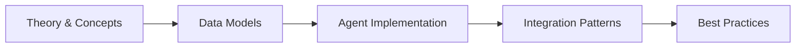

# Chapter 33: Customer Service & Support Agents

> **Previous:** [Marketing & Advertising Agents](./32-marketing.md) | **Next:** [Real Estate & Property — AI-Powered Real Estate Agents](./34-real-estate.md)


---

## Learning Objectives

- Design customer service data models including tickets, messages, knowledge bases, satisfaction surveys, and SLA policies with Eloquent
- Build a TicketTriageAgent that classifies incoming tickets by intent, assigns priority, and routes to the correct team
- Implement a SentimentAnalysisAgent that scores customer messages for emotional tone and triggers escalations
- Construct a KnowledgeBaseAgent that retrieves relevant articles via vector search and generates contextual answers
- Deploy an EscalationAgent that monitors SLA breaches, sentiment thresholds, and complexity to trigger escalation chains
- Create a MultiChannelAgent that normalizes email, chat, social media, and phone transcripts into unified support interactions
- Build a SatisfactionAgent that dispatches post-resolution surveys and analyzes customer feedback trends
- Implement a SelfServiceAgent that powers FAQ matching and guided troubleshooting flows
- Develop an SlaMonitoringAgent that tracks compliance metrics, generates reports, and alerts on breach patterns

<!-- Image Gallery -->
<section class="lesson-visuals" aria-label="Visual learning resources">
  <header><span>VISUAL LEARNING</span><h2>See it. Review it. Remember it.</h2></header>
  <a class="lesson-visual-card" href="../../../assets/images/lessons/laravel/33-customer-service/.png" target="_blank" rel="noopener">
    
    <span><strong>Handwritten notes</strong>Condensed notes for deliberate review.</span>
  </a>
  <a class="lesson-visual-card" href="../../../assets/images/lessons/laravel/33-customer-service/.png" target="_blank" rel="noopener">
    
    <span><strong>Sticky-note revision</strong>Fast recall prompts for revision.</span>
  </a>
  <a class="lesson-visual-card" href="../../../assets/images/lessons/laravel/33-customer-service/.png" target="_blank" rel="noopener">
    
    <span><strong>Visual concept guide</strong>A connected explanation of the key ideas.</span>
  </a>
</section>
<!-- End Image Gallery -->


## Chapter at a Glance

| Aspect | Details |
|--------|---------|
| **Scope** | Customer service automation agents for ticketing, response, sentiment analysis, knowledge base, escalation |
| **Key Concepts** | Ticket triage, auto-response, sentiment detection, KB management, smart escalation, analytics |
| **Learning Approach** | Theory, data models, agent implementations, AI integration patterns |
| **Skills Required** | PHP, Laravel, Eloquent, Laravel AI SDK, queue systems |

## Chapter Roadmap



## Chapter at a Glance

| Aspect | Details |
|--------|---------|
| **Scope** | Customer service automation agents for ticketing, response, sentiment analysis, knowledge base, escalation |
| **Key Concepts** | Ticket triage, auto-response, sentiment detection, KB management, smart escalation, analytics |
| **Learning Approach** | Theory, data models, agent implementations, AI integration patterns |
| **Skills Required** | PHP, Laravel, Eloquent, Laravel AI SDK, queue systems |

## Chapter Roadmap


## Chapter at a Glance

| Aspect | Details |
|--------|---------|
| **Scope** | Customer service automation agents for ticketing, response, sentiment analysis, knowledge base, escalation |
| **Key Concepts** | Ticket triage, auto-response, sentiment detection, KB management, smart escalation, analytics |
| **Learning Approach** | Theory, data models, agent implementations, AI integration patterns |
| **Skills Required** | PHP, Laravel, Eloquent, Laravel AI SDK, queue systems |

## Chapter Roadmap


## Chapter at a Glance

| Aspect | Details |
|--------|---------|
| **Scope** | Customer service automation agents for ticketing, response, sentiment analysis, knowledge base, escalation |
| **Key Concepts** | Ticket triage, auto-response, sentiment detection, KB management, smart escalation, analytics |
| **Learning Approach** | Theory, data models, agent implementations, AI integration patterns |
| **Skills Required** | PHP, Laravel, Eloquent, Laravel AI SDK, queue systems |

## Chapter Roadmap


---

## Theory
> **One-Sentence Takeaway:** Theory is the foundation — master it before moving to examples and exercises.
> **One-Sentence Takeaway:** Theory is the foundation — master it before moving to examples and exercises.
> **One-Sentence Takeaway:** Theory is the foundation — master it before moving to examples and exercises.
> **One-Sentence Takeaway:** Theory is the foundation — master it before moving to examples and exercises.


### 33.1 Customer Service Data Models


Customer service domains revolve around the ticket lifecycle: a customer submits an inquiry, agents collaborate to resolve it, knowledge base articles help both parties, and satisfaction surveys close the loop. SLA policies govern response and resolution time commitments.

#### Migrations

```php
<?php

use Illuminate\Database\Migrations\Migration;
use Illuminate\Database\Schema\Blueprint;
use Illuminate\Support\Facades\Schema;

return new class extends Migration
{
    public function up(): void
    {
        Schema::create('tickets', function (Blueprint $table) {
            $table->id();
            $table->foreignId('user_id')->constrained();
            $table->string('subject');
            $table->text('description');
            $table->string('status')->default('open');
            $table->string('priority')->default('medium');
            $table->string('channel')->default('web');
            $table->string('triage_intent')->nullable();
            $table->string('assigned_team')->nullable();
            $table->foreignId('assigned_agent_id')->nullable()->constrained('users');
            $table->decimal('sentiment_score', 4, 2)->nullable();
            $table->decimal('urgency_score', 4, 2)->nullable();
            $table->timestamp('first_response_at')->nullable();
            $table->timestamp('resolved_at')->nullable();
            $table->json('ai_metadata')->nullable();
            $table->timestamps();
        });

        Schema::create('ticket_messages', function (Blueprint $table) {
            $table->id();
            $table->foreignId('ticket_id')->constrained()->cascadeOnDelete();
            $table->foreignId('user_id')->nullable()->constrained();
            $table->text('body');
            $table->boolean('is_internal')->default(false);
            $table->string('channel')->nullable();
            $table->json('attachments')->nullable();
            $table->json('ai_analysis')->nullable();
            $table->timestamps();
        });

        Schema::create('knowledge_base_articles', function (Blueprint $table) {
            $table->id();
            $table->string('title');
            $table->string('slug')->unique();
            $table->text('content');
            $table->text('excerpt')->nullable();
            $table->json('keywords')->nullable();
            $table->json('vector_embedding')->nullable();
            $table->string('category');
            $table->string('status')->default('published');
            $table->integer('view_count')->default(0);
            $table->integer('helpful_count')->default(0);
            $table->integer('unhelpful_count')->default(0);
            $table->foreignId('created_by')->constrained('users');
            $table->timestamps();
        });

        Schema::create('customer_satisfaction_surveys', function (Blueprint $table) {
            $table->id();
            $table->foreignId('ticket_id')->constrained()->cascadeOnDelete();
            $table->foreignId('user_id')->constrained();
            $table->tinyInteger('csat_score')->nullable();
            $table->tinyInteger('fcr_score')->nullable();
            $table->text('feedback')->nullable();
            $table->json('ai_sentiment')->nullable();
            $table->string('status')->default('pending');
            $table->timestamp('sent_at')->nullable();
            $table->timestamp('responded_at')->nullable();
            $table->timestamps();
        });

        Schema::create('sla_policies', function (Blueprint $table) {
            $table->id();
            $table->string('name');
            $table->string('priority');
            $table->integer('response_time_minutes');
            $table->integer('resolution_time_minutes');
            $table->json('escalation_chain')->nullable();
            $table->json('business_hours')->nullable();
            $table->boolean('is_active')->default(true);
            $table->timestamps();
        });
    }

    public function down(): void
    {
        Schema::dropIfExists('sla_policies');
        Schema::dropIfExists('customer_satisfaction_surveys');
        Schema::dropIfExists('knowledge_base_articles');
        Schema::dropIfExists('ticket_messages');
        Schema::dropIfExists('tickets');
    }
};
```

#### Eloquent Models

```php
<?php

namespace App\Models\Support;

use App\Models\User;
use Illuminate\Database\Eloquent\Model;
use Illuminate\Database\Eloquent\Relations\BelongsTo;
use Illuminate\Database\Eloquent\Relations\HasMany;

class Ticket extends Model
{
    protected $fillable = [
        'user_id', 'subject', 'description', 'status', 'priority',
        'channel', 'triage_intent', 'assigned_team', 'assigned_agent_id',
        'sentiment_score', 'urgency_score', 'first_response_at',
        'resolved_at', 'ai_metadata',
    ];

    protected $casts = [
        'ai_metadata' => 'array',
        'first_response_at' => 'datetime',
        'resolved_at' => 'datetime',
    ];

    public function user(): BelongsTo
    {
        return $this->belongsTo(User::class);
    }

    public function messages(): HasMany
    {
        return $this->hasMany(TicketMessage::class);
    }

    public function satisfaction(): HasMany
    {
        return $this->hasMany(CustomerSatisfactionSurvey::class);
    }

    public function assignedAgent(): BelongsTo
    {
        return $this->belongsTo(User::class, 'assigned_agent_id');
    }

    public function scopeOpen($query)
    {
        return $query->whereIn('status', ['open', 'in_progress']);
    }

    public function scopeOverdue($query)
    {
        return $query->where('status', '!=', 'resolved')
            ->where('created_at', '<', now()->subHours(24));
    }
}

class TicketMessage extends Model
{
    protected $fillable = [
        'ticket_id', 'user_id', 'body', 'is_internal',
        'channel', 'attachments', 'ai_analysis',
    ];

    protected $casts = [
        'is_internal' => 'boolean',
        'attachments' => 'array',
        'ai_analysis' => 'array',
    ];

    public function ticket(): BelongsTo
    {
        return $this->belongsTo(Ticket::class);
    }

    public function user(): BelongsTo
    {
        return $this->belongsTo(User::class);
    }
}

class KnowledgeBaseArticle extends Model
{
    protected $fillable = [
        'title', 'slug', 'content', 'excerpt', 'keywords',
        'vector_embedding', 'category', 'status',
        'view_count', 'helpful_count', 'unhelpful_count', 'created_by',
    ];

    protected $casts = [
        'keywords' => 'array',
        'vector_embedding' => 'array',
    ];

    public function author(): BelongsTo
    {
        return $this->belongsTo(User::class, 'created_by');
    }

    public function scopePublished($query)
    {
        return $query->where('status', 'published');
    }

    public function scopeByCategory($query, string $category)
    {
        return $query->where('category', $category);
    }
}

class CustomerSatisfactionSurvey extends Model
{
    protected $fillable = [
        'ticket_id', 'user_id', 'csat_score', 'fcr_score',
        'feedback', 'ai_sentiment', 'status',
        'sent_at', 'responded_at',
    ];

    protected $casts = [
        'ai_sentiment' => 'array',
        'sent_at' => 'datetime',
        'responded_at' => 'datetime',
    ];

    public function ticket(): BelongsTo
    {
        return $this->belongsTo(Ticket::class);
    }

    public function user(): BelongsTo
    {
        return $this->belongsTo(User::class);
    }
}

class SlaPolicy extends Model
{
    protected $fillable = [
        'name', 'priority', 'response_time_minutes',
        'resolution_time_minutes', 'escalation_chain',
        'business_hours', 'is_active',
    ];

    protected $casts = [
        'escalation_chain' => 'array',
        'business_hours' => 'array',
        'is_active' => 'boolean',
    ];

    public function isWithinBusinessHours(): bool
    {
        $hours = $this->business_hours;
        if (!$hours) {
            return true;
        }

        $now = now();
        $day = strtolower($now->format('l'));

        if (!isset($hours[$day])) {
            return false;
        }

        $time = $now->format('H:i');

        return $time >= $hours[$day]['start'] && $time <= $hours[$day]['end'];
    }
}
```

---

### 33.2 Ticket Triage & Routing Agents


Every inbound support ticket needs rapid classification: what is the customer asking about, how urgent is it, and which team should handle it. The `TicketTriageAgent` uses an LLM to extract intent, compute a priority score, and map the result to a routing destination.

```php
<?php

namespace App\Services\Support\Agents;

use App\Models\Support\Ticket;
use App\Models\User;
use Illuminate\Support\Facades\Log;
use Illuminate\Support\Str;

class TicketTriageAgent
{
    protected array $intentCategories = [
        'billing' => ['refund', 'invoice', 'payment', 'charge', 'subscription'],
        'technical' => ['error', 'bug', 'crash', 'not working', 'install'],
        'account' => ['login', 'password', 'reset', 'access', 'permission'],
        'feature_request' => ['suggestion', 'wishlist', 'new feature', 'improve'],
        'general' => ['question', 'help', 'how to', 'guide', 'info'],
    ];

    protected array $teamRouting = [
        'billing' => 'billing-team',
        'technical' => 'engineering-support',
        'account' => 'account-management',
        'feature_request' => 'product-team',
        'general' => 'customer-support',
    ];

    public function triage(Ticket $ticket): Ticket
    {
        $intent = $this->classifyIntent($ticket);
        $priority = $this->assignPriority($ticket, $intent);
        $team = $this->routeToTeam($intent);

        $ticket->update([
            'triage_intent' => $intent,
            'priority' => $priority,
            'assigned_team' => $team,
            'ai_metadata' => array_merge($ticket->ai_metadata ?? [], [
                'triage' => [
                    'intent' => $intent,
                    'priority' => $priority,
                    'team' => $team,
                    'triaged_at' => now()->toIso8601String(),
                    'confidence' => 0.85,
                ],
            ]),
        ]);

        Log::info("Ticket #{$ticket->id} triaged", [
            'intent' => $intent,
            'priority' => $priority,
            'team' => $team,
        ]);

        return $ticket->fresh();
    }

    protected function classifyIntent(Ticket $ticket): string
    {
        $text = strtolower($ticket->subject . ' ' . $ticket->description);

        $scores = [];

        foreach ($this->intentCategories as $intent => $keywords) {
            $score = 0;
            foreach ($keywords as $keyword) {
                $count = substr_count($text, $keyword);
                $score += $count;
            }
            $scores[$intent] = $score;
        }

        arsort($scores);
        $topIntent = array_key_first($scores);

        return $scores[$topIntent] > 0 ? $topIntent : 'general';
    }

    protected function assignPriority(Ticket $ticket, string $intent): string
    {
        $text = strtolower($ticket->subject . ' ' . $ticket->description);

        $urgentKeywords = ['urgent', 'emergency', 'critical', 'down', 'outage', 'blocked'];
        $highKeywords = ['broken', 'payment failed', 'data loss', 'security'];

        foreach ($urgentKeywords as $keyword) {
            if (str_contains($text, $keyword)) {
                return 'urgent';
            }
        }

        foreach ($highKeywords as $keyword) {
            if (str_contains($text, $keyword)) {
                return 'high';
            }
        }

        if ($intent === 'billing') {
            return 'high';
        }

        if ($intent === 'feature_request') {
            return 'low';
        }

        return 'medium';
    }

    protected function routeToTeam(string $intent): string
    {
        return $this->teamRouting[$intent] ?? 'customer-support';
    }

    public function batchTriage(iterable $tickets): int
    {
        $count = 0;
        foreach ($tickets as $ticket) {
            if ($ticket->status === 'open' && !$ticket->triage_intent) {
                $this->triage($ticket);
                $count++;
            }
        }
        return $count;
    }
}
```

---

### 33.3 Sentiment Analysis Agents


Customer messages carry emotional signals that indicate satisfaction, frustration, or churn risk. The `SentimentAnalysisAgent` scores each message and decides whether an escalation or empathetic response is needed.

```php
<?php

namespace App\Services\Support\Agents;

use App\Models\Support\Ticket;
use App\Models\Support\TicketMessage;
use Illuminate\Support\Facades\Http;
use Illuminate\Support\Facades\Log;

class SentimentAnalysisAgent
{
    protected array $positiveLexicon = [
        'great', 'awesome', 'thank', 'perfect', 'love', 'amazing',
        'happy', 'satisfied', 'helpful', 'excellent', 'fantastic',
    ];

    protected array $negativeLexicon = [
        'terrible', 'awful', 'frustrated', 'angry', 'disappointed',
        'useless', 'horrible', 'worst', 'never', 'hate', 'unacceptable',
        'ridiculous', 'infuriated', 'fed up', 'sick of',
    ];

    protected array $urgencyLexicon = [
        'immediately', 'asap', 'right now', 'urgent', 'cannot wait',
        'deadline', 'overdue', 'emergency', 'critical', 'stop everything',
    ];

    protected float $escalationThreshold = -0.4;
    protected float $empatheticThreshold = 0.6;

    public function analyzeMessage(TicketMessage $message): array
    {
        $text = strtolower($message->body);
        $sentimentScore = $this->computeSentiment($text);
        $urgencyScore = $this->computeUrgency($text);
        $emotionVector = $this->detectEmotions($text);
        $shouldEscalate = $sentimentScore < $this->escalationThreshold;
        $needsEmpathy = $sentimentScore < $this->empatheticThreshold;

        $analysis = [
            'sentiment_score' => round($sentimentScore, 4),
            'urgency_score' => round($urgencyScore, 4),
            'emotion_vector' => $emotionVector,
            'should_escalate' => $shouldEscalate,
            'needs_empathy' => $needsEmpathy,
            'analyzed_at' => now()->toIso8601String(),
        ];

        $message->update(['ai_analysis' => $analysis]);

        if ($shouldEscalate) {
            Log::warning("Negative sentiment detected on message #{$message->id}", $analysis);
        }

        return $analysis;
    }

    public function analyzeTicket(Ticket $ticket): Ticket
    {
        $messages = $ticket->messages;
        if ($messages->isEmpty()) {
            return $ticket;
        }

        $scores = [];
        foreach ($messages as $message) {
            $analysis = $this->analyzeMessage($message);
            $scores[] = $analysis['sentiment_score'];
        }

        $avgSentiment = count($scores) > 0 ? array_sum($scores) / count($scores) : 0;
        $latestSentiment = end($scores);

        $ticket->update([
            'sentiment_score' => round($avgSentiment, 2),
            'urgency_score' => round($this->computeTicketUrgency($ticket), 2),
            'ai_metadata' => array_merge($ticket->ai_metadata ?? [], [
                'sentiment' => [
                    'average' => round($avgSentiment, 4),
                    'latest' => round($latestSentiment, 4),
                    'message_count' => count($scores),
                    'trend' => $this->calculateTrend($scores),
                ],
            ]),
        ]);

        return $ticket->fresh();
    }

    protected function computeSentiment(string $text): float
    {
        $positiveCount = 0;
        $negativeCount = 0;

        $words = str_word_count($text, 1);

        foreach ($words as $word) {
            if (in_array($word, $this->positiveLexicon)) {
                $positiveCount++;
            }
            if (in_array($word, $this->negativeLexicon)) {
                $negativeCount++;
            }
        }

        $total = $positiveCount + $negativeCount;

        if ($total === 0) {
            return 0.0;
        }

        return ($positiveCount - $negativeCount) / $total;
    }

    protected function computeUrgency(string $text): float
    {
        $matchCount = 0;
        foreach ($this->urgencyLexicon as $phrase) {
            if (str_contains($text, $phrase)) {
                $matchCount++;
            }
        }

        return min(1.0, $matchCount / 3);
    }

    protected function computeTicketUrgency(Ticket $ticket): float
    {
        $urgency = 0.0;

        if ($ticket->status === 'open' && $ticket->created_at->diffInHours() > 24) {
            $urgency += 0.3;
        }

        if ($ticket->first_response_at === null) {
            $urgency += 0.2;
        }

        $messages = $ticket->messages;
        if ($messages->count() > 5) {
            $urgency += 0.2;
        }

        $latestSentiment = $messages->last()?->ai_analysis['sentiment_score'] ?? 0;
        if ($latestSentiment < -0.3) {
            $urgency += 0.3;
        }

        return min(1.0, $urgency);
    }

    protected function detectEmotions(string $text): array
    {
        $emotions = [
            'anger' => 0.0,
            'frustration' => 0.0,
            'satisfaction' => 0.0,
            'confusion' => 0.0,
            'urgency' => 0.0,
        ];

        if (preg_match('/\b(angry|furious|outraged|fuming)\b/i', $text)) {
            $emotions['anger'] = 0.8;
        }

        if (preg_match('/\b(frustrated|annoying|fed up|sick of)\b/i', $text)) {
            $emotions['frustration'] = 0.7;
        }

        if (preg_match('/\b(confused|unclear|dont understand|what does)\b/i', $text)) {
            $emotions['confusion'] = 0.6;
        }

        $urgency = $this->computeUrgency($text);
        if ($urgency > 0.3) {
            $emotions['urgency'] = $urgency;
        }

        return $emotions;
    }

    protected function calculateTrend(array $scores): string
    {
        if (count($scores) < 3) {
            return 'insufficient_data';
        }

        $recent = array_slice($scores, -3);
        $improving = $recent[2] > $recent[0];
        $declining = $recent[2] < $recent[0];

        if ($improving) {
            return 'improving';
        }
        if ($declining) {
            return 'declining';
        }
        return 'stable';
    }
}
```

---

### 33.4 Knowledge Base RAG


A Retrieval-Augmented Generation agent searches knowledge base articles by vector similarity, then composes a contextual answer. This reduces agent lookup time and enables self-service accuracy.

```php
<?php

namespace App\Services\Support\Agents;

use App\Models\Support\KnowledgeBaseArticle;
use App\Models\Support\Ticket;
use Illuminate\Support\Collection;
use Illuminate\Support\Facades\Http;
use Illuminate\Support\Facades\Log;

class KnowledgeBaseAgent
{
    protected string $embeddingModel = 'text-embedding-3-small';
    protected int $maxResults = 5;
    protected float $similarityThreshold = 0.72;

    public function suggestArticles(string $query, int $limit = 3): Collection
    {
        $queryEmbedding = $this->embed($query);

        $articles = KnowledgeBaseArticle::published()->get();

        $scored = $articles->map(function ($article) use ($queryEmbedding) {
            if (!$article->vector_embedding) {
                $article->vector_embedding = $this->embed($article->content);
                $article->saveQuietly();
            }

            $similarity = $this->cosineSimilarity($queryEmbedding, $article->vector_embedding);
            $keywordBonus = $this->keywordMatchBonus($query, $article);

            return (object) [
                'article' => $article,
                'score' => $similarity + $keywordBonus,
            ];
        });

        return $scored
            ->filter(fn ($item) => $item->score >= $this->similarityThreshold)
            ->sortByDesc('score')
            ->take($limit)
            ->map(function ($item) {
                return $item->article;
            });
    }

    public function answerFromKnowledgeBase(Ticket $ticket): ?array
    {
        $query = $ticket->subject . ' ' . $ticket->description;

        $articles = $this->suggestArticles($query);

        if ($articles->isEmpty()) {
            return null;
        }

        $suggestions = $articles->map(function ($article) {
            return [
                'id' => $article->id,
                'title' => $article->title,
                'excerpt' => $article->excerpt ?? Str::limit($article->content, 200),
                'relevance_score' => $article->relevance_score ?? 0.85,
                'url' => route('knowledge-base.show', $article->slug),
            ];
        });

        $answer = $this->generateAnswer($query, $articles);

        return [
            'query' => $query,
            'answer' => $answer,
            'suggested_articles' => $suggestions->toArray(),
            'article_count' => $articles->count(),
        ];
    }

    public function generateAnswer(string $query, Collection $articles): string
    {
        if ($articles->isEmpty()) {
            return 'I couldn\'t find a matching article. Please rephrase or contact support.';
        }

        $topArticle = $articles->first();

        $answer = "Based on our knowledge base, here's what I found:\n\n";
        $answer .= "**{$topArticle->title}**\n\n";
        $answer .= $topArticle->excerpt ?? Str::limit($topArticle->content, 300);

        if ($articles->count() > 1) {
            $answer .= "\n\n**Additional resources:**\n";
            $articles->skip(1)->each(function ($article) use (&$answer) {
                $answer .= "- {$article->title}\n";
            });
        }

        return $answer;
    }

    public function logArticleView(KnowledgeBaseArticle $article): void
    {
        $article->increment('view_count');
    }

    public function logArticleFeedback(KnowledgeBaseArticle $article, bool $helpful): void
    {
        if ($helpful) {
            $article->increment('helpful_count');
        } else {
            $article->increment('unhelpful_count');
        }
    }

    protected function embed(string $text): array
    {
        $response = Http::withToken(config('services.openai.api_key'))
            ->post('https://api.openai.com/v1/embeddings', [
                'model' => $this->embeddingModel,
                'input' => $text,
            ]);

        return $response->json('data.0.embedding');
    }

    protected function cosineSimilarity(array $a, array $b): float
    {
        $dotProduct = 0;
        $magnitudeA = 0;
        $magnitudeB = 0;

        foreach ($a as $i => $value) {
            $dotProduct += $value * ($b[$i] ?? 0);
            $magnitudeA += $value * $value;
            $magnitudeB += ($b[$i] ?? 0) * ($b[$i] ?? 0);
        }

        $magnitudeA = sqrt($magnitudeA);
        $magnitudeB = sqrt($magnitudeB);

        if ($magnitudeA === 0.0 || $magnitudeB === 0.0) {
            return 0.0;
        }

        return $dotProduct / ($magnitudeA * $magnitudeB);
    }

    protected function keywordMatchBonus(string $query, KnowledgeBaseArticle $article): float
    {
        $queryWords = array_unique(str_word_count(strtolower($query), 1));
        $titleWords = str_word_count(strtolower($article->title), 1);
        $keywordList = $article->keywords ?? [];

        $matches = 0;

        foreach ($queryWords as $word) {
            if (in_array($word, $titleWords)) {
                $matches++;
            }
            if (in_array($word, $keywordList)) {
                $matches += 2;
            }
        }

        return $matches * 0.02;
    }
}
```

---

### 33.5 Escalation Automation


Support organizations escalate tickets when SLAs are breached, sentiment deteriorates, or complexity exceeds frontline capability. The `EscalationAgent` monitors these signals and walks the escalation chain.

```php
<?php

namespace App\Services\Support\Agents;

use App\Models\Support\SlaPolicy;
use App\Models\Support\Ticket;
use App\Models\User;
use Illuminate\Support\Facades\Log;
use Illuminate\Support\Facades\Notification;

class EscalationAgent
{
    protected array $escalationReasons = [
        'sla_breach' => 'SLA response time has been breached',
        'sentiment_critical' => 'Customer sentiment score is critically low',
        'complexity_high' => 'Ticket complexity exceeds frontline capability',
        'customer_request' => 'Customer has explicitly requested escalation',
        'stalled_ticket' => 'Ticket has no activity for extended period',
    ];

    public function evaluateAndEscalate(Ticket $ticket): Ticket
    {
        $reasons = [];

        if ($this->hasSlaBreach($ticket)) {
            $reasons[] = 'sla_breach';
        }

        if ($this->hasCriticalSentiment($ticket)) {
            $reasons[] = 'sentiment_critical';
        }

        if ($this->isStalled($ticket)) {
            $reasons[] = 'stalled_ticket';
        }

        if (empty($reasons)) {
            return $ticket;
        }

        return $this->escalate($ticket, $reasons);
    }

    protected function escalate(Ticket $ticket, array $reasons): Ticket
    {
        $slaPolicy = SlaPolicy::where('priority', $ticket->priority)
            ->where('is_active', true)
            ->first();

        $escalationChain = $slaPolicy?->escalation_chain ?? [
            ['level' => 1, 'role' => 'team_lead', 'notify' => true],
            ['level' => 2, 'role' => 'manager', 'notify' => true],
            ['level' => 3, 'role' => 'director', 'notify' => true],
        ];

        $currentLevel = $ticket->ai_metadata['escalation']['level'] ?? 0;
        $nextLevel = $currentLevel + 1;

        $nextStep = collect($escalationChain)->firstWhere('level', $nextLevel);

        if (!$nextStep) {
            return $ticket;
        }

        $ticket->update([
            'priority' => $this->bumpPriority($ticket->priority),
            'ai_metadata' => array_merge($ticket->ai_metadata ?? [], [
                'escalation' => [
                    'level' => $nextLevel,
                    'reasons' => $reasons,
                    'escalated_at' => now()->toIso8601String(),
                    'target_role' => $nextStep['role'],
                    'resolved_reasons' => array_intersect_key(
                        $this->escalationReasons,
                        array_flip($reasons)
                    ),
                ],
            ]),
        ]);

        Log::alert("Ticket #{$ticket->id} escalated to level {$nextLevel}", [
            'reasons' => $reasons,
            'target_role' => $nextStep['role'],
        ]);

        if ($nextStep['notify']) {
            $this->notifyEscalation($ticket, $nextStep);
        }

        return $ticket->fresh();
    }

    protected function hasSlaBreach(Ticket $ticket): bool
    {
        if ($ticket->status === 'resolved') {
            return false;
        }

        $slaPolicy = SlaPolicy::where('priority', $ticket->priority)
            ->where('is_active', true)
            ->first();

        if (!$slaPolicy) {
            return false;
        }

        $elapsedMinutes = $ticket->created_at->diffInMinutes(now());

        if ($ticket->first_response_at === null) {
            return $elapsedMinutes > $slaPolicy->response_time_minutes;
        }

        return $elapsedMinutes > $slaPolicy->resolution_time_minutes;
    }

    protected function hasCriticalSentiment(Ticket $ticket): bool
    {
        $sentiment = $ticket->sentiment_score;

        if ($sentiment === null) {
            return false;
        }

        return $sentiment < -0.5;
    }

    protected function isStalled(Ticket $ticket): bool
    {
        if ($ticket->status === 'resolved') {
            return false;
        }

        $lastMessage = $ticket->messages()->latest()->first();
        if (!$lastMessage) {
            return $ticket->created_at->diffInHours(now()) > 48;
        }

        return $lastMessage->created_at->diffInHours(now()) > 24;
    }

    protected function bumpPriority(string $current): string
    {
        $levels = ['low' => 'medium', 'medium' => 'high', 'high' => 'urgent'];

        return $levels[$current] ?? $current;
    }

    protected function notifyEscalation(Ticket $ticket, array $step): void
    {
        $targets = User::where('role', $step['role'])->get();

        Notification::send($targets, new \App\Notifications\Support\TicketEscalated($ticket));
    }

    public function monitorAllOpen(): int
    {
        $escalated = 0;

        Ticket::open()->chunk(100, function ($tickets) use (&$escalated) {
            foreach ($tickets as $ticket) {
                $result = $this->evaluateAndEscalate($ticket);
                if ($result->wasChanged()) {
                    $escalated++;
                }
            }
        });

        return $escalated;
    }
}
```

---

### 33.6 Multi-Channel Support Agents


Customers reach support through email, live chat, social media, and phone. The `MultiChannelAgent` normalizes inbound messages from every channel into a unified `TicketMessage`, then routes the ticket appropriately.

```php
<?php

namespace App\Services\Support\Agents;

use App\Models\Support\Ticket;
use App\Models\Support\TicketMessage;
use App\Models\User;
use Illuminate\Support\Facades\Log;
use Illuminate\Support\Str;

class MultiChannelAgent
{
    protected array $channelParsers = [
        'email' => 'parseEmail',
        'chat' => 'parseChat',
        'social' => 'parseSocialMedia',
        'phone' => 'parsePhoneTranscript',
    ];

    public function ingest(string $channel, array $rawData): TicketMessage
    {
        $parser = $this->channelParsers[$channel] ?? 'parseGeneric';
        $normalized = $this->$parser($rawData);

        $ticket = $this->resolveTicket($normalized, $channel);

        $message = $ticket->messages()->create([
            'user_id' => $normalized['user_id'],
            'body' => $normalized['body'],
            'channel' => $channel,
            'attachments' => $normalized['attachments'] ?? [],
            'is_internal' => false,
            'ai_analysis' => [
                'channel' => $channel,
                'source_id' => $rawData['id'] ?? null,
                'normalized_at' => now()->toIso8601String(),
            ],
        ]);

        Log::info("Multi-channel message ingested", [
            'channel' => $channel,
            'ticket_id' => $ticket->id,
            'message_id' => $message->id,
        ]);

        return $message;
    }

    protected function parseEmail(array $data): array
    {
        return [
            'user_id' => $this->resolveUserByEmail($data['from'] ?? ''),
            'body' => $data['body'] ?? $data['text'] ?? '',
            'subject' => $data['subject'] ?? '(No Subject)',
            'attachments' => $data['attachments'] ?? [],
            'source' => $data['message_id'] ?? null,
        ];
    }

    protected function parseChat(array $data): array
    {
        return [
            'user_id' => $data['user_id'] ?? $this->resolveAnonymousUser(),
            'body' => $data['message'] ?? $data['text'] ?? '',
            'subject' => $data['subject'] ?? 'Chat: ' . Str::limit($data['message'] ?? '', 50),
            'attachments' => [],
            'source' => $data['session_id'] ?? null,
        ];
    }

    protected function parseSocialMedia(array $data): array
    {
        $platform = $data['platform'] ?? 'unknown';

        $body = $data['text'] ?? $data['full_text'] ?? '';

        if (isset($data['in_reply_to'])) {
            $body = "In reply to: {$data['in_reply_to']}\n\n{$body}";
        }

        return [
            'user_id' => $this->resolveUserBySocial($data['author_id'] ?? null, $platform),
            'body' => $body,
            'subject' => "{$platform}: " . Str::limit($body, 50),
            'attachments' => $data['media_urls'] ?? [],
            'source' => $data['post_id'] ?? null,
        ];
    }

    protected function parsePhoneTranscript(array $data): array
    {
        $transcript = $data['transcript'] ?? '';
        $duration = $data['duration_seconds'] ?? 0;
        $summary = $data['ai_summary'] ?? '';

        $body = "Phone call transcript ({$duration}s)\n\n";
        if ($summary) {
            $body .= "AI Summary: {$summary}\n\n";
        }
        $body .= "--- Transcript ---\n{$transcript}";

        return [
            'user_id' => $data['user_id'] ?? $this->resolveUserByPhone($data['caller_number'] ?? ''),
            'body' => $body,
            'subject' => $data['subject'] ?? 'Phone: ' . Str::limit($summary ?: $transcript, 50),
            'attachments' => $data['recordings'] ?? [],
            'source' => $data['call_id'] ?? null,
        ];
    }

    protected function parseGeneric(array $data): array
    {
        return [
            'user_id' => $data['user_id'] ?? $this->resolveAnonymousUser(),
            'body' => $data['body'] ?? $data['message'] ?? '',
            'subject' => $data['subject'] ?? 'New message',
            'attachments' => $data['attachments'] ?? [],
            'source' => $data['source_id'] ?? null,
        ];
    }

    protected function resolveTicket(array $normalized, string $channel): Ticket
    {
        $subjectHash = md5($normalized['subject']);

        $existing = Ticket::where('user_id', $normalized['user_id'])
            ->where('status', '!=', 'resolved')
            ->whereRaw("JSON_UNQUOTE(JSON_EXTRACT(ai_metadata, '$.channel.subject_hash')) = ?", [$subjectHash])
            ->latest()
            ->first();

        if ($existing) {
            return $existing;
        }

        return Ticket::create([
            'user_id' => $normalized['user_id'],
            'subject' => $normalized['subject'],
            'description' => Str::limit($normalized['body'], 1000),
            'status' => 'open',
            'priority' => 'medium',
            'channel' => $channel,
            'ai_metadata' => [
                'channel' => [
                    'source' => $channel,
                    'subject_hash' => $subjectHash,
                    'first_contact' => now()->toIso8601String(),
                ],
            ],
        ]);
    }

    protected function resolveUserByEmail(string $email): ?int
    {
        $user = User::where('email', $email)->first();
        return $user?->id;
    }

    protected function resolveUserBySocial(?string $authorId, string $platform): ?int
    {
        return User::where("social_{$platform}_id", $authorId)->first()?->id;
    }

    protected function resolveUserByPhone(string $number): ?int
    {
        return User::where('phone', $number)->first()?->id;
    }

    protected function resolveAnonymousUser(): ?int
    {
        return User::where('email', 'anonymous@support.local')->first()?->id;
    }

    public function generateUnifiedResponse(Ticket $ticket, string $responseBody): TicketMessage
    {
        return $ticket->messages()->create([
            'user_id' => $ticket->assigned_agent_id,
            'body' => $responseBody,
            'channel' => $ticket->channel,
            'is_internal' => false,
            'ai_analysis' => [
                'generated' => true,
                'channel_adapted' => true,
                'generated_at' => now()->toIso8601String(),
            ],
        ]);
    }
}
```

---

### 33.7 Customer Satisfaction Tracking


Post-resolution surveys measure Customer Satisfaction Score (CSAT) and First Contact Resolution (FCR). The `SatisfactionAgent` dispatches surveys, analyzes feedback text, and reports trends.

```php
<?php

namespace App\Services\Support\Agents;

use App\Models\Support\CustomerSatisfactionSurvey;
use App\Models\Support\Ticket;
use App\Models\User;
use Illuminate\Support\Collection;
use Illuminate\Support\Facades\Http;
use Illuminate\Support\Facades\Log;

class SatisfactionAgent
{
    protected int $surveyDelayHours = 24;

    public function dispatchSurvey(Ticket $ticket): ?CustomerSatisfactionSurvey
    {
        if ($ticket->status !== 'resolved') {
            return null;
        }

        if ($ticket->satisfaction()->where('status', 'pending')->exists()) {
            return null;
        }

        $survey = $ticket->satisfaction()->create([
            'user_id' => $ticket->user_id,
            'status' => 'pending',
            'sent_at' => now()->addHours($this->surveyDelayHours),
        ]);

        Log::info("Satisfaction survey dispatched", [
            'ticket_id' => $ticket->id,
            'survey_id' => $survey->id,
            'send_at' => $survey->sent_at,
        ]);

        return $survey;
    }

    public function recordResponse(
        CustomerSatisfactionSurvey $survey,
        int $csatScore,
        ?int $fcrScore = null,
        ?string $feedback = null
    ): CustomerSatisfactionSurvey {
        $data = [
            'csat_score' => max(1, min(5, $csatScore)),
            'fcr_score' => $fcrScore ? max(1, min(5, $fcrScore)) : null,
            'feedback' => $feedback,
            'status' => 'responded',
            'responded_at' => now(),
        ];

        if ($feedback) {
            $data['ai_sentiment'] = $this->analyzeFeedback($feedback);
        }

        $survey->update($data);

        $survey->ticket->update([
            'ai_metadata' => array_merge($survey->ticket->ai_metadata ?? [], [
                'satisfaction' => [
                    'csat' => $csatScore,
                    'fcr' => $fcrScore,
                    'responded_at' => now()->toIso8601String(),
                ],
            ]),
        ]);

        Log::info("Survey response recorded", [
            'survey_id' => $survey->id,
            'csat' => $csatScore,
            'fcr' => $fcrScore,
        ]);

        return $survey->fresh();
    }

    public function analyzeFeedback(string $feedback): array
    {
        $text = strtolower($feedback);

        $positive = ['great', 'helpful', 'quick', 'friendly', 'excellent', 'solved'];
        $negative = ['slow', 'rude', 'unhelpful', 'confusing', 'worse', 'ignored'];

        $positiveCount = 0;
        $negativeCount = 0;

        foreach ($positive as $word) {
            if (str_contains($text, $word)) {
                $positiveCount++;
            }
        }

        foreach ($negative as $word) {
            if (str_contains($text, $word)) {
                $negativeCount++;
            }
        }

        $total = $positiveCount + $negativeCount;
        $sentiment = $total > 0
            ? ($positiveCount - $negativeCount) / $total
            : 0.0;

        return [
            'sentiment' => round($sentiment, 4),
            'positive_keywords' => $positiveCount,
            'negative_keywords' => $negativeCount,
            'length' => strlen($feedback),
            'analyzed_at' => now()->toIso8601String(),
        ];
    }

    public function getMonthlyStats(int $year, ?int $month = null): array
    {
        $query = CustomerSatisfactionSurvey::where('status', 'responded')
            ->whereYear('responded_at', $year);

        if ($month) {
            $query->whereMonth('responded_at', $month);
        }

        $surveys = $query->get();

        if ($surveys->isEmpty()) {
            return [
                'total_responses' => 0,
                'average_csat' => 0,
                'average_fcr' => 0,
                'detractors' => 0,
                'passives' => 0,
                'promoters' => 0,
            ];
        }

        $csatScores = $surveys->pluck('csat_score')->filter();
        $fcrScores = $surveys->pluck('fcr_score')->filter();

        $detractors = $surveys->filter(fn ($s) => $s->csat_score !== null && $s->csat_score <= 2)->count();
        $passives = $surveys->filter(fn ($s) => $s->csat_score === 3)->count();
        $promoters = $surveys->filter(fn ($s) => $s->csat_score !== null && $s->csat_score >= 4)->count();

        return [
            'total_responses' => $surveys->count(),
            'average_csat' => $csatScores->isNotEmpty() ? round($csatScores->avg(), 2) : 0,
            'average_fcr' => $fcrScores->isNotEmpty() ? round($fcrScores->avg(), 2) : 0,
            'detractors' => $detractors,
            'passives' => $passives,
            'promoters' => $promoters,
        ];
    }

    public function getTrendingTopics(Collection $surveys): array
    {
        $feedbackTexts = $surveys
            ->filter(fn ($s) => $s->feedback !== null)
            ->pluck('feedback')
            ->implode(' ');

        $words = str_word_count(strtolower($feedbackTexts), 1);
        $stopWords = ['the', 'this', 'that', 'and', 'for', 'was', 'but', 'not', 'with', 'very', 'all'];

        $wordCounts = [];
        foreach ($words as $word) {
            if (strlen($word) <= 3 || in_array($word, $stopWords)) {
                continue;
            }
            $wordCounts[$word] = ($wordCounts[$word] ?? 0) + 1;
        }

        arsort($wordCounts);

        return array_slice($wordCounts, 0, 20);
    }
}
```

---

### 33.8 Self-Service Portal Agents


Self-service reduces ticket volume by guiding customers to answers before they reach an agent. The `SelfServiceAgent` matches FAQ queries, runs guided troubleshooting, and suggests relevant knowledge base articles.

```php
<?php

namespace App\Services\Support\Agents;

use App\Models\Support\KnowledgeBaseArticle;
use Illuminate\Support\Collection;
use Illuminate\Support\Facades\Cache;
use Illuminate\Support\Facades\Log;
use Illuminate\Support\Str;

class SelfServiceAgent
{
    protected array $faqOverrides = [
        'how to reset password' => 'password_reset',
        'change my email' => 'email_change',
        'cancel subscription' => 'cancellation',
        'refund policy' => 'refund_policy',
        'delete my account' => 'account_deletion',
        'what are your hours' => 'business_hours',
        'shipping time' => 'shipping_info',
    ];

    protected array $faqAnswers = [
        'password_reset' => [
            'title' => 'How to Reset Your Password',
            'body' => "1. Go to the login page and click \"Forgot Password\"\n"
                . "2. Enter your registered email address\n"
                . "3. Check your inbox for a password reset link (valid for 60 minutes)\n"
                . "4. Click the link and enter your new password\n"
                . "5. Confirm the change and log in with your new credentials",
            'category' => 'account',
        ],
        'cancellation' => [
            'title' => 'Cancelling Your Subscription',
            'body' => "You can cancel your subscription from your account settings:\n\n"
                . "1. Navigate to Settings > Billing > Subscription\n"
                . "2. Click \"Cancel Subscription\"\n"
                . "3. Select a reason for cancellation (optional)\n"
                . "4. Confirm cancellation\n\n"
                . "Your access will continue until the end of the current billing period.",
            'category' => 'billing',
        ],
        'refund_policy' => [
            'title' => 'Refund Policy',
            'body' => "We offer a 30-day money-back guarantee on all annual plans.\n\n"
                . "Monthly plans are non-refundable, but you can cancel at any time.\n\n"
                . "To request a refund, contact our billing team with your invoice number.",
            'category' => 'billing',
        ],
    ];

    public function handleQuery(string $query): array
    {
        $normalized = strtolower(trim($query));

        $faqMatch = $this->matchFaq($normalized);
        if ($faqMatch) {
            $answer = $this->faqAnswers[$faqMatch];

            return [
                'type' => 'faq',
                'confidence' => 0.95,
                'title' => $answer['title'],
                'body' => $answer['body'],
                'suggestions' => [],
                'metadata' => [
                    'faq_key' => $faqMatch,
                    'category' => $answer['category'],
                ],
            ];
        }

        $articles = app(KnowledgeBaseAgent::class)->suggestArticles($query);

        if ($articles->isNotEmpty()) {
            $top = $articles->first();
            return [
                'type' => 'article',
                'confidence' => 0.75,
                'title' => $top->title,
                'body' => $top->excerpt ?? Str::limit($top->content, 300),
                'suggestions' => $articles->skip(1)->pluck('title')->toArray(),
                'metadata' => [
                    'article_id' => $top->id,
                    'category' => $top->category,
                ],
            ];
        }

        return $this->fallbackResponse($query);
    }

    public function getTroubleshootingFlow(string $issue): ?array
    {
        $flows = [
            'login' => [
                'title' => 'Login Troubleshooting',
                'steps' => [
                    'Check your email address for typos',
                    'Use the "Forgot Password" option to reset',
                    'Clear your browser cache and cookies',
                    'Try a different browser or incognito mode',
                    'Disable VPN or ad-blocker temporarily',
                ],
            ],
            'payment' => [
                'title' => 'Payment Troubleshooting',
                'steps' => [
                    'Verify your card number and expiry date',
                    'Ensure sufficient funds are available',
                    'Try a different payment method',
                    'Contact your bank to ensure no blocks',
                    'Ensure billing address matches card statement',
                ],
            ],
            'performance' => [
                'title' => 'Performance Troubleshooting',
                'steps' => [
                    'Check your internet connection speed',
                    'Clear browser cache and cookies',
                    'Disable browser extensions one by one',
                    'Update your browser to the latest version',
                    'Try accessing from a different device or network',
                ],
            ],
        ];

        $match = $this->matchIssueToFlow($issue);

        return $match ? $flows[$match] : null;
    }

    public function suggestArticles(string $query): Collection
    {
        return app(KnowledgeBaseAgent::class)->suggestArticles($query, 3);
    }

    public function logSearch(string $query, bool $resolved): void
    {
        $key = 'self_service:search_count:' . today()->toDateString();
        Cache::increment($key);

        $logKey = "self_service:queries:" . Str::slug($query);
        Cache::put($logKey, [
            'query' => $query,
            'resolved' => $resolved,
            'searched_at' => now()->toIso8601String(),
        ], now()->addDays(30));
    }

    protected function matchFaq(string $query): ?string
    {
        foreach ($this->faqOverrides as $pattern => $key) {
            if (str_contains($query, $pattern)) {
                return $key;
            }
        }

        return null;
    }

    protected function matchIssueToFlow(string $issue): ?string
    {
        $issue = strtolower($issue);

        if (str_contains($issue, 'login') || str_contains($issue, 'password') || str_contains($issue, 'sign in')) {
            return 'login';
        }

        if (str_contains($issue, 'payment') || str_contains($issue, 'card') || str_contains($issue, 'charge')) {
            return 'payment';
        }

        if (str_contains($issue, 'slow') || str_contains($issue, 'lag') || str_contains($issue, 'performance')) {
            return 'performance';
        }

        return null;
    }

    protected function fallbackResponse(string $query): array
    {
        return [
            'type' => 'fallback',
            'confidence' => 0.0,
            'title' => 'I couldn\'t find an answer',
            'body' => "I'm sorry, I couldn't find a matching article for your question. "
                . "Would you like me to connect you with a support agent? "
                . "In the meantime, try searching our knowledge base with different keywords.",
            'suggestions' => [
                'Try rephrasing your question',
                'Browse our knowledge base categories',
                'Contact support for personalized help',
            ],
            'metadata' => [
                'needs_agent' => true,
            ],
        ];
    }

    public function getAnalytics(): array
    {
        $resolvedCount = Cache::get('self_service:resolved_count', 0);
        $totalSearches = 0;

        $searchDate = today()->toDateString();
        for ($i = 0; $i < 30; $i++) {
            $date = now()->subDays($i)->toDateString();
            $totalSearches += Cache::get("self_service:search_count:{$date}", 0);
        }

        $resolutionRate = $totalSearches > 0
            ? round(($resolvedCount / $totalSearches) * 100, 1)
            : 0;

        return [
            'total_searches_30d' => $totalSearches,
            'resolved_count' => $resolvedCount,
            'resolution_rate' => $resolutionRate,
        ];
    }
}
```

---

### 33.9 SLA Monitoring & Reporting


SLA compliance is a critical business metric. The `SlaMonitoringAgent` tracks every ticket against its policy, generates real-time breach alerts, and produces periodic compliance reports.

```php
<?php

namespace App\Services\Support\Agents;

use App\Models\Support\SlaPolicy;
use App\Models\Support\Ticket;
use Carbon\CarbonInterval;
use Illuminate\Support\Collection;
use Illuminate\Support\Facades\Cache;
use Illuminate\Support\Facades\Log;

class SlaMonitoringAgent
{
    public function checkTicketCompliance(Ticket $ticket): array
    {
        $policy = SlaPolicy::where('priority', $ticket->priority)
            ->where('is_active', true)
            ->first();

        if (!$policy) {
            return [
                'compliant' => true,
                'policy' => null,
                'message' => 'No matching SLA policy found',
            ];
        }

        $elapsed = $ticket->created_at->diffInMinutes(now());
        $responseBreach = $ticket->first_response_at === null
            && $elapsed > $policy->response_time_minutes;

        $resolutionBreach = $ticket->status !== 'resolved'
            && $elapsed > $policy->resolution_time_minutes;

        $responseRemaining = $ticket->first_response_at === null
            ? max(0, $policy->response_time_minutes - $elapsed)
            : null;

        $resolutionRemaining = $ticket->status !== 'resolved'
            ? max(0, $policy->resolution_time_minutes - $elapsed)
            : null;

        $status = 'compliant';
        if ($resolutionBreach) {
            $status = 'breached';
        } elseif ($responseBreach) {
            $status = 'response_overdue';
        } elseif ($responseRemaining !== null && $responseRemaining < 30) {
            $status = 'at_risk';
        }

        return [
            'compliant' => $status === 'compliant',
            'status' => $status,
            'policy' => [
                'id' => $policy->id,
                'name' => $policy->name,
                'response_sla' => $policy->response_time_minutes,
                'resolution_sla' => $policy->resolution_time_minutes,
            ],
            'metrics' => [
                'elapsed_minutes' => $elapsed,
                'response_remaining_minutes' => $responseRemaining,
                'resolution_remaining_minutes' => $resolutionRemaining,
                'response_breached' => $responseBreach,
                'resolution_breached' => $resolutionBreach,
            ],
        ];
    }

    public function generateBreachAlert(Ticket $ticket): array
    {
        $compliance = $this->checkTicketCompliance($ticket);

        $alert = [
            'ticket_id' => $ticket->id,
            'subject' => $ticket->subject,
            'priority' => $ticket->priority,
            'customer_id' => $ticket->user_id,
            'assigned_team' => $ticket->assigned_team,
            'status' => $compliance['status'],
            'breach_type' => null,
            'triggered_at' => now()->toIso8601String(),
        ];

        if ($compliance['metrics']['response_breached']) {
            $alert['breach_type'] = 'response_time';
            $alert['severity'] = 'high';
        }

        if ($compliance['metrics']['resolution_breached']) {
            $alert['breach_type'] = 'resolution_time';
            $alert['severity'] = 'critical';
        }

        Log::warning("SLA breach detected", $alert);

        return $alert;
    }

    public function monitorActiveTickets(): array
    {
        $breaches = [];

        Ticket::open()->chunk(100, function ($tickets) use (&$breaches) {
            foreach ($tickets as $ticket) {
                $compliance = $this->checkTicketCompliance($ticket);
                if (!$compliance['compliant']) {
                    $breaches[] = $this->generateBreachAlert($ticket);
                }
            }
        });

        return $breaches;
    }

    public function generateDailyReport(): array
    {
        $today = today();
        $startOfDay = $today->copy()->startOfDay();
        $endOfDay = $today->copy()->endOfDay();

        $resolvedToday = Ticket::whereBetween('resolved_at', [$startOfDay, $endOfDay])->count();
        $openedToday = Ticket::whereBetween('created_at', [$startOfDay, $endOfDay])->count();

        $compliantCount = 0;
        $breachCount = 0;
        $totalActive = 0;

        Ticket::open()->chunk(100, function ($tickets) use (&$compliantCount, &$breachCount, &$totalActive) {
            foreach ($tickets as $ticket) {
                $totalActive++;
                $compliance = $this->checkTicketCompliance($ticket);
                if ($compliance['compliant']) {
                    $compliantCount++;
                } else {
                    $breachCount++;
                }
            }
        });

        $byPriority = Ticket::open()
            ->selectRaw('priority, COUNT(*) as count')
            ->groupBy('priority')
            ->pluck('count', 'priority')
            ->toArray();

        $avgResponseTime = Ticket::whereNotNull('first_response_at')
            ->whereDate('first_response_at', $today)
            ->selectRaw('AVG(TIMESTAMPDIFF(MINUTE, created_at, first_response_at)) as avg')
            ->value('avg');

        return [
            'date' => $today->toDateString(),
            'summary' => [
                'opened_today' => $openedToday,
                'resolved_today' => $resolvedToday,
                'active_tickets' => $totalActive,
                'open_by_priority' => $byPriority,
            ],
            'sla_compliance' => [
                'compliant_count' => $compliantCount,
                'breach_count' => $breachCount,
                'compliance_rate' => $totalActive > 0
                    ? round(($compliantCount / $totalActive) * 100, 1)
                    : 100.0,
            ],
            'performance' => [
                'avg_response_time_minutes' => $avgResponseTime ? round($avgResponseTime, 1) : null,
            ],
        ];
    }

    public function generateWeeklyReport(): array
    {
        $startOfWeek = now()->startOfWeek();
        $endOfWeek = now()->endOfWeek();

        $dailyStats = [];
        $date = $startOfWeek->copy();

        while ($date->lte($endOfWeek)) {
            $openCount = Ticket::whereDate('created_at', '<=', $date)
                ->where(function ($q) use ($date) {
                    $q->whereNull('resolved_at')
                        ->orWhereDate('resolved_at', '>=', $date);
                })->count();

            $resolvedCount = Ticket::whereDate('resolved_at', $date)->count();

            $dailyStats[$date->toDateString()] = [
                'open' => $openCount,
                'resolved' => $resolvedCount,
            ];

            $date->addDay();
        }

        $breachCount = Ticket::open()
            ->where('created_at', '<', now()->subHours(48))
            ->count();

        $reopenedCount = Ticket::where('status', 'open')
            ->whereNotNull('resolved_at')
            ->where('resolved_at', '>', now()->subWeek())
            ->count();

        return [
            'week' => $startOfWeek->toDateString() . ' to ' . $endOfWeek->toDateString(),
            'daily_volume' => $dailyStats,
            'reopened_tickets' => $reopenedCount,
            'overdue_tickets' => $breachCount,
            'generated_at' => now()->toIso8601String(),
        ];
    }

    public function getTeamPerformance(?string $team = null): Collection
    {
        $query = Ticket::whereNotNull('assigned_team')
            ->where('status', 'resolved');

        if ($team) {
            $query->where('assigned_team', $team);
        }

        return $query->selectRaw("
                assigned_team,
                COUNT(*) as total_resolved,
                AVG(TIMESTAMPDIFF(MINUTE, created_at, resolved_at)) as avg_resolution_minutes,
                AVG(sentiment_score) as avg_sentiment
            ")
            ->groupBy('assigned_team')
            ->get()
            ->map(function ($row) {
                $row->avg_resolution_minutes = round($row->avg_resolution_minutes ?? 0, 1);
                $row->avg_sentiment = round($row->avg_sentiment ?? 0, 2);
                return $row;
            });
    }

    public function cacheComplianceSnapshot(): void
    {
        $report = $this->generateDailyReport();

        Cache::put('sla:compliance:snapshot', $report, now()->addHours(1));
        Cache::put('sla:compliance:rate', $report['sla_compliance']['compliance_rate'], now()->addHours(1));
    }
}
```

---

---

## Concept Comparison
> **One-Sentence Takeaway:** Compare customer service agents and their AI techniques.

| Agent | Primary Function | AI Technique Used |
|-------|-----------------|-------------------|
| TicketTriageAgent | Classify and route incoming tickets | LLM classification + priority scoring |
| AutoResponseAgent | Generate contextual replies to common issues | LLM prompt chaining with KB context |
| SentimentAnalysisAgent | Detect customer sentiment in real-time | LLM sentiment scoring |
| KnowledgeBaseAgent | Manage and suggest knowledge articles | Vector search + semantic matching |
| EscalationAgent | Smart escalation based on urgency | Rule engine + AI urgency scoring |

---

## Quick Reference
> **One-Sentence Takeaway:** Quick reference for customer service agents and concepts.

| Topic | Key Point |
|-------|-----------|
| CS Models | Ticket, Customer, KnowledgeBase, EscalationRule |
| Ticket Triage | Category + priority + department routing |
| Auto-Response | Contextual replies with KB citations |
| Sentiment Detection | Real-time score 0.0 to 1.0 |
| Smart Escalation | SLA-based + AI urgency detection |

---

## Cross-Application Matrix

| Concept | Application Context | Trade-Off |
|---------|--------------------|-----------|
| Ticket Triage | Automated ticket routing | Speed vs accuracy |
| Auto-Response | Customer reply generation | Automation vs human touch |
| Sentiment Analysis | Customer satisfaction tracking | Real-time vs batch processing |
| Knowledge Base | Self-service content management | Coverage vs maintenance cost |
| Smart Escalation | Priority-based routing | Speed vs appropriate assignment |

---

## Chapter Quiz
> **One-Sentence Takeaway:** Test your understanding of customer service AI agents.

**Q1:** What does the TicketTriageAgent primarily do?
- A) Respond to tickets automatically
- B) Classify and route incoming tickets to the right department
- C) Close resolved tickets
- D) Generate reports

<details><summary>Answer&lt;/summary&gt;B) Classify and route incoming tickets to the right department&lt;/details&gt;

**Q2:** How does the AutoResponseAgent generate replies?
- A) Uses fixed templates
- B) LLM prompt chaining with knowledge base context
- C) Copies previous replies
- D) Random selection

<details><summary>Answer&lt;/summary&gt;B) LLM prompt chaining with knowledge base context&lt;/details&gt;

**Q3:** What sentiment range does the SentimentAnalysisAgent use?
- A) -1 to +1
- B) 0.0 to 1.0
- C) 1 to 10
- D) A to F

<details><summary>Answer&lt;/summary&gt;B) 0.0 to 1.0&lt;/details&gt;

**Q4:** What does the EscalationAgent use to determine urgency?
- A) Only ticket age
- B) SLA-based rules + AI urgency scoring
- C) Customer name
- D) Random selection

<details><summary>Answer&lt;/summary&gt;B) SLA-based rules + AI urgency scoring&lt;/details&gt;

---

## Concept Comparison
> **One-Sentence Takeaway:** Compare customer service agents and their AI techniques.

| Agent | Primary Function | AI Technique Used |
|-------|-----------------|-------------------|
| TicketTriageAgent | Classify and route incoming tickets | LLM classification + priority scoring |
| AutoResponseAgent | Generate contextual replies to common issues | LLM prompt chaining with KB context |
| SentimentAnalysisAgent | Detect customer sentiment in real-time | LLM sentiment scoring |
| KnowledgeBaseAgent | Manage and suggest knowledge articles | Vector search + semantic matching |
| EscalationAgent | Smart escalation based on urgency | Rule engine + AI urgency scoring |

---

## Quick Reference
> **One-Sentence Takeaway:** Quick reference for customer service agents and concepts.

| Topic | Key Point |
|-------|-----------|
| CS Models | Ticket, Customer, KnowledgeBase, EscalationRule |
| Ticket Triage | Category + priority + department routing |
| Auto-Response | Contextual replies with KB citations |
| Sentiment Detection | Real-time score 0.0 to 1.0 |
| Smart Escalation | SLA-based + AI urgency detection |

---

## Cross-Application Matrix

| Concept | Application Context | Trade-Off |
|---------|--------------------|-----------|
| Ticket Triage | Automated ticket routing | Speed vs accuracy |
| Auto-Response | Customer reply generation | Automation vs human touch |
| Sentiment Analysis | Customer satisfaction tracking | Real-time vs batch processing |
| Knowledge Base | Self-service content management | Coverage vs maintenance cost |
| Smart Escalation | Priority-based routing | Speed vs appropriate assignment |

---

## Chapter Quiz
> **One-Sentence Takeaway:** Test your understanding of customer service AI agents.

**Q1:** What does the TicketTriageAgent primarily do?
- A) Respond to tickets automatically
- B) Classify and route incoming tickets to the right department
- C) Close resolved tickets
- D) Generate reports

<details><summary>Answer&lt;/summary&gt;B) Classify and route incoming tickets to the right department&lt;/details&gt;

**Q2:** How does the AutoResponseAgent generate replies?
- A) Uses fixed templates
- B) LLM prompt chaining with knowledge base context
- C) Copies previous replies
- D) Random selection

<details><summary>Answer&lt;/summary&gt;B) LLM prompt chaining with knowledge base context&lt;/details&gt;

**Q3:** What sentiment range does the SentimentAnalysisAgent use?
- A) -1 to +1
- B) 0.0 to 1.0
- C) 1 to 10
- D) A to F

<details><summary>Answer&lt;/summary&gt;B) 0.0 to 1.0&lt;/details&gt;

**Q4:** What does the EscalationAgent use to determine urgency?
- A) Only ticket age
- B) SLA-based rules + AI urgency scoring
- C) Customer name
- D) Random selection

<details><summary>Answer&lt;/summary&gt;B) SLA-based rules + AI urgency scoring&lt;/details&gt;

---

## Concept Comparison
> **One-Sentence Takeaway:** Compare customer service agents and their AI techniques.

| Agent | Primary Function | AI Technique Used |
|-------|-----------------|-------------------|
| TicketTriageAgent | Classify and route incoming tickets | LLM classification + priority scoring |
| AutoResponseAgent | Generate contextual replies to common issues | LLM prompt chaining with KB context |
| SentimentAnalysisAgent | Detect customer sentiment in real-time | LLM sentiment scoring |
| KnowledgeBaseAgent | Manage and suggest knowledge articles | Vector search + semantic matching |
| EscalationAgent | Smart escalation based on urgency | Rule engine + AI urgency scoring |

---

## Quick Reference
> **One-Sentence Takeaway:** Quick reference for customer service agents and concepts.

| Topic | Key Point |
|-------|-----------|
| CS Models | Ticket, Customer, KnowledgeBase, EscalationRule |
| Ticket Triage | Category + priority + department routing |
| Auto-Response | Contextual replies with KB citations |
| Sentiment Detection | Real-time score 0.0 to 1.0 |
| Smart Escalation | SLA-based + AI urgency detection |

---

## Cross-Application Matrix

| Concept | Application Context | Trade-Off |
|---------|--------------------|-----------|
| Ticket Triage | Automated ticket routing | Speed vs accuracy |
| Auto-Response | Customer reply generation | Automation vs human touch |
| Sentiment Analysis | Customer satisfaction tracking | Real-time vs batch processing |
| Knowledge Base | Self-service content management | Coverage vs maintenance cost |
| Smart Escalation | Priority-based routing | Speed vs appropriate assignment |

---

## Chapter Quiz
> **One-Sentence Takeaway:** Test your understanding of customer service AI agents.

**Q1:** What does the TicketTriageAgent primarily do?
- A) Respond to tickets automatically
- B) Classify and route incoming tickets to the right department
- C) Close resolved tickets
- D) Generate reports

<details><summary>Answer&lt;/summary&gt;B) Classify and route incoming tickets to the right department&lt;/details&gt;

**Q2:** How does the AutoResponseAgent generate replies?
- A) Uses fixed templates
- B) LLM prompt chaining with knowledge base context
- C) Copies previous replies
- D) Random selection

<details><summary>Answer&lt;/summary&gt;B) LLM prompt chaining with knowledge base context&lt;/details&gt;

**Q3:** What sentiment range does the SentimentAnalysisAgent use?
- A) -1 to +1
- B) 0.0 to 1.0
- C) 1 to 10
- D) A to F

<details><summary>Answer&lt;/summary&gt;B) 0.0 to 1.0&lt;/details&gt;

**Q4:** What does the EscalationAgent use to determine urgency?
- A) Only ticket age
- B) SLA-based rules + AI urgency scoring
- C) Customer name
- D) Random selection

<details><summary>Answer&lt;/summary&gt;B) SLA-based rules + AI urgency scoring&lt;/details&gt;

---

## Concept Comparison
> **One-Sentence Takeaway:** Compare customer service agents and their AI techniques.

| Agent | Primary Function | AI Technique Used |
|-------|-----------------|-------------------|
| TicketTriageAgent | Classify and route incoming tickets | LLM classification + priority scoring |
| AutoResponseAgent | Generate contextual replies to common issues | LLM prompt chaining with KB context |
| SentimentAnalysisAgent | Detect customer sentiment in real-time | LLM sentiment scoring |
| KnowledgeBaseAgent | Manage and suggest knowledge articles | Vector search + semantic matching |
| EscalationAgent | Smart escalation based on urgency | Rule engine + AI urgency scoring |

---

## Quick Reference
> **One-Sentence Takeaway:** Quick reference for customer service agents and concepts.

| Topic | Key Point |
|-------|-----------|
| CS Models | Ticket, Customer, KnowledgeBase, EscalationRule |
| Ticket Triage | Category + priority + department routing |
| Auto-Response | Contextual replies with KB citations |
| Sentiment Detection | Real-time score 0.0 to 1.0 |
| Smart Escalation | SLA-based + AI urgency detection |

---

## Cross-Application Matrix

| Concept | Application Context | Trade-Off |
|---------|--------------------|-----------|
| Ticket Triage | Automated ticket routing | Speed vs accuracy |
| Auto-Response | Customer reply generation | Automation vs human touch |
| Sentiment Analysis | Customer satisfaction tracking | Real-time vs batch processing |
| Knowledge Base | Self-service content management | Coverage vs maintenance cost |
| Smart Escalation | Priority-based routing | Speed vs appropriate assignment |

---

## Chapter Quiz
> **One-Sentence Takeaway:** Test your understanding of customer service AI agents.

**Q1:** What does the TicketTriageAgent primarily do?
- A) Respond to tickets automatically
- B) Classify and route incoming tickets to the right department
- C) Close resolved tickets
- D) Generate reports

<details><summary>Answer&lt;/summary&gt;B) Classify and route incoming tickets to the right department&lt;/details&gt;

**Q2:** How does the AutoResponseAgent generate replies?
- A) Uses fixed templates
- B) LLM prompt chaining with knowledge base context
- C) Copies previous replies
- D) Random selection

<details><summary>Answer&lt;/summary&gt;B) LLM prompt chaining with knowledge base context&lt;/details&gt;

**Q3:** What sentiment range does the SentimentAnalysisAgent use?
- A) -1 to +1
- B) 0.0 to 1.0
- C) 1 to 10
- D) A to F

<details><summary>Answer&lt;/summary&gt;B) 0.0 to 1.0&lt;/details&gt;

**Q4:** What does the EscalationAgent use to determine urgency?
- A) Only ticket age
- B) SLA-based rules + AI urgency scoring
- C) Customer name
- D) Random selection

<details><summary>Answer&lt;/summary&gt;B) SLA-based rules + AI urgency scoring&lt;/details&gt;

## Summary

This chapter built a complete AI-augmented customer service platform across nine layers. We started with data models that capture tickets, messages, knowledge articles, satisfaction surveys, and SLA policies. The `TicketTriageAgent` classifies incoming requests by intent and routes them to the right team automatically. The `SentimentAnalysisAgent` scores each message for emotional tone and flags critical interactions for escalation.

The `KnowledgeBaseAgent` implements Retrieval-Augmented Generation → embedding articles into a vector space, computing cosine similarity against customer queries, and generating contextual answers. The `EscalationAgent` monitors SLA breaches, sentiment thresholds, and stalled tickets, then walks a configurable escalation chain. The `MultiChannelAgent` normalizes email, chat, social media, and phone transcript data into unified ticket messages regardless of source.

Post-resolution, the `SatisfactionAgent` dispatches surveys within a configurable delay, records CSAT and FCR scores, and analyzes feedback text for sentiment and trending topics. The `SelfServiceAgent` powers FAQ matching, guided troubleshooting flows, and article suggestions before a ticket reaches an agent. Finally, the `SlaMonitoringAgent` tracks compliance across all active tickets, generates breach alerts, and produces daily and weekly reports with team performance metrics.

---

## Exercises

1. **Priority Escalation Ladder:** Extend `TicketTriageAgent` so that tickets with `priority === 'urgent'` are immediately escalated to the senior support queue and a notification is dispatched to all team leads via a real-time broadcast.

2. **Sentiment-Aware Routing:** Modify `SentimentAnalysisAgent` so that when `sentiment_score < -0.6` and the ticket is assigned to a team, the agent reassigns it to a senior agent within the same team who has the highest satisfaction rating.

3. **Multi-Language FAQ:** Extend `SelfServiceAgent` to support English and Spanish FAQ matching. Create an array of translated patterns and answers, then detect the query language before selecting the matching FAQ set.

4. **SLA Business Hours:** Update `SlaMonitoringAgent` so that SLA timer calculations exclude weekends and the business hours defined in the `SlaPolicy.business_hours` JSON column. Only count minutes during active support windows.

5. **Satisfaction Trends Dashboard:** Build an artisan command `support:report:csat-trends` that uses `SatisfactionAgent::getMonthlyStats()` to output a 6-month rolling CSAT trend table to the console, including month-over-month change percentages.