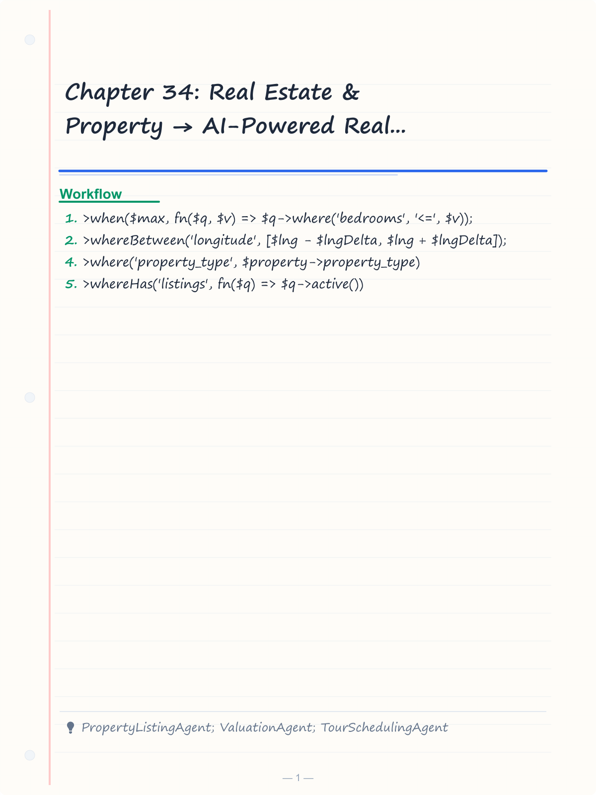
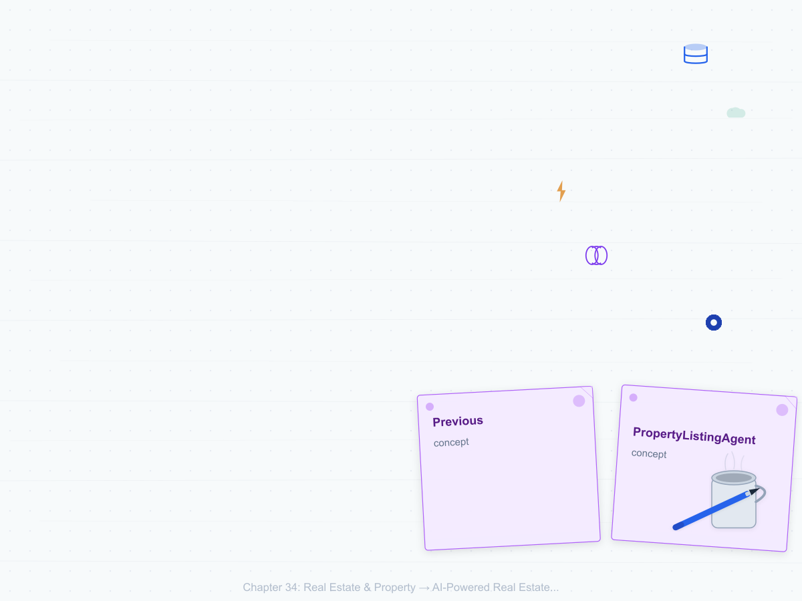
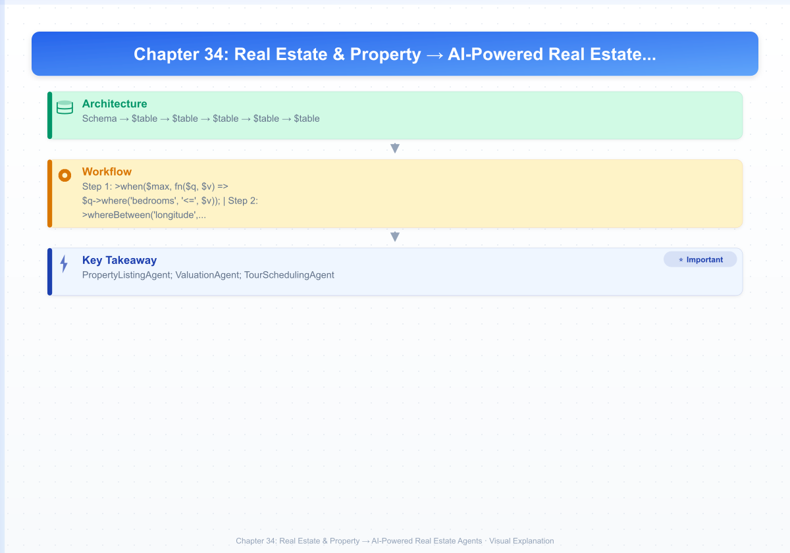
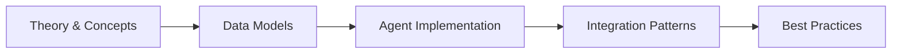

# Chapter 34: Real Estate & Property → AI-Powered Real Estate Agents

> **Previous:** [Customer Service & Support Agents](./33-customer-service.md) | **Next:** [Legal & Compliance Agents](./35-legal.md)


---

## Learning Objectives

- Design and implement real estate domain data models (Property, Listing, Agent, Client, Showing, Offer) with Laravel migrations and Eloquent relationships
- Build a PropertyListingAgent that generates optimized property descriptions and extracts key features using AI
- Create a ValuationAgent that estimates property values using comparable sales analysis and market data
- Implement a TourSchedulingAgent that handles property showing requests, availability coordination, and automated reminders
- Deploy a DocumentProcessingAgent that extracts structured data from lease agreements, deeds, and inspection reports
- Build a LeadQualificationAgent that scores buyer and renter leads against property criteria and budget constraints
- Construct a MarketAnalysisAgent that analyzes neighborhood trends and generates market reports
- Develop a RentalManagementAgent that automates rent collection, maintenance ticketing, and lease renewals
- Implement a RealEstateCrmAgent that tracks client interactions and recommends strategic follow-ups

<!-- Image Gallery -->
<section class="lesson-visuals" aria-label="Visual learning resources">
  <header><span>VISUAL LEARNING</span><h2>See it. Review it. Remember it.</h2></header>
  <a class="lesson-visual-card" href="../../assets/images/lessons/laravel/34-real-estate/handwritten-notes.png" target="_blank" rel="noopener">
    
    <span><strong>Handwritten notes</strong>Condensed notes for deliberate review.</span>
  </a>
  <a class="lesson-visual-card" href="../../assets/images/lessons/laravel/34-real-estate/sticky-notes.png" target="_blank" rel="noopener">
    
    <span><strong>Sticky-note revision</strong>Fast recall prompts for revision.</span>
  </a>
  <a class="lesson-visual-card" href="../../assets/images/lessons/laravel/34-real-estate/visual-explanation.png" target="_blank" rel="noopener">
    
    <span><strong>Visual concept guide</strong>A connected explanation of the key ideas.</span>
  </a>
</section>
<!-- End Image Gallery -->


## Chapter at a Glance

| Aspect | Details |
|--------|---------|
| **Scope** | Real estate AI agents for property listing, matching, valuation, tour scheduling, lead management |
| **Key Concepts** | Property matching, price prediction, virtual tours, lead scoring, market analysis, document processing |
| **Learning Approach** | Theory, data models, agent implementations, AI integration |
| **Skills Required** | PHP, Laravel, Eloquent, Laravel AI SDK, geolocation |

## Chapter Roadmap



## Chapter at a Glance

| Aspect | Details |
|--------|---------|
| **Scope** | Real estate AI agents for property listing, matching, valuation, tour scheduling, lead management |
| **Key Concepts** | Property matching, price prediction, virtual tours, lead scoring, market analysis, document processing |
| **Learning Approach** | Theory, data models, agent implementations, AI integration |
| **Skills Required** | PHP, Laravel, Eloquent, Laravel AI SDK, geolocation |

## Chapter Roadmap


## Chapter at a Glance

| Aspect | Details |
|--------|---------|
| **Scope** | Real estate AI agents for property listing, matching, valuation, tour scheduling, lead management |
| **Key Concepts** | Property matching, price prediction, virtual tours, lead scoring, market analysis, document processing |
| **Learning Approach** | Theory, data models, agent implementations, AI integration |
| **Skills Required** | PHP, Laravel, Eloquent, Laravel AI SDK, geolocation |

## Chapter Roadmap


## Chapter at a Glance

| Aspect | Details |
|--------|---------|
| **Scope** | Real estate AI agents for property listing, matching, valuation, tour scheduling, lead management |
| **Key Concepts** | Property matching, price prediction, virtual tours, lead scoring, market analysis, document processing |
| **Learning Approach** | Theory, data models, agent implementations, AI integration |
| **Skills Required** | PHP, Laravel, Eloquent, Laravel AI SDK, geolocation |

## Chapter Roadmap


---

## Theory
> **One-Sentence Takeaway:** Theory is the foundation — master it before moving to examples and exercises.
> **One-Sentence Takeaway:** Theory is the foundation — master it before moving to examples and exercises.
> **One-Sentence Takeaway:** Theory is the foundation — master it before moving to examples and exercises.
> **One-Sentence Takeaway:** Theory is the foundation — master it before moving to examples and exercises.


### 34.1 Real Estate Data Models


Every real estate platform begins with a solid data foundation. The core domain includes properties (the physical assets), listings (how properties are marketed), agents (the professionals), clients (buyers, sellers, renters), showings (property tours), and offers (purchase or lease proposals). These models establish the relationships that all AI agents will query, analyze, and augment.

#### Migrations

```php
<?php

use Illuminate\Database\Migrations\Migration;
use Illuminate\Database\Schema\Blueprint;
use Illuminate\Support\Facades\Schema;

return new class extends Migration
{
    public function up(): void
    {
        Schema::create('properties', function (Blueprint $table) {
            $table->id();
            $table->string('parcel_id')->unique()->nullable();
            $table->string('address_line_1');
            $table->string('address_line_2')->nullable();
            $table->string('city');
            $table->string('state', 2);
            $table->string('zip_code', 10);
            $table->string('county')->nullable();
            $table->string('neighborhood')->nullable();
            $table->decimal('latitude', 10, 7)->nullable();
            $table->decimal('longitude', 10, 7)->nullable();
            $table->string('property_type')->default('single_family');
            $table->string('subtype')->nullable();
            $table->integer('year_built')->nullable();
            $table->decimal('square_feet', 10, 2)->nullable();
            $table->decimal('lot_size', 10, 2)->nullable();
            $table->integer('bedrooms')->default(0);
            $table->integer('bathrooms')->default(0);
            $table->integer('half_bathrooms')->default(0);
            $table->integer('stories')->nullable();
            $table->string('garage_type')->nullable();
            $table->integer('garage_spaces')->default(0);
            $table->string('heating_type')->nullable();
            $table->string('cooling_type')->nullable();
            $table->string('roof_type')->nullable();
            $table->string('foundation_type')->nullable();
            $table->json('amenities')->nullable();
            $table->json('features')->nullable();
            $table->text('description')->nullable();
            $table->json('images')->nullable();
            $table->json('virtual_tour_url')->nullable();
            $table->json('ai_enriched_data')->nullable();
            $table->timestamps();
        });

        Schema::create('agents', function (Blueprint $table) {
            $table->id();
            $table->string('license_number')->unique();
            $table->string('first_name');
            $table->string('last_name');
            $table->string('email')->unique();
            $table->string('phone');
            $table->string('company')->nullable();
            $table->text('bio')->nullable();
            $table->string('photo_url')->nullable();
            $table->json('specialties')->nullable();
            $table->json('service_areas')->nullable();
            $table->string('status')->default('active');
            $table->decimal('commission_rate', 5, 2)->default(0.00);
            $table->integer('years_experience')->default(0);
            $table->decimal('ai_rating', 3, 2)->nullable();
            $table->json('ai_performance_data')->nullable();
            $table->timestamps();
        });

        Schema::create('listings', function (Blueprint $table) {
            $table->id();
            $table->string('mls_number')->unique()->nullable();
            $table->foreignId('property_id')->constrained()->cascadeOnDelete();
            $table->foreignId('agent_id')->constrained()->cascadeOnDelete();
            $table->foreignId('co_agent_id')->nullable()->constrained('agents')->nullOnDelete();
            $table->string('listing_type')->default('sale');
            $table->string('status')->default('active');
            $table->decimal('list_price', 12, 2);
            $table->decimal('original_price', 12, 2)->nullable();
            $table->date('list_date');
            $table->date('expiry_date')->nullable();
            $table->json('marketing_description')->nullable();
            $table->json('featured_amenities')->nullable();
            $table->json('open_house_dates')->nullable();
            $table->boolean('is_featured')->default(false);
            $table->boolean('is_virtual_tour_available')->default(false);
            $table->json('ai_generated_description')->nullable();
            $table->json('ai_features')->nullable();
            $table->json('ai_market_insights')->nullable();
            $table->timestamps();
        });

        Schema::create('clients', function (Blueprint $table) {
            $table->id();
            $table->string('first_name');
            $table->string('last_name');
            $table->string('email')->unique();
            $table->string('phone');
            $table->string('client_type')->default('buyer');
            $table->decimal('budget_min', 12, 2)->nullable();
            $table->decimal('budget_max', 12, 2)->nullable();
            $table->json('preferences')->nullable();
            $table->json('search_criteria')->nullable();
            $table->string('preferred_contact_method')->default('email');
            $table->string('status')->default('active');
            $table->text('notes')->nullable();
            $table->string('source')->nullable();
            $table->json('ai_lead_score')->nullable();
            $table->json('ai_insights')->nullable();
            $table->foreignId('assigned_agent_id')->nullable()->constrained('agents')->nullOnDelete();
            $table->timestamps();
        });

        Schema::create('showings', function (Blueprint $table) {
            $table->id();
            $table->foreignId('listing_id')->constrained()->cascadeOnDelete();
            $table->foreignId('client_id')->constrained()->cascadeOnDelete();
            $table->foreignId('agent_id')->constrained('agents')->cascadeOnDelete();
            $table->datetime('scheduled_at');
            $table->datetime('confirmed_at')->nullable();
            $table->datetime('completed_at')->nullable();
            $table->datetime('cancelled_at')->nullable();
            $table->string('status')->default('pending');
            $table->text('notes')->nullable();
            $table->json('feedback')->nullable();
            $table->json('ai_reminders')->nullable();
            $table->timestamps();
        });

        Schema::create('offers', function (Blueprint $table) {
            $table->id();
            $table->foreignId('listing_id')->constrained()->cascadeOnDelete();
            $table->foreignId('client_id')->constrained()->cascadeOnDelete();
            $table->foreignId('agent_id')->constrained('agents')->cascadeOnDelete();
            $table->decimal('offer_amount', 12, 2);
            $table->string('offer_type')->default('purchase');
            $table->decimal('earnest_money', 12, 2)->nullable();
            $table->date('proposed_closing_date')->nullable();
            $table->json('contingencies')->nullable();
            $table->text('terms')->nullable();
            $table->string('status')->default('submitted');
            $table->text('counter_terms')->nullable();
            $table->datetime('submitted_at');
            $table->datetime('responded_at')->nullable();
            $table->json('ai_risk_assessment')->nullable();
            $table->json('ai_recommendation')->nullable();
            $table->timestamps();
        });

        Schema::create('transactions', function (Blueprint $table) {
            $table->id();
            $table->foreignId('listing_id')->constrained()->cascadeOnDelete();
            $table->foreignId('offer_id')->constrained()->cascadeOnDelete();
            $table->foreignId('buyer_id')->constrained('clients')->cascadeOnDelete();
            $table->foreignId('seller_id')->constrained('clients')->cascadeOnDelete();
            $table->foreignId('agent_id')->constrained('agents')->cascadeOnDelete();
            $table->decimal('sale_price', 12, 2);
            $table->date('closing_date');
            $table->decimal('commission_amount', 12, 2);
            $table->decimal('commission_rate', 5, 2);
            $table->json('closing_costs')->nullable();
            $table->text('notes')->nullable();
            $table->json('ai_closing_summary')->nullable();
            $table->timestamps();
        });

        Schema::create('rentals', function (Blueprint $table) {
            $table->id();
            $table->foreignId('property_id')->constrained()->cascadeOnDelete();
            $table->foreignId('agent_id')->constrained('agents')->cascadeOnDelete();
            $table->foreignId('tenant_id')->constrained('clients')->cascadeOnDelete();
            $table->decimal('monthly_rent', 10, 2);
            $table->decimal('security_deposit', 10, 2)->nullable();
            $table->date('lease_start');
            $table->date('lease_end');
            $table->string('lease_type')->default('fixed');
            $table->json('lease_terms')->nullable();
            $table->decimal('late_fee', 10, 2)->default(0.00);
            $table->string('status')->default('active');
            $table->date('last_rent_paid_at')->nullable();
            $table->date('next_rent_due')->nullable();
            $table->json('ai_payment_history')->nullable();
            $table->timestamps();
        });

        Schema::create('maintenance_requests', function (Blueprint $table) {
            $table->id();
            $table->foreignId('property_id')->constrained()->cascadeOnDelete();
            $table->foreignId('rental_id')->nullable()->constrained()->nullOnDelete();
            $table->foreignId('tenant_id')->constrained('clients')->cascadeOnDelete();
            $table->string('category')->default('general');
            $table->string('urgency')->default('normal');
            $table->text('description');
            $table->json('photos')->nullable();
            $table->string('status')->default('reported');
            $table->datetime('scheduled_at')->nullable();
            $table->datetime('completed_at')->nullable();
            $table->decimal('cost', 10, 2)->nullable();
            $table->string('vendor_name')->nullable();
            $table->text('resolution_notes')->nullable();
            $table->json('ai_priority_score')->nullable();
            $table->json('ai_estimated_cost')->nullable();
            $table->timestamps();
        });
    }

    public function down(): void
    {
        Schema::dropIfExists('maintenance_requests');
        Schema::dropIfExists('rentals');
        Schema::dropIfExists('transactions');
        Schema::dropIfExists('offers');
        Schema::dropIfExists('showings');
        Schema::dropIfExists('clients');
        Schema::dropIfExists('listings');
        Schema::dropIfExists('agents');
        Schema::dropIfExists('properties');
    }
};
```

#### Eloquent Models

```php
<?php

namespace App\Models;

use Illuminate\Database\Eloquent\Model;
use Illuminate\Database\Eloquent\Relations\BelongsTo;
use Illuminate\Database\Eloquent\Relations\HasMany;
use Illuminate\Support\Arr;

class Property extends Model
{
    protected $fillable = [
        'parcel_id', 'address_line_1', 'address_line_2', 'city', 'state',
        'zip_code', 'county', 'neighborhood', 'latitude', 'longitude',
        'property_type', 'subtype', 'year_built', 'square_feet', 'lot_size',
        'bedrooms', 'bathrooms', 'half_bathrooms', 'stories', 'garage_type',
        'garage_spaces', 'heating_type', 'cooling_type', 'roof_type',
        'foundation_type', 'amenities', 'features', 'description',
        'images', 'virtual_tour_url', 'ai_enriched_data',
    ];

    protected $casts = [
        'amenities' => 'array',
        'features' => 'array',
        'images' => 'array',
        'virtual_tour_url' => 'array',
        'ai_enriched_data' => 'array',
        'latitude' => 'decimal:7',
        'longitude' => 'decimal:7',
    ];

    public function listings(): HasMany
    {
        return $this->hasMany(Listing::class);
    }

    public function activeListing()
    {
        return $this->hasOne(Listing::class)->where('status', 'active');
    }

    public function rentals(): HasMany
    {
        return $this->hasMany(Rental::class);
    }

    public function fullAddress(): string
    {
        return implode(', ', array_filter([
            $this->address_line_1,
            $this->address_line_2,
            "{$this->city}, {$this->state} {$this->zip_code}",
        ]));
    }

    public function scopeInCity($query, string $city)
    {
        return $query->where('city', $city);
    }

    public function scopeByType($query, string $type)
    {
        return $query->where('property_type', $type);
    }

    public function scopeByBedrooms($query, int $min, ?int $max = null)
    {
        return $query->where('bedrooms', '>=', $min)
            ->when($max, fn($q, $v) => $q->where('bedrooms', '<=', $v));
    }

    public function scopeByPriceRange($query, float $min, float $max)
    {
        return $query->whereHas('activeListing', function ($q) use ($min, $max) {
            $q->whereBetween('list_price', [$min, $max]);
        });
    }

    public function scopeNearby($query, float $lat, float $lng, float $radiusMiles = 1.0)
    {
        $latDelta = $radiusMiles / 69.0;
        $lngDelta = $radiusMiles / (69.0 * cos(deg2rad($lat)));

        return $query->whereBetween('latitude', [$lat - $latDelta, $lat + $latDelta])
            ->whereBetween('longitude', [$lng - $lngDelta, $lng + $lngDelta]);
    }
}

class Agent extends Model
{
    protected $fillable = [
        'license_number', 'first_name', 'last_name', 'email', 'phone',
        'company', 'bio', 'photo_url', 'specialties', 'service_areas',
        'status', 'commission_rate', 'years_experience',
        'ai_rating', 'ai_performance_data',
    ];

    protected $casts = [
        'specialties' => 'array',
        'service_areas' => 'array',
        'ai_performance_data' => 'array',
    ];

    public function listings(): HasMany
    {
        return $this->hasMany(Listing::class);
    }

    public function clients(): HasMany
    {
        return $this->hasMany(Client::class, 'assigned_agent_id');
    }

    public function transactions(): HasMany
    {
        return $this->hasMany(Transaction::class);
    }

    public function getFullNameAttribute(): string
    {
        return "{$this->first_name} {$this->last_name}";
    }
}

class Listing extends Model
{
    protected $fillable = [
        'mls_number', 'property_id', 'agent_id', 'co_agent_id',
        'listing_type', 'status', 'list_price', 'original_price',
        'list_date', 'expiry_date', 'marketing_description',
        'featured_amenities', 'open_house_dates', 'is_featured',
        'is_virtual_tour_available', 'ai_generated_description',
        'ai_features', 'ai_market_insights',
    ];

    protected $casts = [
        'marketing_description' => 'array',
        'featured_amenities' => 'array',
        'open_house_dates' => 'array',
        'ai_generated_description' => 'array',
        'ai_features' => 'array',
        'ai_market_insights' => 'array',
    ];

    public function property(): BelongsTo
    {
        return $this->belongsTo(Property::class);
    }

    public function agent(): BelongsTo
    {
        return $this->belongsTo(Agent::class);
    }

    public function coAgent(): BelongsTo
    {
        return $this->belongsTo(Agent::class, 'co_agent_id');
    }

    public function showings(): HasMany
    {
        return $this->hasMany(Showing::class);
    }

    public function offers(): HasMany
    {
        return $this->hasMany(Offer::class);
    }

    public function daysOnMarket(): int
    {
        return now()->startOfDay()->diffInDays($this->list_date);
    }

    public function priceChangeRatio(): ?float
    {
        if (!$this->original_price || $this->original_price === 0.0) {
            return null;
        }
        return round(
            (($this->list_price - $this->original_price) / $this->original_price) * 100,
            2
        );
    }

    public function scopeActive($query)
    {
        return $query->where('status', 'active');
    }

    public function scopeByPriceRange($query, $min, $max)
    {
        return $query->whereBetween('list_price', [$min, $max]);
    }
}

class Client extends Model
{
    protected $fillable = [
        'first_name', 'last_name', 'email', 'phone', 'client_type',
        'budget_min', 'budget_max', 'preferences', 'search_criteria',
        'preferred_contact_method', 'status', 'notes', 'source',
        'ai_lead_score', 'ai_insights', 'assigned_agent_id',
    ];

    protected $casts = [
        'preferences' => 'array',
        'search_criteria' => 'array',
        'ai_lead_score' => 'array',
        'ai_insights' => 'array',
    ];

    public function assignedAgent(): BelongsTo
    {
        return $this->belongsTo(Agent::class, 'assigned_agent_id');
    }

    public function showings(): HasMany
    {
        return $this->hasMany(Showing::class);
    }

    public function offers(): HasMany
    {
        return $this->hasMany(Offer::class);
    }

    public function scopeByType($query, string $type)
    {
        return $query->where('client_type', $type);
    }
}

class Showing extends Model
{
    protected $fillable = [
        'listing_id', 'client_id', 'agent_id', 'scheduled_at',
        'confirmed_at', 'completed_at', 'cancelled_at', 'status',
        'notes', 'feedback', 'ai_reminders',
    ];

    protected $casts = [
        'feedback' => 'array',
        'ai_reminders' => 'array',
    ];

    public function listing(): BelongsTo
    {
        return $this->belongsTo(Listing::class);
    }

    public function client(): BelongsTo
    {
        return $this->belongsTo(Client::class);
    }

    public function agent(): BelongsTo
    {
        return $this->belongsTo(Agent::class);
    }
}

class Offer extends Model
{
    protected $fillable = [
        'listing_id', 'client_id', 'agent_id', 'offer_amount',
        'offer_type', 'earnest_money', 'proposed_closing_date',
        'contingencies', 'terms', 'status', 'counter_terms',
        'submitted_at', 'responded_at', 'ai_risk_assessment',
        'ai_recommendation',
    ];

    protected $casts = [
        'contingencies' => 'array',
        'ai_risk_assessment' => 'array',
        'ai_recommendation' => 'array',
    ];

    public function listing(): BelongsTo
    {
        return $this->belongsTo(Listing::class);
    }

    public function client(): BelongsTo
    {
        return $this->belongsTo(Client::class);
    }

    public function agent(): BelongsTo
    {
        return $this->belongsTo(Agent::class);
    }
}

class Rental extends Model
{
    protected $fillable = [
        'property_id', 'agent_id', 'tenant_id', 'monthly_rent',
        'security_deposit', 'lease_start', 'lease_end', 'lease_type',
        'lease_terms', 'late_fee', 'status', 'last_rent_paid_at',
        'next_rent_due', 'ai_payment_history',
    ];

    protected $casts = [
        'lease_terms' => 'array',
        'ai_payment_history' => 'array',
    ];

    public function property(): BelongsTo
    {
        return $this->belongsTo(Property::class);
    }

    public function agent(): BelongsTo
    {
        return $this->belongsTo(Agent::class);
    }

    public function tenant(): BelongsTo
    {
        return $this->belongsTo(Client::class, 'tenant_id');
    }

    public function maintenanceRequests(): HasMany
    {
        return $this->hasMany(MaintenanceRequest::class);
    }

    public function isOverdue(): bool
    {
        return $this->next_rent_due && $this->next_rent_due->isPast()
            && $this->status === 'active';
    }
}

class MaintenanceRequest extends Model
{
    protected $fillable = [
        'property_id', 'rental_id', 'tenant_id', 'category',
        'urgency', 'description', 'photos', 'status', 'scheduled_at',
        'completed_at', 'cost', 'vendor_name', 'resolution_notes',
        'ai_priority_score', 'ai_estimated_cost',
    ];

    protected $casts = [
        'photos' => 'array',
        'ai_priority_score' => 'array',
        'ai_estimated_cost' => 'array',
    ];

    public function property(): BelongsTo
    {
        return $this->belongsTo(Property::class);
    }

    public function rental(): BelongsTo
    {
        return $this->belongsTo(Rental::class);
    }

    public function tenant(): BelongsTo
    {
        return $this->belongsTo(Client::class, 'tenant_id');
    }
}
```

---

### 34.2 Property Listing Agents


A PropertyListingAgent transforms raw property data into compelling, search-optimized listings. It generates human-readable descriptions that highlight a property's best features, extracts structured amenity tags for MLS compliance, and suggests pricing strategies based on comparable listings.

```php
<?php

namespace App\Agents\RealEstate;

use App\Models\Listing;
use App\Models\Property;
use Illuminate\Support\Facades\Http;
use Illuminate\Support\Facades\Log;

class PropertyListingAgent
{
    protected string $apiKey;
    protected string $model;

    public function __construct()
    {
        $this->apiKey = config('services.openai.api_key');
        $this->model = config('services.openai.model', 'gpt-4o');
    }

    public function generateListing(int $propertyId): Listing
    {
        $property = Property::with('listings')->findOrFail($propertyId);

        $features = $this->extractFeatures($property);
        $description = $this->generateDescription($property, $features);
        $sellingPoints = $this->generateSellingPoints($property, $features);
        $mlsKeywords = $this->generateMlsKeywords($property, $features);

        $listingData = [
            'property_id' => $property->id,
            'agent_id' => $this->resolveAgent($property),
            'listing_type' => 'sale',
            'status' => 'draft',
            'list_price' => $this->suggestPrice($property),
            'list_date' => now(),
            'ai_generated_description' => $description,
            'ai_features' => [
                'extracted_features' => $features,
                'selling_points' => $sellingPoints,
                'mls_keywords' => $mlsKeywords,
                'generated_at' => now()->toIso8601String(),
            ],
        ];

        return Listing::create($listingData);
    }

    public function extractFeatures(Property $property): array
    {
        $features = [];

        $features['square_footage'] = $property->square_feet
            ? $this->classifySize($property->square_feet)
            : null;

        $features['bedroom_config'] = "{$property->bedrooms} bedroom";
        if ($property->bathrooms > 0) {
            $features['bathroom_config'] = "{$property->bathrooms} full bath" .
                ($property->half_bathrooms ? ", {$property->half_bathrooms} half bath" : '');
        }

        $features['exterior_features'] = [];
        if ($property->garage_spaces > 0) {
            $features['exterior_features'][] = "{$property->garage_spaces}-car {$property->garage_type}";
        }
        if ($property->lot_size > 0) {
            $features['exterior_features'][] = $property->lot_size >= 1
                ? number_format($property->lot_size, 2) . ' acre lot'
                : number_format($property->lot_size * 43560) . ' sq ft lot';
        }

        if ($property->year_built) {
            $features['age_category'] = $this->classifyAge($property->year_built);
        }

        if ($property->amenities) {
            $features['notable_amenities'] = $property->amenities;
        }

        if ($property->features) {
            $features['special_features'] = $property->features;
        }

        $features['property_style'] = $this->inferStyle($property);
        $features['condition_indicators'] = $this->assessCondition($property);

        return $features;
    }

    public function generateDescription(Property $property, array $features): array
    {
        $prompt = $this->buildDescriptionPrompt($property, $features);

        try {
            $response = Http::withToken($this->apiKey)->post('https://api.openai.com/v1/chat/completions', [
                'model' => $this->model,
                'messages' => [
                    ['role' => 'system', 'content' => 'You are an expert real estate copywriter. Generate compelling property listing descriptions in JSON format with short_description (1 sentence), medium_description (2-3 paragraphs), and full_description (5-7 paragraphs highlighting location, layout, finishes, outdoor space, and neighborhood).'],
                    ['role' => 'user', 'content' => $prompt],
                ],
                'response_format' => ['type' => 'json_object'],
                'temperature' => 0.7,
                'max_tokens' => 1500,
            ]);

            $result = $response->json();
            $content = json_decode(
                $result['choices'][0]['message']['content'] ?? '{}',
                true
            );

            return [
                'short' => $content['short_description'] ?? $this->fallbackDescription($property),
                'medium' => $content['medium_description'] ?? '',
                'full' => $content['full_description'] ?? '',
                'generated_at' => now()->toIso8601String(),
            ];
        } catch (\Exception $e) {
            Log::error('PropertyListingAgent description generation failed', [
                'property_id' => $property->id,
                'error' => $e->getMessage(),
            ]);

            return [
                'short' => $this->fallbackDescription($property),
                'medium' => '',
                'full' => '',
                'error' => $e->getMessage(),
            ];
        }
    }

    public function generateSellingPoints(Property $property, array $features): array
    {
        $points = [];

        if ($property->year_built && $property->year_built >= 2020) {
            $points[] = 'New construction → move-in ready with modern finishes';
        }

        if ($property->square_feet && $property->square_feet > 2500) {
            $points[] = 'Spacious ' . number_format($property->square_feet) . ' sq ft layout';
        }

        if ($property->garage_spaces >= 2) {
            $points[] = "Oversized {$property->garage_spaces}-car garage";
        }

        if ($property->amenities && in_array('pool', $property->amenities)) {
            $points[] = 'Private pool → perfect for entertaining';
        }

        if ($property->bedrooms >= 4) {
            $points[] = 'Ideal for growing families with ' . $property->bedrooms . ' bedrooms';
        }

        if ($property->lot_size && $property->lot_size > 0.5) {
            $points[] = 'Generous lot at ' . number_format($property->lot_size, 2) . ' acres';
        }

        $prompt = "For this {$property->property_type} at {$property->address_line_1}, {$property->city}, {$property->state}, generate 3 additional unique selling points based on: bedrooms={$property->bedrooms}, baths={$property->bathrooms}, sqft={$property->square_feet}, year_built={$property->year_built}. Return as JSON array of strings.";

        try {
            $response = Http::withToken($this->apiKey)->post('https://api.openai.com/v1/chat/completions', [
                'model' => $this->model,
                'messages' => [
                    ['role' => 'system', 'content' => 'You are a real estate marketing expert. Generate unique selling points.'],
                    ['role' => 'user', 'content' => $prompt],
                ],
                'response_format' => ['type' => 'json_object'],
                'temperature' => 0.6,
                'max_tokens' => 500,
            ]);

            $result = $response->json();
            $aiPoints = json_decode(
                $result['choices'][0]['message']['content'] ?? '{"points":[]}',
                true
            );

            $points = array_merge($points, $aiPoints['points'] ?? []);
        } catch (\Exception $e) {
            Log::warning('Selling point generation failed', ['error' => $e->getMessage()]);
        }

        return array_unique($points);
    }

    public function generateMlsKeywords(Property $property, array $features): array
    {
        $keywords = [
            $property->property_type,
            "{$property->bedrooms} bedroom",
            "{$property->bathrooms} bathroom",
            $features['property_style'] ?? null,
            $property->city,
            $property->neighborhood,
            $property->county,
        ];

        if ($property->amenities) {
            $keywords = array_merge($keywords, $property->amenities);
        }

        if ($property->features) {
            $keywords = array_merge($keywords, $property->features);
        }

        return array_values(array_unique(array_filter($keywords)));
    }

    public function suggestPrice(Property $property): float
    {
        $avgPricePerSqFt = Property::where('city', $property->city)
            ->where('property_type', $property->property_type)
            ->whereHas('listings', fn($q) => $q->active())
            ->join('listings', 'properties.id', '=', 'listings.property_id')
            ->selectRaw('AVG(listings.list_price / NULLIF(properties.square_feet, 0)) as avg_ppsf')
            ->value('avg_ppsf');

        if ($avgPricePerSqFt && $property->square_feet) {
            $computedPrice = $avgPricePerSqFt * $property->square_feet;

            return round($computedPrice / 1000) * 1000;
        }

        return 0.0;
    }

    protected function resolveAgent(Property $property): ?int
    {
        $existing = $property->listings()->first();
        if ($existing && $existing->agent_id) {
            return $existing->agent_id;
        }

        return Agent::where('status', 'active')
            ->whereJsonContains('service_areas', $property->city)
            ->inRandomOrder()
            ->value('id');
    }

    protected function buildDescriptionPrompt(Property $property, array $features): string
    {
        return "Generate a real estate listing description for:\n\n" .
            "Address: {$property->address_line_1}, {$property->city}, {$property->state} {$property->zip_code}\n" .
            "Type: {$property->property_type}\n" .
            "Bedrooms: {$property->bedrooms}\n" .
            "Bathrooms: {$property->bathrooms}\n" .
            "Square Feet: {$property->square_feet}\n" .
            "Year Built: {$property->year_built}\n" .
            "Lot Size: {$property->lot_size} acres\n" .
            "Features: " . json_encode($features) . "\n" .
            "Neighborhood: {$property->neighborhood}";
    }

    protected function fallbackDescription(Property $property): string
    {
        $parts = [
            "Beautiful {$property->bedrooms}-bedroom, {$property->bathrooms}-bathroom",
            $property->property_type,
            "located in {$property->city}, {$property->state}.",
        ];

        if ($property->square_feet) {
            array_splice($parts, 1, 0, [number_format($property->square_feet) . ' square foot']);
        }

        return implode(' ', $parts);
    }

    protected function classifySize(float $sqft): string
    {
        return match (true) {
            $sqft < 1000 => 'compact',
            $sqft < 1500 => 'moderate',
            $sqft < 2500 => 'spacious',
            $sqft < 4000 => 'large',
            default => 'estate-sized',
        };
    }

    protected function classifyAge(int $yearBuilt): string
    {
        $age = now()->year - $yearBuilt;
        return match (true) {
            $age <= 5 => 'new',
            $age <= 20 => 'modern',
            $age <= 50 => 'established',
            $age <= 100 => 'historic',
            default => 'heritage',
        };
    }

    protected function inferStyle(Property $property): string
    {
        $typeStyles = [
            'single_family' => $property->stories && $property->stories > 1
                ? 'two-story' : 'ranch',
            'condo' => 'contemporary',
            'townhouse' => 'multi-level',
            'multifamily' => 'multi-unit',
        ];

        return $typeStyles[$property->property_type] ?? 'traditional';
    }

    protected function assessCondition(Property $property): array
    {
        $indicators = [];

        if ($property->year_built && $property->year_built >= 2010) {
            $indicators[] = 'modern construction';
        }

        if ($property->roof_type === 'metal') {
            $indicators[] = 'premium roofing';
        }

        if ($property->heating_type === 'geothermal' || $property->cooling_type === 'zoned') {
            $indicators[] = 'energy efficient';
        }

        return $indicators;
    }
}
```

---

### 34.3 Valuation Prediction Agents


A ValuationAgent estimates property market value by analyzing comparable sales, local market trends, and property-specific characteristics. It draws on recent closed transactions, active listings, and statistical models to produce a confidence-weighted price range.

```php
<?php

namespace App\Agents\RealEstate;

use App\Models\Listing;
use App\Models\Property;
use App\Models\Transaction;
use Illuminate\Support\Facades\Http;
use Illuminate\Support\Facades\Cache;
use Illuminate\Support\Facades\Log;

class ValuationAgent
{
    protected string $apiKey;
    protected int $compsCount = 5;
    protected int $lookbackMonths = 6;

    public function __construct()
    {
        $this->apiKey = config('services.openai.api_key');
    }

    public function estimateValue(int $propertyId): array
    {
        $property = Property::findOrFail($propertyId);
        $comps = $this->findComps($property);
        $marketTrends = $this->getMarketTrends($property);
        $avmEstimate = $this->calculateAvm($property, $comps, $marketTrends);
        $aiRefinement = $this->aiRefineEstimate($property, $comps, $avmEstimate);

        return [
            'estimated_value' => $aiRefinement['adjusted_value'] ?? $avmEstimate['value'],
            'price_per_sqft' => $avmEstimate['price_per_sqft'],
            'confidence_score' => $aiRefinement['confidence'] ?? $avmEstimate['confidence'],
            'range_low' => $aiRefinement['range_low'] ?? $avmEstimate['range_low'],
            'range_high' => $aiRefinement['range_high'] ?? $avmEstimate['range_high'],
            'comps' => $comps,
            'market_trends' => $marketTrends,
            'avm_details' => $avmEstimate,
            'ai_adjustments' => $aiRefinement['adjustments'] ?? [],
            'generated_at' => now()->toIso8601String(),
        ];
    }

    public function findComps(Property $property): array
    {
        $cacheKey = "valuation_comps_{$property->id}";

        return Cache::remember($cacheKey, 3600, function () use ($property) {
            $comps = Transaction::whereHas('listing.property', function ($q) use ($property) {
                $q->where('property_type', $property->property_type)
                    ->where('city', $property->city)
                    ->where('state', $property->state);
            })
            ->where('closing_date', '>=', now()->subMonths($this->lookbackMonths))
            ->with('listing.property')
            ->orderBy('closing_date', 'desc')
            ->limit($this->compsCount * 3)
            ->get();

            return $comps->map(function ($transaction) use ($property) {
                $compProperty = $transaction->listing->property;
                $score = $this->scoreComparable($property, $compProperty);

                return [
                    'transaction_id' => $transaction->id,
                    'address' => $compProperty->fullAddress(),
                    'sale_price' => $transaction->sale_price,
                    'closing_date' => $transaction->closing_date->toDateString(),
                    'bedrooms' => $compProperty->bedrooms,
                    'bathrooms' => $compProperty->bathrooms,
                    'square_feet' => $compProperty->square_feet,
                    'price_per_sqft' => $compProperty->square_feet > 0
                        ? round($transaction->sale_price / $compProperty->square_feet, 2)
                        : 0,
                    'similarity_score' => round($score, 2),
                    'adjustments' => $this->calculateAdjustments($property, $compProperty),
                ];
            })
            ->sortByDesc('similarity_score')
            ->take($this->compsCount)
            ->values()
            ->toArray();
        });
    }

    public function getMarketTrends(Property $property): array
    {
        $cacheKey = "market_trends_{$property->city}_{$property->property_type}";

        return Cache::remember($cacheKey, 7200, function () use ($property) {
            $sixMonthsAgo = now()->subMonths(6);

            $avgSoldPrice = Transaction::whereHas('listing.property', function ($q) use ($property) {
                $q->where('city', $property->city)
                    ->where('property_type', $property->property_type);
            })
            ->where('closing_date', '>=', $sixMonthsAgo)
            ->avg('sale_price');

            $avgActivePrice = Listing::active()
                ->whereHas('property', function ($q) use ($property) {
                    $q->where('city', $property->city)
                        ->where('property_type', $property->property_type);
                })
                ->avg('list_price');

            $totalSold = Transaction::whereHas('listing.property', function ($q) use ($property) {
                $q->where('city', $property->city)
                    ->where('property_type', $property->property_type);
            })
            ->where('closing_date', '>=', $sixMonthsAgo)
            ->count();

            $avgDaysOnMarket = Listing::whereHas('property', function ($q) use ($property) {
                $q->where('city', $property->city)
                    ->where('property_type', $property->property_type);
            })
            ->where('status', 'sold')
            ->where('list_date', '>=', $sixMonthsAgo)
            ->get()
            ->avg(fn($l) => $l->daysOnMarket());

            $inventory = Listing::active()
                ->whereHas('property', fn($q) => $q->where('city', $property->city))
                ->count();

            $monthsSupply = $totalSold > 0
                ? round($inventory / ($totalSold / 6), 1)
                : null;

            return [
                'city' => $property->city,
                'property_type' => $property->property_type,
                'avg_sold_price' => round($avgSoldPrice ?? 0, 2),
                'avg_active_price' => round($avgActivePrice ?? 0, 2),
                'total_sold_6mo' => $totalSold,
                'avg_days_on_market' => round($avgDaysOnMarket ?? 0, 1),
                'months_of_inventory' => $monthsSupply,
                'market_type' => $monthsSupply !== null
                    ? ($monthsSupply < 4 ? 'seller' : ($monthsSupply < 6 ? 'balanced' : 'buyer'))
                    : 'unknown',
                'analyzed_at' => now()->toIso8601String(),
            ];
        });
    }

    public function calculateAvm(Property $property, array $comps, array $trends): array
    {
        if (empty($comps)) {
            return [
                'value' => 0,
                'price_per_sqft' => 0,
                'confidence' => 0.1,
                'range_low' => 0,
                'range_high' => 0,
            ];
        }

        $compPrices = array_column($comps, 'sale_price');
        $medianPrice = $this->median($compPrices);

        $compPpsf = array_filter(array_column($comps, 'price_per_sqft'));
        $medianPpsf = !empty($compPpsf) ? $this->median($compPpsf) : 0;

        $propertyPpsf = $property->square_feet > 0
            ? $medianPpsf * $property->square_feet
            : $medianPrice;

        $adjPrices = array_map(function ($comp) {
            $adj = $comp['sale_price'];
            foreach (($comp['adjustments'] ?? []) as $adjustment) {
                $adj += $adjustment['amount'];
            }
            return $adj;
        }, $comps);

        $adjustedMedian = !empty($adjPrices) ? $this->median($adjPrices) : 0;

        $value = match (true) {
            $property->square_feet > 0 && $medianPpsf > 0 => (int) round(
                ($propertyPpsf + $adjustedMedian) / 2
            ),
            default => (int) round($adjustedMedian ?: $medianPrice),
        };

        $stdDev = $this->stdDev($compPrices, $medianPrice);
        $variance = $medianPrice > 0 ? $stdDev / $medianPrice : 0.5;
        $confidence = max(0.1, min(0.95, 1.0 - $variance));
        $rangeWidth = $value * ($variance * 1.5);

        $trendMultiplier = 1.0;
        if ($trends['market_type'] === 'seller' && $trends['avg_sold_price'] > 0) {
            $trendMultiplier = 1.03;
        } elseif ($trends['market_type'] === 'buyer' && $trends['avg_sold_price'] > 0) {
            $trendMultiplier = 0.97;
        }

        $finalValue = (int) round($value * $trendMultiplier);

        return [
            'value' => $finalValue,
            'price_per_sqft' => round($medianPpsf, 2),
            'confidence' => round($confidence, 2),
            'range_low' => (int) round($finalValue - $rangeWidth),
            'range_high' => (int) round($finalValue + $rangeWidth),
            'comps_used' => count($comps),
            'median_comp_price' => (int) round($medianPrice),
            'adjusted_median' => (int) round($adjustedMedian),
            'trend_multiplier' => $trendMultiplier,
        ];
    }

    public function aiRefineEstimate(Property $property, array $comps, array $avm): array
    {
        $prompt = "You are a senior real estate appraiser. Review this AVM estimate and property data, then provide refinements.\n\n" .
            "Property: {$property->address_line_1}, {$property->city}, {$property->state}\n" .
            "Type: {$property->property_type}, {$property->bedrooms}br/{$property->bathrooms}ba, {$property->square_feet}sqft\n" .
            "Year Built: {$property->year_built}, Lot: {$property->lot_size} acres\n" .
            "AVM Estimate: \${$avm['value']} (confidence: {$avm['confidence']})\n" .
            "Comps used: " . json_encode($comps) . "\n\n" .
            "Return JSON: {adjusted_value, confidence, range_low, range_high, adjustments: [{factor, amount, reason}], market_notes}";

        try {
            $response = Http::withToken($this->apiKey)->post('https://api.openai.com/v1/chat/completions', [
                'model' => 'gpt-4o',
                'messages' => [
                    ['role' => 'system', 'content' => 'You are a certified real estate appraiser. Analyze valuation data and provide adjustments. Return only valid JSON.'],
                    ['role' => 'user', 'content' => $prompt],
                ],
                'response_format' => ['type' => 'json_object'],
                'temperature' => 0.3,
                'max_tokens' => 1000,
            ]);

            $result = $response->json();
            $refinement = json_decode(
                $result['choices'][0]['message']['content'] ?? '{}',
                true
            );

            return [
                'adjusted_value' => $refinement['adjusted_value'] ?? $avm['value'],
                'confidence' => $refinement['confidence'] ?? $avm['confidence'],
                'range_low' => $refinement['range_low'] ?? $avm['range_low'],
                'range_high' => $refinement['range_high'] ?? $avm['range_high'],
                'adjustments' => $refinement['adjustments'] ?? [],
                'market_notes' => $refinement['market_notes'] ?? '',
            ];
        } catch (\Exception $e) {
            Log::warning('AI valuation refinement failed', ['error' => $e->getMessage()]);
            return [
                'adjusted_value' => $avm['value'],
                'confidence' => $avm['confidence'],
                'range_low' => $avm['range_low'],
                'range_high' => $avm['range_high'],
                'adjustments' => [],
            ];
        }
    }

    protected function scoreComparable(Property $subject, Property $comp): float
    {
        $score = 100.0;

        $bedDiff = abs($subject->bedrooms - $comp->bedrooms);
        $score -= $bedDiff * 5;

        $bathDiff = abs($subject->bathrooms - $comp->bathrooms);
        $score -= $bathDiff * 4;

        if ($subject->square_feet > 0 && $comp->square_feet > 0) {
            $sqftRatio = min($subject->square_feet, $comp->square_feet)
                / max($subject->square_feet, $comp->square_feet);
            $score -= (1 - $sqftRatio) * 15;
        }

        if ($subject->year_built && $comp->year_built) {
            $yearDiff = abs($subject->year_built - $comp->year_built);
            $score -= min($yearDiff * 2, 20);
        }

        $score -= $subject->neighborhood === $comp->neighborhood ? 0 : 10;

        return max(0, min(100, $score));
    }

    protected function calculateAdjustments(Property $subject, Property $comp): array
    {
        $adjustments = [];

        if ($subject->square_feet > 0 && $comp->square_feet > 0) {
            $sqftDiff = $subject->square_feet - $comp->square_feet;
            if (abs($sqftDiff) > 100) {
                $adjustments[] = [
                    'factor' => 'square_footage',
                    'amount' => round($sqftDiff * 150, -2),
                    'reason' => ($sqftDiff > 0 ? '+' : '') . number_format($sqftDiff) . ' sq ft difference',
                ];
            }
        }

        $bedDiff = $subject->bedrooms - $comp->bedrooms;
        if ($bedDiff !== 0) {
            $adjustments[] = [
                'factor' => 'bedrooms',
                'amount' => $bedDiff * 25000,
                'reason' => ($bedDiff > 0 ? '+' : '') . $bedDiff . ' bedroom(s)',
            ];
        }

        $bathDiff = $subject->bathrooms - $comp->bathrooms;
        if ($bathDiff !== 0) {
            $adjustments[] = [
                'factor' => 'bathrooms',
                'amount' => $bathDiff * 15000,
                'reason' => ($bathDiff > 0 ? '+' : '') . $bathDiff . ' bathroom(s)',
            ];
        }

        if ($subject->year_built && $comp->year_built) {
            $yearDiff = $subject->year_built - $comp->year_built;
            if (abs($yearDiff) > 5) {
                $adjustments[] = [
                    'factor' => 'age',
                    'amount' => $yearDiff * -500,
                    'reason' => ($yearDiff > 0 ? 'Newer' : 'Older') . ' by ' . abs($yearDiff) . ' years',
                ];
            }
        }

        return $adjustments;
    }

    protected function median(array $values): float
    {
        sort($values);
        $count = count($values);
        $mid = intdiv($count, 2);

        if ($count % 2 === 0) {
            return ($values[$mid - 1] + $values[$mid]) / 2;
        }

        return $values[$mid];
    }

    protected function stdDev(array $values, float $mean): float
    {
        $variance = 0.0;
        foreach ($values as $value) {
            $variance += ($value - $mean) ** 2;
        }

        return sqrt($variance / count($values));
    }
}
```

---

### 34.4 Tour Scheduling Automation


The TourSchedulingAgent automates property showing coordination. It checks agent availability, confirms client appointments, schedules open houses, and sends reminder notifications to all parties, reducing the administrative burden on agents.

```php
<?php

namespace App\Agents\RealEstate;

use App\Models\Agent;
use App\Models\Client;
use App\Models\Listing;
use App\Models\Showing;
use Illuminate\Support\Facades\Mail;
use Illuminate\Support\Facades\Log;

class TourSchedulingAgent
{
    protected array $businessHours = [
        'monday' => ['09:00', '18:00'],
        'tuesday' => ['09:00', '18:00'],
        'wednesday' => ['09:00', '18:00'],
        'thursday' => ['09:00', '18:00'],
        'friday' => ['09:00', '17:00'],
        'saturday' => ['10:00', '16:00'],
        'sunday' => ['12:00', '16:00'],
    ];

    protected int $showingDurationMinutes = 30;

    public function requestShowing(int $listingId, int $clientId, string $preferredDateTime): array
    {
        $listing = Listing::with('agent', 'property')->findOrFail($listingId);
        $client = Client::findOrFail($clientId);
        $agent = $listing->agent;

        $requestedTime = new \DateTime($preferredDateTime);

        if (!$this->isWithinBusinessHours($requestedTime)) {
            return [
                'success' => false,
                'message' => 'Requested time is outside business hours. Available hours: ' . $this->getBusinessHoursSummary(),
                'suggestions' => $this->getAvailableSlots($agent, $requestedTime, 3),
            ];
        }

        if (!$this->isAgentAvailable($agent, $requestedTime)) {
            return [
                'success' => false,
                'message' => 'Agent is not available at this time.',
                'suggestions' => $this->getAvailableSlots($agent, $requestedTime, 5),
            ];
        }

        $showing = Showing::create([
            'listing_id' => $listing->id,
            'client_id' => $client->id,
            'agent_id' => $agent->id,
            'scheduled_at' => $requestedTime,
            'status' => 'pending',
            'ai_reminders' => [
                '24h_reminder_sent' => false,
                '2h_reminder_sent' => false,
            ],
        ]);

        $this->sendConfirmation($showing);
        $this->scheduleReminders($showing);

        return [
            'success' => true,
            'showing' => $showing,
            'message' => 'Showing request submitted successfully. Confirmation sent.',
        ];
    }

    public function confirmShowing(int $showingId): Showing
    {
        $showing = Showing::findOrFail($showingId);
        $showing->update([
            'confirmed_at' => now(),
            'status' => 'confirmed',
        ]);

        $this->sendConfirmation($showing);
        $this->scheduleReminders($showing);

        return $showing->fresh();
    }

    public function getAvailableSlots(Agent $agent, \DateTime $startFrom, int $count = 5): array
    {
        $slots = [];
        $current = clone $startFrom;
        $maxDays = 14;

        for ($day = 0; $day < $maxDays && count($slots) < $count; $day++) {
            if (!$this->isWithinBusinessHours($current)) {
                $current = $this->nextBusinessHour($current);
                continue;
            }

            $slotEnd = (clone $current)->modify("+{$this->showingDurationMinutes} minutes");

            if ($this->isAgentAvailable($agent, $current)) {
                $slots[] = [
                    'start' => $current->format('Y-m-d H:i'),
                    'end' => $slotEnd->format('Y-m-d H:i'),
                    'date' => $current->format('D, M j'),
                    'time' => $current->format('g:i A'),
                ];
            }

            $current->modify("+{$this->showingDurationMinutes} minutes");

            if ($current->format('H:i') >= '18:00') {
                $current->modify('+1 day')->setTime(9, 0);
            }
        }

        return $slots;
    }

    public function cancelShowing(int $showingId, string $reason = ''): Showing
    {
        $showing = Showing::findOrFail($showingId);
        $showing->update([
            'status' => 'cancelled',
            'cancelled_at' => now(),
            'notes' => $reason ? ($showing->notes . "\nCancellation: " . $reason) : $showing->notes,
        ]);

        $this->sendCancellationNotice($showing, $reason);

        return $showing->fresh();
    }

    public function completeShowing(int $showingId, array $feedback = []): Showing
    {
        $showing = Showing::findOrFail($showingId);
        $showing->update([
            'completed_at' => now(),
            'status' => 'completed',
            'feedback' => $feedback,
        ]);

        return $showing->fresh();
    }

    public function scheduleOpenHouse(int $listingId, \DateTime $start, \DateTime $end): array
    {
        $listing = Listing::with('agent', 'property')->findOrFail($listingId);

        if (!$this->isWithinBusinessHours($start) || !$this->isWithinBusinessHours($end)) {
            return [
                'success' => false,
                'message' => 'Open house must be within business hours.',
            ];
        }

        $overlapping = Showing::where('listing_id', $listing->id)
            ->where('status', '!=', 'cancelled')
            ->where(function ($q) use ($start, $end) {
                $q->whereBetween('scheduled_at', [$start, $end])
                    ->orWhereBetween('scheduled_at', [
                        (clone $start)->modify('-' . $this->showingDurationMinutes . ' minutes'),
                        $end,
                    ]);
            })
            ->exists();

        if ($overlapping) {
            return [
                'success' => false,
                'message' => 'Time slot overlaps with an existing showing.',
            ];
        }

        $openHouse = Showing::create([
            'listing_id' => $listing->id,
            'client_id' => null,
            'agent_id' => $listing->agent_id,
            'scheduled_at' => $start,
            'status' => 'confirmed',
            'notes' => "OPEN HOUSE: {$start->format('g:i A')} - {$end->format('g:i A')}",
        ]);

        return [
            'success' => true,
            'showing' => $openHouse,
            'message' => 'Open house scheduled.',
        ];
    }

    protected function isWithinBusinessHours(\DateTime $time): bool
    {
        $day = strtolower($time->format('l'));
        $timeStr = $time->format('H:i');

        if (!isset($this->businessHours[$day])) {
            return false;
        }

        [$open, $close] = $this->businessHours[$day];
        return $timeStr >= $open && $timeStr <= $close;
    }

    protected function isAgentAvailable(Agent $agent, \DateTime $time): bool
    {
        $slotEnd = (clone $time)->modify("+{$this->showingDurationMinutes} minutes");

        return !Showing::where('agent_id', $agent->id)
            ->where('status', '!=', 'cancelled')
            ->where(function ($q) use ($time, $slotEnd) {
                $q->whereBetween('scheduled_at', [$time, $slotEnd])
                    ->orWhereBetween('scheduled_at', [
                        (clone $time)->modify('-30 minutes'),
                        $slotEnd,
                    ]);
            })
            ->exists();
    }

    protected function nextBusinessHour(\DateTime $current): \DateTime
    {
        $next = clone $current;
        $maxAttempts = 14;

        for ($i = 0; $i < $maxAttempts; $i++) {
            $next->modify('+1 day')->setTime(9, 0);
            $day = strtolower($next->format('l'));
            if (isset($this->businessHours[$day])) {
                return $next;
            }
        }

        return $next;
    }

    public function sendReminders(): int
    {
        $sent = 0;

        $upcomingShowings = Showing::where('status', 'confirmed')
            ->where('scheduled_at', '>=', now())
            ->where('scheduled_at', '<=', now()->addDays(1))
            ->with('client', 'agent', 'listing.property')
            ->get();

        foreach ($upcomingShowings as $showing) {
            $hoursUntil = now()->diffInHours($showing->scheduled_at, false);

            $reminders = $showing->ai_reminders ?? [];

            if ($hoursUntil <= 2 && $hoursUntil > 1 && !($reminders['2h_reminder_sent'] ?? false)) {
                $this->sendNotification(
                    $showing->client,
                    "Your showing at {$showing->listing->property->address_line_1} is in 2 hours!",
                    'reminder'
                );
                $this->sendNotification(
                    $showing->agent,
                    "Showing reminder: {$showing->client->first_name} {$showing->client->last_name} at {$showing->listing->property->address_line_1} in 2 hours.",
                    'reminder'
                );
                $reminders['2h_reminder_sent'] = true;
                $sent++;
            }

            if ($hoursUntil <= 24 && $hoursUntil > 23 && !($reminders['24h_reminder_sent'] ?? false)) {
                $this->sendNotification(
                    $showing->client,
                    "Reminder: You have a showing tomorrow at {$showing->listing->property->address_line_1} ({$showing->scheduled_at->format('g:i A')}).",
                    'reminder'
                );
                $reminders['24h_reminder_sent'] = true;
                $sent++;
            }

            $showing->update(['ai_reminders' => $reminders]);
        }

        return $sent;
    }

    protected function sendConfirmation(Showing $showing): void
    {
        $property = $showing->listing->property;
        $time = $showing->scheduled_at->format('l, F jS \\a\\t g:i A');

        $this->sendNotification(
            $showing->client,
            "Your showing at {$property->address_line_1} is confirmed for {$time}. Agent: {$showing->agent->first_name} {$showing->agent->last_name} ({$showing->agent->phone}).",
            'confirmation'
        );

        $this->sendNotification(
            $showing->agent,
            "New showing confirmed: {$showing->client->first_name} {$showing->client->last_name} at {$property->address_line_1} on {$time}.",
            'notification'
        );
    }

    protected function sendCancellationNotice(Showing $showing, string $reason): void
    {
        $property = $showing->listing->property;
        $message = "Your showing at {$property->address_line_1} on {$showing->scheduled_at->format('l, F jS \\a\\t g:i A')} has been cancelled.";
        if ($reason) {
            $message .= " Reason: {$reason}";
        }

        $this->sendNotification($showing->client, $message, 'cancellation');
        $this->sendNotification($showing->agent, $message, 'cancellation');
    }

    protected function scheduleReminders(Showing $showing): void
    {
        Log::info('Tour reminders scheduled', [
            'showing_id' => $showing->id,
            '24h_at' => (clone $showing->scheduled_at)->modify('-24 hours')->format('c'),
            '2h_at' => (clone $showing->scheduled_at)->modify('-2 hours')->format('c'),
        ]);
    }

    protected function sendNotification(Client|Agent $recipient, string $message, string $type): void
    {
        Log::info("{$type} notification sent to {$recipient->email}: {$message}");
    }

    protected function getBusinessHoursSummary(): string
    {
        $parts = [];
        foreach ($this->businessHours as $day => [$open, $close]) {
            $parts[] = ucfirst($day) . " {$open}-{$close}";
        }
        return implode(', ', $parts);
    }
}
```

---

### 34.5 Document Processing Agents


The DocumentProcessingAgent extracts structured information from real estate documents using OCR and AI-powered text analysis. It handles lease agreements, property deeds, inspection reports, title documents, and disclosure forms, populating database fields and flagging anomalies for review.

```php
<?php

namespace App\Agents\RealEstate;

use App\Models\Document;
use App\Models\Property;
use Illuminate\Support\Facades\Http;
use Illuminate\Support\Facades\Log;
use Illuminate\Support\Facades\Storage;

class DocumentProcessingAgent
{
    protected string $apiKey;
    protected array $supportedTypes = [
        'lease_agreement', 'deed', 'inspection_report',
        'title_report', 'disclosure', 'appraisal',
        'purchase_agreement', 'hoa_document',
    ];

    public function __construct()
    {
        $this->apiKey = config('services.openai.api_key');
    }

    public function processDocument(int $documentId): array
    {
        $document = Document::findOrFail($documentId);
        $text = $this->performOcr($document);

        if (empty($text)) {
            return [
                'success' => false,
                'error' => 'No text could be extracted from the document.',
            ];
        }

        $extracted = $this->extractStructuredData($document->type, $text);
        $validation = $this->validateDocument($document, $extracted);

        $document->update([
            'extracted_text' => $text,
            'ai_extracted_data' => $extracted,
            'ai_validation' => $validation,
            'processed_at' => now(),
        ]);

        if ($document->property_id && !empty($extracted['property_details'])) {
            $this->enrichProperty($document->property_id, $extracted['property_details']);
        }

        return [
            'success' => true,
            'document_id' => $document->id,
            'extracted_data' => $extracted,
            'validation' => $validation,
            'confidence' => $validation['overall_confidence'] ?? 0.0,
        ];
    }

    public function performOcr(Document $document): string
    {
        $path = Storage::disk('local')->path($document->file_path);

        if (!file_exists($path)) {
            Log::warning('Document file not found for OCR', ['document_id' => $document->id]);
            return '';
        }

        $extension = strtolower(pathinfo($document->file_path, PATHINFO_EXTENSION));

        if (in_array($extension, ['txt', 'csv', 'json', 'xml'])) {
            return Storage::disk('local')->get($document->file_path);
        }

        $base64 = base64_encode(file_get_contents($path));
        $mimeType = $this->getMimeType($extension);

        try {
            $response = Http::withToken($this->apiKey)->post('https://api.openai.com/v1/chat/completions', [
                'model' => 'gpt-4o',
                'messages' => [
                    [
                        'role' => 'user',
                        'content' => [
                            [
                                'type' => 'text',
                                'text' => 'Extract all text from this document. Return only the extracted text verbatim, preserving sections and formatting.',
                            ],
                            [
                                'type' => 'image_url',
                                'image_url' => [
                                    'url' => "data:{$mimeType};base64,{$base64}",
                                    'detail' => 'high',
                                ],
                            ],
                        ],
                    ],
                ],
                'max_tokens' => 4000,
                'temperature' => 0.0,
            ]);

            $result = $response->json();
            return $result['choices'][0]['message']['content'] ?? '';
        } catch (\Exception $e) {
            Log::error('OCR processing failed', [
                'document_id' => $document->id,
                'error' => $e->getMessage(),
            ]);
            return '';
        }
    }

    public function extractStructuredData(string $documentType, string $text): array
    {
        $schema = $this->getExtractionSchema($documentType);

        $prompt = "Extract structured data from this {$documentType}. Return ONLY valid JSON matching the schema.\n\n" .
            "Document Text:\n{$text}\n\n" .
            "Required Schema:\n" . json_encode($schema, JSON_PRETTY_PRINT);

        try {
            $response = Http::withToken($this->apiKey)->post('https://api.openai.com/v1/chat/completions', [
                'model' => 'gpt-4o',
                'messages' => [
                    [
                        'role' => 'system',
                        'content' => 'You are a real estate document analyst. Extract structured data precisely. Return only valid JSON.',
                    ],
                    ['role' => 'user', 'content' => $prompt],
                ],
                'response_format' => ['type' => 'json_object'],
                'temperature' => 0.1,
                'max_tokens' => 2000,
            ]);

            $result = $response->json();
            $extracted = json_decode(
                $result['choices'][0]['message']['content'] ?? '{}',
                true
            );

            return array_merge(
                ['document_type' => $documentType, 'extracted_at' => now()->toIso8601String()],
                $extracted
            );
        } catch (\Exception $e) {
            Log::error('Data extraction failed', [
                'document_type' => $documentType,
                'error' => $e->getMessage(),
            ]);
            return [
                'document_type' => $documentType,
                'error' => $e->getMessage(),
            ];
        }
    }

    public function validateDocument(Document $document, array $extractedData): array
    {
        $issues = [];
        $confidence = 0.9;
        $fieldCount = 0;
        $validCount = 0;

        foreach ($extractedData as $key => $value) {
            if (in_array($key, ['document_type', 'extracted_at', 'error'])) {
                continue;
            }

            $fieldCount++;
            if (is_array($value) && empty($value)) {
                $issues[] = "Field '{$key}' is empty.";
                $confidence -= 0.05;
            } elseif (is_null($value)) {
                $issues[] = "Field '{$key}' could not be determined.";
                $confidence -= 0.05;
            } else {
                $validCount++;
            }
        }

        if ($document->type === 'lease_agreement') {
            if (empty($extractedData['parties'] ?? [])) {
                $issues[] = 'No tenant/landlord parties identified.';
                $confidence -= 0.15;
            }
            if (empty($extractedData['rent_amount'] ?? null)) {
                $issues[] = 'Rent amount missing.';
                $confidence -= 0.15;
            }
            if (empty($extractedData['lease_term'] ?? null)) {
                $issues[] = 'Lease term missing.';
                $confidence -= 0.1;
            }
        }

        if ($document->type === 'deed') {
            if (empty($extractedData['grantor'] ?? null)) {
                $issues[] = 'Grantor (seller) not identified.';
                $confidence -= 0.1;
            }
            if (empty($extractedData['grantee'] ?? null)) {
                $issues[] = 'Grantee (buyer) not identified.';
                $confidence -= 0.1;
            }
            if (empty($extractedData['legal_description'] ?? null)) {
                $issues[] = 'Legal description could not be extracted.';
                $confidence -= 0.15;
            }
        }

        if ($document->type === 'inspection_report') {
            if (empty($extractedData['major_issues'] ?? [])) {
                $issues[] = 'No major issues flagged → review may be incomplete.';
                $confidence -= 0.05;
            }
            if (empty($extractedData['overall_condition'] ?? null)) {
                $issues[] = 'Overall condition assessment missing.';
                $confidence -= 0.1;
            }
        }

        return [
            'overall_confidence' => round(max(0.0, $confidence), 2),
            'fields_extracted' => $fieldCount,
            'fields_valid' => $validCount,
            'issues' => $issues,
            'is_valid' => $confidence >= 0.6,
            'validated_at' => now()->toIso8601String(),
        ];
    }

    public function batchProcess(array $documentIds): array
    {
        $results = [];

        foreach ($documentIds as $id) {
            $results[$id] = $this->processDocument($id);
        }

        return [
            'total' => count($results),
            'successful' => count(array_filter($results, fn($r) => $r['success'])),
            'failed' => count(array_filter($results, fn($r) => !$r['success'])),
            'results' => $results,
        ];
    }

    public function getExtractionSchema(string $documentType): array
    {
        $schemas = [
            'lease_agreement' => [
                'parties' => [
                    ['role' => 'landlord|tenant', 'name' => '', 'address' => ''],
                ],
                'property_address' => '',
                'rent_amount' => 0.0,
                'security_deposit' => 0.0,
                'lease_term' => '',
                'lease_start' => '',
                'lease_end' => '',
                'late_fee' => 0.0,
                'utilities_included' => [],
                'pet_policy' => '',
                'termination_clause' => '',
                'renewal_terms' => '',
            ],
            'deed' => [
                'document_type_detail' => '',
                'grantor' => '',
                'grantee' => '',
                'consideration_amount' => 0.0,
                'property_address' => '',
                'legal_description' => '',
                'parcel_id' => '',
                'recorded_date' => '',
                'notary_information' => '',
            ],
            'inspection_report' => [
                'property_address' => '',
                'inspection_date' => '',
                'inspector' => '',
                'overall_condition' => '',
                'major_issues' => [],
                'minor_issues' => [],
                'safety_concerns' => [],
                'estimated_repair_costs' => 0.0,
                'systems_evaluated' => [],
                'recommendations' => [],
            ],
            'disclosure' => [
                'property_address' => '',
                'known_defects' => [],
                'past_repairs' => [],
                'hazards' => [],
                'hoa_info' => '',
                'pending_lawsuits' => [],
                'date' => '',
            ],
        ];

        return $schemas[$documentType] ?? ['content' => ''];
    }

    protected function enrichProperty(int $propertyId, array $details): void
    {
        $property = Property::find($propertyId);
        if (!$property) {
            return;
        }

        $updates = [];

        if (!empty($details['parcel_id']) && empty($property->parcel_id)) {
            $updates['parcel_id'] = $details['parcel_id'];
        }

        if (!empty($details['square_feet']) && empty($property->square_feet)) {
            $updates['square_feet'] = $details['square_feet'];
        }

        if (!empty($details['year_built']) && empty($property->year_built)) {
            $updates['year_built'] = $details['year_built'];
        }

        if (!empty($details['bedrooms']) && $property->bedrooms === 0) {
            $updates['bedrooms'] = $details['bedrooms'];
        }

        if (!empty($details['bathrooms']) && $property->bathrooms === 0) {
            $updates['bathrooms'] = $details['bathrooms'];
        }

        if (!empty($details['features'])) {
            $existing = $property->features ?? [];
            $updates['features'] = array_values(array_unique(
                array_merge($existing, (array) $details['features'])
            ));
        }

        if (!empty($details['amenities'])) {
            $existing = $property->amenities ?? [];
            $updates['amenities'] = array_values(array_unique(
                array_merge($existing, (array) $details['amenities'])
            ));
        }

        if (!empty($updates)) {
            $enriched = $property->ai_enriched_data ?? [];
            $enriched['document_sourced'][] = [
                'fields' => array_keys($updates),
                'source' => 'Document #' . ($details['document_id'] ?? 'unknown'),
                'enriched_at' => now()->toIso8601String(),
            ];
            $updates['ai_enriched_data'] = $enriched;

            $property->update($updates);
        }
    }

    protected function getMimeType(string $extension): string
    {
        return match ($extension) {
            'pdf' => 'application/pdf',
            'png' => 'image/png',
            'jpg', 'jpeg' => 'image/jpeg',
            'tiff', 'tif' => 'image/tiff',
            'gif' => 'image/gif',
            'bmp' => 'image/bmp',
            default => 'application/octet-stream',
        };
    }
}
```

---

### 34.6 Lead Qualification Agents


The LeadQualificationAgent scores inbound buyer and renter leads against active inventory. It analyzes budget constraints, location preferences, property requirements, and behavioral signals to assign a qualification score and recommend the best property matches.

```php
<?php

namespace App\Agents\RealEstate;

use App\Models\Agent;
use App\Models\Client;
use App\Models\Listing;
use App\Models\Property;
use Illuminate\Support\Facades\Http;
use Illuminate\Support\Facades\Log;

class LeadQualificationAgent
{
    protected string $apiKey;
    protected array $scoringWeights = [
        'budget_alignment' => 0.30,
        'preference_match' => 0.25,
        'property_type_match' => 0.15,
        'location_match' => 0.15,
        'timeline_urgency' => 0.10,
        'engagement_level' => 0.05,
    ];

    public function __construct()
    {
        $this->apiKey = config('services.openai.api_key');
    }

    public function qualifyLead(int $clientId): array
    {
        $client = Client::with('assignedAgent')->findOrFail($clientId);
        $scores = $this->calculateScores($client);
        $matches = $this->findMatches($client, $scores);
        $classification = $this->classifyLead($scores);
        $recommendations = $this->generateRecommendations($client, $scores, $classification);

        $client->update([
            'ai_lead_score' => [
                'overall_score' => $scores['overall'],
                'component_scores' => $scores['components'],
                'classification' => $classification,
                'top_matches' => array_slice($matches, 0, 3),
                'recommendations' => $recommendations,
                'scored_at' => now()->toIso8601String(),
            ],
        ]);

        return [
            'client_id' => $client->id,
            'client_name' => $client->first_name . ' ' . $client->last_name,
            'client_type' => $client->client_type,
            'overall_score' => $scores['overall'],
            'classification' => $classification,
            'matches' => array_slice($matches, 0, 5),
            'recommendations' => $recommendations,
        ];
    }

    public function calculateScores(Client $client): array
    {
        $components = [];

        $components['budget_alignment'] = $this->scoreBudget($client);
        $components['preference_match'] = $this->scorePreferences($client);
        $components['property_type_match'] = $this->scorePropertyType($client);
        $components['location_match'] = $this->scoreLocation($client);
        $components['timeline_urgency'] = $this->scoreTimeline($client);
        $components['engagement_level'] = $this->scoreEngagement($client);

        $overall = 0.0;
        foreach ($this->scoringWeights as $key => $weight) {
            $overall += ($components[$key] ?? 0.0) * $weight;
        }

        return [
            'overall' => round($overall, 3),
            'components' => $components,
        ];
    }

    public function findMatches(Client $client, array $scores): array
    {
        $inventory = Listing::active()
            ->with('property')
            ->whereHas('property', function ($q) use ($client) {
                if ($client->client_type === 'buyer') {
                    $q->whereNotIn('property_type', ['rental']);
                }
            })
            ->get();

        $matches = [];

        foreach ($inventory as $listing) {
            $matchScore = $this->scoreListingMatch($client, $listing);
            if ($matchScore >= 0.4) {
                $matches[] = [
                    'listing_id' => $listing->id,
                    'property_id' => $listing->property_id,
                    'address' => $listing->property->fullAddress(),
                    'price' => $listing->list_price,
                    'bedrooms' => $listing->property->bedrooms,
                    'bathrooms' => $listing->property->bathrooms,
                    'sqft' => $listing->property->square_feet,
                    'match_score' => round($matchScore, 3),
                ];
            }
        }

        usort($matches, fn($a, $b) => $b['match_score'] <=> $a['match_score']);

        return $matches;
    }

    public function classifyLead(array $scores): string
    {
        $score = $scores['overall'];

        return match (true) {
            $score >= 0.80 => 'hot',
            $score >= 0.60 => 'warm',
            $score >= 0.35 => 'lukewarm',
            default => 'cold',
        };
    }

    public function matchLeadToAgent(int $clientId): ?Agent
    {
        $client = Client::findOrFail($clientId);
        $preferences = $client->search_criteria ?? [];

        $preferredCity = $preferences['city'] ?? null;
        $preferredType = $preferences['property_type'] ?? null;

        $query = Agent::where('status', 'active');

        if ($preferredCity) {
            $query->whereJsonContains('service_areas', $preferredCity);
        }

        if ($preferredType && in_array($preferredType, ['residential', 'commercial'])) {
            $query->whereJsonContains('specialties', $preferredType);
        }

        $agent = $query->withCount('transactions')
            ->orderBy('transactions_count', 'desc')
            ->first();

        if ($agent) {
            $client->update(['assigned_agent_id' => $agent->id]);
        }

        return $agent;
    }

    public function generateRecommendations(Client $client, array $scores, string $classification): array
    {
        $recommendations = [];

        if ($classification === 'cold') {
            $recommendations[] = 'Send nurture email sequence with market updates';
            $recommendations[] = 'Request budget reassessment via automated survey';

            if ($client->budget_max && $client->budget_max < 100000) {
                $recommendations[] = 'Suggest rental options as alternative';
            }
        }

        if ($classification === 'lukewarm') {
            $recommendations[] = 'Schedule introductory call to refine criteria';
            $recommendations[] = 'Share curated listing digest via email';

            if (($scores['components']['location_match'] ?? 0) < 0.5) {
                $recommendations[] = 'Expand location criteria to nearby neighborhoods';
            }
        }

        if ($classification === 'warm') {
            $recommendations[] = 'Schedule property tour within 48 hours';
            $recommendations[] = 'Prepare pre-qualification letter (buyers)';
            $recommendations[] = 'Set up automated MLS alerts for new listings';

            if ($client->budget_max && $client->budget_max > 500000) {
                $recommendations[] = 'Offer concierge-level service for high-value lead';
            }
        }

        if ($classification === 'hot') {
            $recommendations[] = 'URGENT: Personal outreach within 2 hours';
            $recommendations[] = 'Prepare showing schedule for top-matched properties';
            $recommendations[] = 'Run comparative market analysis for negotiation prep';
            $recommendations[] = 'Alert listing agents of qualified buyer interest';
        }

        return $recommendations;
    }

    protected function scoreBudget(Client $client): float
    {
        if (!$client->budget_min && !$client->budget_max) {
            return 0.3;
        }

        $avgPrice = Listing::active()
            ->whereHas('property', fn($q) => $q->where('property_type', $client->client_type === 'buyer' ? 'single_family' : 'condo'))
            ->avg('list_price');

        if (!$avgPrice) {
            return 0.5;
        }

        if ($client->budget_max && $avgPrice > $client->budget_max) {
            return 0.2;
        }

        if ($client->budget_min && $avgPrice < $client->budget_min) {
            return 0.4;
        }

        if ($client->budget_max && $client->budget_min) {
            $range = $client->budget_max - $client->budget_min;
            $withinRange = $avgPrice >= $client->budget_min && $avgPrice <= $client->budget_max;
            return $withinRange ? 1.0 : ($range > 100000 ? 0.7 : 0.4);
        }

        return 0.6;
    }

    protected function scorePreferences(Client $client): float
    {
        $criteria = $client->search_criteria ?? [];
        if (empty($criteria)) {
            return 0.4;
        }

        $filledFields = 0;
        $totalFields = 0;

        $fields = ['bedrooms', 'bathrooms', 'min_sqft', 'property_type', 'city'];

        foreach ($fields as $field) {
            $totalFields++;
            if (!empty($criteria[$field])) {
                $filledFields++;
            }
        }

        return $totalFields > 0 ? round($filledFields / $totalFields, 2) : 0.4;
    }

    protected function scorePropertyType(Client $client): float
    {
        $criteria = $client->search_criteria ?? [];
        $preferredType = $criteria['property_type'] ?? null;

        if (!$preferredType) {
            return 0.5;
        }

        $inventoryCount = Listing::active()
            ->whereHas('property', fn($q) => $q->where('property_type', $preferredType))
            ->count();

        if ($inventoryCount === 0) {
            return 0.2;
        }

        $totalActive = Listing::active()->count();

        if ($totalActive === 0) {
            return 0.5;
        }

        $ratio = $inventoryCount / $totalActive;

        return match (true) {
            $ratio >= 0.3 => 1.0,
            $ratio >= 0.15 => 0.8,
            $ratio >= 0.05 => 0.5,
            default => 0.3,
        };
    }

    protected function scoreLocation(Client $client): float
    {
        $criteria = $client->search_criteria ?? [];
        $city = $criteria['city'] ?? $client->preferences['city'] ?? null;
        $neighborhood = $criteria['neighborhood'] ?? null;

        if (!$city && !$neighborhood) {
            return 0.5;
        }

        $listingCount = Listing::active()
            ->whereHas('property', function ($q) use ($city, $neighborhood) {
                if ($city) {
                    $q->where('city', $city);
                }
                if ($neighborhood) {
                    $q->where('neighborhood', $neighborhood);
                }
            })
            ->count();

        return $listingCount > 5 ? 1.0 : ($listingCount > 0 ? 0.6 : 0.2);
    }

    protected function scoreTimeline(Client $client): float
    {
        $criteria = $client->search_criteria ?? [];
        $timeline = $criteria['timeline'] ?? null;

        return match ($timeline) {
            'immediately', 'asap' => 1.0,
            '1_month', '30_days' => 0.9,
            '2_3_months' => 0.7,
            '3_6_months' => 0.5,
            '6_plus_months', 'just_browsing' => 0.2,
            default => 0.4,
        };
    }

    protected function scoreEngagement(Client $client): float
    {
        $showingCount = $client->showings()->count();
        $offerCount = $client->offers()->count();
        $hasPhone = !empty($client->phone);

        $score = 0.3;
        $score += min($showingCount * 0.1, 0.3);
        $score += min($offerCount * 0.15, 0.2);
        $score += $hasPhone ? 0.2 : 0.0;

        return round(min($score, 1.0), 2);
    }

    protected function scoreListingMatch(Client $client, Listing $listing): float
    {
        $property = $listing->property;
        $criteria = $client->search_criteria ?? [];
        $score = 0.0;
        $totalWeight = 0.0;

        if (!empty($criteria['bedrooms'])) {
            $totalWeight += 0.25;
            $diff = abs((int) $criteria['bedrooms'] - $property->bedrooms);
            $score += 0.25 * match (true) {
                $diff === 0 => 1.0,
                $diff === 1 => 0.6,
                $diff === 2 => 0.3,
                default => 0.1,
            };
        }

        if (!empty($criteria['bathrooms'])) {
            $totalWeight += 0.20;
            $diff = abs((int) $criteria['bathrooms'] - $property->bathrooms);
            $score += 0.20 * match (true) {
                $diff === 0 => 1.0,
                $diff === 1 => 0.6,
                default => 0.2,
            };
        }

        if ($client->budget_max) {
            $totalWeight += 0.30;
            if ($listing->list_price <= $client->budget_max) {
                $ratio = $listing->list_price / $client->budget_max;
                $score += 0.30 * match (true) {
                    $ratio <= 0.8 => 1.0,
                    $ratio <= 0.95 => 0.8,
                    $ratio <= 1.0 => 0.6,
                    default => 0.2,
                };
            }
        }

        if (!empty($criteria['city'])) {
            $totalWeight += 0.15;
            $score += 0.15 * ($property->city === $criteria['city'] ? 1.0 : 0.2);
        }

        if (!empty($criteria['property_type'])) {
            $totalWeight += 0.10;
            $score += 0.10 * ($property->property_type === $criteria['property_type'] ? 1.0 : 0.3);
        }

        return $totalWeight > 0 ? $score / $totalWeight : 0.5;
    }
}
```

---

### 34.7 Market Analysis Agents


The MarketAnalysisAgent ingests listing and transaction data to produce neighborhood-level market intelligence. It tracks price trends, inventory velocity, seasonality, and supply-demand dynamics, generating reports that agents can share with clients during listing presentations.

```php
<?php

namespace App\Agents\RealEstate;

use App\Models\Listing;
use App\Models\Property;
use App\Models\Transaction;
use Illuminate\Support\Facades\Http;
use Illuminate\Support\Facades\Cache;
use Illuminate\Support\Facades\Log;

class MarketAnalysisAgent
{
    protected string $apiKey;

    public function __construct()
    {
        $this->apiKey = config('services.openai.api_key');
    }

    public function generateNeighborhoodReport(string $city, ?string $neighborhood = null): array
    {
        $cacheKey = "market_report_{$city}_" . ($neighborhood ?? 'all');

        return Cache::remember($cacheKey, 7200, function () use ($city, $neighborhood) {
            $trends = $this->analyzePriceTrends($city, $neighborhood);
            $inventory = $this->analyzeInventory($city, $neighborhood);
            $daysOnMarket = $this->analyzeDaysOnMarket($city, $neighborhood);
            $seasonality = $this->analyzeSeasonality($city, $neighborhood);
            $comparables = $this->getNeighborhoodComparables($city, $neighborhood);

            $narrative = $this->generateNarrative(
                $city,
                $neighborhood,
                $trends,
                $inventory,
                $daysOnMarket,
                $seasonality
            );

            return [
                'city' => $city,
                'neighborhood' => $neighborhood,
                'report_date' => now()->toDateString(),
                'price_trends' => $trends,
                'inventory_analysis' => $inventory,
                'days_on_market' => $daysOnMarket,
                'seasonality' => $seasonality,
                'comparables' => $comparables,
                'narrative' => $narrative,
                'generated_at' => now()->toIso8601String(),
            ];
        });
    }

    public function analyzePriceTrends(string $city, ?string $neighborhood = null): array
    {
        $query = Transaction::whereHas('listing.property', function ($q) use ($city, $neighborhood) {
            $q->where('city', $city);
            if ($neighborhood) {
                $q->where('neighborhood', $neighborhood);
            }
        });

        $monthlyData = [];
        for ($i = 5; $i >= 0; $i--) {
            $start = now()->subMonths($i + 1)->startOfMonth();
            $end = now()->subMonths($i)->endOfMonth();

            $monthQuery = clone $query;
            $avgPrice = $monthQuery->whereBetween('closing_date', [$start, $end])->avg('sale_price');
            $count = (clone $query)->whereBetween('closing_date', [$start, $end])->count();

            $monthlyData[] = [
                'month' => $start->format('M Y'),
                'avg_price' => round($avgPrice ?? 0, 2),
                'sales_count' => $count,
            ];
        }

        $prices = array_column($monthlyData, 'avg_price');
        $trend = $this->calculateTrend($prices);

        $avgActivePrice = Listing::active()
            ->whereHas('property', fn($q) => $q->where('city', $city))
            ->avg('list_price');

        $avgSoldPrice = $query->where('closing_date', '>=', now()->subMonths(3))->avg('sale_price');
        $soldToListRatio = $avgActivePrice > 0 && $avgSoldPrice > 0
            ? round($avgSoldPrice / $avgActivePrice, 3)
            : null;

        return [
            'monthly_trend' => $monthlyData,
            'overall_trend' => $trend,
            'avg_active_price' => round($avgActivePrice ?? 0, 2),
            'avg_sold_price_3mo' => round($avgSoldPrice ?? 0, 2),
            'sold_to_list_ratio' => $soldToListRatio,
            'price_appreciation_6mo' => $this->calculateAppreciation($monthlyData),
        ];
    }

    public function analyzeInventory(string $city, ?string $neighborhood = null): array
    {
        $active = Listing::active()
            ->whereHas('property', fn($q) => $q->where('city', $city))
            ->count();

        $pending = Listing::where('status', 'pending')
            ->whereHas('property', fn($q) => $q->where('city', $city))
            ->count();

        $soldLastMonth = Transaction::whereHas('listing.property', fn($q) => $q->where('city', $city))
            ->where('closing_date', '>=', now()->subMonth())
            ->count();

        $newListings = Listing::where('list_date', '>=', now()->subMonth())
            ->whereHas('property', fn($q) => $q->where('city', $city))
            ->count();

        $absorptionRate = $soldLastMonth > 0
            ? round($active / $soldLastMonth, 1)
            : null;

        $byType = Property::where('city', $city)
            ->selectRaw('property_type, COUNT(*) as count')
            ->groupBy('property_type')
            ->pluck('count', 'property_type')
            ->toArray();

        return [
            'active_listings' => $active,
            'pending_listings' => $pending,
            'sold_last_30_days' => $soldLastMonth,
            'new_listings_30_days' => $newListings,
            'absorption_rate_months' => $absorptionRate,
            'market_type' => $absorptionRate !== null
                ? ($absorptionRate < 4 ? 'seller' : ($absorptionRate < 6 ? 'balanced' : 'buyer'))
                : 'insufficient_data',
            'inventory_by_type' => $byType,
        ];
    }

    public function analyzeDaysOnMarket(string $city, ?string $neighborhood = null): array
    {
        $soldListings = Listing::where('status', 'sold')
            ->whereHas('property', fn($q) => $q->where('city', $city))
            ->where('list_date', '>=', now()->subMonths(6))
            ->get();

        $avgDom = $soldListings->avg(fn($l) => $l->daysOnMarket());
        $medDom = $soldListings->median(fn($l) => $l->daysOnMarket());

        $byPriceRange = [];
        $ranges = [
            ['min' => 0, 'max' => 250000, 'label' => 'Under $250k'],
            ['min' => 250000, 'max' => 500000, 'label' => '$250k-$500k'],
            ['min' => 500000, 'max' => 1000000, 'label' => '$500k-$1M'],
            ['min' => 1000000, 'max' => PHP_FLOAT_MAX, 'label' => '$1M+'],
        ];

        foreach ($ranges as $range) {
            $filtered = $soldListings->filter(fn($l) =>
                $l->list_price >= $range['min'] && $l->list_price < $range['max']
            );
            if ($filtered->count() > 0) {
                $byPriceRange[] = [
                    'range' => $range['label'],
                    'avg_dom' => round($filtered->avg(fn($l) => $l->daysOnMarket()), 1),
                    'count' => $filtered->count(),
                ];
            }
        }

        return [
            'average_days_on_market' => round($avgDom ?? 0, 1),
            'median_days_on_market' => round($medDom ?? 0, 1),
            'by_price_range' => $byPriceRange,
        ];
    }

    public function analyzeSeasonality(string $city, ?string $neighborhood = null): array
    {
        $monthlyCounts = [];
        for ($month = 1; $month <= 12; $month++) {
            $count = Transaction::whereHas('listing.property', fn($q) => $q->where('city', $city))
                ->whereMonth('closing_date', $month)
                ->whereYear('closing_date', now()->year)
                ->count();

            $monthlyCounts[\DateTime::createFromFormat('!m', $month)->format('F')] = $count;
        }

        $maxMonth = array_keys($monthlyCounts, max($monthlyCounts))[0] ?? null;
        $minMonth = array_keys($monthlyCounts, min($monthlyCounts))[0] ?? null;

        return [
            'monthly_distribution' => $monthlyCounts,
            'peak_month' => $maxMonth,
            'slow_month' => $minMonth,
            'peak_vs_slow_ratio' => max($monthlyCounts) > 0 && min($monthlyCounts) > 0
                ? round(max($monthlyCounts) / min($monthlyCounts), 2)
                : null,
        ];
    }

    public function getNeighborhoodComparables(string $city, ?string $neighborhood = null): array
    {
        return Transaction::whereHas('listing.property', function ($q) use ($city, $neighborhood) {
            $q->where('city', $city);
            if ($neighborhood) {
                $q->where('neighborhood', $neighborhood);
            }
        })
        ->where('closing_date', '>=', now()->subMonths(3))
        ->with('listing.property')
        ->orderBy('closing_date', 'desc')
        ->limit(10)
        ->get()
        ->map(fn($t) => [
            'address' => $t->listing->property->fullAddress(),
            'sale_price' => $t->sale_price,
            'closing_date' => $t->closing_date->toDateString(),
            'bedrooms' => $t->listing->property->bedrooms,
            'bathrooms' => $t->listing->property->bathrooms,
            'sqft' => $t->listing->property->square_feet,
            'price_per_sqft' => $t->listing->property->square_feet > 0
                ? round($t->sale_price / $t->listing->property->square_feet, 2)
                : null,
        ])
        ->toArray();
    }

    public function generateNarrative(
        string $city,
        ?string $neighborhood,
        array $trends,
        array $inventory,
        array $dom,
        array $seasonality
    ): array {
        $prompt = "You are a real estate market analyst. Write a professional market narrative for {$city}" .
            ($neighborhood ? " {$neighborhood}" : '') .
            " based on these data points.\n\n" .
            "Price Trends: " . json_encode($trends) . "\n" .
            "Inventory: " . json_encode($inventory) . "\n" .
            "Days on Market: " . json_encode($dom) . "\n" .
            "Seasonality: " . json_encode($seasonality) . "\n\n" .
            "Return JSON: {executive_summary, market_dynamics, price_analysis, buyer_advice, seller_advice, outlook}";

        try {
            $response = Http::withToken($this->apiKey)->post('https://api.openai.com/v1/chat/completions', [
                'model' => 'gpt-4o',
                'messages' => [
                    ['role' => 'system', 'content' => 'You are a senior real estate market analyst. Return only valid JSON.'],
                    ['role' => 'user', 'content' => $prompt],
                ],
                'response_format' => ['type' => 'json_object'],
                'temperature' => 0.5,
                'max_tokens' => 1500,
            ]);

            $result = $response->json();
            return json_decode(
                $result['choices'][0]['message']['content'] ?? '{}',
                true
            );
        } catch (\Exception $e) {
            Log::error('Market narrative generation failed', ['error' => $e->getMessage()]);
            return [
                'executive_summary' => "Market analysis for {$city} generated.",
                'market_dynamics' => 'Narrative generation unavailable.',
            ];
        }
    }

    protected function calculateTrend(array $values): string
    {
        if (count($values) < 2) {
            return 'insufficient_data';
        }

        $first = $values[0];
        $last = $values[count($values) - 1];

        if ($first == 0) {
            return 'insufficient_data';
        }

        $change = (($last - $first) / $first) * 100;

        return match (true) {
            $change > 5 => 'increasing',
            $change > 1 => 'slightly_increasing',
            $change >= -1 => 'stable',
            $change >= -5 => 'slightly_decreasing',
            default => 'decreasing',
        };
    }

    protected function calculateAppreciation(array $monthlyData): ?float
    {
        $prices = array_filter(array_column($monthlyData, 'avg_price'));
        if (count($prices) < 2) {
            return null;
        }

        $first = reset($prices);
        $last = end($prices);

        if ($first == 0) {
            return null;
        }

        return round((($last - $first) / $first) * 100, 2);
    }
}
```

---

### 34.8 Rental Management Agents


The RentalManagementAgent automates the landlord-tenant lifecycle. It tracks monthly rent payments, flags overdue accounts, coordinates maintenance requests from report through resolution, and manages lease renewals with automated reminders and proposal generation.

```php
<?php

namespace App\Agents\RealEstate;

use App\Models\Client;
use App\Models\MaintenanceRequest;
use App\Models\Property;
use App\Models\Rental;
use Illuminate\Support\Facades\Http;
use Illuminate\Support\Facades\Log;

class RentalManagementAgent
{
    protected string $apiKey;

    public function __construct()
    {
        $this->apiKey = config('services.openai.api_key');
    }

    public function processRentPayment(int $rentalId, float $amount, string $paymentMethod): array
    {
        $rental = Rental::with('tenant', 'property')->findOrFail($rentalId);

        if ($amount < $rental->monthly_rent) {
            return [
                'success' => false,
                'payment_processed' => false,
                'message' => "Partial payment of \${$amount} received. Full rent of \${$rental->monthly_rent} is required.",
                'balance_due' => $rental->monthly_rent - $amount,
            ];
        }

        $overpayment = $amount - $rental->monthly_rent;
        $nextDue = $this->calculateNextDueDate($rental);

        $history = $rental->ai_payment_history ?? [];
        $history[] = [
            'amount' => $amount,
            'method' => $paymentMethod,
            'received_at' => now()->toIso8601String(),
            'overpayment' => $overpayment > 0 ? $overpayment : 0,
        ];

        $rental->update([
            'last_rent_paid_at' => now(),
            'next_rent_due' => $nextDue,
            'status' => 'active',
            'ai_payment_history' => $history,
        ]);

        $this->sendPaymentConfirmation($rental->tenant, $amount, $rental->property);

        $result = [
            'success' => true,
            'payment_processed' => true,
            'amount' => $amount,
            'rental_id' => $rental->id,
            'next_due_date' => $nextDue->toDateString(),
            'message' => "Payment of \${$amount} received successfully.",
        ];

        if ($overpayment > 0) {
            $result['overpayment'] = $overpayment;
            $result['message'] .= " Overpayment of \${$overpayment} credited.";
        }

        return $result;
    }

    public function processMaintenanceRequest(
        int $propertyId,
        int $tenantId,
        string $category,
        string $description,
        ?array $photos = null
    ): array {
        $rental = Rental::where('property_id', $propertyId)
            ->where('tenant_id', $tenantId)
            ->where('status', 'active')
            ->first();

        $urgency = $this->assessUrgency($category, $description);
        $estimatedCost = $this->estimateRepairCost($category, $urgency);

        $request = MaintenanceRequest::create([
            'property_id' => $propertyId,
            'rental_id' => $rental?->id,
            'tenant_id' => $tenantId,
            'category' => $category,
            'urgency' => $urgency,
            'description' => $description,
            'photos' => $photos,
            'status' => 'reported',
            'ai_priority_score' => [
                'score' => $this->calculatePriorityScore($category, $urgency),
                'level' => $urgency,
                'estimated_cost' => $estimatedCost,
                'auto_assessed_at' => now()->toIso8601String(),
            ],
            'ai_estimated_cost' => $estimatedCost,
        ]);

        $this->notifyMaintenanceTeam($request);

        return [
            'success' => true,
            'request_id' => $request->id,
            'urgency' => $urgency,
            'estimated_cost' => $estimatedCost,
            'message' => "Maintenance request #{$request->id} submitted with {$urgency} urgency.",
        ];
    }

    public function scheduleMaintenance(int $requestId, \DateTime $scheduledAt): MaintenanceRequest
    {
        $request = MaintenanceRequest::findOrFail($requestId);
        $request->update([
            'scheduled_at' => $scheduledAt,
            'status' => 'scheduled',
        ]);

        $this->sendNotification(
            $request->tenant,
            "Maintenance scheduled for {$scheduledAt->format('l, F jS \\a\\t g:i A')}. Technician will visit for: {$request->description}"
        );

        return $request->fresh();
    }

    public function completeMaintenance(int $requestId, float $cost, string $vendor, string $resolution): MaintenanceRequest
    {
        $request = MaintenanceRequest::findOrFail($requestId);
        $request->update([
            'completed_at' => now(),
            'status' => 'completed',
            'cost' => $cost,
            'vendor_name' => $vendor,
            'resolution_notes' => $resolution,
        ]);

        $this->sendNotification(
            $request->tenant,
            "Maintenance request #{$requestId} has been completed. Resolution: {$resolution}"
        );

        return $request->fresh();
    }

    public function generateLeaseRenewal(int $rentalId): array
    {
        $rental = Rental::with('tenant', 'property', 'agent')->findOrFail($rentalId);
        $daysUntilExpiry = now()->diffInDays($rental->lease_end, false);

        $newRent = $this->calculateRenewalRent($rental);
        $renewalTerms = $this->generateRenewalTerms($rental, $newRent);

        $proposal = [
            'rental_id' => $rental->id,
            'tenant_name' => $rental->tenant->first_name . ' ' . $rental->tenant->last_name,
            'property_address' => $rental->property->fullAddress(),
            'current_rent' => $rental->monthly_rent,
            'proposed_rent' => $newRent,
            'increase_percentage' => $rental->monthly_rent > 0
                ? round((($newRent - $rental->monthly_rent) / $rental->monthly_rent) * 100, 2)
                : 0,
            'current_lease_end' => $rental->lease_end->toDateString(),
            'proposed_term' => '12 months',
            'proposed_start' => $rental->lease_end->addDay()->toDateString(),
            'proposed_end' => $rental->lease_end->addYear()->toDateString(),
            'days_until_expiry' => $daysUntilExpiry,
            'terms' => $renewalTerms,
            'generated_at' => now()->toIso8601String(),
        ];

        if ($daysUntilExpiry <= 60) {
            $this->sendRenewalReminder($rental, $proposal);
        }

        return $proposal;
    }

    public function getDelinquentAccounts(): array
    {
        $overdueRentals = Rental::where('status', 'active')
            ->where('next_rent_due', '<', now())
            ->with('tenant', 'property')
            ->get()
            ->filter(fn($r) => $r->isOverdue())
            ->values();

        $result = [];

        foreach ($overdueRentals as $rental) {
            $daysOverdue = now()->diffInDays($rental->next_rent_due);
            $lateFee = $daysOverdue > 5 ? $rental->late_fee : 0;

            $result[] = [
                'rental_id' => $rental->id,
                'tenant' => $rental->tenant->first_name . ' ' . $rental->tenant->last_name,
                'tenant_email' => $rental->tenant->email,
                'property' => $rental->property->fullAddress(),
                'monthly_rent' => $rental->monthly_rent,
                'days_overdue' => $daysOverdue,
                'late_fee' => $lateFee,
                'total_due' => $rental->monthly_rent + $lateFee,
                'last_payment' => $rental->last_rent_paid_at?->toDateString(),
            ];
        }

        return $result;
    }

    protected function assessUrgency(string $category, string $description): string
    {
        $emergencyKeywords = [
            'gas leak', 'fire', 'flood', 'no heat', 'no electricity',
            'sewage', 'burst pipe', 'broken lock', 'smoke',
        ];

        foreach ($emergencyKeywords as $keyword) {
            if (stripos($description, $keyword) !== false) {
                return 'emergency';
            }
        }

        $urgentCategories = ['plumbing', 'electrical', 'hvac', 'gas'];

        if (in_array($category, $urgentCategories)) {
            return 'urgent';
        }

        return 'normal';
    }

    protected function estimateRepairCost(string $category, string $urgency): array
    {
        $estimates = [
            'plumbing' => ['min' => 150, 'max' => 800],
            'electrical' => ['min' => 100, 'max' => 600],
            'hvac' => ['min' => 200, 'max' => 2000],
            'appliance' => ['min' => 100, 'max' => 500],
            'structural' => ['min' => 500, 'max' => 5000],
            'pest' => ['min' => 200, 'max' => 1000],
            'general' => ['min' => 50, 'max' => 300],
        ];

        $range = $estimates[$category] ?? ['min' => 100, 'max' => 500];

        if ($urgency === 'emergency') {
            $range['max'] *= 1.5;
        }

        return [
            'estimated_min' => $range['min'],
            'estimated_max' => $range['max'],
            'currency' => 'USD',
        ];
    }

    protected function calculatePriorityScore(string $category, string $urgency): float
    {
        $urgencyScores = ['emergency' => 1.0, 'urgent' => 0.75, 'normal' => 0.4];
        $categoryBoost = ['plumbing' => 0.1, 'electrical' => 0.1, 'hvac' => 0.05];

        return min(1.0, ($urgencyScores[$urgency] ?? 0.4) + ($categoryBoost[$category] ?? 0));
    }

    protected function calculateNextDueDate(Rental $rental): \DateTime
    {
        $currentDue = $rental->next_rent_due ?? $rental->lease_start;
        $next = clone $currentDue;
        $next->modify('+1 month');

        while ($next->isPast()) {
            $next->modify('+1 month');
        }

        return $next;
    }

    protected function calculateRenewalRent(Rental $rental): float
    {
        $avgIncrease = Rental::where('property_id', $rental->property_id)
            ->where('status', 'active')
            ->avg('monthly_rent');

        $marketRate = $avgIncrease ?: $rental->monthly_rent;
        $increase = $marketRate * 1.04;

        return round(max($increase, $rental->monthly_rent * 1.03), 2);
    }

    protected function generateRenewalTerms(Rental $rental, float $newRent): array
    {
        return [
            'term_length' => '12 months',
            'monthly_rent' => $newRent,
            'security_deposit' => $rental->security_deposit,
            'late_fee' => $rental->late_fee,
            'notice_period' => '60 days',
            'utilities_included' => $rental->lease_terms['utilities_included'] ?? [],
            'pet_policy' => $rental->lease_terms['pet_policy'] ?? 'No change',
        ];
    }

    protected function sendPaymentConfirmation(Client $tenant, float $amount, Property $property): void
    {
        Log::info("Payment confirmation sent to {$tenant->email}: \${$amount} for {$property->address_line_1}");
    }

    protected function notifyMaintenanceTeam(MaintenanceRequest $request): void
    {
        Log::info("Maintenance team notified: Request #{$request->id} - {$request->urgency}", [
            'category' => $request->category,
            'description' => $request->description,
        ]);
    }

    protected function sendRenewalReminder(Rental $rental, array $proposal): void
    {
        Log::info("Lease renewal reminder sent to {$rental->tenant->email}", [
            'proposal' => $proposal,
        ]);
    }

    protected function sendNotification(Client $client, string $message): void
    {
        Log::info("Notification sent to {$client->email}: {$message}");
    }
}
```

---

### 34.9 CRM for Real Estate Agents


The RealEstateCrmAgent tracks every client touchpoint → calls, emails, showings, offers, and closing milestones → and uses AI to recommend the next best action. It surfaces follow-up reminders, identifies at-risk relationships, and suggests strategic touches that keep agents top-of-mind.

```php
<?php

namespace App\Agents\RealEstate;

use App\Models\Agent;
use App\Models\Client;
use App\Models\Listing;
use App\Models\Showing;
use App\Models\Offer;
use App\Models\Transaction;
use Illuminate\Support\Facades\Http;
use Illuminate\Support\Facades\Log;

class RealEstateCrmAgent
{
    protected string $apiKey;

    public function __construct()
    {
        $this->apiKey = config('services.openai.api_key');
    }

    public function getClientTimeline(int $clientId): array
    {
        $client = Client::with('assignedAgent')->findOrFail($clientId);

        $events = [];

        foreach ($client->showings as $showing) {
            $events[] = [
                'type' => 'showing',
                'date' => $showing->scheduled_at->toIso8601String(),
                'summary' => "Showing at {$showing->listing->property->address_line_1}",
                'status' => $showing->status,
                'details' => $showing->feedback ? json_encode($showing->feedback) : null,
            ];
        }

        foreach ($client->offers as $offer) {
            $events[] = [
                'type' => 'offer',
                'date' => $offer->submitted_at->toIso8601String(),
                'summary' => "Offer of \${$offer->offer_amount} on {$offer->listing->property->address_line_1}",
                'status' => $offer->status,
                'details' => "Type: {$offer->offer_type}, Contingencies: " . count($offer->contingencies ?? []),
            ];
        }

        usort($events, fn($a, $b) => $b['date'] <=> $a['date']);

        $lastContact = $client->updated_at;

        return [
            'client' => [
                'id' => $client->id,
                'name' => $client->first_name . ' ' . $client->last_name,
                'type' => $client->client_type,
                'status' => $client->status,
                'assigned_agent' => $client->assignedAgent?->full_name,
                'days_since_last_contact' => $lastContact->diffInDays(now()),
            ],
            'events' => $events,
            'event_count' => count($events),
        ];
    }

    public function suggestFollowUps(int $agentId): array
    {
        $agent = Agent::with('clients')->findOrFail($agentId);
        $suggestions = [];

        foreach ($agent->clients as $client) {
            $lastActivity = $this->getLastActivity($client);
            $daysSince = $lastActivity ? $lastActivity->diffInDays(now()) : 999;

            if ($daysSince > 90 && $client->status === 'active') {
                $suggestions[] = [
                    'priority' => 'high',
                    'client_id' => $client->id,
                    'client_name' => $client->first_name . ' ' . $client->last_name,
                    'type' => 're-engagement',
                    'action' => 'Reach out to reconnect → no activity in ' . $daysSince . ' days',
                    'days_inactive' => $daysSince,
                ];
            } elseif ($daysSince > 30) {
                $suggestions[] = [
                    'priority' => 'medium',
                    'client_id' => $client->id,
                    'client_name' => $client->first_name . ' ' . $client->last_name,
                    'type' => 'check-in',
                    'action' => 'Send market update or check-in email',
                    'days_inactive' => $daysSince,
                ];
            }

            $showingCount = $client->showings()
                ->where('status', 'completed')
                ->where('completed_at', '>=', now()->subWeek())
                ->count();

            if ($showingCount >= 2 && $client->offers()->where('status', 'submitted')->count() === 0) {
                $suggestions[] = [
                    'priority' => 'high',
                    'client_id' => $client->id,
                    'client_name' => $client->first_name . ' ' . $client->last_name,
                    'type' => 'follow-up',
                    'action' => "Follow up after {$showingCount} showings → no offer submitted yet",
                ];
            }
        }

        $upcomingClosing = Transaction::where('agent_id', $agentId)
            ->where('closing_date', '>=', now())
            ->where('closing_date', '<=', now()->addDays(14))
            ->with('buyer', 'seller')
            ->get();

        foreach ($upcomingClosing as $transaction) {
            $daysUntil = now()->diffInDays($transaction->closing_date);

            $suggestions[] = [
                'priority' => 'high',
                'type' => 'closing_prep',
                'client_id' => $transaction->buyer_id,
                'client_name' => $transaction->buyer->first_name . ' ' . $transaction->buyer->last_name,
                'action' => "Closing in {$daysUntil} days → prepare final documents",
                'closing_date' => $transaction->closing_date->toDateString(),
            ];
        }

        usort($suggestions, fn($a, $b) => match (true) {
            $a['priority'] === 'high' && $b['priority'] !== 'high' => -1,
            $a['priority'] !== 'high' && $b['priority'] === 'high' => 1,
            default => 0,
        });

        return $suggestions;
    }

    public function analyzeClientHealth(int $agentId): array
    {
        $agent = Agent::with('clients')->findOrFail($agentId);
        $clients = $agent->clients;

        $total = $clients->count();
        $active = $clients->where('status', 'active')->count();
        $inactive = $clients->where('status', 'inactive')->count();

        $highValue = $clients->filter(fn($c) =>
            ($c->budget_max ?? 0) >= 500000 && $c->status === 'active'
        )->count();

        $recentActivity = $clients->filter(function ($c) {
            $lastActivity = $this->getLastActivity($c);
            return $lastActivity && $lastActivity->diffInDays(now()) <= 30;
        })->count();

        $atRisk = $clients->filter(function ($c) {
            $lastActivity = $this->getLastActivity($c);
            return (!$lastActivity || $lastActivity->diffInDays(now()) > 90)
                && $c->status === 'active';
        })->count();

        $typeBreakdown = [
            'buyers' => $clients->where('client_type', 'buyer')->count(),
            'sellers' => $clients->where('client_type', 'seller')->count(),
            'renters' => $clients->where('client_type', 'renter')->count(),
            'both' => $clients->where('client_type', 'both')->count(),
        ];

        return [
            'agent_id' => $agentId,
            'agent_name' => $agent->full_name,
            'summary' => [
                'total_clients' => $total,
                'active_clients' => $active,
                'inactive_clients' => $inactive,
                'high_value_clients' => $highValue,
                'recently_contacted' => $recentActivity,
                'at_risk_clients' => $atRisk,
                'engagement_rate' => $total > 0 ? round(($recentActivity / $total) * 100, 1) : 0,
            ],
            'type_breakdown' => $typeBreakdown,
            'recommendations' => $this->generateCrmRecommendations($agent, $atRisk, $recentActivity, $total),
        ];
    }

    public function sendBirthdayWishes(): int
    {
        $sent = 0;

        $celebrants = Client::whereMonth('created_at', now()->month)
            ->whereDay('created_at', now()->day)
            ->where('status', 'active')
            ->with('assignedAgent')
            ->get();

        foreach ($celebrants as $client) {
            if ($client->assignedAgent) {
                $message = "Happy anniversary with our team, {$client->first_name}! Thank you for trusting us with your real estate journey.";
                Log::info("Celebration message sent to {$client->email}: {$message}");
                $sent++;
            }
        }

        return $sent;
    }

    public function calculateConversionRate(int $agentId): array
    {
        $agent = Agent::withCount('clients')->findOrFail($agentId);

        $totalLeads = $agent->clients()->count();
        $leadWithShowings = $agent->clients()
            ->whereHas('showings')
            ->count();
        $leadWithOffers = $agent->clients()
            ->whereHas('offers')
            ->count();

        $transactions = Transaction::where('agent_id', $agentId)->count();

        return [
            'total_leads' => $totalLeads,
            'showing_conversion' => $totalLeads > 0
                ? round(($leadWithShowings / $totalLeads) * 100, 1) . '%'
                : '0%',
            'offer_conversion' => $totalLeads > 0
                ? round(($leadWithOffers / $totalLeads) * 100, 1) . '%'
                : '0%',
            'closed_deals' => $transactions,
            'close_rate' => $leadWithOffers > 0
                ? round(($transactions / $leadWithOffers) * 100, 1) . '%'
                : '0%',
        ];
    }

    public function autoTagClients(): int
    {
        $tagged = 0;
        $clients = Client::where('status', 'active')->with('assignedAgent')->get();

        foreach ($clients as $client) {
            $budgetMax = $client->budget_max ?? 0;
            $tier = match (true) {
                $budgetMax >= 1000000 => 'luxury',
                $budgetMax >= 500000 => 'premium',
                $budgetMax >= 200000 => 'mid_range',
                $budgetMax > 0 => 'value',
                default => 'unqualified',
            };

            $insights = $client->ai_insights ?? [];
            $insights['tier'] = $tier;
            $insights['auto_tagged_at'] = now()->toIso8601String();

            $showingCount = $client->showings()->count();
            $insights['engagement_level'] = match (true) {
                $showingCount >= 5 => 'high',
                $showingCount >= 2 => 'medium',
                $showingCount >= 1 => 'low',
                default => 'new',
            };

            $client->update(['ai_insights' => $insights]);
            $tagged++;
        }

        return $tagged;
    }

    protected function getLastActivity(Client $client): ?\DateTime
    {
        $dates = [];

        $latestShowing = $client->showings()
            ->whereNotNull('scheduled_at')
            ->orderBy('scheduled_at', 'desc')
            ->value('scheduled_at');

        if ($latestShowing) {
            $dates[] = $latestShowing;
        }

        $latestOffer = $client->offers()
            ->orderBy('submitted_at', 'desc')
            ->value('submitted_at');

        if ($latestOffer) {
            $dates[] = $latestOffer;
        }

        if (empty($dates)) {
            return $client->updated_at;
        }

        return max($dates);
    }

    protected function generateCrmRecommendations(Agent $agent, int $atRisk, int $recentlyContacted, int $total): array
    {
        $recommendations = [];

        if ($atRisk > 0) {
            $recommendations[] = "Re-engage {$atRisk} at-risk clients with personalized market updates";
        }

        if ($total > 0 && ($recentlyContacted / $total) < 0.3) {
            $recommendations[] = 'Increase outreach frequency → less than 30% of clients contacted recently';
        }

        $recommendations[] = 'Schedule weekly pipeline review to identify stalled transactions';
        $recommendations[] = 'Send monthly market newsletter to nurture inactive leads';

        if ($agent->clients()->where('client_type', 'seller')->count() < 5) {
            $recommendations[] = 'Focus on listing acquisitions → seller client count is low';
        }

        return $recommendations;
    }
}
```

---

---

## Concept Comparison
> **One-Sentence Takeaway:** Compare real estate agents and their AI techniques.

| Agent | Primary Function | AI Technique Used |
|-------|-----------------|-------------------|
| PropertyMatchingAgent | Match buyers with properties | Vector embeddings + preference scoring |
| ValuationAgent | Estimate property values | Regression models + market data |
| TourSchedulingAgent | Coordinate property viewings | Constraint satisfaction + calendar management |
| LeadScoringAgent | Score real estate leads | Predictive modeling + engagement tracking |
| MarketAnalysisAgent | Analyze market trends | Statistical analysis + LLM insights |

---

## Quick Reference
> **One-Sentence Takeaway:** Quick reference for real estate AI agents and concepts.

| Topic | Key Point |
|-------|-----------|
| RE Models | Property, Buyer, Listing, Tour, Lead |
| Property Matching | Vector similarity + preference weighting |
| Price Valuation | Comparable sales + market trends |
| Tour Scheduling | Multi-party calendar coordination |
| Lead Management | Engagement score + intent prediction |

---

## Cross-Application Matrix

| Concept | Application Context | Trade-Off |
|---------|--------------------|-----------|
| Property Matching | Buyer-property recommendations | Relevance vs discovery |
| Price Valuation | Automated property appraisal | Accuracy vs data availability |
| Tour Scheduling | Viewing coordination | Automation vs personal touch |
| Lead Scoring | Sales pipeline prioritization | Precision vs false negatives |
| Market Analysis | Trend identification | Depth vs timeliness |

---

## Chapter Quiz
> **One-Sentence Takeaway:** Test your understanding of real estate AI agents.

**Q1:** How does the PropertyMatchingAgent match buyers to properties?
- A) Exact keyword matching
- B) Vector embeddings + preference scoring
- C) Random selection
- D) Alphabetical sorting

<details><summary>Answer&lt;/summary&gt;B) Vector embeddings + preference scoring&lt;/details&gt;

**Q2:** What technique does the ValuationAgent use for price estimation?
- A) Random guess
- B) Regression models + market data analysis
- C) Fixed pricing per square foot
- D) User-provided price

<details><summary>Answer&lt;/summary&gt;B) Regression models + market data analysis&lt;/details&gt;

**Q3:** What does the TourSchedulingAgent coordinate?
- A) Only property showings
- B) Multi-party schedule coordination between agents, buyers, and sellers
- C) Open house events only
- D) Inspector appointments only

<details><summary>Answer&lt;/summary&gt;B) Multi-party schedule coordination between agents, buyers, and sellers&lt;/details&gt;

**Q4:** What signals does the LeadScoringAgent use?
- A) Only email opens
- B) Engagement tracking + intent prediction
- C) Only phone calls
- D) Only website visits

<details><summary>Answer&lt;/summary&gt;B) Engagement tracking + intent prediction&lt;/details&gt;

---

## Concept Comparison
> **One-Sentence Takeaway:** Compare real estate agents and their AI techniques.

| Agent | Primary Function | AI Technique Used |
|-------|-----------------|-------------------|
| PropertyMatchingAgent | Match buyers with properties | Vector embeddings + preference scoring |
| ValuationAgent | Estimate property values | Regression models + market data |
| TourSchedulingAgent | Coordinate property viewings | Constraint satisfaction + calendar management |
| LeadScoringAgent | Score real estate leads | Predictive modeling + engagement tracking |
| MarketAnalysisAgent | Analyze market trends | Statistical analysis + LLM insights |

---

## Quick Reference
> **One-Sentence Takeaway:** Quick reference for real estate AI agents and concepts.

| Topic | Key Point |
|-------|-----------|
| RE Models | Property, Buyer, Listing, Tour, Lead |
| Property Matching | Vector similarity + preference weighting |
| Price Valuation | Comparable sales + market trends |
| Tour Scheduling | Multi-party calendar coordination |
| Lead Management | Engagement score + intent prediction |

---

## Cross-Application Matrix

| Concept | Application Context | Trade-Off |
|---------|--------------------|-----------|
| Property Matching | Buyer-property recommendations | Relevance vs discovery |
| Price Valuation | Automated property appraisal | Accuracy vs data availability |
| Tour Scheduling | Viewing coordination | Automation vs personal touch |
| Lead Scoring | Sales pipeline prioritization | Precision vs false negatives |
| Market Analysis | Trend identification | Depth vs timeliness |

---

## Chapter Quiz
> **One-Sentence Takeaway:** Test your understanding of real estate AI agents.

**Q1:** How does the PropertyMatchingAgent match buyers to properties?
- A) Exact keyword matching
- B) Vector embeddings + preference scoring
- C) Random selection
- D) Alphabetical sorting

<details><summary>Answer&lt;/summary&gt;B) Vector embeddings + preference scoring&lt;/details&gt;

**Q2:** What technique does the ValuationAgent use for price estimation?
- A) Random guess
- B) Regression models + market data analysis
- C) Fixed pricing per square foot
- D) User-provided price

<details><summary>Answer&lt;/summary&gt;B) Regression models + market data analysis&lt;/details&gt;

**Q3:** What does the TourSchedulingAgent coordinate?
- A) Only property showings
- B) Multi-party schedule coordination between agents, buyers, and sellers
- C) Open house events only
- D) Inspector appointments only

<details><summary>Answer&lt;/summary&gt;B) Multi-party schedule coordination between agents, buyers, and sellers&lt;/details&gt;

**Q4:** What signals does the LeadScoringAgent use?
- A) Only email opens
- B) Engagement tracking + intent prediction
- C) Only phone calls
- D) Only website visits

<details><summary>Answer&lt;/summary&gt;B) Engagement tracking + intent prediction&lt;/details&gt;

---

## Concept Comparison
> **One-Sentence Takeaway:** Compare real estate agents and their AI techniques.

| Agent | Primary Function | AI Technique Used |
|-------|-----------------|-------------------|
| PropertyMatchingAgent | Match buyers with properties | Vector embeddings + preference scoring |
| ValuationAgent | Estimate property values | Regression models + market data |
| TourSchedulingAgent | Coordinate property viewings | Constraint satisfaction + calendar management |
| LeadScoringAgent | Score real estate leads | Predictive modeling + engagement tracking |
| MarketAnalysisAgent | Analyze market trends | Statistical analysis + LLM insights |

---

## Quick Reference
> **One-Sentence Takeaway:** Quick reference for real estate AI agents and concepts.

| Topic | Key Point |
|-------|-----------|
| RE Models | Property, Buyer, Listing, Tour, Lead |
| Property Matching | Vector similarity + preference weighting |
| Price Valuation | Comparable sales + market trends |
| Tour Scheduling | Multi-party calendar coordination |
| Lead Management | Engagement score + intent prediction |

---

## Cross-Application Matrix

| Concept | Application Context | Trade-Off |
|---------|--------------------|-----------|
| Property Matching | Buyer-property recommendations | Relevance vs discovery |
| Price Valuation | Automated property appraisal | Accuracy vs data availability |
| Tour Scheduling | Viewing coordination | Automation vs personal touch |
| Lead Scoring | Sales pipeline prioritization | Precision vs false negatives |
| Market Analysis | Trend identification | Depth vs timeliness |

---

## Chapter Quiz
> **One-Sentence Takeaway:** Test your understanding of real estate AI agents.

**Q1:** How does the PropertyMatchingAgent match buyers to properties?
- A) Exact keyword matching
- B) Vector embeddings + preference scoring
- C) Random selection
- D) Alphabetical sorting

<details><summary>Answer&lt;/summary&gt;B) Vector embeddings + preference scoring&lt;/details&gt;

**Q2:** What technique does the ValuationAgent use for price estimation?
- A) Random guess
- B) Regression models + market data analysis
- C) Fixed pricing per square foot
- D) User-provided price

<details><summary>Answer&lt;/summary&gt;B) Regression models + market data analysis&lt;/details&gt;

**Q3:** What does the TourSchedulingAgent coordinate?
- A) Only property showings
- B) Multi-party schedule coordination between agents, buyers, and sellers
- C) Open house events only
- D) Inspector appointments only

<details><summary>Answer&lt;/summary&gt;B) Multi-party schedule coordination between agents, buyers, and sellers&lt;/details&gt;

**Q4:** What signals does the LeadScoringAgent use?
- A) Only email opens
- B) Engagement tracking + intent prediction
- C) Only phone calls
- D) Only website visits

<details><summary>Answer&lt;/summary&gt;B) Engagement tracking + intent prediction&lt;/details&gt;

---

## Concept Comparison
> **One-Sentence Takeaway:** Compare real estate agents and their AI techniques.

| Agent | Primary Function | AI Technique Used |
|-------|-----------------|-------------------|
| PropertyMatchingAgent | Match buyers with properties | Vector embeddings + preference scoring |
| ValuationAgent | Estimate property values | Regression models + market data |
| TourSchedulingAgent | Coordinate property viewings | Constraint satisfaction + calendar management |
| LeadScoringAgent | Score real estate leads | Predictive modeling + engagement tracking |
| MarketAnalysisAgent | Analyze market trends | Statistical analysis + LLM insights |

---

## Quick Reference
> **One-Sentence Takeaway:** Quick reference for real estate AI agents and concepts.

| Topic | Key Point |
|-------|-----------|
| RE Models | Property, Buyer, Listing, Tour, Lead |
| Property Matching | Vector similarity + preference weighting |
| Price Valuation | Comparable sales + market trends |
| Tour Scheduling | Multi-party calendar coordination |
| Lead Management | Engagement score + intent prediction |

---

## Cross-Application Matrix

| Concept | Application Context | Trade-Off |
|---------|--------------------|-----------|
| Property Matching | Buyer-property recommendations | Relevance vs discovery |
| Price Valuation | Automated property appraisal | Accuracy vs data availability |
| Tour Scheduling | Viewing coordination | Automation vs personal touch |
| Lead Scoring | Sales pipeline prioritization | Precision vs false negatives |
| Market Analysis | Trend identification | Depth vs timeliness |

---

## Chapter Quiz
> **One-Sentence Takeaway:** Test your understanding of real estate AI agents.

**Q1:** How does the PropertyMatchingAgent match buyers to properties?
- A) Exact keyword matching
- B) Vector embeddings + preference scoring
- C) Random selection
- D) Alphabetical sorting

<details><summary>Answer&lt;/summary&gt;B) Vector embeddings + preference scoring&lt;/details&gt;

**Q2:** What technique does the ValuationAgent use for price estimation?
- A) Random guess
- B) Regression models + market data analysis
- C) Fixed pricing per square foot
- D) User-provided price

<details><summary>Answer&lt;/summary&gt;B) Regression models + market data analysis&lt;/details&gt;

**Q3:** What does the TourSchedulingAgent coordinate?
- A) Only property showings
- B) Multi-party schedule coordination between agents, buyers, and sellers
- C) Open house events only
- D) Inspector appointments only

<details><summary>Answer&lt;/summary&gt;B) Multi-party schedule coordination between agents, buyers, and sellers&lt;/details&gt;

**Q4:** What signals does the LeadScoringAgent use?
- A) Only email opens
- B) Engagement tracking + intent prediction
- C) Only phone calls
- D) Only website visits

<details><summary>Answer&lt;/summary&gt;B) Engagement tracking + intent prediction&lt;/details&gt;

## Summary

This chapter demonstrated how AI agents transform every facet of real estate operations within a Laravel application. The **PropertyListingAgent** generates compelling, search-optimized listings from raw property data. The **ValuationAgent** produces statistically grounded price estimates using comparable sales, market trends, and AI refinement. The **TourSchedulingAgent** eliminates the back-and-forth of showing coordination with automated availability checks, confirmations, and reminders. The **DocumentProcessingAgent** converts scanned leases, deeds, and inspection reports into structured, queryable data. The **LeadQualificationAgent** scores and routes prospects based on budget, preferences, and behavioral signals. The **MarketAnalysisAgent** transforms transaction data into neighborhood intelligence reports that agents can share with clients. The **RentalManagementAgent** automates the landlord lifecycle from payment processing to maintenance coordination. Finally, the **RealEstateCrmAgent** keeps agents organized with activity tracking, follow-up suggestions, and pipeline health analytics.

Taken together, these agents form a complete AI-powered real estate platform that reduces manual overhead, accelerates deal cycles, and surfaces insights that would otherwise remain buried in spreadsheets and email threads.

---

## Exercises

1. **Listing Agent Enhancement**: Extend `PropertyListingAgent.generateListing()` to accept a `listingType` parameter (`sale` or `lease`) and adjust the generated description, selling points, and suggested price accordingly. For lease listings, estimate monthly rent instead of sale price using local rental comps.

2. **Valuation Confidence**: Modify `ValuationAgent.estimateValue()` to return a human-readable confidence label ("High" for >= 0.8, "Medium" for >= 0.5, "Low" otherwise) and include an explanation of the key factors that most influenced the estimate.

3. **Tour Scheduling Conflict Resolution**: Enhance `TourSchedulingAgent` to handle double-booking scenarios. When a requested time conflicts with an existing showing, automatically find the next three available slots and offer them as alternatives in the response.

4. **Document Version Tracking**: Add a versioning system to `DocumentProcessingAgent` that detects when a re-processed document differs from its previous extraction. Log the changed fields and trigger a review notification for any financial fields (rent amount, sale price, deposit) that changed by more than 10%.

5. **Lead Score Decay**: Implement a score decay mechanism in `LeadQualificationAgent` where a lead's overall score decreases by 5% each week without engagement (showing, offer, or agent contact). Re-classify the lead when the score drops below the next classification threshold.

6. **Market Report PDF Export**: Build a command or job that calls `MarketAnalysisAgent.generateNeighborhoodReport()` and renders the result into a PDF using Laravel's Blade-to-PDF pipeline (e.g., barryvdh/laravel-dompdf). Include charts for the monthly price trend and inventory breakdown.

7. **Rental Late Fee Automation**: Add a method to `RentalManagementAgent` that runs daily, identifies overdue accounts beyond the grace period, automatically applies the configured late fee, and sends a payment reminder to the tenant with the updated balance.

8. **CRM Dashboard Endpoint**: Create a Laravel API route `/api/agent/{agent}/crm-dashboard` that aggregates data from `RealEstateCrmAgent.getClientTimeline()`, `analyzeClientHealth()`, `suggestFollowUps()`, and `calculateConversionRate()` into a single JSON response suitable for a front-end dashboard.