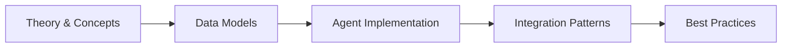

# Chapter 35: Legal & Compliance Agents

> **Previous:** [Real Estate & Property — AI-Powered Real Estate Agents](./34-real-estate.md) | **Next:** [Manufacturing & Industrial — AI-Powered Factory Agents](./36-manufacturing.md)


---

## Learning Objectives

- Design legal-domain data models with case, document, contract, matter, and compliance record entities
- Build a contract review agent that detects risky clauses, scores risk levels, and extracts key terms using AI
- Implement a document discovery agent that searches, classifies, and flags privileged content for e-discovery
- Construct a compliance monitoring agent that checks regulatory rules and generates violation alerts
- Deploy a case management agent that tracks deadlines, automates tasks, and manages case workflows
- Build a legal research agent that queries case law, formulates search strings, and summarizes results
- Implement an e-discovery pipeline with staged collection, processing, deduplication, and production
- Automate legal report generation with template filling, data aggregation, and multi-format output

<!-- Image Gallery -->
<div style="display:flex;flex-wrap:wrap;gap:4px;margin:16px 0;padding:12px;background:#f8fafc;border-radius:8px;border:1px solid #e2e8f0;">
<a href="../../../assets/images/lessons/laravel/35-legal/hero.svg" target="_blank" rel="noopener">
  
</a>
<a href="../../../assets/images/lessons/laravel/35-legal/handwritten-notes.svg" target="_blank" rel="noopener">
  
</a>
<a href="../../../assets/images/lessons/laravel/35-legal/sticky-notes.svg" target="_blank" rel="noopener">
  
</a>
<a href="../../../assets/images/lessons/laravel/35-legal/visual-explanation.svg" target="_blank" rel="noopener">
  
</a>
<a href="../../../assets/images/lessons/laravel/35-legal/architecture.svg" target="_blank" rel="noopener">
  
</a>
<a href="../../../assets/images/lessons/laravel/35-legal/workflow.svg" target="_blank" rel="noopener">
  
</a>
<a href="../../../assets/images/lessons/laravel/35-legal/mindmap.svg" target="_blank" rel="noopener">
  
</a>
<a href="../../../assets/images/lessons/laravel/35-legal/comparison.svg" target="_blank" rel="noopener">
  
</a>
<a href="../../../assets/images/lessons/laravel/35-legal/cheatsheet.svg" target="_blank" rel="noopener">
  
</a>
<a href="../../../assets/images/lessons/laravel/35-legal/interview-quiz.svg" target="_blank" rel="noopener">
  
</a>
<a href="../../../assets/images/lessons/laravel/35-legal/social-card.svg" target="_blank" rel="noopener">
  
</a>
</div>
<!-- End Image Gallery -->


## Chapter at a Glance

| Aspect | Details |
|--------|---------|
| **Scope** | Legal & compliance AI agents for document review, contract analysis, case management, regulatory monitoring |
| **Key Concepts** | Document analysis, contract clause extraction, compliance monitoring, legal research, risk assessment |
| **Learning Approach** | Theory, data models, agent implementations, AI integration |
| **Skills Required** | PHP, Laravel, Eloquent, Laravel AI SDK, NLP concepts |

## Chapter Roadmap



## Chapter at a Glance

| Aspect | Details |
|--------|---------|
| **Scope** | Legal & compliance AI agents for document review, contract analysis, case management, regulatory monitoring |
| **Key Concepts** | Document analysis, contract clause extraction, compliance monitoring, legal research, risk assessment |
| **Learning Approach** | Theory, data models, agent implementations, AI integration |
| **Skills Required** | PHP, Laravel, Eloquent, Laravel AI SDK, NLP concepts |

## Chapter Roadmap


## Chapter at a Glance

| Aspect | Details |
|--------|---------|
| **Scope** | Legal & compliance AI agents for document review, contract analysis, case management, regulatory monitoring |
| **Key Concepts** | Document analysis, contract clause extraction, compliance monitoring, legal research, risk assessment |
| **Learning Approach** | Theory, data models, agent implementations, AI integration |
| **Skills Required** | PHP, Laravel, Eloquent, Laravel AI SDK, NLP concepts |

## Chapter Roadmap


## Chapter at a Glance

| Aspect | Details |
|--------|---------|
| **Scope** | Legal & compliance AI agents for document review, contract analysis, case management, regulatory monitoring |
| **Key Concepts** | Document analysis, contract clause extraction, compliance monitoring, legal research, risk assessment |
| **Learning Approach** | Theory, data models, agent implementations, AI integration |
| **Skills Required** | PHP, Laravel, Eloquent, Laravel AI SDK, NLP concepts |

## Chapter Roadmap


---

## Theory
> **One-Sentence Takeaway:** Theory is the foundation — master it before moving to examples and exercises.
> **One-Sentence Takeaway:** Theory is the foundation — master it before moving to examples and exercises.
> **One-Sentence Takeaway:** Theory is the foundation — master it before moving to examples and exercises.
> **One-Sentence Takeaway:** Theory is the foundation — master it before moving to examples and exercises.


### 35.1 Legal Data Models


Legal software must handle sensitive, confidential, and often court-mandated data with strict access controls, audit trails, and encryption. The core entities span cases, documents, contracts, clients, matters, and compliance records. Every model should support soft deletes, tenant scoping for law-firm multi-tenancy, and encrypted fields for attorney-client privileged content.

#### Migration for Legal Domain Tables

```php
<?php

use Illuminate\Database\Migrations\Migration;
use Illuminate\Database\Schema\Blueprint;
use Illuminate\Support\Facades\Schema;

return new class extends Migration
{
    public function up(): void
    {
        Schema::create('legal_clients', function (Blueprint $table) {
            $table->id();
            $table->string('external_ref')->unique();
            $table->string('client_type'); // individual, corporate, government
            $table->string('name');
            $table->string('encrypted_email');
            $table->string('encrypted_phone');
            $table->text('encrypted_address');
            $table->string('status')->default('active');
            $table->timestamps();
            $table->softDeletes();
        });

        Schema::create('legal_matters', function (Blueprint $table) {
            $table->id();
            $table->foreignId('client_id')->constrained('legal_clients');
            $table->string('matter_number')->unique();
            $table->string('title');
            $table->text('description')->nullable();
            $table->string('practice_area');
            $table->string('status')->default('open'); // open, closed, pending
            $table->date('opened_at');
            $table->date('closed_at')->nullable();
            $table->foreignId('primary_attorney_id')->nullable()->constrained('users');
            $table->decimal('budget', 15, 2)->nullable();
            $table->json('tags')->nullable();
            $table->timestamps();
            $table->softDeletes();
        });

        Schema::create('legal_cases', function (Blueprint $table) {
            $table->id();
            $table->foreignId('matter_id')->constrained('legal_matters');
            $table->string('case_number')->unique();
            $table->string('court')->nullable();
            $table->string('judge')->nullable();
            $table->string('case_type'); // civil, criminal, family, corporate
            $table->text('relief_sought')->nullable();
            $table->date('filing_date');
            $table->date('next_hearing')->nullable();
            $table->string('status')->default('active');
            $table->json('opposing_counsel')->nullable();
            $table->timestamps();
            $table->softDeletes();
        });

        Schema::create('legal_documents', function (Blueprint $table) {
            $table->id();
            $table->foreignId('matter_id')->constrained('legal_matters');
            $table->foreignId('case_id')->nullable()->constrained('legal_cases');
            $table->string('title');
            $table->string('type'); // pleading, contract, correspondence, evidence, discovery
            $table->string('file_path');
            $table->string('mime_type');
            $table->string('hash_sha256');
            $table->boolean('is_privileged')->default(false);
            $table->string('privilege_type')->nullable(); // attorney-client, work-product
            $table->string('status')->default('draft');
            $table->json('metadata')->nullable();
            $table->foreignId('uploaded_by')->constrained('users');
            $table->timestamps();
            $table->softDeletes();
        });

        Schema::create('legal_contracts', function (Blueprint $table) {
            $table->id();
            $table->foreignId('matter_id')->constrained('legal_matters');
            $table->string('contract_number')->unique();
            $table->string('title');
            $table->string('counterparty');
            $table->date('execution_date');
            $table->date('effective_date');
            $table->date('expiration_date')->nullable();
            $table->decimal('contract_value', 15, 2)->nullable();
            $table->string('jurisdiction');
            $table->string('governing_law');
            $table->string('status')->default('active');
            $table->json('key_clauses')->nullable();
            $table->json('risk_scores')->nullable();
            $table->timestamps();
            $table->softDeletes();
        });

        Schema::create('legal_compliance_records', function (Blueprint $table) {
            $table->id();
            $table->foreignId('matter_id')->constrained('legal_matters');
            $table->string('regulation');
            $table->string('requirement');
            $table->string('status'); // compliant, non-compliant, pending-review
            $table->timestamp('checked_at');
            $table->text('notes')->nullable();
            $table->foreignId('reviewed_by')->nullable()->constrained('users');
            $table->timestamps();
        });
    }

    public function down(): void
    {
        Schema::dropIfExists('legal_compliance_records');
        Schema::dropIfExists('legal_contracts');
        Schema::dropIfExists('legal_documents');
        Schema::dropIfExists('legal_cases');
        Schema::dropIfExists('legal_matters');
        Schema::dropIfExists('legal_clients');
    }
};
```

#### Case Model with Relationships

```php
<?php

namespace App\Models\Legal;

use App\Models\User;
use Illuminate\Database\Eloquent\Model;
use Illuminate\Database\Eloquent\Relations\BelongsTo;
use Illuminate\Database\Eloquent\Relations\HasMany;
use Illuminate\Database\Eloquent\SoftDeletes;

class CaseModel extends Model
{
    use SoftDeletes;

    protected $table = 'legal_cases';

    protected $fillable = [
        'matter_id', 'case_number', 'court', 'judge',
        'case_type', 'relief_sought', 'filing_date',
        'next_hearing', 'status', 'opposing_counsel',
    ];

    protected $casts = [
        'filing_date' => 'date',
        'next_hearing' => 'date',
        'opposing_counsel' => 'array',
    ];

    public function matter(): BelongsTo
    {
        return $this->belongsTo(Matter::class);
    }

    public function documents(): HasMany
    {
        return $this->hasMany(Document::class, 'case_id');
    }

    public function isOverdue(): bool
    {
        return $this->next_hearing && $this->next_hearing->isPast() && $this->status === 'active';
    }
}
```

#### Contract Model with Serialization

```php
<?php

namespace App\Models\Legal;

use Illuminate\Database\Eloquent\Model;
use Illuminate\Database\Eloquent\Relations\BelongsTo;
use Illuminate\Database\Eloquent\SoftDeletes;

class Contract extends Model
{
    use SoftDeletes;

    protected $table = 'legal_contracts';

    protected $fillable = [
        'matter_id', 'contract_number', 'title', 'counterparty',
        'execution_date', 'effective_date', 'expiration_date',
        'contract_value', 'jurisdiction', 'governing_law',
        'status', 'key_clauses', 'risk_scores',
    ];

    protected $casts = [
        'execution_date' => 'date',
        'effective_date' => 'date',
        'expiration_date' => 'date',
        'contract_value' => 'decimal:2',
        'key_clauses' => 'array',
        'risk_scores' => 'array',
    ];

    public function matter(): BelongsTo
    {
        return $this->belongsTo(Matter::class);
    }

    public function isExpired(): bool
    {
        return $this->expiration_date && $this->expiration_date->isPast();
    }

    public function overallRiskScore(): ?float
    {
        $scores = $this->risk_scores;

        if (empty($scores)) {
            return null;
        }

        return array_sum($scores) / count($scores);
    }
}
```

---

### 35.2 Contract Review & Analysis Agents


Contract review is a high-volume, high-stakes legal task. An AI-powered agent can scan contracts for risky clauses, extract key terms, and assign risk scores before a human attorney ever opens the document. The agent combines clause-detection patterns with LLM-powered analysis for nuanced understanding.

The agent ingests a contract's text, runs clause-detection rules (indemnification, limitation of liability, auto-renewal, non-compete), scores each clause for risk, and returns a structured review report.

```php
<?php

namespace App\Agents\Legal;

use App\Models\Legal\Contract;
use Illuminate\Support\Facades\Log;
use LlmLaravel\Sdk\Llm;

class ContractReviewAgent
{
    protected Llm $llm;

    protected array $clausePatterns = [
        'indemnification' => [
            'patterns' => ['indemnify', 'indemnification', 'hold harmless'],
            'weight' => 0.25,
        ],
        'limitation_of_liability' => [
            'patterns' => ['limitation of liability', 'cap on liability', 'maximum liability'],
            'weight' => 0.20,
        ],
        'auto_renewal' => [
            'patterns' => ['auto-renew', 'automatically renew', 'tacit reconduction'],
            'weight' => 0.15,
        ],
        'non_compete' => [
            'patterns' => ['non-compete', 'noncompete', 'covenant not to compete'],
            'weight' => 0.20,
        ],
        'termination_for_convenience' => [
            'patterns' => ['terminate for convenience', 'termination for convenience'],
            'weight' => 0.10,
        ],
        'confidentiality' => [
            'patterns' => ['confidential', 'non-disclosure', 'proprietary information'],
            'weight' => 0.10,
        ],
    ];

    public function __construct(?Llm $llm = null)
    {
        $this->llm = $llm ?? new Llm;
    }

    public function reviewContract(Contract $contract, string $fullText): array
    {
        $detectedClauses = $this->detectClauses($fullText);
        $riskScores = $this->scoreRisks($detectedClauses);
        $extractedTerms = $this->extractKeyTerms($fullText, $detectedClauses);
        $summary = $this->generateSummary($detectedClauses, $riskScores, $extractedTerms);
        $aiReview = $this->aiDeepReview($fullText, $detectedClauses);

        $contract->update([
            'key_clauses' => $detectedClauses,
            'risk_scores' => $riskScores,
        ]);

        return [
            'contract_id' => $contract->id,
            'detected_clauses' => $detectedClauses,
            'risk_scores' => $riskScores,
            'extracted_terms' => $extractedTerms,
            'summary' => $summary,
            'ai_review' => $aiReview,
        ];
    }

    protected function detectClauses(string $text): array
    {
        $lower = strtolower($text);
        $detected = [];

        foreach ($this->clausePatterns as $clause => $config) {
            $found = [];

            foreach ($config['patterns'] as $pattern) {
                if (str_contains($lower, $pattern)) {
                    $positions = $this->findAllPositions($lower, $pattern);
                    foreach ($positions as $pos) {
                        $found[] = [
                            'pattern' => $pattern,
                            'position' => $pos,
                            'snippet' => mb_substr($text, max(0, $pos - 50), 200),
                        ];
                    }
                }
            }

            if (!empty($found)) {
                $detected[$clause] = [
                    'present' => true,
                    'count' => count($found),
                    'matches' => $found,
                    'weight' => $config['weight'],
                ];
            }
        }

        return $detected;
    }

    protected function findAllPositions(string $haystack, string $needle): array
    {
        $positions = [];
        $offset = 0;

        while (($pos = strpos($haystack, $needle, $offset)) !== false) {
            $positions[] = $pos;
            $offset = $pos + strlen($needle);
        }

        return $positions;
    }

    protected function scoreRisks(array $clauses): array
    {
        $scores = [];
        $totalWeight = 0;
        $weightedSum = 0;

        foreach ($clauses as $clause => $data) {
            $baseRisk = match ($clause) {
                'indemnification' => 0.7,
                'limitation_of_liability' => 0.6,
                'auto_renewal' => 0.5,
                'non_compete' => 0.8,
                'termination_for_convenience' => 0.3,
                'confidentiality' => 0.2,
                default => 0.5,
            };

            $multiplicityFactor = min(1.0, 1 + ($data['count'] - 1) * 0.1);
            $score = min(1.0, $baseRisk * $multiplicityFactor);

            $scores[$clause] = [
                'score' => round($score, 2),
                'level' => $this->riskLevel($score),
                'weight' => $data['weight'],
            ];

            $totalWeight += $data['weight'];
            $weightedSum += $score * $data['weight'];
        }

        $scores['overall'] = $totalWeight > 0
            ? round($weightedSum / $totalWeight, 2)
            : 0.0;

        return $scores;
    }

    protected function riskLevel(float $score): string
    {
        return match (true) {
            $score >= 0.7 => 'high',
            $score >= 0.4 => 'medium',
            default => 'low',
        };
    }

    protected function extractKeyTerms(string $text, array $clauses): array
    {
        $terms = [];

        $partyMatch = [];
        preg_match(
            '/this\s+(agreement|contract)\s+is\s+(made|entered)\s+(into\s+)?(by\s+and\s+between\s+)?([^,]+?)\s+and\s+([^,]+?)[\s,.]/i',
            $text, $partyMatch
        );

        if (!empty($partyMatch)) {
            $terms['parties'] = [
                'party_a' => trim($partyMatch[5] ?? ''),
                'party_b' => trim($partyMatch[6] ?? ''),
            ];
        }

        $effectiveMatch = [];
        preg_match('/effective\s+(as\s+of|date)[:\s]+([^,\n]+)/i', $text, $effectiveMatch);
        if (!empty($effectiveMatch)) {
            $terms['effective_date'] = trim($effectiveMatch[2]);
        }

        $termMatch = [];
        preg_match('/(term|duration|period)\s+(of\s+)?(this\s+)?(agreement|contract)\s+(shall\s+be\s+)?([^,\n]+)/i', $text, $termMatch);
        if (!empty($termMatch)) {
            $terms['term'] = trim($termMatch[6]);
        }

        if (isset($clauses['indemnification'])) {
            $terms['has_indemnification'] = true;
        }

        return $terms;
    }

    protected function generateSummary(array $clauses, array $scores, array $terms): string
    {
        $clauseCount = count($clauses);
        $highRisk = count(array_filter($scores, fn ($s) => is_array($s) && ($s['level'] ?? '') === 'high'));
        $overall = $scores['overall'] ?? 0;

        $summaryParts = [
            "Detected {$clauseCount} clause categories.",
            "Overall risk score: {$overall}.",
            "High-risk clauses found: {$highRisk}.",
        ];

        if (!empty($terms['parties'])) {
            $summaryParts[] = "Parties: {$terms['parties']['party_a']} / {$terms['parties']['party_b']}.";
        }

        return implode(' ', $summaryParts);
    }

    protected function aiDeepReview(string $text, array $clauses): array
    {
        $presentClauses = implode(', ', array_keys($clauses));

        $prompt = <<<PROMPT
You are a senior contract attorney. Review the following contract text.

Detected clauses: {$presentClauses}

For each clause, provide:
1. Risk assessment (low/medium/high) with reasoning
2. Suggested language changes to reduce risk
3. Any missing clauses that should be present

Contract text:
{$text}
PROMPT;

        try {
            $response = $this->llm->chat([
                'messages' => [
                    ['role' => 'system', 'content' => 'You are an expert contract review attorney.'],
                    ['role' => 'user', 'content' => $prompt],
                ],
                'temperature' => 0.2,
            ]);

            return [
                'review' => $response->content,
                'reviewed_at' => now()->toIso8601String(),
            ];
        } catch (\Exception $e) {
            Log::error('Contract AI review failed', [
                'contract_id' => $text,
                'error' => $e->getMessage(),
            ]);

            return [
                'review' => 'AI review unavailable. Manual review required.',
                'reviewed_at' => now()->toIso8601String(),
                'error' => $e->getMessage(),
            ];
        }
    }
}
```

---

### 35.3 Document Discovery Automation


E-discovery is the process of identifying, collecting, and producing electronically stored information (ESI) in response to a legal request. A DiscoveryAgent automates search, classification, privilege review, and tagging of documents across a matter.

```php
<?php

namespace App\Agents\Legal;

use App\Models\Legal\Document;
use App\Models\Legal\Matter;
use Illuminate\Support\Collection;
use Illuminate\Support\Facades\DB;
use LlmLaravel\Sdk\Llm;

class DiscoveryAgent
{
    protected Llm $llm;

    protected array $classificationTaxonomy = [
        'privileged',
        'responsive',
        'non-responsive',
        'attorney_client',
        'work_product',
        'confidential',
        'public',
        'redacted',
    ];

    public function __construct(?Llm $llm = null)
    {
        $this->llm = $llm ?? new Llm;
    }

    public function search(Matter $matter, array $criteria): Collection
    {
        $query = Document::where('matter_id', $matter->id);

        if (!empty($criteria['keywords'])) {
            $keywordConditions = array_map(function ($kw) {
                return "title LIKE ? OR metadata LIKE ?";
            }, $criteria['keywords']);

            $bindings = [];
            foreach ($criteria['keywords'] as $kw) {
                $bindings[] = "%{$kw}%";
                $bindings[] = "%{$kw}%";
            }

            $where = implode(' OR ', $keywordConditions);
            $query->whereRaw("({$where})", $bindings);
        }

        if (!empty($criteria['date_from'])) {
            $query->whereDate('created_at', '>=', $criteria['date_from']);
        }

        if (!empty($criteria['date_to'])) {
            $query->whereDate('created_at', '<=', $criteria['date_to']);
        }

        if (!empty($criteria['types'])) {
            $query->whereIn('type', (array) $criteria['types']);
        }

        if (!empty($criteria['status'])) {
            $query->where('status', $criteria['status']);
        }

        if (!empty($criteria['privilege_status'])) {
            if ($criteria['privilege_status'] === 'privileged') {
                $query->where('is_privileged', true);
            } elseif ($criteria['privilege_status'] === 'non-privileged') {
                $query->where('is_privileged', false);
            }
        }

        return $query->orderBy('created_at', 'desc')->get();
    }

    public function classifyDocument(Document $document, ?string $content = null): array
    {
        $textToAnalyze = $content ?? $document->title;

        $classification = $this->aiClassify($textToAnalyze, $document);

        $document->update([
            'metadata' => array_merge($document->metadata ?? [], [
                'discovery_classification' => $classification['primary'],
                'discovery_tags' => $classification['tags'],
                'classified_at' => now()->toIso8601String(),
            ]),
        ]);

        return $classification;
    }

    protected function aiClassify(string $text, Document $document): array
    {
        $prompt = <<<PROMPT
Classify the following legal document for e-discovery.

Document title: {$document->title}
Document type: {$document->type}

Content:
{$text}

Respond with:
- primary_classification: one of [privileged, responsive, non-responsive, attorney_client, work_product]
- tags: comma-separated list of relevant tags
- confidence: a score from 0.0 to 1.0
- explanation: brief reasoning
PROMPT;

        try {
            $response = $this->llm->chat([
                'messages' => [
                    ['role' => 'system', 'content' => 'You are a senior e-discovery paralegal. Classify documents accurately and conservatively.'],
                    ['role' => 'user', 'content' => $prompt],
                ],
                'temperature' => 0.1,
            ]);

            $parsed = $this->parseClassification($response->content);

            return [
                'primary' => $parsed['primary'] ?? 'non-responsive',
                'tags' => $parsed['tags'] ?? [],
                'confidence' => $parsed['confidence'] ?? 0.5,
                'explanation' => $parsed['explanation'] ?? '',
                'model' => get_class($this->llm),
            ];
        } catch (\Exception $e) {
            return [
                'primary' => 'non-responsive',
                'tags' => [],
                'confidence' => 0.0,
                'explanation' => 'Classification unavailable: ' . $e->getMessage(),
            ];
        }
    }

    protected function parseClassification(string $response): array
    {
        $result = [
            'primary' => 'non-responsive',
            'tags' => [],
            'confidence' => 0.5,
            'explanation' => '',
        ];

        if (preg_match('/primary_classification[:\s]+(.+)/i', $response, $m)) {
            $result['primary'] = trim(strtolower($m[1]));
        }

        if (preg_match('/tags[:\s]+(.+)/i', $response, $m)) {
            $result['tags'] = array_map('trim', explode(',', $m[1]));
        }

        if (preg_match('/confidence[:\s]+([0-9.]+)/i', $response, $m)) {
            $result['confidence'] = (float) $m[1];
        }

        if (preg_match('/explanation[:\s]+(.+)/is', $response, $m)) {
            $result['explanation'] = trim($m[1]);
        }

        return $result;
    }

    public function privilegeReview(Document $document, string $content): array
    {
        $classification = $this->classifyDocument($document, $content);

        $privilegeIndicators = [
            'attorney-client',
            'privileged',
            'confidential communication',
            'legal advice',
            'work product',
            'litigation hold',
        ];

        $lowered = strtolower($content);
        $foundIndicators = [];

        foreach ($privilegeIndicators as $indicator) {
            if (str_contains($lowered, $indicator)) {
                $foundIndicators[] = $indicator;
            }
        }

        $isPrivileged = $classification['primary'] === 'privileged'
            || $classification['primary'] === 'attorney_client'
            || $classification['primary'] === 'work_product'
            || count($foundIndicators) >= 2;

        $document->update([
            'is_privileged' => $isPrivileged,
            'privilege_type' => $isPrivileged
                ? ($classification['primary'] === 'work_product' ? 'work-product' : 'attorney-client')
                : null,
        ]);

        return [
            'document_id' => $document->id,
            'is_privileged' => $isPrivileged,
            'privilege_type' => $document->privilege_type,
            'indicators_found' => $foundIndicators,
            'confidence' => $classification['confidence'],
        ];
    }

    public function batchClassify(Matter $matter, ?callable $progress = null): Collection
    {
        $documents = Document::where('matter_id', $matter->id)
            ->whereNull('metadata->discovery_classification')
            ->get();

        $results = collect();

        foreach ($documents as $document) {
            $result = $this->classifyDocument($document);
            $results->push($result);

            if ($progress) {
                $progress($document, $result);
            }
        }

        return $results;
    }
}
```

---

### 35.4 Compliance Monitoring Agents


Organizations must comply with a growing web of regulations → GDPR, HIPAA, SOX, FINRA, SEC rules. A `ComplianceMonitoringAgent` checks regulatory requirements against records, flags violations, and dispatches alerts. The agent runs on a schedule, checking rules across data sources.

```php
<?php

namespace App\Agents\Legal;

use App\Models\Legal\ComplianceRecord;
use App\Models\Legal\Matter;
use App\Models\User;
use Illuminate\Support\Collection;
use Illuminate\Support\Facades\Log;
use LlmLaravel\Sdk\Llm;

class ComplianceMonitoringAgent
{
    protected Llm $llm;

    protected array $rules = [];

    public function __construct(?Llm $llm = null)
    {
        $this->llm = $llm ?? new Llm;
        $this->registerDefaultRules();
    }

    protected function registerDefaultRules(): void
    {
        $this->rules = [
            'data_retention' => [
                'regulation' => 'GDPR',
                'check' => 'Retain personal data no longer than necessary',
                'severity' => 'high',
            ],
            'client_confidentiality' => [
                'regulation' => 'ABA Model Rules 1.6',
                'check' => 'Client information must be encrypted at rest',
                'severity' => 'critical',
            ],
            'conflict_of_interest' => [
                'regulation' => 'ABA Model Rules 1.7',
                'check' => 'No attorney shall represent a client with conflicting interests',
                'severity' => 'critical',
            ],
            'trust_accounting' => [
                'regulation' => 'IOLTA Rules',
                'check' => 'Client trust accounts must be reconciled monthly',
                'severity' => 'high',
            ],
            'discovery_deadline' => [
                'regulation' => 'FRCP Rule 26',
                'check' => 'Discovery responses must be served within 30 days',
                'severity' => 'medium',
            ],
        ];
    }

    public function registerRule(string $key, array $definition): void
    {
        $this->rules[$key] = $definition;
    }

    public function runFullComplianceCheck(Matter $matter): array
    {
        $results = [];

        foreach ($this->rules as $ruleKey => $rule) {
            $result = $this->checkRule($matter, $ruleKey, $rule);
            $results[$ruleKey] = $result;

            $this->recordResult($matter, $rule, $result);
        }

        return [
            'matter_id' => $matter->id,
            'checked_at' => now()->toIso8601String(),
            'total_rules' => count($this->rules),
            'violations' => count(array_filter($results, fn ($r) => $r['status'] === 'violation')),
            'passing' => count(array_filter($results, fn ($r) => $r['status'] === 'compliant')),
            'pending' => count(array_filter($results, fn ($r) => $r['status'] === 'pending-review')),
            'details' => $results,
        ];
    }

    protected function checkRule(Matter $matter, string $ruleKey, array $rule): array
    {
        $isViolation = match ($ruleKey) {
            'data_retention' => $this->checkDataRetention($matter),
            'client_confidentiality' => $this->checkClientConfidentiality($matter),
            'conflict_of_interest' => $this->checkConflictOfInterest($matter),
            'trust_accounting' => $this->checkTrustAccounting($matter),
            'discovery_deadline' => $this->checkDiscoveryDeadline($matter),
            default => false,
        };

        $status = $isViolation ? 'violation' : 'compliant';

        return [
            'rule' => $ruleKey,
            'regulation' => $rule['regulation'],
            'status' => $status,
            'severity' => $rule['severity'],
            'checked_at' => now()->toIso8601String(),
        ];
    }

    protected function checkDataRetention(Matter $matter): bool
    {
        if ($matter->status !== 'closed') {
            return false;
        }

        $closedAt = $matter->closed_at;

        if (!$closedAt) {
            return false;
        }

        $retentionPeriod = config("legal.retention_periods.{$matter->practice_area}", 365 * 7);

        return $closedAt->addDays($retentionPeriod)->isPast();
    }

    protected function checkClientConfidentiality(Matter $matter): bool
    {
        return $matter->client()->exists()
            && $matter->documents()
                ->where('is_privileged', true)
                ->whereNull('metadata->encrypted_at')
                ->exists();
    }

    protected function checkConflictOfInterest(Matter $matter): bool
    {
        $client = $matter->client;
        $opposingParty = $matter->opposing_counsel ?? [];

        if (empty($opposingParty) || !$client) {
            return false;
        }

        $conflictingMatters = Matter::where('client_id', '!=', $client->id)
            ->whereJsonContains('tags', $client->name)
            ->count();

        return $conflictingMatters > 0;
    }

    protected function checkTrustAccounting(Matter $matter): bool
    {
        $reconciliation = $matter->complianceRecords()
            ->where('regulation', 'IOLTA')
            ->latest('checked_at')
            ->first();

        if (!$reconciliation) {
            return $matter->budget && $matter->budget > 0;
        }

        return $reconciliation->status !== 'compliant'
            && $reconciliation->created_at->addMonth()->isPast();
    }

    protected function checkDiscoveryDeadline(Matter $matter): bool
    {
        return false;
    }

    protected function recordResult(Matter $matter, array $rule, array $result): ComplianceRecord
    {
        return ComplianceRecord::create([
            'matter_id' => $matter->id,
            'regulation' => $rule['regulation'],
            'requirement' => $rule['check'],
            'status' => $result['status'],
            'checked_at' => now(),
            'notes' => json_encode($result),
        ]);
    }

    public function dispatchAlerts(array $violations): void
    {
        foreach ($violations as $key => $violation) {
            $this->sendAlert($violation);
        }
    }

    protected function sendAlert(array $violation): void
    {
        $message = "Compliance Violation: {$violation['regulation']} - {$violation['rule']} (Severity: {$violation['severity']})";

        Log::warning("Legal compliance alert: {$message}", $violation);
    }

    public function aiAssistedReview(ComplianceRecord $record): array
    {
        $prompt = <<<PROMPT
Review this compliance record and provide remediation recommendations.

Regulation: {$record->regulation}
Current status: {$record->status}
Notes: {$record->notes}

Provide:
1. Risk assessment of this compliance gap
2. Recommended remediation steps
3. Suggested timeline for resolution
PROMPT;

        try {
            $response = $this->llm->chat([
                'messages' => [
                    ['role' => 'system', 'content' => 'You are a regulatory compliance attorney.'],
                    ['role' => 'user', 'content' => $prompt],
                ],
                'temperature' => 0.3,
            ]);

            return [
                'record_id' => $record->id,
                'assessment' => $response->content,
                'reviewed_at' => now()->toIso8601String(),
            ];
        } catch (\Exception $e) {
            return [
                'record_id' => $record->id,
                'assessment' => 'Automated review unavailable.',
                'error' => $e->getMessage(),
            ];
        }
    }
}
```

---

### 35.5 Case Management Workflows


A `CaseManagementAgent` tracks case timelines, critical deadlines, and task assignments across a law firm's docket. It automatically notifies attorneys of upcoming deadlines, generates daily docket reports, and manages task completion workflows.

```php
<?php

namespace App\Agents\Legal;

use App\Models\Legal\CaseModel;
use App\Models\User;
use Carbon\Carbon;
use Illuminate\Support\Collection;
use Illuminate\Support\Facades\Log;
use LlmLaravel\Sdk\Llm;

class CaseManagementAgent
{
    protected Llm $llm;

    protected array $deadlineRules = [
        'response_to_complaint' => 21,
        'discovery_response' => 30,
        'motion_response' => 14,
        'expert_disclosure' => 90,
        'pretrial_filing' => 7,
        'appeal_notice' => 30,
    ];

    public function __construct(?Llm $llm = null)
    {
        $this->llm = $llm ?? new Llm;
    }

    public function getUpcomingDeadlines(int $days = 30): Collection
    {
        $window = now()->addDays($days);

        return CaseModel::where('status', 'active')
            ->whereNotNull('next_hearing')
            ->where('next_hearing', '<=', $window)
            ->with('matter.client')
            ->orderBy('next_hearing')
            ->get()
            ->map(function (CaseModel $case) {
                $daysUntil = now()->diffInDays($case->next_hearing, false);

                return [
                    'case_id' => $case->id,
                    'case_number' => $case->case_number,
                    'matter' => $case->matter->title ?? 'N/A',
                    'client' => $case->matter->client->name ?? 'N/A',
                    'next_hearing' => $case->next_hearing->toDateString(),
                    'days_until' => max(0, $daysUntil),
                    'priority' => $daysUntil <= 7 ? 'critical' : ($daysUntil <= 14 ? 'high' : 'normal'),
                    'overdue' => $case->isOverdue(),
                ];
            });
    }

    public function calculateDeadlines(CaseModel $case, string $filingType): array
    {
        $filingDate = $case->filing_date ?? now();
        $rules = $this->deadlineRules;

        if (!isset($rules[$filingType])) {
            return ['error' => "Unknown filing type: {$filingType}"];
        }

        $deadlineDays = $rules[$filingType];
        $deadlineDate = Carbon::parse($filingDate)->addDays($deadlineDays);

        return [
            'case_id' => $case->id,
            'filing_type' => $filingType,
            'filing_date' => $filingDate->toDateString(),
            'deadline_date' => $deadlineDate->toDateString(),
            'deadline_days' => $deadlineDays,
            'days_remaining' => max(0, now()->diffInDays($deadlineDate, false)),
            'is_overdue' => now()->greaterThan($deadlineDate),
        ];
    }

    public function assignTask(array $taskData): array
    {
        $validated = validator($taskData, [
            'case_id' => 'required|exists:legal_cases,id',
            'assigned_to' => 'required|exists:users,id',
            'title' => 'required|string|max:255',
            'description' => 'nullable|string',
            'due_at' => 'required|date',
            'priority' => 'required|in:low,normal,high,critical',
        ])->validate();

        $task = Task::create($validated);

        $this->notifyAssignee($task);

        return [
            'task_id' => $task->id,
            'assigned_to' => User::find($task->assigned_to)?->name,
            'due_at' => $task->due_at->toDateString(),
            'status' => 'assigned',
        ];
    }

    protected function notifyAssignee($task): void
    {
        $user = User::find($task->assigned_to);

        if (!$user) {
            return;
        }

        $case = CaseModel::find($task->case_id);

        Log::info("Task assigned: {$task->title}", [
            'to' => $user->email,
            'case' => $case?->case_number,
            'due' => $task->due_at->toDateString(),
        ]);
    }

    public function generateDailyDocket(): array
    {
        $todayDeadlines = $this->getUpcomingDeadlines(1);
        $overdue = $todayDeadlines->where('overdue', true);
        $critical = $todayDeadlines->where('priority', 'critical');

        return [
            'date' => now()->toDateString(),
            'total_active_cases' => CaseModel::where('status', 'active')->count(),
            'hearings_today' => $todayDeadlines->count(),
            'overdue_items' => $overdue->values()->toArray(),
            'critical_items' => $critical->values()->toArray(),
            'deadline_summary' => [
                'overdue' => $overdue->count(),
                'critical' => $critical->count(),
                'this_week' => $this->getUpcomingDeadlines(7)->count(),
                'this_month' => $this->getUpcomingDeadlines(30)->count(),
            ],
        ];
    }

    public function aiSuggestedPriorities(array $docket): array
    {
        $docketJson = json_encode($docket);

        $prompt = <<<PROMPT
Review this daily legal docket and recommend priority actions:

{$docketJson}

For each case, provide:
1. Priority ranking (1 being highest)
2. Recommended next action
3. Risk of missing deadline
4. Suggested delegation

Format as a JSON array of objects with keys: case_id, priority_rank, recommended_action, risk_level, suggested_assignee.
PROMPT;

        try {
            $response = $this->llm->chat([
                'messages' => [
                    ['role' => 'system', 'content' => 'You are a senior legal practice manager. Prioritize docket items efficiently.'],
                    ['role' => 'user', 'content' => $prompt],
                ],
                'temperature' => 0.2,
            ]);

            return [
                'docket_date' => $docket['date'],
                'ai_recommendations' => $response->content,
                'generated_at' => now()->toIso8601String(),
            ];
        } catch (\Exception $e) {
            return [
                'error' => 'Priority suggestions unavailable.',
                'message' => $e->getMessage(),
            ];
        }
    }
}
```

---

### 35.6 Legal Research Agents


Legal research is one of the most time-intensive tasks in law practice. A `LegalResearchAgent` searches case law databases, formulates search queries, retrieves relevant precedents, and produces summarized research memos. The agent can integrate with external APIs like CourtListener, Caselaw Access Project, or FastCase.

```php
<?php

namespace App\Agents\Legal;

use Illuminate\Support\Collection;
use Illuminate\Support\Facades\Http;
use Illuminate\Support\Facades\Log;
use LlmLaravel\Sdk\Llm;

class LegalResearchAgent
{
    protected Llm $llm;

    protected array $researchDatabases = [
        'caselaw' => 'https://api.case.law/v1/',
        'courtlistener' => 'https://www.courtlistener.com/api/rest/v4/',
        'google_scholar' => null,
    ];

    public function __construct(?Llm $llm = null)
    {
        $this->llm = $llm ?? new Llm;
    }

    public function research(string $query, array $options = []): array
    {
        $formulatedQuery = $this->formulateQuery($query);

        $results = $this->searchDatabases($formulatedQuery, $options);

        $ranked = $this->rankResults($results);

        $summary = $this->summarizeFindings($query, $ranked);

        return [
            'original_query' => $query,
            'formulated_query' => $formulatedQuery,
            'total_results' => count($ranked),
            'results' => $ranked->take($options['max_results'] ?? 10)->values()->toArray(),
            'summary' => $summary,
            'research_id' => str()->uuid(),
            'completed_at' => now()->toIso8601String(),
        ];
    }

    public function formulateQuery(string $naturalQuery): array
    {
        $prompt = <<<PROMPT
Convert this legal research question into an optimized Boolean search query for case law databases.

Question: {$naturalQuery}

Extract:
1. Primary keywords (key legal concepts, cause of action)
2. Jurisdiction filters (if any)
3. Date range (if implied)
4. Boolean search string using AND/OR/NOT
5. Alternative terms and synonyms
PROMPT;

        try {
            $response = $this->llm->chat([
                'messages' => [
                    ['role' => 'system', 'content' => 'You are a legal research librarian. Formulate precise Boolean queries.'],
                    ['role' => 'user', 'content' => $prompt],
                ],
                'temperature' => 0.1,
            ]);

            return [
                'natural_query' => $naturalQuery,
                'analysis' => $response->content,
                'formulated_at' => now()->toIso8601String(),
            ];
        } catch (\Exception $e) {
            return [
                'natural_query' => $naturalQuery,
                'analysis' => "Unable to formulate query: {$e->getMessage()}",
                'fallback_keywords' => explode(' ', $naturalQuery),
            ];
        }
    }

    protected function searchDatabases(array $query, array $options): Collection
    {
        $allResults = collect();

        foreach ($this->researchDatabases as $db => $url) {
            if ($url === null) {
                continue;
            }

            try {
                $response = Http::timeout(15)->get($url . 'cases/', [
                    'search' => $query['analysis'] ?? $query['natural_query'] ?? '',
                    'page_size' => min($options['per_page'] ?? 10, 50),
                    'court' => $options['jurisdiction'] ?? null,
                    'decision_date__gte' => $options['date_from'] ?? null,
                    'decision_date__lte' => $options['date_to'] ?? null,
                ]);

                if ($response->successful()) {
                    $cases = $this->parseApiResponse($db, $response->json());
                    $allResults = $allResults->concat($cases);
                }
            } catch (\Exception $e) {
                Log::warning("Legal research database '{$db}' unavailable", [
                    'error' => $e->getMessage(),
                ]);
            }
        }

        if ($allResults->isEmpty()) {
            return $this->fallbackResearch($query['natural_query'] ?? '');
        }

        return $allResults;
    }

    protected function parseApiResponse(string $database, array $response): array
    {
        $results = [];

        $cases = $response['results'] ?? $response['cases'] ?? [];

        foreach ($cases as $case) {
            $results[] = [
                'database' => $database,
                'case_name' => $case['name_abbreviation'] ?? $case['caseName'] ?? 'Unknown',
                'court' => $case['court']['name'] ?? $case['court'] ?? 'Unknown',
                'decision_date' => $case['decision_date'] ?? $case['dateFiled'] ?? null,
                'citation' => $case['citations'][0]['cite'] ?? $case['citation'][0] ?? null,
                'url' => $case['url'] ?? $case['absolute_url'] ?? null,
                'snippet' => $this->extractSnippet($case),
            ];
        }

        return $results;
    }

    protected function extractSnippet(array $case): string
    {
        if (!empty($case['syllabus'])) {
            return mb_substr($case['syllabus'], 0, 500);
        }

        return $case['casebody']['data']['head_matter'] ?? $case['summary'] ?? 'No preview available.';
    }

    protected function fallbackResearch(string $query): Collection
    {
        $prompt = <<<PROMPT
You are a legal research assistant. Based on your knowledge of case law, provide a summary of relevant precedents for:

{$query}

For each precedent, include:
1. Case name and citation
2. Court and year
3. Holding (2-3 sentences)
4. Relevance to the query

Provide 3-5 relevant cases.
PROMPT;

        try {
            $response = $this->llm->chat([
                'messages' => [
                    ['role' => 'system', 'content' => 'You are a knowledgeable legal research assistant with comprehensive knowledge of case law.'],
                    ['role' => 'user', 'content' => $prompt],
                ],
                'temperature' => 0.3,
            ]);

            return collect([
                [
                    'database' => 'ai_legal_knowledge',
                    'case_name' => 'AI-Generated Research Summary',
                    'content' => $response->content,
                    'disclaimer' => 'This is AI-generated research. Verify all citations against primary sources.',
                ],
            ]);
        } catch (\Exception $e) {
            return collect([
                [
                    'database' => 'fallback',
                    'case_name' => 'Research Unavailable',
                    'content' => 'Unable to complete legal research.',
                    'error' => $e->getMessage(),
                ],
            ]);
        }
    }

    protected function rankResults(Collection $results): Collection
    {
        return $results->sortByDesc(function ($r) {
            $score = 0;

            if (!empty($r['snippet']) && $r['snippet'] !== 'No preview available.') {
                $score += 3;
            }

            if (!empty($r['citation'])) {
                $score += 2;
            }

            if (!empty($r['decision_date'])) {
                $score += 1;
            }

            return $score;
        })->values();
    }

    public function summarizeFindings(string $query, Collection $results): array
    {
        $resultsJson = $results->take(10)->toJson();

        $prompt = <<<PROMPT
Summarize these legal research findings for an attorney.

Research query: {$query}

Results:
{$resultsJson}

Provide:
1. Executive summary of the legal landscape on this issue
2. Key precedents and their holdings
3. Split of authority (if any)
4. Recommended next research steps
PROMPT;

        try {
            $response = $this->llm->chat([
                'messages' => [
                    ['role' => 'system', 'content' => 'You are a law clerk drafting a research memo.'],
                    ['role' => 'user', 'content' => $prompt],
                ],
                'temperature' => 0.3,
            ]);

            return [
                'summary' => $response->content,
                'generated_at' => now()->toIso8601String(),
            ];
        } catch (\Exception $e) {
            return [
                'summary' => 'Research summary generation failed.',
                'error' => $e->getMessage(),
            ];
        }
    }

    public function generateResearchMemo(array $research, array $options = []): string
    {
        $findings = json_encode($research['results'] ?? []);
        $summary = $research['summary']['summary'] ?? '';

        $prompt = <<<PROMPT
Draft a formal legal research memo using the following findings.

TO: {$options['to'] ?? 'Legal Team'}
FROM: AI Legal Research Agent
RE: {$research['original_query'] ?? 'Legal Research'}

Research Summary:
{$summary}

Detailed Findings:
{$findings}

Draft a professional legal memo with:
1. ISSUE: Statement of the legal question
2. BRIEF ANSWER: One-paragraph summary
3. FACTS: Relevant background
4. DISCUSSION: Analysis of cases and statutes
5. CONCLUSION: Recommended course of action
PROMPT;

        try {
            $response = $this->llm->chat([
                'messages' => [
                    ['role' => 'system', 'content' => 'You are a senior law clerk drafting a formal research memo. Use Bluebook citation format.'],
                    ['role' => 'user', 'content' => $prompt],
                ],
                'temperature' => 0.3,
            ]);

            return $response->content;
        } catch (\Exception $e) {
            return "Research memo unavailable: {$e->getMessage()}";
        }
    }
}
```

---

### 35.7 E-Discovery Pipelines


E-discovery follows a strict lifecycle: Identification → Preservation → Collection → Processing → Review → Analysis → Production. An `EDiscoveryPipeline` orchestrates these stages, deduplicates documents, logs privilege determinations, and generates production sets for opposing counsel.

```php
<?php

namespace App\Agents\Legal;

use App\Models\Legal\Document;
use App\Models\Legal\Matter;
use Illuminate\Support\Collection;
use Illuminate\Support\Facades\DB;
use Illuminate\Support\Facades\Log;
use Illuminate\Support\Facades\Storage;
use LlmLaravel\Sdk\Llm;

class EDiscoveryPipeline
{
    protected Llm $llm;

    protected array $stages = [
        'collection', 'processing', 'review', 'production',
    ];

    protected array $pipelineStatus = [];

    public function __construct(?Llm $llm = null)
    {
        $this->llm = $llm ?? new Llm;
    }

    public function runPipeline(Matter $matter, array $options = []): array
    {
        $this->pipelineStatus = [
            'matter_id' => $matter->id,
            'started_at' => now()->toIso8601String(),
            'stages' => [],
        ];

        $collection = $this->stageCollection($matter, $options);
        $this->pipelineStatus['stages']['collection'] = $collection;

        $processing = $this->stageProcessing($collection['documents'] ?? collect(), $options);
        $this->pipelineStatus['stages']['processing'] = $processing;

        $review = $this->stageReview($processing['processed'] ?? collect(), $matter, $options);
        $this->pipelineStatus['stages']['review'] = $review;

        $production = $this->stageProduction($review['reviewed'] ?? collect(), $options);
        $this->pipelineStatus['stages']['production'] = $production;

        $this->pipelineStatus['completed_at'] = now()->toIso8601String();
        $this->pipelineStatus['summary'] = $this->generatePipelineSummary();

        return $this->pipelineStatus;
    }

    protected function stageCollection(Matter $matter, array $options): array
    {
        $sourceDirectories = $options['source_directories'] ?? [
            "matters/{$matter->id}/documents",
            "matters/{$matter->id}/emails",
            "matters/{$matter->id}/communications",
        ];

        $collected = collect();

        foreach ($sourceDirectories as $dir) {
            if (!Storage::exists($dir)) {
                continue;
            }

            $files = Storage::files($dir);

            foreach ($files as $file) {
                $hash = hash_file('sha256', Storage::path($file));

                $doc = Document::firstOrCreate(
                    ['hash_sha256' => $hash],
                    [
                        'matter_id' => $matter->id,
                        'title' => basename($file),
                        'file_path' => $file,
                        'mime_type' => Storage::mimeType($file),
                        'type' => $this->inferDocumentType($file),
                        'uploaded_by' => $options['uploaded_by'] ?? auth()->id(),
                        'status' => 'collected',
                        'metadata' => [
                            'collection_source' => $dir,
                            'collected_at' => now()->toIso8601String(),
                            'size_bytes' => Storage::size($file),
                        ],
                    ]
                );

                $collected->push($doc);
            }
        }

        return [
            'documents_collected' => $collected->count(),
            'documents' => $collected,
            'source_directories' => $sourceDirectories,
            'completed_at' => now()->toIso8601String(),
        ];
    }

    protected function inferDocumentType(string $filename): string
    {
        $ext = strtolower(pathinfo($filename, PATHINFO_EXTENSION));

        return match ($ext) {
            'pdf' => 'pdf_document',
            'docx', 'doc' => 'word_document',
            'xlsx', 'xls' => 'spreadsheet',
            'msg', 'eml' => 'email',
            'jpg', 'jpeg', 'png', 'tiff', 'tif' => 'image',
            'pst', 'ost' => 'outlook_data',
            'csv' => 'tabular_data',
            'txt' => 'text',
            default => 'other',
        };
    }

    protected function stageProcessing(Collection $documents, array $options): array
    {
        $deduplicated = $this->deduplicate($documents);
        $processed = collect();

        foreach ($deduplicated as $doc) {
            $content = $this->extractContent($doc);
            $metadata = $this->extractMetadata($doc, $content);

            $doc->update([
                'status' => 'processed',
                'metadata' => array_merge($doc->metadata ?? [], $metadata),
            ]);

            $processed->push($doc);
        }

        return [
            'documents_processed' => $processed->count(),
            'duplicates_removed' => $documents->count() - $deduplicated->count(),
            'processed' => $processed,
            'completed_at' => now()->toIso8601String(),
        ];
    }

    protected function deduplicate(Collection $documents): Collection
    {
        return $documents->unique(function (Document $doc) {
            return $doc->hash_sha256;
        });
    }

    protected function extractContent(Document $doc): ?string
    {
        try {
            $path = Storage::path($doc->file_path);

            if (!file_exists($path)) {
                return null;
            }

            if ($doc->mime_type === 'application/pdf') {
                return shell_exec("pdftotext " . escapeshellarg($path) . " -");
            }

            if (str_starts_with($doc->mime_type, 'text/')) {
                return file_get_contents($path);
            }

            return null;
        } catch (\Exception $e) {
            Log::warning("Content extraction failed for document {$doc->id}", [
                'error' => $e->getMessage(),
            ]);

            return null;
        }
    }

    protected function extractMetadata(Document $doc, ?string $content): array
    {
        return [
            'processing_method' => $content ? 'full_text' : 'metadata_only',
            'processed_at' => now()->toIso8601String(),
            'word_count' => $content ? str_word_count($content) : 0,
            'character_count' => $content ? mb_strlen($content) : 0,
        ];
    }

    protected function stageReview(Collection $documents, Matter $matter, array $options): array
    {
        $reviewed = collect();

        $discoveryAgent = new DiscoveryAgent($this->llm);

        foreach ($documents as $doc) {
            $content = $this->extractContent($doc);

            $classification = $discoveryAgent->classifyDocument($doc, $content);
            $privilege = $discoveryAgent->privilegeReview($doc, $content ?? '');

            $doc->update(['status' => 'reviewed']);

            $reviewed->push([
                'document' => $doc,
                'classification' => $classification,
                'privilege' => $privilege,
            ]);
        }

        return [
            'documents_reviewed' => $reviewed->count(),
            'privileged_count' => $reviewed->where('privilege.is_privileged', true)->count(),
            'responsive_count' => $reviewed->where('classification.primary', 'responsive')->count(),
            'reviewed' => $reviewed,
            'completed_at' => now()->toIso8601String(),
        ];
    }

    protected function stageProduction(Collection $reviewedDocs, array $options): array
    {
        $productionSet = $reviewedDocs->filter(function ($item) {
            return $item['classification']['primary'] === 'responsive'
                && !$item['privilege']['is_privileged'];
        });

        $productionDir = $options['production_directory'] ?? 'discovery/production/';
        $productionLabel = $options['production_label'] ?? 'PROD-' . now()->format('Ymd-His');
        $exported = collect();

        foreach ($productionSet as $item) {
            $doc = $item['document'];
            $sourcePath = Storage::path($doc->file_path);

            if (!file_exists($sourcePath)) {
                continue;
            }

            $destPath = $productionDir . $productionLabel . '/' . $doc->id . '_' . basename($doc->file_path);

            Storage::copy($doc->file_path, $destPath);
            $exported->push($destPath);
        }

        $privilegeLog = $reviewedDocs->filter(function ($item) {
            return $item['privilege']['is_privileged'];
        })->map(function ($item) {
            return [
                'document_id' => $item['document']->id,
                'title' => $item['document']->title,
                'privilege_type' => $item['privilege']['privilege_type'],
                'indicators' => $item['privilege']['indicators_found'],
            ];
        });

        Log::info("E-discovery production set created", [
            'production_label' => $productionLabel,
            'responsive_exported' => $exported->count(),
            'privileged_held_back' => $privilegeLog->count(),
        ]);

        return [
            'production_label' => $productionLabel,
            'production_directory' => $productionDir . $productionLabel,
            'documents_produced' => $exported->count(),
            'privilege_log' => $privilegeLog->values()->toArray(),
            'completed_at' => now()->toIso8601String(),
        ];
    }

    public function generatePipelineSummary(): array
    {
        $stages = $this->pipelineStatus['stages'];

        return [
            'total_collected' => $stages['collection']['documents_collected'] ?? 0,
            'total_processed' => $stages['processing']['documents_processed'] ?? 0,
            'duplicates_removed' => $stages['processing']['duplicates_removed'] ?? 0,
            'total_reviewed' => $stages['review']['documents_reviewed'] ?? 0,
            'privileged' => $stages['review']['privileged_count'] ?? 0,
            'responsive' => $stages['review']['responsive_count'] ?? 0,
            'produced' => $stages['production']['documents_produced'] ?? 0,
            'total_duration_seconds' => now()->diffInSeconds(
                $this->pipelineStatus['started_at']
            ),
        ];
    }

    public function getStatus(): array
    {
        return $this->pipelineStatus;
    }
}
```

---

### 35.8 Automated Report Generation


Legal professionals produce a constant stream of reports: compliance filings, case summaries, briefs, and client updates. A `LegalReportGenerationAgent` automates this by combining template filling, data aggregation from multiple models, and optional AI-assisted drafting for narrative sections.

```php
<?php

namespace App\Agents\Legal;

use App\Models\Legal\CaseModel;
use App\Models\Legal\Matter;
use Barryvdh\DomPDF\PDF;
use Illuminate\Support\Facades\Log;
use Illuminate\Support\Facades\View;
use LlmLaravel\Sdk\Llm;

class LegalReportGenerationAgent
{
    protected Llm $llm;

    protected array $reportTemplates = [];

    public function __construct(?Llm $llm = null)
    {
        $this->llm = $llm ?? new Llm;
        $this->registerDefaultTemplates();
    }

    protected function registerDefaultTemplates(): void
    {
        $this->reportTemplates = [
            'case_summary' => [
                'sections' => ['case_info', 'parties', 'timeline', 'documents', 'next_steps'],
                'format' => ['pdf', 'docx'],
            ],
            'compliance_report' => [
                'sections' => ['overview', 'regulations', 'findings', 'remediation'],
                'format' => ['pdf', 'xlsx'],
            ],
            'client_status_update' => [
                'sections' => ['overview', 'recent_activity', 'upcoming_deadlines', 'budget'],
                'format' => ['pdf', 'docx'],
            ],
            'discovery_status' => [
                'sections' => ['overview', 'collected', 'reviewed', 'produced', 'timeline'],
                'format' => ['pdf', 'xlsx'],
            ],
        ];
    }

    public function generateReport(Matter $matter, string $reportType, array $options = []): array
    {
        if (!isset($this->reportTemplates[$reportType])) {
            return ['error' => "Unknown report type: {$reportType}"];
        }

        $data = $this->aggregateData($matter, $reportType, $options);
        $narrative = $this->generateNarrative($data, $reportType, $options);

        $report = [
            'matter_id' => $matter->id,
            'report_type' => $reportType,
            'generated_at' => now()->toIso8601String(),
            'data' => $data,
            'narrative' => $narrative,
        ];

        if (!empty($options['format'])) {
            $report['files'] = $this->renderToFormat($report, $options['format'], $options);
        }

        return $report;
    }

    protected function aggregateData(Matter $matter, string $reportType, array $options): array
    {
        return match ($reportType) {
            'case_summary' => $this->aggregateCaseSummary($matter),
            'compliance_report' => $this->aggregateComplianceData($matter),
            'client_status_update' => $this->aggregateClientStatus($matter),
            'discovery_status' => $this->aggregateDiscoveryStatus($matter),
            default => [],
        };
    }

    protected function aggregateCaseSummary(Matter $matter): array
    {
        $cases = $matter->cases;
        $documents = $matter->documents;
        $client = $matter->client;

        return [
            'matter' => [
                'number' => $matter->matter_number,
                'title' => $matter->title,
                'practice_area' => $matter->practice_area,
                'status' => $matter->status,
                'opened' => $matter->opened_at?->toDateString(),
                'budget' => $matter->budget,
            ],
            'client' => $client ? [
                'name' => $client->name,
                'type' => $client->client_type,
            ] : null,
            'cases' => $cases->map(function (CaseModel $case) {
                return [
                    'number' => $case->case_number,
                    'court' => $case->court,
                    'judge' => $case->judge,
                    'type' => $case->case_type,
                    'filing_date' => $case->filing_date?->toDateString(),
                    'next_hearing' => $case->next_hearing?->toDateString(),
                    'status' => $case->status,
                ];
            }),
            'documents' => [
                'total' => $documents->count(),
                'by_type' => $documents->groupBy('type')->map->count(),
            ],
            'counts' => [
                'total_cases' => $cases->count(),
                'active_cases' => $cases->where('status', 'active')->count(),
                'overdue_hearings' => $cases->filter->isOverdue()->count(),
            ],
        ];
    }

    protected function aggregateComplianceData(Matter $matter): array
    {
        $records = $matter->complianceRecords;

        return [
            'total_checks' => $records->count(),
            'compliant' => $records->where('status', 'compliant')->count(),
            'violations' => $records->where('status', 'non-compliant')->count(),
            'pending' => $records->where('status', 'pending-review')->count(),
            'by_regulation' => $records->groupBy('regulation')
                ->map(fn ($group) => [
                    'total' => $group->count(),
                    'violations' => $group->where('status', 'non-compliant')->count(),
                ]),
            'latest_check' => $records->max('checked_at'),
        ];
    }

    protected function aggregateClientStatus(Matter $matter): array
    {
        $cases = $matter->cases;
        $upcoming = $cases->where('status', 'active')
            ->filter(fn (CaseModel $c) => $c->next_hearing && $c->next_hearing->isFuture())
            ->sortBy('next_hearing');

        return [
            'overview' => "Matter {$matter->matter_number}: {$matter->title}",
            'status' => $matter->status,
            'recent_activity' => $matter->documents()
                ->where('created_at', '>=', now()->subDays(30))
                ->count(),
            'upcoming_deadlines' => $upcoming->map(fn (CaseModel $c) => [
                'case' => $c->case_number,
                'event' => 'Hearing',
                'date' => $c->next_hearing?->toDateString(),
            ])->values(),
            'budget' => [
                'allocated' => $matter->budget,
                'utilization_pct' => $matter->budget ? 0 : null,
            ],
        ];
    }

    protected function aggregateDiscoveryStatus(Matter $matter): array
    {
        $docs = $matter->documents;
        $discoveryDocs = $docs->whereIn('type', [
            'discovery', 'evidence', 'email', 'pdf_document',
        ]);

        return [
            'total_documents' => $docs->count(),
            'discovery_documents' => $discoveryDocs->count(),
            'by_status' => $docs->groupBy('status')->map->count(),
            'by_type' => $discoveryDocs->groupBy('type')->map->count(),
            'privileged_count' => $discoveryDocs->where('is_privileged', true)->count(),
            'last_updated' => $docs->max('updated_at')?->toDateString(),
        ];
    }

    protected function generateNarrative(array $data, string $reportType, array $options): ?string
    {
        if (!($options['include_narrative'] ?? true)) {
            return null;
        }

        $dataJson = json_encode($data, JSON_PRETTY_PRINT);

        $prompt = <<<PROMPT
Write a professional narrative section for a legal {$reportType} report.

Data:
{$dataJson}

Write 2-3 paragraphs that explain the key findings, highlight important items, and provide context. Use formal legal writing style.
PROMPT;

        try {
            $response = $this->llm->chat([
                'messages' => [
                    ['role' => 'system', 'content' => 'You are a legal writer drafting formal report narratives.'],
                    ['role' => 'user', 'content' => $prompt],
                ],
                'temperature' => 0.3,
            ]);

            return $response->content;
        } catch (\Exception $e) {
            Log::warning('Report narrative generation failed', ['error' => $e->getMessage()]);

            return null;
        }
    }

    public function renderToFormat(array $report, string $format, array $options): array
    {
        $files = [];
        $timestamp = now()->format('Ymd_His');
        $filename = preg_replace('/[^a-z0-9_]/i', '_', $report['report_type']);

        foreach ((array) $format as $fmt) {
            $path = match ($fmt) {
                'pdf' => $this->renderPdf($report, "{$filename}_{$timestamp}.pdf"),
                'docx' => $this->renderDocx($report, "{$filename}_{$timestamp}.docx"),
                'xlsx' => $this->renderXlsx($report, "{$filename}_{$timestamp}.xlsx"),
                default => null,
            };

            if ($path) {
                $files[] = [
                    'format' => $fmt,
                    'path' => $path,
                    'filename' => basename($path),
                ];
            }
        }

        return $files;
    }

    protected function renderPdf(array $report, string $filename): ?string
    {
        try {
            $html = View::make("legal.reports.{$report['report_type']}", [
                'report' => $report,
            ])->render();

            $pdf = app('dompdf.wrapper');
            $pdf->loadHTML($html);
            $path = storage_path("app/reports/{$filename}");
            $pdf->save($path);

            return $path;
        } catch (\Exception $e) {
            Log::error('PDF report generation failed', ['error' => $e->getMessage()]);

            return null;
        }
    }

    protected function renderDocx(array $report, string $filename): ?string
    {
        $path = storage_path("app/reports/{$filename}");

        $phpWord = new \PhpOffice\PhpWord\PhpWord();
        $section = $phpWord->addSection();
        $section->addTitle(ucwords(str_replace('_', ' ', $report['report_type'])), 1);
        $section->addText("Generated: {$report['generated_at']}");

        if (!empty($report['narrative'])) {
            $section->addTitle('Narrative', 2);
            $section->addText($report['narrative']);
        }

        $section->addTitle('Data Overview', 2);
        $section->addText(json_encode($report['data'] ?? [], JSON_PRETTY_PRINT));

        $phpWord->save($path, 'Word2007');

        return $path;
    }

    protected function renderXlsx(array $report, string $filename): ?string
    {
        $path = storage_path("app/reports/{$filename}");

        $spreadsheet = new \PhpOffice\PhpSpreadsheet\Spreadsheet();
        $sheet = $spreadsheet->getActiveSheet();
        $sheet->setTitle('Summary');

        $data = $report['data'] ?? [];
        $row = 1;

        foreach ($data as $key => $value) {
            if (is_scalar($value)) {
                $sheet->setCellValue("A{$row}", $key);
                $sheet->setCellValue("B{$row}", (string) $value);
                $row++;
            }
        }

        $writer = new \PhpOffice\PhpSpreadsheet\Writer\Xlsx($spreadsheet);
        $writer->save($path);

        return $path;
    }

    public function getTemplates(): array
    {
        return $this->reportTemplates;
    }

    public function registerTemplate(string $name, array $definition): void
    {
        $this->reportTemplates[$name] = $definition;
    }
}
```

---

---

## Concept Comparison
> **One-Sentence Takeaway:** Compare legal AI agents and their techniques.

| Agent | Primary Function | AI Technique Used |
|-------|-----------------|-------------------|
| DocumentReviewAgent | Analyze legal documents for key clauses | LLM text extraction + classification |
| ContractAnalysisAgent | Extract terms and flag risky clauses | LLM pattern matching + risk scoring |
| ComplianceMonitorAgent | Track regulatory changes and requirements | Web scraping + LLM summarization |
| LegalResearchAgent | Search and summarize case law | Vector search + semantic retrieval |
| RiskAssessmentAgent | Evaluate legal risk exposure | Rule engine + AI risk scoring |

---

## Quick Reference
> **One-Sentence Takeaway:** Quick reference for legal AI agents and concepts.

| Topic | Key Point |
|-------|-----------|
| Legal Models | Document, Contract, Case, Regulation, RiskRecord |
| Document Review | Clause extraction + classification |
| Contract Analysis | Term extraction + risk flagging |
| Compliance Monitoring | Regulation tracking + requirement mapping |
| Legal Research | Semantic case law search |
| Risk Assessment | Multi-factor risk scoring |

---

## Cross-Application Matrix

| Concept | Application Context | Trade-Off |
|---------|--------------------|-----------|
| Document Review | Legal document processing | Speed vs accuracy |
| Contract Analysis | Risk identification | Thoroughness vs false positives |
| Compliance Monitoring | Regulatory adherence | Coverage vs maintenance |
| Legal Research | Case law discovery | Precision vs recall |
| Risk Assessment | Exposure evaluation | Detail vs actionability |

---

## Chapter Quiz
> **One-Sentence Takeaway:** Test your understanding of legal AI agents.

**Q1:** What does the DocumentReviewAgent extract from legal documents?
- A) Only dates
- B) Key clauses using LLM text extraction
- C) Document metadata
- D) Author names

<details><summary>Answer&lt;/summary&gt;B) Key clauses using LLM text extraction&lt;/details&gt;

**Q2:** How does the ContractAnalysisAgent identify risky clauses?
- A) Manual review
- B) LLM pattern matching + risk scoring
- C) Random checking
- D) User flagging only

<details><summary>Answer&lt;/summary&gt;B) LLM pattern matching + risk scoring&lt;/details&gt;

**Q3:** What does the ComplianceMonitorAgent track?
- A) Only internal policies
- B) Regulatory changes from external sources
- C) Employee attendance
- D) Budget compliance

<details><summary>Answer&lt;/summary&gt;B) Regulatory changes from external sources&lt;/details&gt;

**Q4:** How does the LegalResearchAgent search case law?
- A) Full-text keyword search
- B) Vector embeddings + semantic retrieval
- C) Manual catalog browsing
- D) Citation graph only

<details><summary>Answer&lt;/summary&gt;B) Vector embeddings + semantic retrieval&lt;/details&gt;

---

## Concept Comparison
> **One-Sentence Takeaway:** Compare legal AI agents and their techniques.

| Agent | Primary Function | AI Technique Used |
|-------|-----------------|-------------------|
| DocumentReviewAgent | Analyze legal documents for key clauses | LLM text extraction + classification |
| ContractAnalysisAgent | Extract terms and flag risky clauses | LLM pattern matching + risk scoring |
| ComplianceMonitorAgent | Track regulatory changes and requirements | Web scraping + LLM summarization |
| LegalResearchAgent | Search and summarize case law | Vector search + semantic retrieval |
| RiskAssessmentAgent | Evaluate legal risk exposure | Rule engine + AI risk scoring |

---

## Quick Reference
> **One-Sentence Takeaway:** Quick reference for legal AI agents and concepts.

| Topic | Key Point |
|-------|-----------|
| Legal Models | Document, Contract, Case, Regulation, RiskRecord |
| Document Review | Clause extraction + classification |
| Contract Analysis | Term extraction + risk flagging |
| Compliance Monitoring | Regulation tracking + requirement mapping |
| Legal Research | Semantic case law search |
| Risk Assessment | Multi-factor risk scoring |

---

## Cross-Application Matrix

| Concept | Application Context | Trade-Off |
|---------|--------------------|-----------|
| Document Review | Legal document processing | Speed vs accuracy |
| Contract Analysis | Risk identification | Thoroughness vs false positives |
| Compliance Monitoring | Regulatory adherence | Coverage vs maintenance |
| Legal Research | Case law discovery | Precision vs recall |
| Risk Assessment | Exposure evaluation | Detail vs actionability |

---

## Chapter Quiz
> **One-Sentence Takeaway:** Test your understanding of legal AI agents.

**Q1:** What does the DocumentReviewAgent extract from legal documents?
- A) Only dates
- B) Key clauses using LLM text extraction
- C) Document metadata
- D) Author names

<details><summary>Answer&lt;/summary&gt;B) Key clauses using LLM text extraction&lt;/details&gt;

**Q2:** How does the ContractAnalysisAgent identify risky clauses?
- A) Manual review
- B) LLM pattern matching + risk scoring
- C) Random checking
- D) User flagging only

<details><summary>Answer&lt;/summary&gt;B) LLM pattern matching + risk scoring&lt;/details&gt;

**Q3:** What does the ComplianceMonitorAgent track?
- A) Only internal policies
- B) Regulatory changes from external sources
- C) Employee attendance
- D) Budget compliance

<details><summary>Answer&lt;/summary&gt;B) Regulatory changes from external sources&lt;/details&gt;

**Q4:** How does the LegalResearchAgent search case law?
- A) Full-text keyword search
- B) Vector embeddings + semantic retrieval
- C) Manual catalog browsing
- D) Citation graph only

<details><summary>Answer&lt;/summary&gt;B) Vector embeddings + semantic retrieval&lt;/details&gt;

---

## Concept Comparison
> **One-Sentence Takeaway:** Compare legal AI agents and their techniques.

| Agent | Primary Function | AI Technique Used |
|-------|-----------------|-------------------|
| DocumentReviewAgent | Analyze legal documents for key clauses | LLM text extraction + classification |
| ContractAnalysisAgent | Extract terms and flag risky clauses | LLM pattern matching + risk scoring |
| ComplianceMonitorAgent | Track regulatory changes and requirements | Web scraping + LLM summarization |
| LegalResearchAgent | Search and summarize case law | Vector search + semantic retrieval |
| RiskAssessmentAgent | Evaluate legal risk exposure | Rule engine + AI risk scoring |

---

## Quick Reference
> **One-Sentence Takeaway:** Quick reference for legal AI agents and concepts.

| Topic | Key Point |
|-------|-----------|
| Legal Models | Document, Contract, Case, Regulation, RiskRecord |
| Document Review | Clause extraction + classification |
| Contract Analysis | Term extraction + risk flagging |
| Compliance Monitoring | Regulation tracking + requirement mapping |
| Legal Research | Semantic case law search |
| Risk Assessment | Multi-factor risk scoring |

---

## Cross-Application Matrix

| Concept | Application Context | Trade-Off |
|---------|--------------------|-----------|
| Document Review | Legal document processing | Speed vs accuracy |
| Contract Analysis | Risk identification | Thoroughness vs false positives |
| Compliance Monitoring | Regulatory adherence | Coverage vs maintenance |
| Legal Research | Case law discovery | Precision vs recall |
| Risk Assessment | Exposure evaluation | Detail vs actionability |

---

## Chapter Quiz
> **One-Sentence Takeaway:** Test your understanding of legal AI agents.

**Q1:** What does the DocumentReviewAgent extract from legal documents?
- A) Only dates
- B) Key clauses using LLM text extraction
- C) Document metadata
- D) Author names

<details><summary>Answer&lt;/summary&gt;B) Key clauses using LLM text extraction&lt;/details&gt;

**Q2:** How does the ContractAnalysisAgent identify risky clauses?
- A) Manual review
- B) LLM pattern matching + risk scoring
- C) Random checking
- D) User flagging only

<details><summary>Answer&lt;/summary&gt;B) LLM pattern matching + risk scoring&lt;/details&gt;

**Q3:** What does the ComplianceMonitorAgent track?
- A) Only internal policies
- B) Regulatory changes from external sources
- C) Employee attendance
- D) Budget compliance

<details><summary>Answer&lt;/summary&gt;B) Regulatory changes from external sources&lt;/details&gt;

**Q4:** How does the LegalResearchAgent search case law?
- A) Full-text keyword search
- B) Vector embeddings + semantic retrieval
- C) Manual catalog browsing
- D) Citation graph only

<details><summary>Answer&lt;/summary&gt;B) Vector embeddings + semantic retrieval&lt;/details&gt;

---

## Concept Comparison
> **One-Sentence Takeaway:** Compare legal AI agents and their techniques.

| Agent | Primary Function | AI Technique Used |
|-------|-----------------|-------------------|
| DocumentReviewAgent | Analyze legal documents for key clauses | LLM text extraction + classification |
| ContractAnalysisAgent | Extract terms and flag risky clauses | LLM pattern matching + risk scoring |
| ComplianceMonitorAgent | Track regulatory changes and requirements | Web scraping + LLM summarization |
| LegalResearchAgent | Search and summarize case law | Vector search + semantic retrieval |
| RiskAssessmentAgent | Evaluate legal risk exposure | Rule engine + AI risk scoring |

---

## Quick Reference
> **One-Sentence Takeaway:** Quick reference for legal AI agents and concepts.

| Topic | Key Point |
|-------|-----------|
| Legal Models | Document, Contract, Case, Regulation, RiskRecord |
| Document Review | Clause extraction + classification |
| Contract Analysis | Term extraction + risk flagging |
| Compliance Monitoring | Regulation tracking + requirement mapping |
| Legal Research | Semantic case law search |
| Risk Assessment | Multi-factor risk scoring |

---

## Cross-Application Matrix

| Concept | Application Context | Trade-Off |
|---------|--------------------|-----------|
| Document Review | Legal document processing | Speed vs accuracy |
| Contract Analysis | Risk identification | Thoroughness vs false positives |
| Compliance Monitoring | Regulatory adherence | Coverage vs maintenance |
| Legal Research | Case law discovery | Precision vs recall |
| Risk Assessment | Exposure evaluation | Detail vs actionability |

---

## Chapter Quiz
> **One-Sentence Takeaway:** Test your understanding of legal AI agents.

**Q1:** What does the DocumentReviewAgent extract from legal documents?
- A) Only dates
- B) Key clauses using LLM text extraction
- C) Document metadata
- D) Author names

<details><summary>Answer&lt;/summary&gt;B) Key clauses using LLM text extraction&lt;/details&gt;

**Q2:** How does the ContractAnalysisAgent identify risky clauses?
- A) Manual review
- B) LLM pattern matching + risk scoring
- C) Random checking
- D) User flagging only

<details><summary>Answer&lt;/summary&gt;B) LLM pattern matching + risk scoring&lt;/details&gt;

**Q3:** What does the ComplianceMonitorAgent track?
- A) Only internal policies
- B) Regulatory changes from external sources
- C) Employee attendance
- D) Budget compliance

<details><summary>Answer&lt;/summary&gt;B) Regulatory changes from external sources&lt;/details&gt;

**Q4:** How does the LegalResearchAgent search case law?
- A) Full-text keyword search
- B) Vector embeddings + semantic retrieval
- C) Manual catalog browsing
- D) Citation graph only

<details><summary>Answer&lt;/summary&gt;B) Vector embeddings + semantic retrieval&lt;/details&gt;

## Summary

This chapter covered legal and compliance AI agents built with Laravel and the AI SDK. You learned to design legal data models with encryption, audit trails, and privilege markers. The `ContractReviewAgent` detects clauses, scores risk, and extracts key terms. The `DiscoveryAgent` searches, classifies, and flags privileged documents for e-discovery workflows.

The `ComplianceMonitoringAgent` checks regulatory rules across matters and logs violations. The `CaseManagementAgent` tracks deadlines, assigns tasks, and generates daily dockets. The `LegalResearchAgent` formulates Boolean queries, searches databases, and produces research memos.

The `EDiscoveryPipeline` orchestrates the full e-discovery lifecycle from collection through production with deduplication and privilege logging. Finally, the `LegalReportGenerationAgent` aggregates data across models, generates AI narratives, and renders multi-format output.

These agents form the backbone of a modern legal practice platform, reducing manual effort in document review, compliance monitoring, research, and reporting while maintaining the accuracy and confidentiality required in legal work.

---

## Exercises

1. **Extend the ContractReviewAgent**: Add clause types for `force_majeure`, `arbitration`, and `governing_law`. Implement a severity modifier that increases risk scores when multiple high-risk clauses co-occur.

2. **Build a Privilege Log Generator**: Create a feature in the `DiscoveryAgent` that outputs a formal privilege log document (CSV or PDF) listing all withheld documents with privilege type, date range, and basis for withholding.

3. **Implement Rule-Scoring Weights**: Modify the `ComplianceMonitoringAgent` to accept weighted rule sets. Implement a compliance score (0-100) per matter based on passing vs. failing weighted rules.

4. **Calendar Integration**: Extend the `CaseManagementAgent` to sync deadlines to an external calendar (Google Calendar or Outlook) via API. Add automatic reminder scheduling.

5. **Citation Validator**: Build a method in the `LegalResearchAgent` that validates citations from the research memo against an external API (CourtListener or Caselaw Access Project) to confirm they are accurate and not hallucinated.

6. **Bates Numbering**: Implement a Bates-stamping system in the `EDiscoveryPipeline` production stage that applies unique sequential identifiers to each produced document image/page.