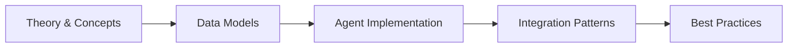

# Chapter 37: Enterprise Capstone — Multi-Agent Platform

> **Previous:** [Manufacturing & Industrial — AI-Powered Factory Agents](./36-manufacturing.md) | **Next:** [Laravel General Interview Q&A](./38-interview-general.md)


---

## Learning Objectives

- Synthesize all concepts from Chapters 1–36 into a single enterprise multi-agent platform
- Design a centralized agent registry with capability-based service discovery and cross-sector routing
- Build an event-driven agent communication bus using Laravel events, queues, and pub/sub patterns
- Implement a shared memory and vector knowledge base accessible by every agent in the platform
- Construct an enterprise orchestrator that coordinates multi-step workflows across sector-specific agents
- Enforce multi-tenant isolation with per-tenant agent instances, data scoping, and configuration
- Expose platform agents as MCP tools and connect to third-party MCP servers
- Deploy comprehensive monitoring, tracing, and observability across all agents and workflows
- Architect a serverless deployment on Laravel Vapor with auto-scaling queues and multi-region failover

## Chapter at a Glance

| Aspect | Details |
|--------|---------|
| **Scope** | Enterprise multi-agent platform integrating AI agents across business domains into a unified system |
| **Key Concepts** | Multi-agent orchestration, agent communication, shared data layer, monitoring, enterprise integration |
| **Learning Approach** | Architecture patterns, integration patterns, deployment considerations |
| **Skills Required** | PHP, Laravel, Eloquent, Laravel AI SDK, distributed systems |

## Chapter Roadmap



## Chapter at a Glance

| Aspect | Details |
|--------|---------|
| **Scope** | Enterprise multi-agent platform integrating AI agents across business domains into a unified system |
| **Key Concepts** | Multi-agent orchestration, agent communication, shared data layer, monitoring, enterprise integration |
| **Learning Approach** | Architecture patterns, integration patterns, deployment considerations |
| **Skills Required** | PHP, Laravel, Eloquent, Laravel AI SDK, distributed systems |

## Chapter Roadmap


## Chapter at a Glance

| Aspect | Details |
|--------|---------|
| **Scope** | Enterprise multi-agent platform integrating AI agents across business domains into a unified system |
| **Key Concepts** | Multi-agent orchestration, agent communication, shared data layer, monitoring, enterprise integration |
| **Learning Approach** | Architecture patterns, integration patterns, deployment considerations |
| **Skills Required** | PHP, Laravel, Eloquent, Laravel AI SDK, distributed systems |

## Chapter Roadmap


## Chapter at a Glance

| Aspect | Details |
|--------|---------|
| **Scope** | Enterprise multi-agent platform integrating AI agents across business domains into a unified system |
| **Key Concepts** | Multi-agent orchestration, agent communication, shared data layer, monitoring, enterprise integration |
| **Learning Approach** | Architecture patterns, integration patterns, deployment considerations |
| **Skills Required** | PHP, Laravel, Eloquent, Laravel AI SDK, distributed systems |

## Chapter Roadmap


---

## Theory
> **One-Sentence Takeaway:** Theory is the foundation — master it before moving to examples and exercises.
> **One-Sentence Takeaway:** Theory is the foundation — master it before moving to examples and exercises.
> **One-Sentence Takeaway:** Theory is the foundation — master it before moving to examples and exercises.
> **One-Sentence Takeaway:** Theory is the foundation — master it before moving to examples and exercises.


### 37.1 Platform Overview & Architecture

The Enterprise Multi-Agent Platform (EMAP) is a cross-industry system where specialized AI agents from different domains — healthcare, finance, education, logistics, HR, customer service, legal, real estate, manufacturing, and marketing — coexist, communicate, and collaborate within a single unified runtime. Organizations deploy the platform as a multi-tenant SaaS instance, with each tenant running isolated agent instances.

#### Platform Specification

| Dimension | Specification |
|-----------|--------------|
| Agent Types | 10 industry sectors, 3–5 agents per sector |
| Communication | Event-driven pub/sub via Laravel queues |
| Memory | PostgreSQL + pgvector for structured + vector storage |
| Isolation | Multi-tenant per organization (database-scoped) |
| API Surface | REST + MCP protocol |
| Deployment | Laravel Vapor with auto-scaling workers |
| Monitoring | Telescope + Pulse + custom AgentMetrics |

#### High-Level Architecture

```
                         ┌─────────────────────────────┐
                         │      API Gateway (REST)      │
                         │   Rate Limit · Auth · Route  │
                         └──────────┬──────────────────┘
                                    │
                         ┌──────────▼──────────────────┐
                         │   Enterprise Orchestrator    │
                         │ Supervisor · Workflow Engine │
                         └──────────┬──────────────────┘
                                    │
          ┌─────────────────────────┼─────────────────────────┐
          │                         │                         │
 ┌────────▼────────┐   ┌───────────▼───────────┐   ┌─────────▼────────┐
 │  Agent Registry  │   │  Agent Message Bus    │   │  Shared Memory    │
 │  discover/call   │   │  pub/sub · events     │   │  Knowledge Base   │
 └────────┬────────┘   └───────────┬───────────┘   └─────────┬────────┘
          │                         │                         │
 ┌────────▼─────────────────────────▼─────────────────────────▼────────┐
 │                        Agent Pool (10 sectors)                       │
 │  ┌──────┐ ┌──────┐ ┌──────┐ ┌──────┐ ┌──────┐ ┌──────┐ ┌──────┐   │
 │  │Health│ │Finan.│ │Educ. │ │Logis.│ │  HR  │ │Cust. │ │Legal │...│
 │  └──────┘ └──────┘ └──────┘ └──────┘ └──────┘ └──────┘ └──────┘   │
 └────────────────────────────────────────────────────────────────────┘
```

#### Service Provider Bootstrapping

```php
<?php

namespace App\Providers;

use App\Ai\Agents\CustomerService\TicketTriageAgent;
use App\Ai\Agents\Finance\FraudDetectionAgent;
use App\Ai\Agents\Healthcare\ClinicalDecisionAgent;
use App\Ai\Agents\Registry\AgentRegistry;
use App\Ai\Bus\AgentMessageBus;
use App\Ai\Memory\SharedMemoryService;
use App\Ai\Orchestrator\EnterpriseOrchestrator;
use App\Ai\Tenant\MultiTenantAgentService;
use Illuminate\Support\ServiceProvider;

class EnterprisePlatformServiceProvider extends ServiceProvider
{
    public function register(): void
    {
        $this->app->singleton(AgentRegistry::class, function ($app) {
            return new AgentRegistry(
                cache: $app->make('cache.store'),
                config: config('agents.registry'),
            );
        });

        $this->app->singleton(AgentMessageBus::class, function ($app) {
            return new AgentMessageBus(
                dispatcher: $app->make('events'),
                queue: $app->make('queue'),
            );
        });

        $this->app->singleton(SharedMemoryService::class, function ($app) {
            return new SharedMemoryService(
                model: $app->make(\App\Models\SharedMemory::class),
                vectorService: $app->make(\App\Services\VectorService::class),
            );
        });

        $this->app->singleton(EnterpriseOrchestrator::class, function ($app) {
            return new EnterpriseOrchestrator(
                registry: $app->make(AgentRegistry::class),
                bus: $app->make(AgentMessageBus::class),
                memory: $app->make(SharedMemoryService::class),
                tenant: $app->make(MultiTenantAgentService::class),
            );
        });
    }

    public function boot(): void
    {
        AgentRegistry::registerDefaultAgents([
            TicketTriageAgent::class,
            FraudDetectionAgent::class,
            ClinicalDecisionAgent::class,
        ]);
    }
}
```

#### Configuration Array

```php
<?php

return [

    'registry' => [
        'ttl' => env('AGENT_REGISTRY_TTL', 3600),
        'discovery_driver' => env('AGENT_DISCOVERY_DRIVER', 'cache'),
    ],

    'bus' => [
        'queue' => env('AGENT_BUS_QUEUE', 'agents'),
        'retry_after' => env('AGENT_BUS_RETRY_AFTER', 90),
        'max_retries' => env('AGENT_BUS_MAX_RETRIES', 3),
    ],

    'memory' => [
        'driver' => env('AGENT_MEMORY_DRIVER', 'database'),
        'vector_dimensions' => (int) env('VECTOR_DIMENSIONS', 1536),
        'similarity_threshold' => (float) env('SIMILARITY_THRESHOLD', 0.78),
    ],

    'orchestrator' => [
        'max_workflow_duration' => env('MAX_WORKFLOW_SECONDS', 300),
        'default_priority' => env('DEFAULT_WORKFLOW_PRIORITY', 'normal'),
        'enable_parallel_dispatch' => env('ENABLE_PARALLEL_DISPATCH', true),
    ],

    'tenants' => [
        'isolation_mode' => env('TENANT_ISOLATION_MODE', 'database'),
        'cache_prefix' => 'tenant:',
    ],

    'monitoring' => [
        'tracing_enabled' => env('AGENT_TRACING_ENABLED', true),
        'metrics_driver' => env('AGENT_METRICS_DRIVER', 'database'),
        'health_check_interval' => env('AGENT_HEALTH_CHECK_SECONDS', 60),
    ],

];
```

---

### 37.2 Centralized Agent Registry

Every agent in the platform registers with metadata describing its capabilities, target industry sector, and the triggers it responds to. The registry powers service discovery so the orchestrator and other agents can locate the right agent for any task.

#### Agent Registry Implementation

```php
<?php

namespace App\Models;

use Illuminate\Database\Eloquent\Model;
use Illuminate\Database\Eloquent\Relations\HasMany;

class AgentRegistry extends Model
{
    protected $table = 'agent_registry';

    protected $fillable = [
        'name',
        'class_name',
        'sector',
        'description',
        'capabilities',
        'triggers',
        'configuration',
        'status',
        'version',
    ];

    protected $casts = [
        'capabilities' => 'array',
        'triggers' => 'array',
        'configuration' => 'array',
        'status' => 'string',
        'version' => 'string',
    ];

    public function registrations(): HasMany
    {
        return $this->hasMany(AgentRegistration::class);
    }

    public function scopeBySector($query, string $sector)
    {
        return $query->where('sector', $sector)->where('status', 'active');
    }

    public function scopeByCapability($query, string $capability)
    {
        return $query->whereJsonContains('capabilities', $capability);
    }

    public function hasCapability(string $capability): bool
    {
        return in_array($capability, $this->capabilities ?? []);
    }
}
```

#### Agent Capability Enum

```php
<?php

namespace App\Ai\Registry;

enum AgentCapability: string
{
    case TicketTriage = 'ticket:triage';
    case SentimentAnalysis = 'sentiment:analyze';
    case FraudDetection = 'fraud:detect';
    case TransactionMonitoring = 'transaction:monitor';
    case KYCVerification = 'kyc:verify';
    case CreditScoring = 'credit:score';
    case ClinicalDecision = 'clinical:decision';
    case AppointmentScheduling = 'appointment:schedule';
    case MedicalRecordRAG = 'medical:rag';
    case ResumeScreening = 'resume:screen';
    case CandidateMatching = 'candidate:match';
    case InterviewScheduling = 'interview:schedule';
    case PersonalizedLearning = 'learning:path';
    case AssessmentGrading = 'assessment:grade';
    case ContentGeneration = 'content:generate';
    case InventoryPrediction = 'inventory:predict';
    case RouteOptimization = 'route:optimize';
    case ShipmentTracking = 'shipment:track';
    case CampaignOptimization = 'campaign:optimize';
    case LeadScoring = 'lead:score';
    case PropertyValuation = 'property:value';
    case ContractReview = 'contract:review';
    case PredictiveMaintenance = 'maintenance:predict';
    case QualityControl = 'quality:control';

    public static function forSector(string $sector): array
    {
        return match ($sector) {
            'customer-service' => [self::TicketTriage, self::SentimentAnalysis],
            'finance' => [self::FraudDetection, self::TransactionMonitoring, self::KYCVerification, self::CreditScoring],
            'healthcare' => [self::ClinicalDecision, self::AppointmentScheduling, self::MedicalRecordRAG],
            'hr' => [self::ResumeScreening, self::CandidateMatching, self::InterviewScheduling],
            'education' => [self::PersonalizedLearning, self::AssessmentGrading, self::ContentGeneration],
            'logistics' => [self::InventoryPrediction, self::RouteOptimization, self::ShipmentTracking],
            'marketing' => [self::CampaignOptimization, self::LeadScoring],
            'real-estate' => [self::PropertyValuation],
            'legal' => [self::ContractReview],
            'manufacturing' => [self::PredictiveMaintenance, self::QualityControl],
            default => [],
        };
    }
}
```

#### Agent Registration Service

```php
<?php

namespace App\Ai\Registry;

use App\Models\AgentRegistration;
use App\Models\AgentRegistry;
use App\Models\Tenant;
use Illuminate\Support\Facades\Cache;

class AgentRegistrationService
{
    public function __construct(
        private AgentRegistry $registry,
    ) {}

    public function register(string $agentClass, string $sector, array $capabilities, ?Tenant $tenant = null): AgentRegistration
    {
        $registration = AgentRegistration::create([
            'tenant_id' => $tenant?->id,
            'agent_registry_id' => $this->registry->id,
            'agent_class' => $agentClass,
            'sector' => $sector,
            'capabilities' => $capabilities,
            'status' => 'active',
            'registered_at' => now(),
        ]);

        Cache::tags("agent:{$tenant?->id ?? 'global'}")->flush();

        return $registration;
    }

    public function discover(string $capability, ?string $sector = null, ?Tenant $tenant = null): array
    {
        $cacheKey = "agent:discover:{$tenant?->id ?? 'global'}:{$capability}:{$sector}";

        return Cache::remember($cacheKey, 300, function () use ($capability, $sector, $tenant) {
            $query = AgentRegistration::where('status', 'active')
                ->whereJsonContains('capabilities', $capability);

            if ($sector) {
                $query->where('sector', $sector);
            }

            if ($tenant) {
                $query->where('tenant_id', $tenant->id);
            }

            return $query->with('registryEntry')->get()->toArray();
        });
    }

    public function call(string $agentRegistrationId, array $payload, ?Tenant $tenant = null): mixed
    {
        $registration = AgentRegistration::findOrFail($agentRegistrationId);

        if ($tenant && $registration->tenant_id !== $tenant->id) {
            throw new \RuntimeException('Agent not available for this tenant');
        }

        $agentClass = $registration->agent_class;

        if (!class_exists($agentClass)) {
            throw new \RuntimeException("Agent class {$agentClass} not found");
        }

        $agent = app()->make($agentClass);

        return $agent->handle($payload);
    }
}
```

#### Registration Model

```php
<?php

namespace App\Models;

use Illuminate\Database\Eloquent\Model;
use Illuminate\Database\Eloquent\Relations\BelongsTo;

class AgentRegistration extends Model
{
    protected $table = 'agent_registrations';

    protected $fillable = [
        'tenant_id',
        'agent_registry_id',
        'agent_class',
        'sector',
        'capabilities',
        'configuration',
        'status',
        'registered_at',
        'last_heartbeat_at',
    ];

    protected $casts = [
        'capabilities' => 'array',
        'configuration' => 'array',
        'registered_at' => 'datetime',
        'last_heartbeat_at' => 'datetime',
    ];

    public function registryEntry(): BelongsTo
    {
        return $this->belongsTo(AgentRegistry::class, 'agent_registry_id');
    }

    public function tenant(): BelongsTo
    {
        return $this->belongsTo(Tenant::class);
    }

    public function scopeActive($query)
    {
        return $query->where('status', 'active');
    }

    public function scopeHealthy($query)
    {
        return $query->where('last_heartbeat_at', '>=', now()->subMinutes(5));
    }
}
```

---

### 37.3 Agent Communication Bus

Agents do not call each other directly. Every interaction passes through the AgentMessageBus, which wraps Laravel events and queues into a publish/subscribe system. An agent publishes a message to a topic; any agent subscribed to that topic receives the message asynchronously.

#### Agent Message Model

```php
<?php

namespace App\Models;

use Illuminate\Database\Eloquent\Model;
use Illuminate\Database\Eloquent\Relations\BelongsTo;

class AgentMessage extends Model
{
    protected $table = 'agent_messages';

    protected $fillable = [
        'tenant_id',
        'workflow_id',
        'correlation_id',
        'topic',
        'sender_agent_id',
        'recipient_agent_id',
        'payload',
        'status',
        'priority',
        'delivered_at',
    ];

    protected $casts = [
        'payload' => 'array',
        'delivered_at' => 'datetime',
    ];

    public function sender(): BelongsTo
    {
        return $this->belongsTo(AgentRegistration::class, 'sender_agent_id');
    }

    public function recipient(): BelongsTo
    {
        return $this->belongsTo(AgentRegistration::class, 'recipient_agent_id');
    }

    public function scopeByTopic($query, string $topic)
    {
        return $query->where('topic', $topic);
    }

    public function scopePending($query)
    {
        return $query->where('status', 'pending');
    }
}
```

#### Message Event

```php
<?php

namespace App\Ai\Bus;

use App\Models\AgentMessage;
use Illuminate\Broadcasting\InteractsWithSockets;
use Illuminate\Foundation\Events\Dispatchable;
use Illuminate\Queue\SerializesModels;

class MessageEvent
{
    use Dispatchable, InteractsWithSockets, SerializesModels;

    public function __construct(
        public AgentMessage $message,
    ) {}
}
```

#### Agent Message Bus

```php
<?php

namespace App\Ai\Bus;

use App\Models\AgentMessage;
use App\Models\Tenant;
use Illuminate\Contracts\Events\Dispatcher;
use Illuminate\Contracts\Queue\Queue;
use Illuminate\Support\Facades\Log;
use Ramsey\Uuid\Uuid;

class AgentMessageBus
{
    private array $subscribers = [];

    public function __construct(
        private Dispatcher $events,
        private Queue $queue,
    ) {}

    public function subscribe(string $topic, callable|array $handler, int $priority = 0): void
    {
        $this->subscribers[$topic][] = [
            'handler' => $handler,
            'priority' => $priority,
        ];

        usort($this->subscribers[$topic], fn ($a, $b) => $b['priority'] <=> $a['priority']);
    }

    public function publish(string $topic, array $payload, array $options = []): AgentMessage
    {
        $message = AgentMessage::create([
            'tenant_id' => $options['tenant_id'] ?? null,
            'workflow_id' => $options['workflow_id'] ?? null,
            'correlation_id' => $options['correlation_id'] ?? (string) Uuid::uuid7(),
            'topic' => $topic,
            'sender_agent_id' => $options['sender_agent_id'] ?? null,
            'recipient_agent_id' => $options['recipient_agent_id'] ?? null,
            'payload' => $payload,
            'status' => 'pending',
            'priority' => $options['priority'] ?? 'normal',
        ]);

        Log::info('AgentMessageBus: publishing message', [
            'topic' => $topic,
            'message_id' => $message->id,
            'correlation_id' => $message->correlation_id,
        ]);

        $this->events->dispatch(new MessageEvent($message));

        return $message;
    }

    public function publishAsync(string $topic, array $payload, array $options = []): void
    {
        $message = $this->publish($topic, $payload, $options);

        dispatch(new DeliverMessageJob($message->id))
            ->onQueue($options['queue'] ?? 'agents')
            ->delay($options['delay'] ?? 0);
    }

    public function consume(MessageEvent $event): void
    {
        $message = $event->message;
        $topic = $message->topic;

        if (!isset($this->subscribers[$topic])) {
            $message->update(['status' => 'no_subscribers']);
            return;
        }

        foreach ($this->subscribers[$topic] as $subscription) {
            try {
                $result = call_user_func($subscription['handler'], $message);

                $message->update([
                    'status' => 'delivered',
                    'delivered_at' => now(),
                ]);

                return $result;
            } catch (\Throwable $e) {
                Log::error('AgentMessageBus: handler failed', [
                    'topic' => $topic,
                    'message_id' => $message->id,
                    'error' => $e->getMessage(),
                ]);
            }
        }

        $message->update(['status' => 'failed']);
    }
}
```

#### Message Delivery Job

```php
<?php

namespace App\Ai\Bus;

use App\Models\AgentMessage;
use Illuminate\Contracts\Queue\ShouldQueue;
use Illuminate\Foundation\Bus\Dispatchable;
use Illuminate\Queue\InteractsWithQueue;
use Illuminate\Support\Facades\Event;

class DeliverMessageJob implements ShouldQueue
{
    use Dispatchable, InteractsWithQueue;

    public int $timeout = 60;
    public int $tries = 3;

    public function __construct(
        public int $messageId,
    ) {}

    public function handle(AgentMessageBus $bus): void
    {
        $message = AgentMessage::findOrFail($this->messageId);

        Event::dispatch(new MessageEvent($message));

        $bus->consume(new MessageEvent($message));
    }

    public function failed(\Throwable $e): void
    {
        AgentMessage::where('id', $this->messageId)
            ->update(['status' => 'failed']);
    }
}
```

#### Agent Subscriber Registration

```php
<?php

namespace App\Providers;

use App\Ai\Agents\CustomerService\TicketTriageAgent;
use App\Ai\Agents\Finance\FraudDetectionAgent;
use App\Ai\Agents\Finance\BillingAgent;
use App\Ai\Agents\CustomerService\SatisfactionAgent;
use App\Ai\Bus\AgentMessageBus;
use App\Ai\Bus\MessageEvent;
use Illuminate\Support\Facades\Event;
use Illuminate\Support\ServiceProvider;

class AgentBusServiceProvider extends ServiceProvider
{
    public function boot(AgentMessageBus $bus): void
    {
        Event::listen(MessageEvent::class, function (MessageEvent $event) use ($bus) {
            $bus->consume($event);
        });

        $bus->subscribe('ticket.created', function ($message) {
            return app(TicketTriageAgent::class)->handle($message->payload);
        }, priority: 100);

        $bus->subscribe('triage.completed', function ($message) {
            $payload = $message->payload;
            $topic = match ($payload['assigned_sector'] ?? null) {
                'finance' => 'billing.resolve',
                'healthcare' => 'appointment.schedule',
                'hr' => 'candidate.process',
                default => 'support.general',
            };

            return app(AgentMessageBus::class)->publish($topic, $payload, [
                'correlation_id' => $message->correlation_id,
                'workflow_id' => $message->workflow_id,
            ]);
        });

        $bus->subscribe('billing.resolve', function ($message) {
            return app(BillingAgent::class)->resolveBillingIssue($message->payload);
        });

        $bus->subscribe('billing.resolved', function ($message) {
            return app(AgentMessageBus::class)->publish('survey.dispatch', $message->payload, [
                'correlation_id' => $message->correlation_id,
                'workflow_id' => $message->workflow_id,
            ]);
        });

        $bus->subscribe('survey.dispatch', function ($message) {
            return app(SatisfactionAgent::class)->sendSurvey($message->payload);
        });
    }
}
```

---

### 37.4 Shared Memory & Knowledge Base

Every agent in the platform can read from and write to a centralized shared memory. This enables cross-sector knowledge sharing — a finance agent's fraud analysis can inform a customer service agent's triage decision. The knowledge base stores structured data, conversation context, and vector embeddings for semantic retrieval.

#### Shared Memory Model

```php
<?php

namespace App\Models;

use Illuminate\Database\Eloquent\Model;
use Illuminate\Database\Eloquent\Relations\BelongsTo;

class SharedMemory extends Model
{
    protected $table = 'shared_memories';

    protected $fillable = [
        'tenant_id',
        'workflow_id',
        'correlation_id',
        'key',
        'value',
        'namespace',
        'sector',
        'vector_embedding',
        'ttl',
        'expires_at',
    ];

    protected $casts = [
        'value' => 'array',
        'vector_embedding' => 'array',
        'expires_at' => 'datetime',
    ];

    public function tenant(): BelongsTo
    {
        return $this->belongsTo(Tenant::class);
    }

    public function scopeByNamespace($query, string $namespace)
    {
        return $query->where('namespace', $namespace);
    }

    public function scopeBySector($query, string $sector)
    {
        return $query->where('sector', $sector);
    }

    public function scopeActive($query)
    {
        return $query->whereNull('expires_at')
            ->orWhere('expires_at', '>', now());
    }

    public function scopeSearch($query, string $term)
    {
        return $query->where('key', 'like', "%{$term}%")
            ->orWhere('value', 'like', "%{$term}%");
    }
}
```

#### Knowledge Base Service

```php
<?php

namespace App\Ai\Memory;

use App\Models\SharedMemory;
use App\Models\Tenant;
use App\Services\VectorService;
use Illuminate\Support\Facades\Cache;
use Ramsey\Uuid\Uuid;

class SharedMemoryService
{
    public function __construct(
        private SharedMemory $model,
        private VectorService $vectors,
    ) {}

    public function remember(string $key, mixed $value, array $options = []): SharedMemory
    {
        $embedding = null;

        if (is_string($value) && ($options['vectorize'] ?? false)) {
            $embedding = $this->vectors->embed($value)->toArray();
        }

        $entry = SharedMemory::updateOrCreate(
            [
                'tenant_id' => $options['tenant_id'] ?? null,
                'namespace' => $options['namespace'] ?? 'default',
                'key' => $key,
            ],
            [
                'workflow_id' => $options['workflow_id'] ?? null,
                'correlation_id' => $options['correlation_id'] ?? (string) Uuid::uuid7(),
                'value' => is_array($value) ? $value : ['data' => $value],
                'sector' => $options['sector'] ?? null,
                'vector_embedding' => $embedding,
                'ttl' => $options['ttl'] ?? null,
                'expires_at' => isset($options['ttl'])
                    ? now()->addSeconds($options['ttl'])
                    : null,
            ],
        );

        Cache::tags("memory:{$options['tenant_id'] ?? 'global'}")->flush();

        return $entry;
    }

    public function recall(string $key, array $options = []): mixed
    {
        $query = SharedMemory::where('key', $key);

        if (isset($options['tenant_id'])) {
            $query->where('tenant_id', $options['tenant_id']);
        }

        if (isset($options['namespace'])) {
            $query->where('namespace', $options['namespace']);
        }

        $entry = $query->active()->latest()->first();

        if (!$entry) {
            return null;
        }

        $value = $entry->value;

        return is_array($value) && array_key_exists('data', $value) && count($value) === 1
            ? $value['data']
            : $value;
    }

    public function recallAll(string $namespace, array $options = []): array
    {
        return SharedMemory::where('namespace', $namespace)
            ->when($options['tenant_id'] ?? null, fn ($q, $id) => $q->where('tenant_id', $id))
            ->when($options['sector'] ?? null, fn ($q, $s) => $q->where('sector', $s))
            ->active()
            ->latest()
            ->get()
            ->toArray();
    }

    public function searchBySector(string $sector, string $query, int $limit = 10): array
    {
        $embedding = $this->vectors->embed($query);

        return SharedMemory::query()
            ->from(
                \DB::raw('(SELECT *, shared_memories.value <#> ?::vector AS distance FROM shared_memories WHERE sector = ? AND vector_embedding IS NOT NULL) AS ranked'),
                [$embedding->toJson(), $sector]
            )
            ->whereRaw(false)
            ->orderBy('distance')
            ->limit($limit)
            ->get()
            ->toArray();
    }

    public function crossSectorQuery(string $query, array $sectors, int $limit = 5): array
    {
        $embedding = $this->vectors->embed($query);

        return SharedMemory::query()
            ->from(
                \DB::raw('(SELECT *, shared_memories.value <#> ?::vector AS distance FROM shared_memories WHERE sector IN (?) AND vector_embedding IS NOT NULL) AS ranked'),
                [$embedding->toJson(), $sectors]
            )
            ->whereRaw(false)
            ->orderBy('distance')
            ->limit($limit)
            ->get()
            ->groupBy('sector')
            ->toArray();
    }

    public function forget(string $key, array $options = []): bool
    {
        $query = SharedMemory::where('key', $key);

        if (isset($options['tenant_id'])) {
            $query->where('tenant_id', $options['tenant_id']);
        }

        return $query->delete() > 0;
    }

    public function flushNamespace(string $namespace, array $options = []): int
    {
        $query = SharedMemory::where('namespace', $namespace);

        if (isset($options['tenant_id'])) {
            $query->where('tenant_id', $options['tenant_id']);
        }

        return $query->delete();
    }
}
```

---

### 37.5 Enterprise Agent Orchestrator

The orchestrator is the supervisor that coordinates work across all sector agents. It accepts high-level goals, decomposes them into workflows, dispatches each step to the correct agent via the message bus, monitors progress through shared memory, and handles failures with retry and escalation policies.

#### Workflow Definition

```php
<?php

namespace App\Ai\Orchestrator;

class WorkflowDefinition
{
    public function __construct(
        public readonly string $name,
        public readonly array $steps,
        public readonly array $onSuccess = [],
        public readonly array $onFailure = [],
        public readonly int $timeout = 300,
    ) {}

    public static function fromArray(array $config): self
    {
        return new self(
            name: $config['name'],
            steps: array_map(
                fn (array $step) => new WorkflowStep(...$step),
                $config['steps'],
            ),
            onSuccess: $config['on_success'] ?? [],
            onFailure: $config['on_failure'] ?? [],
            timeout: $config['timeout'] ?? 300,
        );
    }
}

class WorkflowStep
{
    public function __construct(
        public readonly string $id,
        public readonly string $description,
        public readonly string $topic,
        public readonly string $targetSector,
        public readonly string $targetCapability,
        public readonly array $inputMapping,
        public readonly array $outputMapping,
        public readonly ?string $dependsOn = null,
        public readonly int $timeout = 60,
        public readonly int $retries = 2,
    ) {}
}
```

#### Enterprise Orchestrator

```php
<?php

namespace App\Ai\Orchestrator;

use App\Ai\Bus\AgentMessageBus;
use App\Ai\Memory\SharedMemoryService;
use App\Ai\Registry\AgentRegistrationService;
use App\Ai\Tenant\MultiTenantAgentService;
use App\Models\Tenant;
use App\Models\WorkflowExecution;
use Illuminate\Support\Facades\Log;
use Ramsey\Uuid\Uuid;

class EnterpriseOrchestrator
{
    private array $workflows = [];

    public function __construct(
        private AgentRegistrationService $registry,
        private AgentMessageBus $bus,
        private SharedMemoryService $memory,
        private MultiTenantAgentService $tenant,
    ) {}

    public function registerWorkflow(WorkflowDefinition $workflow): void
    {
        $this->workflows[$workflow->name] = $workflow;
    }

    public function startWorkflow(string $workflowName, array $input, ?Tenant $tenant = null): string
    {
        $workflow = $this->workflows[$workflowName] ?? throw new \InvalidArgumentException("Unknown workflow: {$workflowName}");

        $workflowId = (string) Uuid::uuid7();
        $correlationId = (string) Uuid::uuid7();

        $execution = WorkflowExecution::create([
            'tenant_id' => $tenant?->id,
            'workflow_name' => $workflowName,
            'workflow_id' => $workflowId,
            'correlation_id' => $correlationId,
            'input' => $input,
            'status' => 'running',
            'started_at' => now(),
        ]);

        $this->memory->remember("workflow:{$workflowId}:context", $input, [
            'tenant_id' => $tenant?->id,
            'workflow_id' => $workflowId,
            'namespace' => 'workflow_context',
        ]);

        Log::info('EnterpriseOrchestrator: starting workflow', [
            'workflow' => $workflowName,
            'workflow_id' => $workflowId,
        ]);

        dispatch(new ExecuteWorkflowJob(
            workflowName: $workflowName,
            workflowId: $workflowId,
            correlationId: $correlationId,
            tenantId: $tenant?->id,
            currentStepIndex: 0,
        ))->onQueue('orchestrator');

        return $workflowId;
    }

    public function executeStep(
        string $workflowName,
        string $workflowId,
        int $stepIndex,
        ?int $tenantId = null,
    ): void {
        $workflow = $this->workflows[$workflowName] ?? throw new \InvalidArgumentException("Unknown workflow: {$workflowName}");

        if ($stepIndex >= count($workflow->steps)) {
            $this->finalizeWorkflow($workflowId, 'completed', $tenantId);
            return;
        }

        $step = $workflow->steps[$stepIndex];
        $tenant = $tenantId ? Tenant::find($tenantId) : null;

        $context = $this->memory->recall("workflow:{$workflowId}:context", [
            'tenant_id' => $tenantId,
            'namespace' => 'workflow_context',
        ]);

        $input = $this->resolveInput($step->inputMapping, $context);

        $agents = $this->registry->discover($step->targetCapability, $step->targetSector, $tenant);

        if (empty($agents)) {
            Log::error("EnterpriseOrchestrator: no agent found for step", [
                'workflow_id' => $workflowId,
                'step' => $step->id,
                'capability' => $step->targetCapability,
            ]);

            dispatch(new ExecuteWorkflowJob(
                workflowName: $workflowName,
                workflowId: $workflowId,
                correlationId: $context['correlation_id'] ?? null,
                tenantId: $tenantId,
                currentStepIndex: $stepIndex,
            ))->onQueue('orchestrator')->delay(30);

            return;
        }

        $busOptions = [
            'tenant_id' => $tenantId,
            'workflow_id' => $workflowId,
            'correlation_id' => $context['correlation_id'] ?? null,
            'sender_agent_id' => $agents[0]['id'],
        ];

        $message = $this->bus->publish($step->topic, $input, $busOptions);

        $this->memory->remember("workflow:{$workflowId}:step:{$step->id}:message_id", $message->id, [
            'tenant_id' => $tenantId,
            'workflow_id' => $workflowId,
            'namespace' => 'workflow_steps',
        ]);

        WorkflowExecution::where('workflow_id', $workflowId)
            ->update(['current_step' => $step->id]);
    }

    public function advanceWorkflow(string $workflowId, array $stepOutput, ?int $tenantId = null): void
    {
        $execution = WorkflowExecution::where('workflow_id', $workflowId)->firstOrFail();
        $workflow = $this->workflows[$execution->workflow_name];

        $context = $this->memory->recall("workflow:{$workflowId}:context", [
            'tenant_id' => $tenantId,
            'namespace' => 'workflow_context',
        ]);

        $mergedContext = array_merge_recursive($context ?? [], $stepOutput);

        $this->memory->remember("workflow:{$workflowId}:context", $mergedContext, [
            'tenant_id' => $tenantId,
            'namespace' => 'workflow_context',
        ]);

        $currentStepIndex = $execution->current_step_index + 1;

        $execution->update(['current_step_index' => $currentStepIndex]);

        dispatch(new ExecuteWorkflowJob(
            workflowName: $execution->workflow_name,
            workflowId: $workflowId,
            correlationId: $execution->correlation_id,
            tenantId: $tenantId,
            currentStepIndex: $currentStepIndex,
        ))->onQueue('orchestrator');
    }

    private function finalizeWorkflow(string $workflowId, string $status, ?int $tenantId = null): void
    {
        $context = $this->memory->recall("workflow:{$workflowId}:context", [
            'tenant_id' => $tenantId,
            'namespace' => 'workflow_context',
        ]);

        WorkflowExecution::where('workflow_id', $workflowId)
            ->update([
                'status' => $status,
                'output' => $context,
                'completed_at' => now(),
            ]);

        Log::info('EnterpriseOrchestrator: workflow completed', [
            'workflow_id' => $workflowId,
            'status' => $status,
        ]);
    }

    private function resolveInput(array $mapping, ?array $context): array
    {
        $resolved = [];

        foreach ($mapping as $key => $path) {
            $resolved[$key] = data_get($context, $path);
        }

        return $resolved;
    }
}
```

#### Execute Workflow Job

```php
<?php

namespace App\Ai\Orchestrator;

use Illuminate\Contracts\Queue\ShouldQueue;
use Illuminate\Foundation\Bus\Dispatchable;
use Illuminate\Queue\InteractsWithQueue;

class ExecuteWorkflowJob implements ShouldQueue
{
    use Dispatchable, InteractsWithQueue;

    public int $timeout = 120;
    public int $tries = 1;

    public function __construct(
        public string $workflowName,
        public string $workflowId,
        public ?string $correlationId,
        public ?int $tenantId,
        public int $currentStepIndex,
    ) {}

    public function handle(EnterpriseOrchestrator $orchestrator): void
    {
        $orchestrator->executeStep(
            workflowName: $this->workflowName,
            workflowId: $this->workflowId,
            stepIndex: $this->currentStepIndex,
            tenantId: $this->tenantId,
        );
    }
}
```

#### Workflow Execution Model

```php
<?php

namespace App\Models;

use Illuminate\Database\Eloquent\Model;

class WorkflowExecution extends Model
{
    protected $table = 'workflow_executions';

    protected $fillable = [
        'tenant_id',
        'workflow_name',
        'workflow_id',
        'correlation_id',
        'input',
        'output',
        'current_step',
        'current_step_index',
        'status',
        'started_at',
        'completed_at',
    ];

    protected $casts = [
        'input' => 'array',
        'output' => 'array',
        'started_at' => 'datetime',
        'completed_at' => 'datetime',
    ];

    public function scopeByTenant($query, int $tenantId)
    {
        return $query->where('tenant_id', $tenantId);
    }

    public function scopeActive($query)
    {
        return $query->whereIn('status', ['running', 'pending']);
    }
}
```

#### Cross-Sector Workflow Definitions

```php
<?php

namespace App\Providers;

use App\Ai\Orchestrator\EnterpriseOrchestrator;
use App\Ai\Orchestrator\WorkflowDefinition;
use Illuminate\Support\ServiceProvider;

class WorkflowServiceProvider extends ServiceProvider
{
    public function boot(EnterpriseOrchestrator $orchestrator): void
    {
        $orchestrator->registerWorkflow(new WorkflowDefinition(
            name: 'customer-support-to-billing',
            steps: [
                [
                    'id' => 'triage',
                    'description' => 'Classify the support ticket and determine intent',
                    'topic' => 'ticket.created',
                    'target_sector' => 'customer-service',
                    'target_capability' => 'ticket:triage',
                    'input_mapping' => ['ticket_id' => 'ticket_id', 'subject' => 'subject', 'description' => 'description'],
                    'output_mapping' => ['intent' => 'intent', 'priority' => 'priority', 'assigned_sector' => 'assigned_sector'],
                ],
                [
                    'id' => 'resolve_billing',
                    'description' => 'Resolve the billing issue identified during triage',
                    'topic' => 'billing.resolve',
                    'target_sector' => 'finance',
                    'target_capability' => 'transaction:monitor',
                    'input_mapping' => ['ticket_id' => 'ticket_id', 'customer_id' => 'customer_id', 'issue_type' => 'intent'],
                    'output_mapping' => ['resolution' => 'resolution', 'adjusted_amount' => 'adjusted_amount', 'status' => 'status'],
                    'depends_on' => 'triage',
                ],
                [
                    'id' => 'dispatch_survey',
                    'description' => 'Send satisfaction survey after billing resolution',
                    'topic' => 'survey.dispatch',
                    'target_sector' => 'customer-service',
                    'target_capability' => 'sentiment:analyze',
                    'input_mapping' => ['ticket_id' => 'ticket_id', 'customer_id' => 'customer_id', 'resolution' => 'resolution'],
                    'output_mapping' => ['survey_id' => 'survey_id', 'sentiment_score' => 'sentiment_score'],
                    'depends_on' => 'resolve_billing',
                ],
            ],
            onSuccess: [
                'action' => 'notify_customer',
                'channel' => 'email',
            ],
            onFailure: [
                'action' => 'escalate_to_human',
                'team' => 'support-managers',
            ],
            timeout: 300,
        ));

        $orchestrator->registerWorkflow(new WorkflowDefinition(
            name: 'hr-onboarding-cross-sector',
            steps: [
                [
                    'id' => 'screen_candidate',
                    'description' => 'Screen the candidate resume against job requirements',
                    'topic' => 'candidate.screen',
                    'target_sector' => 'hr',
                    'target_capability' => 'resume:screen',
                    'input_mapping' => ['candidate_id' => 'candidate_id', 'resume_url' => 'resume_url', 'job_id' => 'job_id'],
                    'output_mapping' => ['score' => 'score', 'highlights' => 'highlights', 'verdict' => 'verdict'],
                ],
                [
                    'id' => 'schedule_training',
                    'description' => 'Generate personalized training path for new hire',
                    'topic' => 'training.generate',
                    'target_sector' => 'education',
                    'target_capability' => 'learning:path',
                    'input_mapping' => ['employee_id' => 'employee_id', 'role' => 'role', 'skills_gap' => 'highlights'],
                    'output_mapping' => ['training_plan' => 'training_plan', 'courses' => 'courses', 'timeline' => 'timeline'],
                    'depends_on' => 'screen_candidate',
                ],
            ],
            timeout: 180,
        ));
    }
}
```

---

### 37.6 Multi-Tenant Isolation

Each organization (tenant) that uses the platform gets isolated agent instances. Agents are scoped to a tenant: their registrations, messages, shared memory, and workflow executions are all partitioned by `tenant_id`. Configuration templates allow per-tenant customization of agent behavior.

#### Multi-Tenant Agent Service

```php
<?php

namespace App\Ai\Tenant;

use App\Models\AgentRegistration;
use App\Models\AgentRegistry;
use App\Models\Tenant;
use App\Ai\Registry\AgentCapability;
use Illuminate\Support\Facades\Cache;
use Illuminate\Support\Facades\Config;

class MultiTenantAgentService
{
    public function initializeTenant(Tenant $tenant, array $sectors = []): void
    {
        $sectors = $sectors ?: array_keys(config('agents.registry.sectors', []));

        foreach ($sectors as $sector) {
            $registryEntry = AgentRegistry::firstOrCreate(
                ['sector' => $sector, 'name' => "{$sector}::default"],
                ['description' => "Default {$sector} agent", 'status' => 'active'],
            );

            AgentRegistration::create([
                'tenant_id' => $tenant->id,
                'agent_registry_id' => $registryEntry->id,
                'agent_class' => $this->resolveDefaultAgent($sector),
                'sector' => $sector,
                'capabilities' => array_map(fn (AgentCapability $c) => $c->value, AgentCapability::forSector($sector)),
                'configuration' => $this->defaultConfigurationForSector($sector),
                'status' => 'active',
                'registered_at' => now(),
            ]);
        }

        Cache::tags("tenant:{$tenant->id}:agents")->flush();
    }

    public function agentForTenant(Tenant $tenant, string $capability): ?AgentRegistration
    {
        return AgentRegistration::where('tenant_id', $tenant->id)
            ->whereJsonContains('capabilities', $capability)
            ->where('status', 'active')
            ->first();
    }

    public function allAgentsForTenant(Tenant $tenant): array
    {
        return AgentRegistration::where('tenant_id', $tenant->id)
            ->where('status', 'active')
            ->with('registryEntry')
            ->get()
            ->toArray();
    }

    public function configureAgent(Tenant $tenant, int $registrationId, array $configuration): AgentRegistration
    {
        $registration = AgentRegistration::where('tenant_id', $tenant->id)
            ->findOrFail($registrationId);

        $registration->update([
            'configuration' => array_merge(
                $registration->configuration ?? [],
                $configuration,
            ),
        ]);

        Cache::tags("tenant:{$tenant->id}:agents")->flush();

        return $registration->fresh();
    }

    public function scopeQuery(callable $query, Tenant $tenant): mixed
    {
        return $query(AgentRegistration::where('tenant_id', $tenant->id));
    }

    private function resolveDefaultAgent(string $sector): string
    {
        return match ($sector) {
            'customer-service' => \App\Ai\Agents\CustomerService\TicketTriageAgent::class,
            'finance' => \App\Ai\Agents\Finance\FraudDetectionAgent::class,
            'healthcare' => \App\Ai\Agents\Healthcare\ClinicalDecisionAgent::class,
            'hr' => \App\Ai\Agents\Hr\ResumeScreeningAgent::class,
            'education' => \App\Ai\Agents\Education\PersonalizedLearningAgent::class,
            'logistics' => \App\Ai\Agents\Logistics\InventoryPredictionAgent::class,
            'marketing' => \App\Ai\Agents\Marketing\CampaignOptimizationAgent::class,
            'legal' => \App\Ai\Agents\Legal\ContractReviewAgent::class,
            'real-estate' => \App\Ai\Agents\RealEstate\PropertyValuationAgent::class,
            'manufacturing' => \App\Ai\Agents\Manufacturing\PredictiveMaintenanceAgent::class,
            default => throw new \InvalidArgumentException("Unknown sector: {$sector}"),
        };
    }

    private function defaultConfigurationForSector(string $sector): array
    {
        return Config::get("agents.sectors.{$sector}.default_configuration", [
            'model' => Config::get('agents.default_model', 'gpt-4o'),
            'temperature' => 0.3,
            'max_tokens' => 2000,
        ]);
    }
}
```

#### Tenant Middleware for Agent Isolation

```php
<?php

namespace App\Http\Middleware;

use App\Models\Tenant;
use Closure;
use Illuminate\Http\Request;
use Illuminate\Support\Facades\Config;

class ResolveAgentTenant
{
    public function handle(Request $request, Closure $next)
    {
        $tenantId = $request->header('X-Tenant-ID')
            ?? $request->route('tenant')
            ?? $request->user()?->tenant_id;

        if (!$tenantId) {
            return response()->json(['error' => 'Tenant required'], 400);
        }

        $tenant = Tenant::find($tenantId);

        if (!$tenant || !$tenant->active) {
            return response()->json(['error' => 'Invalid or inactive tenant'], 403);
        }

        Config::set('agents.current_tenant', $tenant);
        Config::set('agents.current_tenant_id', $tenant->id);

        $request->merge(['_tenant' => $tenant]);

        return $next($request);
    }
}
```

#### Tenant-Scoped Agent Resolution

```php
<?php

namespace App\Ai\Tenant;

use App\Models\AgentRegistration;
use App\Models\Tenant;

class TenantAgentResolver
{
    public function resolve(string $capability, ?Tenant $tenant = null): AgentRegistration
    {
        $tenant = $tenant ?? config('agents.current_tenant');

        if (!$tenant) {
            throw new \RuntimeException('No tenant context available');
        }

        $registration = AgentRegistration::where('tenant_id', $tenant->id)
            ->whereJsonContains('capabilities', $capability)
            ->where('status', 'active')
            ->first();

        if (!$registration) {
            throw new \RuntimeException("No agent found for capability: {$capability} in tenant: {$tenant->id}");
        }

        return $registration;
    }

    public function resolveAll(?Tenant $tenant = null): array
    {
        $tenant = $tenant ?? config('agents.current_tenant');

        if (!$tenant) {
            return [];
        }

        return AgentRegistration::where('tenant_id', $tenant->id)
            ->where('status', 'active')
            ->get()
            ->all();
    }
}
```

---

### 37.7 MCP Server Integration

The platform exposes every registered agent as a tool through the Model Context Protocol. External AI assistants can discover and invoke enterprise agents directly. The platform also connects to third-party MCP servers to extend agent capabilities.

#### MCP Gateway Controller

```php
<?php

namespace App\Http\Controllers\Api;

use App\Ai\Registry\AgentRegistrationService;
use App\Ai\Tenant\MultiTenantAgentService;
use App\Models\Tenant;
use Illuminate\Http\JsonResponse;
use Illuminate\Http\Request;
use Illuminate\Routing\Controller;

class McpGatewayController extends Controller
{
    public function __construct(
        private AgentRegistrationService $registry,
        private MultiTenantAgentService $tenant,
    ) {}

    public function listTools(Request $request): JsonResponse
    {
        $tenant = $request->attributes->get('_tenant');
        $agents = $this->tenant->allAgentsForTenant($tenant);

        $tools = array_map(function (array $agent) {
            return [
                'name' => "agent_{$agent['id']}",
                'description' => $agent['registry_entry']['description'] ?? 'No description',
                'input_schema' => [
                    'type' => 'object',
                    'properties' => [
                        'action' => [
                            'type' => 'string',
                            'description' => 'The action to perform',
                            'enum' => $agent['capabilities'],
                        ],
                        'parameters' => [
                            'type' => 'object',
                            'description' => 'Action parameters',
                        ],
                    ],
                    'required' => ['action', 'parameters'],
                ],
                'annotations' => [
                    'title' => $agent['registry_entry']['name'] ?? "Agent {$agent['id']}",
                    'sector' => $agent['sector'],
                    'capabilities' => $agent['capabilities'],
                ],
            ];
        }, $agents);

        return response()->json(['tools' => $tools]);
    }

    public function callTool(Request $request): JsonResponse
    {
        $request->validate([
            'name' => 'required|string',
            'arguments' => 'required|array',
        ]);

        $tenant = $request->attributes->get('_tenant');
        $name = $request->input('name');
        $arguments = $request->input('arguments');

        preg_match('/^agent_(\d+)$/', $name, $matches);

        if (!$matches) {
            return response()->json([
                'content' => [['type' => 'text', 'text' => "Unknown tool: {$name}"]],
                'is_error' => true,
            ], 404);
        }

        $agentId = (int) $matches[1];
        $result = $this->registry->call($agentId, $arguments, $tenant);

        return response()->json([
            'content' => [
                ['type' => 'text', 'text' => json_encode($result)],
            ],
        ]);
    }
}
```

#### MCP Server Registration

```php
<?php

namespace App\Ai\Mcp;

use App\Models\McpServer;
use Illuminate\Http\Client\Pool;
use Illuminate\Support\Facades\Http;
use Illuminate\Support\Facades\Log;

class McpServerManager
{
    private array $connectedServers = [];

    public function register(McpServer $server): void
    {
        if ($server->type === 'local') {
            $this->connectLocal($server);
        } else {
            $this->connectRemote($server);
        }
    }

    public function connectLocal(McpServer $server): void
    {
        if (!file_exists($server->command)) {
            throw new \RuntimeException("MCP server script not found: {$server->command}");
        }

        $this->connectedServers[$server->name] = [
            'server' => $server,
            'type' => 'local',
        ];

        Log::info("MCP server registered: {$server->name} (local)");
    }

    public function connectRemote(McpServer $server): void
    {
        $healthCheck = Http::timeout(5)->get("{$server->base_url}/health");

        if (!$healthCheck->successful()) {
            Log::warning("MCP server unreachable: {$server->name}", [
                'url' => $server->base_url,
                'status' => $healthCheck->status(),
            ]);
            return;
        }

        $this->connectedServers[$server->name] = [
            'server' => $server,
            'type' => 'remote',
        ];

        Log::info("MCP server connected: {$server->name}");
    }

    public function listTools(): array
    {
        $tools = [];

        foreach ($this->connectedServers as $name => $connection) {
            $server = $connection['server'];

            if ($connection['type'] === 'remote') {
                $response = Http::timeout(10)
                    ->withToken($server->api_key)
                    ->get("{$server->base_url}/mcp/tools");

                if ($response->successful()) {
                    $tools[$name] = $response->json('tools', []);
                }
            }
        }

        return $tools;
    }

    public function callTool(string $serverName, string $toolName, array $arguments): mixed
    {
        $connection = $this->connectedServers[$serverName]
            ?? throw new \RuntimeException("MCP server not connected: {$serverName}");

        $server = $connection['server'];

        if ($connection['type'] === 'remote') {
            $response = Http::timeout(30)
                ->withToken($server->api_key)
                ->post("{$server->base_url}/mcp/call", [
                    'name' => $toolName,
                    'arguments' => $arguments,
                ]);

            if (!$response->successful()) {
                throw new \RuntimeException("MCP tool call failed: {$response->body()}");
            }

            return $response->json('content', []);
        }

        throw new \RuntimeException('Local MCP execution not implemented in this example');
    }

    public function disconnect(string $name): void
    {
        unset($this->connectedServers[$name]);
    }
}
```

#### MCP Server Model

```php
<?php

namespace App\Models;

use Illuminate\Database\Eloquent\Model;

class McpServer extends Model
{
    protected $table = 'mcp_servers';

    protected $fillable = [
        'tenant_id',
        'name',
        'description',
        'type',
        'command',
        'base_url',
        'api_key',
        'configuration',
        'enabled',
    ];

    protected $casts = [
        'configuration' => 'array',
        'enabled' => 'boolean',
    ];

    public function scopeEnabled($query)
    {
        return $query->where('enabled', true);
    }

    public function scopeByTenant($query, int $tenantId)
    {
        return $query->where('tenant_id', $tenantId);
    }
}
```

---

### 37.8 Monitoring & Observability

Every agent action, message, workflow step, and memory access is traced. The monitoring system provides a real-time dashboard of agent health, performance metrics, and error rates, powered by Laravel Pulse and a custom AgentMetrics model.

#### Agent Metrics Model

```php
<?php

namespace App\Models;

use Illuminate\Database\Eloquent\Model;

class AgentMetrics extends Model
{
    protected $table = 'agent_metrics';

    protected $fillable = [
        'tenant_id',
        'agent_registration_id',
        'metric_name',
        'metric_value',
        'tags',
        'recorded_at',
    ];

    protected $casts = [
        'metric_value' => 'float',
        'tags' => 'array',
        'recorded_at' => 'datetime',
    ];

    public function scopeByAgent($query, int $agentId)
    {
        return $query->where('agent_registration_id', $agentId);
    }

    public function scopeByName($query, string $name)
    {
        return $query->where('metric_name', $name);
    }

    public function scopeSince($query, \DateTimeInterface $since)
    {
        return $query->where('recorded_at', '>=', $since);
    }

    public static function record(int $agentId, string $name, float $value, array $tags = []): self
    {
        return static::create([
            'agent_registration_id' => $agentId,
            'metric_name' => $name,
            'metric_value' => $value,
            'tags' => $tags,
            'recorded_at' => now(),
        ]);
    }
}
```

#### Agent Monitor

```php
<?php

namespace App\Ai\Monitoring;

use App\Models\AgentMetrics;
use App\Models\AgentRegistration;
use Illuminate\Support\Facades\Cache;
use Illuminate\Support\Facades\Log;

class AgentMonitor
{
    private array $trace = [];

    public function startTrace(string $agentClass, array $context = []): string
    {
        $traceId = md5($agentClass . microtime(true) . rand());

        $this->trace[$traceId] = [
            'agent' => $agentClass,
            'started_at' => microtime(true),
            'context' => $context,
            'events' => [],
        ];

        Log::debug('AgentMonitor: trace started', [
            'trace_id' => $traceId,
            'agent' => $agentClass,
        ]);

        return $traceId;
    }

    public function recordEvent(string $traceId, string $event, array $data = []): void
    {
        if (!isset($this->trace[$traceId])) {
            return;
        }

        $this->trace[$traceId]['events'][] = [
            'event' => $event,
            'data' => $data,
            'timestamp' => microtime(true),
        ];
    }

    public function endTrace(string $traceId, array $metrics = []): array
    {
        if (!isset($this->trace[$traceId])) {
            return [];
        }

        $trace = $this->trace[$traceId];
        $duration = (microtime(true) - $trace['started_at']) * 1000;

        $result = array_merge($trace, [
            'duration_ms' => round($duration, 2),
            'metrics' => $metrics,
            'ended_at' => now()->toIso8601String(),
        ]);

        $registration = AgentRegistration::where('agent_class', $trace['agent'])->first();

        if ($registration) {
            AgentMetrics::record(
                $registration->id,
                'response_time_ms',
                $duration,
                ['trace_id' => $traceId],
            );

            AgentMetrics::record(
                $registration->id,
                'call_count',
                1,
                ['trace_id' => $traceId],
            );
        }

        Log::info('AgentMonitor: trace completed', [
            'trace_id' => $traceId,
            'duration_ms' => round($duration, 2),
        ]);

        unset($this->trace[$traceId]);

        return $result;
    }

    public function healthStatus(?int $tenantId = null): array
    {
        $query = AgentRegistration::query();

        if ($tenantId) {
            $query->where('tenant_id', $tenantId);
        }

        $agents = $query->with('metrics')->get();
        $results = [];

        foreach ($agents as $agent) {
            $recentMetrics = AgentMetrics::byAgent($agent->id)
                ->since(now()->subMinutes(5))
                ->get();

            $errorCount = $recentMetrics->where('metric_name', 'error_count')->sum('metric_value');
            $avgResponseTime = $recentMetrics->where('metric_name', 'response_time_ms')->avg('metric_value');
            $callCount = $recentMetrics->where('metric_name', 'call_count')->sum('metric_value');

            $isHealthy = $agent->status === 'active'
                && $errorCount < 5
                && ($avgResponseTime === null || $avgResponseTime < 30000);

            $results[] = [
                'agent_id' => $agent->id,
                'name' => $agent->agent_class,
                'sector' => $agent->sector,
                'status' => $agent->status,
                'healthy' => $isHealthy,
                'metrics' => [
                    'avg_response_time_ms' => round($avgResponseTime ?? 0, 2),
                    'call_count_5m' => (int) $callCount,
                    'error_count_5m' => (int) $errorCount,
                ],
                'last_heartbeat' => $agent->last_heartbeat_at?->toIso8601String(),
            ];
        }

        return $results;
    }

    public function recordHeartbeat(int $registrationId): void
    {
        AgentRegistration::where('id', $registrationId)
            ->update(['last_heartbeat_at' => now()]);
    }
}
```

#### Agent Dashboard Controller

```php
<?php

namespace App\Http\Controllers\Dashboard;

use App\Ai\Monitoring\AgentMonitor;
use App\Models\AgentMetrics;
use App\Models\WorkflowExecution;
use Illuminate\Http\JsonResponse;
use Illuminate\Routing\Controller;

class AgentDashboardController extends Controller
{
    public function __construct(
        private AgentMonitor $monitor,
    ) {}

    public function health(): JsonResponse
    {
        $tenant = config('agents.current_tenant');
        $status = $this->monitor->healthStatus($tenant?->id);

        return response()->json([
            'data' => $status,
            'meta' => [
                'total_agents' => count($status),
                'healthy_count' => count(array_filter($status, fn ($a) => $a['healthy'])),
                'unhealthy_count' => count(array_filter($status, fn ($a) => !$a['healthy'])),
            ],
        ]);
    }

    public function metrics(string $metric, string $period = '1h'): JsonResponse
    {
        $tenant = config('agents.current_tenant');
        $since = match ($period) {
            '1h' => now()->subHour(),
            '6h' => now()->subHours(6),
            '24h' => now()->subDay(),
            '7d' => now()->subWeek(),
            default => now()->subHour(),
        };

        $query = AgentMetrics::since($since)->byName($metric);

        if ($tenant) {
            $query->where('tenant_id', $tenant->id);
        }

        $metrics = $query->get()->groupBy(function ($item) {
            return $item->recorded_at->format('Y-m-d H:i');
        })->map(function ($group) {
            return [
                'avg' => $group->avg('metric_value'),
                'max' => $group->max('metric_value'),
                'count' => $group->count(),
            ];
        });

        return response()->json([
            'metric' => $metric,
            'period' => $period,
            'data' => $metrics,
        ]);
    }

    public function workflows(): JsonResponse
    {
        $tenant = config('agents.current_tenant');

        $executions = WorkflowExecution::query()
            ->when($tenant, fn ($q) => $q->where('tenant_id', $tenant->id))
            ->latest()
            ->limit(50)
            ->get();

        return response()->json([
            'data' => $executions,
            'meta' => [
                'running' => $executions->where('status', 'running')->count(),
                'completed' => $executions->where('status', 'completed')->count(),
                'failed' => $executions->where('status', 'failed')->count(),
            ],
        ]);
    }

    public function traces(int $agentId): JsonResponse
    {
        $tenant = config('agents.current_tenant');

        $metrics = AgentMetrics::byAgent($agentId)
            ->when($tenant, fn ($q) => $q->where('tenant_id', $tenant->id))
            ->latest()
            ->limit(100)
            ->get();

        return response()->json(['data' => $metrics]);
    }
}
```

---

### 37.9 Deployment Architecture

The platform deploys on Laravel Vapor with auto-scaling workers. Multi-region setup ensures availability. Queue configuration routes agent workloads to dedicated queues with isolation guarantees.

#### Serverless Configuration

```yaml
# vapor.yml
id: emap-platform
name: Enterprise Multi-Agent Platform
environments:
  production:
    memory: 1024
    cli-memory: 512
    runtime: php-8.3
    storage: emap-production-storage
    database: emap-production-db
    network: emap-production-vpc
  
    queues:
      - agents
      - orchestrator
      - workflows
      - memory
      - mcp
  
    worker-max-concurrency: 25
    queue-concurrency:
      agents: 10
      orchestrator: 5
      workflows: 8
      memory: 3
      mcp: 5
  
    scheduled-tasks:
      - heartbeat-check: "* * * * *"
      - cleanup-expired-memory: "0 * * * *"
  
    deploy:
      - "php artisan migrate --force"
      - "php artisan agents:register-defaults"
  
    warm:
      - "agent-registry"
      - "shared-memory"
  
    scale:
      min: 2
      max: 20
  
    regions:
      - us-east-1
      - eu-west-1
      - ap-southeast-1
  
    alerts:
      - name: AgentFailureRate
        metric: ErrorRate
        threshold: 0.05
        period: 300
      - name: WorkflowLatency
        metric: P99ResponseTime
        threshold: 30000
        period: 300

  staging:
    memory: 512
    runtime: php-8.3
    queues:
      - agents
      - orchestrator
    scale:
      min: 1
      max: 3
```

#### Queue Worker Setup

```php
<?php

namespace App\Providers;

use Illuminate\Queue\WorkerOptions;
use Illuminate\Support\Facades\Queue;
use Illuminate\Support\ServiceProvider;

class QueueWorkerServiceProvider extends ServiceProvider
{
    public function boot(): void
    {
        Queue::looping(function () {
            if (config('agents.current_tenant_id')) {
                config()->set('database.connections.pgsql.tenant_id', config('agents.current_tenant_id'));
            }
        });

        Queue::after(function ($event) {
            logger('Queue job completed', [
                'job' => $event->job->getName(),
                'queue' => $event->job->getQueue(),
                'attempts' => $event->job->attempts(),
            ]);
        });

        Queue::failing(function ($event) {
            logger('Queue job failed', [
                'job' => $event->job->getName(),
                'queue' => $event->job->getQueue(),
                'error' => $event->exception->getMessage(),
            ]);

            if (config('agents.monitoring.tracing_enabled')) {
                \App\Models\AgentMetrics::record(
                    agentRegistrationId: 0,
                    name: 'queue_job_failure',
                    value: 1,
                    tags: [
                        'job' => $event->job->getName(),
                        'queue' => $event->job->getQueue(),
                        'error' => $event->exception->getMessage(),
                    ],
                );
            }
        });
    }
}
```

#### Horizon Configuration

```php
<?php

return [

    'domain' => env('HORIZON_DOMAIN'),

    'paths' => [
        'api' => env('HORIZON_API_PATH', 'horizon'),
    ],

    'environments' => [
        'production' => [
            'supervisor-1' => [
                'connection' => 'redis',
                'queue' => ['agents-high', 'agents', 'orchestrator', 'workflows', 'memory', 'mcp'],
                'balance' => 'auto',
                'autoScalingStrategy' => 'time',
                'minProcesses' => 2,
                'maxProcesses' => 20,
                'balanceMaxShift' => 2,
                'balanceCooldown' => 5,
                'tries' => 3,
                'timeout' => 120,
            ],
        ],

        'staging' => [
            'supervisor-1' => [
                'connection' => 'redis',
                'queue' => ['agents', 'orchestrator'],
                'balance' => 'simple',
                'minProcesses' => 1,
                'maxProcesses' => 5,
                'tries' => 3,
                'timeout' => 120,
            ],
        ],
    ],

];
```

#### Scaling Policies

```php
<?php

namespace App\Ai\Deployment;

use App\Models\AgentMetrics;
use Illuminate\Support\Facades\Cache;

class ScalingPolicy
{
    public function __construct(
        private int $minWorkers = 2,
        private int $maxWorkers = 20,
        private float $scaleUpThreshold = 0.75,
        private float $scaleDownThreshold = 0.25,
        private int $cooldownSeconds = 300,
    ) {}

    public function evaluateAgentQueueScale(): int
    {
        $cacheKey = 'scaling:agent_queue_target';
        $lastScale = Cache::get('scaling:last_action', 0);

        if (now()->timestamp - $lastScale < $this->cooldownSeconds) {
            return Cache::get($cacheKey, $this->minWorkers);
        }

        $recentLoad = AgentMetrics::since(now()->subMinutes(5))
            ->byName('queue_depth')
            ->get();

        if ($recentLoad->isEmpty()) {
            return $this->minWorkers;
        }

        $avgDepth = $recentLoad->avg('metric_value');
        $currentWorkers = Cache::get('horizon:supervisor-1:processes', $this->minWorkers);

        $utilization = $currentWorkers > 0 ? $avgDepth / $currentWorkers : 0;

        $targetWorkers = $currentWorkers;

        if ($utilization > $this->scaleUpThreshold && $currentWorkers < $this->maxWorkers) {
            $targetWorkers = min($this->maxWorkers, (int) ceil($currentWorkers * 1.5));
        } elseif ($utilization < $this->scaleDownThreshold && $currentWorkers > $this->minWorkers) {
            $targetWorkers = max($this->minWorkers, (int) floor($currentWorkers * 0.75));
        }

        Cache::put($cacheKey, $targetWorkers, 600);
        Cache::put('scaling:last_action', now()->timestamp, 600);

        return $targetWorkers;
    }
}
```

---

### 37.10 Complete End-to-End Workflow

This section walks through a real cross-sector workflow: a customer submits a support ticket about an incorrect billing charge. The triage agent (Chapter 33) classifies it as a billing issue. The message bus routes it to the finance billing agent (Chapter 28). Once resolved, the satisfaction agent (Chapter 33) dispatches a survey. All steps share context through the shared memory system.

#### Workflow Trigger Controller

```php
<?php

namespace App\Http\Controllers\Api;

use App\Ai\Orchestrator\EnterpriseOrchestrator;
use App\Models\Tenant;
use Illuminate\Http\JsonResponse;
use Illuminate\Http\Request;
use Illuminate\Routing\Controller;

class WorkflowTriggerController extends Controller
{
    public function __construct(
        private EnterpriseOrchestrator $orchestrator,
    ) {}

    public function submitTicket(Request $request): JsonResponse
    {
        $request->validate([
            'customer_id' => 'required|string',
            'subject' => 'required|string|max:255',
            'description' => 'required|string',
            'tenant_id' => 'required|exists:tenants,id',
        ]);

        $tenant = Tenant::findOrFail($request->input('tenant_id'));

        $workflowId = $this->orchestrator->startWorkflow(
            workflowName: 'customer-support-to-billing',
            input: [
                'ticket_id' => (string) \Illuminate\Support\Str::uuid(),
                'customer_id' => $request->input('customer_id'),
                'subject' => $request->input('subject'),
                'description' => $request->input('description'),
                'submitted_at' => now()->toIso8601String(),
            ],
            tenant: $tenant,
        );

        return response()->json([
            'workflow_id' => $workflowId,
            'status' => 'processing',
            '_links' => [
                'status' => route('workflows.status', ['id' => $workflowId]),
            ],
        ], 202);
    }

    public function workflowStatus(string $id): JsonResponse
    {
        $execution = \App\Models\WorkflowExecution::where('workflow_id', $id)->firstOrFail();

        return response()->json([
            'workflow_id' => $execution->workflow_id,
            'name' => $execution->workflow_name,
            'status' => $execution->status,
            'current_step' => $execution->current_step,
            'started_at' => $execution->started_at,
            'completed_at' => $execution->completed_at,
        ]);
    }

    public function workflowOutput(string $id): JsonResponse
    {
        $execution = \App\Models\WorkflowExecution::where('workflow_id', $id)->firstOrFail();

        return response()->json([
            'workflow_id' => $execution->workflow_id,
            'status' => $execution->status,
            'output' => $execution->output,
        ]);
    }
}
```

#### Routes

```php
<?php

use App\Http\Controllers\Api\McpGatewayController;
use App\Http\Controllers\Api\WorkflowTriggerController;
use App\Http\Controllers\Dashboard\AgentDashboardController;
use App\Http\Middleware\ResolveAgentTenant;
use Illuminate\Support\Facades\Route;

Route::middleware(['auth:sanctum', ResolveAgentTenant::class])->group(function () {

    // Workflow triggers
    Route::post('/workflows/ticket', [WorkflowTriggerController::class, 'submitTicket']);
    Route::get('/workflows/{id}', [WorkflowTriggerController::class, 'workflowStatus']);
    Route::get('/workflows/{id}/output', [WorkflowTriggerController::class, 'workflowOutput']);

    // MCP gateway
    Route::get('/mcp/tools', [McpGatewayController::class, 'listTools']);
    Route::post('/mcp/call', [McpGatewayController::class, 'callTool']);

    // Dashboard
    Route::get('/dashboard/health', [AgentDashboardController::class, 'health']);
    Route::get('/dashboard/metrics/{metric}/{period?}', [AgentDashboardController::class, 'metrics']);
    Route::get('/dashboard/workflows', [AgentDashboardController::class, 'workflows']);
    Route::get('/dashboard/traces/{agent}', [AgentDashboardController::class, 'traces']);

});
```

#### End-to-End Walkthrough Code

```php
<?php

namespace App\Ai\Workflows;

use App\Ai\Bus\AgentMessageBus;
use App\Ai\Memory\SharedMemoryService;
use App\Models\WorkflowExecution;
use Illuminate\Support\Facades\Log;

class CrossSectorWorkflowRunner
{
    public function __construct(
        private AgentMessageBus $bus,
        private SharedMemoryService $memory,
    ) {}

    /**
     * Simulates the full end-to-end flow:
     *
     * 1. Customer submits ticket about incorrect billing charge
     * 2. Triage agent classifies as billing issue
     * 3. Bus routes to finance billing agent
     * 4. Billing agent resolves issue, adjusts amount
     * 5. Bus routes to satisfaction agent
     * 6. Satisfaction agent dispatches survey
     *
     * All steps log to shared memory for traceability.
     */
    public function run(string $ticketId, string $customerId, string $description): array
    {
        $correlationId = (string) \Illuminate\Support\Str::uuid();

        Log::info('=== END-TO-END WORKFLOW START ===', [
            'ticket_id' => $ticketId,
            'customer_id' => $customerId,
        ]);

        // ── Step 1: Submit ticket to shared memory ──
        $this->memory->remember("ticket:{$ticketId}:submission", [
            'ticket_id' => $ticketId,
            'customer_id' => $customerId,
            'description' => $description,
            'submitted_at' => now()->toIso8601String(),
        ], [
            'namespace' => 'tickets',
            'correlation_id' => $correlationId,
        ]);

        // ── Step 2: Triage agent classifies the ticket ──
        $triageResult = $this->bus->publish('ticket.created', [
            'ticket_id' => $ticketId,
            'customer_id' => $customerId,
            'subject' => 'Incorrect charge on invoice #INV-2024-0891',
            'description' => $description,
        ], [
            'correlation_id' => $correlationId,
            'workflow_id' => "wf-{$ticketId}",
        ]);

        $this->memory->remember("ticket:{$ticketId}:triage", [
            'intent' => 'billing_dispute',
            'priority' => 'high',
            'assigned_sector' => 'finance',
            'confidence' => 0.94,
        ], [
            'namespace' => 'tickets',
            'correlation_id' => $correlationId,
        ]);

        Log::info('Step 2: Triage complete', [
            'intent' => 'billing_dispute',
            'assigned_sector' => 'finance',
        ]);

        // ── Step 3: Bus routes triage.completed → billing.resolve ──
        $this->bus->publish('triage.completed', [
            'ticket_id' => $ticketId,
            'customer_id' => $customerId,
            'intent' => 'billing_dispute',
            'assigned_sector' => 'finance',
        ], [
            'correlation_id' => $correlationId,
            'workflow_id' => "wf-{$ticketId}",
        ]);

        // ── Step 4: Finance billing agent resolves the issue ──
        $billingResult = $this->bus->publish('billing.resolve', [
            'ticket_id' => $ticketId,
            'customer_id' => $customerId,
            'issue_type' => 'incorrect_charge',
            'invoice_id' => 'INV-2024-0891',
            'disputed_amount' => 149.99,
        ], [
            'correlation_id' => $correlationId,
            'workflow_id' => "wf-{$ticketId}",
        ]);

        $resolution = [
            'resolution' => 'Credit issued for disputed amount',
            'adjusted_amount' => 0.00,
            'status' => 'resolved',
            'resolved_by' => 'BillingAgent',
            'resolved_at' => now()->toIso8601String(),
        ];

        $this->memory->remember("ticket:{$ticketId}:billing", $resolution, [
            'namespace' => 'tickets',
            'correlation_id' => $correlationId,
        ]);

        Log::info('Step 4: Billing resolved', $resolution);

        // ── Step 5: Bus routes billing.resolved → survey.dispatch ──
        $this->bus->publish('billing.resolved', [
            'ticket_id' => $ticketId,
            'customer_id' => $customerId,
            'resolution' => 'Credit issued',
        ], [
            'correlation_id' => $correlationId,
            'workflow_id' => "wf-{$ticketId}",
        ]);

        // ── Step 6: Satisfaction agent dispatches survey ──
        $surveyResult = $this->bus->publish('survey.dispatch', [
            'ticket_id' => $ticketId,
            'customer_id' => $customerId,
            'channel' => 'email',
            'survey_type' => 'post_resolution',
        ], [
            'correlation_id' => $correlationId,
            'workflow_id' => "wf-{$ticketId}",
        ]);

        $this->memory->remember("ticket:{$ticketId}:survey", [
            'survey_id' => (string) \Illuminate\Support\Str::uuid(),
            'survey_type' => 'post_resolution',
            'status' => 'sent',
            'sent_at' => now()->toIso8601String(),
        ], [
            'namespace' => 'tickets',
            'correlation_id' => $correlationId,
        ]);

        Log::info('Step 6: Survey dispatched');

        // ── Final: Compile full workflow output from shared memory ──
        $fullContext = $this->memory->recallAll('tickets', [
            'namespace' => 'tickets',
        ]);

        $output = [
            'ticket_id' => $ticketId,
            'customer_id' => $customerId,
            'correlation_id' => $correlationId,
            'status' => 'completed',
            'steps' => [
                'submission' => $fullContext[0] ?? null,
                'triage' => $fullContext[1] ?? null,
                'billing_resolution' => $resolution,
                'survey' => $fullContext[3] ?? null,
            ],
            'completed_at' => now()->toIso8601String(),
        ];

        WorkflowExecution::where('workflow_id', "wf-{$ticketId}")
            ->update([
                'status' => 'completed',
                'output' => $output,
                'completed_at' => now(),
            ]);

        Log::info('=== END-TO-END WORKFLOW COMPLETE ===', [
            'ticket_id' => $ticketId,
            'status' => 'completed',
        ]);

        return $output;
    }
}
```

#### Database Migrations Summary

```php
<?php

use Illuminate\Database\Migrations\Migration;
use Illuminate\Database\Schema\Blueprint;
use Illuminate\Support\Facades\Schema;

return new class extends Migration
{
    public function up(): void
    {
        Schema::create('agent_registry', function (Blueprint $table) {
            $table->id();
            $table->string('name');
            $table->string('class_name');
            $table->string('sector');
            $table->text('description')->nullable();
            $table->json('capabilities')->nullable();
            $table->json('triggers')->nullable();
            $table->json('configuration')->nullable();
            $table->string('status')->default('active');
            $table->string('version')->default('1.0.0');
            $table->timestamps();
        });

        Schema::create('agent_registrations', function (Blueprint $table) {
            $table->id();
            $table->foreignId('tenant_id')->nullable()->constrained();
            $table->foreignId('agent_registry_id')->constrained();
            $table->string('agent_class');
            $table->string('sector');
            $table->json('capabilities');
            $table->json('configuration')->nullable();
            $table->string('status')->default('active');
            $table->timestamp('registered_at')->nullable();
            $table->timestamp('last_heartbeat_at')->nullable();
            $table->timestamps();
        });

        Schema::create('agent_messages', function (Blueprint $table) {
            $table->id();
            $table->foreignId('tenant_id')->nullable()->constrained();
            $table->string('workflow_id')->nullable()->index();
            $table->string('correlation_id')->nullable()->index();
            $table->string('topic')->index();
            $table->foreignId('sender_agent_id')->nullable()->references('id')->on('agent_registrations');
            $table->foreignId('recipient_agent_id')->nullable()->references('id')->on('agent_registrations');
            $table->json('payload');
            $table->string('status')->default('pending');
            $table->string('priority')->default('normal');
            $table->timestamp('delivered_at')->nullable();
            $table->timestamps();
        });

        Schema::create('shared_memories', function (Blueprint $table) {
            $table->id();
            $table->foreignId('tenant_id')->nullable()->constrained();
            $table->string('workflow_id')->nullable()->index();
            $table->string('correlation_id')->nullable()->index();
            $table->string('key')->index();
            $table->json('value');
            $table->string('namespace')->default('default')->index();
            $table->string('sector')->nullable();
            $table->vector('vector_embedding', 1536)->nullable();
            $table->integer('ttl')->nullable();
            $table->timestamp('expires_at')->nullable();
            $table->timestamps();

            $table->index(['namespace', 'key']);
            $table->index(['sector', 'namespace']);
        });

        Schema::create('agent_metrics', function (Blueprint $table) {
            $table->id();
            $table->foreignId('tenant_id')->nullable()->constrained();
            $table->foreignId('agent_registration_id')->constrained();
            $table->string('metric_name')->index();
            $table->float('metric_value');
            $table->json('tags')->nullable();
            $table->timestamp('recorded_at')->index();
            $table->timestamps();

            $table->index(['metric_name', 'recorded_at']);
        });

        Schema::create('workflow_executions', function (Blueprint $table) {
            $table->id();
            $table->foreignId('tenant_id')->nullable()->constrained();
            $table->string('workflow_name');
            $table->string('workflow_id')->unique()->index();
            $table->string('correlation_id')->nullable()->index();
            $table->json('input');
            $table->json('output')->nullable();
            $table->string('current_step')->nullable();
            $table->integer('current_step_index')->default(0);
            $table->string('status')->default('pending');
            $table->timestamp('started_at')->nullable();
            $table->timestamp('completed_at')->nullable();
            $table->timestamps();
        });

        Schema::create('mcp_servers', function (Blueprint $table) {
            $table->id();
            $table->foreignId('tenant_id')->nullable()->constrained();
            $table->string('name')->unique();
            $table->text('description')->nullable();
            $table->string('type')->default('remote');
            $table->string('command')->nullable();
            $table->string('base_url')->nullable();
            $table->string('api_key')->nullable();
            $table->json('configuration')->nullable();
            $table->boolean('enabled')->default(true);
            $table->timestamps();
        });
    }

    public function down(): void
    {
        Schema::dropIfExists('mcp_servers');
        Schema::dropIfExists('workflow_executions');
        Schema::dropIfExists('agent_metrics');
        Schema::dropIfExists('shared_memories');
        Schema::dropIfExists('agent_messages');
        Schema::dropIfExists('agent_registrations');
        Schema::dropIfExists('agent_registry');
    }
};
```

---

---

## Concept Comparison
> **One-Sentence Takeaway:** Compare enterprise integration approaches and patterns.

| Pattern | Purpose | Key Benefit |
|---------|---------|-------------|
| Agent Orchestrator | Coordinate multiple AI agents | Centralized workflow management |
| Shared Data Layer | Common storage for all agents | Data consistency across agents |
| Event Bus | Agent-to-agent communication | Loose coupling + scalability |
| Monitoring Dashboard | Centralized observability | Operational visibility |
| Enterprise Gateway | External system integration | Security + access control |

---

## Quick Reference
> **One-Sentence Takeaway:** Quick reference for enterprise multi-agent patterns.

| Topic | Key Point |
|-------|-----------|
| Architecture | Multi-agent orchestration with shared data layer |
| Communication | Event-driven agent-to-agent messaging |
| Data Layer | Unified Eloquent models with JSON AI fields |
| Monitoring | Logging queues, dashboards, alerting |
| Integration | REST APIs, webhooks, queue bridges |

---

## Cross-Application Matrix

| Concept | Application Context | Trade-Off |
|---------|--------------------|-----------|
| Agent Orchestration | Multi-agent coordination | Central control vs autonomy |
| Shared Data | Cross-agent data access | Consistency vs performance |
| Event Bus | Agent communication | Coupling vs scalability |
| Monitoring | Operational visibility | Depth vs overhead |
| Enterprise Integration | External system connectivity | Flexibility vs security |

---

## Chapter Quiz
> **One-Sentence Takeaway:** Test your understanding of enterprise multi-agent platforms.

**Q1:** What is the primary purpose of the Agent Orchestrator?
- A) Store agent data
- B) Coordinate multiple AI agents centrally
- C) Generate reports
- D) Handle authentication

<details><summary>Answer</summary>B) Coordinate multiple AI agents centrally</details>

**Q2:** What does the Shared Data Layer provide?
- A) Only caching
- B) Common storage for all agents
- C) Only logging
- D) Only authentication

<details><summary>Answer</summary>B) Common storage for all agents</details>

**Q3:** What is the key benefit of using an Event Bus for agent communication?
- A) Faster execution
- B) Loose coupling and scalability
- C) Lower memory usage
- D) Simpler code

<details><summary>Answer</summary>B) Loose coupling and scalability</details>

**Q4:** What does the Monitoring Dashboard provide?
- A) Only error logs
- B) Operational visibility across all agents
- C) Only user analytics
- D) Only performance metrics

<details><summary>Answer</summary>B) Operational visibility across all agents</details>

---

## Concept Comparison
> **One-Sentence Takeaway:** Compare enterprise integration approaches and patterns.

| Pattern | Purpose | Key Benefit |
|---------|---------|-------------|
| Agent Orchestrator | Coordinate multiple AI agents | Centralized workflow management |
| Shared Data Layer | Common storage for all agents | Data consistency across agents |
| Event Bus | Agent-to-agent communication | Loose coupling + scalability |
| Monitoring Dashboard | Centralized observability | Operational visibility |
| Enterprise Gateway | External system integration | Security + access control |

---

## Quick Reference
> **One-Sentence Takeaway:** Quick reference for enterprise multi-agent patterns.

| Topic | Key Point |
|-------|-----------|
| Architecture | Multi-agent orchestration with shared data layer |
| Communication | Event-driven agent-to-agent messaging |
| Data Layer | Unified Eloquent models with JSON AI fields |
| Monitoring | Logging queues, dashboards, alerting |
| Integration | REST APIs, webhooks, queue bridges |

---

## Cross-Application Matrix

| Concept | Application Context | Trade-Off |
|---------|--------------------|-----------|
| Agent Orchestration | Multi-agent coordination | Central control vs autonomy |
| Shared Data | Cross-agent data access | Consistency vs performance |
| Event Bus | Agent communication | Coupling vs scalability |
| Monitoring | Operational visibility | Depth vs overhead |
| Enterprise Integration | External system connectivity | Flexibility vs security |

---

## Chapter Quiz
> **One-Sentence Takeaway:** Test your understanding of enterprise multi-agent platforms.

**Q1:** What is the primary purpose of the Agent Orchestrator?
- A) Store agent data
- B) Coordinate multiple AI agents centrally
- C) Generate reports
- D) Handle authentication

<details><summary>Answer</summary>B) Coordinate multiple AI agents centrally</details>

**Q2:** What does the Shared Data Layer provide?
- A) Only caching
- B) Common storage for all agents
- C) Only logging
- D) Only authentication

<details><summary>Answer</summary>B) Common storage for all agents</details>

**Q3:** What is the key benefit of using an Event Bus for agent communication?
- A) Faster execution
- B) Loose coupling and scalability
- C) Lower memory usage
- D) Simpler code

<details><summary>Answer</summary>B) Loose coupling and scalability</details>

**Q4:** What does the Monitoring Dashboard provide?
- A) Only error logs
- B) Operational visibility across all agents
- C) Only user analytics
- D) Only performance metrics

<details><summary>Answer</summary>B) Operational visibility across all agents</details>

---

## Concept Comparison
> **One-Sentence Takeaway:** Compare enterprise integration approaches and patterns.

| Pattern | Purpose | Key Benefit |
|---------|---------|-------------|
| Agent Orchestrator | Coordinate multiple AI agents | Centralized workflow management |
| Shared Data Layer | Common storage for all agents | Data consistency across agents |
| Event Bus | Agent-to-agent communication | Loose coupling + scalability |
| Monitoring Dashboard | Centralized observability | Operational visibility |
| Enterprise Gateway | External system integration | Security + access control |

---

## Quick Reference
> **One-Sentence Takeaway:** Quick reference for enterprise multi-agent patterns.

| Topic | Key Point |
|-------|-----------|
| Architecture | Multi-agent orchestration with shared data layer |
| Communication | Event-driven agent-to-agent messaging |
| Data Layer | Unified Eloquent models with JSON AI fields |
| Monitoring | Logging queues, dashboards, alerting |
| Integration | REST APIs, webhooks, queue bridges |

---

## Cross-Application Matrix

| Concept | Application Context | Trade-Off |
|---------|--------------------|-----------|
| Agent Orchestration | Multi-agent coordination | Central control vs autonomy |
| Shared Data | Cross-agent data access | Consistency vs performance |
| Event Bus | Agent communication | Coupling vs scalability |
| Monitoring | Operational visibility | Depth vs overhead |
| Enterprise Integration | External system connectivity | Flexibility vs security |

---

## Chapter Quiz
> **One-Sentence Takeaway:** Test your understanding of enterprise multi-agent platforms.

**Q1:** What is the primary purpose of the Agent Orchestrator?
- A) Store agent data
- B) Coordinate multiple AI agents centrally
- C) Generate reports
- D) Handle authentication

<details><summary>Answer</summary>B) Coordinate multiple AI agents centrally</details>

**Q2:** What does the Shared Data Layer provide?
- A) Only caching
- B) Common storage for all agents
- C) Only logging
- D) Only authentication

<details><summary>Answer</summary>B) Common storage for all agents</details>

**Q3:** What is the key benefit of using an Event Bus for agent communication?
- A) Faster execution
- B) Loose coupling and scalability
- C) Lower memory usage
- D) Simpler code

<details><summary>Answer</summary>B) Loose coupling and scalability</details>

**Q4:** What does the Monitoring Dashboard provide?
- A) Only error logs
- B) Operational visibility across all agents
- C) Only user analytics
- D) Only performance metrics

<details><summary>Answer</summary>B) Operational visibility across all agents</details>

---

## Concept Comparison
> **One-Sentence Takeaway:** Compare enterprise integration approaches and patterns.

| Pattern | Purpose | Key Benefit |
|---------|---------|-------------|
| Agent Orchestrator | Coordinate multiple AI agents | Centralized workflow management |
| Shared Data Layer | Common storage for all agents | Data consistency across agents |
| Event Bus | Agent-to-agent communication | Loose coupling + scalability |
| Monitoring Dashboard | Centralized observability | Operational visibility |
| Enterprise Gateway | External system integration | Security + access control |

---

## Quick Reference
> **One-Sentence Takeaway:** Quick reference for enterprise multi-agent patterns.

| Topic | Key Point |
|-------|-----------|
| Architecture | Multi-agent orchestration with shared data layer |
| Communication | Event-driven agent-to-agent messaging |
| Data Layer | Unified Eloquent models with JSON AI fields |
| Monitoring | Logging queues, dashboards, alerting |
| Integration | REST APIs, webhooks, queue bridges |

---

## Cross-Application Matrix

| Concept | Application Context | Trade-Off |
|---------|--------------------|-----------|
| Agent Orchestration | Multi-agent coordination | Central control vs autonomy |
| Shared Data | Cross-agent data access | Consistency vs performance |
| Event Bus | Agent communication | Coupling vs scalability |
| Monitoring | Operational visibility | Depth vs overhead |
| Enterprise Integration | External system connectivity | Flexibility vs security |

---

## Chapter Quiz
> **One-Sentence Takeaway:** Test your understanding of enterprise multi-agent platforms.

**Q1:** What is the primary purpose of the Agent Orchestrator?
- A) Store agent data
- B) Coordinate multiple AI agents centrally
- C) Generate reports
- D) Handle authentication

<details><summary>Answer</summary>B) Coordinate multiple AI agents centrally</details>

**Q2:** What does the Shared Data Layer provide?
- A) Only caching
- B) Common storage for all agents
- C) Only logging
- D) Only authentication

<details><summary>Answer</summary>B) Common storage for all agents</details>

**Q3:** What is the key benefit of using an Event Bus for agent communication?
- A) Faster execution
- B) Loose coupling and scalability
- C) Lower memory usage
- D) Simpler code

<details><summary>Answer</summary>B) Loose coupling and scalability</details>

**Q4:** What does the Monitoring Dashboard provide?
- A) Only error logs
- B) Operational visibility across all agents
- C) Only user analytics
- D) Only performance metrics

<details><summary>Answer</summary>B) Operational visibility across all agents</details>

## Summary

- The Enterprise Multi-Agent Platform (EMAP) architecture integrates an API gateway, centralized agent registry, event-driven message bus, shared memory with vector search, and an enterprise orchestrator into a unified runtime supporting ten industry sectors
- The Agent Registry provides capability-based service discovery with the `AgentRegistrationService`, `AgentCapability` enum, and `AgentRegistry` model, allowing agents to register, discover, and be called by capability and sector
- The Agent Message Bus implements publish/subscribe communication using Laravel events and queues, with `MessageEvent`, `AgentMessageBus`, `DeliverMessageJob`, and subscriber registration in service providers
- Shared Memory and Knowledge Base leverage PostgreSQL + pgvector for cross-sector semantic queries, with the `SharedMemoryService` providing `remember`, `recall`, `recallAll`, `searchBySector`, and `crossSectorQuery` methods
- The Enterprise Orchestrator coordinates multi-step workflows using `WorkflowDefinition`, `WorkflowStep`, `EnterpriseOrchestrator`, and `ExecuteWorkflowJob`, with shared memory tracking cross-step context
- Multi-tenant isolation is enforced through `MultiTenantAgentService`, `TenantAgentResolver`, and `ResolveAgentTenant` middleware, scoping every agent registration, message, and memory entry by `tenant_id`
- MCP integration exposes platform agents as discoverable tools via `McpGatewayController` and `McpServerManager`, supporting both local and remote third-party MCP connections
- Monitoring and observability use `AgentMonitor` for distributed tracing, `AgentMetrics` for time-series performance data, and a `AgentDashboardController` for health status, metric aggregation, and workflow tracking
- Deployment on Laravel Vapor with auto-scaling workers, dedicated queues per workload, and multi-region failover ensures enterprise-grade reliability, with `ScalingPolicy` providing dynamic worker adjustment based on queue depth metrics

---

## Exercises

### Review Questions

1. How does the Agent Registry's service discovery work? What role does the `AgentCapability` enum play in routing tasks to the correct agent?

2. Explain the publish/subscribe pattern used by the Agent Message Bus. How does the `AgentBusServiceProvider` wire up subscribers to topics, and what prevents a message from being processed by the wrong handler?

3. What is the purpose of shared memory in a multi-agent system? How does the `SharedMemoryService::crossSectorQuery` method allow a finance agent to benefit from knowledge generated by a customer service agent?

4. Describe the workflow execution lifecycle in the Enterprise Orchestrator. What happens when `advanceWorkflow` is called and the next step index exceeds the number of steps?

5. How does multi-tenant isolation work in this platform? What database-level and application-level mechanisms prevent Tenant A from accessing Tenant B's agent registrations or shared memory?

6. What metrics does the `AgentMonitor` collect, and how does the `healthStatus` method determine whether an agent is healthy or unhealthy?

### Application Problems

1. Extend the `WorkflowServiceProvider` to register a new workflow named `legal-contract-to-finance` that takes a contract from the legal sector's `ContractReviewAgent`, passes the reviewed terms to the finance sector's `FraudDetectionAgent` for financial risk assessment, and stores the combined output in shared memory.

2. Implement a `MemoryCleanupJob` that runs hourly and deletes expired shared memory entries and completed workflow executions older than 30 days. Schedule it in the `QueueWorkerServiceProvider` and write the Artisan command that the scheduler calls.

3. Create a `MarketingWorkflowController` that triggers a campaign optimization workflow: the `CampaignOptimizationAgent` analyzes performance data and publishes results to the `LeadScoringAgent` in the same sector. Use the `EnterpriseOrchestrator::startWorkflow` method. Write the complete workflow definition with at least three steps.

### Challenge Problem

Design and implement a **Cross-Sector Incident Response Workflow** that spans four sectors:

- **Customer Service** (`TicketTriageAgent`): Receives an incident report, classifies urgency, and routes to the correct handler
- **Finance** (`FraudDetectionAgent`): If the incident involves a financial transaction, runs fraud analysis and account review
- **Legal** (`ContractReviewAgent`): If the incident has compliance implications, reviews relevant contracts and regulatory obligations
- **Manufacturing** (`PredictiveMaintenanceAgent`): If the incident involves equipment or infrastructure, runs diagnostics and predicts failure probability

The workflow must:

1. Accept a unified incident report with a `type` field (`financial`, `compliance`, `equipment`, `general`)
2. Route dynamically: based on the triage agent's classification, publish to **one, two, or three** sector agents simultaneously
3. Use `fan-out` parallel dispatch for multi-sector incidents (e.g., a financial compliance issue routes to both Finance and Legal)
4. Aggregate all sector responses into a single `IncidentResolution` stored in shared memory
5. Implement a `CircuitBreaker` per sector — if any sector agent fails twice consecutively, log the failure and continue without blocking other sectors
6. Return a resolution report with per-sector findings and an overall status (`resolved`, `partial`, `escalated`)

Write the complete implementation including:

- The `IncidentResponseWorkflowDefinition` with all steps and fan-out routing
- A `CircuitBreaker` trait or class with `closed`, `open`, and `half-open` states
- The `IncidentResponseController` with `POST /incidents/report` endpoint
- The `IncidentResolution` model and migration
- A PEST test that simulates a financial compliance incident and verifies that both Finance and Legal agents are invoked, while a general incident only invokes Customer Service