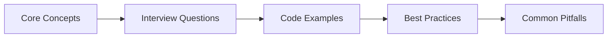

# Chapter 38: Laravel General Interview Q&A

> **Previous:** [Enterprise Capstone — Multi-Agent Platform](./37-enterprise-capstone.md) | **Next:** [Healthcare Interview Q&A](./39-interview-healthcare.md)


---


<!-- Image Gallery -->
<div style="display:flex;flex-wrap:wrap;gap:4px;margin:16px 0;padding:12px;background:#f8fafc;border-radius:8px;border:1px solid #e2e8f0;">
<a href="../../../assets/images/lessons/laravel/38-interview-general/hero.svg" target="_blank" rel="noopener">
  
</a>
<a href="../../../assets/images/lessons/laravel/38-interview-general/handwritten-notes.svg" target="_blank" rel="noopener">
  
</a>
<a href="../../../assets/images/lessons/laravel/38-interview-general/sticky-notes.svg" target="_blank" rel="noopener">
  
</a>
<a href="../../../assets/images/lessons/laravel/38-interview-general/visual-explanation.svg" target="_blank" rel="noopener">
  
</a>
<a href="../../../assets/images/lessons/laravel/38-interview-general/architecture.svg" target="_blank" rel="noopener">
  
</a>
<a href="../../../assets/images/lessons/laravel/38-interview-general/workflow.svg" target="_blank" rel="noopener">
  
</a>
<a href="../../../assets/images/lessons/laravel/38-interview-general/mindmap.svg" target="_blank" rel="noopener">
  
</a>
<a href="../../../assets/images/lessons/laravel/38-interview-general/comparison.svg" target="_blank" rel="noopener">
  
</a>
<a href="../../../assets/images/lessons/laravel/38-interview-general/cheatsheet.svg" target="_blank" rel="noopener">
  
</a>
<a href="../../../assets/images/lessons/laravel/38-interview-general/interview-quiz.svg" target="_blank" rel="noopener">
  
</a>
<a href="../../../assets/images/lessons/laravel/38-interview-general/social-card.svg" target="_blank" rel="noopener">
  
</a>
</div>
<!-- End Image Gallery -->

## Chapter at a Glance

| Aspect | Details |
|--------|---------|
| **Scope** | General Laravel interview questions across fundamentals, architecture, database, testing, and deployment |
| **Key Concepts** | Request lifecycle, service container, Eloquent ORM, queues, testing, Security, performance optimization |
| **Learning Approach** | Q&A format with practical code examples and explanations |
| **Skills Required** | PHP, Laravel, Eloquent, REST APIs, testing |

## Chapter Roadmap



## 1. Laravel Fundamentals & Architecture


### Q1: Explain the Laravel request lifecycle.

**Answer:** Every HTTP request enters via `public/index.php`, which loads Composer's autoloader and bootstraps the application. The HTTP kernel is resolved from the container and the request passes through global middleware. Service providers are registered and booted. The router matches the URI/method to a route. The request traverses the route middleware pipeline, then reaches the controller. The controller returns a Response, which travels back through middleware in reverse and is sent to the browser. Finally, terminable middleware runs.

```php
// public/index.php
$kernel = $app->make(Illuminate\Contracts\Http\Kernel::class);
$response = $kernel->handle($request = Request::capture())->send();
$kernel->terminate($request, $response);
```

### Q2: What is the service container and how does dependency injection work?

**Answer:** The service container (`Illuminate\Foundation\Application`) is Laravel's dependency injection container. It automatically resolves class dependencies by inspecting constructor type-hints. You register bindings with `bind()`, `singleton()`, or `instance()`, and the container recursively resolves them. It can inject primitives using contextual binding and resolves interfaces to concrete implementations.

```php
app()->bind(PaymentGateway::class, StripeGateway::class);
app()->when(ReportController::class)->needs('$perPage')->give(25);
```

### Q3: What is the difference between bind, singleton, and instance in the container?

**Answer:** `bind()` registers a class or interface binding that resolves to a new instance every time. `singleton()` resolves to the same shared instance for the entire request lifecycle. `instance()` places an already-constructed object into the container, effectively replacing any future resolutions with that exact object.

```php
app()->bind(CartService::class);               // new each time
app()->singleton(Logger::class, fn() => new FileLogger(storage_path('logs/laravel.log')));
app()->instance(Request::class, $request);     // pre-built object
```

### Q4: Explain middleware in Laravel → how to create and register it.

**Answer:** Middleware filters HTTP requests entering and responses leaving the application. Create with `php artisan make:middleware`. Register globally in the `$middleware` property of `App\Http\Kernel`, assign to route groups via `$middlewareGroups`, or use named middleware via `$routeMiddleware`. A middleware class implements `handle($request, Closure $next)`.

```php
public function handle(Request $request, Closure $next): Response
{
    if ($request->header('X-API-Key') !== config('app.api_key')) {
        return response()->json(['error' => 'Unauthorized'], 401);
    }
    return $next($request);
}
```

### Q5: What are service providers and what is their role?

**Answer:** Service providers are the central bootstrapping mechanism. Every Laravel startup runs through providers listed in `config/app.php`. The `register()` method binds services into the container. The `boot()` method runs after all providers have registered, so it can safely depend on other container bindings. Providers orchestrate everything → route loading, event registration, queue configuration, and AI SDK setup.

```php
class AppServiceProvider extends ServiceProvider
{
    public function register(): void
    {
        $this->app->singleton(SearchService::class);
    }

    public function boot(): void
    {
        Gate::define('view-reports', fn(User $user) => $user->is_admin);
    }
}
```

### Q6: Explain named routes, route groups, and route model binding.

**Answer:** Named routes assign a name for URL generation with `route()`. Route groups share attributes (prefix, middleware, controller namespace). Route model binding automatically injects Eloquent models into controller methods → implicit binding uses a type-hinted `{model}` parameter, explicit binding customizes the resolution via `Route::model()` or `getRouteKeyName()`.

```php
Route::get('/invoices/{invoice}', [InvoiceController::class, 'show'])
    ->name('invoices.show');

Route::middleware('auth')->prefix('admin')->group(function () {
    Route::resource('users', UserController::class);
});

// Implicit binding → Invoice model injected automatically
public function show(Invoice $invoice) { return $invoice; }
```

### Q7: How does Eloquent's N+1 problem occur and how do you fix it?

**Answer:** The N+1 problem happens when you loop over a collection and access a relationship within the loop, triggering a separate query per iteration. Fix it with eager loading using `with()` or `load()`.

```php
// Problem: 1 query for posts + N queries for each post's author
foreach (Post::all() as $post) { echo $post->author->name; }

// Fix: 2 queries total using eager loading
$posts = Post::with('author')->get();
foreach ($posts as $post) { echo $post->author->name; }
```

### Q8: Explain all Eloquent relationship types with examples.

**Answer:** `hasOne` (one-to-one), `hasMany` (one-to-many), `belongsTo` (inverse), `belongsToMany` (many-to-many with pivot), `hasManyThrough` (nested relationship through an intermediate model), `morphOne`/`morphMany`/`morphToMany` (polymorphic relationships where multiple models share a relation). Each returns a relationship instance that can be chained.

```php
class User extends Model
{
    public function profile(): HasOne          { return $this->hasOne(Profile::class); }
    public function posts(): HasMany           { return $this->hasMany(Post::class); }
    public function roles(): BelongsToMany     { return $this->belongsToMany(Role::class); }
    public function comments(): MorphMany      { return $this->morphMany(Comment::class, 'commentable'); }
}
```

### Q9: What are accessors, mutators, and casts?

**Answer:** Accessors format attribute values when retrieved, mutators format them when set, and casts automate type conversion on Eloquent models. In Laravel 13, accessors/mutators use the new `Attribute` return type.

```php
// Accessor → modifies value on read
protected function fullName(): Attribute
{
    return Attribute::make(get: fn() => "{$this->first_name} {$this->last_name}");
}

// Mutator → modifies value on write
protected function password(): Attribute
{
    return Attribute::make(set: fn(string $value) => bcrypt($value));
}

// Cast → automatic type conversion
protected $casts = [
    'is_admin' => 'boolean',
    'metadata' => 'array',
    'expires_at' => 'datetime',
];
```

### Q10: How do you handle authentication and authorization in Laravel?

**Answer:** Authentication verifies identity. Laravel provides starter kits (Breeze, Jetstream) that scaffold login, registration, and password reset. Under the hood, authentication uses guards (session for web, token/Sanctum for API) and providers (Eloquent, database). Authorization determines what an authenticated user can do. Laravel provides Gates (Closure-based) and Policies (class-based) for authorization logic, plus Blade directives (`@can`, `@cannot`) and middleware (`can:`).

```php
// Gate
Gate::define('edit-post', fn(User $user, Post $post) => $user->id === $post->user_id);

// Policy method
public function update(User $user, Post $post): bool
{
    return $user->id === $post->user_id;
}
```

### Q11: Explain the differences between Sanctum and Passport.

**Answer:** Sanctum is a lightweight API token authentication system supporting token-based auth for SPAs and simple API tokens for mobile apps. It pairs well with cookie-based session auth for first-party frontends. Passport implements OAuth2 → it provides client credentials, authorization codes, and personal access tokens. Sanctum is simpler and preferred for most Laravel applications; Passport is needed when you need a full OAuth2 server for third-party clients.

```php
// Sanctum → issue a token
$token = $user->createToken('api-token')->plainTextToken;

// Passport → via OAuth2 flow
$response = $client->post('oauth/token', [
    'grant_type' => 'client_credentials',
    'client_id' => $clientId,
    'client_secret' => $secret,
]);
```

### Q12: What are gates and policies?

**Answer:** Gates are Closure-based authorization checks defined in `App\Providers\AuthServiceProvider`. Policies are class-based authorization organized around a model. Both support `before()` hooks that run before all other checks (useful for super-admins). Use `Gate::allows()`, `$user->can()`, or middleware.

```php
// Policy
class PostPolicy
{
    public function update(User $user, Post $post): bool
    {
        return $user->id === $post->user_id;
    }
}

// In controller
public function update(Request $request, Post $post)
{
    $this->authorize('update', $post);
    // or: Gate::authorize('update', $post);
}
```

### Q13: How does Blade work → sections, layouts, components?

**Answer:** Blade provides three approaches for reusable templates. Sections with `@extends` and `@section`/`@yield` define a parent layout and child fills sections. Components use `@component` (legacy) or class-based components with `php artisan make:component`. Anonymous components use `.blade.php` files in `resources/views/components/`. X-components are auto-registered and rendered via `<x-alert type="error" />`.

```php
{{-- layouts/app.blade.php --}}
<html><body>@yield('content')</body></html>

{{-- child.blade.php --}}
@extends('layouts.app')
@section('content') <h1>Hello</h1> @endsection

{{-- Component --}}
// resources/views/components/alert.blade.php
<div class="alert alert-{{ $type }}">{{ $slot }}</div>
// Usage: <x-alert type="error">Something went wrong</x-alert>
```

### Q14: Explain Laravel queues, jobs, and the queue worker lifecycle.

**Answer:** Queues defer time-consuming tasks (email, report generation) to run asynchronously. Jobs are classes that implement `ShouldQueue` and contain a `handle()` method. Dispatch via `dispatch()` or `dispatch()->onQueue()`. The queue worker (`php artisan queue:work`) polls the queue connection (database, Redis, SQS) for new jobs, processes them, then sleeps briefly before polling again. Failed jobs are stored in the `failed_jobs` table for retry or inspection.

```php
class ProcessPodcast implements ShouldQueue
{
    use Dispatchable, InteractsWithQueue, Queueable, SerializesModels;

    public function handle(): void
    {
        // Time-consuming work here → runs in the queue worker
    }
}

// Dispatch
ProcessPodcast::dispatch($podcast)->onQueue('high');
```

### Q15: How do you handle failed jobs and retries?

**Answer:** Jobs that throw an exception are automatically released back onto the queue for retry. The `$tries` property or `retryUntil()` method control retry count. Failed jobs are stored in the `failed_jobs` table. Inspect with `php artisan queue:failed`, retry with `queue:retry`, and prune with `queue:prune-failed`. Use `failed()` method on the job for custom cleanup. The `attempts()` method checks retry count.

```php
class ProcessPodcast implements ShouldQueue
{
    public $tries = 3;

    public function backoff(): array
    {
        return [2, 10, 30]; // seconds between retries
    }

    public function failed(Throwable $e): void
    {
        Log::error('Podcast processing failed', ['podcast' => $this->podcast->id]);
    }
}
```

---

## 2. Advanced Laravel

### Q16: How do you build and version a RESTful API in Laravel?

**Answer:** Use `php artisan make:controller Api/V1/PostController --api` for resource controllers without create/edit views. Define routes in `routes/api.php` grouped by version prefix. Apply API middleware (`throttle:api`, `auth:sanctum`). Version via URI path (`/api/v1/posts`) or request header (`Accept: application/vnd.app.v1+json`). Use API resources for response transformation.

```php
// routes/api.php
Route::prefix('v1')->group(function () {
    Route::apiResource('posts', V1\PostController::class)->middleware('auth:sanctum');
});

Route::prefix('v2')->group(function () {
    Route::apiResource('posts', V2\PostController::class);
});
```

### Q17: Explain API resources and collections.

**Answer:** API resources transform Eloquent models into JSON responses. Generate with `php artisan make:resource`. Single models use `UserResource::make($user)`, collections use `UserResource::collection($users)`. Conditional attributes (`when`), relationship inclusion (`whenLoaded`), and sparse fieldsets are supported. In Laravel 13, the JSON:API resource format is the default, following the JSON:API specification with type/id/data structure.

```php
class UserResource extends JsonResource
{
    public function toArray(Request $request): array
    {
        return [
            'id' => $this->id,
            'name' => $this->name,
            'email' => $this->when($request->user()->is_admin, $this->email),
            'posts' => PostResource::collection($this->whenLoaded('posts')),
        ];
    }
}
```

### Q18: How does Laravel Reverb work for WebSockets?

**Answer:** Laravel Reverb is a first-party, Laravel-native WebSocket server written in PHP. It replaces Pusher for self-hosted real-time broadcasting. Install via `php artisan install:reverb`, configure the `.env` settings for apps and ports, then run `php artisan reverb:start`. Laravel events broadcast via `ShouldBroadcast` and the Echo client receives them. Reverb supports presence channels (user-aware websocket rooms) and private channels with authentication callbacks.

```php
class OrderShipped implements ShouldBroadcast
{
    public function broadcastOn(): Channel
    {
        return new PrivateChannel('orders.'.$this->order->user_id);
    }
}
```

### Q19: How do you develop and distribute a Laravel package?

**Answer:** Create a package structure under `packages/` during development with a service provider, config, migrations, and routes. Register it in `composer.json`'s `autoload.psr-4`. For distribution, publish to Packagist with proper `composer.json` metadata including `require`, `autoload`, and `extra.laravel.providers` for automatic discovery. Packages use `php artisan vendor:publish` to expose config and migration files.

```php
// Service provider
class AnalyticsServiceProvider extends ServiceProvider
{
    public function register(): void
    {
        $this->mergeConfigFrom(__DIR__.'/../config/analytics.php', 'analytics');
    }

    public function boot(): void
    {
        $this->loadMigrationsFrom(__DIR__.'/../database/migrations');
        $this->publishes([__DIR__.'/../config/analytics.php' => config_path('analytics.php')]);
    }
}
```

### Q20: Explain PHPUnit/PEST testing patterns in Laravel.

**Answer:** Laravel supports both PHPUnit (traditional) and PEST (fluent, function-based). PEST provides higher-level helpers like `get()`, `post()`, `assertDatabaseHas()`, and `assertStatus()`. Tests live in `tests/Feature` (integration) and `tests/Unit` (isolated). Factories generate test data. `RefreshDatabase` resets state between runs. Pest uses `it()` and `test()` functions with `expect()` and `->toBe()` matchers.

```php
// PEST test
it('creates a new post', function () {
    $user = User::factory()->create();

    $response = $this->actingAs($user)->post('/posts', [
        'title' => 'My Post',
        'body' => 'Content here',
    ]);

    $response->assertStatus(201);
    $this->assertDatabaseHas('posts', ['title' => 'My Post']);
});
```

### Q21: How do you write HTTP tests and database tests?

**Answer:** HTTP tests use methods like `get()`, `post()`, `put()`, `delete()` with assertions for status, JSON structure, session, and headers. Database tests use `assertDatabaseHas()`, `assertDatabaseMissing()`, and `assertDatabaseCount()`. The `RefreshDatabase` trait wraps each test in a database transaction. Factories create models with sensible defaults. Use `withoutMiddleware()` to skip middleware for isolated controller tests.

```php
it('updates user profile', function () {
    $user = User::factory()->create();

    $response = $this->actingAs($user)->put('/profile', [
        'name' => 'Updated Name',
        'email' => 'new@example.com',
    ]);

    $response->assertSessionHas('status', 'profile-updated');
    $this->assertDatabaseHas('users', [
        'id' => $user->id,
        'name' => 'Updated Name',
    ]);
});
```

### Q22: What is Laravel Octane and how does it improve performance?

**Answer:** Laravel Octane boots the application once into memory using Swoole or RoadRunner, then serves multiple requests from the same booted instance. This eliminates bootstrapping overhead (config loading, service provider registration) on every request. Octane provides a `WebSocket` server, `Concurrency` facade for parallel execution, and automatic ticker support. Deploy with `php artisan octane:start --server=swoole --host=0.0.0.0 --port=8080`.

```php
// Concurrency → run tasks in parallel
use Laravel\Octane\Facades\Concurrency;

[$users, $orders] = Concurrency::run([
    fn() => User::count(),
    fn() => Order::sum('total'),
]);
```

### Q23: Explain caching strategies in Laravel (drivers, tags, atomic locks).

**Answer:** Laravel supports file, database, Redis, DynamoDB, and array cache drivers. Cache tags group related cache items (Redis/Memcached only) for mass invalidation. Atomic locks provide distributed locking via `Cache::lock('key')->get()` → use them for critical sections (deployments, payment processing). `Cache::touch()` in Laravel 13 extends TTL automatically on access for frequently used keys.

```php
// Tagged cache
Cache::tags(['posts', 'users'])->put('stats', $data, 3600);
Cache::tags(['posts'])->flush(); // invalidate only posts tag

// Atomic lock
$lock = Cache::lock('processing-order-'.$order->id, 10);
if ($lock->get()) {
    // Process order...
    $lock->release();
}

// TTL extension on access (Laravel 13)
Cache::put('popular-posts', $posts, 60, touch: true);
```

### Q24: How does Laravel Horizon help manage queues?

**Answer:** Horizon provides a dashboard and configuration for Redis-backed queues. It shows job status (running, completed, failed, recent), queue metrics (throughput, wait time), and per-worker monitoring. Configuration in `config/horizon.php` defines worker pools (balanced across queues) and deployment-specific environments. Run `php artisan horizon` to start workers and `/horizon` route for the dashboard.

```php
// config/horizon.php → worker pool
'environments' => [
    'production' => [
        'supervisor-1' => [
            'connection' => 'redis',
            'queue' => ['high', 'default', 'low'],
            'balance' => 'auto',
            'minProcesses' => 1,
            'maxProcesses' => 10,
            'tries' => 3,
        ],
    ],
],
```

### Q25: Explain Laravel Telescope and Pulse → what do they monitor?

**Answer:** Telescope is a debug assistant that monitors incoming requests, commands, scheduled tasks, dumped data, queries (with bindings), mail, notifications, cache operations, jobs, logs, events, and exceptions. Run `php artisan telescope:install` and visit `/telescope`. Pulse provides real-time application health dashboards with system metrics (CPU, memory), slow queries, cache hits/misses, queue throughput, usage tracking, and custom cards. Pulse is production-safe and uses a Redis stream for minimal overhead.

```php
// Telescope → record custom entry
Telescope::record(new CustomEntry('ai-agent', ['prompt' => $prompt, 'tokens' => $tokens]));

// Pulse → custom card registration in config/pulse.php
'recorders' => [
    \Laravel\Pulse\Recorders\SlowJobs::class => ['threshold' => 1000],
    \Laravel\Pulse\Recorders\SlowQueries::class => ['threshold' => 100],
],
```

---

## 3. AI SDK

### Q26: What is the Laravel AI SDK and what providers does it support?

**Answer:** The `laravel/ai` package is a unified, provider-agnostic PHP SDK for interacting with AI services. It abstracts text generation, embeddings, image generation, audio, and transcription behind a single fluent API. Install via `composer require laravel/ai`. It supports over fourteen providers: Anthropic, OpenAI, Google Gemini, Amazon Bedrock, Azure OpenAI, Groq, xAI, DeepSeek, Mistral, Ollama, OpenRouter, Cohere, Jina, VoyageAI, and ElevenLabs.

```php
// Provider-agnostic text generation
$response = Ai::text('Explain quantum computing in one sentence');
// Swap providers by changing env → no code changes
```

### Q27: How do you create an agent using php artisan make:agent?

**Answer:** The `php artisan make:agent` command scaffolds an AI agent class in `app/Ai/Agents/`. The generated class implements the `Agent` contract and uses the `Promptable` trait. You define the agent's `instructions()` method to set its system prompt. Agents are invoked via `Agent::chat()` which handles tool execution, conversation context, and structured output automatically.

```php
// php artisan make:agent SupportAgent
class SupportAgent implements Agent
{
    use Promptable;

    public function instructions(): Stringable|string
    {
        return 'You are a support agent that answers customer questions about our SaaS platform. Be concise and helpful.';
    }
}

// Usage
$response = Agent::chat(new SupportAgent)->send('How do I reset my password?');
```

### Q28: Explain the difference between agents and tools.

**Answer:** Agents are AI-powered classes that process user prompts, maintain conversational context, and decide which tools to invoke. They contain system instructions and can choose to use zero or more tools to fulfill a request. Tools are discrete, stateless functions that an agent can call → they perform a specific action (look up a user, send an email, query the database). An agent orchestrates; a tool executes. Agents use `Promptable`; tools implement the `Tool` contract with a `handle()` method.

```php
// Agent → orchestrates, makes decisions
class ResearchAgent implements Agent { use Promptable; }

// Tool → executes a specific action
class LookupUserTool implements Tool
{
    public function handle(ToolInput $input): mixed
    {
        return User::find($input->get('user_id'));
    }
}
```

### Q29: How do you handle structured output from AI agents using JsonSchema?

**Answer:** Structured output forces the AI to return data in a defined JSON schema using `JsonSchema` builder. The agent's `output()` method or `->output()` on the chat chain defines the expected shape with typed properties, nested objects, arrays, enums, and descriptions. The SDK validates the response against the schema and returns hydrated PHP objects.

```php
class InvoiceExtractor implements Agent
{
    use Promptable;

    public function output(): JsonSchema
    {
        return JsonSchema::object()
            ->property('invoice_number', JsonSchema::string()->description('The invoice reference'))
            ->property('total', JsonSchema::float()->description('Total amount in USD'))
            ->property('line_items', JsonSchema::array(
                JsonSchema::object()
                    ->property('description', JsonSchema::string())
                    ->property('amount', JsonSchema::float())
            ));
    }
}

$result = Agent::chat(new InvoiceExtractor)->send('Extract from this PDF...');
echo $result->total; // typed float
```

### Q30: What is the RemembersConversations trait and how does it work?

**Answer:** The `RemembersConversations` trait persists multi-turn conversations to the database using the `agent_conversations` and `agent_conversation_messages` tables. Each agent instance gets a conversation ID that carries message history across requests. The trait passes the full conversation history to the AI on every call, enabling coherent multi-turn dialogue. History is automatically pruned to fit within the model's context window.

```php
class ChatbotAgent implements Agent
{
    use Promptable, RemembersConversations;
}

// First turn → conversation created
$response1 = Agent::chat(new ChatbotAgent)->send('Hi, my name is Alice');
// Second turn → same conversation continues
$response2 = Agent::chat(new ChatbotAgent)->conversation($conversationId)->send('What is my name?');
// The agent remembers "Alice" from the persisted history
```

### Q31: How do you stream responses from an AI agent?

**Answer:** Use `->stream()` instead of `->send()` to receive a `ReadableStream` of text chunks. Each chunk is yielded as it arrives from the provider. This powers real-time UIs with streaming text. For broadcasting, use `->broadcast()` to send streamed chunks to a Reverb channel, enabling server-sent streaming to frontend clients over WebSockets.

```php
// Direct streaming
$stream = Agent::chat(new WriterAgent)->stream('Write a story about a robot');

foreach ($stream->chunks() as $chunk) {
    echo $chunk->text; // yield progressively
}

// Broadcasting via Reverb
Agent::chat(new WriterAgent)->broadcast()->stream('Write a story...');
```

### Q32: How do you queue an agent for background execution?

**Answer:** Call `->queue()` on the agent chat chain to dispatch execution to Laravel's queue worker. The agent processes asynchronously and the result can be polled or delivered via notification. Queueing is useful for long-running agent tasks like document analysis, report generation, or batch processing. The job is serialized and runs within a queue worker process.

```php
// Dispatch agent to queue
Agent::chat(new DocumentAnalyzer)
    ->queue()
    ->onQueue('ai')
    ->send('Analyze this 100-page document...');

// The agent processes in background → use events or polling to get the result
```

### Q33: Explain how to create a custom tool with the AI SDK.

**Answer:** Generate a tool with `php artisan make:tool`. The class implements the `Tool` contract with `name()`, `description()`, `inputSchema()`, and `handle()` methods. The input schema defines parameters the AI can pass, and `handle()` receives the parsed input and returns a value back to the agent. Tools can be bound to an agent or provided globally.

```php
// php artisan make:tool WeatherTool
class WeatherTool implements Tool
{
    public function name(): string { return 'get_weather'; }
    public function description(): string { return 'Get current weather for a city'; }
    public function inputSchema(): array
    {
        return ['city' => ['type' => 'string', 'description' => 'City name']];
    }
    public function handle(ToolInput $input): mixed
    {
        return Http::get("https://api.weather.com/current/{$input->get('city')}")->json();
    }
}

$response = Agent::chat(new TravelAgent)->tools([new WeatherTool])->send('Should I bring an umbrella to London?');
```

### Q34: How do you integrate MCP tools with the AI SDK?

**Answer:** The AI SDK can import tools from MCP servers using `Ai::fetchTools('mcp-server-name')` or the `FetchesTools` trait on an agent. This discovers all tools exposed by the MCP server and makes them available to the agent without writing local tool classes. Tools are fetched by name and merged into the agent's tool set.

```php
// In an agent using the FetchesTools trait
class DashboardAgent implements Agent
{
    use Promptable, FetchesTools;

    public function fetchTools(): array
    {
        return [
            Ai::fetchTools('sales-analytics'),    // MCP server tools
            Ai::fetchTools('inventory-manager'),
        ];
    }
}
```

### Q35: How does image generation work with the AI SDK?

**Answer:** The SDK provides a fluent `Image` facade for image generation. Configure the provider (OpenAI DALL-E, Bedrock, etc.) in `config/ai.php`. Use `Image::of()->generate()` with a description. The result contains the image URL or base64 data. Options include size, quality, and style parameters depending on the provider.

```php
$image = Image::of()
    ->description('A serene mountain landscape at sunset with a small cabin')
    ->size('1024x1024')
    ->generate();

echo $image->url; // https://...generated-image.png
```

### Q36: How do you generate and query embeddings?

**Answer:** Embeddings convert text to high-dimensional vectors. Generate them with `Str::toEmbeddings('text')` or `Embeddings::for('text')`. Store the vector in a `vector` column (pgvector) or Redis. Query using `whereVectorSimilarTo()` on an Eloquent model with a trained column. The SDK supports multiple embedding providers and models.

```php
// Generate embeddings
$vector = Str::toEmbeddings('What is Laravel?');

// Store with model
$doc = Document::create([
    'content' => 'Laravel is a PHP framework...',
    'embedding' => $vector,
]);

// Query similar
$results = Document::query()
    ->whereVectorSimilarTo('embedding', Str::toEmbeddings('PHP frameworks'))
    ->limit(5)
    ->get();
```

### Q37: Explain how to build a RAG pipeline using the AI SDK.

**Answer:** A RAG (Retrieval-Augmented Generation) pipeline retrieves relevant context from a vector store and injects it into the prompt. Steps: (1) Chunk documents, (2) Generate embeddings per chunk, (3) Store in pgvector, (4) On user query, embed the query and find similar chunks, (5) Pass chunks as context to the AI agent. The AI SDK's `SimilaritySearchTool` automates steps 4-5.

```php
class RagAgent implements Agent
{
    use Promptable;

    public function tools(): array
    {
        return [
            new SimilaritySearchTool(Document::class, 'embedding', numResults: 3),
        ];
    }

    public function instructions(): Stringable|string
    {
        return 'You answer questions about company policies. Use the similarity_search tool to find relevant documents before answering.';
    }
}
```

### Q38: How do you use the Reranking feature?

**Answer:** Reranking improves search relevance by reordering initial results using a cross-encoder model. The AI SDK provides `Reranking::of()` or `Collection::rerank()` to apply reranking to a result set. Reranking considers query-document pair similarity more accurately than embedding cosine similarity alone. It works with any result set and supports limiting the final count.

```php
// Using Reranking facade
$results = Document::query()
    ->whereVectorSimilarTo('embedding', Str::toEmbeddings('company vacation policy'))
    ->limit(20)
    ->get();

$reranked = Reranking::of($results, 'How many vacation days do I get?')
    ->limit(5)
    ->rerank();

// Using Eloquent collection
$reranked = $results->rerank('How many vacation days do I get?')->take(5);
```

### Q39: How do you handle AI provider failover?

**Answer:** The SDK supports failover providers via configuration. If the primary provider returns an error or times out, the SDK automatically tries the next configured provider. Failover is configured in `config/ai.php` using the `fallback` key with a list of alternative provider/model pairs. This ensures high availability for AI-dependent features.

```php
// config/ai.php
'defaults' => [
    'text' => [
        'provider' => env('AI_TEXT_PROVIDER', 'anthropic'),
        'model' => env('AI_TEXT_MODEL', 'claude-sonnet-4-20250514'),
        'fallback' => [
            ['provider' => 'openai', 'model' => 'gpt-4o'],
            ['provider' => 'groq', 'model' => 'llama-3.3-70b'],
        ],
    ],
],
```

### Q40: How do you test AI features in Laravel?

**Answer:** The AI SDK provides testing helpers via `Ai::fake()` that prevent real API calls during tests. Pass an array of fake responses keyed by prompt. Use `assertAgentSent()` to verify the agent was called with expected prompts. Tools can be mocked like any other class. For integration tests, use `withHeaders()` to simulate AI-specific request data.

```php
it('generates a summary', function () {
    Ai::fake([
        'Please summarize this document' => 'This is the fake summary.',
    ]);

    $response = Agent::chat(new SummaryAgent)->send('Please summarize this document');

    expect($response->text)->toBe('This is the fake summary.');
    Ai::assertAgentSent(SummaryAgent::class, 1);
});
```

---

## 4. MCP

### Q41: What is the Model Context Protocol and why was it created?

**Answer:** The Model Context Protocol (MCP) is an open standard created by Anthropic for connecting AI applications with external tools, data sources, and services. It defines a JSON-RPC-based protocol where an MCP server exposes tools, resources, and prompts to an MCP client (the AI host). It was created to solve the fragmentation problem → every AI framework had its own tool integration. MCP provides a single, standardized protocol that any MCP-compatible client can use to interact with any MCP server.

### Q42: How do you create an MCP server in Laravel?

**Answer:** Install the `laravel/mcp` package, then use `php artisan make:mcp-server ServerName`. The generated class extends the MCP server base and defines available tools, resources, and authentication. Run the server via `php artisan mcp:serve` for local development or deploy as a web endpoint. Servers automatically register with Laravel's service container.

```php
// php artisan make:mcp-server SalesAnalytics
class SalesAnalytics extends McpServer
{
    protected string $name = 'sales-analytics';

    protected function tools(): array
    {
        return [
            new GetRevenueTool(),
            new TopProductsTool(),
        ];
    }
}
```

### Q43: What is the difference between web servers and local servers in MCP?

**Answer:** A **local server** runs as a subprocess (via `php artisan mcp:serve`) and communicates over STDIO. It is used for development, CLI tools, and local AI assistants like Claude Code or Cursor → it sends JSON-RPC messages over standard input/output. A **web server** runs as an HTTP endpoint exposed via routes and communicates over HTTP/SSE. Web servers support authentication (OAuth, Sanctum), are deployed to production, and can be used by remote clients. Both expose the same server interface.

```php
// Local server → STDIO transport
// Run: php artisan mcp:serve sales-analytics

// Web server → HTTP transport
// Register in routes/mcp.php
Mcp::server('sales-analytics', SalesAnalytics::class);
```

### Q44: How do you create MCP tools with input/output schemas?

**Answer:** Use `php artisan make:mcp-tool ToolName`. The tool class defines `name()`, `description()`, `inputSchema()`, `outputSchema()`, and `handle()`. Schemas use JSON Schema format to describe parameters and return values. The AI host uses the schema to determine what arguments to pass.

```php
class GetRevenueTool implements McpTool
{
    public function name(): string { return 'get_revenue'; }
    public function description(): string { return 'Get revenue for a date range'; }
    public function inputSchema(): array
    {
        return [
            'type' => 'object',
            'properties' => [
                'start' => ['type' => 'string', 'format' => 'date'],
                'end' => ['type' => 'string', 'format' => 'date'],
            ],
            'required' => ['start', 'end'],
        ];
    }
    public function handle(array $input): array
    {
        $revenue = Order::whereBetween('created_at', [$input['start'], $input['end']])->sum('total');
        return ['total' => $revenue, 'currency' => 'USD'];
    }
}
```

### Q45: What are MCP resources and prompts?

**Answer:** **Resources** expose data to the AI host in a URI-addressable way → like files in a virtual filesystem. Each resource has a URI scheme and content type. The AI reads resources for context. **Prompts** are reusable message templates that the host can present to the user. They define structured interactions with parameterized inputs. Both are defined alongside tools in an MCP server.

```php
// Resource → exposes data by URI
protected function resources(): array
{
    return [
        Resource::make('company://policies/vacation')
            ->name('Vacation Policy')
            ->mimeType('text/markdown')
            ->handler(fn() => file_get_contents(storage_path('policies/vacation.md'))),
    ];
}

// Prompt → reusable template
protected function prompts(): array
{
    return [
        Prompt::make('summarize-order')
            ->description('Summarize an order for customer support')
            ->arguments(['order_id' => ['type' => 'integer']])
            ->handler(fn(array $args) => OrderSummary::fromId($args['order_id'])->toPrompt()),
    ];
}
```

### Q46: How does MCP authentication work with OAuth and Sanctum?

**Answer:** MCP web servers support OAuth 2.0 (authorization code flow) and Sanctum token authentication. The server advertises its auth capabilities in the initialization handshake. For OAuth, the client redirects the user to the authorization endpoint, receives a token, and includes it in subsequent requests. Sanctum authentication validates API tokens from the `Authorization: Bearer` header just like REST routes.

```php
// config/mcp.php → authentication
'servers' => [
    'sales-analytics' => [
        'auth' => 'sanctum',
        'middleware' => ['auth:sanctum', 'throttle:api'],
    ],
],
```

### Q47: How do you build an MCP client in Laravel?

**Answer:** Laravel's MCP system includes a client class that connects to remote MCP servers (Laravel or third-party). Use `Mcp::client('server-name')` to establish a connection. The client lists available tools, calls them, and retrieves resources. The client handles the JSON-RPC transport and protocol negotiation automatically.

```php
$client = Mcp::client('https://analytics.example.com/mcp')
    ->withToken($apiKey)
    ->connect();

// List available tools
$tools = $client->tools();

// Call a tool
$revenue = $client->call('get_revenue', [
    'start' => '2025-01-01',
    'end' => '2025-12-31',
]);
```

### Q48: How do you test MCP servers?

**Answer:** Use the `Mcp::fake()` method to simulate MCP server responses during testing. For integration tests, spawn a test server instance and make real JSON-RPC calls against it. Assert tools were called, responses match expected schemas, and authentication is enforced.

```php
it('returns revenue from MCP server', function () {
    Mcp::fake([
        'get_revenue' => ['total' => 150000, 'currency' => 'USD'],
    ]);

    $client = Mcp::client('sales-analytics')->connect();
    $result = $client->call('get_revenue', ['start' => '2025-01-01', 'end' => '2025-12-31']);

    expect($result['total'])->toBe(150000);
});
```

### Q49: How does Boost integrate with MCP?

**Answer:** Laravel Boost automatically generates MCP servers for your application based on its models, routes, and AI guidelines. Running `php artisan boost:mcp` scans your codebase and creates MCP tools for all Eloquent models (CRUD operations) and registered routes. These servers are immediately consumable by Cursor, Claude Code, and other MCP hosts. Boost also creates MCP resources from your `ai-guidelines` directory.

```bash
# Generate MCP servers from application code
php artisan boost:mcp

# Boost creates tools like:
# - get_users, create_user, update_user, delete_user
# - get_orders, search_products
# - query_documents (from AI guidelines)
```

### Q50: What are MCP apps and how do they differ from tools?

**Answer:** MCP **apps** are higher-level compositions that bundle multiple tools, resources, and prompts into a cohesive capability. An app might be "Customer Support Assistant" that includes lookup tools, ticket creation, knowledge base search, and escalation prompts. Apps differ from tools in their scope → tools are single operations while apps are feature bundles. Apps can be shared and installed via MCP registries.

```php
// An MCP app → bundles multiple capabilities
McpApp::make('customer-support')
    ->displayName('Customer Support Assistant')
    ->tools([new LookupOrderTool(), new CreateTicketTool(), new EscalateTool()])
    ->resources([Resource::make('kb://faq')])
    ->prompts([Prompt::make('handle-complaint')])
    ->register();
```

---

## 5. Search & RAG

### Q51: How do you implement full-text search in Laravel?

**Answer:** Laravel's `whereFullText()` method provides database-native full-text search using FULLTEXT indexes on MySQL/MariaDB or `tsvector` on PostgreSQL. Define the FULLTEXT index in a migration, then query with `->whereFullText(['title', 'body'], $searchTerm)`. PostgreSQL supports ranking by relevance and tsquery operators. MariaDB/MySQL support natural language mode and Boolean mode.

```php
// Migration
Schema::table('posts', function (Blueprint $table) {
    $table->fullText(['title', 'body']);
});

// Query
$posts = Post::whereFullText(['title', 'body'], 'laravel ai sdk')
    ->orderByRaw('MATCH(title, body) AGAINST(? IN NATURAL LANGUAGE MODE) DESC', ['laravel ai sdk'])
    ->get();
```

### Q52: What is pgvector and how do you use it in Laravel?

**Answer:** pgvector is a PostgreSQL extension that adds vector similarity search capabilities. Install via `CREATE EXTENSION vector;`. In Laravel, add a `vector` column type in migrations, generate embeddings via the AI SDK, and store them alongside your data. Query using `whereVectorSimilarTo()` with cosine distance or other distance operators.

```php
// Migration
Schema::table('documents', function (Blueprint $table) {
    $table->vector('embedding', 1536); // 1536 dimensions for text-embedding-3-small
});

// Store
$doc = Document::create([
    'content' => 'Laravel is a PHP framework...',
    'embedding' => Str::toEmbeddings('Laravel is a PHP framework...'),
]);

// Query
$query = Str::toEmbeddings('PHP frameworks');
$results = Document::query()
    ->whereVectorSimilarTo('embedding', $query)
    ->limit(10)
    ->get();
```

### Q53: How do you create HNSW indexes for vector search?

**Answer:** HNSW (Hierarchical Navigable Small World) indexes dramatically speed up vector similarity queries on large datasets. Create the index in a migration after populating the vector column. Use the `hnsw` access method with the appropriate distance function. HNSW indexes trade build time for query speed → ideal for read-heavy workloads.

```php
// Migration → create index after data is loaded
DB::statement('CREATE INDEX documents_embedding_idx ON documents USING hnsw (embedding vector_cosine_ops)');

// The index is automatically used by whereVectorSimilarTo queries
$results = Document::query()
    ->whereVectorSimilarTo('embedding', $query)
    ->limit(10)
    ->get(); // Uses HNSW index automatically
```

### Q54: Explain how to use whereVectorSimilarTo for similarity queries.

**Answer:** `whereVectorSimilarTo()` is an Eloquent scope on models with a vector column. It takes the column name and the embedding vector, applies the correct distance operator (cosine by default), orders by similarity, and limits results. Internally it generates `ORDER BY embedding <=> ? LIMIT ?` with the query vector bound as a parameter.

```php
$queryEmbedding = Str::toEmbeddings('machine learning tutorials');

$results = Document::query()
    ->select('id', 'content', 'title')
    ->selectRaw('embedding <=> ? as distance', [$queryEmbedding])
    ->whereVectorSimilarTo('embedding', $queryEmbedding)
    ->limit(20)
    ->get();

// Results ordered by cosine distance → lower is more similar
```

### Q55: What is Laravel Scout and what engines does it support?

**Answer:** Laravel Scout is a search abstraction layer for Eloquent models. It provides a consistent API for full-text search across different engines. In Laravel 13, Scout ships with a first-party **database engine** that leverages MySQL/PostgreSQL full-text indexes (no external service required). Third-party engines include Algolia, Meilisearch, and Typesense. Scout automatically synchronizes model changes to the search index.

```php
class Post extends Model
{
    use Searchable;

    public function toSearchableArray(): array
    {
        return [
            'id' => $this->id,
            'title' => $this->title,
            'body' => $this->body,
        ];
    }
}

// Search across all posts
$posts = Post::search('laravel ai')->where('published', true)->paginate(20);
```

### Q56: How do you build a complete RAG pipeline in Laravel?

**Answer:** A complete RAG pipeline has four stages: (1) **Ingestion** → chunk documents, generate embeddings, store in pgvector; (2) **Retrieval** → embed user query, search nearest neighbors in pgvector; (3) **Augmentation** → inject retrieved chunks into the AI agent prompt; (4) **Generation** → the AI produces an answer grounded in the retrieved context. The AI SDK's `SimilaritySearchTool` automates retrieval and augmentation.

```php
// 1. Ingestion pipeline
$chunks = TextChunker::chunk($document->content, maxLength: 500);
foreach ($chunks as $chunk) {
    DocumentChunk::create([
        'document_id' => $document->id,
        'content' => $chunk,
        'embedding' => Str::toEmbeddings($chunk),
    ]);
}

// 2-4. Agent with retrieval
class QaAgent implements Agent
{
    use Promptable;

    public function tools(): array
    {
        return [
            new SimilaritySearchTool(DocumentChunk::class, 'embedding', numResults: 5),
        ];
    }

    public function instructions(): string
    {
        return 'Answer based on retrieved context. Cite sources.';
    }
}

$answer = Agent::chat(new QaAgent)->send('What is the refund policy?');
```

### Q57: How do you combine keyword search with vector search?

**Answer:** The hybrid approach combines `whereFullText()` for keyword matching and `whereVectorSimilarTo()` for semantic matching. Results are merged and deduplicated using Laravel's `Collection` methods. Weighting determines the balance between exact and semantic matching → typically 30% keyword + 70% vector for general content, adjusted per use case. Reranking can further improve final ordering.

```php
function hybridSearch(string $query, int $limit = 10): Collection
{
    $vector = Str::toEmbeddings($query);

    $keywordResults = Document::whereFullText(['title', 'body'], $query)
        ->select('id', 'title', 'body')
        ->limit($limit)
        ->get()
        ->keyBy('id');

    $vectorResults = Document::whereVectorSimilarTo('embedding', $vector)
        ->select('id', 'title', 'body')
        ->limit($limit)
        ->get()
        ->keyBy('id');

    // Merge and deduplicate
    return $keywordResults->union($vectorResults)->values()->take($limit);
}
```

### Q58: How do you cache embeddings for performance?

**Answer:** Cache embeddings using Laravel's cache system to avoid regenerating vectors for the same text. The AI SDK provides `remember()` helpers and configurable cache store for embeddings. For static content, store embeddings in the database alongside the content. For dynamic or user-generated content, use `Cache::remember()` with a key based on the text hash.

```php
// Cache individual embeddings
$embedding = Cache::remember('embedding:'.md5($text), 3600, function () use ($text) {
    return Str::toEmbeddings($text);
});

// AI SDK cached embedding option
$embedding = Str::toEmbeddings($text, cache: true);

// Bulk: cache all document embeddings during ingestion
foreach ($chunks as $chunk) {
    $embedding = Cache::rememberForever('embedding:'.md5($chunk), fn() => Str::toEmbeddings($chunk));
    DocumentChunk::create(['content' => $chunk, 'embedding' => $embedding]);
}
```

---

## 6. Boost & Automation

### Q59: What is Laravel Boost and what does it provide?

**Answer:** Laravel Boost is an AI-assisted development tool by the Laravel core team. It provides over 15 specialized AI tools, a vectorized knowledge base of 17,000+ Laravel documentation pieces, and custom AI guidelines for consistent code generation. Boost integrates with Cursor, Claude Code, and OpenCode to provide context-aware Laravel assistance directly in the IDE, including real-time linting, code generation, and project-aware autocomplete.

```bash
composer require laravel/boost --dev
php artisan boost:install
```

### Q60: How do you create custom AI guidelines with Boost?

**Answer:** Create a `.ai/guidelines` directory in your project root. Add markdown files that document your conventions, architecture decisions, naming standards, and any patterns Boost should follow when generating code. Boost reads these files and includes them as context in AI prompts. Guidelines are automatically vectorized and retrieved when relevant.

```markdown
# .ai/guidelines/database-conventions.md
- Use `ulid` columns instead of auto-incrementing integers for all primary keys
- All timestamps must use `timestampTz()` for timezone awareness
- Soft delete all user-related models using `SoftDeletes`
- Index every foreign key column explicitly
```

### Q61: How does Boost integrate with Cursor and Claude Code?

**Answer:** Boost generates MCP servers and configuration files that Cursor and Claude Code consume automatically. When Boost is installed, it creates `.cursor/rules/` and `CLAUDE.md` entries that reference your AI guidelines. In Cursor, Boost's tools appear as composer commands. In Claude Code, Boost generates an MCP server that provides project-aware context, database schema knowledge, and route information.

```bash
# Boost auto-configures MCP for the IDE
php artisan boost:ide

# This creates:
# - .cursor/rules/laravel-boost.mdc
# - CLAUDE.md with Laravel AI rules
# - MCP server for project awareness
```

### Q62: Explain event-driven automation patterns in Laravel.

**Answer:** Event-driven automation uses Laravel's event system to trigger actions when domain events occur. Define event classes, listen via listeners or `Event::listen()` closures, and dispatch with `event()`. Events can trigger AI agents, queue jobs, send notifications, update caches, or call webhooks. This pattern decouples the event source from the reaction logic and supports multiple listeners per event.

```php
// Event
class OrderShipped
{
    public function __construct(public Order $order) {}
}

// Listener → runs agent automatically
class SendShippingNotification
{
    public function handle(OrderShipped $event): void
    {
        Agent::chat(new ShippingAgent)
            ->queue()
            ->send("Notify customer about order {$event->order->id}");
    }
}

// Registered in EventServiceProvider
protected $listen = [
    OrderShipped::class => [SendShippingNotification::class],
];
```

### Q63: How do you build webhook-driven automation?

**Answer:** Webhooks trigger Laravel actions from external services. Use a route that receives the webhook payload, validates the signature for security, and dispatches a job or event. Expose webhook routes via `post('/webhooks/{provider}', ...)` without CSRF (add to `except` array). Use signed URLs or secret validation for authenticity.

```php
// routes/api.php → webhooks bypass CSRF
Route::post('/webhooks/stripe', [StripeWebhookController::class, 'handle']);

// Controller
class StripeWebhookController extends Controller
{
    public function handle(Request $request): Response
    {
        $payload = $request->getContent();
        $sig = $request->header('Stripe-Signature');

        // Verify signature
        $event = \Stripe\Webhook::constructEvent($payload, $sig, config('services.stripe.webhook_secret'));

        // Dispatch automation
        ProcessStripeEvent::dispatch($event->type, $event->data->object);

        return response('ok');
    }
}
```

### Q64: What is human-in-the-loop and how do you implement it?

**Answer:** Human-in-the-loop (HITL) pauses automation for human approval before executing a critical action. In Laravel, implement by dispatching a job that creates an approval request, sends a notification, and awaits a response via a dedicated route or Artisan command. The job retries or continues based on the human response. This is critical for financial operations, content publishing, and sensitive data access.

```php
class ApproveRefundJob implements ShouldQueue
{
    public function handle(): void
    {
        // Create approval request
        $approval = ApprovalRequest::create([
            'type' => 'refund',
            'payload' => ['order_id' => $this->order->id, 'amount' => $this->order->total],
            'status' => 'pending',
        ]);

        // Notify admin
        Notification::route('slack', config('services.slack.admin_channel'))
            ->notify(new ApprovalNeeded($approval));

        // Job retries with backoff until approved or expired
        if ($approval->status !== 'approved' && $this->attempts() < 10) {
            $this->release(60); // retry in 60 seconds
        }
    }
}
```

---

## 7. System Design

### Q65: How do you scale Laravel to 1M+ users?

**Answer:** Scale horizontally by adding more application servers behind a load balancer. Use Redis for sessions, cache, and queues. Implement read replicas for database reads and distribute writes to the primary. Use Octane (Swoole/RoadRunner) for persistent application memory. Offload static assets to a CDN. Use Laravel Vapor or Cloud for serverless auto-scaling. Profile bottlenecks with Telescope and Pulse.

```
Load Balancer → App Servers (×N behind ALB)
    ├── Redis Cluster (sessions, cache, queues, locks)
    ├── PostgreSQL Primary + Read Replicas
    ├── CDN (assets, media)
    ├── Horizon (queue workers ×M)
    └── Reverb (WebSocket cluster)
```

### Q66: Explain multi-tenancy strategies in Laravel.

**Answer:** Three main strategies: (1) **Single database with tenant_id column** → simplest, all tenants share tables. (2) **Separate database per tenant** → full isolation, each tenant has its own DB. (3) **Separate schema per tenant** (PostgreSQL) → shared connection, isolated schemas. Laravel's multi-tenancy packages (Stancl Tenancy, Laravel Multi-tenancy) use middleware to scope queries automatically via `tenancy()->initialize()`.

```php
// Single DB with tenant_id → scoped globally
class TenantScopedModel extends Model
{
    protected static function booted(): void
    {
        static::addGlobalScope('tenant', fn(Builder $q) => $q->where('tenant_id', tenant()->id));
    }
}

// Separate database → switch connection per tenant
tenancy()->initialize($tenant);
Config::set('database.connections.tenant.database', "tenant_{$tenant->id}");
DB::purge('tenant');
```

### Q67: What is CQRS and how do you implement it in Laravel?

**Answer:** Command Query Responsibility Segregation separates read models from write models. Commands handle writes (mutations), queries handle reads. This allows optimizing each side independently → use denormalized read tables for fast queries, normalized writes for data integrity. In Laravel, implement CQRS with separate Action classes for commands and separate ReadModel classes for queries. Queue writes for eventual consistency.

```php
// Command → writes
class PlaceOrderCommand
{
    public function handle(CreateOrderRequest $request): void
    {
        DB::transaction(function () use ($request) {
            $order = Order::create(/* ... */);
            Inventory::decrement($request->product_id, $request->quantity);
            OrderPlaced::dispatch($order); // eventual consistency
        });
    }
}

// Query → reads from denormalized view
class OrderSummaryQuery
{
    public function get(string $userId): Collection
    {
        return DB::table('order_summaries')
            ->where('user_id', $userId)
            ->orderByDesc('placed_at')
            ->get();
    }
}
```

### Q68: Explain the service layer and repository patterns in Laravel.

**Answer:** The **service layer** encapsulates business logic in dedicated classes (e.g., `PaymentService`, `InvoiceService`), keeping controllers thin. Services are injected via the container. The **repository pattern** abstracts data access behind an interface, allowing you to swap implementations (Eloquent, cache, external API) without changing business code. In practice, most Laravel applications use the service layer directly with Eloquent rather than full repositories, since Eloquent already provides an abstraction over the database.

```php
// Service layer
class OrderService
{
    public function __construct(
        private PaymentService $payment,
        private InventoryService $inventory,
    ) {}

    public function checkout(Cart $cart, User $user): Order
    {
        $this->inventory->reserve($cart->items);
        $charge = $this->payment->charge($user, $cart->total);
        return Order::create(['user_id' => $user->id, 'charge_id' => $charge->id]);
    }
}
```

### Q69: How do you design a multi-region Laravel deployment?

**Answer:** Deploy Laravel application servers in each region behind a regional load balancer. Use a global DNS service (Route53, Cloudflare) for latency-based routing. Database writes go to a primary region, with cross-region read replicas. Use Redis Global Datastore or CRDT-based replication for distributed caching. Queue workers run per-region, processing region-specific queues. Stateless application design ensures any region can handle any request.

```
┌── US-East ──┐     ┌── EU-West ──┐
│ App ×N       │     │ App ×N       │
│ Redis Replica│     │ Redis Replica│
│ Queue Workers│     │ Queue Workers│
└──────┬───────┘     └──────┬───────┘
       │                    │
       └──────────┬─────────┘
                  │
        ┌─────────▼─────────┐
        │  PostgreSQL       │
        │  Primary (US)     │
        │  Replica (EU)     │
        └───────────────────┘
```

### Q70: How do you handle database sharding in Laravel?

**Answer:** Sharding splits data across multiple databases based on a shard key (user ID, region, tenant). In Laravel, use a database connection resolver that selects the correct shard at runtime. Define shard connections in `config/database.php` and resolve via middleware that sets the connection. For Eloquent, use a trait that overrides `getConnectionName()`.

```php
// Dynamic shard connection
class ShardManager
{
    public function connection(int $shardKey): string
    {
        $shard = ($shardKey % 4) + 1;
        return "shard_{$shard}";
    }
}

// Model → auto-route to correct shard
class User extends Model
{
    public function getConnectionName(): string
    {
        return app(ShardManager::class)->connection($this->id ?? 0);
    }
}
```

### Q71: Explain caching cascade strategies for read-heavy workloads.

**Answer:** A caching cascade places multiple layers of cache before the database. Typical three-tier cascade: L1 (in-memory/Octane memory cache, ~10ns), L2 (Redis, ~1ms), L3 (database, ~10ms). Check L1 first on miss, promote from L2 to L1. On L2 miss, query DB and populate both layers. Stale-while-revalidate patterns serve stale data while refreshing in the background.

```php
function getPopularPosts(): Collection
{
    // L1: Application memory (Octane)
    // L2: Redis
    // L3: Database
    return Cache::flexible('popular-posts', [60, 120], function () {
        return Post::withCount('views')->orderByDesc('views_count')->limit(10)->get();
    });
}
```

### Q72: What are SLI, SLO, and SLA in the context of Laravel apps?

**Answer:** **SLI** (Service Level Indicator) is the measured metric → e.g., p99 response time, error rate, uptime percentage. **SLO** (Service Level Objective) is the target → e.g., "p99 response time &lt; 200ms" or "99.9% uptime". **SLA** (Service Level Agreement) is the contractual commitment to customers based on SLOs. In Laravel, use Pulse to track SLIs (request duration, error rates), define SLOs in `config/pulse.php`, and expose SLI data via a metrics endpoint for monitoring.

```php
// Pulse captures these SLIs automatically:
// - Request throughput and latency (p50, p95, p99)
// - Error rate (4xx, 5xx)
// - Queue throughput and wait times
// - Cache hit/miss ratio
// - Database query performance

// Custom SLI tracking
Pulse::record('api_response_time', $duration)->avg();
```

### Q73: How do you implement disaster recovery for a Laravel app?

**Answer:** Implement a multi-region active-passive or active-active architecture. Use RDS cross-region replicas for database DR. Store assets in S3 with cross-region replication. Use Route53 health checks that failover to the standby region. Run `php artisan backup:run` for scheduled database and file backups. Define a runbook with RPO (Recovery Point Objective) and RTO (Recovery Time Objective). Test DR quarterly.

```php
// Config/environment-driven DR switch
class DatabaseConfigProvider
{
    public function getConnection(): string
    {
        if (app()->environment('production')) {
            return HealthCheck::isPrimaryHealthy()
                ? 'primary'
                : 'dr-standby'; // failover
        }
        return 'primary';
    }
}
```

### Q74: Explain the Strangler Fig pattern for migrating from monolith to services.

**Answer:** The Strangler Fig pattern gradually replaces monolith functionality with microservices without a big-bang rewrite. Create a new Laravel service for a specific feature, route traffic to it via a proxy or feature flag, then remove the old code once the new service handles all traffic. Repeat until the monolith is fully replaced. Laravel's routing and middleware make this straightforward → use a reverse proxy (Nginx, Envoy) to route by URI prefix.

```php
// Step 1: Route certain paths to the new service
Route::prefix('api/v2/checkout')->group(function () {
    // Proxy to new checkout microservice
    Route::get('/{order}', fn(Request $r) => Http::get(config('services.checkout.url').'/api/orders/'.$r->order));
});

// Step 2: Migrate users incrementally via feature flag
if (Feature::active('new-checkout')) {
    return app(NewCheckoutService::class)->process($request);
} else {
    return app(LegacyCheckoutService::class)->process($request);
}

// Step 3: Remove old code once all traffic is migrated
```

---

## 8. Multi-Agent Systems

### Q75: What is the supervisor/worker pattern for multi-agent systems?

**Answer:** The supervisor agent receives a high-level goal, decomposes it into sub-tasks, and dispatches each to a specialized worker agent. The supervisor does not do the work → it plans, delegates, and synthesizes results. Workers are narrowly focused agents with specific tool sets (search, analysis, writing, translation). The pattern enables complex workflows without overloading any single agent.

```php
class SupervisorAgent implements Agent
{
    use Promptable;

    public function instructions(): string
    {
        return 'Decompose the user request into sub-tasks and dispatch to the correct worker tool.';
    }

    public function tools(): array
    {
        return [
            new DelegateToWorkerTool('researcher', new ResearchAgent()),
            new DelegateToWorkerTool('writer', new WriterAgent()),
            new DelegateToWorkerTool('editor', new EditorAgent()),
        ];
    }
}
```

### Q76: How do you implement agent handoff in Laravel?

**Answer:** Agent handoff transfers a conversation from one agent to another, preserving context. Implement via a tool that returns a structured handoff payload with the receiving agent's identity and the conversation history. The router agent decides which agent should handle based on the current state. Handoff is explicit → the source agent voluntarily passes control.

```php
class HandoffToAgentTool implements Tool
{
    public function handle(ToolInput $input): mixed
    {
        return [
            'action' => 'handoff',
            'target_agent' => $input->get('agent'),
            'context' => $input->get('conversation_summary'),
        ];
    }
}

// Router agent
class RouterAgent implements Agent
{
    public function instructions(): string
    {
        return 'Classify the query. If it is about billing, handoff to BillingAgent. If about support, handoff to SupportAgent.';
    }
}
```

### Q77: How do you run multiple agents in parallel using queues?

**Answer:** Dispatch each agent as a separate queued job using Laravel's `Bus::batch()` for fan-out/fan-in. Each agent runs independently on a queue worker. Collect results when all complete. This is the fan-out/fan-in pattern → split work, process in parallel, merge results. Horizon monitors all parallel agents.

```php
use Illuminate\Bus\Batch;
use Illuminate\Support\Facades\Bus;

$batch = Bus::batch([
    new ProcessAgentJob(new ResearchAgent(), $query),
    new ProcessAgentJob(new AnalysisAgent(), $query),
    new ProcessAgentJob(new SummarizerAgent(), $query),
])->then(function (Batch $batch) {
    // Merge results from all three agents
    $results = $batch->fresh()->included;
    $finalReport = Agent::chat(new MergerAgent)->send(json_encode($results));
})->dispatch();
```

### Q78: How do you manage shared state across agents?

**Answer:** Shared state is stored in Redis or the database, keyed by a session or workflow ID. Agents read and write to the shared store via tools. Use atomic locks for write conflicts. The AI SDK's `RemembersConversations` persists per-agent conversation history. For cross-agent state, use a dedicated state store with JSON documents.

```php
class SharedStateStore
{
    public function __construct(private CacheManager $cache) {}

    public function get(string $workflowId, string $key): mixed
    {
        return $this->cache->get("workflow:$workflowId:$key");
    }

    public function set(string $workflowId, string $key, mixed $value): void
    {
        $this->cache->put("workflow:$workflowId:$key", $value);
    }

    public function lock(string $workflowId): Lock
    {
        return $this->cache->lock("workflow:$workflowId:lock", 30);
    }
}
```

### Q79: What are circuit breakers and how do you apply them to agents?

**Answer:** A circuit breaker prevents repeated calls to a failing service. Three states: **Closed** (normal operation), **Open** (calls fail immediately), **Half-Open** (test call to check recovery). For AI agents, circuit breakers prevent cascading failures when an AI provider is down or returning errors. Laravel's cache provides atomic locks that can implement circuit breaker state.

```php
class AgentCircuitBreaker
{
    public function isAvailable(string $agentName): bool
    {
        $state = Cache::get("circuit:$agentName", 'closed');

        if ($state === 'open') {
            $resetAt = Cache::get("circuit:$agentName:reset_at");
            if (now()->isAfter($resetAt)) {
                Cache::put("circuit:$agentName", 'half-open');
                return true; // test the agent
            }
            return false;
        }
        return true;
    }

    public function recordFailure(string $agentName): void
    {
        $failures = Cache::increment("circuit:$agentName:failures");
        if ($failures >= 5) {
            Cache::put("circuit:$agentName", 'open', 30);
            Cache::put("circuit:$agentName:reset_at", now()->addSeconds(30));
        }
    }
}
```

### Q80: How do you handle agent orchestration with Laravel's Bus::chain?

**Answer:** `Bus::chain()` runs jobs sequentially → each job receives the previous job's result. For agents, this creates a pipeline where the output of one agent feeds the next. Use `then()` for success handling and `catch()` for failure. Combined with `Bus::batch()` you can model DAG workflows (parallel + sequential steps).

```php
Bus::chain([
    new ProcessAgentJob(new ResearchAgent(), $query),
    new ProcessAgentJob(new AnalysisAgent()),    // receives ResearchAgent output
    new ProcessAgentJob(new WriterAgent()),       // receives AnalysisAgent output
    new ProcessAgentJob(new EditorAgent()),        // receives WriterAgent output
])->then(function () {
    // All agents completed successfully
})->catch(function (Throwable $e) {
    Log::error('Agent pipeline failed', ['error' => $e->getMessage()]);
})->dispatch();
```

### Q81: How do you implement agent observability (monitoring and logging)?

**Answer:** Use Laravel Telescope to record every agent invocation, prompt, and response. Create a custom Telescope watcher for AI events. Use Pulse for real-time agent metrics → request count, latency, token usage, error rate. Log all agent interactions to the database for audit trails. Track tool usage per agent to analyze behavior patterns.

```php
// Custom Telescope watcher for agents
class AiAgentWatcher extends Watcher
{
    public function registerWatches(Client $client): void
    {
        $client->listen(AiAgentStarted::class, function ($event) {
            Telescope::record(new IncomingEntry([
                'agent' => $event->agent::class,
                'prompt' => $event->prompt,
                'tools' => $event->tools,
            ]));
        });
    }
}

// PULSE custom card for agent metrics
Pulse::record('agent_invocations', 1)->count();
Pulse::record('agent_tokens', $tokenCount)->avg();
```

### Q82: How do you test multi-agent systems in Laravel?

**Answer:** Test agents in isolation by mocking their tools and asserting they receive expected inputs. Use `Ai::fake()` to prevent real API calls. Test workflows by dispatching the chain or batch and asserting state changes. Use PEST's `expect()->toBe()` for output assertions. For integration tests, use real database and Redis but fake AI responses.

```php
it('routes billing queries to BillingAgent', function () {
    Ai::fake([
        'I want a refund' => 'This is a billing query.',
    ]);

    $response = Agent::chat(new RouterAgent)->send('I want a refund');

    Ai::assertToolCalled('handoff_to_agent', 1);
    Ai::assertAgentSent(RouterAgent::class, 1);
});

it('completes full supervisor pipeline', function () {
    Bus::fake();

    Bus::chain([
        new ProcessAgentJob(new ResearchAgent(), 'Laravel trends'),
        new ProcessAgentJob(new WriterAgent()),
    ])->dispatch();

    Bus::assertChained([
        ProcessAgentJob::class,
        ProcessAgentJob::class,
    ]);
});
```

---

## 9. Business Automation

### Q83: What is a business automation agent and how is it built?

**Answer:** A business automation agent executes recurring business tasks autonomously → generating reports, processing invoices, monitoring metrics, onboarding users. It combines scheduled execution (Laravel's scheduler), AI decision-making (AI SDK agent), and tool-based integrations (email, Slack, CRM). Build by creating a command or job that instantiates the agent with relevant tools and runs on a schedule.

```php
// Scheduled business automation agent
// app/Console/Kernel.php
protected function schedule(Schedule $schedule): void
{
    $schedule->call(function () {
        Agent::chat(new DailyReportAgent)
            ->tools([new FetchSalesTool(), new SendEmailTool(), new PostToSlackTool()])
            ->queue()
            ->send('Generate and send the daily sales report to the management team.');
    })->dailyAt('08:00');
}

// The agent decides what tools to use based on its instructions
class DailyReportAgent implements Agent
{
    use Promptable;

    public function instructions(): string
    {
        return 'You generate a daily sales report. Fetch sales data, summarize it, then email it and post a summary to Slack.';
    }
}
```

### Q84: How do you implement approval workflows with human-in-the-loop?

**Answer:** Define states (pending, approved, rejected) and transitions. When a condition requires approval, create an `ApprovalRequest` record, notify the approver via email/Slack, and pause execution. The approval endpoint updates the status → continue if approved, rollback if rejected. Use Laravel notifications for the approval request and signed routes for the approve/reject actions.

```php
class ApprovalWorkflow
{
    public function requestApproval(string $type, array $data, string $notifiableType, int $notifiableId): ApprovalRequest
    {
        $approval = ApprovalRequest::create([
            'type' => $type,
            'data' => $data,
            'status' => 'pending',
            'notifiable_type' => $notifiableType,
            'notifiable_id' => $notifiableId,
        ]);

        $approver = (new $notifiableType)->find($notifiableId);
        $approver->notify(new ApprovalRequestedNotification($approval));

        return $approval;
    }

    public function approve(ApprovalRequest $approval): void
    {
        $approval->update(['status' => 'approved', 'resolved_at' => now()]);
        // Resume the queued automation
        ProcessAutomation::dispatch($approval->data);
    }

    public function reject(ApprovalRequest $approval, string $reason): void
    {
        $approval->update(['status' => 'rejected', 'notes' => $reason, 'resolved_at' => now()]);
    }
}
```

### Q85: How do you log and audit automated agent decisions?

**Answer:** Create an `agent_audit_logs` table recording agent name, input prompt, output response, tools invoked, timestamps, and the user or system that triggered it. Use Eloquent events or middleware to capture every agent interaction. For compliance, log each decision with a unique ID, store the full context, and provide a dashboard for audit review. Implement retention policies for log data.

```php
// Migration
Schema::create('agent_audit_logs', function (Blueprint $table) {
    $table->id();
    $table->string('agent_class');
    $table->foreignId('user_id')->nullable();
    $table->text('input_prompt');
    $table->longText('output_response');
    $table->json('tools_invoked');
    $table->integer('token_count');
    $table->float('duration_ms');
    $table->string('status'); // success, failed, partial
    $table->timestamps();
});

// Middleware-style logging for all agent calls
class AuditLogAgentMiddleware implements AgentMiddleware
{
    public function handle(Agent $agent, callable $next): mixed
    {
        $start = microtime(true);
        $result = $next($agent);

        AgentAuditLog::create([
            'agent_class' => $agent::class,
            'input_prompt' => $agent->getLastPrompt(),
            'output_response' => $result->text,
            'tools_invoked' => $agent->getCalledTools(),
            'duration_ms' => (microtime(true) - $start) * 1000,
            'status' => $result->successful ? 'success' : 'failed',
        ]);

        return $result;
    }
}
```

### Q86: How do you build a scheduled report generation agent?

**Answer:** Create a Laravel command that instantiates an AI agent with tools for data fetching, formatting, and distribution. Schedule it via `$schedule->command()` in the kernel. The agent fetches raw data via tools, analyzes it, generates a formatted report, and sends it via email, Slack, or a dashboard endpoint.

```php
// Command
class GenerateWeeklyReport extends Command
{
    protected $signature = 'report:weekly';
    protected $description = 'Generate and distribute weekly analytics report';

    public function handle(): void
    {
        Agent::chat(new WeeklyReportAgent)
            ->tools([
                new FetchAnalyticsTool(),
                new GenerateChartTool(),
                new SendEmailTool(),
            ])
            ->send('Generate this week\'s report and email it to the management team.');
    }
}

// Kernel schedule
$schedule->command('report:weekly')->mondays()->at('09:00');
```

### Q87: How do you integrate external APIs with business automation agents?

**Answer:** Build tools that wrap external API calls. Each tool has a clear name, description, and input/output schema so the AI knows when and how to use it. The tool's `handle()` method makes the HTTP call, handles errors, and returns structured data. For rate-limited APIs, implement queuing and retry logic within the tool.

```php
class SalesforceSyncTool implements Tool
{
    public function name(): string { return 'sync_to_salesforce'; }
    public function description(): string { return 'Sync a contact record to Salesforce CRM'; }
    public function inputSchema(): array
    {
        return [
            'email' => ['type' => 'string', 'description' => 'Contact email'],
            'name' => ['type' => 'string', 'description' => 'Full name'],
            'company' => ['type' => 'string', 'description' => 'Company name'],
        ];
    }

    public function handle(ToolInput $input): mixed
    {
        return Http::withToken(config('services.salesforce.token'))
            ->post('https://your-instance.salesforce.com/services/data/v60.0/sobjects/Contact', [
                'Email' => $input->get('email'),
                'LastName' => $input->get('name'),
                'Account_Name__c' => $input->get('company'),
            ])->json();
    }
}
```

### Q88: What are common failure modes for automated agents and how do you handle them?

**Answer:** Common failures: (1) **Tool errors** → API timeout, rate limit, bad input. (2) **Hallucination** → agent invents data or makes incorrect assertions. (3) **Runaway loops** → agent keeps calling tools without making progress. (4) **Context overflow** → agent exceeds token limit. Mitigate with: try/catch in tools with graceful error messages, structured output validation, max tool call limits per agent, circuit breakers for external services, and human-in-the-loop approval for high-stakes actions.

```php
class SafeAgentTool implements Tool
{
    public function handle(ToolInput $input): mixed
    {
        try {
            $response = Http::timeout(10)->get($input->get('url'));
            if ($response->failed()) {
                return ['error' => 'Service temporarily unavailable', 'retryable' => true];
            }
            return $response->json();
        } catch (ConnectionException $e) {
            return ['error' => 'Could not connect', 'retryable' => true];
        }
    }
}
```

### Q89: How do you handle agent timeout and retry policies?

**Answer:** Configure timeouts at multiple levels: HTTP client timeout (seconds), queue job retry (max attempts + backoff), and agent-level max execution time. Use Laravel's `retry()` helper for transient failures. For long-running agents, break work into chunks and use `Bus::chain()` to limit per-job duration. Alert when agents exceed thresholds.

```php
// HTTP level
Http::timeout(30)->retry(3, 100);

// Queue job level
class AgentJob implements ShouldQueue
{
    public $tries = 5;
    public $backoff = [5, 15, 30, 60, 120];

    public function retryUntil(): DateTime
    {
        return now()->addMinutes(10); // total timeout
    }
}

// Agent level → use structured output with fallback
public function instructions(): string
{
    return 'If you cannot complete the task in 5 tool calls, summarize what you have so far.';
}
```

---

## Appendix: Additional Questions

### Q90: How does Laravel's pipeline pattern work?

**Answer:** `Illuminate\Pipeline\Pipeline` sends an object through a series of pipes (callables or invokable classes), where each pipe can inspect, modify, or reject it. This powers middleware and is available for custom use. Each pipe receives the object and a `$next` closure, calling `$next($object)` to pass control.

```php
$result = app(Pipeline::class)
    ->send($request)
    ->through([
        ValidateInput::class,
        SanitizeHtml::class,
        LogRequest::class,
    ])
    ->then(fn($request) => $controller->handle($request));
```

### Q91: What is Laravel Prompts and when would you use it?

**Answer:** Laravel Prompts is a package for building beautiful CLI forms with autocomplete, text input, select menus, multi-select, confirmations, and progress bars. Use it in Artisan commands to gather user input interactively. It supports validation, fallback, and theming.

```php
$name = text('What is your name?', required: true);
$role = select('Select role', ['admin' => 'Admin', 'editor' => 'Editor']);
$confirm = confirm('Deploy to production?', default: false);
```

### Q92: How do you handle media uploads and file storage in Laravel?

**Answer:** Laravel's Filesystem abstraction supports local, S3, and GCS drivers via a unified API. Use `Storage::put()`, `Storage::url()`, and `Storage::delete()`. The `Intervention` library is the standard for image manipulation. For user uploads, use form requests with validation rules (`image`, `mimes:jpg,png`, `max:2048`).

```php
// Store uploaded file
$path = $request->file('avatar')->store('avatars', 's3');
$url = Storage::disk('s3')->url($path);

// With Intervention
Image::make($request->file('avatar'))
    ->fit(300, 300)
    ->save(storage_path('app/public/avatars/'.$filename));
```

### Q93: What is Laravel Pennant and how do you use feature flags?

**Answer:** Pennant is Laravel's first-party feature flag package. It supports simple boolean flags, percentage-based rollouts, and custom feature resolvers. Use `Feature::active()` in controllers, Blade (`@feature`), and middleware. Manage via the Pennant UI or API.

```php
// Define a feature
Feature::define('new-checkout', fn(User $user) => $user->created_at->isAfter('2025-01-01'));

// Check in code
if (Feature::active('new-checkout')) {
    return app(NewCheckoutController::class);
}

// Percentage rollout
Feature::define('beta-feature', Feature::percentage(25));
```

### Q94: How do you use Laravel PreCognition for proactive validation?

**Answer:** PreCognition validates forms before submission by making validation requests as the user types. It returns the same validation rules applied server-side. Use the `usePrecognition()` trait in your form request and add the Alpine.js or Vue plugin on the frontend. This provides instant feedback without waiting for full form submission.

```php
// Form request
class StorePostRequest extends FormRequest
{
    use Precognitive;

    public function rules(): array
    {
        return [
            'title' => 'required|string|max:255',
            'body' => 'required|string',
        ];
    }
}

// Frontend → Alpine.js automatically validates on input
```

### Q95: What is Laravel Folio and how does it work?

**Answer:** Folio provides file-based routing for pages. Create a Blade files in `resources/views/pages/` and the URL path matches: `pages/users/index.blade.php` maps to `/users`. Supports route parameters via `[User]` file naming, middleware via `middleware` files, and nested layouts. It reduces route file boilerplate for simple page-based applications.

```php
// resources/views/pages/users/[User].blade.php
<?php
use function Laravel\Folio\{name, middleware};
name('users.show');
middleware('auth');
?>

<x-layout>
    <h1>{{ $user->name }}</h1>
</x-layout>
```

### Q96: How do you use context in AI SDK agents for dynamic behavior?

**Answer:** The `context()` method passes additional data to an agent that is injected into the system prompt at runtime. Context can be user data, session state, or environmental information. Use `ContextLoader` classes for complex context building. Context is rendered into the prompt before sending to the AI.

```php
Agent::chat(new SupportAgent)
    ->context([
        'user_name' => $user->name,
        'plan' => $user->plan->name,
        'ticket_count' => $user->tickets()->thisMonth()->count(),
    ])
    ->send('I need help with billing');

// In agent instructions:
public function instructions(): string
{
    return 'You are supporting {{ $user_name }} on the {{ $plan }} plan. They have {{ $ticket_count }} tickets this month.';
}
```

### Q97: How do you build a custom Artisan command for AI operations?

**Answer:** Generate with `php artisan make:command`. Define `$signature` (with arguments and options) and implement `handle()`. For AI operations, the command instantiates an agent, runs it, and outputs the result. Commands can be scheduled or triggered manually.

```php
class ModerateContent extends Command
{
    protected $signature = 'ai:moderate {post-id} {--dry-run : Log but do not take action}';

    public function handle(): int
    {
        $post = Post::findOrFail($this->argument('post-id'));

        $response = Agent::chat(new ContentModerator)->send($post->body);

        if ($response->flagged && !$this->option('dry-run')) {
            $post->update(['status' => 'flagged']);
            $this->info('Post flagged for review.');
        }

        return self::SUCCESS;
    }
}
```

### Q98: How does Laravel's deferred service providers work?

**Answer:** Deferred providers delay service registration until a binding or event from that provider is actually requested. Implement `DeferrableProvider` on the provider and define `provides()` to list the bindings it registers. This reduces application boot time by not loading providers that aren't used on the current request.

```php
class AnalyticsServiceProvider extends ServiceProvider implements DeferrableProvider
{
    public function register(): void
    {
        $this->app->singleton(Analytics::class);
    }

    public function provides(): array
    {
        return [Analytics::class];
    }
}
// The provider is only resolved when Analytics is actually requested from the container
```

### Q99: What is the difference between events, listeners, and subscribers?

**Answer:** **Events** are simple data classes that describe what happened. **Listeners** handle events → each listener has a `handle()` method and is registered for one or more events. **Subscribers** are classes that subscribe to multiple events internally using `subscribe()` → they organize related event handling in one class.

```php
// Event
class UserRegistered { public function __construct(public User $user) {} }

// Listener
class SendWelcomeEmail { public function handle(UserRegistered $event): void { /* ... */ } }

// Subscriber
class UserEventSubscriber
{
    public function subscribe(Dispatcher $events): void
    {
        $events->listen(UserRegistered::class, [self::class, 'onRegistered']);
        $events->listen(UserDeleted::class, [self::class, 'onDeleted']);
    }
}
```

### Q100: How do you implement rate limiting for AI agent calls?

**Answer:** Use Laravel's built-in rate limiter with Redis. Define named rate limiters for different agent types or cost tiers. Apply in middleware for HTTP requests, or check in the agent execution path. For queued agents, adjust `$backoff` based on available rate limit capacity.

```php
// AppServiceProvider
RateLimiter::for('ai-agents', fn() => Limit::perMinute(30)->by(auth()->id()));

// In agent middleware or controller
$executed = RateLimiter::attempt('ai-agents:'.auth()->id(), 30, function () {
    return Agent::chat(new ExpensiveAgent)->send($query);
}, 60);

if (!$executed) {
    return response()->json(['error' => 'Rate limit exceeded. Try again in 60 seconds.'], 429);
}
```

---

> **Next:** [Chapter 39: Healthcare Interview Q&A](39-interview-healthcare.md) → Industry-specific interview questions for Laravel roles in healthcare and health-tech.
---

## Concept Comparison
> **One-Sentence Takeaway:** Compare key Laravel concepts for interview preparation.

| Concept | Purpose | Key Feature |
|---------|---------|-------------|
| Service Container | Dependency injection and resolution | Automatic resolution via type-hints |
| Service Providers | Bootstrap application services | Register bindings, events, middleware |
| Eloquent ORM | Active Record implementation | Fluent query builder + relationships |
| Queues | Defer time-intensive tasks | Multiple driver support (Redis, DB, SQS) |
| Middleware | Filter HTTP requests | Before/after request processing |

---

## Quick Reference
> **One-Sentence Takeaway:** Quick reference for Laravel interview topics.

| Topic | Key Point |
|-------|-----------|
| Request Lifecycle | index.php -> Kernel -> Service Providers -> Router -> Middleware -> Controller |
| Service Container | Resolves dependencies via constructor type-hints |
| Eloquent | Active Record ORM with relationships, accessors, mutators |
| Queues | Defer tasks with worker processes |
| Testing | PHPUnit, Feature tests, Browser tests (Laravel Dusk) |

---

## Cross-Application Matrix

| Concept | Application Context | Trade-Off |
|---------|--------------------|-----------|
| Service Container | Dependency management | Auto-resolution vs explicit binding |
| Eloquent ORM | Database interaction | Convenience vs performance |
| Queues | Async task processing | Responsiveness vs complexity |
| Middleware | Request filtering | Flexibility vs overhead |
| Testing | Code quality assurance | Coverage vs maintenance cost |

---

## Chapter Quiz
> **One-Sentence Takeaway:** Test your Laravel interview knowledge.

**Q1:** What is the entry point of every Laravel request?
- A) routes/web.php
- B) public/index.php
- C) app/Http/Kernel.php
- D) artisan serve

<details><summary>Answer&lt;/summary&gt;B) public/index.php&lt;/details&gt;

**Q2:** How does the service container resolve dependencies?
- A) Manual instantiation
- B) Automatic resolution via constructor type-hints
- C) Factory pattern
- D) Service locator pattern

<details><summary>Answer&lt;/summary&gt;B) Automatic resolution via constructor type-hints&lt;/details&gt;

**Q3:** What type of ORM does Eloquent implement?
- A) Data Mapper
- B) Active Record
- C) Repository
- D) Table Gateway

<details><summary>Answer&lt;/summary&gt;B) Active Record&lt;/details&gt;

**Q4:** Which middleware runs before a request reaches the controller?
- A) Terminable middleware
- B) Route middleware
- C) After middleware
- D) Response middleware

<details><summary>Answer&lt;/summary&gt;B) Route middleware&lt;/details&gt;
