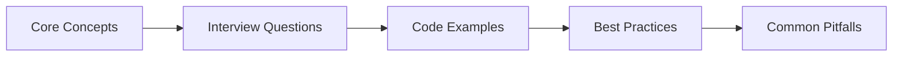

# Chapter 39: Healthcare Interview Q&A

> **Previous:** [Laravel General Interview Q&A](./38-interview-general.md) | **Next:** [Finance & FinTech Interview Q&A](./40-interview-finance.md)


---

## Chapter at a Glance

| Aspect | Details |
|--------|---------|
| **Scope** | Healthcare-specific interview questions covering patient data models, HIPAA compliance, FHIR integration, telemedicine features |
| **Key Concepts** | Health data models, compliance, FHIR API integration, appointment scheduling, EMR/EHR integration |
| **Learning Approach** | Q&A format with practical code examples and domain-specific scenarios |
| **Skills Required** | PHP, Laravel, Eloquent, healthcare domain knowledge, HL7/FHIR basics |

## Chapter Roadmap



## 1. Healthcare Domain Knowledge


### Q1: What is HIPAA and what are its three core safeguards? How do they map to Laravel architecture?

**HIPAA** (Health Insurance Portability and Accountability Act) mandates protection of Protected Health Information (PHI) through three safeguard categories:

| Safeguard | Requirement | Laravel Implementation |
|---|---|---|
| **Administrative** | Access policies, training, audit logs | Spatie Permission roles, `AuditTrail` trait on models |
| **Physical** | Server security, device control | Encrypted storage volumes, restricted environments |
| **Technical** | Encryption, access control, integrity | `encrypt()`/`decrypt()` accessors, signed routes, validation |

PHI fields are encrypted at the Laravel layer using accessor mutators so the database stores only ciphertext. Controllers enforce authorization via Gates, and the `AuditTrail` trait hooks into Eloquent's `creating`/`updating`/`deleting` events to log every data change with user ID, IP, and old/new values.

```php
class Patient extends Model
{
    public function getNameAttribute(): ?string
    {
        return $this->encrypted_name ? decrypt($this->encrypted_name) : null;
    }

    public function setNameAttribute(string $value): void
    {
        $this->encrypted_name = encrypt($value);
    }
}
```

### Q2: What are the five core data models in a healthcare Laravel application?

The five foundational entities are **Patient, Provider, Appointment, MedicalRecord, and Claim**. Patients store encrypted PHI fields. Providers hold NPI numbers, specialties, and licensure. Appointments link patients to providers with scheduling data. MedicalRecords contain encrypted clinical notes with pgvector embeddings for RAG queries. Claims manage the insurance billing lifecycle from draft through adjudication.

Each model enforces encryption for PHI, maintains a complete audit trail via the `AuditTrail` trait, and respects role-based access through Laravel Gates. Foreign keys cascade appropriately → deleting a patient cascades to their appointments, records, and claims.

### Q3: Explain the difference between EHR, HL7, and FHIR. How would a Laravel application integrate with each?

**EHR** (Electronic Health Record) is the system of record → Epic, Cerner, Athenahealth. Integration typically means exposing or consuming REST APIs. **HL7 v2** is the legacy messaging standard using pipe-delimited text over MLLP (Minimum Lower Layer Protocol). A Laravel integration listens on a TCP socket or polls an interface and parses HL7 messages (e.g., ADT^A01 for admissions). **FHIR** (Fast Healthcare Interoperability Resources) is the modern RESTful standard using JSON bundles of Resources (Patient, Observation, Encounter).

```php
use Illuminate\Support\Facades\Http;

class FhirIntegrationService
{
    public function sendObservation(Observation $observation): array
    {
        $bundle = [
            'resourceType' => 'Observation',
            'status' => $observation->status,
            'code' => [
                'coding' => [['system' => 'http://loinc.org', 'code' => $observation->loinc_code]],
            ],
            'subject' => ['reference' => "Patient/{$observation->patient->external_id}"],
            'valueQuantity' => [
                'value' => $observation->value,
                'unit' => $observation->unit,
            ],
        ];

        return Http::withToken(config('services.fhir.api_key'))
            ->post(config('services.fhir.base_url') . '/Observation', $bundle)
            ->json();
    }
}
```

### Q4: What is PHI under HIPAA, and what are the key rules for handling it in a Laravel app?

PHI includes 18 identifiers: name, address, dates (birth, admission, discharge), phone, email, SSN, medical record numbers, health plan beneficiary numbers, account numbers, certificate/license numbers, vehicle identifiers, device identifiers, URLs, IP addresses, biometric IDs, facial photos, and any other unique identifying characteristic.

Rules for Laravel:
- Encrypt all PHI fields at the application layer using `encrypt()`/`decrypt()`
- Force HTTPS in production via `AppServiceProvider::forceHttps()`
- Maintain audit logs for every access and mutation
- Enforce least-privilege access via Gates + Spatie roles
- Implement session timeouts and automatic logout
- Never log raw PHI to Laravel's log files
- Sign data export routes to prevent unauthorized bulk access

### Q5: What common healthcare integrations would a Laravel platform typically need?

Beyond EHR/HL7/FHIR, a healthcare Laravel app commonly integrates with:

- **Clearinghouses** (Change Healthcare, Waystar) for claims submission via X12 837 files
- **Pharmacy databases** (RxNorm, NDC) for drug interaction checking
- **Lab information systems** for receiving structured lab results
- **Payment gateways** (Stripe, Square) for patient payment collection
- **Video SDKs** (Twilio, Agora) for telemedicine sessions
- **Identity providers** (Okta, Azure AD) for SSO with hospital credentialing
- **Inventory systems** for medical supply chain management
- **CRM platforms** (Salesforce Health Cloud) for patient outreach

Each integration should be wrapped in a dedicated service class with queue-backed async processing, rate limiting, and structured error handling.

---

## 2. Technical Implementation

### Q6: How would you structure a Laravel patient management system with HIPAA-compliant encryption?

Create a `Patient` model with encrypted accessors for all PHI fields. Use a migration with columns prefixed `encrypted_` to make encryption explicit. The model serializes only non-PHI fields by default and exposes decrypted values through computed accessors that are gated behind authorization checks.

```php
// Migration
Schema::create('patients', function (Blueprint $table) {
    $table->id();
    $table->string('encrypted_name');
    $table->string('encrypted_email');
    $table->string('encrypted_phone');
    $table->text('encrypted_address');
    $table->string('encrypted_ssn_last_four');
    $table->date('date_of_birth');
    $table->foreignId('primary_provider_id')->nullable()->constrained('providers');
    $table->string('status')->default('active');
    $table->timestamps();
    $table->softDeletes();
});

// PatientController
public function show(Patient $patient): JsonResponse
{
    Gate::authorize('view', $patient);

    AuditLog::create([
        'auditable_type' => Patient::class,
        'auditable_id' => $patient->id,
        'user_id' => auth()->id(),
        'event' => 'viewed',
        'ip_address' => request()->ip(),
    ]);

    return response()->json(['data' => $patient]);
}
```

The controller logs every view as an audit event. Query scopes restrict patients to the authenticated user's organization or care team.

### Q7: How would you implement an appointment scheduling agent with AI in Laravel 13?

Create a `SchedulingAgent` implementing the `Agent` contract. The agent accepts structured parameters (patient, provider, preferred date/time) and uses tools to check calendar slots, book appointments, and schedule reminders. Slots use pessimistic locking to prevent double-booking.

```php
class SchedulingAgent implements Agent
{
    use Promptable;

    public function book(int $patientId, int $providerId, int $slotId, string $type, ?string $reason = null): array
    {
        return DB::transaction(function () use ($patientId, $providerId, $slotId, $type, $reason) {
            $slot = CalendarSlot::where('id', $slotId)
                ->where('status', 'available')
                ->lockForUpdate()
                ->firstOrFail();

            $appointment = Appointment::create([
                'patient_id' => $patientId,
                'provider_id' => $providerId,
                'scheduled_at' => $slot->start_time,
                'type' => $type,
                'status' => 'scheduled',
                'reason' => $reason,
            ]);

            $slot->update(['status' => 'booked', 'appointment_id' => $appointment->id]);
            $this->scheduleReminders($appointment);

            return $appointment->toArray();
        });
    }
}
```

The agent exposes `checkAvailability`, `book`, `reschedule`, `cancel`, and `suggestSlots` methods. The AI layer uses structured output to parse natural-language booking requests (e.g., "book my next Tuesday at 10am with Dr. Smith") into concrete parameters.

### Q8: How would you implement medical record RAG using pgvector and the Laravel AI SDK?

Embed each medical record's content during creation and store the vector in a `vector` column. On query, embed the doctor's natural-language question, find the nearest neighbors by cosine distance, and send the retrieved records as context to the AI model.

```php
class MedicalRecordRagAgent implements Agent
{
    use Promptable;

    public function __construct(
        protected Patient $patient,
        protected string $query,
    ) {}

    public function answer(): array
    {
        $queryEmbedding = Ai::embed($this->query)->toArray();

        $relevantRecords = MedicalRecord::query()
            ->where('patient_id', $this->patient->id)
            ->orderByRaw("embedding <=> '{$queryEmbedding}'::vector")
            ->limit(10)
            ->get()
            ->map(fn ($record) => [
                'type' => $record->record_type,
                'date' => $record->created_at->toDateString(),
                'content' => $record->encrypted_content ? decrypt($record->encrypted_content) : null,
            ]);

        $response = $this->chat(
            messages: [[
                'role' => 'user',
                'content' => json_encode([
                    'question' => $this->query,
                    'relevant_records' => $relevantRecords->toArray(),
                ]),
            ]],
            structuredOutput: [
                'type' => 'object',
                'properties' => [
                    'answer' => ['type' => 'string'],
                    'sources_used' => ['type' => 'array'],
                    'confidence' => ['type' => 'string', 'enum' => ['high', 'moderate', 'low']],
                    'missing_information' => ['type' => 'array', 'items' => ['type' => 'string']],
                ],
            ],
        );

        return $response;
    }
}
```

A scheduled command runs nightly to embed any records missing vectors, and an HNSW index on the `embedding` column keeps queries performant at scale.

### Q9: How would you build a clinical decision support agent that uses RAG over medical literature?

Create a `ClinicalDecisionAgent` with tools for symptom analysis, literature retrieval, and diagnosis suggestion. The agent first structures free-text symptoms via AI, embeds the structured query to find relevant medical literature from pgvector, then synthesizes differential diagnoses.

```php
class ClinicalDecisionAgent implements Agent, HasTools
{
    use Promptable;

    public function tools(): array
    {
        return [
            Tool::for('search_literature')
                ->describe('Search medical literature by vector similarity')
                ->withParameters(['query' => 'string', 'limit' => 5]),

            Tool::for('suggest_diagnoses')
                ->describe('Generate ranked differential diagnoses')
                ->withParameters(['symptoms' => 'array', 'literature' => 'array']),
        ];
    }

    public function runAnalysis(): array
    {
        $symptomAnalysis = $this->analyzeSymptoms($this->symptoms);
        $query = implode(' ', $symptomAnalysis['key_terms']);
        $queryEmbedding = Ai::embed($query)->toArray();

        $literature = MedicalLiterature::nearestNeighbors($queryEmbedding, 5)->get();

        $diagnoses = $this->chat(
            messages: [[
                'role' => 'user',
                'content' => json_encode([
                    'symptoms' => $symptomAnalysis['structured_symptoms'],
                    'patient_context' => $this->patientContext,
                    'retrieved_literature' => $literature,
                ]),
            ]],
            structuredOutput: ['type' => 'object', 'properties' => [
                'differential_diagnoses' => ['type' => 'array'],
                'urgency_level' => ['type' => 'string'],
                'recommended_tests' => ['type' => 'array'],
                'caveats' => ['type' => 'array'],
            ]],
        );

        return [
            'symptom_analysis' => $symptomAnalysis,
            'literature_used' => $literature,
            'diagnoses' => $diagnoses,
        ];
    }
}
```

The agent includes a disclaimer in every response that it is decision-support only and must be reviewed by a licensed clinician.

### Q10: How would you automate insurance claims processing with a multi-stage Laravel agent?

Build a `ClaimsProcessingAgent` that walks through five stages: validation, fraud assessment, submission, status check, and adjudication. Each stage is a method on the agent that updates the claim status and records history.

```php
class ClaimsProcessingAgent implements Agent
{
    use Promptable;

    public function validate(): array
    {
        $result = $this->chat(
            messages: [[
                'role' => 'user',
                'content' => json_encode([
                    'claim_number' => $this->claim->claim_number,
                    'amount' => $this->claim->amount,
                    'patient_age' => $this->claim->patient->date_of_birth?->age,
                    'provider_npi' => $this->claim->provider->npi_number,
                ]),
            ]],
            structuredOutput: ['type' => 'object', 'properties' => [
                'is_valid' => ['type' => 'boolean'],
                'validation_errors' => ['type' => 'array'],
                'recommendation' => ['type' => 'string'],
            ]],
        );

        $this->claim->update(['validation_results' => $result]);
        $this->recordStatus('validated', $result['is_valid'] ? 'Passed' : 'Failed');

        return $result;
    }
}
```

A scheduled command `healthcare:process-claims` processes pending claims. The agent handles clearinghouse submission via HTTP, retries on failure up to 3 times, and logs every status transition to `claim_status_histories` for audit.

### Q11: How would you implement a medication management agent that checks drug interactions?

Create a `MedicationAgent` that cross-references new prescriptions against the patient's existing medications, known allergies, and conditions. The AI analyzes interactions and returns a structured severity assessment.

```php
class MedicationAgent implements Agent
{
    use Promptable;

    public function processNewPrescription(array $data): array
    {
        $interactionResult = $this->checkInteractions($data);

        if (in_array($interactionResult['severity'], ['severe', 'contraindicated'])) {
            return [
                'approved' => false,
                'interactions' => $interactionResult['interactions'],
                'recommendation' => $interactionResult['recommendation'],
            ];
        }

        $medication = Medication::create([...$data, 'is_active' => true]);
        $this->scheduleRefillReminders($medication);

        return ['approved' => true, 'medication_id' => $medication->id];
    }

    public function checkInteractions(array $newMed): array
    {
        $existing = Medication::where('patient_id', $this->patient->id)
            ->where('is_active', true)->get();

        return $this->chat(
            messages: [[
                'role' => 'user',
                'content' => json_encode([
                    'new_medication' => $newMed,
                    'existing_medications' => $existing->toArray(),
                    'patient_allergies' => $this->patient->allergies,
                    'patient_conditions' => $this->patient->conditions,
                ]),
            ]],
            structuredOutput: ['type' => 'object', 'properties' => [
                'has_interactions' => ['type' => 'boolean'],
                'severity' => ['type' => 'string', 'enum' => ['none', 'minor', 'moderate', 'severe', 'contraindicated']],
                'interactions' => ['type' => 'array'],
                'recommendation' => ['type' => 'string'],
            ]],
        );
    }
}
```

The agent schedules refill reminders 5 days before the prescription runs out, using the `days_supply` field to calculate the refill date.

### Q12: How would you build a healthcare analytics and reporting agent in Laravel?

Create a `HealthcareAnalyticsAgent` that aggregates patient, appointment, claims, and provider metrics across a time window, then uses the AI SDK to generate an executive summary with trend analysis and recommendations.

```php
class HealthcareAnalyticsAgent implements Agent
{
    use Promptable;

    public function generateReport(): array
    {
        $patientMetrics = $this->getPatientMetrics();
        $appointmentMetrics = $this->getAppointmentMetrics();
        $claimsMetrics = $this->getClaimsMetrics();

        $report = $this->chat(
            messages: [[
                'role' => 'user',
                'content' => json_encode([
                    'period' => $this->period,
                    'patient_metrics' => $patientMetrics,
                    'appointment_metrics' => $appointmentMetrics,
                    'claims_metrics' => $claimsMetrics,
                ]),
            ]],
            structuredOutput: ['type' => 'object', 'properties' => [
                'executive_summary' => ['type' => 'string'],
                'patient_outcomes' => ['type' => 'object'],
                'clinic_efficiency' => ['type' => 'object'],
                'financial_performance' => ['type' => 'object'],
                'key_recommendations' => ['type' => 'array'],
            ]],
        );

        AnalyticsReport::create([
            'period' => $this->period,
            'start_date' => $this->startDate,
            'end_date' => $this->endDate,
            'metrics' => compact('patientMetrics', 'appointmentMetrics', 'claimsMetrics'),
            'report' => $report,
        ]);

        return $report;
    }
}
```

Reports are generated on schedule via the console kernel → weekly on Monday and monthly on the 1st. The command outputs a formatted summary and stores the full report for dashboard consumption.

### Q13: How would you implement a diagnostic assistance agent that flags abnormal lab results?

Build a `LabReviewAgent` that compares lab results against reference ranges and patient historical baselines. When it detects critical values, it notifies the ordering provider automatically.

```php
class LabReviewAgent implements Agent
{
    use Promptable;

    public function analyze(): array
    {
        $analysis = $this->chat(
            messages: [[
                'role' => 'user',
                'content' => json_encode([
                    'lab_result' => [
                        'test_name' => $this->labResult->test_name,
                        'result_value' => $this->labResult->result_value,
                        'reference_range' => $this->labResult->reference_range,
                    ],
                    'patient' => [
                        'age' => $this->labResult->patient->date_of_birth?->age,
                        'conditions' => $this->labResult->patient->conditions,
                    ],
                    'historical_results' => $this->getRecentResults(),
                ]),
            ]],
            structuredOutput: ['type' => 'object', 'properties' => [
                'is_abnormal' => ['type' => 'boolean'],
                'severity' => ['type' => 'string', 'enum' => ['normal', 'borderline', 'abnormal', 'critical']],
                'clinical_assessment' => ['type' => 'string'],
                'recommended_follow_up' => ['type' => 'array'],
                'urgency' => ['type' => 'string', 'enum' => ['routine', 'soon', 'urgent', 'emergent']],
                'notify_provider' => ['type' => 'boolean'],
            ]],
        );

        if ($analysis['notify_provider'] && $this->labResult->orderingProvider) {
            $this->labResult->orderingProvider->notify(
                new CriticalLabAlert($this->labResult, $analysis)
            );
        }

        $this->labResult->update(['assessment' => $analysis, 'reviewed_at' => now()]);

        return $analysis;
    }
}
```

A scheduled command `healthcare:review-labs` processes unreviewed results in batches, and critical flags are immediately escalated via notification channels.

---

## 3. Architecture & Design

### Q14: How would you design a HIPAA-compliant Laravel application from the ground up?

Start with three architectural layers:

1. **Data Layer**: All PHI fields encrypted via Eloquent accessors. The `AuditTrail` trait on every model that touches patient data. Soft deletes everywhere. Foreign keys cascading properly.

2. **Access Layer**: Laravel Gates for all CRUD operations, roles (physician, nurse, admin, billing) via Spatie Permission. Every controller method calls `Gate::authorize()` before acting. Sanctum tokens with short expiry and MFA enforcement.

3. **Infrastructure Layer**: `AppServiceProvider::forceHttps()` in production. Session timeout via `config/session.php` `lifetime` plus a `last_activity` middleware check. Encrypted database backups via `gpg`. All logs scrubbed of PHI via a custom `LogMonolog` handler.

```php
class AppServiceProvider extends ServiceProvider
{
    public function boot(): void
    {
        if (app()->isProduction()) {
            URL::forceScheme('https');
            $this->app['request']->server->set('HTTPS', 'on');
        }
    }
}
```

HIPAA audits are supported by querying the `audit_logs` table for any model: who accessed what, when, and from which IP.

### Q15: How would you implement multi-tenancy in a healthcare SaaS platform?

Use the **single-database, tenant-scoped** pattern where every table has a `tenant_id` column and all queries are automatically scoped via a global `TenantScope`. The tenant is resolved from the authenticated user's relationship.

```php
trait BelongsToTenant
{
    public static function bootBelongsToTenant(): void
    {
        static::addGlobalScope('tenant', fn ($builder) =>
            $builder->where('tenant_id', auth()->user()->tenant_id)
        );

        static::creating(fn ($model) =>
            $model->tenant_id ??= auth()->user()->tenant_id
        );
    }
}
```

For stricter isolation (e.g., competing hospitals), use a **database-per-tenant** pattern where each tenant has their own database connection. A `TenantResolver` middleware switches the default connection at the start of each request based on the authenticated user's tenant mapping.

Healthcare-specific considerations: audit logs must include the tenant ID for cross-tenant compliance reporting. Encryption keys can be per-tenant for maximum PHI isolation.

### Q16: How would you design the data model for a multi-provider clinic management system?

Core entities:

- **Tenant** → the clinic or hospital organization
- **Patient** → scoped to tenant, encrypted PHI
- **Provider** → healthcare professionals, NPI-numbered
- **Appointment** → patient-provider-time junction with slot-based scheduling
- **MedicalRecord** → polymorphic clinical entries (SOAP notes, lab orders, imaging referrals) with pgvector embedding
- **Claim** → insurance billing records with multi-stage workflow
- **CalendarSlot** → provider availability windows with optimistic locking
- **Reminder** → pending appointment notifications
- **AuditLog** → polymorphic event trail
- **LabResult** → structured test data with reference ranges

The schema uses foreign keys for referential integrity, composite indexes on `[provider_id, scheduled_at]` for scheduling queries, and JSON columns for flexible metadata.

```php
Schema::create('medical_records', function (Blueprint $table) {
    $table->id();
    $table->foreignId('tenant_id')->constrained();
    $table->foreignId('patient_id')->constrained()->cascadeOnDelete();
    $table->foreignId('provider_id')->constrained();
    $table->string('record_type', 50); // progress_note, lab_order, imaging, referral
    $table->text('encrypted_content');
    $table->json('metadata')->nullable();
    $table->vector('embedding', 1536)->nullable();
    $table->timestamps();
    $table->index(['patient_id', 'record_type']);
});
```

### Q17: How would you scale a Laravel healthcare application to handle millions of patients?

Layer the scaling strategy:

- **Database**: Read replicas for reporting queries, partitioning `appointments` and `audit_logs` by date, HNSW index on pgvector embeddings for fast similarity search
- **Queue**: Horizon with multiple queue workers for claims processing, lab review, referral intake, and reminder sending
- **Cache**: Redis for provider availability lookups, patient demographic caches (TTL-bounded for PHI compliance), and embedding result caching
- **Octane**: Swoole/RoadRunner workers for API endpoints that need sub-100ms response times
- **Horizontal**: Laravel Vapor or Cloud for auto-scaling web tier, separate queue worker environments

For PHI compliance at scale: never cache raw decrypted PHI in shared Redis. Use encrypted cache values or cache only non-PHI identifiers with the actual data fetched from the database through encrypted accessors on each request.

### Q18: How would you design a telemedicine platform's real-time video architecture in Laravel?

Use a **WebRTC** model where Laravel handles signaling and session management, while video flows peer-to-peer (or through a TURN server). Laravel Reverb broadcasts signaling messages (offer, answer, ICE candidates) over WebSocket channels.

```php
// Signaling via Reverb
class TelemedicineController extends Controller
{
    public function initiateCall(Request $request, Appointment $appointment): JsonResponse
    {
        Gate::authorize('join', $appointment);

        $session = TelemedicineSession::create([
            'appointment_id' => $appointment->id,
            'room_sid' => Str::uuid(),
            'status' => 'waiting',
            'initiated_by' => $request->user()->id,
        ]);

        broadcast(new TelemedicineSignal($session, [
            'type' => 'call_initiated',
            'room' => $session->room_sid,
            'participants' => [$appointment->patient_id, $appointment->provider_id],
        ]))->toPresenceChannel("telemedicine.{$appointment->id}");

        return response()->json(['session' => $session]);
    }
}
```

For fallback (when P2P fails), integrate a video SDK like Twilio or Agora. The appointment itself is created by the `SchedulingAgent`, so telemedicine sessions are linked to existing appointment records. All session metadata is logged for HIPAA compliance.

---

## 4. Behavioral & Scenario

### Q19: Describe a healthcare SaaS platform you'd build with Laravel. Walk through the architecture.

**HealFlow** → an AI-powered clinic management platform for independent practices. Three pillars:

1. **Patient Intake Pipeline**: Referral documents (email, fax, PDF) are ingested by a `PatientIntakeAgent` that extracts structured data, creates the patient record, and auto-schedules an initial appointment. Patients receive SMS/email onboarding with a secure portal link.

2. **Clinical Decision Support**: A `ClinicalDecisionAgent` with RAG over embedded clinical guidelines. When a doctor enters symptoms, the agent retrieves relevant literature and suggests differential diagnoses with evidence citations → never presented as definitive, always requiring clinician review.

3. **Revenue Cycle Automation**: The `ClaimsProcessingAgent` validates claims against payer rules, assesses fraud risk, submits to clearinghouses, and tracks through adjudication. Denial management is AI-driven → the agent analyzes denial reasons and suggests corrected codes.

The platform uses database-per-tenant multi-tenancy for strict PHI isolation. All agents run on queues via Horizon. Weekly analytics reports give administrators visibility into no-show rates, provider utilization, and revenue trends.

### Q20: How would you handle patient data encryption and access control across a multi-region deployment?

Encrypt every PHI field at the application layer using Laravel's `encrypt()` with a key unique to each tenant. The encryption key is stored in the tenant's configuration and never leaves the application server. For multi-region:

- Use a **regional KMS** (AWS KMS, Azure Key Vault) to wrap tenant keys so the DEK never exists in plaintext outside the region
- Implement a **cross-region audit trail** that aggregates audit logs to a central observability account
- Enforce **data residency** via middleware that routes patient write operations to the correct regional database based on patient zip code or provider location

Access control uses a hierarchical Gates model:

```php
Gate::define('view-patient', fn (User $user, Patient $patient) =>
    $user->tenant_id === $patient->tenant_id
    && ($user->hasRole('admin')
        || $user->id === $patient->primary_provider_id
        || $user->careTeam->contains($patient->id))
);
```

All access denials are logged to the audit trail with the user, timestamp, IP, and attempted action for security monitoring.

### Q21: How would you design a telemedicine platform with Laravel? What are the key considerations?

The architecture has four layers:

1. **Scheduling Layer**: `SchedulingAgent` creates appointments with type `telemedicine`. Calendar slots have a `mode` field (`in_person`, `video`, `phone`). Reminders include the telemedicine join link.

2. **Signaling Layer**: Laravel Reverb manages WebSocket channels for call signaling (`telemedicine.{appointment_id}`). The controller creates a `TelemedicineSession` record and broadcasts the room SID to participants.

3. **Video Layer**: WebRTC for peer-to-peer video with a TURN server fallback. Optionally, a video SDK (Twilio Video, Daily.co) handles media routing for group sessions (multi-provider consultations).

4. **Compliance Layer**: All session metadata (start time, end time, participants, connection quality) is logged. Recordings (if any) are encrypted and stored with tenant-scoped access. Provider notes from the session flow into `MedicalRecord` via the `MedicalRecordRagAgent`.

Key considerations:
- **Bandwidth adaptation** → degrade gracefully from HD to audio-only on poor connections
- **Async communication** → store chat messages during the session as structured records
- **E-prescribing** → integrate with pharmacy APIs for post-consultation prescriptions
- **Regulatory** → state-level telemedicine licensing checks, patient consent recording, ADA compliance

### Q22: You discover a PHI data leak in your Laravel application. Walk through your response.

Follow the HIPAA Breach Notification Rule protocol:

1. **Immediate containment**: Rotate the compromised encryption keys, revoke the affected API tokens, and block the originating IP at the infrastructure level. Take the affected service offline if the scope warrants.

2. **Forensic investigation**: Query the `audit_logs` table to identify exactly which records were accessed and by whom. Correlate with Laravel access logs, CloudTrail, and database connection logs to build a timeline.

3. **Impact assessment**: Determine the number of affected patients, the types of PHI exposed, and whether the data was encrypted at rest (mitigates breach classification under HIPAA).

4. **Notification**: Notify affected patients within 60 days (HIPAA requirement). Notify the HHS Secretary and, for 500+ patients, local media.

5. **Root cause fix**: Implement the fix (e.g., revoke overly permissive Gates, add encryption to a missing field, fix a logging pathway that wrote raw PHI). Add a regression test that asserts no PHI fields appear in API responses or log files.

6. **Post-mortem**: Blameless incident review. Update the `AuditTrail` trait, add automated breach detection alerts, and run a tabletop exercise with the engineering team.

### Q23: How would you approach migrating a legacy on-premise EHR to a Laravel cloud platform?

Use a **strangler fig pattern** running in parallel with the legacy system for 6-12 months:

1. **Data extraction**: Use the legacy EHR's FHIR or HL7 export to bulk-extract patient records, providers, and appointment history. Transform and validate the data in a staging environment with encrypted storage.

2. **Phased cutover**: Start with read-only access to historical records via the Laravel app while appointments and new patients continue on the legacy system. Phase 2 enables appointment scheduling in Laravel. Phase 3 moves clinical documentation. Phase 4 sunsets the legacy system.

3. **Synchronization layer**: A `SyncAgent` runs hourly, pulling new and updated records from the legacy system's HL7 interface and upserting them into Laravel. Conflicts are flagged for manual reconciliation.

4. **Validation**: After each phase, run automated reconciliation scripts that compare record counts, field values, and appointment schedules between systems. Reject the phase if discrepancies exceed 0.1%.

5. **Rollback plan**: Every phase includes a documented rollback procedure. The legacy system is maintained in read-only mode for 90 days post-migration to allow fallback.

### Q24: Your patient intake agent is hallucinating patient data. How do you handle it?

Implement a three-layer validation strategy:

1. **Input guardrails**: The agent's prompt includes strict instructions to never fabricate data → missing fields must be returned as `null`. Structured output Schemas mark all fields as nullable except `confidence` and `missing_fields`.

2. **Pattern validation**: A `PatientIntakeValidator` runs after the agent returns data, checking that extracted fields match expected patterns (valid email regex, 10-digit phone, date format, SSN last four is exactly 4 digits). Fields that fail validation are set to `null`.

```php
class PatientIntakeValidator
{
    public function validate(array $patientInfo): array
    {
        $validated = [];
        $validated['email'] = filter_var($patientInfo['email'] ?? '', FILTER_VALIDATE_EMAIL)
            ? $patientInfo['email'] : null;
        $validated['phone'] = preg_match('/^\+?1?\d{10}$/', $patientInfo['phone'] ?? '')
            ? $patientInfo['phone'] : null;
        $validated['ssn_last_four'] = preg_match('/^\d{4}$/', $patientInfo['ssn_last_four'] ?? '')
            ? $patientInfo['ssn_last_four'] : null;
        return $validated;
    }
}
```

3. **Human review queue**: Referrals with `confidence < 0.7` or more than 3 `missing_fields` are routed to a manual review queue instead of auto-creating the patient. A dashboard shows pending intakes with the AI's extracted data and highlights fields needing human verification.

The system also logs all agent outputs for audit. If the same hallucination pattern appears, we update the agent's instructions with a counter-example showing the correct behavior.

### Q25: Your claims processing agent is running too slowly. How do you diagnose and fix it?

Profile the agent's execution pipeline:

1. **Identify bottlenecks**: Add timing logs at each stage → validation, fraud assessment, clearinghouse submission, status check. Use Laravel Telescope to monitor queue job duration and failure rates.

2. **Common fixes**:
   - **AI latency**: Reduce the number of LLM calls by batching validation and fraud assessment into a single structured output call
   - **Database locking**: Optimize the `lockForUpdate()` transaction window → keep it narrow, only around the slot assignment, not the full AI call
   - **Clearinghouse API**: Add response caching for status checks (claims don't change status every 5 minutes)
   - **Queue backlog**: Increase Horizon workers for the `claims` queue and add a dedicated queue connection

```php
// Batched AI call reduces 2 calls to 1
public function validateAndAssessFraud(): array
{
    return $this->chat(
        messages: [['role' => 'user', 'content' => json_encode([...])]],
        structuredOutput: ['type' => 'object', 'properties' => [
            'is_valid' => ['type' => 'boolean'],
            'validation_errors' => ['type' => 'array'],
            'fraud_score' => ['type' => 'number'],
            'risk_level' => ['type' => 'string'],
            'recommendation' => ['type' => 'string'],
        ]],
    );
}
```

3. **Horizontal scaling**: Claims processing is embarrassingly parallel → deploy 10+ queue workers, enable batch processing (process 50 claims per job), and ensure the clearinghouse API supports concurrent requests.

4. **Monitoring**: Set up Pulse to monitor queue throughput. Alert if claims take longer than 5 minutes per stage. Track the end-to-end time from claim creation to submission as a service-level indicator.

### Q26: Your medical record RAG agent returns irrelevant results for complex queries. How do you improve retrieval quality?

Apply a multi-strategy retrieval improvement:

1. **Hybrid search**: Combine vector similarity with full-text search. pgvector's `<=>` operator finds semantically similar results, while Laravel's `whereFullText()` catches exact keyword matches.

```php
$results = MedicalRecord::where('patient_id', $patient->id)
    ->whereFullText(['encrypted_content'], $keywords)
    ->orderByRaw("embedding <=> '{$embedding}'::vector")
    ->limit(10)
    ->get();
```

2. **Query rewriting**: Before embedding the user's query, pass it through the AI SDK to formulate a better search query. A query like "what's going on with his heart" gets rewritten to "cardiac assessment, echocardiogram results, cardiology notes".

3. **Reranking**: Retrieve the top 20 results by vector similarity, then use the AI SDK's `Reranking::of()` to score them against the original query and keep only the top 5 most relevant.

```php
$reranked = Reranking::of($results, $originalQuery)->take(5);
```

4. **Chunking strategy**: Medical records are long → chunk them into smaller segments (each note section, each lab result) before embedding. The chunk boundaries follow clinical document structure (History, Assessment, Plan, Lab Results, Medications).

5. **Feedback loop**: Track which results users click on or flag as irrelevant. Use implicit feedback to fine-tune the embedding model or adjust the chunking strategy over time.
---

## Concept Comparison
> **One-Sentence Takeaway:** Compare key healthcare concepts for interview preparation.

| Concept | Purpose | Key Consideration |
|---------|---------|-------------------|
| Patient Data Models | Store and manage patient information | PHI protection and encryption |
| FHIR Integration | Interoperability standard for healthcare APIs | Structured resource-based API |
| Telemedicine | Virtual healthcare delivery | Real-time video + scheduling |
| Compliance | HIPAA, GDPR, SOC-2 adherence | Audit logging + data encryption |
| Clinical Workflows | End-to-end care management | Multi-role coordination |

---

## Quick Reference
> **One-Sentence Takeaway:** Quick reference for healthcare interview topics.

| Topic | Key Point |
|-------|-----------|
| Patient Model | PHI encrypted, audit-trailed, role-restricted |
| FHIR Resources | Patient, Observation, Medication, Appointment |
| Telemedicine | Video + chat + prescription workflows |
| Compliance | HIPAA, audit logs, data encryption, access control |
| Scheduling | Provider availability + patient preference matching |

---

## Cross-Application Matrix

| Concept | Application Context | Trade-Off |
|---------|--------------------|-----------|
| Health Data | Patient records management | Accessibility vs privacy |
| FHIR API | Healthcare interoperability | Standardization vs flexibility |
| Telemedicine | Remote care delivery | Convenience vs in-person quality |
| Compliance | Regulatory adherence | Security vs usability |
| Scheduling | Appointment management | Open slots vs patient preference |

---

## Chapter Quiz
> **One-Sentence Takeaway:** Test your healthcare interview knowledge.

**Q1:** What is FHIR in healthcare technology?
- A) A billing system
- B) An interoperability standard for healthcare APIs
- C) A patient portal
- D) A scheduling system

<details><summary>Answer&lt;/summary&gt;B) An interoperability standard for healthcare APIs&lt;/details&gt;

**Q2:** What is the most important consideration for patient data models?
- A) Performance
- B) PHI protection and encryption
- C) UI design
- D) API documentation

<details><summary>Answer&lt;/summary&gt;B) PHI protection and encryption&lt;/details&gt;

**Q3:** Which compliance framework applies to US healthcare applications?
- A) GDPR
- B) HIPAA
- C) PCI-DSS
- D) SOC-2

<details><summary>Answer&lt;/summary&gt;B) HIPAA&lt;/details&gt;

**Q4:** What does telemedicine enable?
- A) Only phone consultations
- B) Virtual healthcare delivery with video + chat
- C) Only email communication
- D) In-person visits only

<details><summary>Answer&lt;/summary&gt;B) Virtual healthcare delivery with video + chat&lt;/details&gt;
