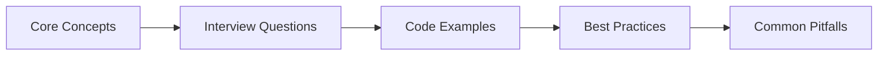

# Chapter 40: Finance & FinTech Interview Q&A

> **Previous:** [Healthcare Interview Q&A](./39-interview-healthcare.md) | **Next:** [Interview Q&A — Education & EdTech](./41-interview-education.md)


---

**Part IX → Interview Preparation.** Common interview questions for Laravel developer roles in fintech and financial services, covering PCI-DSS compliance, fraud detection, KYC/AML, trading systems, and payment processing with AI agents.

---

## Chapter at a Glance

| Aspect | Details |
|--------|---------|
| **Scope** | Finance & FinTech interview questions covering transaction processing, payment gateways, reconciliation, fraud detection |
| **Key Concepts** | Transaction management, payment integration, reconciliation, fraud detection, financial reporting |
| **Learning Approach** | Q&A format with practical code examples and domain-specific scenarios |
| **Skills Required** | PHP, Laravel, Eloquent, payment gateways, financial domain knowledge |

## Chapter Roadmap



## 1. Finance Domain Knowledge


### Q1: What is PCI-DSS compliance and how does it affect Laravel application design?

<a href="../../../assets/images/diagrams/laravel/40-interview-finance/what-is-pci-dss-compliance-and-how-does-it-affect-laravel-application-design-handwritten.svg" target="_blank" rel="noopener">
  
</a>
<a href="../../../assets/images/diagrams/laravel/40-interview-finance/what-is-pci-dss-compliance-and-how-does-it-affect-laravel-application-design-diagram.svg" target="_blank" rel="noopener">
  
</a>
<a href="../../../assets/images/diagrams/laravel/40-interview-finance/what-is-pci-dss-compliance-and-how-does-it-affect-laravel-application-design-sticky.svg" target="_blank" rel="noopener">
  
</a>


PCI-DSS (Payment Card Industry Data Security Standard) mandates that any application storing, processing, or transmitting cardholder data must encrypt data at rest and in transit, restrict access via need-to-know, log all access, and never store sensitive authentication data (CVV, full track data, PIN) after authorization. In Laravel, this means using encrypted casts or `encrypt()`/`decrypt()` on cardholder fields, never logging raw PANs, scoping database access with policies, and using HTTPS everywhere. Payment processing should be tokenized through a gateway like Stripe or Braintree so raw card numbers never touch your database.

```php
use Illuminate\Database\Eloquent\Casts\Attribute;

protected function cardNumber(): Attribute
{
    return Attribute::make(
        get: fn (string $value) => decrypt($value),
        set: fn (string $value) => encrypt($value),
    );
}
```

### Q2: Explain the difference between KYC and AML in financial systems.

<a href="../../../assets/images/diagrams/laravel/40-interview-finance/explain-the-difference-between-kyc-and-aml-in-financial-systems-handwritten.svg" target="_blank" rel="noopener">
  
</a>
<a href="../../../assets/images/diagrams/laravel/40-interview-finance/explain-the-difference-between-kyc-and-aml-in-financial-systems-diagram.svg" target="_blank" rel="noopener">
  
</a>
<a href="../../../assets/images/diagrams/laravel/40-interview-finance/explain-the-difference-between-kyc-and-aml-in-financial-systems-sticky.svg" target="_blank" rel="noopener">
  
</a>


Know Your Customer (KYC) is the identity verification process → collecting and validating government-issued IDs, proof of address, and biometric data to establish who the customer is. Anti-Money Laundering (AML) is the ongoing screening and monitoring process → checking transactions against watchlists (OFAC, UN sanctions), detecting suspicious patterns like structuring or rapid round-tripping, and filing Suspicious Activity Reports (SARs). KYC happens at onboarding; AML runs continuously.

### Q3: What are the core data models in a financial transaction system?

<a href="../../../assets/images/diagrams/laravel/40-interview-finance/what-are-the-core-data-models-in-a-financial-transaction-system-handwritten.svg" target="_blank" rel="noopener">
  
</a>
<a href="../../../assets/images/diagrams/laravel/40-interview-finance/what-are-the-core-data-models-in-a-financial-transaction-system-diagram.svg" target="_blank" rel="noopener">
  
</a>
<a href="../../../assets/images/diagrams/laravel/40-interview-finance/what-are-the-core-data-models-in-a-financial-transaction-system-sticky.svg" target="_blank" rel="noopener">
  
</a>


The core models are `Account`, `Transaction`, `LedgerEntry`, `ComplianceRule`, and `Settlement`. The `Account` model holds the balance and owner. `Transaction` records a single financial movement with type, amount, reference, status, and metadata. `LedgerEntry` implements double-entry bookkeeping → every transaction produces two or more entries (debit/credit). `ComplianceRule` stores configurable screening logic. `Settlement` tracks batch settlement cycles for payment clearing.

```php
// Double-entry ledger entry
class LedgerEntry extends Model
{
    protected $fillable = [
        'transaction_id', 'account_id', 'entry_type', // debit or credit
        'amount', 'currency', 'balance_before', 'balance_after',
    ];

    public function transaction(): BelongsTo
    {
        return $this->belongsTo(Transaction::class);
    }

    public function account(): BelongsTo
    {
        return $this->belongsTo(Account::class);
    }
}
```

### Q4: How does payment processing work end-to-end in a fintech platform?

<a href="../../../assets/images/diagrams/laravel/40-interview-finance/how-does-payment-processing-work-end-to-end-in-a-fintech-platform-handwritten.svg" target="_blank" rel="noopener">
  
</a>
<a href="../../../assets/images/diagrams/laravel/40-interview-finance/how-does-payment-processing-work-end-to-end-in-a-fintech-platform-diagram.svg" target="_blank" rel="noopener">
  
</a>
<a href="../../../assets/images/diagrams/laravel/40-interview-finance/how-does-payment-processing-work-end-to-end-in-a-fintech-platform-sticky.svg" target="_blank" rel="noopener">
  
</a>


The flow is: 1) Customer initiates payment via checkout form, 2) Frontend tokenizes card details through Stripe Elements or similar (card data never hits your server), 3) Backend creates a `PaymentIntent` via the gateway API with the amount and currency, 4) Gateway authorizes the transaction with the issuing bank, 5) On success, you create a local `Transaction` record and trigger post-payment workflows (invoice generation, inventory update, notification), 6) Settlement happens in batch at end-of-day when the gateway transfers funds to your merchant account. Laravel Cashier wraps Stripe and Paddle for most of this flow.

### Q5: What is a trading signal and how is it generated programmatically?

<a href="../../../assets/images/diagrams/laravel/40-interview-finance/what-is-a-trading-signal-and-how-is-it-generated-programmatically-handwritten.svg" target="_blank" rel="noopener">
  
</a>
<a href="../../../assets/images/diagrams/laravel/40-interview-finance/what-is-a-trading-signal-and-how-is-it-generated-programmatically-diagram.svg" target="_blank" rel="noopener">
  
</a>
<a href="../../../assets/images/diagrams/laravel/40-interview-finance/what-is-a-trading-signal-and-how-is-it-generated-programmatically-sticky.svg" target="_blank" rel="noopener">
  
</a>


A trading signal is an indicator that suggests buying or selling an asset. Signals are generated by analyzing market data → price movements, volume, technical indicators (moving averages, RSI, MACD), or ML model predictions. A signal typically includes the instrument, direction (buy/sell/hold), confidence score, timestamp, and the reasoning. In Laravel, scheduled agents fetch market data from an exchange API (Alpha Vantage, Binance, Alpaca), apply analysis logic, and persist signal records for downstream execution.

```php
[
    'instrument' => 'BTC/USD',
    'direction'  => 'buy',
    'confidence' => 0.78,
    'indicators' => [
        'rsi' => 32.4,        // oversold threshold crossed
        'ema_9' => 42300,
        'ema_21' => 41800,    // golden cross detected
    ],
    'generated_at' => '2026-06-11T14:30:00Z',
]
```

### Q6: What is a chargeback and how do you handle it programmatically?

<a href="../../../assets/images/diagrams/laravel/40-interview-finance/what-is-a-chargeback-and-how-do-you-handle-it-programmatically-handwritten.svg" target="_blank" rel="noopener">
  
</a>
<a href="../../../assets/images/diagrams/laravel/40-interview-finance/what-is-a-chargeback-and-how-do-you-handle-it-programmatically-diagram.svg" target="_blank" rel="noopener">
  
</a>
<a href="../../../assets/images/diagrams/laravel/40-interview-finance/what-is-a-chargeback-and-how-do-you-handle-it-programmatically-sticky.svg" target="_blank" rel="noopener">
  
</a>


A chargeback occurs when a cardholder disputes a transaction with their issuing bank. The funds are forcibly reversed from the merchant. In Laravel, you handle it via a webhook from your payment gateway (Stripe's `chargeback.created` event or similar). The webhook handler marks the transaction as disputed, creates a `Dispute` record, subtracts the amount from the merchant's balance in your ledger, and triggers a workflow → notifies the risk team, freezes the related account if thresholds are hit, and archives the transaction's associated order.

---

## 2. Technical Implementation

### Q7: Build a fraud detection agent with Laravel AI SDK.

<a href="../../../assets/images/diagrams/laravel/40-interview-finance/build-a-fraud-detection-agent-with-laravel-ai-sdk-handwritten.svg" target="_blank" rel="noopener">
  
</a>
<a href="../../../assets/images/diagrams/laravel/40-interview-finance/build-a-fraud-detection-agent-with-laravel-ai-sdk-diagram.svg" target="_blank" rel="noopener">
  
</a>
<a href="../../../assets/images/diagrams/laravel/40-interview-finance/build-a-fraud-detection-agent-with-laravel-ai-sdk-sticky.svg" target="_blank" rel="noopener">
  
</a>


A fraud detection agent combines rule-based checks (velocity, amount thresholds, new account) with AI risk scoring. Create an agent that evaluates every transaction asynchronously.

```php
<?php

namespace App\Agents;

use App\Models\Finance\Transaction;
use App\Models\Finance\FraudFlag;
use Laravel\AI\Agent;
use Laravel\AI\Tools\Tool;

class FraudDetectionAgent extends Agent
{
    protected string $instructions = '
        You are a fraud detection specialist.
        Analyze the transaction context and return a risk score 0-1,
        the top risk factors, and a recommendation (approve/review/block).
        Output valid JSON matching the provided schema.
    ';

    public function evaluate(Transaction $transaction): FraudFlag
    {
        $result = $this->ask(
            'Evaluate transaction fraud risk',
            schema: [
                'type' => 'object',
                'properties' => [
                    'risk_score' => ['type' => 'number'],
                    'risk_factors' => ['type' => 'array', 'items' => ['type' => 'string']],
                    'recommendation' => ['type' => 'string', 'enum' => ['approve', 'review', 'block']],
                ],
                'required' => ['risk_score', 'risk_factors', 'recommendation'],
            ],
            context: [
                'amount' => $transaction->amount,
                'currency' => $transaction->currency,
                'account_age_days' => now()->diffInDays($transaction->account->created_at),
                'user_country' => $transaction->account->user->country,
                'recent_transactions_24h' => $transaction->account
                    ->transactions()
                    ->where('created_at', '>=', now()->subDay())
                    ->count(),
                'ip_risk_score' => $this->checkIpReputation($transaction->ip_address),
                'is_new_payment_method' => $transaction->paymentMethod?->wasRecentlyCreated ?? false,
            ],
        );

        return FraudFlag::create([
            'transaction_id' => $transaction->id,
            'risk_score' => $result['risk_score'],
            'risk_factors' => $result['risk_factors'],
            'recommendation' => $result['recommendation'],
            'reviewed_by_agent' => true,
        ]);
    }

    private function checkIpReputation(string $ip): float
    {
        // Query an IP reputation API or local blocklist
        return 0.1;
    }
}
```

### Q8: How do you implement real-time transaction monitoring with anomaly detection?

<a href="../../../assets/images/diagrams/laravel/40-interview-finance/how-do-you-implement-real-time-transaction-monitoring-with-anomaly-detection-handwritten.svg" target="_blank" rel="noopener">
  
</a>
<a href="../../../assets/images/diagrams/laravel/40-interview-finance/how-do-you-implement-real-time-transaction-monitoring-with-anomaly-detection-diagram.svg" target="_blank" rel="noopener">
  
</a>
<a href="../../../assets/images/diagrams/laravel/40-interview-finance/how-do-you-implement-real-time-transaction-monitoring-with-anomaly-detection-sticky.svg" target="_blank" rel="noopener">
  
</a>


Use queue-backed transaction processing where every transaction passes through a monitoring pipeline. Deploy a Laravel agent that evaluates each transaction against configurable rules and historical baselines, dispatching alerts for anomalous activity.

```php
<?php

namespace App\Agents;

use App\Models\Finance\Transaction;
use App\Models\Finance\MonitorRule;

class TransactionMonitorAgent extends Agent
{
    public function monitor(Transaction $transaction): void
    {
        $baseline = $this->buildBaseline($transaction->account_id);

        MonitorRule::active()->get()->each(function ($rule) use ($transaction, $baseline) {
            $triggered = match ($rule->rule_type) {
                'velocity' => $this->checkVelocity($transaction, $rule),
                'threshold' => $this->checkThreshold($transaction, $rule),
                'pattern' => $this->checkPattern($transaction, $rule, $baseline),
                'ai_anomaly' => $this->checkAiAnomaly($transaction, $baseline),
                default => false,
            };

            if ($triggered) {
                $transaction->alerts()->create([
                    'rule_id' => $rule->id,
                    'severity' => $rule->severity,
                    'details' => ['baseline' => $baseline],
                ]);
            }
        });
    }

    private function buildBaseline(int $accountId): array
    {
        $history = Transaction::where('account_id', $accountId)
            ->where('created_at', '>=', now()->subDays(30))
            ->get();

        return [
            'avg_amount' => $history->avg('amount'),
            'std_dev' => $history->stdDev('amount'),
            'avg_daily_count' => $history->groupBy(fn ($t) => $t->created_at->toDateString())
                ->map->count()->average(),
            'common_merchants' => $history->groupBy('merchant_id')
                ->sortDesc()->take(5)->keys()->toArray(),
        ];
    }

    private function checkAiAnomaly(Transaction $transaction, array $baseline): bool
    {
        $result = $this->ask(
            'Is this transaction anomalous compared to the account baseline?',
            schema: [
                'type' => 'object',
                'properties' => [
                    'is_anomaly' => ['type' => 'boolean'],
                    'confidence' => ['type' => 'number'],
                    'reason' => ['type' => 'string'],
                ],
            ],
            context: [
                'transaction' => $transaction->toArray(),
                'baseline' => $baseline,
            ],
        );

        return $result['is_anomaly'] && $result['confidence'] > 0.7;
    }

    // checkVelocity, checkThreshold, checkPattern follow similar patterns
}
```

### Q9: Build a KYC/AML verification agent pipeline.

<a href="../../../assets/images/diagrams/laravel/40-interview-finance/build-a-kyc-aml-verification-agent-pipeline-handwritten.svg" target="_blank" rel="noopener">
  
</a>
<a href="../../../assets/images/diagrams/laravel/40-interview-finance/build-a-kyc-aml-verification-agent-pipeline-diagram.svg" target="_blank" rel="noopener">
  
</a>
<a href="../../../assets/images/diagrams/laravel/40-interview-finance/build-a-kyc-aml-verification-agent-pipeline-sticky.svg" target="_blank" rel="noopener">
  
</a>


The pipeline has three stages: identity document verification, biometric matching, and watchlist screening. Use a supervisor agent that orchestrates the stages.

```php
<?php

namespace App\Agents\Kyc;

use App\Models\Finance\KycSubmission;
use Laravel\AI\Agent;

class KycSupervisorAgent extends Agent
{
    public function process(KycSubmission $submission): KycSubmission
    {
        $result = $this->ask(
            'Orchestrate KYC verification for this submission.
             Return structured verification results for document check,
             liveness check, and watchlist screening.',
            schema: [
                'type' => 'object',
                'properties' => [
                    'document_check' => [
                        'type' => 'object',
                        'properties' => [
                            'verified' => ['type' => 'boolean'],
                            'document_type' => ['type' => 'string'],
                            'extracted_data' => ['type' => 'object'],
                            'fraud_indicators' => [
                                'type' => 'array',
                                'items' => ['type' => 'string'],
                            ],
                        ],
                    ],
                    'watchlist_screening' => [
                        'type' => 'object',
                        'properties' => [
                            'matches' => ['type' => 'array', 'items' => ['type' => 'string']],
                            'overall_match' => ['type' => 'number'],
                            'recommendation' => ['type' => 'string'],
                        ],
                    ],
                    'overall_risk' => ['type' => 'number'],
                    'verification_decision' => [
                        'type' => 'string',
                        'enum' => ['approved', 'manual_review', 'rejected'],
                    ],
                ],
                'required' => ['document_check', 'watchlist_screening', 'overall_risk', 'verification_decision'],
            ],
            context: [
                'user_id' => $submission->user_id,
                'documents' => $submission->documents->map->toArray(),
                'submitted_data' => $submission->data,
            ],
        );

        $submission->update([
            'verification_result' => $result,
            'status' => $result['verification_decision'],
            'reviewed_at' => now(),
        ]);

        return $submission;
    }
}
```

### Q10: Implement credit scoring with AI in Laravel.

<a href="../../../assets/images/diagrams/laravel/40-interview-finance/implement-credit-scoring-with-ai-in-laravel-handwritten.svg" target="_blank" rel="noopener">
  
</a>
<a href="../../../assets/images/diagrams/laravel/40-interview-finance/implement-credit-scoring-with-ai-in-laravel-diagram.svg" target="_blank" rel="noopener">
  
</a>
<a href="../../../assets/images/diagrams/laravel/40-interview-finance/implement-credit-scoring-with-ai-in-laravel-sticky.svg" target="_blank" rel="noopener">
  
</a>


A credit scoring agent aggregates financial data → income, existing debts, payment history, bank transaction patterns → and applies an ML model or LLM-based scoring logic. Use a scheduled Artisan command to run batch scoring nightly.

```php
<?php

namespace App\Console\Commands;

use App\Agents\CreditScoringAgent;
use App\Models\Finance\CreditApplication;
use Illuminate\Console\Command;

class ScoreCreditApplications extends Command
{
    protected $signature = 'finance:score-credit
        {--limit=50 : Number of applications to process}';

    public function handle(CreditScoringAgent $agent): void
    {
        CreditApplication::whereNull('scored_at')
            ->limit($this->option('limit'))
            ->each(fn ($application) => $agent->score($application));

        $this->info('Credit applications scored successfully.');
    }
}

// The agent itself
class CreditScoringAgent extends Agent
{
    public function score(CreditApplication $application): void
    {
        $user = $application->user;

        $result = $this->ask(
            'Calculate a credit score based on the applicant data.
             Consider DTI ratio, payment history, account age, and income stability.',
            schema: [
                'type' => 'object',
                'properties' => [
                    'score' => ['type' => 'integer', 'minimum' => 300, 'maximum' => 850],
                    'tier' => ['type' => 'string', 'enum' => ['prime', 'near_prime', 'subprime']],
                    'max_credit_limit' => ['type' => 'number'],
                    'risk_factors' => ['type' => 'array', 'items' => ['type' => 'string']],
                    'recommendation' => ['type' => 'string'],
                ],
                'required' => ['score', 'tier', 'recommendation'],
            ],
            context: [
                'monthly_income' => $user->financialProfile->monthly_income,
                'monthly_debts' => $user->financialProfile->monthly_debts,
                'dti_ratio' => $user->financialProfile->dti_ratio,
                'account_age_months' => now()->diffInMonths($application->account->created_at),
                'payment_history' => $this->getPaymentHistory($user->id),
                'requested_amount' => $application->requested_amount,
            ],
        );

        $application->update([
            'credit_score' => $result['score'],
            'score_tier' => $result['tier'],
            'max_credit_limit' => $result['max_credit_limit'],
            'risk_factors' => $result['risk_factors'],
            'recommendation' => $result['recommendation'],
            'scored_at' => now(),
        ]);
    }
}
```

### Q11: How do you build a trading signal automation pipeline?

<a href="../../../assets/images/diagrams/laravel/40-interview-finance/how-do-you-build-a-trading-signal-automation-pipeline-handwritten.svg" target="_blank" rel="noopener">
  
</a>
<a href="../../../assets/images/diagrams/laravel/40-interview-finance/how-do-you-build-a-trading-signal-automation-pipeline-diagram.svg" target="_blank" rel="noopener">
  
</a>
<a href="../../../assets/images/diagrams/laravel/40-interview-finance/how-do-you-build-a-trading-signal-automation-pipeline-sticky.svg" target="_blank" rel="noopener">
  
</a>


Use a chain of scheduled agents: a data fetcher collects market data from exchange APIs, an analyzer applies technical indicators, a signal generator produces weighted recommendations, and an executor submits trades based on confidence thresholds. Each step is a queued job for reliability.

```php
<?php

namespace App\Agents\Trading;

use App\Models\Finance\TradingSignal;
use Laravel\AI\Agent;

class TradingSignalGenerator extends Agent
{
    public function analyze(string $instrument, array $marketData): TradingSignal
    {
        $result = $this->ask(
            'Analyze market data and generate a trading signal.
             Consider trend, momentum, volatility, and volume.',
            schema: [
                'type' => 'object',
                'properties' => [
                    'direction' => ['type' => 'string', 'enum' => ['buy', 'sell', 'hold']],
                    'confidence' => ['type' => 'number'],
                    'entry_price' => ['type' => 'number'],
                    'stop_loss' => ['type' => 'number'],
                    'take_profit' => ['type' => 'number'],
                    'rationale' => ['type' => 'string'],
                    'indicators' => [
                        'type' => 'object',
                        'properties' => [
                            'sma_20' => ['type' => 'number'],
                            'sma_50' => ['type' => 'number'],
                            'rsi_14' => ['type' => 'number'],
                            'macd' => ['type' => 'object'],
                            'volume_ratio' => ['type' => 'number'],
                        ],
                    ],
                ],
                'required' => ['direction', 'confidence', 'entry_price', 'rationale', 'indicators'],
            ],
            context: compact('instrument', 'marketData'),
        );

        return TradingSignal::create([
            'instrument' => $instrument,
            'direction' => $result['direction'],
            'confidence' => $result['confidence'],
            'entry_price' => $result['entry_price'],
            'stop_loss' => $result['stop_loss'],
            'take_profit' => $result['take_profit'],
            'indicators' => $result['indicators'],
            'rationale' => $result['rationale'],
            'generated_at' => now(),
        ]);
    }
}

// Scheduled in Kernel
// $schedule->job(new FetchMarketData('BTC/USD'))->everyFiveMinutes();
// $schedule->job(new GenerateTradingSignals('BTC/USD'))->everyFifteenMinutes();
```

### Q12: Build a portfolio management agent with rebalancing logic.

<a href="../../../assets/images/diagrams/laravel/40-interview-finance/build-a-portfolio-management-agent-with-rebalancing-logic-handwritten.svg" target="_blank" rel="noopener">
  
</a>
<a href="../../../assets/images/diagrams/laravel/40-interview-finance/build-a-portfolio-management-agent-with-rebalancing-logic-diagram.svg" target="_blank" rel="noopener">
  
</a>
<a href="../../../assets/images/diagrams/laravel/40-interview-finance/build-a-portfolio-management-agent-with-rebalancing-logic-sticky.svg" target="_blank" rel="noopener">
  
</a>


The agent evaluates the current portfolio allocation against target percentages, computes required trades to rebalance, and generates a rebalancing order plan. Use it as a scheduled agent that runs weekly or on demand.

```php
<?php

namespace App\Agents\Trading;

use App\Models\Finance\Portfolio;
use App\Models\Finance\RebalanceOrder;
use Laravel\AI\Agent;

class PortfolioManagementAgent extends Agent
{
    public function rebalance(Portfolio $portfolio): RebalanceOrder
    {
        $currentAllocation = $portfolio->holdings()
            ->with('instrument')
            ->get()
            ->map(fn ($h) => [
                'instrument' => $h->instrument->symbol,
                'value' => $h->quantity * $h->current_price,
                'target_percent' => $h->target_allocation,
            ]);

        $this->ask(
            'Analyze this portfolio allocation against targets and generate rebalancing trades.',
            schema: [
                'type' => 'object',
                'properties' => [
                    'total_value' => ['type' => 'number'],
                    'drift_analysis' => [
                        'type' => 'array',
                        'items' => ['type' => 'object'],
                    ],
                    'trades' => [
                        'type' => 'array',
                        'items' => [
                            'type' => 'object',
                            'properties' => [
                                'instrument' => ['type' => 'string'],
                                'action' => ['type' => 'string', 'enum' => ['buy', 'sell']],
                                'quantity' => ['type' => 'number'],
                                'estimated_value' => ['type' => 'number'],
                                'reason' => ['type' => 'string'],
                            ],
                        ],
                    ],
                    'estimated_transaction_cost' => ['type' => 'number'],
                    'tax_considerations' => ['type' => 'string'],
                ],
                'required' => ['drift_analysis', 'trades'],
            ],
            context: [
                'portfolio' => ['name' => $portfolio->name, 'strategy' => $portfolio->strategy],
                'current_allocation' => $currentAllocation->toArray(),
                'rebalance_threshold' => $portfolio->rebalance_threshold, // e.g., 5%
            ],
        );
    }
}
```

### Q13: Design a payment reconciliation agent.

<a href="../../../assets/images/diagrams/laravel/40-interview-finance/design-a-payment-reconciliation-agent-handwritten.svg" target="_blank" rel="noopener">
  
</a>
<a href="../../../assets/images/diagrams/laravel/40-interview-finance/design-a-payment-reconciliation-agent-diagram.svg" target="_blank" rel="noopener">
  
</a>
<a href="../../../assets/images/diagrams/laravel/40-interview-finance/design-a-payment-reconciliation-agent-sticky.svg" target="_blank" rel="noopener">
  
</a>


The agent matches internal transaction records against bank statement lines or gateway settlement reports. It flags unmatched items, suggests corrections for partial matches, and generates reconciliation reports.

```php
<?php

namespace App\Agents\Finance;

use App\Models\Finance\Transaction;
use App\Models\Finance\SettlementReport;
use Laravel\AI\Agent;

class PaymentReconciliationAgent extends Agent
{
    public function reconcile(SettlementReport $settlement): void
    {
        $unmatchedInternal = Transaction::where('status', 'settled')
            ->whereDoesntHave('reconciliationMatch')
            ->get();

        $unmatchedExternal = $settlement->lines()
            ->whereDoesntHave('reconciliationMatch')
            ->get();

        $result = $this->ask(
            'Match internal transactions against settlement report lines.
             Consider amount, date, reference, and currency. Flag fuzzy matches.',
            schema: [
                'type' => 'object',
                'properties' => [
                    'exact_matches' => [
                        'type' => 'array',
                        'items' => ['type' => 'object'],
                    ],
                    'fuzzy_matches' => [
                        'type' => 'array',
                        'items' => [
                            'type' => 'object',
                            'properties' => [
                                'internal_id' => ['type' => 'integer'],
                                'external_ref' => ['type' => 'string'],
                                'confidence' => ['type' => 'number'],
                                'discrepancy' => ['type' => 'object'],
                            ],
                        ],
                    ],
                    'unmatched_internal' => ['type' => 'array', 'items' => ['type' => 'integer']],
                    'unmatched_external' => ['type' => 'array', 'items' => ['type' => 'string']],
                    'reconciliation_status' => ['type' => 'string'],
                ],
                'required' => ['exact_matches', 'fuzzy_matches', 'unmatched_internal', 'unmatched_external', 'reconciliation_status'],
            ],
            context: [
                'settlement_period' => $settlement->period->toArray(),
                'total_settled' => $settlement->total_amount,
                'internal_transactions' => $unmatchedInternal->toArray(),
                'settlement_lines' => $unmatchedExternal->toArray(),
            ],
        );
    }
}
```

### Q14: How do you automate regulatory reporting in Laravel?

<a href="../../../assets/images/diagrams/laravel/40-interview-finance/how-do-you-automate-regulatory-reporting-in-laravel-handwritten.svg" target="_blank" rel="noopener">
  
</a>
<a href="../../../assets/images/diagrams/laravel/40-interview-finance/how-do-you-automate-regulatory-reporting-in-laravel-diagram.svg" target="_blank" rel="noopener">
  
</a>
<a href="../../../assets/images/diagrams/laravel/40-interview-finance/how-do-you-automate-regulatory-reporting-in-laravel-sticky.svg" target="_blank" rel="noopener">
  
</a>


Use a scheduled agent that aggregates transaction data from the compliance tables, applies jurisdiction-specific formatting rules, generates the required report format (PDF, CSV, XML), and logs the filing for audit. Each regulation type gets its own report generator class.

```php
<?php

namespace App\Agents\Compliance;

use App\Models\Finance\RegulatoryReport;
use Laravel\AI\Agent;

class RegulatoryReportingAgent extends Agent
{
    public function generateReport(string $regulation, string $jurisdiction): RegulatoryReport
    {
        $data = match ($regulation) {
            'sar' => $this->collectSuspiciousActivityData(),
            'ctr' => $this->collectCurrencyTransactionData(),
            'pci_audit' => $this->collectPciAccessLogs(),
            default => throw new \InvalidArgumentException("Unknown regulation: {$regulation}"),
        };

        $result = $this->ask(
            "Generate a {$regulation} regulatory report for {$jurisdiction} jurisdiction.
             Apply the correct formatting rules and threshold calculations.",
            schema: [
                'type' => 'object',
                'properties' => [
                    'report_body' => ['type' => 'string'],
                    'total_transactions' => ['type' => 'integer'],
                    'total_value' => ['type' => 'number'],
                    'flagged_items' => ['type' => 'integer'],
                    'filing_requirements' => ['type' => 'object'],
                ],
                'required' => ['report_body', 'total_transactions', 'total_value', 'flagged_items', 'filing_requirements'],
            ],
            context: [
                'jurisdiction' => $jurisdiction,
                'regulation' => $regulation,
                'reporting_period' => ['from' => now()->subMonth(), 'to' => now()],
                'data' => $data,
            ],
        );

        return RegulatoryReport::create([
            'type' => $regulation,
            'jurisdiction' => $jurisdiction,
            'content' => $result['report_body'],
            'aggregates' => [
                'total_transactions' => $result['total_transactions'],
                'total_value' => $result['total_value'],
                'flagged_items' => $result['flagged_items'],
            ],
            'filing_metadata' => $result['filing_requirements'],
            'generated_at' => now(),
        ]);
    }
}
```

---

## 3. Architecture & Design

### Q15: How do you design a PCI-DSS compliant Laravel application?

<a href="../../../assets/images/diagrams/laravel/40-interview-finance/how-do-you-design-a-pci-dss-compliant-laravel-application-handwritten.svg" target="_blank" rel="noopener">
  
</a>
<a href="../../../assets/images/diagrams/laravel/40-interview-finance/how-do-you-design-a-pci-dss-compliant-laravel-application-diagram.svg" target="_blank" rel="noopener">
  
</a>
<a href="../../../assets/images/diagrams/laravel/40-interview-finance/how-do-you-design-a-pci-dss-compliant-laravel-application-sticky.svg" target="_blank" rel="noopener">
  
</a>


The architecture follows the tokenization pattern: cardholder data never enters your domain. Use Laravel Cashier (Stripe) to tokenize payment details at the frontend. Store only the payment gateway token and last-four digits. Encrypt any stored PAN data with Laravel's `encrypt()` at the field level using encrypted model casting. Audit all access to payment data via a dedicated `PaymentAuditLog` model. Use database column encryption and TLS everywhere. Restrict payment data endpoints with explicit authorization policies. Never log raw card data or CVV codes.

```php
class PaymentMethod extends Model
{
    protected $fillable = [
        'user_id', 'gateway', 'gateway_token',
        'card_last_four', 'card_brand',
        'expiry_month', 'expiry_year',
        'billing_zip_encrypted',
    ];

    protected $hidden = ['gateway_token', 'billing_zip_encrypted'];

    protected function billingZip(): Attribute
    {
        return Attribute::make(
            get: fn (?string $value) => $value ? decrypt($value) : null,
            set: fn (string $value) => encrypt($value),
        );
    }

    // NEVER store CVV, full PAN, or track data
}
```

### Q16: Design a financial transaction audit trail system.

<a href="../../../assets/images/diagrams/laravel/40-interview-finance/design-a-financial-transaction-audit-trail-system-handwritten.svg" target="_blank" rel="noopener">
  
</a>
<a href="../../../assets/images/diagrams/laravel/40-interview-finance/design-a-financial-transaction-audit-trail-system-diagram.svg" target="_blank" rel="noopener">
  
</a>
<a href="../../../assets/images/diagrams/laravel/40-interview-finance/design-a-financial-transaction-audit-trail-system-sticky.svg" target="_blank" rel="noopener">
  
</a>


Every financial mutation must be immutable and verifiable. Use an event-sourced `AuditTrail` model that records every state change. Each entry captures the actor ID, IP, user agent, action type, before/after state, and a SHA-256 hash chained to the previous entry for tamper evidence. Expose query scopes for compliance officers to replay account history.

```php
class AuditTrail extends Model
{
    protected $fillable = [
        'auditable_type', 'auditable_id',
        'actor_id', 'actor_type',
        'action', 'before', 'after',
        'ip_address', 'user_agent',
        'previous_hash', 'hash',
    ];

    protected $casts = ['before' => 'array', 'after' => 'array'];

    protected static function booted(): void
    {
        static::creating(function (self $entry) {
            $previous = static::where('auditable_type', $entry->auditable_type)
                ->where('auditable_id', $entry->auditable_id)
                ->latest()->first();

            $entry->previous_hash = $previous?->hash ?? str_repeat('0', 64);
            $entry->hash = hash('sha256', implode('|', [
                $entry->previous_hash,
                $entry->actor_id,
                $entry->action,
                json_encode($entry->after),
                (string) $entry->created_at?->timestamp ?? time(),
            ]));
        });
    }

    public function scopeForAccount($query, int $accountId)
    {
        return $query->where('auditable_type', 'account')
            ->where('auditable_id', $accountId)
            ->orderBy('id');
    }
}
```

### Q17: How do you ensure high availability for a financial system built with Laravel?

<a href="../../../assets/images/diagrams/laravel/40-interview-finance/how-do-you-ensure-high-availability-for-a-financial-system-built-with-laravel-handwritten.svg" target="_blank" rel="noopener">
  
</a>
<a href="../../../assets/images/diagrams/laravel/40-interview-finance/how-do-you-ensure-high-availability-for-a-financial-system-built-with-laravel-diagram.svg" target="_blank" rel="noopener">
  
</a>
<a href="../../../assets/images/diagrams/laravel/40-interview-finance/how-do-you-ensure-high-availability-for-a-financial-system-built-with-laravel-sticky.svg" target="_blank" rel="noopener">
  
</a>


Financial systems require multi-layer redundancy. Use Laravel Octane with Swoole/RoadRunner for application-level concurrency. Deploy behind a load balancer across multiple availability zones. Use database read replicas with a robust failover strategy (Laravel's `sticky` option for reads-after-writes). Queue critical processing through SQS or Redis Cluster with Horizon for visibility. Implement circuit breakers for downstream payment gateways using Laravel's cache-based rate limiter. Run health check endpoints and configure auto-scaling groups.

```php
// config/database.php → sticky reads
'read' => [
    'host' => env('DB_READ_HOST', 'db-read-1.example.com'),
    'sticky' => true, // ensures reads after writes go to primary
],

// Horizon config for financial queues
// 'production' => [
//     'supervisor-finance' => [
//         'connection' => 'redis',
//         'queue' => ['fraud-detection', 'settlements', 'reconciliation'],
//         'balance' => 'auto',
//         'minProcesses' => 5,
//         'maxProcesses' => 25,
//         'maxTime' => 0,
//         'tries' => 3,
//         'timeout' => 300,
//     ],
// ],
```

### Q18: Design a multi-currency ledger with double-entry bookkeeping.

<a href="../../../assets/images/diagrams/laravel/40-interview-finance/design-a-multi-currency-ledger-with-double-entry-bookkeeping-handwritten.svg" target="_blank" rel="noopener">
  
</a>
<a href="../../../assets/images/diagrams/laravel/40-interview-finance/design-a-multi-currency-ledger-with-double-entry-bookkeeping-diagram.svg" target="_blank" rel="noopener">
  
</a>
<a href="../../../assets/images/diagrams/laravel/40-interview-finance/design-a-multi-currency-ledger-with-double-entry-bookkeeping-sticky.svg" target="_blank" rel="noopener">
  
</a>


Every transaction creates at least two entries → a debit and a credit → that must balance to zero. Use a `JournalEntry` model as the aggregate root. Entries are immutable after creation. Use database transactions to ensure atomicity. Currency conversion uses a `ExchangeRate` model with rate source and timestamp. The ledger supports memo-post (pending) and posted (final) states.

```php
class JournalEntry extends Model
{
    public static function post(array $entries): self
    {
        return DB::transaction(function () use ($entries) {
            $total = collect($entries)->sum('amount');

            throw_if(abs($total) > 0.001, new \Exception(
                'Journal entries must balance to zero'
            ));

            $journal = static::create(['posted_at' => now()]);

            collect($entries)->each(fn ($e) => $journal->lines()->create([
                'account_id' => $e['account_id'],
                'entry_type' => $e['amount'] >= 0 ? 'debit' : 'credit',
                'amount' => abs($e['amount']),
                'currency' => $e['currency'],
                'exchange_rate' => $e['rate'] ?? 1,
                'description' => $e['description'],
            ]));

            return $journal;
        });
    }

    public function lines(): HasMany
    {
        return $this->hasMany(JournalLine::class);
    }
}
```

### Q19: How would you architect a fraud detection system that scales to millions of transactions per day?

<a href="../../../assets/images/diagrams/laravel/40-interview-finance/how-would-you-architect-a-fraud-detection-system-that-scales-to-millions-of-transactions-per-day-handwritten.svg" target="_blank" rel="noopener">
  
</a>
<a href="../../../assets/images/diagrams/laravel/40-interview-finance/how-would-you-architect-a-fraud-detection-system-that-scales-to-millions-of-transactions-per-day-diagram.svg" target="_blank" rel="noopener">
  
</a>
<a href="../../../assets/images/diagrams/laravel/40-interview-finance/how-would-you-architect-a-fraud-detection-system-that-scales-to-millions-of-transactions-per-day-sticky.svg" target="_blank" rel="noopener">
  
</a>


Use a layered architecture: Layer 1 is a lightweight pre-filter in middleware that blocks obvious fraud (known bad IPs, velocity checks on Redis counters). Layer 2 is a queue-backed rule engine running Laravel agents that evaluate transactions against 50+ rules. Layer 3 is an ML inference service (separate Python service or ONNX runtime) for deep anomaly detection. Layer 4 is a human review queue with a dashboard for manual adjudication. Use Redis for real-time counters (transactions per minute, per merchant, per card). Store fraud results in a dedicated `FraudFlag` table and cache decisions for 24h to avoid re-screening identical cards.

---

## 4. Behavioral & Scenario

### Q20: Design a payment processing system with integrated fraud detection.

<a href="../../../assets/images/diagrams/laravel/40-interview-finance/design-a-payment-processing-system-with-integrated-fraud-detection-handwritten.svg" target="_blank" rel="noopener">
  
</a>
<a href="../../../assets/images/diagrams/laravel/40-interview-finance/design-a-payment-processing-system-with-integrated-fraud-detection-diagram.svg" target="_blank" rel="noopener">
  
</a>
<a href="../../../assets/images/diagrams/laravel/40-interview-finance/design-a-payment-processing-system-with-integrated-fraud-detection-sticky.svg" target="_blank" rel="noopener">
  
</a>


Walk through the end-to-end design: 1) User submits payment via a frontend form using Stripe Elements (card tokenized client-side). 2) Laravel controller creates a `PaymentIntent` via Cashier and stores a `Transaction` record in `pending` status. 3) Transaction dispatched to the `fraud-detection` queue. 4) `FraudDetectionAgent` evaluates it asynchronously → rules + AI scoring. 5) If score &lt; 0.3, approve automatically and complete the PaymentIntent. 6) If 0.3–0.7, flag for manual review and hold settlement. 7) If &gt; 0.7, block immediately and refund. 8) Webhook listener updates transaction status when the gateway confirms settlement. 9) On completion, dispatch post-payment jobs (invoice, notification, ledger entry). The key design decision is separating the payment capture from the fraud verdict by processing fraud asynchronously on the queue.

### Q21: How would you handle financial data reconciliation between internal records and a bank statement?

<a href="../../../assets/images/diagrams/laravel/40-interview-finance/how-would-you-handle-financial-data-reconciliation-between-internal-records-and-a-bank-statement-handwritten.svg" target="_blank" rel="noopener">
  
</a>
<a href="../../../assets/images/diagrams/laravel/40-interview-finance/how-would-you-handle-financial-data-reconciliation-between-internal-records-and-a-bank-statement-diagram.svg" target="_blank" rel="noopener">
  
</a>
<a href="../../../assets/images/diagrams/laravel/40-interview-finance/how-would-you-handle-financial-data-reconciliation-between-internal-records-and-a-bank-statement-sticky.svg" target="_blank" rel="noopener">
  
</a>


First, I'd fetch the bank statement via an API feed or CSV import and parse it into a `SettlementLine` model. Then run a scheduled reconciliation agent that performs three passes: Pass 1 matches exact amounts and references (auto-match). Pass 2 allows small date windows and fuzzy reference matching (suggested matches requiring confirmation). Pass 3 flags unmatched items from both sides. Result goes to a reconciliation dashboard where a finance operator approves or corrects suggested matches. Final step: post adjusting journal entries for any net differences and archive the reconciliation report for audit.

### Q22: Describe the architecture of a fintech platform built on Laravel.

<a href="../../../assets/images/diagrams/laravel/40-interview-finance/describe-the-architecture-of-a-fintech-platform-built-on-laravel-handwritten.svg" target="_blank" rel="noopener">
  
</a>
<a href="../../../assets/images/diagrams/laravel/40-interview-finance/describe-the-architecture-of-a-fintech-platform-built-on-laravel-diagram.svg" target="_blank" rel="noopener">
  
</a>
<a href="../../../assets/images/diagrams/laravel/40-interview-finance/describe-the-architecture-of-a-fintech-platform-built-on-laravel-sticky.svg" target="_blank" rel="noopener">
  
</a>


The platform follows a modular monolith pattern with domain modules: Accounts, Transactions, Compliance, Trading, Payments, and Reporting. Each module has its own models, agents, and controllers, communicating through events and the service container. The AI agent layer sits above the modules → agents are autonomous but use tools (scopes, repositories, services) provided by the modules. A supervisor agent orchestrates multi-step workflows like KYC (document verify → watchlist screen → risk assess → approve/reject). External integrations (payment gateways, bank APIs, market data feeds) are abstracted behind interfaces for testability. The queue layer (Redis + Horizon) handles all async work. Telescope and Pulse provide observability. Octane + read replicas provide the performance envelope.

### Q23: A high-value transaction was incorrectly flagged as fraudulent. Walk through your debugging process.

<a href="../../../assets/images/diagrams/laravel/40-interview-finance/a-high-value-transaction-was-incorrectly-flagged-as-fraudulent-walk-through-your-debugging-process-handwritten.svg" target="_blank" rel="noopener">
  
</a>
<a href="../../../assets/images/diagrams/laravel/40-interview-finance/a-high-value-transaction-was-incorrectly-flagged-as-fraudulent-walk-through-your-debugging-process-diagram.svg" target="_blank" rel="noopener">
  
</a>
<a href="../../../assets/images/diagrams/laravel/40-interview-finance/a-high-value-transaction-was-incorrectly-flagged-as-fraudulent-walk-through-your-debugging-process-sticky.svg" target="_blank" rel="noopener">
  
</a>


First, check the `FraudFlag` record for that transaction to see which rules triggered and the risk factors the AI identified. Review the `TransactionMonitorAlert` records. Check the account's baseline at the time of the transaction → was there a data gap or stale baseline? If an AI rule triggered, replay the agent input with the current model to see if the behavior is reproducible. Check if the transaction metadata was incomplete (missing IP, device fingerprint). Fix the root cause: add missing data fields to the context, tune the rule threshold, or exclude the specific pattern. Finally, create a regression test case and add it to the evasion test suite so this false positive doesn't recur.

### Q24: How do you handle real-time balance consistency across distributed services in a financial system?

<a href="../../../assets/images/diagrams/laravel/40-interview-finance/how-do-you-handle-real-time-balance-consistency-across-distributed-services-in-a-financial-system-handwritten.svg" target="_blank" rel="noopener">
  
</a>
<a href="../../../assets/images/diagrams/laravel/40-interview-finance/how-do-you-handle-real-time-balance-consistency-across-distributed-services-in-a-financial-system-diagram.svg" target="_blank" rel="noopener">
  
</a>
<a href="../../../assets/images/diagrams/laravel/40-interview-finance/how-do-you-handle-real-time-balance-consistency-across-distributed-services-in-a-financial-system-sticky.svg" target="_blank" rel="noopener">
  
</a>


Use an event-driven saga pattern. The `Account` service owns the balance. Debit/Credit commands are dispatched through a message bus. Each command carries an idempotency key. The account service processes commands sequentially per account (partitioned queue per account ID). Write balance changes to a ledger with optimistic locking via a version column. Reject stale commands. If a command fails, emit a `CompensationRequired` event to trigger a rollback in the originating service. For read-side balance display, accept near-real-time staleness (sub-second) in exchange for throughput, but always verify via the source of truth before authorizing a withdrawal.

### Q25: Design a system for handling payment disputes and chargebacks at scale.

<a href="../../../assets/images/diagrams/laravel/40-interview-finance/design-a-system-for-handling-payment-disputes-and-chargebacks-at-scale-handwritten.svg" target="_blank" rel="noopener">
  
</a>
<a href="../../../assets/images/diagrams/laravel/40-interview-finance/design-a-system-for-handling-payment-disputes-and-chargebacks-at-scale-diagram.svg" target="_blank" rel="noopener">
  
</a>
<a href="../../../assets/images/diagrams/laravel/40-interview-finance/design-a-system-for-handling-payment-disputes-and-chargebacks-at-scale-sticky.svg" target="_blank" rel="noopener">
  
</a>


Model: `Dispute` (status: opened, under_review, won, lost, archived), `DisputeEvidence` (documents, timestamps, comms logs), `DisputeResponse` (automated evidence submission). When a chargeback webhook arrives, create a `Dispute`, freeze the transaction amount in a hold ledger, and dispatch a dispute agent. The agent analyzes the transaction, gathers supporting evidence (shipping confirmation, customer comms, IP logs), and auto-submits via the gateway API if confidence is high. If confidence is low, route to manual review with a dashboard deadline. Track win/loss ratios per reason code to identify systemic issues (e.g., "merchandise not received" disputes indicate a shipping problem, not a fraud problem). Archive closed disputes after 90 days.

### Q26: Your trading signal agent generated a bad recommendation that caused a loss. How do you investigate and prevent recurrence?

First, trigger an immediate circuit breaker on the agent's execution to stop further signals. Restore the agent context from the audit log → replay the exact market data, agent instructions, and tool outputs that led to the decision. Identify the failure vector: bad input data (stale price feed?), model hallucination (invented indicator?), or logic error (wrong direction mapping?). Fix the root cause: add data freshness validation before agent execution, tighten the output schema with stricter enum validation, or add a pre-flight check agent that validates signals against recent price action before execution. Add an automated guard: require two-agent consensus for high-confidence trade signals (buy/sell only when both primary and validator agents agree). Deploy the fix and run the historical scenario as a regression eval.
---

## Concept Comparison
> **One-Sentence Takeaway:** Compare key finance concepts for interview preparation.

| Concept | Purpose | Key Feature |
|---------|---------|-------------|
| Transaction Processing | Handle financial transactions with integrity | Atomicity + idempotency |
| Payment Gateways | Process payments via external providers | Stripe, PayPal, Razorpay integration |
| Reconciliation | Match internal records with bank statements | Automated matching + exception handling |
| Fraud Detection | Identify suspicious transactions | ML-based scoring + rule engine |
| Financial Reporting | Generate regulatory and business reports | Aggregation + audit trails |

---

## Quick Reference
> **One-Sentence Takeaway:** Quick reference for finance interview topics.

| Topic | Key Point |
|-------|-----------|
| Transactions | DB transactions with idempotency keys |
| Payment Gateways | Stripe/PayPal integration with webhooks |
| Reconciliation | Automated matching with configurable thresholds |
| Fraud Detection | Rule + ML hybrid scoring |
| Reporting | Aggregation queries with materialized views |

---

## Cross-Application Matrix

| Concept | Application Context | Trade-Off |
|---------|--------------------|-----------|
| Transactions | Payment processing | Consistency vs throughput |
| Payment Gateways | Payment collection | Integration simplicity vs features |
| Reconciliation | Settlement matching | Automation vs exception handling |
| Fraud Detection | Risk management | Sensitivity vs false positives |
| Financial Reporting | Business intelligence | Detail vs performance |

---

## Chapter Quiz
> **One-Sentence Takeaway:** Test your finance interview knowledge.

**Q1:** What ensures idempotency in payment processing?
- A) Unique transaction IDs
- B) Idempotency keys
- C) Timestamps
- D) User sessions

<details><summary>Answer&lt;/summary&gt;B) Idempotency keys&lt;/details&gt;

**Q2:** What does reconciliation compare?
- A) User profiles
- B) Internal transaction records with external statements
- C) Product prices
- D) Customer reviews

<details><summary>Answer&lt;/summary&gt;B) Internal transaction records with external statements&lt;/details&gt;

**Q3:** What approach does fraud detection typically use?
- A) Only rule-based
- B) Rule + ML hybrid scoring
- C) Only manual review
- D) Random sampling

<details><summary>Answer&lt;/summary&gt;B) Rule + ML hybrid scoring&lt;/details&gt;

**Q4:** What is the most critical property of financial transactions?
- A) Speed
- B) Atomicity and integrity
- C) UI design
- D) API documentation

<details><summary>Answer&lt;/summary&gt;B) Atomicity and integrity&lt;/details&gt;
