# Chapter 41: Interview Q&A → Education & EdTech

> **Previous:** [Finance & FinTech Interview Q&A](./40-interview-finance.md) | **Next:** [Logistics & Supply Chain — Interview Q&A](./42-interview-logistics.md)


---

## Chapter at a Glance

| Aspect | Details |
|--------|---------|
| **Scope** | Education & EdTech interview questions covering LMS, course management, student analytics, assessment systems |
| **Key Concepts** | Learning management, course delivery, student progress tracking, assessment generation, analytics dashboards |
| **Learning Approach** | Q&A format with practical code examples and domain-specific scenarios |
| **Skills Required** | PHP, Laravel, Eloquent, LMS domain knowledge |

## Chapter Roadmap

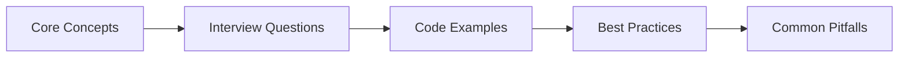
```mermaid
flowchart LR
    A[Core Concepts]
    B[Interview Questions]
    C[Code Examples]
    D[Best Practices]
    E[Common Pitfalls]
    A --> B
    B --> C
    C --> D
    D --> E
```

## 1. Education Domain Knowledge


### Q1: What are the core data models in an EdTech platform, and how do they relate?

<a href="../../assets/images/diagrams/laravel/41-interview-education/what-are-the-core-data-models-in-an-edtech-platform-and-how-do-they-relate-handwritten.svg" target="_blank" rel="noopener">
  
</a>
<a href="../../assets/images/diagrams/laravel/41-interview-education/what-are-the-core-data-models-in-an-edtech-platform-and-how-do-they-relate-diagram.svg" target="_blank" rel="noopener">
  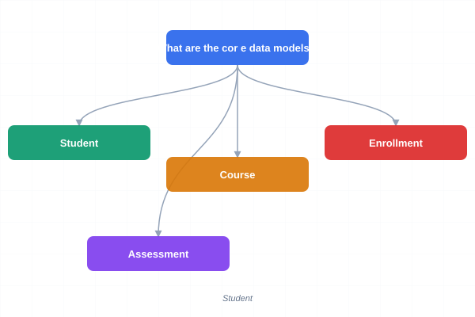
</a>
<a href="../../assets/images/diagrams/laravel/41-interview-education/what-are-the-core-data-models-in-an-edtech-platform-and-how-do-they-relate-sticky.svg" target="_blank" rel="noopener">
  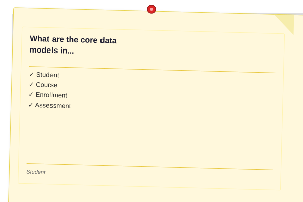
</a>


The five core models are **Student**, **Course**, **Enrollment**, **Assessment**, and **Grade**. A `Student` belongs to a `User` and has `enrollments()` and `grades()` has-many relationships. `Course` has `enrollments()` and `assessments()` has-many. `Enrollment` is the pivot linking `Student` and `Course` with semester, status, and waitlist-position fields. `Assessment` belongs to `Course` and stores questions, rubric, and adaptive-flag. `Grade` belongs to both `Student` and `Assessment` and holds the score, letter grade, feedback, and AI grading metadata. This relational spine supports every academic workflow from enrollment through assessment.

### Q2: How do you model academic terms, semesters, and academic years in a relational database?

<a href="../../assets/images/diagrams/laravel/41-interview-education/how-do-you-model-academic-terms-semesters-and-academic-years-in-a-relational-database-handwritten.svg" target="_blank" rel="noopener">
  
</a>
<a href="../../assets/images/diagrams/laravel/41-interview-education/how-do-you-model-academic-terms-semesters-and-academic-years-in-a-relational-database-diagram.svg" target="_blank" rel="noopener">
  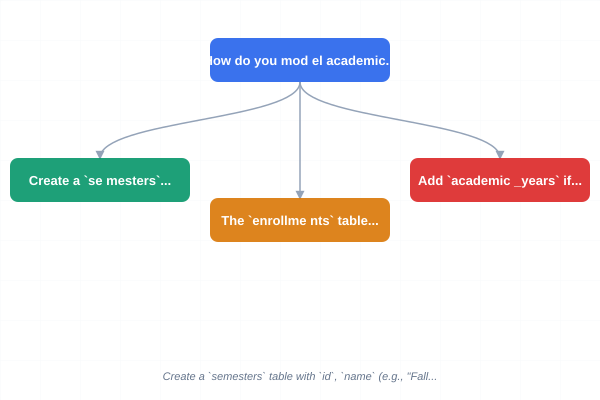
</a>
<a href="../../assets/images/diagrams/laravel/41-interview-education/how-do-you-model-academic-terms-semesters-and-academic-years-in-a-relational-database-sticky.svg" target="_blank" rel="noopener">
  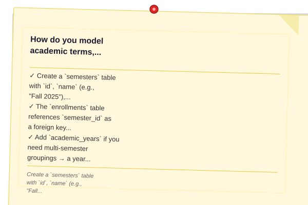
</a>


Create a `semesters` table with `id`, `name` (e.g., "Fall 2025"), `start_date`, `end_date`, and `is_current` boolean. The `enrollments` table references `semester_id` as a foreign key rather than storing a string. This lets you query current-term enrollments efficiently, archive past terms, and run term-based reports without string parsing. Add `academic_years` if you need multi-semester groupings → a year has-many semesters.

### Q3: What is a learning management system (LMS) from a developer's perspective?

<a href="../../assets/images/diagrams/laravel/41-interview-education/what-is-a-learning-management-system-lms-from-a-developer-s-perspective-handwritten.svg" target="_blank" rel="noopener">
  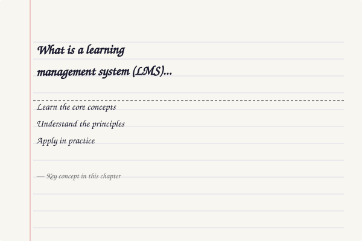
</a>
<a href="../../assets/images/diagrams/laravel/41-interview-education/what-is-a-learning-management-system-lms-from-a-developer-s-perspective-diagram.svg" target="_blank" rel="noopener">
  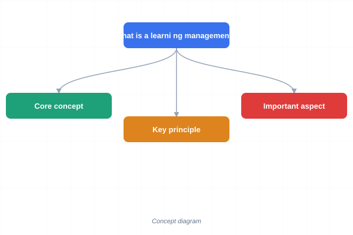
</a>
<a href="../../assets/images/diagrams/laravel/41-interview-education/what-is-a-learning-management-system-lms-from-a-developer-s-perspective-sticky.svg" target="_blank" rel="noopener">
  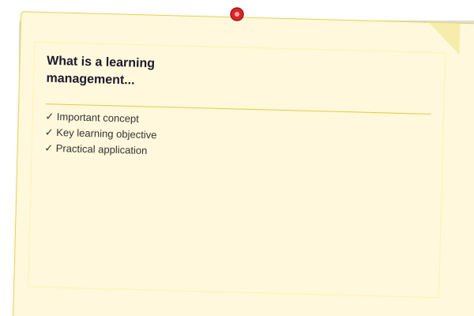
</a>


An LMS is a centralized platform that manages the lifecycle of learning: course authoring, content delivery, student enrollment, assessment administration, grade tracking, and reporting. From a Laravel perspective, it maps to a set of Eloquent models with `BelongsTo`/`HasMany` relationships, event-driven workflows (enrollment confirmation emails, assignment-submission notifications), queue-backed grade calculation, and AI agents layered on top for personalization, grading, and recommendation.

### Q4: How do you handle prerequisite validation in an enrollment workflow?

<a href="../../assets/images/diagrams/laravel/41-interview-education/how-do-you-handle-prerequisite-validation-in-an-enrollment-workflow-handwritten.svg" target="_blank" rel="noopener">
  
</a>
<a href="../../assets/images/diagrams/laravel/41-interview-education/how-do-you-handle-prerequisite-validation-in-an-enrollment-workflow-diagram.svg" target="_blank" rel="noopener">
  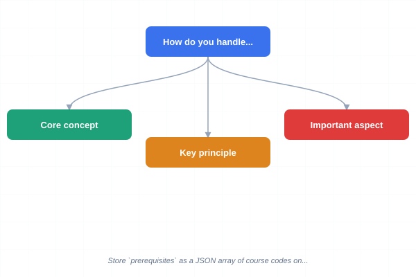
</a>
<a href="../../assets/images/diagrams/laravel/41-interview-education/how-do-you-handle-prerequisite-validation-in-an-enrollment-workflow-sticky.svg" target="_blank" rel="noopener">
  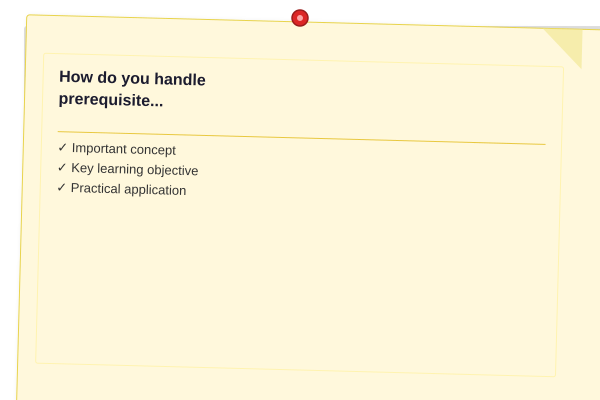
</a>


Store `prerequisites` as a JSON array of course codes on the `Course` model. Before enrolling, query the student's completed grades and match them against prerequisite courses with a minimum grade threshold. Use a FormRequest with a custom rule:

```php
// app/Rules/PrerequisitesMet.php
public function passes($attribute, $value): bool
{
    $course = Course::findOrFail($this->data['course_id']);
    $prereqs = $course->prerequisites ?? [];

    if (empty($prereqs)) {
        return true;
    }

    $completed = Grade::where('student_id', $value)
        ->whereHas('assessment.course', fn ($q) =>
            $q->whereIn('code', $prereqs))
        ->where('letter_grade', '>=', 'C')
        ->count();

    return $completed === count($prereqs);
}
```

This keeps the logic in a single reusable rule class rather than scattered across controllers.

### Q5: Explain the difference between formative and summative assessment in the context of an EdTech application.

**Formative assessment** happens during learning → quizzes, in-class exercises, homework → and provides ongoing feedback to both student and instructor. In code, formative assessments typically have low weight, immediate feedback, and may be adaptive (adjusting difficulty in real time). **Summative assessment** happens at the end of a learning period → final exams, capstone projects → and measures overall achievement. Summative assessments carry high weight, may require human or AI-assisted grading with rubrics, and often feed directly into grade calculations and academic records.

### Q6: What student data privacy regulations apply to EdTech, and how do they affect development?

<a href="../../assets/images/diagrams/laravel/41-interview-education/what-student-data-privacy-regulations-apply-to-edtech-and-how-do-they-affect-development-handwritten.svg" target="_blank" rel="noopener">
  
</a>
<a href="../../assets/images/diagrams/laravel/41-interview-education/what-student-data-privacy-regulations-apply-to-edtech-and-how-do-they-affect-development-diagram.svg" target="_blank" rel="noopener">
  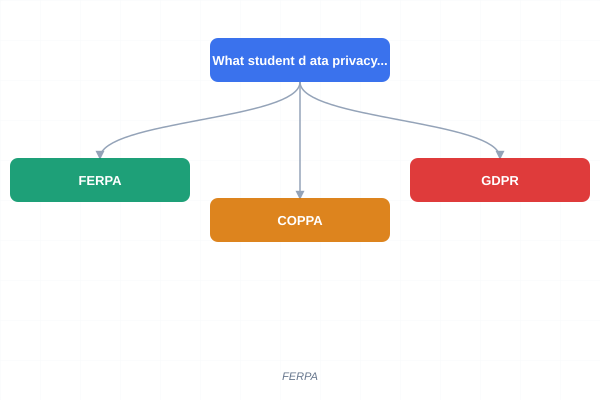
</a>
<a href="../../assets/images/diagrams/laravel/41-interview-education/what-student-data-privacy-regulations-apply-to-edtech-and-how-do-they-affect-development-sticky.svg" target="_blank" rel="noopener">
  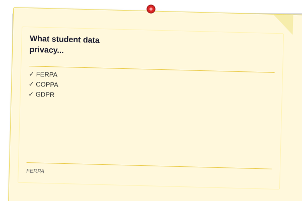
</a>


**FERPA** (Family Educational Rights and Privacy Act) in the US grants students control over their education records → encrypted storage, strict access controls, and audit logging are mandatory. **COPPA** (Children's Online Privacy Protection Act) applies when users are under 13, requiring parental consent for data collection and limiting what data you can store. **GDPR** applies to EU students and mandates data portability, right to deletion, and explicit consent. In Laravel, implement role-based access with Spatie Permission, encrypt PII columns using Laravel's `encrypted` cast, log all data access with a trait, and build data-export/deletion endpoints for compliance requests.

---

## 2. Technical Implementation

### Q7: How would you build a personalized learning path agent in Laravel?

<a href="../../assets/images/diagrams/laravel/41-interview-education/how-would-you-build-a-personalized-learning-path-agent-in-laravel-handwritten.svg" target="_blank" rel="noopener">
  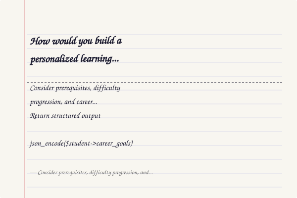
</a>
<a href="../../assets/images/diagrams/laravel/41-interview-education/how-would-you-build-a-personalized-learning-path-agent-in-laravel-diagram.svg" target="_blank" rel="noopener">
  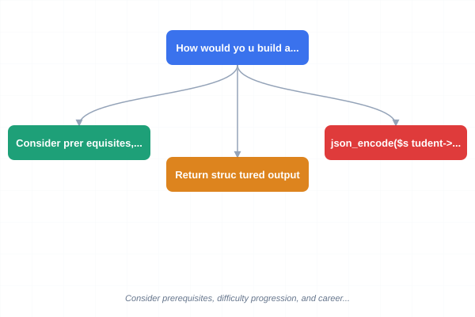
</a>
<a href="../../assets/images/diagrams/laravel/41-interview-education/how-would-you-build-a-personalized-learning-path-agent-in-laravel-sticky.svg" target="_blank" rel="noopener">
  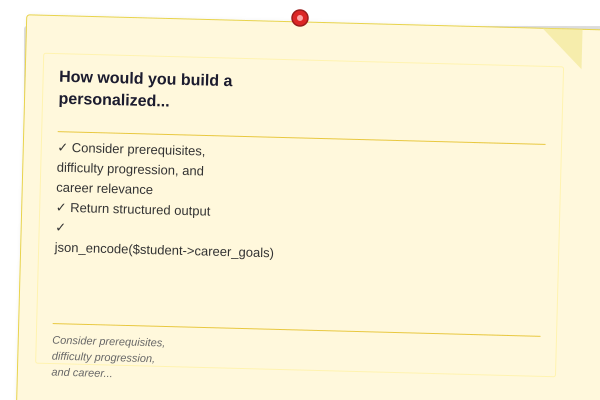
</a>


Use the AI SDK to create an agent that analyzes a student's profile, academic history, and career goals to recommend an optimal course sequence:

```php
$agent = new Agent()
    ->withSystemPrompt(<<<PROMPT
You are a learning-path advisor. Given a student's major, GPA,
completed courses, career goals, and skill assessments, recommend
the next 3-5 courses in sequence. Consider prerequisites, difficulty
progression, and career relevance. Return structured output.
PROMPT
    )
    ->withTool(new CourseCatalogTool())
    ->withTool(new PrerequisiteCheckerTool());

$response = $agent->send(
    "Student: major={$student->major}, gpa={$student->gpa}, " .
    "goals=" . json_encode($student->career_goals) . ", " .
    "completed=" . json_encode($completed)
);
```

The `CourseCatalogTool` queries available courses by department and difficulty. The `PrerequisiteCheckerTool` validates that recommended courses have all prerequisites met. Return structured JSON with `recommended_courses`, `rationale`, and `alternative_paths`.

### Q8: Implement an AI-powered essay grading system with rubric-based scoring.

<a href="../../assets/images/diagrams/laravel/41-interview-education/implement-an-ai-powered-essay-grading-system-with-rubric-based-scoring-handwritten.svg" target="_blank" rel="noopener">
  
</a>
<a href="../../assets/images/diagrams/laravel/41-interview-education/implement-an-ai-powered-essay-grading-system-with-rubric-based-scoring-diagram.svg" target="_blank" rel="noopener">
  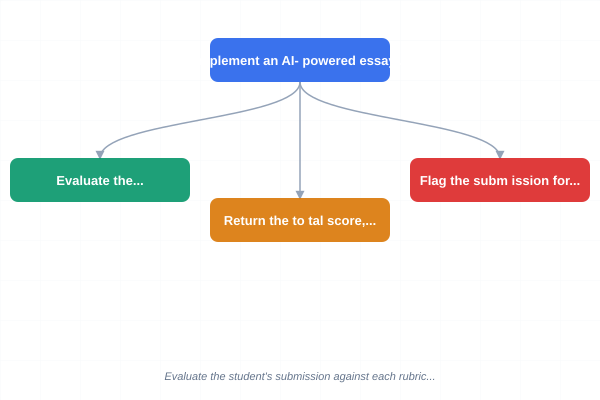
</a>
<a href="../../assets/images/diagrams/laravel/41-interview-education/implement-an-ai-powered-essay-grading-system-with-rubric-based-scoring-sticky.svg" target="_blank" rel="noopener">
  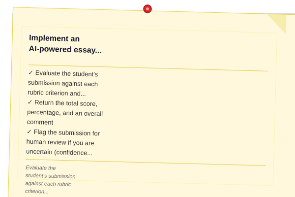
</a>


Create a `GradingAgent` that accepts a rubric and student submission, and returns structured scores:

```php
$agent = new Agent()
    ->withSystemPrompt(<<<PROMPT
You are a fair and consistent grading assistant. Evaluate the
student's submission against each rubric criterion and assign
a score and feedback per criterion. Return the total score,
percentage, and an overall comment. Flag the submission for
human review if you are uncertain (confidence < 0.7).
PROMPT
    )
    ->using('anthropic', 'claude-sonnet-4');

$result = $agent->send(
    "Rubric: " . json_encode($assessment->rubric) . "\n\n" .
    "Student Submission: " . $submission->content
);

$structured = $result->structured(); // { scores, total, percentage, feedback, confidence }
```

The rubric JSON contains criteria like `{"clarity": {"max": 25, "descriptor": "..."}, "evidence": {"max": 25, ...}}`. Store the AI grading data in the `ai_grading_data` JSON column on the `Grade` model for auditability. Schedule a notification when confidence is low to flag the grade for instructor review.

### Q9: Design a content generation agent that produces quiz questions from a lesson plan.

<a href="../../assets/images/diagrams/laravel/41-interview-education/design-a-content-generation-agent-that-produces-quiz-questions-from-a-lesson-plan-handwritten.svg" target="_blank" rel="noopener">
  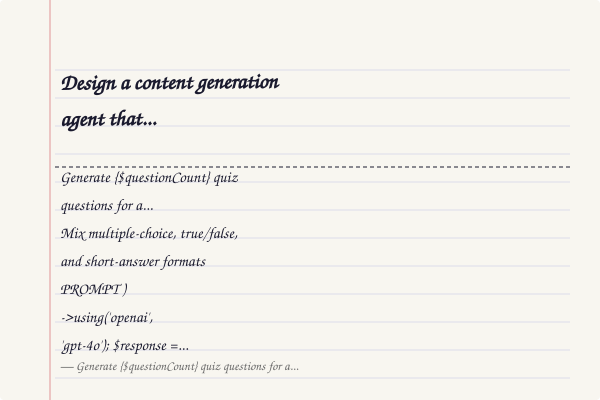
</a>
<a href="../../assets/images/diagrams/laravel/41-interview-education/design-a-content-generation-agent-that-produces-quiz-questions-from-a-lesson-plan-diagram.svg" target="_blank" rel="noopener">
  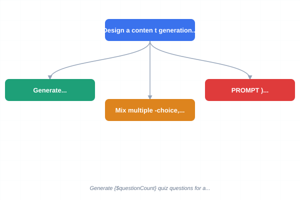
</a>
<a href="../../assets/images/diagrams/laravel/41-interview-education/design-a-content-generation-agent-that-produces-quiz-questions-from-a-lesson-plan-sticky.svg" target="_blank" rel="noopener">
  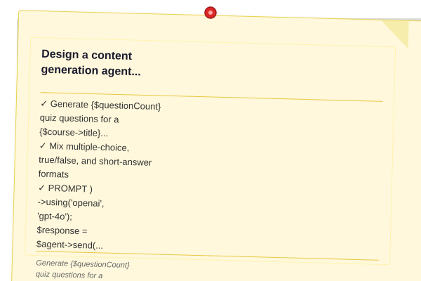
</a>


```php
class QuizGeneratorAgent
{
    public function generate(Course $course, string $topic, int $questionCount = 10): array
    {
        $agent = new Agent()
            ->withSystemPrompt(<<<PROMPT
You are a curriculum designer. Generate {$questionCount} quiz questions
for a {$course->title} course on the topic: {$topic}.
Mix multiple-choice, true/false, and short-answer formats.
Each question must include: question text, type, options (for MC),
correct answer, difficulty level (easy/medium/hard), and
an explanation of the correct answer.
PROMPT
            )
            ->using('openai', 'gpt-4o');

        $response = $agent->send(
            "Course description: {$course->description}\n" .
            "Learning objectives: " . json_encode($course->learning_objectives)
        );

        return $response->structured()['questions'];
    }
}
```

Store generated questions in an `assessment_questions` table with a `generated_by_ai` boolean flag and a `review_status` column → questions should be instructor-reviewed before going live.

### Q10: Build an adaptive quiz engine that adjusts difficulty in real time.

<a href="../../assets/images/diagrams/laravel/41-interview-education/build-an-adaptive-quiz-engine-that-adjusts-difficulty-in-real-time-handwritten.svg" target="_blank" rel="noopener">
  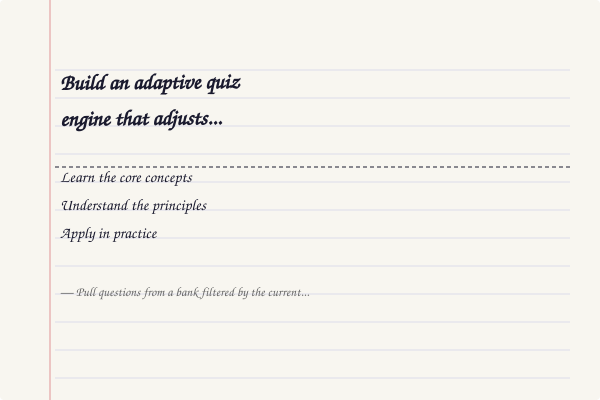
</a>
<a href="../../assets/images/diagrams/laravel/41-interview-education/build-an-adaptive-quiz-engine-that-adjusts-difficulty-in-real-time-diagram.svg" target="_blank" rel="noopener">
  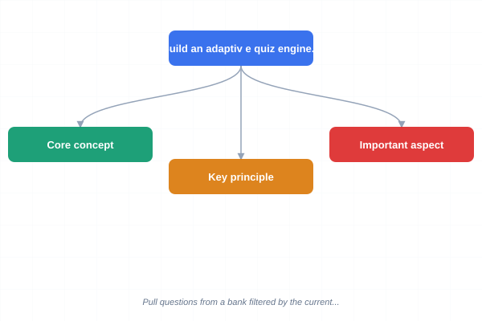
</a>
<a href="../../assets/images/diagrams/laravel/41-interview-education/build-an-adaptive-quiz-engine-that-adjusts-difficulty-in-real-time-sticky.svg" target="_blank" rel="noopener">
  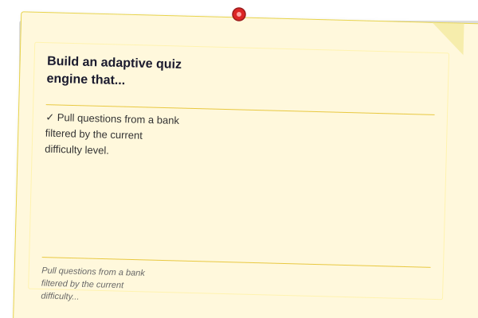
</a>


The adaptive engine tracks consecutive correct/incorrect answers and adjusts the difficulty selection:

```php
class AdaptiveQuizEngine
{
    private const DIFFICULTY_ORDER = ['easy', 'medium', 'hard'];
    private int $consecutiveCorrect = 0;
    private int $consecutiveIncorrect = 0;
    private string $currentDifficulty = 'medium';

    public function nextDifficulty(bool $lastAnswerCorrect): string
    {
        if ($lastAnswerCorrect) {
            $this->consecutiveCorrect++;
            $this->consecutiveIncorrect = 0;
        } else {
            $this->consecutiveIncorrect++;
            $this->consecutiveCorrect = 0;
        }

        if ($this->consecutiveCorrect >= 3) {
            $this->moveDifficulty(+1);
        } elseif ($this->consecutiveIncorrect >= 2) {
            $this->moveDifficulty(-1);
        }

        return $this->currentDifficulty;
    }

    private function moveDifficulty(int $direction): void
    {
        $index = array_search($this->currentDifficulty, self::DIFFICULTY_ORDER);
        $newIndex = clamp($index + $direction, 0, count(self::DIFFICULTY_ORDER) - 1);
        $this->currentDifficulty = self::DIFFICULTY_ORDER[$newIndex];
    }
}
```

Store the session state in cache: `Cache::put("quiz:{$studentId}:{$assessmentId}", $engineState, $ttl)`. Pull questions from a bank filtered by the current difficulty level.

### Q11: How would you implement a student progress tracking agent with an early warning system?

<a href="../../assets/images/diagrams/laravel/41-interview-education/how-would-you-implement-a-student-progress-tracking-agent-with-an-early-warning-system-handwritten.svg" target="_blank" rel="noopener">
  
</a>
<a href="../../assets/images/diagrams/laravel/41-interview-education/how-would-you-implement-a-student-progress-tracking-agent-with-an-early-warning-system-diagram.svg" target="_blank" rel="noopener">
  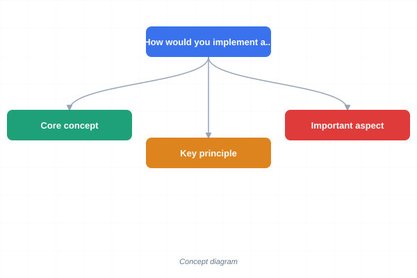
</a>
<a href="../../assets/images/diagrams/laravel/41-interview-education/how-would-you-implement-a-student-progress-tracking-agent-with-an-early-warning-system-sticky.svg" target="_blank" rel="noopener">
  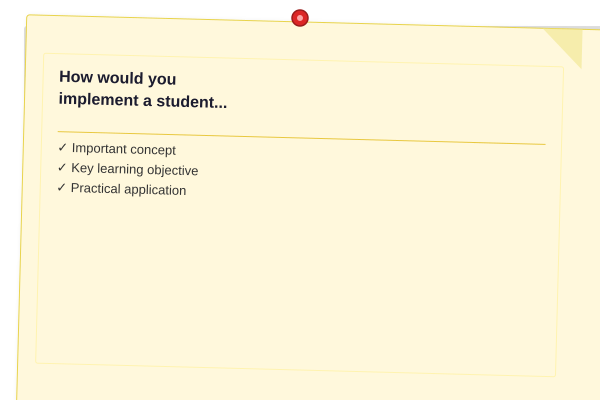
</a>


```php
class ProgressTrackingAgent
{
    public function evaluate(Student $student): ProgressReport
    {
        $flags = [];

        // Flag 1: Low GPA
        if ($student->gpa < 2.0) {
            $flags[] = new Flag('low_gpa', 'critical', $student->gpa);
        }

        // Flag 2: Declining grade trend
        $trend = Grade::where('student_id', $student->id)
            ->with('assessment')
            ->orderBy('graded_at')
            ->get()
            ->pluck('percentage');

        if ($trend->count() >= 4) {
            $recent = $trend->take(-4);
            if ($recent->last() < $recent->first() - 15) {
                $flags[] = new Flag('declining_trend', 'warning', $recent->last());
            }
        }

        // Flag 3: Missing assignments
        $missing = Assessment::whereHas('course.enrollments', fn ($q) =>
            $q->where('student_id', $student->id)
        )
        ->whereDoesntHave('grades', fn ($q) =>
            $q->where('student_id', $student->id)
        )
        ->where('available_until', '<', now())
        ->count();

        if ($missing > 2) {
            $flags[] = new Flag('missing_assignments', 'warning', $missing);
        }

        return new ProgressReport($student, $flags, $this->calculateRiskScore($student));
    }
}
```

Schedule this via `app/Console/Kernel.php` to run weekly, and dispatch notifications when new flags are raised through a `StudentAtRisk` event with listeners for email, SMS, and dashboard alerts.

### Q12: How do you automate enrollment workflows with waitlist management in Laravel?

<a href="../../assets/images/diagrams/laravel/41-interview-education/how-do-you-automate-enrollment-workflows-with-waitlist-management-in-laravel-handwritten.svg" target="_blank" rel="noopener">
  
</a>
<a href="../../assets/images/diagrams/laravel/41-interview-education/how-do-you-automate-enrollment-workflows-with-waitlist-management-in-laravel-diagram.svg" target="_blank" rel="noopener">
  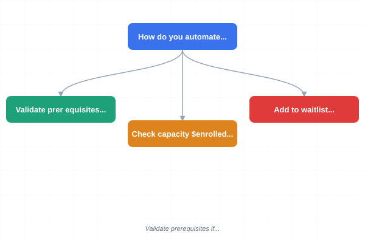
</a>
<a href="../../assets/images/diagrams/laravel/41-interview-education/how-do-you-automate-enrollment-workflows-with-waitlist-management-in-laravel-sticky.svg" target="_blank" rel="noopener">
  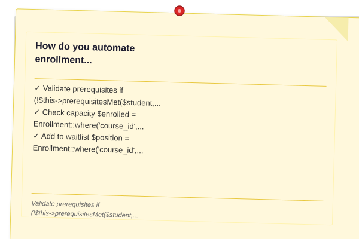
</a>


```php
class EnrollmentAgent
{
    public function enroll(Student $student, Course $course, Semester $semester): EnrollmentResult
    {
        // 1. Validate prerequisites
        if (!$this->prerequisitesMet($student, $course)) {
            return EnrollmentResult::failed('Prerequisites not met');
        }

        // 2. Check capacity
        $enrolled = Enrollment::where('course_id', $course->id)
            ->where('semester_id', $semester->id)
            ->where('status', 'active')
            ->count();

        if ($enrolled >= $course->max_capacity) {
            // 3. Add to waitlist
            $position = Enrollment::where('course_id', $course->id)
                ->whereNotNull('waitlist_position')
                ->max('waitlist_position') + 1;

            Enrollment::create([
                'student_id' => $student->id,
                'course_id' => $course->id,
                'semester_id' => $semester->id,
                'status' => 'waitlisted',
                'waitlist_position' => $position,
            ]);

            return EnrollmentResult::waitlisted($position);
        }

        // 4. Confirm enrollment
        $enrollment = Enrollment::create([
            'student_id' => $student->id,
            'course_id' => $course->id,
            'semester_id' => $semester->id,
            'status' => 'active',
            'enrolled_at' => now(),
        ]);

        $enrollment->notify(new EnrollmentConfirmed($course));

        return EnrollmentResult::success($enrollment);
    }
}
```

Create an Artisan command `enrollments:promote-waitlisted` that checks daily for open seats and auto-promotes the next student from the waitlist with a time-limited acceptance window.

### Q13: Build a curriculum recommendation system using vector similarity search.

<a href="../../assets/images/diagrams/laravel/41-interview-education/build-a-curriculum-recommendation-system-using-vector-similarity-search-handwritten.svg" target="_blank" rel="noopener">
  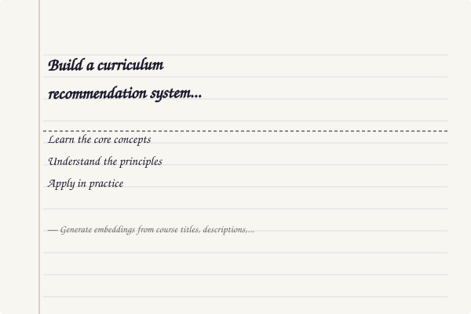
</a>
<a href="../../assets/images/diagrams/laravel/41-interview-education/build-a-curriculum-recommendation-system-using-vector-similarity-search-diagram.svg" target="_blank" rel="noopener">
  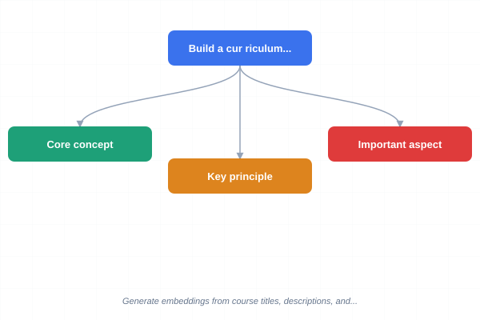
</a>
<a href="../../assets/images/diagrams/laravel/41-interview-education/build-a-curriculum-recommendation-system-using-vector-similarity-search-sticky.svg" target="_blank" rel="noopener">
  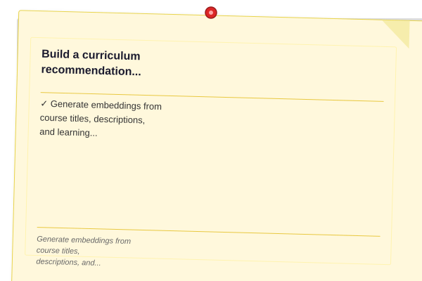
</a>


```php
class CurriculumRecommendationAgent
{
    public function recommendWithVectorSearch(Student $student): array
    {
        $embedding = Str::toEmbeddings(
            implode(' ', [
                $student->major,
                ...($student->career_goals ?? []),
                ...($student->learning_preferences ?? []),
            ])
        );

        $similar = Course::query()
            ->whereVectorSimilarTo('topics_embedding', $embedding, 10)
            ->whereDoesntHave('enrollments', fn ($q) =>
                $q->where('student_id', $student->id)
            )
            ->get();

        return $similar->map(fn ($course) => [
            'course' => $course->title,
            'similarity' => $course->vector_similarity,
            'relevance_rationale' => $this->explainRelevance($course, $student),
        ])->toArray();
    }
}
```

Use pgvector with HNSW indexing on a `topics_embedding` column in the `courses` table. Generate embeddings from course titles, descriptions, and learning objectives. This gives students recommendations based on semantic content matching rather than simple keyword or department filters.

### Q14: How would you build an AI agent that generates personalized study plans for exam preparation?

<a href="../../assets/images/diagrams/laravel/41-interview-education/how-would-you-build-an-ai-agent-that-generates-personalized-study-plans-for-exam-preparation-handwritten.svg" target="_blank" rel="noopener">
  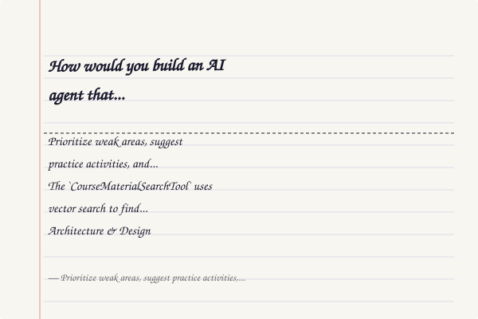
</a>
<a href="../../assets/images/diagrams/laravel/41-interview-education/how-would-you-build-an-ai-agent-that-generates-personalized-study-plans-for-exam-preparation-diagram.svg" target="_blank" rel="noopener">
  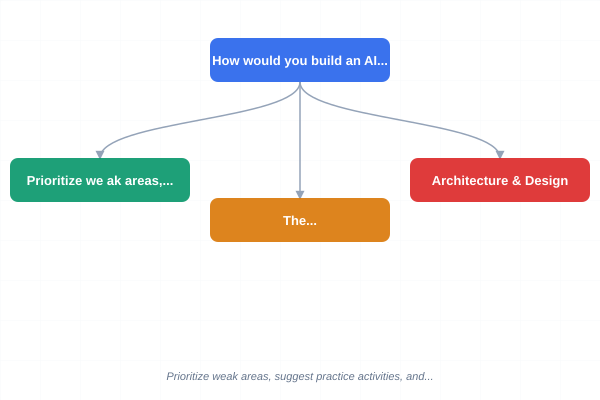
</a>
<a href="../../assets/images/diagrams/laravel/41-interview-education/how-would-you-build-an-ai-agent-that-generates-personalized-study-plans-for-exam-preparation-sticky.svg" target="_blank" rel="noopener">
  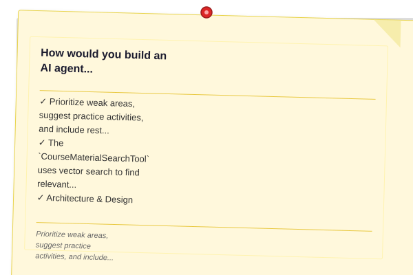
</a>


```php
$agent = new Agent()
    ->withSystemPrompt(<<<PROMPT
You are a study-plan tutor. Given a student's upcoming exam topics,
their current proficiency in each topic, and the days remaining
until the exam, create a day-by-day study schedule. Prioritize
weak areas, suggest practice activities, and include rest days.
PROMPT
    )
    ->withTool(new CourseMaterialSearchTool());

$plan = $agent->send(json_encode([
    'exam_title' => $exam->title,
    'topics' => $topics, // [{name, proficiency: 0-100}]
    'days_remaining' => 14,
    'available_hours_per_day' => 2,
]));

return $plan->structured();
```

The agent outputs a structured study plan with daily activities, estimated time, and linked course materials. The `CourseMaterialSearchTool` uses vector search to find relevant lesson content for each topic.

---

## 3. Architecture & Design

### Q15: How do you architect a multi-tenant EdTech platform where each school has isolated data?

<a href="../../assets/images/diagrams/laravel/41-interview-education/how-do-you-architect-a-multi-tenant-edtech-platform-where-each-school-has-isolated-data-handwritten.svg" target="_blank" rel="noopener">
  
</a>
<a href="../../assets/images/diagrams/laravel/41-interview-education/how-do-you-architect-a-multi-tenant-edtech-platform-where-each-school-has-isolated-data-diagram.svg" target="_blank" rel="noopener">
  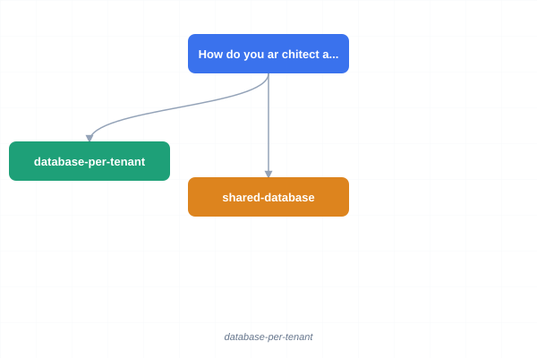
</a>
<a href="../../assets/images/diagrams/laravel/41-interview-education/how-do-you-architect-a-multi-tenant-edtech-platform-where-each-school-has-isolated-data-sticky.svg" target="_blank" rel="noopener">
  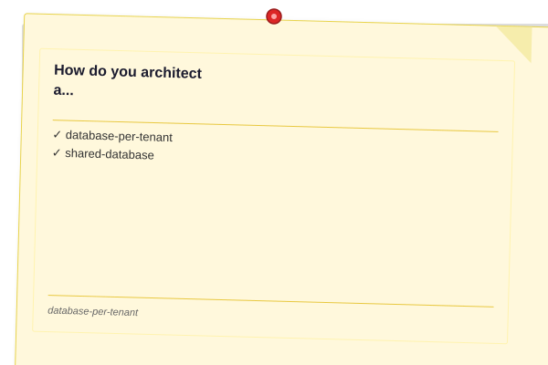
</a>


Use Laravel's multi-tenancy patterns. For **database-per-tenant** isolation (strongest for compliance), each school gets its own database, and a central `tenants` table maps subdomains to database connections. A middleware resolves the tenant from the request hostname and dynamically sets the database connection:

```php
// App\Http\Middleware\TenantResolver
public function handle(Request $request, Closure $next): Response
{
    $host = $request->getHost();
    $tenant = Tenant::where('domain', $host)->firstOrFail();

    config(['database.connections.tenant.database' => "edtech_{$tenant->id}"]);
    DB::purge('tenant');
    DB::reconnect('tenant');
    DB::setDefaultConnection('tenant');

    app()->instance(TenantContext::class, new TenantContext($tenant));

    return $next($request);
}
```

For **shared-database** with row-level scoping (simpler, lower cost), add a `tenant_id` column to every table and apply a global scope:

```php
class TenantScope implements Scope
{
    public function apply(Builder $builder, Model $model): void
    {
        $builder->where('tenant_id', app(TenantContext::class)->tenantId());
    }
}
```

Database-per-tenant is preferred for EdTech because schools require strong data isolation for compliance (FERPA records must not commingle). The trade-off is higher operational complexity → migrations must run across all tenant databases, typically via a `migrate:all` Artisan command.

### Q16: How would you scale an EdTech platform to handle millions of concurrent students (e.g., during exam season)?

Scale in three dimensions:

**Read layer**: Cache course catalog, lesson content, and reference materials in Redis with a multi-tier strategy → in-memory for hot content, Redis for warm content, database as the source of truth. Use Laravel's `Cache::remember()` with TTLs appropriate to update frequency. For quiz question banks, cache the filtered question pool per student session.

**Write layer**: Queue all writes → grade submissions, enrollment actions, progress updates → through Laravel Horizon with enough workers to handle peak load. Use separate queue pipelines: `high` for time-sensitive operations (exam submissions), `default` for background work (grade calculation, notification sending). Horizon auto-scaling (via Supervisor or Laravel Cloud) adds workers during exam windows.

**Database layer**: Use read replicas for report queries and dashboard analytics. For the primary database, use connection pooling (PgBouncer for PostgreSQL) to handle thousands of concurrent connections. Partition large tables → `grades` partitioned by semester, `enrollment_logs` by month. Add coverage indexes on `(student_id, semester_id)`, `(course_id, status)`, and `(assessment_id, student_id)`.

### Q17: How do you ensure FERPA/COPPA compliance in your Laravel data architecture?

<a href="../../assets/images/diagrams/laravel/41-interview-education/how-do-you-ensure-ferpa-coppa-compliance-in-your-laravel-data-architecture-handwritten.svg" target="_blank" rel="noopener">
  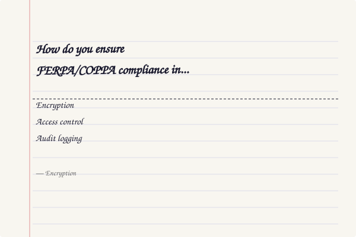
</a>
<a href="../../assets/images/diagrams/laravel/41-interview-education/how-do-you-ensure-ferpa-coppa-compliance-in-your-laravel-data-architecture-diagram.svg" target="_blank" rel="noopener">
  
</a>
<a href="../../assets/images/diagrams/laravel/41-interview-education/how-do-you-ensure-ferpa-coppa-compliance-in-your-laravel-data-architecture-sticky.svg" target="_blank" rel="noopener">
  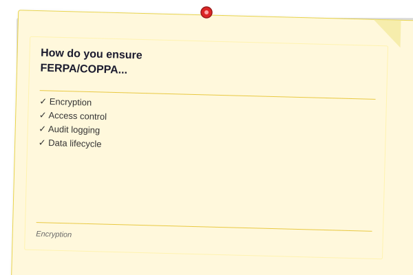
</a>


Implement a multi-layered compliance strategy:

**Encryption**: Use Laravel's `encrypted` cast for PII columns (student name, email, SSN-equivalents). Encrypt at rest using the application-layer `Crypt::encryptString()` for sensitive blob data in JSON columns.

```php
protected $casts = [
    'email' => 'encrypted',
    'special_education_data' => 'encrypted:array',
];
```

**Access control**: Use Spatie Permission with fine-grained roles → `teacher` (their own courses only), `admin` (their school only), `student` (their own data only). Implement a policy per model:

```php
class GradePolicy
{
    public function view(User $user, Grade $grade): bool
    {
        return $user->id === $grade->student->user_id
            || $user->can('view-all-grades')
            || $grade->assessment->course->teacher_id === $user->id;
    }
}
```

**Audit logging**: Apply a trait to all models containing student data that logs every read and write to an `audit_logs` table with user ID, action, model type, model ID, timestamp, and IP address.

**Data lifecycle**: Build scheduled commands that purge stale data (e.g., delete quiz session cache older than 30 days) and anonymize student records after the mandatory retention period expires.

### Q18: Describe how you would design an AI agent orchestrator that routes student requests to the correct education agent.

Use a **router agent** pattern. A single entry-point agent receives natural language requests and routes them to specialized sub-agents:

```php
class EducationOrchestratorAgent
{
    public function handle(string $request, Student $student): AgentResponse
    {
        $router = new Agent()
            ->withSystemPrompt(<<<PROMPT
Classify the following student request into one of these categories
and extract relevant parameters:
- learning_path: "plan my courses", "what should I take next"
- grading: "grade my essay", "review my assignment"
- quiz: "generate practice quiz", "test me on chapter 5"
- progress: "how am I doing", "show my grades"
- enrollment: "enroll in CS301", "drop history"
- study_plan: "help me study for midterms"
PROMPT
            );

        $classification = $router->send($request)->structured();

        return match ($classification['category']) {
            'learning_path' => app(LearningPathAgent::class)->recommend($student),
            'grading' => app(GradingAgent::class)->grade(...),
            'quiz' => app(AdaptiveQuizEngine::class)->startSession(...),
            'progress' => app(ProgressTrackingAgent::class)->evaluate($student),
            'enrollment' => app(EnrollmentAgent::class)->handle(...),
            'study_plan' => app(StudyPlanAgent::class)->generate(...),
        };
    }
}
```

This keeps a unified API surface while allowing each education agent to evolve independently. Add confidence threshold routing → if the router's confidence is below 0.8, escalate to a human support agent.

### Q19: What database indexing strategy would you use for an EdTech application with heavy read patterns?

<a href="../../assets/images/diagrams/laravel/41-interview-education/what-database-indexing-strategy-would-you-use-for-an-edtech-application-with-heavy-read-patterns-handwritten.svg" target="_blank" rel="noopener">
  
</a>
<a href="../../assets/images/diagrams/laravel/41-interview-education/what-database-indexing-strategy-would-you-use-for-an-edtech-application-with-heavy-read-patterns-diagram.svg" target="_blank" rel="noopener">
  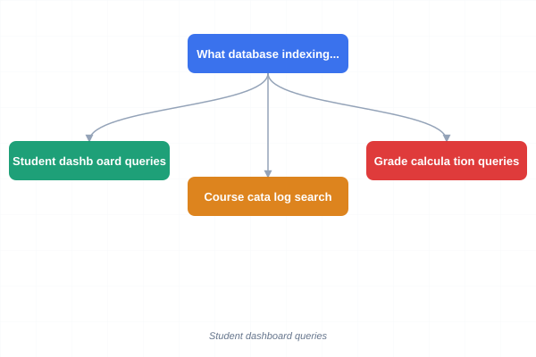
</a>
<a href="../../assets/images/diagrams/laravel/41-interview-education/what-database-indexing-strategy-would-you-use-for-an-edtech-application-with-heavy-read-patterns-sticky.svg" target="_blank" rel="noopener">
  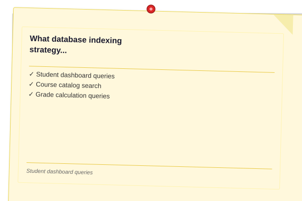
</a>


Focus on the query patterns that execute most frequently:

**Student dashboard queries** (read-heavy, every page load):
```sql
CREATE INDEX idx_grades_student_lookup
    ON grades (student_id, assessment_id, created_at DESC);
CREATE INDEX idx_enrollments_active
    ON enrollments (student_id, semester_id, status)
    WHERE status = 'active';
```

**Course catalog search** (read-heavy, filtering and sorting):
```sql
CREATE INDEX idx_courses_department_active
    ON courses (department, is_active, title);
CREATE INDEX idx_courses_difficulty
    ON courses (difficulty_level, credits);
-- HNSW index for vector similarity search
CREATE INDEX idx_courses_topics_embedding
    ON courses USING hnsw (topics_embedding vector_cosine_ops);
```

**Grade calculation queries** (write-medium, term-end bursts):
```sql
CREATE INDEX idx_assessments_course_weight
    ON assessments (course_id, weight DESC);
```

Include composite indexes that match the `WHERE` + `ORDER BY` clauses of your most common Eloquent queries. For `->where('status', 'active')->orderBy('created_at', 'desc')`, create `(status, created_at)`. Use partial indexes for filtered columns like `status`.

---

## 4. Behavioral & Scenario

### Q20: "Design an AI-powered learning platform from scratch." Walk us through your approach.

<a href="../../assets/images/diagrams/laravel/41-interview-education/design-an-ai-powered-learning-platform-from-scratch-walk-us-through-your-approach-handwritten.svg" target="_blank" rel="noopener">
  
</a>
<a href="../../assets/images/diagrams/laravel/41-interview-education/design-an-ai-powered-learning-platform-from-scratch-walk-us-through-your-approach-diagram.svg" target="_blank" rel="noopener">
  
</a>
<a href="../../assets/images/diagrams/laravel/41-interview-education/design-an-ai-powered-learning-platform-from-scratch-walk-us-through-your-approach-sticky.svg" target="_blank" rel="noopener">
  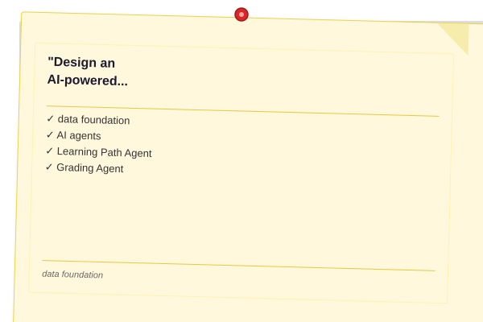
</a>


I would start with the **data foundation**: Five core Eloquent models (Student, Course, Enrollment, Assessment, Grade) with proper migrations, relationships, and casts. Add `semesters` and `institutions` tables for multi-tenancy.

Then layer in **AI agents** using the Laravel AI SDK:

1. **Learning Path Agent** → analyzes student profiles and recommends course sequences using structured output from Claude/GPT.
2. **Grading Agent** → evaluates submissions against rubrics, returns scores with confidence flags.
3. **Content Generation Agent** → produces quizzes and lesson plans from curriculum specs.
4. **Adaptive Quiz Engine** → adjusts difficulty in real time based on performance.
5. **Progress Tracking Agent** → runs weekly, calculates risk scores, flags at-risk students.
6. **Enrollment Agent** → automates prerequisites, waitlists, and confirmations.
7. **Curriculum Recommendation Agent** → uses pgvector similarity search to match courses to career goals.
8. **Study Plan Agent** → generates day-by-day exam prep schedules.

The **architecture** would be a multi-tenant Laravel application → database-per-tenant for FERPA compliance → with a router agent as the unified API entry point. Queue all async work through Horizon with dedicated pipelines for grading, notifications, and analytics. Cache course catalog content in Redis. Use pgvector with HNSW indexing for all vector similarity operations.

For **scale**, read replicas serve analytics dashboards, Horizon auto-scales during exam windows, and grade tables are partitioned by semester. All PII is encrypted at the application layer, access is controlled via policies, and every data access is audited.

### Q21: "How would you build an automated grading system that handles both multiple-choice and essay questions?"

The system needs two different pipelines:

**Multiple-choice grading** (deterministic, instant): Compare student answers against the answer key in the `assessments.questions` JSON column. Score is `correct / total * max_score`. This runs synchronously in the HTTP request or via a lightweight queue job.

```php
class MultipleChoiceGradingPipeline
{
    public function grade(Grade $grade, Assessment $assessment): void
    {
        $questions = $assessment->questions;
        $answers = $grade->submission['answers'];
        $correct = 0;

        foreach ($questions as $i => $question) {
            if (($answers[$i] ?? null) === $question['correct_answer']) {
                $correct++;
            }
        }

        $percentage = $correct / count($questions) * 100;
        $grade->update([
            'score' => $percentage / 100 * $assessment->max_score,
            'percentage' => $percentage,
            'grading_method' => 'auto',
            'graded_at' => now(),
        ]);
    }
}
```

**Essay/open-ended grading** (AI-assisted, async): Dispatch a queue job that sends the submission and rubric to an AI SDK agent. The agent returns structured scores per criterion, overall feedback, and a confidence score. If confidence is below 0.7, set the grade status to `pending_review` and notify the instructor.

```php
class EssayGradingJob implements ShouldQueue
{
    public function handle(): void
    {
        $result = Agent::make()
            ->withSystemPrompt('Grade this essay against the rubric...')
            ->send($this->buildPrompt());

        $structured = $result->structured();

        DB::transaction(function () use ($structured) {
            $this->grade->update([
                'score' => $structured['total_score'],
                'percentage' => $structured['percentage'],
                'feedback' => $structured['feedback'],
                'rubric_scores' => $structured['criterion_scores'],
                'ai_grading_data' => $structured,
                'grading_method' => $structured['confidence'] >= 0.7
                    ? 'ai' : 'ai_pending_review',
                'graded_at' => now(),
            ]);

            if ($structured['confidence'] < 0.7) {
                Notification::send(
                    $this->grade->assessment->course->teacher,
                    new GradeNeedsReview($this->grade)
                );
            }
        });
    }
}
```

The key design decision is **confidence-based routing**: high-confidence AI grades are auto-approved; low-confidence ones require human review. This balances scalability with quality.

### Q22: "Describe an adaptive learning system architecture that personalizes content for each student."

<a href="../../assets/images/diagrams/laravel/41-interview-education/describe-an-adaptive-learning-system-architecture-that-personalizes-content-for-each-student-handwritten.svg" target="_blank" rel="noopener">
  
</a>
<a href="../../assets/images/diagrams/laravel/41-interview-education/describe-an-adaptive-learning-system-architecture-that-personalizes-content-for-each-student-diagram.svg" target="_blank" rel="noopener">
  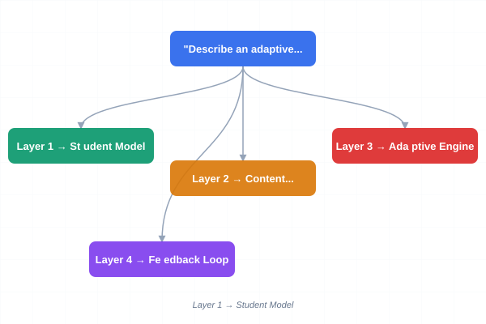
</a>
<a href="../../assets/images/diagrams/laravel/41-interview-education/describe-an-adaptive-learning-system-architecture-that-personalizes-content-for-each-student-sticky.svg" target="_blank" rel="noopener">
  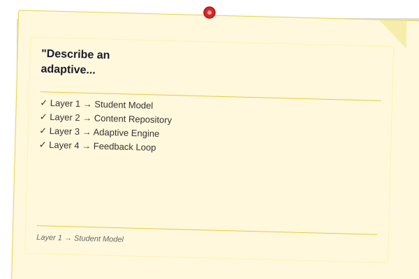
</a>


The system has four layers:

**Layer 1 → Student Model**: A profile stored in the `students` table with `learning_preferences` (visual/auditory/kinesthetic), `skill_assessments` (per-topic proficiency scores 0-100), `career_goals`, and `gpa`. This model updates continuously as the student interacts with the platform.

**Layer 2 → Content Repository**: Three tiers of learning content → video lessons, reading materials, and interactive exercises → each tagged with topics, difficulty level, and content type. Stored in a `learning_materials` table with a vector embedding column for similarity search.

**Layer 3 → Adaptive Engine**: The core decision-maker runs on every student action:

```php
class AdaptiveEngine
{
    public function nextContent(Student $student, string $topic): LearningMaterial
    {
        // 1. Get current proficiency
        $proficiency = $student->skill_assessments[$topic] ?? 50;

        // 2. Determine optimal difficulty
        $difficulty = match (true) {
            $proficiency < 30 => 'beginner',
            $proficiency < 60 => 'intermediate',
            $proficiency < 85 => 'advanced',
            default => 'mastery',
        };

        // 3. Select preferred content type
        $preferredType = $student->learning_preferences['primary_style'] ?? 'reading';

        // 4. Vector search for best match
        return LearningMaterial::query()
            ->whereVectorSimilarTo('embedding', Str::toEmbeddings($topic), 5)
            ->where('difficulty', $difficulty)
            ->where('content_type', $preferredType)
            ->firstOrFail();
    }
}
```

**Layer 4 → Feedback Loop**: After each content interaction, the system updates the student's proficiency estimate:

```
correct_answers / total_answers in topic → new proficiency score
proficiency_change triggers:
  - content_recommendation refresh
  - learning_path recalculation
  - early_warning check if proficiency dropped > 20%
```

This architecture means every student experiences a unique learning journey tuned to their knowledge level, learning style, and pace → without requiring manual intervention from instructors.

### Q23: "How would you implement real-time collaboration features in an EdTech platform → like shared whiteboards or live coding sessions?"

Use Laravel Reverb for WebSocket communication combined with an operational-transform-like approach for state synchronization:

**Architecture**:
1. **Presence channels** in Reverb authenticate users and track who is in each session: `echo.join('session.{$sessionId}')`
2. **Session state** is stored in Redis as a shared data structure → whiteboard strokes, cursor positions, code editor contents.
3. **Events** broadcast incremental changes: `broadcast(new CursorMoved($sessionId, $userId, $position))` or `broadcast(new StrokeAdded($sessionId, $strokeData))`

```php
// Broadcast a code edit
class CodeEditBroadcast implements ShouldBroadcastNow
{
    public function __construct(
        public string $sessionId,
        public string $userId,
        public array $patch // {position, insert, delete}
    ) {}

    public function broadcastOn(): array
    {
        return [new PresenceChannel("session.{$this->sessionId}")];
    }
}
```

On the frontend, Echo listens for these events and applies patches to the local state. For conflict resolution in coding sessions, use CRDTs (Conflict-Free Replicated Data Types) via a library like Yjs → this avoids the complexity of operational transform while still allowing concurrent edits without conflicts.

Store session recordings to the database after the session ends for playback and review features.

### Q24: "A school district wants to migrate from a legacy on-premise SIS (Student Information System) to your Laravel platform. How do you handle the migration?"

Follow a phased approach with data integrity validation at each step:

**Phase 1 → Audit**: Export a complete schema from the legacy SIS. Map every legacy field to the new Laravel models. Identify PII fields for encryption, deprecated fields to drop, and computed fields to generate.

**Phase 2 → Extract & Transform**: Write a dedicated Laravel command or job pipeline that reads legacy data (CSV dumps or direct database connection) and transforms it:

```php
class MigrateStudentsJob implements ShouldQueue
{
    public function handle(): void
    {
        $rows = DB::connection('legacy')
            ->table('students')
            ->where('migrated', false)
            ->limit(500)
            ->get();

        foreach ($rows as $row) {
            try {
                DB::transaction(function () use ($row) {
                    $user = User::create([
                        'name' => $row->full_name,
                        'email' => $row->email_address,
                        'password' => Hash::make(Str::random(32)), // force password reset
                    ]);

                    Student::create([
                        'user_id' => $user->id,
                        'student_id' => $row->student_number,
                        'grade_level' => $this->mapGradeLevel($row->grade),
                        'gpa' => $row->cumulative_gpa ?? 0.00,
                    ]);

                    DB::connection('legacy')
                        ->table('students')
                        ->where('id', $row->id)
                        ->update(['migrated' => true]);
                });
            } catch (\Exception $e) {
                Log::error("Failed to migrate student {$row->student_number}", [
                    'error' => $e->getMessage(),
                ]);
                // Log to migration_errors table for manual review
            }
        }
    }
}
```

**Phase 3 → Validate**: After each batch, run validation queries:
- `COUNT(*)` comparison between legacy and new systems
- Random spot-checks of 5% of records
- Verify relationship integrity (every enrollment has a valid student and course)

**Phase 4 → Cutover**: Run a final delta migration for changes during the migration window. Set up the legacy system as read-only. Point all integrations (SSO, SIS sync, parent portal) to the new platform. Run the legacy and new systems in parallel for one semester as a safety net.

### Q25: "How do you handle course content versioning when instructors update lesson materials mid-semester?"

<a href="../../assets/images/diagrams/laravel/41-interview-education/how-do-you-handle-course-content-versioning-when-instructors-update-lesson-materials-mid-semester-handwritten.svg" target="_blank" rel="noopener">
  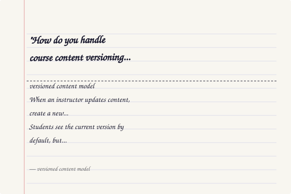
</a>
<a href="../../assets/images/diagrams/laravel/41-interview-education/how-do-you-handle-course-content-versioning-when-instructors-update-lesson-materials-mid-semester-diagram.svg" target="_blank" rel="noopener">
  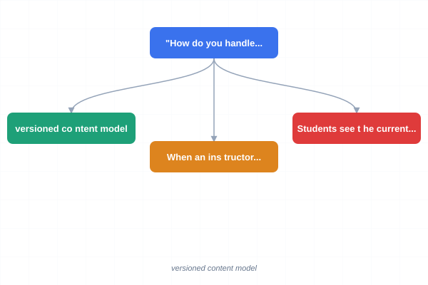
</a>
<a href="../../assets/images/diagrams/laravel/41-interview-education/how-do-you-handle-course-content-versioning-when-instructors-update-lesson-materials-mid-semester-sticky.svg" target="_blank" rel="noopener">
  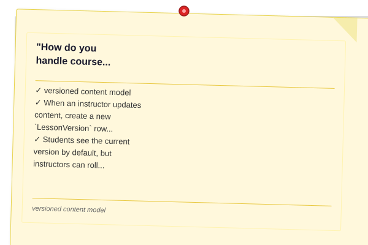
</a>


Implement a **versioned content model** using a separate table:

```php
Schema::create('lesson_versions', function (Blueprint $table) {
    $table->id();
    $table->foreignId('lesson_id')->constrained()->cascadeOnDelete();
    $table->unsignedInteger('version_number');
    $table->text('content');
    $table->json('metadata')->nullable();
    $table->string('change_notes')->nullable();
    $table->foreignId('updated_by')->constrained('users');
    $table->timestamps();

    $table->unique(['lesson_id', 'version_number']);
});
```

The `Lesson` model has a `current_version_id` that references the active version. When an instructor updates content, create a new `LessonVersion` row and update the `current_version_id`. Students see the current version by default, but instructors can roll back to any previous version.

For assessments currently in progress, snapshot the version at the time the student started:

```php
class QuizSession
{
    protected $casts = [
        'lesson_version_id' => 'integer', // frozen at session start
    ];
}
```

This ensures grading consistency → no student sees a mid-exam content change. Use events to notify enrolled students when content is updated: `LessonUpdated` → broadcast to the course channel with a summary of changes.

### Q26: "Your team is building a feature that predicts student drop-out risk using ML. How do you design the data pipeline?"

Design a feature-generation pipeline that produces a daily feature vector per student:

```php
class DropoutRiskPipeline
{
    public function generateFeatures(Student $student): array
    {
        return [
            // Academic features
            'gpa' => $student->gpa,
            'credits_completed' => $student->enrollments()
                ->where('status', 'completed')->count(),
            'current_course_load' => $student->enrollments()
                ->where('status', 'active')->count(),
            'failed_courses_count' => Grade::where('student_id', $student->id)
                ->where('letter_grade', 'F')->count(),
            'grade_trend_slope' => $this->gradeTrendSlope($student),

            // Engagement features
            'login_frequency_30d' => LoginLog::where('user_id', $student->user_id)
                ->where('created_at', '>=', now()->subDays(30))->count(),
            'assignment_late_rate' => $this->lateSubmissionRate($student),
            'forum_participation_30d' => ForumPost::where('user_id', $student->user_id)
                ->where('created_at', '>=', now()->subDays(30))->count(),

            // Demographic features (one-hot encoded)
            ...$this->demographicFeatures($student),

            // Time features
            'days_since_last_login' => now()->diffInDays(
                LoginLog::where('user_id', $student->user_id)
                    ->latest()->value('created_at')
            ),
            'semester_progress_pct' => $this->semesterProgress(),
        ];
    }
}
```

Store feature vectors in a `student_features` table with a daily timestamp. Schedule a nightly command that generates fresh features for all active students. The ML model (a separate Python microservice or ONNX runtime within Laravel) scores these vectors and returns a risk probability. Students above a configurable threshold (e.g., risk > 0.7) trigger the early warning system → notifications to advisors, dashboard alerts, and automated outreach emails.

```php
// app/Console/Kernel.php
$schedule->job(new GenerateStudentFeaturesJob)->dailyAt('02:00');
$schedule->job(new ScoreDropoutRiskJob)->dailyAt('03:00');
```

The `ScoreDropoutRiskJob` calls the ML model via HTTP or reads ONNX model outputs, then dispatches individual `StudentAtRisk` events for high-risk students to trigger appropriate interventions.

---

#---

## Concept Comparison
> **One-Sentence Takeaway:** Compare key education concepts for interview preparation.

| Concept | Purpose | Key Feature |
|---------|---------|-------------|
| LMS Platform | Manage courses, students, instructors | Role-based access + content delivery |
| Course Management | Create and structure learning content | Modular lesson + quiz + assignment structure |
| Student Progress | Track learning outcomes | Completion tracking + skill mastery |
| Assessment Engine | Generate and grade assessments | Auto-grading + plagiarism detection |
| Analytics Dashboard | Visualize learning data | Progress reports + predictive insights |

---

## Quick Reference
> **One-Sentence Takeaway:** Quick reference for education interview topics.

| Topic | Key Point |
|-------|-----------|
| LMS Models | Course, Lesson, Enrollment, Assessment, Grade |
| Course Structure | Modules -> Lessons -> Quizzes -> Assignments |
| Progress Tracking | Completion percentage + skill scores |
| Auto-Grading | Multiple choice + coding assignment evaluation |
| Analytics | Student performance + engagement metrics |

---

## Cross-Application Matrix

| Concept | Application Context | Trade-Off |
|---------|--------------------|-----------|
| LMS Platform | Education delivery | Features vs simplicity |
| Course Management | Content organization | Structure vs flexibility |
| Progress Tracking | Student monitoring | Detail vs privacy |
| Assessment | Knowledge evaluation | Fairness vs automation |
| Analytics | Performance insights | Depth vs actionability |

---

## Chapter Quiz
> **One-Sentence Takeaway:** Test your education interview knowledge.

**Q1:** What does an LMS primarily manage?
- A) Only student grades
- B) Courses, students, instructors, and content delivery
- C) Only course content
- D) Only user profiles

<details><summary>Answer&lt;/summary&gt;B) Courses, students, instructors, and content delivery&lt;/details&gt;

**Q2:** What is the typical course content hierarchy?
- A) Lessons -> Modules -> Courses
- B) Modules -> Lessons -> Quizzes -> Assignments
- C) Courses -> Students -> Grades
- D) Teachers -> Classes -> Exams

<details><summary>Answer&lt;/summary&gt;B) Modules -> Lessons -> Quizzes -> Assignments&lt;/details&gt;

**Q3:** What does the assessment engine typically support?
- A) Only multiple choice questions
- B) Auto-grading with multiple assessment types
- C) Only essay grading
- D) Only peer review

<details><summary>Answer&lt;/summary&gt;B) Auto-grading with multiple assessment types&lt;/details&gt;

**Q4:** What does student progress tracking measure?
- A) Only time spent
- B) Completion + skill mastery + engagement
- C) Only grades
- D) Only attendance

<details><summary>Answer&lt;/summary&gt;B) Completion + skill mastery + engagement&lt;/details&gt;

---

## Concept Comparison
> **One-Sentence Takeaway:** Compare key education concepts for interview preparation.

| Concept | Purpose | Key Feature |
|---------|---------|-------------|
| LMS Platform | Manage courses, students, instructors | Role-based access + content delivery |
| Course Management | Create and structure learning content | Modular lesson + quiz + assignment structure |
| Student Progress | Track learning outcomes | Completion tracking + skill mastery |
| Assessment Engine | Generate and grade assessments | Auto-grading + plagiarism detection |
| Analytics Dashboard | Visualize learning data | Progress reports + predictive insights |

---

## Quick Reference
> **One-Sentence Takeaway:** Quick reference for education interview topics.

| Topic | Key Point |
|-------|-----------|
| LMS Models | Course, Lesson, Enrollment, Assessment, Grade |
| Course Structure | Modules -> Lessons -> Quizzes -> Assignments |
| Progress Tracking | Completion percentage + skill scores |
| Auto-Grading | Multiple choice + coding assignment evaluation |
| Analytics | Student performance + engagement metrics |

---

## Cross-Application Matrix

| Concept | Application Context | Trade-Off |
|---------|--------------------|-----------|
| LMS Platform | Education delivery | Features vs simplicity |
| Course Management | Content organization | Structure vs flexibility |
| Progress Tracking | Student monitoring | Detail vs privacy |
| Assessment | Knowledge evaluation | Fairness vs automation |
| Analytics | Performance insights | Depth vs actionability |

---

## Chapter Quiz
> **One-Sentence Takeaway:** Test your education interview knowledge.

**Q1:** What does an LMS primarily manage?
- A) Only student grades
- B) Courses, students, instructors, and content delivery
- C) Only course content
- D) Only user profiles

<details><summary>Answer&lt;/summary&gt;B) Courses, students, instructors, and content delivery&lt;/details&gt;

**Q2:** What is the typical course content hierarchy?
- A) Lessons -> Modules -> Courses
- B) Modules -> Lessons -> Quizzes -> Assignments
- C) Courses -> Students -> Grades
- D) Teachers -> Classes -> Exams

<details><summary>Answer&lt;/summary&gt;B) Modules -> Lessons -> Quizzes -> Assignments&lt;/details&gt;

**Q3:** What does the assessment engine typically support?
- A) Only multiple choice questions
- B) Auto-grading with multiple assessment types
- C) Only essay grading
- D) Only peer review

<details><summary>Answer&lt;/summary&gt;B) Auto-grading with multiple assessment types&lt;/details&gt;

**Q4:** What does student progress tracking measure?
- A) Only time spent
- B) Completion + skill mastery + engagement
- C) Only grades
- D) Only attendance

<details><summary>Answer&lt;/summary&gt;B) Completion + skill mastery + engagement&lt;/details&gt;

---

## Concept Comparison
> **One-Sentence Takeaway:** Compare key education concepts for interview preparation.

| Concept | Purpose | Key Feature |
|---------|---------|-------------|
| LMS Platform | Manage courses, students, instructors | Role-based access + content delivery |
| Course Management | Create and structure learning content | Modular lesson + quiz + assignment structure |
| Student Progress | Track learning outcomes | Completion tracking + skill mastery |
| Assessment Engine | Generate and grade assessments | Auto-grading + plagiarism detection |
| Analytics Dashboard | Visualize learning data | Progress reports + predictive insights |

---

## Quick Reference
> **One-Sentence Takeaway:** Quick reference for education interview topics.

| Topic | Key Point |
|-------|-----------|
| LMS Models | Course, Lesson, Enrollment, Assessment, Grade |
| Course Structure | Modules -> Lessons -> Quizzes -> Assignments |
| Progress Tracking | Completion percentage + skill scores |
| Auto-Grading | Multiple choice + coding assignment evaluation |
| Analytics | Student performance + engagement metrics |

---

## Cross-Application Matrix

| Concept | Application Context | Trade-Off |
|---------|--------------------|-----------|
| LMS Platform | Education delivery | Features vs simplicity |
| Course Management | Content organization | Structure vs flexibility |
| Progress Tracking | Student monitoring | Detail vs privacy |
| Assessment | Knowledge evaluation | Fairness vs automation |
| Analytics | Performance insights | Depth vs actionability |

---

## Chapter Quiz
> **One-Sentence Takeaway:** Test your education interview knowledge.

**Q1:** What does an LMS primarily manage?
- A) Only student grades
- B) Courses, students, instructors, and content delivery
- C) Only course content
- D) Only user profiles

<details><summary>Answer&lt;/summary&gt;B) Courses, students, instructors, and content delivery&lt;/details&gt;

**Q2:** What is the typical course content hierarchy?
- A) Lessons -> Modules -> Courses
- B) Modules -> Lessons -> Quizzes -> Assignments
- C) Courses -> Students -> Grades
- D) Teachers -> Classes -> Exams

<details><summary>Answer&lt;/summary&gt;B) Modules -> Lessons -> Quizzes -> Assignments&lt;/details&gt;

**Q3:** What does the assessment engine typically support?
- A) Only multiple choice questions
- B) Auto-grading with multiple assessment types
- C) Only essay grading
- D) Only peer review

<details><summary>Answer&lt;/summary&gt;B) Auto-grading with multiple assessment types&lt;/details&gt;

**Q4:** What does student progress tracking measure?
- A) Only time spent
- B) Completion + skill mastery + engagement
- C) Only grades
- D) Only attendance

<details><summary>Answer&lt;/summary&gt;B) Completion + skill mastery + engagement&lt;/details&gt;

---

## Concept Comparison
> **One-Sentence Takeaway:** Compare key education concepts for interview preparation.

| Concept | Purpose | Key Feature |
|---------|---------|-------------|
| LMS Platform | Manage courses, students, instructors | Role-based access + content delivery |
| Course Management | Create and structure learning content | Modular lesson + quiz + assignment structure |
| Student Progress | Track learning outcomes | Completion tracking + skill mastery |
| Assessment Engine | Generate and grade assessments | Auto-grading + plagiarism detection |
| Analytics Dashboard | Visualize learning data | Progress reports + predictive insights |

---

## Quick Reference
> **One-Sentence Takeaway:** Quick reference for education interview topics.

| Topic | Key Point |
|-------|-----------|
| LMS Models | Course, Lesson, Enrollment, Assessment, Grade |
| Course Structure | Modules -> Lessons -> Quizzes -> Assignments |
| Progress Tracking | Completion percentage + skill scores |
| Auto-Grading | Multiple choice + coding assignment evaluation |
| Analytics | Student performance + engagement metrics |

---

## Cross-Application Matrix

| Concept | Application Context | Trade-Off |
|---------|--------------------|-----------|
| LMS Platform | Education delivery | Features vs simplicity |
| Course Management | Content organization | Structure vs flexibility |
| Progress Tracking | Student monitoring | Detail vs privacy |
| Assessment | Knowledge evaluation | Fairness vs automation |
| Analytics | Performance insights | Depth vs actionability |

---

## Chapter Quiz
> **One-Sentence Takeaway:** Test your education interview knowledge.

**Q1:** What does an LMS primarily manage?
- A) Only student grades
- B) Courses, students, instructors, and content delivery
- C) Only course content
- D) Only user profiles

<details><summary>Answer&lt;/summary&gt;B) Courses, students, instructors, and content delivery&lt;/details&gt;

**Q2:** What is the typical course content hierarchy?
- A) Lessons -> Modules -> Courses
- B) Modules -> Lessons -> Quizzes -> Assignments
- C) Courses -> Students -> Grades
- D) Teachers -> Classes -> Exams

<details><summary>Answer&lt;/summary&gt;B) Modules -> Lessons -> Quizzes -> Assignments&lt;/details&gt;

**Q3:** What does the assessment engine typically support?
- A) Only multiple choice questions
- B) Auto-grading with multiple assessment types
- C) Only essay grading
- D) Only peer review

<details><summary>Answer&lt;/summary&gt;B) Auto-grading with multiple assessment types&lt;/details&gt;

**Q4:** What does student progress tracking measure?
- A) Only time spent
- B) Completion + skill mastery + engagement
- C) Only grades
- D) Only attendance

<details><summary>Answer&lt;/summary&gt;B) Completion + skill mastery + engagement&lt;/details&gt;

## Summary

This chapter covered 26 interview questions spanning the four main competency areas for Laravel developers targeting EdTech roles:

- **Domain knowledge**: Core data models (Student, Course, Enrollment, Assessment, Grade), LMS architecture, prerequisite validation, formative vs summative assessment, and student data privacy regulations (FERPA, COPPA, GDPR)
- **Technical implementation**: Eight AI-powered features → learning path agents, automated grading, content generation, adaptive quizzes, progress tracking with early warning, enrollment workflow automation, curriculum recommendation via vector search, and study plan generation
- **Architecture & design**: Multi-tenant isolation strategies (database-per-tenant vs shared with scoping), scaling for millions of concurrent users during exam peaks, FERPA-compliant encryption and access control, router agent orchestration, and read-optimized indexing
- **Behavioral & scenario**: Full-platform design from scratch, hybrid auto+AI grading systems, adaptive learning architecture, real-time collaboration with Reverb, legacy SIS migration strategy, course content versioning, and ML-powered dropout prediction pipelines

The common thread across every question is modularity → clean Eloquent models, independent AI agents, queued async pipelines, and confidence-gated human-in-the-loop fallbacks → enabling EdTech platforms that are both scalable and pedagogically sound.