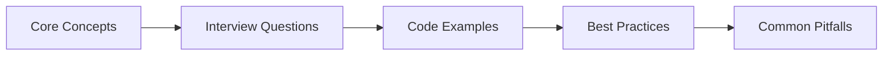

# Chapter 43: HR & Recruitment → Interview Q&A

> **Previous:** [Logistics & Supply Chain — Interview Q&A](./42-interview-logistics.md) | **Next:** [Marketing & Advertising — Interview Q&A](./44-interview-marketing.md)


---

**Part IX: Interview Preparation**

This chapter covers common interview questions for Laravel developer roles at HR technology companies, recruitment platforms, and people-operations SaaS providers. Questions span HR domain knowledge, AI-powered technical implementation, system architecture, and behavioral scenarios.

---

## Chapter at a Glance

| Aspect | Details |
|--------|---------|
| **Scope** | HR interview questions covering recruitment, onboarding, performance management, compliance, analytics |
| **Key Concepts** | Applicant tracking, onboarding automation, performance reviews, compliance tracking, HR analytics |
| **Learning Approach** | Q&A format with practical code examples and domain-specific scenarios |
| **Skills Required** | PHP, Laravel, Eloquent, HR domain knowledge |

## Chapter Roadmap



## 1. HR Domain Knowledge


---

**Q1: Walk me through the end-to-end employee lifecycle. What are the key stages an HR platform must support?**

**A1:** The employee lifecycle spans seven stages:

1. **Attraction** → Employer branding, job postings distributed across boards, career sites, and social channels
2. **Recruitment** → Sourcing, screening, interviewing, assessing, and extending offers
3. **Onboarding** → Document collection (tax forms, ID verification), equipment provisioning, system access grants, training, and orientation
4. **Performance Management** → Goal setting (OKRs/KPIs), regular check-ins, quarterly reviews, feedback collection (360-degree), and performance ratings
5. **Development** → Skill assessments, training enrollment, mentorship matching, career pathing, and promotion readiness
6. **Retention & Engagement** → Pulse surveys, sentiment analysis, recognition programs, compensation reviews, and stay interviews
7. **Offboarding** → Resignation processing, exit interviews, knowledge transfer, equipment return, access revocation, and compliance recordkeeping

A comprehensive HR platform must provide data models and workflows for each stage, with AI agents that automate repetitive tasks and surface insights.

---

**Q2: What is the difference between a job board, an ATS, and an HRIS? When would you use each?**

**A2:**

| System | Primary Function | Key Data | Typical Users |
|--------|-----------------|----------|---------------|
| **Job Board** (e.g., Indeed, LinkedIn) | Publish vacancies and collect applications | Job postings, candidate applications | Recruiters, candidates |
| **ATS (Applicant Tracking System)** | Manage recruitment pipeline from source to hire | Candidates, interviews, offers, workflows | Recruiting team, hiring managers |
| **HRIS (Human Resource Information System)** | Manage employee records, payroll, benefits, compliance | Employees, compensation, time-off, org structure | HR ops, employees, managers |

A Laravel platform typically builds an ATS as the core product, integrates with job boards via APIs for posting and application ingestion, and syncs with HRIS systems (e.g., BambooHR, Workday) for employee data once a candidate is hired.

---

**Q3: Explain the recruitment pipeline from sourcing to offer acceptance. What are the common stages?**

**A3:** The standard recruitment pipeline stages are:

1. **Sourcing** → Proactive candidate discovery (job boards, LinkedIn, referrals, talent pools, boolean search)
2. **Application** → Candidate submits resume and cover letter; system parses and enriches the data
3. **Screening** → Resume review, phone screen, skills assessment, or AI-powered pre-filter
4. **Interview** → Technical rounds, behavioral interviews, panel interviews, take-home assignments
5. **Evaluation** → Interview feedback collection, scorecards, hiring committee review
6. **Decision** → Go/no-go decision, background check authorization
7. **Offer** → Compensation proposal, negotiation, offer letter generation
8. **Acceptance** → Signed offer, start-date confirmation, handoff to onboarding

Each stage has distinct statuses, SLAs, and automation opportunities. An AI agent can automatically progress candidates based on pass/fail criteria.

---

**Q4: What are the key compliance and regulatory considerations for HR software?**

**A4:** HR software must navigate a complex regulatory landscape:

- **EEO/AA (Equal Employment Opportunity / Affirmative Action)** → Track applicant demographics for reporting; avoid bias in screening algorithms
- **GDPR (EU)** → Right to erasure for candidate data, explicit consent for processing, data portability, data-processing records
- **CCPA/CPRA (California)** → Right to know what personal data is collected, right to delete, opt-out of sale
- **OFCCP (US Federal Contractors)** → Recordkeeping for all hires, self-identification invitations, adverse impact analysis
- **FCRA (Fair Credit Reporting Act)** → Disclosure and consent for background checks, adverse-action letters
- **FLSA / Wage & Hour** → Accurate time tracking, overtime calculations, exempt/non-exempt classification
- **HIPAA** (if handling health data) → Medical information separation, limited access
- **Record Retention** → Varies by jurisdiction (typically 1–5 years for applicants, indefinitely for key employment records)

In Laravel, these translate to encrypted PII columns, audit trails with `spatie/laravel-activitylog`, role-based access with `spatie/laravel-permission`, data-retention schedules as queued jobs, and consent-flags on the `candidates` and `employees` tables.

---

**Q5: How do you design a skills taxonomy for an HR platform? Why does it matter for AI agents?**

**A5:** A skills taxonomy is a hierarchical classification of skills used across the organization. A well-designed taxonomy enables AI agents to match candidates to jobs, identify skill gaps, and recommend training.

Structure example:

```
Skill
├── Technical
│   ├── Programming Languages (PHP, Python, JavaScript)
│   ├── Frameworks (Laravel, React, Vue)
│   ├── Databases (MySQL, PostgreSQL, MongoDB)
│   └── Cloud (AWS, Azure, GCP)
├── Soft Skills
│   ├── Communication
│   ├── Leadership
│   └── Collaboration
└── Domain
    ├── Healthcare
    ├── Finance
    └── Logistics
```

In Laravel, model this as:

```php
Schema::create('skill_categories', function (Blueprint $table) {
    $table->id();
    $table->string('name');
    $table->foreignId('parent_id')->nullable()->constrained('skill_categories');
    $table->timestamps();
});

Schema::create('skills', function (Blueprint $table) {
    $table->id();
    $table->string('name');
    $table->foreignId('category_id')->constrained('skill_categories');
    $table->text('aliases')->nullable(); // JSON array of alternate names
    $table->timestamps();
});
```

The aliases column is critical for AI matching → "JS," "JavaScript," and "ECMAScript" should all map to the same skill.

---

**Q6: What key metrics do HR teams track for recruitment efficiency? How would your platform surface them?**

**A6:** The standard recruiting metrics:

| Metric | Formula | Purpose |
|--------|---------|---------|
| **Time to Fill** | Days from job-open to accepted offer | Measures pipeline speed |
| **Time to Hire** | Days from candidate-apply to accept | Measures process efficiency |
| **Cost per Hire** | Total recruiting cost / number of hires | Measures cost efficiency |
| **Source Efficiency** | Hires per source / applications per source | Identifies best channels |
| **Interview-to-Offer** | Offers / interviews conducted | Measures screening accuracy |
| **Offer Acceptance Rate** | Accepted offers / extended offers | Measures competitiveness |
| **Drop-off Rate per Stage** | Candidates lost at stage N / candidates entering stage N | Identifies pipeline bottlenecks |
| **Diversity Pipeline** | Demographic breakdown per stage | Measures DEI health |

In Laravel, compute these via queued analytics jobs that aggregate event data in the `candidate_stages` pivot table. Expose via an API consumed by a dashboard (Laravel Pulse custom card, or an Inertia-powered analytics page). AI agents can flag anomalies → e.g., a sudden drop in offer-acceptance rate triggers an alert to the recruiting team.

---

## 2. Technical Implementation

---

**Q7: How would you build a resume screening and ranking agent in Laravel using the AI SDK?**

**A7:** The agent receives a job description and a batch of resumes, extracts structured candidate data from each resume, and returns a ranked list.

Agent design:

```php
<?php

namespace App\Agents;

use App\Models\JobPosting;
use Illuminate\Support\Collection;
use Laravel\AI\Agent;

class ResumeScreeningAgent extends Agent
{
    protected string $prompt = '
        You are a senior technical recruiter. Given a job description and a candidate resume:

        1. Extract structured fields: name, email, phone, skills, years of experience, education, recent employers
        2. Score the candidate 0–100 against the job requirements
        3. Provide a brief justification for the score
        4. Flag any red flags (employment gaps, mismatched seniority, exaggerated claims)

        Return JSON matching the provided schema.
    ';

    public function screen(JobPosting $job, Collection $candidates): Collection
    {
        $results = collect();

        foreach ($candidates as $candidate) {
            $response = $this->ask(
                "Job: {$job->description}\n\nResume: {$candidate->resume_text}",
                // schema defined via JSON Schema for structured output
                CandidateScore::class
            );

            $candidate->score = $response->score;
            $candidate->justification = $response->justification;
            $candidate->flags = $response->flags;
            $results->push($candidate);
        }

        return $results->sortByDesc('score')->values();
    }
}
```

The `CandidateScore` structured-output class defines the exact JSON schema, ensuring the agent returns parseable data. Queue each screening call individually to handle large batches without timeout. Use `cursor()` for batching thousands of candidates.

---

**Q8: How would you implement interview scheduling automation?**

**A8:** Interview scheduling requires coordinating availability across candidates, interviewers, and rooms, then sending calendar invites and reminders.

Core approach using a scheduling agent:

```php
class InterviewSchedulingAgent extends Agent
{
    public function schedule(Candidate $candidate, JobPosting $job): Interview
    {
        $panel = $this->selectPanelists($job);
        $slots = $this->collectAvailability($panel, $candidate->timezone);
        $bestSlot = $this->findOptimalSlot($slots, $panel);

        $interview = Interview::create([
            'candidate_id' => $candidate->id,
            'job_posting_id' => $job->id,
            'scheduled_at' => $bestSlot['start'],
            'ends_at' => $bestSlot['end'],
            'panelist_ids' => $panel->pluck('id'),
            'status' => 'scheduled',
        ]);

        // Send calendar invites via Laravel notifications
        $interview->panelists->each->notify(new InterviewScheduledNotification($interview));
        $interview->candidate->notify(new InterviewConfirmation($interview));

        // Schedule reminder chain
        SendInterviewReminder::dispatch($interview->id)
            ->delay(now()->addHours(24));
        SendInterviewReminder::dispatch($interview->id)
            ->delay(now()->addMinutes(60));

        return $interview;
    }

    private function collectAvailability($panelists, string $candidateTimezone): Collection
    {
        // Fetch calendar busy slots via Google Calendar API / Outlook Graph API
        // Convert to common timezone, find intersecting free windows
        // Return sorted list of available time windows
    }
}
```

For a multi-interviewer panel, the agent finds the intersection of all free slots → or uses round-robin when panels are large. Implement an `Slot` value object with `start`, `end`, and a hash of participant availability.

---

**Q9: How would you design a candidate-job matching agent that goes beyond keyword matching?**

**A9:** A semantic matching agent uses vector embeddings + AI reasoning instead of keyword overlap.

Pipeline:

1. Generate embeddings for the job description and each candidate's combined profile (resume text + skills + experience + work history)
2. Compute cosine similarity between job and candidate vectors in pgvector
3. Feed the top-N candidates (by vector similarity) to an LLM agent for nuanced reasoning
4. The LLM considers factors like career trajectory, culture-fit signals, company size preference, and skill adjacencies
5. Return a final ranked list with explanations

```php
class CandidateMatchingAgent extends Agent
{
    public function match(JobPosting $job, int $topK = 50): Collection
    {
        // Step 1: Vector similarity search
        $jobEmbedding = Str::toEmbeddings($job->description . ' ' . $job->requirements);
        $similar = Candidate::query()
            ->whereVectorSimilarTo('profile_embedding', $jobEmbedding, $topK)
            ->get();

        // Step 2: LLM reranking
        $prompt = '
            Given this job description and the following candidate profiles,
            rank them by fit. Consider skill relevance, experience level,
            career trajectory, and culture signals. Output a JSON array of
            candidate IDs with scores and one-sentence justifications.
        ';

        return $this->ask($prompt, RankedCandidates::class);
    }
}
```

The key insight: vector search handles recall (find anyone potentially relevant), while the LLM handles precision (nuanced fit assessment). This two-stage pipeline outperforms either approach alone.

---

**Q10: How would you build an onboarding workflow agent?**

**A10:** An onboarding agent automates the new-hire journey from signed offer to fully productive employee. It manages a dynamic checklist of tasks, some parallel and some sequential.

```php
class OnboardingAgent extends Agent
{
    public function onboard(Employee $employee): OnboardingWorkflow
    {
        $workflow = OnboardingWorkflow::create(['employee_id' => $employee->id]);

        // Parallel tasks → dispatch simultaneously
        $tasks = [
            new CollectDocumentsTask($employee),        // W-4, I-9, direct deposit
            new ProvisionEmailTask($employee),            // Create email alias
            new CreateSystemAccountsTask($employee),      // Slack, GitHub, Jira, etc.
            new AssignEquipmentTask($employee),           // Laptop, monitor, accessories
        ];

        foreach ($tasks as $task) {
            $workflowItem = $workflow->items()->create([
                'task_type' => get_class($task),
                'status' => 'pending',
                'due_at' => now()->addDays($task->durationDays()),
            ]);
            ProcessOnboardingTask::dispatch($workflowItem, $employee);
        }

        // Sequential phase → after day 1 tasks
        SendFirstDayInstructions::dispatch($employee)->delay(now()->addDays(-1));

        // AI-generated personalized training plan
        $this->generateTrainingPlan($employee);

        return $workflow;
    }

    private function generateTrainingPlan(Employee $employee): void
    {
        $plan = $this->ask(
            "Create a 30-60-90 day training plan for {$employee->role}. " .
            "Consider their current skills: {$employee->skills->pluck('name')->join(', ')}. " .
            "Output a structured JSON plan with weekly milestones and resources."
        );

        $employee->trainingPlan()->create(['plan' => $plan]);
    }
}
```

Track onboarding completion percentage on a real-time dashboard. Escalate overdue items via Slack notifications to the employee's manager.

---

**Q11: How would you build a performance review analysis agent?**

**A11:** This agent ingests review text (self-assessment, manager feedback, peer reviews), performs sentiment analysis, extracts key themes, and detects performance trends over time.

```php
class PerformanceReviewAgent extends Agent
{
    public function analyze(PerformanceReview $review): ReviewAnalysis
    {
        $feedback = collect([
            'self' => $review->self_assessment,
            'manager' => $review->manager_feedback,
            'peers' => $review->peerFeedbacks->pluck('content')->join("\n"),
        ]);

        return $this->ask(
            "Analyze this performance review:\n\n{$feedback->toJson()}\n\n" .
            "1. Rate overall sentiment (positive/neutral/negative)\n" .
            "2. Extract 3-5 key strengths\n" .
            "3. Identify 2-3 development areas\n" .
            "4. Detect sentiment deltas: does self-assessment differ from manager feedback?\n" .
            "5. Flag any problematic language or bias indicators\n" .
            "6. Compare with previous review (if available)",
            ReviewAnalysis::class
        );
    }
}
```

Structured output type:

```php
class ReviewAnalysis
{
    public string $sentiment;          // positive|neutral|negative
    public array $strengths;
    public array $developmentAreas;
    public array $sentimentDeltas;     // self vs. manager vs. peer
    public array $flags;               // bias indicators, concerns
    public ?float $trendDirection;     // improving vs. declining
}
```

Store analyses in a `review_analyses` table and surface trends on a performance dashboard. A scheduled agent can run quarterly aggregates to detect department-wide patterns.

---

**Q12: How would you implement employee sentiment monitoring through pulse surveys?**

**A12:** Employee sentiment monitoring combines scheduled short surveys ("pulses"), NLP analysis of open-ended responses, and trend detection.

```php
class SentimentAgent extends Agent
{
    public function analyzePulse(PulseSurvey $survey): PulseAnalysis
    {
        $results = $survey->responses()
            ->where('submitted', true)
            ->get();

        // Quantitative scores (Likert scale)
        $averageScore = $results->avg('score');
        $distribution = $results->groupBy('score')->map->count();

        // Qualitative analysis via AI
        $openEnded = $results->pluck('comments')->filter()->join("\n---\n");

        $analysis = $this->ask(
            "Analyze these {$results->count()} pulse survey responses. " .
            "Survey theme: {$survey->theme}.\n\n" .
            "Quantitative average: {$averageScore}/5\n" .
            "Distribution: {$distribution->toJson()}\n\n" .
            "Open-ended comments:\n{$openEnded}\n\n" .
            "1. Overall sentiment trend\n" .
            "2. Top 3 recurring themes (positive and negative)\n" .
            "3. Detect mention of burnout, turnover intent, or toxic culture signals\n" .
            "4. Compare to previous pulse results if available\n" .
            "5. Recommend 3 actionable next steps",
            PulseAnalysis::class
        );

        // Escalate critical findings
        if ($analysis->burnoutRisk === 'high' || $analysis->turnoverIntent > 0.3) {
            EscalateCriticalSentiment::dispatch($survey->team_id, $analysis);
        }

        return $analysis;
    }
}
```

Best practice: anonymize responses before sending to the LLM (strip names, departments if small teams) to preserve psychological safety. Run pulses weekly on a Monday-morning schedule using Laravel's `Schedule` class.

---

**Q13: How would you build a training recommendation agent that identifies skill gaps?**

**A13:** The agent compares required skills for an employee's role against their demonstrated skills (from performance reviews, self-assessments, and completed projects), then recommends targeted training.

```php
class TrainingRecommendationAgent extends Agent
{
    public function recommend(Employee $employee): Collection
    {
        $roleSkills = $employee->role->requiredSkills;     // skills required for the role
        $currentSkills = $employee->skills;                 // demonstrated skills
        $performanceGaps = $this->extractGapsFromReviews($employee);

        $missingSkills = $roleSkills->diff($currentSkills);

        // Let the LLM create a prioritized development plan
        $plan = $this->ask(
            "Employee role: {$employee->role->name}\n" .
            "Missing skills: {$missingSkills->pluck('name')->join(', ')}\n" .
            "Performance review gaps: {$performanceGaps->join(', ')}\n" .
            "Preferred learning style: {$employee->learning_style}\n" .
            "Available budget: \${$employee->training_budget}\n\n" .
            "Recommend 3-5 training courses or resources. For each: title, provider, " .
            "estimated duration, cost, priority (high/medium/low), and why it addresses the gap.",
            TrainingPlan::class
        );

        // Persist recommendations
        foreach ($plan->recommendations as $rec) {
            $employee->trainingRecommendations()->create([
                'title' => $rec->title,
                'provider' => $rec->provider,
                'estimated_hours' => $rec->duration,
                'cost' => $rec->cost,
                'priority' => $rec->priority,
                'rationale' => $rec->rationale,
            ]);
        }

        return $employee->trainingRecommendations;
    }
}
```

Connect to actual course catalogs (LinkedIn Learning, Coursera, Udemy) via their APIs for real-time availability and pricing data.

---

**Q14: How would you implement HR compliance and reporting automation?**

**A14:** A compliance agent tracks certifications, training completions, policy acknowledgments, and generates regulatory reports automatically.

```php
class HrComplianceAgent extends Agent
{
    public function checkCompliance(Employee $employee): ComplianceReport
    {
        $certifications = $employee->certifications;
        $expiring = $certifications->filter(fn ($c) => $c->expires_at?->isPast());

        $missingTraining = $employee->role->requiredTrainings
            ->diff($employee->completedTrainings);

        $overdueAcknowledgments = PolicyAcknowledgment::query()
            ->where('employee_id', $employee->id)
            ->where('deadline', '<', now())
            ->whereNull('acknowledged_at')
            ->get();

        return $this->ask(
            "Generate a compliance report for {$employee->full_name}.\n" .
            "Expired certifications: {$expiring->pluck('name')->join(', ')}\n" .
            "Missing training: {$missingTraining->pluck('name')->join(', ')}\n" .
            "Unacknowledged policies: {$overdueAcknowledgments->pluck('policy.name')->join(', ')}\n" .
            "Role: {$employee->role->name}\n" .
            "Department: {$employee->department->name}\n\n" .
            "Format: JSON with a summary status (compliant/non-compliant/at-risk), " .
            "list of gaps with severity (critical/high/medium/low), and recommended actions.",
            ComplianceReport::class
        );
    }

    public function generateEEOReport(DateTimeInterface $start, DateTimeInterface $end): string
    {
        $applicants = Candidate::whereBetween('created_at', [$start, $end])->get();
        $hires = Employee::whereBetween('hired_at', [$start, $end])->get();

        // Aggregate demographics by job category and stage
        // Send to AI to format as compliant EEO-1 report
        return $this->ask(
            "Generate an EEO-1 style report from this applicant and hire data...",
            EeoReport::class
        )->formatted;
    }
}
```

Schedule monthly compliance sweeps via Laravel's command scheduler. Send automated reminders 30, 14, and 7 days before certification expiry.

---

**Q15: How would you handle bulk candidate import with duplicate detection?**

**A15:** Bulk import via CSV/JSON is a common onboarding requirement. The pipeline:

1. Validate file format and required columns with a FormRequest
2. Dispatch a queued job for each row (or batch of rows)
3. Duplicate detection: query by email hash (SHA-256 of normalized email) before creating
4. Fuzzy matching: compare name + phone + current_company using Levenshtein distance for likely duplicates
5. AI enrichment: optionally pass ambiguous records to an LLM for de-duplication judgment

```php
class ImportCandidatesJob implements ShouldQueue
{
    public function handle(): void
    {
        foreach ($this->rows as $row) {
            $emailHash = hash('sha256', strtolower(trim($row['email'])));

            $existing = Candidate::where('email_hash', $emailHash)->first();

            if ($existing) {
                $this->duplicates->push([
                    'existing_id' => $existing->id,
                    'incoming' => $row,
                    'confidence' => $this->computeDuplicateConfidence($existing, $row),
                ]);
                continue;
            }

            Candidate::create([
                'first_name' => $row['first_name'],
                'last_name' => $row['last_name'],
                'email' => $row['email'],
                'email_hash' => $emailHash,
                'phone' => $row['phone'] ?? null,
                'resume_text' => $row['resume_text'] ?? null,
                'source' => 'bulk_import',
            ]);
        }

        // Present duplicates for manual review
        if ($this->duplicates->isNotEmpty()) {
            ImportDuplicatesFound::dispatch($this->duplicates, auth()->id());
        }
    }
}
```

Store the original file in S3 for audit trail. Return an import summary with counts of created, skipped (duplicate), and failed rows.

---

## 3. Architecture & Design

---

**Q16: Design the architecture of a multi-tenant ATS (Applicant Tracking System).**

**A16:** A multi-tenant ATS must isolate each client company's data while sharing infrastructure.

```
┌─────────────────────────────────────────────────────────┐
│                    Load Balancer                         │
└────────────────────┬────────────────────────────────────┘
                     │
┌────────────────────▼────────────────────────────────────┐
│              Laravel Application Layer                    │
│  ┌──────────────────────────────────────────────────┐   │
│  │  Multi-Tenant Middleware (TenantResolver)         │   │
│  │  • Reads subdomain or header → resolves Tenant   │   │
│  │  • Sets scoped config (DB, storage, cache prefix) │   │
│  └──────────────────────────────────────────────────┘   │
│  ┌──────────┬──────────┬──────────┬─────────────────┐   │
│  │ Core ATS │ AI Agents│ Reporting│  Integrations   │   │
│  │ (CRUD)   │(Screening,│(Metrics, │ (Job Boards,    │   │
│  │          │ Matching) │ Dash)   │  Calendar, HRIS) │   │
│  └──────────┴──────────┴──────────┴─────────────────┘   │
└────────────────────┬────────────────────────────────────┘
                     │
┌────────────────────▼────────────────────────────────────┐
│                 Data Layer                                │
│  ┌──────────────────────────────────────────────────┐   │
│  │  PostgreSQL (shared DB, tenant_id on all tables) │   │
│  │  + pgvector for embedding queries                │   │
│  ├──────────────────────────────────────────────────┤   │
│  │  Redis (cache, queues, rate limits per tenant)   │   │
│  ├──────────────────────────────────────────────────┤   │
│  │  S3/MinIO (resumes, offer letters, documents)    │   │
│  └──────────────────────────────────────────────────┘   │
└─────────────────────────────────────────────────────────┘
```

Key architectural decisions:

- **Tenant strategy**: Row-level isolation (`tenant_id` on every table) with `spatie/laravel-permission` scoping. Use Laravel's global-scope pattern to auto-apply `where tenant_id = ?`.
- **AI agent isolation**: Each tenant gets its own agent instances. Embeddings are stored with `tenant_id` to prevent cross-tenant leakage.
- **Queue per tenant**: Use Redis queues with tenant-prefixed names (`queue:{tenant_id}:default`) to prevent one tenant's bulk import from starving another.
- **Storage isolation**: Resume files stored at `s3://tenant-{uuid}/resumes/{id}.pdf`.

---

**Q17: How would you handle sensitive employee data (PII) securely in an HR platform?**

**A17:** HR platforms are prime targets for data breaches. Multi-layer protection is essential.

1. **Encryption at rest** → Laravel's built-in encryption for sensitive columns:

```php
Schema::create('employees', function (Blueprint $table) {
    $table->id();
    $table->string('full_name');
    $table->string('email')->unique();
    $table->string('phone_encrypted')->nullable();  // stored encrypted
    $table->text('address_encrypted')->nullable();   // stored encrypted
    $table->string('ssn_last_four')->nullable();     // last 4 only, never full SSN
    $table->string('ssn_hash')->nullable();          // SHA-256 hash for dedup
    $table->date('date_of_birth');                   // year only by default
    $table->foreignId('tenant_id')->constrained();
    $table->timestamps();
});
```

Cast encrypted columns using `Laravel\Casts\EncryptedString` in the model:

```php
class Employee extends Model
{
    protected function casts(): array
    {
        return [
            'phone_encrypted' => 'encrypted',
            'address_encrypted' => 'encrypted',
        ];
    }
}
```

2. **Access control** → Row-level permissions with `spatie/laravel-permission`:

- HR admins: full access
- Recruiters: candidate data only (not employee data)
- Hiring managers: can view assigned candidates, not all
- Employees: self-service access only

3. **Audit logging** → Every PII read/write via `spatie/laravel-activitylog`:

```php
Activity::for($employee)
    ->by(auth()->user())
    ->on($employee)
    ->event('viewed')
    ->withProperties(['fields' => ['phone_encrypted', 'address_encrypted']])
    ->log('employee_pii_accessed');
```

4. **Data retention** → Automated purging:

- Candidate data: auto-delete after 12 months (unless consent renewed)
- Old performance reviews: archive after 7 years
- Offboarded employee records: soft-delete, hard-delete after retention period

5. **Data masking** → API responses auto-mask PII for unauthorized roles:

```php
class EmployeeResource extends JsonResource
{
    public function toArray(Request $request): array
    {
        return [
            'id' => $this->id,
            'full_name' => $this->full_name,
            'email' => $this->email,
            'phone' => $request->user()->can('view_pii') ? decrypt($this->phone_encrypted) : '***-***-' . substr(decrypt($this->phone_encrypted), -4),
        ];
    }
}
```

---

**Q18: How would you design a scalable HR SaaS platform to support hundreds of companies?**

**A18:** A production HR SaaS at scale requires horizontal scalability across every layer.

**Application Layer:**
- Stateless Laravel app behind a load balancer, auto-scaled via Vapor or Cloud
- Octane (Swoole/RR) for sustained request throughput
- Read/write splitting: reads hit replicas, writes hit the primary

**Database Layer:**
- PostgreSQL with read replicas (one per region)
- pgvector for embedding queries (on a dedicated replica or separate index)
- Connection pooling via PgBouncer
- Sharding by tenant group (or region) when beyond 1,000+ tenants

**Queue Layer:**
- Dedicated Redis cluster for queues
- Separate queue connections per workload:
    - `high` → resume ranking, interview scheduling (priority)
    - `default` → notifications, email delivery
    - `bulk` → CSV imports, analytics aggregation
- Horizon per tenant group for isolation

**AI Agent Layer:**
- Embedding generation: batch daily for all tenants, or on-demand for individual candidates
- LLM API calls: rate-limited per tenant (use Laravel's rate limiter with `tenant_id`)
- Cache agent responses where deterministic (e.g., parsed resume structures)

**Storage Layer:**
- S3-compatible object storage with tenant prefixes
- Pre-signed URLs for document download (expiring)
- CDN for static assets

**Scaling numbers:**

| Metric | Target | Strategy |
|--------|--------|----------|
| Tenants | 500+ | Shared DB with tenant_id, dedicated replicas for heavy tenants |
| Candidates | 10M+ | Partitioning by tenant_id range, monthly archive jobs |
| Resume files | 500K+ | S3 with lifecycle policies (warm → cold → glacier) |
| AI API calls/day | 100K+ | Queue with priority tiers, caching, batching |
| Concurrent users | 5K+ | Octane + Redis session + read replicas |

---

**Q19: How would you architect a job-posting ingestion pipeline from multiple boards?**

**A19:** Job postings are distributed across LinkedIn, Indeed, Glassdoor, and the company career site. A unified ingestion pipeline keeps them in sync.

```
                    ┌──────────────┐
                    │ Career Site  │─── (webhook when posting created)
                    └──────────────┘
                    ┌──────────────┐
                    │ LinkedIn API  │─── (poll every 30min via scheduled task)
                    └──────────────┘
                    ┌──────────────┐
                    │ Indeed API    │─── (poll every 30min via scheduled task)
                    └──────────────┘
                           │
                    ┌──────▼──────┐
                    │  Normalizer │   ← Agent: maps each board's schema to canonical format
                    └──────┬──────┘
                           │
              ┌────────────▼────────────┐
              │   Deduplication Check   │   ← match by board_posting_id or title+company+location
              └────────────┬────────────┘
                           │
              ┌────────────▼────────────┐
              │    JobPosting Model     │   ← upsert (create or update)
              └────────────┬────────────┘
                           │
              ┌────────────▼────────────┐
              │   Distribution Queue    │   ← notify subscribers, update search index
              └─────────────────────────┘
```

```php
class IngestJobPostingsCommand extends Command
{
    public function handle(): void
    {
        $boards = config('hr.job_boards');

        foreach ($boards as $board => $config) {
            // Each board integration is a separate class implementing JobBoardContract
            $integration = app($config['handler']);
            $postings = $integration->fetchUpdated();

            foreach ($postings as $raw) {
                ProcessJobPosting::dispatch($board, $raw);
            }
        }
    }
}

class ProcessJobPosting implements ShouldQueue
{
    public function handle(): void
    {
        // Step 1: Normalize
        $normalized = JobPostingNormalizer::normalize($this->board, $this->rawData);

        // Step 2: Deduplicate
        $existing = JobPosting::where('board_id', $normalized['board_id'])
            ->where('board_posting_id', $normalized['board_posting_id'])
            ->first();

        // Step 3: Upsert
        JobPosting::updateOrCreate(
            ['board_id' => $normalized['board_id'], 'board_posting_id' => $normalized['board_posting_id']],
            $normalized
        );
    }
}
```

Board integrations are Laravel packages, each implementing a `JobBoardContract`. New boards are added by creating a new adapter class → no core changes needed.

---

**Q20: How would you model an org chart with hierarchical reporting in Laravel?**

Organization charts show reporting relationships. The standard approach uses the adjacency list pattern with Eloquent's self-referencing relationship.

Migration:

```php
Schema::create('employees', function (Blueprint $table) {
    $table->id();
    $table->foreignId('manager_id')->nullable()->constrained('employees');
    $table->string('job_title');
    // ... other columns
});
```

Model:

```php
class Employee extends Model
{
    public function manager(): BelongsTo
    {
        return $this->belongsTo(Employee::class, 'manager_id');
    }

    public function directReports(): HasMany
    {
        return $this->hasMany(Employee::class, 'manager_id');
    }

    // Recursive descendants (for org chart tree)
    public function allDescendants(): Collection
    {
        $descendants = collect();
        foreach ($this->directReports as $report) {
            $descendants->push($report);
            $descendants = $descendants->merge($report->allDescendants());
        }
        return $descendants;
    }

    // Ancestor chain (for reporting line display)
    public function reportingChain(): Collection
    {
        $chain = collect();
        $manager = $this->manager;
        while ($manager) {
            $chain->push($manager);
            $manager = $manager->manager;
        }
        return $chain;
    }
}
```

For performance at scale, add a closure table or materialized path:

```php
Schema::create('org_hierarchy', function (Blueprint $table) {
    $table->foreignId('ancestor_id')->constrained('employees');
    $table->foreignId('descendant_id')->constrained('employees');
    $table->unsignedTinyInteger('depth');
    $table->primary(['ancestor_id', 'descendant_id']);
});
```

This avoids recursive queries. A scheduled job rebuilds the closure table nightly.

---

## 4. Behavioral & Scenario

---

**Q21: Design an AI-powered applicant tracking system from scratch. What would you build?**

**A21:** I would build a system called **TalentOS** with these layers:

**Core ATS (Laravel + Inertia + React):**
- Job posting management with multi-board distribution (LinkedIn, Indeed, Glassdoor via API adapters)
- Pipeline kanban board (Source → Apply → Screen → Interview → Offer → Hire)
- Structured scorecards per interview round
- Collaborative hiring: panel feedback, hiring committee votes
- Email and calendar integration (Google Calendar API, Outlook Graph)

**AI Agent Layer (Laravel AI SDK):**
- **ResumeScreeningAgent** → Parses 20+ resume formats, extracts structured data, scores against job requirements
- **CandidateMatchingAgent** → Vector embeddings + LLM reranking to find best-fit candidates from talent pool
- **InterviewSchedulingAgent** → Coordinates availability across global timezones, books rooms, sends calendar blocks
- **BiasDetectionAgent** → Audits job descriptions for gendered language, reviews scorecards for disparate impact
- **AnswerAnalysisAgent** → Transcribes interview recordings, analyzes response quality, flags red flags
- **ReferenceCheckAgent** → Automates reference request emails, summarizes reference feedback
- **OfferOptimizationAgent** → Suggests competitive compensation based on market data, seniority, and location

**Data & Infrastructure:**
- PostgreSQL + pgvector for structured data and semantic search
- Redis for queues (tenant-isolated) and caching
- S3 for resume/attachment storage with pre-signed URLs
- Queue-backed AI processing for asynchronous screening at scale

**Integrations:**
- Job board distribution (15+ boards via API)
- Background check providers (Checkr, GoodHire)
- HRIS sync (BambooHR, Workday, Rippling)
- Assessment platforms (HackerRank, Codility)

This system would serve 100+ companies in a multi-tenant architecture, with tenant isolation at the database-row level.

---

**Q22: How would you automate the recruitment pipeline end-to-end?**

**A22:** I would design a state-machine pipeline driven by Laravel's state machine pattern and AI agents.

```php
class CandidatePipeline
{
    const STATES = [
        'sourced',           // Discovered via job board, referral, or talent pool
        'applied',           // Submitted application
        'screened',          // AI resume screening complete
        'assessment',        // Skills test assigned
        'interview_scheduled',
        'interviewed',
        'evaluated',         // All interview feedback collected
        'reference_checked',
        'offer_pending',     // Awaiting approval
        'offer_extended',
        'offer_accepted',
        'hired',             // Handoff to onboarding
        'rejected',          // Terminating state
        'withdrawn',         // Candidate withdrew
    ];

    // Transitions with automation triggers
    const TRANSITIONS = [
        'applied' => [
            'screened' => Automate\RunResumeScreening::class,
        ],
        'screened' => [
            'assessment' => Automate\SendAssessment::class,
            'rejected' => Automate\SendRejectionEmail::class,
        ],
        'interview_scheduled' => [
            'interviewed' => Automate\CollectInterviewFeedback::class,
        ],
        'evaluated' => [
            'offer_pending' => Automate\PrepareOffer::class,
            'rejected' => Automate\SendRejectionEmail::class,
        ],
        'offer_extended' => [
            'offer_accepted' => Automate\TriggerOnboarding::class,
        ],
    ];
}
```

Each transition triggers a queued job or AI agent. For example, when a candidate moves from `applied` to `screened`:

1. `RunResumeScreening` agent runs
2. Score is written to `candidate_scores` table
3. If score exceeds threshold, auto-advance to `assessment`
4. If score is borderline, notify recruiter for manual review
5. If score is below threshold, auto-transition to `rejected` and send personalized rejection email

The recruiter sees the full automation log and can override any decision with one click. Human-in-the-loop is always available.

---

**Q23: Describe an employee experience platform that improves retention. How would you build it?**

**A23:** An employee experience platform focuses on engagement, growth, and recognition → the drivers of retention.

I'd build **Pulse** with these modules:

**1. Continuous Feedback (not annual reviews)**
- Weekly micro-pulse surveys (3 questions, &lt; 2 minutes)
- AI sentiment analysis on open-ended responses
- Real-time dashboards for managers showing team trends
- Anomaly detection: if a team's sentiment drops 20% in a week, alert HR

**2. Growth & Development**
- AI-powered career pathing: "You're a mid-level backend engineer. Here are the skills needed for senior, and courses to get there."
- Internal mobility board: match employees to open roles based on skills and aspirations
- Mentorship matching: pair junior employees with senior mentors using compatibility scoring

**3. Recognition & Rewards**
- Peer-to-peer recognition with points (redeemable for perks)
- Automated shout-outs for work anniversaries, project completions, certifications
- AI-generated personalized thank-you notes

**4. Wellness & Culture**
- Anonymous burnout risk assessment (analyzes workload, overtime, PTO usage)
- Slack/Teams integration for "how are you feeling?" check-ins
- ERG (Employee Resource Group) discovery and event scheduling

**Tech stack:** Laravel API backend, React/Inertia frontend, PostgreSQL + Redis, AI SDK for all NLP features. The platform connects to the core HRIS via API for employee data, but operates as a standalone engagement layer to avoid vendor lock-in.

---

**Q24: Your ATS's AI candidate ranking is returning too many false positives → candidates the team thinks are great but turn out to be poor fits. How do you debug and fix it?**

**A24:** This is a classic signal-vs-noise problem in AI-powered screening. I'd approach it systematically:

**1. Analyze the false-positive pattern (find root cause)**

```php
// Log all screening decisions with ground truth
class ScreeningAudit
{
    public function logDecision(Candidate $candidate, JobPosting $job, float $score, string $finalOutcome): void
    {
        // finalOutcome = 'hired' | 'rejected_after_interview' | 'withdrew'
        ScreeningLog::create([
            'candidate_id' => $candidate->id,
            'job_posting_id' => $job->id,
            'ai_score' => $score,
            'explanation' => $score->justification,
            'final_outcome' => $finalOutcome,
        ]);
    }

    public function findFalsePositivePatterns(): Collection
    {
        return ScreeningLog::where('ai_score', '>=', 80)
            ->where('final_outcome', 'rejected_after_interview')
            ->get();
    }
}
```

**2. Common causes and fixes:**

| Cause | Signal | Fix |
|-------|--------|-----|
| Resume keyword stuffing | High score but rambling explanations | Add "coherence" check in agent prompt |
| Overvaluing pedigree | Scores big-tech candidates higher | Add "recent relevant experience" weight over brand-name bias |
| Ignoring soft skills | Technically strong, culture fail | Add behavioral signals from the resume (leadership, teamwork verbs) |
| Embedding drift | Old job descriptions, stale vectors | Re-embed job postings weekly via scheduled job |

**3. Continuous improvement loop:**
- Collect interview-to-hire conversion rates per AI-score bucket
- Weekly feedback loop where recruiters mark "this was a bad recommendation"
- Retrain the scoring rubric: feed false positives as few-shot examples in the agent prompt
- A/B test prompt variations using the Evals skill: run both old and new prompts against historical data and measure precision/recall

**4. Add human-in-the-middle:**
- Borderline scores (60-79) go to a recruiter for review instead of auto-advancing
- Real-time calibration: after 3 false positives from the same agent, flag the job for manual screening

---

**Q25: The product team wants a real-time headcount dashboard. How would you design it?**

**A25:** A headcount dashboard needs to show current team size, budgeted vs. actual headcount, open positions, and historical trends → updating in real-time as hires are made.

**Architecture:**

```php
// Aggregated read model → updated via events, not queried live
Schema::create('headcount_snapshots', function (Blueprint $table) {
    $table->id();
    $table->foreignId('tenant_id')->constrained();
    $table->foreignId('department_id')->nullable()->constrained();
    $table->date('snapshot_date');
    $table->integer('budgeted_count');      // approved headcount
    $table->integer('filled_count');          // active employees
    $table->integer('open_count');            // budgeted - filled
    $table->integer('candidates_in_pipeline'); // active candidates in final stages
    $table->float('attrition_rate_ytd');      // year-to-date voluntary turnover
    $table->json('changes_since_last');        // new hires, departures, transfers
    $table->timestamps();
});
```

**Real-time updates via events:**

```php
class EmployeeHired
{
    // Fired → Reverb broadcast to dashboard
    public function broadcastOn(): array
    {
        return [
            new PrivateChannel("tenant.{$this->tenantId}.headcount"),
        ];
    }
}

// Listener that also updates the snapshot
class UpdateHeadcountSnapshot implements ShouldQueue
{
    public function handle(EmployeeHired $event): void
    {
        $snapshot = HeadcountSnapshot::firstOrCreate([
            'tenant_id' => $event->tenantId,
            'snapshot_date' => today(),
        ]);

        $snapshot->increment('filled_count');
        $snapshot->decrement('open_count');

        $changes = $snapshot->changes_since_last ?? [];
        $changes[] = [
            'type' => 'hire',
            'employee_id' => $event->employeeId,
            'name' => $event->employeeName,
            'department' => $event->department,
            'timestamp' => now(),
        ];
        $snapshot->changes_since_last = $changes;
        $snapshot->save();

        // Broadcast the updated snapshot
        HeadcountUpdated::dispatch($snapshot);
    }
}
```

**Frontend (Inertia + React):**
- Recharts line chart showing headcount over time (budgeted vs. actual)
- Donut chart for departmental breakdown
- Sankey diagram for movement (hires, transfers, departures)
- Real-time counter: "143 filled / 175 budgeted (32 open)"
- Drill-down: click a department → see individual positions and pipeline status

**Performance:** The snapshot table is updated via events, never queried from live tables. Historical snapshots enable trend analysis without heavy aggregation queries.

---

**Q26: Your HR compliance agent missed an expiring certification for a regulated role, and an auditor flagged it. How do you fix the root cause and prevent recurrence?**

**A26:** This is a high-severity incident. I'd follow a structured postmortem:

**1. Immediate containment:**
- Run a manual audit of all certifications across regulated roles (pharma, finance, healthcare)
- Send urgent email notifications to all employees with expiring or expired certifications
- File a corrective-action report for the auditor

**2. Root cause analysis:**

Possible causes to investigate:

| Cause | Evidence | Fix |
|-------|----------|-----|
| Agent wasn't scheduled | Check cron/scheduler for the compliance job | Add monitoring: Laravel Ping to alert if job doesn't run |
| Agent ran but missed the record | Check agent logs; was it a prompt issue? | Add test coverage with known expiring certs |
| Certification date was stored incorrectly | Check the data entry flow | Add validation: `expires_at` must be > `issued_at` |
| Certification was added after the last compliance sweep | Check job timing | Run compliance sweep daily instead of weekly |
| Agent hallucinated a false "up to date" response | Check LLM response logs | Add strict structured output schema with confidence threshold; auto-escalate anything below threshold |

**3. Systemic preventive measures:**

```php
class ComplianceAlertSystem
{
    // Redundant alerting → multiple independent triggers
    public function __construct()
    {
        // Primary: daily scheduled agent
        $schedule->call(fn () => (new HrComplianceAgent)->sweepAll())
            ->dailyAt('02:00')
            ->thenWithOutput(function ($output) {
                // Ping monitoring service that the job ran
                Http::withToken(config('services.ping.token'))
                    ->post(config('services.ping.endpoint'), ['output' => $output]);
            });

        // Secondary: direct DB query as failsafe
        $schedule->call(function () {
            $expiring = Certification::whereBetween('expires_at', [now(), now()->addDays(30)])
                ->whereNull('renewal_sent_at')
                ->get();

            if ($expiring->isNotEmpty()) {
                // Independent notification channel (SMS + email)
                EmergencyNotification::dispatch($expiring);
            }
        })->weekly()->mondays()->at('03:00');

        // Tertiary: database trigger / check constraint
        DB::statement('
            CREATE OR REPLACE FUNCTION notify_expiring_certification()
            RETURNS trigger AS $$
            BEGIN
                IF NEW.expires_at < NOW() + INTERVAL \'30 days\' AND NEW.renewal_sent_at IS NULL THEN
                    PERFORM pg_notify(\'expiring_cert\', row_to_json(NEW)::text);
                END IF;
                RETURN NEW;
            END;
            $$ LANGUAGE plpgsql;
        ');
    }
}
```

**4. Testing:**

```php
test('compliance agent detects expiring certification', function () {
    $employee = Employee::factory()->create();
    $cert = Certification::factory()->create([
        'employee_id' => $employee->id,
        'expires_at' => now()->addDays(5),
        'renewal_sent_at' => null,
    ]);

    (new HrComplianceAgent)->sweepAll();

    $this->assertDatabaseHas('notifications', [
        'type' => CertificationExpiringNotification::class,
        'notifiable_id' => $employee->id,
    ]);
});
```

The key lesson: never rely on a single AI agent for compliance-critical workflows. Use redundant checks → AI for nuance, deterministic queries for hard facts, and database triggers for zero-latency alerts.

---

> **Chapter Summary:** This chapter covered interview questions spanning HR domain fundamentals (employee lifecycle, compliance, metrics), technical implementation of AI agents for screening, scheduling, matching, and performance management, architectural design patterns for multi-tenant ATS platforms, and behavioral scenarios testing system design thinking and incident response. Master these topics to demonstrate readiness for Laravel engineering roles at HR technology companies.
---

## Concept Comparison
> **One-Sentence Takeaway:** Compare key HR concepts for interview preparation.

| Concept | Purpose | Key Feature |
|---------|---------|-------------|
| Applicant Tracking | Manage recruitment pipeline | Resume parsing + candidate scoring |
| Onboarding Automation | Streamline new-hire setup | Task checklists + document verification |
| Performance Management | Track employee reviews | Review cycles + feedback collection |
| Compliance Tracking | Monitor regulatory requirements | Certification expiry + audit reporting |
| HR Analytics | Workforce data insights | Headcount + turnover + engagement metrics |

---

## Quick Reference
> **One-Sentence Takeaway:** Quick reference for HR interview topics.

| Topic | Key Point |
|-------|-----------|
| HR Models | Candidate, Employee, JobPosting, Review, Training |
| Recruitment | Resume parsing + AI candidate scoring |
| Onboarding | Automated task checklists per role |
| Performance | Review cycles with sentiment analysis |
| Compliance | Certification tracking + EEO-1 reporting |

---

## Cross-Application Matrix

| Concept | Application Context | Trade-Off |
|---------|--------------------|-----------|
| Recruitment | Talent acquisition | Speed vs thoroughness |
| Onboarding | New-hire integration | Automation vs personal touch |
| Performance | Employee development | Standardization vs individual needs |
| Compliance | Regulatory adherence | Automation vs manual verification |
| Analytics | Workforce planning | Insight depth vs data privacy |

---

## Chapter Quiz
> **One-Sentence Takeaway:** Test your HR interview knowledge.

**Q1:** What does applicant tracking primarily automate?
- A) Only interview scheduling
- B) Resume parsing and candidate scoring
- C) Only reference checks
- D) Only job postings

<details><summary>Answer&lt;/summary&gt;B) Resume parsing and candidate scoring&lt;/details&gt;

**Q2:** What is the key benefit of automated onboarding?
- A) Faster hiring
- B) Consistent task checklists and compliance
- C) Lower salary offers
- D) Better job descriptions

<details><summary>Answer&lt;/summary&gt;B) Consistent task checklists and compliance&lt;/details&gt;

**Q3:** What do performance management systems track?
- A) Only attendance
- B) Review cycles and feedback collection
- C) Only salary data
- D) Only training completion

<details><summary>Answer&lt;/summary&gt;B) Review cycles and feedback collection&lt;/details&gt;

**Q4:** What compliance report format is commonly used in HR?
- A) SOC-2
- B) EEO-1
- C) PCI-DSS
- D) ISO 27001

<details><summary>Answer&lt;/summary&gt;B) EEO-1&lt;/details&gt;
