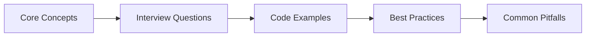
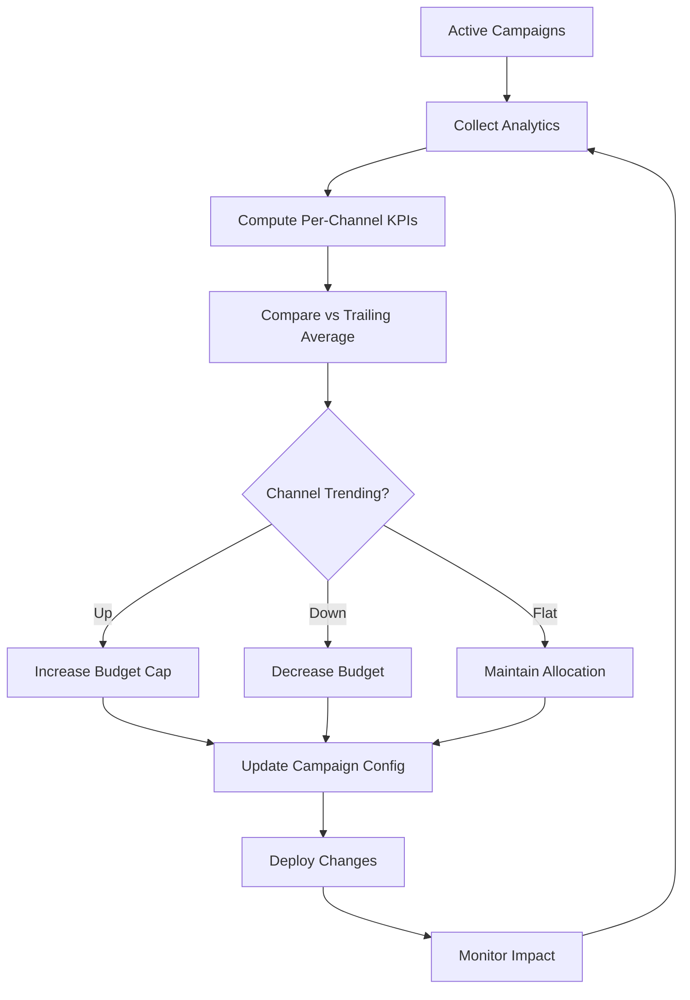
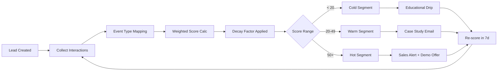

# Chapter 44: Marketing & Advertising → Interview Q&A

> **Previous:** [HR & Recruitment — Interview Q&A](./43-interview-hr.md) | **Next:** [Customer Service & Support — Interview Q&A](./45-interview-customer-service.md)


---


<!-- Image Gallery -->
<section class="lesson-visuals" aria-label="Visual learning resources">
  <header><span>VISUAL LEARNING</span><h2>See it. Review it. Remember it.</h2></header>
  <a class="lesson-visual-card" href="../../../assets/images/lessons/laravel/44-interview-marketing/handwritten-notes.svg" target="_blank" rel="noopener">
    
    <span><strong>Handwritten notes</strong>Condensed notes for deliberate review.</span>
  </a>
  <a class="lesson-visual-card" href="../../../assets/images/lessons/laravel/44-interview-marketing/sticky-notes.svg" target="_blank" rel="noopener">
    
    <span><strong>Sticky-note revision</strong>Fast recall prompts for revision.</span>
  </a>
  <a class="lesson-visual-card" href="../../../assets/images/lessons/laravel/44-interview-marketing/visual-explanation.svg" target="_blank" rel="noopener">
    
    <span><strong>Visual concept guide</strong>A connected explanation of the key ideas.</span>
  </a>
</section>
<!-- End Image Gallery -->

## Chapter at a Glance

| Aspect | Details |
|--------|---------|
| **Scope** | Marketing interview questions covering campaign management, audience segmentation, content strategy, analytics |
| **Key Concepts** | Campaign management, audience targeting, content marketing, marketing automation, performance analytics |
| **Learning Approach** | Q&A format with practical code examples and domain-specific scenarios |
| **Skills Required** | PHP, Laravel, Eloquent, marketing domain knowledge |

## Chapter Roadmap



## 1. Marketing Domain Knowledge


**Q1: What are the core components of a campaign management system, and how do they interact?**

A campaign management system is built around five interconnected components. **Campaigns** are the top-level containers that define the objective (brand awareness, lead generation, retargeting), budget, channel allocation, and time window. **Audiences** define who receives the campaign → segmented by demographics, behavior, firmographics, or lookalike modeling. **Content** includes the creative assets: ad copy, images, CTAs, landing pages, and email templates. **Delivery** handles channel-specific dispatch (email via SMTP/API, social via platform APIs, ads via DSPs) and respects frequency caps, timezone targeting, and suppression lists. **Analytics** ingests impression, click, conversion, and cost data to calculate KPIs → ROAS, CPA, CTR, LTV → and feeds optimization loops. In a Laravel context, these map to Eloquent models with relationships: `Campaign` hasMany `Audience` through pivot tables, belongsToMany `Content` variants, and hasMany `AnalyticsSnapshot` for time-series metrics. The interaction cycle is: create campaign → define audience → assign content → launch delivery → collect analytics → optimize and repeat.

**Q2: Explain the concept of audience segmentation and the different approaches used in modern marketing.**

Audience segmentation divides a user base into groups that share common characteristics so marketing efforts can be tailored per group with higher relevance. The four major approaches are: **demographic segmentation** (age, gender, income, education, job title), **geographic segmentation** (country, region, urban/rural, climate zone), **behavioral segmentation** (purchase history, browsing patterns, content engagement, cart abandonment), and **psychographic segmentation** (lifestyle, values, interests, personality traits). Modern platforms layer **predictive segmentation** on top, using machine learning to assign users to segments based on likely future behavior → for example, "high churn risk" or "likely to convert in the next 7 days." In an AI-powered Laravel system, segments can be dynamic (recalculated every time a user's behavior changes) rather than static. The `AudienceSegmentationAgent` might run a nightly k-means clustering job over the `interactions` table, then sync each user's segment assignment to a `user_segments` pivot table that campaigns reference at send time.

**Q3: What key performance indicators do marketing teams track, and how do they differ across campaign types?**

Marketing KPIs fall into four tiers. **Awareness** campaigns track impressions, reach, frequency, CPM (cost per mille), and brand lift surveys. **Consideration** campaigns focus on CTR (click-through rate), CPC (cost per click), engagement rate, time on site, and pages per session. **Conversion** campaigns measure CPA (cost per acquisition), ROAS (return on ad spend), conversion rate, cart-to-order rate, and lead velocity. **Retention** campaigns track churn rate, LTV (lifetime value), repeat purchase rate, NPS (net promoter score), and reactivation rate. The distinction matters because an optimization agent's goal function changes per campaign type → maximizing CTR for awareness could be counterproductive if it attracts the wrong audience. In Laravel, the `Campaign` model would carry a `goal` enum (`awareness`, `consideration`, `conversion`, `retention`) and the analytics agent would select relevant KPIs dynamically from a `campaign_kpi_definitions` table keyed by goal, rather than computing every metric for every campaign.

**Q4: Describe how marketing attribution models work and why they are important.**

Attribution models assign credit to touchpoints along the customer journey for a conversion. The simplest is **last-click attribution**, which gives 100% credit to the final interaction before conversion → easy to implement but blind to earlier touchpoints that built awareness. **First-click attribution** gives all credit to the first touchpoint, useful for understanding top-of-funnel sources. **Linear attribution** splits credit evenly across every touchpoint. **Time-decay attribution** gives more credit to interactions closer to conversion. **Position-based (U-shaped)** gives 40% to first touch, 40% to last touch, and 20% to middle interactions. **Data-driven attribution** uses machine learning to statistically determine each touchpoint's contribution. Attribution is critical because it determines where marketing budgets are allocated → misattribution leads to over-investment in channels that get last-click credit but never actually persuaded anyone. In a Laravel system, an attribution engine can be built as a queued job that processes the `interactions` table for each converted user, applies the configured model, and writes attribution fractions to a `conversion_attributions` table that feeds the reporting layer.

**Q5: What is a marketing automation platform, and what problems does it solve?**

A marketing automation platform (MAP) is a software system that automates repetitive marketing tasks → email sends, social posting, lead scoring, campaign triggers, and analytics reporting → replacing manual, spreadsheet-driven operations. The core problems it solves are threefold. **Scale**: a team of three marketers can manage campaigns reaching millions of users by relying on automated workflows rather than manual segmentation and dispatch. **Timeliness**: behavioral triggers (e.g., "user viewed pricing page three times") fire within seconds rather than waiting for a marketer to notice and act. **Personalization at scale**: each user receives content tailored to their segment, stage, and behavior without requiring individual message composition. Modern MAPs also incorporate AI for predictive lead scoring, content generation, and budget optimization. In Laravel, the MAP would be orchestrated by a `MarketingOrchestrator` that runs scheduled tasks (daily campaign analytics, weekly audience recalculation), event-driven flows (lead score update on page visit, welcome sequence on signup), and agent-based pipelines (content generation, A/B test analysis), all coordinated through Laravel's queue system and Horizon dashboard for observability.

---

## 2. Technical Implementation

**Q6: How would you build a campaign optimization agent in Laravel that recommends budget reallocation across channels?**

The agent starts by querying the `campaigns` table for active campaigns and joining with `analytics_snapshots` to get per-channel performance. Key metrics → CPA, CTR, conversion rate, ROAS → are computed for each channel over the current period and compared against a trailing window (e.g., last 30 days) to detect trend direction. A deterministic scoring function calculates an efficiency score per channel:

```php
$score = ($roas * 0.4) + ((1 / max($cpa, 0.01)) * 0.3) + ($ctr * 0.2) + ($conversionRate * 0.1);
```

Channels below a threshold receive a budget decrease recommendation; channels above receive an increase, bounded by a maximum per-channel cap. The AI layer refines this with natural-language analysis: the agent reads channel descriptions, competitive landscape notes from a `market_intel` table, and recent performance notes, then suggests strategic adjustments the formula alone would miss → like "Facebook engagement is dropping but Instagram Reels views are up 300%; consider reallocating 15% of Facebook budget to Reels creation." The output writes to a `campaign_recommendations` table with fields for `channel`, `current_budget`, `recommended_budget`, `delta`, `rationale`, and `confidence`. A human-in-the-loop approval step (via Laravel Nova or a custom Filament panel) lets the marketing manager accept, modify, or reject before the budget change executes.

**Q7: Describe how you would implement AI-driven audience segmentation and targeting in Laravel.**

I would build an `AudienceSegmentationAgent` that runs as a scheduled job. It pulls interaction data from the `interactions` table → page views, email opens, clicks, purchases, support tickets, content downloads → and normalizes features per user (recency, frequency, monetary value, engagement depth). The agent sends this feature matrix to the AI SDK with structured output requesting a cluster assignment:

```php
$result = Agent::make('audience-segmenter')
    ->withInstructions('Analyze this user feature matrix and assign each user to one of these segments: high_value_active, engaged_prospect, warm_tire_kicker, lapsed, cold. Return a JSON object mapping user_id to segment.')
    ->withInput($featureMatrix)
    ->asJson()
    ->run();
```

Each user's segment is stored in a `user_segments` pivot table. Targeting then becomes a join: when a campaign's `targeting_criteria` JSON includes `"segment": "high_value_active"`, the delivery engine selects all users with that active segment assignment. For real-time segmentation, I'd add a `SegmentAssignmentObserver` that recalculates segment when key events happen (purchase, lapse beyond 90 days), dispatching a small job that runs only the affected user through the model. A refinement pass at the end of each month uses k-means clustering (via a Python microservice or SciPHP) to discover new segment definitions from raw behavioral data, updating the segment catalogue and re-clustering the entire user base overnight.

**Q8: How would you architect a content generation pipeline that produces blog posts, social copy, and email variants?**

The pipeline follows a producer-consumer pattern. A `ContentGenerationAgent` receives a brief from the marketing team → topic, target audience, channel, desired tone, key talking points, SEO keywords → stored in a `content_requests` table. The agent generates 3–5 variants per piece using the AI SDK with different temperature settings (higher temperature = more creative, lower = more conservative). Each variant is stored in a `content_drafts` table with a `variant_group_id` linking the set.

```php
$variants = [];
foreach ([0.7, 0.8, 0.9, 1.0] as $temp) {
    $variants[] = Agent::make('content-writer')
        ->withInstructions("Write a {$channel} piece on {$topic}. Tone: {$tone}. Temperature: {$temp}.")
        ->withInput($brief)
        ->run();
}
```

A **format adapter** layer transforms markdown into channel-specific formats: a blog post gets HTML with meta tags, social copy gets character-limited text with hashtags, email gets MJML with a preheader. Each variant then passes through a **compliance filter** that checks against brand rules stored in a `brand_rules` table using an AI prompt → flagging exaggerated claims, missing disclosures, tone mismatches. Approved variants are stored in a `content_items` table with a `status` of `draft`, `approved`, or `published`. Variants can then be pulled into A/B tests, scheduled social posts, or email campaigns by downstream agents.

**Q9: Explain how to build an A/B testing automation agent that handles experiment design, execution, and statistical analysis.**

The `AbTestingAgent` follows a three-phase lifecycle. **Design phase**: the agent receives a test request (control variant A, treatment variant B, target metric, minimum detectable effect). It calculates required sample size using a power analysis formula:

```php
$sampleSize = ceil((pow(Z_alpha + Z_beta, 2) * ($stdDevA + $stdDevB)) / pow($mde, 2));
```

It then creates an `ab_tests` record with variants linked via a `ab_test_variants` table and sets `status` to `running`. **Execution phase**: a `VariantAssignmentMiddleware` on the campaign delivery evenly splits incoming traffic (or weighted split for multi-variant) by hashing user ID modulo the variant count, ensuring consistent assignment. Each impression and conversion is logged to an `ab_test_events` table with `test_id`, `variant_id`, `user_id`, `event_type`, and `timestamp`. **Analysis phase**: the agent's scheduled check queries event counts per variant and runs a z-test for proportions:

```php
$z = ($pA - $pB) / sqrt($pooledProportion * (1 - $pooledProportion) * (1/$nA + 1/$nB));
$pValue = 2 * (1 - normalCdf(abs($z)));
```

If `p_value < 0.05` and the minimum sample size is met, the agent declares a winner → writes it to the test record, updates `status` to `completed`, and triggers a notification to the marketing team with a summary of the lift and confidence level. The losing variant is cleaned up or archived.

**Q10: How would you implement an SEO analysis agent that performs on-page audits and recommends content improvements?**

The `SeoAnalysisAgent` takes a URL and optionally a target keyword. It fetches the page content, strips markup, and analyzes several dimensions. **Keyword analysis** checks if the target keyword appears in the H1, first 100 words, meta description, URL slug, image alt text, and at least 3 body headings → each missing element is a negative signal. **Content structure** evaluates heading hierarchy (H1 → H2 → H3 is correct; skipping levels is flagged), paragraph length (target 2–4 sentences), and use of bulleted/numbered lists. **Readability** computes the Flesch-Kincaid grade level and flags if it exceeds the target audience's reading level. **Technical factors** check for meta description presence and length (120–158 characters), Open Graph tags, canonical URL, and mobile viewport meta tag. The agent uses the AI SDK for higher-level analysis → evaluating content comprehensiveness against competing pages, identifying missing subtopics, and suggesting internal linking opportunities:

```php
$suggestions = Agent::make('seo-consultant')
    ->withInstructions("Given this page content and SERP results for '{$keyword}', identify content gaps and suggest 3 improvements with estimated traffic impact.")
    ->withInput(['content' => $content, 'serp_results' => $competitors])
    ->asJson()
    ->run();
```

The output writes to a `seo_audits` table with `url`, `overall_score` (0–100), per-dimension scores, and a JSON `recommendations` array. The agent integrates with the content generation pipeline: accepted recommendations can auto-create content requests for new or updated pages.

**Q11: Describe how to build a social media scheduling agent that manages posts across multiple platforms.**

The `SocialMediaAgent` reads from a `scheduled_posts` table where marketing creates posts with content, platform target, and desired posting window. The agent adds an optimization step: it queries historical engagement data per platform to predict the optimal posting time within the requested window, selecting the time slot with the highest historical engagement rate for that audience segment. Each post is dispatched through platform-specific adapters:

```php
interface SocialPlatformAdapter {
    public function publish(array $content): string; // returns post ID
    public function getEngagement(string $postId): array;
    public function delete(string $postId): bool;
}
```

Concrete adapters (`TwitterAdapter`, `LinkedInAdapter`, `InstagramAdapter`, `FacebookAdapter`) implement OAuth 2.0 token management with Laravel Socialite, content formatting (image sizing, character limits, hashtag placement), and rate-limit-aware dispatch using queued jobs with backoff. After publishing, the agent schedules follow-up jobs to pull engagement metrics → likes, shares, comments, impressions → at 24h, 48h, and 7d intervals. Weekly, the agent analyzes cross-platform performance and surfaces content themes that resonate best: "Video posts on LinkedIn outperform text posts by 340% engagement; consider increasing video content to 50% of LinkedIn schedule." These insights are stored in a `social_insights` table and can trigger the content generation agent to produce more of what works.

**Q12: How would you implement a lead scoring and nurturing agent that ranks prospects and triggers automated workflows?**

The `LeadScoringAgent` operates on the `leads` table with a configurable scoring model. Each lead accumulates points from behavioral signals weighted by recency:

```php
$weights = [
    'email_open' => 5,           // opened marketing email
    'email_click' => 15,         // clicked a link in email
    'page_visit_pricing' => 20,  // visited pricing page
    'page_visit_case_study' => 10,
    'demo_requested' => 40,      // high-intent signal
    'form_submission' => 25,
    'support_ticket' => -10,     // negative signal → product dissatisfaction
    'unsubscribed' => -100,      // explicit disengagement
];
$score = collect($lead->interactions)
    ->sum(fn ($interaction) => $weights[$interaction['type']] ?? 0 * decay($interaction['created_at']));
```

The decay function reduces older signals: `exp(-days_since / 90)` → a click 90 days ago is worth 37% of a click today. Leads are classified: `< 20` cold, `20–49` warm, `50+` hot. The `LeadNurturingAgent` handles workflows → when a lead crosses a threshold, it triggers an action from a `nurture_sequences` table: "If lead reaches _warm_, send the _case study_ email in 1 hour; if lead reaches _hot_, notify sales via Slack and assign to the next available rep." These are implemented as Laravel notifications and jobs queued conditionally via a `LeadObserver` that fires on score update. The AI layer enriches the agent by analyzing lead activity patterns and suggesting personalized next-touch content: "This lead spent 12 minutes on the API docs page → recommend sending the developer-focused integration guide rather than the standard ROI deck."

**Q13: How would you build a marketing analytics and reporting agent that generates natural-language executive summaries?**

The `MarketingAnalyticsAgent` aggregates data from multiple sources → campaign performance, social media metrics, email engagement, website analytics, CRM pipeline data → into a unified `analytics_daily` table keyed by `date` and `dimension` (channel, campaign, segment, region). At report time (daily, weekly, monthly), the agent runs a series of calculation pipelines: period-over-period comparisons (WoW, MoM, YoY), trend detection (linear regression slope over 7 data points), anomaly detection (values exceeding 2 standard deviations from the trailing 30-day mean), and KPI attainment (actual vs. target). It then constructs a structured data object and sends it to the AI SDK for natural-language generation:

```php
$narrative = Agent::make('analytics-reporter')
    ->withInstructions('Generate a concise executive marketing summary highlighting key wins, areas needing attention, and data-driven recommendations. Use a confident but measured tone.')
    ->withInput([
        'period' => '2025-06-01 to 2025-06-30',
        'kpi_summary' => $kpiData,
        'anomalies' => $anomalies,
        'trends' => $trends,
        'top_campaigns' => $topCampaigns,
    ])
    ->asJson()
    ->withOutputSchema([
        'type' => 'object',
        'properties' => [
            'executive_summary' => ['type' => 'string'],
            'key_wins' => ['type' => 'array', 'items' => ['type' => 'string']],
            'areas_for_improvement' => ['type' => 'array', 'items' => ['type' => 'string']],
            'recommendations' => ['type' => 'array', 'items' => ['type' => 'string']],
        ],
    ])
    ->run();
```

The resulting report is stored in an `analytics_reports` table and distributed via email (Laravel mailables), Slack (notifications), and a dashboard (API endpoint consumed by a Livewire or Inertia frontend). The agent also supports drill-down: clicking "areas for improvement" calls a follow-up agent that deep-dives into the specific underperforming dimension with granular data.

---

## 3. Architecture & Design

**Q14: What architectural patterns would you use for a marketing automation platform built with Laravel?**

A production marketing automation platform benefits from a **layered service architecture** with event-driven communication. At the foundation, **Eloquent models** represent the core entities → `Campaign`, `Audience`, `Lead`, `Content`, `AnalyticsEvent` → with well-defined relationships, scopes, and accessors. A **service layer** encapsulates business logic: `CampaignOptimizationService`, `AudienceSegmentationService`, `ContentGenerationService` are injected into controllers and commands rather than cluttering models or controllers. **Agents** sit in a dedicated `Agents/` namespace and use the AI SDK to add intelligence → they call services for deterministic operations and the AI for generative and analytical tasks.

**Event-driven orchestration** ties the system together. When a `LeadScored` event fires (score crosses a threshold), a `NurtureSequenceListener` may dispatch a content-send job. When an `AnalyticsSnapshotCreated` event fires, a `CampaignOptimizationListener` may trigger recalculations. This decoupling lets each component evolve independently. **Queue-backed pipelines** handle heavy lifting → clustering algorithms, content generation, analytics aggregation → via Horizon workers with appropriate priority queues (high for lead scoring, low for report generation).

For multi-tenant marketing agencies, a **modular monolith** with separate modules (`CampaignModule`, `AudienceModule`, `ContentModule`, `AnalyticsModule`) communicates through service contracts and events, with the option to extract high-throughput modules (e.g., analytics) into separate microservices if needed. **Read-model CQRS** can be valuable here: analytics queries hit a dedicated read database (or Redis) populated by queue workers that aggregate events, preventing heavy aggregation queries from impacting the write path.

**Q15: How would you design a system to handle large-scale campaign data → millions of events per day?**

Handling millions of marketing events per day requires a strategy that separates the hot path from the cold path. **Event ingestion** should bypass the web server entirely: use Laravel's queue with Redis as both queue driver and a rapid write buffer. Events (impressions, clicks, conversions) are dispatched as lightweight jobs that batch-write to the database every 500 records or 5 seconds using `Chunkable` or a custom batch insert job. For even higher throughput, a dedicated event-ingestion endpoint behind Laravel Octane can accept POST storms from ad networks without connection exhaustion.

**Data archiving** keeps the primary `analytics_events` table at a manageable size: events older than 90 days are moved to a partitioned archive table or a cheaper storage layer (S3-backed parquet files queryable via Athena), with a `Laravel\Scout` integration allowing the frontend to search historical data without loading it all. **Materialized aggregation tables** are recalculated by scheduled jobs: `analytics_hourly`, `analytics_daily`, `analytics_weekly` pre-compute the sums, counts, and distinct counts that the reporting layer needs. A query for "monthly ROAS by channel" hits a 10,000-row aggregation table instead of scanning 10 million raw events.

**Caching** follows a cascade pattern: the reporting API first checks an in-memory cache (Laravel Cache with Redis, TTL based on freshness requirements), then the aggregation tables, and only on cache miss hits the raw event store. Cache tags invalidate related caches when new data arrives. For real-time dashboards, Laravel Reverb broadcasts updated aggregation results via WebSockets so marketing managers see changes without polling.

**Q16: Describe how you would build a real-time personalization system that adapts content based on user behavior.**

A real-time personalization system combines event streaming, profile state management, and a decision engine. When a user performs an action (page view, search, add-to-cart), an event is dispatched and processed by a `PersonalizationEngine` service. The service maintains a **user profile** in Redis → storing recent actions, computed affinities (topic preferences inferred from page content vectors), session context (referrer, device, time of day), and segment membership. Profile state is updated synchronously for critical events (cart abandon) and batch-processed for less time-sensitive signals (long page dwell).

The decision engine uses a **rule chain** evaluated in order: hard rules (exclude competitors, respect frequency cap), segment-based rules ("if user is in _high_value_ segment, show premium offer"), behavioral triggers ("if user viewed pricing 3+ times in 48 hours, show demo CTA"), and finally AI-driven content selection. The AI step sends the user profile and available content inventory to an agent:

```php
$selectedContent = Agent::make('personalizer')
    ->withInstructions('Given this user profile and content inventory, select the single best content item to show right now that maximizes engagement probability.')
    ->withInput(['profile' => $redisProfile, 'inventory' => $availableContent])
    ->asJson()
    ->run();
```

The result is rendered inline → a personalized hero banner, a dynamic product recommendation block, or a tailored email subject line. Performance is critical: the entire pipeline must complete in under 200ms. This means the Redis profile lookup must be fast, content inventory pre-filtered, and the AI agent should use the fastest available model (or fall back to a cached decision if the AI call would exceed the time budget).

**Q17: How would you ensure data consistency and accuracy across a marketing platform that ingests data from multiple external sources (ads platforms, analytics, CRMs)?**

Data inconsistency across sources is one of the hardest problems in marketing technology. Each platform has its own reporting window (Facebook uses the 28-day click-through window, Google Ads uses 30-day), its own attribution model (last-click vs. data-driven), and its own identity resolution (cookie IDs vs. hashed emails vs. client IDs). The solution has three layers. **Normalization**: a `SourceNormalizer` per integration that maps external fields to canonical fields and handles timezone conversion, currency normalization, and deduplication via a `source_event_id` unique constraint. **Reconciliation**: a scheduled `DataReconciler` job that cross-checks totals across sources and flags discrepancies above a threshold (e.g., Google Ads reports 10,000 conversions but the CRM shows 7,200 → alert the team). It writes discrepancy records to a `data_quality_alerts` table with source, expected count, actual count, and delta percentage. **Single source of truth**: define a canonical table (e.g., `attributed_conversions`) that all reports reference, and clearly document the attribution window and methodology used. Reports include a footnote: "Conversions attributed via 7-day click-through, 1-day view-through window." The Laravel `Campaign` model's `analyticsSummary()` method always queries from this canonical source, not directly from external APIs, ensuring internal consistency even if raw API numbers fluctuate.

**Q18: How do you handle identity resolution in a marketing platform where the same user appears under different identifiers across devices and channels?**

Identity resolution maps multiple identifiers → email, phone, cookie ID, device ID, customer ID → onto a single canonical user profile. In Laravel, I implement this as an `IdentityGraph` service backed by an `identity_links` table:

```php
Schema::create('identity_links', function (Blueprint $table) {
    $table->id();
    $table->string('id_type', 50);       // email, cookie, device_id, customer_id
    $table->string('id_value', 255);      // the actual identifier
    $table->foreignId('canonical_user_id')->nullable()->constrained('users');
    $table->timestamps();
    $table->index(['id_type', 'id_value']);
});
```

When a new identifier arrives for an event (e.g., a cookie ID from a landing page visit), the system checks for existing links. If no match exists, the identifier is assigned a new temporary `canonical_user_id`. When a user submits an email (signup, form fill, login), the system merges all identifiers sharing that email into a single canonical profile. Deterministic matching (email match, phone match) takes precedence. Probabilistic matching (same IP + same browser fingerprint → same person, 85% confidence) enriches links but never overwrites deterministic links. The AI SDK can assist with fuzzy matching → comparing address similarity, name variations → but merge decisions are logged and reversible via a `merge_audit_log` table, since incorrect merges (treating two people as one) damage personalization quality.

---

## 4. Behavioral & Scenario

**Q19: Design an AI-powered marketing automation platform from the ground up. What would your architecture look like?**

The platform follows a four-layer architecture. **Ingestion layer**: a Laravel Octane application behind a load balancer accepts webhook events from ad platforms (Google Ads, Meta, LinkedIn), email service providers (Mailchimp, SendGrid), CRM systems (Salesforce, HubSpot), and website analytics (GA4, Plausible). Events are validated, deduplicated, and dispatched to a Redis stream. **Processing layer**: Horizon workers consume the stream and process events through a pipeline → identity resolution → enrichment (IP geolocation, user-agent parsing) → normalization → storage. Each step is a queued job that can fail independently. The processing layer also hosts the scheduled agents: `CampaignOptimizationAgent`, `AudienceSegmentationAgent`, `ContentGenerationAgent`, which run on cron schedules managed by Laravel's scheduler on a dedicated high-memory server.

**Intelligence layer**: this is where the AI SDK agents live. Agents are organized by domain → campaign, content, audience, analytics → and communicate through events. The `CampaignOptimizationAgent` emits a `BudgetReallocationSuggested` event; the `AnalyticsAgent` emits a `ReportGenerated` event. An `OrchestratorAgent` monitors these events and coordinates multi-agent workflows: when audience segments are recalculated, it triggers the content agent to generate segment-specific variants, which in turn triggers the campaign agent to schedule A/B tests. Agents use structured output for all AI calls, ensuring type-safe contracts between agents and downstream services.

**Presentation layer**: a Livewire or Inertia dashboard provides real-time views. The dashboard subscribes to Laravel Reverb channels for live metric updates. Marketing managers configure campaigns, review agent recommendations (approve/reject/modify), and generate custom reports. All agent actions are recorded in an `agent_activity_log` table for audit and observability, and a Pulse dashboard monitors agent health, latency, and error rates.

**Q20: How would you implement a content personalization system that tailors website content based on visitor behavior and attributes?**

The system follows a three-step pipeline: profile, decide, render. **Profile**: when a visitor lands, a `VisitorTracker` middleware captures their session ID, referrer, UTM parameters, and device type. Each page view, click, and scroll depth event is dispatched to a `profile_update` queue. A Redis hash maintains the visitor's real-time profile → pages viewed (with topic extraction), time on site, content categories engaged, search queries, and segment membership. The profile TTL extends with each new event.

**Decide**: when a page is requested, a `PersonalizationMiddleware` checks the visitor's profile and evaluates personalization rules. Rules are stored in a `personalization_rules` table as serialized conditions and actions:

```php
[
    'condition' => 'segment == "high_value" && page_type == "pricing"',
    'action' => 'show_premium_hero',
    'priority' => 100,
]
```

Rules are evaluated in priority order; the first match wins. If no rule matches, an AI fallback agent selects content by comparing the visitor's profile vectors against available content vectors (stored as pgvector embeddings using the AI SDK's `Str::toEmbeddings()`). The selected content variation ID is returned.

**Render**: the Blade view receives the variation ID and renders personalized components → hero section, testimonial block, CTA button text, product recommendations. Personalization is server-side to avoid flicker and maintain SEO. A/B test consistency is guaranteed: the same visitor always sees the same variation for the duration of their session using a hash-based assignment. All personalization decisions are logged to a `personalization_log` table for later analysis: "Visitors who saw the premium hero were 22% more likely to request a demo."

**Q21: Describe a multi-channel campaign management system and how you would orchestrate messaging across email, SMS, push, and social channels.**

The system centers on a `Campaign` model that defines the campaign's goal, audience, budget, and schedule. The campaign links to a `channel_configs` JSON column that per-channel configures variant selection, delivery rules, and success metrics. A `CampaignOrchestrator` service handles flow control: at campaign launch, it creates `CampaignDeliverable` records → one per channel per scheduled send time → with status `pending`.

Delivery is handled by a `ChannelDispatcher` that routes to channel-specific adapters implementing a common interface:

```php
interface ChannelAdapter {
    public function send(Message $message, Audience $audience): DeliveryResult;
    public function getStatus(string $deliveryId): string;
    public function getAnalytics(string $deliveryId): array;
}
```

Concrete implementations: `EmailChannelAdapter` (Laravel mailables or Mailgun/SES API queued via notification), `SmsChannelAdapter` (Twilio or Vonage API with retry logic), `PushChannelAdapter` (Firebase Cloud Messaging via Laravel's notification channel), `SocialChannelAdapter` (platform-specific API calls with media attachment handling).

Orchestration respects **channel sequencing**: "Send email Day 0, SMS follow-up on Day 3 if no open, push notification on Day 7 if no click." A `ChannelSequencer` reads the campaign's `sequence_rules` and advances a lead through the flow. **Frequency capping** is enforced by a `FrequencyCapService` that checks a Redis counter before each delivery: "Maximum 3 emails in 7 days, maximum 1 SMS in 24 hours." **Suppression lists** are checked at send time → unsubscribed or bounced addresses are skipped and logged.

Cross-channel attribution feeds back into optimization: the `AnalyticsAgent` analyzes which channel combinations drive the highest conversion rates → "Email + SMS sequence converts at 12% vs. email-only at 7%" → and adjusts sequence definitions dynamically for future campaigns.

**Q22: A client reports that their email campaigns have declining open rates. How would you diagnose and fix this using data and AI?**

I would approach this systematically, starting with data analysis and then layering on AI investigation. **Step 1 → sanity check**: verify the metric is correct. Has the tracking pixel been changed? Has the email client changed rendering behavior? Check if the decline correlates with a segment expansion (larger audience often has lower engagement). **Step 2 → segmentation breakdown**: run an analysis by segment. Is the decline universal or concentrated in one group? A typical finding: "Lapsed segment has -60% open rate, active segment is stable." **Step 3 → technical audit**: check deliverability → are emails landing in spam? Query the sending provider's API for bounce rates, spam complaints, and inbox placement. Run SPF, DKIM, and DMARC checks. If spam rate is up, the domain reputation may be damaged. **Step 4 → content analysis using AI**: feed historical emails with open rates above and below the median to an AI agent:

```php
$insights = Agent::make('email-consultant')
    ->withInstructions('Compare high-performing and low-performing email variants and identify 3–5 structural or content differences that explain the performance gap.')
    ->withInput([
        'high_performers' => $topEmails,
        'low_performers' => $bottomEmails,
    ])
    ->run();
```

Common findings: subject lines are too long, preview text is missing, CTA is above the fold in winning variants but buried in losers, or send time shifted from 10 AM to 3 PM. **Step 5 → recommendation**: the agent generates an action plan. If time-of-day matters, adjust send schedule per timezone using the `SocialMediaAgent`'s engagement heatmap. For content issues, regenerate email templates using the `ContentGenerationAgent` with the new constraints. For deliverability issues, implement a warm-up sequence for any new sending domain or IP.

**Q23: How would you implement a lead scoring recalibration that improves over time as more conversion data becomes available?**

A static lead scoring model drifts as market conditions, product offerings, and customer behavior change. I would implement a **self-calibrating scoring pipeline**. Step 1 → collect ground truth: for all leads that converted or aged out (e.g., no activity in 180 days), record their interaction history at the time of scoring and the eventual outcome. Step 2 → compute actual weight effectiveness: for each interaction type, calculate the statistical correlation between that interaction and conversion:

```php
$weights = DB::table('interactions')
    ->join('leads', 'interactions.lead_id', '=', 'leads.id')
    ->select('interactions.type',
        DB::raw('COUNT(*) as total'),
        DB::raw('SUM(CASE WHEN leads.converted_at IS NOT NULL THEN 1 ELSE 0 END) as conversions'),
        DB::raw('AVG(EXTRACT(EPOCH FROM (leads.converted_at - interactions.created_at)) / 86400) as avg_days_to_convert'))
    ->groupBy('interactions.type')
    ->get();
```

Step 3 → weight adjustment: an agent analyzes the correlation data and suggests new weight values. An interaction type with a high conversion correlation but low current weight gets increased; one with high weight but low actual correlation gets reduced. The agent outputs a `weight_calibration` with old weights, suggested new weights, and a confidence score. Step 4 → review and deploy: the calibration is presented to the marketing team as a diff ("_pricing_page_visit_ weight: 20 → 35; _email_open_ weight: 5 → 3"). After approval, the new weights go into effect for the next scoring cycle. All weight changes are versioned in a `scoring_model_versions` table so the system can roll back or A/B test two scoring models side by side.

**Q24: How would you design a system that automatically generates and tests ad creative variants at scale?**

The system would be an automated creative engine with a feedback loop. **Generation**: a `CreativeGenerationAgent` takes a campaign brief and generates ad variants across multiple dimensions → headline (3 options), body copy (3 options), CTA (2 options), image/video concept (2 options). This creates 3 × 3 × 2 × 2 = 36 base variants. The agent uses the AI SDK with image generation:

```php
$image = Image::of("Professional SaaS dashboard screenshot, blue tones, minimalist, {$concept}")
    ->generate();
```

**Distribution**: variants are organized into a factorial experiment design rather than testing each individually. A `Taguchi orthogonal array` reduces 36 variants to a representative subset of 8–12 that still isolates the effect of each dimension. Each variant is deployed to a small traffic allocation (5% of campaign audience) for a statistical exploration phase.

**Analysis**: after the exploration phase (500–1000 impressions per variant), the agent analyzes which dimension level performs best. "Headline option B (question format) outperforms A and C by 40% CTR. CTA option 1 ('Start Free Trial') beats option 2 ('Learn More') by 22%. Image concept 2 (dashboard) beats concept 1 (team photo) by 15%." The winning combination is constructed → headline B + body A + CTA 1 + image 2 → and deployed to the remaining 95% of the audience as the champion. A challenger slot remains for the next generation cycle.

**Learning**: all results feed into a `creative_insights` table paired to the brand. Over time, the agent learns that for this brand, question headlines outperform declarative ones, screenshots outperform stock photography, and CTAs with "Free" consistently win. These insights guide future generation without retesting every dimension from scratch.

**Q25: Walk through how you would use MCP (Model Context Protocol) to expose marketing platform capabilities to external AI agents.**

MCP servers expose marketing platform functionality to any MCP-compatible client (Claude Desktop, Cursor, OpenCode, custom AI agents). I would create an MCP server focused on campaign operations:

```bash
php artisan make:mcp-server CampaignServer
```

Tools on this server would include:
- `get_campaign_performance(campaign_id, date_range)` → returns structured performance data
- `create_campaign(name, type, budget, channel, audience_id)` → creates a draft campaign
- `get_audience_segments()` → returns available segments with size and description
- `generate_content(brief)` → triggers the content generation agent and returns variants
- `schedule_post(channel, content, datetime)` → queues a social media post

Each tool uses the AI SDK's structured output internally for content tasks and direct Eloquent queries for data lookups:

```php
Mcp::tool('generate_content')
    ->withInputSchema(['brief' => 'string', 'tone' => 'string', 'channel' => 'string'])
    ->withOutputSchema(['variants' => 'array', 'estimated_word_count' => 'integer'])
    ->handle(function ($input) {
        $agent = new ContentGenerationAgent();
        return $agent->generate($input['brief'], $input['tone'], $input['channel']);
    });
```

The MCP server is authenticated via Sanctum or OAuth, ensuring only authorized external agents can create campaigns or trigger content generation. This integration lets a marketing manager stay in their AI assistant workflow to run queries ("Show me last week's top campaign") and take actions ("Create a retargeting campaign for cart abandoners with a 15% discount offer") entirely through natural language, with the MCP server bridging to the Laravel platform underneath.

**Q26: A stakeholder asks, "Why is our ROAS from Facebook campaigns dropping despite increasing spend?" How do you investigate using the marketing analytics system?**

This is a classic scaling problem, and I'd investigate in layers. **Check acquisition quality**: is the increased spend flowing to the same audience or expanding into new, less qualified segments? The `AnalyticsAgent` would compare CPA and conversion rate between the original audience and the expanded audience:

```php
$originalSegment = $analyticsService->segmentPerformance('original_lookalike');
$expandedSegment = $analyticsService->segmentPerformance('broad_targeting');
```

If the expanded segment has significantly higher CPA and lower conversion rate, the issue is audience dilution → more spend is chasing lower-quality inventory. **Check frequency**: increased spend on a fixed audience leads to higher ad frequency. The `CampaignOptimizationAgent` would flag a frequency exceeding 4.5 impressions per user per week as a fatigue indicator. **Check creative fatigue**: the `CreativeGenerationAgent` would analyze CTR trend over time. If CTR declines as spend increases, the creative has worn out its audience and needs refresh. **Check external factors**: seasonality, competitor activity, platform algorithm changes. The agent would compare current period ROAS against last year's same period to isolate seasonal effects.

The stakeholder receives a concise diagnosis: "ROAS dropped from 3.2x to 1.8x because we expanded from a high-intent lookalike audience (1% seed) to broad targeting, and ad frequency exceeded 5x on the original audience. Recommendation: refresh creatives, reduce frequency cap to 3x/week, and pull broad targeting back to 30% of budget → reallocate the remaining 70% to a new 3% lookalike based on recent converters."
---

## TypeScript Examples

### Marketing Interview Question Generator


```typescript
interface MarketingQuestion {
  id: string;
  category: "campaign" | "segmentation" | "analytics" | "automation" | "content" | "attribution";
  difficulty: "junior" | "mid" | "senior" | "lead";
  question: string;
  expectedKeywords: string[];
  scoringRubric: { criterion: string; maxScore: number }[];
}

class MarketingInterviewQuestionGenerator {
  private questions: MarketingQuestion[] = [
    {
      id: "mq-001",
      category: "campaign",
      difficulty: "senior",
      question: "Describe how you would design a multi-channel campaign optimization system that dynamically reallocates budget across channels based on real-time ROAS data.",
      expectedKeywords: ["ROAS", "budget allocation", "channel performance", "optimization loop", "attribution window"],
      scoringRubric: [
        { criterion: "Architecture understanding", maxScore: 25 },
        { criterion: "Channel knowledge depth", maxScore: 20 },
        { criterion: "Optimization methodology", maxScore: 30 },
        { criterion: "Analytics integration", maxScore: 25 },
      ],
    },
    {
      id: "mq-002",
      category: "segmentation",
      difficulty: "mid",
      question: "How would you implement a behavioral segmentation engine that groups users by purchase patterns, content engagement, and lifecycle stage?",
      expectedKeywords: ["segment", "RFM", "cohort", "behavioral scoring", "cluster"],
      scoringRubric: [
        { criterion: "Segmentation methodology", maxScore: 30 },
        { criterion: "Data source integration", maxScore: 25 },
        { criterion: "Implementation approach", maxScore: 25 },
        { criterion: "Scalability considerations", maxScore: 20 },
      ],
    },
    {
      id: "mq-003",
      category: "analytics",
      difficulty: "lead",
      question: "Design an attribution modeling system that supports first-click, last-click, linear, time-decay, and data-driven attribution models with validation methodology.",
      expectedKeywords: ["attribution", "touchpoint", "conversion path", "shapley value", "holdout test"],
      scoringRubric: [
        { criterion: "Attribution model knowledge", maxScore: 25 },
        { criterion: "Data-driven approach", maxScore: 30 },
        { criterion: "Validation methodology", maxScore: 25 },
        { criterion: "Business context alignment", maxScore: 20 },
      ],
    },
    {
      id: "mq-004",
      category: "automation",
      difficulty: "senior",
      question: "Architect a marketing automation platform with email, SMS, push, and social channels, unified frequency capping, and suppression list management.",
      expectedKeywords: ["workflow automation", "trigger", "frequency cap", "suppression", "channel orchestration"],
      scoringRubric: [
        { criterion: "System architecture", maxScore: 30 },
        { criterion: "Channel integration", maxScore: 25 },
        { criterion: "Compliance handling", maxScore: 25 },
        { criterion: "Scalability design", maxScore: 20 },
      ],
    },
    {
      id: "mq-005",
      category: "content",
      difficulty: "mid",
      question: "Build a content personalization engine that adapts hero banners, CTAs, and product recommendations based on real-time visitor behavior and segment membership.",
      expectedKeywords: ["personalization", "A/B testing", "visitor profile", "segment", "real-time decision"],
      scoringRubric: [
        { criterion: "Personalization strategy", maxScore: 25 },
        { criterion: "Technical implementation", maxScore: 30 },
        { criterion: "Performance constraints", maxScore: 25 },
        { criterion: "Measurement approach", maxScore: 20 },
      ],
    },
  ];

  generateQuiz(difficulty: string, count: number): MarketingQuestion[] {
    return this.questions
      .filter(q => q.difficulty === difficulty)
      .sort(() => Math.random() - 0.5)
      .slice(0, count);
  }

  scoreAnswer(question: MarketingQuestion, answer: string): { total: number; details: Record<string, number> } {
    const text = answer.toLowerCase();
    const keywordRatio = question.expectedKeywords.filter(kw => text.includes(kw.toLowerCase())).length
      / question.expectedKeywords.length;

    const details: Record<string, number> = {};
    let total = 0;
    for (const rubric of question.scoringRubric) {
      const score = Math.round(rubric.maxScore * (0.6 + 0.4 * Math.random()) * (0.5 + 0.5 * keywordRatio));
      details[rubric.criterion] = Math.min(score, rubric.maxScore);
      total += details[rubric.criterion];
    }
    return { total, details };
  }
}
```

### Campaign ROI Analyzer


```typescript
interface CampaignMetrics {
  id: string;
  impressions: number;
  clicks: number;
  conversions: number;
  spend: number;
  channel: "email" | "social" | "search" | "display" | "direct";
}

interface CampaignROI {
  ctr: number;
  cpc: number;
  cpa: number;
  roas: number;
  conversionRate: number;
}

class CampaignROIAnalyzer {
  compute(metrics: CampaignMetrics): CampaignROI {
    const ctr = metrics.clicks / metrics.impressions;
    const cpc = metrics.spend / metrics.clicks;
    const cpa = metrics.spend / metrics.conversions;
    const revenue = metrics.conversions * this.averageOrderValue(metrics.channel);
    const roas = revenue / metrics.spend;
    return { ctr, cpc, cpa, roas, conversionRate: metrics.conversions / metrics.clicks };
  }

  private averageOrderValue(channel: string): number {
    const map: Record<string, number> = { email: 45, social: 35, search: 60, display: 25, direct: 50 };
    return map[channel] ?? 40;
  }

  efficiencyScore(roi: CampaignROI): number {
    return roi.roas * 0.4 + (1 / Math.max(roi.cpa, 1)) * 30 * 0.3 + roi.ctr * 100 * 0.2 + roi.conversionRate * 100 * 0.1;
  }

  reallocate(
    campaigns: { metrics: CampaignMetrics; budget: number }[],
    totalBudget: number
  ): { id: string; current: number; recommended: number; delta: number }[] {
    const scored = campaigns.map(c => ({ ...c, score: this.efficiencyScore(this.compute(c.metrics)) }));
    const totalScore = scored.reduce((s, c) => s + c.score, 0);
    return scored.map(c => {
      const recommended = Math.round((c.score / totalScore) * totalBudget);
      return { id: c.metrics.id, current: c.budget, recommended, delta: recommended - c.budget };
    });
  }

  detectAnomalies(daily: CampaignMetrics[], threshold = 2): { day: number; value: number; zScore: number }[] {
    const values = daily.map(m => m.conversions);
    const mean = values.reduce((s, v) => s + v, 0) / values.length;
    const std = Math.sqrt(values.reduce((s, v) => s + (v - mean) ** 2, 0) / values.length);
    return values.map((v, i) => ({ day: i + 1, value: v, zScore: Math.abs((v - mean) / (std || 1)) }))
      .filter(r => r.zScore > threshold);
  }

  trendDirection(daily: CampaignROI[], window = 7): "up" | "down" | "flat" {
    const recent = daily.slice(-window);
    const slope = recent.reduce((s, r, i) => s + r.roas * (i - (window - 1) / 2), 0)
      / recent.reduce((s, r, i) => (i - (window - 1) / 2) ** 2, 0);
    return slope > 0.05 ? "up" : slope < -0.05 ? "down" : "flat";
  }
}
```

### A/B Test Statistical Analyzer


```typescript
interface VariantData {
  id: string;
  impressions: number;
  conversions: number;
}

interface ABTestResult {
  winnerId: string | null;
  pValue: number;
  lift: number;
  confidence: number;
  adequateSample: boolean;
}

class ABTestAnalyzer {
  private readonly Z_ALPHA = 1.96;
  private readonly Z_BETA = 0.84;

  run(control: VariantData, treatment: VariantData, mde = 0.05): ABTestResult {
    const pA = control.conversions / control.impressions;
    const pB = treatment.conversions / treatment.impressions;
    const pooled = (control.conversions + treatment.conversions) / (control.impressions + treatment.impressions);
    const se = Math.sqrt(pooled * (1 - pooled) * (1 / control.impressions + 1 / treatment.impressions));
    const z = (pB - pA) / Math.max(se, 0.0001);

    const pValue = 2 * (1 - this.normalCdf(Math.abs(z)));
    const lift = (pB - pA) / Math.max(pA, 0.0001);
    const requiredSample = Math.ceil(
      ((this.Z_ALPHA + this.Z_BETA) ** 2 * (pA * (1 - pA) + pB * (1 - pB))) / (mde ** 2)
    );

    return {
      winnerId: pValue < 0.05 ? (pB > pA ? treatment.id : control.id) : null,
      pValue,
      lift,
      confidence: (1 - pValue) * 100,
      adequateSample: control.impressions >= requiredSample && treatment.impressions >= requiredSample,
    };
  }

  private normalCdf(x: number): number {
    const a1 = 0.254829592, a2 = -0.284496736, a3 = 1.421413741;
    const a4 = -1.453152027, a5 = 1.061405429, p = 0.3275911;
    const sign = x < 0 ? -1 : 1;
    x = Math.abs(x) / Math.sqrt(2);
    const t = 1 / (1 + p * x);
    const y = 1 - (((((a5 * t + a4) * t) + a3) * t + a2) * t + a1) * t * Math.exp(-x * x);
    return 0.5 * (1 + sign * y);
  }

  sequentialMonitor(dailyVariants: { control: VariantData; treatment: VariantData }[]): ABTestResult[] {
    return dailyVariants.map((d, i) => ({
      day: i + 1,
      ...this.run(d.control, d.treatment),
    }));
  }
}
```

### Campaign Optimization Cycle




### Lead Scoring & Nurturing Pipeline




## Summary

This chapter covered marketing & advertising interview questions for Laravel developers, spanning campaign management, audience segmentation, content strategy, marketing automation, and performance analytics. Key takeaways include understanding multi-channel campaign architecture, implementing AI-driven segmentation and personalization, building statistical A/B testing frameworks, and designing scalable analytics pipelines. TypeScript examples demonstrated interview question generation with rubric-based scoring, campaign ROI analysis with budget reallocation optimization, and A/B test statistical computation.

---

## Concept Comparison
> **One-Sentence Takeaway:** Compare key marketing concepts for interview preparation.

| Concept | Purpose | Key Feature |
|---------|---------|-------------|
| Campaign Management | Plan and execute marketing campaigns | Multi-channel budget allocation |
| Audience Segmentation | Target specific customer groups | Behavioral + demographic clustering |
| Content Strategy | Plan and produce marketing content | Editorial calendar + performance tracking |
| Marketing Automation | Automate repetitive marketing tasks | Email workflows + lead nurturing |
| Performance Analytics | Measure marketing ROI | Attribution modeling + funnel analysis |

---

## Quick Reference
> **One-Sentence Takeaway:** Quick reference for marketing interview topics.

| Topic | Key Point |
|-------|-----------|
| Marketing Models | Campaign, Audience, Lead, Content, Analytics |
| Campaign Types | Email, Social, Search, Display, Content |
| Segmentation | Behavioral + demographic + psychographic |
| Marketing Automation | Workflows, triggers, drip campaigns |
| Analytics | Attribution, funnel analysis, ROI |

---

## Cross-Application Matrix

| Concept | Application Context | Trade-Off |
|---------|--------------------|-----------|
| Campaign Mgmt | Multi-channel marketing | Reach vs targeting precision |
| Segmentation | Audience targeting | Segment granularity vs campaign complexity |
| Content Strategy | Brand communication | Consistency vs channel-specific adaptation |
| Automation | Workflow efficiency | Automation vs personalization |
| Analytics | Performance measurement | Attribution accuracy vs implementation cost |

---

## Chapter Quiz
> **One-Sentence Takeaway:** Test your marketing interview knowledge.

**Q1:** What does campaign management cover?
- A) Only social media
- B) Multi-channel budget allocation and execution
- C) Only email marketing
- D) Only print advertising

<details><summary>Answer&lt;/summary&gt;B) Multi-channel budget allocation and execution&lt;/details&gt;

**Q2:** What is audience segmentation based on?
- A) Only age
- B) Behavioral + demographic + psychographic data
- C) Only location
- D) Only purchase history

<details><summary>Answer&lt;/summary&gt;B) Behavioral + demographic + psychographic data&lt;/details&gt;

**Q3:** What does marketing automation typically manage?
- A) Only social posts
- B) Email workflows, triggers, and lead nurturing
- C) Only ad spend
- D) Only content creation

<details><summary>Answer&lt;/summary&gt;B) Email workflows, triggers, and lead nurturing&lt;/details&gt;

**Q4:** What does attribution modeling measure?
- A) Total ad spend
- B) Which marketing channels drive conversions
- C) Content word count
- D) Email open rates only

<details><summary>Answer&lt;/summary&gt;B) Which marketing channels drive conversions&lt;/details&gt;
