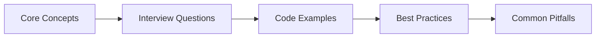

# Chapter 46: Real Estate & Property Interview Q&A

> **Previous:** [Customer Service & Support — Interview Q&A](./45-interview-customer-service.md) | **Next:** [Legal & Compliance Interview Q&A](./47-interview-legal.md)


---

**Part IX: Interview Preparation**

Common interview questions for Laravel developer roles in real estate technology (PropTech), property management SaaS, and real estate platform companies. Questions cover domain knowledge, technical implementation with AI agents, system architecture, and behavioral scenarios.

---


<!-- Image Gallery -->
<div style="display:flex;flex-wrap:wrap;gap:4px;margin:16px 0;padding:12px;background:#f8fafc;border-radius:8px;border:1px solid #e2e8f0;">
<a href="../../../assets/images/lessons/laravel/46-interview-real-estate/hero.svg" target="_blank" rel="noopener">
  
</a>
<a href="../../../assets/images/lessons/laravel/46-interview-real-estate/handwritten-notes.svg" target="_blank" rel="noopener">
  
</a>
<a href="../../../assets/images/lessons/laravel/46-interview-real-estate/sticky-notes.svg" target="_blank" rel="noopener">
  
</a>
<a href="../../../assets/images/lessons/laravel/46-interview-real-estate/visual-explanation.svg" target="_blank" rel="noopener">
  
</a>
<a href="../../../assets/images/lessons/laravel/46-interview-real-estate/architecture.svg" target="_blank" rel="noopener">
  
</a>
<a href="../../../assets/images/lessons/laravel/46-interview-real-estate/workflow.svg" target="_blank" rel="noopener">
  
</a>
<a href="../../../assets/images/lessons/laravel/46-interview-real-estate/mindmap.svg" target="_blank" rel="noopener">
  
</a>
<a href="../../../assets/images/lessons/laravel/46-interview-real-estate/comparison.svg" target="_blank" rel="noopener">
  
</a>
<a href="../../../assets/images/lessons/laravel/46-interview-real-estate/cheatsheet.svg" target="_blank" rel="noopener">
  
</a>
<a href="../../../assets/images/lessons/laravel/46-interview-real-estate/interview-quiz.svg" target="_blank" rel="noopener">
  
</a>
<a href="../../../assets/images/lessons/laravel/46-interview-real-estate/social-card.svg" target="_blank" rel="noopener">
  
</a>
</div>
<!-- End Image Gallery -->

## Chapter at a Glance

| Aspect | Details |
|--------|---------|
| **Scope** | Real estate interview questions covering property management, listings, matching, valuation, transactions |
| **Key Concepts** | Property listings, buyer matching, price valuation, transaction management, market analysis |
| **Learning Approach** | Q&A format with practical code examples and domain-specific scenarios |
| **Skills Required** | PHP, Laravel, Eloquent, real estate domain knowledge |

## Chapter Roadmap



## 1. Real Estate Domain Knowledge


### Q1: What are the key entities in a real estate platform data model, and how do they relate?

<a href="../../../assets/images/diagrams/laravel/46-interview-real-estate/what-are-the-key-entities-in-a-real-estate-platform-data-model-and-how-do-they-relate-handwritten.svg" target="_blank" rel="noopener">
  
</a>
<a href="../../../assets/images/diagrams/laravel/46-interview-real-estate/what-are-the-key-entities-in-a-real-estate-platform-data-model-and-how-do-they-relate-diagram.svg" target="_blank" rel="noopener">
  
</a>
<a href="../../../assets/images/diagrams/laravel/46-interview-real-estate/what-are-the-key-entities-in-a-real-estate-platform-data-model-and-how-do-they-relate-sticky.svg" target="_blank" rel="noopener">
  
</a>


A typical real estate platform revolves around a core `Property` entity → the physical asset (land, house, condo, commercial unit). A `Property` has one or more `Listing` records over time (each representing a period when it's on the market). `Agent` (or `Broker`) represents the licensed professional. `Client` generalizes buyers, sellers, and renters. `Showing` links an agent or client to a property tour. `Offer` represents a purchase or lease proposal tied to a listing.

The relationships form a hub-and-spoke:

```
Property 1──* Listing 1──* Offer
                Listing 1──* Showing (Agent + Client)
Agent    1──* Listing
Agent    1──* Client (relationship table)
Client   1──* Showing
```

In Laravel, you'd model these with `HasMany` and `BelongsToMany`:

```php
// Property model
public function listings(): HasMany
{
    return $this->hasMany(Listing::class);
}

// Listing model
public function offers(): HasMany
{
    return $this->hasMany(Offer::class);
}

public function showings(): HasMany
{
    return $this->hasMany(Showing::class);
}
```

Additional supporting entities include `Inspection`, `Document` (deeds, disclosures), `Transaction` (closed deals), and `Commission`. MLS integrations often add `MlsFeed`, `MlsSyncLog`, and `Photo` as a separate model with variant sizes.

---

### Q2: What is an MLS, and how does it affect system design for a real estate application?

<a href="../../../assets/images/diagrams/laravel/46-interview-real-estate/what-is-an-mls-and-how-does-it-affect-system-design-for-a-real-estate-application-handwritten.svg" target="_blank" rel="noopener">
  
</a>
<a href="../../../assets/images/diagrams/laravel/46-interview-real-estate/what-is-an-mls-and-how-does-it-affect-system-design-for-a-real-estate-application-diagram.svg" target="_blank" rel="noopener">
  
</a>
<a href="../../../assets/images/diagrams/laravel/46-interview-real-estate/what-is-an-mls-and-how-does-it-affect-system-design-for-a-real-estate-application-sticky.svg" target="_blank" rel="noopener">
  
</a>


The **Multiple Listing Service (MLS)** is a private database used by real estate brokers to share property listing data. Each regional MLS (there are ~600 in North America) has its own data format, field definitions, and API access rules.

Impact on system design:

- **Data ingestion**: You need a sync engine that polls MLS feeds via RETS (Real Estate Transaction Standard) or the newer RESO Web API. Each MLS may have different authentication (basic auth, OAuth, certificate-based).
- **Field mapping**: A normalization layer must map MLS-specific fields to your canonical `properties` and `listings` tables. An MLS might call `ListPrice` while yours stores `price`.
- **Update frequency**: Most MLSs provide incremental updates (add/changed/deleted). You need a `MlsSyncLog` table to track the last sync timestamp and process deltas in batches.
- **Data ownership**: MLS data is typically licensed. You may not be allowed to cache indefinitely, or you must attribute the source. Some MLSs require a "data feed agreement" and audit logging.
- **Deduplication**: A property may be listed on multiple MLSs. You need a dedup strategy → often using `parcel_id` + `address` fingerprinting.

```php
// Example MLS sync job
class SyncMlsFeedJob implements ShouldQueue
{
    public function handle(RetsClient $rets): void
    {
        $properties = $rets->search('Property', 'A', [
            'query' => "(LastUpdated={$this->getLastSync()}+)",
        ]);

        foreach ($properties as $mlsData) {
            $property = Property::updateOrCreate(
                ['mls_id' => $mlsData['ListingKey']],
                $this->normalizeMlsFields($mlsData)
            );
        }

        MlsSyncLog::create([
            'mls_id' => $this->mlsId,
            'synced_at' => now(),
            'count' => count($properties),
        ]);
    }
}
```

---

### Q3: How do real estate platforms handle property status transitions?

<a href="../../../assets/images/diagrams/laravel/46-interview-real-estate/how-do-real-estate-platforms-handle-property-status-transitions-handwritten.svg" target="_blank" rel="noopener">
  
</a>
<a href="../../../assets/images/diagrams/laravel/46-interview-real-estate/how-do-real-estate-platforms-handle-property-status-transitions-diagram.svg" target="_blank" rel="noopener">
  
</a>
<a href="../../../assets/images/diagrams/laravel/46-interview-real-estate/how-do-real-estate-platforms-handle-property-status-transitions-sticky.svg" target="_blank" rel="noopener">
  
</a>


Property statuses follow a well-defined lifecycle. Common statuses include:

- **Coming Soon** → Pre-market, not yet publicly available
- **Active** → On the market, accepting showings
- **Under Contract** → An offer has been accepted, but the deal hasn't closed
- **Pending** → Contingencies (inspection, financing) are being satisfied
- **Closed** → Sale completed
- **Expired** → Listing agreement ended without a sale
- **Withdrawn** → Removed from market before expiration
- **Off Market** → Not currently listed

In Laravel, model this with a state machine pattern. Laravel offers several approaches:

```php
class Listing extends Model
{
    protected function status(): Attribute
    {
        return Attribute::make(
            get: fn (string $value) => ListingStatus::from($value),
        );
    }

    public function transitionTo(ListingStatus $newStatus): bool
    {
        $allowed = ListingStatus::allowedTransitions()[$this->status->value] ?? [];

        if (!in_array($newStatus->value, $allowed)) {
            throw new InvalidStatusTransitionException(
                "Cannot transition from {$this->status->value} to {$newStatus->value}"
            );
        }

        return $this->updateQuietly(['status' => $newStatus->value]);
    }
}

// Using an enum with explicit transitions
enum ListingStatus: string
{
    case ComingSoon = 'coming_soon';
    case Active = 'active';
    case UnderContract = 'under_contract';
    case Pending = 'pending';
    case Closed = 'closed';
    case Expired = 'expired';
    case Withdrawn = 'withdrawn';

    public static function allowedTransitions(): array
    {
        return [
            'coming_soon' => ['active'],
            'active' => ['under_contract', 'expired', 'withdrawn'],
            'under_contract' => ['pending', 'active'], // deal falls through
            'pending' => ['closed', 'active'], // contingency fails
            'expired' => ['active'], // re-list
            'withdrawn' => ['active'], // re-list
            'closed' => [], // terminal state
        ];
    }
}
```

Each transition typically triggers side effects: changing `status_changed_at`, firing events for notifications (`ListingUnderContract`, `ListingClosed`), and potentially updating search indexes.

---

### Q4: Explain the concept of property tax, escrow, and title in a real estate transaction context.

<a href="../../../assets/images/diagrams/laravel/46-interview-real-estate/explain-the-concept-of-property-tax-escrow-and-title-in-a-real-estate-transaction-context-handwritten.svg" target="_blank" rel="noopener">
  
</a>
<a href="../../../assets/images/diagrams/laravel/46-interview-real-estate/explain-the-concept-of-property-tax-escrow-and-title-in-a-real-estate-transaction-context-diagram.svg" target="_blank" rel="noopener">
  
</a>
<a href="../../../assets/images/diagrams/laravel/46-interview-real-estate/explain-the-concept-of-property-tax-escrow-and-title-in-a-real-estate-transaction-context-sticky.svg" target="_blank" rel="noopener">
  
</a>


These three concepts are central to real estate closings and must be modeled in any platform that handles transactions:

- **Property tax**: An annual ad-valorem tax levied by local government (county, city, school district). In transactions, taxes are prorated between buyer and seller at closing. The system must track the annual tax amount, the assessment date, and compute daily prorations. Many platforms integrate with county tax assessor databases for lookups.

- **Escrow**: A neutral third-party arrangement where funds and documents are held until all conditions of the sale are met. In SaaS platforms, escrow tracking monitors deposit amounts, contingencies (inspection, financing, appraisal), and milestone dates. An `Escrow` model might track deposit amount, holder info, contingency deadlines, and release conditions.

- **Title**: Legal proof of ownership. Title companies search public records for liens, encumbrances, or ownership disputes before closing. A platform should record the title company, policy number, and issue date. Title defects are a common reason deals fall through → systems may track `TitleIssue` records with resolution status.

```php
class Transaction extends Model
{
    public function escrow(): HasOne
    {
        return $this->hasOne(Escrow::class);
    }

    public function titleInfo(): HasOne
    {
        return $this->hasOne(TitleInfo::class);
    }

    public function taxProration(): float
    {
        $annualTax = $this->property->annual_tax;
        $closingDate = $this->closing_date;
        $daysElapsed = now()->diffInDays($closingDate->startOfYear());

        return round(($annualTax / 365) * $daysElapsed, 2);
    }
}
```

---

### Q5: What is a Comparable Market Analysis (CMA) and how would you automate it?

<a href="../../../assets/images/diagrams/laravel/46-interview-real-estate/what-is-a-comparable-market-analysis-cma-and-how-would-you-automate-it-handwritten.svg" target="_blank" rel="noopener">
  
</a>
<a href="../../../assets/images/diagrams/laravel/46-interview-real-estate/what-is-a-comparable-market-analysis-cma-and-how-would-you-automate-it-diagram.svg" target="_blank" rel="noopener">
  
</a>
<a href="../../../assets/images/diagrams/laravel/46-interview-real-estate/what-is-a-comparable-market-analysis-cma-and-how-would-you-automate-it-sticky.svg" target="_blank" rel="noopener">
  
</a>


A CMA estimates a property's value by comparing it to recently sold, similar properties in the same area. Automation requires:

1. **Identify comparables** → Query recently sold properties (last 6 months) within a radius (0.5–1 mile) with similar attributes (±20% square footage, ±1 bedroom/bathroom, same property type).
2. **Adjust for differences** → Apply $/sqft adjustments, feature premiums (pool, garage, renovated kitchen), and location factors.
3. **Weight comparables** → More recent and geographically closer sales get higher weight.
4. **Generate price range** → Output low/average/high estimates with confidence.

```php
class ValuationService
{
    public function generateCma(Property $subject): CmaResult
    {
        $comparables = Property::query()
            ->where('id', '!=', $subject->id)
            ->whereBetween('sold_at', [now()->subMonths(6), now()])
            ->whereRaw(
                "ST_Distance(location, ST_MakePoint(?, ?)) < ?",
                [$subject->longitude, $subject->latitude, 1609] // ~1 mile
            )
            ->whereBetween('square_feet', [
                $subject->square_feet * 0.8,
                $subject->square_feet * 1.2,
            ])
            ->where('property_type', $subject->property_type)
            ->get();

        $adjustedValues = $comparables->map(fn ($comp) => [
            'property' => $comp->address,
            'sold_price' => $comp->sold_price,
            'adjusted_price' => $comp->sold_price * $this->adjustmentFactor($subject, $comp),
            'distance' => $this->haversineDistance($subject, $comp),
        ]);

        $weightedAvg = $adjustedValues->sum(fn ($v) => $v['adjusted_price'] / max($v['distance'], 0.1))
            / $adjustedValues->sum(fn ($v) => 1 / max($v['distance'], 0.1));

        return new CmaResult(
            low: $adjustedValues->min('adjusted_price'),
            average: round($weightedAvg),
            high: $adjustedValues->max('adjusted_price'),
            comparablesCount: $comparables->count(),
            confidence: $this->confidenceScore($comparables),
        );
    }
}
```

---

## 2. Technical Implementation

### Q6: How would you build a PropertyListingAgent that generates AI-powered property descriptions?

<a href="../../../assets/images/diagrams/laravel/46-interview-real-estate/how-would-you-build-a-propertylistingagent-that-generates-ai-powered-property-descriptions-handwritten.svg" target="_blank" rel="noopener">
  
</a>
<a href="../../../assets/images/diagrams/laravel/46-interview-real-estate/how-would-you-build-a-propertylistingagent-that-generates-ai-powered-property-descriptions-diagram.svg" target="_blank" rel="noopener">
  
</a>
<a href="../../../assets/images/diagrams/laravel/46-interview-real-estate/how-would-you-build-a-propertylistingagent-that-generates-ai-powered-property-descriptions-sticky.svg" target="_blank" rel="noopener">
  
</a>


A `PropertyListingAgent` takes raw property data (features, room dimensions, location, images) and produces compelling, search-optimized listing copy. The architecture:

```php
<?php

namespace App\Agents;

use App\Models\Property;
use App\Models\Listing;
use App\Services\AiService;
use Illuminate\Support\Facades\Log;

class PropertyListingAgent
{
    public function __construct(
        protected AiService $ai,
    ) {}

    public function generateListing(Property $property, array $options = []): array
    {
        $features = $this->extractKeyFeatures($property);
        $description = $this->generateDescription($property, $features);
        $sellingPoints = $this->generateSellingPoints($property, $features);
        $suggestedPrice = $this->suggestPrice($property);

        return [
            'description' => $description,
            'selling_points' => $sellingPoints,
            'suggested_price' => $suggestedPrice,
            'seo_keywords' => $this->extractSeoKeywords($description),
            'generated_at' => now(),
        ];
    }

    protected function extractKeyFeatures(Property $property): array
    {
        $features = [];

        if ($property->bedrooms && $property->bathrooms) {
            $features[] = "{$property->bedrooms} bed, {$property->bathrooms} bath";
        }

        if ($property->square_feet) {
            $features[] = number_format($property->square_feet) . ' sq ft';
        }

        if ($property->year_built) {
            $features[] = "Built {$property->year_built}";
        }

        if ($property->lot_size) {
            $features[] = number_format($property->lot_size) . ' sq ft lot';
        }

        if ($property->amenities) {
            $features = array_merge($features, $property->amenities);
        }

        return $features;
    }

    protected function generateDescription(Property $property, array $features): string
    {
        $prompt = "Write a compelling real estate listing description for the following property.
            Focus on lifestyle benefits, not just features.
            Highlight what makes this property unique.
            Keep it between 100-150 words.
            Address: {$property->address_line_1}, {$property->city}, {$property->state} {$property->zip_code}
            Features: " . implode(', ', $features) . "
            Neighborhood: {$property->neighborhood}
            Property Type: {$property->property_type}";

        return $this->ai->generateText($prompt);
    }

    protected function generateSellingPoints(Property $property, array $features): array
    {
        $prompt = "List 5 specific selling points for this {$property->property_type} in {$property->city}.
            Each point should be 10-15 words and emphasize a different aspect
            (location, layout, upgrades, outdoor space, neighborhood).
            Features: " . implode(', ', $features);

        $response = $this->ai->generateText($prompt);

        return explode("\n", array_filter(explode("\n", $response), fn ($l) => trim($l)));
    }
}
```

The agent should also handle batch generation for multiple listings via queued jobs, and store the AI output in `PropertyListingAiCache` or similar to avoid regenerating on every page load.

---

### Q7: How would you implement a ValuationPredictionAgent that estimates property values?

<a href="../../../assets/images/diagrams/laravel/46-interview-real-estate/how-would-you-implement-a-valuationpredictionagent-that-estimates-property-values-handwritten.svg" target="_blank" rel="noopener">
  
</a>
<a href="../../../assets/images/diagrams/laravel/46-interview-real-estate/how-would-you-implement-a-valuationpredictionagent-that-estimates-property-values-diagram.svg" target="_blank" rel="noopener">
  
</a>
<a href="../../../assets/images/diagrams/laravel/46-interview-real-estate/how-would-you-implement-a-valuationpredictionagent-that-estimates-property-values-sticky.svg" target="_blank" rel="noopener">
  
</a>


A valuation agent combines traditional comparable-sales analysis with AI-driven adjustments and market trend data:

```php
class ValuationPredictionAgent
{
    public function __construct(
        protected ValuationService $valuationService,
        protected AiService $ai,
        protected MarketDataService $marketData,
    ) {}

    public function estimateValue(Property $property): ValuationResult
    {
        $cma = $this->valuationService->generateCma($property);
        $marketTrends = $this->marketData->getLocalTrends(
            $property->zip_code,
            $property->property_type,
        );

        $adjustmentFactors = $this->ai->analyzeWithContext(
            "Analyze these comparable sales for a property at {$property->address_line_1}.
            CMA range: \${$cma->low} to \${$cma->high}.
            Market trend: {$marketTrends['quarterly_change']}% quarterly change.
            Are there any recent market shifts, seasonal effects, or local developments
            that suggest the price should be adjusted from the raw CMA?",
            ['model' => 'gpt-4o', 'temperature' => 0.3],
        );

        $adjustedEstimate = $this->applyAiAdjustment(
            $cma->average,
            $adjustmentFactors,
            $marketTrends,
        );

        return new ValuationResult(
            estimatedValue: $adjustedEstimate,
            confidenceScore: $cma->confidence,
            priceRange: ['low' => $cma->low, 'high' => $cma->high],
            methodology: 'cma_with_ai_adjustment',
            keyFactors: [
                'Comps analyzed: ' . $cma->comparablesCount,
                'Market trend: ' . $marketTrends['quarterly_change'] . '% QoQ',
                'Adjustment applied: ' . $adjustmentFactors['summary'],
            ],
            generatedAt: now(),
        );
    }

    protected function applyAiAdjustment(
        float $baseEstimate,
        array $factors,
        array $marketTrends,
    ): float {
        $adjustment = 1.0;

        // Market trend adjustment (up to ±5%)
        $adjustment += $marketTrends['quarterly_change'] / 100 * 0.5;

        // AI-suggested adjustments
        $adjustment += ($factors['location_premium'] ?? 0);
        $adjustment += ($factors['condition_adjustment'] ?? 0);

        return round($baseEstimate * $adjustment, -2);
    }
}
```

The key design decision is keeping the AI as an *adjustment layer* on top of a deterministic CMA, not as the primary valuation source. This prevents hallucinated valuations while still capturing soft factors (curb appeal, school district reputation, noise levels) that pure data approaches miss.

---

### Q8: How would you build a TourSchedulingAgent that automates property showing coordination?

<a href="../../../assets/images/diagrams/laravel/46-interview-real-estate/how-would-you-build-a-tourschedulingagent-that-automates-property-showing-coordination-handwritten.svg" target="_blank" rel="noopener">
  
</a>
<a href="../../../assets/images/diagrams/laravel/46-interview-real-estate/how-would-you-build-a-tourschedulingagent-that-automates-property-showing-coordination-diagram.svg" target="_blank" rel="noopener">
  
</a>
<a href="../../../assets/images/diagrams/laravel/46-interview-real-estate/how-would-you-build-a-tourschedulingagent-that-automates-property-showing-coordination-sticky.svg" target="_blank" rel="noopener">
  
</a>


A tour scheduling agent must handle the full lifecycle: availability lookup → slot proposal → confirmation → reminder → feedback:

```php
class TourSchedulingAgent
{
    public function requestShowing(
        Listing $listing,
        Client $client,
        string $preferredDate,
        ?string $preferredTime = null,
    ): SchedulingResult {
        $agent = $listing->agent;

        // 1. Check agent availability
        $slots = $this->getAvailableSlots($agent, $preferredDate);

        if (empty($slots)) {
            // Agent is fully booked → suggest next 3 available dates
            $alternatives = $this->findNextAvailableDates($agent, $preferredDate, 3);

            return SchedulingResult::unavailable($alternatives);
        }

        // 2. If preferred time requested, match it
        if ($preferredTime) {
            $matched = $this->matchToSlot($slots, $preferredTime);

            if ($matched) {
                $showing = $this->bookShowing($listing, $client, $agent, $matched);

                return SchedulingResult::confirmed($showing);
            }
        }

        // 3. No match → offer best slots
        return SchedulingResult::options(
            slots: $slots,
            message: 'Please select a time from the available slots below.',
        );
    }

    protected function getAvailableSlots(Agent $agent, string $date): array
    {
        $existingShowings = Showing::query()
            ->where('agent_id', $agent->id)
            ->whereDate('scheduled_at', $date)
            ->whereIn('status', ['scheduled', 'confirmed'])
            ->pluck('scheduled_at');

        $businessHours = $this->getBusinessHours($agent, $date);
        $slotDuration = 30; // minutes

        return collect($businessHours)
            ->reject(fn ($slot) => $existingShowings->contains(
                fn ($showing) =>
                    $showing->between($slot, $slot->copy()->addMinutes($slotDuration))
            ))
            ->values()
            ->toArray();
    }

    protected function bookShowing(
        Listing $listing,
        Client $client,
        Agent $agent,
        Carbon $slot,
    ): Showing {
        $showing = Showing::create([
            'listing_id' => $listing->id,
            'client_id' => $client->id,
            'agent_id' => $agent->id,
            'scheduled_at' => $slot,
            'status' => 'confirmed',
            'confirmation_token' => Str::random(32),
        ]);

        // Queue email confirmation + calendar invite + SMS reminder
        SendShowingConfirmation::dispatch($showing);
        SendShowingReminder::dispatch($showing)->delay($slot->subHours(2));

        return $showing;
    }
}
```

For production, integrate with calendar APIs (Google Calendar, Outlook) to reflect agent availability in real time. Add confirmation and cancellation tokens so clients can modify bookings without logging in.

---

### Q9: How would you implement a DocumentProcessingAgent for leases, deeds, and inspection reports?

<a href="../../../assets/images/diagrams/laravel/46-interview-real-estate/how-would-you-implement-a-documentprocessingagent-for-leases-deeds-and-inspection-reports-handwritten.svg" target="_blank" rel="noopener">
  
</a>
<a href="../../../assets/images/diagrams/laravel/46-interview-real-estate/how-would-you-implement-a-documentprocessingagent-for-leases-deeds-and-inspection-reports-diagram.svg" target="_blank" rel="noopener">
  
</a>
<a href="../../../assets/images/diagrams/laravel/46-interview-real-estate/how-would-you-implement-a-documentprocessingagent-for-leases-deeds-and-inspection-reports-sticky.svg" target="_blank" rel="noopener">
  
</a>


A document processing agent extracts structured data from uploaded documents using OCR + AI extraction:

```php
class DocumentProcessingAgent
{
    public function process(Document $document): ExtractionResult
    {
        $text = $this->extractText($document);
        $schema = $this->detectDocumentType($text);

        $extracted = $this->ai->extractStructuredData(
            text: $text,
            schema: $schema,
            validation: true,
        );

        $this->storeExtractedData($document, $extracted);

        return new ExtractionResult(
            documentType: $schema['type'],
            confidence: $extracted['_confidence'],
            data: $extracted,
            warnings: $extracted['_warnings'] ?? [],
        );
    }

    protected function detectDocumentType(string $text): array
    {
        $type = $this->ai->classify(
            text: Str::limit($text, 500),
            categories: [
                'lease_agreement',
                'deed',
                'inspection_report',
                'mortgage_document',
                'title_report',
                'disclosure',
                'other',
            ],
        );

        return match ($type) {
            'lease_agreement' => [
                'type' => 'lease_agreement',
                'fields' => [
                    'tenant_name' => 'string',
                    'landlord_name' => 'string',
                    'property_address' => 'string',
                    'monthly_rent' => 'number',
                    'security_deposit' => 'number',
                    'lease_start_date' => 'date',
                    'lease_end_date' => 'date',
                    'pet_policy' => 'string',
                    'utilities_included' => 'array',
                ],
            ],
            'deed' => [
                'type' => 'deed',
                'fields' => [
                    'grantor' => 'string',
                    'grantee' => 'string',
                    'parcel_id' => 'string',
                    'legal_description' => 'string',
                    'consideration_amount' => 'number',
                    'recording_date' => 'date',
                    'notary_information' => 'string',
                ],
            ],
            'inspection_report' => [
                'type' => 'inspection_report',
                'fields' => [
                    'inspector_name' => 'string',
                    'inspection_date' => 'date',
                    'overall_rating' => 'string',
                    'major_issues' => 'array',
                    'minor_issues' => 'array',
                    'estimated_repair_costs' => 'number',
                    'recommendations' => 'array',
                ],
            ],
            default => throw new UnsupportedDocumentTypeException($type),
        };
    }

    protected function extractText(Document $document): string
    {
        return match ($document->mime_type) {
            'application/pdf' => $this->extractPdfText($document->path),
            'image/jpeg', 'image/png' => $this->performOcr($document->path),
            'text/plain' => Storage::disk('documents')->get($document->path),
            default => throw new UnsupportedFileTypeException($document->mime_type),
        };
    }
}
```

Documents should be processed asynchronously via jobs. The extracted data should be stored in a JSON column on the document record, and key fields (e.g., rent amount, lease dates) should be promoted to indexed columns for querying.

---

### Q10: How would you build a LeadQualificationAgent for real estate leads?

<a href="../../../assets/images/diagrams/laravel/46-interview-real-estate/how-would-you-build-a-leadqualificationagent-for-real-estate-leads-handwritten.svg" target="_blank" rel="noopener">
  
</a>
<a href="../../../assets/images/diagrams/laravel/46-interview-real-estate/how-would-you-build-a-leadqualificationagent-for-real-estate-leads-diagram.svg" target="_blank" rel="noopener">
  
</a>
<a href="../../../assets/images/diagrams/laravel/46-interview-real-estate/how-would-you-build-a-leadqualificationagent-for-real-estate-leads-sticky.svg" target="_blank" rel="noopener">
  
</a>


A lead qualification agent scores and routes prospects based on budget, property preferences, timeline, and behavioral signals:

```php
class LeadQualificationAgent
{
    public function qualify(Lead $lead): QualificationResult
    {
        $score = $this->calculateScore($lead);
        $classification = $this->classify($score);
        $match = $this->findMatchingProperties($lead);
        $recommendations = $this->generateRecommendations($lead, $classification);

        return new QualificationResult(
            score: $score,
            classification: $classification,
            matchingProperties: $match,
            recommendations: $recommendations,
            nextAction: $this->determineNextAction($lead, $classification),
        );
    }

    protected function calculateScore(Lead $lead): float
    {
        $score = 0.0;

        // Budget clarity (higher is better)
        if ($lead->min_budget && $lead->max_budget) {
            $score += 25;
            $budgetRange = $lead->max_budget - $lead->min_budget;
            if ($budgetRange < 50000) {
                $score += 10; // Narrow range = serious
            }
        } elseif ($lead->max_budget) {
            $score += 15;
        }

        // Timeline urgency
        $score += match ($lead->timeline) {
            'immediate' => 30,
            '1-3_months' => 25,
            '3-6_months' => 15,
            'just_browsing' => 5,
            default => 10,
        };

        // Property preference specificity
        if ($lead->preferred_locations) {
            $score += min(count($lead->preferred_locations) * 5, 15);
        }
        if ($lead->min_bedrooms) {
            $score += 5;
        }
        if ($lead->property_type) {
            $score += 5;
        }

        // Behavioral signals
        $score += $this->calculateEngagementScore($lead);

        // Pre-approval = hot lead
        if ($lead->pre_approved) {
            $score += 20;
        }

        return min($score, 100);
    }

    protected function calculateEngagementScore(Lead $lead): float
    {
        $score = 0;

        // Property detail views
        $propertyViews = $lead->propertyViews()->where('created_at', '>', now()->subWeek())->count();
        $score += min($propertyViews * 2, 10);

        // Saved searches or favorites
        $saved = $lead->savedSearches()->count() + $lead->favorites()->count();
        $score += min($saved * 3, 10);

        // Inquired about specific properties
        $inquiries = $lead->inquiries()->where('created_at', '>', now()->subWeek())->count();
        $score += min($inquiries * 5, 15);

        return $score;
    }

    protected function classify(float $score): string
    {
        return match (true) {
            $score >= 80 => 'hot',
            $score >= 60 => 'warm',
            $score >= 35 => 'lukewarm',
            default => 'cold',
        };
    }

    protected function findMatchingProperties(Lead $lead): array
    {
        return Property::query()
            ->where('status', 'active')
            ->when($lead->min_budget, fn ($q) => $q->where('price', '>=', $lead->min_budget))
            ->when($lead->max_budget, fn ($q) => $q->where('price', '<=', $lead->max_budget))
            ->when($lead->min_bedrooms, fn ($q) => $q->where('bedrooms', '>=', $lead->min_bedrooms))
            ->when($lead->property_type, fn ($q) => $q->where('property_type', $lead->property_type))
            ->when($lead->preferred_locations,
                fn ($q) => $q->whereIn('city', $lead->preferred_locations))
            ->take(5)
            ->get()
            ->toArray();
    }
}
```

Leads should be re-scored on key events (new property view, budget change, inquiry). Queue the qualification job on relevant events via Laravel's event system.

---

### Q11: How would you implement a MarketAnalysisAgent for neighborhood trends?

<a href="../../../assets/images/diagrams/laravel/46-interview-real-estate/how-would-you-implement-a-marketanalysisagent-for-neighborhood-trends-handwritten.svg" target="_blank" rel="noopener">
  
</a>
<a href="../../../assets/images/diagrams/laravel/46-interview-real-estate/how-would-you-implement-a-marketanalysisagent-for-neighborhood-trends-diagram.svg" target="_blank" rel="noopener">
  
</a>
<a href="../../../assets/images/diagrams/laravel/46-interview-real-estate/how-would-you-implement-a-marketanalysisagent-for-neighborhood-trends-sticky.svg" target="_blank" rel="noopener">
  
</a>


A market analysis agent aggregates transaction data and generates intelligence reports:

```php
class MarketAnalysisAgent
{
    public function generateNeighborhoodReport(string $neighborhood, array $options = []): MarketReport
    {
        $properties = Property::where('neighborhood', $neighborhood)
            ->whereNotNull('sold_at')
            ->where('sold_at', '>=', now()->subMonths($options['lookback_months'] ?? 12));

        $stats = $this->computeStatistics(clone $properties);
        $inventory = $this->analyzeInventory($neighborhood);
        $trends = $this->detectTrends($properties, $stats);
        $insights = $this->generateInsights($stats, $inventory, $trends);

        return new MarketReport(
            neighborhood: $neighborhood,
            period: [
                'start' => now()->subMonths($options['lookback_months'] ?? 12),
                'end' => now(),
            ],
            statistics: $stats,
            inventory: $inventory,
            trends: $trends,
            insights: $insights,
            generatedAt: now(),
        );
    }

    protected function computeStatistics($query): array
    {
        $sold = $query->clone()->where('status', 'closed')->get();

        return [
            'total_sold' => $sold->count(),
            'average_price' => round($sold->avg('sold_price'), 2),
            'median_price' => $this->median($sold->pluck('sold_price')->toArray()),
            'price_per_sqft' => round($sold->sum('sold_price') / $sold->sum('square_feet'), 2),
            'average_days_on_market' => round($sold->avg('days_on_market')),
            'total_volume' => $sold->sum('sold_price'),
        ];
    }

    protected function analyzeInventory(string $neighborhood): array
    {
        $active = Property::where('neighborhood', $neighborhood)
            ->where('status', 'active')
            ->count();

        $underContract = Property::where('neighborhood', $neighborhood)
            ->whereIn('status', ['under_contract', 'pending'])
            ->count();

        $monthsOfInventory = $active > 0
            ? round($active / max($this->monthlySalesRate($neighborhood), 1), 1)
            : 0;

        return [
            'active_listings' => $active,
            'under_contract' => $underContract,
            'months_of_inventory' => $monthsOfInventory,
            'market_type' => $monthsOfInventory < 4 ? "seller's" : ($monthsOfInventory > 6 ? "buyer's" : 'balanced'),
        ];
    }

    protected function detectTrends($properties, array $stats): array
    {
        $monthly = $properties->clone()
            ->selectRaw("DATE_TRUNC('month', sold_at) as month, COUNT(*) as count, AVG(sold_price) as avg_price")
            ->groupBy('month')
            ->orderBy('month')
            ->get();

        return [
            'monthly_trend' => $monthly,
            'price_trend_percentage' => $this->calculateTrend($monthly->pluck('avg_price')),
            'volume_trend_percentage' => $this->calculateTrend($monthly->pluck('count')),
        ];
    }

    protected function generateInsights(array $stats, array $inventory, array $trends): array
    {
        $insights = [];

        $months = $inventory['months_of_inventory'];
        if ($months < 4) {
            $insights[] = "Low inventory ({$months} months) favors sellers → expect multiple offers.";
        } elseif ($months > 6) {
            $insights[] = "Buyers have leverage with {$months} months of inventory available.";
        }

        if ($trends['price_trend_percentage'] > 5) {
            $insights[] = "Prices rising {$trends['price_trend_percentage']}% → values appreciating faster than market average.";
        } elseif ($trends['price_trend_percentage'] < -5) {
            $insights[] = "Prices declining → consider adjusting listing strategy for faster sale.";
        }

        return $insights;
    }
}
```

Pair this agent with a scheduled command (`$schedule->call(...)->weekly()`) to pre-generate reports for active neighborhoods and cache them.

---

### Q12: How would you build a RentalManagementAgent for automating landlord operations?

<a href="../../../assets/images/diagrams/laravel/46-interview-real-estate/how-would-you-build-a-rentalmanagementagent-for-automating-landlord-operations-handwritten.svg" target="_blank" rel="noopener">
  
</a>
<a href="../../../assets/images/diagrams/laravel/46-interview-real-estate/how-would-you-build-a-rentalmanagementagent-for-automating-landlord-operations-diagram.svg" target="_blank" rel="noopener">
  
</a>
<a href="../../../assets/images/diagrams/laravel/46-interview-real-estate/how-would-you-build-a-rentalmanagementagent-for-automating-landlord-operations-sticky.svg" target="_blank" rel="noopener">
  
</a>


A rental management agent handles the end-to-end rental lifecycle: tenant onboarding, rent collection, maintenance, lease renewals, and inspections:

```php
class RentalManagementAgent
{
    public function processMonthlyRent(): ProcessingSummary
    {
        $charges = 0;
        $collected = 0;
        $overdue = [];

        $activeLeases = Lease::where('status', 'active')
            ->where('next_payment_date', '<=', now())
            ->with('tenant', 'property')
            ->get();

        foreach ($activeLeases as $lease) {
            $payment = $this->attemptAutomaticPayment($lease);

            if ($payment->successful) {
                $collected += $payment->amount;
                $lease->update(['last_payment_date' => now()]);
                Notification::send($lease->tenant, new RentReceipt($lease, $payment));
            } else {
                $lease->increment('payment_attempts');
                $overdue[] = [
                    'lease_id' => $lease->id,
                    'tenant' => $lease->tenant->name,
                    'property' => $lease->property->address_line_1,
                    'amount' => $lease->monthly_rent,
                    'days_overdue' => now()->diffInDays($lease->next_payment_date),
                ];
            }
        }

        // Send reminder for overdue accounts
        if ($overdue) {
            $this->sendOverdueNotifications($overdue);
        }

        return new ProcessingSummary(
            totalCollected: $collected,
            totalCharges: $activeLeases->sum('monthly_rent'),
            overdueAccounts: $overdue,
            processedAt: now(),
        );
    }

    public function handleMaintenanceRequest(
        Tenant $tenant,
        Property $property,
        string $issue,
        string $priority,
    ): MaintenanceTicket {
        $ticket = MaintenanceTicket::create([
            'tenant_id' => $tenant->id,
            'property_id' => $property->id,
            'issue' => $issue,
            'priority' => $priority,
            'status' => 'submitted',
            'submitted_at' => now(),
        ]);

        $this->notifyPropertyManager($ticket);

        if ($priority === 'emergency') {
            $this->escalateEmergency($ticket);
        }

        return $ticket;
    }

    public function processLeaseRenewals(): array
    {
        $upcoming = Lease::where('status', 'active')
            ->whereBetween('end_date', [now(), now()->addMonths(2)])
            ->get();

        $renewals = [];

        foreach ($upcoming as $lease) {
            $marketRate = $this->getMarketRate(
                $lease->property,
                $lease->property->neighborhood,
            );

            $suggestedIncrease = $this->calculateRentIncrease($lease->monthly_rent, $marketRate);

            $renewals[] = [
                'lease' => $lease,
                'current_rent' => $lease->monthly_rent,
                'market_rate' => $marketRate,
                'suggested_new_rent' => $lease->monthly_rent * (1 + $suggestedIncrease),
                'increase_percentage' => round($suggestedIncrease * 100, 1),
                'renewal_deadline' => $lease->end_date->subDays(30),
            ];
        }

        return $renewals;
    }

    protected function attemptAutomaticPayment(Lease $lease): PaymentResult
    {
        try {
            $payment = Billing::charge(
                $lease->tenant->payment_method_id,
                $lease->monthly_rent * 100, // cents
                ['description' => "Rent - {$lease->property->address_line_1} - {$lease->unit_number}"],
            );

            return PaymentResult::successful($payment);
        } catch (PaymentFailedException $e) {
            Log::warning("Rent payment failed for lease {$lease->id}: {$e->getMessage()}");

            return PaymentResult::failed($e->getMessage());
        }
    }
}
```

Run `processMonthlyRent()` through a scheduled task (`$schedule->job(...)->dailyAt('06:00')`) and couple it with notification channels for receipts, reminders, and escalation alerts.

---

### Q13: How would you implement a CRM for real estate agents using AI?

<a href="../../../assets/images/diagrams/laravel/46-interview-real-estate/how-would-you-implement-a-crm-for-real-estate-agents-using-ai-handwritten.svg" target="_blank" rel="noopener">
  
</a>
<a href="../../../assets/images/diagrams/laravel/46-interview-real-estate/how-would-you-implement-a-crm-for-real-estate-agents-using-ai-diagram.svg" target="_blank" rel="noopener">
  
</a>
<a href="../../../assets/images/diagrams/laravel/46-interview-real-estate/how-would-you-implement-a-crm-for-real-estate-agents-using-ai-sticky.svg" target="_blank" rel="noopener">
  
</a>


A real estate CRM tracks client interactions, predicts deal health, and recommends strategic follow-ups:

```php
class RealEstateCrmAgent
{
    public function getClientTimeline(Client $client): array
    {
        return [
            'properties_viewed' => $client->propertyViews()
                ->with('property')
                ->latest()
                ->take(10)
                ->get(),
            'showings_attended' => $client->showings()
                ->with('listing.property')
                ->latest()
                ->take(10)
                ->get(),
            'offers_made' => $client->offers()
                ->with('listing.property')
                ->latest()
                ->take(5)
                ->get(),
            'agent_meetings' => $client->meetings()
                ->latest()
                ->take(10)
                ->get(),
            'communications' => $client->communications()
                ->latest()
                ->take(20)
                ->get(),
        ];
    }

    public function analyzeClientHealth(Client $client): ClientHealth
    {
        $lastActivity = $client->communications()
            ->latest()
            ->value('created_at');

        $daysSinceContact = $lastActivity ? now()->diffInDays($lastActivity) : 999;

        $offerCount = $client->offers()->count();
        $showingCount = $client->showings()->count();

        $healthScore = 100;

        // Score deductions
        if ($daysSinceContact > 30) {
            $healthScore -= 30; // Stale relationship
        } elseif ($daysSinceContact > 14) {
            $healthScore -= 15;
        }

        if ($offerCount === 0 && $showingCount > 5) {
            $healthScore -= 10; // Looking but not committing
        }

        if ($daysSinceContact > 60 && $offerCount === 0) {
            $healthScore -= 20; // Likely lost
        }

        return new ClientHealth(
            clientId: $client->id,
            score: max($healthScore, 0),
            status: $healthScore >= 70 ? 'engaged' : ($healthScore >= 40 ? 'at_risk' : 'stale'),
            lastContact: $lastActivity,
            daysSinceContact: $daysSinceContact,
            recommendedAction: $this->suggestAction($healthScore, $client),
        );
    }

    public function suggestFollowUps(Agent $agent): array
    {
        $clients = Client::whereHas('agents', fn ($q) => $q->where('agent_id', $agent->id))
            ->get();

        $suggestions = [];

        foreach ($clients as $client) {
            $health = $this->analyzeClientHealth($client);

            if ($health->status === 'at_risk' || $health->status === 'stale') {
                $suggestions[] = [
                    'client' => $client->name,
                    'priority' => $health->status === 'stale' ? 'high' : 'medium',
                    'suggested_action' => $health->recommendedAction,
                    'context' => "Last contacted {$health->daysSinceContact} days ago",
                ];
            }
        }

        // Sort by priority
        usort($suggestions, fn ($a, $b) => $a['priority'] <=> $b['priority']);

        return $suggestions;
    }

    public function calculateConversionRate(Agent $agent): array
    {
        $totalClients = Client::whereHas('agents', fn ($q) => $q->where('agent_id', $agent->id))
            ->count();

        $clientsWithOffers = Client::whereHas('agents', fn ($q) => $q->where('agent_id', $agent->id))
            ->whereHas('offers')
            ->count();

        $clientsClosed = Client::whereHas('agents', fn ($q) => $q->where('agent_id', $agent->id))
            ->whereHas('transactions')
            ->count();

        return [
            'total_clients' => $totalClients,
            'offer_conversion_rate' => $totalClients > 0
                ? round($clientsWithOffers / $totalClients * 100, 1) : 0,
            'closed_conversion_rate' => $totalClients > 0
                ? round($clientsClosed / $totalClients * 100, 1) : 0,
        ];
    }
}
```

Integrate this agent into agent dashboards. Cache health scores and update them incrementally (not daily full-rebuild) via model observers on `Communication`, `Showing`, and `Offer`.

---

## 3. Architecture & Design

### Q14: Describe the architecture of a property listing platform built with Laravel.

<a href="../../../assets/images/diagrams/laravel/46-interview-real-estate/describe-the-architecture-of-a-property-listing-platform-built-with-laravel-handwritten.svg" target="_blank" rel="noopener">
  
</a>
<a href="../../../assets/images/diagrams/laravel/46-interview-real-estate/describe-the-architecture-of-a-property-listing-platform-built-with-laravel-diagram.svg" target="_blank" rel="noopener">
  
</a>
<a href="../../../assets/images/diagrams/laravel/46-interview-real-estate/describe-the-architecture-of-a-property-listing-platform-built-with-laravel-sticky.svg" target="_blank" rel="noopener">
  
</a>


A production real estate platform typically follows a layered architecture:

```
┌─────────────────────────────────────────────────────┐
│                  Presentation Layer                  │
│  Web (Blade/Inertia)  │  Mobile API  │  Public API  │
├─────────────────────────────────────────────────────┤
│                   Application Layer                  │
│  Agents (Listing, Valuation, Tour, Document, Lead…) │
│  Services (Valuation, Search, MLS Sync, Pricing)    │
│  Jobs (Sync MLS, Generate Reports, Send Reminders)  │
│  Events (ListingCreated, OfferAccepted, ShowingBooked)│
├─────────────────────────────────────────────────────┤
│                    Domain Layer                      │
│  Models (Property, Listing, Agent, Client, Showing)  │
│  Enums (PropertyType, ListingStatus, LeadScore)      │
│  Value Objects (Address, Price, GeoLocation)         │
│  Domain Events & Listeners                          │
├─────────────────────────────────────────────────────┤
│                 Infrastructure Layer                 │
│  Database (PostgreSQL + PostGIS)                    │
│  Cache (Redis → listings, search, session)          │
│  Search (Meilisearch/Algolia for full-text search)  │
│  Queue (Redis/SQS → MLS sync, notifications)         │
│  Storage (S3 → images, documents, virtual tours)    │
│  AI SDK (Anthropic/OpenAI for agents)               │
│  Mapping (Mapbox/Google Maps → geocoding, search)   │
└─────────────────────────────────────────────────────┘
```

Key architectural decisions:

- **Search layer**: Use a dedicated search engine (Meilisearch, Typesense, Algolia) for property search → never query the DB directly for user-facing search. Sync via Laravel Scout.
- **MLS sync**: Separate ingestion pipeline using queued jobs. Process incremental updates, not full re-imports. Version MLS data with a hash of all fields to detect actual changes.
- **Image pipeline**: Accept uploads via direct-to-S3 presigned URLs. Generate multiple variants (thumbnail, medium, large) via queued job. Use WebP format with AVIF fallback.
- **Caching strategy**: Cache listing detail pages (cache keys by listing ID, invalidate on update). Cache neighborhood market reports (TTL: 1 day). Never cache search result counts or availability.
- **Geolocation**: Store coordinates as PostGIS geography type. Use `ST_DWithin` for proximity queries. Geocode addresses on property creation via a job.

---

### Q15: How would you handle property search at scale?

<a href="../../../assets/images/diagrams/laravel/46-interview-real-estate/how-would-you-handle-property-search-at-scale-handwritten.svg" target="_blank" rel="noopener">
  
</a>
<a href="../../../assets/images/diagrams/laravel/46-interview-real-estate/how-would-you-handle-property-search-at-scale-diagram.svg" target="_blank" rel="noopener">
  
</a>
<a href="../../../assets/images/diagrams/laravel/46-interview-real-estate/how-would-you-handle-property-search-at-scale-sticky.svg" target="_blank" rel="noopener">
  
</a>


Property search at scale requires a multi-layered strategy:

**Layer 1: Search Engine (Elasticsearch/Meilisearch/Algolia)**

Don't use MySQL for full-text property search. Dedicated search engines handle faceted search, geolocation filtering, and typo-tolerance efficiently:

```php
// Laravel Scout with Meilisearch
class Property extends Model
{
    use Searchable;

    public function toSearchableArray(): array
    {
        return [
            'id' => $this->id,
            'address' => $this->address_line_1,
            'city' => $this->city,
            'state' => $this->state,
            'zip_code' => $this->zip_code,
            'neighborhood' => $this->neighborhood,
            'price' => $this->currentListing?->price,
            'bedrooms' => $this->bedrooms,
            'bathrooms' => $this->bathrooms,
            'square_feet' => $this->square_feet,
            'property_type' => $this->property_type,
            'status' => $this->status,
            'description' => $this->description,
            'features' => $this->features,
            'year_built' => $this->year_built,
            'lot_size' => $this->lot_size,
            'amenities' => $this->amenities,
            '_geo' => [
                'lat' => $this->latitude,
                'lng' => $this->longitude,
            ],
        ];
    }
}

// Search query
$results = Property::search($query)
    ->where('status', 'active')
    ->where('bedrooms', '>=', $minBeds)
    ->where('price', '<=', $maxPrice)
    ->whereIn('property_type', $types)
    ->whereAround('_geo', ['lat' => 37.77, 'lng' => -122.42], 10) // 10km radius
    ->orderBy('price', 'asc')
    ->paginate(20);
```

**Layer 2: Caching**

Cache expensive aggregations (facet counts, price ranges) and rebuild them asynchronously when data changes:

```php
// Cache facet data for search filters
$facets = Cache::remember("search-facets:{$city}", 3600, function () use ($city) {
    return [
        'price_min' => Property::where('city', $city)->min('currentListing.price'),
        'price_max' => Property::where('city', $city)->max('currentListing.price'),
        'property_types' => Property::where('city', $city)
            ->distinct('property_type')->pluck('property_type'),
        'bedroom_options' => Property::where('city', $city)
            ->distinct('bedrooms')->orderBy('bedrooms')->pluck('bedrooms'),
    ];
});
```

**Layer 3: Query Optimization**

- Use compound indexes on filtered columns (e.g., `INDEX(status, city, property_type, price)`)
- Partition large tables by region or status (active vs. sold)
- Use database read replicas for search queries while writes go to the primary
- Implement cursor-based pagination for large result sets instead of offset pagination

**Layer 4: Degradation Strategy**

Under heavy load, degrade gracefully:
1. Disable faceted counts (show counts only on hover or not at all)
2. Remove typo-tolerance (exact match only)
3. Fall back to simpler DB queries if search engine is down
4. Serve cached "popular searches" results for common queries

---

### Q16: How would you integrate geolocation and mapping into a real estate application?

<a href="../../../assets/images/diagrams/laravel/46-interview-real-estate/how-would-you-integrate-geolocation-and-mapping-into-a-real-estate-application-handwritten.svg" target="_blank" rel="noopener">
  
</a>
<a href="../../../assets/images/diagrams/laravel/46-interview-real-estate/how-would-you-integrate-geolocation-and-mapping-into-a-real-estate-application-diagram.svg" target="_blank" rel="noopener">
  
</a>
<a href="../../../assets/images/diagrams/laravel/46-interview-real-estate/how-would-you-integrate-geolocation-and-mapping-into-a-real-estate-application-sticky.svg" target="_blank" rel="noopener">
  
</a>


Real estate apps heavily depend on location features. Here's a comprehensive approach:

**Geocoding addresses on save:**

```php
class GeocodeAddress implements ShouldQueue
{
    public function handle(Property $property): void
    {
        $address = "{$property->address_line_1}, {$property->city}, {$property->state} {$property->zip_code}";

        $response = Http::withKey(config('services.mapbox.token'))
            ->get('https://api.mapbox.com/geocoding/v5/mapbox.places/' . urlencode($address) . '.json', [
                'limit' => 1,
            ]);

        if ($response->successful() && $feature = $response->json('features.0')) {
            [$lng, $lat] = $feature['center'];

            $property->updateQuietly([
                'latitude' => $lat,
                'longitude' => $lng,
                'neighborhood' => $this->extractNeighborhood($feature),
                'ai_enriched_data' => array_merge(
                    $property->ai_enriched_data ?? [],
                    ['geocoding_accuracy' => $feature['relevance']],
                ),
            ]);
        }
    }
}
```

**Proximity search with PostGIS:**

```php
// Install PostGIS extension
DB::statement('CREATE EXTENSION IF NOT EXISTS postgis');

// Add spatial column via migration
Schema::table('properties', function (Blueprint $table) {
    DB::statement('ALTER TABLE properties ADD COLUMN location geography(Point, 4326)');
    DB::statement(
        'UPDATE properties SET location = ST_SetSRID(ST_MakePoint(longitude, latitude), 4326)'
    );
    DB::statement('CREATE INDEX properties_location_idx ON properties USING GIST (location)');
});

// Proximity query
$nearby = Property::query()
    ->whereRaw(
        "ST_DWithin(location, ST_SetSRID(ST_MakePoint(?, ?), 4326), ?)",
        [$longitude, $latitude, $radiusInMeters]
    )
    ->where('status', 'active')
    ->orderByRaw(
        "location <-> ST_SetSRID(ST_MakePoint(?, ?), 4326)",
        [$longitude, $latitude]
    )
    ->take(20)
    ->get();
```

**Map integration considerations:**

- **Frontend**: Use Mapbox GL JS (preferred for real estate → better styling, 3D buildings) or Google Maps. Display properties as clustered markers at zoom levels &lt; 14, switching to individual markers at higher zoom.
- **Image overlays**: Support parcel boundaries, school district maps, flood zones, and walkability scores as vector tile layers.
- **Drive time polygons**: Use Mapbox Isochrone API to show "15-minute drive radius" from a property, useful for commute-based searches.
- **Street view**: Embed Google Street View or Mapbox 360 imagery on listing detail pages. Generate automatically from the property's coordinates.
- **Performance**: Limit markers shown simultaneously (200 max). Use clustering. Lazy-load marker data as the user pans.

---

### Q17: How would you design the MLS data sync pipeline for reliability and scale?

<a href="../../../assets/images/diagrams/laravel/46-interview-real-estate/how-would-you-design-the-mls-data-sync-pipeline-for-reliability-and-scale-handwritten.svg" target="_blank" rel="noopener">
  
</a>
<a href="../../../assets/images/diagrams/laravel/46-interview-real-estate/how-would-you-design-the-mls-data-sync-pipeline-for-reliability-and-scale-diagram.svg" target="_blank" rel="noopener">
  
</a>
<a href="../../../assets/images/diagrams/laravel/46-interview-real-estate/how-would-you-design-the-mls-data-sync-pipeline-for-reliability-and-scale-sticky.svg" target="_blank" rel="noopener">
  
</a>


The MLS sync pipeline must handle regional differences, rate limits, incremental updates, and error recovery. Design:

```php
class MlsSyncPipeline
{
    // Step 1: Schedule per-MLS sync jobs
    public function scheduleSyncs(): void
    {
        MlsFeed::where('active', true)->each(function (MlsFeed $mls) {
            $frequency = match ($mls->sync_frequency) {
                'realtime' => 5,    // minutes
                'frequent' => 15,
                'hourly' => 60,
                'daily' => 1440,
                default => 60,
            };

            SyncMlsData::dispatch($mls)
                ->onQueue('mls-sync')
                ->delay(now()->addMinutes($frequency * rand(1, 3))); // jitter
        });
    }

    // Step 2: Process incremental updates
    public function sync(MlsFeed $mls): SyncResult
    {
        $client = new MlsClient($mls->api_endpoint, $mls->credentials);

        $lastSync = MlsSyncLog::where('mls_feed_id', $mls->id)
            ->latest()
            ->value('synced_at');

        $changes = $client->getChangesSince($lastSync);

        $processed = ['added' => 0, 'updated' => 0, 'deleted' => 0, 'errors' => []];

        foreach ($changes as $change) {
            try {
                DB::transaction(function () use ($change, &$processed, $mls) {
                    match ($change['action']) {
                        'add' => $this->handleAdd($change['data'], $mls),
                        'modify' => $this->handleUpdate($change['data'], $mls),
                        'delete' => $this->handleDelete($change['id'], $mls),
                    };
                });
                $processed[$change['action'] === 'delete' ? 'deleted' : 'added']++;
            } catch (Throwable $e) {
                $processed['errors'][] = [
                    'mls_id' => $change['id'],
                    'action' => $change['action'],
                    'error' => $e->getMessage(),
                ];
                Log::error("MLS sync error on {$mls->name}: {$e->getMessage()}");
            }
        }

        MlsSyncLog::create([
            'mls_feed_id' => $mls->id,
            'synced_at' => now(),
            'records_processed' => count($changes),
            'records_added' => $processed['added'],
            'records_updated' => $processed['updated'],
            'records_deleted' => $processed['deleted'],
            'errors' => $processed['errors'],
            'status' => empty($processed['errors']) ? 'success' : 'partial',
        ]);

        return new SyncResult($processed);
    }
}
```

Key reliability patterns:
- **Transactional batches**: Process each MLS change in its own DB transaction. One failure doesn't roll back the entire batch.
- **Dead letter queue**: After 3 retries, move failed records to a `mls_sync_errors` table for manual review.
- **Rate limiting**: Use Laravel's `Cache::lock()` per MLS feed to prevent overlapping syncs.
- **Idempotency**: Use `mls_id` as the unique identifier. `updateOrCreate` prevents duplicates even if the same record arrives twice.
- **Health monitoring**: Track sync lag (time since last successful sync). Alert if any MLS feed hasn't synced in 2x its expected interval.

---

### Q18: How would you design the photo and virtual tour storage pipeline for real estate listings?

<a href="../../../assets/images/diagrams/laravel/46-interview-real-estate/how-would-you-design-the-photo-and-virtual-tour-storage-pipeline-for-real-estate-listings-handwritten.svg" target="_blank" rel="noopener">
  
</a>
<a href="../../../assets/images/diagrams/laravel/46-interview-real-estate/how-would-you-design-the-photo-and-virtual-tour-storage-pipeline-for-real-estate-listings-diagram.svg" target="_blank" rel="noopener">
  
</a>
<a href="../../../assets/images/diagrams/laravel/46-interview-real-estate/how-would-you-design-the-photo-and-virtual-tour-storage-pipeline-for-real-estate-listings-sticky.svg" target="_blank" rel="noopener">
  
</a>


Property media has specific requirements: high resolution, multiple variants, CDN delivery, EXIF stripping, and integration with MLS photo rules.

```php
// Upload controller
class PropertyPhotoController extends Controller
{
    public function store(UploadPhotoRequest $request, Property $property): JsonResponse
    {
        $file = $request->file('photo');

        // Validate → real estate photos need high resolution
        $request->validate([
            'photo' => [
                'required', 'image', 'mimes:jpeg,webp',
                'dimensions:min_width=1024,min_height=768',
                'max:15360', // 15MB
            ],
        ]);

        $photo = $property->photos()->create([
            'original_name' => $file->getClientOriginalName(),
            'sort_order' => $property->photos()->max('sort_order') + 1,
            'disk' => 's3',
        ]);

        // Dispatch variant generation as a job
        ProcessPropertyPhoto::dispatch($photo, $file);

        return response()->json($photo, 201);
    }
}

// Job to generate variants
class ProcessPropertyPhoto implements ShouldQueue
{
    public function handle(): void
    {
        $paths = [];

        // Original with stripped EXIF
        $paths['original'] = $this->image->stripExif()->save($this->mediaPath('original'));

        // Variants
        $paths['large'] = $this->image->resize(1920, 1080)->toWebp(85)->save();
        $paths['medium'] = $this->image->resize(800, 600)->toWebp(80)->save();
        $paths['thumbnail'] = $this->image->crop(400, 300)->toWebp(75)->save();

        // Upload all to S3
        foreach ($paths as $variant => $localPath) {
            Storage::disk('s3')->put(
                "properties/{$this->photo->property_id}/{$variant}/{$this->photo->id}.webp",
                file_get_contents($localPath),
                ['CacheControl' => 'public, max-age=31536000'],
            );
        }

        // Store URLs
        $this->photo->update([
            'urls' => [
                'thumbnail' => Storage::disk('s3')->url("properties/{$this->photo->property_id}/thumbnail/{$this->photo->id}.webp"),
                'medium' => Storage::disk('s3')->url("properties/{$this->photo->property_id}/medium/{$this->photo->id}.webp"),
                'large' => Storage::disk('s3')->url("properties/{$this->photo->property_id}/large/{$this->photo->id}.webp"),
                'original' => Storage::disk('s3')->url("properties/{$this->photo->property_id}/original/{$this->photo->id}.webp"),
            ],
            'processed_at' => now(),
        ]);
    }
}
```

For virtual tours, store Matterport or Kuula embed URLs directly on the property. For 3D walkthroughs generated from photos, integrate with a service like Matterport or Zillow 3D Home, store the embed code, and render via an iframe on the listing page.

---

## 4. Behavioral & Scenario

### Q19: Walk me through designing an AI-powered real estate platform from scratch.

<a href="../../../assets/images/diagrams/laravel/46-interview-real-estate/walk-me-through-designing-an-ai-powered-real-estate-platform-from-scratch-handwritten.svg" target="_blank" rel="noopener">
  
</a>
<a href="../../../assets/images/diagrams/laravel/46-interview-real-estate/walk-me-through-designing-an-ai-powered-real-estate-platform-from-scratch-diagram.svg" target="_blank" rel="noopener">
  
</a>
<a href="../../../assets/images/diagrams/laravel/46-interview-real-estate/walk-me-through-designing-an-ai-powered-real-estate-platform-from-scratch-sticky.svg" target="_blank" rel="noopener">
  
</a>


**Step 1: Understand the core workflow**

The platform connects buyers/renters with properties via agents. The primary flow: search → discover → inquire → tour → offer → close. For agents: list properties → manage leads → schedule tours → process documents → close deals.

**Step 2: Identify AI augmentation points**

Map AI agents to each workflow step:

| Step | AI Agent | Function |
|------|----------|----------|
| Search | RecommendationAgent | Personalized property ranking based on user behavior |
| Discover | ListingAgent | AI-generated descriptions, photo enhancement, highlight extraction |
| Inquire | LeadQualificationAgent | Lead scoring, routing, auto-response |
| Tour | TourSchedulingAgent | Availability coordination, reminders, feedback |
| Offer | ValuationAgent | CMA generation, offer strategy recommendations |
| Document | DocumentProcessingAgent | Lease/deed/inspection parsing |

**Step 3: Architecture decisions**

- **Monolith first** → Real estate platforms have deeply interconnected data. A modular monolith with clear bounded contexts (Listings, Agents, Clients, Transactions) is the right starting point.
- **PostgreSQL with PostGIS** → Spatial queries, JSON columns for flexible MLS fields, full-text search fallback.
- **Scout + Meilisearch** for the primary search experience.
- **Queue-backed agents** → All AI operations run asynchronously. A listing's description is generated after creation, not blocking the create request.
- **Event-driven sync** → When a property changes status, fire events that cascade through caches, search indexes, and notifications.

**Step 4: Data model foundation**

```php
// Core tables
properties          -- Physical asset data (address, features, coordinates)
listings            -- Market presence (price, status, agent_id, mls_id)
agents              -- Licensed professionals
clients             -- Buyers, sellers, renters (polymorphic via client_type)
showing             -- Tour events (property, client, agent, time, status)
offer               -- Purchase/lease proposals
transaction         -- Closed deals
document            -- Uploaded files (polymorphic → attachable to any entity)
communication       -- Email, SMS, call logs (polymorphic)
```

**Step 5: AI agent orchestration**

Use Laravel's AI SDK to create specialized agents. Orchestrate them via a supervisor agent or event-driven pipeline:

```php
// Event-driven: when a property is created, start the listing pipeline
class PropertyCreated
{
    public function handle(Property $property): void
    {
        Pipeline::send($property)
            ->through([
                GenerateListingDescription::class,
                ExtractKeyFeatures::class,
                SuggestListingPrice::class,
                GeocodeAddress::class,
            ])
            ->then(fn () => NotifyAgentOfNewListing::dispatch($property));
    }
}
```

**Step 6: Scalability**

- MLS sync runs as a separate worker with its own queue (to avoid blocking user-facing operations)
- Image processing is queued with high latency tolerance
- Search index updates are near-real-time via Scout's queue integration
- Thumbnail and listing detail pages are cached in Redis with smart invalidation

---

### Q20: How would you implement property recommendation for a real estate platform?

<a href="../../../assets/images/diagrams/laravel/46-interview-real-estate/how-would-you-implement-property-recommendation-for-a-real-estate-platform-handwritten.svg" target="_blank" rel="noopener">
  
</a>
<a href="../../../assets/images/diagrams/laravel/46-interview-real-estate/how-would-you-implement-property-recommendation-for-a-real-estate-platform-diagram.svg" target="_blank" rel="noopener">
  
</a>
<a href="../../../assets/images/diagrams/laravel/46-interview-real-estate/how-would-you-implement-property-recommendation-for-a-real-estate-platform-sticky.svg" target="_blank" rel="noopener">
  
</a>


Property recommendations need to balance user preferences, behavioral signals, and market dynamics. A hybrid approach works best:

**Approach 1: Collaborative Filtering (User-based)**

"Users who viewed this property also viewed..." → compute similarity from viewing patterns:

```php
class PropertyRecommendationEngine
{
    public function getSimilarProperties(Property $property, int $limit = 6): array
    {
        // Users who viewed this property also viewed these
        $coViewedIds = DB::table('property_views')
            ->whereIn('session_id', function ($q) use ($property) {
                $q->select('session_id')
                    ->from('property_views')
                    ->where('property_id', $property->id)
                    ->where('created_at', '>', now()->subDays(30));
            })
            ->where('property_id', '!=', $property->id)
            ->select('property_id', DB::raw('COUNT(*) as co_occurrence'))
            ->groupBy('property_id')
            ->orderByDesc('co_occurrence')
            ->limit($limit)
            ->pluck('property_id');

        return Property::whereIn('id', $coViewedIds)
            ->where('status', 'active')
            ->get();
    }
}
```

**Approach 2: Content-based Filtering**

Match properties by shared attributes:

```php
public function getContentBasedRecommendations(Client $client): Collection
{
    $preferences = $client->preferences;

    return Property::query()
        ->where('status', 'active')
        ->whereNotIn('id', $client->dismissedProperties()->pluck('property_id'))
        ->when($preferences->locations, fn ($q, $locs) => $q->whereIn('city', $locs))
        ->when($preferences->min_bedrooms, fn ($q, $b) => $q->where('bedrooms', '>=', $b))
        ->when($preferences->max_price, fn ($q, $p) => $q->whereRelation('currentListing', 'price', '<=', $p))
        ->when($preferences->property_types, fn ($q, $types) => $q->whereIn('property_type', $types))
        ->orderByDesc('created_at')
        ->take(10)
        ->get();
}
```

**Approach 3: AI-Weighted Personalization**

Use AI to dynamically weigh features based on user behavior:

```php
public function getPersonalizedRecommendations(Client $client): Collection
{
    $candidates = $this->getCandidateProperties($client);

    $ranked = $this->ai->rank(
        items: $candidates->map(fn ($p) => [
            'id' => $p->id,
            'price' => $p->currentListing->price,
            'bedrooms' => $p->bedrooms,
            'bathrooms' => $p->bathrooms,
            'square_feet' => $p->square_feet,
            'neighborhood' => $p->neighborhood,
            'features' => $p->features,
            'days_on_market' => $p->currentListing->days_on_market,
        ])->toArray(),
        context: [
            'recently_viewed' => $client->recentlyViewedProperties()->take(5)->toArray(),
            'saved_searches' => $client->savedSearches()->toArray(),
            'budget' => $client->budget_range,
        ],
        criteria: 'Relevance for this specific buyer → consider their
            viewing history, saved searches, and stated preferences.
            De-prioritize properties they have already dismissed.
            Boost recently listed and price-reduced properties.',
    );

    return Property::whereIn('id', array_column($ranked, 'id'))
        ->orderByRaw('FIELD(id,' . implode(',', array_column($ranked, 'id')) . ')')
        ->get();
}
```

Combine all three approaches with a weighted blend (50% personalized AI, 30% content-based, 20% collaborative) and A/B test the ratios.

---

### Q21: Describe how you'd build a property management SaaS using Laravel.

<a href="../../../assets/images/diagrams/laravel/46-interview-real-estate/describe-how-you-d-build-a-property-management-saas-using-laravel-handwritten.svg" target="_blank" rel="noopener">
  
</a>
<a href="../../../assets/images/diagrams/laravel/46-interview-real-estate/describe-how-you-d-build-a-property-management-saas-using-laravel-diagram.svg" target="_blank" rel="noopener">
  
</a>
<a href="../../../assets/images/diagrams/laravel/46-interview-real-estate/describe-how-you-d-build-a-property-management-saas-using-laravel-sticky.svg" target="_blank" rel="noopener">
  
</a>


A property management SaaS (PMS) serves landlords and property managers. Key modules:

**1. Portfolio Management**

Landlords manage their properties (multi-unit buildings, single-family rentals, commercial). Each property has units with floor plans, rent rolls, and lease history.

```php
// Data model
class Portfolio extends Model
{
    public function properties(): HasMany { return $this->hasMany(Property::class); }
}

class Unit extends Model
{
    public function property(): BelongsTo { return $this->belongsTo(Property::class); }
    public function currentLease(): HasOne { return $this->hasOne(Lease::class)->where('status', 'active'); }
    public function leaseHistory(): HasMany { return $this->hasMany(Lease::class); }
}
```

**2. Financial Management**

Track rent collection, security deposits, late fees, owner disbursements, and tax reporting:

- Automated monthly rent charges (queued job on the 1st)
- ACH/credit card payment processing via Laravel Cashier or a dedicated processor
- Late fee schedules (flat fee or percentage after grace period)
- Owner statements showing income, expenses, and net proceeds
- Integration with QuickBooks/Xero via API for accounting sync

**3. Maintenance Management**

Tenants submit maintenance requests. The system triages and routes to vendors:

```php
class MaintenanceRequest extends Model
{
    public function escalate(): void
    {
        if ($this->priority === 'emergency' && $this->responded_within !== null
            && $this->responded_within->greaterThan(now()->subMinutes(30))) {
            // Escalate to property manager
            Notification::route('sms', $this->property->manager->phone)
                ->notify(new EmergencyEscalation($this));
        }
    }
}
```

**4. Document Management**

Store leases, addendums, inspection reports, and HOA documents. Auto-generate lease renewal documents using AI. Send document expiry alerts.

**5. Tenant Portal**

A self-service portal (built with Inertia + Vue/React) where tenants:
- View lease details and payment history
- Submit maintenance requests with photos
- Upload documents (renters insurance, pet records)
- Receive announcements from management

**6. Multi-tenancy Architecture**

For a SaaS PMS, use Laravel's native multi-tenancy:

```php
// Using Laravel Pennant or a custom tenant-scoping approach
class TenantScope implements Scope
{
    public function apply(Builder $builder, Model $model): void
    {
        $builder->where('tenant_id', app('currentTenant')->id);
    }
}

// Each tenant gets isolated data with shared schema
// Database per tenant for larger customers, shared DB with tenant_id for SMB
```

**7. Compliance & Reporting**

Generate rent rolls, vacancy reports, and financial statements. Track fair housing compliance. Maintain audit logs for all tenant interactions and financial transactions.

---

### Q22: You discover that property search queries are timing out during peak hours. Walk through your debugging and solution process.

**Step 1: Profile the queries**

```php
// Enable query logging temporarily
DB::enableQueryLog();

// Run the slow search
$results = Property::search($request->query)
    ->where('status', 'active')
    ->orderBy('price')
    ->paginate(20);

// Examine logged queries
$log = DB::getQueryLog();
```

Most likely issues: full table scans on unindexed columns, N+1 queries on listing details, pagination with high offsets.

**Step 2: Identify the bottleneck**

Check Laravel Telescope or Pulse for slow queries. Common culprits:

- `ORDER BY RAND()` for featured listings → switch to a pre-cached random order
- `COUNT(*)` on the full result set for pagination → use approximate counts or cache them
- `WHERE city LIKE '%query%'` causing full scans → use full-text indexes or Meilisearch
- Loading all relations on every result → use `->with()` only when rendering

**Step 3: Immediate fixes**

```php
// 1. Add database indexes
Schema::table('listings', function (Blueprint $table) {
    $table->index(['status', 'price']);
    $table->index(['city', 'status', 'property_type']);
});

// 2. Replace offset pagination with cursor pagination
$results = Property::orderBy('id')->cursorPaginate(20);

// 3. Cache expensive aggregations
$totalCount = Cache::remember("search-count:{$cacheKey}", 300, function () {
    return Property::where('status', 'active')->count();
});

// 4. Eager load only what the list view needs
Property::search($query)
    ->with(['currentListing' => fn ($q) => $q->select('id', 'property_id', 'price', 'status')])
    ->with('primaryPhoto');
```

**Step 4: Long-term solution**

Move property search to Meilisearch or Typesense → dedicated search engines handle filtering, faceting, and sorting at scale without database overhead. Use Laravel Scout for the integration:

```php
// config/scout.php
return [
    'driver' => env('SCOUT_DRIVER', 'meilisearch'),
    'queue' => true, // Keep index updates async
];

// Model configuration
class Property extends Model
{
    use Searchable;

    public function shouldBeSearchable(): bool
    {
        return $this->status === 'active' || $this->status === 'coming_soon';
    }
}
```

---

### Q23: A client reports that the AI-generated property descriptions sometimes include fabricated features (e.g., "granite countertops" when there are none). How do you handle this?

This is a classic AI hallucination problem, especially dangerous in real estate where misrepresentation has legal liability.

**Mitigation Strategy:**

**1. Structured input with explicit constraints**

```php
protected function generateDescription(Property $property): string
{
    $prompt = "Write a property description using ONLY the features listed below.
        DO NOT invent or assume any features not explicitly provided.
        If you are unsure about a feature, omit it entirely.
        VERIFIED features: " . json_encode($property->features) . "
        Square footage verified: {$property->square_feet}
        Bedrooms/bathrooms verified: {$property->bedrooms}/{$property->bathrooms}
        Year built verified: {$property->year_built}
        DO NOT mention: granite, stainless steel, hardwood, or any finish materials
        unless they appear in the verified features list above.";
}
```

**2. AI output validation**

```php
class ListingOutputValidator
{
    public function validate(string $description, Property $property): ValidationResult
    {
        $claimedFeatures = $this->extractClaimedFeatures($description);
        $verifiedFeatures = array_merge(
            $property->features ?? [],
            ["{$property->bedrooms} bedroom", "{$property->bathrooms} bathroom"],
        );

        $hallucinations = [];

        foreach ($claimedFeatures as $feature) {
            if (!$this->isVerified($feature, $verifiedFeatures)) {
                $hallucinations[] = $feature;
            }
        }

        return new ValidationResult(
            passed: empty($hallucinations),
            hallucinations: $hallucinations,
            cleanedDescription: $this->removeHallucinations($description, $hallucinations),
        );
    }

    protected function extractClaimedFeatures(string $description): array
    {
        // Use AI to extract all factual claims from the description
        return $this->ai->extractJson(
            "Extract every specific feature claimed in this real estate description.
            Return as a JSON array of strings. Only include verifiable claims.",
            $description,
        );
    }

    protected function isVerified(string $claimed, array $verified): bool
    {
        foreach ($verified as $v) {
            similar_text(strtolower($claimed), strtolower($v), $percent);
            if ($percent > 80) {
                return true;
            }
        }
        return false;
    }
}
```

**3. Human review requirement**

For listing descriptions that will be published, require a "draft" status. Generate the description, flag it for agent review, and only activate it after the agent clicks "Approve". Track description revisions.

**4. Liability disclaimer**

Display a disclaimer on every listing: "Information deemed reliable but not guaranteed. Buyer to verify all information."

---

### Q24: Design a system for real-time property price change alerts.

<a href="../../../assets/images/diagrams/laravel/46-interview-real-estate/design-a-system-for-real-time-property-price-change-alerts-handwritten.svg" target="_blank" rel="noopener">
  
</a>
<a href="../../../assets/images/diagrams/laravel/46-interview-real-estate/design-a-system-for-real-time-property-price-change-alerts-diagram.svg" target="_blank" rel="noopener">
  
</a>
<a href="../../../assets/images/diagrams/laravel/46-interview-real-estate/design-a-system-for-real-time-property-price-change-alerts-sticky.svg" target="_blank" rel="noopener">
  
</a>


Users want to know immediately when a property they're watching changes price. Design:

```php
// 1. Event when price changes
class PriceChanged
{
    public function __construct(
        public Listing $listing,
        public float $oldPrice,
        public float $newPrice,
    ) {}
}

// 2. Listener that processes alerts
class SendPriceChangeAlerts implements ShouldQueue
{
    public function handle(PriceChanged $event): void
    {
        $watchers = WatchedProperty::where('listing_id', $event->listing->id)
            ->where('notify_on_price_change', true)
            ->get();

        foreach ($watchers as $watcher) {
            $notification = new PriceChangeNotification(
                listing: $event->listing,
                oldPrice: $event->oldPrice,
                newPrice: $event->newPrice,
                changeType: $event->newPrice < $event->oldPrice ? 'decrease' : 'increase',
                changePercentage: round(
                    abs($event->newPrice - $event->oldPrice) / $event->oldPrice * 100, 1
                ),
            );

            $watcher->user->notify($notification);
        }
    }
}

// 3. Rate-limit notifications (don't spam for tiny changes)
public function shouldNotify(float $oldPrice, float $newPrice): bool
{
    $change = abs($newPrice - $oldPrice);
    $percent = $change / $oldPrice;

    // Always notify for drops > 5%
    if ($newPrice < $oldPrice && $percent > 0.05) {
        return true;
    }

    // Notify for any change > 10%
    if ($percent > 0.10) {
        return true;
    }

    // Notify for changes > $10,000 regardless of percentage
    if ($change > 10000) {
        return true;
    }

    return false;
}

// 4. Implement notification preferences per user
// - Immediate (email + push)
// - Daily digest
// - Weekly summary

// 5. Queue for performance → don't block the price update
class PriceChangedListener
{
    public function handle(PriceChanged $event): void
    {
        // Send immediately for significant drops
        if ($event->newPrice < $event->oldPrice
            && $this->isSignificantDrop($event->oldPrice, $event->newPrice)) {
            SendPriceChangeAlerts::dispatch($event)
                ->onQueue('high-priority-notifications');
        }
    }
}
```

Scale considerations: For popular properties with thousands of watchers, batch notifications. Use Laravel's `Notification::send()` which handles bulk sending efficiently. For real-time delivery, use Laravel Reverb to push notifications to the browser without polling.

---

### Q25: How would you implement a smart search feature that understands natural language queries like "3-bedroom condo downtown under $400k with parking"?

```php
class SmartPropertySearch
{
    public function search(string $query): SearchResult
    {
        // Phase 1: Extract structured filters from natural language
        $filters = $this->ai->extractJson(
            "Extract real estate search filters from this query. Return a JSON object.",
            $query,
            schema: [
                'type' => 'object',
                'properties' => [
                    'min_bedrooms' => ['type' => 'integer', 'nullable' => true],
                    'property_type' => ['type' => 'string', 'nullable' => true],
                    'location' => ['type' => 'string', 'nullable' => true],
                    'max_price' => ['type' => 'number', 'nullable' => true],
                    'features' => ['type' => 'array', 'items' => ['type' => 'string']],
                    'min_square_feet' => ['type' => 'number', 'nullable' => true],
                    'keywords' => ['type' => 'string', 'nullable' => true],
                ],
            ],
        );

        // Phase 2: Execute filtered search
        $results = Property::search($filters['keywords'] ?? $query)
            ->when($filters['min_bedrooms'] ?? null,
                fn ($q, $v) => $q->where('bedrooms', '>=', $v))
            ->when($filters['property_type'] ?? null,
                fn ($q, $v) => $q->where('property_type', $v))
            ->when($filters['max_price'] ?? null,
                fn ($q, $v) => $q->where('price', '<=', $v))
            ->when($filters['location'] ?? null,
                fn ($q, $v) => $q->where('city', $v)->orWhere('neighborhood', $v))
            ->when(!empty($filters['features'] ?? []),
                fn ($q) => $q->whereJsonContains('features', $filters['features']))
            ->paginate(20);

        // Phase 3: Generate human-readable summary of the search
        $summary = $this->ai->generateText(
            "Summarize these home search results in one sentence:
            Found {$results->total()} properties matching '{$query}'.
            Price range: \${$results->min('price')} - \${$results->max('price')}.",
        );

        return new SearchResult(
            filters: $filters,
            results: $results,
            summary: $summary,
            suggestedRefinements: $this->generateRefinements($filters, $results),
        );
    }
}
```

For performance, cache the NL→filter mapping for common queries. For ambiguous queries ("downtown"), prompt the user for clarification or use a geographic hierarchy (neighborhood → city → county) with the most specific match winning.

---

---

## Concept Comparison
> **One-Sentence Takeaway:** Compare key real estate concepts for interview preparation.

| Concept | Purpose | Key Feature |
|---------|---------|-------------|
| Property Management | List and manage properties | Rich metadata + media + location data |
| Buyer Matching | Match buyers to suitable properties | Preference-based filtering + scoring |
| Price Valuation | Estimate property market value | Comparable sales + regression analysis |
| Transaction Mgmt | Handle offers, contracts, closing | Offer workflow + document management |
| Market Analysis | Analyze real estate trends | Historical data + predictive insights |

---

## Quick Reference
> **One-Sentence Takeaway:** Quick reference for real estate interview topics.

| Topic | Key Point |
|-------|-----------|
| RE Models | Property, Buyer, Listing, Offer, Transaction |
| Property Features | Type, size, location, price, amenities |
| Matching Criteria | Price range, location, size, features |
| Valuation Methods | Comparables, income approach, cost approach |
| Transaction Workflow | Offer -> Acceptance -> Contingencies -> Closing |

---

## Cross-Application Matrix

| Concept | Application Context | Trade-Off |
|---------|--------------------|-----------|
| Property Mgmt | Listing management | Detail completeness vs usability |
| Buyer Matching | Property recommendations | Relevance vs serendipity |
| Valuation | Price estimation | Accuracy vs data freshness |
| Transactions | Deal management | Security vs convenience |
| Market Analysis | Trend identification | Depth vs timeliness |

---

## Chapter Quiz
> **One-Sentence Takeaway:** Test your real estate interview knowledge.

**Q1:** What data does a property listing typically include?
- A) Only price
- B) Type, size, location, price, amenities, media
- C) Only address
- D) Only photos

<details><summary>Answer&lt;/summary&gt;B) Type, size, location, price, amenities, media&lt;/details&gt;

**Q2:** What is the primary valuation method for residential properties?
- A) Cost approach
- B) Comparable sales analysis
- C) Income approach
- D) Tax assessment

<details><summary>Answer&lt;/summary&gt;B) Comparable sales analysis&lt;/details&gt;

**Q3:** What is the first step in a real estate transaction workflow?
- A) Closing
- B) Offer submission
- C) Inspection
- D) Financing

<details><summary>Answer&lt;/summary&gt;B) Offer submission&lt;/details&gt;

**Q4:** What does buyer matching optimize for?
- A) Lowest price
- B) Preference-based property scoring
- C) Largest property size
- D) Newest listings

<details><summary>Answer&lt;/summary&gt;B) Preference-based property scoring&lt;/details&gt;

---

## Concept Comparison
> **One-Sentence Takeaway:** Compare key real estate concepts for interview preparation.

| Concept | Purpose | Key Feature |
|---------|---------|-------------|
| Property Management | List and manage properties | Rich metadata + media + location data |
| Buyer Matching | Match buyers to suitable properties | Preference-based filtering + scoring |
| Price Valuation | Estimate property market value | Comparable sales + regression analysis |
| Transaction Mgmt | Handle offers, contracts, closing | Offer workflow + document management |
| Market Analysis | Analyze real estate trends | Historical data + predictive insights |

---

## Quick Reference
> **One-Sentence Takeaway:** Quick reference for real estate interview topics.

| Topic | Key Point |
|-------|-----------|
| RE Models | Property, Buyer, Listing, Offer, Transaction |
| Property Features | Type, size, location, price, amenities |
| Matching Criteria | Price range, location, size, features |
| Valuation Methods | Comparables, income approach, cost approach |
| Transaction Workflow | Offer -> Acceptance -> Contingencies -> Closing |

---

## Cross-Application Matrix

| Concept | Application Context | Trade-Off |
|---------|--------------------|-----------|
| Property Mgmt | Listing management | Detail completeness vs usability |
| Buyer Matching | Property recommendations | Relevance vs serendipity |
| Valuation | Price estimation | Accuracy vs data freshness |
| Transactions | Deal management | Security vs convenience |
| Market Analysis | Trend identification | Depth vs timeliness |

---

## Chapter Quiz
> **One-Sentence Takeaway:** Test your real estate interview knowledge.

**Q1:** What data does a property listing typically include?
- A) Only price
- B) Type, size, location, price, amenities, media
- C) Only address
- D) Only photos

<details><summary>Answer&lt;/summary&gt;B) Type, size, location, price, amenities, media&lt;/details&gt;

**Q2:** What is the primary valuation method for residential properties?
- A) Cost approach
- B) Comparable sales analysis
- C) Income approach
- D) Tax assessment

<details><summary>Answer&lt;/summary&gt;B) Comparable sales analysis&lt;/details&gt;

**Q3:** What is the first step in a real estate transaction workflow?
- A) Closing
- B) Offer submission
- C) Inspection
- D) Financing

<details><summary>Answer&lt;/summary&gt;B) Offer submission&lt;/details&gt;

**Q4:** What does buyer matching optimize for?
- A) Lowest price
- B) Preference-based property scoring
- C) Largest property size
- D) Newest listings

<details><summary>Answer&lt;/summary&gt;B) Preference-based property scoring&lt;/details&gt;

---

## Concept Comparison
> **One-Sentence Takeaway:** Compare key real estate concepts for interview preparation.

| Concept | Purpose | Key Feature |
|---------|---------|-------------|
| Property Management | List and manage properties | Rich metadata + media + location data |
| Buyer Matching | Match buyers to suitable properties | Preference-based filtering + scoring |
| Price Valuation | Estimate property market value | Comparable sales + regression analysis |
| Transaction Mgmt | Handle offers, contracts, closing | Offer workflow + document management |
| Market Analysis | Analyze real estate trends | Historical data + predictive insights |

---

## Quick Reference
> **One-Sentence Takeaway:** Quick reference for real estate interview topics.

| Topic | Key Point |
|-------|-----------|
| RE Models | Property, Buyer, Listing, Offer, Transaction |
| Property Features | Type, size, location, price, amenities |
| Matching Criteria | Price range, location, size, features |
| Valuation Methods | Comparables, income approach, cost approach |
| Transaction Workflow | Offer -> Acceptance -> Contingencies -> Closing |

---

## Cross-Application Matrix

| Concept | Application Context | Trade-Off |
|---------|--------------------|-----------|
| Property Mgmt | Listing management | Detail completeness vs usability |
| Buyer Matching | Property recommendations | Relevance vs serendipity |
| Valuation | Price estimation | Accuracy vs data freshness |
| Transactions | Deal management | Security vs convenience |
| Market Analysis | Trend identification | Depth vs timeliness |

---

## Chapter Quiz
> **One-Sentence Takeaway:** Test your real estate interview knowledge.

**Q1:** What data does a property listing typically include?
- A) Only price
- B) Type, size, location, price, amenities, media
- C) Only address
- D) Only photos

<details><summary>Answer&lt;/summary&gt;B) Type, size, location, price, amenities, media&lt;/details&gt;

**Q2:** What is the primary valuation method for residential properties?
- A) Cost approach
- B) Comparable sales analysis
- C) Income approach
- D) Tax assessment

<details><summary>Answer&lt;/summary&gt;B) Comparable sales analysis&lt;/details&gt;

**Q3:** What is the first step in a real estate transaction workflow?
- A) Closing
- B) Offer submission
- C) Inspection
- D) Financing

<details><summary>Answer&lt;/summary&gt;B) Offer submission&lt;/details&gt;

**Q4:** What does buyer matching optimize for?
- A) Lowest price
- B) Preference-based property scoring
- C) Largest property size
- D) Newest listings

<details><summary>Answer&lt;/summary&gt;B) Preference-based property scoring&lt;/details&gt;

---

## Concept Comparison
> **One-Sentence Takeaway:** Compare key real estate concepts for interview preparation.

| Concept | Purpose | Key Feature |
|---------|---------|-------------|
| Property Management | List and manage properties | Rich metadata + media + location data |
| Buyer Matching | Match buyers to suitable properties | Preference-based filtering + scoring |
| Price Valuation | Estimate property market value | Comparable sales + regression analysis |
| Transaction Mgmt | Handle offers, contracts, closing | Offer workflow + document management |
| Market Analysis | Analyze real estate trends | Historical data + predictive insights |

---

## Quick Reference
> **One-Sentence Takeaway:** Quick reference for real estate interview topics.

| Topic | Key Point |
|-------|-----------|
| RE Models | Property, Buyer, Listing, Offer, Transaction |
| Property Features | Type, size, location, price, amenities |
| Matching Criteria | Price range, location, size, features |
| Valuation Methods | Comparables, income approach, cost approach |
| Transaction Workflow | Offer -> Acceptance -> Contingencies -> Closing |

---

## Cross-Application Matrix

| Concept | Application Context | Trade-Off |
|---------|--------------------|-----------|
| Property Mgmt | Listing management | Detail completeness vs usability |
| Buyer Matching | Property recommendations | Relevance vs serendipity |
| Valuation | Price estimation | Accuracy vs data freshness |
| Transactions | Deal management | Security vs convenience |
| Market Analysis | Trend identification | Depth vs timeliness |

---

## Chapter Quiz
> **One-Sentence Takeaway:** Test your real estate interview knowledge.

**Q1:** What data does a property listing typically include?
- A) Only price
- B) Type, size, location, price, amenities, media
- C) Only address
- D) Only photos

<details><summary>Answer&lt;/summary&gt;B) Type, size, location, price, amenities, media&lt;/details&gt;

**Q2:** What is the primary valuation method for residential properties?
- A) Cost approach
- B) Comparable sales analysis
- C) Income approach
- D) Tax assessment

<details><summary>Answer&lt;/summary&gt;B) Comparable sales analysis&lt;/details&gt;

**Q3:** What is the first step in a real estate transaction workflow?
- A) Closing
- B) Offer submission
- C) Inspection
- D) Financing

<details><summary>Answer&lt;/summary&gt;B) Offer submission&lt;/details&gt;

**Q4:** What does buyer matching optimize for?
- A) Lowest price
- B) Preference-based property scoring
- C) Largest property size
- D) Newest listings

<details><summary>Answer&lt;/summary&gt;B) Preference-based property scoring&lt;/details&gt;

## Summary

This chapter covered interview questions specific to Laravel developer roles in real estate and property technology. Key themes:

- **Domain fluency**: Understanding MLS systems, property status lifecycles, CMAs, escrow, and title processes demonstrates industry knowledge that sets you apart from generic Laravel developers.
- **Agent architecture**: Real estate is a natural fit for AI agents → every workflow step (listing, valuation, tour scheduling, document processing, lead qualification, market analysis, rental management, CRM) can be augmented with AI. Show that you know where AI adds value and where deterministic logic is safer.
- **Spatial awareness**: Geolocation, proximity search, and mapping are non-negotiable in real estate. Know PostGIS, geocoding pipelines, and map visualization trade-offs.
- **Scale considerations**: Property platforms serve large datasets with complex filtering. Know when to use a dedicated search engine over database queries, how to design incremental MLS sync pipelines, and how to handle image/media pipelines at scale.
- **Accuracy over flash**: AI hallucinations in real estate carry legal risk. Demonstrate that you prioritize validation, fact-checking, and human review over AI automation for high-stakes content.