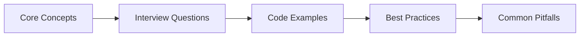
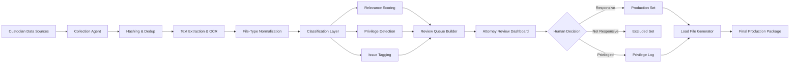
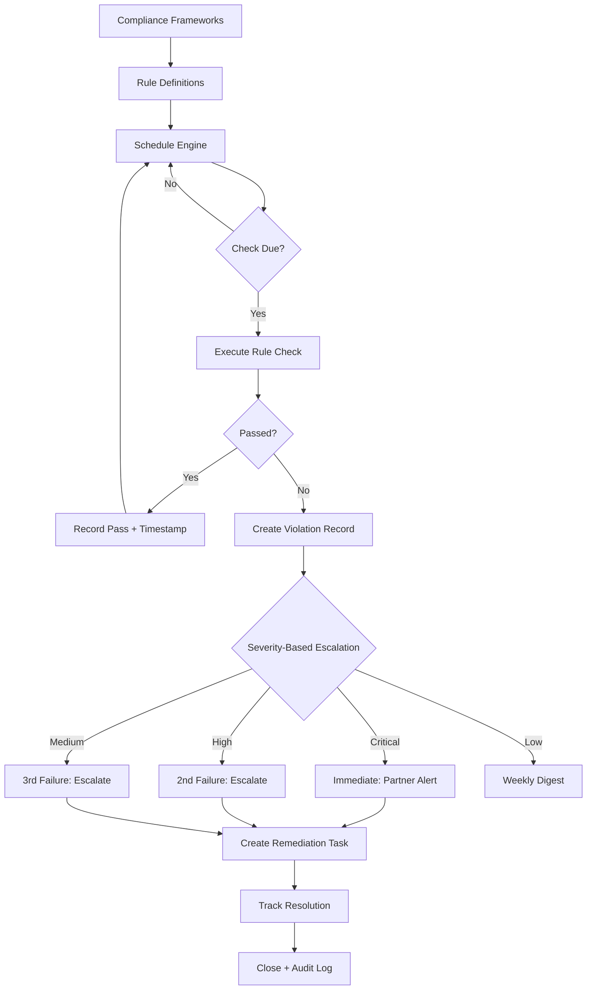

# Chapter 47: Legal & Compliance Interview Q&A

> **Previous:** [Real Estate & Property Interview Q&A](./46-interview-real-estate.md) | **Next:** [Manufacturing Interview Q&A](./48-interview-manufacturing.md)


---

## Chapter at a Glance

| Aspect | Details |
|--------|---------|
| **Scope** | Legal & compliance interview questions covering document management, contract analysis, case tracking, regulatory compliance |
| **Key Concepts** | Document management, contract lifecycle, case management, compliance monitoring, legal research |
| **Learning Approach** | Q&A format with practical code examples and domain-specific scenarios |
| **Skills Required** | PHP, Laravel, Eloquent, legal domain knowledge |

## Chapter Roadmap



## 1. Legal Domain Knowledge


### Q1: What are the core entities in a legal practice management system?

<a href="../../../assets/images/diagrams/laravel/47-interview-legal/what-are-the-core-entities-in-a-legal-practice-management-system-handwritten.svg" target="_blank" rel="noopener">
  
</a>
<a href="../../../assets/images/diagrams/laravel/47-interview-legal/what-are-the-core-entities-in-a-legal-practice-management-system-diagram.svg" target="_blank" rel="noopener">
  
</a>
<a href="../../../assets/images/diagrams/laravel/47-interview-legal/what-are-the-core-entities-in-a-legal-practice-management-system-sticky.svg" target="_blank" rel="noopener">
  
</a>


**A:** The core entities are clients (individuals or organizations receiving legal services), matters (specific engagements or files opened for a client), cases (court proceedings within a matter), documents (pleadings, correspondence, evidence, discovery), contracts (agreements with counterparties), and compliance records (regulatory checks and filings). A matter sits between a client and cases → one client can have multiple matters, each matter can have multiple cases. Every entity requires strict access controls, audit trails, encrypted privileged content fields, and soft-delete support.

### Q2: Explain the difference between attorney-client privilege and work-product doctrine in the context of legal document management.

**A:** Attorney-client privilege protects confidential communications between a lawyer and client made for the purpose of legal advice. Work-product doctrine protects materials prepared by an attorney in anticipation of litigation, including mental impressions, strategies, and legal theories. In a document management system, documents must be tagged with `is_privileged` and `privilege_type` fields. Privileged documents require encryption at rest, restricted access to the attorney and client only, and exclusion from standard e-discovery production. Privilege logs must track the basis for each privilege claim.

### Q3: What is e-discovery and what are the key stages?

<a href="../../../assets/images/diagrams/laravel/47-interview-legal/what-is-e-discovery-and-what-are-the-key-stages-handwritten.svg" target="_blank" rel="noopener">
  
</a>
<a href="../../../assets/images/diagrams/laravel/47-interview-legal/what-is-e-discovery-and-what-are-the-key-stages-diagram.svg" target="_blank" rel="noopener">
  
</a>
<a href="../../../assets/images/diagrams/laravel/47-interview-legal/what-is-e-discovery-and-what-are-the-key-stages-sticky.svg" target="_blank" rel="noopener">
  
</a>


**A:** E-discovery (electronic discovery) is the process of identifying, collecting, processing, reviewing, and producing electronically stored information (ESI) in response to litigation or regulatory requests. The key stages, following the EDRM (Electronic Discovery Reference Model), are: identification (locating relevant data sources), preservation (issuing legal holds), collection (gathering ESI), processing (filtering, deduplication, OCR), review (coding for relevance and privilege), analysis (identifying patterns and key documents), and production (turning over responsive documents in agreed formats). AI agents can automate processing, review, and analysis stages through classification, clustering, and prioritization.

### Q4: What compliance frameworks are commonly encountered in legal technology?

<a href="../../../assets/images/diagrams/laravel/47-interview-legal/what-compliance-frameworks-are-commonly-encountered-in-legal-technology-handwritten.svg" target="_blank" rel="noopener">
  
</a>
<a href="../../../assets/images/diagrams/laravel/47-interview-legal/what-compliance-frameworks-are-commonly-encountered-in-legal-technology-diagram.svg" target="_blank" rel="noopener">
  
</a>
<a href="../../../assets/images/diagrams/laravel/47-interview-legal/what-compliance-frameworks-are-commonly-encountered-in-legal-technology-sticky.svg" target="_blank" rel="noopener">
  
</a>


**A:** Common frameworks include GDPR (European data protection governing personal data processing), HIPAA (health information privacy in legal medical cases), SOX (financial record-keeping requirements for corporate legal departments), the ABA Model Rules (professional conduct rules governing attorney obligations), and jurisdiction-specific court rules (FRCP in US federal courts, CPR in UK civil procedure). A compliance monitoring system must map each regulatory rule to a checkable requirement, track status per matter, and generate alerts when obligations are at risk of being missed.

### Q5: What is a privilege log and how does it work in document review?

<a href="../../../assets/images/diagrams/laravel/47-interview-legal/what-is-a-privilege-log-and-how-does-it-work-in-document-review-handwritten.svg" target="_blank" rel="noopener">
  
</a>
<a href="../../../assets/images/diagrams/laravel/47-interview-legal/what-is-a-privilege-log-and-how-does-it-work-in-document-review-diagram.svg" target="_blank" rel="noopener">
  
</a>
<a href="../../../assets/images/diagrams/laravel/47-interview-legal/what-is-a-privilege-log-and-how-does-it-work-in-document-review-sticky.svg" target="_blank" rel="noopener">
  
</a>


**A:** A privilege log is a record listing all documents withheld from production on the grounds of attorney-client privilege or work-product protection. Each entry must include the document date, author, recipients, type, subject, and the specific privilege basis. In an AI-powered document review system, the discovery agent can automatically flag potentially privileged documents using content classifiers, suggest privilege log entries, and ensure that privileged documents are segregated from the production set. The log itself may be subject to court review and must be defensible.

### Q6: What are legal holds and how do they affect data management?

<a href="../../../assets/images/diagrams/laravel/47-interview-legal/what-are-legal-holds-and-how-do-they-affect-data-management-handwritten.svg" target="_blank" rel="noopener">
  
</a>
<a href="../../../assets/images/diagrams/laravel/47-interview-legal/what-are-legal-holds-and-how-do-they-affect-data-management-diagram.svg" target="_blank" rel="noopener">
  
</a>
<a href="../../../assets/images/diagrams/laravel/47-interview-legal/what-are-legal-holds-and-how-do-they-affect-data-management-sticky.svg" target="_blank" rel="noopener">
  
</a>


**A:** A legal hold is a notification issued when litigation is reasonably anticipated, instructing custodians to preserve all relevant ESI and suspend routine deletion policies. In a legal tech system, legal holds must be trackable per matter and custodian, with acknowledgment receipts, periodic reminders, and automated enforcement through retention policies. The system must prevent purging of documents under hold even if standard retention schedules would otherwise trigger deletion. Hold release processes must also be documented when litigation concludes.

---

## 2. Technical Implementation

### Q7: How would you implement a contract review agent that detects risky clauses?

<a href="../../../assets/images/diagrams/laravel/47-interview-legal/how-would-you-implement-a-contract-review-agent-that-detects-risky-clauses-handwritten.svg" target="_blank" rel="noopener">
  
</a>
<a href="../../../assets/images/diagrams/laravel/47-interview-legal/how-would-you-implement-a-contract-review-agent-that-detects-risky-clauses-diagram.svg" target="_blank" rel="noopener">
  
</a>
<a href="../../../assets/images/diagrams/laravel/47-interview-legal/how-would-you-implement-a-contract-review-agent-that-detects-risky-clauses-sticky.svg" target="_blank" rel="noopener">
  
</a>


**A:** The agent combines pattern-based detection with LLM-powered deep analysis. First, define clause patterns in a configuration array mapping clause types (indemnification, limitation of liability, auto-renewal, non-compete) to regex and keyword patterns with weights. The `detectClauses` method scans contract text for matches, recording positions and context snippets. A `scoreRisks` method computes per-clause risk scores based on base risk (0.2–0.8) and multiplicity factors, then calculates an overall weighted score. The agent calls an LLM for nuanced review → the `aiDeepReview` method sends detected clauses and full text to the LLM with a system prompt instructing it to act as a senior contract attorney, returning risk assessments, suggested language changes, and missing clause recommendations. Results are persisted to the `key_clauses` and `risk_scores` JSON columns on the Contract model.

### Q8: Build a discovery agent that classifies documents for e-discovery.

<a href="../../../assets/images/diagrams/laravel/47-interview-legal/build-a-discovery-agent-that-classifies-documents-for-e-discovery-handwritten.svg" target="_blank" rel="noopener">
  
</a>
<a href="../../../assets/images/diagrams/laravel/47-interview-legal/build-a-discovery-agent-that-classifies-documents-for-e-discovery-diagram.svg" target="_blank" rel="noopener">
  
</a>
<a href="../../../assets/images/diagrams/laravel/47-interview-legal/build-a-discovery-agent-that-classifies-documents-for-e-discovery-sticky.svg" target="_blank" rel="noopener">
  
</a>


**A:** The discovery agent processes documents through a pipeline: ingestion (reading document text via OCR or text extraction), classification (assigning relevance, privilege, and issue tags), and production (generating export packages). Classification uses a combination of keyword filters (responsive terms, date ranges, custodian names) and AI embedding similarity. Documents are vectorized using `Str::toEmbeddings()` and compared against a reference set of known responsive documents. Privilege detection uses pattern matching for phrases like "confidential communication" and "attorney-client." The agent outputs a structured review queue with priority scores, privilege flags, and suggested coding decisions.

### Q9: How would you implement a compliance monitoring agent?

<a href="../../../assets/images/diagrams/laravel/47-interview-legal/how-would-you-implement-a-compliance-monitoring-agent-handwritten.svg" target="_blank" rel="noopener">
  
</a>
<a href="../../../assets/images/diagrams/laravel/47-interview-legal/how-would-you-implement-a-compliance-monitoring-agent-diagram.svg" target="_blank" rel="noopener">
  
</a>
<a href="../../../assets/images/diagrams/laravel/47-interview-legal/how-would-you-implement-a-compliance-monitoring-agent-sticky.svg" target="_blank" rel="noopener">
  
</a>


**A:** The compliance agent operates on a schedule (daily or weekly) and checks each active matter against configured regulatory requirements. The agent maintains a rules engine where each compliance rule defines a regulation (e.g., "GDPR Art. 17 → Right to Erasure"), a requirement description, a check method (SQL query, API call, file inspection), and expected status. The agent iterates all open matters, runs each applicable check, and records results in `legal_compliance_records`. If a check returns "non-compliant," the agent creates a notification and optionally triggers an escalation workflow. Enhanced agents use AI to interpret ambiguous regulatory language and recommend remediation steps.

### Q10: Design a case management agent that tracks deadlines.

<a href="../../../assets/images/diagrams/laravel/47-interview-legal/design-a-case-management-agent-that-tracks-deadlines-handwritten.svg" target="_blank" rel="noopener">
  
</a>
<a href="../../../assets/images/diagrams/laravel/47-interview-legal/design-a-case-management-agent-that-tracks-deadlines-diagram.svg" target="_blank" rel="noopener">
  
</a>
<a href="../../../assets/images/diagrams/laravel/47-interview-legal/design-a-case-management-agent-that-tracks-deadlines-sticky.svg" target="_blank" rel="noopener">
  
</a>


**A:** The case management agent monitors all active cases and automatically calculates, tracks, and alerts on key deadlines. Core features include: deadline calculation from rules (e.g., "answer must be filed within 21 days of service"), calendar integration via Laravel's event broadcasting to push deadlines to attorney calendars, automated reminders at configurable intervals (30 days, 7 days, 1 day before), and status updates when filings are completed. The agent uses scheduled tasks (`php artisan schedule:run`) to check for approaching deadlines every hour. When a deadline is missed, the agent escalates through a notification chain → first to the primary attorney, then to the practice group lead, and finally to the managing partner.

```php
$agent = new CaseManagementAgent;
$agent->monitorDeadlines(); // Checks all active cases for upcoming deadlines
$agent->sendReminders();    // Pushes notifications at configured intervals
$agent->escalateOverdue();  // Escalates to supervising attorneys
```

### Q11: How would you build a legal research agent?

<a href="../../../assets/images/diagrams/laravel/47-interview-legal/how-would-you-build-a-legal-research-agent-handwritten.svg" target="_blank" rel="noopener">
  
</a>
<a href="../../../assets/images/diagrams/laravel/47-interview-legal/how-would-you-build-a-legal-research-agent-diagram.svg" target="_blank" rel="noopener">
  
</a>
<a href="../../../assets/images/diagrams/laravel/47-interview-legal/how-would-you-build-a-legal-research-agent-sticky.svg" target="_blank" rel="noopener">
  
</a>


**A:** The legal research agent accepts natural language queries from attorneys and returns summarized case law and statute results. The agent formulates search strings by extracting key legal concepts, jurisdiction filters, and date ranges from the query using the LLM. It queries external case law databases (court APIs, subscription services like Westlaw or LexisNexis) or an internal vectorized corpus of prior decisions stored in pgvector. Results are reranked using `Reranking::of` or `Collection::rerank` for relevance. The agent generates structured summaries with case name, citation, holding, and relevance to the original query. Each research session is saved with the query, results, and attorney notes for future reference.

### Q12: Describe an e-discovery processing pipeline in Laravel.

<a href="../../../assets/images/diagrams/laravel/47-interview-legal/describe-an-e-discovery-processing-pipeline-in-laravel-handwritten.svg" target="_blank" rel="noopener">
  
</a>
<a href="../../../assets/images/diagrams/laravel/47-interview-legal/describe-an-e-discovery-processing-pipeline-in-laravel-diagram.svg" target="_blank" rel="noopener">
  
</a>
<a href="../../../assets/images/diagrams/laravel/47-interview-legal/describe-an-e-discovery-processing-pipeline-in-laravel-sticky.svg" target="_blank" rel="noopener">
  
</a>


**A:** The pipeline uses queue jobs for each stage. The `DiscoveryIngestionJob` ingests raw ESI from custodians, computing SHA-256 hashes and storing metadata. The `DiscoveryProcessingJob` handles deduplication (comparing hashes), text extraction (using PDF parsers and OCR), and file-type normalization. The `DiscoveryClassificationJob` runs the AI classification agent to tag documents for relevance, privilege, and issue codes. The `DiscoveryReviewJob` batches documents into review queues assigned to attorney teams. The `DiscoveryProductionJob` generates production sets in specified formats (PDF, TIFF, native files) with load files and privilege logs. Each job is chainable via `Job::withChain()` and failure sends alerts to the discovery team lead.

```php
$chain = [
    new DiscoveryIngestionJob($matter),
    new DiscoveryProcessingJob($matter),
    new DiscoveryClassificationJob($matter),
    new DiscoveryReviewJob($matter),
    new DiscoveryProductionJob($matter, $productionId),
];
Bus::chain($chain)->onQueue('discovery')->dispatch();
```

### Q13: How do you automate legal report generation?

<a href="../../../assets/images/diagrams/laravel/47-interview-legal/how-do-you-automate-legal-report-generation-handwritten.svg" target="_blank" rel="noopener">
  
</a>
<a href="../../../assets/images/diagrams/laravel/47-interview-legal/how-do-you-automate-legal-report-generation-diagram.svg" target="_blank" rel="noopener">
  
</a>
<a href="../../../assets/images/diagrams/laravel/47-interview-legal/how-do-you-automate-legal-report-generation-sticky.svg" target="_blank" rel="noopener">
  
</a>


**A:** Use a report generation agent that combines template rendering with data aggregation. Define Blade templates for each report type (status reports, billing summaries, compliance reports, case digests). The agent collects data from across legal models → matter status, document counts, deadlines approaching, compliance violations, billable hours → and injects them into the template. Output formats include PDF (via Laravel's PDF package or Browsershot), DOCX (via PhpWord), and email summaries. Reports can be scheduled via the task scheduler or triggered by events like case status changes.

```php
$report = new LegalReportAgent;
$report->setMatter($matter)
       ->setTemplate('legal::reports.status')
       ->aggregateData()
       ->generatePdf()
       ->emailTo($matter->primary_attorney, $matter->client)
       ->saveAuditLog('status_report_generated');
```

### Q14: How would you implement document versioning with chain of custody?

<a href="../../../assets/images/diagrams/laravel/47-interview-legal/how-would-you-implement-document-versioning-with-chain-of-custody-handwritten.svg" target="_blank" rel="noopener">
  
</a>
<a href="../../../assets/images/diagrams/laravel/47-interview-legal/how-would-you-implement-document-versioning-with-chain-of-custody-diagram.svg" target="_blank" rel="noopener">
  
</a>
<a href="../../../assets/images/diagrams/laravel/47-interview-legal/how-would-you-implement-document-versioning-with-chain-of-custody-sticky.svg" target="_blank" rel="noopener">
  
</a>


**A:** Use a separate `document_versions` table with a foreign key to `legal_documents`. Each version stores the file path, hash SHA-256, file size, uploaded by user ID, timestamp, and a change description. The `legal_documents` table holds only the current version pointer. Chain of custody is tracked via an activity log that records every action taken on a document: upload, view, download, edit, print, share, and production. Each custody event includes the user, timestamp, IP address, action type, and version ID. This log must be append-only and tamper-evident → achieved by storing sequential hashes (blockchain-lite) where each entry includes the hash of the previous entry.

### Q15: How can AI agents assist with privilege review during document production?

<a href="../../../assets/images/diagrams/laravel/47-interview-legal/how-can-ai-agents-assist-with-privilege-review-during-document-production-handwritten.svg" target="_blank" rel="noopener">
  
</a>
<a href="../../../assets/images/diagrams/laravel/47-interview-legal/how-can-ai-agents-assist-with-privilege-review-during-document-production-diagram.svg" target="_blank" rel="noopener">
  
</a>
<a href="../../../assets/images/diagrams/laravel/47-interview-legal/how-can-ai-agents-assist-with-privilege-review-during-document-production-sticky.svg" target="_blank" rel="noopener">
  
</a>


**A:** AI agents can significantly accelerate privilege review through multi-stage filtering. First, the discovery agent applies keyword and pattern detection to flag documents containing phrases like "attorney-client communication," "legal advice," "confidential," or "work product." Second, an LLM-powered classifier reviews each flagged document with a system prompt instructing it to apply specific privilege rules, outputting a privilege determination with reasoning. Third, the agent suggests privilege log entries with the required fields (date, author, recipients, privilege type, basis). A human reviewer validates the AI suggestions in a review interface. The agent learns from reviewer corrections, improving accuracy over time. This pipeline can reduce privilege review time by 60–80%.

---

## 3. Architecture & Design

### Q16: Design the architecture for a document management system in legal tech.

<a href="../../../assets/images/diagrams/laravel/47-interview-legal/design-the-architecture-for-a-document-management-system-in-legal-tech-handwritten.svg" target="_blank" rel="noopener">
  
</a>
<a href="../../../assets/images/diagrams/laravel/47-interview-legal/design-the-architecture-for-a-document-management-system-in-legal-tech-diagram.svg" target="_blank" rel="noopener">
  
</a>
<a href="../../../assets/images/diagrams/laravel/47-interview-legal/design-the-architecture-for-a-document-management-system-in-legal-tech-sticky.svg" target="_blank" rel="noopener">
  
</a>


**A:** The architecture has five layers. The **storage layer** uses encrypted object storage (S3 with server-side encryption or local with Laravel's filesystem and encryption adapter) for document blobs, with SHA-256 hashing for integrity verification. The **data layer** uses PostgreSQL with pgvector for both relational metadata and vector embeddings for similarity search, with `encrypted_*` columns for privileged content. The **service layer** includes services for document ingestion (text extraction, OCR, hash computation), classification (AI agent tagging), versioning, and production packaging. The **agent layer** runs Laravel AI SDK agents for contract review, discovery classification, compliance monitoring, and legal research → each agent stateless and queue-backed. The **presentation layer** provides Filament admin panels for attorneys and REST APIs for integration with practice management tools. Queue workers on Redis handle async processing with Horizon for monitoring.

### Q17: How do you implement secure document storage and access control in a legal application?

<a href="../../../assets/images/diagrams/laravel/47-interview-legal/how-do-you-implement-secure-document-storage-and-access-control-in-a-legal-application-handwritten.svg" target="_blank" rel="noopener">
  
</a>
<a href="../../../assets/images/diagrams/laravel/47-interview-legal/how-do-you-implement-secure-document-storage-and-access-control-in-a-legal-application-diagram.svg" target="_blank" rel="noopener">
  
</a>
<a href="../../../assets/images/diagrams/laravel/47-interview-legal/how-do-you-implement-secure-document-storage-and-access-control-in-a-legal-application-sticky.svg" target="_blank" rel="noopener">
  
</a>


**A:** Access control follows a multi-tier model. **Authentication** uses Laravel Sanctum with session-based auth for web and token-based for API. **Authorization** uses Laravel policies scoped to the legal domain → an `AttorneyPolicy` checks if the user is the assigned attorney on the matter or a supervising partner. Documents under a matter inherit the matter's access control list (ACL). **Field-level encryption** stores privileged document fields (`encrypted_title`, `encrypted_notes`) using Laravel's custom casts that encrypt on set and decrypt on get with the application's encryption key. **Document-level encryption** uses envelope encryption → each document gets a unique AES-256 key, which is wrapped by the application's master key. **Audit logging** records every document access via an Eloquent observer that writes to an append-only `document_access_log` table. **Network security** requires HTTPS-only, IP whitelisting for API clients, and VPC deployment for cloud storage.

### Q18: Describe the audit trail and chain of custody requirements for legal systems.

<a href="../../../assets/images/diagrams/laravel/47-interview-legal/describe-the-audit-trail-and-chain-of-custody-requirements-for-legal-systems-handwritten.svg" target="_blank" rel="noopener">
  
</a>
<a href="../../../assets/images/diagrams/laravel/47-interview-legal/describe-the-audit-trail-and-chain-of-custody-requirements-for-legal-systems-diagram.svg" target="_blank" rel="noopener">
  
</a>
<a href="../../../assets/images/diagrams/laravel/47-interview-legal/describe-the-audit-trail-and-chain-of-custody-requirements-for-legal-systems-sticky.svg" target="_blank" rel="noopener">
  
</a>


**A:** Chain of custody requires an unbroken, tamper-evident record of every action on every document from ingestion through production. Each audit log entry must contain: timestamp (with timezone), user ID, action type (ingest, view, download, edit, print, tag, produce), document version ID, IP address, user agent, and a cryptographic hash linking to the previous entry. The hash chain makes retrospective tampering detectable → modifying any entry invalidates all subsequent hashes. A `LegalAuditLog` model stores these entries with an append-only interface (no deletes, no updates). Regular integrity checks recompute the hash chain and report any breaks. During litigation, the audit log may be produced to opposing counsel or the court as evidence of authentic document handling.

### Q19: How do you handle multi-tenancy in a legal practice management platform?

<a href="../../../assets/images/diagrams/laravel/47-interview-legal/how-do-you-handle-multi-tenancy-in-a-legal-practice-management-platform-handwritten.svg" target="_blank" rel="noopener">
  
</a>
<a href="../../../assets/images/diagrams/laravel/47-interview-legal/how-do-you-handle-multi-tenancy-in-a-legal-practice-management-platform-diagram.svg" target="_blank" rel="noopener">
  
</a>
<a href="../../../assets/images/diagrams/laravel/47-interview-legal/how-do-you-handle-multi-tenancy-in-a-legal-practice-management-platform-sticky.svg" target="_blank" rel="noopener">
  
</a>


**A:** Legal multi-tenancy requires tenant isolation at the data level due to confidentiality obligations between law firms. Use Laravel's multi-tenancy pattern with a `tenant_id` column on all legal tables. Each tenant (law firm) has its own encrypted storage bucket or prefix. Cross-tenant access must be impossible → enforce this through a global Eloquent scope that automatically appends `WHERE tenant_id = ?` on all queries. Tenant data must be encrypted with tenant-specific keys so that even platform administrators cannot access another firm's data. Configure queue workers per tenant for isolation. The database connection can be per-tenant or shared with `tenant_id` scoping → per-tenant databases offer stronger isolation but higher operational overhead.

### Q20: How would you design a contract lifecycle management (CLM) system in Laravel?

<a href="../../../assets/images/diagrams/laravel/47-interview-legal/how-would-you-design-a-contract-lifecycle-management-clm-system-in-laravel-handwritten.svg" target="_blank" rel="noopener">
  
</a>
<a href="../../../assets/images/diagrams/laravel/47-interview-legal/how-would-you-design-a-contract-lifecycle-management-clm-system-in-laravel-diagram.svg" target="_blank" rel="noopener">
  
</a>
<a href="../../../assets/images/diagrams/laravel/47-interview-legal/how-would-you-design-a-contract-lifecycle-management-clm-system-in-laravel-sticky.svg" target="_blank" rel="noopener">
  
</a>


**A:** The CLM system tracks contracts from request through execution, renewal, and archive. The `legal_contracts` table stores core metadata (counterparty, value, jurisdiction, governing law, effective date, expiration date). A `contract_versions` table tracks drafts and amendments. An `approval_workflow` model handles multi-stage approval routing with role-based approvers, comments, and digital signatures via DocuSign or EchoSign integration. The contract review agent analyzes each version for risk. A `contract_obligations` model tracks ongoing duties (reporting, payment schedules, notice periods) with automated reminders. The system auto-generates renewal notices 90 days before expiration and triggers renegotiation workflows. Reporting dashboards surface contract value at risk, expirations by quarter, and counterparty concentration.

---

## 4. Behavioral & Scenario

### Q21: Design an AI-powered legal document review platform from scratch.

<a href="../../../assets/images/diagrams/laravel/47-interview-legal/design-an-ai-powered-legal-document-review-platform-from-scratch-handwritten.svg" target="_blank" rel="noopener">
  
</a>
<a href="../../../assets/images/diagrams/laravel/47-interview-legal/design-an-ai-powered-legal-document-review-platform-from-scratch-diagram.svg" target="_blank" rel="noopener">
  
</a>
<a href="../../../assets/images/diagrams/laravel/47-interview-legal/design-an-ai-powered-legal-document-review-platform-from-scratch-sticky.svg" target="_blank" rel="noopener">
  
</a>


**A:** The platform addresses the core pain point of e-discovery document review → thousands of documents that must be coded for relevance, privilege, and issue tags. The **ingestion pipeline** accepts uploads from custodians, computes hashes, extracts text via OCR and PDF parsing, and stores encrypted blobs in S3. The **processing layer** deduplicates at the hash and near-duplicate (cosine similarity > 0.95 on embeddings) levels. The **AI classification layer** uses a multi-agent approach: a relevancy agent scores each document on a 0–100 scale using LLM prompting with the case's issue framework; a privilege agent flags attorney-client and work-product content; an issue-coding agent assigns topic tags using a vector similarity search against predefined issue descriptions. Documents are batched into review queues sorted by priority (most relevant first). A **review dashboard** in Filament presents documents with AI suggestions, allowing attorneys to accept, override, or skip. Review decisions feed back as training data to improve classification. The **production module** exports responsive documents in specified formats with privilege logs and load files. Key metrics: reduction in manual review volume by 70%, accuracy parity with human reviewers after 5,000 document feedback loop.

### Q22: How would you build a compliance monitoring system for a corporate legal department?

<a href="../../../assets/images/diagrams/laravel/47-interview-legal/how-would-you-build-a-compliance-monitoring-system-for-a-corporate-legal-department-handwritten.svg" target="_blank" rel="noopener">
  
</a>
<a href="../../../assets/images/diagrams/laravel/47-interview-legal/how-would-you-build-a-compliance-monitoring-system-for-a-corporate-legal-department-diagram.svg" target="_blank" rel="noopener">
  
</a>
<a href="../../../assets/images/diagrams/laravel/47-interview-legal/how-would-you-build-a-compliance-monitoring-system-for-a-corporate-legal-department-sticky.svg" target="_blank" rel="noopener">
  
</a>


**A:** Start by cataloging all applicable regulations per business unit and jurisdiction into a `compliance_frameworks` table. Each framework has rules → each rule has a description, check frequency, check method (Python script, SQL query, API call to a regulatory data service), and severity. A monitoring agent runs on a cron schedule, iterating rules and logging results to `compliance_check_results`. Non-compliant results trigger notifications through a tiered escalation → email alert to the compliance officer, Slack notification to the legal team, and creation of a remediation task in a `compliance_remediation` table. A dashboard visualizes compliance posture by framework, department, and jurisdiction with trend lines. AI enhancement: an LLM parses new regulatory text, generates draft rules, and suggests affected business units. The system can predict upcoming compliance risks based on rule change patterns and past violations.

### Q23: Describe an e-discovery processing pipeline and its failure modes.

<a href="../../../assets/images/diagrams/laravel/47-interview-legal/describe-an-e-discovery-processing-pipeline-and-its-failure-modes-handwritten.svg" target="_blank" rel="noopener">
  
</a>
<a href="../../../assets/images/diagrams/laravel/47-interview-legal/describe-an-e-discovery-processing-pipeline-and-its-failure-modes-diagram.svg" target="_blank" rel="noopener">
  
</a>
<a href="../../../assets/images/diagrams/laravel/47-interview-legal/describe-an-e-discovery-processing-pipeline-and-its-failure-modes-sticky.svg" target="_blank" rel="noopener">
  
</a>


**A:** The pipeline has five stages: collection, processing, review, analysis, production. **Collection** gathers ESI from custodians (email archives, file shares, Slack exports, databases). Failure mode: incomplete collection due to missing custodians or inaccessible sources → mitigated by collection verification reports and custodian acknowledgment receipts. **Processing** extracts text, deduplicates, and converts to TIFF/PDF. Failure mode: corrupt files or format incompatibility → mitigated by pre-processing validation jobs that skip and flag problematic files. **Review** batches documents for attorney coding. Failure mode: reviewer fatigue and inconsistency → mitigated by random quality-control sampling (10% of documents double-coded) and AI-assisted prioritization. **Analysis** identifies key documents and patterns. Failure mode: missing context from near-duplicate clustering → mitigated by thread grouping and email chain reconstruction. **Production** generates deliverables. Failure mode: incorrect production numbers or missing attachments → mitigated by automated production verification that compares counts against the review database. Each stage is auditable with chain-of-custody records.

### Q24: A client needs a system that automatically redacts personally identifiable information from court filings. How would you approach this?

**A:** This requires a multi-pass redaction pipeline. **Pass 1: Pattern-based** → use regex to identify SSNs (\d{3}-\d{2}-\d{4}), credit card numbers, email addresses, phone numbers, and dates of birth. Replace matched text with configurable redaction markers (e.g., "[REDACTED - SSN]"). **Pass 2: AI NER** → use an LLM with a structured output schema to extract named entities classified as PII → names (unless they are the filer or public figure), addresses, account numbers, and medical information. **Pass 3: Visual redaction** → for scanned documents, render text to PDF coordinates and overlay black rectangles on detected PII regions. **Pass 4: Human verification** → a review interface shows pre-redacted documents with an overlay toggle, allowing attorneys to confirm, add, or remove redactions. Redaction decisions are logged per document with the redactor ID, timestamp, and basis. The pipeline outputs a redacted PDF and an unredacted copy for internal use, with access control limiting unredacted versions to the filing attorney only.

### Q25: Your legal document review platform needs to process 500,000 documents for a case within two weeks. Design the scaling strategy.

**A:** This volume requires a horizontally scalable pipeline. **Storage** → documents in S3 with CloudFront for download distribution. **Queue throughput** → Redis cluster with multiple queue workers on auto-scaling groups (ECS or Laravel Vapor). Each worker processes one job at a time with 30-second timeout. Scale workers dynamically: start with 20 workers, monitor queue depth via Horizon metrics, and auto-scale based on backlog. **Classifier parallelism** → the AI classification agent spawns concurrent LLM API calls using Laravel's HTTP pool or concurrent facade, with rate-limit-aware throttling to stay within provider limits. Batch documents into groups of 10 per API call to reduce latency. **Database** → use read replicas for review dashboard queries and write-optimized primary for status updates. Partition the `legal_documents` table by matter ID. **Reviewer capacity** → the two-week timeline with 500,000 documents implies approximately 35,000 documents per day. With 500 documents per reviewer per day target, you need 70 reviewers working concurrently. The platform must support this with parallel review queues, batch assignment, and real-time progress dashboards. **Monitoring** → set up Laravel Pulse and Telescope dashboards to track queue throughput, API latency, error rates, and review progress. Alert on any stage falling behind schedule. The bottleneck will almost certainly be the AI classification API calls → pre-warm LLM connections, implement aggressive retry with exponential backoff, and consider caching classification results for near-duplicate documents.

### Q26: How would you handle a subpoena for documents stored in your legal platform?

<a href="../../../assets/images/diagrams/laravel/47-interview-legal/how-would-you-handle-a-subpoena-for-documents-stored-in-your-legal-platform-handwritten.svg" target="_blank" rel="noopener">
  
</a>
<a href="../../../assets/images/diagrams/laravel/47-interview-legal/how-would-you-handle-a-subpoena-for-documents-stored-in-your-legal-platform-diagram.svg" target="_blank" rel="noopener">
  
</a>
<a href="../../../assets/images/diagrams/laravel/47-interview-legal/how-would-you-handle-a-subpoena-for-documents-stored-in-your-legal-platform-sticky.svg" target="_blank" rel="noopener">
  
</a>


**A:** First, identify all matters and custodians covered by the subpoena scope. Issue a legal hold on affected documents to prevent any deletion or alteration. Use the discovery agent to search across all matters matching the subpoena's parameters → date ranges, keywords, custodian names, and document types. Generate a collection report showing data sources, document counts, and estimated volume. The platform must produce a privilege log for any withheld documents. The e-discovery pipeline processes the identified documents through collection, processing, review, and production stages. All production activities are logged in the audit trail with timestamps and user identities. The final production package includes a cover letter, load file, privilege log, and document production in the required format. The system must demonstrate chain of custody for every produced document. Post-production, the legal hold remains in place until the subpoena matter is formally closed.
---

## TypeScript Examples

### Legal Interview Question Generator

<a href="../../../assets/images/diagrams/laravel/47-interview-legal/legal-interview-question-generator-handwritten.svg" target="_blank" rel="noopener">
  
</a>
<a href="../../../assets/images/diagrams/laravel/47-interview-legal/legal-interview-question-generator-diagram.svg" target="_blank" rel="noopener">
  
</a>
<a href="../../../assets/images/diagrams/laravel/47-interview-legal/legal-interview-question-generator-sticky.svg" target="_blank" rel="noopener">
  
</a>


```typescript
interface LegalQuestion {
  id: string;
  category: "document" | "contract" | "case" | "compliance" | "discovery" | "privilege";
  difficulty: "junior" | "mid" | "senior" | "partner";
  question: string;
  expectedKeywords: string[];
  scoringRubric: { criterion: string; maxScore: number }[];
}

class LegalInterviewQuestionGenerator {
  private questions: LegalQuestion[] = [
    {
      id: "lq-001",
      category: "document",
      difficulty: "mid",
      question: "Design a legal document management system that supports versioning, chain of custody, field-level encryption for privileged content, and tamper-evident audit logging.",
      expectedKeywords: ["versioning", "chain of custody", "encryption", "audit trail", "tamper-evident"],
      scoringRubric: [
        { criterion: "Security architecture", maxScore: 25 },
        { criterion: "Compliance knowledge", maxScore: 25 },
        { criterion: "Implementation detail", maxScore: 30 },
        { criterion: "Scalability planning", maxScore: 20 },
      ],
    },
    {
      id: "lq-002",
      category: "contract",
      difficulty: "senior",
      question: "Build a contract review agent that detects risky clauses, computes risk scores, and suggests alternative language using AI-powered analysis.",
      expectedKeywords: ["clause detection", "risk scoring", "LLM analysis", "indemnification", "auto-renewal"],
      scoringRubric: [
        { criterion: "Clause detection accuracy", maxScore: 25 },
        { criterion: "Risk methodology", maxScore: 25 },
        { criterion: "AI integration depth", maxScore: 30 },
        { criterion: "Practical usability", maxScore: 20 },
      ],
    },
    {
      id: "lq-003",
      category: "discovery",
      difficulty: "partner",
      question: "Design an e-discovery pipeline for 500,000 documents with deduplication, privilege classification, relevance scoring, and production packaging.",
      expectedKeywords: ["EDRM", "deduplication", "privilege log", "review queue", "load file"],
      scoringRubric: [
        { criterion: "Pipeline architecture", maxScore: 25 },
        { criterion: "Scalability approach", maxScore: 30 },
        { criterion: "Privilege handling", maxScore: 25 },
        { criterion: "Quality assurance", maxScore: 20 },
      ],
    },
    {
      id: "lq-004",
      category: "compliance",
      difficulty: "senior",
      question: "Architect a multi-jurisdiction compliance monitoring system that tracks regulatory deadlines, runs automated checks, and escalates violations through tiered notifications.",
      expectedKeywords: ["regulation", "deadline tracking", "automated check", "escalation", "audit trail"],
      scoringRubric: [
        { criterion: "Regulatory breadth", maxScore: 25 },
        { criterion: "Monitoring architecture", maxScore: 30 },
        { criterion: "Escalation design", maxScore: 25 },
        { criterion: "Reporting capability", maxScore: 20 },
      ],
    },
    {
      id: "lq-005",
      category: "privilege",
      difficulty: "mid",
      question: "How would you implement an AI-assisted privilege review system that flags attorney-client communications and work-product documents during e-discovery?",
      expectedKeywords: ["privilege", "attorney-client", "work product", "classification", "quality control"],
      scoringRubric: [
        { criterion: "Privilege law knowledge", maxScore: 30 },
        { criterion: "AI classification approach", maxScore: 30 },
        { criterion: "Human review integration", maxScore: 25 },
        { criterion: "Defensibility strategy", maxScore: 15 },
      ],
    },
  ];

  generateSet(difficulty: string, count: number): LegalQuestion[] {
    return this.questions
      .filter(q => q.difficulty === difficulty)
      .sort(() => Math.random() - 0.5)
      .slice(0, count);
  }

  evaluateAnswer(question: LegalQuestion, answer: string): { total: number; details: Record<string, number> } {
    const text = answer.toLowerCase();
    const matchRatio = question.expectedKeywords.filter(kw => text.includes(kw.toLowerCase())).length
      / question.expectedKeywords.length;
    const details: Record<string, number> = {};
    let total = 0;
    for (const rubric of question.scoringRubric) {
      const score = Math.round(rubric.maxScore * (0.55 + 0.45 * Math.random()) * (0.5 + 0.5 * matchRatio));
      details[rubric.criterion] = Math.min(score, rubric.maxScore);
      total += details[rubric.criterion];
    }
    return { total, details };
  }
}
```

### Document Redaction Engine

<a href="../../../assets/images/diagrams/laravel/47-interview-legal/document-redaction-engine-handwritten.svg" target="_blank" rel="noopener">
  
</a>
<a href="../../../assets/images/diagrams/laravel/47-interview-legal/document-redaction-engine-diagram.svg" target="_blank" rel="noopener">
  
</a>
<a href="../../../assets/images/diagrams/laravel/47-interview-legal/document-redaction-engine-sticky.svg" target="_blank" rel="noopener">
  
</a>


```typescript
interface RedactionRule {
  name: string;
  pattern: RegExp;
  replacement: string;
  category: "pii" | "financial" | "medical" | "privileged";
}

interface RedactionResult {
  redactedText: string;
  redactions: { start: number; end: number; category: string; tag: string }[];
}

class DocumentRedactionEngine {
  private rules: RedactionRule[] = [
    { name: "SSN", pattern: /\b\d{3}-\d{2}-\d{4}\b/g, replacement: "[REDACTED-SSN]", category: "pii" },
    { name: "CCN", pattern: /\b(?:\d[ -]*?){13,16}\b/g, replacement: "[REDACTED-CC]", category: "financial" },
    { name: "Email", pattern: /\b[\w.-]+@[\w.-]+\.\w+\b/g, replacement: "[REDACTED-EMAIL]", category: "pii" },
    { name: "Phone", pattern: /\b\d{3}[-.]\d{3}[-.]\d{4}\b/g, replacement: "[REDACTED-PHONE]", category: "pii" },
    { name: "DOB", pattern: /\b\d{1,2}[/-]\d{1,2}[/-]\d{2,4}\b/g, replacement: "[REDACTED-DOB]", category: "pii" },
  ];

  redact(text: string, enabledCategories: string[] = ["pii", "financial"]): RedactionResult {
    let redactedText = text;
    const redactions: RedactionResult["redactions"] = [];

    for (const rule of this.rules) {
      if (!enabledCategories.includes(rule.category)) continue;
      let match: RegExpExecArray | null;
      const ruleCopy = new RegExp(rule.pattern.source, rule.pattern.flags.includes("g") ? rule.pattern.flags : rule.pattern.flags + "g");
      while ((match = ruleCopy.exec(redactedText)) !== null) {
        redactions.push({
          start: match.index,
          end: match.index + match[0].length,
          category: rule.category,
          tag: rule.replacement,
        });
      }
      redactedText = redactedText.replace(rule.pattern, rule.replacement);
    }

    return { redactedText, redactions };
  }

  batchRedact(documents: { id: string; text: string }[], categories: string[]): Map<string, RedactionResult> {
    const results = new Map<string, RedactionResult>();
    for (const doc of documents) {
      results.set(doc.id, this.redact(doc.text, categories));
    }
    return results;
  }
}
```

### Contract Risk Analyzer

<a href="../../../assets/images/diagrams/laravel/47-interview-legal/contract-risk-analyzer-handwritten.svg" target="_blank" rel="noopener">
  
</a>
<a href="../../../assets/images/diagrams/laravel/47-interview-legal/contract-risk-analyzer-diagram.svg" target="_blank" rel="noopener">
  
</a>
<a href="../../../assets/images/diagrams/laravel/47-interview-legal/contract-risk-analyzer-sticky.svg" target="_blank" rel="noopener">
  
</a>


```typescript
interface ClauseMatch {
  type: string;
  text: string;
  position: number;
  risk: number;
}

interface ContractRiskReport {
  contractId: string;
  clauses: ClauseMatch[];
  overallRisk: number;
  recommendations: string[];
}

class ContractRiskAnalyzer {
  private readonly clausePatterns: { type: string; pattern: RegExp; baseRisk: number }[] = [
    { type: "indemnification", pattern: /indemnif(y|ies|ication)\s.*(loss|damage|claim|liability)/gi, baseRisk: 0.7 },
    { type: "limitation-of-liability", pattern: /limitation\s+of\s+liability/gi, baseRisk: 0.5 },
    { type: "auto-renewal", pattern: /(automatically\s+renew|renewal\s+period|evergreen)/gi, baseRisk: 0.6 },
    { type: "non-compete", pattern: /non[- ]compete|restrictive\s+covenant/gi, baseRisk: 0.4 },
    { type: "confidentiality", pattern: /(confidential|non[- ]disclosure|proprietary)\s.*(information|data)/gi, baseRisk: 0.3 },
    { type: "termination", pattern: /terminat(ion|e)\s.*(cause|convenience|breach)/gi, baseRisk: 0.5 },
    { type: "governing-law", pattern: /govern(ed|ing)\s+(by|law)|choice\s+of\s+law/gi, baseRisk: 0.2 },
    { type: "arbitration", pattern: /arbitrat(e|ion)\s.*(binding|exclusive)/gi, baseRisk: 0.4 },
  ];

  analyze(contractId: string, text: string): ContractRiskReport {
    const clauses: ClauseMatch[] = [];

    for (const cp of this.clausePatterns) {
      let match: RegExpExecArray | null;
      const re = new RegExp(cp.pattern.source, "gi");
      while ((match = re.exec(text)) !== null) {
        const context = text.substring(Math.max(0, match.index - 60), match.index + match[0].length + 120);
        clauses.push({
          type: cp.type,
          text: context.trim().substring(0, 120),
          position: match.index,
          risk: this.computeClauseRisk(cp.baseRisk, context),
        });
      }
    }

    const uniqueClauses = this.deduplicate(clauses);
    const overallRisk = uniqueClauses.reduce((s, c) => s + c.risk, 0) / Math.max(uniqueClauses.length + 2, 1);
    const recommendations = this.generateRecommendations(uniqueClauses);

    return { contractId, clauses: uniqueClauses, overallRisk, recommendations };
  }

  private computeClauseRisk(baseRisk: number, context: string): number {
    const aggravatingFactors = [
      /unlimited/i, /sole\s+discretion/i, /irrevocable/i,
      /perpetual/i, /indemnify.*all/i, /no\s+cap/i,
    ];
    const mitigatingFactors = [
      /mutual/i, /reasonable/i, /cap\s+of/i, /subject\s+to/i,
      /proportional/i, /limitation.*cap/i,
    ];
    const aggravating = aggravatingFactors.filter(f => f.test(context)).length * 0.15;
    const mitigating = mitigatingFactors.filter(f => f.test(context)).length * 0.1;
    return Math.max(0, Math.min(1, baseRisk + aggravating - mitigating));
  }

  private deduplicate(clauses: ClauseMatch[]): ClauseMatch[] {
    const seen = new Set<string>();
    return clauses.filter(c => {
      const key = `${c.type}:${c.position}`;
      if (seen.has(key)) return false;
      seen.add(key);
      return true;
    });
  }

  private generateRecommendations(clauses: ClauseMatch[]): string[] {
    const recs: string[] = [];
    for (const clause of clauses) {
      if (clause.risk > 0.6) recs.push(`Review ${clause.type} clause at position ${clause.position}: high risk (${(clause.risk * 100).toFixed(0)}%)`);
    }
    if (recs.length === 0) recs.push("No high-risk clauses detected — standard review recommended");
    return recs;
  }
}
```

### Compliance Schedule Runner

<a href="../../../assets/images/diagrams/laravel/47-interview-legal/compliance-schedule-runner-handwritten.svg" target="_blank" rel="noopener">
  
</a>
<a href="../../../assets/images/diagrams/laravel/47-interview-legal/compliance-schedule-runner-diagram.svg" target="_blank" rel="noopener">
  
</a>
<a href="../../../assets/images/diagrams/laravel/47-interview-legal/compliance-schedule-runner-sticky.svg" target="_blank" rel="noopener">
  
</a>


```typescript
interface ComplianceRule {
  id: string;
  regulation: string;
  description: string;
  severity: "low" | "medium" | "high" | "critical";
  frequency: "daily" | "weekly" | "monthly" | "quarterly";
  checkFn: (matterId: string) => Promise<ComplianceResult>;
}

interface ComplianceResult {
  ruleId: string;
  matterId: string;
  passed: boolean;
  checkedAt: Date;
  details: string;
  score: number;
}

class ComplianceScheduleRunner {
  private rules: ComplianceRule[] = [];
  private results: ComplianceResult[] = [];

  registerRule(rule: ComplianceRule): void {
    this.rules.push(rule);
  }

  async runChecks(matterIds: string[]): Promise<ComplianceResult[]> {
    const results: ComplianceResult[] = [];
    for (const rule of this.rules) {
      const due = await this.isDue(rule);
      if (!due) continue;
      for (const matterId of matterIds) {
        try {
          const result = await rule.checkFn(matterId);
          results.push(result);
        } catch (err) {
          results.push({
            ruleId: rule.id,
            matterId,
            passed: false,
            checkedAt: new Date(),
            details: `Check failed: ${err instanceof Error ? err.message : "Unknown error"}`,
            score: 0,
          });
        }
      }
    }
    this.results.push(...results);
    return results;
  }

  private async isDue(rule: ComplianceRule): Promise<boolean> {
    const lastRun = this.results
      .filter(r => r.ruleId === rule.id)
      .sort((a, b) => b.checkedAt.getTime() - a.checkedAt.getTime())[0];

    if (!lastRun) return true;

    const intervals: Record<string, number> = {
      daily: 24, weekly: 168, monthly: 720, quarterly: 2160,
    };
    const hoursSince = (Date.now() - lastRun.checkedAt.getTime()) / 3600000;
    return hoursSince >= intervals[rule.frequency];
  }

  generateComplianceReport(matterId: string): {
    matterId: string;
    totalChecks: number;
    passed: number;
    failed: number;
    complianceRate: number;
  } {
    const matterResults = this.results.filter(r => r.matterId === matterId);
    const passed = matterResults.filter(r => r.passed).length;
    return {
      matterId,
      totalChecks: matterResults.length,
      passed,
      failed: matterResults.length - passed,
      complianceRate: matterResults.length > 0 ? (passed / matterResults.length) * 100 : 0,
    };
  }

  getEscalations(): ComplianceResult[] {
    return this.results.filter(r => !r.passed && this.isEscalated(r));
  }

  private isEscalated(result: ComplianceResult): boolean {
    const rule = this.rules.find(r => r.id === result.ruleId);
    if (!rule) return false;
    const recentFailures = this.results.filter(
      r => r.ruleId === result.ruleId && r.matterId === result.matterId && !r.passed
    );
    if (rule.severity === "critical" && recentFailures.length >= 1) return true;
    if (rule.severity === "high" && recentFailures.length >= 2) return true;
    if (rule.severity === "medium" && recentFailures.length >= 3) return true;
    return false;
  }
}
```

### E-Discovery Processing Pipeline

<a href="../../../assets/images/diagrams/laravel/47-interview-legal/e-discovery-processing-pipeline-handwritten.svg" target="_blank" rel="noopener">
  
</a>
<a href="../../../assets/images/diagrams/laravel/47-interview-legal/e-discovery-processing-pipeline-diagram.svg" target="_blank" rel="noopener">
  
</a>
<a href="../../../assets/images/diagrams/laravel/47-interview-legal/e-discovery-processing-pipeline-sticky.svg" target="_blank" rel="noopener">
  
</a>




### Compliance Monitoring Workflow

<a href="../../../assets/images/diagrams/laravel/47-interview-legal/compliance-monitoring-workflow-handwritten.svg" target="_blank" rel="noopener">
  
</a>
<a href="../../../assets/images/diagrams/laravel/47-interview-legal/compliance-monitoring-workflow-diagram.svg" target="_blank" rel="noopener">
  
</a>
<a href="../../../assets/images/diagrams/laravel/47-interview-legal/compliance-monitoring-workflow-sticky.svg" target="_blank" rel="noopener">
  
</a>




## Summary

This chapter covered legal & compliance interview questions for Laravel developers, spanning document management, contract lifecycle, e-discovery, case management, and regulatory compliance monitoring. Key takeaways include implementing tamper-evident audit trails with hash chaining, building AI-powered privilege review and redaction engines, designing horizontally scalable e-discovery pipelines, and architecting multi-jurisdiction compliance monitoring systems. TypeScript examples demonstrated legal interview question generation, document redaction automation, contract risk analysis with clause detection, and compliance schedule management.

---

## Concept Comparison
> **One-Sentence Takeaway:** Compare key legal concepts for interview preparation.

| Concept | Purpose | Key Feature |
|---------|---------|-------------|
| Document Management | Store and organize legal documents | Versioning + access control + search |
| Contract Lifecycle | Manage contracts from creation to expiry | Clause extraction + renewal alerts |
| Case Management | Track legal cases and proceedings | Timeline tracking + document association |
| Compliance Monitoring | Track regulatory requirements | Deadline tracking + audit trails |
| Legal Research | Find relevant case law and statutes | Semantic search + citation analysis |

---

## Quick Reference
> **One-Sentence Takeaway:** Quick reference for legal interview topics.

| Topic | Key Point |
|-------|-----------|
| Legal Models | Document, Contract, Case, Regulation, Party |
| Document Mgmt | Versioning, encryption, access control |
| Contract Phases | Draft -> Review -> Sign -> Execute -> Renew |
| Case Tracking | Filing -> Discovery -> Trial -> Appeal -> Resolution |
| Compliance | Regulation mapping + deadline tracking |

---

## Cross-Application Matrix

| Concept | Application Context | Trade-Off |
|---------|--------------------|-----------|
| Document Mgmt | Legal document organization | Security vs accessibility |
| Contract Mgmt | Agreement lifecycle | Automation vs legal review |
| Case Mgmt | Litigation tracking | Detail vs usability |
| Compliance | Regulatory adherence | Coverage vs complexity |
| Legal Research | Information discovery | Precision vs breadth |

---

## Chapter Quiz
> **One-Sentence Takeaway:** Test your legal interview knowledge.

**Q1:** What phases does a contract lifecycle include?
- A) Create -> Delete
- B) Draft -> Review -> Sign -> Execute -> Renew
- C) Open -> Close
- D) Start -> End

<details><summary>Answer&lt;/summary&gt;B) Draft -> Review -> Sign -> Execute -> Renew&lt;/details&gt;

**Q2:** What is most important in legal document management?
- A) File size
- B) Versioning, encryption, and access control
- C) File format
- D) Document count

<details><summary>Answer&lt;/summary&gt;B) Versioning, encryption, and access control&lt;/details&gt;

**Q3:** What does compliance tracking primarily monitor?
- A) Employee attendance
- B) Regulatory deadlines and adherence
- C) Office supplies
- D) Meeting schedules

<details><summary>Answer&lt;/summary&gt;B) Regulatory deadlines and adherence&lt;/details&gt;

**Q4:** How is legal research typically conducted in modern systems?
- A) Physical law books
- B) Semantic search with citation analysis
- C) Phone calls
- D) Email inquiries

<details><summary>Answer&lt;/summary&gt;B) Semantic search with citation analysis&lt;/details&gt;

**Q5:** What does chain of custody in legal document management primarily ensure?
- A) Documents are stored cheaply
- B) Documents are accessible to everyone
- C) An unbroken, tamper-evident record of every action on every document
- D) Documents are automatically deleted after a set period

<details><summary>Answer&lt;/summary&gt;C) An unbroken, tamper-evident record of every action on every document&lt;/details&gt;

**Q6:** What is the primary purpose of a legal hold?
- A) To encrypt all documents in a case
- B) To notify custodians to preserve relevant ESI and suspend routine deletion
- C) To automatically produce documents to opposing counsel
- D) To calculate attorney billing hours

<details><summary>Answer&lt;/summary&gt;B) To notify custodians to preserve relevant ESI and suspend routine deletion&lt;/details&gt;

## Best Practices for Legal Tech Development

1. **Always use soft deletes** — legal documents must never be permanently deleted; implement `SoftDeletes` on all legal models
2. **Encrypt at multiple layers** — field-level encryption for privileged content, envelope encryption for document blobs, tenant-specific keys for multi-tenancy
3. **Design for auditability** — every action on every document must be logged with user, timestamp, and immutable hash chain
4. **Batch AI calls** — legal document volumes are large; always batch LLM API calls and implement rate-limit-aware throttling
5. **Test with realistic data** — synthetic legal documents with proper terminology; test privilege detection, clause extraction, and compliance rule matching
6. **Plan for e-discovery** — any legal system may need to produce documents in litigation; design for identification, preservation, collection, and export from day one

## Practical Takeaways

1. **Document management** is the foundation of legal tech — always implement versioning, encryption, and audit trails
2. **AI agents** can automate contract review (clause detection, risk scoring), e-discovery classification (relevance, privilege), compliance monitoring, and legal research
3. **Chain of custody** requires append-only audit logs with cryptographic hash chains — no deletes or updates
4. **Multi-tenancy** in legal tech demands tenant-level data isolation with tenant-specific encryption keys
5. **E-discovery** follows the EDRM model: identification → preservation → collection → processing → review → analysis → production
6. **Legal holds** prevent document deletion during litigation and must be tracked per matter and custodian

## Exercises

1. Design a database schema for a legal document management system supporting versioning, access control, and audit logging. Include all foreign key relationships and indexes.
2. Implement a PHP/Laravel `DocumentVersionObserver` that creates a new version record with SHA-256 hash whenever a document is updated. Include the rollback method.
3. Write a `ComplianceCheckCommand` artisan command that iterates all active matters and runs configured regulatory checks, logging results to `legal_compliance_records`.
4. Create a `ContractClauseDetector` class with a `detectClauses(string $text): array` method that uses regex patterns to identify indemnification, limitation of liability, auto-renewal, and non-compete clauses.
5. Design an Eloquent model for a legal audit log with an append-only interface. Include the hash chain linking and an `integrityCheck(): bool` method.
6. Build a multi-tenant document controller that enforces tenant-level data isolation via a global scope. Include upload, download, and search actions.
7. Implement a `DiscoveryProductionJob` that generates a production set with privilege log and load file in PDF format.

## TypeScript Parallel: Legal Document Processing

```typescript
interface LegalDocument {
  id: string;
  matterId: string;
  title: string;
  content: string;
  isPrivileged: boolean;
  privilegeType?: "attorney-client" | "work-product";
  hash: string;
  version: number;
}

interface AuditLogEntry {
  id: string;
  documentId: string;
  userId: string;
  action: "view" | "download" | "edit" | "print" | "tag" | "produce";
  timestamp: Date;
  ipAddress: string;
  previousHash: string;
  currentHash: string;
}

class DocumentProcessor {
  computeHash(content: string): string {
    let hash = 0;
    for (let i = 0; i < content.length; i++) {
      const char = content.charCodeAt(i);
      hash = ((hash << 5) - hash) + char;
      hash |= 0;
    }
    return Math.abs(hash).toString(16).padStart(64, "0");
  }

  createAuditEntry(
    entry: Omit<AuditLogEntry, "previousHash" | "currentHash">,
    lastEntry?: AuditLogEntry
  ): AuditLogEntry {
    const previousHash = lastEntry?.currentHash ?? "0".repeat(64);
    const serialized = `${entry.documentId}|${entry.userId}|${entry.action}|${previousHash}`;
    return {
      ...entry,
      previousHash,
      currentHash: this.computeHash(serialized),
    };
  }

  verifyChainIntegrity(entries: AuditLogEntry[]): boolean {
    for (let i = 0; i < entries.length; i++) {
      const expectedPrev = i === 0 ? "0".repeat(64) : entries[i - 1].currentHash;
      if (entries[i].previousHash !== expectedPrev) return false;
    }
    return true;
  }
}

function detectPrivilegedContent(text: string): {
  isPrivileged: boolean;
  matches: string[];
} {
  const patterns = [
    /attorney.client communication/i,
    /legal advice/i,
    /confidential/i,
    /work product/i,
    /privileged/i,
  ];
  const matches = patterns
    .filter((p) => p.test(text))
    .map((p) => p.source);
  return { isPrivileged: matches.length > 0, matches };
}

// E-discovery document classifier
class DiscoveryClassifier {
  classifyForRelevance(doc: LegalDocument, caseIssues: string[]): number {
    const text = doc.content.toLowerCase();
    let score = 0;
    for (const issue of caseIssues) {
      const count = (text.match(new RegExp(issue.toLowerCase(), "g")) ?? []).length;
      score += count;
    }
    return Math.min(100, score);
  }
}
```

## Quick Reference: Key Legal Concepts for Interviews

| Concept | Definition | Laravel Implementation |
|---------|-----------|----------------------|
| Privilege Log | Record of withheld documents | `legal_privilege_logs` table with date, author, basis |
| Legal Hold | Preservation notice preventing deletion | `legal_holds` table with custodian tracking + automated retention |
| EDRM | Electronic Discovery Reference Model | Queue-based pipeline with chainable jobs |
| CLM | Contract Lifecycle Management | `legal_contracts` + `contract_versions` + approval workflow |
| ESI | Electronically Stored Information | Encrypted S3 storage with SHA-256 verification |
| Spoliation | Destruction of evidence | Append-only audit logs, tamper-evident hash chains |

---

[Back to Index](index.md)
