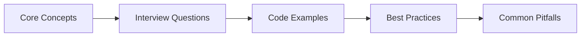

# Chapter 49: PHP Interview Q&A

> **Previous:** [Manufacturing Interview Q&A](./48-interview-manufacturing.md) | **Next:** [MySQL & Database Interview Q&A](./50-interview-mysql.md)


---

This chapter covers the most frequently asked PHP interview questions across fundamentals, object-oriented programming, advanced features, PHP 8+ syntax, Composer, design patterns, and Laravel-era PHP concepts. Each answer includes practical code examples.

---


<!-- Image Gallery -->
<div style="display:flex;flex-wrap:wrap;gap:4px;margin:16px 0;padding:12px;background:#f8fafc;border-radius:8px;border:1px solid #e2e8f0;">
<a href="../../../assets/images/lessons/laravel/49-interview-php/hero.svg" target="_blank" rel="noopener">
  
</a>
<a href="../../../assets/images/lessons/laravel/49-interview-php/handwritten-notes.svg" target="_blank" rel="noopener">
  
</a>
<a href="../../../assets/images/lessons/laravel/49-interview-php/sticky-notes.svg" target="_blank" rel="noopener">
  
</a>
<a href="../../../assets/images/lessons/laravel/49-interview-php/visual-explanation.svg" target="_blank" rel="noopener">
  
</a>
<a href="../../../assets/images/lessons/laravel/49-interview-php/architecture.svg" target="_blank" rel="noopener">
  
</a>
<a href="../../../assets/images/lessons/laravel/49-interview-php/workflow.svg" target="_blank" rel="noopener">
  
</a>
<a href="../../../assets/images/lessons/laravel/49-interview-php/mindmap.svg" target="_blank" rel="noopener">
  
</a>
<a href="../../../assets/images/lessons/laravel/49-interview-php/comparison.svg" target="_blank" rel="noopener">
  
</a>
<a href="../../../assets/images/lessons/laravel/49-interview-php/cheatsheet.svg" target="_blank" rel="noopener">
  
</a>
<a href="../../../assets/images/lessons/laravel/49-interview-php/interview-quiz.svg" target="_blank" rel="noopener">
  
</a>
<a href="../../../assets/images/lessons/laravel/49-interview-php/social-card.svg" target="_blank" rel="noopener">
  
</a>
</div>
<!-- End Image Gallery -->

## Chapter at a Glance

| Aspect | Details |
|--------|---------|
| **Scope** | PHP interview questions covering fundamentals, OOP, advanced features, PHP 8+, Composer, design patterns |
| **Key Concepts** | PHP syntax, OOP principles, type system, Composer autoloading, design patterns, PHP 8 features |
| **Learning Approach** | Q&A format with practical code examples |
| **Skills Required** | PHP fundamentals, OOP, Composer |

## Chapter Roadmap



## 1. PHP Fundamentals


### Q1: What is PHP and how does it differ from JavaScript on the backend?

**Answer:** PHP (Hypertext Preprocessor) is a server-side scripting language designed for web development. Unlike JavaScript (which runs in the browser or via Node.js), PHP executes entirely on the server, generates HTML sent to the client, and is naturally synchronous and blocking per-request. PHP's shared-nothing architecture means each request starts fresh with no in-memory state, unlike Node.js which maintains a persistent process.

```php
// PHP: runs once per request, outputs directly
<?php echo "Hello from the server at " . date('Y-m-d H:i:s'); ?>
```

### Q2: How do PHP variables work? What are the type system basics?

**Answer:** PHP is a dynamically typed language. Variables are prefixed with `$`, require no explicit type declaration, and can change type at runtime. PHP 8 introduces union types in function signatures but the underlying engine still juggles types internally.

```php
$name = "Alice";           // string
$age = 30;                 // int
$rate = 99.9;              // float
$active = true;            // bool
$items = [1, 2, 3];        // array
$result = null;            // null
$obj = new stdClass();     // object

$age = "thirty";           // allowed → type changed at runtime
```

### Q3: What are the primitive types in PHP?

**Answer:** PHP has 10 primitive types: 4 scalar (`bool`, `int`, `float`, `string`), 4 compound (`array`, `object`, `callable`, `iterable`), and 2 special (`null`, `resource`). PHP 8 added `mixed` and `never` as pseudo-types, and `false`/`null` can now appear as standalone types in union type declarations.

```php
function log(mixed $data): void { var_dump($data); }
function abort(): never { exit('Fatal'); }
function find(string $id): User|null { /* ... */ }
```

### Q4: What is type juggling and how can it cause bugs?

**Answer:** PHP automatically coerces types when operators expect specific types. This "type juggling" can lead to surprising comparisons, especially with loose equality (`==`). Always use strict comparison (`===`) unless coercion is intentional.

```php
var_dump("42" == 42);    // true (juggled)
var_dump("42" === 42);   // false (strict)
var_dump(0 == "abc");    // true (PHP 7, "abc" cast to 0)
var_dump(0 == "abc");    // false (PHP 8, string-to-int comparison is numeric)
```

### Q5: What are the different array types in PHP?

**Answer:** PHP has one array type → `array` → which can be either indexed (sequential integer keys) or associative (string keys). Both can mix within the same array. PHP 8.1 adds `array_is_list()` to distinguish sequential arrays.

```php
$indexed = ['a', 'b', 'c'];
$assoc = ['name' => 'Alice', 'age' => 30];
$mixed = [0 => 'x', 'y' => 'z'];

var_dump(array_is_list($indexed)); // true (PHP 8.1+)
var_dump(array_is_list($assoc));   // false
```

### Q6: How do `isset()`, `empty()`, and `is_null()` differ?

**Answer:** `isset()` returns `true` if a variable is set and not `null`. `empty()` returns `true` if a variable is falsy (`''`, `0`, `'0'`, `null`, `false`, `[]`). `is_null()` returns `true` only if the variable is `null` or unset (with a warning).

```php
$x = 0;
var_dump(isset($x));    // true (0 is set)
var_dump(empty($x));    // true (0 is falsy)
var_dump(is_null($x));  // false (0 is not null)

$y = null;
var_dump(isset($y));    // false
var_dump(empty($y));    // true
var_dump(is_null($y));  // true
```

### Q7: Explain the string concatenation operator and how it differs from JavaScript.

**Answer:** PHP uses `.` (dot) for string concatenation, unlike JavaScript's `+`. PHP uses `+` only for numeric addition. Complex strings can use double-quoted interpolation or `sprintf()`.

```php
$greeting = 'Hello, ' . 'World!';
$score = "You scored: {$points}/100";
$formatted = sprintf('Hello %s, you have %d new messages', $name, $count);
```

### Q8: What is the difference between single and double quotes in PHP?

**Answer:** Single-quoted strings are literal → only `\\` and `\'` are interpreted as escape sequences. Double-quoted strings interpret variable interpolation (`$var`, `{$var}`) and escape sequences (`\n`, `\t`, `\$`, etc.). Double quotes are slightly slower but rarely a concern.

```php
$name = 'Alice';
echo 'Hello $name';     // Hello $name (literal)
echo "Hello $name";     // Hello Alice (interpolated)
echo "Line1\nLine2";    // newline in output
```

### Q9: What operators does PHP support for array comparison?

**Answer:** `+` union merges arrays (left-hand keys take precedence). `==` loose equality checks same key/value pairs regardless of order. `===` strict equality requires same key/value pairs in same order and same types.

```php
$a = ['a', 'b'];
$b = [0 => 'a', 1 => 'b'];
$c = [1 => 'b', 0 => 'a'];

var_dump($a == $c);   // true (same key/value)
var_dump($a === $b);  // true (same order)
var_dump($a === $c);  // false (different order)

$d = $a + ['x', 'y']; // ['a', 'b'] → union ignores right duplicates
```

### Q10: How do `++$i` and `$i++` differ in PHP?

**Answer:** `++$i` (pre-increment) increments the variable and returns the new value. `$i++` (post-increment) returns the current value then increments. The same applies to decrement operators.

```php
$i = 5;
echo ++$i;  // 6 (i becomes 6, returns 6)
echo $i;    // 6

$j = 5;
echo $j++;  // 5 (returns 5, then j becomes 6)
echo $j;    // 6
```

### Q11: How does the `switch` statement work in PHP? What is the fallthrough behavior?

**Answer:** `switch` compares loosely (`==`). Each `case` execution falls through to the next unless terminated by `break`. Missing `break` is a common bug. PHP 8.0 introduces `match` which is strict (`===`) and returns values without fallthrough.

```php
$status = 2;
switch ($status) {
    case 1:
        echo 'Pending';
        break;
    case 2:
        echo 'Active';
        // break missing → falls through!
    case 3:
        echo 'Archived';  // also runs when status is 2
        break;
}
```

### Q12: What is the null coalescing operator `??`?

**Answer:** The `??` operator returns the left operand if it exists and is not `null`; otherwise returns the right operand. It suppresses undefined-key notices. PHP 7.4 introduced the null coalescing assignment `??=`.

```php
$username = $_GET['user'] ?? 'Guest';        // avoids undefined index notice
$count = $cache['visits'] ?? $this->count(); // function short-circuit
$data['key'] ??= 'default';                   // assigns only if null
```

### Q13: What is the spaceship operator `<=>`?

<a href="../../../assets/images/diagrams/laravel/49-interview-php/what-is-the-spaceship-operator-handwritten.svg" target="_blank" rel="noopener">
  `?" width="30%">
</a>
<a href="../../../assets/images/diagrams/laravel/49-interview-php/what-is-the-spaceship-operator-diagram.svg" target="_blank" rel="noopener">
  `?" width="30%">
</a>
<a href="../../../assets/images/diagrams/laravel/49-interview-php/what-is-the-spaceship-operator-sticky.svg" target="_blank" rel="noopener">
  `?" width="30%">
</a>

**Answer:** The spaceship operator performs combined comparison: returns `-1` if left &lt; right, `0` if equal, `1` if left &gt; right. It's essential for custom sort callbacks.

```php
function sortUsers(User $a, User $b): int {
    return $a->score <=> $b->score;  // ascending
}

$users = ['Charlie', 'Alice', 'Bob'];
usort($users, fn($a, $b) => $a <=> $b); // ['Alice', 'Bob', 'Charlie']
```

### Q14: How do you define and call a function in PHP?

**Answer:** Functions are defined with the `function` keyword, can have type hints for parameters and return types, and support default values, variadic arguments, and nullable types.

```php
function calculateTotal(float $price, int $qty = 1, ?float $discount = null): float
{
    $total = $price * $qty;
    if ($discount !== null) {
        $total *= (1 - $discount / 100);
    }
    return $total;
}

echo calculateTotal(29.99, 3);                 // 89.97
echo calculateTotal(100, 1, 15.0);             // 85.00
```

### Q15: What are strict types and how do you enable them?

**Answer:** `declare(strict_types=1)` placed at the top of a PHP file enforces strict type checking for function calls within that file. Without it, PHP coerces argument types → `int` arguments accept `float` and coerce `"42"` strings silently. Strict types throw a `TypeError` on mismatch.

```php
declare(strict_types=1);

function sum(int $a, int $b): int {
    return $a + $b;
}

sum(3, 4);      // 7
sum(3, 4.5);    // TypeError: must be of type int
```

### Q16: How does variable scope work in PHP?

**Answer:** PHP has function scope → variables defined outside a function are not accessible inside unless explicitly `global` or passed via parameters. The `global` keyword imports a reference to the outer scope. Static variables persist across function calls within the same request.

```php
$counter = 0;

function increment(): int {
    static $count = 0;   // persists across calls
    global $counter;     // imports outer scope
    $counter++;
    return ++$count;
}

echo increment(); // 1 (count=1, counter=1)
echo increment(); // 2 (count=2, counter=2)
```

### Q17: What are variable variables?

**Answer:** Variable variables use `$$name` to access a variable whose name is the value of another variable. They are rarely used in modern PHP due to readability concerns → use arrays or dynamic access instead.

```php
$name = 'color';
$color = 'red';
echo $$name;       // red (accesses $color)
echo ${$name};     // red (explicit syntax)

// Prefer arrays:
$props = ['color' => 'red'];
echo $props[$name]; // red
```

### Q18: How does the `foreach` loop work with arrays and objects?

**Answer:** `foreach` iterates over arrays and traversable objects. By default it copies the array (unless the array is a reference or has large internals). Use `&$value` for by-reference iteration to modify the original.

```php
$items = ['a', 'b', 'c'];
foreach ($items as $key => $value) {
    echo "$key: $value\n";
}

// Modify in place
foreach ($items as &$value) {
    $value = strtoupper($value);
}
unset($value); // break the reference → important!

var_dump($items); // ['A', 'B', 'C']
```

### Q19: What is `list()` or short array destructuring?

**Answer:** `list()` and its short `[]` syntax unpack array values into variables. Works for indexed and associative arrays (PHP 7.1+). Nested destructuring is also supported.

```php
$user = ['Alice', 30, 'alice@example.com'];
[$name, $age, $email] = $user;

// Associative (PHP 7.1+)
$data = ['name' => 'Bob', 'age' => 25];
['name' => $name, 'age' => $age] = $data;

// Nested
$matrix = [[1, 2], [3, 4]];
foreach ($matrix as [$a, $b]) {
    echo "$a + $b = " . ($a + $b) . "\n";
}
```

### Q20: How do you pass arguments by reference?

**Answer:** Prepend `&` to the parameter in the function definition. The caller passes the variable normally; any mutation inside the function affects the original variable. References prevent copying large data.

```php
function appendFooter(string &$content): void {
    $content .= "\n<hr><p>Footer</p>";
}

$html = "<h1>Title</h1>";
appendFooter($html);
echo $html; // contains footer text
```

### Q21: What are variadic functions in PHP?

**Answer:** Variadic functions use `...` (splat operator) in the parameter list to accept any number of arguments, which are collected into an array. The splat operator also unpacks arrays when calling a function.

```php
function sumAll(int ...$numbers): int {
    return array_sum($numbers);
}

echo sumAll(1, 2, 3, 4, 5); // 15

// Unpacking when calling
$args = [10, 20, 30];
echo sumAll(...$args); // 60
```

### Q22: What is the difference between `require`, `require_once`, `include`, and `include_once`?

**Answer:** All four import a PHP file. `require` causes a fatal error if the file is missing; `include` emits a warning and continues. The `_once` variants use an internal tracker to prevent the same file from being loaded more than once, which avoids redeclaration errors.

```php
require 'config.php';          // fatal if missing
include 'sidebar.php';         // warning if missing
require_once 'vendor/autoload.php'; // load once, fatal if missing
include_once 'helpers.php';    // load once, warning if missing
```

### Q23: How do you work with dates and times in PHP?

**Answer:** The `DateTime` class (and its immutable sibling `DateTimeImmutable`) provide object-oriented date manipulation. `Carbon` is the community standard in Laravel, extending `DateTimeImmutable`.

```php
$now = new DateTimeImmutable('now', new DateTimeZone('UTC'));
$future = $now->modify('+7 days');
echo $future->format('Y-m-d H:i:s');

$interval = $now->diff(new DateTimeImmutable('2026-01-01'));
echo $interval->days; // days until Jan 1 2026
```

### Q24: What are PHP errors and exceptions? How do they differ?

**Answer:** Errors (E_WARNING, E_NOTICE, E_PARSE) are legacy PHP-level issues. Exceptions are objects you can throw and catch. Since PHP 7, most errors can be caught via `Error` or `Throwable`. Exceptions should represent recoverable application problems; errors represent runtime problems.

```php
try {
    $result = divide(10, 0);
} catch (DivisionByZeroError $e) {
    echo "Math error: " . $e->getMessage();
} catch (Throwable $e) {
    echo "Something went wrong: " . $e->getMessage();
}
```

### Q25: What is the `@` error control operator?

**Answer:** The `@` operator suppresses errors and warnings from an expression. It is generally discouraged because it masks real problems makes debugging difficult. Use proper error handling instead.

```php
$content = @file_get_contents('missing.txt');
if ($content === false) {
    // Handle failure explicitly
    $content = 'Fallback content';
}
```

---

## 2. Object-Oriented PHP

### Q26: How do you define a class with properties and methods?

**Answer:** Classes use the `class` keyword. Properties have visibility modifiers (`public`, `protected`, `private`). Methods are functions inside the class. PHP 8.0+ supports constructor promotion for concise property declarations.

```php
class User
{
    public function __construct(
        private string $name,
        private int $age,
        private array $roles = []
    ) {}

    public function getName(): string
    {
        return $this->name;
    }

    public function hasRole(string $role): bool
    {
        return in_array($role, $this->roles, true);
    }
}

$user = new User('Alice', 30, ['admin']);
echo $user->getName(); // Alice
```

### Q27: What is constructor promotion in PHP 8?

**Answer:** Constructor promotion combines property declaration, constructor parameter, and assignment into one syntax. Public, protected, or private on the parameter automatically creates and assigns the property. It reduces boilerplate significantly.

```php
// Before PHP 8
class Order {
    private string $id;
    private float $total;
    public function __construct(string $id, float $total) {
        $this->id = $id;
        $this->total = $total;
    }
}

// PHP 8
class Order {
    public function __construct(
        private string $id,
        private float $total
    ) {}
}
```

### Q28: Explain `public`, `protected`, and `private` visibility.

**Answer:** `public` → accessible from anywhere. `protected` → accessible only within the class itself and its child classes. `private` → accessible only within the defining class, not from children. This applies to both properties and methods.

```php
class ParentClass {
    public $pub = 1;
    protected $prot = 2;
    private $priv = 3;
}

class Child extends ParentClass {
    public function show(): void {
        echo $this->pub;   // 1 (ok)
        echo $this->prot;  // 2 (ok)
        echo $this->priv;  // undefined! (private to parent)
    }
}
```

### Q29: How does inheritance work in PHP?

**Answer:** PHP supports single class inheritance using `extends`. A child class inherits all public and protected methods/properties from the parent. The child can override methods, call parent methods with `parent::`, and add new functionality.

```php
class Animal {
    public function __construct(protected string $name) {}
    public function speak(): string { return '...'; }
}

class Dog extends Animal {
    public function speak(): string {
        return "{$this->name} says Woof!";
    }
}

class Cat extends Animal {
    public function speak(): string {
        return parent::speak() . " Actually, {$this->name} says Meow!";
    }
}

$dog = new Dog('Rex');
echo $dog->speak(); // Rex says Woof!
```

### Q30: What are abstract classes and when should you use them?

**Answer:** Abstract classes (declared `abstract`) cannot be instantiated directly. They define a base template with some implemented methods and some abstract method signatures that children must implement. Use when classes share state or behavior but need to enforce certain method contracts.

```php
abstract class PaymentGateway
{
    public function __construct(protected array $config) {}

    abstract public function charge(float $amount, array $payload): array;

    public function formatAmount(float $amount): string
    {
        return number_format($amount, 2);
    }
}

class StripeGateway extends PaymentGateway
{
    public function charge(float $amount, array $payload): array
    {
        return ['status' => 'success', 'amount' => $this->formatAmount($amount)];
    }
}
```

### Q31: What is an interface and how does it differ from an abstract class?

**Answer:** An interface defines a contract → method signatures without any implementation. A class can implement multiple interfaces (unlike classes which extend only one). Abstract classes can have properties, implemented methods, and constructor logic. Use interfaces when you only want to enforce a shape, not share logic.

```php
interface LoggerInterface {
    public function log(string $message, string $level = 'info'): void;
}

interface Cacheable {
    public function cacheKey(): string;
    public function ttl(): int;
}

class UserService implements LoggerInterface, Cacheable {
    public function log(string $message, string $level = 'info'): void {
        // implementation
    }
    public function cacheKey(): string { return 'users'; }
    public function ttl(): int { return 3600; }
}
```

### Q32: What are traits and why would you use them?

**Answer:** Traits are reusable code snippets that can be composed into classes, solving PHP's single-inheritance limitation. A trait cannot be instantiated alone → it's mixed into a class. Traits can have properties, methods, abstract methods, and even use other traits.

```php
trait Timestampable
{
    public function __construct(
        private ?DateTimeImmutable $createdAt = null,
        private ?DateTimeImmutable $updatedAt = null
    ) {
        $this->createdAt ??= new DateTimeImmutable();
    }

    public function markUpdated(): void
    {
        $this->updatedAt = new DateTimeImmutable();
    }
}

trait SoftDeletes
{
    private ?DateTimeImmutable $deletedAt = null;

    public function delete(): void
    {
        $this->deletedAt = new DateTimeImmutable();
    }
}

class Post
{
    use Timestampable, SoftDeletes;
}
```

### Q33: How does trait conflict resolution work?

**Answer:** When two traits define the same method, PHP requires explicit resolution. Use `insteadof` to choose one trait's method, or `as` to alias a method (keeping both available under different names).

```php
trait A { public function greet(): string { return 'Hi from A'; } }
trait B { public function greet(): string { return 'Hi from B'; } }

class Greeter {
    use A, B {
        A::greet insteadof B;  // use A's greet as the default
        B::greet as greetFromB; // alias B's greet
    }
}

$g = new Greeter();
echo $g->greet();      // Hi from A
echo $g->greetFromB(); // Hi from B
```

### Q34: What is the `final` keyword used for?

**Answer:** `final` prevents a method from being overridden in child classes, or prevents a class from being extended at all. Use it when the implementation is complete and should not be altered by subclasses → it signals design intent.

```php
final class Configuration
{
    public static function get(string $key): mixed { /* ... */ }
}

class PaymentProcessor {
    final public function process(): void { /* core logic not meant to change */ }
}

// class ExtendedConfig extends Configuration {} // Fatal error
```

### Q35: What are magic methods in PHP?

**Answer:** Magic methods are special methods prefixed with `__` that PHP calls implicitly. Key ones: `__construct`, `__destruct`, `__get`, `__set`, `__call`, `__callStatic`, `__toString`, `__invoke`, `__clone`, `__isset`, `__unset`, `__sleep`, `__wakeup`, `__serialize`, `__unserialize`.

```php
class MagicBag
{
    private array $data = [];

    public function __get(string $name): mixed
    {
        return $this->data[$name] ?? null;
    }

    public function __set(string $name, mixed $value): void
    {
        $this->data[$name] = $value;
    }

    public function __call(string $name, array $args): mixed
    {
        if (str_starts_with($name, 'get')) {
            $prop = lcfirst(substr($name, 3));
            return $this->data[$prop] ?? null;
        }
        throw new BadMethodCallException("$name not found");
    }

    public function __toString(): string
    {
        return json_encode($this->data);
    }

    public function __invoke(string $key): mixed
    {
        return $this->data[$key] ?? null;
    }
}

$bag = new MagicBag();
$bag->name = 'Alice';
echo $bag->name;    // Alice (via __get)
echo $bag->getName(); // Alice (via __call)
echo $bag('name');  // Alice (via __invoke)
```

### Q36: What does `__clone` do?

**Answer:** `__clone` is called after an object is cloned with `clone`. It allows deep-copying referenced properties; otherwise PHP performs a shallow copy (references remain shared).

```php
class UserPreferences
{
    public function __construct(
        public array $settings = []
    ) {}

    public function __clone(): void
    {
        $this->settings = array_merge([], $this->settings); // deep copy array
    }
}

$original = new UserPreferences(['theme' => 'dark']);
$clone = clone $original;
$clone->settings['theme'] = 'light';

print_r($original->settings['theme']); // dark (unchanged)
```

### Q37: How does `__serialize` / `__unserialize` work?

**Answer:** Added in PHP 7.4, these replace `__sleep` / `__wakeup`. `__serialize` returns an array of data to be serialized. `__unserialize` receives that array and restores the object state. They are cleaner and avoid the ambiguous return value of `__sleep`.

```php
class SessionUser
{
    public function __construct(
        private int $id,
        private string $name,
        private string $passwordHash
    ) {}

    public function __serialize(): array
    {
        return ['id' => $this->id, 'name' => $this->name];
    }

    public function __unserialize(array $data): void
    {
        $this->id = $data['id'];
        $this->name = $data['name'];
    }
}
```

### Q38: What is the static keyword and late static binding?

**Answer:** `static::` enables late static binding → the referenced class is determined at runtime based on the actual class called, not the class where the method is defined. `self::` always resolves to the class where the method is written.

```php
class Base {
    public static function who(): string { return __CLASS__; }
    public static function testSelf(): string { return self::who(); }
    public static function testStatic(): string { return static::who(); }
}

class Child extends Base {
    public static function who(): string { return __CLASS__; }
}

echo Child::testSelf();   // Base (self resolves at compile time)
echo Child::testStatic(); // Child (static resolves at runtime)
```

### Q39: How does `instanceof` work?

**Answer:** `instanceof` checks whether an object is an instance of a class, or implements an interface, or extends a parent class. It also supports class name strings.

```php
class User {}
interface Notifiable {}
class AdminUser extends User implements Notifiable {}

$admin = new AdminUser();

var_dump($admin instanceof AdminUser);  // true
var_dump($admin instanceof User);       // true
var_dump($admin instanceof Notifiable); // true
var_dump($admin instanceof DateTime);   // false

// Dynamic class name check
$class = 'User';
var_dump($admin instanceof $class); // true
```

### Q40: What is the `::class` constant?

**Answer:** `ClassName::class` returns the fully qualified class name as a string. It's resolved at compile time, making refactoring safe (IDE rename updates it). It's widely used in Laravel for service container bindings and route controller definitions.

```php
namespace App\Models;

class Product {}

// Anywhere:
$name = Product::class;         // 'App\Models\Product'
app()->bind(Product::class, fn() => new Product());

// Route resolution
Route::get('/products', [ProductController::class, 'index']);
```

### Q41: What is an anonymous class?

**Answer:** Anonymous classes are defined inline without a name, useful for one-off objects, mocks in tests, or simple implementations. They can extend classes, implement interfaces, and use traits.

```php
interface Greeter {
    public function greet(string $name): string;
}

function sayHello(Greeter $greeter, string $name): void {
    echo $greeter->greet($name);
}

sayHello(new class implements Greeter {
    public function greet(string $name): string {
        return "Hey there, $name!";
    }
}, 'Alice'); // Hey there, Alice!
```

### Q42: How does type hinting work for object parameters?

**Answer:** PHP supports type hinting for classes, interfaces, arrays, callables, iterables, and primitives (int, float, string, bool, void, never, mixed). Nullable types use `?Type` syntax. Union types (PHP 8) allow multiple types.

```php
function processUser(User $user): void {}          // class type
function sendTo(Notifiable $notifiable): void {}    // interface type
function items(?array $data): void {}                // nullable
function output(int|string $value): void {}          // union (PHP 8)
function handle(mixed $input): int|false {}          // mixed + union return
```

---

## 3. Advanced PHP

### Q43: What are namespaces and how do you use them?

**Answer:** Namespaces organize code into logical groups, prevent class name collisions, and follow the directory structure. Declared with `namespace` at the top of a file. Fully qualified names start with `\`.

```php
// src/Payments/StripeGateway.php
namespace App\Payments;

class StripeGateway {}

// src/Controllers/PaymentController.php
namespace App\Controllers;

use App\Payments\StripeGateway;

class PaymentController {
    public function __construct(
        private StripeGateway $gateway
    ) {}
}
```

### Q44: How do `use`, `use function`, and `use const` differ?

**Answer:** `use` imports classes/interfaces/traits. `use function` imports functions. `use const` imports constants. All can alias with `as`. Grouped imports (PHP 7) reduce repetition.

```php
use App\Models\{User, Post, Comment};
use function App\Helpers\{formatDate, slugify};
use const App\Config\{MAX_RETRIES, TIMEOUT};
use App\Exceptions\HttpException as HttpError;
```

### Q45: How does exception handling work in PHP?

**Answer:** `try` blocks wrap risky code. `catch` blocks handle specific exception types (multiple allowed). `finally` runs regardless of exception. PHP 8.0+ lets you capture the exception as nullable and use `match`-style catch.

```php
class PaymentFailedException extends \RuntimeException {}

try {
    $payment = $gateway->charge(100);
} catch (PaymentFailedException $e) {
    log::error('Payment failed: ' . $e->getMessage());
    throw $e; // re-throw
} catch (\HttpException $e) {
    // handle HTTP issues
} finally {
    $this->em->close(); // always execute
}
```

### Q46: What is `set_exception_handler` and when would you use it?

**Answer:** `set_exception_handler` sets a global catch-all for uncaught exceptions, allowing a centralized error response (e.g., JSON error for an API). It's called as the last resort before PHP terminates.

```php
set_exception_handler(function (\Throwable $e): void {
    http_response_code(500);
    header('Content-Type: application/json');
    echo json_encode([
        'error' => $e->getMessage(),
        'file' => $e->getFile(),
        'line' => $e->getLine(),
    ]);
});

// Any uncaught exception now renders JSON
```

### Q47: What is the SPL (Standard PHP Library) and what are its most useful classes?

**Answer:** SPL provides data structures, iterators, file handling, and interfaces. Key classes: `ArrayObject`, `SplStack`, `SplQueue`, `SplPriorityQueue`, `SplFileInfo`, `SplObjectStorage`, `DirectoryIterator`.

```php
use \SplQueue;

$queue = new SplQueue();
$queue->enqueue('task1');
$queue->enqueue('task2');

echo $queue->dequeue(); // task1 (FIFO)

// SplObjectStorage → map objects to data
$storage = new SplObjectStorage();
$user = new User('Alice');
$storage[$user] = ['visits' => 42];
```

### Q48: How do generators work and why are they useful?

**Answer:** Generators use `yield` to produce values lazily without building the entire result set in memory. The function pauses at each `yield` and resumes when the next value is requested. Critical for processing large datasets.

```php
function processLargeFile(string $path): \Generator
{
    $handle = fopen($path, 'r');
    while (($line = fgets($handle)) !== false) {
        yield trim($line);
    }
    fclose($handle);
}

// Memory: O(1) → only one line in memory at a time
foreach (processLargeFile('huge.log') as $line) {
    if (str_contains($line, 'ERROR')) {
        echo $line . "\n";
    }
}
```

### Q49: What is the difference between `yield` and `yield from`?

**Answer:** `yield` emits a single value (and optionally a key). `yield from` delegates to another generator, traversable, or array, yielding all its values transparently. It also supports recursion.

```php
function countUpTo(int $max): \Generator
{
    for ($i = 1; $i <= $max; $i++) {
        yield $i;
    }
}

function combined(): \Generator
{
    yield from countUpTo(3);    // delegate to another generator
    yield 'separator';
    yield from [7, 8, 9];       // delegate to array
}

foreach (combined() as $value) {
    echo "$value "; // 1 2 3 separator 7 8 9
}
```

### Q50: What are closures and how do they capture variables?

**Answer:** Closures are anonymous functions that can capture variables from the surrounding scope via `use`. By default, captured variables are copied (value capture); use `&` for reference capture. PHP 7.4 introduced arrow functions which implicitly capture by value.

```php
$multiplier = 3;

$times = function (int $n) use ($multiplier): int {
    return $n * $multiplier;
};

echo $times(5); // 15

// Reference capture
$counter = 0;
$increment = function () use (&$counter): void {
    $counter++;
};
$increment();
echo $counter; // 1
```

### Q51: How do arrow functions differ from closures?

**Answer:** Arrow functions (`fn`) are a shorter syntax for closures that automatically capture outer variables by value and cannot use `use`. They are limited to a single expression (the return value). They cannot modify captured variables or use `&` reference.

```php
$numbers = [1, 2, 3, 4, 5];

// Closure:
$even = array_filter($numbers, function (int $n): bool {
    return $n % 2 === 0;
});

// Arrow function (PHP 7.4+):
$even = array_filter($numbers, fn(int $n): bool => $n % 2 === 0);

// Implicit parent scope access:
$factor = 2;
$doubled = array_map(fn(int $n) => $n * $factor, $numbers);
```

### Q52: What are callables and how are they used?

**Answer:** A callable is anything that can be called as a function: a closure, a function name string, an array `[$object, 'method']`, an invokable object, or a static call `['ClassName', 'method']`. Functions accepting callables use `callable` type hint or `is_callable()`.

```php
function execute(callable $callback, mixed ...$args): mixed
{
    return $callback(...$args);
}

echo execute(fn($a, $b) => $a + $b, 5, 3); // 8
echo execute('strtoupper', 'hello');        // HELLO
echo execute(['MathHelper', 'square'], 4);  // 16 (static method)
```

### Q53: What is `array_map`, `array_filter`, and `array_reduce`?

**Answer:** These are higher-order array functions. `array_map` transforms each element. `array_filter` keeps elements passing a truth test. `array_reduce` iteratively accumulates a value.

```php
$items = [1, 2, 3, 4, 5];

$doubled = array_map(fn(int $n): int => $n * 2, $items);
// [2, 4, 6, 8, 10]

$even = array_filter($items, fn(int $n): bool => $n % 2 === 0);
// [2, 4] (keys preserved)

$sum = array_reduce($items, fn(int $carry, int $n): int => $carry + $n, 0);
// 15
```

### Q54: How do you handle file uploads in PHP?

**Answer:** Files arrive in the `$_FILES` superglobal. Each file is an array with `name`, `tmp_name`, `size`, `error`, `type`. Use `move_uploaded_file()` to relocate safely. Always validate extension, MIME type, and size.

```php
if ($_SERVER['REQUEST_METHOD'] === 'POST' && isset($_FILES['avatar'])) {
    $file = $_FILES['avatar'];

    if ($file['error'] !== UPLOAD_ERR_OK) {
        throw new \RuntimeException('Upload failed');
    }

    $allowed = ['jpg', 'png', 'gif'];
    $ext = strtolower(pathinfo($file['name'], PATHINFO_EXTENSION));

    if (!in_array($ext, $allowed, true)) {
        throw new \RuntimeException('Invalid file type');
    }

    $dest = sys_get_temp_dir() . '/' . bin2hex(random_bytes(16)) . '.' . $ext;
    move_uploaded_file($file['tmp_name'], $dest);
}
```

### Q55: What is output buffering?

**Answer:** `ob_start()` captures all output (echo, HTML, etc.) into a buffer instead of sending it immediately. `ob_get_clean()` retrieves and discards the buffer. Used for template rendering, preventing header errors, and manipulating response content.

```php
ob_start();
echo '<h1>Hello</h1>';
echo '<p>World</p>';
$content = ob_get_clean();

// Transform or discard output
$content = str_replace('Hello', 'Hi', $content);
echo $content;
```

### Q56: How does PHP handle sessions?

**Answer:** Sessions use a server-side storage (files by default) identified by a cookie (usually `PHPSESSID`). `session_start()` loads the session data into `$_SESSION`. Session data persists across requests. For APIs, token-based auth (JWT, Sanctum) is preferred.

```php
session_start();

if (!isset($_SESSION['visits'])) {
    $_SESSION['visits'] = 0;
}
$_SESSION['visits']++;

echo "You've visited {$_SESSION['visits']} times.";
```

### Q57: What are resources in PHP?

**Answer:** Resources are a special type holding a reference to an external resource (file handle, database connection, curl handle). They are automatically garbage collected when no longer referenced. PHP 8 deprecated the `is_resource()` emphasis; many resources became objects in modern PHP.

```php
$file = fopen('data.csv', 'r');    // $file is a resource
$ch = curl_init('https://api.example.com');  // curl handle

// Most modern extensions return objects instead
$conn = new mysqli('localhost', 'user', 'pass', 'db');
$redis = new Redis();
```

---

## 4. PHP 8+ Features

### Q58: What are named arguments?

**Answer:** Named arguments (PHP 8) let you pass arguments by parameter name instead of position. This makes self-documenting calls, skips optional parameters, and doesn't break when parameter order changes.

```php
function createUser(
    string $name,
    string $email,
    bool $isAdmin = false,
    bool $isActive = true
): User { /* ... */ }

// Named → clear and skip defaults
createUser(
    name: 'Alice',
    email: 'alice@example.com',
    isAdmin: true,
);
```

### Q59: What are attributes and how do you define custom ones?

**Answer:** Attributes (PHP 8) are structured metadata for classes, methods, properties, etc. Built-in: `#[Attribute]`, `#[Route]`, `#[Deprecated]`. Custom attributes are classes with the `#[Attribute]` attribute.

```php
#[Attribute(\Attribute::TARGET_METHOD | \Attribute::TARGET_CLASS)]
class Route
{
    public function __construct(
        public string $method,
        public string $path
    ) {}
}

#[Route('GET', '/users')]
class ListUsersController
{
    #[Route('POST', '/users')]
    public function store(): void {}
}

// Reading attributes at runtime
$reflection = new ReflectionMethod(ListUsersController::class, 'store');
$attrs = $reflection->getAttributes(Route::class);
foreach ($attrs as $attr) {
    $route = $attr->newInstance();
    echo "{$route->method} {$route->path}"; // POST /users
}
```

### Q60: What are readonly properties and classes?

**Answer:** `readonly` (PHP 8.1 on properties, PHP 8.2 on classes) ensures a property can only be set once. Readonly classes implicitly make all properties readonly. Attempting to modify a readonly property throws an error.

```php
// PHP 8.1 → readonly properties
class UserDto
{
    public function __construct(
        public readonly string $name,
        public readonly int $age,
    ) {}
}

$dto = new UserDto('Alice', 30);
// $dto->name = 'Bob'; // Error

// PHP 8.2 → readonly class
readonly class Config
{
    public function __construct(
        public string $dbHost,   // implicitly readonly
        public int $port,
    ) {}
}
```

### Q61: What are enums in PHP 8.1?

**Answer:** Enums are first-class types with optional backed (string/int) values. They can have methods, implement interfaces, and use traits. Pure enums have no scalar value; backed enums map to a database- or API-friendly value.

```php
enum OrderStatus: string
{
    case Pending = 'pending';
    case Paid = 'paid';
    case Shipped = 'shipped';
    case Cancelled = 'cancelled';

    public function label(): string
    {
        return match ($this) {
            self::Pending => 'Awaiting Payment',
            self::Paid => 'Payment Received',
            self::Shipped => 'On Its Way',
            self::Cancelled => 'Order Cancelled',
        };
    }

    public function isActive(): bool
    {
        return $this !== self::Cancelled;
    }
}

// Usage
$status = OrderStatus::Paid;
echo $status->value;      // 'paid'
echo $status->label();     // 'Payment Received'
echo $status->isActive();  // true

// Backed enum from DB
$status = OrderStatus::from($row['status']);
```

### Q62: What are union and intersection types?

**Answer:** Union types (PHP 8.0) accept any of the listed types, separated by `|`. Intersection types (PHP 8.1) accept types satisfying all listed types, separated by `&`. `false` and `null` can be standalone in unions.

```php
// Union → string OR int
function parseId(string|int $id): string {
    return (string) $id;
}

// Nullable union
function find(?int $id): User|null { /* ... */ }

// Intersection → must satisfy both
function log(LoggerInterface&LogLevelAware $logger): void {
    // $logger must implement both interfaces
}

// DNF types (PHP 8.2)
function format((Countable&Traversable)|array $data): string { /* ... */ }
```

### Q63: How does the `match` expression differ from `switch`?

**Answer:** `match` (PHP 8.0) is an expression that returns a value, uses strict comparison (`===`), supports multiple comma-separated arms, throws `UnhandledMatchError` if no arm matches. No fallthrough → it never needs `break`.

```php
$statusCode = 404;

$message = match ($statusCode) {
    200, 201 => 'OK or Created',
    301, 302 => 'Redirect',
    404 => 'Not Found',
    500 => 'Server Error',
    default => 'Unknown',
};

echo $message; // Not Found

// vs switch:
switch ($statusCode) {
    case 200: $msg = 'OK'; break;
    default: $msg = 'Unknown';
}
```

### Q64: What is the `nullsafe` operator?

**Answer:** `?->` (PHP 8.0) short-circuits method/property chains when an intermediate value is null. Instead of nested null checks, the chain stops and returns null at the first null encounter.

```php
class User {
    public function __construct(
        public ?Address $address = null
    ) {}
}
class Address {
    public function __construct(
        public ?string $city = null
    ) {}
}

$user = new User();
// Without nullsafe:
$city = $user->address !== null ? $user->address->city : null;

// With nullsafe:
$city = $user?->address?->city; // null (short-circuits)
```

### Q65: What is the `str_contains`, `str_starts_with`, and `str_ends_with` functions?

**Answer:** Added in PHP 8.0, these functions provide boolean string checks without needing `strpos` !== false comparisons. They are fast, intuitive, and encode intent directly.

```php
$url = 'https://example.com/api/users';

var_dump(str_contains($url, 'api'));    // true
var_dump(str_starts_with($url, 'https')); // true
var_dump(str_ends_with($url, 'users'));   // true

// Before PHP 8:
var_dump(strpos($url, 'api') !== false);
```

### Q66: How does `mixed` type work?

**Answer:** `mixed` (PHP 8.0) is a pseudo-type meaning the parameter or return can be any type. It's equivalent to `string|int|float|bool|null|array|object|callable|resource`. Use it only when truly anything is acceptable → prefer explicit union types for clarity.

```php
function logValue(mixed $value): void
{
    match (true) {
        is_string($value) => echo "String: $value",
        is_int($value) => echo "Int: $value",
        is_array($value) => echo 'Array: ' . json_encode($value),
        default => echo gettype($value),
    };
}
```

### Q67: What are first-class callable syntax and `...$args` improvements?

**Answer:** PHP 8.1 lets you create callables from any function/method using `(...)` syntax. This avoids verbose closures when passing functions.

```php
$numbers = ['1', '2', '3'];

// Before PHP 8.1:
$ints = array_map(function (string $s) { return intval($s); }, $numbers);

// PHP 8.1:
$ints = array_map(intval(...), $numbers); // [1, 2, 3]

// Works with methods too:
$upper = array_map(strtoupper(...), ['a', 'b']); // ['A', 'B']
```

### Q68: What is `fibers` in PHP 8.1?

**Answer:** Fibers are interruptible functions for cooperative multitasking → a function can suspend (`Fiber::suspend()`) and the caller can resume it (`$fiber->resume()`). They enable non-blocking code without callbacks or async/await keywords (which PHP does not have). Used internally by Laravel Octane and ReactPHP.

```php
$fiber = new Fiber(function (): void {
    $value = Fiber::suspend('waiting');
    echo "Resumed with: $value";
});

$result = $fiber->start();
echo $result; // 'waiting'

$fiber->resume('hello'); // output: Resumed with: hello
```

### Q69: What is the `never` return type?

**Answer:** `never` (PHP 8.1) indicates a function that never returns → it either throws an exception or calls `exit()`/`die()`. The type checker enforces no return value and no reachable point after the call.

```php
function abort(string $message): never
{
    http_response_code(500);
    echo json_encode(['error' => $message]);
    exit;
}

function redirect(string $url): never
{
    header("Location: $url");
    exit;
}
```

### Q70: What are `array_is_list` and array spread in PHP 8.1/8.2?

**Answer:** `array_is_list()` (PHP 8.1) determines if an array has sequential 0-based integer keys. Array spread (`...`) inside arrays (PHP 8.1) unpacks arrays inline, like `array_merge` but in expression context.

```php
var_dump(array_is_list(['a', 'b', 'c'])); // true
var_dump(array_is_list(['a' => 'v', 'b' => 'v'])); // false

// Array spread (PHP 8.1)
$base = [1, 2, 3];
$merged = [...$base, 4, 5, ...$more]; // [1, 2, 3, 4, 5, ...]

// Before PHP 8.1
$merged = array_merge($base, [4, 5], $more);
```

### Q71: What are random extension improvements in PHP 8.2/8.3?

**Answer:** PHP 8.2 introduced a new random extension with dedicated classes: `\Random\Randomizer` with methods like `getBytesFromString()`, `shuffleArray()`, `pickArrayKeys()`. PHP 8.3 added `Randomizer::getFloat()` and `nextFloat()`.

```php
$random = new \Random\Randomizer();

// Generate a random password from a character set
$password = $random->getBytesFromString(
    'ABCDEFGHJKLMNPQRSTUVWXYZ23456789',
    12
);

// Shuffle an array (preserves keys)
$shuffled = $random->shuffleArray([1, 2, 3, 4, 5]);

// Pick random keys
$keys = $random->pickArrayKeys(['a' => 1, 'b' => 2, 'c' => 3], 2);
```

### Q72: What are PHP 8.4 property hooks?

**Answer:** Property hooks (PHP 8.4) add `get`/`set` behavior directly on properties, similar to C#. They eliminate boilerplate getter/setter methods while keeping property-access syntax. Still in active RFC discussion → check version availability.

```php
class User
{
    public string $name {
        get => ucfirst($this->name);
        set(string $value) {
            if (strlen($value) < 2) {
                throw new \InvalidArgumentException('Name too short');
            }
            $this->name = trim($value);
        }
    }
}
```

---

## 5. Composer & Autoloading

### Q73: What is Composer and why is it essential for modern PHP?

**Answer:** Composer is the dependency manager for PHP. It declares libraries your project depends on, resolves versions, and generates an autoloader. It's essential because it standardizes package management, enables the Packagist ecosystem (150k+ packages), and powers PSR-4 autoloading.

```bash
# Initialize a project
composer init

# Require a package
composer require laravel/framework

# Install all dependencies from composer.lock (deterministic)
composer install

# Update to latest compatible versions
composer update
```

### Q74: How does PSR-4 autoloading work?

**Answer:** PSR-4 maps namespace prefixes to directory paths. Composer generates a classmap and autoloader from the `autoload` section of `composer.json`. When PHP encounters `App\Models\User`, the autoloader converts it to `App\Models\User.php` and prepends the mapped directory prefix.

```json
{
    "autoload": {
        "psr-4": {
            "App\\": "src/"
        }
    }
}
```

With that config, `App\Models\User` resolves to `src/Models/User.php`. The namespace segment after the prefix must match the directory structure exactly.

```php
// src/Models/User.php
namespace App\Models;

class User {}
```

### Q75: What is the difference between `composer install` and `composer update`?

**Answer:** `composer install` reads `composer.lock` and installs the exact versions recorded there. Use it for deployment → produces identical dependency sets across environments. `composer update` reads `composer.json`, resolves the latest compatible versions, writes them to `composer.lock`, and installs. Use it when adding/changing dependencies.

```bash
# First time: creates composer.lock
composer install

# Development: refresh all deps
composer update

# Update a single package
composer update laravel/framework

# Production: exact versions from lock
composer install --no-dev --optimize-autoloader
```

### Q76: What sections exist in `composer.json`?

**Answer:** Key sections: `require` (runtime deps), `require-dev` (dev-only), `autoload` (PSR-4/PSR-0/classmap/files), `scripts` (lifecycle hooks), `extra` (framework metadata), `config` (platform, preferred-install), `repositories` (custom package sources). Laravel typically adds `extra.laravel.dont-discover` and `extra.laravel.dumps`.

```json
{
    "name": "app/project",
    "require": {
        "php": "^8.2",
        "laravel/framework": "^11.0"
    },
    "require-dev": {
        "pestphp/pest": "^3.0"
    },
    "autoload": {
        "psr-4": {
            "App\\": "app/"
        }
    },
    "autoload-dev": {
        "psr-4": {
            "Tests\\": "tests/"
        }
    },
    "scripts": {
        "post-autoload-dump": [
            "Illuminate\\Foundation\\ComposerScripts::postAutoloadDump"
        ]
    }
}
```

### Q77: How do you specify PHP version constraints?

**Answer:** Use semantic versioning operators: `^` (compatible with major), `~` (approximately → minor bumps), `>=`, `<=`, `!=`, `*` (any), `||` (OR). `^8.2` means >=8.2.0 and &lt;9.0.0.

```json
{
    "require": {
        "php": "^8.2",
        "laravel/framework": "^11.0",
        "spatie/laravel-permission": "^6.0|^7.0",
        "monolog/monolog": "~3.0"
    },
    "config": {
        "platform": {
            "php": "8.2.0"
        }
    }
}
```

### Q78: What is `composer.lock` and why should you commit it?

**Answer:** `composer.lock` records the exact version of every installed package and its dependencies. Committing it ensures everyone (devs, CI, deployment) gets identical packages. Without it, `composer install` falls back to `composer.json` and may resolve different versions. Always commit `composer.lock` for applications (not libraries).

```bash
# Good → lock file committed
git add composer.json composer.lock

# Deployment → deterministic install
composer install --no-dev --optimize-autoloader --no-interaction
```

### Q79: What is the autoloader optimization for production?

**Answer:** `--optimize-autoloader` (or `-o`) converts PSR-4/PSR-0 prefixes into a classmap, producing a single array lookup instead of filesystem checks. `--classmap-authoritative` (or `-a`) skips filesystem checks entirely, assuming the classmap is complete. Use in production for faster autoloading.

```bash
# Standard production install
composer install --no-dev --optimize-autoloader

# Maximum performance (no filesystem fallback)
composer install --no-dev --classmap-authoritative

# Development
composer dump-autoload
composer dump-autoload -o  # same as --optimize
```

### Q80: How do Composer scripts work?

**Answer:** Composer scripts run PHP callables or shell commands at lifecycle events: `pre-install-cmd`, `post-install-cmd`, `pre-update-cmd`, `post-update-cmd`, `pre-autoload-dump`, `post-autoload-dump`, and custom scripts via `composer run-script`.

```json
{
    "scripts": {
        "post-autoload-dump": [
            "Illuminate\\Foundation\\ComposerScripts::postAutoloadDump",
            "php artisan package:discover --ansi"
        ],
        "test": "php vendor/bin/pest",
        "lint": "php vendor/bin/phpstan analyse",
        "check": ["@lint", "@test"],
        "post-root-package-install": [
            "php -r \"copy('.env.example', '.env');\""
        ]
    }
}
```

### Q81: What is the difference between `require` and `require-dev`?

**Answer:** `require` lists packages needed in production (framework, database driver, logging). `require-dev` lists packages only for development and testing (PHPUnit/Pest, debugbar, ide-helper, PHPStan). Running `composer install --no-dev` in production skips dev dependencies.

```json
{
    "require": {
        "laravel/framework": "^11.0",
        "predis/predis": "^2.0"
    },
    "require-dev": {
        "pestphp/pest": "^3.0",
        "barryvdh/laravel-debugbar": "^3.0",
        "laravel/sail": "^1.0"
    }
}
```

### Q82: What is a custom repository in Composer?

**Answer:** Custom repositories tell Composer where to find packages that aren't on Packagist. Common types: `vcs` (GitHub, GitLab, Bitbucket), `path` (local directory), `composer` (custom Packagist instance), `artifact` (zip archives).

```json
{
    "repositories": [
        {
            "type": "vcs",
            "url": "https://github.com/myorg/private-package"
        },
        {
            "type": "path",
            "url": "./packages/*"
        },
        {
            "type": "composer",
            "url": "https://satis.example.com"
        }
    ],
    "require": {
        "myorg/private-package": "^1.0"
    }
}
```

### Q83: What is the difference between PSR-0 and PSR-4?

**Answer:** PSR-0 maps namespace to directory using underscores as directory separators (e.g., `Some_Class` → `Some/Class.php`). PSR-4 is simpler → it strips the namespace prefix before mapping to the directory. PSR-4 is the modern standard. PSR-0 is effectively deprecated.

```php
// PSR-0:
// Vendor_Package_ClassName → Vendor/Package/ClassName.php

// PSR-4:
// "Vendor\\Package\\" → "src/"
// Vendor\Package\ClassName → src/ClassName.php
```

---

## 6. Design Patterns

### Q84: How do you implement a Singleton in PHP?

**Answer:** The Singleton pattern ensures only one instance exists. It uses a private constructor, a static `getInstance()` method, and prevents cloning/unserialization. Modern PHP often uses the service container instead (bind as singleton), making the raw pattern less common.

```php
class DatabaseConnection
{
    private static ?self $instance = null;
    private \PDO $pdo;

    private function __construct()
    {
        $this->pdo = new \PDO('mysql:host=localhost;dbname=app', 'user', 'pass');
    }

    public static function getInstance(): self
    {
        return self::$instance ??= new self();
    }

    public function getPdo(): \PDO
    {
        return $this->pdo;
    }

    private function __clone(): void {}
    public function __wakeup(): void { throw new \RuntimeException('Cannot unserialize singleton'); }
}

$db = DatabaseConnection::getInstance();
```

### Q85: How do you implement a Factory pattern in PHP?

**Answer:** A Factory centralizes object creation, encapsulating complex instantiation logic. Parameterized factories switch on input to return different concrete implementations.

```php
interface NotificationSender
{
    public function send(string $recipient, string $message): bool;
}

class EmailSender implements NotificationSender { /* ... */ }
class SmsSender implements NotificationSender { /* ... */ }
class PushSender implements NotificationSender { /* ... */ }

class NotificationFactory
{
    public function make(string $channel): NotificationSender
    {
        return match ($channel) {
            'email' => new EmailSender(),
            'sms' => new SmsSender(),
            'push' => new PushSender(),
            default => throw new \InvalidArgumentException("Unknown channel: $channel"),
        };
    }
}

$factory = new NotificationFactory();
$sender = $factory->make('email');
$sender->send('alice@example.com', 'Welcome!');
```

### Q86: How do you implement the Repository pattern?

**Answer:** The Repository pattern abstracts data access behind a collection-like interface. Your business logic depends on the interface, not the specific ORM or storage engine. This allows swapping implementations (Eloquent, file-based, external API) without changing callers.

```php
interface UserRepositoryInterface
{
    public function find(int $id): ?User;
    public function findByEmail(string $email): ?User;
    public function save(User $user): User;
    public function delete(int $id): bool;
}

class EloquentUserRepository implements UserRepositoryInterface
{
    public function find(int $id): ?User
    {
        return User::find($id);
    }

    public function findByEmail(string $email): ?User
    {
        return User::where('email', $email)->first();
    }

    public function save(User $user): User
    {
        $user->save();
        return $user;
    }

    public function delete(int $id): bool
    {
        return User::destroy($id) > 0;
    }
}

// In a service provider:
$this->app->bind(UserRepositoryInterface::class, EloquentUserRepository::class);
```

### Q87: How do you implement the Strategy pattern?

**Answer:** Strategy defines interchangeable algorithms. Each strategy implements the same interface, and the context selects one at runtime. Common uses: pricing calculations, shipping cost, file export formats.

```php
interface PriceCalculatorInterface
{
    public function calculate(float $basePrice): float;
}

class RegularPrice implements PriceCalculatorInterface
{
    public function calculate(float $basePrice): float
    {
        return $basePrice;
    }
}

class DiscountPrice implements PriceCalculatorInterface
{
    public function __construct(private float $percent) {}

    public function calculate(float $basePrice): float
    {
        return $basePrice * (1 - $this->percent / 100);
    }
}

class PremiumPrice implements PriceCalculatorInterface
{
    public function calculate(float $basePrice): float
    {
        return $basePrice * 1.5; // 50% premium
    }
}

class OrderCalculator
{
    public function __construct(
        private PriceCalculatorInterface $strategy
    ) {}

    public function calculateTotal(float $base): float
    {
        return $this->strategy->calculate($base);
    }
}

$order = new OrderCalculator(new DiscountPrice(20));
echo $order->calculateTotal(100); // 80
```

### Q88: How do you implement the Observer pattern in PHP?

**Answer:** Observer (or publish-subscribe) lets one object notify multiple dependents of state changes. PHP has built-in `SplSubject` and `SplObserver` interfaces. For decoupled systems, event dispatchers (like Laravel's) are preferred.

```php
class Newsletter implements \SplSubject
{
    private \SplObjectStorage $observers;
    private string $latestIssue = '';

    public function __construct()
    {
        $this->observers = new \SplObjectStorage();
    }

    public function attach(\SplObserver $observer): void
    {
        $this->observers->attach($observer);
    }

    public function detach(\SplObserver $observer): void
    {
        $this->observers->detach($observer);
    }

    public function notify(): void
    {
        foreach ($this->observers as $observer) {
            $observer->update($this);
        }
    }

    public function publishIssue(string $issue): void
    {
        $this->latestIssue = $issue;
        $this->notify();
    }

    public function getLatestIssue(): string
    {
        return $this->latestIssue;
    }
}

class EmailNotifier implements \SplObserver
{
    public function update(\SplSubject $subject): void
    {
        $issue = $subject->getLatestIssue();
        echo "Sending email notification for: $issue\n";
    }
}

class SlackNotifier implements \SplObserver
{
    public function update(\SplSubject $subject): void
    {
        $issue = $subject->getLatestIssue();
        echo "Posting to Slack about: $issue\n";
    }
}

$newsletter = new Newsletter();
$newsletter->attach(new EmailNotifier());
$newsletter->attach(new SlackNotifier());
$newsletter->publishIssue('PHP 8.4 Released!');
```

### Q89: What is the Dependency Injection pattern and how does PHP implement it?

**Answer:** Dependency Injection passes an object's dependencies into it rather than having the object create them. Constructor injection is most common. PHP's reflection-based containers (like Laravel's) auto-resolve type-hinted parameters. Manual DI without a container is straightforward.

```php
// Without DI (tight coupling)
class ReportGenerator
{
    private \PDO $pdo;
    public function __construct()
    {
        $this->pdo = new \PDO('mysql:host=localhost;dbname=reports', 'root', '');
    }
}

// With DI (decoupled, testable)
class ReportGenerator
{
    public function __construct(
        private \PDO $pdo,
        private ReportFormatter $formatter,
        private LoggerInterface $logger
    ) {}
}

// Wiring manually:
$pdo = new \PDO('mysql:host=localhost;dbname=reports', 'user', 'pass');
$formatter = new CsvReportFormatter();
$logger = new FileLogger();
$generator = new ReportGenerator($pdo, $formatter, $logger);
```

### Q90: What is the Adapter pattern in PHP?

**Answer:** Adapter converts one interface to another that the client expects. Useful when integrating third-party libraries that don't match your application's interface contracts.

```php
// Your app interface
interface PaymentProcessor
{
    public function pay(float $amount): array;
}

// Third-party library (incompatible)
class StripeSdk
{
    public function createCharge(float $amount, string $currency): object
    {
        return (object) ['id' => 'ch_123', 'status' => 'succeeded'];
    }
}

// Adapter
class StripeAdapter implements PaymentProcessor
{
    public function __construct(private StripeSdk $sdk) {}

    public function pay(float $amount): array
    {
        $result = $this->sdk->createCharge($amount, 'usd');
        return [
            'id' => $result->id,
            'status' => $result->status,
            'amount' => $amount,
        ];
    }
}

$processor = new StripeAdapter(new StripeSdk());
$result = $processor->pay(50.00);
```

### Q91: What is the Decorator pattern in PHP?

**Answer:** Decorator adds behavior to an object dynamically without altering its class. The decorator wraps the original object, implementing the same interface while delegating and extending.

```php
interface BookingCost
{
    public function cost(): float;
    public function description(): string;
}

class BaseBooking implements BookingCost
{
    public function cost(): float { return 100.0; }
    public function description(): string { return 'Room booking'; }
}

class BreakfastDecorator implements BookingCost
{
    public function __construct(private BookingCost $booking) {}

    public function cost(): float
    {
        return $this->booking->cost() + 25.0;
    }

    public function description(): string
    {
        return $this->booking->description() . ', breakfast included';
    }
}

class LateCheckoutDecorator implements BookingCost
{
    public function __construct(private BookingCost $booking) {}

    public function cost(): float
    {
        return $this->booking->cost() + 15.0;
    }

    public function description(): string
    {
        return $this->booking->description() . ', late checkout';
    }
}

$booking = new BaseBooking();
$booking = new BreakfastDecorator($booking);
$booking = new LateCheckoutDecorator($booking);

echo $booking->description(); // Room booking, breakfast included, late checkout
echo $booking->cost();        // 140.0
```

### Q92: What is the Chain of Responsibility pattern?

**Answer:** Chain of Responsibility passes a request along a chain of handlers until one handles it. Each handler decides to process or pass to the next. Laravel's middleware pipeline is a classic example.

```php
abstract class ValidationHandler
{
    private ?ValidationHandler $next = null;

    public function setNext(ValidationHandler $handler): ValidationHandler
    {
        $this->next = $handler;
        return $handler;
    }

    public function handle(array $data): ?string
    {
        $error = $this->validate($data);
        if ($error !== null) {
            return $error;
        }
        return $this->next?->handle($data);
    }

    abstract protected function validate(array $data): ?string;
}

class RequiredFieldsHandler extends ValidationHandler
{
    protected function validate(array $data): ?string
    {
        $fields = ['name', 'email', 'age'];
        foreach ($fields as $field) {
            if (empty($data[$field])) {
                return "$field is required";
            }
        }
        return null;
    }
}

class EmailFormatHandler extends ValidationHandler
{
    protected function validate(array $data): ?string
    {
        if (!filter_var($data['email'], FILTER_VALIDATE_EMAIL)) {
            return 'Invalid email format';
        }
        return null;
    }
}

class AgeRangeHandler extends ValidationHandler
{
    protected function validate(array $data): ?string
    {
        if ($data['age'] < 18 || $data['age'] > 120) {
            return 'Age must be between 18 and 120';
        }
        return null;
    }
}

// Build chain
$handler = new RequiredFieldsHandler();
$handler->setNext(new EmailFormatHandler())
        ->setNext(new AgeRangeHandler());

$error = $handler->handle(['name' => 'Alice', 'email' => 'alice@test.com', 'age' => 30]);
var_dump($error); // null (all pass)

$error2 = $handler->handle(['name' => 'Bob', 'email' => 'not-an-email', 'age' => 150]);
var_dump($error2); // 'Invalid email format' (stops at second handler)
```

### Q93: What is the DTO (Data Transfer Object) pattern?

**Answer:** A DTO is a simple object that carries data between processes or layers, typically with no business logic. PHP 8's readonly properties and constructor promotion make DTOs concise. They provide type safety and structure compared to plain arrays.

```php
readonly class CreateUserDTO
{
    public function __construct(
        public string $name,
        public string $email,
        public string $password,
        public ?string $role = null,
    ) {}
}

class UserService
{
    public function register(CreateUserDTO $dto): User
    {
        $user = User::make([
            'name' => $dto->name,
            'email' => $dto->email,
            'password' => bcrypt($dto->password),
            'role' => $dto->role ?? 'user',
        ]);

        $user->save();
        return $user;
    }
}

// Usage: clear, typed, immutable
$dto = new CreateUserDTO(
    name: 'Alice',
    email: 'alice@example.com',
    password: 'secure-pass-123',
);
$user = (new UserService())->register($dto);
```

---

## 7. Laravel-Era PHP

### Q94: How does Laravel's service container resolve dependencies?

**Answer:** The container uses PHP's `ReflectionClass` to inspect constructor type-hints. It recursively resolves each dependency, building a tree of objects. Bindings tell the container how to resolve interfaces or configure complex objects. This auto-resolution powers constructor injection throughout Laravel.

```php
// Auto-resolution: no binding needed for concrete classes
class UserController
{
    public function __construct(
        private UserService $service,  // resolved automatically
        private Request $request       // resolved automatically
    ) {}

    public function index(): JsonResponse
    {
        return response()->json($this->service->listAll());
    }
}

// Manual binding for interfaces or shared instances
$this->app->bind(UserRepositoryInterface::class, EloquentRepository::class);
$this->app->singleton(LoggerInterface::class, FileLogger::class);
```

### Q95: What is dependency injection and how does Laravel implement it?

**Answer:** Dependency injection means a class receives its dependencies rather than creating them. Laravel implements this through its auto-resolving container → constructor type-hints are automatically resolved. You can also use `app()->make()`, the `resolve()` helper, or `app()->call()` for method injection.

```php
// Constructor injection (most common)
class InvoiceController
{
    public function __construct(
        private InvoiceService $invoiceService,
        private LoggerInterface $logger
    ) {}
}

// Method injection in controllers
class HomeController
{
    public function __invoke(Request $request): View
    {
        // $request is injected automatically
        return view('home', ['visitor' => $request->ip()]);
    }
}

// Manual resolution
$service = app()->make(PaymentService::class);
$result = resolve(PaymentService::class);

// Method injection via container
class Pipeline
{
    public function process(DataTransformer $transformer): void {
        // $transformer injected
    }
}

app()->call([$pipeline, 'process']);
```

### Q96: How do Laravel facades work under the hood?

**Answer:** Facades provide a static-like interface to classes resolved from the container. Each facade extends `Illuminate\Support\Facades\Facade` and implements `getFacadeAccessor()` to return the container binding key. When you call a static method, the facade resolves the underlying instance from the container and proxies the call.

```php
// User code:
Cache::get('key');
Cache::put('key', 'value', 3600);

// Behind the scenes → simplified:
class Cache extends Facade
{
    protected static function getFacadeAccessor(): string
    {
        return 'cache'; // container binding key
    }
}

// The __callStatic magic resolves and delegates:
public static function __callStatic(string $method, array $args): mixed
{
    $instance = static::getFacadeRoot(); // resolve from container
    return $instance->$method(...$args);
}

// Equivalent without facade:
app('cache')->get('key');
```

### Q97: What are contracts in Laravel?

**Answer:** Contracts are interfaces that define Laravel's core services. Using contracts instead of facades or concrete classes decouples your code from Laravel's implementation. The contract is the interface; the implementation is bound in the container.

```php
use Illuminate\Contracts\Cache\Repository as CacheContract;
use Illuminate\Contracts\Mail\Mailer;
use Illuminate\Contracts\Queue\Queue;

class NewsletterService
{
    public function __construct(
        private CacheContract $cache,  // contract, not facade
        private Mailer $mailer,
        private Queue $queue
    ) {}

    public function sendCampaign(string $campaignId): void
    {
        $campaign = $this->cache->get("campaign:$campaignId");

        // Actually: Cache::get() is a facade call
        // Contract approach: inject CacheContract
        // Both work → contracts make testing and swapping easier
    }
}

// In a service provider:
$this->app->bind(
    \Illuminate\Contracts\Cache\Repository::class,
    \Illuminate\Cache\RedisStore::class
);
```

### Q98: What is contextual binding and how does it solve real problems?

**Answer:** Contextual binding lets you resolve the same interface differently based on which class requests it. Laravel's container provides `when()` → `needs()` → `give()` for this. Essential when different classes need different implementations or primitive values.

```php
interface PaymentGateway
{
    public function charge(float $amount): array;
}

class StripeGateway implements PaymentGateway { /* ... */ }
class PayPalGateway implements PaymentGateway { /* ... */ }

// Contextual binding
$this->app
    ->when(TenantBillingController::class)
    ->needs(PaymentGateway::class)
    ->give(StripeGateway::class);

$this->app
    ->when(EnterpriseBillingController::class)
    ->needs(PaymentGateway::class)
    ->give(PayPalGateway::class);

// Contextual primitives
$this->app
    ->when(ReportController::class)
    ->needs('$perPage')
    ->give(50);
```

### Q99: How does Laravel's pipeline work and why is it powerful?

**Answer:** The Pipeline pattern sends an object through a series of callable "pipes," each of which can inspect, modify, or short-circuit the object. It's the engine behind middleware and is available to developers via `app(Pipeline::class)`.

```php
use Illuminate\Pipeline\Pipeline;

$result = app(Pipeline::class)
    ->send($request)
    ->through([
        ThrottleRequests::class,
        VerifyCsrfToken::class,
        EncryptCookies::class,
    ])
    ->then(fn ($request) => $nextController($request));

// Custom pipes
$pipeline = app(Pipeline::class)
    ->send($orderData)
    ->through([
        ValidateOrderPipe::class,
        CalculateTaxPipe::class,
        ApplyDiscountPipe::class,
        SaveOrderPipe::class,
    ])
    ->thenReturn();
```

### Q100: How does the service provider boot order work?

**Answer:** Laravel registers all service providers, then boots them. During `register()`, providers only bind services → no usage of other providers' bindings (risky). During `boot()`, all providers are registered, so you can safely use any binding, call `$this->app->make()`, register routes, or register event listeners.

```php
class AppServiceProvider extends ServiceProvider
{
    public function register(): void
    {
        // Safe: only bind things
        $this->app->singleton(BillingService::class);
        $this->app->bind(PaymentGateway::class, StripeGateway::class);
    }

    public function boot(): void
    {
        // Safe: all providers already registered
        $this->app->make(BillingService::class)->setup();

        // Route model binding
        Route::model('team', Team::class);

        // Gates
        Gate::define('edit-post', fn(User $user, Post $post) =>
            $user->id === $post->user_id
        );

        // Macros
        Builder::macro('search', function (string $term) {
            return $this->where('name', 'like', "%{$term}%");
        });
    }
}
```

### Q101: How does `app()->bind()` vs `app()->singleton()` affect shared state?

<a href="../../../assets/images/diagrams/laravel/49-interview-php/how-does-app-bind-vs-app-singleton-affect-shared-state-handwritten.svg" target="_blank" rel="noopener">
  bind()` vs `app()->singleton()` affect shared state?" width="30%">
</a>
<a href="../../../assets/images/diagrams/laravel/49-interview-php/how-does-app-bind-vs-app-singleton-affect-shared-state-diagram.svg" target="_blank" rel="noopener">
  bind()` vs `app()->singleton()` affect shared state?" width="30%">
</a>
<a href="../../../assets/images/diagrams/laravel/49-interview-php/how-does-app-bind-vs-app-singleton-affect-shared-state-sticky.svg" target="_blank" rel="noopener">
  bind()` vs `app()->singleton()` affect shared state?" width="30%">
</a>

**Answer:** `bind()` resolves a new instance every time → each resolution gets a fresh object. `singleton()` shares one instance across all resolutions within the same request. Use singleton for stateless services (logger, cache manager, payment gateway) where creating multiple instances wastes resources. Use bind for stateful services where each caller needs isolated state.

```php
// Singleton → same instance everywhere
app()->singleton(Logger::class, fn() => new FileLogger('app.log'));

// bind → new instance each time
app()->bind(Calculator::class, fn() => new Calculator());

class Logger
{
    private array $entries = [];

    public function log(string $msg): void
    {
        $this->entries[] = $msg; // shared state!
    }
}

app()->make(Logger::class)->log('First');
app()->make(Logger::class)->log('Second');

// singleton: both calls manipulate the same entries array (both entries present)
// bind: each gets a new Logger (each has only its own entry)
```

### Q102: What is the `defer` property on service providers?

**Answer:** The `$defer` property and `provides()` method let a service provider register lazily → it's only loaded when one of its listed bindings is actually resolved. This improves performance by skipping unnecessary provider bootstrapping.

```php
use Illuminate\Contracts\Support\DeferrableProvider;

class AnalyticsServiceProvider extends ServiceProvider implements DeferrableProvider
{
    public function register(): void
    {
        $this->app->singleton(Analytics::class, function () {
            return new Analytics(config('services.analytics.key'));
        });
    }

    public function provides(): array
    {
        return [Analytics::class];
    }
}

// This provider only registers when something resolves Analytics
// Until then, it's never loaded → saving memory and boot time
```

### Q103: How do you implement the service container pattern without Laravel?

**Answer:** A simple dependency injection container uses `ReflectionClass` to auto-resolve constructor parameters. This demonstrates the core concept behind Laravel's container in about 50 lines of PHP.

```php
class SimpleContainer
{
    private array $bindings = [];
    private array $instances = [];

    public function bind(string $abstract, callable|string|null $concrete = null): void
    {
        $this->bindings[$abstract] = $concrete ?? $abstract;
    }

    public function singleton(string $abstract, callable|string|null $concrete = null): void
    {
        $this->bind($abstract, function () use ($abstract, $concrete) {
            return $this->instances[$abstract] ??= $this->resolve($concrete ?? $abstract);
        });
    }

    public function make(string $abstract): mixed
    {
        if (isset($this->instances[$abstract])) {
            return $this->instances[$abstract];
        }

        return $this->resolve(
            isset($this->bindings[$abstract])
                ? $this->bindings[$abstract]
                : $abstract
        );
    }

    private function resolve(callable|string $concrete): mixed
    {
        if ($concrete instanceof \Closure) {
            return $concrete($this);
        }

        $reflection = new \ReflectionClass($concrete);

        if (!$reflection->isInstantiable()) {
            throw new \RuntimeException("Class $concrete is not instantiable");
        }

        $constructor = $reflection->getConstructor();

        if ($constructor === null) {
            return $reflection->newInstance();
        }

        $params = $constructor->getParameters();
        $dependencies = [];

        foreach ($params as $param) {
            $type = $param->getType();
            if ($type instanceof \ReflectionNamedType && !$type->isBuiltin()) {
                $dependencies[] = $this->make($type->getName());
            }
        }

        return $reflection->newInstanceArgs($dependencies);
    }
}

// Usage
$container = new SimpleContainer();
$container->bind(LoggerInterface::class, FileLogger::class);
$container->singleton(CacheService::class);

$service = $container->make(UserService::class);
// All dependencies auto-resolved recursively
```

---

> This chapter is a living document. As PHP evolves and the ecosystem grows, revisit these questions to stay current. The best interviews test not just knowledge, but the ability to reason about tradeoffs → and the best answers explain *why* over *what*.
---

## Concept Comparison
> **One-Sentence Takeaway:** Compare key PHP concepts for interview preparation.

| Concept | Purpose | Key Feature |
|---------|---------|-------------|
| Type System | Define variable and parameter types | Union types + mixed + void + never |
| OOP in PHP | Object-oriented programming | Classes, inheritance, interfaces, traits |
| Composer | Dependency management | PSR-4 autoloading + package management |
| PHP 8 Features | Modern PHP capabilities | Named arguments, enums, readonly classes |
| Design Patterns | Reusable solutions | Factory, Repository, Strategy, Singleton |

---

## Quick Reference
> **One-Sentence Takeaway:** Quick reference for PHP interview topics.

| Topic | Key Point |
|-------|-----------|
| PHP Types | int, float, string, bool, array, object, null, mixed |
| OOP Features | Class, abstract, interface, trait, final, readonly |
| PHP 8.3 | Enums, readonly classes, json_validate, override attribute |
| Composer | require, autoload, scripts, repositories |
| Patterns | Factory, Repository, Strategy, Singleton, Observer |

---

## Cross-Application Matrix

| Concept | Application Context | Trade-Off |
|---------|--------------------|-----------|
| Type System | Code reliability | Strictness vs flexibility |
| OOP | Code organization | Inheritance vs composition |
| Composer | Dependency management | Reuse vs version conflicts |
| PHP 8 Features | Modern PHP development | New features vs backward compatibility |
| Design Patterns | Architecture decisions | Patterns vs over-engineering |

---

## Chapter Quiz
> **One-Sentence Takeaway:** Test your PHP interview knowledge.

**Q1:** What is the correct way to enable strict typing in PHP?
- A) error_reporting(E_STRICT)
- B) declare(strict_types=1)
- C) strict_types()
- D) enable_strict()

<details><summary>Answer&lt;/summary&gt;B) declare(strict_types=1)&lt;/details&gt;

**Q2:** Which PHP 8 feature allows a class to have a single value type?
- A) readonly
- B) Enums
- C) Named arguments
- D) Union types

<details><summary>Answer&lt;/summary&gt;B) Enums&lt;/details&gt;

**Q3:** What does Composer's PSR-4 autoloading use to find classes?
- A) Namespace-to-directory mapping
- B) Class name hashing
- C) File modification timestamps
- D) PHP include path

<details><summary>Answer&lt;/summary&gt;A) Namespace-to-directory mapping&lt;/details&gt;

**Q4:** What is the purpose of the readonly keyword in PHP 8.1+?
- A) Make a class uninstantiable
- B) Make properties writable only once
- C) Prevent method overriding
- D) Disable type checking

<details><summary>Answer&lt;/summary&gt;B) Make properties writable only once&lt;/details&gt;
