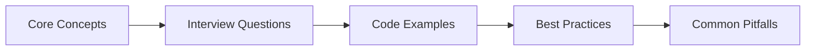

# HTML Interview Q&A

> **Previous:** [MySQL & Database Interview Q&A](./50-interview-mysql.md) | **Next:** [CSS Interview Q&A](./52-interview-css.md)


This chapter covers the most frequently asked HTML interview questions, organized by topic. Each question includes a detailed answer with valid HTML5 examples. Mastering these questions will prepare you for front-end, full-stack, and Laravel-focused interviews where deep HTML knowledge is expected.

---

## Chapter at a Glance

| Aspect | Details |
|--------|---------|
| **Scope** | HTML interview questions covering semantic markup, forms, accessibility, SEO, multimedia, APIs |
| **Key Concepts** | HTML5 semantics, forms & validation, accessibility (ARIA), SEO meta tags, multimedia embedding, browser APIs |
| **Learning Approach** | Q&A format with practical HTML examples |
| **Skills Required** | HTML5, CSS basics, web accessibility basics |

## Chapter Roadmap



## HTML5 Semantic Markup


### Q1: What is the difference between semantic and non-semantic HTML elements?
**Answer:** Semantic elements clearly describe their meaning to both the browser and the developer. Non-semantic elements like `<div>` and `<span>` convey nothing about their content. Semantic elements improve accessibility, SEO, code readability, and browser interoperability.

```html
<!-- Non-semantic -->
<div id="header">
  <div class="nav">
    <div class="nav-item">Home</div>
  </div>
</div>
<div id="main">
  <div class="article">
    <div class="section">
      <div class="heading">About Us</div>
    </div>
  </div>
</div>

<!-- Semantic equivalent -->
<header>
  <nav>
    <a href="/">Home</a>
  </nav>
</header>
<main>
  <article>
    <section>
      <h1>About Us</h1>
    </section>
  </article>
</main>
```

### Q2: List all the HTML5 semantic elements and their purposes.
**Answer:** HTML5 introduced these semantic elements: `<header>` (introductory content or navigational aids), `<nav>` (navigation links), `<main>` (dominant content unique to the document), `<article>` (self-contained composition), `<section>` (thematic grouping of content), `<aside>` (tangentially related content), `<footer>` (footer for its nearest sectioning root), `<figure>` / `<figcaption>` (self-contained content with caption), `<mark>` (highlighted text), `<time>` (machine-readable date/time), `<details>` / `<summary>` (disclosure widget), `<address>` (contact information), and `<dialog>` (interactive modal).

```html
<article>
  <header>
    <h1>How Semantic HTML Improves SEO</h1>
    <time datetime="2026-06-11">June 11, 2026</time>
  </header>
  <p>Search engines use semantic elements to understand page structure.</p>
  <aside>
    <p>Related: Read our <a href="/a11y">accessibility guide</a>.</p>
  </aside>
  <footer>
    <address>Written by <a href="mailto:author@example.com">Jane Doe</a></address>
  </footer>
</article>
```

### Q3: How do you structure a proper HTML5 document outline with heading hierarchy?
**Answer:** Headings (`<h1>` through `<h6>`) create a document outline. Use exactly one `<h1>` per page representing the primary topic. Nest headings sequentially without skipping levels. Assistive technology users navigate by heading structure; a logical hierarchy is critical for accessibility.

```html
<body>
  <header>
    <h1>AI Engineering Journey</h1>   <!-- Page-level h1 -->
    <nav>...</nav>
  </header>
  <main>
    <h2>Courses</h2>                  <!-- h2 under h1 -->
    <section>
      <h3>Laravel</h3>               <!-- h3 under h2 -->
      <p>Content about Laravel.</p>
      <h4>Blade Templates</h4>        <!-- h4 under h3 -->
    </section>
    <section>
      <h3>Python</h3>                <!-- h3 under h2 -->
    </section>
  </main>
</body>
```

### Q4: When should you use `<article>` versus `<section>`?
**Answer:** Use `<article>` for self-contained, independently distributable content → a blog post, news story, forum comment, or product card. Use `<section>` for thematic groupings within a larger document, typically with its own heading. An `<article>` can contain multiple `<section>` elements, and a `<section>` can contain multiple `<article>` elements.

```html
<article>
  <h2>Latest Security Patch Released</h2>
  <p>Version 4.2.1 addresses three CVEs.</p>
  <section>
    <h3>Installation Instructions</h3>
    <pre><code>composer update</code></pre>
  </section>
  <section>
    <h3>Changelog</h3>
    <ul>
      <li>Fixed XSS in form validation</li>
      <li>Updated dependencies</li>
    </ul>
  </section>
</article>
```

### Q5: What is the purpose of the `<main>` element and how many can a page have?
**Answer:** `<main>` represents the dominant content of the `<body>` → content unique to the document that is not repeated across pages (unlike headers, navs, or footers). A document **must** have only one `<main>` element that is visible. It should not be a descendant of `<article>`, `<aside>`, `<footer>`, `<header>`, or `<nav>`.

```html
<body>
  <header><!-- site header, repeated --></header>
  <nav><!-- site nav, repeated --></nav>
  <main>
    <h1>Product Catalog</h1>
    <!-- unique page content -->
  </main>
  <footer><!-- site footer, repeated --></footer>
</body>
```

### Q6: How does the `<figure>` element work and when is it appropriate?
**Answer:** `<figure>` wraps self-contained content like images, diagrams, code blocks, or pull quotes, optionally with a `<figcaption>` caption. It is appropriate when the content could be moved to an appendix without disrupting the main flow.

```html
<figure>
  
  <figcaption>Figure 1: Three-tier architecture with load balancer, app servers, and database cluster.</figcaption>
</figure>
```

### Q7: Explain the `<details>` and `<summary>` elements.
**Answer:** `<details>` creates a disclosure widget that can be toggled open/closed. `<summary>` provides the visible label. The `open` attribute renders it expanded by default. This is a native HTML5 widget requiring zero JavaScript for basic toggle behavior.

```html
<details>
  <summary>Why is HTML5 semantic markup important?</summary>
  <p>Semantic markup improves accessibility, search engine ranking, code maintainability, and provides built-in browser behaviors like heading navigation for screen reader users.</p>
</details>

<details open>
  <summary>Already expanded section</summary>
  <p>This content is visible by default.</p>
</details>
```

### Q8: What is the correct usage of the `<nav>` element?
**Answer:** `<nav>` identifies a section with navigation links. Use it for primary site navigation, table of contents, breadcrumbs, pagination, or any group of links where navigation is the primary purpose. Not every group of links needs `<nav>` → a footer with legal links, for example, typically does not.

```html
<nav aria-label="Breadcrumb">
  <ol>
    <li><a href="/">Home</a></li>
    <li><a href="/courses">Courses</a></li>
    <li><a href="/courses/laravel" aria-current="page">Laravel</a></li>
  </ol>
</nav>

<nav aria-label="Main">
  <ul>
    <li><a href="/">Home</a></li>
    <li><a href="/about">About</a></li>
    <li><a href="/contact">Contact</a></li>
  </ul>
</nav>
```

### Q9: What is the difference between `<b>` / `<i>` and `<strong>` / `<em>`?
**Answer:** `<b>` and `<i>` are presentational → they apply bold and italic styling without semantic meaning. `<strong>` indicates strong importance or urgency (screen readers may change vocal emphasis). `<em>` indicates stress emphasis, changing the meaning of a sentence. Use `<strong>` and `<em>` for meaning; use `<b>` and `<i>` only when no semantic element fits (e.g., product names, taxonomic terms).

```html
<p><strong>Warning:</strong> This action cannot be undone.</p>
<p>I <em>must</em> finish this today. <i>Note: The <b>Laravel</b> framework uses Blade.</i></p>
```

### Q10: How do you mark up a navigation breadcrumb trail semantically?
**Answer:** Combine `<nav>` with `aria-label="Breadcrumb"`, an ordered list `<ol>`, and `aria-current="page"` on the current page link. This provides screen readers with a structured, navigable breadcrumb trail.

```html
<nav aria-label="Breadcrumb">
  <ol>
    <li><a href="/">Home</a></li>
    <li><a href="/courses">Courses</a></li>
    <li><a href="/courses/laravel">Laravel</a></li>
    <li><a href="/courses/laravel/blade" aria-current="page">Blade Templates</a></li>
  </ol>
</nav>
```

### Q11: What is the purpose of the `<address>` element?
**Answer:** `<address>` supplies contact information for the nearest `<article>` or `<body>` ancestor. It should contain the author's or organization's contact details → email, physical address, phone, social media links. It is **not** for arbitrary postal addresses (use a `<p>` for that).

```html
<footer>
  <address>
    Written by <a href="mailto:alex@example.com">Alex Rivera</a><br>
    Acme Corp, 123 Main St, Springfield, IL 62701
  </address>
</footer>
```

### Q12: How does the `<time>` element work?
**Answer:** `<time>` represents a machine-readable date or time. The `datetime` attribute supplies the parseable value in ISO 8601 format. The element's inner text is the human-readable display. Without `datetime`, the content must be a valid date/time string.

```html
<time datetime="2026-06-11">June 11, 2026</time>
<time datetime="14:30">2:30 PM</time>
<time datetime="2026-06-11T14:30:00+00:00">June 11, 2026 at 2:30 PM UTC</time>
```

### Q13: What is the difference between `<div>` and `<span>`?
**Answer:** `<div>` is a block-level container that starts on a new line and takes full width. `<span>` is an inline container that flows within text. Both are semantically neutral → use them only when no semantic element applies, and prefer semantic elements first.

```html
<div class="card">
  <h2>Product Title</h2>
  <p>Price: <span class="currency">$</span><span class="amount">29.99</span></p>
</div>
```

### Q14: Why is a logical heading hierarchy important for SEO?
**Answer:** Search engines use headings to understand page structure and topical relevance. An `<h1>` signals the primary topic. Proper nesting (h1 → h2 → h3, never skipping) helps crawlers index content correctly. Keyword-rich, descriptive headings improve search ranking and click-through rates.

```html
<h1>Complete Guide to Laravel Deployment</h1>
  <h2>Server Requirements</h2>
    <h3>PHP Version</h3>
    <h3>Database Drivers</h3>
  <h2>Environment Configuration</h2>
    <h3>.env File Security</h3>
    <h3>Cache Configuration</h3>
```

### Q15: What is the purpose of the `<dl>`, `<dt>`, and `<dd>` elements?
**Answer:** `<dl>` defines a description list. `<dt>` specifies a term, and `<dd>` provides its description. Use for glossaries, metadata pairs (e.g., key-value data), or any name-value grouping.

```html
<dl>
  <dt>GET</dt>
  <dd>The HTTP method used to retrieve resources. Idempotent and cached.</dd>
  <dt>POST</dt>
  <dd>The HTTP method used to create resources. Non-idempotent.</dd>
</dl>
```

---

## Forms & Validation

### Q16: What are the new input types introduced in HTML5?
**Answer:** HTML5 introduced: `email`, `url`, `tel`, `number`, `range`, `date`, `datetime-local`, `month`, `week`, `time`, `color`, `search`, and `file` with `accept` filtering. These provide native keyboard layouts on mobile, built-in validation, and specialized UI controls.

```html
<form>
  <label for="email">Email:</label>
  <input type="email" id="email" name="email" required>

  <label for="url">Website:</label>
  <input type="url" id="url" name="url">

  <label for="phone">Phone:</label>
  <input type="tel" id="phone" name="phone" pattern="[0-9]{3}-[0-9]{3}-[0-9]{4}">

  <label for="age">Age:</label>
  <input type="number" id="age" name="age" min="1" max="120" step="1">

  <label for="meeting">Date:</label>
  <input type="date" id="meeting" name="meeting">

  <label for="favcolor">Favorite Color:</label>
  <input type="color" id="favcolor" name="favcolor">
</form>
```

### Q17: How do you associate a `<label>` with an `<input>` and why is it required?
**Answer:** Use the `for` attribute on `<label>` matching the `id` on `<input>`, or wrap the input inside the label. Labels are required for accessibility → screen readers announce the label when the input receives focus, and clicking the label toggles the input, increasing the hit target area.

```html
<!-- Method 1: for/id association -->
<label for="username">Username:</label>
<input type="text" id="username" name="username">

<!-- Method 2: Wrapping -->
<label>
  <input type="checkbox" name="subscribe"> Subscribe to newsletter
</label>
```

### Q18: Explain HTML5 constraint validation attributes.
**Answer:** HTML5 provides: `required` (value must be present), `minlength` / `maxlength` (string length limits), `min` / `max` (numeric/date range), `step` (increment granularity), `pattern` (regex validation), `accept` (file MIME types), `multiple` (multiple values). These trigger browser-native validation without JavaScript.

```html
<form>
  <label for="password">Password:</label>
  <input type="password" id="password" name="password"
         required minlength="8" maxlength="128"
         pattern="(?=.*\d)(?=.*[a-z])(?=.*[A-Z]).{8,}"
         title="Must contain uppercase, lowercase, and a digit">

  <label for="quantity">Quantity:</label>
  <input type="number" id="quantity" name="quantity"
         required min="1" max="100" step="1">

  <label for="resume">Resume (PDF only):</label>
  <input type="file" id="resume" name="resume"
         accept=".pdf,application/pdf" required>
</form>
```

### Q19: What are the form attributes `novalidate` and `formnovalidate` used for?
**Answer:** `novalidate` on the `<form>` element disables all browser validation for that form (useful for "save draft" flows). `formnovalidate` on a submit button disables validation for that specific submission (e.g., a "Cancel" or "Save Progress" button alongside a "Submit" button).

```html
<form novalidate>
  <label for="draft">Message:</label>
  <textarea id="draft" name="draft" required></textarea>

  <button type="submit" formnovalidate>Save Draft</button>
  <button type="submit">Publish</button>
</form>
```

### Q20: How does the Constraint Validation API work?
**Answer:** The Constraint Validation API provides JavaScript access to form validation state. Key properties: `validity` (object with `valueMissing`, `typeMismatch`, `patternMismatch`, `tooLong`, `tooShort`, `rangeUnderflow`, `rangeOverflow`, `stepMismatch`, `badInput`, `customError`), `validationMessage`, `willValidate`. Key methods: `checkValidity()`, `reportValidity()`, `setCustomValidity()`.

```html
<form id="signup">
  <label for="code">Access Code:</label>
  <input type="text" id="code" name="code"
         required pattern="[A-Z]{3}-[0-9]{4}"
         oninput="validateCode(this)">
</form>

<script>
function validateCode(input) {
  if (input.value === 'ADMIN-0000') {
    input.setCustomValidity('This code is reserved');
  } else {
    input.setCustomValidity('');
  }
}
</script>
```

### Q21: What is the `<fieldset>` and `<legend>` used for?
**Answer:** `<fieldset>` groups related form controls visually and semantically. `<legend>` provides the group's label. This is critical for accessibility → screen readers announce the legend before each control within the fieldset. Use for radio button groups, address sections, payment details, etc.

```html
<form>
  <fieldset>
    <legend>Payment Method</legend>
    <label>
      <input type="radio" name="payment" value="credit" checked>
      Credit Card
    </label>
    <label>
      <input type="radio" name="payment" value="paypal">
      PayPal
    </label>
  </fieldset>

  <fieldset>
    <legend>Shipping Address</legend>
    <label for="street">Street:</label>
    <input type="text" id="street" name="street" required>
    <label for="zip">ZIP Code:</label>
    <input type="text" id="zip" name="zip" pattern="[0-9]{5}">
  </fieldset>
</form>
```

### Q22: How do you create a `<datalist>` and what problem does it solve?
**Answer:** `<datalist>` provides an autocomplete suggestion list for an `<input>` without restricting the user to predefined options (unlike `<select>`). The user can type free text. The `list` attribute on the input matches the `id` of the datalist.

```html
<label for="browser">Choose a browser:</label>
<input type="text" id="browser" name="browser" list="browsers">
<datalist id="browsers">
  <option value="Chrome">
  <option value="Firefox">
  <option value="Edge">
  <option value="Safari">
  <option value="Opera">
</datalist>
```

### Q23: What are the differences between `<button>` and `<input type="submit">`?
**Answer:** Both submit forms, but `<button>` is more flexible → it can contain HTML content (icons, text, nested elements) and defaults to `type="submit"` (be careful: in IE/Edge it defaulted to `type="button"`). `<input type="submit">` is a void element and can only display a `value` text string. Always explicitly set `type` on `<button>` to avoid cross-browser issues.

```html
<!-- Button with icon -->
<button type="submit">
  <svg width="16" height="16" viewBox="0 0 16 16"><path d="..."/></svg>
  Submit Order
</button>

<!-- Simple submit -->
<input type="submit" value="Submit Order">
```

### Q24: How do you implement the `autocomplete` attribute in forms?
**Answer:** The `autocomplete` attribute on `<form>` or `<input>` controls browser autofill behavior. Values include `on`, `off`, `name`, `email`, `username`, `current-password`, `new-password`, `one-time-code`, `street-address`, `country`, `tel`, `url`, `cc-number`, `bday`, etc. Use `new-password` for registration forms and `current-password` for login forms to help password managers.

```html
<form autocomplete="off">
  <label for="search">Search:</label>
  <input type="search" id="search" name="search" autocomplete="off">
</form>

<form autocomplete="on">
  <label for="login-email">Email:</label>
  <input type="email" id="login-email" name="email" autocomplete="username" required>
  <label for="login-pass">Password:</label>
  <input type="password" id="login-pass" name="password" autocomplete="current-password" required>
</form>
```

### Q25: How do you implement the `placeholder` attribute and what are its accessibility concerns?
**Answer:** `placeholder` provides a hint about the expected input format. However, it is **not a substitute for `<label>`** → placeholders disappear on input, fail contrast requirements in many browsers, and are often announced incorrectly by screen readers. Always pair with a visible `<label>`.

```html
<!-- Correct: label + placeholder -->
<label for="cc">Credit Card Number:</label>
<input type="text" id="cc" name="credit_card"
       placeholder="1234 5678 9012 3456"
       pattern="[\d ]{16,19}" required>

<!-- Wrong: placeholder-only -->
<input type="text" placeholder="Credit Card Number">
```

### Q26: How does the `<output>` element work?
**Answer:** `<output>` displays the result of a calculation or user action. It works with the `oninput` event on range inputs or other interactive controls. It has no default styling but provides semantic meaning for form results.

```html
<form oninput="result.value = parseInt(a.value) + parseInt(b.value)">
  <label for="a">0 <input type="range" id="a" name="a" value="50" min="0" max="100"> 100</label>
  <label for="b">0 <input type="range" id="b" name="b" value="50" min="0" max="100"> 100</label>
  <p>Total: <output name="result" for="a b">100</output></p>
</form>
```

### Q27: What is the purpose of the `multiple` attribute on file inputs?
**Answer:** The `multiple` attribute allows selecting more than one file in a file picker. On email inputs, it accepts multiple comma-separated email addresses. The `accept` attribute filters the allowed file types.

```html
<label for="photos">Upload photos (JPEG, PNG):</label>
<input type="file" id="photos" name="photos[]" accept="image/jpeg,image/png" multiple>

<label for="recipients">Email recipients:</label>
<input type="email" id="recipients" name="recipients" multiple placeholder="user1@example.com, user2@example.com">
```

### Q28: How do you handle file upload size and type restrictions?
**Answer:** File type is restricted via the `accept` attribute on the input, but this is client-side only → always validate on the server. File size cannot be restricted via HTML alone; use JavaScript with the File API to check `file.size` before submission, and always enforce limits server-side.

```html
<form id="upload-form">
  <label for="document">Document (PDF, max 5MB):</label>
  <input type="file" id="document" name="document"
         accept=".pdf,application/pdf"
         onchange="validateFile(this)">
  <span id="file-error" style="color:red"></span>
</form>

<script>
function validateFile(input) {
  const maxSize = 5 * 1024 * 1024;
  const error = document.getElementById('file-error');
  if (input.files[0] && input.files[0].size > maxSize) {
    error.textContent = 'File exceeds 5MB limit';
    input.value = '';
  } else {
    error.textContent = '';
  }
}
</script>
```

### Q29: What is the `enterkeyhint` attribute?
**Answer:** `enterkeyhint` controls the label/icon shown on the virtual keyboard's Enter key on mobile devices. Values: `enter` (default), `done`, `go`, `next`, `previous`, `search`, `send`. This improves mobile UX by indicating what pressing Enter will do.

```html
<form>
  <label for="search">Search:</label>
  <input type="search" id="search" name="q" enterkeyhint="search">

  <label for="message">Message:</label>
  <input type="text" id="message" name="message" enterkeyhint="send">

  <label for="email">Email:</label>
  <input type="email" id="email" name="email" enterkeyhint="next">
  <label for="password">Password:</label>
  <input type="password" id="password" name="password" enterkeyhint="done">
</form>
```

### Q30: How does the `<progress>` and `<meter>` element differ?
**Answer:** `<progress>` indicates the completion progress of a task (e.g., file upload percentage), with `max` and `value` attributes. `<meter>` represents a scalar measurement within a known range (e.g., disk usage, CPU load), with `min`, `max`, `low`, `high`, `optimum`, and `value`. They are not interchangeable.

```html
<label for="upload-progress">Upload Progress:</label>
<progress id="upload-progress" value="60" max="100">60%</progress>

<label for="disk-usage">Disk Usage:</label>
<meter id="disk-usage" min="0" max="100" low="30" high="80" optimum="20" value="65"></meter>
```

---

## Accessibility (A11Y)

### Q31: What is ARIA and when should you use it?
**Answer:** ARIA (Accessible Rich Internet Applications) is a set of attributes that supplement HTML to improve accessibility for assistive technologies. Use ARIA when native HTML semantics are insufficient → for custom widgets, dynamic content, or complex interactions. **First rule of ARIA**: use native HTML elements before adding ARIA. A `<button>` is better than a `<div role="button">`.

```html
<!-- Bad: div as button -->
<div class="btn" onclick="submit()">Submit</div>

<!-- Better: native button -->
<button type="submit">Submit</button>

<!-- Necessary ARIA usage: custom tab panel -->
<div role="tablist" aria-label="Documentation">
  <button role="tab" aria-selected="true" aria-controls="panel-intro" id="tab-intro">Introduction</button>
  <button role="tab" aria-selected="false" aria-controls="panel-install" id="tab-install">Installation</button>
</div>
<div role="tabpanel" id="panel-intro" aria-labelledby="tab-intro">
  <p>Content for introduction.</p>
</div>
```

### Q32: What are landmark regions and how do they help screen reader users?
**Answer:** Landmark regions are semantic elements that define major sections of a page, allowing screen reader users to jump directly to specific areas. HTML5 elements automatically create landmarks: `<header>` (banner), `<nav>` (navigation), `<main>` (main), `<aside>` (complementary), `<footer>` (contentinfo), `<form>` (form), `<section>` with `aria-label` (region). Use `aria-label` or `aria-labelledby` to differentiate multiple landmarks of the same type.

```html
<header role="banner">
  <!-- site header -->
</header>

<nav aria-label="Main Navigation">
  <!-- primary nav -->
</nav>

<main role="main">
  <h1>Page Title</h1>
  <article aria-labelledby="article-heading">
    <h2 id="article-heading">Article Title</h2>
  </article>
</main>

<footer role="contentinfo">
  <p>&copy; 2026</p>
</footer>
```

### Q33: What is the `aria-live` attribute and how does it work?
**Answer:** `aria-live` tells screen readers to announce dynamic content changes without requiring user focus. Values: `off` (default, no announcement), `polite` (announce when idle), `assertive` (interrupt immediately). Use `aria-atomic="true"` for the entire region to be announced as a whole, and `aria-relevant` to control which types of changes trigger announcements.

```html
<div aria-live="polite" aria-atomic="true" id="notifications">
  <!-- dynamically updated content -->
</div>

<div aria-live="assertive" role="alert">
  <!-- critical errors -->
</div>

<script>
function addNotification(msg) {
  const el = document.getElementById('notifications');
  el.innerHTML = '<p>' + msg + '</p>';
}
</script>
```

### Q34: What are the WCAG 2.2 success criteria for color contrast?
**Answer:** WCAG 2.2 Level AA requires a contrast ratio of at least 4.5:1 for normal text (under 18px or 14px bold) and 3:1 for large text (18px+ bold or 24px+ regular). Level AAA requires 7:1 for normal text and 4.5:1 for large text. Focus indicators must have 3:1 contrast against adjacent colors. UI components and graphical objects require 3:1.

```html
<style>
  /* 4.5:1 ratio on white (#ffffff) → passes AA */
  .body-text { color: #595959; }         /* dark gray */

  /* 7:1 ratio on white → passes AAA */
  .high-contrast-text { color: #333333; }

  /* Focus indicator with 3:1 contrast */
  a:focus-visible {
    outline: 3px solid #005fcc;
    outline-offset: 2px;
  }

  /* Custom checkbox with visible state */
  .custom-checkbox:checked + label::before {
    background: #005fcc;
    border-color: #005fcc;
  }
</style>
```

### Q35: How do you make a custom dropdown accessible?
**Answer:** A custom dropdown must implement: `role="combobox"` on the trigger, `role="listbox"` on the options container, `role="option"` on each item, `aria-expanded` for open/closed state, `aria-selected` for the current selection, `aria-activedescendant` pointing to the active option, keyboard navigation (Arrow keys, Enter, Escape), and proper focus management.

```html
<div class="custom-select">
  <button role="combobox" aria-expanded="false" aria-haspopup="listbox"
          aria-labelledby="select-label" id="select-trigger"
          aria-controls="select-listbox">
    Select a framework
  </button>
  <ul role="listbox" id="select-listbox" aria-label="Frameworks"
      tabindex="-1" hidden>
    <li role="option" id="opt-laravel" aria-selected="false">Laravel</li>
    <li role="option" id="opt-vue" aria-selected="false">Vue.js</li>
    <li role="option" id="opt-react" aria-selected="false">React</li>
  </ul>
</div>
```

### Q36: How do you implement skip-to-content links?
**Answer:** A skip-to-content link is the first focusable element on the page. It is visually hidden until focused, allowing keyboard and screen reader users to bypass repetitive navigation. The link targets the `id` of the `<main>` element.

```html
<body>
  <a href="#main-content" class="skip-link">Skip to main content</a>
  <header>...</header>
  <nav>...</nav>
  <main id="main-content">
    <h1>Page content starts here</h1>
  </main>
</body>

<style>
.skip-link {
  position: absolute;
  top: -40px;
  left: 0;
  background: #005fcc;
  color: #fff;
  padding: 8px 16px;
  z-index: 1000;
}
.skip-link:focus {
  top: 0;
}
</style>
```

### Q37: What is the difference between `aria-label`, `aria-labelledby`, and `aria-describedby`?
**Answer:** `aria-label` overrides the accessible name with a string. `aria-labelledby` references one or more elements by ID to construct the accessible name (higher priority than `aria-label`). `aria-describedby` provides additional descriptive information (announced after the name). Use `aria-labelledby` when visible text exists; use `aria-label` for icon-only buttons; use `aria-describedby` for supplementary instructions.

```html
<!-- aria-label on icon-only button -->
<button aria-label="Close dialog" onclick="close()">
  <svg width="20" height="20" viewBox="0 0 20 20"><path d="M5 5l10 10M15 5L5 15"/></svg>
</button>

<!-- aria-labelledby referencing visible heading -->
<section aria-labelledby="pricing-heading">
  <h2 id="pricing-heading">Pricing Plans</h2>
</section>

<!-- aria-describedby for additional instructions -->
<label for="password">Password:</label>
<input type="password" id="password" name="password"
       aria-describedby="password-hint">
<p id="password-hint">Must be 8+ characters with one uppercase letter</p>
```

### Q38: What are `aria-hidden` and `role="presentation"` / `role="none"`?
**Answer:** `aria-hidden="true"` removes an element (and its children) from the accessibility tree, hiding it from screen readers. Use for decorative icons, repeated content, or offscreen panels. `role="presentation"` (or `role="none"`) removes semantic meaning while keeping content accessible → use for layout-only tables or decorative list containers.

```html
<!-- Decorative icon: hide from screen readers -->
<button aria-label="Search">
  <svg aria-hidden="true" width="24" height="24" viewBox="0 0 24 24">
    <circle cx="11" cy="11" r="8"/>
    <path d="M21 21l-4.35-4.35"/>
  </svg>
</button>

<!-- Layout table (not a data table) -->
<table role="presentation">
  <tr>
    <td></td>
    <td>Company Name</td>
  </tr>
</table>
```

### Q39: How do you ensure keyboard accessibility for custom interactive elements?
**Answer:** All interactive elements must be focusable (`tabindex="0"` for native focus, `tabindex="-1"` for scripted focus) and respond to keyboard events (Enter/Space for activation, Arrow keys for navigation, Escape for dismissal). Visible focus indicators are required. Use the `:focus-visible` pseudo-class to show focus only when using a keyboard.

```html
<div class="accordion">
  <button class="accordion-trigger" aria-expanded="false" aria-controls="panel1" id="trigger1"
          onclick="toggleAccordion(event)" onkeydown="handleKeydown(event)">
    Section 1
  </button>
  <div role="region" aria-labelledby="trigger1" id="panel1" hidden>
    <p>Content for section 1.</p>
  </div>
</div>

<script>
function handleKeydown(event) {
  switch (event.key) {
    case 'Enter':
    case ' ':
      event.preventDefault();
      toggleAccordion(event);
      break;
    case 'ArrowDown':
    case 'ArrowUp':
      event.preventDefault();
      // move focus to next/previous accordion trigger
      break;
  }
}
</script>

<style>
.accordion-trigger:focus-visible {
  outline: 2px solid #005fcc;
  outline-offset: 2px;
}
</style>
```

### Q40: What is the `prefers-reduced-motion` media query?
**Answer:** `prefers-reduced-motion` detects if the user has requested reduced motion in their OS accessibility settings. Respect this by disabling or scaling back animations, transitions, and auto-scrolling. This prevents vestibular disorders and motion sensitivity reactions.

```html
<style>
  .fade-in {
    opacity: 0;
    transition: opacity 0.5s ease-in;
  }

  @media (prefers-reduced-motion: reduce) {
    *, *::before, *::after {
      animation-duration: 0.01ms !important;
      animation-iteration-count: 1 !important;
      transition-duration: 0.01ms !important;
      scroll-behavior: auto !important;
    }
    .fade-in {
      opacity: 1;
      transition: none;
    }
  }
</style>
```

---

## HTML5 APIs

### Q41: How does the Canvas API work?
**Answer:** The `<canvas>` element provides a bitmap drawing surface controlled via JavaScript. Get the 2D rendering context, then use methods like `fillRect()`, `arc()`, `lineTo()`, `fillText()`, `beginPath()`, and `stroke()`. Canvas is pixel-based (not DOM-based) and great for games, charts, image processing, and real-time graphics.

```html
<canvas id="chart" width="400" height="300" aria-label="Bar chart showing quarterly revenue">
  Your browser does not support Canvas.
</canvas>

<script>
const canvas = document.getElementById('chart');
const ctx = canvas.getContext('2d');

// Draw bar chart
const data = [120, 85, 200, 150];
const labels = ['Q1', 'Q2', 'Q3', 'Q4'];
const barWidth = 80;
const baseY = 250;

ctx.fillStyle = '#f0f0f0';
ctx.fillRect(0, 0, 400, 300);

data.forEach((value, i) => {
  const barHeight = value * 1.2;
  const x = 40 + i * (barWidth + 20);

  ctx.fillStyle = '#2563eb';
  ctx.fillRect(x, baseY - barHeight, barWidth, barHeight);

  ctx.fillStyle = '#000';
  ctx.font = '12px sans-serif';
  ctx.textAlign = 'center';
  ctx.fillText(value, x + barWidth / 2, baseY - barHeight - 5);
  ctx.fillText(labels[i], x + barWidth / 2, baseY + 15);
});
</script>
```

### Q42: How do you implement HTML5 Drag and Drop?
**Answer:** The Drag and Drop API uses events: `dragstart`, `dragover`, `dragenter`, `dragleave`, `drop`, and `dragend`. Set `draggable="true"` on draggable elements. The `dataTransfer` object carries data between the source and target. Always call `preventDefault()` on `dragover` and `dragenter` to allow dropping.

```html
<div id="task-list">
  <div draggable="true" class="task" ondragstart="onDragStart(event)" id="task1">
    Implement login page
  </div>
  <div draggable="true" class="task" ondragstart="onDragStart(event)" id="task2">
    Write tests
  </div>
</div>

<div id="done-column" class="column" ondrop="onDrop(event)" ondragover="onDragOver(event)"
     aria-label="Completed tasks">
  <h2>Done</h2>
</div>

<script>
function onDragStart(event) {
  event.dataTransfer.setData('text/plain', event.target.id);
  event.target.classList.add('dragging');
}

function onDragOver(event) {
  event.preventDefault();
  event.target.classList.add('drag-over');
}

function onDrop(event) {
  event.preventDefault();
  const id = event.dataTransfer.getData('text/plain');
  const draggable = document.getElementById(id);
  event.target.closest('.column').appendChild(draggable);
  draggable.classList.remove('dragging');
}
</script>
```

### Q43: What is the difference between `localStorage`, `sessionStorage`, and cookies?
**Answer:** `localStorage` persists until explicitly deleted, has ~5-10MB limit, and is not sent with HTTP requests. `sessionStorage` persists only for the current tab session. Cookies have ~4KB limit, are sent with every HTTP request (affecting performance), support `HttpOnly` / `Secure` / `SameSite` flags, and have expiration dates. Use `localStorage` for client-only data, cookies for server communication.

```html
<script>
// localStorage → persists across sessions
localStorage.setItem('theme', 'dark');
localStorage.setItem('preferences', JSON.stringify({ fontSize: 16, sidebar: true }));
const theme = localStorage.getItem('theme');
localStorage.removeItem('preferences');

// sessionStorage → per tab session
sessionStorage.setItem('formProgress', JSON.stringify({ step: 2, valid: true }));
const progress = JSON.parse(sessionStorage.getItem('formProgress'));

// Cookie via document.cookie
document.cookie = 'session_id=abc123; path=/; Secure; SameSite=Lax; max-age=86400';
document.cookie = 'theme=dark; path=/; max-age=31536000';
</script>
```

### Q44: How does the History API enable SPAs?
**Answer:** The History API provides `pushState()` and `replaceState()` to change the URL without a page reload, and the `popstate` event to respond to back/forward navigation. Combined with `fetch()` or AJAX, this enables single-page application routing. Always provide server-side fallback for direct URL access.

```html
<script>
// SPA navigation without page reload
function navigate(path, title) {
  history.pushState({ page: path }, title, path);
  updateContent(path);
}

// Handle browser back/forward
window.addEventListener('popstate', (event) => {
  const path = event.state?.page || '/';
  updateContent(path);
});

// Server fallback: on first load, server serves index.html
// which reads the current path and renders the correct view
document.addEventListener('DOMContentLoaded', () => {
  const path = window.location.pathname;
  updateContent(path);
});

async function updateContent(path) {
  const response = await fetch(`/api/content?path=${encodeURIComponent(path)}`);
  const html = await response.text();
  document.getElementById('app').innerHTML = html;
}
</script>
```

### Q45: How does the Geolocation API work?
**Answer:** The Geolocation API (`navigator.geolocation`) provides device location via GPS, WiFi, or IP. `getCurrentPosition()` returns a one-time position; `watchPosition()` continuously monitors. Both accept success and error callbacks. Always handle permission denial and provide fallback content. HTTPS is required.

```html
<button onclick="getLocation()">Find Nearby Stores</button>
<div id="location-result" aria-live="polite"></div>

<script>
function getLocation() {
  const result = document.getElementById('location-result');

  if (!navigator.geolocation) {
    result.textContent = 'Geolocation is not supported by your browser.';
    return;
  }

  result.textContent = 'Getting your location...';

  navigator.geolocation.getCurrentPosition(
    (position) => {
      const { latitude, longitude } = position.coords;
      result.innerHTML = `
        <p>Latitude: ${latitude.toFixed(6)}</p>
        <p>Longitude: ${longitude.toFixed(6)}</p>
        <p>Accuracy: ${position.coords.accuracy}m</p>
        <a href="https://maps.google.com/?q=${latitude},${longitude}" target="_blank">
          Open in Google Maps
        </a>
      `;
    },
    (error) => {
      switch (error.code) {
        case error.PERMISSION_DENIED:
          result.textContent = 'Location access was denied.';
          break;
        case error.POSITION_UNAVAILABLE:
          result.textContent = 'Location information is unavailable.';
          break;
        case error.TIMEOUT:
          result.textContent = 'The request to get location timed out.';
          break;
      }
    },
    { enableHighAccuracy: true, timeout: 10000, maximumAge: 60000 }
  );
}
</script>
```

### Q46: How do Web Workers work and when should you use them?
**Answer:** Web Workers run JavaScript in a background thread, separate from the main UI thread. They communicate via `postMessage()` and the `onmessage` event. Workers cannot access the DOM, `window`, `document`, or `parent`. Use them for CPU-intensive operations: image processing, data parsing, encryption, or large computations that would otherwise block the UI.

```html
<!-- main.js -->
<script>
const worker = new Worker('worker.js');

worker.postMessage({ action: 'processData', payload: largeArray });

worker.onmessage = (event) => {
  document.getElementById('result').textContent =
    `Processed ${event.data.count} items in ${event.data.duration}ms`;
};

worker.onerror = (error) => {
  console.error('Worker error:', error.message);
};
</script>
```

```javascript
// worker.js
self.onmessage = (event) => {
  const { action, payload } = event.data;

  if (action === 'processData') {
    const start = performance.now();
    const result = payload.map(item => expensiveCalculation(item));
    const duration = performance.now() - start;

    self.postMessage({ count: result.length, duration });
  }
};

function expensiveCalculation(n) {
  // Simulate heavy work
  let x = 0;
  for (let i = 0; i < 1000000; i++) {
    x += Math.sqrt(n * i);
  }
  return x;
}
```

### Q47: What is the Page Visibility API?
**Answer:** The Page Visibility API (`document.visibilityState` and `visibilitychange` event) detects if the page is visible or hidden. Use it to pause video/audio, stop animations, throttle network requests, or pause WebSocket connections when the user switches tabs, saving CPU and battery.

```html
<script>
document.addEventListener('visibilitychange', () => {
  if (document.visibilityState === 'hidden') {
    pauseVideo();
    throttleAnimations();
    console.log('Tab hidden → conserving resources');
  } else {
    resumeVideo();
    resumeAnimations();
    console.log('Tab visible → resuming activity');
  }
});

function pauseVideo() {
  const video = document.querySelector('video');
  if (video && !video.paused) video.pause();
}

function resumeVideo() {
  const video = document.querySelector('video');
  if (video && video.dataset.autoresume) video.play();
}
</script>
```

### Q48: How does the Intersection Observer API work?
**Answer:** `IntersectionObserver` efficiently detects when an element enters or exits the viewport (or another container). It fires a callback with `entries`, each containing `isIntersecting`, `intersectionRatio`, and `boundingClientRect`. Use for lazy loading images, infinite scroll, animation triggers, and ad visibility tracking → much more performant than scroll event listeners.

```html


<script>
const observer = new IntersectionObserver((entries) => {
  entries.forEach(entry => {
    if (entry.isIntersecting) {
      const img = entry.target;
      img.src = img.dataset.src;
      img.classList.add('loaded');
      observer.unobserve(img);
    }
  });
}, {
  rootMargin: '200px',  // start loading 200px before visible
  threshold: 0.01
});

document.querySelectorAll('.lazy').forEach(img => observer.observe(img));
</script>
```

### Q49: What is the purpose of the `download` attribute on links?
**Answer:** The `download` attribute on an `<a>` element forces the browser to download the linked file instead of navigating to it. Optionally, set the attribute value to specify the downloaded filename. The resource must be same-origin for the `download` attribute to work (CORS restrictions apply).

```html
<a href="/reports/q2-2026.pdf" download="Q2-2026-Report.pdf">
  Download Q2 Report (PDF, 2.4MB)
</a>

<a href="/export/users.csv" download>
  Export Users (CSV)
</a>
```

### Q50: How does the Fullscreen API work?
**Answer:** The Fullscreen API (`element.requestFullscreen()` and `document.exitFullscreen()`) allows elements to occupy the entire screen. Watch `fullscreenchange` and `fullscreenerror` events. Cross-origin iframes require the `allow="fullscreen"` attribute. Always provide a visible exit mechanism.

```html
<video id="player" src="tutorial.mp4" controls></video>
<button onclick="toggleFullscreen()">Fullscreen</button>

<script>
function toggleFullscreen() {
  if (!document.fullscreenElement) {
    document.getElementById('player').requestFullscreen();
  } else {
    document.exitFullscreen();
  }
}

document.addEventListener('fullscreenchange', () => {
  const btn = document.querySelector('button');
  btn.textContent = document.fullscreenElement ? 'Exit Fullscreen' : 'Fullscreen';
});
</script>
```

---

## SEO & Metadata

### Q51: What essential meta tags should every HTML5 page include?
**Answer:** Every page should include: `charset="utf-8"` as the first meta element, `viewport` for mobile responsiveness, `description` for search snippets, `title` within `<head>`, and favicon via `<link rel="icon">`. Additionally, `robots` controls indexing, and `canonical` prevents duplicate content penalties.

```html
<!DOCTYPE html>
<html lang="en">
<head>
  <meta charset="utf-8">
  <meta name="viewport" content="width=device-width, initial-scale=1">
  <title>AI Engineering Journey → Learn Laravel, Python, and Modern Web Development</title>
  <meta name="description" content="Comprehensive courses on Laravel, AI SDKs, Python, and full-stack web development. Build real-world applications with step-by-step tutorials.">
  <meta name="robots" content="index, follow">
  <link rel="canonical" href="https://example.com/courses/laravel">
  <link rel="icon" type="image/svg+xml" href="/favicon.svg">
  <link rel="alternate" hreflang="es" href="https://example.com/es/cursos/laravel">
</head>
</html>
```

### Q52: How do you implement Open Graph and Twitter Card meta tags?
**Answer:** Open Graph (OG) tags control how content appears when shared on Facebook, LinkedIn, Discord, and other platforms. Twitter Cards use `twitter:` tags (or fall back to OG). Required OG tags: `og:title`, `og:description`, `og:type`, `og:url`, `og:image`. Images should be at least 1200x630 for optimal display.

```html
<!-- Open Graph -->
<meta property="og:title" content="Mastering Laravel Blade Templates">
<meta property="og:description" content="Learn how to use Blade's powerful templating engine including components, slots, and directives.">
<meta property="og:type" content="article">
<meta property="og:url" content="https://example.com/courses/laravel/blade">
<meta property="og:image" content="https://example.com/images/laravel-blade-og.png">
<meta property="og:image:width" content="1200">
<meta property="og:image:height" content="630">
<meta property="og:locale" content="en_US">
<meta property="article:published_time" content="2026-06-11T10:00:00+00:00">
<meta property="article:author" content="https://example.com/authors/jane-doe">

<!-- Twitter Card -->
<meta name="twitter:card" content="summary_large_image">
<meta name="twitter:site" content="@AIEngineering">
<meta name="twitter:creator" content="@janedoe">
<meta name="twitter:title" content="Mastering Laravel Blade Templates">
<meta name="twitter:description" content="Learn how to use Blade's powerful templating engine.">
<meta name="twitter:image" content="https://example.com/images/laravel-blade-twitter.png">
```

### Q53: What is JSON-LD structured data and how do you implement it?
**Answer:** JSON-LD is Google's preferred format for structured data. It's a `<script>` block in the `<head>` or `<body>` that describes the page content in a machine-readable vocabulary (Schema.org). Common types: `Article`, `Product`, `FAQPage`, `BreadcrumbList`, `LocalBusiness`, `Course`, `Organization`, `Person`. Implement with `type="application/ld+json"`.

```html
<head>
  <!-- ... meta tags ... -->
  <script type="application/ld+json">
  {
    "@context": "https://schema.org",
    "@type": "Course",
    "name": "Laravel Development Masterclass",
    "description": "Comprehensive course covering Laravel from fundamentals to advanced topics including AI SDK integration.",
    "provider": {
      "@type": "Organization",
      "name": "AI Engineering Journey",
      "url": "https://example.com"
    },
    "educationalCredentialAwarded": "Certificate of Completion",
    "offers": {
      "@type": "Offer",
      "price": "49.99",
      "priceCurrency": "USD",
      "availability": "https://schema.org/InStock"
    },
    "aggregateRating": {
      "@type": "AggregateRating",
      "ratingValue": "4.8",
      "reviewCount": "342"
    }
  }
  </script>
</head>
```

### Q54: What is the purpose of `rel="canonical"`?
**Answer:** The canonical link element tells search engines which URL is the definitive version of a page. Use it to consolidate duplicate content from query parameters (e.g., `?page=2&sort=asc`), multiple paths to the same content, or URL variants (HTTP/HTTPS, with/without `www`, trailing slash differences). The canonical URL must be absolute and point to the preferred version.

```html
<!-- Page accessible at multiple URLs; canonical points to the primary -->
<head>
  <link rel="canonical" href="https://example.com/blog/laravel-blade-tips">
</head>

<!-- Paginated content: each page self-canonicals -->
<head>
  <link rel="canonical" href="https://example.com/blog?page=3">
</head>

<!-- Products with session/tracking params -->
<head>
  <link rel="canonical" href="https://example.com/products/laravel-course">
</head>
```

### Q55: How do you implement `rel="prev"` and `rel="next"` for paginated content?
**Answer:** For paginated series, `rel="prev"` and `rel="next"` on the `<link>` element or `<a>` element tell search engines the pagination sequence. While Google now uses `rel="canonical"` and `rel="next"` differently, best practice is still to include these for clarity and for non-Google search engines.

```html
<head>
  <link rel="canonical" href="https://example.com/blog?page=2">
  <link rel="prev" href="https://example.com/blog">
  <link rel="next" href="https://example.com/blog?page=3">
</head>
<body>
  <nav aria-label="Pagination">
    <a href="https://example.com/blog" rel="prev" aria-label="Previous page">Previous</a>
    <span aria-current="page">Page 2</span>
    <a href="https://example.com/blog?page=3" rel="next" aria-label="Next page">Next</a>
  </nav>
</body>
```

### Q56: What are hreflang tags and how do you implement them?
**Answer:** `hreflang` tags tell search engines which language/region version of a page to serve to users. Use `<link rel="alternate" hreflang="xx">` in the `<head>` or in the HTTP header. Every language variant must link to all other variants including itself. Use `x-default` as the fallback for unspecified languages.

```html
<head>
  <link rel="alternate" hreflang="en" href="https://example.com/courses/laravel">
  <link rel="alternate" hreflang="es" href="https://example.com/es/cursos/laravel">
  <link rel="alternate" hreflang="fr" href="https://example.com/fr/cours/laravel">
  <link rel="alternate" hreflang="de" href="https://example.com/de/kurse/laravel">
  <link rel="alternate" hreflang="x-default" href="https://example.com/courses/laravel">
</head>

<!-- Each variant page must link all others, including itself -->
```

### Q57: How do you create a sitemap.xml and robots.txt?
**Answer:** `sitemap.xml` lists all crawlable URLs with optional metadata (lastmod, changefreq, priority, alternate hreflang). `robots.txt` instructs crawlers which paths to allow or disallow and points to the sitemap. Both should be at the root of the domain.

```html
<!-- robots.txt -->
User-agent: *
Allow: /
Disallow: /admin/
Disallow: /api/
Disallow: /private/
Sitemap: https://example.com/sitemap.xml
```

```xml
<!-- sitemap.xml -->
<?xml version="1.0" encoding="UTF-8"?>
<urlset xmlns="http://www.sitemaps.org/schemas/sitemap/0.9"
        xmlns:xhtml="http://www.w3.org/1999/xhtml">
  <url>
    <loc>https://example.com/</loc>
    <lastmod>2026-06-11</lastmod>
    <changefreq>daily</changefreq>
    <priority>1.0</priority>
  </url>
  <url>
    <loc>https://example.com/courses/laravel</loc>
    <lastmod>2026-06-10</lastmod>
    <changefreq>weekly</changefreq>
    <priority>0.8</priority>
    <xhtml:link rel="alternate" hreflang="en" href="https://example.com/courses/laravel"/>
    <xhtml:link rel="alternate" hreflang="es" href="https://example.com/es/cursos/laravel"/>
  </url>
  <url>
    <loc>https://example.com/blog</loc>
    <changefreq>daily</changefreq>
    <priority>0.6</priority>
  </url>
</urlset>
```

### Q58: What meta tags prevent content from being indexed or followed?
**Answer:** The `robots` meta tag controls crawler behavior: `noindex` prevents indexing, `nofollow` prevents following links on the page, `noarchive` prevents cached copies, `nosnippet` prevents search snippet generation, `max-snippet:-1` allows unlimited snippet length, `max-image-preview:large` allows large image previews. The `X-Robots-Tag` HTTP header does the same for non-HTML content (PDFs, images).

```html
<!-- Do not index this page -->
<meta name="robots" content="noindex, follow">

<!-- Do not index and do not follow links -->
<meta name="robots" content="noindex, nofollow">

<!-- Allow indexing, prevent snippet and cached copy -->
<meta name="robots" content="index, follow, nosnippet, noarchive">

<!-- Per-crawler directives -->
<meta name="googlebot" content="noindex">
<meta name="bingbot" content="noindex, nofollow">
```

### Q59: What is the purpose of the `<title>` tag format for SEO?
**Answer:** The `<title>` is the most important on-page SEO factor. It appears as the clickable headline in search results and the browser tab. Best practices: include primary keyword near the front, keep under 60 characters, use the brand name at the end (separated by a pipe `|` or dash `→`), make it unique per page, and make it compelling to drive clicks.

```html
<!-- Good title patterns -->
<title>Laravel Blade Templates → Complete Guide | AI Engineering Journey</title>
<title>How to Build REST APIs with Laravel | AI Engineering Journey</title>
<title>Laravel vs Django: Which Framework Should You Choose? | AI Engineering Journey</title>

<!-- Avoid: keyword stuffing -->
<title>Laravel, Blade, Laravel Tutorial, Laravel Guide</title>

<!-- Avoid: missing title or generic -->
<title>Welcome | Site</title>
```

### Q60: How do you implement structured data for a FAQ page?
**Answer:** FA questions should be marked up with `FAQPage` JSON-LD schema. Each Q&A pair uses `mainEntity` with `@type="Question"`, `name` for the question, and `acceptedAnswer` with `@type="Answer"` and `text`. Google may render this as an expandable rich result in search.

```html
<script type="application/ld+json">
{
  "@context": "https://schema.org",
  "@type": "FAQPage",
  "mainEntity": [
    {
      "@type": "Question",
      "name": "What is Laravel Blade?",
      "acceptedAnswer": {
        "@type": "Answer",
        "text": "Blade is Laravel's templating engine that provides a clean syntax for displaying data, using control structures, extending layouts, and building reusable components."
      }
    },
    {
      "@type": "Question",
      "name": "How do I create a custom Blade directive?",
      "acceptedAnswer": {
        "@type": "Answer",
        "text": "Register a custom directive in the boot method of AppServiceProvider using Blade::directive('name', function ($expression) { return '<?php ... ?>'; })."
      }
    }
  ]
}
</script>
```

---

## Laravel Blade Integration

### Q61: How does Laravel CSRF protection work in Blade forms?
**Answer:** Laravel automatically generates a CSRF token per session. Every POST/PUT/PATCH/DELETE form must include `@csrf` inside the `<form>` tag. This generates a hidden input `<input type="hidden" name="_token" value="...">`. Laravel's `VerifyCsrfToken` middleware checks the submitted token against the session token. Exclude specific routes from CSRF in the middleware if needed (e.g., webhooks).

```blade
<form method="POST" action="{{ route('posts.store') }}">
    @csrf

    <label for="title">Title:</label>
    <input type="text" id="title" name="title" required>

    <label for="body">Body:</label>
    <textarea id="body" name="body" required></textarea>

    <button type="submit">Create Post</button>
</form>
```

### Q62: How do you use the `@method` directive for RESTful forms?
**Answer:** HTML forms only support GET and POST methods. Laravel's `@method('PUT')`, `@method('PATCH')`, and `@method('DELETE')` directives generate a hidden `_method` input. The middleware `HandlePrecognitiveRequests` or the HTTP kernel converts this back to the intended method before routing.

```blade
<!-- Edit form → PUT request -->
<form method="POST" action="{{ route('posts.update', $post) }}">
    @csrf
    @method('PUT')

    <label for="title">Title:</label>
    <input type="text" id="title" name="title" value="{{ old('title', $post->title) }}" required>

    <button type="submit">Update Post</button>
</form>

<!-- Delete form → DELETE request -->
<form method="POST" action="{{ route('posts.destroy', $post) }}">
    @csrf
    @method('DELETE')
    <button type="submit" onclick="return confirm('Are you sure?')">Delete</button>
</form>
```

### Q63: How do you display old input and validation errors in Blade?
**Answer:** Use the `old()` helper to repopulate form values after a validation failure. Use `@error('field')` to conditionally display the validation error message. The `$errors` variable is always available in Blade views. For grouped errors, use `$errors->get('field-name')` or `$errors->first('field-name')`.

```blade
<form method="POST" action="{{ route('users.store') }}">
    @csrf

    <div class="form-group @error('name') has-error @enderror">
        <label for="name">Name:</label>
        <input type="text" id="name" name="name"
               value="{{ old('name') }}"
               class="form-control"
               aria-describedby="name-error">
        @error('name')
            <p class="error-message" id="name-error" role="alert">{{ $message }}</p>
        @enderror
    </div>

    <div class="form-group @error('email') has-error @enderror">
        <label for="email">Email:</label>
        <input type="email" id="email" name="email"
               value="{{ old('email') }}"
               class="form-control"
               aria-describedby="email-error">
        @error('email')
            <p class="error-message" id="email-error" role="alert">{{ $message }}</p>
        @enderror
    </div>

    <button type="submit">Create User</button>
</form>
```

### Q64: How do you create and use Blade components with slots?
**Answer:** Create a component with `php artisan make:component Alert`. The class handles logic; the Blade view defines the template. Use `{{ $slot }}` for default content, named slots with `{{ $title }}`, and component attributes with `{{ $attributes }}`. Render with `<x-alert>` syntax.

```blade
{{-- app/View/Components/Alert.php --}}
<?php
namespace App\View\Components;

use Illuminate\View\Component;

class Alert extends Component
{
    public string $type;

    public function __construct(string $type = 'info')
    {
        $this->type = $type;
    }

    public function render()
    {
        return view('components.alert');
    }
}
```

```blade
{{-- resources/views/components/alert.blade.php --}}
<div role="alert"
     class="alert alert-{{ $type }}"
     {{ $attributes }}>
    @if(isset($title))
        <h3 class="alert-title">{{ $title }}</h3>
    @endif
    {{ $slot }}
</div>
```

```blade
{{-- Usage in a view --}}
<x-alert type="success" class="mb-4">
    <x-slot:title>Success!</x-slot:title>
    Your account has been created.
</x-alert>

<x-alert type="error" id="login-error">
    Invalid credentials. Please try again.
</x-alert>
```

### Q65: How do you use Blade's `@auth` and `@guest` directives?
**Answer:** `@auth` displays content only for authenticated users. `@guest` displays content only for guests (unauthenticated). Both accept an optional guard parameter. The `@endauth` and `@endguest` directives close the blocks. These are cleaner than manual `if(auth()->check())` checks.

```blade
<nav>
    <ul>
        <li><a href="/">Home</a></li>
        @auth
            <li><a href="/dashboard">{{ auth()->user()->name }}</a></li>
            <li>
                <form method="POST" action="{{ route('logout') }}">
                    @csrf
                    <button type="submit">Logout</button>
                </form>
            </li>
        @endauth

        @guest
            <li><a href="{{ route('login') }}">Login</a></li>
            <li><a href="{{ route('register') }}">Register</a></li>
        @endguest
    </ul>
</nav>

{{-- With specific guard --}}
@auth('admin')
    <a href="/admin">Admin Panel</a>
@endauth
```

### Q66: How do you use the `@can` and `@cannot` directives for authorization?
**Answer:** `@can` checks if the current user has a given ability via Laravel's Gate/Policy system. `@cannot` checks the inverse. Both accept the action name and the model. Define abilities in `App\Providers\AuthServiceProvider` or in Policy classes.

```blade
@can('update', $post)
    <a href="{{ route('posts.edit', $post) }}" class="btn btn-sm">Edit</a>
@endcan

@can('delete', $post)
    <form method="POST" action="{{ route('posts.destroy', $post) }}" class="inline">
        @csrf
        @method('DELETE')
        <button type="submit" class="btn btn-sm btn-danger">Delete</button>
    </form>
@endcan

@cannot('create', App\Models\Post::class)
    <p class="text-muted">You have reached the limit of posts you can create.</p>
@endcannot
```

### Q67: How do you iterate over collections in Blade with `@forelse`?
**Answer:** `@forelse` is a combination of `@foreach` and an `@empty` fallback for when the collection is empty. This eliminates the need for an explicit `if` check. The `$loop` variable provides iteration metadata (index, first, last, count, etc.).

```blade
@forelse($posts as $post)
    <article>
        <h2>
            <a href="{{ route('posts.show', $post) }}">{{ $post->title }}</a>
        </h2>
        <p class="text-muted">
            Posted {{ $post->created_at->diffForHumans() }}
            @if($loop->first)
                <span class="badge badge-new">Newest</span>
            @endif
            @if($loop->last)
                <span class="badge badge-oldest">Oldest</span>
            @endif
        </p>
        <p>{{ Str::limit($post->excerpt, 200) }}</p>
        <p>Post {{ $loop->iteration }} of {{ $loop->count }}</p>
    </article>
@empty
    <div class="empty-state">
        <p>No posts yet. <a href="{{ route('posts.create') }}">Write the first one!</a></p>
    </div>
@endforelse
```

### Q68: How do you use form model binding with `@form` and `@model`?
**Answer:** Laravel's `@model` directive (from `laravel-views` or custom implementations) binds an Eloquent model to the form, automatically populating field values with existing model data. The standard approach uses the `old()` helper with fallback to the model attribute: `old('title', $post->title)`.

```blade
{{-- Using old() with model fallback --}}
<form method="POST" action="{{ route('posts.update', $post) }}">
    @csrf
    @method('PUT')

    <label for="title">Title:</label>
    <input type="text" id="title" name="title"
           value="{{ old('title', $post->title) }}" required>

    <label for="body">Body:</label>
    <textarea id="body" name="body" required>{{ old('body', $post->body) }}</textarea>

    <label for="category_id">Category:</label>
    <select id="category_id" name="category_id" required>
        @foreach($categories as $category)
            <option value="{{ $category->id }}"
                {{ old('category_id', $post->category_id) == $category->id ? 'selected' : '' }}>
                {{ $category->name }}
            </option>
        @endforeach
    </select>

    <label>
        <input type="checkbox" name="published"
            {{ old('published', $post->published) ? 'checked' : '' }}>
        Published
    </label>

    <button type="submit">Update</button>
</form>
```

### Q69: How do you use Blade's `@push` and `@stack` for asset management?
**Answer:** `@push('name')` appends content to a named stack. `@stack('name')` renders all pushed content in order. Use for deferred scripts, CSS, or any asset that child views need to inject into a layout. `@prepend('name')` adds content to the beginning of the stack.

```blade
{{-- layouts/app.blade.php --}}
<!DOCTYPE html>
<html lang="en">
<head>
    <meta charset="utf-8">
    <meta name="viewport" content="width=device-width, initial-scale=1">
    <title>@yield('title', 'My App')</title>
    @stack('styles')
</head>
<body>
    @yield('content')

    <script src="/js/app.js"></script>
    @stack('scripts')
</body>
</html>
```

```blade
{{-- posts/create.blade.php --}}
@extends('layouts.app')

@section('title', 'Create Post')

@push('styles')
    <link href="/css/forms.css" rel="stylesheet">
@endpush

@push('scripts')
    <script src="/js/trix-editor.js" defer></script>
    <script>
        document.addEventListener('DOMContentLoaded', () => {
            console.log('Post form initialized');
        });
    </script>
@endpush

@section('content')
    <h1>Create Post</h1>
    {{-- form content --}}
@endsection
```

### Q70: How do you render safe HTML content and prevent XSS in Blade?
**Answer:** By default, Blade uses `{{ $var }}` which escapes all output via `htmlspecialchars()` → this prevents XSS. To render trusted HTML (e.g., from a WYSIWYG editor), use `{!! $var !!}` (unescaped output). Always sanitize HTML before storing, and never use `{!! !!}` on user input without purification. Use `Str::markdown()` or HTML Purifier for safe rendering.

```blade
{{-- Safe: automatically escaped --}}
<p>{{ $user->bio }}</p>
{{-- If bio contains <script>alert('xss')</script>, it renders as text --}}

{{-- Unsafe: renders raw HTML → use carefully --}}
<article class="post-body">
    {!! $post->body !!}
</article>

{{-- Safer approach: sanitize before output --}}
@php
    use Illuminate\Support\Str;
    $cleanHtml = Str::of($post->body)->sanitizeHtml();
@endphp
<article class="post-body">
    {!! $cleanHtml !!}
</article>

{{-- Using Purifier package --}}
<article class="post-body">
    {!! Purifier::clean($post->body) !!}
</article>
```
---

## Concept Comparison
> **One-Sentence Takeaway:** Compare key HTML concepts for interview preparation.

| Concept | Purpose | Key Feature |
|---------|---------|-------------|
| Semantic HTML | Meaningful document structure | header, nav, main, article, section, footer |
| HTML Forms | User data collection | Input types + constraint validation API |
| ARIA | Accessibility enhancement | Roles, states, properties for assistive tech |
| SEO Meta | Search engine optimization | title, description, Open Graph, structured data |
| Browser APIs | Client-side capabilities | Canvas, Web Storage, Geolocation, Drag-Drop |

---

## Quick Reference
> **One-Sentence Takeaway:** Quick reference for HTML interview topics.

| Topic | Key Point |
|-------|-----------|
| Document Structure | DOCTYPE, html, head, body |
| Semantic Elements | header, nav, main, section, article, aside, footer |
| Form Inputs | text, email, number, date, file, range, color |
| ARIA Roles | banner, navigation, main, complementary, contentinfo |
| SEO Meta | title, description, OG tags, JSON-LD |

---

## Cross-Application Matrix

| Concept | Application Context | Trade-Off |
|---------|--------------------|-----------|
| Semantic HTML | Document structure | Meaning vs visual presentation |
| Forms | User input | Functionality vs UX |
| ARIA | Accessibility | Inclusivity vs complexity |
| SEO | Search visibility | Metadata vs content quality |
| APIs | Client-side features | Power vs browser support |

---

## Chapter Quiz
> **One-Sentence Takeaway:** Test your HTML interview knowledge.

**Q1:** Which HTML5 element represents the main content area?
- A) <header>
- B) <main>
- C) <section>
- D) <article>

<details><summary>Answer</summary>B) <main></details>

**Q2:** What attribute is used for client-side form validation?
- A) validate
- B) required
- C) check
- D) verify

<details><summary>Answer</summary>B) required</details>

**Q3:** What does ARIA provide in HTML?
- A) Animation effects
- B) Roles and properties for assistive technology
- C) Form validation
- D) Database connectivity

<details><summary>Answer</summary>B) Roles and properties for assistive technology</details>

**Q4:** Which API is used for client-side key-value storage?
- A) LocalStorage
- B) SessionStorage
- C) Both Web Storage APIs
- D) IndexedDB

<details><summary>Answer</summary>C) Both Web Storage APIs</details>
