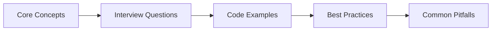

# CSS Interview Q&A

> **Previous:** [HTML Interview Q&A](./51-interview-html.md) | **Next:** [JavaScript Interview Q&A](./53-interview-javascript.md)


A curated collection of CSS interview questions covering fundamental concepts, layout systems, responsive design, animations, modern frameworks, and Laravel frontend integration. Each answer includes practical code examples to illustrate the concept in action.

---

## Chapter at a Glance

| Aspect | Details |
|--------|---------|
| **Scope** | CSS interview questions covering selectors, box model, layout, responsive design, animations, preprocessors |
| **Key Concepts** | CSS specificity, box model, Flexbox, Grid, responsive design, transitions, animations, custom properties |
| **Learning Approach** | Q&A format with practical CSS examples |
| **Skills Required** | CSS3, HTML basics |

## Chapter Roadmap



## Selectors & Specificity


### Q1: How does the CSS cascade determine which rule wins?
**Answer:** The cascade assigns a weight to every declaration based on origin, specificity, and source order. The winning declaration is the one with the highest weight per property. Origin priority: user-agent `< user `< author `< author !important `< user !important `< user-agent !important. When origins match, specificity decides. When specificity ties, the last declaration in source order wins.

```css
/* user-agent (lowest priority) */
p { color: black; }

/* author (normal priority) */
p { color: blue; }

/* author !important (overrides everything except user !important) */
p { color: red !important; }
```

### Q2: How is specificity calculated?
**Answer:** Specificity is a four-part value `(a, b, c, d)` computed as: inline styles = 1 for `a`, each ID selector = 1 for `b`, each class/attribute/pseudo-class = 1 for `c`, each element/pseudo-element = 1 for `d`. The larger the tuple lexicographically, the higher the specificity.

```css
/* specificity (0, 0, 0, 1) → one element */
p { color: blue; }

/* specificity (0, 1, 0, 0) → one ID */
#sidebar { color: green; }

/* specificity (0, 0, 1, 0) → one class */
.highlight { color: yellow; }

/* specificity (0, 0, 1, 1) → one class + one element */
p.highlight { color: orange; }
```

### Q3: What is the difference between a pseudo-class and a pseudo-element?
**Answer:** A pseudo-class (`:hover`, `:nth-child`) selects elements in a particular *state* → it uses a single colon. A pseudo-element (`::before`, `::first-line`) selects a *part* of an element → CSS3 uses double colons. Pseudo-classes add to the specificity `c` column; pseudo-elements add to the `d` column.

```css
/* pseudo-class → state-based */
button:hover { background: #0056b3; }
li:nth-child(odd) { background: #f5f5f5; }

/* pseudo-element → part-based */
blockquote::first-letter { font-size: 3em; float: left; }
.card::before { content: "★"; color: gold; }
```

### Q4: How does `:is()` and `:where()` affect specificity?
**Answer:** `:is()` takes the specificity of its *most specific argument* → it never lowers specificity. `:where()` always contributes *zero* specificity, regardless of its arguments. Use `:is()` to group selectors without losing weight; use `:where()` for reset/theme defaults you want to be easily overridable.

```css
/* :is() takes highest specificity inside → here (0, 1, 0) from #nav */
:is(nav, #nav, .menu) a { color: blue; }

/* :where() always yields zero specificity → easy to override */
:where(nav, #nav, .menu) a { color: gray; }
/* this single element selector beats the :where() rule above */
a { color: black; }
```

### Q5: What is the `:has()` pseudo-class and how is it used?
**Answer:** `:has()` is a relational pseudo-class → it selects an element based on its *descendants* or *siblings*. Often called "the parent selector." It checks if the element *has* a matching child, descendant, or subsequent sibling. Supported in all modern browsers as of 2024.

```css
/* style a card that contains an image */
.card:has(img) { border: 2px solid blue; }

/* style a form group that has an invalid input */
.field:has(input:invalid) label { color: red; }

/* style an h2 that is immediately followed by a paragraph */
h2:has(+ p) { margin-bottom: 0; }
```

### Q6: How do you select all elements except the last child?
**Answer:** Use `:not(:last-child)` to exclude the final sibling. The `:not()` pseudo-class accepts any selector list in modern CSS. It has the same specificity as the selector inside it.

```css
/* every list item except the last */
li:not(:last-child) { border-bottom: 1px solid #ddd; }

/* every input except submit buttons */
input:not([type="submit"]) { border: 1px solid #ccc; }
```

### Q7: What does `[attr~=value]` vs `[attr|=value]` match?
**Answer:** `~=` matches if `value` is one of the space-separated words in the attribute. `|=` matches if the attribute equals `value` or starts with `value-`. `~=` is for space-delimited lists (like class); `|=` is for hyphenated prefixes (like language codes).

```css
/* ~= matches a word in a space-separated list */
[data-tags~="featured"] { background: gold; }

/* |= matches value or value- prefix */
[lang|="en"] { font-family: sans-serif; }
/* matches lang="en", lang="en-US", lang="en-GB" */
```

### Q8: What is the difference between `nth-child` and `nth-of-type`?
**Answer:** `:nth-child(n)` counts all siblings regardless of type. `:nth-of-type(n)` counts only siblings of the same element type. If you have mixed elements in a container, `:nth-child` might skip types while `:nth-of-type` always counts within the same tag.

```css
/* selects the 2nd child regardless of type */
div p:nth-child(2) { color: red; }

/* selects the 2nd <p> among its siblings */
div p:nth-of-type(2) { color: blue; }
```

### Q9: How do you select an element that contains a specific class in a space-separated list?
**Answer:** Use the attribute selector `[class~="value"]` or simply `.value`. The class selector `.value` is equivalent to `[class~="value"]` → both match when `value` appears as a whole word in the class attribute.

```css
/* equivalent selectors */
.card.featured { border-color: gold; }
[class~="featured"] { border-color: gold; }
```

### Q10: What is the difference between the cascade, specificity, and inheritance?
**Answer:** The cascade resolves conflicts between declarations targeting the same element using origin + specificity + order. Specificity is one component of the cascade → a four-part weight based on selector types. Inheritance is separate: certain properties (color, font-family) are automatically inherited from parent to child unless overridden. The `inherit`, `initial`, `unset`, and `revert` keywords explicitly control this.

```css
.parent { color: red; font-size: 16px; border: 1px solid black; }
/* child inherits color and font-size, but NOT border */
.child { color: inherit; /* explicitly inherits even if normally not inherited */ }
```

---

## Box Model & Layout

### Q11: Explain the CSS box model.
**Answer:** Every element is a rectangular box composed of four layers from inside-out: content, padding, border, and margin. The total width of an element in the standard box model is `content + padding + border + margin`. With `box-sizing: border-box`, the `width` property includes content + padding + border, making layout math predictable.

```css
/* standard box model → width applies to content only */
.standard {
  box-sizing: content-box;
  width: 200px;
  padding: 20px;
  border: 5px solid black;
  /* total width = 200 + 40 + 10 = 250px */
}

/* border-box → width includes padding and border */
.better {
  box-sizing: border-box;
  width: 200px;
  padding: 20px;
  border: 5px solid black;
  /* total width = 200px (content shrinks to 150px) */
}
```

### Q12: What is the difference between `display: none` and `visibility: hidden`?
**Answer:** `display: none` removes the element from the document flow entirely → it takes no space and is not rendered. `visibility: hidden` hides the element visually but preserves its space in the layout. `display: none` affects accessibility (screen readers skip it); `visibility: hidden` may still be read.

```css
.hidden-element { display: none; }       /* invisible, no box, no space */
.invisible-element { visibility: hidden; } /* invisible, box still occupies space */
```

### Q13: Explain the `position` property values.
**Answer:** `static` → default, follows normal flow, `top`/`left` ignored. `relative` → offset from its normal position without affecting other elements. `absolute` → removed from flow, positioned relative to the nearest positioned ancestor. `fixed` → removed from flow, positioned relative to the viewport. `sticky` → toggles between relative and fixed based on scroll threshold.

```css
.relative-box {
  position: relative;
  top: 10px;
  left: 20px;
}

.absolute-box {
  position: absolute;
  top: 0;
  right: 0;
}

.fixed-header {
  position: fixed;
  top: 0;
  width: 100%;
  z-index: 100;
}

.sticky-nav {
  position: sticky;
  top: 0;
  z-index: 50;
}
```

### Q14: How does `z-index` work and what creates a stacking context?
**Answer:** `z-index` controls the stack order of positioned elements (elements whose `position` is not `static`). A stacking context is a group of elements whose `z-index` values are compared relative to each other. New contexts are created by: `position` + `z-index` value, `opacity < 1`, `transform`, `filter`, `contain: paint`, or `isolation: isolate`.

```css
/* creates a new stacking context */
.card {
  position: relative;
  z-index: 1;
  isolation: isolate; /* also creates a context */
}

/* child z-index is scoped within the parent's context */
.card-overlay {
  position: absolute;
  z-index: 999; /* still behind a sibling's context with z-index: 1 */
}
```

### Q15: What does `float` do and how do you clear it?
**Answer:** `float` pushes an element to the left or right, allowing content to wrap around it. Floated elements are removed from normal flow. Parents of floated elements collapse because they don't account for the floated children. Clearing methods: `clear: both` on a following element, the "clearfix" hack on the parent, or `display: flow-root` on the parent.

```css
/* modern clearfix → no hack needed */
.container {
  display: flow-root;
}

.sidebar {
  float: left;
  width: 250px;
}

.main {
  float: left;
  width: calc(100% - 250px);
}
/* better to use flexbox or grid for layout instead of float */
```

### Q16: What is the difference between `overflow: hidden` and `overflow: clip`?
**Answer:** Both clip overflowing content. `overflow: hidden` creates a new BFC and allows programmatic scrolling (JavaScript can still scroll the content). `overflow: clip` does not create a BFC and *forbids* any scrolling, including programmatic. Use `clip` when you want to guarantee content stays clipped regardless of user interaction.

```css
.hidden-box {
  overflow: hidden; /* can be scrolled via JS */
}

.clip-box {
  overflow: clip; /* no scrolling possible, including JS */
}
```

### Q17: How does `margin: auto` center an element horizontally?
**Answer:** When a block-level element has a defined width, setting `margin-left: auto` and `margin-right: auto` makes the browser distribute remaining space equally on both sides, centering the element. This only works for horizontal centering. For vertical centering with `auto`, the element needs to be in a flex or grid context.

```css
.centered {
  width: 300px;
  margin: 0 auto; /* left + right auto = horizontal center */
}

/* vertical + horizontal centering with flex */
.flex-center {
  display: flex;
  justify-content: center;
  align-items: center;
}
```

### Q18: What is margin collapsing and when does it happen?
**Answer:** Vertical margins of adjacent block-level elements collapse → the larger margin wins instead of adding together. Margins also collapse between parent and first/last child when there's no padding, border, or inline content separating them. Flex and grid items do NOT collapse margins.

```css
/* margins collapse: space between boxes is 30px, not 50px */
.box-a { margin-bottom: 30px; }
.box-b { margin-top: 20px; }
/* resulting margin = max(30, 20) = 30px */

/* prevent collapse by adding a border or padding to the parent */
.parent { padding: 1px; }
/* or use overflow: hidden on the parent */
.parent { overflow: hidden; }
```

### Q19: What is `display: flow-root`?
**Answer:** `display: flow-root` creates a new Block Formatting Context (BFC) without hacks. It contains floats, prevents margin collapsing with children, and isolates the element from external floats. It's the cleanest way to contain children that use floats or to prevent margin collapse.

```css
/* classic clearfix hack → not needed anymore */
.clearfix::after {
  content: "";
  display: table;
  clear: both;
}

/* modern replacement */
.container {
  display: flow-root;
}
```

### Q20: What is the difference between `inline`, `block`, and `inline-block`?
**Answer:** `block` elements take full width, start on new lines, respect all box properties. `inline` elements flow within text, ignore width/height, and only respect horizontal margin/padding. `inline-block` flows inline but behaves like a block for the box model → it respects width, height, and all margins/padding.

```css
span {
  display: inline; /* default for span → width/height ignored */
}

span.button {
  display: inline-block; /* sits inline but respects dimensions */
  width: 80px;
  height: 32px;
  padding: 4px 12px;
}
```

---

## Flexbox & Grid

### Q21: What is the difference between Flexbox and CSS Grid?
**Answer:** Flexbox is one-dimensional → it distributes items along a single axis (row *or* column). Grid is two-dimensional → it controls rows *and* columns simultaneously. Use Flexbox for component-level layout (nav bars, centering, inline form elements). Use Grid for page-level layout (overall page structure, gallery grids, dashboard panels).

```css
/* flexbox → one-dimensional row */
.nav {
  display: flex;
  gap: 1rem;
  justify-content: space-between;
}

/* grid → two-dimensional layout */
.page-layout {
  display: grid;
  grid-template-rows: auto 1fr auto;
  grid-template-columns: 250px 1fr;
  grid-template-areas:
    "header header"
    "sidebar main"
    "footer footer";
}
```

### Q22: Explain `flex-grow`, `flex-shrink`, and `flex-basis`.
**Answer:** These three properties control how flex items size within a container. `flex-grow` (default 0) → proportion of remaining space the item should absorb. `flex-shrink` (default 1) → how much the item shrinks when space is tight. `flex-basis` (default `auto`) → the initial main-size of the item before space is distributed. The shorthand `flex: 1` means `flex: 1 1 0`.

```css
.flex-container {
  display: flex;
}

.item-grow {
  flex: 1;          /* grow: 1, shrink: 1, basis: 0 */
}

.item-fixed {
  flex: 0 0 200px;  /* never grow, never shrink, basis 200px */
}

.item-auto {
  flex: 1 1 auto;   /* grow, shrink, basis = content width */
}
```

### Q23: How does `align-items` differ from `justify-content`?
**Answer:** `justify-content` distributes space along the *main axis* (direction of `flex-direction`). `align-items` controls alignment along the *cross axis* (perpendicular to the main axis). In a default row layout, `justify-content` controls horizontal spacing, `align-items` controls vertical alignment.

```css
.flex-container {
  display: flex;
  justify-content: center;     /* main axis: horizontal center */
  align-items: stretch;        /* cross axis: stretch to fill height */
}

/* center both axes → the classic centering trick */
.centered {
  display: flex;
  justify-content: center;
  align-items: center;
}
```

### Q24: What does `gap` replace in Flexbox and Grid?
**Answer:** `gap` replaces `margin` based spacing between items in both flex and grid layouts. `gap` only applies *between* items, never at the edges. In flexbox, `gap` works on the main axis. In grid, `row-gap` and `column-gap` (shorthand `gap`) apply between rows and columns respectively. Using `gap` avoids the "margin on the last item" problem.

```css
.flex-container {
  display: flex;
  gap: 16px; /* space between items, no margin hacks needed */
  flex-wrap: wrap;
}

.grid-container {
  display: grid;
  grid-template-columns: repeat(3, 1fr);
  gap: 24px 16px; /* row-gap column-gap */
}
```

### Q25: How do you create a responsive grid that adapts the number of columns automatically?
**Answer:** Use `grid-template-columns: repeat(auto-fill, minmax(250px, 1fr))` or `auto-fit`. `auto-fill` keeps empty column tracks; `auto-fit` collapses them. The `minmax(250px, 1fr)` ensures each column is at least 250px but can stretch equally.

```css
.responsive-grid {
  display: grid;
  gap: 1rem;
  grid-template-columns: repeat(auto-fit, minmax(280px, 1fr));
  /* creates as many 280px-min columns as fit, no media queries needed */
}
```

### Q26: What is `fr` unit in CSS Grid?
**Answer:** `fr` stands for "fraction" → it distributes available space proportionally after fixed-size tracks are accounted for. `1fr` means one fraction of the remaining space. Unlike `%`, `fr` does not include `gap` in its calculation, making it more predictable.

```css
.sidebar-layout {
  display: grid;
  grid-template-columns: 250px 1fr; /* sidebar fixed, content takes rest */
}

.three-columns {
  display: grid;
  grid-template-columns: 2fr 1fr 1fr; /* 2:1:1 ratio */
  gap: 16px;
}
```

### Q27: How do you center an element both horizontally and vertically with Flexbox?
**Answer:** Apply `display: flex; justify-content: center; align-items: center` to the parent container. This works regardless of the child's dimensions and is the most reliable centering technique.

```css
.parent {
  display: flex;
  justify-content: center;
  align-items: center;
  min-height: 400px;
}
```

### Q28: What is the difference between `auto-fill` and `auto-fit` in Grid?
**Answer:** Both automatically generate as many tracks as fit in the container. `auto-fill` keeps the column track placeholders even if they're empty → preserving the grid structure. `auto-fit` collapses empty tracks to `0`, allowing items to stretch to fill the entire row. Use `auto-fit` for responsive galleries where you want items to expand.

```css
/* auto-fill → keeps empty column placeholders */
.grid-fill {
  grid-template-columns: repeat(auto-fill, minmax(150px, 1fr));
}

/* auto-fit → collapses empty tracks, items stretch */
.grid-fit {
  grid-template-columns: repeat(auto-fit, minmax(150px, 1fr));
}
```

### Q29: How do you create a sticky footer with Flexbox?
**Answer:** Set the body or wrapper to `display: flex; flex-direction: column; min-height: 100vh`. Give the main content area `flex: 1`. The footer stays at the bottom on short pages and pushes down on long pages.

```css
body {
  display: flex;
  flex-direction: column;
  min-height: 100vh;
  margin: 0;
}

.main-content {
  flex: 1; /* takes all available space */
}

.footer {
  padding: 1rem;
  background: #333;
  color: white;
}
```

### Q30: What is the `order` property in Flexbox?
**Answer:** `order` (default 0) changes the visual order of flex items without affecting the source order. Items are laid out in ascending `order` value. Items with the same `order` keep their source order. Use sparingly → it can confuse keyboard navigation and screen readers since tab order follows source order.

```css
.flex-container {
  display: flex;
}

.item-first { order: -1; }   /* appears first regardless of source order */
.item-last  { order: 1; }    /* appears last */
.item-default { order: 0; }  /* between -1 and 1 */
```

### Q31: How do you create a masonry-like layout with CSS Grid?
**Answer:** CSS Grid doesn't natively support masonry (items of varying heights filling gaps). You can approximate it with `grid-template-rows: masonry` (Firefox-only behind a flag) or by setting explicit row spans on items. For production, use a JavaScript library like Masonry or columns-based layout.

```css
/* approximation with explicit spans */
.masonry-grid {
  display: grid;
  grid-template-columns: repeat(3, 1fr);
  gap: 16px;
}

.masonry-item {
  break-inside: avoid;
}

.masonry-item.tall {
  grid-row: span 2;
}
```

### Q32: What is the difference between `align-content` and `align-items` in Flexbox?
**Answer:** `align-items` aligns items within a single line on the cross axis. `align-content` distributes space between *multiple lines* (rows) when `flex-wrap: wrap` creates multiple lines. `align-content` has no effect when there's only one line. In CSS Grid, `align-content` positions the entire grid within the container.

```css
.multi-line-flex {
  display: flex;
  flex-wrap: wrap;
  align-content: space-between; /* distributes rows vertically */
  align-items: center;          /* aligns items within each row */
  height: 400px;
}
```

### Q33: How does `flex: 0 0 auto` differ from `flex: 1 1 auto`?
**Answer:** `flex: 0 0 auto` → item starts at content width, never grows, can shrink if needed. `flex: 1 1 auto` → item starts at content width, can grow to fill space, can shrink. The `flex-basis: auto` means the initial size is the content's intrinsic size. `flex: 0 0 auto` is the default shorthand (equivalent to `flex: initial`).

```css
.no-grow {
  flex: 0 0 auto; /* flex: initial → content sized, won't grow */
}

.grow-if-space {
  flex: 1 1 auto; /* flex: auto → content sized, grows to fill */
}

.even-split {
  flex: 1;        /* flex: 1 1 0 → no basis, all items split equally */
}
```

### Q34: What is `grid-template-areas` and how do you use it?
**Answer:** `grid-template-areas` lets you name regions of your grid and place items using those names instead of line numbers. The syntax uses ASCII art strings where each name represents a grid cell. Dots (`.`) create empty cells. Each string is a row; each whitespace-separated name is a column.

```css
.layout {
  display: grid;
  grid-template-columns: 200px 1fr 200px;
  grid-template-rows: auto 1fr auto;
  grid-template-areas:
    "header  header  header"
    "sidebar main    aside"
    "footer  footer  footer";
  min-height: 100vh;
}

header { grid-area: header; }
nav    { grid-area: sidebar; }
main   { grid-area: main; }
aside  { grid-area: aside; }
footer { grid-area: footer; }
```

### Q35: How do you align a single item differently from others in Flexbox?
**Answer:** Use `align-self` on the individual flex item to override the container's `align-items` for that item. For horizontal alignment, use `margin-left: auto` or `margin-right: auto` on the item.

```css
.container {
  display: flex;
  align-items: center; /* all items centered vertically */
}

.item-top {
  align-self: flex-start; /* this item aligns to top */
}

.spacer {
  margin-left: auto;  /* pushes this item to the right */
}
```

---

## Responsive Design

### Q36: What is a media query and what are common breakpoints?
**Answer:** A media query applies CSS conditionally based on device characteristics (usually viewport width). Common breakpoints: 480px (mobile), 768px (tablet), 1024px (desktop), 1280px+ (wide). However, prefer content-based breakpoints → add a breakpoint where the design breaks, not at arbitrary device widths.

```css
/* mobile-first approach → base styles for mobile */
.grid { display: flex; flex-direction: column; }

/* tablet */
@media (min-width: 768px) {
  .grid { display: grid; grid-template-columns: repeat(2, 1fr); }
}

/* desktop */
@media (min-width: 1024px) {
  .grid { grid-template-columns: repeat(3, 1fr); }
}
```

### Q37: What is the difference between `em` and `rem`?
**Answer:** `em` is relative to the *parent element's* font-size. `rem` (root em) is relative to the *root element's* (`html`) font-size. `rem` avoids compounding → nested elements with `em` multiply each level. Use `rem` for most spacing and sizing; use `em` when you want a value to scale with a component's own font-size.

```css
html { font-size: 16px; }

.parent { font-size: 1.25em; }  /* = 20px */
.child-em { font-size: 1.5em; } /* = 30px (20 * 1.5) → compounded */
.child-rem { font-size: 1.5rem; } /* = 24px (16 * 1.5) → no compounding */

.consistent-spacing {
  margin: 1rem;     /* always relative to root */
  padding: 0.75rem;
}
```

### Q38: What is the mobile-first approach to responsive design?
**Answer:** Mobile-first means writing base CSS for the smallest screen first, then using `min-width` media queries to enhance for larger screens. This ensures the mobile experience is lean and performant, and large-screen enhancements layer on top. The alternative (desktop-first with `max-width`) loads heavier styles on mobile.

```css
/* mobile-first → base is mobile */
.card {
  width: 100%;
  padding: 1rem;
}

/* tablet and up */
@media (min-width: 768px) {
  .card {
    width: 50%;
    padding: 1.5rem;
  }
}

/* desktop and up */
@media (min-width: 1024px) {
  .card {
    width: 33.333%;
    padding: 2rem;
  }
}
```

### Q39: How do you make images responsive?
**Answer:** Set `max-width: 100%` and `height: auto` so images never exceed their container and maintain aspect ratio. For art direction (different crops on different screens), use the `<picture>` element. For resolution switching (different pixel densities), use `srcset` with `w` descriptors and `sizes`.

```css
/* universal responsive image */
img {
  max-width: 100%;
  height: auto;
  display: block;
}
```

```html
<!-- art direction → different crops -->
<picture>
  <source media="(min-width: 1024px)" srcset="hero-wide.webp">
  <source media="(min-width: 768px)" srcset="hero-tablet.webp">
  
</picture>

<!-- resolution switching -->

```

### Q40: What are container queries?
**Answer:** Container queries (using `@container`) allow styling elements based on their *parent container's* size rather than the viewport. This makes truly reusable components that adapt to wherever they're placed. Use `container-type: inline-size` on the container, then query with `@container (min-width: 400px)`.

```css
/* define a containment context */
.card-container {
  container-type: inline-size;
  container-name: card;
}

/* style based on container width, not viewport */
@container card (min-width: 400px) {
  .card {
    display: grid;
    grid-template-columns: 200px 1fr;
    gap: 1rem;
  }
}

@container card (max-width: 399px) {
  .card {
    display: flex;
    flex-direction: column;
  }
}
```

### Q41: What is the difference between `vw`, `vh`, `vmin`, and `vmax`?
**Answer:** `1vw = 1%` of viewport width. `1vh = 1%` of viewport height. `vmin` = the smaller of `vw` and `vh`. `vmax` = the larger of `vw` and `vh`. These are useful for full-screen layouts, but `100vh` can cause issues on mobile browsers with dynamic toolbars → use `100dvh` (dynamic viewport height) for mobile.

```css
.hero {
  height: 100vh;       /* classic full-screen → may overflow on mobile */
  height: 100dvh;      /* dynamic viewport height → better for mobile */
}

.full-width {
  width: 100vw;        /* full viewport width */
  margin-left: calc(-50vw + 50%); /* negates parent padding */
}

.giant-text {
  font-size: min(5vw, 3rem); /* responsive, capped at 3rem */
}
```

### Q42: What are `min()`, `max()`, and `clamp()` in CSS?
**Answer:** These comparison functions enable responsive sizing without media queries. `min(a, b)` = the smaller value. `max(a, b)` = the larger value. `clamp(min, preferred, max)` = a value that's never below `min` or above `max`, ideally `preferred`. Use `clamp()` for fluid typography and spacing.

```css
/* fluid typography → scales between 1rem and 3rem based on viewport */
.fluid-text {
  font-size: clamp(1rem, 2.5vw + 0.5rem, 3rem);
}

/* responsive width with bounds */
.container {
  width: min(90%, 1200px); /* 90% or 1200px, whichever is smaller */
}

/* padding that scales but has limits */
.card {
  padding: clamp(1rem, 3vw, 2rem);
}
```

### Q43: What is the `prefers-color-scheme` media query?
**Answer:** It detects whether the user's system is set to light or dark mode. Use it to automatically provide appropriate color schemes without requiring a manual toggle. Combine with CSS custom properties for clean theme switching.

```css
:root {
  --bg: #ffffff;
  --text: #1a1a1a;
  --primary: #2563eb;
}

@media (prefers-color-scheme: dark) {
  :root {
    --bg: #1a1a1a;
    --text: #f0f0f0;
    --primary: #60a5fa;
  }
}

body {
  background: var(--bg);
  color: var(--text);
}
```

### Q44: What is the `prefers-reduced-motion` media query?
**Answer:** It detects if the user has requested reduced motion in their system accessibility settings. Disable or simplify animations when this is active. This is an accessibility requirement, not optional.

```css
.animated-element {
  transition: transform 0.3s ease, opacity 0.3s ease;
}

@media (prefers-reduced-motion: reduce) {
  .animated-element {
    transition: none;          /* disable transitions */
  }

  * {
    animation-duration: 0.01ms !important; /* disable animations */
    animation-iteration-count: 1 !important;
  }
}
```

### Q45: How do you handle landscape vs portrait orientation?
**Answer:** Use the `orientation` media feature: `portrait` (height > width) and `landscape` (width > height). On mobile, use `dvh` units or `window.innerHeight` to handle dynamic toolbar heights that change when the user scrolls.

```css
@media (orientation: landscape) {
  .sidebar {
    width: 250px;
  }
}

@media (orientation: portrait) {
  .sidebar {
    width: 100%;
    position: fixed;
    bottom: 0;
  }
}
```

---

## Animations & Transitions

### Q46: What is the difference between CSS transitions and animations?
**Answer:** Transitions (`transition`) animate *between* two states → they need a trigger (like `:hover`) and only define start/end. Animations (`@keyframes`) can have multiple keyframe stops, run automatically, loop, reverse, and pause. Use transitions for simple state changes; use animations for complex multi-step or continuous motion.

```css
/* transition → hover in/out */
.button {
  background: blue;
  color: white;
  transition: background 0.3s ease;
}
.button:hover {
  background: darkblue;
}

/* animation → multi-step, auto-running */
@keyframes pulse {
  0%   { transform: scale(1); opacity: 0.7; }
  50%  { transform: scale(1.05); opacity: 1; }
  100% { transform: scale(1); opacity: 0.7; }
}
.pulse {
  animation: pulse 2s ease-in-out infinite;
}
```

### Q47: Which CSS properties are safe to animate for performance?
**Answer:** Only `transform` and `opacity` are GPU-accelerated and don't trigger layout or paint on each frame. Animating `width`, `height`, `top`, `left`, `margin`, or `padding` triggers layout recalculations and repaints, causing jank. Use `transform: translate()` instead of `top`/`left` for positioning animations.

```css
/* BAD → triggers layout on every frame */
.bad-animation {
  animation: move-bad 0.3s ease;
}
@keyframes move-bad {
  from { left: 0; }
  to   { left: 100px; }
}

/* GOOD → GPU-accelerated */
.good-animation {
  animation: move-good 0.3s ease;
}
@keyframes move-good {
  from { transform: translateX(0); }
  to   { transform: translateX(100px); }
}
```

### Q48: What are the sub-properties of `transform` and how do they compose?
**Answer:** Common transform functions: `translate()`, `rotate()`, `scale()`, `skew()`, and `matrix()`. Multiple functions are applied right-to-left (last function applied first). For individual control, use `translate`, `rotate`, and `scale` as separate properties in modern CSS.

```css
/* multiple transforms → applied right to left */
.composed {
  transform: translateX(50px) rotate(45deg) scale(1.2);
  /* 1. scale to 1.2x, 2. rotate 45°, 3. move 50px right */
}

/* individual transform properties (modern browsers) */
.individual {
  translate: 50px 0;
  rotate: 45deg;
  scale: 1.2;
}
```

### Q49: How do you create a smooth height transition on an element with unknown content height?
**Answer:** CSS cannot transition `height: auto` directly. Use `max-height` transition by setting a max value larger than the actual content, or use `grid-template-rows: 0fr` to `1fr` for a clean CSS-only solution without JavaScript.

```css
/* max-height trick → close enough */
.accordion-content {
  max-height: 0;
  overflow: hidden;
  transition: max-height 0.3s ease;
}
.accordion.open .accordion-content {
  max-height: 500px; /* larger than any content */
}

/* modern grid trick → exact */
.accordion-content {
  display: grid;
  grid-template-rows: 0fr;
  transition: grid-template-rows 0.3s ease;
}
.accordion.open .accordion-content {
  grid-template-rows: 1fr;
}
```

### Q50: What is `will-change` and when should you use it?
**Answer:** `will-change` hints to the browser that an element will change a property, allowing it to optimize ahead of time (e.g., promote to a compositor layer). Use it *sparingly* and only on properties that benefit from GPU acceleration (`transform`, `opacity`). Applying it to everything wastes memory and can actually hurt performance.

```css
/* use on elements you're about to animate */
.sliding-panel {
  will-change: transform;
  transition: transform 0.3s ease;
}

/* remove after animation completes via JS */
/* element.style.willChange = 'auto'; */
```

### Q51: What is the difference between `ease`, `linear`, `ease-in`, `ease-out`, and `cubic-bezier`?
**Answer:** These are timing functions that control the rate of change during an animation. `linear` → constant speed. `ease` → slow start, fast middle, slow end (default). `ease-in` → slow start, fast end. `ease-out` → fast start, slow end. `cubic-bezier(x1, y1, x2, y2)` → custom curve. `ease-out` is generally best for UI transitions (feels responsive).

```css
.button {
  transition: transform 0.2s ease-out; /* natural feel */
}

.bounce-in {
  animation: bounce 0.5s cubic-bezier(0.68, -0.55, 0.27, 1.55);
  /* overshoot effect */
}

@keyframes bounce {
  0%   { transform: scale(0); }
  50%  { transform: scale(1.1); }
  100% { transform: scale(1); }
}
```

### Q52: How do you pause and resume a CSS animation?
**Answer:** Set `animation-play-state: paused` or `running`. This can be toggled via a class or JavaScript. The animation picks up from where it paused → no snapping.

```css
.spinner {
  animation: spin 1s linear infinite;
}

.spinner.paused {
  animation-play-state: paused;
}

@keyframes spin {
  to { transform: rotate(360deg); }
}
```

### Q53: How do you animate on scroll without JavaScript?
**Answer:** Use `animation-timeline: scroll()` (Chrome 115+) to drive an animation based on scroll position. Combine with `animation-range` to control when the animation starts and ends. This is a newer feature → check browser support for your target audience.

```css
@keyframes fade-in {
  from { opacity: 0; transform: translateY(20px); }
  to   { opacity: 1; transform: translateY(0); }
}

.scroll-animate {
  animation: fade-in 1s ease-out;
  animation-timeline: view();
  animation-range: entry 0% entry 100%;
}
```

---

## CSS Frameworks & Tailwind

### Q54: What is utility-first CSS and how is it different from semantic CSS?
**Answer:** Utility-first CSS uses small, single-purpose classes (like `text-center`, `p-4`, `bg-blue-500`) applied directly in HTML. Semantic CSS uses meaningful class names (`.card`, `.hero-title`) with custom styles in stylesheets. Utility-first eliminates context-switching between HTML and CSS files, reduces naming fatigue, and produces smaller CSS bundles through purging.

```html
<!-- semantic approach -->
<div class="card">
  <h2 class="card-title">Hello</h2>
  <p class="card-body">World</p>
</div>

<!-- utility-first (Tailwind) -->
<div class="rounded-lg shadow-md p-6 bg-white">
  <h2 class="text-xl font-bold text-gray-900">Hello</h2>
  <p class="text-gray-600 mt-2">World</p>
</div>
```

### Q55: How does Tailwind's `@apply` directive work and when should you use it?
**Answer:** `@apply` inlines utility classes into a custom CSS class using `@layer components`. Use it sparingly for abstracting repeated utility patterns into reusable component classes. Overusing `@apply` defeats the purpose of utility-first by recreating the same abstraction problems as semantic CSS.

```css
/* use @apply sparingly → only for highly repeated patterns */
@layer components {
  .btn-primary {
    @apply inline-flex items-center px-4 py-2 bg-blue-600 text-white
           font-medium rounded-md hover:bg-blue-700
           focus:outline-none focus:ring-2 focus:ring-blue-500
           transition-colors duration-200;
  }
}
```

### Q56: How does Tailwind purge unused styles?
**Answer:** Tailwind scans your source files for class names, then removes any CSS not found in those files. It uses regular expressions to find complete class names → dynamic class names built via string concatenation can be purged accidentally. Use the `safelist` option in the config for classes you need to keep but can't statically detect.

```js
// tailwind.config.js
module.exports = {
  content: [
    './resources/**/*.blade.php',
    './resources/**/*.js',
    './resources/**/*.vue',
  ],
  safelist: [
    'bg-red-500',
    'bg-green-500',
    { pattern: /^bg-(red|green|blue)-(500|700)$/ },
  ],
}
```

### Q57: What are the downsides of utility-first CSS?
**Answer:** Longer HTML with many classes can be hard to read. Design changes may require touching HTML instead of CSS. Team unfamiliarity can slow onboarding. Components built with utility classes are tightly coupled to the framework (migrating away from Tailwind means rewriting HTML). Use component abstractions (Vue, React, Blade components) to keep templates clean.

```blade
<!-- blade component abstracts utilities -->
<x-button variant="primary" size="lg">Submit</x-button>

<!-- renders to: -->
<button class="inline-flex items-center justify-center px-6 py-3 bg-blue-600 text-white font-semibold rounded-lg hover:bg-blue-700 focus:outline-none focus:ring-2 focus:ring-blue-500 focus:ring-offset-2 transition-colors duration-200">
  Submit
</button>
```

### Q58: How do you customize Tailwind's theme?
**Answer:** Extend or override the default theme in `tailwind.config.js` under the `theme` key. Use `extend` to add new values without replacing defaults. Replace `theme` properties directly to fully customize. Use `theme()` in your CSS to reference theme values.

```js
// tailwind.config.js
module.exports = {
  theme: {
    extend: {
      colors: {
        brand: {
          50: '#eff6ff',
          500: '#3b82f6',
          700: '#1d4ed8',
        },
      },
      fontFamily: {
        display: ['Inter', 'system-ui', 'sans-serif'],
      },
      spacing: {
        '18': '4.5rem',
        '88': '22rem',
      },
    },
  },
}
```

### Q59: What is the difference between Tailwind and Bootstrap?
**Answer:** Bootstrap provides pre-built components (buttons, modals, navbars) with opinionated styles. Tailwind provides low-level utilities to build custom designs without fighting pre-built styles. Bootstrap uses semantic classes with component-specific CSS; Tailwind uses utility classes composed in HTML. Bootstrap is faster for quick prototypes; Tailwind produces more unique, custom-looking results.

```html
<!-- Bootstrap → pre-built component -->
<button class="btn btn-primary btn-lg">Click Me</button>

<!-- Tailwind → compose from utilities -->
<button class="bg-blue-600 hover:bg-blue-700 text-white font-semibold py-3 px-6 rounded-lg transition-colors">Click Me</button>
```

### Q60: How do you handle dark mode in Tailwind?
**Answer:** Tailwind has a `dark:` variant that applies styles when the user's system is in dark mode. Configure `darkMode: 'class'` in `tailwind.config.js` to toggle based on a class instead of system preference → useful for manual theme toggles.

```js
// tailwind.config.js
module.exports = {
  darkMode: 'class', // or 'media' for system preference
}
```

```html
<!-- system preference (default) -->
<div class="bg-white dark:bg-gray-900 text-gray-900 dark:text-gray-100">
  <h1 class="text-2xl font-bold">Title</h1>
</div>

<!-- class-based → toggle with JavaScript -->
<html class="dark">
  ...
</html>
```

### Q61: What is CSS Layers (`@layer`) and how does it help framework integration?
**Answer:** `@layer` lets you explicitly control the cascade order of groups of styles, overriding specificity. Layer order wins over specificity → a rule in a later layer beats a rule in an earlier layer even if the earlier rule has higher specificity. Tailwind itself uses layers to ensure utilities always override base and component styles.

```css
/* layer order determines priority: base < components < utilities */
@layer base {
  a { @apply text-blue-600 underline; }
}

@layer components {
  .card { @apply p-6 rounded-lg shadow; }
}

@layer utilities {
  .text-balance { text-wrap: balance; }
}
```

---

## Laravel Frontend

### Q62: How do you set up Tailwind CSS in a Laravel project?
**Answer:** Laravel ships with Tailwind and Vite pre-configured in new installations. Run `npm install` to install dependencies. For existing projects, install via `npm install tailwindcss @tailwindcss/vite` and add the Vite plugin to `vite.config.js`. Import Tailwind in your main CSS file.

```bash
npm install tailwindcss @tailwindcss/vite
```

```js
// vite.config.js
import { defineConfig } from 'vite';
import laravel from 'laravel-vite-plugin';
import tailwindcss from '@tailwindcss/vite';

export default defineConfig({
  plugins: [
    laravel({
      input: ['resources/css/app.css', 'resources/js/app.js'],
      refresh: true,
    }),
    tailwindcss(),
  ],
});
```

```css
/* resources/css/app.css */
@import "tailwindcss";
```

### Q63: How does Vite work with Laravel to compile frontend assets?
**Answer:** Vite is a fast build tool that serves assets during development (HMR via `npm run dev`) and bundles for production (`npm run build`). The `laravel-vite-plugin` handles entry point resolution, hot module replacement, and injecting the correct script/link tags. Use the `@vite()` Blade directive to load the compiled assets.

```blade
<!-- layouts/app.blade.php -->
<!DOCTYPE html>
<html lang="en">
<head>
    <meta charset="UTF-8">
    <meta name="viewport" content="width=device-width, initial-scale=1.0">
    <title>{{ config('app.name') }}</title>
    @vite(['resources/css/app.css', 'resources/js/app.js'])
</head>
<body>
    {{ $slot }}
</body>
</html>
```

### Q64: What is PostCSS and what role does it play in Laravel frontend?
**Answer:** PostCSS is a CSS processor that transforms CSS with JavaScript plugins. Tailwind CSS itself is a PostCSS plugin (`@tailwindcss/postcss`). PostCSS handles: `@import` inlining, vendor prefixing (autoprefixer), nesting, and custom media queries. In modern Laravel, Tailwind is configured as a Vite plugin through `@tailwindcss/vite` rather than a PostCSS plugin.

```js
// postcss.config.js (legacy approach before @tailwindcss/vite)
export default {
  plugins: {
    '@tailwindcss/postcss': {},
    autoprefixer: {},
  },
};
```

### Q65: How do you handle multiple CSS entry points in Laravel Vite?
**Answer:** Pass an array of entry points to the `input` option in `vite.config.js`. Each entry point generates its own compiled file. Add each to the `@vite()` directive if you need them on every page, or use `@vite()` on specific pages for page-specific CSS/JS bundles.

```js
// vite.config.js → multiple entry points
export default defineConfig({
  plugins: [
    laravel({
      input: [
        'resources/css/app.css',
        'resources/css/admin.css',
        'resources/js/app.js',
        'resources/js/admin.js',
      ],
      refresh: true,
    }),
  ],
});
```

```blade
<!-- global → on every page -->
@vite(['resources/css/app.css', 'resources/js/app.js'])

<!-- admin layout only -->
@vite(['resources/css/admin.css', 'resources/js/admin.js'])
```

### Q66: How do you use Blade components with Tailwind classes?
**Answer:** Create a Blade component that accepts variant props and applies the correct Tailwind classes. Use `@props` to define accepted attributes, and `$attributes->merge()` for merging additional classes onto the root element. This keeps your views clean while using utility-first CSS.

```blade
{{-- resources/views/components/button.blade.php --}}
@props([
    'variant' => 'primary',
    'size' => 'md',
])

@php
$base = 'inline-flex items-center justify-center font-medium rounded-lg transition-colors duration-200 focus:outline-none focus:ring-2 focus:ring-offset-2';

$variants = [
    'primary' => 'bg-blue-600 text-white hover:bg-blue-700 focus:ring-blue-500',
    'secondary' => 'bg-gray-200 text-gray-900 hover:bg-gray-300 focus:ring-gray-400',
    'danger' => 'bg-red-600 text-white hover:bg-red-700 focus:ring-red-500',
];

$sizes = [
    'sm' => 'px-3 py-1.5 text-sm',
    'md' => 'px-4 py-2 text-sm',
    'lg' => 'px-6 py-3 text-base',
];
@endphp

<button {{ $attributes->merge([
    'class' => "$base {$variants[$variant]} {$sizes[$size]}"
]) }}>
    {{ $slot }}
</button>
```

```blade
{{-- usage --}}
<x-button variant="primary" size="lg">Submit</x-button>
<x-button variant="secondary" size="sm" class="ml-2">Cancel</x-button>
```

### Q67: How do you extract common Tailwind patterns in Laravel?
**Answer:** Use Blade components (`x-` components) or `@apply` in CSS for truly repetitive patterns. For theme values, define them in `tailwind.config.js` under `extend`. For dynamic conditional classes, use the `Illuminate\Support\Facades\Blade` directive or the `@class` directive in Blade.

```blade
{{-- @class directive → conditional classes --}}
<div @class([
    'p-4 rounded-lg',
    'bg-green-100 text-green-800' => $status === 'success',
    'bg-red-100 text-red-800' => $status === 'error',
    'bg-gray-100 text-gray-800' => $status === 'info',
])>
    {{ $message }}
</div>
```

### Q68: How does hot module replacement work in Laravel with Vite?
**Answer:** Run `npm run dev` to start the Vite dev server. Vite watches your source files and pushes updates to the browser via WebSocket on change → CSS updates are instant without page reload; JS updates via HMR preserve state. The `@vite()` Blade directive automatically detects the dev server and loads from it. Set `APP_URL` correctly in `.env` for proper asset URLs.

```bash
# terminal 1 → Vite dev server with HMR
npm run dev

# terminal 2 → Laravel dev server
php artisan serve
```

```env
# .env → ensure APP_URL matches your dev server
APP_URL=http://localhost:8000
```

### Q69: How do you version assets for cache busting in Laravel?
**Answer:** Vite automatically handles cache busting through content hashing in filenames. When you run `npm run build`, Vite appends a content hash to the output filename (e.g., `app-abc123.css`). The `@vite()` directive reads the `build/manifest.json` generated by Vite and resolves the hashed filename automatically. No manual versioning needed.

```bash
# production build → generates hashed filenames
npm run build

# output in public/build/
# manifest.json maps "resources/css/app.css" -> "build/assets/app-abc123.css"
```

```blade
{{-- @vite() reads manifest.json automatically for production --}}
@vite(['resources/css/app.css', 'resources/js/app.js'])
```

### Q70: How would you integrate a third-party CSS library (like SweetAlert2 or Flatpickr) in Laravel with Vite?
**Answer:** Install the package via npm and import its CSS in your JavaScript entry point. Vite processes the imported CSS and includes it in the bundle. For lazy-loading, use dynamic `import()` which code-splits the CSS automatically.

```bash
npm install flatpickr
```

```js
// resources/js/app.js
import flatpickr from 'flatpickr';
import 'flatpickr/dist/flatpickr.min.css'; // CSS bundled automatically

// lazy-load a heavy component only when needed
document.getElementById('load-chart')?.addEventListener('click', async () => {
  const { Chart } = await import('chart.js');
  new Chart(/* ... */);
});
```
---

## Concept Comparison
> **One-Sentence Takeaway:** Compare key CSS concepts for interview preparation.

| Concept | Purpose | Key Feature |
|---------|---------|-------------|
| CSS Specificity | Determine which rule takes precedence | Inline > ID > Class > Element |
| Box Model | Element sizing calculation | content-box vs border-box |
| Flexbox | One-dimensional layout | Flex containers + flex items |
| CSS Grid | Two-dimensional layout | Grid tracks + grid areas |
| Custom Properties | CSS variables | Dynamic theming + scope inheritance |

---

## Quick Reference
> **One-Sentence Takeaway:** Quick reference for CSS interview topics.

| Topic | Key Point |
|-------|-----------|
| Selectors | Element, class, ID, attribute, pseudo-class, pseudo-element |
| Box Model | content, padding, border, margin |
| Positioning | static, relative, absolute, fixed, sticky |
| Flexbox | justify-content, align-items, flex-direction, flex-wrap |
| Grid | grid-template-columns, grid-template-rows, grid-area |
| Media Queries | @media (min-width: 768px) { ... } |

---

## Cross-Application Matrix

| Concept | Application Context | Trade-Off |
|---------|--------------------|-----------|
| Specificity | Rule conflict resolution | Predictability vs flexibility |
| Box Model | Element dimensions | Intuitive vs traditional sizing |
| Layout System | Page structure | Flexbox (1D) vs Grid (2D) |
| Responsive Design | Multi-device support | Breakpoints vs fluidity |
| Animations | Visual effects | Performance vs visual richness |

---

## Chapter Quiz
> **One-Sentence Takeaway:** Test your CSS interview knowledge.

**Q1:** What is the correct order of CSS specificity?
- A) Element > Class > ID > Inline
- B) Inline > ID > Class > Element
- C) ID > Inline > Class > Element
- D) Class > ID > Element > Inline

<details><summary>Answer&lt;/summary&gt;B) Inline > ID > Class > Element&lt;/details&gt;

**Q2:** What is the difference between content-box and border-box?
- A) No difference
- B) border-box includes padding and border in width
- C) content-box is always smaller
- D) border-box excludes padding

<details><summary>Answer&lt;/summary&gt;B) border-box includes padding and border in width&lt;/details&gt;

**Q3:** When should CSS Grid be preferred over Flexbox?
- A) For one-dimensional layouts
- B) For two-dimensional layouts (rows and columns)
- C) For small elements only
- D) For animations

<details><summary>Answer&lt;/summary&gt;B) For two-dimensional layouts (rows and columns)&lt;/details&gt;

**Q4:** What CSS feature enables dynamic theming?
- A) Variables (Sass)
- B) Custom properties (CSS variables)
- C) Preprocessor mixins
- D) Class toggling

<details><summary>Answer&lt;/summary&gt;B) Custom properties (CSS variables)&lt;/details&gt;
